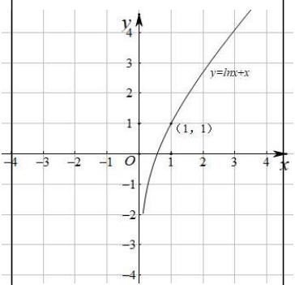
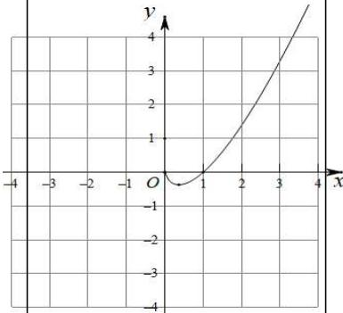
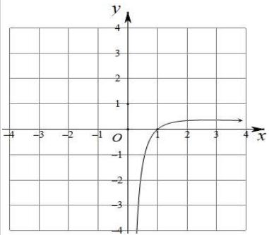
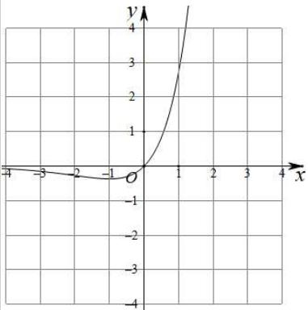
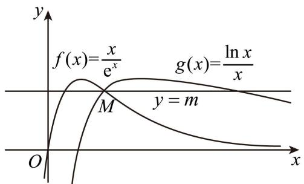
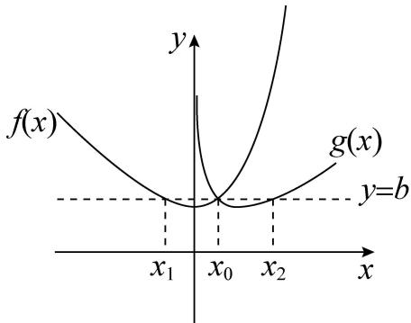
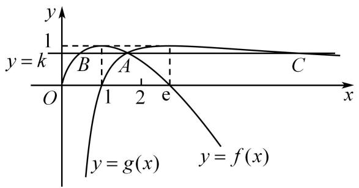

# 第26讲 导数同构

# 知识梳理

方法技巧总结一、常见的同构函数图像

<table><tr><td>函数表达式</td><td>图像</td><td>函数表达式</td><td>图像</td></tr><tr><td> $y = \ln x + x$ </td><td></td><td> $y = \ln x - x$ 函数极值点(1,-1)</td><td></td></tr><tr><td> $y = x \ln x$ 函数极值点( $\frac{1}{e}, -\frac{1}{e}$ )</td><td></td><td> $y = \frac{\ln x}{x}$ 函数极值点(e, $\frac{1}{e}$ )</td><td></td></tr><tr><td> $y = \frac{x}{\ln x}$ 函数极值点(e,e)</td><td></td><td> $y = e^x + x$ 过定点(0,1)</td><td></td></tr><tr><td> $y = e^x - x$ 函数极值点(0,1)</td><td></td><td> $y = xe^x$ 函数极值点(-1, $-\frac{1}{e}$ )</td><td></td></tr><tr><td> $y = \frac{e^x}{x}$ 函数极值点</td><td></td><td> $y = \frac{x}{e^x}$ 函数极值点</td><td></td></tr></table>

line

| x | y (left graph) | y (right graph) |
|---|---|---|
| -4 | 0 | 0 |
| -3 | 0 | 0 |
| -2 | 0 | 0 |
| -1 | 0 | 0 |
| 0 | 0 | 0 |
| 1 | 0 | 0 |
| 2 | 0 | 0 |
| 3 | 0 | 0 |
| 4 | 0 | 0 |

方法技巧总结二: 同构式的基本概念与导数压轴题

1、同构式:是指除了变量不同,其余地方均相同的表达式

2、同构式的应用：

(1) 在方程中的应用: 如果方程 $f(a) = 0$ 和 $f(b) = 0$ 呈现同构特征, 则 $a, b$ 可视为方程 $f(x) = 0$ 的两个根  
(2) 在不等式中的应用: 如果不等式的两侧呈现同构特征, 则可将相同的结构构造为一个函数, 进而和函数的单调性找到联系. 可比较大小或解不等式. <同构小套路>

①指对各一边,参数是关键;②常用“母函数”: $f(x)=x\cdot e^{x}, f(x)=e^{x}\pm x$ ; 寻找“亲戚函数”是关键;   
③信手拈来凑同构，凑常数、x、参数；④复合函数(亲戚函数)比大小，利用单调性求参数范围.  
(3) 在解析几何中的应用: 如果 $\mathrm{A}(x_{1}, y_{1}), \mathrm{B}(x_{2}, y_{2})$ 满足的方程为同构式, 则 A, B 为方程所表示曲线上的两点. 特别的, 若满足的方程是直线方程, 则该方程即为直线 AB 的方程  
(4) 在数列中的应用: 可将递推公式变形为“依序同构”的特征, 即关于 $(a_{n}, n)$ 与 $(a_{n-1}, n-1)$ 的同构式, 从而将同构式设为辅助数列便于求解

3、常见的指数放缩： $\mathrm{e}^x\geqslant x + 1(x = 0);\mathrm{e}^x\geqslant ex(x = 1)$

4、常见的对数放缩： $1 - \frac{1}{x}\leqslant \ln x\leqslant x - 1(x = 1);\ln x\leqslant \frac{x}{\mathrm{e}} (x = \mathrm{e})$   
5、常见三角函数的放缩： $x\in \left(0,\frac{\pi}{2}\right),\sin x <   x <   \tan x$   
6、学习指对数的运算性质时,曾经提到过两个这样的恒等式:

(1) 当 $a > 0$ 且 $a \neq 1, ^{\circ} x > 0$ 时，有 $a^{\log_a x} = x$   
(2) 当 $a > 0$ 且 $a \neq 1$ 时, 有 $\log_a a^x = x$

再结合指数运算和对数运算的法则,可以得到下述结论(其中x>0)

(3) $xe^{x} = \mathrm{e}^{x + \ln x};x + \ln x = \ln (xe^{x})$   
(4) $\frac{\mathrm{e}^x}{x} = \mathrm{e}^{x - \ln x}: x - \ln x = \ln \frac{\mathrm{e}^x}{x}$   
(5) $x^{2}e^{x}=e^{x+2\ln x};x+2\ln x=\ln(x^{2}e^{x})$   
(6) $\frac{\mathrm{e}^x}{x^2} = \mathrm{e}^{x - 2\ln x},\frac{\mathrm{e}^x}{x^2} = \mathrm{e}^{x - 2\ln x}$

再结合常用的切线不等式 $\ln x \leqslant x - 1, \ln x \leqslant \frac{x}{\mathrm{e}}, \mathrm{e}^x \geqslant x + 1, \mathrm{e}^x \geqslant ex$ 等，可以得到更多的结论，这里仅以第(3)条为例进行引申：

(7) $xe^{x} = \mathrm{e}^{x + \ln x}\geqslant x + \ln x + 1;x + \ln x = \ln (xe^{x})\leqslant xe^{x} - 1$   
(8) $xe^{x} = \mathrm{e}^{x + \ln x}\geqslant \mathrm{e}(x + \ln x);x + \ln x = \ln (xe^{x})\leqslant \frac{xe^{x}}{\mathrm{e}} = xe^{x - 1}$

7、同构式问题中通常构造亲戚函数 $xe^x$ 与 $x\ln x$ ，常见模型有：

① $a^x > \log_a x \Rightarrow \mathrm{e}^{x\ln a} > \frac{\ln x}{\ln a} \Rightarrow x\ln a \cdot \mathrm{e}^{x\ln a} > x\ln x = \ln x \cdot \mathrm{e}^{\ln x} \Rightarrow x\ln a > \ln x \Rightarrow a > \mathrm{e}^{\frac{1}{\mathrm{e}}}$ ;   
② $\mathrm{e}^{\lambda x} > \frac{\ln x}{\lambda} \Rightarrow \lambda \mathrm{e}^{\lambda x} > \ln x \Rightarrow \lambda x \cdot \mathrm{e}^{\lambda x} > x \ln x \Rightarrow \lambda x \cdot \mathrm{e}^{\lambda x} > \ln x \cdot \mathrm{e}^{\ln x} \Rightarrow \lambda x > \ln x \Rightarrow \lambda > \frac{1}{\mathrm{e}};$   
③ $\mathrm{e}^{ax} + ax > \ln (x + 1) + x + 1 = \mathrm{e}^{\ln (x + 1)} + \ln (x + 1)\Rightarrow ax > \ln (x + 1)$

8、乘法同构、加法同构

(1) 乘法同构, 即乘 $x$ 同构, 如 $\ln a \cdot \mathrm{e}^{x\ln a} > \ln x \Leftrightarrow x\ln a \cdot \mathrm{e}^{x\ln a} > \ln x \cdot \mathrm{e}^{\ln x}$ ;  
(2) 加法同构, 即加 $x$ 同构, 如 $a^x > \log_a x \Leftrightarrow a^x + x > \log_a x + x = a^{\log_a x} + \log_a x$ ,

(3) 两种构法的区别：

①乘法同构，对变形要求低，找亲戚函数 $xe^x$ 与 $x\ln x$ 易实现，但构造的函数 $xe^x$ 与 $x\ln x$ 均不是单调函数；  
②加法同构,要求不等式两边互为反函数,构造后的函数为单调函数,可直接由函数不等式求参数范围;

# 必考题型全归纳

# 1 题型一: 不等式同构

1007 (2024·四川达州·高二校考阶段练习)已知 $a, b, c \in \left( \frac{1}{\mathrm{e}}, +\infty \right)$ ，且 $\frac{\ln 5}{a} = -5 \ln a, \frac{\ln 3}{b} = -3 \ln b, \frac{\ln 2}{c} = -2 \ln c$ ，则 （）

A. $b < c < a$

B. $c < b < a$

C. $a < c < b$

D. $a < b < c$

【答案】A

【解析】设函数 $f(x) = x \ln x, f'(x) = 1 + \ln x$ ，当 $x \in \left(\frac{1}{\mathrm{e}}, +\infty\right), f'(x) > 0$ ，此时 $f(x)$ 单调递增，当 $x \in \left(0, \frac{1}{\mathrm{e}}\right), f'(x) < 0$ ，此时 $f(x)$ 单调递减，由题 $\frac{\ln 5}{a} = -5 \ln a, \frac{\ln 3}{b} = -3 \ln b, \frac{\ln 2}{c} = -2 \ln c$ ，得 $a \ln a = \frac{1}{5} \ln \frac{1}{5}, b \ln b = \frac{1}{3} \ln \frac{1}{3}, c \ln c = \frac{1}{2} \ln \frac{1}{2} = \frac{1}{4} \ln \frac{1}{4}$ ，因为 $\frac{1}{5} < \frac{1}{4} < \frac{1}{3} < \frac{1}{\mathrm{e}}$ ，所以 $\frac{1}{5} \ln \frac{1}{5} > \frac{1}{4} \ln \frac{1}{4} > \frac{1}{3} \ln \frac{1}{3}$ ，则 $a \ln a > c \ln c > b \ln b$ ，且 $a, b, c \in \left(\frac{1}{\mathrm{e}}, +\infty\right)$ ，所以 $a > c > b$ .

故选：A.

1008 (2024·湖北黄石·高二校考期中)已知 $a, b, c \in (1, +\infty)$ . 且 $a^2 - 2\ln a - 1 = \frac{\ln 2}{2}, b^2 - 2\ln b - 1 = \frac{1}{\mathrm{e}}, c^2 - 2\ln c - 1 = \frac{\ln \pi}{\pi}$ , 则 （）

A. b > a > c

B. b > c > a

C. a > b > c

D. $c > a > b$

【答案】B

【解析】令 $g(x)=\frac{\ln x}{x}$ ，则 $g'(x)=\frac{1-\ln x}{x^{2}}$ ，即 $g(x)$ 在 $(\mathrm{e},+\infty)$ 上单调递减，

$$
\therefore \frac {\ln e}{e} > \frac {\ln \pi}{\pi} > \frac {\ln 4}{4}, \text {即} \frac {\ln e}{e} > \frac {\ln \pi}{\pi} > \frac {\ln 2}{2},
$$

设 $f(x)=x^{2}-2\ln x-1(x>1)$ ，则 $f'(x)=2x-\frac{2}{x}=\frac{2(x^{2}-1)}{x}>0,$

即 $f(x)$ 在 $(1, +\infty)$ 上单调递增，

又∵ $f(b)>f(c)>f(a)$ ，∴b>c>a.

故选: B.

1009 (2024·陕西榆林·高二校考期末)已知 $a, b, c \in (0,1)$ ，且 $a - 5 = \ln a - \ln 5, b - 4 = \ln b - \ln 4, c - 3 = \ln c - \ln 3$ ，则 $a, b, c$ 的大小关系是 （）

A. $b < c < a$

B. $a < c < b$

C. $a < b < c$

D. $c < b < a$

【答案】C

【解析】构造函数 $f(x) = x - \ln x (x \in (0, +\infty)) \Rightarrow f'(x) = 1 - \frac{1}{x} = \frac{x - 1}{x}$ ,

当 0 < x < 1 时， $f'(x) < 0, f(x)$ 单调递减，

当 x > 1 时， $f'(x) > 0, f(x)$ 单调递增，

$$
a - 5 = \ln a - \ln 5 \Rightarrow a - \ln a = 5 - \ln 5 \Rightarrow f (a) = f (5),
$$

$$
b - 4 = \ln b - \ln 4 \Rightarrow b - \ln b = 4 - \ln 4 \Rightarrow f (b) = f (4),
$$

$$
c - 3 = \ln c - \ln 3 \Rightarrow c - \ln c = 3 - \ln 3 \Rightarrow f (c) = f (3),
$$

因为 5 > 4 > 3 > 1，所以 $f(5) > f(4) > f(3)$ ，即 $f(a) > f(b) > f(c)$ ，

而 $a, b, c \in (0,1)$ , 所以 $a < b < c$ ,

故选：C

1010 (2024·河南·高二校联考期中)已知 $a=0.5\ln2$ , $b=0.4(\ln5-\ln2)$ , $c=\frac{8}{9}(\ln3-\ln2)$ ，则 a, b, c 的大小顺序是 ()

A. $a < b < c$

B. b < a < c

C. c < b < a

D. $a < c < b$

【答案】D

【解析】因为 $a=\frac{\ln2}{2}$ , $b=\frac{\ln\frac{5}{2}}{\frac{5}{2}}$ , $c=\frac{\ln\frac{9}{4}}{\frac{9}{4}}$ ,

构造函数 $f(x)=\frac{\ln x}{x},(x>0)$ ，其导函数 $f'(x)=\frac{1-\ln x}{x^{2}}$

令 $f'(x)=\frac{1-\ln x}{x^{2}}=0$ ，解得：x=e，列表得：

<table><tr><td>x</td><td>(0,e)</td><td>e</td><td>(e,+∞)</td></tr><tr><td>f&#x27;(x)</td><td>+</td><td>0</td><td>-</td></tr><tr><td>f(x)</td><td>↑</td><td>极大值 $\frac{1}{\text{e}}$ </td><td>↓</td></tr></table>

所以 $f(x)=\frac{\ln x}{x}$ 在 $(0,\mathrm{e})$ 上单增.

因为 $0 < 2 < \frac{9}{4} < \frac{5}{2} < e$ ，所以 $f(2) < f\left(\frac{9}{4}\right) < f\left(\frac{5}{2}\right)$ ，即 a < c < b

故选:D.

1011 (2024·全国·高三专题练习)已知 $0 < x < y < \pi$ ，且 $e^{y}\sin x = e^{x}\sin y$ ，其中 e 为自然对数的底数，则下列选项中一定成立的是（）

A. $\cos x + \cos y < 0$

B. $\cos x + \cos y > 0$

C. $\cos x > \sin y$

D. $\sin x > \sin y$

【答案】B

【解析】构造 $f(x)=\frac{\sin x}{\mathrm{e}^{x}},0<x<\pi$ ，则 $f(x)=\frac{\sin x}{\mathrm{e}^{x}}>0$ 恒成立，

则 $f'(x)=\frac{\cos x-\sin x}{\mathrm{e}^{x}}$ ,

当 $0 < x < \frac{\pi}{4}$ 时， $\cos x > \sin x, f'(x) = \frac{\cos x - \sin x}{\mathrm{e}^{x}} > 0,$

当 $\frac{\pi}{4} < x < \pi$ 时， $\cos x < \sin x, f'(x) = \frac{\cos x - \sin x}{\mathrm{e}^x} < 0$

所以 $f(x)=\frac{\sin x}{\mathrm{e}^{x}}$ 在 $\left(0,\frac{\pi}{4}\right)$ 单调递增，在 $\left(\frac{\pi}{4},\pi\right)$ 单调递减，

因为 $0 < x < y < \pi$ ，所以 $0 < x < \frac{\pi}{4} < y < \pi, 0 < \mathrm{e}^{x} < \mathrm{e}^{y}$

又 $\frac{\sin x}{\mathrm{e}^x} = \frac{\sin y}{\mathrm{e}^y} > 0$ ，所以 $0 < \sin x < \sin y$ ，D错误，

因为 $0 < x < \frac{\pi}{4} < y < \pi$ ，所以 $\cos x = \sqrt{1 - \sin^2 x} > 0, |\cos y| = \sqrt{1 - \sin^2 y}$ ，

所以 $\cos x > |\cos y|$ ，所以 $\cos x + \cos y > 0$ ，A 错误，B 正确.

令 $g(x) = f(x) - f\left(\frac{\pi}{2} -x\right)$ ，则 $g\left(\frac{\pi}{4}\right) = 0$

$$
g ^ {\prime} (x) = f ^ {\prime} (x) + f ^ {\prime} \left(\frac {\pi}{2} - x\right) = \frac {\cos x - \sin x}{\mathrm{e} ^ {x}} + \frac {\sin x - \cos x}{\mathrm{e} ^ {\frac {\pi}{2} - x}} = \frac {(\sin x - \cos x) \left(\mathrm{e} ^ {x} - \mathrm{e} ^ {\frac {\pi}{2} - x}\right)}{\mathrm{e} ^ {\frac {\pi}{2}}}
$$

当 $0 < x < \pi$ 时， $g'(x) > 0$ 恒成立，

所以 $g(x)=f(x)-f\left(\frac{\pi}{2}-x\right)$ 在 $(0,\pi)$ 上单调递增，

当 $x \in \left(0, \frac{\pi}{4}\right)$ 时， $g(x) = f(x) - f\left(\frac{\pi}{2} - x\right) < 0$ ，即 $f(x) < f\left(\frac{\pi}{2} - x\right)$ ，

因为 $f(x)=f(y)$ ,

所以 $f(y) < f\left(\frac{\pi}{2} - x\right)$

因为 $0 < x < \frac{\pi}{4} < y < \pi$

所以 $\frac{\pi}{2} - x > \frac{\pi}{4}$ ,

因为 $f(x)$ 在 $\left(\frac{\pi}{4},\pi\right)$ 单调递减，

所以 $y > \frac{\pi}{2} - x$ ，即 $x > \frac{\pi}{2} - y$

因为 $\varphi(x)=\cos x$ 在 $(0,\pi)$ 上单调递减，

所以 $\cos x < \cos \left(\frac{\pi}{2} - y\right) = \sin y, \mathrm{C}$ 错误

故选：B

1012 (2024·江西赣州·高二江西省信丰中学校考阶段练习)已知函数 $f(x)$ 的导数 $f'(x)$ 满足 $f(x) + (x + 1)f'(x) > 0$ 对 $x \in R$ 恒成立，且实数 x, y 满足 $(x + 1)f(x) - (y + 1)f(y) > 0$ ，则下列关系式恒成立的是（）

A. $\frac{1}{x^{3}+1}<\frac{1}{y^{3}+1}$

B. $e^{x} < e^{y}$

C. $\frac{x}{e^{x}}<\frac{y}{e^{y}}$

D. $x - y > \sin x - \sin y$

# 【答案】D

【解析】令 $g(x)=(x+1)f(x)$ ，则 $g'(x)=f(x)+(x+1)f'(x)>0$ ，

所以函数 $g(x)$ 单调递增，

又 $(x + 1)f(x) - (y + 1)f(y) > 0$ ，所以 $(x + 1)f(x) > (y + 1)f(y)$

所以 x > y,

对于 A, 当 x=2, y=-2 时, $\frac{1}{x^{3}+1}=\frac{1}{9}$ , $\frac{1}{y^{3}+1}=-\frac{1}{7}$ , 此时 $\frac{1}{x^{3}+1}>\frac{1}{y^{3}+1}$ , 故 A 错误;

对于 B, 由指数函数的单调性可得 $e^{x} > e^{y}$ , 故 B 错误;

对于 C, 当 x=0, y=-1 时, $\frac{x}{e^{x}}=0$ , $\frac{y}{e^{y}}=\frac{-1}{e^{-1}}=-e$ , 此时 $\frac{x}{e^{x}}>\frac{y}{e^{y}}$ , 故 C 错误;

对于 D, 令 $h(x)=x-\sin x$ , 则 $h'(x)=1-\cos x \geqslant 0$ , 所以函数 $h(x)$ 单调递增, 所以 $x-\sin x > y - \sin y$ 即 $x - y > \sin x - \sin y$ , 故 D 正确.

故选：D.

# 2 题型二: 同构变形

1013 (2024·全国·高三专题练习)对下列不等式或方程进行同构变形,并写出相应的同构函数.

(1) $\log_{2}x-k\cdot2^{kx}\geqslant0;$   
(2) $e^{2\lambda x}-\frac{1}{\lambda}\ln\sqrt{x}\geqslant0;$   
(3) $x^{2}\ln x - me^{\frac{m}{x}}\geqslant 0;$   
(4) $a(\mathrm{e}^{ax}+1)\geqslant2\left(x+\frac{1}{x}\right)\ln x;$   
(5) $a\ln(x-1)+2(x-1)\geqslant ax+2e^{x};$   
(6) $x + a \ln x + e^{-x} \geqslant x^{a}(x > 1);$   
(7) $e^{-x}-2x-\ln x=0;$   
(8) $x^{2}e^{x}+\ln x=0.$

【解析】(1) 显然 $x > 0$ ，则 $\log_2 x - k \cdot 2^{kx} \geqslant 0 \Leftrightarrow x \log_2 x \geqslant kx \cdot 2^{kx} \Leftrightarrow (\log_2 x) \cdot 2^{\log_2 x} \geqslant kx \cdot 2^{kx}$ ， $f(x) = x \cdot 2^x$ .

(2) 显然 $x > 0$ ，则 $\mathrm{e}^{2\lambda x} - \frac{1}{\lambda}\ln \sqrt{x} \geqslant 0 \Leftrightarrow \mathrm{e}^{2\lambda x} \geqslant \frac{1}{2\lambda}\ln x \Leftrightarrow 2\lambda x e^{2\lambda x} \geqslant x\ln x \Leftrightarrow 2\lambda x e^{2\lambda x} \geqslant (\ln x)$ $\mathrm{e}^{\ln x}, g(x) = xe^{x}$ .  
(3) 显然 $x > 0$ ，则 $x^2 \ln x - me^{\frac{m}{x}} \geqslant 0 \Leftrightarrow x \ln x \geqslant \frac{m}{x} e^{\frac{m}{x}} \Leftrightarrow \ln x + \ln (\ln x) \geqslant \frac{m}{x} + \ln \frac{m}{x}, h(x) = x + \ln x.$   
(4) 显然 x > 0，则 $a(\mathrm{e}^{ax} + 1) \geqslant 2\left(x + \frac{1}{x}\right)\ln x \Leftrightarrow axe^{ax} + ax \geqslant 2x^{2}\ln x + 2\ln x = x^{2}\ln x^{2} + \ln x^{2}$

$$
\Leftrightarrow a x \cdot \mathrm{e} ^ {a x} + a x \geqslant \ln x ^ {2} \cdot \mathrm{e} ^ {\ln x ^ {2}} + \ln x ^ {2}, u (x) = x e ^ {x} + x.
$$

(5) $a\ln(x-1)+2(x-1)\geqslant ax+2e^{x}\Leftrightarrow a\ln(x-1)+2(x-1)\geqslant a\ln e^{x}+2e^{x},v(x)=a\ln x+2x.$   
(6) $x > 1, x + a \ln x + e^{-x} \geqslant x^a \Leftrightarrow x + e^{-x} \geqslant x^a - \ln x^a \Leftrightarrow e^{-x} - \ln e^{-x} \geqslant x^a - \ln x^a, r(x) = x - \ln x.$   
(7) $e^{-x}-2x-\ln x=0\Leftrightarrow e^{-x}-x=x+\ln x\Leftrightarrow e^{-x}+\ln e^{-x}=x+\ln x,\varphi(x)=x+\ln x.$   
(8) $x^{2}e^{x}+\ln x=0\Leftrightarrow xe^{x}=-\frac{\ln x}{x}\Leftrightarrow xe^{x}=\frac{1}{x}\ln\frac{1}{x}\Leftrightarrow e^{x}\ln e^{x}=\frac{1}{x}\ln\frac{1}{x},\phi(x)=x\ln x.$

# 3 题型三:零点同构

1014 (2024·全国·高三专题练习)设  \( x, y \in R \) ，满足  \( \left\{\begin{aligned}(x-1)^{5}+2x+\sin(x-1)=3\\(y-1)^{5}+2y+\sin(y-1)=1\end{aligned}\right. \) ，则  \( x+y= \) 
()

A. 0

B. 2

C. 4

D. 6

【答案】B

【解析】 \( \left\{\begin{aligned}(x-1)^{5}+2x+\sin(x-1)=3\\(y-1)^{5}+2y+\sin(y-1)=1\end{aligned}\right. \)  可化为： \( \left\{\begin{aligned}(x-1)^{5}+2(x-1)+\sin(x-1)=1\\(y-1)^{5}+2(y-1)+\sin(y-1)=-1\end{aligned}\right. \)

记 $f(x)=x^{5}+2x+\sin x$ ，定义域为R.

因为 $f'(x)=5x^{4}+2+\cos x>0$ ，所以 $f(x)$ 在 R 上单调递增.

又 $f(-x)=(-x)^{5}+2\times(-x)+\sin(-x)=-(x^{5}+2x+\sin x)=-f(x)$ ,

所以 $f(x)$ 为奇函数.

所以由 $\left\{\begin{aligned}f(x-1)=1\\ f(y-1)=-1\end{aligned}\right.$ 可得: $x-1+y-1=0$ , 所以 $x+y=2$ .

故选：B

1015 (2024·全国·高二专题练习)在数学中,我们把仅有变量不同,而结构、形式相同的两个式子称为同构式,相应的方程称为同构方程,相应的不等式称为同构不等式.若关于a的方程 $ae^{a-2}=e^{4}$ 和关于b的方程 $b(\ln b-2)=e^{3\lambda-1}(a,b\in\mathrm{R}^{+})$ 可化为同构方程,则ab的值为()

A. $e^{8}$

B. e

C. ln6

D. 1

【答案】A

【解析】对 $ae^{a-2}=e^{4}$ 两边取自然对数, 得 $\ln a+a=6①$ ,

对 $b(\ln b - 2) = \mathrm{e}^{3\lambda - 1}$ 两边取自然对数, 得 $\ln b + \ln (\ln b - 2) = 3\lambda - 1$ ,

即 $\ln b-2+\ln(\ln b-2)=3\lambda-3$ ②，

因为方程①②为两个同构方程,所以 $3\lambda - 3 = 6$ , 解得 $\lambda = 3$ ,

设 $F(x)=\ln x+x, x>0$ , 则 $F'(x)=\frac{1}{x}+1>0$

所以 $F(x)$ 在 $(0, +\infty)$ 上单调递增，

所以方程 $F(x)=6$ 的解只有一个，

所以 $a=\ln b-2$ ，所以 $ab=(\ln b-2)b=b(\ln b-2)=\mathrm{e}^{3\times3-1}=\mathrm{e}^{8}$ .

故选：A

1016 (2024·安徽池州·高三池州市第一中学校考阶段练习)已知函数 $f(x)=\frac{ax}{e^{x}}$ 和 $g(x)=\frac{\ln x}{ax}$ 有相同的最大值 b.

(1) 求 $a, b$ ;   
(2) 证明: 存在直线 y = m, 其与两条曲线 $y = f(x)$ 和 $y = g(x)$ 共有三个不同的交点, 并且从左到右的三个交点的横坐标成等比数列.

【解析】(1) $f(x)=\frac{ax}{e^{x}}\Rightarrow f'(x)=\frac{a(1-x)}{e^{x}}$ ,

当 a > 0 时, 当 x > 1 时, $f'(x) < 0$ , $f(x)$ 单调递减,

当 x<1 时， $f'(x)>0,f(x)$ 单调递增，所以当 x=1 时, 函数 $f(x)$ 有最大值, 即 $f(x)_{\max}=f(1)=\frac{a}{e}$ ;

当 a<0 时, 当 x>1 时, $f'(x)>0$ , $f(x)$ 单调递增,

当 x<1 时， $f'(x)<0,f(x)$ 单调递减，

所以当 x=1 时, 函数 $f(x)$ 有最小值, 没有最大值, 不符合题意,

由 $g(x)=\frac{\ln x}{ax}\Rightarrow g'(x)=\frac{1-\ln x}{ax^{2}}$ ,

当 a > 0 时, 当 x > e 时, $g'(x) < 0$ , $g(x)$ 单调递减,

当 0 < x < e 时， $g'(x) > 0, g(x)$ 单调递增，

所以当 x=e 时, 函数 $g(x)$ 有最大值, 即 $g(x)_{\max}=g(e)=\frac{1}{ae}$ ;

当 a<0 时, 当 x>e 时, $g'(x)>0$ , $g(x)$ 单调递增,

当 0 < x < e 时， $g'(x) < 0, g(x)$ 单调递减，

所以当 x=e 时, 函数 $g(x)$ 有最小值, 没有最大值, 不符合题意,

于是有 $\frac{a}{\mathrm{e}} = \frac{1}{ae} \Rightarrow a = \pm 1.$

$$
\because a > 0, \therefore a = 1, b = \frac {1}{\mathrm{e}}
$$

(2) 由 (1) 知, 两个函数图象如下图所示:

text_image

f(x)=\frac{x}{e^x}\ng(x)=\frac{\ln x}{x}\ny=m
O\nx

由图可知: 当直线 y=m 经过点 M 时, 此时直线 y=m 与两曲线 $y=f(x)$ 和 $y=g(x)$ 恰好有三个交点, 不妨设 $0<x_{1}<1<x_{2}<e<x_{3}$

且 $\frac{x_1}{\mathrm{e}^{x_1}} = \frac{x_2}{\mathrm{e}^{x_2}} = \frac{\ln x_2}{x_2} = \frac{\ln x_3}{x_3} = m,$

由 $\frac{x_{1}}{e^{x_{1}}}=\frac{\ln x_{2}}{x_{2}}=\frac{\ln x_{2}}{e^{\ln x_{2}}}\Rightarrow f(x_{1})=f(\ln x_{2})$ ，又 $x_{1}<1,\ln x_{2}<\ln e=1$ ，

又当 $x \in (-\infty, 1)$ 时， $f(x)$ 单调递增，所以 $x_1 = \ln x_2$

又 $\frac{x_2}{\mathrm{e}^{x_2}} = \frac{\ln x_3}{x_3} = \frac{\ln x_3}{\mathrm{e}^{\ln x_3}} \Rightarrow f(x_2) = f(\ln x_3)$ , 又 $x_2 > 1, \ln x_3 > \ln e = 1$ ,

又当 $x \in (1, +\infty)$ 时， $f(x)$ 单调递减，所以 $x_2 = \ln x_3$

$$
\frac {x _ {3}}{x _ {2}} = \frac {\ln x _ {3}}{\ln x _ {2}} = \frac {x _ {2}}{\ln x _ {2}} = \frac {1}{m}, \frac {x _ {2}}{x _ {1}} = \frac {x _ {2}}{\ln x _ {2}} = \frac {1}{m};
$$

于是有 $\frac{x_2}{x_1} = \frac{x_3}{x_2} \Rightarrow x_1x_3 = x_2^2$ .

1017 (2024·安徽安庆·高三校联考阶段练习)在数学中,我们把仅有变量不同,而结构、形式相同的两个式子称为同构式,相应的方程称为同构方程,相应的不等式称为同构不等式.若关于a的方程 $ae^{a}=e^{6}$ 和关于b的方程 $b(\ln b-2)=e^{3\lambda-1}(a,b\in\mathbb{R})$ 可化为同构方程.

(1) 求 ab 的值;  
(2) 已知函数 $f(x) = x \left( \ln x + \frac{1}{3} \lambda \right)$ . 若斜率为 $k$ 的直线与曲线 $y = f'(x)$ 相交于 $A(x_1, y_1)$ , B

$(x_{2},y_{2})(x_{1}<x_{2})$ 两点，求证： $x_{1}<\frac{1}{k}<x_{2}$

【解析】(1) 对 $ae^{a}=e^{6}$ 两边取自然对数, 得 $\ln a+a=6(1)$ ,

对 $b(\ln b-2)=\mathrm{e}^{3\lambda-1}(a,b\in\mathrm{R})$ 两边取自然对数, 得 $\ln b+\ln(\ln b-2)=3\lambda-1$ ,

即 $\ln b - 2 + \ln (\ln b - 2) = 3\lambda -3(2).$

因为(1)(2)方程为两个同构方程,所以 $3\lambda-3=6$ ,解得 $\lambda=3$ ,

设 $\varphi(x)=\ln x+x,x>0$ ，则 $\varphi'(x)=\frac{1}{x}+1>0$

所以 $\varphi(x)$ 在 $(0, +\infty)$ 单调递增, 所以方程 $\varphi(x)=6$ 的解只有一个,

所以 $a=\ln b-2$ ，所以 $ab=(\ln b-2)b=b(\ln b-2)=\mathrm{e}^{3\times3-1}=\mathrm{e}^{8}$

故 $ab = \mathrm{e}^{8}$

(2) 由 (1) 知: $f(x) = x \left( \ln x + \frac{1}{3} \lambda \right) = x \left( \ln x + \frac{1}{3} \times 3 \right) = x \ln x + x, x \in (0, +\infty)$ .

所以 $f'(x)=\ln x+2, k=\frac{f'(x_{2})-f'(x_{1})}{x_{2}-x_{1}}=\frac{\ln x_{2}-\ln x_{1}}{x_{2}-x_{1}}$ ,

要证 $x_{1}<\frac{1}{k}<x_{2}$ ，即证明 $x_{1}<\frac{x_{2}-x_{1}}{\ln x_{2}-\ln x_{1}}<x_{2}$ ，等价于 $1<\frac{\frac{x_{2}}{x_{1}}-1}{\ln\frac{x_{2}}{x_{1}}}<\frac{x_{2}}{x_{1}}$

令 $t = \frac{x_2}{x_1} (t > 1)$ ，则只要证明 $1 < \frac{t - 1}{\ln t} < t$ 即可，

由 t>1 知， $\ln t>0$ ，故等价于证 $\ln t<t-1<t\ln t(t>1)$ .

设 $g(t)=t-1-\ln t(t>1)$ ，则 $g'(x)=1-\frac{1}{t}>0(t>1)$ ，即 $g(t)$ 在 $(1,+\infty)$ 单调递增，
故 $g(t)>g(1)=0$ , 即 $t-1>\ln t$

设 $h(t)=t\ln t-(t-1)(t>1)$ ，则 $h'(t)=\ln t>0(t>1)$ ，即 $h(t)$ 在 $(1,+\infty)$ 单调递增，故 $h(t)>h(1)=0$ ，即 $t-1<t\ln t$ 。

由上可知 $\ln t < t - 1 < t\ln t (t > 1)$ 成立，则 $x_{1} < \frac{1}{k} < x_{2}$ .

1018 (2024·上海浦东新·高一上海南汇中学校考期末)设函数 $f(x)$ 的定义域为D,若函数 $f(x)$ 满足条件:存在 $[a,b]\subseteq D$ ,使 $f(x)$ 在 $[a,b]$ 上的值域为 $[ma,mb]$ (其中 $m\in(0,1]$ ),则称 $f(x)$ 为区间 $[a,b]$ 上的“ $m$ 倍缩函数”.

(1) 证明: 函数 $f(x)=x^{3}$ 为区间 $\left[-\frac{1}{2},\frac{1}{2}\right]$ 上的“ $\frac{1}{4}$ 倍缩函数”;  
(2) 若存在 $[a,b] \subseteq R$ ，使函数 $f(x) = \log_{2}(2^{x} + t)$ 为 $[a,b]$ 上的“ $\frac{1}{2}$ 倍缩函数”，求实数 t 的取值范围；  
(3) 给定常数 $k > 0$ ，以及关于 $x$ 的函数 $f(x) = \left|1 - \frac{k}{x}\right|$ ，是否存在实数 $a, b (a < b)$ ，使 $f(x)$ 为区间 $[a, b]$ 上的“1倍缩函数”。若存在，请求出 $a, b$ 的值；若不存在，请说明理由。

【解析】(1) 函数 $f(x)=x^{3}$ 在 R 上单调递增，则 $f(x)=x^{3}$ 在区间 $\left[-\frac{1}{2},\frac{1}{2}\right]$ 上的值域为 $\left[-\frac{1}{8},\frac{1}{8}\right]$ ,

显然有 $-\frac{1}{8} = \frac{1}{4} \times \left(-\frac{1}{2}\right), \frac{1}{8} = \frac{1}{4} \times \frac{1}{2},$

所以函数 $f(x) = x^{3}$ 为区间 $\left[-\frac{1}{2}, \frac{1}{2}\right]$ 上的“ $\frac{1}{4}$ 倍缩函数”.

(2) 因为函数 $u = 2^{x} + t$ 在 R 上单调递增, 当 u > 0 时, 函数 $y = \log_{2} u$ 在 $(0, +\infty)$ 上单调递增,

因此函数 $f(x) = \log_2(2^x + t)$ 是定义域上的增函数，

因为函数 $f(x) = \log_2(2^x + t)$ 为 $[a, b]$ 上的“ $\frac{1}{2}$ 倍缩函数”，则函数 $f(x)$ 在 $[a, b]$ 上的值域为 $\left[\frac{1}{2} a, \frac{1}{2} b\right]$ ，

于是得 $\left\{ \begin{array}{l} f(a) = \frac{1}{2} a \\ f(b) = \frac{1}{2} b \end{array} \right.$ ，即 $a, b (a < b)$ 是方程 $f(x) = \frac{1}{2} x$ 的两个不等实根，

则方程 $\log_2(2^x + t) = \frac{1}{2} x \Leftrightarrow 2^x + t = 2^{\frac{1}{2} x} \Leftrightarrow (\sqrt{2})^{2x} - (\sqrt{2})^x + t = 0$ 有两个不等实根，

令 $(\sqrt{2})^{x} = z > 0$ ，则关于 $z$ 的一元二次方程 $z^2 - z + t = 0$ 有两个不等的正实根，

因此 $\left\{\begin{aligned}\Delta&=1-4t>0\\ 1&>0\\ t&>0\end{aligned}\right.$ ，解得 $0<t<\frac{1}{4}$ ，当 $0<t<\frac{1}{4}$ 时，函数 $f(x)$ 恒有意义，

所以实数 t 的取值范围是 $\left(0, \frac{1}{4}\right)$ .

(3) 常数 $k > 0$ ，函数 $f(x) = \left|1 - \frac{k}{x}\right|$ 的定义域为 $(- \infty, 0) \cup (0, +\infty)$ ，并且 $f(x) \geqslant 0$

假定存在实数 $a, b (a < b)$ , 使 $f(x)$ 为区间 $[a, b]$ 上的“1倍缩函数”,

则函数 $f(x)$ 在区间 $[a,b]$ 上的值域为 $[a,b]$ ，由 $[a,b] \subseteq (-\infty, 0) \cup (0, +\infty)$ ，及 $[a,b] \subseteq [0, +\infty)$ 知 $0 < a < b$ ，

因为函数 $y=1-\frac{k}{x}$ 在 $[a,b]$ 上单调递增，即 $1-\frac{k}{a}\leqslant1-\frac{k}{x}\leqslant1-\frac{k}{b}$ ,

若 $1 - \frac{k}{a} < 0 < 1 - \frac{k}{b}$ ，即 0 < a < k < b，则函数 $f(x)$ 在区间 $[a, b]$ 上的值域中有数 0，矛盾，

若 $1 - \frac{k}{b} \leqslant 0$ ，即 $0 < a < b \leqslant k$ ，当 $x \in [a, b]$ 时， $f(x) = \frac{k}{x} - 1$ 在 $[a, b]$ 上单调递减，

有 $\left\{\begin{aligned}f(a)=b\\ f(b)=a\end{aligned}\right.$ ，即 $\left\{\begin{aligned}\frac{k}{b}-1=a\\ \frac{k}{a}-1=b\end{aligned}\right.$ ，整理得 $\left\{\begin{aligned}k-b=ab\\ k-a=ab\end{aligned}\right.$ ，显然无解，

若 $1 - \frac{k}{a} \geqslant 0$ ，即 $k \leqslant a < b$ ，当 $x \in [a, b]$ 时， $f(x) = 1 - \frac{k}{x}$ 在 $[a, b]$ 上单调递增，

有 $\left\{\begin{aligned}f(a)=a\\ f(b)=b\end{aligned}\right.$ ，即 $a,b(a<b)$ 是方程 $f(x)=x$ 的两个不等实根且 $a\geqslant k$ ，

而方程 $1 - \frac{k}{x} = x \Leftrightarrow x^2 - x + k = 0$ ，于是得方程 $g(x) = x^2 - x + k = 0$ 在 $[k, +\infty)$ 上有两个不等实根，

从而 $\left\{\begin{aligned}\Delta&=1-4k>0\\ g(k)&=k^{2}\geqslant0\\ \frac{1}{2}&>k\end{aligned}\right.$ ，解得 $k<\frac{1}{4}$ ，而 k>0，即有 $0<k<\frac{1}{4}$ ，

解方程 $x^{2}-x+k=0$ 得: $x_{1}=\frac{1-\sqrt{1-4k}}{2}, x_{2}=\frac{1+\sqrt{1-4k}}{2}$ ,

所以当 $0 < k < \frac{1}{4}$ 时，存在实数 a, b (a < b)，使 $f(x)$ 为区间 [a, b] 上的“1 倍缩函数”， $a = \frac{1 - \sqrt{1 - 4k}}{2}$ ， $b = \frac{1 + \sqrt{1 - 4k}}{2}$ ，

当 $k \geqslant \frac{1}{4}$ 时, 不存在实数 a, b (a < b), 使 $f(x)$ 为区间 [a, b] 上的“1 倍缩函数”.

1019 (2024·全国·高三专题练习)已知函数 $f(x)=\ln(x+1)-x+1$ .

(1) 求函数 $f(x)$ 的单调区间；

(2) 设函数 $g(x) = ae^{x} - x + \ln a$ ，若函数 $F(x) = f(x) - g(x)$ 有两个零点，求实数 $a$ 的取值范围.

【解析】(1) 函数的定义域为 $\left\{x \mid x > -1\right\}$ ,

$$
f ^ {\prime} (x) = \frac {1}{x + 1} - 1 = \frac {- x}{x + 1}, f ^ {\prime} (x) > 0, - 1 <   x <   0; f ^ {\prime} (x) <   0, x > 0.
$$

函数 $f(x)$ 的单调递增区间为 $(-1,0)$ ; 单减区间为 $(0,+\infty)$ .

(2) 要使函数 $F(x)=f(x)-g(x)$ 有两个零点, 即 $f(x)=g(x)$ 有两个实根,

即 $\ln(x+1)-x+1=ae^{x}-x+\ln a$ 有两个实根.

即 $\mathrm{e}^{x+\ln a}+x+\ln a=\ln(x+1)+x+1.$

整理为 $e^{x+\ln a} + x + \ln a = e^{\ln(x+1)} + \ln(x+1)$ ,

设函数 $h(x)=\mathrm{e}^{x}+x$ ，则上式为 $h(x+\ln a)=h(\ln(x+1))$ ，

因为 $h'(x)=\mathrm{e}^{x}+1>0$ 恒成立, 所以 $h(x)=\mathrm{e}^{x}+x$ 单调递增, 所以 $x+\ln a=\ln(x+1)$ .

所以只需使 $\ln a = \ln(x + 1) - x$ 有两个根, 设 $M(x) = \ln(x + 1) - x$ .

由(1)可知,函数 $M(x)$ 的单调递增区间为 $(-1,0)$ ;单减区间为 $(0,+\infty)$ ,

故函数 $M(x)$ 在 x=0 处取得极大值， $M(x)_{\max}=M(0)=0$ .

当 $x \to -1$ 时， $\mathrm{M}(x) \to -\infty$ ；当 $x \to +\infty$ 时， $\mathrm{M}(x) \to -\infty$

要想 $\ln a = \ln(x + 1) - x$ 有两个根, 只需 $\ln a < 0$ , 解得: 0 < a < 1.

所以 a 的取值范围是 $(0,1)$ .

1020 (2024·全国·统考高考真题)已知函数 $f(x)=\mathrm{e}^{x}-ax$ 和 $g(x)=ax-\ln x$ 有相同的最小值.

(1) 求 $a$ ;   
(2) 证明: 存在直线 y = b, 其与两条曲线 $y = f(x)$ 和 $y = g(x)$ 共有三个不同的交点, 并且从左到右的三个交点的横坐标成等差数列.

【解析】(1) $f(x)=\mathrm{e}^{x}-ax$ 的定义域为R,而 $f'(x)=\mathrm{e}^{x}-a$ ,

若 $a \leqslant 0$ ，则 $f'(x) > 0$ ，此时 $f(x)$ 无最小值，故 a > 0。

$$
g (x) = a x - \ln x \text {的定义域为} (0, + \infty), \text {而} g ^ {\prime} (x) = a - \frac {1}{x} = \frac {a x - 1}{x}.
$$

当 $x < \ln a$ 时， $f'(x) < 0$ ，故 $f(x)$ 在 $(-∞, \ln a)$ 上为减函数，

当 $x > \ln a$ 时， $f'(x) > 0$ ，故 $f(x)$ 在 $(\ln a, +\infty)$ 上为增函数，

故 $f(x)_{\min}=f(\ln a)=a-a\ln a.$

当 $0 < x < \frac{1}{a}$ 时， $g'(x) < 0$ ，故 $g(x)$ 在 $\left(0, \frac{1}{a}\right)$ 上为减函数，

当 $x > \frac{1}{a}$ 时， $g'(x) > 0$ ，故 $g(x)$ 在 $\left(\frac{1}{a}, +\infty\right)$ 上为增函数，

故 $g(x)_{\min}=g\left(\frac{1}{a}\right)=1-\ln\frac{1}{a}.$

因为 $f(x)=\mathrm{e}^{x}-ax$ 和 $g(x)=ax-\ln x$ 有相同的最小值，

故 $1 - \ln \frac{1}{a} = a - a \ln a$ ，整理得到 $\frac{a - 1}{1 + a} = \ln a$ ，其中 a > 0，

设 $g(a)=\frac{a-1}{1+a}-\ln a,a>0$ , 则 $g'(a)=\frac{2}{(1+a)^{2}}-\circ\quad\frac{1}{a}=\frac{-a^{2}-1}{a(1+a)^{2}}\leqslant0,$

故 $g(a)$ 为 $(0, +\infty)$ 上的减函数，而 $g(1) = 0$ ，

故 $g(a)=0$ 的唯一解为 a=1，故 $\frac{1-a}{1+a}=\ln a$ 的解为 a=1。

综上，a=1.

(2) [方法一]:

由(1)可得 $f(x)=\mathrm{e}^{x}-x$ 和 $g(x)=x-\ln x$ 的最小值为 $1-\ln1=1-\ln\frac{1}{1}=1$ .

当 b > 1 时, 考虑 $e^{x} - x = b$ 的解的个数、 $x - \ln x = b$ 的解的个数.

设 $S(x)=\mathrm{e}^{x}-x-b$ , $S'(x)=\mathrm{e}^{x}-1$ ,

当 x<0 时， $S'(x)<0$ ，当 x>0 时， $S'(x)>0$ ，

故 $S(x)$ 在 $(-∞,0)$ 上为减函数，在 $(0,+∞)$ 上为增函数，

所以 $S(x)_{\min}=S(0)=1-b<0,$

而 $S(-b)=\mathrm{e}^{-b}>0, S(b)=\mathrm{e}^{b}-2b,$

设 $u(b) = \mathrm{e}^{b} - 2b$ ，其中 $b > 1$ ，则 $u^{\prime}(b) = \mathrm{e}^{b} - 2 > 0,$

故 $u(b)$ 在 $(1, +\infty)$ 上为增函数，故 $u(b) > u(1) = e - 2 > 0$ ,

故 $S(b)>0$ ，故 $S(x)=\mathrm{e}^{x}-x-b$ 有两个不同的零点，即 $e^{x}-x=b$ 的解的个数为2.

设 $\mathrm{T}(x) = x - \ln x - b, \mathrm{T}'(x) = \frac{x - 1}{x}$ ,

当 0 < x < 1 时， $T'(x) < 0$ ，当 x > 1 时， $T'(x) > 0$ ，

故 $\mathrm{T}(x)$ 在(0,1)上为减函数，在 $(1, +\infty)$ 上为增函数，

所以 $\mathrm{T}(x)_{\min}=\mathrm{T}(1)=1-b<0,$

而 $\mathrm{T}(\mathrm{e}^{-b}) = \mathrm{e}^{-b} > 0, \mathrm{T}(\mathrm{e}^b) = \mathrm{e}^b - 2b > 0,$

$\mathrm{T}(x) = x - \ln x - b$ 有两个不同的零点即 $x - \ln x = b$ 的解的个数为2.

当 b=1 ，由 (1) 讨论可得 $x-\ln x=b$ 、 $e^{x}-x=b$ 仅有一个解，

当 b<1 时，由 (1) 讨论可得 $x-\ln x=b$ 、 $e^{x}-x=b$ 均无根，

故若存在直线 $y = b$ 与曲线 $y = f(x), y = g(x)$ 有三个不同的交点，

则 b > 1.

设 $h(x) = \mathrm{e}^{x} + \ln x - 2x$ ，其中 $x > 0$ ，故 $h^{\prime}(x) = \mathrm{e}^{x} + \frac{1}{x} -2,$

设 $s(x) = \mathrm{e}^{x} - x - 1, x > 0$ ，则 $s'(x) = \mathrm{e}^{x} - 1 > 0$

故 $s(x)$ 在 $(0, +\infty)$ 上为增函数，故 $s(x) > s(0) = 0$ 即 $\mathrm{e}^x > x + 1$

所以 $h'(x) > x + \frac{1}{x} - 1 \geqslant 2 - 1 > 0$ ，所以 $h(x)$ 在 $(0, +\infty)$ 上为增函数，

而 $h(1) = \mathrm{e} - 2 > 0, h\left(\frac{1}{\mathrm{e}^3}\right) = \mathrm{e}^{\frac{1}{\mathrm{e}^3}} - 3 - \frac{2}{\mathrm{e}^3} < \mathrm{e} - 3 - \frac{2}{\mathrm{e}^3} < 0,$

故 $h(x)$

在

$(0, + \infty)$ 上有且只有一个零点 $x_0, \frac{1}{\mathrm{e}^3} < x_0 < 1$ 且：

当 $0 < x < x_0$ 时， $h(x) < 0$ 即 $\mathrm{e}^x - x < x - \ln x$ 即 $f(x) < g(x)$ ，

当 $x > x_{0}$ 时， $h(x) > 0$ 即 $e^{x} - x > x - \ln x$ 即 $f(x) > g(x)$ ,

因此若存在直线 y=b 与曲线 $y=f(x)$ 、 $y=g(x)$ 有三个不同的交点，

故 $b=f(x_{0})=g(x_{0})>1$ ,

此时 $e^{x}-x=b$ 有两个不同的根 $x_{1}, x_{0}(x_{1}<0<x_{0})$ ,

此时 $x - \ln x = b$ 有两个不同的根 $x_0, x_4 (0 < x_0 < 1 < x_4)$ ,

故 $\mathrm{e}^{x_1} - x_1 = b, \mathrm{e}^{x_0} - x_0 = b, x_4 - \ln x_4 - b = 0, x_0 - \ln x_0 - b = 0$

所以 $x_{4}-b=\ln x_{4}$ 即 $e^{x_{4}-b}=x_{4}$ 即 $e^{x_{4}-b}-(x_{4}-b)-b=0$ ,

故 $x_{4} - b$ 为方程 $\mathrm{e}^x - x = b$ 的解，同理 $x_0 - b$ 也为方程 $\mathrm{e}^x - x = b$ 的解

又 $\mathrm{e}^{x_1} - x_1 = b$ 可化为 $\mathrm{e}^{x_1} = x_1 + b$ 即 $x_{1} - \ln (x_{1} + b) = 0$ 即 $(x_{1} + b) - \ln (x_{1} + b) - b = 0,$

故 $x_{1} + b$ 为方程 $x - \ln x = b$ 的解，同理 $x_0 + b$ 也为方程 $x - \ln x = b$ 的解，

所以 $\left\{x_{1},x_{0}\right\}=\left\{x_{0}-b,x_{4}-b\right\}$ ，而 b>1，

故 $\left\{ \begin{array}{l} x_0 = x_4 - b \\ x_1 = x_0 - b \end{array} \right.$ 即 $x_{1} + x_{4} = 2x_{0}$ .

[方法二]:

由(1)知， $f(x)=\mathrm{e}^{x}-x$ ， $g(x)=x-\ln x$

且 $f(x)$ 在 $(-∞,0)$ 上单调递减，在 $(0,+∞)$ 上单调递增；

$g(x)$ 在 $(0,1)$ 上单调递减，在 $(1,+\infty)$ 上单调递增，且 $f(x)_{\min}=g(x)_{\min}=1$ .

① b<1 时, 此时 $f(x)_{\min}=g(x)_{\min}=1>b$ , 显然 y=b 与两条曲线 $y=f(x)$ 和 $y=g(x)$

共有0个交点,不符合题意;

② b=1 时, 此时 $f(x)_{\min}=g(x)_{\min}=1=b$ ,

故 y=b 与两条曲线 $y=f(x)$ 和 $y=g(x)$ 共有 2 个交点，交点的横坐标分别为 0 和 1；

③ b>1 时,首先,证明 y=b 与曲线 $y=f(x)$ 有 2 个交点,

即证明 $F(x) = f(x) - b$ 有 2 个零点， $F'(x) = f'(x) = e^{x} - 1$

所以 $F(x)$ 在 $(-∞,0)$ 上单调递减，在 $(0,+∞)$ 上单调递增，

又因为 $F(-b)=\mathrm{e}^{-b}>0,\quad F(0)=1-b<0,\quad F(b)=\mathrm{e}^{b}-2b>0,$

(令 $t(b)=\mathrm{e}^{b}-2b$ ，则 $t'(b)=\mathrm{e}^{b}-2>0$ ， $t(b)>t(1)=\mathrm{e}-2>0$ )

所以 $F(x)=f(x)-b$ 在 $(-∞,0)$ 上存在且只存在 1 个零点，设为 $x_{1}$ ，在 $(0,+∞)$ 上存在且只存在 1 个零点，设为 $x_{2}$ .

其次,证明 y=b 与曲线和 $y=g(x)$ 有 2 个交点,

即证明 $G(x) = g(x) - b$ 有 2 个零点， $G'(x) = g'(x) = 1 - \frac{1}{x}$ ,

所以 $G(x)(0,1)$ 上单调递减，在 $(1,+\infty)$ 上单调递增，

又因为 $\mathrm{G}(\mathrm{e}^{-b}) = \mathrm{e}^{-b} > 0$ , $\mathrm{G}(1) = 1 - b < 0$ , $\mathrm{G}(2b) = b - \ln 2b > 0$ ,

(令 $\mu(b)=b-\ln2b$ ，则 $\mu'(b)=1-\frac{1}{b}>0,\mu(b)>\mu(1)=1-\ln2>0$ )

所以 $\mathrm{G}(x)=g(x)-b$ 在 $(0,1)$ 上存在且只存在 1 个零点，设为 $x_{3}$ ，在 $(1,+\infty)$ 上存在且只存在 1 个零点，设为 $x_{4}$ .

再次,证明存在b,使得 $x_{2}=x_{3}$ :

因为 $\mathrm{F}(x_{2})=\mathrm{G}(x_{3})=0$ , 所以 $b=\mathrm{e}^{x_{2}}-x_{2}=x_{3}-\ln x_{3}$

若 $x_{2} = x_{3}$ ，则 $\mathrm{e}^{x_2} - x_2 = x_2 - \ln x_2$ ，即 $\mathrm{e}^{x_2} - 2x_2 + \ln x_2 = 0$

所以只需证明 $e^{x}-2x+\ln x=0$ 在 $(0,1)$ 上有解即可，

即 $\varphi (x) = \mathrm{e}^{x} - 2x + \ln x$ 在(0,1)上有零点，

因为 $\varphi\left(\frac{1}{\mathrm{e}^{3}}\right)=\mathrm{e}^{\frac{1}{\mathrm{e}^{3}}}-\frac{2}{\mathrm{e}^{3}}-3<0,\varphi(1)=\mathrm{e}-2>0,$

所以 $\varphi (x) = \mathrm{e}^{x} - 2x + \ln x$ 在(0,1)上存在零点，取一零点为 $x_0$ ，令 $x_{2} = x_{3} = x_{0}$ 即可，

此时取 $b=e^{x_{0}}-x_{0}$

则此时存在直线 y=b，其与两条曲线 $y=f(x)$ 和 $y=g(x)$ 共有三个不同的交点，

最后证明 $x_{1} + x_{4} = 2x_{0}$ ，即从左到右的三个交点的横坐标成等差数列，

因为 $F(x_{1})=F(x_{2})=F(x_{0})=0=G(x_{3})=G(x_{0})=G(x_{4})$

所以 $\mathrm{F}(x_{1})=\mathrm{G}(x_{0})=\mathrm{F}(\ln x_{0})$ ,

又因为 $F(x)$ 在 $(-∞,0)$ 上单调递减， $x_{1}<0,0<x_{0}<1$ 即 $\ln x_{0}<0$ ，所以 $x_{1}=\ln x_{0}$

同理, 因为 $\mathrm{F}(x_{0})=\mathrm{G}(\mathrm{e}^{x_{0}})=\mathrm{G}(x_{4})$ ,

又因为 $G(x)$ 在 $(1, +\infty)$ 上单调递增， $x_{0} > 0$ 即 $e^{x_{0}} > 1$ ， $x_{1} > 1$ ，所以 $x_{4} = e^{x_{0}}$

又因为 $e^{x_{0}}-2x_{0}+\ln x_{0}=0$ ，所以 $x_{1}+x_{4}=e^{x_{0}}+\ln x_{0}=2x_{0}$

即直线 y=b 与两条曲线 $y=f(x)$ 和 $y=g(x)$ 从左到右的三个交点的横坐标成等差数列.

text_image

f(x)
y
g(x)
y=b
x₁ x₀ x₂ x

1021 (2024·全国·高三专题练习)已知函数 $f(x) = ax(l - \ln x)$ 和 $g(x) = \frac{b\ln x}{x}$ 有相同的最大值，并且 $ab = e$ .

(1) 求 $a, b$ ;   
(2) 证明: 存在直线 $y = k$ , 其与两条曲线 $y = f(x)$ 和 $y = g(x)$ 共有三个不同的交点, 且从左到右的三个交点的横坐标成等比数列.

【解析】(1) $f'(x)=a(1-\ln x)+ax\left(-\frac{1}{x}\right)=-a\ln x, x\in(0,+\infty)$ .

若 a<0，则 $x\in(0,1)$ 时 $f'(x)<0,\;x\in(1,+\infty)$ 时 $f'(x)>0,$

所以 $f(x)$ 在定义域内先减后增, 无最大值.

若 a=0，则 $f(x)=0$ ，最大值为 0，但不满足 ab=e.

若 a > 0，令 $f'(x) = 0$ ，得 x = 1。

当 0 < x < 1 时 $f'(x) > 0$ , $f(x)$ 在 $(0,1)$ 上单调递增;

当 x > 1 时 $f'(x) < 0$ , $f(x)$ 在 $(1, +\infty)$ 上单调递减.

所以 x=1 时 $f(x)$ 取得最大值, 最大值为 $f(1)=a$ .

$$
g ^ {\prime} (x) = \frac {b (1 - \ln x)}{x ^ {2}}, x \in (0, + \infty).
$$

若 b<0，则 $x\in(0,e)$ 时 $g'(x)<0, x\in(\mathrm{e},+\infty)$ 时 $g'(x)>0,$

所以 $g(x)$ 在定义域内先减后增, 无最大值.

若 b=0，则 $g(x)=0$ ，最大值为 0，但不满足 ab=e.

若 b > 0，令 $g'(x) = 0$ ，得 x = e.

当 0 < x < e 时， $g'(x) > 0$ ， $g(x)$ 在 $(0, e)$ 上单调递增；

当 $x > \mathrm{e}$ 时， $g'(x) < 0, g(x)$ 在 $(\mathrm{e}, +\infty)$ 上单调递减.

所以 x=e 时 $g(x)$ 取得最大值, 最大值为 $g(e)=\frac{b}{e}$ .

综上， $\left\{\begin{aligned}ab&=e\\ a&=\frac{b}{e}\end{aligned}\right.$ ，解得 $\left\{\begin{aligned}a&=1\\ b&=e\end{aligned}\right.$

(2) 由 (1) 知: $f(x) = x(1 - \ln x)$ 在 (0,1) 上单调递增, 在 $(1, +\infty)$ 上单调递减,

$g(x)=\frac{e\ln x}{x}$ 在 $(0,e)$ 上单调递增，在 $(e,+\infty)$ 上单调递减，且 $f(x)_{\max}=g(x)_{\max}=1$

$f(x)$ 有唯一的零点 e, $g(x)$ 有唯一的零点 1.

它们的大致图像如图所示,设曲线 $f(x)$ 与 $g(x)$ 在(1,e)上交于点A,

text_image

y
1
y = k
B
A
C
O
1
2
e
x
y = g(x)
y = f(x)

当直线 y=k 经过点 A 时, 直线 y=k 与曲线 $f(x)$ 还有另一个交点 B,

设 $\mathrm{B}(x_{1},k)$ ， $\mathrm{A}(x_{2},k)$ ， $x_{1}<x_{2}$ ，不妨设直线 y=k 与曲线 $g(x)$ 还有另一个交点 $\mathrm{C}(x_{3},k)$ ，

则 $x_{1}(1 - \ln x_{1}) = x_{2}(1 - \ln x_{2}) = k$ ，则 $x_{1}\ln \frac{\mathrm{e}}{x_{1}} = k$ ，故 $\frac{e\ln\frac{\mathrm{e}}{x_1}}{\frac{\mathrm{e}}{x_1}} = k$ ①，同理得 $\frac{e\ln\frac{\mathrm{e}}{x_2}}{\frac{\mathrm{e}}{x_2}} = k$ ②，

由①②知， $\frac{e}{x_{1}}$ 与 $\frac{e}{x_{2}}$ 是直线 y=k 与曲线 $g(x)$ 交点的横坐标，故 C 是存在的.

因为 $x_{1}<x_{2}$ 且 $\frac{e\ln x_{2}}{x_{2}}=\frac{e\ln x_{3}}{x_{3}}=k$ ，所以 $\frac{e}{x_{1}}>\frac{e}{x_{2}}$ ，又 $x_{2}<x_{3}$ ，

所以 $\frac{e}{x_{2}}=x_{2},\frac{e}{x_{1}}=x_{3}$ ，从而有 $x_{2}^{2}=x_{1}x_{3}$ ，故结论成立.

1022 (2024·江苏常州·高三统考阶段练习)已知函数 $f(x) = \frac{x}{\mathrm{e}^{mx}}$ 和 $g(x) = \frac{\ln(mx)}{x}$ 有相同的最大值.

(1) 求实数 $m$ 的值；  
(2) 证明: 存在直线 y = n, 其与两曲线 $y = f(x)$ 和 $y = g(x)$ 共有三个不同的交点, 并且从左到右的三个交点的横坐标成等比数列.

【解析】(1) $f'(x)=\frac{e^{mx}-me^{mx}x}{e^{2mx}}=\frac{1-mx}{e^{mx}}$

当 $m \leqslant 0$ 时, $f(x)$ 显然无最小值, 舍去.

当 m>0 时，令 $f'(x)=0\Rightarrow x=\frac{1}{m},f(x)$ 在 $\left(-\infty,\frac{1}{m}\right)$ 上单调递增； $\left(\frac{1}{m},+\infty\right)$ 上单调递减；

$$
\therefore f (x) _ {\max} = f \left(\frac {1}{m}\right) = \frac {\frac {1}{m}}{\mathrm{e}} = \frac {1}{m e},
$$

$$
g ^ {\prime} (x) = \frac {\frac {1}{x} \cdot x - \ln (m x)}{x ^ {2}} = \frac {1 - \ln (m x)}{x ^ {2}}, \text {易知} m > 0 \text {令} g ^ {\prime} (x) = 0 \Rightarrow x = \frac {\mathrm{e}}{m}
$$

当 $0 < x < \frac{e}{m}$ 时， $g'(x) > 0, g(x)$ 单调递增；当 $x > \frac{e}{m}$ 时， $g'(x) < 0, g(x)$ 单调递减；

$$
\therefore g (x) _ {\max} = g \left(\frac {\mathrm{e}}{m}\right) = \frac {1}{\frac {\mathrm{e}}{m}} = \frac {m}{\mathrm{e}}, \therefore \frac {m}{\mathrm{e}} = \frac {1}{m e} \Rightarrow m = 1.
$$

(2) $f(x)$ 在 $(-∞,1)$ 单调递增； $(1,+∞)$ 上单调递减； $∴f(x)_{\max}=f(1)=\frac{1}{e}$ ;

$g(x)$ 在 $(0, e)$ 上单调递增； $(e, +\infty)$ 上单调递减；

$$
\therefore g (x) _ {\max} = g (\mathrm{e}) = \frac {1}{\mathrm{e}}, \therefore \mathrm{F} (x) = \frac {x}{\mathrm{e} ^ {x}} - \frac {\ln x}{x}.
$$

当 $x \in (0,1]$ 时， $F(x) > 0$ ; 当 $x \in (1,e]$ 时， $F(x)$ 在 $(1,e)$ 上单调递减；

$$
\because \mathrm{F} (1) = \frac {1}{\mathrm{e}} > 0, \mathrm{F} (\mathrm{e}) = \frac {\mathrm{e}}{\mathrm{e} ^ {\mathrm{e}}} - \frac {1}{\mathrm{e}} <   0,
$$

∴ $F(x)$ 在 $(1, e)$ 上有唯一的零点 $x_{0}$

当 x > e 时， $F(x) = \frac{x}{e^{x}} - \frac{\ln x}{e^{\ln x}} < 0, F(x)$ 无零点.

综上,存在唯一的 $x_{0}\in(1,e)$ 使 $F(x_{0})=0$ ,

即 $f(x)$ 与 $g(x)$ 有唯一的交点 $(x_{0}, f(x_{0}))$ ,

令 $n=f(x_{0})=g(x_{0})$ ，构造 $F(x)=f(x)-f(x_{0})$ ，

显然 $F(x)$ 与 $f(x)$ 单调性相同，且 $F(0) = -\frac{x_{0}}{\mathrm{e}^{x_{0}}} < 0, F(1) = \frac{1}{\mathrm{e}} - \frac{x_{0}}{\mathrm{e}^{x_{0}}} > 0, \therefore F(x)$ 在 $(0,1)$

上有一个零点 $x_{1}$ ，另一个零点为 $x_0$

构造 $\mathrm{G}(x)=g(x)-g(x_{0}),\mathrm{G}(x)$ 与 $g(x)$ 单调性相同，

且 $\mathrm{G}(\mathrm{e}) = \frac{1}{\mathrm{e}} - \frac{\ln x_{0}}{x_{0}} > 0, \mathrm{G}\left( \left( \frac{x_{0}}{\ln x_{0}} \right)^{2} \right) < 0,$

∴ $G(x)$ 一个零点为 $x_{0}$ ，另一个零点 $x_{2} \in \left(\mathrm{e}, \left(\frac{x_{0}}{\ln x_{0}}\right)^{2}\right)$ .

故存在直线 y=n 与 $y=f(x)$ 和 $y=g(x)$ 共有三个不同的交点 $x_{1},x_{0},x_{2}(x_{1}<x_{0}<x_{2})$ .

且由 $\frac{x_1}{\mathrm{e}^{x_1}} = \frac{\ln x_0}{x_0} = \frac{\ln x_0}{\mathrm{e}^{\ln x_0}}$ ，而 $0 < x_1 < 1, 0 < \ln x_0 < 1$ 有 $f(x)$ 在 $(0,1)$ 单调递增； $f(x_1) = f(\ln x_0)$

$$
\Rightarrow x _ {1} = \ln x _ {0}
$$

且由 $\frac{x_0}{\mathrm{e}^{x_0}} = \frac{\ln x_2}{x_2} = \frac{\ln x_2}{\mathrm{e}^{\ln x_2}}$ ，而 $x_0 > 1, \ln x_2 > 1$ ，由 $f(x)$ 在 $(1, +\infty)$ 上单调递减； $f(x_0) = f(\ln x_2)$ ，

$\therefore x_{0} = \ln x_{2},\therefore$ 由 $\frac{x_1}{\mathrm{e}^{x_1}} = \frac{\ln x_2}{x_2}\Rightarrow \frac{x_1}{x_0} = \frac{x_0}{x_2}\Rightarrow x_1x_2 = x_0^2,$

∴从左到右的三个交点的横坐标成等比数列.

# 4 题型四:利用同构解决不等式恒成立问题

# 1023 (2024·全国·高三专题练习)完成下列各问

(1) 已知函数 $f(x)=xe^{x}-a(x+\ln x)$ ，若 $f(x)\geqslant0$ 恒成立，则实数 a 的取值范围是 \_\_\_\_；  
(2) 已知函数 $f(x)=xe^{x}-a(x+\ln x+1)$ ，若 $f(x)\geqslant0$ 恒成立，则正数 a 的取值范围是 \_\_\_\_；  
(3) 已知函数 $f(x) = xe^{x} + e - a(x + \ln x + 1)$ ，若 $f(x) \geqslant 0$ 恒成立，则正数 a 的取值范围是 \_\_\_\_；  
(4) 已知不等式 $xe^{x} - a(x + 1) \geqslant \ln x$ 对任意正数 x 恒成立，则实数 a 的取值范围是 \_\_\_\_；  
(5) 已知函数 $f(x)=x^{b}\mathrm{e}^{x}-a\ln x-x-1(x>1)$ ，其中 b>0，若 $f(x)\geqslant0$ 恒成立，则实数 a 与 b 的大小关系是 \_\_\_\_；  
(6) 已知函数 $f(x)=ae^{x}-\ln x-1$ ，若 $f(x)\geqslant0$ 恒成立，则实数 a 的取值范围是 \_\_\_\_；  
(7) 已知函数 $f(x)=ae^{2x}-\ln2x-1$ ，若 $f(x)\geqslant0$ 恒成立，则实数 a 的取值范围是 \_\_\_\_；  
(8) 已知不等式 $e^{x}-1 \geqslant kx + \ln x$ ，对 $\forall x \in (0, +\infty)$ 恒成立，则 k 的最大值为 \_\_\_\_；  
(9) 若不等式 $ax + xe^{-ax} - \ln x - 1 \geqslant 0$ 对 x > 0 恒成立，则实数 a 的取值范围是 \_\_\_\_；

【答案】 $0 \leqslant a \leqslant e; \quad 0 < a \leqslant 1; \quad 0 < a \leqslant e; \quad a \leqslant 1; \quad a \leqslant b; \quad a \geqslant \frac{1}{e}; \quad a \geqslant \frac{1}{e};$

$$
\mathrm{e} - 1; \quad a \leqslant \frac {1}{\mathrm{e}}.
$$

【解析】解析： $(1)f(x)\geqslant0\Leftrightarrow xe^{x}-a(x+\ln x)\geqslant0\Leftrightarrow\mathrm{e}^{x+\ln x}\geqslant a(x+\ln x)\Leftrightarrow\mathrm{e}^{t}\geqslant$

$$
a t (t = x + \ln x),
$$

$\Leftrightarrow \left\{ \begin{array}{ll}a\geqslant \frac{\mathrm{e}^t}{t} & (t < 0)\\ a\leqslant \frac{\mathrm{e}^t}{t} & (t > 0) \end{array} \right.$ 又 $y = \frac{\mathrm{e}^t}{t},y' = \frac{\mathrm{e}^t(t - 1)}{t^2}$ ，令 $y^\prime <  0$ ，得 $t <   0$ 或 $0 <   t <   1$ ，令 $y^\prime >0$

得 t > 1，所以 $y = \frac{e^{t}}{t}$ 在 $(-∞, 0)$ ， $(0, 1)$ 递减，在 $(1, +∞)$ 递增，

所以, 当 t<0 时, y<0, t>0 时, $y \geqslant e$

$$
\therefore \left\{ \begin{array}{l} a \geqslant \frac {\mathrm{e} ^ {t}}{t} (t <   0) \\ a \leqslant \frac {\mathrm{e} ^ {t}}{t} (t > 0) \end{array} \Leftrightarrow \left\{ \begin{array}{l} a \geqslant 0 \\ a \leqslant \mathrm{e} \end{array} \Leftrightarrow 0 \leqslant a \leqslant \mathrm{e} \right. \right.
$$

(2) $f(x)\geqslant0\Leftrightarrow xe^{x}-a(x+\ln x+1)\geqslant0\Leftrightarrow\mathrm{e}^{x+\ln x}\geqslant a(x+\ln x+1),$

当 $x + \ln x + 1 \leqslant 0$ 时, 原不等式恒成立;

当 $x + \ln x + 1 > 0$ 时， $a \leqslant \frac{\mathrm{e}^{x + \ln x}}{x + \ln x + 1}$ ，由于 $\frac{\mathrm{e}^{x + \ln x}}{x + \ln x + 1} \geqslant \frac{x + \ln x + 1}{x + \ln x + 1} = 1,$

当且仅当 $x + \ln x = 0$ 等号成立, 所以 $a \leqslant 1$ .

(3) $f(x)\geqslant0\Leftrightarrow xe^{x}+e\geqslant a(x+\ln x+1)\geqslant0\Leftrightarrow e^{x+\ln x}+e\geqslant a(x+\ln x+1),$

当 $x + \ln x + 1 \leqslant 0$ 时, 原不等式恒成立;

当 $x + \ln x + 1 > 0$ 时， $a \leqslant \frac{\mathrm{e}^{x + \ln x} + \mathrm{e}}{x + \ln x + 1}$ ，由(1)中可得 $\mathrm{e}^x \geqslant e x$ ，当 $x = 1$ 时，等号成立，

所以 $\frac{\mathrm{e}^{x+\ln x}+\mathrm{e}}{x+\ln x+1}\geqslant\frac{\mathrm{e}(x+\ln x)+\mathrm{e}}{x+\ln x+1}=\mathrm{e}$ ，当且仅当 $x+\ln x=1$ 等号成立，

所以 $a \leqslant e$ .

(4) $xe^{x}-a(x+1)\geqslant\ln x\Leftrightarrow a\leqslant\frac{xe^{x}-\ln x}{x+1}$ ，由于 $\frac{xe^{x}-\ln x}{x+1}=\frac{e^{x+\ln x}-\ln x}{x+1}\geqslant$

$$
\frac {x + \ln x + 1 - \ln x}{x + 1} = 1, \text {所以} a \leqslant 1.
$$

(5) $f(x)\geqslant0\Leftrightarrow x^{b}\mathrm{e}^{x}\geqslant a\ln x+x+1\Leftrightarrow\mathrm{e}^{x+b\ln x}-x-1\geqslant a\ln x\Leftrightarrow a\leqslant\frac{\mathrm{e}^{x+b\ln x}-x-1}{\ln x}.$

由于 $\frac{\mathrm{e}^{x + b\ln x} - x - 1}{\ln x}\geqslant \frac{x + b\ln x + 1 - x - 1}{\ln x} = b$ ，当且仅当 $x + b\ln x = 0$ 等号成立，所以 $a\leqslant$ b.

(6) $ae^{x}-\ln x-1\geqslant0\Leftrightarrow a\geqslant\frac{\ln x+1}{e^{x}}$ ，由于 $\ln x+1\leqslant x,e^{x}\geqslant ex$ ，两者都是当且仅当x=1等号成立，则 $\frac{\ln x+1}{e^{x}}\leqslant\frac{x}{ex}=\frac{1}{e}$ ，所以 $a\geqslant\frac{1}{e}$ .

(7) $ae^{2x}-\ln2x-1\geqslant0\Leftrightarrow a\geqslant\frac{\ln2x+1}{e^{2x}}$ ，由于 $\ln2x+1\leqslant2x,e^{2x}\geqslant e\cdot2x$ ，两者都是当且仅当 $x=\frac{1}{2}$ 等号成立，则 $\frac{\ln2x+1}{e^{2x}}\leqslant\frac{2x}{2ex}=\frac{1}{e}$ ，所以 $a\geqslant\frac{1}{e}$ .

(8) $e^{x}-1\geqslant kx+\ln x\Leftrightarrow k\leqslant\frac{e^{x}}{x}-\frac{\ln ex}{x}$ ，由于 $\ln x+1\leqslant x,e^{2x}\geqslant e\cdot2x$ ，两者都是当且仅当x=1等号成立，所以 $\frac{e^{x}}{x}\geqslant e,\frac{\ln ex}{x}\leqslant1$ ，则 $\frac{e^{x}}{x}-\frac{\ln ex}{x}\geqslant e-1$ ，所以 $k\leqslant e-1$ .

(9) $xe^{-ax}+ax-\ln x-1=e^{-ax+\ln x}+ax-\ln x-1\geqslant-ax+\ln x+1+ax-\ln x-1=0$ ，当且仅当 $-ax+\ln x=0$ ，即 $a=\frac{\ln x}{x}$ 时等号成立．由 $a=\frac{\ln x}{x}$ 有解，

$y=\frac{\ln x}{x},y'=\frac{1-\ln x}{x^{2}}$ , 易知 $y=\frac{\ln x}{x}$ 在 $(0,\mathrm{e})$ 上递增, 在 $(\mathrm{e},+\infty)$ 递减, $y\leqslant y\big|_{x=\mathrm{e}}=\frac{1}{\mathrm{e}}$ 所以 $a \leqslant \frac{1}{e}$

故答案为: $0 \leqslant a \leqslant e; 0 < a \leqslant 1; 0 < a \leqslant e; a \leqslant 1; a \leqslant b; a \geqslant \frac{1}{e}; a \geqslant \frac{1}{e}; e - 1; a \leqslant \frac{1}{e}$

1024 (2024·全国·高三专题练习)已知 $f(x)=x^{2023}$ . 设实数 m>0，若对任意的正实数 x，不等式 $f(\mathrm{e}^{mx})\geqslant f\left(\frac{\ln x}{m}\right)$ 恒成立，则 m 的最小值为 \_\_\_\_.

【答案】 $\frac{1}{\mathrm{e}}$

【解析】因为 $f'(x)=2023x^{2022}\geqslant0$ 仅在 x=0 时取等号，

故 $f(x)=x^{2023}$ 为R上的单调递增函数，

故由设实数 m > 0，对任意的正实数 x，不等式 $f(\mathrm{e}^{mx}) \geqslant f\left(\frac{\ln x}{m}\right)$ 恒成立，

可得 $m > 0, \mathrm{e}^{mx} \geqslant \frac{\ln x}{m}, (x > 0)$ 恒成立，

∴ $me^{mx} \geqslant \ln x$ ，即 $mxe^{mx} \geqslant x \ln x = e^{\ln x} \cdot \ln x$ 恒成立，

当 0 < x < 1 时，m > 0， $mxe^{mx} \geqslant x \ln x = e^{\ln x} \cdot \ln x$ 恒成立，

当 $x \geqslant 1$ 时，

构造函数 $g(x)=xe^{x}$ ， $g'(x)=\mathrm{e}^{x}+xe^{x}=(x+1)\mathrm{e}^{x}>0$ 恒成立，

∴ 当 $x \geqslant 1$ 时, $g(x)$ 递增, 则不等式 $e^{mx} \geqslant \frac{\ln x}{m}$ 恒成立等价于 $g(mx) \geqslant g(\ln x)$ 恒成立,

即 $mx \geqslant \ln x$ 恒成立, 故需 $m \geqslant \left( \frac{\ln x}{x} \right)_{\max}$ ,

设 $\mathrm{G}(x) = \frac{\ln x}{x}, \therefore \mathrm{G}'(x) = \frac{1 - \ln x}{x^{2}},$

∴ G(x) 在 $[1, e)$ 上递增，在 $[e, +\infty)$ 递减，

∴ $G(x)_{\max} = G(e) = \frac{1}{e}$ ，故 m 的最小值为 $\frac{1}{e}$ ，

故答案为: $\frac{1}{\mathrm{e}}$

1025 (2024·四川泸州·泸州老窖天府中学校考模拟预测)已知不等式 $x + m \ln x + \frac{1}{e^{x}} \geqslant x^{m}$ 对 $x \in (1, +\infty)$ 恒成立，则实数 m 的最小值为 \_\_\_\_.

【答案】-e

【解析】 $x+m\ln x+\frac{1}{e^{x}}\geqslant x^{m}$ 可变为 $x+\frac{1}{e^{x}}\geqslant x^{m}-m\ln x\Rightarrow x+e^{-x}\geqslant x^{m}-\ln x^{m}$

再变形可得， $e^{-x}-\ln e^{-x}\geqslant x^{m}-\ln x^{m}$ ，设 $f(x)=x-\ln x(x>0)$ ，原不等式等价于 $f(e^{-x})\geqslant f(x^{m})$ ，因为 $f'(x)=1-\frac{1}{x}=\frac{x-1}{x}$ ，所以函数 $f(x)$ 在(0,1)上单调递减，在 $(1,+\infty)$ 上单调递增，而x>1， $e^{-x}=\frac{1}{e^{x}}\in(0,1)$ ，

当 m<0 时， $0<x^{m}<1$ ，所以由 $f(\mathrm{e}^{-x})\geqslant f(x^{m})$ 可得， $e^{-x}\leqslant x^{m}$

因为 $x > 1$ ，所以 $\ln e^{-x}\leqslant \ln x^m\Rightarrow m\geqslant -\frac{x}{\ln x}.$

设 $\varphi(x)=-\frac{x}{\ln x}(x>1)$ , $\varphi'(x)=-\frac{\ln x-1}{(\ln x)^{2}}=\frac{1-\ln x}{(\ln x)^{2}}$ , 所以函数 $\varphi(x)$ 在 (1, e) 上递增，在 $(\mathrm{e},+\infty)$ 上递减，所以 $\varphi(x)_{\max}=\varphi(\mathrm{e})=-\mathrm{e}$ ，即 $-\mathrm{e}\leqslant m<0$ .

当 m=0 时, 不等式 $x+\frac{1}{e^{x}}\geqslant1$ 在 $x\in(1,+\infty)$ 恒成立;

当 m>0 时， $x^{m}>1$ ，无论是否存在 $m\in(0,+\infty)$ ，使得 $f(\mathrm{e}^{-x})\geqslant f(x^{m})$ 在 $x\in(1,+\infty)$ 上恒成立，都可判断实数 m 的最小值为 -e.

故答案为: -e.

1026 设实数 $\lambda > 0$ ，若对任意的 $x \in (0, +\infty)$ ，不等式 $\mathrm{e}^{\lambda x} - \frac{\ln x}{\lambda} \geqslant 0$ 恒成立，则 $\lambda$ 的最小值为（）

A. $\frac{1}{e}$

B. $\frac{1}{2e}$

C. $\frac{2}{e}$

D. $\frac{e}{3}$

【解析】解: 实数 $\lambda > 0$ , 若对任意的 $x \in (0, +\infty)$ , 不等式 $e^{\lambda x} - \frac{\ln x}{\lambda} \geqslant 0$ 恒成立,

即为 $\left(\mathrm{e}^{\lambda x}-\frac{\ln x}{\lambda}\right)_{\min}\geqslant 0,$

设 $f(x)=\mathrm{e}^{\lambda x}-\frac{\ln x}{\lambda},x>0,f'(x)=\lambda\mathrm{e}^{\lambda x}-\frac{1}{\lambda x},$

令 $f'(x)=0$ , 可得 $e^{\lambda x}=\frac{1}{\lambda^{2}x}$ ,

由指数函数和反比例函数在第一象限的图象，

可得 $y = \mathrm{e}^{\lambda x}$ 和 $y = \frac{1}{\lambda^2 x}$ 有且只有一个交点，

设为 $(m,n)$ ，当x>m时， $f'(x)>0,f(x)$ 递增；

当 0 < x < m 时， $f'(x) < 0$ ， $f(x)$ 递减。

即有 $f(x)$ 在 x=m 处取得极小值,且为最小值.

即有 $e^{\lambda m}=\frac{1}{\lambda^{2}m}$ ，令 $e^{\lambda m}-\frac{\ln m}{\lambda}=0$ ，

可得 $m = \mathrm{e},\lambda = \frac{1}{\mathrm{e}}.$

则当 $\lambda \geqslant \frac{1}{e}$ 时, 不等式 $e^{\lambda x} - \frac{\ln x}{\lambda} \geqslant 0$ 恒成立.

则 $\lambda$ 的最小值为 $\frac{1}{e}$ .

另解 1: 由于 $y = e^{\lambda x}$ 与 $y = \frac{\ln x}{\lambda}$ 互为反函数，

故图象关于 y = x 对称, 考虑极限情况, y = x 恰为这两个函数的公切线,

此时斜率 k=1 ，再用导数求得切线斜率的表达式为 $k=\lambda e$

即可得 $\lambda$ 的最小值为 $\frac{1}{e}$ .

另解 2: 不等式 $e^{\lambda x}-\frac{\ln x}{\lambda}\geqslant0$ 恒成立, 即为 $\lambda e^{\lambda x}-\ln x\geqslant0$ ,

即有 $\lambda xe^{\lambda x}\geqslant x\ln x = \ln x\cdot \mathrm{e}^{\ln x}$ ，可令 $f(x) = xe^{x}$ ，可得 $f(x)$ 在 $(0, + \infty)$ 递增，

由选项可得 $\lambda > 0$ ，所以 $\lambda x > 0$ ，若 $\ln x \leqslant 0$ ，则 $\lambda x \geqslant \ln x$ ，

所以 $\lambda x \geqslant \ln x$ ，即有 $\lambda \geqslant \left( \frac{\ln x}{x} \right)_{\max}$ ,

由 $y = \frac{\ln x}{x}$ 的导数为 $y' = \frac{1 - \ln x}{x^2}$ ，当 $x > \mathrm{e}$ 时， $y = \frac{\ln x}{x}$ 递减。 $0 < x < \mathrm{e}$ 时， $y = \frac{\ln x}{x}$ 递增，

可得 $x = \mathrm{e}$ 时， $y = \frac{\ln x}{x}$ 取得最大值 $\frac{1}{\mathrm{e}}$ 。则 $\lambda \geqslant \frac{1}{\mathrm{e}}$

$\lambda$ 的最小值为 $\frac{1}{\mathrm{e}}$ .

故选：A.

1027 设实数 $a > 0$ ，若对任意的 $x \in [\mathrm{e}, +\infty)$ ，不等式 $ae^{\frac{a}{x}} - x^2 \ln x \leqslant 0$ 恒成立，则 $a$ 的最大值为 （）

A. $\frac{1}{e}$

B. $\frac{2}{e}$

C. $\frac{e}{2}$

D. e

【解析】解: 因为对任意的 $x \in [e, +\infty)$ ，不等式 $ae^{\frac{a}{x}} - x^{2} \ln x \leqslant 0$ 恒成立，

所以 $x \ln x \geqslant \frac{ae^{\frac{a}{x}}}{x}$ ,

即 $\ln x\cdot \mathrm{e}^{\ln x}\geqslant \frac{a}{x}\cdot \mathrm{e}^{\frac{a}{x}},$

令 $f(x)=xe^{x}, x>0,$

则 $f'(x)=(x+1)\mathrm{e}^{x}>0,$

故 $f(x)$ 在 $(0, +\infty)$ 上单调递增，

由题意得 $f(\ln x) \geqslant f\left(\frac{a}{x}\right)$ ,

所以 $\ln x \geqslant \frac{a}{x}$ , 即 $a \leqslant x \ln x$ 对任意的 $x \in [\mathrm{e}, +\infty)$ 恒成立,

故只需 $a \leqslant (x \ln x)_{\min}$ ,

易得 $g(x)=x\ln x$ 在 $\in[e,+\infty)$ 上单调递增，

故 $g(x)_{\min}=g(\mathrm{e})=\mathrm{e}$ ,

所以 $a \leq e$ .

故选：D.

1028 (2024·全国·高三专题练习)已知函数 $f(x) = x \ln \frac{a}{x} + ae^x$ , $g(x) = -x^2 + x$ , 当 $x \in (0, +\infty)$ 时, $f(x) \geqslant g(x)$ 恒成立, 则实数 $a$ 的取值范围是 ( )

A. $\left[\frac{1}{\mathrm{e}^{2}},+\infty\right)$

B. $\left[\frac{1}{e},+\infty\right)$

C. $[1, +\infty)$

D. $[e, +\infty)$

【答案】B

【解析】当 $x \in (0, +\infty)$ 时，由 $f(x) \geqslant g(x)$ ，可得 $x \ln \frac{a}{x} + ae^x \geqslant -x^2 + x$

不等式两边同时除以 x 可得 $\ln a - \ln x + e^{x + \ln a - \ln x} \geqslant -x + 1$ ,

即 $\mathrm{e}^{x + \ln a - \ln x} + x + \ln a - \ln x - 1\geqslant 0,$

令 $t = x + \ln a - \ln x, h(t) = e^{t} + t - 1$ ，其中 $t \in R, h'(t) = e^{t} + 1 > 0$ ，

所以, 函数 $h(t)$ 在 R 上为增函数, 且 $h(0)=0$ , 由 $h(t)\geqslant0$ , 可得 $t\geqslant0$ ,

所以,对任意的 x>0, $x+\ln a-\ln x\geqslant0$ , 即 $\ln a\geqslant\ln x-x$ ,

令 $p(x)=\ln x-x$ ，其中 x>0，则 $p'(x)=\frac{1}{x}-1=\frac{1-x}{x}$ ,

当 0 < x < 1 时, $p'(x) > 0$ , 此时函数 $p(x)$ 单调递增,

当 x > 1 时， $p'(x) < 0$ ，此时函数 $p(x)$ 单调递减，

所以， $\ln a\geqslant p(x)_{\max}=p(1)=-1$ ，解得 $a\geqslant\frac{1}{e}$ .

故选：B.

1029 (2024·云南·校联考模拟预测)已知函数 $f(x) = \ln (x + 2) - x + 2$ , $g(x) = ae^x - x + \ln a$ .

(1) 求函数 $f(x)$ 的极值;  
(2) 请在下列①②中选择一个作答 (注意: 若选两个分别作答则按选①给分).

①若 $f(x) \leqslant g(x)$ 恒成立, 求实数 a 的取值范围;

②若关于 x 的方程 $f(x)=g(x)$ 有两个实根, 求实数 a 的取值范围.

【解析】(1) 函数 $f(x)$ 的定义域为 $\{x|x>-2\}$ ,

$f'(x)=\frac{1}{x+2}-1=\frac{-x-1}{x+2}=0,$ 解得 x=-1,

当 -2 < x < -1 时， $f'(x) > 0$ ， $f(x)$ 单调递增；

当 x > -1 时， $f'(x) < 0, f(x)$ 单调递减；

所以 $f(x)_{\text{极大值}} = f(-1) = 3$ ，无极小值。

(2) 若选①: 由 $f(x) \leqslant g(x)$ 恒成立, 即 $ae^x - \ln (x + 2) + \ln a - 2 \geqslant 0$ 恒成立,

整理得: $\mathrm{e}^{x+\ln a}+x+\ln a\geqslant\ln(x+2)+x+2$ , 即 $\mathrm{e}^{x+\ln a}+x+\ln a\geqslant\ln(x+2)+\mathrm{e}^{\ln(x+2)}$ ,

设函数 $h(x) = \mathrm{e}^{x} + x$ ，则上式为 $h(x + \ln a)\geqslant h(\ln (x + 2))$

因为 $h'(x)=\mathrm{e}^{x}+1>0$ 恒成立, 所以 $h(x)$ 单调递增, 所以 $x+\ln a\geqslant\ln(x+2)$ ,

即 $\ln a\geqslant \ln (x + 2) - x,$

令 $m(x)=\ln(x+2)-x, x\in(-2,+\infty)$ ，则 $m'(x)=\frac{1}{x+2}-1=-\frac{x+1}{x+2}$ ,

当 $x \in (-2, -1)$ 时， $m'(x) > 0;$

当 $x \in (-1, +\infty)$ 时， $m'(x) < 0;$

所以 $m(x)$ 在 x=-1 处取得极大值， $m(x)$ 的最大值为 $m(-1)=1$ ，故 $\ln a \geqslant 1$ ，即 $a \geqslant e$ .

故当 $a \in [\mathrm{e}, +\infty)$ 时， $f(x) \leqslant g(x)$ 恒成立.

若选择②:由关于 x 的方程 $f(x)=g(x)$ 有两个实根,

得 $ae^{x}-\ln(x+2)+\ln a-2=0$ 有两个实根，

整理得 $\mathrm{e}^{x + \ln a} + x + \ln a = \ln (x + 2) + x + 2,$

即 $\mathrm{e}^{x + \ln a} + x + \ln a = \ln (x + 2) + \mathrm{e}^{\ln (x + 2)}$

设函数 $h(x)=\mathrm{e}^{x}+x$ ，则上式为 $h(x+\ln a)=h(\ln(x+2))$ ，

因为 $h'(x)=\mathrm{e}^{x}+1>0$ 恒成立, 所以 $h(x)$ 单调递增,

所以 $x + \ln a = \ln (x + 2)$ ，即 $\ln a = \ln (x + 2) - x$

令 $m(x) = \ln (x + 2) - x, x \in (-2, +\infty)$ ,

则 $m'(x)=\frac{1}{x+2}-1=-\frac{x+1}{x+2}$ ,

当 $x \in (-2, -1)$ 时， $m'(x) > 0;$

当 $x \in (-1, +\infty)$ 时， $m'(x) < 0;$

所以 $m(x)$ 在 $x = -1$ 处取得极大值，

$m(x)$ 的最大值为 $m(-1) = 1$ ，又因为 $x \to +\infty, m(x) \to -\infty, x \to -2, m(x) \to -\infty,$

所以要想 $\ln a = \ln(x + 2)$ 有两个根, 只需要 $\ln a < 1$ ,

即 0 < a < e, 所以 a 的取值范围为 $(0, \mathrm{e})$ .

# 5 题型五:利用同构求最值

1030 (2024·全国·高二专题练习)“朗博变形”是借助指数运算或对数运算, 将 x 化成 $x = \ln e^{x}$ , $x = e^{\ln x} (x > 0)$ 的变形技巧. 已知函数 $f(x) = x \cdot e^{x}$ , $g(x) = -\frac{\ln x}{x}$ , 若 $f(x_{1}) = g(x_{2}) = t > 0$ , 则 $\frac{x_{1}}{x_{2}e^{t}}$ 的最大值为 ( )

A. $\frac{1}{e^{2}}$

B. $\frac{1}{e}$

C. 1

D. e

【答案】B

【解析】由 $f(x_{1})=g(x_{2})=t>0$ ，得 $x_{1}\cdot e^{x_{1}}=-\frac{\ln x_{2}}{x_{2}}=t$

即 $x_{1}\cdot e^{x_{1}}=\frac{1}{x_{2}}\ln\frac{1}{x_{2}}=\left(\ln\frac{1}{x_{2}}\right)e^{\ln\frac{1}{x_{2}}}>0$ ,所以, $\ln\frac{1}{x_{2}}>0$

令 $\varphi(x)=xe^{x}(x>0)$ ，则 $\varphi'(x)=(x+1)e^{x}>0$ 对任意的 x>0 恒成立，

所以, 函数 $\varphi(x)$ 在 $(0, +\infty)$ 上单调递增,

由 $x_{1} \cdot \mathrm{e}^{x_{1}} = \ln \frac{1}{x_{2}} \mathrm{e}^{\ln \frac{1}{x_{2}}}$ 可得 $\varphi(x_{1}) = \varphi\left(\ln \frac{1}{x_{2}}\right)$ , 所以 $x_{1} = \ln \frac{1}{x_{2}}$ ,

令 $h(t)=\frac{\ln\frac{1}{x_{2}}}{x_{2}e^{t}}=\frac{t}{e^{t}}(t>0)$ ，所以 $h'(t)=\frac{1-t}{e^{t}}$ ,

当 0 < t < 1 时, $h'(t) > 0$ ; 当 t > 1 时, $h'(t) < 0$ .

所以 $h(t)$ 在 $(0,1)$ 上单调递增，在 $(1,+\infty)$ 上单调递减，则 $h(t)_{\max}=h(1)=\frac{1}{\mathrm{e}}$ ,

故选：B.

1031 (2024·全国·高二期末)已知函数 $f(x) = x + \ln (x - 1), g(x) = x\ln x$ ，若 $f(x_1) = 1 + 2\ln t, g(x_2) = t^2$ ，则 $(x_1x_2 - x_2)\ln t^2$ 的最小值为（）

A. $-\frac{1}{e}$

B. $-\frac{1}{2e}$

C. $\frac{1}{e^{2}}$

D. $\frac{2}{e}$

【答案】A

【解析】 $f(x_{1})=x_{1}+\ln(x_{1}-1)=1+2\ln t$ ，所以 $x_{1}-1+\ln(x_{1}-1)=\ln t^{2}$

则 $\ln(x_{1}-1)e^{x_{1}-1}=\ln t^{2}$

于是 $(x_{1} - 1)\mathrm{e}^{x_{1} - 1} = t^{2},g(x_{2}) = x_{2}\ln x_{2} = t^{2}$ 所以 $(x_{1} - 1)\mathrm{e}^{x_{1} - 1} = x_{2}\ln x_{2} = \ln x_{2}\mathrm{e}^{\ln x_2}$

构造函数 $y = xe^{x}$ ,

易知当 x > 0 时， $y = xe^{x}$ 单调递增．所以， $x_{1} - 1 = \ln x_{2}$

于是 $(x_{1}x_{2} - x_{2})\ln t^{2} = x_{2}(x_{1} - 1)\ln t^{2} = x_{2}\ln x_{2}\ln t^{2} = t^{2}\ln t^{2},$

令 $u=t^{2}>0$ ，则 $h(u)=u\ln u,h'(u)=\ln u+1,h'\left(\frac{1}{\mathrm{e}}\right)=0.$ $h(u)$ 在 $\left(0,\frac{1}{\mathrm{e}}\right)$ 上单调递减，

在 $\left(\frac{1}{\mathrm{e}}, +\infty\right)$ 单调递增．所以 $h(u)_{\min} = h\left(\frac{1}{\mathrm{e}}\right) = -\frac{1}{\mathrm{e}}$ ，即 $[(x_1x_2 - x_2)\ln t^2]_{\min} = -\frac{1}{\mathrm{e}}.$

故选：A

1032 (2024·江西·临川一中校联考模拟预测)已知函数 $f(x) = x + \ln (x - 1), g(x) = x\ln x$ ，若 $f(x_{1}) = 1 + 2\ln t, g(x_{2}) = t^{2}$ ，则 $\sqrt{x_1x_2 - x_2}\cdot \ln t$ 的最小值为 （）

A. $\frac{1}{e^{2}}$

B. $-\frac{1}{e}$

C. $-\frac{1}{2e}$

D. $\frac{2}{e}$

【答案】B

【解析】 $f(x)$ 的定义域为 $(1, +\infty)$ ，所以 $x_{1} > 1$ ， $e^{x_{1}-1} > 1$ 。 $f(x_{1}) = 1 + 2\ln t \Rightarrow t > 0$ 。

$$
f \left(x _ {1}\right) = 1 + 2 \ln t, x _ {1} - 1 + \ln \left(x _ {1} - 1\right) = \ln t ^ {2} \text {, 则} \mathrm{e} ^ {x _ {1} - 1 + \ln \left(x _ {1} - 1\right)} = \left(x _ {1} - 1\right) \mathrm{e} ^ {x _ {1} - 1} = t ^ {2},
$$

又因为 $g(x_{2})=t^{2}$ ，所以 $x_{2}\ln x_{2}=(x_{1}-1)\mathrm{e}^{x_{1}-1}=\mathrm{e}^{x_{1}-1}\ln e^{x_{1}-1}$

令 $h(x) = x\ln x$ ，则 $h(x_{2}) = h\left(\mathrm{e}^{x_{1} - 1}\right)$

$h'(x)=\ln x+1$ , 当 x>1 时, $h'(x)>0$ , $h(x)$ 递增,

所以 $x_{2} = \mathrm{e}^{x_{1} - 1}$ ，则 $\sqrt{x_1x_2 - x_2}\cdot \ln t = \sqrt{(x_1 - 1)\mathrm{e}^{x_1 - 1}}\cdot \ln t = \sqrt{t^2}\cdot \ln t = t\ln t,$

$$
h (x) = x \ln x, h ^ {\prime} (x) = \ln x + 1,
$$

所以 $h(x)$ 在区间 $\left(0,\frac{1}{\mathrm{e}}\right),h'(x)<0,h(x)$ 递减；在区间 $\left(\frac{1}{\mathrm{e}},+\infty\right),h'(x)>0,h(x)$ 递增，所以 $h(x)$ 的最小值为 $h\left(\frac{1}{\mathrm{e}}\right)=-\frac{1}{\mathrm{e}}$ ，即 B 选项正确.

故选：B

1033 (2024·全国·高三专题练习)已知函数 $f(x) = x + \ln (x - 1), g(x) = x\ln x$ ，若 $f(x_{1}) = 1 + 2\ln t, g(x_{2}) = t^{2}$ ，则 $\frac{\ln t}{x_{1}x_{2} - x_{2}}$ 的最大值为 （）

A. $\frac{1}{2e}$

B. $\frac{1}{e}$

C. $e^{\frac{1}{2}}$

D. e

【答案】A

【解析】由题意可得 $f(x_{1})=x_{1}+\ln(x_{1}-1)=1+2\ln t$ ,

所以 $x_{1}-1+\ln(x_{1}-1)=\ln t^{2}$ ,

所以 $\ln\left[(x_{1}-1)\mathrm{e}^{x_{1}-1}\right]=\ln t^{2}$ ,

所以 $t^{2}=(x_{1}-1)\mathrm{e}^{x_{1}-1}>0,$

由 $g(x_{2})=x_{2}\ln x_{2}=t^{2}$ ，得 $t^{2}=\mathrm{e}^{\ln x_{2}}\ln x_{2}>0$ ，

当 x>0 时，由 $y=xe^{x}$ ，得 $y'=\mathrm{e}^{x}+xe^{x}>0$ ，

所以 $y = xe^{x}$ 在 $(0, +\infty)$ 上单调递增，

所以 $\ln x_{2}=x_{1}-1$ ,

所以 $\frac{\ln t}{x_{1}x_{2}-x_{2}}=\frac{\ln t}{x_{2}\ln x_{2}}=\frac{\ln t}{t^{2}}$ ,

令 $h(t)=\frac{\ln t}{t^{2}}$ ，则 $h'(t)=\frac{\frac{1}{t}\cdot t^{2}-2t\ln t}{t^{4}}=\frac{1-2\ln t}{t^{3}}$ ,

令 $h'(t)=0$ , 得 $t=e^{\frac{1}{2}}$ ,

当 $t > e^{\frac{1}{2}}$ 时， $h'(t) < 0$ ，当 $0 < t < e^{\frac{1}{2}}$ 时， $h'(t) > 0$ ，

所以 $h(t)$ 在 $\left(0, e^{\frac{1}{2}}\right)$ 上递增，在 $\left(e^{\frac{1}{2}}, +\infty\right)$ 上递减，

所以 $h(t)_{\max}=h\left(\mathrm{e}^{\frac{1}{2}}\right)=\frac{\ln e^{\frac{1}{2}}}{\mathrm{e}}=\frac{1}{2\mathrm{e}}$ ,

故选：A

1034 (2024·全国·高三专题练习)已知大于1的正数a,b满足 $\frac{\ln^{2}b}{e^{2a}}<\left(\frac{b}{a}\right)^{n}$ ，则正整数n的最大值为()

A. 7

B. 8

C. 5

D. 11

【答案】C

【解析】 $\because \frac{\ln^{2}b}{e^{2a}} < \left(\frac{b}{a}\right)^{n}, \therefore \frac{\ln^{2}b}{b^{n}} < \frac{e^{2a}}{a^{n}},$

令 $f(x)=\frac{\ln^{2}x}{x^{n}}$ ， $(x>1)$ ，则 $f'(x)=\frac{\ln x(2-n\ln x)}{x^{n+1}}$

令 $f'(x)=0$ , 解得: $x=e^{\frac{2}{n}}$ ,

当 $f'(x)>0$ 时， $x\in\left(1,\mathrm{e}^{\frac{2}{n}}\right)$ ，当 $f'(x)<0$ 时， $x\in\left(\mathrm{e}^{\frac{2}{n}},+\infty\right)$

故 $f(x)$ 在 $\left(1, e^{\frac{2}{n}}\right)$ 上递增，在 $\left(e^{\frac{2}{n}}, +\infty\right)$ 上递减，

则 $f(x)$ 的最大值是 $f\left(\mathrm{e}^{\frac{2}{n}}\right)=\frac{\left(\frac{2}{n}\right)^{2}}{\mathrm{e}^{2}}$ ,

令 $g(x) = \frac{\mathrm{e}^{2x}}{x^n}$ , $(x > 1)$ , 则 $g'(x) = \frac{\mathrm{e}^{2x}(2x - n)}{x^{n + 1}}$ ,

当 $\frac{n}{2} \leqslant 1$ 时, 此题无解, 故 $\frac{n}{2} > 1$ ,

则 $g'(x)=0$ 时， $x=\frac{n}{2}$ ，当 $g'(x)>0, x>\frac{n}{2}$ ，当 $g'(x)<0$ ，解得： $1<x<\frac{n}{2}$ ，

故 $g(x)$ 在 $\left(1, \frac{n}{2}\right)$ 递减，在 $\left(\frac{n}{2}, +\infty\right)$ 递增，

则 $g(x)$ 的最小值是 $g\left(\frac{n}{2}\right)=\frac{\mathrm{e}^{n}}{\left(\frac{n}{2}\right)^{n}}$ ,

若 $\frac{\ln^2b}{b^n} < \frac{\mathrm{e}^{2a}}{a^n}$ 成立，只需 $f\left(\mathrm{e}^{\frac{2}{n}}\right) \leqslant g\left(\frac{n}{2}\right)$ ，

即 $\frac{\left(\frac{2}{n}\right)^2}{\mathrm{e}^2} \leqslant \frac{\mathrm{e}^n}{\left(\frac{n}{2}\right)^n}$ , 即 $\mathrm{e}^{n+2} \geqslant \left(\frac{n}{2}\right)^{n+2}$ ,

两边取对数可得: $n+2 \geqslant (n+2)\ln\frac{n}{2}, n \leqslant 2e,$

故 $n$ 的最大正整数为5，

故选：C.

1035 (2024·安徽淮南·统考一模)已知两个实数M、N满足 $M \leqslant xe^{x} - \ln x - x - 1, N \leqslant \frac{e^{x-2}}{x} + \ln x - x$ 在 $x \in (0, +\infty)$ 上均恒成立，记M、N的最大值分别为a、b，那么

A. $a = b + 2$

B. $a = b + 1$

C. a=b

D. $a = b - 1$

【答案】B

【解析】设 $f(x) = \mathrm{e}^{x} - x - 1$ ，利用导数证明出 $f(x) \geqslant 0$ ，可得出 $xe^{x} - \ln x - x - 1 = f(x + \ln x), \frac{\mathrm{e}^{x - 2}}{x} + \ln x - x = f(x - 2 - \ln x) - 1$ ，求得 $xe^{x} - \ln x - x - 1 \geqslant 0, \frac{\mathrm{e}^{x - 2}}{x} + \ln x - x \geqslant -1$ ，可求得 $a, b$ 的值，由此可得出合适的选项。设 $f(x) = \mathrm{e}^{x} - x - 1$ ，该函数的定义域为R，则 $f'(x) = \mathrm{e}^{x} - 1$ 。

当 x<0 时， $f'(x)<0$ ，此时，函数 $f(x)$ 单调递减；

当 x > 0 时, $f'(x) > 0$ , 此时, 函数 $f(x)$ 单调递增.

所以， $f(x)_{\min}=f(0)=0$ ，即 $f(x)=\mathrm{e}^{x}-x-1\geqslant0$

令 $g(x)=x+\ln x$ ，则函数 $g(x)$ 在 $(0,+\infty)$ 上为增函数，且 $g\left(\frac{1}{e}\right)=\frac{1}{e}-1<0$ ， $g(1)=1>0$ ，

所以, 存在 $x_{1} \in \left( \frac{1}{\mathrm{e}}, 1 \right)$ 使得 $g(x_{1}) = x_{1} + \ln x_{1} = 0$ ,

令 $h(x) = x - \ln x - 2$ ，其中 $x\in (0, + \infty),h'(x) = 1 - \frac{1}{x} = \frac{x - 1}{x}.$

当 0 < x < 1 时, $h'(x) < 0$ , 此时函数 $h(x)$ 单调递减;

当 x > 1 时, $h'(x) > 0$ , 此时函数 $h(x)$ 单调递增.

所以， $h(x)_{\min}=h(1)=-1$ ，又 $h(4)=2-\ln4=2-2\ln2=2(1-\ln2)>0$ ，

所以,存在 $x_{2}\in(1,4)$ 使得 $h(x_{2})=x_{2}-\ln x_{2}-2=0$ .

$$
\therefore x e ^ {x} - \ln x - x - 1 = \mathrm{e} ^ {x + \ln x} - (x + \ln x) - 1 = f (x + \ln x) \geqslant 0,
$$

当且仅当 $x + \ln x = 0$ 时, 等号成立;

$$
\frac {\mathrm{e} ^ {x - 2}}{x} + \ln x - x = \mathrm{e} ^ {x - 2 - \ln x} - (x - 2 - \ln x) - 1 - 1 = f (x - 2 - \ln x) - 1 \geqslant 0 - 1 = - 1,
$$

当且仅当 $x-2-\ln x=0$ 时, 等号成立.

所以 a=0, b=-1, 即 $a=b+1$ .

故选：B.

# 6 题型六:利用同构证明不等式

1036 已知函数 $f(x)=ax\ln x-x+1, a\in\mathbb{R}$ .

(1) 讨论 $f(x)$ 的单调区间；  
(2) 当 $p > q > 1$ 时, 证明 $q \ln p + \ln q < p \ln q + \ln p$ .

【解析】解：(1) $f(x)=ax\ln x-x+1$ 的定义域为 $(0,+\infty)$ ,

$$
\therefore f ^ {\prime} (x) = a \ln x + a - 1,
$$

①当 a=0 时， $f'(x)=-1<0$ ，此时 $f(x)$ 在 $(0,+\infty)$ 上单调递减，  
②当 a > 0 时，由 $f'(x) > 0$ 可得 $x > e^{\frac{1-a}{a}}$ ，由 $f'(x) < 0$ ，可得 $0 < x < e^{\frac{1-a}{a}}$ ，
∴ $f(x)$ 在 $\left(0, e^{\frac{1-a}{a}}\right)$ 上单调递减，在 $\left(e^{\frac{1-a}{a}}, +\infty\right)$ 上单调递增，  
③当 a<0 时，由 $f'(x)<0$ 可得 $x>\mathrm{e}^{\frac{1-a}{a}}$ ，由 $f'(x)>0$ ，可得 $0<x<\mathrm{e}^{\frac{1-a}{a}}$ ，
∴ $f(x)$ 在 $\left(0, \mathrm{e}^{\frac{1-a}{a}}\right)$ 上单调递增，在 $\left(\mathrm{e}^{\frac{1-a}{a}}, +\infty\right)$ 上单调递减，

证明 (2) 设 $g(x)=\frac{\ln x}{x-1}$ ，则 $g'(x)=\frac{-(x\ln x-x+1)}{x(x-1)^{2}}$ ,

由(1)可得 $f(x)=x\ln x-x+1$ 在 $(1,+\infty)$ 上单调递增，

$$
\because f (1) = 0,
$$

∴ 当 $x \in (1, +\infty)$ 时， $f(x) > 0$ ，

∴ 当 $x \in (1, +\infty)$ 时， $g'(x) < 0$ ，

∴ $g(x)$ 在 $(1, +\infty)$ 上单调递减，

∴ 当 p > q > 1 时， $g(p) < g(q)$ ,

$$
\therefore \frac {\ln p}{p - 1} <   \frac {\ln q}{q - 1},
$$

$$
\therefore q \ln p - \ln p <   p \ln q - \ln q,
$$

$$
\therefore q \ln p + \ln q <   p \ln q + \ln p.
$$

1037 已知函数 $f(x)=\ln x+\frac{2a}{x+1}-2(a\in\mathbb{R})$ .

(1) 讨论函数 $f(x)$ 的单调性;  
(2) 当 a=2 时, 求证: $f(x)>0$ 在 $(1,+\infty)$ 上恒成立;  
(3) 求证: 当 x > 0 时, $\ln(x + 1) > \frac{x^{2}}{\mathrm{e}^{x} - 1}$ .

【解析】(1) 解: 函数 $f(x)$ 的定义域为 $(0, +\infty)$ , $f'(x) = \frac{1}{x} - \frac{2a}{(x+1)^2} = \frac{x^2 - 2(a-1)x + 1}{x(x+1)^2}$ ,

令 $f'(x)=0$ , 即 $x^{2}-2(a-1)x+1=0$ , $\triangle=4(a-1)^{2}-4=0$ , 解得 a=2 或 a=0 ,

若 $0 \leqslant a \leqslant 2$ ，此时 $\triangle \leqslant 0, f'(x) \geqslant 0$ 在 $(0, +\infty)$ 恒成立，

所以 $f(x)$ 在 $(0, +\infty)$ 单调递增.

若 a > 2，此时 $\triangle > 0$ ，方程 $x^{2} - 2(a - 1)x + 1 = 0$ 的两根为：

$x_{1} = (a - 1) + \sqrt{a^{2} - 2a}, x_{2} = (a - 1) - \sqrt{a^{2} - 2a}$ 且 $x_{1} > 0, x_{2} > 0$

所以 $f(x)$ 在 $(0, a - 1 - \sqrt{a^{2} - 2a})$ 上单调递增，

在 $(a - 1 - \sqrt{a^2 - 2a}, a - 1 + \sqrt{a^2 - 2a})$ 上单调递减，

在 $(a - 1 + \sqrt{a^2 - 2a}, +\infty)$ 上单调递增.

若 $a < 0$ ，此时 $\triangle > 0$ ，方程 $x^{2} - 2(a - 1)x + 1 = 0$ 的两根为：

$x_{1} = (a - 1) + \sqrt{a^{2} - 2a}, x_{2} = (a - 1) - \sqrt{a^{2} - 2a}$ 且 $x_{1} < 0, x_{2} < 0$

所以 $f(x)$ 在 $(0, +\infty)$ 上单调递增.

综上所述: 若 $a \leqslant 2, f(x)$ 在 $(0, +\infty)$ 单调递增;

若 $a > 2, f(x)$ 在 $(0, a - 1 - \sqrt{a^2 - 2a}), (a - 1 + \sqrt{a^2 - 2a}, +\infty)$ 上单调递增，

在 $(a - 1 - \sqrt{a^2 - 2a}, a - 1 + \sqrt{a^2 - 2a})$ 上单调递减.

(2) 证明: 由 (1) 可知当 a=2 时, 函数 $f(x)$ 在 $(1,+\infty)$ 上单调递增,

所以 $f(x) > f(1) = 0$ ，所以 $f(x) > 0$ 在 $(1, +\infty)$ 上恒成立.

(3) 证明: 由 (2) 可知 $\ln x + \frac{4}{x + 1} - 2 > 0$ 在 $(1, +\infty)$ 恒成立,

所以 $\ln(x+1)>\frac{2x}{x+2}$ 在 $(0,+\infty)$ 恒成立，

下面证 $\frac{2x}{x+2} > \frac{x^{2}}{e^{x}-1}$ ，即证 $2e^{x}-x^{2}-2x-2>0$ ，

设 $\varphi(x)=2\mathrm{e}^{x}-x^{2}-2x-2,\varphi'(x)=2\mathrm{e}^{x}-2x-2,$

设 $\mu(x)=2\mathrm{e}^{x}-2x-2,\mu'(x)=2\mathrm{e}^{x}-2,$

易知 $\mu'(x)=2\mathrm{e}^{x}-2>0$ 在 $(0,+\infty)$ 恒成立，

所以 $\mu(x)=2\mathrm{e}^{x}-2x-2$ 在 $(0,+\infty)$ 单调递增，

所以 $\mu(x)=2\mathrm{e}^{x}-2x-2>\mu(0)=0,$

所以 $\varphi(x)=2\mathrm{e}^{x}-x^{2}-2x-2$ 在 $(0,+\infty)$ 单调递增，

所以 $\varphi(x)=2\mathrm{e}^{x}-x^{2}-2x-2>\varphi(0)=0,$

所以 $\frac{2x}{x+2} > \frac{x^{2}}{e^{x}-1}$ ，即当 x > 0 时， $\ln(x+1) > \frac{x^{2}}{e^{x}-1}$ .

法二: $\frac{\ln(x+1)}{x} > \frac{x}{\mathrm{e}^{x}-1}$ , 即 $\frac{\ln(x+1)}{\mathrm{e}^{\ln(x+1)}-1} > \frac{x}{\mathrm{e}^{x}-1}$ ,

令 $f(x)=\frac{x}{\mathrm{e}^{x}-1}$ ，则原不等式等价于 $f[\ln(x+1)]>f(x)$ ,

$f^{\prime}(x) = \frac{(1 - x)\mathrm{e}^{x} - 1}{(\mathrm{e}^{x} - 1)^{2}}$ ，令 $g(x) = (1 - x)\mathrm{e}^x -1$ ，则 $g^{\prime}(x) = -xe^{x} <   0,g(x)$ 递减，

故 $g(x) < g(0) = 0$ , $f'(x) < 0$ , $f(x)$ 递减,

又 $\ln(x+1)<x$ , 故 $f[\ln(x+1)]>f(x)$ , 原结论成立.

1038 已知函数 $f(x)=\mathrm{e}^{2x}-\frac{1}{x}$ .

(1) 讨论函数 $f(x)$ 的零点的个数；  
(2) 证明: $xe^{2x} - \ln x - 2x - \frac{1}{\sqrt{x + 1}} > 0$ .

【解析】(1) 解: 函数 $f(x)$ 定义域为 $\{x \mid x \neq 0\}$ ，则 $f'(x) = 2e^{2x} + \frac{1}{x^2} > 0$ ，

故 $f(x)$ 在 $(-∞,0)$ , $(0,+∞)$ 递增，

当 x<0 时， $f(x)>0$ ，没有零点；

当 x > 0 时， $f(x)$ 单调递增， $f\left(\frac{1}{4}\right) = \sqrt{\mathrm{e}} - 4 < 0, f(1) = \mathrm{e}^{2} - 1 > 0,$

由函数零点存在定理得 $f(x)$ 在区间 $\left(\frac{1}{4},1\right)$ 内有唯一零点，

综上可得,函数 $f(x)$ 只有一个零点.

(2) 证明: 法一: 要证 $xe^{2x} - \ln x - 2x - \frac{1}{\sqrt{x+1}} > 0$ ,

即证 $xe^{2x} - \ln x - 2x > \frac{1}{\sqrt{x + 1}}$

令 $g(x)=xe^{2x}-\ln x-2x$ ，定义域为 $(0,+\infty)$ ,

则 $g'(x)=(2x+1)\mathrm{e}^{2x}-\frac{2x+1}{x}=(2x+1)\left(\mathrm{e}^{2x}-\frac{1}{x}\right)=(2x+1)f(x)$ ,

由(1)知, $f(x)$ 在区间 $\left(\frac{1}{4},1\right)$ 内有唯一零点,设其为 $x_{0}$ ,

则 $e^{2x_{0}}-\frac{1}{x_{0}}=0$ ①，因 $2x+1>0$ ，且 $f(x)$ 在区间 $(0,+\infty)$ 上单调递增，

所以当 $x \in (0, x_{0})$ 时， $f(x) < 0, g'(x) < 0, g(x)$ 单调递减，

当 $x \in (x_{0}, +\infty)$ 时， $f(x) > 0, g'(x) > 0, g(x)$ 单调递增；

所以 $g(x)_{\min}=g(x_{0})=x_{0}\mathrm{e}^{2x_{0}}-\ln x_{0}-2x_{0}$

由式①可得 $\mathrm{e}^{2x_0} = \frac{1}{x_0},\ln x_0 = -2x_0,$

所以 $g(x)_{\min}=x_{0}\cdot\frac{1}{x_{0}}+2x_{0}-2x_{0}=1$ ,

又 $x > 0$ 时， $\frac{1}{\sqrt{x + 1}} < 1$ 恒成立，

所以 $g(x)=xe^{2x}-\ln x-2x\geqslant g(x_{0})=1>\frac{1}{\sqrt{x+1}}$ , 得证.

法二:问题转化为证明 $\mathrm{e}^{2x+\ln x}-(2x+\ln x)>\frac{1}{\sqrt{x+1}}$ ,

令 $g(x)=\mathrm{e}^{x}-x$ ，易知 $g(x)\geqslant1$ ，(当且仅当 x=0 时“=”成立)

又 $x > 0$ ，则 $\frac{1}{\sqrt{x + 1}} < 1$

故 $\mathrm{e}^{2x + \ln x} - (2x + \ln x) \geqslant 1 > \frac{1}{\sqrt{x + 1}}$ （当且仅当 $2x + \ln x = 0$ 时“=”成立）.

1039 已知函数 $f(x)=ax-1-\ln x(a\in\mathbb{R})$ .

(1) 当 a=2 时, 求函数 $f(x)$ 的单调区间;  
(2) 若函数 $f(x)$ 在 $x = 1$ 处取得极值, 对 $\forall x \in (0, +\infty), f(x) \geqslant bx - 2$ 恒成立, 求实数 $b$ 的取值范围;  
(3) 当 $x > y > \mathrm{e} - 1$ 时, 求证: $\mathrm{e}^{x - y} > \frac{\ln(x + 1)}{\ln(y + 1)}$ .

【解析】(1) 解: $f'(x)=2-\frac{1}{x}=\frac{2x-1}{x}$ ,

$f'(x)<0$ 得 $0<x<\frac{1}{2}$ ， $f'(x)>0$ 得 $x>\frac{1}{2}$ ，

∴ $f(x)$ 在 $\left(0, \frac{1}{2}\right)$ 上递减，在 $\left(\frac{1}{2}, +\infty\right)$ 上递增.

(2) 解: ∵ 函数 $f(x)$ 在 x=1 处取得极值,

$$
\therefore a = 1,
$$

$$
\therefore f (x) \geqslant b x - 2 \Leftrightarrow 1 + \frac {1}{x} - \frac {\ln x}{x} \geqslant b,
$$

令 $g(x)=1+\frac{1}{x}-\frac{\ln x}{x}$ ，则 $g'(x)=-\frac{1}{x^{2}}(2-\ln x)$ ,

由 $g'(x) \geqslant 0$ 得, $x \geqslant e^{2}$ , 由 $g'(x) \leqslant 0$ 得, $0 < x \leqslant e^{2}$ ,

∴ $g(x)$ 在 $(0, e^{2}]$ 上递减，在 $[e^{2}, +\infty)$ 上递增，

$$
\therefore g (x) _ {\min} = g (\mathrm{e} ^ {2}) = 1 - \frac {1}{\mathrm{e} ^ {2}}, \text {即} b \leqslant 1 - \frac {1}{\mathrm{e} ^ {2}}.
$$

(3) 证明: $\mathrm{e}^{x - y} > \frac{\ln(x + 1)}{\ln(y + 1)}$ , 即证 $\frac{\mathrm{e}^x}{\ln(x + 1)} > \frac{\mathrm{e}^y}{\ln(y + 1)}$ ,

令 $g(x)=\frac{\mathrm{e}^{x}}{\ln(x+1)}$ ,

则只要证明 $g(x)$ 在 $(\mathrm{e} - 1, + \infty)$ 上单调递增，

又∵ $g'(x)=\frac{\mathrm{e}^{x}\left[\ln(x+1)-\frac{1}{x+1}\right]}{\ln^{2}(x+1)}$ ,

显然函数 $h(x) = \ln (x + 1) - \frac{1}{x + 1}$ 在 $(\mathrm{e} - 1, + \infty)$ 上单调递增.

$\therefore h(x) > 1 - \frac{1}{\mathrm{e}} > 0$ ，即 $g'(x) > 0$

∴ $g(x)$ 在 $(e-1, +\infty)$ 上单调递增，即 $\frac{e^{x}}{\ln(x+1)} > \frac{e^{y}}{\ln(y+1)}$ ,

∴当x>y>e-1时,有 $e^{x-y}>\frac{\ln(x+1)}{\ln(y+1)}$ .

1040 已知函数 $f(x) = 2\ln (x + 1) + \sin x + 1$ ，函数 $g(x) = ax - 1 - b\ln x (a, b \in \mathbb{R}, ab \neq 0)$ .

(1) 讨论 $g(x)$ 的单调性；  
(2) 证明: 当 $x \geqslant 0$ 时, $f(x) \leqslant 3x + 1$ .  
(3) 证明: 当 x > -1 时, $f(x) < (x^{2} + 2x + 2)e^{\sin x}$ .

【解析】解：(1) $g(x)$ 的定义域为 $(0, +\infty)$ ， $g'(x) = \frac{ax - b}{x}$

当 a>0, b<0 时， $g'(x)>0$ ，则 $g(x)$ 在 $(0,+\infty)$ 上单调递增；

当 a>0, b>0 时，令 $g'(x)>0$ ，得 $x>\frac{b}{a}$ ,

令 $g'(x) < 0$ ，得 $0 < x < \frac{b}{a}$ ，则 $g(x)$ 在 $\left(0, \frac{b}{a}\right)$ 上单调递减，在 $\left(\frac{b}{a}, +\infty\right)$ 上单调递增；

当 a<0, b>0 时， $g'(x)<0$ ，则 $g(x)$ 在 $(0,+\infty)$ 上单调递减；

当 a<0, b<0 时，令 $g'(x)>0$ ，得 $0<x<\frac{b}{a}$ ,

令 $g'(x) < 0$ ，得 $x > \frac{b}{a}$ ，则 $g(x)$ 在 $\left(0, \frac{b}{a}\right)$ 上单调递增，在 $\left(\frac{b}{a}, +\infty\right)$ 上单调递减；

(2) 证明: 设函数 $h(x)=f(x)-(3x+1)$ ，则 $h'(x)=\frac{2}{x+1}+\cos x-3$ .

$$
\because x \geqslant 0, \therefore \frac {2}{x + 1} \in (0, 2 ], \cos x \in [ - 1, 1 ],
$$

则 $h'(x) \leqslant 0$ ，从而 $h(x)$ 在 $[0, +\infty)$ 上单调递减，

$$
\therefore h (x) = f (x) - (3 x + 1) \leqslant h (0) = 0, \text {即} f (x) \leqslant 3 x + 1.
$$

(3) 证明: 方法一: 当 a = b = 1 时, $g(x) = x - 1 - \ln x$ .

由(1)知， $g(x)_{\min}=g(1)=0,\therefore g(x)=x-1-\ln x\geqslant0$ ，即 $x\geqslant1+\ln x$ .

当 $x > -1$ 时， $(x + 1)^2 > 0, (x + 1)^2 \mathrm{e}^{\sin x} > 0$ ，则 $(x + 1)^2 \mathrm{e}^{\sin x} \geqslant 1 + \ln [(x + 1)^2 \mathrm{e}^{\sin x}]$ ，

即 $(x + 1)^2\mathrm{e}^{\sin x}\geqslant 2\ln (x + 1) + \sin x + 1$ ，又 $(x^{2} + 2x + 2)\mathrm{e}^{\sin x} > (x + 1)^{2}\mathrm{e}^{\sin x},$

$$
\therefore (x ^ {2} + 2 x + 2) \mathrm{e} ^ {\sin x} > 2 \ln (x + 1) + \sin x + 1,
$$

即 $f(x) < (x^{2} + 2x + 2)e^{\sin x}.$

方法二: 当 x > -1 时, 要证 $f(x) < (x^{2} + 2x + 2)e^{\sin x}$ ,

只需证 $(x + 1)^2\mathrm{e}^{\sin x} - [2\ln (x + 1) + \sin x] - 1 + \mathrm{e}^{\sin x} > 0$

即证 $\mathrm{e}^{\ln (x + 1)^2 +\sin x} - [2\ln (x + 1) + \sin x] - 1 + \mathrm{e}^{\sin x} > 0,$

令 $\mathrm{F}(x)=\mathrm{e}^{x}-x-1$ , 易证 $\mathrm{F}(x)\geqslant0$ 故 $\mathrm{e}^{\ln(x+1)^{2}+\sin x}-\left[2\ln(x+1)+\sin x\right]-1+\mathrm{e}^{\sin x}>0,$

所以当 $x > -1$ 时， $f(x) < (x^2 + 2x + 2)\mathrm{e}^{\sin x}$

