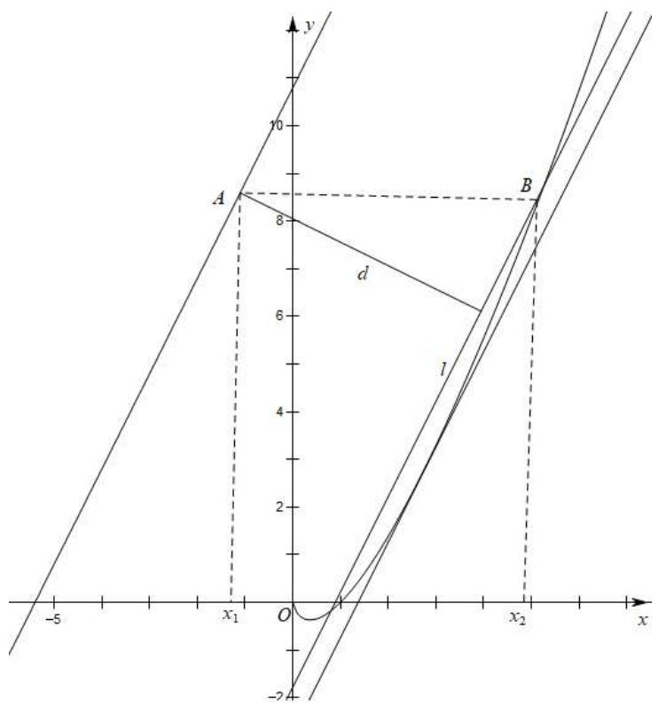
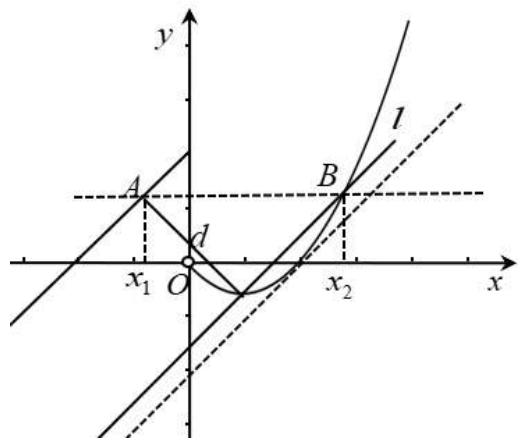
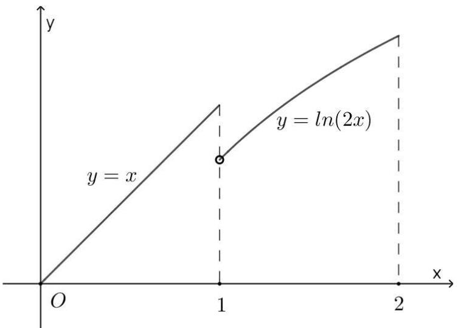
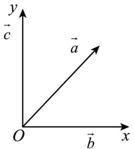
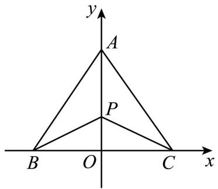
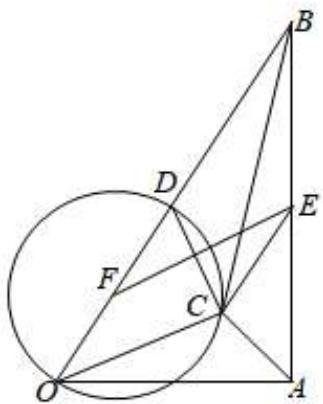
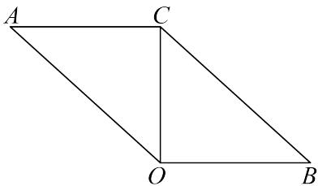
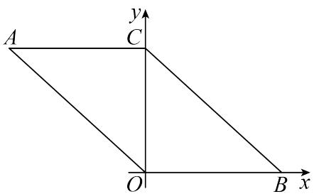

# 第27讲 多元最值问题

# 知识梳理

解决多元函数的最值问题不仅涉及到函数、导数、均值不等式等知识，还涉及到消元法、三角代换法、齐次式等解题技能.

# 必考题型全归纳

# 题型一: 消元法

1041 (2024·全国·高三专题练习)已知正实数 x, y 满足 $\ln x = ye^{x} + \ln y$ ，则 $y - e^{-x}$ 的最大值为 \_\_\_\_.

【答案】 $\frac{1}{\mathrm{e}^2} /\mathrm{e}^{-2}$

【解析】由 $\ln x = ye^{x} + \ln y$ 得 $\ln \frac{x}{y} = ye^{x}$ ，所以 $\frac{x}{y} \ln \frac{x}{y} = xe^{x}$ ，则 $xe^{x} = \ln \frac{x}{y} \cdot e^{\ln \frac{x}{y}}$

因为 $x > 0, \mathrm{e}^{x} > 0, \mathrm{e}^{\ln \frac{x}{y}} > 0$ ，所以 $\ln \frac{x}{y} > 0$

令 $f(x)=xe^{x}(x>0)$ ，则 $f'(x)=\mathrm{e}^{x}(x+1)>0$ ，所以 $f(x)$ 在 $(0,+\infty)$ 上单调递增，

所以由 $xe^{x} = \ln \frac{x}{y}\cdot \mathrm{e}^{\ln \frac{x}{y}}$ ，即 $f(x) = f\left(\ln \frac{x}{y}\right)$ ，得 $x = \ln \frac{x}{y}$ ，所以 $y = \frac{x}{\mathrm{e}^x}$

所以 $y - e^{-x} = \frac{x}{e^{x}} - \frac{1}{e^{x}} = \frac{x - 1}{e^{x}}$ ,

令 $g(x)=\frac{x-1}{\mathrm{e}^{x}}(x>0)$ ，则 $g'(x)=\frac{2-x}{\mathrm{e}^{x}}$ ,

令 $g'(x)>0$ , 得 0<x<2; 令 $g'(x)<0$ , 得 x>2,

所以 $g(x)$ 在 $(0,2)$ 上单调递增，在 $(2,+\infty)$ 上单调递减，

所以 $g(x)_{\max}=g(2)=\frac{1}{\mathrm{e}^{2}}$ ，即 $y-\mathrm{e}^{-x}$ 的最大值为 $\frac{1}{\mathrm{e}^{2}}$ .

故答案为: $\frac{1}{\mathrm{e}^{2}}$ .

1042 (2024·广东梅州·高三五华县水寨中学校考阶段练习)已知实数 m, n 满足: $m \cdot e^{m} = (n - 1)\ln(n - 1) = t(t > 0)$ ，则 $\frac{\ln t}{m(n - 1)}$ 的最大值为 \_\_\_\_.

【答案】 $\frac{1}{e}$

【解析】由已知得, m > 0, n - 1 > 0, $\ln(n - 1) > 0$ ,

令 $f(x)=xe^{x}(x>0)$ ，则 $f'(x)=(x+1)e^{x}>0$ ，

∴ $f(x)$ 在 $(0, +\infty)$ 上单调递增，

又因为 $m \cdot e^{m} = (n - 1)\ln(n - 1)$ ,

所以 $f(m)=f(\ln(n-1))$ ,

$$
\therefore m = \ln (n - 1),
$$

$$
\therefore m (n - 1) = (n - 1) \cdot \ln (n - 1) = t,
$$

$$
\therefore \frac {\ln t}{m (n - 1)} = \frac {\ln t}{t},
$$

令 $g(t)=\frac{\ln t}{t}(t>0)$ ,

所以 $g'(t)=\frac{1-\ln t}{t^{2}}$ ,

则当 $t \in (0, e)$ 时， $g'(t) > 0$ ， $g(t)$ 单调递增；当 $t \in (e, +\infty)$ 时， $g'(t) < 0$ ， $g(t)$ 单调递减；

所以 $g(t)_{\max}=g(\mathrm{e})=\frac{1}{\mathrm{e}}.$

故答案为: $\frac{1}{e}$ .

1043 (2024·天津和平·高三天津一中校考阶段练习)对任给实数 x > y > 0, 不等式 $x^{2} - 2y^{2} \leqslant cx(y - x)$ 恒成立, 则实数 c 的最大值为 \_\_\_\_.

【答案】 $2\sqrt{2}-4$

【解析】因为对任给实数 x > y > 0，不等式 $x^{2} - 2y^{2} \leqslant cx(y - x)$ 恒成立，

所以 $c \leqslant \frac{x^{2}-2y^{2}}{xy-x^{2}} = \frac{\left(\frac{x}{y}\right)^{2}-2}{\frac{x}{y}-\left(\frac{x}{y}\right)^{2}}$ ,

令 $\frac{x}{y} = t > 1$ ，则 $c\leqslant \frac{t^2 - 2}{t - t^2} = f(t)$

$$
f ^ {\prime} (t) = \frac {t ^ {2} - 4 t + 2}{(t - t ^ {2}) ^ {2}} = \frac {(t - 2 + \sqrt {2}) (t - 2 - \sqrt {2})}{(t - t ^ {2}) ^ {2}},
$$

当 $t > 2 + \sqrt{2}$ 时， $f'(t) > 0$ ，函数 $f(t)$ 单调递增；当 $1 < t < 2 + \sqrt{2}$ 时， $f'(t) < 0$ ，函数 $f(t)$ 单调递减，

所以当 $t=2+\sqrt{2}$ 时， $f(t)$ 取得最小值， $f(2+\sqrt{2})=2\sqrt{2}-4$ ，

所以实数 $c$ 的最大值为 $2 \sqrt{2} - 4$

故答案为: $2\sqrt{2}-4$

# 2 题型二:判别式法

1044 (2024·重庆渝中·高一重庆巴蜀中学校考期中)若 $x, y \in R, 4x^{2} + y^{2} + xy = 1$ ，则当 x = \_\_\_\_ 时， $x + y$ 取得最大值，该最大值为 \_\_\_\_.

【答案】 $\frac{\sqrt{15}}{30} / \frac{1}{30}\sqrt{15}$ $\frac{4\sqrt{15}}{15} / \frac{4}{15}\sqrt{15}$

【解析】令 $x+y=t$ ，则y=t-x，

则 $4x^{2} + y^{2} + xy = 4x^{2} + (t - x)^{2} + x(t - x) = 4x^{2} - tx + t^{2} = 1,$

即 $4x^{2} - tx + t^{2} - 1 = 0$

由 $\Delta = t^2 - 16(t^2 - 1) \geqslant 0$ ，解得： $-\frac{4\sqrt{15}}{15} \leqslant t \leqslant \frac{4\sqrt{15}}{15}$ ，

故 $x+y\leqslant\frac{4\sqrt{15}}{15}$ ,

故 $\left\{\begin{aligned}x+y&=\frac{4\sqrt{15}}{15}\\ 4x^{2}&+y^{2}+xy=1\end{aligned}\right.$ ，解得： $x=\frac{\sqrt{15}}{30},y=\frac{7\sqrt{15}}{30}$

所以当且仅当 $x=\frac{\sqrt{15}}{30}$ ， $y=\frac{7\sqrt{15}}{30}$ 时，等号成立，

故答案为: $\frac{\sqrt{15}}{30}, \frac{4\sqrt{15}}{15}$

1045 (2024·全国·高三竞赛)在 $\triangle ABC$ 中, $2\cos A + 3\cos B = 6\cos C$ , 则 $\cos C$ 的最大值为 \_\_\_\_.

【答案】 $\frac{\sqrt{14} - 1}{6}$

【解析】令 $\cos A = x, \cos B = y, \cos C = z$ ，则 $2x + 3y = 6z$ ，即 $y = 2z - \frac{2}{3} x$ .

因为 $\cos^{2}A + \cos^{2}B + \cos^{2}C + 2\cos A\cos B\cos C = 1$ ,

所以 $x^{2} + \left(2z - \frac{2}{3} x\right)^{2} + z^{2} = 1 - 2x\left(2z - \frac{2}{3} x\right)z,$

整理得 $\left(\frac{13}{9} -\frac{4}{3} z\right)x^2 +\left(4z^2 -\frac{8}{3} z\right)x + 5z^2 -1 = 0,$

$$
\Delta = \left(4 z ^ {2} - \frac {8}{3} z\right) ^ {2} - 4 (5 z ^ {2} - 1) \left(\frac {1 3}{9} - \frac {4 z}{3}\right) \geqslant 0,
$$

化简得 $(z + 1)(z - 1)\left(4z^{2} + \frac{4z}{3} -\frac{13}{9}\right)\geqslant 0,$

于是 $4z^{2} + \frac{4z}{3} -\frac{13}{9}\leqslant 0$ ，得 $z\leqslant \frac{\sqrt{14} - 1}{6},$

所以 $\cos C$ 的最大值为 $\frac{\sqrt{14} - 1}{6}$ .

故答案为: $\frac{\sqrt{14} - 1}{6}$ .

1046 (2024·高一课时练习)设非零实数 a, b 满足 $a^{2} + b^{2} = 4$ ，若函数 $y = \frac{ax + b}{x^{2} + 1}$ 存在最大值 M 和最小值 m，则 M - m = \_\_\_\_.

【答案】2

【解析】化简得到 $yx^{2}-ax+y-b=0$ ，根据 $\Delta\geqslant0$ 和 $a^{2}+b^{2}=4$ 得到 $\frac{b-2}{2}\leqslant y\leqslant\frac{b+2}{2}$ ，解得答案. $y=\frac{ax+b}{x^{2}+1}$ ，则 $yx^{2}-ax+y-b=0$ ，则 $\Delta=a^{2}-4y(y-b)\geqslant0$ ，

即 $4y^{2} - 4yb - a^{2}\leqslant 0,a^{2} + b^{2} = 4$ ，故 $4y^{2} - 4yb + b^{2} - 4\leqslant 0$

$[2y - (b + 2)][2y - (b - 2)] \leqslant 0$ ，即 $\frac{b - 2}{2} \leqslant y \leqslant \frac{b + 2}{2}$ ，即 $m = \frac{b - 2}{2}, M = \frac{b + 2}{2}$ ，

$$
\mathrm{M} - m = 2.
$$

故答案为: 2.

1047 (2024·江苏·高三专题练习)若正实数 x, y 满足 $(2xy - 1)^{2} = (5y + 2)(y - 2)$ ，则 $x + \frac{1}{2y}$ 的最大值为 \_\_\_\_.

【答案】 $\frac{3\sqrt{2}}{2} -1$

【解析】令 $x + \frac{1}{2y} = t, (t > 0)$ ，则 $(2xy - 1)^{2} = (2yt - 2)^{2} = (5y + 2)(y - 2)$ ，即 $(4t^{2} - 5)y^{2} + (8 - 8t)y + 8 = 0$ ，因此

$\Delta=(8-8t)^{2}-32(4t^{2}-5)\geqslant0\Rightarrow2t^{2}+4t-7\leqslant0$ , 解得: $0<t\leqslant-1+\frac{3\sqrt{2}}{2}$ , 当 $t=-1+\frac{3\sqrt{2}}{2}$ 时,

$y = \frac{4t - 4}{4t^2 - 5} = \frac{6\sqrt{2} - 8}{17 - 12\sqrt{2}} >0,x = \frac{35 - 24\sqrt{2}}{12\sqrt{2} - 16} >0,$ 因此 $x + \frac{1}{2y}$ 的最大值为 $\frac{3\sqrt{2}}{2} -1$

故答案为: $\frac{3\sqrt{2}}{2} - 1$

1048 (2024·全国·高三专题练习)设 $a, b \in R, \lambda > 0$ ，若 $a^{2} + \lambda b^{2} = 4$ ，且 $a + b$ 的最大值是 $\sqrt{5}$ ，则 $\lambda =$ \_\_\_\_ .

【答案】4

【解析】令 $a + b = d$ ，由 $\left\{\begin{aligned}a + b &= d \\ a^{2} + \lambda b^{2} &= 4\end{aligned}\right.$ 消去 a 得： $(d - b)^{2} + \lambda b^{2} = 4$ ，即 $(\lambda + 1)b^{2} - 2db + d^{2} - 4 = 0$ ，

而 $b \in \mathbb{R}, \lambda > 0$ ，则 $\Delta = (2d)^2 - 4(\lambda + 1)(d^2 - 4) \geqslant 0, d^2 \leqslant \frac{4(\lambda + 1)}{\lambda}, -2\sqrt{\frac{\lambda + 1}{\lambda}} \leqslant d \leqslant 2\sqrt{\frac{\lambda + 1}{\lambda}}$ ，

依题意 $2\sqrt{\frac{\lambda + 1}{\lambda}} = \sqrt{5}$ , 解得 $\lambda = 4$ .

故答案为: 4

# 3 题型三:基本不等式法

1049 设 $x, y, z$ 是不全是 0 的实数. 则三元函数 $f(x, y, z) = \frac{xy + yz}{x^2 + y^2 + z^2}$ 的最大值是 \_\_\_\_.

【答案】 $\frac{\sqrt{2}}{2}$

【解析】引入正参数 $\lambda, \mu$ .

因为 $\lambda^{2}x^{2}+y^{2}\geqslant2\lambda xy,\mu^{2}y^{2}+z^{2}\geqslant2\mu yz,$ 所以，

$$
x y \leqslant \frac {\lambda}{2} x ^ {2} + \frac {1}{2 \lambda} y ^ {2}, y z \leqslant \frac {\mu}{2} y ^ {2} + \frac {1}{2 \mu} z ^ {2}.
$$

两式相加得 $xy + yz \leqslant \frac{\lambda}{2} x^2 + \left(\frac{1}{2\lambda} + \frac{\mu}{2}\right)y^2 + \frac{1}{2\mu} z^2.$

令 $\frac{\lambda}{2} = \frac{1}{2\lambda} +\frac{\mu}{2} = \frac{1}{2\mu}$ ，得 $\lambda = \sqrt{2},\mu = \frac{1}{\sqrt{2}}$

故 $xy + yz \leqslant \frac{\sqrt{2}}{2} (x^2 + y^2 + z^2)$ .

因此, $f(x,y,z)=\frac{xy+yz}{x^{2}+y^{2}+z^{2}}$ 的最大值为 $\frac{\sqrt{2}}{2}$ .

1050 (2024·天津和平·高三耀华中学校考阶段练习)若实数 x, y 满足 $2x^{2} + xy - y^{2} = 1$ ，则 $\frac{x - 2y}{5x^{2} - 2xy + 2y^{2}}$ 的最大值为 \_\_\_\_.

【答案】 $\frac{\sqrt{2}}{4}$

【解析】由 $2x^{2} + xy - y^{2} = 1$ ，得 $(2x - y)(x + y) = 1$ ，

设 $2x - y = t, x + y = \frac{1}{t}$ , 其中 $t \neq 0$ .

则 $x = \frac{1}{3} t + \frac{1}{3t}, y = \frac{2}{3t} - \frac{1}{3} t$ ，从而 $x - 2y = t - \frac{1}{t}$ ， $^{\circ}$ $5x^{2} - 2xy + 2y^{2} = t^{2} + \frac{1}{t^{2}}$

记 $u = t - \frac{1}{t}$ ，则 $\frac{x - 2y}{5x^2 - 2xy + 2y^2} = \frac{u}{u^2 + 2},$

不妨设 $u > 0$ ，则 $\frac{1}{u + \frac{2}{u}}\leqslant \frac{1}{2\sqrt{u\times\frac{2}{u}}} = \frac{\sqrt{2}}{4},$

当且仅当 $u=\frac{2}{u}$ ，即 $u=\sqrt{2}$ 时取等号，即最大值为 $\frac{\sqrt{2}}{4}$ .

故答案为: $\frac{\sqrt{2}}{4}$ .

1051 (2024·全国·高三专题练习)已知正数 a, b, c，则 $\frac{ab + bc}{2a^{2} + b^{2} + c^{2}}$ 的最大值为 \_\_\_\_.

【答案】 $\frac{\sqrt{6}}{4}$

【解析】 $\because \frac{ab+bc}{2a^{2}+b^{2}+c^{2}}=\frac{ab+bc}{(2a^{2}+\frac{1}{3}b^{2})+(\frac{2}{3}b^{2}+c^{2})}\leqslant\frac{ab+bc}{2\sqrt{\frac{2}{3}}ab+2\sqrt{\frac{2}{3}}bc}=\frac{1}{2\sqrt{\frac{2}{3}}}=$

$\frac{\sqrt{6}}{4}$ (当且仅当 $\sqrt{2} a = \frac{\sqrt{3}}{3} b, \frac{\sqrt{6}}{3} b = c$ 时取等号),

∴ $\frac{ab+bc}{2a^{2}+b^{2}+c^{2}}$ 的最大值为 $\frac{\sqrt{6}}{4}$ .

故答案为: $\frac{\sqrt{6}}{4}$ .

# 4 题型四:辅助角公式法

1052 (2024·江苏苏州·高三统考开学考试)设角 $\alpha$ 、 $\beta$ 均为锐角，则 $\sin\alpha + \sin\beta + \cos(\alpha + \beta)$ 的范围是 \_\_\_\_.

【答案】 $\left(1,\frac{3}{2}\right]$

【解析】因为角 $\alpha$ 、 $\beta$ 均为锐角，所以 $\sin\alpha,\cos\alpha,\sin\beta,\cos\beta$ 的范围均为 $(0,1)$ ，

所以 $\sin(\alpha+\beta)=\sin\alpha\cos\beta+\cos\alpha\sin\beta<\sin\alpha+\sin\beta,$

所以 $\sin \alpha +\sin \beta +\cos (\alpha +\beta) > \sin (\alpha +\beta) + \cos (\alpha +\beta) = \sqrt{2}\sin \left(\alpha +\beta +\frac{\pi}{4}\right)$

因为 $0 < \alpha < \frac{\pi}{2}, 0 < \beta < \frac{\pi}{2}, \frac{\pi}{4} < \alpha + \beta + \frac{\pi}{4} < \frac{3\pi}{4}$ ,

所以 $\sqrt{2}\sin\left(\alpha+\beta+\frac{\pi}{4}\right)>\sqrt{2}\times\frac{\sqrt{2}}{2}=1,$

$$
\sin \alpha + \sin \beta + \cos (\alpha + \beta) = \sin \alpha + \sin \beta + \cos \alpha \cos \beta - \sin \alpha \sin \beta
$$

$$
= (1 - \sin \beta) \sin \alpha + \cos \alpha \cos \beta + \sin \beta \leqslant \sqrt {(1 - \sin \beta) ^ {2} + \cos^ {2} \beta} + \sin \beta
$$

$$
= \sqrt {2 (1 - \sin \beta)} + \sin \beta ,
$$

当且仅当 $(1 - \sin \beta)\cos \alpha = \sin \alpha \cos \beta$ 时取等，

令 $\sqrt{1 - \sin\beta} = t, t \in (0,1), \sin\beta = 1 - t^2,$

所以 $= \sqrt{2(1 - \sin\beta)} + \sin\beta = \sqrt{2}t + 1 - t^2 = -\left(t - \frac{\sqrt{2}}{2}\right)^2 + \frac{3}{2} \leqslant \frac{3}{2}.$

则 $\sin\alpha+\sin\beta+\cos(\alpha+\beta)$ 的范围是: $\left(1,\frac{3}{2}\right]$ .

故答案为: $\left(1,\frac{3}{2}\right]$

1053 $y=\cos(\alpha+\beta)+\cos\alpha-\cos\beta-1$ 的取值范围是 \_\_\_\_.

【答案】 $\left[-4, \frac{1}{2}\right]$

【解析】 $y=\cos\alpha\cos\beta-\sin\alpha\sin\beta+\cos\alpha-\cos\beta-1$

$$
= (\cos \beta + 1) \cos \alpha - (\sin \beta) \sin \alpha - (\cos \beta + 1)
$$

$$
= \sqrt {(\cos \beta + 1) ^ {2} + \sin^ {2} \beta} \sin (\alpha + \varphi) - (\cos \beta + 1)
$$

$$
= \sqrt {2 + 2 \cos \beta} \sin (\alpha + \varphi) - (\cos \beta + 1)
$$

因为 $\sin (\alpha +\varphi)\in [-1,1]$

所以 $-\sqrt{2+2\cos\beta}-(\cos\beta+1)\leqslant y\leqslant\sqrt{2+2\cos\beta}-(\cos\beta+1)$ ,

令 $t = \sqrt{1 + \cos\beta}$ ，则 $t\in [0,\sqrt{2} ]$

则 $-\sqrt{2} t - t^2 \leqslant y \leqslant \sqrt{2} t - t^2$

所以 $y \geqslant -\sqrt{2}t - t^{2} = -\left(t + \frac{\sqrt{2}}{2}\right)^{2} + \frac{1}{2} \geqslant -4,$ (当且仅当 $t = \sqrt{2}$ 即 $\cos\beta = 1$ 时取等);

且 $y \leqslant \sqrt{2} t - t^{2} = -\left(t - \frac{\sqrt{2}}{2}\right)^{2} + \frac{1}{2} \leqslant \frac{1}{2}$ ，(当且仅当 $t = \frac{\sqrt{2}}{2}$ 即 $\cos\beta = -\frac{1}{2}$ 时取等).

故 y 的取值范围为 $\left[-4, \frac{1}{2}\right]$ .

# 5 题型五:柯西不等式法

1054 (2024·广西钦州·高二统考期末)已知实数 $a_{i}, b_{i} \in R, (i = 1, 2 \cdots, n)$ ，且满足 $a_{1}^{2} + a_{2}^{2} + \cdots + a_{n}^{2} = 1, b_{1}^{2} + b_{2}^{2} + \cdots + b_{n}^{2} = 1$ ，则 $a_{1}b_{1} + a_{2}b_{2} + \cdots + a_{n}b_{n}$ 最大值为（）

A. 1

B. 2

C. $n\sqrt{2}$

D. $2\sqrt{n}$

【答案】A

【解析】根据柯西不等式， $(a_{1}^{2}+a_{2}^{2}+\cdots+a_{n}^{2})(b_{1}^{2}+b_{2}^{2}+\cdots+b_{n}^{2})\geqslant(a_{1}b_{1}+a_{2}b_{2}+\cdots+a_{n}b_{n})^{2}$ ，故 $a_{1}b_{1}+a_{2}b_{2}+\cdots+a_{n}b_{n}\leqslant1$ ，又当 $a_{1}=b_{1}=a_{2}=b_{2}=\ldots=a_{n}=b_{n}=\frac{1}{\sqrt{n}}$ 时等号成立，故 $a_{1}b_{1}+a_{2}b_{2}+\cdots+a_{n}b_{n}$ 最大值为1

故选：A

1055 (2024·陕西渭南·高二校考阶段练习)已知 x, y, z 是正实数, 且 $x + y + z = 5$ , 则 $x^{2} + 2y^{2} + z^{2}$ 的最小值为 \_\_\_\_.

【答案】10

【解析】由柯西不等式可得 $(x^{2} + 2y^{2} + z^{2})\left[1^{2} + \left(\frac{1}{\sqrt{2}}\right)^{2} + 1^{2}\right] \geqslant (x + y + z)^{2},$

所以 $\frac{5}{2} (x^2 + 2y^2 + z^2) \geqslant 25$ ，即 $x^2 + 2y^2 + z^2 \geqslant 10$

当且仅当 $\frac{x}{1} = \frac{\sqrt{2}y}{\frac{1}{\sqrt{2}}} = \frac{z}{1}$ 即 $x = 2y = z$ 也即 $x = 2, y = 1, z = 2$ 时取得等号，

故答案为: 10

1056 (2024·江苏淮安·高二校联考期中)已知 $x^{2} + y^{2} + z^{2} = 1$ , $a + 3b + \sqrt{6}c = 16$ , 则 $(x - a)^{2} + (y - b)^{2} + (z - c)^{2}$ 的最小值为 \_\_\_\_.

【答案】9

【解析】 $\because a+3b+\sqrt{6}c=16\leqslant\sqrt{1^{2}+3^{2}+(\sqrt{6})^{2}}\sqrt{a^{2}+b^{2}+c^{2}}=4\sqrt{a^{2}+b^{2}+c^{2}}$

$\therefore \sqrt{a^2 + b^2 + c^2} \geqslant 4$ ，当且仅当 $\frac{a}{1} = \frac{b}{3} = \frac{c}{\sqrt{6}}$ 时等号成立，即 $a = 1, b = 3, c = \sqrt{6}$ ，

$$
\because (x - a) ^ {2} + (y - b) ^ {2} + (z - c) ^ {2} = 1 - 2 (x a + b y + c z) + a ^ {2} + b ^ {2} + c ^ {2}
$$

$$
\geqslant 1 - 2 \sqrt {x ^ {2} + y ^ {2} + z ^ {2}} \sqrt {a ^ {2} + b ^ {2} + c ^ {2}} + a ^ {2} + b ^ {2} + c ^ {2} = 1 - 2 \sqrt {a ^ {2} + b ^ {2} + c ^ {2}} + a ^ {2} + b ^ {2} + c ^ {2}
$$

$= (\sqrt{a^2 + b^2 + c^2} - 1)^2 \geqslant 9$ ，当且仅当 $\frac{a}{x} = \frac{b}{y} = \frac{c}{z}$ 时等号成立，可取 $x = \frac{1}{4}, y = \frac{3}{4}, z = \frac{\sqrt{6}}{4}$ 故答案为：9

1057 (2024·全国·高三竞赛)已知 $x, y, z \in \mathbb{R}_+$ , 且 $s = \sqrt{x + 2} + \sqrt{y + 5} + \sqrt{z + 10}$ , $t = \sqrt{x + 1} + \sqrt{y + 1} + \sqrt{z + 1}$ , 则 $s^2 - t^2$ 的最小值为.

A. $3 \sqrt{5}$

B. $4 \sqrt{10}$

C. 36

D. 45

【答案】C

【解析】由 $s + t = (\sqrt{x + 2} + \sqrt{x + 1}) + (\sqrt{y + 5} + \sqrt{y + 1}) + (\sqrt{z + 10} + \sqrt{z + 1})$ ,

$$
s - t = \frac {1}{\sqrt {x + 1} + \sqrt {x + 2}} + \frac {4}{\sqrt {y + 1} + \sqrt {y + 5}} + \frac {9}{\sqrt {z + 1} + \sqrt {z + 1 0}}.
$$

知 $s^{2}-t^{2}=(s+t)(s-t)\geqslant(1+2+3)^{2}=36.$

当 $\sqrt{x+1}+\sqrt{x+2}=\frac{1}{2}(\sqrt{y+1}+\sqrt{y+5})=\frac{1}{3}(\sqrt{z+1}+\sqrt{z+10})$ 时,取得最小值36.

故答案为C

1058 (2024·全国·高三竞赛)设 a、b、c、d 为实数，且 $a^{2}+b^{2}+c^{2}-d^{2}+4=0$ 。则 $3a+2b+c-4|d|$ 的最大值等于。

A. $\sqrt{2}$

B. 0

C. $-\sqrt{2}$

D. $-2\sqrt{2}$

【答案】D

【解析】由题意得 $a^2 + b^2 + c^2 + 2^2 = d^2$ ，所以 $4^2d^2 = (a^2 + b^2 + c^2 + 2^2)[3^2 + 2^2 + 1^2 + (\sqrt{2})^2] \geqslant (3a + 2b + c + 2\sqrt{2})^2$ （利用柯西不等式）.

从而， $4|d|\geqslant\left|3a+2b+c+2\sqrt{2}\right|\geqslant3a+2b+c+2\sqrt{2}$

故 $3a + 2b + c - 4|d|\leqslant -2\sqrt{2}$

当且仅当 $a = 3\sqrt{2}, b = 2\sqrt{2}, c = \sqrt{2}, d = \pm 4\sqrt{2}$ 时，等号成立.

# 6 题型六:权方和不等式法

1059 (2024·甘肃·高三校联考)已知 x > 0, y > 0，且 $\frac{1}{2x + y} + \frac{1}{y + 1} = 1$ ，则 $x + 2y$ 的最小值为 \_\_\_\_。

【答案】 $\sqrt{3} +\frac{1}{2}$

【解析】设 $x + 2y = \lambda_{1}(2x + y) + \lambda_{2}(y + 1) + t$ ,

可解得 $\lambda_{1}=\frac{1}{2},\lambda_{2}=\frac{3}{2},t=-\frac{3}{2},$

从而 $x + 2y = \frac{1}{2} (2x + y) + \frac{3}{2} (y + 1) - \frac{3}{2}$

$$
= \left[ \frac {1}{2} (2 x + y) + \frac {3}{2} (y + 1) \right] \left(\frac {1}{2 x + y} + \frac {1}{y + 1}\right) - \frac {3}{2} \geqslant \sqrt {3} + \frac {1}{2},
$$

当且仅当 $x=\frac{1}{2}+\frac{\sqrt{3}}{3},y=\frac{\sqrt{3}}{3}$ 时取等号.

故答案为: $\sqrt{3} + \frac{1}{2}$ .

1060 已知实数 $x, y$ 满足 $x > y > 0$ 且 $x + y = 1$ , 则 $\frac{2}{x + 3y} + \frac{1}{x - y}$ 的最小值是 \_\_\_\_

【答案】 $\frac{3+2\sqrt{2}}{2}$

【解析】 $\frac{2}{x+3y}+\frac{1}{x-y}\geqslant\frac{(\sqrt{2}+1)^{2}}{2x+2y}=\frac{3+2\sqrt{2}}{2}.$

当 $\frac{\sqrt{2}}{x+3y}=\frac{1}{x-y}$ 时， $x=\sqrt{2}-\frac{1}{2},y=\frac{3}{2}-\sqrt{2}$ 取等号.

1061 已知 a > 1, b > 1，则 $\frac{a^{2}}{b-1} + \frac{b^{2}}{a-1}$ 的最小值是 \_\_\_\_.

【答案】8

【解析】 $a+b-2=t>0,\frac{a^{2}}{b-1}+\frac{b^{2}}{a-1}\geqslant\frac{(a+b)^{2}}{a+b-2}=\frac{(t+2)^{2}}{t}=t+\frac{4}{t}+4\geqslant8.$

当 $\left\{\begin{aligned}a+b-2=2\\ \frac{a}{b-1}&=\frac{b}{a-1}\end{aligned}\right.$ 时，即 a=2, b=2，两个等号同时成立.

1062 已知 $x, y > 0, \frac{1}{x} + \frac{2\sqrt{2}}{y} = 1$ ，则 $\sqrt{x^2 + y^2}$ 的最小值是 \_\_\_\_.

【答案】 $3\sqrt{3}$

【解析】 $1=\frac{1}{x}+\frac{2\sqrt{2}}{y}=\frac{1^{\frac{3}{2}}}{(x^{2})^{\frac{1}{2}}}+\frac{2^{\frac{3}{2}}}{(y^{2})^{\frac{1}{2}}}\geqslant\frac{(1+2)^{\frac{3}{2}}}{(x^{2}+y^{2})^{\frac{1}{2}}}=\frac{3\sqrt{3}}{\sqrt{x^{2}+y^{2}}}.$

即当 $\left\{\begin{aligned}\frac{1}{x^{2}}&=\frac{2}{y^{2}}\\ \frac{1}{x}&+\frac{2\sqrt{2}}{y}=1\end{aligned}\right.$ 时，即 $x=3,y=3\sqrt{2}$ ，有 $\sqrt{x^{2}+y^{2}}$ 的最小值为 $3\sqrt{3}$ .

# 题型七:拉格朗日乘数法

1063 x>0, y>0, xy+x+y=17, 求 $x+2y+3$ 的最小值.

【解析】令 $F(x,y,\lambda)=x+2y+3-\lambda(xy+x+y-17)$

$$
\mathrm{F} _ {x} ^ {\prime} = 1 - \lambda y - \lambda = 0, \mathrm{F} _ {y} ^ {\prime} = 2 - \lambda x - \lambda = 0, \mathrm{F} _ {\lambda} ^ {\prime} = - (x y + x + y) + 1 7 = 0,
$$

联立解得 x=5, y=2, $\lambda=\frac{1}{3}$ , 故 $x+2y+3$ 最小为 12.

1064 设 x, y 为实数，若 $4x^{2} + y^{2} + xy = 1$ ，则 $2x + y$ 的最大值是 \_\_\_\_.

【答案】 $\frac{2\sqrt{10}}{5}$

【解析】令 $L=2x+y+\lambda(4x^{2}+y^{2}+xy-1)$ ,

由 $\left\{\begin{aligned}L_{x}&=2+8\lambda x-3\lambda y=0\\ L_{y}&=1+2\lambda y-3\lambda x=0\\ L_{\lambda}&=4x^{2}+y^{2}+xy-1=0\end{aligned}\right.$ ，解得 $\left\{\begin{aligned}x&=\pm\frac{\sqrt{10}}{10}\\ y&=\pm\frac{\sqrt{10}}{5}\end{aligned}\right.$

所以 $2x + y$ 的最大值是 $2 \cdot \frac{\sqrt{10}}{10} + \frac{\sqrt{10}}{5} = \frac{2\sqrt{10}}{5}$ .

# 题型八:三角换元法

1065 (2024·山西晋中·高三祁县中学校考阶段练习)已知函数 $f(x) = -3x^{3} - 3x + 3^{-x} - 3^{x} + 3$ ，若 $f(3a^{2}) + f(b^{2} - 1) = 6$ ，则 $a\sqrt{1 + b^{2}}$ 的最大值是 \_\_\_\_

【答案】 $\frac{\sqrt{3}}{3}$

【解析】设 $g(x)=f(x)-3$ ，所以 $g(x)=\circ-3x^{3}-3x+3^{-x}-3^{x}$

所以 $g(-x)=-3(-x)^{3}+3x+3^{x}-3^{-x},\therefore g(-x)+g(x)=0,$

所以 $g(-x)=-g(x)$ ，所以函数 $g(x)$ 是奇函数，

由题得 $g'(x) = -9x^{2} - 3 - 3^{-x}\ln3 - 3^{x}\ln3 < 0$ ,

所以函数 $g(x)$ 是减函数，

因为 $f(3a^{2}) + f(b^{2} - 1) = 6$ ,

所以 $f(3a^{2})-3+f(b^{2}-1)-3=0,$

所以 $g(3a^{2}) + g(b^{2} - 1) = 0,$

所以 $g(3a^{2})=g(1-b^{2})$ ，所以 $3a^{2}=1-b^{2},\therefore3a^{2}+b^{2}=1,$ 设 $a=\frac{\sqrt{3}}{3}\cos\theta,b=\sin\theta,$

不妨设 $\cos\theta>0$ ,

所以 $a\sqrt{1+b^{2}}=\frac{\sqrt{3}}{3}\cos\theta\sqrt{1+\sin^{2}\theta}=\frac{\sqrt{3}}{3}\sqrt{(1+\sin^{2}\theta)\cos^{2}\theta}=$

$$
\frac {\sqrt {3}}{3} \sqrt {(1 + \sin^ {2} \theta) (1 - \sin^ {2} \theta)}
$$

$= \frac{\sqrt{3}}{3}\sqrt{1 - \sin^4\theta}\leqslant \frac{\sqrt{3}}{3},$ 所以 $a\sqrt{1 + b^2}$ 的最大值为 $\frac{\sqrt{3}}{3}.$

故答案为 $\frac{\sqrt{3}}{3}$

1066 (2024·浙江温州·高一校联考竞赛) $2x^{2} + xy + y^{2} = 1$ ，则 $x^{2} + xy + 2y^{2}$ 的最小值为

【答案】 $\frac{-4\sqrt{2} + 9}{7}$

【解析】根据条件等式可设 $x=\frac{2\cos\theta}{\sqrt{7}}$ , $y=\sin\theta-\frac{\cos\theta}{\sqrt{7}}$ ，代入所求式子，利用二倍角公式和辅助角公式化简，根据三角函数的性质可求出最值。∵ $2x^{2}+xy+y^{2}=1$ ，则 $\frac{7x^{2}}{4}+\frac{x^{2}}{4}+xy+y^{2}=1$ ，即 $\left(\frac{\sqrt{7}x}{2}\right)^{2}+\left(\frac{x}{2}+y\right)^{2}=1$ ，

设 $\frac{\sqrt{7}x}{2} = \cos \theta, \frac{x}{2} + y = \sin \theta$ ，则 $x = \frac{2\cos\theta}{\sqrt{7}}, y = \sin \theta - \frac{\cos\theta}{\sqrt{7}}$

$$
\therefore x ^ {2} + x y + 2 y ^ {2} = \left(\frac {2 \cos \theta}{\sqrt {7}}\right) ^ {2} + \frac {2 \cos \theta}{\sqrt {7}} \cdot \left(\sin \theta - \frac {\cos \theta}{\sqrt {7}}\right) + 2 \left(\sin \theta - \frac {\cos \theta}{\sqrt {7}}\right) ^ {2}
$$

$$
= \frac {4 \cos^ {2} \theta}{7} - \frac {2 \sin \theta \cos \theta}{\sqrt {7}} + 2 \sin^ {2} \theta
$$

$$
= \frac {4}{7} \left(\frac {1 + \cos 2 \theta}{2}\right) - \frac {\sin 2 \theta}{\sqrt {7}} + 1 - \cos 2 \theta
$$

$$
= - \frac {1}{\sqrt {7}} \sin 2 \theta - \frac {5}{7} \cos 2 \theta + \frac {9}{7}
$$

$= \frac{4\sqrt{2}}{7}\sin (2\theta +\varphi) + \frac{9}{7}$ ，其中 $\varphi$ 是辅助角，且 $\tan \varphi = \frac{\sqrt{35}}{7}$

当 $\sin(2\theta+\varphi)=-1$ 时, 原式取得最小值为 $\frac{-4\sqrt{2}+9}{7}$ .

故答案为: $\frac{-4\sqrt{2} + 9}{7}$ .

# 9 题型九:构造齐次式

1067 (2024·江苏·高一专题练习)已知 x > 0, y > 0，则 $\frac{2xy}{x^{2} + 8y^{2}} + \frac{xy}{x^{2} + 2y^{2}}$ 的最大值是

【答案】 $\frac{2}{3}$

【解析】由题意， $\frac{2xy}{x^{2}+8y^{2}}+\frac{xy}{x^{2}+2y^{2}}=\frac{3x^{3}y+12xy^{3}}{x^{4}+10x^{2}y^{2}+16y^{4}}=\frac{3\left(\frac{x}{y}+\frac{4y}{x}\right)}{\left(\frac{x}{y}\right)^{2}+16\left(\frac{y}{x}\right)^{2}+10}$

$$
= \frac {3 \left(\frac {x}{y} + \frac {4 y}{x}\right)}{\left(\frac {x}{y} + \frac {4 y}{x}\right) ^ {2} + 2} = \frac {3 \left(\frac {x}{y} + \frac {4 y}{x}\right)}{\left(\frac {x}{y} + \frac {4 y}{x}\right) + \frac {2}{\frac {x}{y} + \frac {4 y}{x}}},
$$

设 $t = \frac{x}{y} +\frac{4y}{x}$ ，则 $t = \frac{x}{y} +\frac{4y}{x}\geqslant 2\sqrt{\frac{x}{y}\cdot\frac{4y}{x}} = 4$ ，当且仅当 $\frac{x}{y} = \frac{4y}{x}$ 即 $x = 2y$ 取等号，

又由 $y = t + \frac{2}{t}$ 在 $[4, +\infty)$ 上单调递增，

所以 $y=t+\frac{2}{t}$ 的最小值为 $\frac{9}{2}$ ，即 $t+\frac{2}{t}\geqslant\frac{9}{2}$ ，

所以 $\frac{3\left(\frac{x}{y} + \frac{4y}{x}\right)}{\left(\frac{x}{y} + \frac{4y}{x}\right) + \frac{2}{\frac{x}{y} + \frac{4y}{x}}}\leqslant \frac{3}{t + \frac{2}{t}} = \frac{2}{3},$

所以 $\frac{2xy}{x^2 + 4y^2} +\frac{xy}{x^2 + 2y^2}$ 的最大值是 $\frac{2}{3}$

故答案为: $\frac{2}{3}$ .

1068 (2024·河南·高三信阳高中校联考阶段练习)已知实数 a, b > 0，若 $a + 2b = 1$ ，则 $\frac{3a}{b} + \frac{1}{ab}$ 的最小值为（）

A. 12

B. $2 \sqrt{3}$

C. $6 \sqrt{3}$

D. 8

【答案】A

【解析】由 $\frac{3a}{b} +\frac{1}{ab},a + 2b = 1,a,b > 0,$

所以 $\frac{3a}{b} +\frac{1}{ab} = \frac{3a}{b} +\frac{(a + 2b)^2}{ab}$

$$
= \frac {3 a}{b} + \frac {a ^ {2} + 4 a b + 4 b ^ {2}}{a b}
$$

$$
= \frac {3 a}{b} + \frac {a}{b} + 4 + \frac {4 b}{a}
$$

$$
= \frac {4 a}{b} + \frac {4 b}{a} + 4 \geqslant 2 \sqrt {\frac {4 a}{b} \cdot \frac {4 b}{a}} + 4 = 8 + 4 = 1 2,
$$

当且仅当 $\frac{4a}{b} = \frac{4b}{a} \Rightarrow a = b = \frac{1}{3}$ 时, 取等号,

所以 $\frac{3a}{b} + \frac{1}{ab}$ 的最小值为: 12,

故选：A.

1069 (2024·天津南开·高三统考期中)已知正实数 a, b, c 满足 $a^{2}-2ab+9b^{2}-c=0$ ，则 $\frac{ab}{c}$ 的最大值为 \_\_\_\_.

【答案】 $\frac{1}{4} / 0.25$

【解析】由 $a^{2}-2ab+9b^{2}-c=0$ ，得 $c=a^{2}-2ab+9b^{2}$

∵ 正实数 a, b, c

∴则 $\frac{ab}{c} = \frac{ab}{a^2 - 2ab + 9b^2} = \frac{1}{\frac{a}{b} + \frac{9b}{a} - 2}$

则 $\frac{a}{b} +\frac{9b}{a}\geqslant 2\sqrt{\frac{a}{b}\cdot\frac{9b}{a}} = 6,$

当且仅当 $\frac{a}{b} = \frac{9b}{a}$ ，且 a, b > 0，即 a = 3b 时，等号成立

$$
\frac {a}{b} + \frac {9 b}{a} - 2 \geqslant 4 > 0
$$

则 $\frac{1}{\frac{a}{b} + \frac{9b}{a} - 2} \leqslant \frac{1}{4}$

所以, $\frac{ab}{c}$ 的最大值为 $\frac{1}{4}$ .

故答案为: $\frac{1}{4}$ .

# 10 题型十:数形结合法

1070 (2024·全国·高三专题练习)函数 $f(x)=|x^{2}+ax+b|(a,b\in\mathbb{R})$ 在区间 $[0,c](c>0)$ 上的最大值为 M，则当 M 取最小值 2 时， $a+b+c=$ \_\_\_\_

【答案】2

【解析】解法一:因为函数 $y = x^{2} + ax + b$ 是二次函数,

所以 $f(x)=|x^{2}+ax+b|(a,b\in\mathrm{R})$ 在区间 $[0,c](c>0)$ 上的最大值是在 $[0,c]$ 的端点取到或者在 $x=-\frac{a}{2}$ 处取得.

若在 x=0 取得, 则 $b=\pm2$ ; 若在 $x=-\frac{a}{2}$ 取得, 则 $\left|b-\frac{a^{2}}{4}\right|=2$ ;

若在 x=c 取得, 则 $\left|c^{2}+ac+b\right|=2;$

进一步, 若 b=2, 则顶点处的函数值不为 2, 应为 0, 符合题意;

若 b=-2，则顶点处的函数值的绝对值大于 2，不合题意；

由此推断 $b=\frac{a^{2}}{4}$ ，即有 b=2, $a+c=0$ ,

于是有 $a + b + c = 2$

解法二: 设 $g(x)=x^{2}$ , $h(x)=-ax-b$ , 则 $f(x)=|g(x)-h(x)|$ .

首先作出 $g(x)=x^{2}$ 在 $x\in[0,c]$ 时的图象, 显然经过 $(0,0)$ 和 $(c,c^{2})$ 的直线为 $h_{1}(x)=cx$ , 该曲线在 $[0,c]$ 上单调递增;

其次在 $g(x)=x^{2}$ 图象上找出一条和 $h_{1}(x)=cx$ 平行的切线，

不妨设切点为 $(x_{0},x_{0}^{2})$ ，于是求导得到数量关系 $2x_{0}=c$ .

结合点斜式知该切线方程为 $h_{2}(x)=cx-\frac{c^{2}}{4}$ .

因此 $M_{\min}=\frac{1}{2}\left(0-\left(-\frac{c^{2}}{4}\right)\right)=2$ ，即得 c=4 。此时 $h(x)=cx-\frac{c^{2}}{8}$

即 $h(x)=4x-2$ ，那么 a=-4, b=2。从而有 $a+b+c=2$ 。

1071 (2024·江苏扬州·高三阶段练习)已知函数 $f(x)=\left\{\begin{aligned}x\ln x,\quad&x>0\\ 2x+4\mathrm{e},\quad&x\leqslant0\end{aligned}\right.$ ，若 $x_{1}\neq x_{2}$ 且 $f(x_{1})=f(x_{2})$ ，则 $|x_{1}-x_{2}|$ 的最大值为()

A. $2 \mathrm{e} - \frac{1}{\mathrm{e}}$

B. $2 \mathrm{e} + 1$

C. $\sqrt{5} e$

D. $\frac{5}{2}e$

【答案】D

【解析】当 x > 0 时， $f(x) = x \ln x$ ，

求导 $f'(x)=\ln x+1$ ，令 $f'(x)=0$ ，得 $x=\frac{1}{e}$

当 $x \in \left(0, \frac{1}{\mathrm{e}}\right)$ 时， $f'(x) < 0, f(x)$ 单调递减；当 $x \in \left[\frac{1}{\mathrm{e}}, +\infty\right)$ 时， $f'(x) > 0, f(x)$ 单调递增；

作分段函数图象如下所示:

text_image

y
10
A
8
d
B
6
l
-5
x₁
O
x₂
x
-2

设点 A 的横坐标为 $x_{1}$ ，过点 A 作 y 轴的垂线交函数 $y = f(x)$ 于另一点 B，设点 B 的横坐标为 $x_{2}$ ，并过点 B 作直线 $y = 2x + 4e$ 的平行线 l，设点 A 到直线 l 的距离为 d， $|x_{1} - x_{2}| = \frac{\sqrt{5}}{2}d$ ，

由图形可知,当直线 l 与曲线 $y = x \ln x$ 相切时, d 取最大值,

令 $f'(x)=\ln x+1=2$ ，得x=e，切点坐标为 $(e,e)$ ，

此时， $d=\frac{|2e-e+4e|}{\sqrt{5}}=\sqrt{5}e$

$$
\therefore \left| x _ {1} - x _ {2} \right| _ {\max} = \frac {\sqrt {5}}{2} \times \sqrt {5} \mathrm{e} = \frac {5}{2} \mathrm{e},
$$

故选：D

1072 (2024·全国·高三专题练习)已知函数 $f(x)=\left\{\begin{aligned}&x\ln x,&x>0\\&x+1,&x\leqslant0\end{aligned}\right.$ ，若 $x_{1}\neq x_{2}$ 且 $f(x_{1})=f(x_{2})$ ，
则 $\left|x_{1}-x_{2}\right|$ 的最大值为 （）

A. $2 \sqrt{2}$

B. 2

C. $\sqrt{2}$

D. 1

【答案】B

【解析】设点 A 的横坐标为 $x_{1}$ ，过点 A 作 y 轴的垂线交函数 $y=f(x)$ 于另一点 B，设点 B 的横坐标为 $x_{2}$ ，并过点 B 作直线 $y=x+1$ 的平行线 l，设点 A 到直线 l 的距离为 d，计算出直线 l 的倾斜角为 $\frac{\pi}{4}$ ，可得出 $|x_{1}-x_{2}|=\sqrt{2}d$ ，于是当直线 l 与曲线 $y=x\ln x$ 相切时，d 取最大值，从而 $|x_{1}-x_{2}|$ 取到最大值。当 x>0 时， $f(x)=x\ln x$ ，

求导 $f'(x)=\ln x+1$ , 令 $f'(x)=0$ , 得 $x=\frac{1}{e}$

当 $x \in \left(0, \frac{1}{\mathrm{e}}\right)$ 时， $f'(x) < 0, f(x)$ 单调递减；当 $x \in \left[\frac{1}{\mathrm{e}}, +\infty\right)$ 时， $f'(x) > 0, f(x)$ 单调递增；

如下图所示:

text_image

y
A
l
B
d
x₁ O x₂ x

设点 A 的横坐标为 $x_{1}$ ，过点 A 作 y 轴的垂线交函数 $y = f(x)$ 于另一点 B，设点 B 的横坐标为 $x_{2}$ ，并过点 B 作直线 $y = x + 1$ 的平行线 l，设点 A 到直线 l 的距离为 d， $|x_{1} - x_{2}| = \sqrt{2}d$ ，

由图形可知,当直线 l 与曲线 $y = x \ln x$ 相切时, d 取最大值,

令 $f'(x)=\ln x+1=1$ ，得x=1，切点坐标为 $(1,0)$ ，

此时， $d = \frac{|1 - 0 + 1|}{\sqrt{2}} = \sqrt{2},\therefore |x_1 - x_2|_{\max} = \sqrt{2}\times \sqrt{2} = 2,$

故选: B.

1073 (2024·江苏·高三专题练习)已知函数 $f(x)=\left\{\begin{aligned}x,0&\leqslant x\leqslant1,\\ \ln(2x),1&<x\leqslant2,\end{aligned}\right.$ 若存在实数 $x_{1},x_{2}$ 满足0 $\leqslant x_{1}<x_{2}\leqslant2$ ,且 $f(x_{1})=f(x_{2})$ ,则 $x_{2}-x_{1}$ 的最大值为()

A. $\frac{e}{2}$

B. $\frac{e}{2}-1$

C. $1 - \ln 2$

D. $2 - \ln 4$

【答案】B

【解析】 $f(x)=\left\{\begin{aligned}&x,0\leqslant x\leqslant1,\\&\ln(2x),1<x\leqslant2\end{aligned}\right.$ 的图象如下

text_image

y
y = x
y = ln(2x)
O
1
2
x

存在实数 $x_{1}, x_{2}$ 满足 $0 \leqslant x_{1} < x_{2} \leqslant 2$ ，且 $f(x_{1}) = f(x_{2})$ ，即 $x_{1} = \ln(2x_{2})$

$\therefore x_{2}\in \left(1,\frac{\mathrm{e}}{2}\right]$ ，则 $x_{2} - x_{1} = x_{2} - \ln (2x_{2})$

令 $g(x) = x - \ln (2x), x \in \left(1, \frac{\mathrm{e}}{2}\right]$ ，则 $g'(x) = \frac{x - 1}{x}$

$\therefore g(x)$ 在 $\left(1, \frac{\mathrm{e}}{2}\right]$ 上单调递增，故 $g(x)_{\max} = g\left(\frac{\mathrm{e}}{2}\right) = \frac{\mathrm{e}}{2} - 1$

故选：B

# 11 题型十一:向量法

1074 (2024·江苏南通·高一海安高级中学校考阶段练习) 17 世纪法国数学家费马在给朋友的一封信中曾提出一个关于三角形的有趣问题: 在三角形所在平面内, 求一点, 使它到三角形每个顶点的距离之和最小, 现已证明: 在 $\triangle ABC$ 中, 若三个内角均小于 $120^{\circ}$ , 则当点 P 满足 $\angle APB = \angle APC = \angle BPC = 120^{\circ}$ 时, 点 P 到三角形三个顶点的距离之和最小, 点 P 被人们称为费马点. 根据以上知识, 已知 $\vec{a}$ 为平面内任意一个向量, $\vec{b}$ 和 $\vec{c}$ 是平面内两个互相垂直的向量, 且 $|\vec{b}| = 2, |\vec{c}| = 3$ , 则 $|\vec{a} - \vec{b}| + |\vec{a} + \vec{b}| + |\vec{a} - \vec{c}|$ 的最小值是 \_\_\_\_.

【答案】 $3+2\sqrt{3}$

【解析】以 $\vec{b}$ 为 x 轴, $\vec{c}$ 为 y 轴, 建立直角坐标系如下图, 设 $\vec{a} = (x, y)$ ,

text_image

y
→c
→a
O
→b
x

则 $\vec{b} = (2,0),\vec{c} = (0,3)$ ， $\left|\vec{a} -\vec{c}\right| = \sqrt{x^2 + (y - 3)^2},\left|\vec{a} -\vec{b}\right| = \sqrt{(x - 2)^2 + y^2},\left|\vec{a} +\vec{b}\right| =$ $\sqrt{(x + 2)^2 + y^2}$

∴ $\left|\vec{a}-\vec{c}\right|+\left|\vec{a}-\vec{b}\right|+\left|\vec{a}+\vec{b}\right|$ 即为平面内一点 $(x,y)$ 到 $(0,3),(2,0),(-2,0)$ 三点的距离之和，

由费马点知: 当点 $\mathrm{P}(x,y)$ 与三顶点 A(0,3), B(-2,0), C(2,0) 构成的三角形 ABC 为费马点时 $\left|\vec{a}-\vec{c}\right|+\left|\vec{a}-\vec{b}\right|+\left|\vec{a}+\vec{b}\right|$ 最小，

将三角形 ABC 放在坐标系中如下图:

text_image

y
A
P
B O C x

现在先证明 $\triangle ABC$ 的三个内角均小于 $120^{\circ}$ :

$$
| \mathrm{AB} | = | \mathrm{BC} | = \sqrt {2 ^ {2} + 3 ^ {2}} = \sqrt {1 3}, | \mathrm{BC} | = 4, \cos \angle \mathrm{BAC} = \frac {| \mathrm{AB} | ^ {2} + | \mathrm{AC} | ^ {2} - | \mathrm{BC} | ^ {2}}{2 | \mathrm{AB} | \cdot | \mathrm{AC} |} = \frac {1 1}{1 3} > 0,
$$

$$
\cos \angle A B C = \cos \angle A C B = \frac {| A B | ^ {2} + | B C | ^ {2} - | A C | ^ {2}}{2 | A B | \cdot | B C |} = \frac {1}{\sqrt {1 3}} > 0,
$$

∴△ABC 为锐角三角形, 满足产生费马点的条件, 又因为△ABC 是等腰三角形, 点 P 必定在底边 BC 的对称轴上, 即 y 轴上, ∠BPC = 120°, ∴∠PCB = 30°,

$$
| \mathrm{PO} | = | \mathrm{OC} | \cdot \tan \angle \mathrm{PCB} = 2 \times {\frac {\sqrt {3}}{3}} = {\frac {2 \sqrt {3}}{3}} , \text {即} \mathrm{P} \Big (0, {\frac {2 \sqrt {3}}{3}} \Big) ,
$$

现在验证 $\angle BPA = 120^{\circ}$

$$
| \mathrm{BP} | = \sqrt {2 ^ {2} + \left(\frac {2 \sqrt {3}}{3}\right) ^ {2}} = \frac {4}{\sqrt {3}}, | \mathrm{AP} | = 3 - \frac {2 \sqrt {3}}{3},
$$

$\cos \angle BPA = \frac{|\mathrm{BP}|^2 + |\mathrm{AP}|^2 - |\mathrm{AB}|^2}{2|\mathrm{BP}|\cdot|\mathrm{AP}|} = -\frac{1}{2}$ , $\therefore \angle BPA = 120^\circ$ ，同理可证得 $\angle CPA = 120^\circ$ ，即此时点 $P\left(0, \frac{2\sqrt{3}}{3}\right)$ 是费马点，到三个顶点 A, B, C 的距离之和为 $|\mathrm{BP}| + |\mathrm{CP}| + |\mathrm{AP}| = 2 \times \frac{4}{\sqrt{3}} + 3 - \frac{2\sqrt{3}}{3} = 3 + 2\sqrt{3}$ ，即 $\left|\vec{a} - \vec{c}\right| + \left|\vec{a} - \vec{b}\right| + \left|\vec{a} + \vec{b}\right|$ 的最小值为 $3 + 2\sqrt{3}$ ；故答案为： $3 + 2\sqrt{3}$ .

1075 (2024·浙江嘉兴·高一统考期末)已知平面向量 $\vec{a}, \vec{b}, \vec{c}$ 满足 $\left|\vec{a}\right|=1, \left|\vec{b}\right|=2, \left|\vec{a}\right|^{2}=\vec{a} \cdot \vec{b}, \vec{c} \cdot \left(\vec{c}-\frac{\vec{b}}{2}\right)=0$ ，则 $\left|\vec{c}-\vec{a}\right|^{2}+\left|\vec{c}-\vec{b}\right|^{2}$ 的最小值为 \_\_\_\_.

【答案】 $\frac{7}{2} -\sqrt{3}$

【解析】令 $\overrightarrow{OA} = \vec{a}, \overrightarrow{OB} = \vec{b}, \overrightarrow{OC} = \vec{c}, OB$ 中点为 D, OD 中点为 F, E 为 AB 的中点，由 $|\vec{a}| = 1, |\vec{b}| = 2, |\vec{a}|^{2} = \vec{a} \cdot \vec{b}$ ，得 $1 = 1 \times 2 \times \cos < \vec{a}, \vec{b} >$ ,

则 $\cos<\vec{a},\vec{b}>=\frac{1}{2},<\vec{a},\vec{b}>=60^{\circ}$ 即 $\angle AOB=60^{\circ}$ ，所以 AB=

$\sqrt{OA^{2}+OB^{2}-2OA\cdot OB\cos\angle AOB}=\sqrt{2^{2}+1^{2}-2\times2\times1\times\frac{1}{2}}=\sqrt{3}$ ，所以 $AO^{2}+AB^{2}=OB^{2}$ ，即 $\angle OAB=90^{\circ}$ ， $\angle ABO=30^{\circ}$ ，所以 $EF=\sqrt{BF^{2}+BE^{2}-2BF\cdot BE\cos\angle ABO}=$ $\sqrt{\left(\frac{3}{2}\right)^{2}+\left(\frac{\sqrt{3}}{2}\right)^{2}-2\times\frac{3}{2}\times\frac{\sqrt{3}}{2}\times\frac{\sqrt{3}}{2}}=\frac{\sqrt{3}}{2}$ ，因为 $\vec{c}\cdot\left(\vec{c}-\frac{\vec{b}}{2}\right)=0$ ，所以 $\overrightarrow{OC}\cdot$

$\left(\overrightarrow{\mathrm{OC}} - \frac{1}{2} \overrightarrow{\mathrm{OB}}\right) = 0$ ，即 $\overrightarrow{\mathrm{OC}} \cdot \left(\overrightarrow{\mathrm{OC}} - \overrightarrow{\mathrm{OD}}\right) = 0$ ，所以 $\overrightarrow{\mathrm{OC}} \cdot \overrightarrow{\mathrm{DC}} = 0$

所以点 C 的轨迹为以 OD 为直径的圆，

$$
\begin{array}{l} \because 2 \left(| \vec {c} - \vec {a} | ^ {2} + | \vec {c} - \vec {b} | ^ {2}\right) = 2 \left(| \overrightarrow {\mathrm{CA}} | ^ {2} + | \overrightarrow {\mathrm{CB}} | ^ {2}\right) \\ = 4 | \overrightarrow {\mathrm{CE}} | ^ {2} + | \overrightarrow {\mathrm{AB}} | ^ {2} = 4 | \overrightarrow {\mathrm{CE}} | ^ {2} + (\sqrt {3}) ^ {2} \\ = 4 \left| \overrightarrow {\mathrm{CE}} \right| ^ {2} + 3 \geqslant 4 \left(\left| \mathrm{EF} \right| - \frac {1}{2}\right) ^ {2} + 3 = 7 - 2 \sqrt {3}, \\ \end{array}
$$

当且仅当 C、E、F 共线且 C 在线段 EF 之间时取等号.

$\therefore |\vec{c} - \vec{a}|^2 + |\vec{c} - \vec{b}|^2$ 的最小值为 $\frac{7}{2} - \sqrt{3}$ .

故答案为: $\frac{7}{2} - \sqrt{3}$ .

text_image

Geometric diagram with circle, triangle, and labeled points for mathematical analysis

1076 (2024·湖北武汉·高一湖北省武昌实验中学校联考期末)已知向量 $\vec{a}, \vec{b}$ 满足 $(\vec{a} + \vec{b}) \cdot \vec{b} = 0, |\vec{a} + 4\vec{b}| = 4$ ，则 $|\vec{a} + \vec{b}| + |\vec{b}|$ 的最大值为 \_\_\_\_.

【答案】 $\frac{4\sqrt{10}}{3} / \frac{4}{3}\sqrt{10}$

【解析】取平行四边形 OACB, 连接 OC

natural_image

Geometric diagram of a parallelogram labeled with vertices A, B, C, and O (no text or symbols present)

设 $\overrightarrow{OA} = \vec{a}, \overrightarrow{OB} = \vec{b}$ ，则 $\overrightarrow{OC} = \vec{a} + \vec{b}$ ,

因为向量 $\vec{a}, \vec{b}$ 满足 $(\vec{a} + \vec{b}) \cdot \vec{b} = 0$ ，所以 $(\vec{a} + \vec{b}) \perp \vec{b}$ ，即 OC ⊥ OB，

设 OB = m, OC = n, m, n > 0, 如图以 O 为原点, OB, OC 所在直线为 x, y 轴建立平面直角坐标系,

text_image

A
y
C
O
B x

则 $O(0,0)$ , $B(m,0)$ , $C(0,n)$ , $A(-m,n)$

所以 $\vec{a}=\overrightarrow{OA}=(-m,n),\vec{b}=\overrightarrow{OB}=(m,0)$ ，则 $\left|\vec{a}+4\vec{b}\right|=|(-m,n)+4(m,0)|=|(3m,n)|=\sqrt{9m^{2}+n^{2}}=4$ ，故 $9m^{2}+n^{2}=16$ ，

所以 $\left|\vec{a}+\vec{b}\right|+\left|\vec{b}\right|=\left|(0,n)\right|+\left|(m,0)\right|=n+m$

因为 $9m^{2} + n^{2} = 16$ ，又 $\sin^2\theta +\cos^2\theta = 1$ ，可设 $3m = 4\sin \theta ,n = 4\cos \theta ,\theta \in \left(0,\frac{\pi}{2}\right)$

即 $m = \frac{4}{3}\sin \theta ,n = 4\cos \theta$ ，所以 $m + n = \frac{4}{3}\sin \theta +4\cos \theta = \sqrt{\left(\frac{4}{3}\right)^2 + 4^2}\sin (\theta +\varphi) =$

$\frac{4\sqrt{10}}{3}\sin(\theta+\varphi)$ ，其中 $\tan\varphi=\frac{4}{\frac{4}{3}}=3,\varphi\in\left(0,\frac{\pi}{2}\right)$ ，所以 $\theta+\varphi\in(0,\pi)$ ，所以 $\sin(\theta+\varphi)\in(0,1]$ ，

故 $m + n$ 的最大值为 $\frac{4\sqrt{10}}{3}$ , 即 $\left|\vec{a} + \vec{b}\right| + \left|\vec{b}\right|$ 的最大值为 $\frac{4\sqrt{10}}{3}$ .

故选: $\frac{4\sqrt{10}}{3}$ .

# 题型十二:琴生不等式法

1077 (2024·福建龙岩·高三校考阶段练习)若函数 $f(x)$ 的导函数 $f'(x)$ 存在导数,记 $f'(x)$ 的导数为 $f''(x)$ . 如果对 $\forall x\in(a,b)$ ,都有 $f''(x)<0$ ,则 $f(x)$ 有如下性质:

$f\left(\frac{x_{1}+x_{2}+\cdots+x_{n}}{n}\right)\geqslant\frac{f(x_{1})+f(x_{2})+\cdots+f(x_{n})}{n}$ . 其中 $n\in N^{*}, x_{1}, x_{2}, \cdots, x_{n}\in(a,b)$ . 若 $f(x)=\sin x$ , 则在锐角 $\triangle ABC$ 中, 根据上述性质推断: $\sin A+\sin B+\sin C$ 的最大值为 \_\_\_\_.

【答案】 $\frac{3\sqrt{3}}{2} / \frac{3}{2}\sqrt{3}$ .

【解析】 $f(x)=\sin x$ ，则 $f'(x)=\cos x$ ， $f''(x)=-\sin x$ .

在锐角 $\triangle ABC$ 中，A, B, C $\in\left(0,\frac{\pi}{2}\right)$ ,

则 $f''(x) = -\sin x < 0$

$$
\therefore \quad \frac {\sin A + \sin B + \sin C}{3} \leqslant \sin \left(\frac {A + B + C}{3}\right) = \sin \frac {\pi}{3} = \frac {\sqrt {3}}{2},
$$

∴ $\sin A + \sin B + \sin C$ 的最大值为 $\frac{3\sqrt{3}}{2}$ .

故答案为： $\frac{3\sqrt{3}}{2}$ .

1078 (2024·全国·高三竞赛)半径为R的圆的内接三角形的面积的最大值是\_\_\_\_.

【答案】 $\frac{3\sqrt{3}}{4}R^{2}$

【解析】设 $\odot O$ 的内接三角形为 $\triangle ABC$ .

显然当 $\triangle ABC$ 是锐角或直角三角形时, 面积可以取最大值 (因为若 $\triangle ABC$ 是钝角三角形, 可将钝角 (不妨设为 A) 所对边以圆心为对称中心作中心对称成为 B'C').

因此， $S_{\triangle AB'C'} > S_{\triangle ABC}$

下面设 $\angle AOB = 2\alpha, \angle BOC = 2\beta, \angle COA = 2\gamma, \alpha + \beta + \gamma = \pi.$

则 $S_{\triangle ABC}=\frac{1}{2}R^{2}(\sin2\alpha+\sin2\beta+\sin2\gamma)$ .

由讨论知可设 $0 < \alpha, \beta, \gamma < \frac{\pi}{2}$ , 而 $y = \sin x$ 在 $(0, \pi)$ 上是上凸函数.

则由琴生不等式知 $\frac{\sin 2\alpha + \sin 2\beta + \sin 2\gamma}{3} \leqslant \sin \frac{2(\alpha + \beta + \gamma)}{3} = \frac{\sqrt{3}}{2}$ .

所以， $S_{\triangle ABC} \leqslant \frac{1}{2} R^{2} \times 3 \times \frac{\sqrt{3}}{2} = \frac{3\sqrt{3}}{4} R^{2}.$

当且仅当 $\triangle ABC$ 是正三角形时, 上式等号成立.

故答案为 $\frac{3\sqrt{3}}{4}\mathrm{R}^2$

1079 (2024·北京·高三强基计划)已知正实数 a, b 满足 $a + b = 1$ ，求 $\left(a + \frac{1}{a}\right)\left(b + \frac{1}{b}\right)$ 的最小

值.

【解析】设 $f(x)=\ln\left(x+\frac{1}{x}\right),0<x<1$ , 则 $f'(x)=\frac{x^{2}-1}{x^{3}+x}$

从而 $f''(x)=\frac{-x^{4}+4x^{2}+1}{(x^{3}+x)^{2}}>0$ , 故 $f(x)$ 在 $(0,1)$ 下凸，

因此 $\frac{f(a) + f(b)}{2} \geqslant f\left(\frac{a + b}{2}\right)$ , 即 $\left(a + \frac{1}{a}\right)\left(b + \frac{1}{b}\right) \geqslant \frac{25}{4}$ ,

当且仅当 $a=b=\frac{1}{2}$ 时等号成立．所以 $\left(a+\frac{1}{a}\right)\left(b+\frac{1}{b}\right)$ 的最小值为华 $\frac{25}{4}$

