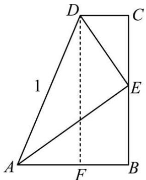
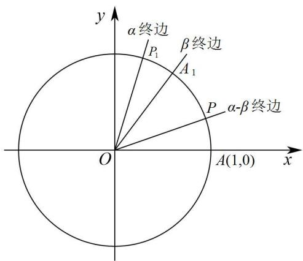
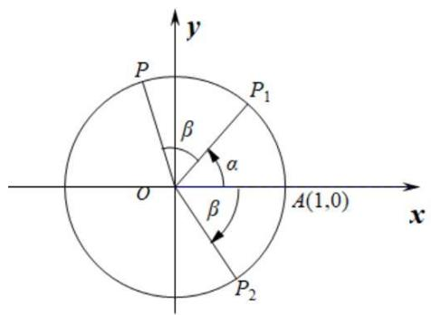
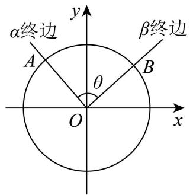
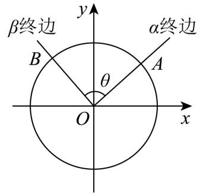
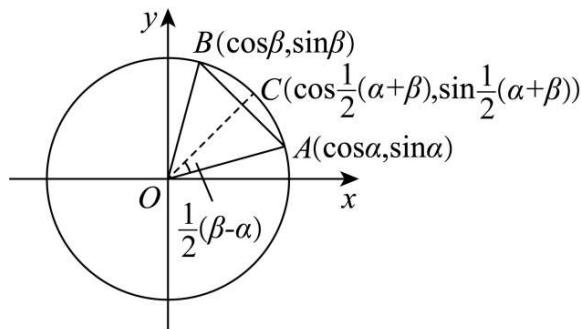

# 第29讲 三角恒等变换

# 知识梳理

知识点一．两角和与差的正余弦与正切

① $\sin (\alpha \pm \beta) = \sin \alpha \cos \beta \pm \cos \alpha \sin \beta$   
② $\cos (\alpha \pm \beta) = \cos \alpha \cos \beta \mp \sin \alpha \sin \beta ;$   
③ $\tan(\alpha\pm\beta)=\frac{\tan\alpha\pm\tan\beta}{1\mp\tan\alpha\tan\beta};$

知识点二．二倍角公式

① $\sin 2\alpha = 2\sin \alpha \cos \alpha$   
② $\cos 2\alpha = \cos^2\alpha -\sin^2\alpha = 2\cos^2\alpha -1 = 1 - 2\sin^2\alpha ;$   
③ $\tan 2\alpha = \frac{2\tan\alpha}{1 - \tan^2\alpha};$

知识点三:降次(幂)公式

$$
\sin \alpha \cos \alpha = \frac {1}{2} \sin 2 \alpha ; \sin^ {2} \alpha = \frac {1 - \cos 2 \alpha}{2}; \cos^ {2} \alpha = \frac {1 + \cos 2 \alpha}{2};
$$

知识点四: 半角公式

$$
\begin{array}{l} \sin \frac {\alpha}{2} = \pm \sqrt {\frac {1 - \cos \alpha}{2}}; \cos \frac {\alpha}{2} = \pm \sqrt {\frac {1 + \cos \alpha}{2}}; \\ \tan \frac {\alpha}{2} = \frac {\sin \alpha}{1 + \cos \alpha} = \frac {1 - \cos \alpha}{\sin a}. \\ \end{array}
$$

知识点五．辅助角公式

$$
a \sin \alpha + b \cos \alpha = \sqrt {a ^ {2} + b ^ {2}} \sin (\alpha + \phi) (\text {其中} \sin \phi = \frac {b}{\sqrt {a ^ {2} + b ^ {2}}}, \cos \phi = \frac {a}{\sqrt {a ^ {2} + b ^ {2}}}, \tan \phi = \frac {b}{a}).
$$

# 【解题方法总结】

1、两角和与差正切公式变形

$$
\tan \alpha \pm \tan \beta = \tan (\alpha \pm \beta) (1 \mp \tan \alpha \tan \beta);
$$

$$
\tan \alpha \cdot \tan \beta = 1 - \frac {\tan \alpha + \tan \beta}{\tan (\alpha + \beta)} = \frac {\tan \alpha - \tan \beta}{\tan (\alpha - \beta)} - 1.
$$

2、降幂公式与升幂公式

$$
\sin^ {2} \alpha = \frac {1 - \cos 2 \alpha}{2}; \cos^ {2} \alpha = \frac {1 + \cos 2 \alpha}{2}; \sin \alpha \cos \alpha = \frac {1}{2} \sin 2 \alpha ;
$$

$$
1 + \cos 2 \alpha = 2 \cos^ {2} \alpha ; 1 - \cos 2 \alpha = 2 \sin^ {2} \alpha ; 1 + \sin 2 \alpha = (\sin \alpha + \cos \alpha) ^ {2}; 1 - \sin 2 \alpha = (\sin \alpha - \cos \alpha) ^ {2}.
$$

3、其他常用变式

$$
\begin{array}{l} \sin 2 \alpha = \frac {2 \sin \alpha \cos \alpha}{\sin^ {2} \alpha + \cos^ {2} \alpha} = \frac {2 \tan \alpha}{1 + \tan^ {2} \alpha}; \cos 2 \alpha = \frac {\cos^ {2} \alpha - \sin^ {2} \alpha}{\sin^ {2} \alpha + \cos^ {2} \alpha} = \frac {1 - \tan^ {2} \alpha}{1 + \tan^ {2} \alpha}; \tan \frac {\alpha}{2} = \frac {\sin \alpha}{1 + \cos \alpha} = \\ \frac {1 - \cos \alpha}{\sin \alpha}. \end{array}
$$

4、拆分角问题:① $\alpha=2\cdot\frac{\alpha}{2}$ ; $\alpha=(\alpha+\beta)-\beta$ ; ② $\alpha=\beta-(\beta-\alpha)$ ; ③ $\alpha=\frac{1}{2}[(\alpha+\beta)+(\alpha-\beta)]$ ;

$$
④ \beta = \frac {1}{2} [ (\alpha + \beta) - (\alpha - \beta) ]; ⑤ \frac {\pi}{4} + \alpha = \frac {\pi}{2} - \left(\frac {\pi}{4} - \alpha\right).
$$

注意:特殊的角也看成已知角,如 $\alpha=\frac{\pi}{4}-\left(\frac{\pi}{4}-\alpha\right)$ .

# 1 题型一:两角和与差公式的证明

1130 (浙江省绍兴市2024学年高一下学期6月期末数学试题)为了推导两角和与差的三角函数公式,某同学设计了一种证明方法:在直角梯形ABCD中, $\angle B=\angle C=90^{\circ}$ ,AD=1,点E为BC上一点,且AE⊥DE,过点D作DF⊥AB于点F,设 $\angle BAE=\alpha$ , $\angle DAE=\beta$ .

text_image

D
C
1
E
A
F
B

(1) 利用图中边长关系 $\mathrm{DF} = \mathrm{BE} + \mathrm{CE}$ , 证明: $\sin (\alpha + \beta) = \sin \alpha \cos \beta + \cos \alpha \sin \beta$ ;  
(2) 若 $\mathrm{BE} = \mathrm{CE} = \frac{1}{3}$ , 求 $\sin 2\alpha + \cos 2\beta$ .

【解析】(1) 在 Rt△ADE 中，∠AED = 90°，∠DAE = β，AD = 1，则 DE = sinβ，AE = cosβ，

在 Rt△ADF 中，∠AFD = 90°，∠DAF = α + β，AD = 1，则 DF = sin(α + β)，

在 Rt△ABE, Rt△ECD 中， $\angle B = \angle C = 90^{\circ}$ ， $\angle CED = \angle BAE = \alpha$

则 BE = sinαcosβ, CE = cosαsinβ,

依题意,四边形 BCDF 是矩形,则 DF=BC=BE+CE,

所以 $\sin(\alpha+\beta)=\sin\alpha\cos\beta+\cos\alpha\sin\beta.$

(2) 由 BE = CE = $\frac{1}{3}$ 及 (1) 知, $\sin\alpha\cos\beta = \cos\alpha\sin\beta = \frac{1}{3}$ , 则 $\tan\alpha = \tan\beta$ , 而 $\alpha, \beta$ 为锐角, 即有 $\alpha = \beta$ ,

$\sin2\alpha=\frac{2}{3}$ ，又 $2\alpha=\alpha+\beta=\angle BAD$ 是锐角，于是 $\cos2\beta=\cos2\alpha=\frac{\sqrt{5}}{3}$

所以 $\sin2\alpha+\cos2\beta=\frac{2+\sqrt{5}}{3}$ .

1131 (2024·辽宁·高一辽宁实验中学校考期中)某数学学习小组研究得到了以下的三倍角公式：

① $\sin3\theta=3\sin\theta-4\sin^{3}\theta$ ; ② $\cos3\theta=4\cos^{3}\theta-3\cos\theta$

根据以上研究结论,回答:

(1) 在①和②中任选一个进行证明：  
(2) 求值: $\sin1098^{\circ}$ .

【解析】(1) 若选①, 证明如下:

$$
\begin{array}{l} \sin 3 \theta = \sin (2 \theta + \theta) = \sin 2 \theta \cos \theta + \cos 2 \theta \sin \theta = 2 \sin \theta \cos^ {2} \theta + (1 - 2 \sin^ {2} \theta) \sin \theta \\ = 2 \sin \theta (1 - \sin^ {2} \theta) + (1 - 2 \sin^ {2} \theta) \sin \theta = 3 \sin \theta - 4 \sin^ {3} \theta . \\ \end{array}
$$

若选②,证明如下:

$$
\cos 3 \theta = \cos (2 \theta + \theta) = \cos 2 \theta \cos \theta - \sin 2 \theta \sin \theta = (2 \cos^ {2} \theta - 1) \cos \theta - 2 \sin^ {2} \theta \cos \theta
$$

$$
= 2 \cos^ {3} \theta - \cos \theta - 2 (1 - \cos^ {2} \theta) \cos \theta = 4 \cos^ {3} \theta - 3 \cos \theta .
$$

(2) 由题, $\sin 1098^{\circ} = \sin 18^{\circ}$ , 因为 $90^{\circ} = 2 \times 18^{\circ} + 3 \times 18^{\circ}$ , 则 $\cos 54^{\circ} = \sin 36^{\circ}$ ,

所以由公式②及正弦的二倍角公式得 $4\cos^{3}18^{\circ}-3\cos18^{\circ}=2\sin18^{\circ}\cos18^{\circ}$ ,

又因为 $\cos18^{\circ}>0$ ，所以 $4\cos^{2}18^{\circ}-3=2\sin18^{\circ}$ ，所以 $4(1-\sin^{2}18^{\circ})-3=2\sin18^{\circ}$ ，

整理得 $4\sin^2 18^\circ + 2\sin 18^\circ - 1 = 0$ 解得 $\sin 18^\circ = \frac{\sqrt{5} - 1}{4}$ 或 $\frac{-\sqrt{5} - 1}{4}$ ,

又 $\sin 18^{\circ} > 0$ ，所以 $\sin 18^{\circ} = \frac{\sqrt{5} - 1}{4}$

1132 (2024·全国·高三专题练习)(1)试证明差角的余弦公式 $C_{(\alpha-\beta)}:\cos(\alpha-\beta)=\cos\alpha\cos\beta+\sin\alpha\sin\beta;$

(2) 利用公式 $C_{(\alpha-\beta)}$ 推导:

①和角的余弦公式 $\mathrm{C}_{(\alpha+\beta)}$ ，正弦公式 $\mathrm{S}_{(\alpha+\beta)}$ ，正切公式 $\mathrm{T}_{(\alpha+\beta)}$ ;  
②倍角公式 $S_{(2\alpha)}$ , $C_{(2\alpha)}$ , $T_{(2\alpha)}$ .

【解析】(1) 不妨令 $\alpha \neq 2k\pi + \beta, k \in Z$ .

如图，

text_image

y
α终边
P₁
β终边
A₁
P
α-β终边
O
A(1,0)
x

设单位圆与 $x$ 轴的正半轴相交于点 $\mathrm{A}(1,0)$ ，以 $x$ 轴非负半轴为始边作角 $\alpha, \beta, \alpha - \beta$ ，它们的终边分别与单位圆相交于点 $\mathrm{P}_1(\cos \alpha, \sin \alpha), \mathrm{A}_1(\cos \beta, \sin \beta), \mathrm{P}(\cos (\alpha - \beta), \sin (\alpha - \beta))$ 。连接 $\mathrm{A}_1\mathrm{P}_1, \mathrm{AP}$ 。若把扇形OAP绕着点O旋转 $\beta$ 角，则点A,P分别与点 $\mathrm{A}_1, \mathrm{P}_1$ 重合。根据圆的旋转对称性可知， $\widehat{\mathrm{AP}}$ 与 $\widehat{\mathrm{A}_1\mathrm{P}_1}$ 重合，从而， $\widehat{\mathrm{AP}} = \widehat{\mathrm{A}_1\mathrm{P}_1}, \therefore \mathrm{AP} = \mathrm{A}_1\mathrm{P}_1$ 。

根据两点间的距离公式, 得:

$$
[ \cos (\alpha - \beta) - 1 ] ^ {2} + \sin^ {2} (\alpha - \beta) = (\cos \alpha - \cos \beta) ^ {2} + (\sin \alpha - \sin \beta) ^ {2},
$$

化简得: $\cos(\alpha-\beta)=\cos\alpha\cos\beta+\sin\alpha\sin\beta.$

当 $\alpha=2k\pi+\beta(k\in\mathbb{Z})$ 时, 上式仍然成立.

∴,对于任意角 $\alpha,\beta$ 有: $\cos(\alpha-\beta)=\cos\alpha\cos\beta+\sin\alpha\sin\beta.$

(2) ①公式 $\mathrm{C}_{(\alpha + \beta)}$ 的推导:

$$
\begin{array}{l} \cos (\alpha + \beta) = \cos [ \alpha - (- \beta) ] \\ = \cos \alpha \cos (- \beta) + \sin \alpha \sin (- \beta) \\ = \cos \alpha \cos \beta - \sin \alpha \sin \beta . \\ \end{array}
$$

公式 $S_{(\alpha+\beta)}$ 的推导：

$$
\sin (\alpha + \beta) = \cos \left(\alpha + \beta - \frac {\pi}{2}\right)
$$

$$
= \cos \left[ \alpha - \left(\frac {\pi}{2} - \beta\right) \right]
$$

$$
= \cos \alpha \cos \left(\frac {\pi}{2} - \beta\right) + \sin \alpha \sin \left(\frac {\pi}{2} - \beta\right)
$$

$$
= \cos \alpha \sin \beta + \sin \alpha \cos \beta
$$

正切公式 $\mathrm{T}_{(\alpha +\beta)}$ 的推导：

$$
\tan (\alpha + \beta) = \frac {\sin (\alpha + \beta)}{\cos (\alpha + \beta)}
$$

$$
= \frac {\sin \alpha \cos \beta + \cos \alpha \sin \beta}{\cos \alpha \cos \beta - \sin \alpha \sin \beta}
$$

$$
= \frac {\tan \alpha + \tan \beta}{1 - \tan \alpha \tan \beta}
$$

②公式 $S_{(2\alpha)}$ 的推导：

由①知， $\sin2\alpha=\sin(\alpha+\alpha)=\cos\alpha\sin\alpha+\sin\alpha\cos\alpha=2\sin\alpha\cos\alpha.$

公式 $\mathrm{C}_{(2\alpha)}$ 的推导：

由①知， $\cos 2\alpha = \cos (\alpha + \alpha) = \cos \alpha \cos \alpha - \sin \alpha \sin \alpha = \cos^2 \alpha - \sin^2 \alpha.$

公式 $\mathrm{T}_{(2\alpha)}$ 的推导：

由①知， $\tan 2\alpha = \tan (\alpha + \alpha) = \frac{\tan \alpha + \tan \alpha}{1 - \tan \alpha \cdot \tan \alpha} = \frac{2\tan\alpha}{1 - \tan^2\alpha}$ .

1133 (2024·全国·高三专题练习)如图,考虑点 A(1,0), $P_{1}(\cos\alpha,\sin\alpha)$ , $P_{2}(\cos\beta,-\sin\beta)$ , P $(\cos(\alpha+\beta),\sin(\alpha+\beta))$ , 从这个图出发.

text_image

y
P
β
α
O
A(1,0)
x
β
P₁
P₂

(1) 推导公式: $\cos(\alpha + \beta) = \cos\alpha\cos\beta - \sin\alpha\sin\beta;$   
(2) 利用 (1) 的结果证明: $\cos \alpha \cos \beta = \frac{1}{2} [\cos (\alpha + \beta) + \cos (\alpha - \beta)]$ , 并计算 $\sin 37.5^\circ \cdot \cos 37.5^\circ$ 的值.

【解析】(1) 因为 $P_{1}(\cos\alpha, \sin\alpha)$ , $P_{2}(\cos\beta, -\sin\beta)$ , $P(\cos(\alpha+\beta), \sin(\alpha+\beta))$ ,

根据图象,可得 $\overrightarrow{AP}^{2}=\overrightarrow{P_{1}P_{2}}^{2}$ , 即 $\left|\overrightarrow{AP}\right|^{2}=\left|\overrightarrow{P_{1}P_{2}}\right|^{2}$ ,

$$
\text {即} (\cos (\alpha + \beta) - 1) ^ {2} + \sin^ {2} (\alpha + \beta) = (\cos \beta - \cos \alpha) ^ {2} + (\sin \beta + \sin \alpha) ^ {2}.
$$

即 $\cos(\alpha+\beta)=\cos\beta\cos\alpha-\sin\beta\sin\alpha.$

(2) 由 (1) 可得 $\cos (\alpha + \beta) = \cos \beta \cos \alpha - \sin \beta \sin \alpha$ ，①

$$
\cos (\alpha - \beta) = \cos \beta \cos \alpha + \sin \beta \sin \alpha ②
$$

由① + ②可得: $2\cos \beta \cos \alpha = \cos (\alpha + \beta) + \cos (\alpha - \beta)$

所以 $\cos\beta\cos\alpha=\frac{1}{2}\left[\cos(\alpha+\beta)+\cos(\alpha-\beta)\right]$ ,

所以 $\sin37.5^{\circ}\cos37.5^{\circ}=\frac{1}{2}\sin75^{\circ}=\frac{1}{2}\cos15^{\circ}=\frac{1}{2}\cos(45^{\circ}-30^{\circ})$ .

$$
= \frac {1}{2} (\cos 4 5 ^ {\circ} \cos 3 0 ^ {\circ} + \sin 4 5 ^ {\circ} \sin 3 0 ^ {\circ})
$$

$$
= \frac {1}{2} \left(\frac {\sqrt {2}}{2} \times \frac {\sqrt {3}}{2} + \frac {\sqrt {2}}{2} \times \frac {1}{2}\right) = \frac {\sqrt {6} + \sqrt {2}}{8}
$$

1134 (2024·广东揭阳·高三统考期中)在推导很多三角恒等变换公式时,我们可以利用平面向量的有关知识来研究,在一定程度上可以简化推理过程.如我们就可以利用平面向量来推导两角差的余弦公式: $\cos (\alpha -\beta) = \cos \alpha \cos \beta +\sin \alpha \sin \beta$ .具体过程如下：

如图,在平面直角坐标系 xOy 内作单位圆 O, 以 Ox 为始边作角 $\alpha, \beta$ . 它们的终边与单位圆 O 的交点分别为 A, B.

text_image

α终边
A
θ
O
β终边
B
x
y

(1)

text_image

β终边
α终边
B
θ
A
O
x
y

(2)

则 $\overrightarrow{\mathrm{OA}} = (\cos \alpha, \sin \alpha)$ , $\overrightarrow{\mathrm{OB}} = (\cos \beta, \sin \beta)$ , 由向量数量积的坐标表示, 有 $\overrightarrow{\mathrm{OA}} \cdot \overrightarrow{\mathrm{OB}} = \cos \alpha \cos \beta + \sin \alpha \sin \beta$ .

设 $\overrightarrow{OA}$ ， $\overrightarrow{OB}$ 的夹角为 $\theta$ ，则 $\overrightarrow{OA} \cdot \overrightarrow{OB} = |\overrightarrow{OA}| \cdot |\overrightarrow{OB}| \cos \theta = \cos \theta = \cos \alpha \cos \beta + \sin \alpha \sin \beta$ ，另一方面，由图 (1) 可知， $\alpha = 2k\pi + \beta + \theta$ ;

由图(2)可知 $\alpha=2k\pi+\beta-\theta$ ，于是 $\alpha-\beta=2k\pi\pm\theta, k\in Z.$

所以 $\cos(\alpha-\beta)=\cos\theta$ ，也有 $\cos(\alpha-\beta)=\cos\alpha\cos\beta+\sin\alpha\sin\beta$ ;

所以，对于任意角 $\alpha, \beta$ 有： $\cos (\alpha - \beta) = \cos \alpha \cos \beta + \sin \alpha \sin \beta \left( C_{\alpha - \beta} \right)$ .

此公式给出了任意角 $\alpha, \beta$ 的正弦、余弦值与其差角 $\alpha - \beta$ 的余弦值之间的关系，称为差角的余弦公式，简记作 $C_{\alpha - \beta}$ 。有了公式 $C_{\alpha - \beta}$ 以后，我们只要知道 $\cos \alpha, \cos \beta, \sin \alpha, \sin \beta$ 的值，就可以求得 $\cos (\alpha - \beta)$ 的值了。

阅读以上材料,利用图(3)单位圆及相关数据(图中M是AB的中点),采取类似方法(用其他方法解答正确同等给分)

解决下列问题:

text_image

y
B(cosβ,sinβ)
C(cos1/2(α+β),sin1/2(α+β))
A(cosα,sinα)
O
x
1/2(β-α)

(3)

(1) 判断 $\overrightarrow{OC} = \frac{1}{|\overrightarrow{OM}|} \overrightarrow{OM}$ 是否正确？(回答“正确”，“不正确”，不需要证明)  
(2) 证明: $\cos \alpha + \cos \beta = 2 \cos \frac{\alpha + \beta}{2} \cos \frac{\alpha - \beta}{2}$ .

【解析】(1) 正确; 因为对于非零向量 $\vec{n}$ , $\frac{1}{|\vec{n}|}$ $\vec{n}$ 是 $\vec{n}$ 方向上的单位向量,

又 $\left|\overrightarrow{OC}\right|=1$ 且 $\overrightarrow{OM}$ 与 $\overrightarrow{OC}$ 共线, 所以 $\overrightarrow{OC}=\frac{1}{\left|\overrightarrow{OM}\right|}\overrightarrow{OM}$ .

(2) 因为 M 为 AB 的中点, 则 OM ⊥ AB,从而在 $\triangle \mathrm{OAM}$ 中， $|\overrightarrow{\mathrm{OM}}| = |\overrightarrow{\mathrm{OA}}|\cdot \cos \frac{\beta - \alpha}{2} = \cos \frac{\beta - \alpha}{2},$

又∵M是AB的中点，∴ $\overrightarrow{OM}=\left(\frac{\cos\alpha+\cos\beta}{2},\frac{\sin\alpha+\sin\beta}{2}\right)$ ,

又 $\overrightarrow{\mathrm{OC}} = \frac{1}{|\overrightarrow{\mathrm{OM}}|}\overrightarrow{\mathrm{OM}},\overrightarrow{\mathrm{OC}} = \left(\cos \frac{\alpha + \beta}{2},\sin \frac{\alpha + \beta}{2}\right),$

所以 $\cos\frac{\alpha+\beta}{2}=\frac{1}{\cos\frac{\beta-\alpha}{2}}\frac{\cos\alpha+\cos\beta}{2}$ ,

化简得, $\cos \alpha + \cos \beta = 2\cos \frac{\alpha + \beta}{2}\cos \frac{\alpha - \beta}{2}$ .

【解题方法总结】

推证两角和与差公式就是要用这两个单角的三角函数表示和差角的三角公式,通过余弦定理或向量数量积建立它们之间的关系,这就是证明的思路.

# 2 题型二:两角和与差的三角函数公式

1135 (2024·安徽安庆·安徽省桐城中学校考二模)已知 $\sin\alpha\sin\left(\frac{\pi}{3}-\alpha\right)=3\cos\alpha\sin\left(\alpha+\frac{\pi}{6}\right)$ ，则 $\sin\left(2\alpha+\frac{\pi}{6}\right)=$ ()

A.-1

B. $-\frac{\sqrt{3}}{2}$

C. $\frac{1}{2}$

D. $\frac{\sqrt{3}}{2}$

【答案】A

【解析】由 $\sin\alpha\sin\left(\frac{\pi}{3}-\alpha\right)=3\cos\alpha\sin\left(\alpha+\frac{\pi}{6}\right)$ ,

得 $\sin \alpha \left(\frac{\sqrt{3}}{2}\cos \alpha -\frac{1}{2}\sin \alpha\right) = 3\cos \alpha \left(\frac{\sqrt{3}}{2}\sin \alpha +\frac{1}{2}\cos \alpha\right),$

即 $\sin^{2}\alpha + 2\sqrt{3}\sin\alpha\cos\alpha + 3\cos^{2}\alpha = 0,$

则 $(\sin \alpha + \sqrt{3} \cos \alpha)^2 = 0$ ，得 $\sin \alpha = -\sqrt{3} \cos \alpha$ ，则 $\tan \alpha = -\sqrt{3}$ ，

所以 $\sin\left(2\alpha+\frac{\pi}{6}\right)=\frac{\sqrt{3}}{2}\sin2\alpha+\frac{1}{2}\cos2\alpha=\sqrt{3}\sin\alpha\cos\alpha+\cos^{2}\alpha-\frac{1}{2}$

$$
= \frac {\sqrt {3} \sin \alpha \cos \alpha}{\cos^ {2} \alpha + \sin^ {2} \alpha} + \frac {\cos^ {2} \alpha}{\cos^ {2} \alpha + \sin^ {2} \alpha} - \frac {1}{2} = \frac {\sqrt {3} \tan \alpha}{1 + \tan^ {2} \alpha} + \frac {1}{1 + \tan^ {2} \alpha} - \frac {1}{2}
$$

$$
= \frac {- 3}{1 + 3} + \frac {1}{1 + 3} - \frac {1}{2} = - 1.
$$

故选：A.

1136 (2024·福建三明·高三统考期末)已知 $\sin\theta + \cos\left(\theta - \frac{\pi}{6}\right) = 1$ ，则 $\cos\left(\theta - \frac{\pi}{3}\right) =$ （）

A. $\frac{\sqrt{3}}{3}$

B. $-\frac{\sqrt{3}}{3}$

C. $\frac{\sqrt{6}}{3}$

D. $-\frac{\sqrt{6}}{3}$

【答案】A

【解析】根据题意， $\sin\theta+\cos\left(\theta-\frac{\pi}{6}\right)=1$ ，即 $\sin\theta+\frac{\sqrt{3}}{2}\cos\theta+\frac{1}{2}\sin\theta=\frac{3}{2}\sin\theta+\frac{\sqrt{3}}{2}\cos\theta=1$ ，

故 $\sqrt{3}\cos \left(\theta -\frac{\pi}{3}\right) = 1\Rightarrow \cos \left(\theta -\frac{\pi}{3}\right) = \frac{\sqrt{3}}{3},$

故选：A

1137 (2024·广东广州·高三华南师大附中校考阶段练习) $\sin\alpha=\frac{\sqrt{3}}{3},\alpha\in\left(0,\frac{\pi}{2}\right),\beta=\frac{\pi}{4}$ ，则

$$
\tan (\alpha - \beta) = \tag {（}
$$

A. $2 \sqrt{2} - 1$

B. $2 \sqrt{2} - 3$

C. $2\sqrt{2}+3$

D. $3 - 2\sqrt{2}$

【答案】B

【解析】 $\sin\alpha=\frac{\sqrt{3}}{3},\alpha\in\left(0,\frac{\pi}{2}\right)$ ，则有 $\cos\alpha=\sqrt{1-\sin^{2}\alpha}=\frac{\sqrt{6}}{3},\tan\alpha=\frac{\sin\alpha}{\cos\alpha}=\frac{\sqrt{2}}{2}$

$$
\tan (\alpha - \beta) = \frac {\tan \alpha - \tan \beta}{1 + \tan \alpha \tan \beta} = \frac {\frac {\sqrt {2}}{2} - 1}{1 + \frac {\sqrt {2}}{2}} = 2 \sqrt {2} - 3.
$$

故选：B.

1138 (2024·四川成都·四川省成都市玉林中学校考模拟预测)设 $\tan \left(\alpha -\frac{\pi}{4}\right) = \frac{1}{4}$ ，则

$\tan \left( \alpha + \frac{\pi}{4} \right)$ 等于 （）

A.-2

B. 2

C.-4

D. 4

【答案】C

【解析】因为 $\tan\left(\alpha-\frac{\pi}{4}\right)=\frac{\tan\alpha-1}{1+\tan\alpha}=\frac{1}{4}$ ，所以 $\tan\alpha=\frac{5}{3}$ ，

故 $\tan \left(\alpha +\frac{\pi}{4}\right) = \frac{\tan\alpha + 1}{1 - \tan\alpha} = -4,$

故选：C.

1139 (2024·安徽亳州·安徽省亳州市第一中学校考模拟预测)已知 $\sin\alpha=\frac{3}{5},\alpha\in\left(\frac{\pi}{2},\pi\right)$ ，若 $\frac{\sin(\alpha+\beta)}{\cos\beta}=4$ ，则 $\tan(\alpha+\beta)=$ （）

A. $-\frac{16}{7}$

B. $-\frac{7}{8}$

C. $\frac{16}{7}$

D. $\frac{2}{3}$

【答案】C

【解析】因为 $\sin\alpha=\frac{3}{5},\alpha\in\left(\frac{\pi}{2},\pi\right)$ ，所以 $\cos\alpha=-\sqrt{1-\sin^{2}\alpha}=-\frac{4}{5},\tan\alpha=\frac{\sin\alpha}{\cos\alpha}=-\frac{3}{4}$

因为 $\frac{\sin(\alpha + \beta)}{\cos\beta} = \frac{\sin\alpha\cos\beta + \cos\alpha\sin\beta}{\cos\beta} = \sin\alpha + \cos\alpha \cdot \tan\beta = \frac{3}{5} - \frac{4}{5}\tan\beta = 4,$

所以 $\tan \beta = -\frac{17}{4}$

所以 $\tan(\alpha+\beta)=\frac{\tan\alpha+\tan\beta}{1-\tan\alpha\tan\beta}=\frac{-\frac{3}{4}-\frac{17}{4}}{1-\left(-\frac{3}{4}\right)\times\left(-\frac{17}{4}\right)}=\frac{16}{7}.$

故选：C.

【解题方法总结】

两角和与差的三角函数公式可看作是诱导公式的推广, 可用 $\alpha, \beta$ 的三角函数表示 $\alpha \pm \beta$ 的三角函数, 在使用两角和与差的三角函数公式时, 特别要注意角与角之间的关系, 完成统一角和角与角转换的目的.

# 3 题型三:两角和与差的三角函数公式的逆用与变形

1140 (2024·安徽安庆·安庆一中校考模拟预测)已知 $\alpha - \beta = \frac{\pi}{3}$ , $\tan\alpha - \tan\beta = 3\sqrt{3}$ ，则 $\cos(\alpha + \beta)$ 的值为 ()

A. $\frac{1}{2}$

B. $\frac{1}{3}$

C. $-\frac{1}{4}$

D. $-\frac{1}{6}$

【答案】D

【解析】由于 $\tan \alpha -\tan \beta = 3\sqrt{3}$ ，且 $\alpha -\beta = \frac{\pi}{3}$

则 $\frac{\sin\alpha}{\cos\alpha} -\frac{\sin\beta}{\cos\beta} = \frac{\sin\alpha\cos\beta - \cos\alpha\sin\beta}{\cos\alpha\cos\beta} = \frac{\sin(\alpha - \beta)}{\cos\alpha\cos\beta} = \frac{\frac{\sqrt{3}}{2}}{\cos\alpha\cos\beta} = 3\sqrt{3},$

整理得 $\cos \alpha \cos \beta = \frac{1}{6}$

则 $\cos (\alpha -\beta) = \cos \alpha \cos \beta +\sin \alpha \sin \beta = \frac{1}{2},$

整理得 $\sin \alpha \sin \beta = \frac{1}{2} -\frac{1}{6} = \frac{1}{3},$

所以 $\cos (\alpha +\beta) = \cos \alpha \cos \beta -\sin \alpha \sin \beta = \frac{1}{6} -\frac{1}{3} = -\frac{1}{6}.$

故选：D.

1141 (2024·上海静安·高三校考期中)已知 $\alpha$ 、 $\beta$ 是不同的两个锐角，则下列各式中一定不成立的是 ()

A. $\sin (\alpha +\beta) + 2\cos \alpha \sin \beta +\sin (\alpha -\beta) > 0$   
B. $\cos (\alpha +\beta) + 2\sin \alpha \sin \beta +\cos (\alpha -\beta) <   0$   
C. $\cos (\alpha +\beta) - 2\sin \alpha \sin \beta +\cos (\alpha -\beta) > 0$   
D. $\sin (\alpha +\beta) - 2\cos \alpha \sin \beta +\sin (\alpha -\beta) <   0$

【答案】B

【解析】因为 $\alpha$ 、 $\beta$ 是不同的两个锐角，即 $0 < \alpha < \frac{\pi}{2}, 0 < \beta < \frac{\pi}{2}$ ,

所以 $0 < \alpha + \beta < \pi, -\frac{\pi}{2} < \alpha - \beta < \frac{\pi}{2}$ ,

对于 A, 因为 $\sin(\alpha + \beta) + \sin(\alpha - \beta) = (\sin\alpha\cos\beta + \cos\alpha\sin\beta) + (\sin\alpha\cos\beta - \cos\alpha\sin\beta) = 2\sin\alpha\cos\beta$ ,

所以 $\sin(\alpha+\beta)+2\cos\alpha\sin\beta+\sin(\alpha-\beta)=2\sin\alpha\cos\beta+2\cos\alpha\sin\beta=2\sin(\alpha+\beta)>0$ 一定成立，故 A 错误；

对于 D, $\sin(\alpha+\beta)-2\cos\alpha\sin\beta+\sin(\alpha-\beta)=2\sin\alpha\cos\beta-2\cos\alpha\sin\beta=2\sin(\alpha-\beta)<0$ 可能成立，故 D 错误；

对于 B, 因为 $\cos(\alpha + \beta) + \cos(\alpha - \beta) = (\cos\alpha\cos\beta - \sin\alpha\sin\beta) + (\cos\alpha\cos\beta + \sin\alpha\sin\beta) = 2\cos\alpha\cos\beta$ ,

所以 $\cos(\alpha+\beta)+2\sin\alpha\sin\beta+\cos(\alpha-\beta)=2\cos\alpha\cos\beta+2\sin\alpha\sin\beta=2\cos(\alpha-\beta)>0$ 恒成立，

即 $\cos(\alpha+\beta)+2\sin\alpha\sin\beta+\cos(\alpha-\beta)<0$ 一定不成立, 故 B 正确;

对于 C, $\cos(\alpha+\beta)-2\sin\alpha\sin\beta+\cos(\alpha-\beta)=2\cos\alpha\cos\beta-2\sin\alpha\sin\beta=2\cos(\alpha+\beta)>0$ 可能成立, 故 C 错误.

故选: B.

1142 (2024·北京海淀·高三 101 中学校考阶段练习)已知 O 为坐标原点, 点 P₁(cosα, sinα), P₂(cosβ, -sinβ), P₃(cos(α + β), sin(α + β)), A(1,0). 给出下列四个结论: ① |OP₁| = |OP₂|; ② |AP₁| = |AP₂|; ③ OA · OP₃ = OP₁ · OP₂; ④ OA · OP₁ = OP₂ · OP₃. 其中正确结论的序号是 ( )

A. ①②

B.①④

C. ①③

D. ③④

【答案】C

【解析】对于①： $\overrightarrow{OP_{1}}=(\cos\alpha,\sin\alpha)$ ， $\overrightarrow{OP_{2}}=(\cos\beta,-\sin\beta)$ ，所以 $\left|\overrightarrow{OP_{1}}\right|=\sqrt{\cos^{2}\alpha+\sin^{2}\alpha}=1$ ，

$\overrightarrow{\mathrm{OP}}_{2} = \sqrt{(\cos\beta)^{2} + (-\sin\beta)^{2}} = 1$ ，故 $\left|\overrightarrow{\mathrm{OP}}_1\right| = \left|\overrightarrow{\mathrm{OP}}_2\right|$ ，故①正确；

对于②： $\overrightarrow{AP_{1}}=(\cos\alpha-1,\sin\alpha)$ ， $\overrightarrow{AP_{2}}=(\cos\beta-1,-\sin\beta)$ ， $\left|\overrightarrow{AP_{1}}\right|=$

$$
\sqrt {(\cos \alpha - 1) ^ {2} + (\sin \alpha) ^ {2}} = \sqrt {2 (1 - \cos \alpha)} = 2 \left| \sin \frac {\alpha}{2} \right|,
$$

$\left|\overrightarrow{AP_{2}}\right|=\sqrt{(\cos\beta-1)^{2}+(-\sin\beta)^{2}}=\sqrt{2(1-\cos\beta)}=2\left|\sin\frac{\beta}{2}\right|$ ，因为 $\alpha,\beta$ 关系不定，故 $\left|\overrightarrow{AP_{1}}\right|$ ， $\left|\overrightarrow{AP_{2}}\right|$ 不一定相等，故②不正确；

对于③， $\overrightarrow{OA}=(1,0)$ ， $\overrightarrow{OP_{3}}=(\cos(\alpha+\beta),\sin(\alpha+\beta))$

$$
\overrightarrow {\mathrm{OA}} \cdot \overrightarrow {\mathrm{OP} _ {3}} = \cos (\alpha + \beta) + 0 \cdot \sin (\alpha + \beta) = \cos (\alpha + \beta),
$$

$\overrightarrow{\mathrm{OP}}_{1}\cdot \overrightarrow{\mathrm{OP}}_{2} = \cos \alpha \cos \beta -\sin \alpha \sin \beta = \cos (\alpha +\beta),\overrightarrow{\mathrm{OA}}\cdot \overrightarrow{\mathrm{OP}}_{3} = \overrightarrow{\mathrm{OP}}_{1}\cdot \overrightarrow{\mathrm{OP}}_{2},$ 故③正确；

对于④， $\overrightarrow{OA}\cdot\overrightarrow{OP_{1}}=\cos\alpha+0\cdot\sin\alpha=\cos\alpha,$

$\overrightarrow{OP_{2}}\cdot\overrightarrow{OP_{3}}=\cos\beta\cos(\alpha+\beta)-\sin\beta\sin(\alpha+\beta)=\cos(\alpha+2\beta)$ ，因为 $\beta$ 未知，所以 $\overrightarrow{OA}\cdot\overrightarrow{OP_{1}}$ 与 $\overrightarrow{OP_{2}}\cdot\overrightarrow{OP_{3}}$ 不一定相等，故④不正确.

故选：C

1143 (2024·全国·高三专题练习)已知 $\cos\alpha + \cos\beta = \frac{1}{2}$ , $\sin\alpha - \sin\beta = \frac{1}{3}$ , 则 $\cos(\alpha + \beta)$ 的值为

A. $-\frac{13}{72}$

B. $\frac{13}{72}$

C. $-\frac{59}{72}$

D. $\frac{59}{72}$

【答案】C

【解析】 $(\cos\alpha+\cos\beta)^{2}=\cos^{2}\alpha+2\cos\alpha\cos\beta+\cos^{2}\beta=\frac{1}{4}$

$$
(\sin \alpha - \sin \beta) ^ {2} = \sin^ {2} \alpha - 2 \sin \alpha \sin \beta + \sin^ {2} \beta = \frac {1}{9},
$$

两式相加得 $2 + 2(\cos \alpha \cos \beta -\sin \alpha \sin \beta) = 2 + 2\cos (\alpha +\beta) = \frac{1}{4} +\frac{1}{9} = \frac{13}{36},$

$$
\therefore \cos (\alpha + \beta) = - \frac {5 9}{7 2}.
$$

故选：C.

1144 (2024·河南平顶山·高三校联考阶段练习)若 $\sin(\alpha+\beta)+\sqrt{3}\cos(\alpha+\beta)=4\sin\left(\alpha+\frac{\pi}{3}\right)\cos\beta$ ，则 （）

A. $\tan (\alpha +\beta) = -\sqrt{3}$

B. $\tan (\alpha +\beta) = \sqrt{3}$

C. $\tan (\alpha -\beta) = -\sqrt{3}$

D. $\tan (\alpha -\beta) = \sqrt{3}$

【答案】C

【解析】由 $\sin(\alpha+\beta)+\sqrt{3}\cos(\alpha+\beta)=4\sin\left(\alpha+\frac{\pi}{3}\right)\cos\beta,$

可得 $2\sin\left(\alpha+\beta+\frac{\pi}{3}\right)=4\sin\left(\alpha+\frac{\pi}{3}\right)\cos\beta$ ,

即 $\sin (\alpha +\beta +\frac{\pi}{3}) = \sin (\alpha +\frac{\pi}{3})\cos \beta +\cos (\alpha +\frac{\pi}{3})\sin \beta = 2\sin (\alpha +\frac{\pi}{3})\cos \beta ,$

化简可得 $\cos\left(\alpha+\frac{\pi}{3}\right)\sin\beta=\sin\left(\alpha+\frac{\pi}{3}\right)\cos\beta$

即 $\sin\left(\alpha+\frac{\pi}{3}-\beta\right)=0,$

所以 $\alpha - \beta + \frac{\pi}{3} = k\pi, k \in Z,$

即 $\alpha - \beta = -\frac{\pi}{3} + k\pi, k \in Z,$

可得 $\tan (\alpha -\beta) = -\sqrt{3}.$

故选：C.

1145 (2024·全国·高三专题练习)已知第二象限角 $\alpha$ 满足 $\sin(\pi+\alpha)=-\frac{2}{3}$ ，则 $\sin2\beta-$

$2\sin(\alpha+\beta)\cos(\alpha-\beta)$ 的值为 ( )

A. $-\frac{1}{9}$

B. $-\frac{4\sqrt{5}}{9}$

C. $\frac{1}{9}$

D. $\frac{4\sqrt{5}}{9}$

【答案】D

【解析】因为 $\sin\alpha=\frac{2}{3}$ ，且 $\alpha$ 为第二象限角，所以 $\cos\alpha=-\sqrt{1-\left(\frac{2}{3}\right)^{2}}=-\frac{\sqrt{5}}{3}$

于是 $\sin2\beta-2\sin(\alpha+\beta)\cos(\alpha-\beta)=\sin[(\alpha+\beta)-(\alpha-\beta)]-2\sin(\alpha+\beta)\cos(\alpha-\beta)$

$$
= - [ \sin (\alpha + \beta) \cos (\alpha - \beta) + \cos (\alpha + \beta) \sin (\alpha - \beta) ] = - \sin 2 \alpha = - 2 \sin \alpha \cos \alpha
$$

$$
= - 2 \times \frac {2}{3} \times \left(- \frac {\sqrt {5}}{3}\right) = \frac {4 \sqrt {5}}{9}.
$$

故选:D.

【解题方法总结】

运用两角和与差的三角函数公式时,不但要熟练、准确,而且要熟悉公式的逆用及变形.公式的逆用和变形应用更能开拓思路,增强从正向思维向逆向思维转化的能力.

# 题型四:角的变换问题

1146 (2024·河南·校联考模拟预测)已知 $\tan \left(\theta +\frac{\pi}{4}\right) = -3$ ，则 $\cos 2\theta =$ （

A. $-\frac{3}{5}$

B. $\frac{3}{5}$

C. 1

D.-1

【答案】A

【解析】由 $\tan\left(\theta+\frac{\pi}{4}\right)=\frac{\tan\theta+1}{1-\tan\theta}=-3$ ，解得 $\tan\theta=2$ ，

所以 $\cos2\theta=\cos^{2}\theta-\sin^{2}\theta=\frac{\cos^{2}\theta-\sin^{2}\theta}{\cos^{2}\theta+\sin^{2}\theta}=\frac{1-\tan^{2}\theta}{1+\tan^{2}\theta}=-\frac{3}{5}.$

故选：A.

1147 (2024·宁夏·高三六盘山高级中学校考期中)已知 $\tan \left(\alpha +\frac{\pi}{4}\right) = 3$ ，则

$$
\frac {\sin (\alpha + \pi) + \cos (\pi - \alpha)}{\cos \left(\alpha - \frac {\pi}{2}\right) + \sin \left(\frac {3 \pi}{2} - \alpha\right)} = \tag {（）}
$$

A. $-\frac{1}{3}$

B. $\frac{1}{3}$

C.-3

D. 3

【答案】D

【解析】因为 $\tan\left(\alpha+\frac{\pi}{4}\right)=3$ ，所以 $\frac{\tan\alpha+1}{1-\tan\alpha}=3$ ，解得 $\tan\alpha=\frac{1}{2}$ ，

则 $\frac{\sin(\alpha+\pi)+\cos(\pi-\alpha)}{\cos(\alpha-\frac{\pi}{2})+\sin(\frac{3\pi}{2}-\alpha)}=\frac{-\sin\alpha-\cos\alpha}{\sin\alpha-\cos\alpha}=\frac{\tan\alpha+1}{1-\tan\alpha}=3,$

故选：D.

1148 (2024·江西·校联考二模)已知 $\sin\left(x-\frac{\pi}{4}\right)=\frac{\sqrt{5}}{5}$ ，则 $\cos\left(2x-\frac{\pi}{3}\right)=$ （）

A. $\frac{2\sqrt{3} - 3}{10}$

B. $\frac{2\sqrt{3}\pm3}{10}$

C. $\frac{3\sqrt{3}+4}{10}$

D. $\frac{3\sqrt{3}\pm4}{10}$

【答案】D

【解析】因为 $\sin \left(x - \frac{\pi}{4}\right) = \frac{\sqrt{5}}{5}$ ，所以 $\sin x\cos \frac{\pi}{4} - \cos x\sin \frac{\pi}{4} = \frac{\sqrt{5}}{5}$ ，

所以 $\frac{\sqrt{2}}{2} (\sin x - \cos x) = \frac{\sqrt{5}}{5}$ , 即 $\frac{1}{2} (\sin^2 x + \cos^2 x - 2\sin x\cos x) = \frac{1}{5}$ ,

所以 $\sin 2x = \frac{3}{5}$ , 则 $\cos 2x = \pm \sqrt{1 - \sin^2 2x} = \pm \frac{4}{5}$ ,

所以 $\cos \left(2x - \frac{\pi}{3}\right) = \cos 2x\cos \frac{\pi}{3} +\sin 2x\sin \frac{\pi}{3}$

$$
= \pm \frac {4}{5} \times \frac {1}{2} + \frac {3}{5} \times \frac {\sqrt {3}}{2} = \frac {3 \sqrt {3} \pm 4}{1 0}.
$$

故选：D

1149 (2024·四川·校联考模拟预测)若 $\alpha$ 为锐角，且 $\cos\left(\alpha+\frac{\pi}{12}\right)=\frac{3}{5}$ ，则 $\sin\left(\alpha+\frac{\pi}{3}\right)=$ （）

A. $-\frac{7\sqrt{2}}{10}$

B. $-\frac{\sqrt{2}}{10}$

C. $\frac{\sqrt{2}}{10}$

D. $\frac{7\sqrt{2}}{10}$

【答案】D

【解析】由 $\alpha$ 为锐角，且 $\cos\left(\alpha+\frac{\pi}{12}\right)=\frac{3}{5}$ ，所以 $\sin\left(\alpha+\frac{\pi}{12}\right)=\frac{4}{5}$ ，则

$$
\begin{array}{l} \sin \left(\alpha + \frac {\pi}{3}\right) = \sin \left[ \left(\alpha + \frac {\pi}{1 2}\right) + \frac {\pi}{4} \right] = \sin \left(\alpha + \frac {\pi}{1 2}\right) \cos \frac {\pi}{4} + \cos \left(\alpha + \frac {\pi}{1 2}\right) \sin \frac {\pi}{4} = \frac {4}{5} \times \frac {\sqrt {2}}{2} + \\ \frac {3}{5} \times \frac {\sqrt {2}}{2} = \frac {7 \sqrt {2}}{1 0}. \end{array}
$$

故选：D

1150 (2024·全国·高三专题练习)已知 $\sin\left(\alpha+\frac{\pi}{3}\right)=\frac{3}{5},\alpha\in\left(-\frac{\pi}{2},\frac{\pi}{6}\right)$ ，则 $\sin\alpha$ 的值为（）

A. $\frac{3-4\sqrt{3}}{10}$

B. $\frac{3+4\sqrt{3}}{10}$

C. $\frac{3 - 2\sqrt{3}}{10}$

D. $\frac{3+2\sqrt{3}}{10}$

【答案】A

【解析】因为 $\alpha\in\left(-\frac{\pi}{2},\frac{\pi}{6}\right)$ ，所以 $\alpha+\frac{\pi}{3}\in\left(-\frac{\pi}{6},\frac{\pi}{2}\right)$ ，所以 $\cos\left(\alpha+\frac{\pi}{3}\right)=$

$$
\sqrt {1 - \sin^ {2} \left(\alpha + \frac {\pi}{3}\right)} = \sqrt {1 - \frac {9}{2 5}} = \frac {4}{5};
$$

$$
\sin \alpha = \sin \left(\alpha + \frac {\pi}{3} - \frac {\pi}{3}\right) = \sin \left(\alpha + \frac {\pi}{3}\right) \cos \frac {\pi}{3} - \cos \left(\alpha + \frac {\pi}{3}\right) \sin \frac {\pi}{3}
$$

$$
= \frac {3}{5} \times \frac {1}{2} - \frac {4}{5} \times \frac {\sqrt {3}}{2} = \frac {3 - 4 \sqrt {3}}{1 0}.
$$

故选：A.

1151 (2024·安徽淮南·统考二模)已知 $0 < \alpha < \frac{\pi}{2}, \frac{\pi}{2} < \beta < \pi, \sin\alpha = \frac{3}{5}, \cos(\alpha + \beta) = -\frac{4}{5}$ ，则 $\sin\beta =$ （）

A. $\frac{24}{25}$

B. $-\frac{24}{25}$

C. $-\frac{24}{25}$ 或 $\frac{24}{25}$

D. 0 或 $\frac{24}{25}$

【答案】A

【解析】因为 $0 < \alpha < \frac{\pi}{2}$ , $\sin\alpha = \frac{3}{5}$ , 所以 $\cos\alpha = \sqrt{1 - \sin^{2}\alpha} = \frac{4}{5}$ ,

因为 $0 < \alpha < \frac{\pi}{2}, \frac{\pi}{2} < \beta < \pi,$ 所以 $\frac{\pi}{2} < \alpha + \beta < \frac{3\pi}{2},$

因为 $\cos(\alpha+\beta)=-\frac{4}{5}$ ,

所以 $\sin (\alpha +\beta) = \pm \sqrt{1 - \left(-\frac{4}{5}\right)^2} = \pm \frac{3}{5}$

当 $\sin (\alpha +\beta) = \frac{3}{5}$ 时， $\sin \beta = \sin [(\alpha +\beta) - \alpha ] = \sin (\alpha +\beta)\cos \alpha -\cos (\alpha +\beta)\sin \alpha$

$$
= \frac {3}{5} \times \frac {4}{5} + \frac {4}{5} \times \frac {3}{5} = \frac {2 4}{2 5},
$$

因为 $\frac{\pi}{2} < \beta < \pi$

所以 $\sin\beta>0$ , 故 $\sin\beta=\frac{24}{25}$ 满足题意,

当 $\sin (\alpha +\beta) = -\frac{3}{5}$ 时， $\sin \beta = \sin [(\alpha +\beta) - \alpha ] = \sin (\alpha +\beta)\cos \alpha -\cos (\alpha +\beta)\sin \alpha$

$$
= - \frac {3}{5} \times \frac {4}{5} + \frac {4}{5} \times \frac {3}{5} = 0
$$

因为 $\frac{\pi}{2} < \beta < \pi$ ，故 $\sin \beta = 0$ 不合题意，舍去；

故选：A

1152 (2024·山西晋中·统考三模)已知 $\alpha, \beta$ 为锐角，且 $\tan\alpha = 2, \sin(\alpha + \beta) = \frac{\sqrt{2}}{2}$ ，则 $\cos\beta =$ ()

A. $-\frac{3\sqrt{10}}{10}$

B. $\frac{3\sqrt{10}}{10}$

C. $-\frac{\sqrt{10}}{10}$

D. $\frac{\sqrt{10}}{10}$

【答案】D

【解析】因为 $\tan\alpha=2$ ，所以 $\sin\alpha=2\cos\alpha$ ，

又 $\sin^{2}\alpha + \cos^{2}\alpha = 1, \alpha$ 为锐角，

所以 $\sin\alpha=\frac{2\sqrt{5}}{5},\cos\alpha=\frac{\sqrt{5}}{5}$ ，且 $\alpha>\frac{\pi}{4}$ .

因为 $\alpha, \beta$ 为锐角, $\alpha > \frac{\pi}{4}$ , 所以 $\frac{\pi}{4} < \alpha + \beta < \pi$ ,

又 $\sin (\alpha +\beta) = \frac{\sqrt{2}}{2}$ ，所以 $\alpha +\beta = \frac{3\pi}{4}$

故 $\cos \beta = \cos \left(\frac{3\pi}{4} -\alpha\right) = \cos \frac{3\pi}{4}\cos \alpha +\sin \frac{3\pi}{4}\sin \alpha = \frac{\sqrt{10}}{10}.$

故选: D.

1153 (2024·山东日照·高三校考阶段练习)已知 $\alpha, \beta \in (0, \pi)$ , $\tan\left(\alpha + \frac{\pi}{3}\right) = \frac{\sqrt{2}}{2}$ , $\cos\left(\beta + \frac{\pi}{6}\right) = \frac{\sqrt{6}}{3}$ , 则 $\cos(2\alpha - \beta) =$ ()

A. $-\frac{5\sqrt{3}}{9}$

B. $-\frac{\sqrt{3}}{3}$

C. $\frac{5\sqrt{3}}{9}$

D. $\frac{\sqrt{3}}{3}$

【答案】D

【解析】因为 $\cos(2\alpha-\beta)=\cos\left[2\left(\alpha+\frac{\pi}{3}\right)-\left(\beta+\frac{\pi}{6}\right)-\frac{\pi}{2}\right]=\sin\left[2\left(\alpha+\frac{\pi}{3}\right)-\left(\beta+\frac{\pi}{6}\right)\right]$

$$
= \sin 2 \left(\alpha + \frac {\pi}{3}\right) \cos \left(\beta + \frac {\pi}{6}\right) - \cos 2 \left(\alpha + \frac {\pi}{3}\right) \sin \left(\beta + \frac {\pi}{6}\right).
$$

$$
\sin \left[ 2 \left(\alpha + \frac {\pi}{3}\right) \right] = 2 \sin \left(\alpha + \frac {\pi}{3}\right) \cos \left(\alpha + \frac {\pi}{3}\right) = \frac {2 \sin \left(\alpha + \frac {\pi}{3}\right) \cos \left(\alpha + \frac {\pi}{3}\right)}{\sin^ {2} \left(\alpha + \frac {\pi}{3}\right) + \cos^ {2} \left(\alpha + \frac {\pi}{3}\right)} =
$$

$$
\frac {2 \tan \left(\alpha + \frac {\pi}{3}\right)}{\tan^ {2} \left(\alpha + \frac {\pi}{3}\right) + 1} = \frac {2 \sqrt {2}}{3},
$$

$$
\cos \left[ 2 \left(\alpha + \frac {\pi}{3}\right) \right] = \cos^ {2} \left(\alpha + \frac {\pi}{3}\right) - \sin^ {2} \left(\alpha + \frac {\pi}{3}\right) = \frac {\cos^ {2} \left(\alpha + \frac {\pi}{3}\right) - \sin^ {2} \left(\alpha + \frac {\pi}{3}\right)}{\cos^ {2} \left(\alpha + \frac {\pi}{3}\right) + \sin^ {2} \left(\alpha + \frac {\pi}{3}\right)} =
$$

$$
\frac {1 - \tan^ {2} \left(\alpha + \frac {\pi}{3}\right)}{\tan^ {2} \left(\alpha + \frac {\pi}{3}\right) + 1} = \frac {1}{3};
$$

$$
\cos \left(\beta + \frac {\pi}{6}\right) = \frac {\sqrt {6}}{3}, \left(\beta + \frac {\pi}{6}\right) \in \left(0, \frac {\pi}{2}\right),
$$

所以 $\sin\left(\beta+\frac{\pi}{6}\right)=\frac{\sqrt{3}}{3}$ ,

故 $\cos (2\alpha -\beta) = \frac{\sqrt{3}}{3}.$

故选：D.

1154 (2024·吉林四平·高一四平市第一高级中学校考开学考试)已知 $\cos\left(\alpha+\frac{\pi}{6}\right)=\frac{4}{5}$ ,

$\cos \left( \beta - \frac{\pi}{6} \right) = \frac{12}{13}, \alpha, \beta \in \left( 0, \frac{\pi}{6} \right)$ , 则 $\cos (\alpha + \beta) =$ （）

A. $\frac{16}{65}$

B. $\frac{33}{65}$

C. $\frac{56}{65}$

D. $\frac{63}{65}$

【答案】D

【解析】 $\because \cos \left( \alpha + \frac{\pi}{6} \right) = \frac{4}{5}, \cos \left( \beta - \frac{\pi}{6} \right) = \frac{12}{13}, \alpha, \beta \in \left( 0, \frac{\pi}{6} \right)$

$$
\therefore \alpha + \frac {\pi}{6} \in \left(\frac {\pi}{6}, \frac {\pi}{3}\right), \beta - \frac {\pi}{6} \in \left(- \frac {\pi}{6}, 0\right)
$$

$$
\therefore \sin \left(\alpha + \frac {\pi}{6}\right) > 0, \sin \left(\beta - \frac {\pi}{6}\right) <   0,
$$

$$
\therefore \sin \left(\alpha + \frac {\pi}{6}\right) = \sqrt {1 - \cos^ {2} \left(\alpha + \frac {\pi}{6}\right)} = \frac {3}{5}, \sin \left(\beta - \frac {\pi}{6}\right) = - \sqrt {1 - \cos^ {2} \left(\beta - \frac {\pi}{6}\right)} = - \frac {5}{1 3},
$$

$$
\therefore \cos (\alpha + \beta) = \cos \left[ \left(\alpha + \frac {\pi}{6}\right) + \left(\beta - \frac {\pi}{6}\right) \right]
$$

$$
= \cos \left(\beta - \frac {\pi}{6}\right) \cos \left(\alpha + \frac {\pi}{6}\right) - \sin \left(\beta - \frac {\pi}{6}\right) \sin \left(\alpha + \frac {\pi}{6}\right) = \frac {4}{5} \times \frac {1 2}{1 3} - \frac {3}{5} \times \left(- \frac {5}{1 3}\right) = \frac {6 3}{6 5}.
$$

故选：D

【解题方法总结】

常用的拆角、配角技巧： $2\alpha=(\alpha+\beta)+(\alpha-\beta)$ ; $\alpha=(\alpha+\beta)-\beta=(\alpha-\beta)+\beta$ ; $\beta=\frac{\alpha+\beta}{2}$ $-\frac{\alpha-\beta}{2}=(\alpha+2\beta)-(\alpha+\beta);\alpha-\beta=(\alpha-\gamma)+(\gamma-\beta);15^{\circ}=45^{\circ}-30^{\circ};\frac{\pi}{4}+\alpha=\frac{\pi}{2}-$

$\left(\frac{\pi}{4} - \alpha\right)$ 等.

# 5 题型五: 给角求值

1155 (2024·重庆·统考模拟预测)式子 $\frac{2\sin18^{\circ}(3\cos^{2}9^{\circ}-\sin^{2}9^{\circ}-1)}{\cos6^{\circ}+\sqrt{3}\sin6^{\circ}}$ 化简的结果为 （）

A. $\frac{1}{2}$

B. 1

C. $2 \sin 9^{\circ}$

D. 2

【答案】B

【解析】原式= $\frac{2\sin18^{\circ}(3\cos^{2}9^{\circ}-\sin^{2}9^{\circ}-\cos^{2}9^{\circ}-\sin^{2}9^{\circ})}{2\sin(6^{\circ}+30^{\circ})}$

$$
= \frac {2 \sin 1 8 ^ {\circ} (2 \cos^ {2} 9 ^ {\circ} - 2 \sin^ {2} 9 ^ {\circ})}{2 \sin 3 6 ^ {\circ}} = \frac {2 \sin 1 8 ^ {\circ} \cos 1 8 ^ {\circ}}{\sin 3 6 ^ {\circ}} = \frac {\sin 3 6 ^ {\circ}}{\sin 3 6 ^ {\circ}} = 1.
$$

故选: B.

1156 (2024·全国·高三专题练习)计算： $\sqrt{2}\cdot\frac{\sin40^{\circ}\cdot\sin80^{\circ}}{\cos40^{\circ}+\cos60^{\circ}}=$ （）

A. $-\frac{\sqrt{2}}{2}$

B. $-\frac{1}{2}$

C. $\frac{\sqrt{2}}{2}$

D. $\frac{1}{2}$

【答案】C

【解析】因为 $\frac{\sin40^{\circ}\cdot\sin80^{\circ}}{\cos40^{\circ}+\cos60^{\circ}}=\frac{\sin(60^{\circ}-20^{\circ})\cdot\sin(60^{\circ}+20^{\circ})}{\cos40^{\circ}+\frac{1}{2}}=$

$$
\begin{array}{l} \frac {\left(\frac {\sqrt {3}}{2} \cos 2 0 ^ {\circ}\right) ^ {2} - \left(\frac {1}{2} \sin 2 0 ^ {\circ}\right) ^ {2}}{\frac {3}{2} - 2 \sin^ {2} 2 0 ^ {\circ}} \\ = \frac {\frac {3}{4} \cos^ {2} 2 0 ^ {\circ} - \frac {1}{4} \sin^ {2} 2 0 ^ {\circ}}{2 \left(\frac {3}{4} - \sin^ {2} 2 0 ^ {\circ}\right)} = \frac {\frac {3}{4} - \sin^ {2} 2 0 ^ {\circ}}{2 \left(\frac {3}{4} - \sin^ {2} 2 0 ^ {\circ}\right)} = \frac {1}{2}, \text {所以原式} = \frac {\sqrt {2}}{2} \\ \end{array}
$$

故选：C

1157 (2024·陕西西安·西安中学校考模拟预测)若 $\lambda\sin160^{\circ}+\tan20^{\circ}=\sqrt{3}$ ，则实数 $\lambda$ 的值为（）

A. 4

B. $4\sqrt{3}$

C. $2\sqrt{3}$

D. $\frac{4\sqrt{3}}{3}$

【答案】A

【解析】由已知可得 $\lambda=\frac{\sqrt{3}-\tan20^{\circ}}{\sin(180^{\circ}-20^{\circ})}=\frac{\sqrt{3}\cos20^{\circ}-\sin20^{\circ}}{\sin20^{\circ}\cos20^{\circ}}=$

$$
\begin{array}{l} \frac {2 \left(\sin 6 0 ^ {\circ} \cos 2 0 ^ {\circ} - \cos 6 0 ^ {\circ} \sin 2 0 ^ {\circ}\right)}{\frac {1}{2} \sin 4 0 ^ {\circ}} \\ = \frac {4 \sin 4 0 ^ {\circ}}{\sin 4 0 ^ {\circ}} = 4. \\ \end{array}
$$

故选：A.

1158 (2024·全国·高三专题练习) $\sin10^{\circ}+\frac{\sqrt{3}}{4}\tan10^{\circ}=$ （）

A. $\frac{1}{4}$

B. $\frac{\sqrt{3}}{4}$

C. $\frac{1}{2}$

D. $\frac{\sqrt{3}}{2}$

【答案】A

【解析】 $\sin10^{\circ}+\frac{\sqrt{3}}{4}\tan10^{\circ}=\sin10^{\circ}+\frac{\sqrt{3}}{4}\cdot\frac{\sin10^{\circ}}{\cos10^{\circ}}=\frac{4\sin10^{\circ}\cos10^{\circ}+\sqrt{3}\sin10^{\circ}}{4\cos10^{\circ}}$

$$
\begin{array}{l} = \frac {2 \sin 2 0 ^ {\circ} + \sqrt {3} \sin 1 0 ^ {\circ}}{4 \cos 1 0 ^ {\circ}} = \frac {2 \sin (3 0 ^ {\circ} - 1 0 ^ {\circ}) + \sqrt {3} \sin 1 0 ^ {\circ}}{4 \cos 1 0 ^ {\circ}} \\ = \frac {2 \left(\frac {1}{2} \cos 1 0 ^ {\circ} - \frac {\sqrt {3}}{2} \sin 1 0 ^ {\circ}\right) + \sqrt {3} \sin 1 0 ^ {\circ}}{4 \cos 1 0 ^ {\circ}} \\ \end{array}
$$

$$
= \frac {\cos 1 0 ^ {\circ}}{4 \cos 1 0 ^ {\circ}} = \frac {1}{4}.
$$

故选：A.

1159 (2024·全国·高三专题练习)求值: $\frac{1 - \sqrt{3}\tan 10^{\circ}}{\sqrt{1 - \cos 20^{\circ}}} =$ （）

A. 1

B. $\sqrt{2}$

C. $\sqrt{3}$

D. $2\sqrt{2}$

【答案】D

【解析】原式 $= \frac{1 - \sqrt{3}\frac{\sin 10^{\circ}}{\cos 10^{\circ}}}{\sqrt{2\sin^{2}10^{\circ}}} = \frac{\cos 10^{\circ} - \sqrt{3}\sin 10^{\circ}}{\sqrt{2}\sin 10^{\circ}\cos 10^{\circ}}$

$$
= \frac {2 \cos (1 0 ^ {\circ} + 6 0 ^ {\circ})}{\frac {\sqrt {2}}{2} \sin 2 0 ^ {\circ}} = \frac {2 \sqrt {2} \cos 7 0 ^ {\circ}}{\sin 2 0 ^ {\circ}} = \frac {2 \sqrt {2} \cos (9 0 ^ {\circ} - 2 0 ^ {\circ})}{\sin 2 0 ^ {\circ}} = \frac {2 \sqrt {2} \sin 2 0 ^ {\circ}}{\sin 2 0 ^ {\circ}} = 2 \sqrt {2},
$$

故选：D.

【解题方法总结】

(1) 给角求值问题求解的关键在于“变角”，使其角相同或具有某种关系，借助角之间的联系寻找转化方法.  
(2) 给角求值问题的一般步骤  
①化简条件式子或待求式子；  
②观察条件与所求之间的联系,从函数名称及角入手;  
③将已知条件代入所求式子,化简求值.

# 题型六: 给值求值

1160 (2024·山东济宁·嘉祥县第一中学统考三模)已知 $\cos^{2}\left(\frac{\pi}{4}-\alpha\right)=\frac{3}{5}$ ，则 $\sin2\alpha=$ \_\_\_\_.

【答案】 $\frac{1}{5} / 0.2$

【解析】因为 $\cos^{2}\left(\frac{\pi}{4}-\alpha\right)=\frac{3}{5}$ ,

则 $\sin 2\alpha = \cos \left(\frac{\pi}{2} - 2\alpha\right) = \cos \left[2\left(\frac{\pi}{4} - \alpha\right)\right] = 2\cos^2\left(\frac{\pi}{4} - \alpha\right) - 1 = 2 \times \frac{3}{5} - 1 = \frac{1}{5}$ .

故答案为: $\frac{1}{5}$ .

1161 (2024·江西·校联考模拟预测)已知 $\sin\left(\alpha+\frac{\pi}{6}\right)=\frac{\sqrt{2}}{3}$ ，则 $\cos\left(2\alpha-\frac{2\pi}{3}\right)=$ \_\_\_\_.

【答案】 $-\frac{5}{9}$

【解析】由题意可得，

$$
\begin{array}{l} \cos \left(2 \alpha - \frac {2 \pi}{3}\right) = \cos \left[ 2 \left(\alpha + \frac {\pi}{6}\right) - \pi \right] = - \cos 2 \left(\alpha + \frac {\pi}{6}\right) \\ = - \left[ 1 - 2 \sin^ {2} \left(\alpha + \frac {\pi}{6}\right) \right] = - 1 + 2 \cdot \left(\frac {\sqrt {2}}{3}\right) ^ {2} = - \frac {5}{9}. \\ \end{array}
$$

故答案为: $-\frac{5}{9}$

1162 (2024·江苏盐城·盐城中学校考模拟预测)若 $\sin\left(2\alpha+\frac{\pi}{6}\right)+\cos2\alpha=-\sqrt{3}$ ，则 $\tan\alpha=$ \_\_\_\_.

【答案】 $-2 - \sqrt{3} / -\sqrt{3} - 2$

【解析】因为 $\sin\left(2\alpha+\frac{\pi}{6}\right)+\cos2\alpha=-\sqrt{3}$ ，所以 $\frac{\sqrt{3}}{2}\sin2\alpha+\frac{3}{2}\cos2\alpha=-\sqrt{3}$

所以 $\frac{1}{2}\sin2\alpha+\frac{\sqrt{3}}{2}\cos2\alpha=-1$ , 即 $\sin\left(2\alpha+\frac{\pi}{3}\right)=-1$

所以 $2\alpha + \frac{\pi}{3} = \frac{3\pi}{2} + 2k\pi (k \in \mathbb{Z})$ ，解得 $\alpha = \frac{7\pi}{12} + k\pi (k \in \mathbb{Z})$ .

所以 $\tan \alpha = \tan \left(\frac{7\pi}{12} + k\pi\right) = \tan \frac{7\pi}{12} = \tan \left(\frac{\pi}{4} + \frac{\pi}{3}\right) = \frac{1 + \sqrt{3}}{1 - \sqrt{3}} = -2 - \sqrt{3}$ .

故答案为: $-2-\sqrt{3}$ .

1163 (2024·山东泰安·统考二模)已知 $\sin\alpha+\sqrt{3}\cos\alpha=\frac{2\sqrt{3}}{3}$ ，则 $\sin\left(\frac{5\pi}{6}-2\alpha\right)=$ \_\_\_\_.

【答案】 $-\frac{1}{3}$

【解析】因为 $\sin\alpha+\sqrt{3}\cos\alpha=\frac{2\sqrt{3}}{3}$ ，故可得 $\sin\left(\alpha+\frac{\pi}{3}\right)=\frac{\sqrt{3}}{3}$ ,

则 $\sin\left(\frac{5\pi}{6}-2\alpha\right)=\sin\left(2\alpha+\frac{\pi}{6}\right)=\sin\left[2\left(\alpha+\frac{\pi}{3}\right)-\frac{\pi}{2}\right]=-\cos\left[2\left(\alpha+\frac{\pi}{3}\right)\right]$

$$
= 2 \sin^ {2} \left(\alpha + \frac {\pi}{3}\right) - 1 = 2 \times \left(\frac {\sqrt {3}}{3}\right) ^ {2} - 1 = - \frac {1}{3}
$$

故答案为: $-\frac{1}{3}$ .

1164 (2024·全国·高三专题练习)已知 $\sin\left(\alpha+\frac{\pi}{5}\right)=\frac{\sqrt{3}}{4}$ ，则 $\sin\left(2\alpha-\frac{\pi}{10}\right)=$ \_\_\_\_

【答案】 $-\frac{5}{8}$

【解析】因为 $2\alpha - \frac{\pi}{10} = 2\left(\alpha + \frac{\pi}{5}\right) - \frac{\pi}{2}$ ,

所以 $\sin \left(2\alpha -\frac{\pi}{10}\right) = \sin \left[2\left(\alpha +\frac{\pi}{5}\right) - \frac{\pi}{2}\right] = -\cos 2\left(\alpha +\frac{\pi}{5}\right)$

$$
= - \left[ 1 - 2 \sin^ {2} \left(\alpha + \frac {\pi}{5}\right) \right] = - \left(1 - \frac {3}{8}\right) = - \frac {5}{8}.
$$

故答案为: $-\frac{5}{8}$ .

1165 (2024·全国·高三专题练习)已知 $\sqrt{2}\sin\left(\alpha+\beta-\frac{\pi}{4}\right)=2\cos\alpha\cos\beta-\cos(\alpha-\beta)$ ，则 $\tan(\alpha+\beta)=$ \_\_\_\_.

【答案】2

【解析】由两角差与和的余弦公式 $\cos(\alpha-\beta)=\cos\alpha\cos\beta+\sin\alpha\sin\beta$

等式右边变为： $2\cos\alpha\cos\beta-\cos(\alpha-\beta)=\cos\alpha\cos\beta-\sin\alpha\sin\beta=\cos(\alpha+\beta)$

等式左边将 $\alpha+\beta$ 看作整体,按照两角差的正弦公式展开,左边得到:

$$
\sqrt {2} \left(\frac {\sqrt {2}}{2} \sin (\alpha + \beta) - \frac {\sqrt {2}}{2} \cos (\alpha + \beta)\right) = \sin (\alpha + \beta) - \cos (\alpha + \beta).
$$

于是根据左边等于右边得到: $\sin(\alpha+\beta)-\cos(\alpha+\beta)=\cos(\alpha+\beta)$ ，即 $\sin(\alpha+\beta)=$

$2\cos (\alpha +\beta)$ ，显然 $\cos (\alpha +\beta)\neq 0$ ，否则 $\sin (\alpha +\beta) = 0$ ，这与 $\sin^2 (\alpha +\beta) + \cos^2 (\alpha +\beta) = 1$

矛盾,于是等式两边同时除以 $\cos(\alpha+\beta)$ , 得到 $\tan(\alpha+\beta)=2$ .

故答案为: 2

【解题方法总结】

给值求值:给出某些角的三角函数式的值,求另外一些角的三角函数值,解题关键在于“变角”,使其角相同或具有某种关系,解题的基本方法是:①将待求式用已知三角函数表示;②将已知条件转化而推出结论,其中“凑角法”是解此类问题的常用技巧,解题时首先

# 题型七: 给值求角

1166 (2024·四川·高三四川外国语大学附属外国语学校校考期中)写出一个使等式$\frac{\cos\frac{\alpha}{2}}{\cos\left(\frac{\alpha}{2}+\frac{\pi}{6}\right)}+\frac{\sin\frac{\alpha}{2}}{\sin\left(\frac{\alpha}{2}+\frac{\pi}{6}\right)}=2$ 成立的 $\alpha$ 的值为 \_\_\_\_.

【答案】 $\frac{\pi}{4}$ (答案不唯一)

$$
\begin{array}{l} = \frac {\cos \frac {\alpha}{2} \sin \left(\frac {\alpha}{2} + \frac {\pi}{6}\right) + \sin \frac {\alpha}{2} \cos \left(\frac {\alpha}{2} + \frac {\pi}{6}\right)}{\cos \left(\frac {\alpha}{2} + \frac {\pi}{6}\right) \sin \left(\frac {\alpha}{2} + \frac {\pi}{6}\right)} \\ = \frac {\sin \left(\alpha + \frac {\pi}{6}\right)}{\frac {1}{2} \sin \left(\alpha + \frac {\pi}{3}\right)} = 2 \\ \end{array}
$$

【解析】因为 $\frac{\cos\frac{\alpha}{2}}{\cos\left(\frac{\alpha}{2} + \frac{\pi}{6}\right)} + \frac{\sin\frac{\alpha}{2}}{\sin\left(\frac{\alpha}{2} + \frac{\pi}{6}\right)}$

所以 $\sin \left(\alpha +\frac{\pi}{6}\right) = \sin \left(\alpha +\frac{\pi}{3}\right)$

所以 $\left(\alpha +\frac{\pi}{6}\right) + \left(\alpha +\frac{\pi}{3}\right) = (2k + 1)\pi (k\in \mathbf{Z})$

解得: $\alpha=\frac{2k+1}{2}\pi-\frac{\pi}{4}(k\in\mathbb{Z})$

当 $k = 0$ 时， $\alpha = \frac{\pi}{4}$

所以使等式 $\frac{\cos\frac{\alpha}{2}}{\cos\left(\frac{\alpha}{2}+\frac{\pi}{6}\right)}+\frac{\sin\frac{\alpha}{2}}{\sin\left(\frac{\alpha}{2}+\frac{\pi}{6}\right)}=2$ 成立的 $\alpha$ 的一个值为： $\frac{\pi}{4}$

故答案为: $\frac{\pi}{4}$ (答案不唯一)

1167 (2024·北京·高三专题练习)若实数 $\forall \alpha, \beta$ 满足方程组 $\left\{\begin{aligned}1+2\cos\alpha&=2\cos\beta\\\sqrt{3}&+2\sin\alpha&=2\sin\beta\end{aligned}\right.$ ，则 $\beta$ 的一个值是 \_\_\_\_.

【答案】 $\beta=0$ (满足 $\beta=2k\pi, k\in Z$ 或 $\beta=\frac{2\pi}{3}+2k\pi, k\in Z$ 的 $\beta$ 值均可)

【解析】实数 $\alpha, \beta$ 满足方程组 $\left\{\begin{aligned}1+2\cos\alpha=2\cos\beta\\ \sqrt{3}+2\sin\alpha=2\sin\beta\end{aligned}\right.$

则 $\left\{ \begin{array}{l} \cos \beta = \frac{1}{2} + \cos \alpha \\ \sin \beta = \frac{\sqrt{3}}{2} + \sin \alpha \end{array} \right.$

由于 $\cos^{2}\alpha + \sin^{2}\alpha = 1$ ,

所以 $\left(\cos \beta -\frac{1}{2}\right)^2 +\left(\sin \beta -\frac{\sqrt{3}}{2}\right)^2 = 1$ ，则 $\cos^2\beta -\cos \beta +\frac{1}{4} +\sin^2\beta -\sqrt{3}\sin \beta +\frac{3}{4} = 1;$

所以 $\sqrt{3}\sin\beta+\cos\beta=1$ , 整理得 $\sin\left(\beta+\frac{\pi}{6}\right)=\frac{1}{2}$

所以 $\beta + \frac{\pi}{6} = \frac{\pi}{6} + 2k\pi, k \in Z$ 或 $\beta + \frac{\pi}{6} = \frac{5\pi}{6} + 2k\pi, k \in Z,$

即得 $\beta = 2k\pi, k \in \mathbf{Z}$ 或 $\beta = \frac{2\pi}{3} + 2k\pi, k \in \mathbf{Z}$ .

故可以取 k=0 时, $\beta=0$ .

故答案为: $\beta = 0$ (满足 $\beta = 2k\pi, k \in \mathbf{Z}$ 或 $\beta = \frac{2\pi}{3} + 2k\pi, k \in \mathbf{Z}$ 的 $\beta$ 值均可)

1168 (2024·江西·高三校联考阶段练习)已知 $\cos\alpha=\frac{2\sqrt{5}}{5}$ ， $\sin\beta=\frac{\sqrt{10}}{10}$ ，且 $\alpha\in\left(0,\frac{\pi}{2}\right)$ ， $\beta\in\left(0,\frac{\pi}{2}\right)$ ，则 $\alpha+\beta$ 的值是 \_\_\_\_.

【答案】 $\frac{\pi}{4}$

【解析】因为 $\cos\alpha=\frac{2\sqrt{5}}{5}$ ， $\sin\beta=\frac{\sqrt{10}}{10}$ ，且 $\alpha\in\left(0,\frac{\pi}{2}\right)$ ， $\beta\in\left(0,\frac{\pi}{2}\right)$ ，

所以 $\sin\alpha=\frac{\sqrt{5}}{5},\cos\beta=\frac{3\sqrt{10}}{10}$ ，且 $\alpha+\beta\in(0,\pi)$ ，

则 $\cos (\alpha +\beta) = \frac{2\sqrt{5}}{5}\times \frac{3\sqrt{10}}{10} -\frac{\sqrt{5}}{5}\times \frac{\sqrt{10}}{10} = \frac{\sqrt{2}}{2},$

所以 $\alpha + \beta = \frac{\pi}{4}$ .

故答案为: $\frac{\pi}{4}$ .

1169 (2024·上海嘉定·高三校考期中)若 $\alpha,\beta$ 为锐角， $\sin\alpha=\frac{4\sqrt{3}}{7},\cos(\alpha+\beta)=-\frac{11}{14}$ ，则角 $\beta=$ \_\_\_\_.

【答案】 $\frac{\pi}{3}$

【解析】由于 $\alpha, \beta$ 为锐角, 所以 $0 < \alpha + \beta < \pi$ ,

所以 $\cos\alpha=\sqrt{1-\sin^{2}\alpha}=\frac{1}{7},\sin(\alpha+\beta)=\sqrt{1-\cos^{2}(\alpha+\beta)}=\frac{5\sqrt{3}}{14}$ ,

所以 $\cos \beta = \cos [(\alpha +\beta) - \alpha ] = \cos (\alpha +\beta)\cos \alpha +\sin (\alpha +\beta)\sin \alpha$

$$
= - \frac {1 1}{1 4} \times \frac {1}{7} + \frac {5 \sqrt {3}}{1 4} \times \frac {4 \sqrt {3}}{7} = \frac {1}{2},
$$

所以 $\beta=\frac{\pi}{3}$ .

故答案为: $\frac{\pi}{3}$

1170 (2024·全国·高三专题练习)已知 $\frac{\pi}{6}<\alpha<\frac{2\pi}{3}$ ， $4\sqrt{3}\sin\frac{\pi}{15}\sin\left(\alpha-\frac{\pi}{3}\right)+4\sin\frac{\pi}{15}\cos\left(\frac{\pi}{3}-\alpha\right)+\tan\frac{\pi}{15}=\sqrt{3}$ ，则 $\alpha=$ \_\_\_\_.

【答案】 $\frac{8\pi}{15}$

【解析】由题知 $\sqrt{3}\sin\left(\alpha-\frac{\pi}{3}\right)+\cos\left(\frac{\pi}{3}-\alpha\right)=\frac{\sqrt{3}-\tan\frac{\pi}{15}}{4\sin\frac{\pi}{15}}$ ，则 $\sqrt{3}\sin\left(\alpha-\frac{\pi}{3}\right)+$

$$
\cos \left(\alpha - \frac {\pi}{3}\right) = \frac {\sqrt {3} \cos \frac {\pi}{1 5} - \sin \frac {\pi}{1 5}}{4 \sin \frac {\pi}{1 5} \cos \frac {\pi}{1 5}}, \text {即} 2 \sin \left(\alpha - \frac {\pi}{3} + \frac {\pi}{6}\right) = \frac {2 \sin \left(\frac {\pi}{3} - \frac {\pi}{1 5}\right)}{2 \sin \frac {2 \pi}{1 5}}, \text {即} 2 \sin \left(\alpha - \frac {\pi}{6}\right)
$$

$$
= \frac {2 \sin \frac {2 \pi}{1 5} \cos \frac {2 \pi}{1 5}}{\sin \frac {2 \pi}{1 5}}, \text {即} \sin \left(\alpha - \frac {\pi}{6}\right) = \cos \frac {2 \pi}{1 5} = \sin \left(\frac {\pi}{2} - \frac {2 \pi}{1 5}\right) = \sin \frac {1 1 \pi}{3 0}, \text {则} \alpha - \frac {\pi}{6} = \frac {1 1 \pi}{3 0} +
$$

$2k\pi$ 或 $\alpha -\frac{\pi}{6} +\frac{11\pi}{30} = \pi +2k\pi ,k\in \mathbb{Z}$ 因为 $\frac{\pi}{6} <  \alpha <  \frac{2\pi}{3}$ 所以 $0 <   \alpha -\frac{\pi}{6} <  \frac{\pi}{2}$ 所以 $\alpha$ $-\frac{\pi}{6} = \frac{11\pi}{30}$ ，解得 $\alpha = \frac{8\pi}{15}$

故答案为: $\frac{8\pi}{15}$

1171 (2024·全国·高三专题练习)已知 $\sin\left(\frac{\pi}{4}-\alpha\right)=-\frac{\sqrt{5}}{5},\sin\left(\frac{3\pi}{4}+\beta\right)=\frac{\sqrt{10}}{10}$ ，且 $\alpha\in\left(\frac{\pi}{4},\frac{3\pi}{4}\right),\beta\in\left(0,\frac{\pi}{4}\right)$ ，求 $\alpha-\beta$ 的值为 \_\_\_\_.

【答案】 $\frac{\pi}{4} / \frac{1}{4}\pi$

【解析】 $\alpha\in\left(\frac{\pi}{4},\frac{3\pi}{4}\right),\beta\in\left(0,\frac{\pi}{4}\right)$ ，则 $\alpha-\beta\in\left(0,\frac{3\pi}{4}\right)$ ，注意到

$\alpha - \beta = \pi - \left( \frac{\pi}{4} - \alpha + \frac{3\pi}{4} + \beta \right)$ , 于是

$\sin (\alpha -\beta) = \sin \left(\pi -\left(\frac{\pi}{4} -\alpha +\frac{3\pi}{4} +\beta\right)\right) = \sin \left(\frac{\pi}{4} -\alpha +\frac{3\pi}{4} +\beta\right)$ ，不妨记

$x = \frac{\pi}{4} -\alpha ,y = \frac{3\pi}{4} +\beta$ ，于是 $\sin (\alpha -\beta) = \sin (x + y) = \sin x\cos y + \sin y\cos x$ ，而 $x\in$

$\left(-\frac{\pi}{2},0\right), \sin x = -\frac{\sqrt{5}}{5}$ , 于是 $\cos x = \frac{2\sqrt{5}}{5}$ (负值舍去), 又 $y \in \left(\frac{3\pi}{4}, \pi\right), \sin y = \frac{\sqrt{10}}{10}$ , 则 $\cos y = -\frac{3\sqrt{10}}{10}$ (正值舍去), 于是计算可得:

$\sin (\alpha -\beta) = \sin (x + y) = \sin x\cos y + \sin y\cos x = \frac{\sqrt{2}}{2}$ ，而 $\alpha -\beta \in \left(0,\frac{3\pi}{4}\right)$ ，于是

$$
\alpha - \beta = \frac {\pi}{4}.
$$

故答案为: $\frac{\pi}{4}$ .

1172 (2024·全国·高三专题练习)已知 $\sin(\alpha+2\beta)=\frac{4\sqrt{3}}{7}$ ， $\cos(2\alpha+\beta)=-\frac{11}{14}$ ， $\alpha\in\left(\frac{\pi}{4},\frac{\pi}{2}\right)$ ， $\beta\in\left(-\frac{\pi}{4},0\right)$ ，则 $\alpha-\beta=$ \_\_\_\_.

【答案】 $\frac{\pi}{3}$

【解析】因为 $\alpha\in\left(\frac{\pi}{4},\frac{\pi}{2}\right)$ ， $\beta\in\left(-\frac{\pi}{4},0\right)$ ，则 $\frac{\pi}{4}<2\alpha+\beta<\pi,-\frac{\pi}{4}<\alpha+2\beta<\frac{\pi}{2}$ ， $\frac{\pi}{4}<\alpha-\beta<\frac{3\pi}{4}$ ，

所以， $\cos (\alpha +2\beta) = \sqrt{1 - \sin^2(\alpha + 2\beta)} = \frac{1}{7},\sin (2\alpha +\beta) = \sqrt{1 - \cos^2(2\alpha + \beta)} = \frac{5\sqrt{3}}{14},$

所以， $\cos (\alpha -\beta) = \cos [(2\alpha +\beta) - (\alpha +2\beta)] = \cos (2\alpha +\beta)\cos (\alpha +2\beta) +$

$$
\sin (2 \alpha + \beta) \sin (\alpha + 2 \beta)
$$

$$
= - \frac {1 1}{1 4} \times \frac {1}{7} + \frac {5 \sqrt {3}}{1 4} \times \frac {4 \sqrt {3}}{7} = \frac {1}{2},
$$

因此， $\alpha-\beta=\frac{\pi}{3}.$

故答案为: $\frac{\pi}{3}$ .

【解题方法总结】

给值求角: 解此类问题的基本方法是: 先求出“所求角”的某一三角函数值, 再确定“所求角”的范围, 最后借助三角函数图像、诱导公式求角.

# 8 题型八: 正切恒等式及求非特殊角

1173 (2024·全国·高三对口高考) $\tan15^{\circ}+\tan30^{\circ}+\tan15^{\circ}\cdot\tan30^{\circ}$ 的值是 \_\_\_\_.

【答案】1

【解析】因为 $\tan45^{\circ}=\tan(15^{\circ}+30^{\circ})=\frac{\tan15^{\circ}+\tan30^{\circ}}{1-\tan15^{\circ}\cdot\tan30^{\circ}}=1,$

所以 $\tan15^{\circ}+\tan30^{\circ}=1-\tan15^{\circ}\cdot\tan30^{\circ}$ ，故 $\tan15^{\circ}+\tan30^{\circ}+\tan15^{\circ}\cdot\tan30^{\circ}=1$ .

故答案为: 1.

1174 (2024·陕西商洛·高三陕西省山阳中学校联考期中)已知 $\alpha, \beta$ 满足 $(1 + \tan\alpha)(1 - \tan\beta) = 2$ ，则 $\beta - \alpha =$ \_\_\_\_ .

【答案】 $-\frac{\pi}{4} + k\pi (k\in \mathbf{Z})$

【解析】 $\because(1+\tan\alpha)(1-\tan\beta)=1+\tan\alpha-\tan\beta-\tan\alpha\tan\beta=2,$

即 $\tan \alpha -\tan \beta = 1 + \tan \alpha \tan \beta$

∴ $\frac{\tan\beta - \tan\alpha}{1 + \tan\alpha\tan\beta} = -1$ , 即 $\tan(\beta - \alpha) = -1$ ,

$\therefore \beta - \alpha = -\frac{\pi}{4} + k\pi (k \in \mathbf{Z})$ .

故答案为: $-\frac{\pi}{4}+k\pi(k\in\mathbb{Z})$ .

1175 (2024·江苏南通·高三校考期中)在 $\triangle ABC$ 中, 若 $\tan A + \tan B + \sqrt{2} = \sqrt{2} \tan A\tan B$ , 则 $\tan 2C = \_$ .

【答案】 $-2\sqrt{2}$

【解析】因为 $\tan(A+B)=\frac{\tan A+\tan B}{1-\tan A\tan B}=\tan(\pi-C)=-\tan C,$

所以， $\tan A + \tan B = \tan C(\tan A\tan B - 1)$ ,

由题意可得 $\sqrt{2}(\tan A\tan B-1)=\tan A+\tan B=\tan C(\tan A\tan B-1)$ ,

若 $\tan A \tan B = 1$ ，则 $\tan A + \tan B = 0$ ，不妨设 A 为锐角，则 $\tan B = -\tan A < 0$ ，

则 $\tan A\tan B = -\tan^{2}A < 0$ ，不合乎题意，

所以， $\tan \mathrm{A}\tan \mathrm{B} \neq 1$ ，故 $\tan \mathrm{C} = \sqrt{2}$ ，因此， $\tan 2\mathrm{C} = \frac{2\tan\mathrm{C}}{1 - \tan^2\mathrm{C}} = -2\sqrt{2}$ .

故答案为： $-2\sqrt{2}$ .

1176 (2024·全国·高三专题练习) $\tan 50^{\circ} - \tan 20^{\circ} - \frac{\sqrt{3}}{3}\tan 50^{\circ}\tan 20^{\circ} =$ \_\_\_\_.

【答案】 $\frac{\sqrt{3}}{3}$

【解析】 $\tan 50^{\circ} - \tan 20^{\circ} - \frac{\sqrt{3}}{3}\tan 50^{\circ}\tan 20^{\circ}$

$$
= \tan (5 0 ^ {\circ} - 2 0 ^ {\circ}) (1 + \tan 5 0 ^ {\circ} \tan 2 0 ^ {\circ}) - \frac {\sqrt {3}}{3} \tan 5 0 ^ {\circ} \tan 2 0 ^ {\circ} = \tan 3 0 ^ {\circ} (1 + \tan 5 0 ^ {\circ} \tan 2 0 ^ {\circ}) -
$$

$$
\frac {\sqrt {3}}{3} \tan 5 0 ^ {\circ} \tan 2 0 ^ {\circ}
$$

$$
= \frac {\sqrt {3}}{3} + \frac {\sqrt {3}}{3} \tan 5 0 ^ {\circ} \tan 2 0 ^ {\circ} - \frac {\sqrt {3}}{3} \tan 5 0 ^ {\circ} \tan 2 0 ^ {\circ} = \frac {\sqrt {3}}{3}.
$$

故答案为: $\frac{\sqrt{3}}{3}$ .

1177 (2024·山东·高三济宁市育才中学校考开学考试)若角 $\alpha$ 的终边经过点

$P(\sin70^{\circ},\cos70^{\circ})$ ，且 $\tan\alpha + \tan2\alpha + m\tan\alpha \cdot \tan2\alpha = \sqrt{3}$ ，则实数 $m =$ \_\_\_\_ .

【答案】 $\sqrt{3}$

【解析】因为角 $\alpha$ 的终边经过点 P( $\sin70^{\circ},\cos70^{\circ}$ ),

所以 $\tan \alpha = \frac{\cos 70^{\circ}}{\sin 70^{\circ}} = \frac{\cos(90^{\circ} - 20^{\circ})}{\sin(90^{\circ} - 20^{\circ})} = \frac{\sin 20^{\circ}}{\cos 20^{\circ}} = \tan 20^{\circ}$

因为 $\sin70^{\circ}>0,\cos70^{\circ}>0,$

所以角 $\alpha$ 是第一象限的角，

所以 $\alpha=20^{\circ}+k\cdot360^{\circ},k\in Z,$

不妨取 k=0，则 $\alpha=20^{\circ}$ ，

所以 $\tan \alpha +\tan 2\alpha +m\tan \alpha \cdot \tan 2\alpha$

$$
= \tan 2 0 ^ {\circ} + \tan 4 0 ^ {\circ} + m \tan 2 0 ^ {\circ} \cdot \tan 4 0 ^ {\circ}
$$

$$
= \tan (2 0 ^ {\circ} + 4 0 ^ {\circ}) (1 - \tan 2 0 ^ {\circ} \cdot \tan 4 0 ^ {\circ}) + m \tan 2 0 ^ {\circ} \cdot \tan 4 0 ^ {\circ}
$$

$$
= \tan 6 0 ^ {\circ} (1 - \tan 2 0 ^ {\circ} \cdot \tan 4 0 ^ {\circ}) + m \tan 2 0 ^ {\circ} \cdot \tan 4 0 ^ {\circ}
$$

$$
= \sqrt {3} (1 - \tan 2 0 ^ {\circ} \cdot \tan 4 0 ^ {\circ}) + m \tan 2 0 ^ {\circ} \cdot \tan 4 0 ^ {\circ},
$$

所以 $\sqrt{3} (1 - \tan 20^{\circ}\cdot \tan 40^{\circ}) + m\tan 20^{\circ}\cdot \tan 40^{\circ} = \sqrt{3},$

所以 $(m - \sqrt{3})\tan 20^{\circ}\cdot \tan 40^{\circ} = 0,$

所以 $m = \sqrt{3}$

故答案为: $\sqrt{3}$

1178 (2024·上海金山·高一华东师范大学第三附属中学校考阶段练习)若 A,B 是 $\Delta ABC$ 的内角，且 $(1 + \tan A)(1 + \tan B) = 2$ ，则 A + B 等于 \_\_\_\_.

【答案】 $\frac{\pi}{4}$

【解析】由题意知， $\tan A + \tan B + \tan A\tan B = 1$ ，即 $\tan A + \tan B = 1 - \tan A\tan B$ ，

$$
\therefore \tan (A + B) = \frac {\tan A + \tan B}{1 - \tan A \tan B} = 1,
$$

又 $0 < A + B < \pi, \therefore A + B = \frac{\pi}{4}$ .

1179 (2024·全国·统考模拟预测)若 $\alpha, \beta$ 为锐角，且 $\alpha + \beta = \frac{\pi}{4}$ ，则 $(1 + \tan\alpha)(1 + \tan\beta) =$ \_\_\_\_ ; $(1 + \tan1^{\circ})(1 + \tan2^{\circ})(1 + \tan3^{\circ}) \cdots (1 + \tan45^{\circ}) =$ \_\_\_\_

【答案】 2 $2^{23}$

【解析】利用两角和差正切公式来构造出 $\tan\alpha + \tan\beta + \tan\alpha\tan\beta = 1$ ，代入

$(1+\tan\alpha)(1+\tan\beta)$ 可求得结果;根据 $(1+\tan\alpha)(1+\tan\beta)$ 的规律可整理得到结果.∵

$$
\tan (\alpha + \beta) = \frac {\tan \alpha + \tan \beta}{1 - \tan \alpha \tan \beta} = 1 \quad \therefore \tan \alpha + \tan \beta = 1 - \tan \alpha \tan \beta
$$

即 $\tan \alpha +\tan \beta +\tan \alpha \tan \beta = 1$

$$
\therefore (1 + \tan \alpha) (1 + \tan \beta) = 1 + \tan \alpha + \tan \beta + \tan \alpha \tan \beta = 2
$$

$$
\therefore (1 + \tan 1 ^ {\circ}) (1 + \tan 2 ^ {\circ}) (1 + \tan 3 ^ {\circ}) \dots (1 + \tan 4 5 ^ {\circ}) = 2 (1 + \tan 1 ^ {\circ}) (1 + \tan 2 ^ {\circ}) (1 + \tan 3 ^ {\circ}) \cdot
$$

$$
\cdot (1 + \tan 4 4 ^ {\circ}) = 2 \times 2 ^ {2 2} = 2 ^ {2 3}
$$

故答案为: 2; $2^{23}$

1180 (2024·全国·高三专题练习)已知 $x \in \left(0, \frac{\pi}{2}\right)$ , $y \in \left(0, \frac{\pi}{2}\right)$ , $\frac{\cos x + \sin x}{\cos x - \sin x} = \tan y$ , 则 ( )

A. $y - x = \frac{\pi}{4}$

B. $2y - x = \frac{\pi}{4}$

C. $y - x = \frac{\pi}{2}$

D. $2y - x = \frac{\pi}{2}$

# 【答案】A

【解析】由题意知 $\cos x \neq 0$

则 $\frac{\cos x + \sin x}{\cos x - \sin x} = \tan y$ ，即 $\frac{1 + \tan x}{1 - \tan x} = \tan y$

所以 $\frac{\tan\frac{\pi}{4} + \tan x}{1 - \tan x\cdot\tan\frac{\pi}{4}} = \tan y$ ，即 $\tan \left(x + \frac{\pi}{4}\right) = \tan y,$

又 $x \in \left(0, \frac{\pi}{2}\right)$ , $y \in \left(0, \frac{\pi}{2}\right)$ , 则 $\tan y > 0$ , 所以 $\tan \left(x + \frac{\pi}{4}\right) > 0$ ,

$\frac{\pi}{4}<x+\frac{\pi}{4}<\frac{3\pi}{4},\tan(x+\frac{\pi}{4})>0,$ 则 $\frac{\pi}{4}<x+\frac{\pi}{4}<\frac{\pi}{2}$

所以有 $x + \frac{\pi}{4} = y$ 即 $y - x = \frac{\pi}{4}$ .

故选：A.

# 【解题方法总结】

正切恒等式: 当 $A + B + C = k\pi$ 时, $\tan A + \tan B + \tan C = \tan A \cdot \tan B \cdot \tan C$ .

证明: 因为 $\tan(A+B)=\frac{\tan A+\tan B}{1-\tan A\tan B}$ ， $\tan C=-\tan(A+B)$ ，所以 $\tan A+\tan B=-\tan C(1-\tan A\tan B)$

故 $\tan A + \tan B + \tan C = \tan A \cdot \tan B \cdot \tan C.$

# 题型九:三角恒等变换的综合应用

1181 (2024·陕西咸阳·校考二模)已知函数 $f(x) = 2\cos x(\sin x - \cos x) + 1, x \in \mathbb{R}$

(1) 求函数 $f(x)$ 的对称轴和对称中心；  
(2) 当 $x \in \left[\frac{\pi}{8}, \frac{3\pi}{4}\right]$ , 求函数 $f(x)$ 的值域.

【解析】(1) 因为 $f(x)=2\cos x(\sin x-\cos x)+1=2\sin x\cos x-(2\cos^{2}x-1)=\sin2x-\cos2x=\sqrt{2}\sin\left(2x-\frac{\pi}{4}\right)$ ,

令 $2x - \frac{\pi}{4} = k\pi + \frac{\pi}{2}, k \in Z$ ，解得 $x = \frac{k\pi}{2} + \frac{3\pi}{8}, k \in Z;$

令 $2x - \frac{\pi}{4} = k\pi, k \in Z$ ，解得 $x = \frac{k\pi}{2} + \frac{\pi}{8}, k \in Z;$

所以函数 $f(x)$ 的对称轴为 $x=\frac{k\pi}{2}+\frac{3\pi}{8},k\in\mathbb{Z}$ ，对称中心 $\left(\frac{k\pi}{2}+\frac{\pi}{8},0\right),k\in\mathbb{Z}$ .

(2) 因为 $x \in \left[\frac{\pi}{8}, \frac{3\pi}{4}\right]$ , 则 $2x - \frac{\pi}{4} \in \left[0, \frac{5\pi}{4}\right]$ ,

当 $2x - \frac{\pi}{4} = \frac{\pi}{2}$ ，即 $x = \frac{3\pi}{8}$ 时，函数 $f(x)$ 取到最大值 $\sqrt{2}$ ;

当 $2x - \frac{\pi}{4} = \frac{5\pi}{4}$ ，即 $x = \frac{3\pi}{4}$ 时，函数 $f(x)$ 取到最小值 -1；

所以函数 $f(x)$ 的值域为 $[-1,\sqrt{2}]$ .

1182 (2024·上海松江·高三上海市松江二中校考阶段练习)已知 $f(x)=\cos x(\sqrt{3}\sin x-\cos x)$ $+\frac{3}{2}.$

(1) 求 $f(x)$ 在 $[0, \pi]$ 上的单调递减区间；  
(2) 若 $f(\alpha) = \frac{2}{5}, \alpha \in \left(\frac{\pi}{3}, \frac{5\pi}{6}\right)$ , 求 $\sin 2\alpha$ 的值.

【解析】(1) $f(x)=\sqrt{3}\sin x\cos x-\cos^{2}x+\frac{3}{2}=\frac{\sqrt{3}}{2}\sin2x-\frac{1+\cos2x}{2}+\frac{3}{2}=$

$$
\sin \left(2 x + \frac {\pi}{6}\right) + 1,
$$

由 $\frac{\pi}{2} + 2k\pi \leqslant 2x - \frac{\pi}{6} \leqslant \frac{3\pi}{2} + 2k\pi, k \in \mathbb{Z}$ , 解得 $\frac{\pi}{3} + k\pi \leqslant x \leqslant \frac{5\pi}{6} + k\pi, k \in \mathbb{Z}$ ,

又∵ $x\in[0,\pi]$ ,

∴函数 $f(x)$ 在 $[0,\pi]$ 上的单调递减区间为 $\left[\frac{\pi}{3},\frac{5\pi}{6}\right]$ .

(2) 由 (1) 知 $f(x) = \sin \left(2x - \frac{\pi}{6}\right) + 1$ ,

又 $\because f(\alpha) = \frac{2}{5},\therefore \sin \left(2\alpha -\frac{\pi}{6}\right) = -\frac{3}{5},$

$$
\begin{array}{l} \because \alpha \in \left(\frac {\pi}{3}, \frac {5 \pi}{6}\right), \therefore 2 \alpha - \frac {\pi}{6} \in \left(\frac {\pi}{2}, \frac {3 \pi}{2}\right), \\ \therefore \cos \left(2 \alpha - \frac {\pi}{6}\right) = - \sqrt {1 - \sin^ {2} \left(2 \alpha - \frac {\pi}{6}\right)} = - \frac {4}{5}, \\ \therefore \sin 2 \alpha = \sin \left[ \left(2 \alpha - \frac {\pi}{6}\right) + \frac {\pi}{6} \right] = \sin \left(2 \alpha - \frac {\pi}{6}\right) \cos \frac {\pi}{6} + \cos \left(2 \alpha - \frac {\pi}{6}\right) \sin \frac {\pi}{6} \\ = - \frac {3}{5} \times \frac {\sqrt {3}}{2} + \left(- \frac {4}{5}\right) \times \frac {1}{2} = \frac {- 3 \sqrt {3} - 4}{1 0}. \\ \end{array}
$$

1183 (2024·河南·洛宁县第一高级中学校联考模拟预测)已知函数 $f(x) = \sin^2 x + \sin x\cos x - 1$ .

(1) 求 $f(x)$ 的最小正周期和单调递增区间；  
(2) 当 $x \in \left[0, \frac{\pi}{2}\right]$ 时，求 $f(x)$ 的最大值，并求当 $f(x)$ 取得最大值时 $x$ 的值.

【解析】(1) 因为 $f(x)=\sin^{2}x+\sin x\cos x-1=\frac{1-\cos2x}{2}+\frac{1}{2}\sin2x-1$

$$
= \frac {\sqrt {2}}{2} \left(\frac {\sqrt {2}}{2} \sin 2 x - \frac {\sqrt {2}}{2} \cos 2 x\right) - \frac {1}{2} = \frac {\sqrt {2}}{2} \sin \left(2 x - \frac {\pi}{4}\right) - \frac {1}{2},
$$

所以 $f(x)$ 的最小正周期为 $T=\frac{2\pi}{2}=\pi$ ,

令 $-\frac{\pi}{2} + 2k\pi \leqslant 2x - \frac{\pi}{4} \leqslant \frac{\pi}{2} + 2k\pi, k \in \mathbb{Z}$ , 解得 $-\frac{\pi}{8} + k\pi \leqslant x \leqslant \frac{3\pi}{8} + k\pi, k \in \mathbb{Z}$ ,

所以 $f(x)$ 的单调递增区间为 $\left[-\frac{\pi}{8}+k\pi,\frac{3\pi}{8}+k\pi\right](k\in\mathbb{Z})$ .

(2) 因为 $x \in \left[0, \frac{\pi}{2}\right]$ , 所以 $2x - \frac{\pi}{4} \in \left[-\frac{\pi}{4}, \frac{3\pi}{4}\right]$ ,

所以 $-\frac{\sqrt{2}}{2} \leqslant \sin \left(2x - \frac{\pi}{4}\right) \leqslant 1$ ，所以 $-1 \leqslant f(x) \leqslant \frac{\sqrt{2} - 1}{2}$ ，

当 $2x - \frac{\pi}{4} = \frac{\pi}{2}$ , 即 $x = \frac{3\pi}{8}$ 时, $f(x)_{\max} = \frac{\sqrt{2} - 1}{2}$ ,

所以 $f(x)$ 的最大值为 $\frac{\sqrt{2}-1}{2}$ ，此时 $x=\frac{3\pi}{8}$ .

1184 (2024·全国·高三对口高考)已知函数 $f(x) = 2\sqrt{2}\sin x\cos \left(x + \frac{\pi}{4}\right)$ ;

(1) 若在 $\triangle ABC$ 中, $BC = 2$ , $AB = \sqrt{2}$ , 求使 $f(A - \frac{\pi}{4}) = 0$ 的角 B.  
(2) 求 $f(x)$ 在区间 $\left[\frac{\pi}{2}, \frac{17\pi}{24}\right]$ 上的取值范围；

【解析】(1) 由题意，

在 $f(x) = 2\sqrt{2}\sin x\cos \left(x + \frac{\pi}{4}\right)$ 中， $\mathrm{BC} = 2$ ， $\mathrm{AB} = \sqrt{2}$

$$
f \left(\mathrm{A} - \frac {\pi}{4}\right) = 2 \sqrt {2} \sin \left(\mathrm{A} - \frac {\pi}{4}\right) \cos \mathrm{A} = 0,
$$

$\therefore \sin \left( A - \frac{\pi}{4} \right) = 0$ 或 $\cos A = 0$

∴在三角形中得 $A=\frac{\pi}{4}$ 或 $\frac{\pi}{2}$ .

所以当 $A=\frac{\pi}{2}$ 时,由勾股定理得, $AC=\sqrt{BC^{2}-AB^{2}}=\sqrt{2}$

∴ AB = AC, $\triangle ABC$ 是等腰直角三角形，

$$
\therefore \mathrm{B} = \frac {\pi}{4}.
$$

当 $A=\frac{\pi}{4}$ 时，由正弦定理得，

$$
\frac {\mathrm{AB}}{\sin \mathrm{C}} = \frac {\mathrm{BC}}{\sin \mathrm{A}}, \text {即} \frac {\sqrt {2}}{\sin \mathrm{C}} = \frac {2}{\frac {\sqrt {2}}{2}},
$$

$$
\therefore \sin C = \frac {1}{2},
$$

解得: $C=\frac{\pi}{6}$ 或 $\frac{5\pi}{6}$ ,

$$
\because \mathrm{A} = \frac {\pi}{4},
$$

$$
\therefore \mathrm{C} = \frac {\pi}{6},
$$

$$
\therefore \mathrm{B} = \frac {7 \pi}{1 2},
$$

综上所述,B为 $\frac{\pi}{4}$ 或 $\frac{7\pi}{12}$ .

(2) 由题意，

在 $f(x) = 2\sqrt{2}\sin x\cos \left(x + \frac{\pi}{4}\right)$ 中，

$$
f (x) = 2 \sqrt {2} \sin x \left(\frac {\sqrt {2}}{2} \cos x - \frac {\sqrt {2}}{2} \sin x\right) = 2 \sin x \cos x - 2 \sin^ {2} x = \sin 2 x + \cos 2 x - 1 =
$$

$$
\sqrt {2} \left(\frac {\sqrt {2}}{2} \sin 2 x + \frac {\sqrt {2}}{2} \cos 2 x\right) - 1 = \sqrt {2} \sin \left(2 x + \frac {\pi}{4}\right) - 1,
$$

$$
\because \frac {\pi}{2} \leqslant x \leqslant \frac {1 7 \pi}{2 4},
$$

$$
\therefore \frac {5 \pi}{4} \leqslant 2 x + \frac {\pi}{4} \leqslant \frac {5 \pi}{3},
$$

$$
\therefore - \sqrt {2} \leqslant \sqrt {2} \sin \left(2 x + \frac {\pi}{4}\right) \leqslant - 1,
$$

$$
\therefore - \sqrt {2} - 1 \leqslant \sin \left(2 x + \frac {\pi}{4}\right) - 1 \leqslant - 2,
$$

由正弦函数的性质可知，

当 $2x + \frac{\pi}{4} = \frac{3\pi}{2}$ , 即 $x = \frac{5\pi}{8}$ 时, $f(x)$ 取最小值 $-\sqrt{2} - 1$ ,

当 $2x + \frac{\pi}{4} = \frac{5\pi}{4}$ ，即 $x = \frac{\pi}{2}$ 时， $f(x)$ 取最大值。-2，

所以 $f(x)$ 在区间 $\left[\frac{\pi}{2},\frac{17\pi}{24}\right]$ 上的取值范围是 $[-\sqrt{2}-1,-2]$ .

1185 (2024·全国·高三对口高考)已知 $f(x)=\sin^{2}\omega x+\frac{\sqrt{3}}{2}\sin2\omega x-\frac{1}{2}(x\in\mathbb{R},\omega>0)$ 。若 $f(x)$ 的最小正周期为 $2\pi$ 。

(1) 求 $f(x)$ 的表达式和 $f(x)$ 的递增区间；  
(2) 求 $f(x)$ 在区间 $\left[-\frac{\pi}{6}, \frac{5\pi}{6}\right]$ 上的最大值和最小值.

【解析】(1) 因为 $f(x)=\sin^{2}\omega x+\frac{\sqrt{3}}{2}\sin2\omega x-\frac{1}{2}$ ,所以 $f(x) = \frac{1 - \cos\omega x}{2} +\frac{\sqrt{3}}{2}\sin 2\omega x - \frac{1}{2},$

所以 $f(x)=\frac{\sqrt{3}}{2}\sin2\omega x-\frac{1}{2}\cos\omega x,$

所以 $f(x)=\sin\left(2\omega x-\frac{\pi}{6}\right)$ ,

因为 $f(x)$ 的最小正周期为 $2\pi, \omega > 0$

所以 $\frac{2\pi}{2\omega} = 2\pi$ ，所以 $\omega = \frac{1}{2}$

所以 $f(x)=\sin\left(x-\frac{\pi}{6}\right)$ ,

令 $2k\pi - \frac{\pi}{2} \leqslant x - \frac{\pi}{6} \leqslant 2k\pi + \frac{\pi}{2}, k \in \mathbb{Z}$ , 可得 $2k\pi - \frac{\pi}{3} \leqslant x \leqslant 2k\pi + \frac{2\pi}{3}, k \in \mathbb{Z}$ ,

所以函数 $f(x)$ 的单调递增区间为 $\left[2k\pi -\frac{\pi}{3},2k\pi +\frac{2\pi}{3}\right](k\in \mathbf{Z})$

(2) 因为 $-\frac{\pi}{6} \leqslant x \leqslant \frac{5\pi}{6}$ ,

所以 $-\frac{\pi}{3} \leqslant x - \frac{\pi}{6} \leqslant \frac{2\pi}{3}$ ,

所以 $-\frac{\sqrt{3}}{2} \leqslant \sin \left(x - \frac{\pi}{6}\right) \leqslant 1$ ，即 $-\frac{\sqrt{3}}{2} \leqslant f(x) \leqslant 1$

所以当 $x=\frac{2\pi}{3}$ 时, 函数 $f(x)$ 取最大值, 最大值为 1,

当 $x=-\frac{\pi}{6}$ 时, 函数 $f(x)$ 取最小值, 最小值为 $-\frac{\sqrt{3}}{2}$ .

# 【解题方法总结】

(1) 进行三角恒等变换要抓住: 变角、变函数名称、变结构, 尤其是角之间的关系; 注意公式的逆用和变形使用.  
(2) 形如 $y = a \sin x + b \cos x$ 化为 $y = \sqrt{a^{2} + b^{2}} \sin(x + \varphi)$ ，可进一步研究函数的周期性、单调性、最值与对称性

