# 第30讲 三角函数的图像与性质

# 知识梳理

知识点一:用五点法作正弦函数和余弦函数的简图

(1) 在正弦函数 $y = \sin x, x \in [0, 2\pi]$ 的图象中，五个关键点是： $(0, 0), (\frac{\pi}{2}, 1), (\pi, 0), (\frac{3\pi}{2}, -1), (2\pi, 0)$ .  
(2) 在余弦函数 $y = \cos x, x \in [0, 2\pi]$ 的图象中，五个关键点是：(0, 1)， $(\frac{\pi}{2}, 0), (\pi, -1), (\frac{3\pi}{2}, 0), (2\pi, 1)$ .

知识点二: 正弦、余弦、正切函数的图象与性质 (下表中 $k \in Z$ )

<table><tr><td>函数</td><td> $y = \sin x$ </td><td> $y = \cos x$ </td><td> $y = \tan x$ </td></tr><tr><td>图象</td><td>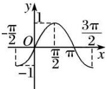</td><td></td><td>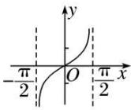</td></tr><tr><td>定义域</td><td>R</td><td>R</td><td> $\{x|x \in R, x \neq k\pi + \frac{\pi}{2}\}$ </td></tr><tr><td>值域</td><td>[-1, 1]</td><td>[-1, 1]</td><td>R</td></tr><tr><td>周期性</td><td>2π</td><td>2π</td><td>π</td></tr><tr><td>奇偶性</td><td>奇函数</td><td>偶函数</td><td>奇函数</td></tr><tr><td>递增区间</td><td> $[2k\pi - \frac{\pi}{2}, 2k\pi + \frac{\pi}{2}]$ </td><td> $[-\pi + 2k\pi, 2k\pi]$ </td><td> $(k\pi - \frac{\pi}{2}, k\pi + \frac{\pi}{2})$ </td></tr><tr><td>递减区间</td><td> $[2k\pi + \frac{\pi}{2}, 2k\pi + \frac{3\pi}{2}]$ </td><td> $[2k\pi, \pi + 2k\pi]$ </td><td>无</td></tr><tr><td>对称中心</td><td> $(k\pi, 0)$ </td><td> $(k\pi + \frac{\pi}{2}, 0)$ </td><td> $(\frac{k\pi}{2}, 0)$ </td></tr><tr><td>对称轴方程</td><td> $x = k\pi + \frac{\pi}{2}$ </td><td> $x = k\pi$ </td><td>无</td></tr></table>

注: 正(余)弦曲线相邻两条对称轴之间的距离是 $\frac{T}{2}$ ; 正(余)弦曲线相邻两个对称中心的距离是 $\frac{T}{2}$ ;

正(余)弦曲线相邻两条对称轴与对称中心距离 $\frac{T}{4}$ ;

知识点三： $y = \mathrm{A}\sin (wx + \phi)$ 与 $y = \mathrm{A}\cos (wx + \phi)(\mathrm{A} > 0,w > 0)$ 的图像与性质

(1) 最小正周期: $T=\frac{2\pi}{w}$ .  
(2) 定义域与值域: $y = \operatorname{Asin}(wx + \phi), y = \operatorname{Acos}(wx + \phi)$ 的定义域为 $R$ , 值域为 $[-A, A]$ .

(3) 最值

假设 A>0, w>0.

①对于 $y = \text{Asin}(wx + \phi)$ ,

$\left\{ \begin{array}{l} \text{当} wx + \phi = \frac{\pi}{2} + 2k\pi (k \in \mathbb{Z}) \text{时, 函数取得最大值 A;} \\ \text{当} wx + \phi = -\frac{\pi}{2} + 2k\pi (k \in \mathbb{Z}) \text{时, 函数取得最小值} -\mathbb{A}; \end{array} \right.$

②对于 $y = \mathrm{A}\cos(wx + \phi)$ , $\left\{\begin{aligned}& 当 wx+ \phi=2k\pi(k\in\mathbb{Z}) 时, 函数取得最大值 A;\\& 当 wx+ \phi=2k\pi+\pi(k\in\mathbb{Z}) 时, 函数取得最小值-A;\end{aligned}\right.$

(4) 对称轴与对称中心.

假设 A>0, w>0.

①对于 $y = \operatorname{Asin}(wx + \phi)$ , $\left\{\begin{aligned}&\text{当}wx_{0}+\phi=k\pi+\frac{\pi}{2}(k\in\mathbb{Z}),\text{即}\sin(wx_{0}+\phi)\\&=\pm1\text{时},y=\sin(wx+\phi)\text{的对称轴为}x=x_{0}\end{aligned}\right.$ 当 $wx_{0}+ \phi=k \pi (k \in \mathbb{Z})$ ，即 $\sin(wx_{0}+\phi)=0$ 时， $y=\sin(wx+\phi)$ 的对称中心为 $(x_{0},0)$ .

②对于 $y = \mathrm{A}\cos(wx + \phi)$ ,
当 $wx_{0}+\phi=k\pi(k\in\mathbb{Z})$ ，即 $\cos(wx_{0}+\phi)=\pm1$ 时， $y=\cos(wx+\phi)$ 的对称轴为 $x=x_{0}$ 当 $wx_{0}+\phi=k\pi+\frac{\pi}{2}(k\in\mathbb{Z})$ ，即 $\cos(wx_{0}+\phi)$ =0时， $y=\cos(wx+\phi)$ 的对称中心为 $(x_{0},0)$ .

正、余弦曲线的对称轴是相应函数取最大(小)值的位置．正、余弦的对称中心是相应函数与x轴交点的位置.

(5) 单调性.

假设 A>0, w>0.

①对于 $y = \text{Asin}(wx + \phi)$ , $\left\{\begin{aligned}&wx+\phi\in\left[-\frac{\pi}{2}+2k\pi,\frac{\pi}{2}+2k\pi\right](k\in\mathbb{Z})\Rightarrow\text{增区间};\\&wx+\phi\in\left[\frac{\pi}{2}+2k\pi,\frac{3\pi}{2}+2k\pi\right](k\in\mathbb{Z})\Rightarrow\text{减区间}.\end{aligned}\right.$

②对于 $y = \mathrm{A}\cos(wx + \phi)$ , $\left\{\begin{aligned}&wx+\phi\in[-\pi+2k\pi,2k\pi](k\in\mathbb{Z})\Rightarrow 增区间;\\&wx+\phi\in[2k\pi,2k\pi+\pi](k\in\mathbb{Z})\Rightarrow 减区间.\end{aligned}\right.$

(6) 平移与伸缩

由函数 $y = \sin x$ 的图像变换为函数 $y = 2\sin \left(2x + \frac{\pi}{3}\right) + 3$ 的图像的步骤；

方法一： $\left(x\to x + \frac{\pi}{2}\rightarrow 2x + \frac{\pi}{3}\right)$ .先相位变换，后周期变换，再振幅变换，不妨采用谐音记忆：我们“想欺负”(相一期一幅)三角函数图像，使之变形.

$y = \sin x$ 的图像 $\xrightarrow{\text{向左平移}\frac{\pi}{3}\text{个单位}} y = \sin \left(x + \frac{\pi}{3}\right)$ 的图像 $\xrightarrow[\text{纵坐标不变}]{\text{所有点的横坐标变为原来的}\frac{1}{2}} y = \sin \left(2x + \frac{\pi}{3}\right)$ 的图像 $\xrightarrow[\text{横坐标不变}]{\text{所有点的纵坐标变为原来的}2\text{倍}} y = 2\sin \left(2x + \frac{\pi}{3}\right)$ 的图像 $\xrightarrow[\text{向上平移}3\text{个单位}]{} y = 2\sin \left(2x + \frac{\pi}{3}\right) + 3$

方法二： $\left(x\to x + \frac{\pi}{2}\rightarrow 2x + \frac{\pi}{3}\right)$ 先周期变换，后相位变换，再振幅变换

$y = \sin x$ 的图像 $\xrightarrow[\text{纵坐标不变}]{\text{所有点的横坐标变为原来的}\frac{1}{2}} y = \sin 2x$ 的图像 $\xrightarrow[\text{横坐标不变}]{\text{向左平移}\frac{\pi}{6}\text{个单位}}$ $y = \sin 2\left(x + \frac{\pi}{6}\right) = \sin \left(2x + \frac{\pi}{2}\right)$ 的图像 $\xrightarrow[\text{横坐标不变}]{\text{所有点的纵坐标变为原来的}2\text{倍}}$

$y = 2\sin \left(2x + \frac{\pi}{3}\right)$ 的图像 $\xrightarrow{\text{向上平移}3\text{各单位}} y = 2\sin \left(2x + \frac{\pi}{3}\right) + 3$

注:在进行图像变换时,提倡先平移后伸缩(先相位后周期,即“想欺负”),但先伸缩后平移(先周期后相位)在题目中也经常出现,所以必须熟练掌握,无论哪种变化,切记每一个变换总是对变量x而言的,即图像变换要看“变量x”发生多大变化,而不是“角 $wx+\phi$ ”变化多少.

# 【解题方法总结】

关于三角函数对称的几个重要结论；

(1) 函数 $y = \sin x$ 的对称轴为 $x = k\pi + \frac{\pi}{2} (k \in \mathbb{Z})$ ，对称中心为 $(k\pi, 0) (k \in \mathbb{Z})$ ;

(2) 函数 $y = \cos x$ 的对称轴为 $x = k\pi (k \in \mathbb{Z})$ ，对称中心为 $\left(k\pi + \frac{\pi}{2}, 0\right)(k \in \mathbb{Z})$ ;

(3) 函数 $y = \tan x$ 函数无对称轴，对称中心为 $\left(\frac{k\pi}{2}, 0\right) (k \in \mathbb{Z})$ ;

(4) 求函数 $y = \operatorname{Asin}(wx + \phi) + b (w \neq 0)$ 的对称轴的方法；令 $wx + \phi = \frac{\pi}{2} + k\pi (k \in \mathbb{Z})$ ，得 $x = \frac{\frac{\pi}{2} + k\pi - \phi}{w} (k \in \mathbb{Z})$ ；对称中心的求取方法；令 $wx + \phi = k\pi (k \in \mathbb{Z})$ ，得 $x = \frac{k\pi - \phi}{w}$ ，即对称中心为 $\left(\frac{k\pi - \phi}{w}, b\right)$ .

(5) 求函数 $y = \mathrm{A}\cos (wx + \phi) + b (w \neq 0)$ 的对称轴的方法；令 $wx + \phi = k\pi (k \in \mathbb{Z})$ 得 $x = \frac{\frac{\pi}{2} + k\pi - \phi}{w}$ ，即对称中心为 $\left(\frac{\frac{\pi}{2} + k\pi - \phi}{w}, b\right) (k \in \mathbb{Z})$

# 必考题型全归纳

# 题型一:五点作图法

1186 (2024·湖北·高一荆州中学校联考期中)要得到函数 $f(x)=2\sin\left(2x+\frac{2\pi}{3}\right)$ 的图象, 可以从正弦函数或余弦函数图象出发, 通过图象变换得到, 也可以用“五点法”列表、描点、连线得到.

(1) 由 $y = \sin x$ 图象变换得到函数 $f(x)$ 的图象，写出变换的步骤和函数；  
(2) 用“五点法”画出函数 $f(x)$ 在区间 $\left[\frac{\pi}{6}, \frac{7\pi}{6}\right]$ 上的简图.

<table><tr><td></td><td></td><td></td><td></td><td></td><td></td></tr><tr><td></td><td></td><td></td><td></td><td></td><td></td></tr><tr><td></td><td></td><td></td><td></td><td></td><td></td></tr></table>

text_image

y
2
1
O π/6 2π/3 7π/6 x
-1
-2

【解析】(1) 步骤 1: 把 $y = \sin x$ 图象上所有点向左平移 $\frac{2\pi}{3}$ 个单位长度, 得到函数 y =

$\sin\left(x+\frac{2\pi}{3}\right)$ 的图象;

步骤2: 把 $y = \sin\left(x + \frac{2\pi}{3}\right)$ 图象上所有点的横坐标变为原来的 $\frac{1}{2}$ 倍 (纵坐标不变), 得到函数 $y = \sin\left(2x + \frac{2\pi}{3}\right)$ 的图象;

步骤3: 最后把函数 $y = \sin\left(2x + \frac{2\pi}{3}\right)$ 的图象的纵坐标变为原来的 2 倍 (横坐标不变), 得到函数 $y = 2\sin\left(2x + \frac{2\pi}{3}\right)$ 的图象.

或者步骤1: 步骤1: 把 $y = \sin x$ 图象上所有点的横坐标变为原来的 $\frac{1}{2}$ 倍 (纵坐标不变), 得到函数 $y = \sin 2x$ 的图象;

步骤2: 把 $y = \sin 2x$ 图象上所有点向左平移 $\frac{\pi}{3}$ 个单位长度, 得到函数 $y = \sin 2\left(x + \frac{\pi}{3}\right) = \sin\left(2x + \frac{2\pi}{3}\right)$ 的图象;

步骤3: 最后把函数 $y = \sin\left(2x + \frac{2\pi}{3}\right)$ 的图象的纵坐标变为原来的 2 倍 (横坐标不变), 得到函数 $y = 2\sin\left(2x + \frac{2\pi}{3}\right)$ 的图象.

(2) 因为 $2x + \frac{2\pi}{3} \in [\pi, 3\pi]$ ，列表：

<table><tr><td> $\frac{2x + 2\pi}{3}$ </td><td> $\pi$ </td><td> $\frac{3\pi}{2}$ </td><td> $2\pi$ </td><td> $\frac{5\pi}{2}$ </td><td> $3\pi$ </td></tr><tr><td> $x$ </td><td> $\frac{\pi}{6}$ </td><td> $\frac{5\pi}{12}$ </td><td> $\frac{2\pi}{3}$ </td><td> $\frac{11\pi}{12}$ </td><td> $\frac{7\pi}{6}$ </td></tr><tr><td> $y$ </td><td>0</td><td>-2</td><td>0</td><td>2</td><td>0</td></tr></table>

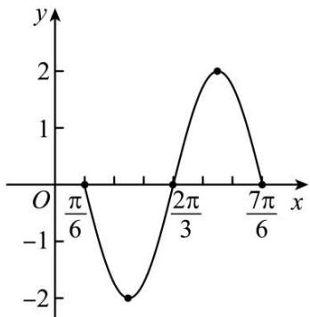

line

| x | y |
|---|---|
| 0 | 0 |
| π/6 | 0 |
| 2π/3 | -2 |
| 7π/6 | 0 |

例 2. (2024·北京·高一首都师范大学附属中学校考阶段练习) 已知函数 $f(x)=2\sin\left(\frac{\pi}{3}x+\frac{\pi}{6}\right)$

(1) 用“五点作图法”在给定坐标系中画出函数 $f(x)$ 在 $[0,6]$ 上的图像;

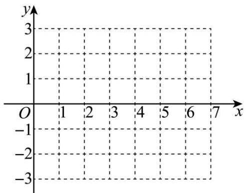

text_image

y
3
2
1
O 1 2 3 4 5 6 7 x
-1
-2
-3

(2) 求 $y = f(x)$ , $x \in R$ 的单调递增区间;  
(3) 当 $x \in [0, m]$ 时, $f(x)$ 的取值范围为 $[1, 2]$ , 直接写出 $m$ 的取值范围.  
(1) 因为 $f(x)=2\sin\left(\frac{\pi}{3}x+\frac{\pi}{6}\right)$ ，当 $x\in[0,6]$ 时， $\frac{\pi x}{3}+\frac{\pi}{6}\in\left[\frac{\pi}{6},\frac{13\pi}{6}\right]$ ,

列表如下:

<table><tr><td>x</td><td>0</td><td>1</td><td> $\frac{5}{2}$ </td><td>4</td><td> $\frac{11}{2}$ </td><td>6</td></tr><tr><td> $\frac{\pi}{3}x + \frac{\pi}{6}$ </td><td> $\frac{\pi}{6}$ </td><td> $\frac{\pi}{2}$ </td><td> $\pi$ </td><td> $\frac{3\pi}{2}$ </td><td> $2\pi$ </td><td> $\frac{13\pi}{6}$ </td></tr><tr><td>y</td><td>1</td><td>2</td><td>0</td><td>-2</td><td>0</td><td>1</td></tr></table>

作图如下:

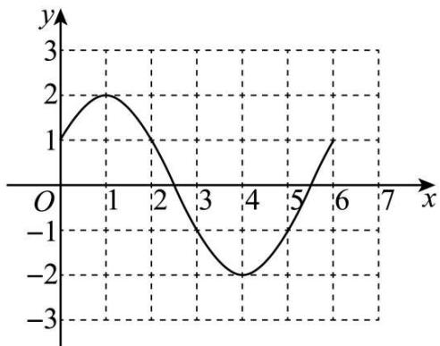

line

| x | y |
|---|---|
| 0 | 1 |
| 1 | 2 |
| 2 | 1 |
| 3 | -1 |
| 4 | -2 |
| 5 | -1 |
| 6 | 1 |

(2) 因为 $f(x) = 2\sin \left(\frac{\pi}{3} x + \frac{\pi}{6}\right)$ ，令 $\frac{\pi}{3} x + \frac{\pi}{6} = \frac{\pi}{2} + k\pi (k \in \mathbb{Z})$ ，解得 $x = 3k + 1 (k \in \mathbb{Z})$ ，

令 $2k\pi - \frac{\pi}{2} \leqslant \frac{\pi}{3}x + \frac{\pi}{6} \leqslant 2k\pi + \frac{\pi}{2}(k \in \mathbb{Z})$ ，解得 $6k - 2 \leqslant x \leqslant 6k + 1 (k \in \mathbb{Z})$

所以 $y=f(x)$ 的递增区间为 $[6k-2,6k+1](k\in\mathbb{Z})$

(3) $\because x\in [0,m],\therefore \frac{\pi}{3} x + \frac{\pi}{6}\in \left[\frac{\pi}{6},\frac{\pi m}{3} +\frac{\pi}{6}\right],$

又 $1 \leqslant f(x) \leqslant 2$ ，由(1)的图象可知， $1 \leqslant m \leqslant 2$ ， $\therefore m$ 的取值范围是[1,2].

1187 (2024·广东东莞·高一东莞市东华高级中学校联考阶段练习)函数 $f(x) = \sin x + 2|\sin x|$ .

(1) 请用五点作图法画出函数 $f(x)$ 在 $[0,2\pi]$ 上的图象；(先列表，再画图)  
(2) 设 $F(x)=f(x)-2^{m}, x\in[0,2\pi]$ ，当 m>0 时，试研究函数 $F(x)$ 的零点的情况.

【解析】(1) $f(x)=\left\{\begin{aligned}&3\sin x,&0\leqslant x\leqslant\pi\\&-\sin x,&\pi<x\leqslant2\pi\end{aligned}\right.$

按五个关键点列表:

<table><tr><td>x</td><td>0</td><td> $\frac{\pi}{2}$ </td><td> $\pi$ </td><td> $\frac{3\pi}{2}$ </td><td> $2\pi$ </td></tr><tr><td> $\sin x$ </td><td>0</td><td>1</td><td>0</td><td>-1</td><td>0</td></tr><tr><td> $f(x) = \sin x + 2|\sin x|$ </td><td>0</td><td>3</td><td>0</td><td>1</td><td>0</td></tr></table>

描点并将它们用光滑的曲线连接起来如下图所示:

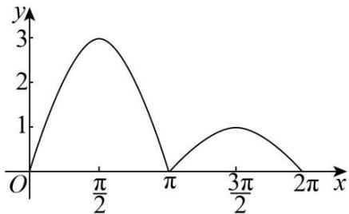

line

| x | y |
|---|---|
| 0 | 0 |
| π/2 | 3 |
| π | 0 |
| 3π/2 | 1 |
| 2π | 0 |

(2) 因为 $F(x)=f(x)-2^{m}$ ,

所以 $F(x)$ 的零点个数等价于 $y=f(x)$ 与 $y=2^{m}$ 图象交点的个数，

设 $t = 2^{m}$ ， $m > 0$ ，则 $t > 1$

当 $0 < m < \log_{2}3$ ，即 1 < t < 3 时， $F(x)$ 有 2 个零点；

当 $m=\log_{2}3$ ，即 t=3 时， $F(x)$ 有 1 个零点；

当 $m > \log_{2}3$ ，即 t > 3 时， $F(x)$ 有 0 个零点.

# 【解题方法总结】

(1) 在正弦函数 $y = \sin x, x \in [0, 2\pi]$ 的图象中，五个关键点是： $(0, 0), (\frac{\pi}{2}, 1), (\pi, 0), (\frac{3\pi}{2}, -1), (2\pi, 0)$ .

(2) 在余弦函数 $y = \cos x, x \in [0, 2\pi]$ 的图象中，五个关键点是： $(0, 1), (\frac{\pi}{2}, 0), (\pi, -1), (\frac{3\pi}{2}, 0), (2\pi, 1)$ .

# 题型二: 函数的奇偶性

1188 (2024·全国·高三专题练习)函数 $f(x)=\cos(x+a)+\sin(x+b)$ ，则()

A. 若 $a + b = 0$ ，则 $f(x)$ 为奇函数

B. 若 $a + b = \frac{\pi}{2}$ , 则 $f(x)$ 为偶函数

C. 若 $b - a = \frac{\pi}{2}$ , 则 $f(x)$ 为偶函数

D. 若 $a - b = \pi$ ，则 $f(x)$ 为奇函数

【答案】B

【解析】 $f(x)$ 的定义域为 R，

对 A: 若 $a + b = 0$ , $f(x) = \cos(x + a) + \sin(x - a)$ , 若 $f(x)$ 为奇函数, 则 $f(0) = 0$ , 而 $f(0) = \cos a - \sin a = 0$ 不恒成立, 故 $f(x)$ 不是奇函数;

对 B: 若 $a + b = \frac{\pi}{2}$ , $f(x) = \cos(x + a) + \sin\left(x + \frac{\pi}{2} - a\right) = \cos(x + a) + \cos(x - a)$ ,

$f(-x)=\cos(-x+a)+\cos(-x-a)=\cos(x-a)+\cos(x+a)=f(x)$ ，故 $f(x)$ 为偶函数，B正确；

对 C: 若 $b - a = \frac{\pi}{2}$ , $f(x) = \cos(x + a) + \sin\left(x + \frac{\pi}{2} + a\right) = 2\cos(x + a)$ , $f(-x) =$

$2\cos(-x+a)\neq f(x)$ ，故 $f(x)$ 不是偶函数，故C错误；

对 D: 若 $a - b = \pi, f(x) = \cos(x + b + \pi) + \sin(x + b) = -\cos(x + b) + \sin(x + b)$ ,

若 $f(x)$ 为奇函数, 则 $f(0)=0$ , 而 $f(0)=-\cos b+\sin b=0$ 不恒成立, 故 $f(x)$ 不是奇函数;

故选：B

1189 (2024·贵州贵阳·校联考模拟预测)使函数 $f(x) = \sqrt{3}\sin (2x + \theta) + \cos (2x + \theta)$ 为偶函数，则 $\theta$ 的一个值可以是（）

A. $\frac{\pi}{3}$

B. $\frac{\pi}{6}$

C. $-\frac{\pi}{3}$

D. $\frac{7\pi}{6}$

【答案】A

【解析】由 $f(x)=\sqrt{3}\sin(2x+\theta)+\cos(2x+\theta)=2\sin\left(2x+\theta+\frac{\pi}{6}\right)$ ,

因为 $f(x)$ 为偶函数, 可得 $\theta + \frac{\pi}{6} = k\pi + \frac{\pi}{2}, k \in Z$ , 所以 $\theta = k\pi + \frac{\pi}{3}, k \in Z$ ,

令 $k = 0$ ，可得 $\theta = \frac{\pi}{3}$

故选：A.

1190 (2024·湖南常德·常德市一中校考模拟预测)函数 $f(x)=\sin(2x+\varphi)$ 的图像向左平移 $\frac{\pi}{3}$ 个单位得到函数 $g(x)$ 的图像，若函数 $g(x)$ 是偶函数，则 $\tan\varphi=$ （）

A. $-\sqrt{3}$

B. $\sqrt{3}$

C. $-\frac{\sqrt{3}}{3}$

D. $\frac{\sqrt{3}}{3}$

【答案】C

【解析】函数 $f(x)=\sin(2x+\varphi)$ 的图像向左平移 $\frac{\pi}{3}$ 个单位，得 $g(x)=\sin\left(2x+\frac{2\pi}{3}+\varphi\right)$ 的图像，

又函数 $g(x)$ 是偶函数，则有 $\frac{2\pi}{3} +\varphi = k\pi +\frac{\pi}{2},(k\in \mathbf{Z})$ ，解得 $\varphi = k\pi -\frac{\pi}{6},k\in \mathbf{Z};$

所以 $\tan\varphi=\tan\left(k\pi-\frac{\pi}{6}\right)=-\frac{\sqrt{3}}{3}.$

故选：C.

1191 (2024·北京·高三专题练习)已知的 $f(x)=\sin x+\sqrt{3}\cos x$ 图象向左平移 $\varphi$ 个单位长度后, 得到函数 $g(x)$ 的图象, 且 $g(x)$ 的图象关于 y 轴对称, 则 $|\varphi|$ 的最小值为 ( )

A. $\frac{\pi}{12}$

B. $\frac{\pi}{6}$

C. $\frac{\pi}{3}$

D. $\frac{5\pi}{12}$

【答案】B

【解析】由题意可得 $f(x)=\sin x+\sqrt{3}\cos x=2\sin\left(x+\frac{\pi}{3}\right)$ ,

故 $g(x)=2\sin\left(x+\varphi+\frac{\pi}{3}\right)$ ，由于 $g(x)$ 的图象关于 y 轴对称，

则 $g(x)$ 为偶函数, 故 $\varphi + \frac{\pi}{3} = \frac{\pi}{2} + k\pi, k \in Z$ , 即 $\varphi = \frac{\pi}{6} + k\pi, k \in Z$ ,

故 $|\varphi|$ 的最小值为 $\frac{\pi}{6}$ ,

故选：B

1192 (2024·浙江·高三期末)将函数 $f(x)=\cos(2x+\varphi)$ 的图象向右平移 $\frac{\pi}{12}$ 个单位得到一个奇函数的图象, 则 $\varphi$ 的取值可以是 ()

A. $\frac{\pi}{6}$

B. $\frac{\pi}{3}$

C. $\frac{\pi}{2}$

D. $\frac{2\pi}{3}$

【答案】D

【解析】函数 $y=f(x-\frac{\pi}{12})=\cos\left[2(x-\frac{\pi}{12})+\varphi\right]=\cos\left(2x-\frac{\pi}{6}+\varphi\right)$ 为奇函数，

则 $-\frac{\pi}{6} + \varphi = \frac{\pi}{2} + k\pi \Rightarrow \varphi = \frac{2\pi}{3} + k\pi, k \in \mathbb{Z}$ ，取 k = 0，则 $\varphi = \frac{2\pi}{3}$ .

故选：D

1193 (2024·广东·高三统考学业考试)函数 $f(x) = \sin \left(4x + \frac{\pi}{2}\right)$ 是 （）

A. 最小正周期为 $\pi$ 的奇函数

B. 最小正周期为 $\pi$ 的偶函数

C. 最小正周期为 $\frac{\pi}{2}$ 的奇函数

D. 最小正周期为 $\frac{\pi}{2}$ 的偶函数

【答案】D

【解析】解析: 函数 $f(x)=\sin\left(4x+\frac{\pi}{2}\right)=\cos4x$ ,

故该函数为偶函数,且它的最小正周期为 $\frac{2\pi}{4} = \frac{\pi}{2}$ .

故选：D.

1194 (2024·全国·高三专题练习)已知函数 $f(x) = \frac{x^4 - \tan x + 2}{x^4 + 2}$ 的最大值为M，最小值为m，则 $M + m$ 的值为()

A. 0

B. 2

C. 4

D. 6

【答案】B

【解析】解: $f(x)=\frac{x^{4}-\tan x+2}{x^{4}+2}=1-\frac{\tan x}{x^{4}+2}$ ，令 $g(x)=\frac{\tan x}{x^{4}+2},x\neq\frac{\pi}{2}+k\pi(k\in\mathbb{Z})$ ，于是 $g(-x)=\frac{\tan(-x)}{(-x)^{4}+2}=-\frac{\tan x}{x^{4}+2}=-g(x)$ ，所以 $g(x)$ 是奇函数，从而 $g(x)$ 的最大值G与最小值g的和为0，而 $M+m=1-g+1-G=2$ .

故选：B

1195 (2024·山东·高三专题练习)设函数 $f(x)=ax^{3}+b\cdot\tan x+c\cdot\sqrt[3]{x}+2x^{2}+1$ ，如果 $f(2)=10$ ，则 $f(-2)$ 的值是()

A.-10

B. 8

C.-8

D.-7

【答案】B

【解析】令 $g(x)=ax^{3}+b\cdot\tan x+c\cdot\sqrt[3]{x}$ ，由奇函数定义可知 $g(-x)=-g(x)$ ，化简计算可求得结果。令 $g(x)=ax^{3}+b\cdot\tan x+c\cdot\sqrt[3]{x}$ ，则 $g(-x)=-g(x)$ ，

所以 $f(x)=g(x)+2x^{2}+1$ ，由 $f(2)=10$ 可知， $f(2)=g(2)+2\times4+1=10$ ，即 $g(2)=1$ ， $f(-2)=g(-2)+9=-g(2)+9=-1+9=8,$

故选: B.

【解题方法总结】

由 $y=\sin x$ 是奇函数和 $y=\cos x$ 是偶函数可拓展得到关于三角函数奇偶性的重要结论:

(1) 若 $y = \text{Asin}(x + \phi)$ 为奇函数，则 $\phi = k\pi (k \in \mathbb{Z})$ ;  
(2) 若 $y = \mathrm{A}\sin (x + \phi)$ 为偶函数, 则 $\phi = k\pi + \frac{\pi}{2} (k \in \mathbb{Z})$ ;  
(3) 若 $y = \mathrm{A}\cos (x + \phi)$ 为奇函数, 则 $\phi = k\pi + \frac{\pi}{2} (k \in \mathbb{Z})$ ;

(4) 若 $y = \mathrm{A}\cos (x + \phi)$ 为偶函数, 则 $\phi = k\pi (k \in \mathbb{Z})$ ;

若 $y = \text{Atan}(x + \phi)$ 为奇函数，则 $\phi = \frac{k\pi}{2} (k \in \mathbb{Z})$ ，该函数不可能为偶函数.

# 题型三: 函数的周期性

1196 (2024·湖北襄阳·高三襄阳五中校考开学考试)已知 $x_{1}, x_{2}$ , 是函数 $f(x) =$ $\tan(\omega x-\varphi)(\omega>0,0<\varphi<\pi)$ 的两个零点，且 $|x_{1}-x_{2}|$ 的最小值为 $\frac{\pi}{3}$ ，若将函数 $f(x)$ 的图象向左平移 $\frac{\pi}{12}$ 个单位长度后得到的图象关于原点对称，则 $\varphi$ 的最大值为（）

A. $\frac{3\pi}{4}$

B. $\frac{\pi}{4}$

C. $\frac{7\pi}{8}$

D. $\frac{\pi}{8}$

【答案】A

【解析】由题意知函数 $f(x)$ 的最小正周期 $T = \frac{\pi}{3}$ ，则 $\frac{\pi}{\omega} = \frac{\pi}{3}$ ，得 $\omega = 3, \therefore f(x) = \tan (3x - \varphi)$ .

将函数 $f(x)$ 的图象向左平移 $\frac{\pi}{12}$ 个单位长度,得到 $y = \tan \left[3\left(x + \frac{\pi}{12}\right) - \varphi\right] = \tan \left(3x + \frac{\pi}{4} - \varphi\right)$ 的图象,

要使该图象关于原点对称,则 $\frac{\pi}{4}-\varphi=\frac{k\pi}{2}, k\in Z$ , 所以 $\varphi=\frac{\pi}{4}-\frac{k\pi}{2}, k\in Z$ , 又 $0<\varphi<\pi$ , 所以当 k=-1 时, $\varphi$ 取得最大值, 最大值为 $\frac{3\pi}{4}$ .

故选：A

1197 (2024·江西·南昌县莲塘第一中学校联考二模)将函数 $f(x)=\cos2x$ 的图象向右平移 $\varphi\left(0<\varphi<\frac{\pi}{2}\right)$ 个单位长度后得到函数 $g(x)$ 的图象，若对满足 $\left|f(x_{1})-g(x_{2})\right|=2$ 的 $x_{1}, x_{2}$ ，
总有 $\left|x_{1}-x_{2}\right|$ 的最小值等于 $\frac{\pi}{6}$ ，则 $\varphi=$ （）

A. $\frac{\pi}{12}$

B. $\frac{\pi}{6}$

C. $\frac{\pi}{3}$

D. $\frac{5\pi}{12}$

【答案】C

【解析】函数 $f(x)=\cos2x$ 的周期为 $\pi$ ,

将函数的图象向右平移 $\varphi\left(0<\varphi<\frac{\pi}{2}\right)$ 个单位长度后得到函数 $g(x)$ 的图象，

可得 $g(x)=\cos(2x-2\varphi)$ ,

由 $|f(x_1) - g(x_2)| = 2$ 可知，两个函数的最大值与最小值的差为2，且 $\left|x_{1} - x_{2}\right|_{\min} = \frac{\pi}{6},$

不妨设 $x_{1}=0$ ，则 $x_{2}=\pm\frac{\pi}{6}$ ，即 $g(x)$ 在 $x_{2}=\pm\frac{\pi}{6}$ 时取得最小值，

由于 $\cos\left(2\times\frac{\pi}{6}-2\varphi\right)=-1$ ，此时 $\varphi=-\frac{\pi}{3}-k\pi,k\in Z$ ，不合题意； $\cos\left[2\times\left(-\frac{\pi}{6}\right)-2\varphi\right]=-1$ ，此时 $\varphi=-\frac{2}{3}\pi-k\pi,k\in Z$ ，

当 k=-1 时， $\varphi=\frac{\pi}{3}$ 满足题意.

故选：C.

1198 (2024·河北·高三校联考阶段练习)函数 $f(x) = |\sin x| + |\cos x|$ 的最小正周期为（）

A. $\pi$

B. $\frac{3\pi}{2}$

C. $\frac{\pi}{2}$

D. $\frac{\pi}{4}$ 【答案】C

【解析】 $f(x)=|\sin x|+|\cos x|=\sqrt{(|\sin x|+|\cos x|)^{2}}=\sqrt{1+|\sin 2x|}=\sqrt{1+\sqrt{\frac{1-\cos 4x}{2}}}$ ，所以 $f(x)$ 的最小正周期 $T=\frac{2\pi}{4}=\frac{\pi}{2}$ .

故选：C.

1199 (2024·高三课时练习)函数 $f(x)=\tan\omega x(\omega>0)$ 的图像的相邻两支截直线 y=2 所得线段长为 $\frac{\pi}{2}$ ，则 $f\left(\frac{\pi}{6}\right)$ 的值是 \_\_\_\_.

【答案】 $\sqrt{3}$

【解析】因为函数 $f(x)=\tan\omega x(\omega>0)$ 的图像的相邻两支截直线y=2所得线段长为 $\frac{\pi}{2}$ ，所以该函数的最小正周期为 $\frac{\pi}{2}$ ，

因为 $\omega > 0$ ，所以 $\frac{\pi}{2} = \frac{\pi}{\omega} \Rightarrow \omega = 2$ ，即 $f(x) = \tan 2x$

因此 $f\left(\frac{\pi}{6}\right) = \tan \left(2\times \frac{\pi}{6}\right) = \tan \frac{\pi}{3} = \sqrt{3},$

故答案为: $\sqrt{3}$

1200 (2024·河北衡水·高三河北深州市中学校考阶段练习)下列函数中,最小正周期为π的奇函数是()

A. $y = \sin\left(x + \frac{\pi}{4}\right)$

B. $y = \sin (\pi +x)\cos (\pi -x)$

C. $y = \cos^2 x - \cos^2\left(x + \frac{\pi}{2}\right)$

D. $y = \sin |2x|$

【答案】B

【解析】对于 A: $y = \sin\left(x + \frac{\pi}{4}\right)$ 最小正周期为 $2\pi$ , 故 A 错误;

对于 B: $y = \sin x \cos x = \frac{1}{2} \sin 2x$ ，最小正周期 $T = \frac{2\pi}{2} = \pi$ ，且为奇函数，故 B 正确；

对于 C: $y = \cos^{2}x - \sin^{2}x = \cos2x$ ，最小正周期为 $\pi$ 的偶函数，故 C 错误；

对于 D: $y=f(x)=\sin|2x|$ ，则 $f(-x)=\sin|-2x|=\sin|2x|=f(x)$ ，

故 $y=\sin|2x|$ 为偶函数, 故 D 错误.

故选：B

1201 (2024·全国·高三专题练习)函数 $f(x) = 2\cos x$ 对于 $\forall x \in \mathbb{R}$ ，都有 $f(x_{1}) \leqslant f(x) \leqslant f(x_{2})$ ，则 $|x_{1} - x_{2}|$ 的最小值为（）.

A. $\frac{\pi}{4}$

B. $\frac{\pi}{2}$

C. $\pi$

D. $2\pi$

【答案】C

【解析】 $\because f(x_{1}) \leqslant f(x) \leqslant f(x_{2})$ 恒成立，

∴ $f(x_{1})$ 是函数 $f(x)$ 的最小值， $f(x_{2})$ 是函数 $f(x)$ 的最大值，

即 $x_{1}$ 、 $x_{2}$ 是函数的两条对称轴，则 $\left|x_{1}-x_{2}\right|$ 的最小值为 $\frac{T}{2}=\frac{2\pi}{2}=\pi$ .

故选：C.

1202 (2024·全国·高三专题练习)已知函数 $f(x) = \cos \omega x (\sin \omega x + \sqrt{3} \cos \omega x)^{\circ}$ ( $\omega > 0$ ), 如果存在实数 $x_0$ , 使得对任意的实数 $x$ , 都有 $f(x_0) \leqslant f(x) \leqslant f(x_0 + 2016\pi)$ 成立, 则 $\omega$ 的最小值为

A. $\frac{1}{4032\pi}$

B. $\frac{1}{2016\pi}$

C. $\frac{1}{4032}$

D. $\frac{1}{2016}$

【答案】C

【解析】因为 $f(x)=\cos\omega x(\sin\omega x+\sqrt{3}\cos\omega x)\circ(\omega>0)=\sin\left(2\omega x+\frac{\pi}{3}\right)+\frac{\sqrt{3}}{2}$ ，设 $f(x)$ 的最小正周期为 T，则 $\frac{T}{2}\leqslant2016\pi,\therefore\omega\geqslant\frac{1}{4032}$ ，所以 $\omega$ 的最小值为 $\frac{1}{4032}$ ，故选 C. 考点：三角函数的周期和最值.

1203 (2024·北京·北京市第一六一中学校考模拟预测)设函数 $f(x)=\cos\left(\omega x+\frac{\pi}{6}\right)$ 在 $[-π,\pi]$ 的图象大致如图所示，则 $f(x)$ 的最小正周期为()

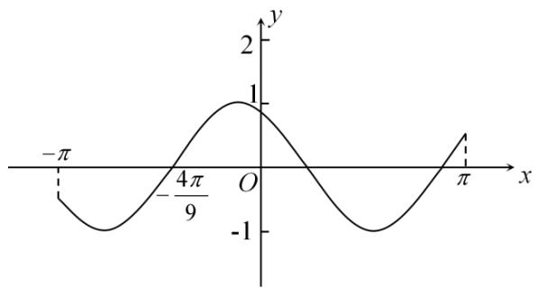

A. $\frac{4\pi}{3}$

B. $\frac{10\pi}{9}$

C. $\frac{4}{3}$

D. $\frac{10}{9}$

【答案】A

【解析】由图象可知， $f\left(-\frac{4\pi}{9}\right)=0,\therefore-\frac{4\pi}{9}\omega+\frac{\pi}{6}=\frac{\pi}{2}+k\pi(k\in\mathbb{Z})$

解得 $\omega = -\frac{3 + 9k}{4} (k\in \mathbb{Z})$

设函数的最小正周期为 T, 易知 $T < 2\pi < 2T$ ,

$$
\therefore \frac {2 \pi}{| \omega |} <   2 \pi <   \frac {4 \pi}{\omega} \therefore 1 <   | \omega | <   2
$$

当且仅当 k=-1 时符合题意, 此时 $\omega=\frac{3}{2}$ , $\therefore T=\frac{2\pi}{\omega}=\frac{4\pi}{3}$

故选：A.

1204 (2024·全国·高三对口高考)函数 $f(x) = |\sin x + \cos x|$ 的最小正周期是 \_\_\_\_.

【答案】π

【解析】因为 $f(x)=\left|\sin x+\cos x\right|=\left|\sqrt{2}\sin\left(x+\frac{\pi}{4}\right)\right|$ ,

因为 $y=\sqrt{2}\sin\left(x+\frac{\pi}{4}\right)$ 的最小正周期为 $T=\frac{2\pi}{1}=2\pi$ ,

所以函数 $f(x) = \left|\sqrt{2}\sin \left(x + \frac{\pi}{4}\right)\right|$ 最小正周期为 $\pi$ .

故答案为: $\pi$ .

1205 (2024·江西鹰潭·高三贵溪市实验中学校考阶段练习)函数 $f(x) = (\cos x - \sin x)$

$\cos \left( \frac{\pi}{2} - x \right)$ 的最小正周期是 \_\_\_\_.

【答案】π

【解析】 $f(x)=(\cos x-\sin x)\cos\left(\frac{\pi}{2}-x\right)=(\cos x-\sin x)\sin x=\frac{1}{2}\sin2x-\frac{1-\cos2x}{2}=\frac{\sqrt{2}}{2}\sin\left(2x+\frac{\pi}{4}\right)-\frac{1}{2}$ 所以最小正周期为 $\frac{2\pi}{2}=\pi,$

故答案为: $\pi$

1206 (2024·全国·高三专题练习)已知函数 $f(x)=\sin\pi x+1$ . 则 $f\left(\frac{1}{2}\right)+f\left(\frac{3}{2}\right)+f\left(\frac{5}{2}\right)+f\left(\frac{7}{2}\right)+\cdots+f\left(\frac{2021}{2}\right)+f\left(\frac{2023}{2}\right)=$ \_\_\_\_.

【答案】1012

【解析】由条件,可得 $f\left(\frac{1}{2}\right)+f\left(\frac{3}{2}\right)=2,\left(\frac{5}{2}\right)+f\left(\frac{7}{2}\right)=2,\cdots,f\left(\frac{2021}{2}\right)+f\left(\frac{2023}{2}\right)=2$ , 共 506 组,

所以 $f\left(\frac{1}{2}\right)+f\left(\frac{3}{2}\right)+f\left(\frac{5}{2}\right)+f\left(\frac{7}{2}\right)+\cdots+f\left(\frac{2021}{2}\right)+f\left(\frac{2023}{2}\right)=1012.$

故答案为: 1012.

1207 (2024·四川遂宁·统考三模)已知函数 $f(x) = \sin \left( \omega x + \frac{\pi}{6} \right) + \cos \omega x (\omega > 0)$ , $f(x_1) = 0$ , $f(x_2) = \sqrt{3}$ , 且 $|x_1 - x_2|$ 的最小值为 $\pi$ , 则 $\omega =$ \_\_\_\_

【答案】 $\frac{1}{2} / 0.5$

【解析】因为 $f(x)=\sin\left(\omega x+\frac{\pi}{6}\right)+\cos\omega x=\frac{\sqrt{3}}{2}\sin\omega x+\frac{1}{2}\cos\omega x+\cos\omega x=\frac{\sqrt{3}}{2}\sin\omega x+\frac{3}{2}\cos\omega x$ $=\sqrt{3}\sin\left(\omega x+\frac{\pi}{3}\right)$ ，另外 $f(x_{1})=0, f(x_{2})=\sqrt{3}$ ，且 $|x_{1}-x_{2}|$ 的最小值为 $\pi$ ，

所以, 函数 $f(x)$ 的最小正周期 T 满足 $\frac{2k+1}{4} \cdot T = \pi (k \in N)$ , 则 $T = \frac{4\pi}{2k+1} (k \in N)$ ,
所以， $\omega=\frac{2\pi}{T}=\frac{2k+1}{2}(k\in N)$ ，故当k=0时， $\omega$ 取最小值 $\frac{1}{2}$ .
故答案为： $\frac{1}{2}$

1208 (2024·上海宝山·上海交大附中校考三模)已知函数 $f(x) = \sin 2x + 2\sqrt{3}\cos^2 x$ ，则函数 $f(x)$ 的最小正周期是 \_\_\_\_.

【答案】π

【解析】 $f(x)=\sin2x+2\sqrt{3}\cos^{2}x=\sin2x+\sqrt{3}\cos2x+\sqrt{3}=2\sin\left(2x+\frac{\pi}{3}\right)+\sqrt{3}$ ，故 $T=\frac{2\pi}{2}=\pi$ ,

故答案为: $\pi$ .

1209 (2024·上海·上海中学校考模拟预测)已知函数 $f(x)=\sin\omega x-\sin\left(\omega x+\frac{\pi}{3}\right)(\omega>0)$ 的最小正周期是 $\frac{\pi}{2}$ ，则 $\omega=$ \_\_\_\_.

【答案】4

【解析】 $f(x)=\sin\omega x-\sin\left(\omega x+\frac{\pi}{3}\right)=\sin\omega x-\frac{1}{2}\sin\omega x-\frac{\sqrt{3}}{2}\cos\omega x=\sin\left(\omega x-\frac{\pi}{3}\right)$ ，
所以最小正周期是 $T=\frac{2\pi}{\omega}=\frac{\pi}{2}$ ，所以 $\omega=4$ .

故答案为: 4

1210 (2024·陕西咸阳·武功县普集高级中学统考一模)设函数 $f(x)=$

$\mathrm{Asin}(\omega x+\phi)(\mathrm{A}>0,\omega>0)$ 相邻两条对称轴之间的距离为 $\frac{\pi}{2},\left|f\left(\frac{\pi}{3}\right)\right|=A$ , 则 $|\varphi|$ 的最小值为 \_\_\_\_.

【答案】 $\frac{\pi}{6} / \frac{1}{6}\pi$

【解析】因为函数 $f(x)=\mathrm{Asin}(\omega x+\phi)(A>0,\omega>0)$ 相邻两条对称轴之间的距离为 $\frac{\pi}{2}$ ，则函数 $f(x)$ 的周期 $T=\pi$ ，

$\omega=\frac{2\pi}{T}=2$ , 又 $\left|f\left(\frac{\pi}{3}\right)\right|=A$ , 因此 $2\times\frac{\pi}{3}+\varphi=k\pi+\frac{\pi}{2}, k\in Z$ , 即 $\varphi=k\pi-\frac{\pi}{6}, k\in Z$ ,

所以当 k=0 时， $\left|\varphi\right|_{\min}=\frac{\pi}{6}$ .

故答案为: $\frac{\pi}{6}$

1211 (2024·上海浦东新·高三华师大二附中校考阶段练习)函数 $y = 2 \cos^{2} x + 1 (x \in \mathbb{R})$ 的最小正周期为 \_\_\_\_.

【答案】π

【解析】 $y=2\cos^{2}x+1=\cos2x+2$

所以,其最小正周期为 $\frac{2\pi}{2}=\pi$ .

故答案为: $\pi$

1212 (2024·内蒙古·高三霍林郭勒市第一中学统考阶段练习)设函数 $f(x) = \mathrm{A}\cos (\omega x + \varphi)$ (A, ω, φ 是常数, A > 0, ω > 0). 若 $f(x)$ 在区间 $\left[\frac{\pi}{4}, \frac{\pi}{2}\right]$ 上具有单调性, 且 $f\left(\frac{\pi}{2}\right) = f\left(\frac{2\pi}{3}\right) = -f\left(\frac{\pi}{4}\right)$ , 则 $f(x)$ 的最小正周期为 \_\_\_\_.

【答案】 $\frac{5\pi}{6} / \frac{5}{6}\pi$

【解析】 $f(x)$ 在区间 $\left[\frac{\pi}{4},\frac{\pi}{2}\right]$ 上具有单调性，区间 $\left[\frac{\pi}{4},\frac{\pi}{2}\right]$ 的长度为 $\frac{\pi}{2}-\frac{\pi}{4}=\frac{\pi}{4}$ ,

区间 $\left[\frac{\pi}{2},\frac{2\pi}{3}\right]$ 的长度为 $\frac{2\pi}{3} -\frac{\pi}{2} = \frac{\pi}{6} <  \frac{\pi}{4},$

由于 $f\left(\frac{\pi}{2}\right)=f\left(\frac{2\pi}{3}\right)=-f\left(\frac{\pi}{4}\right)$ ,

所以 $f(x)$ 的一条对称轴为 $x=\frac{\frac{\pi}{2}+\frac{2\pi}{3}}{2}=\frac{7\pi}{12}$ ，其相邻一个对称中心为 $\left(\frac{\frac{\pi}{4}+\frac{\pi}{2}}{2},0\right)$ ，即 $\left(\frac{3\pi}{8},0\right)$ ,

所以 $\frac{\mathrm{T}}{4} = \frac{7\pi}{12} -\frac{3\pi}{8} = \frac{5\pi}{24},\mathrm{T} = \frac{5\pi}{6}.$

故答案为: $\frac{5\pi}{6}$

1213 (2024·全国·高三专题练习)下列6个函数:① $y = |\sin x|$ , ② $y = \sin |x|$ , ③ $y = |\cos x|$ , ④ $y = \cos |x|$ , ⑤ $y = |\tan x|$ , ⑥ $y = \tan |x|$ , 其中最小正周期为 $\pi$ 的偶函数的编号为 \_\_\_\_.

【答案】①③⑤

【解析】① $y = |\sin x|$ , ② $y = \sin |x|$ , ③ $y = |\cos x|$ , ④ $y = \cos |x|$ , ⑤ $y = |\tan x|$ , ⑥ $y = \tan |x|$ 都是偶函数，

由函数的图象如如所示, 可知 $y = |\sin x|$ , $y = |\cos x|$ , $y = |\tan x|$ 的最小正周期都是 $\pi$ , $y = \sin |x|$ , $y = \tan |x|$ 不是周期函数, $y = \cos |x| = \cos x$ , 最小正周期为 $2\pi$ ,

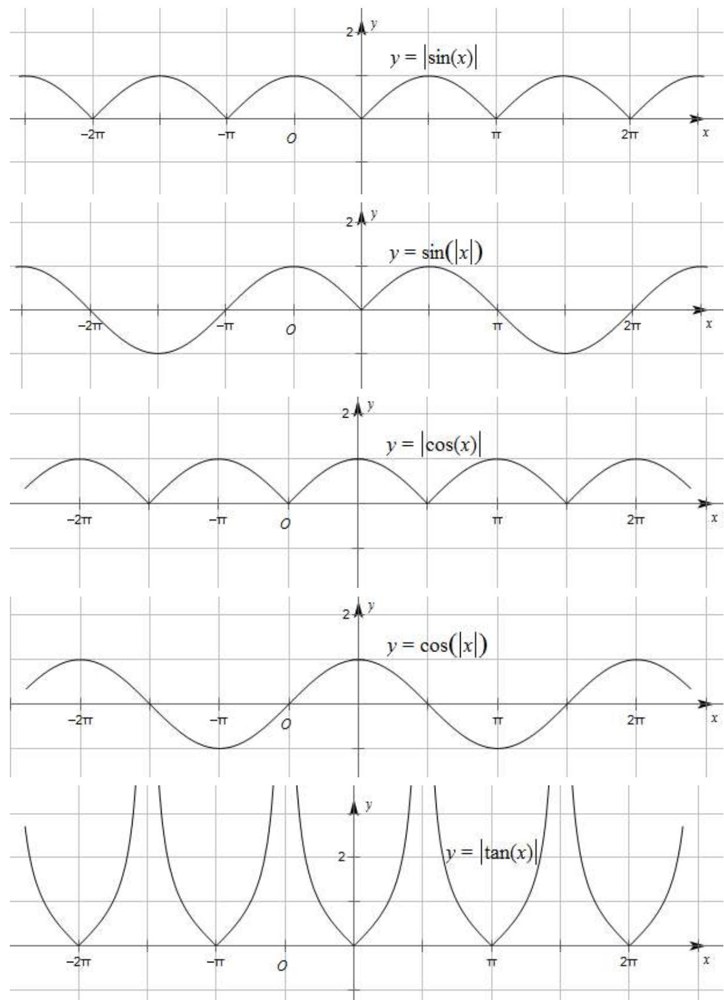

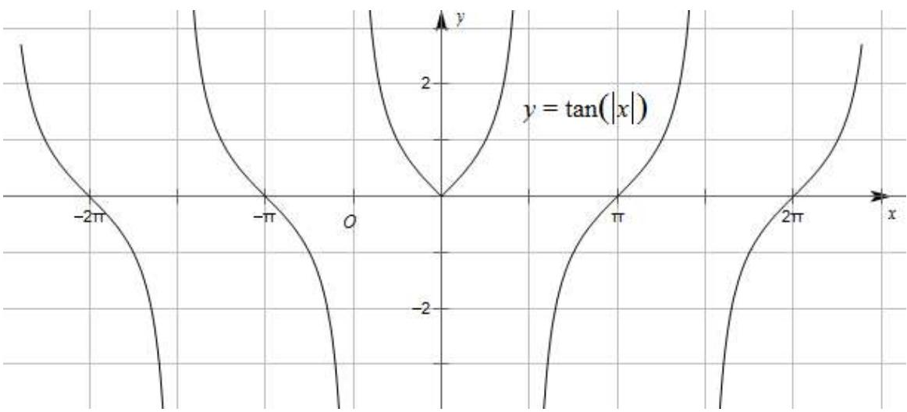

故答案为:①③⑤

【解题方法总结】

关于三角函数周期的几个重要结论:

(1) 函数 $y = \mathrm{A}\sin (wx + \phi) + b, y = \mathrm{A}\cos (wx + \phi) + b, y = \mathrm{A}\tan (wx + \phi) + b$ 的周期分别为 $\mathrm{T} = \frac{2\pi}{|w|}, \mathrm{T} = \frac{\pi}{|w|}$ .  
(2) 函数 $y = |\mathrm{Asin}(wx + \phi)|, y = |\mathrm{Acos}(wx + \phi)|, y = |\mathrm{Atan}(wx + \phi)|$ 的周期均为 $\mathrm{T} = \frac{\pi}{|w|}$   
(3) 函数 $y = |\mathrm{Asin}(wx + \phi) + b|(b \neq 0), y = |\mathrm{Acos}(wx + \phi) + b|(b \neq 0)$ 的周期均 $\mathrm{T} = \frac{2\pi}{|w|}$ .

# 题型四: 函数的单调性

1214 (2024·河北石家庄·正定中学校考模拟预测)已知函数 $f(x)=\sin(2023\pi+x)-\sin^{2}\frac{x}{2}+\cos^{2}\frac{x}{2}$ ，则下列说法错误的是()

A. $f(x)$ 的值域为 $[- \sqrt{2}, \sqrt{2}]$   
B. $f(x)$ 的单调递减区间为 $\left[-\frac{\pi}{4}+2k\pi,\frac{3\pi}{4}+2k\pi\right](k\in\mathbf{Z})$   
C. $y=f\left(x+\frac{5\pi}{4}\right)$ 为奇函数，  
D. 不等式 $f(x) \geqslant \frac{\sqrt{2}}{2}$ 的解集为 $\left[-\frac{7\pi}{12} + k\pi, \frac{\pi}{12} + k\pi\right](k \in \mathbf{Z})$

【答案】D

【解析】因为 $f(x)=\sin(2023\pi+x)-\sin^{2}\frac{x}{2}+\cos^{2}\frac{x}{2}=-\sin x+\cos x=-\sqrt{2}\sin\left(x-\frac{\pi}{4}\right)$ ,

所以 $f(x) = -\sqrt{2} \sin \left( x - \frac{\pi}{4} \right)$ ，所以 $f(x) \in [-\sqrt{2}, \sqrt{2}]$ ，故选项 A 正确；

由 $-\frac{\pi}{2} + 2k\pi \leqslant x - \frac{\pi}{4} \leqslant \frac{\pi}{2} + 2k\pi (k \in \mathbb{Z})$ 得 $-\frac{\pi}{4} + 2k\pi \leqslant x \leqslant \frac{3\pi}{4} + 2k\pi (k \in \mathbb{Z})$

所以 $f(x)$ 的单调递减区间为 $\left[-\frac{\pi}{4}+2k\pi,\frac{3\pi}{4}+2k\pi\right](k\in\mathbb{Z})$ ，故选项 B 正确；

所以 $f\left(x+\frac{5\pi}{4}\right)=-\sqrt{2}\sin\left(x+\frac{5\pi}{4}-\frac{\pi}{4}\right)=\sqrt{2}\sin x,$

所以 $y=f\left(x+\frac{5\pi}{4}\right)$ 为奇函数, 故选项 C 正确;

由 $-\sqrt{2}\sin \left(x - \frac{\pi}{4}\right) \geqslant \frac{\sqrt{2}}{2}$ 得 $\sin \left(x - \frac{\pi}{4}\right) \leqslant -\frac{1}{2}$ ,

即 $-\frac{5\pi}{6} + 2k\pi \leqslant x - \frac{\pi}{4} \leqslant -\frac{\pi}{6} + 2k\pi (k \in \mathbf{Z})$

所以 $-\frac{7\pi}{12} + 2k\pi \leqslant x \leqslant \frac{\pi}{12} + 2k\pi (k \in \mathbb{Z})$

所以不等式 $f(x) \geqslant \frac{\sqrt{2}}{2}$ 的解集为 $\left[-\frac{7\pi}{12} + 2k\pi, \frac{\pi}{12} + 2k\pi\right] (k \in \mathbb{Z})$ ，故选项D错误.

故选：D.

1215 (2024·全国·模拟预测)将函数 $f(x)=3\sin\left(\frac{1}{3}x+\frac{\pi}{12}\right)$ 的图象上各点向右平移 $\frac{\pi}{12}$ 个单位长度得函数 $g(x)$ 的图象，则 $g(x)$ 的单调递增区间为（）

A. $\left[2k\pi - \frac{5\pi}{3}, 2k\pi + \frac{22\pi}{3}\right], k \in \mathbf{Z}$

B. $\left[4k\pi - \frac{5\pi}{3}, 4k\pi + \frac{4\pi}{3}\right], k \in \mathbf{Z}$

C. $\left[6k\pi-\frac{5\pi}{3},6k\pi+\frac{4\pi}{3}\right],k\in\mathbb{Z}$

D. $[4\pi, 9\pi]$

【答案】C

【解析】将 $f(x)=3\sin\left(\frac{1}{3}x+\frac{\pi}{12}\right)$ 的图象向右平移 $\frac{\pi}{12}$ 个单位长度后，

得到 $g(x) = 3\sin \left[\frac{1}{3}\left(x - \frac{\pi}{12}\right) + \frac{\pi}{12}\right]$ , 即 $g(x) = 3\sin \left(\frac{1}{3} x + \frac{\pi}{18}\right)$ 的图象,

令 $2k\pi - \frac{\pi}{2} \leqslant \frac{1}{3} x + \frac{\pi}{18} \leqslant 2k\pi + \frac{\pi}{2}, k \in \mathbb{Z}$ ,

解得 $6k\pi - \frac{5\pi}{3} \leqslant x \leqslant 6k\pi + \frac{4\pi}{3}, k \in \mathbb{Z}$ ,

所以 $g(x)$ 的单调递增区间为 $\left[6k\pi-\frac{5\pi}{3},6k\pi+\frac{4\pi}{3}\right], k\in\mathbb{Z}.$

故选：C.

1216 (2024·全国·模拟预测)已知函数 $f(x)=3\sin(\omega x+\varphi)\left(x\in\mathrm{R},\omega>0,|\varphi|<\frac{\pi}{2}\right)$ 的部分图象如图所示,则下列说法正确的是()

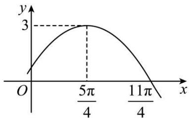

line

| x | y |
|---|---|
| 0 | 0 |
| 5π/4 | 3 |
| 11π/4 | 0 |

A. $f(x) = 3\sin \left(\frac{1}{3} x - \frac{\pi}{12}\right)$

B. $f\left(\frac{3\pi}{4}\right)=\frac{\sqrt{3}}{2}$

C. 不等式 $f(x) \geqslant \frac{3}{2}$ 的解集为 $\left[6k\pi + \frac{\pi}{4}, 6k\pi + \frac{9\pi}{4}\right] k \in \mathbf{Z}$

D. 将 $f(x)$ 的图象向右平移 $\frac{\pi}{12}$ 个单位长度后所得函数的图象在 $[6\pi, 8\pi]$ 上单调递增

【答案】C

【解析】由函数图象可知,最小正周期为 $T=4\left(\frac{11\pi}{4}-\frac{5\pi}{4}\right)=6\pi$ , 所以 $\omega=\frac{2\pi}{6\pi}=\frac{1}{3}$ ,

将点 $\left(\frac{5\pi}{4},3\right)$ 代入 $f(x)=3\sin(\omega x+\varphi)$ ，得 $3=3\sin\left(\frac{1}{3}\times\frac{5\pi}{4}+\varphi\right)$

又 $|\phi| < \frac{\pi}{2}$ , 所以 $\varphi = \frac{\pi}{12}$ , 故 $f(x) = 3\sin \left( \frac{1}{3} x + \frac{\pi}{12} \right)$ , 故 A 错误;

所以 $f\left(\frac{3\pi}{4}\right) = 3\sin \frac{\pi}{3} = \frac{3\sqrt{3}}{2}$ , 故 B 错误;

令 $f(x)\geqslant \frac{3}{2}$ ，则 $\sin \left(\frac{1}{3} x + \frac{\pi}{12}\right)\geqslant \frac{1}{2}$ 所以 $2k\pi +\frac{\pi}{6}\leqslant \frac{1}{3} x + \frac{\pi}{12}\leqslant 2k\pi +\frac{5\pi}{6},k\in \mathbb{Z}$ ，解

得 $6k\pi + \frac{\pi}{4} \leqslant x \leqslant 6k\pi + \frac{9\pi}{4}, k \in \mathbb{Z}$ ,

所以不等式 $f(x) \geqslant \frac{3}{2}$ 的解集为 $\left[6k\pi + \frac{\pi}{4}, 6k\pi + \frac{9\pi}{4}\right] k \in \mathbb{Z}$ , 故 C 正确;

将 $f(x)=3\sin\left(\frac{1}{3}x+\frac{\pi}{12}\right)$ 的图象向右平移 $\frac{\pi}{12}$ 个单位长度后,得到 $f(x)=$

$3\sin\left(\frac{1}{3}x+\frac{\pi}{18}\right)$ 的图象, 令 $2k\pi-\frac{\pi}{2}\leqslant\frac{1}{3}x+\frac{\pi}{18}\leqslant2k\pi+\frac{\pi}{2}, k\in\mathbb{Z}$ ,

解得 $6k\pi - \frac{5\pi}{3} \leqslant x \leqslant 6k\pi + \frac{4\pi}{3}, k \in \mathbb{Z}$ ,

令 $k = 1$ 得 $\frac{13\pi}{3} \leqslant x \leqslant \frac{22\pi}{3}$ , 因为 $[6\pi, 8\pi] \not\subset \left[\frac{13\pi}{3}, \frac{22\pi}{3}\right]$ , 故 D 错误.

故选：C.

1217 (2024·四川泸州·统考三模)将函数 $y=\sin\left(2x+\frac{\pi}{3}\right)$ 的图象向左平移 $\frac{\pi}{12}$ 个单位长度, 所得图象的函数 ()

A. 在区间 $\left[\frac{\pi}{2}, \frac{3\pi}{2}\right]$ 上单调递减

B. 在区间 $\left[\pi, \frac{3\pi}{2}\right]$ 上单调递减

C. 在区间 $[\pi, 2\pi]$ 上单调递增

D. 在区间 $\left[\frac{3\pi}{4}, \frac{5\pi}{4}\right]$ 上单调递增

【答案】B

【解析】函数的最小正周期是 $T=\frac{2\pi}{2}=\pi$ ，选项 AC 中区间长度是一个周期，因此不可能单调，图象左右平移后也不可能单调，AC 错；

函数 $y=\sin\left(2x+\frac{\pi}{3}\right)$ 的图象向左平移 $\frac{\pi}{12}$ 个单位长度, 所得图象的函数解析式为 $y=\sin\left[2\left(x+\frac{\pi}{12}\right)+\frac{\pi}{3}\right]=\sin\left(2x+\frac{\pi}{2}\right)=\cos2x$ ,

选项 B, $x \in \left[\pi, \frac{3\pi}{2}\right]$ 时, $2x \in [2\pi, 3\pi]$ , 在此区间上 $y = \cos 2x$ 是减函数, B 正确;

选项 D, $x \in \left[\frac{3\pi}{4}, \frac{5\pi}{4}\right]$ 时, $2x \in \left[\frac{3\pi}{2}, \frac{5\pi}{2}\right]$ , 在此区间上 $y = \cos 2x$ 不是单调函数, D 错误.

故选: B.

1218 (2024·北京密云·统考三模)已知函数 $f(x) = \cos^2\frac{x}{2} - \sin^2\frac{x}{2}$ ，则 （）

A. $f(x)$ 在 $\left(-\frac{\pi}{2}, -\frac{\pi}{6}\right)$ 上单调递减

B. $f(x)$ 在 $\left(-\frac{\pi}{4}, \frac{\pi}{12}\right)$ 上单调递增

C. $f(x)$ 在 $\left(0, \frac{\pi}{3}\right)$ 上单调递减

D. $f(x)$ 在 $\left(\frac{\pi}{4},\frac{7\pi}{12}\right)$ 上单调递增

【答案】C

【解析】因为 $f(x)=\cos^{2}\frac{x}{2}-\sin^{2}\frac{x}{2}=\cos x.$

对于 A 选项, 当 $-\frac{\pi}{2}<x<-\frac{\pi}{6}$ 时,

$f(x)$ 在 $\left(-\frac{\pi}{2}, -\frac{\pi}{6}\right)$ 上单调递增，A 错；

对于B选项,当 $-\frac{\pi}{4}<x<\frac{\pi}{12}$ 时,

则 $f(x)$ 在 $\left(-\frac{\pi}{4},0\right)$ 上单调递增，在 $\left(0,\frac{\pi}{12}\right)$ 上单调递减，

故B错;

对于 C 选项, 当 $0 < x < \frac{\pi}{3}$ 时,

则 $f(x)$ 在 $\left(0, \frac{\pi}{3}\right)$ 上单调递减，C 对；

对于D选项, 当 $\frac{\pi}{4}<x<\frac{7\pi}{12}$ 时,

则 $f(x)$ 在 $\left(\frac{\pi}{4},\frac{7\pi}{12}\right)$ 上单调递减, 故 D 错.

故选：C.

1219 (2024·河南·高三校联考阶段练习)已知函数 $f(x)=$

$\mathrm{A}\cos(\omega x+\varphi)\left(A>0,\omega>0,|\varphi|<\frac{\pi}{2}\right)$ ，若函数 $f(x)$ 的图象向左平移 $\frac{\pi}{6}$ 个单位长度后得到的函数的部分图象如图所示，则不等式 $f(x)\geqslant-1$ 的解集为()

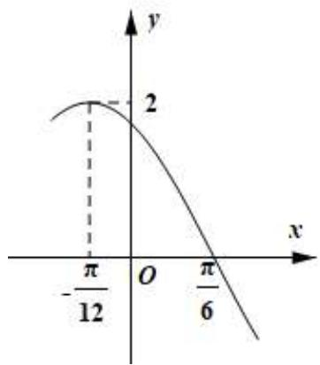

line

| x | y |
|---|---|
| -π/12 | 2 |
| π/6 | |

A. $\left[-\frac{7\pi}{12} + k\pi, \frac{\pi}{4} + k\pi\right](k \in \mathbf{Z})$

B. $\left[-\frac{\pi}{3} + 2k\pi, \frac{7\pi}{12} + 2k\pi\right](k \in \mathbf{Z})$

C. $\left[-\frac{\pi}{4}+k\pi,\frac{5\pi}{12}+k\pi\right](k\in\mathbf{Z})$

D. $\left[-\frac{\pi}{3} + k\pi, \frac{\pi}{12} + k\pi\right](k \in \mathbf{Z})$

【答案】C

【解析】设函数 $f(x)$ 的图象向左平移 $\frac{\pi}{6}$ 单位长度后得到的函数图象对应的函数为 $g(x)$ ，由图可知A=2，函数 $g(x)$ 的图象的最小正周期为 $4\times\left(\frac{\pi}{6}+\frac{\pi}{12}\right)=\pi$ ，

所以 $\omega=\frac{2\pi}{\pi}=2,$

所以 $g(x)=2\cos(2x+\varphi)$ ,

由 $g\left(-\frac{\pi}{12}\right) = 2$ ，得 $\cos \left(-\frac{2\pi}{12} +\varphi\right) = 1, - \frac{2\pi}{12} +\varphi = 2k\pi ,k\in \mathbf{Z},$

所以 $\varphi = \frac{\pi}{6} + 2k\pi, k \in \mathbb{Z}$ , 取 $k = 0$ , 得 $\varphi = \frac{\pi}{6}$ ,

所以 $g(x) = 2\cos \left(2x + \frac{\pi}{6}\right)$ ，所以 $f(x) = 2\cos \left[2\left(x - \frac{\pi}{6}\right) + \frac{\pi}{6}\right] = 2\cos \left(2x - \frac{\pi}{6}\right)$ ，

所以由 $f(x) \geqslant -1$ ，得 $2\cos\left(2x - \frac{\pi}{6}\right) \geqslant -1$ ，即 $\cos\left(2x - \frac{\pi}{6}\right) \geqslant -\frac{1}{2}$ ，

所以 $-\frac{2\pi}{3} + 2k\pi \leqslant 2x - \frac{\pi}{6} \leqslant \frac{2\pi}{3} + 2k\pi, k \in \mathbb{Z}$ ，即 $-\frac{\pi}{4} + k\pi \leqslant x \leqslant \frac{5\pi}{12} + k\pi, k \in \mathbb{Z}$ ,

所以不等式 $f(x)\geqslant-1$ 的解集为 $\left[-\frac{\pi}{4}+k\pi,\frac{5\pi}{12}+k\pi\right](k\in\mathbb{Z})$ ,

故选：C

1220 (2024·全国·高一专题练习) $y = \cos(\omega x + \varphi)$ 的部分图像如图所示, 则其单调递减区间为 ( )

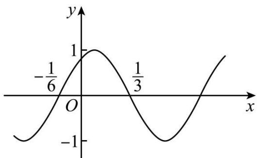

line

| x       | y     |
| ------- | ----- |
| -1/6    | -1    |
| 0       | 1     |
| 1/3     | -1    |

A. $\left(\frac{1}{12} + 2k, \frac{7}{12} + 2k\right), k \in \mathbf{Z}$

B. $\left(\frac{1}{12}+k,\frac{7}{12}+k\right),k\in\mathbb{Z}$

C. $\left(\frac{1}{12}+2k\pi,\frac{7}{12}+2k\pi\right),k\in\mathbf{Z}$

D. $\left(\frac{1}{12}+k\pi,\frac{7}{12}+k\pi\right),k\in\mathbf{Z}$

【答案】B

【解析】由图可得 $\frac{\mathrm{T}}{2} = \frac{1}{3} -\left(-\frac{1}{6}\right) = \frac{1}{2}$ 即 $\mathrm{T} = 1$

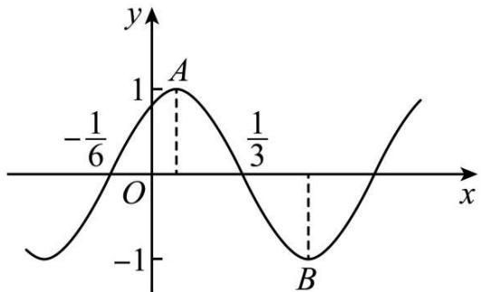

line

| x       | y     |
| ------- | ----- |
| 0       | -1/6  |
| 1/3     | 1     |
| 2/3     | -1    |

结合图象可得到在区间 $\left(-\frac{1}{6},\frac{1}{3}\right)$ 中，A为最高点，对应的横坐标为 $\frac{-\frac{1}{6}+\frac{1}{3}}{2}=\frac{1}{12}$ ，y轴右侧第一个最低点为B，对应的横坐标为 $\frac{1}{3}+\frac{T}{4}=\frac{7}{12}$ ，

故函数的单调递减区间为 $\left(\frac{1}{12} + k, \frac{7}{12} + k\right), k \in \mathbf{Z}$

故选：B

1221 (2024·四川凉山·高一校联考期中)函数 $y=\frac{1}{3}\tan\left(2x-\frac{\pi}{6}\right)+\frac{1}{2}$ 的单调递增区间为 ()

A. $\left(k\pi -\frac{\pi}{6},k\pi +\frac{\pi}{3}\right)(k\in \mathbf{Z})$

B. $\left(k\pi+\frac{\pi}{6},k\pi+\frac{5\pi}{12}\right)(k\in\mathbf{Z})$

C. $\left(\frac{k\pi}{2}-\frac{\pi}{6},\frac{k\pi}{2}+\frac{\pi}{3}\right)(k\in\mathbf{Z})$

D. $\left(\frac{k\pi}{2}+\frac{\pi}{6},\frac{k\pi}{2}+\frac{5\pi}{12}\right)(k\in\mathbf{Z})$

【答案】C

【解析】令 $k\pi - \frac{\pi}{2} < 2x - \frac{\pi}{6} < k\pi + \frac{\pi}{2}(k \in \mathbb{Z})$ ，解得 $\frac{k\pi}{2} - \frac{\pi}{6} < x < \frac{k\pi}{2} + \frac{\pi}{3}(k \in \mathbb{Z})$ ，所以函数 $y = \frac{1}{3}\tan\left(2x - \frac{\pi}{6}\right) + \frac{1}{2}$ 的单调递增区间为 $\left(\frac{k\pi}{2} - \frac{\pi}{6}, \frac{k\pi}{2} + \frac{\pi}{3}\right)(k \in \mathbb{Z})$ .

故选：C

【解题方法总结】

三角函数的单调性,需将函数 $y=\mathrm{Asin}(wx+\phi)$ 看成由一次函数和正弦函数组成的复合函数,利用复合函数单调区间的单调方法转化为解一元一次不等式.

如函数 $y = \text{Asin}(wx + \phi) (A > 0, w > 0)$ 的单调区间的确定基本思想是吧 $wx + \phi$ 看做是一个整体，

如由 $2k\pi - \frac{\pi}{2} \leqslant wx + \phi \leqslant 2kx + \frac{\pi}{2}(k \in \mathbb{Z})$ 解出 x 的范围, 所得区间即为增区间;

由 $2k\pi + \frac{\pi}{2} \leqslant wx + \phi \leqslant 2kx + \frac{3\pi}{2}(k \in \mathbb{Z})$ 解出 $x$ 的范围，所得区间即为减区间.

若函数 $y = \text{Asin}(wx + \phi)$ 中 A > 0, w > 0, 可用诱导公式将函数变为 $y = -\text{Asin}(-wx - \phi)$ ，则 $y = \text{Asin}(-wx - \phi)$ 的增区间为原函数的减区间，减区间为原函数的的增区间.

对于函数 $y = \text{Acos}(wx + \phi)$ , $y = \text{Atan}(wx + \phi)$ 的单调性的讨论与以上类似处理即可.

# 5 题型五:函数的对称性(对称轴、对称中心)

1222 (2024·陕西西安·陕西师大附中校考模拟预测)已知函数 $f(x) = \cos \left(\frac{5}{2} x - \frac{\pi}{4}\right) + 1$ ，若将 $y = f(x)$ 的图像向右平移 $m(m > 0)$ 个单位长度后图象关于 $y$ 轴对称，则实数 $m$ 的最小值为 （）

A. $\frac{\pi}{10}$

B. $\frac{3\pi}{10}$

C. $\frac{7\pi}{10}$

D. $\frac{11\pi}{10}$

【答案】B

【解析】 $f(x)=\cos\left(\frac{5}{2}x-\frac{\pi}{4}\right)+1$ 的图像向右平移 $m(m>0)$ 个单位长度后,变为

$$
g (x) = \cos \left[ \frac {5}{2} (x - m) - \frac {\pi}{4} \right] + 1 = \cos \left(\frac {5}{2} x - \frac {5}{2} m - \frac {\pi}{4}\right) + 1,
$$

因 $y=g(x)$ 的图象关于 y 轴对称，

所以 $y=g(x)$ 为偶函数，

所以 $\frac{5}{2} m + \frac{\pi}{4} = k\pi, k \in \mathbb{Z},$

即 $m=-\frac{1}{10}\pi+\frac{2}{5}k\pi, k\in Z,$

因 m>0, 所以 $k \geqslant 1$ ,

故当 k=1 时, 实数 m 取得最小值为 $\frac{3\pi}{10}$ ,

故选：B

1223 (2024·上海宝山·高三上海交大附中校考阶段练习)已知 $f(x)=\sin\left(\omega x+\frac{\pi}{4}\right)(\omega>0)$ ，函数 $y=f(x)$ ， $x\in R$ 的最小正周期为 $\pi$ ，将 $y=f(x)$ 的图像向左平移 $\varphi\left(0<\varphi<\frac{\pi}{2}\right)$ 个单位长度，所得图像关于y轴对称，则 $\varphi$ 的值是\_\_\_\_.

【答案】 $\frac{\pi}{8} / \frac{1}{8}\pi$

【解析】 $\because f(x)=\sin\left(\omega x+\frac{\pi}{4}\right)(\omega>0)$ , 函数 $y=f(x)$ 的最小正周期为 $\mathrm{T}=\frac{2\pi}{\omega}=\pi$ , $\therefore \omega=2, f(x)=\sin\left(2x+\frac{\pi}{4}\right)$ .

将 $y = f(x)$ 的图像向左平移 $\varphi$ 个单位长度，可得 $y = \sin \left(2x + 2\varphi +\frac{\pi}{4}\right)$ 的图像，

根据所得图像关于 y 轴对称, 可得 $2\varphi + \frac{\pi}{4} = k\pi + \frac{\pi}{2}, k \in Z$ , 解得 $\varphi = \frac{k\pi}{2} + \frac{\pi}{8}, k \in Z$ ,

又 $0 < \varphi < \frac{\pi}{2}$ , 则令 $k = 0$ , 可得 $\varphi$ 的值为 $\frac{\pi}{8}$ .

故答案为: $\frac{\pi}{8}$ .

1224 (2024·上海松江·校考模拟预测)已知函数 $y=f(x)$ 的对称中心为 $(0,1)$ ，若函数 $y=1+\sin x$ 的图象与函数 $y=f(x)$ 的图象共有 6 个交点，分别为 $(x_{1},y_{1})$ ， $(x_{2},y_{2})$ ， $\cdots$ ， $(x_{6},y_{6})$ ，则

$$
\sum_ {i = 1} ^ {6} (x _ {i} + y _ {i}) = \underline {{\quad}}.
$$

【答案】6

【解析】显然函数 $y=1+\sin x$ 的图象关于点 $(0,1)$ 成中心对称，

依题意,函数 $y=1+\sin x$ 的图象与函数 $y=f(x)$ 的图象的交点关于点 $(0,1)$ 成中心对称,

于是 $\sum_{i=1}^{6} x_i = 0, \sum_{i=1}^{6} y_i = 6$ ，所以 $\sum_{i=1}^{6} (x_i + y_i) = 6$ .

故答案为: 6

1225 (2024·全国·高三对口高考)设函数 $y=\sin\left(2x+\frac{\pi}{3}\right)$ 的图象关于点 $P(x_{0},0)$ 成中心对称，若 $x_{0}\in\left[-\frac{\pi}{2},0\right]$ ，则 $x_{0}=$ \_\_\_\_.

【答案】 $-\frac{\pi}{6}$

【解析】因为函数 $y=\sin\left(2x+\frac{\pi}{3}\right)$ 的图象关于点 $\mathrm{P}(x_{0},0)$ 成中心对称，

所以 $\sin\left(2x_{0}+\frac{\pi}{3}\right)=0$ ，所以 $2x_{0}+\frac{\pi}{3}=k\pi(k\in\mathbb{Z})$ ，所以 $x_{0}=\frac{k\pi}{2}-\frac{\pi}{6}(k\in\mathbb{Z})$

因为 $x_0 \in \left[-\frac{\pi}{2}, 0\right]$ , 所以 $k = 0$ 时, $x_0 = -\frac{\pi}{6}$ .

故答案为: $-\frac{\pi}{6}$

1226 (2024·新疆喀什·校考模拟预测)函数 $y=2\sin\omega x(\omega>0)$ 向左平移 $\frac{\pi}{3}$ 个单位长度之后关于 $x=\frac{\pi}{6}$ 对称，则 $\omega$ 的最小值为 \_\_\_\_.

【答案】1

【解析】 $y=2\sin\omega x$ 向左平移 $\frac{\pi}{3}$ 个单位长度后，得 $y=2\sin\omega\left(x+\frac{\pi}{3}\right)$ ,

因为函数关于 $x = \frac{\pi}{6}$ 对称，

所以 $\omega \times \left( \frac{\pi}{6} + \frac{\pi}{3} \right) = \omega \cdot \frac{\pi}{2} = \frac{\pi}{2} + k\pi, k \in \mathbb{Z},$

$$
\omega = 1 + 2 k, k \in \mathrm{Z}, \omega > 0
$$

所以 $\omega$ 的最小值为1.

故答案为: 1

1227 (2024·全国·高三专题练习)已知函数 $f(x)=2\sin(\omega x+\varphi)\left(\omega>0,|\varphi|<\frac{\pi}{2}\right)$ ，若 $f(0)=-\sqrt{3}$ ，且直线 $x=\frac{\pi}{6}$ 为 $f(x)$ 图象的一条对称轴，则 $\omega$ 的最小值为 \_\_\_\_.

【答案】5

【解析】由 $f(0)=2\sin\varphi=-\sqrt{3}$ ，得 $\sin\varphi=-\frac{\sqrt{3}}{2}$

又 $|\phi| < \frac{\pi}{2}$ , 解得 $\varphi = -\frac{\pi}{3}$ , 所以 $f(x) = 2\sin \left( \omega x - \frac{\pi}{3} \right)$ ,

又直线 $x = \frac{\pi}{6}$ 为 $f(x)$ 图象的一条对称轴，

则有 $\frac{\pi}{6}\omega -\frac{\pi}{3} = k\pi +\frac{\pi}{2},k\in \mathbf{Z},$ 化简得 $\omega = 6k + 5,k\in \mathbf{Z},$

又 $\omega > 0$ ，故 $\omega$ 的最小值为5.

故答案为: 5.

1228 (2024·河南开封·校考模拟预测)已知函数 $f(x) = 2\cos(3x + \varphi)$ 的图象关于点 $\left(\frac{4\pi}{3}, 0\right)$ 对称, 那么 $|\varphi|$ 的最小值为 \_\_\_\_.

【答案】 $\frac{\pi}{2}$

【解析】 $\because f(x)=2\cos(3x+\varphi)$ 的图象关于点 $\left(\frac{4\pi}{3},0\right)$ 对称， $\therefore 3\times\frac{4\pi}{3}+\varphi=k\pi+\frac{\pi}{2},k\in\mathbb{Z}$ ，即 $\varphi=k\pi-\frac{7\pi}{2},k\in\mathbb{Z}$ ，令 $k=4$ ，可得 $|\varphi|$ 的最小值为 $\frac{\pi}{2}$ .

故答案为: $\frac{\pi}{2}$

1229 (2024·全国·模拟预测)将函数 $f(x)=\cos\left(\omega x-\frac{\pi}{6}\right)(\omega>0)$ 的图象向左平移 $\frac{\pi}{9}$ 个单位长度得到函数 $g(x)$ 的图象. 若函数 $g(x)$ 的图象关于点 $\left(\frac{\pi}{3},0\right)$ 对称, 则 $\omega$ 的最小值为 \_\_\_\_.

【答案】 $\frac{3}{2}$

【解析】由题可得 $g(x)=\cos\left[\omega\left(x+\frac{\pi}{9}\right)-\frac{\pi}{6}\right]=\cos\left(\omega x+\frac{\pi\omega}{9}-\frac{\pi}{6}\right)$ ,

∵ $g(x)$ 的图象关于点 $\left(\frac{\pi}{3},0\right)$ 对称，

所以 $\frac{\pi\omega}{3} +\frac{\omega\pi}{9} -\frac{\pi}{6} = k\pi +\frac{\pi}{2},k\in \mathbf{Z},$ 解得 $\omega = \frac{9k}{4} +\frac{3}{2},k\in \mathbf{Z},$

$\because \omega > 0,$ 故 $\omega$ 的最小值为 $\frac{3}{2}.$

故答案为: $\frac{3}{2}$ .

1230 (2024·江西吉安·高三统考期末)记函数 $f(x)=\cos\left(\omega x+\frac{\pi}{3}\right)(\omega>0)$ 的最小正周期为 T，且 $y=f(x)$ 的图象关于 $x=\frac{\pi}{6}$ 对称，当 $\omega$ 取最小值时， $f\left(\frac{T}{2}\right)=$ \_\_\_\_.

【答案】 $-\frac{1}{2} / -0.5$

【解析】由 $y=f(x)$ 的图象关于 $x=\frac{\pi}{6}$ 对称，则 $\omega\times\frac{\pi}{6}+\frac{\pi}{3}=k\pi, k\in Z,$

$$
\therefore \omega = 6 k - 2 (k \in \mathrm{Z}),
$$

又∵ω>0,

∴ 当 $k=1, \omega$ 的最小值为 4,

此时 $f(x)=\cos\left(4x+\frac{\pi}{3}\right)$ ， $T=\frac{2\pi}{4}=\frac{\pi}{2}$

$$
\therefore f \left(\frac {\mathrm{T}}{2}\right) = f \left(\frac {\pi}{4}\right) = \cos \left(4 \times \frac {\pi}{4} + \frac {\pi}{3}\right) = \cos \left(\pi + \frac {\pi}{3}\right) = - \frac {1}{2}.
$$

故答案为: $-\frac{1}{2}$ .

1231 (2024·福建宁德·高三校考阶段练习)写出满足条件“函数 $f(x)=\cos\left(\frac{\pi}{3}x-\varphi\right)$ 的图象关于直线 x=2 对称”的 $\varphi$ 的一个值 \_\_\_\_.

【答案】 $\varphi=\frac{2\pi}{3}$ (答案不唯一,满足 $\varphi=\frac{2\pi}{3}-k\pi,k\in Z$ 即可)

【解析】由题意可得: $\frac{2\pi}{3}-\varphi=k\pi,k\in Z$ , 则 $\varphi=\frac{2\pi}{3}-k\pi,k\in Z$ ,

当 k=0 时， $\varphi=\frac{2\pi}{3}$ .

故答案为: $\varphi=\frac{2\pi}{3}$ .

1232 (2024·江西赣州·高三校联考期中)已知函数 $f(x)=2\cos(2x+\varphi)$ 图象的一条对称轴为 $x=\frac{\pi}{8}$ 。若 $0<\varphi<4\pi$ ，则 $\varphi$ 的最大 \_\_\_\_.

【答案】 $\frac{15}{4}\pi$

【解析】由题知 $2 \times \frac{\pi}{8} + \varphi = k\pi$ .

所以 $\varphi = -\frac{\pi}{4} + k\pi$

因为 $0 < \varphi < 4\pi$ ，所以当 $k = 4, \varphi$ 取最大值 $\frac{15}{4}\pi$

故答案为: $\frac{15}{4}\pi$

1233 (2024·河北石家庄·统考模拟预测)曲线 $f(x)=\frac{\sin x+\cos x}{\sin x-\cos x}$ 的一个对称中心为\_\_\_\_(答案不唯一).

【答案】 $\left(\frac{\pi}{4},0\right)$ （答案不唯一）

【解析】 $f(x)=\frac{\sin x+\cos x}{\sin x-\cos x}=\frac{\tan x+1}{\tan x-1}=-\frac{\tan x+\tan\frac{\pi}{4}}{1-\tan x\tan\frac{\pi}{4}}=-\tan\left(x+\frac{\pi}{4}\right)$

令 $x + \frac{\pi}{4} = k_1\pi$ 或 $x + \frac{\pi}{4} = \frac{\pi}{2} +k_{2}\pi (k_{1},k_{2}\in \mathbf{Z})$

则 $x = -\frac{\pi}{4} + k_{1}\pi$ 或 $x = \frac{\pi}{4} + k_{2}\pi$

令 $k_{2} = 0$ ，则 $x = \frac{\pi}{4}$ 所以函数的一个对称中心是 $\left(\frac{\pi}{4},0\right)$

故答案为: $\left(\frac{\pi}{4},0\right)$ (答案不唯一).

1234 (2024·甘肃武威·甘肃省武威第一中学校考模拟预测)函数 $f(x)=3\tan\left(2x+\frac{\pi}{3}\right)$ 图象的一个对称中心的坐标是 \_\_\_\_.

【答案】 $\left(-\frac{\pi}{6},0\right)$ (答案不唯一)

【解析】令 $2x + \frac{\pi}{3} = \frac{k\pi}{2}(k \in \mathbb{Z})$ ，解得 $x = \frac{k\pi}{4} - \frac{\pi}{6}(k \in \mathbb{Z})$ ，则 $f(x)$ 图象的对称中心的坐标是 $\left(\frac{k\pi}{4} - \frac{\pi}{6}, 0\right)(k \in \mathbb{Z})$ .

当 $k = 0$ 时， $x = -\frac{\pi}{6}$ ，则 $\left(-\frac{\pi}{6}, 0\right)$ 是 $f(x)$ 图像的一个对称中心.

故答案为: $\left(-\frac{\pi}{6},0\right)$ (答案不唯一).

【解题方法总结】

关于三角函数对称的几个重要结论;

(1) 函数 $y = \sin x$ 的对称轴为 $x = k\pi + \frac{\pi}{2}(k \in \mathbb{Z})$ ，对称中心为 $(k\pi.0)(k \in \mathbb{Z})$ ;

(2) 函数 $y = \cos x$ 的对称轴为 $x = k\pi (k \in \mathbb{Z})$ ，对称中心为 $\left(k\pi + \frac{\pi}{2}, 0\right) (k \in \mathbb{Z})$ ;

(3) 函数 $y = \tan x$ 函数无对称轴, 对称中心为 $\left(\frac{k\pi}{2}, 0\right) (k \in \mathbb{Z})$ ;

(4) 求函数 $y = \mathrm{A}\sin (wx + \phi) + b (w \neq 0)$ 的对称轴的方法；令 $wx + \phi = \frac{\pi}{2} + k\pi (k \in \mathbb{Z})$ ，  
得 $x = \frac{\frac{\pi}{2} + k\pi - \phi}{w} (k \in \mathbb{Z})$ ; 对称中心的求取方法; 令 $wx + \phi = k\pi (k \in \mathbb{Z})$ , 得  
$x = \frac{k\pi - \phi}{w}$ , 即对称中心为 $\left(\frac{k\pi - \phi}{w}, b\right)$ .

(5) 求函数 $y = \mathrm{A}\cos(wx + \phi) + b (w \neq 0)$ 的对称轴的方法；令 $wx + \phi = k\pi (k \in \mathbb{Z})$ 得 $x = \frac{\frac{\pi}{2} + k\pi - \phi}{w}$ ，即对称中心为 $\left(\frac{\frac{\pi}{2} + k\pi - \phi}{w}, b\right) (k \in \mathbb{Z})$

# 6 题型六:函数的定义域、值域(最值)

1235 (2024·全国·高三专题练习)实数 x, y 满足 $x^{2} - xy + y^{2} = 1$ ，则 $x + 2y$ 的范围是 \_\_\_\_.

【答案】 $\left[-\frac{2\sqrt{21}}{3},\frac{2\sqrt{21}}{3}\right]$

【解析】 $x^{2}-xy+y^{2}=1\Leftrightarrow\left(x-\frac{y}{2}\right)^{2}+\left(\frac{\sqrt{3}}{2}y\right)^{2}=1.$ 故令 $\left\{\begin{aligned}&x-\frac{y}{2}=\cos\theta\\&\frac{\sqrt{3}}{2}y=\sin\theta\end{aligned}\right.$ ， $\theta\in(0,2\pi).$

则原式 $x + 2y = \cos \theta +\frac{5}{\sqrt{3}}\sin \theta = \frac{2\sqrt{21}}{3}\sin (\theta +\varphi)$ ，故 $x + 2y\in \left[-\frac{2\sqrt{21}}{3},\frac{2\sqrt{21}}{3}\right].$

故答案为： $\left[-\frac{2\sqrt{21}}{3},\frac{2\sqrt{21}}{3}\right].$

1236 (2024·河北·校联考一模)函数 $f(x)=\sin^{3}\frac{x}{2}\cos\frac{x}{2}-\sin\frac{x}{2}\cos^{3}\frac{x}{2}$ 的最小值为 \_\_\_\_.

【答案】 $-\frac{1}{4} / -0.25$

【解析】因为 $f(x)=\sin^{3}\frac{x}{2}\cos\frac{x}{2}-\sin\frac{x}{2}\cos^{3}\frac{x}{2}=\sin\frac{x}{2}\cos\frac{x}{2}\left(\sin^{2}\frac{x}{2}-\cos^{2}\frac{x}{2}\right)=$

$-\frac{1}{2}\sin x\cos x=-\frac{1}{4}\sin2x$ , 所以当 $2x=\frac{\pi}{2}+2k\pi, k\in Z$ 时， $\sin2x=1$ ，此时 $f(x)$ 的最小值为 $-\frac{1}{4}$ .

故答案为: $-\frac{1}{4}$

1237 (2024·湖南长沙·长郡中学校考模拟预测)若函数 $f(x)=\sin x+\cos(x+\varphi)$ 的最小值为 $-\sqrt{3}$ ，则常数 $\varphi$ 的一个取值为 \_\_\_\_. (写出一个即可)

【答案】 $-\frac{\pi}{6}$ (答案不唯一).

【解析】 $f(x)=\sin x+\cos(x+\varphi)$ 可化为 $f(x)=\sin x+\cos x\cos\varphi-\sin x\sin\varphi$ ,

所以 $f(x)=\sin x(1-\sin \varphi)+\cos x \cos \varphi,$

设 $a = \sqrt{(1 - \sin\varphi)^2 + \cos^2\varphi} = \sqrt{2 - 2\sin\varphi}$

则 $f(x)=a\left(\sin x\frac{1-\sin\varphi}{a}+\cos x\frac{\cos\varphi}{a}\right)$ ，设 $\frac{1-\sin\varphi}{a}=\cos\theta,\frac{\cos\varphi}{a}=\sin\theta,$

则 $f(x)=a\sin(x+\theta)$ ,

因为函数 $f(x) = \sin x + \cos (x + \varphi)$ 的最小值为 $-\sqrt{3}$ ,

所以 $-\sqrt{2-2\sin\varphi}=-\sqrt{3},\sin\varphi=-\frac{1}{2},$

所以 $\varphi=2k\pi-\frac{\pi}{6}$ 或 $\varphi=2k\pi-\frac{5\pi}{6}$ ，其中 $k\in Z$ ，

故答案为: $-\frac{\pi}{6}$ (答案不唯一).

1238 (2024·全国·高三对口高考) $f(x)=\cos2x-2\sqrt{3}\sin x\cos x$ 的最小值为 \_\_\_\_.

【答案】-2

【解析】 $f(x)=\cos2x-2\sqrt{3}\sin x\cos x=\cos2x-\sqrt{3}\sin2x=-2\sin\left(2x-\frac{\pi}{6}\right)$

所以当 $2x - \frac{\pi}{6} = \frac{\pi}{2} + 2k\pi, k \in Z$ 时， $f(x)$ 取得最小值 -2.

故答案为: -2.

1239 (2024·上海嘉定·校考三模)若关于 x 的方程 $2\sin^{2}x - \sqrt{3}\sin2x + m - 1 = 0$ 在 $\left[\frac{\pi}{2}, \pi\right]$ 上有实数解，则实数 m 的取值范围是 \_\_\_\_.

【答案】[-2,1]

【解析】原方程 $2\sin^{2}x - \sqrt{3}\sin2x + m - 1 = 0$

等价于 $m - 1 = \sqrt{3}\sin 2x - 2\sin^2 x = \sqrt{3}\sin 2x + \cos 2x - 1 = 2\sin \left(2x + \frac{\pi}{6}\right) - 1$

即函数 y=m-1, $y=2\sin\left(2x+\frac{\pi}{6}\right)-1$ 在 $\left[\frac{\pi}{2},\pi\right]$ 上有交点，

$\because x\in\left[\frac{\pi}{2},\pi\right],\therefore 2x+\frac{\pi}{6}\in\left[\frac{7\pi}{6},\frac{13\pi}{6}\right],\sin\left(2x+\frac{\pi}{6}\right)\in\left[-1,\frac{1}{2}\right],$ 故 $y\in[-3,0]$ ,

则 $-3 \leqslant m - 1 \leqslant 0, \therefore m \in [-2, 1]$ .

故答案为： $[-2,1]$

1240 (2024·江西鹰潭·贵溪市实验中学校考模拟预测)函数 $f(x)=|2\sin^{2}x-\cos2x|$ 的值域为 \_\_\_\_.

【答案】[0,3]

【解析】因为 $f(x)=|2\sin^{2}x-\cos2x|=|2\sin^{2}x-(1-2\sin^{2}x)|=|4\sin^{2}x-1|$ ,

又 $0 \leqslant \sin^2 x \leqslant 1$ ，所以 $-1 \leqslant 4\sin^2 x - 1 \leqslant 3$ ，则 $0 \leqslant |4\sin^2 x - 1| \leqslant 3$

即函数 $f(x)$ 的值域为[0,3].

故答案为: [0,3].

1241 (2024·上海·高三专题练习)已知函数 $f(x) = \frac{1}{2}\sin \left(2x - \frac{\pi}{3}\right), x \in \left[-\frac{\pi}{4}, \frac{\pi}{4}\right]$ ，则函数 $f(x)$ 的值域为 \_\_\_\_.

【答案】 $\left[-\frac{1}{2},\frac{1}{4}\right]$

【解析】当 $x \in \left[-\frac{\pi}{4}, \frac{\pi}{4}\right]$ 时， $\left(2x - \frac{\pi}{3}\right) \in \left[-\frac{5\pi}{6}, \frac{\pi}{6}\right]$ ,

则 $\sin\left(2x-\frac{\pi}{3}\right)\in\left[-1,\frac{1}{2}\right]$ ，所以 $\frac{1}{2}\sin\left(2x-\frac{\pi}{3}\right)\in\left[-\frac{1}{2},\frac{1}{4}\right]$ ,

所以函数 $f(x)$ 的值域为 $\left[-\frac{1}{2},\frac{1}{4}\right]$ .

故答案为: $\left[-\frac{1}{2},\frac{1}{4}\right]$

1242 (2024·全国·高三专题练习)设函数 $f(x)=\sin x, x\in\mathbb{R}$ ，则 $y=\left[f\left(x+\frac{\pi}{12}\right)\right]^{2}+\left[f\left(x+\frac{\pi}{4}\right)\right]^{2}$ 的最小值为 \_\_\_\_.

【答案】 $1-\frac{\sqrt{3}}{2}$

【解析】 $y=\left[f\left(x+\frac{\pi}{12}\right)\right]^{2}+\left[f\left(x+\frac{\pi}{4}\right)\right]^{2}=\sin^{2}\left(x+\frac{\pi}{12}\right)+\sin^{2}\left(x+\frac{\pi}{6}\right)$

$$
\begin{array}{l} = \frac {1 - \cos \left(2 x + \frac {\pi}{6}\right)}{2} + \frac {1 - \cos \left(2 x + \frac {\pi}{2}\right)}{2} = 1 - \frac {1}{2} \left(\cos 2 x \cos \frac {\pi}{6} - \sin 2 x \sin \frac {\pi}{6} - \sin 2 x\right) \\ = 1 + \frac {3}{4} \sin 2 x - \frac {\sqrt {3}}{4} \cos 2 x = 1 + \frac {\sqrt {3}}{2} \sin \left(2 x - \frac {\pi}{6}\right). \\ \end{array}
$$

因为 $x \in \mathbb{R}$ , 所以 $-1 \leqslant \sin\left(2x - \frac{\pi}{6}\right) \leqslant 1$ , 所以 $-\frac{\sqrt{3}}{2} \leqslant \frac{\sqrt{3}}{2} \sin\left(2x - \frac{\pi}{6}\right) \leqslant \frac{\sqrt{3}}{2}$ ,

所以 $1 - \frac{\sqrt{3}}{2} \leqslant 1 + \frac{\sqrt{3}}{2}\sin \left(2x - \frac{\pi}{6}\right) \leqslant 1 + \frac{\sqrt{3}}{2}$ , 即函数 $y = \left[f\left(x + \frac{\pi}{12}\right)\right]^2 + \left[f\left(x + \frac{\pi}{4}\right)\right]^2$

的最小值为 $1 - \frac{\sqrt{3}}{2}$

故答案为: $1-\frac{\sqrt{3}}{2}$ .

1243 (2024·全国·高三专题练习)设 a > 0，则 $f(x) = 2a(\sin x + \cos x) - \sin x \cdot \cos x - 2a^{2}$ 的最小值为 \_\_\_\_.

【答案】 $-2a^{2} - 2\sqrt{2} a - \frac{1}{2}$

【解析】设 $t = \sin x + \cos x$ ，由 $t = \sin x + \cos x = \sqrt{2} \sin \left( x + \frac{\pi}{4} \right)$ ，得 $t \in [-\sqrt{2}^{\circ}, ^{\circ} \sqrt{2}]$ ，

又由 $(\sin x + \cos x)^2 = 1 + 2\sin x\cdot \cos x$ ，得 $\sin x\cdot \cos x = \frac{t^2 - 1}{2}$

所以 $f(x)=2at-\frac{t^{2}-1}{2}-2a^{2}=-\frac{1}{2}(t-2a)^{2}+\frac{1}{2}$ ,

令 $g(t)=-\frac{1}{2}(t-2a)^{2}+\frac{1}{2}(a>0)$ , $t\in[-\sqrt{2}^{\circ},^{\circ}\sqrt{2}]$ ,

当 $t = -\sqrt{2}$ 时， $\sin\left(x + \frac{\pi}{4}\right) = -1$ 时，即当 $x = 2k\pi + \frac{5}{4}\pi,$ ° $k \in Z$ 时，

原函数取到最小值 $-2a^{2} - 2\sqrt{2} a - \frac{1}{2}$ .

故答案为: $-2a^{2}-2\sqrt{2}a-\frac{1}{2}.$

1244 (2024·全国·高三专题练习)已知函数 $f(x) = \frac{1}{2}\sin 2x\cos x$ ，该函数的最大值为 \_\_\_\_.

【答案】 $\frac{2\sqrt{3}}{9}$

【解析】由题意,函数 $f(x)=\sin x\cos^{2}x=\sin x(1-\sin^{2}x)=\sin x-\sin^{3}x$ ,

令 $\sin x = t$ 且 $t\in [-1,1]$ ，则 $y = g(t) = t - t^3$

从而 $g'(t)=1-3t^{2}=(1-\sqrt{3}t)(1+\sqrt{3}t)$ ，令 $g'(t)=0$ ，解得 $t_{1}=-\frac{\sqrt{3}}{3}$ 或 $t_{2}=\frac{\sqrt{3}}{3}$ ，

当 $-1 < t < -\frac{\sqrt{3}}{3}$ 时， $g'(t) < 0$ ; 当 $-\frac{\sqrt{3}}{3} < t < \frac{\sqrt{3}}{3}$ 时， $g'(t) > 0$ ;

当 $\frac{\sqrt{3}}{3} < t < 1$ 时， $g'(t) < 0$

所以 $g(t)$ 在 $\left(-1, -\frac{\sqrt{3}}{3}\right)$ 上单调递减；在 $\left(-\frac{\sqrt{3}}{3}, \frac{\sqrt{3}}{3}\right)$ 上单调递增；在 $\left(\frac{\sqrt{3}}{3}, 1\right)$ 上单调递减.

因为 $g(-1)=0$ , $g\left(\frac{\sqrt{3}}{3}\right)=\frac{2\sqrt{3}}{9}$ ，所以 $f(x)$ 的最大值为 $\frac{2\sqrt{3}}{9}$ .

故答案为: $\frac{2\sqrt{3}}{9}$ .

1245 (2024·江苏苏州·高三统考开学考试)设角 $\alpha$ 、 $\beta$ 均为锐角，则 $\sin\alpha + \sin\beta + \cos(\alpha + \beta)$ 的

范围是 \_\_\_\_。

【答案】 $\left(1, \frac{3}{2}\right]$

【解析】因为角 $\alpha$ 、 $\beta$ 均为锐角，所以 $\sin\alpha,\cos\alpha,\sin\beta,\cos\beta$ 的范围均为 $(0,1)$ ，

所以 $\sin(\alpha+\beta)=\sin\alpha\cos\beta+\cos\alpha\sin\beta<\sin\alpha+\sin\beta,$

所以 $\sin \alpha +\sin \beta +\cos (\alpha +\beta) > \sin (\alpha +\beta) + \cos (\alpha +\beta) = \sqrt{2}\sin \left(\alpha +\beta +\frac{\pi}{4}\right)$

因为 $0 < \alpha < \frac{\pi}{2}, 0 < \beta < \frac{\pi}{2}, \frac{\pi}{4} < \alpha + \beta + \frac{\pi}{4} < \frac{3\pi}{4}$ ,

所以 $\sqrt{2}\sin\left(\alpha+\beta+\frac{\pi}{4}\right)>\sqrt{2}\times\frac{\sqrt{2}}{2}=1,$

$$
\sin \alpha + \sin \beta + \cos (\alpha + \beta) = \sin \alpha + \sin \beta + \cos \alpha \cos \beta - \sin \alpha \sin \beta
$$

$$
= (1 - \sin \beta) \sin \alpha + \cos \alpha \cos \beta + \sin \beta \leqslant \sqrt {(1 - \sin \beta) ^ {2} + \cos^ {2} \beta} + \sin \beta
$$

$$
= \sqrt {2 (1 - \sin \beta)} + \sin \beta ,
$$

当且仅当 $(1 - \sin \beta)\cos \alpha = \sin \alpha \cos \beta$ 时取等，

令 $\sqrt{1 - \sin\beta} = t, t \in (0,1), \sin\beta = 1 - t^2,$

所以 $= \sqrt{2(1 - \sin\beta)} + \sin\beta = \sqrt{2} t + 1 - t^2 = -\left(t - \frac{\sqrt{2}}{2}\right)^2 + \frac{3}{2} \leqslant \frac{3}{2}$ .

则 $\sin\alpha+\sin\beta+\cos(\alpha+\beta)$ 的范围是: $\left(1,\frac{3}{2}\right]$ .

故答案为: $\left(1,\frac{3}{2}\right]$

1246 (2024·陕西咸阳·陕西咸阳中学校考模拟预测)函数 $f(x) = \cos 2x + |\cos x|$ 的值域是

【答案】[-1,2]

【解析】因为 $f(x)=2\cos^{2}x+|\cos x|-1=2|\cos x|^{2}+|\cos x|-1=2\left(|\cos x|+\frac{1}{4}\right)^{2}-\frac{9}{8}$

又因为 $0 \leqslant |\cos x| \leqslant 1$ ,

所以当 $\left|\cos x\right|=0$ 时, $f(x)$ 取得最小值 -1,

当 $\left|\cos x\right|=1$ 时, $f(x)$ 取得最大值 2, 故 $f(x)$ 的值域是 $[-1,2]$ .

故答案为： $[-1,2]$

1247 (2024·全国·高三专题练习)设 $x, y \in \mathbb{R}$ 且 $3x^{2} + 2y^{2} = 6x$ ，求 $x^{2} + y^{2}$ 的取值范围是

【答案】[0,4]

【解析】解法一：∵ $3x^{2} + 2y^{2} = 6x$ ，

$\therefore y^{2} = 3x - \frac{3}{2} x^{2}\geqslant 0$ ，可得 $0\leqslant x\leqslant 2.$

$$
x ^ {2} + y ^ {2} = x ^ {2} + 3 x - \frac {3}{2} x ^ {2} = - \frac {1}{2} (x - 3) ^ {2} + \frac {9}{2},
$$

令 $f(x)=-\frac{1}{2}(x-3)^{2}+\frac{9}{2},x\in[0,2]$ ,

显然函数 $f(x)$ 在[0,2]上单调递增， $f(0)=0,f(2)=4$ ，即 $f(x)\in[0,4]$ ，

∴ $x^{2} + y^{2}$ 的取值范围是 [0,4].

解法二:由 $3x^{2}+2y^{2}=6x$ 得 $(x-1)^{2}+\frac{y^{2}}{\frac{3}{2}}=1$ ，设 $\left\{\begin{aligned}x-1&=\cos\alpha\\ y&=\frac{\sqrt{6}}{2}\sin\alpha\end{aligned}\right.$ ，即 $\left\{\begin{aligned}x&=1+\cos\alpha\\ y&=\frac{\sqrt{6}}{2}\sin\alpha\end{aligned}\right.$

则 $x^{2} + y^{2} = 1 + 2\cos \alpha +\cos^{2}\alpha +\frac{3}{2}\sin^{2}\alpha$

$$
= 1 + 2 \cos \alpha + \frac {3}{2} - \frac {1}{2} \cos^ {2} \alpha
$$

$$
= - \frac {1}{2} \cos^ {2} \alpha + 2 \cos \alpha + \frac {5}{2} = - \frac {1}{2} (\cos \alpha - 2) ^ {2} + \frac {9}{2}
$$

令 $t = \cos \alpha, t \in [-1, 1]$ , $g(t) = -\frac{1}{2} (t - 2)^2 + \frac{9}{2}, t \in [-1, 1]$ , 显然 $g(t)$ 在 $[-1, 1]$ 上单调递增，

所以 $g(t)\in [0,4]$ ，即 $-\frac{1}{2} (\cos \alpha -2)^{2} + \frac{9}{2}\in [0,4]$

所以 $x^{2}+y^{2}$ 的取值范围是 [0,4].

故答案为: [0,4]

1248 (2024·全国·高三专题练习)函数 $f(x)=\frac{\sin x\cos x}{1+\sin x+\cos x}$ 的值域为 \_\_\_\_.

【答案】 $\left[\frac{-\sqrt{2}-1}{2},-1\right)\cup\left(-1,\frac{\sqrt{2}-1}{2}\right]$

【解析】令 $t = \sin x + \cos x = \sqrt{2} \sin \left( x + \frac{\pi}{4} \right)$ , $t \in [-\sqrt{2}, -1) \cup (-1, \sqrt{2}]$ ,

则 $t^{2}=1+2\sin x\cos x$ , 即 $\sin x\cos x=\frac{t^{2}-1}{2}$

所以 $f(t)=\frac{\frac{t^{2}-1}{2}}{1+t}=\frac{t-1}{2}$ ,

又因为 $t \in [-\sqrt{2}, -1) \cup (-1, \sqrt{2}]$ ，所以 $f(t) \in \left[\frac{-\sqrt{2} - 1}{2}, -1\right) \cup \left(-1, \frac{\sqrt{2} - 1}{2}\right]$ ，

即函数 $f(x) = \frac{\sin x\cos x}{1 + \sin x + \cos x}$ 的值域为 $\left[\frac{-\sqrt{2} - 1}{2}, -1\right) \cup \left(-1, \frac{\sqrt{2} - 1}{2}\right]$ .

故答案为： $\left[\frac{-\sqrt{2} - 1}{2}, - 1\right)\cup \left(-1,\frac{\sqrt{2} - 1}{2}\right].$

1249 (2024·全国·高三专题练习)函数 $f(x) = -\sin x + 2\cos x (x \in [0, \pi])$ 的最大值为 \_\_\_\_.

【答案】2

【解析】 $f(x)=-\sin x+2\cos x=\sqrt{5}\cos(x+\varphi)$ ，其中 $\sin\varphi=\frac{\sqrt{5}}{5}$ ， $\cos\varphi=\frac{2\sqrt{5}}{5}$ ， $\tan\varphi=\frac{1}{2}<\frac{\sqrt{3}}{3}$ .

$$
\because x \in [ 0, \pi ], \varphi \in \left(0, \frac {\pi}{6}\right),
$$

$$
\therefore x + \varphi \in [ \varphi , \pi + \varphi ],
$$

∴ $f(x)$ 在 $[0, \pi - \varphi]$ 上单调递减，在 $[\pi - \varphi, \pi]$ 上单调递增，

$$
\because f (0) = 2, f (\pi) = - 2
$$

∴ 当 x=0 时, $f(x)$ 取得最大值 $f(0)=2$ .

故答案为: 2

1250 (2024·全国·高三专题练习)函数 $y = \tan\left(x + \frac{\pi}{6}\right)$ 的定义域为 \_\_\_\_.

【答案】 $\left\{x\mid x\neq\frac{\pi}{3}+k\pi,k\in\mathbb{Z}\right\}$

【解析】 $y=\tan\left(x+\frac{\pi}{6}\right)$ 的定义域满足 $x+\frac{\pi}{6}\neq\frac{\pi}{2}+k\pi(k\in\mathbb{Z})$ ，即 $x\neq\frac{\pi}{3}+k\pi(k\in\mathbb{Z})$ .
故答案为： $\left\{x\mid x\neq\frac{\pi}{3}+k\pi, k\in\mathbb{Z}\right\}$ .

1251 (2024·全国·高三专题练习)函数 $y = \tan\left(x + \frac{\pi}{6}\right), x \in \left(-\frac{\pi}{6}, \frac{\pi}{3}\right)$ 的值域为 \_\_\_\_.

【答案】 $(0, + \infty)$

【解析】设 $z = x + \frac{\pi}{6}$ ，因为 $x \in \left(-\frac{\pi}{6}, \frac{\pi}{3}\right)$ ，可得 $z \in \left(0, \frac{\pi}{2}\right)$ ，

因为正切函数 $y = \tan z$ 在 $\left(0, \frac{\pi}{2}\right)$ 上的值域为 $(0, +\infty)$ ,

即函数 $y=\tan\left(x+\frac{\pi}{6}\right)$ 在 $\left(-\frac{\pi}{6},\frac{\pi}{3}\right)$ 的值域为 $(0,+\infty)$ .

故答案为： $(0,+\infty)$ .

1252 (2024·江西·校联考模拟预测)函数 $f(x)=\frac{2\tan x}{1+2\tan^{2}x}, x \in\left(0, \frac{\pi}{3}\right)$ 的最大值为 \_\_\_\_.

【答案】 $\frac{\sqrt{2}}{2} / \frac{1}{2}\sqrt{2}$

【解析】 $\because x \in \left(0, \frac{\pi}{3}\right), \therefore \tan x \in (0, \sqrt{3})$ ，由题意得 $f(x) = \frac{2}{\frac{1}{\tan x} + 2\tan x} \leqslant \frac{2}{2\sqrt{2}} = \frac{\sqrt{2}}{2}$ ，

当且仅当 $\frac{1}{\tan x}=2\tan x$ ，即 $\tan x=\frac{\sqrt{2}}{2}\in(0,\sqrt{3})$ 时取等号，故 $f(x)$ 的最大值为 $\frac{\sqrt{2}}{2}$ .

故答案为: $\frac{\sqrt{2}}{2}$

# 【解题方法总结】

求三角函数的最值,通常要利用正、余弦函数的有界性,一般是通过三角变换化归为下列基本类型处理.

(1) $y=a\sin x+b$ , 设 $t=\sin x$ , 化为一次函数 $y=at+b$ 在 $[-1,1]$ 上的最值求解.

(2) $y=a\sin x+b\cos x+c$ ，引入辅助角 $\phi\left(\tan\phi=\frac{b}{a}\right)$ ，化为 $y=\sqrt{a^{2}+b^{2}}\sin(x+\phi)+c$ ，求解方法同类型(1)

(3) $y=a\sin^{2}x+b\sin x+c$ ，设 $t=\sin x$ ，化为二次函数 $y=at^{2}+bt+c$ 在闭区间 $t\in[-1,1]$ 上的最值求解，也可以是 $y=a\cos^{2}x+b\sin x+c$ 或 $y=a\cos2x+b\sin x+c$ 型.

(4) $y=a\sin x\cos x+b(\sin x\pm\cos x)+c$ ，设 $t=\sin x\pm\cos x$ ，则 $t^{2}=1\pm2\sin x\cos x$ ，故 $\sin x\cos x=\pm\frac{t^{2}-1}{2}$ ，故原函数化为二次函数 $y=a\cdot\left(\pm\frac{t^{2}-1}{2}\right)+bt+c$ 在闭区间 $[- \sqrt{2},\sqrt{2}]$ 上的最值求解.

(5) $y=\frac{a\sin x+b}{c\sin x+d}$ 与 $y=\frac{a\sin x+b}{c\cos x+d}$ ，根据正弦函数的有界性，即可用分析法求最值，也可用不等式法求最值，更可用数形结合法求最值。这里需要注意的是化为关于 $\sin x$ 或 $\cos x$ 的函数求解释务必注意 $\sin x$ 或 $\cos x$ 的范围。

(6) 导数法

(7) 权方和不等式

# 7 题型七:三角函数性质的综合

1253 (多选题)(2024·海南海口·海南华侨中学校考模拟预测)已知函数 $f(x)=$

$2\cos(2x+\varphi)\left(|\phi|<\frac{\pi}{2}\right)$ 的图象与函数 $g(x)=\sin\left(\omega x+\frac{\pi}{6}\right)$ 的图象的对称中心完全相同，且在 $\left(0,\frac{\pi}{2}\right)$ 上， $f(x)$ 有极小值，则()

A. $f(\varphi) = -2$

B. $g(\varphi) = 1$

C. 函数 $f\left(x - \frac{\pi}{3}\right)$ 是偶函数

D. $g(x)$ 在 $\left(-\frac{\pi}{2}, -\frac{\pi}{3}\right)$ 上单调递增

【答案】AD

【解析】由题意,函数 $f(x)$ 与 $g(x)$ 的最小正周期相同,则 $|\omega|=2$ ,且 $|\phi|<\frac{\pi}{2}$ .

当 $\omega=2$ 时， $g(x)=\sin\left(2x+\frac{\pi}{6}\right)$ ，其一个对称中心为 $\left(-\frac{\pi}{12},0\right)$ ，

也是 $f(x)=2\cos(2x+\varphi)$ 的一个对称中心，

所以 $f\left(-\frac{\pi}{12}\right)=2\cos\left(-\frac{\pi}{6}+\varphi\right)=0$ , 所以 $\varphi=\frac{2\pi}{3}+k\pi, k\in Z$

又 $|\phi| < \frac{\pi}{2}$ , 所以 $\varphi = -\frac{\pi}{3}$ ,

所以 $f(x)=2\cos\left(2x-\frac{\pi}{3}\right)$ , $x\in\left(0,\frac{\pi}{2}\right)$ , $2x-\frac{\pi}{3}\in\left(-\frac{\pi}{3},\frac{2\pi}{3}\right)$ , $f(x)$ 有极大值, 无极小值, 不合题意;

当 $\omega = -2$ 时， $g(x) = \sin \left(-2x + \frac{\pi}{6}\right) = -\sin \left(2x - \frac{\pi}{6}\right)$ ，其一个对称中心为 $\left(\frac{\pi}{12}, 0\right)$ ，

也是 $f(x)=2\cos(2x+\varphi)$ 的一个对称中心，

所以 $f\left(\frac{\pi}{12}\right)=2\cos\left(\frac{\pi}{6}+\varphi\right)=0$ , 所以 $\varphi=\frac{\pi}{3}+k\pi, k\in Z$

又 $|\phi| < \frac{\pi}{2}$ , 所以 $\varphi = \frac{\pi}{3}$ ,

所以 $f(x)=2\cos\left(2x+\frac{\pi}{3}\right)$ , $x\in\left(0,\frac{\pi}{2}\right)$ , $2x+\frac{\pi}{3}\in\left(\frac{\pi}{3},\frac{4\pi}{3}\right)$ , $f(x)$ 有极小值, 满足题意.

$f(\varphi)=f\left(\frac{\pi}{3}\right)=2\cos\pi=-2$ , $g(\varphi)=g\left(\frac{\pi}{3}\right)=\sin\left(-\frac{\pi}{2}\right)=-1$ , A项正确, B项不正确;

$f(x-\frac{\pi}{3})=2\cos(2x-\frac{\pi}{3})$ ，不是偶函数，C项不正确；

当 $-\frac{\pi}{2} < x < -\frac{\pi}{3}$ 时， $-\frac{7\pi}{6} < 2x - \frac{\pi}{6} < -\frac{5\pi}{6}$ ，函数 $y = \sin x$ 在 $\left(-\frac{7\pi}{6}, -\frac{5\pi}{6}\right)$ 上单调递减，则 $g(x)$ 在 $\left(-\frac{\pi}{2}, -\frac{\pi}{3}\right)$ 上单调递增，D项正确.

故选: AD

1254 (多选题)(2024·广东潮州·统考模拟预测)设函数 $f(x)=\sin(\omega x+\varphi)+\cos(\omega x+\varphi)$ $\left(\omega>0,|\varphi|\leqslant\frac{\pi}{2}\right)$ 的最小正周期为 $\pi$ ，且过点 $(0,\sqrt{2})$ ，则下列正确的有（）

A. $f(x)$ 在 $\left(0, \frac{\pi}{2}\right)$ 单调递减

B. $f(x)$ 的一条对称轴为 $x = \frac{\pi}{2}$

C. $f(|x|)$ 的周期为 $\frac{\pi}{2}$

D. 把函数 $f(x)$ 的图象向左平移 $\frac{\pi}{6}$ 个长度单位得到函数 $g(x)$ 的解析式为 $g(x)=$

$$
\sqrt {2} \cos \left(2 x + \frac {\pi}{6}\right)
$$

【答案】AB

【解析】根据辅助角公式得 $f(x)=\sin(\omega x+\varphi)+\cos(\omega x+\varphi)=\sqrt{2}\sin\left(\omega x+\varphi+\frac{\pi}{4}\right)$ .

∵最小正周期为 $\pi, \omega > 0, \therefore \omega = \frac{2\pi}{T} = \frac{2\pi}{\pi} = 2$ ，即 $f(x) = \sqrt{2}\sin\left(2x + \varphi + \frac{\pi}{4}\right)$ .

∵ 函数 $f(x)$ 过点 $(0, \sqrt{2})$ , $|\varphi| \leqslant \frac{\pi}{2}$ ,

$\therefore f(0) = \sqrt{2}\sin \left(\varphi +\frac{\pi}{4}\right) = \sqrt{2}$ ，则 $\varphi +\frac{\pi}{4} = \frac{\pi}{2} +2k\pi ,k\in \mathbb{Z}.$

当 $k = 0$ 时 $\varphi = \frac{\pi}{4}$ . 即 $f(x) = \sqrt{2} \sin \left(2x + \frac{\pi}{2}\right) = \sqrt{2} \cos 2x$ .

令 $2x \in (2k\pi, \pi + 2k\pi), k \in \mathbf{Z}$ , 则 $x \in \left(k\pi, \frac{\pi}{2} + k\pi\right), k \in \mathbf{Z}$ ,

当 k=0 时, $f(x)$ 在 $\left(0,\frac{\pi}{2}\right)$ 单调递减, 故 A 正确.

令 $2x = k\pi, k \in \mathbb{Z}$ , 则 $x = \frac{k\pi}{2}, k \in \mathbb{Z}$ ,

当 k=1 时, $f(x)$ 的一条对称轴为 $x=\frac{\pi}{2}$ , 故 B 正确.

因为 $f(x)=\sqrt{2}\cos2x$ 为偶函数, 所以 $f(|x|)=\sqrt{2}\cos(|2x|)=\sqrt{2}\cos2x$ ,

则 $f(|x|)$ 的周期为 $k\pi, k \in Z$ 且 $k \neq 0$ ，故 C 错误.

函数 $f(x)$ 的图象向左平移 $\frac{\pi}{6}$ 个长度单位得到函数 $g(x)$ 的解析式为 $g(x)=\sqrt{2}\cos\left[2\left(x+\frac{\pi}{6}\right)\right]=\sqrt{2}\cos\left(2x+\frac{\pi}{3}\right)$ ，故D错误.

故选: AB.

1255 (多选题)(2024·广东佛山·统考模拟预测)已知函数 $f(x)=a\sin x-\cos x(x\in\mathbb{R})$ 的图象关于 $x=\frac{\pi}{3}$ 对称,则()

A. $f(x)$ 的最大值为2  
B. $f\left(x + \frac{\pi}{3}\right)$ 是偶函数  
C. $f(x)$ 在 $\left[-\frac{2\pi}{3}, \frac{\pi}{3}\right]$ 上单调递增  
D. 把 $f(x)$ 的图象向左平移 $\frac{\pi}{6}$ 个单位长度, 得到的图象关于点 $\left(\frac{3\pi}{4},0\right)$ 对称

【答案】AB

【解析】因为函数 $f(x) = a\sin x - \cos x (x \in \mathbb{R})$ 的图象关于 $x = \frac{\pi}{3}$ 对称，

所以 $f\left(\frac{\pi}{3}\right)=a\sin\frac{\pi}{3}-\cos\frac{\pi}{3}=\frac{\sqrt{3}}{2}a-\frac{1}{2}=\pm\sqrt{a^{2}+1}$ ，解得 $a=-\sqrt{3}$ ，

所以 $f(x)=-\sqrt{3}\sin x-\cos x=-2\sin\left(x+\frac{\pi}{6}\right)$ ，其最大值为 2，故 A 正确；

令 $f\left(x+\frac{\pi}{3}\right)=g(x)=-2\sin\left(x+\frac{\pi}{3}+\frac{\pi}{6}\right)=-2\sin\left(x+\frac{\pi}{2}\right)=-2\cos x,$

$g(x)$ 定义域为 R, $g(-x) = -2\cos(-x) = -2\cos x = g(x)$ ,

所以 $g(x)$ 即 $f\left(x+\frac{\pi}{3}\right)$ 是偶函数, 故 B 正确;

$x\in \left[-\frac{2\pi}{3},\frac{\pi}{3}\right]$ 时， $x + \frac{\pi}{6}\in \left[-\frac{\pi}{2},\frac{\pi}{2}\right],y = 2\sin \left(x + \frac{\pi}{6}\right)$ 在 $\left[-\frac{2\pi}{3},\frac{\pi}{3}\right]$ 单调递增，

$f(x) = -2\sin \left(x + \frac{\pi}{6}\right)$ 在 $\left[-\frac{2\pi}{3},\frac{\pi}{3}\right]$ 单调递减，故C错误；

把 $f(x)$ 的图象向左平移 $\frac{\pi}{6}$ 个单位长度,得到函数

$h(x)=-2\sin\left[\left(x+\frac{\pi}{6}\right)+\frac{\pi}{6}\right]=-2\sin\left(x+\frac{\pi}{3}\right)$ 的图象，

因为 $h\left(\frac{3\pi}{4}\right)=-2\sin\left(\frac{3\pi}{4}+\frac{\pi}{3}\right)=-2\sin\left(\pi+\frac{\pi}{12}\right)=2\sin\frac{\pi}{12}\neq0,$

所以 $h(x)$ 的图象不关于点 $\left(\frac{3\pi}{4},0\right)$ 对称, 故 D 错误.

故选: AB

1256 (多选题)(2024·安徽合肥·合肥一六八中学校考模拟预测)已知函数 $f(x)=\sin\left(x+\frac{\pi}{4}\right)$ ，则下列说法正确的有()

A. 若 $\left|f(x_{1})-f(x_{2})\right|=2$ ，则 $\left|x_{1}-x_{2}\right|_{\min}=\pi$   
B. 将 $f(x)$ 的图象向左平移 $\frac{\pi}{4}$ 个单位长度后得到的图象关于 $y$ 轴对称

C. 函数 $y = \sin^2\left(x + \frac{\pi}{4}\right)$ 的最小正周期为 $2\pi$   
D. 若 $f(\omega x)(\omega > 0)$ 在 $[0, \pi]$ 上有且仅有3个零点，则 $\omega$ 的取值范围为 $\left[\frac{11}{4}, \frac{15}{4}\right)$

【答案】ABD

【解析】由 $\left|f(x_{1})-f(x_{2})\right|=2$ ，故 $f(x_{1}), f(x_{2})$ 必有一个最大值和一个最小值，

则 $|x_{1} - x_{2}|_{\mathrm{min}}$ 为半个周期长度，故 $\frac{\mathrm{T}}{2} = \pi ,\mathrm{A}$ 正确；

由题意 $f\left(x + \frac{\pi}{4}\right) = \sin \left(x + \frac{\pi}{2}\right) = \cos x$ 的图象关于 $y$ 轴对称，B正确；

$y=\sin^{2}\left(x+\frac{\pi}{4}\right)=\frac{1-\cos\left(2x+\frac{\pi}{2}\right)}{2}=\frac{1+\sin2x}{2}$ 的最小正周期为 $\pi$ ,C错误.

$f(\omega x) = \sin \left(\omega x + \frac{\pi}{4}\right)$ , 在 $x \in [0, \pi]$ 上 $\omega x + \frac{\pi}{4} \in \left[\frac{\pi}{4}, \omega \pi + \frac{\pi}{4}\right]$ 有且仅在3个零点，

结合正弦函数的性质知: $3\pi \leqslant \omega\pi + \frac{\pi}{4} < 4\pi$ , 则 $\frac{11}{4} \leqslant \omega < \frac{15}{4}$ , D 正确;

故选: ABD

1257 (多选题)(2024·海南·高三校联考期末)已知函数 $f(x)=\cos(\omega x+\varphi)(\omega>0,-\pi<\varphi<\pi),f\left(\frac{\pi}{6}\right)=0,f(x)\geqslant f\left(-\frac{\pi}{12}\right)$ 恒成立， $f(x)$ 在 $\left[\frac{13\pi}{12},\frac{17\pi}{12}\right]$ 上单调，则()

A. $\varphi = -\frac{5\pi}{6}$   
B. 将 $f(x)$ 的图象向左平移 $\frac{\pi}{6}$ 个单位长度后得到函数 $g(x)=\sin2x$ 的图象  
C. $f\left(\frac{\pi}{6}+x\right)+f\left(\frac{\pi}{6}-x\right)=1$   
D. 若函数 $y = f(x) - m$ 在 $\left[-\frac{\pi}{2}, \frac{11\pi}{6}\right]$ 上有5个零点，则 $-\frac{\sqrt{2}}{2} \leqslant m \leqslant \frac{\sqrt{2}}{2}$

【答案】AB

【解析】因为 $f\left(\frac{\pi}{6}\right)=0$ ，所以 $x=\frac{\pi}{6}$ 是函数的一个零点，所以 $\omega\cdot\frac{\pi}{6}+\varphi=\frac{\pi}{2}+k_{1}\pi,k_{1}\in\mathbb{Z}$ ①,

又因为 $x \in R$ 对 $f(x) \geqslant f\left(-\frac{\pi}{12}\right)$ 恒成立，所以 $x = -\frac{\pi}{12}$ 时取得最小值，

即 $\omega \cdot \left(-\frac{\pi}{12}\right) + \varphi = \pi + 2k_2\pi, k_2 \in \mathbf{Z}$ ②，则 ① 减 ② 可得： $\omega = 4(k_1 - 2k_2) - 2, k_1, k_2 \in \mathbf{Z}$ ，

又因为 $f(x)$ 在 $\left[\frac{13\pi}{12},\frac{17\pi}{12}\right]$ 上单调，所以 $\frac{\mathrm{T}}{2} = \frac{2\pi}{2\omega}\geqslant \frac{17\pi}{12} -\frac{13\pi}{12} = \frac{\pi}{3},$

则 $0 < \omega \leqslant 3$ ，结合 $\omega = 4(k_{1} - 2k_{2}) - 2, k_{1}, k_{2} \in \mathbb{Z}$ ，所以 $\omega = 2$

所以 $\frac{\pi}{3} + \varphi = \frac{\pi}{2} + k_{1}\pi, k_{1} \in Z, -\frac{\pi}{6} + \varphi = \pi + 2k_{2}\pi, k_{2} \in Z,$

则 $\varphi=\frac{\pi}{6}+k_{1}\pi,k_{1}\in Z,\varphi=\frac{7\pi}{6}+2k_{2}\pi,k_{2}\in Z,$ 又因为 $-\pi<\varphi<\pi,$

所以 $\varphi=-\frac{5\pi}{6}$ ，故 A 正确；

所以 $f(x)=\cos\left(2x-\frac{5\pi}{6}\right)$ ,

将 $f(x)$ 的图象向左平移 $\frac{\pi}{6}$ 个单位长度后得到 $y = \cos \left[2\left(x + \frac{\pi}{6}\right) - \frac{5\pi}{6}\right] = \cos \left(2x - \frac{\pi}{2}\right) = \sin 2x$ ，故B正确；

$$
f \left(\frac {\pi}{6} + x\right) + f \left(\frac {\pi}{6} - x\right) = \cos \left[ 2 \left(\frac {\pi}{6} + x\right) - \frac {5 \pi}{6} \right] + \cos \left[ 2 \left(\frac {\pi}{6} - x\right) - \frac {5 \pi}{6} \right]
$$

$= \cos \left(2x - \frac{\pi}{2}\right) + \cos \left(-2x - \frac{\pi}{2}\right) = \sin 2x - \sin 2x = 0$ ，故C错误；

函数 $y=f(x)-m$ 在 $\left[-\frac{\pi}{2},\frac{11\pi}{6}\right]$ 上有 5 个零点，令 $f(x)=m$ ，

即 $y=f(x)$ 与 y=m 的图象有 5 个交点，画出 $y=f(x)$ 与 y=m 的图象如下，

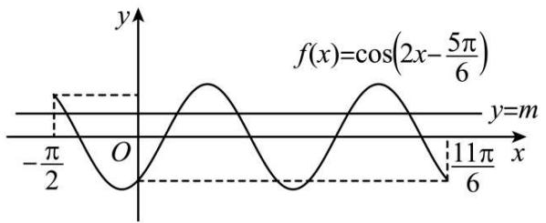

text_image

f(x)=cos(2x-\frac{5\pi}{6})
y=m
-\frac{\pi}{2} O x
11\pi/6

$$
f \left(- \frac {\pi}{2}\right) = \cos \left(- \pi - \frac {5 \pi}{6}\right) = \frac {\sqrt {3}}{2}, f \left(\frac {1 1 \pi}{6}\right) = \cos \left(\frac {1 1 \pi}{3} - \frac {5 \pi}{6}\right) = \cos \frac {5 \pi}{6} = - \frac {\sqrt {3}}{2},
$$

由图可知, 当 $m \in \left[-\frac{\sqrt{3}}{2}, \frac{\sqrt{3}}{2}\right]$ 时, y = f(x) 与 y = m 的图象有 5 个交点,

即函数 $y=f(x)-m$ 在 $\left[-\frac{\pi}{2},\frac{11\pi}{6}\right]$ 上有 5 个零点, 故 D 错误.

故选: AB

1258 (多选题)(2024·全国·高三专题练习)声音是由物体振动产生的声波,纯音的数学模型是函数 $y = A \sin \omega t$ , 我们听到的声音是由纯音合成的, 称之为复合音. 若一个复合音的数学模型是函数 $f(x) = |\cos x| + \sqrt{3} |\sin x|$ , 则下列结论不正确的是 ()

A. $f(x)$ 是偶函数

B. $f(x)$ 的最小正周期为 $2 \pi$

C. $f(x)$ 在区间 $\left[0, \frac{\pi}{2}\right]$ 上单调递增

D. $f(x)$ 的最小值为1

【答案】BC

【解析】因为 $x \in \mathrm{R}$ , $f(-x) = f(x)$ ，所以 $f(x)$ 是偶函数，A 正确； $f(x)$ 显然是周期函数，因为 $f(x + \pi) = |\cos(x + \pi)| + \sqrt{3} |\sin(x + \pi)| = |\cos x| + \sqrt{3} |\sin x| = f(x)$ ，所以 B 错误；因为当 $x \in \left[0, \frac{\pi}{2}\right]$ 时， $f(x) = |\sin x| + \sqrt{3} |\cos x| = \sin x + \sqrt{3}\cos x = 2\sin\left(x + \frac{\pi}{3}\right)$

所以 $f(x)$ 在区间 $\left[0, \frac{\pi}{6}\right]$ 上单调递增，在 $\left(\frac{\pi}{6}, \frac{\pi}{2}\right]$ 上单调递减，C 错误；

因为 $f(x)=\left\{\begin{aligned}&2\sin\left(x+\frac{\pi}{3}\right),x\in\left[0,\frac{\pi}{2}\right],\\ &2\sin\left(x-\frac{\pi}{3}\right),x\in\left(\frac{\pi}{2},\pi\right],\end{aligned}\right.$

当 $x \in \left[0, \frac{\pi}{2}\right]$ 时，设 $t = x + \frac{\pi}{3}$ ，则 $t \in \left[\frac{\pi}{3}, \frac{5\pi}{6}\right]$ ，∴ $\sin t \in \left[\frac{1}{2}, 1\right]$ ，∴ $f(x)_{\min} = 1$ ，

同理: 当 $x \in \left(\frac{\pi}{2}, \pi\right]$ 时, $f(x) \in (1, 2]$ ,

由 B 中解答知, $\pi$ 是 $f(x)$ 的周期, 所以 $f(x)$ 的最小值为 1, D 正确.

故选: BC.

1259 (多选题)(2024·全国·高三专题练习)已知函数 $f(x)=\sin|x|+|\cos x|$ ，下列叙述正确的有()

A. $f(x)$ 的周期为 $2\pi$ ;

B. $f(x)$ 是偶函数;

C. $f(x)$ 在区间 $\left[\frac{3\pi}{4}, \frac{5\pi}{4}\right]$ 上单调递减；

D. $\forall x_{1},x_{2}\in \mathrm{R},|f(x_{1}) - f(x_{2})|\leqslant \sqrt{2}$

【答案】BC

【解析】 $g(x)=\sin|x|$ 是偶函数, 不是周期函数, $h(x)=|\cos x|$ 是偶函数, 是周期函数, 最小正周期为 $\pi$ , 故 $f(x)$ 不是周期函数, A 错误, B 正确; 当 $x\in\left[\frac{3\pi}{4},\frac{5\pi}{4}\right]$ 时, $f(x)=\sin|x|$

$+\left|\cos x\right|=\sin x-\cos x=\sqrt{2}\sin\left(x-\frac{\pi}{4}\right)$ ，因为 $x-\frac{\pi}{4}\in\left[\frac{\pi}{2},\pi\right]$ ， $\sqrt{2}\sin\left(x-\frac{\pi}{4}\right)$ 在次区间上单调递减，故 $f(x)$ 在区间 $\left[\frac{3\pi}{4},\frac{5\pi}{4}\right]$ 上单调递减，C正确；

当 $x > 0$ 时， $f(x) = \sin x + |\cos x|, f\left(\frac{3}{4}\pi\right) = \sqrt{2}, f\left(\frac{3}{2}\pi\right) = -1$ ，即 $f\left(\frac{3}{4}\pi\right) - f\left(\frac{3}{2}\pi\right) = \sqrt{2} + 1 > \sqrt{2}$ ，D选项错误.

故选: BC

1260 (多选题)(2024·重庆·统考模拟预测)声音是由于物体的振动产生的能引起听觉的波, 我们听到的声音多为复合音. 若一个复合音的数学模型是函数 $f(x)=\sin x+$ $\frac{1}{2}\sin 2x(x \in \mathbb{R})$ ，则下列结论正确的是 （）

A. $f(x)$ 的一个周期为 $2\pi$

B. $f(x)$ 的最小值为 $-\frac{3}{2}$

C. $f(x)$ 的图象关于点 $(\pi,0)$ 对称

D. $f(x)$ 在区间 $[0,2\pi]$ 上有3个零点

【答案】ACD

【解析】选项A:

$$
f (x + 2 \pi) = \sin (x + 2 \pi) + \frac {1}{2} \sin [ 2 (x + 2 \pi) ] = \sin x + \frac {1}{2} \sin 2 x = f (x)
$$

故 $f(x)$ 的一个周期为 $2\pi$ , A 正确.

选项B:

$y=\sin x$ , 当 $x=-\frac{\pi}{2}+2k\pi, k\in Z$ 时, 取得最小值 -1,

$y=\frac{1}{2}\sin2x$ ，当 $2x=-\frac{\pi}{2}+2k\pi, k\in Z$ 时即 $x=-\frac{\pi}{4}+k\pi, k\in Z$ 时，取得最小值 $-\frac{1}{2}$

所以两个函数不可能同时取得最小值,所以 $f(x)$ 的最小值不是 $-\frac{3}{2}$ , 故 B 错误.

选项 C:

$$
f (\pi + x) = \sin (\pi + x) + \frac {1}{2} \sin [ 2 (\pi + x) ] = - \sin x + \frac {1}{2} \sin 2 x,
$$

$$
f (\pi - x) = \sin (\pi - x) + \frac {1}{2} \sin [ 2 (\pi - x) ] = \sin x - \frac {1}{2} \sin 2 x,
$$

所以 $f(\pi-x)+f(\pi+x)=0,$

所以 $f(x)$ 的图象关于点 $(\pi,0)$ 对称, C 正确,

选项D:

$$
f (x) = \sin x + \frac {1}{2} \sin 2 x = \sin x + \sin x \cos x = \sin x (1 + \cos x) = 0,
$$

得 $\sin x = 0$ , 或 $\cos x = -1$ ,

得 $x=k\pi$ ，或 $x=\pi+2k\pi, k\in Z$ ，

故 $[0,2\pi]$ 区间中的根为 $0, \pi, 2\pi$

故D正确.

故选: ACD

1261 (2024·全国·高三专题练习)设函数 $f(x)=\sin\omega x\cos\varphi+\cos\omega x\sin\varphi\left(\omega>0,|\varphi|<\frac{\pi}{2}\right)$ .

(1) 若 $f(0) = -\frac{\sqrt{3}}{2}$ ，求 $\varphi$ 的值.  
(2) 已知 $f(x)$ 在区间 $\left[-\frac{\pi}{3}, \frac{2\pi}{3}\right]$ 上单调递增, $f\left(\frac{2\pi}{3}\right) = 1$ , 再从条件①、条件②、条件③这三个条件中选择一个作为已知, 使函数 $f(x)$ 存在, 求 $\omega, \varphi$ 的值.

条件①: $f\left(\frac{\pi}{3}\right)=\sqrt{2}$ ;

条件②: $f\left(-\frac{\pi}{3}\right)=-1$ ;

条件③: $f(x)$ 在区间 $\left[-\frac{\pi}{2}, -\frac{\pi}{3}\right]$ 上单调递减.

注:如果选择的条件不符合要求,第(2)问得0分;如果选择多个符合要求的条件分别解答,按第一个解答计分.

【解析】(1) 因为 $f(x)=\sin\omega x\cos\varphi+\cos\omega x\sin\varphi,\omega>0,|\varphi|<\frac{\pi}{2}$

所以 $f(0)=\sin(\omega\cdot0)\cos\varphi+\cos(\omega\cdot0)\sin\varphi=\sin\varphi=-\frac{\sqrt{3}}{2}$ ,

因为 $|\varphi| < \frac{\pi}{2}$ , 所以 $\varphi = -\frac{\pi}{3}$ .

(2) 因为 $f(x)=\sin\omega x\cos\varphi+\cos\omega x\sin\varphi,\omega>0,|\varphi|<\frac{\pi}{2},$

所以 $f(x) = \sin (\omega x + \varphi),\omega >0,|\varphi | <   \frac{\pi}{2}$ ，所以 $f(x)$ 的最大值为1，最小值为-1.

若选条件①: 因为 $f(x)=\sin(\omega x+\varphi)$ 的最大值为 1, 最小值为 -1, 所以 $f\left(\frac{\pi}{3}\right)=\sqrt{2}$ 无解, 故条件①不能使函数 $f(x)$ 存在;

若选条件②: 因为 $f(x)$ 在 $\left[-\frac{\pi}{3}, \frac{2\pi}{3}\right]$ 上单调递增，且 $f\left(\frac{2\pi}{3}\right)=1, f\left(-\frac{\pi}{3}\right)=-1$

所以 $\frac{\mathrm{T}}{2} = \frac{2\pi}{3} -\left(-\frac{\pi}{3}\right) = \pi ,$ 所以 $\mathrm{T} = 2\pi ,\omega = \frac{2\pi}{\mathrm{T}} = 1,$

所以 $f(x)=\sin(x+\varphi)$ ,

又因为 $f\left(-\frac{\pi}{3}\right)=-1$ ，所以 $\sin\left(-\frac{\pi}{3}+\varphi\right)=-1$ ，

所以 $-\frac{\pi}{3} + \varphi = -\frac{\pi}{2} + 2k\pi, k \in Z,$

所以 $\varphi = -\frac{\pi}{6} + 2k\pi, k \in \mathbb{Z}$ , 因为 $|\varphi| < \frac{\pi}{2}$ , 所以 $\varphi = -\frac{\pi}{6}$ .

所以 $\omega=1,\varphi=-\frac{\pi}{6};$

若选条件③: 因为 $f(x)$ 在 $\left[-\frac{\pi}{3}, \frac{2\pi}{3}\right]$ 上单调递增, 在 $\left[-\frac{\pi}{2}, -\frac{\pi}{3}\right]$ 上单调递减,

所以 $f(x)$ 在 $x=-\frac{\pi}{3}$ 处取得最小值 -1，即 $f\left(-\frac{\pi}{3}\right)=-1$ .

以下与条件②相同.

1262 (2024·江西赣州·高三校联考阶段练习)已知函数 $f(x)=$

$\mathrm{Asin}(\omega x + \varphi)\left(\mathrm{A} > 0, \omega > 0, |\varphi| < \frac{\pi}{2}\right)$ 的部分图象如图所示.

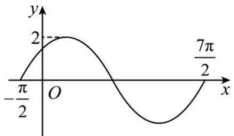

line

| x | y |
|---|---|
| -π/2 | 0 |
| 0 | 2 |
| π/2 | 0 |
| 7π/2 | 2 |

(1) 求 $f(x)$ 的解析式；

(2) 将 $f(x)$ 的图象上所有点的横坐标缩短为原来的 $\frac{1}{2}$ (纵坐标不变), 再将所得图象向左平移 $\frac{\pi}{12}$ 个单位长度, 得到函数 $g(x)$ 的图象, 求函数 $y = g(x) \sin x$ 在 $\left[-\frac{\pi}{2}, \frac{\pi}{2}\right]$ 内的零点.

【解析】(1)由图象可得A=2,

$T=\frac{7\pi}{2}-\left(-\frac{\pi}{2}\right)=4\pi$ , 则 $\frac{2\pi}{\omega}=4\pi$ , 即 $\omega=\frac{1}{2}$ ,

$$
\therefore f (x) = 2 \sin \left(\frac {1}{2} x + \varphi\right),
$$

由图象得 $f\left(-\frac{\pi}{2}\right) = 2\sin \left(-\frac{\pi}{4} +\varphi\right) = 0$ ，即 $\sin \left(-\frac{\pi}{4} +\varphi\right) = 0,$

$\therefore -\frac{\pi}{4} + \varphi = 2k\pi, k \in \mathbf{Z}$ , 则 $\varphi = \frac{\pi}{4} + 2k\pi, k \in \mathbf{Z}$ ,

又 $|\phi| < \frac{\pi}{2}, \therefore \varphi = \frac{\pi}{4}$ ,

故 $f(x)=2\sin\left(\frac{1}{2}x+\frac{\pi}{4}\right)$ ;

(2) 将 $f(x) = 2\sin \left(\frac{1}{2} x + \frac{\pi}{4}\right)$ 的图象上所有点的横坐标缩短为原来的 $\frac{1}{2}$ (纵坐标不变),

再将所得图象向左平移 $\frac{\pi}{12}$ 个单位长度，得到函 $g(x) = 2\sin \left(x + \frac{\pi}{3}\right)$ ，

$$
\therefore y = g (x) \sin x = 2 \sin x \cdot \sin \left(x + \frac {\pi}{3}\right),
$$

令 $g(x)\cdot \sin x = 0$ ，则 $\sin x = 0$ 或 $\sin \left(x + \frac{\pi}{3}\right) = 0,$

解得 $x = k\pi, k \in \mathbb{Z}$ , 或 $x = -\frac{\pi}{3} + k\pi, k \in \mathbb{Z}$ ,

又 $x \in \left[-\frac{\pi}{2}, \frac{\pi}{2}\right]$ , $\therefore x = 0$ 或 $-\frac{\pi}{3}$ ,

即函数 $y = g(x)\sin x$ 在 $\left[-\frac{\pi}{2},\frac{\pi}{2}\right]$ 内的零点为0与 $-\frac{\pi}{3}$ .

1263 (2024·黑龙江齐齐哈尔·齐齐哈尔市实验中学校考三模)已知函数 $f(x)=\cos(\omega x+\varphi)$ 在区间 $\left(-\frac{\pi}{6},\frac{\pi}{3}\right)$ 上单调,其中 $\omega>0,0<\varphi<\pi$ ,且 $f\left(-\frac{\pi}{6}\right)=-f\left(\frac{\pi}{3}\right)$ .

(1) 求 $y = f(x)$ 的图象的一个对称中心的坐标；  
(2) 若点 $\mathrm{P}\left(-\frac{\pi}{12}, \frac{\sqrt{3}}{2}\right)$ 在函数 $f(x)$ 的图象上，求函数 $f(x)$ 的表达式.

【解析】(1)由函数 $f(x)$ 在区间 $\left(-\frac{\pi}{6},\frac{\pi}{3}\right)$ 上单调，

且 $f\left(-\frac{\pi}{6}\right) = -f\left(\frac{\pi}{3}\right)$ , 可知 $f\left(\frac{\pi}{12}\right) = 0$ ,

故 $y = f(x)$ 的图象的一个对称中心的坐标为 $\left(\frac{\pi}{12},0\right)$

(2) 由点 $\mathrm{P}\left(-\frac{\pi}{12}, \frac{\sqrt{3}}{2}\right)$ 在函数 $f(x)$ 的图象上，

有 $f\left(-\frac{\pi}{12}\right) = \frac{\sqrt{3}}{2}$ , 又由 $-\frac{\pi}{6} < -\frac{\pi}{12} < \frac{\pi}{12} < \frac{\pi}{3}$ ,

$$
f \left(- \frac {\pi}{1 2}\right) = \frac {\sqrt {3}}{2} > f \left(\frac {\pi}{1 2}\right) = 0,
$$

可知函数 $f(x)$ 在区间 $\left(-\frac{\pi}{6}, \frac{\pi}{3}\right)$ 上单调递减，

由函数 $f(x)$ 的图象和性质，

有 $\frac{\pi\omega}{12} +\varphi = 2k_1\pi +\frac{\pi}{2} (k_1\in \mathbf{Z})$

又 $f\left(-\frac{\pi}{12}\right) = \frac{\sqrt{3}}{2}$ , 有 $-\frac{\pi\omega}{12} + \varphi = 2k_2\pi + \frac{\pi}{6}(k_2 \in \mathbb{Z})$

将上面两式相加，有 $2\varphi = 2(k_{1} + k_{2})\pi +\frac{2\pi}{3} (k_{1}\in \mathbf{Z},k_{2}\in \mathbf{Z})$

有 $\varphi = (k_{1} + k_{2})\pi +\frac{\pi}{3},$

又由 $0 < \varphi < \pi$ ，可得 $\varphi = \frac{\pi}{3}$

则 $\omega = 24k_{1} + 2(k_{1}\in \mathbf{Z})$

又由函数 $f(x)$ 在区间 $\left(-\frac{\pi}{6},\frac{\pi}{3}\right)$ 上单调，

有 $\frac{2\pi}{\omega} \geqslant 2\left[\frac{\pi}{3} - \left(-\frac{\pi}{6}\right)\right]$ , 可得 $0 < \omega \leqslant 2$ , 可得 $\omega = 2$ ,

故 $f(x)=\cos\left(2x+\frac{\pi}{3}\right)$ .

1264 (2024·安徽黄山·屯溪一中校考模拟预测) $\vec{a} = (\sqrt{3}\sin \omega x, \sin \omega x + \cos \omega x)$ , $\vec{b} =$

$$
(2 \cos \omega x, \sin \omega x - \cos \omega x), f (x) = \vec {a} \cdot \vec {b},
$$

(1) 若 $\omega = 1$ ，求 $f\left(\frac{\pi}{6}\right)$ 的值；  
(2) 若函数 $f(x)$ 的最小正周期为 $\pi$

①求 $\omega$ 的值；

②当 $x \in \left[\frac{5\pi}{24}, \frac{5\pi}{12}\right]$ 时，对任意 $t \in \mathbb{R}$ ，不等式 $mt^2 + mt + 3 \geqslant f(x)$ 恒成立，求 $m$ 的取值范围

【解析】(1)依题意，

$$
\begin{array}{l} \vec {a} \cdot \vec {b} = 2 \sqrt {3} \sin \omega x \cos \omega x + \sin^ {2} \omega x - \cos^ {2} \omega x \\ = \sqrt {3} \sin 2 \omega x - \cos 2 \omega x \\ = 2 \sin \left(2 \omega x - \frac {\pi}{6}\right), \\ \end{array}
$$

当 $\omega = 1$ 时， $f(x) = 2\sin \left(2x - \frac{\pi}{6}\right), f\left(\frac{\pi}{6}\right) = 2\sin \frac{\pi}{6} = 1$

(2) ①由 (1) 知 $f(x) = 2\sin \left(2\omega x - \frac{\pi}{6}\right)$ ,

最小正周期 $T=\frac{2\pi}{|2\omega|}=\pi$ ，得 $\omega=\pm1$ ，

②当 $\omega = 1$ 时， $f(x) = 2\sin \left(2x - \frac{\pi}{6}\right)$ ，当 $x \in \left[\frac{5\pi}{24}, \frac{5\pi}{12}\right]$ 时，

$2x-\frac{\pi}{6}\in\left[\frac{\pi}{4},\frac{2\pi}{3}\right]$ ，当 $2x-\frac{\pi}{6}=\frac{\pi}{2}$ ，即 $x=\frac{\pi}{3}$ 时， $f(x)$ 的最大值为2，

不等式 $mt^2 + mt + 3 \geqslant f(x)$ 恒成立，即 $mt^2 + mt + 3 \geqslant 2$ 恒成立，

整理为 $mt^2 + mt + 1 \geqslant 0, t \in \mathbb{R}$ 恒成立，

当 m=0 时， $1 \geqslant 0$ 恒成立，

当 $m \neq 0$ 时， $\left\{\begin{aligned}m>0\\ \Delta=m^{2}-4m\leqslant0\end{aligned}\right.$ ，得 $0<m\leqslant4$ ，

综上可得, $0 \leqslant m \leqslant 4$ ,

当 $\omega = -1$ 时， $f(x) = 2\sin \left(-2x - \frac{\pi}{6}\right) = -2\sin \left(2x + \frac{\pi}{6}\right)$ ，当 $x \in \left[\frac{5\pi}{24}, \frac{5\pi}{12}\right]$ 时，

$2x+\frac{\pi}{6}\in\left[\frac{7\pi}{12},\pi\right]$ ，当 $2x+\frac{\pi}{6}=\pi$ ，即 $x=\frac{5\pi}{12}$ 时， $f(x)$ 的最大值为0

不等式 $mt^2 + mt + 3 \geqslant f(x)$ 恒成立，即 $mt^2 + mt + 3 \geqslant 0$ 恒成立，

整理为 $mt^{2} + mt + 3 \geqslant 0, t \in R$ 恒成立，

当 m=0 时, $3 \geqslant 0$ 恒成立,

当 $m \neq 0$ 时， $\left\{\begin{aligned}m&>0\\ \Delta=m^{2}-12m&\leqslant0\end{aligned}\right.$ ，得 $0<m\leqslant12$ ，

综上可得, $0 \leqslant m \leqslant 12$ ,

综上可知, 当 $\omega=1$ 时, $0 \leqslant m \leqslant 4$ , 当 $\omega=-1$ 时, $0 \leqslant m \leqslant 12$ .

1265 (2024·安徽安庆·安庆一中校考模拟预测)某港口在一天之内的水深变化曲线近似满足函数 $h(t)=\mathrm{A}\sin(\omega t+\varphi)+\mathrm{B}\left(\mathrm{A}>0,\omega>0,|\varphi|<\frac{\pi}{2},0\leqslant t<24\right)$ ，其中 h 为水深（单位：米），t 为时间（单位：小时），该函数图像如图所示.

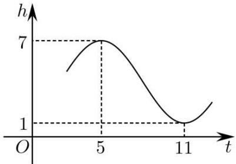

line

| t  | h |
|----|---|
| 0  | 0 |
| 5  | 7 |
| 11 | 1 |

(1) 求函数 $h(t)$ 的解析式;  
(2) 若一艘货船的吃水深度 (船底与水面的距离) 为 4 米, 安全条例规定至少要有 1.5 米的安全间隙 (船底与水底的距离), 则该船一天之内至多能在港口停留多久?

【解析】(1)由图知 $A=\frac{1}{2}(7-1)=3$ , $B=\frac{1}{2}(7+1)=4$ , $\frac{T}{2}=\frac{\pi}{\omega}=11-5=6$ , $\omega=\frac{\pi}{6}$ ,

所以 $h(t)=3\sin\left(\frac{\pi}{6}t+\varphi\right)+4$ ，将点 $(5,7)$ 代入得 $7=3\sin\left(\frac{5\pi}{6}+\varphi\right)+4$ ，

结合 $|\phi| < \frac{\pi}{2}$ 解得 $\varphi = -\frac{\pi}{3}$ ,

所以函数 $h(t)$ 的解析式 $h(t) = 3\sin \left(\frac{\pi}{6} t - \frac{\pi}{3}\right) + 4(0 \leqslant t < 24)$ .

(2) 货船需要的安全水深为 $4 + 1.5 = 5.5$ 米, 所以当 $h(t) \geqslant 5.5$ 时货船可以停留在港口.

由 $h(t)\geqslant 5.5$ 得 $\sin \left(\frac{\pi}{6} t - \frac{\pi}{3}\right)\geqslant \frac{1}{2}$ ，得 $\frac{\pi}{6} +2k\pi \leqslant \frac{\pi}{6} t - \frac{\pi}{3}\leqslant \frac{5\pi}{6} +2k\pi (k\in \mathbf{Z}),$

即 $3 + 12k \leqslant t \leqslant 7 + 12k (k \in \mathbb{Z})$ ,

当 k=0 时， $3 \leqslant t \leqslant 7$ ，当 k=1 时， $15 \leqslant t \leqslant 19$ ，

所以该船一天之内至多能在港口停留 $7 - 3 + 19 - 15 = 8$ 小时.

1266 (2024·辽宁锦州·渤海大学附属高级中学校考模拟预测)已知函数 $f(x)=$

$\sin (\omega x + \varphi)(\omega > 0, 0 < \varphi < \pi)$ 的图像相邻对称轴之间的距离是 $\frac{\pi}{2}$ , \_\_\_\_；

①若将 $f(x)$ 的图像向右平移 $\frac{\pi}{6}$ 个单位,所得函数 $g(x)$ 为奇函数.  
②若将 $f(x)$ 的图像向左平移 $\frac{\pi}{12}$ 个单位,所得函数 $g(x)$ 为偶函数,

在①,②两个条件中选择一个补充在 \_\_\_\_ 并作答

(1) 若 $x \in \left[0, \frac{\pi}{3}\right]$ , 求 $y = 2f^2(x) - f(x)$ 的取值范围;  
(2) 设函数 $h(x)=f(x)-\frac{3}{5}$ 的零点为 $x_{0}$ ，求 $\cos\left(\frac{\pi}{3}-4x_{0}\right)$ 的值.

【解析】(1) 因为函数 $f(x)=\sin(\omega x+\varphi)(\omega>0,0<\varphi<\pi)$ 的图像相邻对称轴之间的距离是 $\frac{\pi}{2}$ ,

所以 $\frac{\pi}{\omega} = \frac{\pi}{2}$ , 解得 $\omega = 2$ , 所以 $f(x) = \sin (2x + \varphi)$ ,

选①:

当将 $f(x)$ 的图像向右平移 $\frac{\pi}{6}$ 个单位, 得到函数 $g(x)=\sin\left(2\left(x-\frac{\pi}{6}\right)+\varphi\right)=\sin\left(2x-\frac{\pi}{3}+\varphi\right)$ ,

因为 $g(x)$ 为奇函数, 所以 $-\frac{\pi}{3} + \varphi = k\pi, k \in Z$ , 即 $\varphi = k\pi + \frac{\pi}{3}, k \in Z$ ,

因为 $0 < \varphi < \pi$ ，所以 $\varphi = \frac{\pi}{3}$ ，则 $f(x) = \sin \left(2x + \frac{\pi}{3}\right)$

则 $y=2f^{2}(x)-f(x)=2\sin^{2}\left(2x+\frac{\pi}{3}\right)-\sin\left(2x+\frac{\pi}{3}\right)$ ,

因为 $x \in \left[0, \frac{\pi}{3}\right]$ , 所以 $2x + \frac{\pi}{3} \in \left[\frac{\pi}{3}, \pi\right]$ , 则 $t = \sin \left(2x + \frac{\pi}{3}\right) \in [0,1]$ ,

所以 $y=2f^{2}(x)-f(x)=2t^{2}-t=2\left(t-\frac{1}{4}\right)^{2}-\frac{1}{8}\in\left[-\frac{1}{8},1\right]$ .

选②: $f(x)$ 的图像向左平移 $\frac{\pi}{12}$ 个单位, 得到函数 $g(x)=\sin\left(2\left(x+\frac{\pi}{12}\right)+\varphi\right)=\sin\left(2x+\frac{\pi}{6}+\varphi\right)$ ,

因为函数 $g(x)$ 为偶函数，所以 $\frac{\pi}{6} +\varphi = \frac{\pi}{2} +k\pi ,k\in \mathbb{Z},$ 即 $\varphi = k\pi +\frac{\pi}{3},k\in \mathbb{Z}.$

因为 $0 < \varphi < \pi$ ，所以 $\varphi = \frac{\pi}{3}$ ，则 $f(x) = \sin \left(2x + \frac{\pi}{3}\right)$

则 $y=2f^{2}(x)-f(x)=2\sin^{2}\left(2x+\frac{\pi}{3}\right)-\sin\left(2x+\frac{\pi}{3}\right)$ ,

因为 $x \in \left[0, \frac{\pi}{3}\right]$ , 所以 $2x + \frac{\pi}{3} \in \left[\frac{\pi}{3}, \pi\right]$ , 则 $t = \sin \left(2x + \frac{\pi}{3}\right) \in [0,1]$ ,

所以 $y=2f^{2}(x)-f(x)=2t^{2}-t=2\left(t-\frac{1}{4}\right)^{2}-\frac{1}{8}\in\left[-\frac{1}{8},1\right]$ .

(2) 因为函数 $h(x)=f(x)-\frac{3}{5}$ 的零点为 $x_{0}$ ,

所以 $h(x_{0})=f(x_{0})-\frac{3}{5}=\sin\left(2x_{0}+\frac{\pi}{3}\right)-\frac{3}{5}=0$ ，则 $\sin\left(2x_{0}+\frac{\pi}{3}\right)=\frac{3}{5}$

所以 $\cos\left(\frac{\pi}{3}-4x_{0}\right)=-\cos\left[\pi-\left(\frac{\pi}{3}-4x_{0}\right)\right]$ ,

$$
= - \cos \left(4 x _ {0} + \frac {2 \pi}{3}\right) = 2 \sin^ {2} \left(2 x _ {0} + \frac {\pi}{3}\right) - 1 = - \frac {7}{2 5}.
$$

1267 (2024·安徽亳州·安徽省亳州市第一中学校考模拟预测)已知函数 $f(x)=\mathrm{Asin}(\omega x+\varphi)\left(\mathrm{A}>0,\omega>0,|\varphi|<\frac{\pi}{2}\right)$ 的部分图象如图所示.

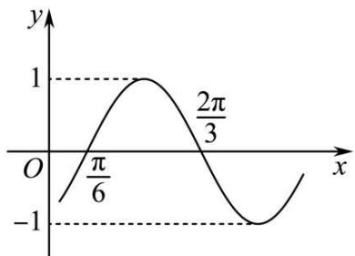

line

| x         | y     |
| --------- | ----- |
| 0         | -1    |
| π/6       | 1     |
| -π/6      | -1    |
| 2π/3      | 1     |

(1) 求函数 $f(x)$ 的解析式;  
(2) 将函数 $f(x)$ 的图象向左平移 $\frac{\pi}{6}$ 个单位, 得到函数 $g(x)$ 的图象, 若方程 $g(x) + k(\sin x + \cos x) + 2 = 0$ 在 $x \in \left[0, \frac{\pi}{2}\right]$ 上有解, 求实数 k 的取值范围.

【解析】(1)由函数的图象知： $A=1,\frac{T}{2}=\frac{2\pi}{3}-\frac{\pi}{6}=\frac{\pi}{2}$ ，则 $T=\pi$ ，

所以 $\omega=\frac{2\pi}{T}=2, f(x)=\sin(2x+\varphi)$ ,

因为 $f\left(\frac{\pi}{6}\right)=\sin\left(\frac{\pi}{3}+\varphi\right)=0,$

所以 $\frac{\pi}{3} +\varphi = k\pi ,k\in \mathbf{Z}$ ，则 $\varphi = k\pi -\frac{\pi}{3},k\in \mathbf{Z},$

又因为 $|\phi| < \frac{\pi}{2}$ , 则 $\varphi = -\frac{\pi}{3}$ ,

所以 $f(x)=\sin\left(2x-\frac{\pi}{3}\right)$ ;

(2) 由题意得: $g(x) = \sin 2x$ ,

令 $t = \sin x + \cos x, t \in [1, \sqrt{2}]$ ,

则 $g(x) + k(\sin x + \cos x) + 2 = 0$ 化为： $t^{2} - 1 + kt + 2 = 0$ ，

即 $-k=t+\frac{1}{t}$ 在 $t\in[1,\sqrt{2}]$ 上有解，

由对勾函数的性质得: $m=t+\frac{1}{t}\in\left[2,\frac{3\sqrt{2}}{2}\right]$ ,

所以 $k \in \left[-\frac{3\sqrt{2}}{2}, -2\right]$ .

【解题方法总结】

三角函数的性质(如奇偶性、周期性、单调性、对称性)中,尤为重要的是对称性.

因为对称性 $\Rightarrow$ 奇偶性 (若函数图像关于坐标原点对称, 则函数 $f(x)$ 为奇函数; 若函数图像关于 $y$ 轴对称, 则函数 $f(x)$ 为偶函数); 对称性 $\Rightarrow$ 周期性 (相邻的两条对称轴之间的距离是 $\frac{\mathrm{T}}{2}$ ; 相邻的对称中心之间的距离为 $\frac{\mathrm{T}}{2}$ ; 相邻的对称轴与对称中心之间的距离为 $\frac{\mathrm{T}}{4}$ ); 对称性 $\Rightarrow$ 单调性 (在相邻的对称轴之间, 函数 $f(x)$ 单调, 特殊的, 若 $f(x) = \operatorname{Asin}(wx), A > 0, w > 0$ , 函数 $f(x)$ 在 $[\theta_1, \theta_2]$ 上单调, 且 $0 \in [\theta_1, \theta_2]$ , 设 $\theta = \max\{|\theta_1|, \theta_2\}$ , 则 $\frac{\mathrm{T}}{4} \geqslant \theta$ 深刻体现了三角函数的单调性与周期性、对称性之间的紧密联系)

# 8 题型八:根据条件确定解析式

# 方向一：“知图求式”，即已知三角形函数的部分图像，求函数解析式.

1268 (2024·甘肃金昌·高三统考阶段练习)已知函数 $f(x)=$

$\mathrm{A}\cos(\omega x+\varphi)\left(\mathrm{A}>0,\omega>0,|\varphi|<\frac{\pi}{2}\right)$ 的部分图象如图所示，设使 $f(x)=-f(2a-x)$ 成立的 a 的最小正值为 m， $f(0)=n$ ，则 $m+n=$ （）

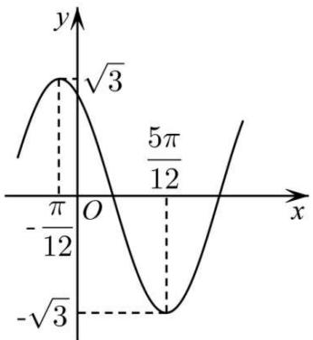

line

| x | y |
|---|---|
| -π/12 | √3 |
| 0 | 0 |
| π/12 | -√3 |
| ∞ | 0 |

A. $\frac{\pi}{6} + 1$

B. $\frac{\pi}{6}+\frac{3}{2}$

C. $\frac{\pi}{3}+1$

D. $\frac{\pi}{3}+\frac{3}{2}$

【答案】B

【解析】使 $f(x)=-f(2a-x)$ 成立的a即为 $f(x)$ 的对称中心的横坐标，

∴ a 的最小正值为 $\frac{1}{2}\left(-\frac{\pi}{12}+\frac{5\pi}{12}\right)=\frac{\pi}{6}$ ,

由图可知 $A = \sqrt{3},\frac{T}{2} = \frac{5\pi}{12} -\left(-\frac{\pi}{12}\right) = \frac{\pi}{2},T = \pi ,\therefore \omega = \frac{2\pi}{\pi} = 2,$

将点 $\left(\frac{5\pi}{12}, -\sqrt{3}\right)$ 代入 $f(x) = \sqrt{3}\cos (2x + \varphi)$ ，得 $\cos \left(\frac{5\pi}{6} +\varphi\right) = -1$

$$
\therefore \frac {5 \pi}{6} + \varphi = \pi + 2 k \pi , k \in \mathbf {Z},
$$

$\varphi=\frac{\pi}{6}+2k\pi,k\in\mathbb{Z},\because|\varphi|<\frac{\pi}{2},\therefore$ 取 $\varphi=\frac{\pi}{6},$

$$
\therefore f (x) = \sqrt {3} \cos \left(2 x + \frac {\pi}{6}\right), \therefore f (0) = \frac {3}{2},
$$

$$
\therefore m + n = \frac {\pi}{6} + \frac {3}{2}.
$$

故选：B.

1269 (2024·四川南充·高三四川省南充市高坪中学校考开学考试)已知函数 $f(x)=$

$\mathrm{Asin}(\omega x + \varphi)(\mathrm{A},\omega ,\varphi$ 为常数， $\omega >0,\mathrm{A} > 0)$ 的部分图像如图所示，若将 $f(x)$ 的图像向左平移 $\frac{\pi}{6}$ 个单位长度，得到函数 $g(x)$ 的图像，则 $g(x)$ 的解析式可以为 （）

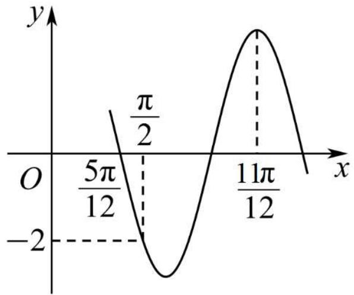

line

| x         | y     |
| --------- | ----- |
| 0         | 0     |
| 5π/12     | π/2   |
| 11π/12    | -2    |

A. $g(x) = 2\sqrt{2}\sin \left(3x + \frac{\pi}{4}\right)$

B. $g(x) = 2\sqrt{2}\cos \left(3x + \frac{\pi}{4}\right)$

C. $g(x) = 2\sqrt{2}\sin \left(3x - \frac{\pi}{4}\right)$

D. $g(x) = -2\sqrt{2}\cos\left(3x - \frac{\pi}{4}\right)$

【答案】A

【解析】由题意得 $\frac{11\pi}{12}-\frac{5}{12}\pi=\frac{\pi}{2}=\frac{3}{4}T$ ，所以 $T=\frac{2\pi}{3}$ ，故 $\omega=3$ ，

因为 $3 \times \frac{5\pi}{12} + \varphi = \pi + 2k\pi, k \in \mathbb{Z}$ , 所以 $\varphi = -\frac{\pi}{4} + 2k\pi, k \in \mathbb{Z}$ ,

即 $f(x) = \mathrm{Asin}\left(3x - \frac{\pi}{4} +2k\pi\right) = \mathrm{Asin}\left(3x - \frac{\pi}{4}\right).$

又因为 $f\left(\frac{\pi}{2}\right) = \mathrm{A}\sin \left(\frac{3\pi}{2} -\frac{\pi}{4}\right) = \mathrm{A}\sin \left(\frac{5\pi}{4}\right) = -2,\mathrm{A} > 0$ 解得 $\mathrm{A} = 2\sqrt{2}$ .

即 $f(x)=2\sqrt{2}\sin\left(3x-\frac{\pi}{4}\right)$ .

将 $f(x)$ 的图像向左平移 $\frac{\pi}{6}$ 个单位长度，

得到函数 $g(x) = 2\sqrt{2}\sin \left[3\left(x + \frac{\pi}{6}\right) - \frac{\pi}{4}\right] = 2\sqrt{2}\sin \left(3x + \frac{\pi}{4}\right).$

故选：A

1270 (2024·全国·高三校联考阶段练习)已知函数 $f(x) = \mathrm{A}\sin (\omega x + \varphi)$

$\left(x \in \mathrm{R}, A > 0, \omega > 0, |\varphi| < \frac{\pi}{2}\right)$ 的部分图象如图所示，把 $f(x)$ 的图象上所有的点向左平移 $\frac{\pi}{12}$ 个单位长度，再把所得图象上所有点的横坐标缩短到原来的 $\frac{1}{2}$ 倍(纵坐标不变)，得到

的函数图象的解析式是

( )

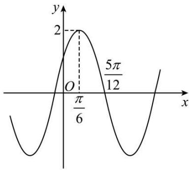

line

| x | y |
|---|---|
| 0 | -6 |
| π/6 | 2 |
| 5π/12 | 2 |

A. $y = 2\sin \left(x + \frac{\pi}{6}\right), x \in \mathbb{R}$

B. $y = 2 \sin \left( x + \frac{\pi}{3} \right)$ , $x \in R$

C. $y = 2 \sin \left(4x + \frac{\pi}{6}\right)$ , $x \in R$

D. $y = 2 \sin \left( 4x + \frac{\pi}{3} \right)$ , $x \in R$

【答案】D

【解析】由题中函数图象可知: $f(x)_{\max}=A=2$ .

最小正周期为 $T=4\times\left(\frac{5\pi}{12}-\frac{\pi}{6}\right)=\pi$ ，所以 $\omega=\frac{2\pi}{\pi}=2, f(x)=2\sin(2x+\varphi)$ ,

将点 $\left(\frac{\pi}{6},2\right)$ 代入函数解析式中,得 $2\sin\left(\frac{\pi}{3}+\varphi\right)=2$ ,

所以 $\frac{\pi}{3} + \varphi = \frac{\pi}{2} + 2k\pi, k \in Z$ ，即 $\varphi = \frac{\pi}{6} + 2k\pi, k \in Z.$

因为 $|\varphi| < \frac{\pi}{2}$ , 所以 $\varphi = \frac{\pi}{6}$ , 故 $f(x) = 2\sin \left(2x + \frac{\pi}{6}\right)$ , $x \in \mathbb{R}$ .

把 $f(x)$ 的图象上所有的点向左平移 $\frac{\pi}{12}$ 个单位长度，

得到函数图象的解析式为 $y=2\sin\left[2\left(x+\frac{\pi}{12}\right)+\frac{\pi}{6}\right]=2\sin\left(2x+\frac{\pi}{3}\right)$ ， $x\in R$ ;

再把所得图象上所有点的横坐标缩短到原来的 $\frac{1}{2}$ 倍(纵坐标不变),

得到函数图象的解析式为 $y=2\sin\left(4x+\frac{\pi}{3}\right)$ , $x\in R$ .

故选：D

1271 (2024·全国·高三专题练习)函数 $f(x)=\mathrm{Asin}(\omega x+\varphi)(\mathrm{A}>0,\omega>0,0<\varphi<\pi)$ 的部分图象如图所示，则函数 $f(x)$ 的解析式为（）

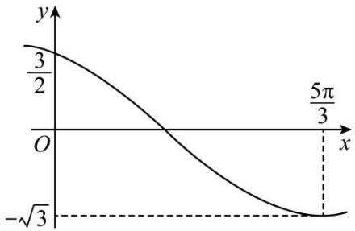

line

| x       | y     |
| ------- | ----- |
| 0       | 3/2   |
| ∞       | -√3   |
| 5π/3    | 3/2   |

A. $f(x) = \sqrt{3}\sin \left(2x + \frac{2\pi}{3}\right)$

B. $f(x) = \sqrt{3}\sin \left(2x + \frac{\pi}{3}\right)$

C. $f(x) = \sqrt{3}\sin \left(\frac{x}{2} +\frac{\pi}{3}\right)$

D. $f(x)=\sqrt{3}\sin\left(\frac{x}{2}+\frac{2\pi}{3}\right)$

【答案】D

【解析】由图象可得 $-\mathrm{A}=f(x)_{\min}=-\sqrt{3}$ ，可得 $A=\sqrt{3}$ ，

$\because f(0) = \sqrt{3}\sin \varphi = \frac{3}{2}$ , 可得 $\sin \varphi = \frac{\sqrt{3}}{2}$ ,

由于函数 $f(x)$ 在 $x = 0$ 附近单调递减，且 $0 < \varphi < \pi, \therefore \varphi = \frac{2\pi}{3}$ ，

由图象可知,函数 $f(x)$ 的最小正周期T满足 $\left\{\begin{aligned}\frac{1}{4}\mathrm{T}&=\frac{\pi}{2\omega}<\frac{5\pi}{3}\\ \frac{1}{2}\mathrm{T}&=\frac{\pi}{\omega}>\frac{5\pi}{3}\end{aligned}\right.$ ，可得 $\frac{3}{10}<\omega<\frac{3}{5}$

$\because f\left(\frac{5\pi}{3}\right)=\sqrt{3}\sin\left(\frac{5\pi\omega}{3}+\frac{2\pi}{3}\right)=-\sqrt{3}$ , 则 $\sin\left(\frac{5\pi\omega}{3}+\frac{2\pi}{3}\right)=-1$

所以 $\frac{5\omega\pi}{3} +\frac{2\pi}{3} = 2k\pi +\frac{3\pi}{2} (k\in \mathbf{Z})$ ，解得 $\omega = \frac{6k}{5} +\frac{1}{2} (k\in \mathbf{Z})$

$\because \frac{3}{10} < \omega < \frac{3}{5}$ , 所以 $k = 0, \omega = \frac{1}{2}$ , 因此 $f(x) = \sqrt{3} \sin \left( \frac{x}{2} + \frac{2\pi}{3} \right)$ .

故选：D.

1272 (2024·北京通州·统考模拟预测)已知函数 $f(x)=2\sin(\omega x+\varphi)\left(\omega>0,|\phi|<\frac{\pi}{2}\right)$ 的部分图象如图所示，则 $f(x)$ 的解析式为()

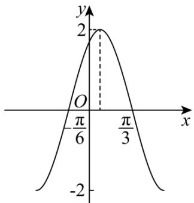

A. $f(x) = 2\sin \left(x + \frac{\pi}{6}\right)$

B. $f(x) = 2\sin \left(x - \frac{\pi}{6}\right)$

C. $f(x)=2\sin\left(2x+\frac{\pi}{3}\right)$

D. $f(x) = 2\sin \left(2x - \frac{\pi}{3}\right)$

【答案】C

【解析】由图知： $\frac{T}{2}=\frac{\pi}{3}-\left(-\frac{\pi}{6}\right)=\frac{\pi}{2}$ ，则 $T=\pi$ ，故 $\omega=2$ ，

则 $f(x)=2\sin(2x+\varphi)$ ,

由 $f\left(\frac{\pi}{3}\right) = 2\sin \left(\frac{2\pi}{3} +\varphi\right) = 0$ ，则 $\frac{2\pi}{3} +\varphi = k\pi ,k\in \mathbf{Z},$

所以 $\varphi=-\frac{2\pi}{3}+k\pi, k\in Z,$

又 $|\phi| < \frac{\pi}{2}$ , 故 $\varphi = \frac{\pi}{3}$ ,

综上, $f(x)=2\sin\left(2x+\frac{\pi}{3}\right)$ ,

故选：C.

1273 (2024·宁夏·高三银川一中校考阶段练习)已知函数 $f(x) = \mathrm{Asin}(\omega x + \varphi)$ , $A > 0$ , $\omega > 0$ , $|\varphi| < \frac{\pi}{2}$ 的部分图象如图所示, 则函数的解析式为 \_\_\_\_.

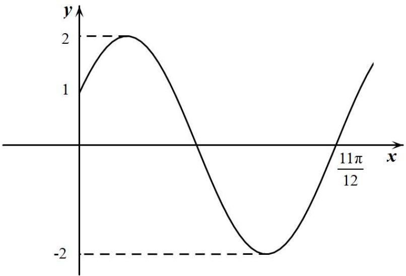

【答案】 $f(x)=2\sin\left(2x+\frac{\pi}{6}\right)$

【解析】由图象得到 $f(x)$ 的最大值为2,所以A=2

将点 $\left(\frac{11\pi}{12},0\right)$ 、(0,1)代入解析式 $f(x) = \mathrm{Asin}(\omega x + \varphi)$

$\left\{ \begin{array}{l} 2\sin \left( \omega \times \frac{11\pi}{12} + \varphi \right) = 0 \\ 2\sin (0 + \varphi) = 1 \end{array} \right.$ ，因为 $\omega > 0$ ， $|\varphi| < \frac{\pi}{2}$ ，可得 $\varphi = \frac{\pi}{6}$ ， $\omega = 2$

所以 $f(x)=2\sin\left(2x+\frac{\pi}{6}\right)$

故答案为: $f(x)=2\sin\left(2x+\frac{\pi}{6}\right)$ .

1274 (2024·江苏南京·高三统考期中)设函数 $f(x)=2\sin(\omega x+\varphi)$ ，(其中 $\omega>0,|\varphi|<\pi$ ) 的部分图象如图，则函数 $f(x)$ 的解析式为 $f(x)=$ \_\_\_\_.

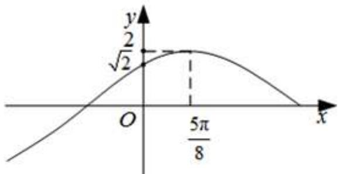

line

| x       | y     |
| ------- | ----- |
| √2      | 2     |
| 5π/8    | 5π/8  |

【答案】 $2\sin\left(\frac{2}{5}x+\frac{\pi}{4}\right)$

【解析】由 $f(x)$ 过 $(0,\sqrt{2})$ 求 $\varphi$ 的值, 根据五点画法坐标求出 $\omega$ , 即可求出结论. $\because f(x)$ 过点 $(0,\sqrt{2})$ , $\therefore f(0)=2\sin\varphi=\sqrt{2}$ , $\sin\varphi=\frac{\sqrt{2}}{2}$

$\because |\varphi|<\pi\therefore\varphi=\frac{\pi}{4}$ ，或 $\varphi=\frac{3\pi}{4}$ ，

函数在 y 轴右侧第一个最高点坐标为 $\left(\frac{5\pi}{8},2\right)$

若 $\varphi=\frac{\pi}{4}$ 时， $\frac{5\pi}{8}\omega+\frac{\pi}{4}=\frac{\pi}{2},\omega=\frac{2}{5}$

若 $\varphi=\frac{3\pi}{4}$ 时， $\frac{5\pi}{8}\omega+\frac{3\pi}{4}=\frac{\pi}{2},\omega=-\frac{2}{5}$ （舍去），

$$
\therefore f (x) = 2 \sin \left(\frac {2}{5} x + \frac {\pi}{4}\right).
$$

故答案为: $2\sin\left(\frac{2}{5}x+\frac{\pi}{4}\right)$ .

方向二:知性质(如奇偶性、单调性、对称性、最值),求解函数解析式(即 A, $w,\phi$ 的值的确定)

1275 (2024·全国·模拟预测)已知函数 $f(x) = 2\cos (\omega x + \varphi)\left(\omega > 0, |\varphi| < \frac{\pi}{3}\right)$ ，当 $f(x_1)f(x_2) = -4$ 时， $|x_1 - x_2|$ 的最小值为 $\frac{\pi}{4}$ ，则 $\omega =$ \_\_\_\_；若将函数 $f(x)$ 的图象向左平移 $\frac{\pi}{6}$ 个单位长度后，所得图象在 $y$ 轴上的截距为 $-\sqrt{3}$ ，则 $f(x)$ 在 $\left[\frac{\pi}{6}, \frac{\pi}{3}\right]$ 上的值域为 \_\_\_\_.

【答案】 4 [-2,0]

【解析】易知 $f(x)=2\cos(\omega x+\varphi)$ 的最大值和最小值分别为2和-2，

因为 $f(x_{1})f(x_{2})=-4$ ，所以 $x_{1}$ 、 $x_{2}$ 一个为 $f(x)$ 的最大值点，

一个为 $f(x)$ 的最小值点，

设函数 $f(x)$ 的最小正周期为 $\mathrm{T}$ , 则由 $|x_1 - x_2|$ 的最小值为 $\frac{\pi}{4}$ ,

得 $\frac{\mathrm{T}}{2} = \frac{\pi}{4}$ , 所以 $\mathrm{T} = \frac{\pi}{2}$ , 则 $\omega = \frac{2\pi}{\mathrm{T}} = 4$ ,

所以 $f(x)=2\cos(4x+\varphi)$ .

将函数 $f(x)$ 的图象向左平移 $\frac{\pi}{6}$ 个单位长度后，

所得图象对应的函数为 $g(x)=2\cos\left[4\left(x+\frac{\pi}{6}\right)+\varphi\right]=2\cos\left(4x+\frac{2\pi}{3}+\varphi\right)$ ,

令 $x = 0$ ，则 $2\cos \left(\frac{2\pi}{3} +\varphi\right) = -\sqrt{3}$

可得 $\cos \left(\frac{2\pi}{3} +\varphi\right) = -\frac{\sqrt{3}}{2},$

$\because-\frac{\pi}{3}<\varphi<\frac{\pi}{3}$ ，所以， $\frac{\pi}{3}<\frac{2\pi}{3}+\varphi<\pi$

所以 $\frac{2\pi}{3} + \varphi = \frac{5\pi}{6}$ ，所以 $\varphi = \frac{\pi}{6}$ ，

所以 $f(x)=2\cos\left(4x+\frac{\pi}{6}\right)$ ,

若 $x \in \left[\frac{\pi}{6}, \frac{\pi}{3}\right]$ , 则 $4x + \frac{\pi}{6} \in \left[\frac{5\pi}{6}, \frac{3\pi}{2}\right]$ ,

则 $-1 \leqslant \cos \left(4x + \frac{\pi}{6}\right) \leqslant 0$ ，则 $-2 \leqslant f(x) \leqslant 0$ .

故 $f(x)$ 在 $\left[\frac{\pi}{6},\frac{\pi}{3}\right]$ 上的值域为 $[-2,0]$ .

故答案为: 4; [-2,0].

1276 (2024·吉林通化·梅河口市第五中学校考模拟预测)某函数 $f(x)$ 满足以下三个条件：

① $g(x)=f(x)-1$ 是偶函数；② $g(2-x)+g(x)=0$ ；③ $f(x)$ 的最大值为 4.

请写出一个满足上述条件的函数 $f(x)$ 的解析式 \_\_\_\_.

【答案】 $f(x)=3\cos\frac{\pi}{2}x+1$ （答案不唯一）

【解析】因为 $g(x)=f(x)-1$ 是偶函数, 所以 $f(x)$ 的图象关于 y 轴对称,

因为 $g(2-x)+g(x)=0$ ，所以 $f(2-x)-1+f(x)-1=0$ ，即 $f(2-x)+f(x)=2$

所以 $f(x)$ 的图象关于点 $(1,1)$ 对称, 所以 4 为 $f(x)$ 的一个周期,

又 $f(x)$ 的最大值为4,所以 $f(x)=3\cos\frac{\pi}{2}x+1$ 满足条件.

故答案为: $f(x)=3\cos\frac{\pi}{2}x+1$ (答案不唯一)

1277 (2024·全国·高三专题练习)已知函数 $f(x) = \sin (\omega x + \varphi) (\omega > 0)$ , $\left|f\left(-\frac{\pi}{8}\right)\right| = 1$ , 且 $f\left(\frac{5\pi}{8}\right) = 0$ , 写出一个满足条件的函数 $f(x)$ 的解析式: \_\_\_\_.

【答案】 $f(x)=\sin\left(2x-\frac{\pi}{4}\right)$ （答案不唯一）

【解析】 $\because f(x)=\sin(\omega x+\varphi)(\omega>0),\left|f\left(-\frac{\pi}{8}\right)\right|=1$ ,且 $f\left(\frac{5\pi}{8}\right)=0$ ，

$$
\therefore \frac {\mathrm{T}}{4} + \frac {k \mathrm{T}}{2} = \frac {5 \pi}{8} - \left(- \frac {\pi}{8}\right) = \frac {3 \pi}{4}, k \in \mathrm{N},
$$

$$
\therefore \mathrm{T} = \frac {3 \pi}{2 k + 1}, k \in \mathrm{N},
$$

令 $k = 1, \mathrm{T} = \pi, \omega = 2, 2 \times \left(-\frac{\pi}{8}\right) + \varphi = m\pi + \frac{\pi}{2}, m \in \mathbf{Z}$ ,

令 $m = -1, \varphi = -\frac{\pi}{4}, f(x) = \sin \left(2x - \frac{\pi}{4}\right)$ .

故答案为: $f(x)=\sin\left(2x-\frac{\pi}{4}\right)$ (答案不唯一).

1278 (2024·河北·校联考模拟预测)已知函数 $f(x) = \sin (\omega x + \varphi)(\omega > 0, 0 < \varphi < \pi)$ 的图象过点 $\left(\frac{\pi}{3}, 0\right)$ ，且相邻两个零点的距离为 $\pi$ . 若将函数 $f(x)$ 的图象向左平移 $\frac{\pi}{3}$ 个单位长度得到 $g(x)$ 的图象，则函数 $g(x)$ 的解析式为 \_\_\_\_.

【答案】 $g(x)=-\sin x$

【解析】∵ $f(x)$ 的相邻两个零点的距离为 $\pi$ , ∴ $f(x)$ 的最小正周期 $T=2\pi$ , ∴ $\omega=1$ ;

又 $f\left(\frac{\pi}{3}\right) = \sin \left(\frac{\pi}{3} +\varphi\right) = 0,\therefore \frac{\pi}{3} +\varphi = k\pi (k\in \mathbf{Z})$ ，解得： $\varphi = k\pi -\frac{\pi}{3} (k\in \mathbf{Z})$

又 $0 < \varphi < \pi, \therefore \phi = \frac{2\pi}{3}, \therefore f(x) = \sin \left(x + \frac{2\pi}{3}\right)$ ,

$$
\therefore g (x) = f \left(x + \frac {\pi}{3}\right) = \sin (x + \pi) = - \sin x.
$$

故答案为: $g(x) = -\sin x$ .

1279 (2024·全国·高三专题练习)已知 $f(x)=\sin(\omega x+\varphi)(\omega>0,0<\varphi<\pi)$ ，满足 $f\left(x-\frac{\pi}{3}\right)+f(-x)=0,f\left(\frac{2\pi}{3}+x\right)=f(-x)$ ，且 $f(x)$ 在 $(0,\pi)$ 上有且仅有5个零点，则此函数解析式为 $f(x)=$ \_\_\_\_.

【答案】 $\sin\left(5x+\frac{5\pi}{6}\right)$

【解析】因为 $f\left(x-\frac{\pi}{3}\right)+f(-x)=0$ ，令 $t=x-\frac{\pi}{6}$ ，

则 $f\left(t-\frac{\pi}{6}\right)=-f\left(-t-\frac{\pi}{6}\right)$ ，即 $f\left(x-\frac{\pi}{6}\right)=-f\left(-x-\frac{\pi}{6}\right)$

所以 $\left(-\frac{\pi}{6},0\right)$ 是 $f(x)$ 图像的对称中心，

又 $f\left(x+\frac{2\pi}{3}\right)=f(-x)$ ，令 $t=x+\frac{\pi}{3}$

则 $f\left(t+\frac{\pi}{3}\right)=f\left(\frac{\pi}{3}-t\right)$ ，即 $f\left(\frac{\pi}{3}+x\right)=f\left(\frac{\pi}{3}-x\right)$ ,

所以 $x=\frac{\pi}{3}$ 是 $f(x)$ 图像的对称轴，

所以 $\left\{\begin{aligned}-\frac{\pi}{6}\omega+\varphi=k_{1}\pi, &k_{1}\in\mathbb{Z}\\ \frac{\pi}{3}\omega+\varphi=k_{2}\pi+\frac{\pi}{2}, &k_{2}\in\mathbb{Z}\end{aligned}\right.$ ，得 $\frac{\pi}{2}\omega=(k_{2}-k_{1})\pi+\frac{\pi}{2}$ ,

令 $k=k_{2}-k_{1}$ ，则 $k\in Z$ ，所以 $\omega=2k+1$ ，

因为 $f(x)$ 在 $(0, \pi)$ 上有且只有 5 个零点，所以 $2T < \pi < 3T$ ，又 $T = \frac{2\pi}{\omega}$ ， $\omega > 0$ ，

即 $\frac{4\pi}{\omega} < \pi < \frac{6\pi}{\omega}$ , 所以 $4 < \omega < 6$ , 得 $\omega = 5$ , 代入上式, 得 $-\frac{5\pi}{6} + \varphi = k_1\pi$ ,

又 $0 < \varphi < \pi$ ，所以 $\varphi = \frac{5\pi}{6}$ ，所以 $f(x) = \sin \left(5x + \frac{5\pi}{6}\right)$ .

故答案为: $\sin\left(5x+\frac{5\pi}{6}\right)$

1280 (2024·湖北·高三校联考阶段练习)已知函数 $f(x)=\sin(\omega x+\varphi)$ ( $\omega>0,0\leqslant\varphi<2\pi$ ) 满足 $f(2+x)=f(2-x)$ ，其图象与 x 轴在原点右侧的第一个交点的坐标为 (6,0)，则函数 $y=f(x)$ 的解析式为 \_\_\_\_.

【答案】 $f(x)=\sin\left(\frac{\pi}{8}x+\frac{\pi}{4}\right)$ 或 $f(x)=\sin\left(\frac{\pi}{8}x+\frac{5\pi}{4}\right)$

【解析】因为 $f(x)$ 满足 $f(2+x)=f(2-x)$ ，所以 $f(x)$ 图象关于 x=2 对称，

因为 $f(x)$ 图象与 x 轴在原点右侧的第一个交点的坐标为 $(6,0)$ ,

所以 $T=4(6-2)=16$ ，所以 $\omega=\frac{2\pi}{T}=\frac{2\pi}{16}=\frac{\pi}{8}$

所以 $f(6)=\sin\left(\frac{\pi}{8}\times6+\varphi\right)=0$ 即 $\sin\left(\frac{3\pi}{4}+\varphi\right)=0$ ，所以 $\frac{3\pi}{4}+\varphi=k\pi, k\in Z,$

解得: $\varphi = k\pi - \frac{3\pi}{4}, k \in Z,$

因为 $0 \leqslant \varphi < 2\pi$ ，所以 $k = 1, \varphi = \frac{\pi}{4}$ 或 $k = 2, \varphi = \frac{5\pi}{4}$

所以 $f(x)=\sin\left(\frac{\pi}{8}x+\frac{\pi}{4}\right)$ 或 $f(x)=\sin\left(\frac{\pi}{8}x+\frac{5\pi}{4}\right)$ .

故答案为: $f(x)=\sin\left(\frac{\pi}{8}x+\frac{\pi}{4}\right)$ 或 $f(x)=\sin\left(\frac{\pi}{8}x+\frac{5\pi}{4}\right)$ .

1281 (2024·全国·高三专题练习)函数 $f(x)=\sqrt{3}\sin(\omega x+\phi)-\cos(\omega x+\phi)$ ( $\omega>0,0<\phi<\pi$ ) 为偶函数，且函数 $y=f(x)$ 的图像的两条对称轴之间的最小距离为 $\frac{\pi}{2}$ ，则 $f(x)$ 的解析式为 \_\_\_\_.

【答案】 $f(x)=2\cos2x$

【解析】∵ 函数 $f(x)=\sqrt{3}\sin(\omega x+\phi)-\cos(\omega x+\phi)$ ,

$$
\therefore f (x) = 2 \sin \left(\omega x + \phi - \frac {\pi}{6}\right),
$$

由题意得 $\frac{2\pi}{\omega} = 2 \times \frac{\pi}{2}$ ,

∴ $\omega = 2$ ，则 $f(x) = 2\sin\left(2x + \phi - \frac{\pi}{6}\right)$ .

$\because f(x)$ 为偶函数，

$$
\therefore f (0) = 2 \sin \left(\phi - \frac {\pi}{6}\right) = \pm 2,
$$

$$
\therefore \phi - \frac {\pi}{6} = k \pi + \frac {\pi}{2}, k \in \mathrm{Z},
$$

又∵0<φ<π,

故 $\phi -\frac{\pi}{6} = \frac{\pi}{2},$

即 $f(x)=2\sin\left(2x+\frac{\pi}{2}\right)$ ,

$$
\therefore f (x) = 2 \cos 2 x.
$$

故答案为: $f(x)=2\cos2x$

1282 (2024·上海虹口·统考一模)设函数 $f(x) = \cos (\omega x + \varphi)$ (其中 $\omega > 0, |\phi| < \frac{\pi}{2}$ ), 若函数 $y = f(x)$ 图象的对称轴 $x = \frac{\pi}{6}$ 与其对称中心的最小距离为 $\frac{\pi}{8}$ , 则 $f(x) =$ \_\_\_\_.

【答案】 $\cos\left(4x+\frac{\pi}{3}\right)$

【解析】解: 由题知, 因为 $f(x)$ 对称轴与对称中心的最小距离为 $\frac{\pi}{8}$ ,

所以 $\frac{\mathrm{T}}{4} = \frac{\pi}{8}$ 即 $\mathrm{T} = \frac{\pi}{2}$

所以 $\omega=\frac{2\pi}{T}=4,$ 此时 $f(x)=\cos(4x+\varphi),$

因为对称轴为 $x=\frac{\pi}{6}$ ,

故有: $4\cdot\frac{\pi}{6}+\varphi=k\pi,k\in Z,$

即 $\varphi = -\frac{2\pi}{3} + k\pi, k \in \mathbb{Z}$ ,

因为 $|\phi| < \frac{\pi}{2}$ ,

所以 $\varphi=\frac{\pi}{3}$ ,

故 $f(x)=\cos\left(4x+\frac{\pi}{3}\right)$ .

故答案为: $\cos\left(4x+\frac{\pi}{3}\right)$

【解题方法总结】

根据函数必关于 y 轴对称, 在三角函数中联想到 $y = \cos wx$ 的模型, 从图象、对称轴、对称中心、最值点或单调性来求解.

# 题型九:三角函数图像变换

1283 (2024·河南郑州·高三郑州外国语学校校考阶段练习)如图,函数 $f(x)=$

$2\sin(\omega x+\varphi)\left(\omega>0,|\varphi|<\frac{\pi}{2}\right)$ 的图像过 $\left(\frac{\pi}{2},0\right),(2\pi,2)$ 两点，为得到函数 $g(x)=$

$2\cos(\omega x-\varphi)$ 的图像,应将 $f(x)$ 的图像()

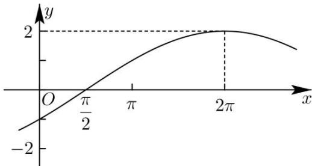

A. 向右平移 $\frac{7\pi}{6}$ 个单位长度

B. 向左平移 $\frac{7\pi}{6}$ 个单位长度

C. 向右平移 $\frac{5\pi}{2}$ 个单位长度

D. 向左平移 $\frac{5\pi}{2}$ 个单位长度

【答案】D

【解析】 $T=\left(2\pi-\frac{\pi}{2}\right)\times4=6\pi$ $\therefore\omega=\frac{2\pi}{T}=\frac{2\pi}{6\pi}=\frac{1}{3}\therefore f(x)=2\sin\left(\frac{1}{3}x+\varphi\right)$

代入 $(2\pi, 2)$ 得 $2\sin \left(\frac{2\pi}{3} + \varphi\right) = 2$ 即 $\sin \left(\frac{2\pi}{3} + \varphi\right) = 1$

$$
\frac {2 \pi}{3} + \varphi = \frac {\pi}{2} + 2 k \pi , k \in \mathrm{Z} \Rightarrow \varphi = - \frac {\pi}{6} + 2 k \pi , k \in \mathrm{Z}
$$

$$
\because | \varphi | <   \frac {\pi}{2} \therefore k = 0 \text {即} \varphi = - \frac {\pi}{6}
$$

$$
\therefore f (x) = 2 \sin \left(\frac {1}{3} x - \frac {\pi}{6}\right)
$$

对于 A 选项，

$$
2 \sin \left[ \frac {1}{3} \left(x - \frac {7 \pi}{6}\right) - \frac {\pi}{6} \right] = 2 \sin \left[ \frac {1}{3} x - \frac {7 \pi}{1 8} - \frac {\pi}{6} \right] = 2 \sin \left(\frac {1}{3} x - \frac {5 \pi}{9}\right)
$$

$$
= 2 \sin \left(\frac {1}{3} x - \frac {1 9 \pi}{1 8} + \frac {\pi}{2}\right) = 2 \cos \left(\frac {1}{3} x - \frac {1 9 \pi}{1 8}\right), \text {故A错误}
$$

对于B选项

$$
2 \sin \left[ \frac {1}{3} \left(x + \frac {7 \pi}{6}\right) - \frac {\pi}{6} \right] = 2 \sin \left[ \frac {1}{3} x + \frac {7 \pi}{1 8} - \frac {\pi}{6} \right] = 2 \sin \left(\frac {1}{3} x + \frac {2 \pi}{9}\right)
$$

$$
= 2 \sin \left(\frac {1}{3} x - \frac {5 \pi}{1 8} + \frac {\pi}{2}\right) = 2 \cos \left(\frac {1}{3} x - \frac {5 \pi}{1 8}\right), \text {故B错误}
$$

对于C选项

$$
2 \sin \left[ \frac {1}{3} \left(x - \frac {5 \pi}{2}\right) - \frac {\pi}{6} \right] = 2 \sin \left(\frac {1}{3} x - \frac {5 \pi}{6} - \frac {\pi}{6}\right) = 2 \sin \left(\frac {1}{3} x - \pi\right)
$$

$$
= - 2 \sin \frac {1}{3} x, \text { 故 } \mathrm{C} \text { 错   误 }
$$

对于D选项，

$$
2 \sin \left[ \frac {1}{3} \left(x + \frac {5 \pi}{2}\right) - \frac {\pi}{6} \right] = 2 \sin \left[ \frac {1}{3} x + \frac {5 \pi}{6} - \frac {\pi}{6} \right] = 2 \sin \left(\frac {1}{3} x + \frac {2 \pi}{3}\right)
$$

$$
= 2 \sin \left(\frac {1}{3} x + \frac {\pi}{6} + \frac {\pi}{2}\right) = 2 \cos \left(\frac {1}{3} x + \frac {\pi}{6}\right), \text {故D正确}
$$

故选：D

1284 (2024·河北衡水·高三河北衡水中学校考阶段练习)将函数 $y=\sin2x$ 的图象向右平移 $\varphi$ 个单位长度后, 得到函数 $y=\cos\left(2x+\frac{\pi}{6}\right)$ 的图象, 则 $\varphi$ 的值可以是 ()

A. $\frac{\pi}{12}$

B. $\frac{\pi}{6}$

C. $\frac{\pi}{3}$

D. $\frac{2\pi}{3}$

【答案】D

【解析】因为 $y=\cos\left(2x+\frac{\pi}{6}\right)=\sin\left(2x+\frac{\pi}{6}+\frac{\pi}{2}\right)=\sin\left(2x+\frac{2\pi}{3}\right)$ ,

将函数 $y=\sin2x$ 的图象向右平移 $\varphi$ 个单位长度后, 得到函数 $y=\sin[2(x-\varphi)]=\sin(2x-2\varphi)$ 的图象,

由题意可得 $\frac{2\pi}{3}=2k\pi-2\varphi(k\in\mathbb{Z})$ ，可得 $\varphi=k\pi-\frac{\pi}{3}(k\in\mathbb{Z})$ ，当 k=1 时， $\varphi=\frac{2\pi}{3}$ ，

故选：D.

1285 (2024·河南洛阳·高三新安县第一高级中学校考开学考试)已知把函数 $f(x)=\sin\left(x+\frac{\pi}{3}\right)\cos x$ 的图象向右平移 $\varphi$ 个单位长度, 可得函数 $y=\frac{1}{2}\cos\left(2x+\frac{\pi}{6}\right)+\frac{\sqrt{3}}{4}$ 的图象, 则 $\varphi$ 的最小正值为 ()

A. $\frac{\pi}{4}$

B. $\frac{\pi}{6}$

C. $\frac{5}{6}\pi$

D. $\frac{\pi}{3}$

【答案】C

【解析】由题知，

$$
\begin{array}{l} \because f (x) = \sin \left(x + \frac {\pi}{3}\right) \cos x \\ = \left(\sin x \cos \frac {\pi}{3} + \cos x \sin \frac {\pi}{3}\right) \cos x \\ = \frac {1}{2} \sin x \cos x + \frac {\sqrt {3}}{2} \cos^ {2} x \\ = \frac {1}{4} \sin 2 x + \frac {\sqrt {3}}{2} \cdot \frac {1 + \cos 2 x}{2} \\ = \frac {1}{2} \sin \left(2 x + \frac {\pi}{3}\right) + \frac {\sqrt {3}}{4}, \\ \end{array}
$$

且 $y = \frac{1}{2}\cos \left(2x + \frac{\pi}{6}\right) + \frac{\sqrt{3}}{4}$

$$
= \frac {1}{2} \sin \left(2 x + \frac {\pi}{2} + \frac {\pi}{6}\right) + \frac {\sqrt {3}}{4},
$$

$$
\therefore \sin \left[ 2 (x - \varphi) + \frac {\pi}{3} \right] = \sin \left(2 x + \frac {\pi}{2} + \frac {\pi}{6}\right),
$$

即 $2(x - \varphi) + \frac{\pi}{3} = 2x + \frac{\pi}{2} +\frac{\pi}{6} +2k\pi (k\in \mathbf{Z})$

解得 $\varphi = -k\pi - \frac{\pi}{6}(k \in \mathbb{Z})$ ，当 k = -1 时， $\varphi$ 取得最小正值，

$$
\varphi = \pi - \frac {\pi}{6} = \frac {5 \pi}{6}.
$$

故选：C.

1286 (2024·全国·高三专题练习)为了得到函数 $y=\sin\left(2x+\frac{4\pi}{3}\right)$ 的图象, 只需将函数 $y=\sin\left(2x+\frac{\pi}{6}\right)$ 的图象 ()

A. 向左平移 $\frac{7\pi}{12}$ 个单位长度

B. 向左平移 $\frac{7\pi}{6}$ 个单位长度

C. 向右平移 $\frac{7\pi}{12}$ 个单位长度

D. 向右平移 $\frac{7\pi}{6}$ 个单位长度

【答案】A

【解析】由题意,由于函数 $y=\sin\left(2x+\frac{4\pi}{3}\right)=\sin\left(2x+\frac{\pi}{6}+\frac{7\pi}{6}\right)=\sin\left[2\left(x+\frac{7\pi}{12}\right)+\frac{\pi}{6}\right]$ ,
观察发现可由函数 $y=\sin\left(2x+\frac{\pi}{6}\right)$ 向左平移 $\frac{7\pi}{12}$ 个单位长度,得到函数 $y=\sin\left(2x+\frac{4\pi}{3}\right)$ 的图象,

故选：A.

1287 (2024·青海西宁·统考二模)为了得到函数 $y=\sin\left(4x+\frac{\pi}{6}\right)$ 图象, 只要将 $y=\sin x$ 的图象 ( )

A. 向左平移 $\frac{\pi}{6}$ 个单位长度, 再把所得图象上各点的横坐标缩短到原来的 $\frac{1}{4}$ , 纵坐标不变  
B. 向左平移 $\frac{\pi}{3}$ 个单位长度, 再把所得图象上各点的横坐标伸长到原来的 4 倍, 纵坐标不变  
C. 向左平移 $\frac{\pi}{3}$ 个单位长度, 再把所得图象上各点的横坐标缩短到原来的 $\frac{1}{4}$ , 纵坐标不变  
D. 向左平移 $\frac{\pi}{6}$ 个单位长度, 再把所得图象上各点横坐标伸长到原来的 4 倍, 纵坐标不变

【答案】A

【解析】只要将 $y = \sin x$ 的图象向左平移 $\frac{\pi}{6}$ 个单位长度, 得到函数 $y = \sin\left(x + \frac{\pi}{6}\right)$ 的图象,

再把所得图象上各点的横坐标缩短到原来的 $\frac{1}{4}$ , 纵坐标不变, 得到函数 $y = \sin \left(4x + \frac{\pi}{6}\right)$ 的图象, 即 A 正确;

将 $y = \sin x$ 的图象向左平移 $\frac{\pi}{3}$ 个单位长度,再把所得图象上各点的横坐标伸长到原来的4倍,纵坐标不变,得到的是函数 $y = \sin \left( \frac{1}{4} x + \frac{\pi}{3} \right)$ 的图象,故B错误;

将 $y = \sin x$ 的图象向左平移 $\frac{\pi}{3}$ 个单位长度, 再把所得图象上各点的横坐标缩短到原来的 $\frac{1}{4}$ , 纵坐标不变, 得到的是函数 $y = \sin \left(4x + \frac{\pi}{3}\right)$ 的图象, 故 C 错误;

将 $y = \sin x$ 的图象向左平移 $\frac{\pi}{6}$ 个单位长度,再把所得图象上各点的横坐标伸长到原来的4倍,纵坐标不变,得到的是函数 $y = \sin \left( \frac{1}{4} x + \frac{\pi}{6} \right)$ 的图象,故D错误;

故选：A

1288 (2024·全国·高三专题练习)若要得到函数 $f(x)=\sin\left(2x+\frac{\pi}{6}\right)$ 的图象, 只需将函数 $g(x)=\cos\left(2x+\frac{\pi}{3}\right)$ 的图象 ()

A. 向左平移 $\frac{\pi}{6}$ 个单位长度

B. 向右平移 $\frac{\pi}{6}$ 个单位长度

C. 向左平移 $\frac{\pi}{3}$ 个单位长度

D. 向右平移 $\frac{\pi}{3}$ 个单位长度

【答案】D

【解析】因为 $\sin\left(2x+\frac{\pi}{6}\right)=\cos\left(2x+\frac{\pi}{6}-\frac{\pi}{2}\right)=\cos\left(2x-\frac{\pi}{3}\right)$ ,

故将已知转化为要得到函数 $f(x) = \cos \left(2x - \frac{\pi}{3}\right)$ 的图象，

又 $\cos\left(2x-\frac{\pi}{3}\right)=\cos\left[2\left(x-\frac{\pi}{3}\right)+\frac{\pi}{3}\right]$ ,

所以将 $g(x)$ 的图象向右平移 $\frac{\pi}{3}$ 个单位长度即可得到 $f(x)$ 的图象.

故选：D

1289 (2024·陕西·统考模拟预测)已知函数 $f(x)=\mathrm{Asin}(\omega x+\varphi)(\mathrm{A}>0,\omega>0,-\pi<\varphi<0)$ 的部分图象如图所示,则下列说法正确的是()

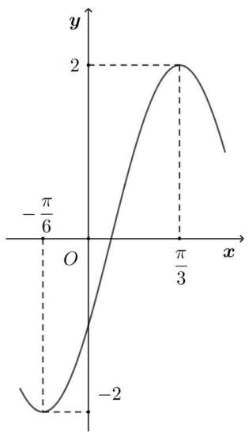

A. 将函数 $y = f(x)$ 的图象向左平移 $\frac{\pi}{3}$ 个单位长度得到函数 $g(x) = A\cos \omega x$ 的图象  
B. 将函数 $y = f(x)$ 的图象向右平移 $\frac{\pi}{3}$ 个单位长度得到函数 $g(x) = A\cos \omega x$ 的图象  
C. 将函数 $y = f(x)$ 的图象向左平移 $\frac{\pi}{6}$ 个单位长度得到函数 $g(x) = A \cos \omega x$ 的图象  
D. 将函数 $y = f(x)$ 的图象向右平移 $\frac{\pi}{6}$ 个单位长度得到函数 $g(x) = A\cos \omega x$ 的图象

【答案】A

【解析】由图象可知,函数 $f(x)$ 的最小正周期为 $T=2\left(\frac{\pi}{3}+\frac{\pi}{6}\right)=\pi$ ,则 $\omega=\frac{2\pi}{\pi}=2$ ,A=2,

$f\left(\frac{\pi}{3}\right) = 2\sin \left(\frac{2\pi}{3} +\varphi\right) = 2$ ，则 $\frac{2\pi}{3} +\varphi = \frac{\pi}{2} +2k\pi (k\in \mathbf{Z})$ ，可得 $\varphi = 2k\pi -\frac{\pi}{6} (k\in \mathbf{Z})$

$\because -\pi < \varphi < 0,$ 所以， $\varphi = -\frac{\pi}{6},$

所以， $f(x)=2\sin\left(2x-\frac{\pi}{6}\right)=2\cos\left(2x-\frac{\pi}{6}-\frac{\pi}{2}\right)=2\cos\left(2x-\frac{2\pi}{3}\right)$

因此,将函数 $y=f(x)$ 的图象向左平移 $\frac{\pi}{3}$ 个单位长度得到函数 $g(x)=2\cos2x$ 的图象.

故选：A.

1290 (2024·安徽合肥·合肥一中校考模拟预测)已知曲线 $C_{1}:y=\sin\left(\frac{\pi}{2}+2x\right),C_{2}:y=$

$-\cos\left(\frac{5\pi}{6}-3x\right)$ ，则下面结论正确的是()

A. 把 $C_{1}$ 上各点的横坐标伸长到原来的 $\frac{3}{2}$ 倍, 纵坐标不变, 再把得到的曲线向右平移 $\frac{\pi}{6}$ 个单位长度, 得到曲线 $C_{2}$   
B. 把 $C_{1}$ 上各点的横坐标伸长到原来的 $\frac{3}{2}$ 倍, 纵坐标不变, 再把得到的曲线向左平移 $\frac{\pi}{18}$ 个单位长度, 得到曲线 $C_{2}$   
C. 把 $C_{1}$ 上各点的横坐标缩短到原来的 $\frac{2}{3}$ ，纵坐标不变，再把得到的曲线向左平移 $\frac{\pi}{18}$ 个单位长度 $C_{2}$   
D. 把 $C_{1}$ 上各点的横坐标缩短到原来的 $\frac{2}{3}$ ，纵坐标不变，再把得到的曲线向右平移 $\frac{\pi}{6}$ 个单位长度，得到曲线 $C_{2}$

【答案】C

【解析】曲线 $C_{1}:y=\sin\left(\frac{\pi}{2}+2x\right)=\cos2x$ ,

把 $C_{1}:y=\cos2x$ 上各点的横坐标缩短到原来的 $\frac{2}{3}$ ，纵坐标不变，可得 $y=\cos3x$ 的图象；再把得到的曲线向左平移 $\frac{\pi}{18}$ 个单位长度，可以得到曲线 $C_{2}:y=\cos\left(\frac{\pi}{6}+3x\right)=-\cos\left(\frac{5\pi}{6}-3x\right)$ 的图象.

故选：C.

1291 (2024·全国·高三专题练习)已知函数 $f(x)=\cos\left(2x-\frac{\pi}{3}\right)$ ， $g(x)=\sin2x$ ，将函数 $f(x)$ 的图象经过下列哪种可以与 $g(x)$ 的图象重合（）

A. 向左平移 $\frac{\pi}{12}$ 个单位

B. 向左平移 $\frac{\pi}{6}$ 个单位

C. 向右平移 $\frac{\pi}{12}$ 个单位

D. 向右平移 $\frac{\pi}{6}$ 个单位

【答案】C

【解析】 $f(x)=\cos\left(2x-\frac{\pi}{3}\right)=\sin\left(2x-\frac{\pi}{3}+\frac{\pi}{2}\right)=\sin\left(2x+\frac{\pi}{6}\right)=\sin\left[2\left(x+\frac{\pi}{12}\right)\right]$

将函数 $f(x)$ 的图象向右平移 $\frac{\pi}{12}$ 个单位: $f\left(x - \frac{\pi}{12}\right) = \sin 2x = g(x)$ ;

故选：C

【解题方法总结】

由函数 $y = \sin x$ 的图像变换为函数 $y = \text{Asin}(wx + \phi) + b(A, w > 0)$ 的图像.

方法: $(x\rightarrow x+\phi\rightarrow wx+\phi)$ 先相位变换,后周期变换,再振幅变换.

$y = \sin x$ 的图像 $\frac{\text{向左平移}\Phi\text{个单位}(\Phi > 0)}{\text{向左平移}|\Phi|\text{个单位}(\Phi < 0)} \to y = \sin (x + \phi)$ 的图像

向左平移 $\frac{\Phi}{\varpi}$ 个单位 $(\Phi >0)$ 向左平移 $\left|\frac{\Phi}{\varpi}\right|$ 个单位 $(\Phi < 0)$

$y=\sin(wx+\phi)$ 的图像 $\frac{所有点的纵坐标变为原来的A倍}{横坐标不变}$

$y = \mathrm{Asin}(wx + \phi)$ 的图像 $\frac{\text{向上平移}b\text{个单位}(b > 0)}{\text{向下平移}|b|\text{个单位}(b < 0)} \rightarrow y = \mathrm{Asin}(wx + \phi) + b$

# 10 题型十:三角函数模型

1292 (2024·江西赣州·高三校联考阶段练习)如图, 摩天轮的半径为 50m, 其中心 O 点距离地面的高度为 60m, 摩天轮按逆时针方向匀速转动, 且 20min 转一圈, 若摩天轮上点 P 的起始位置在最高点处, 则摩天轮转动过程中下列说法正确的是 ()

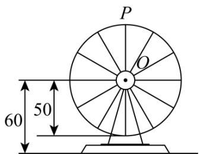

text_image

P
O
60 50

A. 转动 $10 \mathrm{~min}$ 后点 $\mathrm{P}$ 距离地面 $8 \mathrm{~m}$   
B. 若摩天轮转速减半, 则转动一圈所需的时间变为原来的 $\frac{1}{2}$   
C. 第 17min 和第 42min 点 P 距离地面的高度相同  
D. 摩天轮转动一圈, 点 P 距离地面的高度不低于 85m 的时间长为 $\frac{20}{3}$ min

【答案】D

【解析】设转动过程中,点 P 离地面距离的函数为:

$$
f (t) = \operatorname{Asin} (\omega t + \varphi) + h,
$$

由题意得: A = 50, h = 60, T = 20, $\omega = \frac{2\pi}{20} = \frac{\pi}{10}$ ,

$$
f (0) = 5 0 \mathrm{sin} \varphi + 6 0 = 1 1 0, \text {则} \varphi = {\frac {\pi}{2}},
$$

所以 $f(t)=50\sin\left(\frac{\pi}{10}t+\frac{\pi}{2}\right)+60,$

选项 A, 转到 10min 后, 点 P 距离地面的高度为:

$$
f (1 0) = 5 0 \sin \left(\frac {\pi}{1 0} \times 1 0 + \frac {\pi}{2}\right) + 6 0 = 1 0, \text {   故   } A \text {   不正确;   }
$$

选项 B, 若摩天轮转速减半, 则转动一圈所需的时间变为原来的 2 倍,

故B不正确;

选项 C, 因为 $f(17)=50\sin\left(\frac{\pi}{10}\times17+\frac{\pi}{2}\right)+60$

$$
= - 5 0 \cos \frac {7 \pi}{1 0} + 6 0 = 5 0 \cos \frac {3 \pi}{1 0} + 6 0,
$$

$$
f (4 2) = 5 0 \sin \left(\frac {\pi}{1 0} \times 4 2 + \frac {\pi}{2}\right) + 6 0 = 5 0 \cos \frac {\pi}{5} + 6 0,
$$

所以 $f(17) \neq f(42)$ ,

即第 17min 和第 42min 点 P 距离地面的高度不相同, 故 C 不正确;

选项 D, 令 $f(t)=50\sin\left(\frac{\pi}{10}t+\frac{\pi}{2}\right)+60\geqslant85$ ,

则 $\cos\frac{\pi}{10}t\geqslant\frac{1}{2}$ ，由 $-\frac{\pi}{3}+2k\pi\leqslant\frac{\pi}{10}t\leqslant2k\pi+\frac{\pi}{3},k\in\mathbb{Z},$

解得 $-\frac{10}{3}+20k\leqslant t\leqslant20k+\frac{10}{3},k\in\mathbb{Z},$

所以 $\frac{10}{3} -\left(-\frac{10}{3}\right) = \frac{20}{3},$

即摩天轮转动一圈,点 P 距离地面的高度不低于 85m 的时间为 $\frac{20}{3}$ min,

故D正确；

故选：D.

1293 (2024·全国·高三专题练习) 2019 年长春市新地标——“长春眼”在摩天活力城 Mall 购物中心落成, 其楼顶平台上的空中摩天轮的半径约为 40m, 圆心 O 距地面的高度约为 60m, 摩天轮逆时针匀速转动, 每 15min 转一圈, 摩天轮上的点 P 的起始位置在最低点处, 已知在时刻 t(min) 时 P 距离地面的高度 $f(t) = \text{Asin}(\omega t + \varphi) + h (\omega > 0, |\varphi| < \pi)$ , 当距离地面的高度在 $(60 + 20\sqrt{3})m$ 以上时可以看到长春的全貌, 则在转一圈的过程中可以看到整个城市全貌的时间约为 ( )

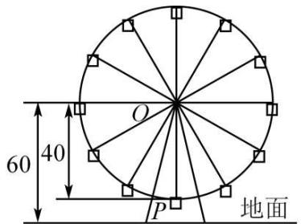

text_image

60
40
O
P
地面

A. 2.0min

B. 2.5min

C. 2.8min

D. 3.0min

【答案】B

【解析】由题意可知摩天轮运动一周距离底面的最高点为 $(60+40)$ 米与最低点 $(60-40)$ 米,相差80米,

∴ A = $\frac{80}{2}$ = 40, h = $\frac{100 + 20}{2}$ = 60; 运动一周 15 分钟, 即 $\frac{2\pi}{\omega}$ = 15, ∴ $\omega$ = $\frac{2\pi}{15}$ ;

由 $f(0)=20$ ，可得 $\varphi=-\frac{\pi}{2}$ ，故 $f(t)=40\sin\left(\frac{2\pi}{15}t-\frac{\pi}{2}\right)+60.$

要看到全景需 $f(t) \geqslant 60 + 20\sqrt{3}$ ，解之得： $\frac{35}{4} \geqslant t \geqslant \frac{25}{4}$ ，故时间长为 $2.5\mathrm{min}$ .

故选：B

1294 (2024·重庆·高三统考阶段练习)某钟表的秒针端点 A 到表盘中心 O 的距离为 5cm, 秒针绕点 O 匀速旋转, 当时间 t=0 时, 点 A 与表盘上标“12”处的点 B 重合. 在秒针正常旋转过程中, A, B 两点的距离 d(单位: cm) 关于时间 t(单位: s) 的函数解析式为 ( )

A. $d = 10\sin \frac{\pi}{60} t(t\geqslant 0)$   
B. $d = 10\cos \frac{\pi}{60} t(t\geqslant 0)$   
C. $d = \left\{ \begin{array}{ll}10\sin \frac{\pi}{60} t, & 120k \leqslant t \leqslant 60 + 120k, & k \in \mathbb{N}\\ -10\sin \frac{\pi}{60} t, & 60 + 120k <   t <   120(k + 1), & k\in \mathbb{N} \end{array} \right.$   
D. $d=\begin{cases}10\cos\frac{\pi}{60}t,120k\leqslant t\leqslant30+120k,k\in\mathbb{N}\\-10\cos\frac{\pi}{60}t,30+120k<t<90+120k,k\in\mathbb{N}\end{cases}$

【答案】C

【解析】由已知函数 $d(t)$ 的定义域为 $[0, +\infty)$ ，周期为 60s，且 $t = 30(s)$ 时， $d = 10(\text{cm})$ ，

对于选项 A, 函数 $d = 10 \sin \frac{\pi}{60} t (t \geqslant 0)$ 周期为 $\frac{2\pi}{\frac{\pi}{60}} = 120(s)$ , A 错误;

对于选项 B, 函数 $d = 10 \cos \frac{\pi}{60} t (t \geqslant 0)$ 周期为 $\frac{2\pi}{\frac{\pi}{60}} = 120(s)$ , B 错误;

对于选项 D, 当 t=30 时, d=0, D 错误;

对于选项 C,

$$
d (t) = 2 \times 5 \left| \sin \frac {2 \pi}{2 \times 6 0} t \right| = 1 0 \left| \sin \frac {\pi}{6 0} t \right|,
$$

所以函数 $d=\left\{\begin{aligned}&10\sin\frac{\pi}{60}t,120k\leqslant t\leqslant60+120k,k\in\mathbb{N}\\ &-10\sin\frac{\pi}{60}t,60+120k<t<120(k+1),k\in\mathbb{N}\end{aligned}\right.$

故选：C.

1295 (2024·全国·高三专题练习)水车在古代是进行灌溉引水的工具, 是人类一项古老的发明, 也是人类利用自然和改造自然的象征. 如图是一个半径为 R 的水车, 一个水斗从点 A(1, -√3) 出发, 沿圆周按逆时针方向匀速旋转, 且旋转一周用时 8 秒. 经过 t 秒后, 水斗旋转到 P 点, 设点 P 的坐标为 (x, y), 其纵坐标满足 y = f(t) =

$\mathrm{R}\sin(\omega t+\varphi)\left(t\geqslant0,\omega>0,|\varphi|<\frac{\pi}{2}\right)$ ，则 $f(t)$ 的表达式为（）

natural_image

Large wooden waterwheel structure outdoors under clear blue sky, no visible text or symbols

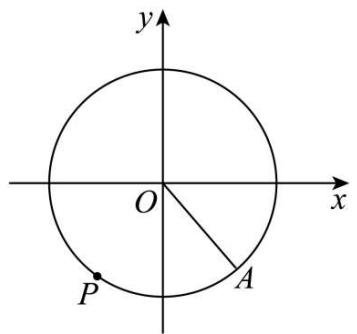

text_image

y
O
x
P
A

A. $y = \sin\left(\frac{\pi}{4}t + \frac{\pi}{3}\right)$

B. $y = \sin\left(\frac{\pi}{4}t - \frac{\pi}{3}\right)$

C. $y=2\sin\left(\frac{\pi}{4}t+\frac{\pi}{3}\right)$

D. $y = 2\sin \left(\frac{\pi}{4} t - \frac{\pi}{3}\right)$

【答案】D

【解析】因点 $A(1, -\sqrt{3})$ 在水车上，所以 $R = \sqrt{1^{2} + (-\sqrt{3})^{2}} = 2$ .

由题可知 $f(t)$ 的最小正周期为 8，则 $\frac{2\pi}{|\omega|}=8$ ，又 $\omega>0$ ，则 $\omega=\frac{\pi}{4}$ .

因 $f(0) = -\sqrt{3}$ , 则 $2 \sin \varphi = -\sqrt{3}$ , 又 $|\varphi| < \frac{\pi}{2}$ , 故 $\varphi = -\frac{\pi}{3}$ .

综上: $f(t)=2\sin\left(\frac{\pi}{4}t-\frac{\pi}{3}\right)$ .

故选：D

1296 (2024·全国·高三专题练习)一个大风车的半径为8m，匀速旋转的速度是每12min旋转一周.它的最低点 $P_{0}$ 离地面2m，风车翼片的一个端点P从 $P_{0}$ 开始按逆时针方向旋转，点P离地面距离 $h(m)$ 与时间 $t(\mathrm{min})$ 之间的函数关系式是()

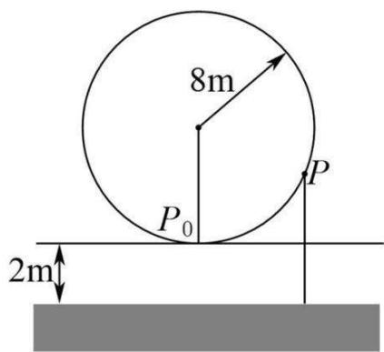

text_image

8m
P₀
P
2m

A. $h(t) = -8\sin \frac{\pi}{6} t + 10$

B. $h(t)=8\sin\frac{\pi}{6}t+2$

C. $h(t) = -8 \cos \frac{\pi}{6} t + 10$

D. $h(t) = 8\cos \frac{\pi}{6} t + 10$

【答案】C

【解析】以过风车中心垂直于地面的竖直向上的直线为 y 轴,该直线与地面的交点为原点,建立坐标系,如图,

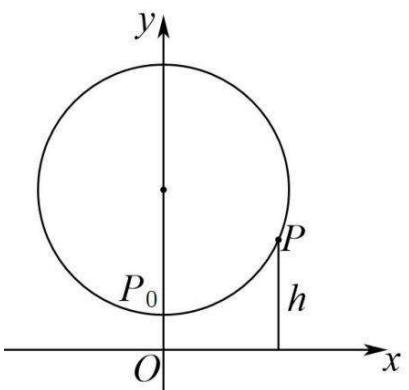

text_image

y
P₀
P
h
O
x

依题意,设函数解析式为 $h(t)=\mathrm{Asin}(\omega x+\varphi)+\mathrm{B},(A>0,\omega>0)$ ,

显然 $h(t)_{\min}=2, h(t)_{\max}=18$ ，则 $A=\frac{h(t)_{\max}-h(t)_{\min}}{2}=8, A=\frac{h(t)_{\max}+h(t)_{\min}}{2}=10,$

函数 $f(x)$ 的周期 T=12，则 $\omega=\frac{2\pi}{T}=\frac{\pi}{6}$ ，因当 t=0 时， $f(t)_{\min}=2$ ，即有 $\sin\varphi=-1$ ，则 $\varphi=2k\pi-\frac{\pi}{2}, k\in Z$ ，

于是得 $h(t) = 8\sin \left(\frac{\pi}{6} t + 2k\pi -\frac{\pi}{2}\right) + 10 = -8\cos \frac{\pi}{6} t + 10,k\in \mathbf{Z},$

所以点 P 离地面距离 $h(m)$ 与时间 $t(\min)$ 之间的函数关系式是 $h(t) = -8\cos\frac{\pi}{6}t + 10$ .

故选：C

【解题方法总结】

(1) 研究 $y = \text{Asin}(\omega x + \varphi)$ 的性质时可将 $\omega x + \varphi$ 视为一个整体, 利用换元法和数形结合思想进行解题.  
(2) 方程根的个数可转化为两个函数图象的交点个数.  
(3)三角函数模型的应用体现在两方面:一是已知函数模型求解数学问题;二是把实际问题抽象转化成数学问题,利用三角函数的有关知识解决问题

