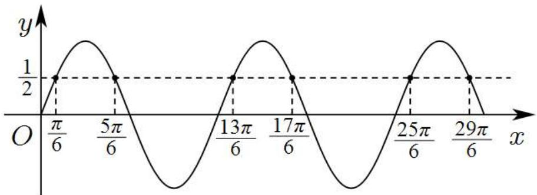
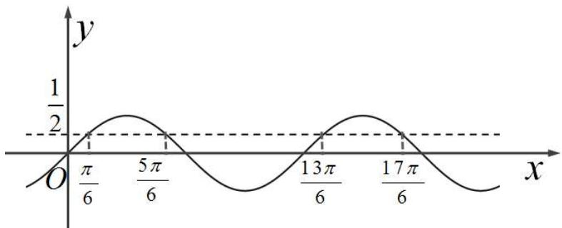
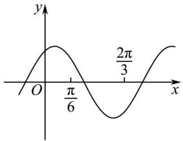
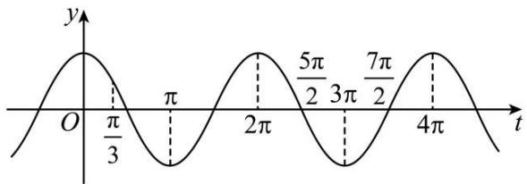
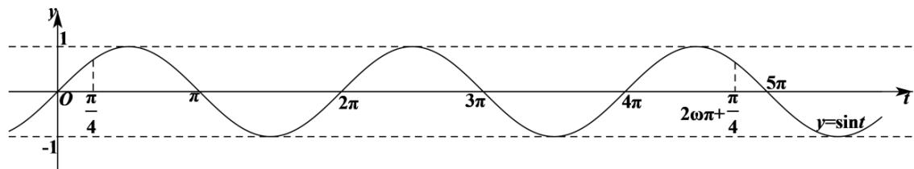
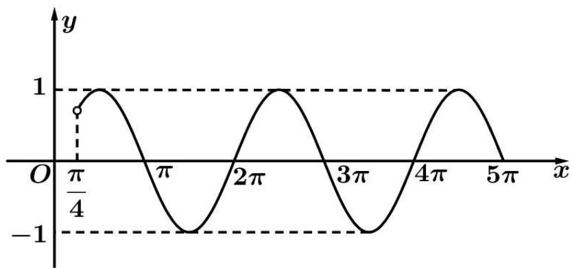
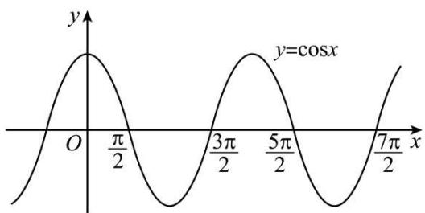

# 第31讲 $\omega$ 的取值范围与最值问题

# 知识梳理

1、 $f(x)=\mathrm{Asin}(\omega x+\varphi)$ 在 $f(x)=\mathrm{Asin}(\omega x+\varphi)$ 区间 $(a,b)$ 内没有零点 $\Rightarrow$

$$
\left\{ \begin{array}{l} | b - a | \leqslant \frac {\mathrm{T}}{2} \\ k \pi \leqslant a \omega + \phi <   \pi + k \pi \\ k \pi <   b \omega + \phi \leqslant \pi + k \pi \end{array} \Rightarrow \left\{ \begin{array}{l} | b - a | \leqslant \frac {\mathrm{T}}{2} \\ a \geqslant \frac {k \pi - \phi}{\omega} \\ b \leqslant \frac {\pi + k \pi - \phi}{\omega} \end{array} \right. \right.
$$

同理， $f(x) = \mathrm{Asin}(\omega x + \varphi)$ 在区间 $[a,b]$ 内没有零点

$$
\Rightarrow \left\{ \begin{array}{l} | b - a | \leqslant \frac {\mathrm{T}}{2} \\ k \pi <   a \omega + \phi <   \pi + k \pi \\ k \pi <   b \omega + \phi <   \pi + k \pi \end{array} \right. \Rightarrow \left\{ \begin{array}{l} | b - a | <   \frac {\mathrm{T}}{2} \\ a > \frac {k \pi - \phi}{\omega} \\ b <   \frac {\pi + k \pi - \phi}{\omega} \end{array} \right.
$$

2、 $f(x)=\mathrm{A}\sin(\omega x+\varphi)$ 在区间 $(a,b)$ 内有 3 个零点

$$
\Rightarrow \left\{ \begin{array}{l} \mathrm{T} <   | b - a | \leqslant 2 \mathrm{T} \\ k \pi \leqslant a \omega + \phi <   \pi + k \pi \\ 3 \pi + k \pi <   b \omega + \phi \leqslant 4 \pi + k \pi \end{array} \right. \Rightarrow \left\{ \begin{array}{l} \mathrm{T} <   | b - a | \leqslant 2 \mathrm{T} \\ \frac {k \pi - \varphi}{\omega} \leqslant a <   \frac {(k + 1) \pi - \varphi}{\omega} \\ \frac {(k + 3) \pi - \varphi}{\omega} <   b \leqslant \frac {(k + 4) \pi - \varphi}{\omega} \end{array} \right.
$$

同理 $f(x) = \mathrm{Asin}(\omega x + \varphi)$ 在区间 $[a, b]$ 内有2个零点

$$
\Rightarrow \left\{ \begin{array}{l} \frac {\mathrm{T}}{2} \leqslant | b - a | <   \frac {3 \mathrm{T}}{2} \\ k \pi <   a \omega + \phi \leqslant \pi + k \pi \\ 2 \pi + k \pi \leqslant b \omega + \phi <   3 \pi + k \pi \end{array} \right. \Rightarrow \left\{ \begin{array}{l} \frac {\mathrm{T}}{2} \leqslant | b - a | <   \frac {3 \mathrm{T}}{2} \\ \frac {k \pi - \varphi}{\omega} <   a \leqslant \frac {k \pi + \pi - \varphi}{\omega} \\ \frac {(k + 2) \pi - \varphi}{\omega} \leqslant b <   \frac {(k + 3) \pi - \varphi}{\omega} \end{array} \right.
$$

3、 $f(x)=\mathrm{A}\sin(\omega x+\varphi)$ 在区间 $(a,b)$ 内有 n 个零点

$$
\Rightarrow \left\{ \begin{array}{l} \frac {(n - 1) \mathrm{T}}{2} \leqslant | b - a | <   \frac {(n + 1) \mathrm{T}}{2} \\ \frac {k \pi - \varphi}{\omega} \leqslant a <   \frac {k \pi + \pi - \varphi}{\omega} \\ \frac {(k + n) \pi - \varphi}{\omega} <   b \leqslant \frac {(k + n + 1) \pi - \varphi}{\omega} \end{array} \right.
$$

同理 $f(x) = \mathrm{Asin}(\omega x + \varphi)$ 在区间 $[a, b]$ 内有 $n$ 个零点

$$
\Rightarrow \left\{ \begin{array}{l} \frac {(n - 1) \mathrm{T}}{2} \leqslant | b - a | <   \frac {(n + 1) \mathrm{T}}{2} \\ \frac {k \pi - \varphi}{\omega} <   a \leqslant \frac {k \pi + \pi - \varphi}{\omega} \\ \frac {(k + n) \pi - \varphi}{\omega} \leqslant b <   \frac {(k + n + 1) \pi - \varphi}{\omega} \end{array} \right.
$$

4、已知一条对称轴和一个对称中心，由于对称轴和对称中心的水平距离为 $\frac{2n + 1}{4}\mathrm{T}$ ，则 $\frac{2n + 1}{4}\mathrm{T} = \frac{(2n + 1)\pi}{2\omega} = |b - a|$ .

5、已知单调区间 $(a,b)$ ，则 $|a - b| \leqslant \frac{\mathrm{T}}{2}$ .

# 1 题型一:零点问题

1297 (2024·全国·高三专题练习)设函数 $f(x)=\sin(\omega x+\varphi)-\frac{1}{2}(\omega>0)$ ，若对于任意实数 $\varphi$ ，函数 $f(x)$ 在区间 $[0,2\pi]$ 上至少有3个零点，至多有4个零点，则 $\omega$ 的取值范围是（）

A. $\left[1,\frac{4}{3}\right)$

B. $\left[\frac{4}{3},\frac{5}{3}\right)$

C. $\left[\frac{5}{3},2\right)$

D. $\left[2,\frac{7}{3}\right)$

【答案】C

【解析】因为 $\varphi$ 为任意实数, 故函数 $f(x)$ 的图象可以任意平移, 从而研究函数 $f(x)$ 在区间 $[0,2\pi]$ 上的零点问题, 即研究函数 $y = \sin \omega x - \frac{1}{2}$ 在任意一个长度为 $2\pi - 0 = 2\pi$ 的区间上的零点问题,

令 $y=\sin\omega x-\frac{1}{2}=0$ , 得 $\sin\omega x=\frac{1}{2}$ , 则它在 y 轴右侧靠近坐标原点处的零点分别为 $\frac{\pi}{6\omega}, \frac{5\pi}{6\omega}, \frac{13\pi}{6\omega}, \frac{17\pi}{6\omega}, \frac{25\pi}{6\omega}, \cdots,$

则它们相邻两个零点之间的距离分别为 $\frac{2\pi}{3\omega}$ , $\frac{4\pi}{3\omega}$ , $\frac{2\pi}{3\omega}$ , $\frac{4\pi}{3\omega}$ , $\cdots$ ,

故相邻四个零点之间的最大距离为 $\frac{10\pi}{3\omega}$ ，相邻五个零点之间的距离为 $\frac{4\pi}{\omega}$ ，

所以要使函数 $f(x)$ 在区间 $[0,2\pi]$ 上至少有 3 个零点，至多有 4 个零点，则需相邻四个零点之间的最大距离不大于 $2\pi$ ，相邻五个零点之间的距离大于 $2\pi$ ，

即 $\left\{\begin{aligned}\frac{10\pi}{3\omega}&\leqslant2\pi\\ \frac{4\pi}{\omega}&>2\pi\end{aligned}\right.$ ，解得 $\frac{5}{3}\leqslant\omega<2.$

故选：C

1298 (2024·全国·高一专题练习)设函数 $f(x)=2\sin\omega x-1(\omega>0)$ ，在区间 $\left[\frac{\pi}{4},\frac{3\pi}{4}\right]$ 上至少有2个不同的零点，至多有3个不同的零点，则 $\omega$ 的取值范围是()

A. $\left[\frac{26}{9},\frac{10}{3}\right]$

B. $\left[\frac{26}{9},\frac{58}{9}\right)$

C. $\left[\frac{34}{9},\frac{58}{9}\right)$

D. $\left[\frac{26}{9},\frac{10}{3}\right]\cup\left[\frac{34}{9},\frac{58}{9}\right)$

【答案】D

【解析】函数 $f(x)=2\sin\omega x-1(\omega>0)$ ，在区间 $\left[\frac{\pi}{4},\frac{3\pi}{4}\right]$ 上至少有 2 个不同的零点，至多有 3 个不同的零点，即 $\sin\omega x=\frac{1}{2}$ 在区间 $\left[\frac{\pi}{4},\frac{3\pi}{4}\right]$ 上至少有 2 个不同的根，至多有 3 个不同的根，

$$
\omega x \in \left[ \frac {\omega \pi}{4}, \frac {3 \omega \pi}{4} \right],
$$

如图：

line

| x       | y     |
| ------- | ----- |
| π/6     | 1/2   |
| 5π/6    | 1/2   |
| 13π/6   | 1/2   |
| 17π/6   | 1/2   |
| 25π/6   | 1/2   |
| 29π/6   | 1/2   |

①当 $\frac{\omega\pi}{4} \leqslant \frac{\pi}{6}$ , 则 $\frac{5\pi}{6} \leqslant \frac{3\omega\pi}{4} < \frac{17\pi}{6}$ , 得 $\omega$ 无解;  
②当 $\frac{\pi}{6} < \frac{\omega\pi}{4} \leqslant \frac{5\pi}{6}$ , 则 $\frac{13\pi}{6} \leqslant \frac{3\omega\pi}{4} < \frac{25\pi}{6}$ , 求得 $\frac{26}{9} \leqslant \omega \leqslant \frac{10}{3}$ ;  
③当 $\frac{5\pi}{6}<\frac{\omega\pi}{4}\leqslant\frac{13\pi}{6}$ 时，则 $\frac{17\pi}{6}\leqslant\frac{3\omega\pi}{4}<\frac{29\pi}{6}$ ，求得 $\frac{34}{9}\leqslant\omega<\frac{58}{9}$ ;  
④当 $\frac{\omega\pi}{4} > \frac{13\pi}{6}$ 时，区间 $\left[\frac{\omega\pi}{4}, \frac{3\omega\pi}{4}\right]$ 长度 $\frac{2\omega\pi}{4} > \frac{13\pi}{3} > 4\pi$ 超过了正弦函数的两个最小正周期长度，故方程 $\sin\omega x = \frac{1}{2}$ 在区间 $\left[\frac{\pi}{4}, \frac{3\pi}{4}\right]$ 上至少有 4 个根，不满足题意；

综上,可得 $\frac{26}{9}\leqslant\omega\leqslant\frac{10}{3}$ 或 $\frac{34}{9}\leqslant\omega<\frac{58}{9};$

故选：D.

1299 (2024·河北·高二统考学业考试)设函数 $f(x)=2\sin(\omega x+\varphi)-1(\omega>0)$ ，若对于任意实数 $\varphi, f(x)$ 在区间 $\left[\frac{\pi}{4}, \frac{3\pi}{4}\right]$ 上至少有 2 个零点，至多有 3 个零点，则 $\omega$ 的取值范围是（）

A. $\left[\frac{8}{3},\frac{16}{3}\right)$

B. $\left[4,\frac{16}{3}\right)$

C. $\left[4,\frac{20}{3}\right)$

D. $\left[\frac{8}{3},\frac{20}{3}\right)$

【答案】B

【解析】令 $f(x)=0$ ，则 $\sin(\omega x+\varphi)=\frac{1}{2}$

令 $t = \omega x + \varphi$ ，则 $\sin t^{\circ}\frac{1}{2}$

则问题转化为 $y = \sin t$ 在区间 $\left[\frac{\pi}{4}\omega + \varphi, \frac{3\pi}{4}\omega + \varphi\right]$ 上至少有两个，至少有三个 t，使得 $\sin t \circ \frac{1}{2}$ ，求 $\omega$ 的取值范围.

作出 $y=\sin t$ 和 $y=\frac{1}{2}$ 的图像, 观察交点个数,

line

| x       | y     |
| ------- | ----- |
| 0       | 0     |
| π/6     | 1/2   |
| 5π/6    | 0     |
| 13π/6   | -1/2  |
| 17π/6   | 0     |

可知使得 $\sin t^{\circ}$ $\frac{1}{2}$ 的最短区间长度为 $2\pi$ ，最长长度为 $2\pi + \frac{2}{3}\pi$ ，由题意列不等式的：

$$
2 \pi \leqslant \left(\frac {3 \pi}{4} \omega + \varphi\right) - \left(\frac {\pi}{4} \omega + \varphi\right) <   2 \pi + \frac {2}{3} \pi
$$

解得: $4 \leqslant \omega < \frac{16}{3}$ .

故选: B

1300 (2024·全国·高三专题练习)已知函数 $f(x)$ 的图象是由 $y = \sqrt{2}\sin \left(\omega x + \frac{\pi}{3}\right)(\omega > 0)$ 的图象向右平移 $\frac{\pi}{3}$ 个单位得到的, 若 $f(x)$ 在 $\left[\frac{\pi}{2}, \pi\right]$ 上仅有一个零点, 则 $\omega$ 的取值范围是( ).

A. $\left[0,\frac{5}{2}\right)$

B. $[1,3)$

C. $\left[1,\frac{5}{2}\right)$

D. $[1,4)$

【答案】C

【解析】由题知,函数 $y=\sqrt{2}\sin\left(\omega x+\frac{\pi}{3}\right)(\omega>0)$ 在 $\left[\frac{\pi}{6},\frac{2\pi}{3}\right]$ 上仅有一个零点,

所以 $T=\frac{2\pi}{\omega}>\frac{2\pi}{3}-\frac{\pi}{6}=\frac{\pi}{2}$ ，所以 $0<\omega<4$ ，

令 $\sqrt{2}\sin\left(\omega x+\frac{\pi}{3}\right)=0$ , 得 $\omega x+\frac{\pi}{3}=k\pi$ , 即 $x=\frac{k\pi}{\omega}-\frac{\pi}{3\omega}, k\in Z.$

若第一个正零点 $x=\frac{\pi}{\omega}-\frac{\pi}{3\omega}=\frac{2\pi}{3\omega}<\frac{\pi}{6}$ ，则 $\omega>4$ （矛盾），

因为函数 $y=\sqrt{2}\sin\left(\omega x+\frac{\pi}{3}\right)$ 在 $\left[\frac{\pi}{6},\frac{2\pi}{3}\right]$ 上仅有一个零点，

所以 $\left\{\frac{\pi}{6}\leqslant\frac{2\pi}{3\omega}\leqslant\frac{2\pi}{3}\right.$ ，解得 $1\leqslant\omega<\frac{5}{2}$ .

故选：C.

line

| x | y |
|---|---|
| 0 | O |
| π/6 | Peak |
| 2π/3 | Minimum |

1301 (2024·全国·高三专题练习)记函数 $f(x)=\sin(\omega x+\varphi)\left(\omega>0,0<\varphi<\frac{\pi}{2}\right)$ 的最小正周期为 T. 若 $f(T)=\frac{\sqrt{3}}{2}$ ， $x=\frac{\pi}{6}$ 为 $f(x)$ 的零点，则 $\omega$ 的最小值为（）

A. 2

B. 3

C. 4

D. 6

【答案】C

【解析】因为 $f(x)=\sin(\omega x+\varphi)\left(\omega>0,0<\varphi<\frac{\pi}{2}\right)$ 的最小正周期为 $T=\frac{2\pi}{\omega}$ ，且 $f(T)=\frac{\sqrt{3}}{2}$ ,

所以 $\sin\left(\omega\cdot\frac{2\pi}{\omega}+\varphi\right)=\sin\varphi=\frac{\sqrt{3}}{2}$ ,

因为 $0 < \varphi < \frac{\pi}{2}$ , 所以 $\varphi = \frac{\pi}{3}$ ,

所以 $f(x)=\sin\left(\omega x+\frac{\pi}{3}\right)$ ,

因为 $x = \frac{\pi}{6}$ 为 $f(x)$ 的零点，

所以 $f\left(\frac{\pi}{6}\right)=\sin\left(\frac{\pi}{6}\omega+\frac{\pi}{3}\right)=0,$

所以 $\frac{\pi}{6}\omega +\frac{\pi}{3} = k\pi ,k\in \mathbf{Z},$ 解得 $\omega = 6k - 2,k\in \mathbf{Z},$

因为 $\omega > 0$ ，所以 $\omega$ 的最小值为 4，

故选：C

1302 (2024·全国·模拟预测)若函数 $f(x)=\left\{\begin{aligned}&\frac{2\sin\omega x+1}{\cos\omega x-\sqrt{3}},\cos\omega x\neq\frac{\sqrt{3}}{2}\\ &x,\cos\omega x=\frac{\sqrt{3}}{2}\end{aligned}\right.$ ( $\omega>0$ ) 在 $(0,4\pi)$ 上有
3个零点，则 $\omega$ 的取值范围是 （）

A. $\left(\frac{13}{24},+\infty\right)$

B. $\left(\frac{13}{24},\frac{25}{24}\right]$

C. $\left(\frac{31}{24},+\infty\right)$

D. $\left(\frac{31}{24},\frac{43}{24}\right]$

【答案】D

【解析】令 $f(x)=0$ ，则

当 $\cos \omega x \neq \frac{\sqrt{3}}{2}$ 时， $\frac{2\sin \omega x + 1}{\cos \omega x - \sqrt{3}} = 0$ ，即 $\sin \omega x = -\frac{1}{2}$ ，

当 $\cos\omega x=\frac{\sqrt{3}}{2}$ 时，x=0，矛盾，

所以 $\sin \omega x = -\frac{1}{2}$ , 且 $\cos \omega x \neq \frac{\sqrt{3}}{2}$ , 又 $\sin^2 \omega x + \cos^2 \omega x = 1$ ,

所以 $\sin\omega x=-\frac{1}{2}$ ，且 $\cos\omega x=-\frac{\sqrt{3}}{2}$ ，

所以 $\omega x = -\frac{5\pi}{6} + 2k\pi (k \in \mathbb{Z})$ .

所以 $x=\frac{12k\pi-5\pi}{6\omega}(k\in\mathbb{Z})$ ，因为 $\omega>0$ ，

所以函数 $f(x)$ 的正零点从小到大依次为： $\frac{7\pi}{6\omega}$ ， $\frac{19\pi}{6\omega}$ ， $\frac{31\pi}{6\omega}$ ， $\frac{43\pi}{6\omega}$ ，…，

因为函数 $f(x)$ 在 $(0,4\pi)$ 上有3个零点，

所以 $\frac{31\pi}{6\omega} < 4\pi \leqslant \frac{43\pi}{6\omega}$

所以 $\frac{31}{24} < \omega \leqslant \frac{43}{24}$ .

故选：D.

# 2 题型二:单调问题

1303 (2024·四川成都·石室中学校考模拟预测)已知函数 $f(x)=\sin\left(\omega x-\frac{\pi}{3}\right)(\omega>0)$ 的图象关于点 $\left(\frac{\pi}{6},0\right)$ 对称，且 $f(x)$ 在 $\left(0,\frac{5\pi}{48}\right)$ 上单调，则 $\omega$ 的取值集合为（）

A. $\{2\}$

B. $\{8\}$

C. $\{2,8\}$

D. $\{2,8,14\}$

【答案】C

【解析】 $f(x)$ 关于点 $\left(\frac{\pi}{6},0\right)$ 对称, 所以 $\sin\left(\frac{\pi}{6}\omega-\frac{\pi}{3}\right)=0$ ,

所以 $\frac{\pi}{6}\omega -\frac{\pi}{3} = k\pi ,\omega = 6k + 2,k\in \mathbf{Z}$ ①；

$0 < x < \frac{5\pi}{48}, -\frac{\pi}{3} < \omega x - \frac{\pi}{3} < \frac{5\pi}{48}\omega - \frac{\pi}{3}$ ，而 $f(x)$ 在 $\left(0, \frac{5\pi}{48}\right)$ 上单调，所以 $\frac{5\pi}{48}\omega - \frac{\pi}{3} \leqslant \frac{\pi}{2}, 0 < \omega \leqslant 8$ ②;

由①②得 $\omega$ 的取值集合为 $\{2,8\}$ .

故选：C

1304 (2024·全国·高三专题练习)已知函数 $f(x) = \sin (\omega x + \varphi)\left(\omega > 0, |\varphi| \leqslant \frac{\pi}{2}\right)$ , $x = -\frac{\pi}{8}$ 是函数 $f(x)$ 的一个零点, $x = \frac{\pi}{8}$ 是函数 $f(x)$ 的一条对称轴, 若 $f(x)$ 在区间 $\left(\frac{\pi}{5}, \frac{\pi}{4}\right)$ 上单调, 则 $\omega$ 的最大值是 ( )

A. 14

B. 16

C. 18

D. 20

【答案】A

【解析】设函数 $f(x)$ 的最小正周期为T，

因为 $x=-\frac{\pi}{8}$ 是函数 $f(x)$ 的一个零点， $x=\frac{\pi}{8}$ 是函数 $f(x)$ 的一条对称轴，

则 $\frac{2n + 1}{4}\mathrm{T} = \frac{\pi}{8} -\left(-\frac{\pi}{8}\right) = \frac{\pi}{4}$ ，其中 $n\in \mathbb{N}$ ，所以， $\mathrm{T} = \frac{\pi}{2n + 1} = \frac{2\pi}{\omega},\therefore \omega = 4n + 2,$

因为函数 $f(x)$ 在区间 $\left(\frac{\pi}{5},\frac{\pi}{4}\right)$ 上单调，则 $\frac{\pi}{4}-\frac{\pi}{5}\leqslant\frac{T}{2}=\frac{\pi}{\omega}$ ，所以， $\omega\leqslant20$ .

所以， $\omega$ 的可能取值有：2、6、10、14、18.

(i) 当 $\omega = 18$ 时, $f(x) = \sin (18x + \varphi)$ , $f\left(-\frac{\pi}{8}\right) = \sin \left(-\frac{9\pi}{4} + \varphi\right) = 0$ ,

所以， $\varphi-\frac{9\pi}{4}=k\pi(k\in\mathbb{Z})$ ，则 $\varphi=k\pi+\frac{9\pi}{4}(k\in\mathbb{Z})$

$$
\because - \frac {\pi}{2} \leqslant \varphi \leqslant \frac {\pi}{2}, \therefore \varphi = \frac {\pi}{4}, \text {所以,} f (x) = \sin \left(1 8 x + \frac {\pi}{4}\right),
$$

当 $\frac{\pi}{5} < x < \frac{\pi}{4}$ 时， $4\pi - \frac{3\pi}{20} = \frac{77\pi}{20} < 18x + \frac{\pi}{4} < \frac{19\pi}{4} = 4\pi + \frac{3\pi}{4}$ ，所以，

函数 $f(x)$ 在 $\left(\frac{\pi}{5},\frac{\pi}{4}\right)$ 上不单调,不合乎题意;

(ii) 当 $\omega = 14$ 时, $f(x) = \sin (14x + \varphi)$ , $f\left(-\frac{\pi}{8}\right) = \sin \left(-\frac{7\pi}{4} + \varphi\right) = 0$ ,

所以， $\varphi-\frac{7\pi}{4}=k\pi(k\in\mathbb{Z})$ ，则 $\varphi=k\pi+\frac{7\pi}{4}(k\in\mathbb{Z})$

$\because -\frac{\pi}{2} \leqslant \varphi \leqslant \frac{\pi}{2}, \therefore \varphi = -\frac{\pi}{4}$ , 所以, $f(x) = \sin \left(14x - \frac{\pi}{4}\right)$ ,

当 $\frac{\pi}{5} < x < \frac{\pi}{4}$ 时， $2\pi + \frac{11\pi}{20} = \frac{51\pi}{20} < 14x - \frac{\pi}{4} < \frac{13\pi}{4} = 2\pi + \frac{5\pi}{4}$ ，所以，

函数 $f(x)$ 在 $\left(\frac{\pi}{5},\frac{\pi}{4}\right)$ 上单调递减,合乎题意.

因此， $\omega$ 的最大值为 14.

故选：A.

1305 (2024·内蒙古赤峰·校考模拟预测)若直线 $x=\frac{\pi}{4}$ 是曲线 $y=\sin\left(\omega x-\frac{\pi}{4}\right)(\omega>0)$ 的一条对称轴，且函数 $y=\sin\left(\omega x-\frac{\pi}{4}\right)$ 在区间 $\left[0,\frac{\pi}{12}\right]$ 上不单调，则 $\omega$ 的最小值为（）

A. 9

B. 7

C. 11

D. 3

【答案】C

【解析】因直线 $x=\frac{\pi}{4}$ 是曲线 $y=\sin\left(\omega x-\frac{\pi}{4}\right)(\omega>0)$ 的一条对称轴，则 $\frac{\pi}{4}\omega-\frac{\pi}{4}=k\pi+\frac{\pi}{2}, k\in N$ ，即 $\omega=4k+3, k\in N$ ，

由 $-\frac{\pi}{2} \leqslant \omega x - \frac{\pi}{4} \leqslant \frac{\pi}{2}$ 得 $-\frac{\pi}{4\omega} \leqslant x \leqslant \frac{3\pi}{4\omega}$ , 则函数 $y = \sin \left(\omega x - \frac{\pi}{4}\right)$ 在 $\left[-\frac{\pi}{4\omega}, \frac{3\pi}{4\omega}\right]$ 上单调递增,

而函数 $y = \sin \left( \omega x - \frac{\pi}{4} \right)$ 在区间 $\left[0, \frac{\pi}{12}\right]$ 上不单调，则 $\frac{3\pi}{4\omega} < \frac{\pi}{12}$ ，解得 $\omega > 9$

所以 $\omega$ 的最小值为 11.

故选：C

1306 (2024·全国·高三专题练习)已知函数 $f(x)=\sin(\omega x+\varphi)(\omega>0)$ 的一个对称中心为 $\left(-\frac{\pi}{3},0\right)$ ， $f(x)$ 在区间 $\left(\frac{5\pi}{6},\pi\right)$ 上不单调，则 $\omega$ 的最小正整数值为（）

A. 1

B. 2

C. 3

D. 4

【答案】B

【解析】由函数 $f(x) = \sin (\omega x + \varphi)(\omega > 0)$ 的一个对称中心为 $\left(-\frac{\pi}{3}, 0\right)$ ,

可得 $f\left(-\frac{\pi}{3}\right)=\sin\left(-\frac{\pi}{3}\omega+\varphi\right)=0,$

所以 $-\frac{\pi}{3}\omega + \varphi = k_{1}\pi, k_{1} \in Z,$

$$
\varphi = \frac {\pi}{3} \omega + k _ {1} \pi , k _ {1} \in \mathrm{Z},
$$

$$
f ^ {\prime} (x) = \omega \cos (\omega x + \varphi),
$$

由 $f(x)$ 在区间 $\left(\frac{5\pi}{6},\pi\right)$ 上不单调，

所以 $f'(x)=\omega\cos(\omega x+\varphi)=0$ 在区间 $\left(\frac{5\pi}{6},\pi\right)$ 上有解，

所以 $\omega x + \varphi = \frac{\pi}{2} + k_2\pi (k_2\in \mathbf{Z})$ ，在区间 $\left(\frac{5\pi}{6},\pi\right)$ 上有解，

所以 $\omega x + \frac{\pi}{3}\omega + k_{1}\pi = \frac{\pi}{2} + k_{2}\pi (k_{2} \in \mathbb{Z})$ ,

所以 $\omega=\frac{\frac{\pi}{2}+k\pi}{x+\frac{\pi}{3}}$ , $k=k_{2}-k_{1}\in Z$ ,

又 $x \in \left(\frac{5\pi}{6}, \pi\right)$ , 所以 $x + \frac{\pi}{3} \in \left(\frac{7\pi}{6}, \frac{4\pi}{3}\right)$ ,

所以 $\omega=\frac{\frac{\pi}{2}+k\pi}{x+\frac{\pi}{3}}\in\left(\frac{3+6k}{8},\frac{3+6k}{7}\right)$ ,

当 k=2 时， $\omega\in\left(\frac{15}{8},\frac{15}{7}\right)$ ,

此时 $\omega$ 的最小正整数为2.

故选：B

1307 (2024·全国·高三专题练习)已知函数 $f(x) = \sin (\omega x + \varphi)(\omega > 0)$ 在 $\left[-\frac{\pi}{3}, \frac{\pi}{6}\right]$ 上单调，且 $f\left(\frac{\pi}{6}\right) = f\left(\frac{4\pi}{3}\right) = -f\left(-\frac{\pi}{3}\right)$ ，则 $\omega$ 的可能取值 （）

A. 只有1个

B. 只有 2 个

C. 只有 3 个

D. 有无数个

【答案】C

【解析】设 $f(x)$ 的最小正周期为 T，则由函数 $f(x)$ 在 $\left[-\frac{\pi}{3}, \frac{\pi}{6}\right]$ 上单调，可得 $\frac{T}{2} \geqslant \frac{\pi}{6} - \left(-\frac{\pi}{3}\right)$ ，即 $T \geqslant \pi$ .

因为 $\mathrm{T} = \frac{2\pi}{\omega}\geqslant \pi$ ，所以 $0 <   \omega \leqslant 2$

由 $f(x)$ 在 $\left[-\frac{\pi}{3},\frac{\pi}{6}\right]$ 上单调，且 $f\left(\frac{\pi}{6}\right)=-f\left(-\frac{\pi}{3}\right)$ ，得 $f(x)$ 的一个零点为 $\frac{-\frac{\pi}{3}+\frac{\pi}{6}}{2}=-\frac{\pi}{12}$ ，即 $\left(-\frac{\pi}{12},0\right)$ 为 $f(x)$ 的一个对称中心.

因为 $f\left(\frac{\pi}{6}\right)=f\left(\frac{4\pi}{3}\right)$ ，所以 $x=\frac{\frac{4\pi}{3}+\frac{\pi}{6}}{2}=\frac{3\pi}{4}$ 为 $f(x)$ 的一条对称轴.

因为 $f\left(\frac{\pi}{6}\right)=f\left(\frac{4\pi}{3}\right)$ ，所以有以下三种情况：

① $T=\frac{4\pi}{3}-\frac{\pi}{6}=\frac{7\pi}{6}$ ，则 $\omega=\frac{2\pi}{T}=\frac{12}{7}$ ;  
②当 $\frac{3\mathrm{T}}{4} = \frac{3\pi}{4} -\left(-\frac{\pi}{12}\right) = \frac{5\pi}{6}$ 时，则 $\omega = \frac{2\pi}{\mathrm{T}} = \frac{9}{5}$ ，符合题意；  
③ $\frac{\mathrm{T}}{4} = \frac{3\pi}{4} -\left(-\frac{\pi}{12}\right) = \frac{5\pi}{6}$ ，则 $\omega = \frac{2\pi}{\mathrm{T}} = \frac{3}{5}$ ，符合题意.

因为 $\mathrm{T} \geqslant \pi, \frac{3\pi}{4} - \left(-\frac{\pi}{12}\right) = \frac{5\pi}{6}$ 不可能满足其他情况.

故 $\omega$ 的可能取值只有 3 个.

故选：C

# 题型三:最值问题

1308 (2024·全国·高三专题练习)已知函数 $f(x)=\sqrt{3}\sin\omega x-\cos\omega x(\omega>0)$ 在区间 $\left[-\frac{2\pi}{5},\frac{3\pi}{4}\right]$ 上单调递增，且在区间 $[0,\pi]$ 上只取得一次最大值，则 $\omega$ 的取值范围是()

A. $\left[\frac{2}{3},\frac{8}{3}\right]$

B. $\left[\frac{2}{3},\frac{5}{6}\right]$

C. $\left[\frac{2}{3},\frac{8}{9}\right]$

D. $\left[\frac{5}{6},\frac{8}{9}\right]$

【答案】B

【解析】依题意,函数 $f(x)=2\sin\left(\omega x-\frac{\pi}{6}\right)$ , $\omega>0$ ,

因为 $f(x)$ 在区间 $\left[-\frac{2\pi}{5}, \frac{3\pi}{4}\right]$ 上单调递增，由 $x \in \left[-\frac{2\pi}{5}, \frac{3\pi}{4}\right]$ ，则 $\omega x - \frac{\pi}{6} \in \left[-\frac{2\pi}{5}\omega - \frac{\pi}{6}, \frac{3\pi}{4}\omega - \frac{\pi}{6}\right]$ ，

于是 $-\frac{2\pi}{5}\omega -\frac{\pi}{6}\geqslant -\frac{\pi}{2}$ 且 $\frac{3\pi}{4}\omega -\frac{\pi}{6}\leqslant \frac{\pi}{2}$ ，解得 $\omega \leqslant \frac{5}{6}$ 且 $\omega \leqslant \frac{8}{9}$ 即 $0 <   \omega \leqslant \frac{5}{6},$

当 $x \in [0, \pi]$ 时， $\omega x - \frac{\pi}{6} \in \left[-\frac{\pi}{6}, \omega \pi - \frac{\pi}{6}\right]$ ，因为 $f(x)$ 在区间 $[0, \pi]$ 上只取得一次最大值，因此 $\frac{\pi}{2} \leqslant \omega \pi - \frac{\pi}{6} < \frac{5}{2} \pi$ ，解得 $\frac{2}{3} \leqslant \omega < \frac{8}{3}$ ，

所以 $\omega$ 的取值范围是 $\left[\frac{2}{3},\frac{5}{6}\right]$ .

故选：B

1309 (2024·全国·高三专题练习)已知函数 $f(x) = 2\sin \left(\omega x + \frac{\pi}{3}\right)(\omega > 0)$ ，若 $f\left(\frac{\pi}{3}\right) = 0$ ，且 $f(x)$ 在 $\left(\frac{\pi}{3}, \frac{5\pi}{12}\right)$ 上有最大值，没有最小值，则 $\omega$ 的最大值为 \_\_\_\_.

【答案】17

【解析】由 $f\left(\frac{\pi}{3}\right)=0$ ，且 $f(x)$ 在 $\left(\frac{\pi}{3},\frac{5\pi}{12}\right)$ 上有最大值，没有最小值，可得 $\frac{\omega\pi}{3}+\frac{\pi}{3}=2k\pi$ $(k\in\mathbb{Z})$ ，所以 $\omega=6k-1(k\in\mathbb{Z})$ .

由 $f(x)$ 在 $\left(\frac{\pi}{3},\frac{5\pi}{12}\right)$ 上有最大值,没有最小值,可得 $\frac{1}{4}\times\frac{2\pi}{\omega}<\frac{5\pi}{12}-\frac{\pi}{3}\leqslant\frac{3}{4}\times\frac{2\pi}{\omega}$ ,解得 $6<\omega\leqslant18$ ,又 $\omega=6k-1(k\in\mathbb{Z})$ ,当k=3时, $\omega=17$ ,则 $\omega$ 的最大值为17,,

故答案为: 17

1310 (2024·全国·高三专题练习)已知函数 $f(x)=2\sin(\omega x+\varphi)(\omega>0)$ 在 $x=\frac{\pi}{3}$ 处取得最大值，且 $f(\pi)=0$ ，若函数 $f(x)$ 在 $\left(\frac{\pi}{3},\frac{5\pi}{12}\right)$ 上是单调的，则 $\omega$ 的最大值为 \_\_\_\_.

【答案】 $\frac{45}{4} / 11.25$

【解析】由题意,函数 $f(x)=2\sin(\omega x+\varphi)(\omega>0)$

满足 $f\left(\frac{\pi}{3}\right)=2,f(\pi)=0,$

可得 $\frac{\pi}{3}\omega +\varphi = \frac{\pi}{2} +2k\pi ,\omega \pi +\varphi = k^{\prime}\pi (k\in \mathbf{Z},k^{\prime}\in \mathbf{Z})$

两式相减得 $\frac{2\pi}{3}\omega=-\frac{\pi}{2}+m\pi$ ，其中 $m=k'-2k$ ，

解得 $\omega=\frac{3(2m-1)}{4}$ ,

又由 $\left|\frac{\pi}{3} -\frac{5\pi}{12}\right| \leqslant \frac{1}{2} \cdot \frac{2\pi}{\omega}$ , 可得 $\omega \leqslant 12$ ,

即 $0 < \frac{3(2m-1)}{4} \leqslant 12$ ，解得 $\frac{1}{2} < m \leqslant \frac{17}{2}$ ,

故 $m$ 的最大值为8，

此时 $\omega$ 取得最大值 $\frac{45}{4}$ .

故答案为: $\frac{45}{4}$

1311 (2024·全国·高三专题练习)已知函数 $f(x)=\sin\left(\omega x+\frac{\pi}{6}\right)$ 在 $(0,2]$ 上有最大值和最小值，且取得最大值和最小值的自变量的值都是唯一的，则 $\omega$ 的取值范围是 \_\_\_\_.

【答案】 $\left(-\frac{4\pi}{3},-\frac{5\pi}{6}\right]\cup\left[\frac{2\pi}{3},\frac{7\pi}{6}\right)$

【解析】易知 $\omega=0$ 时不满足题意，

由 $\omega x + \frac{\pi}{6} = \frac{\pi}{2} + k\pi, k \in Z$ , 得 $x = \frac{\pi}{3\omega} + \frac{k\pi}{\omega}, k \in Z$ ,

当 $\omega > 0$ 时, 第 2 个正最值点 $x = \frac{\pi}{3\omega} + \frac{\pi}{\omega} \leqslant 2$ , 解得 $\omega \geqslant \frac{2\pi}{3}$ ,

第3个正最值点 $\frac{\pi}{3\omega}+\frac{2\pi}{\omega}>2$ ，解得 $\omega<\frac{7\pi}{6}$ ，故 $\frac{2\pi}{3}\leqslant\omega<\frac{7\pi}{6}$ ;

当 $\omega<0$ 时, 第 2 个正最值点 $x=\frac{\pi}{3\omega}-\frac{2\pi}{\omega}\leqslant2$ , 解得 $\omega\leqslant-\frac{5\pi}{6}$ ,

第3个正最值点 $\frac{\pi}{3\omega} -\frac{3\pi}{\omega} >2$ ，解得 $\omega > - \frac{4\pi}{3}$ 故 $-\frac{4\pi}{3} <  \omega \leqslant -\frac{5\pi}{6}$

综上， $\omega$ 的取值范围是 $\left(-\frac{4\pi}{3}, -\frac{5\pi}{6}\right] \cup \left[\frac{2\pi}{3}, \frac{7\pi}{6}\right)$ .

故答案为： $\left(-\frac{4\pi}{3}, - \frac{5\pi}{6}\right]\cup \left[\frac{2\pi}{3},\frac{7\pi}{6}\right)$

1312 (2024·全国·高三专题练习)已知函数 $f(x) = \sin \omega x + a\cos \omega x (a > 0, \omega > 0)$ 的最大值为 2，则使函数 $f(x)$ 在区间 [0,3] 上至少取得两次最大值，则 $\omega$ 取值范围是 \_\_\_\_

【答案】 $\left(\frac{13\pi}{18},+\infty\right)/\omega\geqslant\frac{13\pi}{18}$

【解析】 $f(x)=\sin\omega x+a\cos\omega x=\sqrt{1+a^{2}}\sin(\omega x+\varphi)$ ，因为 $f(x)_{\max}=\sqrt{1+a^{2}}=2,a>0,$ 故 $a=\sqrt{3}$ ，原式为 $f(x)=2\sin\left(\omega x+\frac{\pi}{3}\right)$ ，当 $f(x)$ 取到最大值时， $\omega x+\frac{\pi}{3}=\frac{\pi}{2}+2k\pi,k\in Z$ ，当 $x\in[0,3]$ ， $f(x)$ 取得前两次最大值时，k分别为0和1，k=1时， $\omega x+\frac{\pi}{3}=\frac{\pi}{2}+2\pi$ ， $x=\frac{13\pi}{6\omega}$ ，此时需满足 $\frac{13\pi}{6\omega}\leqslant3$ ，解得 $\omega\geqslant\frac{13\pi}{18}$ .

故答案为: $\left[\frac{13\pi}{18},+\infty\right)$

1313 (2024·全国·高三专题练习)已知函数 $f(x) = \cos^2\omega x + 2\sin \omega x\cos \omega x - \sin^2\omega x (\omega > 0)$ 在 $\left(\frac{\pi}{12}, \frac{\pi}{3}\right)$ 上有最大值，无最小值，则 $\omega$ 的取值范围是 \_\_\_\_.

【答案】 $\left(\frac{3}{8},\frac{3}{2}\right)$

【解析】 $f(x) = \sin 2\omega x + (\cos^2\omega x - \sin^2\omega x) = \sin 2\omega x + \cos 2\omega x = \sqrt{2}\sin \left(2\omega x + \frac{\pi}{4}\right).$

由题可知， $T \geqslant \frac{\pi}{3} - \frac{\pi}{12}$ ，所以 $0 < \omega \leqslant 8$ ，

当 $x \in \left( \frac{\pi}{12}, \frac{\pi}{3} \right)$ 时， $2\omega x + \frac{\pi}{4} \in \left( \frac{\pi\omega}{6} + \frac{\pi}{4}, \frac{2\pi\omega}{3} + \frac{\pi}{4} \right)$ ,

因为函数 $f(x)$ 在 $\left(\frac{\pi}{12},\frac{\pi}{3}\right)$ 上有最大值,无最小值,

所以存在 $k \in \mathbb{Z}$ , 使得 $-\frac{\pi}{2} + 2k\pi \leqslant \frac{\pi\omega}{6} + \frac{\pi}{4} < \frac{\pi}{2} + 2k\pi < \frac{2\pi\omega}{3} + \frac{\pi}{4} \leqslant \frac{3\pi}{2} + 2k\pi$

整理得 $\left\{ \begin{array}{l} -\frac{9}{2} + 12k \leqslant \omega < \frac{3}{2} + 12k \\ \frac{3}{8} + 3k < \omega \leqslant \frac{15}{8} + 3k \end{array} , (k \in \mathbb{Z}) . \right.$

因为 $0 < \omega \leqslant 8$ ，所以 $\left\{\begin{aligned}-\frac{9}{2} &\leqslant \omega < \frac{3}{2}\\ \frac{3}{8} &< \omega \leqslant \frac{15}{8}\end{aligned}\right.$ ，解得 $\frac{3}{8} < \omega < \frac{3}{2}$ .

故答案为: $\left(\frac{3}{8},\frac{3}{2}\right)$ .

# 4 题型四:极值问题

1314 (2024·全国·高三专题练习)记函数 $f(x)=\sin(\omega x+\varphi)\left(\omega>0,-\frac{\pi}{2}<\varphi<\frac{\pi}{2}\right)$ 的最小正周期为 T．若 $f\left(\frac{T}{2}\right)=\frac{\sqrt{2}}{2},x=\frac{\pi}{8}$ 为 $f(x)$ 的极小值点，则 $\omega$ 的最小值为 \_\_\_\_.

【答案】14

【解析】因为 $f(x) = \sin (\omega x + \varphi)\left(\omega >0, - \frac{\pi}{2} <  \varphi <\frac{\pi}{2}\right)$ 所以最小正周期 $\mathrm{T} = \frac{2\pi}{\omega},f\left(\frac{\mathrm{T}}{2}\right)$ $= \sin \left(\omega \cdot \frac{\mathrm{T}}{2} +\varphi\right) = \sin (\pi +\varphi) = -\sin \varphi = \frac{\sqrt{2}}{2}$

又 $-\frac{\pi}{2} < \varphi < \frac{\pi}{2}$ 所以 $\varphi = -\frac{\pi}{4}$ , 即 $f(x) = \sin \left( \omega x - \frac{\pi}{4} \right)$ ;

又 $x = \frac{\pi}{8}$ 为 $f(x)$ 的极小值点，所以 $\frac{\pi}{8}\omega -\frac{\pi}{4} = -\frac{\pi}{2} +2k\pi ,k\in \mathbb{Z},$ 解得 $\omega = -2 + 16k,k\in$ Z,因为 $\omega >0$ ，所以当 $k = 1$ 时 $\omega_{\mathrm{min}} = 14$

故答案为: 14

1315 (2024·全国·高三专题练习)已知函数 $f(x)=4\sin(\omega x+\varphi)\left(\omega>0,|\varphi|<\frac{\pi}{2}\right),f(0)=f(4)=-2$ ，函数 $f(x)$ 在(0,4)上有且仅有一个极小值但没有极大值，则 $\omega$ 的最小值为()

A. $\frac{\pi}{6}$

B. $\frac{\pi}{3}$

C. $\frac{5\pi}{6}$

D. $\frac{4\pi}{3}$

【答案】C

【解析】 $\because f(0)=4\sin\varphi=-2, \therefore \sin\varphi=-\frac{1}{2}$ . 又 $|\varphi|<\frac{\pi}{2}, \therefore \varphi=-\frac{\pi}{6}$ .

当 $x = \frac{0 + 4}{2} = 2$ 时，函数取到最小值，此时 $2\omega -\frac{\pi}{6} = 2k\pi +\frac{3}{2}\pi ,k\in \mathbb{Z}.$ 解得 $\omega = k\pi +$ $\frac{5\pi}{6},k\in \mathbb{Z}.$

所以当 k=0 时， $\omega=\frac{5\pi}{6}$ .

故选：C.

1316 (2024·山西运城·高三统考期中)已知函数 $f(x) = \cos \left( \omega x + \frac{\pi}{4} \right) (\omega > 0)$ 在区间 $\left( 0, \frac{\pi}{2} \right)$ 内有且仅有一个极小值，且方程 $f(x) = \frac{1}{2}$ 在区间 $\left( 0, \frac{\pi}{2} \right)$ 内有3个不同的实数根，则 $\omega$ 的取值范围是 （）

A. $\left(\frac{25}{6},\frac{11}{2}\right)$

B. $\left[\frac{25}{6},\frac{11}{2}\right]$

C. $\left(\frac{25}{6},\frac{11}{2}\right]$

D. $\left[\frac{25}{6},\frac{11}{2}\right)$

【答案】C

【解析】因为 $x \in \left(0, \frac{\pi}{2}\right)$ ，所以 $\omega x + \frac{\pi}{4} \in \left(\frac{\pi}{4}, \frac{\pi\omega}{2} + \frac{\pi}{4}\right)$ ，若 $f(x)$ 在区间 $\left(0, \frac{\pi}{2}\right)$ 内有且仅有一个极小值，则 $\pi < \frac{\pi\omega}{2} + \frac{\pi}{4} \leqslant 3\pi(1)$ 。若方程 $f(x) = \frac{1}{2}$ 在区间 $\left(0, \frac{\pi}{2}\right)$ 内有 3 个不同的实数根，则 $\frac{7\pi}{3} < \frac{\pi\omega}{2} + \frac{\pi}{4} \leqslant \frac{11\pi}{3}$ ，所以 $\frac{7\pi}{3} < \frac{\pi\omega}{2} + \frac{\pi}{4} \leqslant 3\pi(2)$ ，由 (1)(2)，解得 $\frac{25}{6} < \omega \leqslant \frac{11}{2}$ 。

所以 $\omega$ 的取值范围是 $\left(\frac{25}{6},\frac{11}{2}\right]$ .

故选：C

1317 (2024·全国·校联考三模)已知函数 $f(x) = 2\sin \left(\omega x + \frac{\pi}{6}\right)(\omega > 0)$ , $x \in \left[-\frac{\pi}{3}, \frac{\pi}{2}\right]$ . 若函数 $f(x)$ 只有一个极大值和一个极小值, 则 $\omega$ 的取值范围为 ( )

A. $(2,5]$

B. $(2,5)$

C. $\left(2,\frac{8}{3}\right]$

D. $\left(2,\frac{8}{3}\right)$

【答案】C

【解析】令 $t = \omega x + \frac{\pi}{6}$ , 因为 $x \in \left[-\frac{\pi}{3}, \frac{\pi}{2}\right]$ , 所以 $\omega x + \frac{\pi}{6} \in \left[-\frac{\omega\pi}{3} + \frac{\pi}{6}, \frac{\omega\pi}{2} + \frac{\pi}{6}\right]$ 则问题转化为 $y = 2\sin t$ 在 $\left[-\frac{\omega\pi}{3} + \frac{\pi}{6}, \frac{\omega\pi}{2} + \frac{\pi}{6}\right]$ 上只有一个极大值和一个极小值,

因为 $x \in \left[-\frac{\pi}{3}, \frac{\pi}{2}\right]$ 函数 $f(x)$ 只有一个极大值和一个极小值，则 $\frac{T}{2} > \frac{\pi}{2} - \left(-\frac{\pi}{3}\right)$ ，即 $T > \frac{5\pi}{3}$ ，又 $T = \frac{2\pi}{\omega}$ ，所以 $\omega > \frac{6}{5}$ ，所以 $-\frac{\omega\pi}{3} + \frac{\pi}{6} < 0$

则 $\left\{ \begin{array}{l} -\frac{3\pi}{2} \leqslant -\frac{\omega\pi}{3} + \frac{\pi}{6} < -\frac{\pi}{2} \\ \frac{\pi}{2} \leqslant \frac{\omega\pi}{2} + \frac{\pi}{6} \leqslant \frac{3\pi}{2} \end{array} \right.$ 解得 $\left\{ \begin{array}{l} 2 < \omega \leqslant 5 \\ \frac{2}{3} < \omega \leqslant \frac{8}{3} \end{array} \right.$ 故 $2 < \omega \leqslant \frac{8}{3}$

故选：C

1318 (2024·全国·高三专题练习)函数 $f(x)=\sin\left(\omega x+\frac{\pi}{3}\right)(\omega>0)$ 在 [0,1] 上有唯一的极大值，则 $\omega\in$ （）

A. $\left[\pi, \frac{13\pi}{6}\right]$

B. $\left[\pi,\frac{13\pi}{6}\right)$

C. $\left(\frac{\pi}{6},\frac{13\pi}{6}\right]$

D. $\left[\frac{13\pi}{6},\frac{25\pi}{6}\right)$

【答案】C

【解析】方法一: 当 $x \in [0,1]$ 时, $t = \omega x + \frac{\pi}{3} \in \left[\frac{\pi}{3}, \omega + \frac{\pi}{3}\right]$ ,

因为函数 $f(x)=\sin\left(\omega x+\frac{\pi}{3}\right)(\omega>0)$ 在 $[0,1]$ 上有唯一的极大值，

所以函数 $y=\sin t$ 在 $\left[\frac{\pi}{3},\omega+\frac{\pi}{3}\right]$ 上有唯一极大值，

所以， $\left\{\begin{aligned}\omega+\frac{\pi}{3}>\frac{\pi}{2}\\ \omega+\frac{\pi}{3}&\leqslant\frac{5\pi}{2}\end{aligned}\right.$ ，解得 $\omega\in\left(\frac{\pi}{6},\frac{13\pi}{6}\right]$ .

故选：C

方法二: 令 $\omega x + \frac{\pi}{3} = 2k\pi + \frac{\pi}{2}, k \in Z$ ，则 $\omega x = 2k\pi + \frac{\pi}{6}, k \in Z$ ,

所以, 函数 $f(x)=\sin\left(\omega x+\frac{\pi}{3}\right)(\omega>0)$ 在 y 轴右侧的第一个极大值点为 $x=\frac{\pi}{6\omega}$ , 第二个极大值点为 $x=\frac{13\pi}{6\omega}$ ,

因为函数 $f(x) = \sin \left( \omega x + \frac{\pi}{3} \right) (\omega > 0)$ 在[0,1]上有唯一的极大值，

所以， $\left\{\begin{aligned}\frac{\pi}{6\omega}<1,\\ \frac{13\pi}{6\omega}\geqslant1,\end{aligned}\right.$ 解得 $\omega\in\left(\frac{\pi}{6},\frac{13\pi}{6}\right]$ .

故选：C

1319 (2024·全国·高三专题练习)已知函数 $f(x)=\cos\left(\omega x+\frac{\pi}{4}\right)(\omega>0)$ 在区间 $\left(0,\frac{\pi}{2}\right)$ 内有且仅有一个极大值,且方程 $f(x)=\frac{1}{2}$ 在区间 $\left(0,\frac{\pi}{2}\right)$ 内有4个不同的实数根,则 $\omega$ 的取值范围是()

A. $\left(\frac{7}{2},\frac{41}{6}\right)$

B. $\left(\frac{7}{2},\frac{41}{6}\right]$

C. $\left(\frac{41}{6},\frac{15}{2}\right]$

D. $\left(\frac{25}{6},\frac{15}{2}\right)$

【答案】C

【解析】由题意,函数 $f(x)=\cos\left(\omega x+\frac{\pi}{4}\right)(\omega>0)$ ,

因为 $x \in \left(0, \frac{\pi}{2}\right)$ , 所以 $\omega x + \frac{\pi}{4} \in \left(\frac{\pi}{4}, \frac{\pi\omega}{2} + \frac{\pi}{4}\right)$ ,

若 $f(x)$ 在区间 $\left(0, \frac{\pi}{2}\right)$ 内有且仅有一个极大值，则 $2\pi < \frac{\pi\omega}{2} + \frac{\pi}{4} \leqslant 4\pi$ ，解得 $\frac{7}{2} < \omega \leqslant \frac{15}{2}$ ；若方程 $f(x) = \frac{1}{2}$ 在区间 $\left(0, \frac{\pi}{2}\right)$ 内有 4 个不同的实数根，

则 $\frac{11\pi}{3} < \frac{\pi\omega}{2} + \frac{\pi}{4} \leqslant \frac{13\pi}{3}$ , 解得 $\frac{41}{6} < \omega \leqslant \frac{49}{6}$ .

综上可得,实数 $\omega$ 的取值范围是 $\left(\frac{41}{6},\frac{15}{2}\right]$ .

故选：C.

# 5 题型五:对称性

1320 (2024·全国·高三专题练习)已知函数 $f(x) = \cos \left( \omega x - \frac{\pi}{4} \right) (\omega > 0)$ 在区间 $[0, \pi]$ 上有且仅有3条对称轴，则 $\omega$ 的取值范围是 （）

A. $\left(\frac{13}{4},\frac{17}{4}\right]$

B. $\left(\frac{9}{4},\frac{13}{4}\right]$

C. $\left[\frac{9}{4},\frac{13}{4}\right)$

D. $\left[\frac{13}{4},\frac{17}{4}\right)$

【答案】C

【解析】 $f(x)=\cos\left(\omega x-\frac{\pi}{4}\right)(\omega>0)$ ,

令 $\omega x - \frac{\pi}{4} = k\pi, k \in \mathbb{Z}$ , 则 $x = \frac{(1 + 4k)\pi}{4\omega}, k \in \mathbb{Z}$ ,

函数 $f(x)$ 在区间 $[0, \pi]$ 上有且仅有3条对称轴，即 $0 \leqslant \frac{(1 + 4k)\pi}{4\omega} \leqslant \pi$ 有3个整数 $k$ 符合，

$0 \leqslant \frac{(1 + 4k)\pi}{4\omega} \leqslant \pi$ ，得 $0 \leqslant \frac{1 + 4k}{4\omega} \leqslant 1 \Rightarrow 0 \leqslant 1 + 4k \leqslant 4\omega$ ，则 $k = 0, 1, 2,$

即 $1 + 4 \times 2 \leqslant 4\omega < 1 + 4 \times 3, \therefore \frac{9}{4} \leqslant \omega < \frac{13}{4}$ .

故选：C.

1321 (2024·内蒙古赤峰·校考模拟预测)已知函数 $f(x)=\cos\omega x-\sqrt{3}\sin\omega x(\omega>0)$ ，若 $f(x)$ 在区间 $[0,2\pi]$ 上有且仅有 3 个零点和 2 条对称轴，则 $\omega$ 的取值范围是（）

A. $\left[\frac{5}{6},\frac{4}{3}\right)$

B. $\left[\frac{13}{12},\frac{19}{12}\right)$

C. $\left[\frac{4}{3},\frac{19}{12}\right)$

D. $\left[\frac{13}{12},\frac{4}{3}\right)$

【答案】D

【解析】函数 $f(x)=\cos\omega x-\sqrt{3}\sin\omega x=2\left(\frac{1}{2}\cos\omega x-\frac{\sqrt{3}}{2}\sin\omega x\right)=2\cos\left(\omega x+\frac{\pi}{3}\right)$

令 $t = \omega x + \frac{\pi}{3}$ , 由 $x \in [0,2\pi]$ , 则 $t \in \left[\frac{\pi}{3}, 2\pi\omega + \frac{\pi}{3}\right]$ ,

又函数 $f(x)$ 在区间 $[0, 2\pi]$ 上有且仅有3个零点和2条对称轴，

即 $y = 2\cos t$ 在区间 $\left[\frac{\pi}{3}, 2\pi \omega + \frac{\pi}{3}\right]$ 上有且仅有3个零点和2条对称轴，

作出 $y = 2\cos t$ 的图象如下，

line

| t       | y     |
| ------- | ----- |
| 0       | π/3   |
| π/3     | -π/3  |
| 2π      | π     |
| 3π      | -π/3  |
| 4π      | π/3   |

所以 $\frac{5\pi}{2} \leqslant 2\pi\omega + \frac{\pi}{3} < 3\pi$ , 得 $\omega \in \left[\frac{13}{12}, \frac{4}{3}\right)$ .

故选：D.

1322 (2024·全国·高三专题练习)已知函数 $f(x)=\sin\left(\omega x+\frac{\pi}{4}\right)(\omega>0)$ 在区间 $[0,\pi]$ 上有且仅有 4 条对称轴, 下列四个结论正确的是 ()

A. $f(x)$ 在区间 $(0,\pi)$ 上有且仅有 3 个不同的零点

B. $f(x)$ 的最小正周期可能是 $\frac{\pi}{4}$

C. $\omega$ 的取值范围是 $\left[\frac{13}{4},\frac{17}{4}\right)$

D. $f(x)$ 在区间 $\left(0, \frac{\pi}{15}\right)$ 上单调递增

【答案】C

【解析】函数 $f(x) = \sin \left( \omega x + \frac{\pi}{4} \right) (\omega > 0)$ ,令 $\omega x + \frac{\pi}{4} = \frac{\pi}{2} + k\pi, k \in Z$ , 得 $x = \frac{(4k+1)\pi}{4\omega}, k \in Z$ ,

函数 $f(x)$ 在区间 $[0, \pi]$ 上有且仅有 4 条对称轴，即有 4 个整数 $k$ 满足 $0 \leqslant \frac{(4^{\circ} k + 1)\pi}{4\omega} \leqslant \pi$ ，

得 $0 \leqslant 1 + 4k \leqslant 4\omega$ ，可得 $k = 0, 1, 2, 3,$

则 $1+4 \times 3 \leqslant 4\omega < 1 + 4 \times 4,$

$\therefore \frac{13}{4} \leqslant \omega < \frac{17}{4}$ ，即 $\omega$ 的取值范围是 $\left[\frac{13}{4}, \frac{17}{4}\right)$ ，故 C 正确；

$\because x \in (0, \pi), \therefore \omega x + \frac{\pi}{4} \in \left( \frac{\pi}{4}, \omega \pi + \frac{\pi}{4} \right)$ , 由于 $\omega \in \left[ \frac{13}{4}, \frac{17}{4} \right)$ 得 $\omega \pi + \frac{\pi}{4} \in \left[ \frac{7\pi}{2}, \frac{9\pi}{2} \right)$ ,

当 $\omega x + \frac{\pi}{4} \in (4\pi, \frac{9\pi}{2})$ 时， $f(x)$ 在区间 $(0, \pi)$ 上有且仅有 4 个不同的零点，故 A 错误；

周期 $\mathrm{T} = \frac{2\pi}{|\omega|}$ ，由 $\omega \in \left[\frac{13}{4},\frac{17}{4}\right)$ ，得 $\frac{1}{\omega}\in \left(\frac{4}{17},\frac{4}{13}\right]$

$\therefore \mathrm{T} \in \left( \frac{8\pi}{17}, \frac{8\pi}{13} \right], \therefore f(x)$ 的最小正周期不可能是 $\frac{\pi}{4}$ , 故 B 错误;

$$
\because x \in \left(0, \frac {\pi}{1 5}\right), \therefore \omega x + \frac {\pi}{4} \in \left(\frac {\pi}{4}, \frac {\omega \pi}{1 5} + \frac {\pi}{4}\right),
$$

又 $\omega \in \left[\frac{13}{4},\frac{17}{4}\right),\therefore \frac{\omega\pi}{15} +\frac{\pi}{4}\in \left[\frac{7\pi}{15},\frac{8\pi}{15}\right),$

又 $\frac{8\pi}{15} > \frac{\pi}{2}, \therefore f(x)$ 在区间 $\left(0, \frac{\pi}{15}\right)$ 上不一定单调递增，故 D 错误.

故选：C

1323 (2024·浙江衢州·高一统考期末)函数 $f(x)=\sin\left(\omega x+\frac{\pi}{4}\right)(\omega>0)$ 在区间 $[0,\pi]$ 上恰有两条对称轴，则 $\omega$ 的取值范围为 ()

A. $\left[\frac{7}{4},\frac{13}{4}\right]$

B. $\left(\frac{9}{4},\frac{11}{4}\right]$

C. $\left[\frac{7}{4},\frac{11}{4}\right)$

D. $\left[\frac{5}{4},\frac{9}{4}\right)$

【答案】D

【解析】 $f(x)=\sin\left(\omega x+\frac{\pi}{4}\right)(\omega>0)$ ,

令 $\omega x + \frac{\pi}{4} = k\pi +\frac{\pi}{2},k\in \mathbf{Z}$ ，则 $x = \frac{(1 + 4k)\pi}{4\omega},k\in \mathbf{Z},$

函数 $f(x)$ 在区间 $[0, \pi]$ 上有且仅有2条对称轴，即 $0 \leqslant \frac{(1 + 4k)\pi}{4\omega} \leqslant \pi$ 有2个整数 $k$ 符合，

$0 \leqslant \frac{(1 + 4k)\pi}{4\omega} \leqslant \pi$ ，得 $0 \leqslant \frac{1 + 4k}{4\omega} \leqslant 1 \Rightarrow 0 \leqslant 1 + 4k \leqslant 4\omega$ ，则 $k = 0, 1$

即 $1 + 4 \times 1 \leqslant 4\omega < 1 + 4 \times 2, \therefore \frac{5}{4} \leqslant \omega < \frac{9}{4}$ .

故选：D.

1324 (2024·内蒙古呼和浩特·高三呼市二中校考阶段练习)已知函数 $f(x)=\sqrt{3}\sin\omega x\cos\omega x+\cos^{2}\omega x-\frac{1}{2}(\omega>0,x\in\mathbb{R})$ 在 $[0,\pi]$ 内有且仅有三条对称轴，则 $\omega$ 的取值范围是（）

A. $\left[\frac{2}{3},\frac{7}{6}\right)$

B. $\left[\frac{7}{6},\frac{5}{3}\right)$

C. $\left[\frac{5}{3},\frac{13}{6}\right)$

D. $\left[\frac{13}{6},\frac{8}{3}\right)$

【答案】B

【解析】 $x \in [0, \pi]$ 时，函数 $f(x) = \sqrt{3} \sin \omega x \cos \omega x + \cos^2 \omega x - \frac{1}{2} = \frac{\sqrt{3}}{2} \sin 2\omega x +$

$\frac{1}{2}(1+\cos2\omega x)-\frac{1}{2}=\sin\left(2\omega x+\frac{\pi}{6}\right),x\in[0,\pi]$ ，则 $2\omega x+\frac{\pi}{6}\in\left[\frac{\pi}{6},2\omega\pi+\frac{\pi}{6}\right]$ ，函数 $f(x)$ 在 $[0,\pi]$ 内有且仅有三条对称轴，则：满足 $\frac{5\pi}{2}\leqslant2\omega\pi+\frac{\pi}{6}<\frac{7\pi}{2}$ ，解得 $\frac{7}{6}\leqslant\omega<\frac{5}{3}$ ，即实数 $\omega$ 的取值范围是 $\left[\frac{7}{6},\frac{5}{3}\right)$ .

# 6 题型六: 性质的综合问题

1325 (2024·全国·高三专题练习)函数 $f(x) = 3\sin (\omega x + \varphi)\left(\omega > 0, |\varphi| < \frac{\pi}{2}\right)$ ，已知 $\left|f\left(\frac{\pi}{3}\right)\right| = 3$ ，且对于任意的 $x \in \mathbb{R}$ 都有 $f\left(-\frac{\pi}{6} + x\right) + f\left(-\frac{\pi}{6} - x\right) = 0$ ，若 $f(x)$ 在 $\left(\frac{5\pi}{36}, \frac{2\pi}{9}\right)$ 上单调，则 $\omega$ 的最大值为 （）

A. 11

B. 9

C. 7

D. 5

【答案】D

【解析】∵ $\left|f\left(\frac{\pi}{3}\right)\right|=3, f(x)=3\sin(\omega x+\varphi)$ ,

$$
\therefore \frac {\pi}{3} \omega + \varphi = k \pi + \frac {\pi}{2}, k \in \mathrm{Z},
$$

又对于任意的 $x \in \mathbb{R}$ 都有 $f\left(-\frac{\pi}{6} + x\right) + f\left(-\frac{\pi}{6} - x\right) = 0$

$$
\therefore - \frac {\pi}{6} \omega + \varphi = m \pi , m \in \mathbf {Z},
$$

∴ $3\varphi=(k+2m)\pi+\frac{\pi}{2}$ ，又 $|\varphi|<\frac{\pi}{2}$

∴ $\varphi=\frac{\pi}{6}$ 或 $\varphi=-\frac{\pi}{6}$ ,

当 $\varphi=\frac{\pi}{6}$ 时， $w=3k+1, k\in Z$ 且 $w=-6m+1$ ，

当 $w = 7$ 时， $f(x) = 3\sin \left(7x + \frac{\pi}{6}\right)$ ，

若 $x \in \left(\frac{5\pi}{36}, \frac{2\pi}{9}\right)$ , 则 $\frac{41\pi}{36} \leqslant 7x + \frac{\pi}{6} \leqslant \frac{31\pi}{18}$ ,

∴ $f(x)$ 在 $\left(\frac{5\pi}{36}, \frac{2\pi}{9}\right)$ 上不单调, C 错误,

当 $\varphi=-\frac{\pi}{6}$ 时， $w=3k+2, k\in Z$ 且 w=-6m-1，

当 w=11 时， $f(x)=3\sin\left(11x-\frac{\pi}{6}\right)$ ,

若 $x \in \left(\frac{5\pi}{36}, \frac{2\pi}{9}\right)$ , 则 $\frac{49\pi}{36} \leqslant 11x - \frac{\pi}{6} \leqslant \frac{41\pi}{18}$ ,

$\therefore f(x)$ 在 $\left(\frac{5\pi}{36},\frac{2\pi}{9}\right)$ 上不单调，A错误，

当 $w = 5$ 时， $f(x) = 3\sin \left(5x - \frac{\pi}{6}\right)$ ，

若 $x \in \left(\frac{5\pi}{36}, \frac{2\pi}{9}\right)$ , 则 $\frac{19\pi}{36} \leqslant 5x - \frac{\pi}{6} \leqslant \frac{17\pi}{18}$ ,

∴ $f(x)$ 在 $\left(\frac{5\pi}{36}, \frac{2\pi}{9}\right)$ 上单调，D 正确，

故选：D.

1326 (2024·全国·高一专题练习)设函数 $f(x) = \cos \left( \omega x - \frac{\pi}{4} \right) (\omega > 0)$ ，已知 $f(x)$ 在 $[0, 2\pi]$ 有且仅有 4 个零点，下述四个结论：① $f(x) = 1$ 在 $[0, 2\pi]$ 有且仅有 2 个零点；② $f(x) = -1$ 在

$[0,2\pi]$ 有且仅有2个零点；③ $\omega$ 的取值范围是 $\left[\frac{15}{8},\frac{19}{8}\right)$ ；④ $f(x)$ 在 $\left(0,\frac{\pi}{10}\right)$ 单调递增，其中正确个数是 （）

A. 0 个

B. 1 个

C. 2 个

D. 3 个

【答案】D

【解析】由 $x \in [0, 2\pi]$ 时，得到 $\omega x - \frac{\pi}{4} \in \left[-\frac{\pi}{4}, 2\pi \omega - \frac{\pi}{4}\right]$ ，根据 $f(x)$ 在 $[0, 2\pi]$ 有且仅有4个零点，则 $2\pi \omega - \frac{\pi}{4}$ 在第4个零点和第5个零点之间，然后利用余弦函数的性质求解。当 $x \in [0, 2\pi]$ 时，

$$
\omega x - \frac {\pi}{4} \in \left[ - \frac {\pi}{4}, 2 \pi \omega - \frac {\pi}{4} \right],
$$

因为 $f(x)$ 在 $[0,2\pi]$ 有且仅有4个零点，

所以 $2 \pi \omega - \frac{\pi}{4}$ 在第4个零点和第5个零点之间，

所以 $\frac{7\pi}{2} \leqslant 2\pi \omega - \frac{\pi}{4} < \frac{9\pi}{2}$ ,

解得 $\frac{15}{8} \leqslant \omega < \frac{19}{8}$ , 故③正确;

当 $f(x)=1$ 时， $\omega x-\frac{\pi}{4}=2k\pi, k\in Z$ ，又 $-\frac{\pi}{4}\leqslant\omega x-\frac{\pi}{4}\leqslant2\pi\omega-\frac{\pi}{4}<\frac{9\pi}{2}$

∴ k=0,1,2，结合 $y=\cos x$ 知 $f(x)=1$ 最多有 3 个零点，故①错误；

当 $f(x) = -1$ 时， $\omega x - \frac{\pi}{4} = 2k\pi + \pi, k \in Z$ ，又 $-\frac{\pi}{4} \leqslant \omega x - \frac{\pi}{4} \leqslant 2\pi\omega - \frac{\pi}{4} < \frac{9\pi}{2}$

∴ k=0,1，结合 $y=\cos xf(x)=-1$ 有且仅有 2 个零点，故②正确；

当 $x \in \left(0, \frac{\pi}{10}\right)$ 时， $\omega x - \frac{\pi}{4} \in \left(-\frac{\pi}{4}, \frac{\pi \omega}{10} - \frac{\pi}{4}\right)$ ，因为 $\frac{15}{8} \leqslant \omega < \frac{19}{8}$ ，所以 $\frac{\pi \omega}{10} - \frac{\pi}{4} \in \left[-\frac{\pi}{16}, -\frac{\pi}{80}\right]$ ，则 $\frac{\pi \omega}{10} - \frac{\pi}{4} < 0$ ，所以 $f(x)$ 在 $\left(0, \frac{\pi}{10}\right)$ 单调递增，故④正确；

故选：D

1327 (多选题)(2024·福建漳州·统考三模)已知函数 $f(x)=\sin\frac{\omega x}{2}\cos\frac{\omega x}{2}+\cos^{2}\frac{\omega x}{2}-$ $\frac{1}{2}(\omega>0)$ 在 $[0,\pi]$ 上有且仅有 4 条对称轴;则 ( )

A. $\omega\in\left[\frac{13}{4},\frac{17}{4}\right)$

B. $\pi$ 可能是 $f(x)$ 的最小正周期

C. 函数 $f(x)$ 在 $\left(-\frac{\pi}{16}, \frac{\pi}{16}\right)$ 上单调递增

D. 函数 $f(x)$ 在 $(0, \pi)$ 上可能有 3 个或 4 个零点

【答案】AD

【解析】 $f(x)=\sin\frac{\omega x}{2}\cos\frac{\omega x}{2}+\cos^{2}\frac{\omega x}{2}-\frac{1}{2}=\frac{1}{2}\sin\omega x+\frac{1}{2}\cos\omega x=\frac{\sqrt{2}}{2}\sin\left(\omega x+\frac{\pi}{4}\right)$ ;

对于A, 当 $x \in [0, \pi]$ 时, $\omega x + \frac{\pi}{4} \in \left[\frac{\pi}{4}, \frac{\pi}{4} + \pi \omega\right]$ ,

$\because f(x)$ 在 $[0,\pi]$ 上有且仅有 4 条对称轴， $\therefore \frac{7\pi}{2} \leqslant \frac{\pi}{4} + \pi\omega < \frac{9\pi}{2}$ ，解得： $\frac{13}{4} \leqslant \omega < \frac{17}{4}$ ，即 $\omega \in \left[\frac{13}{4}, \frac{17}{4}\right)$ ，A 正确；

对于 B, 若 $\pi$ 是 $f(x)$ 的最小正周期, 则 $\omega = 2 \notin \left[\frac{13}{4}, \frac{17}{4}\right)$ , $\therefore \pi$ 不能是 $f(x)$ 的最小正周期, B 错误;

对于 C, 当 $x \in \left(-\frac{\pi}{16}, \frac{\pi}{16}\right)$ 时, $\omega x + \frac{\pi}{4} \in \left(-\frac{\pi}{16} \omega + \frac{\pi}{4}, \frac{\pi}{16} \omega + \frac{\pi}{4}\right)$ ;

$$
\because \omega \in \left[ \frac {1 3}{4}, \frac {1 7}{4}\right), \therefore - \frac {\pi}{1 6} \omega + \frac {\pi}{4} \in \left[ - \frac {\pi}{6 4}, \frac {3 \pi}{6 4}\right), \frac {\pi}{1 6} \omega + \frac {\pi}{4} \in \left[ \frac {2 9 \pi}{6 4}, \frac {3 3 \pi}{6 4}\right),
$$

$\because \frac{29\pi}{64}<\frac{\pi}{2}<\frac{33\pi}{64},\therefore$ 当 $\frac{\pi}{16}\omega+\frac{\pi}{4}\in\left(\frac{\pi}{2},\frac{33\pi}{64}\right)$ 时, $f(x)$ 不是单调函数,C错误;

对于 D, 当 $x \in (0, \pi)$ 时, $\omega x + \frac{\pi}{4} \in \left( \frac{\pi}{4}, \frac{\pi}{4} + \pi \omega \right)$ ,

$$
\because \omega \in \left[ \frac {1 3}{4}, \frac {1 7}{4}\right), \therefore \frac {\pi}{4} + \pi \omega \in \left[ \frac {7 \pi}{2}, \frac {9 \pi}{2}\right);
$$

当 $\frac{\pi}{4} +\pi \omega \in \left[\frac{7\pi}{2},4\pi\right)$ 时， $f(x)$ 在 $(0,\pi)$ 上有3个零点；

当 $\frac{\pi}{4} +\pi \omega \in \left[4\pi ,\frac{9\pi}{2}\right)$ 时， $f(x)$ 在 $(0,\pi)$ 上有4个零点；

∴ $f(x)$ 在 $(0, \pi)$ 上可能有 3 个或 4 个零点，D 正确.

故选: AD.

1328 (多选题)(2024·广东汕头·统考一模)知函数 $f(x)=\sin\left(\omega x+\frac{\pi}{4}\right)(\omega>0)$ ，则下述结论中正确的是()

A. 若 $f(x)$ 在 $[0, 2\pi]$ 有且仅有 4 个零点，则 $f(x)$ 在 $[0, 2\pi]$ 有且仅有 2 个极小值点  
B. 若 $f(x)$ 在 $[0, 2\pi]$ 有且仅有4个零点，则 $f(x)$ 在 $\left(0, \frac{2\pi}{15}\right)$ 上单调递增  
C. 若 $f(x)$ 在 $[0,2\pi]$ 有且仅有 4 个零点，则 $\omega$ 的范围是 $\left[\frac{15}{8},\frac{19}{8}\right)$   
D. 若 $f(x)$ 的图象关于 $x=\frac{\pi}{4}$ 对称，且在 $\left(\frac{\pi}{18},\frac{5\pi}{36}\right)$ 单调，则 $\omega$ 的最大值为 9

【答案】ACD

【解析】令 $t = \omega x + \frac{\pi}{4}$ , 由 $x \in [0,2\pi]$ , 可得出 $t \in \left[\frac{\pi}{4}, 2\omega \pi + \frac{\pi}{4}\right]$ ,

作出函数 $y = \sin t$ 在区间 $\left[\frac{\pi}{4}, 2\omega \pi + \frac{\pi}{4}\right]$ 上的图象, 如下图所示:

line

| t         | y=sint |
| --------- | ------ |
| 0         | 0      |
| π/4       | 1      |
| π         | 0      |
| 2π        | -1     |
| 3π        | 1      |
| 4π        | 0      |
| 2ωπ+π/4   | -1     |
| 5π        | 1      |

对于 A 选项, 若 $f(x)$ 在 $[0,2\pi]$ 有且仅有 4 个零点, 则 $f(x)$ 在 $[0,2\pi]$ 有且仅有 2 个极小值点, A 选项正确;

对于 C 选项, 若 $f(x)$ 在 $[0,2\pi]$ 有且仅有 4 个零点, 则 $4\pi \leqslant 2\omega\pi + \frac{\pi}{4} < 5\pi$ , 解得 $\frac{15}{8} \leqslant \omega < \frac{19}{8}$ , C 选项正确;

对于B选项,若 $\frac{15}{8}\leqslant\omega<\frac{19}{8}$ ,则 $\frac{\pi}{2}\leqslant\frac{2\pi}{15}\omega+\frac{\pi}{4}<\frac{19\pi}{60}+\frac{\pi}{4}$ ,

所以,函数 $f(x)$ 在区间 $\left(0,\frac{2\pi}{15}\right)$ 上不单调,B选项错误;

对于D选项,若 $f(x)$ 的图象关于 $x=\frac{\pi}{4}$ 对称,则 $\frac{\omega\pi}{4}+\frac{\pi}{4}=\frac{\pi}{2}+k\pi(k\in\mathbb{Z}),\therefore\omega=1+4k(k\in\mathbb{Z})$ .

$$
\therefore \frac {\mathrm{T}}{2} = \frac {\pi}{\omega} \geqslant \frac {5 \pi}{3 6} - \frac {\pi}{1 8} = \frac {\pi}{1 2}, \therefore \omega \leqslant 1 2, \because \omega = 4 k + 1 (k \in \mathrm{Z}), \therefore \omega_ {\max} = 9.
$$

当 $\omega=9$ 时， $f(x)=\sin\left(9x+\frac{\pi}{4}\right)$ ，当 $x\in\left(\frac{\pi}{18},\frac{5\pi}{36}\right)$ 时， $\frac{3\pi}{4}<9x+\frac{\pi}{4}<\frac{3\pi}{2}$

此时, 函数 $f(x)$ 在区间 $\left(\frac{\pi}{18}, \frac{5\pi}{36}\right)$ 上单调递减, 合乎题意, D 选项正确.

故选: ACD.

1329 (多选题)(2024·全国·高三专题练习)已知函数 $f(x)=\sin\left(\omega x+\frac{\pi}{4}\right)(\omega>0)$ ，则下述结论中错误的是()

A. 若 $f(x)$ 在 $[0, 2\pi]$ 有且仅有 4 个零点，则 $f(x)$ 在 $[0, 2\pi]$ 有且仅有 2 个极小值点  
B. 若 $f(x)$ 在 $[0, 2\pi]$ 有且仅有4个零点，则 $f(x)$ 在 $\left(0, \frac{2\pi}{15}\right)$ 上单调递增  
C. 若 $f(x)$ 在 $[0, 2\pi]$ 有且仅有 4 个零点，则 $\omega$ 的范围是 $\left[\frac{15}{8}, \frac{19}{8}\right)$   
D. 若 $f(x)$ 图象关于 $x=\frac{\pi}{4}$ 对称，且在 $\left(\frac{\pi}{18},\frac{5\pi}{36}\right)$ 单调，则 $\omega$ 的最大值为 11

【答案】BD

【解析】因为 $0 \leqslant x \leqslant 2\pi, \therefore 0 \leqslant \omega x \leqslant 2\omega\pi, \therefore \frac{\pi}{4} \leqslant \omega x + \frac{\pi}{4} \leqslant 2\omega\pi + \frac{\pi}{4}, k \in \mathbb{Z}$ ，因为 $f(x)$ 在 $[0, 2\pi]$ 有且仅有 4 个零点，所以 $4\pi \leqslant 2\omega\pi + \frac{\pi}{4} < 5\pi$ ，所以 $\frac{15}{8} \leqslant \omega < \frac{19}{8}$ 。所以选项 C 正确；

此时, $f(x)$ 在 $[0,2\pi]$ 有且仅有2个极小值点,故选项A正确;

因为 $0 < x < \frac{2}{15}\pi, \therefore 0 < \omega x < \frac{2}{15}\omega\pi, \therefore \frac{\pi}{4} < \omega x + \frac{\pi}{4} < \frac{2}{15}\omega\pi + \frac{\pi}{4},$

因为 $\frac{15}{8} \leqslant \omega < \frac{19}{8}$ ，所以当 $\omega = 2$ 时，所以 $\frac{\pi}{4} < \omega x + \frac{\pi}{4} < \frac{31}{60}\pi$ ，此时函数不是单调函数，所以选项 B 错误；

若 $f(x)$ 的图象关于 $x = \frac{\pi}{4}$ 对称，则 $\frac{\omega\pi}{4} +\frac{\pi}{4} = \frac{\pi}{2} +k\pi (k\in \mathbb{Z}),\therefore \omega = 1 + 4k(k\in \mathbb{Z}).$

$$
\therefore \frac {\mathrm{T}}{2} = \frac {\pi}{\omega} \geqslant \frac {5 \pi}{3 6} - \frac {\pi}{1 8} = \frac {\pi}{1 2}, \therefore \omega \leqslant 1 2, \because \omega = 4 k + 1 (k \in \mathrm{Z}), \therefore \omega_ {\max} = 9.
$$

当 $\omega = 9$ 时， $f(x) = \sin \left(9x + \frac{\pi}{4}\right)$ ，当 $x \in \left(\frac{\pi}{18}, \frac{5\pi}{36}\right)$ 时， $\frac{3\pi}{4} < 9x + \frac{\pi}{4} < \frac{3\pi}{2}$ ，

此时,函数 $f(x)$ 在区间 $\left(\frac{\pi}{18},\frac{5\pi}{36}\right)$ 上单调递减,故 $\omega$ 的最大值为9. 故选项D错误.

故选: BD

1330 (多选题)(2024·全国·高三专题练习)已知函数 $f(x)=\sin\left(\omega x+\frac{\pi}{6}\right),(\omega>0)$ 在 $[0,\pi]$ 上有且仅有三个对称轴,则下列结论正确的是()

A. 函数 $f(x)$ 在 $\left(0, \frac{\pi}{10}\right)$ 上单调递增.  
B. $\left(\frac{\pi}{4}, 0\right)$ 不可能是函数 $y = f(x)$ 的图像的一个对称中心

C. $\omega$ 的范围是 $\left[\frac{10}{3}, \frac{13}{3}\right)$   
D. $f(x)$ 的最小正周期可能为 $\frac{\pi}{2}$

【答案】AB

【解析】 $f(x)=\sin\left(\omega x+\frac{\pi}{6}\right)$ 的对称轴方程为： $\omega x+\frac{\pi}{6}=k\pi+\frac{\pi}{2},x=\frac{3k\pi+\pi}{3\omega},k\in\mathbb{Z}$

∵ $[0,\pi]$ 上有且仅有三个对称轴，∴ $\frac{7\pi}{3\omega}\leqslant\pi,\frac{10\pi}{3\omega}>\pi,\frac{7}{3}\leqslant\omega<\frac{10}{3}.$

A 选项: $x \in \left(0, \frac{\pi}{10}\right), \omega x + \frac{\pi}{6} \in \left(\frac{\pi}{6}, \frac{\omega \pi}{10} + \frac{\pi}{6}\right), \because \frac{7}{3} \leqslant \omega < \frac{10}{3} \therefore \omega x + \frac{\pi}{6} < \frac{\pi}{2}$ , 所以 A 正确;

B选项: 若 $\left(\frac{\pi}{4},0\right)$ 是 $f(x)$ 的一个对称中心, 则:

$\frac{\omega\pi}{4}+\frac{\pi}{6}=k\pi,k=\frac{\omega}{4}+\frac{1}{6},\because\frac{7}{3}\leqslant\omega<\frac{10}{3},\therefore\frac{9}{12}\leqslant k<1,\because k\in\mathbb{Z},$ 所以 k 不存在，B 正确；

C选项: 由上解得 $\frac{7}{3} \leqslant \omega < \frac{10}{3}$ ，所以 C 错误；

D选项: $\because T=\frac{2\pi}{\omega},\frac{7}{3}\leqslant\omega<\frac{10}{3}\therefore T\in\left[\frac{3\pi}{5},\frac{6\pi}{7}\right)$ ，所以D错误.

故选: AB.

1331 (多选题)(2024·河北唐山·唐山市第十中学校考模拟预测)已知函数 $f(x)=$

$\sqrt{2}\sin (\omega x + \varphi)(\omega >0)$ 的最小正周期 $\mathrm{T} <   \pi ,f\left(\frac{\pi}{5}\right) = 1$ ，且 $f(x)$ 在 $x = \frac{\pi}{10}$ 处取得最大值.下列结论正确的有 （）

A. $\sin \varphi = \frac{\sqrt{2}}{2}$   
B. $\omega$ 的最小值为 $\frac{15}{2}$   
C. 若函数 $f(x)$ 在 $\left(\frac{\pi}{20}, \frac{\pi}{4}\right)$ 上存在零点，则 $\omega$ 的最小值为 $\frac{35}{2}$   
D. 函数 $f(x)$ 在 $\left(\frac{13\pi}{20}, \frac{11\pi}{15}\right)$ 上一定存在零点

【答案】ACD

【解析】A 选项, 因 $f(x)$ 在 $x = \frac{\pi}{10}$ 处取得最大值, 则 $f(x)$ 图象关于 $x = \frac{\pi}{10}$ 对称, 则 $f(0) = f\left(\frac{\pi}{5}\right) = \sqrt{2} \sin \varphi = 1 \Rightarrow \sin \varphi = \frac{\sqrt{2}}{2}$ , 故 A 正确;

B选项,最小正周期T<π,则 $\frac{2\pi}{\omega}<\pi\Rightarrow\omega>2,f\left(\frac{\pi}{5}\right)=1,$

则 $\frac{\pi}{5}\omega + \varphi = \frac{\pi}{4} + 2m\pi$ 或 $\frac{\pi}{5}\omega + \varphi = \frac{3\pi}{4} + 2m\pi$ ，又 $f(x)$ 在 $x = \frac{\pi}{10}$ 处取得最大值，

则 $\frac{\pi}{10}\omega +\varphi = \frac{\pi}{2} +2n\pi$ ，则 $\omega = -\frac{5}{2} +20(m - n)$ 或 $\omega = \frac{5}{2} +20(m - n),$

其中 $m, n \in \mathbb{Z}$ , 则 $\omega$ 的最小值为 $\frac{5}{2}$ , 故 B 错误;

C选项,由A选项分析结合 $\frac{\pi}{5}\omega+\varphi=\frac{\pi}{4}+2m\pi$ ,可知 $\omega=-\frac{5}{2}+20(m-n)$ 时,

可取 $\varphi = \frac{3\pi}{4}$ , 令 $\omega x + \frac{3\pi}{4} = k\pi \Rightarrow x = \frac{(k - \frac{3}{4})\pi}{\omega}$ ,

则 $\frac{(k-\frac{3}{4})\pi}{\omega}\in\left(\frac{\pi}{20},\frac{\pi}{4}\right)\Rightarrow4k-3<\omega<20k-15,$ 其中 $k\in Z.$

当 $k \leqslant 1$ 时, 不存在相应的 $\omega$ , 当 k = 2 时, $5 < \omega < 25$ , 则存在 $\omega = \frac{35}{2}$ 满足题意;

由 A 选项分析结合 $\frac{\pi}{5}\omega + \varphi = \frac{3\pi}{4} + 2m\pi$ ，可知 $\omega = \frac{5}{2} + 20(m - n)$ 时，

可取 $\varphi = \frac{\pi}{4}$ , 令 $\omega x + \frac{\pi}{4} = k\pi \Rightarrow x = \frac{(k - \frac{1}{4})\pi}{\omega}$ ,

则 $\frac{(k - \frac{1}{4})\pi}{\omega}\in \left(\frac{\pi}{20},\frac{\pi}{4}\right)\Rightarrow 4k - 1 <   \omega <  20k - 5,$

当 $k \leqslant 1$ 时, 不存在相应的 $\omega$ , 当 k = 2 时, $7 < \omega < 35$ , 则存在 $\omega = \frac{45}{2}$ 满足题意,

综上可知 $\omega$ 的最小值为 $\frac{35}{2}$ , 故 C 正确;

D选项,由C分析可知, $\omega=\frac{35}{2}$ 时,可取 $f(x)=\sqrt{2}\sin\left(\frac{35}{2}x+\frac{3\pi}{4}\right)$ ,

此时 $f\left(\frac{13\pi}{20}\right) = \sqrt{2}\sin \frac{97\pi}{8} > 0, f\left(\frac{11\pi}{15}\right) = \sqrt{2}\sin \frac{163\pi}{12} < 0$ ，存在零点；

$\omega = \frac{5}{2}$ 时，可取 $f(x) = \sqrt{2}\sin \left(\frac{5}{2} x + \frac{\pi}{4}\right)$ ，

此时 $f\left(\frac{13\pi}{20}\right)=\sqrt{2}\sin\frac{15\pi}{8}<0, f\left(\frac{11\pi}{15}\right)=\sqrt{2}\sin\frac{25\pi}{12}>0$ , 存在零点;

当 $\omega\neq\frac{5}{2},\frac{35}{2}$ 时， $\omega_{\min}=\frac{45}{2}\Rightarrow T_{\max}=\frac{4\pi}{45}$ ，注意到 $\frac{11\pi}{15}-\frac{13\pi}{20}=\frac{\pi}{15}>\frac{T_{\min}}{2}=\frac{2\pi}{45}$

则此时函数 $f(x)$ 在 $\left(\frac{13\pi}{20},\frac{11\pi}{15}\right)$ 上一定存在零点，

综上 $f(x)$ 在 $\left(\frac{13\pi}{20},\frac{11\pi}{15}\right)$ 上一定存在零点,故D正确.

故选: ACD

1332 (多选题)(2024·全国·高一专题练习)记函数 $f(x)=\cos(\omega x+\varphi)(\omega>0,0<\varphi<\pi)$ 的最小正周期为T,若 $f(T)=\frac{\sqrt{3}}{2}$ ,在区间[0,1]恰有三个零点,则关于 $f(x)$ 下列说法正确的是()

A. $f(x)$ 在 $[0,1]$ 上有且仅有1个最大值点

B. $f(x)$ 在 $[0,1]$ 上有且仅有2个最小值点

C. $f(x)$ 在 $\left[0, \frac{1}{4}\right]$ 上单调递增

D. $\omega$ 的取值范围为 $\left[\frac{7\pi}{3}, \frac{10\pi}{3}\right)$

【答案】AD

【解析】由题意函数 $f(x)=\cos(\omega x+\varphi)(\omega>0,0<\varphi<\pi)$ 的最小正周期为T，则 $T=\frac{2\pi}{\omega}$

由 $f(\mathrm{T}) = \frac{\sqrt{3}}{2}$ 可得 $\cos \left(\omega \times \frac{2\pi}{\omega} +\varphi\right) = \frac{\sqrt{3}}{2}$ ，即 $\cos \varphi = \frac{\sqrt{3}}{2},$

由于 $0 < \varphi < \pi$ ，故 $\varphi = \frac{\pi}{6}$

由 $f(x)=\cos\left(\omega x+\frac{\pi}{6}\right)$ 在区间 $[0,1]$ 恰有三个零点，

而 $x \in [0,1]$ 时， $\omega x + \frac{\pi}{6} \in \left[\frac{\pi}{6}, \omega + \frac{\pi}{6}\right]$ ，

结合函数 $y = \cos x$ 的图象如图示：

text_image

y
O
π/2
3π/2
5π/2
7π/2
y=cosx

则 $y=\cos x$ 在原点右侧的零点依次为 $\frac{\pi}{2},\frac{3\pi}{2},\frac{5\pi}{2},\frac{7\pi}{2},\cdots,$

则 $\frac{5\pi}{2} \leqslant \omega + \frac{\pi}{6} < \frac{7\pi}{2}, \therefore \frac{7\pi}{3} \leqslant \omega < \frac{10\pi}{3}$ ,

即 $\omega$ 的取值范围为 $\left[\frac{7\pi}{3}, \frac{10\pi}{3}\right)$ , D 正确;

由于 $x \in [0,1]$ 时， $\omega x + \frac{\pi}{6} \in \left[\frac{\pi}{6}, \omega + \frac{\pi}{6}\right], \frac{5\pi}{2} \leqslant \omega + \frac{\pi}{6} < \frac{7\pi}{2}$ ，

结合 $y=\cos x$ 图象可知， $f(x)$ 仅在 $\omega x+\frac{\pi}{6}=2\pi$ 时取得最大值，

故 $f(x)$ 在 $[0,1]$ 有且仅有1个最大值点，A正确；

由 A 的分析可知, $f(x)$ 在 $\omega x + \frac{\pi}{6} = \pi$ 时取得最小值,

由于 $\frac{5\pi}{2} \leqslant \omega + \frac{\pi}{6} < \frac{7\pi}{2}$ , 故 $\omega x + \frac{\pi}{6}$ 可能取到 $3\pi$ , 也可能取不到,

故 $f(x)$ 在 $[0,1]$ 可能有1个最小值点,也可能有2个最小值点,B错误;

当 $x \in \left[0, \frac{1}{4}\right]$ 时， $\omega x + \frac{\pi}{6} \in \left[\frac{\pi}{6}, \frac{1}{4} \omega + \frac{\pi}{6}\right]$ ，

由于 $\omega \in \left[\frac{7\pi}{3}, \frac{10\pi}{3}\right)$ , 所以 $\frac{1}{4} \omega + \frac{\pi}{6} \in \left[\frac{3\pi}{4}, \pi\right)$ ,

因为 $y = \cos x$ 在 $\left[\frac{\pi}{6}, \pi\right]$ 上单调递减，C 错误；

故选: AD

1333 (多选题)(2024·全国·高一专题练习)下列说法正确的是 （）

A. 函数 $f(x) = \sqrt{3}\sin |x| + |\cos x|$ 在 $\left[\frac{2}{3}\pi, \frac{7}{6}\pi\right]$ 上单调递增

B. 函数 $f(x) = \sin^2 x + \sqrt{3}\cos x - \frac{3}{4} (x \in [0, \frac{\pi}{2}])$ 的最大值是1

C. 若函数 $f(x) = \cos \left( \omega x - \frac{\pi}{3} \right) (\omega > 0)$ ，对任意 $x \in \mathbb{R}$ ，都有 $f(x) \leqslant \left| f\left(\frac{\pi}{3}\right) \right|$ ，并且 $f(x)$ 在区间 $\left[-\frac{\pi}{6}, \frac{\pi}{3}\right]$ 上不单调，则 $\omega$ 的最小值是4

D. 若函数 $f(x)=\sqrt{3}\sin\frac{\omega x}{2}\cos\frac{\omega x}{2}+\cos^{2}\frac{\omega x}{2}-\frac{1}{2}$ 在区间 $(\pi,2\pi)$ 内没有零点，则 $\omega$ 的取值可以是 $\frac{3}{2}$

【答案】BC

【解析】对于 A, 由 $x \in \left[\frac{2\pi}{3}, \frac{7\pi}{6}\right]$ ，得 $|x| = x, |\cos x| = -\cos x$ ，所以 $f(x) = \sqrt{3} \sin x - \cos x = 2 \sin \left(x - \frac{\pi}{6}\right)$ ,

又 $x - \frac{\pi}{6} \in \left[\frac{\pi}{2}, \pi\right]$ , 函数 $y = \sin x$ 在 $\left[\frac{\pi}{2}, \pi\right]$ 上单调递减, 所以函数 $f(x) = \sqrt{3} \sin |x|$

$+|\cos x|$ 在 $\left[\frac{2\pi}{3},\frac{7\pi}{6}\right]$ 上单调递减, 故 A 错误;

对于 B, $f(x)=\sin^{2}x+\sqrt{3}\cos x-\frac{3}{4}=1-\cos^{2}x+\sqrt{3}\cos x-\frac{3}{4}=-\left(\cos x-\frac{\sqrt{3}}{2}\right)^{2}+1$ ,

当 $\cos x = \frac{\sqrt{3}}{2}$ 时, 函数取得最大值, 最大值为 1, 故 B 正确;

对于 C, 由 $f(x) \leqslant \left|f\left(\frac{\pi}{3}\right)\right|$ 知, 函数 $f(x)$ 的对称轴为 $x = \frac{\pi}{3}$ ,

所以 $\frac{\pi}{3}\omega -\frac{\pi}{3} = k\pi (k\in \mathbf{Z})$ ，解得 $\omega = 3k + 1(k\in \mathbf{Z})$ ，由 $\omega >0$ 知，

当 k=0 时， $\omega=1, x-\frac{\pi}{3}\in\left[-\frac{\pi}{2},0\right]$ ，函数 $f(x)$ 在 $\left[-\frac{\pi}{6},\frac{\pi}{3}\right]$ 上单调递增，不符合题意；

当 k=1 时， $\omega=4,4x-\frac{\pi}{3}\in[-\pi,\pi]$ ，函数 $f(x)$ 在 $\left[-\frac{\pi}{6},\frac{\pi}{3}\right]$ 上不单调，故 $\omega$ 的最小值为 4，故 C 正确；

对于 D, $f(x)=\sqrt{3}\sin\frac{\omega x}{2}\cos\frac{\omega x}{2}+\cos^{2}\frac{\omega x}{2}-\frac{1}{2}=\frac{\sqrt{3}}{2}\sin\omega x+\frac{1+\cos\omega x}{2}-\frac{1}{2}=$

$$
\frac {\sqrt {3}}{2} \sin \omega x + \frac {1}{2} \cos \omega x = \sin \left(\omega x + \frac {\pi}{6}\right),
$$

当 $\omega=\frac{3}{2}$ 时， $f(x)=\sin\left(\frac{3}{2}x+\frac{\pi}{6}\right)$ ，由 $x\in(\pi,2\pi)$ ，得 $\frac{3}{2}x+\frac{\pi}{6}\in\left(\frac{5\pi}{3},\frac{19\pi}{6}\right)$ ，当 $\frac{3}{2}x+\frac{\pi}{6}=2\pi$ 时， $x=\frac{11\pi}{9}$ 为函数的零点，故 D 错误.

故选: BC.

1334 (多选题)(2024·江西九江·高一德安县第一中学校考期中)已知函数 $f(x)=\sin(\omega x+\varphi)$ (其中 $\omega>0, |\varphi|<\pi), f\left(-\frac{\pi}{6}\right)=0, f(x)\geqslant f\left(\frac{\pi}{2}\right)$ 恒成立，且函数 $f(x)$ 在区间 $\left(-\frac{\pi}{9}, \frac{\pi}{18}\right)$ 上单调，那么下列说法正确的是（）

A. 存在 $\varphi$ ，使得 $f(x)$ 是偶函数

B. $f(0) = f(\pi)$

C. $\omega$ 是 $\frac{3}{4}$ 的整数倍

D. $\omega$ 的最大值是6

【答案】BC

【解析】对于 A, $\because f\left(-\frac{\pi}{6}\right)=0, f(x)\geqslant\left(\frac{\pi}{2}\right)$ 成立, $\therefore\left\{\begin{aligned}f\left(-\frac{\pi}{6}\right)=0\\ f\left(\frac{\pi}{2}\right)=-1\end{aligned}\right.$

整理得 $\left\{\begin{aligned}-\frac{\pi}{6}\omega+\varphi=k_{1}\pi\\ \frac{\pi}{2}\omega+\varphi=2k_{2}\pi-\frac{\pi}{2}\end{aligned}\right.$ ， $(k_{1},k_{2}\in\mathbb{Z})$ ，解得 $\omega=\frac{3(2k_{2}-k_{1})}{2}-\frac{3}{4}=\frac{3}{4}(4k_{2}-2k_{1}-1)$ ，

$$
\varphi = - \frac {\pi}{8} + \frac {(3 k _ {1} + 2 k _ {2}) \pi}{4}, (k _ {1}, k _ {2} \in Z),
$$

假设存在 $\varphi$ ，使得 $f(x)$ 是偶函数，则 $-\frac{\pi}{8} + \frac{(3k_{1} + 2k_{2})\pi}{4} = \frac{\pi}{2} + 2k\pi, (k_{1}, k_{2}, k \in \mathbb{Z})$ ,

即 $2(3k_{1}+2k_{2})-8k=5$ ，该式左侧为偶数，不可能等于5，矛盾，故A错误；

对于 B, 因为 $f(x) \geqslant f\left(\frac{\pi}{2}\right)$ , 函数 $f(x)$ 的图象关于 $x = \frac{\pi}{2}$ 对称,

$\therefore f(0)=f(\pi)$ ，故 B 正确；

对于 C, $\because \omega = \frac{3}{4}(4k_{2} - 2k_{1} - 1), (k_{1}, k_{2} \in \mathbb{Z}), \therefore \omega$ 是 $\frac{3}{4}$ 的整数倍, 故 C 正确;

对于 D, ∵ 函数 $f(x)$ 在区间 $\left(-\frac{\pi}{9}, \frac{\pi}{18}\right)$ 上单调, ∴ $\frac{\pi}{18} - \left(-\frac{\pi}{9}\right) = \frac{\pi}{6} \leqslant \frac{1}{2} \cdot \frac{2\pi}{\omega}$ , 即 $\omega \leqslant 6$ ,

当 $\omega=6$ 时，由 $\left\{\begin{aligned}-\frac{\pi}{6}\omega+\varphi=k_{1}\pi\\ \frac{\pi}{2}\omega+\varphi=2k_{2}\pi-\frac{\pi}{2}\end{aligned}\right.$ ，整理得 $\left\{\begin{aligned}\varphi=(k_{1}+1)\pi\\ \varphi=\left(2k_{2}-\frac{7}{2}\right)\pi,\left(k_{1},k_{2}\in\mathbb{Z}\right),\end{aligned}\right.$

故 $\varphi$ 无解, 故 D 错误.

故选: BC

