# 第32讲 解三角形

# 知识梳理

# 知识点一:基本定理公式

(1) 正余弦定理: 在 $\triangle ABC$ 中, 角 A, B, C 所对的边分别是 a, b, c, R 为 $\triangle ABC$ 外接圆半径, 则

<table><tr><td>定理</td><td>正弦定理</td><td>余弦定理</td></tr><tr><td>公式</td><td> $\frac{a}{\sin A} = \frac{b}{\sin B} = \frac{c}{\sin C} = 2R$ </td><td> $a^{2} = b^{2} + c^{2} - 2bc\cos A$ ; $b^{2} = c^{2} + a^{2} - 2ac\cos B$ ; $c^{2} = a^{2} + b^{2} - 2ab\cos C$ .</td></tr><tr><td>常见变形</td><td>(1) $a = 2R\sin A$ ,  $b = 2R\sin B$ ,  $c = 2R\sin C$ ;(2) $\sin A = \frac{a}{2R}$ ,  $\sin B = \frac{b}{2R}$ ,  $\sin C = \frac{c}{2R}$ ;</td><td> $\cos A = \frac{b^{2} + c^{2} - a^{2}}{2bc}$ ; $\cos B = \frac{c^{2} + a^{2} - b^{2}}{2ac}$ ; $\cos C = \frac{a^{2} + b^{2} - c^{2}}{2ab}$ .</td></tr></table>

(2) 面积公式:

$$
\mathrm{S} _ {\Delta} \mathrm{ABC} = \frac {1}{2} a b \sin \mathrm{C} = \frac {1}{2} b c \sin \mathrm{A} = \frac {1}{2} a c \sin \mathrm{B}
$$

$\mathrm{S}_{\Delta}\mathrm{ABC} = \frac{abc}{4\mathrm{R}} = \frac{1}{2}(a + b + c)\cdot r(r$ 是三角形内切圆的半径，并可由此计算R， $r.$

知识点二: 相关应用

(1) 正弦定理的应用

①边化角,角化边 $\Leftrightarrow a:b:c = \sin A:\sin B:\sin C$

②大边对大角 大角对大边

$$
a > b \Leftrightarrow A > B \Leftrightarrow \sin A > \sin B \Leftrightarrow \cos A <   \cos B
$$

③合分比： $\frac{a + b + c}{\sin A + \sin B + \sin C} = \frac{a + b}{\sin A + \sin B} = \frac{b + c}{\sin B + \sin C} = \frac{a + c}{\sin A + \sin C} = \frac{a}{\sin A}$ $= \frac{b}{\sin B} = \frac{c}{\sin C} = 2R$

(2) $\triangle ABC$ 内角和定理: $A+B+C=\pi$

① $\sin C = \sin(A + B) = \sin A \cos B + \cos A \sin B \Leftrightarrow c = a \cos B + b \cos A$

同理有： $a = b\cos \mathrm{C} + c\cos \mathrm{B},b = c\cos \mathrm{A} + a\cos \mathrm{C}.$

② $-\cos C = \cos(A + B) = \cos A \cos B - \sin A \sin B;$

③斜三角形中， $-\tan C=\tan(A+B)=\frac{\tan A+\tan B}{1-\tan A\cdot\tan B}\Leftrightarrow\tan A+\tan B+\tan C=\tan A\cdot\tan B\cdot\tan C$

④ $\sin\left(\frac{A+B}{2}\right)=\cos\frac{C}{2};\cos\left(\frac{A+B}{2}\right)=\sin\frac{C}{2}$

⑤在 $\Delta ABC$ 中，内角A，B，C成等差数列 $\Leftrightarrow B = \frac{\pi}{3}, A + C = \frac{2\pi}{3}$ .

知识点三: 实际应用

(1) 仰角和俯角

在视线和水平线所成的角中,视线在水平线上方的角叫仰角,在水平线下方的角叫俯角

(如图①).

  
图①

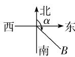  
图②

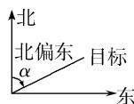  
图③

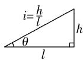  
图④

(2) 方位角

从指北方向顺时针转到目标方向线的水平角,如 B 点的方位角为 $\alpha$ (如图②).

(3) 方向角: 相对于某一正方向的水平角.

(1) 北偏东 $\alpha$ ，即由指北方向顺时针旋转 $\alpha$ 到达目标方向 (如图③).  
(2) 北偏西 $\alpha$ ，即由指北方向逆时针旋转 $\alpha$ 到达目标方向。  
(3) 南偏西等其他方向角类似.  
(4) 坡角与坡度

(1) 坡角: 坡面与水平面所成的二面角的度数 (如图④, 角 $\theta$ 为坡角).  
(2) 坡度: 坡面的铅直高度与水平长度之比 (如图④, i 为坡度). 坡度又称为坡比.

# 【解题方法总结】

# 1、方法技巧: 解三角形多解情况

在 $\triangle ABC$ 中，已知 $a, b$ 和 $\mathbf{A}$ 时，解的情况如下：

<table><tr><td></td><td colspan="3">A为锐角</td><td colspan="2">A为钝角或直角</td></tr><tr><td>图形</td><td></td><td>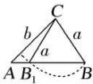</td><td></td><td colspan="2">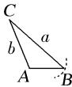</td></tr><tr><td>关系式</td><td>a=bsinA</td><td>bsinAaa≥ba&gt;ba≤b</td><td>a≥ba&gt;b</td><td>a&gt;b</td><td>a≤b</td></tr><tr><td>解的个数</td><td>一解</td><td>两解</td><td>一解</td><td>一解</td><td>无解</td></tr></table>

2、在解三角形题目中，若已知条件同时含有边和角，但不能直接使用正弦定理或余弦定理得到答案，要选择“边化角”或“角化边”，变换原则常用：

(1) 若式子含有 $\sin x$ 的齐次式, 优先考虑正弦定理, “角化边”;  
(2) 若式子含有 a, b, c 的齐次式, 优先考虑正弦定理, “边化角”;  
(3) 若式子含有 $\cos x$ 的齐次式, 优先考虑余弦定理, “角化边”;  
(4) 代数变形或者三角恒等变换前置；  
(5) 含有面积公式的问题, 要考虑结合余弦定理使用;  
(6) 同时出现两个自由角 (或三个自由角) 时, 要用到 $\mathrm{A} + \mathrm{B} + \mathrm{C} = \pi$ .

# 3、三角形中的射影定理

在 $\triangle ABC$ 中， $a = b\cos C + c\cos B; b = a\cos C + c\cos A; c = b\cos A + a\cos B.$

# 必考题型全归纳

# 1 题型一: 正弦定理的应用

1335 (2024·福建龙岩·高三校联考期中)在 $\triangle ABC$ 中，角A,B,C所对的边分别为 $a,b,c$ ，若 $a$

$= 4, \mathrm{A} = \frac{\pi}{4}, \mathrm{C} = \frac{5\pi}{12}$ , 则 $b =$ （）

A. $2 \sqrt{3}$

B. $2\sqrt{5}$

C. $2\sqrt{6}$

D. 6

【答案】C

【解析】因为 $A=\frac{\pi}{4}$ , $C=\frac{5\pi}{12}$ , 所以 $B=\pi-A-C=\frac{\pi}{3}$ ,

因为 $\frac{a}{\sin A} = \frac{b}{\sin B}$ ，所以 $b = \frac{a \sin B}{\sin A} = \frac{4 \times \sin \frac{\pi}{3}}{\sin \frac{\pi}{4}} = \frac{4 \times \frac{\sqrt{3}}{2}}{\frac{\sqrt{2}}{2}} = 2\sqrt{6}$ .

故选：C.

1336 (2024·全国·高三专题练习)在△ABC中,设命题 $p:\frac{a}{\sin C}=\frac{b}{\sin A}=\frac{c}{\sin B}$ ,命题q:
△ABC是等边三角形,那么命题p是命题q的()

A. 充分不必要条件

B. 必要不充分条件

C. 充要条件

D. 既不充分也不必要条件

【答案】C

【解析】由正弦定理可知 $\frac{a}{\sin A} = \frac{b}{\sin B} = \frac{c}{\sin C}$ ，若 $\frac{a}{\sin C} = \frac{b}{\sin A} = \frac{c}{\sin B} = t$ ，

则 $\frac{a}{c} = \frac{b}{a} = \frac{c}{b} = t,$

即 $a = tc, b = ta, c = bt$

即 $abc = t^3 abc$ ，即 $t = 1$ ，

则 a=b=c，即 $\triangle ABC$ 是等边三角形，

若 $\triangle ABC$ 是等边三角形, 则 A = B = C = $\frac{\pi}{3}$ , 则 $\frac{a}{\sin C} = \frac{b}{\sin A} = \frac{c}{\sin B} = 1$ 成立,

即命题 $p$ 是命题 $q$ 的充要条件，

故选：C.

1337 (2024·河南·襄城高中校联考三模)在 $\triangle ABC$ 中, 角 A, B, C 的对边分别为 a, b, c, 若 $\sin A = \sin B \cos C$ 且 $c = 2\sqrt{3}$ , $A = \frac{\pi}{6}$ , 则 $\frac{c + a}{\sin C + \sin A} =$ ()

A. $8 \sqrt{3}$

B. $4 \sqrt{3}$

C. 8

D. 4

【答案】D

【解析】在 $\triangle ABC$ 中, 由 $\sin A = \sin B \cos C$ 可得 $\sin(B + C) = \sin B \cos C$ ,

即 $\sin B\cos C + \cos B\sin C = \sin B\cos C$

所以 $\cos B\sin C=0$ , 因为 $B,C\in(0,\pi)$

所以 $\sin C \neq 0$ ，且 $\cos B = 0$ ，

所以 $\mathrm{B} = \frac{\pi}{2}$ 又 $\mathrm{A} = \frac{\pi}{6}$ 可得 $\mathrm{C} = \frac{\pi}{3}$

由正弦定理可得 $\frac{c+a}{\sin C+\sin A}=\frac{c}{\sin C}=\frac{2\sqrt{3}}{\frac{\sqrt{3}}{2}}=4.$

故选：D.

1338 (2024·全国·高三专题练习)在 $\triangle ABC$ 中, 内角 A, B, C 的对边分别是 a, b, c, 若 $a\cos B - b\cos A = c$ , 且 $C = \frac{\pi}{5}$ , 则 $\angle B =$ ()

A. $\frac{\pi}{10}$

B. $\frac{\pi}{5}$

C. $\frac{3\pi}{10}$

D. $\frac{2\pi}{5}$

【答案】C

【解析】由题意结合正弦定理可得 $\sin A\cos B - \sin B\cos A = \sin C$ ,

即 $\sin A\cos B - \sin B\cos A = \sin(A + B) = \sin A\cos B + \sin B\cos A,$

整理可得 $\sin B\cos A=0$ ，由于 $B\in(0,\pi)$ ，故 $\sin B>0$ ，

据此可得 $\cos A = 0, A = \frac{\pi}{2}$ ,

则 $B=\pi-A-C=\pi-\frac{\pi}{2}-\frac{\pi}{5}=\frac{3\pi}{10}.$

故选：C.

1339 (2024·河南郑州·高三郑州外国语中学校考阶段练习) a, b, c 分别为 $\triangle ABC$ 内角 A, B, C 的对边．已知 a = 4, $ab\sin A\sin C = c\sin B$ ，则 $\triangle ABC$ 外接圆的面积为（）

A. $16\pi$

B. $64\pi$

C. $128\pi$

D. $256\pi$

【答案】B

【解析】因为 $ab\sin A\sin C = c\sin B$ ，由正弦定理得 $4bc\sin A = bc$ ，可得 $\sin A = \frac{1}{4}$ .

设 $\triangle ABC$ 外接圆的半径为 r，则 $\frac{a}{\sin A}=2r=16$ ，即 r=8，

故 $\triangle ABC$ 外接圆的面积为 $64\pi$ .

故选：B.

1340 (2024·甘肃兰州·高三兰州五十一中校考期中)△ABC的三个内角A，B，C所对的边分别为a，b，c，若 $a\sin A\sin B+b\cos^{2}A=\sqrt{3}a$ ，则 $\frac{b}{a}=$ （）

A. $\sqrt{2}$

B. $\sqrt{3}$

C. $2\sqrt{2}$

D. $2\sqrt{3}$

【答案】B

【解析】由正弦定理得 $a \sin B = b \sin A$ ，化简得 $b \sin^{2} A + b \cos^{2} A = b = \sqrt{3} a$ ，

则 $\frac{b}{a} = \sqrt{3}$

故选：B

1341 (2024·宁夏·高三六盘山高级中学校考期中)在 $\triangle ABC$ 中, 内角 A, B, C 所对的边分别是 $a, b, c$ . 若 $a = 2b$ , 则 $\frac{2\sin^2B - \sin^2A}{\sin^2A}$ 的值为 ( )

A. $-\frac{1}{2}$

B. $\frac{1}{4}$

C. 1

D. $\frac{1}{2}$

【答案】A

【解析】依题意 $\frac{b}{a} = \frac{1}{2}$

由正弦定理得 $\frac{2\sin^2\mathrm{B} - \sin^2\mathrm{A}}{\sin^2\mathrm{A}} = \frac{2b^2 - a^2}{a^2} = 2\left(\frac{b}{a}\right)^2 - 1 = 2\times \left(\frac{1}{2}\right)^2 - 1 = -\frac{1}{2}.$

故选：A

1342 (2024·河南·洛宁县第一高级中学校联考模拟预测)△ABC的内角A，B，C的对边分别为a，b，c，已知 $b\cos A=a(\sqrt{3}-\cos B)$ ，a=2，则c=()

A. 4

B. 6

C. $2 \sqrt{2}$

D. $2 \sqrt{3}$

【答案】D

【解析】因为 $b\cos A = a(\sqrt{3} - \cos B)$ ，根据正弦定理得

$$
\sin B \cos A = \sqrt {3} \sin A - \sin A \cos B,
$$

移项得 $\sin A\cos A + \sin A\cos B = \sqrt{3}\sin A$ ,

即 $\sin(A+B)=\sqrt{3}\sin A$ , 即 $\sin C=\sqrt{3}\sin A$

则根据正弦定理有 $c=\sqrt{3}a=2\sqrt{3}$ .

故选：D.

# 【解题方法总结】

(1) 已知两角及一边求解三角形；  
(2) 已知两边一对角;

$\left\{ \begin{array}{l} \text {大角求小角一解 (锐)} \\ \text {小角求大角 - } \left\{ \begin{array}{l} \text {两解 } -\sin A < 1 (\text {一锐角、一钝角}) \\ \text {一解 } -\sin A = 1 (\text {直角}) \\ \text {无解 } -\sin A > 1 \end{array} \right. \end{array} \right.$

(3)两边一对角,求第三边.

# 2 题型二:余弦定理的应用

1343 (2024·全国·高三专题练习)已知△ABC的内角A,B,C所对的边分别为a,b,c满足 $b^{2}+c^{2}-a^{2}=bc$ 且 $a=\sqrt{3}$ ，则 $\frac{b}{\sin B}=$ （）

A. 2

B. 3

C. 4

D. $2 \sqrt{3}$

【答案】A

【解析】由题 $b^{2}+c^{2}-a^{2}=bc,\therefore\cos A=\frac{b^{2}+c^{2}-a^{2}}{2bc}=\frac{bc}{2bc}=\frac{1}{2},$

又 $0 < A < \pi, \therefore A = \frac{\pi}{3}, \therefore \frac{b}{\sin B} = \frac{a}{\sin A} = \frac{\sqrt{3}}{\frac{\sqrt{3}}{2}} = 2,$

故选：A.

1344 (2024·河南·高三统考阶段练习)在 $\Delta ABC$ 中, 角 A, B, C 的对边分别为 a, b, c, 若 $\tan A = \frac{\sin B \sin C}{\sin^{2} B + \sin^{2} C - \sin^{2} A}$ , 则 A = ()

A. $\frac{\pi}{3}$

B. $\frac{\pi}{4}$

C. $\frac{\pi}{6}$ 或 $\frac{5\pi}{6}$

D. $\frac{\pi}{3}$ 或 $\frac{2\pi}{3}$

【答案】C

【解析】由正弦定理, 得 $\tan A = \frac{bc}{b^{2} + c^{2} - a^{2}}$ ,

又 $b^{2}+c^{2}-a^{2}=2bc\cos A$ ，所以 $\frac{\sin A}{\cos A}=\frac{bc}{2bc\cos A}$

所以 $\sin A = \frac{1}{2}$ ，因为 $A \in (0, \pi)$ ，所以 $A = \frac{\pi}{6}$ 或 $\frac{5\pi}{6}$ ，

故选：C.

1345 (2024·全国·高三专题练习)设 $\triangle ABC$ 中, 角 A, B, C 所对的边分别为 a, b, c, 若 $\sin A = \sin B$ , 且 $c^{2} = 2a^{2}(1 + \sin C)$ , 则 C = ()

A. $\frac{\pi}{6}$

B. $\frac{\pi}{4}$

C. $\frac{\pi}{3}$

D. $\frac{3\pi}{4}$

【答案】D

【解析】因为 $\sin A = \sin B$ ，由正弦定理有 a = b，

根据余弦定理有 $c^{2}=a^{2}+b^{2}-2ab\cos C=2a^{2}-2a^{2}\cos C$ ,

且 $c^2 = 2a^2 (1 + \sin C)$ ，故有 $\sin C = -\cos C$ ，即 $\tan C = -1$

又 $C \in (0, \pi)$ ，所以 $C = \frac{3\pi}{4}$ .

故选:D.

1346 (2024·重庆渝中·高三重庆巴蜀中学校考阶段练习)在 $\triangle ABC$ 中, 角 A, B, C 的对边分别为 a, b, c, $a^{2} + b^{2} = 3c^{2}$ , 则 $\frac{1}{\tan A} + \frac{1}{\tan B} - \frac{1}{\tan C} =$ ()

A. 0

B. 1

C. 2

D. $\frac{1}{2}$

【答案】A

【解析】由余弦定理以及 $a^{2}+b^{2}=3c^{2}$ 可得： $2ab\cos C=2c^{2}\Rightarrow\sin A\sin B\cos C=\sin^{2}C\Rightarrow\frac{\cos C}{\sin C}=\frac{\sin C}{\sin A\sin B}$ ,

又在三角形中有 $\sin(A+B)=\sin C$ ，即 $\sin(A+B)=\sin A\cos B+\cos A\sin B$ ，

所以 $\frac{\cos C}{\sin C} = \frac{\sin A \cos B + \cos A \sin B}{\sin A \sin B} = \frac{\cos B}{\sin B} + \frac{\cos A}{\sin A}$

故 $\frac{1}{\tan A} +\frac{1}{\tan B} -\frac{1}{\tan C} = 0.$

故选：A.

1347 (2024·全国·高三专题练习)在 $\triangle ABC$ 中, 角 A, B, C 的对边分别为 a, b, c, 且 $\frac{\cos B}{b} + \frac{\cos C}{c} = \frac{\sin A}{\sin C}$ , 则 b 的值为 ()

A. 1

B. $\sqrt{3}$

C. $\frac{\sqrt{3}}{2}$

D. 2

【答案】A

【解析】因为 $\frac{\cos B}{b} + \frac{\cos C}{c} = \frac{\sin A}{\sin C}$ ,

所以,由正弦定理与余弦定理得 $\frac{a^{2}+c^{2}-b^{2}}{2abc}+\frac{a^{2}+b^{2}-c^{2}}{2abc}=\frac{a}{c}$ ，化简得 b=1.

故选：A

【解题方法总结】

(1) 已知两边一夹角或两边及一对角, 求第三边.  
(2) 已知三边求角或已知三边判断三角形的形状, 先求最大角的余弦值,

若余弦值 $\left\{\begin{aligned}&>0, 则\Delta ABC 为锐角三角形\\&=0, 则\Delta ABC 为直角三角形.\\&<0, 则\Delta ABC 为钝角三角形\end{aligned}\right.$

# 3 题型三:判断三角形的形状

1348 (2024·甘肃酒泉·统考三模)在 $\triangle ABC$ 中内角 A,B,C 的对边分别为 $a, b, c$ , 若 $\frac{a^2}{b^2} = \frac{\sin A \cos B}{\sin B \cos A}$ , 则 $\triangle ABC$ 的形状为 ( )

A. 等腰三角形

B. 直角三角形

C. 等腰直角三角形

D. 等腰三角形或直角三角形

【答案】D

【解析】由正弦定理,余弦定理及 $a^{2}\cos A\sin B=b^{2}\cos B\sin A$ 得, $a^{2}\cdot\frac{b^{2}+c^{2}-a^{2}}{2bc}\cdot b=b^{2}\cdot\frac{a^{2}+c^{2}-b^{2}}{2ac}\cdot a,$

$\therefore a^{2}(b^{2} + c^{2} - a^{2}) = b^{2}(a^{2} + c^{2} - b^{2})$ ，即 $a^4 -b^4 +c^2 (b^2 -a^2) = 0$

则 $(a^{2} + b^{2})(a^{2} - b^{2}) + c^{2}(b^{2} - a^{2}) = 0$ ，即 $(a^2 -b^2)(a^2 +b^2 -c^2) = 0,$

∴ a=b 或 $a^{2}+b^{2}=c^{2}$ ，∴ $\triangle ABC$ 为等腰三角形或直角三角形.

故选：D.

1349 (2024·全国·高三专题练习)在 $\triangle ABC$ 中, 角 A, B, C 的对边分别为 a, b, c, 且 c - b $\cos A < 0$ , 则 $\triangle ABC$ 形状为 ( )

A. 锐角三角形

B. 直角三角形

C. 钝角三角形

D. 等腰直角三角形

【答案】C

【解析】 $c - b\cos A < 0$ ,

所以由正弦定理可得 $2R\sin C - 2R\sin B\cos A < 0$

所以 $\sin C - \sin B \cos A < 0,$

所以 $\sin(A+B)-\sin B\cos A<0,$

所以 $\sin A\cos B + \cos A\sin B - \sin B\cos A < 0,$

所以 $\sin A\cos B < 0,$

在三角形中 $\sin A > 0$ ,

所以 $\cos B < 0$ ,

所以 B 为钝角，

故选：C.

1350 (2024·全国·高三专题练习)在 $\triangle ABC$ 中, 若 $\frac{b\cdot\cos C}{c\cdot\cos B}=\frac{1-\cos 2B}{1-\cos 2C}$ , 则 $\triangle ABC$ 的形状为 ()

A. 等腰三角形

B. 直角三角形

C. 等腰直角三角形

D. 等腰三角形或直角三角形

【答案】D

【解析】由正弦定理,以及二倍角公式可知, $\frac{b\cdot\cos C}{c\cdot\cos B}=\frac{\sin B\cdot\cos C}{\sin C\cdot\cos B}=\frac{1-\cos2B}{1-\cos2C}=\frac{2\sin^{2}B}{2\sin^{2}C}$

即 $\frac{\cos C}{\cos B} = \frac{\sin B}{\sin C}$ ，整理为 $\sin B \cos B = \sin C \cos C$ ，

即 $\frac{1}{2}\sin 2\mathrm{B} = \frac{1}{2}\sin 2\mathrm{C}$ ，得 $2\mathrm{B} = 2\mathrm{C}$ 或 $2\mathrm{B} + 2\mathrm{C} = 180^{\circ}\Rightarrow \mathrm{B} + \mathrm{C} = 90^{\circ},$

所以 $\triangle ABC$ 的形状为等腰三角形或直角三角形.

故选：D

1351 (2024·全国·高三专题练习)设△ABC的内角A，B，C的对边分别为a，b，c，若 $b^{2}=c^{2}+a^{2}-ca$ ，且 $\sin A=2\sin C$ ，则△ABC的形状为()

A. 锐角三角形

B. 直角三角形

C. 钝角三角形

D. 等腰三角形

【答案】B

【解析】因为 $b^{2}=c^{2}+a^{2}-ca=c^{2}+a^{2}-2cacosB$ ,

所以 $\cos B = \frac{1}{2}$ ,

又 $B\in(0,\pi)$ ，所以 $B=\frac{\pi}{3}$

因为 $\sin A = 2\sin C$ ，由正弦定理得 a = 2c，

则 $b^{2} = c^{2} + a^{2} - ca = c^{2} + 4c^{2} - 2c^{2} = 3c^{2},$

则 $b^{2} + c^{2} = a^{2}$

所以 $\triangle ABC$ 为有一个角为 $\frac{\pi}{3}$ 的直角三角形.

故选: B.

1352 (2024·河南周口·高三校考阶段练习)已知 $\triangle ABC$ 的三个内角 A, B, C 所对的边分别为 a, b, c. 若 $\sin^{2}A + c\sin A = \sin A\sin B + b\sin C$ ，则该三角形的形状一定是（）

A. 钝角三角形

B. 直角三角形

C. 等腰三角形

D. 锐角三角形

【答案】C

【解析】因为 $\sin^{2}A + c\sin A = \sin A\sin B + b\sin C,$

由正弦定理 $\frac{a}{\sin A} = \frac{b}{\sin B} = \frac{c}{\sin C} = 2R$ (2R 为 $\triangle ABC$ 外接圆的直径),

可得 $\frac{a}{2\mathrm{R}}\cdot \sin \mathrm{A} + \frac{a}{2\mathrm{R}}\cdot c = \frac{b}{2\mathrm{R}}\cdot \sin \mathrm{A} + b\cdot \frac{c}{2\mathrm{R}},$

所以 $a(\sin A + c) = b(\sin A + c)$ .

又因为 $\sin A + c > 0$ ，所以 a = b。即 $\triangle ABC$ 为等腰三角形。

故选：C

1353 (2024·全国·高三专题练习)设△ABC的内角A, B, C所对的边分别为a, b, c, 若 $a^{2}\cos A\sin B = b^{2}\sin A\cos B$ , 则△ABC的形状为()

A. 等腰三角形

B. 等腰三角形或直角三角形

C. 直角三角形

D. 锐角三角形

【答案】B

【解析】由 $a^{2}\cos A\sin B = b^{2}\sin A\cos B$ 得 $a^{2}b\cos A = ab^{2}\cos B \Rightarrow a\cos A = b\cos B \Rightarrow \sin A\cos A = \sin B\cos B,$

由二倍角公式可得 $\sin2A=\sin2B\Rightarrow2A=2B+2k\pi$ 或 $2A+2B=\pi+2k\pi,k\in Z$ ,

由于在 $\triangle ABC, A \in (0, \pi), B \in (0, \pi)$ , 所以 $A = B$ 或 $A + B = \frac{\pi}{2}$ , 故 $\triangle ABC$ 为等腰三角形或直角三角形

故选：B

1354 (2024·北京·高三 101 中学校考阶段练习) 设 $\triangle ABC$ 的内角 A, B, C 所对的边分别为 $a$ , $b$ , $c$ , 若 $a^{2}\cos A \sin B = b^{2} \sin A \cos B$ , 则 $\triangle ABC$ 的形状为 ( )

A. 等腰直角三角形

B. 直角三角形

C. 等腰三角形或直角三角形

D. 等边三角形

【答案】C

【解析】已知等式利用正弦定理化简得: $ba^{2}\cos A = ab^{2}\cos B$ ,

整理得: $a\cos A = b\cos B$ , 即 $\sin A\cos A = \sin B\cos B$ ,

∴ $2\sin A \cos A = 2\sin B \cos B$ ，即 $\sin 2A = \sin 2B$ ，

$\therefore \sin [ (A + B) + (A - B) ] = \sin [ (A + B) - (A - B) ] ,$

\(\therefore \sin (A + B)\cos (A - B) + \cos (A + B)\sin (A - B) = \sin (A + B)\cos (A - B) - \cos (A + B)\sin (A - B)\cos (A - B)\sin (A - B)\sin (A - B)\sin (A - B)\sin (A - B)\sin (A - B)\sin (A - B)\sin (A - B)\sin (A - B)\sin (A - B)\sin (A - B)\sin (A - B)\sin (A - B)\sin (A - B)\sin (A - B)\sin (A - B)\sin (A - B)\sin (A - A)\sin (A - A)\sin (A - A)\sin (A - A)\sin (A - A)\sin (A - A)\sin (A - A)\sin (A - A)\sin (A - A)\sin (A - A)\sin (A - A)\sin (A - A)\sin (A - A)\sin (A - A)\sin (A - A)\sin (A - A)\sin (A - A)\sin (B + A + B + A + B + A + B + A + B + A + B + A + B + A + B + A + B + A + B + A + B + A + B + A + B + A + B + A + B + A + B + A + B + A + B + A + B + A + B + A + B + A + B + A + B + A + B + A + B + A + B + A + A + A + A + A + A + A + A + A + A + A + A + A + A + A + A + A + A + A + A + A + A + A + A + A + A + A + A + A + A + A + A + A + A + A + A + A + A + A + A + A + A + A + A + A + A + A + A + A + A +

$$
\mathrm{B}) \sin (\mathrm{A} - \mathrm{B})
$$

$$
\therefore \cos (A + B) \sin (A - B) = 0,
$$

$$
\because 0 <   \mathrm{A} + \mathrm{B} <   \pi , - \pi <   \mathrm{A} - \mathrm{B} <   \pi ,
$$

则 A=B 或 $A+B=\frac{\pi}{2}$ ，即 $\triangle ABC$ 为等腰三角形或直角三角形.

故选：C.

# 【解题方法总结】

(1) 求最大角的余弦, 判断 $\Delta ABC$ 是锐角、直角还是钝角三角形.

(2) 用正弦定理或余弦定理把条件的边和角都统一成边或角, 判断是等腰、等边还是直角三角形.

# 4 题型四: 正、余弦定理与的综合

1355 (2024·河南南阳·统考二模)锐角 $\triangle ABC$ 是单位圆的内接三角形, 角 A, B, C 的对边分别为 a, b, c, 且 $a^{2} + b^{2} - c^{2} = 4a^{2}\cos A - 2ac\cos B$ , 则 a 等于 ( )

A. 2

B. $2\sqrt{2}$

C. $\sqrt{3}$

D. 1

【答案】C

【解析】由 $a^{2}+b^{2}-c^{2}=4a^{2}\cos A-2ac\cos B$ ,

得 $b\cdot\frac{a^{2}+b^{2}-c^{2}}{2ab}=2a\cos A-c\cos B,$

由余弦定理,可得 $b\cos C=2a\cos A-c\cos B$ ,

又由正弦定理,可得 $\sin B\cos C = 2\sin A\cos A - \sin C\cos B$ ,

所以 $\sin B\cos C + \sin C\cos B = \sin(B + C) = \sin A = 2\sin A\cos A$ ,

得 $\cos A = \frac{1}{2}$ ，又 $A \in \left(0, \frac{\pi}{2}\right)$ ，所以 $A = \frac{\pi}{3}$ ，所以 $\sin A = \frac{\sqrt{3}}{2}$ .

又 $\frac{a}{\sin A} = \frac{b}{\sin B} = \frac{c}{\sin C} = 2r = 2$ ，所以 $a = \sqrt{3}$ ，

故选：C

1356 (2024·河北唐山·高三开滦第二中学校考阶段练习)在 $\triangle ABC$ 中, 角 A, B, C 所对的边分别为 a, b, c, $\frac{absinA}{2sinB} + \frac{absinB}{2sinA} = a^{2} + b^{2} - c^{2}$ .

(1) 求证: $0 < \mathrm{C} \leqslant \frac{\pi}{3}$ ;   
(2) 若 $\frac{1}{\tan B} = \frac{1}{\tan A} + \frac{1}{\tan C}$ ，求 $\cos A.$

【解析】(1) 在 $\triangle ABC$ 中, 因为 $\frac{absinA}{2sinB} + \frac{absinB}{2sinA} = a^{2} + b^{2} - c^{2}$ ,

由正弦定理可得 $\frac{a^2b}{2b} +\frac{ab^2}{2a} = a^2 +b^2 -c^2$ ，化简可得 $\frac{a^2 + b^2}{2} = c^2$

由余弦定理可得 $\cos C = \frac{a^{2} + b^{2} - c^{2}}{2ab} = \frac{a^{2} + b^{2} - \frac{a^{2} + b^{2}}{2}}{2ab} = \frac{a^{2} + b^{2}}{4ab} \geqslant \frac{2ab}{4ab} = \frac{1}{2}$ ，当且仅当 a = b 时取等号，所以 $\cos C \geqslant \frac{1}{2}$ ，因为角 C 是 $\triangle ABC$ 的内角，所以 $0 < C < \pi$ ，

所以 $0 < C \leqslant \frac{\pi}{3}$ .

(2)由 $\frac{1}{\tan B} = \frac{1}{\tan A} +\frac{1}{\tan C} = \frac{\cos A}{\sin A} +\frac{\cos C}{\sin C} = \frac{\sin C\cos A + \cos C\sin A}{\sin A\sin C}$

$$
= \frac {\sin (\mathrm{C} + \mathrm{A})}{\sin \mathrm{AsinC}} = \frac {\sin \mathrm{B}}{\sin \mathrm{AsinC}} = \frac {\cos \mathrm{B}}{\sin \mathrm{B}}, \text {则} \cos \mathrm{B} = \frac {\sin^ {2} \mathrm{B}}{\sin \mathrm{AsinC}} = \frac {b ^ {2}}{a c},
$$

即 $\frac{a^2 + c^2 - b^2}{2ac} = \frac{b^2}{ac}$ , 所以 $a^2 + c^2 = 3b^2$ , 又 $\frac{a^2 + b^2}{2} = c^2$ ,

所以 $b=\frac{\sqrt{3}}{2}c, a=\frac{\sqrt{5}}{2}c$ ，在 $\triangle ABC$ 中，由余弦定理可得，

$$
\cos A = \frac {b ^ {2} + c ^ {2} - a ^ {2}}{2 b c} = \frac {\frac {3}{4} c ^ {2} + c ^ {2} - \frac {5}{4} c ^ {2}}{2 c \cdot \frac {\sqrt {3}}{2} c} = \frac {\sqrt {3}}{6}.
$$

1357 (2024·重庆·统考三模)已知 $\triangle ABC$ 的内角A、B、C的对边分别为 $a, b, c, \sin(A - B)$ $\tan C = \sin A \sin B$ .

(1) 求 $\frac{a^{2}+c^{2}}{b^{2}}$ ;   
(2) 若 $\cos B = \frac{2}{3}$ ，求 $\sin A$ .

【解析】(1) 因为 $\sin(A-B)\tan C = \sin A\sin B$ ,

所以 $\sin(A-B)\frac{\sin C}{\cos C}=\sin A\sin B$ ，所以 $\sin(A-B)\sin C=\sin A\sin B\cos C$ ，

即 $\sin A\cos B\sin C - \cos A\sin B\sin C = \sin A\sin B\cos C,$

由正弦定理可得 $accosB - bc\cos A = ab\cos C$ ,

由余弦定理可得 $ac \cdot \frac{a^2 + c^2 - b^2}{2ac} - bc \cdot \frac{b^2 + c^2 - a^2}{2bc} = ab \cdot \frac{a^2 + b^2 - c^2}{2ab}$ ,

所以 $a^2 + c^2 - b^2 - b^2 - c^2 + a^2 = a^2 + b^2 - c^2,$

即 $a^2 + c^2 = 3b^2$

所以 $\frac{a^2 + c^2}{b^2} = 3.$

(2) 由题意可知 $\cos B = \frac{a^2 + c^2 - b^2}{2ac} = \frac{2}{3}$ , 又 $a^2 + c^2 = 3b^2$ , 可得 $a^2 + c^2 - 2ac = 0$ ,

所以 a=c，即 $\triangle ABC$ 为等腰三角形，

由 $\cos B = 2\cos^{2}\frac{B}{2} - 1 = \frac{2}{3}$ ，解得 $\cos\frac{B}{2} = \frac{\sqrt{30}}{6}$ 或 $\cos\frac{B}{2} = -\frac{\sqrt{30}}{6}$ ,

因为 $\mathrm{B} \in \left(0, \frac{\pi}{2}\right)$ , 所以 $\frac{\mathrm{B}}{2} \in \left(0, \frac{\pi}{4}\right)$ , 所以 $\cos \frac{\mathrm{B}}{2} = \frac{\sqrt{30}}{6}$ ,

所以 $\sin A = \sin \left(\frac{\pi}{2} -\frac{B}{2}\right) = \cos \frac{B}{2} = \frac{\sqrt{30}}{6}.$

1358 (2024·山东滨州·统考二模)已知△ABC的三个角A，B，C的对边分别为a，b，c，且 $2\cos(B-C)\cos A+\cos 2A=1+2\cos A\cos(B+C)$ .

(1) 若 B=C, 求 A;   
(2) 求 $\frac{b^{2}+c^{2}}{a^{2}}$ 的值.

【解析】(1) 若 B=C，则 $\cos(B-C)=1$ .

因为 $2\cos(B-C)\cos A + \cos 2A = 1 + 2\cos A\cos(B+C)$ ,

所以 $2\cos A + \cos 2A = 1 + 2\cos(\pi - A)\cos A$ ,

$$
2 \cos A + 2 \cos^ {2} A - 1 = 1 - 2 \cos^ {2} A,
$$

整理得 $2\cos^{2}A + \cos A - 1 = 0.$

解得 $\cos A = -1$ (舍), $\cos A = \frac{1}{2}$ ,

因为 $A \in (0, \pi)$ ，所以 $A = \frac{\pi}{3}$ .

(2) 因为 $2\cos(B-C)\cos A + \cos 2A = 1 + 2\cos A\cos(B+C)$ .

所以 $2\cos(B-C)\cos A-2\cos A\cos(B+C)=1-\cos2A$

$$
2 [ \cos (B - C) - \cos (B + C) ] \cos A = 1 - \cos 2 A,
$$

$$
2 \left[ \cos B \cos C + \sin B \sin C - (\cos B \cos C - \sin B \sin C) \right] \cos A = 1 - \cos 2 A
$$

整理得 $2\sin B\sin C\cos A = \sin^{2}A$

由正弦定理得 $2bc\cos A = a^{2}$ ,

由余弦定理得 $b^{2}+c^{2}-a^{2}=2bc\cos A=a^{2}$ ,

即 $b^{2} + c^{2} = 2a^{2}$

所以 $\frac{b^2 + c^2}{a^2} = 2.$

1359 (2024·全国·高三专题练习)在 $\triangle ABC$ 中， $(a + c)(\sin A - \sin C) = b(\sin A - \sin B)$ ，则

$$
\angle \mathrm{C} = \tag {（}
$$

A. $\frac{\pi}{6}$

B. $\frac{\pi}{3}$

C. $\frac{2\pi}{3}$

D. $\frac{5\pi}{6}$

【答案】B

【解析】因为 $(a+c)(\sin A-\sin C)=b(\sin A-\sin B)$ ,

所以由正弦定理得 $(a+c)(a-c)=b(a-b)$ ，即 $a^{2}-c^{2}=ab-b^{2}$

则 $a^2 + b^2 - c^2 = ab$ ，故 $\cos C = \frac{a^2 + b^2 - c^2}{2ab} = \frac{ab}{2ab} = \frac{1}{2}$ ，

又 $0 < \mathrm{C} < \pi$ ，所以 $\mathrm{C} = \frac{\pi}{3}$

故选: B.

1360 (2024·青海·校联考模拟预测)在 $\triangle ABC$ 中, 内角 A, B, C 所对应的边分别是 a, b, c, 若 $\triangle ABC$ 的面积是 $\frac{\sqrt{3}(b^{2}+c^{2}-a^{2})}{4}$ , 则 A= ()

A. $\frac{\pi}{3}$

B. $\frac{2\pi}{3}$

C. $\frac{\pi}{6}$

D. $\frac{5\pi}{6}$

【答案】A

【解析】由余弦定理可得: $b^{2}+c^{2}-a^{2}=2bc\cos A,A\in(0,\pi)$

由条件及正弦定理可得:

$$
\mathrm{S} = \frac {1}{2} b c \sin \mathrm{A} = \frac {\sqrt {3} (b ^ {2} + c ^ {2} - a ^ {2})}{4} = \frac {\sqrt {3}}{2} b c \cos \mathrm{A},
$$

所以 $\tan A = \sqrt{3}$ ，则 $A = \frac{\pi}{3}$ .

故选：A

1361 (2024·全国·校联考三模)已知 a, b, c 分别为 $\triangle ABC$ 的内角 A, B, C 的对边， $a^{2} + c^{2} = ac\left(3\cos^{2}\frac{B}{2} - \sin^{2}\frac{B}{2}\right)$ .

(1) 求证: $a, b, c$ 成等比数列;  
(2) 若 $\frac{\sin^{2}B}{\sin^{2}A+\sin^{2}C}=\frac{3}{4}$ ，求 $\cos B$ 的值.

【解析】(1) 因为 $a^{2} + c^{2} = ac\left(3\cos^{2}\frac{B}{2} - \sin^{2}\frac{B}{2}\right)$ ,

所以 $a^{2}+c^{2}=ac\left(3\times\frac{1+\cos B}{2}-\frac{1-\cos B}{2}\right)$ .

所以 $a^{2}+c^{2}=ac(1+2\cos B)$ .

根据余弦定理, 得 $a^{2} + c^{2} = ac \left(1 + 2 \times \frac{a^{2} + c^{2} - b^{2}}{2ac}\right)$ ,

所以 $a^{2}+c^{2}=ac+a^{2}+c^{2}-b^{2}$ .

所以 $b^{2}=ac$ .

所以 a, b, c 成等比数列.

(2) 由余弦定理, 得 $\cos B = \frac{a^2 + c^2 - b^2}{2ac} = \frac{a^2 + c^2 - ac}{2ac} = \frac{a^2 + c^2}{2ac} - \frac{1}{2}$ .

因为 $\frac{\sin^{2}B}{\sin^{2}A+\sin^{2}C}=\frac{3}{4}$ ，所以由正弦定理，得 $\frac{b^{2}}{a^{2}+c^{2}}=\frac{3}{4}$ .

所以 $\frac{ac}{a^2 + c^2} = \frac{3}{4}$ .

所以 $\cos B=\frac{1}{2}\times\frac{4}{3}-\frac{1}{2}=\frac{1}{6}.$

1362 (2024·天津武清·天津市武清区杨村第一中学校考模拟预测)在 $\triangle ABC$ 中，角A，B，C

所对的边分别为 a, b, c，已知 $c \sin \frac{B + C}{2} = a \sin C$

(1) 求角 A 的大小;  
(2) 若 $b = 1$ , $\sin B = \frac{\sqrt{21}}{7}$ , 求边 $c$ 及 $\cos (2B + A)$ 的值.

【解析】(1) 因为 $c\sin\frac{B+C}{2}=a\sin C$ ，可得 $c\sin\left(\frac{\pi-A}{2}\right)=c\cos\frac{A}{2}=a\sin C$ ，

所以由正弦定理可得 $\sin C \cos \frac{A}{2} = \sin A \sin C$ ,

又 C 为三角形内角, $\sin C \neq 0$ ,

所以 $\cos \frac{\mathrm{A}}{2} = \sin \mathrm{A} = 2\sin \frac{\mathrm{A}}{2}\cos \frac{\mathrm{A}}{2},$

因为 $A \in (0, \pi)$ , $\frac{A}{2} \in \left(0, \frac{\pi}{2}\right)$ , $\cos \frac{A}{2} > 0$ ,

所以 $\sin\frac{A}{2}=\frac{1}{2}$ ，可得 $\frac{A}{2}=\frac{\pi}{6}$ ，

所以 $A=\frac{\pi}{3}$ ;

(2) 因为 $A = \frac{\pi}{3}$ , b = 1, $\sin B = \frac{\sqrt{21}}{7}$ ,

所以由正弦定理 $\frac{a}{\sin A} = \frac{b}{\sin B}$ ，可得 $a = \frac{b \cdot \sin A}{\sin B} = \frac{1 \times \frac{\sqrt{3}}{2}}{\frac{\sqrt{21}}{7}} = \frac{\sqrt{7}}{2} > b$ ，

所以 B 为锐角， $\cos B = \sqrt{1 - \sin^{2}B} = \frac{2\sqrt{7}}{7}$ ， $\sin 2B = 2\sin B\cos B = \frac{4\sqrt{3}}{7}$ ， $\cos 2B = 2\cos^{2}B - 1 = \frac{1}{7}$ ,

由余弦定理 $a^{2}=b^{2}+c^{2}-2bc\cos A$ ，可得 $\frac{7}{4}=1+c^{2}-2\times1\times c\times\frac{1}{2}$

整理可得 $4c^{2} - 4c - 3 = 0$ ，解得 $c = \frac{3}{2}$ 或 $-\frac{1}{2}$ （舍去），

所以 $\cos(2B+A)=\cos2B\cos A-\sin2B\sin A=\frac{1}{7}\times\frac{1}{2}-\frac{4\sqrt{3}}{7}\times\frac{\sqrt{3}}{2}=-\frac{11}{14}.$

【解题方法总结】

先利用平面向量的有关知识如向量数量积将向量问题转化为三角函数形式,再利用三角函数转化求解.

# 5 题型五: 解三角形的实际应用

方向1: 距离问题

1363 (2024·全国·高三专题练习)山东省科技馆新馆目前成为济南科教新地标(如图1),其主体建筑采用与地形吻合的矩形设计, 将数学符号“ $\infty$ ”完美嵌入其中, 寓意无限未知、无限发展、无限可能和无限的科技创新. 如图2, 为了测量科技馆最高点A与其附近一建筑物楼顶B之间的距离, 无人机在点C测得点A和点B的俯角分别为 $75^{\circ}$ , $30^{\circ}$ , 随后无人机沿水平方向飞行600米到点D, 此时测得点A和点B的俯角分别为 $45^{\circ}$ 和 $60^{\circ}$ (A, B, C, D在同一铅垂面内), 则A, B两点之间的距离为 \_\_\_\_ 米.

natural_image

Exterior view of a modern architectural building with green landscaping and road infrastructure (no visible text or signage)

(图1)

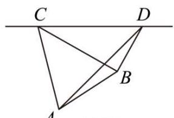

text_image

C
D
A
B

(图2)

【答案】 $100 \sqrt{15}$

【解析】由题意， $\angle DCB=30^{\circ},\angle CDB=60^{\circ}$ ，所以 $\angle CBD=90^{\circ}$

所以在 Rt△CBD 中， $BD=\frac{1}{2}CD=300, BC=\frac{\sqrt{3}}{2}CD=300\sqrt{3}$

又 $\angle DCA = 75^{\circ}, \angle CDA = 45^{\circ}$ ，所以 $\angle CAD = 60^{\circ}$ ，

在 $\triangle \mathrm{ACD}$ 中，由正弦定理得， $\frac{\mathrm{AC}}{\sin 45^{\circ}} = \frac{\mathrm{CD}}{\sin 60^{\circ}}$ ，所以 $\mathrm{AC} = \frac{600}{\frac{\sqrt{3}}{2}}\times \frac{\sqrt{2}}{2} = 200\sqrt{6}$

在 $\triangle ABC$ 中， $\angle ACB = \angle ACD - \angle BCD = 75^{\circ} - 30^{\circ} = 45^{\circ}$

由余弦定理得, $AB^{2}=AC^{2}+BC^{2}-2AC\cdot BC\cdot\cos\angle ACB=(200\sqrt{6})^{2}+(300\sqrt{3})^{2}-2\times200\sqrt{6}\times300\sqrt{3}\times\frac{\sqrt{2}}{2}=150000$ ,

所以 $\mathrm{AB} = 100\sqrt{15}$

故答案为: $100\sqrt{15}$

1364 (2024·安徽阜阳·高三安徽省临泉第一中学校考期中)一游客在 A 处望见在正北方向有一塔 B, 在北偏西 $45^{\circ}$ 方向的 C 处有一寺庙, 此游客骑车向西行 1km 后到达 D 处, 这时塔和寺庙分别在北偏东 $30^{\circ}$ 和北偏西 $15^{\circ}$ , 则塔 B 与寺庙 C 的距离为 \_\_\_\_ km.

【答案】 $\sqrt{2}$

【解析】如图, 在 $\triangle ABD$ 中, 由题意可知 AD = 1, $\angle BDA = 60^{\circ}$ , 可得 $AB = \sqrt{3}$ .

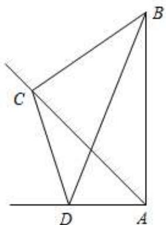

text_image

Geometric diagram with labeled points A, B, C, D and intersecting lines forming triangles and a rectangle

在 $\triangle \mathrm{ACD}$ 中， $\mathrm{AD} = 1$ ， $\angle \mathrm{ADC} = 105^{\circ}$ ， $\angle \mathrm{DCA} = 30^{\circ}$ ，∴ $\frac{\mathrm{AC}}{\sin\angle\mathrm{ADC}} = \frac{\mathrm{AD}}{\sin\angle\mathrm{DCA}}$

$$
\therefore \mathrm{AC} = \frac {\mathrm{AD} \cdot \sin \angle \mathrm{ADC}}{\sin \angle \mathrm{DCA}} = \frac {\sqrt {6} + \sqrt {2}}{2}.
$$

在 $\triangle ABC$ 中，

$$
\mathrm{BC} ^ {2} = \mathrm{AC} ^ {2} + \mathrm{AB} ^ {2} - 2 \mathrm{AC} \cdot \mathrm{AB} \cdot \cos 4 5 ^ {\circ} = \frac {8 + 4 \sqrt {3}}{4} + 3 - 2 \times \frac {\sqrt {6} + \sqrt {2}}{2} \times \sqrt {3} \times \frac {\sqrt {2}}{2} = 2,
$$

$$
\therefore \mathrm{BC} = \sqrt {2} (\mathrm{km}).
$$

故答案为: $\sqrt{2}$ .

1365 (2024·河南郑州·高三统考期末)如图,为了测量 A,C 两点间的距离,选取同一平面上的 B,D 两点,测出四边形 ABCD 各边的长度 (单位: km): AB = 5, BC = 8, CD = 3, DA = 5,且 A,B,C,D 四点共圆,则 AC 的长为 \_\_\_\_ km.

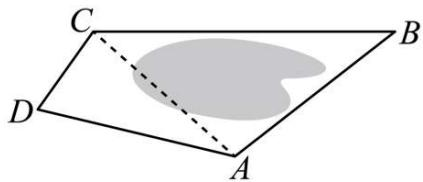

text_image

C
D
A
B

【答案】7

【解析】∵ A, B, C, D 四点共圆，圆内接四边形的对角和为 $\pi$ .

$$
\therefore \angle B + \angle D = \pi ,
$$

∴由余弦定理可得 $AC^{2}=AD^{2}+CD^{2}-2AD\cdot CD\cos\angle D=5^{2}+3^{2}-2\times5\times3\cos\angle D=34-30\cos\angle D$

$$
\mathrm{AC} ^ {2} = \mathrm{AB} ^ {2} + \mathrm{BC} ^ {2} - 2 \mathrm{AB} \cdot \mathrm{BC} \cos \angle \mathrm{B} = 5 ^ {2} + 8 ^ {2} - 2 \times 5 \times 8 \cos \angle \mathrm{B} = 8 9 - 8 0 \cos \angle \mathrm{B},
$$

$$
\because \angle B + \angle D = \pi , \text { 即 } \cos \angle B = - \cos \angle D,
$$

∴ $\frac{89-AC^{2}}{80}=-\frac{34-AC^{2}}{30}$ ，解得 AC=7，

故答案为: 7

1366 (2024·山东东营·高三广饶一中校考阶段练习)如图,一条巡逻船由南向北行驶,在A处测得灯塔底部C在北偏东15°方向上,匀速向北航行20分钟到达B处,此时测得灯塔底部C在北偏东60°方向上,测得塔顶P的仰角为60°,已知灯塔高为 $2\sqrt{3}$ km. 则巡逻船的航行速度为 \_\_\_\_ km/h.

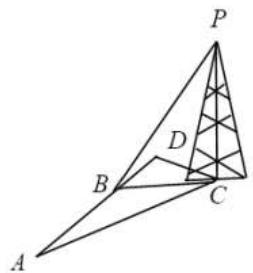

text_image

Geometric diagram with labeled points A, B, C, D, and P, showing triangles and intersecting lines.

【答案】 $6(\sqrt{3}+1)$

【解析】由题意知在 $\triangle BCP$ 中， $PC = 2\sqrt{3}, \angle PBC = 60^{\circ}$ ，故 $\tan\angle PBC = \frac{PC}{BC}$ ，即 $\sqrt{3} = \frac{2\sqrt{3}}{BC}$ ，

解得BC=2，

在 $\triangle ABC$ 中， $\angle BCA = 180^{\circ} - 15^{\circ} - 120^{\circ} = 45^{\circ}$ ，

则 $\frac{\mathrm{BC}}{\sin\angle\mathrm{BAC}} = \frac{\mathrm{AB}}{\sin\angle\mathrm{BCA}},\therefore \frac{2}{\sin 15^{\circ}} = \frac{\mathrm{AB}}{\sin 45^{\circ}}$ ，而 $\sin 15^{\circ} = \sin (45^{\circ} - 30^{\circ}) = \frac{\sqrt{6} - \sqrt{2}}{4}$

所以 $AB=\sqrt{2}\times\frac{4}{\sqrt{6}-\sqrt{2}}=2(\sqrt{3}+1)$ ,

所以 $2(\sqrt{3}+1)\div\frac{1}{3}=6(\sqrt{3}+1)$ ,

即船的航行速度是每小时 $6(\sqrt{3} + 1)$ 千米，

故答案为: $6(\sqrt{3}+1)$

方向2:高度问题

1367 (2024·重庆·统考模拟预测)如图,某中学某班级课外学习兴趣小组为了测量某座山峰的高度,先在山脚A处测得山顶C处的仰角为 $60^{\circ}$ ,又利用无人机在离地面高300m的M处(即MD=300m),观测到山顶C处的仰角为 $15^{\circ}$ ,山脚A处的俯角为 $45^{\circ}$ ,则山高BC=\_\_\_\_m.

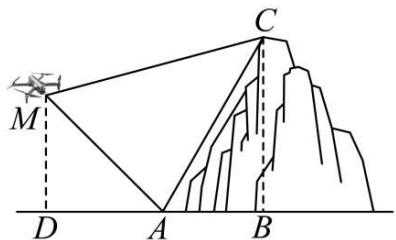

text_image

Geometric diagram showing a pyramid with points A, B, C, D and a marked point M, including dashed lines indicating height and base.

【答案】450

【解析】依题意 $\angle AMD = 45^{\circ}$ ，则 $AM = \sqrt{2} MD = 300\sqrt{2}$ ， $\angle CMA = 45^{\circ} + 15^{\circ} = 60^{\circ}$ $\angle CAB = 60^{\circ}$

故 $\angle MAC = 180^{\circ} - 60^{\circ} - 45^{\circ} = 75^{\circ}$ ， $\angle ACM = 180^{\circ} - 75^{\circ} - 60^{\circ} = 45^{\circ}$

在 $\triangle MAC$ 中, 由正弦定理得 $\frac{AC}{\sin\angle AMC} = \frac{MA}{\sin\angle ACM}$ , 即 $\frac{AC}{\sin60^{\circ}} = \frac{300\sqrt{2}}{\sin45^{\circ}}$ ,

解得 $AC = 300\sqrt{3}$ ，则 $BC = AC\sin60^{\circ} = 450$ .

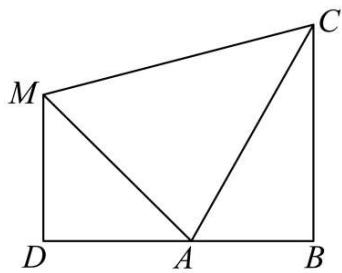

text_image

M
C
D A B

故答案为: 450

1368 (2024·河南·校联考模拟预测)中国古代数学名著《海岛算经》记录了一个计算山高的问题(如图1):今有望海岛,立两表齐,高三丈,前后相去千步,令后表与前表相直.从前表却行一百二十三步,人目着地取望岛峰,与表末参合.从后表却行百二十七步,人目着地取望岛峰,亦与表末参合.问岛高及去表各几何?假设古代有类似的一个问题,如图2,要测量海岛上一座山峰的高度AH,立两根高48丈的标杆BC和DE,两竿相距BD=800步,D,B,H三点共线且在同一水平面上,从点B退行100步到点F,此时A,C,F三点共线,从点D退行120步到点G,此时A,E,G三点也共线,则山峰的高度AH=\_\_\_\_步.(古制单位:180丈=300步)

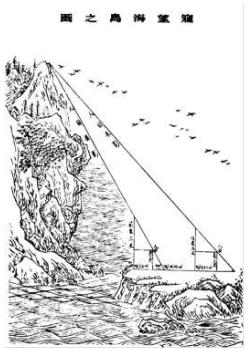

text_image

圖之鳥得望窟

图1

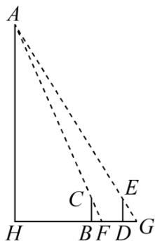

text_image

A
H B F D G
C E

图2

【答案】3280

【解析】由题可知 BC = DE = 48 × $\frac{300}{180}$ = 80 步, BF = 100 步, DG = 120 步. BD = 800 步.

在 Rt△AHF 中 $\frac{AH}{HF} = \frac{BC}{BF} = \frac{4}{5}$ ，在 Rt△AHG 中 $\frac{AH}{HG} = \frac{DE}{DG} = \frac{2}{3}$ .

所以 $\mathrm{HF} = \frac{5}{4}\mathrm{AH},\mathrm{HG} = \frac{3}{2}\mathrm{AH},$

则 $\mathrm{HG - HF} = 800 - 100 + 120 - 820 = \frac{1}{4}\mathrm{AH}.$

所以 AH = 3280 步.

故答案为: 3280

1369 (2024·全国·高三专题练习)为了培养学生的数学建模和应用能力,某校数学兴趣小组对学校雕像“月亮上的读书女孩”进行测量,在正北方向一点测得雕塑最高点仰角为 $30^{\circ}$ ,在正东方向一点测得雕塑最高点仰角为 $45^{\circ}$ ,两个测量点之间距离约为 $4 \sqrt{3}$ 米,则雕塑高为

【答案】 $2 \sqrt{3} m$

【解析】如图所示,正北方向测量点为 C,正东方向测量点为 D,雕塑最高点为 B,

其中 A, C, D 三点位于同一水平面，

由题意可知 $\angle CAB = \angle DAB = \angle DAC = 90^{\circ}, \angle BCA = 30^{\circ}, \angle BDA = 45^{\circ}$ 且 $CD = 4\sqrt{3}$ ，设 AB = a，在直角 $\triangle ABD$ 中，可得 AD = a，

在直角 $\triangle ABC$ 中，可得 $AC = \frac{a}{\tan 30^\circ} = \sqrt{3} a,$

在直角 $\triangle ACD$ 中, 可得 $(\sqrt{3}a)^{2} + a^{2} = (4\sqrt{3})^{2}$ , 解得 $a = 2\sqrt{3}$ ,

故雕塑高为 $2\sqrt{3}m$ .

故答案为: $2\sqrt{3}m$

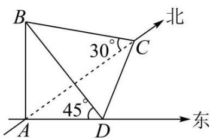

text_image

B
30°
C
45°
A
D
北
东

1370 (2024·全国·模拟预测)山西应县木塔(如图1)是世界上现存最古老、最高大的木塔,是中国古建筑中的瑰宝,是世界木结构建筑的典范. 如图2,某校数学兴趣小组为测量木塔的高度,在木塔的附近找到一建筑物AB,高为 $7\sqrt{3}$ 米,塔顶P在地面上的射影为D,在地面上再确定一点 C(B, C, D 三点共线), 测得 BC 约为 57 米, 在点 A, C 处测得塔顶 P 的仰角分别为 $30^{\circ}$ 和 $60^{\circ}$ , 则该小组估算的木塔的高度为 \_\_\_\_ 米.

natural_image

Aerial view of a multi-tiered traditional Chinese pagoda surrounded by trees under a cloudy sky (no visible text or symbols)

图1

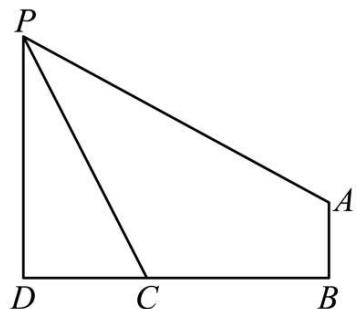

text_image

P
D C B
A

图2

【答案】 $39\sqrt{3}$

【解析】如图, 过点 A 作 PD 作垂线, 垂足为 E,

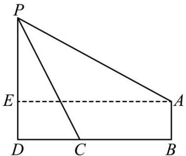

text_image

P
E
A
D C B

由题意可知 $\angle PCD = 60^{\circ}$ ， $\angle PAE = 30^{\circ}$ ，DE = AB = $7\sqrt{3}$ 米，

设 $\mathrm{CD} = x$ 米，则 $\mathrm{PD} = \sqrt{3} x$ 米， $\mathrm{PE} = (\sqrt{3} x - 7\sqrt{3})$ 米，

∵ AE = $\sqrt{3}$ PE, 则 $57 + x = \sqrt{3} (\sqrt{3}x - 7\sqrt{3})$ , 解得 x = 39,

所以估算木塔的高度为 $39\sqrt{3}$ 米.

故答案为: $39\sqrt{3}$ .

方向3:角度问题

1371 (2024·福建厦门·高三厦门一中校考期中)足球是一项很受欢迎的体育运动。如图,某标准足球场的B底线宽AB=72码,球门宽EF=8码,球门位于底线的正中位置。在比赛过程中,攻方球员带球运动时,往往需要找到一点P,使得∠EPF最大,这时候点P就是最佳射门位置。当攻方球员甲位于边线上的点O处(OA=AB,OA⊥AB)时,根据场上形势判断,有OA、OB两条进攻线路可供选择。若选择线路OB,则甲带球\_\_\_\_码时,到达最佳射门位置。

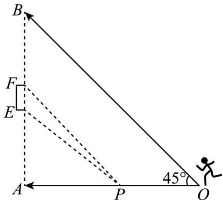

text_image

B
F
E
A
P
O
45°

【答案】 $72\sqrt{2} - 16\sqrt{5} / -16\sqrt{5} + 72\sqrt{2}$

【解析】过点 P 作 PM ⊥ AD 于点 M, PN ⊥ AB 于点 N, 如图所示,

设 $OM = x (0 < m < 72)$ ，则 $OP = \sqrt{2}m$ ，由题可知，AE = 32，OM = MP = x，

易得四边形 AMPN 为矩形，

所以 NP = AM = 72 - x, AN = PM = x, EN = 32 - x,

所以 $FN = EF + EN = 40 - x$ ,

则 $\tan \angle \mathrm{EPN} = \frac{\mathrm{EN}}{\mathrm{PN}} = \frac{32 - x}{72 - x},\tan \angle \mathrm{FPN} = \frac{\mathrm{FN}}{\mathrm{PN}} = \frac{40 - x}{72 - x},$

所以 $\tan\angle EPF=\tan(\angle FPN-\angle EPN)$

$$
= \frac {\tan \angle F P N - \tan \angle E P N}{1 + \tan \angle F P N \cdot \tan \angle E P N}
$$

$$
= \frac {\frac {4 0 - x}{7 2 - x} - \frac {3 2 - x}{7 2 - x}}{1 + \frac {4 0 - x}{7 2 - x} \cdot \frac {3 2 - x}{7 2 - x}}
$$

$$
= \frac {8}{7 2 - x + \frac {x ^ {2} - 7 2 x + 1 2 8 0}{7 2 - x}},
$$

设 $72 - x = m \in (0,72)$ , 则 $x = 72 - m$ ,

所以 $\tan\angle EPF=\frac{8}{2m+\frac{1280}{m}-72}$ ,

因为 $2m + \frac{1280}{m} - 72 \geqslant 32\sqrt{10} - 72$ ，当且仅当 $2m = \frac{1280}{m}$ 时等号成立，即 $m = 8\sqrt{10}$ ，

所以当 $m=8\sqrt{10}$ 时, 即 $x=72-8\sqrt{10}$ , $\tan\angle EPF$ 最大,

由题可知， $\angle\mathrm{EPF}\in\left(0,\frac{\pi}{2}\right)$

因为 $y = \tan x$ 在 $\left(0, \frac{\pi}{2}\right)$ 上单调递增，

所以 $\tan\angle EPF$ 最大时， $\angle EPF$ 最大，

所以 $OP=\sqrt{2}\times(72-8\sqrt{10})=72\sqrt{2}-16\sqrt{5}$ 时，到达最佳射门位置，

故答案为: $72\sqrt{2}-16\sqrt{5}$ .

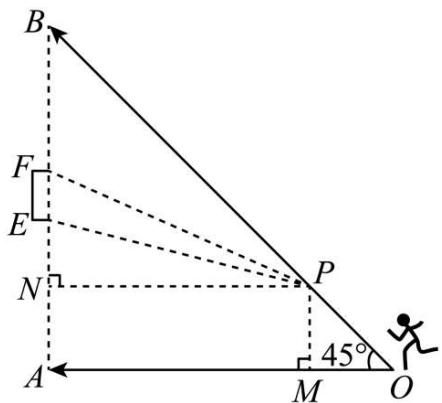

text_image

B
F
E
N
P
45°
A
M
O

1372 (2024·全国·高三专题练习)当太阳光线与水平面的倾斜角为 $60^{\circ}$ 时, 一根长为 $2m$ 的竹竿, 要使它的影子最长, 则竹竿与地面所成的角 $\alpha =$ \_\_\_\_.

【答案】 $30^{\circ}$

【解析】作出示意图如下如，

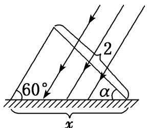

text_image

60°
α
2
x

设竹竿与地面所成的角为 $\alpha$ ，影子长为 x，依据正弦定理可得 $\frac{2}{\sin60^{\circ}} = \frac{x}{\sin(120^{\circ} - \alpha)}$ ，
所以 $x=\frac{4}{\sqrt{3}}\times\sin(120^{\circ}-\alpha)$ ，因为 $0^{\circ}<120^{\circ}-\alpha<120^{\circ}$ ，所以要使 x 最大，
只需 $\sin(120^{\circ}-\alpha)=1$ ，即 $120^{\circ}-\alpha=90^{\circ}$ ，所以 $\alpha=30^{\circ}$ 时，影子最长.

【答案】为: $30^{\circ}$ .

1373 (2024·全国·高三专题练习)游客从某旅游景区的景点A处至景点C处有两条线路．线路1是从A沿直线步行到C,线路2是先从A沿直线步行到景点B处,然后从B沿直线步行到C．现有甲、乙两位游客从A处同时出发匀速步行,甲的速度是乙的速度的 $\frac{11}{9}$ 倍,甲走线路2,乙走线路1,最后他们同时到达C处．经测量,AB=1040m,BC=500m,则 $\sin\angle BAC$ 等于\_\_\_\_.

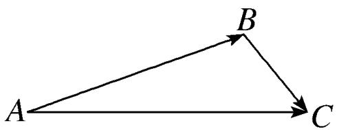

flowchart

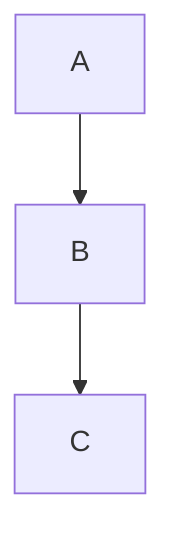

【答案】 $\frac{5}{13}$

【解析】依题意,设乙的速度为 $x \, m/s$ ,

则甲的速度为 $\frac{11}{9} x\mathrm{m / s}$

因为 AB = 1040 m, BC = 500 m,

所以 $\frac{AC}{x}=\frac{1040+500}{\frac{11}{9}x}$ ，解得 AC=1260 m.

在 $\triangle ABC$ 中,由余弦定理得,

$$
\cos \angle B A C = \frac {A B ^ {2} + A C ^ {2} - B C ^ {2}}{2 A B \cdot A C} = \frac {1 0 4 0 ^ {2} + 1 2 6 0 ^ {2} - 5 0 0 ^ {2}}{2 \times 1 0 4 0 \times 1 2 6 0} = \frac {1 2}{1 3},
$$

所以 $\sin \angle BAC = \sqrt{1 - \cos^2\angle BAC} = \sqrt{1 - \left(\frac{12}{13}\right)^2} = \frac{5}{13}.$

故答案为: $\frac{5}{13}$ .

1374 (2024·全国·高三专题练习)最大视角问题是1471年德国数学家米勒提出的几何极值问题,故最大视角问题一般称为“米勒问题”.如图,树顶A离地面a米,树上另一点B离地面b米,在离地面c(c<b)米的C处看此树,离此树的水平距离为\_\_\_\_米时看A,B的视角最大.

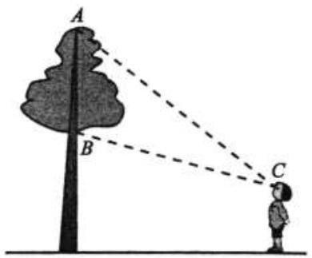

text_image

A
B
C

【答案】 $\sqrt{(a - c)(b - c)}$

【解析】过C作CD⊥AB,交AB于D,如图所示:

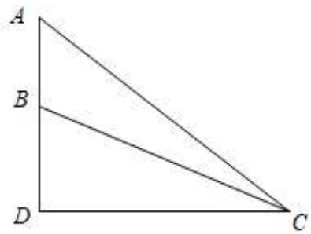

text_image

A
B
D
C

则 AB = a - b, AD = a - c,

设 $\angle BCD = \alpha, \angle ABC = \beta, CD = x,$

在 $\triangle \mathrm{BCD}$ 中， $\tan \alpha = \frac{\mathrm{BD}}{\mathrm{CD}} = \frac{b - c}{x}$ ，

在 $\triangle \mathrm{ACD}$ 中， $\tan (\alpha + \beta) = \frac{\mathrm{AD}}{\mathrm{CD}} = \frac{a - c}{x}$ ，

所以 $\tan\beta=\tan((\alpha+\beta)-\alpha)=\frac{\frac{a-c}{x}-\frac{b-c}{x}}{1+\frac{a-c}{x}\cdot\frac{b-c}{x}}=\frac{a-b}{x+\frac{(a-c)(b-c)}{x}}\leqslant$

$$
\frac {a - b}{2 \sqrt {x \cdot \frac {(a - c) (b - c)}{x}}} = \frac {a - b}{2 \sqrt {(a - c) (b - c)}},
$$

当且仅当 $x=\frac{(a-c)(b-c)}{x}$ ，即 $x=\sqrt{(a-c)(b-c)}$ 时取等号，

所以 $\tan\beta$ 取最大值时， $\angle ABC=\beta$ 最大，

所以当离此树的水平距离为 $\sqrt{(a-c)(b-c)}$ 米时看 A, B 的视角最大.

故答案为: $\sqrt{(a-c)(b-c)}$

【解题方法总结】

根据题意画出图形,将题设已知、未知显示在图形中,建立已知、未知关系,利用三角知识求解.

# 6 题型六:倍角关系

1375 (2024·全国·高三专题练习)记△ABC的内角A,B,C的对边分别为a,b,c,已知 $a\cos B=b(1+\cos A)$ .

(1) 证明: A = 2B;   
(2) 若 $c = 2b, a = \sqrt{3}$ , 求 $\triangle ABC$ 的面积.

【解析】(1) 证明: 由 $a \cos B = b (1 + \cos A)$ 及正弦定理得: $\sin A \cos B = \sin B (1 + \cos A)$ ,

整理得 $\sin(A-B)=\sin B$ .

因为 A, B ∈ (0, π),

所以 $A - B \in (-\pi, \pi)$ ,

所以 A-B=B 或 $(A-B)+B=\pi$ ,

所以 A=2B 或 A= $\pi$ (舍),

所以 A = 2B.

(2) 由 $a \cos B = b (1 + \cos A)$ 及余弦定理得: $\frac{a (a^2 + c^2 - b^2)}{2ac} = b \left(1 + \frac{b^2 + c^2 - a^2}{2bc}\right)$ ,

整理得 $a^{2}-b^{2}=bc$ ,

又因为 $c = 2b, a = \sqrt{3}$ , 可解得 $b = 1, c = 2$ ,

则 $a^{2}+b^{2}=c^{2}$ ，所以 $\triangle ABC$ 是直角三角形，

所以 $\triangle ABC$ 的面积为 $\frac{1}{2} ab = \frac{\sqrt{3}}{2}$ .

1376 (2024·全国·模拟预测)在 $\triangle ABC$ 中, 角 A, B, C 的对边分别为 $a, b, c (a, b, c$ 互不相等), 且满足 $b\cos C = (2b - c)\cos B$ .

(1) 求证: A = 2B;   
(2) 若 $c = \sqrt{2} a$ ，求 $\cos B$ .

【解析】(1) 证明: 因为 $b \cos C = (2b - c) \cos B$ ，由正弦定理，得 $\sin B \cos C = 2 \sin B \cos B - \sin C \cos B$ ，

所以 $\sin(B+C)=\sin2B$ ，所以 $\sin A=\sin2B$ .

又因为 $0 < A < \pi, 0 < 2B < 2\pi$ ，所以 A = 2B 或 $A + 2B = \pi$ .

若 $\mathrm{A} + 2\mathrm{B} = \pi$ ，又 $\mathrm{A} + \mathrm{B} + \mathrm{C} = \pi$ ，所以 $\mathrm{B} = \mathrm{C}$ ，与 $a, b, c$ 互不相等矛盾，

所以 A = 2B.

(2) 由 (1) 知 $C = \pi - (A + B) = \pi - 3B$ , 所以 $0 < B < \frac{\pi}{3}$ .

因为 $c=\sqrt{2}a$ ，所以 $\sin C=\sqrt{2}\sin A$ ，则 $\sin(\pi-3B)=\sqrt{2}\sin2B$ ，

可得 $\sin3B=\sqrt{2}\sin2B.$

又因为 $\sin3B=\sin(2B+B)=\sin2B\cos B+\cos2B\sin B$

$$
= 2 \sin B \cos^ {2} B + 2 \sin B \cos^ {2} B - \sin B = 3 \sin B - 4 \sin^ {3} B
$$

所以 $3\sin B - 4\sin^{3}B = 2\sqrt{2}\sin B\cos B.$

因为 $0 < \mathrm{B} < \frac{\pi}{3}$ , 所以 $\sin B > 0$ , 所以 $3 - 4\sin^2 B = 2\sqrt{2}\cos B$ ,

所以 $4\cos^{2}B - 2\sqrt{2}\cos B - 1 = 0$ ,

解得 $\cos B = \frac{\sqrt{2} \pm \sqrt{6}}{4}$ ,

又 $0 < \mathrm{B} < \frac{\pi}{3}$ , 得 $\cos B = \frac{\sqrt{2} + \sqrt{6}}{4}$ .

1377 (2024·江苏·高三江苏省前黄高级中学校联考阶段练习)在 $\triangle ABC$ 中, 角 A、B、C 的对边分别为 $a 、 b 、 c$ , 若 $A = 2B$ .

(1) 求证: $a^{2}-b^{2}=bc$ ;   
(2) 若 $\cos B = \frac{2}{3}$ ，点 D 为边 AB 上一点， $AD = \frac{3}{4}DB, CD = 2\sqrt{6}$ ，求边长 b.

【解析】(1)∵A=2B,∴sinA=sin2B=2sinBcosB

$$
\therefore a = 2 b \times \frac {a ^ {2} + c ^ {2} - b ^ {2}}{2 a c}, \therefore (b - c) (a ^ {2} - b ^ {2} - b c) = 0
$$

$$
\therefore a ^ {2} - b ^ {2} - b c = 0 \text {或} b = c
$$

当 $b = c$ 时， $\mathrm{C} = \mathrm{B},\mathrm{A} = 2\mathrm{B} = 2\mathrm{C} = \frac{\pi}{2},\therefore a^2 = b^2 +c^2 = b^2 +bc$ 即 $a^2 -b^2 = bc$

综上 $a^2 - b^2 = bc$

(2) $\because \cos B = \frac{2}{3}, \therefore \sin B = \frac{\sqrt{5}}{3}, \sin A = \sin 2B = \frac{4\sqrt{5}}{9}, \cos A = \cos 2B = -\frac{1}{9}$

$$
\therefore \sin C = \sin (A + B) = \frac {7 \sqrt {5}}{2 7}, \cos C = \frac {2 2}{2 7}
$$

$$
\frac {a}{\sin A} = \frac {b}{\sin B} = \frac {c}{\sin C}, \frac {a}{3 6} = \frac {b}{2 7} = \frac {c}{2 1}
$$

设 $a = 36t, b = 27t, c = 21t, \therefore \mathrm{AD} = 9t, \mathrm{DB} = 12t$

在 $\triangle \mathrm{BCD}$ 中： $(36t)^2 +(12t)^2 -2\times 36t\times 12t\times \frac{2}{3} = (2\sqrt{6})^2$

$$
t = \frac {1}{6}, b = \frac {9}{2}
$$

1378 (2024·陕西咸阳·武功县普集高级中学校考模拟预测)已知 a, b, c 分别是 $\triangle ABC$ 的角 A, B, C 的对边, $b\sin B - a\sin A = \sin C(2b\cos 2B - c)$ .

(1) 求证: A = 2B;   
(2) 求 $\frac{c}{a}$ 的取值范围.

【解析】(1)由正弦定理及知，

$$
\because b \sin B - a \sin A = \sin C (2 b \cos 2 B - c)
$$

$$
\therefore b ^ {2} + c ^ {2} - a ^ {2} = 2 b c \cos 2 B,
$$

由余弦定理得, $b^{2}+c^{2}-a^{2}=2bc\cos A$ ,

$$
\therefore 2 b c \cos A = 2 b c \cos 2 B, \therefore \cos A = \cos 2 B
$$

$$
\because \mathrm{A}, \mathrm{B} \in (0, \pi), \therefore 2 \mathrm{B} \in (0, 2 \pi)
$$

$$
\therefore \mathrm{A} = 2 \mathrm{B} \text {或} \mathrm{A} + 2 \mathrm{B} = 2 \pi .
$$

$$
\because \mathrm{B} <   \mathrm{A} + \mathrm{B} <   \pi , \mathrm{A} + 2 \mathrm{B} <   2 \pi , \therefore \mathrm{A} = 2 \mathrm{B}.
$$

(2)由(1)和正弦定理得, $\frac{c}{a} = \frac{\sin C}{\sin A} = \frac{\sin(A + B)}{\sin A} = \frac{\sin 3B}{\sin 2B} = \frac{\sin 2B\cos B + \cos 2B\sin B}{2\sin B\cos B}$

$$
= \frac {2 \sin B \cos^ {2} B + (2 \cos^ {2} B - 1) \sin B}{2 \sin B \cos B} = \frac {4 \cos^ {2} B - 1}{2 \cos B} = 2 \cos B - \frac {1}{2 \cos B},
$$

$$
\because \mathrm{C} = \pi - 3 \mathrm{B} \in (0, \pi), \therefore \mathrm{B} \in \left(0, \frac {\pi}{3}\right), \therefore \cos \mathrm{B} \in \left(\frac {1}{2}, 1\right),
$$

设 $\cos B = t$ ，则 $t\in \left(\frac{1}{2},1\right)$ ，则 $\frac{c}{a} = 2t - \frac{1}{2t}\Big(\frac{1}{2} < t < 1\Big),$

设 $f(t)=2t-\frac{1}{2t},t\in\left(\frac{1}{2},1\right)$ ,

则 $f(t)$ 在 $\left(\frac{1}{2}, 1\right)$ 上单调递增，则 $f\left(\frac{1}{2}\right) < f(t) < f(1)$ ，

即 $0 < \frac{c}{a} < \frac{3}{2}$ .

$\therefore \frac{c}{a}$ 的取值范围为 $\left(0, \frac{3}{2}\right)$ .

1379 (2024·四川·成都市锦江区嘉祥外国语高级中学校考三模)已知 a, b, c 分别为锐角 $\triangle ABC$ 内角 A, B, C 的对边， $b - 2a\cos C = a$ .

(1) 证明: C = 2A;   
(2) 求 $\frac{\sin A}{\cos C}$ 的取值范围.

【解析】(1) $\because b - 2a\cos C = a.$

$$
\therefore \sin B = \sin A + 2 \sin A \cos C = \sin A \cos C + \cos A \sin C,
$$

$$
\therefore \sin A = \cos A \sin C - \sin A \cos C = \sin (C - A),
$$

因为 A, C 为锐角三角形内角, 所以 $0 < A < \frac{\pi}{2}$ , $0 < C < \frac{\pi}{2}$ ,

所以 $-\frac{\pi}{2}<C-A<\frac{\pi}{2}$ ,

所以 A=C-A, 即 C=2A;

(2) 由题意得 $\left\{\begin{aligned}0<A<\frac{\pi}{2}\\ 0<2A<\frac{\pi}{2}\\ 0<\pi-3A<\frac{\pi}{2}\end{aligned}\right.$ ，解得 $\frac{\pi}{6}<A<\frac{\pi}{4}$ ,

所以 $\frac{1}{2}<\sin A<\frac{\sqrt{2}}{2}$ ,

由正弦定理得 $\frac{\sin A}{\cos C} = \frac{\sin A}{\cos 2A} = \frac{\sin A}{1 - 2\sin^2 A} = \frac{1}{\frac{1}{\sin A} - 2\sin A},$

因为函数 $y=\frac{1}{x}-2x$ 在 $\left(\frac{1}{2},\frac{\sqrt{2}}{2}\right)$ 上单调递减，

所以当 $\frac{1}{2} < x < \frac{\sqrt{2}}{2}$ 时， $0 < \frac{1}{x} - 2x < 1$

所以当 $\frac{1}{2}<\sin A<\frac{\sqrt{2}}{2}$ 时， $0<\frac{1}{\sin A}-2\sin A<1$

所以 $\frac{\sin A}{\cos C}=\frac{1}{\frac{1}{\sin A}-2\sin A}>1,$

∴ $\frac{\sin A}{\cos C}$ 的取值范围为 $(1, +\infty)$ .

1380 (2024·福建三明·高三统考期末)非等腰 $\triangle ABC$ 的内角 A、B、C 的对应边分别为 a、b、c，且 $\frac{a-\cos B}{a-\cos C}=\frac{\sin B}{\sin C}$ .

(1) 证明: $a^2 = b + c$ ;   
(2) 若 B=2C, 证明: $b>\frac{2}{3}$ .

【解析】(1)由正弦定理 $\frac{a-\cos B}{a-\cos C}=\frac{\sin B}{\sin C}=\frac{b}{c}$ ，得 $ac-c\cos B=ab-b\cos C$ ，

$$
a (c - b) = c \frac {a ^ {2} + c ^ {2} - b ^ {2}}{2 a c} - b \frac {a ^ {2} + b ^ {2} - c ^ {2}}{2 a b} = \frac {c ^ {2} - b ^ {2}}{a}, \text {由} b \neq c,
$$

则 $a^2 = b + c$

(2) 由 B = 2C，则 C 为锐角， $\sin B = \sin 2C = 2\sin C\cos C$

则 $b=2c\cos C=2c\frac{a^{2}+b^{2}-c^{2}}{2ab}$ ，去分母得 $ab^{2}-a^{2}c-b^{2}c+c^{3}=0$ ，

则 $(a-c)(b^{2}-ac-c^{2})=0$ ，由 $a\neq c$ 则 $b^{2}-ac-c^{2}=0$ .

由(1)有 $a^{2}=b+c>a$ ，得a>1。

解方程组 $\left\{\begin{aligned}a^{2}&=b+c\\ b^{2}&-ac-c^{2}=0\end{aligned}\right.$ ，消元 $(a^{2}-c)^{2}-ac-c^{2}=0$ ，

则 $c=\frac{a^{3}}{2a+1}$ ，可得 $b=\frac{a^{3}+a^{2}}{2a+1}$ ，

要证 $b>\frac{2}{3}$ ，即证 $b=\frac{a^{3}+a^{2}}{2a+1}>\frac{2}{3}$

只需证 $3a^{3}+3a^{2}-4a-2>0$ ,

即证 $(3a^{3}-3)+(3a^{2}-4a+1)>0,$

即证 $(a - 1)(3a^{2} + 6a + 2) > 0$ ，由 $a > 1$ ，此不等式成立，得证

另令 $f(a)=\frac{a^{3}+a^{2}}{2a+1},a>1$ ，又 $f(1)=\frac{2}{3}$

求导得 $f'(a)=\frac{4a^{3}+5a^{2}+2a}{(2a+1)^{2}}>0$ ，则 $f(a)$ 在 $(1,+\infty)$ 递增，

则 $f(a) > f(1) = \frac{2}{3}$ ，得证.

# 题型七:三角形解的个数

1381 (2024·贵州·统考模拟预测)△ABC中,角A,B,C的对边分别是a,b,c, $A=60^{\circ}$ , $a=\sqrt{3}$ .
若这个三角形有两解，则b的取值范围是()

A. $\sqrt{3} < b \leqslant 2$

B. $\sqrt{3} < b < 2$

C. $1 < b < 2\sqrt{3}$

D. $1 < b \leqslant 2$

【答案】B

【解析】由正弦定理 $\frac{a}{\sin A} = \frac{b}{\sin B}$ 可得, $b = \frac{a \sin B}{\sin A} = \frac{\sqrt{3} \sin B}{\frac{\sqrt{3}}{2}} = 2 \sin B.$

要使 $\triangle ABC$ 有两解,即B有两解,则应有A<B,且 $\sin B<1$ ,

所以 $\frac{\sqrt{3}}{2} = \sin A < \sin B < 1$

所以 $\sqrt{3}<b<2.$

故选：B.

1382 (2024·全国·高三专题练习)在 $\triangle ABC$ 中，a=18, b=24, $\angle A=45^{\circ}$ ，此三角形解的情况为

A. 一个解

B. 二个解

C. 无解

D. 无法确定

【答案】B

【解析】因为 $b\sin45^{\circ}=24\times\frac{\sqrt{2}}{2}=12\sqrt{2}$ ，如图所示：

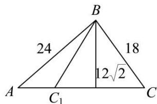

text_image

B
24
18
12√2
A
C₁
C

所以 $12\sqrt{2}<18<24$ ，即 $12\sqrt{2}<a<c$ ，所以三角形解的情况为二个解.

故选：B

1383 (2024·河南南阳·高三统考期中)在 $\triangle ABC$ 中， $C = 30^{\circ}$ ， $b = \sqrt{2}$ ，c = x。若满足条件的 $\triangle ABC$ 有且只有一个，则 x 的可能取值是（）

A. $\frac{1}{2}$

B. $\frac{\sqrt{3}}{2}$

C. 1

D. $\sqrt{3}$

【答案】D

【解析】由正弦定理 $\frac{b}{\sin B} = \frac{c}{\sin C}$ ，即 $\frac{\sqrt{2}}{\sin B} = \frac{x}{\sin 30^{\circ}}$ ，所以 $\sin B = \frac{\sqrt{2}}{2x}$ ，

因为 $\triangle ABC$ 只有一解，

若 $B > 30^{\circ}$ ，则 $B = 90^{\circ}$ ，

若 $0 < B \leqslant 30^{\circ}$ 显然满足题意，

所以 $0 < \sin B \leqslant \frac{1}{2}$ 或 $\sin B = 1$ ，所以 $0 < \frac{\sqrt{2}}{2x} \leqslant \frac{1}{2}$ 或 $\frac{\sqrt{2}}{2x} = 1$ ，

解得 $x \geqslant \sqrt{2}$ 或 $x = \frac{\sqrt{2}}{2}$ ;

故选：D

1384 (2024·全国·高三专题练习)在 $\triangle ABC$ 中, 内角 A,B,C 所对的边分别为 a,b,c, 则下列条件能确定三角形有两解的是 ()

A. $a = 5,b = 4,\mathrm{A} = \frac{\pi}{6}$ C. $a = 5,b = 4,\mathrm{A} = \frac{5\pi}{6}$

B. $a = 4,b = 5,\mathrm{A} = \frac{\pi}{4}$ D. $a = 4,b = 5,\mathrm{A} = \frac{\pi}{3}$

【答案】B

【解析】对于 A: 由正弦定理可知, $\frac{a}{\sin A} = \frac{b}{\sin B} \Rightarrow \sin B = \frac{2}{5}$

$\because a>b,\therefore B<A=\frac{\pi}{6}$ ，故三角形 $\triangle ABC$ 有一解；

对于 B: 由正弦定理可知, $\frac{a}{\sin A} = \frac{b}{\sin B} \Rightarrow \sin B = \frac{5\sqrt{2}}{8}$ ,

$\because b > a, \therefore B > A = \frac{\pi}{4}$ ，故三角形 $\triangle ABC$ 有两解；

对于 C: 由正弦定理可知, $\frac{a}{\sin A} = \frac{b}{\sin B} \Rightarrow \sin B = \frac{2}{5}$

∵ A 为钝角，∴ B 一定为锐角，故三角形 $\triangle ABC$ 有一解；

对于 D: 由正弦定理可知, $\frac{a}{\sin A} = \frac{b}{\sin B} \Rightarrow \sin B = \frac{5\sqrt{3}}{8} > 1$ , 故故三角形 $\triangle ABC$ 无解.
故选: B.

1385 (2024·北京朝阳·高三专题练习)在下列关于 $\triangle ABC$ 的四个条件中选择一个,能够使角 A 被唯一确定的是: ()

① $\sin A = \frac{1}{2}$   
② $\cos A = -\frac{1}{3};$   
③ $\cos B = -\frac{1}{4}, b = 3a;$   
④ $\angle C=45^{\circ}, b=2, c=\sqrt{3}.$

A. ①②

B. ②③

C. ②④

D. ②③④

【答案】B

【解析】对于① $\sin A = \frac{1}{2}$ , 因为 $A \in (0, \pi)$ , 所以 $A = \frac{\pi}{6}$ 或 $\frac{5\pi}{6}$ , 故①错误; 对于② $\cos A = -\frac{1}{3}$ , 因为 $y = \cos x$ 在 $(0, \pi)$ 上单调, 所以角 $A$ 被唯一确定, 故②正确;

对于③ $\cos B = -\frac{1}{4}, b = 3a$ ，因为 $\cos B = -\frac{1}{4} < 0, B \in (0, \pi)$ ，所以 $B \in \left(\frac{\pi}{2}, \pi\right)$ ，所以 $A \in \left(0, \frac{\pi}{2}\right)$ ，所以 $\sin B = \sqrt{1 - \cos^{2}B} = \frac{\sqrt{15}}{4}$ ，又 b = 3a，由正弦定理有 $\sin B = 3\sin A$ ，所以 $\sin A = \frac{\sin B}{3} = \frac{\sqrt{15}}{12}$ ，所以角 A 被唯一确定，故③正确；

对于④ $\angle C = 45^{\circ}, b = 2, c = \sqrt{3}$ , 因为 $b\sin C = 2 \times \sin \frac{\pi}{4} = \sqrt{2}$ ,

所以 $b\sin C < c < b$ ，所以如图， $\triangle ABC$ 不唯一，故④错误。故 A, C, D 错误。

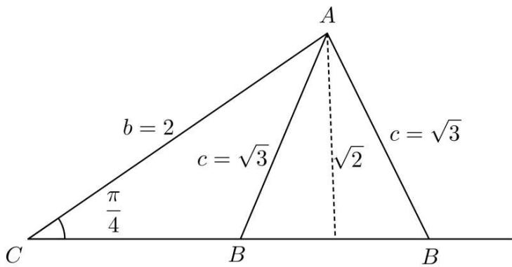

text_image

A
b = 2
c = \u221a3
\u03c0 = \u221a3
\u03c0 = \u221a3
C
B
B
B
\u03c0 = \u221a3

故选: B.

1386 (2024·全国·高三专题练习)设在 $\triangle ABC$ 中, 角 A、B、C 所对的边分别为 a, b, c, 若满足 $a = \sqrt{3}$ , $b = m$ , $B = \frac{\pi}{6}$ 的 $\triangle ABC$ 不唯一, 则 m 的取值范围为 ()

A. $\left(\frac{\sqrt{3}}{2},\sqrt{3}\right)$

B. $(0,\sqrt{3})$

C. $\left(\frac{1}{2},\frac{\sqrt{3}}{2}\right)$

D. $\left(\frac{1}{2},1\right)$

【答案】A

【解析】由正弦定理 $\frac{a}{\sin A} = \frac{b}{\sin B}$ ，即 $\frac{\sqrt{3}}{\sin A} = \frac{m}{\frac{1}{2}}$ ，所以 $m = \frac{\sqrt{3}}{2\sin A}$ ，

因为 $\triangle ABC$ 不唯一，即 $\triangle ABC$ 有两解，所以 $\frac{\pi}{6} < A < \frac{5\pi}{6}$ 且 $A \neq \frac{\pi}{2}$ ，即 $\frac{1}{2} < \sin A < 1$ 所以 $1 < 2\sin A < 2$ ，所以 $\frac{1}{2} < \frac{1}{2\sin A} < 1$ ，即 $\frac{\sqrt{3}}{2} < m < \sqrt{3}$ ；

故选：A

1387 (2024·全国·高三专题练习)在 $\triangle ABC$ 中， $a=2, B=\frac{\pi}{6}$ ，若该三角形有两个解，则 b 边范围是 ()

A. $(2,4)$

B. $(\sqrt{3},4)$

C. $(\sqrt{3},2)$

D. $(1,2)$

【答案】D

【解析】因为三角形有两个解,所以 $a \cdot \sin B < b < a$ ,

所以 $2 \times \sin \frac{\pi}{6} < b < 2$ ，所以 1 < b < 2。

故选：D

1388 (2024·全国·高三专题练习)若满足 $\angle ABC = \frac{\pi}{4}$ , AC = 6, BC = k 的 $\triangle ABC$ 恰有一个, 则实数 k 的取值范围是 ()

A. $(0,6]$

B. $(0,6] \cup \{6\sqrt{2}\}$

C. $\{6,6\sqrt{2}\}$

D. $(6,6\sqrt{2})$

【答案】B

【解析】由正弦定理可得 $\frac{a}{\sin A} = \frac{b}{\sin B}$ ,

故 $\sin A = \frac{a\sin B}{b} = \frac{\frac{\sqrt{2}}{2}k}{6} = \frac{\sqrt{2}k}{12},$

由 $\mathrm{A}\in \left(0,\frac{3\pi}{4}\right)$ 且 $\triangle ABC$ 恰有一个，

故 $0 < \sin A \leqslant \frac{\sqrt{2}}{2}$ 或 $\sin A = 1$

所以 $0 < k \leqslant 6$ 或 $k = 6\sqrt{2}$ , 即 $k \in (0,6] \cup \{6\sqrt{2}\}$ .

故选：B

【解题方法总结】

三角形解的个数的判断: 已知两角和一边, 该三角形是确定的, 其解是唯一的; 已知两边和一边的对角, 该三角形具有不唯一性, 通常根据三角函数值的有界性和大边对大角定理进行判断.

# 8 题型八:三角形中的面积与周长问题

1389 (2024·全国·高三对口高考)在 $\triangle ABC$ 中, 若 $\overrightarrow{AB} \cdot \overrightarrow{BC} = -2$ , 且 $\angle B = 60^{\circ}$ , 则 $\triangle ABC$ 的面积为 ()

A. $2 \sqrt{3}$

B. $\sqrt{3}$

C. $\frac{\sqrt{3}}{2}$

D. $\sqrt{6}$

【答案】B

【解析】因为 $\overrightarrow{AB} \cdot \overrightarrow{BC} = -2$ 且 $\angle B = 60^{\circ}$ ，所以 $a \cdot c \cdot \cos(180^{\circ} - 60^{\circ}) = ac \cos 120^{\circ} = -2$ ，
所以 ac = 4，所以 $\triangle ABC$ 的面积 $S = \frac{1}{2} a c \sin B = \frac{1}{2} \times 4 \times \frac{\sqrt{3}}{2} = \sqrt{3}$ .

故选: B

1390 (2024·河南·襄城高中校联考三模)在 $\triangle ABC$ 中, 内角 A, B, C 所对的边分别为 a, b, c, $\angle BAC = \frac{\pi}{3}$ , D 为 BC 上一点, BD = 2DC, AD = BD = $\frac{\sqrt{3}}{2}$ , 则 $\triangle ABC$ 的面积为 ( )

A. $\frac{3\sqrt{3}}{32}$

B. $\frac{9\sqrt{3}}{8}$

C. $\frac{9\sqrt{3}}{16}$

D. $\frac{9\sqrt{3}}{32}$

【答案】D

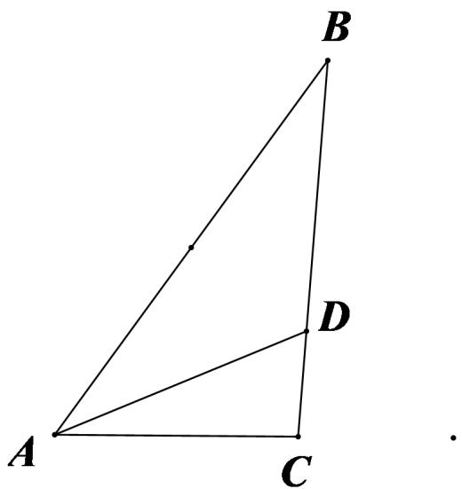

text_image

B
D
A
C

【解析】

如图所示,在 $\triangle ABC$ 中,由BD=2CD,得 $\overrightarrow{AD}=\frac{1}{3}\overrightarrow{AB}+\frac{2}{3}\overrightarrow{AC}.$

又 AD = BD, 即 $\left|\overrightarrow{AD}\right| = \left|\overrightarrow{BD}\right| = \frac{2}{3}a$ ,

所以 $\overrightarrow{AD}^{2}=\left(\frac{1}{3}\overrightarrow{AB}+\frac{2}{3}\overrightarrow{AC}\right)^{2}\Rightarrow\frac{4}{9}a^{2}=\frac{1}{9}c^{2}+\frac{4}{9}b^{2}+\frac{2}{9}bc,$ 化简得 $4a^{2} = c^{2} + 4b^{2} + 2bc.$ ①

在 $\triangle ABC$ 中, 由余弦定理得, $b^{2} + c^{2} - bc = a^{2}$ , ②

由①②式,解得 c=2b. 由 BD= $\frac{\sqrt{3}}{2}$ , 得 $a=\frac{3\sqrt{3}}{4}$ ,

将其代入②式, 得 $\left(\frac{3\sqrt{3}}{4}\right)^{2}=b^{2}+c^{2}-bc=3b^{2}$ , 解得 $b^{2}=\frac{9}{16}$ ,

故 $\triangle ABC$ 的面积 $S = \frac{1}{2} bc\cdot \sin \angle BAC = \frac{\sqrt{3}}{2} b^2 = \frac{\sqrt{3}}{2}\times \frac{9}{16} = \frac{9\sqrt{3}}{32}.$

故选：D

1391 (2024·四川成都·校考模拟预测)在 $\triangle ABC$ 中， $a,b,c$ 分别为角A，B，C的对边，已知

$\frac{\cos B}{\cos C} = \frac{b}{2a - c}, S_{\triangle ABC} = \frac{3\sqrt{3}}{4}$ , 且 $b = \sqrt{3}$ , 则 ( )

A. $\sin C = \frac{1}{2}$

B. $\cos B = \frac{\sqrt{3}}{2}$

C. $a + c = 2\sqrt{3}$

D. $a + c = 3\sqrt{2}$

【答案】C

【解析】∵ $\frac{\cos B}{\cos C}=\frac{b}{2a-c}$ ,

由正弦定理可得 $\frac{\cos B}{\cos C} = \frac{\sin B}{2\sin A - \sin C}$ ,

整理可得 $\sin B\cos C = 2\sin A\cos B - \sin C\cos B$ ,

所以 $\sin B\cos C + \sin C\cos B = \sin(B + C) = \sin A = 2\sin A\cos B,$

∵ A 为三角形内角, $\sin A \neq 0$ ,

$\therefore \cos B = \frac{1}{2}, \because B \in (0, \pi), \therefore B = \frac{\pi}{3}$ , 则 $\sin B = \frac{\sqrt{3}}{2}$ , 故 $B$ 错误;

$$
\because \mathrm{S} _ {\triangle \mathrm{ABC}} = \frac {3 \sqrt {3}}{4}, b = \sqrt {3},
$$

$\therefore \frac{3\sqrt{3}}{4} = \frac{1}{2} ac\sin B = \frac{1}{2}\times a\times c\times \frac{\sqrt{3}}{2} = \frac{\sqrt{3}}{4} ac$ ，解得 $ac = 3$

由余弦定理 $b^{2}=a^{2}+c^{2}-2ac\cos B$ 得 $3=a^{2}+c^{2}-ac=(a+c)^{2}-3ac=(a+c)^{2}-9$ ，解得 $a+c=2\sqrt{3}$ 或 $a+c=-2\sqrt{3}$ （舍去），故C正确，D错误.

又 $3 = a^{2} + c^{2} - ac = (a - c)^{2} + ac = (a - c)^{2} + 3$ ，所以 a = c，则三角形 $\triangle ABC$ 为等边三角形，

所以 $C=\frac{\pi}{3}$ ，则 $\sin C=\frac{\sqrt{3}}{2}$ ，故 A 错误.

故选：C.

1392 (2024·河北石家庄·统考三模)已知 $\triangle ABC$ 中, 角 A, B, C 的对边长分别是 $a, b, c$ , $\sin A = 4\sin C\cos B$ , 且 $c = 2$ .

(1) 证明: $\tan B = 3 \tan C$ ;   
(2) 若 $b=2\sqrt{3}$ ，求 $\triangle ABC$ 外接圆的面积

【解析】(1) 由已知, $\sin A = 4 \sin C \cos B$ ,

$$
\therefore \sin [ \pi - (B + C) ] = 4 \sin C \cos B,
$$

$$
\therefore \sin (B + C) = 4 \sin C \cos B,
$$

$$
\therefore \sin B \cos C + \cos B \sin C = 4 \sin C \cos B,
$$

$$
\therefore \sin B \cos C = 3 \sin C \cos B,
$$

易知上式中， $\cos B \neq 0, \cos C \neq 0,$

∴由上式得 $\frac{\sin B}{\cos B} = \frac{3\sin C}{\cos C}$ ，即 $\tan B = 3\tan C$ .

(2) $\because \sin A = 4\sin C\cos B,$

∴由正弦定理和余弦定理得， $a=4c\cdot\frac{a^{2}+c^{2}-b^{2}}{2ac}$

化简得 $a^2 = 2b^2 - 2c^2 = 2 \times (2\sqrt{3})^2 - 2 \times 2^2 = 16, \therefore a = 4.$

又∵ $b=2\sqrt{3}$ ，c=2，

$\therefore a^{2}=b^{2}+c^{2},\triangle ABC$ 是以a为斜边，A为直角的直角三角形，

∴△ABC外接圆的直径2R=a=4,外接圆的半径R=2,

∴△ABC外接圆的面积 $S=\pi R^{2}=4\pi$ .

1393 (2024·全国·高三专题练习)已知△ABC的内角A，B，C的对边分别为a，b，c，且

$$
a (1 - \cos C) = c \cos A.
$$

(1) 证明: $\triangle ABC$ 是等腰三角形;  
(2) 若 $\triangle ABC$ 的面积为 $\frac{2\sqrt{2}}{3}$ ，且 $\cos C = \frac{1}{3}$ ，求 $\triangle ABC$ 的周长.

【解析】(1) 在 $\triangle ABC$ 中， $a(1-\cos C)=c\cos A\Leftrightarrow a=a\cos C+c\cos A$

由射影定理 $b = a \cos C + c \cos A$ 得, a = b,

所以 $\triangle ABC$ 是等腰三角形.

(2) 在 $\triangle ABC$ 中, 因 $\cos C = \frac{1}{3}$ 且 $C \in (0, \pi)$ , 则 $\sin C = \frac{2\sqrt{2}}{3}$ ,

又 $\mathrm{S}_{\triangle \mathrm{ABC}} = \frac{1}{2} ab\sin C = \frac{2\sqrt{2}}{3}$ 即 $ab = 2$ ，由(1)知 $a = b$ ，则有 $a = b = \sqrt{2}$

在 $\triangle ABC$ 中, 由余弦定理得: $c^{2}=a^{2}+b^{2}-2ab\cos C=2+2-2\times\sqrt{2}\times\sqrt{2}\times\frac{1}{3}=\frac{8}{3}$ , 解得 $c=\frac{2\sqrt{6}}{3}$ ,

又 $a = b = \sqrt{2}$ ，则 $a, b, c$ 能构成三角形，符合题意， $a + b + c = 2\sqrt{2} + \frac{2\sqrt{6}}{3}$ ，

所以 $\triangle ABC$ 的周长为 $2\sqrt{2} + \frac{2\sqrt{6}}{3}$ .

1394 (2024·全国·高三专题练习)在① $2a\cos A=c\cos B+b\cos C$ ;② $a\sin B=b\sin\left(A+\frac{\pi}{3}\right)$ .

这两个条件中任选一个,补充在下面问题中,并解答.

已知 $\triangle ABC$ 的内角 A, B, C 的对边分别为 $a, b, c$ . 若 $\triangle ABC$ 的面积 $S = \frac{3 + \sqrt{3}}{2}, c = 2$ , 求 $a$ .

注:如果选择多个条件分别解答,按第一个解答计分.

【解析】选①：

在 $\triangle ABC$ 中, 由射影定理 $a = b\cos C + c\cos B$ 及 $2a\cos A = c\cos B + b\cos C$ 得: $2a\cos A = a$ , 解得 $\cos A = \frac{1}{2}$ ,

因 $0 < A < \pi$ ，则 $A = \frac{\pi}{3}$ ，由 $S = \frac{1}{2} bc\sin A$ 得： $\frac{1}{2} b \cdot 2\sin 60^\circ = \frac{3 + \sqrt{3}}{2}$ ，解得 $b = \sqrt{3} + 1$

由余弦定理 $a^{2}=b^{2}+c^{2}-2bc\cos A$ 得: $a^{2}=(\sqrt{3}+1)^{2}+2^{2}-2\times(\sqrt{3}+1)\times2\times\frac{1}{2}=6$ , 解得 $a=\sqrt{6}$ ,

所以 $a = \sqrt{6}$

选②:

在 $\triangle ABC$ 中, 由正弦定理 $\frac{a}{\sin A} = \frac{b}{\sin B}$ 及 $a \sin B = b \sin \left( A + \frac{\pi}{3} \right)$ 得: $\sin A \sin B =$

$$
\sin B \sin \left(A + \frac {\pi}{3}\right),
$$

因 $0 < \mathrm{B} < \pi$ ，即 $\sin B > 0$ ，则有 $\sin A = \sin \left(A + \frac{\pi}{3}\right)$ ，而 $0 < A < \pi$ ， $\frac{\pi}{3} < A + \frac{\pi}{3} < \frac{4\pi}{3}$ 于是得 $A + \left(A + \frac{\pi}{3}\right) = \pi$ ，则 $A = \frac{\pi}{3}$ ，由 $S = \frac{1}{2} bc\sin A$ 得： $\frac{1}{2} b\cdot 2\sin 60^{\circ} = \frac{3 + \sqrt{3}}{2}$ 解得 $b = \sqrt{3} +1,$

由余弦定理 $a^{2}=b^{2}+c^{2}-2bc\cos A$ 得: $a^{2}=(\sqrt{3}+1)^{2}+2^{2}-2\times(\sqrt{3}+1)\times2\times\frac{1}{2}=6$ , 解得 $a=\sqrt{6}$ ,

所以 $a=\sqrt{6}$ .

1395 (2024·湖南长沙·周南中学校考二模)已知向量 $\vec{a} = (\sin x, 1 + \cos 2x)$ , $\vec{b} = (\cos x, \frac{1}{2})$ ,

$$
f (x) = \vec {a} \cdot \vec {b} - \frac {1}{2}.
$$

(1) 求函数 $y = f(x)$ 的最大值及相应 x 的值；  
(2) 在 $\triangle ABC$ 中, 角 A 为锐角且 $A + B = \frac{7\pi}{12}$ , $f(A) = \frac{1}{2}$ , BC = 2, 求 $\triangle ABC$ 的面积.

【解析】(1)依题意, $f(x)=\cos x\sin x+\frac{\cos2x+1}{2}-\frac{1}{2}$ ,

即 $f(x)=\frac{1}{2}(\sin2x+\cos2x)$ ,

所以 $f(x)=\frac{\sqrt{2}}{2}\sin\left(2x+\frac{\pi}{4}\right)$ ，当 $2x+\frac{\pi}{4}=\frac{\pi}{2}+2k\pi, k\in Z$ ,

即 $x=\frac{\pi}{8}+k\pi, k\in Z$ 时， $y=f(x)$ 取最大值 $\frac{\sqrt{2}}{2}$ ;

(2) 由 (1) 及 $f(A) = 1$ 得: $\frac{\sqrt{2}}{2} \sin \left(2A + \frac{\pi}{4}\right) = \frac{1}{2}$ ,

即 $\sin \left(2\mathrm{A} + \frac{\pi}{4}\right) = \frac{\sqrt{2}}{2},$

由 $0 < A < \frac{\pi}{2}$ ，则 $\frac{\pi}{4} < 2A + \frac{\pi}{4} < \frac{5\pi}{4}$ ，

因此， $2A+\frac{\pi}{4}=\frac{3\pi}{4}$ ，则 $A=\frac{\pi}{4}$ ，

而 $A + B = \frac{7\pi}{12}$ ，有 $B = \frac{\pi}{3}$ ，所以 $C = \pi - (A + B) = \frac{5\pi}{12}$ ，

在 $\triangle ABC$ 中,由正弦定理 $\frac{BC}{\sin A}=\frac{AC}{\sin B}$ 得,

$$
\mathrm{AC} = \frac {\mathrm{BCsinB}}{\sin \mathrm{A}} = \frac {2 \sin \frac {\pi}{3}}{\sin \frac {\pi}{4}} = \sqrt {6},
$$

$$
\sin C = \sin \frac {5 \pi}{1 2} = \sin \left(\frac {\pi}{4} + \frac {\pi}{6}\right) = \frac {\sqrt {6} + \sqrt {2}}{4},
$$

所以 $\triangle ABC$ 的面积为 $S=\frac{1}{2}AC\cdot BC\cdot\sin C=\frac{1}{2}\times2\sqrt{6}\times\frac{\sqrt{6}+\sqrt{2}}{4}=\frac{3+\sqrt{3}}{2}$ .

1396 (2024·海南海口·海南华侨中学校考模拟预测)已知 $\triangle ABC$ 的内角A，B，C的对边分别为 $a, b, c, a = 6, b\sin 2A = 4\sqrt{5}\sin B.$

(1) 若 $b = 1$ , 证明: $\mathrm{C} = \mathrm{A} + \frac{\pi}{2}$ ;   
(2) 若 BC 边上的高为 $\frac{8\sqrt{5}}{3}$ ，求 $\triangle ABC$ 的周长.

【解析】(1)由已知可得 $\frac{b}{\sin B} = \frac{4\sqrt{5}}{\sin 2A} = \frac{2\sqrt{5}}{\sin A \cos A}$ ,

由正弦定理 $\frac{a}{\sin A} = \frac{b}{\sin B}$ 可得， $\frac{b}{\sin B} = \frac{a}{\sin A} = \frac{6}{\sin A}$

所以有 $\frac{2\sqrt{5}}{\sin A\cos A}=\frac{6}{\sin A}$ .

又 $\sin A > 0$ ，所以 $\cos A = \frac{\sqrt{5}}{3}$ ， $\sin A = \sqrt{1 - \cos^{2}A} = \frac{2}{3}$ .

又 b=1，所以 $\sin B=\frac{b\sin A}{a}=\frac{1\times\frac{2}{3}}{6}=\frac{1}{9}.$

$$
\because a > b, \therefore \cos B = \sqrt {1 - \sin^ {2} B} = \frac {4 \sqrt {5}}{9}
$$

$$
\therefore \cos C = - \cos (A + B) = - \cos A \cos B + \sin A \sin B = - \frac {2}{3},
$$

$$
\therefore \cos C = - \sin A = \cos \left(A + \frac {\pi}{2}\right).
$$

又 $C \in (0, \pi)$ , $A + \frac{\pi}{2} \in (0, \pi)$ , 函数 $y = \cos x$ 在 $(0, \pi)$ 上单调递减,

则 $C = A + \frac{\pi}{2}$ .

(2) 由题意得 $\triangle ABC$ 的面积 $S = \frac{1}{2} \times 6 \times \frac{8\sqrt{5}}{3} = 8\sqrt{5}$ .

又 $S = \frac{1}{2} bc\cdot \sin A = \frac{1}{3} bc$ ，则 $bc = 24\sqrt{5}$

由余弦定理 $a^{2}=b^{2}+c^{2}-2bc\cos A=(b+c)^{2}-2bc(\cos A+1)$ ,

得 $(b + c)^2 = 2bc(1 + \cos A) + a^2 = 48\sqrt{5}\times \left(1 + \frac{\sqrt{5}}{3}\right) + 6^2 = (6 + 4\sqrt{5})^2,$

所以， $b+c=6+4\sqrt{5}$ .

所以， $\triangle ABC$ 的周长为 $12 + 4\sqrt{5}$ .

1397 (2024·安徽·合肥一中校联考模拟预测)记 $\triangle ABC$ 的内角 A, B, C 的对边分别为 a, b, c, 已知 $\cos B = \frac{1}{3}$ .

(1) 求 $\cos^{2}\frac{B}{2} + \tan^{2}\frac{A+C}{2}$ 的值；  
(2) 若 $b = 4, \mathrm{S}_{\triangle \mathrm{ABC}} = 2\sqrt{2}$ , 求 $c$ 的值.

【解析】(1) 因为 $\cos B = \frac{1}{3}$ ,

所以 $\cos^2\frac{\mathrm{B}}{2} +\tan^2\frac{\mathrm{A} + \mathrm{C}}{2} = \frac{1 + \cos B}{2} +\frac{\sin^2\frac{\mathrm{A} + \mathrm{C}}{2}}{\cos^2\frac{\mathrm{A} + \mathrm{C}}{2}}$

$$
\begin{array}{l} = \frac {1 + \cos B}{2} + \frac {1 - \cos (A + C)}{1 + \cos (A + C)} \\ = \frac {1 + \cos B}{2} + \frac {1 + \cos B}{1 - \cos B} = \frac {1 + \frac {1}{3}}{2} + \frac {1 + \frac {1}{3}}{1 - \frac {1}{3}} = \frac {8}{3}. \\ \end{array}
$$

(2) 因为 $\cos B = \frac{1}{3}$ , 所以 $\sin B = \sqrt{1 - \cos^2 B} = \frac{2\sqrt{2}}{3}$ ,

因为 $S_{\triangle ABC}=2\sqrt{2}$ ，即 $\frac{1}{2}ac\sin B=\frac{1}{2}ac\cdot\frac{2\sqrt{2}}{3}=2\sqrt{2}$ ，所以 ac=6，

再由余弦定理知 $b^{2}=a^{2}+c^{2}-2ac\cos B$ ，即 $4^{2}=\left(\frac{6}{c}\right)^{2}+c^{2}-2\times6\times\frac{1}{3}$

即 $c^4 - 20c^2 + 36 = 0$ ，解得 $c^2 = 2$ 或 $c^2 = 18$

所以 $c=\sqrt{2}$ 或 $c=3\sqrt{2}$ (负值舍去).

1398 (2024·吉林长春·东北师大附中校考模拟预测)已知 $\triangle ABC$ 中角A,B,C的对边分别为 $a$ , $b,c$ , $a\cos C + \sqrt{3} a\sin C - b - c = 0$ .

(1) 求 A;   
(2) 若 $a = \sqrt{13}$ , 且 $\triangle ABC$ 的面积为 $3\sqrt{3}$ , 求 $\triangle ABC$ 周长.

【解析】(1) 由 $a\cos C + \sqrt{3} a\sin C - b - c = 0$ 和正弦定理可得 $\sin A\cos C + \sqrt{3}\sin A\sin C - \sin B - \sin C = 0,$ $\sin A\cos C + \sqrt{3}\sin A\sin C - \sin (A + C) - \sin C = 0,$

因为 $0 < C < \pi$ ，所以 $\sin C \neq 0$ ，

所以 $\sqrt{3}\sin A - \cos A = 1, \therefore \sin\left(A - \frac{\pi}{6}\right) = \frac{1}{2}, A - \frac{\pi}{6} \in \left(-\frac{\pi}{6}, \frac{5\pi}{6}\right),$

$$
\therefore \mathrm{A} - \frac {\pi}{6} = \frac {\pi}{6}, \therefore \mathrm{A} = \frac {\pi}{3};
$$

(2) $S_{\triangle ABC}=\frac{1}{2}bc\sin A=\frac{\sqrt{3}}{4}bc=3\sqrt{3},\therefore bc=12,$

又 $a^{2}=b^{2}+c^{2}-2bc\cos A=(b+c)^{2}-2bc-bc=13$

$$
\therefore b + c = 7,
$$

$$
\therefore a + b + c = 7 + \sqrt {1 3},
$$

$\triangle ABC$ 的周长为 $7+\sqrt{13}$ .

【解题方法总结】

解三角形时,如果式子中含有角的余弦或边的二次式,要考虑用余弦定理;如果式子中含有角的正弦或边的一次式时,则考虑用正弦定理,以上特征都不明显时,则要考虑两个定理都有可能用到

