# 第33讲 解三角形图形问题

# 知识梳理

解决三角形图形类问题的方法：

方法一:两次应用余弦定理是一种典型的方法,充分利用了三角形的性质和正余弦定理的性质解题;

方法二:等面积法是一种常用的方法,很多数学问题利用等面积法使得问题转化为更为简单的问题,相似是三角形中的常用思路;

方法三: 正弦定理和余弦定理相结合是解三角形问题的常用思路;

方法四:构造辅助线作出相似三角形,结合余弦定理和相似三角形是一种确定边长比例关系的不错选择;

方法五:平面向量是解决几何问题的一种重要方法,充分利用平面向量基本定理和向量的运算法则可以将其与余弦定理充分结合到一起;

方法六:建立平面直角坐标系是解析几何的思路,利用此方法数形结合充分挖掘几何性质使得问题更加直观化.

# 必考题型全归纳

# 1 题型一:妙用两次正弦定理

1399 (2024·全国·高三专题练习)如图, 四边形 ABCD 中 $\angle BAC = 90^{\circ}$ , $\angle ABC = 30^{\circ}$ , AD ⊥ CD, 设 $\angle ACD = \theta$ .

natural_image

Geometric diagram of a quadrilateral ABCD with diagonals AC and BD intersecting (no labels or measurements)

(1) 若 $\Delta ABC$ 面积是 $\Delta ACD$ 面积的 4 倍, 求 $\sin2\theta$ ;  
(2) 若 $\angle ADB = \frac{\pi}{6}$ , 求 $\tan \theta$ .

【解析】(1) 设 AC = a，则 $AB = \sqrt{3}a$ ， $AD = a\sin\theta$ ， $CD = a\cos\theta$ ，由题意 $S_{\Delta ABC} = 4S_{\Delta ACD}$ ，则 $\frac{1}{2}a \cdot \sqrt{3}a = 4 \cdot \frac{1}{2}a\cos\theta \cdot a\sin\theta$ ，所以 $\sin2\theta = \frac{\sqrt{3}}{2}$ .

(2) 由正弦定理, $\Delta ABD$ 中, $\frac{BD}{\sin\angle BAD} = \frac{AB}{\sin\angle ADB}$ , 即 $\frac{BD}{\sin(\pi - \theta)} = \frac{\sqrt{3}a}{\sin\frac{\pi}{6}}$ ①

$\Delta \mathrm{BCD}$ 中， $\frac{\mathrm{BD}}{\sin\angle\mathrm{BCD}} = \frac{\mathrm{BC}}{\sin\angle\mathrm{CDB}}$ 即 $\frac{\mathrm{BD}}{\sin\left(\frac{\pi}{3} + \theta\right)} = \frac{2a}{\sin\frac{\pi}{3}}$ ②

① ÷ ② 得: $2\sin\left(\frac{\pi}{3}+\theta\right)=3\sin\theta$ , 化简得

$\sqrt{3}\cos\theta=2\sin\theta$ , 所以 $\tan\theta=\frac{\sqrt{3}}{2}$ .

1400 (2024·湖北黄冈·高一统考期末)如图, 四边形° ABCD 中 $\angle BAC = 90^{\circ}$ , $\angle ABC = 60^{\circ}$ , AD ⊥ CD, 设° $\angle ACD = \theta$ .

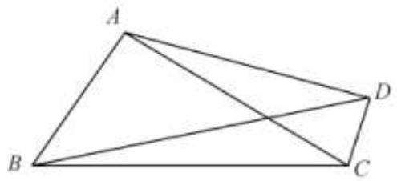

text_image

A
B
C
D

(1) 若 $\triangle ABC$ 面积是 $\triangle ACD$ 面积的 4 倍, 求 $\circ \sin 2\theta$ ;  
(2) 若 $\circ$ $\tan \angle ADB = \frac{1}{2}$ , 求 $\circ$ $\tan \theta$ .

【解析】(1) 设 AB = a,

则 $\mathrm{AC} = \sqrt{3} a, \mathrm{AD} = \sqrt{3} a\sin \theta, \mathrm{CD} = \sqrt{3} a\cos \theta,$

由题意 $S_{\triangle ABC}=4S_{\triangle ACD}$ ,

则 $\frac{1}{2} a\cdot \sqrt{3} a = 4\cdot \frac{1}{2}\sqrt{3} a\cos \theta \cdot \sqrt{3} a\sin \theta ,$

所以 $\sin 2\theta = \frac{\sqrt{3}}{6}$

(2) 由正弦定理, 在 $\triangle ABD$ 中, $\frac{BD}{\sin \angle BAD} = \frac{AB}{\sin \angle ADB}$ ,

即 $\frac{\mathrm{BD}}{\sin(\pi - \theta)} = \frac{a}{\sin\angle ADB}$ ①

在 $\triangle \mathrm{BCD}$ 中， $\frac{\mathrm{BD}}{\sin\angle\mathrm{BCD}} = \frac{\mathrm{BC}}{\sin\angle\mathrm{CDB}}$

即 $\frac{BD}{\sin\left(\frac{\pi}{6}+\theta\right)}=\frac{2a}{\sin\left(\frac{\pi}{2}-\angle ADB\right)}$ ②

② ÷ ① 得: $\frac{\sin\theta}{\sin\left(\frac{\pi}{6}+\theta\right)}=2\tan\angle ADB=1,$

∴ $\sin\theta=\sin\left(\frac{\pi}{6}+\theta\right)$ ，化简得 $\cos\theta=(2-\sqrt{3})\sin\theta$ ，

所以 $\tan \theta = 2 + \sqrt{3}$

1401 (2024·全国·高三专题练习)在① AB = 2AD, ② $\sin\angle ACB = 2\sin\angle ACD$ , ③ $S_{\triangle ABC} = 2S_{\triangle ACD}$ 这三个条件中任选一个, 补充在下面问题中, 并解答.

已知在四边形 ABCD 中， $\angle ABC + \angle ADC = \pi, BC = CD = 2$ ，且 \_\_\_\_.

(1) 证明: $\tan \angle ABC = 3 \tan \angle BAC$ ;   
(2) 若 AC = 3，求四边形 ABCD 的面积.

【解析】(1) 方案一: 选条件①.

在 $\triangle ABC$ 中, 由正弦定理得, $\frac{AC}{\sin\angle ABC} = \frac{BC}{\sin\angle BAC} = \frac{AB}{\sin\angle ACB}$ ,

在 $\triangle \mathrm{ACD}$ 中，由正弦定理得， $\frac{\mathrm{AC}}{\sin\angle\mathrm{ADC}} = \frac{\mathrm{CD}}{\sin\angle\mathrm{DAC}} = \frac{\mathrm{AD}}{\sin\angle\mathrm{ACD}}$

因为 $\angle ABC + \angle ADC = \pi$ ，所以 $\sin\angle ABC = \sin\angle ADC$ ，

因为 BC=CD, 所以 $\sin\angle BAC=\sin\angle DAC$ ,

因为 $\angle BAC + \angle DAC < \pi$ ，所以 $\angle BAC = \angle DAC$ ，

因为 AB = 2AD, 所以 $\sin\angle ACB = 2\sin\angle ACD$ .

因为 $\sin\angle ACB=\sin(\angle ABC+\angle BAC)$ ,

$$
\sin \angle A C D = \sin (\angle C A D + \angle A D C) = \sin (\angle B A C + \pi - \angle A B C) = \sin (\angle A B C - \angle B A C),
$$

所以 $\sin(\angle ABC + \angle BAC) = 2\sin(\angle ABC - \angle BAC)$ ,

即 $\sin \angle ABC\cos \angle BAC + \cos \angle ABC\sin \angle BAC =$

$2(\sin \angle ABC \cdot \cos \angle BAC - \cos \angle ABC \sin \angle BAC)$ ,

所以 $\sin\angle ABC\cos\angle BAC=3\cos\angle ABC\sin\angle BAC,$

所以 $\tan\angle ABC=3\tan\angle BAC.$

方案二:选条件②.

在 $\triangle ABC$ 中，由正弦定理得， $\frac{AC}{\sin\angle ABC} = \frac{BC}{\sin\angle BAC}$

在 $\triangle \mathrm{ACD}$ 中，由正弦定理得， $\frac{\mathrm{AC}}{\sin\angle\mathrm{ADC}} = \frac{\mathrm{CD}}{\sin\angle\mathrm{DAC}}$

因为 $\angle ABC + \angle ADC = \pi$ ，所以 $\sin\angle ABC = \sin\angle ADC$ ，

因为 BC=CD, 所以 $\sin\angle BAC=\sin\angle DAC$ .

因为 $\angle BAC + \angle DAC < \pi$ ，所以 $\angle BAC = \angle DAC$ .

因为 $\sin\angle ACB=\sin(\angle ABC+\angle BAC)$ ,

$\sin \angle ACD = \sin (\angle CAD + \angle ADC) = \sin (\angle BAC + \pi - \angle ABC) = \sin (\angle ABC - \angle BAC)$ ,

$\sin \angle ACB = 2\sin \angle ACD$

所以 $\sin(\angle ABC + \angle BAC) = 2\sin(\angle ABC - \angle BAC)$ ,

即 $\sin \angle ABC\cos \angle BAC + \cos \angle ABC\sin \angle BAC =$

$2(\sin \angle ABC \cdot \cos \angle BAC - \cos \angle ABC \sin \angle BAC)$ ,

所以 $\sin\angle ABC\cos\angle BAC=3\cos\angle ABC\sin\angle BAC,$

所以 $\tan \angle ABC = 3\tan \angle BAC.$

方案三:选条件③.

因为 $S_{\triangle ABC}=\frac{1}{2}BC\cdot AC\cdot\sin\angle ACB$ , $S_{\triangle ACD}=\frac{1}{2}CD\cdot AC\cdot\sin\angle ACD$ , 且 BC=CD,

$S_{\triangle ABC}=2S_{\triangle ACD},$

所以 $\sin \angle ACB = 2\sin \angle ACD$

在 $\triangle ABC$ 中，由正弦定理得， $\frac{AC}{\sin\angle ABC} = \frac{BC}{\sin\angle BAC}$

在 $\triangle \mathrm{ACD}$ 中，由正弦定理得， $\frac{\mathrm{AC}}{\sin\angle\mathrm{ADC}} = \frac{\mathrm{CD}}{\sin\angle\mathrm{DAC}}$

因为 $\angle ABC + \angle ADC = \pi$ ，所以 $\sin\angle ABC = \sin\angle ADC$ ，

因为 BC=CD, 所以 $\sin\angle BAC=\sin\angle DAC$ ,

因为 $\angle BAC + \angle DAC < \pi$ ，所以 $\angle BAC = \angle DAC$ .

因为 $\sin\angle ACB=\sin(\angle ABC+\angle BAC)$ ,

$\sin \angle ACD = \sin (\angle CAD + \angle ADC) = \sin (\angle BAC + \pi - \angle ABC) = \sin (\angle ABC - \angle BAC)$ ,

所以 $\sin(\angle ABC + \angle BAC) = 2\sin(\angle ABC - \angle BAC)$ ,

即 $\sin \angle ABC\cos \angle BAC + \cos \angle ABC\sin \angle BAC =$

$2(\sin \angle ABC \cdot \cos \angle BAC - \cos \angle ABC \sin \angle BAC)$ ,

所以 $\sin\angle ABC\cos\angle BAC=3\cos\angle ABC\sin\angle BAC,$

所以 $\tan \angle ABC = 3\tan \angle BAC.$

(2) 选择①②③, 答案均相同,

由(1)可设AD=x,则AB=2x,

在 $\triangle ABC$ 中,由余弦定理得,

$\cos \angle ABC = \frac{AB^2 + BC^2 - AC^2}{2AB\cdot BC} = \frac{4x^2 - 5}{8x},$

在 $\triangle ACD$ 中, 由余弦定理得,

$$
\cos \angle A D C = \frac {A D ^ {2} + C D ^ {2} - A C ^ {2}}{2 A D \cdot C D} = \frac {x ^ {2} - 5}{4 x},
$$

因为 $\cos\angle ABC = \cos(\pi - \angle ADC) = -\cos\angle ADC,$

所以 $\frac{4x^{2}-5}{8x}=-\frac{x^{2}-5}{4x}$ ，解得 $x=\frac{\sqrt{10}}{2}$ 或 $x=-\frac{\sqrt{10}}{2}$ （舍去），

所以 $\cos\angle ABC=\frac{\sqrt{10}}{8}$ ,

所以 $\sin \angle ABC = \sin \angle ADC = \sqrt{1 - \left(\frac{\sqrt{10}}{8}\right)^2} = \frac{3\sqrt{6}}{8},$

所以四边形 ABCD 的面积 $S = 3S_{\triangle ACD} = \frac{3}{2}AD \cdot CD \cdot \sin \angle ADC = \frac{9\sqrt{15}}{8}$ .

1402 (2024·甘肃金昌·高一永昌县第一高级中学校考期中)如图,在平面四边形ABCD中,

$$
\angle \mathrm{BCD} = \frac {\pi}{2}, \mathrm{AB} = 1, \angle \mathrm{ABC} = \frac {3 \pi}{4}.
$$

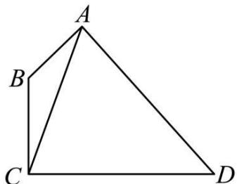

natural_image

Geometric diagram of a quadrilateral ABCD with diagonal AC and point B on side AB (no labels or measurements)

(1) 当 $\mathrm{BC} = \sqrt{2}, \mathrm{CD} = \sqrt{7}$ 时, 求 $\triangle \mathrm{ACD}$ 的面积.  
(2) 当 $\angle ADC = \frac{\pi}{6}, AD = 2$ 时, 求 $\tan \angle ACB$ .

【解析】(1) 当 BC = $\sqrt{2}$ 时，在 $\triangle ABC$ 中，AB = 1, $\angle ABC = \frac{3\pi}{4}$ ,

由余弦定理得 $AC^{2}=AB^{2}+BC^{2}-2AB\cdot BC\cos\angle ABC$ ,

即 $AC^{2}=3-2\sqrt{2}\cos\frac{3\pi}{4}=5$ , 解得 $AC=\sqrt{5}$

所以 $\cos\angle ACB=\frac{AC^{2}+BC^{2}-AB^{2}}{2AC\cdot BC}=\frac{6}{2\sqrt{10}}=\frac{3\sqrt{10}}{10}$ ,

因为 $\angle BCD = \frac{\pi}{2}$ ，则 $\sin\angle ACD = \cos\angle ACB = \frac{3\sqrt{10}}{10}$ ，

又 $\mathrm{CD} = \sqrt{7}$

所以 $\triangle ACD$ 的面积是 $S_{\triangle ACD} = \frac{1}{2} AC \cdot CD \sin \angle ACD = \frac{1}{2} \times \sqrt{5} \times \sqrt{7} \times \frac{3\sqrt{10}}{10} = \frac{3}{4}\sqrt{14}$ .

(2) 在 $\triangle ABC$ 中, 由正弦定理得 $\frac{AB}{\sin\angle ACB} = \frac{AC}{\sin\angle ABC}$ ,

即 $AC=\frac{AB\sin\frac{3\pi}{4}}{\sin\angle ACB}=\frac{\sqrt{2}}{2\cos\angle ACD}$ ,

在 $\triangle ACD$ 中, 由正弦定理得 $\frac{AD}{\sin\angle ACD} = \frac{AC}{\sin\angle ADC}$ , 即 $AC = \frac{AD\sin\frac{\pi}{6}}{\sin\angle ACD} = \frac{1}{\sin\angle ACD}$ ,

则 $\frac{\sqrt{2}}{2\cos\angle ACD}=\frac{1}{\sin\angle ACD}$ ，整理得 $\sin\angle ACD=\sqrt{2}\cos\angle ACD$ ，

因为 $\angle \mathrm{ACD} < \frac{\pi}{2}$ ,

所以 $\tan \angle ACD = \sqrt{2}$

因为 $\angle \mathrm{BCD} = \frac{\pi}{2}$ , 所以 $\tan \angle \mathrm{ACB} = \tan \left(\frac{\pi}{2} - \angle \mathrm{ACD}\right) = \frac{\sin \left(\frac{\pi}{2} - \angle \mathrm{ACD}\right)}{\cos \left(\frac{\pi}{2} - \angle \mathrm{ACD}\right)} = \frac{\cos \angle \mathrm{ACD}}{\sin \angle \mathrm{ACD}} = \frac{1}{\tan \angle \mathrm{ACD}} = \frac{\sqrt{2}}{2}.$

1403 (2024·广东广州·高一统考期末)如图,在平面四边形ABCD中, $\angle BCD=\frac{\pi}{2},AB=1,\angle ABC=\frac{2\pi}{3}.$

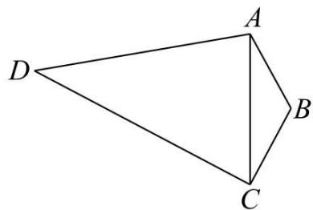

natural_image

Geometric diagram of a quadrilateral ABCD with diagonal AC, no text or symbols present

(1) 若 $\mathrm{BC} = 2, \mathrm{CD} = \sqrt{7}$ , 求 $\triangle \mathrm{ACD}$ 的面积;  
(2) 若 $\angle ADC = \frac{\pi}{6}, AD = 2$ ，求 $\cos \angle ACD$ .

【解析】(1) 因为 AB = 1, $\angle ABC = \frac{2\pi}{3}$ , BC = 2,

由余弦定理得 $AC^{2}=AB^{2}+BC^{2}-2AB\cdot AC\cdot\cos\frac{2\pi}{3}=7$ ，即 $AC=\sqrt{7}$

由余弦定理得 $\cos\angle ACB=\frac{AC^{2}+BC^{2}-AB^{2}}{2\times AC\times BC}=\frac{5\sqrt{7}}{14}$ ,

所以 $\sin\angle ACD=\sin\left(\frac{\pi}{2}-\angle ACB\right)=\cos\angle ACB=\frac{5\sqrt{7}}{14}$ ,

所以 $\triangle \mathrm{ACD}$ 的面积 $S = \frac{1}{2} \times AC \times CD \times \sin \angle ACD = \frac{5\sqrt{7}}{4}$

(2) 在 $\triangle ADC$ 中, 由正弦定理得 $\frac{AD}{\sin\angle ACD} = \frac{AC}{\sin\angle ADC}$ , 即 $\frac{2}{\sin\angle ACD} = \frac{AC}{\frac{1}{2}}$ ①,

在 $\triangle ABC$ 中, 由正弦定理得 $\frac{AB}{\sin\angle ACB} = \frac{AC}{\sin\angle ABC}$ , 即 $\frac{1}{\sin\left(\frac{\pi}{2} - \angle ACD\right)} =$

$$
\frac {1}{\cos \angle A C D} = \frac {A C}{\frac {\sqrt {3}}{2}} ②,
$$

①②联立可得 $\tan\angle ACD=\frac{\sin\angle ACD}{\cos\angle ACD}=\frac{2\sqrt{3}}{3}$ ,

因为 $\angle ACD \in \left(0, \frac{\pi}{2}\right)$ ，所以 $\cos\angle ACD = \frac{\sqrt{21}}{7}$

1404 (2024·广东·统考模拟预测)在平面四边形 ABCD 中, $\angle ABD = \angle BCD = 90^{\circ}$ , $\angle DAB = 45^{\circ}$ .

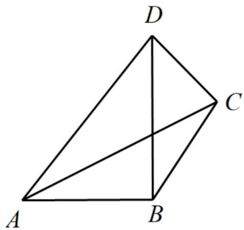

text_image

D
C
A
B

(1) 若 AB = 2, $\angle DBC = 30^{\circ}$ , 求 AC 的长;  
(2) 若 $\tan\angle BAC=\frac{3}{4}$ ，求 $\tan\angle DBC$ 的值.

【解析】(1) 在 Rt△ABD 中, 因为 $\angle DAB = 45^{\circ}$ , 所以 DB = 2,

在 Rt△BCD 中，BC = 2cos30° = √3，

在 $\triangle ABC$ 中, 由余弦定理得

$$
\mathrm{AC} ^ {2} = \mathrm{AB} ^ {2} + \mathrm{BC} ^ {2} - 2 \mathrm{AB} \cdot \mathrm{BC} \cos \angle \mathrm{ABC} = 4 + 3 - 2 \times 2 \times \sqrt {3} \cos 1 2 0 ^ {\circ} = 7 + 2 \sqrt {3},
$$

所以 $AC=\sqrt{7+2\sqrt{3}}$ .

(2) 设 $\angle DBC = \alpha$ ，在 Rt△BCD 中，BC = BDcosα = 2cosα，

因为 $\tan\angle BAC=\frac{\sin\angle BAC}{\cos\angle BAC}=\frac{3}{4}$ ，所以 $\cos\angle BAC=\frac{4}{3}\sin\angle BAC$ ，

于是 $\cos^{2}\angle BAC + \sin^{2}\angle BAC = \frac{25}{9}\sin^{2}\angle BAC = 1$ ,

因为 $0^{\circ}<\angle BAC<90^{\circ}$ ,

所以 $\sin\angle BAC=\frac{3}{5},\cos\angle BAC=\frac{4}{5}$ ,

在 $\triangle ABC$ 中, 由正弦定理得 $\frac{AB}{\sin\angle ACB} = \frac{CB}{\sin\angle BAC}$ ,

所以 $\frac{2}{\sin(90^{\circ}-\alpha-\angle CAB)}=\frac{2\cos\alpha}{\frac{3}{5}}$ ,

于是 $\cos\alpha\cos(\alpha+\angle CAB)=\frac{3}{5}$ ,

即 $4\cos^{2}\alpha - 3\sin\alpha\cos\alpha = 3$ ,

所以 $\frac{4\cos^{2}\alpha-3\sin\alpha\cos\alpha}{\cos^{2}\alpha+\sin^{2}\alpha}=\frac{4-3\tan\alpha}{1+\tan^{2}\alpha}=3,$

因为 $0^{\circ}<\alpha<90^{\circ}$ ，所以 $\tan\angle DBC=\tan\alpha=\frac{\sqrt{21}-3}{6}$ .

1405 (2024·江苏徐州·高一统考期末)在① $\frac{\sin A}{\cos B\cos C} = \frac{2a^{2}}{a^{2} + c^{2} - b^{2}}$ , ② $\sin B - \cos B =$ $\frac{\sqrt{2}b-a}{c}$ ，③△ABC的面积

$S=\frac{\sqrt{2}}{4}b(b\sin C+\ctan C\cos B)$ 这三个条件中任选一个，补充在下面问题中，并完成解答.

在 $\triangle ABC$ 中，角A、B、C的对边分别为a、b、c，已知\_\_\_\_.

(1) 求角 C;

(2) 若点 D 在边 AB 上, 且 BD = 2AD, $\cos B = \frac{5}{13}$ , 求 $\tan \angle BCD$ .

注:如果选择多个条件分别解答,按第一个解答计分

【解析】(1) 若选择①: 因为 $\frac{\sin A}{\cos B \cos C} = \frac{2a^{2}}{a^{2} + c^{2} - b^{2}}$ ，结合余弦定理 $\cos B = \frac{a^{2} + c^{2} - b^{2}}{2ac}$ ,

得 $\frac{\sin A}{\cos B\cos C} = \frac{2a^{2}}{2ac \cdot \cos B}$ ，即 $\frac{\sin A}{\cos C} = \frac{a}{c}$ ,

由正弦定理可得 $\frac{a}{c} = \frac{\sin A}{\sin C}$ ，所以 $\frac{\sin A}{\cos C} = \frac{\sin A}{\sin C}$ ，

又 $A \in (0, \pi)$ , 所以 $\sin A > 0$ , 所以 $\frac{1}{\cos C} = \frac{1}{\sin C}$ , 即 $\tan C = 1$ ,

又 $C \in (0, \pi)$ ，所以 $C = \frac{\pi}{4}$ ;

若选择②: 因为 $\sin B - \cos B = \frac{\sqrt{2}b - a}{c}$ ,

结合正弦定理可得 $\sin B - \cos B = \frac{\sqrt{2}\sin B - \sin A}{\sin C}$

即 $\sin B\sin C - \cos B\sin C = \sqrt{2}\sin B - \sin A = \sqrt{2}\sin B - \sin[\pi - (B + C)]$ ,

$$
= \sqrt {2} \sin B - \sin (B + C) = \sqrt {2} \sin B - (\sin B \cos C + \cos B \sin C),
$$

即 $\sin B\sin C = \sqrt{2}\sin B - \sin B\cos C,$

又 $B \in (0, \pi)$ , $\sin B > 0$ , 故 $\sin C = \sqrt{2} - \cos C$ , 即 $\sin C + \cos C = \sqrt{2}$ ,

所以 $\sqrt{2}\sin \left(\mathrm{C} + \frac{\pi}{4}\right) = \sqrt{2}$ , 即 $\sin \left(\mathrm{C} + \frac{\pi}{4}\right) = 1$ ,

因为 $C \in (0, \pi)$ , $C + \frac{\pi}{4} \in \left( \frac{\pi}{4}, \frac{5\pi}{4} \right)$ , 所以 $C + \frac{\pi}{4} = \frac{\pi}{2}$ , 得 $C = \frac{\pi}{4}$ ;

若选择③:条件即 $\sin C\sin A=\frac{\sqrt{2}}{2}\left(\sin B\sin C+\sin C\frac{\sin C\cos B}{\cos C}\right)$ ,

又 $C \in (0, \pi)$ , $\sin C > 0$ ,

所以 $\sin A\cos C = \frac{\sqrt{2}}{2} (\sin B\cos C + \sin C\cos B) = \frac{\sqrt{2}}{2}\sin (B + C)$

即 $\frac{\sqrt{2}}{2}\sin (\pi -\mathrm{A}) = \sin \mathrm{A}\cos \mathrm{C}$ ，所以 $\frac{\sqrt{2}}{2}\sin \mathrm{A} = \sin \mathrm{A}\cos \mathrm{C},$

又因为 $\mathrm{A}\in (0,\pi)$ ，则 $\sin \mathrm{A} > 0$ ，所以 $\cos C = \frac{\sqrt{2}}{2}$

又因为 $C \in (0, \pi)$ ，所以 $C = \frac{\pi}{4}$ .

(2) 设 $\angle \mathrm{BCD} = \theta$ ，则 $\angle \mathrm{ACD} = \frac{\pi}{4} - \theta$ .

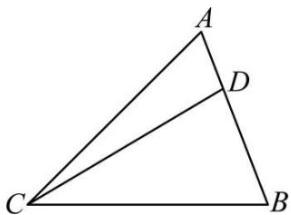

text_image

A
D
C
B

因为 $\cos B = \frac{5}{13}, B \in (0, \pi)$ ，故 $\sin B = \sqrt{1 - \cos^2 B} = \sqrt{1 - \left(\frac{5}{13}\right)^2} = \frac{12}{13}$ ，

所以 $\sin A = \sin[\pi - (B + C)] = \sin\left(\frac{3}{4}\pi - B\right) = \frac{\sqrt{2}}{2}\cos B + \frac{\sqrt{2}}{2}\sin B = \frac{17}{26}\sqrt{2}$

在 $\triangle \mathrm{ACD}$ 中，由正弦定理可得 $\frac{\mathrm{CD}}{\sin\mathrm{A}} = \frac{\mathrm{AD}}{\sin\angle \mathrm{ACD}}$ ，即 $\frac{\mathrm{CD}}{\mathrm{AD}} = \frac{\frac{17}{26}\sqrt{2}}{\sin\left(\frac{\pi}{4} - \theta\right)}$

在 $\triangle \mathrm{BCD}$ 中，同理可得， $\frac{\mathrm{CD}}{\mathrm{BD}} = \frac{\frac{12}{13}}{\sin\theta},$

因为 BD=2AD, 所以 $\frac{\frac{17}{26}\sqrt{2}}{2\sin\left(\frac{\pi}{4}-\theta\right)}=\frac{\frac{12}{13}}{\sin\theta}$ , 即 $\frac{\frac{17}{26}\sqrt{2}}{\sqrt{2}\cos\theta-\sqrt{2}\sin\theta}=\frac{\frac{12}{13}}{\sin\theta}$ ,

整理得 $\tan \theta = \frac{24}{41}$ , 即 $\tan \angle \mathrm{BCD} = \frac{24}{41}$ .

1406 (2024·广东深圳·深圳市高级中学校考模拟预测)记 $\triangle ABC$ 的内角A、B、C的对边分别为 $a, b, c$ , 已知 $b\cos A - a\cos B = b - c$ .

(1) 求 A;   
(2) 若点 D 在 BC 边上, 且 CD = 2BD, $\cos B = \frac{\sqrt{3}}{3}$ , 求 $\tan \angle BAD$ .

【解析】(1) 因为 $b \cos A - a \cos B = b - c$ ,

由余弦定理可得 $b\cdot\frac{b^{2}+c^{2}-a^{2}}{2bc}-a\cdot\frac{a^{2}+c^{2}-b^{2}}{2ac}=b-c$ ,

化简可得 $b^{2}+c^{2}-a^{2}=bc$ ，由余弦定理可得 $\cos A=\frac{b^{2}+c^{2}-a^{2}}{2bc}=\frac{1}{2}$

因为 $0 < A < \pi$ ，所以， $A = \frac{\pi}{3}$ .

(2) 因为 $\cos B = \frac{\sqrt{3}}{3}$ ，则 B 为锐角，所以， $\sin B = \sqrt{1 - \cos^{2}B} = \sqrt{1 - \left(\frac{\sqrt{3}}{3}\right)^{2}} = \frac{\sqrt{6}}{3}$ ,

因为 $A + B + C = \pi$ ，所以， $C = \frac{2\pi}{3} - B$ ，

所以， $\sin C=\sin\left(\frac{2\pi}{3}-B\right)=\sin\frac{2\pi}{3}\cos B-\cos\frac{2\pi}{3}\sin B=\frac{\sqrt{3}}{2}\times\frac{\sqrt{3}}{3}+\frac{1}{2}\times\frac{\sqrt{6}}{3}=\frac{1}{2}+\frac{\sqrt{6}}{6},$

设 $\angle BAD = \theta$ ，则 $\angle CAD = \frac{2\pi}{3} - \theta$ ，

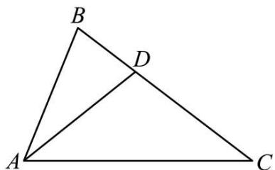

text_image

B
D
A
C

在 $\triangle ABD$ 和 $\triangle ACD$ 中，由正弦定理得 $\frac{BD}{\sin\theta} = \frac{AD}{\sin B} = \frac{3AD}{\sqrt{6}}$ ， $\frac{CD}{\sin\left(\frac{\pi}{3} - \theta\right)} = \frac{AD}{\sin C} = \frac{6AD}{3 + \sqrt{6}}$

因为 $\mathrm{CD} = 2\mathrm{BD}$ ，上面两个等式相除可得 $\sqrt{6}\sin \left(\frac{\pi}{3} -\theta\right) = (3 + \sqrt{6})\sin \theta ,$

得 $\sqrt{6}\left(\frac{\sqrt{3}}{2}\cos\theta -\frac{1}{2}\sin\theta\right) = (3 + \sqrt{6})\sin\theta$ ，即 $\sqrt{2}\cos\theta = (2 + \sqrt{6})\sin\theta$

所以， $\tan \angle \mathrm{BAD} = \tan \theta = \frac{\sqrt{2}}{2 + \sqrt{6}} = \sqrt{3} -\sqrt{2}.$

1407 (2024·广东揭阳·高三校考阶段练习)在 $\triangle ABC$ 中, 内角 A, B, C 所对的边分别为 a, b, c, 且 $2\cos A(c\cos B + b\cos C) = a$ .

(1) 求角 A;  
(2) 若 O 是 $\triangle ABC$ 内一点， $\angle AOB = 120^{\circ}$ ， $\angle AOC = 150^{\circ}$ ，b = 1, c = 3，求 $\tan \angle ABO$ .

【解析】(1) 因为 $2\cos A(c\cos B + b\cos C) = a$ ,

所以由正弦定理得 $2\cos A(\sin C\cos B + \sin B\cos C) = 2\cos A\sin (B + C) = 2\sin A\cos A = \sin A;$

$\because 0^{\circ}<A<180^{\circ},\therefore\sin A\neq0,\therefore\cos A=\frac{1}{2}$ ，则 $A=60^{\circ}$ ;

(2)

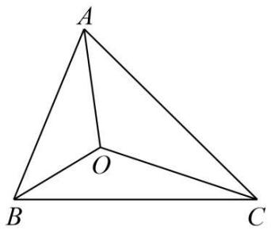

text_image

A
O
B
C

$\because \angle OAC + \angle OAB = \angle BAC = 60^{\circ}, \angle OAB + \angle ABO = 180^{\circ} - \angle AOB = 60^{\circ}, \therefore \angle OAC = \angle ABO;$

在 $\triangle ABO$ 中, 由正弦定理得: $AO = \frac{AB \cdot \sin \angle ABO}{\sin \angle AOB} = \frac{3 \sin \angle ABO}{\sin 120^\circ} = 2\sqrt{3} \sin \angle ABO$ ;

在 $\triangle \mathrm{ACO}$ 中，由正弦定理得： $\mathrm{AO} = \frac{\mathrm{AC}\cdot\sin\angle\mathrm{ACO}}{\sin\angle\mathrm{AOC}} = \frac{\sin(30^{\circ} - \angle\mathrm{ABO})}{\sin150^{\circ}} =$

$2\sin(30^{\circ}-\angle ABO)$ ;

$\therefore 2 \sqrt{3} \sin \angle ABO = 2 \sin (30^{\circ} - \angle ABO) = \cos \angle ABO - \sqrt{3} \sin \angle ABO,$

即 $\cos \angle ABO = 3\sqrt{3}\sin \angle ABO, \therefore \tan \angle ABO = \frac{1}{3\sqrt{3}} = \frac{\sqrt{3}}{9}$

# 题型二:两角使用余弦定理

1408 (2024·全国·高一专题练习)如图,四边形ABCD中, $\cos\angle BAD=\frac{1}{3}$ ,AC=AB=3AD.

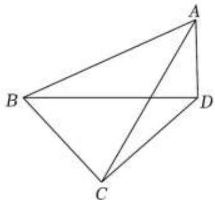

natural_image

Geometric diagram of a tetrahedron with vertices labeled A, B, C, D (no text or symbols beyond labels)

(1) 求 $\sin \angle ABD$ ;   
(2) 若 $\angle BCD = 90^{\circ}$ , 求 $\tan \angle CBD$ .

【解析】(1) $\triangle ABD$ 中,设AC=AB=3AD=3t(t>0),则 $\cos\angle BAD=\frac{1}{3}=$

$\frac{(3t)^2 + t^2 - \mathrm{BD}^2}{2\times(3t)\times t}$ , 解得 $\mathrm{BD} = 2\sqrt{2} t$

$\because \mathrm{BD}^{2} + \mathrm{AD}^{2} = \mathrm{AB}^{2},\therefore \sin \angle \mathrm{ABD} = \frac{\mathrm{AD}}{\mathrm{AB}} = \frac{1}{3};$

(2) 设 AC = AB = 3AD = 3t (t > 0)，则 BD = $2\sqrt{2}t$

设 BC = xt, CD = yt (x > 0, y > 0),$\triangle ABC$ 中， $\cos \angle BCA = \frac{(3t)^2 + (xt)^2 - (3t)^2}{2\times(3t)\times(xt)} = \frac{x}{6}$

$\triangle ADC$ 中， $\cos \angle DCA = \frac{1}{3} = \frac{(3t)^2 + (yt)^2 - t^2}{2 \times (3t) \times (yt)} = \frac{y^2 + 8}{6y}$

$\because \angle BCA + \angle DCA = \angle BCD = \frac{\pi}{2}, \therefore \cos \angle DCA = \sin \angle BCA$ ，可得 $\frac{y^2 + 8}{6y} = \sqrt{1 - \left(\frac{x}{6}\right)^2}$ ，

化简得 $\left(\frac{y^2 + 8}{6y}\right)^2 = 1 - \left(\frac{x}{6}\right)^2$ ，即 $x^2 y^2 + y^4 + 64 = 20y^2$

又 $\because \mathrm{BC}^2 +\mathrm{CD}^2 = \mathrm{BD}^2,\therefore x^2 t^2 +y^2 t^2 = 8t^2$ ，即 $\therefore x^{2} + y^{2} = 8$

$\therefore (8 - y^{2})y^{2} + y^{4} + 64 = 20y^{2}$ ，解得 $y^{2} = \frac{16}{3}, x^{2} = 8 - y^{2} = \frac{8}{3}$

$$
\tan \angle \mathrm{CBD} = \frac {\mathrm{CD}}{\mathrm{BC}} = \frac {y t}{x t} = \sqrt {\frac {\frac {1 6}{3}}{\frac {8}{3}}} = \sqrt {2}
$$

1409 (2024·全国·高一专题练习)如图,在梯形 ABCD 中, AB // CD, AD = $\sqrt{3}$ BC = $\sqrt{3}$ .

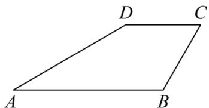

text_image

D
C
A
B

(1) 求证: $\sin C = \sqrt{3} \sin A$ ;   
(2) 若 C = 2A, AB = 2CD, 求梯形 ABCD 的面积.

【解析】(1) 连接 BD.

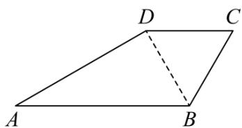

text_image

D
C
A
B

因为 AB // CD, 所以 $\angle ABD = \angle BDC$ .

在 $\triangle ABD$ 中, 由正弦定理得 $\frac{AD}{\sin\angle ABD} = \frac{BD}{\sin A}$ , ①

在 $\triangle BCD$ 中, 由正弦定理得 $\frac{BC}{\sin\angle BDC} = \frac{BD}{\sin C}$ , ②

由 AD = $\sqrt{3}$ BC, $\angle ABD = \angle BDC$ , 结合①②可得 $\sin C = \sqrt{3}\sin A$ .

(2) 由 (1) 知 $\sin C = \sqrt{3} \sin A, \sin C = \sin 2A = 2\sin A \cos A = \sqrt{3} \sin A,$

$\cos A = \frac{\sqrt{3}}{2}$ , 又 $0 < A < \pi$ , 所以 $A = \frac{\pi}{6}$ , 则 $C = 2A = \frac{\pi}{3}$ .

连接BD，

在 $\triangle ABD$ 中，由余弦定理得 $BD^{2} = AD^{2} + AB^{2} - 2AD\cdot AB\cdot \cos A = (\sqrt{3})^{2} + AB^{2} - 2\sqrt{3}$

$$
\begin{array}{l} \cdot \mathrm{AB} \cdot \frac {\sqrt {3}}{2} \\ = \mathrm{AB} ^ {2} - 3 \mathrm{AB} + 3 = 4 \mathrm{CD} ^ {2} - 6 \mathrm{CD} + 3; \\ \end{array}
$$

在 $\triangle \mathrm{BCD}$ 中，由余弦定理得 $\mathrm{BD}^2 = \mathrm{BC}^2 +\mathrm{CD}^2 -2\mathrm{BC}\cdot \mathrm{CD}\cdot \cos C = 1^{2} + \mathrm{CD}^{2} - 2\times 1\times$

$$
\mathrm{CD} \times \frac {1}{2}
$$

$$
= \mathrm{CD} ^ {2} - \mathrm{CD} + 1,
$$

所以 $4CD^{2}-6CD+3=CD^{2}-CD+1$ ，解得 CD=1 或 $\frac{2}{3}$ .

当 $CD=\frac{2}{3}$ 时, 连接 AC, 在 $\triangle ACD$ 中, 由余弦定理, 得 $AC^{2}=AD^{2}+CD^{2}-2\times AD\times$

$$
\mathrm{CD} \times \cos \frac {5 \pi}{6}
$$

$$
= 3 + \frac {4}{9} - 2 \times \sqrt {3} \times \frac {2}{3} \times \left(- \frac {\sqrt {3}}{2}\right) = \frac {4 9}{9},
$$

所以 $AC=\frac{7}{3}$ ，而此时 $AB+BC=\frac{4}{3}+1=\frac{7}{3}$ ，故 $CD=\frac{2}{3}$ 不满足题意，经检验 CD=1 满足题意，

此时梯形 ABCD 的高 $h = AD \cdot \sin \frac{\pi}{6} = \frac{\sqrt{3}}{2}$ ,

当 $\mathrm{CD} = 1$ 时，梯形ABCD的面积 $S = \frac{1}{2} (AB + CD)h = \frac{3\sqrt{3}}{4}$

所以梯形ABCD的面积为 $\frac{3\sqrt{3}}{4}$ .

1410 (2024·河北·校联考一模)在 $\triangle ABC$ 中, $AB = 4$ , $AC = 2\sqrt{2}$ , 点 D 为 BC 的中点, 连接 AD 并延长到点 E, 使 AE = 3DE.

(1) 若 DE = 1, 求 $\angle BAC$ 的余弦值;  
(2) 若 $\angle ABC = \frac{\pi}{4}$ , 求线段 BE 的长.

【解析】(1) 因为 DE = 1, AE = 3DE, 所以 AD = 2,

因为 $\angle ADB + \angle ADC = \pi$ ，所以 $\cos\angle ADB + \cos\angle ADC = 0$ ，

设 $\mathrm{BD} = \mathrm{DC} = x$ ，则 $\frac{\mathrm{BD}^2 + \mathrm{AD}^2 - \mathrm{AB}^2}{2\mathrm{BD}\cdot\mathrm{AD}} +\frac{\mathrm{CD}^2 + \mathrm{AD}^2 - \mathrm{AC}^2}{2\mathrm{CD}\cdot\mathrm{AD}} = 0,$ 即 $\frac{x^2 + 4 - 16}{2\cdot x\cdot 2} +$ $\frac{x^2 + 4 - 8}{2\cdot x\cdot 2} = 0,$

解得 $x=2\sqrt{2}$ ，所以 BC=2BD= $4\sqrt{2}$ ，

在 $\triangle ABC$ 中，由余弦定理知， $\cos \angle BAC = \frac{AB^2 + AC^2 - BC^2}{2AB \cdot AC} = \frac{16 + 8 - 32}{2 \cdot 4 \cdot 2\sqrt{2}} = -\frac{\sqrt{2}}{4}$ .

(2) 在 $\triangle ABC$ 中, 由余弦定理知, $AC^{2} = AB^{2} + BC^{2} - 2AB \cdot BC \cdot \cos \angle ABC$ ,

所以 $8 = 16 + BC^{2} - 2 \cdot 4 \cdot BC \cdot \frac{\sqrt{2}}{2}$ ，化简得 $BC^{2} - 4\sqrt{2}BC + 8 = 0$ ，解得 $BC = 2\sqrt{2}$ ，
因为 D 是 BC 的中点, 所以 $BD = \frac{1}{2}BC = \sqrt{2}$ ,

在 $\triangle ABD$ 中, 由余弦定理知, $AD^{2}=AB^{2}+BD^{2}-2AB\cdot BD\cdot\cos\angle ABC=16+2-2\times4\times\sqrt{2}\times\frac{\sqrt{2}}{2}=10$ ,

所以 AD = $\sqrt{10}$ ,

因为 AE = 3DE, 所以 AE = $\frac{3}{2}$ AD = $\frac{3\sqrt{10}}{2}$ ,

在 $\triangle ABD$ 中,由余弦定理知,

$$
\cos \angle B A E = \frac {A B ^ {2} + A D ^ {2} - B D ^ {2}}{2 A B \cdot A D} = \frac {1 6 + 1 0 - 2}{2 \times 4 \times \sqrt {1 0}} = \frac {3}{\sqrt {1 0}},
$$

连接BE,在 $\triangle ABE$ 中,由余弦定理知,

$\mathrm{BE}^2 = \mathrm{AB}^2 + \mathrm{AE}^2 - 2\mathrm{AB} \cdot \mathrm{AE} \cdot \cos \angle \mathrm{BAE} = 16 + \left(\frac{3\sqrt{10}}{2}\right)^3 - 2 \times 4 \times \frac{3\sqrt{10}}{2} \times \frac{3}{\sqrt{10}} = \frac{5}{2},$

所以 $\mathrm{BE} = \frac{\sqrt{10}}{2}$

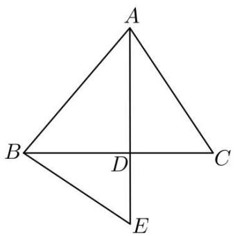

text_image

A
B
D
C
E

1411 (2024·全国·模拟预测)在锐角 $\triangle ABC$ 中, 内角 A, B, C 的对边分别为 a, b, c, $2\cos^{2}2C = 3 - 5\cos2\left(\frac{23\pi}{2} - C\right)$ .

(1) 求角 C;  
(2) 若点 D 在 AB 上, BD = 2AD, BD = CD, 求 $\frac{AC}{BC}$ 的值.

【解析】(1) 因为 $2\cos^{2}2C = 3 - 5\cos2\left(\frac{23\pi}{2} - C\right) = 3 - 5\cos(23\pi - 2C) = 3 - 5\cos(\pi - 2C) = 3 + 5\cos2C$ ,

所以 $2\cos^{2}2C - 5\cos2C - 3 = 0$ ，解得 $\cos2C = -\frac{1}{2}$ 或 $\cos2C = 3$ （舍去），

所以 $2\cos^2\mathrm{C} - 1 = -\frac{1}{2}$ 即 $\cos C = \pm \frac{1}{2}$

因为 $0 < C < \frac{\pi}{2}$ ，所以 $C = \frac{\pi}{3}$ .

(2) 如图, 因为 BD = 2AD, BD = CD, 设 AD = m, BD = CD = 2m,

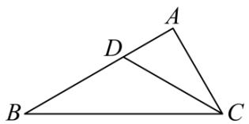

text_image

A
D
B
C

在 $\triangle ABC$ 中，由余弦定理得 $9m^{2} = AC^{2} + BC^{2} - AC\cdot BC,$ 在 $\triangle BCD$ 中，由余弦定理得 $\cos \angle BDC = \frac{BD^2 + CD^2 - BC^2}{2BD\cdot CD} = \frac{(2m)^2 + (2m)^2 - BC^2}{2\times 2m\times 2m} =$ $\frac{8m^2 - BC^2}{8m^2},$

在 $\triangle \mathrm{ADC}$ 中，由余弦定理得 $\cos \angle \mathrm{ADC} = \frac{\mathrm{AD}^2 + \mathrm{CD}^2 - \mathrm{AC}^2}{2\mathrm{AD}\cdot\mathrm{CD}} = \frac{m^2 + (2m)^2 - \mathrm{AC}^2}{2m\times 2m} =$ $\frac{5m^2 - AC^2}{4m^2},$

因为 $\angle BDC + \angle ADC = \pi$ ，所以 $\cos\angle BDC + \cos\angle ADC = 0$ ，

即 $\frac{8m^2 - \mathrm{BC}^2}{8m^2} +\frac{5m^2 - \mathrm{AC}^2}{4m^2} = 0$ ，所以 $18m^{2} - \mathrm{BC}^{2} - 2\mathrm{AC}^{2} = 0$

所以 $2(AC^{2}+BC^{2}-AC\cdot BC)-BC^{2}-2AC^{2}=0$ ,

因为 BC ≠ 0, 所以 BC = 2AC,

所以 $\frac{AC}{BC}=\frac{1}{2}.$

1412 (2024·浙江舟山·高一舟山中学校考阶段练习)如图,在梯形ABCD中, AB // CD, AD · sinD = 2CD · sinB.

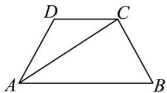

text_image

D
C
A
B

(1) 求证: BC = 2CD;   
(2) 若 AD = BC = 2, $\angle ADC = 120^{\circ}$ , 求 AB 的长度.

【解析】(1) 证明: 在 $\triangle ACD$ 中, 由正弦定理得 $\frac{AD}{\sin\angle ACD} = \frac{AC}{\sin D}$ ,

即 $AD \cdot \sin D = AC \cdot \sin \angle ACD,$

因为 AB // CD, 所以 $\angle ACD = \angle CAB$ , 所以 AD·sinD = AC·sin∠CAB,

在 $\triangle ABC$ 中,由正弦定理得 $\frac{AC}{\sin B}=\frac{BC}{\sin\angle CAB}$ ,

即 $AC \cdot \sin \angle CAB = BC \cdot \sin B$ ，所以 $AD \cdot \sin D = BC \cdot \sin B$ .

又 $AD \cdot \sin D = 2CD \cdot \sin B$ ，所以 $BC \cdot \sin B = 2CD \cdot \sin B$ ，即 BC = 2CD.

(2) 由 (1) 知 $\mathrm{CD} = \frac{1}{2}\mathrm{BC} = 1$ .

在 $\triangle ACD$ 中, 由余弦定理得 $AC^2 = AD^2 + CD^2 - 2AD \cdot CD \cdot \cos \angle ADC$

$= 2^{2} + 1^{2} - 2 \times 2 \times 1 \times \left(-\frac{1}{2}\right) = 7$ ，故 $AC = \sqrt{7}$ .

所以 $\cos\angle CAB = \cos\angle ACD = \frac{CD^{2} + AC^{2} - AD^{2}}{2CD \cdot AC} = \frac{1^{2} + 7 - 2^{2}}{2 \times 1 \times \sqrt{7}} = \frac{2\sqrt{7}}{7}.$

在 $\triangle ABC$ 中，由余弦定理得 $BC^{2}=AC^{2}+AB^{2}-2AC\cdot AB\cdot\cos\angle CAB$

即 $2^{2}=7+AB^{2}-2\times\sqrt{7}\times AB\times\frac{2\sqrt{7}}{7}$ ，整理可得 $AB^{2}-4AB+3=0$ ，解得 AB=1 或 3.

又因为 ABCD 为梯形, 所以 AB = 3.

# 3 题型三: 张角定理与等面积法

1413 (2024·全国·高三专题练习)已知 $\triangle ABC$ 中，a, b, c 分别为内角 A, B, C 的对边，且 $2a\sin A = (2b + c)\sin B + (2c + b)\sin C.$

(1) 求角 A 的大小;  
(2) 设点 D 为 BC 上一点, AD 是 $\triangle ABC$ 的角平分线, 且 AD = 2, b = 3, 求 $\triangle ABC$ 的面积.

【解析】(1) 在 $\triangle ABC$ 中, 由正弦定理及 $2a\sin A = (2b + c)\sin B + (2c + b)\sin C$ 得: $a^{2} - b^{2} - bc = c^{2}$ , ..

由余弦定理得 $\cos A = \frac{b^{2} + c^{2} - a^{2}}{2bc} = -\frac{1}{2}$ ,

又 $0 < A < \pi$ ，所以 $A = \frac{2\pi}{3}$

(2)AD 是 $\triangle ABC$ 的角平分线, $\angle BAD = \angle DAC = \frac{\pi}{3}$ ,

由 $S_{\triangle ABC} = S_{\triangle ABD} + S_{\triangle CAD}$ 可得 $\frac{1}{2} bc\sin \frac{2\pi}{3} = \frac{1}{2} c\times \mathrm{AD}\times \sin \frac{\pi}{3} +\frac{1}{2} b\times \mathrm{AD}\times \sin \frac{\pi}{3}$

因为 b=3, AD=2, 即有 $3c=2c+6$ , c=6,

故 $S_{\triangle ABC}=\frac{1}{2}bc\sin A=\frac{1}{2}\times3\times6\times\frac{\sqrt{3}}{2}=\frac{9\sqrt{3}}{2}$

1414 (2024·贵州黔东南·凯里一中校考三模)已知△ABC的内角A，B，C的对边分别为a，b，c，且 $2a\sin A=(2b+c)\sin B+(2c+b)\sin C$ .

(1) 求 A 的大小;

(2) 设点 D 为 BC 上一点, AD 是 $\triangle ABC$ 的角平分线, 且 $AD = 4$ , $AC = 6$ , 求 $\triangle ABC$ 的面积.

【解析】(1) 因为 $2a\sin A = (2b + c)\sin B + (2c + b)\sin C$

所以根据正弦定理得: $2a^{2} = (2b + c)b + (2c + b)c$

即 $a^2 = b^2 + c^2 + bc$

由余弦定理得: $a^2 = c^2 + b^2 - 2bc\cos A$

故 $\cos A = -\frac{1}{2}$

又 $A \in (0, \pi)$

所以 $A=\frac{2\pi}{3}$ .

(2) 因为 AD 是 $\triangle ABC$ 的角平分线, 由 $S_{\triangle ABD} + S_{\triangle ADC} = S_{\triangle ABC}$ ,

得: $\frac{1}{2} AB \cdot 4\sin \frac{\pi}{3} + \frac{1}{2} \times 4 \times 6\sin \frac{\pi}{3} = \frac{1}{2} AB \cdot 6\sin \frac{2\pi}{3}$ ,

所以 AB = 12

故 $S_{\triangle ABC} = \frac{1}{2} AB \cdot AC \sin \frac{2\pi}{3} = \frac{1}{2} \times 12 \times 6 \times \frac{\sqrt{3}}{2} = 18\sqrt{3}$ .

1415 (2024·山东潍坊·统考模拟预测)在△ABC中,设角A,B,C所对的边长分别为a,b,c,且 $(c-b)\sin C=(a-b)(\sin A+\sin B)$ .

(1) 求 A;   
(2) 若 D 为 BC 上点, AD 平分角 A, 且 $b = 3$ , $\mathrm{AD} = \sqrt{3}$ , 求 $\frac{\mathrm{BD}}{\mathrm{DC}}$ .

【解析】(1) 因为 $(c-b)\sin C=(a-b)(\sin A+\sin B)$ ,

由正弦定理可得 $(c-b)c=(a-b)(a+b)$ ，整理得 $b^{2}+c^{2}-bc=a^{2}$

由余弦定理,可得 $\cos A=\frac{b^{2}+c^{2}-a^{2}}{2bc}=\frac{bc}{2bc}=\frac{1}{2}$ ,

又因为 $A \in (0, \pi)$ ，可得 $A = \frac{\pi}{3}$ .

(2) 因为 D 为 BC 上点, AD 平分角 A, 则 $S_{\triangle ABC} = \frac{1}{2} bc \sin A = \frac{\sqrt{3}}{4} bc$ ,

又由 $S_{\triangle ABC} = \frac{1}{2} AC \cdot AD \sin \frac{A}{2} + \frac{1}{2} AB \cdot AD \sin \frac{A}{2} = \frac{1}{4} \cdot AD (b + c) = \frac{\sqrt{3}}{4} (b + c)$ ,

可得 $bc = b + c$

又因为 b=3，可得 $3c=3+c$ ，解得 $c=\frac{3}{2}$ ，

因为 $\frac{S_{\triangle ABD}}{S_{\triangle ACD}} = \frac{AB}{AC} = \frac{BD}{DC}$ ，所以 $\frac{BD}{DC} = \frac{c}{b} = \frac{1}{2}$ .

1416 (2024·安徽淮南·统考二模)如图,在 $\triangle ABC$ 中, $AB=2,3\sin^{2}B-2\cos B-2=0$ ,且点D在线段BC上.

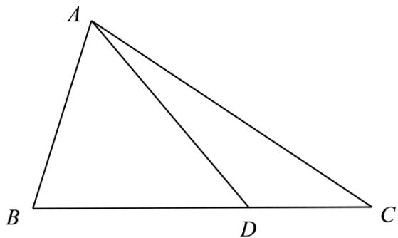

text_image

A
B
D
C

(1) 若 $\angle ADC = \frac{3\pi}{4}$ , 求 AD 的长;  
(2) 若 BD = 2DC, $\frac{\sin\angle BAD}{\sin\angle CAD} = 4\sqrt{2}$ , 求 $\triangle ABD$ 的面积.

【解析】(1) 由 $3\sin^{2}B - 2\cos B - 2 = 0$ ，可得 $3\cos^{2}B + 2\cos B - 1 = 0$ ，

所以 $\cos B = \frac{1}{3}$ 或 $\cos B = -1$ (舍去),

所以 $\sin B = \frac{2\sqrt{2}}{3}$ ,

因为 $\angle ADC = \frac{3\pi}{4}$ ，所以 $\angle ADB = \frac{\pi}{4}$ ，

由正弦定理可得: $\frac{AB}{\sin\angle ADB} = \frac{AD}{\sin B}$ , 所以 $AD = \frac{8}{3}$ .

(2) 由 BD = 2DC, 得 $\frac{S_{\triangle BAD}}{S_{\triangle CAD}} = 2$ , 所以 $\frac{\frac{1}{2}AB \cdot AD \cdot \sin \angle BAD}{\frac{1}{2}AC \cdot AD \cdot \sin \angle CAD} = 2$ ,

因为 $\frac{\sin\angle BAD}{\sin\angle CAD} = 4\sqrt{2}$ ，AB=2，所以AC=4√2，

由余弦定理得 $AC^{2}=AB^{2}+BC^{2}-2AB\cdot BC\cdot\cos B$ ,

即 $3\mathrm{BC}^2 - 4\mathrm{BC} - 84 = 0, (\mathrm{BC} - 6)(3\mathrm{BC} + 14) = 0,$

可得BC=6或BC=- $\frac{14}{3}$ (舍去),

所以 BD = 4,

所以 $S_{\triangle ABD}=\frac{1}{2}\cdot AB\cdot BD\cdot \sin B=\frac{1}{2}\times2\times4\times\frac{2\sqrt{2}}{3}=\frac{8\sqrt{2}}{3}.$

1417 (2024·江西抚州·江西省临川第二中学校考二模)如图,在 $\triangle ABC$ 中, AB = 4, $\cos B = \frac{1}{3}$ , 点 D 在线段 BC 上.

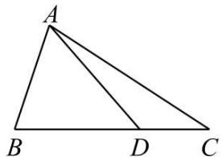

text_image

A
B D C

(1) 若 $\angle ADC = \frac{3\pi}{4}$ , 求 AD 的长;  
(2) 若 BD = 2DC, $\triangle ACD$ 的面积为 $\frac{16\sqrt{2}}{3}$ , 求 $\frac{\sin\angle BAD}{\sin\angle CAD}$ 的值.

【解析】(1) $\because\angle ADC=\frac{3\pi}{4}$ ,

$$
\therefore \angle A D B = \frac {\pi}{4},
$$

又∵cosB= $\frac{1}{3}$ ,

$$
\therefore \sin B = \frac {2 \sqrt {2}}{3}.
$$

在 $\triangle ABD$ 中， $\frac{AD}{\sin B} = \frac{AB}{\sin \angle ADB}$ ，

$$
\therefore \mathrm{AD} = \frac {4 \cdot \frac {2 \sqrt {2}}{3}}{\frac {\sqrt {2}}{2}} = \frac {1 6}{3}.
$$

(2) $\because$ BD = 2DC,

$$
\therefore \mathrm{S} _ {\triangle \mathrm{ABD}} = 2 \mathrm{S} _ {\triangle \mathrm{ADC}},
$$

$$
\mathrm{S} _ {\triangle \mathrm{ABC}} = 3 \mathrm{S} _ {\triangle \mathrm{ADC}},
$$

又 $S_{\triangle ADC} = \frac{16\sqrt{2}}{3}$

$$
\therefore \mathrm{S} _ {\triangle \mathrm{ABC}} = 1 6 \sqrt {2},
$$

$$
\because \mathrm{S} _ {\triangle \mathrm{ABC}} = \frac {1}{2} \mathrm{AB} \cdot \mathrm{BCsin} \angle \mathrm{ABC},
$$

$$
\therefore \mathrm{BC} = 1 2,
$$

$$
\because \mathrm{S} _ {\triangle \mathrm{ABD}} = \frac {1}{2} \mathrm{AB} \cdot \mathrm{AD} \sin \angle \mathrm{BAD},
$$

$$
\mathrm{S} _ {\triangle \mathrm{ADC}} = \frac {1}{2} \mathrm{AC} \cdot \mathrm{AD} \sin \angle \mathrm{CAD},
$$

$$
\mathrm{S} _ {\triangle \mathrm{ABD}} = 2 \mathrm{S} _ {\triangle \mathrm{ADC}},
$$

$$
\therefore \frac {\sin \angle B A D}{\sin \angle C A D} = 2 \cdot \frac {A C}{A B},
$$

在 $\triangle ABC$ 中，

由余弦定理得 $AC^{2}=AB^{2}+BC^{2}-2AB\cdot BC\cos\angle ABC.$

$$
\therefore \mathrm{AC} = 8 \sqrt {2},
$$

$$
\therefore \frac {\sin \angle B A D}{\sin \angle C A D} = 2 \cdot \frac {A C}{A B} = 4 \sqrt {2}.
$$

1418 (2024·全国·高一专题练习)已知函数 $f(x) = \sqrt{3}\sin \omega x\cos \omega x - \cos^2\omega x + \frac{1}{2} (\omega > 0)$ ，其图像上相邻的最高点和最低点间的距离为 $\sqrt{4 + \frac{\pi^2}{4}}$ .

(1) 求函数 $f(x)$ 的解析式；  
(2) 记 $\triangle ABC$ 的内角 A, B, C 的对边分别为 $a, b, c, a = 4, bc = 12, f(A) = 1$ . 若角 A 的平分线 AD 交 BC 于 D, 求 AD 的长.

【解析】(1) 因为 $f(x)=\sqrt{3}\sin\omega x\cos\omega x-\cos^{2}\omega x+\frac{1}{2}=\frac{\sqrt{3}}{2}\sin2\omega x-\frac{1}{2}\cos2\omega x=\sin\left(2\omega x-\frac{\pi}{6}\right)$ ,

设函数 $f(x)$ 的周期为 T，由题意 $\left(\frac{T}{2}\right)^{2}+4=4+\frac{\pi^{2}}{4}$ ，即 $\left(\frac{\pi}{2\omega}\right)^{2}=\frac{\pi^{2}}{4}$ ，解得 $\omega=1$ ，

所以 $f(x)=\sin\left(2x-\frac{\pi}{6}\right)$ .

(2) 由 $f(A) = 1$ 得: $\sin\left(2A - \frac{\pi}{6}\right) = 1$ ，即 $2A - \frac{\pi}{6} = 2k\pi + \frac{\pi}{2}, k \in Z$ ，解得 $A = k\pi + \frac{\pi}{3}, k \in Z$ ，

因为 $A \in [0, \pi]$ ，所以 $A = \frac{\pi}{3}$ ，

因为 A 的平分线 AD 交 BC 于 D,

所以 $S_{\triangle ABC}=S_{\triangle ABD}+S_{\triangle ACD}$ ，即 $\frac{1}{2}bc\sin\frac{\pi}{3}=\frac{1}{2}c\cdot AD\cdot\sin\frac{\pi}{6}+\frac{1}{2}b\cdot AD\cdot\sin\frac{\pi}{6}$ ，可得 AD $=\frac{\sqrt{3}bc}{b+c}$ ,

由余弦定理得: , $a^{2}=b^{2}+c^{2}-2bc\cos A=(b+c)^{2}-3bc$ , 而 bc=12,

得 $(b+c)^{2}=52$ ，因此AD= $\frac{12\sqrt{3}}{2\sqrt{13}}=^{\circ}\frac{6\sqrt{39}}{13}$ .

1419 (2024·吉林通化·梅河口市第五中学校考模拟预测)已知锐角 $\triangle ABC$ 的内角 A,B,C 的对边分别为 a,b,c，且 $\frac{a}{b+c} = \frac{\sin B - \sin C}{\sin A - \sin C}$ .

(1) 求 B;

(2) 若 $b = \sqrt{6}$ ，角 B 的平分线交 AC 于点 D，BD = 1，求 $\triangle ABC$ 的面积.

【解析】(1) 因为 $\frac{a}{b+c} = \frac{\sin B - \sin C}{\sin A - \sin C}$ ，由正弦定理得 $\frac{a}{b+c} = \frac{b-c}{a-c}$ ，整理得 $a^{2} - ac = b^{2} - c^{2}$ ，

又由余弦定理得 $\cos B = \frac{a^2 + c^2 - b^2}{2ac} = \frac{1}{2}$ .

因为 $B \in \left(0, \frac{\pi}{2}\right)$ ，所以 $B = \frac{\pi}{3}$ .

(2) 如图所示, 因为 $S_{\triangle ABC} = S_{\triangle ABD} + S_{\triangle BCD}$ ,

所以 $S_{\triangle ABC}=\frac{1}{2}BD\cdot c\sin\frac{\pi}{6}+\frac{1}{2}BD\cdot a\sin\frac{\pi}{6}=\frac{1}{4}(a+c)$ .

又因为 $S_{\triangle ABC}=\frac{1}{2}ac\sin\frac{\pi}{3}=\frac{\sqrt{3}}{4}ac$ ，所以 $\frac{1}{4}(a+c)=\frac{\sqrt{3}}{4}ac$ .

由余弦定理得 $b^{2}=a^{2}+c^{2}-2ac\cos\frac{\pi}{3}=(a+c)^{2}-3ac=6$ ,

联立方程组 $\left\{\begin{aligned}\frac{1}{4}(a+c)&=\frac{\sqrt{3}}{4}ac\\ (a+c)^{2}-3ac&=6\end{aligned}\right.$ ，可得 $3(ac)^{2}-3ac=6$ ，即 $(ac)^{2}-ac-2=0$ ，

解得 ac=2 或 ac=-1(舍去),

所以 $S_{\triangle ABC}=\frac{1}{2}ac\sin B=\frac{\sqrt{3}}{4}ac=\frac{\sqrt{3}}{2}.$

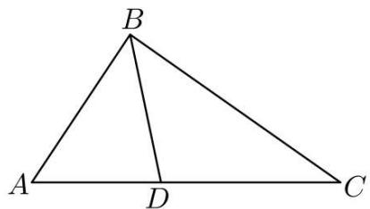

text_image

B
A D C

# 4 题型四:角平分线问题

1420 (2024·黑龙江哈尔滨·哈尔滨市第一二二中学校校考模拟预测)在 $\triangle ABC$ 中, 已知 AB = 5, $\angle BAC$ 的平分线与边 BC 交于点 D, $\angle DAC$ 的平分线与边 BC 交于点 E, $\cos\angle EAC = \frac{3\sqrt{10}}{10}$ .

(1) 若 $\mathrm{BC} = \frac{6}{5}\mathrm{AC}$ , 求 $\triangle ABC$ 的面积;  
(2) 若 $\cos \angle ADB = \frac{\sqrt{2}}{10}$ , 求 BC.

【解析】(1) 因为 $\cos\angle EAC=\frac{3\sqrt{10}}{10}$ ，所以 $\cos\angle DAC=2\cos^{2}\angle EAC-1=2\times\frac{9}{10}-1=\frac{4}{5}$ ,

则 $\cos\angle BAC=2\cos^{2}\angle DAC-1=2\times\frac{16}{25}-1=\frac{7}{25}$ ,

则 $\sin\angle BAC=\sqrt{1-\cos^{2}\angle BAC}=\frac{24}{25}.$

设 AC = x，则 BC = $\frac{6}{5}x$ ，

在 $\triangle ABC$ 中, 由余弦定理得 $BC^{2}=AB^{2}+AC^{2}-2AB\cdot AC\cos\angle BAC$ ,

即 $\frac{36}{25} x^2 = 25 + x^2 -\frac{14}{5} x$ ，即 $\frac{11}{25} x^2 +\frac{14}{5} x - 25 = 0,$

又 x > 0, 所以 x = 5,

所以 $\triangle ABC$ 的面积 $S_{\triangle ABC} = \frac{1}{2} AB \cdot AC \sin \angle BAC = \frac{1}{2} \times 5 \times 5 \times \frac{24}{25} = 12.$

(2) 因为 $\cos\angle ADB=\frac{\sqrt{2}}{10}$ , $\cos\angle DAC=\frac{4}{5}$ ,

所以 $\sin\angle ADB=\sqrt{1-\cos^{2}\angle ADB}=\frac{7\sqrt{2}}{10}$ ， $\sin\angle DAC=\sqrt{1-\cos^{2}\angle DAC}=\frac{3}{5}$

因为 $\angle ADB = \angle DAC + \angle C,$

所以 $\sin\angle C=\sin(\angle ADB-\angle DAC)=\sin\angle ADB\cos\angle DAC-\cos\angle ADB\sin\angle DAC$

$$
= \frac {7 \sqrt {2}}{1 0} \times \frac {4}{5} - \frac {\sqrt {2}}{1 0} \times \frac {3}{5} = \frac {\sqrt {2}}{2},
$$

在 $\triangle ABC$ 中，由正弦定理得 $\frac{BC}{\sin\angle BAC} = \frac{AB}{\sin\angle C}$ ，即 $\frac{BC}{\frac{24}{25}} = \frac{5}{\frac{\sqrt{2}}{2}}$ ，所以 $BC = \frac{24\sqrt{2}}{5}$ .

1421 (2024·河北衡水·河北衡水中学校考模拟预测)锐角 $\triangle ABC$ 的内角 A, B, C 的对边分别为 $a, b, c$ , 已知 $\sqrt{3} (b\sin C + c\sin B) = 4a\sin B\sin C$ , $b^2 + c^2 - a^2 = 8$ ,

(1) 求 $\cos A$ 的值及 $\triangle ABC$ 的面积;  
(2) $\angle A$ 的平分线与BC交于D, $\mathrm{DC} = 2\mathrm{BD}$ , 求 $a$ 的值.

【解析】(1)根据题意,结合正弦定理边角互化得 $\sqrt{3}(\sin B\sin C+\sin C\sin B)=4\sin A\sin B\sin C$ ,

即 $2\sqrt{3}\sin B\sin C = 4\sin A\sin B\sin C$ ，因为 B, C ∈ (0, π),

所以 $\sin B \neq 0, \sin C \neq 0,$

所以 $\sin A = \frac{\sqrt{3}}{2}$ ，因为在锐角 $\triangle ABC$ 中， $A \in \left(0, \frac{\pi}{2}\right)$ ，所以 $A = \frac{\pi}{3}$ .

所以 $\cos A = \frac{1}{2}$ ，因为 $b^{2} + c^{2} - a^{2} = 8$ ，

所以 $b^{2} + c^{2} - a^{2} = 2bc\cos A = 8$ ，解得 $bc = 8$

所以 $\triangle ABC$ 的面积 $S = \frac{1}{2} bc\sin A = \frac{1}{2}\times 8\times \frac{\sqrt{3}}{2} = 2\sqrt{3}.$

(2) 因为 $\angle A$ 的平分线与 BC 交于 D, DC = 2BD, 所以 $S_{\triangle ABD} = \frac{1}{2} S_{\triangle ADC}$ ,

即 $\frac{1}{2} b\cdot \mathrm{AD}\sin 30^{\circ} = \frac{1}{2}\times \frac{1}{2} c\cdot \mathrm{AD}\sin 30^{\circ}$ ，所以 $b = 2c$ ，由于 $bc = 8$

所以 b=4, c=2 所以 $a^{2}=b^{2}+c^{2}-8=4+16-8=12$ ，所以 $a=2\sqrt{3}$ .

1422 (2024·山东泰安·统考模拟预测)在 $\triangle ABC$ 中, 角 A、B、C 的对边分别是 a、b、c, 且 $2\cos C \cdot \sin\left(B + \frac{\pi}{6}\right) + \cos A = 0$ .

(1) 求角 C 的大小;  
(2) 若 $\angle ACB$ 的平分线交 $AB$ 于点 $D$ , 且 $CD = 2, BD = 2AD$ , 求 $\triangle ABC$ 的面积.

【解析】(1) 由已知可得 $2\cos C \cdot \left(\frac{\sqrt{3}}{2}\sin B + \frac{1}{2}\cos B\right) - \cos(B + C) = 0$ ,

$$
\sqrt {3} \sin B \cos C + \cos B \cos C - (\cos B \cos C - \sin B \sin C) = 0,
$$

整理得, $\sin B(\sqrt{3}\cos C + \sin C) = 0$ ,

因为 $B \in (0, \pi)$ ，所以 $\sin B \neq 0$ ，

所以 $\sqrt{3}\cos C + \sin C = 0,$

即 $\tan C = -\sqrt{3}$ ,

因为 $C \in (0, \pi)$ ，所以 $C = \frac{2\pi}{3}$ .

(2) 由题意得, $\frac{\mathrm{AC}}{\mathrm{BC}} = \frac{\mathrm{AD}}{\mathrm{BD}} = \frac{1}{2}$ , 即 $\frac{b}{a} = \frac{1}{2}$ , 所以 $a = 2b$ .

法一：

在 $\triangle ABC$ 中， $c^2 = a^2 + b^2 - 2ab\cos \angle ACB = 4b^2 + b^2 - 2 \times 2b \times b \times \left(-\frac{1}{2}\right) = 7b^2,$

所以 $c=\sqrt{7}b$ . 在 $\triangle ACD$ 中, $AD=\frac{c}{3}$ ,

所以 $AD^{2}=AC^{2}+CD^{2}-2AC\cdot CD\cdot\cos\angle ACD,$

即 $\frac{c^2}{9} = b^2 + 2^2 - 2b \times 2 \times \frac{1}{2}$ ,

将 $c=\sqrt{7}b$ 代入整理得 $b^{2}-9b+18=0$ ，解得 b=3 或 b=6。

若 $b = 6$ ，则 $a = 12, c = 6\sqrt{7}, \mathrm{BD} = 4\sqrt{7}, \mathrm{AD} = 2\sqrt{7}$

所以在 $\triangle \mathrm{BCD}$ 中，得 $\cos \angle \mathrm{CDB} = \frac{\mathrm{BD}^2 + \mathrm{CD}^2 - \mathrm{BC}^2}{2\mathrm{BD}\cdot\mathrm{CD}} = \frac{(4\sqrt{7})^2 + 2^2 - 12^2}{16\sqrt{7}} < 0,$

同理可得 $\cos\angle ADC<0$ , 即 $\angle BDC$ 和 $\angle ADC$ 都为钝角, 不符合题意, 排除.

所以 b=3, a=6,

$$
\mathrm{S} _ {\triangle \mathrm{ABC}} = \frac {1}{2} a b \sin 1 2 0 ^ {\circ} = \frac {9 \sqrt {3}}{2}.
$$

法二：

因为 $S_{\triangle ACD} + S_{\triangle BCD} = S_{\triangle ABC}$ ,

所以 $\frac{1}{2} \times 2b\sin 60^{\circ} + \frac{1}{2} \times 2a\sin 60^{\circ} = \frac{1}{2} ab\sin 120^{\circ}$ , 所以 $b + a = \frac{1}{2} ab$ .

因为 a=2b，所以 b=3, a=6，

所以 $S_{\triangle ABC}=\frac{1}{2}ab\sin120^{\circ}=\frac{9\sqrt{3}}{2}.$

1423 (2024·河北唐山·唐山市第十中学校考模拟预测)如图,在 $\triangle ABC$ 中,角A,B,C所对的边分别为 $a,b,c,a+2b=2c\cos\left(B-\frac{\pi}{3}\right)$ ,角C的平分线交AB于点D,且 $BD=2\sqrt{7}$ , $AD=\sqrt{7}$ .

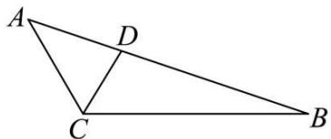

text_image

A
D
C
B

(1) 求 $\angle ACB$ 的大小;  
(2) 求 CD.

【解析】(1)由正弦定理 $a+2b=2c\cos\left(B-\frac{\pi}{3}\right)$ 得 $\sin A+2\sin B=$

$$
2 \sin \angle A C B \left(\frac {1}{2} \cos B + \frac {\sqrt {3}}{2} \sin B\right),
$$

即 $\sin A + 2\sin B = \sin \angle ACB\cos B + \sqrt{3}\sin \angle ACB\sin B,$

因为 $\sin A = \sin(B + \angle ACB) = \sin B \cos \angle ACB + \cos B \sin \angle ACB,$

所以 $\sin B\cos\angle ACB + 2\sin B = \sqrt{3}\sin\angle ACB\sin B,$

因为 $\sin B \neq 0$ ，所以 $\cos \angle ACB + 2 = \sqrt{3} \sin \angle ACB$ ，即 $\sin \left( \angle ACB - \frac{\pi}{6} \right) = 1$ ，

因为 $0 < \angle ACB < \pi$ ，所以 $\angle ACB - \frac{\pi}{6} = \frac{\pi}{2}$ ，

所以 $\angle ACB = \frac{2\pi}{3}$ .

(2) 已知角 C 的平分线交 AB 于点 D, 且 BD = $2\sqrt{7}$ , AD = $\sqrt{7}$ .

在 $\triangle \mathrm{ACD}$ 中，由正弦定理得 $\frac{\mathrm{AD}}{\sin\angle\mathrm{ACD}} = \frac{\mathrm{AC}}{\sin\angle\mathrm{ADC}}$

在 $\triangle \mathrm{BCD}$ 中，由正弦定理得 $\frac{\mathrm{BD}}{\sin\angle\mathrm{BCD}} = \frac{\mathrm{BC}}{\sin\angle\mathrm{BDC}}$

因为 $\angle ACD = \angle BCD, \angle ADC + \angle BDC = \pi,$ 所以 $\sin\angle ACD = \sin\angle BCD, \sin\angle ADC = \sin\angle BDC,$

所以 $\frac{AD}{BD} = \frac{AC}{BC} = \frac{1}{2}.$

设 AC = x, BC = 2x，由余弦定理得 $BC^{2} + AC^{2} - AB^{2} = 2BC \times AC \times \cos \angle ACB$ ,

即 $4x^{2} + x^{2} - (3\sqrt{7})^{2} = 2 \cdot 2x \cdot x \cdot \left(-\frac{1}{2}\right)$ ,

解得 x=3，

因为 $S_{\triangle ACB}=S_{\triangle ACD}+S_{\triangle BCD}$ ,

所以 $\frac{1}{2} \times 3 \times 6 \times \frac{\sqrt{3}}{2} = \frac{1}{2} \times 3 \times CD \times \frac{\sqrt{3}}{2} + \frac{1}{2} \times 6 \times CD \times \frac{\sqrt{3}}{2}$ ,

解得 $\mathrm{CD} = 2$

1424 (2024·广东深圳·校考二模)记 $\triangle ABC$ 的内角 A、B、C 的对边分别为 $a, b, c$ , 已知 $\sin B \sin C \cos^{2} \frac{A}{2} = 2 \sin^{2} A$ .

(1) 证明: $b + c = 3a$ ;   
(2) 若角 B 的平分线交 AC 于点 D，且 BD = $\frac{4\sqrt{6}}{5}$ ， $\frac{\mathrm{AD}}{\mathrm{DC}} = \frac{3}{2}$ ，求 $\triangle ABC$ 的面积.

【解析】(1)由正弦定理得： $\sin C=\frac{c\sin A}{a},\sin B=\frac{b\sin A}{a}$

$$
\mathrm{S} _ {\triangle \mathrm{ABC}} = \frac {1}{2} b c \sin \mathrm{A} = \frac {1}{2} \times 9 \times \frac {4 \sqrt {2}}{9} = 2 \sqrt {2}
$$

所以 $\sin B\sin C\cos^2\frac{A}{2} = 2\sin^2 A$ 可化为 $b c\cos^2\frac{A}{2} = 2a^2,$

因为 $\cos^{2}\frac{A}{2}=\frac{1+\cos A}{2}$ ,

,所以 $bc(1+\cos A)=4a^{2}$

所以 $bc\left(1+\frac{b^{2}+c^{2}-a^{2}}{2bc}\right)=4a^{2}$ ,

所以 $bc + \frac{b^2 + c^2 - a^2}{2} = 4a^2$ ，即 $(b + c)^2 = 9a^2,$

所以 $b + c = 3a;$

(2) 角 B 的平分线交 AC 于点 D, 且 BD = $\frac{4\sqrt{6}}{5}$ , $\frac{AD}{DC} = \frac{3}{2}$ ,

由角平分线定理可得 $\frac{AD}{DC} = \frac{AB}{BC} = \frac{S_{\triangle ABD}}{S_{\triangle CBD}} = \frac{3}{2}, \therefore \frac{c}{a} = \frac{3}{2},$

$\therefore c = \frac{3}{2} a,$ 又 $b + c = 3a,\therefore b = \frac{3}{2} a,\mathrm{AD} = \frac{3}{5} b = \frac{9}{10} a$

由余弦定理得: $\cos A = \frac{b^{2} + c^{2} - a^{2}}{2bc} = \frac{7}{9}$ , $\sin A = \frac{4\sqrt{2}}{9}$ ,

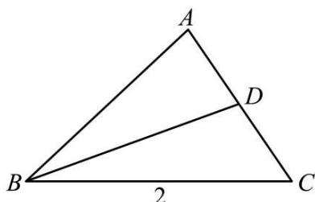

text_image

A
D
B
2
C

在 $\triangle ABD$ 中，由余弦定理得： $\mathrm{BD}^2 = \mathrm{AB}^2 + \mathrm{AD}^2 - 2\mathrm{AB} \cdot \mathrm{AD} \cdot \cos A = \left(\frac{3}{2} a\right)^2 + \left(\frac{9}{10} a\right)^2 -$

$$
2 \times \frac {9}{1 0} a \times \frac {3}{2} a \times \frac {7}{9} = \frac {9 6}{2 5},
$$

所以 a=2, b=3.

所以 $S_{\triangle ABC}=\frac{1}{2}bc\sin A=\frac{1}{2}\times3\times3\times\frac{4\sqrt{2}}{9}=2\sqrt{2}$

1425 (2024·海南·校联考模拟预测)在 $\triangle ABC$ 中, 角 A, B, C 的对边分别为 $a, b, c$ , 点 M 在边 BC 上, AM 是角 A 的平分线, $a \sin B = -\sqrt{3} b \cos A$ , CM = 2MB.

(1) 求 A;   
(2) 若 $\mathrm{AM} = 2\sqrt{3}$ , 求 BC 的长.

【解析】(1) 在 $\triangle ABC$ 中, 由 $a\sin B = -\sqrt{3}b\cos A$ 及正弦定理得,

$$
\sin A \sin B = - \sqrt {3} \sin B \cos A
$$

又 $\sin B \neq 0$ ，所以 $\tan A = -\sqrt{3}$ ，

又 $0 < A < 180^{\circ}$ ,

所以 $A = 120^{\circ}$ .

(2) 已知 AM 是角 A 的平分线, $CM = 2MB, A = 120^{\circ}$ ,

则 $S_{\triangle ACM}=2S_{\triangle ABM}$ ，所以 $\frac{1}{2}AC\times AM\times\sin60^{\circ}=2\times\frac{1}{2}AB\times AM\times\sin60^{\circ}$

所以 AC = 2AB,

如图, 过 M 作 MD // AC 交 AB 于点 D, 易知 $\triangle AMD$ 为正三角形,

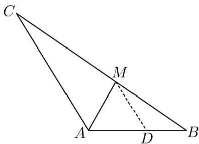

text_image

Geometric diagram of triangle ABC with internal points M and D, showing segments AD and CM

所以 $\mathrm{AD} = \mathrm{MD} = \mathrm{AM} = 2\sqrt{3}$ ， $\mathrm{AB} = \frac{3}{2}\mathrm{AD} = 3\sqrt{3}$ ， $\mathrm{AC} = 3\mathrm{MD} = 6\sqrt{3}$

在 $\triangle ABC$ 中,由余弦定理得,

$$
\mathrm{BC} = \sqrt {\mathrm{AB} ^ {2} + \mathrm{AC} ^ {2} - 2 \mathrm{AB} \cdot \mathrm{AC} \cdot \cos \mathrm{A}}
$$

$$
= \sqrt {2 7 + 3 6 \times 3 - 2 \times 3 \sqrt {3} \times 6 \sqrt {3} \times \left(- \frac {1}{2}\right)} = 3 \sqrt {2 1}.
$$

1426 (2024·四川·校联考模拟预测)在① $a = b \cos C + \frac{\sqrt{3}}{3} c \sin B$ ; ② c = 3 这两个条件中任选一个作为已知条件, 补充在下面的横线上, 并给出解答.

注:若选择多个条件分别解答,按第一个解答计分.

已知 $\triangle ABC$ 中, 角 A, B, C 的对边分别为 $a, b, c$ , 点 D 为 BC 边的中点, $b = AD = \sqrt{7}$ , 且 \_\_\_\_.

(1) 求 a 的值;  
(2) 若 $\angle ABC$ 的平分线交 AC 于点 E, 求 $\triangle BCE$ 的周长.

【解析】(1) 若选①: 由 $a = b \cos C + \frac{\sqrt{3}}{3} c \sin B$ 可得 $\sin A = \sin B \cos C + \frac{\sqrt{3}}{3} \sin C \sin B$ ,

又 $\sin A = \sin(B + C) = \sin B \cos C + \cos B \sin C,$

故 $\cos B\sin C=\frac{\sqrt{3}}{3}\sin C\sin B,$

而 $C \in (0, \pi)$ , $\sin C \neq 0$ , 故 $\tan B = \sqrt{3}$ ,又 $B\in(0,\pi)$ ，所以 $B=\frac{\pi}{3}$ ;

设 a=2x, c=y，则 BD=DC=x，

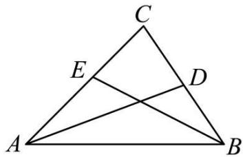

text_image

C
E
D
A
B

在 $\triangle ABD$ 中, 由余弦定理得 $AD^{2}=AB^{2}+BD^{2}-2AB\cdot BD\cos B$ ,

即 $x^{2}+y^{2}-xy=7$ ,

在 $\triangle ABC$ 中, 由余弦定理得 $AC^{2}=AB^{2}+BC^{2}-2AB\cdot BC\cos B$ ,

即 $4x^{2} + y^{2} - 2xy = 7$ ，和 $x^{2} + y^{2} - xy = 7$ 联立解得 $x = 1, y = 3$

则 c=3, a=2;

若选②: c=3, 设 a=2t, 则 BD=DC=t,

在 $\triangle ABD$ 中，由余弦定理得 $\cos \angle ADB = \frac{t^2 + 7 - 9}{2\sqrt{7}t}$

在 $\triangle \mathrm{ADC}$ 中，由余弦定理得 $\cos \angle \mathrm{ADC} = \frac{t^2 + 7 - 7}{2\sqrt{7}t}$

因为 $\angle ADB + \angle ADC = \pi$ ，所以 $\cos\angle ADB + \cos\angle ADC = 0$ ，

即 $\frac{t^{2}+7-9}{2\sqrt{7}t}+\frac{t^{2}+7-7}{2\sqrt{7}t}=0$ , 解得 t=1,

故 a=2.

(2) 由 (1) 可知, 选①可得 $B = \frac{\pi}{3}, a = 2, c = 3$ ; 选②可得 $a = 2$ , 则 $B = \frac{\pi}{3}$ ,

故由 $S_{\triangle ABC}=S_{\triangle ABE}+S_{\triangle BCE}$ ,

可得 $\frac{1}{2} \times 2 \times 3 \times \sin 60^{\circ} = \frac{1}{2} \times 3 \times \mathrm{BE} \times \sin 30^{\circ} + \frac{1}{2} \times 2 \times \mathrm{BE} \times \sin 30^{\circ}$ ,

解得 $\mathrm{BE} = \frac{6\sqrt{3}}{5}$

故在 $\triangle \mathrm{BCE}$ 中， $\mathrm{CE}^2 = \mathrm{BC}^2 + \mathrm{BE}^2 - 2\mathrm{BC} \cdot \mathrm{BE}\cos \angle \mathrm{CBE}$ ，

即 $\mathrm{CE}^2 = \frac{108}{25} + 4 - 2 \times \frac{6\sqrt{3}}{5} \times 2 \times \frac{\sqrt{3}}{2} = \frac{28}{25}, \therefore \mathrm{CE} = \frac{2\sqrt{7}}{5}$ ,

故 $\triangle \mathrm{BCE}$ 的周长为 $\mathrm{BC} + \mathrm{BE} + \mathrm{CE} = 2 + \frac{6\sqrt{3}}{5} +\frac{2\sqrt{7}}{5}.$

# 5 题型五:中线问题

1427 (2024·浙江杭州·统考一模)已知△ABC中角A、B、C所对的边分别为a、b、c，且满足

$$
2 c \sin A \cos B + 2 b \sin A \cos C = \sqrt {3} a, c > a.
$$

(1) 求角 A;  
(2) 若 $b = 2$ , BC 边上中线 $\mathrm{AD} = \sqrt{7}$ , 求 $\triangle ABC$ 的面积.

【解析】(1) $\because 2c\sin A\cos B + 2b\sin A\cos C = \sqrt{3} a$

所以由正弦定理得 $2\sin C \sin A \cos B + 2\sin B \sin A \cos C = \sqrt{3} \sin A$ ,

$$
\because \mathrm{A} \in (0, \pi), \sin \mathrm{A} > 0,
$$

$$
\therefore \sin C \cos B + \sin B \cos C = \frac {\sqrt {3}}{2} \text {, 即} \therefore \sin (B + C) = \frac {\sqrt {3}}{2},
$$

$$
\because \mathrm{A} + \mathrm{B} + \mathrm{C} = \pi , \therefore \sin \mathrm{A} = \frac {\sqrt {3}}{2},
$$

$$
\because c > a, \therefore A = \frac {\pi}{3};
$$

(2) $\because \overrightarrow{\mathrm{AD}} = \frac{1}{2} (\overrightarrow{\mathrm{AB}} +\overrightarrow{\mathrm{AC}}),$

则 $\overrightarrow{AD}^{2}=\frac{1}{4}(\overrightarrow{AB}+\overrightarrow{AC})^{2}$ ，即 $4\overrightarrow{AD}^{2}=\overrightarrow{AB}^{2}+2\overrightarrow{AB}\cdot\overrightarrow{AC}+\overrightarrow{AC}^{2}$

而 b=2, BC 边上中线 AD= $\sqrt{7}$ ,

故 $|\overrightarrow{AB}|^2 + 2|\overrightarrow{AB}| - 24 = 0$ ，解得 $|\overrightarrow{AB}| = 4$

$$
\therefore \mathrm{S} _ {\triangle \mathrm{ABC}} = \frac {1}{2} b c \sin \mathrm{A} = \frac {1}{2} \times 2 \times 4 \times \frac {\sqrt {3}}{2} = 2 \sqrt {3}.
$$

1428 (2024·四川内江·校考模拟预测)在 $\triangle ABC$ 中，D 是边 BC 上的点， $\angle BAC = 120^{\circ}$ ， $|AD| = 1$ ，AD 平分 $\angle BAC$ ， $\triangle ABD$ 的面积是 $\triangle ACD$ 的面积的两倍.

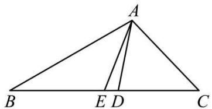

text_image

A
B E D C

(1) 求 $\triangle ACD$ 的面积;  
(2) 求 $\triangle ABC$ 的边 BC 上的中线 AE 的长.

【解析】(1)由已知及正弦定理可得: $S_{\Delta ABD} = \frac{1}{2} |AD| \cdot |AB| \cdot \sin 60^{\circ} = 2S_{\Delta ACD} = 2 \times \frac{1}{2} |AD| \cdot |AC| \cdot \sin 60^{\circ}$ ,

化简得: $|AB|=2|AC|$ .

又因为:

$$
\mathrm{S} _ {\Delta \mathrm{ABC}} = 3 \mathrm{S} _ {\Delta \mathrm{ACD}} = 3 \cdot \frac {1}{2} | \mathrm{AD} | \cdot | \mathrm{AC} | \cdot \sin 6 0 ^ {\circ} = \frac {3 \sqrt {3}}{4} | \mathrm{AC} | = \frac {1}{2} | \mathrm{AB} | \cdot | \mathrm{AC} | \cdot \sin 1 2 0 ^ {\circ} =
$$

$\frac{\sqrt{3}}{2} |\mathrm{AC}|^2$ ，所以 $|\mathrm{AC}| = \frac{3}{2}$ ，所以 $\mathrm{S}_{\Delta \mathrm{ACD}} = \frac{1}{2} |\mathrm{AC}|\cdot |\mathrm{AD}|\cdot \sin 60^{\circ} = \frac{3}{2}\times \frac{\sqrt{3}}{4} = \frac{3\sqrt{3}}{8},$

所以 $\triangle ACD$ 的面积为 $\frac{3\sqrt{3}}{8}$ .

(2) 由 (1) 可知 $\left|AB\right|=2\left|AC\right|=3$ ，因为 AE 是 $\triangle ABC$ 的边 BC 上的中线，

所以 $\overrightarrow{AE}=\frac{1}{2}\left(\overrightarrow{AB}+\overrightarrow{AC}\right)$ ,

所以 $\left|\overrightarrow{AE}\right|=\frac{1}{2}\sqrt{(\overrightarrow{AB}+\overrightarrow{AC})^{2}}=\frac{1}{2}\sqrt{\overrightarrow{AB}^{2}+\overrightarrow{AC}^{2}+2\overrightarrow{AB}\cdot\overrightarrow{AC}}=\frac{1}{2}\sqrt{9+\frac{9}{4}-\frac{9}{2}}=\frac{3\sqrt{3}}{4}$

所以 $\triangle ABC$ 的边 BC 上的中线 AE 的长为 $\frac{3\sqrt{3}}{4}$ .

1429 (2024·四川绵阳·统考二模)在 $\triangle ABC$ 中, 角 A, B, C 所对的边分别为 $a, b, c$ , $a^2 \sin C + 3a \cos C = 3b$ , $A = 60^\circ$ .

(1) 求 a 的值;  
(2) 若 $\overrightarrow{BA} \cdot \overrightarrow{AC} = -\frac{1}{2}$ ，求 BC 边上中线 AT 的长.

【解析】(1)由正弦定理得: $a\sin A\sin C + 3\sin A\cos C = 3\sin B = 3\sin(A + C)$ ,

$$
\therefore a \sin A \sin C = 3 \sin A \cos C + 3 \cos A \sin C - 3 \sin A \cos C = 3 \cos A \sin C,
$$

$$
\because 0 ^ {\circ} <   \mathrm{C} <   1 2 0 ^ {\circ}, \therefore \sin \mathrm{C} \neq 0, \therefore a \sin \mathrm{A} = 3 \cos \mathrm{A}, \text {又} \mathrm{A} = 6 0 ^ {\circ},
$$

$\therefore \frac{\sqrt{3}}{2}a=\frac{3}{2}$ , 解得: $a=\sqrt{3}$ .

(2) $\because \overrightarrow{\mathrm{BA}}\cdot \overrightarrow{\mathrm{AC}} = bc\cos (180^{\circ} - A) = -bc\cos A = -\frac{1}{2} bc = -\frac{1}{2},\therefore bc = 1,$

由余弦定理得: $b^{2}+c^{2}=a^{2}+2bc\cos A=a^{2}+bc=4$ ,

$$
\because \overrightarrow {A T} = \frac {1}{2} (\overrightarrow {A B} + \overrightarrow {A C}), \therefore | \overrightarrow {A T} | ^ {2} = \frac {1}{4} (c ^ {2} + b ^ {2} + 2 b c \cos A) = \frac {1}{4} \times (4 + 1) = \frac {5}{4}, \therefore | \overrightarrow {A T} | =
$$

$\frac{\sqrt{5}}{2}$ ，即BC边上中线AT的长为 $\frac{\sqrt{5}}{2}$ .

1430 (2024·广东广州·统考一模)在 $\triangle ABC$ 中，内角A,B,C的对边分别为 $a,b,c,c = 2b,$

$2\sin A = 3\sin 2C.$

(1) 求 $\sin C$ ;   
(2) 若 $\triangle ABC$ 的面积为 $\frac{3\sqrt{7}}{2}$ ，求 AB 边上的中线 CD 的长.

【解析】(1) 因为 $2 \sin A = 3 \sin 2C$ ,

所以 $2\sin A = 6\sin C\cos C$ ,

所以 $2a = 6c \cos C$ ,

即 $a = 3c\cos C$

所以 $\cos C = \frac{a}{3c}$

由余弦定理及 $c = 2b$ 得：

$$
\cos C = \frac {a ^ {2} + b ^ {2} - c ^ {2}}{2 a b} = \frac {a ^ {2} + b ^ {2} - 4 b ^ {2}}{2 a b} = \frac {a ^ {2} - 3 b ^ {2}}{2 a b},
$$

又 $\cos C = \frac{a}{3c} = \frac{a}{6b}$ ,

所以 $\frac{a^2 - 3b^2}{2ab} = \frac{a}{6b} \Rightarrow 2a^2 = 9b^2$

即 $a=\frac{3\sqrt{2}}{2}b$ ,

所以 $\cos C=\frac{a}{6b}=\frac{\frac{3\sqrt{2}}{2}b}{6b}=\frac{\sqrt{2}}{4}$ ,

所以 $\sin C = \sqrt{1 - \cos^2C} = \sqrt{1 - \left(\frac{\sqrt{2}}{4}\right)^2} = \frac{\sqrt{14}}{4}$ .

(2) 由 $S_{\triangle ABC} = \frac{1}{2} ab \sin C = \frac{1}{2} \times ab \times \frac{\sqrt{14}}{4} = \frac{3\sqrt{7}}{2}$ ,

所以 $ab = 6\sqrt{2}$

由(1) $a=\frac{3\sqrt{2}}{2}b$ ,

所以 $b = 2, a = 3\sqrt{2}$ ,

因为 CD 为 AB 边上的中线，

所以 $\overrightarrow{CD}=\frac{1}{2}\left(\overrightarrow{CA}+\overrightarrow{CB}\right)$ ,

所以 $\left|\overrightarrow{CD}\right|^{2}=\frac{1}{4}\left(\left|\overrightarrow{CA}\right|^{2}+\left|\overrightarrow{CB}\right|^{2}+2\overrightarrow{CA}\cdot\overrightarrow{CB}\right)$

$$
= \frac {1}{4} \times (b ^ {2} + a ^ {2} + 2 a b \cos C)
$$

$$
= \frac {1}{4} \times (4 + 1 8 + 2 \times 2 \times 3 \sqrt {2} \times \frac {\sqrt {2}}{4})
$$

$$
= 7,
$$

所以 $\left|\overrightarrow{CD}\right|=\sqrt{7}$ ,

所以 AB 边上的中线 CD 的长为: $\sqrt{7}$ .

1431 (2024·安徽宣城·安徽省宣城中学校考模拟预测) $\triangle ABC$ 中, 已知 $\sqrt{3} \cos \left( \frac{\pi}{3} - B \right) + \cos \left( \frac{\pi}{6} + B \right) = 0$ . AC 边上的中线为 BD.

(1) 求 $\angle B;$   
(2) 从以下三个条件中选择两个, 使 $\triangle ABC$ 存在且唯一确定, 并求 AC 和 BD 的长度.  
条件①: $a^2 - b^2 + c^2 - 3c = 0$ ; 条件② $a = 6$ ; 条件③ $S_{\triangle ABC} = 15\sqrt{3}$ .

【解析】(1) 因为 $\sqrt{3}\cos\left(\frac{\pi}{3}-B\right)+\cos\left(\frac{\pi}{6}+B\right)=0,$

则 $\sqrt{3}\left(\cos\frac{\pi}{3}\cos B+\sin\frac{\pi}{3}\sin B\right)+\left(\cos\frac{\pi}{6}\cos B-\sin\frac{\pi}{6}\sin B\right)=0,$

$$
\sqrt {3} \left(\frac {1}{2} \cos B + \frac {\sqrt {3}}{2} \sin B\right) + \left(\frac {\sqrt {3}}{2} \cos B - \frac {1}{2} \sin B\right) = \sqrt {3} \cos B + \sin B = 2 \sin \left(B + \frac {\pi}{3}\right) = 0,
$$

又 $0 < B < \pi$ , 解得: $B + \frac{\pi}{3} = \pi$ , 故 $B = \frac{2\pi}{3}$ .

(2) 由 (1) 得 $\angle ABC = \frac{2\pi}{3}$ ,

又余弦定理得: $\cos\angle ABC=\frac{a^{2}+c^{2}-b^{2}}{2ac}=-\frac{1}{2}$ ，所以 $a^{2}+c^{2}-b^{2}=-ac$ ，

而条件①中 $a^{2}-b^{2}+c^{2}-3c=0$ ，所以 a=-3，显然不符合题意，即条件①错误，

由条件② a=6, 条件③ $S_{\triangle ABC}=\frac{1}{2}ac\sin\angle ABC=15\sqrt{3}$ , 解得 c=10,

由余弦定理可得 $b^{2}=a^{2}+c^{2}-2ac\cos\angle ABC=36+100+60=196$ ，所以 b=14。

在 $\triangle ABC$ 中，由正弦定理可得 $\frac{a}{\sin A} = \frac{b}{\sin\angle ABC}$ ，解得 $\sin A = \frac{3\sqrt{3}}{14}$

又 $0 < A < \frac{\pi}{3}$ ，所以 $\cos A = \frac{13}{14}$ ，

因为 BD 为 AC 边上的中线, 所以 AD = CD = 7,

在 $\triangle ABD$ 中, 由余弦定理可得 $BD^{2} = AB^{2} + AD^{2} - 2AB \times AD \times \cos A = 19$ , 解得 $BD = \sqrt{19}$ .

故 $\mathrm{AC} = 14, \mathrm{BD} = \sqrt{19}$ .

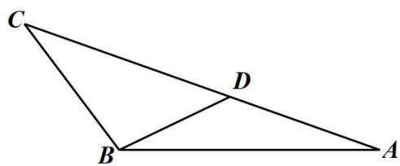

text_image

Geometric diagram of triangle ABC with point D on side BC and line segment BD drawn

1432 (2024·辽宁沈阳·东北育才双语学校校考一模)如图, 设 $\triangle ABC$ 中角 A, B, C 所对的边分别为 a, b, c, AD 为 BC 边上的中线, 已知 c = 1 且 $2c\sin A\cos B = a\sin A - b\sin B + \frac{1}{4}b\sin C$ , $\cos\angle BAD = \frac{\sqrt{21}}{7}$ .

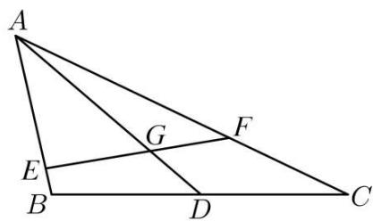

text_image

A
E
G
F
B
D
C

(1) 求 b 边的长度;  
(2) 求 $\triangle ABC$ 的面积;  
(3) 设点 E, F 分别为边 AB, AC 上的动点 (含端点), 线段 EF 交 AD 于 G, 且 $\triangle AEF$ 的面

积为 $\triangle ABC$ 面积的 $\frac{1}{6}$ , 求 $\overrightarrow{AG} \cdot \overrightarrow{EF}$ 的取值范围.

【解析】(1) 由已知条件可知: $2c \cdot \sin A \cos B = a \cdot \sin A - b \cdot \sin B + \frac{1}{4} b \cdot \sin C$

在 $\triangle ABC$ 中, 由正弦定理 $\frac{a}{\sin A} = \frac{b}{\sin B} = \frac{c}{\sin C} = 2R$

得 $2ac \cdot \cos B = a^{2} - b^{2} + \frac{1}{4} bc$

在 $\triangle ABC$ 中，由余弦定理 $\cos B = \frac{a^2 + c^2 - b^2}{2ac}$

得 $a^2 + c^2 - b^2 = a^2 - b^2 + \frac{1}{4} bc$

$$
\therefore b = 4 c, \text {又} \because c = 1, \therefore b = 4
$$

(2) 设 $\angle BAC = \theta$

$\because \overrightarrow{AD}$ 为BC边上中线 $\therefore \overrightarrow{AD} = \frac{1}{2}\overrightarrow{AB} +\frac{1}{2}\overrightarrow{AC}$

则 $\overrightarrow{\mathrm{AB}}\cdot \overrightarrow{\mathrm{AD}} = \overrightarrow{\mathrm{AB}}\cdot \frac{1}{2} (\overrightarrow{\mathrm{AB}} +\overrightarrow{\mathrm{AC}}) = \frac{1}{2} |\overrightarrow{\mathrm{AB}} |^2 +\frac{1}{2} |\overrightarrow{\mathrm{AB}} ||\overrightarrow{\mathrm{AC}} |\cos \theta = 2\cos \theta +\frac{1}{2}$

$$
\left| \overrightarrow {\mathrm{AD}} \right| = \sqrt {\overrightarrow {\mathrm{AD}} ^ {2}} = \sqrt {\frac {1}{4} \left(\overrightarrow {\mathrm{AB}} ^ {2} + \overrightarrow {\mathrm{AC}} ^ {2} + 2 \overrightarrow {\mathrm{AB}} \cdot \overrightarrow {\mathrm{AC}}\right)}
$$

$$
= \frac {1}{2} \sqrt {\left| \overrightarrow {\mathrm{AB}} \right| ^ {2} + \left| \overrightarrow {\mathrm{AC}} \right| ^ {2} + \left| \overrightarrow {\mathrm{AB}} \right| \left| \overrightarrow {\mathrm{AC}} \right| \cos \theta} = \frac {\sqrt {1 7 + 8 \cos \theta}}{2}
$$

$$
\cos \angle B A D = \frac {\overrightarrow {A B} \cdot \overrightarrow {A D}}{| \overrightarrow {A B} | \cdot | \overrightarrow {A D} |} = \frac {4 \cos \theta + 1}{\sqrt {1 7 + 8 \cos \theta}} = \frac {\sqrt {2 1}}{7} ①
$$

$$
\therefore 2 8 \cos^ {2} \theta + 8 \cos \theta - 1 1 = 0
$$

$\therefore (2\cos \theta - 1)(14\cos \theta + 11) = 0 \therefore \cos \theta = \frac{1}{2}$ 或 $-\frac{11}{14}$

由①, 得 $4\cos\theta + 1 > 0 \therefore \cos\theta > -\frac{1}{4} \therefore \cos\theta = \frac{1}{2} \therefore \sin\theta = \frac{\sqrt{3}}{2}$

$$
\therefore \mathrm{S} _ {\triangle \mathrm{ABC}} = \frac {1}{2} | \overrightarrow {\mathrm{AB}} | \cdot | \overrightarrow {\mathrm{AC}} | \cdot \sin \theta = \sqrt {3}
$$

(3) 设 $\overrightarrow{\mathrm{AD}} = k\overrightarrow{\mathrm{AG}}, \overrightarrow{\mathrm{AB}} = \lambda \overrightarrow{\mathrm{AE}}, \overrightarrow{\mathrm{AC}} = \mu \overrightarrow{\mathrm{AF}} (\lambda, \mu \in [1, +\infty))$

$$
\therefore | \overrightarrow {\mathrm{AE}} | = \frac {1}{\lambda}, | \overrightarrow {\mathrm{AF}} | = \frac {4}{\mu}
$$

$$
\overrightarrow {\mathrm{AD}} = \frac {1}{2} \overrightarrow {\mathrm{AB}} + \frac {1}{2} \overrightarrow {\mathrm{AC}} \Rightarrow 2 k \overrightarrow {\mathrm{AG}} = \lambda \overrightarrow {\mathrm{AE}} + \mu \overrightarrow {\mathrm{AF}} \Rightarrow \overrightarrow {\mathrm{AG}} = \frac {\lambda}{2 k} \overrightarrow {\mathrm{AE}} + \frac {\mu}{2 k} \overrightarrow {\mathrm{AF}}
$$

根据三点共线公式, 得 $\lambda + \mu = 2k$

$$
\overrightarrow {\mathrm{AG}} \cdot \overrightarrow {\mathrm{EF}} = \frac {1}{k} \overrightarrow {\mathrm{AD}} \cdot (\overrightarrow {\mathrm{AF}} - \overrightarrow {\mathrm{AE}})
$$

$$
= \frac {1}{2 k} (\overrightarrow {\mathrm{AB}} + \overrightarrow {\mathrm{AC}}) \left(\frac {1}{\mu} \overrightarrow {\mathrm{AC}} - \frac {1}{\lambda} \overrightarrow {\mathrm{AB}}\right)
$$

$$
= \frac {1}{2 k} \cdot \left(\frac {1}{\mu} \cdot | \overrightarrow {\mathrm{AC}} | ^ {2} - \frac {1}{\lambda} \cdot | \overrightarrow {\mathrm{AB}} | ^ {2} + \left(\frac {1}{\mu} - \frac {1}{\lambda}\right) | \overrightarrow {\mathrm{AB}} | \cdot | \overrightarrow {\mathrm{AC}} | \cdot \cos \theta\right) (\cos \theta = \frac {1}{2}, \theta \text {为} \angle \mathrm{BAC})
$$

$$
= \frac {1}{2 k} \cdot \left(\frac {1 6}{\mu} - \frac {1}{\lambda} + \frac {2}{\mu} - \frac {2}{\lambda}\right)
$$

$$
= \frac {3}{\lambda \mu} \cdot \frac {6 \lambda - \mu}{\lambda + \mu}
$$

$$
\frac {\mathrm{S} _ {\triangle \mathrm{ABC}}}{\mathrm{S} _ {\triangle \mathrm{AEF}}} = \frac {\frac {1}{2} \cdot | \overrightarrow {\mathrm{AB}} | | \overrightarrow {\mathrm{AC}} | \cdot \sin \theta}{\frac {1}{2} \cdot | \overrightarrow {\mathrm{AE}} | | \overrightarrow {\mathrm{AF}} | \sin \theta} = 6 \therefore \lambda \mu = 6
$$

$$
\begin{array}{l} \therefore \overrightarrow {\mathrm{AG}} \cdot \overrightarrow {\mathrm{EF}} = \frac {1}{2} \cdot \frac {6 \lambda - \frac {6}{\lambda}}{\lambda + \frac {6}{\lambda}} \\ = 3 \cdot \frac {\lambda^ {2} - 1}{\lambda^ {2} + 6} \\ = 3 \cdot \left(1 - \frac {7}{\lambda^ {2} + 6}\right) \\ \end{array}
$$

$$
\mu = \frac {6}{\lambda} \geqslant 1 \Rightarrow \lambda \leqslant 6 \Rightarrow \lambda \in [ 1, 6 ] \Rightarrow \lambda^ {2} + 6 \in [ 7, 4 2 ]
$$

$$
\Rightarrow \frac {1}{6} \leqslant \frac {7}{\lambda^ {2} + 6} \leqslant 1 \Rightarrow \overrightarrow {\mathrm{AG}} \cdot \overrightarrow {\mathrm{EF}} \in [ 0, \frac {5}{2} ]
$$

1433 (2024·广东广州·统考三模)在① $b\sin\frac{\pi-A}{2}=a\sin B$ ; ② $\sqrt{3}a\sin B=b(2-\cos A)$ 这两个条件中任选一个, 补充在下面的问题中, 并作答.

问题: 已知 $\triangle ABC$ 中, a, b, c 分别为角 A, B, C 所对的边, \_\_\_\_.

(1) 求角 A 的大小;  
(2) 已知 AB = 2, AC = 8, 若 BC, AC 边上的两条中线 AM, BN 相交于点 P, 求 $\angle MPN$ 的余弦值.

注:如果选择多个条件分别解答,按第一个解答计分.

【解析】(1) 若选①, $b\sin\left(\frac{\pi}{2}-\frac{A}{2}\right)=b\cos\frac{A}{2}=a\sin B$ , 由正弦定理得 $\sin B\cos\frac{A}{2}=\sin A\sin B$ , 又 $\sin B>0$ ,

则 $\cos\frac{A}{2}=\sin A=2\sin\frac{A}{2}\cos\frac{A}{2}$ ，又 $\cos\frac{A}{2}>0$ ，即 $\sin\frac{A}{2}=\frac{1}{2}$ ，又 $A\in(0,\pi)$ ，则 $A=\frac{\pi}{3}$ ；
若选②，由正弦定理得 $\sqrt{3}\sin A\sin B = \sin B(2 - \cos A)$ ，又 $\sin B > 0$ ，则 $\sqrt{3}\sin A = 2 - \cos A$ ，

即 $\sqrt{3}\sin A + \cos A = 2\sin\left(A + \frac{\pi}{6}\right) = 2$ ，则 $\sin\left(A + \frac{\pi}{6}\right) = 1$ ，又 $A \in (0, \pi)$ ，则 $A = \frac{\pi}{3}$ ;
(2)

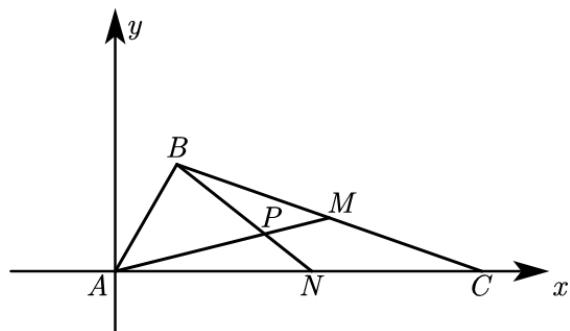

text_image

y
B
P
M
A
N
C
x

以 A 为坐标原点, AC 所在直线为 x 轴, 过 A 点垂直于 AC 的直线为 y 轴, 建立如图所示平面直角坐标系, 易得 C(8,0),

由 $A=\frac{\pi}{3}$ 可得 $B(1,\sqrt{3})$ ，则 $M\left(\frac{9}{2},\frac{\sqrt{3}}{2}\right)$ ， $N(4,0)$ ，则 $\overrightarrow{AM}=\left(\frac{9}{2},\frac{\sqrt{3}}{2}\right)$ ， $\overrightarrow{BN}=(3,-\sqrt{3})$ ，

则 $\cos \angle MPN = \cos \left\langle \overrightarrow{AM},\overrightarrow{BN}\right\rangle = \frac{\overrightarrow{AM}\cdot\overrightarrow{BN}}{\left|\overrightarrow{AM}\right|\left|\overrightarrow{BN}\right|} = \frac{\frac{9}{2}\times 3 - \frac{\sqrt{3}}{2}\times\sqrt{3}}{\sqrt{\frac{81}{4} + \frac{3}{4}}\cdot\sqrt{9 + 3}} = \frac{2\sqrt{7}}{7}.$

# 6 题型六:高问题

1434 (2024·海南海口·海南华侨中学校考模拟预测)已知 $\triangle ABC$ 的内角A，B，C的对边分别为 $a, b, c, a = 6, b\sin 2A = 4\sqrt{5}\sin B.$

(1) 若 b=1，证明： $C=A+\frac{\pi}{2}$ ;  
(2) 若 BC 边上的高为 $\frac{8\sqrt{5}}{3}$ ，求 $\triangle ABC$ 的周长.

【解析】(1)由已知可得 $\frac{b}{\sin B} = \frac{4\sqrt{5}}{\sin 2A} = \frac{2\sqrt{5}}{\sin A \cos A}$ ,

由正弦定理 $\frac{a}{\sin A} = \frac{b}{\sin B}$ 可得， $\frac{b}{\sin B} = \frac{a}{\sin A} = \frac{6}{\sin A}$ ,

所以有 $\frac{2\sqrt{5}}{\sin A\cos A}=\frac{6}{\sin A}$ .

又 $\sin A > 0$ ，所以 $\cos A = \frac{\sqrt{5}}{3},\sin A = \sqrt{1 - \cos^2A} = \frac{2}{3}.$

又 b=1，所以 $\sin B=\frac{b\sin A}{a}=\frac{1\times\frac{2}{3}}{6}=\frac{1}{9}.$

$$
\because a > b, \therefore \cos B = \sqrt {1 - \sin^ {2} B} = \frac {4 \sqrt {5}}{9}
$$

$$
\therefore \cos C = - \cos (A + B) = - \cos A \cos B + \sin A \sin B = - \frac {2}{3},
$$

$$
\therefore \cos C = - \sin A = \cos \left(A + \frac {\pi}{2}\right).
$$

又 $C \in (0, \pi)$ , $A + \frac{\pi}{2} \in (0, \pi)$ , 函数 $y = \cos x$ 在 $(0, \pi)$ 上单调递减,

则 $C = A + \frac{\pi}{2}$ .

(2) 由题意得 $\triangle ABC$ 的面积 $S = \frac{1}{2} \times 6 \times \frac{8\sqrt{5}}{3} = 8\sqrt{5}$ .

又 $S=\frac{1}{2}bc\cdot\sin A=\frac{1}{3}bc$ ，则 $bc=24\sqrt{5}$ .

由余弦定理 $a^{2}=b^{2}+c^{2}-2bc\cos A=(b+c)^{2}-2bc(\cos A+1)$ ,

得 $(b + c)^2 = 2bc(1 + \cos A) + a^2 = 48\sqrt{5}\times \left(1 + \frac{\sqrt{5}}{3}\right) + 6^2 = (6 + 4\sqrt{5})^2,$

所以， $b+c=6+4\sqrt{5}$ .

所以, $\triangle ABC$ 的周长为 $12+4\sqrt{5}$ .

1435 (2024·重庆·统考模拟预测)在 $\triangle ABC$ 中, 角 A, B, C 的对边分别为 a, b, c, $\vec{m} =$

$$
(\sin B, \sin C + \cos C), \vec {n} = (\cos C - \sin C, \cos B), \vec {m} \cdot \vec {n} = \frac {1}{2}.
$$

(1) 求 $\sin 2\mathrm{A}$ ;   
(2) 若 $a = 3$ , BC 边上的高线长 $\sqrt{7} - 1$ , 求 $\sin B \sin C$ .

【解析】(1) 由已知得

$$
\vec {m} \cdot \vec {n} = (\sin B, \sin C + \cos C) \cdot (\cos C - \sin C, \cos B)
$$

$$
= \sin B (\cos C - \sin C) + \cos B (\sin C + \cos C)
$$

$$
= \sin B \cos C + \cos B \sin C + \cos C \cos B - \sin B \sin C
$$

$$
= \sin (B + C) + \cos (C + B)
$$

$$
= \sin A - \cos A = \frac {1}{2}
$$

$$
\therefore (\sin A - \cos A) ^ {2} = \sin^ {2} A + \cos^ {2} A - 2 \sin A \cos A = 1 - \sin 2 A = \frac {1}{4}
$$

$$
\therefore \sin 2 A = \frac {3}{4};
$$

(2) $\because 0 < A < \pi,$

$$
\therefore 0 <   2 \mathrm{A} <   2 \pi ,
$$

$$
\because \sin 2 A = \frac {3}{4} > 0,
$$

$$
\therefore 0 <   2 \mathrm{A} <   \pi ,
$$

$$
\therefore 0 <   \mathrm{A} <   \frac {\pi}{2},
$$

$$
\therefore \cos A > 0,
$$

$$
\because (\sin A + \cos A) ^ {2} = \sin^ {2} A + \cos^ {2} A + 2 \sin A \cos A = 1 + \sin 2 A = \frac {7}{4},
$$

$$
\therefore \sin A + \cos A = \pm \frac {\sqrt {7}}{2}, \because \sin A > 0, \cos A > 0,
$$

$$
\therefore \sin A + \cos A = \frac {\sqrt {7}}{2} \text {, 又} \sin A - \cos A = \frac {1}{2},
$$

$$
\therefore \sin A = \frac {\sqrt {7} + 1}{4},
$$

$$
\because \mathrm{S} _ {\triangle \mathrm{ABC}} = \frac {1}{2} a c \sin \mathrm{B} = \frac {1}{2} a \cdot (\sqrt {7} - 1),
$$

$$
\therefore a c \sin B = (\sqrt {7} - 1) a,
$$

$$
\therefore a \sin C \sin B = (\sqrt {7} - 1) \sin A,
$$

$$
\therefore \sin C \sin B = (\sqrt {7} - 1) \frac {\sin A}{a} = (\sqrt {7} - 1) \times \frac {\sqrt {7} + 1}{4 \times 3} = \frac {1}{2}.
$$

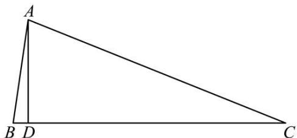

text_image

A
B D C

1436 (2024·四川自贡·统考三模) $\triangle ABC$ 的内角 A, B, C 所对的边分别为 $a, b, c$ , 若 $b^{2} + c^{2} = a^{2} + bc$ .

(1) 求 A;   
(2) 若 BC 上的高 AD = $\frac{\sqrt{3}}{4} a$ , 求 cosBcosC.

【解析】(1)由题意得: $b^{2}+c^{2}=a^{2}+bc$ ,

则由余弦定理得 $\cos A = \frac{b^2 + c^2 - a^2}{2bc} = \frac{1}{2}$

因为 $A \in (0, \pi)$ ，所以 $A = \frac{\pi}{3}$ .

(2) 由 $S_{\triangle ABC} = \frac{1}{2} ah = \frac{1}{2} bc \sin A$ ，则 $\frac{\sqrt{3}}{8} a^2 = \frac{\sqrt{3}}{4} bc$ ，所以 $a^2 = 2bc$ ，

则由正弦定理得 $\sin^{2}A = 2\sin B\sin C$ ，则 $\sin B\sin C = \frac{3}{8}$ ，

又 $\cos A = \cos [\pi - (B + C)] = -\cos (B + C) = \sin B \sin C - \cos B \cos C = \frac{1}{2}$ ,

即 $\frac{3}{8}-\cos B\cos C=\frac{1}{2}$ ，则 $\cos B\cos C=-\frac{1}{8}$ .

1437 (2024·黑龙江齐齐哈尔·统考一模)已知 $\triangle ABC$ 的内角A，B，C的对边分别为 $a, b, c$ 且 $c - \sqrt{3} b\sin A = \frac{a^2 + c^2 - b^2}{2c} - b.$

(1) 求 A;

(2) 若 $b = \frac{1}{4} c$ ，且 BC 边上的高为 $2\sqrt{3}$ ，求 $a$ .

【解析】(1) 因为 $c - \sqrt{3}b\sin A = \frac{a^{2} + c^{2} - b^{2}}{2c} - b$ ,

所以由余弦定理得 $c - \sqrt{3} b\sin A = a\cos B - b$

由正弦定理得 $\sin C - \sqrt{3}\sin A\sin B = \sin A\cos B - \sin B$ ,

由于 $\sin C = \sin(A + B) = \sin A \cos B + \cos A \sin B,$

整理得 $\cos A\sin B - \sqrt{3}\sin A\sin B = -\sin B.$

又因为 $\sin B \neq 0$ ，所以 $\cos A - \sqrt{3}\sin A = -1$ ，即 $\sin\left(A - \frac{\pi}{6}\right) = \frac{1}{2}$ ，

因为 $A \in (0, \pi)$ ，所以 $A - \frac{\pi}{6} \in \left(-\frac{\pi}{6}, \frac{5\pi}{6}\right)$ ，

所以 $A - \frac{\pi}{6} = \frac{\pi}{6}$ ，即 $A = \frac{\pi}{3}$ .

(2) 由 $S_{\triangle ABC} = \frac{1}{2} \times a \times 2\sqrt{3} = \frac{1}{2}bc \sin \frac{\pi}{3}$ 得 bc = 4a,

又 $b=\frac{1}{4}c$ ，所以 $c^{2}=16a, b^{2}=a$ ，

由余弦定理知 $a^{2}=b^{2}+c^{2}-2bc\cos A=a+16a-4a=13a$ ,

解得 $a = 13$

1438 (2024·辽宁抚顺·统考模拟预测)已知△ABC中,点D在边AB上,满足 $\overrightarrow{CD}=$

$\lambda \left( \frac{\overrightarrow{\mathrm{CA}}}{|\overrightarrow{\mathrm{CA}}|} + \frac{\overrightarrow{\mathrm{CB}}}{|\overrightarrow{\mathrm{CB}}|} \right)(\lambda > 0)$ , 且 $\cos \frac{\mathrm{B}}{2} = \frac{\sqrt{6}}{3}$ , $\triangle \mathrm{CAD}$ 的面积与 $\triangle \mathrm{CBD}$ 面积的比为 $2\sqrt{6}: 3$ .

(1) 求 $\sin A$ 的值;  
(2) 若 AB = 5，求边 AB 上的高 CE 的值.

【解析】(1) $\because\overrightarrow{CD}=\lambda\left(\frac{\overrightarrow{CA}}{|\overrightarrow{CA}|}+\frac{\overrightarrow{CB}}{|\overrightarrow{CB}|}\right)(\lambda>0)$ ,

∴ CD 为 ∠ACB 的平分线，

在 $\triangle CAD$ 与 $\triangle CBD$ 中, 根据正弦定理可得: $\left\{\begin{aligned}\frac{AC}{\sin\angle ADC}&=\frac{AD}{\sin\angle DCA}\\\frac{BC}{\sin\angle BDC}&=\frac{BD}{\sin\angle DCB}\end{aligned}\right.$

两式相比可得: $\frac{AC}{BC} = \frac{AD}{BD}$

又 $\triangle CAD$ 的面积与 $\triangle CBD$ 面积的比为 $2\sqrt{6}:3$ ,

$$
\therefore \frac {\mathrm{S} _ {\triangle \mathrm{CAD}}}{\mathrm{S} _ {\triangle \mathrm{CBD}}} = \frac {\mathrm{CA}}{\mathrm{CB}} = \frac {\mathrm{AD}}{\mathrm{BD}} = \frac {2 \sqrt {6}}{3},
$$

即 $\frac{\sin B}{\sin A} = \frac{CA}{CB} = \frac{2\sqrt{6}}{3}$ ，且 B > A，

由 $\cos \frac{\mathrm{B}}{2} = \frac{\sqrt{6}}{3}$ 得 $\cos \mathrm{B} = 2\cos^2\frac{\mathrm{B}}{2} -1 = \frac{1}{3},$

∴ $\sin B = \frac{2\sqrt{2}}{3}$ 且 B 为锐角，∴ $\sin A = \frac{\sqrt{3}}{3}$ .

故答案为: $\sin A = \frac{\sqrt{3}}{3}$

(2) 由 (1) 知 A 为锐角, 且 $\cos A = \sqrt{1 - \sin^2 A} = \frac{\sqrt{6}}{3}$ ,

因此 $\cos C = -\cos(A + B) = -(\cos A \cos B - \sin A \sin B) = \frac{\sqrt{6}}{9}$ ,

又 $\mathrm{AC} = \frac{2\sqrt{6}}{3}\mathrm{BC}$ ，所以在△ABC中由余弦定理得 $\mathrm{BC}^2 +\left(\frac{2\sqrt{6}}{3}\mathrm{BC}\right)^2 -2\mathrm{BC}\times \frac{2\sqrt{6}}{3}\mathrm{BC}$

$$
\times \frac {\sqrt {6}}{9} = A B ^ {2} = 5 ^ {2},
$$

解得: BC = 3,

$$
\because \mathrm{CE} \perp \mathrm{AB}: \therefore \mathrm{CE} = \mathrm{BCsinB} = 3 \times \frac {2 \sqrt {2}}{3} = 2 \sqrt {2}.
$$

故答案为: $CE = 2\sqrt{2}$

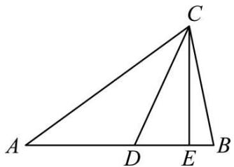

text_image

A
D
E
B
C

# 题型七:重心性质及其应用

1439 (2024·全国·高三专题练习)已知 $\triangle ABC$ 的内角A，B，C的对边分别为 $a, b, c$ ，且 $3c^2 = a^2 + 8b^2$ .

(1) 求 $\cos B$ 的最小值;  
(2) 若 M 为 $\triangle ABC$ 的重心, $\angle AMC = 90^{\circ}$ , 求 $\frac{\sin\angle AMB}{\sin\angle CMB}$ .

【解析】(1) 因为 $3c^{2}=a^{2}+8b^{2}$ ，所以 $\cos B=\frac{a^{2}+c^{2}-b^{2}}{2ac}=\frac{a^{2}+c^{2}-\frac{3c^{2}-a^{2}}{8}}{2ac}=$ $\frac{\frac{9}{8}a^{2}+\frac{5}{8}c^{2}}{2ac}\geqslant\frac{2\sqrt{\frac{9}{8}a^{2}\times\frac{5}{8}c^{2}}}{2ac}=\frac{3\sqrt{5}}{8}$

当且仅当 $\frac{9}{8}a^{2}=\frac{5}{8}c^{2}$ ，即 $a=\frac{\sqrt{5}}{3}c$ 时，等号成立.

(2)

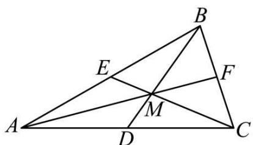

text_image

Geometric diagram of triangle ABC with internal points D, E, F, M and connecting line segments

记边 AC 的中点为 D, 边 AB 的中点为 E, 边 BC 的中点为 F, 因为点 M 为 $\triangle ABC$ 的重心,

所以 $\frac{AM}{MF} = \frac{BM}{DM} = \frac{CM}{ME} = 2,$

在 $\triangle AMC$ 中， $\angle AMC = 90^{\circ}$ ，D 为边 AC 的中点，所以 $DM = \frac{1}{2}AC = \frac{b}{2}$ ，所以 BM = 2DM = b，设 ME = x, MF = y，则 MC = 2x, MA = 2y，

在 $\triangle \mathrm{AMC}$ 中， $\mathrm{MC}^2 + \mathrm{MA}^2 = (2x)^2 + (2y)^2 = \mathrm{AC}^2 = b^2$ ，即 $x^2 + y^2 = \frac{b^2}{4}$ ，

在 $\triangle \mathrm{AME}$ 中， $\mathrm{ME}^2 + \mathrm{MA}^2 = (x)^2 + (2y)^2 = \mathrm{AE}^2 = \left(\frac{c}{2}\right)^2 = \frac{1}{4} c^2$ ，即 $x^2 + 4y^2 = \frac{c^2}{4}$ ，

在 $\triangle \mathrm{CMF}$ 中， $\mathrm{MC}^2 + \mathrm{MF}^2 = (2x)^2 + (y)^2 = \mathrm{CF}^2 = \left(\frac{a}{2}\right)^2$ ，即 $4x^2 + y^2 = \frac{a^2}{4}$ ，

消去 $x, y$ 得 $a^2 + c^2 = 5b^2$ , 又 $3c^2 = a^2 + 8b^2$ , 所以 $a = \frac{\sqrt{7}}{2} b, c = \frac{\sqrt{13}}{2} b$ ,

从而解得 $x = \frac{1}{4} b, y = \frac{\sqrt{3}b}{4}$ , 即 $\mathrm{MC} = \frac{1}{2} b, \mathrm{MA} = \frac{\sqrt{3}}{2} b$ ,

在 $\triangle \mathrm{AMB}$ 中， $\cos \angle \mathrm{AMB} = \frac{\mathrm{MA}^2 + \mathrm{BM}^2 - \mathrm{AB}^2}{2\mathrm{MA} \times \mathrm{BM}} = \frac{\frac{3}{4} b^2 + b^2 - c^2}{2 \times \frac{\sqrt{3}}{2} b \times b} = \frac{\frac{7}{4} b^2 - \frac{13}{4} b^2}{\sqrt{3} b^2} = -\frac{\sqrt{3}}{2}$ ，

所以 $\sin \angle \mathrm{AMB} = \sqrt{1 - \cos^2\angle \mathrm{AMB}} = \frac{1}{2},$

在 $\triangle \mathrm{CMB}$ 中， $\cos \angle \mathrm{CMB} = \frac{\mathrm{MC}^2 + \mathrm{BM}^2 - \mathrm{BC}^2}{2\mathrm{MC} \times \mathrm{BM}} = \frac{\frac{1}{4} b^2 + b^2 - a^2}{2 \times \frac{1}{2} b \times b} = \frac{\frac{5}{4} b^2 - \frac{7}{4} b^2}{b^2} = -\frac{1}{2}$ ，

所以 $\sin\angle CMB=\sqrt{1-\cos^{2}\angle CMB}=\frac{\sqrt{3}}{2}$ ,

所以 $\frac{\sin\angle AMB}{\sin\angle CMB} = \frac{\frac{1}{2}}{\frac{\sqrt{3}}{2}} = \frac{\sqrt{3}}{3}$

1440 (2024·河南开封·开封高中校考模拟预测)记 $\triangle ABC$ 的内角A,B,C的对边分别为 $a,b,c$ 已知 $\sqrt{3} a\sin B - a\cos C = c\cos A, b = \sqrt{6}, G$ 为 $\triangle ABC$ 的重心.

(1) 若 $a = 2$ , 求 $c$ 的长;  
(2) 若 $AG = \frac{\sqrt{3}}{3}$ ，求 $\triangle ABC$ 的面积.

【解析】(1) 因为 $\sqrt{3}a\sin B - a\cos C = c\cos A$ ,

所以， $\sqrt{3}\sin A\sin B-\sin A\cos C=\sin C\cos A$

所以， $\sqrt{3}\sin A \sin B = \sin A \cos C + \sin C \cos A = \sin (A + C) = \sin B$

因为 $B \in (0, \pi), \sin B \neq 0$

所以 $\sin A = \frac{\sqrt{3}}{3}$ ,

因为 $a = 2 < b = \sqrt{6}$

所以 $A \in \left(0, \frac{\pi}{2}\right)$ , $\cos A = \frac{\sqrt{6}}{3}$ ,

因为 $\cos A = \frac{b^{2} + c^{2} - a^{2}}{2bc} = \frac{6 + c^{2} - 4}{2\sqrt{6}c} = \frac{\sqrt{6}}{3}$ ，整理得 $c^{2} - 4c + 2 = 0$ ，解得 $c = 2 \pm \sqrt{2}$ ，

所以 $c = 2 \pm \sqrt{2}$

(2) 由 (1) 知 $\sin A = \frac{\sqrt{3}}{3}$ , 记边 BC 的中点为 D

因为 G 为 $\triangle ABC$ 的重心, $AG = \frac{\sqrt{3}}{3}$ ,

所以, BC 边上的中线长 AD 为 $\frac{\sqrt{3}}{2}$ , 即 $AD = \frac{\sqrt{3}}{2}$ ,

因为 $\overrightarrow{AD}=\frac{1}{2}\left(\overrightarrow{AB}+\overrightarrow{AC}\right)$ ,

所以 $\overrightarrow{AD}^{2}=\frac{1}{4}\left(\overrightarrow{AB}^{2}+\overrightarrow{AC}^{2}+2\overrightarrow{AB}\cdot\overrightarrow{AC}\right)=\frac{1}{4}\left(c^{2}+b^{2}+2bc\cos A\right)$ ,

因为 $b = \sqrt{6}$

所以, 当 A 为锐角时, $\cos A = \frac{\sqrt{6}}{3}$ , 则由 $\overrightarrow{AD}^{2} = \frac{1}{4}(c^{2} + b^{2} + 2bc\cos A)$ 得 $c^{2} + 4c + 3 = 0$ ,
解得 c = -1 或 c = -3，不满足题意，舍去；

当 A 为钝角时, $\cos A = -\frac{\sqrt{6}}{3}$ , 则由 $\overrightarrow{AD}^{2} = \frac{1}{4}(c^{2} + b^{2} + 2bc\cos A)$ 得 $c^{2} - 4c + 3 = 0$ , 解得 c = 1 或 c = 3,

所以, 当 $c=1$ , $\triangle ABC$ 的面积为 $S=\frac{1}{2}bc\sin A=\frac{1}{2}\times\sqrt{6}\times1\times\frac{\sqrt{3}}{3}=\frac{\sqrt{2}}{2}$ 当 $c=3,\triangle ABC$ 的面积为 $S=\frac{1}{2}bc\sin A=\frac{1}{2}\times\sqrt{6}\times3\times\frac{\sqrt{3}}{3}=\frac{3\sqrt{2}}{2}.$

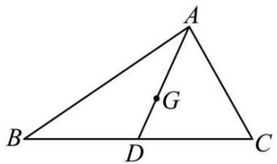

text_image

A
G
B
D
C

1441 (2024·广西钦州·高三校考阶段练习)在 $\triangle ABC$ 中, 内角 A, B, C 的对边分别为 a, b, c, 且 $a\cos B + \sqrt{3}a\sin B = c + b$ .

(1) 求角 A 的大小;  
(2) 若 $b = 3$ ，点 $\mathrm{G}$ 是 $\triangle ABC$ 的重心，且 $\mathrm{AG} = \sqrt{21}$ ，求 $\triangle ABC$ 内切圆的半径.

【解析】(1) 因为 $a \cos B + \sqrt{3} a \sin B = c + b$ ,

由正弦定理可得 $\sin A\cos B + \sqrt{3}\sin A\sin B = \sin C + \sin B = \sin(A + B) + \sin B = \sin A\cos B + \sin B\cos A + \sin B,$ 即 $\sqrt{3}\sin A\sin B=\sin B\cos A+\sin B,$

又 $B \in (0, \pi)$ ，所以 $\sin B \neq 0$ ，所以 $\sqrt{3}\sin A - \cos A = 1$ ，即 $\sin\left(A - \frac{\pi}{6}\right) = \frac{1}{2}$ ，
又 $A \in (0, \pi)$ ，所以 $A - \frac{\pi}{6} \in \left(-\frac{\pi}{6}, \frac{5\pi}{6}\right)$ ，所以 $A - \frac{\pi}{6} = \frac{\pi}{6}$ ，解得 $A = \frac{\pi}{3}$

(2) 因为点 G 是 $\triangle ABC$ 的重心, 所以 $\overrightarrow{AG} = \frac{1}{3} (\overrightarrow{AB} + \overrightarrow{AC})$ ,

所以 $\overrightarrow{\mathrm{AG}}^2 = \frac{1}{9} (\overrightarrow{\mathrm{AB}} +\overrightarrow{\mathrm{AC}})^2 = \frac{1}{9}\bigl (\overrightarrow{\mathrm{AB}}^2 +2\overrightarrow{\mathrm{AB}}\cdot \overrightarrow{\mathrm{AC}} +\overrightarrow{\mathrm{AC}}^2\bigr) =$ $\frac{1}{9}\bigl (\overrightarrow{\mathrm{AB}}^2 +2|\overrightarrow{\mathrm{AB}} |\cdot |\overrightarrow{\mathrm{AC}} |\cos A + \overrightarrow{\mathrm{AC}}^2\bigr),$

即 $21=\frac{1}{9}(c^{2}+3c+9)$ ，解得 c=12 或 c=-15（舍）.

由余弦定理得 $a^{2}=b^{2}+c^{2}-2bc\cos A=3^{2}+12^{2}-2\times3\times12\times\frac{1}{2}=117$ ，解得 $a=3\sqrt{13}$ .
设 $\triangle ABC$ 内切圆的圆心 O，半径为 r，则 $S_{\triangle ABC}=S_{\triangle OBC}+S_{\triangle AOC}+S_{\triangle ABO}$

即 $\frac{1}{2}bc\sin A=\frac{1}{2}(a+b+c)r,$

即 $\frac{1}{2} \times 12 \times 3 \times \frac{\sqrt{3}}{2} = \frac{1}{2} \times (3 + 12 + 3\sqrt{13})r,$

解得 $r = \frac{5\sqrt{3} - \sqrt{39}}{2}$ 即 $\triangle ABC$ 内切圆的半径为 $\frac{5\sqrt{3} - \sqrt{39}}{2}$ .

1442 (2024·全国·高三专题练习)设 a, b, c 分别为 $\triangle ABC$ 的内角 A, B, C 的对边, AD 为 BC 边上的中线, $c = 1$ , $\angle BAC = \frac{2\pi}{3}$ , $2c\sin A\cos B = a\sin A - b\sin B + \frac{1}{2}b\sin C$ .

(1) 求 AD 的长度;  
(2) 若 E 为 AB 上靠近 B 的四等分点, G 为 $\triangle ABC$ 的重心, 连接 EG 并延长与 AC 交于点 F, 求 AF 的长度.

【解析】(1)依据题意,由 $2c\sin A\cos B = a\sin A - b\sin B + \frac{1}{2}b\sin C$ 可得

$$
2 a c \cos B = a ^ {2} - b ^ {2} + \frac {1}{2} b c, \text {则} \cos B = \frac {a ^ {2} - b ^ {2} + \frac {1}{2} b c}{2 a c} = \frac {a ^ {2} + c ^ {2} - b ^ {2}}{2 a c}, \therefore c ^ {2} = \frac {1}{2} b c,
$$

$$
b = 2 c = 2, \cos \angle \mathrm{BAC} = \frac {b ^ {2} + c ^ {2} - a ^ {2}}{2 b c} = \frac {4 + 1 - a ^ {2}}{4} = - \frac {1}{2}, \text {解得} a = \sqrt {7}, \mathrm{BD} = \frac {\sqrt {7}}{2}
$$

$$
\cos \mathrm{B} = \frac {1 + 7 - 4}{2 \sqrt {7}} = \frac {1 + \frac {7}{4} - \mathrm{AD} ^ {2}}{\sqrt {7}}, \text {解得} \mathrm{AD} \text {为} \frac {\sqrt {3}}{2}
$$

$$
\begin{array}{l} = \frac {\pi}{2}, \mathrm{EG} = \sqrt {\frac {9}{1 6} + \frac {1}{3}} = \frac {\sqrt {1 2 9}}{1 2} \\ \cos \angle A G F = - \cos \angle A G E = - \frac {4}{\sqrt {4 3}}, \sin \angle A G F = \frac {3 \sqrt {3}}{\sqrt {4 3}}, \cos \angle D A C = \cos \left(\frac {2 \pi}{3} - \frac {\pi}{2}\right) = \\ \frac {\sqrt {3}}{2}, \sin \angle \mathrm{DAC} = \frac {1}{2}, \therefore \cos \angle \mathrm{AFE} = - \cos (\angle \mathrm{AGF} + \angle \mathrm{DAC}) = \frac {7 \sqrt {3}}{2 \sqrt {4 3}}, \sin \angle \mathrm{AFE} = \\ \frac {5}{2 \sqrt {4 3}}, \frac {\mathrm{AG}}{\sin \angle \mathrm{AFE}} = \frac {\mathrm{AF}}{\sin \angle \mathrm{AGF}}, \therefore \mathrm{AF} = \frac {3}{5} \\ \end{array}
$$

(2)G为 $\triangle ABC$ 的重心， $\therefore AG = \frac{2}{3} AD = \frac{\sqrt{3}}{3}, \cos \angle BAD = \frac{1 + \frac{3}{4} - \frac{7}{4}}{\sqrt{3}} = 0, \therefore \angle BAD$

1443 (2024·四川内江·高三威远中学校校考期中)△ABC的内角A，B，C所对的边分别为a, b,c,a=6,b $\sin\frac{B+C}{2}=a\sin B$ .

(1) 求 A 的大小;  
(2)M为△ABC内一点, AM的延长线交BC于点D, \_\_\_\_, 求△ABC的面积.   
请在下面三个条件中选择一个作为已知条件补充在横线上,使 $\triangle ABC$ 存在,并解决问题.  
①M为△ABC的重心， $AM=2\sqrt{3}$ ;  
②M为 $\triangle ABC$ 的内心, $AD=3\sqrt{3}$ ;  
③M为 $\triangle ABC$ 的外心, AM=4.

【解析】(1) $\because b\sin\frac{B+C}{2}=a\sin B,\therefore b\sin\frac{\pi-A}{2}=a\sin B,$ 即 $b\cos\frac{A}{2}=a\sin B$

由正弦定理得, $\sin B\cos\frac{A}{2}=\sin A\sin B$ , 即 $\sin B\cos\frac{A}{2}=2\sin\frac{A}{2}\cos\frac{A}{2}\sin B$ ,

$$
\begin{array}{l} \because \mathrm{A}, \mathrm{B} \in (0, \pi), \therefore \sin \mathrm{B} > 0, \cos \frac {\mathrm{A}}{2} \neq 0, \therefore \sin \frac {\mathrm{A}}{2} = \frac {1}{2}, \text {又} \frac {\mathrm{A}}{2} \in \left(0, \frac {\pi}{2}\right), \therefore \frac {\mathrm{A}}{2} = \frac {\pi}{6}, \therefore \mathrm{A} = \\ \frac {\pi}{3} \end{array}
$$

(2) 设 $\triangle ABC$ 外接圆半径为 R，则根据正弦定理得， $\frac{a}{\sin A}=2R\Rightarrow R=\frac{6}{2\times\frac{\sqrt{3}}{2}}=2\sqrt{3}$

若选①: $\because M$ 为该三角形的重心, 则 D 为线段 BC 的中点且 $AD = \frac{3}{2} AM = 3\sqrt{3}$ ,

又 $\overrightarrow{\mathrm{AD}} = \frac{1}{2} (\overrightarrow{\mathrm{AB}} +\overrightarrow{\mathrm{AC}}),\therefore |\overrightarrow{\mathrm{AD}} |^2 = \frac{1}{4}\big(|\overrightarrow{\mathrm{AB}} |^2 +|\overrightarrow{\mathrm{AC}} |^2 +2|\overrightarrow{\mathrm{AB}} |\cdot |\overrightarrow{\mathrm{AC}} |\cdot \cos A\big)$

即 $27=\frac{1}{4}(c^{2}+b^{2}+bc)$ ，又由余弦定理得 $a^{2}=b^{2}+c^{2}-2bc\cos A$ ，即 $36=b^{2}+c^{2}-bc$ ，解得 b=c=6，∴ $S_{\triangle ABC}=\frac{1}{2}bc\sin A=9\sqrt{3}$ ;

若选②: $\because M$ 为 $\triangle ABC$ 的内心, $\therefore \angle BAD = \angle CAD = \frac{1}{2} \angle BAC = \frac{\pi}{6}$ , 由 $S_{\triangle ABC} = S_{\triangle ABD} + S_{\triangle ACD}$ 得 $\frac{1}{2} bc \sin \frac{\pi}{3} = \frac{1}{2} c \cdot AD \sin \frac{\pi}{6} + \frac{1}{2} b \cdot AD \sin \frac{\pi}{6}$ , $\because AD = 3\sqrt{3}$ , $\therefore \frac{\sqrt{3}}{2} bc = 3\sqrt{3} \times \frac{1}{2}(b + c)$ , 即 $b + c = \frac{bc}{3}$ ,

由余弦定理可得 $b^{2}+c^{2}-36=bc$ ，即 $(b+c)^{2}-3bc=36,\therefore\frac{(bc)^{2}}{9}-3bc-36=0,$

即 $(bc + 9)\left(\frac{bc}{9} -4\right) = 0,\because bc > 0,\therefore bc = 36,\therefore \mathrm{S}_{\triangle \mathrm{ABC}} = \frac{1}{2} bc\sin \frac{\pi}{3} = \frac{1}{2}\times 36\times \frac{\sqrt{3}}{2} =$ $9\sqrt{3}.$

若选③: M 为 $\triangle ABC$ 的外心, 则 AM 为外接圆半径, $AM = 2\sqrt{3}$ , 与所给条件矛盾, 故不能选③.

1444 (2024·全国·高三专题练习)在① $2a\cos A=b\cos C+c\cos B$ ;② $\tan B+\tan C+\sqrt{3}=\sqrt{3}\tan B\tan C$ 这两个条件中任选一个,补充在下面的问题中,并加以解答.

在 $\triangle ABC$ 中， $a, b, c$ 分别是角 A, B, C 的对边，已知 \_\_\_\_.

(1) 求角 A 的大小;

(2) 若 $\triangle ABC$ 为锐角三角形, 且其面积为 $\frac{\sqrt{3}}{2}$ , 点 $G$ 为 $\triangle ABC$ 重心, 点 $M$ 为线段 $AC$ 的中点, 点 $N$ 在线段 $AB$ 上, 且 $AN = 2NB$ , 线段 $BM$ 与线段 $CN$ 相交于点 $P$ , 求 $|\overrightarrow{GP}|$ 的取值范围.

注:如果选择多个方案分别解答,按第一个方案解答计分.

【解析】(1) 若选① $2a\cos A = b\cos C + c\cos B$ ,

由正弦定理可得 $2\sin A\cos A = \sin B\cos C + \sin C\cos B = \sin(B + C)$

即 $2\sin A \cos A = \sin A$ ，又 $\sin A > 0$ ，所以 $2\cos A = 1$ ，即 $\cos A = \frac{1}{2}$ ，

因为 $\mathrm{A}\in (0,\pi)$ ，所以 $\mathrm{A} = \frac{\pi}{3}$

若选② $\tan B + \tan C + \sqrt{3} = \sqrt{3}\tan B\tan C$ ，即 $\tan B + \tan C = -\sqrt{3} +\sqrt{3}\tan B\tan C,$

即 $\tan B + \tan C = -\sqrt{3}(1 - \tan B\tan C)$

所以 $\frac{\tan B + \tan C}{1 - \tan B\tan C} = -\sqrt{3}$ ，即 $\tan (B + C) = -\sqrt{3}$ ，所以 $\tan (\pi -A) = -\sqrt{3}$ ，即 $\tan A =$ $\sqrt{3}$

因为 $A \in (0, \pi)$ ，所以 $A = \frac{\pi}{3}$ ;

(2)依题意 $\overrightarrow{AN}=\frac{2}{3}\overrightarrow{AB},\overrightarrow{AM}=\frac{1}{2}\overrightarrow{AC},$

所以 $\overrightarrow{AG}=\overrightarrow{AB}+\overrightarrow{BG}=\overrightarrow{AB}+\frac{2}{3}\overrightarrow{BM}=\overrightarrow{AB}+\frac{2}{3}\left(\overrightarrow{AM}-\overrightarrow{AB}\right)=\overrightarrow{AB}+\frac{2}{3}\left(\frac{1}{2}\overrightarrow{AC}-\overrightarrow{AB}\right)=\frac{1}{3}\overrightarrow{AB}+\frac{1}{3}\overrightarrow{AC},$

因为 C、N、P 三点共线，故设 $\overrightarrow{AP} = \lambda \overrightarrow{AN} + (1 - \lambda) \overrightarrow{AC} = \frac{2}{3} \lambda \overrightarrow{AB} + (1 - \lambda) \overrightarrow{AC}$ ,

同理 M、B、P 三点共线，故设 $\overrightarrow{AP} = \mu \overrightarrow{AB} + (1 - \mu) \overrightarrow{AM} = \mu \overrightarrow{AB} + \frac{1}{2}(1 - \mu) \overrightarrow{AC}$ ,

所以 $\left\{\begin{aligned}\frac{2}{3}\lambda=\mu\\1-\lambda=\frac{1}{2}(1-\mu)\end{aligned}\right.$ ，解得 $\left\{\begin{aligned}\lambda=\frac{3}{4}\\ \mu=\frac{1}{2}\end{aligned}\right.$

所以 $\overrightarrow{AP}=\frac{1}{2}\overrightarrow{AB}+\frac{1}{4}\overrightarrow{AC}$ ,

则 $\overrightarrow{\mathrm{GP}} = \overrightarrow{\mathrm{AP}} -\overrightarrow{\mathrm{AG}} = \frac{1}{2}\overrightarrow{\mathrm{AB}} +\frac{1}{4}\overrightarrow{\mathrm{AC}} -\left(\frac{1}{3}\overrightarrow{\mathrm{AB}} +\frac{1}{3}\overrightarrow{\mathrm{AC}}\right) = \frac{1}{6}\overrightarrow{\mathrm{AB}} -\frac{1}{12}\overrightarrow{\mathrm{AC}} =$

$$
\frac {1}{1 2} (2 \overrightarrow {\mathrm{AB}} - \overrightarrow {\mathrm{AC}}),
$$

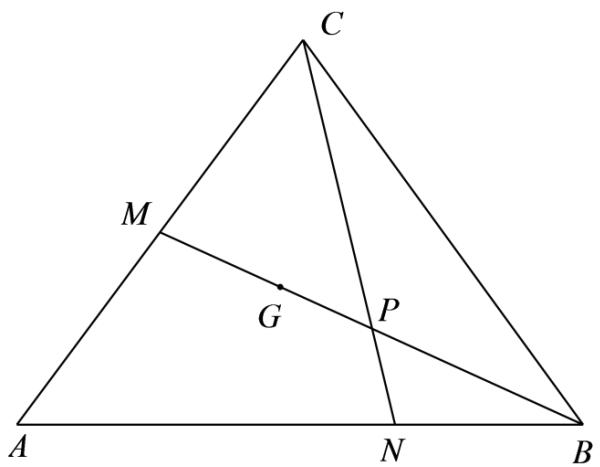

text_image

C
M
G
P
A
N
B

因为 $S_{\triangle ABC}=\frac{1}{2}bc\sin A=\frac{\sqrt{3}}{2}$ ，所以 bc=2，

又 $\triangle ABC$ 为锐角三角形，

当 C 为锐角, 则 $\overrightarrow{AC} \cdot \overrightarrow{BC} > 0$ , 即 $\overrightarrow{AC} \cdot (\overrightarrow{AC} - \overrightarrow{AB}) > 0$ ,

即 $\overrightarrow{AC}^{2}-\overrightarrow{AC}\cdot\overrightarrow{AB}>0$ , 即 $b^{2}-\frac{1}{2}bc>0$ , 即 $2b>c=\frac{2}{b}$ , 所以 b>1,

当 B 为锐角, 则 $\overrightarrow{AB} \cdot \overrightarrow{CB} > 0$ , 即 $\overrightarrow{AB} \cdot (\overrightarrow{AB} - \overrightarrow{AC}) > 0$ ,

即 $\overrightarrow{AB}^{2}-\overrightarrow{AC}\cdot\overrightarrow{AB}>0$ , 即 $c^{2}-\frac{1}{2}bc>0$ , 即 2c>b , 即 $2\cdot\frac{2}{b}>b$ , 所以 0<b<2,

综上可得1<b<2,

又 $|\overrightarrow{\mathrm{GP}}| = \frac{1}{12} \cdot |2\overrightarrow{\mathrm{AB}} - \overrightarrow{\mathrm{AC}}|$ ，则 $144|\overrightarrow{\mathrm{GP}}|^2 = (2\overrightarrow{\mathrm{AB}} - \overrightarrow{\mathrm{AC}})^2 = 4\overrightarrow{\mathrm{AB}}^2 - 4\overrightarrow{\mathrm{AB}} \cdot \overrightarrow{\mathrm{AC}} + \overrightarrow{\mathrm{AC}}^2$

$$
= 4 \left| \overrightarrow {\mathrm{AB}} \right| ^ {2} - 4 \overrightarrow {\mathrm{AB}} \cdot \overrightarrow {\mathrm{AC}} + \left| \overrightarrow {\mathrm{AC}} \right| ^ {2}
$$

$$
= 4 c ^ {2} - 2 b c + b ^ {2}
$$

$$
= \frac {1 6}{b ^ {2}} - 4 + b ^ {2}
$$

因为 $1 < b < 2$ ，所以 $1 < b^{2} < 4$ ，而 $f(x) = \frac{16}{x} - 4 + x$ 在(1,4)上单调递减，所以 $f(x) \in (4,13)$

即 $\frac{16}{b^2} - 4 + b^2 \in (4,13)$ , 即 $144|\overrightarrow{\mathrm{GP}}|^2 \in (4,13)$ , 所以 $12|\overrightarrow{\mathrm{GP}}| \in (2, \sqrt{13})$ , 则 $|\overrightarrow{\mathrm{GP}}| \in \left(\frac{1}{6}, \frac{\sqrt{13}}{12}\right)$ .

# 8 题型八: 外心及外接圆问题

1445 (2024·湖南长沙·长沙市实验中学校考二模)在 $\triangle ABC$ 中, 内角 A, B, C 的对边分别为 $a, b, c$ , 且 $a, b, c$ 是公差为 2 的等差数列.

(1) 若 $2\sin C = 3\sin A$ ，求 $\triangle ABC$ 的面积.  
(2) 是否存在正整数 b，使得 $\triangle ABC$ 的外心在 $\triangle ABC$ 的外部？若存在，求 b 的取值集合；若不存在，请说明理由.

【解析】(1)∵2sinC=3sinA,∴由正弦定理得2c=3a,

$\because a, b, c$ 是公差为 2 的等差数列， $\therefore a = b - 2, c = b + 2,$

$$
\therefore 2 (b + 2) = 3 (b - 2), \therefore b = 1 0, \therefore a = 8, c = 1 2,
$$

$$
\therefore \cos C = \frac {a ^ {2} + b ^ {2} - c ^ {2}}{2 a b} = \frac {6 4 + 1 0 0 - 1 4 4}{2 \times 8 \times 1 0} = \frac {1}{8},
$$

$\because C\in(0,\pi)$ ，且 $\sin^{2}C+\cos^{2}C=1$ ，∴ $\sin C=\frac{3\sqrt{7}}{8}$

故 $\triangle ABC$ 的面积为 $\frac{1}{2} \times 8 \times 10 \times \frac{3\sqrt{7}}{8} = 15\sqrt{7}$ .

(2) 假设存在正整数 b, 使得 $\triangle ABC$ 的外心在 $\triangle ABC$ 的外部, 则 $\triangle ABC$ 为钝角三角形,

依题意可知 c > b > a，则 C 为钝角，则 $\cos C = \frac{(b-2)^{2} + b^{2} - (b+2)^{2}}{2b(b-2)} = \frac{b-8}{2(b-2)} < 0$ ，

所以 $(b-8)(b-2)<0$ , 解得 2<b<8,

$$
\because b + b - 2 > b + 2, \therefore b > 4,
$$

$$
\therefore 4 <   b <   8,
$$

∴ 存在正整数 b，使得 $\triangle ABC$ 的外心在 $\triangle ABC$ 的外部，此时整数 b 的取值集合为 $\{5,6,7\}$ .

1446 (2024·全国·高三专题练习)在 $\triangle ABC$ 中，三内角A，B，C对应的边分别为 $a, b, c, a = 6$ .

(1) 求 $b \cos C + c \cos B$ 的值；  
(2) 若 O 是 $\triangle ABC$ 的外心，且 $\sqrt{3} \cdot \overrightarrow{OA} + \overrightarrow{OB} + \sqrt{2} \cdot \overrightarrow{OC} = \vec{0}$ ，求 $\triangle ABC$ 外接圆的半径.

【解析】(1) $b\cos C + c\cos B = b \cdot \frac{a^2 + b^2 - c^2}{2ab} + c \cdot \frac{c^2 + a^2 - b^2}{2ca}$

$$
= \frac {a ^ {2} + b ^ {2} - c ^ {2} + c ^ {2} + a ^ {2} - b ^ {2}}{2 a} = \frac {2 a ^ {2}}{2 a} = a = 6.
$$

(2) 设 $\triangle ABC$ 外接圆的半径是 R.

$$
\begin{array}{l} \sqrt {3} \cdot \overrightarrow {\mathrm{OA}} + \overrightarrow {\mathrm{OB}} + \sqrt {2} \cdot \overrightarrow {\mathrm{OC}} = \vec {0} \Rightarrow \sqrt {3} \cdot \overrightarrow {\mathrm{OA}} = - \sqrt {2} \overrightarrow {\mathrm{OC}} - \overrightarrow {\mathrm{OB}} \Rightarrow 3 \mathrm{R} ^ {2} = 2 \mathrm{R} ^ {2} + \mathrm{R} ^ {2} + 2 \sqrt {2} \overrightarrow {\mathrm{OC}} \cdot \\ \overrightarrow {\mathrm{OB}} \end{array}
$$

$$
\Rightarrow \overrightarrow {\mathrm{OC}} \cdot \overrightarrow {\mathrm{OB}} = 0 \Rightarrow \mathrm{R} ^ {2} \cos \angle \mathrm{BOC} = 0 \Rightarrow \angle \mathrm{BOC} = \frac {\pi}{2} \Rightarrow \mathrm{A} = \frac {\pi}{4}.
$$

因此 $2R = \frac{a}{\sin A} = \frac{6}{\sin 45^{\circ}} = 6\sqrt{2}, \therefore R = 3\sqrt{2}.$

1447 (2024·全国·高三专题练习)在 $\triangle ABC$ 中，角A，B，C的对边分别为 $a, b, c; 3b = 4c$

$$
\cos C = \frac {4}{5}.
$$

(1) 求 $\cos A$ 的值;  
(2) 若 $\triangle ABC$ 的外心在其外部, a = 7, 求 $\triangle ABC$ 外接圆的面积.

【解析】(1)依题意 $b=\frac{4}{3}c$ ，由余弦定理得 $c^{2}=a^{2}+b^{2}-2ab\cos C$

$$
c ^ {2} = a ^ {2} + \frac {1 6}{9} c ^ {2} - 2 a \cdot \frac {4}{3} c \cdot \frac {4}{5}, 4 5 a ^ {2} - 9 6 a c + 3 5 c ^ {2} = 0,
$$

$$
(3 a - 5 c) (1 5 a - 7 c) = 0,
$$

所以 $a=\frac{5}{3}c$ 或 $a=\frac{7}{15}c$ .

当 $a=\frac{5}{3}c$ 时， $\cos A=\frac{b^{2}+c^{2}-a^{2}}{2bc}=\frac{\frac{16}{9}c^{2}+c^{2}-\frac{25}{9}c^{2}}{2\cdot\frac{4}{3}c\cdot c}=0.$

当 $a=\frac{7}{15}c$ 时， $\cos A=\frac{b^{2}+c^{2}-a^{2}}{2bc}=\frac{\frac{16}{9}c^{2}+c^{2}-\frac{49}{225}c^{2}}{2\cdot\frac{4}{3}c\cdot c}=\frac{24}{25}.$

(2) 若 $\triangle ABC$ 的外心在其外部, 则 $\cos A = 0 \Rightarrow A = \frac{\pi}{2}$ 不符合题意.

当 $a=\frac{7}{15}c$ 时， $\cos B=\frac{a^{2}+c^{2}-b^{2}}{2ac}=\frac{\frac{49}{225}c^{2}+c^{2}-\frac{16}{9}c^{2}}{2\cdot\frac{7}{15}c\cdot c}<0$ ，B 为钝角，符合题意.

$$
\cos A = \frac {2 4}{2 5} \Rightarrow \sin A = \sqrt {1 - \left(\frac {2 4}{2 5}\right) ^ {2}} = \frac {7}{2 5},
$$

设三角形 ABC 外接圆的半径为 R, 由正弦定理得 $2R = \frac{7}{\frac{7}{25}} = 25 \Rightarrow R = \frac{25}{2}$ ,

所以外接圆的面积为 $\pi R^{2}=\frac{625}{4}\pi.$

1448 (2024·高三统考阶段练习)在 $\triangle ABC$ 中, 角 A, B, C 对应的三边分别为 a, b, c, $(\tan A + 1)(\tan B + 1) = 2$ , $c = 2\sqrt{2}$ , a = 2, O 为 $\triangle ABC$ 的外心, 连接 OA, OB, OC.

(1) 求 $\triangle OAB$ 的面积;  
(2) 过 B 作 AC 边的垂线交于 D 点, 连接 OD, 试求 $\cos\angle OBD$ 的值.

【解析】(1) $\because(\tan A+1)(\tan B+1)=2$ $\therefore\tan A\cdot\tan B+\tan A+\tan B=1$

$$
\therefore \tan (A + B) = \frac {\tan A + \tan B}{1 - \tan A \cdot \tan B} = 1 \therefore A + B = \frac {\pi}{4} \quad \therefore C = \frac {3 \pi}{4}
$$

在 $\triangle ABC$ 中， $\frac{2}{\sin A} = \frac{2\sqrt{2}}{\sin \frac{3\pi}{4}} = 4 = 2OA$ ，则 $\sin A = \frac{1}{2}$ ，

$$
\therefore \mathrm{A} = \frac {\pi}{6}, \mathrm{B} = \frac {\pi}{1 2}
$$

$S_{\triangle OAB}=\frac{1}{2}|AB|\cdot|OH|=\frac{1}{2}\cdot2\sqrt{2}\cdot\sqrt{2}=2(|OH|$ 是O到AB的距离

(2) $\because \mathrm{OA} = \mathrm{OB} = \mathrm{BC} = 2\therefore \angle \mathrm{OBC} = \frac{\pi}{3}$

又 $\because \angle DBC = \frac{\pi}{4} \therefore \angle OBD = \angle OBC + \angle DBC = \frac{\pi}{3} + \frac{\pi}{4}$

$$
\therefore \cos \angle O B D = \cos \left(\frac {\pi}{3} + \frac {\pi}{4}\right) = \frac {\sqrt {2} - \sqrt {6}}{4}
$$

# 9 题型九:两边夹问题

1449 (2024·全国·高三专题练习)在 $\Delta ABC$ 中, 角 A,B,C 所对的边分别为 a,b,c, 若 $\cos A + \sin A - \frac{2}{\sin B + \cos B} = 0$ , 则 $\frac{a+b}{c}$ 的值是 ()

A. 2

B. $\sqrt{3}$

C. $\sqrt{2}$

D. 1

【答案】C

【解析】因为 $\cos A + \sin A - \frac{2}{\sin B + \cos B} = 0$ ，即 $\cos A + \sin A = \frac{2}{\sin B + \cos B}$ ,

所以 $(\cos A + \sin A)(\sin B + \cos B) = 2,$

可得 $\cos A\sin B + \cos A\cos B + \sin A\sin B + \sin A\cos B = 2$ ,

所以 $\sin(A+B)+\cos(A-B)=2,$

由正弦函数与余弦函数的性质,可得 $\sin(A+B)=1$ 且 $\cos(A-B)=1$ ,

因为 A, B, C ∈ (0, π) 且 A + B + C = π,

所以 $\left\{\begin{aligned}A+B&=\frac{\pi}{2}\\ A-B&=0\end{aligned}\right.$ ，解得 $A=B=\frac{\pi}{4}$ ，所以 $C=\frac{\pi}{2}$ ，

又由正弦定理可得 $\frac{a + b}{c} = \frac{\sin A + \sin B}{\sin C} = \frac{\frac{\sqrt{2}}{2} + \frac{\sqrt{2}}{2}}{1} = \sqrt{2}$ .

故选：C.

1450 (2024·河北唐山·高三校考阶段练习)在 $\Delta ABC$ 中，a、b、c 分别是 $\angle A$ 、 $\angle B$ 、 $\angle C$ 所对边的边长. 若 $\cos A + \sin A - \frac{2}{\cos B + \sin B} = 0$ ，则 $\frac{a + b}{c}$ 的值是().

A. 1

B. $\sqrt{2}$

C. $\sqrt{3}$

D. 2

【答案】B

【解析】因为 $\cos A + \sin A - \frac{2}{\cos B + \sin B} = 0$ ，所以 $(\cos A + \sin A)(\cos B + \sin B) = 2$ ，

所以 $\cos A\cos B + \sin A\sin B + \sin A\cos B + \cos A\sin B = 2$ ,

即 $\cos (A - B) + \sin (A + B) = 2$

所以 $\cos(A-B)=1,\sin(A+B)=1$ , 所以 A=B, $A+B=\frac{\pi}{2}$ , 所以 $a=b,\frac{a+b}{c}=\sqrt{2}$ , 故选 B.

1451 (2024·全国·高三专题练习)在 $\Delta ABC$ 中, 已知边 a, b, c 所对的角分别为 A, B, C, 若

$$
2 \sin^ {2} \mathrm{B} + 3 \sin^ {2} \mathrm{C} = 2 \sin \mathrm{A} \sin \mathrm{B} \sin \mathrm{C} + \sin^ {2} \mathrm{A}, \text {则} \tan \mathrm{A} =
$$

【答案】-1

【解析】由正弦定理得 $2b^{2} + 3c^{2} = 2bc\sin A + a^{2}$ ，由余弦定理得 $2b^{2} + 3c^{2} = 2bc\sin A + b^{2} + c^{2} - 2bc\cos A,$ 即 $\frac{b^2 + 2c^2}{2bc} = \sin A - \cos A$

因为 $\frac{b^2 + 2c^2}{2bc} \geqslant \frac{2\sqrt{b^2 \cdot 2c^2}}{2bc} = \sqrt{2}, \sin A - \cos A \leqslant \sqrt{2}$

所以 $b = \sqrt{2} c, \mathrm{A} = \frac{3\pi}{4} \Rightarrow \tan A = -1.$

1452 (2024·江苏苏州·吴江中学模拟预测)在 $\Delta ABC$ 中, 已知边 a, b, c 所对的角分别为 A, B, C, 若 $5 - 2\cos^{2}B - 3\cos^{2}C = 2\sin A\sin B\sin C + \sin^{2}A$ , 则 $\tan A =$ \_\_\_\_.

【答案】-1

【解析】由 $5 - 2\cos^{2}B - 3\cos^{2}C = 2\sin A \sin B \sin C + \sin^{2}A$ 得 $2\sin^{2}B + 3\sin^{2}C =$

$$
2 \sin A \sin B \sin C + \sin^ {2} A
$$

由正弦定理得 $2b^{2}+3c^{2}=2bc\sin A+a^{2}$

由余弦定理得 $2b^{2}+3c^{2}=2bc\sin A+b^{2}+c^{2}-2bc\cos A$ ，即 $\frac{b^{2}+2c^{2}}{2bc}=\sin A-\cos A$ 因为

$$
\frac {b ^ {2} + 2 c ^ {2}}{2 b c} \geqslant \frac {2 \sqrt {b ^ {2} \cdot 2 c ^ {2}}}{2 b c} = \sqrt {2}, \sin A - \cos A \leqslant \sqrt {2}
$$

所以 $b = \sqrt{2} c, A = \frac{3\pi}{4} \Rightarrow \tan A = -1.$

1453 (2024·湖南长沙·高二长沙一中校考开学考试)在 $\Delta ABC$ 中, 已知边 a、b、c 所对的角分别为 A、B、C, 若 $a = \sqrt{5}$ , $2\sin^{2}B + 3\sin^{2}C = 2\sin A\sin B\sin C + \sin^{2}A$ , 则 $\Delta ABC$ 的面积 S = \_\_\_\_.

【答案】 $\frac{1}{2}$

【解析】正弦定理得 $2b^{2} + 3c^{2} = 2bc\sin A + a^{2}$ ,

由余弦定理得 $2b^{2}+3c^{2}=2bc\sin A+b^{2}+c^{2}-2bc\cos A$ ,

即 $\frac{b^{2}+2c^{2}}{2bc}=\sin A-\cos A,$

因为 $\frac{b^2 + 2c^2}{2bc} \geqslant \frac{2\sqrt{b^2 \cdot 2c^2}}{2bc} = \sqrt{2}$ ,

故 $\sin A - \cos A = \sqrt{2}\sin \left(A - \frac{\pi}{4}\right)\geqslant \sqrt{2},$

故可得 $\sin A - \cos A = \sqrt{2}$ ，当且仅当 $A - \frac{\pi}{4} = \frac{\pi}{2}$ ，即 $A = \frac{3\pi}{4}$ 时取得.

也即当 $b=\sqrt{2}c$ 时取得等号，

所以 $a^{2}=b^{2}+c^{2}-2bc\cos A=5c^{2}$ ，即 $c^{2}=1$ .

所以 $\Delta ABC$ 的面积为 $S=\frac{1}{2}bc\sin A=\frac{1}{2}c^{2}=\frac{1}{2}$ .

故答案为: $\frac{1}{2}$ .

1454 (2024·全国·高三专题练习)在 $\triangle ABC$ 中, 若 $(\cos A + \sin A)(\cos B + \sin B) = 2$ , 则角 C = \_\_\_\_.

【答案】 $90^{\circ}$

【解析】∵(cosA + sinA)(cosB + sinB) = 2, ∴cosAcosB + sinAsinB + cosAsinB + sinAcosB = 2,

即 $\cos(A-B)+\sin(A+B)=2,$

$\because \cos (A - B)\leqslant 1,\sin (A + B)\leqslant 1,$

∴ $\cos(A-B)+\sin(A+B)=2$ , 等价于 $\cos(A-B)=1$ 且 $\sin(A+B)=1$

A,B 为 $\triangle ABC$ 的内角, 所以 A-B=0 且 $A+B=90^{\circ}$ , 即 A=B=45°.

则 $\triangle ABC$ 是等腰直角三角形, $C = 90^{\circ}$ .

故答案为: $90^{\circ}$ .

1455 (2024·全国·高三专题练习)在△ABC中,角A,B,C的对边分别为a,b,c,设S是△ABC的面积,若 $b^{2}+c^{2}-\frac{1}{3}a^{2}=\frac{4\sqrt{3}}{3}$ S,则角A的值为\_\_\_\_.

【答案】 $\frac{2\pi}{3}$

【解析】在 $\Delta ABC$ 中, 由三角形的面积 $S = \frac{1}{2} b c \sin A$ 且 $b^{2} + c^{2} - \frac{1}{3} a^{2} = \frac{4\sqrt{3}}{3} S$ ,

所以 $3b^{2}+3c^{2}=a^{2}+2\sqrt{3}bc\sin A$ ,

又由余弦定理 $a^{2}=b^{2}+c^{2}-2bc\cos A$ ,

所以 $3b^{2}+3c^{2}=b^{2}+c^{2}-2bc\cos A+2\sqrt{3}bc\sin A$ ,

即 $b^{2} + c^{2} = -bc\cos A + \sqrt{3} bc\sin A = bc(\sqrt{3}\sin A - \cos A) = 2bc\sin \left(A - \frac{\pi}{6}\right)$ ,

由于 $b^{2} + c^{2}\geqslant 2bc$ ，所以 $b^{2} + c^{2} = 2bc\sin \left(\mathrm{A} - \frac{\pi}{6}\right)\geqslant 2bc$ ，则 $\sin \left(\mathrm{A} - \frac{\pi}{6}\right)\geqslant 1,$

根据三角函数的值域, 可知只有 $\sin\left(A-\frac{\pi}{6}\right)=1$ , 所以 $A-\frac{\pi}{6}=\frac{\pi}{2}$ , 即 $A=\frac{2\pi}{3}$ ,

故答案为 $\frac{2\pi}{3}$ .

# 10 题型十:内心及内切圆问题

1456 (2024·福建泉州·高三福建省泉州第一中学校考期中)在 $\triangle ABC$ 中, 角 A, B, C 的对边分别为 $a, b, c$ , I 为 $\triangle ABC$ 的内心, 延长线段 AI 交 BC 于点 D, 此时 $\overrightarrow{CB} = 3\overrightarrow{CD}$

(1) 求 $\frac{\sin B}{\sin C}$ ;   
(2) 若 $\angle ADB = \frac{2\pi}{3}$ ，求 $\frac{b + c}{a}$ .

【解析】(1)I 为 $\triangle ABC$ 的内心, 则 $\angle CAD = \angle BAD$ ,

根据正弦定理: $\frac{CD}{\sin\angle CAD}=\frac{AC}{\sin\angle ADC},\quad\frac{BD}{\sin\angle BAD}=\frac{AB}{\sin\angle ADB}$ ,

$\sin\angle ADC=\sin\angle ADB,$ 故 $\frac{CD}{BD}=\frac{AC}{AB}=\frac{1}{2},$ 故 $\frac{\sin B}{\sin C}=\frac{AC}{AB}=\frac{1}{2}.$

(2) 设 $\angle \mathrm{CAD} = \angle \mathrm{BAD} = \alpha$ ，则 $\angle \mathrm{B} = \frac{\pi}{3} - \alpha, \angle \mathrm{C} = \frac{2\pi}{3} - \alpha,$

$\frac{\sin B}{\sin C}=\frac{1}{2}$ ，故 $2\sin\left(\frac{\pi}{3}-\alpha\right)=\sin\left(\frac{2\pi}{3}-\alpha\right)$

化简得到 $\tan\alpha=\frac{\sqrt{3}}{3},\alpha\in\left(0,\frac{\pi}{2}\right)$ ，故 $\alpha=\frac{\pi}{6},\angle C=\frac{\pi}{2},\angle B=\frac{\pi}{6},\angle A=\frac{\pi}{3}$

故 $\frac{b + c}{a} = \frac{\sin B + \sin C}{\sin A} = \frac{1 + \frac{1}{2}}{\frac{\sqrt{3}}{2}} = \sqrt{3}$

1457 (2024·山西·高三校联考阶段练习)已知△ABC中,角A,B,C所对的边分别为a,b,c,a=7,2c $\cos B=(3a-2b)\cos C$ .

(1) 求 $\cos C$ ;   
(2) 若 $\mathrm{B} = 2\mathrm{C}$ , $\mathrm{M}$ 为 $\triangle ABC$ 的内心, 求 $\triangle AMC$ 的面积.

【解析】(1) $2c\cos B=(3a-2b)\cos C$ ，由正弦定理得 $2\sin C\cos B=3\sin A\cos C-2\sin B\cos C$ ，

$$
\therefore 2 \sin C \cos B + 2 \sin B \cos C = 3 \sin A \cos C, \text {   得   } 2 \sin (B + C) = 3 \sin A \cos C,
$$

$$
\therefore 2 \sin A = 3 \sin A \cos C,
$$

∵ A 为三角形内角, $\sin A \neq 0$ ,

$$
\therefore \cos C = \frac {2}{3}.
$$

(2) 由 (1) 可得 $\sin C = \frac{\sqrt{5}}{3}$ ,

$$
\because \mathrm{B} = 2 \mathrm{C}, \therefore \sin \mathrm{B} = \sin 2 \mathrm{C} = 2 \sin \mathrm{C} \cos \mathrm{C} = \frac {4 \sqrt {5}}{9}, \cos \mathrm{B} = 1 - 2 \sin^ {2} \mathrm{C} = - \frac {1}{9},
$$

$$
\therefore \sin A = \sin (B + C) = \sin B \cos C + \cos B \sin C = \frac {7 \sqrt {5}}{2 7},
$$

a=7,由正弦定理 $\frac{a}{\sin A}=\frac{b}{\sin B}=\frac{c}{\sin C}$ ,

解得b=12,c=9,

则有 $S_{\triangle ABC}=\frac{1}{2}ab\sin C=\frac{1}{2}\times7\times12\times\frac{\sqrt{5}}{3}=14\sqrt{5}$ .

设 $\triangle ABC$ 内切圆半径为 $r$ ，则 $\mathrm{S}_{\triangle ABC} = \frac{1}{2} r(a + b + c) = 14r = 14\sqrt{5}, r = \sqrt{5}$

$$
\therefore \mathrm{S} _ {\triangle \mathrm{AMC}} = \frac {1}{2} \times 1 2 \times \sqrt {5} = 6 \sqrt {5}.
$$

1458 (2024·广东佛山·华南师大附中南海实验高中校考模拟预测)在 $\triangle ABC$ 中, 角 A, B, C 所对的边分别为 $a, b, c$ . 已知 $2\sin B = \sin A + \cos A \cdot \tan C$ .

(1) 求 C 的值;  
(2) 若 $\triangle ABC$ 的内切圆半径为 $\frac{\sqrt{3}}{2}, b = 4$ , 求 $a - c$ .

【解析】(1) 因为 $2\sin B = \sin A + \cos A \cdot \tan C$ ,

所以 $2\sin B\cos C = \sin A\cos C + \cos A\sin C$ ,

即 $2\sin B\cos C = \sin(A + C)$ ,

又 $\mathrm{A} + \mathrm{B} + \mathrm{C} = \pi$ ，所以 $\sin (\mathrm{A} + \mathrm{C}) = \sin \mathrm{B}\neq 0$

所以 $\cos C = \frac{1}{2}$ ,

又 $0 < \mathrm{C} < \pi$ ，即 $\mathrm{C} = \frac{\pi}{3}$

(2) 由余弦定理得 $c^2 = a^2 + b^2 - 2ab\cos C = a^2 + 16 - 4a$ ，①

设 $\triangle ABC$ 的内切圆半径为 $r$ ,

由等面积公式得 $\frac{1}{2} (a + b + c)r = \frac{1}{2} ab\sin C.$

即 $\frac{1}{2} (a + b + c)\times \frac{\sqrt{3}}{2} = \frac{1}{2}\times 4a\times \frac{\sqrt{3}}{2}.$

整理得 $3a = 4 + c$ ，②

联立①②, 解得 $a=\frac{5}{2}$ , $c=\frac{7}{2}$ ,

所以 $a - c = -1$

1459 (2024·辽宁鞍山·统考模拟预测)在 $\triangle ABC$ 中, 角 A、B、C 所对的边分别为 $a 、 b 、 c$ , 已知 $\sqrt{3} b = a (\sqrt{3} \cos C - \sin C)$ .

(1) 求 A;   
(2) 若 $a = 8$ , $\triangle ABC$ 的内切圆半径为 $\sqrt{3}$ , 求 $\triangle ABC$ 的周长.

【解析】(1) 因为 $\sqrt{3}b = a(\sqrt{3}\cos C - \sin C)$ ,

由正弦定理可得 $\sqrt{3}\sin B = \sin A(\sqrt{3}\cos C - \sin C)$ ，①

因为 $A + B + C = \pi$ ，所以 $\sin B = \sin(A + C) = \sin A \cos C + \cos A \sin C$ ，

代入①式整理得 $\sqrt{3}\cos A\sin C = -\sin A\sin C$ ,

又因为 A、 $C \in (0, \pi)$ ， $\sin C \neq 0$ ，则 $\sqrt{3} \cos A = -\sin A < 0$ ，所以 $\tan A = -\sqrt{3}$ ，

又因为 $A \in (0, \pi)$ ，解得 $A = \frac{2\pi}{3}$ .

(2) 由 (1) 知, $A = \frac{2\pi}{3}$ , 因为 $\triangle ABC$ 内切圆半径为 $\sqrt{3}$ ,

所以 $S_{\triangle ABC}=\frac{1}{2}(a+b+c)\cdot\sqrt{3}=\frac{1}{2}bc\cdot\sin A$ ，即 $(b+c+8)\cdot\sqrt{3}=\frac{\sqrt{3}}{2}bc$ ，

所以， $b+c+8=\frac{1}{2}bc$ ②，

由余弦定理 $a^{2}=b^{2}+c^{2}-2bc\cdot\cos\frac{2\pi}{3}$ 得 $b^{2}+c^{2}+bc=64$ ，所以 $(b+c)^{2}-bc=64$ ③，

联立②③, 得 $(b+c)^{2}-2(b+c+8)=64$ , 解得 $b+c=10$ ,

所以 $\triangle ABC$ 的周长为 $a + b + c = 18$ .

1460 (2024·全国·高三专题练习)已知在 $\triangle ABC$ 中, 其角 A、B、C 所对边分别为 $a 、 b 、 c$ , 且满足 $b \cos C + \sqrt{3} b \sin C = a + c$ .

(1) 若 $b = \sqrt{3}$ , 求 $\triangle ABC$ 的外接圆半径;  
(2) 若 $a + c = 4\sqrt{3}$ , 且 $\overrightarrow{\mathrm{BA}} \cdot \overrightarrow{\mathrm{BC}} = 6$ , 求 $\triangle ABC$ 的内切圆半径

【解析】(1) 因为 $\frac{b\cos C + \sqrt{3}b\sin C}{a + c} = 1$ ，所以 $b\cos C + \sqrt{3}b\sin C - a - c = 0$ ，

所以 $\sin B\cos C + \sqrt{3}\sin B\sin C - \sin A - \sin C = 0,$

因为 $A + B + C = \pi$ ，所以 $\sin B \cos C + \sqrt{3} \sin B \sin C - \sin (B + C) - \sin C = 0$ ，

所以 $\sqrt{3}\sin B\sin C - \cos B\sin C - \sin C = 0,$

因为 $C \in (0, \pi)$ ，所以 $\sin C \neq 0$ ，所以 $\sin\left(B - \frac{\pi}{6}\right) = \frac{1}{2}$ ，

因为 $B \in (0, \pi)$ ，所以 $B - \frac{\pi}{6} = \frac{\pi}{6}$ ，

所以 $B=\frac{\pi}{3}$ ，所以外接圆半径 $2R=\frac{b}{\sin B}=2$ .

所以 $\mathrm{R} = 1$

(2) 因为 $\overrightarrow{BA} \cdot \overrightarrow{BC} = 6$ ，由题可知 $B = \frac{\pi}{3}$ ，所以 ac = 12，

又因为 $b^{2} = a^{2} + c^{2} - 2ac\cos B, a + c = 4\sqrt{3}$ 可得 $b = 2\sqrt{3}$ ,

因为 $S=\frac{1}{2}ac\cdot\sin B=3\sqrt{3}$ .

由 $\triangle ABC$ 的面积 $S=\frac{1}{2}(a+b+c)r=\frac{1}{2}ac\cdot\sin B$ ，得 r=1.

1461 (2024·全国·高三专题练习)已知△ABC的内角A，B，C的对边分别为a，b，c，a=7，b+c=13，内切圆半径 $r=\sqrt{3}$ ，则 $\tan A=$ \_\_\_\_.

【答案】 $\sqrt{3}$

【解析】由 $\frac{1}{2} (a + b + c)\cdot r = \frac{1}{2} bc\sin A$

所以 $20\sqrt{3}=bc\cdot\sin A$ ①

$$
\cos A = \frac {b ^ {2} + c ^ {2} - a ^ {2}}{2 b c} = \frac {(b + c) ^ {2} - a ^ {2} - 2 b c}{2 b c} = \frac {6 0}{b c} - 1,
$$

即 $(1 + \cos A) \cdot bc = 60$ ②

由①②得， $\frac{\sin A}{1+\cos A}=\tan\frac{A}{2}=\frac{\sqrt{3}}{3}$

$$
\therefore \tan A = \frac {2 \tan \frac {A}{2}}{1 - \tan^ {2} \frac {A}{2}} = \sqrt {3}.
$$

故答案为: $\sqrt{3}$

