# 第34讲 三角形中最值与范围

# 知识梳理

1、在解三角形专题中，求其“范围与最值”的问题，一直都是这部分内容的重点、难点。解决这类问题，通常有下列五种解题技巧：

(1) 利用基本不等式求范围或最值；  
(2) 利用三角函数求范围或最值；  
(3) 利用三角形中的不等关系求范围或最值；  
(4) 根据三角形解的个数求范围或最值；  
(5) 利用二次函数求范围或最值.

要建立所求量(式子)与已知角或边的关系,然后把角或边作为自变量,所求量(式子)的值作为函数值,转化为函数关系,将原问题转化为求函数的值域问题.这里要利用条件中的范围限制,以及三角形自身范围限制,要尽量把角或边的范围(也就是函数的定义域)找完善,避免结果的范围过大.

2、解三角形中的范围与最值问题常见题型：

(1) 求角的最值;   
(2) 求边和周长的最值及范围；  
(3) 求面积的最值和范围.

# 必考题型全归纳

# 1 题型一: 周长问题

1462 (2024·贵州贵阳·校联考模拟预测)记△ABC内角A，B，C的对边分别为a，b，c，且

$$
\left(a ^ {2} + b ^ {2} - c ^ {2}\right) \left(a \cos B + b \cos A\right) = a b c.
$$

(1) 求 C;   
(2) 若 $\triangle ABC$ 为锐角三角形, c = 2, 求 $\triangle ABC$ 周长范围.

【解析】(1) 在 $\triangle ABC$ 中, 由射影定理得 $a\cos B + b\cos A = c$ ,

则题述条件化简为 $a^{2}+b^{2}-c^{2}=ab$ ,

由余弦定理得 $a^{2}+b^{2}-c^{2}=2ab\cos C$ .

可得 $\cos C = \frac{1}{2}, C \in (0, \pi)$ ,

所以 $C=\frac{\pi}{3}$ .

(2) 在 $\triangle ABC$ 中，

由正弦定理得 $\frac{a}{\sin A} = \frac{b}{\sin B} = \frac{c}{\sin C} = \frac{2}{\sin \frac{\pi}{3}} = \frac{4\sqrt{3}}{3}$ ,

则 $\triangle ABC$ 周长 $C_{\triangle ABC}=a+b+2=2+\frac{4\sqrt{3}}{3}(\sin A+\sin B)=2+$

$$
\frac {4 \sqrt {3}}{3} \left[ \sin A + \sin \left(\frac {2 \pi}{3} - A\right) \right],
$$

因为 $\sin A + \sin\left(\frac{2\pi}{3} - A\right) = \sqrt{3}\sin\left(A + \frac{\pi}{6}\right)$ ，则 $C_{\triangle ABC} = 2 + 4\sin\left(A + \frac{\pi}{6}\right)$ ,

因为 $\triangle ABC$ 为锐角三角形, $A + B = \frac{2\pi}{3}$ ,则得 $A \in \left( \frac{\pi}{6}, \frac{\pi}{2} \right)$ , $A + \frac{\pi}{6} \in \left( \frac{\pi}{3}, \frac{2\pi}{3} \right)$ ,

故 $\sin \left(A + \frac{\pi}{6}\right) \in \left(\frac{\sqrt{3}}{2}, 1\right], C_{\triangle ABC} \in (2 + 2\sqrt{3}, 6]$ .

1463 (2024·甘肃武威·高三武威第六中学校考阶段练习)在锐角 $\triangle ABC$ 中， $a=2\sqrt{3}$ ，(2b-c) $\cos A = a \cos C$ ,

(1) 求角 A;  
(2) 求 $\triangle ABC$ 的周长 l 的范围.

【解析】(1) $\because(2b-c)\cos A=a\cos C,$

$$
\therefore 2 b \cos A = a \cos C + c \cos A,
$$

所以 $2\sin B\cos A = \sin A\cos C + \sin C\cos A$ ,

所以 $2\sin B\cos A = \sin(A + C)$ ,

所以 $2\sin B\cos A = \sin B$ ,

因为 $\sin B \neq 0$ ，所以 $\cos A = \frac{1}{2}$ ，

$\because A \in \left(0, \frac{\pi}{2}\right)$ , 所以 $A = \frac{\pi}{3}$ .

(2) $\because \frac{a}{\sin A} = \frac{2\sqrt{3}}{\frac{\sqrt{3}}{2}} = 4,$

所以 $\frac{b}{\sin B} = \frac{c}{\sin C} = 4$ ，所以 $b = 4\sin B, c = 4\sin C = 4\sin \left(\frac{2\pi}{3} - B\right)$ ，

所以 $l=a+b+c=2\sqrt{3}+4\sin B+4\sin\left(\frac{2\pi}{3}-B\right)=2\sqrt{3}+6\sin B+2\sqrt{3}\cos B$

$$
= 2 \sqrt {3} + 4 \sqrt {3} \sin \left(\mathrm{B} + \frac {\pi}{6}\right)
$$

因为 $\triangle ABC$ 是锐角三角形，且 $A = \frac{\pi}{3}$ ，所以 $\left\{ \begin{array}{l} 0 < B < \frac{\pi}{2} \\ 0 < \frac{2\pi}{3} - B < \frac{\pi}{2} \end{array} \right.$ ，解得 $\frac{\pi}{6} < B < \frac{\pi}{2}$ ，

所以 $B + \frac{\pi}{6} \in \left( \frac{\pi}{3}, \frac{2\pi}{3} \right)$ ，所以 $\sin \left( B + \frac{\pi}{6} \right) \in \left( \frac{\sqrt{3}}{2}, 1 \right]$ ,

所以 $l \in (6 + 2\sqrt{3}, 6\sqrt{3}]$ .

1464 (2024·全国·高三专题练习)在① $2S=\sqrt{3}\overrightarrow{AB}\cdot\overrightarrow{AC}$ ;② $2\cos^{2}\frac{B+C}{2}=1+\cos2A$ ;③c= $\sqrt{3}a\sin C-c\cos A$ ;在这三个条件中任选一个,补充在下面问题中,并作答.

在锐角 $\triangle ABC$ 中, 内角 A、B、C, 的对边分别是 a、b、c, 且 \_\_\_\_

(1) 求角 A 的大小;  
(2) 若 $a=\sqrt{3}$ ，求 $\triangle ABC$ 周长的范围.

【解析】(1) 选①, 由 $2S = \sqrt{3}\overrightarrow{AB} \cdot \overrightarrow{AC}$ 可得 $cbsinA = \sqrt{3}cb\cos A$ ,

∵ A ∈ (0,π)，则 $\sin A = \sqrt{3}\cos A > 0$ ，可得 $\tan A = \sqrt{3}$ ，∴ $A = \frac{\pi}{3}$ ;

选②,由 $2\cos^{2}\frac{B+C}{2}=1+\cos2A$ 可得 $1+\cos(B+C)=1+\cos2A$ ,

即 $\cos(\pi-A)=2\cos^{2}A-1$ , 即 $2\cos^{2}A+\cos A-1=0$

$\because 0 < A < \pi,$ 则 $-1 < \cos A < 1,$ 故 $\cos A = \frac{1}{2}, \therefore A = \frac{\pi}{3};$

选③,由 $c=\sqrt{3}a\sin C-c\cos A$ 及正弦定理可得 $\sqrt{3}\sin A\sin C-\sin C\cos A=\sin C$ ,

∵ A、C ∈ (0,π)，则 sinC > 0，所以， $\sqrt{3}\sin A - \cos A = 2\sin\left(A - \frac{\pi}{6}\right) = 1$

故 $\sin \left(\mathrm{A} - \frac{\pi}{6}\right) = \frac{1}{2},$

$\because -\frac{\pi}{6} < A - \frac{\pi}{6} < \frac{5\pi}{6}, \therefore A - \frac{\pi}{6} = \frac{\pi}{6}$ , 因此, $A = \frac{\pi}{3}$ .

(2) 由正弦定理可得 $\frac{a}{\sin A} = \frac{b}{\sin B} = \frac{c}{\sin C} = 2$ ，则 $b = 2\sin B, c = 2\sin C,$

$$
\begin{array}{l} \therefore a + b + c = \sqrt {3} + 2 \sin B + 2 \sin C = \sqrt {3} + 2 \sin B + 2 \sin \left(B + \frac {\pi}{3}\right) \\ = 3 \sin B + \sqrt {3} \cos B + \sqrt {3} = 2 \sqrt {3} \sin \left(B + \frac {\pi}{6}\right) + \sqrt {3}, \\ \end{array}
$$

因为 $\triangle ABC$ 为锐角三角形，则 $\left\{\begin{aligned}0<B<\frac{\pi}{2}\\ A+B>\frac{\pi}{2}\end{aligned}\right.$ ，可得 $\frac{\pi}{6}<B<\frac{\pi}{2}$ ，

所以， $\frac{\pi}{3}<B+\frac{\pi}{6}<\frac{2\pi}{3}$ ，则 $\frac{\sqrt{3}}{2}<\sin(B+\frac{\pi}{6})\leqslant1$

故 $a + b + c = 2\sqrt{3}\sin \left(\mathrm{B} + \frac{\pi}{6}\right) + \sqrt{3}\in (3 + \sqrt{3},3\sqrt{3} ].$

1465 (2024·全国·模拟预测)在锐角 $\triangle ABC$ 中, 三个内角 A, B, C 所对的边分别为 a, b, c, 且 c - b = a $\cos B - b \cos A$ .

(1) 求角 A 的大小;  
(2) 若 a=1，求 $\triangle ABC$ 周长的范围.

【解析】(1) 由正弦定理得: $\sin C - \sin B = \sin A \cos B - \sin B \cos A$ ,

$$
\because \mathrm{C} = \pi - (\mathrm{A} + \mathrm{B}), \therefore \sin (\mathrm{A} + \mathrm{B}) - \sin \mathrm{B} = \sin \mathrm{A} \cos \mathrm{B} - \sin \mathrm{B} \cos \mathrm{A},
$$

$$
\therefore \sin A \cos B + \sin B \cos A - \sin B = \sin A \cos B - \sin B \cos A, \therefore 2 \sin B \cos A - \sin B = 0
$$

$$
\because \sin B \neq 0, \therefore \cos A = \frac {1}{2}, \because A \in \left(0, \frac {\pi}{2}\right), \therefore A = \frac {\pi}{3}.
$$

(2) 由正弦定理: $\frac{b}{\sin B} = \frac{c}{\sin C} = \frac{a}{\sin A} = \frac{2\sqrt{3}}{3}$ , 则 $b = \frac{2\sqrt{3}}{3}\sin B, c = \frac{2\sqrt{3}}{3}\sin C,$

$$
\because \mathrm{C} = \frac {2 \pi}{3} - \mathrm{B}, \therefore c = \frac {2 \sqrt {3}}{3} \sin \left(\frac {2 \pi}{3} - \mathrm{B}\right),
$$

$\triangle ABC$ 周长为 $a + b + c = 1 + \frac{2\sqrt{3}}{3}\left[\sin B + \sin \left(\frac{2\pi}{3} -B\right)\right]$

$$
\begin{array}{l} = 1 + \frac {2 \sqrt {3}}{3} \left(\sin B + \sin \frac {2 \pi}{3} \cos B - \cos \frac {2 \pi}{3} \sin B\right) \\ = 1 + \frac {2 \sqrt {3}}{3} \left(\frac {3}{2} \sin B + \frac {\sqrt {3}}{2} \cos B\right) \\ = 1 + 2 \sin \left(\mathrm{B} + \frac {\pi}{6}\right), \\ \end{array}
$$

又锐角 $\triangle ABC, \therefore 0 < B < \frac{\pi}{2}, 0 < C < \frac{\pi}{2}$ , 结合 $C = \frac{2\pi}{3} - B$

$$
\because \frac {\pi}{6} <   \mathrm{B} <   \frac {\pi}{2}, \therefore \frac {\pi}{3} <   \mathrm{B} + \frac {\pi}{6} <   \frac {2 \pi}{3}, \therefore \frac {\sqrt {3}}{2} <   \sin \left(\mathrm{B} + \frac {\pi}{6}\right) \leqslant 1, \therefore 1 + \sqrt {3} <   1 +
$$

$2\sin\left(B+\frac{\pi}{6}\right)\leqslant3$ , 即 $\triangle ABC$ 周长的范围是 $(1+\sqrt{3},3]$ .

1466 (2024·陕西西安·高三西安中学校考阶段练习)△ABC的内角A，B，C的对边分别为a，b，c且满足a=2， $a\cos B=(2c-b)\cos A$ .

(1) 求角 A 的大小;  
(2) 求 $\triangle ABC$ 周长的范围.

【解析】(1)由余弦定理 $a\cdot\frac{a^{2}+c^{2}-b^{2}}{2ac}=(2c-b)\cdot\frac{b^{2}+c^{2}-a^{2}}{2bc}$ ，即 $b^{2}+c^{2}-a^{2}=bc$ ，

所以 $\cos A = \frac{b^2 + c^2 - a^2}{2bc} = \frac{1}{2}$ , 因为 $0 < A < \pi$ , 所以 $A = \frac{\pi}{3}$ .

(2) 由正弦定理: $\frac{b}{\sin B} = \frac{c}{\sin C} = \frac{2}{\frac{\sqrt{3}}{2}} = \frac{4\sqrt{3}}{3}$ , 则 $b = \frac{4\sqrt{3}}{3}\sin B, c = \frac{4\sqrt{3}}{3}\sin C,$

由(1)B+C= $\frac{2\pi}{3}$ ，故 $a+b+c=2+\frac{4\sqrt{3}}{3}(\sin B+\sin C)=2+$

$$
\frac {4 \sqrt {3}}{3} \left[ \sin B + \sin \left(\frac {2 \pi}{3} - B\right) \right]
$$

$$
= 2 + \frac {4 \sqrt {3}}{3} \left(\sin B + \frac {\sqrt {3}}{2} \cos B + \frac {1}{2} \sin B\right) = 2 + \frac {4 \sqrt {3}}{3} \left(\frac {3}{2} \sin B + \frac {\sqrt {3}}{2} \cos B\right) = 2 +
$$

$$
4 \sin \left(\mathrm{B} + \frac {\pi}{6}\right)
$$

因为 $0 < B < \frac{2\pi}{3} \Rightarrow \frac{\pi}{6} < B + \frac{\pi}{6} < \frac{5\pi}{6}$ ，则 $\frac{1}{2} < \sin\left(B + \frac{\pi}{6}\right) \leqslant 1$ ，

所以 $4 < a + b + c \leqslant 6$ ，即周长范围是 $(4,6]$ .

# 题型二: 面积问题

1467 (2024·全国·模拟预测)已知在锐角 $\triangle ABC$ 中，内角A，B，C所对的边分别为 $a,b,c$ ，且

$$
\vec {m} = (2 \sin x, \sqrt {3}), \vec {n} = (\cos x, \cos 2 x), f (x) = \vec {m} \cdot \vec {n}, f (\mathrm{B+C}) = 0.
$$

(1) 求角 A 的值;  
(2) 若 b=1，求 $\triangle ABC$ 面积的范围.

【解析】(1) $\because \vec{m} = (2\sin x, \sqrt{3})$ ， $\vec{n} = (\cos x, \cos 2x)$ ， $f(x) = \vec{m} \cdot \vec{n}$ ，

$$
\begin{array}{l} \therefore f (x) = 2 \sin x \cos x + \sqrt {3} \cos 2 x \\ = \sin 2 x + \sqrt {3} \cos 2 x = 2 \sin \left(2 x + \frac {\pi}{3}\right). \\ \end{array}
$$

又 $f(\mathrm{B} + \mathrm{C}) = 0, \therefore \sin \left[2(\mathrm{B} + \mathrm{C}) + \frac{\pi}{3}\right] = 0.$ 又 $\triangle ABC$ 为锐角三角形，

∴ $2(B+C)+\frac{\pi}{3}=2\pi$ 或 $\pi$ ∴ $B+C=\frac{5\pi}{6}$ 或 $\frac{\pi}{3}$ (舍去)，∴ $A=\frac{\pi}{6}$ .

(2) 由正弦定理知 $\frac{a}{\sin A} = \frac{b}{\sin B} = \frac{c}{\sin C}$ ,

又 $\because b = 1, \mathrm{A} = \frac{\pi}{6}, \therefore a = \frac{1}{2\sin B}$ ,

$$
\therefore \mathrm{S} = \frac {1}{2} a b \sin \mathrm{C} = \frac {\sin \left(\frac {\pi}{6} + \mathrm{B}\right)}{4 \sin \mathrm{B}} = \frac {\sqrt {3}}{8} + \frac {1}{8} \cdot \frac {\cos \mathrm{B}}{\sin \mathrm{B}} = \frac {\sqrt {3}}{8} + \frac {1}{8} \cdot \frac {1}{\tan \mathrm{B}}.
$$

$\left\{ \begin{array}{l} \mathrm{B}\in \left(0,\frac{\pi}{2}\right)\\ \frac{5}{6}\pi -\mathrm{B}\in \left(0,\frac{\pi}{2}\right) \end{array} \right.$ 故得到： $\frac{\pi}{3} <  \mathrm{B} <   \frac{\pi}{2},\therefore \frac{\sqrt{3}}{8} <  \mathrm{S} <   \frac{\sqrt{3}}{6},$

∴△ABC面积的范围为 $\left(\frac{\sqrt{3}}{8},\frac{\sqrt{3}}{6}\right)$

1468 (2024·江苏南通·统考模拟预测)如图,某植物园内有一块圆形区域,在其内接四边形ABCD内种植了两种花卉,其中 $\triangle ABD$ 区域内种植兰花, $\triangle BCD$ 区域内种植丁香花,对角线BD是一条观赏小道.测量可知边界AB=60m,BC=20m,AD=CD=40m.

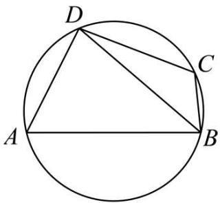

text_image

D
A
B
C

(1) 求观赏小道 BD 的长及种植区域 ABCD 的面积;  
(2) 因地理条件限制, 种植丁香花的边界 BC, CD 不能变更, 而边界 AB, AD 可以调整, 使得种植兰花的面积有所增加, 请在 BAD 上设计一点 P, 使得种植区域改造后的新区域 (四边形 PBCD) 的面积最大, 并求出这个面积的最大值.

【解析】(1) 设 BD = xcm，则由余弦定理得 $\cos A = \frac{40^{2} + 60^{2} - x^{2}}{2 \times 40 \times 60}$ ,

$$
\cos C = \frac {4 0 ^ {2} + 2 0 ^ {2} - x ^ {2}}{2 \times 4 0 \times 2 0}.
$$

由四边形 ABCD 是圆内接四边形得 $A + C = 180^{\circ}$ ,

故 $\cos A + \cos C = 0$ ，即 $\frac{40^{2} + 60^{2} - x^{2}}{2 \times 40 \times 60} + \frac{40^{2} + 20^{2} - x^{2}}{2 \times 40 \times 20} = 0$ ，

解得 $x=20\sqrt{7}$ (负值舍去), 即 BD= $20\sqrt{7}$ cm.

从而 $\cos A = \frac{1}{2}$ ，所以 $A = 60^{\circ}, C = 120^{\circ}$ ，

故 $S_{\mathrm{ABCD}} = \frac{1}{2}\times 40\times 60\times \sin 60^{\circ} + \frac{1}{2}\times 40\times 20\times \sin 120^{\circ} = 800\sqrt{3}.$

答: 观赏小道 BD 的长为 $20\sqrt{7}m$ ，种植区域 ABCD 的面积为 $800\sqrt{3}m^{2}$ .

(2) 由 (1) 及“同弧所对的圆周角相等”得 $\angle P = \angle A = 60^{\circ}$ .

设 $\mathrm{PD} = mcm, \mathrm{PB} = ncm(m, n > 0)$ ,

则 $S_{\triangle BDP}=\frac{1}{2}mn\cdot\sin P=\frac{\sqrt{3}}{4}mn.$

在 $\triangle BDP$ 中,由余弦定理有

$(20\sqrt{7})^{2} = m^{2} + n^{2} - 2mn \cdot \cos P = m^{2} + n^{2} - mn \geqslant mn = \frac{4}{\sqrt{3}}\left(\frac{\sqrt{3}}{4} mn\right) = \frac{4}{\sqrt{3}} S_{\triangle BDP},$

故 $S_{\Delta BDP} \leqslant 700\sqrt{3}$ (当且仅当 $m = n = 20\sqrt{7}$ 时等号成立).

而 $S_{\triangle BCD}=\frac{1}{2}\times40\times20\times\sin120^{\circ}=200\sqrt{3}$

因此,种植区域改造后的新区域PBCD的面积的最大值为 $900\sqrt{3}cm^{2}$ .

答: 当 $\triangle BDP$ 为等边三角形时, 新区域 PBCD 的面积最大, 最大值为 $900\sqrt{3}m^{2}$ .

1469 (2024·山东青岛·高三青岛三十九中校考期中)在①a=2,②a=b=2,③b=c=2这三个条件中任选一个,补充在下面问题中,求△ABC的面积的值(或最大值).已知△ABC的内角A,B,C所对的边分别为a,b,c,三边a,b,c与面积S满足关系式: $4S=b^{2}+c^{2}-a^{2}$ ,且\_\_\_\_,求△ABC的面积的值(或最大值).

【解析】∵ $4S = 4 \cdot \frac{1}{2}bc \sin A = 2bc \sin A = b^{2} + c^{2} - a^{2}$ ,

$$
\therefore \sin A = \frac {b ^ {2} + c ^ {2} - a ^ {2}}{2 b c} = \cos A, \therefore \tan A = 1
$$

$$
\because \mathrm{A} \in (0, \pi), \therefore \mathrm{A} = \frac {\pi}{4},
$$

选择条件①: 当 a=2 时, 根据余弦定理, $a^{2}=b^{2}+c^{2}-2bc\cos A=4$ , $\therefore b^{2}+c^{2}=4+$

2bccosA,

$$
\because b ^ {2} + c ^ {2} = 4 + \sqrt {2} b c \geqslant 2 b c (a > 0, b > 0),
$$

$\therefore bc \leqslant \frac{4}{2 - \sqrt{2}} = 4 + 2\sqrt{2}$ (当且仅当 $b = c = \sqrt{4 + 2\sqrt{2}}$ 时取等),

$$
\therefore \mathrm{S} _ {\max} = \frac {1}{2} (4 + 2 \sqrt {2}) \cdot \frac {\sqrt {2}}{2} = \sqrt {2} + 1;
$$

选择条件②: 当 a=b=2 时, $\because a^{2}=b^{2}+c^{2}-2bc\cos A=4+c^{2}-2\sqrt{2}c=4$ ,

$$
\therefore c = 2 \sqrt {2}, \therefore S = \frac {1}{2} b c \sin A = \frac {1}{2} \cdot 2 \cdot 2 \sqrt {2} \cdot \frac {\sqrt {2}}{2} = 2;
$$

选择条件③: 当 b=c=2, $S=\frac{1}{2}bc\sin A=\frac{1}{2}\cdot2\cdot2\cdot\frac{\sqrt{2}}{2}=\sqrt{2}$ .

1470 (2024·江苏苏州·高三常熟中学校考阶段练习)如图所示,某住宅小区一侧有一块三角形空地 ABO,其中 OA = 3km, OB = 3 $\sqrt{3}$ km, $\angle AOB = 90^{\circ}$ . 物业管理部门拟在中间开挖一个三角形人工湖 OMN,其中 M,N 都在边 AB 上 (M,N 均不与 AB 重合,M 在 A,N 之间),且 $\angle MON = 30^{\circ}$ .

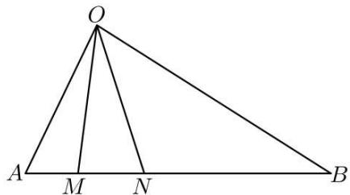

text_image

O
A M N B

(1) 若 M 在距离 A 点 1km 处, 求点 M, N 之间的距离;

(2) 设 $\angle BON = \theta$ ,

①求出 $\triangle OMN$ 的面积 S 关于 $\theta$ 的表达式；  
②为节省投入资金,三角形人工湖 OMN 的面积要尽可能小,试确定 $\theta$ 的值,使 $\triangle OMN$ 得面积最小,并求出这个最小面积.

【解析】(1)∵AM=1,OA=3,OB=3 $\sqrt{3}$ , $\angle AOB=90^{\circ}$ ,∴AB=6, $\angle A=60^{\circ}$ ,

∴由余弦定理 $OM=\sqrt{9+1-2\times3\times1\times\frac{1}{2}}=\sqrt{7}$ ， $\cos\angle AMO=\frac{7+1-9}{2\sqrt{7}\cdot1}=-\frac{1}{2\sqrt{7}}$

$$
\sin \angle \mathrm{AMO} = \frac {3 \sqrt {3}}{2 \sqrt {7}},
$$

$$
\therefore \sin \angle \mathrm{ONM} = \sin (\angle \mathrm{AMO} - \angle \mathrm{MON}) = \frac {3 \sqrt {3}}{2 \sqrt {7}} \cdot \frac {\sqrt {3}}{2} + \frac {1}{2 \sqrt {7}} \cdot \frac {1}{2} = \frac {1 0}{4 \sqrt {7}} = \frac {5}{2 \sqrt {7}}.
$$

在 $\triangle$ MON中 $\frac{\mathrm{MN}}{\sin 30^{\circ}} = \frac{\mathrm{OM}}{\sin\angle\mathrm{ONM}}\Rightarrow \mathrm{MN} = \sqrt{7}\cdot \frac{2\sqrt{7}}{5}\times \frac{1}{2} = \frac{7}{5}.$

(2) ① $\because \angle BON = \theta, \therefore \angle ONM = \theta + \frac{\pi}{6}$ ,

在 $\triangle \mathrm{BON}$ 中， $\frac{\mathrm{ON}}{\sin \frac{\pi}{6}} = \frac{3\sqrt{3}}{\sin \left(\theta + \frac{\pi}{6}\right)} \Rightarrow \mathrm{ON} = \frac{\frac{3\sqrt{3}}{2}}{\sin \left(\theta + \frac{\pi}{6}\right)}$

在 $\triangle \mathrm{MON}$ 中， $\frac{\mathrm{MN}}{\sin\frac{\pi}{6}} = \frac{\frac{3\sqrt{3}}{2}}{\sin\left(\theta + \frac{\pi}{6}\right)\sin\left(\frac{\pi}{3} + \theta\right)}$

$$
\therefore \mathrm{MN} = \frac {3 \sqrt {3}}{4 \sin (\theta + \frac {\pi}{6}) \sin (\frac {\pi}{3} + \theta)} = \frac {3 \sqrt {3}}{4 (\frac {\sqrt {3}}{2} \sin \theta + \frac {1}{2} \cos \theta) \times (\frac {1}{2} \sin \theta + \frac {\sqrt {3}}{2} \cos \theta)} =
$$

$$
\frac {3 \sqrt {3}}{\sqrt {3} \sin^ {2} \theta + \sqrt {3} \cos^ {2} \theta + 4 \sin \theta \cos \theta} = \frac {3 \sqrt {3}}{\sqrt {3} + 2 \sin 2 \theta},
$$

又 $\triangle ABO$ 中 AB 边上的高为 $\frac{3\times3\sqrt{3}}{6}=\frac{3\sqrt{3}}{2}km$ ,

$$
\therefore \mathrm{S} = \frac {1}{2} \cdot \frac {3 \sqrt {3}}{2} \frac {3 \sqrt {3}}{\sqrt {3} + 2 \sin 2 \theta} = \frac {2 7}{4 (\sqrt {3} + 2 \sin 2 \theta)}, 0 <   \theta <   \frac {\pi}{3}.
$$

② 当 $\sin2\theta=1,\theta=\frac{\pi}{4}$ 时， $S_{\triangle OMN}$ 最小且 $(S_{\triangle OMN})_{\min}=\frac{27}{4(\sqrt{3}+2)}=\frac{27(2-\sqrt{3})}{4}$ .

1471 (2024·全国·高三专题练习)在 $\triangle ABC$ 中， $\mathrm{S}_{\triangle ABC} = \frac{\sqrt{3}}{2}\overrightarrow{\mathrm{BA}} \cdot \overrightarrow{\mathrm{BC}}, \mathrm{BC} = 3.$

(1)D 为线段 BC 上一点, 且 CD = 2BD, AD = 1, 求 AC 长度;  
(2) 若 $\triangle ABC$ 为锐角三角形, 求 $\triangle ABC$ 面积的范围.

【解析】(1) 在 $\triangle ABC$ 中, 依题意得: $\frac{1}{2} \cdot BA \cdot BC \cdot \sin B = \frac{\sqrt{3}}{2} \cdot BA \cdot BC \cdot \cos B$ ,

则有 $\frac{1}{2}\sin B=\frac{\sqrt{3}}{2}\cos B$ ，于是得 $\tan B=\sqrt{3}$ ，而 $B\in(0,\pi)$ ，则 $B=\frac{\pi}{3}$ ，

又 BC = 3, CD = 2BD, 则 BD = 1, CD = 2,

在 $\triangle ABD$ 中 AD=1，从而得等边 $\triangle ABD$ ，即 $\angle ADB=\frac{\pi}{3}$ ， $\angle ADC=\frac{2\pi}{3}$ ，

在 $\triangle \mathrm{ADC}$ 中由余弦定理 $\mathrm{AC}^2 = \mathrm{AD}^2 +\mathrm{CD}^2 -2\mathrm{AD}\cdot \mathrm{CD}\cos \angle \mathrm{ADC}$ 得 $\mathrm{AC}^2 = 2^2 +1^2 -2$ · $2\cdot 1\cdot \cos \frac{2\pi}{3} = 7$ ，解得 $\mathrm{AC} = \sqrt{7}$

(2) 在 $\triangle ABC$ 中, $BC = 3$ , 设 $\angle BAC = \theta$ , 由正弦定理 $\frac{AB}{\sin C} = \frac{BC}{\sin A}$ 得:

$$
\mathrm{AB} = \frac {3 \sin \mathrm{C}}{\sin \theta} = \frac {3 \sin \left(\frac {2 \pi}{3} - \theta\right)}{\sin \theta} = \frac {3 \left(\frac {\sqrt {3}}{2} \cos \theta + \frac {1}{2} \sin \theta\right)}{\sin \theta} = 3 \left(\frac {1}{2} + \frac {\sqrt {3}}{2} \cdot \frac {1}{\tan \theta}\right),
$$

于是得 $S_{\triangle ABC}=\frac{1}{2}\cdot BA\cdot BC\cdot \sin B=\frac{9\sqrt{3}}{4}\cdot\left(\frac{1}{2}+\frac{\sqrt{3}}{2}\cdot\frac{1}{\tan\theta}\right)$ ,

因 $\triangle ABC$ 是锐角三角形, 则 $0 < \theta < \frac{\pi}{2}$ , 且 $0 < \frac{2\pi}{3} - \theta < \frac{\pi}{2}$ ,

于是有 $\frac{\pi}{6} < \theta < \frac{\pi}{2}$ , 则 $\tan \theta > \frac{\sqrt{3}}{3}$ , 即 $0 < \frac{1}{\tan \theta} < \sqrt{3}, \frac{1}{2} < \frac{1}{2} + \frac{\sqrt{3}}{2} \cdot \frac{1}{\tan \theta} < 2,$

从而得 $\frac{9\sqrt{3}}{8} <  \mathrm{S}_{\triangle \mathrm{ABC}} <   \frac{9\sqrt{3}}{2},$

所以 $\triangle ABC$ 面积的取值范围是 $\left(\frac{9\sqrt{3}}{8}, \frac{9\sqrt{3}}{2}\right)$ .

1472 (2024·河北·高三校联考阶段练习)已知在 $\triangle ABC$ 中, 内角 A, B, C 的对边分别为 $a, b$ , $c$ , 且 $\frac{a\sin B}{b\cos A} = \sqrt{3}$ .

(1) 若 $a = 2\sqrt{5}, b = 2$ ，求 $c$ 的大小；  
(2) 若 b=2，且 C 是钝角，求 $\triangle ABC$ 面积的大小范围.

【解析】(1) 在 $\triangle ABC$ 中， $\frac{a\sin B}{b\cos A} = \sqrt{3}$ ，由正弦定理得 $\sin A\sin B = \sqrt{3}\sin B\cos A$ .

$$
\because 0 <   \mathrm{B} <   \pi , \therefore \sin \mathrm{B} \neq 0, \therefore \sin \mathrm{A} = \sqrt {3} \cos \mathrm{A},
$$

$$
\therefore \tan A = \frac {\sin A}{\cos A} = \sqrt {3}.
$$

又∵0<A<π,∴A= $\frac{\pi}{3}$ .

在 $\triangle ABC$ 中，由余弦定理得 $a^2 = b^2 + c^2 - 2bc\cos A$ ，即 $20 = 4 + c^2 - 4c \cdot \frac{1}{2}$

解得 $c = 1 - \sqrt{17}$ (舍去), $c = 1 + \sqrt{17}$ .

$$
\therefore c = 1 + \sqrt {1 7}.
$$

(2) 由 (1) 知 $A = \frac{\pi}{3}$ ,

$$
\therefore \mathrm{S} _ {\triangle \mathrm{ABC}} = \frac {1}{2} b c \sin \mathrm{A} = \frac {\sqrt {3}}{2} c.
$$

由正弦定理, 得 $\frac{c}{\sin C} = \frac{b}{\sin B}, \therefore c = \frac{b \sin C}{\sin B} = \frac{2 \sin \left( \frac{2\pi}{3} - B \right)}{\sin B} = \frac{\sqrt{3}}{\tan B} + 1.$

$\because A=\frac{\pi}{3},C$ 为钝角， $\therefore0<B<\frac{\pi}{6}$

$$
\therefore 0 <   \tan B <   \frac {\sqrt {3}}{3}, \therefore c > 4,
$$

$$
\therefore S _ {\triangle A B C} > 2 \sqrt {3}.
$$

即 $\triangle ABC$ 面积的大小范围是 $(2\sqrt{3}, +\infty)$ .

# 题型三:长度问题

1473 (2024·浙江丽水·高三浙江省丽水中学校联考期末)已知锐角 $\triangle ABC$ 内角 A, B, C 的对边分别为 a, b, c. 若 $b\sin B - c\sin C = (b - a)\sin A$ .

(1) 求 C;

(2) 若 $c = \sqrt{3}$ , 求 $a - b$ 的范围.

【解析】(1)由正弦定理, $b\sin B-c\sin C=(b-a)\sin A$

$$
\Rightarrow b ^ {2} - c ^ {2} = (b - a) a \Rightarrow c ^ {2} = a ^ {2} + b ^ {2} - a b
$$

又 $c^{2}=a^{2}+b^{2}-2ab\cdot\cos C$ , 得 $\cos C=\frac{1}{2}\Rightarrow C=\frac{\pi}{3}$ ;

(2) 因为 $c = \sqrt{3}$ ,

所以 $\frac{c}{\sin C} = \frac{a}{\sin A} = \frac{b}{\sin B} = 2,$

$$
a - b = 2 (\sin A - \sin B) = 2 \left[ \sin A - \sin \left(\pi - A - \frac {\pi}{3}\right) \right] = 2 \left[ \sin A - \sin \left(A + \frac {\pi}{3}\right) \right] =
$$

$2\sin\left(A-\frac{\pi}{3}\right)$ ，因为三角形 ABC 为锐角三角形，

所以 $\left\{\begin{aligned}0<A<\frac{\pi}{2}\\ 0<B=\frac{2\pi}{3}-A<\frac{\pi}{2}\end{aligned}\right.$ ，解得 $\frac{\pi}{6}<A<\frac{\pi}{2}$ ,

令 $t = \mathrm{A} - \frac{\pi}{3}$ , 所以 $t \in \left(-\frac{\pi}{6}, \frac{\pi}{6}\right)$ , $-1 < a - b = 2\sin \left(\mathrm{A} - \frac{\pi}{3}\right) = 2\sin t < 1$ ,

所以 $a - b \in (-1,1)$ .

1474 (2024·福建莆田·高三校考期中)在 $\triangle ABC$ 中， $a, b, c$ 分别为角 A, B, C 所对的边， $b = 2\sqrt{3}$ ， $(2c - a)\sin C = (b^2 + c^2 - a^2)\frac{\sin B}{b}$

(1) 求角 B ;

(2) 求 $2a - c$ 的范围.

【解析】(1) $(2c-a)\sin C=(b^{2}+c^{2}-a^{2})\frac{\sin B}{b}\Rightarrow(2c-a)c=b^{2}+c^{2}-a^{2}\Rightarrow c^{2}+a^{2}-b^{2}=$

ac, 又 $\cos B = \frac{a^{2} + c^{2} - b^{2}}{2ac}$ ，所以 $\cos B = \frac{1}{2}$ ，因为 $B \in (0, \pi)$ ，所以 $B = \frac{\pi}{3}$ .

(2) 在 $\triangle ABC$ 中, 由 (1) 及 $b = 2\sqrt{3}$ , 得 $\frac{b}{\sin B} = \frac{a}{\sin A} = \frac{c}{\sin C} = \frac{2\sqrt{3}}{\frac{\sqrt{3}}{2}} = 4$ ,

故 $a = 4\sin \mathrm{A}, c = 4\sin \mathrm{C}, 2a - c = 8\sin \mathrm{A} - 4\sin \mathrm{C} = 8\sin \mathrm{A} - 4\sin \left(\frac{2\pi}{3} - \mathrm{A}\right) = 8\sin \mathrm{A} -$

$$
\begin{array}{l} 2 \sqrt {3} \cos A - 2 \sin A \\ = 6 \sin A - 2 \sqrt {3} \cos A = 4 \sqrt {3} \sin \left(A - \frac {\pi}{6}\right), \\ \end{array}
$$

因为 $0 < A < \frac{2\pi}{3}$ , 则 $-\frac{\pi}{6} < A - \frac{\pi}{6} < \frac{\pi}{2}$ ,

$$
- \frac {1}{2} <   \sin \left(\mathrm{A} - \frac {\pi}{6}\right) <   1, - 2 \sqrt {3} <   4 \sqrt {3} \sin \left(\mathrm{A} - \frac {\pi}{6}\right) <   4 \sqrt {3}.
$$

所以 $2a - c$ 的范围为 $(-2\sqrt{3}, 4\sqrt{3})$ .

1475 (2024·重庆江北·高三校考阶段练习)在△ABC中,内角A,B,C所对的边分别a,b,c,
且 $\left(a\cos^{2}\frac{C}{2}+c\cos^{2}\frac{A}{2}\right)(a+c-b)=\frac{3}{2}ac.$

(1) 求角 B 的大小;  
(2) 若 $b = 2\sqrt{3}$ , $c = x (x > 0)$ , 当 $\triangle ABC$ 仅有一解时, 写出 $x$ 的范围, 并求 $a - c$ 的取值范围.

【解析】(1) $\because \left(a\cos^2\frac{C}{2} +c\cos^2\frac{A}{2}\right)(a + c - b) = \left(\frac{a(1 + \cos C)}{2} +\frac{c(1 + \cos A)}{2}\right)(a + c - b)$

$$
= \frac {a + c + (a \cos C + c \cos A)}{2} (a + c - b) = \frac {(a + c + b) (a + c - b)}{2} = \frac {a ^ {2} + c ^ {2} - b ^ {2} + 2 a c}{2} =
$$

$\frac{3}{2} ac$ ，即 $a^2 + c^2 - b^2 = ac$

$$
\begin{array}{l} \therefore \cos B = \frac {a ^ {2} + c ^ {2} - b ^ {2}}{2 a c} = \frac {1}{2}, \\ \because 0 <   \mathrm{B} <   \pi , \\ \therefore \mathrm{B} = \frac {\pi}{3}. \\ \end{array}
$$

(2)根据题意,由正弦定理得 $\frac{c}{\sin C}=\frac{b}{\sin B}$ ,则 $\sin C=\frac{x}{4}$ ,

∵△ABC仅有一解，

$\therefore \sin C = 1$ 或 $\sin C \leqslant \sin B$ ，即 $\frac{x}{4} = 1$ 或 $0 < \frac{x}{4} \leqslant \frac{\sqrt{3}}{2}$ ，

$\therefore x = 4$ 或 $0 <   x\leqslant 2\sqrt{3}$

当 $x = 4$ 时， $\mathrm{C} = \frac{\pi}{2},\mathrm{A} = \frac{\pi}{6}$ ，所以 $c = 4,a = 2$ ，所以 $a - c = -2$

当 $0 < x \leqslant 2\sqrt{3}$ 时，由正弦定理得 $\frac{a}{\sin A} = \frac{c}{\sin C} = \frac{b}{\sin B} = 4$

$$
\therefore a - c = 4 (\sin A - \sin C) = 4 \left[ \sin \left(C + \frac {\pi}{3}\right) - \sin C \right]
$$

$$
= 4 \left(- \frac {1}{2} \sin C + \frac {\sqrt {3}}{2} \cos C\right) = - 4 \sin \left(C - \frac {\pi}{3}\right),
$$

$$
\because 0 <   \mathrm{C} \leqslant \frac {\pi}{3},
$$

$$
\therefore - \frac {\pi}{3} <   C - \frac {\pi}{3} \leqslant 0,
$$

$$
\therefore - \frac {\sqrt {3}}{2} <   \sin \left(\mathrm{C} - \frac {\pi}{3}\right) \leqslant 0,
$$

$\therefore -4\sin \left(\mathrm{C}-\frac{\pi}{3}\right)\in[0,2\sqrt{3})$ ，即 $a-c\in[0,2\sqrt{3})$

综上， $a - c\in \{-2\} \cup [0,2\sqrt{3})$

1476 (2024·全国·高三专题练习)已知△ABC的内角A，B，C的对边分别为a，b，c，且满足条件； $a=4,\sin^{2}A+\sin B\sin C=\sin^{2}B+\sin^{2}C.$

(I) 求角 A 的值;

(II) 求 $2b - c$ 的范围.

【解析】(I) 由 $\sin^{2}A + \sin B\sin C = \sin^{2}B + \sin^{2}C$ ,

利用正弦定理可得 $a^2 + bc = b^2 + c^2$ ，即 $bc = b^2 + c^2 - a^2$

故 $\cos A=\frac{b^{2}+c^{2}-a^{2}}{2bc}=\frac{bc}{2bc}=\frac{1}{2}$ ,

又 $\mathrm{A}\in (0,\pi),\therefore \mathrm{A} = \frac{\pi}{3}$

(Ⅱ) $\because a=4,\mathrm{A}=\frac{\pi}{3}$ ，利用正弦定理 $\frac{a}{\sin A}=\frac{b}{\sin B}=\frac{c}{\sin C}=\frac{4}{\frac{\sqrt{3}}{2}}=\frac{8\sqrt{3}}{3}$

故 $b=\frac{8\sqrt{3}}{3}\sin B,c=\frac{8\sqrt{3}}{3}\sin C=\frac{8\sqrt{3}}{3}\sin\left(\frac{\pi}{3}+B\right)$

$$
\therefore 2 b - c = 2 \times \frac {8 \sqrt {3}}{3} \sin B - \frac {8 \sqrt {3}}{3} \sin \left(\frac {\pi}{3} + B\right) = \frac {1 6 \sqrt {3}}{3} \sin B - \frac {8 \sqrt {3}}{3} \left(\frac {\sqrt {3}}{2} \cos B + \frac {1}{2} \sin B\right)
$$

$$
= \frac {1 6 \sqrt {3}}{3} \sin B - 4 \cos B - \frac {4 \sqrt {3}}{3} \sin B = 4 \sqrt {3} \sin B - 4 \cos B = 8 \sin \left(B - \frac {\pi}{6}\right)
$$

在 $\triangle ABC$ 中， $A = \frac{\pi}{3}$ ，故 $0 < B < \frac{2\pi}{3}$

$$
\therefore - \frac {\pi}{6} <   \mathrm{B} - \frac {\pi}{6} <   \frac {\pi}{2}, \therefore - \frac {1}{2} <   \sin (\mathrm{B} - \frac {\pi}{6}) <   1, \therefore - 4 <   8 \sin (\mathrm{B} - \frac {\pi}{6}) <   8
$$

所以 $2b - c$ 的范围是 $(-4,8)$

1477 (2024·全国·高三专题练习)在 $\Delta ABC$ 中，a,b,c 分别是角 A,B,C 的对边 $(a+b+c)(a+b-c)=3ab$ .

(1) 求角 C 的值;  
(2) 若 c=2，且 $\Delta ABC$ 为锐角三角形，求 2a-b 的范围.

【解析】(1) 由题意知 $(a+b+c)(a+b-c)=3ab$ , $\therefore a^{2}+b^{2}-c^{2}=ab$ ,

由余弦定理可知， $\cos C = \frac{a^2 + b^2 - c^2}{2ab} = \frac{1}{2}$ ，

又 $\because C\in (0,\pi),\therefore C = \frac{\pi}{3}.$

(2) 由正弦定理可知, $\frac{a}{\sin A} = \frac{b}{\sin B} = \frac{2}{\sin \frac{\pi}{3}} = \frac{4}{3} \sqrt{3}$ ,

即 $a=\frac{4}{3}\sqrt{3}\sin A,b=\frac{4}{3}\sqrt{3}\sin B,$

$$
\begin{array}{l} \therefore 2 a - b = \frac {8}{3} \sqrt {3} \sin A - \frac {4}{3} \sqrt {3} \sin B = \frac {8}{3} \sqrt {3} \sin A - \frac {4}{3} \sqrt {3} \sin \left(\frac {2 \pi}{3} - A\right) = \frac {8 \sqrt {3}}{3} \sin A - \\ 2 \cos A - \frac {2 \sqrt {3}}{3} \sin A \\ = \frac {6 \sqrt {3}}{3} \sin A - 2 \cos A = 4 \left(\frac {\sqrt {3}}{2} \sin A - \frac {1}{2} \cos A\right) = 4 \sin \left(A - \frac {\pi}{6}\right), \\ \end{array}
$$

又∵ $\Delta ABC$ 为锐角三角形，∴ $\left\{\begin{aligned}0<A<\frac{\pi}{2}\\ 0<B=\frac{2\pi}{3}-A<\frac{\pi}{2}\end{aligned}\right.$ ，则 $\frac{\pi}{6}<A<\frac{\pi}{2}$ 即 $0<A-\frac{\pi}{6}<\frac{\pi}{3}$

所以， $0<\sin\left(A-\frac{\pi}{6}\right)<\frac{\sqrt{3}}{2}$ 即 $0<4\sin\left(A-\frac{\pi}{6}\right)<2\sqrt{3}$

综上 2a-b 的取值范围为 $(0,2\sqrt{3})$ .

1478 (2024·山西运城·统考模拟预测)△ABC的内角A，B，C的对边分别为a，b，c.

(1) 求证: $\frac{\sin(A-B)}{\sin A+\sin B}=\frac{a-b}{c};$

(2) 若 $\triangle ABC$ 是锐角三角形, $A - B = \frac{\pi}{3}, a - b = 2$ , 求 $c$ 的范围.

【解析】(1)由两角差的正弦公式,可得 $\frac{\sin(A-B)}{\sin A+\sin B}=\frac{\sin A\cos B-\cos A\sin B}{\sin A+\sin B}$ ,

又由正弦定理和余弦定理,可得

$$
\frac {\sin \mathrm{A} \cos \mathrm{B} - \cos \mathrm{A} \sin \mathrm{B}}{\sin \mathrm{A} + \sin \mathrm{B}} = \frac {a \cdot \frac {a ^ {2} + c ^ {2} - b ^ {2}}{2 a c} - b \cdot \frac {b ^ {2} + c ^ {2} - a ^ {2}}{2 b c}}{a + b}
$$

$$
= \frac {2 a ^ {2} - 2 b ^ {2}}{2 c (a + b)} = \frac {(a + b) (a - b)}{c (a + b)} = \frac {a - b}{c},
$$

所以 $\frac{\sin(A - B)}{\sin A + \sin B} = \frac{a - b}{c}$

(2) 由 (1) 知 $c = \frac{(a - b)(\sin A + \sin B)}{\sin(A - B)} = \frac{4}{\sqrt{3}} (\sin A + \sin B)$

$$
= \frac {4}{\sqrt {3}} \left[ \sin \left(\mathrm{B} + \frac {\pi}{3}\right) + \sin \mathrm{B} \right] = \frac {4}{\sqrt {3}} \left(\frac {3}{2} \sin \mathrm{B} + \frac {\sqrt {3}}{2} \cos \mathrm{B}\right)
$$

$$
= 4 \left(\frac {\sqrt {3}}{2} \sin B + \frac {1}{2} \cos B\right) = 4 \sin \left(B + \frac {\pi}{6}\right)
$$

因为 $\triangle ABC$ 是锐角三角形, 所以 $A = B + \frac{\pi}{3} < \frac{\pi}{2}$ , 可得 $0 < B < \frac{\pi}{6}$ ,

又由 $A + B > \frac{\pi}{2}$ , 可得 $B + \frac{\pi}{3} + B > \frac{\pi}{2}$ , 所以 $B > \frac{\pi}{12}$ , 所以 $\frac{\pi}{4} < B + \frac{\pi}{6} < \frac{\pi}{3}$ ,

所以 $\frac{\sqrt{2}}{2}<\sin\left(B+\frac{\pi}{6}\right)<\frac{\sqrt{3}}{2}$ ，可得 $2\sqrt{2}<c<2\sqrt{3}$ ，符合 c>a-b=2.

所以实数 c 的取值范围是 $(2\sqrt{2}, 2\sqrt{3})$ .

1479 (2024·安徽亳州·高三统考期末)在锐角 $\Delta ABC$ 中, 角 A, B, C 的对边分别为 a, b, c, 已知 $a\sin C = c\cos\left(A - \frac{\pi}{6}\right)$ .

(1) 求角 A 的大小;  
(2) 设 H 为 $\Delta ABC$ 的垂心, 且 AH = 1, 求 BH + CH 的范围.

【解析】(1) 由 $a \sin C = c \cos \left( A - \frac{\pi}{6} \right)$ ，结合正弦定理得

$$
\sin A = \cos \left(A - \frac {\pi}{6}\right),
$$

整理得 $\sin\left(A-\frac{\pi}{3}\right)=0,$

又 A 为锐角, 故 $A = \frac{\pi}{3}$ .

(2) 由 $\Delta ABC$ 是锐角三角形, 则垂心 $H$ 必在 $\Delta ABC$ 内部,

不妨设 $\angle BAH = \alpha$ ，则 $\alpha \in \left(0, \frac{\pi}{3}\right)$ .

由 H 为 $\Delta ABC$ 的垂心, 则 $\angle ABH = \angle ACH = \frac{\pi}{6}$ .

在 $\Delta ABH$ 中使用正弦定理得，

$\frac{AH}{\sin\angle ABH}=\frac{BH}{\sin\angle BAH}$ ，整理得： $BH=2\sin\alpha$ .

同理在 $\Delta ACH$ 中使用正弦定理得, $\mathrm{CH}=2\sin\left(\frac{\pi}{3}-\alpha\right)$ .

$$
\mathrm{BH} + \mathrm{CH} = 2 \sin \alpha + 2 \sin \left(\frac {\pi}{3} - \alpha\right) = 2 \sin \left(\frac {\pi}{3} + \alpha\right),
$$

结合 $\alpha \in \left(0, \frac{\pi}{3}\right)$

可得 $\mathrm{BH} + \mathrm{CH}\in (\sqrt{3},2]$

# 题型四:转化为角范围问题

1480 (2024·全国·高三专题练习)在锐角 $\Delta ABC$ 中, 内角 A, B, C 的对边分别为 a, b, c, 且 $(a + b)(\sin A - \sin B) = (c - b)\sin C$ .

(1) 求 A;   
(2) 求 $\cos B - \cos C$ 的取值范围.

【解析】(1) 因为 $(a+b)(\sin A-\sin B)=(c-b)\sin C$ ,

所以 $(a+b)(a-b)=(c-b)c$ ，即 $a^{2}=b^{2}+c^{2}-bc$ .

因为 $a^{2}=b^{2}+c^{2}-2b\cos A$ ，所以 $\cos A=\frac{1}{2}$ .

因为 $A \in \left(0, \frac{\pi}{2}\right)$ ，所以 $A = \frac{\pi}{3}$ .

(2) 由 (1) 知 $\cos B - \cos C = \cos B - \cos\left(\frac{2\pi}{3} - B\right)$

$$
= \cos B + \frac {1}{2} \cos B - \frac {\sqrt {3}}{2} \sin B = \frac {3}{2} \cos B - \frac {\sqrt {3}}{2} \sin B = \sqrt {3} \cos \left(B + \frac {\pi}{6}\right).
$$

因为 $\left\{\begin{aligned}0&<\frac{2\pi}{3}-B<\frac{\pi}{2}\\ 0&<B<\frac{\pi}{2}\end{aligned}\right.$ ，所以 $\frac{\pi}{6}<B<\frac{\pi}{2}$ ，

因为 $\frac{\pi}{3} < B + \frac{\pi}{6} < \frac{2\pi}{3}$ , 所以 $\cos \left(B + \frac{\pi}{6}\right) \in \left(-\frac{1}{2}, \frac{1}{2}\right)$ ,

所以 $\cos B - \cos C \in \left(-\frac{\sqrt{3}}{2}, \frac{\sqrt{3}}{2}\right)$ ,

即 $\cos B - \cos C$ 的取值范围是 $\left(-\frac{\sqrt{3}}{2}, \frac{\sqrt{3}}{2}\right)$ .

1481 (2024·全国·高三专题练习)已知 $\triangle ABC$ 的内角 A、B、C 的对边分别为 a、b、c，且 a-b = c(cosB-cosA).

(1) 判断 $\triangle ABC$ 的形状并给出证明；  
(2) 若 $a \neq b$ , 求 $\sin A + \sin B + \sin C$ 的取值范围.

【解析】(1) $\triangle ABC$ 为等腰三角形或直角三角形,证明如下:

由 $a-b=c(\cos B-\cos A)$ 及正弦定理得， $\sin A-\sin B=\sin C(\cos B-\cos A)$

即 $\sin(B+C)-\sin(A+C)=\sin C(\cos B-\cos A)$ ,

即 $\sin B\cos C + \cos B\sin C - \sin A\cos C - \cos A\sin C = \sin C\cos B - \sin C\cos A$ ,

整理得 $\sin B\cos C - \sin A\cos C = 0$ ，所以 $\cos C(\sin B - \sin A) = 0$ ，

故 $\sin A = \sin B$ 或 $\cos C = 0$ ,

又 A、B、C 为 $\triangle ABC$ 的内角, 所以 a=b 或 C= $\frac{\pi}{2}$ ,

因此 $\triangle ABC$ 为等腰三角形或直角三角形.

(2) 由 (1) 及 $a \neq b$ 知 $\triangle ABC$ 为直角三角形且不是等腰三角形,

且 $\mathrm{A} + \mathrm{B} = \frac{\pi}{2},\mathrm{C} = \frac{\pi}{2}$ 故 $\mathrm{B} = \frac{\pi}{2} -\mathrm{A},$ 且 $\mathrm{A}\neq \frac{\pi}{4},$

所以 $\sin A + \sin B + \sin C = \sin A + \sin B + 1 = \sin A + \cos A + 1 = \sqrt{2} \sin \left( A + \frac{\pi}{4} \right) + 1,$

因为 $\mathrm{A}\in \left(0,\frac{\pi}{4}\right)\cup \left(\frac{\pi}{4},\frac{\pi}{2}\right)$ ，故 $\mathrm{A} + \frac{\pi}{4}\in \left(\frac{\pi}{4},\frac{\pi}{2}\right)\cup \left(\frac{\pi}{2},\frac{3\pi}{4}\right),$

得 $\sin \left(A + \frac{\pi}{4}\right) \in \left(\frac{\sqrt{2}}{2}, 1\right)$ , 所以 $\sqrt{2} \sin \left(A + \frac{\pi}{4}\right) + 1 \in (2, \sqrt{2} + 1)$ ,

因此 $\sin A + \sin B + \sin C$ 的取值范围为 $(2, \sqrt{2} + 1)$ .

1482 (2024·河北保定·高一定州一中校考阶段练习)设 $\triangle ABC$ 的内角 A, B, C 的对边分别为 a, b, c，已知 $\frac{1-\sin A}{\cos A} = \frac{1-\cos 2B}{\sin 2B}$ .

(1) 判断 $\triangle ABC$ 的形状 (锐角、直角、钝角三角形), 并给出证明;   
(2) 求 $\frac{4a^{2}+5b^{2}}{c^{2}}$ 的最小值.

【解析】(1) $\triangle ABC$ 是钝角三角形.

由题意可知， $\frac{1-\sin A}{\cos A}=\frac{1-(1-2\sin^{2}B)}{2\sin B\cdot\cos B}=\frac{\sin B}{\cos B}$ ，得 $\cos B-\sin A\cdot\cos B=\sin B\cdot$

cosA,

所以 $\cos B = \sin(A + B)$ ，于是有 $\sin\left(\frac{\pi}{2} - B\right) = \sin(A + B)$ ，得 $\frac{\pi}{2} - B = A + B$ 或 $\frac{\pi}{2} - B + A + B = \pi$ ，即 $A + 2B = \frac{\pi}{2}$ 或 $A = \frac{\pi}{2}$ ，

又 $\cos A \neq 0, A \neq \frac{\pi}{2}, C = \pi - (A + B) = \frac{\pi}{2} + B > 0,$

所以 $\triangle ABC$ 是钝角三角形.

(2) 由 (1) 知, $C = \frac{\pi}{2} + B, A = \frac{\pi}{2} - 2B$ , 有 $\sin C = \cos B, \sin A = \cos 2B$ ,

所以 $\frac{4a^2 + 5b^2}{c^2} = \frac{4\sin^2\mathrm{A} + 5\sin^2\mathrm{B}}{\sin^2\mathrm{C}} = \frac{4\sin^2\left(\frac{\pi}{2} - 2\mathrm{B}\right) + 5\sin^2\mathrm{B}}{\sin^2\left(\frac{\pi}{2} + \mathrm{B}\right)}$

$$
= \frac {4 \cos^ {2} 2 \mathrm{B} + 5 (1 - \cos^ {2} \mathrm{B})}{\cos^ {2} \mathrm{B}} = \frac {4 (2 \cos^ {2} \mathrm{B} - 1) ^ {2} + 5 (1 - \cos^ {2} \mathrm{B})}{\cos^ {2} \mathrm{B}}
$$

$$
= \frac {1 6 \cos^ {4} \mathrm{B} - 2 1 \cos^ {2} \mathrm{B} + 9}{\cos^ {2} \mathrm{B}} = 1 6 \cos^ {2} \mathrm{B} + \frac {9}{\cos^ {2} \mathrm{B}} - 2 1
$$

$$
\geqslant 2 \sqrt {1 6 \cos^ {2} \mathrm{B} \cdot \frac {9}{\cos^ {2} \mathrm{B}}} - 2 1 = 3.
$$

当且仅当 $\cos^{2}B=\frac{3}{4}$ ，即 $\cos B=\frac{\sqrt{3}}{2}$ （B 为锐角），等号成立，

所以 $\frac{4a^{2}+5b^{2}}{c^{2}}$ 的最小值为 3.

1483 (2024·广东佛山·高一大沥高中校考阶段练习)已知△ABC的三个内角A，B，C的对边分别为a，b，c，且 $\overrightarrow{AB}\cdot\overrightarrow{AC}+\overrightarrow{BA}\cdot\overrightarrow{BC}=2\overrightarrow{CA}\cdot\overrightarrow{CB}$ ;

(1) 若 $\frac{\cos A}{b} = \frac{\cos B}{a}$ ，判断 $\triangle ABC$ 的形状并说明理由；  
(2) 若 $\triangle ABC$ 是锐角三角形, 求 $\cos C$ 的取值范围.

【解析】(1) $\triangle ABC$ 是等边三角形. 理由如下:

在 $\triangle ABC$ 中，由 $\overrightarrow{AB} \cdot \overrightarrow{AC} + \overrightarrow{BA} \cdot \overrightarrow{BC} = 2\overrightarrow{CA} \cdot \overrightarrow{CB}$ 得： $cb\cos A + ca\cos B = 2ba\cos C,$

由余弦定理得 $\frac{b^{2}+c^{2}-a^{2}}{2}+\frac{a^{2}+c^{2}-b^{2}}{2}=a^{2}+b^{2}-c^{2}$ ，即 $a^{2}+b^{2}=2c^{2}$

由正弦定理及 $\frac{\cos A}{b} = \frac{\cos B}{a}$ ，得 $\sin A \cdot \cos A = \sin B \cdot \cos B$ ，即 $\sin 2A = \sin 2B$ ，

而 $\mathrm{A,B}\in (0,\pi)$ 及 $\mathrm{A + B}\in (0,\pi)$ ，则 $2\mathrm{A} = 2\mathrm{B}$ 或 $2\mathrm{A} + 2\mathrm{B} = \pi$

当 2A = 2B 时, 即 A = B, 有 a = b, 此时 a = b = c, 所以 $\triangle ABC$ 是等边三角形;

当 $2A + 2B = \pi$ ，即 $A + B = \frac{\pi}{2}$ 时， $\angle C = \frac{\pi}{2}$ ，有 $a^{2} + b^{2} = c^{2}$ ，与 $a^{2} + b^{2} = 2c^{2}$ 矛盾，

所以 $\triangle ABC$ 是等边三角形.

(2) 由 (1) 知, $a^2 + b^2 = 2c^2$ , 由余弦定理得 $\cos C = \frac{a^2 + b^2 - c^2}{2ab} = \frac{a^2 + b^2}{4ab} > 0$ , C 为锐角,

而 $\triangle ABC$ 是锐角三角形, 则 $\cos A = \frac{b^{2} + c^{2} - a^{2}}{2bc} = \frac{3b^{2} - a^{2}}{4bc} > 0$ , 得 $\frac{b}{a} > \frac{\sqrt{3}}{3}$ ,

$\cos B = \frac{a^2 + c^2 - b^2}{2ac} = \frac{3a^2 - b^2}{4ac} > 0$ ，得 $\frac{b}{a} < \sqrt{3}$ ，因此 $\frac{\sqrt{3}}{3} < \frac{b}{a} < \sqrt{3}$ ，

$$
\cos \mathrm{C} = \frac {1}{4} \cdot \frac {a ^ {2} + b ^ {2}}{a b} = \frac {1}{4} \left(\frac {b}{a} + \frac {a}{b}\right), \text {令} \frac {b}{a} = t \in \left(\frac {\sqrt {3}}{3}, \sqrt {3}\right), \text {则} \frac {b}{a} + \frac {a}{b} = t + \frac {1}{t},
$$

对勾函数 $y = t + \frac{1}{t}$ 在 $\left(\frac{\sqrt{3}}{3}, 1\right]$ 上单调递减，在 $[1, \sqrt{3})$ 上单调递增，

当 t=1 时， $y_{\min}=2$ ，当 $t=\frac{\sqrt{3}}{3}$ 或 $t=\sqrt{3}$ 时， $y=\frac{4\sqrt{3}}{3}$ ，于是 $2\leqslant y<\frac{4\sqrt{3}}{3}$ ，

因此 $2 \leqslant \frac{b}{a} + \frac{a}{b} < \frac{4\sqrt{3}}{3}$ , 即有 $\frac{1}{2} \leqslant \frac{1}{4}\left(\frac{b}{a} + \frac{a}{b}\right) < \frac{\sqrt{3}}{3}$ ,

所以 $\cos C$ 的取值范围是 $\left[\frac{1}{2},\frac{\sqrt{3}}{3}\right)$ .

1484 (2024·全国·高三专题练习)在 $\triangle ABC$ 中, 角 A, B, C 所对的边分别是 $a, b, c$ . 已知 $a = 1, b = \sqrt{2}$ .

(1) 若 $\angle B = \frac{\pi}{4}$ , 求角 $A$ 的大小;  
(2) 求 $\cos A\cos\left(A+\frac{\pi}{6}\right)$ 的取值范围.

【解析】(1)由正弦定理得: $\sin A = \frac{a \sin B}{b} = \frac{1}{2}$ ,

$$
\because 0 <   \mathrm{A} <   \pi , \therefore \mathrm{A} = \frac {\pi}{6} \text {或} \frac {5 \pi}{6},
$$

当 $A=\frac{5\pi}{6}$ 时, 此时 $A+B>\pi$ , 所以 $A=\frac{5\pi}{6}$ 舍去, 所以 $A=\frac{\pi}{6}$ .

(2) $\cos A\cos\left(A+\frac{\pi}{6}\right)=\cos A\left(\frac{\sqrt{3}}{2}\cos A-\frac{1}{2}\sin A\right)$

$$
\begin{array}{l} = \frac {\sqrt {3}}{4} (1 + \cos 2 A) - \frac {1}{4} \sin 2 A \\ = \frac {\sqrt {3}}{4} + \frac {1}{2} \left(\frac {\sqrt {3}}{2} \cos 2 A - \frac {1}{2} \sin 2 A\right) = - \frac {1}{2} \sin \left(2 A - \frac {\pi}{3}\right) + \frac {\sqrt {3}}{4} \\ \end{array}
$$

(或者用积化和差公式一步得到 $\frac{1}{2}\cos\left(2A+\frac{\pi}{6}\right)+\frac{\sqrt{3}}{4}$ )

$\because a<b,\therefore A<B,所以A为锐角,又\sin A=\frac{a\sin B}{b}\leqslant\frac{\sqrt{2}}{2},$

所以 $A \in \left(0, \frac{\pi}{4}\right]$ ，所以 $2A - \frac{\pi}{3} \in \left(-\frac{\pi}{3}, \frac{\pi}{6}\right]$ ，

所以 $\sin\left(2A-\frac{\pi}{3}\right)\in\left(-\frac{\sqrt{3}}{2},\frac{1}{2}\right]$ ,

所以 $\cos A\cos\left(A+\frac{\pi}{6}\right)\in\left[\frac{\sqrt{3}-1}{4},\frac{\sqrt{3}}{2}\right)$ .

1485 (2024·江西吉安·高二江西省峡江中学校考开学考试)在锐角 $\triangle ABC$ 中, 角 A, B, C 所对的边分别是 a, b, c, $b^{2} + c^{2} - a^{2} = 2bc\sin\left(A + \frac{\pi}{6}\right)$ .

(1) 求角 A 的大小;  
(2) 求 $\sin B \cdot \sin C$ 的取值范围.

【解析】(1) $\because b^{2}+c^{2}-a^{2}=2bc\sin\left(A+\frac{\pi}{6}\right)$ ,

结合余弦定理,可得 $\cos A = \sin\left(A + \frac{\pi}{6}\right)$ ,

$$
\therefore \cos A = \frac {\sqrt {3}}{2} \sin A + \frac {1}{2} \cos A, \therefore \tan A = \frac {\sqrt {3}}{3}
$$

又∵0<A< $\frac{\pi}{2}$ ,∴A= $\frac{\pi}{6}$ ;

(2) 由 (1) 得 B + C = $\frac{5\pi}{6}$ , $\therefore B = \frac{5\pi}{6} - C$ ,

$$
\begin{array}{l} \therefore \sin B \cdot \sin C = \sin \left(\frac {5 \pi}{6} - C\right) \cdot \sin C = \left(\frac {\sqrt {3}}{2} \sin C + \frac {1}{2} \cos C\right) \cdot \sin C \\ = \frac {\sqrt {3}}{2} \sin^ {2} \mathrm{C} + \frac {1}{2} \sin \mathrm{C} \cos \mathrm{C} = \frac {\sqrt {3}}{4} (1 - \cos 2 \mathrm{C}) + \frac {1}{4} \sin 2 \mathrm{C} \\ = \frac {1}{4} \sin 2 C - \frac {\sqrt {3}}{4} \cos 2 C + \frac {\sqrt {3}}{4} = \frac {1}{2} \sin \left(2 C - \frac {\pi}{3}\right) + \frac {\sqrt {3}}{4}, \\ \end{array}
$$

∵△ABC是锐角三角形，∴ $\left\{\begin{aligned}0&<\frac{5\pi}{6}-C<\frac{\pi}{2}\\ 0&<C<\frac{\pi}{2}\end{aligned}\right.$ ，解得 $\frac{\pi}{3}<C<\frac{\pi}{2}$

$$
\therefore 2 \mathrm{C} - \frac {\pi}{3} \in \left(\frac {\pi}{3}, \frac {2 \pi}{3}\right), \sin \left(2 \mathrm{C} - \frac {\pi}{3}\right) \in \left(\frac {\sqrt {3}}{2}, 1 \right],
$$

$$
\therefore \sin B \cdot \sin C = \frac {1}{2} \sin \left(2 C - \frac {\pi}{3}\right) + \frac {\sqrt {3}}{4} \in \left(\frac {\sqrt {3}}{2}, \frac {1}{2} + \frac {\sqrt {3}}{4} \right].
$$

1486 (2024·全国·高三专题练习)在锐角 $\triangle ABC$ 中, 角 A, B, C 所对的边分别为 a, b, c. 若 $c^{2} + bc - a^{2} = 0$ , 则 $4(\sin C + \cos C)^{2} + \frac{1}{\tan C} - \frac{1}{\tan A}$ 的取值范围为 ()

A. $(4\sqrt{2},9)$

B. $(8,9)$

C. $\left(\frac{8\sqrt{3}}{3}+4,9\right)$

D. $(2\sqrt{3} + 4,9)$

【答案】C

【解析】 $\because c^{2}+bc-a^{2}=0,\therefore a^{2}-c^{2}=bc,$

$$
\therefore b ^ {2} - 2 b c \cos A = b c, \therefore b - 2 c \cos A = c,
$$

$$
\therefore \sin B - 2 \sin C \cos A = \sin C, \therefore \sin (A + C) - 2 \sin C \cos A = \sin C
$$

$\therefore \sin(A-C)=\sin C, \therefore A-C=C$ 或 $A-C+C=\pi$ (不符合题意舍去),

$$
\begin{array}{l} \therefore \mathrm{A} = 2 \mathrm{C}, \\ \therefore 4 (\sin C + \cos C) ^ {2} + \frac {1}{\tan C} - \frac {1}{\tan A} \\ = 4 \times (1 + 2 \sin C \cos C) + \frac {\cos C}{\sin C} - \frac {\cos A}{\sin A} \\ = 4 + 4 \sin 2 C + \frac {\cos C \sin A - \sin C \cos A}{\sin A \sin C} \\ = 4 + 4 \sin A + \frac {\sin (A + C)}{\sin A \sin C} \\ = 4 + 4 \sin A + \frac {\sin C}{\sin A \sin C} \\ = 4 + 4 \sin A + \frac {1}{\sin A}, \\ \end{array}
$$

设 $\sin A = t$

$\because \triangle ABC$ 是锐角三角形， $\therefore A \in \left(0, \frac{\pi}{2}\right)$ ， $\therefore B = \pi - A - C = \pi - A - \frac{A}{2} \in \left(0, \frac{\pi}{2}\right)$ ，

$$
\therefore \mathrm{A} \in \left(\frac {\pi}{3}, \frac {\pi}{2}\right),
$$

$$
\therefore \sin A = t \in \left(\frac {\sqrt {3}}{2}, 1\right),
$$

令 $f(t)=4t+\frac{1}{t},t\in\left(\frac{\sqrt{3}}{2},1\right)$ ，则 $f'(t)=4-\frac{1}{t^{2}}>0,t\in\left(\frac{\sqrt{3}}{2},1\right)$

∴函数 $f(t)$ 在 $t\in\left(\frac{\sqrt{3}}{2},1\right)$ 上单调递增，

故 $f(t)\in\left(\frac{8\sqrt{3}}{3},5\right)$ ,

$$
\therefore 4 (\sin C + \cos C) ^ {2} + \frac {1}{\tan C} - \frac {1}{\tan A} = 4 + 4 t + \frac {1}{t} \in \left(\frac {8 \sqrt {3}}{3} + 4, 9\right).
$$

故选：C.

# 5 题型五：倍角问题

1487 (2024·浙江绍兴·高一诸暨中学校考期中)在锐角 $\triangle ABC$ 中, 内角 A, B, C 所对的边分别为 $a, b, c$ , 已知 $b + c = 2a\cos B$ .

(1) 证明: A = 2B;   
(2) 若 b=1，求 a 的取值范围；  
(3) 若 $\triangle ABC$ 的三边边长为连续的正整数, 求 $\triangle ABC$ 的面积.

【解析】(1) 因为 $\triangle ABC$ 为锐角三角形, 所以 $0 < A < \frac{\pi}{2}, -\frac{\pi}{2} < A - B < \frac{\pi}{2}$ .

由正弦定理有 $\sin B + \sin C = 2\sin A\cos B$ ,

又在 $\triangle ABC$ 中,所以有 $A+B+C=\pi$ ,

所以 $\sin C = \sin(A + B)$ ,

因此有 $\sin B + \sin(A + B) = 2\sin A\cos B$ ,

化简整理得 $\sin B = \sin (A - B)$

所以 B = A - B,

即 A = 2B.

(2) 因为 $\triangle ABC$ 为锐角三角形, 所以 $0 < 2B < \frac{\pi}{2}$ , 即 $0 < B < \frac{\pi}{4}$ ,

又 $\mathrm{A} + \mathrm{B} + \mathrm{C} = \pi$ ，得 $\mathrm{C} = \pi -3\mathrm{B}$ ，因此 $0 <   \pi -3\mathrm{B} <   \frac{\pi}{2}$ 得 $\frac{\pi}{6} <  \mathrm{B} <   \frac{\pi}{3},$

所以 $\frac{\pi}{6} <  \mathrm{B} <   \frac{\pi}{4}.$

由(1)有 $\sin A = \sin 2B \Rightarrow \sin A = 2\sin B \cos B \Rightarrow a = 2b \cos B$ ,

若 b=1 时， $a=2\cos B$ ，

又因为 $\frac{\pi}{6} < \mathrm{B} < \frac{\pi}{4}$ ,

所以 $a \in (\sqrt{2}, \sqrt{3})$ .

(3) 设 $\triangle ABC$ 的三边分别为 $n, n + 1, n + 2$ .

当 A > C > B 时，由 A = 2B $\Rightarrow$ sinA = sin2B $\Rightarrow$ sinA = 2sinBcosB，

所以有 $n+2=2n\times\frac{(n+1)^{2}+(n+2)^{2}-n^{2}}{2\times(n+1)\times(n+2)}$ ，解得 n=4，

因此三边分别为 4,5,6, 所以 $\cos B = \frac{\sin A}{2\sin B} = \frac{6}{2 \times 4} = \frac{3}{4}$ ,

所以 $\sin B = \frac{\sqrt{7}}{4}$ ，所以 $S_{\triangle ABC} = \frac{1}{2} \times 5 \times 6 \times \frac{\sqrt{7}}{4} = \frac{15\sqrt{7}}{4}$ ;

当 C > A > B 时, 同理有 $n + 1 = 2n \times \frac{(n+1)^{2} + (n+2)^{2} - n^{2}}{2 \times (n+1) \times (n+2)}$ , 解得 n = 1, 此时不能构成三角形, 故不满足题意;

当 A>B>C 时, 同理有 $n+2=2(n+1)\times\frac{n^{2}+(n+2)^{2}-(n+1)^{2}}{2\times n(n+2)}$ , 化简得 $n^{2}-n-3=0$ , 此时无整数解, 故不满足题意.

综上可知： $S_{\triangle ABC}=\frac{15\sqrt{7}}{4}$ .

1488 (2024·全国·高三专题练习)已知 $\Delta ABC$ 的内角 A, B, C 的对边分别为 a, b, c. 若 A = 2B，且 A 为锐角，则 $\frac{c}{b} + \frac{1}{\cos A}$ 的最小值为（）

A. $2\sqrt{2}+1$

B. 3

C. $2 \sqrt{2} + 2$

D. 4

【答案】A

【解析】 $\because \sin C = \sin (A + B) = \sin A \cos B + \cos A \sin B = \sin 2B \cos B + \cos 2B \sin B$

$$
= 2 \sin B \cos^ {2} B + (2 \cos^ {2} B - 1) \sin B = \sin B (4 \cos^ {2} B - 1) = \sin B (2 \cos 2 B + 1)
$$

$\therefore \sin C = \sin B(2\cos A + 1)$ , 即 $c = b(2\cos A + 1)$ , $\therefore \frac{c}{b} = 2\cos A + 1$ .

∵ A 为锐角 ∴ $\cos A > 0$ ，则 $\frac{c}{b} + \frac{1}{\cos A} = 2\cos A + \frac{1}{\cos A} + 1 \geqslant 2\sqrt{2} + 1$

当且仅当 $2\cos A = \frac{1}{\cos A}$ ，即 $\cos A = \frac{\sqrt{2}}{2}$ 时，等号成立，

$\therefore \frac{c}{b} + \frac{1}{\cos A}$ 的最小值为 $2\sqrt{2} + 1$ .

故选：A

1489 (2024·全国·高三专题练习)锐角 $\triangle ABC$ 的角 A, B, C 所对的边为 $a, b, c, A = 2B$ , 则 $\frac{a}{b}$ 的范围是 \_\_\_\_.

【答案】 $(\sqrt{2}^{\circ},^{\circ}\circ\sqrt{3})$

【解析】∵△ABC为锐角三角形，A=2B,C=180°-3B，∴0°<A=2B<90°,0°<180°-3B<90°，∴30°<B<45°，∴ $\frac{\sqrt{2}}{2}<\cos B<\frac{\sqrt{3}}{2}$ ，即 $\sqrt{2}<2\cos B<\sqrt{3}$ ，由正弦定理得： $\frac{a}{b}=\frac{\sin A}{\sin B}=\frac{\sin 2B}{\sin B}=\frac{2\sin B\cos B}{\sin B}=2\cos B$ ，所以 $\frac{a}{b}$ 的取值范围为

$(\sqrt{2}^{\circ},^{\circ}\circ\sqrt{3})$ . 所以答案应填： $(\sqrt{2}^{\circ},^{\circ}\circ\sqrt{3})$ .

1490 (2024·全国·高三专题练习)在锐角 $\triangle ABC$ 中, 角 A, B, C 的对边分别为 $a, b, c, \triangle ABC$ 的面积为 5 , 若 $\sin(A + C) = \frac{2S}{b^2 - a^2}$ , 则 $\tan A$ 的取值范围为 \_\_\_\_.

【答案】 $\left(\frac{\sqrt{3}}{3},1\right)$

【解析】在 $\triangle ABC$ 中， $\sin(A+C)=\sin B, S=\frac{1}{2}ac\sin B,$

$$
\because \sin (\mathrm{A} + \mathrm{C}) = \frac {2 \mathrm{S}}{b ^ {2} - a ^ {2}},
$$

$$
\therefore \sin B = \frac {a c \sin B}{b ^ {2} - a ^ {2}}, \text {即} b ^ {2} - a ^ {2} = a c,
$$

由余弦定理可得, $b^{2}=a^{2}+c^{2}-2ac\cdot\cos B$ ,

故 $c=2a\cos B+a$ ,

由正弦定理可得, $\sin C = 2\sin A\cos B + \sin A = \sin A\cos B + \cos A\sin B$ ，化简整理可得， $\sin(B - A) = \sin A$ ，

故 B-A=A 或 B-A= $\pi$ -A(舍去),

则 B = 2A,

∵△ABC为锐角三角形，$\therefore \left\{ \begin{array}{l}0 <   A <   \frac{\pi}{2}\\ 0 <   2A <   \frac{\pi}{2}\\ 0 <   \pi -3A <   \frac{\pi}{2} \end{array} \right.$ ，解得 $\frac{\pi}{6} <  A <   \frac{\pi}{4},$

故 $\frac{\sqrt{3}}{3} < \tan A < 1$

故答案为: $\left(\frac{\sqrt{3}}{3},1\right)$

1491 (2024·全国·高三专题练习)已知△ABC的内角A、B、C的对边分别为a、b、c,若A=2B,则 $\frac{ac+2b^{2}}{ab}$ 的取值范围为\_\_\_\_.

【答案】(2,4)

【解析】由于 A=2B，作 $\angle CDA=\angle A$ ，则 CD=AC=BD=b，

因为 $\frac{c}{b} > 1, \frac{2b}{a} > 1$ ，可得 $\frac{c}{b} + \frac{2b}{a} > 2$

所以 $\frac{ac + 2b^2}{ab} = \frac{c}{b} +\frac{2b}{a} = \frac{ac + 2b^2}{ab} <  \frac{a(a + b) + 2b^2}{ab} = \frac{a^2 + 2b^2}{ab} +1 = \frac{1 + 2\times\left(\frac{b}{a}\right)^2}{\frac{b}{a}} +1,$

令 $t = \frac{b}{a}$ ，可得 $\frac{1}{2} < t < 1$

所以 $\frac{1+2\times\left(\frac{b}{a}\right)^{2}}{\frac{b}{a}}+1=\frac{1}{t}+2t+1,$

令 $f(t) = \frac{1}{t} + 2t + 1$ ，可得 $f'(t) = 2 - \frac{1}{t^2} = \frac{(\sqrt{2}t - 1)(\sqrt{2}t + 1)}{t^2}$ ，

由 $\frac{1}{2} < t < 1$ ，可得 $f(t)$ 在 $\left(\frac{1}{2},\frac{\sqrt{2}}{2}\right]$ 单调递减，在 $\left(\frac{\sqrt{2}}{2},1\right)$ 上单调递增，

所以 $\frac{ac + 2b^2}{ab} = \frac{c}{b} +\frac{2b}{a} < 4,$

综上 $\frac{ac + 2b^2}{ab} = \frac{c}{b} +\frac{2b}{a}\in (2,4).$

故答案为: (2,4).

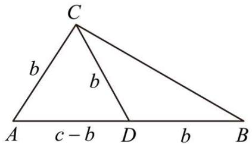

text_image

C
b
b
A c-b D b B

1492 (2024·全国·高三专题练习)在锐角 $\triangle ABC$ 中 A = 2B, B, C 的对边长分别是 b, c，则 $\frac{b}{b+c}$ 的取值范围是 ()

A. $\left(\frac{1}{4},\frac{1}{3}\right)$

B. $\left(\frac{1}{3},\frac{1}{2}\right)$

C. $\left(\frac{1}{2},\frac{2}{3}\right)$

D. $\left(\frac{2}{3},\frac{3}{4}\right)$

【答案】B

【解析】在锐角 $\triangle ABC$ 中, $\angle A = 2\angle B$ , $\because 0 < A < \frac{\pi}{2}$ , $0 < C < \frac{\pi}{2}$ , $\therefore \angle B \in (30^{\circ}, 45^{\circ})$ , $\cos B \in \left(\frac{\sqrt{2}}{2}, \frac{\sqrt{3}}{2}\right)$ , $\cos^{2}B \in \left(\frac{1}{2}, \frac{3}{4}\right)$ ,

而 $\sin C = \sin(\pi - A - B) = \sin(\pi - 3B) = \sin 3B, \sin 3B = \sin(B + 2B) = \sin B \cos 2B + \cos B \sin 2B = \sin B (2 \cos^{2} B - 1) + 2 \sin B \cos^{2} B$ ，所以 $\sin 3B = 4 \cos^{2} B \sin B - \sin B = 4 (1 - \sin^{2} B) \sin B - \sin B = 3 \sin B - 4 \sin^{3} B$ ,

所以由正弦定理可知: $\frac{b}{b+c}=\frac{\sin B}{\sin B+\sin C}=\frac{\sin B}{\sin B+\sin(\pi-3B)}=\frac{\sin B}{\sin B+3\sin B-4\sin^{3}B}=\frac{1}{4\cos^{2}B}\in\left(\frac{1}{3},\frac{1}{2}\right)$ ,

故选：B.

1493 (2024·福建三明·高一三明市第二中学校考阶段练习)在锐角 $\triangle ABC$ 中， $\angle A = 2\angle B$ ， $\angle B$ ， $\angle C$ 的对边分别是 b, c，则 $\frac{b+c}{2b}$ 的范围是（）

A. $\left(1,\frac{3}{2}\right)$

B. $\left(1,\frac{4}{3}\right)$

C. $\left(\frac{4}{3},\frac{3}{2}\right)$

D. $\left(\frac{1}{2},2\right)$

【答案】A

【解析】在锐角 $\triangle ABC$ 中， $\angle A = 2\angle B$ ，因为 $0 < A < \frac{\pi}{2}$ ， $0 < C < \frac{\pi}{2}$ ， $0 < B < \frac{\pi}{2}$ ，

所以 $0 < 2\angle B < \frac{\pi}{2}, 0 < \pi - 3\angle B < \frac{\pi}{2}$ ，解得 $\angle B \in \left(\frac{\pi}{6}, \frac{\pi}{4}\right)$ ,

所以 $\sin B\in \left(\frac{1}{2},\frac{\sqrt{2}}{2}\right),\sin^2 B\in \left(\frac{1}{4},\frac{1}{2}\right)$ ，而 $\sin C = \sin (\pi -A - B) = \sin (\pi -3B) =$ $\sin 3B$

$$
\begin{array}{l} \sin 3 \mathrm{B} = \sin (\mathrm{B} + 2 \mathrm{B}) = \sin \mathrm{B} \cos 2 \mathrm{B} + \cos \mathrm{B} \sin 2 \mathrm{B}, \\ = \sin B (2 \cos^ {2} B - 1) + 2 \sin B \cos^ {2} B \\ \end{array}
$$

所以 $\sin3B=4\cos^{2}B\sin B-\sin B=4(1-\sin^{2}B)\sin B-\sin B=3\sin B-4\sin^{3}B,$

所以由正弦定理可知：

$$
\frac {b + c}{2 b} = \frac {\sin B + \sin C}{2 \sin B} = \frac {\sin B + \sin (\pi - 3 B)}{2 \sin B} = \frac {\sin B + 3 \sin B - 4 \sin^ {3} B}{2 \sin B} = 2 - 2 \sin^ {2} B,
$$

因为 $\sin^{2}B\in\left(\frac{1}{4},\frac{1}{2}\right)$ ，所以 $-2\sin^{2}B\in\left(-1,-\frac{1}{2}\right)$ ，所以 $2-2\sin^{2}B\in\left(1,\frac{3}{2}\right)$

即 $\frac{b + c}{2b}\in \left(1,\frac{3}{2}\right).$

故选：A.

1494 (2024·江苏南京·高一金陵中学校考期中)已知 $\triangle ABC$ 的内角 A, B, C 的对边分别为 a, b, C, 若 A = 2B, 则 $\frac{c}{b} + \left(\frac{2b}{a}\right)^{2}$ 的最小值为 ()

A.-1

B. $\frac{7}{3}$

C. 3

D. $\frac{10}{3}$

【答案】C

【解析】因为 A=2B, $A+B+C=\pi$ , 所以由正弦定理, 得

$$
\begin{array}{l} \frac {c}{b} + \left(\frac {2 b}{a}\right) ^ {2} = \frac {\sin (A + B)}{\sin B} + \left(\frac {2 \sin B}{\sin 2 B}\right) ^ {2} = \frac {\sin A \cos B + \cos A \sin B}{\sin B} + \left(\frac {1}{\cos B}\right) ^ {2} \\ = \frac {\sin A \cos B + \cos A \sin B}{\sin B} + \frac {1}{\cos^ {2} B} = \frac {\sin 2 B \cos B + \cos 2 B \sin B}{\sin B} + \frac {1}{\cos^ {2} B} \\ = \frac {2 \sin B \cos^ {2} B + \cos 2 B \sin B}{\sin B} + \frac {1}{\cos^ {2} B} = 2 \cos^ {2} B + \cos 2 B + \frac {1}{\cos^ {2} B} \\ = 4 \cos^ {2} B + \frac {1}{\cos^ {2} B} - 1, \\ \end{array}
$$

因为 A=2B, 所以 $0<B<\frac{\pi}{3}$ ,

所以 $\cos^2\mathrm{B} > 0$ ，所以 $4\cos^2\mathrm{B} + \frac{1}{\cos^2\mathrm{B}} - 1 \geqslant 2\sqrt{4\cos^2\mathrm{B} \times \frac{1}{\cos^2\mathrm{B}}} - 1 = 3,$

当且仅当 $4\cos^{2}B=\frac{1}{\cos^{2}B}$ 时，即 $\cos B=\frac{\sqrt{2}}{2}$ 时等号成立，

所以 $\frac{c}{b} +\left(\frac{2b}{a}\right)^2$ 的最小值为3.

故选：C.

# 题型六：角平分线问题

1495 (2024·江苏盐城·高一江苏省射阳中学校考阶段练习)已知 $\triangle ABC$ 的内角A,B,C的对边分别为 $a,b,c,\frac{a}{b} = \frac{\sin B + \sqrt{3}\cos B}{\sin A + \sqrt{3}\cos A}$ 且 $\mathrm{A}\neq \mathrm{B}$

(1) 求角 C 的大小;  
(2) 若角 C 的平分线交 AB 于点 D, 且 CD = $2\sqrt{3}$ , 求 $a + 2b$ 的最小值.

【解析】(1) 因为 $\frac{a}{b} = \frac{\sin B + \sqrt{3}\cos B}{\sin A + \sqrt{3}\cos A}$ ，由正弦定理可得 $\frac{\sin A}{\sin B} = \frac{\sin B + \sqrt{3}\cos B}{\sin A + \sqrt{3}\cos A}$ ,

则 $\sin^{2}A + \sqrt{3}\sin A\cos A = \sin^{2}B + \sqrt{3}\sin B\cos B,$

可得 $\frac{1 - \cos 2A}{2} +\frac{\sqrt{3}}{2}\sin 2A = \frac{1 - \cos 2B}{2} +\frac{\sqrt{3}}{2}\sin 2B,$

整理得 $\sin \left(2A - \frac{\pi}{6}\right) = \sin \left(2B - \frac{\pi}{6}\right)$

注意到 $0 < \mathrm{A},\mathrm{B} < \pi$ ，且 $\mathrm{A}\neq \mathrm{B}$ ，则 $-\frac{\pi}{6} < 2\mathrm{A} - \frac{\pi}{6} < \frac{11\pi}{6}, - \frac{\pi}{6} < 2\mathrm{B} - \frac{\pi}{6} < \frac{11\pi}{6}$ ，且 $2\mathrm{A}$ $-\frac{\pi}{6}\neq 2\mathrm{B} - \frac{\pi}{6},$

可得 $\left(2\mathrm{A} - \frac{\pi}{6}\right) + \left(2\mathrm{B} - \frac{\pi}{6}\right) = \pi$ 或 $\left(2\mathrm{A} - \frac{\pi}{6}\right) + \left(2\mathrm{B} - \frac{\pi}{6}\right) = 3\pi$

解得 $A + B = \frac{2\pi}{3}$ 或 $A + B = \frac{5\pi}{3} > \pi$ (舍去),

故 $C=\pi-(A+B)=\frac{\pi}{3}.$

(2) 若 $\angle C$ 的平分线交 $AB$ 于点 $D$ , 则 $\angle ACD = \angle BCD = \frac{\pi}{6}$ ,

因为 $S_{\triangle ABC}=S_{\triangle ACD}+S_{\triangle BCD}$ ,

则 $\frac{1}{2} \times \mathrm{AC} \cdot \mathrm{BC} \cdot \sin \angle \mathrm{ACB} = \frac{1}{2} \times \mathrm{AC} \cdot \mathrm{CD} \cdot \sin \angle \mathrm{ACD} + \frac{1}{2} \times \mathrm{BC} \cdot \mathrm{CD} \cdot \sin \angle \mathrm{BCD}$ ,

即 $\frac{1}{2} a \times b \times \frac{\sqrt{3}}{2} = \frac{1}{2} b \times 2\sqrt{3} \times \frac{1}{2} + \frac{1}{2} a \times 2\sqrt{3} \times \frac{1}{2}$ , 整理得 $\frac{2}{a} + \frac{2}{b} = 1$ ,

则 $a + 2b = (a + 2b)\left(\frac{2}{a} +\frac{2}{b}\right) = \frac{4b}{a} +\frac{2a}{b} +6\geqslant 2\sqrt{\frac{4b}{a}\times\frac{2a}{b}} +6 = 4\sqrt{2} +6,$

当且仅当 $\frac{4b}{a} = \frac{2a}{b}$ ，即 $a = \sqrt{2}b = 2(\sqrt{2} + 1)$ 时，等号成立，

故 $a + 2b$ 的最小值 $4\sqrt{2} + 6$ .

1496 (2024·江苏淮安·高一统考期中)如图, $\triangle ABC$ 中, AB = 2AC, $\angle BAC$ 的平分线 AD 交 BC 于 D.

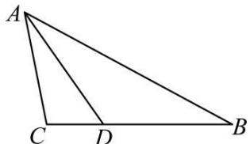

text_image

A
C D B

(1) 若 AD = BC，求 $\angle BAC$ 的余弦值；

(2) 若 AC = 3, 求 AD 的取值范围.

【解析】(1) 设 A, B, C 的对边分别是 a, b, c,

因为 AD 是 $\angle BAC$ 的平分线, 所以 D 到 AB, AC 的距离相等,

又 AB = 2AC, 所以 $S_{\triangle ABD} = 2S_{\triangle ACD}$ , 所以 BD = 2CD.

由题意 AD = a, BD = $\frac{2}{3}a$ .

$\triangle ABC$ 中， $\cos B = \frac{a^2 + c^2 - b^2}{2ac}$ ①,

$\triangle ABD$ 中， $\cos B = \frac{c^2 + \left(\frac{2a}{3}\right)^2 - a^2}{2c\frac{2}{3}a}$ ②

联立①②得 $11a^{2} = 6b^{2} + 3c^{2}$ 又 $c = 2b$ ，则 $a^2 = \frac{18}{11} b^2.$

所以 $\cos\angle BAC=\frac{b^{2}+c^{2}-a^{2}}{2bc}=\frac{b^{2}+(2b)^{2}-\frac{18}{11}b^{2}}{2b2b}=\frac{37}{44}.$

(2) 因为 BD = 2CD, AC = 3, AB = 6.

所以 $\overrightarrow{AD} = \overrightarrow{AB} + \overrightarrow{BD} = \overrightarrow{AB} + \frac{2}{3}\overrightarrow{BC} = \overrightarrow{AB} + \frac{2}{3} (\overrightarrow{AC} - \overrightarrow{AB}) = \frac{1}{3}\overrightarrow{AB} + \frac{2}{3}\overrightarrow{AC}$

所以 $\overrightarrow{\mathrm{AD}}^2 = \frac{1}{9}\overrightarrow{\mathrm{AB}}^2 +\frac{4}{9}\overrightarrow{\mathrm{AC}}^2 +\frac{4}{9}\overrightarrow{\mathrm{AB}}\cdot \overrightarrow{\mathrm{AC}}.$

所以 $\overrightarrow{AD}^{2}=8(1+\cos\angle BAC)$ .

因为 $\angle BAC\in (0,\pi)$ ，所以 $-1 <   \cos \angle BAC <   1.\quad \overrightarrow{AD}^2 = 8(1 + \cos \angle BAC)\in (0,16)$

所以 $0 < |\overrightarrow{AD}| < 4.$

1497 (2024·浙江杭州·高一校联考期中)在① $a + a\cos C = \sqrt{3}c\sin A$ ，② $(a + b + c)(a + b - c) = 3ab$ ，③ $(a - b)\sin(B + C) + b\sin B = c\sin C$ 。这三个条件中任选一个，补充在下面问题中，并解答。

已知在 $\triangle ABC$ 中, 角 A, B, C 的对边分别是 a, b, c, \_\_\_\_.

(1) 求角 C 的值;  
(2) 若角 C 的平分线交 AB 于点 D，且 $CD = 2\sqrt{3}$ ，求 $2a + b$ 的最小值.

【解析】(1)选择条件①: $\because a + a\cos C = \sqrt{3}c\sin A$ ,

∴由正弦定理得 $\sin A + \sin A\cos C = \sqrt{3}\sin C\sin A$ ,

$$
\because 0 <   \mathrm{A} <   \pi , \therefore \sin \mathrm{A} > 0,
$$

$$
\therefore 1 + \cos C = \sqrt {3} \sin C, \therefore \sqrt {3} \sin C - \cos C = 1 \text {, 即} \frac {\sqrt {3}}{2} \sin C - \frac {1}{2} \cos C = \frac {1}{2},
$$

$$
\therefore \sin \left(\mathrm{C} - \frac {\pi}{6}\right) = \frac {1}{2}, \because 0 <   \mathrm{C} <   \pi , \therefore \mathrm{C} - \frac {\pi}{6} = \frac {\pi}{6}, \therefore \mathrm{C} = \frac {\pi}{3};
$$

选择条件②：∵ $(a+b+c)(a+b-c)=3ab$ ，∴ $(a+b)^{2}-c^{2}=a^{2}+b^{2}+2ab-c^{2}=3ab$ ，

$$
\therefore a ^ {2} + b ^ {2} - c ^ {2} = a b, \therefore \cos C = \frac {a ^ {2} + b ^ {2} - c ^ {2}}{2 a b} = \frac {a b}{2 a b} = \frac {1}{2}.
$$

$$
\because 0 <   \mathrm{C} <   \pi , \therefore \mathrm{C} = \frac {\pi}{3};
$$

选择条件③:

$$
\because \mathrm{A} + \mathrm{B} + \mathrm{C} = \pi , \therefore \mathrm{B} + \mathrm{C} = \pi - \mathrm{A},
$$

$$
\because (a - b) \sin (\mathrm{B} + \mathrm{C}) + b \sin \mathrm{B} = c \sin \mathrm{C}, \therefore (a - b) \sin \mathrm{A} + b \cdot \sin \mathrm{B} = c \sin \mathrm{C},
$$

由正弦定理得 $(a-b)a+b^{2}=c^{2}$ ，即 $a^{2}+b^{2}-c^{2}=ab$ ，

$$
\therefore \cos C = \frac {a ^ {2} + b ^ {2} - c ^ {2}}{2 a b} = \frac {a b}{2 a b} = \frac {1}{2}, \because 0 <   C <   \pi , \therefore C = \frac {\pi}{3}.
$$

(2) 角 C 的平分线交 AB 于点 D, 在 $\triangle ABC$ 中, $S_{\triangle ABC} = \frac{1}{2} a \cdot b \cdot \sin \frac{\pi}{3}$ ,

在 $\triangle ACD$ 中， $S_{\triangle ACD} = \frac{1}{2} CD \cdot b \cdot \sin \frac{\pi}{6}$ ，在 $\triangle BCD$ 中， $\because S_{\triangle BCD} = \frac{1}{2} CD \cdot a \cdot \sin \frac{\pi}{6}$

$$
\therefore \mathrm{S} _ {\triangle \mathrm{ABC}} = \mathrm{S} _ {\triangle \mathrm{ACD}} + \mathrm{S} _ {\triangle \mathrm{BCD}}, \therefore \frac {1}{2} a b = a + b, \therefore \frac {1}{a} + \frac {1}{b} = \frac {1}{2},
$$

$$
\therefore 2 a + b = (2 a + b) \cdot \left(\frac {1}{a} + \frac {1}{b}\right) \cdot 2 = 2 \left(3 + \frac {b}{a} + \frac {2 a}{b}\right) \geqslant 6 + 4 \sqrt {2}.
$$

当且仅当 $a=2+\sqrt{2}$ ， $b=2+2\sqrt{2}$ 时等号成立，

∴ $2a + b$ 的最小值为 $6 + 4\sqrt{2}$ .

1498 (2024·河北沧州·校考模拟预测)已知 $\triangle ABC$ 的内角A,B,C所对的边分别为 $a,b,c$ , 且 $a\cos C + (2b + c)\cos A = 0$ , 角A的平分线与边BC交于点D.

(1) 求角 A;  
(2) 若 AD = 2，求 $b + 4c$ 的最小值.

【解析】(1)由正弦定理化简 $a\cos C + (2b + c)\cos A = 0$ 可得:

$$
\sin A \cos C + (2 \sin B + \sin C) \cos A = 0,
$$

$$
\therefore \sin A \cos C + \sin C \cos A = - 2 \sin B \cos A,
$$

即 $\sin(A+C)=-2\sin B\cos A,$

由 $A + B + C = \pi \therefore \sin (A + C) = \sin (\pi -B) = \sin B = -2\sin B\cos A$

又∵ $B\in(0,\pi)$ ，∴ $\sin B\neq0$ ，∴ $\cos A=-\frac{1}{2}$

又 $A \in (0, \pi)$ , $\therefore A = \frac{2\pi}{3}$ .

(2)

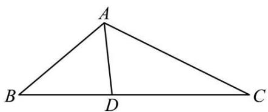

text_image

A
B D C

根据角 A 的平分线与边 BC 交于点 D, 所以 $\angle BAD = \angle CAD = \frac{\pi}{3}$ ,

$$
\mathrm{S} _ {\Delta \mathrm{ABD}} + \mathrm{S} _ {\Delta \mathrm{ACD}} = \mathrm{S} _ {\Delta \mathrm{ABC}}, \text {即} \frac {1}{2} \times 2 \times c \times \sin \frac {\pi}{3} + \frac {1}{2} \times 2 \times b \times \sin \frac {\pi}{3} = \frac {1}{2} \times b \times c \times \sin \frac {2 \pi}{3},
$$

所以 $2(b+c)=bc$ ，即 $\frac{1}{b}+\frac{1}{c}=\frac{1}{2}$ .

$$
b + 4 c = 2 (b + 4 c) \left(\frac {1}{b} + \frac {1}{c}\right) = 2 \left(5 + \frac {4 c}{b} + \frac {b}{c}\right) \geqslant 2 \times \left(5 + 2 \sqrt {\frac {4 c}{b} \cdot \frac {b}{c}}\right) = 1 8
$$

当且仅当 $\frac{4c}{b} = \frac{b}{c}$ 时, 即 b = 6, c = 3 时, 等号成立.

所以 $b + 4c$ 的小值为 18.

1499 (2024·山东泰安·校考模拟预测)在锐角 $\triangle ABC$ 中, 内角 A,B,C 所对的边分别为 $a,b,c$ ,

满足 $\frac{\sin A}{\sin C}-1=\frac{\sin^{2}A-\sin^{2}C}{\sin^{2}B}$ ，且 $A\neq C$ .

(1) 求证: B = 2C;   
(2) 已知 BD 是 $\angle ABC$ 的平分线, 若 a = 6, 求线段 BD 长度的取值范围.

【解析】(1)由题意得 $\frac{\sin A - \sin C}{\sin C} = \frac{\sin^{2} A - \sin^{2} C}{\sin^{2} B}$ ，即 $\frac{1}{\sin C} = \frac{\sin A + \sin C}{\sin^{2} B}$ .

所以 $\sin^{2}B=\sin^{2}C+\sin A\sin C,$

由正弦定理得 $b^{2}=c^{2}+ac$ ，又由余弦定理得 $b^{2}=a^{2}+c^{2}-2ac\cos B$ ，

所以 $c = a - 2c \cos B$ ，故 $\sin C = \sin A - 2 \sin C \cos B$ ，

故 $\sin C = \sin(B + C) - 2\sin C\cos B$ ，整理得 $\sin C = \sin(B - C)$ .

又 $\triangle ABC$ 为锐角三角形, 则 $C \in \left(0, \frac{\pi}{2}\right)$ , $B \in \left(0, \frac{\pi}{2}\right)$ , $B - C \in \left(-\frac{\pi}{2}, \frac{\pi}{2}\right)$ ,

所以 C=B-C, 因此 B=2C.

(2) 在 $\triangle BCD$ 中, 由正弦定理得 $\frac{a}{\sin\angle BDC} = \frac{BD}{\sin C}$ , 所以 $\frac{6}{\sin\angle BDC} = \frac{BD}{\sin C}$ .

所以 $BD = \frac{6\sin C}{\sin \angle BDC} = \frac{6\sin C}{\sin 2C} = \frac{3}{\cos C}$ . 因为 $\triangle ABC$ 为锐角三角形, 且 B = 2C,

所以 $\left\{\begin{aligned}0<\mathrm{C}<\frac{\pi}{2}\\ 0<2\mathrm{C}<\frac{\pi}{2}\end{aligned}\right.$ ，解得 $\frac{\pi}{6}<\mathrm{C}<\frac{\pi}{4}.$ $0 < \pi - 3C < \frac{\pi}{2}$

故 $\frac{\sqrt{2}}{2} < \cos C < \frac{\sqrt{3}}{2}$ , 所以 $2\sqrt{3} < \mathrm{BD} < 3\sqrt{2}$ . 因此线段 BD 长度的取值范围 $(2\sqrt{3}, 3\sqrt{2})$ .

1500 (2024·全国·高一专题练习)在 $\triangle ABC$ 中, 角 A, B, C 所对的边分别为 a, b, c, 且满足 $2a\sin A\cos B + b\sin 2A = 2\sqrt{3}a\cos C$ .

(1) 求角 C 的大小;  
(2) 若 $c = 2\sqrt{3}$ , $\angle ABC$ 与 $\angle BAC$ 的平分线交于点 I, 求 $\triangle ABI$ 周长的最大值.

【解析】(1)由正弦定理得: $2\sin A \sin A \cos B + 2\sin B \sin A \cos A = 2\sqrt{3} \sin A \cos C$ ,

因为 $\sin A \neq 0$ ，所以 $2\sin A\cos B + 2\sin B\cos A = 2\sqrt{3}\cos C$ ，

所以 $\sin(A+B)=\sqrt{3}\cos C$ , 即 $\sin C=\sqrt{3}\cos C$

所以 $\tan C = \sqrt{3}, C \in (0, \pi)$ , 故 $C = \frac{\pi}{3}$ .

(2)

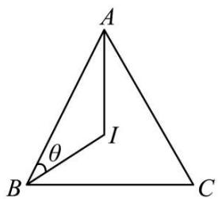

text_image

A
θ
I
B
C

由(1)知, $C=\frac{\pi}{3}$ ,有 $\angle ABC+\angle BAC=\frac{2\pi}{3}$ ,

而 $\angle BAC$ 与 $\angle ABC$ 的平分线交于点 I, 即有 $\angle ABI + \angle BAI = \frac{\pi}{3}$ , 于是 $\angle AIB = \frac{2\pi}{3}$ ,

设 $\angle ABI = \theta$ ，则 $\angle BAI = \frac{\pi}{3} - \theta$ ，且 $0 < \theta < \frac{\pi}{3}$ ，

在 $\triangle ABI$ 中, 由正弦定理得, $\frac{BI}{\sin\left(\frac{\pi}{3}-\theta\right)}=\frac{AI}{\sin\theta}=\frac{AB}{\sin\angle AIB}=\frac{2\sqrt{3}}{\sin\frac{2\pi}{3}}=4$ ,

所以 $\mathrm{BI} = 4\sin \left(\frac{\pi}{3} -\theta\right),\mathrm{AI} = 4\sin \theta ,$

所以 $\triangle \mathrm{ABI}$ 的周长为 $2\sqrt{3} + 4\sin \left(\frac{\pi}{3} - \theta\right) + 4\sin \theta = 2\sqrt{3} + 4\left(\frac{\sqrt{3}}{2}\cos \theta - \frac{1}{2}\sin \theta\right) + 4\sin \theta$

$= 2\sqrt{3} + 2\sqrt{3}\cos \theta + 2\sin \theta = 4\sin \left(\theta + \frac{\pi}{3}\right) + 2\sqrt{3}$ , 由 $0 < \theta < \frac{\pi}{3}$ , 得 $\frac{\pi}{3} < \theta + \frac{\pi}{3} < \frac{2\pi}{3}$ ,

则当 $\theta + \frac{\pi}{3} = \frac{\pi}{2}$ ，即 $\theta = \frac{\pi}{6}$ 时， $\triangle ABI$ 的周长取得最大值 $4 + 2\sqrt{3}$ ，

所以 $\triangle ABI$ 周长的最大值为 $4 + 2\sqrt{3}$ .

1501 (2024·四川成都·石室中学校考模拟预测)在 $\triangle ABC$ 中, 角 A,B,C 所对的边分别为 a,b,

$c$ ，且 $\sqrt{3} b\sin \frac{\mathrm{B} + \mathrm{C}}{2} = a\sin \mathrm{B}$ ，边BC上有一动点D.

(1) 当 D 为边 BC 中点时, 若 AD = $\sqrt{3}$ , b = 2, 求 c 的长度;  
(2) 当 AD 为 $\angle BAC$ 的平分线时, 若 a = 4, 求 AD 的最大值.

【解析】(1) 因为 $\sqrt{3}b\sin\frac{B+C}{2}=a\sin B$ ,

所以 $\sqrt{3}b\sin\frac{\pi-A}{2}=a\sin B$ ，即 $\sqrt{3}b\cos\frac{A}{2}=a\sin B$ .

由正弦定理, 得 $\sqrt{3}\sin B \cdot \cos\frac{A}{2} = \sin A \cdot \sin B.$

因为 $\sin B \neq 0$ ，所以 $\sqrt{3}\cos\frac{A}{2} = \sin A = 2\sin\frac{A}{2}\cos\frac{A}{2}$ .

因为 $\cos\frac{A}{2}\neq0$ , 所以 $\sin\frac{A}{2}=\frac{\sqrt{3}}{2}$ .

又因为 $0 < \frac{A}{2} < \frac{\pi}{2}$ ，所以 $\frac{A}{2} = \frac{\pi}{3}$ ，所以 $A = \frac{2\pi}{3}$ .

因为 D 为边 BC 中点, 所以 $2\overrightarrow{AD} = \overrightarrow{AB} + \overrightarrow{AC}$ , 则 $4|\overrightarrow{AD}|^{2} = (\overrightarrow{AB} + \overrightarrow{AC})^{2}$ .

又 AD = $\sqrt{3}$ , b = 2, A = $\frac{2\pi}{3}$ ,

所以 $12=c^{2}+4+4c\cdot\cos\frac{2\pi}{3}$ ，即 $c^{2}-2c-8=0$ ，即 $(c-4)(c+2)=0$ ，

所以 c=4.

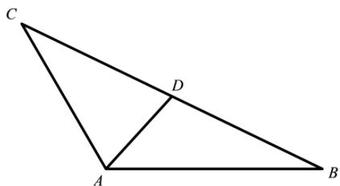

text_image

C
D
A
B

(2) 在 $\triangle ABC$ 中, 由余弦定理, 得 $a^{2}=b^{2}+c^{2}-2bc\cdot\cos\angle BAC$ .

又 $a = 4, \angle \mathrm{BAC} = \frac{2\pi}{3}$ , 所以 $16 = b^{2} + c^{2} + bc$ ,

所以 $16=(b+c)^{2}-bc\geqslant(b+c)^{2}-\frac{(b+c)^{2}}{4}=\frac{3}{4}(b+c)^{2}$ ，当且仅当 b=c 时取等号，

所以 $(b + c)^2 \leqslant \frac{64}{3}$ , 所以 $4 < b + c \leqslant \frac{8\sqrt{3}}{3}$ .

因为 $S_{\triangle ABC}=S_{\triangle ABD}+S_{\triangle ACD},AD$ 平分 $\angle BAC,\angle BAC=\frac{2\pi}{3},$

所以 $\frac{1}{2} bc\cdot \sin \frac{2\pi}{3} = \frac{1}{2} b\cdot \mathrm{AD}\cdot \sin \frac{\pi}{3} +\frac{1}{2} c\cdot \mathrm{AD}\cdot \sin \frac{\pi}{3},$

所以 $bc = \mathrm{AD} \cdot (b + c)$ ,

所以 $\mathrm{AD} = \frac{bc}{b + c} = \frac{(b + c)^2 - 16}{b + c} = b + c - \frac{16}{b + c}$ .

令 $t = b + c$ ，则 $\mathrm{AD} = t - \frac{16}{t}, 4 < t \leqslant \frac{8\sqrt{3}}{3}$ .

因为 $y=t-\frac{16}{t}$ 在 $\left(4,\frac{8\sqrt{3}}{3}\right]$ 上单调递增，

所以当 $t=\frac{8\sqrt{3}}{3}$ 即 $b=c=\frac{4\sqrt{3}}{3}$ 时，y 取得最大值为 $\frac{2\sqrt{3}}{3}$ ,

所以 AD 的最大值为 $\frac{2\sqrt{3}}{3}$ .

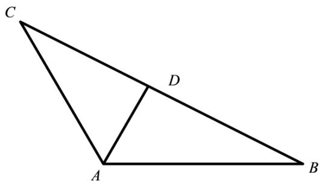

text_image

C
D
A
B

# 题型七: 中线问题

1502 (2024·湖南长沙·高一雅礼中学校考期中)在锐角 $\triangle ABC$ 中, 角 A, B, C 的对边分别是 a, b, c, 若 $\frac{2c-b}{a} = \frac{\cos B}{\cos A}$

(1) 求角 A 的大小;  
(2) 若 a=2，求中线 AD 长的范围 (点 D 是边 BC 中点).

【解析】(1) 因为 $\frac{2c-b}{a} = \frac{\cos B}{\cos A}$ ，由正弦定理可得： $\frac{2\sin C - \sin B}{\sin A} = \frac{\cos B}{\cos A}$

即 $(2\sin C - \sin B) \cdot \cos A = \sin A \cdot \cos B$ ，所以 $2\sin C \cos A = \sin A \cos B + \cos A \sin B = \sin (A + B) = \sin (\pi - C) = \sin C$ ,

因为 $C \in \left(0, \frac{\pi}{2}\right)$ ，所以 $\sin C > 0$ ，所以 $\cos A = \frac{1}{2}$ ，因为 $A \in \left(0, \frac{\pi}{2}\right)$ ，所以 $A = \frac{\pi}{3}$ .

(2) 由 (1) 得 $A = \frac{\pi}{3}$ ，且 $a = 2$ ，由余弦定理知， $\cos A = \frac{b^2 + c^2 - a^2}{2bc} = \frac{1}{2}$ ，得到 $b^2 + c^2 = bc + 4$ ，

因为点 D 是边 BC 中点, 所以 $2\overrightarrow{AD} = \overrightarrow{AB} + \overrightarrow{AC}$ , 两边平方可得:

$$
4 | \overrightarrow {A D} | ^ {2} = | \overrightarrow {A B} | ^ {2} + | \overrightarrow {A C} | ^ {2} + 2 \overrightarrow {A B} \cdot \overrightarrow {A C} = b ^ {2} + c ^ {2} + 2 b c \cdot \cos A,
$$

所以 $4|\overrightarrow{AD}|^{2}=b^{2}+c^{2}+bc=bc+4+bc=2bc+4,$

因为 $bc = (2\mathrm{R}\sin \mathrm{B})\cdot (2\mathrm{R}\sin \mathrm{C}) = 4\mathrm{R}^2\sin \mathrm{B}\sin \mathrm{C}$ ，又 $2\mathrm{R} = \frac{a}{\sin A} = \frac{2}{\sin\frac{\pi}{3}} = \frac{4}{\sqrt{3}},\mathrm{B} = \frac{2\pi}{3}-\mathrm{C},$

所以 $bc=\frac{16}{3}\sin\left(\frac{2\pi}{3}-C\right)\sin C=\frac{8}{3}\left(\frac{\sqrt{3}}{2}\sin2C+\frac{1-\cos2C}{2}\right)=\frac{8}{3}\sin\left(2C-\frac{\pi}{6}\right)+\frac{4}{3},$

又因为 $\triangle ABC$ 为锐角三角形，所以 $0 < B = \frac{2\pi}{3} - C < \frac{\pi}{2}, 0 < C < \frac{\pi}{2}$ ，得到 $\frac{\pi}{6} < C < \frac{\pi}{2}$ ，

所以 $2C - \frac{\pi}{6} \in \left( \frac{\pi}{6}, \frac{5\pi}{6} \right)$ ，由 $y = \sin x$ 的图像与性质知， $\sin \left( 2C - \frac{\pi}{6} \right) \in \left( \frac{1}{2}, 1 \right]$ ,

所以 $bc \in \left(\frac{8}{3}, 4\right]$ , 所以 $4|\overrightarrow{\mathrm{AD}}|^2 = 2bc + 4 \in \left(\frac{28}{3}, 12\right]$ , 得到 $|\overrightarrow{\mathrm{AD}}|^2 = 2bc + 4 \in \left(\frac{7}{3}, 3\right]$

故 $|\overrightarrow{AD}| \in \left(\frac{\sqrt{21}}{3}, \sqrt{3}\right]$ .

1503 (2024·安徽·合肥一中校联考模拟预测)记 $\triangle ABC$ 的内角A，B，C的对边分别是 $a,b$

$c$ ，已知 $\sin \left(\frac{\pi}{2} +\mathrm{B}\right) = \frac{2c - b}{2a}.$

(1) 求 A;   
(2) 若 $b + c = 3$ ，求 BC 边中线 AM 的取值范围.

【解析】(1) 由已知可得 $\cos B = \frac{2c - b}{2a}$ ,

由余弦定理可得 $\frac{a^{2}+c^{2}-b^{2}}{2ac}=\frac{2c-b}{2a}$ ，整理得 $b^{2}+c^{2}-a^{2}=bc$ ，

由余弦定理可得 $\cos A = \frac{b^{2} + c^{2} - a^{2}}{2bc} = \frac{1}{2}$ ，又 $A \in (0, \pi)$ ，

所以 $A=\frac{\pi}{3}$ .

(2) 因为 M 为 BC 的中点, 所以 $\overrightarrow{AM} = \frac{1}{2} (\overrightarrow{AB} + \overrightarrow{AC})$ ,

则 $\overrightarrow{\mathrm{AM}}^2 = \frac{1}{4}\bigl (\overrightarrow{\mathrm{AB}} +\overrightarrow{\mathrm{AC}}\bigr)^2 = \frac{1}{4}\bigl (\overrightarrow{\mathrm{AB}}^2 +\overrightarrow{\mathrm{AC}}^2 +2\overrightarrow{\mathrm{AB}}\cdot \overrightarrow{\mathrm{AC}}\bigr),$

即 $AM^{2}=\frac{1}{4}\left(c^{2}+b^{2}+2b\cos\frac{\pi}{3}\right)=\frac{1}{4}\left[(b+c)^{2}-bc\right].$

因为 $b + c = 3$ ，所以 $\mathrm{AM}^2 = \frac{1}{4}[9 - b(3 - b)] = \frac{1}{4}(b^2 - 3b + 9) = \frac{1}{4}\left(b - \frac{3}{2}\right)^2 + \frac{27}{16}$ .

所以 $AM^{2} \in \left[\frac{27}{16}, \frac{9}{4}\right)$ ,

所以 $AM \in \left[\frac{3\sqrt{3}}{4}, \frac{3}{2}\right)$ .

1504 (2024·全国·高一专题练习)在锐角三角形ABC中,角A,B,C所对的边分别为a,b,c,已知 $a\sin A+b\sin B=c\sin C+\sqrt{2}b\sin A$ .

(1) 求角 C 的大小;  
(2) 若 c=2，边 AB 的中点为 D，求中线 CD 长的取值范围.

【解析】(1) 已知 $a \sin A + b \sin B = c \sin C + \sqrt{2} b \sin A$ ,

由正弦定理可得 $a^2 + b^2 = c^2 + \sqrt{2}ab$ ，即 $a^2 + b^2 - c^2 = \sqrt{2}ab$

所以 $\cos C = \frac{a^{2} + b^{2} - c^{2}}{2ab} = \frac{\sqrt{2}ab}{2ab} = \frac{\sqrt{2}}{2}$ ,

因为 $C \in (0, \pi)$ ，所以 $C = \frac{\pi}{4}$ .

(2) 由余弦定理可得 $c^2 = a^2 + b^2 - 2ab\cos C = a^2 + b^2 - \sqrt{2}ab = 4$

又 $\overrightarrow{CD}=\frac{1}{2}\left(\overrightarrow{CA}+\overrightarrow{CB}\right)$ ,

则 $\overrightarrow{\mathrm{CD}}^2 = \frac{1}{4}\left(\overrightarrow{\mathrm{CA}} +\overrightarrow{\mathrm{CB}}\right)^2 = \frac{1}{4}\left(\overrightarrow{\mathrm{CA}}^2 +\overrightarrow{\mathrm{CB}}^2 +2\overrightarrow{\mathrm{CA}}\cdot \overrightarrow{\mathrm{CB}}\right) = \frac{1}{4}\left(a^2 +b^2 +2ab\cos \frac{\pi}{4}\right) =$

$$
\frac {1}{4} (4 + 2 \sqrt {2} a b) = 1 + \frac {\sqrt {2}}{2} a b,
$$

由正弦定理可得 $\frac{a}{\sin A} = \frac{b}{\sin B} = \frac{c}{\sin C} = 2\sqrt{2}$

所以 $a = 2\sqrt{2}\sin \mathrm{A}, b = 2\sqrt{2}\sin \mathrm{B} = 2\sqrt{2}\sin \left(\frac{3\pi}{4} -\mathrm{A}\right) = 2\cos \mathrm{A} + 2\sin \mathrm{A},$

所以 $ab = 4\sqrt{2}\sin^2\mathrm{A} + 4\sqrt{2}\sin \mathrm{A}\cos \mathrm{A} = 4\sqrt{2}\cdot \frac{1 - \cos 2\mathrm{A}}{2} +2\sqrt{2}\sin 2\mathrm{A} = 4\sin \left(2\mathrm{A} - \frac{\pi}{4}\right)$

$$
+ 2 \sqrt {2},
$$

由题意得 $\left\{\begin{aligned}0<A<\frac{\pi}{2}\\ 0<\frac{3\pi}{4}-A<\frac{\pi}{2}\end{aligned}\right.$ ，解得 $\frac{\pi}{4}<A<\frac{\pi}{2}$ ，则 $2A-\frac{\pi}{4}\in\left(\frac{\pi}{4},\frac{3\pi}{4}\right)$ ,

所以 $\sin \left(2A - \frac{\pi}{4}\right) \in \left(\frac{\sqrt{2}}{2}, 1\right]$ , 所以 $ab \in (4\sqrt{2}, 4 + 2\sqrt{2}]$ ,

所以 $\overrightarrow{CD}^{2}\in(5,3+2\sqrt{2}]$ ，所以中线 CD 长的取值范围为 $(\sqrt{5},1+\sqrt{2}]$ .

1505 (2024·辽宁沈阳·沈阳二中校考模拟预测)在 $\triangle ABC$ 中, 角 A, B, C 的对边分别是 a, b,

c, 若 $\frac{2c-b}{a}=\frac{\cos B}{\cos A}$

(1) 求角 A 的大小;  
(2) 若 a=2，求中线 AD 长的最大值（点 D 是边 BC 中点）.

【解析】(1) 因为 $\frac{2c-b}{a} = \frac{\cos B}{\cos A}$ ,

由正弦定理可得: $\frac{2\sin C - \sin B}{\sin A} = \frac{\cos B}{\cos A}$ ,

即 $(2\sin C - \sin B)\cdot \cos A = \sin A\cdot \cos B,$

$$
2 \sin C \cos A = \sin (A + B) = \sin (\pi - C) = \sin C,
$$

因为 $C \in (0, \pi)$ ，所以 $\sin C > 0$ ，

所以 $\cos A = \frac{1}{2}$ ,

因为 $A \in (0, \pi)$ ，所以 $A = \frac{\pi}{3}$ .

(2) 由 (1) 得 A = $\frac{\pi}{3}$ ,

则 $\cos A=\frac{b^{2}+c^{2}-a^{2}}{2bc}=\frac{1}{2}$ ,

所以 $b^{2} + c^{2} = bc + 4\geqslant 2bc$ ，即 $bc\leqslant 4$

当且仅当 b=c=2 时等号成立，

因为点D是边BC中点，

所以 $2\overrightarrow{AD} = \overrightarrow{AB} + \overrightarrow{AC}$ ,

两边平方可得： $4\left|\overrightarrow{AD}\right|^{2}=\left|\overrightarrow{AB}\right|^{2}+\left|\overrightarrow{AC}\right|^{2}+2\overrightarrow{AB}\cdot\overrightarrow{AC}=b^{2}+c^{2}+2bc\cdot\cos A,$

则 $4|\overrightarrow{\mathrm{AD}}|^2 = b^2 + c^2 + bc = bc + 4 + bc = 2bc + 4 \leqslant 12,$

所以 $|\mathrm{AD}| \leqslant \sqrt{3}$ ,

中线 AD 长的最大值为 $\sqrt{3}$ .

1506 (2024·广东广州·高二广州六中校考期中)在△ABC中,角A,B,C所对的边分别为a,

$b, c$ , 已知 $\sqrt{3} a \cos C - a \sin C = \sqrt{3} b$ .

(1) 求角 A 的大小;  
(2) 若 a=2，求 BC 边上的中线 AD 长度的最小值.

【解析】(1) 由 $\sqrt{3}a\cos C - a\sin C = \sqrt{3}b$ 得,

$$
\sqrt {3} \sin A \cos C - \sin A \sin C = \sqrt {3} \sin (A + C)
$$

$$
\therefore - \sin A \sin C = \sqrt {3} \cos A \sin C,
$$

即 $\tan A = -\sqrt{3}, \because A \in (0, \pi), \therefore A = \frac{2\pi}{3}$ .

(2) $\because a = 2, \cos A = \frac{b^2 + c^2 - a^2}{2bc}, \therefore -\frac{1}{2} = \frac{b^2 + c^2 - 4}{2bc},$

即 $-b^{2} - c^{2} + 4 = bc\leqslant \frac{b^{2} + c^{2}}{2},\therefore b^{2} + c^{2}\geqslant \frac{8}{3}$

∴ AD = $\frac{1}{2}\sqrt{2(b^{2}+c^{2})-a^{2}} \geqslant \frac{1}{2}\sqrt{\frac{16}{3}-4} = \frac{\sqrt{3}}{3}$ ，当且仅当 b = c 取等号.

# 8 题型八：四心问题

1507 (2024·四川凉山·校联考一模)设△ABO(O是坐标原点)的重心、内心分别是G,I,且 $\overrightarrow{BO} // \overrightarrow{GI}$ ,若B(0,4),则cos∠OAB的最小值是\_\_\_\_.

【答案】 $\frac{1}{2}$

【解析】因为重心、内心分别是 G, I, 且 $\overrightarrow{BO} \parallel \overrightarrow{GI}$ , 所以 $x_{A} = 3r$ , (r 为 $\Delta ABO$ 内切圆的半径),

又 $S_{\triangle ABO} = \frac{1}{2} (|AB| + |AO| + |OB|)r = \frac{1}{2} |OB|\cdot x_A = \frac{1}{2} |OB|\cdot 3r.$ 且 $|\mathrm{OB}| = 4.$

解得 $\left|AB\right| + \left|AO\right| = 8.$

所以 $\cos \angle OAB = \frac{|AB|^2 + |AO|^2 - |OB|^2}{2|AB|\cdot|AO|} = \frac{(|AB| + |AO|)^2 - 2|AB|\cdot|AO| - 16}{2|AB|\cdot|AO|} =$

$$
\frac {2 4}{| \mathrm{AB} | \cdot | \mathrm{AO} |} - 1 \geqslant \frac {2 4}{\left(\frac {| \mathrm{AB} | + | \mathrm{AO} |}{2}\right) ^ {2}} - 1 = \frac {1}{2}.
$$

当且仅当 $\left|AB\right|=\left|AO\right|=4$ 时，即 $\Delta ABO$ 为等边三角形 $\cos\angle OAB$ 有最小值 $\frac{1}{2}$ .

1508 (2024·全国·高三专题练习)在 $\triangle ABC$ 中， $a,b,c$ 分别为内角A,B,C的对边，且

$$
(a \cos C + c \cos A) \tan A = \sqrt {3} b.
$$

(1) 求角 A 的大小;  
(2) 若 $a=\sqrt{3}$ ，O 为 $\triangle ABC$ 的内心，求 OB+OC 的最大值.

【解析】(1) $\because(a\cos C+c\cos A)\tan A=\sqrt{3}b,$

∴由正弦定理可得， $(\sin A\cos C+\sin C\cos A)\tan A=\sqrt{3}\sin B,$

即 $\sin(A+C)\tan A=\sqrt{3}\sin B,$

又∵A+B+C=π,

$$
\therefore \sin (A + C) = \sin (\pi - B) = \sin B \neq 0,
$$

$$
\therefore \tan A = \sqrt {3},
$$

又∵A∈(0,π)

$$
\therefore \mathrm{A} = \frac {\pi}{3}.
$$

(2) 设 $\angle OBC = \alpha$ ,

∵O为△ABC的内心,且 $A=\frac{\pi}{3}$ ,

$$
\therefore \angle B O C = \pi - \angle O B C - \angle O C B = \pi - \frac {1}{2} (\pi - A) = \frac {2 \pi}{3},
$$

$$
\therefore \angle \mathrm{OCB} = \frac {\pi}{3} - \alpha ,
$$

在 $\triangle \mathrm{OBC}$ 中，

由正弦定理得， $\frac{OC}{\sin\alpha}=\frac{OB}{\sin\left(\frac{\pi}{3}-\alpha\right)}=\frac{\sqrt{3}}{\sin\frac{2\pi}{3}}=2,$

$$
\therefore \mathrm{OC} = 2 \sin \alpha , \mathrm{OB} = 2 \sin \left(\frac {\pi}{3} - \alpha\right),
$$

$$
\therefore \mathrm{OB} + \mathrm{OC} = 2 \sin \alpha + 2 \sin \left(\frac {\pi}{3} - \alpha\right) = 2 \sin \left(\alpha + \frac {\pi}{3}\right) \leqslant 2.
$$

当且仅当 $\alpha=\frac{\pi}{6}$ ，即 $\triangle ABC$ 为等边三角形时取等号，

故 OB + OC 的最大值为 2.

1509 (2024·全国·模拟预测)已知锐角三角形ABC的内角A,B,C的对边分别为a,b,c,且

$$
(c - b) \sin C = (a \cos C - b) \sin B + a \cos B \sin C.
$$

(1) 求角 A;  
(2) 若 H 为 $\triangle ABC$ 的垂心, a = 2, 求 $\triangle HBC$ 面积的最大值.

【解析】(1)由题可得， $(c - b)\sin C = a\cos C\sin B - b\sin B + a\cos B\sin C = a\sin (B + C) - b\sin B = a\sin A - b\sin B$

结合正弦定理可得 $(c - b)c = a^{2} - b^{2}$ ，即 $bc = b^{2} + c^{2} - a^{2}$

$$
\therefore \cos A = \frac {b ^ {2} + c ^ {2} - a ^ {2}}{2 b c} = \frac {1}{2}, \text {又} A \in \left(0, \frac {\pi}{2}\right), \therefore A = \frac {\pi}{3}.
$$

(2) 设边 AC, AB 上的高分别为 BE, CF 则 H 为 BE 与 CF 的交点,

则在四边形 AFHE 中， $\angle FAE + \angle FHE + \frac{\pi}{2} + \frac{\pi}{2} = 2\pi$

$$
\because \angle \mathrm{FAE} = \frac {\pi}{3}, \therefore \angle \mathrm{FHE} = \frac {2 \pi}{3}, \text {   故   } \angle \mathrm{BHC} = \frac {2 \pi}{3},
$$

在 $\triangle \mathrm{BHC}$ 中， $S_{\triangle \mathrm{BHC}} = \frac{1}{2}\mathrm{BH}\cdot \mathrm{HC}\sin \frac{2\pi}{3} = \frac{\sqrt{3}}{4}\mathrm{BH}\cdot \mathrm{HC},\mathrm{BH}^2 +\mathrm{HC}^2 -2\mathrm{BH}\cdot \mathrm{HC}\cdot$

$$
\cos \frac {2 \pi}{3} = 4,
$$

则 $4 = \mathrm{BH}^2 +\mathrm{HC}^2 +\mathrm{BH}\cdot \mathrm{HC}\geqslant 2\mathrm{BH}\cdot \mathrm{HC} + \mathrm{BH}\cdot \mathrm{HC},$ 即 $\mathrm{BH}\cdot \mathrm{HC}\leqslant \frac{4}{3},$

当且仅当 BH=HC 时取等号. $\therefore S_{\triangle BHC}\leqslant\frac{\sqrt{3}}{3}$ ，故 $\triangle HBC$ 面积的最大值为 $\frac{\sqrt{3}}{3}$ .

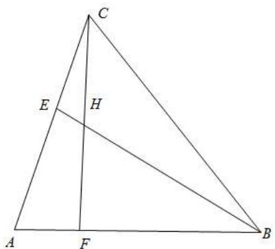

text_image

C
E
H
A
F
B

1510 (2024·江苏无锡·高一锡东高中校考期中)在 $\triangle ABC$ 中，a, b, c 分别是角 A, B, C 的对边，

$$
2 a \cos A = b \cos C + c \cos B.
$$

(1) 求角 A 的大小;  
(2) 若 $\triangle ABC$ 为锐角三角形, 且其面积为 $\frac{\sqrt{3}}{2}$ , 点 G 为 $\triangle ABC$ 重心, 点 M 为线段 AC 的中点, 点 N 在线段 AB 上, 且 AN = 2NB, 线段 BM 与线段 CN 相交于点 P, 求 $\left|\overrightarrow{GP}\right|$ 的取值范围.

【解析】(1) 因为 $2a\cos A = b\cos C + c\cos B$ ,

由正弦定理可得 $2\sin A \cos A = \sin B \cos C + \sin C \cos B = \sin (B + C) = \sin A$ ,

又因为 $A \in (0, \pi)$ ，则 $\sin A > 0$ ，

可得 $2\cos A = 1$ ，即 $\cos A = \frac{1}{2}$ ，所以 $A = \frac{\pi}{3}$ .

(2) 由题意可得 $\overrightarrow{AN} = \frac{2}{3}\overrightarrow{AB}, \overrightarrow{AM} = \frac{1}{2}\overrightarrow{AC}$ ,

所以 $\overrightarrow{AG} = \overrightarrow{AB} + \overrightarrow{BG} = \overrightarrow{AB} + \frac{2}{3}\overrightarrow{BM} = \overrightarrow{AB} + \frac{2}{3}\left(\overrightarrow{AM} - \overrightarrow{AB}\right) = \overrightarrow{AB} + \frac{2}{3}\left(\frac{1}{2}\overrightarrow{AC} - \overrightarrow{AB}\right) =$

$$
\frac {1}{3} \overrightarrow {\mathrm{AB}} + \frac {1}{3} \overrightarrow {\mathrm{AC}},
$$

因为 C、N、P 三点共线，故设 $\overrightarrow{AP} = \lambda \overrightarrow{AN} + (1 - \lambda) \overrightarrow{AC} = \frac{2}{3} \lambda \overrightarrow{AB} + (1 - \lambda) \overrightarrow{AC}$ ,

同理M、B、P三点共线，故设 $\overrightarrow{\mathrm{AP}} = \mu \overrightarrow{\mathrm{AB}} + (1 - \mu)\overrightarrow{\mathrm{AM}} = \mu \overrightarrow{\mathrm{AB}} +\frac{1}{2} (1 - \mu)\overrightarrow{\mathrm{AC}},$

则 $\left\{\begin{aligned}\frac{2}{3}\lambda=\mu\\1-\lambda=\frac{1}{2}(1-\mu)\end{aligned}\right.$ ，解得 $\left\{\begin{aligned}\lambda=\frac{3}{4}\\ \mu=\frac{1}{2}\end{aligned}\right.$

所以 $\overrightarrow{AP}=\frac{1}{2}\overrightarrow{AB}+\frac{1}{4}\overrightarrow{AC}$ ,

则 $\overrightarrow{\mathrm{GP}} = \overrightarrow{\mathrm{AP}} -\overrightarrow{\mathrm{AG}} = \frac{1}{2}\overrightarrow{\mathrm{AB}} +\frac{1}{4}\overrightarrow{\mathrm{AC}} -\left(\frac{1}{3}\overrightarrow{\mathrm{AB}} +\frac{1}{3}\overrightarrow{\mathrm{AC}}\right) = \frac{1}{6}\overrightarrow{\mathrm{AB}} -\frac{1}{12}\overrightarrow{\mathrm{AC}} =$

$$
\frac {1}{1 2} \left(2 \overrightarrow {\mathrm{AB}} - \overrightarrow {\mathrm{AC}}\right),
$$

因为 $S_{\triangle ABC}=\frac{1}{2}bc\sin A=\frac{\sqrt{3}}{2}$ ，所以 bc=2，

又因为 $\triangle ABC$ 为锐角三角形，

当 C 为锐角, 则 $\overrightarrow{AC} \cdot \overrightarrow{BC} > 0$ , 即 $\overrightarrow{AC} \cdot (\overrightarrow{AC} - \overrightarrow{AB}) = \overrightarrow{AC}^{2} - \overrightarrow{AC} \cdot \overrightarrow{AB} = b^{2} - \frac{1}{2} bc > 0$ ,

即 $2b > c = \frac{2}{b}$ ，所以 b > 1;

当 B 为锐角，则 $\overrightarrow{AB} \cdot \overrightarrow{CB} > 0$ ，即 $\overrightarrow{AB} \cdot (\overrightarrow{AB} - \overrightarrow{AC}) = \overrightarrow{AB}^{2} - \overrightarrow{AC} \cdot \overrightarrow{AB} = c^{2} - \frac{1}{2} bc > 0$ ，

则 2c > b，即 $2 \cdot \frac{2}{b} > b$ ，所以 0 < b < 2；

综上可得 $1 < b < 2$

又因为 $\left|\overrightarrow{GP}\right|=\frac{1}{12}\cdot\left|2\overrightarrow{AB}-\overrightarrow{AC}\right|$ ,

则 $144\left|\overrightarrow{\mathrm{GP}}\right|^{2} = (2\overrightarrow{\mathrm{AB}} -\overrightarrow{\mathrm{AC}})^{2} = 4\overrightarrow{\mathrm{AB}}^{2} - 4\overrightarrow{\mathrm{AB}}\cdot \overrightarrow{\mathrm{AC}} +\overrightarrow{\mathrm{AC}}^{2} = 4\left|\overrightarrow{\mathrm{AB}}\right|^{2} - 4\overrightarrow{\mathrm{AB}}\cdot \overrightarrow{\mathrm{AC}}+$

$$
\left| \overrightarrow {\mathrm{AC}} \right| ^ {2} = 4 c ^ {2} - 2 b c + b ^ {2} = \frac {1 6}{b ^ {2}} - 4 + b ^ {2},
$$

因为 $1 < b < 2$ ，则 $1 < b^{2} < 4$

且 $f(x)=\frac{16}{x}-4+x$ 在 $(1,4)$ 上单调递减， $f(1)=13,f(4)=4$

所以 $f(x)\in (4,13)$ ，即 $144|\overrightarrow{\mathrm{GP}} |^2 = \frac{16}{b^2} -4 + b^2\in (4,13),$

所以 $\left|\overrightarrow{GP}\right| \in \left(\frac{1}{6}, \frac{\sqrt{13}}{12}\right)$ .

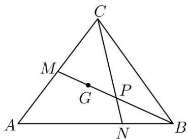

text_image

C
M
G
P
A
N
B

1511 (2024·河北邢台·高一统考期末)记 $\triangle ABC$ 的内角 $A, B, C$ 的对边分别为 $a, b, c$ , 已知 $2\sqrt{3} (\cos^2 C - \cos^2 A) = (a - b)\sin B$ , 且 $\triangle ABC$ 外接圆的半径为 $\sqrt{3}$ .

(1) 求 C 的大小;  
(2) 若 G 是 $\triangle ABC$ 的重心, 求 $\triangle ACG$ 面积的最大值.

【解析】(1)由正弦定理 $\frac{a}{\sin A} = \frac{b}{\sin B} = \frac{c}{\sin C} = 2\sqrt{3}$ ，得 $a = 2\sqrt{3}\sin A, b = 2\sqrt{3}\sin B, c = 2\sqrt{3}\sin C$

因为 $2\sqrt{3} (\cos^2\mathrm{C} - \cos^2\mathrm{A}) = 2\sqrt{3}(1 - \sin^2\mathrm{C} - 1 + \sin^2\mathrm{A}) = 2\sqrt{3} (\sin^2\mathrm{A} - \sin^2\mathrm{C}) = (a - b)$ $\sin B$

所以 $a^{2}-c^{2}=(a-b)b$ ，所以 $\cos C=\frac{a^{2}+b^{2}-c^{2}}{2ab}=\frac{1}{2}$ ，因为 $C\in(0,\pi)$ ，故 $C=\frac{\pi}{3}$ .

(2) 由 (1) 得 $c = 2\sqrt{3}\sin C = 3$ ,

所以 $a^{2}+b^{2}-c^{2}=ab\geqslant2ab-9$ , 得 $ab\leqslant9$

当且仅当 a=b=3 时, 等号成立.

连接BG,并延长BG交AC于D,则D是AC的中点,且 $DG=\frac{1}{3}BD$ ,

过G作GF⊥AC于F, 过B作BE⊥AC于E, 则 $\frac{FG}{BE} = \frac{DG}{BD} = \frac{1}{3}$ ,

所以 $S_{\triangle ACG}=\frac{1}{3}S_{\triangle ABC}=\frac{1}{6}ab\sin C=\frac{\sqrt{3}}{12}ab\leqslant\frac{3\sqrt{3}}{4}$ . 故 $\triangle ACG$ 面积的最大值为 $\frac{3\sqrt{3}}{4}$

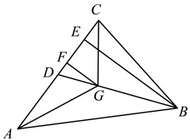

text_image

Geometric diagram of triangle ABC with internal points D, E, F, G and connecting lines forming smaller triangles and intersections.

1512 (2024·辽宁抚顺·高一抚顺一中校考阶段练习)如图,记锐角 $\triangle ABC$ 的内角 A, B, C 的对边分别为 a, b, c, c=2b=4, A 的角平分线交 BC 于点 D, O 为 $\triangle ABC$ 的重心,过 O 作 OP // BC, 交 AD 于点 P, 过 P 作 PE ⊥ AB 于点 E.

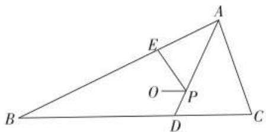

text_image

Geometric diagram of triangle ABC with internal points D, E, O, P and line segments AD, BE, OE labeled

(1) 求 a 的取值范围;  
(2) 若四边形 BDPE 与 $\triangle ABC$ 的面积之比为 $\lambda$ ，求 $\lambda$ 的取值范围.

【解析】(1) 因为 AB > AC，且 $\triangle ABC$ 是锐角三角形，

所以 $\angle ACB, \angle BAC$ 均为锐角，

所以 $\left\{\begin{aligned}0<\cos C&=\frac{a^{2}+b^{2}-c^{2}}{2ab}=\frac{a^{2}-12}{4a}<1,\\ 0<\cos\angle BAC&=\frac{b^{2}+c^{2}-a^{2}}{2bc}=\frac{20-a^{2}}{16}<1,\end{aligned}\right.$

解得 $2\sqrt{3}<a<2\sqrt{5}$ .

(2) 如图, 连接 AO, 延长 AO 交 BC 于点 G.

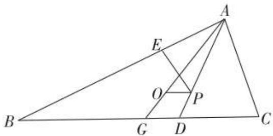

text_image

Geometric diagram of triangle ABC with internal points and segments labeled A, B, C, D, E, O, P, G

因为O为 $\triangle ABC$ 的重心，

所以 G 为 BC 的中点, $AO = \frac{2}{3} AG$ .

因为 OP // BC, 所以 $\angle AOP = \angle AGD, \angle APO = \angle ADG,$

所以 $\triangle AOP \sim \triangle AGD$ ，所以 $\frac{AP}{AD} = \frac{AO}{AG} = \frac{2}{3}$ .

设 $\angle BAC = 2\alpha, AP = 2PD = 2x$ ，则 $\angle BAD = \angle CAD = \alpha.$

因为 $S_{\triangle ABC}=\frac{1}{2}AB\cdot AC\cdot\sin2\alpha=4\sin2\alpha$

$$
\mathrm{S} _ {\triangle \mathrm{ABD}} = \frac {1}{2} \mathrm{AB} \cdot \mathrm{AD} \cdot \sin \alpha = 6 x \sin \alpha ,
$$

$$
\mathrm{S} _ {\triangle \mathrm{ACD}} = \frac {1}{2} \mathrm{AC} \cdot \mathrm{AD} \cdot \sin \alpha = 3 x \sin \alpha ,
$$

所以由 $S_{\triangle ABC}=S_{\triangle ABD}+S_{\triangle ACD}$ ，得 $4\sin2\alpha=9x\sin\alpha$ ，即 $x=\frac{8}{9}\cos\alpha$ .

因为 $S_{\triangle AEP}=\frac{1}{2}AE\cdot PE=\frac{1}{2}\cdot2x\sin\alpha\cdot2x\cos\alpha=2x^{2}\sin\alpha\cos\alpha,$

所以四边形 BDPE 的面积为:

$$
\mathrm{S} _ {\triangle \mathrm{ABD}} - \mathrm{S} _ {\triangle \mathrm{AEP}} = 6 x \sin \alpha - 2 x ^ {2} \sin \alpha \cos \alpha ,
$$

$$
= \frac {8}{3} \sin 2 \alpha - \left(\frac {8}{9} \cos \alpha\right) ^ {2} \sin 2 \alpha .
$$

由 $2\sqrt{3} < a < 2\sqrt{5}$ , 得 $0 < \cos 2\alpha = 2\cos^2\alpha - 1 = \frac{20 - a^2}{16} < \frac{1}{2}$ ,

即 $\frac{1}{2} < \cos^2\alpha < \frac{3}{4}$

所以 $\lambda=\frac{\frac{8}{3}\sin2\alpha-\left(\frac{8}{9}\cos\alpha\right)^{2}\sin2\alpha}{4\sin2\alpha}=\frac{54-16\cos^{2}\alpha}{81}\in\left(\frac{14}{27},\frac{46}{81}\right)$ .

1513 (2024·浙江·高一路桥中学校联考期中)若O是△ABC的外心，且 $\frac{\overrightarrow{AC}^{2}}{\overrightarrow{AB}^{2}}\cdot(\overrightarrow{AB}\cdot\overrightarrow{AO})+\frac{\overrightarrow{AB}^{2}}{\overrightarrow{AC}^{2}}\cdot(\overrightarrow{AC}\cdot\overrightarrow{AO})=\frac{5}{2}\overrightarrow{AO}^{2}$ ，则 $\sin B+2\sin C$ 的最大值是()

A. $\sqrt{3}+\frac{\sqrt{2}}{2}$

B. $\frac{\sqrt{3}}{2} +\sqrt{2}$

C. $\frac{5}{2}$

D. $2\sqrt{2}$

【答案】C

【解析】如图所示：

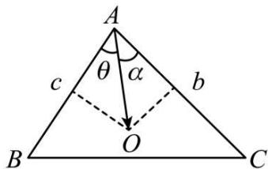

text_image

A
θ α
c b
O
B C

设 AB = c, AC = b, $\angle BAO = \theta$ , $\angle CAO = \alpha$ ,

由 $\frac{\overrightarrow{\mathrm{AC}}^2}{\overrightarrow{\mathrm{AB}}^2}\cdot (\overrightarrow{\mathrm{AB}}\cdot \overrightarrow{\mathrm{AO}}) + \frac{\overrightarrow{\mathrm{AB}}^2}{\overrightarrow{\mathrm{AC}}^2}\cdot (\overrightarrow{\mathrm{AC}}\cdot \overrightarrow{\mathrm{AO}}) = \frac{5}{2}\overrightarrow{\mathrm{AO}}^2,$

得 $\frac{b^2}{c^2}\cdot (c\cdot |\overrightarrow{\mathrm{AO}} |\cos \theta) + \frac{c^2}{b^2}\cdot (b\cdot |\overrightarrow{\mathrm{AO}} |\cos \alpha) = \frac{5}{2}\overrightarrow{\mathrm{AO}}^2$

化简得 $\frac{b^2}{c} \cdot \cos \theta + \frac{c^2}{b} \cdot \cos \alpha = \frac{5}{2} |\overrightarrow{\mathrm{AO}}|$ , 由 O 是 $\triangle ABC$ 的外心可知,

O 是三边中垂线交点, 得 $\cos\theta=\frac{c}{2|\overrightarrow{AO}|}$ , $\cos\alpha=\frac{b}{2|\overrightarrow{AO}|}$ 代入上式得

$\frac{b^{2}}{c}\cdot\frac{c}{2|\overrightarrow{AO}|}+\frac{c^{2}}{b}\cdot\frac{b}{2|\overrightarrow{AO}|}=\frac{5}{2}\left|\overrightarrow{AO}\right|$ ，所以 $b^{2}+c^{2}=5\left|\overrightarrow{AO}\right|^{2}$

根据题意知, AO 是三角形 ABC 外接圆的半径, 可得 $\sin B = \frac{b}{2|\overrightarrow{AO}|}$ , $\sin C = \frac{c}{2|\overrightarrow{AO}|}$ .

所以 $\sin B + 2\sin C = \frac{b}{2|\overrightarrow{AO}|} +\frac{2c}{2|\overrightarrow{AO}|} = \frac{b + 2c}{2|\overrightarrow{AO}|},$

由柯西不等式可得: $(b^{2} + c^{2})(1 + 2^{2})\geqslant (b + 2c)^{2}$

所以 $(b + 2c)^{2}\leqslant 25|\overrightarrow{\mathrm{AO}} |^{2}$ ，所以 $b + 2c\leqslant 5|\overrightarrow{\mathrm{AO}} |$

所以 $\frac{b+2c}{2|\overrightarrow{AO}|}\leqslant\frac{5|\overrightarrow{AO}|}{2|\overrightarrow{AO}|}=\frac{5}{2}$ ，当且仅当“2b=c”时，等号成立.

所以 $\sin B + 2\sin C$ 的最大值为 $\frac{5}{2}$ .

故选：C.

1514 (2024·全国·高三专题练习)已知O是三角形ABC的外心，若 $\frac{\mathrm{AC}}{\mathrm{AB}}\overrightarrow{\mathrm{AB}}\cdot \overrightarrow{\mathrm{AO}} +\frac{\mathrm{AB}}{\mathrm{AC}}\overrightarrow{\mathrm{AC}}\cdot$ $\overrightarrow{\mathrm{AO}} = m(\overrightarrow{\mathrm{AO}})^2$ ，且 $\sin B + \sin C = \sqrt{3}$ ，则实数 $m$ 的最大值为 （）

A. 6

B. $\frac{6}{5}$

C. $\frac{14}{5}$

D. 3

【答案】D

【解析】如图所示:设 AB=c, AC=b, $\angle BAO = \theta$ , $\angle CAO = \alpha$ .

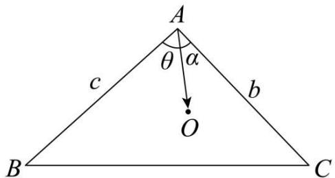

text_image

A
θ α
c b
O
B C

由题意可得, $\frac{b}{c} \cdot c \cdot |\mathrm{AO}| \cos \theta + \frac{c}{b} \cdot b \cdot |\mathrm{AO}| \cos \alpha = m \cdot |\mathrm{AO}|^2$ , 化简可得 $b \cos \theta + c \cos \alpha = m |\mathrm{AO}|$ , 由 O 是三角形的外心可得, O 是三边中垂线交点,

则 $\cos \theta = \frac{c}{2\mathrm{AO}},\cos \alpha = \frac{b}{2\mathrm{AO}}$ ，代入上式得， $2bc = 2m|\mathrm{AO}|^2$ ，即 $m = \frac{bc}{|\mathrm{AO}|^2}$

依据题意, AO 为外接圆半径, 根据正弦定理可得, $\sin B = \frac{b}{2|AO|}$ , $\sin C = \frac{c}{2|AO|}$

代入 $\sin B + \sin C = \sqrt{3}$ 得 $b + c = 2\sqrt{3} |\mathrm{AO}|$ ，则 $m = \frac{bc}{\frac{(b + c)^2}{12}} = \frac{12bc}{(b + c)^2}$

结合不等式可得 $m = \frac{12bc}{(b + c)^2} \leqslant \frac{12bc}{4bc} = 3, \therefore m$ 的最大值为3

故选：D

# 题型九：坐标法

1515 (2024·全国·高三专题练习)在 Rt△ABC 中，∠BAC = $\frac{\pi}{2}$ ，AB = AC = 2，点 M 在 △ABC 内部，cos∠AMC = - $\frac{3}{5}$ ，则 MB² - MA² 的最小值为 \_\_\_\_.

【答案】2

【解析】因为 $\angle AMC \in (0, \pi)$ , $\cos\angle AMC = -\frac{3}{5}$ , 所以 $\sin\angle AMC = \sqrt{1 - \left(-\frac{3}{5}\right)^2} = \frac{4}{5}$ .
在 $\triangle AMC$ 中，由正弦定理得： $\frac{AC}{\sin\angle AMC}=2R(R$ 为 $\triangle AMC$ 的外接圆半径)，所以 $\frac{2}{\frac{4}{5}}=2R$ ，解得： $R=\frac{5}{4}$ .

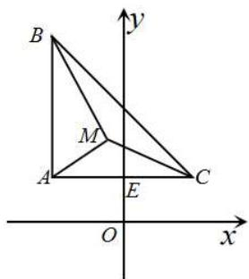

text_image

B
y
M
A
E
C
O
x

如图所示:设 $\triangle AMC$ 的外接圆的圆心为 O, 建立如图示的坐标系.

设 E 为 AC 的中点, 所以 AE = CE = 1, $OE = \sqrt{R^{2} - AE^{2}} = \sqrt{\left(\frac{5}{4}\right)^{2} - 1^{2}} = \frac{3}{4}$ .

所以点 M 的轨迹为: $x^{2} + y^{2} = \frac{25}{16}$ ，可写出 $\left\{\begin{aligned}x &= \frac{5}{4}\cos\theta \\ y &= \frac{5}{4}\sin\theta\end{aligned}\right.$ ( $\theta$ 为参数).

因为点 M 在 $\triangle ABC$ 内部, 所以 $\mathrm{M}\left(\frac{5}{4}\cos\theta,\frac{5}{4}\sin\theta\right)$ (其中 $\theta$ 满足 $-\frac{4}{5}<\cos\theta<\frac{4}{5},\theta\in(0,\pi)$ ).

$$
\begin{array}{l} = \left(\frac {5}{4} \sin \theta - \frac {1 1}{4}\right) ^ {2} - \left(\frac {5}{4} \sin \theta - \frac {3}{4}\right) ^ {2} \\ = 7 - 5 \sin \theta \\ \end{array}
$$

所以 $\mathrm{MB}^2 -\mathrm{MA}^2 = \left[\left(\frac{5}{4}\cos \theta +1\right)^2 +\left(\frac{5}{4}\sin \theta -\frac{11}{4}\right)^2\right] - \left[\left(\frac{5}{4}\cos \theta +1\right)^2 +\left(\frac{5}{4}\sin \theta -\frac{3}{4}\right)^2\right]$

因为 $\theta$ 满足 $-\frac{4}{5} < \cos \theta < \frac{4}{5}, \theta \in (0, \pi)$ , 所以 $\frac{3}{5} < \sin \theta \leqslant 1$ ,

所以当 $\sin\theta=1$ 时 $MB^{2}-MA^{2}=7-5=2$ 最小.

故答案为: 2

1516 (2024·全国·高一专题练习)在 $\triangle ABC$ 中, $AB = 2$ , $AC = 3\sqrt{2}$ , $\angle BAC = 135^{\circ}$ , M 是 $\triangle ABC$ 所在平面上的动点, 则 $w = \overrightarrow{MA} \cdot \overrightarrow{MB} + \overrightarrow{MB} \cdot \overrightarrow{MC} + \overrightarrow{MC} \cdot \overrightarrow{MA}$ 的最小值为 \_\_\_\_.

【答案】 $-\frac{28}{3}$

【解析】以 A 为原点, AC 所在直线为 x 轴, 建系, 如图所示, 根据题意, 可得 A、B、C 坐标, 设 $M(x,y)$ , 可得 $\overrightarrow{MA}, \overrightarrow{MB}, \overrightarrow{MC}$ 的坐标, 根据数量积公式, 可得 w 的表达式, 即可求得答案. 以 A 为原点, AC 所在直线为 x 轴, 建立坐标系, 如图所示:

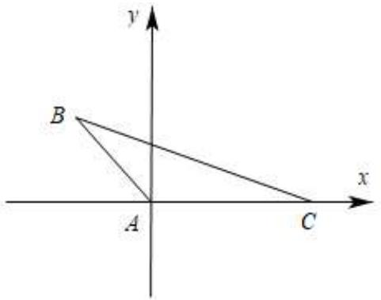

text_image

y
B
x
A
C

因为 AB = 2, AC = $3\sqrt{2}$ , $\angle BAC = 135^{\circ}$ ,

所以 A(0,0), B(- $\sqrt{2}$ , $\sqrt{2}$ ), C(3 $\sqrt{2}$ , 0), 设 M(x, y),

则 $\overrightarrow{\mathrm{MA}} = (-x, -y),\overrightarrow{\mathrm{MB}} = (-\sqrt{2} -x,\sqrt{2} -y),\overrightarrow{\mathrm{MC}} = (3\sqrt{2} -x, - y),$

所以 $w=\overrightarrow{MA}\cdot\overrightarrow{MB}+\overrightarrow{MB}\cdot\overrightarrow{MC}+\overrightarrow{MC}\cdot\overrightarrow{MA}=x(\sqrt{2}+x)+y(y-\sqrt{2})+(\sqrt{2}+x)(x-3\sqrt{2})$

$$
+ y (y - \sqrt {2}) + x (x - 3 \sqrt {2}) + y ^ {2}
$$

$$
= 3 x ^ {2} - 4 \sqrt {2} x + 3 y ^ {2} - 2 \sqrt {2} y - 6 = 3 \left(x - \frac {2 \sqrt {2}}{3}\right) ^ {2} + 3 \left(y - \frac {\sqrt {2}}{3}\right) ^ {2} - \frac {2 8}{3},
$$

当 $x = \frac{2\sqrt{2}}{3}, y = \frac{\sqrt{2}}{3}$ 时， $w$ 有最小值，且为 $-\frac{28}{3}$ ，

故答案为: $-\frac{28}{3}$

1517 (2024·湖北武汉·高二武汉市第三中学校考阶段练习)在平面直角坐标系 $xOy$ 中，已知B，C为圆 $x^{2} + y^{2} = 9$ 上两点，点A(1,1)，且AB⊥AC，则线段BC的长的取值范围是

【答案】 $[4 - \sqrt{2}, 4 + \sqrt{2}]$

【解析】设 BC 的中点为 $M(x,y)$ ，因为 $|OB|^{2}=|OM|^{2}+|BM|^{2}=|OM|^{2}+|AM|^{2}$

所以 $9 = x^{2} + y^{2} + (x - 1)^{2} + (y - 1)^{2}$ ，化简得 $\left(x - \frac{1}{2}\right)^{2} + \left(y - \frac{1}{2}\right)^{2} = 4$ ，

即点 M 的轨迹是以 $N\left(\frac{1}{2}, \frac{1}{2}\right)$ 为圆心, 2 为半径的圆,

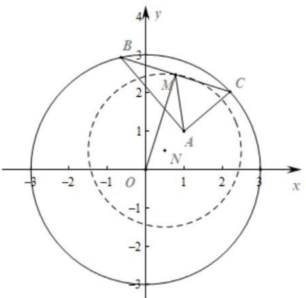

text_image

y
4
B
3
2
M
C
1
A
N
-3 -2 -1 O 1 2 3 x
-1
-2
-3

所以 $|\mathrm{AN}| = \sqrt{\left(1 - \frac{1}{2}\right)^2 + \left(1 - \frac{1}{2}\right)^2} = \frac{\sqrt{2}}{2}$

所以 $\left|AM\right|$ 的取值范围是 $\left[2-\frac{\sqrt{2}}{2},2+\frac{\sqrt{2}}{2}\right]$ ,

从而 $|\mathrm{BC}|$ 的取值范围是 $[4 - \sqrt{2}, 4 + \sqrt{2}]$ .

故答案为: $[4 - \sqrt{2}, 4 + \sqrt{2}]$ .

1518 (2024·全国·高三专题练习)在 $\Delta ABC$ 中, $AB = AC = \sqrt{3}$ , 且 $\Delta ABC$ 所在平面内存在一点 P 使得 $PB^{2} + PC^{2} = 3PA^{2} = 3$ , 则 $\Delta ABC$ 面积的最大值为 ()

A. $\frac{2\sqrt{23}}{3}$

B. $\frac{5\sqrt{23}}{16}$

C. $\frac{\sqrt{35}}{4}$

D. $\frac{3\sqrt{35}}{16}$

【答案】B

【解析】以 BC 的中点为坐标原点, 建立直角坐标系, 写出 A, B, C 三点的坐标, 利用两点间距离公式, 以及圆与圆的位置关系, 解不等式, 得出 a 的范围, 再由三角形的面积公式以及二次函数的性质, 即可得出 $\Delta ABC$ 面积的最大值. 以 BC 的中点为坐标原点, BC 所在直线为 x 轴, 建立直角坐标系

设 $\mathrm{B}(-a,0),\mathrm{C}(a,0),(a > 0)$ ，则 $\mathrm{A}\big(0,\sqrt{3 - a^2}\big)$

设 $P(x,y)$ ，由 $PB^{2}+PC^{2}=3PA^{2}=3$ 得

$$
(x + a) ^ {2} + y ^ {2} + (x - a) ^ {2} + y ^ {2} = 3 \left[ x ^ {2} + \left(y - \sqrt {3 - a ^ {2}}\right) ^ {2} \right] = 3
$$

即 $x^{2} + y^{2} = \frac{3}{2} -a^{2},x^{2} + (y - \sqrt{3 - a^{2}})^{2} = 1$

即点 P 既在 $(0,0)$ 为圆心， $\sqrt{\frac{3}{2}-a^{2}}$ 为半径的圆上，又在 $(0,\sqrt{3-a^{2}})$ 为圆心，1 为半径的圆上

可得 $\left|1 - \sqrt{\frac{3}{2} - a^2}\right|\leqslant \sqrt{3 - a^2}\leqslant 1 + \sqrt{\frac{3}{2} - a^2}$ ，由两边平方化简可得 $a^2\leqslant \frac{23}{16}$

则 $\Delta ABC$ 的面积为 $S = \frac{1}{2} \cdot 2a \cdot \sqrt{3 - a^2} = a\sqrt{3 - a^2} = \sqrt{-\left(a^2 - \frac{3}{2}\right)^2 + \frac{9}{4}}$

由 $a^2 \leqslant \frac{23}{16}$ , 可得 $a^2 = \frac{23}{16}$ , S取得最大值, 且为 $\frac{5\sqrt{23}}{16}$ .

故选: B.

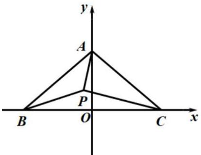

text_image

y
A
P
B O C x

1519 (2024·全国·高三专题练习)在等边 $\triangle ABC$ 中，M 为 $\triangle ABC$ 内一动点， $\angle BMC = 120^{\circ}$ ，则 $\frac{MA}{MC}$ 的最小值是（）

A. 1

B. $\frac{3}{4}$

C. $\frac{\sqrt{3}}{2}$

D. $\frac{\sqrt{3}}{3}$

【答案】C

【解析】如图所示，

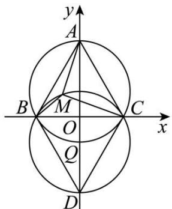

text_image

y
A
B
M
O
C
x
Q
D

以 $\triangle ABC$ 的 BC 边的中点 O 为原点, BC 为 x 轴, 过 O 点垂直于 BC 的直线为 y 轴, 建立建立直角坐标系如图,

再将 $\triangle ABC$ 延 x 轴翻折得 $\triangle DBC$ ，求得 $\triangle DBC$ 的外接圆的圆心为 Q， $\because \angle BMC = 120^{\circ}$ ，∴ M 点 $\odot Q$ 的劣弧 $\widehat{BC}$ 上，

不妨设等边 $\triangle ABC$ 的边长为 2，可得： $Q\left(0,-\frac{\sqrt{3}}{3}\right)$ ， $A(0,\sqrt{3})$ ， $C(1,0)$ ， $M(x,y)$ ，

点M所在圆的方程为： $x^{2}+\left(y+\frac{\sqrt{3}}{3}\right)^{2}=\frac{4}{3}.$

设参数方程为： $\left\{\begin{aligned}x&=\frac{2\sqrt{3}}{3}\cos\theta\\ y&=-\frac{\sqrt{3}}{3}+\frac{2\sqrt{3}}{3}\sin\theta\end{aligned}\right.$

$$
\therefore \frac {\left| \mathrm{MA} \right| ^ {2}}{\left| \mathrm{MC} \right| ^ {2}} = \frac {x ^ {2} + (y - \sqrt {3}) ^ {2}}{(x - 1) ^ {2} + y ^ {2}} = \frac {\frac {4}{3} \cos^ {2} \theta + \left(- \frac {4 \sqrt {3}}{3} + \frac {2 \sqrt {3}}{3} \sin \theta\right) ^ {2}}{\left(\frac {2 \sqrt {3}}{3} \cos \theta - 1\right) ^ {2} + \left(- \frac {\sqrt {3}}{3} + \frac {2 \sqrt {3}}{3} \sin \theta\right) ^ {2}} =
$$

$$
\frac {5 - 4 \sin \theta}{2 - \sqrt {3} \cos \theta - \sin \theta} = t,
$$

$$
5 - 2 t = - \sqrt {3} t \cos \theta + (4 - t) \sin \theta = \sqrt {(4 - t) ^ {2} + (\sqrt {3} t) ^ {2}} \sin (\theta + \beta),
$$

其中 $\sin \beta = -\frac{\sqrt{3}t}{\sqrt{(4 - t)^2 + (\sqrt{3}t)^2}},\cos \beta = \frac{4 - t}{\sqrt{(4 - t)^2 + (\sqrt{3}t)^2}}$

即 $\sin(\theta+\beta)=\frac{5-2t}{\sqrt{(4-t)^{2}+(\sqrt{3}t)^{2}}}\leqslant1$ , 解得 $t\geqslant\frac{3}{4},\therefore\frac{|MA|}{|MC|}\geqslant\frac{\sqrt{3}}{2};$

故选：C.

1520 (2024·江西·高三校联考开学考试)费马点是指三角形内到三角形三个顶点距离之和最小的点. 当三角形三个内角均小于 $120^{\circ}$ 时, 费马点与三个顶点连线正好三等分费马点所在的周角, 即该点所对的三角形三边的张角相等且均为 $120^{\circ}$ . 根据以上性质, . 则 $\mathrm{F}(x, y) = \sqrt{(x - 2\sqrt{3})^{2} + y^{2}} + \sqrt{(x + 1 - \sqrt{3})^{2} + (y - 1 + \sqrt{3})^{2}} + \sqrt{x^{2} + (y - 2)^{2}}$ 的最小值为 ( )

A. 4

B. $2 + 2\sqrt{3}$

C. $3 + 2\sqrt{3}$

D. $4 + 2\sqrt{3}$

【答案】B

【解析】由题意得： $\mathrm{F}(x,y)$ 的几何意义为点 E 到点 A( $2\sqrt{3},0$ ), B( $\sqrt{3}-1,1-\sqrt{3}$ ), C(0,2) 的距离之和的最小值，

因为 $\left|AB\right|=\sqrt{\left(\sqrt{3}+1\right)^{2}+\left(\sqrt{3}-1\right)^{2}}=2\sqrt{2}$ ， $\left|CB\right|=\sqrt{\left(\sqrt{3}-1\right)^{2}+\left(-\sqrt{3}-1\right)^{2}}=2\sqrt{2}$ ， $\left|AC\right|=\sqrt{4+12}=4,$

所以 $\left|AB\right|^{2}+\left|CB\right|^{2}=\left|AC\right|^{2}$ ，故三角形 ABC 为等腰直角三角形，

取 AC 的中点 D, 连接 BD, 与 AO 交于点 E, 连接 CE, 故 $BD = \frac{1}{2}AC = 2$ , AE = CE, 因为 $\frac{CO}{AO} = \frac{2}{2\sqrt{3}} = \frac{\sqrt{3}}{3}$ , 所以 $\angle CAO = 30^{\circ}$ , 故 $\angle AEC = 120^{\circ}$ , 则 $\angle BEC = \angle AEB = 120^{\circ}$ ,

故点E到三角形三个顶点距离之和最小,即 $F(x,y)$ 取得最小值,

因为 $\mathrm{AD} = \mathrm{CD} = \frac{1}{2}\mathrm{AC} = 2$ ，所以 $\mathrm{AE} = \frac{\mathrm{AD}}{\cos 30^{\circ}} = \frac{4\sqrt{3}}{3}$ ，同理得： $\mathrm{CE} = \frac{4\sqrt{3}}{3},\mathrm{DE} =$ $\frac{2\sqrt{3}}{3},$

$$
\mathrm{BE} = \mathrm{BD} - \mathrm{DE} = 2 - \frac {2 \sqrt {3}}{3},
$$

故 $F(x,y)$ 的最小值为 $AE + CE + BE = \frac{4\sqrt{3}}{3} + \frac{4\sqrt{3}}{3} + 2 - \frac{2\sqrt{3}}{3} = 2 + 2\sqrt{3}$ .

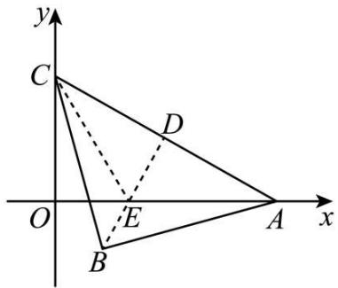

text_image

y
C
D
O
E
A
x
B

故选：B

# 10 题型十：隐圆问题

1521 (2024·全国·高三专题练习)在平面四边形ABCD中,连接对角线BD,已知CD=9,BD=16, $\angle BDC=90^{\circ}$ , $\sin A=\frac{4}{5}$ ,则对角线AC的最大值为()

A. 27

B. 16

C. 10

D. 25

【答案】A

【解析】以 D 为坐标原点, DB, DC 分别为 x, y 轴建立如图所示直角坐标系, 则 D(0,0), B(16,0), C(0,9), 因为 $\sin A = \frac{4}{5}$ , $|BD| = 16$ , 所以由平面几何知识得 A 点轨迹为圆弧 (因为为平面四边形ABCD,所以取图中第四象限部分的圆弧),设圆心为E,则由正弦定理可得圆半径为 $\frac{1}{2}\times\frac{|BD|}{\sin A}=\frac{1}{2}\times\frac{16}{\frac{4}{5}}=10\therefore E(8,-6)$ ,

因此对角线 AC 的最大值为 $\left|CE\right| + 10 = \sqrt{8^{2} + (-6 - 9)^{2}} + 10 = 27$ ,

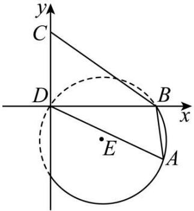

text_image

y
C
D
B
x
E
A

故选：A

1522 (2024·江苏泰州·高三阶段练习)已知△ABC中，BC=2，G为△ABC的重心，且满足AG⊥BG，则△ABC的面积的最大值为\_\_\_\_.

【答案】 $\frac{3}{2} / 1.5$

【解析】以 BC 的中点 O 为原点建立平面直角坐标系, C(-1,0), B(1,0),

设 $\mathrm{A}(x,y)$ ，则 $\mathrm{G}\left(\frac{x}{3},\frac{y}{3}\right),$

当 x=0 时要使 AG⊥BG，则 G 在坐标原点，显然不成立，

当 x=3 时要使 AG⊥BG，则 $y=\frac{y}{3}$ ，解得 y=0，显然不成立，

所以 $x \neq 0$ 且 $x \neq 3$ , 因为 $\mathrm{AG} \perp \mathrm{BG}$

所以 $k_{AG} \cdot k_{BG} = -1$ ，即 $\frac{y - \frac{y}{3}}{x - \frac{x}{3}} \cdot \frac{\frac{y}{3}}{\frac{x}{3} - 1} = -1$

整理得 $\left(x - \frac{3}{2}\right)^2 + y^2 = \frac{9}{4}, (x \neq 0$ 且 $x \neq 3)$

所以当点 A 的纵坐标为 $\pm\frac{3}{2}$ 时, $\triangle ABC$ 的面积取得最大值为 $\frac{3}{2}$ .

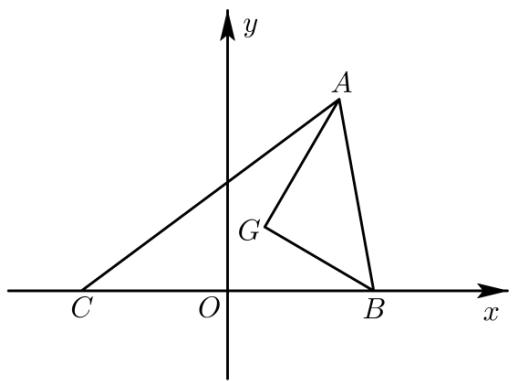

text_image

y
A
G
C O B x

故答案为: $\frac{3}{2}$

1523 (2024·湖北武汉·高二武汉市洪山高级中学校考开学考试)已知等边△ABC的边长为2，点G是△ABC内的一点，且 $\overrightarrow{AG}+\overrightarrow{BG}+\overrightarrow{CG}=\overrightarrow{0}$ ，点P在△ABC所在的平面内且满足

$\left|\overrightarrow{PG}\right|=1$ , 则 $\left|\overrightarrow{PA}\right|$ 的最大值为 \_\_\_\_.

【答案】 $\frac{2\sqrt{3}}{3} + 1$

【解析】由 $\overrightarrow{AG} + \overrightarrow{BG} + \overrightarrow{CG} = 0$ ，可知点 G 为 $\triangle ABC$ 的重心，以 AB 所在的直线为 x 轴，中垂线为 y 轴建立如图所示的平面直角坐标系，表示出 A, B, G 的坐标，设 $P(x, y)$ ，由 $|\overrightarrow{PG}| = 1$ 可知 P 在以 G 为圆心，1 为半径的圆上，根据点与圆上的点的距离最值求出 $|\overrightarrow{PA}|$ 的最大值。由 $\overrightarrow{AG} + \overrightarrow{BG} + \overrightarrow{CG} = 0$ ，可知点 G 为 $\triangle ABC$ 的重心。

以 AB 所在的直线为 x 轴, 中垂线为 y 轴建立如图所示的平面直角坐标系,

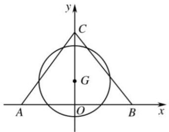

text_image

y
C
G
A
O
B
x

则 A(-1,0), B(1,0), G $\left(0,\frac{\sqrt{3}}{3}\right)$ .

设 $\mathrm{P}(x,y)$ ，由 $|\overrightarrow{\mathrm{PG}}| = 1$ 可知 $\mathrm{P}$ 为圆 $x^{2} + \left(y - \frac{\sqrt{3}}{3}\right)^{2} = 1$ 上的动点，

所以 $\left|\overrightarrow{PA}\right|$ 的最大值为 $\left|\overrightarrow{AG}\right|+1=\sqrt{1^{2}+\left(\frac{\sqrt{3}}{3}\right)^{2}}=\frac{2\sqrt{3}}{3}+1.$

故答案为: $\frac{2\sqrt{3}}{3} + 1$

1524 (2024·全国·高三专题练习)在平面四边形ABCD中， $\angle BAD=90^{\circ}$ ， $AB=2$ ， $AD=1$ 。若 $\overrightarrow{AB} \cdot \overrightarrow{AC} + \overrightarrow{BA} \cdot \overrightarrow{BC} = \frac{4}{3} \overrightarrow{CA} \cdot \overrightarrow{CB}$ ，则 $CB + \frac{1}{2} CD$ 的最小值为\_\_\_\_。

【答案】 $\frac{\sqrt{26}}{2}$

【解析】如图,以 AB 的中点 O 为坐标原点,以 AB 方向为 x 轴正向,建立如下平面直角坐标系.

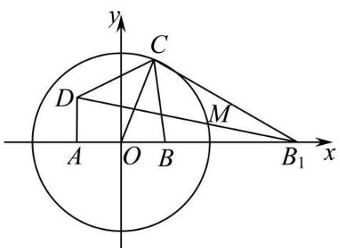

text_image

y
C
D
M
A O B B₁ x

则 A(-1,0), B(1,0),

设 $\mathrm{C}(x,y)$ ，则 $\overrightarrow{\mathrm{AB}} = (2,0),\overrightarrow{\mathrm{AC}} = (x + 1,y),\overrightarrow{\mathrm{BC}} = (x - 1,y)$

因为 $\overrightarrow{AB} \cdot \overrightarrow{AC} + \overrightarrow{BA} \cdot \overrightarrow{BC} = \overrightarrow{AB} \cdot \overrightarrow{AC} + \overrightarrow{AB} \cdot \overrightarrow{CB} = \overrightarrow{AB} \cdot \overrightarrow{AB} = \frac{4}{3} \overrightarrow{CA} \cdot \overrightarrow{CB}$

所以 $\overrightarrow{\mathrm{AB}}\cdot \overrightarrow{\mathrm{AB}} = \frac{4}{3}\overrightarrow{\mathrm{AC}}\cdot \overrightarrow{\mathrm{BC}}$ ，即： $4 = \frac{4}{3}\times [(x - 1)(x + 1) + y^2 ]$

整理得: $x^{2} + y^{2} = 4$ , 所以点 C 在以原点为圆心, 半径为 2 的圆上.

在 $x$ 轴上取 $\mathrm{B}_1(4,0)$ , 连接 $\mathrm{B}_1\mathrm{C}$

可得 $\Delta \mathrm{OBC} \sim \Delta \mathrm{OCB}_1$ ，所以 $\frac{\mathrm{BC}}{\mathrm{B}_1\mathrm{C}} = \frac{\mathrm{OB}}{\mathrm{OC}} = 2$ ，所以 $\mathrm{B}_1\mathrm{C} = 2\mathrm{BC}$

$$
\mathrm{CB} + \frac {1}{2} \mathrm{CD} = \frac {1}{2} (2 \mathrm{CB} + \mathrm{CD}) = \frac {1}{2} (\mathrm{B} _ {1} \mathrm{C} + \mathrm{CD})
$$

由图可得: 当 $B_{1}, C, D$ 三点共线时, 即点 C 在图中的 M 位置时, $B_{1}C + CD$ 最小.

此时 $CB + \frac{1}{2}CD$ 最小为 $DB_{1} = \frac{1}{2}\sqrt{(4+1)^{2}+1^{2}} = \frac{\sqrt{26}}{2}$ .

故答案为 $\frac{\sqrt{26}}{2}$ .

1525 (2024·全国·高三专题练习)若 $\triangle ABC$ 满足条件 AB = 4, AC = $\sqrt{2}BC$ , 则 $\triangle ABC$ 面积的最大值为 \_\_\_\_.

【答案】 $8\sqrt{2}$

【解析】如图,以 AB 的中点为原点, AB 为 x 轴, AB 的中垂线为 y 轴,建立平面直角坐标系,如图所示,

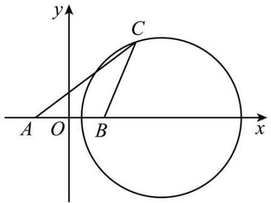

text_image

y
C
A O B x

则 A(-2,0), B(2,0), 设 C(x,y), 由 AC= $\sqrt{2}$ BC,

得 $\sqrt{(x + 2)^2 + y^2} = \sqrt{2}\cdot \sqrt{(x - 2)^2 + y^2},$

化简可得 $(x-6)^{2}+y^{2}=32,$

则点 C 的轨迹是以 $(6,0)$ 为圆心，半径 $r=4\sqrt{2}$ 的圆，

且去掉点 $(6+4\sqrt{2},0)$ 和 $(6-4\sqrt{2},0)$ ;

所以 $\triangle ABC$ 的面积的最大值为 $\frac{1}{2} \times |AB| \times r = \frac{1}{2} \times 4 \times 4\sqrt{2} = 8\sqrt{2}$ ,

故答案为: $8\sqrt{2}$ .

1526 (2024·江苏·高三专题练习)在 $\triangle ABC$ 中, BC 为定长, $\left|\overrightarrow{AB} + 2\overrightarrow{AC}\right| = 3\left|\overrightarrow{BC}\right|$ , 若 $\triangle ABC$ 的面积的最大值为 2, 则边 BC 的长为 \_\_\_\_.

【答案】2

【解析】设 BC=a，以 B 为原点，BC 为 x 轴建系，则 B(0,0)，C(a,0)，设 A(x,y)， $y \neq 0$ ，$\left|\overrightarrow{AB}+2\overrightarrow{AC}\right|=\left|(2a-3x,-3y)\right|=3a$ ，利用求向量模的公式，可得 $\left(x-\frac{2a}{3}\right)^{2}+y^{2}=$

$a^{2}(y\neq0)$ ，根据三角形面积公式进一步求出a的值即为所求。设BC=a，以B为原点，BC为x轴建系，则 $B(0,0)$ ， $C(a,0)$ ，设 $A(x,y)$ ， $y\neq0$ ，

则 $\left|\overrightarrow{AB}+2\overrightarrow{AC}\right|=\left|(2a-3x,-3y)\right|=\sqrt{(2a-3x)^{2}+9y^{2}}=3a,$

即 $\left(x - \frac{2a}{3}\right)^2 + y^2 = a^2 (y \neq 0)$ ,

由 $S_{\triangle ABC}=\frac{1}{2}BC\cdot|y|$ ，可得 $\frac{a}{2}|y|\leqslant\frac{a^{2}}{2}=2$ .

则 BC = a = 2.

故答案为: 2.

1527 (2024·全国·高三专题练习) $\triangle ABC$ 中 $AB = AC = 2$ , $\triangle ABC$ 所在平面内存在点 $P$ 使得 $PB^{2} + PC^{2} = 4$ , $PA^{2} = 1$ , 则 $\triangle ABC$ 的面积最大值为 \_\_\_\_.

【答案】 $\frac{3\sqrt{7}}{4}$

【解析】以 BC 的中点为坐标原点, BC 所在直线为 x 轴建立平面直角坐标系,

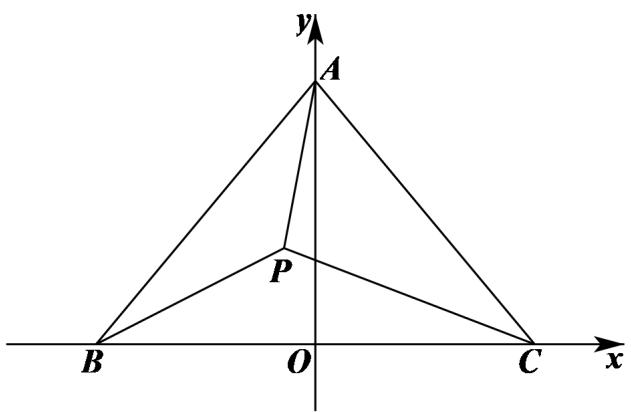

text_image

y
A
P
B O C x

设 $\mathrm{B}(-a,0)\mathrm{C}(a,0)(a > 0)$ ，则 $\mathrm{A}\big(0,\sqrt{4 - a^2}\big)$

设 $\mathrm{P}(x,y)$ ，由 $\mathrm{PB}^2 +\mathrm{PC}^2 = 4$ ， $\mathrm{PA}^2 = 1$ ，可得 $\left\{ \begin{array}{l}(x + a)^2 +y^2 +(x - a)^2 +y^2 = 4\\ x^2 +(y - \sqrt{4 - a^2})^2 = 1 \end{array} \right.$

即 $\left\{\begin{aligned}x^{2}+y^{2}&=2-a^{2}\\ x^{2}+\left(y-\sqrt{4-a^{2}}\right)^{2}&=1\end{aligned}\right.$

即点 P 既在以 $(0,0)$ 为圆心，半径为 $\sqrt{2-a^{2}}$ 的圆上，也在 $(0,\sqrt{4-a^{2}})$ 为圆心，1 为半径的圆上，

可得 $\left|1-\sqrt{2-a^{2}}\right|\leqslant\sqrt{4-a^{2}}\leqslant1+\sqrt{2-a^{2}}$

由两边平方化简可得 $a^2 \leqslant \frac{7}{4}$ ,

则 $\triangle ABC$ 的面积为 $S = \frac{1}{2} \cdot 2a \cdot \sqrt{4 - a^2} = a \cdot \sqrt{4 - a^2} = \sqrt{4a^2 - a^4} = \sqrt{-(a^2 - 2)^2 + 4}$ ,

由 $a^2 \leqslant \frac{7}{4}$ , 可得 $S_{\max} = \frac{3\sqrt{7}}{4}$ .

故答案为: $\frac{3\sqrt{7}}{4}$ .

1528 (2024·全国·高三专题练习)已知 $\Delta ABC$ 中, $AB = AC = \sqrt{3}$ , $\Delta ABC$ 所在平面内存在点 P 使得 $PB^{2} + PC^{2} = 3PA^{2} = 3$ , 则 $\Delta ABC$ 面积的最大值为 \_\_\_\_.

【答案】 $\frac{5\sqrt{23}}{16}$

【解析】设 $\left|BC\right|=2a$ ，以 BC 所在直线为 x 轴、其中垂线 OA 所在直线为 y 轴建立直角坐标系（如图所示），则 $\mathrm{B}(-a,0),\mathrm{C}(a,0),\mathrm{A}(0,\sqrt{3-a^{2}})$ ，设 $\mathrm{P}(x,y)$ ，由 $PB^{2}+PC^{2}=3PA^{2}=3$ ，得 $\left\{\begin{aligned}(x+a)^{2}+y^{2}+(x-a)^{2}+y^{2}&=3\\ x^{2}+(y-\sqrt{3-a^{2}})^{2}&=1\end{aligned}\right.$ ，即 $\left\{\begin{aligned}x^{2}+y^{2}&=\frac{3}{2}-a^{2}\\ x^{2}+y^{2}&-2\sqrt{3-a^{2}}y+3-a^{2}&=1\end{aligned}\right.$

则 $\left\{\frac{7}{2}-2a^{2}=2\sqrt{3-a^{2}}y\right.$ $\sqrt{3-a^{2}}-1\leqslant y\leqslant\sqrt{3-a^{2}}+1$

则 $2(3 - a^2) - 2\sqrt{3 - a^2} \leqslant 2\sqrt{3 - a^2} y \leqslant 2(3 - a^2) + 2\sqrt{3 - a^2}$ ,

即 $2(3 - a^2) - 2\sqrt{3 - a^2} \leqslant \frac{7}{2} - 2a^2 \leqslant 2(3 - a^2) + 2\sqrt{3 - a^2}$ ,

解得 $a \leqslant \frac{\sqrt{23}}{4}$ , 即 $S_{\Delta ABC} = \frac{1}{2} \times 2a \times \sqrt{3 - a^2} = \sqrt{3a^2 - a^4} \leqslant \frac{5\sqrt{23}}{16}$ ,

即 $\Delta ABC$ 面积的最大值为 $\frac{5\sqrt{23}}{16}$ .

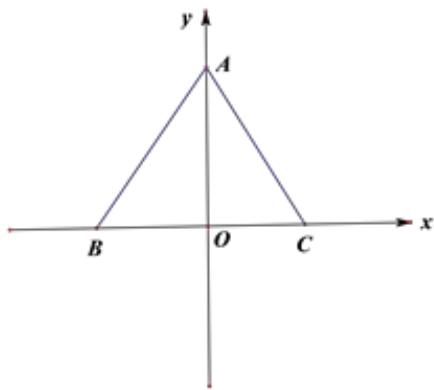

text_image

y
A
B O C x

# 题型十一:两边夹问题

1529 (2024·全国·高三专题练习)在 $\triangle ABC$ 中, 若 $\frac{\cos A}{\sin B} + \frac{\cos B}{\sin A} = 2, A, B \in \left(0, \frac{\pi}{2}\right)$ , 且 $\triangle ABC$ 的周长为 12.

(1) 求证: $\triangle ABC$ 为直角三角形;  
(2) 求 $\triangle ABC$ 面积的最大值.

【解析】(1) 在 $\triangle ABC$ 中有 $\sin A > 0, \sin B > 0,$

又 $\frac{\cos A}{\sin B} + \frac{\cos B}{\sin A} = 2,$

则 $\sin A\cos A + \cos B\sin B = 2\sin B\sin A$ ,

可得 $\sin A \cos A - \sin B \sin A = \sin B \sin A - \cos B \sin B$ ,

可得 $\sin A(\cos A - \sin B) = \sin B(\sin A - \cos B)$ ①，

又 A, B, C 是三角形内角，

若 $\sin A > \cos B$ ，则 $\cos A < \sin B$ ，此时①式不成立；

若 $\sin A < \cos B$ ，则 $\cos A > \sin B$ ，此时①式不成立；

所以 $\sin A = \cos B = \sin\left(\frac{\pi}{2} - B\right)$ ，则 $A + B = \frac{\pi}{2}$ ，则 $C = \frac{\pi}{2}$ ，

所以 $\triangle ABC$ 是直角三角形.

(2) 设直角三角形的两直角边分别为 a, b, 斜边为 c, 则直角三角形的面积 $S = \frac{1}{2} ab$ ,

又 $a + b + c = 12$ ，则 $a + b + \sqrt{a^2 + b^2} = 12$

所以 $12 = a + b + \sqrt{a^2 + b^2} \geqslant 2\sqrt{ab} + \sqrt{2ab} = (2 + \sqrt{2})\sqrt{ab}$ ,

即 $\sqrt{ab} \leqslant \frac{12}{2 + \sqrt{2}} = 12 - 6\sqrt{2}$ , 即 $ab \leqslant (12 - 6\sqrt{2})^2 = 216 - 144\sqrt{2}$ ,

所以 $S=\frac{1}{2}ab\leqslant108-72\sqrt{2}$ ，当且仅当 $a=b=12-6\sqrt{2}$ 时，S 取最大值，且最大值为 $108-72\sqrt{2}$ .

1530 (2024·全国·高三专题练习)设 $\Delta ABC$ 的内角 A, B, C 的对边长 a, b, c 成等比数列， $\cos(A-C)-\cos B=\frac{1}{2}$ ，延长 BC 至 D，若 BD=2，则 $\Delta ACD$ 面积的最大值为 \_\_\_\_.

【答案】 $\frac{\sqrt{3}}{4}$

【解析】 $\because \cos(A-C)-\cos B=\cos(A-C)+\cos(A+C)=\frac{1}{2}$ ,

$$
\therefore \cos A \cos C = \frac {1}{4}, ①
$$

又∵a,b,c成等比数列，∴ $b^{2}=ac$ ，

由正弦定理可得 $\sin^{2}B = \sin A \sin C,$ ②

① - ②得 $\frac{1}{4} - \sin^2 B = \cos A \cos C - \sin A \sin C$

$$
= \cos (A + C) = - \cos B,
$$

∴ $\frac{1}{4} + \cos^{2}B - 1 = -\cos B$ , 解得 $\cos B = \frac{1}{2}, B = \frac{\pi}{3}$ ,

由 $\cos(A-C)-\cos B=\frac{1}{2}$ ,

得 $\cos (\mathrm{A} - \mathrm{C}) = \frac{1}{2} +\cos B = 1$

A - C = 0, A = B, $\Delta ABC$ 为正三角形,

设正三角形边长为 $a$

则 $\mathrm{CD} = 2 - a, \mathrm{S}_{\Delta \mathrm{ACD}} = \frac{1}{2}\mathrm{AC} \cdot \mathrm{CD}\sin 120^{\circ}$

$$
= \frac {1}{2} a (2 - a) \times \frac {\sqrt {3}}{2} = \frac {\sqrt {3}}{4} a (2 - a)
$$

$\leqslant \frac{\sqrt{3}}{4}\times \frac{[a + (2 - a)]^2}{4} = \frac{\sqrt{3}}{4},a = 1$ 时等号成立.

即 $\Delta ACD$ 面积的最大值为 $\frac{\sqrt{3}}{4}$ ，故答案为 $\frac{\sqrt{3}}{4}$ .

1531 (2024·全国·高三专题练习)设 $\Delta ABC$ 的内角 A, B, C 的对边为 a, b, c. 已知 a, b, c 依次成等比数列，且 $\cos(A-C)-\cos B=\frac{1}{2}$ ，延长边 BC 到 D，若 BD=4，则 $\Delta ACD$ 面积的最大值为 \_\_\_\_.

【答案】 $\sqrt{3}$

【解析】∵ $\cos(A - C) - \cos B = \frac{1}{2}$ ,

$$
\cos (\mathrm{A} - \mathrm{C}) + \cos (\mathrm{A} + \mathrm{C}) = 2 \cos \mathrm{A} \cos \mathrm{C} = \frac {1}{2},
$$

$$
\therefore \cos A \cos C = \frac {1}{4}, ①
$$

$\because a, b, c$ 依次成等比数列，

$$
\therefore b ^ {2} = a c,
$$

由正弦定理可得, $\sin^{2}B = \sin A\sin C$ ②

① - ②可得, $\frac{1}{4} - \sin^2 B = \cos A \cos C - \sin A \sin C = \cos (A + C) = -\cos B$

$$
\therefore \cos^ {2} B + \cos B - \frac {3}{4} = 0
$$

$$
\therefore \cos B = \frac {1}{2},
$$

$$
\therefore \mathrm{B} = \frac {1}{3} \pi ,
$$

$$
\because \cos (A - C) - \cos B = \frac {1}{2},
$$

$$
\therefore \cos (A - C) = 1, \text {即} A - C = 0
$$

∴ $\Delta ABC$ 为正三角形, 设边长 a,

$$
\therefore \mathrm{S} _ {\Delta \mathrm{ACD}} = \frac {1}{2} \mathrm{AC} \cdot \mathrm{CD} \sin 1 2 0 ^ {\circ} = \frac {1}{2} \times a \times (4 - a) \times \frac {\sqrt {3}}{2} = \frac {\sqrt {3}}{4} a (4 - a) \leqslant \frac {\sqrt {3}}{4} \times
$$

$\left(\frac{a + 4 - a}{2}\right)^2 = \sqrt{3}$ 当且仅当 $a = 4 - a$ 即 $a = 2$ 时取等号

故答案为 $\sqrt{3}$

# 12 题型十二:与正切有关的最值问题

1532 (2024·全国·高一专题练习)在锐角三角形ABC中,角A、B、C的对边分别为a、b、c,且满足 $b^{2}-a^{2}=ac$ ,则 $\frac{1}{\tan A}-\frac{1}{\tan B}$ 的取值范围为\_\_\_\_.

【答案】 $\left(1,\frac{2\sqrt{3}}{3}\right)$

【解析】因为 $b^{2}-a^{2}=ac$ ，由余弦定理得 $b^{2}=a^{2}+c^{2}-2ac\cos B$ ，所以 $ac=c^{2}-2ac\cos B$ ， $c=2a\cos B+a$ ，

由正弦定理得 $\sin C = 2\sin A\cos B + \sin A$ ，所以 $\sin A = \sin(A + B) - 2\sin A\cos B =$

$$
\sin A \cos B + \cos A \sin B - 2 \sin A \cos B = \cos A \sin B - \sin A \cos B = \sin (B - A),
$$

因为 $\triangle ABC$ 为锐角三角形, 所以 A = B - A, B = 2A, C = $\pi - 3A$ ,

由 A, B, C ∈ (0, π/2)，得 A ∈ (π/6, π/4)，B ∈ (π/3, π/2)，

$$
\frac {1}{\tan A} - \frac {1}{\tan B} = \frac {\cos A}{\sin A} - \frac {\cos B}{\sin B} = \frac {\sin B \cos A - \cos B \sin A}{\sin A \sin B} = \frac {\sin (B - A)}{\sin A \sin B} = \frac {\sin A}{\sin A \sin B}
$$

$$
= \frac {1}{\sin B},
$$

$\sin B \in \left( \frac{\sqrt{3}}{2}, 1 \right)$ , 所以 $\frac{1}{\tan A} - \frac{1}{\tan B} \in \left( 1, \frac{2\sqrt{3}}{3} \right)$ .

故答案为: $\left(1,\frac{2\sqrt{3}}{3}\right)$ .

1533 (2024·全国·高一阶段练习)在 $\triangle ABC$ 中, 内角 A, B, C 所对的边分别为 a, b, c, 且 $b\sin\frac{B+C}{2}=a\sin B.$

(1) 求 A 角的值;  
(2) 若 $\triangle ABC$ 为锐角三角形, 利用 (1) 所求的 A 角值求 $\frac{a-c}{b}$ 的取值范围.

【解析】(1) 因为 $b\sin\frac{B+C}{2}=a\sin B$ ，所以 $\sin B\cos\frac{A}{2}=\sin A\sin B$ ，

因为 $B \in (0, \pi)$ , $\because \sin B \neq 0$ ,

$$
\therefore \cos \frac {A}{2} = 2 \sin \frac {A}{2} \cos \frac {A}{2}, \because A \in (0, \pi), \therefore \cos \frac {A}{2} \neq 0, \therefore \sin \frac {A}{2} = \frac {1}{2},
$$

因为 $0 < \frac{A}{2} < \frac{\pi}{2}, \therefore \frac{A}{2} = \frac{\pi}{6}, \therefore A = \frac{\pi}{3}.$

(2)由正弦定理， $\frac{a - c}{b} = \frac{\sin A - \sin C}{\sin B} = \frac{\sin\frac{\pi}{3} - \sin\left(\frac{2\pi}{3} - B\right)}{\sin B}$

$$
= \frac {\frac {\sqrt {3}}{2} - \frac {\sqrt {3}}{2} \cos B - \frac {1}{2} \sin B}{\sin B} = \frac {\sqrt {3}}{2} \cdot \frac {1 - \cos B}{\sin B} - \frac {1}{2}
$$

$$
= \frac {\sqrt {3}}{2} \cdot \frac {1 - \left(1 - 2 \sin^ {2} \frac {\mathrm{B}}{2}\right)}{2 \sin \frac {\mathrm{B}}{2} \cos \frac {\mathrm{B}}{2}} - \frac {1}{2} = \frac {\sqrt {3}}{2} \tan \frac {\mathrm{B}}{2} - \frac {1}{2},
$$

∵△ABC为锐角三角形，∴ $\frac{\pi}{6}<B<\frac{\pi}{2}$ ，即 $\frac{\pi}{12}<\frac{B}{2}<\frac{\pi}{4}$ ， $2-\sqrt{3}<\tan\frac{B}{2}<1$

$$
\therefore \sqrt {3} - 2 <   \frac {\sqrt {3}}{2} \tan \frac {\mathrm{B}}{2} - \frac {1}{2} <   \frac {\sqrt {3} - 1}{2} \Bigg \}
$$

∴ $\frac{a-c}{b}$ 的取值范围是 $\left(\sqrt{3}-2, \frac{\sqrt{3}-1}{2}\right)$ .

1534 (2024·全国·高三专题练习)在 $\triangle ABC$ 中, 内角 A, B, C 所对的边分别为 a, b, c, 且 $b\sin\frac{B+C}{2}=a\sin B$ . 求:

(1)A;   
(2) $\frac{a-c}{b}$ 的取值范围.

【解析】(1) 因为 $b \sin \frac{B + C}{2} = a \sin B$ ,

所以 $\sin B\cos\frac{A}{2}=\sin A\sin B,$

因为 $B \in (0, \pi)$ , $\therefore \sin B \neq 0$ ,

$$
\therefore \cos \frac {A}{2} = 2 \sin \frac {A}{2} \cos \frac {A}{2}, \because A \in (0, \pi), \therefore \cos \frac {A}{2} \neq 0, \therefore \sin \frac {A}{2} = \frac {1}{2},
$$

因为 $0 < \frac{A}{2} < \frac{\pi}{2}, \therefore \frac{A}{2} = \frac{\pi}{6}, \therefore A = \frac{\pi}{3}.$

(2)由正弦定理， $\frac{a - c}{b} = \frac{\sin A - \sin C}{\sin B} = \frac{\sin\frac{\pi}{3} - \sin\left(\frac{2\pi}{3} - B\right)}{\sin B}$

$$
\begin{array}{l} = \frac {\frac {\sqrt {3}}{2} - \frac {\sqrt {3}}{2} \cos B - \frac {1}{2} \sin B}{\sin B} = \frac {\sqrt {3}}{2} \cdot \frac {1 - \cos B}{\sin B} - \frac {1}{2} \\ = \frac {\sqrt {3}}{2} \cdot \frac {1 - \left(1 - 2 \sin^ {2} \frac {\mathrm{B}}{2}\right)}{2 \sin \frac {\mathrm{B}}{2} \cos \frac {\mathrm{B}}{2}} - \frac {1}{2} = \frac {\sqrt {3}}{2} \tan \frac {\mathrm{B}}{2} - \frac {1}{2}, \\ \end{array}
$$

因为 $0 < \mathrm{B} < \frac{2\pi}{3}$ , 所以 $0 < \frac{\mathrm{B}}{2} < \frac{\pi}{3}$ , 所以 $0 < \tan \frac{\mathrm{B}}{2} < \sqrt{3}$ ,

所以 $-\frac{1}{2}<\frac{\sqrt{3}}{2}\tan\frac{B}{2}-\frac{1}{2}<1$ , 所以 $\frac{a-c}{b}$ 的取值范围是 $\left(-\frac{1}{2},1\right)$ .

1535 (2024·全国·高三专题练习)锐角 $\triangle ABC$ 是单位圆的内接三角形, 角 A, B, C 的对边分别为 a, b, c, 且 $a^{2} + b^{2} - c^{2} = 4a^{2}\cos A - 2ac\cos B$ , 则 $\frac{ac}{b}$ 的取值范围是 ( )

A. $(2\sqrt{3}, 3\sqrt{3})$

B. $(\sqrt{3},3\sqrt{3})$

C. $\left(\frac{\sqrt{3}}{2},2\sqrt{3}\right)$

D. $\left(\frac{\sqrt{3}}{2},\sqrt{3}\right)$

【答案】C

【解析】由 $a^{2}+b^{2}-c^{2}=4a^{2}\cos A-2ac\cos B$ ,

得 $b\cdot\frac{a^{2}+b^{2}-c^{2}}{2ab}=2a\cos A-c\cos B,$

由余弦定理,可得 $b\cos C=2a\cos A-c\cos B$ ,

又由正弦定理,可得 $\sin B\cos C = 2\sin A\cos A - \sin C\cos B$ ,

所以 $\sin B\cos C + \sin C\cos B = \sin(B + C) = \sin A = 2\sin A\cos A$ ,

得 $\cos A = \frac{1}{2}$ , 又 $A \in (0, \pi)$ ,

所以 $A=\frac{\pi}{3}$ ，所以 $\sin A=\frac{\sqrt{3}}{2}$ .

又 $\frac{a}{\sin A} = \frac{b}{\sin B} = \frac{c}{\sin C} = 2r = 2,$

所以 $a = \sqrt{3}, b = 2\sin B, c = 2\sin C$ ，所以 $\frac{ac}{b} = \sqrt{3} \cdot \frac{\sin C}{\sin B}$ .

又 $B+C=\frac{2\pi}{3}$ ，且 $C<\frac{\pi}{2}$ ，故 $\frac{\pi}{6}<B<\frac{\pi}{2}$

所以 $\frac{ac}{b} = \sqrt{3}\cdot \frac{\sin\left(\frac{2\pi}{3} - B\right)}{\sin B} = \sqrt{3}\cdot \frac{\frac{\sqrt{3}}{2}\cos B + \frac{1}{2}\sin B}{\sin B} = \frac{3}{2\tan B} +\frac{\sqrt{3}}{2}.$

又 $\frac{\pi}{6} < \mathrm{B} < \frac{\pi}{2}$ , 所以 $\frac{\sqrt{3}}{3} < \tan B$ , 得 $0 < \frac{1}{\tan B} < \sqrt{3}$ ,

所以 $\frac{\sqrt{3}}{2} < \frac{3}{2\tan B} + \frac{\sqrt{3}}{2} < 2\sqrt{3}$

故选：C.

1536 (2024·安徽合肥·高一合肥市第七中学校考期中)在锐角 $\triangle ABC$ 中, 角 A, B, C 的对边分别为 $a, b, c$ , S 为 $\triangle ABC$ 的面积, 且 $2S = a^2 - (b - c)^2$ , 则 $\frac{b}{c}$ 的取值范围为 ( )

A. $\left(\frac{1}{2},2\right)$

B. $\left(\frac{2}{3},\frac{3}{2}\right)$

C. $\left(\frac{3}{4},\frac{4}{3}\right)$

D. $\left(\frac{3}{5},\frac{5}{3}\right)$

【答案】D

【解析】 $\triangle ABC$ 中 $a^{2}=b^{2}+c^{2}-2bc\cos A, S=\frac{1}{2}bc\sin A,$

由 $2S = a^{2} - (b - c)^{2}$ ，得 $bc\sin A = 2bc - 2bc\cos A, \therefore \sin A = 2(1 - \cos A)$ ;

即 $2\sin\frac{A}{2}\cos\frac{A}{2}=4\sin^{2}\frac{A}{2},\because\sin\frac{A}{2}>0,\therefore\tan\frac{A}{2}=\frac{1}{2},$

$$
\therefore \tan A = \frac {2 \times \frac {1}{2}}{1 - \left(\frac {1}{2}\right) ^ {2}} = \frac {4}{3}, \therefore \sin A = \frac {4}{5}, \cos A = \frac {3}{5},
$$

$$
\therefore \frac {b}{c} = \frac {\sin B}{\sin C} = \frac {\sin (A + C)}{\sin C} = \frac {\sin A \cos C + \cos A \sin C}{\sin C} = \frac {4}{5 \tan C} + \frac {3}{5},
$$

∵△ABC为锐角三角形，∴A+C> $\frac{\pi}{2}$ ，∴0< $\frac{\pi}{2}$ -C<A< $\frac{\pi}{2}$ ,

$$
\therefore 0 <   \frac {1}{\tan C} = \tan \left(\frac {\pi}{2} - C\right) <   \tan A = \frac {4}{3},
$$

$$
\therefore \frac {3}{5} <   \frac {4}{5 \tan C} + \frac {3}{5} <   \frac {4}{5} \times \frac {4}{3} + \frac {3}{5} = \frac {2 5}{1 5} = \frac {5}{3},
$$

$$
\therefore \frac {b}{c} \in \left(\frac {3}{5}, \frac {5}{3}\right),
$$

故选：D.

1537 (2024·全国·高三专题练习)在锐角 $\triangle ABC$ 中, 角 A、B、C 所对的边分别为 a, b, c, 若 $a^{2} - c^{2} = bc$ , 则 $\frac{1}{\tan C} - \frac{1}{\tan A} + 3 \sin A$ 的取值范围为 ()

A. $(2\sqrt{3}, + \infty)$

B. $(2\sqrt{3},4)$

C. $\left(\frac{13\sqrt{3}}{6},4\right)$

D. $\left(2\sqrt{3},\frac{13\sqrt{3}}{6}\right)$

【答案】C

【解析】 $\because a^{2}-c^{2}=bc, \therefore$ 所以 $b^{2}-2bc\cos A=bc \therefore b-2c\cos A=c \therefore \sin B-2\sin C\cos A=\sin C,$

$$
\sin (A + C) - 2 \sin C \cos A = \sin C, \therefore \sin (A - C) = \sin C \therefore A - C = C, A = 2 C
$$

因此 $\frac{1}{\tan C} -\frac{1}{\tan A} +3\sin A = \frac{1}{\tan C} -\frac{1}{\tan 2C} +3\sin A = \frac{1}{\tan C} -\frac{1 - \tan^2C}{2\tan C} +3\sin A$

$$
= \frac {1 + \tan^ {2} \mathrm{C}}{2 \tan \mathrm{C}} + 3 \sin \mathrm{A}
$$

$$
= \frac {1}{2 \sin C \cos C} + 3 \sin A = \frac {1}{\sin A} + 3 \sin A
$$

设 $\sin A = t, \because \triangle ABC$ 是锐角三角形， $\therefore A \in \left(0, \frac{\pi}{2}\right), C = \frac{A}{2} \in \left(0, \frac{\pi}{2}\right), B = \pi - A - \frac{A}{2} \in \left(0, \frac{\pi}{2}\right), \therefore A \in \left(\frac{\pi}{3}, \frac{\pi}{2}\right)$

∴ $\sin A = t \in \left( \frac{\sqrt{3}}{2}, 1 \right)$ , $\frac{1}{t} + 3t$ 在 $t \in \left( \frac{\sqrt{3}}{2}, 1 \right)$ 上单调递增，

$$
\therefore \frac {1}{\tan C} - \frac {1}{\tan A} + 3 \sin A = \frac {1}{t} + 3 t \in \left(\frac {1 3 \sqrt {3}}{6}, 4\right),
$$

故选：C

# 13 题型十三:最大角问题

1538 (2024·全国·高三专题练习)几何学史上有一个著名的米勒问题:“设点M, N是锐角∠AQB的一边QA上的两点,试在QB边上找一点P,使得∠MPN最大.”如图,其结论是:点P为过M,N两点且和射线QB相切的圆与射线QB的切点.根据以上结论解决以下问题:在平面直角坐标系xOy中,给定两点M(-1,2),N(1,4),点P在x轴上移动,当∠MPN取最大值时,点P的横坐标是()

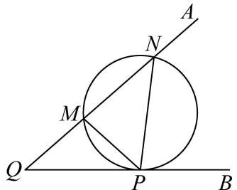

text_image

A
N
M
Q
P
B

A. 1

B.-7

C. 1 或 -7

D. 2 或 -7

【答案】A

【解析】∵M(-1,2),N(1,4)，则线段MN的中点坐标为(0,3)，易知 $k_{MN}=1$ ，

则经过M,N两点的圆的圆心在线段MN的垂直平分线y=3-x上,

设圆心为 $S(a,3-a)$ ，则圆 S 的方程为 $(x-a)^{2}+(y-3+a)^{2}=2(1+a^{2})$ ，

当 $\angle MPN$ 取最大值时, 圆 S 必与 x 轴相切于点 P(由题中结论得),

则此时 P 的坐标为 $(a,0)$ ,

代入圆 S 的方程得

$2(1+a^{2})=(a-3)^{2}$ , 解得 a=1 或 a=-7,

即对应的切点分别为 $P(1,0)$ 和 $P'(-7,0)$ ,

因为对于定长的弦在优弧上所对的圆周角会随着圆的半径减小而角度增大，

又过点 M, N, P' 的圆的半径大于过点 M, N, P 的圆的半径,

所以 $\angle MPN > \angle MP'N$ ，故点 $P(1,0)$ 为所求，即点 P 的横坐标为 1.

故选：A

1539 (2024·全国·高三专题练习)设 $\triangle ABC$ 中, 内角 A, B, C 所对的边分别为 a, b, c, 且 $a\cos B - b\cos A = \frac{3}{5}c$ , 则 $\tan(A - B)$ 的最大值为 ()

A. $\frac{3}{5}$

B. $\frac{1}{3}$

C. $\frac{3}{8}$

D. $\frac{3}{4}$

【答案】D

【解析】在 $\triangle ABC$ 中, 由正弦定理及 $a\cos B - b\cos A = \frac{3}{5}c$ 得: $\sin A\cos B - \sin B\cos A = \frac{3}{5}\sin C = \frac{3}{5}\sin(A + B)$ ,

即 $5(\sin A\cos B - \sin B\cos A) = 3(\sin A\cos B + \sin B\cos A)$ ，整理得： $\sin A\cos B = 4\cos A\sin B$ ，

即 $\tan A = 4\tan B$ ，因 $0 < B < \pi$ ，则 $\tan B > 0$ ，否则 B 为钝角，A 也为钝角，矛盾，

$$
\tan (A - B) = \frac {\tan A - \tan B}{1 + \tan A \tan B} = \frac {3 \tan B}{1 + 4 \tan^ {2} B} = \frac {3}{\frac {1}{\tan B} + 4 \tan B} \leqslant \frac {3}{2 \sqrt {\frac {1}{\tan B} \cdot 4 \tan B}} =
$$

$\frac{3}{4}$ ,

当且仅当 $\frac{1}{\tan B}=4\tan B$ ，即 $\tan B=\frac{1}{2}$ 时取等号，所以 $\tan(A-B)$ 的最大值为 $\frac{3}{4}$ .
故选：D

1540 (2024·江西上饶·高三上饶中学校考期中)在 $\triangle ABC$ 中, 内角 A, B, C 所对的边分别为 a, b, c, 且 $a\cos B - b\cos A = \frac{1}{2}c$ , 当 $\tan(A - B)$ 取最大值时, 角 C 的值为

A. $\frac{\pi}{2}$

B. $\frac{\pi}{6}$

C. $\frac{\pi}{3}$

D. $\frac{\pi}{4}$

【答案】A

【解析】由正弦定理得 $\sin A\cos B - \cos A\sin B = \frac{1}{2}\sin C = \frac{1}{2}\sin(B + A)$ ，化简得 $\tan A = 3\tan B.\tan(A - B) = \frac{\tan A - \tan B}{1 + \tan A \cdot \tan B} = \frac{2\tan B}{1 + 3\tan^{2}B} = \frac{2}{\frac{1}{\tan B} + 3\tan B} \leqslant$

$\frac{2}{2\sqrt{\frac{1}{\tan B}\cdot 3\tan B}} = \frac{\sqrt{3}}{3}$ 当且仅当 $\frac{1}{\tan B} = 3\tan B$ 时等号成立，由于 $A > B$ 故 $B$ 为锐

角，故 $\tan B = \frac{\sqrt{3}}{3},\tan A = \sqrt{3}$ ，所以 $A = \frac{\pi}{3},B = \frac{\pi}{6},C = \frac{\pi}{3}.$ 故选A.

1541 (2024·河南信阳·高一信阳高中校考阶段练习)最大视角问题是1471年德国数学家米勒提出的几何极值问题,故最大视角问题一般称为“米勒问题”.如图,树顶A离地面12米,树上另一点B离地面8米,若在离地面2米的C处看此树,则 $\tan\angle ACB$ 的最大值为()

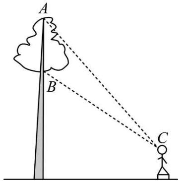

text_image

A
B
C

A. $\frac{\sqrt{5}}{5}$

B. $\frac{\sqrt{10}}{10}$

C. $\frac{\sqrt{15}}{15}$

D. $\frac{\sqrt{20}}{20}$

【答案】C

【解析】如图, 过点 C 作 CD ⊥ AB, 交 AB 于点 D, 则 AB = 4, AD = 10, BD = 6.

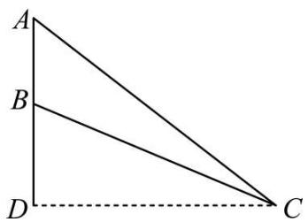

text_image

A
B
D
C

设 $\angle \mathrm{BCD} = \alpha, \mathrm{CD} = x, x > 0$ ，在 Rt△BCD 中， $\tan \alpha = \frac{\mathrm{BD}}{\mathrm{CD}} = \frac{6}{x}$ .

在 Rt△ACD 中， $\tan\angle ACD=\frac{AD}{CD}=\frac{10}{x}$

所以 $\tan\angle ACB=\tan(\angle ACD-\alpha)=\frac{\frac{10}{x}-\frac{6}{x}}{1+\frac{10}{x}\times\frac{6}{x}}=\frac{4}{x+\frac{60}{x}}\leqslant\frac{4}{2\sqrt{x\times\frac{60}{x}}}=\frac{\sqrt{15}}{15}$

当且仅当 $x=\frac{60}{x}$ ，即 $x=2\sqrt{15}$ 时取等号.

故选：C.

1542 (2024·江苏扬州·高一统考期中)如图:已知树顶A离地面 $\frac{21}{2}$ 米,树上另一点B离地面 $\frac{11}{2}$ 米,某人在离地面 $\frac{3}{2}$ 米的C处看此树,则该人离此树()米时,看A、B的视角最大.

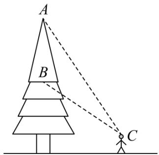

text_image

A
B
C

A. 4

B. 5

C. 6

D. 7

【答案】C

【解析】如图建立平面直角坐标系,则 $A\left(0,\frac{21}{2}\right)$ , $B\left(0,\frac{11}{2}\right)$ , 设 $C\left(x,\frac{3}{2}\right)(x>0)$ ,

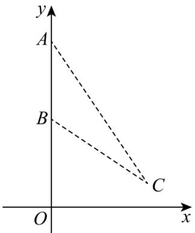

text_image

y
A
B
C
O
x

则 $\overrightarrow{CA}=(-x,9),\overrightarrow{CB}=(-x,4)$ ,

则 $\cos \angle ACB = \frac{\overrightarrow{CA} \cdot \overrightarrow{CB}}{|\overrightarrow{CA}| \cdot |\overrightarrow{CB}|} = \frac{x^2 + 36}{\sqrt{x^2 + 16} \cdot \sqrt{x^2 + 81}}$

$$
= \frac {1}{\sqrt {\frac {(x ^ {2} + 1 6) (x ^ {2} + 8 1)}{(x ^ {2} + 3 6) ^ {2}}}} = \frac {1}{\sqrt {1 + \frac {2 5}{x ^ {2} + 3 6} - \frac {9 0 0}{(x ^ {2} + 3 6) ^ {2}}}} \geqslant \frac {1 2}{1 3}
$$

又 $0 < \angle ACB < \pi$ ，且余弦函数在 $(0, \pi)$ 单调递减，

则当 $\frac{1}{x^2 + 36} = \frac{1}{72}$ , 即 $x = 6$ 时 $\angle \mathrm{ACB}$ 最大.

即该人离此树6米时,看A、B的视角最大.

故选：C

# 14 题型十四: 费马点、布洛卡点、拿破仑三角形问题

1543 (2024·重庆沙坪坝·高一重庆南开中学校考阶段练习)△ABC内一点O,满足∠OAC=∠OBA=∠OCB,则点O称为三角形的布洛卡点.王聪同学对布洛卡点产生兴趣,对其进行探索得到许多正确结论,比如∠BOC=π-∠ABC=∠BAC+∠ACB,请你和他一起解决如下问题:

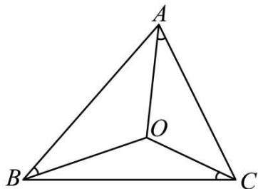

text_image

A
O
B
C

(1) 若 $a, b, c$ 分别是 A, B, C 的对边, $\angle \mathrm{CAO} = \angle \mathrm{BAO} = \angle \mathrm{OBA} = \angle \mathrm{OCB}$ , 证明: $a^2 = bc$ ;  
(2) 在 (1) 的条件下, 若 $\triangle ABC$ 的周长为 4 , 试把 $\overrightarrow{AB} \cdot \overrightarrow{AC}$ 表示为 $a$ 的函数 $f(a)$ , 并求 $\overrightarrow{AB} \cdot \overrightarrow{AC}$ 的取值范围.

【解析】(1) 设 $\angle CAO = \angle BAO = \angle OAB = \angle BCO = \alpha$ ,

在 $\triangle \mathrm{BOC}$ 和 $\triangle \mathrm{AOB}$ 中，由正弦定理得 $\frac{a}{\sin\angle \mathrm{BOC}} = \frac{\mathrm{OB}}{\sin\alpha} = \frac{\mathrm{OA}}{\sin\alpha} = \frac{c}{\sin\angle \mathrm{AOB}}$

又∵ $\sin\angle BOC=\sin(\pi-\angle ABC)=\sin\angle ABC,\sin\angle AOB=\sin(\pi-\angle BAC)=\sin\angle BAC,$

$$
\therefore \frac {a}{\sin \angle B O C} = \frac {a}{\sin \angle A B C} = \frac {c}{\sin \angle A O B} = \frac {c}{\sin \angle B A C},
$$

$$
\therefore \frac {a}{c} = \frac {\sin \angle A B C}{\sin \angle B A C}, \text {又} \frac {\sin \angle A B C}{\sin \angle B A C} = \frac {b}{a},
$$

$$
\therefore \frac {a}{c} = \frac {b}{a}, \text {   即   } a ^ {2} = b c.
$$

(2) $\overrightarrow{AB}\cdot\overrightarrow{AC}=cb\cos A=\frac{c^{2}+b^{2}-a^{2}}{2}=\frac{c^{2}+b^{2}-bc}{2}=\frac{(c+b)^{2}-3bc}{2}=\frac{(4-a)^{2}-3a^{2}}{2}$

$$
= \frac {- 2 a ^ {2} - 8 a + 1 6}{2} = - a ^ {2} - 4 a + 8, \text {即} f (a) = - a ^ {2} - 4 a + 8,
$$

又 $c, a, b$ 成等比数列，设 $b = \frac{a}{q}, c = aq$ （公比 $q \geqslant 1$ ） $(b \leqslant a \leqslant c)$ ，

$\therefore \left\{ \begin{array}{l} q \geqslant 1 \\ a + \frac{a}{q} > aq \end{array} \right.$ , 解得: $1 \leqslant q < \frac{\sqrt{5} + 1}{2}$ , 又 $a + \frac{a}{q} + aq = 4$ , 得 $a = \frac{4}{q + \frac{1}{q} + 1}$ ,

由 $y = x + \frac{1}{x}$ 且 $x \in \left[1, \frac{\sqrt{5} + 1}{2}\right)$ ，则 $y' = 1 - \frac{1}{x^{2}} \geqslant 0$ ，故 y 在 $x \in \left[1, \frac{\sqrt{5} + 1}{2}\right)$ 上递增，

所以 a 在 $q \in \left[1, \frac{\sqrt{5} + 1}{2}\right)$ 上为减函数，易知 $a \in \left(\sqrt{5} - 1, \frac{4}{3}\right]$ ,

$$
\therefore \overrightarrow {A B} \cdot \overrightarrow {A C} = - (a + 2) ^ {2} + 1 2 \in \left[ \frac {8}{9}, 6 - 2 \sqrt {5}\right)
$$

1544 (2024·浙江宁波·高一慈溪中学校联考期末)十七世纪法国数学家皮埃尔·德·费马提出的一个著名的几何问题:“已知一个三角形,求作一点,使其与这个三角形的三个顶点的距离之和最小”.它的答案是:当三角形的三个角均小于 $120^{\circ}$ 时,所求的点为三角形的正等角中心,即该点与三角形的三个顶点的连线两两成角 $120^{\circ}$ ;当三角形有一内角大于或等于 $120^{\circ}$ 时,所求点为三角形最大内角的顶点.在费马问题中所求的点称为费马点,已知在△ABC中,已知 $C=\frac{2}{3}\pi$ ,AC=1,BC=2,且点M在AB线段上,且满足CM=BM,若点P为△AMC的费马点,则 $\overrightarrow{PA}\cdot\overrightarrow{PM}+\overrightarrow{PM}\cdot\overrightarrow{PC}+\overrightarrow{PA}\cdot\overrightarrow{PC}=$

A.-1

B. $-\frac{4}{5}$

C. $-\frac{3}{5}$

D. $-\frac{2}{5}$

【答案】C

【解析】因为 $C=\frac{2}{3}\pi$ , AC=1, BC=2,

由余弦定理可得 $AB=\sqrt{AC^{2}+CB^{2}-2AC\cdot CB\cos C}=\sqrt{7}$

由正弦定理 $\frac{AC}{\sin B} = \frac{AB}{\sin C}$ ，即 $\frac{1}{\sin B} = \frac{\sqrt{7}}{\frac{\sqrt{3}}{2}}$ ，所以 $\sin B = \frac{\sqrt{21}}{14}$ ，

显然 B 为锐角, 所以 $\cos B = \sqrt{1 - \sin^{2}B} = \frac{5\sqrt{7}}{14}$ ,

设 $\mathrm{CM} = \mathrm{BM} = x$ ，则 $\mathrm{CM}^2 = \mathrm{CB}^2 +\mathrm{BM}^2 -2\mathrm{CB}\cdot \mathrm{BM}\cos \mathrm{C}$ ，即 $x^{2} = 2^{2} + x^{2} - \frac{10\sqrt{7}}{7} x,$

解得 $x=\frac{2\sqrt{7}}{5}$ ，即 BM= $\frac{2}{5}$ AB，

所以 $AM=\frac{3}{5}AB=\frac{3\sqrt{7}}{5}$ ,

所以 $S_{\triangle AMC}=\frac{3}{5}S_{\triangle ABC}=\frac{3}{5}\times\frac{1}{2}\times1\times2\times\frac{\sqrt{3}}{2}=\frac{3\sqrt{3}}{10}$ ,

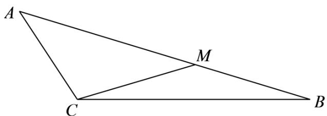

text_image

A
M
C
B

又 $\cos \angle AMC = \frac{AM^2 + CM^2 - AC^2}{2AM\cdot CM} >0$ ，即 $\angle AMC$ 为锐角，

所以 $\triangle AMC$ 的三个内角均小于 $120^{\circ}$ ，则 P 为三角形的正等角中心，

所以 $S_{\triangle AMC}=\frac{1}{2}\left|\overrightarrow{PA}\right|\cdot\left|\overrightarrow{PM}\right|\sin\frac{2\pi}{3}+\frac{1}{2}\left|\overrightarrow{PM}\right|\cdot\left|\overrightarrow{PC}\right|\sin\frac{2\pi}{3}+\frac{1}{2}\left|\overrightarrow{PA}\right|\cdot\left|\overrightarrow{PC}\right|\sin\frac{2\pi}{3}$

$$
= \frac {\sqrt {3}}{4} \left(\left| \overrightarrow {\mathrm{PA}} \right| \cdot \left| \overrightarrow {\mathrm{PM}} \right| + \left| \overrightarrow {\mathrm{PM}} \right| \cdot \left| \overrightarrow {\mathrm{PC}} \right| + \left| \overrightarrow {\mathrm{PA}} \right| \cdot \left| \overrightarrow {\mathrm{PC}} \right|\right) = \frac {3 \sqrt {3}}{1 0},
$$

所以 $\left|\overrightarrow{PA}\right|\cdot\left|\overrightarrow{PM}\right|+\left|\overrightarrow{PM}\right|\cdot\left|\overrightarrow{PC}\right|+\left|\overrightarrow{PA}\right|\cdot\left|\overrightarrow{PC}\right|=\frac{6}{5}$

因为 $\overrightarrow{PA} \cdot \overrightarrow{PM} + \overrightarrow{PM} \cdot \overrightarrow{PC} + \overrightarrow{PA} \cdot \overrightarrow{PC}$

$$
= | \overrightarrow {\mathrm{PA}} | \cdot | \overrightarrow {\mathrm{PM}} | \cos \frac {2 \pi}{3} + | \overrightarrow {\mathrm{PM}} | \cdot | \overrightarrow {\mathrm{PC}} | \cos \frac {2 \pi}{3} + | \overrightarrow {\mathrm{PA}} | \cdot | \overrightarrow {\mathrm{PC}} | \cos \frac {2 \pi}{3}
$$

$$
\begin{array}{l} = - \frac {1}{2} \left(\left| \overrightarrow {\mathrm{PA}} \right| \cdot \left| \overrightarrow {\mathrm{PM}} \right| + \left| \overrightarrow {\mathrm{PM}} \right| \cdot \left| \overrightarrow {\mathrm{PC}} \right| + \left| \overrightarrow {\mathrm{PA}} \right| \cdot \left| \overrightarrow {\mathrm{PC}} \right|\right) \\ = - \frac {1}{2} \times \frac {6}{5} = - \frac {3}{5}. \\ \end{array}
$$

故选：C

1545 (2024·全国·高三专题练习)点 P 在 $\triangle ABC$ 所在平面内一点, 当 PA + PB + PC 取到最小值时, 则称该点为 $\triangle ABC$ 的“费马点”. 当 $\triangle ABC$ 的三个内角均小于 $120^{\circ}$ 时, 费马点满足如下特征: $\angle APB = \angle BPC = \angle CPA = 120^{\circ}$ . 如图, 在 $\triangle ABC$ 中, $AB = AC = \sqrt{7}$ , BC = $\sqrt{3}$ , 则其费马点到 A, B, C 三点的距离之和为 ( )

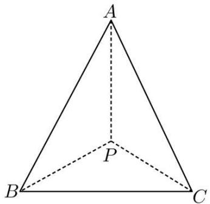

text_image

A
P
B
C

A. 4

B. 2

C. $2 - 2\sqrt{3}$

D. $2 + \sqrt{3}$

【答案】A

【解析】根据题意, $\triangle ABC$ 为等腰三角形,

$$
\because \angle A P B = \angle A P C = \angle B P C = 1 2 0 ^ {\circ}, \therefore P B = P C,
$$

在 $\triangle \mathrm{PBC}$ 中, 由余弦定理可得:

$$
\mathrm{BC} ^ {2} = \mathrm{BP} ^ {2} + \mathrm{CP} ^ {2} - 2 \mathrm{BP} \cdot \mathrm{CP} \cdot \cos \angle \mathrm{BPC},
$$

即 $(\sqrt{3})^{2}=2\mathrm{BP}^{2}-2\times\left(-\frac{1}{2}\right)\mathrm{BP}^{2}$ ，解得：BP=1，

在 $\triangle ABP$ 中,由余弦定理可得:

$$
\mathrm{AB} ^ {2} = \mathrm{BP} ^ {2} + \mathrm{AP} ^ {2} - 2 \mathrm{BP} \cdot \mathrm{AP} \cdot \cos \angle \mathrm{APB},
$$

即 $(\sqrt{7})^2 = 1 + \mathrm{AP}^2 - 2 \times \left(-\frac{1}{2}\right) \times \mathrm{AP}$ , 解得: $\mathrm{AP} = 2$ ,

∴ AP + BP + CP = 4, ∴ 其费马点到 A, B, C 三点距离之和为 4.

故选：A

1546 (2024·湖南邵阳·统考三模)拿破仑·波拿巴最早提出了一个几何定理:“以任意三角形的三条边为边,向外构造三个等边三角形,则这三个等边三角形的外接圆圆心恰为另一个等边三角形(此等边三角形称为拿破仑三角形)的顶点”.在 $\triangle ABC$ 中,已知 $\angle ACB=30^{\circ}$ ,且 $AC=\sqrt{3}$ ,BC=3,现以BC,AC,AB为边向外作三个等边三角形,其外接圆圆心依次记为A',B',C',则 $\triangle A'B'C'$ 的边长为()

A. 3

B. 2

C. $\sqrt{3}$

D. $\sqrt{2}$

【答案】B

【解析】如图, 连接 A'C, B'C, 由题设 $\angle A'CB' = 90^{\circ}$ ,

因为以 BC, AC, AB 为边向外作三个等边三角形, 其外接圆圆心依次记为 A', B', C',

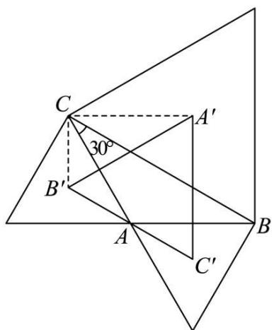

text_image

C
30°
B'
A
A'
B
C'

所以 $B^{\prime}C=\frac{2}{3}AC\sin60^{\circ}=1$ , $A^{\prime}C=\frac{2}{3}BC\sin60^{\circ}=\sqrt{3}$ , 故 $A^{\prime}B^{\prime}=2$ .

故选: B.

1547 (2024·河南·高一校联考期末)几何定理:以任意三角形的三条边为边,向外构造三个等边三角形,则这三个等边三角形的外接圆圆心恰为另一个等边三角形(称为拿破仑三角形)的顶点.在 $\triangle ABC$ 中,已知 $C=\frac{\pi}{6}$ , $AC=\sqrt{3}$ ,外接圆的半径为 $\sqrt{3}$ ,现以其三边向外作三个等边三角形,其外接圆圆心依次记为 $A',B',C'$ ,则 $\triangle A'B'C'$ 的面积为()

A. 3

B. 2

C. $\sqrt{3}$

D. $\sqrt{2}$

【答案】C

【解析】 $\triangle ABC$ 中， $\frac{AB}{\sin C}=2\sqrt{3}$ ，故 $AB=\sqrt{3}$ ， $AC=\sqrt{3}$ ，

故 $B=C=\frac{\pi}{6}$ ， $A=\frac{2\pi}{3}$ ， $CB=2\sqrt{3}\times\sin\frac{2\pi}{3}=3$ ，

外接圆圆心为对应等边三角形的中心,如图所示,连接B'C,C'C,

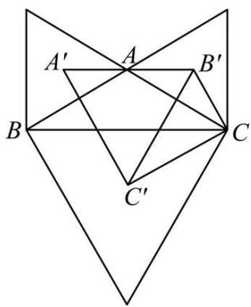

text_image

A'
A
B'
B
C
C'

则 $\angle B^{\prime}CA = \angle ACB = \angle BCC' = \frac{\pi}{6}$ ，故 $\angle B^{\prime}CC' = \frac{\pi}{2}$ ，

$B^{\prime}C=\frac{2}{3}\times\sqrt{3}\times\frac{\sqrt{3}}{2}=1,\quad C^{\prime}C=\frac{2}{3}\times3\times\frac{\sqrt{3}}{2}=\sqrt{3},$ 故 $B^{\prime}C^{\prime}=\sqrt{1+3}=2,$

$\angle C^{\prime}B^{\prime}C=\frac{\pi}{3},\angle A^{\prime}BC^{\prime}=\frac{2\pi}{3},$ 则 $\angle A^{\prime}B^{\prime}C^{\prime}=\frac{\pi}{3},$

根据对称性知: $A'C' = B'C'$ , 故 $\triangle A'B'C'$ 为等边三角形,

其面积 $S=\frac{1}{2}\times2\times2\times\frac{\sqrt{3}}{2}=\sqrt{3}$ .

故选：C.

# 15 题型十五:托勒密定理及旋转相似

1548 (2024·江苏淮安·高一校联考期中)托勒密是古希腊天文学家、地理学家、数学家,托勒密定理就是由其名字命名,该定理原文:圆的内接四边形中,两对角线所包矩形的面积等于一组对边所包矩形的面积与另一组对边所包矩形的面积之和.其意思为:圆的内接凸四边形两对对边乘积的和等于两条对角线的乘积.从这个定理可以推出正弦、余弦的和差公式及一系列的三角恒等式,托勒密定理实质上是关于共圆性的基本性质.已知四边形ABCD的四个顶点在同一个圆的圆周上,AC、BD是其两条对角线,BD=4√3,且△ACD为正三角形,则四边形ABCD的面积为()

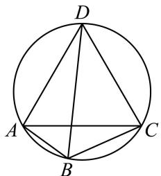

text_image

D
A
B
C

A. $16 \sqrt{3}$

B. 16

C. $12 \sqrt{3}$

D. 12

【答案】C

【解析】设 AC = AD = CD = a，由托勒密定理可知 AB · CD + AD · BC = AC · BD，即 $a \cdot AB + a \cdot BC = a \cdot BD$ ，所以，AB + BC = BD = $4\sqrt{3}$ ，

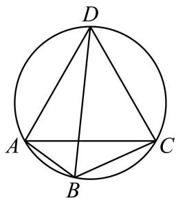

text_image

D
A
B
C

又因为 $\angle ABD = \angle ACD = \frac{\pi}{3},\angle CBD = \angle CAD = \frac{\pi}{3},$

因此， $S_{四边形ABCD}=S_{\triangle ABD}+S_{\triangle BCD}=\frac{1}{2}AB\cdot BD\sin\frac{\pi}{3}+\frac{1}{2}BC\cdot BD\sin\frac{\pi}{3}$

$$
= \frac {\sqrt {3}}{4} (\mathrm{AB} + \mathrm{BC}) \cdot \mathrm{BD} = \frac {\sqrt {3}}{4} \times (4 \sqrt {3}) ^ {2} = 1 2 \sqrt {3}.
$$

故选：C.

1549 (2024·全国·高三专题练习)托勒密是古希腊天文学家、地理学家、数学家,托勒密定理就是由其名字命名,该定理原文:圆的内接四边形中,两对角线所包矩形的面积等于一组对边所包矩形的面积与另一组对边所包矩形的面积之和.其意思为:圆的内接凸四边形两对对边乘积的和等于两条对角线的乘积.从这个定理可以推出正弦、余弦的和差公式及一系列的三角恒等式,托勒密定理实质上是关于共圆性的基本性质.已知四边形ABCD的四个顶点在同一个圆的圆周上,AC、BD是其两条对角线,BD=4√2,且△ACD为正三角形,则四边形ABCD的面积为()

A. 8

B. 16

C. $8 \sqrt{3}$

D. $16 \sqrt{3}$

【答案】C

【解析】设 $AC = AD = CD = a$ ，由托勒密定理可知 $AB \cdot CD + AD \cdot BC = AC \cdot BD$ ，即 $a \cdot AB + a \cdot BC = a \cdot BD$ ，所以， $AB + BC = BD = 4\sqrt{2}$ ，

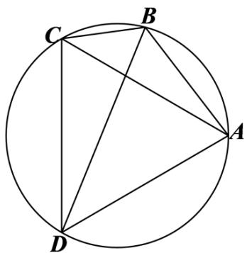

text_image

Geometric diagram of a circle with inscribed points A, B, C, D and connecting chords forming triangles

又因为 $\angle ABD = \angle ACD = \frac{\pi}{3},\angle CBD = \angle CAD = \frac{\pi}{3},$

因此， $S_{四边形ABCD}=S_{\triangle ABD}+S_{\triangle BCD}=\frac{1}{2}AB\cdot BD\sin\frac{\pi}{3}+\frac{1}{2}BC\cdot BD\sin\frac{\pi}{3}$

$$
= \frac {\sqrt {3}}{4} (\mathrm{AB} + \mathrm{BC}) \cdot \mathrm{BD} = \frac {\sqrt {3}}{4} \times (4 \sqrt {2}) ^ {2} = 8 \sqrt {3}.
$$

故选：C.

1550 (2024·全国·高三专题练习)克罗狄斯·托勒密是古希腊著名数学家、天文学家和地理学家,他在所著的《天文集》中讲述了制作弦表的原理,其中涉及如下定理:任意凸四边形中,两条对角线的乘积小于或等于两组对边乘积之和,当且仅当凸四边形的对角互补时取等号,后人称之为托勒密定理的推论.如图,四边形ABCD内接于半径为 $2\sqrt{3}$ 的圆, $\angle A=120^{\circ}$ , $\angle B=45^{\circ}$ ,AB=AD,则四边形ABCD的周长为()

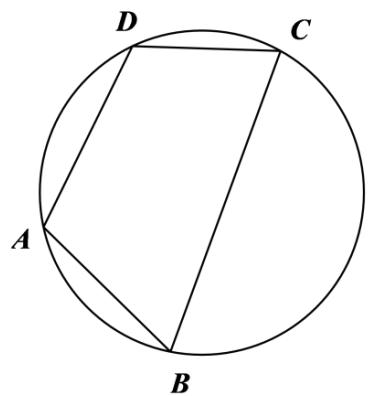

text_image

D
C
A
B

A. $4 \sqrt{3} + 6 \sqrt{2}$

B. $10 \sqrt{3}$

C. $4 \sqrt{3} + 4 \sqrt{2}$

D. $4\sqrt{3}+5\sqrt{2}$

【答案】A

【解析】连接 AC, BD.

由 $\angle A = 120^{\circ}$ ， $\angle B = 45^{\circ}$ 及正弦定理，得 $\frac{\mathrm{BD}}{\sin\angle BAD} = \frac{\mathrm{AC}}{\sin\angle ABC} = 4\sqrt{3}$

解得 $\mathrm{BD} = 6, \mathrm{AC} = 2\sqrt{6}$ .

在 $\triangle ABD$ 中， $\angle BAD = 120^{\circ}$ ，AB = AD，BD = 6，

所以 AB = AD = $2\sqrt{3}$ .

因为四边形 ABCD 内接于半径为 $2\sqrt{3}$ 的圆，

它的对角互补,所以 $AC \cdot BD = AB \cdot DC + AD \cdot BC$ ,

所以 $12\sqrt{6}=2\sqrt{3}(BC+CD)$ ，所以 $BC+CD=6\sqrt{2}$ ，

所以四边形 ABCD 的周长为 $4\sqrt{3} + 6\sqrt{2}$ .

故选：A.

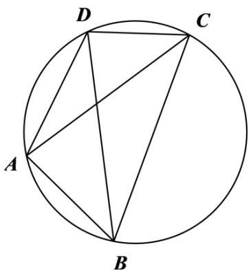

text_image

D
C
A
B

1551 (2024·江苏·高一专题练习)凸四边形就是没有角度数大于 $180^{\circ}$ 的四边形,把四边形任何一边向两方延长,其他各边都在延长所得直线的同一旁,这样的四边形叫做凸四边形,如图,在凸四边形ABCD中, $AB=1,BC=\sqrt{3},AC\perp CD,AD=2AC$ ,当 $\angle ABC$ 变化时,对角线BD的最大值为()

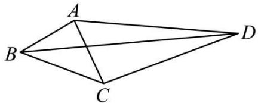

natural_image

Geometric diagram of a quadrilateral ABCD with diagonal AC, no text or labels present

A. 4

B. $\sqrt{13}$

C. $3 \sqrt{3}$

D. $\sqrt{7+2\sqrt{3}}$

【答案】C

【解析】设 $\angle ABC = \alpha, \angle ACB = \beta, AB = 1, BC = \sqrt{3}$ ,

在 $\triangle ABC$ 中，由余弦定理，得 $AC^2 = AB^2 + BC^2 - 2AB \times BC \times \cos \alpha = 4 - 2\sqrt{3}\cos \alpha$

由正弦定理, 得 $\frac{AC}{\sin\alpha} = \frac{AB}{\sin\beta}, \therefore \sin\beta = \frac{\sin a}{\sqrt{4 - 2\sqrt{3}}\cos a}.$

$$
\because \mathrm{AC} \perp \mathrm{CD}, \mathrm{AD} = 2 \mathrm{AC}, \mathrm{CD} = \sqrt {3} \mathrm{AC} = \sqrt {3} \cdot \sqrt {4 - 2 \sqrt {3} \cos a},
$$

在 $\triangle BCD$ 中, 由余弦定理, 得 $BD^{2} = BC^{2} + CD^{2} - 2BC \times CD \times \cos\left(\beta + \frac{\pi}{2}\right)$ ,

$$
\therefore \mathrm{BD} ^ {2} = 3 + 3 (4 - 2 \sqrt {3} \cos \alpha) + 2 \times \sqrt {3} \times \sqrt {3} \sqrt {4 - 2 \sqrt {3} \cos \alpha} \times \sin \beta
$$

$$
= 1 5 - 6 \sqrt {3} \cos \alpha + 6 \sqrt {4 - 2 \sqrt {3} \cos \alpha} \times \frac {\sin a}{\sqrt {4 - 2 \sqrt {3} \cos a}}
$$

$$
= 1 5 - 6 \sqrt {3} \cos \alpha + 6 \sin \alpha
$$

$$
= 1 5 + 1 2 \sin \left(a - \frac {\pi}{3}\right),
$$

当 $a - \frac{\pi}{3} = \frac{\pi}{2}$ ，即 $a = \frac{5\pi}{6}$ 时， $BD^{2}$ 取得最大值，为 27，

即 BD 的最大值为 $3\sqrt{3}$ .

故选：C.

1552 (2024·江苏无锡·高一江苏省江阴市第一中学校考阶段练习)在 $\triangle ABC$ 中, $BC = \sqrt{2}$ , AC = 1, 以 AB 为边作等腰直角三角形 ABD(B 为直角顶点, C, D 两点在直线 AB 的两侧). 当角 C 变化时, 线段 CD 长度的最大值是 ( )

A. 3

B. 4

C. 5

D. 9

【答案】A

【解析】 $\triangle ABC$ 中， $BC=\sqrt{2}$ ，AC=1， $\because AB=BD$ ，

∴在△ABC中,由正弦定理得: $\frac{AC}{\sin\angle ABC}=\frac{AB}{\sin\angle ACB}=\frac{BD}{\sin\angle ACB}$ ,

$$
\therefore \mathrm{BD} \sin \angle \mathrm{ABC} = \sin \angle \mathrm{ACB},
$$

在 $\triangle BCD$ 中， $CD^{2}=BD^{2}+BC^{2}-2BD\cdot BC\cdot\cos(90^{\circ}+\angle ABC)$

$$
= \mathrm{AB} ^ {2} + 2 + 2 \mathrm{AB} \cdot \sqrt {2} \cdot \sin \angle \mathrm{ABC}
$$

$$
= \left(\mathrm{AC} ^ {2} + \mathrm{BC} ^ {2} - 2 \mathrm{AC} \cdot \mathrm{BC} \cdot \cos \angle \mathrm{ACB}\right) + 2 + 2 \sqrt {2} \cdot \mathrm{ABsin} \angle \mathrm{ABC}
$$

$$
= (1 + 2 - 2 \sqrt {2} \cos \angle A C B) + 2 + 2 \sqrt {2} \cdot B D \sin \angle A B C
$$

$$
= (1 + 2 - 2 \sqrt {2} \cos \angle A C B) + 2 + 2 \sqrt {2} \cdot \sin \angle A C B
$$

$$
= 5 + 2 \sqrt {2} \cdot \sin \angle A C B - 2 \sqrt {2} \cos \angle A C B
$$

$$
= 5 + 4 \sin (\angle A C B - 4 5 ^ {\circ}),
$$

∴ 当 $\angle ACB = 135^{\circ}$ 时 $CD^{2}$ 最大为 9，故 CD 最大值为 3，

故选：A

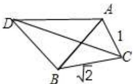

text_image

D
A
1
B
√2
C

1553 (2024·全国·高一专题练习)在 $\triangle ABC$ 中, $BC = \sqrt{2}$ , AC = 1, 以 AB 为边作等腰直角三角形 ABD(B 为直角顶点, C、D 两点在直线 AB 的两侧). 当 $\angle C$ 变化时, 线段 CD 长的最大值为 ()

A. 1

B. 2

C. 3

D. 4

【答案】C

【解析】方法一:如图,将 $\triangle BCD$ 绕点B顺时针旋转 $90^{\circ}$ ,得到 $\triangle BHA$ ,连接CH,

$$
\therefore \triangle B C D \cong \triangle B H A, \angle C B H = \angle D B A = 9 0 ^ {\circ},
$$

∵ 在 $\triangle ABC$ 中, $BC = \sqrt{2}$ , AC = 1,

$$
\therefore \mathrm{BC} = \mathrm{BH} = \sqrt {2}, \mathrm{CD} = \mathrm{AH},
$$

$$
\therefore \mathrm{CH} = \sqrt {2} \mathrm{BC} = 2,
$$

在 $\triangle ACH$ 中，AH < AC + CH ，

∴ 当点 C 在 AH 上时, 即 A、C、H 三点共线, 此时 AH 有的最大值,

AH的最大值为: AC + CH = 1 + 2 = 3 ,

$$
\because \mathrm{CD} = \mathrm{AH},
$$

∴ CD 的最大值为: 3.

故选：C.

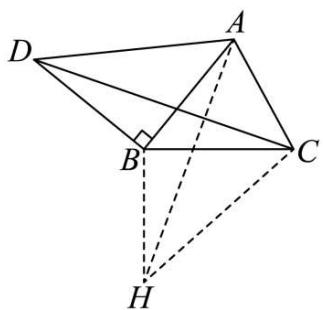

text_image

Geometric diagram with labeled points A, B, C, D, H and right angle at B, showing solid and dashed lines for construction.

方法二:如图,设 $\angle CBA = \alpha$ , AB = BD = a,

在 $\triangle BCD$ 中, 由余弦定理可知: $CD^{2}=2+a^{2}+2\sqrt{2}a\sin\alpha$ ,

在 $\triangle ABC$ 中，由余弦定理可知： $\cos \alpha = \frac{a^2 + 1}{2\sqrt{2}a}$ ，

由同角关系可得: $\sin\alpha=\frac{\sqrt{-a^{4}+6a^{2}-1}}{2\sqrt{2}a}$ ，

$$
\therefore \mathrm{CD} ^ {2} = 2 + a ^ {2} + \sqrt {- a ^ {4} + 6 a ^ {2} - 1},
$$

令 $t = 2 + a^2$

则 $\mathrm{CD}^2 = t + \sqrt{-t^2 + 10t - 17}$

$$
= t + \sqrt {- (t - 5) ^ {2} + 8}
$$

$$
= (t - 5) + \sqrt {- (t - 5) ^ {2} + 8} + 5
$$

$$
\leqslant \sqrt {2} \cdot \sqrt {(t - 5) ^ {2} + [ - (t - 5) ^ {2} + 8 ]} + 5 = 9,
$$

当 $(t-5)^{2}=4$ 时等号成立.

∴ CD 的最大值为: 3.

故选：C.

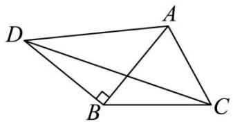

text_image

Geometric diagram of quadrilateral ABCD with right angle at B and diagonal BD

1554 (2024·全国·高三专题练习)如图所示,在平面四边形ABCD中, AB=1, BC=2, △ACD为正三角形,则△BCD面积的最大值为()

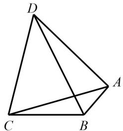

natural_image

Geometric diagram of a tetrahedron with vertices labeled A, B, C, D (no text or symbols beyond labels)

A. $2 \sqrt{3} + 2$

B. $\frac{\sqrt{3}+1}{2}$

C. $\frac{\sqrt{3}}{2}+2$

D. $\sqrt{3} + 1$

【答案】D

【解析】在 $\triangle ABC$ 中,设 $\angle ABC=\alpha,\angle ACB=\beta$ ,

由余弦定理得: $AC^{2}=1^{2}+2^{2}-2\times1\times2\cos\alpha$ ,

∵△ACD为正三角形，

$$
\therefore \mathrm{CD} ^ {2} = \mathrm{AC} ^ {2} = 5 - 4 \cos \alpha ,
$$

$$
\mathrm{S} _ {\triangle \mathrm{BCD}} = \frac {1}{2} \cdot 2 \cdot \mathrm{CD} \cdot \sin \left(\frac {\pi}{3} + \beta\right) = \mathrm{CD} \cdot \sin \left(\frac {\pi}{3} + \beta\right),
$$

$$
= \frac {\sqrt {3}}{2} \mathrm{CD} \cdot \cos \beta + \frac {1}{2} \mathrm{CD} \cdot \sin \beta ,
$$

在 $\triangle ABC$ 中，由正弦定理： $\frac{1}{\sin\beta} = \frac{AC}{\sin\alpha}$

$$
\therefore \mathrm{AC} \cdot \sin \beta = \sin \alpha ,
$$

$$
\therefore \mathrm{CD} \cdot \sin \beta = \cos \alpha ,
$$

$$
\therefore (\mathrm{CD} \cdot \cos \beta) ^ {2} = \mathrm{CD} ^ {2} (1 - \sin^ {2} \beta) = \mathrm{CD} ^ {2} - \sin^ {2} \alpha ,
$$

$$
= 5 - 4 \cos \alpha - \sin^ {2} \alpha = (2 - \cos \alpha) ^ {2},
$$

$$
\because \beta <   \angle B A C, \therefore \beta \text {为锐角}, C D \cdot \cos \beta = 2 - \cos \alpha ,
$$

$$
\therefore \mathrm{S} _ {\triangle \mathrm{BCD}} = \frac {\sqrt {3}}{2} \mathrm{CD} \cdot \cos \beta + \frac {1}{2} \mathrm{CD} \cdot \sin \beta ,
$$

$$
= \frac {\sqrt {3}}{2} \cdot (2 - \cos \alpha) + \frac {1}{2} \sin \alpha = \sqrt {3} + \sin \left(\alpha - \frac {\pi}{3}\right),
$$

当 $\alpha=\frac{5\pi}{6}$ 时， $(S_{\Delta BCD})_{\max}=\sqrt{3}+1.$

# 题型十六:三角形中的平方问题

1555 (2024·全国·高三专题练习)已知 $\triangle ABC$ 的三边分别为 a, b, c，若满足 $a^{2} + b^{2} + 2c^{2} = 8$ ，则 $\triangle ABC$ 面积的最大值为（）

A. $\frac{\sqrt{5}}{5}$

B. $\frac{2\sqrt{5}}{5}$

C. $\frac{3\sqrt{5}}{5}$

D. $\frac{\sqrt{5}}{3}$

【答案】B

【解析】根据 $a^{2}+b^{2}+2c^{2}=8$ ，得到 $a^{2}+b^{2}=8-2c^{2}$ ，由余弦定理得到 $2ab\cos C=8-3c^{2}$ ，由正弦定理得到 $2absinC=4S$ ，两式平方相加得 $4(ab)^{2}=(8-3c^{2})^{2}+(4S)^{2}$ ，而 $a^{2}+b^{2}=8-2c^{2}\geqslant2ab$ ，两式结合有 $(4S)^{2}\leqslant(8-2c^{2})^{2}-(8-3c^{2})^{2}=(16-5c^{2})c^{2}$ ，再用基本不等式求解。因为 $a^{2}+b^{2}+2c^{2}=8$ ，

所以 $a^{2}+b^{2}=8-2c^{2}$ ,

由余弦定理得 $\cos C = \frac{a^{2} + b^{2} - c^{2}}{2ab} = \frac{8 - 3c^{2}}{2ab}$ ,

即 $2ab\cos C = 8 - 3c^{2}$ ①

由正弦定理得 $S=\frac{1}{2}ab\sin C$ ,

即 $2ab\sin C = 4S$ ②

由①,②平方相加得 $4(ab)^{2}=(8-3c^{2})^{2}+(4S)^{2}\leqslant(a^{2}+b^{2})^{2}=(8-2c^{2})^{2}$ ,

所以 $(4\mathrm{S})^2 \leqslant (8 - 2c^2)^2 - (8 - 3c^2)^2 = (16 - 5c^2)c^2 \leqslant \frac{1}{5}\left(\frac{16 - 5c^2 + 5c^2}{2}\right)^2 = \frac{64}{5},$

即 $S^{2} \leqslant \frac{4}{5}$ ，所以 $S \leqslant \frac{2\sqrt{5}}{5}$ ，

当且仅当 $a^{2}=b^{2}$ 且 $16-5c^{2}=5c^{2}$ 即 $a^{2}=b^{2}=\frac{12}{5}, c^{2}=\frac{8}{5}$ 时，取等号.

故选: B

1556 (2024·全国·高三专题练习)在 $\triangle ABC$ 中, 角 A, B, C 所对的边分别为 a, b, c, 且满足 $5a^{2} + 3b^{2} = 3c^{2}$ , 则 $\sin A$ 的取值范围是 \_\_\_\_.

【答案】 $\left(0,\frac{3}{5}\right]$

【解析】由 $5a^{2}+3b^{2}=3c^{2}$ 得： $a^{2}=\frac{3c^{2}-3b^{2}}{5}$ ，

故 $\cos A = \frac{b^2 + c^2 - a^2}{2bc} = \frac{b^2 + c^2 - \frac{3c^2 - 3b^2}{5}}{2bc} = \frac{c^2 + 4b^2}{5bc} \geqslant \frac{2\sqrt{c^2 \cdot 4b^2}}{5bc} = \frac{4}{5}$

当且仅当 c=2b 时取等号，

由于 $A \in (0, \pi)$ ，故 $\frac{4}{5} \leqslant \cos A < 1$ ，

则 $\sin^{2}A=1-\cos^{2}A\in\left(0,\frac{9}{25}\right)$ ，则 $\sin A\in\left(0,\frac{3}{5}\right]$ ，

故答案为: $\left(0,\frac{3}{5}\right]$

1557 (2024·湖南常德·常德市一中校考模拟预测)秦九韶是我国南宋著名数学家,在他的著作《数书九章》中有已知三边求三角形面积的方法:“以小斜幂并大斜幂减中斜幂,余半之,自乘于上以小斜幂乘大斜幂减上,余四约之,为实一为从阳,开平方得积.”如果把以上这段文字写成公式就是 $S=\sqrt{\frac{1}{4}\left[a^{2}c^{2}-\left(\frac{a^{2}+c^{2}-b^{2}}{2}\right)^{2}\right]}$ ,其中a,b,c是△ABC的内角A,B,C的对边,若 $\sin C=2\sin A\cos B$ ,且 $b^{2}+c^{2}=4$ ,则△ABC面积S的最大值为()

A. $\frac{\sqrt{5}}{5}$

B. $\frac{2\sqrt{5}}{5}$

C. $\frac{3\sqrt{5}}{5}$

D. $\frac{4\sqrt{5}}{5}$

【答案】B

【解析】由 $\sin C = 2\sin A \cos B$ 得 $c = 2a \cdot \frac{a^{2} + c^{2} - b^{2}}{2ac}$ ，得 a = b，

所以 $S = \sqrt{\frac{1}{4}\left[a^2c^2 - \left(\frac{a^2 + c^2 - b^2}{2}\right)^2\right]} = \sqrt{\frac{1}{4}\left(b^2c^2 - \frac{c^4}{4}\right)} = \sqrt{\frac{1}{4}\left(4c^2 - c^4 - \frac{c^4}{4}\right)}$

$$
= \frac {1}{2} \sqrt {4 c ^ {2} - \frac {5 c ^ {4}}{4}} = \frac {1}{2} \sqrt {c ^ {2} \left(4 - \frac {5 c ^ {2}}{4}\right)} = \frac {1}{2} \sqrt {\frac {4}{5} \cdot \frac {5}{4} c ^ {2} \left(4 - \frac {5 c ^ {2}}{4}\right)} \leqslant \frac {1}{2} \sqrt {\frac {4}{5}} \cdot \frac {\frac {5 c ^ {2}}{4} + 4 - \frac {5 c ^ {2}}{4}}{2}
$$

$= \frac{2\sqrt{5}}{5}$ ，当且仅当 $c^2 = \frac{8}{5}, b^2 = a^2 = \frac{12}{5}$ 时，等号成立.

故选：B

1558 (2024·河南洛阳·高三校考阶段练习)△ABC的内角A，B，C的对边分别为a，b，c，若 $a^{2}+b^{2}+c^{2}=12$ ， $A=\frac{2\pi}{3}$ ，则△ABC面积的最大值为()

A. $\frac{2\sqrt{3}}{5}$

B. $\frac{3\sqrt{3}}{5}$

C. $\frac{4\sqrt{3}}{5}$

D. $\sqrt{3}$

【答案】B

【解析】由余弦定理知 $a^{2}=b^{2}+c^{2}-2bc\cos A$ ,

因为 $a^{2}+b^{2}+c^{2}=12$ 且 $A=\frac{2\pi}{3}$ ，可得 $bc\cos A+a^{2}=6$ ，即 $a^{2}=\frac{bc}{2}+6$ ，

又由 $a^2 + b^2 + c^2 = 12$ ，可得 $b^2 + c^2 + \frac{bc}{2} = 6$

因为 $b^{2}+c^{2}\geqslant2bc$ ，所以 $2bc+\frac{bc}{2}\leqslant6$ ，解得 $bc\leqslant\frac{12}{5}$ ，

当且仅当 b=c 时, 等号成立, 即 bc 的最大值为 $\frac{12}{5}$ ,

所以 $\triangle ABC$ 的面积的最大值为 $S_{\max} = \frac{1}{2} \times \frac{12}{5} \sin \frac{2\pi}{3} = \frac{3\sqrt{3}}{5}$ .

故选: B.

1559 (2024·云南·统考一模)已知 $\triangle ABC$ 的三个内角分别为 A、B、C. 若 $\sin^{2}C = 2\sin^{2}A - 3\sin^{2}B$ ，则 tanB 的最大值为 ()

A. $\frac{\sqrt{5}}{3}$

B. $\frac{\sqrt{5}}{2}$

C. $\frac{11\sqrt{5}}{20}$

D. $\frac{3\sqrt{5}}{5}$

【答案】B

【解析】依题意 $\sin^{2}C=2\sin^{2}A-3\sin^{2}B$ ,

由余弦定理得 $c^{2}=2a^{2}-3b^{2}, b^{2}=\frac{2}{3}a^{2}-\frac{1}{3}c^{2}$ ,

所以 $\cos B = \frac{a^{2} + c^{2} - b^{2}}{2ac} = \frac{a^{2} + c^{2} - \frac{2}{3}a^{2} + \frac{1}{3}c^{2}}{2ac} = \frac{\frac{1}{3}a^{2} + \frac{4}{3}c^{2}}{2ac} = \frac{1}{6} \cdot \frac{a^{2} + 4c^{2}}{ac}$

$\geqslant\frac{1}{6}\cdot\frac{2\sqrt{a^{2}\cdot4c^{2}}}{ac}=\frac{2}{3}$ ，当且仅当a=2c时等号成立.

即 B 为锐角， $\frac{2}{3}\leqslant\cos B<1,\frac{4}{9}\leqslant\cos^{2}B<1,1<\frac{1}{\cos^{2}B}\leqslant\frac{9}{4}$

$$
\tan^ {2} \mathrm{B} = \frac {\sin^ {2} \mathrm{B}}{\cos^ {2} \mathrm{B}} = \frac {1 - \cos^ {2} \mathrm{B}}{\cos^ {2} \mathrm{B}} = \frac {1}{\cos^ {2} \mathrm{B}} - 1 \in \left(0, \frac {5}{4} \right],
$$

所以 $\tan B$ 的最大值为 $\frac{\sqrt{5}}{2}$ .

故选: B

1560 (2024·四川遂宁·高一射洪中学校考阶段练习)设△ABC的内角A，B，C所对的边a，

b, c 满足 $b^{2}=ac$ ，则 $\frac{\sin A+\cos A\tan C}{\sin B+\cos B\tan C}$ 的取值范围（）

A. $\left(\frac{\sqrt{5}-1}{2},\frac{\sqrt{5}+1}{2}\right)$

B. $\left(\frac{3-\sqrt{5}}{2},\frac{3+\sqrt{5}}{2}\right)$

C. $\left(\frac{\sqrt{5}-1}{2},\frac{\sqrt{5}+3}{2}\right)$

D. $\left(\frac{3-\sqrt{5}}{2},\frac{1+\sqrt{5}}{2}\right)$

【答案】A

【解析】 $\frac{\sin A+\cos A\tan C}{\sin B+\cos B\tan C}=\frac{\sin A+\cos A\frac{\sin C}{\cos C}}{\sin B+\cos B\frac{\sin C}{\cos C}}=\frac{\sin A\cos C+\cos A\sin C}{\sin B\cos C+\cos B\sin C}=$

$$
\frac {\sin (A + C)}{\sin (B + C)} = \frac {\sin B}{\sin A} = \frac {b}{a},
$$

设 $t=\frac{b}{a}(t>0)$ ，由 $b^{2}=ac$ 得 $c=\frac{b^{2}}{a}$

由 $b+c>a$ 得 $b+\frac{b^{2}}{a}>a$ ，两边除以a得 $t+t^{2}>1$ ，解得 $t>\frac{\sqrt{5}-1}{2}$ （因为t>0），

由 $a + b > c$ 得 $a + b > \frac{b^2}{a}$ , 两边同除以 $a$ 得 $1 + t > t^2$ , 解得 $\frac{\sqrt{5} - 1}{2} < t < \frac{\sqrt{5} + 1}{2}$ ,

由 $a + c > b$ 得 $a + \frac{b^{2}}{a} > b$ ，两边除以 a 得 $1 + t^{2} > t$ ，此不等式恒成立，

综上 $\frac{\sqrt{5} - 1}{2} < t < \frac{\sqrt{5} + 1}{2}$ .

故选：A.

1561 (2024·全国·高三专题练习)在锐角三角形 ABC 中, 已知 $2\sin^{2}A + \sin^{2}B = 2\sin^{2}C$ , 则 $\frac{1}{\tan A} + \frac{1}{\tan B} + \frac{1}{\tan C}$ 的最小值为 ()

A. $2\sqrt{13}$

B. $\sqrt{13}$

C. $\frac{\sqrt{13}}{2}$

D. $\frac{\sqrt{13}}{4}$

【答案】C

【解析】由正弦定理, 得: $2a^{2} + b^{2} = 2c^{2}$ ,

如图,作 BD ⊥ AC 于 D, 设 AD = x, CD = y, BD = h,

因为 $2a^{2}+b^{2}=2c^{2}$ ，所以 $2(y^{2}+h^{2})+(x+y)^{2}=2(x^{2}+h^{2})$

化简, 得: $x^{2}-2xy-3y^{2}=0$ , 解得: x=3y,

$$
\tan (A + C) = - \tan B, \frac {\tan A + \tan C}{1 - \tan A \tan C} = - \tan B,
$$

$$
\frac {1 - \tan A \tan C}{\tan A + \tan C} = - \frac {1}{\tan B},
$$

$$
\frac {1}{\tan A} + \frac {1}{\tan B} + \frac {1}{\tan C} = \frac {1}{\tan A} + \frac {1}{\tan C} + \frac {\tan A \tan C - 1}{\tan A + \tan C}
$$

$$
= \frac {x}{h} + \frac {y}{h} + \frac {\frac {h ^ {2}}{x y} - 1}{\frac {h}{x} + \frac {h}{y}} = \frac {4 y}{h} + \frac {h ^ {2} - 3 y ^ {2}}{4 y h} = \frac {1 3 y}{4 h} + \frac {h}{4 y} \geqslant \frac {\sqrt {1 3}}{2},
$$

当且仅当 $h = \sqrt{13y}$ 时取得最小值 $\frac{\sqrt{13}}{2}$ .

故选：C

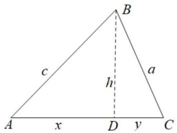

text_image

B
a
b
c
h
A x D y C

# 题型十七:等面积法、张角定理

1562 (2024·全国·高三专题练习)已知△ABC的内角A,B,C对应的边分别是a,b,c，内角A的角平分线交边BC于D点，且AD=4．若 $(2b+c)\cos A+a\cos C=0$ ，则△ABC面积的最小值是()

A. 16

B. $16 \sqrt{3}$

C. 64

D. $64\sqrt{3}$

【答案】B

【解析】∵ $(2b+c)\cos A+a\cos C=0$ ,

$$
\therefore 2 \sin B \cos A + \sin C \cos A + \sin A \cos C = 0,
$$

即 $2\sin B\cos A + \sin(C + A) = 2\sin B\cos A + \sin B = 0$ ,

又 $B \in (0, \pi)$ , $\sin B > 0$ ,

∴ $2\cos A + 1 = 0$ , 即 $\cos A = -\frac{1}{2}$ , 又 $A \in (0, \pi)$ ,

$$
\therefore \mathrm{A} = \frac {2 \pi}{3},
$$

由题可知 $S_{\triangle ABC}=S_{\triangle ABD}+S_{\triangle ACD}, AD=4,$

所以 $\frac{1}{2} bc\sin \frac{2\pi}{3} = \frac{1}{2}\times 4c\sin \frac{\pi}{3} +\frac{1}{2}\times 4b\sin \frac{\pi}{3}$ 即 $bc = 4(b + c)$

又 $bc = 4(b + c) \geqslant 8\sqrt{bc}$ , 即 $bc \geqslant 64$ ,

当且仅当 b=c 取等号，

所以 $S_{\triangle ABC} = \frac{1}{2} bc\sin \frac{2\pi}{3}\geqslant \frac{1}{2}\times 64\times \frac{\sqrt{3}}{2} = 16\sqrt{3}.$

故选: B.

1563 (2024·湖北武汉·高一校联考期中)已知 $\triangle ABC$ 的面积为 S, $\angle BAC = 2\alpha$ , AD 是 $\triangle ABC$ 的角平分线, 则 AD 长度的最大值为 ()

A. $\sqrt{\mathrm{S}\cdot\sin\alpha}$

B. $\sqrt{\frac{S}{\sin\alpha}}$

C. $\sqrt{\mathrm{S}\cdot\tan\alpha}$

D. $\sqrt{\frac{S}{\tan\alpha}}$

【答案】D

【解析】 $\triangle ABC$ 中， $\angle BAC=2\alpha$ ，AD是角平分线得

$$
\mathrm{S} _ {\triangle \mathrm{ABD}} = \frac {1}{2} \mathrm{AB} \cdot \mathrm{AD} \sin \alpha , \mathrm{S} _ {\triangle \mathrm{ACD}} = \frac {1}{2} \mathrm{AC} \cdot \mathrm{AD} \sin \alpha , \mathrm{S} _ {\triangle \mathrm{ABC}} = \frac {1}{2} \mathrm{AB} \cdot \mathrm{AC} \sin 2 \alpha
$$

而 $S_{\triangle ABC}=S_{\triangle ABD}+S_{\triangle ACD}$

因此 $\frac{1}{2}\mathrm{AB}\cdot \mathrm{AC}\sin 2\alpha = \frac{1}{2}\mathrm{AB}\cdot \mathrm{AD}\sin \alpha +\frac{1}{2}\mathrm{AC}\cdot \mathrm{AD}\sin \alpha$

得 $\mathrm{AD} = \frac{2\mathrm{AB}\cdot\mathrm{AC}\cdot\sin\alpha\cdot\cos\alpha}{(\mathrm{AB} + \mathrm{AC})\sin\alpha}\leqslant \frac{2\mathrm{AB}\cdot\mathrm{AC}\cdot\sin\alpha\cdot\cos\alpha}{2\sqrt{\mathrm{AB}\cdot\mathrm{AC}}\sin\alpha} = \sqrt{\mathrm{AB}\cdot\mathrm{AC}}\cos \alpha$

而 AB·AC = $\frac{2S}{\sin2\alpha}$ ,

所以 $\mathrm{AD}_{\max} = \sqrt{\frac{2\mathrm{S}}{\sin 2\alpha}}\cos \alpha = \sqrt{\frac{2\mathrm{S}}{2\sin\alpha\cdot\cos\alpha}\cdot\cos^2\alpha} = \sqrt{\frac{\mathrm{S}}{\tan\alpha}}$

故选D项.

1564 (2024·上海宝山·高三上海市吴淞中学校考期中)给定平面上四点 O,A,B,C 满足 OA = 4, OB = 3, OC = 2, $\overrightarrow{OB} \cdot \overrightarrow{OC} = 3$ , 则 $\Delta ABC$ 面积的最大值为 \_\_\_\_.

【答案】 $2\sqrt{7}+\frac{3\sqrt{3}}{2}$

【解析】∵OB=3, OC=2, $\overrightarrow{OB} \cdot \overrightarrow{OC}=3$ ,

$$
\therefore \angle B O C = 6 0 ^ {\circ},
$$

$$
\therefore \mathrm{BC} = \sqrt {9 + 4 - 2 \times 3 \times 2 \times \frac {1}{2}} = \sqrt {7},
$$

设 O 到 BC 的距离为 h，则由等面积可得 $\frac{1}{2} \cdot \sqrt{7} \cdot h = \frac{1}{2} \cdot 3 \cdot 2 \cdot \frac{\sqrt{3}}{2}$ ,

$$
\therefore h = \frac {3 \sqrt {2 1}}{7},
$$

∴ $\Delta ABC$ 面积的最大值为 $\frac{1}{2} \cdot \sqrt{7} \cdot \left( \frac{3\sqrt{21}}{7} + 4 \right) = 2\sqrt{7} + \frac{3\sqrt{3}}{2}$ .

故答案为: $2\sqrt{7} + \frac{3\sqrt{3}}{2}$ .

1565 (2024·安徽·高一安徽省太和中学校联考阶段练习)在 $\triangle ABC$ 中， $\angle BAC = \frac{\pi}{3}$ ，AM 是 $\angle BAC$ 的角平分线，且交 BC 于点 M. 若 $\triangle ABC$ 的面积为 $\sqrt{3}$ ，则 AM 的最大值为 \_\_\_\_.

【答案】 $\sqrt{3}$

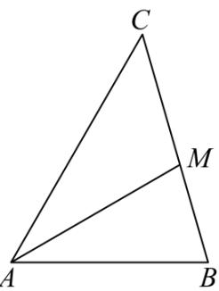

text_image

C
M
A
B

【解析】

设角 A, B, C 的对边分别为 a, b, c.

因为 $S_{\triangle ABC}=\frac{1}{2}bc\cdot\frac{\sqrt{3}}{2}=\sqrt{3}$ ，所以 bc=4。

由已知可得, $\angle\mathrm{MAB}=\angle\mathrm{MAC}=\frac{\pi}{6}$ .

又 $S_{\triangle ABM} + S_{\triangle ACM} = S_{\triangle ABC}, \frac{1}{2} \times AB \times AM \times \sin \frac{\pi}{6} + \frac{1}{2} \times AC \times AM \times \sin \frac{\pi}{6} = \frac{1}{2} \times AC \times AB \times \sin \frac{\pi}{3}$ ,

即 $\frac{1}{4} c \times \mathrm{AM} + \frac{1}{4} b \times \mathrm{AM} = \frac{\sqrt{3}}{4} bc,$

整理得 $\mathrm{AM} = \frac{\sqrt{3}bc}{b + c}\leqslant \frac{\sqrt{3}bc}{2\sqrt{bc}} = \sqrt{3},$

当且仅当 b=c=2 时, 等号成立.

故 AM 的最大值为 $\sqrt{3}$ .

故答案为: $\sqrt{3}$ .

1566 (2024·江西新余·高一新余市第一中学校考阶段练习)已知△ABC的内角A,B,C对应的边分别是a,b,c,内角A的角平分线交边BC于D点,且AD=4.若 $(2b+c)\cos A+a\cos C=0$ ,则△ABC面积的最小值是\_\_\_\_.

【答案】 $16\sqrt{3}$

【解析】∵ $(2b+c)\cos A+a\cos C=0$ ,

$$
\therefore 2 \sin B \cos A + \sin C \cos A + \sin A \cos C = 0,
$$

即 $2\sin B\cos A + \sin(C + A) = 2\sin B\cos A + \sin B = 0$ ,

又 $B \in (0, \pi)$ , $\sin B > 0$ ,

∴ $2\cos A + 1 = 0$ , 即 $\cos A = -\frac{1}{2}$ , 又 $A \in (0, \pi)$ ,

$$
\therefore \mathrm{A} = \frac {2 \pi}{3},
$$

由题可知 $S_{\triangle ABC}=S_{\triangle ABD}+S_{\triangle ACD}, AD=4,$

所以 $\frac{1}{2}bc\sin\frac{2\pi}{3}=\frac{1}{2}\times4c\sin\frac{\pi}{3}+\frac{1}{2}\times4b\sin\frac{\pi}{3}$ ，即 $bc=4(b+c)$ ,

又 $bc=4(b+c)\geqslant8\sqrt{bc}$ ，即 $bc\geqslant64$ ，当且仅当 b=c 取等号，

所以 $S_{\triangle ABC}=\frac{1}{2}bc\sin\frac{2\pi}{3}\geqslant\frac{1}{2}\times64\times\frac{\sqrt{3}}{2}=16\sqrt{3}$

即 $\triangle ABC$ 面积的最小值是 $16\sqrt{3}$ .

故答案为: $16\sqrt{3}$

1567 (2024·江西九江·高一德安县第一中学校考期中)△ABC 中, ∠ABC 的角平分线 BD 交 AC 于 D 点, 若 BD = 1 且 ∠ABC = $\frac{2\pi}{3}$ , 则 S△ABC 面积的最小值为 \_\_\_\_.

【答案】 $\sqrt{3}$

【解析】因为 $\angle ABC = \frac{2\pi}{3}$ ，BD 为 $\angle ABC$ 的角平分线，

所以 $\angle ABD = \angle CBD = \frac{\pi}{3}$ ，又 BD = 1，

故由三角形面积公式可得 $S_{\triangle ABD}=\frac{1}{2}AB\cdot BD\cdot\sin\angle ABD=\frac{\sqrt{3}}{4}AB,$

$$
\mathrm{S} _ {\triangle \mathrm{CBD}} = \frac {1}{2} \mathrm{BC} \cdot \mathrm{BD} \cdot \sin \angle \mathrm{CBD} = \frac {\sqrt {3}}{4} \mathrm{BC},
$$

$$
\mathrm{S} _ {\triangle \mathrm{ABC}} = \frac {1}{2} \mathrm{AB} \cdot \mathrm{BC} \cdot \sin \angle \mathrm{ABC} = \frac {\sqrt {3}}{4} \mathrm{AB} \cdot \mathrm{BC},
$$

又 $S_{\triangle ABC}=S_{\triangle ABD}+S_{\triangle CBD}$ ,

所以 $AB + BC = AB \cdot BC$ ,

由基本不等式可得 $AB + BC \geqslant 2\sqrt{AB \cdot BC}$ ，当且仅当 AB = BC 时等号成立，

所以 AB·BC≥4,

所以 $S_{\triangle ABC}=\frac{\sqrt{3}}{4}AB\cdot BC\geqslant\sqrt{3}$ ，当且仅当 AB=BC=2 时等号成立，

所以 $S_{\triangle ABC}$ 面积的最小值为 $\sqrt{3}$ .

故答案为: $\sqrt{3}$ .

text_image

A
B
D
C

1568 (2024·湖北武汉·高一华中科技大学附属中学校联考期中)已知△ABC中,角A、B、C所对的边分别为a、b、c, $\angle ABC=\frac{\pi}{3}$ ,∠ABC的角平分线交AC于点D,且 $BD=\sqrt{3}$ ,则 $a+c$ 的最小值为\_\_\_\_.

【答案】4

【解析】因为 $\angle ABC = \frac{\pi}{3}$ ，∠ABC 的角平分线交 AC 于点 D，且 $BD = \sqrt{3}$ ，

因为 $S_{\triangle ABC}=S_{\triangle ABD}+S_{\triangle BCD}$ ，即 $\frac{1}{2}ac\sin\frac{\pi}{3}=\frac{1}{2}c\cdot BD\sin\frac{\pi}{6}+\frac{1}{2}a\cdot BD\sin\frac{\pi}{6}$

即 $\frac{\sqrt{3}}{4} ac = \frac{\sqrt{3}}{4} (c + a)$ ，即 $ac = a + c$ ，所以， $\frac{c + a}{ac} = \frac{1}{a} +\frac{1}{c} = 1,$

所以， $a + c = (a + c)\left(\frac{1}{a} +\frac{1}{c}\right) = 2 + \frac{c}{a} +\frac{a}{c}\geqslant 2 + 2\sqrt{\frac{c}{a}\cdot\frac{a}{c}} = 4,$

当且仅当 a=c=2 时, 等号成立, 故 $a+c$ 的最小值为 4.

故答案为: 4.

1569 (2024·全国·高一专题练习)已知△ABC, 内角 A,B,C 所对的边分别是 a,b,c, c=1,∠C 的角平分线交 AB 于点 D. 若 $\sin A + \sin B = 2\sin\angle ACB$ , 则 CD 的取值范围是 \_\_\_\_.

【答案】 $\left(\frac{3}{4},\frac{\sqrt{3}}{2}\right]$

text_image

C
θ θ
b x a
A D B

【解析】

对 $\sin A + \sin B = 2\sin \angle ACB$ 用正弦定理，可得 $a + b = 2c = 2$ ，设 $\mathrm{CD} = x$ ， $\angle ACD =$ $\angle DCB = \theta$ ，由于 $2\theta$ 为三角形内角，则 $\theta \in \left(0,\frac{\pi}{2}\right)$ ，由 $\mathrm{S}_{\triangle \mathrm{ACD}} + \mathrm{S}_{\triangle \mathrm{BCD}} = \mathrm{S}_{\triangle \mathrm{ACB}}$ 可得， $\frac{bx\sin\theta}{2} +\frac{ax\sin\theta}{2} = \frac{ab\sin 2\theta}{2}$ 整理得， $x = \frac{2ab\cos\theta}{a + b} = \frac{2ab\cos\theta}{2} = ab\cos \theta$ ，对△ABC，由余弦定理， $a^2 +b^2 -2ab\cos 2\theta = c^2 = 1$ ，即 $(a + b)^2 -2ab - 2ab\cos 2\theta = 1$ ，故 $2ab(1+$ $\cos 2\theta) = 3$ ，即 $ab = \frac{3}{2(1 + \cos 2\theta)} = \frac{3}{4\cos^2\theta}$ ，于是 $x = ab\cos \theta = \frac{3}{4\cos\theta}$ 根据基本不等式， $\frac{3}{4\cos^2\theta} = ab\leqslant \left(\frac{a + b}{2}\right)^2 = 1$ 即 $\cos^2\theta \geqslant \frac{3}{4}$ 结合 $\theta \in (0,\frac{\pi}{2})$ ，解得 $\frac{\sqrt{3}}{2}\leqslant \cos \theta < 1$ 即 $2\sqrt{3}$ $\leqslant 4\cos \theta < 4$ ，于是 $x = \frac{3}{4\cos\theta}\in \left(\frac{3}{4},\frac{\sqrt{3}}{2}\right]$

故答案为: $\left(\frac{3}{4},\frac{\sqrt{3}}{2}\right]$

1570 (2024·贵州贵阳·高三贵阳一中校考阶段练习)已知△ABC, ∠BAC = 120°, D为BC上一点, 且AD为∠BAC的角平分线, 则 $\frac{AB+9AC}{AD}$ 的最小值为 \_\_\_\_.

【答案】16

text_image

C
D
A
B

【解析】

AD 为 $\angle BAC$ 的角平分线, $\angle BAC = 120^{\circ}$ ,

由等面积法 $\frac{1}{2} bc\sin 120^{\circ} = \frac{1}{2} b\cdot \mathrm{AD}\cdot \sin 60^{\circ} + \frac{1}{2} c\cdot \mathrm{AD}\cdot \sin 60^{\circ},$

所以 AD= $\frac{bc}{b+c}$ ,

所以 $\frac{\mathrm{AB} + 9\mathrm{AC}}{\mathrm{AD}} = \frac{c + 9b}{\frac{bc}{b + c}} = \frac{9b^2 + 10bc + c^2}{bc} = 10 + \frac{9b}{c} +\frac{c}{b}\geqslant 16$ （当且仅当 $c = 3b$ 时等号

成立), 即最小值为 16.

故答案为: 16

