# 第35讲 平面向量的概念与坐标运算

# 知识梳理

# 知识点一．向量的有关概念

(1) 定义: 既有大小又有方向的量叫做向量, 向量的大小叫做向量的长度 (或模).  
(2) 向量的模: 向量 $\overrightarrow{AB}$ 的大小, 也就是向量 $\overrightarrow{AB}$ 的长度, 记作 $|\overrightarrow{AB}|$ .

(3) 特殊向量:

①零向量:长度为0的向量,其方向是任意的.  
②单位向量:长度等于1个单位的向量.

③平行向量:方向相同或相反的非零向量. 平行向量又叫共线向量. 规定: 0 与任一向量平行.

④相等向量:长度相等且方向相同的向量.

⑤相反向量:长度相等且方向相反的向量.

# 知识点二．向量的线性运算和向量共线定理

# (1) 向量的线性运算

<table><tr><td>运算</td><td>定义</td><td>法则(或几何意义)</td><td>运算律</td></tr><tr><td>加法</td><td>求两个向量和的运算</td><td>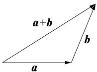 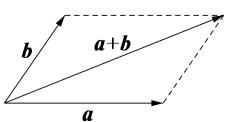三角形法则平行四边形法则</td><td>1交换律 $\vec{a} + \vec{b} = \vec{b} + \vec{a}$ 2结合律 $(\vec{a} + \vec{b}) + \vec{c} = \vec{a} + (\vec{b} + \vec{c})$ </td></tr><tr><td>减法</td><td>求 $\vec{a}$ 与 $\vec{b}$ 的相反向量 $-\vec{b}$ 的和的运算叫做 $\vec{a}$ 与 $\vec{b}$ 的差</td><td>三角形法则</td><td> $\vec{a} - \vec{b} = \vec{a} + (-\vec{b})$ </td></tr><tr><td>数乘</td><td>求实数 $\lambda$ 与向量 $\vec{a}$ 的积的运算</td><td>(1) $|\lambda\vec{a}| = |\lambda||\vec{a}|$ (2)当 $\lambda >0$ 时, $\lambda\vec{a}$ 与 $\vec{a}$ 的方向相同;当 $\lambda < 0$ 时, $\lambda\vec{a}$ 与 $\vec{a}$ 的方向相同;当 $\lambda = 0$ 时, $\lambda\vec{a} = 0$ </td><td> $\lambda(\mu\vec{a}) = (\lambda\mu)\vec{a}$  $(\lambda + \mu)\vec{a} = \lambda\vec{a} + \mu\vec{a}$  $\lambda(\vec{a} + \vec{b}) = \lambda\vec{a} + \lambda\vec{b}$ </td></tr></table>

# 【注意】

(1) 向量表达式中的零向量写成 $\vec{0}$ ，而不能写成 0.  
(2) 两个向量共线要区别与两条直线共线, 两个向量共线满足的条件是: 两个向量所在直线平行或重合, 而在直线中, 两条直线重合与平行是两种不同的关系.  
(3) 要注意三角形法则和平行四边形法则适用的条件, 运用平行四边形法则时两个向量的起点必须重合, 和向量与差向量分别是平行四边形的两条对角线所对应的向量; 运用三角

形法则时两个向量必须首尾相接,否则就要把向量进行平移,使之符合条件.

(4) 向量加法和减法几何运算应该更广泛、灵活如： $\overrightarrow{OA}-\overrightarrow{OB}=\overrightarrow{BA},\overrightarrow{AM}-\overrightarrow{AN}=\overrightarrow{NM},\overrightarrow{OA}=O B+\overrightarrow{CA}\Leftrightarrow\overrightarrow{OA}-\overrightarrow{OB}=\overrightarrow{CA}\Leftrightarrow\overrightarrow{BA}-\overrightarrow{CA}=\overrightarrow{BA}+\overrightarrow{AC}=\overrightarrow{BC}.$

# 知识点三．平面向量基本定理和性质

# 1、共线向量基本定理

如果 $\vec{a} = \lambda \vec{b} (\lambda \in \mathbb{R})$ ，则 $\vec{a} // \vec{b}$ ；反之，如果 $\vec{a} // \vec{b}$ 且 $\vec{b} \neq \vec{0}$ ，则一定存在唯一的实数 $\lambda$ ，使 $\vec{a} = \lambda \vec{b}$ （口诀：数乘即得平行，平行必有数乘）.

# 2、平面向量基本定理

如果 $\vec{\mathbf{e}}_1$ 和 $\vec{\mathbf{e}}_2$ 是同一个平面内的两个不共线向量，那么对于该平面内的任一向量 $\vec{a}$ ，都存在唯一的一对实数 $\lambda_1, \lambda_2$ ，使得 $\vec{a} = \lambda_1\vec{\mathbf{e}}_1 + \lambda_2\vec{\mathbf{e}}_2$ ，我们把不共线向量 $\vec{\mathbf{e}}_1, \vec{\mathbf{e}}_2$ 叫做表示这一平面内所有向量的一组基底，记为 $\{\vec{\mathbf{e}}_1, \vec{\mathbf{e}}_2\}, \lambda_1\vec{\mathbf{e}}_1 + \lambda_2\vec{\mathbf{e}}_2$ 叫做向量 $\vec{a}$ 关于基底 $\{\vec{\mathbf{e}}_1, \vec{\mathbf{e}}_2\}$ 的分解式。

注意:由平面向量基本定理可知:只要向量 $\vec{e}_{1}$ 与 $\vec{e}_{2}$ 不共线,平面内的任一向量 $\vec{a}$ 都可以分解成形如 $\vec{a}=\lambda_{1}\vec{e}_{1}+\lambda_{2}\vec{e}_{2}$ 的形式,并且这样的分解是唯一的. $\lambda_{1}\vec{e}_{1}+\lambda_{2}\vec{e}_{2}$ 叫做 $\vec{e}_{1},\vec{e}_{2}$ 的一个线性组合.平面向量基本定理又叫平面向量分解定理,是平面向量正交分解的理论依据,也是向量的坐标表示的基础.

推论1: 若 $\vec{a} = \lambda_{1}\vec{e}_{1} + \lambda_{2}\vec{e}_{2} = \lambda_{3}\vec{e}_{1} + \lambda_{4}\vec{e}_{2}$ ，则 $\lambda_{1} = \lambda_{3}, \lambda_{2} = \lambda_{4}$ .

推论2:若 $\vec{a}=\lambda_{1}\vec{e}_{1}+\lambda_{2}\vec{e}_{2}=\vec{0}$ ，则 $\lambda_{1}=\lambda_{2}=0$ .

# 3、线段定比分点的向量表达式

如图所示，在 $\triangle ABC$ 中，若点 $D$ 是边 $BC$ 上的点，且 $\overrightarrow{BD} = \lambda \overrightarrow{DC} (\lambda \neq -1)$ ，则向量 $\overrightarrow{AD} = \frac{\overrightarrow{AB} + \lambda \overrightarrow{AC}}{1 + \lambda}$ 。在向量线性表示(运算)有关的问题中，若能熟练利用此结论，往往能有“化腐朽为神奇”之功效，建议熟练掌握。

# 4、三点共线定理

平面内三点 A, B, C 共线的充要条件是: 存在实数 $\lambda, \mu$ , 使 $\overrightarrow{OC} = \lambda \overrightarrow{OA} + \mu \overrightarrow{OB}$ , 其中 $\lambda + \mu = 1$ , O 为平面内一点. 此定理在向量问题中经常用到, 应熟练掌握.

A、B、C三点共线

$\Leftrightarrow$ 存在唯一的实数 $\lambda$ ，使得 $\overrightarrow{AC} = \lambda \overrightarrow{AB}$ ;  
$\Leftrightarrow$ 存在唯一的实数 $\lambda$ ，使得 $\overrightarrow{\mathrm{OC}} = \overrightarrow{\mathrm{OA}} +\lambda \overrightarrow{\mathrm{AB}};$   
$\Leftrightarrow$ 存在唯一的实数 $\lambda$ ，使得 $\overrightarrow{\mathrm{OC}} = (1 - \lambda)\overrightarrow{\mathrm{OA}} +\lambda \overrightarrow{\mathrm{OB}};$   
$\Leftrightarrow$ 存在 $\lambda +\mu = 1$ ，使得 $\overrightarrow{\mathrm{OC}} = \lambda \overrightarrow{\mathrm{OA}} +\mu \overrightarrow{\mathrm{OB}}.$

# 5、中线向量定理

如图所示，在 $\triangle ABC$ 中，若点 $D$ 是边 $BC$ 的中点，则中线向量 $\overrightarrow{AD} = \frac{1}{2} (\overrightarrow{AB} +\overrightarrow{AC})$ ，反之亦正确.

# 知识点四．平面向量的坐标表示及坐标运算

# (1) 平面向量的坐标表示.

在平面直角坐标中，分别取与 $x$ 轴， $y$ 轴正半轴方向相同的两个单位向量 $\vec{i}, \vec{j}$ 作为基底，那么由平面向量基本定理可知，对于平面内的一个向量 $\vec{a}$ ，有且只有一对实数 $x, y$ 使 $\vec{a} = x\vec{i} + y\vec{j}$ ，我们把有序实数对 $(x, y)$ 叫做向量 $\vec{a}$ 的坐标，记作 $\vec{a} = (x, y)$ .

(2) 向量的坐标表示和以坐标原点为起点的向量是一一对应的, 即有

向量 $(x,y)\stackrel{\text{一一对应}}{\Longrightarrow}$ 向量 $\overrightarrow{\mathrm{OA}}\stackrel{\text{一一对应}}{\Longrightarrow}$ 点 $\mathrm{A}(x,y)$ .

(3) 设 $\vec{a} = (x_{1}, y_{1})$ , $\vec{b} = (x_{2}, y_{2})$ , 则 $\vec{a} + \vec{b} = (x_{1} + x_{2}, y_{1} + y_{2})$ , $\vec{a} - \vec{b} = (x_{1} - x_{2}, y_{1} - y_{2})$ , 即两个向量的和与差的坐标分别等于这两个向量相应坐标的和与差.

若 $\vec{a} = (x,y)$ , $\lambda$ 为实数, 则 $\lambda \vec{a} = (\lambda x, \lambda y)$ , 即实数与向量的积的坐标, 等于用该实数乘原来向量的相应坐标.

(4) 设 $\mathrm{A}(x_1, y_1)$ , $\mathrm{B}(x_2, y_2)$ , 则 $\overrightarrow{\mathrm{AB}} = \overrightarrow{\mathrm{OB}} - \overrightarrow{\mathrm{OA}} = (x_1 - x_2, y_1 - y_2)$ , 即一个向量的坐标等于该向量的有向线段的终点的坐标减去始点坐标.

知识点五．平面向量的直角坐标运算

①已知点 $\mathrm{A}(x_1,y_1),\mathrm{B}(x_2,y_2)$ ，则 $\overrightarrow{\mathrm{AB}} = (x_2 - x_1,y_2 - y_1),|\overrightarrow{\mathrm{AB}} | = \sqrt{(x_2 - x_1)^2 + (y_2 - y_1)^2}$   
②已知 $\vec{a} = (x_1,y_1),\vec{b} = (x_2,y_2)$ ，则 $\vec{a}\pm \vec{b} = (x_1\pm x_2,y_1\pm y_2),\lambda \vec{a} = (\lambda x_1,\lambda y_1),$

$$
\vec {a} \cdot \vec {b} = x _ {1} x _ {2} + y _ {1} y _ {2}, | \vec {a} | = \sqrt {x _ {1} ^ {2} + y _ {1} ^ {2}}.
$$

$$
\vec {a} / / \vec {b} \Leftrightarrow x _ {1} y _ {2} - x _ {2} y _ {1} = 0, \vec {a} \perp \vec {b} \Leftrightarrow x _ {1} x _ {2} + y _ {1} y _ {2} = 0
$$

# 【解题方法总结】

(1) 向量的三角形法则适用于任意两个向量的加法, 并且可以推广到两个以上的非零向量相加, 称为多边形法则. 一般地, 首尾顺次相接的多个向量的和等于从第一个向量起点指向最后一个向量终点的向量.

即 $\overrightarrow{A_{1}A_{2}} + \overrightarrow{A_{2}A_{3}} + \cdots + \overrightarrow{A_{n-1}A_{n}} = \overrightarrow{A_{1}A_{n}}.$

(2) $||\vec{a} | - |\vec{b} || \leqslant |\vec{a} \pm \vec{b}| \leqslant |\vec{a}| + |\vec{b}|$ , 当且仅当 $\vec{a}, \vec{b}$ 至少有一个为 $\vec{0}$ 时, 向量不等式的等号成立.  
(3) 特别地: $||\vec{a}|-|\vec{b}|| \leqslant |\vec{a} \pm \vec{b}|$ 或 $|\vec{a} \pm \vec{b}| \leqslant |\vec{a}| + |\vec{b}|$ 当且仅当 $\vec{a}, \vec{b}$ 至少有一个为 0 时或者两向量共线时, 向量不等式的等号成立.  
(4) 减法公式: $\overrightarrow{AB} - \overrightarrow{AC} = \overrightarrow{CB}$ , 常用于向量式的化简.   
(5)A、P、B三点共线 $\Leftrightarrow \overrightarrow{\mathrm{OP}} = (1 - t)\overrightarrow{\mathrm{OA}} +t\overrightarrow{\mathrm{OB}} (t\in \mathbb{R})$ ，这是直线的向量式方程.

# 必考题型全归纳

# 1 题型一:平面向量的基本概念

1571 (2024·全国·高三专题练习)下列说法中正确的是 （）

A. 单位向量都相等  
B. 平行向量不一定是共线向量  
C. 对于任意向量 $\vec{a},\vec{b}$ , 必有 $|\vec{a} +\vec{b}| \leqslant |\vec{a}| + |\vec{b}|$   
D. 若 $\vec{a},\vec{b}$ 满足 $|\vec{a}| > |\vec{b} |$ 且 $\vec{a}$ 与 $\vec{b}$ 同向，则 $\vec{a} >\vec{b}$

【答案】C

【解析】依题意，

对于 A, 单位向量模都相等, 方向不一定相同, 故错误;

对于 B, 平行向量就是共线向量, 故错误;

对于 C, 若 $\vec{a}, \vec{b}$ 同向共线, $|\vec{a} + \vec{b}| = |\vec{a}| + |\vec{b}|$ ,

若 $\vec{a},\vec{b}$ 反向共线， $|\vec{a}+\vec{b}|<|\vec{a}|+|\vec{b}|$

若 $\vec{a},\vec{b}$ 不共线,根据向量加法的三角形法则及

两边之和大于第三边知 $\left|\vec{a}+\vec{b}\right|<\left|\vec{a}\right|+\left|\vec{b}\right|$ .

综上可知对于任意向量 $\vec{a},\vec{b}$ ，必有 $|\vec{a}+\vec{b}|\leqslant|\vec{a}|+|\vec{b}|$ ，故正确；

对于 D, 两个向量不能比较大小, 故错误.

故选：C.

1572 (2024·全国·高三专题练习)给出如下命题：

①向量 $\overrightarrow{AB}$ 的长度与向量 $\overrightarrow{BA}$ 的长度相等；  
②向量 $\vec{a}$ 与 $\vec{b}$ 平行，则 $\vec{a}$ 与 $\vec{b}$ 的方向相同或相反；  
③两个有共同起点而且相等的向量,其终点必相同;  
④两个公共终点的向量,一定是共线向量;   
⑤向量 $\overrightarrow{AB}$ 与向量 $\overrightarrow{CD}$ 是共线向量，则点 A, B, C, D 必在同一条直线上.

其中正确的命题个数是 （）

A. 1

B. 2

C. 3

D. 4

【答案】B

【解析】对于①,向量 $\overrightarrow{AB}$ 与向量 $\overrightarrow{BA}$ , 长度相等, 方向相反, 故①正确;

对于②,向量 $\vec{a}$ 与 $\vec{b}$ 平行时, $\vec{a}$ 或 $\vec{b}$ 为零向量时,不满足条件,故②错误;

对于③,两个有共同起点且相等的向量,其终点也相同,故③正确;

对于④,两个有公共终点的向量,不一定是共线向量,故④错误;

对于⑤,向量 $\overrightarrow{AB}$ 与 $\overrightarrow{CD}$ 是共线向量,点 A, B, C, D 不一定在同一条直线上,故⑤错误.

综上,正确的命题是①③.

故选：B.

1573 (2024·全国·高三专题练习)下列命题中正确的是 （）

A. 若 $\vec{a} = \vec{b}$ ，则 $3\vec{a} > 2\vec{b}$   
B. $\overrightarrow{BC}-\overrightarrow{BA}-\overrightarrow{DC}=\overrightarrow{AD}$   
C. $\left|\vec{a}\right|+\left|\vec{b}\right|=\left|\vec{a}+\vec{b}\right|\Leftrightarrow\vec{a}$ 与 $\vec{b}$ 的方向相反  
D. 若 $\left|\vec{a}\right|=\left|\vec{b}\right|=\left|\vec{c}\right|$ ，则 $\vec{a}=\vec{b}=\vec{c}$

【答案】B

【解析】对于 A 选项,由于任意两个向量不能比大小,故 A 错;

对于 B 选项, $\overrightarrow{BC}-\overrightarrow{BA}-\overrightarrow{DC}=\overrightarrow{AC}+\overrightarrow{CD}=\overrightarrow{AD}$ , 故 B 对;

对于 C 选项， $\left|\vec{a}\right|+\left|\vec{b}\right|=\left|\vec{a}+\vec{b}\right|\Leftrightarrow\vec{a}$ 与 $\vec{b}$ 的方向相同，故 C 错；

对于D选项,若 $\left|\vec{a}\right|=\left|\vec{b}\right|=\left|\vec{c}\right|$ ,但 $\vec{a}$ 、 $\vec{b}$ 、 $\vec{c}$ 的方向不确定,故D错.

故选: B.

1574 (2024·全国·高三专题练习)下列说法正确的是 （）

A. 若 $\left|\vec{a}\right| > \left|\vec{b}\right|$ ，则 $\vec{a} > \vec{b}$

B. 若 $\left|\vec{a}\right|=\left|\vec{b}\right|$ ，则 $\vec{a}=\vec{b}$

C. 若 $\vec{a} = \vec{b}$ ，则 $\vec{a} \parallel \vec{b}$

D. 若 $\vec{a} \neq \vec{b}$ , 则 $\vec{a}, \vec{b}$ 不是共线向量

【答案】C

【解析】A. 因为向量不能比较大小,所以该选项错误;

B. 若 $\left|\vec{a}\right|=\left|\vec{b}\right|$ ，则 $\vec{a},\vec{b}$ 不一定相等，有可能它们方向不同，但是模相等，所以该选项错误；  
C. 若 $\vec{a} = \vec{b}$ ，则 $\vec{a} // \vec{b}$ ，所以该选项正确；

D. 若 $\vec{a} \neq \vec{b}$ ，则 $\vec{a}, \vec{b}$ 也有可能是共线向量，有可能方向相同模不相等，有可能方向相反，所以该选项错误.

故选：C

1575 (2024·全国·高三对口高考)给出下列四个命题：

①若 $\left|\vec{a}\right|=\left|\vec{b}\right|$ ，则 $\vec{a}=\vec{b},\vec{a}=-\vec{b};$   
②若 $\overrightarrow{AB}=\overrightarrow{DC}$ ，则 A, B, C, D 是一个平行四边形的四个顶点；  
③若 $\vec{a}=\vec{b},\vec{b}=\vec{c}$ ，则 $\vec{a}=\vec{c}$ ;  
④若 $\vec{a} \parallel \vec{b}, \vec{b} \parallel \vec{c}$ ，则 $\vec{a} \parallel \vec{c}$ ;

其中正确的命题的个数为 （）

A. 4

B. 3

C. 2

D. 1

【答案】D

【解析】①若 $\left|\vec{a}\right|=\left|\vec{b}\right|$ ，只能说明 $\vec{a},\vec{b}$ 模相等，它们方向不一定相同或相反，错；

②若 $\overrightarrow{AB} = \overrightarrow{DC}$ ，若 AB // DC 且 AB = DC，即 A, B, C, D 是一个平行四边形的四个顶点，若 A, B, C, D 四点共线，不能构成平行四边形，错；  
③若 $\vec{a}=\vec{b},\vec{b}=\vec{c}$ ，即 $\vec{a},\vec{b}$ 、 $\vec{a},\vec{c}$ 分别为相等向量，故 $\vec{a}=\vec{c}$ ，对；  
④若 $\vec{a} \parallel \vec{b}, \vec{b} \parallel \vec{c}$ ，当 $\vec{b}$ 为零向量时 $\vec{a} \parallel \vec{c}$ 不一定成立，错.

故选：D

1576 (2024·全国·高三对口高考)若 $\vec{a} + \vec{b} + \vec{c} = \vec{0}$ ，则 $\vec{a}, \vec{b}, \vec{c}$ （）

A. 都是非零向量时也可能无法构成一个三角形  
B. 一定不可能构成三角形  
C. 都是非零向量时能构成三角形  
D. 一定可构成三角形

【答案】A

【解析】ACD选项,若非零向量 $\vec{a},\vec{b},\vec{c}$ 共线时,也能满足 $\vec{a}+\vec{b}+\vec{c}=\vec{0}$ ,但无法构成一个三角形,A正确,CD错误;

B选项,当非零向量 $\vec{a},\vec{b},\vec{c}$ 两两不共线时,可构成三角形,B错误.

故选：A

【解题方法总结】

准确理解平面向量的基本概念是解决向量题目的关键。共线向量即为平行向量，非零向量平行具有传递性，两个向量方向相同或相反就是共线向量，与向量长度无关，两个向量方向相同且长度相等，就是相等向量。共线向量或相等向量均与向量起点无关。

# 2 题型二:平面向量的线性表示

1577 (2024·山东泰安·统考模拟预测)在 $\triangle ABC$ 中, 点 D 为 AC 中点, 点 E 在 BC 上且 BE = 2EC. 记 $\overrightarrow{AB} = \vec{a}, \overrightarrow{AC} = \vec{b}$ , 则 $\overrightarrow{ED} =$ ()

A. $-\frac{1}{3}\vec{a}+\frac{1}{6}\vec{b}$

B. $-\frac{1}{3}\vec{a}-\frac{1}{6}\vec{b}$

C. $-\frac{1}{6}\vec{a}-\frac{1}{3}\vec{b}$

D. $\frac{1}{3}\vec{a}-\frac{1}{6}\vec{b}$

【答案】B

【解析】如图所示：

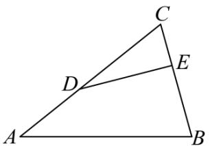

text_image

C
D
E
A
B

由 $\overrightarrow{AB} = \vec{a}, \overrightarrow{AC} = \vec{b},$

所以 $\overrightarrow{BC} = \overrightarrow{AC} - \overrightarrow{AB} = \vec{b} - \vec{a}$ ,

又∵BE=2EC,

$$
\therefore \overrightarrow {\mathrm{EC}} = \frac {1}{3} \overrightarrow {\mathrm{BC}} = \frac {1}{3} (\vec {b} - \vec {a}),
$$

又因为 D 为 AC 中点，

$$
\therefore \overrightarrow {\mathrm{CD}} = - \frac {1}{2} \vec {b},
$$

则 $\overrightarrow{ED} = \overrightarrow{EC} + \overrightarrow{CD} = -\frac{1}{3}\vec{a} - \frac{1}{6}\vec{b},$

故选: B.

1578 (2024·河北邯郸·统考三模)已知等腰梯形 ABCD 满足 AB // CD, AC 与 BD 交于点 P, 且 AB = 2CD = 2BC, 则下列结论错误的是 ()

A. $\overrightarrow{\mathrm{AP}} = 2\overrightarrow{\mathrm{PC}}$

B. $|\overrightarrow{\mathrm{AP}}| = 2|\overrightarrow{\mathrm{PD}}|$

C. $\overrightarrow{\mathrm{AP}} = \frac{2}{3}\overrightarrow{\mathrm{AD}} +\frac{1}{3}\overrightarrow{\mathrm{AB}}$

D. $\overrightarrow{\mathrm{AC}} = \frac{1}{3}\overrightarrow{\mathrm{AD}} +\frac{2}{3}\overrightarrow{\mathrm{AB}}$

【答案】D

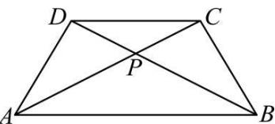

text_image

D
C
P
A
B

【解析】

依题意,显然 $\triangle APB\sim\triangle DPC$ ,故有 $\frac{AB}{CD}=\frac{AP}{PC}=\frac{PB}{PD}=\frac{2}{1}$ ,

即 AP = 2PC, PB = 2PD, 则 $\overrightarrow{AP} = 2\overrightarrow{PC}$ , 故 A 正确;

又四边形 ABCD 是等腰梯形, 故 AP = PB, 即 $\left|\overrightarrow{AP}\right| = 2\left|\overrightarrow{PD}\right|$ , 故 B 正确;

在 $\triangle ABD$ 中， $\overrightarrow{AP} = \overrightarrow{AD} + \overrightarrow{DP} = \overrightarrow{AD} + \frac{1}{3}\overrightarrow{DB} = \overrightarrow{AD} + \frac{1}{3}\left(\overrightarrow{AB} - \overrightarrow{AD}\right) = \frac{2}{3}\overrightarrow{AD} + \frac{1}{3}\overrightarrow{AB}$ ，

故 C 正确;

又 $\overrightarrow{AC}=\frac{3}{2}\overrightarrow{AP}=\frac{3}{2}\left(\frac{2}{3}\overrightarrow{AD}+\frac{1}{3}\overrightarrow{AB}\right)=\overrightarrow{AD}+\frac{1}{2}\overrightarrow{AB}$ ，所以 D 错误；

故选：D.

1579 (2024·河北·统考模拟预测)已知D为△ABC所在平面内一点，且满足 $\overrightarrow{CD}=\frac{1}{3}\overrightarrow{DB}$ ，则()

A. $\overrightarrow{\mathrm{AD}} = \frac{3}{2}\overrightarrow{\mathrm{AB}} -\frac{1}{2}\overrightarrow{\mathrm{AC}}$

B. $\overrightarrow{\mathrm{AD}} = \frac{2}{3}\overrightarrow{\mathrm{AB}} +\frac{1}{3}\overrightarrow{\mathrm{AC}}$

C. $\overrightarrow{AB}=4\overrightarrow{AD}-3\overrightarrow{AC}$

D. $\overrightarrow{AB}=3\overrightarrow{AD}-4\overrightarrow{AC}$

【答案】C

【解析】如图，

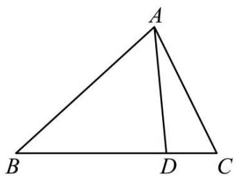

text_image

A
B D C

因为 $\overrightarrow{CD}=\frac{1}{3}\overrightarrow{DB}$ ，所以 D 是线段 BC 的四等分点，且 BD=3DC，

所以 $\overrightarrow{AD} = \overrightarrow{AB} + \overrightarrow{BD} = \overrightarrow{AB} + \frac{3}{4}\overrightarrow{BC} = \overrightarrow{AB} + \frac{3}{4}\left(\overrightarrow{AC} - \overrightarrow{AB}\right) = \frac{1}{4}\overrightarrow{AB} + \frac{3}{4}\overrightarrow{AC},$

故A,B错误;

由 $\overrightarrow{AD}=\frac{1}{4}\overrightarrow{AB}+\frac{3}{4}\overrightarrow{AC}$ ，可得 $\overrightarrow{AB}=4\overrightarrow{AD}-3\overrightarrow{AC}$ ，故 C 正确，D 错误，

故选:C.

1580 (2024·河北·高三学业考试)化简 $\overrightarrow{PA}-\overrightarrow{PB}+\overrightarrow{AB}$ 所得的结果是 ()

A. $2\overrightarrow{AB}$

B. $2\overrightarrow{BA}$

C. $\vec{0}$

D. $\overrightarrow{PA}$

【答案】C

【解析】 $\overrightarrow{PA}-\overrightarrow{PB}+\overrightarrow{AB}=\overrightarrow{PA}+\overrightarrow{AB}-\overrightarrow{PB}=\overrightarrow{PB}-\overrightarrow{PB}=\overrightarrow{0}.$

故选：C

1581 (2024·贵州贵阳·校联考模拟预测)在 $\triangle ABC$ 中, AD 为 BC 边上的中线, E 为 AD 的中点, 则 $\overrightarrow{EC}=$ ()

A. $\frac{3}{4}\overrightarrow{\mathrm{AB}} -\frac{1}{4}\overrightarrow{\mathrm{AC}}$

B. $-\frac{1}{4}\overrightarrow{AB}-\frac{3}{4}\overrightarrow{AC}$

C. $\frac{3}{4}\overrightarrow{AB}+\frac{1}{4}\overrightarrow{AC}$

D. $-\frac{1}{4}\overrightarrow{AB}+\frac{3}{4}\overrightarrow{AC}$

【答案】D

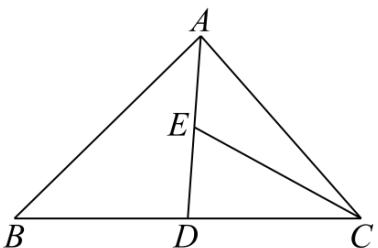

text_image

A
E
B D C

【解析】

由 D 为 BC 中点, 根据向量的运算法则,

可得 $\overrightarrow{AD}=\frac{1}{2}\left(\overrightarrow{AB}+\overrightarrow{AC}\right)$ ,

在 $\triangle ABC$ 中， $\overrightarrow{EC} = \overrightarrow{AC} - \overrightarrow{AE} = \overrightarrow{AC} - \frac{1}{2}\overrightarrow{AD} = -\frac{1}{4} (\overrightarrow{AB} + \overrightarrow{AC}) + \overrightarrow{AC} = \frac{3}{4}\overrightarrow{AC} - \frac{1}{4}\overrightarrow{AB}$ .

故选:D.

1582 (2024·贵州黔东南·高三校考阶段练习)已知在平行四边形ABCD中，E，F分别是边CD，BC的中点，则 $\overrightarrow{\mathrm{EF}} =$ （ ）

A. $\frac{1}{2}\overrightarrow{AB}-\overrightarrow{AD}$

B. $\frac{1}{2}\overrightarrow{AB}-\overrightarrow{BC}$

C. $\frac{1}{2}\overrightarrow{\mathrm{AB}} +\frac{1}{2}\overrightarrow{\mathrm{AD}}$

D. $\frac{1}{2}\overrightarrow{\mathrm{AB}} -\frac{1}{2}\overrightarrow{\mathrm{BC}}$

【答案】D

【解析】如图所示,由中位线定理和平行四边形的性质得:

$$
\overrightarrow {\mathrm{EF}} = \frac {1}{2} \overrightarrow {\mathrm{DB}} = \frac {1}{2} (\overrightarrow {\mathrm{AB}} - \overrightarrow {\mathrm{AD}}) = \frac {1}{2} (\overrightarrow {\mathrm{AB}} - \overrightarrow {\mathrm{BC}}),
$$

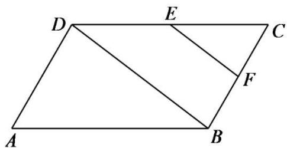

text_image

D
E
C
F
A
B

故选：D

1583 (2024·山东滨州·校考模拟预测)如图所示,点 E 为 $\triangle ABC$ 的边 AC 的中点,F 为线段 BE 上靠近点 B 的四等分点,则 $\overrightarrow{AF}=$ ()

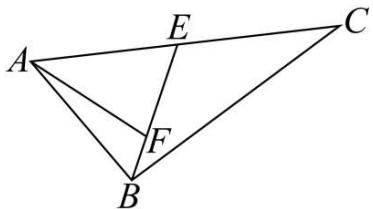

text_image

Geometric diagram of triangle ABC with internal points E, F and line segments EF, BF drawn

A. $\frac{3}{8}\overrightarrow{\mathrm{BA}} +\frac{5}{8}\overrightarrow{\mathrm{BC}}$

B. $\frac{5}{4}\overrightarrow{\mathrm{BA}} +\frac{3}{4}\overrightarrow{\mathrm{BC}}$

C. $-\frac{7}{8}\overrightarrow{BA}+\frac{1}{8}\overrightarrow{BC}$

D. $-\frac{3}{4}\overrightarrow{BA}+\frac{1}{4}\overrightarrow{BC}$

【答案】C

【解析】 $\overrightarrow{AF}=\overrightarrow{AE}+\overrightarrow{EF}=\frac{1}{2}\overrightarrow{AC}+\frac{3}{4}\overrightarrow{EB}=\frac{1}{2}\overrightarrow{AC}+\frac{3}{4}(\overrightarrow{AB}-\overrightarrow{AE})$

$$
\begin{array}{l} = \frac {1}{2} \overrightarrow {\mathrm{AC}} + \frac {3}{4} \overrightarrow {\mathrm{AB}} - \frac {3}{8} \overrightarrow {\mathrm{AC}} = \frac {1}{8} \overrightarrow {\mathrm{AC}} - \frac {3}{4} \overrightarrow {\mathrm{BA}} \\ = \frac {1}{8} (\overrightarrow {\mathrm{BC}} - \overrightarrow {\mathrm{BA}}) - \frac {3}{4} \overrightarrow {\mathrm{BA}} = - \frac {7}{8} \overrightarrow {\mathrm{BA}} + \frac {1}{8} \overrightarrow {\mathrm{BC}}. \\ \end{array}
$$

故选：C.

1584 (2024·全国·高三专题练习)在平行四边形ABCD中,对角线AC与BD交于点O,若 $\overrightarrow{AB}+\overrightarrow{AD}=\lambda\overrightarrow{AO}$ ,则 $\lambda=$ ()

A. $\frac{1}{2}$

B. 2

C. $\frac{1}{3}$

D. $\frac{3}{2}$

【答案】B

【解析】在平行四边形 ABCD 中， $\overrightarrow{AC}=\overrightarrow{AB}+\overrightarrow{AD}=\lambda\overrightarrow{AO}$ ，所以 $\lambda=2$ .

故选: B.

1585 (2024·河南·襄城高中校联考三模)已知等腰梯形ABCD中，AB//DC，AB=2DC=2AD=2，BC的中点为E，则 $\overrightarrow{AE}=$ （）

A. $\frac{1}{3}\overrightarrow{\mathrm{DB}} +\frac{5}{3}\overrightarrow{\mathrm{AC}}$

B. $\frac{1}{3}\overrightarrow{\mathrm{DB}} +\frac{5}{6}\overrightarrow{\mathrm{AC}}$

C. $\frac{1}{3}\overrightarrow{\mathrm{DB}} +\frac{1}{2}\overrightarrow{\mathrm{AC}}$

D. $\frac{2}{3}\overrightarrow{\mathrm{DB}} +\frac{5}{6}\overrightarrow{\mathrm{AC}}$

【答案】B

【解析】∵ $\overrightarrow{AB} = \overrightarrow{DB} - \overrightarrow{DA} = \overrightarrow{DB} - (\overrightarrow{DC} + \overrightarrow{CA}) = \overrightarrow{DB} - \overrightarrow{DC} - \overrightarrow{CA} = \overrightarrow{DB} - \frac{1}{2}\overrightarrow{AB} - \overrightarrow{CA}$ ,

$$
\therefore \frac {3}{2} \overrightarrow {\mathrm{AB}} = \overrightarrow {\mathrm{DB}} - \overrightarrow {\mathrm{CA}},
$$

$$
\therefore \overrightarrow {\mathrm{AB}} = \frac {2}{3} \overrightarrow {\mathrm{DB}} + \frac {2}{3} \overrightarrow {\mathrm{AC}},
$$

$$
\therefore \overrightarrow {A E} = \frac {1}{2} (\overrightarrow {A B} + \overrightarrow {A C}) = \frac {1}{2} \left(\frac {2}{3} \overrightarrow {D B} + \frac {2}{3} \overrightarrow {A C}\right) + \frac {1}{2} \overrightarrow {A C} = \frac {1}{3} \overrightarrow {D B} + \frac {5}{6} \overrightarrow {A C}.
$$

故选: B.

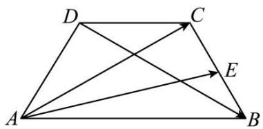

text_image

Geometric diagram of a trapezoid with labeled vertices A, B, C, D and internal points E, showing diagonals and directional arrows.

# 【解题方法总结】

(1)两向量共线问题用向量的加法和减法运算转化为需要选择的目标向量即可,而此类问题又以“爪子型”为几何背景命题居多,故熟练掌握“爪子型”公式更有利于快速解题.  
(2) 进行向量运算时, 要尽可能转化到平行四边形或三角形中, 选用从同一顶点出发的基本向量或首尾相接的向量, 运用向量加、减法运算及数乘运算来求解.  
(3)除了充分利用相等向量、相反向量和线段的比例关系外,有时还需要利用三角形中位线、相似三角形对应边成比例等平面几何的性质,把未知向量转化为与已知向量有直接关系的向量来求解.

# 3 题型三:向量共线的运用

1586 (2024·广东广州·统考模拟预测)在 $\triangle ABC$ 中，M 是 AC 边上一点，且 $\overrightarrow{AM} = \frac{1}{2}\overrightarrow{MC}, N$ 是 BM 上一点，若 $\overrightarrow{AN} = \frac{1}{9}\overrightarrow{AC} + m\overrightarrow{BC}$ ，则实数 m 的值为（）

A. $-\frac{1}{3}$

B. $-\frac{1}{6}$

C. $\frac{1}{6}$

D. $\frac{1}{3}$

【答案】D

【解析】由 $\overrightarrow{AM}=\frac{1}{2}\overrightarrow{MC}$ ，得出 $\overrightarrow{AC}=3\overrightarrow{AM}$ ，

由 $\overrightarrow{AN}=\frac{1}{9}\overrightarrow{AC}+m\overrightarrow{BC}$ 得 $\overrightarrow{AN}=\frac{1}{9}\overrightarrow{AC}+m(\overrightarrow{AC}-\overrightarrow{AB})=\left(\frac{1}{9}+m\right)\overrightarrow{AC}-m\overrightarrow{AB}=$ $\left(\frac{1}{3}+3m\right)\overrightarrow{AM}-m\overrightarrow{AB},$

因为 B,N,M 三点共线, 所以 $\left(\frac{1}{3}+3m\right)+(-m)=1$ , 解得 $m=\frac{1}{3}$ .

故选：D.

1587 (2024·湖南长沙·长沙市实验中学校考三模)如图,在△ABC中,M为线段BC的中点,G为线段AM上一点, $\overrightarrow{AG}=2\overrightarrow{GM}$ ,过点G的直线分别交直线AB,AC于P,Q两点, $\overrightarrow{AB}=x\overrightarrow{AP}(x>0)$ , $\overrightarrow{AC}=y\overrightarrow{AQ}(y>0)$ ,则 $\frac{4}{x}+\frac{1}{y+1}$ 的最小值为( ).

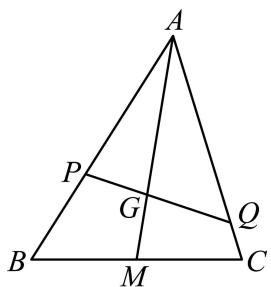

text_image

A
P
G
Q
B
M
C

A. $\frac{3}{4}$

B. $\frac{9}{4}$

C. 3

D. 9

【答案】B

【解析】因为 M 为线段 BC 的中点, 所以 $\overrightarrow{AM} = \frac{1}{2} (\overrightarrow{AB} + \overrightarrow{AC})$ , 又因为 $\overrightarrow{AG} = 2\overrightarrow{GM}$ , 所以

$$
\overrightarrow {\mathrm{AG}} = \frac {2}{3} \overrightarrow {\mathrm{AM}} = \frac {1}{3} (\overrightarrow {\mathrm{AB}} + \overrightarrow {\mathrm{AC}}),
$$

又 $\overrightarrow{\mathrm{AB}} = x\overrightarrow{\mathrm{AP}} (x > 0)$ ， $\overrightarrow{\mathrm{AC}} = y\overrightarrow{\mathrm{AQ}} (y > 0)$ ，所以 $\overrightarrow{\mathrm{AG}} = \frac{x}{3}\overrightarrow{\mathrm{AP}} +\frac{y}{3}\overrightarrow{\mathrm{AQ}},$

又 P, G, Q 三点共线, 所以 $\frac{x}{3} + \frac{y}{3} = 1$ , 即 $x + y = 3$ ,

所以 $\frac{4}{x} +\frac{1}{y + 1} = \frac{1}{4}\Big(\frac{4}{x} +\frac{1}{y + 1}\Big)[x + (y + 1)] = \frac{1}{4}\Big[4 + \frac{x}{y + 1} +\frac{4(y + 1)}{x} +1\Big]\geqslant$

$$
\frac {1}{4} \left(5 + 2 \sqrt {\frac {x}{y + 1} \cdot \frac {4 (y + 1)}{x}}\right) = \frac {9}{4},
$$

当且仅当 $\frac{x}{y+1}=\frac{4(y+1)}{x}$ ，即 $x=\frac{8}{3}, y=\frac{1}{3}$ 时取等号.

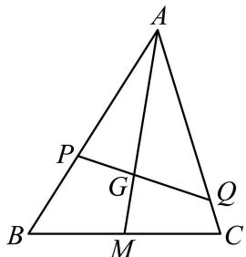

text_image

A
P
G
Q
B
M
C

故选: B.

1588 (2024·山西·高三校联考阶段练习)如图,在△ABC中,D是BC边中点 $\overrightarrow{AP}=\frac{1}{3}\overrightarrow{AD}$ ,
CP的延长线与AB交于AN,则()

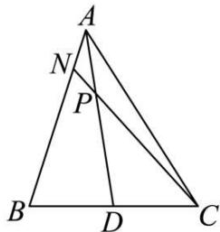

text_image

A
N
P
B
D
C

A. $\overrightarrow{\mathrm{AN}} = \frac{1}{4}\overrightarrow{\mathrm{AB}}$

B. $\overrightarrow{\mathrm{AN}} = \frac{1}{5}\overrightarrow{\mathrm{AB}}$

C. $\overrightarrow{\mathrm{AN}} = \frac{1}{6}\overrightarrow{\mathrm{AB}}$

D. $\overrightarrow{AN}=\frac{1}{7}\overrightarrow{AB}$

【答案】B

【解析】设 $\overrightarrow{AB} = \lambda \overrightarrow{AN}$ ,

则 $\overrightarrow{\mathrm{AP}} = \frac{1}{3}\overrightarrow{\mathrm{AD}} = \frac{1}{3}\times \frac{1}{2} (\overrightarrow{\mathrm{AB}} +\overrightarrow{\mathrm{AC}}) = \frac{1}{6}\overrightarrow{\mathrm{AB}} +\frac{1}{6}\overrightarrow{\mathrm{AC}} = \frac{\lambda}{6}\overrightarrow{\mathrm{AN}} +\frac{1}{6}\overrightarrow{\mathrm{AC}},$

因为N, P, C三点共线，

所以 $\frac{\lambda}{6} +\frac{1}{6} = 1$ ，解得 $\lambda = 5$

所以 $\overrightarrow{AB}=5\overrightarrow{AN}$ ，所以 $\overrightarrow{AN}=\frac{1}{5}\overrightarrow{AB}$ .

故选: B.

1589 (2024·全国·高三专题练习)如图所示,已知点G是△ABC的重心,过点G作直线分别与AB,AC两边交于M,N两点,设 $x\overrightarrow{AB}=\overrightarrow{AM},y\overrightarrow{AC}=\overrightarrow{AN}$ ,则 $\frac{1}{x}+\frac{1}{y}$ 的值为()

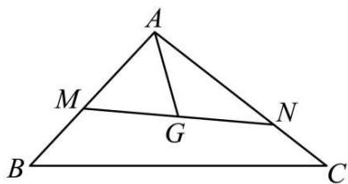

text_image

A
M
G
N
B
C

A. 3

B. 4

C. 5

D. 6

【答案】A

【解析】由题意 $\overrightarrow{AG} = \lambda \overrightarrow{AM} + (1 - \lambda) \overrightarrow{AN}$ 且 $0 \leqslant \lambda \leqslant 1$ ，而 $x \overrightarrow{AB} = \overrightarrow{AM}, y \overrightarrow{AC} = \overrightarrow{AN}$ ，所以 $\overrightarrow{AG} = x \lambda \overrightarrow{AB} + y (1 - \lambda) \overrightarrow{AC}$ ，

又 G 是 $\triangle ABC$ 的重心, 故 $\overrightarrow{AG} = \frac{2}{3} \times \frac{1}{2} (\overrightarrow{AB} + \overrightarrow{AC}) = \frac{1}{3} (\overrightarrow{AB} + \overrightarrow{AC})$ ,

所以 $\left\{\begin{aligned}x\lambda=\frac{1}{3}\\ y(1-\lambda)=\frac{1}{3}\end{aligned}\right.$ ，可得 $\frac{1}{3x}+\frac{1}{3y}=1$ ，即 $\frac{1}{x}+\frac{1}{y}=3$ .

故选：A

1590 (2024·重庆沙坪坝·高三重庆一中校考阶段练习)在 $\triangle ABC$ 中, E 为 AC 上一点, $\overrightarrow{AC} = 3\overrightarrow{AE}$ , P 为线段 BE 上任一点 (不含端点), 若 $\overrightarrow{AP} = x\overrightarrow{AB} + y\overrightarrow{AC}$ , 则 $\frac{1}{x} + \frac{3}{y}$ 的最小值是 ( )

A. 8

B. 10

C. 13

D. 16

【答案】D

【解析】由题意,如下示意图知: $\overrightarrow{AP} = \lambda \overrightarrow{AB} + (1 - \lambda) \overrightarrow{AE}$ , 且 $0 < \lambda < 1$ , 又 $\overrightarrow{AC} = 3 \overrightarrow{AE}$ ,

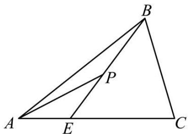

text_image

Geometric diagram of triangle ABC with internal points E and P, showing segments AD, BE, and EP.

所以 $\overrightarrow{AP} = \lambda \overrightarrow{AB} + \frac{1 - \lambda}{3} \overrightarrow{AC}$ ，故 $\left\{\begin{aligned} x &= \lambda \\ y &= \frac{1 - \lambda}{3} \end{aligned}\right.$ 且 $0 < \lambda < 1$ ，

故 $\frac{1}{x} +\frac{3}{y} = \left(\frac{1}{\lambda} +\frac{9}{1 - \lambda}\right)[\lambda +(1 - \lambda)] = 10 + \frac{1 - \lambda}{\lambda} +\frac{9\lambda}{1 - \lambda}\geqslant 10 + 2\sqrt{\frac{1 - \lambda}{\lambda}\cdot\frac{9\lambda}{1 - \lambda}} = 16,$

仅当 $\frac{1-\lambda}{\lambda}=\frac{9\lambda}{1-\lambda}$ ，即 $\lambda=\frac{1}{4}$ 时等号成立.

所以 $\frac{1}{x} +\frac{3}{y}$ 的最小值是16.

故选：D

1591 (2024·全国·高三专题练习)已知向量 $\vec{a}$ 、 $\vec{b}$ 不共线，且 $\vec{c}=x\vec{a}+\vec{b},\vec{d}=\vec{a}+(2x-1)\vec{b}$ ，若 $\vec{c}$ 与 $\vec{d}$ 共线，则实数 x 的值为（）

A. 1

B. $-\frac{1}{2}$

C. 1 或 $-\frac{1}{2}$

D.-1或 $-\frac{1}{2}$

【答案】C

【解析】因为 $\vec{c}$ 与 $\vec{d}$ 共线，则存在 $k \in R$ ，使得 $\vec{d} = k\vec{c}$ ，即 $\vec{a} + (2x - 1)\vec{b} = kx\vec{a} + k\vec{b}$ ，

因为向量 $\vec{a}$ 、 $\vec{b}$ 不共线，则 $\left\{\begin{aligned}kx=1\\ k=2x-1\end{aligned}\right.$ ，整理可得 $x(2x-1)=1$ ，即 $2x^{2}-x-1=0$ ，

解得 $x = -\frac{1}{2}$ 或1.

故选：C.

1592 (2024·全国·高三专题练习)已知直线 l 上有三点 A, B, C, O 为 l 外一点, 又等差数列 $\{a_{n}\}$ 的前 n 项和为 $S_{n}$ , 若 $\overrightarrow{OA} = (a_{1} + a_{3})\overrightarrow{OB} + 2a_{10}\overrightarrow{OC}$ , 则 $S_{11} =$ ()

A. $\frac{11}{4}$

B. 3

C. $\frac{11}{2}$

D. $\frac{13}{2}$

【答案】A

【解析】∵点A、B、C是直线l上不同的三点，

∴ 存在非零实数 $\lambda$ ，使 $\overrightarrow{AB} = \lambda \overrightarrow{BC} \Rightarrow \overrightarrow{OB} - \overrightarrow{OA} = \lambda (\overrightarrow{OC} - \overrightarrow{OB}) \Rightarrow \overrightarrow{OA} = (1 + \lambda) \overrightarrow{OB} - \lambda \overrightarrow{OC}$ ;

∵若 $\overrightarrow{OA}=(a_{1}+a_{3})\overrightarrow{OB}+2a_{10}\overrightarrow{OC}$

$$
\therefore 1 + \lambda = a _ {1} + a _ {3}, - \lambda = 2 a _ {1 0};
$$

$$
\therefore a _ {1} + a _ {3} + 2 a _ {1 0} = 1;
$$

∵数列 $\{a_{n}\}$ 是等差数列，

$$
\therefore 2 a _ {2} + 2 a _ {1 0} = 1 \Rightarrow a _ {2} + a _ {1 0} = \frac {1}{2} = a _ {1} + a _ {1 1};
$$

$$
\therefore \mathrm{S} _ {1 1} = \frac {1 1 \left(a _ {1} + a _ {1 1}\right)}{2} = \frac {1 1}{4}.
$$

故选：A.

1593 (2024·全国·高三对口高考)设两个非零向量 $\vec{a}$ 与 $\vec{b}$ 不共线.

(1) 若 $\overrightarrow{AB} = \vec{a} + \vec{b}, \overrightarrow{BC} = 2\vec{a} + 8\vec{b}, \overrightarrow{CD} = 3(\vec{a} - \vec{b})$ ，求证 A, B, D 三点共线.  
(2) 试确定实数 k，使 $k\vec{a} + \vec{b}$ 和 $\vec{a} + k\vec{b}$ 共线.

【解析】(1) 因为 $\overrightarrow{AB} = \vec{a} + \vec{b}, \overrightarrow{BC} = 2\vec{a} + 8\vec{b}, \overrightarrow{CD} = 3(\vec{a} - \vec{b})$ ,

所以 $\overrightarrow{BD} = \overrightarrow{BC} + \overrightarrow{CD} = 2\vec{a} + 8\vec{b} + 3(\vec{a} - \vec{b})$

$$
= 2 \vec {a} + 8 \vec {b} + 3 \vec {a} - 3 \vec {b} = 5 (\vec {a} + \vec {b}) = 5 \overrightarrow {\mathrm{AB}}
$$

所以 $\overrightarrow{AB}, \overrightarrow{BD}$ 共线，

又因为它们有公共点 B，

所以 A, B, D 三点共线;

(2) 因为 $k\vec{a} + \vec{b}$ 和 $\vec{a} + k\vec{b}$ 共线，

所以存在实数 $\lambda$ ，使 $k\vec{a} + \vec{b} = \lambda(\vec{a} + k\vec{b})$ ，

所以 $k\vec{a}+\vec{b}=\lambda\vec{a}+k\lambda\vec{b},$

即 $(k-\lambda)\vec{a}=(k\lambda-1)\vec{b}.$

又 $\vec{a},\vec{b}$ 是两个不共线的非零向量，

所以 $k-\lambda=k\lambda-1=0$

所以 $k^{2}-1=0$ ,

所以 k=1 或 k=-1.

1594 (2024·全国·高三对口高考)如图所示,在△ABC中,D,F分别是BC,AC的中点, $\overrightarrow{AE}$

$$
= \frac {2}{3} \overrightarrow {\mathrm{AD}}, \overrightarrow {\mathrm{AB}} = \vec {a}, \overrightarrow {\mathrm{AC}} = \vec {b}.
$$

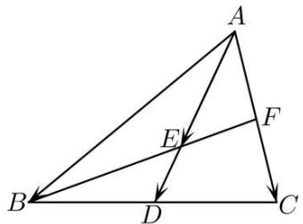

text_image

Geometric diagram of triangle ABC with internal points D, E, F and directional arrows

(1) 用 $\vec{a}, \vec{b}$ 表示 $\overrightarrow{\mathrm{AD}}, \overrightarrow{\mathrm{AE}}, \overrightarrow{\mathrm{AF}}, \overrightarrow{\mathrm{BE}}, \overrightarrow{\mathrm{BF}}$ ;  
(2) 求证: B, E, F 三点共线.

【解析】(1) 在 $\triangle ABC$ 中, D, F 分别是 BC, AC 的中点,

则 $\overrightarrow{AD} = \overrightarrow{AB} +\overrightarrow{BD} = \overrightarrow{AB} +\frac{1}{2}\overrightarrow{BC} = \overrightarrow{AB} +\frac{1}{2}\left(\overrightarrow{AC} -\overrightarrow{AB}\right) = \frac{1}{2}\overrightarrow{AB} +\frac{1}{2}\overrightarrow{AC} = \frac{1}{2}\vec{a} +\frac{1}{2}\vec{b},$

故 $\overrightarrow{AE}=\frac{2}{3}\overrightarrow{AD}=\frac{1}{3}\vec{a}+\frac{1}{3}\vec{b},$

$$
\overrightarrow {\mathrm{AF}} = \frac {1}{2} \overrightarrow {\mathrm{AC}} = \frac {1}{2} \vec {b},
$$

$$
\overrightarrow {\mathrm{BE}} = \overrightarrow {\mathrm{AE}} - \overrightarrow {\mathrm{AB}} = \frac {1}{3} \vec {a} + \frac {1}{3} \vec {b} - \vec {a} = \frac {1}{3} \vec {b} - \frac {2}{3} \vec {a},
$$

$$
\overrightarrow {\mathrm{BF}} = \overrightarrow {\mathrm{AF}} - \overrightarrow {\mathrm{AB}} = \frac {1}{2} \vec {b} - \vec {a};
$$

(2) 证明: 因为 $\overrightarrow{\mathrm{BE}} = \frac{1}{3}\vec{b} - \frac{2}{3}\vec{a} = \frac{1}{3}\left(\vec{b} - 2\vec{a}\right), \overrightarrow{\mathrm{BF}} = \frac{1}{2}\left(\vec{b} - 2\vec{a}\right)$ ,

所以 $\overrightarrow{BE}=\frac{2}{3}\overrightarrow{BF}$ ,

所以 $\overrightarrow{BE} \parallel \overrightarrow{BF}$ ,

又因 $\overrightarrow{BE},\overrightarrow{BF}$ 有公共点 B,

所以 B, E, F 三点共线.

【解题方法总结】

要证明 A, B, C 三点共线, 只需证明 $\overrightarrow{AB}$ 与 $\overrightarrow{BC}$ 共线, 即证 $\overrightarrow{AB} = \lambda \overrightarrow{BC} (\lambda \in \mathbb{R})$ . 若已知 A, B, C 三点共线, 则必有 $\overrightarrow{AB}$ 与 $\overrightarrow{BC}$ 共线, 从而存在实数 $\lambda$ , 使得 $\overrightarrow{AB} = \lambda \overrightarrow{BC}$ .

# 4 题型四:平面向量基本定理及应用

1595 (2024·上海·高三专题练习)设 $\vec{e}_{1}$ 、 $\vec{e}_{2}$ 是两个不平行的向量，则下列四组向量中，不能组成平面向量的一个基底的是（）

A. $\vec{\mathrm{e}}_1 + \vec{\mathrm{e}}_2$ 和 $\vec{\mathrm{e}}_1 - \vec{\mathrm{e}}_2$

B. $\vec{\mathrm{e}}_1 + 2\vec{\mathrm{e}}_2$ 和 $\vec{\mathrm{e}}_2 + 2\vec{\mathrm{e}}_1$

C. $3\vec{\mathrm{e}}_1 - 2\vec{\mathrm{e}}_2$ 和 $4\vec{\mathrm{e}}_2 - 6\vec{\mathrm{e}}_1$

D. $\vec{\mathrm{e}}_2$ 和 $\vec{\mathrm{e}}_2 + \vec{\mathrm{e}}_1$

【答案】C

【解析】依题意， $\vec{e}_{1}$ 、 $\vec{e}_{2}$ 不共线，

A 选项, 不存在 $\lambda \in R$ 使 $\vec{e}_{1} + \vec{e}_{2} = \lambda (\vec{e}_{1} - \vec{e}_{2})$ ,

所以 $\vec{e}_{1}+\vec{e}_{2}$ 和 $\vec{e}_{1}-\vec{e}_{2}$ 可以组成基底.

B选项,不存在 $\lambda\in R$ 使 $\vec{e}_{1}+2\vec{e}_{2}=\lambda(\vec{e}_{2}+2\vec{e}_{1})$ ,

所以 $\vec{e}_{1} + 2\vec{e}_{2}$ 和 $\vec{e}_{2} + 2\vec{e}_{1}$ 可以组成基底.

C选项， $4\vec{e}_{2}-6\vec{e}_{1}=-2(3\vec{e}_{1}-2\vec{e}_{2})$

所以 $3\vec{e}_{1}-2\vec{e}_{2}$ 和 $4\vec{e}_{2}-6\vec{e}_{1}$ 不能构成基底.

D选项,不存在 $\lambda\in R$ 使 $\vec{e}_{2}=\lambda(\vec{e}_{2}+\vec{e}_{1})$ ,

所以 $\vec{e}_{2}$ 和 $\vec{e}_{2} + \vec{e}_{1}$ 可以组成基底.

故选：C

1596 (2024·四川成都·四川省成都市玉林中学校考模拟预测)已知向量 $\vec{e}_{1},\vec{e}_{2}$ 是平面内所有向量的一组基底,则下面的四组向量中,不能作为基底的是()

A. $\{\vec{\mathrm{e}}_1,\overrightarrow{\mathrm{e}^{\circ}}_{1} - \vec{\mathrm{e}}_{2}\}$

B. $\{\vec{\mathrm{e}}_1 + \vec{\mathrm{e}}_2, \overrightarrow{\mathrm{e}^{\circ}}_1 - 3\vec{\mathrm{e}}_2\}$

C. $\{\vec{\mathrm{e}}_1 - 2\vec{\mathrm{e}}_2, - 3\overrightarrow{\mathrm{e}^{\circ}}_1 + 6\vec{\mathrm{e}}_2\}$

D. $\{2\vec{\mathrm{e}}_1 + 3\vec{\mathrm{e}}_2, 2\overrightarrow{\mathrm{e}^{\circ}}_1 - 3\vec{\mathrm{e}}_2\}$

【答案】C

【解析】对于 A, 假设 $\vec{e}_{1}, \overrightarrow{e^{\circ}}_{1} - \vec{e}_{2}$ 共线, 则存在 $\lambda \in R$ , 使得 $\vec{e}_{1} = \lambda (\overrightarrow{e^{\circ}}_{1} - \vec{e}_{2})$ ,

因为 $\vec{e}_{1},\vec{e}_{2}$ 不共线,所以没有任何一个 $\lambda\in R$ 能使该等式成立,

即假设不成立,也即 $\vec{e}_{1},\overrightarrow{e^{\circ}}_{1}-\vec{e}_{2}$ 不共线,则能作为基底;

对于 B, 假设 $\vec{e}_{1} + \vec{e}_{2}, \overrightarrow{e^{\circ}}_{1} - 3\vec{e}_{2}$ 共线, 则存在 $\lambda \in R$ , 使得 $\vec{e}_{1} + \vec{e}_{2} = \lambda (\overrightarrow{e^{\circ}}_{1} - 3\vec{e}_{2})$ ,

即 $\left\{\begin{aligned}\lambda=1\\ -3\lambda=1\end{aligned}\right.$ 无解, 所以没有任何一个 $\lambda\in R$ 能使该等式成立,

即假设不成立,也即 $\vec{e}_{1}+\vec{e}_{2},\overrightarrow{e^{\circ}}_{1}-3\vec{e}_{2}$ 不共线,则能作为基底;

对于 C, 因为 $-3e^{\circ}$ $_{1} + 6\vec{e}_{2} = -3(\vec{e}_{1} - 2\vec{e}_{2})$ , 所以两向量共线,

不能作为一组基底，C 错误；

对于 D, 假设 $2\vec{e}_{1} + 3\vec{e}_{2}, 2\overrightarrow{e^{\circ}}_{1} - 3\vec{e}_{2}$ 共线, 则存在 $\lambda \in R$ ,

使得 $2\vec{\mathrm{e}}_{1} + 3\vec{\mathrm{e}}_{2} = \lambda (2\overrightarrow{\mathrm{e}^{\circ}}_{1} - 3\vec{\mathrm{e}}_{2})$

即 $\left\{\begin{aligned}2\lambda=2\\ -3\lambda=3\end{aligned}\right.$ 无解, 所以没有任何一个 $\lambda\in R$ 能使该等式成立,

即假设不成立,也即 $2\vec{e}_{1} + 3\vec{e}_{2}, 2\overrightarrow{e^{\circ}}_{1} - 3\vec{e}_{2}$ 不共线,则能作为基底,

故选:C.

1597 (2024·河北沧州·校考模拟预测)在 $\triangle ABC$ 中 $\overrightarrow{BE} = \frac{1}{2}\overrightarrow{EC}, \overrightarrow{BF} = \frac{1}{2}\left(\overrightarrow{BA} + \overrightarrow{BC}\right)$ ，点 P 为 AE 与 BF 的交点， $\overrightarrow{AP} = \lambda\overrightarrow{AB} + \mu\overrightarrow{AC}$ ，则 $\lambda - \mu =$ （）

A. 0

B. $\frac{1}{4}$

C. $\frac{1}{2}$

D. $\frac{3}{4}$

【答案】B

【解析】因为 $\overrightarrow{BF}=\frac{1}{2}\left(\overrightarrow{BA}+\overrightarrow{BC}\right)$ ，所以 F 为 AC 中点，

B,P,F三点共线,故可设 $\overrightarrow{BP}=k\overrightarrow{BF}$ ,即 $\overrightarrow{AP}-\overrightarrow{AB}=k(\overrightarrow{AF}-\overrightarrow{AB})$ ,

整理得 $\overrightarrow{AP}=k\overrightarrow{AF}+(1-k)\overrightarrow{AB}=(1-k)\overrightarrow{AB}+\frac{1}{2}k\overrightarrow{AC}$ ,

因为 $\overrightarrow{BE}=\frac{1}{2}\overrightarrow{EC}$ ，所以 $\overrightarrow{AE}-\overrightarrow{AB}=\frac{1}{2}\overrightarrow{AC}-\frac{1}{2}\overrightarrow{AE}$ ，即 $\overrightarrow{AE}=\frac{1}{3}\overrightarrow{AC}+\frac{2}{3}\overrightarrow{AB}$ ，

A,P,E三点共线，

可得 $\overrightarrow{AP}=m\overrightarrow{AE}=m\left(\frac{1}{3}\overrightarrow{AC}+\frac{2}{3}\overrightarrow{AB}\right)=\frac{1}{3}m\overrightarrow{AC}+\frac{2}{3}m\overrightarrow{AB}$

所以 $\left\{\begin{aligned}\frac{2m}{3}&=1-k\\ \frac{m}{3}&=\frac{1}{2}k\end{aligned}\right.$ ，解得 $\left\{\begin{aligned}k&=\frac{1}{2}\\ m&=\frac{3}{4}\end{aligned}\right.$

可得 $\overrightarrow{AP}=\frac{1}{2}\overrightarrow{AB}+\frac{1}{4}\overrightarrow{AC}$ ，则 $\lambda=\frac{1}{2},\mu=\frac{1}{4},\lambda-\mu=\frac{1}{4}.$

故选：B

1598 (2024·全国·模拟预测)如图,在△ABC中, $\overrightarrow{CM}=\lambda\overrightarrow{CB},\overrightarrow{NC}=\mu\overrightarrow{AC}$ ,其中0< $\lambda$ <1,0<$\mu < 1$ ，若AM与BN相交于点Q，且 $\overrightarrow{\mathrm{BQ}} = \frac{3}{5}\overrightarrow{\mathrm{BN}}$ ，则 （）

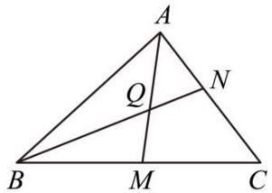

text_image

A
Q
N
B
M
C

A. $\lambda \mu = \lambda +\mu$

B. $2\lambda \mu = \lambda +\mu$

C. $5\lambda = 2 + 3\lambda \mu$

D. $3\lambda = 2 + 5\lambda \mu$

【答案】C

【解析】由题意得 $\overrightarrow{BQ} = \frac{3}{5}\overrightarrow{BN} = \frac{3}{5}\left(\overrightarrow{BA} + \overrightarrow{AN}\right) = \frac{3}{5}\left[\overrightarrow{BA} + (1 - \mu)\overrightarrow{AC}\right] =$

$$
\frac {3}{5} \big [ \overrightarrow {\mathrm{BA}} + (1 - \mu) (\overrightarrow {\mathrm{BC}} - \overrightarrow {\mathrm{BA}}) \big ] = \frac {3}{5} \big [ \mu \overrightarrow {\mathrm{BA}} + (1 - \mu) \overrightarrow {\mathrm{BC}} \big ] = \frac {3}{5} \mu \overrightarrow {\mathrm{BA}} + \frac {3}{5} \cdot \frac {1 - \mu}{1 - \lambda} \overrightarrow {\mathrm{BM}},
$$

因为 Q, M, A 三点共线, 由三点共线可得向量的线性表示中的系数之和为 1,

所以 $\frac{3}{5}\mu + \frac{3}{5} \cdot \frac{1 - \mu}{1 - \lambda} = 1$ ,

化简整理得 $5\lambda = 2 + 3\lambda\mu$ .

故选：C.

1599 (2024·广东汕头·统考三模)如图, 点 D、E 分别 AC、BC 的中点, 设 $\overrightarrow{AB} = \overrightarrow{a}, \overrightarrow{AC} = \overrightarrow{b}, F$ 是 DE 的中点, 则 $\overrightarrow{AF} =$ ()

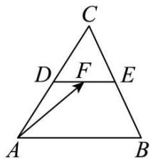

text_image

C
D F E
A B

A. $\frac{1}{2}\vec{a}+\frac{1}{2}\vec{b}$

B. $-\frac{1}{2}\vec{a}+\frac{1}{2}\vec{b}$

C. $\frac{1}{4}\vec{a} +\frac{1}{2}\vec{b}$

D. $-\frac{1}{4}\vec{a}+\frac{1}{2}\vec{b}$

【答案】C

【解析】因为点 D、E 分别 AC、BC 的中点，F 是 DE 的中点，

所以 $\overrightarrow{AF} = \overrightarrow{AD} + \overrightarrow{DF} = \frac{1}{2}\overrightarrow{AC} + \frac{1}{2}\overrightarrow{DE} = \frac{1}{2}\overrightarrow{AC} + \frac{1}{4}\overrightarrow{AB}.$

即 $\overrightarrow{AF}=\frac{1}{4}\vec{a}+\frac{1}{2}\vec{b}.$

故选：C.

1600 (2024·山西大同·统考模拟预测)在 $\triangle ABC$ 中，D 为 BC 中点，M 为 AD 中点， $\overrightarrow{BM}=m\overrightarrow{AB}+n\overrightarrow{AC}$ ，则 $m+n=$ （）

A. $-\frac{1}{2}$

B. $\frac{1}{2}$

C. 1

D.-1

【答案】A

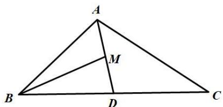

text_image

A
M
B
D
C

【解析】

因为 D 是 BC 的中点, 所以 $\overrightarrow{AD} = \frac{1}{2}\overrightarrow{AB} + \frac{1}{2}\overrightarrow{AC}, \overrightarrow{BD} = \frac{1}{2}\overrightarrow{BC} = \frac{1}{2} \times (\overrightarrow{AC} - \overrightarrow{AB}) = \frac{1}{2}\overrightarrow{AC} - \frac{1}{2}\overrightarrow{AB}.$

又因为M是AD的中点，

所以， $\overrightarrow{\mathrm{BM}} = \frac{1}{2}\overrightarrow{\mathrm{BA}} + \frac{1}{2}\overrightarrow{\mathrm{BD}} = -\frac{1}{2}\overrightarrow{\mathrm{AB}} + \frac{1}{4}\left(\overrightarrow{\mathrm{AC}} - \overrightarrow{\mathrm{AB}}\right) = -\frac{3}{4}\overrightarrow{\mathrm{AB}} + \frac{1}{4}\overrightarrow{\mathrm{AC}}$

又 $\overrightarrow{BM}=m\overrightarrow{AB}+n\overrightarrow{AC}$ ，所以 $m=-\frac{3}{4}, n=\frac{1}{4}$ ，所以 $m+n=-\frac{1}{2}$ .

故选：A.

1601 (2024·广东·统考模拟预测)古希腊数学家帕波斯在其著作《数学汇编》的第五卷序言中, 提到了蜂巢, 称蜜蜂将它们的蜂巢结构设计为相同并且拼接在一起的正六棱柱结构, 从而储存更多的蜂蜜, 提升了空间利用率, 体现了动物的智慧, 得到世人的认可. 已知蜂巢结构的平面图形如图所示, 则 $\overrightarrow{\mathrm{AB}} =$ ()

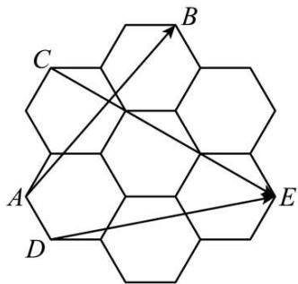

text_image

A
B
C
D
E

A. $-\frac{3}{2}\overrightarrow{\mathrm{CE}} +\frac{5}{6}\overrightarrow{\mathrm{DE}}$

B. $-\frac{5}{6}\overrightarrow{\mathrm{CE}} +\frac{3}{2}\overrightarrow{\mathrm{DE}}$

C. $-\frac{2}{3}\overrightarrow{CE}+\frac{5}{6}\overrightarrow{DE}$

D. $-\frac{5}{6}\overrightarrow{CE}+\frac{2}{3}\overrightarrow{DE}$

【答案】B

【解析】以 D 为坐标原点, 建立如图所示的平面直角坐标系.

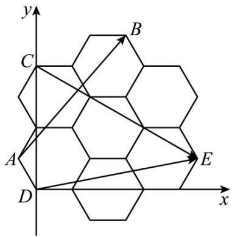

text_image

y
C
B
A
D
E
x

不妨设 AD=2，则 A $(-1,\sqrt{3})$ ，B $(5,5\sqrt{3})$ ，D $(0,0)$ ，E $(9,\sqrt{3})$ ，C $(0,4\sqrt{3})$ ，

故 $\overrightarrow{\mathrm{AB}} = (6,4\sqrt{3}),\overrightarrow{\mathrm{CE}} = (9, - 3\sqrt{3}),\overrightarrow{\mathrm{DE}} = (9,\sqrt{3}).$

设 $\overrightarrow{AB}=x\overrightarrow{CE}+y\overrightarrow{DE}$ ，则 $\left\{\begin{aligned}&6=9x+9y\\ &4\sqrt{3}=-3\sqrt{3}x+\sqrt{3}y\end{aligned}\right.$

解得 $\left\{\begin{aligned}x&=-\frac{5}{6}\\ y&=\frac{3}{2}\end{aligned}\right.$ ,

所以 $\overrightarrow{AB}=-\frac{5}{6}\overrightarrow{CE}+\frac{3}{2}\overrightarrow{DE}.$

故选: B.

1602 (2024·吉林长春·统考模拟预测)如图,在平行四边形ABCD中,M,N分别为BC,CD上的点,且 $\overrightarrow{BM}=\overrightarrow{MC},\overrightarrow{CN}=\frac{2}{3}\overrightarrow{CD}$ ,连接AM,BN交于P点,若 $\overrightarrow{AP}=\lambda\overrightarrow{PM},\overrightarrow{BP}=\mu\overrightarrow{PN}$ ,则 $\lambda+\mu=$ ( )

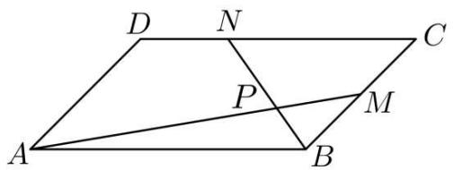

text_image

D N C
P M
A B

A. $\frac{13}{5}$

B. $\frac{25}{7}$

C. $\frac{18}{5}$

D. $\frac{19}{5}$

【答案】C

【解析】在□ABCD中,取 $\{\overrightarrow{AB},\overrightarrow{AD}\}$ 为平面的基底,

由 $\overrightarrow{BM}=\overrightarrow{MC}$ ，得 $\overrightarrow{AM}=\overrightarrow{AB}+\overrightarrow{BM}=\overrightarrow{AB}+\frac{1}{2}\overrightarrow{AD}$

由 $\overrightarrow{\mathrm{AP}} = \lambda \overrightarrow{\mathrm{PM}}$ ，得 $\overrightarrow{\mathrm{AP}} = \frac{\lambda}{1 + \lambda}\overrightarrow{\mathrm{AM}} = \frac{\lambda}{1 + \lambda}\overrightarrow{\mathrm{AB}} +\frac{\lambda}{2(1 + \lambda)}\overrightarrow{\mathrm{AD}},$

由 $\overrightarrow{CN}=\frac{2}{3}\overrightarrow{CD}$ ，知 $\overrightarrow{BN}=\overrightarrow{BC}+\overrightarrow{CN}=-\frac{2}{3}\overrightarrow{AB}+\overrightarrow{AD}$

由 $\overrightarrow{\mathrm{BP}} = \mu \overrightarrow{\mathrm{PN}}$ ，得 $\overrightarrow{\mathrm{BP}} = \frac{\mu}{1 + \mu}\overrightarrow{\mathrm{BN}} = -\frac{2\mu}{3(1 + \mu)}\overrightarrow{\mathrm{AB}} +\frac{\mu}{1 + \mu}\overrightarrow{\mathrm{AD}},$

因此 $\overrightarrow{AP} = \overrightarrow{AB} + \overrightarrow{BP} = \frac{3 + \mu}{3(1 + \mu)} \overrightarrow{AB} + \frac{\mu}{1 + \mu} \overrightarrow{AD}$ ，则 $\left\{\begin{aligned}\frac{\lambda}{1+\lambda} &= \frac{3+\mu}{3(1+\mu)} \\ \frac{\lambda}{2(1+\lambda)} &= \frac{\mu}{1+\mu}\end{aligned}\right.$ ，解得 $\lambda = 3, \mu = \frac{3}{5}$ ,

所以 $\lambda + \mu = \frac{18}{5}$ .

故选：C

1603 (2024·湖北黄冈·浠水县第一中学校考模拟预测)如图,在四边形ABCD中, AB // CD, AB = 4CD, 点E在线段CB上, 且CE = 2EB, 设 $\overrightarrow{AB} = \vec{a}$ , $\overrightarrow{AD} = \vec{b}$ , 则 $\overrightarrow{AE} =$ ()

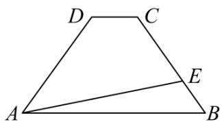

text_image

D
C
A
E
B

A. $\frac{5}{8}\vec{a} +\frac{1}{2}\vec{b}$

B. $\frac{1}{2}\vec{a}+\frac{5}{8}\vec{b}$

C. $\frac{1}{3}\vec{a}+\frac{3}{4}\vec{b}$

D. $\frac{3}{4}\vec{a} +\frac{1}{3}\vec{b}$

【答案】D

【解析】在梯形 ABCD 中，AB // CD，且 AB = 4CD，则 $\overrightarrow{DC} = \frac{1}{4}\overrightarrow{AB}$ ，

因为 E 在线段 CB 上, 且 CE = 2EB, 则 $\overrightarrow{BE} = \frac{1}{3}\overrightarrow{BC}$ ,

$$
\overrightarrow {\mathrm{BC}} = \overrightarrow {\mathrm{BA}} + \overrightarrow {\mathrm{AD}} + \overrightarrow {\mathrm{DC}} = - \vec {a} + \vec {b} + \frac {1}{4} \vec {a} = \vec {b} - \frac {3}{4} \vec {a},
$$

所以， $\overrightarrow{\mathrm{AE}} = \overrightarrow{\mathrm{AB}} +\overrightarrow{\mathrm{BE}} = \overrightarrow{\mathrm{AB}} +\frac{1}{3}\overrightarrow{\mathrm{BC}} = \vec{a} +\frac{1}{3}\left(\vec{b} -\frac{3}{4}\vec{a}\right) = \frac{3}{4}\vec{a} +\frac{1}{3}\vec{b}.$

故选：D.

1604 (2024·安徽·校联考二模)如图,在 $\triangle ABC$ 中,点 D 为线段 BC 的中点,点 E,F 分别是线段 AD 上靠近 D,A 的三等分点,则 $\overrightarrow{AD}=$ ()

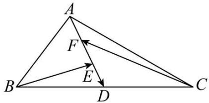

text_image

A
F
B
E
D
C

A. $-\overrightarrow{BE}-\frac{1}{3}\overrightarrow{CF}$

B. $-\frac{1}{3}\overrightarrow{BE}-\overrightarrow{CF}$

C. $-\overrightarrow{\mathrm{BE}} -\overrightarrow{\mathrm{CF}}$

D. $-\frac{4}{9}\overrightarrow{BE}-\overrightarrow{CF}$

【答案】C

【解析】 $\overrightarrow{BE}=\overrightarrow{BD}+\overrightarrow{DE}=\overrightarrow{BD}-\frac{1}{3}\overrightarrow{AD}$ ，则 $\frac{1}{2}\overrightarrow{AD}=\frac{3}{2}\overrightarrow{BD}-\frac{3}{2}\overrightarrow{BE}$ ①；

$$
\overrightarrow {\mathrm{CF}} = \overrightarrow {\mathrm{CD}} + \overrightarrow {\mathrm{DF}} = \overrightarrow {\mathrm{CD}} - \frac {2}{3} \overrightarrow {\mathrm{AD}}, \text {则} \overrightarrow {\mathrm{AD}} = \frac {3}{2} \overrightarrow {\mathrm{CD}} - \frac {3}{2} \overrightarrow {\mathrm{CF}} ②;
$$

① + ②两式相加， $\frac{3}{2}\overrightarrow{AD}=-\frac{3}{2}\overrightarrow{CF}-\frac{3}{2}\overrightarrow{BE}$ ，即 $\overrightarrow{AD}=-\overrightarrow{BE}-\overrightarrow{CF}$

故选：C.

1605 (2024·全国·模拟预测)如图,平行四边形ABCD中,AC与BD相交于点O, $\overrightarrow{EB}=3\overrightarrow{DE}$ ,若 $\overrightarrow{AO}=\lambda\overrightarrow{AE}+\mu\overrightarrow{BC}(\lambda,\mu\in\mathrm{R})$ ,则 $\frac{\lambda}{\mu}=$ ( )

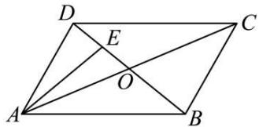

text_image

Geometric diagram of a parallelogram ABCD with diagonals intersecting at point O, and point E on diagonal AC.

A. $-\frac{1}{2}$

B.-2

C. $\frac{1}{2}$

D. 2

【答案】B

【解析】因为平行四边形 ABCD 中，AC 与 BD 相交于点 O，可得 O 为 BD 的中点，由 $\overrightarrow{EB}=3\overrightarrow{DE}$ ，可得 E 为 OD 的中点，所以 $\overrightarrow{AE}=\frac{1}{2}\overrightarrow{AO}+\frac{1}{2}\overrightarrow{AD}=\frac{1}{2}\overrightarrow{AO}+\frac{1}{2}\overrightarrow{BC}$ ，可得 $\overrightarrow{AO}=2\overrightarrow{AE}-\overrightarrow{BC}$ ，

又由 $\overrightarrow{AO} = \lambda \overrightarrow{AE} + \mu \overrightarrow{BC}$ ，所以 $\lambda = 2, \mu = -1$ ，所以 $\frac{\lambda}{\mu} = -2$ .

故选：B.

【解题方法总结】

应用平面向量基本定理表示向量的实质是利用平行四边形法则或三角形法则进行向量的加法、减法或数乘运算,基本方法有两种:

(1)运用向量的线性运算法则对待求向量不断进行化简,直至用基底表示为止.  
(2) 将向量用含参数的基底表示, 然后列方程或方程组, 利用基底表示向量的唯一性求解.  
(3) 三点共线定理: A, B, P 三点共线的充要条件是: 存在实数 $\lambda, \mu$ , 使 $\overrightarrow{OP} = \lambda \overrightarrow{OA} + \mu \overrightarrow{OB}$ , 其中 $\lambda + \mu = 1$ , O 为 AB 外一点.

# 5 题型五:平面向量的直角坐标运算

1606 (2024·全国·高三对口高考) AC 为平行四边形 ABCD 的对角线, $\overrightarrow{AB} = (2, 4)$ , $\overrightarrow{AC} = (1, 3)$ , 则 $\overrightarrow{AD} =$ \_\_\_\_.

【答案】 $(-1,-1)$

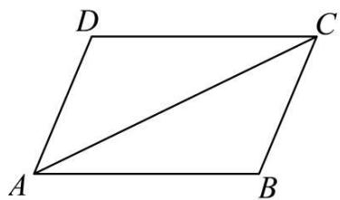

text_image

D
C
A
B

【解析】

如图在平行四边形ABCD中，

$$
\overrightarrow {\mathrm{AB}} = \overrightarrow {\mathrm{DC}} = (2, 4),
$$

在 $\triangle ACD$ 中， $\overrightarrow{AC} = \overrightarrow{AD} + \overrightarrow{DC} = \overrightarrow{AD} + \overrightarrow{AB}$ ，

所以 $\overrightarrow{AD} = \overrightarrow{AC} - \overrightarrow{AB} = (1,3) - (2,4) = (-1,-1)$ ,

故答案为: $(-1,-1)$ .

1607 (2024·全国·高三专题练习)已知向量 $\vec{a}=(-2,1)$ , $\vec{b}=(3,2)$ , $\vec{c}=(5,8)$ , 且 $\vec{c}=\lambda\vec{a}+\mu\vec{b}$ , 则 $\frac{\lambda}{\mu}=$ \_\_\_\_.

【答案】 $\frac{2}{3}$

【解析】 $\vec{c}=\lambda\vec{a}+\mu\vec{b}=(-2\lambda+3\mu,\lambda+2\mu)$ ,

由 $\vec{c} = (5,8)$ 可知 $\left\{ \begin{array}{l} -2\lambda + 3\mu = 5, \\ \lambda + 2\mu = 8, \end{array} \right.$ 解得 $\left\{ \begin{array}{l} \lambda = 2, \\ \mu = 3, \end{array} \right.$ 故 $\frac{\lambda}{\mu} = \frac{2}{3}$ .

故答案为: $\frac{2}{3}$

1608 (2024·四川绵阳·模拟预测)已知 A(-2,4), C(-3,-4), 且 $\overrightarrow{CM}=3\overrightarrow{CA}$ , 则点 M 的坐标为 \_\_\_\_.

【答案】(0,20)

【解析】由题意得 $\overrightarrow{CA}=(-2+3,4+4)=(1,8)$ ，所以 $\overrightarrow{CM}=3\overrightarrow{CA}=(3,24)$ .

设 $\mathrm{M}(x,y)$ ，则 $\overrightarrow{\mathrm{CM}}=(x+3,y+4)=(3,24)$ ，

所以 $\left\{\begin{aligned}x+3=3\\ y+4=24\end{aligned}\right.$ ，解得 $\left\{\begin{aligned}x=0\\ y=20\end{aligned}\right.$ ，

故点 M 的坐标为 $(0,20)$ .

故答案为: (0,20)

1609 (2024·全国·高三专题练习)如图, 已知平面内有三个向量 $\overrightarrow{OA}$ , $\overrightarrow{OB}$ , $\overrightarrow{OC}$ , 其中 $\overrightarrow{OC}$ 与 $\overrightarrow{OA}$ 和 $\overrightarrow{OB}$ 的夹角分别为 $30^{\circ}$ 和 $90^{\circ}$ , 且 $|\overrightarrow{OA}| = |\overrightarrow{OB}| = 1$ , $|\overrightarrow{OC}| = 2\sqrt{3}$ , 若 $\overrightarrow{OC} = \lambda \overrightarrow{OA} + \mu \overrightarrow{OB} (\lambda, \mu \in R)$ , 则 $\lambda + 2\mu =$ \_\_\_\_ .

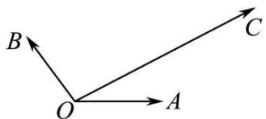

text_image

B
O
A
C

【答案】8

【解析】如图所示, 过点 C 作向量 $\overrightarrow{OA}, \overrightarrow{OB}$ 的平行线与它们的延长线分别交于 D, E 两点, 所以四边形 ODCE 平行四边形, 则 $\overrightarrow{OC} = \overrightarrow{OD} + \overrightarrow{OE}$ ,

因为向量 $\overrightarrow{OC}$ 与 $\overrightarrow{OA}$ 和 $\overrightarrow{OB}$ 的夹角分别为 $30^{\circ}$ 和 $90^{\circ}$ ,

即 $\angle BOC = 90^{\circ}, \angle AOC = 30^{\circ}$ ，则 $\angle OCD = 90^{\circ}, \angle OCE = 30^{\circ}$

在直角 $\Delta \mathrm{OCD}$ 中， $|\overrightarrow{\mathrm{OC}}| = 2\sqrt{3}$ ， $\angle \mathrm{AOC} = 30^{\circ}$ 所以 $|\overrightarrow{\mathrm{OD}}| = \frac{|\overrightarrow{\mathrm{OC}}|}{\cos 30^{\circ}} = 4,$

在直角 $\Delta \mathrm{OCE}$ 中， $|\overrightarrow{\mathrm{OC}}| = 2\sqrt{3}$ ， $\angle \mathrm{OCE} = 30^{\circ}$ ，所以 $|\overrightarrow{\mathrm{OE}}| = |\overrightarrow{\mathrm{OC}}|\cdot \tan 30^{\circ} = 2\sqrt{3}\times \frac{\sqrt{3}}{3} =$ 2,

又由 $\left|\overrightarrow{OA}\right|=\left|\overrightarrow{OB}\right|=1$ , 可得 $\overrightarrow{OC}=4\overrightarrow{OA}+2\overrightarrow{OB}$

又因为 $\overrightarrow{OC} = \lambda \overrightarrow{OA} + \mu \overrightarrow{OB} (\lambda, \mu \in \mathbb{R})$ ，所以 $\lambda = 4, \mu = 2$ ，

所以 $\lambda + 2\mu = 8$ .

故答案为: 8.

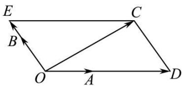

text_image

E
B
C
O
A
D

1610 (2024·河南·郑州一中校联考模拟预测)已知向量 $\vec{a} = (x, 2)$ , $\vec{b} = (-x, 1)$ , 且 $\left|2\vec{a} + \vec{b}\right| = \sqrt{26}$ , 则实数 x = \_\_\_\_.

【答案】±1

【解析】由题意, 得 $2\vec{a} + \vec{b} = (x, 5)$ , 所以 $\left|2\vec{a} + \vec{b}\right| = \sqrt{x^{2} + 5^{2}} = \sqrt{26}$ , 解得 $x = \pm 1$ .

故答案为: ±1.

1611 (2024·全国·高三对口高考)已知向量 $\vec{a} = (\sqrt{3}, 1), \vec{b} = (0, -2)$ . 若实数 k 与向量 $\vec{c}$ 满足 $\vec{a} + 2\vec{b} = k\vec{c}$ ，则 $\vec{c}$ 可以是 ()

A. $(\sqrt{3},-1)$

B. $(-1,-\sqrt{3})$

C. $(- \sqrt{3}, -1)$

D. $(-1,\sqrt{3})$

【答案】D

【解析】设 $\vec{c}=(x,y)$ ,

因为向量 $\vec{a}=(\sqrt{3},1),\vec{b}=(0,-2)$ ,

所以 $\vec{a} + 2\vec{b} = (\sqrt{3}, 1) + 2(0, -2) = (\sqrt{3}, -3)$ ,

又 $\vec{a} + 2\vec{b} = k\vec{c}$ ,

所以 $(\sqrt{3}, - 3) = k(x,y)\Rightarrow \left\{ \begin{array}{l}kx = \sqrt{3}\\ ky = -3 \end{array} \right.,$

k=0 时不成立,所以 $k\neq0$ ,

所以 $y=-\sqrt{3}x$ ,

选项 A, $\vec{c}=(\sqrt{3},-1)$ 不满足 $y=-\sqrt{3}x$ ,

选项B, $\vec{c} = (-1, -\sqrt{3})$ 不满足 $y = -\sqrt{3} x$

选项 C, $\vec{c}=(-\sqrt{3},-1)$ 不满足 $y=-\sqrt{3}x$ ,

选项D, $\vec{c} = (-1,\sqrt{3})$ 满足 $y = -\sqrt{3} x$

故选：D.

1612 (2024·河北·统考模拟预测)在正六边形 ABCDEF 中, 直线 ED 上的点 M 满足 $\overrightarrow{AM} = \overrightarrow{AC} + m\overrightarrow{AD}$ , 则 m = ()

A. 1

B. $\frac{1}{2}$

C. $\frac{1}{3}$

D. $\frac{1}{4}$

【答案】B

【解析】在正六边形 ABCDEF 中, 以 A 为原点,

分别以 AB, AE 所在直线为 x, y 轴建立平面直角坐标系，

不妨令 AB=1，则 $A(0,0)$ , $C\left(\frac{3}{2},\frac{\sqrt{3}}{2}\right)$ , $D(1,\sqrt{3})$ , $M(t,\sqrt{3})$ ,

$$
\overrightarrow {\mathrm{AC}} = \left(\frac {3}{2}, \frac {\sqrt {3}}{2}\right), \overrightarrow {\mathrm{AD}} = (1, \sqrt {3}), \overrightarrow {\mathrm{AM}} = (t, \sqrt {3}),
$$

由 $\overrightarrow{AM} = \overrightarrow{AC} + m\overrightarrow{AD}$ ，可得 $\left\{\begin{aligned} t &= \frac{3}{2} + m \\ \sqrt{3} &= \frac{\sqrt{3}}{2} + \sqrt{3}m \end{aligned}\right.$ ，解之得 $\left\{\begin{aligned} m &= \frac{1}{2} \\ t &= 2 \end{aligned}\right.$

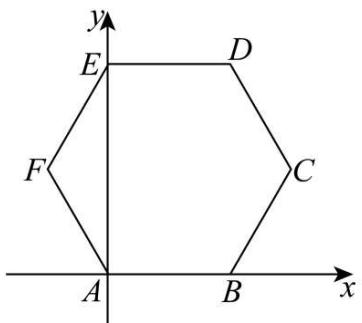

text_image

y
E
D
F
C
A
B
x

故选: B

1613 (2024·内蒙古赤峰·校联考三模)如图,在四边形ABCD中, $\angle DAB=120^{\circ},\angle DAC=30^{\circ},AB=1,AC=3,AD=2,\overrightarrow{AC}=x\overrightarrow{AB}+y\overrightarrow{AD}$ ,则 $x+y=$ ()

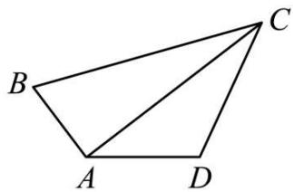

text_image

B
A
D
C

A. $2 \sqrt{3}$

B. 2

C. 3

D. 6

【答案】A

【解析】以 A 为坐标原点,以 AD 为 x 轴,过点 A 作 AD 的垂线为 y 轴,建立平面直角坐标系,

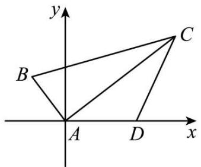

text_image

y
B
C
A
D
x

则 $\mathrm{A}(0,0),\mathrm{B}\Big(-\frac{1}{2},\frac{\sqrt{3}}{2}\Big),\mathrm{C}\Big(\frac{3\sqrt{3}}{2},\frac{3}{2}\Big),\mathrm{D}(2,0),$

故 $\overrightarrow{\mathrm{AC}} = \left(\frac{3\sqrt{3}}{2},\frac{3}{2}\right),\overrightarrow{\mathrm{AB}} = \left(-\frac{1}{2},\frac{\sqrt{3}}{2}\right),\overrightarrow{\mathrm{AD}} = (2,0),$

则由 $\overrightarrow{\mathrm{AC}} = x\overrightarrow{\mathrm{AB}} +y\overrightarrow{\mathrm{AD}}$ 可得 $\overrightarrow{\mathrm{AC}} = \left(\frac{3\sqrt{3}}{2},\frac{3}{2}\right) = x\left(-\frac{1}{2},\frac{\sqrt{3}}{2}\right) + y(2,0),$

即 $\left\{ \begin{array}{l} \frac{3\sqrt{3}}{2} = -\frac{1}{2} x + 2y \\ \frac{3}{2} = \frac{\sqrt{3}}{2} x \end{array} , \therefore \left\{ \begin{array}{l} x = \sqrt{3} \\ y = \sqrt{3} \end{array} \right. \right.$

故 $x + y = 2\sqrt{3}$

故选：A

1614 (2024·全国·高三专题练习)已知 O 为坐标原点， $\overrightarrow{P_{1}P}=-2\overrightarrow{PP_{2}}$ ，若 $P_{1}(1,2)$ 、 $P_{2}(2,-1)$ ，则与 $\overrightarrow{OP}$ 共线的单位向量为（）

A. $(3, -4)$

B. $(3, - 4)$ 或 $(-3,4)$

C. $\left(\frac{3}{5},-\frac{4}{5}\right)$ 或 $\left(-\frac{3}{5},\frac{4}{5}\right)$

D. $\left(\frac{3}{5},-\frac{4}{5}\right)$

【答案】C

【解析】由 $\overrightarrow{P_{1}P} = -2\overrightarrow{PP_{2}}$ 得 $\overrightarrow{P_{1}P} + 2\overrightarrow{PP_{2}} = \overrightarrow{0}$ ，即 $\overrightarrow{P_{1}P_{2}} + \overrightarrow{PP_{2}} = \overrightarrow{0}$ ， $\overrightarrow{P_{1}P_{2}} = \overrightarrow{P_{2}P}$ ，

$$
\overrightarrow {\mathrm{OP} _ {2}} - \overrightarrow {\mathrm{OP} _ {1}} = \overrightarrow {\mathrm{OP}} - \overrightarrow {\mathrm{OP} _ {2}},
$$

$$
\overrightarrow {\mathrm{OP}} = 2 \overrightarrow {\mathrm{OP} _ {2}} - \overrightarrow {\mathrm{OP} _ {1}} = 2 (2, - 1) - (1, 2) = (3, - 4),
$$

$$
\left| \overrightarrow {\mathrm{OP}} \right| = \sqrt {3 ^ {2} + (- 4) ^ {2}} = 5,
$$

与 $\overrightarrow{OP}$ 同向的单位向量为 $\frac{\overrightarrow{OP}}{|\overrightarrow{OP}|} = \left( \frac{3}{5}, -\frac{4}{5} \right)$ ，反向的单位向量为 $\left( -\frac{3}{5}, \frac{4}{5} \right)$ .

故选：C.

【解题方法总结】

(1) 向量的坐标运算主要是利用向量加、减、数乘运算法则进行, 若已知有向线段两端点的坐标, 则应先求向量的坐标.  
(2) 解题过程中, 常利用向量相等则其坐标相同这一原则, 通过列方程 (组) 来进行求解.

# 6 题型六:向量共线的坐标表示

1615 (2024·黑龙江哈尔滨·哈尔滨三中校考模拟预测)在平面直角坐标系中,向量 $\overrightarrow{PA} = (1, 4)$ , $\overrightarrow{PB} = (2, 3)$ , $\overrightarrow{PC} = (x, 1)$ , 若 A, B, C 三点共线, 则 x 的值为 ()

A. 2

B. 3

C. 4

D. 5

【答案】C

【解析】因为 A, B, C 三点共线，

则 $\overrightarrow{PC} = \lambda \overrightarrow{PA} + \mu \overrightarrow{PB}, (\lambda + \mu = 1)$ ,

即 $(x,1) = \lambda (1,4) + \mu (2,3) = (\lambda +2\mu ,4\lambda +3\mu),$

则 $\left\{\begin{aligned}x&=\lambda+2\mu\\ 1&=4\lambda+3\mu,\text{解得}\\ \lambda&+\mu=1\end{aligned}\right.$ $\mu=3$ $\lambda=-2$ x=4

故选：C

1616 (2024·全国·高三专题练习)已知 A(m,0), B(0,1), C(3,-1)，且 A,B,C 三点共线，则 m= ()

A. $\frac{3}{2}$

B. $\frac{2}{3}$

C. $-\frac{3}{2}$

D. $-\frac{2}{3}$

【答案】A

【解析】由 A(m,0), B(0,1), C(3,-1)，得 $\overrightarrow{AB}=(-m,1)$ , $\overrightarrow{BC}=(3,-2)$ ,

因为 A, B, C 三点共线, 所以 $\overrightarrow{AB} \parallel \overrightarrow{BC}$ , 即 $(-m) \times (-2) - 1 \times 3 = 0$ , 解得 $m = \frac{3}{2}$ .

所以 $m=\frac{3}{2}$ .

故选：A.

1617 (2024·甘肃定西·统考模拟预测)已知向量 $\vec{a} = (1,3)$ , $\vec{b} = (4,-1)$ , 若向量 $\vec{m} // \vec{a}$ , 且 $\vec{m}$ 与 $\vec{b}$ 的夹角为钝角, 写出一个满足条件的 $\vec{m}$ 的坐标为 \_\_\_\_.

【答案】 $\vec{m}=(-1,-3)$ (答案不唯一)

【解析】设 $\vec{m}=(x,y)$ ,

因为向量 $\vec{m} \parallel \vec{a}$ ，且 $\vec{m}$ 与 $\vec{b}$ 的夹角为钝角，

所以 $\left\{\begin{aligned}1\cdot y=3\cdot x\\ 4\cdot x+(-1)\cdot y<0,\\ 4\cdot y\neq(-1)\cdot x\end{aligned}\right.$ ，所以 x<0，

不妨令 x = -1，则 y = -3，故 $\vec{m} = (-1, -3)$ ，

故答案为: $\vec{m}=(-1,-3)$ (答案不唯一).

1618 (2024·全国·高三专题练习)已知向量 $\vec{a}=(-1,2)$ ， $\vec{b}=(1,2022)$ ，向量 $\vec{m}=\vec{a}+2\vec{b}$ ， $\vec{n}=2\vec{a}-k\vec{b}$ ，若 $\vec{m}\parallel\vec{n}$ ，则实数 k= \_\_\_\_.

【答案】-4

【解析】根据题意可知 $\vec{a}, \vec{b}$ 不共线

若 $\vec{m} // \vec{n}$ , 则 $\exists \lambda \in \mathrm{R}$ , 使得 $\vec{m} = \lambda \vec{n}$ , 即 $\vec{a} + 2\vec{b} = \lambda (2\vec{a} - k\vec{b}) = 2\lambda \vec{a} - k\lambda \vec{b}$

则可得 $\left\{\begin{aligned}1&=2\lambda\\ 2&=-k\lambda\end{aligned}\right.$ ，解得 $\left\{\begin{aligned}\lambda&=\frac{1}{2}\\ k&=-4\end{aligned}\right.$

故答案为: -4.

1619 (2024·北京·北京四中校考模拟预测)已知向量 $\vec{a} = (t, 4)$ , $\vec{b} = (1, t)$ , 若 $\vec{a} // \vec{b}$ , 则实数 t = \_\_\_\_.

【答案】±2

【解析】因为向量 $\vec{a}=(t,4),\vec{b}=(1,t)$ 且 $\vec{a}\parallel\vec{b}$ ,

所以 $t \times t - 4 \times 1 = 0$ ，解得 $t = \pm 2$ ，

故答案为: ±2

1620 (2024·上海普陀·上海市宜川中学校考模拟预测)已知 $\vec{a}=(k,1)$ ， $\vec{b}=(-2,3)$ ，若 $\vec{a}$ 与 $\vec{b}$ 互相平行，则实数 k 的值是 \_\_\_\_.

【答案】 $-\frac{2}{3}$

【解析】因为 $\vec{a} \parallel \vec{b}$ ,

所以 3k=-2, 解得 $k=-\frac{2}{3}$ ,

故答案为: $-\frac{2}{3}$ .

1621 (2024·全国·高三对口高考)已知向量 $\vec{a}=(1,2),\vec{b}=(1,\lambda),\vec{c}=(3,4)$ . 若 $\vec{a}+\vec{b}$ 与 $\vec{c}$ 共线，则实数 $\lambda=$ \_\_\_\_.

【答案】 $\frac{2}{3}$

【解析】由题意知向量 $\vec{a}=(1,2),\vec{b}=(1,\lambda),\vec{c}=(3,4)$ ,

故 $\vec{a}+\vec{b}=(2,2+\lambda)$ ,

由于 $\vec{a} +\vec{b}$ 与 $\vec{c}$ 共线，故 $2\times 4 - 3(2 + \lambda) = 0,\therefore \lambda = \frac{2}{3},$

故答案为: $\frac{2}{3}$

1622 (2024·重庆沙坪坝·重庆南开中学校考模拟预测)已知 $\vec{a} = (1, 2)$ , $\vec{b} = (-3, 2)$ , 若 $k\vec{a} + \vec{b}$ 与 $\vec{a} - 2\vec{b}$ 平行, 则实数 k = \_\_\_\_.

【答案】 $-\frac{1}{2} / -0.5$

【解析】因为 $\vec{a}=(1,2),\vec{b}=(-3,2)$ ,

所以 $k\vec{a}+\vec{b}=(k-3,2k+2)$ , $\vec{a}-2\vec{b}=(7,-2)$ ,

因为 $k\vec{a}+\vec{b}$ 与 $\vec{a}-2\vec{b}$ 平行, 所以 $-2(k-3)=7(2k+2)$ , 得 $k=-\frac{1}{2}$ .

故答案为: $-\frac{1}{2}$ .

1623 (2024·全国·高三专题练习)已知点 A(4, 0), B(4, 4), C(2, 6), O 为坐标原点, 则 AC 与 OB 的交点 P 的坐标为 \_\_\_\_.

【答案】(3,3)

【解析】法一: 由 O, P, B 三点共线, 可设 $\overrightarrow{OP} = \lambda \overrightarrow{OB} = (4\lambda, 4\lambda)$ ,

则 $\overrightarrow{AP} = \overrightarrow{OP} - \overrightarrow{OA} = (4\lambda - 4, 4\lambda)$ ,

又 $\overrightarrow{AC}=\overrightarrow{OC}-\overrightarrow{OA}=(-2,6)$ ,

由 $\overrightarrow{AP}, \overrightarrow{AC}$ 共线, 得 $(4\lambda - 4) \times 6 - 4\lambda \times (-2) = 0$ ,

解得 $\lambda=\frac{3}{4}$ ，所以 $\overrightarrow{OP}=\frac{3}{4}\overrightarrow{OB}=(3,3)$ ,

所以点 P 的坐标为 $(3,3)$ ,

故答案为:(3,3)

法二: 设点 $P(x,y)$ ，则 $\overrightarrow{OP}=(x,y)$ ，因为 $\overrightarrow{OB}=(4,4)$ ，且 $\overrightarrow{OP}$ 与 $\overrightarrow{OB}$ 共线，

所以 4x - 4y = 0，即 x = y。

又 $\overrightarrow{AP}=(x-4,y)$ ， $\overrightarrow{AC}=(-2,6)$ ，且 $\overrightarrow{AP},\overrightarrow{AC}$ 共线，

所以 $(x-4)\times6-y\times(-2)=0$ ，解得x=y=3，

所以点 P 的坐标为 $(3,3)$ ,

故答案为:(3,3)

# 【解题方法总结】

(1) 两平面向量共线的充要条件有两种形式: ① 若 $\vec{a} = (x_1, y_1)$ , $\vec{b} = (x_2, y_2)$ , 则 $\vec{a} // \vec{b}$ 的充要条件是 $x_1y_2 - x_2y_1 = 0$ ; ② 若 $\vec{a} // \vec{b} (\vec{b} \neq 0)$ , 则 $\vec{a} = \lambda \vec{b}$ .  
(2) 向量共线的坐标表示既可以判定两向量平行,也可以由平行求参数. 当两向量的坐标均非零时,也可以利用坐标对应成比例来求解

