# 第36讲 平面向量的数量积及运算

# 知识梳理

# 知识点一．平面向量的数量积 a

# (1) 平面向量数量积的定义

已知两个非零向量 $\vec{a}$ 与 $\vec{b}$ ，我们把数量 $|\vec{a}||\vec{b}|\cos \theta$ 叫做 $\vec{a}$ 与 $\vec{b}$ 的数量积（或内积），记作 $\vec{a} \cdot \vec{b}$ ，即 $\vec{a} \cdot \vec{b} = |\vec{a}||\vec{b}|\cos \theta$ ，规定：零向量与任一向量的数量积为0.

# (2) 平面向量数量积的几何意义

①向量的投影： $|a|\cos\theta$ 叫做向量 a 在 b 方向上的投影数量，当 $\theta$ 为锐角时，它是正数；当 $\theta$ 为钝角时，它是负数；当 $\theta$ 为直角时，它是 0.  
② $a \cdot b$ 的几何意义: 数量积 $a \cdot b$ 等于 $a$ 的长度 $|a|$ 与 $b$ 在 $a$ 方向上射影 $|b|\cos\theta$ 的乘积.

③设 $\vec{a},\vec{b}$ 是两个非零向量，它们的夹角是 $\theta ,\vec{e}$ 与 $\vec{b}$ 是方向相同的单位向量， $\overrightarrow{\mathrm{AB}} = \vec{a},\overrightarrow{\mathrm{CD}}$ $= \vec{b}$ ，过 $\overrightarrow{\mathrm{AB}}$ 的起点A和终点B，分别作 $\overrightarrow{\mathrm{CD}}$ 所在直线的垂线，垂足分别为 $\mathbf{A}_1,\mathbf{B}_1$ ，得到 $\overrightarrow{\mathrm{A_1B_1}}$ 我们称上述变换为向量 $\vec{a}$ 向向量 $\vec{b}$ 投影， $\overrightarrow{\mathrm{A_1B_1}}$ 叫做向量 $\vec{a}$ 在向量 $\vec{b}$ 上的投影向量．记为 $|\vec{a} |\cos \theta \vec{e}$

text_image

a
A
B
b
C A₁ B₁ D

# 知识点二．数量积的运算律

已知向量 $a, b, c$ 和实数 $\lambda$ , 则:

① $a \cdot b = b \cdot a;$   
② $(\lambda a)\cdot b = \lambda (a\cdot b) = a\cdot (\lambda b);$   
③ $(a + b) \cdot c = a \cdot c + b \cdot c$ .

# 知识点三．数量积的性质

设 $a, b$ 都是非零向量， $\mathbf{e}$ 是与 $b$ 方向相同的单位向量， $\theta$ 是 $a$ 与 $\mathbf{e}$ 的夹角，则

① $\mathbf{e} \cdot a = a \cdot \mathbf{e} = |a| \cos \theta$ . ② $a \perp b \Leftrightarrow a \cdot b = 0$ .   
③当 $a$ 与 $b$ 同向时， $a \cdot b = |a||b|$ ；当 $a$ 与 $b$ 反向时， $a \cdot b = -|a||b|$ .

特别地， $a\cdot a = |a|^2$ 或 $|a| = \sqrt{a\cdot a}$

④ $\cos \theta = \frac{a\cdot b}{|a||b|} (|a||b|\neq 0)$ . ⑤ $|a\cdot b|\leqslant |a||b|$ .

# 知识点四．数量积的坐标运算

已知非零向量 $a = (x_{1},y_{1}),b = (x_{2},y_{2}),\theta$ 为向量 $a,b$ 的夹角.

<table><tr><td>结论</td><td>几何表示</td><td>坐标表示</td></tr><tr><td>模</td><td> $|a| = \sqrt{a \cdot a}$ </td><td> $|a| = \sqrt{x^{2} + y^{2}}$ </td></tr><tr><td>数量积</td><td> $a \cdot b = |a||b|\cos\theta$ </td><td> $a \cdot b = x_{1}x_{2} + y_{1}y_{2}$ </td></tr><tr><td>夹角</td><td> $\cos\theta = \frac{a \cdot b}{|a||b|}$ </td><td> $\cos\theta = \frac{x_1x_2 + y_1y_2}{\sqrt{x_1^2 + y_1^2} \cdot \sqrt{x_2^2 + y_2^2}}$ </td></tr><tr><td>a⊥b的充要条件</td><td>a·b=0</td><td> $x_1x_2 + y_1y_2 = 0$ </td></tr><tr><td>a//b的充要条件</td><td>a=λb(b≠0)</td><td> $x_1y_2 - x_2y_1 = 0$ </td></tr><tr><td>|a·b|与|a||b|的关系</td><td>|a·b|≤|a||b|(当且仅当a//b时等号成立)</td><td> $|x_1x_2 + y_1y_2| \leqslant \sqrt{x_1^2 + y_1^2} \cdot \sqrt{x_2^2 + y_2^2}$ </td></tr></table>

知识点五、向量中的易错点

(1) 平面向量的数量积是一个实数, 可正、可负、可为零, 且 $|\vec{a} \cdot \vec{b}| \leqslant |\vec{a}||\vec{b}|$ .  
(2) 当 $\vec{a} \neq \vec{0}$ 时, 由 $\vec{a} \cdot \vec{b} = 0$ 不能推出 $\vec{b}$ 一定是零向量, 这是因为任一与 $\vec{a}$ 垂直的非零向量 $\vec{b}$ 都有 $\vec{a} \cdot \vec{b} = 0$ .

当 $\vec{a} \neq \vec{0}$ 时，且 $\vec{a} \cdot \vec{b} = \vec{a} \cdot \vec{c}$ 时，也不能推出一定有 $\vec{b} = \vec{c}$ ，当 $\vec{b}$ 是与 $\vec{a}$ 垂直的非零向量， $\vec{c}$ 是另一与 $\vec{a}$ 垂直的非零向量时，有 $\vec{a} \cdot \vec{b} = \vec{a} \cdot \vec{c} = 0$ ，但 $\vec{b} \neq \vec{c}$ .

(3) 数量积不满足结合律, 即 $(\vec{a} \cdot \vec{b}) \vec{c} \neq (\vec{b} \cdot \vec{c}) \vec{a}$ , 这是因为 $(\vec{a} \cdot \vec{b}) \vec{c}$ 是一个与 $\vec{c}$ 共线的向量, 而 $(\vec{b} \cdot \vec{c}) \vec{a}$ 是一个与 $\vec{a}$ 共线的向量, 而 $\vec{a}$ 与 $\vec{c}$ 不一定共线, 所以 $(\vec{a} \cdot \vec{b}) \vec{c}$ 不一定等于 $(\vec{b} \cdot \vec{c}) \vec{a}$ , 即凡有数量积的结合律形式的选项, 一般都是错误选项.  
(4) 非零向量夹角为锐角 (或钝角). 当且仅当 $\vec{a} \cdot \vec{b} > 0$ 且 $\vec{a} \neq \lambda \vec{b} (\lambda > 0)$ (或 $\vec{a} \cdot \vec{b} < 0$ , 且 $\vec{a} \neq \lambda \vec{b} (\lambda < 0)$ )

【解题方法总结】

(1) $\vec{b}$ 在 $\vec{a}$ 上的投影是一个数量，它可以为正，可以为负，也可以等于0.  
(2) 数量积的运算要注意 $\vec{a} = \vec{0}$ 时， $\vec{a} \cdot \vec{b} = 0$ ，但 $\vec{a} \cdot \vec{b} = 0$ 时不能得到 $\vec{a} = \vec{0}$ 或 $\vec{b} = \vec{0}$ ，因为 $\vec{a} \perp \vec{b}$ 时，也有 $\vec{a} \cdot \vec{b} = 0$ 。  
(3) 根据平面向量数量积的性质: $|\vec{a}| = \sqrt{\vec{a} \cdot \vec{a}}$ , $\cos \theta = \frac{\vec{a} \cdot \vec{b}}{|\vec{a}| |\vec{b}|}$ , $\vec{a} \perp \vec{b} \Leftrightarrow \vec{a} \cdot \vec{b} = 0$ 等, 所以平面向量数量积可以用来解决有关长度、角度、垂直的问题.  
(4) 若 $a, b, c$ 是实数，则 $ab = ac \Rightarrow b = c (a \neq 0)$ ; 但对于向量，就没有这样的性质，即若向量 $\vec{a}, \vec{b}, \vec{c}$ 满足 $\vec{a} \cdot \vec{b} = \vec{a} \cdot \vec{c} (\vec{a} \neq 0)$ ，则不一定有 $\vec{b} = \vec{c}$ ，即等式两边不能同时约去一个向量，但可以同时乘以一个向量.  
(5) 数量积运算不适合结合律, 即 $(\vec{a} \cdot \vec{b}) \cdot \vec{c} \neq \vec{a} \cdot (\vec{b} \cdot \vec{c})$ , 这是由于 $(\vec{a} \cdot \vec{b}) \cdot \vec{c}$ 表示一个与 $\vec{c}$ 共线的向量, $\vec{a} \cdot (\vec{b} \cdot \vec{c})$ 表示一个与 $\vec{a}$ 共线的向量, 而 $\vec{a}$ 与 $\vec{c}$ 不一定共线, 因此 $(\vec{a} \cdot \vec{b}) \cdot \vec{c}$ 与 $\vec{a} \cdot (\vec{b} \cdot \vec{c})$ 不一定相等.

# 必考题型全归纳

# 1 题型一:平面向量的数量积运算

1624 (2024·吉林四平·高三四平市第一高级中学校考期末)已知向量 $\vec{a}$ , $\vec{b}$ 满足 $|\vec{a}| = 2, |\vec{b}| =$ $\sqrt{3}$ ，且 $\vec{a}$ 与 $\vec{b}$ 的夹角为 $\frac{\pi}{6}$ ，则 $(\vec{a} +\vec{b})\cdot (2\vec{a} -\vec{b}) =$ （

A. 6

B. 8

C. 10

D. 14

【答案】B

【解析】

由 $\left|\vec{a}\right|=2,\left|\vec{b}\right|=\sqrt{3}$ ，且 $\vec{a}$ 与 $\vec{b}$ 的夹角为 $\frac{\pi}{6}$ ，

所以 $(\vec{a} +\vec{b})\cdot (2\vec{a} -\vec{b}) = 2\vec{a}^2 +\vec{a}\cdot \vec{b} -\vec{b}^2$

$$
= 2 \left| \vec {a} \right| ^ {2} + \left| \vec {a} \right| \cdot \left| \vec {b} \right| \cos \frac {\pi}{6} - \left| \vec {b} \right| ^ {2}
$$

$$
= 2 \times 2 ^ {2} + 2 \times \sqrt {3} \times \frac {\sqrt {3}}{2} - (\sqrt {3}) ^ {2} = 8.
$$

故选: B.

1625 (2024·全国·高三专题练习)已知 $\left|\vec{a}\right|=6,\left|\vec{b}\right|=3$ ，向量 $\vec{a}$ 在 $\vec{b}$ 方向上投影向量是 $4\vec{e}$ ，则 $\vec{a}\cdot\vec{b}$ 为

A. 12

B. 8

C.-8

D. 2

【答案】A

【解析】 $\vec{a}$ 在 $\vec{b}$ 方向上投影向量为 $\left|\vec{a}\right|\cos\theta\cdot\vec{e}=4\vec{e}$ ,

$$
\therefore | \vec {a} | \cos \theta = 4, \therefore \vec {a} \cdot \vec {b} = | \vec {a} | | \vec {b} | \cos \theta = 4 \times 3 = 1 2.
$$

故选：A

1626 (2024·湖南长沙·周南中学校考二模)已知菱形ABCD的边长为1, $\overrightarrow{AB} \cdot \overrightarrow{AD} = -\frac{1}{2}$ , G是菱形ABCD内一点, 若 $\overrightarrow{GA} + \overrightarrow{GB} + \overrightarrow{GC} = \overrightarrow{0}$ , 则 $\overrightarrow{AG} \cdot \overrightarrow{AB} =$ ()

A. $\frac{1}{2}$

B. 1

C. $\frac{3}{2}$

D. 2

【答案】A

【解析】在菱形 ABCD, 菱形 ABCD 的边长为 1, $\overrightarrow{AB} \cdot \overrightarrow{AD} = -\frac{1}{2}$ ,

所以 $\overrightarrow{AB} \cdot \overrightarrow{AD} = |\overrightarrow{AB}| \cdot |\overrightarrow{AD}| \cos \angle BAD = \cos \angle BAD = -\frac{1}{2}$ ,

所以 $\angle BAD = 120^{\circ}$ ，则 $\triangle ABC$ 为等边三角形，因为 $\overrightarrow{GA} + \overrightarrow{GB} + \overrightarrow{GC} = \overrightarrow{0}$

所以 $\overrightarrow{GA}=-(\overrightarrow{GB}+\overrightarrow{GC})$ ，设点 M 为 BC 的中点，则 $\overrightarrow{GA}=-2\overrightarrow{GD}$ ，所以 $\overrightarrow{GA}\parallel\overrightarrow{GD}$ ，

所以 G, A, M 三点共线, 所以 AM 为 BC 的中线,

所以 $\left|AM\right|=\sqrt{1-\left(\frac{1}{2}\right)^{2}}=\frac{\sqrt{3}}{2}$ ,

同理可得点 AB, AC 的中线过点 G,

所以点 G 为 $\triangle ABC$ 的重心, 故 $|AG| = \frac{2}{3} |AM| = \frac{\sqrt{3}}{3}$ ,

在等边 $\triangle ABC$ 中，M 为 BC 的中点，则 $\angle BAM = 30^{\circ}$

所以 $\overrightarrow{AG} \cdot \overrightarrow{AB} = |\overrightarrow{AG}| \cdot |\overrightarrow{AB}| \cos \angle BAM = \frac{\sqrt{3}}{3} \times 1 \times \frac{\sqrt{3}}{2} = \frac{1}{2}.$

故选：A

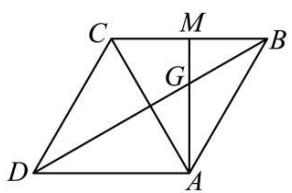

text_image

Geometric diagram of a parallelogram with labeled vertices and internal points, showing diagonals and segments.

1627 (2024·云南昆明·高三昆明一中校考阶段练习)已知单位向量 $\vec{a}, \vec{b}$ ，且 $\langle\vec{a}, \vec{b}\rangle = \frac{\pi}{3}$ ，若 $(\vec{a} + \vec{b}) \perp \vec{c}, |\vec{c}| = 2$ ，则 $\vec{a} \cdot \vec{c} =$ （）

A. 1

B. 12

C.-2或2

D.-1或1

【答案】D

【解析】由题意单位向量 $\vec{a},\vec{b}$ ，且 $\langle\vec{a},\vec{b}\rangle=\frac{\pi}{3}$ ，可知 $\vec{a}+\vec{b}$ 与 $\vec{a}$ 的夹角为 $\frac{\pi}{6}$ ，因为 $(\vec{a}+\vec{b})\perp\vec{c}$ ，所以 $\left\langle\vec{a},\vec{c}\right\rangle=\frac{\pi}{3}$ 或 $\frac{2\pi}{3}$ ，

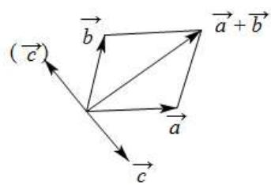

text_image

(\vec{c})\n\n\vec{b}\n\n\vec{a}+\vec{b}\n\n\vec{a}\n\n\vec{c}

故当 $\langle \vec{a},\vec{c}\rangle = \frac{\pi}{3}$ 时， $\vec{a}\cdot \vec{c} = |\vec{a} |\cdot |\vec{c} |\cos \langle \vec{a}\cdot \vec{c}\rangle = 1\times 2\times \frac{1}{2} = 1;$

当 $\langle \vec{a},\vec{c}\rangle = \frac{2\pi}{3}$ 时， $\vec{a}\cdot \vec{c} = |\vec{a} |\cdot |\vec{c} |\cos \langle \vec{a}\cdot \vec{c}\rangle = 1\times 2\times \left(-\frac{1}{2}\right) = -1,$

故选：D.

1628 (2024·广东·校联考模拟预测)将向量 $\overrightarrow{OP} = (\sqrt{2}, \sqrt{2})$ 绕坐标原点 O 顺时针旋转 $75^{\circ}$ 得到 $\overrightarrow{OP}_{1}$ ，则 $\overrightarrow{OP} \cdot \overrightarrow{OP}_{1} =$ ()

A. $\frac{\sqrt{6}-\sqrt{2}}{2}$

B. $\sqrt{6} -\sqrt{2}$

C. $\sqrt{6} +\sqrt{2}$

D. $\frac{\sqrt{6} + \sqrt{2}}{2}$

【答案】B

【解析】因为 $\overrightarrow{\mathrm{OP}}=(\sqrt{2},\sqrt{2})$ ，所以 $\left|\overrightarrow{\mathrm{OP}}\right|=\sqrt{(\sqrt{2})^{2}+(\sqrt{2})^{2}}=2$ ，

因为向量 $\overrightarrow{OP}$ 绕坐标原点 O 顺时针旋转 $75^{\circ}$ 得到 $\overrightarrow{OP}_{1}$ ,

所以向量 $\overrightarrow{OP}$ 与向量 $\overrightarrow{OP}_{1}$ 的夹角为 $75^{\circ}$ ，且 $\left|\overrightarrow{OP}_{1}\right|=2$ ，

所以 $\overrightarrow{\mathrm{OP}}\cdot \overrightarrow{\mathrm{OP}}_1 = |\overrightarrow{\mathrm{OP}} |\cdot |\overrightarrow{\mathrm{OP}}_1|\cdot \cos 75^{\circ} = 2\times 2\times \cos (30^{\circ} + 45^{\circ})$

$$
= 4 \left(\frac {\sqrt {3}}{2} \times \frac {\sqrt {2}}{2} - \frac {1}{2} \times \frac {\sqrt {2}}{2}\right) = \sqrt {6} - \sqrt {2}.
$$

故选：B

1629 (2024·全国·高三专题练习)正方形 ABCD 的边长是 2, E 是 AB 的中点, 则 $\overrightarrow{EC} \cdot \overrightarrow{ED} =$ ()

A. $\sqrt{5}$

B. 3

C. $2 \sqrt{5}$

D. 5

【答案】B

【解析】方法一:以 $\left\{\overrightarrow{AB},\overrightarrow{AD}\right\}$ 为基底向量, 可知 $\left|\overrightarrow{AB}\right|=\left|\overrightarrow{AD}\right|=2,\overrightarrow{AB}\cdot\overrightarrow{AD}=0,$ 则 $\overrightarrow{\mathrm{EC}} = \overrightarrow{\mathrm{EB}} +\overrightarrow{\mathrm{BC}} = \frac{1}{2}\overrightarrow{\mathrm{AB}} +\overrightarrow{\mathrm{AD}},\overrightarrow{\mathrm{ED}} = \overrightarrow{\mathrm{EA}} +\overrightarrow{\mathrm{AD}} = -\frac{1}{2}\overrightarrow{\mathrm{AB}} +\overrightarrow{\mathrm{AD}},$

所以 $\overrightarrow{EC}\cdot\overrightarrow{ED}=\left(\frac{1}{2}\overrightarrow{AB}+\overrightarrow{AD}\right)\cdot\left(-\frac{1}{2}\overrightarrow{AB}+\overrightarrow{AD}\right)=-\frac{1}{4}\overrightarrow{AB}^{2}+\overrightarrow{AD}^{2}=-1+4=3;$

方法二:如图,以 A 为坐标原点建立平面直角坐标系,

则 $E(1,0)$ , $C(2,2)$ , $D(0,2)$ ，可得 $\overrightarrow{EC} = (1,2)$ , $\overrightarrow{ED} = (-1,2)$ ,

所以 $\overrightarrow{EC} \cdot \overrightarrow{ED} = -1 + 4 = 3;$

方法三:由题意可得: $ED = EC = \sqrt{5}, CD = 2,$

在 $\triangle CDE$ 中, 由余弦定理可得 $\cos\angle DEC=\frac{DE^{2}+CE^{2}-DC^{2}}{2DE\cdot CE}=\frac{5+5-4}{2\times\sqrt{5}\times\sqrt{5}}=\frac{3}{5}$ ,

所以 $\overrightarrow{EC} \cdot \overrightarrow{ED} = |\overrightarrow{EC}| |\overrightarrow{ED}| \cos \angle DEC = \sqrt{5} \times \sqrt{5} \times \frac{3}{5} = 3.$

故选: B.

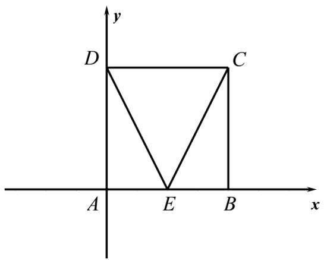

text_image

y
D C
A E B x

1630 (2024·天津和平·高三耀华中学校考阶段练习)如图,在 $\triangle ABC$ 中, $\angle BAC=\frac{\pi}{3}$ , $\overrightarrow{AD}=2\overrightarrow{DB}$ ,P为CD上一点,且满足 $\overrightarrow{AP}=m\overrightarrow{AC}+\frac{1}{2}\overrightarrow{AB}(m\in R)$ ,若 $AC=3$ ,AB=4,则 $\overrightarrow{AP}\cdot\overrightarrow{CD}$ 的值为( ).

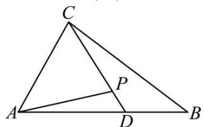

text_image

C
A
P
D
B

A.-3

B. $-\frac{13}{12}$

C. $\frac{13}{12}$

D. $-\frac{1}{12}$

【答案】C

【解析】∵ $\overrightarrow{AP}=m\overrightarrow{AC}+\frac{1}{2}\overrightarrow{AB}(m\in\mathbb{R})$ , $\overrightarrow{AD}=2\overrightarrow{DB}$ ,

即 $\overrightarrow{AD}=\frac{2}{3}\overrightarrow{AB}$ 且 $\overrightarrow{CD}=\frac{2}{3}\overrightarrow{CB}+\frac{1}{3}\overrightarrow{CA}$ ,

$$
\therefore \overrightarrow {\mathrm{AP}} = m \overrightarrow {\mathrm{AC}} + \frac {3}{4} \overrightarrow {\mathrm{AD}} (m \in \mathrm{R}),
$$

又C、P、D共线，有 $m + \frac{3}{4} = 1$ ，即 $m = \frac{1}{4}$

即 $\overrightarrow{AP}=\frac{1}{4}\overrightarrow{AC}+\frac{1}{2}\overrightarrow{AB}$ ，而 $\overrightarrow{CB}=\overrightarrow{CA}+\overrightarrow{AB}$ ，

$$
\therefore \overrightarrow {\mathrm{CD}} = \frac {2}{3} (\overrightarrow {\mathrm{CA}} + \overrightarrow {\mathrm{AB}}) + \frac {1}{3} \overrightarrow {\mathrm{CA}} = \overrightarrow {\mathrm{CA}} + \frac {2}{3} \overrightarrow {\mathrm{AB}} = \frac {2}{3} \overrightarrow {\mathrm{AB}} - \overrightarrow {\mathrm{AC}}
$$

$$
\begin{array}{l} \therefore \overrightarrow {\mathrm{AP}} \cdot \overrightarrow {\mathrm{CD}} = \left(\frac {1}{4} \overrightarrow {\mathrm{AC}} + \frac {1}{2} \overrightarrow {\mathrm{AB}}\right) \left(\frac {2}{3} \overrightarrow {\mathrm{AB}} - \overrightarrow {\mathrm{AC}}\right) = \frac {1}{3} \overrightarrow {\mathrm{AB}} ^ {2} - \frac {1}{3} \overrightarrow {\mathrm{AB}} \cdot \overrightarrow {\mathrm{AC}} - \frac {1}{4} \overrightarrow {\mathrm{AC}} ^ {2} = \frac {1 6}{3} - 2 - \\ \frac {9}{4} = \frac {1 3}{1 2}. \\ \end{array}
$$

故选：C

1631 (2024·陕西西安·西北工业大学附属中学校考模拟预测)已知向量 $\vec{a}$ ， $\vec{b}$ 满足同向共线，且 $\left|\vec{b}\right|=2,\left|\vec{a}-\vec{b}\right|=1$ ，则 $(\vec{a}+\vec{b})\cdot\vec{a}=$ （）

A. 3

B. 15

C.-3或15

D. 3 或 15

【答案】D

【解析】因为向量 $\vec{a}, \vec{b}$ 满足同向共线, 所以设 $\vec{a} = \lambda \vec{b} (\lambda > 0)$ ,

又因为 $\left|\vec{a}-\vec{b}\right|=1,\left|\vec{b}\right|=2$ , 所以 $\left|\lambda\vec{b}-\vec{b}\right|^{2}=\left|(\lambda-1)\vec{b}\right|^{2}=(\lambda-1)^{2}\left|\vec{b}\right|^{2}=4(\lambda-1)^{2}=1$

所以 $\lambda=\frac{1}{2}$ 或 $\lambda=\frac{3}{2}$ ，即 $\vec{a}=\frac{1}{2}\vec{b}$ 或 $\vec{a}=\frac{3}{2}\vec{b}$ .

①当 $\vec{a}=\frac{1}{2}\vec{b}$ 时， $(\vec{a}+\vec{b})\cdot\vec{a}=\left(\frac{3}{2}\vec{b}\right)\cdot\left(\frac{1}{2}\vec{b}\right)=\frac{3}{4}\vec{b}^{2}=3;$

②当 $\vec{a}=\frac{3}{2}\vec{b}$ 时， $(\vec{a}+\vec{b})\cdot\vec{a}=\left(\frac{5}{2}\vec{b}\right)\cdot\left(\frac{3}{2}\vec{b}\right)=\frac{15}{4}\vec{b}^{2}=15;$

所以 $(\vec{a} +\vec{b})\cdot \vec{a}$ 的值为3或15.

故选：D.

1632 (2024·吉林长春·东北师大附中校考模拟预测)在矩形ABCD中，AB=1,AD=2,AC与BD相交于点O，过点A作AE⊥BD于E，则 $\overrightarrow{AE}\cdot\overrightarrow{AO}=$ （）

A. $\frac{12}{25}$

B. $\frac{24}{25}$

C. $\frac{12}{5}$

D. $\frac{4}{5}$

【答案】D

【解析】建立如图所示直角坐标系：

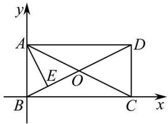

text_image

y
A
D
E
O
B
C
x

则 A(0,1), B(0,0), C(2,0), D(2,1),

设 $\mathrm{E}(x,y)$ ，则 $\overrightarrow{\mathrm{AE}}=(x,y-1),\overrightarrow{\mathrm{BE}}=(x,y),\overrightarrow{\mathrm{BD}}=(2,1)$

∵ AE ⊥ BD ∴ $\overrightarrow{AE} \perp \overrightarrow{BD}$ 且 $\overrightarrow{BE} \parallel \overrightarrow{BD}$ ,

$\therefore\left\{\begin{aligned}&2x+y-1=0\\ &x-2y=0\end{aligned}\right.$ , 解得 $\left\{\begin{aligned}&x=\frac{2}{5}\\ &y=\frac{1}{5}\end{aligned}\right.$

$\therefore \mathrm{E}\left(\frac{2}{5},\frac{1}{5}\right),\overrightarrow{\mathrm{AE}} = \left(\frac{2}{5}, - \frac{4}{5}\right),\overrightarrow{\mathrm{EC}} = \left(\frac{8}{5}, - \frac{1}{5}\right),$

在矩形 ABCD 中, O 为 BD 的中点,

所以 $O\left(1,\frac{1}{2}\right)$ ，由 $A(0,1)$ ，

所以 $\overrightarrow{AO}=\left(1.-\frac{1}{2}\right)$ ,

$$
\overrightarrow {\mathrm{AE}} \cdot \overrightarrow {\mathrm{AO}} = \frac {2}{5} \times 1 + \left(- \frac {4}{5}\right) \times \left(- \frac {1}{2}\right) = \frac {4}{5},
$$

故选：D.

【解题方法总结】(1) 求平面向量的数量积是较为常规的题型,最重要的方法是紧扣数量积的定义找到解题思路.

(2) 平面向量数量积的几何意义及坐标表示, 分别突出了它的几何特征和代数特征, 因而平面向量数量积是中学数学较多知识的交汇处, 因此它的应用也就十分广泛.  
(3) 平面向量的投影问题, 是近几年的高考热点问题, 应熟练掌握其公式: 向量 $\vec{a}$ 在向量 $\vec{b}$ 方向上的投影为 $\frac{\vec{a} \cdot \vec{b}}{|\vec{b}|}$ .

(4) 向量运算与整式运算的同与异 (无坐标的向量运算)

同： $(a\pm b)^{2}=a^{2}\pm2ab+b^{2};|a\pm b|=\sqrt{a^{2}\pm2ab+b^{2}};a(b+c)=ab+ac$ 公式都可通用

异: 整式: $a \cdot b = \pm |a||b|$ , $|a|$ 仅仅表示数; 向量: $\vec{a} \cdot \vec{b} = \pm |\vec{a}| |\vec{b}| \cos \theta (\theta \text{ 为 } a \text{ 与 } b \text{ 的夹角})$

$\left|m\vec{a}\pm n\vec{b}\right|=\sqrt{m^{2}\left|\vec{a}\right|^{2}\pm2mn\left|\vec{a}\right|\left|\vec{b}\right|\cos\theta+n^{2}\left|\vec{b}\right|^{2}}$ ，使用范围广泛，通常是求模或者夹角.

$\left|m\vec{a}\right| - \left|nb\right| \leqslant \left|m\vec{a} \pm nb\right| \leqslant \left|m\vec{a}\right| + \left|nb\right|$ ，通常是求 $\left|m\vec{a} \pm nb\right|$ 最值的时候用.

# 题型二:平面向量的夹角

1633 (2024·河南驻马店·统考二模)若单位向量 $\vec{a}, \vec{b}$ 满足 $\left|2\vec{a}-\vec{b}\right|=\sqrt{6}$ ，则向量 $\vec{a}, \vec{b}$ 夹角的余弦值为 \_\_\_\_.

【答案】 $-\frac{1}{4} / -0.25$

【解析】设向量 $\vec{a}, \vec{b}$ 的夹角为 $\theta$ ，因为 $\left|2\vec{a}-\vec{b}\right|=\sqrt{6}$ ，所以 $4\vec{a}^{2}-4\vec{a}\cdot\vec{b}+\vec{b}^{2}=6$ .

又 $|\vec{a}| = |\vec{b}| = 1$ ，所以 $4 - 4\cos \theta + 1 = 6$ ，所以 $\cos \theta = -\frac{1}{4}$ .

故答案为: $-\frac{1}{4}$

1634 (2024·四川·校联考模拟预测)若 $\vec{e}_{1},\vec{e}_{2}$ 是夹角为 $60^{\circ}$ 的两个单位向量，则 $\vec{a}=2\vec{e}_{1}+\vec{e}_{2}$ 与 $\vec{b}=-3\vec{e}_{1}+2\vec{e}_{2}$ 的夹角大小为 \_\_\_\_.

【答案】 $120^{\circ}/\frac{2}{3}\pi$

【解析】∵ $\vec{e}_{1},\vec{e}_{2}$ 是夹角为 $60^{\circ}$ 的两个单位向量，则 $\vec{e}_{1}\cdot\vec{e}_{2}=|\vec{e}_{1}|\cdot|\vec{e}_{2}|\cos60^{\circ}=\frac{1}{2}$

$$
\therefore \vec {a} \cdot \vec {b} = (2 \vec {\mathrm{e}} _ {1} + \vec {\mathrm{e}} _ {2}) \cdot (- 3 \vec {\mathrm{e}} _ {1} + 2 \vec {\mathrm{e}} _ {2}) = - 6 \vec {\mathrm{e}} _ {1} ^ {2} + \vec {\mathrm{e}} _ {1} \cdot \vec {\mathrm{e}} _ {2} + 2 \vec {\mathrm{e}} _ {2} ^ {2} = - 6 + \frac {1}{2} + 2 = - \frac {7}{2},
$$

$$
| \vec {a} | = \sqrt {(2 \vec {\mathrm{e}} _ {1} + \vec {\mathrm{e}} _ {2}) ^ {2}} = \sqrt {4 \vec {\mathrm{e}} _ {1} ^ {2} + 4 \vec {\mathrm{e}} _ {1} \cdot \vec {\mathrm{e}} _ {2} + \vec {\mathrm{e}} _ {2} ^ {2}} = \sqrt {4 + 4 \times \frac {1}{2} + 1} = \sqrt {7},
$$

$$
| \vec {b} | = \sqrt {\left(- 3 \vec {\mathrm{e}} _ {1} + 2 \vec {\mathrm{e}} _ {2}\right) ^ {2}} = \sqrt {9 \vec {\mathrm{e}} _ {1} ^ {2} - 1 2 \vec {\mathrm{e}} _ {1} \cdot \vec {\mathrm{e}} _ {2} + 4 \vec {\mathrm{e}} _ {2} ^ {2}} = \sqrt {9 - 1 2 \times \frac {1}{2} + 4} = \sqrt {7}, \therefore \cos \langle \vec {a}, \vec {b} \rangle =
$$

$$
\frac {\vec {a} \cdot \vec {b}}{| \vec {a} | \cdot | \vec {b} |} = - \frac {1}{2},
$$

$$
\because 0 ^ {\circ} \leqslant \langle \vec {a}, \vec {b} \rangle \leqslant 1 8 0 ^ {\circ}, \therefore \langle \vec {a}, \vec {b} \rangle = 1 2 0 ^ {\circ}.
$$

故答案为: $120^{\circ}$

1635 (2024·重庆·高三重庆一中校考阶段练习)已知向量 $\vec{a}$ 和 $\vec{b}$ 满足： $\left|\vec{a}\right| = 1, \left|\vec{b}\right| = 2, \left|2\vec{a} - \vec{b}\right|$

$-2\vec{a}\cdot\vec{b}=0$ , 则 $\vec{a}$ 与 $\vec{b}$ 的夹角为 \_\_\_\_.

【答案】 $\frac{\pi}{3} /60^{\circ}$

【解析】记向量 $\vec{a}$ 和 $\vec{b}$ 的夹角为 $\theta$ ，将 $\left|2\vec{a}-\vec{b}\right|=2\vec{a}\cdot\circ$ $\vec{b}$ 平方得到：

$$
4 | \vec {a} | ^ {2} + | \vec {b} | ^ {2} - 4 | \vec {a} | | \vec {b} | \cos \theta = 4 | \vec {a} | ^ {2} | \vec {b} | ^ {2} \cos^ {2} \theta \Rightarrow 2 \cos^ {2} \theta + \cos \theta - 1 = 0 \Rightarrow \cos \theta = \frac {1}{2} \text {或} - 1,
$$

又因为 $\left|2\vec{a}-\vec{b}\right|=2\vec{a}.\circ$ $\vec{b}\geqslant0\Rightarrow\cos\theta\neq-1$ , 即 $\cos\theta=\frac{1}{2}\Rightarrow\theta=\frac{\pi}{3}$

故答案为: $\frac{\pi}{3}$ .

1636 (2024·上海杨浦·复旦附中校考模拟预测)若向量 $\vec{a}$ 与 $\vec{b}$ 不共线也不垂直，且 $\vec{c} = \vec{a} - \left( \frac{\vec{a} \cdot \vec{a}}{\vec{a} \cdot \vec{b}} \right) \vec{b}$ ，则向量夹角 $\langle \vec{a}, \vec{c} \rangle =$ \_\_\_\_ .

【答案】 $\frac{\pi}{2}$

【解析】由题意可得： $\vec{a}\cdot\vec{c}=\vec{a}\cdot\left(\vec{a}-\left(\frac{\vec{a}\cdot\vec{a}}{\vec{a}\cdot\vec{b}}\right)\vec{b}\right)=\vec{a}^{2}-\frac{\vec{a}\cdot\vec{a}}{\vec{a}\cdot\vec{b}}\times\left(\vec{a}\cdot\vec{b}\right)=\vec{a}^{2}-\vec{a}^{2}=0$ ，

故: $\vec{a} \perp \vec{c}$ , 即向量 $\vec{a}$ 与 $\vec{c}$ 的夹角为 $\frac{\pi}{2}$ .

故答案为: $\frac{\pi}{2}$

1637 (2024·上海长宁·上海市延安中学校考三模)已知 $\vec{a}$ 、 $\vec{b}$ 、 $\vec{c}$ 是同一个平面上的向量，若 $\left|\vec{a}\right|=\left|\vec{c}\right|=\left|\vec{b}\right|$ ，且 $\vec{a}\cdot\vec{b}=0,\vec{c}\cdot\vec{a}=2,\vec{c}\cdot\vec{b}=1$ ，则 $\left\langle\vec{c},\vec{a}\right\rangle=$ \_\_\_\_.

【答案】 $\arcsin \frac{\sqrt{5}}{5}$

【解析】设 $\left|\vec{a}\right|=\left|\vec{c}\right|=\left|\vec{b}\right|=m$ ，则 $\vec{c}\cdot\vec{a}=m^{2}\cos\left\langle\vec{c},\vec{a}\right\rangle=2,\vec{c}\cdot\vec{b}=m^{2}\cos\left\langle\vec{c},\vec{b}\right\rangle=1$

故 $\cos \langle \vec{c},\vec{a}\rangle = 2\cos \langle \vec{c},\vec{b}\rangle$

$$
\because \vec {a} \cdot \vec {b} = 0, \left\langle \vec {a}, \vec {b} \right\rangle \in [ 0, \pi ],
$$

则 $\left\langle \vec{a},\vec{b}\right\rangle = \frac{\pi}{2},\vec{c}\cdot \vec{a} = 2 > 0,\vec{c}\cdot \vec{b} = 1 > 0$ ，故 $\left\langle \vec{c},\vec{a}\right\rangle +\left\langle \vec{c},\vec{b}\right\rangle = \frac{\pi}{2},$

设 $\langle \vec{c},\vec{a}\rangle = \theta ,\theta \in \left(0,\frac{\pi}{2}\right)$ ，则 $\cos \theta = 2\cos \left(\frac{\pi}{2} -\theta\right) = 2\sin \theta$

又 $\sin^2\theta +\cos^2\theta = 1$ ，解得 $\sin \theta = \frac{\sqrt{5}}{5}$ 故 $\left\langle \vec{c},\vec{a}\right\rangle = \arcsin \frac{\sqrt{5}}{5}.$

故答案为: $\arcsin\frac{\sqrt{5}}{5}$ .

1638 (2024·重庆渝中·高三重庆巴蜀中学校考阶段练习)已知向量 $\vec{a}$ ， $\vec{b}$ 满足 $\vec{a}=(1,-1)$ ， $|\vec{b}|=1$ ， $\vec{a}\cdot\vec{b}=1$ ，则向量 $\vec{a}$ 与 $\vec{b}$ 的夹角大小为 \_\_\_\_.

【答案】 $\frac{\pi}{4}$

【解析】由于 $\vec{a}=(1,-1)$ ，所以 $\left|\vec{a}\right|=\sqrt{2}$ ，

所以 $\cos\left\langle\vec{a},\vec{b}\right\rangle=\frac{\vec{a}\cdot\vec{b}}{\left|\vec{a}\right|\cdot\left|\vec{b}\right|}=\frac{1}{\sqrt{2}}=\frac{\sqrt{2}}{2}>0,$

所以 $\left\langle\vec{a},\vec{b}\right\rangle$ 为锐角, 所以 $\left\langle\vec{a},\vec{b}\right\rangle=\frac{\pi}{4}$ .

故答案为: $\frac{\pi}{4}$

1639 (2024·四川·校联考模拟预测)已知向量 $\vec{a}=(x+1,\sqrt{3})$ , $\vec{b}=(1,0)$ , $\vec{a}\cdot\vec{b}=-2$ , 则向量 $\vec{a}+\vec{b}$ 与 $\vec{b}$ 的夹角为 \_\_\_\_.

【答案】 $\frac{2\pi}{3}$

【解析】 $\vec{a}\cdot\vec{b}=-2\Rightarrow x+1=-2\Rightarrow x=-3$ ，则 $\vec{a}+\vec{b}=(-1,\sqrt{3})$ ，则 $\cos\left\langle\vec{a}+\vec{b},\vec{b}\right\rangle=$

$$
\frac {(\vec {a} + \vec {b}) \cdot \vec {b}}{| \vec {a} + \vec {b} | | \vec {b} |} = - \frac {1}{2}, \text {又} \left\langle \vec {a} + \vec {b}, \vec {b} \right\rangle \in [ 0, \pi ], \text {则} \left\langle \vec {a} + \vec {b}, \vec {b} \right\rangle = \frac {2 \pi}{3}
$$

故答案为: $\frac{2\pi}{3}$ .

1640 (2024·湖南长沙·雅礼中学校考模拟预测)已知向量 $\vec{a} = (1, 2)$ , $\vec{b} = (4, 2)$ , 若非零向量 $\vec{c}$ 与 $\vec{a}$ , $\vec{b}$ 的夹角均相等, 则 $\vec{c}$ 的坐标为 \_\_\_\_ (写出一个符合要求的答案即可)

【答案】(1, 1)，答案不唯一，只需满足横纵坐标相等即可.

【解析】设 $\vec{c}=(x,y)$ ，因为 $\vec{a}=(1,2)$ ， $\vec{b}=(4,2)$ ，

所以 $\cos \langle \vec{a},\vec{c}\rangle = \frac{\vec{a}\cdot\vec{c}}{|\vec{a}||\vec{c}|} = \frac{x + 2y}{\sqrt{5}\times\sqrt{x^2 + y^2}},$

$$
\cos \bigl \langle \vec {b}, \vec {c} \bigr \rangle = \frac {\vec {b} \cdot \vec {c}}{\left| \vec {b} \right| \left| \vec {c} \right|} = \frac {4 x + 2 y}{2 \sqrt {5} \times \sqrt {x ^ {2} + y ^ {2}}},
$$

因为 $\vec{c}$ 与 $\vec{a},\vec{b}$ 的夹角均相等，所以 $\cos \langle \vec{a},\vec{c}\rangle = \cos \langle \vec{b},\vec{c}\rangle$

所以 $\frac{x + 2y}{\sqrt{5} \times \sqrt{x^2 + y^2}} = \frac{4x + 2y}{2\sqrt{5} \times \sqrt{x^2 + y^2}}$

化简得 x=y，所以 $\vec{c}=(x,x)$ ，

因为 $\vec{c}$ 为非零向量, 可取 x=1, 此时 $\vec{c}=(1,1)$ .

故答案为:(1,1),答案不唯一,只需满足横纵坐标相等即可.

【解题方法总结】

求夹角,用数量积,由 $\vec{a}\cdot\vec{b}=|\vec{a}|\cdot|\vec{b}|\cos\theta$ 得 $\cos\theta=\frac{\vec{a}\cdot\vec{b}}{|\vec{a}|\cdot|\vec{b}|}=\frac{x_{1}x_{2}+y_{1}y_{2}}{\sqrt{x_{1}^{2}+y_{1}^{2}}\sqrt{x_{2}^{2}+y_{2}^{2}}}$ , 进而求得向量 $\vec{a},\vec{b}$ 的夹角.

# 3 题型三:平面向量的模长

1641 (2024·湖北·荆门市龙泉中学校联考模拟预测)已知平面向量 $\vec{a}, \vec{b}, \vec{c}$ 满足 $\vec{a} = (2,1), \vec{b} = (1,2)$ ，且 $\vec{a} \perp \vec{c}$ . 若 $\vec{b} \cdot \vec{c} = 3\sqrt{2}$ ，则 $|\vec{c}| =$ （）

A. $\sqrt{10}$

B. $2 \sqrt{5}$

C. $5 \sqrt{2}$

D. $3 \sqrt{5}$

【答案】A

【解析】令 $\vec{c}=(x,y)$ ，则 $\left\{\begin{aligned}\vec{a}\cdot\vec{c}&=2x+y=0\\ \vec{b}\cdot\vec{c}&=x+2y=3\sqrt{2}\end{aligned}\right.$ ，可得 $\left\{\begin{aligned}x&=-\sqrt{2}\\ y&=2\sqrt{2}\end{aligned}\right.$

所以 $|\vec{c}| = \sqrt{2 + 8} = \sqrt{10}$

故选：A

1642 (2024·陕西咸阳·武功县普集高级中学校考模拟预测)已知 $\vec{a}, \vec{b}$ 是非零向量， $|\vec{a}| = 1$ ， $(\vec{a} + 2\vec{b}) \perp \vec{a}$ ，向量 $\vec{a}$ 在向量 $\vec{b}$ 方向上的投影为 $-\frac{\sqrt{2}}{4}$ ，则 $|\vec{a} - \vec{b}| =$ \_\_\_\_.

【答案】2

【解析】∵ $\left(\vec{a}+2\vec{b}\right)\perp\vec{a},\therefore\left(\vec{a}+2\vec{b}\right)\cdot\vec{a}=|\vec{a}|^{2}+2\vec{b}\cdot\vec{a}=\vec{0},\therefore\vec{b}\cdot\vec{a}=-\frac{1}{2}\left|\vec{a}\right|^{2}=-\frac{1}{2},$

∵向量 $\vec{a}$ 在向量 $\vec{b}$ 方向上的投影为 $-\frac{\sqrt{2}}{4}$ ，∴ $\frac{\vec{a}\cdot\vec{b}}{|\vec{b}|}=-\frac{\sqrt{2}}{4}$

$$
\therefore | \vec {b} | = - \frac {4}{\sqrt {2}} \vec {a} \cdot \vec {b} = \sqrt {2},
$$

$$
\therefore \left| \vec {a} - \vec {b} \right| ^ {2} = \left| \vec {a} \right| ^ {2} - 2 \vec {a} \cdot \vec {b} + \left| \vec {b} \right| ^ {2} = 1 ^ {2} - 2 \times \left(- \frac {1}{2}\right) + 2 = 4,
$$

$$
\therefore | \vec {a} - \vec {b} | = 2.
$$

故答案为: 2

1643 (2024·海南·高三校联考期末)已知向量 $\vec{a}$ ， $\vec{b}$ 满足 $\vec{a} = (1,1)$ ， $|\vec{b}| = 4$ ， $\vec{a} \cdot (\vec{a} - \vec{b}) = -2$ ，则 $|3\vec{a} - \vec{b}| =$ \_\_\_\_ .

【答案】 $\sqrt{10}$

【解析】因为 $\vec{a}=(1,1)$ ， $\left|\vec{b}\right|=4$ ， $\vec{a}\cdot(\vec{a}-\vec{b})=-2$ ，则 $\left|\vec{a}\right|=\sqrt{2}$ ，

所以 $\vec{a}\cdot(\vec{a}-\vec{b})=\vec{a}^{2}-\vec{a}\cdot\vec{b}=-2$ , 所以 $\vec{a}\cdot(\vec{a}-\vec{b})=2-\vec{a}\cdot\vec{b}=-2$ , 解得: $\vec{a}\cdot\vec{b}=4$

$$
\left| 3 \vec {a} - \vec {b} \right| = \sqrt {\left(3 \vec {a} - \vec {b}\right) ^ {2}} = \sqrt {9 \vec {a} ^ {2} + \vec {b} ^ {2} - 6 \vec {a} \cdot \vec {b}}
$$

$$
= \sqrt {9 \times 2 + 1 6 - 2 4} = \sqrt {1 0}.
$$

故答案为: $\sqrt{10}$ .

1644 (2024·四川南充·阆中中学校考二模)已知 $\vec{a},\vec{b}$ 为单位向量，且满足 $\left|\vec{a}-\sqrt{5}\vec{b}\right|=\sqrt{6}$ ，则 $\left|2\vec{a}+\vec{b}\right|=$ \_\_\_\_.

【答案】 $\sqrt{5}$

【解析】 $\vec{a},\vec{b}$ 为单位向量，且满足 $\left|\vec{a}-\sqrt{5}\vec{b}\right|=\sqrt{6}$ ，所以 $\vec{a}^{2}-2\sqrt{5}\vec{a}\cdot\vec{b}+5\vec{b}^{2}=6$ ，

即 $1-2\sqrt{5}\vec{a}\cdot\vec{b}+5=6$ ，解得 $\vec{a}\cdot\vec{b}=0$ ，

所以 $\left|2\vec{a}+\vec{b}\right|=\sqrt{4\vec{a}^{2}+4\vec{a}\cdot\vec{b}+\vec{b}^{2}}=\sqrt{5}$ .

故答案为: $\sqrt{5}$ .

1645 (2024·河南驻马店·统考三模)已知平面向量 $\vec{a},\vec{b}$ 满足 $\left|\vec{a}\right|=\sqrt{10},\left|\vec{b}\right|=2,$ 且 $\left(2\vec{a}+\vec{b}\right)\cdot\left(\vec{a}-\vec{b}\right)=14,$ 则 $\left|\vec{a}+\vec{b}\right|=$ \_\_\_\_.

【答案】 $3\sqrt{2}$

【解析】由 $\left(2\vec{a}+\vec{b}\right)\cdot\left(\vec{a}-\vec{b}\right)=2\vec{a}^{2}-\vec{a}\cdot\vec{b}-\vec{b}^{2}=20-\vec{a}\cdot\vec{b}-4=14,$ 得 $\vec{a}\cdot\vec{b}=2,$

所以 $\left|\vec{a}+\vec{b}\right|=\sqrt{\left(\vec{a}+\vec{b}\right)^{2}}=\sqrt{\vec{a}^{2}+2\vec{a}\cdot\vec{b}+\vec{b}^{2}}=\sqrt{10+4+4}=3\sqrt{2}.$

故答案为: $3 \sqrt{2}$

1646 (2024·全国·高三专题练习)已知向量 $\vec{a},\vec{b}$ 满足 $\left|\vec{a}-\vec{b}\right|=\sqrt{3}$ ， $\left|\vec{a}+\vec{b}\right|=\left|2\vec{a}-\vec{b}\right|$ ，则 $\left|\vec{b}\right|=$ \_\_\_\_.

【答案】 $\sqrt{3}$

【解析】由 $\left|\vec{a}-\vec{b}\right|=\sqrt{3}$ ，得 $\vec{a}^{2}-2\vec{a}\cdot\vec{b}+\vec{b}^{2}=3$ ，即 $2\vec{a}\cdot\vec{b}=\vec{a}^{2}+\vec{b}^{2}-3$ ①.

又由 $\left|\vec{a}+\vec{b}\right|=\left|2\vec{a}-\vec{b}\right|$ ，得 $\vec{a}^{2}+2\vec{a}\cdot\vec{b}+\vec{b}^{2}=4\vec{a}^{2}-4\vec{a}\cdot\vec{b}+\vec{b}^{2}$

即 $3\vec{a}^2 - 6\vec{a} \cdot \vec{b} = 0$ ，代入①，得 $3\vec{a}^2 - 3(\vec{a}^2 + \vec{b}^2 - 3) = 0$

整理, 得 $\vec{b}^{2}=3$ , 所以 $\left|\vec{b}\right|=\sqrt{3}$ .

故答案为: $\sqrt{3}$

1647 (2024·河南郑州·模拟预测)已知点 O 为坐标原点， $\overrightarrow{OA}=(1,1)$ ， $\overrightarrow{OB}=(-3,4)$ ，点 P 在线段 AB 上，且 $\left|\overrightarrow{AP}\right|=1$ ，则点 P 的坐标为 \_\_\_\_.

【答案】 $\left(\frac{1}{5},\frac{8}{5}\right)$

【解析】由题知， $O(0,0)$ ，设 $A(x_{1},y_{1})$ ， $B(x_{2},y_{2})$ ，

$$
\because \overrightarrow {\mathrm{OA}} = (1, 1), \overrightarrow {\mathrm{OB}} = (- 3, 4), \therefore \left(x _ {1} - 0, y _ {1} - 0\right) = (1, 1), \left(x _ {2} - 0, y _ {2} - 0\right) = (- 3, 4),
$$

$$
\therefore \left\{ \begin{array}{l} x _ {1} = 1 \\ y _ {1} = 1 \end{array} , \left\{ \begin{array}{l} x _ {2} = - 3 \\ y _ {2} = 4 \end{array} \right. \right.,
$$

∴ A(1,1), B(-3,4), $k_{AB} = -\frac{3}{4}$ , 则直线 AB 方程为 $y = -\frac{3}{4}x + \frac{7}{4}$ ,

设P点坐标为 $\left(x_0, -\frac{3}{4} x_0 + \frac{7}{4}\right), -3 < x_0 < 1,$

$$
\therefore \overrightarrow {\mathrm{AP}} = \left(x _ {0} - 1, - \frac {3}{4} x _ {0} + \frac {3}{4}\right), \therefore | \overrightarrow {\mathrm{AP}} | = \sqrt {(x _ {0} - 1) ^ {2} + \left(- \frac {3}{4} x _ {0} + \frac {3}{4}\right) ^ {2}} = 1,
$$

求解可得, $x_{0}=\frac{1}{5},\therefore y_{0}=\frac{8}{5}$ ，即P点坐标为 $\left(\frac{1}{5},\frac{8}{5}\right)$ .

故答案为: $\left(\frac{1}{5},\frac{8}{5}\right)$

1648 (2024·广西·高三校联考阶段练习)已知 $\vec{a}=(-2,1)$ ， $\vec{b}=(4,t)$ ，若 $\vec{a}\cdot\vec{b}=2$ ，则 $\left|2\vec{a}-\vec{b}\right|=$ \_\_\_\_.

【答案】 $8\sqrt{2}$

【解析】因为 $\vec{a}=(-2,1)$ ， $\vec{b}=(4,t)$ 且 $\vec{a}\cdot\vec{b}=2$ ，

所以 $\vec{a}\cdot\vec{b}=-2\times4+1\times t=2$ , 解得 t=10 , 所以 $\vec{b}=(4,10)$

所以 $2\vec{a}-\vec{b}=2(-2,1)-(4,10)=(-8,-8)$ ,

所以 $\left|2\vec{a}-\vec{b}\right|=\sqrt{(-8)^{2}+(-8)^{2}}=8\sqrt{2}$ .

故答案为: $8 \sqrt{2}$

【解题方法总结】

求模长,用平方, $|\vec{a}|=\sqrt{\vec{a}^{2}}$ .

4 题型四:平面向量的投影、投影向量

1649 (2024·上海宝山·高三上海交大附中校考期中)已知向量 $\vec{a} = (3, 6)$ , $\vec{b} = (3, -4)$ , 则 $\vec{a}$ 在 $\vec{b}$ 方向上的数量投影为 \_\_\_\_.

【答案】-3

【解析】因为向量 $\vec{a}=(3,6)$ ， $\vec{b}=(3,-4)$ ，

所以 $\vec{a}$ 在 $\vec{b}$ 方向上的数量投影为 $\left|\vec{a}\right|\cos<\vec{a},\vec{b}>=\frac{\vec{a}\cdot\vec{b}}{\left|\vec{b}\right|}=\frac{3\times3+6\times(-4)}{\sqrt{9+16}}=\frac{-15}{5}=-3.$

故答案为: -3.

1650 (2024·上海虹口·华东师范大学第一附属中学校考三模)已知 $\vec{a}=(-2,-1),\vec{b}=(-4,m)$ ，若向量 $\vec{b}$ 在向量 $\vec{a}$ 方向上的数量投影为 $\sqrt{5}$ ，则实数 m= \_\_\_\_.

【答案】3

【解析】由条件可知,向量 $\vec{b}$ 在向量 $\vec{a}$ 方向上的数量投影为 $\frac{\vec{a}\cdot\vec{b}}{|\vec{b}|}=\frac{8-m}{\sqrt{5}}=\sqrt{5}$ ,

解得: m = 3.

故答案为: 3

1651 (2024·全国·高三专题练习)已知向量 $\left|\vec{a}\right|=6,\vec{e}$ 为单位向量，当向量 $\vec{a}$ 、 $\vec{e}$ 的夹角等于 $45^{\circ}$ 时，则向量 $\vec{a}$ 在向量 $\vec{e}$ 上的投影向量是 \_\_\_\_。

【答案】 $3\sqrt{2}\vec{e}$

【解析】因为向量 $\vec{a}$ 、 $\vec{e}$ 的夹角等于 $45^{\circ}$ ，

所以向量 $\vec{a}$ 在向量 $\vec{e}$ 上的投影向量是 $\left|\vec{a}\right| \cdot \cos 45^{\circ} \cdot \vec{e} = 3\sqrt{2}\vec{e}$ ,

故答案为: $3\sqrt{2}\vec{e}$ .

1652 (2024·云南昆明·高三昆明一中校考阶段练习)已知向量 $\vec{a}=(-1,2)$ ，向量 $\vec{b}=(1,1)$ ，则向量 $\vec{a}$ 在向量 $\vec{b}$ 方向上的投影为 \_\_\_\_.

【答案】 $\frac{\sqrt{2}}{2}$

【解析】 $\left|\vec{a}\right|\cdot\cos\left\langle\vec{a},\vec{b}\right\rangle=\frac{\vec{a}\cdot\vec{b}}{\left|\vec{b}\right|}=\frac{1}{\sqrt{2}}=\frac{\sqrt{2}}{2}.$

故答案为: $\frac{\sqrt{2}}{2}$

1653 (2024·新疆喀什·统考模拟预测)已知向量 $\vec{a}$ ， $\vec{b}$ 满足 $\left|\vec{a}+\vec{b}\right|=3,\left|\vec{a}\right|=2,\vec{b}=(0,1)$ ，则向量 $\vec{a}$ 在向量 $\vec{b}$ 方向上的投影为 \_\_\_\_.

【答案】2

【解析】因为 $\vec{b}=(0,1)$ ，所以 $\left|\vec{b}\right|=1$ ，又 $\left|\vec{a}+\vec{b}\right|=3$ ， $\left|\vec{a}\right|=2$ ，

所以 $\left(\vec{a}+\vec{b}\right)^{2}=\vec{a}^{2}+2\vec{a}\cdot\vec{b}+\vec{b}^{2}=\left|\vec{a}\right|^{2}+2\vec{a}\cdot\vec{b}+\left|\vec{b}\right|^{2}=9$ , 所以 $\vec{a}\cdot\vec{b}=2$

所以向量 $\vec{a}$ 在向量 $\vec{b}$ 方向上的投影为 $\frac{\vec{a} \cdot \vec{b}}{|\vec{b}|} = 2$ .

故答案为: 2

1654 (2024·全国·高三专题练习)已知非零向量 $\vec{a},\vec{b}$ 满足 $(\vec{a}+2\vec{b})\perp(\vec{a}-2\vec{b})$ ，且向量 $\vec{b}$ 在向量 $\vec{a}$ 方向的投影向量是 $\frac{1}{4}\vec{a}$ ，则向量 $\vec{a}$ 与 $\vec{b}$ 的夹角是 \_\_\_\_.

【答案】 $\frac{\pi}{3}$

【解析】因为 $(\vec{a}+2\vec{b})\perp(\vec{a}-2\vec{b})$ ，所以 $(\vec{a}+2\vec{b})\cdot(\vec{a}-2\vec{b})=\left|\vec{a}\right|^{2}-4\left|\vec{b}\right|^{2}=0$ ，即 $\left|\vec{a}\right|=2\left|\vec{b}\right|$ ①.

因为向量 $\vec{b}$ 在向量 $\vec{a}$ 方向的投影向量是 $\frac{1}{4}\vec{a}$ ,

所以 $\left|\vec{b}\right|\cos\left\langle\vec{a},\vec{b}\right\rangle\cdot\frac{\vec{a}}{\left|\vec{a}\right|}=\frac{1}{4}\vec{a}.$ 所以 $\frac{\left|\vec{b}\right|}{\left|\vec{a}\right|}\cos\left\langle\vec{a},\vec{b}\right\rangle=\frac{1}{4}$ ②，

将①代入②得， $\cos\left\langle\vec{a},\vec{b}\right\rangle=\frac{1}{2}$ ，又 $\left\langle\vec{a},\vec{b}\right\rangle\in[0,\pi]$ ，所以 $\left\langle\vec{a},\vec{b}\right\rangle=\frac{\pi}{3}$ .

故答案为: $\frac{\pi}{3}$

1655 (2024·全国·模拟预测)已知向量 $\vec{a} = (1,0), \vec{b} = (0,1), \vec{a} \cdot \vec{c} = \vec{b} \cdot \vec{c} = 1$ ，则向量 $\vec{a}$ 在向量 $\vec{c}$ 上的投影向量为 \_\_\_\_.

【答案】 $\left(\frac{1}{2},\frac{1}{2}\right)$

【解析】设 $\vec{c}=(a,b)$ ，因为 $\vec{a}=(1,0),\vec{b}=(0,1),\vec{a}\cdot\vec{c}=\vec{b}\cdot\vec{c}=1$

所以 $\left\{\begin{aligned}1\times a+0\times b=1\\ 0\times a+1\times b=1\end{aligned}\right.\Rightarrow\left\{\begin{aligned}a=1\\ b=1\end{aligned}\right.$

所以 $\vec{c}=(1,1)$

则向量 $\vec{a}$ 在向量 $\vec{c}$ 上的投影向量为： $\frac{\vec{a}\cdot\vec{c}}{|\vec{c}|}\cdot\frac{\vec{c}}{|\vec{c}|}=\frac{1}{\sqrt{2}}\cdot\frac{(1,1)}{\sqrt{2}}=\left(\frac{1}{2},\frac{1}{2}\right)$ .

故答案为: $\left(\frac{1}{2},\frac{1}{2}\right)$ .

【解题方法总结】

设 $\vec{a}, \vec{b}$ 是两个非零向量，它们的夹角是 $\theta, \vec{e}$ 与 $\vec{b}$ 是方向相同的单位向量， $\overrightarrow{AB} = \vec{a}, \overrightarrow{CD} = \vec{b}$ ，过 $\overrightarrow{AB}$ 的起点 A 和终点 B，分别作 $\overrightarrow{CD}$ 所在直线的垂线，垂足分别为 $A_{1}, B_{1}$ ，得到 $\overrightarrow{A_{1}B_{1}}$ ，我们称上述变换为向量 $\vec{a}$ 向向量 $\vec{b}$ 投影， $\overrightarrow{A_{1}B_{1}}$ 叫做向量 $\vec{a}$ 在向量 $\vec{b}$ 上的投影向量。记为 $|\vec{a}| \cos \theta \vec{e}$ 。

# 5 题型五:平面向量的垂直问题

1656 (2024·四川巴中·南江中学校考模拟预测)已知向量 $\vec{a} = (1, 2)$ , $\vec{b} = (-2, 3)$ , 若 $(k\vec{a} + \vec{b}) \perp (\vec{a} - \vec{b})$ , 则 k = \_\_\_\_.

【答案】 $-\frac{1}{4} / -0.25$

【解析】由题意可得 $k\vec{a}+\vec{b}=(k-2,2k+3),\vec{a}-\vec{b}=(3,-1)$ ,

因为 $(k\vec{a} +\vec{b})\perp (\vec{a} -\vec{b})$

则 $(k\vec{a} +\vec{b})\cdot (\vec{a} -\vec{b}) = 3(k - 2) - (2k + 3) = 0$ ，解得 $k = 9$

故答案为: $-\frac{1}{4}$

1657 (2024·全国·高三专题练习)已知向量 $\vec{a}, \vec{b}, \vec{c}$ ，其中 $\vec{a}, \vec{b}$ 为单位向量，且 $\vec{a} \perp \vec{b}$ ，若 $|\vec{c}| =$ \_\_\_\_，则 $(\vec{a} - \vec{c}) \perp (\vec{b} - 2\vec{c})$ .

注:填上你认为正确的一种条件即可,不必考虑所有可能的情形.

【答案】1(答案不唯一)

【解析】因为 $\vec{a},\vec{b}$ 是相互垂直的单位向量,不妨设 $\vec{a}=(1,0),\vec{b}=(0,1),\vec{c}=(x,y)$

$$
\because (\vec {a} - \vec {c}) \perp (\vec {b} - 2 \vec {c}), \therefore (\vec {a} - \vec {c}) \cdot (\vec {b} - 2 \vec {c}) = 0, \text {即} \vec {a} \cdot \vec {b} - 2 \vec {a} \cdot \vec {c} - \vec {b} \cdot \vec {c} + 2 \vec {c} ^ {2} = 0,
$$

$\therefore 2x^{2} + 2y^{2} - 2x - y = 0$ ，即 $\left(x - \frac{1}{2}\right)^{2} + \left(y - \frac{1}{4}\right)^{2} = \frac{5}{16}$ ，即向量 $\vec{c}$ 的端点在圆心为 $\left(\frac{1}{2}, \frac{1}{4}\right)$ ，半径为 $\frac{\sqrt{5}}{4}$ 的圆周上，

故可以取 $\vec{c}=(1,0)$ ，即 $\left|\vec{c}\right|=1;$

故答案为: 1.

1658 (2024·江西宜春·高三校联考期末)设非零向量 $\vec{a}, \vec{b}$ 的夹角为 $\theta$ 。若 $\left|\vec{b}\right|=2\left|\vec{a}\right|$ ，且 $(\vec{a}+2\vec{b})\perp(3\vec{a}-\vec{b})$ ，则 $\theta=$ \_\_\_\_.

【答案】 $60^{\circ}/\frac{\pi}{3}$

【解析】由题设 $(\vec{a}+2\vec{b})\cdot(3\vec{a}-\vec{b})=3\vec{a}^{2}+5\vec{a}\cdot\vec{b}-2\vec{b}^{2}=0$

所以 $\cos\theta=\frac{2|\vec{b}|^{2}-3|\vec{a}|^{2}}{5|\vec{a}||\vec{b}|}=\frac{5|\vec{a}|^{2}}{10|\vec{a}|^{2}}=\frac{1}{2}$ ，又 $0^{\circ}\leqslant\theta\leqslant180^{\circ}$

所以 $\theta = 60^{\circ}$ .

故答案为: $60^{\circ}$

1659 (2024·江西南昌·高三统考开学考试)已知两单位向量 $\vec{e}_{1}, \vec{e}_{2}$ 的夹角为 $\frac{\pi}{3}$ ，若 $\vec{a} = \vec{e}_{1} + 2\vec{e}_{2}$ ， $\vec{b} = \vec{e}_{1} + m\vec{e}_{2}$ ，且 $\vec{a} \perp \vec{b}$ ，则实数 m = \_\_\_\_.

【答案】 $-\frac{4}{5} / -0.8$

【解析】因为单位向量 $\vec{e}_{1}, \vec{e}_{2}$ 的夹角为 $\frac{\pi}{3}$ ，所以 $\vec{e}_{1} \cdot \vec{e}_{2} = 1 \times 1 \times \cos \frac{\pi}{3} = \frac{1}{2}$ ;

因为 $\vec{a} \perp \vec{b}$ , 所以 $\vec{a} \cdot \vec{b} = (\vec{\mathrm{e}}_1 + 2\vec{\mathrm{e}}_2) \cdot (\vec{\mathrm{e}}_1 + m\vec{\mathrm{e}}_2) = \vec{\mathrm{e}}_1 \cdot \vec{\mathrm{e}}_1 + (2\vec{\mathrm{e}}_2) \cdot (m\vec{\mathrm{e}}_2) + (m + 2)(\vec{\mathrm{e}}_1 \cdot \vec{\mathrm{e}}_2)$ .

$$
= 1 + 2 m + (m + 2) \times \frac {1}{2} = \frac {5}{2} m + 2 = 0, \text {所以} m = - \frac {4}{5}.
$$

故答案为: $-\frac{4}{5}$ .

1660 (2024·海南·校考模拟预测)已知 $\vec{a}$ 为单位向量, 向量 $\vec{b}$ 在向量 $\vec{a}$ 上的投影向量是 $2\vec{a}$ , 且 $\left(3\vec{a} + \lambda\vec{b}\right) \perp \vec{a}$ , 则实数 $\lambda$ 的值为 \_\_\_\_.

【答案】 $-\frac{3}{2} / -1.5$

【解析】因为向量 $\vec{b}$ 在 $\vec{a}$ 上的投影向量为 $2\vec{a}$ ，所以 $\frac{\vec{a}\cdot\vec{b}}{|\vec{a}|}=2$ ，

又 $\vec{a}$ 为单位向量, 所以 $\vec{a} \cdot \vec{b} = 2 |\vec{a}| = 2$ ,

因为 $\left(3\vec{a} +\lambda \vec{b}\right)\perp \vec{a}$ ，所以 $\left(3\vec{a} +\lambda \vec{b}\right)\cdot \vec{a} = 0$

所以 $3\vec{a}^{2}+\lambda\vec{a}\cdot\vec{b}=0$ ，所以 $3+2\lambda=0$ ，

故 $\lambda=-\frac{3}{2}$ ,

故答案为: $-\frac{3}{2}$ .

1661 (2024·全国·模拟预测)向量 $\vec{m} = (1, x)$ , $\vec{n} = (2, 1)$ ，且 $\vec{n} \perp (\vec{m} + \vec{n})$ ，则实数 x = \_\_\_\_.

【答案】-7

【解析】因为向量 $\vec{m}=(1,x),\vec{n}=(2,1)$ ，所以 $\vec{m}+\vec{n}=(3,x+1)$ ，

又 $\vec{n} \perp (\vec{m} + \vec{n})$

所以 $\vec{n} \cdot (\vec{m} + \vec{n}) = 0$ ，得 $6 + x + 1 = 0$ ，

解得 $x = -7$ .

故答案为: -7.

1662 (2024·全国·高三专题练习)非零向量 $\vec{a} = (\cos(\alpha - \beta), \sin\beta)$ ， $\vec{b} = (1, \sin\alpha)$ ，若 $\vec{a} \perp \vec{b}$ ，则 $\tan\alpha\tan\beta =$ \_\_\_\_ .

【答案】 $-\frac{1}{2} / -0.5$

【解析】因为 $\vec{a} \perp \vec{b}$ ，所以 $\vec{a} \cdot \vec{b} = (\cos(\alpha - \beta), \sin\beta) \cdot (1, \sin\alpha) = \cos(\alpha - \beta) + \sin\alpha \sin\beta = \cos\alpha \cos\beta + 2 \sin\alpha \sin\beta = 0$ ，

由题易知 $\alpha \neq \frac{\pi}{2}, \beta \neq \frac{\pi}{2}$ ,

所以 $\tan \alpha \tan \beta = \frac{\sin \alpha \sin \beta}{\cos \alpha \cos \beta} = \frac{\sin \alpha \sin \beta}{-2 \sin \alpha \sin \beta} = -\frac{1}{2}$ .

故答案为: $-\frac{1}{2}$

1663 (2024·河南开封·校考模拟预测)已知向量 $\vec{a}=(-2,3),\vec{b}=(4,-5)$ ，若 $(\lambda\vec{a}-\vec{b})\perp\vec{b}$ ，则 $\lambda=$ \_\_\_\_.

【答案】- $\frac{41}{23}$

【解析】因为 $\vec{a} = (-2,3),\vec{b} = (4, - 5)$ ，所以 $\lambda \vec{a} -\vec{b} = \lambda (-2,3) - (4, - 5) =$ $(-2\lambda -4,3\lambda +5)$

又 $\left(\lambda \vec{a} -\vec{b}\right)\perp \vec{b}$ ，所以 $\left(\lambda \vec{a} -\vec{b}\right)\cdot \vec{b} = 4(-2\lambda -4) - 5(3\lambda +5) = 0$ ，解得 $\lambda = -\frac{41}{23}$

故答案为: $-\frac{41}{23}$

1664 (2024·海南海口·海南华侨中学校考模拟预测)已知向量 $\vec{a}, \vec{b}$ 不共线， $\vec{a} = (2,1)$ ， $\vec{a} \perp (\vec{b} - \vec{a})$ ，写出一个符合条件的向量 $\vec{b}$ 的坐标：\_\_\_\_.

【答案】(1,3)(答案不唯一)

【解析】由题意得 $\left|\vec{a}\right|=\sqrt{5},\vec{a}\cdot\vec{b}-\vec{a}^{2}=0$ ，则 $\vec{a}\cdot\vec{b}=5$ ，设 $\vec{b}=(x,y)$ ，

得 $2x + y = 5$ ，且 $x \neq 2y$ ，满足条件的向量 $\vec{b}$ 的坐标可以为 (1,3)(答案不唯一或者 $\left(\frac{1}{2}, 4\right)$ ).

故答案为: (1,3)(答案不唯一)

1665 (2024·河南开封·统考三模)已知向量 $\vec{a}=(m,-1)$ , $\vec{b}=(1,3)$ , 若 $(\vec{a}-\vec{b})\perp\vec{b}$ , 则 m= \_\_\_\_.

【答案】13

【解析】∵ $\vec{a}=(m,-1)$ , $\vec{b}=(1,3)$ , $\vec{a}-\vec{b}=(m-1,-4)$ ,

又∵(a-b)⊥b,

$\therefore (\vec{a} - \vec{b}) \cdot \vec{b} = m - 1 - 12 = 0$ ，解得 $m = 13$ .

故答案为: 13

【解题方法总结】

$$
\vec {a} \perp \vec {b} \Leftrightarrow \vec {a} \cdot \vec {b} = 0 \Leftrightarrow x _ {1} x _ {2} + y _ {1} y _ {2} = 0
$$

# 题型六:建立坐标系解决向量问题

1666 (2024·全国·高三专题练习)已知 $\left|\vec{a}\right|=\left|\vec{b}\right|=\left|\vec{c}\right|=1,\vec{a}\cdot\vec{b}=-\frac{1}{2},\vec{c}=x\vec{a}+y\vec{b}(x,y\in\mathrm{R})$ ，则 x-y 的最小值为 ()

A.-2

B. $-\frac{2\sqrt{3}}{3}$

C. $-\sqrt{3}$

D.-1

【答案】B

【解析】设 $\vec{a},\vec{b}$ 的夹角为 $\theta,\because\left|\vec{a}\right|=\left|\vec{b}\right|=1,\vec{a}\cdot\vec{b}=-\frac{1}{2},$

$\therefore \cos \theta = -\frac{1}{2}, \because \theta \in [0, \pi], \therefore \theta = \frac{2\pi}{3}$ , 又 $|\vec{c}| = 1$ ,

不妨设 $\vec{a}=(1,0),\vec{b}=(-\frac{1}{2},\frac{\sqrt{3}}{2}),\vec{c}=(\cos\alpha,\sin\alpha),\alpha\in[0,2\pi)$ ,

$\because \vec{c} = x\vec{a} + y\vec{b} = \left(x - \frac{y}{2}, \frac{\sqrt{3}}{2}y\right)$ , 所以 $\left\{ \begin{array}{l} \cos \alpha = x - \frac{y}{2} \\ \sin \alpha = \frac{\sqrt{3}}{2}y \end{array} \right.$ , 即 $\left\{ \begin{array}{l} x = \cos \alpha + \frac{\sqrt{3}}{3}\sin \alpha \\ y = \frac{2\sqrt{3}}{3}\sin \alpha \end{array} \right.$ ,

$$
\therefore x - y = \cos \alpha - \frac {\sqrt {3}}{3} \sin \alpha = \sqrt {1 + \left(\frac {\sqrt {3}}{3}\right) ^ {2}} \cos \left(\alpha + \frac {\pi}{6}\right) = \frac {2 \sqrt {3}}{3} \cos \left(\alpha + \frac {\pi}{6}\right),
$$

由 $\alpha \in [0,2\pi)\therefore \alpha +\frac{\pi}{6}\in \left[\frac{\pi}{6},\frac{13\pi}{6}\right),$

∴当 $\alpha+\frac{\pi}{6}=\frac{3\pi}{2}$ 时, 即 $\alpha=\frac{4\pi}{3}$ 时, x-y 有最小值 $-\frac{2\sqrt{3}}{3}$ .

故选：B

1667 (2024·安徽合肥·合肥市第七中学校考三模)以边长为2的等边三角形ABC每个顶点为圆心,以边长为半径,在另两个顶点间作一段圆弧,三段圆弧围成曲边三角形,已知P为弧AC上的一点,且 $\angle PBC=\frac{\pi}{6}$ ,则 $\overrightarrow{BP}\cdot\overrightarrow{CP}$ 的值为()

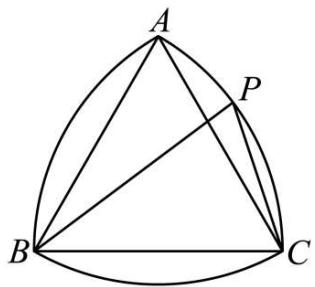

text_image

A
P
B
C

A. $4 - \sqrt{2}$

B. $4 + \sqrt{2}$

C. $4 - 2\sqrt{3}$

D. $4 + 2\sqrt{3}$

【答案】C

【解析】如图所示,以 B 为坐标原点,直线 BC 为 x 轴,过点 B 且垂直于 BC 的直线为 y 轴,

建立平面直角坐标系,则 B(0,0), C(2,0),

由 $\angle \mathrm{PBC} = \frac{\pi}{6}$ ，得 $\mathrm{P}(\sqrt{3},1)$

所以 $\overrightarrow{BP}=(\sqrt{3},1)$ ， $\overrightarrow{CP}=(\sqrt{3}-2,1)$ ，

所以 $\overrightarrow{BP} \cdot \overrightarrow{CP} = \sqrt{3} (\sqrt{3} - 2) + 1 \times 1 = 4 - 2\sqrt{3}.$

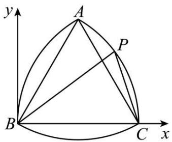

text_image

y
A
P
B
C
x

故选：C.

1668 (2024·黑龙江哈尔滨·哈师大附中校考模拟预测)下图是北京2022年冬奥会会徽的图案,奥运五环的大小和间距如图所示. 若圆半径均为12,相邻圆圆心水平路离为26,两排圆圆心垂直距离为11. 设五个圆的圆心分别为 $O_{1}$ 、 $O_{2}$ 、 $O_{3}$ 、 $O_{4}$ 、 $O_{5}$ ,则 $\overrightarrow{O_{4}O_{1}}\cdot\left(\overrightarrow{O_{4}O_{5}}+\overrightarrow{O_{4}O_{2}}\right)$ 的值为()

text_image

BEIJING
Candidate City
2022

A.-507

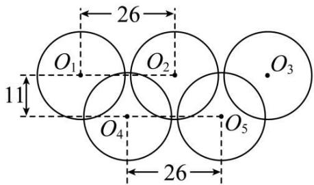

text_image

26
O₁ O₂ O₃
11
O₄ O₅
26

B.-386

C. -338

D. -242

【答案】B

【解析】建立如图所示的平面直角坐标系，做 $O_{4}A \perp x$ 轴于 A 点，所以 $|O_{4}A| = 11$ ，由已知可得 $\mathrm{O}_{1}(-26,0)$ ， $\mathrm{O}_{4}(-13,-11)$ ， $\mathrm{O}_{5}(13,-11)$ ，

所以 $\overrightarrow{O_{4}O_{1}}=(-13,11)$ ， $\overrightarrow{O_{4}O_{5}}=(26,0)$ ， $\overrightarrow{O_{4}O_{2}}=(13,11)$ ，

所以 $\overrightarrow{\mathrm{O}_4\mathrm{O}_1}\cdot (\overrightarrow{\mathrm{O}_4\mathrm{O}_5} +\overrightarrow{\mathrm{O}_4\mathrm{O}_2}) = (-13,11)\cdot (39,11) = -507 + 121 = -386.$

故选: B.

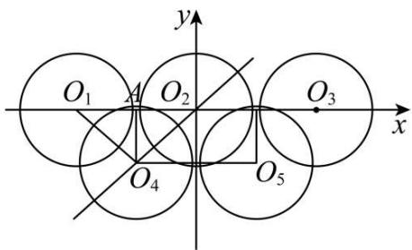

text_image

O₁ A O₂ O₃
x
y
O₄ O₅

1669 (2024·陕西安康·陕西省安康中学校考模拟预测)如图,在圆内接四边形ABCD中, $\angle BAD=120^{\circ},AB=AD=1,AC=2.$ 若E为CD的中点,则 $\overrightarrow{EA}\cdot\overrightarrow{EB}$ 的值为()

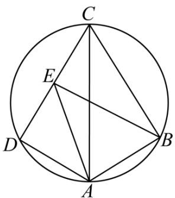

text_image

C
E
D
A
B

A.-3

B. $-\frac{1}{3}$

C. $\frac{3}{2}$

D. 3

【答案】C

【解析】连接 BD, 由余弦定理知 $BD^{2}=1^{2}+1^{2}-2\times1\times1\times\left(-\frac{1}{2}\right)=3$ , 所以 $BD=\sqrt{3}$ .

text_image

C
E
D
B
A

由正弦定理得 $\frac{BD}{\sin120^{\circ}}=2=AC$ ，所以 AC 为圆的直径，

所以 CD ⊥ AD, 所以 CD = $\sqrt{3}$ , 从而 CD = BD,

又 $\angle BCD = 180^{\circ} - 120^{\circ} = 60^{\circ}$ ，所以 $\triangle BCD$ 为等边三角形，

以 D 为原点, 以 DA 所在直线为 x 轴, DC 所在直线为 y 轴建立如图所示的平面直角坐标系.

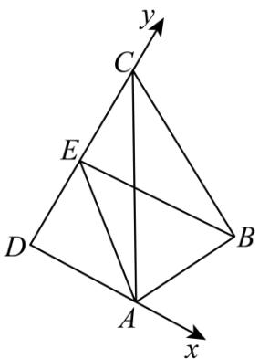

text_image

y
C
E
D
A
x
B

则 $\mathrm{A}(1,0),\mathrm{E}\left(0,\frac{\sqrt{3}}{2}\right),\mathrm{B}\left(\frac{3}{2},\frac{\sqrt{3}}{2}\right),\overrightarrow{\mathrm{EA}} = \left(1, - \frac{\sqrt{3}}{2}\right),\overrightarrow{\mathrm{EB}} = \left(\frac{3}{2},0\right)$

所以 $\overrightarrow{EA}\cdot\overrightarrow{EB}=\left(1,-\frac{\sqrt{3}}{2}\right)\cdot\left(\frac{3}{2},0\right)=\frac{3}{2}.$

故选：C.

1670 (2024·安徽合肥·合肥市第八中学校考模拟预测)如图,已知△ABC是面积为 $3\sqrt{3}$ 的等边三角形,四边形MNPQ是面积为2的正方形,其各顶点均位于△ABC的内部及三边上,且恰好可在△ABC内任意旋转,则当 $\overrightarrow{BQ}\cdot\overrightarrow{CP}=0$ 时, $|\overrightarrow{BQ}+\overrightarrow{CP}|^{2}=$

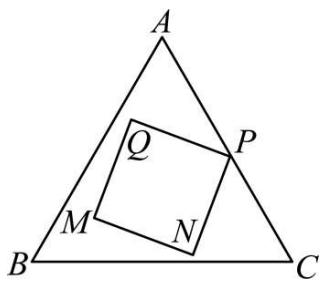

text_image

A
Q
P
M
N
B
C

A. $2 + 4\sqrt{3}$

B. $4+2\sqrt{3}$

C. $3 + 2\sqrt{6}$

D. $2 + 3\sqrt{6}$

【答案】A

【解析】因为 $\triangle ABC$ 是面积为 $3\sqrt{3}$ 的等边三角形，记 $\triangle ABC$ 边长为 a，所以 $\frac{1}{2} \times \frac{\sqrt{3}}{2} \times a^{2} = 3\sqrt{3}$ ，解得 $a = 2\sqrt{3}$ ，记 $\triangle ABC$ 内切圆的半径为 r，根据 $S = \frac{1}{2} Cr$ ，

可得: $3\sqrt{3}=\frac{1}{2}\times2\sqrt{3}\times3\times r$ , 解得 r=1, 因为正方形 MNPQ 的面积为 2, 所以正方形边长为 $\sqrt{2}$ ,

记正方形 MNPQ 外接圆半径为 R, 所以其外接圆直径等于正方形的对角线 2, 即 R = 1, 根据正方形的对称性和等边三角形的对称性可知. 正方形外接圆即为等边三角形的内切圆,

因为正方形 MNPQ 可在 $\triangle ABC$ 内任意旋转，

可知正方形 MNPQ 各个顶点均在该 $\triangle ABC$ 的内切圆上，

以 $\triangle ABC$ 的底边 BC 为 $x$ 轴, 以 BC 的垂直平分线为 $y$ 轴建立平面直角坐标系如图所示:

故可知 $\mathrm{B}(-\sqrt{3},0),\mathrm{C}(\sqrt{3},0),\mathrm{A}(0,3)$

圆的方程为 $x^{2}+(y-1)^{2}=1$ ,

故设 $\mathrm{P}(\cos \alpha, 1 + \sin \alpha), \mathrm{Q}\left(\cos \left(\alpha + \frac{\pi}{2}\right), 1 + \sin \left(\alpha + \frac{\pi}{2}\right)\right), \alpha \in (0, 2\pi)$ ,

即 $P(\cos\alpha,1+\sin\alpha)$ , $Q(-\sin\alpha,1+\cos\alpha)$ , $\overrightarrow{BQ}\cdot\overrightarrow{CP}=(\sqrt{3}-\sin\alpha,1+\cos\alpha)\cdot$

$$
(\cos \alpha - \sqrt {3}, 1 + \sin \alpha) = (1 + \sqrt {3}) (\cos \alpha + \sin \alpha) - 2 = 0, \therefore \cos \alpha + \sin \alpha = \frac {2}{\sqrt {3} + 1} = \sqrt {3} - 1,
$$

$$
\left| \overrightarrow {\mathrm{BQ}} + \overrightarrow {\mathrm{CP}} \right| ^ {2} = (\cos \alpha - \sin \alpha) ^ {2} + (2 + \cos \alpha + \sin \alpha) ^ {2} = (\cos \alpha - \sin \alpha) ^ {2} + (\sqrt {3} + 1) ^ {2}
$$

$$
= 2 - (\cos \alpha + \sin \alpha) ^ {2} + (\sqrt {3} + 1) ^ {2} = 2 + 4 \sqrt {3}
$$

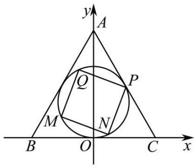

text_image

y
A
Q
P
M
N
B
O
C
x

故选:A.

1671 (2024·河南安阳·统考三模)已知正方形ABCD的边长为1,O为正方形的中心,E是AB的中点,则 $\overrightarrow{DE}\cdot\overrightarrow{DO}=$ ()

A. $-\frac{1}{4}$

B. $\frac{1}{2}$

C. $\frac{3}{4}$

D. 1

【答案】C

【解析】如图，以 A 为坐标原点，AB, AD 所在直线为 x 轴，y 轴，建立平面直角坐标系，则 D(0,1)， $E\left(\frac{1}{2},0\right)$ ， $O\left(\frac{1}{2},\frac{1}{2}\right)$ ，所以 $\overrightarrow{DE}=\left(\frac{1}{2},-1\right)$ ， $\overrightarrow{DO}=\left(\frac{1}{2},-\frac{1}{2}\right)$ ，所以 $\overrightarrow{DE}\cdot\overrightarrow{DO}=\frac{1}{4}+\frac{1}{2}=\frac{3}{4}$

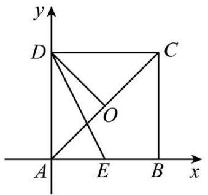

text_image

y
D
C
O
A
E
B
x

故选：C.

【解题方法总结】

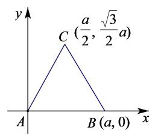

line

| Point | x | y |
|---|---|---|
| A | 0 | 0 |
| B | a | 0 |
| C | (a/2, √3/2)a | 1 |

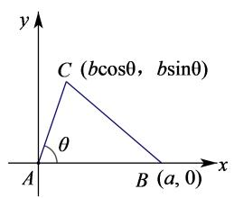

text_image

y
C (bcosθ, bsinθ)
θ
A
B (a, 0)
x

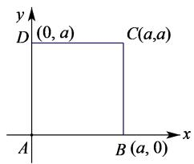

text_image

y
D (0, a) C(a, a)
A B (a, 0) x

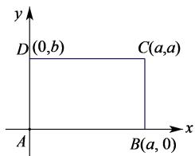

text_image

y
D(0,b) C(a,a)
A B(a,0) x

边长为 $a$ 的等边三角形

已知夹角的任意三角形

正方形

矩形

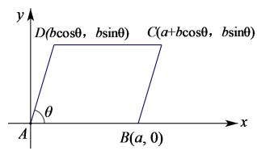

text_image

y
D(bcosθ, bsinθ) C(a+bcosθ, bsinθ)
θ
A B(a, 0) x

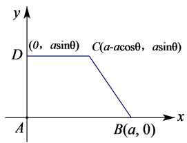

text_image

y
(0, asinθ) C(a-acosθ, asinθ)
D
A B(a, 0) x

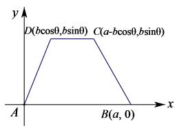

text_image

y
D(bcos0,bsin0) C(a-bcos0,bsin0)
A B(a, 0) x

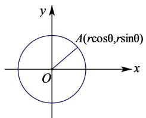

text_image

y
A(rcosθ,rsinθ)
O
x

平行四边形

直角梯形

等腰梯形

圆

建系必备 (1) 三角函数知识 $x = r\cos \theta, y = r\sin \theta$ ; (2) 向量三点共线知识 $\overrightarrow{\mathrm{OC}} = \lambda \overrightarrow{\mathrm{OB}} + (1 - \lambda)\overrightarrow{\mathrm{OA}}$ .

设 $\vec{a}, \vec{b}$ 是两个非零向量，它们的夹角是 $\theta, \vec{e}$ 与 $\vec{b}$ 是方向相同的单位向量， $\overrightarrow{AB} = \vec{a}, \overrightarrow{CD} = \vec{b}$ ，过 $\overrightarrow{AB}$ 的起点 A 和终点 B，分别作 $\overrightarrow{CD}$ 所在直线的垂线，垂足分别为 $A_{1}, B_{1}$ ，得到 $\overrightarrow{A_{1}B_{1}}$ ，我们称上述变换为向量 $\vec{a}$ 向向量 $\vec{b}$ 投影， $\overrightarrow{A_{1}B_{1}}$ 叫做向量 $\vec{a}$ 在向量 $\vec{b}$ 上的投影向量。记为 $|\vec{a}| \cos \theta \vec{e}$ 。

# 题型七:平面向量的实际应用

1672 (2024·江西宜春·高三校考阶段练习)一质点受到同一平面上的三个力 $F_{1}$ , $F_{2}$ , $F_{3}$ (单位: 牛顿)的作用而处于平衡状态, 已知 $F_{1}$ , $F_{2}$ 成 $120^{\circ}$ 角, 且 $F_{1}$ , $F_{2}$ 的大小都为 6 牛顿, 则 $F_{3}$ 的大小为 \_\_\_\_ 牛顿.

【答案】6

【解析】设三个力 $F_{1}, F_{2}, F_{3}$ 分别对于的向量为： $\vec{a}, \vec{b}, \vec{c}$

则由题知 $\vec{a} +\vec{b} +\vec{c} = \vec{0}$

所以 $\vec{c}=-(\vec{a}+\vec{b})$

所以 $\left|\vec{c}\right|=\left|-(\vec{a}+\vec{b})\right|=\sqrt{\vec{a}^{2}+2\vec{a}\cdot\vec{b}+\vec{b}^{2}}$

又 $|\vec{a}| = 6, |\vec{b}| = 6, \vec{a} \cdot \vec{b} = |\vec{a}||\vec{b}|\cos 120^\circ = 6 \times 6 \times \left(-\frac{1}{2}\right) = -18$

所以 $\left|\vec{c}\right|=\sqrt{36+2\times(-18)+36}=6$

所以 $\mathrm{F}_3$ 的大小为: 6

故答案为: 6

1673 (2024·内蒙古赤峰·统考三模)如图所示, 把一个物体放在倾斜角为 $30^{\circ}$ 的斜面上, 物体处于平衡状态, 且受到三个力的作用, 即重力 $\vec{G}$ , 垂直斜面向上的弹力 $\vec{F}_{1}$ , 沿着斜面向上的摩擦力 $\vec{F}_{2}$ . 已知: $\left|\vec{F}_{1}\right|=80\sqrt{3}N,\left|\vec{G}\right|=160N$ , 则 $\vec{F}_{2}$ 的大小为 \_\_\_\_.

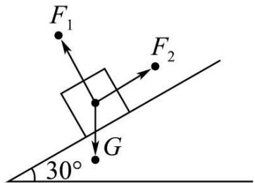

text_image

F₁
F₂
G
30°

【答案】80N

【解析】由题设， $|\vec{F}_{2}|=|\vec{G}|\cos60^{\circ}=160\times\frac{1}{2}=80N$

故答案为: 80N.

1674 (2024·全国·高三专题练习)如图所示,一个物体被两根轻质细绳拉住,且处于平衡状态.已知两条绳上的拉力分别是 $\vec{F}_{1}, \vec{F}_{2}$ , 且 $\vec{F}_{1}, \vec{F}_{2}$ 与水平夹角均为 $45^{\circ}, \left|\vec{F}_{1}\right| = \left|\vec{F}_{2}\right| = 4\sqrt{2}N$ , 则物体的重力大小为 \_\_\_\_ N.

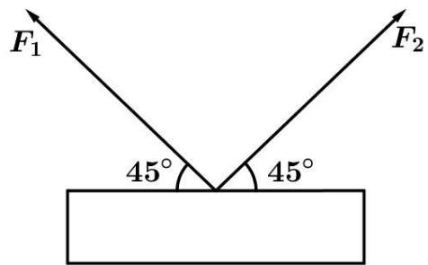

text_image

F₁
45°
45°
F₂

【答案】8

【解析】设 $\vec{F}_{1}, \vec{F}_{2}$ 的合力为 $\vec{F}$ ，则 $\vec{F} = \vec{F}_{1} + \vec{F}_{2}$

$\because\vec{F}_{1},\vec{F}_{2}$ 的夹角为 $90^{\circ}$ ,

$$
\therefore \vec {\mathrm{F}} ^ {2} = (\vec {\mathrm{F}} _ {1} + \vec {\mathrm{F}} _ {2}) ^ {2} = \vec {\mathrm{F}} _ {1} ^ {2} + \vec {\mathrm{F}} _ {2} ^ {2} + 2 \vec {\mathrm{F}} _ {1} \cdot \vec {\mathrm{F}} _ {2} = 3 2 + 3 2 = 6 4,
$$

$\therefore |\vec{F}| = 8,$

∵物体平衡状态.∴物体的重力大小为 $|\vec{G}|=8$ .

故答案为: 8.

1675 (2024·全国·高三专题练习)两同学合提一捆书,提起后书保持静止,如图所示,则 $F_{1}$ 与 $F_{2}$ 大小之比为 \_\_\_\_.

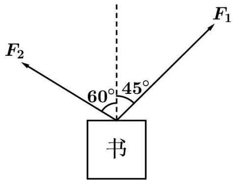

text_image

F₂
60°
45°
书
F₁

【答案】 $\frac{\sqrt{6}}{2}$

【解析】物体处于平衡状态,所以水平方向的合力为0

所以 $\left|\vec{F}_{1}\right|\cos45^{\circ}=\left|\vec{F}_{2}\right|\cos30^{\circ}$ ，所以 $\frac{\left|\vec{F}_{1}\right|}{\left|\vec{F}_{2}\right|}=\frac{\cos30^{\circ}}{\cos45^{\circ}}=\frac{\frac{\sqrt{3}}{2}}{\frac{\sqrt{2}}{2}}=\frac{\sqrt{6}}{2}$

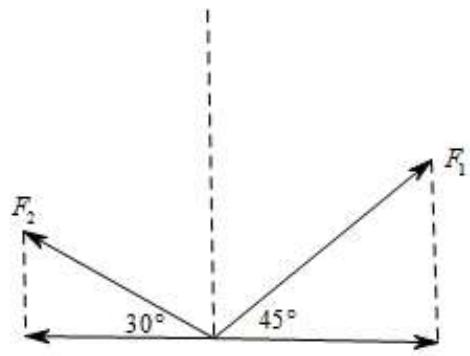

text_image

F₂
30°
45°
F₁

故答案为: $\frac{\sqrt{6}}{2}$

1676 (2024·浙江·高三专题练习)一条渔船距对岸 4km, 以 2km/h 的速度向垂直于对岸的方向划去, 到达对岸时, 船的实际行程为 8km, 则河水的流速是 \_\_\_\_ km/h.

【答案】 $2\sqrt{3}$

【解析】如图,用 $\vec{v}_{t}$ 表示河水的流速, $\vec{v}_{2}$ 表示船的速度,

则 $\vec{v}=\vec{v}_{1}+\vec{v}_{2}$ 为船的实际航行速度.

由图知， $\left|\overrightarrow{OA}\right|=4,\left|\overrightarrow{OB}\right|=8$ ，则 $\angle AOB=60^{\circ}$ .

又 $|\vec{v}_2| = 2$

所以 $\left|\vec{v}_{1}\right|=\left|\vec{v}_{2}\right|\tan60^{\circ}=2\times\sqrt{3}=2\sqrt{3}.$

即河水的流速是 $2 \sqrt{3} \mathrm{~km} / \mathrm{h}$ .

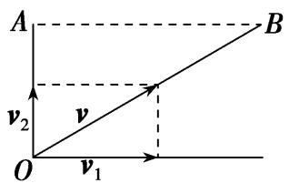

text_image

A
v₂
O
v₁
B

故答案为: $2\sqrt{3}$ .

# 【解题方法总结】

用向量方法解决实际问题的步骤

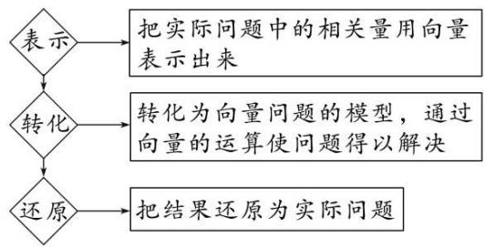

flowchart

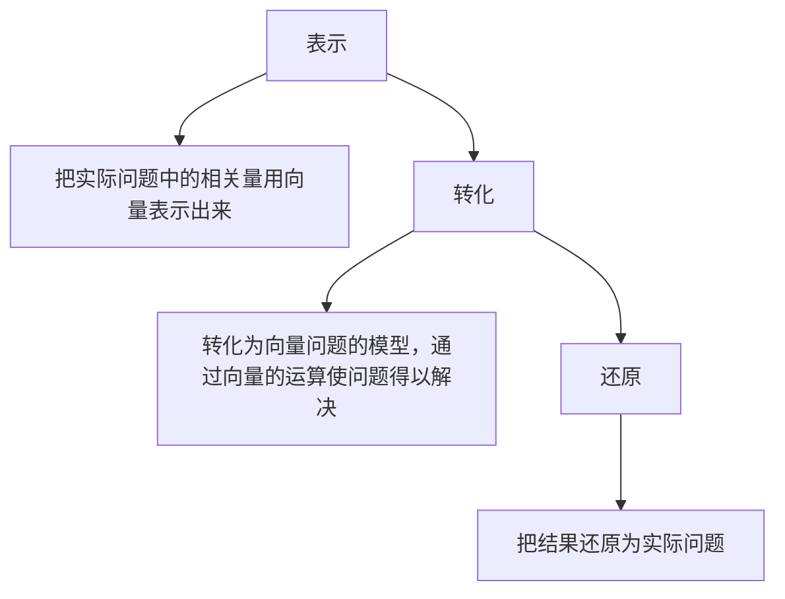

