# 第37讲 三角形四心及奔驰定理

# 知识梳理

技巧一．四心的概念介绍：

(1) 重心: 中线的交点, 重心将中线长度分成 2:1.  
(2) 内心: 角平分线的交点 (内切圆的圆心), 角平分线上的任意点到角两边的距离相等.  
(3) 外心: 中垂线的交点 (外接圆的圆心), 外心到三角形各顶点的距离相等.  
(4) 垂心: 高线的交点, 高线与对应边垂直.

技巧二．奔驰定理——解决面积比例问题

重心定理:三角形三条中线的交点.

已知 $\triangle ABC$ 的顶点 $\mathrm{A}(x_1, y_1), \mathrm{B}(x_2, y_2), \mathrm{C}(x_3, y_3)$ ，则 $\triangle ABC$ 的重心坐标为 $\mathbf{G}\left(\frac{x_1 + x_2 + x_3}{3}, \frac{y_1 + y_2 + y_3}{3}\right)$ .

注意：(1) 在 $\triangle ABC$ 中，若 O 为重心，则 $\overrightarrow{OA} + \overrightarrow{OB} + \overrightarrow{OC} = \vec{0}$ .

(2)三角形的重心分中线两段线段长度比为2:1,且分的三个三角形面积相等.

重心的向量表示： $\overrightarrow{AG}=\frac{1}{3}\overrightarrow{AB}+\frac{1}{3}\overrightarrow{AC}.$

奔驰定理： $S_{A}\cdot\overrightarrow{OA}+S_{B}\cdot\overrightarrow{OB}+S_{C}\cdot\overrightarrow{OC}=\vec{0}$ ，则 $\triangle AOB$ 、 $\triangle AOC$ 、 $\triangle BOC$ 的面积之比等于 $\lambda_{3}:\lambda_{2}:\lambda_{1}$

奔驰定理证明:如图,令 $\lambda_{1}\overrightarrow{OA}=\overrightarrow{OA_{1}}$ , $\lambda_{2}\overrightarrow{OB}=\overrightarrow{OB_{1}}$ , $\lambda_{3}\overrightarrow{OC}=\overrightarrow{OC_{1}}$ , 即满足 $\overrightarrow{OA_{1}}+\overrightarrow{OB_{1}}+\overrightarrow{OC_{1}}=0$

$$
\frac {\mathrm{S} _ {\triangle \mathrm{AOB}}}{\mathrm{S} _ {\triangle \mathrm{A} _ {1} \mathrm{OB} _ {1}}} = \frac {1}{\lambda_ {1} \lambda_ {2}}, \frac {\mathrm{S} _ {\triangle \mathrm{AOC}}}{\mathrm{S} _ {\triangle \mathrm{A} _ {1} \mathrm{OC} _ {1}}} = \frac {1}{\lambda_ {1} \lambda_ {3}}, \frac {\mathrm{S} _ {\triangle \mathrm{BOC}}}{\mathrm{S} _ {\triangle \mathrm{B} _ {1} \mathrm{OC} _ {1}}} = \frac {1}{\lambda_ {2} \lambda_ {3}}, \text {故} \mathrm{S} _ {\triangle \mathrm{AOB}}: \mathrm{S} _ {\triangle \mathrm{AOC}}: \mathrm{S} _ {\triangle \mathrm{BOC}} = \lambda_ {3}: \lambda_ {2}: \lambda_ {1}.
$$

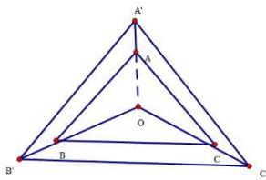

text_image

A'
A
O
B
C
B'
C'

技巧三．三角形四心与推论：

(1)O是 $\triangle ABC$ 的重心： $\mathrm{S}_{\triangle \mathrm{BOC}}:\mathrm{S}_{\triangle \mathrm{COA}}:\mathrm{S}_{\triangle \mathrm{AOB}} = 1:1:1\Leftrightarrow \overrightarrow{\mathrm{OA}} +\overrightarrow{\mathrm{OB}} +\overrightarrow{\mathrm{OC}} = \vec{0}.$   
(2)O是 $\triangle ABC$ 的内心： $\mathrm{S}_{\triangle \mathrm{B0C}}:\mathrm{S}_{\triangle \mathrm{COA}}:\mathrm{S}_{\triangle \mathrm{AOB}} = a:b:c\Leftrightarrow a\overrightarrow{\mathrm{OA}} +b\overrightarrow{\mathrm{OB}} +c\overrightarrow{\mathrm{OC}} = \vec{0}.$

(3)O 是 $\triangle ABC$ 的外心:

$$
\mathrm{S} _ {\triangle \mathrm{B0C}}: \mathrm{S} _ {\triangle \mathrm{COA}}: \mathrm{S} _ {\triangle \mathrm{AOB}} = \sin 2 \mathrm{A}: \sin 2 \mathrm{B}: \sin 2 \mathrm{C} \Leftrightarrow \sin 2 \mathrm{AOA} + \sin 2 \mathrm{BOB} + \sin 2 \mathrm{COC} = \vec {0}.
$$

(4)O 是 $\triangle ABC$ 的垂心:

$$
\mathrm{S} _ {\triangle \mathrm{B0C}}: \mathrm{S} _ {\triangle \mathrm{COA}}: \mathrm{S} _ {\triangle \mathrm{AOB}} = \tan \mathrm{A}: \tan \mathrm{B}: \tan \mathrm{C} \Leftrightarrow \tan \mathrm{AOA} + \tan \mathrm{BOB} + \tan \mathrm{COC} = \vec {0}.
$$

技巧四．常见结论

(1) 内心: 三角形的内心在向量 $\frac{\overrightarrow{AB}}{|\overrightarrow{AB}|} + \frac{\overrightarrow{AC}}{|\overrightarrow{AC}|}$ 所在的直线上.

$\left|\overrightarrow{\mathrm{AB}}\right| \cdot \overrightarrow{\mathrm{PC}} + \left|\overrightarrow{\mathrm{BC}}\right| \cdot \overrightarrow{\mathrm{PC}} + \left|\overrightarrow{\mathrm{CA}}\right| \cdot \overrightarrow{\mathrm{PB}} = \vec{0} \Leftrightarrow \mathrm{P}$ 为 $\triangle ABC$ 的内心.

(2) 外心: $|\overrightarrow{\mathrm{PA}}| = |\overrightarrow{\mathrm{PB}}| = |\overrightarrow{\mathrm{PC}}| \Leftrightarrow \mathrm{P}$ 为 $\triangle ABC$ 的外心.

(3) 垂心: $\overrightarrow{\mathrm{PA}} \cdot \overrightarrow{\mathrm{PB}} = \overrightarrow{\mathrm{PB}} \cdot \overrightarrow{\mathrm{PC}} = \overrightarrow{\mathrm{PC}} \cdot \overrightarrow{\mathrm{PA}} \Leftrightarrow \mathrm{P}$ 为 $\triangle ABC$ 的垂心.  
(4) 重心: $\overrightarrow{\mathrm{PA}} + \overrightarrow{\mathrm{PB}} + \overrightarrow{\mathrm{PC}} = \overrightarrow{0} \Leftrightarrow \mathrm{P}$ 为 $\triangle ABC$ 的重心.

# 必考题型全归纳

# 题型一:奔驰定理

1677 (2024·全国·高一专题练习)已知O是△ABC内部的一点，∠A，∠B，∠C所对的边分别为a=3, b=2, c=4，若 $\sin A\cdot\overrightarrow{OA}+\sin B\cdot\overrightarrow{OB}+\sin C\cdot\overrightarrow{OC}=\overrightarrow{0}$ ，则△AOB与△ABC的面积之比为()

A. $\frac{4}{9}$

B. $\frac{1}{3}$

C. $\frac{2}{9}$

D. $\frac{5}{9}$

【答案】A

【解析】由正弦定理 $\frac{a}{\sin A} = \frac{b}{\sin B} = \frac{c}{\sin C} = K,$ 又 a = 3, b = 2, c = 4, 所以得

$\frac{1}{K}\left(3\cdot\overrightarrow{OA}+2\cdot\overrightarrow{OB}+4\cdot\overrightarrow{OC}\right)=\vec{0},$ 因为 $\frac{1}{K}\neq0,$ 所以 $3\cdot\overrightarrow{OA}+2\cdot\overrightarrow{OB}+4\cdot\overrightarrow{OC}=\vec{0}.$

设 $\overrightarrow{OA_{1}}=3\overrightarrow{OA},\overrightarrow{OB_{1}}=2\overrightarrow{OB},\overrightarrow{OC_{1}}=4\overrightarrow{OC}$ ，可得 $\overrightarrow{OA_{1}}+\overrightarrow{OB_{1}}+\overrightarrow{OC_{1}}=\overrightarrow{0}$ ，则 O 是 $\triangle A_{1}B_{1}C_{1}$ 的重心， $S_{\triangle OA_{1}B_{1}}=S_{\triangle OB_{1}C_{1}}=S_{\triangle OA_{1}C_{1}}=S$ ，利用 $S=\frac{1}{2}OA_{1}\cdot OB_{1}\cdot\sin\angle A_{1}OB_{1},\sin\angle AOB=$

$\sin\angle A_{1}OB_{1}$ ，所以 $\frac{S_{\triangle OAB}}{S}=\frac{\frac{1}{2}\overrightarrow{OA}\cdot\overrightarrow{OB}\sin\angle AOB}{\frac{1}{2}\overrightarrow{OA}_{1}\cdot\overrightarrow{OB}_{1}\sin\angle A_{1}OB_{1}}=\frac{\overrightarrow{OA}\cdot\overrightarrow{OB}}{3\overrightarrow{OA}\cdot2\overrightarrow{OB}}=\frac{1}{6}$ ，所以 $S_{\triangle OAB}=$

$\frac{1}{6}\mathrm{S},$ 同理可得 $\mathrm{S}_{\triangle \mathrm{OBC}} = \frac{1}{8}\mathrm{S},\mathrm{S}_{\triangle \mathrm{AOC}} = \frac{1}{12}\mathrm{S}.$ 所以 $\triangle \mathrm{AOB}$ 与 $\triangle \mathrm{ABC}$ 的面积之比为 $\frac{1}{6}\mathrm{S}:$ $\left(\frac{1}{6}\mathrm{S} + \frac{1}{8}\mathrm{S} + \frac{1}{12}\mathrm{S}\right) = 4:9$ 即为 $\frac{4}{9}.$

故选：A.

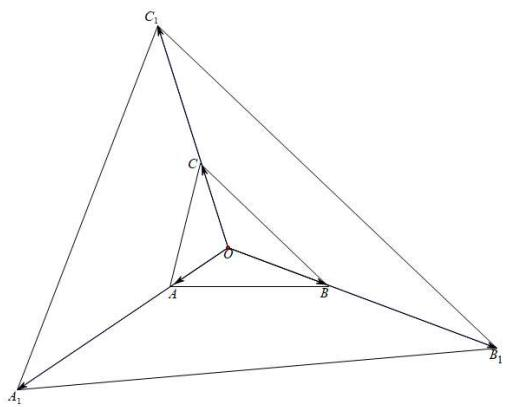

text_image

C₁
C
O
A
B
A₁
B₁

1678 (2024·安徽六安·高一六安一中校考期末)已知 O 是三角形 ABC 内部一点, 且 $\overrightarrow{OA} + 2\overrightarrow{OB} + \overrightarrow{OC} = \overrightarrow{0}$ , 则 $\Delta AOB$ 的面积与 $\Delta ABC$ 的面积之比为 ()

A. $\frac{1}{2}$

B. $\frac{1}{3}$

C. $\frac{1}{4}$

D. $\frac{1}{5}$

【答案】C

【解析】如图, 设 $\overrightarrow{OA} + \overrightarrow{OC} = \overrightarrow{OD}, \because \overrightarrow{OA} + 2\overrightarrow{OB} + \overrightarrow{OC} = \overrightarrow{0}, \therefore \overrightarrow{OD} = -2\overrightarrow{OB}$ , 设 AC 与 OD 交于点 M, 则 M 平分 AC, BD, $\therefore \overrightarrow{OM} = -\overrightarrow{OB}, O$ 是 BM 中点,

$\therefore S_{\Delta AOB} = \frac{1}{2} S_{\Delta AMB} = \frac{1}{4} S^{\circ}$ $\Delta ABC$ 比值为 $\frac{1}{4}$ .

故选：C.

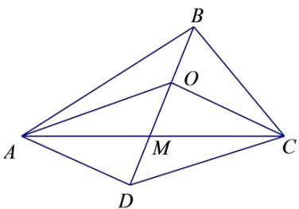

text_image

B
O
A
M
C
D

1679 (2024·全国·高一专题练习)若点 M 是 $\triangle ABC$ 所在平面内的一点, 点 D 是边 AC 靠近 A 的三等分点, 且满足 $5\overrightarrow{AM} = \overrightarrow{AB} + \overrightarrow{AC}$ , 则 $\triangle ABM$ 与 $\triangle ABD$ 的面积比为 ( )

A. $\frac{1}{5}$

B. $\frac{2}{5}$

C. $\frac{3}{5}$

D. $\frac{9}{25}$

【答案】C

【解析】M 是 $\triangle ABC$ 所在平面内一点, 连接 AM, BM, 延长 AM 至 E 使 AE = 5AM, $\because 5\overrightarrow{AM} = \overrightarrow{AB} + \overrightarrow{AC} = \overrightarrow{AE}, \therefore \overrightarrow{AB} = \overrightarrow{AE} - \overrightarrow{AC} = \overrightarrow{CE},$

连接 BE, 则四边形 ABED 是平行四边形, 向量 $\overrightarrow{AB}$ 和向量 $\overrightarrow{CE}$ 平行且模相等, 由于 $\overrightarrow{AC} = 3\overrightarrow{AD}$ , 所以 $S_{\triangle ABD} = \frac{1}{3}S_{\triangle ABC}$ , 又 $\overrightarrow{AE} = 5\overrightarrow{AM}$ , 所以 $S_{\triangle ABM} = \frac{1}{5}S_{\triangle ABE}$ ,

在平行四边形中， $S_{\triangle ABD}=S_{\triangle ABE}$ ，则 $\triangle ABM$ 与 $\triangle ABD$ 的面积比为 $\frac{\frac{1}{5}S_{\triangle ABE}}{\frac{1}{3}S_{\triangle ABD}}=\frac{3}{5}$

故选：C.

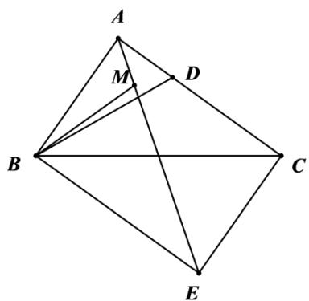

text_image

Geometric diagram with labeled points A, B, C, D, E, and M, showing interconnected lines forming a quadrilateral structure.

1680 (2024·全国·高三专题练习)平面上有△ABC及其内一点O,构成如图所示图形,若将△OAB,△OBC,△OCA的面积分别记作 $S_{c},S_{a},S_{b}$ ,则有关系式 $S_{a}\cdot\overrightarrow{OA}+S_{b}\cdot\overrightarrow{OB}+S_{c}\cdot\overrightarrow{OC}=\vec{0}$ .因图形和奔驰车的logo很相似,常把上述结论称为“奔驰定理”.已知△ABC的内角A,B,C的对边分别为a,b,c,若满足 $a\cdot\overrightarrow{OA}+b\cdot\overrightarrow{OB}+c\cdot\overrightarrow{OC}=\vec{0}$ ,则O为△ABC的()

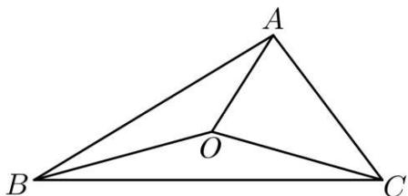

text_image

A
O
B
C

A. 外心

B. 内心

C. 重心

D. 垂心

【答案】B

【解析】由 $S_{a} \cdot \overrightarrow{OA} + S_{b} \cdot \overrightarrow{OB} + S_{c} \cdot \overrightarrow{OC} = \vec{0}$ 得 $\overrightarrow{OA} = -\frac{S_{b}}{S_{a}} \overrightarrow{OB} - \frac{S_{c}}{S_{a}} \overrightarrow{OC}$ ,

由 $a \cdot \overrightarrow{\mathrm{OA}} + b \cdot \overrightarrow{\mathrm{OB}} + c \cdot \overrightarrow{\mathrm{OC}} = 0$ 得 $\overrightarrow{\mathrm{OA}} = -\frac{b}{a} \overrightarrow{\mathrm{OB}} - \frac{c}{a} \overrightarrow{\mathrm{OC}}$ ,

根据平面向量基本定理可得 $-\frac{S_{b}}{S_{a}}=-\frac{b}{a},-\frac{S_{c}}{S_{a}}=-\frac{c}{a}$

所以 $\frac{S_{b}}{S_{a}}=\frac{b}{a},\frac{S_{c}}{S_{a}}=\frac{c}{a},$

延长CO交AB于E,延长BO交AC于F,

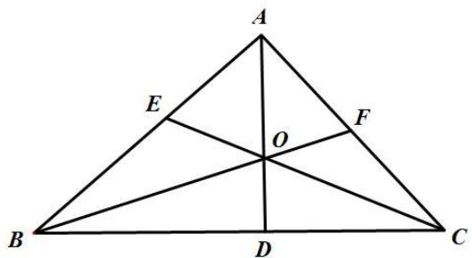

text_image

A
E
O
F
B
D
C

则 $\frac{S_{b}}{S_{a}}=\frac{|AE|}{|BE|}$ ，又 $\frac{S_{b}}{S_{a}}=\frac{b}{a}$ ，所以 $\frac{|AE|}{|BE|}=\frac{b}{a}=\frac{|AC|}{|BC|}$ ，

所以 CE 为 $\angle ACB$ 的平分线，

同理可得BF是∠ABC的平分线，

所以 O 为 $\triangle ABC$ 的内心.

故选：B

1681 (2024·上海奉贤·高一上海市奉贤中学校考阶段练习)“奔驰定理”是平面向量中一个非常优美的结论,因为这个定理对应的图形与“奔驰”轿车的三叉车标很相似,故形象地称其为“奔驰定理”. 奔驰定理:已知 O 是 $\triangle ABC$ 内的一点, $\triangle BOC$ , $\triangle AOC$ , $\triangle AOB$ 的面积分别为 $S_{A}$ 、 $S_{B}$ 、 $S_{C}$ , 则有 $S_{A}\overrightarrow{OA} + S_{B}\overrightarrow{OB} + S_{C}\overrightarrow{OC} = \overrightarrow{0}$ , 设 O 是锐角 $\triangle ABC$ 内的一点, $\angle BAC$ , $\angle ABC$ , $\angle ACB$ 分别是 $\triangle ABC$ 的三个内角, 以下命题错误的是 ()

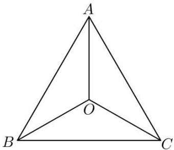

text_image

A
O
B
C

A. 若 $\overrightarrow{OA} + \overrightarrow{OB} + \overrightarrow{OC} = \overrightarrow{0}$ ，则 O 为 $\triangle ABC$ 的重心  
B. 若 $\overrightarrow{OA} + 2\overrightarrow{OB} + 3\overrightarrow{OC} = \overrightarrow{0}$ ，则 $S_{A}:S_{B}:S_{C} = 1:2:3$   
C. 则 O 为 $\triangle ABC$ (不为直角三角形) 的垂心, 则 $\tan\angle BAC \cdot \overrightarrow{OA} + \tan\angle ABC \cdot \overrightarrow{OB} + \tan\angle ACB \cdot \overrightarrow{OC} = \vec{0}$   
D. 若 $\left|\overrightarrow{OA}\right|=\left|\overrightarrow{OB}\right|=2,\angle AOB=\frac{5\pi}{6},2\overrightarrow{OA}+3\overrightarrow{OB}+4\overrightarrow{OC}=\overrightarrow{0}$ ，则 $S_{\triangle ABC}=\frac{9}{2}$

【答案】D

【解析】对于 A: 如下图所示，

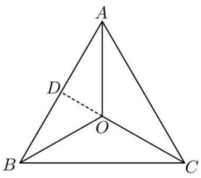

text_image

A
D
O
B
C

假设 D 为 AB 的中点, 连接 OD, 则 $\overrightarrow{OA} + \overrightarrow{OB} = 2\overrightarrow{OD} = \overrightarrow{CO}$ , 故 C, O, D 共线, 即 O 在中线 CD 上,

同理可得 O 在另外两边 BC, AC 的中线上, 故 O 为 $\triangle ABC$ 的重心, 即 A 正确;

对于 B: 由奔驰定理 O 是 $\triangle ABC$ 内的一点, $\triangle BOC, \triangle AOC, \triangle AOB$ 的面积分别为 $S_{A}, S_{B}, S_{C}$ ,

则有 $S_{A} \cdot \overrightarrow{OA} + S_{B} \cdot \overrightarrow{OB} + S_{C} \cdot \overrightarrow{OC} = \vec{0}$ 可知，

若 $\overrightarrow{OA} + 2\overrightarrow{OB} + 3\overrightarrow{OC} = \vec{0}$ ，可得 $S_{A}: S_{B}: S_{C} = 1: 2: 3$ ，即 B 正确；

对于 C: 由四边形内角和可知, $\angle BOC + \angle BAC = \pi$ , 则 $\overrightarrow{OB} \cdot \overrightarrow{OC} = |\overrightarrow{OB}| |\overrightarrow{OC}| \cos \angle BOC = -|\overrightarrow{OB}| |\overrightarrow{OC}| \cos \angle BAC$ ,

同理， $\overrightarrow{\mathrm{OB}} \cdot \overrightarrow{\mathrm{OA}} = |\overrightarrow{\mathrm{OB}}||\overrightarrow{\mathrm{OA}}|\cos \angle \mathrm{BOA} = -|\overrightarrow{\mathrm{OB}}||\overrightarrow{\mathrm{OA}}|\cos \angle \mathrm{BCA}$ ，

因为 O 为 $\triangle ABC$ 的垂心，则 $\overrightarrow{OB} \cdot \overrightarrow{AC} = \overrightarrow{OB} \cdot (\overrightarrow{OC} - \overrightarrow{OA}) = \overrightarrow{OB} \cdot \overrightarrow{OC} - \overrightarrow{OB} \cdot \overrightarrow{OA} = 0$ ，所以 $|\overrightarrow{OC}| \cos \angle BAC = |\overrightarrow{OA}| \cos \angle BCA$ ，同理得 $|\overrightarrow{OC}| \cos \angle ABC = |\overrightarrow{OB}| \cos \angle BCA$ ，

$$
\left| \overrightarrow {\mathrm{OA}} \right| \cos \angle \mathrm{ABC} = \left| \overrightarrow {\mathrm{OB}} \right| \cos \angle \mathrm{BAC},
$$

则 $\left|\overrightarrow{OA}\right|:\left|\overrightarrow{OB}\right|:\left|\overrightarrow{OC}\right|=\cos\angle BAC:\cos\angle ABC:\cos\angle BCA,$

令 $|\overrightarrow{\mathrm{OA}}| = m\cos \angle \mathrm{BAC}, |\overrightarrow{\mathrm{OB}}| = m\cos \angle \mathrm{ABC}, |\overrightarrow{\mathrm{OC}}| = m\cos \angle \mathrm{BCA}$ ,

由 $S_{A}=\frac{1}{2}\left|\overrightarrow{OB}\right|\left|\overrightarrow{OC}\right|\sin\angle BOC$ ，则 $S_{A}=\frac{1}{2}\left|\overrightarrow{OB}\right|\left|\overrightarrow{OC}\right|\sin\angle BAC=$

$$
\frac {m ^ {2}}{2} \cos \angle A B C \cos \angle B C A \sin \angle B A C,
$$

同理： $S_{B}=\frac{1}{2}\left|\overrightarrow{OA}\right|\left|\overrightarrow{OC}\right|\sin\angle ABC=\frac{m^{2}}{2}\cos\angle BAC\cos\angle BCAsin\angle ABC,S_{C}=$

$$
\frac {1}{2} \left| \overrightarrow {\mathrm{OA}} \right| \left| \overrightarrow {\mathrm{OB}} \right| \sin \angle \mathrm{BCA} = \frac {m ^ {2}}{2} \cos \angle \mathrm{BAC} \cos \angle \mathrm{ABC} \sin \angle \mathrm{BCA},
$$

综上, $S_{A}:S_{B}:S_{C}=\frac{\sin\angle BAC}{\cos\angle BAC}:\frac{\sin\angle ABC}{\cos\angle ABC}:\frac{\sin\angle BCA}{\cos\angle BCA}=\tan\angle BAC:\tan\angle ABC:$

$$
\tan \angle B C A,
$$

根据奔驰定理得 $\tan\angle BAC\cdot\overrightarrow{OA}+\tan\angle ABC\cdot\overrightarrow{OB}+\tan\angle ACB\cdot\overrightarrow{OC}=\vec{0}$ ，即 C 正确.

对于 D: 由 $\left|\overrightarrow{OA}\right|=\left|\overrightarrow{OB}\right|=2,\angle AOB=\frac{5\pi}{6}$ 可知， $S_{C}=\frac{1}{2}\times2\times2\times\sin\frac{5\pi}{6}=1$

又 $2\overrightarrow{\mathrm{OA}} + 3\overrightarrow{\mathrm{OB}} + 4\overrightarrow{\mathrm{OC}} = \vec{0}$ , 所以 $\mathrm{S}_{\mathrm{A}}: \mathrm{S}_{\mathrm{B}}: \mathrm{S}_{\mathrm{C}} = 2:3:4$

由 $S_{C}=1$ 可得, $S_{A}=\frac{1}{2}, S_{B}=\frac{3}{4};$

所以 $S_{\triangle ABC}=S_{A}+S_{B}+S_{C}=\frac{1}{2}+\frac{3}{4}+1=\frac{9}{4}$ ，即 D 错误；

故选：D.

1682 (多选题)(2024·江苏盐城·高一江苏省射阳中学校考阶段练习)“奔驰定理”是平面向量中一个非常优美的结论,因为这个定理对应的图形与“奔驰”轿车(Mercedesbenz)的logo很相似,故形象地称其为“奔驰定理”.奔驰定理:已知O是△ABC内一点,△BOC,△AOC,△AOB的面积分别为 $S_{A},S_{B},S_{C}$ ,则 $S_{A}\cdot\overrightarrow{OA}+S_{B}\cdot\overrightarrow{OB}+S_{C}\cdot\overrightarrow{OC}=\overrightarrow{0}$ ,O是△ABC内的一点,∠BAC,∠ABC,∠ACB分别是△ABC的三个内角,以下命题正确的有()

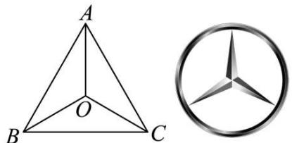

text_image

A
O
B C
B
C

A. 若 $2\overrightarrow{OA} + 3\overrightarrow{OB} + 4\overrightarrow{OC} = \overrightarrow{0}$ ，则 $S_{A}:S_{B}:S_{C} = 4:3:2$   
B. 若 $\left|\overrightarrow{OA}\right|=\left|\overrightarrow{OB}\right|=2,\angle AOB=\frac{2\pi}{3}$ ，且 $2\overrightarrow{OA}+3\overrightarrow{OB}+4\overrightarrow{OC}=\vec{0}$ ，则 $S_{\triangle ABC}=\frac{9\sqrt{3}}{4}$   
C. 若 $\overrightarrow{OA} \cdot \overrightarrow{OB} = \overrightarrow{OB} \cdot \overrightarrow{OC} = \overrightarrow{OC} \cdot \overrightarrow{OA}$ ，则 O 为 $\triangle ABC$ 的垂心  
D. 若 O 为 $\triangle ABC$ 的内心，且 $5\overrightarrow{OA} + 12\overrightarrow{OB} + 13\overrightarrow{OC} = \overrightarrow{0}$ ，则 $\angle ACB = \frac{\pi}{2}$

【答案】BCD

【解析】对选项 A: $2\overrightarrow{OA} + 3\overrightarrow{OB} + 4\overrightarrow{OC} = \vec{0}$ ，则 $S_{A}: S_{B}: S_{C} = 2:3:4$ ，错误；

对选项 B: $S_{\triangle AOB} = \frac{1}{2} \times 2 \times 2 \times \sin 120^{\circ} = \sqrt{3}$ , $2\overrightarrow{OA} + 3\overrightarrow{OB} + 4\overrightarrow{OC} = \overrightarrow{0}$ ,

故 $S_{A}:S_{B}:S_{C}=2:3:4,\quad S_{\triangle ABC}=\frac{9}{4}\times S_{A}=\frac{9\sqrt{3}}{4}$ ，正确；

对选项 C: $\overrightarrow{OA} \cdot \overrightarrow{OB} = \overrightarrow{OB} \cdot \overrightarrow{OC}$ ，即 $(\overrightarrow{OA} - \overrightarrow{OC}) \cdot \overrightarrow{OB} = \overrightarrow{CA} \cdot \overrightarrow{OB} = 0$ ，故 $\overrightarrow{CA} \perp \overrightarrow{OB}$ ，

同理可得 $\overrightarrow{CB} \perp \overrightarrow{OA}, \overrightarrow{AB} \perp \overrightarrow{OC}$ ，故 O 为 $\triangle ABC$ 的垂心，正确；

对选项 D: $5\overrightarrow{OA} + 12\overrightarrow{OB} + 13\overrightarrow{OC} = \overrightarrow{0}$ ，故 $S_{A}: S_{B}: S_{C} = 5: 12: 13$ ，设内接圆半径为 r，

$S_{A}=\frac{1}{2}r\cdot BC, S_{B}=\frac{1}{2}r\cdot AC, S_{C}=\frac{1}{2}r\cdot AB$ ，即 BC:AC:AB=5:12:13，

即 $AB^{2}=AC^{2}+BC^{2},\angle ACB=\frac{\pi}{2}$ ，正确.

故选: BCD

1683 (多选题)(2024·全国·高一专题练习)“奔驰定理”是平面向量中一个非常优美的结论,因为这个定理对应的图形与“奔驰”轿车(Mercedesbenz)的logo很相似,故形象地称其为“奔驰定理”.奔驰定理:已知O是△ABC内一点,△BOC、△AOC、△AOB的面积分别为 $S_{A}$ 、 $S_{B}$ 、 $S_{C}$ ,则 $S_{A}\cdot\overrightarrow{OA}+S_{B}\cdot\overrightarrow{OB}+S_{C}\cdot\overrightarrow{OC}=\overrightarrow{0}$ .设O是锐角△ABC内的一点,∠BAC、∠ABC、∠ACB分别是△ABC的三个内角,以下命题正确的有()

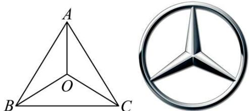

text_image

A
O
B C
B
C

A. 若 $\overrightarrow{OA} + 2\overrightarrow{OB} + 3\overrightarrow{OC} = \overrightarrow{0}$ ，则 $S_{A}:S_{B}:S_{C} = 1:2:3$   
B. $|\overrightarrow{\mathrm{OA}}| = |\overrightarrow{\mathrm{OB}}| = 2, \angle \mathrm{AOB} = \frac{5\pi}{6}, 2\overrightarrow{\mathrm{OA}} + 3\overrightarrow{\mathrm{OB}} + 4\overrightarrow{\mathrm{OC}} = \vec{0}$ , 则 $\mathrm{S}_{\triangle \mathrm{ABC}} = \frac{9}{2}$   
C. 若 O 为 $\triangle ABC$ 的内心, $3\overrightarrow{OA} + 4\overrightarrow{OB} + 5\overrightarrow{OC} = \overrightarrow{0}$ , 则 $\angle C = \frac{\pi}{2}$

D. 若 O 为 $\triangle ABC$ 的重心, 则 $\overrightarrow{OA} + \overrightarrow{OB} + \overrightarrow{OC} = \overrightarrow{0}$

【答案】ACD

【解析】对于 A 选项, 因为 $\overrightarrow{OA} + 2\overrightarrow{OB} + 3\overrightarrow{OC} = \overrightarrow{0}$ , 由“奔驰定理”可知 $S_{A}: S_{B}: S_{C} = 1: 2: 3$ , A 对;

对于 B 选项, 由 $\left|\overrightarrow{OA}\right|=\left|\overrightarrow{OB}\right|=2,\angle AOB=\frac{5\pi}{6}$ , 可知 $S_{C}=\frac{1}{2}\times2\times2\times\sin\frac{5\pi}{6}=1$ ,

又 $2\overrightarrow{OA} + 3\overrightarrow{OB} + 4\overrightarrow{OC} = \overrightarrow{0}$ ，所以 $S_{A}:S_{B}:S_{C} = 2:3:4$ ，

由 $S_{C}=1$ 可得, $S_{A}=\frac{1}{2}$ , $S_{B}=\frac{3}{4}$ ,

所以 $S_{\triangle ABC}=S_{A}+S_{B}+S_{C}=\frac{1}{2}+\frac{3}{4}+1=\frac{9}{4}$ ，B 错；

对于 C 选项, 若 O 为 $\triangle ABC$ 的内心, $3\overrightarrow{OA} + 4\overrightarrow{OB} + 5\overrightarrow{OC} = \overrightarrow{0}$ , 则 $S_{A}: S_{B}: S_{C} = 3: 4: 5$ ,

又 $S_{A}:S_{B}:S_{C}=\frac{1}{2}ar:\frac{1}{2}br:\frac{1}{2}cr=a:b:c(r$ 为 $\triangle ABC$ 内切圆半径 $)$ ,

所以， $a^{2}+b^{2}=c^{2}$ ，故 $\angle C=\frac{\pi}{2}$ ，C 对；

对于D选项,如下图所示,

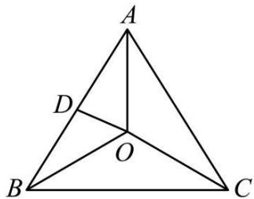

text_image

A
D
O
B
C

因为 O 为 $\triangle ABC$ 的重心, 延长 CO 交 AB 于点 D, 则 D 为 AB 的中点,

所以，OC=2OD, $S_{\triangle AOD}=S_{\triangle BOD}=\frac{1}{2}S_{C}$ ，且 $S_{\triangle AOD}=\frac{1}{2}S_{B}$ , $S_{\triangle BOD}=\frac{1}{2}S_{A}$ ,

所以， $S_{A}=S_{B}=S_{C}$ ，由“奔驰定理”可得 $\overrightarrow{OA}+\overrightarrow{OB}+\overrightarrow{OC}=\overrightarrow{0}$ ，D对.

故选: ACD.

# 题型二:重心定理

1684 (2024·福建泉州·高一校考期中)著名数学家欧拉提出了如下定理:三角形的外心、重心、垂心依次位于同一直线上,且重心到外心的距离是重心到垂心距离的一半,此直线被称为三角形的欧拉线,该定理被称为欧拉线定理.已知△ABC的外心为O,重心为G,垂心为H,M为BC中点,且AB=5,AC=4,则下列各式正确的有\_\_\_\_.

① $\overrightarrow{AG} \cdot \overrightarrow{BC} = -3$ ② $\overrightarrow{AO} \cdot \overrightarrow{BC} = -6$

③ $\overrightarrow{OH} = \overrightarrow{OA} + \overrightarrow{OB} + \overrightarrow{OC}$ ④ $\overrightarrow{AB} + \overrightarrow{AC} = 4\overrightarrow{OM} + 2\overrightarrow{HM}$

【答案】①③④

【解析】对于①, $\triangle ABC$ 重心为 G, 有 $\overrightarrow{AG} = \frac{2}{3}\overrightarrow{AM} = \frac{1}{3} (\overrightarrow{AB} + \overrightarrow{AC})$ ,

故 $\overrightarrow{AG} \cdot \overrightarrow{BC} = \frac{1}{3} (\overrightarrow{AB} + \overrightarrow{AC}) (\overrightarrow{AC} - \overrightarrow{AB}) = \frac{1}{3} (\overrightarrow{AC}^{2} - \overrightarrow{AB}^{2}) = \frac{1}{3} (16 - 25) = -3$ ，故①正确；

对于②, $\triangle ABC$ 外心为 $O$ , 过三角形 $ABC$ 的外心 $O$ 分别作 $AB$ 、 $AC$ 的垂线, 垂足为 $D$ 、 $E$ , 易知 $D$ 、 $E$ 分别是 $AB$ 、 $AC$ 的中点, 有 $\overrightarrow{AO} \cdot \overrightarrow{AB} = \frac{1}{2} \overrightarrow{AB}^2 = \frac{25}{2}$ , $\overrightarrow{AO} \cdot \overrightarrow{AC} = \frac{1}{2} \overrightarrow{AC}^2 = 8$ . $\therefore \overrightarrow{AO} \cdot \overrightarrow{BC} = \overrightarrow{AO} \cdot (\overrightarrow{AC} - \overrightarrow{AB}) = 8 - \frac{25}{2} = -\frac{9}{2}$ , 故②错误;

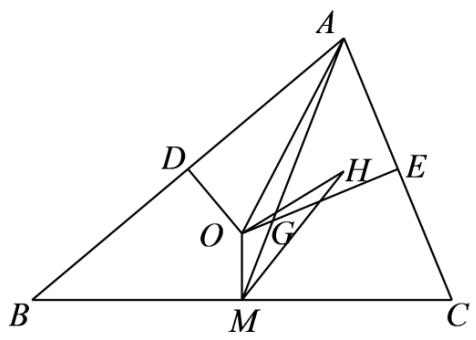

text_image

Geometric diagram of triangle ABC with internal points D, E, G, H, M, O and connecting line segments

对于③,由欧拉线定理得 $2\overrightarrow{OG}=\overrightarrow{GH}$ ，即 $\overrightarrow{OH}=3\overrightarrow{OG}$ ，又有 $\overrightarrow{GA}+\overrightarrow{GB}+\overrightarrow{GC}=\overrightarrow{0}$

故 $\overrightarrow{\mathrm{OA}} +\overrightarrow{\mathrm{OB}} +\overrightarrow{\mathrm{OC}} = (\overrightarrow{\mathrm{OG}} +\overrightarrow{\mathrm{GA}}) + (\overrightarrow{\mathrm{OG}} +\overrightarrow{\mathrm{GB}}) + (\overrightarrow{\mathrm{OG}} +\overrightarrow{\mathrm{GC}}) = 3\overrightarrow{\mathrm{OG}} +\overrightarrow{\mathrm{GA}} +\overrightarrow{\mathrm{GB}}+$

$\overrightarrow{\mathrm{GC}} = 3\overrightarrow{\mathrm{OG}}$ ，即 $\overrightarrow{\mathrm{OH}} = \overrightarrow{\mathrm{OA}} +\overrightarrow{\mathrm{OB}} +\overrightarrow{\mathrm{OC}}$ ，故③正确；

对于④,由 $\overrightarrow{OH}=3\overrightarrow{OG}$ 得 $\overrightarrow{MH}-\overrightarrow{MO}=3(\overrightarrow{MG}-\overrightarrow{MO})$ , 故 $\overrightarrow{MG}=\frac{2}{3}\overrightarrow{MO}+\frac{1}{3}\overrightarrow{MH}$ ,

所以 $\overrightarrow{AB} + \overrightarrow{AC} = 2\overrightarrow{AM} = -6\overrightarrow{MG} = 4\overrightarrow{OM} + 2\overrightarrow{HM}$ ，故④正确.

故答案为:①③④.

1685 (2024·全国·高一专题练习)点 O 是平面上一定点, A、B、C 是平面上 $\triangle ABC$ 的三个顶点, $\angle B$ 、 $\angle C$ 分别是边 AC、AB 的对角, 以下命题正确的是 \_\_\_\_ (把你认为正确的序号全部写上).

①动点 P 满足 $\overrightarrow{OP} = \overrightarrow{OA} + \overrightarrow{PB} + \overrightarrow{PC}$ ，则 $\triangle ABC$ 的重心一定在满足条件的 P 点集合中；  
②动点 P 满足 $\overrightarrow{OP} = \overrightarrow{OA} + \lambda \left( \frac{\overrightarrow{AB}}{|\overrightarrow{AB}|} + \frac{\overrightarrow{AC}}{|\overrightarrow{AC}|} \right) (\lambda > 0)$ ，则 $\triangle ABC$ 的内心一定在满足条件的 P 点集合中；  
③动点 P 满足 $\overrightarrow{OP} = \overrightarrow{OA} + \lambda \left( \frac{\overrightarrow{AB}}{|\overrightarrow{AB}| \sin B} + \frac{\overrightarrow{AC}}{|\overrightarrow{AC}| \sin C} \right) (\lambda > 0)$ ，则 $\triangle ABC$ 的重心一定在满足条件的 P 点集合中；  
④动点 P 满足 $\overrightarrow{OP} = \overrightarrow{OA} + \lambda \left( \frac{\overrightarrow{AB}}{|\overrightarrow{AB}| \cos B} + \frac{\overrightarrow{AC}}{|\overrightarrow{AC}| \cos C} \right) (\lambda > 0)$ ，则 $\triangle ABC$ 的垂心一定在满足条件的 P 点集合中；  
⑤动点 P 满足 $\overrightarrow{OP}=\frac{\overrightarrow{OB}+\overrightarrow{OC}}{2}+\lambda\left(\frac{\overrightarrow{AB}}{|\overrightarrow{AB}|\cos B}+\frac{\overrightarrow{AC}}{|\overrightarrow{AC}|\cos C}\right)(\lambda>0)$ ，则 $\triangle ABC$ 的外心一定在满足条件的 P 点集合中.

【答案】①②③④⑤

【解析】对于①,因为动点P满足 $\overrightarrow{OP}=\overrightarrow{OA}+\overrightarrow{PB}+\overrightarrow{PC}$ ,

$$
\therefore \overrightarrow {\mathrm{AP}} = \overrightarrow {\mathrm{PB}} + \overrightarrow {\mathrm{PC}},
$$

则点 P 是 $\triangle ABC$ 的重心, 故①正确;

对于②, 因为动点 P 满足 $\overrightarrow{OP} = \overrightarrow{OA} + \lambda \left( \frac{\overrightarrow{AB}}{|\overrightarrow{AB}|} + \frac{\overrightarrow{AC}}{|\overrightarrow{AC}|} \right) (\lambda > 0)$ ,

$$
\therefore \overrightarrow {A P} = \lambda \left(\frac {\overrightarrow {A B}}{| \overrightarrow {A B} |} + \frac {\overrightarrow {A C}}{| \overrightarrow {A C} |}\right) (\lambda > 0),
$$

又 $\frac{\overrightarrow{AB}}{|\overrightarrow{AB}|} +\frac{\overrightarrow{AC}}{|\overrightarrow{AC}|}$ 在 $\angle BAC$ 的平分线上，

∴ $\overrightarrow{AP}$ 与 $\angle BAC$ 的平分线所在向量共线，

所以 $\triangle ABC$ 的内心在满足条件的 P 点集合中, ② 正确;

对于③,动点P满足 $\overrightarrow{OP}=\overrightarrow{OA}+\lambda\left(\frac{\overrightarrow{AB}}{|\overrightarrow{AB}|\sin B}+\frac{\overrightarrow{AC}}{|\overrightarrow{AC}|\sin C}\right)(\lambda>0)$ ,

$$
\therefore \overrightarrow {\mathrm{AP}} = \lambda \left(\frac {\overrightarrow {\mathrm{AB}}}{| \overrightarrow {\mathrm{AB}} | \sin \mathrm{B}} + \frac {\overrightarrow {\mathrm{AC}}}{| \overrightarrow {\mathrm{AC}} | \sin \mathrm{C}}\right), (\lambda > 0),
$$

过点 A 作 AD ⊥ BC, 垂足为 D, 则 $\left|\overrightarrow{AB}\right|\sin B = \left|\overrightarrow{AC}\right|\sin C = AD$ ,

$\overrightarrow{\mathrm{AP}} = \frac{\lambda}{\mathrm{AD}} (\overrightarrow{\mathrm{AB}} +\overrightarrow{\mathrm{AC}})$ ，向量 $\overrightarrow{\mathrm{AB}} +\overrightarrow{\mathrm{AC}}$ 与BC边的中线共线，

因此 $\triangle ABC$ 的重心一定在满足条件的 P 点集合中, ③ 正确;

对于④,动点P满足 $\overrightarrow{OP}=\overrightarrow{OA}+\lambda\left(\frac{\overrightarrow{AB}}{|\overrightarrow{AB}|\cos B}+\frac{\overrightarrow{AC}}{|\overrightarrow{AC}|\cos C}\right)(\lambda>0)$ ,

$$
\therefore \overrightarrow {\mathrm{AP}} = \lambda \left(\frac {\overrightarrow {\mathrm{AB}}}{| \overrightarrow {\mathrm{AB}} | \cos \mathrm{B}} + \frac {\overrightarrow {\mathrm{AC}}}{| \overrightarrow {\mathrm{AC}} | \cos \mathrm{C}}\right) (\lambda > 0),
$$

$$
\therefore \overrightarrow {\mathrm{AP}} \cdot \overrightarrow {\mathrm{BC}} = \lambda \left(\frac {\overrightarrow {\mathrm{AB}}}{| \overrightarrow {\mathrm{AB}} | \cos \mathrm{B}} + \frac {\overrightarrow {\mathrm{AC}}}{| \overrightarrow {\mathrm{AC}} | \cos \mathrm{C}}\right) \cdot \overrightarrow {\mathrm{BC}} = \lambda (| \overrightarrow {\mathrm{BC}} | - | \overrightarrow {\mathrm{BC}} |) = 0,
$$

$$
\therefore \overrightarrow {\mathrm{AP}} \perp \overrightarrow {\mathrm{BC}},
$$

所以 $\triangle ABC$ 的垂心一定在满足条件的 P 点集合中, ④ 正确;

对于⑤,动点P满足 $\overrightarrow{OP}=\frac{\overrightarrow{OB}+\overrightarrow{OC}}{2}+\lambda\left(\frac{\overrightarrow{AB}}{|\overrightarrow{AB}|\cos B}+\frac{\overrightarrow{AC}}{|\overrightarrow{AC}|\cos C}\right)(\lambda>0)$ ,

设 $\frac{\overrightarrow{\mathrm{OB}} + \overrightarrow{\mathrm{OC}}}{2} = \overrightarrow{\mathrm{OE}},$

则 $\overrightarrow{EP}=\lambda\left(\frac{\overrightarrow{AB}}{|\overrightarrow{AB}|\cos B}+\frac{\overrightarrow{AC}}{|\overrightarrow{AC}|\cos C}\right)$ ,

由④知 $\left(\frac{\overrightarrow{AB}}{|\overrightarrow{AB}|\cos B}+\frac{\overrightarrow{AC}}{|\overrightarrow{AC}|\cos C}\right)\cdot\overrightarrow{BC}=0,$

$$
\therefore \overrightarrow {\mathrm{EP}} \cdot \overrightarrow {\mathrm{BC}} = 0,
$$

$$
\therefore \overrightarrow {\mathrm{EP}} \perp \overrightarrow {\mathrm{BC}},
$$

∴ P 点的轨迹为过 E 的 BC 的垂线, 即 BC 的中垂线;

所以 $\triangle ABC$ 的外心一定在满足条件的 P 点集合, ⑤ 正确.

故正确的命题是①②③④⑤.

故答案为:①②③④⑤.

1686 (2024·河南·高一河南省实验中学校考期中)若 O 为△ABC 的重心 (重心为三条中线交点), 且 $\overrightarrow{OA} + \overrightarrow{OB} + \lambda \overrightarrow{OC} = \overrightarrow{0}$ , 则 $\lambda =$ \_\_\_\_ .

【答案】1

【解析】在 $\triangle ABC$ 中,取BC中点D,连接AD,

由重心的性质可得 O 为 AD 的三等分点, 且 $\overrightarrow{OA} = -2\overrightarrow{OD}$ ,

又 D 为 BC 的中点, 所以 $\overrightarrow{OB} + \overrightarrow{OC} = 2\overrightarrow{OD}$ ,

所以 $\overrightarrow{OA} + \overrightarrow{OB} + \overrightarrow{OC} = -2\overrightarrow{OD} + \overrightarrow{OD} = \overrightarrow{0}$ ，所以 $\lambda = 1$ .

故答案为: 1

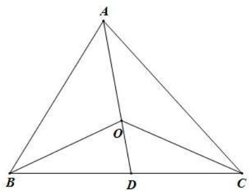

text_image

A
O
B
D
C

1687 (2024·全国·高一专题练习)(1)已知△ABC的外心为O,且AB=5,AC=3,则 $\overrightarrow{AO}\cdot\overrightarrow{BC}=$ \_\_\_\_.

(2) 已知 $\triangle ABC$ 的重心为 O，且 AB = 5，AC = 3，则 $\overrightarrow{AO} \cdot \overrightarrow{BC} =$ \_\_\_\_.  
(3) 已知 $\triangle ABC$ 的重心为 O，且 AB = 5，AC = 3， $A = \frac{\pi}{3}$ ，D 为 BC 中点，则 $\overrightarrow{AO} \cdot \overrightarrow{OD} =$ \_\_\_\_.

【答案】-8 $-\frac{16}{3}$ $\frac{49}{18}$

【解析】(1) 由题意得: 如图

过O作OD⊥BC,垂足为D,则D是BC的中点

$$
\because \overrightarrow {\mathrm{BC}} = \overrightarrow {\mathrm{AC}} - \overrightarrow {\mathrm{AB}}, \overrightarrow {\mathrm{AO}} = \overrightarrow {\mathrm{AD}} + \overrightarrow {\mathrm{DO}}, \overrightarrow {\mathrm{AD}} = \frac {1}{2} (\overrightarrow {\mathrm{AB}} + \overrightarrow {\mathrm{AC}})
$$

又∵ $\left|\overrightarrow{AC}\right|=3,\left|\overrightarrow{AB}\right|=5$

$$
\begin{array}{l} \therefore \overrightarrow {\mathrm{AO}} \cdot \overrightarrow {\mathrm{BC}} = (\overrightarrow {\mathrm{AD}} + \overrightarrow {\mathrm{DO}}) \cdot \overrightarrow {\mathrm{BC}} = \overrightarrow {\mathrm{AD}} \cdot \overrightarrow {\mathrm{BC}} = \frac {1}{2} (\overrightarrow {\mathrm{AB}} + \overrightarrow {\mathrm{AC}}) (\overrightarrow {\mathrm{AC}} - \overrightarrow {\mathrm{AB}}) = \frac {1}{2} (\overrightarrow {\mathrm{AC}} ^ {2} - \overrightarrow {\mathrm{AB}} ^ {2}) \\ = - 8 \end{array}
$$

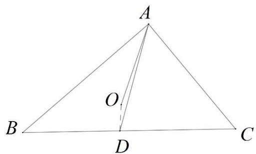

text_image

A
O
B
D
C

(2) 根据重心的性质, 知重心将相应的中线分成 2:1 两部分

$$
\overrightarrow {\mathrm{AO}} = \frac {2}{3} \overrightarrow {\mathrm{AD}} = \frac {1}{3} (\overrightarrow {\mathrm{AB}} + \overrightarrow {\mathrm{AC}}), \overrightarrow {\mathrm{BC}} = \overrightarrow {\mathrm{AC}} - \overrightarrow {\mathrm{AB}}
$$

$$
\therefore \overrightarrow {A O} \cdot \overrightarrow {B C} = \frac {1}{3} (\overrightarrow {A B} + \overrightarrow {A C}) \cdot (\overrightarrow {A C} - \overrightarrow {A B}) = \frac {1}{3} \left(\left| \overrightarrow {A C} \right| ^ {2} - \left| \overrightarrow {A B} \right| ^ {2}\right) = - \frac {1 6}{3}
$$

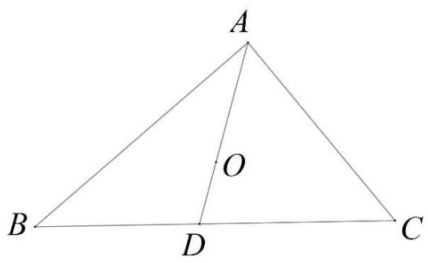

text_image

A
O
B
D
C

(3)根据重心的性质,知重心将相应的中线分成2:1两部分

$$
\overrightarrow {\mathrm{OD}} = \frac {1}{2} \overrightarrow {\mathrm{AO}}, \overrightarrow {\mathrm{AO}} = \frac {2}{3} \overrightarrow {\mathrm{AD}} = \frac {1}{3} (\overrightarrow {\mathrm{AB}} + \overrightarrow {\mathrm{AC}})
$$

$$
(\overrightarrow {\mathrm{AB}} + \overrightarrow {\mathrm{AC}}) ^ {2} = | \overrightarrow {\mathrm{AB}} | ^ {2} + | \overrightarrow {\mathrm{AC}} | ^ {2} + 2 | \overrightarrow {\mathrm{AB}} | | \overrightarrow {\mathrm{AC}} | \cos A = 2 5 + 9 + 3 0 \times \frac {1}{2} = 4 9
$$

$$
\overrightarrow {\mathrm{AO}} \cdot \overrightarrow {\mathrm{OD}} = \frac {1}{2} | \overrightarrow {\mathrm{AO}} | ^ {2} = \frac {2}{9} | \overrightarrow {\mathrm{AD}} | ^ {2} = \frac {1}{1 8} (\overrightarrow {\mathrm{AB}} + \overrightarrow {\mathrm{AC}}) ^ {2} = \frac {1}{1 8} \times 4 9 = \frac {4 9}{1 8}
$$

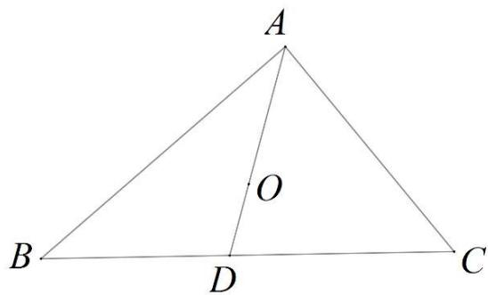

text_image

A
O
B
D
C

故答案为: (1) - 8(2) - $\frac{16}{3}(3)\frac{49}{18}$

1688 (2024·江苏无锡·高一江苏省太湖高级中学校考阶段练习)在 $\triangle ABC$ 中, AB = 2, $\angle ABC = 60^{\circ}, \overrightarrow{AC} \cdot \overrightarrow{AB} = -1$ , 若 O 是 $\triangle ABC$ 的重心, 则 $\overrightarrow{BO} \cdot \overrightarrow{AC} = \_\_\_\_.$

【答案】7

【解析】如图所示,以 B 为坐标原点, BC 所在直线为 x 轴, 建立平面直角坐标系. 设 C(a,0),

$$
\because \mathrm{AB} = 2, \angle \mathrm{ABC} = 6 0 ^ {\circ}, \therefore \mathrm{A} (1, \sqrt {3}), \overrightarrow {\mathrm{AC}} = (a - 1, - \sqrt {3}), \overrightarrow {\mathrm{AB}} = (- 1, - \sqrt {3})
$$

$$
\because \overrightarrow {\mathrm{AC}} \cdot \overrightarrow {\mathrm{AB}} = 1 - a + 3 = - 1, \text {解得} a = 5, \therefore \mathrm{C} (5, 0)
$$

∵O是△ABC的重心,延长BO交AC于点D,则D为AC中点,所以 $D\left(3,\frac{\sqrt{3}}{2}\right)$ ,

$$
\therefore \overrightarrow {\mathrm{BO}} = \frac {2}{3} \overrightarrow {\mathrm{BD}} = \frac {2}{3} \left(3, \frac {\sqrt {3}}{2}\right) = \left(2, \frac {\sqrt {3}}{3}\right), \overrightarrow {\mathrm{AC}} = (4, - \sqrt {3}),
$$

$$
\therefore \overrightarrow {\mathrm{BO}} \cdot \overrightarrow {\mathrm{AC}} = 2 \times 4 + (- \sqrt {3}) \times \frac {\sqrt {3}}{3} = 7.
$$

故答案为: 7

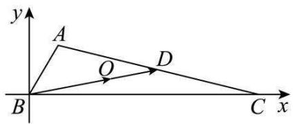

text_image

y
A
O
D
B
C x

1689 (2024·江西南昌·高三校联考期中)锐角 $\triangle ABC$ 中, $a, b, c$ 为角 A, B, C 所对的边, 点 G 为 $\triangle ABC$ 的重心, 若 AG ⊥ BG, 则 cosC 的取值范围为 \_\_\_\_.

【答案】 $\left[\frac{4}{5},\frac{\sqrt{6}}{3}\right)$ ,

【解析】由题意 $\overrightarrow{AG}=\frac{2}{3}\times\frac{1}{2}(\overrightarrow{AC}+\overrightarrow{AB})=\frac{1}{3}(\overrightarrow{AC}+\overrightarrow{AB}),\overrightarrow{BG}=\frac{2}{3}\times\frac{1}{2}(\overrightarrow{BA}+\overrightarrow{BC})=\frac{1}{3}(\overrightarrow{BA}+\overrightarrow{BC})$ ,

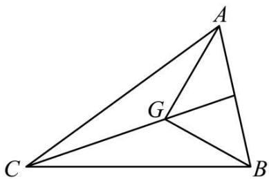

text_image

Geometric diagram of triangle ABC with internal points G and connecting lines forming smaller triangles

又 AG ⊥ BG, 则 $\overrightarrow{AG} \cdot \overrightarrow{BG} = \frac{1}{9} (\overrightarrow{AC} + \overrightarrow{AB}) \cdot (\overrightarrow{BA} + \overrightarrow{BC}) = \frac{1}{9} (\overrightarrow{AC} \cdot \overrightarrow{BA} + \overrightarrow{AC} \cdot \overrightarrow{BC} + \overrightarrow{AB} \cdot \overrightarrow{BA} + \overrightarrow{AB} \cdot \overrightarrow{BC}) = 0,$

所以 $\overrightarrow{CA}\cdot\overrightarrow{CB}=\overrightarrow{AC}\cdot\overrightarrow{AB}+\overrightarrow{BA}\cdot\overrightarrow{BC}+\overrightarrow{AB}^{2}$ ，即 $ab\cos C=bc\cos A+ac\cos B+c^{2}$

由 $\cos A = \frac{b^{2} + c^{2} - a^{2}}{2bc}$ , $\cos B = \frac{a^{2} + c^{2} - b^{2}}{2ac}$ , $\cos C = \frac{a^{2} + b^{2} - c^{2}}{2ab}$ ,

所以 $a^{2}+b^{2}=5c^{2},\cos C=\frac{2}{5}\left(\frac{a}{b}+\frac{b}{a}\right)$ ,

由 $\triangle ABC$ 为锐角三角形及上式，则 $\left\{ \begin{array}{l}a^2 + b^2 = 5c^2 \\ a^2 + c^2 > b^2 \\ b^2 + c^2 > a^2 \end{array} \right.$ ，即 $\left\{ \begin{array}{l}3a^2 > 2b^2 \\ 3b^2 > 2a^2 \end{array} \right.$ ，可得 $\frac{\sqrt{6}}{2} > \frac{b}{a} > \frac{\sqrt{6}}{3}$ ，

所以 $\cos C$ 在 $\frac{b}{a} \in \left( \frac{\sqrt{6}}{3}, 1 \right)$ 上递减，在 $\left( 1, \frac{\sqrt{6}}{2} \right)$ 上递增，则 $\frac{4}{5} \leqslant \cos C < \frac{\sqrt{6}}{3}$ .

故答案为: $\left[\frac{4}{5},\frac{\sqrt{6}}{3}\right)$

1690 (2024·全国·高三专题练习)过△ABC重心O的直线PQ交AC于点P,交BC于点Q, $\overrightarrow{PC}=\frac{3}{4}\overrightarrow{AC},\overrightarrow{QC}=n\overrightarrow{BC}$ ,则n的值为\_\_\_\_.

【答案】 $\frac{3}{5}$

【解析】如图,因为 O 是重心,所以 $\overrightarrow{OA} + \overrightarrow{OB} + \overrightarrow{OC} = \overrightarrow{0}$ , 即 $\overrightarrow{OA} = -\overrightarrow{OB} - \overrightarrow{OC}$ ,

因为 $\overrightarrow{PC}=\frac{3}{4}\overrightarrow{AC}$ ，所以 $\overrightarrow{OC}-\overrightarrow{OP}=\frac{3}{4}\left(\overrightarrow{OC}-\overrightarrow{OA}\right)$

所以 $\overrightarrow{OP}=\frac{3}{4}\overrightarrow{OA}+\frac{1}{4}\overrightarrow{OC}=\frac{3}{4}\left(-\overrightarrow{OB}-\overrightarrow{OC}\right)+\frac{1}{4}\overrightarrow{OC}=-\frac{3}{4}\overrightarrow{OB}-\frac{1}{2}\overrightarrow{OC},$

又 $\overrightarrow{\mathrm{QC}} = n\overrightarrow{\mathrm{BC}}$ ，则 $\overrightarrow{\mathrm{OC}} -\overrightarrow{\mathrm{OQ}} = n(\overrightarrow{\mathrm{OC}} -\overrightarrow{\mathrm{OB}})$ ，所以 $\overrightarrow{\mathrm{OQ}} = n\overrightarrow{\mathrm{OB}} +(1 - n)\overrightarrow{\mathrm{OC}}$

因为 P, O, Q 三点共线, 所以 $\overrightarrow{OP} \parallel \overrightarrow{OQ}$ ,

所以 $-\frac{3}{4} (1 - n) = -\frac{1}{2} n$ ，解得 $n = \frac{3}{5}$

故答案为: $\frac{3}{5}$

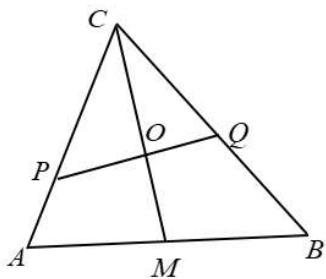

text_image

C
O
P
A
M
B
Q

1691 (2024·上海虹口·高三上海市复兴高级中学校考期中)在 $\triangle ABC$ 中, 过重心 G 的直线交边 AB 于点 P, 交边 AC 于点 Q, 设 $\triangle APQ$ 的面积为 $S_{1}$ , $\triangle ABC$ 的面积为 $S_{2}$ , 且 $\overrightarrow{AP} = \lambda \overrightarrow{AB}, \overrightarrow{AQ} = \mu \overrightarrow{AC}$ , 则 $\frac{S_{1}}{S_{2}}$ 的取值范围为 \_\_\_\_.

【答案】 $\left[\frac{4}{9},\frac{1}{2}\right]$

【解析】根据题意,连接 AG,作图如下:

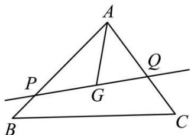

text_image

A
P
G
Q
B
C

$$
\frac {\mathrm{S} _ {1}}{\mathrm{S} _ {2}} = \frac {\frac {1}{2} \sin \mathrm{A} \times \mathrm{AP} \times \mathrm{AQ}}{\frac {1}{2} \sin \mathrm{A} \times \mathrm{AB} \times \mathrm{AC}} = \lambda \mu ,
$$

在三角形 ABC 中, 因为 G 为其重心, 故可得 $\overrightarrow{AG} = \frac{1}{3} (\overrightarrow{AB} + \overrightarrow{AC})$

结合已知条件可得: $\overrightarrow{AG}=\frac{1}{3}\left(\frac{1}{\lambda}\overrightarrow{AP}+\frac{1}{\mu}\overrightarrow{AQ}\right)$ ,

因为 P, G, Q 三点共线, 故可得 $\frac{1}{3\lambda} + \frac{1}{3\mu} = 1$ , 即 $\frac{1}{\lambda} + \frac{1}{\mu} = 3$ ,

由题设可知 $\mu\in(0,1],\lambda\in(0,1]$ ,

又 $\mu = \frac{\lambda}{3\lambda - 1} \in (0,1]$ , 得 $\lambda \in \left[\frac{1}{2}, 1\right]$ ,

故 $\frac{\mathrm{S}_1}{\mathrm{S}_2} = \lambda \mu = \frac{\lambda^2}{3\lambda - 1}$ , 令 $3\lambda - 1 = t$ , 可得 $t \in \left[\frac{1}{2}, 2\right]$ , $\lambda = \frac{1}{3}(t + 1)$ ,

则 $\frac{\mathrm{S}_1}{\mathrm{S}_2} = \frac{1}{9}\left(t + \frac{1}{t} + 2\right), t \in \left[\frac{1}{2}, 2\right]$ ，又 $y = t + \frac{1}{t}$ 在 $\left(\frac{1}{2}, 1\right)$ 单调递减，(1,2) 单调递增，

当 t=1 时， $\frac{S_{1}}{S_{2}}=\frac{4}{9}$ ，当 $t=\frac{1}{2}$ 时， $\frac{S_{1}}{S_{2}}=\frac{1}{2}$ ，当 t=2 时， $\frac{S_{1}}{S_{2}}=\frac{1}{2}$ ，

故 $\frac{\mathrm{S}_1}{\mathrm{S}_2}\in \left[\frac{4}{9},\frac{1}{2}\right].$

故答案为: $\left[\frac{4}{9},\frac{1}{2}\right]$ .

# 题型三:内心定理

1692 (2024·湖北·模拟预测)在 $\triangle ABC$ 中， $\overrightarrow{AB} \cdot \overrightarrow{AC} = 16, S_{\triangle ABC} = 6, BC = 3$ ，且 AB > AC，
若 O 为 $\triangle ABC$ 的内心，则 $\overrightarrow{AO} \cdot \overrightarrow{BC} =$ \_\_\_\_ .

【答案】-3

【解析】因为 $\overrightarrow{AB} \cdot \overrightarrow{AC} = 16$ ，所以 $\left|\overrightarrow{AB}\right| \cdot \left|\overrightarrow{AC}\right| \cos A = 16$ ，

因为 $S_{\triangle ABC}=6$ ，所以 $\frac{1}{2}\left|\overrightarrow{AB}\right|\cdot\left|\overrightarrow{AC}\right|\sin A=6$ ，

所以 $\frac{\sin A}{\cos A} = \frac{3}{4}$ , 又 $\sin^2 A + \cos^2 A = 1, \cos A > 0, \sin A > 0$ ,

所以 $\sin A = \frac{3}{5}, \cos A = \frac{4}{5}$ ，所以 $AB \cdot AC = 20$ ，

由余弦定理可得 $BC^{2}=AB^{2}+AC^{2}-2AB\cdot AC\cos A$ ，又 BC=3，

所以 $AB^{2}+AC^{2}=41$ ，又 AB>AC，所以 AB=5, AC=4，

所以 $\triangle ABC$ 为以 AB 为斜边的直角三角形，

设 $\triangle ABC$ 的内切圆与边AC相切于点D，内切圆的半径为 $r$

由直角三角形的内切圆的性质可得 $r=\frac{AC+BC-AB}{2}=1$ ，故 OD=1，

因为 AD ⊥ BC, 所以 $\overrightarrow{AD} \cdot \overrightarrow{BC} = 0$ ,

因为 $OD \perp AC, BC \perp AC,$ 所以 $OD \parallel BC,$ 所以 $\overrightarrow{DO} \cdot \overrightarrow{BC} = -3$

所以 $\overrightarrow{AO}\cdot\overrightarrow{BC}=(\overrightarrow{AD}+\overrightarrow{DO})\cdot\overrightarrow{BC}=\overrightarrow{AD}\cdot\overrightarrow{BC}+\overrightarrow{DO}\cdot\overrightarrow{BC}=-3.$

故答案为: -3.

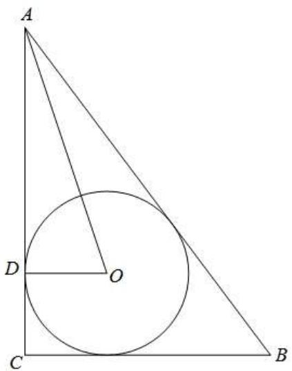

text_image

A
D
O
C
B

1693 (2024·全国·高三专题练习)已知 Rt△ABC 中, AB = 3, AC = 4, BC = 5, I 是 △ABC 的内心, P 是 △IBC 内部 (不含边界) 的动点. 若 $\overrightarrow{AP} = \lambda \overrightarrow{AB} + \mu \overrightarrow{AC} (\lambda, \mu \in R)$ , 则 $\lambda + \mu$ 的取值范围是 \_\_\_\_.

【答案】 $\left(\frac{7}{12},1\right)$

【解析】建立如图所示平面直角坐标系,则

A(0,0), B(3,0), C(0,4),

因为 I 是三角形 ABC 的内心, 设三角形 ABC 内切圆半径为 r,

则 $\frac{1}{2} (|\mathrm{AC}| + |\mathrm{AB}| + |\mathrm{BC}|)\times r = \frac{1}{2}\times |\mathrm{AB}|\times |\mathrm{AC}|$ ，解得 $r = 1$

所以 I(1,1), $\overrightarrow{AB} = (3,0)$ , $\overrightarrow{AC} = (0,4)$ .

依题意点 $P(x,y)$ 在三角形 IBC 的内部 (不含边界).

因为 $\overrightarrow{AP} = \lambda \overrightarrow{AB} + \mu \overrightarrow{AC} (\lambda, \mu \in \mathbb{R})$ ,

所以 $(x,y)=\lambda(3,0)+\mu(0,4)=(3\lambda,4\mu)$ ,所以 $\left\{\begin{aligned}x=3\lambda\\ y=4\mu\end{aligned}\right.\Rightarrow\left\{\begin{aligned}\lambda=\frac{1}{3}x\\ \mu=\frac{1}{4}y\end{aligned}\right.$

令 $z=\lambda+\mu=\frac{1}{3}x+\frac{1}{4}y,$

则 $y=-\frac{4}{3}x+4z$ ,

由图可知, 当 $y = -\frac{4}{3}x + 4z$ 过 I(1,1) 时, $z = \frac{1}{3} \times 1 + \frac{1}{4} \times 1 = \frac{7}{12}$ .

当 $y=-\frac{4}{3}x+4z$ ，过 C(0,4)，即为直线 BC 时， $z=\frac{1}{3}\times0+\frac{1}{4}\times4=1$ .

所以 $\lambda + \mu$ 的取值范围时 $\left(\frac{7}{12}, 1\right)$ .

故答案为: $\left(\frac{7}{12},1\right)$

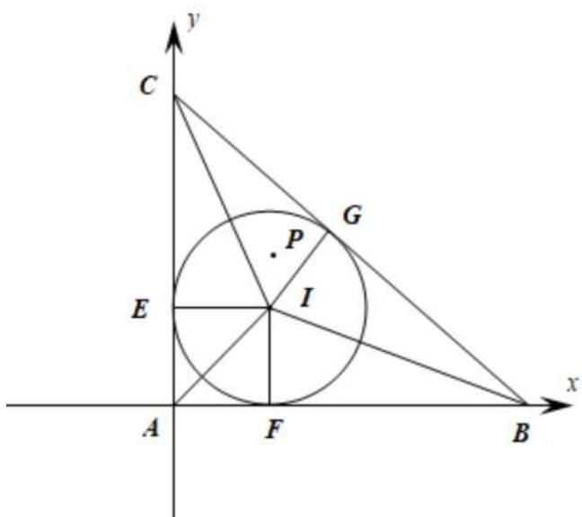

text_image

y
C
G
P
E
I
A
F
B
x

1694 (2024·黑龙江黑河·高三嫩江市高级中学校考阶段练习)设 I 为 $\triangle ABC$ 的内心, AB = AC = 5, BC = 6, $\overrightarrow{AI} = m\overrightarrow{AB} + n\overrightarrow{BC}$ , 则 $m + n$ 为 \_\_\_\_.

【答案】 $\frac{15}{16}$

【解析】因为 AB = AC = 5，所以取 BC 中点为 O，连接 AO，

则 AO ⊥ BC, 且 △ABC 的内心 I 在 AO 上, IO 即为 △ABC 的内切圆半径 r,

又 BC=6, 所以 $AO=\sqrt{AB^{2}-BO^{2}}=4$ ,

因为 $S_{\triangle ABC}=\frac{1}{2}BC\times AO=\frac{1}{2}(AB+BC+AC)\times r$ , 即 $6\times4=(5+5+6)\times IO$

所以 $IO=\frac{3}{2}$ , $AI=\frac{5}{2}$ ,

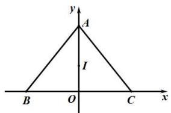

text_image

y
A
I
B O C x

以 BC 所在直线为 x 轴, BC 的垂直平分线为 y 轴建立坐标系, 则 A(0,4), B(-3,0), C(3,0), 则 $\overrightarrow{AB}=(-3,-4)$ , $\overrightarrow{BC}=(6,0)$ , $\overrightarrow{AI}=\left(0,-\frac{5}{2}\right)$ ,

因为 $\overrightarrow{AI}=m\overrightarrow{AB}+n\overrightarrow{BC}$ ，即 $\left(0,-\frac{5}{2}\right)=m(-3,-4)+n(6,0)$ ,

所以 $\left\{\begin{aligned}-4m&=-\frac{5}{2}\\ -3m+6n&=0\end{aligned}\right.$ 解得 $m=\frac{5}{8}, n=\frac{5}{16}$ ，所以 $m+n=\frac{5}{8}+\frac{5}{16}=\frac{15}{16}$

故答案为: $\frac{5}{16}$ .

1695 (2024·福建福州·高三福建省福州第一中学校考阶段练习)已知点 O 是 $\Delta ABC$ 的内心，若 $\overrightarrow{AO} = \frac{3}{7}\overrightarrow{AB} + \frac{1}{7}\overrightarrow{AC}$ ，则 $\cos\angle BAC =$ \_\_\_\_ .

【答案】 $\frac{1}{6}$

【解析】因为 $-\overrightarrow{OA}=\frac{3}{7}\left(\overrightarrow{OB}-\overrightarrow{OA}\right)+\frac{1}{7}\left(\overrightarrow{OC}-\overrightarrow{OA}\right)$ ，即 $\overrightarrow{OC}=-3\left(\overrightarrow{OA}+\overrightarrow{OB}\right)$

取 AB 中点 D, 连接 OD, 则 $\overrightarrow{OA} + \overrightarrow{OB} = 2\overrightarrow{OD}$ , 故 $\overrightarrow{OC} = -6\overrightarrow{OD}$ , 故点 C, O, D 共线,

又 $\angle \mathrm{ACO} = \angle \mathrm{BCO}$ ，故AC=BC，且CD⊥AB，所以cos∠BAC $= \frac{\mathrm{DA}}{\mathrm{CA}} = \frac{\mathrm{OD}}{\mathrm{OC}} = \frac{1}{6}.$

故答案为: $\frac{1}{6}$ .

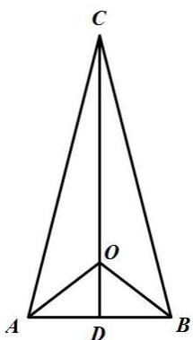

text_image

C
O
A D B

1696 (2024·甘肃兰州·高一兰州市第二中学校考期末)在面上有 $\triangle ABC$ 及内一点 O 满足关系式: $S_{\triangle OBC} \cdot \overrightarrow{OA} + S_{\triangle OAC} \cdot \overrightarrow{OB} + S_{\triangle OAB} \cdot \overrightarrow{OC} = \vec{0}$ 即称为经典的“奔驰定理”, 若 $\triangle ABC$ 的三边为 $a, b, c$ , 现有 $a \cdot \overrightarrow{OA} + b \cdot \overrightarrow{OB} + c \cdot \overrightarrow{OC} = \vec{0}$ , 则 O 为 $\triangle ABC$ 的 \_\_\_\_ 心.

【答案】内

【解析】∵ $\overrightarrow{OB}=\overrightarrow{OA}+\overrightarrow{AB},\overrightarrow{OC}=\overrightarrow{OA}+\overrightarrow{AC},$

$$
\therefore a \cdot \overrightarrow {\mathrm{OA}} + b \cdot \overrightarrow {\mathrm{OB}} + c \cdot \overrightarrow {\mathrm{OC}} = a \cdot \overrightarrow {\mathrm{OA}} + b (\overrightarrow {\mathrm{OA}} + \overrightarrow {\mathrm{AB}}) + c (\overrightarrow {\mathrm{OA}} + \overrightarrow {\mathrm{AC}})
$$

$$
= (a + b + c) \cdot \overrightarrow {\mathrm{OA}} + b \cdot \overrightarrow {\mathrm{AB}} + c \cdot \overrightarrow {\mathrm{AC}} = \vec {0},
$$

$$
\therefore \overrightarrow {\mathrm{AO}} = \frac {b c}{a + b + c} \left(\frac {\overrightarrow {\mathrm{AB}}}{c} + \frac {\overrightarrow {\mathrm{AC}}}{b}\right),
$$

$\because \frac{\overrightarrow{AB}}{c}, \frac{\overrightarrow{AC}}{b}$ 分别是 $\overrightarrow{AB}, \overrightarrow{AC}$ 方向上的单位向量，

∴向量 $\frac{\overrightarrow{AB}}{c}+\frac{\overrightarrow{AC}}{b}$ 平分∠BAC,即AO平分∠BAC,同理BO平分∠ABC,

∴ O 为 $\triangle ABC$ 的内心，

故答案为:内

1697 (2024·贵州安顺·统考模拟预测)已知O是平面上的一个定点，A、B、C是平面上不共线

的三点，动点P满足 $\overrightarrow{\mathrm{OP}} = \overrightarrow{\mathrm{OA}} +\lambda \left(\frac{\overrightarrow{\mathrm{AB}}}{|\overrightarrow{\mathrm{AB}}|} +\frac{\overrightarrow{\mathrm{AC}}}{|\overrightarrow{\mathrm{AC}}|}\right)(\lambda \in \mathbb{R})$ ，则点P的轨迹一定经过

△ABC的 （）

A. 重心

B. 外心

C. 内心

D. 垂心

【答案】C

【解析】因为 $\frac{\overrightarrow{AB}}{|\overrightarrow{AB}|}$ 为 $\overrightarrow{AB}$ 方向上的单位向量， $\frac{\overrightarrow{AC}}{|\overrightarrow{AC}|}$ 为 $\overrightarrow{AC}$ 方向上的单位向量，

则 $\frac{\overrightarrow{AB}}{|\overrightarrow{AB}|} + \frac{\overrightarrow{AC}}{|\overrightarrow{AC}|}$ 的方向与 $\angle BAC$ 的角平分线一致，

由 $\overrightarrow{\mathrm{OP}} = \overrightarrow{\mathrm{OA}} +\lambda \left(\frac{\overrightarrow{\mathrm{AB}}}{|\overrightarrow{\mathrm{AB}}|} +\frac{\overrightarrow{\mathrm{AC}}}{|\overrightarrow{\mathrm{AC}}|}\right)$ ，可得 $\overrightarrow{\mathrm{OP}} -\overrightarrow{\mathrm{OA}} = \lambda \left(\frac{\overrightarrow{\mathrm{AB}}}{|\overrightarrow{\mathrm{AB}}|} +\frac{\overrightarrow{\mathrm{AC}}}{|\overrightarrow{\mathrm{AC}}|}\right),$

即 $\overrightarrow{AP}=\lambda\left(\frac{\overrightarrow{AB}}{|\overrightarrow{AB}|}+\frac{\overrightarrow{AC}}{|\overrightarrow{AC}|}\right)$ ,

所以点 P 的轨迹为 $\angle BAC$ 的角平分线所在直线，

故点 P 的轨迹一定经过 $\triangle ABC$ 的内心.

故选：C.

1698 (2024·江西·校联考模拟预测)已知椭圆 $\frac{x^{2}}{16}+\frac{y^{2}}{12}=1$ 的左右焦点分别为 $F_{1}, F_{2}, P$ 为椭圆上异于长轴端点的动点，G, I 分别为 $\triangle PF_{1}F_{2}$ 的重心和内心，则 $\overrightarrow{PI}\cdot\overrightarrow{PG}=$ （）

A. $\frac{4}{3}$

B. $\sqrt{3}$

C. 2

D. $\frac{16}{3}$

【答案】D

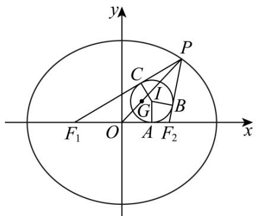

text_image

y
P
C
I
G
B
F₁ O A F₂ x

【解析】

由椭圆 $\frac{x^2}{16} +\frac{y^2}{12} = 1$ 可得 $a = 4,b = 2\sqrt{3},c = \sqrt{16 - 12} = 2$

如图, 设 $\triangle PF_{1}F_{2}$ 的内切圆与三边分别相切与 A, B, C,

G, I 分别为 $\Delta PF_{1}F_{2}$ 的重心和内心.

则 $|\mathrm{PB}| = |\mathrm{PC}|$ , $|\mathrm{F}_1\mathrm{A}| = |\mathrm{F}_1\mathrm{C}|$ , $|\mathrm{F}_2\mathrm{A}| = |\mathrm{F}_2\mathrm{B}|$ ,

所以 $\left|PB\right|=\left|PC\right|=\frac{\left|PF_{1}\right|+\left|PF_{2}\right|-\left|F_{1}F_{2}\right|}{2}=a-c,$

所以 $\vec{\mathrm{PI}}\cdot \vec{\mathrm{PG}} = \vec{\mathrm{PG}}\cdot \vec{\mathrm{PI}} = \frac{2}{3}\vec{\mathrm{PO}}\cdot \vec{\mathrm{PI}} = \frac{1}{3}\left(\vec{\mathrm{PF}_1} + \vec{\mathrm{PF}_2}\right)\cdot \vec{\mathrm{PI}} = \frac{1}{3}\left(\vec{\mathrm{PF}_1}\cdot \vec{\mathrm{PI}} +\vec{\mathrm{PF}_2}\cdot \vec{\mathrm{PI}}\right)$

$$
= \frac {1}{3} \left(\left| \overrightarrow {\mathrm{PF} _ {1}} \right| \left| \overrightarrow {\mathrm{PC}} \right| + \left| \overrightarrow {\mathrm{PF} _ {2}} \right| \left| \overrightarrow {\mathrm{PB}} \right|\right) = \frac {1}{3} \left| \overrightarrow {\mathrm{PB}} \right| \left(\left| \overrightarrow {\mathrm{PF} _ {1}} \right| + \left| \overrightarrow {\mathrm{PF} _ {2}} \right|\right)
$$

$$
= \frac {1}{3} (a - c) \cdot 2 a = \frac {1 6}{3}
$$

故选：D

1699 (2024·全国·高三专题练习)已知△ABC, I是其内心, 内角A,B,C所对的边分别a,b,c, 则 ( )

A. $\overrightarrow{\mathrm{AI}} = \frac{1}{3} (\overrightarrow{\mathrm{AB}} +\overrightarrow{\mathrm{AC}})$

B. $\overrightarrow{\mathrm{AI}} = \frac{c\overrightarrow{\mathrm{AB}}}{a} +\frac{b\overrightarrow{\mathrm{AC}}}{a}$

C. $\overrightarrow{AI}=\frac{b\overrightarrow{AB}}{a+b+c}+\frac{c\overrightarrow{AC}}{a+b+c}$

D. $\overrightarrow{AI}=\frac{c\overrightarrow{AB}}{a+b}+\frac{b\overrightarrow{AC}}{a+c}$

【答案】C

【解析】延长 AI, BI, CI, 分别交 BC, AC, AB 于 D, E, F. 内心是三角形三个内角的角平分线的交点.

在三角形 ABD 和三角形 ACD 中, 由正弦定理得:

$$
\frac {\mathrm{BD}}{\sin \left(\frac {1}{2} \angle \mathrm{BAC}\right)} = \frac {c}{\sin \angle \mathrm{ADB}}, \frac {\mathrm{CD}}{\sin \left(\frac {1}{2} \angle \mathrm{BAC}\right)} = \frac {b}{\sin \angle \mathrm{ADC}},
$$

由于 $\sin \angle ADB = \sin \angle ADC$ ，所以 $\frac{BD}{c} = \frac{CD}{b},\frac{BD}{CD} = \frac{c}{b},\frac{BD}{BD + CD} = \frac{c}{b + c},\frac{BD}{a} =$ $\frac{c}{b + c},\mathrm{BD} = \frac{ac}{b + c},$

同理可得 $\frac{c}{\mathrm{BD}} = \frac{\mathrm{AI}}{\mathrm{DI}},\frac{c}{\mathrm{BD} + c} = \frac{\mathrm{AI}}{\mathrm{DI} + \mathrm{AI}} = \frac{\mathrm{AI}}{\mathrm{AD}},$

$$
\mathrm{AI} = \frac {c \cdot \mathrm{AD}}{\mathrm{BD} + c} = \frac {c}{\frac {a c}{b + c} + c} \cdot \mathrm{AD} = \frac {b + c}{a + b + c} \cdot \mathrm{AD}.
$$

所以 $\overrightarrow{AD} = \overrightarrow{AB} + \overrightarrow{BD} = \overrightarrow{AB} + \frac{c}{b+c} \overrightarrow{BC} = \overrightarrow{AB} + \frac{c}{b+c} (\overrightarrow{AC} - \overrightarrow{AB})$

$$
= \frac {b}{b + c} \overrightarrow {\mathrm{AB}} + \frac {c}{b + c} \overrightarrow {\mathrm{AC}},
$$

则 $\overrightarrow{\mathrm{AI}} = \frac{b + c}{a + b + c}\cdot \overrightarrow{\mathrm{AD}} = \frac{b + c}{a + b + c}\cdot \left(\frac{b}{b + c}\overrightarrow{\mathrm{AB}} +\frac{c}{b + c}\overrightarrow{\mathrm{AC}}\right) = \frac{b}{a + b + c}\overrightarrow{\mathrm{AB}} +$ $\frac{c}{a + b + c}\overrightarrow{\mathrm{AC}}.$

故选：C

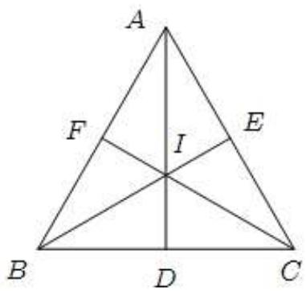

text_image

A
F
I
E
B
D
C

1700 (2024·全国·高三专题练习)在 $\triangle ABC$ 中， $\cos A = \frac{3}{4}$ ，O 为 $\triangle ABC$ 的内心，若 $\overrightarrow{AO} = x\overrightarrow{AB} + y\overrightarrow{AC}(x, y \in \mathbb{R})$ ，则 $x + y$ 的最大值为（）

A. $\frac{2}{3}$

B. $\frac{6-\sqrt{6}}{5}$

C. $\frac{7-\sqrt{7}}{6}$

D. $\frac{8-2\sqrt{2}}{7}$

【答案】D

【解析】如图: 圆 O 在边 AB, BC 上的切点分别为 E, F, 连接 OE, OF, 延长 AO 交 BC 于点 D

设 $\angle OAB = \theta$ ，则 $\cos A = \cos 2\theta = 1 - 2\sin^2\theta = \frac{3}{4}$ ，则 $\sin \theta = \frac{\sqrt{2}}{4}$

设 $\overrightarrow{AD} = \lambda \overrightarrow{AO} = \lambda x \overrightarrow{AB} + \lambda y \overrightarrow{AC}$

∵B,D,C三点共线,则 $\lambda x + \lambda y = 1$ , 即 $x + y = \frac{1}{\lambda}$

$$
\frac {1}{\lambda} = \frac {\mathrm{AO}}{\mathrm{AD}} = \frac {\mathrm{AO}}{\mathrm{AO} + \mathrm{OD}} \leqslant \frac {\mathrm{AO}}{\mathrm{AO} + \mathrm{OF}} = \frac {1}{1 + \frac {\mathrm{OF}}{\mathrm{AO}}} = \frac {1}{1 + \frac {\mathrm{OE}}{\mathrm{AO}}} = \frac {1}{1 + \sin \theta} = \frac {1}{1 + \frac {\sqrt {2}}{4}} =
$$

$$
\frac {8 - 2 \sqrt {2}}{7}
$$

即 $x + y \leqslant \frac{8 - 2\sqrt{2}}{7}$

故选：D.

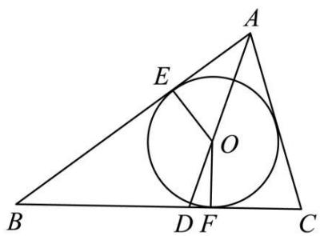

text_image

Geometric diagram of triangle ABC with inscribed circle and labeled points D, E, F, O

1701 (2024·全国·高三专题练习)点 O 在 $\Delta ABC$ 所在平面内, 给出下列关系式:

(1) $\overrightarrow{OA}+\overrightarrow{OB}+\overrightarrow{OC}=\overrightarrow{0};$   
(2) $\overrightarrow{\mathrm{OA}}\cdot \overrightarrow{\mathrm{OB}} = \overrightarrow{\mathrm{OB}}\cdot \overrightarrow{\mathrm{OC}} = \overrightarrow{\mathrm{OC}}\cdot \overrightarrow{\mathrm{OA}};$   
(3) $\overrightarrow{\mathrm{OA}}\cdot \left(\frac{\overrightarrow{\mathrm{AC}}}{|\overrightarrow{\mathrm{AC}}|} -\frac{\overrightarrow{\mathrm{AB}}}{|\overrightarrow{\mathrm{AB}}|}\right) = \overrightarrow{\mathrm{OB}}\cdot \left(\frac{\overrightarrow{\mathrm{BC}}}{|\overrightarrow{\mathrm{BC}}|} -\frac{\overrightarrow{\mathrm{BA}}}{|\overrightarrow{\mathrm{BA}}|}\right) = 0;$   
(4) $(\overrightarrow{\mathrm{OA}}+\overrightarrow{\mathrm{OB}})\cdot\overrightarrow{\mathrm{AB}}=(\overrightarrow{\mathrm{OB}}+\overrightarrow{\mathrm{OC}})\cdot\overrightarrow{\mathrm{BC}}=0.$

则点 O 依次为 $\Delta ABC$ 的

( )

A. 内心、外心、重心、垂心；

B. 重心、外心、内心、垂心；

C. 重心、垂心、内心、外心；

D. 外心、内心、垂心、重心

【答案】C

【解析】(1) $\overrightarrow{OA}+\overrightarrow{OB}+\overrightarrow{OC}=\overrightarrow{0}$ 显然得出O为 $\Delta ABC$ 的重心;

(2) $\overrightarrow{OA}\cdot\overrightarrow{OB}=\overrightarrow{OB}\cdot\overrightarrow{OC}\Rightarrow\overrightarrow{OB}\cdot(\overrightarrow{OA}-\overrightarrow{OC})=0\Rightarrow\overrightarrow{OB}\cdot\overrightarrow{CA}=0\Rightarrow OB\perp CA$ ，同理OA⊥CB,OC⊥AB，所以O为 $\Delta ABC$ 的垂心；  
(3) $\overrightarrow{OA}\cdot\left(\frac{\overrightarrow{AC}}{|\overrightarrow{AC}|}-\frac{\overrightarrow{AB}}{|\overrightarrow{AB}|}\right)=\overrightarrow{OB}\cdot\left(\frac{\overrightarrow{BC}}{|\overrightarrow{BC}|}-\frac{\overrightarrow{BA}}{|\overrightarrow{BA}|}\right)=0\Rightarrow OA,OB$ 分别是 $\angle BAC,\angle ABC$ 的角平分线，所以O为 $\Delta ABC$ 的内心；  
(4) $(\overrightarrow{\mathrm{OA}} + \overrightarrow{\mathrm{OB}}) \cdot \overrightarrow{\mathrm{AB}} = 0 \Rightarrow 2\overrightarrow{\mathrm{OM}} \cdot \overrightarrow{\mathrm{AB}} = 0 \Rightarrow \mathrm{OM} \perp \mathrm{AB}$ (M是AB中点)同理ON⊥BC(N是BC中点),所以O为△ABC的外心.

故选：C.

1702 (2024·全国·高三专题练习)已知 $\Delta ABC$ 的内角 A、B、C 的对边分别为 a、b、c，O 为 $\Delta ABC$ 内一点，若分别满足下列四个条件：

① $a\overrightarrow{OA} + b\overrightarrow{OB} + c\overrightarrow{OC} = \overrightarrow{0};$   
② $\tan A \cdot \overrightarrow{OA} + \tan B \cdot \overrightarrow{OB} + \tan C \cdot \overrightarrow{OC} = \vec{0};$   
③ $\sin2A\cdot\overrightarrow{OA}+\sin2B\cdot\overrightarrow{OB}+\sin2C\cdot\overrightarrow{OC}=\vec{0};$

④ $\overrightarrow{OA} + \overrightarrow{OB} + \overrightarrow{OC} = \overrightarrow{0};$

则点 O 分别为 $\Delta ABC$ 的

( )

A. 外心、内心、垂心、重心

B. 内心、外心、垂心、重心

C. 垂心、内心、重心、外心

D. 内心、垂心、外心、重心

【答案】D

【解析】先考虑直角 $\Delta ABC$ ，可令 a=3, b=4, c=5，

可得 A(0,4), B(3,0), C(0,0), 设 O(m,n),

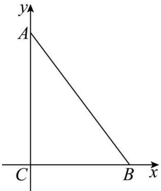

text_image

y
A
C
B
x

① $a\overrightarrow{OA} + b\overrightarrow{OB} + c\overrightarrow{OC} = \overrightarrow{0}$ ，即为 $3(-m,4-n) + 4(3-m,-n) + 5(-m,-n) = (0,0)$ ，
即有 $-12m+12=0,-12n+12=0$ ，解得 m=n=1，

即有 O 到 x, y 轴的距离为 1, O 在 $\angle BCA$ 的平分线上, 且到 AB 的距离也为 1, 则 O 为 $\triangle ABC$ 的内心;

③ $\sin2A\cdot\overrightarrow{OA}+\sin2B\cdot\overrightarrow{OB}+\sin2C\cdot\overrightarrow{OC}=\vec{0},$

即为 $\frac{24}{25} (-m,4 - n) + \frac{24}{25} (3 - m, - n) + 0(-m, - n) = (0,0)$

可得 3 - 2m = 0, 4 - 2n = 0, 解得 $m = \frac{3}{2}$ , n = 2,

由 $\left|OA\right|=\left|OB\right|=\left|OC\right|=\frac{5}{2}$ ，故 O 为 $\triangle ABC$ 的外心；

④ $\overrightarrow{OA} + \overrightarrow{OB} + \overrightarrow{OC} = \overrightarrow{0}$ ，可得 $(-m, 4 - n) + (3 - m, -n) + (-m, -n) = (0, 0)$ ，
即为 $3-3m=0, 4-3n=0$ , 解得 m=1, $n=\frac{4}{3}$ ,

由 AC 的中点 D 为 $(0,2)$ ， $|DB|=\sqrt{13}$ ， $|OB|=\frac{2\sqrt{13}}{3}$ ，即 O 分中线 DB 比为 2:3，故 O 为 $\triangle ABC$ 的重心；

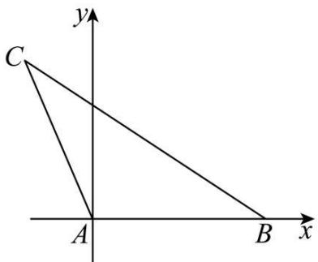

text_image

y
C
A
B x

考虑等腰 $\Delta ABC$ ,底角为 $30^{\circ}$ ,

设 $C(-1,\sqrt{3})$ , $B(2,0)$ , $A(0,0)$ , $O(x,y)$ ,

② $\tan A \cdot \overrightarrow{OA} + \tan B \cdot \overrightarrow{OB} + \tan C \cdot \overrightarrow{OC} = \vec{0}$ ,

即为 $-\sqrt{3} (-x, - y) + \frac{\sqrt{3}}{3} (2 - x, - y) + \frac{\sqrt{3}}{3} (-1 - x, \sqrt{3} - y) = (0, 0)$ ,

可得 $\frac{\sqrt{3}}{3} x + \frac{\sqrt{3}}{3} = 0, \frac{\sqrt{3}}{3} y + 1 = 0$ ，解得 $x = -1, y = -\sqrt{3}$ ，

即 $O(-1, -\sqrt{3})$ ，由 OC ⊥ AB， $k_{OA} \cdot k_{BC} = \sqrt{3} \cdot \left(-\frac{\sqrt{3}}{3}\right) = -1$ ，即有 OA ⊥ BC，

故 O 为 $\triangle ABC$ 的垂心.

故选：D

# 题型四:外心定理

1703 (2024·山西吕梁·高三统考阶段练习)设 O 为 $\triangle ABC$ 的外心,且满足 $2\overrightarrow{OA} + 3\overrightarrow{OB} + 4\overrightarrow{OC} = \overrightarrow{0}, |\overrightarrow{OA}| = 1$ ,下列结论中正确的序号为 \_\_\_\_.

① $\overrightarrow{OB} \cdot \overrightarrow{OC} = -\frac{7}{8}$ ; ② $\left|\overrightarrow{AB}\right| = 2$ ; ③ $\angle A = 2\angle C$ .

【答案】①③

【解析】由题意可知: OA = OB = OC = 1.

① $2\overrightarrow{OA} + 3\overrightarrow{OB} + 4\overrightarrow{OC} = \vec{0}$ ，则 $2\overrightarrow{OA} = -3\overrightarrow{OB} - 4\overrightarrow{OC}$ ，两边同时平方得到：

$4=9+24\overrightarrow{OB}\cdot\overrightarrow{OC}+16$ , 解得: $\overrightarrow{OB}\cdot\overrightarrow{OC}=-\frac{7}{8}$ , 故①正确.

② $2\overrightarrow{OA} + 3\overrightarrow{OB} + 4\overrightarrow{OC} = \overrightarrow{0}$ ，则 $2\overrightarrow{OA} - 2\overrightarrow{OB} = -5\overrightarrow{OB} - 4\overrightarrow{OC}$ ， $2\overrightarrow{BA} = -5\overrightarrow{OB} - 4\overrightarrow{OC}$

两边再平方得到： $4\left|\overrightarrow{AB}\right|^{2}=25+16+40\overrightarrow{OB}\cdot\overrightarrow{OC}=6$ 。所以 $\left|\overrightarrow{AB}\right|=\frac{\sqrt{6}}{2}$ ，所以②不正确。

③ $2\overrightarrow{OA} + 3\overrightarrow{OB} + 4\overrightarrow{OC} = \overrightarrow{0}, 4\overrightarrow{OC} = -3\overrightarrow{OB} - 2\overrightarrow{OA}$ ，两边平方得到：

$16 = 9 + 4 + 12\overrightarrow{\mathrm{OA}}\cdot \overrightarrow{\mathrm{OB}} = 13 + 12|\overrightarrow{\mathrm{OA}}||\overrightarrow{\mathrm{OB}}|\cos \angle \mathrm{AOB},\cos \angle \mathrm{AOB} = \frac{1}{4},\angle \mathrm{AOB}\in$ $\left(0,\frac{\pi}{2}\right),$

同理可得: $\cos\angle BOC=-\frac{7}{8},\angle BOC\in\left(\frac{\pi}{2},\pi\right),\angle AOB=2\angle C,\angle COB=2\angle A.$

故 $\cos 2C = \frac{1}{4}$ , $\cos 2A = -\frac{7}{8}$ , 且 $\angle C \in \left(0, \frac{\pi}{4}\right)$ , $\angle A \in \left(\frac{\pi}{4}, \frac{\pi}{2}\right)$ ,

$\cos 4C = 2\cos^{2}2C - 1 = 2 \times \left(\frac{1}{4}\right)^{2} - 1 = -\frac{7}{8} = \cos 2A$ ，即 $\angle A = 2\angle C$ 。故③正确.

故答案为:①③

1704 (2024·河北·模拟预测)已知 O 为 $\triangle ABC$ 的外心, AC = 3, BC = 4, 则 $\overrightarrow{OC} \cdot \overrightarrow{AB} =$ \_\_\_\_.

【答案】 $-\frac{7}{2} / -3.5$

【解析】如图：E,F 分别为 CB,CA 的中点，则 OE⊥BC,OF⊥AC

$$
\therefore \overrightarrow {\mathrm{OC}} \cdot \overrightarrow {\mathrm{AB}} = \overrightarrow {\mathrm{OC}} \cdot (\overrightarrow {\mathrm{CB}} - \overrightarrow {\mathrm{CA}}) = \overrightarrow {\mathrm{OC}} \cdot \overrightarrow {\mathrm{CB}} - \overrightarrow {\mathrm{OC}} \cdot \overrightarrow {\mathrm{CA}}
$$

$$
= (\overrightarrow {\mathrm{OE}} + \overrightarrow {\mathrm{EC}}) \cdot \overrightarrow {\mathrm{CB}} - (\overrightarrow {\mathrm{OF}} + \overrightarrow {\mathrm{FC}}) \cdot \overrightarrow {\mathrm{CA}}
$$

$$
= \overrightarrow {\mathrm{OE}} \cdot \overrightarrow {\mathrm{CB}} + \overrightarrow {\mathrm{EC}} \cdot \overrightarrow {\mathrm{CB}} - \overrightarrow {\mathrm{OF}} \cdot \overrightarrow {\mathrm{CA}} - \overrightarrow {\mathrm{FC}} \cdot \overrightarrow {\mathrm{CA}}
$$

$$
= - \frac {1}{2} | \overrightarrow {\mathrm{CB}} | ^ {2} - \left(- \frac {1}{2} | \overrightarrow {\mathrm{CA}} | ^ {2}\right)
$$

$$
= \frac {1}{2} \left(\left| \overrightarrow {\mathrm{CA}} \right| ^ {2} - \left| \overrightarrow {\mathrm{CB}} \right| ^ {2}\right) = \frac {1}{2} \times (9 - 1 6) = - \frac {7}{2}.
$$

故答案为: $-\frac{7}{2}$ .

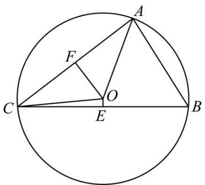

text_image

Geometric diagram of a circle with inscribed triangle ABC and internal points E, F, O labeled

1705 (2024·黑龙江哈尔滨·高三哈尔滨市第六中学校校考阶段练习)已知 O 是 $\triangle ABC$ 的外心, 若 $\frac{|\overrightarrow{AC}|}{|\overrightarrow{AB}|}\overrightarrow{AB} \cdot \overrightarrow{AO} + \frac{|\overrightarrow{AB}|}{|\overrightarrow{AC}|}\overrightarrow{AC} \cdot \overrightarrow{AO} = 2m\overrightarrow{AO}^{2}$ , 且 $\sin B + \sin C = \sqrt{3}$ , 则实数 m 的最大值为 \_\_\_\_.

【答案】 $\frac{3}{2} / 1.5$

【解析】设三角形 ABC 的外接圆的半径为° r，

$$
\because \frac {| \overrightarrow {\mathrm{AC}} |}{| \overrightarrow {\mathrm{AB}} |} \overrightarrow {\mathrm{AB}} \cdot \overrightarrow {\mathrm{AO}} + \frac {| \overrightarrow {\mathrm{AB}} |}{| \overrightarrow {\mathrm{AC}} |} \overrightarrow {\mathrm{AC}} \cdot \overrightarrow {\mathrm{AO}} = 2 m (\overrightarrow {\mathrm{AO}}) ^ {2},
$$

∴根据向量数量积的几何定义可得:

$$
\frac {b}{c} \cdot \frac {1}{2} c ^ {2} + \frac {c}{b} \cdot \frac {1}{2} b ^ {2} = 2 m r ^ {2}, \text {即} b c = 2 m r ^ {2}, \therefore \frac {m}{2} = \frac {b}{2 r} \cdot \frac {c}{2 r},
$$

又 $\sin B + \sin C = \sqrt{3}$ ，根据正弦定理可得 $\sin B = \frac{b}{2r}$ ， $\sin C = \frac{c}{2r}$ ， $\therefore \frac{b}{2r} + \frac{c}{2r} = \sqrt{3}$ ，

$\therefore \frac{m}{2} = \frac{b}{2r} \cdot \frac{b}{2r} \leqslant \left( \frac{\frac{b}{2r} + \frac{c}{2r}}{2} \right)^2 = \frac{3}{4}$ , 当且仅当 $\frac{b}{2r} = \frac{c}{2r} = \frac{\sqrt{3}}{2}$ 时,

即 $\triangle ABC$ 为等边三角形时取等号，

$\therefore \frac{m}{2} \leqslant \frac{3}{4}, \therefore m \leqslant \frac{3}{2}, \therefore$ 实数 $m$ 的最大值为 $\frac{3}{2}$ .

故答案为: $\frac{3}{2}$

1706 (2024·全国·高三专题练习)设 O 为 $\triangle ABC$ 的外心, 若 AB = 4, BC = $2\sqrt{3}$ , 则 $\overrightarrow{BO} \cdot \overrightarrow{AC} =$ \_\_\_\_.

【答案】-2

【解析】如图，

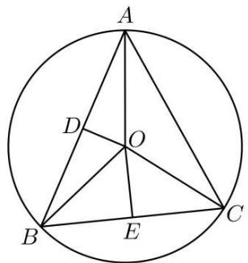

text_image

A
D
O
B
E
C

设 D、E 分别为 AB, BC 的中点, 则 OD ⊥ AB, OE ⊥ BC,

所以 $\overrightarrow{BO}\cdot\overrightarrow{AC}=\overrightarrow{BO}\cdot(\overrightarrow{BC}-\overrightarrow{BA})=\overrightarrow{BO}\cdot\overrightarrow{BC}-\overrightarrow{BO}\cdot\overrightarrow{BA}=\left|\overrightarrow{BO}\right|\cdot\left|\overrightarrow{BC}\right|\cdot\cos\angle OBC-$

$$
\begin{array}{l} \left| \overrightarrow {\mathrm{BO}} \right| \cdot \left| \overrightarrow {\mathrm{BA}} \right| \cdot \cos \angle \mathrm{OBA} \\ = | \overrightarrow {\mathrm{BE}} | \cdot | \overrightarrow {\mathrm{BC}} | - | \overrightarrow {\mathrm{BA}} | \cdot | \overrightarrow {\mathrm{BD}} | = \frac {1}{2} | \overrightarrow {\mathrm{BC}} | ^ {2} - \frac {1}{2} | \overrightarrow {\mathrm{BA}} | ^ {2} = - 2, \\ \end{array}
$$

故答案为: -2

1707 (2024·湖南长沙·高三湖南师大附中校考阶段练习)已知点O是△ABC的外心，a, b, c分别为内角A, B, C的对边， $A=\frac{\pi}{3}$ ，且 $\frac{\cos B}{\sin C}\cdot\overrightarrow{AB}+\frac{\cos C}{\sin B}\cdot\overrightarrow{AC}=2\lambda\overrightarrow{OA}$ ，则 $\lambda$ 的值为\_\_\_\_.

【答案】 $-\frac{\sqrt{3}}{2}$

【解析】如图，

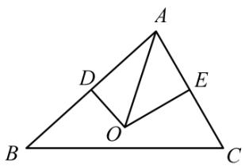

text_image

A
D
E
O
B
C

分别取 AB, AC 的中点 D, E, 连接 OD, OE,

则 $\overrightarrow{AB} \cdot \overrightarrow{OA} = -\overrightarrow{AB} \cdot \frac{1}{2}\overrightarrow{AB} = -\frac{1}{2} c^2; \overrightarrow{AC} \cdot \overrightarrow{OA} = -\overrightarrow{AC} \cdot \frac{1}{2}\overrightarrow{AC} = -\frac{1}{2} b^2,$

因为 $\frac{\cos B}{\sin C} \cdot \overrightarrow{AB} + \frac{\cos C}{\sin B} \cdot \overrightarrow{AC} = 2\lambda \overrightarrow{OA}$ ,

设 $\triangle ABC$ 的外接圆半径为 R, 由正弦定理可得 $\frac{a}{\sin A} = \frac{b}{\sin B} = \frac{c}{\sin C} = 2R$ ,

所以两边同时点乘 $\overrightarrow{OA}$ 可得 $\frac{\cos B}{\sin C}\cdot(\overrightarrow{AB}\cdot\overrightarrow{OA})+\frac{\cos C}{\sin B}\cdot(\overrightarrow{AC}\cdot\overrightarrow{OA})=2\lambda\overrightarrow{OA}^{2}$

即 $\frac{\cos B}{\sin C} \cdot \left(-\frac{1}{2} c^2\right) + \frac{\cos C}{\sin B} \cdot \left(-\frac{1}{2} b^2\right) = 2\lambda R^2,$

所以 $-\frac{1}{2} \cdot \frac{c}{\sin C} \cdot c \cos B - \frac{1}{2} \cdot \frac{b}{\sin B} \cdot b \cos C = 2 \lambda R^2$

所以 $-\frac{1}{2} \cdot 2R \cdot c\cos B - \frac{1}{2} \cdot 2R \cdot b\cos C = 2\lambda R^2,$

所以 $-(c\cos B + b\cos C) = 2\lambda R$ ,

所以 $-\left(c \cdot \frac{a^2 + c^2 - b^2}{2ac} + b \cdot \frac{a^2 + b^2 - c^2}{2ab}\right) = 2\lambda \mathrm{R}$ , 即 $-a = 2\lambda \mathrm{R}$ ,

所以 $\lambda = -\frac{a}{2\mathrm{R}} = -\sin \mathrm{A} = -\sin \frac{\pi}{3} = -\frac{\sqrt{3}}{2}$

故答案为: $-\frac{\sqrt{3}}{2}$ .

1708 (2024·全国·高三专题练习)在 $\triangle ABC$ 中, $AB = 6$ , $AC = 3\sqrt{5}$ . 点 M 满足 $\overrightarrow{AM} = \frac{1}{5}\overrightarrow{AB} + \frac{1}{4}\overrightarrow{AC}$ . 过点 M 的直线 $l$ 分别与边 AB, AC 交于点 D, E 且 $\overrightarrow{AD} = \frac{1}{\lambda}\overrightarrow{AB}$ , $\overrightarrow{AE} = \frac{1}{\mu}\overrightarrow{AC}$ . 已知点 G 为 $\triangle ABC$ 的外心, $\overrightarrow{AG} = \lambda \overrightarrow{AB} + \mu \overrightarrow{AC}$ , 则 $|\overrightarrow{AG}|$ 为 \_\_\_\_.

【答案】 $3\sqrt{10}$

【解析】∵D,M,E三点共线，∴可设 $\overrightarrow{AM}=t\overrightarrow{AD}+(1-t)\overrightarrow{AE}(0<t<1)$ ,

∴ $\frac{1}{5}\overrightarrow{AB}=t\overrightarrow{AD},\frac{1}{4}\overrightarrow{AC}=(1-t)\overrightarrow{AE}$ ，即 $\overrightarrow{AD}=\frac{1}{5t}\overrightarrow{AB},\overrightarrow{AE}=\frac{1}{4(1-t)}\overrightarrow{AC}$

$$
\therefore \left\{ \begin{array}{l} \frac {1}{5 t} = \frac {1}{\lambda} \\ \frac {1}{4 (1 - t)} = \frac {1}{\mu} \end{array} , \text {即} \lambda = 5 t, \mu = 4 - 4 t, \therefore \overrightarrow {\mathrm{AG}} = 5 t \overrightarrow {\mathrm{AB}} + (4 - 4 t) \overrightarrow {\mathrm{AC}}; \right.
$$

$$
\therefore \overrightarrow {\mathrm{CG}} = \overrightarrow {\mathrm{AG}} - \overrightarrow {\mathrm{AC}} = 5 t \overrightarrow {\mathrm{AB}} + (3 - 4 t) \overrightarrow {\mathrm{AC}}, \overrightarrow {\mathrm{BG}} = \overrightarrow {\mathrm{AG}} - \overrightarrow {\mathrm{AB}} = (5 t - 1) \overrightarrow {\mathrm{AB}} + (4 - 4 t) \overrightarrow {\mathrm{AC}},
$$

∵G为△ABC的外心，∴ $\left|\overrightarrow{AG}\right|=\left|\overrightarrow{BG}\right|=\left|\overrightarrow{CG}\right|$

$$
\therefore \left\{ \begin{array}{l} (4 0 t - 4 0 t ^ {2}) \overrightarrow {\mathrm{AB}} \cdot \overrightarrow {\mathrm{AC}} + (4 - 4 t) ^ {2} \overrightarrow {\mathrm{AC}} ^ {2} = (3 0 t - 4 0 t ^ {2}) \overrightarrow {\mathrm{AB}} \cdot \overrightarrow {\mathrm{AC}} + (3 - 4 t) ^ {2} \overrightarrow {\mathrm{AC}} ^ {2} \\ 2 5 t ^ {2} \overrightarrow {\mathrm{AB}} ^ {2} + (4 0 t - 4 0 t ^ {2}) \overrightarrow {\mathrm{AB}} \cdot \overrightarrow {\mathrm{AC}} = (5 t - 1) ^ {2} \overrightarrow {\mathrm{AB}} ^ {2} + (5 t - 1) (8 - 8 t) \overrightarrow {\mathrm{AB}} \cdot \overrightarrow {\mathrm{AC}} \end{array} , \right.
$$

整理可得： $\left\{ \begin{array}{l}10t\overrightarrow{\mathrm{AB}}\cdot \overrightarrow{\mathrm{AC}} = (8t - 7)\overrightarrow{\mathrm{AC}}^2 = 360t - 315\\ (8t - 8)\overrightarrow{\mathrm{AB}}\cdot \overrightarrow{\mathrm{AC}} = (10t - 1)\overrightarrow{\mathrm{AB}}^2 = 360t - 36 \end{array} \right.$

∴ $\overrightarrow{AB} \cdot \overrightarrow{AC} = \frac{360t - 315}{10t} = \frac{360t - 36}{8t - 8}$ ，解得： $t = \frac{-7 - 3\sqrt{7}}{2}$ （舍）或 $t = \frac{-7 + 3\sqrt{7}}{2}$ ;

$$
\begin{array}{l} \therefore \overrightarrow {\mathrm{AG}} ^ {2} = \lambda^ {2} \overrightarrow {\mathrm{AB}} ^ {2} + 2 \lambda \mu \overrightarrow {\mathrm{AB}} \cdot \overrightarrow {\mathrm{AC}} + \mu^ {2} \overrightarrow {\mathrm{AC}} ^ {2} = 9 0 0 t ^ {2} + 1 0 t (4 - 4 t) \times \frac {3 6 0 t - 3 6}{8 t - 8} + 4 5 (4 - 4 t) ^ {2} = \\ - 1 8 0 t ^ {2} - 1 2 6 0 t + 7 2 0 = - 1 8 0 (t ^ {2} + 7 t - 4) = 9 0, \end{array}
$$

$$
\therefore | \overrightarrow {\mathrm{AG}} | = 3 \sqrt {1 0}.
$$

故答案为: $3\sqrt{10}$ .

1709 (2024·全国·高三专题练习)已知△ABC中，AB=AC=1，BC= $\sqrt{2}$ ，点O是△ABC的外心，则 $\overrightarrow{CO}\cdot\overrightarrow{AB}=$ \_\_\_\_.

【答案】 $\frac{1}{2} / 0.5$

【解析】在 $\triangle ABC$ 中， $AB = AC = 1, BC = \sqrt{2}$ ，点 $O$ 是 $\triangle ABC$ 的外心，又 $AB^2 + AC^2 = BC^2$ ，所以 $\triangle ABC$ 是等腰直角三角形，所以 $O$ 是三角形的斜边中点，所以 $\overrightarrow{CO} \cdot \overrightarrow{AB} = \frac{1}{2} |\overrightarrow{BC}| |\overrightarrow{AB}| \cos 45^\circ = \frac{1}{2} \times \sqrt{2} \times 1 \times \frac{\sqrt{2}}{2} = \frac{1}{2}$ .

故答案为: $\frac{1}{2}$ .

1710 (2024·重庆渝中·高三重庆巴蜀中学校考阶段练习)已知点 P 是 $\triangle ABC$ 的内心、外心、重心、垂心之一，且满足 $2\overrightarrow{AP} \cdot \overrightarrow{BC} = \overrightarrow{AC}^{2} - \overrightarrow{AB}^{2}$ ，则点 P 一定是 $\triangle ABC$ 的（）

A. 内心

B. 外心

C. 重心

D. 垂心

【答案】B

【解析】设 BC 中点为 D, 所以 $\overrightarrow{AB} + \overrightarrow{AC} = 2\overrightarrow{AD}$ ,

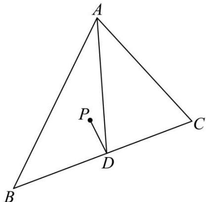

text_image

A
P
D
B
C

所以 $2\overrightarrow{AP} \cdot \overrightarrow{BC} = \overrightarrow{AC}^{2} - \overrightarrow{AB}^{2} = (\overrightarrow{AC} + \overrightarrow{AB})(\overrightarrow{AC} - \overrightarrow{AB}) = \overrightarrow{BC} \cdot 2\overrightarrow{AD}$ ,

即 $\overrightarrow{\mathrm{BC}}\cdot (\overrightarrow{\mathrm{AD}} -\overrightarrow{\mathrm{AP}}) = \overrightarrow{\mathrm{BC}}\cdot \overrightarrow{\mathrm{PD}} = 0$ ，所以 $\overrightarrow{\mathrm{BC}}\perp \overrightarrow{\mathrm{PD}}$

又由D为BC中点可得点P在BC的垂直平分线上，

所以点 P 是 $\triangle ABC$ 的外心，

故选：B

# 题型五:垂心定理

1711 (2024·全国·高三专题练习)设 O 为 $\Delta ABC$ 的外心, 若 $\overrightarrow{OA} + \overrightarrow{OB} + \overrightarrow{OC} = \overrightarrow{OM}$ , 则 M 是 $\Delta ABC$ 的 ()

A. 重心 (三条中线交点)

B. 内心 (三条角平分线交点)

C. 垂心 (三条高线交点)

D. 外心 (三边中垂线交点)

【答案】C

【解析】在 $\Delta ABC$ 中，O 为外心，可得 OA = OB = OC，

$$
\because \overrightarrow {\mathrm{OA}} + \overrightarrow {\mathrm{OB}} + \overrightarrow {\mathrm{OC}} = \overrightarrow {\mathrm{OM}},
$$

$$
\therefore \overrightarrow {\mathrm{OA}} + \overrightarrow {\mathrm{OB}} = \overrightarrow {\mathrm{OM}} - \overrightarrow {\mathrm{OC}},
$$

设 AB 的中点为 D, 则 $OD \perp AB$ , $\overrightarrow{CM} = 2\overrightarrow{OD}$ ,

∴ CM ⊥ AB, 可得 CM 在 AB 边的高线上.

同理可证, AM 在 BC 边的高线上,

故 M 是三角形 ABC 两高线的交点, 可得 M 是三角形 ABC 的垂心,

故选：C

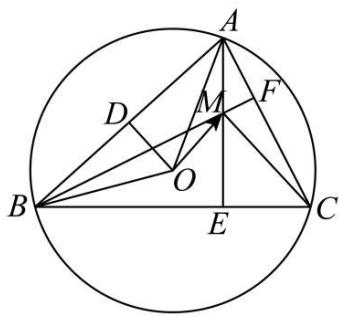

text_image

Geometric diagram of a circle with inscribed triangle ABC and multiple internal points D, E, F, M, O, showing chords and intersections.

1712 (2024·全国·高三专题练习)已知 H 为 $\triangle ABC$ 的垂心 (三角形的三条高线的交点), 若 $\overrightarrow{AH} = \frac{1}{3}\overrightarrow{AB} + \frac{2}{5}\overrightarrow{AC}$ , 则 $\sin\angle BAC =$ \_\_\_\_.

【答案】 $\frac{\sqrt{6}}{3} / \frac{1}{3}\sqrt{6}$

【解析】因为 $\overrightarrow{AH}=\frac{1}{3}\overrightarrow{AB}+\frac{2}{5}\overrightarrow{AC}$ ,

所以 $\overrightarrow{BH} = \overrightarrow{BA} + \overrightarrow{AH} = -\frac{2}{3}\overrightarrow{AB} + \frac{2}{5}\overrightarrow{AC}$ ，同理 $\overrightarrow{CH} = \overrightarrow{CA} + \overrightarrow{AH} = \frac{1}{3}\overrightarrow{AB} - \frac{3}{5}\overrightarrow{AC}$

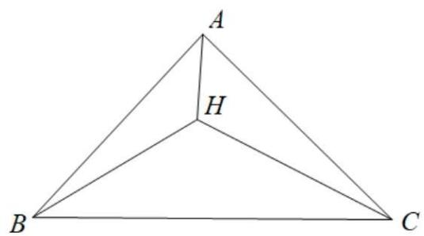

text_image

A
H
B
C

由 H 为 $\triangle ABC$ 的垂心, 得 $\overrightarrow{BH} \cdot \overrightarrow{AC} = 0$ , 即 $\left(-\frac{2}{3}\overrightarrow{AB} + \frac{2}{5}\overrightarrow{AC}\right) \cdot \overrightarrow{AC} = 0$ ,可知 $\frac{2}{5}\left|\overrightarrow{AC}\right|^{2}=\frac{2}{3}\left|\overrightarrow{AC}\right|\left|\overrightarrow{AB}\right|\cos\angle BAC$ ，即 $\cos\angle BAC=\frac{3\left|\overrightarrow{AC}\right|}{5\left|\overrightarrow{AB}\right|}$

同理有 $\overrightarrow{CH}\cdot\overrightarrow{AB}=0$ , 即 $\left(\frac{1}{3}\overrightarrow{AB}-\frac{3}{5}\overrightarrow{AC}\right)\cdot\overrightarrow{AB}=0$ , 可知 $\frac{1}{3}\left|\overrightarrow{AB}\right|^{2}=$

$\frac{3}{5}\left|\overrightarrow{AC}\right|\left|\overrightarrow{AB}\right|\cos\angle BAC,$ 即 $\cos\angle BAC=\frac{5\left|\overrightarrow{AB}\right|}{9\left|\overrightarrow{AC}\right|},$

所以 $\cos^{2}\angle BAC=\frac{1}{3}$ ， $\sin^{2}\angle BAC=1-\cos^{2}\angle BAC=1-\frac{1}{3}=\frac{2}{3}$ ，又 $\angle BAC\in(0,\pi)$ ，

所以 $\sin\angle BAC=\frac{\sqrt{6}}{3}$ .

故答案为: $\frac{\sqrt{6}}{3}$ .

1713 (2024·北京·高三强基计划)已知 H 是 $\triangle ABC$ 的垂心， $2\overrightarrow{HA} + 3\overrightarrow{HB} + 4\overrightarrow{HC} = \overrightarrow{0}$ ，则 $\triangle ABC$ 的最大内角的正弦值是 \_\_\_\_.

【答案】 $\frac{\sqrt{42}}{7}$

【解析】法1:根据三角形五心的向量表达,有 $\tan A:\tan B:\tan C=2:3:4$ ,

设 $\tan A, \tan B, \tan C$ 分别为 2t, 3t, 4t,

根据三角恒等式 $\tan A + \tan B + \tan C = \tan A \tan B \tan C$ ,

可得 $2t + 3t + 4t = 2t\cdot 3t\cdot 4t\Rightarrow t = \sqrt{\frac{3}{8}}$

因此 $\triangle ABC$ 的最大内角的正切值为 $4t = \sqrt{6}$ ，因此最大内角的正弦值为 $\frac{\sqrt{42}}{7}$ .

法2: 因为 H 是 $\triangle ABC$ 的垂心, 故 $\overrightarrow{HA} \cdot \overrightarrow{HB} = \overrightarrow{HB} \cdot \overrightarrow{HC} = \overrightarrow{HC} \cdot \overrightarrow{HA}$ ,

设 $\overrightarrow{HA} \cdot \overrightarrow{HB} = \overrightarrow{HB} \cdot \overrightarrow{HC} = \overrightarrow{HC} \cdot \overrightarrow{HA} = -m,$

则 $\overrightarrow{HA} \cdot (2\overrightarrow{HA} + 3\overrightarrow{HB} + 4\overrightarrow{HC}) = 0$ ，故 $\overrightarrow{HA}^{2} = \frac{7m}{2}$ ,

同理, $\overrightarrow{HB}^{2}=2m,\overrightarrow{HC}^{2}=\frac{5m}{4}$ ,

而 $A + \angle BHC = B + \angle CHA = C + \angle BHA = \pi,$

故 $\cos A = -\angle BHC = -\frac{\overrightarrow{HB} \cdot \overrightarrow{HC}}{|\overrightarrow{HB}| \cdot |\overrightarrow{HC}|} = \frac{m}{\sqrt{2m} \times \sqrt{\frac{5m}{4}}} = \sqrt{\frac{2}{5}}$

同理， $\cos B = \sqrt{\frac{8}{35}}$ ， $\cos C = \sqrt{\frac{1}{7}}$

因为 $\cos C < \cos B < \cos A$ ，故 C 最大，故 $\sin C = \frac{\sqrt{42}}{7}$ .

故答案为: $\frac{\sqrt{42}}{7}$

1714 (2024·全国·高三专题练习)设 H 是 $\triangle ABC$ 的垂心，且 $4\overrightarrow{HA} + 5\overrightarrow{HB} + 6\overrightarrow{HC} = \overrightarrow{0}$ ，则 $\cos\angle AHB =$ \_\_\_\_.

【答案】- $\frac{\sqrt{22}}{11}$

【解析】∵H是△ABC的垂心，

$$
\therefore \overrightarrow {\mathrm{HA}} \perp \overrightarrow {\mathrm{BC}}, \overrightarrow {\mathrm{HA}} \cdot \overrightarrow {\mathrm{BC}} = \overrightarrow {\mathrm{HA}} \cdot (\overrightarrow {\mathrm{HC}} - \overrightarrow {\mathrm{HB}}) = 0,
$$

$\therefore \overrightarrow{\mathrm{HA}}\cdot \overrightarrow{\mathrm{HB}} = \overrightarrow{\mathrm{HC}}\cdot \overrightarrow{\mathrm{HA}}$ ，同理可得， $\overrightarrow{\mathrm{HB}}\cdot \overrightarrow{\mathrm{HC}} = \overrightarrow{\mathrm{HC}}\cdot \overrightarrow{\mathrm{HA}}$

故 $\overrightarrow{\mathrm{HA}}\cdot \overrightarrow{\mathrm{HB}} = \overrightarrow{\mathrm{HB}}\cdot \overrightarrow{\mathrm{HC}} = \overrightarrow{\mathrm{HC}}\cdot \overrightarrow{\mathrm{HA}},$

$$
\because 4 \overrightarrow {\mathrm{HA}} + 5 \overrightarrow {\mathrm{HB}} + 6 \overrightarrow {\mathrm{HC}} = \vec {0},
$$

$$
\therefore 4 \overrightarrow {\mathrm{HA}} ^ {2} + 5 \overrightarrow {\mathrm{HA}} \cdot \overrightarrow {\mathrm{HB}} + 6 \overrightarrow {\mathrm{HA}} \cdot \overrightarrow {\mathrm{HC}} = 0,
$$

$\therefore \overrightarrow{\mathrm{HA}}\cdot \overrightarrow{\mathrm{HB}} = -\frac{4}{11}\left|\overrightarrow{\mathrm{HA}}\right|^{2}$ ，同理可求得 $\overrightarrow{\mathrm{HA}}\cdot \overrightarrow{\mathrm{HB}} = -\frac{1}{2}\left|\overrightarrow{\mathrm{HB}}\right|^{2},$

$$
\therefore \cos \angle A H B = \frac {\overrightarrow {H B} \cdot \overrightarrow {H A}}{| \overrightarrow {H B} | | \overrightarrow {H A} |} = \frac {- \frac {4}{1 1} | \overrightarrow {H A} | ^ {2}}{| \overrightarrow {H B} | | \overrightarrow {H A} |}, \cos \angle A H B = \frac {\overrightarrow {H B} \cdot \overrightarrow {H A}}{| \overrightarrow {H B} | | \overrightarrow {H A} |} = \frac {- \frac {1}{2} | \overrightarrow {H B} | ^ {2}}{| \overrightarrow {H B} | | \overrightarrow {H A} |},
$$

$\therefore \cos^2\angle AHB = \frac{2}{11}$ 即 $\cos \angle AHB = -\frac{\sqrt{22}}{11}$ .

故答案为： $-\frac{\sqrt{22}}{11}$ .

1715 (2024·全国·高三专题练习)在 $\triangle ABC$ 中, 点 O、点 H 分别为 $\triangle ABC$ 的外心和垂心, $|AB| = 5, |AC| = 3$ , 则 $\overrightarrow{OH} \cdot \overrightarrow{BC} =$ \_\_\_\_.

【答案】8

【解析】 $\overrightarrow{OH}=\overrightarrow{AH}-\overrightarrow{AO}$ ,

$$
\overrightarrow {\mathrm{OH}} \cdot \overrightarrow {\mathrm{BC}} = (\overrightarrow {\mathrm{AH}} - \overrightarrow {\mathrm{AO}}) \cdot \overrightarrow {\mathrm{BC}} = \overrightarrow {\mathrm{AH}} \cdot \overrightarrow {\mathrm{BC}} - \overrightarrow {\mathrm{AO}} \cdot \overrightarrow {\mathrm{BC}},
$$

因为H为垂心，

所以 $\overrightarrow{\mathrm{AH}}\cdot \overrightarrow{\mathrm{BC}} = 0,\overrightarrow{\mathrm{OH}}\cdot \overrightarrow{\mathrm{BC}} = -\overrightarrow{\mathrm{AO}}\cdot \overrightarrow{\mathrm{BC}},$

设 $\angle AOB = A, \angle AOB = B$ ，外接圆的半径为 $r$ ，

由余弦定理得 $|\mathrm{AB}|^2 = |\mathrm{AO}|^2 + |\mathrm{OB}|^2 - 2|\mathrm{AO}| \cdot |\mathrm{OB}| \cdot \cos A$

$$
= r ^ {2} + r ^ {2} - 2 r ^ {2} \cdot \cos A,
$$

$$
= 2 r ^ {2} - 2 r ^ {2} \cdot \cos A,
$$

同理 $|\mathrm{AC}|^2 = |\mathrm{AO}|^2 + |\mathrm{OC}|^2 - 2|\mathrm{AO}| \cdot |\mathrm{OC}| \cdot \cos A,$

$$
= r ^ {2} + r ^ {2} - 2 r ^ {2} \cdot \cos B,
$$

$$
= 2 r ^ {2} - 2 r ^ {2} \cdot \cos B,
$$

所以 $\overrightarrow{\mathrm{AO}}\cdot \overrightarrow{\mathrm{BC}} = \overrightarrow{\mathrm{AO}}\cdot (\overrightarrow{\mathrm{BO}} +\overrightarrow{\mathrm{OC}})$

$$
= \overrightarrow {\mathrm{AO}} \cdot \overrightarrow {\mathrm{BO}} + \overrightarrow {\mathrm{AO}} \cdot \overrightarrow {\mathrm{OC}},
$$

$$
= \overrightarrow {\mathrm{OA}} \cdot \overrightarrow {\mathrm{OB}} - \overrightarrow {\mathrm{OA}} \cdot \overrightarrow {\mathrm{OC}},
$$

$$
= | \overrightarrow {\mathrm{OA}} | \cdot | \overrightarrow {\mathrm{OB}} | \cdot \cos A - | \overrightarrow {\mathrm{OA}} | \cdot | \overrightarrow {\mathrm{OC}} | \cdot \cos B,
$$

$$
= r ^ {2} \cdot \cos A - r ^ {2} \cdot \cos B,
$$

$$
= \left(| \mathrm{AC} | ^ {2} - | \mathrm{AB} | ^ {2}\right) \times \frac {1}{2} = - 8,
$$

所以 $\overrightarrow{\mathrm{OH}}\cdot \overrightarrow{\mathrm{BC}} = 8$

故答案为:8

1716 (2024·全国·高三专题练习)在 $\triangle ABC$ 中, $AB = AC$ , $\tan C = \frac{4}{3}$ , H 为 $\triangle ABC$ 的垂心, 且满足 $\overrightarrow{AH} = m\overrightarrow{AB} + n\overrightarrow{BC}$ , 则 $m + n = \_$ .

【答案】 $\frac{21}{32}$

【解析】如图所示, D 为 BC 的中点, 不妨设 AD = 4m, 则 BD = 3m. 因为 $\tan\angle BHD = \tan C = \frac{BD}{HD} = \frac{4}{3}$ , 则 HD = $\frac{9}{4}m$ , 则 AH = $\frac{7}{4}m = \frac{7}{16}AD$ , $\overrightarrow{AH} = \frac{7}{16}\overrightarrow{AD} =$

$\frac{7}{16}\left(\overrightarrow{\mathrm{AB}} + \frac{1}{2}\overrightarrow{\mathrm{BC}}\right) = \frac{7}{16}\overrightarrow{\mathrm{AB}} + \frac{7}{32}\overrightarrow{\mathrm{BC}}$ ，由此可得 $m + n = \frac{21}{32}$

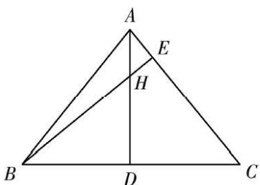

text_image

A
E
H
B
D
C

故答案为: $\frac{21}{32}$

