# 第38讲 向量中的隐圆

# 知识梳理

# 技巧一．向量极化恒等式推出的隐圆

乘积型: $\overrightarrow{PA} \cdot \overrightarrow{PB} = \lambda$

定理: 平面内, 若 A, B 为定点, 且 $\overrightarrow{PA} \cdot \overrightarrow{PB} = \lambda$ , 则 P 的轨迹是以 M 为圆心 $\sqrt{\lambda + \frac{1}{4} AB^{2}}$ 为半径的圆

证明：由 $\overrightarrow{\mathrm{PA}}\cdot \overrightarrow{\mathrm{PB}} = \lambda$ ，根据极化恒等式可知， $\mathrm{PM}^2 -\frac{1}{4}\mathrm{AB}^2 = \lambda$ ，所以 $\mathrm{PM} =$ $\sqrt{\frac{1}{4}\mathrm{AB}^2 + \lambda},\mathbf{P}$ 的轨迹是以M为圆心 $\sqrt{\lambda + \frac{1}{4}\mathrm{AB}^2}$ 为半径的圆.

# 技巧二．极化恒等式和型： $\mathrm{PA}^2 +\mathrm{PB}^2 = \lambda$

定理: 若 A, B 为定点, P 满足 $PA^{2} + PB^{2} = \lambda$ , 则 P 的轨迹是以 AB 中点 M 为圆心, $\sqrt{\frac{\lambda - \frac{1}{2}AB^{2}}{2}}$ 为半径的圆。 $\left(\lambda - \frac{1}{2}AB^{2} > 0\right)$

证明： $\mathrm{PA}^2 +\mathrm{PB}^2 = 2\left[\mathrm{PM}^2 +\left(\frac{1}{2}\mathrm{AB}\right)^2\right] = \lambda$ ，所以 $\mathrm{PM} = \sqrt{\frac{\lambda - \frac{1}{2}\mathrm{AB}^2}{2}}$ ，即P的轨迹是以AB中点M为圆心， $\sqrt{\frac{\lambda - \frac{1}{2}\mathrm{AB}^2}{2}}$ 为半径的圆.

# 技巧三．定幂方和型

若 A, B 为定点, $\left\{\begin{aligned}mPA^{2}+PB^{2}&=n\\ PA^{2}+mPB^{2}&=n\\ mPA^{2}+nP B^{2}&=\lambda\end{aligned}\right.$ ，则 P 的轨迹为圆.

证明： $m\mathrm{PA}^2 +\mathrm{PB}^2 = n\Rightarrow m[(x + c)^2 +y^2 ] + [(x - c)^2 +y^2 ] = n$

$$
\Rightarrow (m + 1) (x ^ {2} + y ^ {2}) + 2 c (m - 1) x + (m + 1) c ^ {2} - n = 0
$$

$$
\Rightarrow x ^ {2} + y ^ {2} + \frac {2 (m - 1) c}{m + 1} \cdot x + \frac {c ^ {2} (m + 1) - n}{m + 1} = 0.
$$

技巧四．与向量模相关构成隐圆

坐标法妙解

# 必考题型全归纳

# 1 题型一:数量积隐圆

1717 (2024·上海松江·校考模拟预测)在 $\triangle ABC$ 中，AC = 3, BC = 4, $\angle C = 90^{\circ}$ . P 为 $\triangle ABC$ 所在平面内的动点，且 PC = 2，若 $\overrightarrow{CP} = \lambda \overrightarrow{CA} + \mu \overrightarrow{CB}$ ，则给出下面四个结论：

① $\lambda + \mu$ 的最小值为 $-\frac{4}{5}$ ; ② $\overrightarrow{PA} \cdot \overrightarrow{PB}$ 的最小值为 -6;  
③ $\lambda + \mu$ 的最大值为 $\frac{3}{4}$ ; ④ $\overrightarrow{PA} \cdot \overrightarrow{PB}$ 的最大值为 8.

其中,正确结论的个数是 ( )

A. 1

B. 2

C. 3

D. 4

【答案】A

【解析】如图,以 C 为原点, CA,CB 所在的直线分别为 x,y 轴,建立平面直角坐标系,

则 C(0,0), A(3,0), B(0,4),

因为 PC=2, 所以设 $P(2\cos\theta, 2\sin\theta)$ , 则

$$
\overrightarrow {\mathrm{CP}} = (2 \cos \theta , 2 \sin \theta), \overrightarrow {\mathrm{CA}} = (3, 0), \overrightarrow {\mathrm{CB}} = (0, 4),
$$

所以 $\overrightarrow{CP} = \lambda \overrightarrow{CA} + \mu \overrightarrow{CB} = (3\lambda, 4\mu)$ ,

所以 $\left\{\begin{aligned}2\cos\theta=3\lambda\\ 2\sin\theta=4\mu\end{aligned}\right.$ ，即 $\left\{\begin{aligned}\frac{2}{3}\cos\theta=\lambda\\ \frac{1}{2}\sin\theta=\mu\end{aligned}\right.$ ( $\theta$ 为任意角)，

所以 $\lambda +\mu = \frac{2}{3}\cos \theta +\frac{1}{2}\sin \theta$

$$
= \frac {5}{6} \left(\frac {4}{5} \cos \theta + \frac {3}{5} \sin \theta\right)
$$

$= \frac{5}{6}\sin (\theta +\varphi)$ （其中 $\sin \varphi = \frac{4}{5},\cos \varphi = \frac{3}{5})$

所以 $\lambda + \mu$ 的最大值为 $\frac{5}{6}$ ，最小值为 $-\frac{5}{6}$ ，

所以①③错误，

因为 $\overrightarrow{PA}=(3-2\cos\theta,-2\sin\theta),\overrightarrow{PB}=(-2\cos\theta,4-2\sin\theta)$ ,

所以 $\overrightarrow{PA} \cdot \overrightarrow{PB} = -2\cos\theta(3 - 2\cos\theta) - 2\sin\theta(4 - 2\sin\theta)$

$$
= 4 - (8 \sin \theta + 6 \cos \theta)
$$

$= 4 - 10\sin (\theta + \alpha)$ （其中 $\sin \alpha = \frac{3}{5}, \cos \alpha = \frac{4}{5}$ ）

因为 $-10 \leqslant -10\sin (\theta + \alpha) \leqslant 10$

所以 $-6 \leqslant 4 - 10\sin (\theta + \alpha) \leqslant 14$

所以 $\overrightarrow{PA} \cdot \overrightarrow{PB} \in [-6, 14]$ ,

所以 $\overrightarrow{PA} \cdot \overrightarrow{PB}$ 的最小值为 -6, 最大值为 14,

所以②正确，④错误，

故选：A

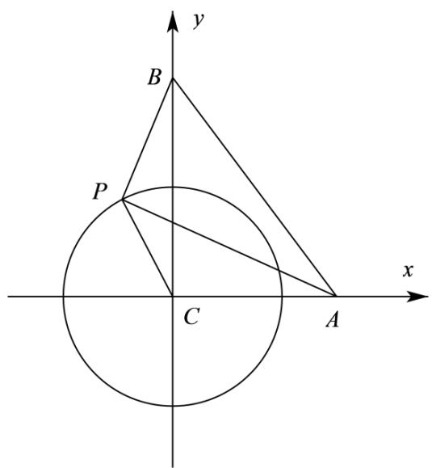

text_image

y
B
P
x
C
A

1718 (2024·全国·高三专题练习)若正 $\triangle ABC$ 的边长为 4, P 为 $\triangle ABC$ 所在平面内的动点, 且 PA = 1, 则 $\overrightarrow{PB} \cdot \overrightarrow{PC}$ 的取值范围是 ()

A. [3,15]

B. $[9 - 2\sqrt{3}, 9 + 2\sqrt{3}]$

C. $[9 - 3\sqrt{3}, 9 + 3\sqrt{3}]$

D. $[9 - 4\sqrt{3}, 9 + 4\sqrt{3}]$

【答案】D

【解析】由题知，

以 A 为坐标原点, 以 AB 所在直线为 x 轴建立平面直角坐标系, 如图,

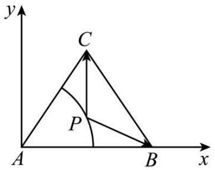

text_image

y
C
P
A
B
x

则 $\mathrm{B}(4,0),\mathrm{C}(2,2\sqrt{3})$

由题意设 $P(\cos\theta,\sin\theta)(0\leqslant\theta<2\pi)$ ,

则 $\overrightarrow{PB}=(4-\cos\theta,-\sin\theta)$ ,

$$
\overrightarrow {\mathrm{PC}} = (2 - \cos \theta , 2 \sqrt {3} - \sin \theta),
$$

$$
\therefore \overrightarrow {\mathrm{PB}} \cdot \overrightarrow {\mathrm{PC}} = (4 - \cos \theta) (2 - \cos \theta) - \sin \theta (2 \sqrt {3} - \sin \theta)
$$

$$
= 9 - 6 \cos \theta - 2 \sqrt {3} \sin \theta = 9 - 2 \times 2 \sqrt {3} \left(\frac {\sqrt {3}}{2} \cos \theta + \frac {1}{2} \sin \theta\right)
$$

$$
= 9 - 4 \sqrt {3} \sin \left(\theta + \frac {\pi}{3}\right),
$$

$$
\because 0 \leqslant \theta <   2 \pi ,
$$

$$
\therefore \frac {\pi}{3} \leqslant \theta + \frac {\pi}{3} <   \frac {7 \pi}{3},
$$

可得 $9-4\sqrt{3}\sin\left(\theta+\frac{\pi}{3}\right)\in\left[9-4\sqrt{3},9+4\sqrt{3}\right]$ .

故选：D

1719 (2024·山东菏泽·高一统考期中)在 $\triangle ABC$ 中, $AC = 5$ , $BC = 12$ , $\angle C = 90^{\circ} \cdot P$ 为 $\triangle ABC$ 所在平面内的动点, 且 $PC = 2$ , 则 $\overrightarrow{PA} \cdot \overrightarrow{PB}$ 的取值范围是 ( )

A. $[-22, 26]$

B. $[-26,22]$

C. $[-30, 22]$

D. $[-22,30]$

【答案】D

【解析】在 Rt△ABC 中, 以直角顶点 C 为原点, 射线 CB, CA 分别为 x, y 轴非负半轴, 建立平面直角坐标系, 如图,

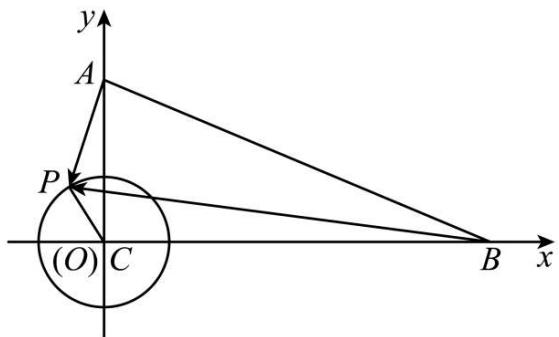

text_image

y
A
P
(O) C
B x

令角 $\alpha(\alpha\in\mathrm{R})$ 的始边为射线 CB, 终边经过点 P, 由 $|PC|=2$ , 得 $\mathrm{P}(2\cos\alpha,2\sin\alpha)$ , 而 B(12,0), A(0,5),

于是 $\overrightarrow{AP}=(2\cos\alpha,2\sin\alpha-5),\overrightarrow{BP}=(2\cos\alpha-12,2\sin\alpha)$ ,

因此 $\overrightarrow{AP} \cdot \overrightarrow{BP} = 2\cos \alpha(2\cos \alpha - 12) + 2\sin \alpha(2\sin \alpha - 5) = 4 - 2(5\sin \alpha + 12\cos \alpha)$

$= 4 - 26\sin (\alpha + \varphi)$ , 其中锐角 $\varphi$ 由 $\tan \varphi = \frac{12}{5}$ 确定,

显然 $-1 \leqslant \sin(\alpha + \varphi) \leqslant 1$ ，则 $-22 \leqslant 4 - 26\sin(\alpha + \varphi) \leqslant 30$ ，

所以 $\overrightarrow{PA} \cdot \overrightarrow{PB}$ 的取值范围是 $[-22, 30]$ .

故选：D

1720 (2024·全国·高三专题练习)已知 $\triangle ABC$ 是边长为 $4\sqrt{3}$ 的等边三角形, 其中心为 O, P 为平面内一点, 若 OP = 1, 则 $\overrightarrow{PA} \cdot \overrightarrow{PB}$ 的最小值是

A.-11

B.-6

C.-3

D. -15

【答案】A

【解析】作出图像如下图所示,取 AB 的中点为 D, 则 $OD = 4\sqrt{3} \times \frac{\sqrt{3}}{2} \times \frac{1}{3} = 2$ , 因为 OP = 1, 则 P 在以 O 为圆心, 以 1 为半径的圆上,

则 $\overrightarrow{PA} \cdot \overrightarrow{PB} = \frac{(\overrightarrow{PA} + \overrightarrow{PB})^{2} - (\overrightarrow{PA} - \overrightarrow{PB})^{2}}{4} = \frac{(2\overrightarrow{PD})^{2} - (AB)^{2}}{4} = PD^{2} - 12.$ 又 PD 为圆 O 上的点 P 到 D 的距离，则 $PD_{\min} = 2 - 1 = 1$ ，

∴ $\overrightarrow{PA} \cdot \overrightarrow{PB}$ 的最小值为 -11.

故选：A.

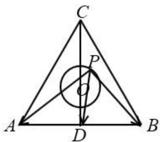

text_image

Geometric diagram of triangle ABC with inscribed circle and labeled points P, O, D

1721 (2024·北京·高三专题练习)△ABC为等边三角形,且边长为2,则 $\overrightarrow{AB}$ 与 $\overrightarrow{BC}$ 的夹角大小为 $120^{\circ}$ ,若 $|\overrightarrow{BD}|=1,\overrightarrow{CE}=\overrightarrow{EA}$ ,则 $\overrightarrow{AD}\cdot\overrightarrow{BE}$ 的最小值为\_\_\_\_.

【答案】 $-3 - \sqrt{3}$

【解析】因为 $\triangle ABC$ 是边长为 2 的等边三角形, 且 $\overrightarrow{CE} = \overrightarrow{EA}$ , 则 E 为 AC 的中点, 故 BE $\perp AC$ ,

以点 B 为坐标原点, $\overrightarrow{BE}$ 、 $\overrightarrow{EA}$ 分别为 x、y 轴的正方向建立如下图所示的平面直角坐标系,

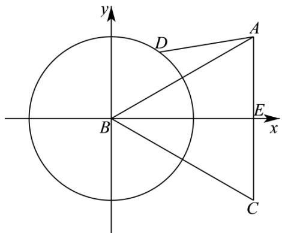

text_image

y
D
A
B
E
x
C

则 A( $\sqrt{3}$ ,1)、E( $\sqrt{3}$ ,0)、B(0,0)，设点 D(cos $\theta$ ,sin $\theta$ )，

$$
\overrightarrow {\mathrm{BE}} = (\sqrt {3}, 0), \overrightarrow {\mathrm{AD}} = (\cos \theta - \sqrt {3}, \sin \theta - 1),
$$

所以， $\overrightarrow{AD} \cdot \overrightarrow{BE} = \sqrt{3} (\cos \theta - \sqrt{3}) \geqslant -\sqrt{3} - 3$ ，当且仅当 $\cos \theta = -1$ 时，等号成立，

因此， $\overrightarrow{AD}\cdot\overrightarrow{BE}$ 的最小值为 $-\sqrt{3}-3$ .

故答案为： $-\sqrt{3}-3$ .

1722 (2024·全国·高三专题练习)已知圆 Q: $x^{2}+y^{2}=16$ ，点 P(1,2)，M、N 为圆 O 上两个不同的点，且 $\overrightarrow{PM}\cdot\overrightarrow{PN}=0$ 若 $\overrightarrow{PQ}=\overrightarrow{PM}+\overrightarrow{PN}$ ，则 $\left|\overrightarrow{PQ}\right|$ 的最小值为 \_\_\_\_.

【答案】 $3\sqrt{3}-\sqrt{5}/-\sqrt{5}+3\sqrt{3}$

【解析】解法1:如图,因为 $\overrightarrow{PM}\cdot\overrightarrow{PN}=0$ ,所以 $PM\perp PN$ ,故四边形PMQN为矩形,

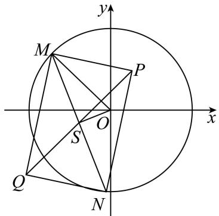

text_image

y
M
P
x
O
S
Q
N

设 MN 的中点为 S, 连接 OS, 则 OS ⊥ MN,

所以 $\left|OS\right|^{2}=\left|OM\right|^{2}-\left|MS\right|^{2}=16-\left|MS\right|^{2}$

又 $\triangle PMN$ 为直角三角形, 所以 $|MS| = |PS|$ , 故 $|OS|^{2} = 16 - |PS|^{2}$ ①,

设 $S(x,y)$ ，则由①可得 $x^{2}+y^{2}=16-[(x-1)^{2}+(y-2)^{2}]$ ，

整理得: $\left(x-\frac{1}{2}\right)^{2}+(y-1)^{2}=\frac{27}{4}$ ,

从而点 S 的轨迹为以 $T\left(\frac{1}{2},1\right)$ 为圆心， $\frac{3\sqrt{3}}{2}$ 为半径的圆，

显然点 P 在该圆内部, 所以 $\left|PS\right|_{\min}=\frac{3\sqrt{3}}{2}-\left|PT\right|=\frac{3\sqrt{3}}{2}-\frac{\sqrt{5}}{2}$ ,

因为 $\left|\overrightarrow{PQ}\right|=2|PS|$ ，所以 $\left|\overrightarrow{PQ}\right|_{\min}=3\sqrt{3}-\sqrt{5}$ ；

解法 2: 如图, 因为 $\overrightarrow{PM} \cdot \overrightarrow{PN} = 0$ , 所以 $PM \perp PN$ ,

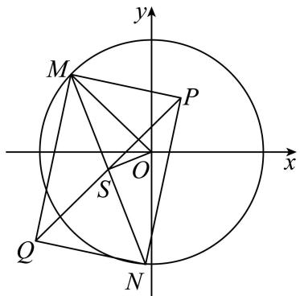

text_image

y
M
P
x
O
S
Q
N

故四边形 PMQN 为矩形, 由矩形性质, $\left|OM\right|^{2} + \left|ON\right|^{2} = \left|OP\right|^{2} + \left|OQ\right|^{2}$ ,

所以 $16+16=5+|OQ|^{2}$ ，从而 $|OQ|=3\sqrt{3}$ ，

故 Q 点的轨迹是以 O 为圆心, $3\sqrt{3}$ 为半径的圆,

显然点 P 在该圆内, 所以 $\left|\overrightarrow{PQ}\right|_{\min}=3\sqrt{3}-\left|OP\right|=3\sqrt{3}-\sqrt{5}$ .

故答案为： $3\sqrt{3}-\sqrt{5}$ .

# 题型二: 平方和隐圆

1723 (2024·全国·高三专题练习)已知 $\vec{a},\vec{b},\vec{c},\vec{d}$ 是单位向量，满足 $\vec{a}\perp\vec{b},\vec{m}=\vec{a}+2\vec{b},|\vec{m}-\vec{c}|^{2}+|\vec{m}-\vec{d}|^{2}=20$ ，则 $|\vec{c}-\vec{d}|$ 的最大值为 \_\_\_\_.

【答案】 $\frac{2\sqrt{5}}{5}$

【解析】依题意, $\vec{a},\vec{b}$ 可为与x轴、y轴同向的单位向量,设 $\vec{a}=(1,0),\vec{b}=(0,1),\vec{c}=$

$$
(\cos x, \sin x), \vec {d} = (\cos y, \sin y)
$$

$$
\therefore \vec {m} = (1, 2), \therefore | \vec {m} - \vec {c} | ^ {2} + | \vec {m} - \vec {d} | ^ {2} = 2 0 = (\cos x - 1) ^ {2} + (\sin x - 2) ^ {2} + (\cos y - 1) ^ {2} +
$$

$$
(\sin y - 2) ^ {2}
$$

化简得: $4 = \cos x + 2\sin x + \cos y + 2\sin y$

运用辅助角公式得: $4 = \sqrt{5}\sin (x + \varphi) + \sqrt{5}\sin (y + \varphi),\tan \varphi = \frac{1}{2},\varphi \in \left(0,\frac{\pi}{2}\right)$

$$
\frac {4}{\sqrt {5}} = \sin (x + \varphi) + \sin (y + \varphi) = 2 \sin \left(\frac {x + y}{2} + \varphi\right) \cos \frac {x - y}{2},
$$

即得: $\cos\frac{x-y}{2}=\frac{2}{\sqrt{5}\sin\left(\frac{x+y}{2}+\varphi\right)}$ ,

故 $\cos^2\frac{x - y}{2} = \frac{4}{5\sin^2\left(\frac{x + y}{2} + \varphi\right)}\geqslant \frac{4}{5};$

$$
\left| \vec {c} - \vec {d} \right| = \sqrt {(\cos x - \cos y) ^ {2} + (\sin x - \sin y) ^ {2}} = \sqrt {2 - 2 \cos (x - y)} = \sqrt {4 - 4 \cos^ {2} \frac {(x - y)}{2}}
$$

$$
\leqslant \sqrt {4 - 4 \times \frac {4}{5}} = \frac {2 \sqrt {5}}{5}.
$$

故答案为: $\frac{2\sqrt{5}}{5}$

1724 (2024·上海·高三专题练习)已知平面向量 $\overrightarrow{PA}$ 、 $\overrightarrow{PB}$ 满足 $\left|\overrightarrow{PA}\right|^{2}+\left|\overrightarrow{PB}\right|^{2}=4,\left|\overrightarrow{AB}\right|^{2}=2$ ，设 $\overrightarrow{PC}=2\overrightarrow{PA}+\overrightarrow{PB}$ ，则 $\left|\overrightarrow{PC}\right|\in$ \_\_\_\_.

【答案】 $\left[\frac{3\sqrt{6}-\sqrt{2}}{2},\frac{3\sqrt{6}+\sqrt{2}}{2}\right]$

【解析】因为 $\left|\overrightarrow{AB}\right|^{2}=\left|\overrightarrow{AP}+\overrightarrow{PB}\right|^{2}=\left|\overrightarrow{PA}\right|^{2}+\left|\overrightarrow{PB}\right|^{2}-2\overrightarrow{PA}\cdot\overrightarrow{PB}=2$ 且 $\left|\overrightarrow{PA}\right|^{2}+\left|\overrightarrow{PB}\right|^{2}=4$ ，所以 $\overrightarrow{PA}\cdot\overrightarrow{PB}=1$ ;

又因为 $\left|\overrightarrow{PA}+\overrightarrow{PB}\right|^{2}=\left|\overrightarrow{PA}\right|^{2}+\left|\overrightarrow{PB}\right|^{2}+2\overrightarrow{PA}\cdot\overrightarrow{PB}=6$ , 所以 $\left|\overrightarrow{PA}+\overrightarrow{PB}\right|=\sqrt{6}$ ;

由 $\left|\overrightarrow{AB}\right|^{2}=\left|\overrightarrow{PB}-\overrightarrow{PA}\right|^{2}=\left|\overrightarrow{PA}-\overrightarrow{PB}\right|^{2}=2$ , 所以 $\left|\overrightarrow{PA}-\overrightarrow{PB}\right|=\sqrt{2}$ ;

根据 $\overrightarrow{PC}=2\overrightarrow{PA}+\overrightarrow{PB}=\frac{3}{2}\left(\overrightarrow{PA}+\overrightarrow{PB}\right)+\frac{1}{2}\left(\overrightarrow{PA}-\overrightarrow{PB}\right)$ 可知：

$$
\left| \frac {3}{2} | \overrightarrow {\mathrm{PA}} + \overrightarrow {\mathrm{PB}} | - \frac {1}{2} | \overrightarrow {\mathrm{PA}} - \overrightarrow {\mathrm{PB}} | \right| \leqslant | \overrightarrow {\mathrm{PC}} | \leqslant \frac {3}{2} | \overrightarrow {\mathrm{PA}} + \overrightarrow {\mathrm{PB}} | + \frac {1}{2} | \overrightarrow {\mathrm{PA}} - \overrightarrow {\mathrm{PB}} |,
$$

左端取等号时: P, A, B 三点共线且 P 在线段 AB 外且 P 靠近 B 点; 右端取等号时, P, A, B 三点共线且 P 在线段 AB 外且 P 靠近 A 点,

所以 $\frac{3\sqrt{6}-\sqrt{2}}{2}\leqslant\left|\overrightarrow{PC}\right|\leqslant\frac{3\sqrt{6}+\sqrt{2}}{2}$ ，所以 $\left|\overrightarrow{PC}\right|\in\left[\frac{3\sqrt{6}-\sqrt{2}}{2},\frac{3\sqrt{6}+\sqrt{2}}{2}\right]$ .

故答案为: $\left[\frac{3\sqrt{6}-\sqrt{2}}{2},\frac{3\sqrt{6}+\sqrt{2}}{2}\right]$ .

1725 (2024·江苏·高二专题练习)在平面直角坐标系中,已知点 A(2,0), B(0,2), 圆 C: $(x-a)^{2}$ $+y^{2}=1$ , 若圆 C 上存在点 M, 使得 $|MA|^{2}+|MB|^{2}=12$ , 则实数 a 的取值范围为 \_\_\_\_

A. $[1,1 + 2\sqrt{2} ]$

B. $\left[1-2\sqrt{2},1+2\sqrt{2}\right]$

C. $[1,1 + 2\sqrt{2} ]$

D. $[1 - \sqrt{2}, 1 + \sqrt{2}]$

【答案】B

【解析】先求出动点 M 的轨迹是圆 D, 再根据圆 D 和圆 C 相交或相切, 得到 a 的取值范围. 设 $M(x,y)$ , 则 $(x-2)^{2}+y^{2}+x^{2}+(y-2)^{2}=12$ ,

所以 $(x-1)^{2}+(y-1)^{2}=4$ ,

所以点 M 的轨迹是一个圆 D,

由题得圆 C 和圆 D 相交或相切，

所以 $1 \leqslant \sqrt{(1 - a)^{2} + 1^{2}} \leqslant 3$ ,

所以 $1 - 2\sqrt{2} \leqslant a \leqslant 1 + 2\sqrt{2}$ .

故选: B

1726 (2024·江苏·高二专题练习)在平面直角坐标系 xOy 中, 已知直线 $l: x + y + a = 0$ 与点 A (0, 2), 若直线 l 上存在点 M 满足 $|MA|^{2} + |MO|^{2} = 10$ (O 为坐标原点), 则实数 a 的取值范围是 ()

A. $(- \sqrt{5} - 1^{\circ}, \sqrt{5} - 1)$

B. $\left[-\sqrt{5}-1^{\circ},^{\circ}\sqrt{5}-1\right]$

C. $(-2\sqrt{2}-1^{\circ},2\sqrt{2}-1)$

D. $[-2\sqrt{2} - 1^{\circ}, ^{\circ} 2\sqrt{2} - 1]$

【答案】D

【解析】设 $M(x, -x - a)$ ，

∵ 直线 $l: x + y + a = 0$ 与点 A(0, 2)，直线 l 上存在点 M 满足 $\left| MA \right|^{2} + \left| MO \right|^{2} = 10$ ，

$$
\therefore x ^ {2} + (x + a) ^ {2} + x ^ {2} + (- x - a - 2) ^ {2} = 1 0,
$$

整理, 得 $4x^{2} + 2(2a + 2)x + a^{2} + (a + 2)^{2} - 10 = 0$ ①,

∵ 直线 l 上存在点 M, 满足 $\left|MA\right|^{2} + \left|MO\right|^{2} = 10$ ,

∴方程①有解，

$$
\therefore \Delta \geqslant 0,
$$

解得: $-2\sqrt{2} - 1 \leqslant a \leqslant 2\sqrt{2} - 1$

故选D.

1727 (2024·宁夏吴忠·高二吴忠中学校考阶段练习)设 A(-2,0), B(2,0), O 为坐标原点, 点 P 满足 $\left|PA\right|^{2} + \left|PB\right|^{2} \leqslant 16$ , 若直线 kx - y + 6 = 0 上存在点 Q 使得 $\angle PQO = \frac{\pi}{6}$ , 则实数 k 的取值范围为 ()

A. $\left[-4\sqrt{2},4\sqrt{2}\right]$

B. $(- \infty, -4\sqrt{2}] \cup [4\sqrt{2}, +\infty)$

C. $\left(-\infty,-\frac{\sqrt{5}}{2}\right]\cup\left[\frac{\sqrt{5}}{2},+\infty\right)$

D. $\left[-\frac{\sqrt{5}}{2},\frac{\sqrt{5}}{2}\right]$

【答案】C

【解析】设 $\mathrm{P}(x,y)$

$$
\because | \mathrm{PA} | ^ {2} + | \mathrm{PB} | ^ {2} \leqslant 1 6,
$$

$$
\therefore (x + 2) ^ {2} + y ^ {2} + (x - 2) ^ {2} + y ^ {2} \leqslant 1 6, \text {即} x ^ {2} + y ^ {2} \leqslant 4.
$$

∴点P的轨迹为以原点为圆心,2为半径的圆面.

若直线 $kx - y + 6 = 0$ 上存在点 Q 使得 $\angle PQO = \frac{\pi}{6}$ ,

则 PQ 为圆 $x^{2} + y^{2} = 4$ 的切线时 $\angle PQO$ 最大，

$\therefore \sin \angle PQO = \frac{|OP|}{|OQ|} = \frac{2}{|OQ|} \geqslant \frac{1}{2}$ , 即 $|OQ| \leqslant 4$ .

∴ 圆心到直线 $kx - y + 6 = 0$ 的距离 $d = \frac{6}{\sqrt{1 + k^{2}}} \leqslant 4$ ,

$\therefore k \leqslant -\frac{\sqrt{5}}{2}$ 或 $k \geqslant \frac{\sqrt{5}}{2}$ .

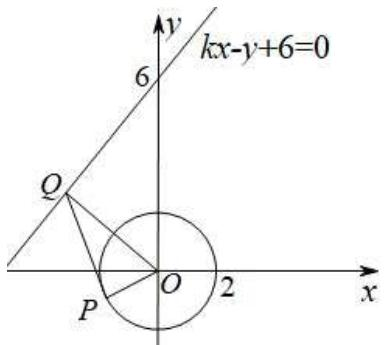

text_image

kx-y+6=0
y
6
Q
O
2
x
P

故选：C.

1728 (2024·江西吉安·高三吉安三中校考阶段练习)在平面直角坐标系 xOy 中, 已知圆 C: $(x+1)^{2} + y^{2} = 2$ , 点 A(2,0), 若圆 C 上存在点 M, 满足 $MA^{2} + MO^{2} < 10$ , 则点 M 的纵坐标的取值范围是 \_\_\_\_.

【答案】 $\left[-\frac{\sqrt{7}}{2},\frac{\sqrt{7}}{2}\right]$

【解析】解析:设 $M(x,y)$ ,

因为 $MA^{2} + MO^{2} \leqslant 10$ ，所以 $(x - 2)^{2} + y^{2} + x^{2} + y^{2} \leqslant 10$ ，

化简得 $x^{2} + y^{2} - 2x - 3\leqslant 0$

则圆 C: $x^{2} + y^{2} + 2x - 1 = 0$ 与圆 C': $x^{2} + y^{2} - 2x - 3 = 0$ 有公共点，

将两圆方程相减可得两圆公共弦所在直线方程为 $x = -\frac{1}{2}$

代入 $x^{2} + y^{2} - 2x - 3\leqslant 0$ 可得 $-\frac{\sqrt{7}}{2}\leqslant y\leqslant \frac{\sqrt{7}}{2},$

故答案为: $\left[-\frac{\sqrt{7}}{2},\frac{\sqrt{7}}{2}\right]$ .

# 3 题型三:定幂方和隐圆

1729 (2024·湖南长沙·高一长沙一中校考期末)已知点 A(-1,0), B(2,0), 直线 l: kx - y - 5k = 0 上存在点 P, 使得 PA² + 2PB² = 9 成立, 则实数 k 的取值范围是 \_\_\_\_.

【答案】 $\left[-\frac{\sqrt{15}}{15},\frac{\sqrt{15}}{15}\right]$

【解析】由题意得: 直线 $l: y = k(x - 5)$ ,

因此直线 l 经过定点 $(5,0)$ ;

设点 P 坐标为 $(x_{0}, y_{0})$ ; ∵ PA² + 2PB² = 9,

$$
\therefore y _ {0} ^ {2} + (x _ {0} + 1) ^ {2} + 2 y _ {0} ^ {2} + 2 (x _ {0} + 2) ^ {2} = 9
$$

化简得: $x_0^2 + y_0^2 - 2x_0 = 0$ ,

因此点 p 为 $x^{2} + y^{2} - 2x = 0$ 与直线 $l: y = k(x - 5)$ 的交点.

所以应当满足圆心(1,0)到直线的距离小于等于半径

$$
\therefore \frac {| - 4 k |}{\sqrt {k ^ {2} + 1}} \leqslant 1
$$

解得: $k \in \left[-\frac{\sqrt{15}}{15}, \frac{\sqrt{15}}{15}\right]$

故答案为 $k \in \left[-\frac{\sqrt{15}}{15}, \frac{\sqrt{15}}{15}\right]$

1730 (2024·浙江·高三期末)已如平面向量 $\vec{a}$ 、 $\vec{b}$ 、 $\vec{c}$ ，满足 $\left|\vec{a}\right|=3\sqrt{3}$ ， $\left|\vec{b}\right|=2$ ， $\left|\vec{c}\right|=2$ ， $\vec{b}\cdot\vec{c}=2$ ，则 $(\vec{a}-\vec{b})^{2}\cdot(\vec{a}-\vec{c})^{2}-\left[(\vec{a}-\vec{b})\cdot(\vec{a}-\vec{c})\right]^{2}$ 的最大值为（）

A. $192 \sqrt{3}$

B. 192

C. 48

D. $4\sqrt{3}$

【答案】B

【解析】如下图所示,作 $\overrightarrow{OA} = \vec{a}, \overrightarrow{OB} = \vec{b}, \overrightarrow{OC} = \vec{c}$ , 取 BC 的中点 D, 连接 OD, 以点 O 为圆心, $\left|\vec{a}\right|$ 为半径作圆 O,

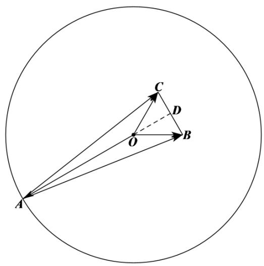

text_image

C
D
O
B
A

$$
\cos \angle B O C = \cos <   \vec {b}, \vec {c} > = \frac {\vec {b} \cdot \vec {c}}{| \vec {b} | \cdot | \vec {c} |} = \frac {1}{2}, \because 0 \leqslant \angle B O C \leqslant \pi , \therefore \angle B O C = \frac {\pi}{3},
$$

所以， $\triangle BOC$ 为等边三角形，

∵D为BC的中点，OD⊥BC，所以，△BOC的底边BC上的高为 $\left|\overrightarrow{OD}\right|=2\sin\frac{\pi}{3}=\sqrt{3}$ ， $\vec{a}-\vec{b}=\overrightarrow{OA}-\overrightarrow{OB}=\overrightarrow{BA},\vec{a}-\vec{c}=\overrightarrow{OA}-\overrightarrow{OC}=\overrightarrow{CA},$

所以， $(\vec{a}-\vec{b})\cdot(\vec{a}-\vec{c})=\overrightarrow{\mathrm{BA}}\cdot\overrightarrow{\mathrm{CA}}=\overrightarrow{\mathrm{AB}}\cdot\overrightarrow{\mathrm{AC}}=\left|\overrightarrow{\mathrm{AB}}\right|\cdot\left|\overrightarrow{\mathrm{AC}}\right|\cos\angle\mathrm{BAC},$

所以， $\left(\vec{a}-\vec{b}\right)^{2}\cdot\left(\vec{a}-\vec{c}\right)^{2}-\left[\left(\vec{a}-\vec{b}\right)\cdot\left(\vec{a}-\vec{c}\right)\right]^{2}=\left|\overrightarrow{AB}\right|^{2}\cdot\left|\overrightarrow{AC}\right|^{2}-\left(\left|\overrightarrow{AB}\right|\cdot\left|\overrightarrow{AC}\right|\cos\angle BAC\right)^{2}=$ $\left(\left|\overrightarrow{AB}\right|\cdot\left|\overrightarrow{AC}\right|\sin\angle BAC\right)^{2}=(2S_{\triangle ABC})^{2}$

由圆的几何性质可知, 当 A、O、D 三点共线且 O 为线段 AD 上的点时,

$\triangle ABC$ 的面积取得最大值, 此时, $\triangle ABC$ 的底边 BC 上的高 $h$ 取最大值, 即 $h_{\max} = |\overrightarrow{AO}|$ + $|\overrightarrow{OD}| = 4\sqrt{3}$ , 则 $(S_{\triangle ABC})_{\max} = \frac{1}{2} \times 2 \times 4\sqrt{3} = 4\sqrt{3}$ ,

因此， $\left(\vec{a} -\vec{b}\right)^2\cdot \left(\vec{a} -\vec{c}\right)^2 -\left[\left(\vec{a} -\vec{b}\right)\cdot \left(\vec{a} -\vec{c}\right)\right]^2$ 的最大值为 $4\times (4\sqrt{3})^2 = 192.$

故选: B.

1731 (2024·河北衡水·高三河北衡水中学校考期中)已知平面单位向量 $\vec{\mathrm{e}}_1$ , $\vec{\mathrm{e}}_2$ 的夹角为 $60^{\circ}$ , 向量 $\vec{c}$ 满足 $\vec{c}^2 - (2\vec{e}_1 + \vec{\mathrm{e}}_2) \cdot \vec{c} + \frac{3}{2} = 0$ ，若对任意的 $t \in \mathbb{R}$ ，记 $|\vec{c} - t\vec{\mathrm{e}}_1|$ 的最小值为 M，则 M 的最大值为

A. $\frac{1}{2} + \frac{\sqrt{3}}{4}$

B. $\frac{1+\sqrt{3}}{2}$

C. $1 + \frac{3\sqrt{3}}{4}$

D. $1 + \sqrt{3}$

【答案】A

【解析】由 $\vec{c}^2 -\left(2\vec{e}_1 + \vec{\mathrm{e}}_2\right)\cdot \vec{c} +\frac{3}{2} = 0$ 推出 $\left(\vec{c} -\frac{2\vec{\mathrm{e}}_1 + \vec{\mathrm{e}}_2}{2}\right)^2 = -\frac{3}{2} +\frac{(2\vec{\mathrm{e}}_1 + \vec{\mathrm{e}}_2)^2}{4} = \frac{1}{4},$ 所以 $\left|\vec{c} -\frac{2\vec{\mathrm{e}}_1 + \vec{\mathrm{e}}_2}{2}\right| = \frac{1}{2}$ ，如图， $\vec{c}$ 终点的轨迹是以 $\frac{1}{2}$ 为半径的圆，设 $\overrightarrow{\mathrm{OA}} = \vec{e}_1,\overrightarrow{\mathrm{OB}} = \vec{e}_2,\overrightarrow{\mathrm{OC}} =$ $\vec{c},\overrightarrow{\mathrm{OD}} = \overrightarrow{te}_{1}$ ，所以 $|\vec{c} -t\vec{e}_1|$ 表示CD的距离，显然当 $\mathrm{CD}\perp \mathrm{OA}$ 时 $|\vec{c} -t\vec{e}_1|$ 最小，M的最大值为圆心到OA的距离加半径，即 $\mathrm{M}_{\max} = \frac{1}{2}\cdot \sin 60^{\circ} + \frac{1}{2} = \frac{2 + \sqrt{3}}{4},$

故选：A

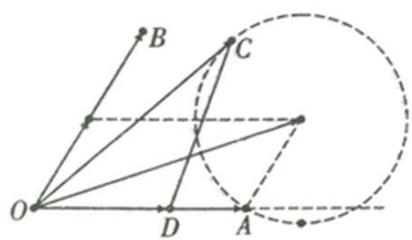

text_image

Geometric diagram with labeled points O, A, B, C, D and intersecting lines, including a dashed circle and solid segments

1732 (2024·江苏·高三专题练习)已知 $\vec{a}, \vec{b}$ 是两个单位向量，与 $\vec{a}, \vec{b}$ 共面的向量 $\vec{c}$ 满足 $\vec{c}^{2} - (\vec{a} + \vec{b}) \cdot \vec{c} + \vec{a} \cdot \vec{b} = 0$ ，则 $|\vec{c}|$ 的最大值为（）

A. $2 \sqrt{2}$

B. 2

C. $\sqrt{2}$

D. 1

【答案】C

【解析】由平面向量数量积的性质及其运算得 $(\vec{c}-\vec{a})\perp(\vec{c}-\vec{b})$ ，设 $\overrightarrow{DA}=\vec{a},\overrightarrow{DC}=\vec{b},\overrightarrow{DC}=\vec{c}$

则 $\vec{c}-\vec{a}=\overrightarrow{AC},^{\circ}\quad\vec{c}-\vec{b}=\overrightarrow{BC}$ ，则点 C 在以 AB 为直径的圆 O 周上运动，由图知：当 DC ⊥ AB 时， $|DC|\geqslant|DC'|$ ，设 $\angle ADC=\theta$ ，利用三角函数求 $\left|\vec{c}\right|$ 的最值。由 $\vec{c}^{2}-(\vec{a}+\vec{b})\cdot\vec{c}+\vec{a}\cdot\vec{b}=0$ 得： $(\vec{c}-\vec{a})\cdot(\vec{c}-\vec{b})=0$ ，即 $(\vec{c}-\vec{a})\perp(\vec{c}-\vec{b})$ ，

设 $\overrightarrow{DA} = \vec{a}, \overrightarrow{DC} = \vec{b}, \overrightarrow{DC} = \vec{c},$

则 $\vec{c}-\vec{a}=\overrightarrow{AC},^{\circ}\quad\vec{c}-\vec{b}=\overrightarrow{BC},$

则点 C 在以 AB 为直径的圆 O 上运动，

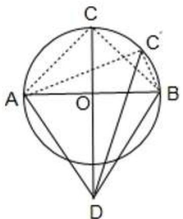

text_image

C
A
O
B
D
C'

由图知: 当 DC ⊥ AB 时, $|DC| \geqslant |DC'|$ ,

设 $\angle ADC = \theta$ ,

则 $|\mathrm{DC}| = |\mathrm{DO}| + |\mathrm{AO}| = \sin \theta +\cos \theta = \sqrt{2}\sin \left(\theta +\frac{\pi}{4}\right),$

所以当 $\theta=\frac{\pi}{4}$ 时， $|DC|$ 取最大值 $\sqrt{2}$ ，

故选：C.

1733 (2024·浙江舟山·高一舟山中学校考阶段练习)已知 $\vec{a}$ 、 $\vec{b}$ 、 $\vec{e}$ 是平面向量， $\vec{e}$ 是单位向量.若 $\vec{a}^2 - 4\vec{a} \cdot \vec{e} + 2\vec{e}^2 = 0, \vec{b}^2 - 3\vec{b} \cdot \vec{e} + 2\vec{e}^2 = 0$ ，则 $\vec{a}^2 - 2\vec{a} \cdot \vec{b} + 2\vec{b}^2$ 的最大值为 \_\_\_\_.

【答案】7

【解析】因为 $\vec{a}^{2}-4\vec{a}\cdot\vec{e}+2\vec{e}^{2}=0$ ，则 $\left|\vec{a}-2\vec{e}\right|^{2}=2$ ，即 $\left|\vec{a}-2\vec{e}\right|=\sqrt{2}$

因为 $\vec{b}^{2}-3\vec{b}\cdot\vec{e}+2\vec{e}^{2}=0$ , 即 $(\vec{b}-\vec{e})\cdot(\vec{b}-2\vec{e})=0$

作 $\overrightarrow{OA}=\vec{a},\overrightarrow{OB}=\vec{b},\overrightarrow{OE}=\vec{e},\overrightarrow{OC}=2\vec{e}$ ，则 $\left|\vec{a}-2\vec{e}\right|=\left|\overrightarrow{CA}\right|=\sqrt{2}$

$\left(\vec{b}-\vec{e}\right)\cdot\left(\vec{b}-2\vec{e}\right)=\overrightarrow{\mathrm{EB}}\cdot\overrightarrow{\mathrm{CB}}=0$ ，则 $\mathrm{EB}\perp\mathrm{CB},$

固定点 E, 则 E 为 OC 的中点, 则点 B 在以线段 CE 为直径的圆 D 上,

点 A 在以点 C 为圆心, $\sqrt{2}$ 为半径的圆 C 上, 如下图所示:

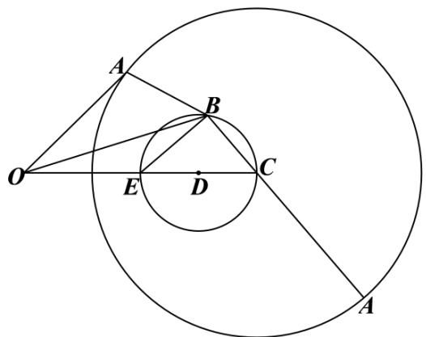

text_image

Geometric diagram showing two concentric circles with labeled points and connecting lines, likely for a math problem or proof.

$$
\vec {a} ^ {2} - 2 \vec {a} \cdot \vec {b} + 2 \vec {b} ^ {2} = | \vec {a} - \vec {b} | ^ {2} + | \vec {b} | ^ {2} = | \overrightarrow {\mathrm{BA}} | ^ {2} + | \overrightarrow {\mathrm{OB}} | ^ {2} \leqslant (| \overrightarrow {\mathrm{BC}} | + \sqrt {2}) ^ {2} + | \overrightarrow {\mathrm{OB}} | ^ {2},
$$

设 $\angle \mathrm{BCE} = \theta$ ，则 $|\overrightarrow{\mathrm{BC}}| = \cos \theta$

因为 $\left|\overrightarrow{OC}\right|=2,\overrightarrow{OB}^{2}=\left(\overrightarrow{CB}-\overrightarrow{CO}\right)^{2}=\overrightarrow{CB}^{2}-2\left|\overrightarrow{CB}\right|\cdot\left|\overrightarrow{CO}\right|\cos\theta+\overrightarrow{CO}^{2}=4-3\cos^{2}\theta,$

故 $\vec{a}^2 - 2\vec{a} \cdot \vec{b} + 2\vec{b}^2 \leqslant \left( |\overrightarrow{\mathrm{BC}}| + \sqrt{2} \right)^2 + |\overrightarrow{\mathrm{OB}}|^2 = (\cos \theta + \sqrt{2})^2 + 4 - 3\cos^2 \theta$

$$
= - 2 \cos^ {2} \theta + 2 \sqrt {2} \cos \theta + 6 = - 2 \left(\cos \theta - \frac {\sqrt {2}}{2}\right) ^ {2} + 7 \leqslant 7,
$$

当 $\cos\theta=\frac{\sqrt{2}}{2}$ 时, 等号成立, 即 $\vec{a}^{2}-2\vec{a}\cdot\vec{b}+2\vec{b}^{2}$ 的最大值为 7.

故答案为: 7.

1734 (2024·四川达州·高二四川省大竹中学校考期中)已知 $\vec{a}, \vec{b}, \vec{e}$ 是平面向量， $\vec{e}$ 是单位向量. 若非零向量 $\vec{a}$ 与 $\vec{e}$ 的夹角为 $\frac{\pi}{3}$ ，向量 $\vec{b}$ 满足 $\vec{b}^{2}-5\vec{e}\cdot\vec{b}+4=0$ ，则 $\left|\vec{a}-\vec{b}\right|$ 的最小值是 \_\_\_\_.

【答案】 $\frac{5\sqrt{3} - 6}{4}$

【解析】由 $\vec{b}^{2}-5\vec{e}\cdot\vec{b}+4=0$ 得， $(\vec{b}-4\vec{e})\cdot(\vec{b}-\vec{e})=0$ ，

故 $(\vec{b} - 4\vec{e}) \perp (\vec{b} - \vec{e})$ ，或 $\vec{b} = \vec{e}$ 或 $\vec{b} = 4\vec{e}$ ，

设 $\overrightarrow{OA}=\vec{e},\overrightarrow{OB}=\vec{b}$ ，以 O 为原点， $\overrightarrow{OA}$ 的方向为 x 轴正方向，建立如图所示坐标系，

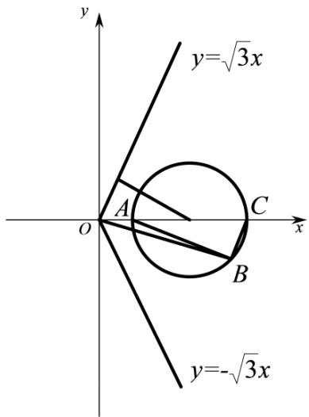

text_image

y
y=√3x
A
C
O
x
B
y=-√3x

则 A(1,0)，令 C(4,0)，则 $\vec{b}-\vec{e}=\overrightarrow{AB},\vec{b}-4\vec{e}=\overrightarrow{CB}$

由 $(\vec{b} - 4\vec{e}) \perp (\vec{b} - \vec{e})$ ，或 $\vec{b} = \vec{e}$ 或 $\vec{b} = 4\vec{e}$ ，

得B点在以 $\left(\frac{5}{2},0\right)$ 为圆心, $\frac{3}{2}$ 为半径的圆上,

又非零向量 $\vec{a}$ 与 $\vec{e}$ 的夹角为 $\frac{\pi}{3}$ ，则设 $\vec{a}$ 的起点为原点，则终点在不含端点的两条射线 $y = \pm \sqrt{3} x, (x > 0)$ 上，

则 $\left|\vec{a}-\vec{b}\right|$ 的几何意义等价于圆上的点到射线上的点的距离, 则其最小值为圆心 $\left(\frac{5}{2},0\right)$ 到直线的距离减去半径, 不妨以 $y=\sqrt{3}x$ 为例,

则 $\left|\vec{a}-\vec{b}\right|$ 的最小值为 $\frac{\sqrt{3}\times\frac{5}{2}}{2}-\frac{3}{2}=\frac{5\sqrt{3}-6}{4}$

故答案为: $\frac{5\sqrt{3} - 6}{4}$

1735 (2024·全国·高三专题练习)已知平面向量 $\vec{a}$ 、 $\vec{b}$ 、 $\vec{c}$ 、 $\vec{e}$ ，满足 $\vec{a} \perp \vec{b}$ ， $|\vec{a}| = 2|\vec{b}|$ ， $\vec{c} = \vec{a} + \vec{b}$ ， $|\vec{e}| = 1$ ，若 $\vec{a}^{2} - 6\vec{a} \cdot \vec{e} + 8 = 0$ ，则 $\vec{c} \cdot \vec{e} - \frac{1}{3}\vec{c}^{2}$ 的最大值是 \_\_\_\_.

【答案】 $\frac{3\sqrt{10} - 7}{6}$

【解析】因为 $\vec{a}^{2}-6\vec{a}\cdot\vec{e}+8=0$ ，即 $\vec{a}^{2}-6\vec{a}\cdot\vec{e}+9\vec{e}^{2}=1$ ，可得 $\left|\vec{a}-3\vec{e}\right|=1$ ，

设 $\vec{e}=(1,0)$ , $\vec{a}=(x,y)$ , 则 $\vec{a}-3\vec{e}=(x-3,y)$ , 则 $(x-3)^{2}+y^{2}=1$ ,

设 $\left\{\begin{aligned}x=3+\cos\theta\\ y=\sin\theta\end{aligned}\right.$ ，则 $\vec{a}=(3+\cos\theta,\sin\theta)$ ,

因为 $\vec{a} \perp \vec{b}, |\vec{a}| = 2|\vec{b}|$ ，则 $\vec{b} = \left(-\frac{\sin\theta}{2}, \frac{3 + \cos\theta}{2}\right)$ 或 $\vec{b} = \left(\frac{\sin\theta}{2}, -\frac{3 + \cos\theta}{2}\right)$ ，

因为 $\vec{c} = \vec{a} +\vec{b}$ ，则 $\vec{c} = \left(3 + \cos \theta -\frac{\sin\theta}{2},\frac{3}{2} +\sin \theta +\frac{\cos\theta}{2}\right)$ 或 $\vec{c} =$

$$
\left(3 + \cos \theta + \frac {\sin \theta}{2}, - \frac {3}{2} + \sin \theta - \frac {\cos \theta}{2}\right),
$$

令 $\vec{c} = (m,n)$ ，则 $(m - 3)^2 +\left(n - \frac{3}{2}\right)^2 = \frac{5}{4}$ 或 $(m - 3)^2 +(n + \frac{3}{2})^2 = \frac{5}{4},$

根据对称性,可只考虑 $(m-3)^{2}+\left(n-\frac{3}{2}\right)^{2}=\frac{5}{4}$ ,

由 $\vec{c} \cdot \vec{e} - \frac{1}{3}\vec{c}^2 = m - \frac{1}{3}(m^2 + n^2) = -\frac{1}{3}\left[(m - \frac{3}{2})^2 + n^2\right] + \frac{3}{4},$

记点 $\mathrm{A}\left(3, \frac{3}{2}\right), \mathrm{B}\left(\frac{3}{2}, 0\right), \mathrm{P}(m, n)$ ，则 $|\mathrm{AB}| = \sqrt{\left(3 - \frac{3}{2}\right)^2 + \left(\frac{3}{2}\right)^2} = \frac{3\sqrt{2}}{2}, |\mathrm{PA}| = 1,$

所以， $|\overrightarrow{\mathrm{PB}}| = |\overrightarrow{\mathrm{PA}} +\overrightarrow{\mathrm{AB}}|\geqslant ||\overrightarrow{\mathrm{PA}} | - | \overrightarrow{\mathrm{AB}} || = \frac{3\sqrt{2} - \sqrt{5}}{2},$

当且仅当点M为线段AB与圆 $(x-3)^{2}+\left(y-\frac{3}{2}\right)^{2}=\frac{5}{4}$ 的交点时,等号成立,

所以， $\vec{c}\cdot \vec{e} -\frac{1}{3}\vec{c}^{2} = -\frac{1}{3}\bigl [ \left(m - \frac{3}{2}\right)^{2} + n^{2}\bigr ] + \frac{3}{4} = -\frac{1}{3}\left|\overrightarrow{\mathrm{PB}}\right|^{2} + \frac{3}{4}\leqslant -\frac{1}{3}\times \left(\frac{3\sqrt{2} - \sqrt{5}}{2}\right)^{2} + \frac{3}{4}$ $= \frac{3\sqrt{10} - 7}{6}.$

故答案为: $\frac{3\sqrt{10} - 7}{6}$ .

1736 (2024·河南南阳·南阳中学校考模拟预测)已知 $\vec{a}$ 、 $\vec{b}$ 、 $\vec{e}$ 是平面向量， $|\vec{e}|=1$ ，若非零向量 $\vec{a}$ 与 $\vec{e}$ 的夹角为 $\frac{\pi}{3}$ ，向量 $\vec{b}$ 满足 $\vec{b}^{2}-4\vec{b}\cdot\vec{e}+3=0$ ，则 $|\vec{a}-\vec{b}|$ 的最小值是 \_\_\_\_.

【答案】 $\sqrt{3} - 1 / -1 + \sqrt{3}$

【解析】设 $\vec{a}=(x,y),\vec{e}=(1,0),\vec{b}=(m,n)$ ，则由 $\left\langle\vec{a},\vec{e}\right\rangle=\frac{\pi}{3}$ 得 $\vec{a}\cdot\vec{e}=\left|\vec{a}\right|\left|\vec{e}\right|\cos\frac{\pi}{3},x=\frac{1}{2}\sqrt{x^{2}+y^{2}}$ ，可得 $y=\pm\sqrt{3}x$ ，

由 $\vec{b}^2 - 4\vec{e} \cdot \vec{b} + 3 = 0$ 得 $m^2 + n^2 - 4m + 3 = 0, (m - 2)^2 + n^2 = 1,$

因此， $\left|\vec{a}-\vec{b}\right|=\sqrt{(x-m)^{2}+(y-n)^{2}}$ 表示圆 $(m-2)^{2}+n^{2}=1$ 上的点 $(m,n)$ 到直线 $y=\pm\sqrt{3}x$ 上的点 $(x,y)$ 的距离；

故其最小值为圆心 $(2,0)$ 到直线 $y=\pm\sqrt{3}x$ 的距离 $d=\frac{2\sqrt{3}}{2}=\sqrt{3}$ 减去半径 1，即 $\sqrt{3}-1$ .
故答案为： $\sqrt{3}-1$

# 题型四:与向量模相关构成隐圆

1737 (2024·辽宁大连·大连二十四中校考模拟预测)已知 $\vec{a},\vec{b},\vec{c}$ 是平面内的三个单位向量, 若 $\vec{a}\perp\vec{b}$ , 则 $\left|\vec{a}+2\vec{c}\right|+\left|3\vec{a}+2\vec{b}-2\vec{c}\right|$ 的最小值是 \_\_\_\_.

【答案】 $2\sqrt{5}$

【解析】∵ $\vec{a},\vec{b},\vec{c}$ 均为单位向量且 $\vec{a}\perp\vec{b},\therefore$ 不妨设 $\vec{a}=(1,0),\vec{b}=(0,1),\vec{c}=(x,y)$ 且 $x^{2}+$

$$
y ^ {2} = 1,
$$

$$
\therefore \vec {a} + 2 \vec {c} = (2 x + 1, 2 y), 3 \vec {a} + 2 \vec {b} - 2 \vec {c} = (3 - 2 x, 2 - 2 y),
$$

$$
\therefore \left| \vec {a} + 2 \vec {c} \right| + \left| 3 \vec {a} + 2 \vec {b} - 2 \vec {c} \right| = \sqrt {(2 x + 1) ^ {2} + 4 y ^ {2}} + \sqrt {(3 - 2 x) ^ {2} + (2 - 2 y) ^ {2}} =
$$

$$
2 \left(\sqrt {\left(x + \frac {1}{2}\right) ^ {2} + y ^ {2}} + \sqrt {\left(x - \frac {3}{2}\right) ^ {2} + (y - 1) ^ {2}}\right),
$$

$\therefore\left|\vec{a}+2\vec{c}\right|+\left|3\vec{a}+2\vec{b}-2\vec{c}\right|$ 的几何意义表示的是点 $(x,y)$ 到 $\left(-\frac{1}{2},0\right)$ 和 $\left(\frac{3}{2},1\right)$ 两点的距离之和的 2 倍，

点 $\left(-\frac{1}{2},0\right)$ 在单位圆内，点 $\left(\frac{3}{2},1\right)$ 在单位圆外，

则点 $(x,y)$ 到 $\left(-\frac{1}{2},0\right)$ 和 $\left(\frac{3}{2},1\right)$ 两点的距离之和的最小值即为 $\left(-\frac{1}{2},0\right)$ 和 $\left(\frac{3}{2},1\right)$ 两点间距离，

∴所求最小值为 $2\sqrt{\left(-\frac{1}{2}-\frac{3}{2}\right)^{2}+(0-1)^{2}}=2\sqrt{5}$ .

故答案为: $2\sqrt{5}$ .

1738 (2024·上海·高三专题练习)已知 $\vec{a}$ 、 $\vec{b}$ 、 $\vec{c}$ 、 $\vec{d}$ 都是平面向量，且 $|\vec{a}| = |2\vec{a} - \vec{b}| = |5\vec{a} - \vec{c}| = 1$ ，若 $\left\langle\vec{a},\vec{d}\right\rangle=\frac{\pi}{4}$ ，则 $|\vec{b}-\vec{d}|+|\vec{c}-\vec{d}|$ 的最小值为 \_\_\_\_.

【答案】 $\sqrt{29} - 2$

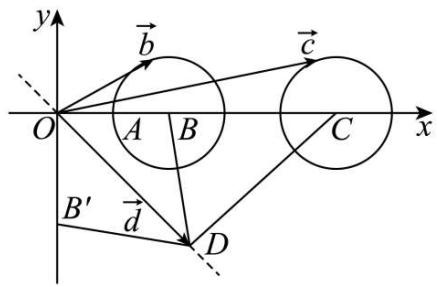

text_image

y
O
A B
x
B'
d
D
b
c

【解析】

作图， $\vec{a}=\overrightarrow{OA}$ ，则 $2\vec{a}=\overrightarrow{OB}$ ， $5\vec{a}=\overrightarrow{OC}$ ，

因为 $\left|2\vec{a}-\vec{b}\right|$ =1, 所以 $\vec{b}$ 起点在原点, 终点在以 B 为圆心, 1 为半径的圆上;

同理， $\left|5\vec{a}-\vec{c}\right|^{\circ}=1$ ，所以 $\vec{c}$ 起点在原点，终点在以C为圆心，1为半径的圆上，

所以 $\left|\vec{b}-\vec{d}\right|+\left|\vec{c}-\vec{d}\right|$ 的最小值则为 $\left(\left|\mathrm{BD}\right|+\left|\mathrm{CD}\right|\right)_{\min}-2$

因为 $\left\langle\vec{a},\vec{d}\right\rangle=\frac{\pi}{4}$ ， $|BD|=|B'D|$ ，当 $B'$ ，D，C 三点共线时， $(|BD|+|CD|)_{\min}=|B'C|=\sqrt{5^{2}+2^{2}}=\sqrt{29}$ ，所以 $(|BD|+|CD|)_{\min}-2=\sqrt{29}-2$ 。

故答案为: $\sqrt{29} - 2$ .

1739 (2024·上海金山·统考二模)已知 $\vec{a}$ 、 $\vec{b}$ 、 $\vec{c}$ 、 $\vec{d}$ 都是平面向量，且 $\left|\vec{a}\right|=\left|2\vec{a}-\vec{b}\right|=\left|5\vec{a}-\vec{c}\right|=1$ ，若 $\left\langle\vec{a},\vec{d}\right\rangle=\frac{\pi}{4}$ ，则 $\left|\vec{b}-\vec{d}\right|+\left|\vec{c}-\vec{d}\right|$ 的最小值为 \_\_\_\_.

【答案】 $\sqrt{29}-2/-2+\sqrt{29}$

【解析】如图, 设 $\overrightarrow{OA}=2\vec{a}, \overrightarrow{OM}=5\vec{a}, \overrightarrow{OB}=\vec{b}, \overrightarrow{OC}=\vec{c}, \overrightarrow{OD}=\vec{d},$

则点 B 在以 A 为圆心, 以 1 为半径的圆上, 点 C 在以 M 为圆心, 以 1 为半径的圆上,

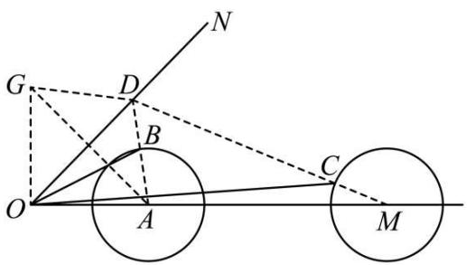

text_image

Geometric diagram with labeled points and lines, showing two circles and tangent constructions

$\angle NOM=\frac{\pi}{4}$ , 所以点 D 在射线 ON 上,

所以 $\left|\vec{b}-\vec{d}\right|+\left|\vec{c}-\vec{d}\right|=\left|\overrightarrow{\mathrm{DB}}\right|+\left|\overrightarrow{\mathrm{DC}}\right|\geqslant\left|\overrightarrow{\mathrm{DA}}\right|-1+\left|\overrightarrow{\mathrm{DM}}\right|-1=\left|\overrightarrow{\mathrm{DA}}\right|+\left|\overrightarrow{\mathrm{DM}}\right|-2,$

作点 A 关于射线 ON 对称的点 G, 则 $\left|\overrightarrow{DG}\right|=\left|\overrightarrow{DA}\right|$ , 且 $\angle GOA=\frac{\pi}{2}$ ,

所以 $\left|\overrightarrow{DA}\right|+\left|\overrightarrow{DM}\right|\geqslant\left|\overrightarrow{GM}\right|=\sqrt{4+25}=\sqrt{29}$ (当且仅当点 G,D,M 三点共线时取等号)

所以 $\left|\vec{b}-\vec{d}\right|+\left|\vec{c}-\vec{d}\right|$ 的最小值为 $\sqrt{29}-2$ ,

故答案为: $\sqrt{29}-2$ .

1740 (2024·全国·高三专题练习)已知线段MN是圆C: $(x-1)^{2}+y^{2}=8$ 的一条动弦，且 $|MN|=2\sqrt{3}$ ，若点P为直线 $2x+y+8=0$ 上的任意一点，则 $\left|\overrightarrow{PM}+\overrightarrow{PN}\right|$ 的最小值为\_\_\_\_.

【答案】 $2\sqrt{5}$

【解析】如图，P 为直线 $2x + y + 8 = 0$ 上的任意一点，

过圆心 C 作 CD ⊥ MN, 连接 PD, 由 $|MN| = 2\sqrt{3}$ ,

可得 $|\mathrm{CD}| = \sqrt{\mathrm{CN}^2 - \left(\frac{\mathrm{MN}}{2}\right)^2} = \sqrt{5}$

由 $\left|\overrightarrow{PM}+\overrightarrow{PN}\right|=2\left|\overrightarrow{PD}\right|\geqslant2(|PC|-|CD|)$ ，当 C,P,D 共线时取等号，

又 D 是 MN 的中点, 所以 CP ⊥ MN,

所以 $\left|\overrightarrow{PD}\right|_{\min}=\frac{\left|2-0+8\right|}{\sqrt{2^{2}+1}}-\sqrt{5}=\sqrt{5}.$

则此时 $\left|\overrightarrow{PM}+\overrightarrow{PN}\right|=2\left|\overrightarrow{PD}\right|=2\sqrt{5}$

$\therefore \left|\overrightarrow{\mathrm{PM}} +\overrightarrow{\mathrm{PN}}\right|$ 的最小值为 $2\sqrt{5}$

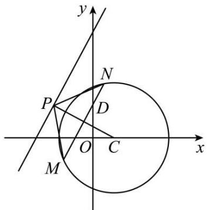

text_image

y
N
P
D
O
C
x
M

故答案为: $2\sqrt{5}$

1741 (2024·全国·高三专题练习)已知 O 为坐标原点, A, B 在直线 x-y-4=0 上, $|AB|=2\sqrt{2}$ , 动点 M 满足 $|MA|=2|MB|$ , 则 $|OM|$ 的最小值为 \_\_\_\_.

【答案】 $\frac{2\sqrt{2}}{3} / \frac{2}{3}\sqrt{2}$

【解析】设 $M(x,y)$ , $A(x_{1},y_{1})$ , $B(x_{2},y_{2})$ ,

因为 $\left|AB\right|=2\sqrt{2}$ ，所以 $\left|AB\right|^{2}=(x_{1}-x_{2})^{2}+(y_{1}-y_{2})^{2}=8$

因为 $\frac{|MA|}{|MB|}=2$ ，所以 $|MA|^{2}=4|MB|^{2}$ ，

$$
(x - x _ {1}) ^ {2} + (y - y _ {1}) ^ {2} = 4 (x - x _ {2}) ^ {2} + 4 (y - y _ {2}) ^ {2},
$$

整理得 $\left(x - \frac{4x_2 - x_1}{3}\right)^2 +\left(y - \frac{4y_2 - y_1}{3}\right)^2 = \frac{4(y_1 - y_1)^2 + 4(x_1 - x_2)^2}{9} = \frac{32}{9},$

可得M点在以 $\mathrm{D}\left(\frac{4x_{2}-x_{1}}{3},\frac{4y_{2}-y_{1}}{3}\right)$ 为圆心，半径为 $\frac{4\sqrt{2}}{3}$ 的圆上，

$\overrightarrow{\mathrm{MA}} = (x_1 - x, y_1 - y), \overrightarrow{\mathrm{BM}} = (x - x_2, y - y_2)$ ，当 $\overrightarrow{\mathrm{BM}} = -\frac{1}{4} \overrightarrow{\mathrm{MA}}$ 时，

可得 $x - x_{2} = -\frac{1}{4} (x_{1} - x),y - y_{2} = -\frac{1}{4} (y_{1} - y)$ 即 $x = \frac{4x_2 - x_1}{3},y = \frac{4y_2 - y_1}{3}$

圆心在 $\mathrm{D}\left(\frac{4x_{2}-x_{1}}{3},\frac{4y_{2}-y_{1}}{3}\right)$ 在直线 x-y-4=0 上，

过 O 做 x-y-4=0 的垂线, 当垂足为圆心 D 点时, OD 长度最小, |OM| 的长度也最小,

且 OD 长度最小值为 $\frac{|0-0-4|}{\sqrt{2}}=2\sqrt{2}$ ，此时 $|OM|$ 的最小值为 $2\sqrt{2}-\frac{4\sqrt{2}}{3}=\frac{2\sqrt{2}}{3}$ .

故答案为: $\frac{2\sqrt{2}}{3}$ .

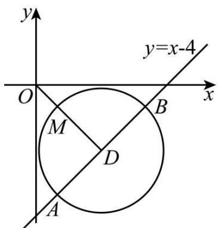

text_image

y
y=x-4
O
x
M
D
A

1742 (2024·全国·高三专题练习)已知 $\vec{a}, \vec{b}$ 是单位向量， $\vec{a} \cdot \vec{b} = 0$ . 若向量 $\vec{c}$ 满足 $|\vec{c} - \vec{a} - \vec{b}| = 1$ ，则 $|\vec{c}|$ 的最大值是 \_\_\_\_.

【答案】 $\sqrt{2} + 1 / 1 + \sqrt{2}$

【解析】法一 由 $\vec{a} \cdot \vec{b} = 0$ ，得 $\vec{a} \perp \vec{b}$ .

如图所示,分别作 $\overrightarrow{OA} = \vec{a}, \overrightarrow{OB} = \vec{b}$ , 作, $\overrightarrow{OC} = \vec{a} + \vec{b}$ ,

由于 $\vec{a},\vec{b}$ 是单位向量, 则四边形 OACB 是边长为 1 的正方形, 所以 $|\overrightarrow{OC}|=\sqrt{2}$ ,

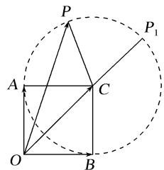

text_image

P
A
O
B
C
P₁

作 $\overrightarrow{OP}=\vec{c}$ ，则 $|\vec{c}-\vec{a}-\vec{b}|=|\overrightarrow{OP}-\overrightarrow{OC}|=|\overrightarrow{CP}|=1,$

所以点 P 在以 C 为圆心, 1 为半径的圆上.

由图可知, 当点 O, C, P 三点共线且点 P 在点 $P_{1}$ 处时, $|\overrightarrow{OP}|$ 取得最大值 $\sqrt{2} + 1$ ,

故 $|\vec{c}|$ 的最大值是 $\sqrt{2} + 1$ ,

故答案为: $\sqrt{2} + 1$

法二 由 $\vec{a} \cdot \vec{b} = 0$ ，得 $\vec{a} \perp \vec{b}$ ，

建立如图所示的平面直角坐标系,则 $\overrightarrow{OA}=\vec{a}=(1,0),\overrightarrow{OB}=\vec{b}=(0,1)$ ,

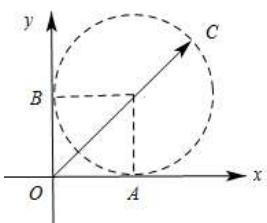

text_image

y
C
B
O
A
x

设 $\vec{c}=\overrightarrow{OC}=(x,y)$ ，由 $|\vec{c}-\vec{a}-\vec{b}|=1$ ，

得 $(x-1)^{2}+(y-1)^{2}=1$ ，

所以点 C 在以 $(1,1)$ 为圆心, 1 为半径的圆上.

所以 $|\vec{c}|_{\max} = \sqrt{2} + 1$

故答案为: $\sqrt{2} + 1$

1743 (2024·新疆·高三新疆兵团第二师华山中学校考阶段练习)已知是 $\vec{a}$ 、 $\vec{b}$ 是单位向量， $\vec{a} \cdot \vec{b} = 0$ ，若向量 $\vec{c}$ 满足 $|\vec{c} - \vec{a} + \vec{b}| = 2$ ，则 $|\vec{c}|$ 的最大值为 \_\_\_\_

【答案】 $2+\sqrt{2}/\sqrt{2}+2$

【解析】由 $\vec{a}$ 、 $\vec{b}$ 是单位向量，且 $\vec{a} \cdot \vec{b} = 0$ ，则可设 $\vec{a} = (1, 0)$ ， $\vec{b} = (0, 1)$ ， $\vec{c} = (x, y)$ ，

所以 $\vec{c}-\vec{a}+\vec{b}=(x-1,y+1)$ ,

∵向量 $\vec{c}$ 满足 $\left|\vec{c}-\vec{a}+\vec{b}\right|=2,$

$$
\therefore \sqrt {(x - 1) ^ {2} + (y + 1) ^ {2}} = 2,
$$

即 $(x - 1)^2 +(y + 1)^2 = 4$

它表示圆心为 C(1, -1)，半径为 r = 2 的圆，

又 $\left|\vec{c}\right|=\sqrt{x^{2}+y^{2}}$ 表示圆上的点 $(x,y)$ 到坐标原点 O(0,0) 的距离，因为 $\left|OC\right|=\sqrt{1^{2}+(-1)^{2}}=\sqrt{2}$ ,

所以 $\left|\vec{c}\right|_{\max}=|\mathrm{OC}|+r=2+\sqrt{2}.$

故答案为: $2+\sqrt{2}$ .

1744 (2024·全国·高三专题练习)已知 $\vec{a},\vec{b}$ 是平面内两个互相垂直的单位向量,若向量 $\vec{c}$ 满足 $(\vec{a}-\vec{c})\cdot(\vec{b}-2\vec{c})=0$ ,则 $|\vec{c}|$ 的最大值是 \_\_\_\_.

【答案】 $\frac{\sqrt{5}}{2}$

【解析】因为 $\vec{a},\vec{b}$ 是平面内两个互相垂直的单位向量，

故不妨设 $\vec{a}=(1,0),\vec{b}=(0,1)$ ，设 $\vec{c}=(x,y)$ ，

由 $(\vec{a} -\vec{c})\cdot (\vec{b} -2\vec{c}) = 0$ 得： $(1 - x, - y)\cdot (-2x,1 - 2y) = 0,$

即 $-2x(1-x)-y(1-2y)=0$ , 即 $\left(x-\frac{1}{2}\right)^{2}+\left(y-\frac{1}{4}\right)^{2}=\frac{5}{16}$

则 $\vec{c}$ 的终点在以 $\left(\frac{1}{2},\frac{1}{4}\right)$ 为圆心，半径为 $\frac{\sqrt{5}}{4}$ 的圆上，

故 $\left|\vec{c}\right|$ 的最大值为 $\sqrt{\left(\frac{1}{2}\right)^{2}+\left(\frac{1}{4}\right)^{2}}+\frac{\sqrt{5}}{4}=\frac{\sqrt{5}}{2}$ ,

故答案为: $\frac{\sqrt{5}}{2}$

1745 (2024·全国·高三专题练习)已知平面向量 $\vec{a}$ 、 $\vec{b}$ 、 $\vec{c}$ 满足： $\vec{a}$ 与 $\vec{b}$ 的夹角为 $\frac{2\pi}{3}$ ， $(\vec{c}-\vec{a})\cdot(\vec{c}-\vec{b})=0,|\vec{a}|+|\vec{b}|=2$ ，记 M 是 $|\vec{c}-\vec{a}-\vec{b}|$ 的最大值，则 M 的最小值是 \_\_\_\_.

【答案】 $\frac{\sqrt{3} + 1}{2}$

【解析】如图，

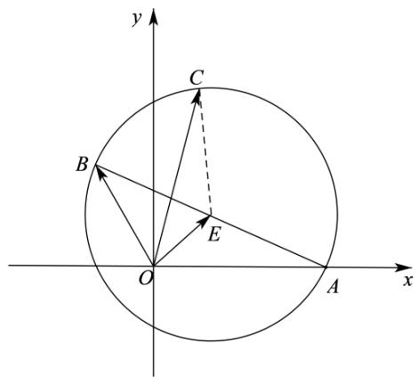

text_image

y
C
B
E
O
A
x

设 $\overrightarrow{OA}=\vec{a},\overrightarrow{OB}=\vec{b},\overrightarrow{OC}=\vec{c},E$ 为 AB 中点，令 $|\vec{a}|=x,|\vec{b}|=y,|AB|=2r,|OE|=t,$

则 $\angle AOB = \frac{2\pi}{3}, x + y = 2$ ①，

因为 $\overrightarrow{OE}=\frac{1}{2}(\overrightarrow{OA}+\overrightarrow{OB}),\overrightarrow{AB}=\overrightarrow{OB}-\overrightarrow{OA},$

故有 $\overrightarrow{\mathrm{OA}}\cdot \overrightarrow{\mathrm{OB}} = |\mathrm{OE}|^2 -\frac{1}{4} |\mathrm{AB}|^2\Rightarrow -\frac{1}{2} xy = t^2 -r^2,$

$$
\cos \angle A O B = \frac {x ^ {2} + y ^ {2} - 4 r ^ {2}}{2 x y} \Rightarrow - x y = x ^ {2} + y ^ {2} - 4 r ^ {2} \Rightarrow 4 r ^ {2} = (x + y) ^ {2} - x y \quad ②,
$$

由①②得 $r^{2}=1-\frac{xy}{4}$ ，从而 $t^{2}=r^{2}-\frac{1}{2}xy=1-\frac{3}{4}xy,xy\in(0,1]$

因为 $(\vec{c}-\vec{a})\cdot(\vec{c}-\vec{b})=0$ , 所以 AC⊥BC, 即点 C 在以 AB 为直径的圆 E 上.

$$
\because | \vec {c} - \vec {a} - \vec {b} | = | \vec {c} - (\vec {a} + \vec {b}) | = | \overrightarrow {\mathrm{OE}} + \overrightarrow {\mathrm{EC}} - 2 \overrightarrow {\mathrm{OE}} | = | \overrightarrow {\mathrm{EO}} + \overrightarrow {\mathrm{EC}} | \leqslant | \overrightarrow {\mathrm{EO}} | + | \overrightarrow {\mathrm{EC}} |,
$$

$$
\therefore \mathrm{M} = | \vec {c} - \vec {a} - \vec {b} | _ {\max} = | \overrightarrow {\mathrm{EO}} | + | \overrightarrow {\mathrm{EC}} | = t + r = \sqrt {1 - \frac {3}{4} x y} + \sqrt {1 - \frac {1}{4} x y} \geqslant \frac {1 + \sqrt {3}}{2},
$$

当且仅当 $\left|\vec{a}\right|=\left|\vec{b}\right|=1$ 时，即 xy=1 时等号成立.

故答案为: $\frac{\sqrt{3} + 1}{2}$

1746 (2024·全国·高三专题练习)已知向量 $\vec{a}, \vec{b}$ 满足 $\left|2\vec{a}+\vec{b}\right|=3, \left|\vec{b}\right|=1$ ，则 $\left|\vec{a}\right|+2\left|\vec{a}+\vec{b}\right|$ 的最大值为 \_\_\_\_.

【答案】5

【解析】令 $2\vec{a} + \vec{b} = (3\cos\alpha, 3\sin\alpha)$ , $\vec{b} = (\cos\beta, \sin\beta)$ ,

$$
\therefore 2 (\vec {a} + \vec {b}) = (3 \cos \alpha + \cos \beta , 3 \sin \alpha + \sin \beta)
$$

$$
2 \vec {a} = (3 \cos \alpha - \cos \beta , 3 \sin \alpha - \sin \beta),
$$

$$
\therefore 2 | \vec {a} + \vec {b} | = \sqrt {(3 \cos \alpha + \cos \beta) ^ {2} + (3 \sin \alpha + \sin \beta) ^ {2}} = \sqrt {1 0 + 6 \cos (\alpha - \beta)},
$$

$$
2 | \vec {a} | = \sqrt {(3 \cos \alpha - \cos \beta) ^ {2} + (3 \sin \alpha - \sin \beta) ^ {2}} = \sqrt {1 0 - 6 \cos (\alpha - \beta)},
$$

令 $\mathrm{S} = |\vec{a}| + 2|\vec{a} +\vec{b}| = \frac{1}{2}\cdot \sqrt{10 - 6\cos(\alpha - \beta)} +\sqrt{10 + 6\cos(\alpha - \beta)}$

设 $t = \cos (\alpha -\beta)(-1\leqslant t\leqslant 1)$ ，则

$$
\mathrm{S} = \frac {1}{2} \sqrt {1 0 - 6 t} + \sqrt {1 0 + 6 t}, \mathrm{S} ^ {\prime} = \frac {1}{2} \cdot \frac {- 6}{2 \cdot \sqrt {1 0 - 6 t}} + \frac {6}{2 \sqrt {1 0 + 6 t}},
$$

令 $S' = 0 \Rightarrow 4(10 - 6t) = 10 + 6t \Rightarrow t = 1$ ,

若函数 S 存在极值点, 则 t=1 是函数 S 的唯一极值点,

显然, 函数 S 在 t=1 取得最值,

$$
\therefore \mathrm{S} _ {\max} = \mathrm{S} (1) = \frac {1}{2} \cdot \sqrt {4} + \sqrt {1 6} = 5,
$$

故答案为: 5.

1747 (2024·全国·高三专题练习)已知向量 $\vec{a},\vec{b},\vec{c}$ 满足 $\left|\vec{a}\right|=4,\left|\vec{b}\right|=2\sqrt{2},<\vec{a},\vec{b}>=\frac{\pi}{4},\left(\vec{c}-\vec{a}\right)\cdot\left(\vec{c}-\vec{b}\right)=-1$ ，则 $\left|\vec{c}-\vec{a}\right|$ 的最大值为 \_\_\_\_.

【答案】 $\sqrt{2} + 1$

【解析】设 $\overrightarrow{OA} = \vec{a}, \overrightarrow{OB} = \vec{b}, \overrightarrow{OC} = \vec{c}$ ，以 OA 所在的直线为 x 轴，O 为坐标原点建立平面直角坐标系，

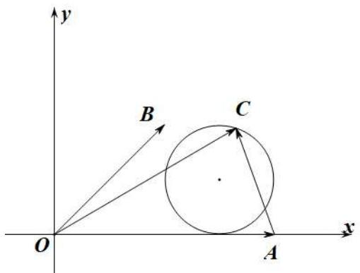

text_image

y
B
C
O
A
x

$$
\because | \vec {a} | = 4, | \vec {b} | = 2 \sqrt {2}, <   \vec {a}, \vec {b} > = \frac {\pi}{4},
$$

则 A(4,0), B(2,2), 设 C(x,y),

$$
\because (\vec {c} - \vec {a}) \cdot (\vec {c} - \vec {b}) = - 1, \therefore x ^ {2} + y ^ {2} - 6 x - 2 y + 9 = 0,
$$

即 $(x - 3)^2 +(y - 1)^2 = 1$ ，∴点C在以(3,1)为圆心，1为半径的圆上，

$\left|\vec{c}-\vec{a}\right|$ 表示点 A, C 的距离, 即圆上的点与 A(4,0) 的距离,

∵圆心到A的距离为 $\sqrt{2}$ ,

∴ $\left|\vec{c}-\vec{a}\right|$ 的最大值为 $\sqrt{2}+1$ .

故答案为: $\sqrt{2}+1$ .

1748 (2024·全国·高三专题练习)设 $\vec{a}, \vec{b}$ 为单位向量，则 $\left|\vec{a} + \vec{b}\right| + \left|\vec{a} - 3\vec{b}\right|$ 的最大值是 \_\_\_\_

【答案】 $\frac{8\sqrt{3}}{3}$

【解析】依题意 $\vec{a}, \vec{b}$ 为单位向量，设 $\vec{a} = (\cos\alpha, \sin\alpha), \vec{b} = (\cos\beta, \sin\beta), -1 \leqslant \cos(\alpha - \beta) \leqslant 1$

则 $|\vec{a} +\vec{b}| + |\vec{a} -3\vec{b} |$

$$
= \sqrt {(\cos \alpha + \cos \beta) ^ {2} + (\sin \alpha + \sin \beta) ^ {2}} + \sqrt {(\cos \alpha - 3 \cos \beta) ^ {2} + (\sin \alpha - 3 \sin \beta) ^ {2}}
$$

$$
\begin{array}{l} = \sqrt {2 + 2 \cos (\alpha - \beta)} + \sqrt {1 0 - 6 \cos (\alpha - \beta)} \\ = \sqrt {2} \cdot \sqrt {1 + \cos (\alpha - \beta)} + \sqrt {6} \cdot \sqrt {\frac {5}{3} - \cos (\alpha - \beta)} \\ \leqslant \sqrt {(2 + 6) \cdot \left[ 1 + \cos (\alpha - \beta) + \frac {5}{3} - \cos (\alpha - \beta) \right]} = \sqrt {8 \times \frac {8}{3}} = \frac {8 \sqrt {3}}{3}, \\ \end{array}
$$

当且仅当 $\sqrt{2} \cdot \sqrt{\frac{5}{3} - \cos(\alpha - \beta)} = \sqrt{6} \cdot \sqrt{1 + \cos(\alpha - \beta)}$ ，即 $\cos(\alpha - \beta) = -\frac{1}{3}$ 时等号成立.

故答案为: $\frac{8\sqrt{3}}{3}$

