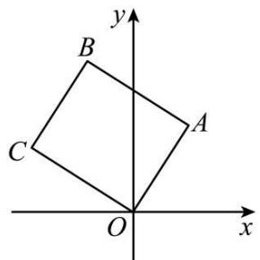
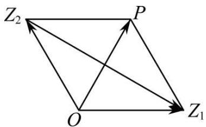
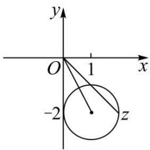

# 第39讲 复数

# 知识梳理

# 知识点一、复数的概念

(1)i 叫虚数单位，满足 $i^{2}=-1$ ，当 $k\in Z$ 时， $i^{4k}=1,i^{4k+1}=i,i^{4k+2}=-1,i^{4k+3}=-i.$   
(2) 形如 $a + bi (a, b \in \mathbb{R})$ 的数叫复数，记作 $a + bi \in \mathbb{C}$ .

①复数 $z = a + bi(a, b \in \mathbb{R})$ 与复平面上的点 $\mathbf{Z}(a, b)$ 一一对应， $a$ 叫 $z$ 的实部， $b$ 叫 $z$ 的虚部； $b = 0 \Leftrightarrow z \in \mathbb{R}, \mathbf{Z}$ 点组成实轴； $b \neq 0, z$ 叫虚数； $b \neq 0$ 且 $a = 0, z$ 叫纯虚数，纯虚数对应点组成虚轴（不包括原点）。两个实部相等，虚部互为相反数的复数互为共轭复数。

②两个复数 $a + bi, c + di (a, b, c, d \in \mathbb{R})$ 相等 $\Leftrightarrow \begin{cases} a = c \\ b = d \end{cases}$ （两复数对应同一点）  
③复数的模: 复数 $a + bi (a, b \in \mathbb{R})$ 的模, 也就是向量 $\overrightarrow{OZ}$ 的模, 即有向线段 $\overrightarrow{OZ}$ 的长度, 其计算公式为 $|z| = |a + bi| = \sqrt{a^{2} + b^{2}}$ , 显然, $|\bar{z}| = |a - bi| = \sqrt{a^{2} + b^{2}}, z \cdot \bar{z} = a^{2} + b^{2}$ .

# 知识点二、复数的加、减、乘、除的运算法则

# 1、复数运算

(1) $(a + bi)\pm (c + di) = (a\pm c) + (b\pm d)\mathrm{i}$   
(2) $(a + bi) \cdot (c + di) = (ac - bd) + (ad + bc)\mathrm{i}$

$$
\left\{ \begin{array}{l} (a + b i) \cdot (a - b i) = z \cdot \bar {z} = a ^ {2} + b ^ {2} = | z | ^ {2} \\ (\text {注意} z ^ {2} = | z | ^ {2}) \\ z + \bar {z} = 2 a \end{array} \right.
$$

其中 $|z|^{\circ} \circ = \sqrt{a^{2} + b^{2}}$ ，叫 $z$ 的模； $\bar{z} = a - bi$ 是 $z = a + bi$ 的共轭复数 $(a, b \in \mathbb{R})$ .

(3) $\frac{a + bi}{c + di} = \frac{(a + bi) \cdot (c - di)}{(c + di) \cdot (c - di)} = \frac{(ac + bd) + (bc - ad)i}{c^2 + d^2} (c^2 + d^2 \neq 0)$ .

实数的全部运算律 (加法和乘法的交换律、结合律、分配律及整数指数幂运算法则) 都适用于复数.

注意: 复数加、减法的几何意义

以复数 $z_{1}, z_{2}$ 分别对应的向量 $\overrightarrow{\mathrm{OZ}}_{1}, \overrightarrow{\mathrm{OZ}}_{2}$ 为邻边作平行四边形 $\mathrm{OZ}_{1} \mathrm{ZZ}_{2}$ , 对角线 $\mathrm{OZ}$ 表示的向量 $\overrightarrow{\mathrm{OZ}}$ 就是复数 $z_{1} + z_{2}$ 所对应的向量. $z_{1} - z_{2}$ 对应的向量是 $\overrightarrow{\mathrm{Z}}_{2} \overrightarrow{\mathrm{Z}}_{1}$ .

# 2、复数的几何意义

(1) 复数 $z = a + bi(a, b \in \mathbb{R})$ 对应平面内的点 $z(a, b)$ ;  
(2) 复数 $z = a + bi (a, b \in \mathbb{R})$ 对应平面向量 $\overrightarrow{\mathrm{OZ}}$ ;  
(3) 复平面内实轴上的点表示实数, 除原点外虚轴上的点表示虚数, 各象限内的点都表示复数.  
(4) 复数 $z = a + bi(a, b \in \mathbb{R})$ 的模 $|z|$ 表示复平面内的点 $z(a, b)$ 到原点的距离.

# 3、复数的三角形式

# (1) 复数的三角表示式

一般地，任何一个复数 $z = a + bi$ 都可以表示成 $r(\cos \theta + i\sin \theta)$ 形式，其中 $r$ 是复数 $z$ 的模； $\theta$ 是以 $x$ 轴的非负半轴为始边，向量 $\overrightarrow{\mathrm{OZ}}$ 所在射线(射线 $\mathrm{OZ}$ ) 为终边的角，叫做复数 $z = a + bi$ 的辐角。 $r(\cos \theta + i\sin \theta)$ 叫做复数 $z = a + bi$ 的三角表示式，简称三角形式。

# (2) 辐角的主值

任何一个不为零的复数的辐角有无限多个值，且这些值相差 $2\pi$ 的整数倍。规定在 $0 \leqslant \theta < 2\pi$ 范围内的辐角 $\theta$ 的值为辐角的主值。通常记作 $\arg z$ ，即 $0 \leqslant \arg z < 2\pi$ 。复数的代数形式可以转化为三角形式，三角形式也可以转化为代数形式。

# (3)三角形式下的两个复数相等

两个非零复数相等当且仅当它们的模与辐角的主值分别相等.

# (4) 复数三角形式的乘法运算

①两个复数相乘，积的模等于各复数的模的积，积的辐角等于各复数的辐角的和，即

$$
r _ {1} \left(\cos \theta_ {1} + i \sin \theta_ {1}\right) \cdot r _ {2} \left(\cos \theta_ {2} + i \sin \theta_ {2}\right) = r _ {1} r _ {2} \left[ \cos \left(\theta_ {1} + \theta_ {2}\right) + i \sin \left(\theta_ {1} + \theta_ {2}\right) \right].
$$

②复数乘法运算的三角表示的几何意义

复数 $z_{1}, z_{2}$ 对应的向量为 $\overrightarrow{\mathrm{OZ}}_{1}, \overrightarrow{\mathrm{OZ}}_{2}$ , 把向量 $\overrightarrow{\mathrm{OZ}}_{1}$ 绕点 O 按逆时针方向旋转角 $\theta_{2}$ (如果 $\theta_{2} < 0$ , 就要把 $\overrightarrow{\mathrm{OZ}}_{1}$ 绕点 O 按顺时针方向旋转角 $|\theta_{2}|$ ), 再把它的模变为原来的 $r_{2}$ 倍, 得到向量 $\overrightarrow{\mathrm{OZ}}, \overrightarrow{\mathrm{OZ}}$ 表示的复数就是积 $z_{1}z_{2}$ .

# (5) 复数三角形式的除法运算

两个复数相除,商的模等于被除数的模除以除数的模所得的商,商的辐角等于被除数的辐角减去除数的辐角所得的差,即 $\frac{r_{1}(\cos\theta_{1}+i\sin\theta_{1})}{r_{2}(\cos\theta_{2}+i\sin\theta_{2})}=\frac{r_{1}}{r_{2}}[\cos(\theta_{1}-\theta_{2})+i\sin(\theta_{1}-\theta_{2})]$ .

# 必考题型全归纳

# 1 题型一: 复数的概念

1749 (2024·河南安阳·统考三模)已知 $(1+2\mathrm{i})(a+\mathrm{i})$ 的实部与虚部互为相反数，则实数 a= ()

A. $\frac{1}{3}$

B. $-\frac{1}{3}$

C. $\frac{1}{2}$

D. $-\frac{1}{2}$

【答案】A

【解析】由于 $(1+2i)(a+i)=a-2+(1+2a)i,$

$(1+2\mathrm{i})(a+\mathrm{i})$ 的实部与虚部互为相反数, 故 $a-2+(1+2a)=0, \therefore a=\frac{1}{3}$ ,

故选：A

1750 (2024·浙江绍兴·统考二模)已知复数 z 满足 $z(\sqrt{3}-\mathrm{i})=2\mathrm{i}$ ，其中 i 为虚数单位，则 z 的虚部为 ()

A. $\frac{\sqrt{3}}{2}$

B. $\frac{\sqrt{3}}{2}i$

C. $-\frac{1}{2}$

D. $-\frac{\sqrt{3}}{2}$

【答案】A

【解析】因为 $z(\sqrt{3}-\mathrm{i})=2\mathrm{i}$ ，所以 $z=\frac{2i}{\sqrt{3}-i}=\frac{2i(\sqrt{3}+\mathrm{i})}{(\sqrt{3}-\mathrm{i})(\sqrt{3}+\mathrm{i})}=\frac{-2+2\sqrt{3}i}{4}=-\frac{1}{2}+\frac{\sqrt{3}}{2}\mathrm{i}$

所以 z 的虚部为 $\frac{\sqrt{3}}{2}$ .

故选：A.

1751 (2024·海南海口·校联考一模)若复数 $z = a^2 - 4 + (a - 2)\mathrm{i}$ 为纯虚数，则实数 $a$ 的值为

( )

A. 2

B. 2 或 -2

C.-2

D.-4

【答案】C

【解析】因为复数 $z = a^{2} - 4 + (a - 2)$ i 为纯虚数，则有 $\left\{\begin{aligned}a^{2}-4&=0\\ a&-2\neq0\end{aligned}\right.$ ，解得 a=-2，

所以实数 $a$ 的值为-2.

故选：C

1752 (多选题)(2024·河南安阳·安阳一中校考模拟预测)若复数 $z=\frac{3-5i}{1-i}$ ，则()

A. $|z| = \sqrt{17}$

B. $z$ 的实部与虚部之差为3

C. $\bar{z} = 4 + i$

D. $z$ 在复平面内对应的点位于第四象限

【答案】ACD

【解析】 $\because z=\frac{3-5i}{1-i}=\frac{(3-5i)(1+i)}{(1-i)(1+i)}=4-i,$

∴ z 的实部与虚部分别为 4, -1,

$|z|=\sqrt{4^{2}+(-1)^{2}}=\sqrt{17}$ ，A正确；

z的实部与虚部之差为5,B错误;

$\bar{z}=4+i,C$ 正确；

z在复平面内对应的点为 $(4,-1)$ ，位于第四象限，D正确.

故选: ACD.

1753 (2024·辽宁·校联考一模)若 z 是纯虚数， $|z|=1$ ，则 $\frac{2}{1-z}$ 的实部为 \_\_\_\_.

【答案】1

【解析】z 是纯虚数, 且 $|z|=1$ , 则有 $z=\pm i$ , 故 $\frac{2}{1-z}=1\pm i$ , 实部为 1.

故答案为: 1.

【解题方法总结】

无论是复数模、共轭复数、复数相等或代数运算都要认清复数包括实部和虚部两部分，所以在解决复数有关问题时要将复数的实部和虚部都认识清楚.

# 2 题型二:复数的运算

1754 (2024·黑龙江哈尔滨·哈师大附中统考三模)已知复数 $z=\frac{1+i}{1-i}$ ，则 $|z|-\bar{z}=$ （）

A. $1 + i$

B. 1

C. 1 - i

D. i

【答案】A

【解析】依题意， $z=\frac{(1+i)(1+i)}{(1-i)(1+i)}=\frac{2i}{2}=\mathrm{i}$ ，则 $|z|=1,\bar{z}=-\mathrm{i}$

所以 $|z| - \overline{z} = 1 + \mathrm{i}$

故选：A

1755 (2024·河北衡水·模拟预测)若 $(i-1)(z-2i)=2+i$ ，则 $\bar{z}=$ （）

A. $-\frac{1}{2}+\frac{1}{2}i$

B. $-\frac{1}{2}-\frac{1}{2}i$

C. $\frac{1}{2}+\frac{1}{2}i$

D. $-\frac{3}{2}-\frac{1}{2}i$

【答案】B

【解析】由已知得 $z=-\frac{2+i}{1-i}+2i=-\frac{(2+i)(1+i)}{2}+2i=-\frac{1+3i}{2}+2i=-\frac{1}{2}+\frac{i}{2}$

故 $\bar{z}=-\frac{1}{2}-\frac{1}{2}i.$

故选: B.

1756 (2024·陕西榆林·高三绥德中学校考阶段练习)已知复数 z 满足 $(z - 2\mathrm{i})\mathrm{i} = 3 + \mathrm{i}$ ，则 z = ()

A. $1 - i$

B. 3 - i

C. $1 - 5i$

D. $-1+3i$

【答案】A

【解析】因为 $(z-2i)i=3+i$ ,

所以 $z=\frac{3+i}{i}+2i=\frac{(3+i)(-i)}{i(-i)}+2i=1-3i+2i=1-i.$

故选：A.

1757 (2024·全国·模拟预测)已知复数 z 满足 $3z + i = 1 - 4iz$ ，则 $|z| =$ （）

A. 2

B. $\frac{4\sqrt{2}}{25}$

C. $\frac{\sqrt{2}}{5}$

D. $\frac{2}{5}$

【答案】C

【解析】解法一:由 $3z + i = 1 - 4iz$ 得 $z = \frac{1 - i}{3 + 4i} = \frac{-1 - 7i}{25}$ ，所以 $|z| = \frac{\sqrt{2}}{5}$ ，故选 C.

解法二:由 $3z + i = 1 - 4iz$ 得 $(3 + 4i)z = 1 - i$ ，所以 $5|z| = \sqrt{2}$ ，即 $|z| = \frac{\sqrt{2}}{5}$ ，

故选：C.

【解题方法总结】

设 $z_{1}=a+bi, z_{2}=c+di(a,b,c,d\in\mathbb{R})$ ，则

(1) $z_{1}\pm z_{2}=a\pm c+(b\pm d)\mathrm{i}$   
(2) $z_{1}\cdot z_{2}=ac-bd+(ad+bc)i$   
(3) $\frac{z_1}{z_2} = \frac{ac + bd}{c^2 + d^2} +\frac{bc - ad}{c^2 + d^2}\mathrm{i}(z_2\neq 0)$

# 3 题型三:复数的几何意义

1758 (2024·河南郑州·三模)复平面内,复数 $\frac{3-i}{1+i^{2023}}$ 对应的点位于 ()

A. 第一象限

B. 第二象限

C. 第三象限

D. 第四象限

【答案】A

【解析】由题得 $\frac{3-i}{1+i^{2023}}=\frac{3-i}{1+i^{3}}=\frac{3-i}{1-i}=\frac{(3-i)(1+i)}{(1-i)(1+i)}=2+i$ ，即复平面内对应的点为(2,1)，在第一象限.

故选：A.

1759 (2024·全国·高三专题练习)已知复数 $z_{1}$ 与 $z=3+i$ 在复平面内对应的点关于实轴对称，则 $\frac{z_{1}}{2+i}=$ （）

A. $1 + i$

B. $1 - i$

C. $-1 + i$

D. -1 - i

【答案】B

【解析】因为复数 $z_{1}$ 与 $z=3+i$ 在复平面内对应的点关于实轴对称,所以 $z_{1}=3-i$ ,

所以 $\frac{z_1}{2 + i} = \frac{3 - i}{2 + i} = \frac{(3 - \mathrm{i})(2 - \mathrm{i})}{(2 + \mathrm{i})(2 - \mathrm{i})} = \frac{5 - 5i}{5} = 1 - \mathrm{i}.$

故选: B.

1760 (2024·湖北·校联考三模)如图,正方形OABC中,点A对应的复数是 $3+5i$ ,则顶点B对应的复数是()

text_image

y
B
C
A
O
x

A. $-2+8i$

B. $2 - 8i$

C. $-1 + 7i$

D. $-2+7i$

【答案】A

【解析】由题意得: $\overrightarrow{OA} = (3,5)$ ，不妨设 C 点对应的复数为 $a + bi(a\langle0,b\rangle0)$ ，则 $\overrightarrow{OC} = (a,b)$ ，

由 $\overrightarrow{OA} \perp \overrightarrow{OC}, |\overrightarrow{OA}| = |\overrightarrow{OC}|$ ，得 $\left\{\begin{aligned}a^{2} + b^{2} &= 3^{2} + 5^{2} \\ 3a + 5b &= 0\end{aligned}\right. \Rightarrow \left\{\begin{aligned}a &= -5 \\ b &= 3\end{aligned}\right.$

即 C 点对应的复数为 $-5 + 3i$ ,

由 $\overrightarrow{OB} = \overrightarrow{OA} + \overrightarrow{OC}$ 得: B 点对应复数为 $(3 + 5\mathrm{i}) + (-5 + 3\mathrm{i}) = -2 + 8\mathrm{i}$ .

故选：A.

1761 (2024·全国·校联考模拟预测)在复平面内, 设复数, $z_{1}, z_{2}$ 对应的点分别为 $Z_{1}(0,2)$ , $Z_{2}(1,-1)$ , 则 $\left|\frac{z_{1}}{z_{2}}\right| =$ ()

A. 2

B. $\sqrt{3}$

C. $\sqrt{2}$

D. 1

【答案】C

【解析】由题意,知 $z_{1}=2i$ , $z_{2}=1-i$ , 所以 $\frac{z_{1}}{z_{2}}=\frac{2i}{1-i}=-1+i$ , 所以 $\left|\frac{z_{1}}{z_{2}}\right|=\sqrt{2}$ .

故选：C.

【解题方法总结】

复数的几何意义在于复数的实质是复平面上的点,其实部、虚部分别是该点的横坐标、纵坐标,这是研究复数几何意义的最重要的出发点.

# 题型四:复数的相等与共轭复数

1762 (2024·湖北·黄冈中学校联考模拟预测)已知 $2 - \mathrm{i}(\mathrm{i} \text{ 是虚数单位})$ 是关于 x 的方程 $x^{2} + bx + c = 0 (b, c \in \mathbb{R})$ 的一个根，则 $b + c =$ （）

A. 9

B. 1

C.-7

D. 2i - 5

【答案】B

【解析】已知 $2 - \mathrm{i}(\mathrm{i}$ 是虚数单位) 是关于 x 的方程 $x^{2} + bx + c = 0 (b, c \in \mathbb{R})$ 的一个根，则 $(2 - \mathrm{i})^{2} + b(2 - \mathrm{i}) + c = 0$ ，即 $4 - 4\mathrm{i} - 1 + 2b - bi + c = 0$ ，即 $\left\{\begin{aligned}3 + 2b + c &= 0 \\ -4 - b &= 0\end{aligned}\right.$

解得 $\left\{\begin{aligned}b&=-4\\ c&=5\end{aligned}\right.$ ，故 $b+c=1$ .

故选：B.

1763 (2024·贵州贵阳·统考模拟预测)已知 $z_{1}=a+2i$ , $z_{2}=2+bi$ , $(a,b\in\mathrm{R})$ , 若 $(z_{1}+\bar{z}_{1})+(z_{2}\bar{z}_{2})\mathrm{i}=4+13\mathrm{i}$ , 则 ( )

A. $a = 2, b = 3$

B. $a = -2, b = -3$

C. $a = 2, b = \pm 3$

D. $a = -2, b = \pm 3$

【答案】C

【解析】由已知可得， $z_{1}+\overline{z_{1}}=a+2i+a-2i=2a,\quad z_{2}\overline{z_{2}}=2^{2}+b^{2}=b^{2}+4,$

所以 $(z_{1} + \bar{z}_{1}) + (z_{2}\bar{z}_{2})\mathrm{i} = 2a + (b^{2} + 4)\mathrm{i} = 4 + 13\mathrm{i},$

所以有 $\left\{\begin{aligned}2a&=4\\ b^{2}&+4=13\end{aligned}\right.$ ，解得 $\left\{\begin{aligned}a&=2\\ b&=3\end{aligned}\right.$ 或 $\left\{\begin{aligned}a&=2\\ b&=-3\end{aligned}\right.$ .

故选：C.

1764 (2024·四川宜宾·统考三模)已知复数 $z = 3 + 4i$ ，且 $z + a\bar{z} = 9 - 4i$ ，其中 a 是实数，则（）

A. $a = -2$

B. a = 2

C. a = 1

D. a = 3

【答案】B

【解析】因为 $z=3+4i$ ，所以 $\bar{z}=3-4i$ ，

所以 $3 + 4i + 3a - 4ai = 3 + 3a + (4 - 4a)i = 9 - 4i$ ,

所以 $3 + 3a = 9, 4 - 4a = -4$ , 解得 a = 2.

故选:B.

1765 (2024·湖北·模拟预测)已知复数 z 满足 $z + |z| = 2 + 4i$ ，则 z 的共轭复数的虚部为（）

A. 2

B.-4

C. 4

D.-2

【答案】B

【解析】设 $z = a + bi, (a, b \in \mathbb{R})$ ，则 $|z| = \sqrt{a^{2} + b^{2}}$ ，

则 $z + |z| = 2 + 4\mathrm{i}$ ，即 $a + \sqrt{a^2 + b^2} + bi = 2 + 4\mathrm{i}$

所以 $\left\{\begin{aligned}a+\sqrt{a^{2}+b^{2}}&=2\\ b=4\end{aligned}\right.$ ，解得 $\left\{\begin{aligned}a&=-3\\ b&=4\end{aligned}\right.$

所以 $z=-3+4i,\bar{z}=-3-4i,$

所以 z 的共轭复数的虚部为 -4.

故选: B.

1766 (2024·四川宜宾·统考三模)已知复数 $z = 3 + 4i$ ，且 $z + a\bar{z} + bi = 9$ ，其中 a, b 是实数，则（）

A. $a = -2, b = 3$

B. $a = 2, b = 4$

C. $a = 1, b = 2$

D. $a = 2, b = -4$

【答案】B

【解析】因为 $z=3+4i$ ，所以 $\bar{z}=3-4i$ ，则由 $z+a\bar{z}+bi=9$ 得：

$$
3 + 4 \mathrm{i} + a (3 - 4 \mathrm{i}) + b i = 9, \text {即} (3 + 3 a) + (4 + b - 4 a) \mathrm{i} = 9,
$$

故 $\left\{\begin{aligned}4+b-4a=0\\ 3+3a=9\end{aligned}\right.$ ，解得： $\left\{\begin{aligned}a=2\\ b=4\end{aligned}\right.$

故选: B.

【解题方法总结】

复数相等: $a + bi = c + di \Leftrightarrow a = c$ 且 $b = d (a, b, c, d \in \mathbb{R})$

共轭复数: $a + bi = c + di \Leftrightarrow a = c$ 且 $b = -d(a, b, c, d \in \mathbb{R})$ .

# 5 题型五: 复数的模

1767 (2024·河南·统考二模)若 $(i+1)(z-1)=2$ ，则 $|\bar{z}+1|=$ \_\_\_\_.

【答案】 $\sqrt{10}$

【解析】由 $(i+1)(z-1)=2$ 可得 $z=\frac{2}{i+1}+1=\frac{2(1-i)}{2}+1=2-i,$

故 $\bar{z} = 2 + \mathrm{i}$ ，则 $|\bar{z} +1| = |3 + \mathrm{i}| = \sqrt{3^2 + 1^2} = \sqrt{10}$

故答案为: $\sqrt{10}$

1768 (2024·上海浦东新·统考三模)已知复数 z 满足 $|z-2|=|z|=2$ ，则 $z^{3}=$ \_\_\_\_.

【答案】-8

【解析】设 $z = a + bi$ ，则 $z - 2 = a - 2 + bi$ ，

所以 $\left\{\begin{aligned}a^{2}+b^{2}&=4\\ (a-2)^{2}+b^{2}&=4\end{aligned}\right.$ ，解得 $a=1,b=\pm\sqrt{3}$ ，

当 $a = 1, b = \sqrt{3}$ 时， $z = 1 + \sqrt{3}\mathrm{i}$ ，故 $z^2 = (1 + \sqrt{3}\mathrm{i})^2 = 1 + 2\sqrt{3}\mathrm{i} + 3\mathrm{i}^2 = -2 + 2\sqrt{3}\mathrm{i}$ ，

$$
z ^ {3} = (- 2 + 2 \sqrt {3} \mathrm{i}) (1 + \sqrt {3} \mathrm{i}) = - 2 + 6 \mathrm{i} ^ {2} = - 8;
$$

当 $a = 1, b = -\sqrt{3}$ 时， $z = 1 - \sqrt{3}\mathrm{i}$ ，故 $z^2 = (1 - \sqrt{3}\mathrm{i})^2 = 1 - 2\sqrt{3}\mathrm{i} + 3\mathrm{i}^2 = -2 - 2\sqrt{3}\mathrm{i}$ ，

$$
z ^ {3} = (- 2 - 2 \sqrt {3} \mathrm{i}) (1 - \sqrt {3} \mathrm{i}) = - 2 + 6 \mathrm{i} ^ {2} = - 8
$$

故答案为：-8

1769 (2024·辽宁铁岭·校联考模拟预测)设复数 $z_{1}$ ， $z_{2}$ 满足 $|z_{1}| = |z_{2}| = 2$ ， $z_{1} + z_{2} = \sqrt{3} + i$ ，则 $|z_{1} - z_{2}| =$ \_\_\_\_.

【答案】 $2\sqrt{3}$

【解析】方法一:设 $z_{1}=a+bi,(a\in\mathrm{R},b\in\mathrm{R})$ , $z_{2}=c+di,(c\in\mathrm{R},d\in\mathrm{R})$ ,

$$
\therefore z _ {1} + z _ {2} = a + c + (b + d) \mathrm{i} = \sqrt {3} + \mathrm{i},
$$

$\therefore \left\{ \begin{array}{l} a + c = \sqrt{3} \\ b + d = 1 \end{array} \right.$ , 又 $|z_1| = |z_2| = 2$ , 所以 $a^2 + b^2 = 4, c^2 + d^2 = 4$ ,

$$
\therefore (a + c) ^ {2} + (b + d) ^ {2} = a ^ {2} + c ^ {2} + b ^ {2} + d ^ {2} + 2 (a c + b d) = 4
$$

$$
\therefore a c + b d = - 2
$$

$$
\therefore | z _ {1} - z _ {2} | = | (a - c) + (b - d) \mathrm{i} | = \sqrt {(a - c) ^ {2} + (b - d) ^ {2}} = \sqrt {8 - 2 (a c + b d)}
$$

$$
= \sqrt {8 + 4} = 2 \sqrt {3}.
$$

故答案为: $2\sqrt{3}$ .

方法二:如图所示,设复数 $z_{1}, z_{2}$ 所对应的点为 $Z_{1}, Z_{2}, \overrightarrow{OP} = \overrightarrow{OZ}_{1} + \overrightarrow{OZ}_{2}$ ,

由已知 $\left|\overrightarrow{OP}\right|=\sqrt{3+1}=2=\left|OZ_{1}\right|=\left|OZ_{2}\right|$ ,

∴ 平行四边形 $OZ_{1}PZ_{2}$ 为菱形，且 $\triangle OPZ_{1}, \triangle OPZ_{2}$ 都是正三角形，∴ $\angle Z_{1}OZ_{2} = 120^{\circ}$

$$
\left| \mathrm{Z} _ {1} \mathrm{Z} _ {2} \right| ^ {2} = \left| \mathrm{OZ} _ {1} \right| ^ {2} + \left| \mathrm{OZ} _ {2} \right| ^ {2} - 2 \left| \mathrm{OZ} _ {1} \right| \left| \mathrm{OZ} _ {2} \right| \cos 1 2 0 ^ {\circ} = 2 ^ {2} + 2 ^ {2} - 2 \cdot 2 \cdot 2 \cdot \left(- \frac {1}{2}\right) = 1 2
$$

$$
\therefore | z _ {1} - z _ {2} | = | \mathrm{Z} _ {1} \mathrm{Z} _ {2} | = 2 \sqrt {3}.
$$

text_image

Z₂
P
O
Z₁

【解题方法总结】

$$
| z | ^ {\circ} \circ = \sqrt {a ^ {2} + b ^ {2}}
$$

# 题型六:复数的三角形式

1770 (2024·四川成都·成都七中统考模拟预测) 1748 年, 瑞士数学家欧拉发现了复指数函数和三角函数的关系, 并写出以下公式 $e^{ix} = \cos x + i\sin x (x \in \mathbf{R}, i \text{为虚数单位})$ , 这个公式在复变论中占有非常重要的地位, 被誉为“数学中的天桥”。根据此公式, 下面四个结果中不成立的是 ( )

A. $\mathrm{e}^{i\pi} + 1 = 0$

B. $\left(\frac{1}{2} +\frac{\sqrt{3}}{2}\mathrm{i}\right)^{2022} = 1$

C. $\left|e^{ix}+e^{-ix}\right|\leqslant2$

D. $-2\leqslant \mathrm{e}^{ix} - \mathrm{e}^{-ix}\leqslant 2$

【答案】D

【解析】对于 A, 当 $x = \pi$ 时, 因为 $e^{i\pi} = \cos\pi + i\sin\pi = -1$ , 所以 $e^{i\pi} + 1 = 0$ , 故选项 A 正确; 对于 B, $\left(\frac{1}{2} + \frac{\sqrt{3}}{2}\mathrm{i}\right)^{2022} = \left(\cos\frac{\pi}{3} + i\sin\frac{\pi}{3}\right)^{2022} = \left(\mathrm{e}^{\frac{\pi}{3}i}\right)^{2022} = \mathrm{e}^{674\pi i} = \cos674\pi + i\sin674\pi = 1$ ,

故选项B正确;

对于 C, 由 $e^{ix} = \cos x + i \sin x$ , $e^{-ix} = \cos(-x) + i \sin(-x) = \cos x - i \sin x$ ,

所以 $e^{ix} + e^{-ix} = 2\cos x$ ，得出 $\left|e^{ix} + e^{-ix}\right| = \left|2\cos x\right| \leqslant 2$ ，故选项 C 正确；

对于 D, 由 C 的分析得 $e^{ix} - e^{-ix} = 2i\sin x$ , 推不出 $-2 \leqslant e^{ix} - e^{-ix} \leqslant 2$ , 故选项 D 错误.

故选：D.

1771 (2024·全国·高三专题练习)任何一个复数 $z = a + bi(a, b \in \mathbb{R})$ 都可以表示成 $z = r(\cos \theta + i\sin \theta)(r \geqslant 0, \theta \in \mathbb{R})$ 的形式，通常称之为复数的三角形式．法国数学家棣莫弗发现： $[r(\cos \theta + i\sin \theta)]^n = r^n (\cos n\theta + i\sin n\theta)(n \in \mathbb{Z})$ ，我们称这个结论为棣莫弗定理．则(1 - $\sqrt{3}\mathrm{i}$ ) $^{2022} =$ （）

A. 1

B. $2^{2022}$

C. $-2^{2022}$

D. i

【答案】B

【解析】 $1-\sqrt{3}i=2\left(\frac{1}{2}-\frac{\sqrt{3}}{2}i\right)=2\left[\cos\left(-\frac{\pi}{3}\right)+i\sin\left(-\frac{\pi}{3}\right)\right]$

$$
\therefore (1 - \sqrt {3} \mathrm{i}) ^ {2 0 2 2} = 2 ^ {2 0 2 2} \left[ \cos \left(- \frac {2 0 2 2}{3} \pi\right) + i \sin \left(- \frac {2 0 2 2}{3} \pi\right) \right] = 2 ^ {2 0 2 2};
$$

故选：B.

1772 (2024·河南·统考模拟预测)欧拉公式 $e^{i\theta} = \cos\theta + i\sin\theta$ 把自然对数的底数 e、虚数单位 i、三角函数联系在一起，充分体现了数学的和谐美．若复数 z 满足 $(\mathrm{e}^{i\pi} + \mathrm{i}) \cdot z = 1$ ，则 z 的虚部为（）

A. $\frac{1}{2}$

B. $-\frac{1}{2}$

C. 1

D.-1

【答案】B

【解析】由欧拉公式知：

$$
\mathrm{e} ^ {i \pi} = \cos \pi + i \sin \pi = - 1, \therefore (\mathrm{e} ^ {i \pi} + \mathrm{i}) \cdot z = (- 1 + \mathrm{i}) \cdot z = \mathrm{i},
$$

$$
\therefore z = \frac {i}{- 1 + i} = \frac {i (- 1 - i)}{(- 1 + i) (- 1 - i)} = \frac {1 - i}{2} = \frac {1}{2} - \frac {1}{2} \mathrm{i},
$$

∴ z 的虚部为 $-\frac{1}{2}$ .

故选：B

1773 (2024·全国·高三专题练习)棣莫弗公式 $(\cos x + i\sin x)^{n} = \cos nx + i\sin nx$ (其中i为虚数单位)是由法国数学家棣莫弗(1667-1754年)发现的,根据棣莫弗公式可知,复数 $\left(\cos\frac{\pi}{6}+i\sin\frac{\pi}{6}\right)^{2023}$ 在复平面内所对应的点位于()

A. 第一象限

B. 第二象限

C. 第三象限

D. 第四象限

【答案】C

【解析】由棣莫弗公式知， $\left(\cos\frac{\pi}{6}+i\sin\frac{\pi}{6}\right)^{2023}=\cos\frac{2023\pi}{6}+i\sin\frac{2023\pi}{6}=$

$$
\cos \left(3 3 7 \pi + \frac {\pi}{6}\right) + i \sin \left(3 3 7 \pi + \frac {\pi}{6}\right)
$$

$$
= \cos \left(\pi + \frac {\pi}{6}\right) + i \sin \left(\pi + \frac {\pi}{6}\right) = - \frac {\sqrt {3}}{2} - \frac {1}{2} \mathrm{i},
$$

∴ 复数 $\left(\cos\frac{\pi}{6}+i\sin\frac{\pi}{6}\right)^{2023}$ 在复平面内所对应的点的坐标为 $\left(-\frac{\sqrt{3}}{2}, -\frac{1}{2}\right)$ ，位于第三象限.

故选：C.

【解题方法总结】

一般地,任何一个复数 $z=a+bi$ 都可以表示成 $r(\cos\theta+i\sin\theta)$ 形式,其中r是复数z的模; $\theta$ 是以x轴的非负半轴为始边,向量 $\overrightarrow{OZ}$ 所在射线(射线OZ)为终边的角,叫做复数 $z=a+bi$ 的辐角. $r(\cos\theta+i\sin\theta)$ 叫做复数 $z=a+bi$ 的三角表示式,简称三角形式.

# 题型七:与复数有关的最值问题

1774 (2024·上海闵行·上海市七宝中学校考模拟预测)若 $|z+1-i|=1$ ，则 $|z|$ 的最大值与最小值的和为 \_\_\_\_.

【答案】 $2\sqrt{2}$

【解析】由几何意义可得:复数z表示以 $(-1,\circ\circ1)$ 为圆心的半径为1的圆,

则 $|z|\in [\sqrt{2} -1,\circ \sqrt{2} +1]\Rightarrow |z|_{\max} + |z|_{\min} = 2\sqrt{2}.$

故答案为: $2 \sqrt{2}$

1775 (2024·陕西西安·西安中学校考模拟预测)在复平面内,已知复数 z 满足 $|z|=1$ , i 为虚数单位,则 $|z-3-4i|$ 的最大值为 \_\_\_\_.

【答案】6

【解析】令 $z = x + yi$ 且 $x, y \in \mathbb{R}$ , 则 $x^{2} + y^{2} = 1$ , 即复数 $z$ 对应点在原点为圆心, 半径为 1 的圆上,

而 $|z - 3 - 4\mathrm{i}| = \sqrt{(x - 3)^2 + (y - 4)^2}$ ，即点 $(x,y)$ 到定点(3,4)距离的最大值，

所以 $|z - 3 - 4\mathrm{i}|$ 的最大值为 $\sqrt{(0 - 3)^2 + (0 - 4)^2} + 1 = 6.$

故答案为: 6

1776 (2024·全国·模拟预测)设 z 是复数且 $\left|z-1+2i\right|=1$ ，则 $\left|z\right|$ 的最小值为（）

A. 1

B. $\sqrt{3} - 1$

C. $\sqrt{5} - 1$

D. $\sqrt{5}$

【答案】C

【解析】根据复数模的几何意义可知， $|z - 1 + 2\mathrm{i}| = 1$ 表示复平面内以 $(1, - 2)$ 为圆心，1为半径的圆，而 $|z|$ 表示复数 $z$ 到原点的距离，

text_image

y
O 1 x
-2 z

由图可知， $|z|_{\min} = \sqrt{1^2 + (-2)^2} - 1 = \sqrt{5} - 1.$

故选：C

1777 (2024·重庆·统考二模)复平面内复数 z 满足 $|z-2|-|z+2|=2$ ，则 $|z-i|$ 的最小值为（）

A. $\frac{\sqrt{3}}{2}$

B. $\frac{\sqrt{5}}{2}$

C. $\sqrt{3}$

D. $\sqrt{5}$

【答案】B

【解析】因为 $\left|z-2\right|-\left|z+2\right|=2$ ,

所以点 z 是以 $(0,2)$ ， $(0,-2)$ 为焦点，半实轴长为 1 的双曲线，则 $b^{2}=c^{2}-a^{2}=3$ ，

所以点 z 的轨迹方程为 $x^{2}-\frac{y^{2}}{3}=1$ ,

设 $z = x + yi (x, y \in \mathbb{R})$ ,

所以 $|z - \mathrm{i}| = \sqrt{x^2 + (y - 1)^2} = \sqrt{1 + \frac{y^2}{3} + (y - 1)^2} = \sqrt{\frac{4}{3}\left(y - \frac{3}{4}\right)^2 + \frac{5}{4}} \geqslant \frac{\sqrt{5}}{2}$ , 当且仅当 $y = \frac{3}{4}$ 时取等号,

所以 $|z - \mathrm{i}|$ 的最小值为 $\frac{\sqrt{5}}{2}$ .

故选: B.

1778 (2024·全国·校联考三模)已知复数 $z, z_0$ 满足 $|z - z_0| = \sqrt{2}, |z_0| = \sqrt{2}$ ，则 $|z|$ 的最大值为（）

A. $\sqrt{2}$

B. $2 \sqrt{2}$

C. 4

D. $3 \sqrt{2}$

【答案】B

【解析】因为 $|z| - |z_0| \leqslant |z - z_0| = \sqrt{2}$ ，所以 $|z| - \sqrt{2} \leqslant \sqrt{2}$ ，所以 $|z| \leqslant 2\sqrt{2}$ ，所以 $|z|$ 的最大值为 $2\sqrt{2}$ .

故选: B

【解题方法总结】

利用几何意义进行转化

