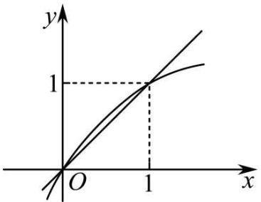
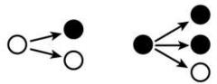
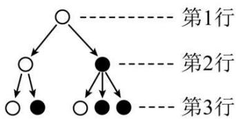
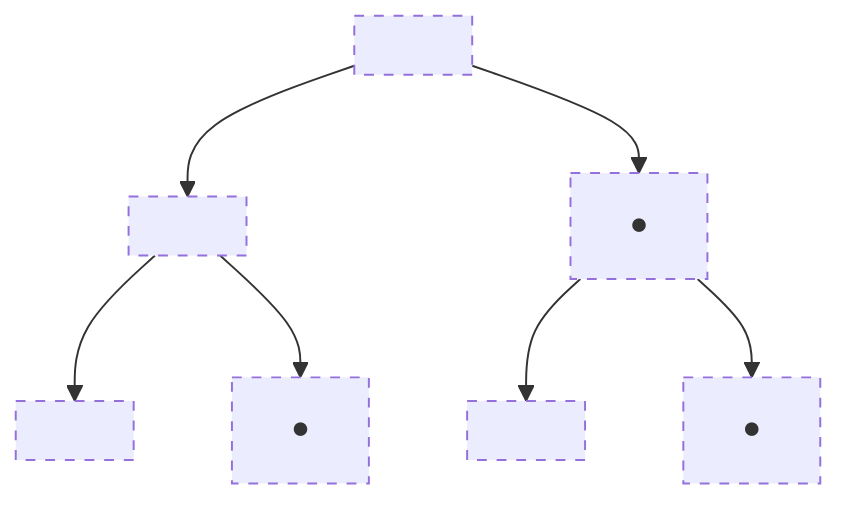
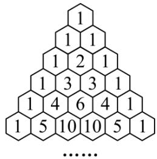
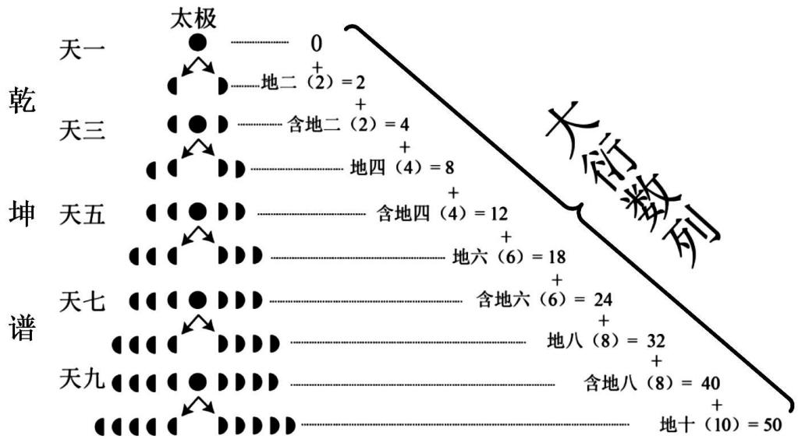
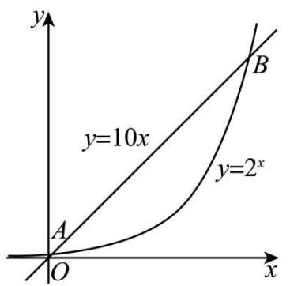

# 知识点一、数列的概念

(1) 数列的定义: 按照一定顺序排列的一列数称为数列, 数列中的每一个数叫做这个数列的项.  
(2) 数列与函数的关系: 从函数观点看, 数列可以看成以正整数集 $\mathbf{N}^{*}$ (或它的有限子集 ${ }^{o}$ $\{1, 2, \cdots, n\}$ ) 为定义域的函数 $a_{n} = f(n)$ 当自变量按照从小到大的顺序依次取值时所对应的一列函数值.  
(3) 数列有三种表示法, 它们分别是列表法、图象法和通项公式法.

# 知识点二、数列的分类

(1) 按照项数有限和无限分:   
(2) 按单调性来分: $\left\{ \begin{array}{l} \text{递增数列: } a_{n+1} \geqslant a_n \\ \text{递减数列: } a_{n+1} \geqslant a_n \\ \text{常数列: } a_{n+1} = a_n = \mathrm{C}(\text{常数}) \\ \text{摆动数列} \end{array} \right.$ ,

# 知识点三、数列的两种常用的表示方法

(1) 通项公式: 如果数列 $\{a_{n}\}$ 的第 $n$ 项与序号 $n$ 之间的关系可以用一个式子来表示, 那么这个公式叫做这个数列的通项公式.  
(2) 递推公式: 如果已知数列 $\{a_{n}\}$ 的第1项 (或前几项), 且从第二项 (或某一项) 开始的任一项与它的前一项 (或前几项) 间的关系可以用一个公式来表示, 那么这个公式就叫做这个数列的递推公式.

# 【解题方法总结】

(1) 若数列 $\{a_{n}\}$ 的前 $n$ 项和为 $\mathrm{S}_n$ ，通项公式为 $a_{n}$ ，则 $a_{n} = \begin{cases} \mathrm{S}_{1}, & n = 1 \\ \mathrm{S}_{n} - \mathrm{S}_{n-1}, & n \geqslant 2, n \in \mathbb{N}^{*} \end{cases}$ 注意：根据 $\mathrm{S}_n$ 求 $a_{n}$ 时，不要忽视对 $n = 1$ 的验证.  
(2) 在数列 $\{a_{n}\}$ 中，若 $a_{n}$ 最大，则 $\left\{ \begin{array}{l} a_{n} \geqslant a_{n-1} \\ a_{n} \geqslant a_{n+1} \end{array} \right.$ ，若 $a_{n}$ 最小，则 $\left\{ \begin{array}{l} a_{n} \leqslant a_{n-1} \\ a_{n} \leqslant a_{n+1} \end{array} \right.$ .

# 必考题型全归纳

# 1 题型一: 数列的周期性

1779 (2024·全国·高三专题练习)在数列 $\{a_{n}\}$ 中, 已知 $a_{n}>0, a_{1}=1, a_{n+2}=\frac{1}{a_{n}+1}$ , 且 $a_{100}=a_{96}$ , 则 $a_{2022}+a_{3}=$ ()

A. $\frac{5}{2}$

B. $\frac{1+\sqrt{5}}{2}$

C. $\frac{\sqrt{5}}{2}$

D. $\frac{-1+\sqrt{5}}{2}$

【答案】C

【解析】由 $a_{n+2}=\frac{1}{a_{n}+1}$ ，可得 $a_{100}=\frac{1}{a_{98}+1}=\frac{1}{\frac{1}{a_{96}+1}+1}$

因为 $a_{100}=a_{96}$ ，所以 $\frac{1}{\frac{1}{a_{96}+1}+1}=a_{96}$ ，整理得 $a_{96}^{2}+a_{96}-1=0$ ，

由于 $a_{n} > 0$ ，解得 $a_{96} = \frac{\sqrt{5} - 1}{2}$ ，从而 $a_{98} = \frac{1}{a_{96} + 1} = \frac{\sqrt{5} - 1}{2}, a_{100} = \frac{1}{a_{98} + 1} = \frac{\sqrt{5} - 1}{2},$

可知 $a_{96}=a_{98}=a_{100}=\cdots=a_{2022}=\frac{\sqrt{5}-1}{2}$ ,

因为 $a_{3}=\frac{1}{a_{1}+1}=\frac{1}{2}$ ，所以 $a_{2022}+a_{3}=\frac{\sqrt{5}}{2}$ .

故选：C.

1780 (2024·全国·高三专题练习)在数列 $\{a_{n}\}$ 中， $a_{1}=7, a_{2}=24$ ，对所有的正整数 n 都有 $a_{n+1}=a_{n}+a_{n+2}$ ，则 $a_{2024}=$ （）

A.-7

B. 24

C. -13

D. 25

【答案】B

【解析】由 $a_{n+1}=a_{n}+a_{n+2}$ 得 $a_{n+2}=a_{n+1}+a_{n+3}$ ,

两式相加得 $a_{n + 3} = -a_n$

$$
\therefore a _ {n + 6} = - a _ {n + 3} = a _ {n},
$$

$\therefore \{a_{n}\}$ 是以6为周期的数列，

而 $2024 = 337 \times 6 + 2$ ,

$$
\therefore a _ {2 0 2 4} = a _ {2} = 2 4.
$$

故选: B.

1781 (2024·江西赣州·高三校联考阶段练习)斐波那契数列 $\{a_{n}\}$ 可以用如下方法定义: $a_{n+2}=a_{n+1}+a_{n}$ ，且 $a_{1}=a_{2}=1$ ，若此数列各项除以 4 的余数依次构成一个新数列 $\{b_{n}\}$ ，则数列 $\{b_{n}\}$ 的第 100 项为（）

A. 0

B. 1

C. 2

D. 3

【答案】D

【解析】由题意有 $a_{n+2}=a_{n+1}+a_{n}$ ，且 $a_{1}=a_{2}=1$ ，

若此数列各项除以4的余数依次构成一个新数列 $\{b_n\}$ ,

则 $b_{1}=1, b_{2}=1, b_{3}=2, b_{4}=3, b_{5}=1, b_{6}=0, b_{7}=1, b_{8}=1, b_{9}=2\ldots$

则数列 $\{b_{n}\}$ 是以 6 为周期的周期数列，

则 $b_{100}=b_{16\times6+4}=b_{4}=3$ ,

则数列 $\{b_n\}$ 的第100项为3，

故选：D.

1782 (2024·全国·高三对口高考)已知数列 $\{a_{n}\}$ 中， $a_{1}=\frac{1}{2},a_{n+1}=1-\frac{1}{a_{n}}(n\geqslant2)$ ，则 $a_{2014}=$ （）

A. $\frac{1}{2}$

B.-1

C. 2

D. 1

【答案】A

【解析】数列 $\{a_{n}\}$ 中， $a_{1}=\frac{1}{2},a_{n+1}=1-\frac{1}{a_{n}}(n\geqslant2)$ ,

可知 $a_2 = 1 - \frac{1}{a_1} = -1, a_3 = 1 - \frac{1}{a_2} = 2, a_4 = 1 - \frac{1}{a_3} = \frac{1}{2} = a_1,$

故数列 $\{a_{n}\}$ 是以 3 为最小正周期的周期数列，

所以 $a_{2014}=a_{671\times3+1}=a_{1}=\frac{1}{2}.$

故选：A

1783 (2024·全国·高三对口高考)设函数 f 定义如下, 数列 $\{x_{n}\}$ 满足 $x_{0}=5$ , 且对任意自然数均有 $x_{n+1}=f(x_{n})$ , 则 $x_{2005}$ 的值为 ()

<table><tr><td>x</td><td>1</td><td>2</td><td>3</td><td>4</td><td>5</td></tr><tr><td></td><td>4</td><td>1</td><td>3</td><td>5</td><td>2</td></tr><tr><td>f(x)</td><td></td><td></td><td></td><td></td><td></td></tr></table>

A. 1

B. 2

C. 4

D. 5

【答案】B

【解析】由对任意自然数均有 $x_{n+1}=f(x_{n})$ ，且 $x_{0}=5$ ，

可得 $x_{1}=f(x_{0})=f(5)=2$ , $x_{2}=f(x_{1})=f(2)=1$ , $x_{3}=f(x_{2})=f(1)=4$ ,

$$
x _ {4} = f \left(x _ {3}\right) = f (4) = 5, x _ {5} = f \left(x _ {4}\right) = f (5) = 2, \dots \dots ,
$$

所以数列 $\{x_{n}\}$ 是4项为周期的周期数列，且前四项分别为2,1,4,5，

所以 $x_{2005}=x_{501\times4+1}=x_{1}=2.$

故选: B.

1784 (2024·安徽合肥·合肥一六八中学校考模拟预测)在数列 $\{a_{n}\}$ 中, 已知 $a_{1}=2, a_{2}=3$ , 当 n $\geqslant2$ 时, $a_{n+1}$ 是 $a_{n} \cdot a_{n-1}$ 的个位数, 则 $a_{2023}=$ ()

A. 4

B. 3

C. 2

D. 1

【答案】C

【解析】因为 $a_{1}=2, a_{2}=3$ ，当 $n \geqslant 2$ 时， $a_{n+1}$ 是 $a_{n} \cdot a_{n-1}$ 的个位数，

所以 $a_{3}=6, a_{4}=8, a_{5}=8, a_{6}=4, a_{7}=2, a_{8}=8, a_{9}=6, a_{10}=8, a_{11}=8, a_{12}=4,$

可知数列 $\{a_{n}\}$ 中,从第3项开始有 $a_{n+6}=a_{n}$ ,

即当 $n \geqslant 3$ 时, $a_{n}$ 的值以6为周期呈周期性变化,

又 $2023 \div 6 = 337 \ldots 1$

故 $a_{2023}=a_{1}=2.$

故选：C.

1785 (2024·北京通州·统考三模)数列 $\{a_{n}\}$ 中， $a_{1}=2, a_{2}=4, a_{n-1}a_{n+1}=a_{n}(n\geqslant2)$ ，则 $a_{2023}=$ （）

A. $\frac{1}{4}$

B. $\frac{1}{2}$

C. 2

D. 4

【答案】C

【解析】因为 $a_{1}=2, a_{2}=4, a_{n-1}a_{n+1}=a_{n}(n\geqslant2)$ ，令 n=2，则 $a_{1}a_{3}=a_{2}$ ，求得 $a_{3}=2$ ，

令 n=3，则 $a_{2}a_{4}=a_{3}$ ，求得 $a_{4}=\frac{1}{2}$ ，令 n=4，则 $a_{3}a_{5}=a_{4}$ ，求得 $a_{5}=\frac{1}{4}$ ，

令 n=5，则 $a_{4}a_{6}=a_{5}$ ，求得 $a_{6}=\frac{1}{2}$ ，令 n=6，则 $a_{5}a_{7}=a_{6}$ ，求得 $a_{7}=2$ ，

令 n=7，则 $a_{6}a_{8}=a_{7}$ ，求得 $a_{8}=4,\cdots\cdots$

所以数列 $\{a_{n}\}$ 的周期为 6，则 $a_{2023}=a_{1}=2$ .

故选：C

【解题方法总结】

解决数列周期性问题的方法

先根据已知条件求出数列的前几项,确定数列的周期,再根据周期性求值.

# 2 题型二:数列的单调性

1786 (2024·北京密云·统考三模)设数列 $\{a_{n}\}$ 的前 n 项和为 $S_{n}$ ，则“对任意 $n \in N^{*}, a_{n} > 0$ ”是“数列 $\{S_{n}\}$ 为递增数列”的（）

A. 充分不必要条件

B. 必要不充分条件

# C. 充分必要条件

# D. 既不是充分也不是必要条件

【答案】A

【解析】数列 $\{a_{n}\}$ 中, 对任意 $n \in N^{*}, a_{n} > 0$ ,

则 $S_{n}=S_{n-1}+a_{n}>S_{n-1},n\geqslant2,$

所以数列 $\{\mathrm{S}_n\}$ 为递增数列，充分性成立；

当数列 $\{S_{n}\}$ 为递增数列时, $S_{n} > S_{n-1}, n \geqslant 2$ ,

即 $S_{n-1} + a_{n} > S_{n-1}$ ，所以 $a_{n} > 0, n \geqslant 2$ ，

如数列 $-1,2,2,2,\cdots$ ，不满足题意，必要性不成立；

所以“对任意 $n \in N^{*}, a_{n} > 0$ ”是“数列 $\{S_{n}\}$ 为递增数列”的充分不必要条件.

故选：A

1787 (2024·全国·高三专题练习)已知数列 $\{a_{n}\}$ 满足 $a_{1}=a>0, a_{n+1}=-a_{n}^{2}+ta_{n}(n\in\mathbb{N}^{*})$ ，若存在实数 t，使 $\{a_{n}\}$ 单调递增，则 a 的取值范围是（）

A. $(0,1)$

B. $(1,2)$

C. $(2,3)$

D. $(3,4)$

【答案】A

【解析】由 $\{a_{n}\}$ 单调递增, 得 $a_{n+1} = -a_{n}^{2} + ta_{n} > a_{n}$ ,

由 $a_{1}=a>0$ , 得 $a_{n}>0$ ,

$$
\therefore t > a _ {n} + 1 (n \in \mathrm{N} ^ {*}).
$$

$n = 1$ 时, 得 $t > a + 1$ ①,

n=2 时, 得 $t > -a^{2} + ta + 1$ , 即 $(a-1)t < (a+1)(a-1)$ ②,

若 a=1, ②式不成立, 不合题意;

若 a > 1, ②式等价为 $t < a + 1$ , 与①式矛盾, 不合题意.

综上,排除B,C,D.

故选：A

1788 (2024·全国·高三专题练习)已知数列 $\{a_{n}\}$ 满足 $\frac{a_{1}}{2} + \frac{a_{2}}{2^{2}} + \cdots + \frac{a_{n}}{2^{n}} = n (n \in \mathbb{N}^{*})$ , $b_{n} = \lambda (a_{n} - 1) - n^{2} + 4n$ , 若数列 $\{b_{n}\}$ 为单调递增数列, 则 $\lambda$ 的取值范围是 ( )

A. $\left(\frac{3}{8},+\infty\right)$

B. $\left(\frac{1}{2},+\infty\right)$

C. $\left[\frac{3}{8},+\infty\right)$

D. $\left[\frac{1}{2},+\infty\right)$

【答案】A

【解析】由 $\frac{a_{1}}{2} + \frac{a_{2}}{2^{2}} + \cdots + \frac{a_{n}}{2^{n}} = n (n \in \mathbb{N}^{*})$ 可得 $\frac{a_{1}}{2} + \frac{a_{2}}{2^{2}} + \cdots + \frac{a_{n-1}}{2^{n-1}} = n - 1 (n \geqslant 2)$ ,

两式相减可得 $\frac{a_n}{2^n} = 1$ ，则 $a_{n} = 2^{n}, n \geqslant 2$

当 n=1 时， $\frac{a_{1}}{2}=1$ 可得 $a_{1}=2$ 满足上式，故 $a_{n}=2^{n}(n\in\mathbb{N}^{*})$

所以 $b_{n}=\lambda(2^{n}-1)-n^{2}+4n$ ,

因数列 $\{b_{n}\}$ 为单调递增数列, 即 $\forall n \in N^{*}, b_{n+1} - b_{n} > 0$ ,

则 $\lambda (2^{n + 1} - 1) - (n + 1)^2 +4(n + 1) - [\lambda (2^n -1) - n^2 +4n] = \lambda \cdot 2^n -2n + 3 > 0.$

整理得 $\lambda >\frac{2n - 3}{2^n}$

令 $c_{n} = \frac{2n - 3}{2^{n}}$ ，则 $c_{n + 1} - c_n = \frac{2n - 1}{2^{n + 1}} -\frac{2n - 3}{2^n} = \frac{5 - 2n}{2^{n + 1}},n\in \mathbb{N}^*$

当 $n \leqslant 2$ 时， $c_{n+1} > c_n$ ，当 $n \geqslant 3$ 时， $c_{n+1} < c_n$

于是得 $c_{3} = \frac{3}{8}$ 是数列 $\{c_n\}$ 的最大项，即当 $n = 3$ 时， $\frac{2n - 3}{2^n}$ 取得最大值 $\frac{3}{8}$ ，从而得 $\lambda > \frac{3}{8}$ ，

所以 $\lambda$ 的取值范围为 $\left\{\lambda\mid\lambda>\frac{3}{8}\right\}$ .

故选：A

1789 (2024·天津武清·高三天津市武清区杨村第一中学校考开学考试)数列 $\{a_{n}\}$ 的通项公式为 $a_{n}=kn^{2}+n+1$ ，则“ $k>-\frac{1}{3}$ ”是“ $\{a_{n}\}$ 为递增数列”的（）

A. 充分不必要条件

B. 必要不充分条件

C. 既不充分也不必要条件

D. 充要条件

【答案】B

【解析】由题意得数列 $\{a_{n}\}$ 为递增数列等价于对任意 $n \in N^{*}, a_{n+1} - a_{n} = [k(n+1)^{2} + n+2] - (kn^{2} + n+1) = 2kn + k + 1 > 0$ 恒成立，

即 $k > -\frac{1}{2n+1}$ 对任意 $n \in N^{*}$ 恒成立，

因为 $-\frac{1}{2n+1}<0$ , 且可以无限接近于 0 , 所以 $k \geqslant 0$

所以“ $k > -\frac{1}{3}$ ”是“ $\{a_{n}\}$ 为递增数列”的必要不充分条件，

故选：B

1790 (2024·全国·高三专题练习)已知数列 $\{a_{n}\}$ 的通项公式为 $a_{n}=n^{2}-3\lambda n$ ，则“ $\lambda<1$ ”是“数列 $\{a_{n}\}$ 为递增数列”的（）

A. 充分不必要条件

B. 必要不充分条件

C. 充要条件

D. 既不充分也不必要条件

【答案】C

【解析】若数列 $\{a_{n}\}$ 为递增数列，

则 $a_{n + 1} - a_n = [(n + 1)^2 -3\lambda (n + 1)] - (n^2 -3\lambda n)$

$$
= \left[ n ^ {2} + 2 n + 1 - 3 n \lambda - 3 \lambda \right] - (n ^ {2} - 3 \lambda n)
$$

$$
= 2 n + 1 - 3 \lambda > 0,
$$

即 $3\lambda < 2n + 1$

由 $n \in \mathbb{N}^*$ , 所以有 $3\lambda < 2 \times 1 + 1 = 3 \Leftrightarrow \lambda < 1$ ,

反之，当 $\lambda < 1$ 时， $a_{n + 1} - a_n > 0$ ，则数列 $\{a_n\}$ 为递增数列，

所以“ $\lambda < 1$ ”是“数列 $\{a_{n}\}$ 为递增数列”的充要条件，

故选：C.

1791 (2024·江苏南通·高三期末)已知数列 $\{a_{n}\}$ 是递增数列，且 $a_{n}=\left\{\begin{aligned}(3-t)n-8, & n\leqslant6\\ t^{n-6}, & n>6\end{aligned}\right.$ ，则实数 t 的取值范围是（）

A. (2,3)

B. $[2,3)$

C. $\left(\frac{10}{7},3\right)$

D. $(1,3)$

【答案】C

【解析】因为 $a_{n}=\left\{\begin{aligned}(3-t)n-8,&n\leqslant6\\ t^{n-6},&n>6\end{aligned}\right.$ ， $\{a_{n}\}$ 是递增数列，

所以 $\left\{\begin{aligned}3-t&>0\\ t&>1\\ (3-t)&\times6-8<t\end{aligned}\right.$ ，解得 $\frac{10}{7}<t<3$ ，

所以实数 t 的取值范围为 $\left(\frac{10}{7},3\right)$ ,

故选：C

1792 (2024·全国·高三专题练习)已知数列 $\{a_{n}\}$ 满足 $a_{n+1}=\log_{2}(a_{n}+1)$ ，若 $\{a_{n}\}$ 是递增数列，则 $a_{1}$ 的取值范围是（）

A. $(0,1)$

B. $(0,\sqrt{2})$

C. $(-1,0)$

D. $(1,+\infty)$

【答案】A

【解析】因为 $\{a_{n}\}$ 是递增数列, 所以 $a_{n}<a_{n+1}$ , 即 $a_{n}<\log_{2}(a_{n}+1)$ .

如图所示,作出函数 y = x 和 $y = \log_{2}(x + 1)$ 的图象,

由图可知, 当 $x \in (0,1)$ 时, $x < \log_{2}(x+1)$ , 且 $\log_{2}(x+1) \in (0,1)$ .

故当 $a_1 \in (0,1)$ 时， $a_1 < \log_2(a_1 + 1) = a_2$ ，且 $a_2 \in (0,1)$ ，

依此类推可得 $a_{1}<a_{2}<a_{3}<\cdots$ ,

满足 $\{a_{n}\}$ 是递增数列，即 $a_1$ 的取值范围是(0,1).

text_image

y
1
O
1
x

故选:A.

1793 (2024·甘肃张掖·高台县第一中学校考模拟预测)已知数列 $\{a_{n}\}$ 为递减数列, 其前 n 项和 $S_{n} = -n^{2} + 2n + m$ , 则实数 m 的取值范围是().

A. $(-2,+\infty)$

B. $(-∞,-2)$

C. $(2,+\infty)$

D. $(-∞,2)$

【答案】A

【解析】因为 $a_{n+1}-a_{n}<0$ ，所以数列 $\{a_{n}\}$ 为递减数列，

当 $n \geqslant 2$ 时， $a_{n} = S_{n} - S_{n-1} = -n^{2} + 2n + m - [-(n-1)^{2} + 2(n-1) + m] = -2n + 3,$

故可知当 $n \geqslant 2$ 时， $\{a_n\}$ 单调递减，

故 $\{a_{n}\}$ 为递减数列，只需满足 $a_2 < a_1$ ，即 $-1 < 1 + m \Rightarrow m > -2.$

故选：A

【解题方法总结】

解决数列的单调性问题的3种方法

<table><tr><td>作差比较法</td><td>根据 $a_{n+1}-a_n$ 的符号判断数列 $\{a_n\}$ 是递增数列、递减数列或是常数列</td></tr><tr><td>作商比较法</td><td>根据 $\frac{a_{n+1}}{a_n}(a_n>0 \text{或 } a_n<0)$ 与1的大小关系进行判断</td></tr><tr><td>数形结合法</td><td>结合相应函数的图象直观判断</td></tr></table>

# 3 题型三:数列的最大(小)项

1794 (2024·湖南邵阳·邵阳市第二中学校考模拟预测)数列 $\{2n-1\}$ 和数列 $\{3n-2\}$ 的公共项从小到大构成一个新数列 $\{a_{n}\}$ ，数列 $\{b_{n}\}$ 满足： $b_{n}=\frac{a_{n}}{2^{n}}$ ，则数列 $\{b_{n}\}$ 的最大项等于 \_\_\_\_.

【答案】 $\frac{7}{4} / 1.75$

【解析】数列 $\{2n - 1\}$ 和数列 $\{3n - 2\}$ 的公共项从小到大构成一个新数列为：

1,7,13,…,该数列为首项为1,公差为6的等差数列，

所以 $a_{n}=6n-5$ ,

所以 $b_{n} = \frac{6n - 5}{2^{n}}$

因为 $b_{n + 1} - b_n = \frac{6n + 1}{2^{n + 1}} -\frac{6n - 5}{2^n} = \frac{11 - 6n}{2^{n + 1}}$

所以当 $n \geqslant 2$ 时， $b_{n+1} - b_n < 0$ ，即 $b_2 > b_3 > b_4 > \cdots$

又 $b_{1}<b_{2}$ ,

所以数列 $\{b_n\}$ 的最大项为第二项, 其值为 $\frac{7}{4}$ .

故答案为: $\frac{7}{4}$ .

1795 (2024·全国·高三专题练习)记 $S_{n}$ 为数列 $\{a_{n}\}$ 的前 n 项和, 若 $a_{n}=2^{n-1}$ , 则 $(n^{2}-3n)\cdot\log_{2}(S_{n}+1)$ 的最小值为 \_\_\_\_.

【答案】-4

【解析】依题意,数列 $\{a_{n}\}$ 是首项为 1, 公比为 2 的等比数列, 则 $S_{n}=\frac{1-2^{n}}{1-2}=2^{n}-1$ , 于是 $(n^{2}-3n)\cdot\log_{2}(S_{n}+1)=n^{3}-3n^{2}$ , 令 $b_{n}=n^{3}-3n^{2}$ ,

则有 $b_{n + 1} - b_n = (n + 1)^3 -3(n + 1)^2 -(n^3 -3n^2) = 3n^2 -3n - 2,$

显然当 $n \geqslant 2$ 时， $3n^2 - 3n - 2 > 0$ ，即 $b_{n+1} > b_n$ ，因此当 $n \geqslant 2$ 时，数列 $\{b_n\}$ 是递增的，又 $b_1 = -2, b_2 = -4$ ，所以 $(n^2 - 3n) \cdot \log_2(S_n + 1)$ 的最小值为 $-4$ .

故答案为: -4

1796 (2024·全国·高三专题练习)已知数列 $\{a_{n}\}$ 满足 $a_{1}=18, a_{n+1}-a_{n}=3n$ ，则 $\frac{a_{n}}{n}$ 的最小值为 \_\_\_\_

【答案】9

【解析】由已知可得, $a_{n+1}=a_{n}+3n$ ,

所以当 $n \geqslant 2$ 时，有 $a_{n} = a_{n - 1} + 3(n - 1)$ .

则有

$$
a _ {1} = 1 8,
$$

$$
a _ {2} = a _ {1} + 3 \times 1,
$$

$$
a _ {3} = a _ {2} + 3 \times 2,
$$

$$
\dots
$$

$$
a _ {n} = a _ {n - 1} + 3 (n - 1),
$$

两边分别相加可得， $a_{1}+a_{2}+a_{3}+\cdots+a_{n}=a_{1}+a_{2}+\cdots+a_{n-1}+18+3\times1+3\times2+\cdots$

$$
+ 3 (n - 1) = a _ {1} + a _ {2} + \dots + a _ {n - 1} + 1 8 + \frac {(n - 1) (3 + 3 n - 3)}{2} = a _ {1} + a _ {2} + \dots + a _ {n - 1} + \frac {3 n (n - 1)}{2}
$$

$$
+ 1 8,
$$

所以 $a_{n} = \frac{3n(n - 1)}{2} + 18.$

当 n=1 时， $a_{1}=18$ 满足条件.

所以， $a_{n} = \frac{3n(n - 1)}{2} + 18,$

所以 $\frac{a_n}{n} = \frac{3(n - 1)}{2} +\frac{18}{n} = \frac{3n}{2} +\frac{18}{n} -\frac{3}{2}.$

设 $f(x)=\frac{3x}{2}+\frac{18}{x}-\frac{3}{2},$

根据对勾函数的性质可知, 当 $0 < x < 2\sqrt{3}$ 时, $f(x)$ 单调递减; 当 $x > 2\sqrt{3}$ 时, $f(x)$ 单调递增.

又 $f(3)=\frac{3\times3}{2}+\frac{18}{3}-\frac{3}{2}=9,f(4)=\frac{3\times4}{2}+\frac{18}{4}-\frac{3}{2}=9,$

所以, 当 n=3 或 n=4 时, $\frac{a_{n}}{n}$ 有最小值为 9.

故答案为: 9.

1797 (2024·全国·高三专题练习)已知正项数列 $\{a_{n}\}$ 满足 $a_{1}=1, a_{2}=64, a_{n}a_{n+2}=ka_{n+1}^{2}$ ，若 $a_{5}$ 是 $\{a_{n}\}$ 唯一的最大项，则 k 的取值范围为 \_\_\_\_.

【答案】 $\left(\frac{1}{4},\frac{\sqrt{2}}{4}\right)$

【解析】因为 $a_{n}a_{n+2}=ka_{n+1}^{2}$ ，所以 $\frac{a_{n+2}}{a_{n+1}}=k\frac{a_{n+1}}{a_{n}}$ ，又 $a_{1}=1, a_{2}=64$ ，

所以 $\left\{\frac{a_{n+1}}{a_{n}}\right\}$ 是首项为 64，公比为 k 的等比数列，则 $\frac{a_{n+1}}{a_{n}} = 64k^{n-1} = 2^{6}k^{n-1}$

则 $a_{n} = \frac{a_{n}}{a_{n - 1}}\cdot \frac{a_{n - 1}}{a_{n - 2}}\dots \frac{a_{2}}{a_{1}}\cdot a_{1} = 2^{6}k^{n - 2}\cdot 2^{6}k^{n - 3}\dots \cdot 2^{6}k^{0}\cdot 1 = 2^{6n - 6}k^{\frac{(n - 2)(n - 1)}{2}},$

因为 $a_{5}$ 是 $\{a_{n}\}$ 唯一的最大项, 所以 $\left\{\begin{aligned}a_{5}&>a_{6}\\ a_{5}&>a_{4}\end{aligned}\right.$ , 即 $\left\{\begin{aligned}2^{24}k^{6}&>2^{30}k^{10}\\ 2^{24}k^{6}&>2^{18}k^{3}\end{aligned}\right.$ , 解得 $\frac{1}{4}<k<\frac{\sqrt{2}}{4}$ ,

即 k 的取值范围为 $\left(\frac{1}{4}, \frac{\sqrt{2}}{4}\right)$ .

故答案为: $\left(\frac{1}{4},\frac{\sqrt{2}}{4}\right)$ .

1798 (2024·高三课时练习)数列 $\{a_{n}\}$ 的通项公式为 $a_{n}=\left\{\begin{aligned}&2^{n}-1,n\leqslant4,\\&-n^{2}+(a-1)n,n\geqslant5,\end{aligned}\right.$ 若 $a_{5}$ 是 $\{a_{n}\}$ 中的最大项，则 a 的取值范围是 \_\_\_\_.

【答案】[9,12]

【解析】当 $n \leqslant 4$ 时， $a_{n} = 2^{n} - 1$ 单调递增，

因此 n=4 时, 取得最大值为 $a_{4}=15$ ,

当 $n \geqslant 5$ 时， $a_n = -n^2 + (a - 1)n = -\left(n - \frac{a - 1}{2}\right)^2 + \frac{(a - 1)^2}{4}$ ，

因为 $a_5$ 是 $\{a_n\}$ 中的最大项，

所以 $\left\{\begin{aligned}\frac{a-1}{2}&\leqslant5.5\\ -25+5(a-1)&\geqslant15\end{aligned}\right.$ 解得 $9\leqslant a\leqslant12$ ,

故答案为: [9,12].

1799 (2024·北京·高三北京八中校考阶段练习)数列 $\{a_{n}\}$ 中， $a_{n}=-n^{2}+11n(n\in\mathbb{N}^{*})$ ，则此数

列最大项的值是 \_\_\_\_.

【答案】30

【解析】设 $f(n) = -n^{2} + 11n$ ，则该数列当 $n = \frac{11}{2}$ 时， $f(n)$ 取最大值，

又因为 $a_{n}=-n^{2}+11n(n\in\mathbb{N}^{*})$ ，而 $5<\frac{11}{2}<6$ ，

故当 n=5 或 n=6 时, 此数列取最大项, 其值为 $a_{5}=30$ , $a_{6}=30$ ,

故此数列最大项的值是: 30

故答案为: 30

1800 (2024·全国·高三专题练习)已知 $a_{n} = n^{2} - tn + 2022(n \in \mathbb{N}_{+}, t \in \mathbb{R})$ ，若数列 $\{a_{n}\}$ 中最小项为第3项，则 $t \in \_$ .

【答案】(5,7)

【解析】因为 $f(x)=x^{2}-tx+2020$ 开口向上, 对称轴为 $x=\frac{t}{2}$ ,

则由题意知 $\frac{5}{2} < \frac{t}{2} < \frac{7}{2}$ ,

所以 $t \in (5,7)$ .

故答案为:(5,7).

1801 (2024·全国·高三专题练习)已知数列 $\{a_{n}\}$ 的通项公式为 $a_{n}=n-\sqrt{n^{2}+2}$ ，则 $a_{n}$ 的最小值为 \_\_\_\_.

【答案】 $1-\sqrt{3}/-\sqrt{3}+1$

【解析】因为 $a_{n}=n-\sqrt{n^{2}+2}=\frac{(n-\sqrt{n^{2}+2})(n+\sqrt{n^{2}+2})}{n+\sqrt{n^{2}+2}}=-\frac{2}{n+\sqrt{n^{2}+2}}$

易知数列 $\{a_{n}\}$ 为递增数列，

所以数列 $\{a_{n}\}$ 的最小项为 $a_1$ ，即最小值为 $1 - \sqrt{3}$

故答案为: $1-\sqrt{3}$

【解题方法总结】

求数列的最大项与最小项的常用方法

(1) 将数列视为函数 $f(x)$ 当 $x \in N^{*}$ 时所对应的一列函数值, 根据 $f(x)$ 的类型作出相应的函数图象, 或利用求函数最值的方法, 求出 $f(x)$ 的最值, 进而求出数列的最大 (小) 项.

(2) 通过通项公式 $a_{n}$ 研究数列的单调性, 利用 $\left\{ \begin{array}{l} a_{n} \geqslant a_{n-1}, \\ a_{n} \geqslant a_{n+1} \end{array} \right.$ , $(n \geqslant 2)$ 确定最大项, 利用 $\left\{ \begin{array}{l} a_{n} \leqslant a_{n-1}, \\ a_{n} \leqslant a_{n+1} \end{array} \right.$ , $(n \geqslant 2)$ 确定最小项.

(3) 比较法: 若有 $a_{n+1}-a_{n}=f(n+1)-f(n)>0$ 或 $a_{n}^{\circ}>0$ 时 $\frac{a_{n+1}^{\circ}}{a_{n}}>1$ ，则 $a_{n+1}>a_{n}$ ，则数列 $\{a_{n}\}$ 是递增数列，所以数列 $\{a_{n}\}$ 的最小项为 $a_{1}=f(1)$ ; 若有 $a_{n+1}-a_{n}=f(n+1)-f(n)<0$ 或 $a_{n}^{\circ}>0$ 时 $\frac{a_{n+1}^{\circ}}{a_{n}}<1$ ，则 $a_{n+1}<a_{n}$ ，则数列 $\{a_{n}\}$ 是递减数列，所以数列 $\{a_{n}\}$ 的最大项为 $a_{1}=f(1)$ .

# 4 题型四:数列中的规律问题

1802 (2024·全国·高三专题练习)分形几何学是一门以不规则几何形态为研究对象的几何学, 它的研究对象普遍存在于自然界中, 因此又被称为“大自然的几何学”。按照如图1所示的分形规律, 可得如图2所示的一个树形图。若记图2中第 $n$ 行黑圈的个数为 $a_{n}$ , 则 $a_{7} =$

( )

  
图1

flowchart

图2

A. 110

B. 128

C. 144

D. 89

【解析】已知 $a_{n}$ 表示第 n 行中的黑圈个数, 设 $b_{n}$ 表示第 n 行中的白圈个数,

则由于每个白圈产生下一行的一个白圈和一个黑圈,一个黑圈产生下一行的一个白圈和2个黑圈,

所以 $a_{n+1}=2a_{n}+b_{n}, b_{n+1}=a_{n}+b_{n}$ ,

又因为 $a_{1}=0, b_{1}=1$ ,

所以 $a_{2}=1, b_{2}=1;$

$$
a _ {3} = 2 \times 1 + 1 = 3, b _ {3} = 1 + 1 = 2;
$$

$$
a _ {4} = 2 \times 3 + 2 = 8, b _ {4} = 3 + 2 = 5;
$$

$$
a _ {5} = 2 \times 8 + 5 = 2 1, b _ {5} = 8 + 5 = 1 3;
$$

$$
a _ {6} = 2 \times 2 1 + 1 3 = 5 5, b _ {6} = 2 1 + 1 3 = 3 4;
$$

$$
a _ {7} = 2 \times 5 5 + 3 4 = 1 4 4.
$$

故选：C.

1803 (2024·云南保山·统考二模)我国南宋数学家杨辉126l年所著的《详解九章算法》一书里出现了如图所示的表,即杨辉三角,这是数学史上的一个伟大成就.杨辉三角也可以看做是二项式系数在三角形中的一种几何排列,若去除所有为1的项,其余各项依次构成数列2,3,3,4,6,4,5,10,10,5,…,则此数列的第56项为()

text_image

1
1 1
1 2 1
1 3 3 1
1 4 6 4 1
1 5 10 10 5 1
......

A. 11

B. 12

C. 13

D. 14

【解析】由题意可知:若去除所有的为1的项,则剩下的每一行的个数为1,2,3,4,…,可以看成构成一个首项为1,公差为1的等差数列,则 $T_{n}=\frac{n(n+1)}{2}$ ,

可得当 n=10，所有项的个数和为 55，第 56 项为 12，

故选: B.

1804 (2024·全国·高三专题练习)古希腊毕达哥拉斯学派的数学家研究过各种多边形数. 如三角形数 1, 3, 6, 10, 第 n 个三角形数为 $\frac{n(n+1)}{2} = \frac{1}{2}n^{2} + \frac{1}{2}n$ . 记第 n 个 k 边形数为

$N(n,k)(k\geqslant3)$ ，以下列出了部分k边形数中第n个数的表达式：三角形数： $N(n,3)=\frac{1}{2}n^{2}+\frac{1}{2}n$ ；正方形数： $N(n,4)=n^{2}$ ；五边形数： $N(n,5)=\frac{3}{2}n^{2}-\frac{1}{2}n$ ；六边形数： $N(n,6)=2n^{2}$

-n, 可以推测 $\mathrm{N}(n,k)$ 的表达式, 由此计算 $\mathrm{N}(20,23)=$ ()

A. 4020

B. 4010

C. 4210

D. 4120

【解析】由题意可得: $N(n,3)=\frac{1}{2}n^{2}+\frac{1}{2}n$ , $N(n,4)=\frac{2}{2}n^{2}+\frac{0}{2}n$ ,

$$
\mathrm{N} (n, 5) = \frac {3}{2} n ^ {2} - \frac {1}{2} n, \mathrm{N} (n, 6) = \frac {4}{2} n ^ {2} - \frac {2}{2} n.
$$

由此可归纳 $\mathrm{N}(n,k) = \frac{k - 2}{2} n^2 +\frac{4 - k}{2} n,$

所以 $N(20,23)=\frac{23-2}{2}\times20^{2}+\frac{4-23}{2}\times20=4010$ ,

故选：B.

1805 (2024·全国·高三专题练习)古希腊科学家毕达哥拉斯对“形数”进行了深入的研究,若一定数目的点或圆在等距离的排列下可以形成一个等边三角形,则这样的数称为三角形数,如1,3,6,10,15,21,…这些数量的点都可以排成等边三角形,∴都是三角形数,把三角形数按照由小到大的顺序排成的数列叫做三角数列 $\{a_{n}\}$ 类似地,数1,4,9,16,…叫做正方形数,则在三角数列 $\{a_{n}\}$ 中,第二个正方形数是()

A. 28

B. 36

C. 45

D. 55

【解析】由题意可得,三角数列 $\{a_{n}\}$ 的通项为 $a_{n}=\frac{n(n+1)}{2}$ ,

则三角数列的前若干项为 1, 3, 6, 10, 15, 21, 28, 36, 45, 55, …,

设正方形数按由小到大的顺序排成的数列为 $\{b_{n}\}$ ，则 $b_{n}=n^{2}$ ，

其前若干项为 1, 4, 9, 16, 25, 36, 49, …,

∴ 在三角数列 $\{a_{n}\}$ 中, 第二个正方形数是 36.

故选: B.

1806 (2024·全国·高三专题练习)早在3000年前,中华民族的祖先就已经开始用数字来表达这个世界. 在《乾坤谱》中,作者对易传“大衍之数五十”进行了一系列推论,用来解释中国传统文化中的太极衍生原理,如图. 该数列从第一项起依次是0,2,4,8,12,18,24,32,40,50,60,72,…,若记该数列为 $\{a_{n}\}$ ,则 $a_{2021}-a_{2020}=$ ( )

line

| 地代 | 数值 |
| ---- | ---- |
| 太极 | 0 |
| 地二 | 2 |
| 含地二 | 4 |
| 地四 | 8 |
| 含地四 | 12 |
| 地六 | 18 |
| 含地六 | 24 |
| 地八 | 32 |
| 含地八 | 40 |
| 地十 | 50 |

A. 2018

B. 2020

C. 2022

D. 2024

【解析】由题设中的数据可知数列 $\left\{a_{n}\right\}$ 满足： $a_{2n}-a_{2n-1}=2n, a_{2n+1}-a_{2n}=2n,$

故 $a_{2021}-a_{2020}=2\times1010=2020,$

故选：B.

1807 (2024·全国·高三专题练习)观察下列各式：

$$
a + b = 1;
$$

$$
a ^ {2} + b ^ {2} = 3;
$$

$$
a ^ {3} + b ^ {3} = 4;
$$

$$
a ^ {4} + b ^ {4} = 7;
$$

$$
a ^ {5} + b ^ {5} = 1 1;
$$

...

则 $a^{10} + b^{10} =$ （

A. 28

B. 76

C. 123

D. 10

【解析】设 $a^n + b^n = f(n)$ ，则

$$
f (3) = f (1) + f (2) = 4, f (4) = f (2) + f (3) = 7, f (5) = f (3) + f (4) = 1 1, \dots
$$

通过观察不难发现: $f(n)=f(n-1)+f(n-2)$ , 从而

$$
f (6) = f (4) + f (5) = 1 8, f (7) = f (5) + f (6) = 2 9, f (8) = f (6) + f (7) = 4 7,
$$

$$
f (9) = f (7) + f (8) = 7 6, f (1 0) = f (8) + f (9) = 1 2 3,
$$

故 $a^{10}+b^{10}=123$ ,

故选：C.

1808 (2024·全国·高三专题练习)古希腊科学家毕达哥拉斯对“形数”进行了深入的研究,若一定数目的点或圆在等距离的排列下可以形成一个等边三角形,则这样的数称为三角形数,如1,3,6,10,15,21,…这些数量的点都可以排成等边三角形,∴都是三角形数,把三角形数按照由小到大的顺序排成的数列叫做三角数列 $\{a_{n}\}$ .类似地,数1,4,9,16,…叫做正方形数,则在三角数列 $\{a_{n}\}$ 中,第二个正方形数是()

A. 36

B. 25

C. 49

D. 64

【解析】由题意可得,三角数列 $\{a_{n}\}$ 的通项为 $a_{n}=\frac{n(n+1)}{2}$ , 则三角数列的前若干项为 1, 3, 6, 10, 15, 21, 28, 36, 45, 55, …,

设正方形数按由小到大的顺序排成的数列为 $\{b_{n}\}$ ，则 $b_{n}=n^{2}$ ，其前若干项为 1, 4, 9, 16, 25, 36, 49, …，

∴ 在三角数列 $\{a_{n}\}$ 中, 第二个正方形数是 36.

故选：A.

【解题方法总结】

特殊值法、列举法找规律

# 5 题型五:数列的恒成立问题

1809 (2024·全国·高三专题练习)已知数列 $\{a_{n}\}$ 的通项公式 $a_{n}=10n-2^{n}$ ，前 n 项和是 $S_{n}$ ，对于 $\forall n\in N^{*}$ ，都有 $S_{n}\leqslant S_{k}$ ，则 k= \_\_\_\_.

【答案】5

【解析】

text_image

y
y=10x
y=2^x
A
O
x
B

如图,为 y=10x 和 $y=2^{x}$ 的图象,设两个交点为 A, B,

因为 $a_{1}=10-2=8>0$ ，所以 $0<x_{A}<1$ ，

因为 $a_{5}=50-32=18>0$ , $a_{6}=60-64=-4<0$ , 所以 $5<x_{B}<6$ ,

结合图象可得, 当 $n \in [1,5]$ 时, $10n > 2^{n}$ , 即 $a_{n} > 0$ ,

当 $n \in [6, +\infty)$ 时， $10n < 2^n$ ，即 $a_n < 0$ ，所以当 $n = 5$ 时， $\mathrm{S}_n$ 取得最大值，即 $k = 5$ 。

故答案为: 5.

1810 (2024·全国·高三专题练习)已知数列 $\{a_{n}\}$ 满足 $a_{n}=\frac{1}{n}+\frac{1}{n+1}+\cdots+\frac{1}{2n}$ ，若 $k\geqslant a_{n}$ 恒成立，则实数 k 的最小值为 \_\_\_\_.

【答案】 $\frac{3}{2} / 1.5$

【解析】 $\because a_{n+1}-a_{n}=\frac{1}{2n+1}+\frac{1}{2n+2}-\frac{1}{n}=\frac{1}{2n+1}+\frac{1}{2n+2}-\frac{2}{2n}<0,$

∴ 数列 $\{a_{n}\}$ 为单调递减数列， $(a_{n})_{\max}=a_{1}=\frac{3}{2}$ . 从而 $k\geqslant(a_{n})_{\max}=\frac{3}{2}$ ,

即 k 的最小值为 $\frac{3}{2}$ .

故答案为: $\frac{3}{2}$

1811 (2024·河南郑州·高三校联考阶段练习)数列 $\{a_{n}\}$ 满足 $a_{n}-a_{n-1}=\frac{1}{n(n+1)}(n\geqslant2,$ 且 $n\in N^{*})$ , $a_{1}=2$ , 对于任意 $n\in N^{*}$ 有 $\lambda>a_{n}$ 恒成立, 则 $\lambda$ 的取值范围是 \_\_\_\_.

【答案】 $\left[\frac{5}{2},+\infty\right)$

【解析】 $\because a_{n}-a_{n-1}=\frac{1}{n(n+1)}$

$$
\therefore a _ {2} - a _ {1} = \frac {1}{2 \times 3} = \frac {1}{2} - \frac {1}{3}
$$

$$
a _ {3} - a _ {2} = \frac {1}{3 \times 4} = \frac {1}{3} - \frac {1}{4}
$$

$$
a _ {4} - a _ {3} = \frac {1}{4 \times 5} = \frac {1}{4} - \frac {1}{5}
$$

$$
\dots\dots
$$

$$
a _ {n} - a _ {n - 1} = \frac {1}{n \times (n + 1)} = \frac {1}{n} - \frac {1}{n + 1}
$$

从而可得 $a_{n} - a_{1} = \frac{1}{2} -\frac{1}{n + 1}$

即 $a_{n} = \frac{5}{2} -\frac{1}{n + 1}$ ，因为 $a_{n} <   \frac{5}{2}$ 所以 $\lambda \geqslant \frac{5}{2}$

故答案为: $\left[\frac{5}{2},+\infty\right)$

1812 (2024·全国·高三专题练习)数列 $\{a_{n}\}$ 满足 $a_{n}=n^{2}+kn+2$ ，若不等式 $a_{n}\geqslant a_{4}$ 恒成立，则

实数 $k$ 的取值范围是

( )

A. $[-9, - 8]$

B. $[-9,-7]$

C. $(-9,-8)$

D. $(-9,-7)$

【答案】B

【解析】 $a_{n}=n^{2}+kn+2=\left(n+\frac{k}{2}\right)^{2}-\frac{k^{2}}{2}+2,$

∵不等式 $a_{n}\geqslant a_{4}$ 恒成立，

$$
\therefore 3. 5 \leqslant - \frac {k}{2} \leqslant 4. 5,
$$

解得 $-9 \leqslant k \leqslant -7$

故选：B.

1813 (2024·河北唐山·高三唐山一中校考阶段练习)数列 $\{a_{n}\}$ 满足 $a_{1}=\frac{1}{4}$ , $a_{n+1}=\frac{1}{4-4a_{n}}$ , 若不等式 $\frac{a_{2}}{a_{1}}+\frac{a_{3}}{a_{2}}+\cdots+\frac{a_{n+2}}{a_{n+1}}<n+\lambda$ , 对任何正整数 n 恒成立, 则实数 $\lambda$ 的最小值为

A. $\frac{7}{4}$

B. $\frac{3}{4}$

C. $\frac{7}{8}$

D. $\frac{3}{8}$

【答案】A

【解析】依题意 $a_{2}=\frac{2}{6},a_{3}=\frac{3}{8},a_{4}=\frac{4}{10},a_{5}=\frac{5}{12}\cdots$ ，由此可知 $a_{n}=\frac{n}{2(n+1)}$ ，所以 $\frac{a_{n+1}}{a_{n}}=1+\frac{1}{n(n+2)}=1+\frac{1}{2}\left(\frac{1}{n}-\frac{1}{n+2}\right)$ ，所以 $\frac{a_{2}}{a_{1}}+\frac{a_{3}}{a_{2}}+\cdots+\frac{a_{n+2}}{a_{n+1}}=n+1+$

$$
\frac {1}{2} \left(1 + \frac {1}{2} - \frac {1}{n + 2} - \frac {1}{n + 3}\right)
$$

$= n + \frac{7}{4} -\frac{1}{2}\left(\frac{1}{n + 2} +\frac{1}{n + 3}\right),\frac{a_2}{a_1} +\frac{a_3}{a_2} +\dots +\frac{a_{n + 2}}{a_{n + 1}} <  n + \lambda$ 对任何正整数 $n$ 恒成立，即 $\lambda$ $\geqslant \frac{7}{4}.$

考点:数列与不等式.

【解题方法总结】

分离参数,转化为最值问题.

# 题型六:递推数列问题

1814 (2024·全国·高三专题练习)设数列 $\{a_{n}\}$ 满足 $a_{2009}=\sqrt{2}$ ，且 $a_{n+1}a_{n}=2a_{n+1}-2(n\in\mathbb{N}^{*})$ ，则数列的前2009项之和为 \_\_\_\_.

【答案】 $2008 + \sqrt{2}/\sqrt{2} + 2008$

【解析】由 $a_{n+1}a_{n}=2a_{n+1}-2(n\in\mathbb{N}^{*})$ ，得 $a_{n+1}=\frac{2}{2-a_{n}}$ ，则

$$
a _ {n + 2} = \frac {2}{2 - a _ {n + 1}} = \frac {2}{2 - \frac {2}{2 - a _ {n}}} = 1 + \frac {1}{1 - a _ {n}},
$$

$$
\therefore a _ {n + 4} = 1 + \frac {1}{1 - a _ {n + 2}} = 1 + \frac {1}{1 - \left(1 + \frac {1}{1 - a _ {n}}\right)} = a _ {n},
$$

∴ 数列 $\{a_{n}\}$ 是以 4 为周期的数列，∴ $a_{2009}=a_{1}=\sqrt{2}$ .

由 $a_{n + 1} = \frac{2}{2 - a_n}$ 可得 $a_2 = 2 + \sqrt{2}, a_3 = -\sqrt{2}, a_4 = 2 - \sqrt{2}\circ$

$$
\therefore a _ {1} + a _ {2} + a _ {3} + \dots + a _ {2 0 0 9} = 5 0 2 \left(a _ {1} + a _ {2} + a _ {3} + a _ {4}\right) + a _ {1} = 5 0 2 \times 4 + \sqrt {2} = 2 0 0 8 + \sqrt {2}.
$$

故答案为: $2008 + \sqrt{2}$ .

1815 (2024·全国·高三专题练习)正项数列 $\{a_{n}\}$ 中， $a_{n+1}=\frac{a_{n}}{1+3a_{n}}$ ， $a_{1}=1$ ，猜想通项公式为 $a_{n}=$ \_\_\_\_.

【答案】 $\frac{1}{3n - 2}$

【解析】方法一:由 $a_{n+1}=\frac{a_{n}}{1+3a_{n}}$ 得 $\frac{1}{a_{n+1}}=\frac{1+3a_{n}}{a_{n}}=\frac{1}{a_{n}}+3$ ，所以 $\left\{\frac{1}{a_{n}}\right\}$ 为等差数列，且公差为3，首项为1，故 $\frac{1}{a_{n}}=1+3(n-1)=3n-2$ ，故 $a_{n}=\frac{1}{3n-2}$ ，

方法二:由 $a_{1}=1$ 得 $a_{2}=\frac{1}{1+3}=\frac{1}{4}$ ， $a_{2}=\frac{\frac{1}{4}}{1+\frac{3}{4}}=\frac{1}{7}$ ， $a_{3}=\frac{\frac{1}{7}}{1+\frac{3}{7}}=\frac{1}{10}$ ，…，

由此可猜想 $a_{n} = \frac{1}{3n - 2}$

故答案为: $a_{n} = \frac{1}{3n - 2}$

1816 (2024·广东佛山·统考模拟预测)数列 $\{a_{n}\}$ 满足 $a_{n+1} > a_{n}$ ， $a_{2n} = 2a_{n} + 1$ ，写出一个符合上述条件的数列 $\{a_{n}\}$ 的通项公式 \_\_\_\_.

【答案】 $a_{n}=n-1$ (答案不唯一)

【解析】由 $a_{2n}=2a_{n}+1$ 得: $a_{2n}+1=2(a_{n}+1)$ ,

则当 $a_{n} = n - 1$ 时， $a_{n} + 1 = n$ ， $\therefore a_{2n} + 1 = 2n$ ，故 $a_{n} = n - 1 (n \in \mathbb{N}^{*})$ 满足递推关系，

又 $a_{n + 1} - a_n = n - (n - 1) = 1 > 0$ ，满足 $a_{n + 1} > a_n$

∴ 满足条件的数列 $\{a_{n}\}$ 的一个通项公式为: $a_{n}=n-1$ .

故答案为: $a_{n} = n - 1$ (答案不唯一).

1817 (2024·全国·模拟预测)斐波那契数列由意大利数学家斐波那契以兔子繁殖为例引入,故又称为“兔子数列”,即1,1,2,3,5,8,13,21,34,55,89,144,233,…. 在实际生活中,很多花朵(如梅花、飞燕草、万寿菊等)的瓣数恰是斐波那契数列中的数,斐波那契数列在现代物理及化学等领域也有着广泛的应用.斐波那契数列 $\{a_{n}\}$ 满足: $a_{1}=a_{2}=1,a_{n+2}=a_{n+1}+a_{n}(n\in\mathbb{N}^{*})$ ,则 $1+a_{3}+a_{5}+a_{7}+a_{9}+\cdots+a_{2022}$ 是斐波那契数列 $\{a_{n}\}$ 中的第\_\_\_\_项.

【答案】2023

【解析】由 $a_{n+2}=a_{n+1}+a_{n}(n\in\mathbb{N}^{*})$ 可得 $1+a_{3}+a_{5}+a_{7}+a_{9}+\cdots+a_{2022}$

$$
= a _ {2} + a _ {3} + a _ {5} + a _ {7} + a _ {9} + \dots + a _ {2 0 2 2} = a _ {4} + a _ {5} + a _ {7} + a _ {9} + \dots + a _ {2 0 2 2}
$$

$$
= a _ {6} + a _ {7} + a _ {9} + \dots + a _ {2 0 2 2} = \dots = a _ {2 0 2 1} + a _ {2 0 2 2} = a _ {2 0 2 3}.
$$

故答案为: 2023.

1818 (2024·全国·高三专题练习)将一个2021边形的每个顶点染为红、蓝、绿三种颜色之一,使得相邻顶点的颜色互不相同. 问:有多少种满足条件的染色方法?

【解析】记一个 n 边形的每个顶点染为红、蓝、绿三种颜色之一,使得相邻顶点的颜色互不相同的方法数为 $T_{n}$ . 易知 $T_{3}=A_{3}^{3}=6$ , $T_{4}=(3\times2\times1\times2+3\times2\times1\times1)=18$ .

对于任意一个 $n(n \geqslant 5)$ 边形, 记 $A_{1}, A_{2}, \cdots, A_{n}$ 顺次为这个 n 边形的顶点, 则对它按题设要求染色, 有两种情况:

① $A_{1}, A_{n-1}$ 异色, 共有 $T_{n-1}$ 种方法;

② $A_{1}, A_{n-1}$ 同色, 共有 $2T_{n-2}$ 种方法.

因此 $T_{n}=T_{n-1}+2T_{n-2}(n\geqslant5)$ .

所以 $\mathrm{T}_n - 2\mathrm{T}_{n - 1} = -\left(\mathrm{T}_{n - 1} - 2\mathrm{T}_{n - 2}\right)$

所以 $\frac{T_{n}-2T_{n-1}}{T_{n-1}-2T_{n-2}}=-1,(n\geqslant5)$

又 $\mathrm{T}_4 - 2\mathrm{T}_3 = 18 - 12 = 6$

所以 $\mathrm{T}_n - 2\mathrm{T}_{n - 1} = 6\times (-1)^{n - 4} = 6\times (-1)^n$

所以 $T_{n}=2T_{n-1}+6\times(-1)^{n}$ ,

所以 $\mathrm{T}_n - 2(-1)^n = 2(\mathrm{T}_{n-1} - 2 \times (-1)^{n-1})$

所以 $\frac{T_{n}-2(-1)^{n}}{T_{n-1}-2\times(-1)^{n-1}}=2,$

所以 $T_{n}-2(-1)^{n}=(6-2(-1)^{3})\times2^{n-3}$ ,

所以 $T_{n}=2(-1)^{n}+2^{n}$ . 适合 n=3,4.

因此 $\mathrm{T}_n = 2(-1)^n + 2^n, \therefore \mathrm{T}_{2021} = 2^{2021} - 2.$

1819 (2024·全国·高三专题练习)已知平面上有 n 条直线, 其中任意两条不平行, 任何三条不共线. 问: 这些直线把平面分成多少个部分? 其中有多少个部分是无界的?

【解析】设 k 条直线把平面分成的部分为 $a_{k}$ 个．显然 $a_{1}=2$ .

第 $k + 1$ 条直线与前 $k$ 条直线共有 $k$ 个互不相同的交点, 它被这 $k$ 个交点分成 $k + 1$ 段, 每段都将它所在的部分一分为二.

因此有 $a_{k + 1} = a_k + k + 1$ 即 $a_{k + 1} - a_k = k + 1$

由此递推公式,累加即得

$$
a _ {n} = \left(a _ {n} - a _ {n - 1}\right) + \left(a _ {n - 1} - a _ {n - 2}\right) + \dots + \left(a _ {2} - a _ {1}\right) + a _ {1}
$$

$$
= n + (n - 1) + \dots + 2 + 1 + 1 = \frac {n (n + 1)}{2} + 1. \text {该式适合} n = 1.
$$

故这些直线把平面分成 $\frac{n(n+1)}{2} + 1$ 部分.

注意到 n 条直线中的每条都被另外的 n-1 条截成 n 段, 其中恰有两端的两条射线是无界的,

因此共有 $2n$ 条射线．被 $n$ 条直线分成的诸部分中，围成每个无界区域的边界折线恰有两条是射线，

而且每条射线恰是两个无界区域的公共边界. 所以共有 $2n$ 个无界部分.

1820 (2024·全国·高三专题练习)(1)学生甲手里有一枚质地均匀的硬币,他投掷10次,不连续出现正面的可能情形有多少种?

(2) 用 1, 2, 3, 4 四个数字组成一个 6 位数, 要求不允许两个 1 紧挨在一起, 那么可以组成多少个不同的 6 位数?

【解析】(1)设甲投掷 $n(n\geqslant2)$ 次,不连续出现正面的可能情形有 $a_{n}$ 种,考虑最后一次投掷:若最后一次呈现反面,则前n-1次有 $a_{n-1}$ 种方法;若最后一次呈现正面,则倒数第二次必是反面,前n-2次有 $a_{n-2}$ 种不同的方法.由加法原理得: $a_{n}=a_{n-1}+a_{n-2}(n\geqslant4)$ ,易知其初值 $a_{2}=3,a_{3}=5$ ,

则 $a_{4}=a_{2}+a_{3}=8, a_{5}=a_{3}+a_{4}=13, a_{6}=a_{4}+a_{5}=21,$

$$
a _ {7} = a _ {5} + a _ {6} = 3 4, a _ {8} = a _ {6} + a _ {7} = 5 5, a _ {9} = a _ {7} + a _ {8} = 8 9, a _ {1 0} = a _ {8} + a _ {9} = 1 4 4,
$$

∴ 甲投掷 10 次, 不连续出现正面的可能情形有 144 种.

(2) 设用 1, 2, 3, 4 四个数字组成符合条件的一个 n 位数, 有 $a_{n}$ 种方法.

若末位是1,则倒数第二位只能是2,3或4,符合条件的有 $3a_{n-2}$ 个;

若末位是2,3或4,则符合条件的有 $3a_{n-1}$ 个;

由加法原理得： $a_{n} = 3a_{n - 1} + 3a_{n - 2}(n\geqslant 3)$ ，又 $a_1 = 4,a_2 = 15$

$$
\therefore a _ {3} = 5 7, a _ {4} = 2 1 6, a _ {5} = 8 1 9, a _ {6} = 3 1 0 5,
$$

故用 1, 2, 3, 4 四个数字可以组成符合条件的不同的 6 位数有 3105 个

