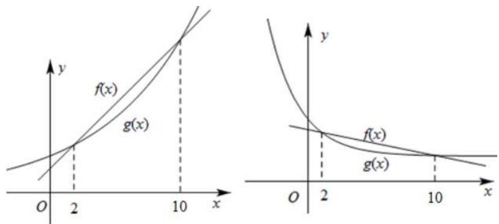

# 第41讲 等差数列及其前 $n$ 项和

# 知识梳理

# 知识点一．等差数列的有关概念

# (1) 等差数列的定义

一般地, 如果一个数列从第 2 项起, 每一项与它的前一项的差等于同一个常数, 那么这个数列就叫做等差数列, 这个常数叫做等差数列的公差, 通常用字母 $d$ 表示, 定义表达式为 $a_{n} - a_{n-1} = d$ (常数) ( $n \in \mathbb{N}^{*}, n \geqslant 2$ ).

# (2) 等差中项

若三个数 $a, \mathbf{A}, b$ 成等差数列，则 $\mathbf{A}$ 叫做 $a$ 与 $b$ 的等差中项，且有 $\mathrm{A} = \frac{a + b}{2}$ .

# 知识点二．等差数列的有关公式

# (1) 等差数列的通项公式

如果等差数列 $\{a_{n}\}$ 的首项为 $a_1$ ，公差为 $d$ ，那么它的通项公式是 $a_{n} = a_{1} + (n - 1)d.$

# (2) 等差数列的前 $n$ 项和公式

设等差数列 $\{a_{n}\}$ 的公差为 $d$ ，其前 $n$ 项和 $\mathrm{S}_n = na_1 + \frac{n(n - 1)}{2} d = \frac{n(a_1 + a_n)}{2}.$

# 知识点三．等差数列的常用性质

已知 $\{a_{n}\}$ 为等差数列， $d$ 为公差， $\mathbf{S}_n$ 为该数列的前 $n$ 项和.

(1) 通项公式的推广: $a_{n} = a_{m} + (n - m)d(n, m \in \mathbb{N}^{*})$ .  
(2) 在等差数列 $\{a_{n}\}$ 中，当 $m + n = p + q$ 时， $a_{m} + a_{n} = a_{p} + a_{q}(m, n, p, q \in \mathbb{N}^{*})$ .

特别地，若 $m + n = 2t$ ，则 $a_{m} + a_{n} = 2a_{t}(m,n,t\in \mathbf{N}^{*})$

(3) $a_{k}, a_{k+m}, a_{k+2m}, \cdots$ 仍是等差数列，公差为 $md(k, m \in \mathbb{N}^{*})$ .

(4) $S_{n}, S_{2n}-S_{n}, S_{3n}-S_{2n}, \cdots$ 也成等差数列，公差为 $n^{2}d$ .

(5) 若 $\{a_{n}\}, \{b_{n}\}$ 是等差数列，则 $\{pa_{n} + qb_{n}\}$ 也是等差数列.

(6) 若 $\{a_{n}\}$ 是等差数列, 则 $\left\{\frac{\mathrm{S}_n}{n}\right\}$ 也成等差数列, 其首项与 $\{a_{n}\}$ 首项相同, 公差是 $\{a_{n}\}$ 公差的 $\frac{1}{2}$ .

(7) 若项数为偶数 $2n$ ，则 $\mathrm{S}_{2n} = n(a_1 + a_{2n}) = n(a_n + a_{n+1})$ ； $\mathrm{S}_{\text{偶}} - \mathrm{S}_{\text{奇}} = nd$ ； $\frac{\mathrm{S}_{\text{奇}}}{\mathrm{S}_{\text{偶}}} = \frac{a_n}{a_{n+1}}$ 。  
(8) 若项数为奇数 $2n - 1$ ，则 $\mathrm{S}_{2n - 1} = (2n - 1)a_n$ ; $\mathrm{S}_{\text{奇}} - \mathrm{S}_{\text{偶}} = a_n$ ; $\frac{\mathrm{S}_{\text{奇}}}{\mathrm{S}_{\text{偶}}} = \frac{n}{n - 1}$ .  
(9) 在等差数列 $\{a_{n}\}$ 中, 若 $a_{1} > 0$ , $d < 0$ , 则满足 $\left\{ \begin{array}{l} a_{m} \geqslant 0 \\ a_{m+1} \leqslant 0 \end{array} \right.$ 的项数 $m$ 使得 $\mathrm{S}_{n}$ 取得最大值 $\mathrm{S}_{m}$ ; 若 $a_{1} < 0$ , $d > 0$ , 则满足 $\left\{ \begin{array}{l} a_{m} \leqslant 0 \\ a_{m+1} \geqslant 0 \end{array} \right.$ 的项数 $m$ 使得 $\mathrm{S}_{n}$ 取得最小值 $\mathrm{S}_{m}$ .

知识点四．等差数列的前 n 项和公式与函数的关系

$\mathrm{S}_n = \frac{d}{2} n^2 +\left(a_1 - \frac{d}{2}\right)n.$ 数列 $\{a_n\}$ 是等差数列 $\Leftrightarrow \mathrm{S}_n = \mathrm{An}^2 +\mathrm{B}n(\mathrm{A},\mathrm{B}$ 为常数).

知识点五．等差数列的前 n 项和的最值

公差 $d > 0 \Leftrightarrow \{a_n\}$ 为递增等差数列， $\mathrm{S}_n$ 有最小值；

公差 $d < 0 \Leftrightarrow \{a_{n}\}$ 为递减等差数列， $\mathbf{S}_n$ 有最大值；

公差 $d = 0 \Leftrightarrow \{a_{n}\}$ 为常数列.

特别地

若 $\left\{ \begin{array}{l} a_{1} > 0 \\ d < 0 \end{array} \right.$ ，则 $S_{n}$ 有最大值 (所有正项或非负项之和);

若 $\left\{ \begin{array}{l} a_{1} < 0 \\ d > 0 \end{array} \right.$ ，则 $S_{n}$ 有最小值（所有负项或非正项之和）.

知识点六．其他衍生等差数列.

若已知等差数列 $\{a_{n}\}$ , 公差为 $d$ , 前 $n$ 项和为 $\mathbf{S}_n$ , 则:

①等间距抽取 $a_{p}, a_{p + t}, a_{p + 2t}, \cdots, a_{p + (n - 1)t}, \cdots$ 为等差数列，公差为 $td$ .  
②等长度截取 $S_{m}, S_{2m} - S_{m}, S_{3m} - S_{2m}, \cdots$ 为等差数列，公差为 $m^{2}d$ .  
③算术平均值 $\frac{S_{1}}{1}, \frac{S_{2}}{2}, \frac{S_{3}}{3}, \cdots$ 为等差数列，公差为 $\frac{d}{2}$ .

# 【解题方法总结】

(1) 等差数列 $\{a_{n}\}$ 中, 若 $a_{n} = m, a_{m} = n (m \neq n, m, n \in \mathbb{N}^{*})$ , 则 $a_{m + n} = 0$ .  
(2) 等差数列 $\{a_{n}\}$ 中，若 $S_{n} = m, S_{m} = n (m \neq n, m, n \in \mathbb{N}^{*})$ ，则 $S_{m + n} = -(m + n)$ .  
(3) 等差数列 $\{a_{n}\}$ 中，若 $\mathrm{S}_n = \mathrm{S}_m (m \neq n, m, n \in \mathbb{N}^*)$ ，则 $\mathrm{S}_{m+n} = 0$ .  
(4) 若 $\{a_{n}\}$ 与 $\{b_{n}\}$ 为等差数列，且前 $n$ 项和为 $\mathrm{S}_n$ 与 $\mathrm{T}_n$ ，则 $\frac{a_m}{b_m} = \frac{\mathrm{S}_{2m - 1}}{\mathrm{T}_{2m - 1}}.$

# 必考题型全归纳

# 1 题型一:等差数列的基本量运算

1821 (2024·云南昆明·高三昆明一中校考阶段练习)已知数列 $\{a_{n}\}$ 满足: $a_{1}=1$ , 且满足 $a_{n}+a_{n+1}=n(n\in N^{*})$ , 则 $a_{2023}=$ ()

A. 1012

B. 1013

C. 2022

D. 2024

【答案】A

【解析】因为 $a_{n} + a_{n+1} = n$ ，所以 $a_{n+1} + a_{n+2} = n + 1$ ，两式相减，得： $a_{n+2} - a_{n} = 1$ ，所以数列 $\{a_{n}\}$ 中的奇数项是以 $a_{1} = 1$ 为首项，1 为公差的等差数列，

所以 $a_{2023}=1+1\times1011=1012.$

故选：A.

1822 (2024·河北·统考模拟预测)已知等差数列 $\{a_{n}\}$ 的前 n 项和是 $S_{n}, a_{3} = 1, S_{7} = 3a_{6}$ ，则 $S_{3} =$ ()

A. 1

B.-1

C. 3

D.-3

【答案】D

【解析】由已知设等差数列的公差为 d，则 $a_{3}=a_{1}+2d=1,7a_{1}+\frac{7\times6}{2}d=3(a_{1}+5d)$ ，解得 $a_{1}=-3, d=2$ ，所以 $S_{3}=3a_{1}+3d=-3$ .

故选：D.

1823 (2024·四川凉山·三模)在等差数列 $\{a_{n}\}$ 中， $a_{2}+a_{4}=2, a_{5}=3$ ，则 $a_{9}=(\quad)$ .

A. 3

B. 5

C. 7

D. 9

【答案】C

【解析】由题设 $a_{2} + a_{4} = 2a_{3} = 2$ ，则 $a_{3} = 1$ ，而 $a_{5} = 3$ ，

若等差数列公差为 d，则 $d=\frac{a_{5}-a_{3}}{2}=1$ ，

所以， $\{a_{n}\}$ 通项公式为 $a_{n}=a_{3}+(n-3)d=n-2$ ，故 $a_{9}=7$ .

故选：C

1824 (2024·江西新余·统考二模)记 $S_{n}$ 是公差不为 0 的等差数列 $\{a_{n}\}$ 的前 n 项和，若 $a_{2}=S_{3}$ ， $a_{1}a_{3}=S_{4}$ ，则数列 $\{a_{n}\}$ 的公差为（）

A.-2

B.-1

C. 2

D. 4

【答案】A

【解析】由 $a_{2}=S_{3}$ 可得: $a_{1}+d=3a_{1}+3d$ ①,

由 $a_{1}a_{3}=S_{4}$ 可得: $a_{1}(a_{1}+2d)=4a_{1}+\frac{4\times3}{2}d$ ②,

由①②可得: d = -2 或 d = 0 (舍去).

故选：A.

1825 (2024·广西·统考模拟预测)设 $\{a_{n}\}$ 为等差数列, 若 $a_{3} + 2a_{1} = 1, a_{4} = 5$ , 则公差 d = ()

A.-2

B.-1

C. 1

D. 2

【答案】D

【解析】由题意得 $\left\{\begin{aligned}3a_{1}+2d=1\\ a_{1}+3d=5\end{aligned}\right.\Rightarrow$ 解得 $\left\{\begin{aligned}a_{1}&=-1\\ d&=2\end{aligned}\right.$

故选：D.

1826 (2024·山西·高三校联考阶段练习)记 $S_{n}$ 为等差数列 $\{a_{n}\}$ 的前 n 项和，若 $S_{3}=a_{5}, a_{3}-a_{1}=8$ ，则 $a_{7}=$ （）

A. 30

B. 28

C. 26

D. 13

【答案】C

【解析】设等差数列 $\{a_{n}\}$ 的首项为 $a_{1}$ ，公差为 d，

则 $\left\{\begin{aligned}3a_{1}+\frac{3\times2}{2}d&=a_{1}+4d\\ a_{1}+2d-a_{1}&=8\end{aligned}\right.$ ， $a_{1}=2, d=4,$

所以 $a_{7}=a_{1}+6d=26.$

故选：C

【解题方法总结】

等差数列基本运算的常见类型及解题策略：

(1) 求公差 d 或项数 n. 在求解时, 一般要运用方程思想.  
(2) 求通项. $a_{1}$ 和 $d$ 是等差数列的两个基本元素.  
(3) 求特定项．利用等差数列的通项公式或等差数列的性质求解.  
(4) 求前 $n$ 项和. 利用等差数列的前 $n$ 项和公式直接求解或利用等差中项间接求解.

【注意】在求解数列基本量问题中主要使用的是方程思想,要注意使用公式时的准确性与合理性,更要注意运算的准确性. 在遇到一些较复杂的方程组时,要注意运用整体代换思想,使运算更加便捷.

# 2 题型二:等差数列的判定与证明

1827 (2024·福建福州·福建省福州第一中学校考模拟预测)已知数列 $\{a_{n}\}$ 的前 n 项和为 $S_{n}$ ， $S_{n}=\frac{1}{3}(n+2)a_{n}$ ，且 $a_{1}=1$ .

(1) 求证: 数列 $\left\{\frac{a_{n}}{n}\right\}$ 是等差数列;  
(2) 求数列 $\left\{\frac{1}{a_{n}}\right\}$ 的前 n 项和 $T_{n}$ .

【解析】(1) 数列 $\{a_{n}\}$ 中， $3S_{n}=(n+2)a_{n}$ ，当 $n\geqslant2$ 时， $3S_{n-1}=(n+1)a_{n-1}$

两式相减得 $3a_{n} = (n + 2)a_{n} - (n + 1)a_{n - 1}$ ，即 $(n - 1)a_{n} = (n + 1)a_{n - 1}$ ，则 $\frac{a_n}{n + 1} = \frac{a_{n - 1}}{n - 1},$

于是 $\frac{a_n}{(n + 1)n} = \frac{a_{n - 1}}{n(n - 1)}$ ，因此数列 $\left\{\frac{a_n}{(n + 1)n}\right\}$ 是常数列，则 $\frac{a_n}{(n + 1)n} = \frac{a_1}{2\times 1} = \frac{1}{2},$

从而 $a_{n}=\frac{n(n+1)}{2}$ ，即 $\frac{a_{n}}{n}=\frac{n+1}{2}$ ， $\frac{a_{n+1}}{n+1}-\frac{a_{n}}{n}=\frac{1}{2}$ ，

所以数列 $\left\{\frac{a_{n}}{n}\right\}$ 是以 1 为首项， $\frac{1}{2}$ 为公差的等差数列.

(2) 由 (1) 知, $\frac{1}{a_n} = \frac{2}{n(n + 1)} = 2\left(\frac{1}{n} - \frac{1}{n + 1}\right)$ ,

所以 $T_{n}=\frac{1}{a_{1}}+\frac{1}{a_{2}}+\cdots+\frac{1}{a_{n}}=2\left[\left(1-\frac{1}{2}\right)+\left(\frac{1}{2}-\frac{1}{3}\right)+\cdots+\left(\frac{1}{n}-\frac{1}{n+1}\right)\right]=\frac{2n}{n+1}.$

1828 (2024·江苏南京·高二南京师范大学附属中学江宁分校校考期末)记 $S_{n}$ 为数列 $\{a_{n}\}$ 的前 n 项和.

(1)从下面两个条件中选一个,证明:数列 $\{a_{n}\}$ 是等差数列;

①数列 $\left\{\frac{S_{n}}{n}\right\}$ 是等差数列；② $S_{n}=\frac{n(a_{n}+1)}{2}(n\in\mathbb{N}^{*})$   
(2) 若数列 $\{a_{n}\}$ 为等差数列，且 $a_{1} = 1, a_{3} = 5$ ，求数列 $\left\{\frac{n}{(n + 2)\mathrm{S}_n}\right\}$ 的前 $n$ 项和 $\mathrm{T}_n$

【解析】(1) 选择条件①: $\because S_{n}=\frac{n(a_{n}+1)}{2}(n\in N^{*})$

$$
\therefore 2 \mathrm{S} _ {n} = n a _ {n} + n, 2 \mathrm{S} _ {n + 1} = (n + 1) a _ {n + 1} + n + 1,
$$

两式相减可得 $2a_{n+1}=(n+1)a_{n+1}-na_{n}+1$ ,

即 $na_{n} - 1 = (n - 1)a_{n + 1}$

$$
\therefore (n + 1) a _ {n + 1} - 1 = n a _ {n + 2},
$$

两式相减可得 $(n + 1)a_{n + 1} - na_n = na_{n + 2} - (n - 1)a_{n + 1}$

化简可得 $2na_{n+1}=n(a_{n+2}+a_{n})$ ,

$\therefore 2a_{n + 1} = a_{n + 2} + a_n,\therefore$ 数列 $\{a_n\}$ 是等差数列.

选择条件②:设数列 $\left\{\frac{S_{n}}{n}\right\}$ 的首项为 $b_{1}$ ，公差为 p，

则 $\frac{\mathrm{S}_n}{n} = b_1 + (n - 1)p = np + b_1 - p$ ，故 $\mathrm{S}_n = pn^2 +(b_1 - p)n,$

当 $n \geqslant 2$ 时， $a_{n} = S_{n} - S_{n-1}$

$$
= p n ^ {2} + (b _ {1} - p) n - p (n - 1) ^ {2} - (b _ {1} - p) (n - 1)
$$

$$
= b _ {1} + 2 (n - 1) p,
$$

当 n=1 时， $a_{1}=S_{1}=b_{1}$ ， $\therefore a_{n}=b_{1}+2(n-1)p$ ，

又 $a_{n + 1} - a_n = b_1 + 2np - b_1 - 2(n - 1)p = 2p.$

∴数列 $\{a_{n}\}$ 是等差数列.

(2)∵数列 $\{a_{n}\}$ 是等差数列,且公差 $d=\frac{a_{3}-a_{1}}{2}=2$ ,

故 $\mathrm{T}_n = \frac{1}{2}\left(1 - \frac{1}{3}\right) + \frac{1}{2}\left(\frac{1}{2} -\frac{1}{4}\right) + \frac{1}{2}\left(\frac{1}{3} -\frac{1}{5}\right) + \dots +\frac{1}{2}\left(\frac{1}{n} -\frac{1}{n + 2}\right)$

$$
\begin{array}{l} \therefore \mathrm{S} _ {n} = n a _ {1} + \frac {n (n - 1)}{2} d = n + \frac {n (n - 1)}{2} \times 2 = n ^ {2}. \\ \therefore \frac {n}{(n + 2) \mathrm{S} _ {n}} = \frac {1}{n (n + 2)} = \frac {1}{2} \left(\frac {1}{n} - \frac {1}{n + 2}\right), \\ = \frac {1}{2} \left(1 - \frac {1}{3} + \frac {1}{2} - \frac {1}{4} + \frac {1}{3} - \frac {1}{5} + \dots + \frac {1}{n} - \frac {1}{n + 2}\right) \\ = \frac {1}{2} \left(1 + \frac {1}{2} - \frac {1}{n + 1} - \frac {1}{n + 2}\right) \\ = \frac {3}{4} - \frac {1}{2} \left(\frac {1}{n + 1} + \frac {1}{n + 2}\right) = \frac {3}{4} - \frac {2 n + 3}{2 (n + 1) (n + 2)}. \\ \end{array}
$$

1829 (2024·全国·高三专题练习)已知数列 $\{a_{n}\}$ 满足 $a_{1}=\frac{2}{3}$ ， $a_{n+1}=\frac{a_{n}-2}{2a_{n}-3}(n\in\mathbb{N}^{*})$ .

(1) 证明: $\left\{\frac{1}{a_n - 1}\right\}$ 是等差数列, 并求出 $\{a_n\}$ 的通项 $a_n$ .  
(2) 证明: $a_{1}a_{2}a_{3}\cdots a_{n}<\frac{1}{\sqrt{n+1}}$ .

【解析】(1) 由 $a_{n+1}=\frac{a_{n}-2}{2a_{n}-3}$ ，可得 $a_{n+1}-1=\frac{1-a_{n}}{2a_{n}-3}$ ，

$$
\therefore \frac {1}{a _ {n + 1} - 1} = \frac {3 - 2 a _ {n}}{a _ {n} - 1} = \frac {- 2 (a _ {n} - 1) + 1}{a _ {n} - 1} = \frac {1}{a _ {n} - 1} - 2, \text {即} \frac {1}{a _ {n + 1} - 1} - \frac {1}{a _ {n} - 1} = - 2,
$$

$$
\because a _ {1} = \frac {2}{3}, \text {即} \frac {1}{a _ {1} - 1} = - 3,
$$

$\therefore \left\{\frac{1}{a_n - 1}\right\}$ 是以-3为首项，-2为公差的等差数列，

$$
\therefore \frac {1}{a _ {n} - 1} = - 2 n - 1, \text {即} a _ {n} = \frac {2 n}{2 n + 1}.
$$

(2) 令 $T_{n}=a_{1}a_{2}a_{3}\cdots a_{n}=\frac{2}{3}\times\frac{4}{5}\times\cdots\times\frac{2n}{2n+1}$ ①,

$$
\because \frac {2 n}{2 n + 1} <   \frac {2 n + 1}{2 n + 2}, \therefore \mathrm{T} _ {n} <   \frac {3}{4} \times \frac {5}{6} \times \dots \times \frac {2 n + 1}{2 n + 2} (2),
$$

① × ② 得 $T_{n}^{2} < \frac{2}{2n+2} = \frac{1}{n+1}$ ,

$$
\therefore \mathrm{T} _ {n} <   \sqrt {\frac {1}{n + 1}} \text {, 即} a _ {1} a _ {2} a _ {3} \dots a _ {n} <   \frac {1}{\sqrt {n + 1}}.
$$

1830 (2024·陕西西安·高二长安一中校考期末)已知数列 $\{a_{n}\}$ 满足， $a_{n+1}=$

$$
\left\{ \begin{array}{l} a _ {n} + 1, n = 2 k - 1 \\ a _ {n} - 2, n = 2 k \end{array} , k \in \mathrm{N} ^ {*}, a _ {1} = 1. \right.
$$

(1) 若数列 $\{b_{n}\}$ 为数列 $\{a_{n}\}$ 的奇数项组成的数列, 证明: 数列 $\{b_{n}\}$ 为等差数列;  
(2) 求数列 $\{a_{n}\}$ 的前 50 项和.

【解析】(1) 由题, $b_{n+1} = a_{2n+1} = a_{2n} - 2 = a_{2n-1} + 1 - 2 = a_{2n-1} - 1 = b_n - 1$ ,

且 $b_{1}=a_{1}=1$ ，所以数列 $\left\{b_{n}\right\}$ 是首项为1，公差为-1的等差数列；

(2) 设 $\left\{c_{n}\right\}$ 为数列 $\left\{a_{n}\right\}$ 的偶数项组成的数列, 注意到 $c_{1}=a_{2}=a_{1}+1=2$ ,

$$
c _ {n + 1} = a _ {2 n + 2} = a _ {2 n + 1} + 1 = a _ {2 n} - 2 + 1 = a _ {2 n} - 1 = c _ {n} - 1,
$$

所以数列 $\{c_{n}\}$ 是首项为 2, 公差为 -1 的等差数列,

结合(1)可知， $\left\{a_{n}\right\}$ 的奇数项和偶数项都是以-1为公差的等差数列，

所以 $S_{50}=a_{1}+a_{2}+a_{3}+\ldots+a_{50}=(a_{1}+a_{3}+\ldots+a_{49})+(a_{2}+a_{4}+\ldots+a_{50})$

$$
= 1 \times 2 5 + \frac {2 5 \times 2 4}{2} \times (- 1) + 2 \times 2 5 + \frac {2 5 \times 2 4}{2} \times (- 1) = - 5 2 5.
$$

1831 (2024·全国·高三专题练习)已知数列 $\{a_{n}\}$ 的前 n 项和为 $S_{n}(S_{n} \neq 0)$ ，数列 $\{S_{n}\}$ 的前 n 项积为 $T_{n}$ ，且满足 $S_{n} + T_{n} = S_{n} \cdot T_{n} (n \in \mathbb{N}^{*})$ .

(1) 求证: $\left\{\frac{1}{S_{n}-1}\right\}$ 为等差数列;   
(2) 记 $b_{n}=\frac{1}{n^{2}S_{n}}$ ，求数列 $\{b_{n}\}$ 的前 2024 项的和 M.

【解析】(1) 因为 $S_{n} + T_{n} = S_{n} \cdot T_{n} (n \in \mathbb{N}^{*})$ ,

当 n=1 时， $S_{1}+T_{1}=S_{1}\cdot T_{1}\Rightarrow2a_{1}=a_{1}^{2}$ ，解得 $a_{1}=2$ 或 $a_{1}=0$ ，

又 $S_{n}\neq0$ ，所以 $a_{1}\neq0$ ，故 $a_{1}=2$ ，

由 $S_{n} + T_{n} = S_{n} \cdot T_{n}$ ，可得 $S_{n} \neq 1$ ，所以 $T_{n} = \frac{S_{n}}{S_{n} - 1}$ ，

当 $n \geqslant 2$ 时， $\mathrm{T}_{n-1} = \frac{\mathrm{S}_{n-1}}{\mathrm{S}_{n-1} - 1}$ .

所以 $\frac{\mathrm{T}_n}{\mathrm{T}_{n - 1}} = \frac{\mathrm{S}_n}{\mathrm{S}_n - 1}\times \frac{\mathrm{S}_{n - 1} - 1}{\mathrm{S}_{n - 1}}$ ，即 $\mathrm{S}_n = \frac{\mathrm{S}_n}{\mathrm{S}_n - 1}\times \frac{\mathrm{S}_{n - 1} - 1}{\mathrm{S}_{n - 1}},$

所以 $\frac{1}{\mathrm{S}_n - 1} = \frac{\mathrm{S}_{n - 1}}{\mathrm{S}_{n - 1} - 1} = 1 + \frac{1}{\mathrm{S}_{n - 1} - 1}$ 所以 $\frac{1}{\mathrm{S}_n - 1} -\frac{1}{\mathrm{S}_{n - 1} - 1} = 1$

所以 $\left\{\frac{1}{S_{n}-1}\right\}$ 是以 $\frac{1}{S_{1}-1}=1$ 为首项，1 为公差的等差数列.

(2) 所以 $\frac{1}{\mathrm{S}_n - 1} = 1 + (n - 1) \times 1 = n$ ，则 $\mathrm{S}_n = \frac{n + 1}{n}$ ，

因为 $b_{n}=\frac{1}{n^{2}S_{n}}=\frac{1}{n(n+1)}=\frac{1}{n}-\frac{1}{n+1}$ ,

故 $M=\left(1-\frac{1}{2}\right)+\left(\frac{1}{2}-\frac{1}{3}\right)+\cdots+\left(\frac{1}{2023}-\frac{1}{2024}\right)=\frac{2023}{2024}.$

1832 (2024·浙江宁波·高一慈溪中学校联考期末)已知数列 $\{a_{n}\}$ 中， $a_{1}=1$ ，当 $n\geqslant2$ 时，其前 n 项和 $S_{n}$ 满足： $\mathrm{S}_{n}^{2}=a_{n}(\mathrm{S}_{n}-1)$ ，且 $S_{n}\neq0$ ，数列 $\{b_{n}\}$ 满足：对任意 $n\in N^{*}$ 有 $\frac{b_{1}}{S_{1}}+\frac{b_{2}}{S_{2}}+\cdots+\frac{b_{n}}{S_{n}}=(n-1)\cdot2^{n+1}+2.$

(1) 求证: 数列 $\left\{\frac{1}{S_{n}}\right\}$ 是等差数列;  
(2) 求数列 $\{b_{n}\}$ 的通项公式;  
(3) 设 $T_{n}$ 是数列 $\left\{\frac{2^{n-1}}{b_{2n}-b_{n}}\right\}$ 的前 n 项和，求证： $T_{n}<\frac{3}{2}$ .

【解析】(1) $\because S_{n}^{2}=a_{n}(S_{n}-1)$ ， $a_{n}=S_{n}-S_{n-1}(n\geqslant2)$ ,

$$
\therefore \mathrm{S} _ {n} ^ {2} = (\mathrm{S} _ {n} - \mathrm{S} _ {n - 1}) (\mathrm{S} _ {n} - 1) \text {, 即} \mathrm{S} _ {n - 1} \mathrm{S} _ {n} = \mathrm{S} _ {n - 1} - \mathrm{S} _ {n} ①
$$

由题意 $S_{n-1} \cdot S_{n} \neq 0$ ,

将①式两边同除以 $S_{n-1} \cdot S_{n}$ ，得 $\frac{1}{S_{n}} - \frac{1}{S_{n-1}} = 1$ ，

∴数列 $\left\{\frac{1}{S_{n}}\right\}$ 是首项为 $\frac{1}{S_{1}}=\frac{1}{a_{1}}=1$ ，公差为 1 的等差数列.

(2) 由 (1) 可知 $\frac{1}{\mathrm{S}_n} = 1 + (n - 1) = n, \therefore \mathrm{S}_n = \frac{1}{n}$ .

当 n=1 时， $\frac{b_{1}}{S_{1}}=2$ ，即 $b_{1}=2$ ，

当 $n \geqslant 2$ 时， $\frac{b_{1}}{S_{1}} + \frac{b_{2}}{S_{2}} + \cdots + \frac{b_{n}}{S_{n}} = (n - 1) \cdot 2^{n+1} + 2$ ②，

则 $\frac{b_{1}}{S_{1}}+\frac{b_{2}}{S_{2}}+\cdots+\frac{b_{n-1}}{S_{n-1}}=(n-2)\cdot2^{n}+2③$

② - ③, $\frac{b_n}{\mathrm{S}_n} = (n - 1) \cdot 2^{n + 1} - (n - 2) \cdot 2^n = n \cdot 2^n$ 即 $b_n = 2^n$ ,

因为 $b_{1} = 2$ 满足 $b_{n} = 2^{n}$

所以 $b_{n} = 2^{n}$

(3) 由 (2) 可知, $\frac{2^{n-1}}{b_{2n}-b_n} = \frac{2^{n-1}}{2^{2n}-2^n} = \frac{2^{n-1}}{2^n(2^n-1)}$

当 n=1 时， $T_{1}=\frac{1}{2}<\frac{3}{2}$ ,

当 $n \geqslant 2$ 时， $\frac{2^{n-1}}{b_{2n} - b_n} = \frac{2^{n-1}}{2^{2n} - 2^n} = \frac{2^{n-1}}{2^n(2^n - 1)} < \frac{2^{n-1}}{(2^{n-1} - 1)(2^n - 1)} = \frac{1}{2^{n-1} - 1} - \frac{1}{2^n - 1}$ ，

所以 $T_{n}<\frac{1}{2}+\frac{1}{2^{1}-1}-\frac{1}{2^{2}-1}+\frac{1}{2^{2}-1}-\frac{1}{2^{3}-1}+\cdots+\frac{1}{2^{n-1}-1}-\frac{1}{2^{n}-1}$

$$
= \frac {1}{2} + 1 - \frac {1}{2 ^ {n} - 1} <   \frac {3}{2}.
$$

所以 $\mathrm{T}_n < \frac{3}{2}$ .

# 【解题方法总结】

判断数列 $\{a_{n}\}$ 是等差数列的常用方法

(1) 定义法: 对任意 $n \in N^{*}, a_{n+1} - a_{n}$ 是周一常数.  
(2) 等差中项法: 对任意 $n \geqslant 2, n \in N^{*}$ ，湍足 $2a_{n} = a_{n+1} + a_{n-1}$ .  
(3) 通项公式法: 对任意 $n \in N^{*}$ ，都满足 $a_{n} = pn + q (p, q$ 为常数).  
(4) 前 n 项和公式法: 对任意 $n \in N^{*}$ ，都满足 $S_{n} = An^{2} + Bn$ (A, B 为常数).

# 3 题型三:等差数列的性质

1833 (2024·安徽蚌埠·统考模拟预测)已知等差数列 $\{a_{n}\}$ 满足 $a_{2} + a_{4} + a_{6} = \pi$ ，则 $\cos(a_{1} + a_{7}) =$ （）

A. $-\frac{1}{2}$

B. $\frac{1}{2}$

C. $\frac{\sqrt{2}}{2}$

D. $\frac{\sqrt{3}}{2}$

【答案】A

【解析】因为数列 $\{a_{n}\}$ 是等差数列，

所以 $a_{2}+a_{4}+a_{6}=3a_{4}=\pi$ ，即 $a_{4}=\frac{\pi}{3}$ ，

所以 $\cos(a_{1}+a_{7})=\cos2a_{4}=\cos\frac{2\pi}{3}=-\frac{1}{2}$ ,

故选：A

1834 (2024·陕西榆林·统考模拟预测)设 $S_{n}$ 为等差数列 $\{a_{n}\}$ 的前 n 项和，若 $S_{21}=105$ ，则 $a_{11}=$ （）

A. 5

B. 6

C. 7

D. 8

【答案】A

【解析】由等差数列性质和的求和公式,可得 $S_{21}=\frac{21(a_{1}+a_{21})}{2}=21a_{11}=105$ , 所以 $a_{11}=5$ .

故选：A.

1835 (2024·全国·高三专题练习)已知数列 $\{a_{n}\}$ 满足 $2a_{n+1}=a_{n}+a_{n+2}$ ，其前 n 项和为 $S_{n}$ ，若 $S_{9}=18$ ，则 $a_{5}=$ （）

A.-2

B. 0

C. 2

D. 4

【答案】C

【解析】根据题意 $2a_{n+1}=a_{n}+a_{n+2}$ ，可得数列 $\{a_{n}\}$ 为等差数列，所以 $S_{9}=\frac{9(a_{1}+a_{9})}{2}=18$ ，所以 $a_{1}+a_{9}=4$ ，

所以 $2a_{5}=4$ ，所以 $a_{5}=2$ 。

故选：C.

1836 (2024·全国·高三专题练习)如果等差数列 $\{a_{n}\}$ 中， $a_{3} + a_{4} + a_{5} = 12$ ，那么 $a_{1} + a_{2} + \cdots + a_{7} =$

A. 14

B. 12

C. 28

D. 36

【答案】C

【解析】 $\because a_{3}+a_{4}+a_{5}=12, \therefore 3a_{4}=12$ , 则 $a_{4}=4$ , 又 $a_{1}+a_{7}=a_{2}+a_{6}=a_{3}+a_{5}=2a_{4}$ , 故 $a_{1}+a_{2}+\cdots+a_{7}=7a_{4}=28$ .

故选:C.

1837 (2024·全国·高三专题练习)已知数列 $\{a_{n}\}$ 是等差数列，若 $\frac{1}{2}$ ，则 $a_{3} + a_{15}$ 等于 （）

A. 7

B. 14

C. 21

D. $7(n - 1)$

【答案】B

【解析】因为 $a_{1}-a_{9}+a_{17}=(a_{1}+a_{17})-a_{9}=2a_{9}-a_{9}=a_{9}=7$ ，所以 $a_{3}+a_{15}=2a_{9}=2\times7=14$ .

故选: B

1838 (2024·全国·高三专题练习)已知等差数列 $\{a_{n}\}$ 中， $a_{2} + a_{4} = 6$ ，则 $a_{1} + a_{2} + a_{3} + a_{4} + a_{5} =$ （）

A. 30

B. 15

C. $5 \sqrt{6}$

D. $10 \sqrt{6}$

【答案】B

【解析】∵数列 $\{a_{n}\}$ 为等差数列， $a_{2}+a_{4}=2a_{3}=6$ ，所以 $a_{3}=3$

$$
\therefore a _ {1} + a _ {2} + a _ {3} + a _ {4} + a _ {5} = \left(a _ {1} + a _ {5}\right) + \left(a _ {2} + a _ {4}\right) + a _ {3} = 5 a _ {3} = 1 5.
$$

故选：B

【解题方法总结】

如果 $\{a_{n}\}$ 为等差数列，当 $m + n = p + q$ 时， $a_{m} + a_{n} = a_{p} + a_{q}(m, n, p, q \in \mathbb{N}^{*})$ 。因此，出现 $a_{m - n}, a_{m}, a_{m + n}$ 等项时，可以利用此性质将已知条件转化为与 $a_{m}$ （或其他项）有关的条件；若求 $a_{m}$ 项，可由 $a_{m} = \frac{1}{2}(a_{m - n} + a_{m + n})$ 转化为求 $a_{m - n} + a_{n + m}$ 的值。

# 4 题型四:等差数列前 n 项和的性质

1839 (2024·全国·高三专题练习)两个等差数列 $\{a_{n}\}$ ， $\{b_{n}\}$ 的前 n 项和分别为 $S_{n}$ 和 $T_{n}$ ，已知 $\frac{S_{n}}{T_{n}} = \frac{7n + 2}{n + 3}$ ，则 $\frac{a_{7}}{b_{7}} =$ \_\_\_\_ .

【答案】 $\frac{93}{16}$

【解析】由题意可知， $\frac{S_{13}}{T_{13}}=\frac{\frac{13}{2}(a_{1}+a_{13})}{\frac{13}{2}(b_{1}+b_{13})}=\frac{\frac{13}{2}\times2a_{7}}{\frac{13}{2}\times2b_{7}}=\frac{a_{7}}{b_{7}}$

所以 $\frac{a_{7}}{b_{7}}=\frac{S_{13}}{T_{13}}=\frac{7\times13+2}{13+3}=\frac{93}{16}.$

故答案为: $\frac{93}{16}$ .

1840 (2024·全国·高三专题练习)设等差数列 $\{a_{n}\}$ ， $\{b_{n}\}$ 的前 n 项和分别为 $S_{n}$ ， $T_{n}$ ，且 $\frac{S_{n}}{T_{n}} = \frac{3n-1}{n+3}$ ，则 $\frac{a_{8}}{b_{5}+b_{11}} =$ \_\_\_\_ .

【答案】 $\frac{11}{9}/1\frac{2}{9}$

【解析】等差数列 $\{a_{n}\},\{b_{n}\}$ 的前 n 项和分别为 $S_{n},T_{n}$ ,

所以 $\frac{a_8}{b_5 + b_{11}} = \frac{1}{2}\cdot \frac{2a_8}{b_5 + b_{11}} = \frac{1}{2}\cdot \frac{a_1 + a_{15}}{b_1 + b_{15}} = \frac{1}{2}\cdot \frac{\frac{15(a_1 + a_{15})}{2}}{\frac{15(b_1 + b_{15})}{2}} = \frac{1}{2}\cdot \frac{\mathrm{S}_{15}}{\mathrm{T}_{15}} = \frac{1}{2}\times \frac{3\times 15 - 1}{15 + 3}$ $= \frac{11}{9}.$

故答案为: $\frac{11}{9}$

1841 (2024·全国·高三专题练习)若两个等差数列 $\{a_{n}\}$ ， $\{b_{n}\}$ 的前 n 项和分别是 $S_{n}$ ， $T_{n}$ ，已知 $\frac{S_{n}}{T_{n}} = \frac{3n + 1}{2n - 3}$ ，则 $\frac{a_{3}}{b_{3}} =$ \_\_\_\_ .

【答案】 $\frac{16}{7}/2\frac{2}{7}$

【解析】因为 $\{a_{n}\}$ ， $\{b_{n}\}$ 为等差数列，所以 $\frac{a_{3}}{b_{3}}=\frac{2a_{3}}{2b_{3}}=\frac{a_{1}+a_{5}}{b_{1}+b_{5}}=\frac{\frac{a_{1}+a_{5}}{2}\times5}{\frac{b_{1}+b_{5}}{2}\times5}=\frac{S_{5}}{T_{5}}$

因为 $\frac{\mathrm{S}_n}{\mathrm{T}_n} = \frac{3n + 1}{2n - 3}$ 所以 $\frac{a_3}{b_3} = \frac{\mathrm{S}_5}{\mathrm{T}_5} = \frac{16}{7}$ .

故答案为: $\frac{16}{7}$ .

1842 (2024·高三课时练习)已知数列 $\{a_{n}\}$ 与 $\{b_{n}\}$ 均为等差数列，且前 n 项和分别为 $S_{n}$ 与 $T_{n}$ ，若 $\frac{S_{n}}{T_{n}} = \frac{3n + 2}{n + 1}$ ，则 $\frac{a_{5}}{b_{5}} =$ \_\_\_\_ .

【答案】 $\frac{29}{10}$

【解析】由等差数列的求和公式得 $\frac{S_{n}}{T_{n}}=\frac{a_{1}+a_{n}}{b_{1}+b_{n}}=\frac{3n+2}{n+1}$ ，所以 $\frac{S_{9}}{T_{9}}=\frac{a_{1}+a_{9}}{b_{1}+b_{9}}=\frac{29}{10}\Rightarrow\frac{a_{5}}{b_{5}}=\frac{29}{10}$ ,

故答案为: $\frac{29}{10}$

1843 (2024·宁夏·高三六盘山高级中学校考期中)设等差数列 $\{a_{n}\}$ 的前 n 项和为 $S_{n}$ ，若 $S_{3}=9, S_{6}=36$ ，则 $a_{4}+a_{5}+a_{6}=$ \_\_\_\_

【答案】27

【解析】 $a_{4}+a_{5}+a_{6}=S_{6}-S_{3}=36-9=27.$

故答案为: 27.

1844 (2024·四川绵阳·高三四川省绵阳南山中学校考阶段练习)已知等差数列 $\{a_{n}\}$ 的前 n 项和为 $S_{n}$ ，若 $S_{10}=20, S_{30}=90$ ，则 $S_{20}=$ \_\_\_\_

【答案】50

【解析】由题设 $S_{10}, S_{20} - S_{10}, S_{30} - S_{20}$ 成等差数列，

所以 $2(S_{20}-S_{10})=S_{10}+S_{30}-S_{20}$ ，则 $3S_{20}=3S_{10}+S_{30}=150$ ，

所以 $S_{20}=50$ .

故答案为: 50

1845 (2024·全国·高三专题练习)等差数列 $\{a_{n}\}$ 中， $a_{1}=2020$ ，前 n 项和为 $S_{n}$ ，若 $\frac{S_{12}}{12}-\frac{S_{10}}{10}=-2$ ，则 $S_{2022}=$ \_\_\_\_.

【答案】-2022

【解析】设 $\{a_{n}\}$ 的公差为 $d_0$ ，由等差数列的性质可知，因为 $\mathrm{S}_n = \frac{n(a_1 + a_n)}{2}$ 故 $\frac{\mathrm{S}_n}{n} = \frac{a_1 + a_n}{2}$ 故 $\frac{\mathrm{S}_n}{n} -\frac{\mathrm{S}_{n - 1}}{n - 1} = \frac{a_1 + a_n}{2} -\frac{a_1 + a_{n - 1}}{2} = \frac{d_0}{2}$ 为常数，所以 $\left\{\frac{\mathrm{S}_n}{n}\right\}$ 为等差数列，设 $\left\{\frac{\mathrm{S}_n}{n}\right\}$ 公差为 $d$

$$
\because a _ {1} = 2 0 2 0, \therefore \frac {\mathrm{S} _ {1}}{1} = 2 0 2 0,
$$

$$
\because \frac {\mathrm{S} _ {1 2}}{1 2} - \frac {\mathrm{S} _ {1 0}}{1 0} = 2 d = - 2,
$$

$$
\therefore d = - 1,
$$

$$
\therefore \frac {\mathrm{S} _ {2 0 2 2}}{2 0 2 2} = 2 0 2 0 + 2 0 2 1 \times (- 1) = - 1 \text {, 则} \mathrm{S} _ {2 0 2 2} = - 2 0 2 2
$$

故答案为: -2022

1846 (2024·全国·高三对口高考)已知等差数列 $\{a_{n}\}$ 的前 n 项和为 $S_{n}$ ，若公差 $d=\frac{1}{2}$ ， $S_{100}=145$ ；则 $a_{1}+a_{3}+a_{5}+\cdots+a_{99}$ 的值为 \_\_\_\_.

【答案】60

【解析】设 $P=a_{1}+a_{3}+a_{5}+\cdots+a_{97}+a_{99}$ ， $Q=a_{2}+a_{4}+a_{6}+\cdots+a_{98}+a_{100}$

因为数列 $\{a_{n}\}$ 是等差数列, 且公差 $d=\frac{1}{2}$ , $S_{100}=145$ ,

所以 $\left\{\begin{aligned}Q+P&=S_{100}=145\\ Q-P&=50d=25\end{aligned}\right.$ ，解得 P=60, Q=85,

所以 $a_{1}+a_{3}+a_{5}+\cdots+a_{99}=60.$

故答案为: 60.

1847 (2024·全国·高三专题练习)已知等差数列 $\{a_{n}\}$ 的项数为奇数,且奇数项的和为 40,偶数项的和为 32,则 $a_{5}=$ \_\_\_\_.

【答案】8

【解析】设等差数列 $\{a_{n}\}$ 有奇数项 $k+1$ 项， $(k\in\mathbb{N}^{*})$ ，偶数项为 k 项，公差为 d.

∵奇数项和为40,偶数项和为32,∴ $40=a_{1}+a_{3}+\cdots+a_{2k+1},32=a_{2}+a_{4}+\cdots+a_{2k}$

$$
\therefore 4 0 = \frac {(k + 1) \left(a _ {1} + a _ {2 k + 1}\right)}{2} = (k + 1) a _ {k + 1}, 3 2 = \frac {k \left(a _ {2} + a _ {2 k}\right)}{2} = k \cdot a _ {k + 1}
$$

即 $\frac{40}{32} = \frac{k + 1}{k}$ , 解得: $k = 4$

即等差数列 $\{a_{n}\}$ 共9项，且 $S_{9}=\frac{(a_{1}+a_{9})\times9}{5}=9a_{5}=72$

$$
\therefore a _ {5} = 8
$$

故答案为: 8

1848 (2024·四川泸州·四川省泸县第一中学校考二模)在等差数列 $\{a_{n}\}$ 中, 前 m 项 (m 为奇数) 和为 70, 其中偶数项之和为 30, 且 $a_{1}-a_{m}=12$ , 则 $\{a_{n}\}$ 的通项公式为 $a_{n}=$ \_\_\_\_.

【答案】 $-2n + 18$

【解析】设等差数列 $\{a_{n}\}$ 的公差为 $d$

$$
\mathrm{S} _ {\text {奇}} = a _ {1} + a _ {3} + \dots + a _ {m} = \frac {m + 1}{2} \cdot \frac {(a _ {1} + a _ {m})}{2} = \frac {m + 1}{2} a _ {\frac {m + 1}{2}} = 4 0
$$

$$
\mathrm{S} _ {\text {偶}} = a _ {2} + a _ {4} + \dots + a _ {m - 1} = \frac {m - 1}{2} \cdot \frac {(a _ {2} + a _ {m - 1})}{2} = \frac {m - 1}{2} a _ {\frac {m + 1}{2}} = 3 0
$$

$\therefore \frac{\mathrm{S}_{\text{奇}}}{\mathrm{S}_{\text{偶}}} = \frac{m + 1}{m - 1} = \frac{4}{3}$ , 解得 $m = 7$ , 且 $a_{4} = 10$

$$
\because a _ {1} - a _ {7} = 1 2
$$

$\therefore \left\{ \begin{array}{l}a_{1} + 3d = 10\\ a_{1} - (a_{1} + 6d) = 12 \end{array} \right.$ ，解得 $\left\{ \begin{array}{l}a_1 = 16\\ d = -2 \end{array} \right.$

$$
\therefore a _ {n} = 1 6 - 2 (n - 1) = - 2 n + 1 8
$$

故答案为: $-2n + 18$

【解题方法总结】

在等差数列中， $S_{n}$ ， $S_{2n}-S_{n}$ ， $S_{3n}-S_{2n}$ ，…仍成等差数列； $\left\{\frac{S_{n}}{n}\right\}$ 也成等差数列.

# 题型五:等差数列前 n 项和的最值

1849 (2024·全国·高三专题练习)已知 $S_{n}$ 为等差数列 $\{a_{n}\}$ 的前 n 项和，且 $S_{2}=35, a_{2}+a_{3}+a_{4}=39$ ，则当 $S_{n}$ 取最大值时，n 的值为 \_\_\_\_.

【答案】7

【解析】方法一:设数列 $\{a_{n}\}$ 的公差为 d，则由题意得 $\left\{\begin{aligned}&2a_{1}+d=35,\\ &a_{2}+a_{3}+a_{4}=3a_{3}=3(a_{1}+2d)=39,\end{aligned}\right.$ 解得 $\left\{\begin{aligned}&a_{1}=19,\\&d=-3,\end{aligned}\right.$

则 $S_{n}=19n+\frac{n(n-1)}{2}\times(-3)=-\frac{3}{2}n^{2}+\frac{41}{2}n=-\frac{3}{2}\left(n-\frac{41}{6}\right)^{2}+\frac{1681}{24}$ . 又 $n\in N^{*}$ , ∴ 当 n=7 时, $S_{n}$ 取得最大值.

方法二:设等差数列 $\{a_{n}\}$ 的公差为 $d.\because a_{2}+a_{3}+a_{4}=3a_{3}=39,\therefore a_{3}=13,$

∴ $2a_{3}-S_{2}=(a_{3}-a_{2})+(a_{3}-a_{1})=3d=-9$ , 解得 d=-3,

则 $a_{n}=a_{3}+(n-3)d=22-3n$ ,

令 $\left\{\begin{aligned}&22-3n\geqslant0,\\ &22-3(n+1)\leqslant0,\end{aligned}\right.$

解得 $\frac{19}{3} \leqslant n \leqslant \frac{22}{3}$ , 又 $n \in \mathbb{N}^*$ ,

∴ n=7，即数列 $\{a_{n}\}$ 的前 7 项为正数，从第 8 项起各项均为负数，

故当 $S_{n}$ 取得最大值时, n=7.

故答案为: 7.

1850 (2024·全国·高三专题练习)设等差数列 $\{a_{n}\}$ 的前 n 项和为 $S_{n}$ ，已知 $S_{12} > 0, S_{13} < 0$ ，则以下选项中，最大的是（）

A. $S_{12}$

B. $S_{7}$

C. $S_{6}$

D. $S_{1}$

【答案】C

【解析】因为 $S_{12}>0$ ，所以 $\frac{(a_{1}+a_{12})\times12}{2}=\frac{(a_{6}+a_{7})\times12}{2}>0$ ，所以 $a_{6}+a_{7}>0$ ，

又因为 $S_{13}<0$ ，所以 $\frac{(a_{1}+a_{13})\times13}{2}=\frac{2a_{7}\times13}{2}<0$ ，所以 $a_{7}<0$ ，

又 $a_6 + a_7 > 0$ ，所以 $a_6 > 0$

所以 $\{a_{n}\}$ 为递减数列,且前6项为正值,从第7项开始为负值,

所以 $(\mathrm{S}_n)_{\max} = \mathrm{S}_6$

故选：C.

1851 (2024·四川·模拟预测)在数列 $\{a_{n}\}$ 中, 若 $a_{1}=21$ , 前 n 项和 $S_{n}=-2n^{2}+bn$ , 则 $S_{n}$ 的最大值为 \_\_\_\_.

【答案】66

【解析】 $S_{1}=a_{1}=-2\times1^{2}+1\times b=21$ ，解得b=23，故 $S_{n}=-2n^{2}+23n$ ，属于二次函数，

对称轴为 $\frac{23}{4}=5.75$ ，故当 n=5 或 6 时取得最大值，

$$
\mathrm{S} _ {5} = - 2 \times 5 ^ {2} + 2 3 \times 5 = 6 5, \mathrm{S} _ {6} = - 2 \times 6 ^ {2} + 2 3 \times 6 = 6 6, \mathrm{S} _ {6} > \mathrm{S} _ {5},
$$

故 $S_{n}$ 的最大值为66.

故答案为: 66.

1852 (2024·上海嘉定·高三上海市嘉定区第一中学校考期中)已知等差数列 $\{a_{n}\}$ 的各项均为正整数, 且 $a_{9}=2020$ , 则 $a_{1}$ 的最小值是 \_\_\_\_

【答案】4

【解析】若等差数列 $\{a_{n}\}$ 的各项均为正整数，则数列 $\{a_{n}\}$ 单增，则公差 $d \in N$ ，

故 $a_{1}=a_{9}-8d=2020-8d$ 为正整数， $a_{1}$ 关于 d 单减，

$2020=252\times8+4$ , 则当 d=252 时, 故 $a_{1}$ 取得最小值为 4,

故答案为: 4

1853 (2024·全国·高三专题练习)设 $S_{n}$ 是等差数列 $\{a_{n}\}$ 的前 n 项和，若 $S_{25}>0, S_{26}<0$ ，则数列 $\left\{\frac{S_{n}}{a_{n}}\right\}(n\in\mathrm{N}^{+},n\leqslant25)$ 中的最大项是第 \_\_\_\_ 项.

【答案】13

【解析】由已知可得数列 $\{a_{n}\}$ 是递减数列，且前13项大于0，自第14项起小于0，可得数列 $\frac{S_{1}}{a_{1}}, \frac{S_{2}}{a_{2}}, \cdots, \frac{S_{25}}{a_{25}}$ 从第14项起为负值，而 $\frac{S_{1}}{a_{1}}, \frac{S_{2}}{a_{2}}, \cdots, \frac{S_{13}}{a_{13}}$ 为递增数列，则答案可求．在等差数列 $\{a_{n}\}$ 中，

由 $S_{25}>0, S_{26}<0$ , 得 $\left\{\begin{aligned}\frac{(a_{1}+a_{25})\times25}{2}>0\\ \frac{(a_{1}+a_{26})\times26}{2}<0\end{aligned}\right.$

$$
\therefore \left\{ \begin{array}{l} a _ {1 3} > 0 \\ a _ {1 3} + a _ {1 4} <   0 \end{array} \right.,
$$

则数列 $\{a_{n}\}$ 是递减数列, 且前 13 项大于 0, 自第 14 项起小于 0,

数列 $\frac{S_{1}}{a_{1}}, \frac{S_{2}}{a_{2}}, \cdots, \frac{S_{25}}{a_{25}}$ 从第 14 项起为负值，

而 $\frac{S_{1}}{a_{1}}, \frac{S_{2}}{a_{2}}, \cdots, \frac{S_{13}}{a_{13}}$ 为递增数列，

∴数列 $\frac{S_{1}}{a_{1}}, \frac{S_{2}}{a_{2}}, \cdots, \frac{S_{25}}{a_{25}}$ 的最大项是第 13 项.

故答案为: 13.

1854 (2024·江西·高三校联考阶段练习)已知数列 $\{a_{n}\}$ 满足 $a_{1}=21, a_{n+1}=a_{n}+2n$ ，则 $\frac{a_{n}}{n}$ 的最小值为 \_\_\_\_.

【答案】 $\frac{41}{5}$

【解析】根据递推公式和累加法可求得数列 $\{a_{n}\}$ 的通项公式. 代入 $\frac{a_{n}}{n}$ 中, 由数列中 $n \in N^{*}$ 的性质, 结合数列的单调性即可求得最小值. 因为 $a_{n+1} = a_{n} + 2n$ , 所以 $a_{n+1} - a_{n} = 2n$ , 从而 $a_{n} - a_{n-1} = 2(n-1) (n \geqslant 2)$

…，

$$
a _ {3} - a _ {2} = 2 \times 2
$$

$$
a _ {2} - a _ {1} = 2 \times 1,
$$

累加可得 $a_{n}-a_{1}=2\times\left[1+2+\cdots+(n-1)\right]$ ,

$$
= 2 \times \frac {(n - 1) n}{2} = n ^ {2} - n
$$

而 $a_{1}=21,$

所以 $a_{n}=n^{2}-n+21,$

则 $\frac{a_n}{n} = \frac{n^2 - n + 21}{n} = n + \frac{21}{n} - 1,$

因为 $f(n)=n+\frac{21}{n}-1$ 在 $(0,4]$ 递减，在 $[5,+\infty)$ 递增

当 n=4 时, $\frac{a_{n}}{n}=\frac{33}{4}=8.25,$

当 n=5 时, $\frac{a_{n}}{n}=\frac{41}{5}=8.2,$

所以 n=5 时 $\frac{a_{n}}{n}$ 取得最小值, 最小值为 $\frac{41}{5}$ .

故答案为: $\frac{41}{5}$

1855 (2024·全国·高三专题练习)等差数列 $\{a_{n}\}$ 中， $S_{6}<S_{7}, S_{7}>S_{8}$ ，给出下列命题：① d<0，② $S_{9}<S_{6}$ ，③ $a_{7}$ 是各项中最大的项，④ $S_{7}$ 是 $S_{n}$ 中最大的值，⑤ $\{a_{n}\}$ 为递增数列。其中正确命题的序号是 \_\_\_\_。

【答案】①②④

【解析】等差数列 $\{a_{n}\}$ 中， $S_{6}<S_{7}, S_{7}>S_{8}$ ，所以 $a_{1}+a_{2}+\cdots+a_{6}<a_{1}+a_{2}+\cdots+a_{7}$ ，则 $a_{7}>0$ .

所以 $a_{1}+a_{2}+\cdots+a_{7}>a_{1}+a_{2}+\cdots+a_{8}$ ，则 $a_{8}<0$ .

所以① $d=a_{8}-a_{7}<0$ 正确.

② $S_{9}<S_{6}$ 整理得 $a_{7}+a_{8}+a_{9}=3a_{8}<0$ 正确.

③ $a_{7}$ 是各项中最大的项,应该是最小的正数项. 故错误.

④ $S_{7}$ 是 $S_{n}$ 中最大的值,正确;

⑤ $\{a_{n}\}$ 为递增数列．错误，应改为递减数列.

故答案为:①②④.

1856 (2024·全国·高三专题练习)已知等差数列 $\{a_{n}\}$ 的通项公式为 $a_{n}=31-tn(t\in\mathbb{Z})$ ，当且仅当 n=10 时，数列 $\{a_{n}\}$ 的前 n 项和 $S_{n}$ 最大。则满足 $S_{k}>0$ 的 k 的最大值为 \_\_\_\_.

【答案】19

【解析】由题可知,等差数列 $\{a_{n}\}$ 为递减数列,且 $\left\{\begin{aligned}a_{10}&>0\\ a_{11}&<0\end{aligned}\right.$ ,又 $a_{n}=31-tn(t\in\mathbb{Z})$ ,

所以 $\left\{\begin{aligned}31-10t&>0\\ 31-11t&<0\end{aligned}\right.$ ，解得 $2\frac{9}{11}<t<3\frac{1}{10}$ ，所以 t=3，所以 $a_{n}=31-3n$ ，

所以 $S_{k}=\frac{28+(31-3k)}{2}\cdot k=\frac{59k-3k^{2}}{2}>0$ , 解得 $0<k<\frac{59}{3}$

所以满足 $S_{k}>0$ 的 k 的最大值为 19.

故答案为: 19.

1857 (2024·高三课时练习)记等差数列 $\{a_{n}\}$ 的前 n 项和为 $S_{n}$ ，若 $a_{1}>0, a_{2}+a_{2023}=0$ ，则当 $S_{n}$ 取得最大值时，n= \_\_\_\_.

【答案】1012

【解析】设等差数列 $\{a_{n}\}$ 的公差为 d，由 $a_{2} + a_{2023} = 0$ 可得： $a_{1} = -\frac{2023}{2}d$ ，

所以 $S_{n}=na_{1}+\frac{n(n-1)}{2}d=-\frac{2023nd}{2}+\frac{n(n-1)}{2}d=\frac{d}{2}(n^{2}-2024n)$ ,

因为 $a_{1}>0$ ，所以 d<0，则 $S_{n}$ 是关于 n 的二次函数，开口向下，对称轴 n=1012，

由二次函数的图象和性质可得: 当 n=1012 时, $S_{n}$ 取最大值,

故答案为: 1012.

1858 (2024·福建泉州·校联考模拟预测)已知 $S_{n}$ 是等差数列 $\{a_{n}\}$ 的前 n 项和, 若仅当 n=5 时 $S_{n}$ 取到最小值, 且 $|a_{5}|>|a_{6}|$ , 则满足 $S_{n}>0$ 的 n 的最小值为 \_\_\_\_.

【答案】11

【解析】因为 $S_{n}=na_{1}+\frac{n(n-1)}{2}d=\frac{d}{2}n^{2}+\left(a_{1}-\frac{d}{2}\right)n$ ，当 n=5 时 $S_{n}$ 取到最小值，

所以 d>0, 所以 $a_{5}<a_{6}$ ,

因为 $|a_5| > |a_6|$ ，所以 $-a_5 < a_6$ ，即 $-(a_1 + 4d) > a_1 + 5d$ ，所以 $a_1 < -\frac{9}{2} d$ .

$S_{n}=n\left(a_{1}+\frac{(n-1)}{2}d\right)>0$ , 则 $a_{1}+\frac{(n-1)}{2}d>0$ , 因为 $a_{1}<-\frac{9}{2}d$ ,

所以 $-\frac{9}{2}d > -\frac{(n-1)}{2}d$ ，解之得：n > 10，因为 $n \in N^{*}$ ，所以 n 的最小值为 11.

故答案为: 11.

1859 (2024·河南信阳·高三信阳高中校考阶段练习)已知 $S_{n}$ 为等差数列 $\{a_{n}\}$ 的前 n 项和. 若 $S_{16}>0, a_{7}+a_{9}<0$ ，则当 $S_{n}$ 取最小值时，n 的值为 \_\_\_\_.

【答案】8

【解析】因为 $S_{16}=\frac{16(a_{1}+a_{16})}{2}=8(a_{1}+a_{16})=8(a_{8}+a_{9})>0$ ，所以 $a_{8}+a_{9}>0$ ，

又 $a_7 + a_9 = 2a_8 < 0$ ，所以 $a_9 > 0$ ，则 $d = a_9 - a_8 > 0$

所以 $\left\{a_{n}\right\}$ 为递增的等差数列，且 $a_{1}<a_{2}<\cdots<a_{8}<0<a_{9}<\cdots$

所以 $(S_{n})_{\min}=S_{8}$ ，即当 $S_{n}$ 取最小值时，n 的值为 8.

故答案为: 8

1860 (2024·全国·高三专题练习)已知数列 $\{a_{n}\}$ 是等差数列, 若 $a_{9} + a_{12} > 0$ , $a_{10}a_{11} < 0$ , 且数列 $\{a_{n}\}$ 的前 n 项和 $S_{n}$ 有最大值, 那么当 $S_{n} > 0$ 时, n 的最大值为 \_\_\_\_.

【答案】20

【解析】因为 $a_{10}a_{11}<0$ ，所以 $a_{10}$ 和 $a_{11}$ 异号，

又数列 $\{a_{n}\}$ 的前 n 项和 $S_{n}$ 有最大值，

所以数列 $\{a_{n}\}$ 是递减的等差数列，

所以 $a_{10}>0, a_{11}<0$ , 又 $a_{9}+a_{12}>0$ ,

所以 $S_{19}=19a_{10}>0$ , $S_{20}=10(a_{1}+a_{20})=10(a_{9}+a_{12})>0$ ,

所以 $n$ 的最大值为20.

故答案为: 20.

# 【解题方法总结】

求等差数列前 $n$ 项和 $\mathrm{S}_n$ 最值的2种方法

(1) 函数法: 利用等差数列前 n 项和的函数表达式 $S_{n}=an^{2}+bn$ ，通过配方或借助图象求二次函数最值的方法求解.  
(2)邻项变号法:①若 $a_{1}>0, d<0$ ，则满足 $\left\{\begin{aligned}a_{m}&\geqslant0\\ a_{m+1}&\leqslant0\end{aligned}\right.$ 的项数 m 使得 $S_{n}$ 取得最大值 $S_{m}$ ;  
②若 $a_{1}<0, d>0$ ，则满足 $\left\{\begin{aligned}a_{m}&\leqslant0\\ a_{m+1}&\geqslant0\end{aligned}\right.$ 的项数 m 使得 $S_{n}$ 取得最小值 $S_{m}$ .

# 6 题型六:等差数列的实际应用

1861 (2024·全国·高三专题练习)从冬至日起,小寒、大寒、立春、雨水、惊蛰、春分、清明、谷雨、立夏、小满、芒种这十二个节气的日影长度依次成等差数列,冬至、立春、春分这三个节气的日影长度之和为31.5尺,前九个节气日影长度之和为85.5尺,则谷雨这一天的日影长度为()

A. 5.5 尺

B. 4.5 尺

C. 3.5 尺

D. 2.5 尺

【答案】A

【解析】设冬至,小寒,大寒,立春,雨水,惊蛰,春分,清明,谷雨,立夏,小满,芒种这十二个节气为: $a_{1},a_{2},a_{3},\cdots,a_{12}$ ,且其公差为d,

依题意有： $a_{1}+a_{4}+a_{7}=31.5$ ， $a_{1}+a_{2}+\cdots+a_{9}=85.5$

$$
\therefore a _ {4} = \frac {3 1 . 5}{3} = 1 0. 5, a _ {5} = \frac {8 5 . 5}{9} = 9. 5, \text {公差} d = a _ {5} - a _ {4} = - 1,
$$

则 $a_{9}=a_{5}+4d=9.5-4=5.5,$

所以谷雨这一天的日影长度为 5.5 尺，

故选：A

1862 (2024·河北唐山·唐山市第十中学校考模拟预测) 2022 年卡塔尔世界杯是第二十二届世界杯足球赛, 是历史上首次在卡塔尔和中东国家境内举行, 也是继 2002 年韩日世界杯之后时隔二十年第二次在亚洲举行的世界杯足球赛. 某网站全程转播了该次世界杯, 为纪念本次世界杯, 该网站举办了一针对本网站会员的奖品派发活动, 派发规则如下: ① 对于会员编号能被 2 整除余 1 且被 7 整除余 1 的可以获得精品足球一个; ② 对于不符合 ① 中条件的可以获得普通足球一个. 已知该网站的会员共有 1456 人 (编号为 1 号到 1456 号, 中间没有空缺), 则获得精品足球的人数为 ( )

A. 102

B. 103

C. 104

D. 105

【答案】C

【解析】将能被2整除余1且被7整除余1的正整数按从小到大排列所得的数列记为 $\{a_{n}\}$ ,

由已知 $a_{n}-1$ 是2的倍数,也是7的倍数,

故 $a_{n}-1$ 为14的倍数，

所以 $a_{n}-1$ 首项为 0, 公差为 14 的等差数列,

所以 $a_{n}=14n-13$ ,

令 $1 \leqslant a_{n} \leqslant 1456$ ，可得 $1 \leqslant 14n - 13 \leqslant 1456$ ，又 $n \in \mathbf{N}^{*}$

解得 $1 \leqslant n \leqslant 104$ ，且 $n \in \mathbf{N}^*$

故获得精品足球的人数为 104.

故选：C.

1863 (2024·全国·高三专题练习) 2022 年 10 月 16 日上午 10 时,举世瞩目的中国共产党第二十次全国代表大会在北京人民大会堂隆重开幕,某单位组织全体人员在报告厅集体收看,已知该报告厅共有 16 排座位,共有 432 个座位数,并且从第二排起,每排比前一排多 2 个座位数,则最后一排的座位数为 ( )

A. 12

B. 26

C. 42

D. 50

【答案】C

【解析】根据题意,把各排座位数看作等差数列,

设等差数列通项为 $a_{n}$ ，首项为 $a_{1}$ ，公差为 d=2，前 n 项和为 $S_{n}$ ，则 $S_{16}=432$ ，

所以 $S_{16}=\frac{16\times(a_{1}+a_{16})}{2}=8\times(2a_{1}+15\times2)=432$ ，解得 $a_{1}=12$ ，

所以 $a_{16}=a_{1}+15d=12+15\times2=42$ ,

故选：C.

1864 (2024·全国·高三专题练习)天干地支纪年法源于中国,中国自古便有十天干与十二地支.十天干即:甲、乙、丙、丁、戊、己、庚、辛、壬、癸;十二地支即:子、丑、寅、卯、辰、巳、午、未、申、酉、戌、亥.天干地支纪年法是按顺序以一个天干和一个地支相配,排列起来,天干在前,地支在后,天干由“甲”起,地支由“子”起,比如第一年为“甲子”,第二年为“乙丑”,第三年为“丙寅”,...,以此类推,排列到“癸酉”后,天干回到“甲”重新开始,即“甲戌”,“乙亥”,之后地支回到“子”重新开始,即“丙子”,...,以此类推,2024年是癸卯年,请问:在100年后的2123年为()

A. 癸未年

B. 辛丑年

C. 己亥年

D. 戊戌年

【答案】A

【解析】由题意得:天干可看作公差为10的等差数列,地支可看作公差为12的等差数列,由于 $100\div10=10$ ,余数为0,故100年后天干为癸,由于 $100\div12=8\cdots4$ ,余数为4,故100年后地支为未,

综上: 100 年后的 2123 年为癸未年.

故选: A.

1865 (2024·海南海口·校联考一模)家庭农场是指以农户家庭成员为主要劳动力的新型农业经营主体。某家庭农场从2019年开始逐年加大投入,加大投入后每年比前一年增加相同额度的收益,已知2019年的收益为30万元,2021年的收益为50万元。照此规律,从2019年至2026年该家庭农场的总收益为()

A. 630 万元

B. 350 万元

C. 420万元

D. 520 万元

【答案】D

【解析】依题意,该家庭农场每年收益依次成等差数列,设为 $\{a_{n}\}$ ,可得 $a_1 = 30, a_3 = 50$ ，所以公差为 $d = \frac{a_3 - a_1}{2} = 10$

所以 2019 年至 2026 年该家庭农场的总收益为 $8 \times 30 + \frac{8 \times 7}{2} \times 10 = 520$ ,

故选：D

# 题型七:关于等差数列奇偶项问题的讨论

1866 (2024·全国·高三专题练习)已知 $\{a_{n}\}$ 为等差数列， $b_{n}=\left\{\begin{aligned}&a_{n}-6,n\text{为奇数}\\ &2a_{n},n\text{为偶数}\end{aligned}\right.$ ，记 $S_{n},T_{n}$ 分别为数列 $\{a_{n}\},\{b_{n}\}$ 的前 n 项和， $S_{4}=32,T_{3}=16$ .

(1) 求 $\{a_{n}\}$ 的通项公式;  
(2) 证明: 当 n > 5 时, $T_{n} > S_{n}$ .

【解析】(1) 设等差数列 $\{a_{n}\}$ 的公差为 d，而 $b_{n}=\begin{cases}a_{n}-6,&n=2k-1\\2a_{n},&n=2k\end{cases},k\in\mathbb{N}^{*}$

则 $b_{1}=a_{1}-6, b_{2}=2a_{2}=2a_{1}+2d, b_{3}=a_{3}-6=a_{1}+2d-6,$

于是 $\left\{ \begin{array}{l} S_4 = 4a_1 + 6d = 32 \\ T_3 = 4a_1 + 4d - 12 = 16 \end{array} \right.$ , 解得 $a_1 = 5, d = 2, a_n = a_1 + (n - 1)d = 2n + 3,$

所以数列 $\{a_{n}\}$ 的通项公式是 $a_{n} = 2n + 3$

(2) 方法1: 由 (1) 知, $S_n = \frac{n(5 + 2n + 3)}{2} = n^2 + 4n$ , $b_n = \begin{cases} 2n - 3, & n = 2k - 1 \\ 4n + 6, & n = 2k \end{cases}$ , $k \in \mathbb{N}^*$ ,

当 n 为偶数时， $b_{n-1} + b_n = 2(n-1) - 3 + 4n + 6 = 6n + 1$

$$
\mathrm{T} _ {n} = \frac {1 3 + (6 n + 1)}{2} \cdot \frac {n}{2} = \frac {3}{2} n ^ {2} + \frac {7}{2} n,
$$

当 n > 5 时， $T_{n} - S_{n} = \left(\frac{3}{2} n^{2} + \frac{7}{2} n\right) - (n^{2} + 4n) = \frac{1}{2} n(n - 1) > 0$ ，因此 $T_{n} > S_{n}$

当 n 为奇数时， $T_{n}=T_{n+1}-b_{n+1}=\frac{3}{2}(n+1)^{2}+\frac{7}{2}(n+1)-[4(n+1)+6]=\frac{3}{2}n^{2}+\frac{5}{2}n-5,$

当 n > 5 时， $T_{n} - S_{n} = \left( \frac{3}{2} n^{2} + \frac{5}{2} n - 5 \right) - (n^{2} + 4n) = \frac{1}{2}(n + 2)(n - 5) > 0$ ，因此 $T_{n} > S_{n}$ ,

所以当 n > 5 时， $T_{n} > S_{n}$ .

方法2:由(1)知, $S_{n}=\frac{n(5+2n+3)}{2}=n^{2}+4n$ , $b_{n}=\begin{cases}2n-3,&n=2k-1\\4n+6,&n=2k\end{cases},k\in\mathbb{N}^{*}$

当 n 为偶数时， $\mathrm{T}_{n}=(b_{1}+b_{3}+\cdots+b_{n-1})+(b_{2}+b_{4}+\cdots+b_{n})=\frac{-1+2(n-1)-3}{2}\cdot\frac{n}{2}+\frac{14+4n+6}{2}\cdot\frac{n}{2}=\frac{3}{2}n^{2}+\frac{7}{2}n,$

当 n > 5 时， $T_{n} - S_{n} = \left(\frac{3}{2} n^{2} + \frac{7}{2} n\right) - (n^{2} + 4n) = \frac{1}{2} n(n - 1) > 0$ ，因此 $T_{n} > S_{n}$

当 n 为奇数时, 若 $n \geqslant 3$ , 则 $\mathrm{T}_{n} = (b_{1} + b_{3} + \cdots + b_{n}) + (b_{2} + b_{4} + \cdots + b_{n-1}) = \frac{-1 + 2n - 3}{2}$ .

$$
\frac {n + 1}{2} + \frac {1 4 + 4 (n - 1) + 6}{2} \cdot \frac {n - 1}{2}
$$

$= \frac{3}{2} n^{2} + \frac{5}{2} n - 5$ ，显然 $\mathrm{T}_{1} = b_{1} = -1$ 满足上式，因此当 $n$ 为奇数时， $\mathrm{T}_n = \frac{3}{2} n^2 +\frac{5}{2} n - 5,$

当 n > 5 时， $T_{n} - S_{n} = \left( \frac{3}{2} n^{2} + \frac{5}{2} n - 5 \right) - (n^{2} + 4n) = \frac{1}{2}(n + 2)(n - 5) > 0$ ，因此 $T_{n} > S_{n}$ ,

所以当 n > 5 时， $T_{n} > S_{n}$ .

1867 (2024·广东深圳·统考模拟预测)已知等差数列 $\{a_{n}\}$ 满足 $a_3 = 10, a_5 - 2a_2 = 6$ .

(1) 求 $a_{n}$ ;   
(2) 数列 $\{b_n\}$ 满足 $b_n = \begin{cases} 2^{n-1}, n \text{为奇数} \\ \frac{1}{2} a_{n-1}, n \text{为偶数} \end{cases}$ , $\mathrm{T}_n$ 为数列 $\{b_n\}$ 的前 $n$ 项和, 求 $\mathrm{T}_{2n}$ .

【解析】(1) 设等差数列 $\{a_{n}\}$ 的公差为 d,

因为 $a_3 = 10, a_5 - 2a_2 = 6$ 。则 $\left\{ \begin{array}{l} a_1 + 2d = 10 \\ (a_1 + 4d) - 2(a_1 + d) = 6 \end{array} \right.$ ，解得 $\left\{ \begin{array}{l} a_1 = 2 \\ d = 4 \end{array} \right.$ ，

所以 $a_{n} = 2 + 4(n - 1) = 4n - 2.$

(2) 由 (1) 可得 $b_{n} = \begin{cases} 2^{n-1}, & n \text{ 为奇数} \\ 2n - 3, & n \text{ 为偶数} \end{cases}$ ,

则 $\mathrm{T}_{2n}=(b_{1}+b_{3}+\cdots+b_{2n-1})+(b_{2}+b_{4}+\cdots+b_{2n})$

$$
= \left(1 + 2 ^ {2} + \dots + 2 ^ {2 n - 2}\right) + [ 1 + 5 + \dots + (4 n - 3) ]
$$

$$
= \frac {1 - 4 ^ {n}}{1 - 4} + \frac {n (4 n - 2)}{2} = 2 n ^ {2} - n + \frac {4 ^ {n} - 1}{3},
$$

所以 $\mathrm{T}_{2n} = 2n^2 - 2n + \frac{4^n - 1}{3}$ .

1868 (2024·全国·高三专题练习)已知数列 $\{a_{n}\}$ 满足： $a_{n+2} + (-1)^{n}a_{n} = 3, a_{1} = 1, a_{2} = 2.$

(1) 记 $b_{n}=a_{2n-1}$ ，求数列 $\{b_{n}\}$ 的通项公式；

(2) 记数列 $\{a_{n}\}$ 的前 n 项和为 $S_{n}$ ，求 $S_{30}$ .

【解析】(1) 因为 $a_{n+2} + (-1)^{n}a_{n} = 3$ ，令 n 取 2n - 1，则 $a_{2n+1} - a_{2n-1} = 3$ ，

即 $b_{n+1}-b_{n}=3$ , $b_{1}=a_{1}=1$ , 所以数列 $\{b_{n}\}$ 是以 1 为首项, 3 为公差的等差数列, 所以 $b_{n}=3n-2$

(2) 令 n 取 2n，则 $a_{2n+2} + a_{2n} = 3$ ，

所以 $S_{30}=(a_{1}+a_{3}+\cdots+a_{29})+(a_{2}+a_{4}+\cdots+a_{30})$ ,

由(1)可知， $a_{1}+a_{3}+\cdots+a_{29}=b_{1}+b_{2}+\cdots+b_{15}=330;$

$$
a _ {2} + a _ {4} + \dots + a _ {2 n} = a _ {2} + \left(a _ {4} + a _ {6}\right) + \dots + \left(a _ {2 8} + a _ {3 0}\right) = 2 + 2 1 = 2 3; \text {所以} S _ {3 0} = 3 3 0 + 2 3 = 3 5 3
$$

1869 (2024·江苏南京·统考一模)已知数列 $\{a_{n}\}$ 和 $\{b_{n}\}$ 满足： $a_{n+k}-(-1)^{k}\cdot a_{n}=b_{n}(n\in\mathbb{N}^{*})$ .

(1) 若 $k = 1, a_{1} = 1, b_{n} = 2^{n}$ , 求数列 $\{a_{n}\}$ 的通项公式;

(2) 若 $k = 4, b_{n} = 8, a_{1} = 4, a_{2} = 6, a_{3} = 8, a_{,4} = 10$ .

① 求证: 数列 $\{a_{n}\}$ 为等差数列;

② 记数列 $\{a_{n}\}$ 的前 $n$ 项和为 $\mathrm{S}_n$ ，求满足 $(\mathrm{S}_n + 1)^2 - \frac{3}{2} a_n + 33 = k^2$ 的所有正整数 $k$ 和 $n$ 的值.

【解析】(1) 当 k=1 时，有 $a_{n}+a_{n+1}=2^{n}$ ，得 $a_{n+1}-\frac{1}{3}\cdot2^{n+1}=-\left(a_{n}-\frac{1}{3}\cdot2^{n}\right)$

构造数列 $\{c_{n}\}$ 是首项为 $\frac{1}{3}$ ，公比为 -1 的等比数列；所以 $c_{n}=\frac{1}{3}(-1)^{n-1}$ ，即 $a_{n}-\frac{1}{3}\cdot2^{n}=\frac{1}{3}(-1)^{n-1}$ ，所以 $a_{n}=\frac{1}{3}\cdot[2^{n}+(-1)^{n-1}](n\in\mathbb{N}^{*})$ ;(2)①当 k=4 时，有 $a_{n+4}-a_{n}=8(n\in\mathbb{N}^{*})$ ，按照 n 被 4 整除的余数分四类分别证明数列 $\{a_{n}\}$ 为等差数列；②由①知， $a_{n}=2n+2$ ，则 $S_{n}=n^{2}+3n(n\in\mathbb{N}^{*})$ ;由 $(S_{n}+1)^{2}-\frac{3}{2}a_{n}+33=k^{2}$ ，得 $(n^{2}+3n+1)^{2}-3(n-10)=k^{2}$ ; 按照 $n=10,\circ n>10$ 和 n<10 时分别讨论，求出正整数 k 和 n.

试题解析:(1) 当 k=1 时, 有 $a_{n}+a_{n+1}=2^{n}$ , 得 $a_{n+1}-\frac{1}{3}\cdot2^{n+1}=-\left(a_{n}-\frac{1}{3}\cdot2^{n}\right)$ ,

令 $c_{n} = a_{n} - \frac{1}{3}\cdot 2^{n},c_{1} = a_{1} - \frac{2}{3} = \frac{1}{3}\neq 0$ ，所以 $\frac{c_{n + 1}}{c_n} = -1,$

所以数列 $\{c_n\}$ 是首项为 $\frac{1}{3}$ , 公比为 -1 的等比数列; 所以 $c_n = \frac{1}{3}(-1)^{n-1}$ ,

即 $a_{n} - \frac{1}{3}\cdot 2^{n} = \frac{1}{3} (-1)^{n - 1}$ ，所以 $a_{n} = \frac{1}{3}\cdot [2^{n} + (-1)^{n - 1}](n\in \mathbf{N}^{*}).$

(2) ① 当 k=4 时, 有 $a_{n+4}-a_{n}=8(n\in\mathbb{N}^{*})$ ,

$n = 4m(m \in \mathbb{N}^{*})$ 时， $a_{4(m+1)} - a_{4m} = 8$ ，所以 $\{a_{4m}\}$ 为等差数列；

$$
a _ {4 m} = 1 0 + 8 (m - 1) = 8 m + 2 \left(m \in \mathrm{N} ^ {*}\right);
$$

$n = 4m - 1(m \in \mathbb{N}^{*})$ 时， $a_{4(m + 1) - 1} - a_{4m - 1} = 8$ ，所以 $\{a_{4m - 1}\}$ 为等差数列；

$$
a _ {4 m - 1} = 8 + 8 (m - 1) = 8 m \left(m \in \mathrm{N} ^ {*}\right);
$$

$n = 4m - 2(m\in \mathrm{N}^{*})$ 时， $a_{4(m + 1) - 2} - a_{4m - 2} = 8$ ，所以 $\{a_{4m - 2}\}$ 为等差数列；

$$
a _ {4 m - 2} = 6 + 8 (m - 1) = 8 m - 2 \left(m \in \mathrm{N} ^ {*}\right);
$$

$n = 4m - 3(m\in \mathrm{N}^{*})$ 时， $a_{4(m + 1) - 3} - a_{4m - 3} = 8$ ，所以 $\{a_{4m - 3}\}$ 为等差数列；

$$
a _ {4 m - 3} = 4 + 8 (m - 1) = 8 m - 4 \left(m \in \mathrm{N} ^ {*}\right);
$$

所以 $a_{n}=2n+2(n\in\mathbb{N}^{*})$ , $a_{n+1}-a_{n}=2$ , 所以数列 $\{a_{n}\}$ 为等差数列.

②由①知， $a_{n}=2n+2$ ，则 $S_{n}=n^{2}+3n(n\in\mathbb{N}^{*})$ ;

由 $(\mathrm{S}_n + 1)^2 -\frac{3}{2} a_n + 33 = k^2$ ，得 $(n^2 +3n + 1)^2 -3(n - 10) = k^2;$

当 n=10 时，k=131；

当 n>10 时，则 $k<n^{2}+3n+1$ ，因为 $k^{2}-(n^{2}+3n)^{2}=2n^{2}+3n+31>0$ ，所以 $k>n^{2}+3n;$

从而 $n^{2}+3n<k<n^{2}+3n+1$ ，因为 k 和 n 为正整数，所以不存在正整数 k；

当 n<10 时，则 $k>n^{2}+3n+1$ ，因为 k 为正整数，所以 $k\geqslant n^{2}+3n+2$ ，

从而 $(n^2 + 3n + 1)^2 - 3(n - 10) \geqslant (n^2 + 3n + 2)^2$ ，即 $2n^2 + 9n - 27 \leqslant 0$

因为 n 为正整数, 所以 n=1 或 n=2;

当 n=1 时， $k^{2}=52$ ，k 不是正整数；当 n=2 时， $k^{2}=145$ ，k 不是正整数；

综上,满足题意的所有正整数 k 和 n 分别为 n=10, k=131.

1870 (2024·全国·高三专题练习)数列 $\{a_{n}\}$ 中， $a_{1}=a_{2}=1$ ，前 n 项和 $S_{n}$ 满足 $S_{n}+S_{n+1}=n^{2}+2n(n\in\mathbb{N}^{*})$ .

(1) 证明: $\{a_{2n}\}$ 为等差数列;

(2) 求 $S_{101}$ .

【解析】(1) $\because S_{n}+S_{n+1}=n^{2}+2n(n\in N^{*})$ ①,

$$
\therefore \mathrm{S} _ {n - 1} + \mathrm{S} _ {n} = (n - 1) ^ {2} + 2 (n - 1) (n \in \mathrm{N} ^ {*}, n \geqslant 2) \textcircled {2},
$$

① - ②: $a_{n} + a_{n+1} = 2n + 1 (n \in \mathbb{N}^{*}, n \geqslant 2)$ ③,

$$
\therefore a _ {n + 2} + a _ {n + 1} = 2 n + 3 (n \in \mathrm{N} ^ {*}) ④,
$$

④ - ③: $a_{n+2} - a_n = 2(n \in \mathbb{N}^*, n \geqslant 2)$ ,

$$
\therefore a _ {2 n} - a _ {2 (n - 1)} = 2 \left(n \in \mathrm{N} ^ {*}, n \geqslant 2\right),
$$

$\therefore \{a_{2n}\}$ 是以1首项，2为公差的等差数列.

(2) 由 (1) 得 $\{a_{2n}\}$ 是以 1 首项, 2 为公差的等差数列,

同理可得 $\left\{a_{2n-1}\right\}$ 是以 $a_{3}$ 为首项，2 为公差的等差数列，

又 $a_2 + a_3 = 2 \times 2 + 1 = 5$ ，故 $a_3 = 4$ ∴前101项的偶数项和为 $S_{偶}=1\times50+\frac{50\times49}{2}\times2=2500$ ,

前101项的奇数项和为 $S_{\text{奇}} = 1 + 50 \times 4 + \frac{50 \times 49}{2} \times 2 = 2651$ ,

$$
\therefore \mathrm{S} _ {1 0 1} = \mathrm{S} _ {\text {偶}} + \mathrm{S} _ {\text {奇}} = 5 1 5 1.
$$

【解题方法总结】

对于奇偶项通项不统一的数列的求和问题要注意分类讨论．主要是从 n 为奇数、偶数进行分类.

# 题型八:对于含绝对值的等差数列求和问题

1871 (2024·全国·高三专题练习)已知数列 $\{a_{n}\}$ 的前 $n$ 项和为 $\mathrm{S}_n$ ，且 $\frac{2\mathrm{S}_n}{n} = n - 13.$

(1) 求数列 $\{a_{n}\}$ 的通项公式；  
(2) 若数列 $\left\{|a_{n}|\right\}$ 的前 n 项和为 $T_{n}$ ，设 $R_{n}=\frac{T_{n}}{n}$ ，求 $R_{n}$ 的最小值.

【解析】(1) 因为 $\frac{2S_{n}}{n}=n-13$ ，所以 $2S_{n}=n(n-13)$ ，

所以当 n=1 时， $2a_{1}=-12$ ，所以 $a_{1}=-6$ ;

当 $n \geqslant 2$ 时， $2\mathrm{S}_{n-1} = (n - 1)(n - 14)$ ，

所以 $2a_{n}=2S_{n}-2S_{n-1}=2n-14$ ,

所以 $a_{n}=n-7$ ,

又 $a_{1}=-6$ 满足上式，

所以数列 $\{a_{n}\}$ 的通项公式为 $a_{n} = n - 7$

(2) 由 (1) 知 $|a_{n}| = |n - 7| = \begin{cases} 7 - n, & 1 \leqslant n \leqslant 7 \\ n - 7, & n > 7 \end{cases}$ ,

当 $1 \leqslant n \leqslant 7$ 时， $T_{n} = |a_{1}| + |a_{2}| + \cdots + |a_{n}| = -a_{1} - a_{2} - \cdots - a_{n} = \frac{13n - n^{2}}{2}$ ;

当 n > 7 时， $T_{n} = |a_{1}| + |a_{2}| + \cdots + |a_{n}| = -a_{1} - a_{2} - \cdots - a_{7} + a_{8} + \cdots + a_{n}$

$$
= \left(a _ {1} + a _ {2} + \dots + a _ {n}\right) - 2 \left(a _ {1} + a _ {2} + \dots + a _ {7}\right) = \frac {n ^ {2} - 1 3 n}{2} + 4 2;
$$

所以 $R_{n}=\frac{T_{n}}{n}=\left\{\begin{aligned}&\frac{13-n}{2},&1\leqslant n\leqslant7\\&\frac{n}{2}+\frac{42}{n}-\frac{13}{2},&n>7\end{aligned}\right.$

当 $1 \leqslant n \leqslant 7$ 时， $\mathrm{R}_n = \frac{13 - n}{2}$ 递减，所以 $(\mathrm{R}_n)_{\min} = \mathrm{R}_7 = \frac{13 - 7}{2} = 3;$

当 n > 7 时， $R_{n} = \frac{n}{2} + \frac{42}{n} - \frac{13}{2}$ ,

设 $f(x)=\frac{x}{2}+\frac{42}{x}-\frac{13}{2}(x>7)$ ,

则 $f'(x) = \frac{1}{2} - \frac{42}{x^2}$ ，令 $f'(x) = \frac{1}{2} - \frac{42}{x^2} > 0$ 得 $x > 2\sqrt{21}$ ，此时 $f(x)$ 单调递增，

令 $f'(x)=\frac{1}{2}-\frac{42}{x^{2}}<0$ 得 $7<x<2\sqrt{21}$ ，此时 $f(x)$ 单调递减，

所以 $R_{n}$ 在 $7 < n \leqslant 9$ 时递减，在 $n \geqslant 10$ 时递增，

而 $R_{9}=\frac{9}{2}+\frac{42}{9}-\frac{13}{2}=\frac{8}{3},R_{10}=\frac{10}{2}+\frac{42}{10}-\frac{13}{2}=\frac{27}{10}$ ，且 $\frac{8}{3}<\frac{27}{10}$ ，

所以 $(\mathrm{R}_n)_{\mathrm{min}} = \frac{8}{3}$ ;

综上, $R_{n}$ 的最小值为 $\frac{8}{3}$ .

1872 (2024·全国·高三专题练习)记 $S_{n}$ 为等差数列 $\{a_{n}\}$ 的前 n 项和，已知 $a_{2}=11, S_{10}=40$ .

(1) 求 $\{a_{n}\}$ 的通项公式；  
(2) 求数列 $\{|a_{n}|\}$ 的前 n 项和 $T_{n}$ .

【解析】(1) 设等差数列的公差为 $d$ ,

由题意可得 $\left\{\begin{aligned}a_{2}&=a_{1}+d=11\\ S_{10}&=10a_{1}+\frac{10\times9}{2}d=40\end{aligned}\right.$ ，即 $\left\{\begin{aligned}a_{1}&+d=11\\ 2a_{1}&+9d=8\end{aligned}\right.$ ，解得 $\left\{\begin{aligned}a_{1}&=13\\ d&=-2\end{aligned}\right.$

所以 $a_{n}=13-2(n-1)=15-2n$ ,

(2) 因为 $S_{n}=\frac{n(13+15-2n)}{2}=14n-n^{2}$ ,

令 $a_{n} = 15 - 2n > 0$ ，解得 $n < \frac{15}{2}$ ，且 $n\in \mathbb{N}^*$

当 $n \leqslant 7$ 时，则 $a_{n} > 0$ ，可得 $T_{n} = |a_{1}| + |a_{2}| + \cdots + |a_{n}| = a_{1} + a_{2} + \cdots + a_{n} = S_{n} = 14n - n^{2}$ ;

当 $n \geqslant 8$ 时，则 $a_{n} < 0$ ，可得 $T_{n} = |a_{1}| + |a_{2}| + \cdots + |a_{n}| = (a_{1} + a_{2} + \cdots + a_{7}) - (a_{8} + \cdots + a_{n})$

$$
= \mathrm{S} _ {7} - \left(\mathrm{S} _ {n} - \mathrm{S} _ {7}\right) = 2 \mathrm{S} _ {7} - \mathrm{S} _ {n} = 2 (1 4 \times 7 - 7 ^ {2}) - (1 4 n - n ^ {2}) = n ^ {2} - 1 4 n + 9 8;
$$

综上所述： $T_{n}=\begin{cases}14n-n^{2},&n\leqslant7\\n^{2}-14n+98,&n\geqslant8\end{cases}.$

1873 (2024·全国·高三专题练习)记 $S_{n}$ 为等差数列 $\{a_{n}\}$ 的前 n 项和， $S_{14} + S_{8} = 18, a_{2} + a_{10} = 0.$

(1) 求数列 $\{a_{n}\}$ 的通项公式；  
(2) 求 $\sum_{k=1}^{100}|a_{k}|$ 的值.

【解析】(1) 设等差数列 $\{a_{n}\}$ 的首项和公差分别为 $a_{1}$ 、d，

由题意可知 $\left\{\begin{aligned}S_{14}+S_{8}&=14a_{1}+\frac{14\times13}{2}d+8a_{1}+\frac{8\times7}{2}d=18\\ 2a_{1}+10d&=0\end{aligned}\right.$

化简得 $\left\{\begin{aligned}&22a_{1}+119d=18\\ &2a_{1}+10d=0\end{aligned}\right.$ ，解得 $\left\{\begin{aligned}d=2\\ a_{1}&=-10\end{aligned}\right.$

所以 $a_{n}=-10+2(n-1)=2n-12.$

(2) 由 (1) 知: 当 $n \geqslant 6, n \in \mathbb{N}^*$ 时, $a_n \geqslant 0$ ; 当 $1 \leqslant n \leqslant 5, n \in \mathbb{N}^*$ 时, $a_n < 0$ ,

所以 $\sum_{k=1}^{100}|a_{k}|=-a_{1}+(-a_{2})+(-a_{3})+(-a_{4})+(-a_{5})+a_{6}+a_{7}+a_{8}+\cdots+a_{100}$

$$
\begin{array}{l} = a _ {1} + a _ {2} + \dots + a _ {1 0 0} + 2 \left[ - a _ {1} + (- a _ {2}) + (- a _ {3}) + (- a _ {4}) + (- a _ {5}) \right] \\ = \mathrm{S} _ {1 0 0} - 2 \mathrm{S} _ {5} = 1 0 0 \times (- 1 0) + \frac {1 0 0 \times 9 9}{2} \times 2 - 2 \times \left[ 5 \times (- 1 0) + \frac {5 \times 4}{2} \times 2 \right] \\ = - 1 0 0 0 + 9 9 0 0 + 6 0 = 8 9 6 0. \\ \end{array}
$$

1874 (2024·全国·高三专题练习)已知等差数列 $\{a_{n}\}$ 的前 n 项和为 $S_{n}$ ，其中 $a_{2}=-10, S_{6}=-42$ .

(1) 求数列 $\{a_{n}\}$ 的通项；  
(2) 求数列 $\{|a_{n}|\}$ 的前 n 项和为 $T_{n}$ .

【解析】(1) 设 $\{a_{n}\}$ 的公差为 d,

则 $\left\{\begin{aligned}a_{2}&=a_{1}+d=-10\\ S_{6}&=6a_{1}+15d=-42\end{aligned}\right.$ ，解得 $\left\{\begin{aligned}a_{1}&=-12\\ d&=2\end{aligned}\right.$

所以 $a_{n}=-12+2(n-1)=2n-14;$

(2) 因为 $a_{n}=2n-14$ ，所以 $S_{n}=\frac{n(-12+2n-14)}{2}=n^{2}-13n$ ，

当 $n \leqslant 7$ 时， $a_{n} = 2n - 14 \leqslant 0$ ，此时 $|a_{n}| = -a_{n}$ ，

$$
\mathrm{T} _ {n} = | a _ {1} | + | a _ {2} | + \dots + | a _ {n} | = - (a _ {1} + a _ {2} + \dots + a _ {n}) = - \mathrm{S} _ {n} = 1 3 n - n ^ {2},
$$

当 n > 7 时， $a_{n} = 2n - 14 > 0$ ，此时 $\left|a_{n}\right| = a_{n}$

$$
\mathrm{T} _ {n} = \left| a _ {1} \right| + \left| a _ {2} \right| + \dots + \left| a _ {6} \right| + \left| a _ {7} \right| + \left| a _ {8} \right| + \dots + \left| a _ {n} \right| = - \left(a _ {1} + a _ {2} + \dots + a _ {7}\right) + a _ {8} + a _ {9} + \dots + a _ {n}
$$

$$
= - \mathrm{S} _ {7} + \mathrm{S} _ {n} - \mathrm{S} _ {7} = \mathrm{S} _ {n} - 2 \mathrm{S} _ {7} = n ^ {2} - 1 3 n - 2 (7 ^ {2} - 1 3 \times 7) = n ^ {2} - 1 3 n + 8 4,
$$

综上所述： $T_{n}=\begin{cases}13n-n^{2},&n\leqslant7\\n^{2}-13n+84,&n>7\end{cases}.$

1875 (2024·全国·高三专题练习)在公差为 d 的等差数列 $\{a_{n}\}$ 中，已知 $a_{1}=10$ ，且 $2a_{1}, 2a_{2}+2, 5a_{3}-\frac{1}{5}$ 成等比数列.

(1) 求 $d, a_{n}$ ;   
(2) 若 d<0，求 $\left|a_{1}\right|+\left|a_{2}\right|+\left|a_{3}\right|+\cdots+\left|a_{n}\right|$

【解析】(1)由题意得 $2a_{1}\cdot\left(5a_{3}-\frac{1}{5}\right)=(2a_{2}+2)^{2}$ ，得 $2a_{1}\left(5a_{1}+10d-\frac{1}{5}\right)=(2a_{1}+2d+2)^{2}$

将 $a_{1}=10$ 代入并整理得 $d^{2}-28d-128=0$ ，解得 d=32 或 d=-4。

当 d=32 时， $a_{n}=a_{1}+(n-1)d=10+32(n-1)=32n-22.$

当 d=-4 时， $a_{n}=a_{1}+(n-1)d=10-4(n-1)=-4n+14.$

所以 $a_{n}=32n-22$ 或 $a_{n}=-4n+14;$

(2) 设数列 $\{a_{n}\}$ 的前 n 项和为 $S_{n}$ ，因为 d<0，由 (1) 得 d=-4, $a_{n}=-4n+14$ .

则当 $n \leqslant 3$ 时， $a_{n} > 0$

则 $\left|a_{1}\right|+\left|a_{2}\right|+\left|a_{3}\right|+\cdots+\left|a_{n}\right|=a_{1}+a_{2}+\cdots+a_{n}=\frac{n(10-4n+14)}{2}=-2n^{2}+12n.$

当 $n \geqslant 4$ 时， $a_{n} < 0$

则 $\left|a_{1}\right|+\left|a_{2}\right|+\left|a_{3}\right|+\cdots+\left|a_{n}\right|=a_{1}+a_{2}+a_{3}-\left(a_{4}+\cdots+a_{n}\right)=2S_{3}-S_{n}$

$$
= \frac {2 \times 3 (a _ {1} + a _ {3})}{2} - \frac {n (a _ {1} + a _ {n})}{2} = 2 n ^ {2} - 1 2 n + 3 6.
$$

综上所述， $|a_1| + |a_2| + |a_3| + \dots +|a_n| = \begin{cases} -2n^2 +12n, & n\leqslant 3\\ 2n^2 -12n + 36, & n\geqslant 4 \end{cases}.$

【解题方法总结】

由正项开始的递减等差数列 $\{a_{n}\}$ 的绝对值求和的计算题解题步骤如下：

(1) 首先找出零值或者符号由正变负的项 $a_{n_{0}}$   
(2) 在对 n 进行讨论, 当 $n \leqslant n_{0}$ 时, $T_{n} = S_{n}$ , 当 $n > n_{0}$ 时, $T_{n} = 2S_{n_{0}} - S_{n}$

# 题型九:利用等差数列的单调性求解

1876 (2024·全国·高三专题练习)已知等差数列 $\{a_{n}\}$ 单调递增且满足 $a_{1} + a_{8} = 6$ ，则 $a_{6}$ 的取值范围是 （）

A. $(-∞,3)$

B. $(3,6)$

C. $(3, +\infty)$

D. $(6, + \infty)$

【答案】C

【解析】因为 $\{a_{n}\}$ 为等差数列, 设公差为 d,

因为数列 $\{a_{n}\}$ 单调递增, 所以 $d > 0$ ,

所以 $a_{1}+a_{8}=a_{3}+a_{6}=2a_{6}-3d=6$ ,

则 $2a_{6}-6=3d>0$ , 解得: $a_{6}>3$ ,

故选：C

1877 (2024·全国·高三专题练习)设 $\{a_{n}\}$ 是等差数列，则“ $a_{1}<a_{2}<a_{3}$ ”是“数列 $\{a_{n}\}$ 是递增数列”的（）

A. 充分不必要条件

B. 必要不充分条件

C. 充要条件

D. 既不充分也不必要条件

【答案】C

【解析】由题意可得公差 $d = a_{2} - a_{1} = a_{3} - a_{2} > 0$ ，所以数列 $\{a_{n}\}$ 是递增数列，即充分性成立；

若数列 $\{a_{n}\}$ 是递增数列, 则必有 $a_{1}<a_{2}<a_{3}$ , 即必要性成立.

故选：C.

1878 (2024·全国·高三专题练习)在等差数列 $\{a_{n}\}$ 中， $S_{n}$ 为 $\{a_{n}\}$ 的前 n 项和， $a_{1}>0, a_{6}a_{7}<0$ ，则无法判断正负的是（）

A. $S_{11}$

B. $S_{12}$

C. $S_{13}$

D. $S_{14}$

【答案】B

【解析】设公差为 d，因为 $a_{1}>0, a_{6}a_{7}<0$ ，可知：d<0，且 $a_{6}>0, a_{7}<0$ ，所以 $a_{8}<0$ ，从而 $S_{11}=\frac{11(a_{1}+a_{11})}{2}=11a_{6}>0, S_{12}=\frac{12(a_{1}+a_{12})}{2}=6(a_{6}+a_{7})$ 不确定正负， $S_{13}=$

$$
\frac {1 3 \left(a _ {1} + a _ {1 3}\right)}{2} = 1 3 a _ {7} <   0, \mathrm{S} _ {1 4} = \frac {1 4 \left(a _ {1} + a _ {1 4}\right)}{2} = 7 \left(a _ {7} + a _ {8}\right) <   0
$$

故选：B

1879 (2024·全国·高三专题练习)已知等差数列 $\{a_{n}\}$ 公差不为 0，正项等比数列 $\{b_{n}\}$ ， $a_{2}=b_{2}$ ， $a_{10}=b_{10}$ ，则以下命题中正确的是（）

A. $a_1 > b_1$

B. $a_5 > b_5$

C. $a_6 < b_6$

D. $a_{17} > b_{17}$

【答案】B

【解析】设等差数列 $\{a_{n}\}$ 公差为 d，正项等比数列 $\{b_{n}\}$ 公比为 q，

因为 $d \neq 0$ ，所以 $a_{2} \neq a_{10}$ ，即 $b_{2} \neq b_{10}$ ，所以 $q \neq 1$ ，又 $b_{n} > 0$ ，所以 q > 0，

由 $a_{10}=b_{10}$ 得 $b_{2}+8d=b_{2}q^{8}, d=\frac{b_{2}(q^{8}-1)}{8}, b_{2}>0,$

所以 0 < q < 1 时, d < 0, q > 1 时, d > 0.

$$
a _ {n} = a _ {1} + (n - 1) d, b _ {n} = b _ {1} q ^ {n - 1}, \text {由} a _ {n} = b _ {n}, a _ {1} + (n - 1) d = b _ {1} q ^ {n - 1},
$$

即 $dn + a_{1} - d = \frac{b_{1}}{q} q^{n}, \frac{qd}{b_{1}} n + \frac{q(a_{1} - d)}{b_{1}} = q^{n}(*)$ ,

令 $A=\frac{qd}{b_{1}}$ , $B=\frac{q(a_{1}-d)}{b_{1}}$ , (\*) 式为 $An+B=q^{n}$ , 其中 $A\neq0$ , q>0 且 $q\neq1$ ,

由已知 $n = 2$ 和 $n = 10$ 是方程 $\mathrm{An} + \mathrm{B} = q^n$ 的两个解，

记 $f(x)=Ax+B(A\neq0)$ ， $g(x)=q^{x}(q>0$ 且 $q\neq1)$ ， $f(x)$ 是一次函数， $g(x)$ 是指数函数，由一次函数和指数函数性质知当它们同增或同减时，图象才能有两个交点，即方程 $f(n)=g(n)(n\in\mathbb{N}^{*})$ 才可能有两解（题中q>1时，A>0,0<q<1时，A<0，满足同增减）.

如图,作出 $f(x)$ 和 $g(x)$ 的图象,它们在 x=2 和 x=10 时相交,

无论 q<1 还是 0<q<1，由图象可得， $n=1, f(n)<g(n)$ ，

$n \in (2,10)$ 时， $f(n) > g(n)$ ，n > 10 时， $f(n) < g(n)$ ，

因此 $f(1) < g(1)$ , $f(5) > g(5)$ , $f(6) > g(6)$ , $f(17) < g(17)$ ,

即 $a_1 < b_1, a_5 > b_5, a_6 > b_6, a_{17} < b_{17}$ ,

故选：B

text_image

f(x)
g(x)
O
2
10
x
y
y
f(x)
g(x)
O
2
10
x

1880 (2024·全国·高三专题练习)等差数列 $\{a_{n}\}$ 的前 n 项和为 $S_{n}$ ，若 $\forall n \in N^{*}, S_{n} \leqslant S_{7}$ ，则数列 $\{a_{n}\}$ 的通项公式可能是（）

A. $a_{n} = 3n - 15$

B. $a_{n} = 17 - 3n$

C. $a_{n} = n - 7$

D. $a_{n} = 15 - 2n$

【答案】D

【解析】由题意可知， $\forall n \in \mathbb{N}^*$ ， $\mathrm{S}_n \leqslant \mathrm{S}_7$ ，则数列 $\{\mathrm{S}_n\}$ 的最大项为 $\mathrm{S}_7$ 。

对于 A 选项, $\because a_{n}=3n-15$ , 当 $n\geqslant6$ 时, $a_{n}>0$ 且数列 $\{a_{n}\}$ 为递增数列, 此时 $\{S_{n}\}$ 无最大项, A 选项不满足条件;

对于 B 选项, 由 $a_{n}=17-3n\geqslant0$ , 可得 $n\leqslant\frac{17}{3}$ , 故数列 $\{S_{n}\}$ 中 $S_{5}$ 最大, B 选项不满足条件;

对于 C 选项, $\because a_{n}=n-7$ , 数列 $\{a_{n}\}$ 为递增数列且当 $n\geqslant8$ 时, $a_{n}>0$ , 此时 $\{S_{n}\}$ 无最大项, C 选项不满足条件;

对于 D 选项, 由 $a_{n}=15-2n\geqslant0$ , 可得 $n\leqslant\frac{15}{2}$ , 故数列 $\{S_{n}\}$ 中 $S_{7}$ 最大, D 选项满足条件. 故选: D.

1881 (2024·山西朔州·高二校考阶段练习)设函数 $f(x)=\left\{\begin{aligned}&(3-a)x-3,&x\leqslant7\\&a^{x-6},&x>7\end{aligned}\right.$ ，数列 $\{a_{n}\}$ 满足 $a_{n}=f(n),n\in N_{+}$ ，且数列 $\{a_{n}\}$ 是递增数列，则实数 a 的取值范围是（）

A. $(2,3]$

B. $(1,3)$

C. $(2,3)$

D. $\left(1,\frac{3}{2}\right)$

【答案】C

【解析】因为 $a_{n}=f(n)$ , $f(x)=\left\{\begin{aligned}(3-a)x-3, &x\leqslant7\\ a^{x-6}, &x>7\end{aligned}\right.$

所以 $a_{n}=\left\{\begin{aligned}(3-a)n-3,&n\leqslant7\\ a^{n-6},&n>7\end{aligned}\right.$

因为数列 $\{a_{n}\}$ 是递增数列，

所以 $\left\{\begin{aligned}3-a&>0\\ a&>1\\ a^{2}&>18-7a\end{aligned}\right.$ ，解得 $\left\{\begin{aligned}a&<3\\ a&>1\\ a&>2\text{或}a<-9\end{aligned}\right.$ ，即 2<a<3.

故选：C.

【解题方法总结】

(1) 在处理数列的单调性问题时应利用数列的单调性定义, 即“若数列 $\{a_{n}\}$ 是递增数列 $\Leftrightarrow \forall n \in N^{*}, a_{n+1} \geqslant a_{n}$ 恒成立”.

(2) 数列 $a_{n}=f(n)$ 的单调性与 $y=f(x), x\in[1,+\infty)$ 的单调性不完全一致.

一般情况下我们不应把数列的单调性转化为相应连续函数的单调性来处理。但若数列对应的连续函数是单调函数,则可以借助其单调性来求解数列的单调性问题。即“离散函数有单调性⇒/连续函数由单调性;连续函数有单调性⇒离散函数有单调性”。

# 题型十:等差数列中的范围与恒成立问题

1882 (2024·江西赣州·高三赣州市赣县第三中学校考期中)已知等差数列 $\{a_{n}\}$ 的前 n 项和为 $S_{n}$ ，并且 $S_{10}>0, S_{11}<0$ ，若 $S_{n}\leqslant S_{k}$ 对 $n\in N_{+}$ 恒成立，则正整数 k 的值为 \_\_\_\_.

【答案】5

【解析】由题意可知， $S_{10}=\frac{10(a_{1}+a_{10})}{2}=5(a_{1}+a_{10})=5(a_{5}+a_{6})>0,$ 所以 $a_{5}+a_{6}>0,$

同理得 $S_{11}=11a_{6}<0$ ，所以 $a_{6}<0$ 。

结合 $a_{5}+a_{6}>0$ ，可得 $a_{5}>0$ 。

当 n=5 时， $S_{n}$ 取得最大值为 $S_{5}$ ，

要使 $S_{n} \leqslant S_{k}$ 对 $n \in N_{+}$ 恒成立，只需要 $(S_{n})_{\max} \leqslant S_{k}, n \in N_{+}$ 即可，

所以 $S_{5} \leqslant S_{k}, n \in N_{+}$ ，即 k = 5。

所以正整数 $k$ 的值为5.

故答案为: 5.

1883 (2024·北京·高二北京市第一六六中学校考阶段练习)设 $S_{n}$ 是公差为 $d(d \neq 0)$ 的无穷等差数列 $\{a_{n}\}$ 的前 n 项和，则下列命题正确的是 \_\_\_\_.

①若 d<0，则数列 $\{S_{n}\}$ 有最大项；②若数列 $\{S_{n}\}$ 有最大项，则 d<0  
③若数列对任意的 $n \in \mathbf{N}^*$ , $\mathrm{S}_{n+1} > \mathrm{S}_n$ 恒成立, 则 $\mathrm{S}_n > 0$   
④若对任意的 $n \in N^{*}$ ，均有 $S_{n} > 0$ ，则 $S_{n+1} > S_{n}$ 恒成立

【答案】①②④

【解析】①当 d<0 时，若 $a_{1}\leqslant0$ ，则数列 $\{S_{n}\}$ 有最大项为 $S_{1}$ ，若 $a_{1}>0$ ，则存在 $n_{0}$ ，有 $a_{n_{0}}\geqslant0, a_{n_{0}+1}\leqslant0$ ，所以数列 $\{S_{n}\}$ 有最大项为 $S_{n_{0}}$ ，故正确；

②当 d>0 时，存在 $n_{1}$ ，当 $n\geqslant n_{1}$ 时， $a_{n}>0$ ，此时 $S_{n-1}<S_{n}$ ，故数列 $\{S_{n}\}$ 无最大项，所以若数列 $\{S_{n}\}$ 有最大项，则 d<0，故正确；  
③若 $a_{n}=3n-4, n\in N^{*}, S_{n+1}>S_{n}$ 恒成立，则 $S_{1}<0$ ，故错误；  
④若对任意的 $n \in \mathbb{N}^*$ , 均有 $S_n > 0$ , 则 $a_1 > 0$ , 若 $d > 0$ , 则 $S_{n+1} > S_n$ , 若 $d < 0$ , 则设 $n_2 = 2\left[\frac{a_1}{-d}\right] + 3\left(\left[\frac{a_1}{-d}\right]\right)$ 为不大于 $\frac{a_1}{-d}$ 的最大整数), $a_1 + a_{n_2} = a_1 + a_1 + \left(2\left[\frac{a_1}{-d}\right] + 3 - 1\right)d = 2\left(a_1 + \left(\left[\frac{a_1}{-d}\right] + 1\right)d\right) \leqslant 2\left(a_1 + \frac{a_1}{-d} \cdot d\right) = 0$ , 则 $S_{n_2} = \frac{1}{2}(a_1 + a_{n_2}) \cdot n_2 \leqslant 0$ , 故 $d < 0$ 不成立, 故正确;

故答案为:①②④

1884 (2024·河南新乡·新乡市第一中学校考模拟预测)已知数列 $\{a_{n}\}$ 的前 n 项和为 $S_{n}, na_{n+1} - (n+1)a_{n} + 1 = 0 (n \in \mathbb{N}^{*})$ ，且 $a_{1} = 3, a_{2} = 5$ 。若 $m > \frac{S_{n}}{2^{n+1}}$ 恒成立，则实数 m 的取值范围为 \_\_\_\_.

【答案】 $(1, + \infty)$

【解析】由 $na_{n+1}-(n+1)a_{n}+1=0$ ，可得 $(n+1)a_{n+2}-(n+2)a_{n+1}+1=0$ .

两式相减, 可得 $a_{n+2}-2a_{n+1}+a_{n}=0$ , 所以数列 $\{a_{n}\}$ 为等差数列.

因为 $a_{1}=3, a_{2}=5$ ，所以 d=2，所以 $a_{n}=2n+1, S_{n}=n^{2}+2n$ ，

则 $\frac{\mathrm{S}_n}{2^{n + 1}} = \frac{n^2 + 2n}{2^{n + 1}}.$ 令 $\frac{\mathrm{S}_n}{2^{n + 1}} = b_n$ ，则 $b_{n + 1} - b_n = \frac{3 - n^2}{2^{n + 2}}.$

当 $n \geqslant 2$ 时， $b_{n+1} - b_n < 0$ ，数列 $\{b_n\}$ 单调递减，

而 $b_{1} = \frac{3}{4}, b_{2} = 1, b_{3} = \frac{15}{16}$

所以数列 $\left\{\frac{S_{n}}{2^{n+1}}\right\}$ 中的最大项为 1, 故 m > 1,

即实数m的取值范围为 $(1,+\infty)$ .

故答案为: $(1, +\infty)$ .

1885 (2024·湖南长沙·高三湖南师大附中校考阶段练习)已知数列 $\{a_{n}\}$ 满足: $a_{n} + a_{n+2} = 2a_{n+1}$ 对 $n \in N^{*}$ 恒成立, 且 $\frac{a_{9}}{a_{8}} < -1$ , 其前 n 项和 $S_{n}$ 有最大值, 则使得 $S_{n} > 0$ 的最大的 n 的值是 \_\_\_\_.

【答案】15

【解析】解: 由题知 $a_{n} + a_{n+2} = 2a_{n+1}$ ,

即 $a_{n+2}-a_{n+1}=a_{n+1}-a_{n}$ 对 $n\in N^{*}$ 恒成立，

所以数列 $\{a_{n}\}$ 为等差数列，

因为前n项和 $S_{n}$ 有最大值,

所以数列 $\{a_{n}\}$ 单调递减，

因为 $\frac{a_9}{a_8} < -1 < 0$ ，所以 $a_9, a_8$ 异号，且 $a_8 > 0, a_9 < 0$

所以 $\frac{a_9}{a_8} < -1$ 可化简为: $a_9 < -a_8$ , 即 $a_8 + a_9 < 0$ ,

因为 $S_{16}=\frac{16(a_{1}+a_{16})}{2}=8(a_{8}+a_{9})<0,$

$$
\mathrm{S} _ {1 5} = \frac {1 5 \left(a _ {1} + a _ {1 5}\right)}{2} = 1 5 a _ {8} > 0,
$$

所以使得 $S_{n}>0$ 的最大的 n 的值为 15.

故答案为:15

1886 (2024·广东佛山·高二校考阶段练习)已知等差数列 $\{a_{n}\}$ 的首项 $a_{1}=1$ ，公差为 d，前 n 项和为 $S_{n}$ 。若 $S_{n}\leqslant S_{8}$ 恒成立，则公差 d 的取值范围是 \_\_\_\_.

【答案】 $\left[-\frac{1}{7}, - \frac{1}{8}\right]$

【解析】根据等差数列 $\{a_{n}\}$ 的前 n 项和 $S_{n}$ 满足 $S_{n} \leqslant S_{8}$ 恒成立, 可知 $a_{8} \geqslant 0$ 且 $a_{9} \leqslant 0$ ,

所以 $1 + 7d \geqslant 0$ 且 $1 + 8d \leqslant 0$ ，解得 $-\frac{1}{7} \leqslant d \leqslant -\frac{1}{8}$ .

故答案为: $\left[-\frac{1}{7},-\frac{1}{8}\right]$ .

1887 (2024·江苏南京·南京师大附中校考模拟预测)设等差数列 $\{a_{n}\}$ 的前 n 项和为 $S_{n}$ . 已知 $a_{1} + a_{2} + a_{5} = 47, a_{3} + a_{4} = 28$ . 若存在正整数 k，使得对任意的 $n \in N^{*}$ 都有 $S_{n} \leqslant S_{k}$ 恒成立，则 k 的值为 \_\_\_\_.

【答案】10

【解析】因为 $\{a_{n}\}$ 为等差数列，

所以 $\left\{\begin{aligned}a_{1}+a_{2}+a_{5}&=47\\ a_{3}+a_{4}&=28\end{aligned}\right.\Rightarrow\left\{\begin{aligned}3a_{1}+5d&=47\\ 2a_{1}+5d&=28\end{aligned}\right.\Rightarrow\left\{\begin{aligned}a_{1}&=19\\ d&=-2\end{aligned}\right.$

所以 $S_{n}=19n+\frac{n(n-1)}{2}(-2)=-n^{2}+20n=-(n-10)^{2}+100\leqslant S_{10}.$

故答案为:10.

1888 (2024·上海杨浦·统考二模)数列 $\{a_{n}\}$ 满足 $a_{1}=1,\circ\quad a_{n}+a_{n+1}=3n+2$ 对任意 $n\in N^{*}$ 恒成立，则 $a_{2020}=$ \_\_\_\_.

【答案】3031

【解析】由 $\left\{\begin{aligned}a_{n}+a_{n+1}&=3n+2\\ a_{n+1}+a_{n+2}&=3n+5\end{aligned}\right.$ ，两式相减得 $a_{n+2}-a_{n}=3$ 。而 $a_{2}=5-1=4$ ，

$$
\therefore a _ {2 0 2 0} = a _ {2} + 1 0 0 9 d = 4 + 1 0 0 9 \times 3 = 3 0 3 1.
$$

故答案为: 3031.

1889 (2024·重庆九龙坡·高三统考期中)等差数列 $\{a_{n}\}$ 的前 n 项和记为 $S_{n}$ ，已知 $a_{1} + a_{4} + a_{7} = 33$ ， $a_{2} + a_{5} + a_{8} = 27$ ，若存在正数 k，使得对任意 $n \in N^{*}$ ，都有 $S_{n} \leqslant S_{k}$ 恒成立，则 k 的值为 \_\_\_\_.

【答案】9

【解析】 $\because a_{1}+a_{4}+a_{7}=33, a_{2}+a_{5}+a_{8}=27, \because a_{1}+3d=11, a_{1}+4d=9 \therefore d=-2, a_{1}=17$

所以 $S_{n}=17n+\frac{1}{2}n(n-1)(-2)=-n^{2}+18n$

当 n=9 时 $S_{n}$ 取最大值，

因为对任意 $n \in N^{*}$ ，都有 $S_{n} \leqslant S_{k}$ 恒成立，所以 k 的值为 9

故答案为9

