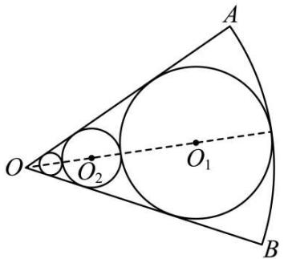
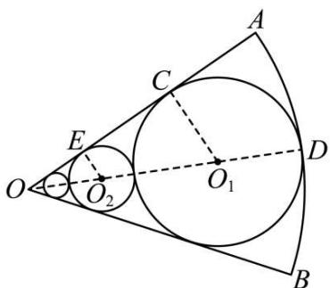
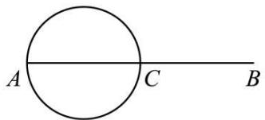
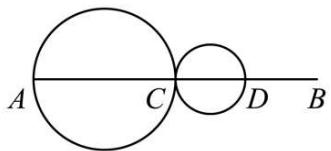
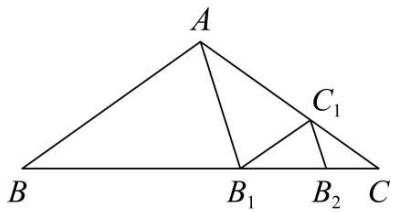

# 第42讲 等比数列及其前 $n$ 项和

# 知识梳理

# 知识点一．等比数列的有关概念

(1) 定义: 如果一个数列从第 2 项起, 每一项与它的前一项的比等于同一常数 (不为零), 那么这个数列就叫做等比数列. 这个常数叫做等比数列的公比, 通常用字母 $q$ 表示, 定义的表达式为 $\frac{a_{n+1}}{a_n} = q$ .

(2) 等比中项: 如果 $a, \mathbf{G}, b$ 成等比数列, 那么 $\mathbf{G}$ 叫做 $a$ 与 $b$ 的等比中项.

即 $\mathbf{G}$ 是 $a$ 与 $b$ 的等比中项 $\Leftrightarrow a, \mathbf{G}, b$ 成等比数列 $\Rightarrow \mathbf{G}^2 = ab$ .

# 知识点二．等比数列的有关公式

(1) 等比数列的通项公式

设等比数列 $\{a_{n}\}$ 的首项为 $a_1$ ，公比为 $q(q \neq 0)$ ，则它的通项公式 $a_{n} = a_{1}q^{n-1} = c \cdot q^{n}\left(c = \frac{a_{1}}{q}\right)(a_{1}, q \neq 0)$ .

推广形式: $a_{n} = a_{m} \cdot q^{n - m}$

(2) 等比数列的前 $n$ 项和公式

等比数列 $\{a_{n}\}$ 的公比为 $q(q\neq 0)$ ，其前 $n$ 项和为 $\mathrm{S}_n = \left\{ \begin{array}{ll}na_1(q = 1)\\ \frac{a_1(1 - q^n)}{1 - q} = \frac{a_1 - a_nq}{1 - q} (q\neq 1) \end{array} \right.$

注①等比数列的前 $n$ 项和公式有两种形式，在求等比数列的前 $n$ 项和时，首先要判断公比 $q$ 是否为1，再由 $q$ 的情况选择相应的求和公式，当不能判断公比 $q$ 是否为1时，要分 $q = 1$ 与 $q \neq 1$ 两种情况讨论求解.

②已知 $a_1, q (q \neq 1), n$ (项数)，则利用 $\mathrm{S}_n = \frac{a_1(1 - q^n)}{1 - q}$ 求解；已知 $a_1, a_n, q (q \neq 1)$ ，则利用 $\mathrm{S}_n = \frac{a_1 - a_nq}{1 - q}$ 求解.

③ $\mathrm{S}_n = \frac{a_1(1 - q^n)}{1 - q} = \frac{-a_1}{1 - q}\cdot q^n +\frac{a_1}{1 - q} = kq^n -k(k\neq 0,q\neq 1),\mathrm{S}_n$ 为关于 $q^n$ 的指数型函数，且系数与常数互为相反数.

# 知识点三．等比数列的性质

(1) 等比中项的推广.

若 $m + n = p + q$ 时，则 $a_{m}a_{n} = a_{p}a_{q}$ ，特别地，当 $m + n = 2p$ 时， $a_{m}a_{n} = a_{p}^{2}$

(2) ① 设 $\{a_{n}\}$ 为等比数列，则 $\{\lambda a_{n}\}$ ( $\lambda$ 为非零常数), $\{|a_{n}|\}$ , $\{a_{n}^{m}\}$ 仍为等比数列.

②设 $\{a_{n}\}$ 与 $\{b_{n}\}$ 为等比数列，则 $\{a_{n}b_{n}\}$ 也为等比数列.

(3) 等比数列 $\{a_{n}\}$ 的单调性 (等比数列的单调性由首项 $a_{1}$ 与公比 $q$ 决定).

当 $\left\{\begin{aligned}a_{1}&>0\\ q&>1\end{aligned}\right.$ 或 $\left\{\begin{aligned}a_{1}&<0\\ 0&<q<1\end{aligned}\right.$ 时， $\left\{a_{n}\right\}$ 为递增数列；

当 $\left\{ \begin{array}{l}a_{1} > 0\\ 0 <   q <   1 \end{array} \right.$ 或 $\left\{ \begin{array}{l}a_1 <   0\\ q > 1 \end{array} \right.$ 时， $\{a_n\}$ 为递减数列.

(4) 其他衍生等比数列.

若已知等比数列 $\{a_{n}\}$ ，公比为 $q$ ，前 $n$ 项和为 $\mathbf{S}_n$ ，则：

①等间距抽取

$a_{p}, a_{p + t}, a_{p + 2t}, \cdots, a_{p + (n - 1)t}, \cdots$ 为等比数列，公比为 $q^{t}$ .

②等长度截取

$S_{m},S_{2m}-S_{m},S_{3m}-S_{2m},\cdots$ 为等比数列，公比为 $q^{m}$ （当q=-1时，m不为偶数）.

# 【解题方法总结】

(1) 若 $m + n = p + q = 2k(m, n, p, q, k \in \mathbb{N}^*)$ ，则 $a_m \cdot a_n = a_p \cdot a_q = a_k^2$ .  
(2) 若 $\{a_{n}\}, \{b_{n}\}$ (项数相同) 是等比数列, 则 $\{\lambda a_{n}\} (\lambda \neq 0), \left\{\frac{1}{a_{n}}\right\}, \{a_{n}^{2}\}, \{a_{n} \cdot b_{n}\}, \left\{\frac{a_{n}}{b_{n}}\right\}$ 仍是等比数列.  
(3) 在等比数列 $\{a_{n}\}$ 中, 等距离取出若干项也构成一个等比数列, 即 $a_{n}, a_{n+k}, a_{n+2k}, a_{n+3k} \cdots$ 为

等比数列,公比为 $q^{k}$ .

(4) 公比不为 -1 的等比数列 $\{a_{n}\}$ 的前 n 项和为 $S_{n}$ ，则 $S_{n}, S_{2n}-S_{n}, S_{3n}-S_{2n}$ 仍成等比数列，其公比为 $q^{n}$ .  
(5) $\{a_{n}\}$ 为等比数列，若 $a_1 \cdot a_2 \cdots a_n = \mathrm{T}_n$ ，则 $\mathrm{T}_n, \frac{\mathrm{T}_{2n}}{\mathrm{T}_n}, \frac{\mathrm{T}_{3n}}{\mathrm{T}_{2n}}, \cdots$ 成等比数列.  
(6) 当 $q \neq 0, q \neq 1$ 时， $\mathrm{S}_n = k - k \cdot q^n (k \neq 0)$ 是 $\{a_n\}$ 成等比数列的充要条件，此时 $k = \frac{a_1}{1 - q}$ .  
(7)有穷等比数列中,与首末两项等距离的两项的积相等. 特别地,若项数为奇数时,还等于中间

项的平方.

(8) 若 $\{a_{n}\}$ 为正项等比数列, 则 $\{\log_c a_n\} (c > 0, c \neq 1)$ 为等差数列.  
(9) 若 $\{a_{n}\}$ 为等差数列, 则 $\{c^{a_n}\} (c > 0, c \neq 1)$ 为等比数列.  
(10) 若 $\{a_{n}\}$ 既是等差数列又是等比数列 $\Leftrightarrow \{a_{n}\}$ 是非零常数列.

# 必考题型全归纳

# 1 题型一:等比数列的基本运算

1890 (2024·北京·高三汇文中学校考阶段练习)在等比数列 $\{a_{n}\}$ 中， $a_{1}=3, a_{1}+a_{2}+a_{3}=9$ ，则 $a_{4}+a_{5}+a_{6}$ 等于 ()

A. 9

B. 72

C. 9 或 70

D. 9 或 -72

【答案】D

【解析】由题意, $n\in N^{*}$ ,

在等比数列 $\{a_{n}\}$ 中， $a_{1}=3, a_{1}+a_{2}+a_{3}=9$ ，

设公比为 $q$

$$
\therefore a _ {1} + a _ {1} q + a _ {1} q ^ {2} = 9 \text {, 即} 3 + 3 q + 3 q ^ {2} = 9 \text {, 解得} q = - 2 \text {或} q = 1,
$$

$$
\therefore a _ {4} + a _ {5} + a _ {6} = \left(a _ {1} + a _ {2} + a _ {3}\right) q ^ {3} = 9 q ^ {3},
$$

当 q=1 时， $a_{4}+a_{5}+a_{6}=9$ ，

当 q=2 时， $a_{4}+a_{5}+a_{6}=-72$ .

故选：D.

1891 (2024·全国·高三专题练习)已知递增的等比数列 $\{a_{n}\}$ 中, 前 3 项的和为 7, 前 3 项的积为 8, 则 $a_{4}$ 的值为 ()

A. 2

B. 4

C. 6

D. 8

【答案】D

【解析】由前3项的和为7,得 $a_{1}+a_{1}q+a_{1}q^{2}=7$

前3项的积为8,得 $a_{1}a_{2}a_{3}=a_{2}^{3}=8$ ,即 $a_{2}=2$ ,

则 $a_1 = \frac{2}{q}$ , 代入 $a_1 + a_1q + a_1q^2 = 7$ , 得 $\frac{2}{q} + \frac{2}{q} \cdot q + \frac{2}{q} \cdot q^2 = 7$ , 即 $2q^2 - 5q + 2 = 0$ , 解得 $q = 2$ 或 $q = \frac{1}{2}$ ,

因为 $\{a_{n}\}$ 为递增的等比数列，

所以 q=2，则 $a_{1}=\frac{2}{q}=1$ ，

所以 $a_{4}=1\times2^{3}=8$ ,

故选：D.

1892 (2024·浙江温州·乐清市知临中学校考模拟预测)已知等比数列 $\{a_{n}\}$ 的前 n 项和为 $S_{n}$ ，公比为 q，且 $S_{n}=a_{n+1}-1$ ，则（）

A. $a_{1} = 2$

B. $S_{2}=2$

C. q=1

D. q = 2

【答案】D

【解析】因为 $S_{n}=a_{n+1}-1$ ,

所以 $S_{1}=a_{2}-1, S_{2}=a_{3}-1,$

所以 $a_{1}=a_{2}-1, a_{1}+a_{2}=a_{3}-1$ ,

所以 $a_{1}=a_{1}q-1, a_{1}+a_{1}q=a_{1}q^{2}-1,$

解得 $q=2, a_{1}=1$ , A 错误, C 错误, D 正确,

所以 $S_{2}=3$ ，B 错误；

故选：D.

1893 (2024·四川遂宁·射洪中学校考模拟预测)在等比数列 $\{a_{n}\}$ 中, 若 $a_{2}=4, a_{5}=-32$ , 则公比 q 应为 ()

A. $\pm\frac{1}{2}$

B. $\pm 2$

C. $\frac{1}{2}$

D.-2

【答案】D

【解析】因为 $\frac{a_{5}}{a_{2}}=\frac{a_{1}\times q^{4}}{a_{1}\times q}=q^{3}=\frac{-32}{4}=-8$ ，解得 q=-2。

故选：D

1894 (2024·全国·高三专题练习)设等比数列 $\{a_{n}\}$ 的各项均为正数，前 n 项和 $S_{n}$ ，若 $a_{1}=1$ ， $S_{5}=5S_{3}-4$ ，则 $S_{4}=$ （）

A. $\frac{15}{8}$

B. $\frac{65}{8}$

C. 15

D. 40

【答案】C

【解析】由题知 $1 + q + q^{2} + q^{3} + q^{4} = 5(1 + q + q^{2}) - 4$ ,

即 $q^3 + q^4 = 4q + 4q^2$ ，即 $q^3 + q^2 - 4q - 4 = 0$ ，即 $(q - 2)(q + 1)(q + 2) = 0$ .

由题知 q > 0, 所以 q = 2.

所以 $S_{4}=1+2+4+8=15.$

故选:C.

1895 (2024·全国·高三对口高考)已知数列 $\{a_{n}\}$ 是等比数列， $a_{1}+a_{2}=2, a_{7}+a_{8}=128$ ，则该数列的 $S_{10}$ 以及 $a_{1}$ 依次为（）

A. $682, \frac{2}{3}$

B. -682, -2

C. $682, \frac{2}{3}$ 或 -2

D. -682, $\frac{2}{3}$ 或 -2

【答案】C

【解析】根据题意,得 $\left\{\begin{aligned}a_{1}+a_{1}q&=2\\ a_{1}q^{6}+a_{1}q^{7}&=128\end{aligned}\right.$

解方程得 $\left\{\begin{aligned}a_{1}&=\frac{2}{3}\\ q&=2\end{aligned}\right.$ ，或 $\left\{\begin{aligned}a_{1}&=-2\\ q&=-2\end{aligned}\right.$

$$
\mathrm{S} _ {1 0} = \frac {a _ {1} (1 - q ^ {1 0})}{1 - q} = \frac {\frac {2}{3} (1 - 2 ^ {1 0})}{1 - 2} = 6 8 2, \text {或} \mathrm{S} _ {1 0} = \frac {- 2 (1 - (- 2) ^ {1 0})}{1 - (- 2)} = 6 8 2.
$$

故选：C

1896 (2024·江西抚州·统考模拟预测)已知正项等比数列 $\{a_{n}\}$ 的前 n 项和为 $S_{n}$ ，若 $a_{4}a_{5}=3a_{8}$ ， $S_{3}=39$ ，则 $a_{4}=$ （）

A. 64

B. 81

C. 128

D. 192

【答案】B

【解析】由等比数列的性质可知 $a_{4}a_{5}=a_{1}a_{8}=3a_{8}, a_{8}\neq0$ ，所以 $a_{1}=3$ ，

由 $S_{3}=39$ ，得 $a_{1}(1+q+q^{2})=39$ ，所以 $q^{2}+q-12=0$ ，解得 q=3 或 q=-4（舍去），

所以 $a_{4}=a_{1}q^{3}=81$ .

故选: B.

1897 (2024·江西·校联考模拟预测)已知等比数列 $\{a_{n}\}$ 的前 4 项和为 30, $a_{1}-a_{5}=15$ , 则 $a_{7}=$ ()

A. $\frac{1}{4}$

B. $\frac{1}{2}$

C. 1

D. 2

【答案】A

【解析】设等比数列 $\{a_{n}\}$ 的公比为 q，若 q=1，则 $a_{1}-a_{5}=0$ ，与题意矛盾；

所以 $q \neq 1$ ，则 $\left\{\begin{aligned}a_{1}+a_{2}+a_{3}+a_{4}&=\frac{a_{1}(1-q^{4})}{1-q}=30\\ a_{1}-a_{5}&=a_{1}-a_{1}q^{4}=15\end{aligned}\right.$ ，解得 $\left\{\begin{aligned}a_{1}&=16\\ q&=\frac{1}{2}\end{aligned}\right.$

所以 $a_{7}=a_{1}q^{6}=\frac{1}{4}.$

故选：A.

【解题方法总结】

等比数列基本量运算的解题策略

(1) 等比数列基本量的运算是等比数列中的一类基本问题, 等比数列中有五个量 $a_{1}, n, q, a_{n}, S_{n}$ ,

一般可以“知三求二”，通过列方程(组)便可迎刃而解.

(2) 等比数列的前 n 项和公式涉及对公比 q 的分类讨论:

当 $q = 1$ 时， $\mathrm{S}_n = na_1$ ；当 $q\neq 1$ 时， $\mathrm{S}_n = \frac{a_1(1 - q^n)}{1 - q} = \frac{a_1 - a_nq}{1 - q}.$

# 2 题型二:等比数列的判定与证明

1898 (2024·全国·高三专题练习)甲、乙两个容器中分别盛有浓度为 $10\%$ ， $20\%$ 的某种溶液 $500ml$ ，同时从甲、乙两个容器中取出 $100ml$ 溶液，将其倒入对方的容器并搅匀，这称为一次调和．记 $a_1 = 10\%$ ， $b_1 = 20\%$ ，经 $(n - 1)$ 次调和后，甲、乙两个容器的溶液浓度分别为 $a_n$ ， $b_n$

(1) 试用 $a_{n-1}, b_{n-1}$ 表示 $a_n, b_n$ .  
(2) 证明: 数列 $\{a_{n}-b_{n}\}$ 是等比数列, 并求出 $a_{n}, b_{n}$ 的通项.

【解析】(1)由题意,经 $n-1(n\geqslant2,n\in\mathbb{N}^{*})$ 次调和后甲、乙两个容器中的溶液浓度分别为 $a_{n},b_{n}$ ,

所以 $a_{n} = \frac{400a_{n - 1} + 100b_{n - 1}}{500} = \frac{4}{5} a_{n - 1} + \frac{1}{5} b_{n - 1},b_n = \frac{400b_{n - 1} + 100a_{n - 1}}{500} = \frac{4}{5} b_{n - 1} + \frac{1}{5} a_{n - 1}.$

(2) 由 (1) 知, $a_{n} = \frac{4}{5} a_{n-1} + \frac{1}{5} b_{n-1}, b_{n} = \frac{4}{5} b_{n-1} + \frac{1}{5} a_{n-1}$ ,

可得 $a_{n} - b_{n} = \frac{3}{5} a_{n - 1} - \frac{3}{5} b_{n - 1} = \frac{3}{5}(a_{n - 1} - b_{n - 1})(n\geqslant 2)$

所以数列 $\{a_{n} - b_{n}\}$ 是等比数列，

因为 $a_1 - b_1 = -10\%$ ，所以 $a_n - b_n = -10\% \times \left(\frac{3}{5}\right)^{n-1}$ ①，

又因为 $a_{n} + b_{n} = a_{n-1} + b_{n-1} = \cdots = a_{1} + b_{1} = 30\%$ ②.

联立①②得 $a_{n} = -\left(\frac{3}{5}\right)^{n - 1}\times 5\% +15\% ,b_{n} = \left(\frac{3}{5}\right)^{n - 1}\times 5\% +15\% .$

1899 (2024·全国·高三专题练习)已知数列 $\{a_{n}\}$ 满足 $4S_{n}-2a_{n}=2^{n}, n\in N^{*}$ ，其中 $S_{n}$ 为 $\{a_{n}\}$ 的前 n 项和．证明：

(1) $\left\{\frac{a_{n}}{2^{n}}-\frac{1}{6}\right\}$ 是等比数列.   
(2) $\frac{1}{6a_{1}-3}+\frac{1}{6a_{2}+3}+\frac{1}{6a_{3}-3}+\cdots+\frac{1}{6a_{n}+3\times(-1)^{n}}<1.$

【解析】(1) $\because4S_{n}-2a_{n}=2^{n},\therefore4S_{n-1}-2a_{n-1}=2^{n-1}(n\geqslant2)$ ,

两式相减得： $4(S_{n}-S_{n-1})-2a_{n}+2a_{n-1}=2^{n}-2^{n-1}$ ，即 $a_{n}+a_{n-1}=2^{n-2}(n\geqslant2)$ .

$$
\therefore \frac {\frac {a _ {n}}{2 ^ {n}} - \frac {1}{6}}{\frac {a _ {n - 1}}{2 ^ {n - 1}} - \frac {1}{6}} = \frac {\frac {- a _ {n - 1} + 2 ^ {n - 2}}{2 ^ {n}} - \frac {1}{6}}{\frac {a _ {n - 1}}{2 ^ {n - 1}} - \frac {1}{6}} = \frac {- \frac {1}{2} \left(\frac {a _ {n - 1}}{2 ^ {n - 1}} - \frac {1}{6}\right)}{\frac {a _ {n - 1}}{2 ^ {n - 1}} - \frac {1}{6}} = - \frac {1}{2} (n \geqslant 2).
$$

当 n=1 时， $4S_{1}-2a_{1}=2^{1}$ ，即 $a_{1}=1$

又 $\because \frac{a_1}{2^1} -\frac{1}{6} = \frac{1}{3}\neq 0,\therefore \left\{\frac{a_n}{2^n} -\frac{1}{6}\right\}$ 是以 $\frac{1}{3}$ 为首项， $-\frac{1}{2}$ 为公比的等比数列.

(2) 由 (1) 得 $\frac{a_n}{2^n} - \frac{1}{6} = \frac{1}{3} \times \left(-\frac{1}{2}\right)^{n-1}$ , 所以 $a_n = -\frac{2}{3} \times (-1)^n + \frac{1}{6} \times 2^n$

令 $b_{n}=\frac{1}{6a_{n}+3(-1)^{n}}=\frac{1}{2^{n}-(-1)^{n}}$ ,

则 $b_{2n - 1} + b_{2n} = \frac{1}{2^{2n - 1} + 1} +\frac{1}{2^{2n} - 1} = \frac{\frac{3}{2}\times 2^{2n}}{2^{4n - 1} + 2^{2n - 1} - 1} <  \frac{\frac{3}{2}\times 2^{2n}}{2^{4n - 1}} = \frac{3}{2^{2n}}.$

不等式左边的前 2n 项和 $T_{2n}<\frac{3}{4}+\frac{3}{4^{2}}+\cdots+\frac{3}{4^{n}}=\frac{\frac{3}{4}\times\left(1-\frac{1}{4^{n}}\right)}{1-\frac{1}{4}}<1.$

又 $b_{n} > 0\Rightarrow \mathrm{T}_{2n - 1} <   \mathrm{T}_{2n} <   1,\therefore$ 原不等式得证.

1900 (2024·安徽亳州·蒙城第一中学校联考模拟预测)甲、乙、丙三个小学生相互抛沙包,第一次由甲抛出,每次抛出时,抛沙包者等可能的将沙包抛给另外两个人中的任何一个,设第$n(n \in \mathbb{N}^{*})$ 次抛沙包后沙包在甲手中的方法数为 $a_{n}$ ，在丙手中的方法数为 $b_{n}$ .

(1) 求证: 数列 $\left\{a_{n+1} + a_{n}\right\}$ 为等比数列, 并求出 $\left\{a_{n}\right\}$ 的通项;  
(2) 求证: 当 n 为偶数时, $a_{n} > b_{n}$ .

【解析】(1)由题意知:第n次抛沙包后的抛沙包方法数为 $2^{n}$ ,

第 $n+1$ 次抛沙包后沙包在甲手中的方法数为 $a_{n+1}$ ，若第 n 次抛沙包后沙包在甲手中，则第 $n+1$ 次抛沙包后，沙包不可能在甲手里，只有第 n 次抛沙包后沙包在乙或丙手中，

故 $a_{n + 1} = a_n\times 0 + (2^n -a_n)\times 1 = 2^n -a_n$ ，且 $a_1 = 0$

故 $a_{n+1} + a_n = 2^n$ ,

$$
\frac {a _ {n} + a _ {n + 1}}{a _ {n - 1} + a _ {n}} = 2 (n \geqslant 2),
$$

所以数列 $\left\{a_{n+1}+a_{n}\right\}$ 为等比数列，

由 $a_{n - 1} + a_n = 2^{n - 1}$ ，得 $(-1)^{n - 1}a_{n - 1} - (-1)^n a_n = (-2)^{n - 1},$

$$
(- 1) ^ {1} a _ {1} - (- 1) ^ {2} a _ {2} = (- 2) ^ {1},
$$

$$
(- 1) ^ {2} a _ {2} - (- 1) ^ {3} a _ {3} = (- 2) ^ {2},
$$

$$
(- 1) ^ {3} a _ {3} - (- 1) ^ {4} a _ {4} = (- 2) ^ {3},
$$

$$
\dots ,
$$

$$
(- 1) ^ {n - 1} a _ {n - 1} - (- 1) ^ {n} a _ {n} = (- 2) ^ {n - 1}
$$

以上各式相加， $(-1)^{1}a_{1} - (-1)^{n}a_{n} = \frac{-2[1 - (-2)^{n - 1}]}{1 + 2}$

可得 $a_{n} = \frac{2^{n} + 2(-1)^{n}}{3}$ ;

(2) 由题意知: 第 n 次抛沙包后沙包在乙、丙手中的情况数相等均为 $b_{n}$ ,

则 $a_{n} + 2b_{n} = 2^{n}$

∵当n为偶数时， $a_{n}=\frac{2^{n}+2(-1)^{n}}{3}=\frac{2^{n}+2}{3}>\frac{2^{n}}{3},b_{n}=\frac{2^{n}-a_{n}}{2}<\frac{2^{n}}{3}$

$$
\therefore a _ {n} > b _ {n}.
$$

1901 (2024·广东东莞·校考三模)已知数列 $\{a_{n}\}$ 和 $\{b_{n}\}$ ， $a_{1}=2,\frac{1}{b_{n}}-\frac{1}{a_{n}}=1,a_{n+1}=2b_{n}$

(1) 求证数列 $\left\{\frac{1}{a_n} - 1\right\}$ 是等比数列；  
(2) 求数列 $\left\{\frac{n}{b_{n}}\right\}$ 的前 n 项和 $T_{n}$ .

【解析】(1) 由 $a_{1}=2,\frac{1}{b_{n}}-\frac{1}{a_{n}}=1,a_{n+1}=2b_{n}$ 得 $\frac{2}{a_{n+1}}-\frac{1}{a_{n}}=1,$

整理得 $\frac{1}{a_{n + 1}} - 1 = \frac{1}{2}\left(\frac{1}{a_n} - 1\right)$ , 而 $\frac{1}{a_1} - 1 = -\frac{1}{2} \neq 0$ ,

所以数列 $\left\{\frac{1}{a_n} - 1\right\}$ 是以 $-\frac{1}{2}$ 为首项，公比为 $\frac{1}{2}$ 的等比数列

(2) 由 (1) 知 $\frac{1}{a_n} - 1 = -\frac{1}{2}\left(\frac{1}{2}\right)^{n-1} = -\frac{1}{2^n}, \therefore a_n = \frac{2^n}{2^n - 1}$ ,

$$
\therefore b _ {n} = \frac {1}{2} a _ {n + 1} = \frac {2 ^ {n}}{2 ^ {n + 1} - 1}, \frac {n}{b _ {n}} = n \cdot \frac {2 ^ {n + 1} - 1}{2 ^ {n}} = 2 n - \frac {n}{2 ^ {n}},
$$

设 $S_{n}=\frac{1}{2}+\frac{2}{2^{2}}+\cdots+\frac{n}{2^{n}}$ ，则 $\frac{1}{2}S_{n}=\frac{1}{2^{2}}+\frac{2}{2^{3}}+\cdots+\frac{n}{2^{n+1}}$

两式相减得 $\frac{1}{2}S_{n}=\frac{1}{2}+\frac{1}{2^{2}}+\cdots+\frac{1}{2^{n}}-\frac{n}{2^{n+1}}=\frac{\frac{1}{2}\left(1-\frac{1}{2^{n}}\right)}{1-\frac{1}{2}}-\frac{n}{2^{n+1}}=1-\frac{n+2}{2^{n+1}}$

从而 $S_{n} = 2 - \frac{n + 2}{2^{n}}$

$$
\therefore \mathrm{T} _ {n} = \frac {n (2 + 2 n)}{2} - \mathrm{S} _ {n} = n ^ {2} + n - 2 + \frac {n + 2}{2 ^ {n}}.
$$

1902 (2024·全国·高三专题练习)设数列 $\{a_{n}\}$ 的首项 $a_{1}=a$ ，且 $a_{n+1}=\left\{\begin{aligned}&\frac{1}{2}a_{n},n\text{为偶数}\\&a_{n}+\frac{1}{4},n\text{为奇数}\end{aligned}\right.$ 记 $b_{n}=a_{2n-1}-\frac{1}{4},n=1,2,3\ldots$

(1) 求 $a_{2}, a_{3}$ ;   
(2) 判断数列 $\{b_{n}\}$ 是否为等比数列, 并证明你的结论;  
(3) 求 $b_{1} + b_{2} + \cdots + b_{n}$ .

【解析】(1)由题意可知： $a_{2}=a_{1}+\frac{1}{4}=a+\frac{1}{4},a_{3}=\frac{1}{2}a_{2}=\frac{1}{2}a+\frac{1}{8}$

(2) 由 $b_n = a_{2n-1} - \frac{1}{4} = a_{2n-2+1} - \frac{1}{4} = \frac{1}{2} a_{2n-3+1} - \frac{1}{4} = \frac{1}{2} (a_{2n-3} + \frac{1}{4}) - \frac{1}{4} =$

$$
\frac {1}{2} \left(a _ {2 n - 3} - \frac {1}{4}\right) = \frac {1}{2} b _ {n - 1},
$$

而 $b_{1} = a_{1} - \frac{1}{4} = a - \frac{1}{4},$

若 $a=\frac{1}{4}$ ，则 $b_{1}=0$ ，显然 $\left\{b_{n}\right\}$ 不能是等比数列，

若 $a \neq \frac{1}{4}$ , 则 $\{b_n\}$ 是以 $a - \frac{1}{4}$ 为首项, $\frac{1}{2}$ 为公比的等比数列.

(3) 由 (2) 可知, 若 $a = \frac{1}{4}$ , 则 $\{b_{n}\}$ 为常数列, 各项均为 0, 故 $b_{1} + b_{2} + \cdots + b_{n} = 0$ ;

若 $a \neq \frac{1}{4}$ , 则 $\{b_n\}$ 是以 $a - \frac{1}{4}$ 为首项, $\frac{1}{2}$ 为公比的等比数列,

则由等比数列的求和公式得: $b_{1}+b_{2}+\cdots+b_{n}=\frac{(a-\frac{1}{4})(1-\frac{1}{2^{n}})}{1-\frac{1}{2}}=2a-\frac{1}{2}-\frac{a-\frac{1}{4}}{2^{n-1}}$ .

1903 (2024·全国·高三专题练习)已知数列 $\{a_{n}\}$ 、 $\{b_{n}\}$ 满足 $4a_{n+1}=3a_{n}-b_{n}+t,4b_{n+1}=3b_{n}-a_{n}-t,t\in R,n\in N_{+}$ ，且 $a_{1}=1,b_{1}=0$ .

(1) 求证: $\{a_{n} + b_{n}\}$ 是等比数列;  
(2) 若 $\{a_{n}\}$ 是递增数列, 求实数 t 的取值范围.

【解析】(1)由题可知: $4b_{n+1}=3b_{n}-a_{n}-t,4a_{n+1}=3a_{n}-b_{n}+t,$

故可得 $a_{n + 1} + b_{n + 1} = \frac{1}{2} (a_n + b_n)$ ，又 $a_1 + b_1 = 1\neq 0,\therefore a_n + b_n\neq 0,$

$\therefore \frac{a_{n + 1} + b_{n + 1}}{a_n + b_n} = \frac{1}{2}$ 所以 $\{a_n + b_n\}$ 是首项为1，公比为 $\frac{1}{2}$ 的等比数列.

(2) 方法一:

$\because \{a_{n}\}$ 是递增数列，

∴ $a_{n+1}-a_{n}>0$ 对任意 $n\in N_{+}$ 恒成立，

$$
\because 4 a _ {n + 1} = 3 a _ {n} - b _ {n} + t, \therefore 4 (a _ {n + 1} - a _ {n}) = - (a _ {n} + b _ {n}) + t
$$

则 $-(a_{n}+b_{n})+t>0$ 对任意 $n\in N_{+}$ 恒成立，

即 $t > a_{n} + b_{n}$ 对任意 $n \in N_{+}$ 恒成立，

由(1)知 $a_{n}+b_{n}=\left(\frac{1}{2}\right)^{n-1}$ ,

$\therefore t > \left(\frac{1}{2}\right)^{n - 1}$ 对任意 $n\in \mathbf{N}_{+}$ 恒成立，

因为当 n=1 时 $\left(\frac{1}{2}\right)^{n-1}$ 取得最大值, 且最大值为 1,

所以 t > 1，即实数 t 的取值范围为 $(1, +\infty)$ .

方法二：

$$
\left\{ \begin{array}{l} 4 b _ {n + 1} = 3 b _ {n} - a _ {n} - t \\ 4 a _ {n + 1} = 3 a _ {n} - b _ {n} + t \end{array} \text {得} 4 (a _ {n + 1} - b _ {n + 1}) = 4 (a _ {n} - b _ {n}) + 2 t, \right.
$$

即 $a_{n + 1} - b_{n + 1} = a_n - b_n + \frac{1}{2} t$ ，又 $a_1 - b_1 = 1$

故数列 $\left\{a_{n}-b_{n}\right\}$ 为首项 1, 公差 $\frac{1}{2}t$ 的等差数列,

所以 $a_{n} - b_{n} = 1 + \frac{(n - 1)}{2} t,$

又由(1)知 $a_{n}+b_{n}=\left(\frac{1}{2}\right)^{n-1}$ ，所以 $a_{n}=\left(\frac{1}{2}\right)^{n}+\frac{1}{2}+\frac{t}{4}(n-1)$ ,

因为 $\{a_{n}\}$ 是递增数列，所以 $a_{n + 1} > a_n$ 对任意 $n\in \mathbf{N}_{+}$ 恒成立.

所以 $\left(\frac{1}{2}\right)^{n + 1} + \frac{1}{2} +\frac{t}{4} n > \left(\frac{1}{2}\right)^{n} + \frac{1}{2} +\frac{t}{4} (n - 1),$

所以 $-\left(\frac{1}{2}\right)^{n + 1} + \frac{t}{4} > 0$ ，所以 $t > \left(\frac{1}{2}\right)^{n - 1}$ ，

因为当 n=1 时 $\left(\frac{1}{2}\right)^{n-1}$ 取得最大值, 且最大值为 1,

所以 t > 1，即实数 t 的取值范围为 $(1, +\infty)$ .

1904 (2024·全国·高三专题练习)数列 $\{a_{n}\}$ 的前 n 和 $S_{n}$ 满足 $S_{n}=2a_{n}-n(n\in\mathbb{N}^{*})$ ,

(1) 求 $a_{1}$ 的值及 $a_{n}$ 与 $a_{n-1}$ 的关系；  
(2) 求证: $\{a_{n} + 1\}$ 是等比数列, 并求出 $\{a_{n}\}$ 的通项公式.

【解析】(1) 因为 $S_{n}=2a_{n}-n(n\in\mathbf{N}^{*})$ ,

所以 $S_{1}=2a_{1}-1$ ，又 $S_{1}=a_{1}$ ，

所以 $a_{1}=2a_{1}-1$ ，故 $a_{1}=1$

当 $n \geqslant 2$ 时， $a_{n} = S_{n} - S_{n-1} = (2a_{n} - n) - [2a_{n-1} - (n-1)]$

得 $a_{n}=2a_{n-1}+1;$

(2) 由 (1) 知 $a_{n} = 2a_{n-1} + 1$ ,

则有 $a_{n}+1=2(a_{n-1}+1)$ ,

由于 $a_{1}=1$ ，故 $a_{1}+1=2$ ，

所以 $\frac{a_{n}+1}{a_{n-1}+1}=2,$

所以数列 $\{a_{n} + 1\}$ 是以2为首项，2为公比的等比数列，

所以 $a_{n}+1=2\cdot2^{n-1}$ ,

所以 $a_{n} = 2^{n} - 1$

1905 (2024·云南·校联考三模)已知数列 $\{a_{n}\}$ 有递推关系 $a_{n+1}=\frac{7a_{n}-8}{3a_{n}-4}(n\in\mathbb{N}^{*},a_{n}\neq\frac{4}{3})$ , $a_{1}=\frac{69}{29}$ ，记 $a_{n}=b_{n}-k(k\in\mathbb{Z})$ ，若数列 $\{b_{n}\}$ 的递推式形如 $b_{n+1}=\frac{rb_{n}}{pb_{n}+q}(p,q,r\in\mathbb{R}$ 且 $p,r\neq$

0), 也即分子中不再含有常数项.

(1) 求实数 $k$ 的值；  
(2) 证明: $\left\{\frac{1}{b_n} - \frac{3}{5}\right\}$ 为等比数列, 并求其首项和公比.

【解析】(1) 因为 $a_{n}=b_{n}-k$ ，所以 $b_{n}=a_{n}+k$ ，

$$
\begin{array}{l} b _ {n + 1} = a _ {n + 1} + k = \frac {7 a _ {n} - 8}{3 a _ {n} - 4} + k = \frac {7 (b _ {n} - k) - 8}{3 (b _ {n} - k) - 4} + k = \frac {7 b _ {n} - 7 k - 8 + 3 k b _ {n} - 3 k ^ {2} - 4 k}{3 b _ {n} - 3 k - 4} \\ = \frac {(7 + 3 k) b _ {n} - 3 k ^ {2} - 1 1 k - 8}{3 b _ {n} - 3 k - 4}, \\ \end{array}
$$

由已知得 $b_{n+1}=\frac{rb_{n}}{pb_{n}+q}$ ,

所以 $\left\{ \begin{array}{l} -3k^2 - 11k - 8 = 0 \\ 7 + 3k = r \\ 3 = p \\ -3k - 4 = q \end{array} \right.$ , 解得 $\left\{ \begin{array}{l} k = -1 \\ r = 4 \\ p = 3 \\ q = -1 \end{array} \right.$ 或 $\left\{ \begin{array}{l} k = -\frac{8}{3} \\ r = -1 \\ p = 3 \\ q = 4 \end{array} \right.$ ,

因为 $k \in Z$ ，所以 k = -1。

(2) 由 (1) 知, $k = -1, r = 4, p = 3, q = -1$ ,

$$
b _ {n + 1} = \frac {4 b _ {n}}{3 b _ {n} - 1}, b _ {1} = a _ {1} + k = \frac {6 9}{2 9} - 1 = \frac {4 0}{2 9},
$$

$$
\frac {1}{b _ {n + 1}} = \frac {3 b _ {n} - 1}{4 b _ {n}} = \frac {3}{4} - \frac {1}{4 b _ {n}}, \frac {1}{b _ {n + 1}} - \frac {3}{5} = \frac {3}{4} - \frac {1}{4 b _ {n}} - \frac {3}{5} = - \frac {1}{4 b _ {n}} + \frac {3}{2 0} = - \frac {1}{4} \left(\frac {1}{b _ {n}} - \frac {3}{5}\right),
$$

因为 $\frac{1}{b_1} -\frac{3}{5} = \frac{29}{40} -\frac{3}{5} = \frac{1}{8}\neq 0,$

所以数列 $\left\{\frac{1}{b_n} -\frac{3}{5}\right\}$ 为等比数列，首项为 $\frac{1}{8}$ ，公比为 $-\frac{1}{4}$

1906 (2024·福建厦门·统考模拟预测)已知数列 $\{a_{n}\}$ 满足 $a_1 = 1, a_{n+1} = \frac{a_n + 2}{a_n}, n \in \mathbb{N}^*$ .

(1) 证明 $\left\{\frac{a_n - 2}{a_n + 1}\right\}$ 是等比数列；  
(2) 若 $b_{n} = \frac{3}{a_{n} + 1}$ ，求 $\{b_{n}\}$ 的前 $n$ 项和 $S_{n}$ .

【解析】(1)由题意得 $\frac{a_{n + 1} - 2}{a_{n + 1} + 1} = \frac{a_n + 2 - 2a_n}{a_n + 2 + a_n} = -\frac{1}{2}\cdot \frac{a_n - 2}{a_n + 1}.$

又因为 $\frac{a_1 - 2}{a_1 + 1} = -\frac{1}{2}\neq 0$ ，所以 $\frac{\frac{a_{n + 1} - 2}{a_{n + 1} + 1}}{\frac{a_n - 2}{a_n + 1}} = -\frac{1}{2}.$

所以 $\left\{\frac{a_n - 2}{a_n + 1}\right\}$ 是以 $-\frac{1}{2}$ 为首项， $-\frac{1}{2}$ 为公比的等比数列.

(2)由(1)得 $\frac{a_n - 2}{a_n + 1} = \left(-\frac{1}{2}\right)^n.$

所以 $b_{n} = \frac{3}{a_{n} + 1} = 1 - \frac{a_{n} - 2}{a_{n} + 1} = 1 - \left(-\frac{1}{2}\right)^{n}.$

所以 $S_{n}=b_{1}+b_{2}+b_{3}+\cdots+b_{n}=1-\left(-\frac{1}{2}\right)^{1}+1-\left(-\frac{1}{2}\right)^{2}+1-\left(-\frac{1}{2}\right)^{3}+\cdots+1-\left(-\frac{1}{2}\right)^{n}$

$$
= 1 + 1 + 1 \dots + 1 - \left[ \left(- \frac {1}{2}\right) ^ {1} + \left(- \frac {1}{2}\right) ^ {2} + \left(- \frac {1}{2}\right) ^ {3} + \dots + \left(- \frac {1}{2}\right) ^ {n} \right] = \frac {n (1 + 1)}{2} -
$$

$$
\frac {\left(- \frac {1}{2}\right) \left[ 1 - \left(- \frac {1}{2}\right) ^ {n} \right]}{1 - \left(- \frac {1}{2}\right)} = n - \frac {- \frac {1}{2} - \left(- \frac {1}{2}\right) ^ {n + 1}}{1 - \left(- \frac {1}{2}\right)} = n + \frac {1 - \left(- \frac {1}{2}\right) ^ {n}}{3}.
$$

1907 (2024·山东潍坊·三模)已知数列 $\{a_{n}\}$ 和 $\{b_{n}\}$ 满足 $a_{1}=3, b_{1}=2, a_{n+1}=a_{n}+2b_{n}, b_{n+1}=2a_{n}+b_{n}$ .

(1) 证明: $\{a_{n} + b_{n}\}$ 和 $\{a_{n} - b_{n}\}$ 都是等比数列;  
(2) 求 $\{a_{n}b_{n}\}$ 的前 $n$ 项和 $\mathrm{S}_n$ .

【解析】(1) 因为 $a_{n+1}=a_{n}+2b_{n}, b_{n+1}=2a_{n}+b_{n}$ ,

所以 $a_{n+1} + b_{n+1} = 3(a_n + b_n)$ , $a_{n+1} - b_{n+1} = -(a_n - b_n)$ ,

又由 $a_{1}=3, b_{1}=2$ 得 $a_{1}-b_{1}=1, a_{1}+b_{1}=5,$

所以数列 $\left\{a_{n}+b_{n}\right\}$ 是首项为 5, 公比为 3 的等比数列,

数列 $\left\{a_{n}-b_{n}\right\}$ 是首项为 1, 公比为 -1 的等比数列.

(2) 由 (1) 得 $a_{n} + b_{n} = 5 \times 3^{n - 1}$ , $a_{n} - b_{n} = (-1)^{n - 1}$ ,

所以 $a_{n} = \frac{5\times 3^{n - 1} + (-1)^{n - 1}}{2},b_{n} = \frac{5\times 3^{n - 1} - (-1)^{n - 1}}{2},$

所以 $a_{n}b_{n} = \frac{5\times 3^{n - 1} + (-1)^{n - 1}}{2}\times \frac{5\times 3^{n - 1} - (-1)^{n - 1}}{2} = \frac{25\times 3^{2n - 2} - 1}{4},$

所以 $S_{n}=\frac{25}{4}\times\frac{1-9^{n}}{1-9}-\frac{n}{4}=\frac{25\times(9^{n}-1)-8n}{32}.$

# 【解题方法总结】

等比数列的判定方法

<table><tr><td>定义法</td><td>若 $\frac{a_{n+1}}{a_n} = q (q \text{为非零常数}, n \in \mathbb{N}^* \text{或} \frac{a_n}{a_{n-1}} = q (q \text{为非零常数且} n \geqslant 2, n \in \mathbb{N}^*)$ ,则 $\{a_n\}$ 是等比数列</td></tr><tr><td>中项公式法</td><td>若数列 $\{a_n\}$ 中, $a_n \neq 0$ 且 $a_{n+1}^2 = a_n \cdot a_{n+2} (n \in \mathbb{N}^*)$ ,则 $\{a_n\}$ 是等比数列</td></tr><tr><td>通项公式法</td><td>若数列 $\{a_n\}$ 的通项公式可写成 $a_n = c \cdot q^{n-1} (c, q \text{均为非零常数}, n \in \mathbb{N}^*)$ ,则 $\{a_n\}$ 是等比数列</td></tr><tr><td>前 $n$ 项和公式法</td><td>若数列 $\{a_n\}$ 的前 $n$ 项和 $S_n = k \cdot q^n - k (k \text{为非零常数}, q \neq 0, 1)$ ,则 $\{a_n\}$ 是等比数列</td></tr></table>

# 3 题型三:等比数列项的性质应用

1908 (2024·全国·高三对口高考)已知等比数列 $\{a_{n}\}$ 的前 $n$ 项和为 $\mathrm{S}_n = 3^{n - 1} - c$ ，则 $c =$

【答案】 $\frac{1}{3}$

【解析】由题意可得 $S_{1}=3^{1-1}-c=1-c=a_{1}$ ， $S_{2}=3^{2-1}-c=3-c=a_{1}+a_{2}\Rightarrow a_{2}=2$ ，

$$
\mathrm{S} _ {3} = 3 ^ {3 - 1} - c = 9 - c = a _ {3} + \mathrm{S} _ {2} \Rightarrow a _ {3} = 6, \text {故有} a _ {2} ^ {2} = a _ {1} \cdot a _ {3} \Rightarrow 4 = 6 (1 - c) \Rightarrow c = \frac {1}{3}.
$$

故答案为: $\frac{1}{3}$

1909 (2024·山东泰安·统考二模)若 m, n 是函数 $f(x)=x^{2}-px+q(p>0,q>0)$ 的两个不同零点，且 m, n, -2 这三个数可适当排序后成等差数列，也可适当排序后成等比数列，则 pq= \_\_\_\_.

【答案】20

【解析】由题可得 $\left\{\begin{aligned}m+n&=p>0\\ mn&=q>0\end{aligned}\right.\Rightarrow\left\{\begin{aligned}m&>0\\ n&>0\end{aligned}\right.$

则 m, -2, n 成等比数列, 得 $mn = (-2)^{2} = 4$ .

又不妨设 m < n，则 -2, m, n 成等差数列，得 2m = n - 2.

结合 mn=4，可得 $(2m+2)m=4\Rightarrow m(m+1)=2$ ，解得 m=1 或 -2（舍去），即 $\left\{\begin{aligned}m=1\\ n=4\end{aligned}\right.\Rightarrow$ $\left\{\begin{aligned}p=5\\ q=4\end{aligned}\right.\Rightarrow pq=20.$

故答案为: 20

1910 (2024·全国·高三专题练习)已知数列 $\{a_{n}\}$ 中， $a_{1} \neq 0, a_{m+n} = a_{m}a_{n}(m, n \in \mathbb{N}^{*})$ ，且 $a_{3}$ 、 $a_{11}$ 是函数 $f(x) = 2x^{2} + 19x + 20$ 的两个零点，则 $a_{7} =$ \_\_\_\_ .

【答案】 $-\sqrt{10}$

【解析】因为在数列 $\{a_{n}\}$ 中， $a_{1} \neq 0, a_{m+n} = a_{m}a_{n}(m, n \in \mathbb{N}^{*})$ ，则 $a_{n+1} = a_{n}a_{1}$ ，所以， $\frac{a_{n+1}}{a_{n}} = a_{1}$ ，

所以,数列 $\{a_{n}\}$ 为等比数列,且该数列的首项为 $a_{1}$ , 公比为 $q=a_{1}$ ,

因为 $a_{3}$ 、 $a_{11}$ 是函数 $f(x)=2x^{2}+19x+20$ 的两个零点，

由韦达定理可得 $\left\{\begin{aligned}a_{3}+a_{11}&=-\frac{19}{2}\\ a_{3}a_{11}&=10\end{aligned}\right.$

因为 $a_3 + a_{11} = a_3(1 + q^8) = -\frac{19}{2} < 0$ ，可得 $a_3 < 0$ ，所以， $a_7 = a_3q^4 < 0$

由等比中项的性质可得 $a_{7}^{2}=a_{3}a_{11}=10$ ，因此， $a_{7}=-\sqrt{10}$ .

故答案为: $-\sqrt{10}$ .

1911 (2024·高三课时练习)已知等比数列 $\{a_{n}\}$ 的公比 $q=-\frac{1}{2}$ ，该数列前9项的乘积为1，则 $a_{1}=$ \_\_\_\_.

【答案】16

【解析】由题意得： $a_{1}a_{9}=a_{2}a_{8}=a_{3}a_{7}=a_{4}a_{6}=a_{5}^{2}$

故 $a_1a_2a_3a_4a_5a_6a_7a_8a_9 = a_5^9 = 1$ ，故 $a_5 = 1$

所以 $a_1 = \frac{a_5}{q^4} = \frac{1}{\left(-\frac{1}{2}\right)^4} = 16.$

故答案为: 16

1912 (2024·江西·校联考二模)在正项等比数列 $\{a_{n}\}$ 中， $a_{3}$ 与 $a_{8}$ 是方程 $x^{2}-30x+10=0$ 的两个根，则 $\lg a_{1}+\lg a_{2}+\cdots+\lg a_{10}=$ \_\_\_\_.

【答案】5

【解析】因为 $a_{3}$ 与 $a_{8}$ 是方程 $x^{2}-30x+10=0$ 的两个根, 所以 $a_{3}a_{8}=10$ ,

因为 $\{a_{n}\}$ 为正项等比数列, 所以 $a_{1}a_{10}=a_{2}a_{9}=a_{3}a_{8}=a_{4}a_{7}=a_{5}a_{6}=10$ ,

所以 $\lg a_{1} + \lg a_{2} + \cdots + \lg a_{10} = \lg (a_{1} \times a_{2} \times \cdots \times a_{10}) = \lg (a_{3} a_{8})^{5} = \lg 10^{5} = 5,$

故答案为: 5.

1913 (2024·全国·高三专题练习)等比数列 $\{a_{n}\}$ 中， $a_{1}a_{9}=256, a_{4}+a_{6}=40$ ，则公比 q 的值为 \_\_\_\_.

【答案】±2或± $\frac{1}{2}$

【解析】∵ $a_{1}a_{9}=a_{4}a_{6}=256$ , $a_{4}+a_{6}=40$ ,

∴ $a_{4}, a_{6}$ 是方程 $x^{2}-40x+256=0$ 的两根，

$\therefore \left\{ \begin{array}{l}a_{4} = 32\\ a_{6} = 8 \end{array} \right.$ 或 $\left\{ \begin{array}{l}a_4 = 8\\ a_6 = 32 \end{array} \right.,$

$$
\because a _ {6} = a _ {4} q ^ {2},
$$

$$
\therefore q ^ {2} = 4 \text {或} \frac {1}{4},
$$

$$
\therefore q = \pm 2 \text {或} q = \pm \frac {1}{2}
$$

故答案为: ±2 或 ± $\frac{1}{2}$

1914 (2024·全国·高三专题练习)在 1 和 9 之间插入三个数,使这五个数组成正项等比数列,则中间三个数的积等于 \_\_\_\_.

【答案】27

【解析】依题意 $a_1 = 1, a_5 = 9$ ，所以 $a_1a_5 = a_2a_4 = a_3^2 = 9$ ，所以 $a_3 = 3$ 或 $a_3 = -3$ （舍去），

所以 $a_{2}a_{3}a_{4} = a_{3}^{3} = 27.$

故答案为: 27

1915 (2024·四川成都·高三四川省成都市玉林中学校考阶段练习)若数列 $\{a_{n}\}$ 是等比数列，且 $a_{1}a_{7}a_{13}=8$ ，则 $a_{3}a_{11}=$ \_\_\_\_.

【答案】4

【解析】根据等比数列的性质,有 $a_{1}a_{13}=a_{7}^{2}$ ,

则 $a_1a_7a_{13} = a_7^3 = 8$ ，解得 $a_7 = 2$

所以 $a_{3}a_{11}=a_{7}^{2}=4.$

故答案为: 4.

1916 (2024·全国·高三专题练习)已知正项数列 $\{a_{n}\}$ 是公比不等于 1 的等比数列，且 $\lg a_{1} + \lg a_{2023} = 0$ ，若 $f(x) = \frac{2}{1 + x^{2}}$ ，则 $f(a_{1}) + f(a_{2}) + \cdots + f(a_{2023}) =$ \_\_\_\_.

【答案】2023

【解析】由题意可知， $\lg a_{1}+\lg a_{2023}=\lg(a_{1}\cdot a_{2023})=0$ ，所以 $a_{1}\cdot a_{2023}=1$ ;

由等比数列性质可得 $a_{1} \cdot a_{2023} = a_{2} \cdot a_{2022} = a_{3} \cdot a_{2021} = \cdots = a_{1012} \cdot a_{1012} = 1;$

又因为函数 $f(x) = \frac{2}{1 + x^2}$ ，所以 $f\left(\frac{1}{x}\right) = \frac{2}{1 + \left(\frac{1}{x}\right)^2} = \frac{2x^2}{1 + x^2}$ ，

即 $f\left(\frac{1}{x}\right) + f(x) = \frac{2}{1 + x^2} + \frac{2x^2}{1 + x^2} = 2$ ，所以 $f(a_1) + f(a_{2023}) = 2$ ;

令 $T=f(a_{1})+f(a_{2})+\cdots+f(a_{2023})$ ，则 $T=f(a_{2023})+\cdots+f(a_{2})+f(a_{1})$ ;

所以 $2\mathrm{T}=[f(a_{1})+f(a_{2023})]+\left[f(a_{2})+f(a_{2022})\right]\cdots+\left[f(a_{2023})+f(a_{1})\right]=2\times2023,$

即 $T=f(a_{1})+f(a_{2})+\cdots+f(a_{2023})=2023.$

故答案为: 2023

1917 (2024·四川成都·统考二模)已知等比数列 $\{a_{n}\}$ 的首项为 1，且 $a_{6} + a_{4} = 2(a_{3} + a_{1})$ ，则 $a_{1}a_{2}a_{3}\cdots a_{7} =$ \_\_\_\_ .

【答案】128

【解析】设等比数列 $\{a_{n}\}$ 的公比为 q，因为 $a_{6} + a_{4} = 2(a_{3} + a_{1})$ ，根据等比数列的通项公式的计算得到： $q^{3} = \frac{a_{6} + a_{4}}{a_{3} + a_{1}} = 2$ ，所以 $a_{4} = a_{1} \cdot q^{3} = 2$ 。由等比数列的性质得到： $a_{1}a_{2}a_{3} \cdots a_{7} = a_{4}^{7} = 2^{7} = 128$ 。

故答案为 128.

1918 (2024·重庆·高三阶段练习)在等比数列 $\{a_{n}\}$ 中， $a_{1} + a_{2} = 30, a_{3} + a_{4} = 60$ ，则 $a_{7} + a_{8} =$

【答案】240

【解析】因为 $a_{1}+a_{2}=30, a_{3}+a_{4}=60$ ,

所以 $a_{3}+a_{4}=(a_{1}+a_{2})q^{2}=60$ ,

所以 $q^{2}=2;$

$$
a _ {7} + a _ {8} = \left(a _ {1} + a _ {2}\right) q ^ {6} = 3 0 \times 2 ^ {3} = 2 4 0.
$$

故填240.

【解题方法总结】

(1) 在解决等比数列的有关问题时,要注意挖掘隐含条件、利用性质,特别是性质“若 $m + n = p + q = 2k$ , 则 $a_{m} \cdot a_{n} = a_{p} \cdot a_{q} = a_{k}^{2}$ .”, 可以减少运算量, 提高解题速度.  
(2) 在应用相应性质解题时,要注意性质成立的前提条件,有时需要进行适当变形. 此外,解题时注意设而不求思想的运用.

# 4 题型四:等比数列前 n 项和的性质

1919 (2024·全国·高三对口高考)已知数列 $\{a_{n}\}$ 为等比数列， $S_{n}$ 为其前 n 项和. 若 $S_{30}=13S_{10}$ ， $S_{10}+S_{30}=140$ ，则 $S_{20}$ 的值为 \_\_\_\_.

【答案】40

【解析】因为 $S_{30}=13S_{10}, S_{10}+S_{30}=140$ ，所以 $S_{10}=10, S_{30}=130$ ，

则等比数列 $\{a_{n}\}$ 的公比 $q\neq -1$

所以 $S_{n}, S_{2n}-S_{n}, S_{3n}-S_{2n}$ 也是等比数列，

所以 $S_{10}, S_{20}-S_{10}, S_{30}-S_{20}$ 也是等比数列，

所以 $(\mathrm{S}_{20} - \mathrm{S}_{10})^2 = \mathrm{S}_{10}(\mathrm{S}_{30} - \mathrm{S}_{20})$ ，即 $(\mathrm{S}_{20} - 10)^2 = 10(130 - \mathrm{S}_{20})$

解得 $S_{20}=40$ 或 $S_{20}=-30$ ,

又 $S_{20}=S_{10}(1+q^{10})>0$ , 所以 $S_{20}=40$

故答案为: 40.

1920 (2024·河北沧州·统考模拟预测)已知等比数列 $\{a_{n}\}$ 的前 n 项和为 $S_{n}$ ，若 $S_{3}=2, S_{6}=6$ ，则 $S_{24}=$ \_\_\_\_.

【答案】510

【解析】因为数列 $\{a_{n}\}$ 为等比数列,由等比数列的性质知,

$S_{3}, S_{6}-S_{3}, S_{9}-S_{6}, \cdots, S_{24}-S_{21}, \cdots$ 构成首项为 $S_{3}=2$ ，公比为 $q=\frac{S_{6}-S_{3}}{S_{3}}=\frac{6-2}{2}=2$ 的等比数列，且 $S_{24}$ 是该等比数列的前 8 项和，

所以 $S_{24}=\frac{2(1-2^{8})}{1-2}=510.$

故答案为: 510.

1921 (2024·高三课时练习)已知 $S_{n}$ 是正项等比数列 $\{a_{n}\}$ 的前 n 项和， $S_{10}=20$ ，则 $S_{30}-2S_{20}+S_{10}$ 的最小值为 \_\_\_\_.

【答案】-5

【解析】设 $\{a_{n}\}$ 公比为 $q$ .

当 q=1 时， $S_{10}=10a_{1}=20$ ，则 $a_{1}=2$ ，此时有 $S_{30}-2S_{20}+S_{10}=30a_{1}-2\times20a_{1}+10a_{1}=0;$

当 $q \neq 1$ 时，

因为 $S_{30}-S_{20}=a_{21}+a_{22}+\cdots+a_{30}, S_{20}-S_{10}=a_{11}+a_{12}+\cdots+a_{20}, S_{10}=a_{1}+a_{2}+\cdots+a_{10}$

所以 $\frac{S_{30}-S_{20}}{S_{20}-S_{10}}=\frac{a_{21}+a_{22}+\cdots+a_{30}}{a_{11}+a_{12}+\cdots+a_{20}}=q^{10},\quad\frac{S_{20}-S_{10}}{S_{10}}=\frac{a_{11}+a_{12}+\cdots+a_{20}}{a_{1}+a_{2}+\cdots+a_{10}}=q^{10},$

所以 $S_{20}-S_{10}=S_{10}\times q^{10}=20q^{10},\quad S_{30}-S_{20}=(S_{20}-S_{10})\times q^{10}=S_{10}\times q^{20}=20q^{20},$

所以 $S_{30}-2S_{20}+S_{10}=S_{30}-S_{20}-(S_{20}-S_{10})=20q^{20}-20q^{10}=20\left(q^{10}-\frac{1}{2}\right)^{2}-5,$

当 $q^{10}=\frac{1}{2}$ 时， $S_{30}-2S_{20}+S_{10}$ 有最小值为 -5.

综上所述， $S_{30}-2S_{20}+S_{10}$ 的最小值为-5.

故答案为: -5.

1922 (2024·全国·高三专题练习)已知数列 $\{a_{n}\}$ 是等比数列， $S_{n}$ 是其前 n 项和，且 $S_{6}=15$ ， $S_{18}=195$ ，则 $S_{24}=$ \_\_\_\_.

【答案】600

【解析】设等比数列的公比为 q,

因为等比数列 $\{a_{n}\}$ 的前 $n$ 项和为 $\mathrm{S}_n$ ，所以 $\mathrm{S}_6, \mathrm{S}_{12} - \mathrm{S}_6, \mathrm{S}_{18} - \mathrm{S}_{12}, \mathrm{S}_{24} - \mathrm{S}_{18}$ 成等比数列，

因为 $S_{6}=15, S_{18}=195$ ，所以 $(S_{12}-15)^{2}=15\times(195-S_{12})$

解得 $S_{12}=60$ 或 $S_{12}=-45$ ，因为 $S_{12}-S_{6}=q^{6}S_{6}>0$ ，

所以 $S_{12}>0$ ，则 $S_{12}=60$ ，

由 $S_{12}-S_{6}, S_{18}-S_{12}, S_{24}-S_{18}$ 成等比数列，

可得 $(\mathrm{S}_{18} - \mathrm{S}_{12})^2 = (\mathrm{S}_{12} - \mathrm{S}_6)(\mathrm{S}_{24} - \mathrm{S}_{18})$ 即 $135^{2} = 45(\mathrm{S}_{24} - 195)$ ，解得 $\mathrm{S}_{24} = 600$

故答案为: 600

1923 (2024·全国·高三专题练习)设正项等比数列 $\{a_{n}\}$ 的前 n 项和为 $S_{n}$ ，若 $S_{4}=10S_{2}$ ，则 $\frac{S_{6}}{S_{2}}$ 的值为 \_\_\_\_.

【答案】91

【解析】方法一:等比数列 $\{a_{n}\}$ 中, $S_{2}, S_{4}-S_{2}, S_{6}-S_{4}$ 成等比数列,

则 $S_{2}$ , $9S_{2}$ , $81S_{2}$ 成等比数列, $\therefore S_{6}-S_{4}=81S_{2}$ , $\therefore S_{6}=91S_{2}$ ,

$$
\therefore \frac {\mathrm{S} _ {6}}{\mathrm{S} _ {2}} = 9 1.
$$

方法二:设 $\{a_{n}\}$ 公比为 q, 由题意显然 q > 0 且 $q \neq 1$ , 所以 $\frac{a_{1}(1-q^{4})}{1-q} = 10 \cdot \frac{a_{1}(1-q^{2})}{1-q} \Rightarrow q = 3$ ,

$$
\therefore \frac {\mathrm{S} _ {6}}{\mathrm{S} _ {2}} = \frac {\frac {a _ {1} (1 - q ^ {6})}{1 - q}}{\frac {a _ {1} (1 - q ^ {2})}{1 - q}} = \frac {1 - 3 ^ {6}}{1 - 3 ^ {2}} = 9 1,
$$

故答案为: 91.

1924 (2024·全国·高三专题练习)设正项等比数列 $\{a_{n}\}$ 的前 n 项和为 $S_{n}$ ，且 $2^{10}S_{30} - (2^{10} + 1)S_{20} + S_{10} = 0$ ，则公比 q = \_\_\_\_.

【答案】 $\frac{1}{2}$ /0.5

【解析】由 $2^{10}S_{30}-(2^{10}+1)S_{20}+S_{10}=0$ ，得 $2^{10}(S_{30}-S_{20})=S_{20}-S_{10}$

又正项等比数列 $\{a_{n}\}$ 的前 $n$ 项和为 $\mathrm{S}_n$ ，故 $\mathrm{S}_{20} - \mathrm{S}_{10}\neq 0$

$$
\therefore \frac {\mathrm{S} _ {3 0} - \mathrm{S} _ {2 0}}{\mathrm{S} _ {2 0} - \mathrm{S} _ {1 0}} = \frac {1}{2 ^ {1 0}},
$$

∵ 数列 $\{an\}$ 是等比数列，

$$
\therefore \frac {\mathrm{S} _ {3 0} - \mathrm{S} _ {2 0}}{\mathrm{S} _ {2 0} - \mathrm{S} _ {1 0}} = \frac {a _ {2 1} + a _ {2 2} + a _ {2 3} + \cdots + a _ {3 0}}{a _ {1 1} + a _ {1 2} + a _ {1 3} + \cdots + a _ {2 0}} = q ^ {1 0}
$$

故 $q^{10} = \frac{1}{2^{10}}$ ，解得： $q = \pm \frac{1}{2}$

因为等比数列 $\{an\}$ 为正项数列, 所以 q > 0, 故 $q = \frac{1}{2}$

故答案为: $\frac{1}{2}$

1925 (2024·重庆·高三统考阶段练习)已知等比数列 $\{a_{n}\}$ 的前 n 项和为 $S_{n}, S_{6}=7, a_{2}+a_{5}=-3$ ，则 $\frac{a_{1}+a_{3}}{a_{2}}=$ \_\_\_\_.

【答案】 $-\frac{10}{3}/-3\frac{1}{3}$

【解析】设等比数列的公比为 q，由 $S_{6}=7, a_{2}+a_{5}=-3$ ，

得 $S_{6}=(a_{1}+a_{4})+(a_{2}+a_{5})+(a_{3}+a_{6})=-3\left(\frac{1}{q}+1+q\right)=7$

故 $q+\frac{1}{q}=-\frac{10}{3}$ ,

所以 $\frac{a_1 + a_3}{a_2} = \frac{1}{q} + q = -\frac{10}{3}$ .

故答案为: $-\frac{10}{3}$ .

1926 (2024·全国·高三专题练习)已知正项等比数列 $\{a_{n}\}$ 的前 n 项和为 $S_{n}$ ，若 $S_{3}=4, S_{9}=19$ ，则 $S_{6}, S_{9}$ 的等差中项为 \_\_\_\_.

【答案】 $\frac{29}{2} / 14.5$

【解析】设 $S_{6}=x$ ，因为 $\{a_{n}\}$ 为等比数列，所以 $S_{3}, S_{6}-S_{3}, S_{9}-S_{6}$ 成等比数列.

因为 $S_{3}=4, S_{9}=19$ ，所以 $4(19-x)=(x-4)^{2}$ ，解得 x=10 或 x=-6（舍去）.

所以 $S_{6}, S_{9}$ 的等差中项为 $\frac{29}{2}$ .

故答案为: $\frac{29}{2}$ .

1927 (2024·江西南昌·南昌十中校考模拟预测)已知等比数列 $\{a_{n}\}$ 的前 n 项和为 $S_{n}$ ，若 $S_{4}=3, S_{8}=9$ ，则 $S_{16}$ 的值为 \_\_\_\_

【答案】45

【解析】设等比数列 $\{a_{n}\}$ 的公比为 $q$ .

若 q = -1，当 n 为偶数时， $S_{n} = \frac{a_{1}(1 - q^{n})}{1 - q} = 0$ ，不合乎题意，所以， $q \neq -1$ ，

由等比数列片段和的性质可知， $S_{4}$ 、 $S_{8}-S_{4}$ 、 $S_{12}-S_{8}$ 、 $S_{16}-S_{12}$ 成等比数列，

且公比为 $\frac{S_{8}-S_{4}}{S_{4}}=2$ ，所以， $S_{12}-S_{8}=3\times2^{2}=12$ ， $S_{16}-S_{12}=3\times2^{3}=24$ ，

因此， $S_{16}=S_{4}+(S_{8}-S_{4})+(S_{12}-S_{8})+(S_{16}-S_{12})=3+6+12+24=45.$

故答案为: 45.

【解题方法总结】

(1) 等比数列 $\{a_{n}\}$ 中, 所有奇数项之和 $S_{奇}$ 与所有偶数项之和 $S_{偶}$ 具有的性质, 设公比为 q.

①若共有 2n 项, 则 $\frac{S_{偶}}{S_{奇}} = q$ ; ②若共有 $2n + 1$ 项, $\frac{S_{奇} - a_{1}}{S_{偶}} = q$ .

(2) 等比数列 $\{a_{n}\}$ 中， $S_{k}$ 表示它的前 k 项和。当 $q \neq -1$ 时，有 $S_{k}, S_{2k} - S_{k}, S_{3k} - S_{2k}, \cdots$ 也成等比数列，公比为 $q^{k}$ .

# 5 题型五:求数列的通项 $a_{n}$

1928 (2024·广西玉林·统考三模)记数列 $\{a_{n}\}$ 的前 n 项和为 $S_{n}$ ，已知向量 $\vec{m} = (a_{n+1}, S_{n})$ ， $\vec{n} = (1, 2)$ ，若 $a_{1} = 2$ ，且 $\vec{m} \parallel \vec{n}$ ，则 $\{a_{n}\}$ 通项为 \_\_\_\_.

【答案】 $a_{n}=\begin{cases}2,&n=1\\\left(\frac{3}{2}\right)^{n-2},&n\geqslant2\end{cases}$

【解析】∵ $\vec{m} \parallel \vec{n}, \therefore S_{n} = 2a_{n+1}$ ,

当 n=1 时， $S_{1}=a_{1}$ ，得 $a_{2}=\frac{S_{1}}{2}=1$ ，

当 $n \geqslant 2$ 时， $2a_{n+1} = S_n, 2a_n = S_{n-1}$ ，

两式作差得: $a_{n+1} = \frac{3}{2} a_n$ , 即 $\frac{a_{n+1}}{a_n} = \frac{3}{2}$ ,

所以 $\{a_{n}\}$ 是以 $\frac{3}{2}$ 为公比, 1 为首项的等比数列,

则 $a_{n} = \left(\frac{3}{2}\right)^{n - 2}(n\geqslant 2)$

又 $a_{1}=2$ 不符合上式, 所以 $a_{n}=\left\{\begin{aligned}&2,&n=1\\&\left(\frac{3}{2}\right)^{n-2},&n\geqslant2\end{aligned}\right.$

故答案为: $a_{n} = \begin{cases} 2, & n = 1 \\ \left(\frac{3}{2}\right)^{n - 2}, & n \geqslant 2. \end{cases}$ .

1929 (2024·内蒙古包头·高三统考期末)已知数列 $\{a_{n}\}$ 和 $\{b_{n}\}$ 满足 $a_{1}=1, b_{1}=2, a_{n+1}=3a_{n}-b_{n}+4, b_{n+1}=3b_{n}-a_{n}-4.$ 则数列 $\{a_{n}+b_{n}\}$ 的通项 $a_{n}+b_{n}=$ \_\_\_\_.

【答案】 $3 \times 2^{n-1}$

【解析】 $\because a_{n+1}=3a_{n}-b_{n}+4, b_{n+1}=3b_{n}-a_{n}-4,$

$$
\therefore a _ {n + 1} + b _ {n + 1} = 3 a _ {n} - b _ {n} + 4 + 3 b _ {n} - a _ {n} - 4 = 2 \left(a _ {n} + b _ {n}\right)
$$

又 $a_1 + b_1 = 3$

所以数列 $\left\{a_{n}+b_{n}\right\}$ 是以 3 为首项, 2 为公比的等比数列

$$
\therefore a _ {n} + b _ {n} = 3 \times 2 ^ {n - 1}
$$

故答案为: $3 \times 2^{n-1}$

1930 (2024·上海浦东新·高三校考开学考试)设幂函数 $f(x) = x^3$ ，数列 $\{a_n\}$ 满足： $a_1 = 2021$ ，且 $a_{n+1} = f(a_n)(n \in \mathbb{N}^*)$ ，则数列 $\{a_n\}$ 的通项 $a_n =$ \_\_\_\_.

【答案】2021 $^{3^{n-1}}$

【解析】 $\because f(x)=x^{3},\therefore a_{n+1}=f(a_{n})=a_{n}^{3}$ ,

$\because a_{1}=2021>0,\therefore$ 数列 $\left\{a_{n}\right\}$ 各项均为正数,且各项均不为1,

$$
\therefore \ln a _ {n + 1} = \ln a _ {n} ^ {3} = 3 \ln a _ {n},
$$

∴数列 $\{a_{n}\}$ 各项均不为 1, ∴ $\ln a_{n} \neq 0$ ,

$$
\therefore \frac {\ln a _ {n + 1}}{\ln a _ {n}} = 3,
$$

∴ 数列 $\left\{\ln a_{n}\right\}$ 是首项为 $\ln a_{1}=\ln2021$ ，公比为 3 的等比数列，

$$
\therefore \ln a _ {n} = 3 ^ {n - 1} \ln 2 0 2 1 = \ln 2 0 2 1 ^ {3 ^ {n - 1}},
$$

$$
\therefore a _ {n} = 2 0 2 1 ^ {3 ^ {n - 1}}.
$$

故答案为: $2021^{3^{n-1}}$ .

1931 (2024·江苏·高三专题练习)写出一个满足前5项的和为31,且递减的等比数列的通项 $a_{n}$ = \_\_\_\_.

【答案】 $a_{n}=2^{5-n}$ (答案不唯一)

【解析】不妨设 $a_{1}=16$ ，依题意数列是递减的等比数列，所以 0<q<1，

又 $s_{n}=\frac{a_{1}(1-q^{n})}{1-q}$ ，所以取公比 $q=\frac{1}{2}$ ，所以 $s_{5}=31$ ，满足题意，所以 $a_{n}=2^{5-n}$ .

故答案为: $a_{n} = 2^{5 - n}$ (答案不唯一).

1932 (2024·山西太原·统考模拟预测)已知数列 $\{a_{n}\}$ 的前 n 项和为 $S_{n}$ 且满足 $S_{n} + a_{n} = -2$ ，则数列 $\{a_{n}\}$ 的通项 $a_{n} =$ \_\_\_\_ .

【答案】 $-\left(\frac{1}{2}\right)^{n - 1}$

【解析】先求得 $n = 1$ 时 $a_1 = -1$ ; 再由 $\mathrm{S}_n + a_n = -2$ 可得 $n \geqslant 2$ 时 $\mathrm{S}_{n-1} + a_{n-1} = -2$ , 两式作差可得 $2a_n - a_{n-1} = 0$ , 进而求解. 当 $n = 1$ 时, $\mathrm{S}_1 + a_1 = 2a_1 = -2$ , 解得 $a_1 = -1$ ;

由 $S_{n} + a_{n} = -2$ ，可知当 $n \geqslant 2$ 时， $S_{n-1} + a_{n-1} = -2$ ，两式相减，得 $2a_{n} - a_{n-1} = 0$ ，即 $a_{n} = \frac{1}{2}a_{n-1}(n \geqslant 2)$ ，

所以数列 $\{a_{n}\}$ 是首项为-1, 公比为 $\frac{1}{2}$ 的等比数列,

所以 $a_{n} = -\left(\frac{1}{2}\right)^{n - 1},$

故答案为: $-\left(\frac{1}{2}\right)^{n-1}$

1933 (2024·上海·高三专题练习)数列 $\{a_{n}\}$ 的前 n 项和为 $S_{n}, a_{1}=1, a_{n+1}=2S_{n}$ ，则数列的通项 $a_{n}=$ \_\_\_\_.

【答案】 $a_{n}=\left\{\begin{aligned}&1,n=1\\ &2\times3^{n-2},n\geqslant2\end{aligned}\right.$

【解析】当 n>1 时， $a_{n}=2S_{n-1}$ ，两式相减得 $a_{n+1}-a_{n}=2a_{n}, a_{n+1}=3a_{n}$ ，所以当 n>1 时， $\{a_{n}\}$ 是以 $a_{2}=2S_{1}=2$ 为首项，公比为 3 的等比数列，所以 $a_{n}=2\times3^{n-2}, n\geqslant2, n=1$ 不满足上式，所以 $a_{n}=\left\{\begin{aligned}&1,n=1\\ &2\times3^{n-2}, n\geqslant2\end{aligned}\right.$ .

考点:数列已知 $S_{n}$ 求 $a_{n}$ .

【思路点睛】已知 $S_{n}$ 求 $a_{n}$ 是一种非常常见的题型, 这些题都是由 $a_{n}$ 与前 n 项和 $S_{n}$ 的关系来求数列 $\{a_{n}\}$ 的通项公式, 可由数列 $\{a_{n}\}$ 的通项 $a_{n}$ 与前 n 项和 $S_{n}$ 的关系是 $a_{n}=$

$\left\{ \begin{array}{l} S_{1} \quad (n=1) \\ S_{n}-S_{n-1}(n \geqslant 2) \end{array} \right.$ , 注意: 当 $n=1$ 时, $a_{1}$ 若适合 $S_{n}-S_{n-1}$ , 则 $n=1$ 的情况可并入 $n \geqslant 2$ 时的通项 $a_{n}$ ; 当 $n=1$ 时, $a_{1}$ 若不适合 $S_{n}-S_{n-1}$ , 则用分段函数的形式表示.

1934 (2024·内蒙古包头·高三统考期中)已知数列 $\{a_{n}\}$ 的通项 $a_{n}$ 与前 n 项和 $S_{n}$ 之间满足关系 $S_{n}=2-3a_{n}$ ，则 $a_{n}=$ \_\_\_\_

【答案】 $\frac{1}{2} \cdot \left(\frac{3}{4}\right)^{n-1}$

【解析】当 n=1 时， $a_{1}=S_{1}=2-3a_{1}$ ，所以 $a_{1}=\frac{1}{2}$ ;

当 $n \geqslant 2$ 时， $a_{n} = S_{n} - S_{n-1} = 2 - 3a_{n} - 2 + 3a_{n-1}$

整理得 $\frac{a_n}{a_{n - 1}} = \frac{3}{4}$ 即 $\{a_n\}$ 是以 $\frac{3}{4}$ 为公比的等比数列，

所以 $a_{n} = \frac{1}{2}\cdot \left(\frac{3}{4}\right)^{n - 1}$ ，当 $n = 1$ 时也符合，

故答案为: $\frac{1}{2} \cdot \left( \frac{3}{4} \right)^{n-1}$

1935 (2024·上海·高三专题练习)数列 $\{a_{n}\}$ 的通项 $a_{n}=3n-1,\{b_{n}\}$ 的通项 $b_{n}=2^{n}$ ，由 $a_{n}$ 与 $b_{n}$ 中公共项，并按原顺序组成一个新的数列 $\{c_{n}\}$ ，求 $\{c_{n}\}$ 的前 n 项和.

【解析】设 $a_{n}=b_{m}(n,m\in\mathrm{N}^{*})$ ，即 $3n-1=2^{m}, n=\frac{(3-1)^{m}+1}{3}=C_{m}^{0}\cdot3^{m-1}-C_{m}^{1}\cdot3^{m-2}+\cdots+(-1)^{m-1}\cdot C_{m}^{m-1}+\frac{(-1)^{m}+1}{3}\in\mathrm{N}^{*}.\therefore^{\circ}(-1)^{m}+1=0$ ，即 m 为奇数， $c_{n}=2^{2n-1}(n=1,2,\cdots),\therefore S_{n}=\frac{2(1-4^{n})}{1-4}=\frac{2}{3}(4^{n}-1).$

# 【解题方法总结】

# (1) 等比数列的通项公式

设等比数列 $\{a_{n}\}$ 的首项为 $a_{1}$ ，公比为 $q(q \neq 0)$ ，则它的通项公式 $a_{n} = a_{1} q^{n-1} = c \cdot q^{n} \left( c = \frac{a_{1}}{q} \right) (a_{1}, q \neq 0)$ .

推广形式: $a_{n} = a_{m} \cdot q^{n - m}$

# (2) 等比数列的前 $n$ 项和公式

等比数列 $\{a_{n}\}$ 的公比为 $q(q\neq 0)$ ，其前 $n$ 项和为 $\mathrm{S}_n = \left\{ \begin{array}{ll}na_{1}(q = 1)\\ \frac{a_{1}(1 - q^{n})}{1 - q} = \frac{a_{1} - a_{n}q}{1 - q} (q\neq 1) \end{array} \right.$

# 6 题型六: 奇偶项求和问题的讨论

1936 (2024·湖南长沙·长郡中学校联考模拟预测)已知数列 $\{a_{n}\}$ 满足 $a_{1}=3$ ，且 $a_{n+1}=$ $\left\{\begin{aligned}&2a_{n},n是偶数,\\&a_{n}-1,n是奇数.\end{aligned}\right.$

(1) 设 $b_{n} = a_{2n} + a_{2n-1}$ ，求数列 $\{b_{n}\}$ 的通项公式；  
(2) 设数列 $\{a_{n}\}$ 的前 n 项和为 $S_{n}$ ，求使得不等式 $S_{n} > 2023$ 成立的 n 的最小值.

【解析】(1) 因为 $a_{n+1}=\begin{cases}2a_{n},n\text{为偶数,}\\a_{n}-1,n\text{是奇数,}\end{cases}$

所以 $a_{2n}=a_{2n-1}-1$ , $a_{2n+1}=2a_{2n}$ , $a_{2n+2}=a_{2n+1}-1$ , 所以 $a_{2n-1}=a_{2n}+1$ .

又因为 $b_{n}=a_{2n}+a_{2n-1}$ ，所以 $b_{n}=a_{2n}+a_{2n}+1=2a_{2n}+1$ ，所以 $a_{2n}=\frac{b_{n}-1}{2}$ .

因为 $b_{n+1}=a_{2n+2}+a_{2n+1}$ ，所以 $b_{n+1}=a_{2n+1}-1+a_{2n+1}=2a_{2n+1}-1$ ，

又因为 $a_{2n+1}=2a_{2n}$ ，所以 $b_{n+1}=4a_{2n}-1$ ，所以 $a_{2n}=\frac{b_{n+1}+1}{4}$ ，所以 $\frac{b_{n+1}+1}{4}=\frac{b_{n}-1}{2}$ ，即 $b_{n+1}=2b_{n}-3$ ，

所以 $b_{n + 1} - 3 = 2(b_n - 3)$

又因为 $b_{1}-3=a_{1}+a_{2}-3=a_{2}=a_{1}-1=2\neq0$ ，所以 $b_{n}-3\neq0$ ，所以 $\frac{b_{n+1}-3}{b_{n}-3}=2$ ，

所以数列 $\{b_n - 3\}$ 是以2为首项，2为公比的等比数列，

所以 $b_{n} - 3 = 2 \times 2^{n - 1} = 2^{n}$ , 即 $b_{n} = 2^{n} + 3$ .

(2) 由 (1) 可知 $a_{2n-1} + a_{2n} = 2^n + 3$ , 所以 $S_{2n} = \frac{2(1 - 2^n)}{1 - 2} + 3n = 2^{n+1} + 3n - 2$ ,

所以 $S_{2n+2}=2^{n+2}+3n+1$ ,

又因为 $a_{2n}=a_{2n-1}-1$ ，所以 $a_{2n-1}+a_{2n}=2a_{2n-1}-1=2^{n}+3$ ，

即 $a_{2n-1}=2^{n-1}+2$ ，所以 $a_{2n+1}=2^{n}+2$ ，

所以 $S_{2n+1}=S_{2n}+a_{2n+1}=2^{n+1}+3n-2+2^{n}+2=3\cdot2^{n}+3n,$

因为 $S_{2n+1}-S_{2n}=a_{2n+1}=2^{n}+2>0,$

$$
\mathrm{S} _ {2 n + 2} - \mathrm{S} _ {2 n + 1} = 2 ^ {n + 2} + 3 n + 1 - (3 \cdot 2 ^ {n} + 3 n) = 2 ^ {n} + 1 > 0,
$$

所以 $\left\{S_{n}\right\}(n\in\mathbb{N}^{*})$ 是一个增数列，

因为 $S_{19}=3\times2^{9}+3\times9=1563$ , $S_{20}=2^{11}+3\times10-2=2076>2023$ ,

所以满足题意的 n 的最小值是 20.

1937 (2024·河北·模拟预测)已知数列 $\{a_{n}\}$ 满足 $a_{1}=2, a_{n+1}=\left\{\begin{aligned}&\frac{1}{2}a_{n}, n\text{为奇数},\\&a_{n}+\frac{1}{2}, n\text{为偶数}.\end{aligned}\right.$

(1) 记 $b_n = a_{2n+1} - a_{2n-1}$ ，证明：数列 $\{b_n\}$ 为等比数列；  
(2) 记 $c_{n}=a_{2n}-\frac{1}{2}$ ，求数列 $\{nc_{n}\}$ 的前 n 项和 $T_{n}$ .

【解析】(1)由题意可得: $a_{2} = \frac{1}{2} a_{1} = 1, a_{3} = a_{2} + \frac{1}{2} = \frac{3}{2}$ , 且 $a_{2n} = \frac{1}{2} a_{2n-1}, a_{2n+1} = a_{2n} + \frac{1}{2} = \frac{1}{2} a_{2n-1} + \frac{1}{2}$ ,

则 $\frac{b_{n + 1}}{b_n} = \frac{a_{2n + 3} - a_{2n + 1}}{a_{2n + 1} - a_{2n - 1}} = \frac{\left(\frac{1}{2}a_{2n + 1} + \frac{1}{2}\right) - \left(\frac{1}{2}a_{2n - 1} + \frac{1}{2}\right)}{a_{2n + 1} - a_{2n - 1}} = \frac{\frac{1}{2}(a_{2n + 1} - a_{2n - 1})}{a_{2n + 1} - a_{2n - 1}} = \frac{1}{2},$

所以数列 $\{b_{n}\}$ 是以首项 $b_{1}=a_{3}-a_{1}=-\frac{1}{2}$ ，公比 $q=\frac{1}{2}$ 的等比数列.

(2) 由 (1) 可知: $b_n = -\frac{1}{2} \times \left(\frac{1}{2}\right)^{n-1} = -\left(\frac{1}{2}\right)^n$ , 即 $a_{2n+1} - a_{2n-1} = -\left(\frac{1}{2}\right)^n$ ,

可得: $a_{2n+1} = (a_{2n+1} - a_{2n-1}) + (a_{2n-1} - a_{2n-3}) + \cdots + (a_3 - a_1) + a_1 = -\left(\frac{1}{2}\right)^n - \left(\frac{1}{2}\right)^{n-1} - \cdots - \frac{1}{2} + 2$

$$
= - \frac {\frac {1}{2} \left[ 1 - \left(\frac {1}{2}\right) ^ {n} \right]}{1 - \frac {1}{2}} + 2 = \left(\frac {1}{2}\right) ^ {n} + 1,
$$

所以 $a_{2n}=a_{2n+1}-\frac{1}{2}=\left(\frac{1}{2}\right)^{n}+\frac{1}{2}$ ,

即 $c_{n} = a_{2n} - \frac{1}{2} = \left(\frac{1}{2}\right)^{n}$ ，则 $nc_{n} = n\left(\frac{1}{2}\right)^{n} = \frac{n}{2^{n}}$

可得 $T_{n}=\frac{1}{2}+\frac{2}{2^{2}}+\cdots+\frac{n}{2^{n}}$ ,

则 $\frac{1}{2}T_{n}=\frac{1}{2^{2}}+\frac{2}{2^{3}}+\cdots+\frac{n}{2^{n+1}}$ ,

两式相减得: $\frac{1}{2}T_{n}=\frac{1}{2}+\frac{1}{2^{2}}+\frac{1}{2^{3}}+\cdots+\frac{1}{2^{n}}-\frac{n}{2^{n+1}}=\frac{\frac{1}{2}\left[1-\left(\frac{1}{2}\right)^{n}\right]}{1-\frac{1}{2}}-\frac{n}{2^{n+1}}=1-\frac{1}{2^{n}}-\frac{n}{2^{n+1}}=1-\frac{n+2}{2^{n+1}}$ ,

所以 $\mathrm{T}_n = 2 - \frac{n + 2}{2^n}$

1938 (2024·山东济宁·统考二模)已知数列 $\{a_{n}\}$ 的前 n 项和为 $S_{n}, a_{n-1} + a_{n+1} = 2a_{n} (n \geqslant 2, n \in \mathbb{N}^{*})$ ，且 $a_{1} = 1, S_{5} = 15$ .

(1) 求数列 $\{a_{n}\}$ 的通项公式;  
(2) 若 $b_n = \begin{cases} a_n, & n \text{为奇数} \\ 2^{a_{n-1}}, & n \text{为偶数} \end{cases}$ , 求数列 $\{b_n\}$ 的前 $2n$ 项和 $T_{2n}$ .

【解析】(1) 由 $a_{n-1} + a_{n+1} = 2a_n (n \geqslant 2)$ , 得 $a_{n+1} - a_n = a_n - a_{n-1} (n \geqslant 2)$

所以数列 $\{a_{n}\}$ 为等差数列．所以 $\mathrm{S}_5 = 5\times \frac{a_1 + a_5}{2} = 5a_3 = 15$ ，得 $a_3 = 3$

所以公差 $d = \frac{a_3 - a_1}{3 - 1} = 1$ ，所以 $a_{n} = n$

(2) 当 n 为奇数时, $b_{n}=a_{n}=n$ . 当 n 为偶数时 $b_{n}=2^{a_{n-1}}=2^{n-1}$ .

所以 $T_{2n}=(b_{1}+b_{3}+\cdots+b_{2n-1})+(b_{2}+b_{4}+\cdots+b_{2n})=(1+3+\cdots+2n-1)+$

$$
\begin{array}{l} (2 + 2 ^ {3} + \dots + 2 ^ {2 n - 1}) \\ = n ^ {2} + \frac {2 ^ {2 n + 1} - 2}{3} \\ \end{array}
$$

1939 (2024·天津南开·统考二模)设 $\{a_{n}\}$ 为等比数列， $\{b_{n}\}$ 为公差不为零的等差数列，且 $a_{1}=b_{3}=3, a_{2}=b_{9}, a_{3}=b_{27}$ .

(1) 求 $\{a_{n}\}$ 和 $\{b_{n}\}$ 的通项公式；  
(2) 记 $\{a_{n}\}$ 的前 n 项和为 $S_{n}, \{b_{n}\}$ 的前 n 项和为 $T_{n}$ ，证明： $\frac{T_{n}}{S_{n}} \leqslant \frac{1}{3}$ ;

(3) 记 $c_{n}=\left\{\begin{aligned}\frac{a_{\frac{n+1}{2}}}{b_{n}+2},&n\text{为奇数}\\ -\frac{a_{\frac{n}{2}}}{(b_{n}-1)(b_{n}+1)},&n\text{为偶数}\end{aligned}\right.$ ，求 $\sum_{i=1}^{2n}c_{i}.$

【解析】(1) 设等比数列 $\{a_{n}\}$ 的公比为 q，等差数列 $\{b_{n}\}$ 的公差为 $d(d \neq 0)$ ，依题意， $b_{3} \cdot b_{27} = b_{9}^{2}$ ，即 $3(3 + 24d) = (3 + 6d)^{2}$ ，解得 d = 1.

所以 $b_{n}=n$ .

因为 $a_{1}=3, a_{2}=b_{9}=9$ ，所以 q=3，从而 $a_{n}=3^{n}$ .

(2) 由 (1) 知 $S_n = \frac{3^{n+1} - 3}{2}, T_n = \frac{n(n+1)}{2}$ , 所以 $\frac{T_n}{S_n} = \frac{n(n+1)}{3^{n+1} - 3}$ .

因为 $\frac{T_{n+1}}{S_{n+1}} - \frac{T_n}{S_n} = \frac{(n+1)(n+2)}{3^{n+2}-3} - \frac{n(n+1)}{3^{n+1}-3} = -\frac{2(n+1)[(n-1)3^n+1]}{3(3^n-1)(3^{n+1}-1)} < 0,$

所以 $\frac{\mathrm{T}_n}{\mathrm{S}_n}\leqslant \frac{\mathrm{T}_1}{\mathrm{S}_1} = \frac{1}{3}.$

(3) $c_{n}=\left\{\begin{aligned}&\frac{3^{\frac{n+1}{2}}}{n+2},n\text{为奇数,}\\&-\frac{3^{\frac{n}{2}}}{(n-1)(n+1)},n\text{为偶数,}\end{aligned}\right.$

因为 $c_{2n - 1} + c_{2n} = \frac{3^n}{2n + 1} -\frac{3^n}{(2n - 1)(2n + 1)} = \frac{(2n - 2)\cdot 3^n}{(2n - 1)(2n + 1)} = \frac{1}{2}\left(\frac{3^{n + 1}}{2n + 1} -\frac{3^n}{2n - 1}\right),$

所以 $\sum_{i=1}^{2n}c_{i}=\frac{3}{3}-\frac{3}{1\cdot3}+\frac{3^{2}}{5}-\frac{3^{2}}{3\cdot5}+\frac{3^{3}}{7}-\frac{3^{3}}{5\cdot7}+\cdots+\frac{3^{n}}{2n+1}-\frac{3^{n}}{(2n-1)(2n+1)}$

$$
= \frac {1}{2} \left(\frac {3 ^ {2}}{3} - \frac {3 ^ {1}}{1}\right) + \frac {1}{2} \left(\frac {3 ^ {3}}{5} - \frac {3 ^ {2}}{3}\right) + \frac {1}{2} \left(\frac {3 ^ {4}}{7} - \frac {3 ^ {3}}{5}\right) + \dots + \frac {1}{2} \left(\frac {3 ^ {n + 1}}{2 n + 1} - \frac {3 ^ {n}}{2 n - 1}\right)
$$

$$
= \frac {1}{2} \left(\frac {3 ^ {n + 1}}{2 n + 1} - 3\right) = \frac {3 ^ {n + 1}}{4 n + 2} - \frac {3}{2}.
$$

1940 (2024·湖南邵阳·统考三模)记 $S_{n}$ 为等差数列 $\{a_{n}\}$ 的前 n 项和，已知 $a_{3}=5, S_{9}=81$ ，数列 $\{b_{n}\}$ 满足 $a_{1}b_{1}+a_{2}b_{2}+a_{3}b_{3}+\cdots+a_{n}b_{n}=(n-1)\cdot3^{n+1}+3.$

(1) 求数列 $\{a_{n}\}$ 与数列 $\{b_{n}\}$ 的通项公式；  
(2) 数列 $\{c_{n}\}$ 满足 $c_{n}=\left\{\begin{aligned}&b_{n},n\text{为奇数}\\&\frac{1}{a_{n}a_{n+2}},n\text{为偶数},n\text{为偶数},\text{求}\{c_{n}\}\text{前}2n\text{项和}\mathrm{T}_{2n}.\end{aligned}\right.$

【解析】(1) 设等差数列 $\{a_{n}\}$ 的公差为 d,

$$
\because \left\{ \begin{array}{l} a _ {3} = 5 \\ \mathrm{S} _ {9} = 8 1 \end{array} \right., \text {即} \left\{ \begin{array}{l} a _ {1} + 2 d = 5 \\ 9 a _ {1} + \frac {9 \times 8}{2} d = 8 1 \end{array} , \therefore a _ {1} = 1, d = 2, \therefore a _ {n} = 2 n - 1. \right.
$$

$$
\because a _ {1} b _ {1} + a _ {2} b _ {2} + a _ {3} b _ {3} + \dots + a _ {n} b _ {n} = (n - 1) \cdot 3 ^ {n + 1} + 3, \tag {①}
$$

$$
\therefore a _ {1} b _ {1} + a _ {2} b _ {2} + \dots + a _ {n - 1} b _ {n - 1} = (n - 2) \cdot 3 ^ {n} + 3 (n \geqslant 2), \tag {②}
$$

所以①-②得， $a_{n}b_{n}=(2n-1)\cdot3^{n}$

$\therefore b_{n} = 3^{n}(n \geqslant 2)$ . 当 $n = 1$ 时, $a_{1}b_{1} = 3, b_{1} = 3$ , 符合 $b_{n} = 3^{n}$ .

$$
\therefore b _ {n} = 3 ^ {n}.
$$

(2) $T_{2n}=c_{1}+c_{2}+c_{3}+\cdots+c_{2n}$ ，依题有：

$$
\mathrm{T} _ {2 n} = \left(b _ {1} + b _ {3} + \dots + b _ {2 n - 1}\right) + \left(\frac {1}{a _ {2} a _ {4}} + \frac {1}{a _ {4} a _ {6}} + \dots + \frac {1}{a _ {2 n} a _ {2 n + 2}}\right).
$$

记 $T_{奇}=b_{1}+b_{3}+\cdots+b_{2n-1}$ ，则 $T_{奇}=\frac{3(1-3^{2n})}{1-3^{2}}=\frac{3^{2n+1}-3}{8}$ .

记 $T_{偶}=\frac{1}{a_{2}a_{4}}+\frac{1}{a_{4}a_{6}}+\cdots+\frac{1}{a_{2n}a_{2n+2}}$

则 $T_{偶}=\frac{1}{2d}\left[\left(\frac{1}{a_{2}}-\frac{1}{a_{4}}\right)+\left(\frac{1}{a_{4}}-\frac{1}{a_{6}}\right)+\cdots+\left(\frac{1}{a_{2n}}-\frac{1}{a_{2n+2}}\right)\right]$

$$
= \frac {1}{2 d} \left(\frac {1}{a _ {2}} - \frac {1}{a _ {2 n + 2}}\right) = \frac {1}{4} \left(\frac {1}{3} - \frac {1}{4 n + 3}\right).
$$

所以 $\mathrm{T}_{2n} = \frac{3^{2n + 1} - 3}{8} +\frac{1}{4}\left(\frac{1}{3} -\frac{1}{4n + 3}\right) = \frac{3\cdot 9^n}{8} -\frac{1}{16n + 12} -\frac{7}{24}.$

1941 (2024·全国·高三专题练习)已知各项为正数的等比数列 $\{a_{n}\}$ 满足 $a_{n} \cdot a_{n+1} = 16^{n}, n \in \mathbb{N}^{*}$ .

(1) 求数列 $\{a_{n}\}$ 的通项公式;  
(2) 设 $b_{1}=1, b_{n+1}=\left\{\begin{aligned}a_{n},&n \text{为奇数}\\ -b_{n}+n,&n \text{为偶数}\end{aligned}\right.$ ，求数列 $\{b_{n}\}$ 的前 2n 项和 $S_{2n}$ .

【解析】(1) 设 $\{a_{n}\}$ 首项为 $a_{1}$ ，公比为 q.

因 $a_{n} \cdot a_{n+1} = 16^{n}, n \in \mathbb{N}^{*}$ , 则 $\left\{\begin{aligned}a_{1} \cdot a_{2} &= 16 \\ a_{n} \cdot a_{n+1} &= 16^{n} \\ a_{n+1} \cdot a_{n+2} &= 16^{n+1}\end{aligned}\right. \Rightarrow \left\{\begin{aligned}a_{1}^{2}q &= 16 \\ \frac{a_{n+2}}{a_{n}} &= q^{2} = 16\end{aligned}\right.$ .

又 $\left\{a_{n}\right\}$ 各项为正数，则 $a_{1}, q > 0$ ，故 $\left\{\begin{aligned}a_{1}&=2\\ q&=4\end{aligned}\right.\Rightarrow a_{n}=a_{1}q^{n-1}=2^{2n-1}, n\in N^{*};$

(2) 由 (1) 及题意可得, $b_{1}=1$ ;

当 n 为奇数时, $b_{n+1}=a_{n}=2^{2n-1}$ ;

则当 n 为偶数时， $b_{n} + b_{n+1} = n$ .

$$
\mathrm{S} _ {2 n} = b _ {1} + b _ {2} + \dots + b _ {2 n}
$$

$$
= \left(b _ {1} + b _ {2 n}\right) + \left(b _ {2} + b _ {3}\right) + \left(b _ {4} + b _ {5}\right) \dots + \left(b _ {2 n - 2} + b _ {2 n - 1}\right)
$$

$$
= 1 + a _ {2 n - 1} + 2 + 4 + \dots + (2 n - 2)
$$

$$
= 1 + 2 ^ {4 n - 3} + \frac {(2 + 2 n - 2) (n - 1)}{2} = 2 ^ {4 n - 3} + n ^ {2} - n + 1.
$$

1942 (2024·湖南长沙·长沙市实验中学校考三模)已知数列 $\{a_{n}\}$ 满足: $a_{1}=2$ , 且对任意的 $n\in N^{*}$ , $a_{n+1}=\left\{\begin{aligned}&\frac{a_{n}}{2^{n}},n\text{是奇数},\\&2^{n+1}a_{n}+2,n\text{是偶数}.\end{aligned}\right.$

(1) 求 $a_{2}, a_{3}$ 的值，并证明数列 $\left\{a_{2n-1} + \frac{2}{3}\right\}$ 是等比数列；  
(2) 设 $b_n = a_{2n-1} (n \in \mathbb{N}^*)$ ，求数列 $\{b_n\}$ 的前 $n$ 项和 $\mathrm{T}_n$ .

【解析】(1) $a_{2}=\frac{a_{1}}{2}=1,\quad a_{3}=2^{3}a_{2}+2=10.$

由题意得 $a_{2n + 1} + \frac{2}{3} = 2^{2n + 1}a_{2n} + \frac{8}{3} = 2^{2n + 1}\left(\frac{a_{2n - 1}}{2^{2n - 1}}\right) + \frac{8}{3} = 4a_{2n - 1} + \frac{8}{3} = 4(a_{2n - 1} + \frac{2}{3})$

又 $a_1 + \frac{2}{3} = \frac{8}{3} \neq 0$ ，所以数列 $\left\{a_{2n-1} + \frac{2}{3}\right\}$ 是等比数列.

(2) 由 (1) 知 $b_n = a_{2n-1} = \frac{8}{3} \cdot 4^{n-1} - \frac{2}{3}$ .

运用分组求和,可得 $T_{n}=\frac{8}{3}(4^{0}+4^{1}+4^{2}+\cdots+4^{n-1})-\frac{2}{3}n=\frac{8}{3}\cdot\frac{1-4^{n}}{1-4}-\frac{2}{3}n$

$$
= \frac {8}{9} (4 ^ {n} - 1) - \frac {2}{3} n.
$$

1943 (2024·全国·高三专题练习)已知数列 $\{a_{n}\}$ 满足 $a_{1}=1, a_{n+1}=\left\{\begin{aligned}&\frac{1}{2}a_{n}+n-1,n为奇数\\&a_{n}-2n,n为偶数\end{aligned}\right.$ ，记 $b_{n}=a_{2n}$ ，求数列 $\{a_{n}\}$ 的通项公式.

【解析】因为数列 $\left\{a_{n}\right\}$ 满足 $a_{1}=1, a_{n+1}=\left\{\begin{aligned}&\frac{1}{2}a_{n}+n-1,n为奇数\\&a_{n}-2n,n为偶数\end{aligned}\right.$ ，则 $a_{2}=\frac{1}{2}a_{1}=\frac{1}{2}$

因为 $b_{n} = a_{2n}$ ，所以， $b_{k + 1} = a_{2k + 2} = \frac{1}{2} a_{2k + 1} + 2k + 1 - 1 = \frac{1}{2} (a_{2k} - 4k) + 2k = \frac{1}{2} a_{2k} = b_k(k\in \mathbf{N}^*)$

所以,数列 $\{b_{k}\}(k\in\mathbb{N}^{*})$ 是首项为 $\frac{1}{2}$ , 公比为 $\frac{1}{2}$ 的等比数列,

所以， $a_{2k} = b_k = \frac{1}{2}\cdot \left(\frac{1}{2}\right)^{k - 1} = \frac{1}{2^k},$

因为 $a_{2k}=\frac{1}{2}a_{2k-1}+(2k-1)-1=\frac{1}{2}a_{2k-1}+2k-2$

所以， $a_{2k - 1} = 2a_{2k} - 4k + 4 = \frac{1}{2^{k - 1}} -4k + 4.$

所以, 当 n 为偶数时, 设 $n = 2k (k \in \mathbb{N}^{*})$ , 则 $k = \frac{n}{2}$ , 所以, $a_{n} = a_{2k} = \frac{1}{2^{\frac{n}{2}}}$ ;

当 n 为奇数时, 设 $n = 2k - 1 (k \in \mathbb{N}^{*})$ , 则 $k = \frac{n + 1}{2}$ ,

此时， $a_{n} = a_{2k - 1} = \frac{1}{2^{k - 1}} -4k + 4 = \frac{1}{2^{\frac{n - 1}{2}}} -4\times \frac{n + 1}{2} +4 = \frac{1}{2^{\frac{n - 1}{2}}} -2n + 2.$

综上所述， \(a\_{n} = \left\{ \begin{array}{ll}\frac{1}{2^{\frac{n - 1}{2}}} -2n + 2,n\) 为奇数\\ \frac{1}{2^{\frac{n}{2}}},n\) 为偶数

【解题方法总结】

求解等比数列的前 n 项和 $S_{n}$ ，要准确地记住求和公式，并合理选取公式，尤其是要注意其项数 $n$ 的值; 对于奇偶项通项不统一问题要注意分类讨论. 主要是从 $n$ 为奇数、偶数进行分类.

# 7 题型七:等差数列与等比数列的综合应用

1944 (2024·全国·高三专题练习)已知数列 $\{a_{n}\}$ 为等差数列， $a_{1}=1, a_{3}=4\sqrt{2}+1$ ，前 n 项和为 $S_{n}$ ，数列 $\{b_{n}\}$ 满足 $b_{n}=\frac{S_{n}}{n}$ ，求证：

(1) 数列 $\{b_{n}\}$ 为等差数列；  
(2) 数列 $\{a_{n}\}$ 中任意三项均不能构成等比数列.

【解析】(1) 因为数列 $\{a_{n}\}$ 为等差数列， $a_{1}=1, a_{3}=4\sqrt{2}+1$

所以数列 $\{a_{n}\}$ 的公差为 $d = \frac{a_3 - a_1}{2} = 2\sqrt{2}$ , $\therefore a_{n} = a_{1} + (n - 1)d = 2\sqrt{2}(n - 1) + 1$ ,

则 $S_{n}=n+\frac{n(n-1)2\sqrt{2}}{2}$ ，又 $b_{n}=\frac{S_{n}}{n}=\sqrt{2}(n-1)+1$ ，

$\therefore b_{n + 1} - b_n = \sqrt{2} n - 1 - [\sqrt{2}(n - 1) - 1] = \sqrt{2}(n\in \mathbf{N}^*)$ ，故数列 $\{b_n\}$ 为等差数列.

(2) 证明: 假设数列 $\{a_{n}\}$ 中存在不同三项构成等比数列,

不妨设 $a_{m}$ 、 $a_{n}$ 、 $a_{p}$ (m、n、p 均不相等) 成等比数列，即 $a_{n}^{2}=a_{m}\cdot a_{p}$

由数列 $\{a_{n}\}$ 的通项公式可得 $[\sqrt{2}(n - 1) + 1]^{2} = [\sqrt{2}(m - 1) + 1]\cdot [\sqrt{2}(p - 1) + 1],$

将此式展开可得 $2\sqrt{2}(n-1)+2(n-1)^{2}+1=\sqrt{2}(m+p-2)+2(m-1)(p-1)+1$

所以有 $\left\{\begin{aligned}2(n-1)=m+p-2\\ 2(n-1)^{2}+1=2(m-1)(p-1)+1\end{aligned}\right.$ ，即 $\left\{\begin{aligned}2n=m+p\\ (n-1)^{2}=(m-1)(p-1)\end{aligned}\right.$

所以， $n^{2}-2n+1=mp-(m+p)+1$ ，所以， $mp=n^{2}=\left(\frac{m+p}{2}\right)^{2}$

化简整理得 $(m-p)^{2}=0,\therefore m=p$ ，与假设矛盾，

故数列 $\{a_{n}\}$ 中任意三项均不能构成等比数列.

1945 (2024·辽宁锦州·高三渤海大学附属高级中学校考期末)在等差数列 $\{a_{n}\}$ 中， $a_{1} + a_{6} = 12, a_{2} + a_{7} = 16$ .

(1) 求等差数列 $\{a_{n}\}$ 的通项公式；  
(2) 设数列 $\{2a_{n} + b_{n}\}$ 是首项为 1，公比为 2 的等比数列，求数列 $\{b_{n}\}$ 的前 $n$ 项和 $\mathrm{S}_n$ .

【解析】(1) 设等差数列 $\{a_{n}\}$ 的公差为 d,

由题知 $\left\{\begin{aligned}a_{1}+a_{6}&=12\\ a_{2}+a_{7}&=16\end{aligned}\right.$ ，则 $\left\{\begin{aligned}2a_{1}+5d&=12\\ 2a_{1}+7d&=16\end{aligned}\right.$ ，解得 $\left\{\begin{aligned}a_{1}&=1,\\ d&=2.\end{aligned}\right.$

$$
\therefore a _ {n} = 1 + 2 (n - 1) = 2 n - 1.
$$

(2) 设数列 $\left\{2a_{n}+b_{n}\right\}$ 的通项公式为 $c_{n}$ ,

则 $c_{n} = 2a_{n} + b_{n} = 2^{n - 1}$

$$
\therefore b _ {n} = c _ {n} - 2 a _ {n} = 2 ^ {n - 1} - 2 (2 n - 1),
$$

则 $S_{n}=(1+2+4+\cdots+2^{n-1})-2(1+3+5+\cdots+2n-1)$

$$
= \frac {1 - 2 ^ {n}}{1 - 2} - 2 \cdot \frac {n (1 + 2 n - 1)}{2} = 2 ^ {n} - 2 n ^ {2} - 1.
$$

1946 (2024·全国·高三专题练习)已知 $S_{n}$ 为等差数列 $\{a_{n}\}$ 的前 n 项和，且 $a_{1}=1$ ，\_\_\_\_. 在
① $a_{2}, S_{3}, a_{14}$ 成等比数列，② $S_{2n}-2S_{n}=2n^{2}$ ，③ 数列 $\{\sqrt{S_{n}}\}$ 为等差数列，这三个条件中任选一个填入横线，使得条件完整，并解答：

(1) 求 $a_{n}$ ;

(2) 若 $b_n = \begin{cases} a_n, & n \text{为奇数} \\ \frac{1}{a_n a_{n+2}}, & n \text{为偶数} \end{cases}$ , 求数列 $\{b_n\}$ 的前 $2n + 1$ 项和 $T_{2n+1}$ .

注:如果选择多个条件分别解答,则按第一个解答计分.

【解析】(1)设等差数列 $\{a_{n}\}$ 的公差为 $d$

选择①:由题意得 $S_{3}^{2}=a_{2}a_{14}$ ,

故 $(1+1+d+1+2d)^{2}=(1+d)(1+13d)$ ，解得d=2，

所以 $a_{n}=2n-1$ .

选择②:由题意得 $S_{2}-2S_{1}=2$ , 即 $2+d-2=2$

解得 d=2,

所以 $a_{n}=2n-1$ .

选择③:由题意得 $2\sqrt{S_{2}}=\sqrt{S_{3}}+\sqrt{S_{1}}$ ,

故 $2\sqrt{2+d}=\sqrt{3+3d}+1$ , 解得 d=2,

所以 $a_{n}=2n-1$ .

(2) 由当 n 为奇数时, $b_{n}=2n-1$ , 得数列 $\{b_{n}\}$ 的前 $2n+1$ 项中奇数项的和为

$$
\mathrm{S} _ {\text {奇}} = \frac {(n + 1) [ 1 + 2 (2 n + 1) - 1 ]}{2} = (n + 1) (2 n + 1),
$$

由当 n 为偶数时， $b_{n}=\frac{1}{(2n-1)(2n+3)}=\frac{1}{4}\left(\frac{1}{2n-1}-\frac{1}{2n+3}\right)$ ,

得数列 $\{b_{n}\}$ 的前 $2n + 1$ 项中偶数项的和为

$$
\mathrm{S} _ {\text {偶}} = \frac {1}{4} \left(\frac {1}{3} - \frac {1}{7} + \frac {1}{7} - \frac {1}{1 1} + \dots + \frac {1}{4 n - 1} - \frac {1}{4 n + 3}\right) = \frac {1}{4} \left(\frac {1}{3} - \frac {1}{4 n + 3}\right) = \frac {n}{1 2 n + 9},
$$

故 $\mathrm{T}_{2n + 1} = (n + 1)(2n + 1) + \frac{n}{12n + 9}$ .

1947 (2024·四川资阳·统考一模)已知等比数列 $\{a_{n}\}$ 的前 n 项和为 $S_{n}$ ，且 $S_{3m}, S_{9m}, S_{6m}$ （其中 $m \in N^{*}$ ）成等差数列．问： $a_{2m}, a_{8m}, a_{5m}$ 是否成等差数列？并说明理由.

【解析】 $a_{2m}$ ， $a_{8m}$ ， $a_{5m}$ 成等差数列.

理由如下:设等比数列 $\{a_{n}\}$ 的公比为 q,

由于 $S_{3m}, S_{9m}, S_{6m}$ (其中 $m \in N^{*}$ ) 成等差数列，

所以 $S_{3m} + S_{6m} = 2S_{9m}$ ,

若 q=1，则有 $3ma_{1}+6ma_{1}=2\times9ma_{1}, a_{1}=0$ ，显然不成立，故公比 $q\neq1$ .

于是有 $\frac{a_{1}(1-q^{3m})}{1-q}+\frac{a_{1}(1-q^{6m})}{1-q}=2\times\frac{a_{1}(1-q^{9m})}{1-q}$ ,

即有 $1 - q^{3m} + 1 - q^{6m} = 2(1 - q^{9m})$ ，即 $q^{3m} + q^{6m} = 2q^{9m}$ ，故有 $1 + q^{3m} = 2q^{6m}$

则 $a_{2m} + a_{5m} = a_1q^{2m - 1} + a_1q^{5m - 1} = a_1q^{2m - 1}(1 + q^{3m})$

$= 2a_{1}q^{2m - 1}\cdot q^{6m} = 2a_{1}q^{8m - 1} = 2a_{8m}$ ，即， $a_{2m} + a_{5m} = 2a_{8m}$ 成立，

所以 $a_{2m}, a_{8m}, a_{5m}$ 成等差数列.

1948 (2024·江苏·高考真题)已知 $\{a_{n}\}$ 是等差数列， $\{b_{n}\}$ 是公比为 q 的等比数列， $a_{1}=b_{1}$ ， $a_{2}=b_{2}\neq a_{1}$ ，记 $S_{n}$ 为数列 $\{b_{n}\}$ 的前 n 项和.

(1) 若 $b_{k}=a_{m}(m,k$ 是大于 2 正整数), 求证: $S_{k-1}=(m-1)a_{1}$ ;  
(2) 若 $b_{3}=a_{i}$ (i 是某一正整数), 求证: q 是整数, 且数列 $\{b_{n}\}$ 中每一项都是数列 $\{a_{n}\}$ 中的项;  
(3) 是否存在这样的正数 $q$ , 使等比数列 $\{b_n\}$ 中有三项成等差数列? 若存在, 写出一个 $q$ 的值, 并加以说明; 若不存在, 请说明理由.

【解析】(1)设数列 $\{a_{n}\}$ 的公差为 d，由 $a_{1}=b_{1}, a_{2}=b_{2}\neq a_{1}$ ，可得 $d\neq0, q\neq1, d=a_{1}(q-1), (a_{1}\neq0)$ ;

因为 $b_{k}=a_{m}$ ，故 $a_{1}q^{k-1}=a_{1}+(m-1)a_{1}(q-1)$ ， $q^{k-1}=1+(m-1)(q-1)=2-m+(m-1)q$ ，

故 $S_{k-1}=\frac{a_{1}(1-q^{k-1})}{1-q}=\frac{a_{1}[m-1-(m-1)q]}{1-q}=(m-1)a_{1}.$

(2) $b_{3}=a_{1}q^{2},a_{i}=a_{1}+(i-1)a_{1}(q-1)$ ，由 $b_{3}=a_{i}$ 可得 $q^{2}=1+(i-1)(q-1)$ ，

解得 q=1 或 $q=i-2$ ，但 $q\neq1$ ，故 q=i-2，因为 i 为正整数，故 q 是整数；

设数列 $\{b_{n}\}$ 中任意一项为 $b_{n}=b_{1}q^{n-1}$ ，只要证明数列 $\{a_{n}\}$ 中存在某一项 $a_{m}=a_{1}+(m-1)a_{1}(q-1)$ ，

使得 $b_{n}=a_{m}$ 即可，即方程 $a_{1}q^{n-1}=a_{1}+(m-1)a_{1}(q-1)$ 关于m有正整数解即可.

则 $q^{n-1}=1+(m-1)(q-1)$ , $m-1=\frac{q^{n-1}-1}{q-1}=1+q+q^{2}+\cdots+q^{n-2}$ ,

也即 $m=q+q^{2}+\cdots+q^{n-2}$ ,

若 i=1，则 q=-1，那么 $b_{2n-1}=b_{1}=a_{1}, b_{2n}=b_{2}=a_{2}$ ;

若 i=2，则 q=0(舍);

若 i=3, 则 q=1(舍);

若 $i \geqslant 4$ ，则 q 为正整数，又因为 $a_{1} = b_{1}, a_{2} = b_{2}$ ，故只要考虑 $n \geqslant 3$ 时的情况，此时 m 是正整数.

数列 $\{b_{n}\}$ 中任意一项 $b_{n}=a_{1}q^{n-1}$ 与数列 $\{a_{n}\}$ 中的第 $2+q+q^{2}+\cdots+q^{n-2}$ 项相等，故结论成立.

(3) 设数列 $\{b_n\}$ 中有三项 $b_m, b_n, b_p (m < n < p, m, n, p \in \mathbb{N}^*)$ 成等差数列，

则有 $2a_{1}q^{n-1}=a_{1}q^{m-1}+a_{1}q^{p-1}$ ，设 n-m=x, p-n=y, $(x,y\in\mathbb{N}^{*})$ ，则 $2=\frac{1}{q^{x}}+q^{y}$ ,

令 x=1,y=2，则 $q^{3}-2q+1=0$ ， $(q-1)(q^{2}+q-1)=0$ ，因为 $q\neq1$ ，故 $q=\frac{\sqrt{5}-1}{2}$ （舍去负根），

故存在 $q = \frac{\sqrt{5} - 1}{2}$ 使得 $\{b_n\}$ 中有三项 $b_{m}, b_{m+1}, b_{m+3}$ 成等差数列.

1949 (2024·河南开封·高三校考阶段练习)公差不为0的等差数列 $\left\{a_{n}\right\}$ 中， $a_{7}+a_{9}=2$ ，且 $a_{8}$ ， $a_{9},a_{12}$ 成等比数列.

(1) 求数列 $\{a_{n}\}$ 的通项公式；  
(2) 若 $S_{n}$ 为等差数列 $\{a_{n}\}$ 的前 n 项和，求使 $S_{n}<0$ 成立的 n 的最大值.

【解析】(1) 因为 $a_{7} + a_{9} = 2a_{8} = 2$ ，所以 $a_{8} = 1$ ，

设等差数列 $\{a_{n}\}$ 的公差为 $d(d \neq 0)$ ,

由 $a_{9}^{2}=a_{8}a_{12}$ ，则 $(1+d)^{2}=1\times(1+4d)$ ，解得 d=2，

所以 $a_{n}=a_{8}+(n-8)d=2n-15.$

(2) 由 (1) 可得 $a_{1} = -13$ ,

$$
\mathrm{S} _ {n} = \frac {n (a _ {1} + a _ {n})}{2} = n (n - 1 4)
$$

由 $n(n - 14) < 0$ 得 $0 < n < 14$

又 $n \in \mathbb{N}^*$ , 所以 $n$ 的最大值为 13.

1950 (2024·全国·高三专题练习)已知 $\{a_{n}\}$ 是递增的等比数列，且 $a_{3}=2, a_{2}+a_{4}=\frac{20}{3}$ .

(1) 求数列 $\{a_{n}\}$ 的通项公式;  
(2) 在 $a_{n}$ 与 $a_{n+1}$ 之间插入 $n$ 个数，使这 $n + 2$ 个数组成一个公差为 $d_{n}$ 的等差数列，在数列 $\{d_n\}$ 中是否存在3项 $d_{m}, d_{k}, d_{p}$ (其中 $m, k, p$ 成等差数列) 成等比数列. 若存在，求出这样的3项；若不存在，请说明理由.

【解析】(1) 设等比数列 $\{a_{n}\}$ 的公比为 q，

$\because\left\{a_{n}\right\}$ 是递增的等比数列且 $a_{3}>0,\therefore q>1;$

则 $a_2 + a_4 = \frac{a_3}{q} + a_3q = \frac{2}{q} + 2q = \frac{20}{3}$ , 解得: $q = \frac{1}{3}$ (舍) 或 $q = 3$ ;

$$
\therefore a _ {n} = a _ {3} q ^ {n - 3} = 2 \times 3 ^ {n - 3}.
$$

(2) 由题意知: $a_{n+1} = a_n + (n+2-1)d_n$ , 即 $d_n = \frac{a_{n+1} - a_n}{n+1} = \frac{2 \times 3^{n-2} - 2 \times 3^{n-3}}{n+1} = \frac{4 \times 3^{n-3}}{n+1}$ ; 假设存在 3 项 $d_m, d_k, d_p$ (其中 $m, k, p$ 成等差数列) 成等比数列, 则 $d_k^2 = d_m d_p$ ,

即 $\frac{16\times3^{2k-6}}{(k+1)^{2}}=\frac{16\times3^{m+p-6}}{(m+1)(p+1)}$ ;

∵ m, k, p 成等差数列，∴ 2k = m + p，代入上式得： $(k+1)^{2} = (m+1)(p+1)$ ，

$\therefore\left(\frac{m+p}{2}+1\right)^{2}=(m+1)(p+1)$ ，化简得： $m=p,\therefore m=p=k$ ，不合题意；

综上所述:不存在3项 $d_{m},d_{k},d_{p}$ (其中m,k,p成等差数列)成等比数列.

1951 (2024·全国·高三专题练习)设数列 $\{a_{n}\}$ 的前 n 项和为 $S_{n}, a_{1}=0, a_{2}=1, nS_{n+1}-(2n+1)S_{n}+(n+1)S_{n-1}-1=0(n\geqslant2)$ .

(1) 证明: $\{a_{n}\}$ 为等差数列;   
(2) 设 $b_n = 2^{a_n}$ ，在 $b_n$ 和 $b_{n+1}$ 之间插入 $n$ 个数，使这 $n + 2$ 个数构成公差为 $d_n$ 的等差数列，求 $\left\{\frac{1}{d_n}\right\}$ 的前 $n$ 项和.

【解析】(1) 证明: 因为 $n \geqslant 2$ 时, $nS_{n+1} - (2n + 1)S_n + (n + 1)S_{n-1} - 1 = 0$ ,

则 $n(S_{n+1}-S_{n})-(n+1)(S_{n}-S_{n-1})-1=0,$

即 $na_{n + 1} - (n + 1)a_n - 1 = 0, n \geqslant 2,$

因为 $a_2 - 2a_1 - 1 = 0$ ，

则 $na_{n + 1} - (n + 1)a_n - 1 = 0, n \in \mathbb{N}^*\times \times \times \times \times \times \times$ ①，

所以 $(n-1)a_{n}-na_{n-1}-1=0,n\geqslant2\times\times\times\times\times\times\times\times$ ②，

则①-②得 $na_{n+1}-2na_{n}+na_{n-1}=0,n\geqslant2,$

即 $a_{n + 1} + a_{n - 1} = 2a_n,n\geqslant 2,$

所以 $\{a_{n}\}$ 为等差数列.

(2) 由 (1) 可得 $\{a_{n}\}$ 的首项为 $a_{1} = 0$ , 公差为 $a_{2} - a_{1} = 1$ , 所以 $a_{n} = n - 1$ ,

所以 $b_{n}=2^{n-1}$ ,

所以 $d_{n}=\frac{b_{n+1}-b_{n}}{n+1}=\frac{2^{n}-2^{n-1}}{n+1}=\frac{2^{n-1}}{n+1}$ ，则 $\frac{1}{d_{n}}=\frac{n+1}{2^{n-1}}$

记 $\left\{\frac{1}{d_n}\right\}$ 的前 $n$ 项和为 $\mathrm{T}_n$

则 $T_{n}=2\cdot\left(\frac{1}{2}\right)^{0}+3\cdot\left(\frac{1}{2}\right)^{1}+4\cdot\left(\frac{1}{2}\right)^{2}+\cdots+(n+1)\left(\frac{1}{2}\right)^{n-1}\times\times\times\times\times\times\times\times$ ①，

所以 $\frac{1}{2}T_{n}=2\cdot\left(\frac{1}{2}\right)^{1}+3\cdot\left(\frac{1}{2}\right)^{2}+4\cdot\left(\frac{1}{2}\right)^{3}+\cdots+n\left(\frac{1}{2}\right)^{n-1}+(n+1)\left(\frac{1}{2}\right)^{n}\times\times\times\times\times\times\times\times$ ②，

则①-②得 $\frac{1}{2}T_{n}=2+\left(\frac{1}{2}\right)+\left(\frac{1}{2}\right)^{2}+\cdots+\left(\frac{1}{2}\right)^{n-1}-(n+1)\left(\frac{1}{2}\right)^{n},$

所以 $\frac{1}{2}\mathrm{T}_n = 1 + \frac{1 - \left(\frac{1}{2}\right)^n}{1 - \frac{1}{2}} -(n + 1)\left(\frac{1}{2}\right)^n = 3 - (n + 3)\left(\frac{1}{2}\right)^n,$

所以 $\mathrm{T}_n = 6 - (n + 3)\left(\frac{1}{2}\right)^{n - 1}.$

# 【解题方法总结】

(1) 等差数列与等比数列的相互转化: 等差数列通过指数运算转化为正项等比数列, 正项等比数列通过对数运算转化为等差数列.   
(2) 等差数列和等比数列的交汇, 若一个数列既是等差数列又是等比数列, 则该数列为非零常数数列.

# 8 题型八:等比数列的范围与最值问题

1952 (2024·上海闵行·上海市七宝中学校考二模)已知数列 $\{a_{n}\}$ 为等比数列, 首项 $a_{1}>0$ , 公比 $q\in(-1,0)$ , 则下列叙述不正确的是 ()

A. 数列 $\{a_{n}\}$ 的最大项为 $a_{1}$

B. 数列 $\{a_{n}\}$ 的最小项为 $a_{2}$

C. 数列 $\{a_{n}a_{n+1}\}$ 为严格递增数列

D. 数列 $\{a_{2n - 1} + a_{2n}\}$ 为严格递增数列

【答案】D

【解析】对于 A, 由题意知: 当 n 为偶数时, $a_{n} < 0 < a_{1}$ ;

当 n 为奇数时， $a_{n}>0, a_{n+2}-a_{n}=a_{n}(q^{2}-1)<0, \therefore a_{1}$ 最大；

综上所述:数列 $\{a_{n}\}$ 的最大项为 $a_{1}$ ，A 正确；

对于 B, 当 n 为偶数时, $a_{n}<0$ , $a_{n+2}-a_{n}=a_{n}(q^{2}-1)>0$ , $\therefore a_{2}$ 最小;

当 n 为奇数时, $a_{n} > 0 > a_{2}$ ;

综上所述:数列 $\{a_{n}\}$ 的最小项为 $a_{2}$ , B 正确;

对于 C, $\because a_{n}a_{n+1}=a_{n}^{2}q, a_{n+1}a_{n+2}=a_{n+1}^{2}q,$

$$
\therefore a _ {n + 1} a _ {n + 2} - a _ {n} a _ {n + 1} = q \left(a _ {n + 1} ^ {2} - a _ {n} ^ {2}\right) = q \left(q ^ {2} - 1\right) a _ {n} ^ {2},
$$

$$
\because - 1 <   q <   0, \therefore q ^ {2} - 1 <   0, \therefore a _ {n + 1} a _ {n + 2} - a _ {n} a _ {n + 1} > 0,
$$

∴ 数列 $\{a_{n}a_{n+1}\}$ 为递增数列, C 正确;

对于 D, $\because a_{2n-1} + a_{2n} = a_{2n-1}(1 + q)$ , $a_{2n+1} + a_{2n+2} = a_{2n+1}(1 + q)$ ,

$$
\therefore \left(a _ {2 n + 1} + a _ {2 n + 2}\right) - \left(a _ {2 n - 1} + a _ {2 n}\right) = (1 + q) \left(a _ {2 n + 1} - a _ {2 n - 1}\right) = (1 + q) \left(q ^ {2} - 1\right) a _ {2 n - 1};
$$

$\because-1<q<0,\therefore1+q>0,q^{2}-1<0,$ 又 $a_{2n-1}>0,$

∴ $(a_{2n+1} + a_{2n+2}) - (a_{2n-1} + a_{2n}) < 0$ , ∴ 数列 $\{a_{2n-1} + a_{2n}\}$ 为递减数列, D 错误.

故选：D.

1953 (2024·全国·高三专题练习)设 $\{a_{n}\}$ 是公比为 q 的等比数列, 其前 n 项的积为 $T_{n}$ , 并且满足条件: $a_{1}>1, a_{99}a_{100}-1>0, \frac{a_{99}-1}{a_{100}-1}<0$ . 给出下列结论: ① 0<q<1; ② $T_{198}<1$ ; ③ $a_{99}a_{101}<1$ ; ④ 使 $T_{n}<1$ 成立的最小的自然数 n 等于 199. 其中正确结论的编号是（）

A. ①②③

B.①④

C. ②③④

D. ①③④

【答案】D

【解析】对于①：∵ $a_{99}a_{100}-1>0$ ，

$$
\therefore a _ {1} ^ {2} \cdot q ^ {1 9 7} > 1,
$$

$$
\therefore q \left(a _ {1} \cdot q ^ {9 8}\right) ^ {2} > 1,
$$

$$
\because a _ {1} > 1,
$$

$$
\therefore q > 0.
$$

又 $\because \frac{a_{99} - 1}{a_{100} - 1} < 0,$

$\therefore a_{99}>1,$ 且 $a_{100}<1,$

$\therefore 0 < q < 1$ , 故①正确;

对于②： $T_{198}=a_{1}^{198}\cdot q^{\frac{197\times(1+197)}{2}}=(a_{1}^{2}q^{197})^{99}=(a_{1}q^{98}\cdot a_{1}q^{99})^{99}=(a_{99}a_{100})^{99}>1$ ，故②错误；

对于③: $a_{99}a_{101}=a_{100}^{2}<1$ , 故③正确;

对于④： $T_{198}=a_{1}\cdot a_{2}\cdots a_{198}=(a_{1}\cdot a_{198})(a_{2}\cdot a_{197})\cdots(a_{99}\cdot a_{100})=(a_{99}\cdot a_{100})^{99}>1$

$T_{199}=a_{1}\cdot a_{2}\cdots a_{199}=(a_{1}\cdot a_{199})(a_{2}\cdot a_{198})\cdots(a_{99}\cdot a_{101})\cdot a_{100}<1$ ，故④正确.

故选：D.

1954 (2024·广西·统考模拟预测)已知正项等比数列 $\{a_{n}\}$ 满足 $a_{8}=8, a_{11}+4a_{12}=\frac{1}{4}$ ，则 $a_{1}a_{2}$ $\cdots a_{n}$ 取最大值时 n 的值为 （）

A. 8

B. 9

C. 10

D. 11

【答案】B

【解析】设等比数列 $\{a_{n}\}$ 的公比为 $q(q > 0)$ ，有 $\frac{a_{11} + 4a_{12}}{a_8} = q^3 + 4q^4 = \frac{1}{32}$ ，

由函数 $f(x)=x^{3}+4x^{4}(x>0)$ 单调递增，且 $f\left(\frac{1}{4}\right)=\frac{1}{32}$ ，可得 $q=\frac{1}{4}$ .

有 $a_{9}=2, a_{10}=\frac{1}{2}$ ，由数列 $\{a_{n}\}$ 单调递减，

所以 $a_{1}a_{2}\cdots a_{n}$ 取得最大值时 n 的值为 9，

故选: B.

1955 (2024·陕西西安·统考三模)已知数列 $\{a_{n}\}$ 是无穷等比数列, 若 $a_{1}<a_{2}<0$ , 则数列 $\{a_{n}\}$ 的前 n 项和 $S_{n}()$ .

A. 无最大值,有最小值

B. 有最大值, 有最小值

C. 有最大值,无最小值

D. 无最大值, 无最小值

【答案】C

【解析】若 $\{a_{n}\}$ 公比为 q，则 $a_{2}=a_{1}q$ ，又 $a_{1}<a_{2}<0$ ，故 0<q<1，

所以 $\{a_{n}\}$ 为单调递增数列且 $a_{n}<0$ ，则 $S_{n}$ 在 n=1 时取最大值，但无最小值.

故选：C

1956 (2024·全国·高三专题练习)已知数列 $\{a_{n}\}$ 满足 $a_{1}<0, a_{n+1}=\frac{1}{2}a_{n}$ ，则数列 $\{a_{n}\}$ 是（）

A. 递增数列

B. 递减数列

C. 常数列

D. 不能确定

【答案】A

【解析】因为 $\{a_{n}\}$ 满足 $a_{n+1}=\frac{1}{2}a_{n}$ ,

所以数列 $\{a_{n}\}$ 是公比为 $\frac{1}{2}$ 的等比数列，

所以 $a_{n}=a_{1}\cdot\left(\frac{1}{2}\right)^{n-1}$ ,

又因为 $a_1 < 0$

所以 $a_{n}=a_{1}\cdot\left(\frac{1}{2}\right)^{n-1}$ 单调递增，

故选：A

1957 (2024·全国·高三专题练习)已知 $\{a_{n}\}$ 是递增的等比数列，且 $a_{2}<0$ ，则其公比 q 满足（）

A. $q < -1$

B. $-1 < q < 0$

C. $q > 1$

D. $0 < q < 1$

【答案】D

【解析】 $\{a_{n}\}$ 是等比数列,故 $a_{n}=a_{1}q^{n-1}$ ,当q<0时, $\{a_{n}\}$ 各项正负项间隔,为摆动数列,故q>0,显然 $q\neq1$ ,

由 $a_{2}=a_{1}q<0$ 得 $a_{1}<0$ ，又 $\{a_{n}\}$ 是递增的等比数列，故 $\{q^{n-1}\}$ 为递减数列，由指数函数的单调性知 0<q<1.

故选:D

1958 (2024·贵州铜仁·高三统考期末)已知等比数列 $\{a_{n}\}$ 的各项均为正数且公比大于 1，前 n 项积为 $T_{n}$ ，且 $a_{3}a_{5}=a_{4}$ ，则使得 $T_{n}>1$ 的 n 的最小值为（）

A. 5

B. 6

C. 7

D. 8

【答案】D

【解析】设公比为 q，则 q > 1，

由 $a_{3}a_{5}=a_{4}^{2}=a_{4}$ ，得 $a_{4}=1$ ，

因为 $a_{n+1}=a_{n}q>a_{n}$ ，所以 $\{a_{n}\}$ 为递增数列，

所以 $0 < a_{1} < a_{2} < a_{3} < a_{4} = 1 < a_{5} < a_{6} < a_{7} < a_{8} < \cdots$ ,

所以 $T_{1}=a_{1}<1$ , $T_{2}=a_{1}a_{2}<1$ ,

$$
\mathrm{T} _ {3} = a _ {1} a _ {2} a _ {3} <   1, \mathrm{T} _ {4} = a _ {1} a _ {2} a _ {3} a _ {4} = \mathrm{T} _ {3} \cdot a _ {4} = \mathrm{T} _ {3} <   1,
$$

$$
\mathrm{T} _ {5} = a _ {1} a _ {2} a _ {3} a _ {4} a _ {5} = a _ {1} a _ {2} <   1, \mathrm{T} _ {6} = a _ {1} a _ {2} a _ {3} a _ {4} a _ {5} a _ {6} = a _ {1} a _ {2} a _ {6} = a _ {1} a _ {4} ^ {2} = a _ {1} <   1,
$$

$$
\begin{array}{l} \mathrm{T} _ {7} = a _ {1} a _ {2} a _ {3} a _ {4} a _ {5} a _ {6} a _ {7} = (a _ {1} a _ {7}) (a _ {2} a _ {6}) (a _ {3} a _ {5}) a _ {4} = a _ {4} ^ {7} = 1, \mathrm{T} _ {8} = a _ {1} a _ {2} a _ {3} a _ {4} a _ {5} a _ {6} a _ {7} a _ {8} = \mathrm{T} _ {7} \cdot a _ {8} = a _ {8} > \\ 1, \end{array}
$$

所以 $n$ 的最小为8.

故选：D.

1959 (2024·全国·高三专题练习)设无穷等比数列 $\{a_{n}\}$ 的前 n 项和为 $S_{n}$ ，若 $-a_{1}<a_{2}<a_{1}$ ，则（）

A. $\{\mathrm{S}_n\}$ 为递减数列

B. $\{\mathrm{S}_n\}$ 为递增数列

C. 数列 $\{\mathrm{S}_n\}$ 有最大项

D. 数列 $\{\mathrm{S}_n\}$ 有最小项

【答案】D

【解析】设等比数列 $\{a_{n}\}$ 的公比为 q，由已知 $-a_{1}<a_{1}$ ，则 $a_{1}>0$ ，

由 $-a_{1}<a_{2}<a_{1}$ 可得 -1<q<1 且 $q\neq0$ ,

对于 AB 选项, 若 -1 < q < 0, $a_{n} = a_{1}q^{n-1}$ ,

当 n 为奇数时， $a_{n+1}=a_{1}q^{n}<0$ ，此时 $S_{n+1}-S_{n}=a_{n+1}<0$ ，则 $S_{n+1}<S_{n}$

当 n 为偶数时， $a_{n+1}=a_{1}q^{n}>0$ ，此时 $S_{n+1}-S_{n}=a_{n+1}>0$ ，则 $S_{n+1}>S_{n}$

此时数列 $\{\mathrm{S}_n\}$ 不单调，AB都错；

对于 CD 选项, $S_{n}=\frac{a_{1}(1-q^{n})}{1-q}$ ,

当 0 < q < 1 时, 此时数列 $\{S_{n}\}$ 单调递增, 则 $\{S_{n}\}$ 有最小项, 无最大项;

当 -1 < q < 0 时, 若 n 为正奇数时, $q^{n} < 0$ , 则 $S_{n} = \frac{a_{1}(1 - q^{n})}{1 - q} > \frac{a_{1}}{1 - q}$ ,

此时 $S_{n}$ 单调递减, 则 $S_{n} \leqslant S_{1} = a_{1}$ ;

当 n 为正偶数时， $q^{n}>0$ ，则 $S_{n}=\frac{a_{1}(1-q^{n})}{1-q}<\frac{a_{1}}{1-q}$ ，此时 $S_{n}$ 单调递增，则 $S_{n}\geqslant S_{2}=a_{1}(1+q)=\frac{a_{1}}{1-q}(1-q^{2})$ .

故当 -1 < q < 0 时， $\{S_{n}\}$ 的最大值为 $S_{1}$ ，最小值为 $S_{2}$ .

综上所述， $\{S_{n}\}$ 有最小项.

故选：D.

1960 (2024·全国·高三专题练习)设等比数列 $\{a_{n}\}$ 的公比为 q，其前 n 项和为 $S_{n}$ ，并且满足条件 $a_{1}>1, a_{7}a_{8}>1, (a_{7}-1)(a_{8}-1)<0$ ，则下列结论正确的是（）

A. $a_{7}a_{9} > 1$

B. $0 < q < 1$

C. $a_6 + a_8 < a_7 + a_9$

D. $\mathrm{S}_n$ 的最大值为 $\mathrm{S}_8$

【答案】B

【解析】若 q<0, $\because a_{1}>1$ ,

$$
\therefore a _ {7} = a _ {1} q ^ {6} > 0, a _ {8} = a _ {1} q ^ {7} <   0,
$$

则 $a_{7}a_{8}<0$ 与 $a_{7}a_{8}>1$ 矛盾，

若 $q \geqslant 1, \because a_{1} > 1,$

$$
\therefore a _ {7} > 1, a _ {8} > 1,
$$

则 $(a_{7} - 1)(a_{8} - 1) > 0$ 与 $(a_{7} - 1)(a_{8} - 1) < 0$ 矛盾，

$$
\therefore 0 <   q <   1,
$$

故B正确;

$\because(a_{7}-1)(a_{8}-1)<0,$ 则 $a_{7}>1>a_{8}>0,$

$\therefore a_{7}a_{9}=a_{8}^{2}\in(0,1)$ ，故 A 错误；

$$
\because a _ {n} > 0, 0 <   q <   1,
$$

$\therefore S_{n}=\frac{a_{1}}{1-q}-\frac{a_{1}q^{n}}{1-q}$ 单调递增, 故 D 错误;

$$
\frac {a _ {6} + a _ {8}}{a _ {7} + a _ {9}} = \frac {a _ {6}}{a _ {7}} = \frac {1}{q} > 1,
$$

$\therefore a_{6}+a_{8}>a_{7}+a_{9}$ ，故C错误.

故选: B.

1961 (2024·全国·高三专题练习)设等比数列 $\{a_{n}\}$ 的公比为 q，其前 n 项和为 $S_{n}$ ，前 n 项积为 $T_{n}$ ，并满足条件 $a_{1}>1, a_{2019}a_{2020}>1, \frac{a_{2019}-1}{a_{2020}-1}<0$ ，则下列结论正确的是（）

A. $S_{2019} > S_{2020}$

B. $\mathrm{T}_{2020}$ 是数列 $\{\mathrm{T}_n\}$ 中的最大值

C. $a_{2019}a_{2021}-1<0$

D. 数列 $\{\mathrm{T}_n\}$ 无最大值

【答案】C

【解析】等比数列 $\{a_{n}\}$ 的公比为 q，则 $a_{n}=a_{1}q^{n-1}$ ，由 $a_{2019}a_{2020}>1$ ，则有 $a_{2019}a_{2020}=(a_{2019})^{2}q>1$ ，必有 q>0，

又由 $\frac{a_{2019}-1}{a_{2020}-1}<0$ , 即 $(a_{2019}-1)(a_{2020}-1)<0$ , 又 $a_{1}>1$ , 则有 $\left\{\begin{aligned}0<a_{2020}<1\\ a_{2019}>1\end{aligned}\right.$ 或

$$
\left\{ \begin{array}{l} a _ {2 0 2 0} > 1 \\ 0 <   a _ {2 0 1 9} <   1 \end{array} \right.,
$$

又当 $\left\{\begin{aligned}a_{2020}&>1\\ 0<a_{2019}&<1\end{aligned}\right.$ 时, 可得 q>1, 由 $a_{1}>1$ , 则 $a_{2019}=a_{1}q^{2018}>1$ 与 $0<a_{2019}<1$ 矛盾

所以 $\left\{\begin{aligned}0<a_{2020}<1\\ a_{2019}>1\end{aligned}\right.$ ，则有 0<q<1，

由此分析选项：

对于 A, $S_{2020} - S_{2019} = a_{2020} > 0$ , 故 $S_{2019} < S_{2020}$ , 故 A 错误;

对于 B, 等比数列 $\{a_{n}\}$ 中, 0 < q < 1, $a_{1} > 0$ , 所以数列 $\{a_{n}\}$ 单调递减, 又因为 $a_{2020} < 1 < a_{2019}$ , 所以前 n 项积为 $T_{n}$ 中, $T_{2019}$ 是数列 $\{T_{n}\}$ 中的最大项, 故 B 错误;

对于 C, 等比数列 $\{a_{n}\}$ 中, 则 $a_{2019}a_{2021}=a_{2020}^{2}<1$ , 则 $a_{2019}a_{2021}-1<0$ , 故 C 正确;

对于 D, 由 B 的结论知 $T_{2019}$ 是数列 $\{T_{n}\}$ 中的最大项, 故 D 错误.

故选：C.

1962 (2024·江西赣州·高三校联考阶段练习)设公比为 q 的等比数列 $\{a_{n}\}$ 的前 n 项和为 $S_{n}$ ，前 n 项积为 $T_{n}$ ，且 $a_{1}>1, a_{2021}a_{2022}>1, \frac{a_{2021}-1}{a_{2022}-1}<0$ ，则下列结论正确的是（）

A. q > 1

B. $S_{2021}S_{2022}-1>0$

C. $\mathrm{T}_{2022}$ 是数列 $\{\mathrm{T}_n\}$ 中的最大值

D. 数列 $\{\mathrm{T}_n\}$ 无最大值

【答案】B

【解析】当 q<0 时，则 $a_{2021}a_{2022}=a_{2021}^{2}q<0$ ，不合乎题意；

当 $q \geqslant 1$ 时，对任意的 $n \in \mathbb{N}^*$ ， $a_n = a_1 q^{n-1} > 0$ ，且有 $\frac{a_{n+1}}{a_n} = q \geqslant 1$ ，可得 $a_{n+1} \geqslant a_n$

可得 $a_{2022} \geqslant a_{2021} \geqslant a_{1} > 1$ ，此时 $\frac{a_{2021} - 1}{a_{2022} - 1} > 0$ ，与题干不符，不合乎题意；

故 0 < q < 1, 故 A 错误;

对任意的 $n \in \mathbb{N}^*$ , $a_n = a_1 q^{n-1} > 0$ , 且有 $\frac{a_{n+1}}{a_n} = q < 1$ , 可得 $a_{n+1} < a_n$ ,

此时,数列 $\{a_{n}\}$ 为单调递减数列,则 $a_{2021}>a_{2022}$ ,

结合 $\frac{a_{2021}-1}{a_{2022}-1}<0$ 可得 $0<a_{2022}<1<a_{2021}$ ,

结合数列的单调性可得 $a_{n} > 1 (n \leqslant 2021), 0 < a_{n} < 1 (n \geqslant 2022)$

故 $S_{2021}>2021a_{2021}>2021>1$

$$
\mathrm{S} _ {2 0 2 2} = \mathrm{S} _ {2 0 2 1} + a _ {2 0 2 2} > 2 0 2 1 > 1,
$$

$$
\therefore \mathrm{S} _ {2 0 2 2} > \mathrm{S} _ {2 0 2 1} > 1 \Rightarrow \mathrm{S} _ {2 0 2 2} \mathrm{S} _ {2 0 2 1} - 1 > 0,
$$

故B正确;

$T_{2021}^{\circ}$ 是数列 $\{T_{n}\}$ 中的最大值, 故 CD 错误

故选: B.

1963 (2024·黑龙江哈尔滨·高三尚志市尚志中学校考期中)设等比数列 $\{a_{n}\}$ 的公比为 q，其前 n 项和为 $S_{n}$ ，前 n 项积为 $T_{n}$ ，且满足条件 $a_{1}>1, a_{2020}a_{2021}>1, (a_{2020}-1)(a_{2021}-1)<0$ ，则下列选项错误的是（）

A. $0 < q < 1$

B. $S_{2020} + 1 > S_{2021}$

C. $\mathrm{T}_{2020}$ 是数列 $\{\mathrm{T}_n\}$ 中的最大项

D. $T_{4041} > 1$

【答案】D

【解析】等比数列 $\{a_{n}\}$ 的公比为 q，若 $a_{2020}a_{2021}>1$ ，则 $(a_{1}q^{2019})(a_{1}q^{2020})=(a_{1})^{2}(q^{4039})>1$ ，由 $a_{1}>1$ ，可得 q>0，则数列 $\{a_{n}\}$ 各项均为正值，

若 $(a_{2020} - 1)(a_{2021} - 1) < 0$ ，当 $q\geqslant 1$ 时，由 $a_1 > 1$ 则 $a_{n} > 1$ 恒成立，显然不适合，故 $0 < q < 1$ ，且 $a_{2020} > 1,0 < a_{2021} < 1$ ，故A正确；

因为 $0 < a_{2021} < 1$ ，所以 $S_{2020} + 1 > S_{2020} + a_{2021} = S_{2021}$ ，故 B 正确；

根据 $a_{1}>a_{2}>\cdots>a_{2020}>1>a_{2021}>\cdots>0$ ，可知 $T_{2020}$ 是数列 $\{T_{n}\}$ 中的最大项，故 C 正确；

由等比数列的性质可得 $a_{1}a_{4041}=a_{2}a_{4040}=\cdots=a_{2020}a_{2022}=a_{2021}^{2},0<a_{2021}<1$

所以 $T_{4041}=a_{1}a_{2}\cdots a_{4041}=a_{2021}^{4041}<1$ , 故 D 错误.

故选：D.

1964 (2024·全国·高三专题练习)设等比数列 $\{a_{n}\}$ 的公比为 q，其前 n 项之积为 $T_{n}$ ，并且满足条件： $a_{1}>1, a_{2019}a_{2020}>1, \frac{a_{2019}-1}{a_{2020}-1}<0$ ，给出下列结论：① 0<q<1；② $a_{2019}a_{2021}-1>0$ ；③ $T_{2019}$ 是数列 $\{T_{n}\}$ 中的最大项；④ 使 $T_{n}>1$ 成立的最大自然数等于 4039；其中正确结论的序号为（）

A. ①②

B. ①③

C. ①③④

D. ①②③④

【答案】B

【解析】∵ $a_{1}>1$ , $a_{2019}a_{2020}>1$ , $\frac{a_{2019}-1}{a_{2020}-1}<0$ ,

$$
\therefore a _ {2 0 1 9} > 1, a _ {2 0 2 0} <   1.
$$

∴ 0 < q < 1, 故①正确;

$a_{2019}a_{2021}=a_{2020}^{2}<1,\therefore a_{2019}a_{2021}-1<0,$ 故②不正确；

$\because a_{2020}<1,\therefore T_{2019}$ 是数列 $\{T_{n}\}$ 中的最大项,故③正确;

$$
\mathrm{T} _ {4 0 3 9} = a _ {1} a _ {2} \dots a _ {4 0 3 8} a _ {4 0 3 9} = a _ {2 0 2 0} ^ {4 0 3 9} <   1, \mathrm{T} _ {4 0 3 8} = a _ {1} a _ {2} \dots a _ {4 0 3 7} a _ {4 0 3 8} = (a _ {2 0 1 9} a _ {2 0 2 0}) ^ {2 0 1 9} > 1,
$$

∴使 $T_{n}>1$ 成立的最大自然数等于4038,故④不正确.

∴ 正确结论的序号是①③.

故选：B.

1965 (2024·全国·高三专题练习)已知数列 $\{a_{n}\}$ 的前 n 项和为 $S_{n}, a_{1}=2, a_{n}\neq0, a_{n}a_{n+1}=4S_{n}$ .
(1) 求 $a_{n}$ ;

(2) 设 $b_n = (-1)^n \cdot (3^n - 1)$ ，数列 $\{b_n\}$ 的前 $n$ 项和为 $T_n$ ，若 $\forall k \in N^*$ ，都有 $T_{2k-1} < \lambda < T_{2k}$ 成立，求实数 $\lambda$ 的范围.

【解析】(1) $\because a_{n}a_{n+1}=4S_{n},\therefore a_{n-1}a_{n}=4S_{n-1}(n\geqslant2).$

$$
\therefore a _ {n} \left(a _ {n + 1} - a _ {n - 1}\right) = 4 a _ {n} (n \geqslant 2), \because a _ {n} \neq 0, \therefore a _ {n + 1} - a _ {n - 1} = 4 (n \geqslant 2).
$$

又 $a_{1}=2, a_{1}a_{2}=4S_{1}, \therefore a_{2}=4, \therefore$ 数列 $\{a_{n}\}$ 的奇数项，偶数项分别是以 2, 4 为首项，4 为公差的等差数列.

当 $n = 2k - 1$ 时， $a_{2k - 1} = 4k - 2 = 2(2k - 1)$ ；当 $n = 2k$ 时， $a_{2k} = 4k = 2 \cdot 2k$ .

综上， $a_{n}=2n,n\in N^{*}$

(2) 方法一: $\because b_{n}=(-1)^{n}(3^{n}-1)=(-3)^{n}-(-1)^{n}=(-3)^{n}+(-1)^{n+1},$

$$
\therefore \mathrm{T} _ {n} = \frac {(- 3) [ 1 - (- 3) ^ {n} ]}{1 - (- 3)} + \frac {1 - (- 1) ^ {n}}{1 - (- 1)} = \frac {3 (- 3) ^ {n} - 3}{4} + \frac {1 - (- 1) ^ {n}}{2} = \frac {3 (- 3) ^ {n} - 2 (- 1) ^ {n} - 1}{4}.
$$

$$
\therefore \mathrm{T} _ {2 k} = \frac {3 (9 ^ {k} - 1)}{4}, \mathrm{T} _ {2 k - 1} = \frac {1}{4} (1 - 9 ^ {k}).
$$

方法二: $\because b_{n}=(-1)^{n}(3^{n}-1)$ ,

$$
\therefore b _ {2 k - 1} + b _ {2 k} = - \left(3 ^ {2 k - 1} - 1\right) + \left(3 ^ {2 k} - 1\right) = 2 \cdot 3 ^ {2 k - 1},
$$

$$
\therefore \mathrm{T} _ {2 k} = 2 \cdot 3 ^ {1} + 2 \cdot 3 ^ {3} + 2 \cdot 3 ^ {5} + \dots + 2 \cdot 3 ^ {2 k - 1} = \frac {3 (9 ^ {k} - 1)}{4},
$$

$$
\therefore \mathrm{T} _ {2 k - 1} = \mathrm{T} _ {2 k} - b _ {2 k} = \frac {3 (9 ^ {k} - 1)}{4} - (3 ^ {2 k} - 1) = \frac {1}{4} (1 - 9 ^ {k}),
$$

$\therefore n = 2k, k \in \mathbf{N}^{*}$ 时， $\mathrm{T}_{n} = \mathrm{T}_{2k} = \frac{3(9^{k} - 1)}{4}$ 为递增数列，

$n = 2k - 1, k \in \mathbf{N}^{*}$ 时， $\mathrm{T}_{n} = \mathrm{T}_{2k - 1} = \frac{1}{4}(1 - 9^{k})$ 为递减数列，

若 $\forall k\in \mathbf{N}^*$ ，都有 $\mathrm{T}_{2k - 1} <   \lambda <  \mathrm{T}_{2k}$ 成立，只需使 $\lambda >(\mathrm{T}_{2k - 1})_{\max} = \mathrm{T}_1$ ，则 $\lambda > - 2$ 且 $\lambda <$ $(\mathrm{T}_{2k})_{\min} = \mathrm{T}_2$ ，则 $\lambda <  6$

$$
\therefore \lambda \in (- 2, 6)
$$

1966 (2024·上海·高三专题练习)已知数列 $\{a_{n}\}$ 是首项与公比都为 a 的等比数列, 其中 a > 0, 且 $a \neq 1, b_{n} = a_{n} \lg a_{n} (n \in \mathbb{N}^{*})$ , 且 $\{b_{n}\}$ 是递增数列, 求 a 的范围.

【解析】因为数列 $\{a_{n}\}$ 是首项与公比都为 a 的等比数列, 所以 $a_{n}=a^{n}, b_{n}=na^{n}\lg a$ .

因为 $\{b_n\}$ 是递增数列，所以 $b_{n + 1} - b_n = (n + 1)a^{n + 1}\lg a - na^n\lg a > 0$ ，即 $[(n + 1)a - n]\lg a > 0.$

当 a > 1 时， $\lg a > 0, (n + 1)a - n > 0$ ，符合题意；

当 $0 < a < 1, \lg a < 0$ ，若 $[(n + 1)a - n]\lg a > 0$ ，则 $a < \frac{n}{n + 1}$ 恒成立，

因为 $\frac{n}{n + 1} = 1 - \frac{1}{n + 1}\geqslant \frac{1}{2}$ 所以 $a <   \frac{1}{2}$

综上， $a > 1$ 或 $0 < a < \frac{1}{2}$

1967 (2024·上海宝山·高一上海交大附中校考阶段练习)已知正数数列 $\{a_{n}\}$ 满足 $a_{n+1} \geqslant 3a_{n} + 2$ ，且 $a_{n} < 3^{n+1}$ 对 $n \in N^{*}$ 恒成立，则 $a_{1}$ 的范围为 \_\_\_\_.

【答案】(0,8]

【解析】因为 $a_{n + 1}\geqslant 3a_n + 2$ ，所以 $a_{n + 1} + 1\geqslant 3(a_n + 1)$

所以 $a_{n} + 1\geqslant 3(a_{n - 1} + 1)\geqslant 3^{2}(a_{n - 2} + 1)\geqslant \dots \geqslant 3^{n - 1}(a_{1} + 1)$

因为 $a_{n} < 3^{n + 1}$ ，所以 $3^{n - 1}(a_1 + 1) < 3^{n + 1} + 1$ ，即 $a_1 + 1 < 9 + \frac{1}{3^{n - 1}}$ 对 $n\in \mathbb{N}^*$ 恒成立，

$a_{1} < 8 + \frac{1}{3^{n - 1}}$ 对 $n\in \mathbf{N}^*$ 恒成立，因为 $8 + \frac{1}{3^{n - 1}} >8$ ，所以 $a_1\leqslant 8$

又因为 $\{a_{n}\}$ 是正数数列，所以 $a_1 > 0$ ，所以 $a_1$ 的取值范围为(0,8].

故答案为: (0,8]

1968 (2024·湖北武汉·统考模拟预测)已知等比数列 $\{a_{n}\}$ 的各项均为正数, 公比为 q, 前 n 项和 $S_{n}$ , 若对于任意正整数 n 有 $S_{2n} \leqslant 2S_{n}$ , 则 q 的范围为 \_\_\_\_.

【答案】 $0 < q \leqslant 1$

【解析】对于任意正整数 $n$ 有 $\mathrm{S}_{2n} \leqslant 2\mathrm{S}_n$

当 q=1 时， $S_{2n}-2S_{n}=2na_{1}-2na_{1}=0$ ，符合要求，

当 $q \neq 1$ 时， $\mathrm{S}_{2n} - 2\mathrm{S}_n = \frac{a_1(1 - q^{2n})}{1 - q} - 2 \times \frac{a_1(1 - q^n)}{1 - q} = -\frac{a_1}{1 - q} \times (q^{2n} - 2q^n + 1) \leqslant 0,$

$\because a_{n} > 0, q > 0$ ，且 $q \neq 1$ ， $\therefore q^{2n} - 2q^{n} + 1 = (q^{n} - 1)^{2} > 0$

$$
\therefore - (1 - q) <   0,
$$

$$
\therefore 0 <   q <   1,
$$

综上可得, $0<q\leq1$ .

故答案为: $0 < q \leq 1$

1969 (2024·北京东城·北京市第五中学校考模拟预测)若三角形三边成等比数列,则公比 q 的范围是 \_\_\_\_.

【答案】 $\left(\frac{\sqrt{5}-1}{2},\frac{1+\sqrt{5}}{2}\right)$ ;

【解析】设三边：a、qa、 $q^{2}a$ 、q>0 则由三边关系：两短边和大于第三边 $a+b>c$ ，即

(1) 当 $q \geqslant 1$ 时 $a + qa > q^{2}a$ ，等价于解二次不等式： $q^{2} - q - 1 < 0$ ，

由于方程 $q^{2}-q-1=0$ 两根为： $\frac{1-\sqrt{5}}{2}$ ， $\frac{1+\sqrt{5}}{2}$ ，

故得 $\frac{1 - \sqrt{5}}{2} < q < \frac{1 + \sqrt{5}}{2}$ 且 $q \geqslant 1$ ,

即 $1 \leqslant q < \frac{1 + \sqrt{5}}{2}$

(2) 当 q<1 时, a 为最大边, $qa+q^{2}a>a$ 即得 $q^{2}+q-1>0$ ,

解之得 $q > \frac{\sqrt{5} - 1}{2}$ 或 $q < -\frac{1 + \sqrt{5}}{2}$ 且 $q > 0$

即 $q > \frac{\sqrt{5} - 1}{2}$

综合(1)(2)，得： $q\in \left(\frac{\sqrt{5} - 1}{2},\frac{1 + \sqrt{5}}{2}\right)$

故答案为: $\left(\frac{\sqrt{5}-1}{2},\frac{1+\sqrt{5}}{2}\right)$

# 9 题型九:等比数列的实际应用

1970 (2024·广东广州·广州市培正中学校考模拟预测)某牧场今年初牛的存栏数为1200,预计以后每年存栏数的增长率为5%,且在每年年底卖出100头牛.设牧场从今年起每年年初的计划存栏数依次为数列 $c_{1},c_{2},c_{3},\cdots$ ,且满足递推公式: $c_{n+1}-k=r(c_{n}-k),\{S_{n}\}$ 为数列 $\{c_{n}\}$ 的前n项和,则 $S_{10}=$ \_\_\_\_ $(1.05^{10}\approx1.63$ 答案精确到1).

【答案】9920

【解析】由题知, $c_{1}=1200$ ,

$$
c _ {2} = 1. 0 5 c _ {1} - 1 0 0,
$$

$$
c _ {3} = 1. 0 5 c _ {2} - 1 0 0,
$$

$$
\dots ,
$$

$$
c _ {n + 1} = 1. 0 5 c _ {n} - 1 0 0,
$$

由 $c_{n + 1} - k = r(c_n - k)$ 得 $c_{n + 1} = rc_n - rk + k,$

则 $\left\{\begin{aligned}r=1.05\\ k-rk=-100\end{aligned}\right.$ ，解得 $\left\{\begin{aligned}r=1.05\\ k=2000\end{aligned}\right.$

所以 $c_{n+1}-2000=1.05(c_{n}-2000)$ ,

则 $\{c_n - 2000\}$ 是以-800为首项，1.05为公比的等比数列，

因 $c_{1}-2000+c_{2}-2000+\cdots+c_{10}-2000$

$$
= \frac {- 8 0 0 (1 - 1 . 0 5 ^ {1 0})}{1 - 1 . 0 5} \approx - 1 0 0 8 0,
$$

所以 $S_{10}=c_{1}+c_{2}+\cdots+c_{10}=20000-10080=9920.$

故答案为: 9920

1971 (2024·湖南长沙·长沙市明德中学校考三模)中国古代数学著作《增减算法统宗》中有这样一段记载：“三百七十八里关，初行健步不为难，次日脚痛减一半，如此六日过其关。”则此人在第六天行走的路程是 \_\_\_\_ 里(用数字作答).

【答案】6

【解析】将这个人行走的路程依次排成一列得等比数列 $\{a_{n}\}$ ,

$n \in \mathrm{N}^*, n \leqslant 6$ ，其公比 $q = \frac{1}{2}$ ，令数列 $\{a_n\}$ 的前 $n$ 项和为 $\mathrm{S}_n$

则 $S_{6}=378$ ，而 $S_{6}=\frac{a_{1}\left(1-\frac{1}{2^{6}}\right)}{1-\frac{1}{2}}=\frac{63a_{1}}{32}$

因此 $\frac{63a_1}{32} = 378$ ，解得 $a_1 = 192$

所以此人在第六天行走的路程 $a_{6}=a_{1}\times\frac{1}{2^{5}}=6$ (里).

故答案为: 6

1972 (2024·辽宁大连·育明高中校考一模)某高中图书馆为毕业生提供网上阅读服务,其中电子阅览系统的登录码由学生的届别+班级+学号+特别码构成.这个特别码与如图数表有关,数表构成规律是:第一行数由正整数从小到大排列得到,下一行数由前一行每两个相邻数的和写在这两个数正中间下方得到.以此类推特别码是学生届别数对应表中相应行的自左向右第一个数的个位数字,如:1997届3班21号学生的登陆码为1997321\*.\*(为表中第1997行第一个数的个位数字).若已知某毕业生的登录码为201\*2138,则可以推断该毕业生是\_\_\_\_届2班13号学生.

$$
\begin{array}{c c c c c c c c c} 1 & 2 & 3 & 4 & 5 & 6 & 7 & 8 & \dots \\ 3 & 5 & 7 & 9 & 1 1 & 1 3 & 1 5 & \dots \\ & 8 & 1 2 & 1 6 & 2 0 & 2 4 & 2 8 & \dots \\ & 2 0 & 2 8 & 3 6 & 4 4 & 5 2 & \dots \\ & \dots \dots \end{array}
$$

【答案】2016

【解析】根据图表可得,第 $k(k \in \mathbb{N}^{*})$ 行的前两个数之差为 $2^{k-1}$ ,

设第 $n$ 行的第一个数为 $a_{n}$ ，则 $a_{n + 1} = a_n + a_n + 2^{n - 1} = 2a_n + 2^{n - 1}$ ，即 $a_{n + 1} - 2a_{n} = 2^{n - 1}$

两边同时除以 $2^{n - 1}$ ，可得 $\frac{a_{n + 1}}{2^{n - 1}} -\frac{a_n}{2^{n - 2}} = 1$ ，且 $\frac{a_1}{2^{-1}} = 2,$

所以数列 $\left\{\frac{a_{n}}{2^{n-2}}\right\}$ 是首项为 2，公差为 1 的等差数列，所以 $\frac{a_{n}}{2^{n-2}}=2+(n-1)\times1=n+1$ ，
所以 $a_{n}=(n+1)\cdot2^{n-2}$ ,

因为 $2^{n}$ 的个位数分别为 2,4,8,6,2, $\cdots$ , 所以 $\{2^{n}\}$ 的个位数呈现周期性变化, 且周期为 4, 因为 $* \leqslant 9$ , 所以 $*=0,1,\cdots,9$ ,

若 $*=0$ 时, 则 $a_{2010}=2011\times2^{2008}$ ,

因为 $2008 = 4 \times 502 + 0$ ，所以 $2^{2008}$ 的个位数是 6，故 $a_{2010}$ 的个位数为 6；

若 $*=1$ 时，则 $a_{2011}=2012\times2^{2009}$ ,

因为 $2009 = 4 \times 502 + 1$ ，所以 $2^{2009}$ 的个位数是 2，故 $a_{2011}$ 的个位数为 4；

若 $*=2$ 时，则 $a_{2012}=2013\times2^{2010}$ ,

因为 $2010 = 4 \times 502 + 2$ ，所以 $2^{2010}$ 的个位数是 4，故 $a_{2012}$ 的个位数为 2；

若 $*=3$ 时，则 $a_{2013}=2014\times2^{2011}$ ,

因为 $2011 = 4 \times 502 + 3$ ，所以 $2^{2011}$ 的个位数是 8，故 $a_{2013}$ 的个位数为 2，

同理可得: $a_{2014}$ 的个位数为 0, $a_{2015}$ 的个位数为 2, $a_{2016}$ 的个位数为 8,

$a_{2017}$ 的个位数为 4, $a_{2018}$ 的个位数为 4, $a_{2019}$ 的个位数为 0,

所以某毕业生的登录码为 201 \* 2138, 则 \*= 6,

故推断该毕业生是2016届2班13号学生.

故答案为: 2016.

1973 (2024·陕西西安·陕西师大附中校考模拟预测)如图,已知在扇形OAB中,半径OA=OB = 3, $\angle AOB = \frac{\pi}{3}$ , 圆 $O_{1}$ 内切于扇形 OAB (圆 $O_{1}$ 和 OA, OB, 弧 AB 均相切), 作圆 $O_{2}$ 与圆 $O_{1}$ , OA, OB 相切, 再作圆 $O_{3}$ 与圆 $O_{2}$ , OA, OB 相切, 以此类推. 设圆 $O_{1}$ , 圆 $O_{2}$ …的面积依次为 $S_{1}$ , $S_{2}$ …, 那么 $S_{1} + S_{2} + \cdots + S_{n} =$ \_\_\_\_.

text_image

O
O₂
O₁
A
B

【答案】 $\frac{9\pi}{8}\left(1 - \frac{1}{9^n}\right)$

【解析】如图,设圆 $O_{1}$ 与弧 AB 相切于点 D,

圆 $O_{1}$ ，圆 $O_{2}$ 与 OA 分别切于点 C, E，则 $O_{1}C \perp OA, O_{2}E \perp OA$ .

设圆 $O_{1}$ ，圆 $O_{2}$ ，圆 $O_{3}$ ，…，圆 $O_{n}$ 的半径分别为 $r_{1}$ ， $r_{2}$ ， $r_{3}$ ，…， $r_{n}$ .

因为 $\angle AOB = \frac{\pi}{3}$ , 所以 $\angle AOD = \frac{\pi}{6}$ . 在 $Rt\triangle OO_1C$ 中, $OO_1 = 3 - r_1$ ,

则 $O_{1}C=\frac{1}{2}OO_{1}$ ，即 $r_{1}=\frac{3-r_{1}}{2}$ ，解得 $r_{1}=1$ .

在 $Rt\Delta OO_{2}E$ 中， $OO_{2}=3-r_{2}-2r_{1}$

则 $O_{2}E=\frac{1}{2}OO_{2}$ ，即 $r_{2}=\frac{3-r_{2}-2r_{1}}{2}$ ，解得 $r_{2}=\frac{1}{3}=\frac{1}{3}r_{1}$ .

同理可得, $r_{3}=\frac{1}{9}=\frac{1}{3}r_{2}$ ,

所以 $\{r_{n}\}$ 是以 $r_{1}=1$ 为首项，以 $\frac{1}{3}$ 为公比的等比数列.

又圆的面积为 $S = \pi r^{2}$ ,

所以面积 $S_{1}, S_{2}, S_{3}, \cdots, S_{n}$ 构成一个以 $\pi r_{1}^{2} = \pi$ 为首项，以 $\frac{1}{9}$ 为公比的等比数列，

则 $S_{1}+S_{2}+S_{3}+\cdots+S_{n}=\frac{\pi\left[1-\left(\frac{1}{9}\right)^{n}\right]}{1-\frac{1}{9}}=\frac{9\pi}{8}\left(1-\frac{1}{9^{n}}\right)$ .

故答案为: $\frac{9\pi}{8}\left(1 - \frac{1}{9^n}\right)$ .

text_image

Geometric diagram showing a triangle with inscribed circles and labeled points O, A, B, C, D, E, O₁, O₂

1974 (2024·陕西宝鸡·高三宝鸡中学校考阶段练习)“一尺之棰,日取其半,万世不竭”出自《庄子·天下》,其中蕴含着数列的相关知识,已知长度为4的线段AB,取AB的中点C,以AC为直径作圆(如图①),该圆的面积为 $S_{1}$ ,在图①中取CB的中点D,以CD为直径作圆(如图②),图②中所有圆的面积之和为 $S_{2}$ ,以此类推,则 $S_{n}=$ \_\_\_\_.

text_image

A
C
B

①

text_image

A
C
D
B

②

【答案】 $\frac{4\pi}{3}\left[1 - \left(\frac{1}{4}\right)^n\right]$

【解析】由题意可知, $S_{1}=\pi$ ,后一个圆的半径为前一个圆半径的一半,

故各圆的面积成以 $\pi$ 为首项， $\frac{1}{4}$ 为公比的等比数列，

故 $S_{n} = \frac{\pi\left[1 - \left(\frac{1}{4}\right)^{n}\right]}{1 - \frac{1}{4}} = \frac{4\pi}{3}\left[1 - \left(\frac{1}{4}\right)^{n}\right],$

故答案为: $\frac{4\pi}{3}\left[1 - \left(\frac{1}{4}\right)^n\right]$

1975 (2024·全国·高三专题练习) 0.618 是无理数 $\frac{\sqrt{5} - 1}{2}$ 的近似值, 被称为黄金比值. 我们把腰与底的长度比为黄金比值的等腰三角形称为黄金三角形. 如图, $\triangle ABC$ 是顶角为 A, 底 BC = 2 的第一个黄金三角形, $\triangle B_{1}CA$ 是顶角为 $B_{1}$ 的第二个黄金三角形, $\triangle C_{1}B_{1}C$ 是顶角为 $C_{1}$ 的第三个黄金三角形, $\triangle B_{2}CC_{1}$ 是顶角为 $B_{2}$ 的第四个黄金三角形, 则第 4 个黄金三角形的腰长为 \_\_\_\_ (写出关于 $\frac{\sqrt{5} - 1}{2}$ 表达式即可).

text_image

A
B
C₁
B₁
B₂
C

【答案】 $2\left(\frac{\sqrt{5}-1}{2}\right)^{4}$

【解析】第一个黄金三角形: $\triangle ABC$ 的底为 BC = 2, 由 $\frac{AB}{BC} = \frac{\sqrt{5} - 1}{2}$ 可得腰长 $AB = \sqrt{5} - 1 = AC$ ;

第二个黄金三角形: $\triangle B_{1}CA$ 的底为 $AC = \sqrt{5} - 1$ , 由 $\frac{B_{1}C}{AC} = \frac{\sqrt{5} - 1}{2}$ 可得腰长 $B_{1}C =$

$$
\frac {(\sqrt {5} - 1) ^ {2}}{2};
$$

第三个黄金三角形: $\Delta C_{1}B_{1}C$ 的底为 $B_{1}C=\frac{(\sqrt{5}-1)^{2}}{2}$ ，由 $\frac{C_{1}C}{B_{1}C}=\frac{\sqrt{5}-1}{2}$ 可得腰长 $C_{1}C=\frac{(\sqrt{5}-1)^{3}}{2^{2}}$ ;

第四个黄金三角形: $\Delta \mathrm{B}_{2} \mathrm{CC}_{1}$ 的底为 $\mathrm{C}_{1} \mathrm{C} = 2 \left( \frac{\sqrt{5} - 1}{2} \right)^{3}$ , 由 $\frac{\mathrm{B}_{2} \mathrm{C}}{\mathrm{C}_{1} \mathrm{C}} = \frac{\sqrt{5} - 1}{2}$ , 可得腰长 $\mathrm{B}_{2} \mathrm{C} = 2 \left( \frac{\sqrt{5} - 1}{2} \right)^{4}$ ,

故答案为: $2\left(\frac{\sqrt{5}-1}{2}\right)^{4}$ .

1976 (2024·全国·校联考三模) 88 键钢琴从左到右各键的音的频率组成一个递增的等比数列．若中音 A(左起第 49 个键) 的频率为 440Hz，钢琴上最低音的频率为 27.5Hz，则左起第 61 个键的音的频率为 \_\_\_\_ Hz.

【答案】880

【解析】设等比数列的公比为 $q(q>1)$ ，则 $440=27.5q^{48}$ ，所以 $q^{12}=2$ ，

则左起第61个键的音的频率为 $27.5 \cdot q^{60} = 27.5 \cdot (q^{12})^5 = 880(\text{Hz})$ .

故答案为: 880

