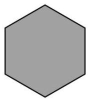
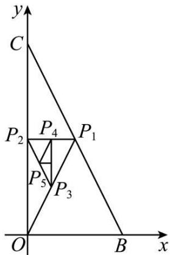
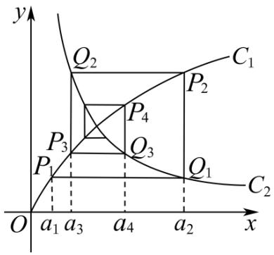

# 第43讲 数列的通项公式

# 知识梳理

类型 I 观察法:

已知数列前若干项,求该数列的通项时,一般对所给的项观察分析,寻找规律,从而根据规律写出此数列的一个通项.

类型Ⅱ 公式法：

若已知数列的前 $n$ 项和 $S_{n}$ 与 $a_{n}$ 的关系，求数列 $\{a_n\}$ 的通项 $a_{n}$ 可用公式

$a_{n} = \left\{ \begin{array}{l}\mathrm{S}_{1},(n = 1)\\ \mathrm{S}_{n} - \mathrm{S}_{n - 1},(n\geqslant 2) \end{array} \right.$ 构造两式作差求解.

用此公式时要注意结论有两种可能,一种是“一分为二”,即分段式;另一种是“合二为一”,即 $a_{1}$ 和 $a_{n}$ 合为一个表达,(要先分n=1和 $n\geqslant2$ 两种情况分别进行运算,然后验证能否统一).

类型Ⅲ 累加法：

形如 $a_{n + 1} = a_n + f(n)$ 型的递推数列（其中 $f(n)$ 是关于 $n$ 的函数）可构造：

$$
\left\{ \begin{array}{l} a _ {n} - a _ {n - 1} = f (n - 1) \\ a _ {n - 1} - a _ {n - 2} = f (n - 2) \\ \dots \\ a _ {2} - a _ {1} = f (1) \end{array} \right.
$$

将上述 $m_{2}$ 个式子两边分别相加，可得： $a_{n} = f(n - 1) + f(n - 2) + \ldots f(2) + f(1) + a_{1}, (n \geqslant 2)$

①若 $f(n)$ 是关于 $n$ 的一次函数，累加后可转化为等差数列求和；  
② 若 $f(n)$ 是关于 n 的指数函数, 累加后可转化为等比数列求和;  
③若 $f(n)$ 是关于 $n$ 的二次函数，累加后可分组求和；  
④若 $f(n)$ 是关于 n 的分式函数, 累加后可裂项求和.

类型IV 累乘法:

形如 $a_{n + 1} = a_n\cdot f(n)\left(\frac{a_{n + 1}}{a_n} = f(n)\right)$ 型的递推数列(其中 $f(n)$ 是关于 $n$ 的函数)可构造：

$$
\left\{ \begin{array}{l} \frac {a _ {n}}{a _ {n - 1}} = f (n - 1) \\ \frac {a _ {n - 1}}{a _ {n - 2}} = f (n - 2) \\ \dots \\ \frac {a _ {2}}{a _ {1}} = f (1) \end{array} \right.
$$

将上述 $m_2$ 个式子两边分别相乘，可得： $a_{n} = f(n - 1)\cdot f(n - 2)\cdot \ldots \cdot f(2)f(1)a_{1},(n\geqslant 2)$

有时若不能直接用,可变形成这种形式,然后用这种方法求解.

类型 V 构造数列法:

(一)形如 $a_{n + 1} = pa_n + q$ （其中 $p,q$ 均为常数且 $p\neq 0$ )型的递推式：

(1) 若 $p = 1$ 时, 数列 $\{a_{n}\}$ 为等差数列;  
(2) 若 $q = 0$ 时, 数列 $\{a_{n}\}$ 为等比数列;  
(3) 若 $p \neq 1$ 且 $q \neq 0$ 时，数列 $\{a_n\}$ 为线性递推数列，其通项可通过待定系数法构造等比

数列来求．方法有如下两种：

法一: 设 $a_{n+1} + \lambda = p(a_n + \lambda)$ ，展开移项整理得 $a_{n+1} = pa_n + (p-1)\lambda$ ，与题设 $a_{n+1} = pa_n + q$ 比较系数（待定系数法）得 $\lambda = \frac{q}{p-1}, (p \neq 0) \Rightarrow a_{n+1} + \frac{q}{p-1} = p\left(a_n + \frac{q}{p-1}\right) \Rightarrow a_n + \frac{q}{p-1} = p\left(a_{n-1} + \frac{q}{p-1}\right)$ ，即 $\left\{a_n + \frac{q}{p-1}\right\}$ 构成以 $a_1 + \frac{q}{p-1}$ 为首项，以 p 为公比的等比数列．再利用等比数列的通项公式求出 $\left\{a_n + \frac{q}{p-1}\right\}$ 的通项整理可得 $a_n$ .

法二：由 $a_{n + 1} = pa_n + q$ 得 $a_{n} = pa_{n - 1} + q(n\geqslant 2)$ 两式相减并整理得 $\frac{a_{n + 1} - a_n}{a_n - a_{n - 1}} = p,$ 即 $\{a_{n + 1} - a_n\}$ 构成以 $a_2 - a_1$ 为首项，以 $p$ 为公比的等比数列．求出 $\{a_{n + 1} - a_n\}$ 的通项再转化为类型III(累加法)便可求出 $a_{n}$

# (二) 形如 $a_{n+1} = pa_n + f(n) (p \neq 1)$ 型的递推式:

# (1) 当 $f(n)$ 为一次函数类型 (即等差数列) 时:

法一: 设 $a_{n} + An + B = p[a_{n-1} + A(n-1) + B]$ ，通过待定系数法确定 A、° B 的值，转化成以 $a_{1} + A + B$ 为首项，以 $A_{n}^{m} = \frac{n!}{(n-m)!}$ 为公比的等比数列 $\{a_{n} + An + B\}$ ，再利用等比数列的通项公式求出 $\{a_{n} + An + B\}$ 的通项整理可得 $a_{n}$ .

法二: 当 $f(n)$ 的公差为 d 时, 由递推式得: $a_{n+1}=pa_{n}+f(n)$ , $a_{n}=pa_{n-1}+f(n-1)$ 两式相减得: $a_{n+1}-a_{n}=p(a_{n}-a_{n-1})+d$ , 令 $b_{n}=a_{n+1}-a_{n}$ 得: $b_{n}=pb_{n-1}+d$ 转化为类型 V(-) 求出 $b_{n}$ , 再用类型 III (累加法) 便可求出 $a_{n}$ .

# (2) 当 $f(n)$ 为指数函数类型 (即等比数列) 时:

法一: 设 $a_{n} + \lambda f(n) = p[a_{n-1} + \lambda f(n-1)]$ ，通过待定系数法确定 $\lambda$ 的值，转化成以 $a_{1} + \lambda f(1)$ 为首项，以 $A_{n}^{m} = \frac{n!}{(n-m)!}$ 为公比的等比数列 $\{a_{n} + \lambda f(n)\}$ ，再利用等比数列的通项公式求出 $\{a_{n} + \lambda f(n)\}$ 的通项整理可得 $a_{n}$ .

法二: 当 $f(n)$ 的公比为 q 时, 由递推式得: $a_{n+1}=pa_{n}+f(n)--①$ , $a_{n}=pa_{n-1}+f(n-1)$ , 两边同时乘以 q 得 $a_{n}q=pqa_{n-1}+qf(n-1)--②$ , 由①②两式相减得 $a_{n+1}-a_{n}q=p(a_{n}-qa_{n-1})$ , 即 $\frac{a_{n+1}-qa_{n}}{a_{n}-qa_{n-1}}=p$ , 在转化为类型 V(-)便可求出 $a_{n}$ .

法三:递推公式为 $a_{n+1}=pa_n+q^n$ (其中p,q均为常数)或 $a_{n+1}=pa_n+rq^n$ (其中p,q,r均为常数)时,要先在原递推公式两边同时除以 $q^{n+1}$ ,得: $\frac{a_{n+1}}{q^{n+1}}=\frac{p}{q}\cdot\frac{a_n}{q^n}+\frac{1}{q}$ ,引入辅助数列 $\{b_n\}$ (其中 $b_n=\frac{a_n}{q^n}$ ),得: $b_{n+1}=\frac{p}{q}b_n+\frac{1}{q}$ 再应用类型V(→)的方法解决.

# (3) 当 $f(n)$ 为任意数列时, 可用通法:

在 $a_{n + 1} = pa_n + f(n)$ 两边同时除以 $p^{n + 1}$ 可得到 $\frac{a_{n + 1}}{p^{n + 1}} = \frac{a_n}{p^n} +\frac{f(n)}{p^{n + 1}}$ ，令 $\frac{a_n}{p^n} = b_n$ ，则 $b_{n + 1} =$ $b_{n} + \frac{f(n)}{p^{n + 1}}$ ，在转化为类型III(累加法)，求出 $b_{n}$ 之后得 $a_{n} = p^{n}b_{n}$

类型VI 对数变换法：

形如 $a_{n + 1} = pa^q (p > 0, a_n > 0)$ 型的递推式：

在原递推式 $a_{n + 1} = pa^q$ 两边取对数得 $\lg a_{n + 1} = q\lg a_n + \lg p$ ，令 $b_{n} = \lg a_{n}$ 得： $b_{n + 1} = qb_{n}+$ $\lg p$ ，化归为 $a_{n + 1} = pa_n + q$ 型，求出 $b_{n}$ 之后得 $a_{n} = 10^{b_{n}}$ .（注意：底数不一定要取10，可根据题意

选择).

类型VII 倒数变换法:

形如 $a_{n-1} - a_n = pa_{n-1}a_n$ ( $p$ 为常数且 $p \neq 0$ ) 的递推式: 两边同除于 $a_{n-1}a_n$ , 转化为 $\frac{1}{a_n} = \frac{1}{a_{n-1}} + p$ 形式, 化归为 $a_{n+1} = pa_n + q$ 型求出 $\frac{1}{a_n}$ 的表达式, 再求 $a_n$ ;

还有形如 $a_{n + 1} = \frac{ma_n}{pa_n + q}$ 的递推式，也可采用取倒数方法转化成 $\frac{1}{a_{n + 1}} = \frac{m}{q}\frac{1}{a_n} +\frac{m}{p}$ 形式，化归为 $a_{n + 1} = pa_n + q$ 型求出 $\frac{1}{a_n}$ 的表达式，再求 $a_{n}$

类型VIII 形如 $a_{n + 2} = pa_{n + 1} + qa_n$ 型的递推式：

用待定系数法，化为特殊数列 $\{a_{n} - a_{n - 1}\}$ 的形式求解．方法为：设 $a_{n + 2} - ka_{n + 1} = h(a_{n + 1} - ka_n)$ ，比较系数得 $h + k = p, - hk = q$ ，可解得 $h, \circ k$ ，于是 $\{a_{n + 1} - ka_n\}$ 是公比为 $h$ 的等比数列，这样就化归为 $a_{n + 1} = pa_n + q$ 型.

总之,求数列通项公式可根据数列特点采用以上不同方法求解,对不能转化为以上方法求解的数列,可用归纳、猜想、证明方法求出数列通项公式 $a_{n}$ .

# 必考题型全归纳

# 1 题型一: 观察法

1977 (2024·湖南长沙·长沙市实验中学校考二模)南宋数学家杨辉所著的《详解九章算法·商功》中出现了如图所示的形状,后人称为“三角垛”,“三角垛”的最上层有1个球,第二层有3个球,第三层有6个球,……,则第十层有( )个球.

natural_image

Pyramid-shaped arrangement of gray spheres, no text or symbols present

A. 12

B. 20

C. 55

D. 110

【答案】C

【解析】由题意知：

$$
a _ {1} = 1,
$$

$$
a _ {2} = a _ {1} + 2 = 1 + 2,
$$

$$
a _ {3} = a _ {2} + 3 = 1 + 2 + 3,
$$

$$
\bullet \quad \bullet \quad \bullet \quad \bullet \quad \bullet
$$

$$
a _ {n} = a _ {n - 1} + n = 1 + 2 + 3 + \dots \dots + n,
$$

所以 $a_{10}=1+2+3+\cdots+10=55.$

故选：C

1978 (2024·全国·高三专题练习)“中国剩余定理”又称“孙子定理”，1852年英国来华传教伟烈亚力将《孙子算经》中“物不知数”问题的解法传至欧洲。1874年，英国数学家马西森指出此法符合1801年由高斯得出的关于同余式解法的一般性定理，因而西方称之为“中国剩余定理”。 “中国剩余定理”讲的是一个关于整除的问题，现有这样一个整除问题：将正整数中能被3除余2且被7除余2的数按由小到大的顺序排成一列，构成数列 $\{a_{n}\}$ ，则 $a_{6}=$

( )

A. 17

B. 37

C. 107

D. 128

【答案】C

【解析】 $\because a_{n}$ 能被 3 除余 2 且被 7 除余 2, $\therefore a_{n}-2$ 既是 3 的倍数, 又是 7 的倍数,

即是21的倍数,且 $a_{n}>0,\therefore a_{n}-2=21(n-1)$ ,

即 $a_{n}=21n-19,\therefore a_{6}=21\times6-19=107.$

故选：C.

1979 (2024·全国·高三专题练习)线性分形又称为自相似分形, 其图形的结构在几何变换下具有不变性, 通过不断迭代生成无限精细的结构. 一个正六边形的线性分形图如下图所示, 若图1中正六边形的边长为1, 图n中正六边形的个数记为 $a_{n}$ , 所有正六边形的周长之和、面积之和分别记为 $C_{n}, S_{n}$ , 其中图n中每个正六边形的边长是图n-1中每个正六边形边长的 $\frac{1}{3}$ , 则下列说法正确的是()

  
图1

  
图2

  
图3

......

A. $a_4 = 294$

B. $C_{3}=\frac{100}{3}$

C. 存在正数 $m$ , 使得 $\mathrm{C}_n \leqslant m$ 恒成立

D. $S_{n}=\frac{3\sqrt{3}}{2}\times\left(\frac{7}{9}\right)^{n-1}$

【答案】D

【解析】A选项,图1中正六边形的个数为1,图2中正六边形的个数为7,

由题意得 $\{a_{n}\}$ 为公比为 7 的等比数列, 所以 $a_{n}=7^{n-1}$ , 故 $a_{4}=7^{3}=343$ , A 错误;

B选项,由题意知 $C_{1}=6$ , $C_{2}=\frac{7}{3}\times6=14$ , $C_{3}=\left(\frac{7}{3}\right)^{2}\times6=\frac{98}{3}$ , B错误;

C选项, $\{C_{n}\}$ 为等比数列,公比为 $\frac{7}{3}$ ,首项为6,故 $C_{n}=6\times\left(\frac{7}{3}\right)^{n-1}$ ,

因为 $\frac{7}{3} > 1$ ，所以 $C_n = 6 \times \left(\frac{7}{3}\right)^{n-1}$ 单调递增，不存在正数 $m$ ，使得 $C_n \leqslant m$ 恒成立，C 错误；

D选项,分析可得,图n中的小正六边形的个数为 $a_{n}=7^{n-1}$ 个,每个小正六边形的边长为 $\left(\frac{1}{3}\right)^{n-1}$ ,故每个小正六边形的面积为 $6\times\frac{\sqrt{3}}{4}\times\left(\frac{1}{3}\right)^{2n-2}$ ,

则 $S_{n}=7^{n-1}\times6\times\frac{\sqrt{3}}{4}\times\left(\frac{1}{3}\right)^{2n-2}=\frac{3\sqrt{3}}{2}\times\left(\frac{7}{9}\right)^{n-1}$ ，D 正确.

故选：D

1980 (2024·海南·海口市琼山华侨中学校联考模拟预测)大衍数列,来源于《乾坤谱》中对易传“大衍之数五十”的推论,主要用于解释中国传统文化中的太极衍生原理,数列中的每一项都代表太极衍生过程,是中华传统文化中隐藏着的世界数学史上第一道数列题,其各项规律如下:0,2,4,8,12,18,24,32,40,50,...,记此数列为 $\{a_{n}\}$ ,则 $(a_{2}-a_{1})+(a_{4}-a_{3})+\cdots+(a_{50}-a_{49})=$ ()

A. 650

B. 1050

C. 2550

D. 5050

【答案】A

【解析】由条件观察可得： $a_{2}-a_{1}=2, a_{4}-a_{3}=4, a_{6}-a_{5}=6\cdots$ ，即 $a_{2n}-a_{2n-1}=2n$ ，所以 $\left\{a_{2n}-a_{2n-1}\right\}$ 是以 2 为首项，2 为公差的等差数列.

故 $(a_{2}-a_{1})+(a_{4}-a_{3})+\cdots+(a_{50}-a_{49})=25\times2+\frac{25\times24}{2}\times2=650,$

故选：A

1981 (2024·吉林·统考三模)大衍数列,来源于《乾坤谱》中对易传“大衍之数五十”的推论,主要用于解释中国传统文化中的太极衍生原理,数列中的每一项,都代表太极衍生过程中,曾经经历过的两仪数量总和,是中华传统文化中隐藏着的世界数学史上第一道数列题.其前10项依次是0,2,4,8,12,18,24,32,40,50,则此数列的第25项与第24项的差为()

A. 22

B. 24

C. 25

D. 26

【答案】B

【解析】设该数列为 $\{a_{n}\}$

当 n 为奇数时， $a_{1}=\frac{1^{2}-1}{2}=0, a_{3}=\frac{3^{2}-1}{2}=4, a_{5}=\frac{5^{2}-1}{2}=12, a_{7}=\frac{7^{2}-1}{2}=24, \cdots$

所以 $a_{n}=\frac{n^{2}-1}{2}, n$ 为奇数；

当 n 为偶数时， $a_{2}=\frac{2^{2}}{2}=2, a_{4}=\frac{2^{4}}{2}=8, a_{6}=\frac{6^{2}}{2}=18, a_{8}=\frac{8^{2}}{2}=32, \cdots$

所以 $a_{n}=\frac{n^{2}}{2}, n$ 为偶数数；

所以 $a_{25}-a_{24}=\frac{25^{2}-1}{2}-\frac{24^{2}}{2}=24,$

故选:B.

1982 (2024·全国·高三专题练习)若数列 $\{a_{n}\}$ 的前 4 项分别是 $\frac{1}{2}, -\frac{1}{3}, \frac{1}{4}, -\frac{1}{5}$ ，则该数列的一个通项公式为（）

A. $a_{n} = \frac{(-1)^{n - 1}}{n}$

B. $a_{n} = \frac{(-1)^{n}}{n + 1}$

C. $a_{n} = \frac{(-1)^{n}}{n}$

D. $a_{n} = \frac{(-1)^{n + 1}}{n + 1}$

【答案】D

【解析】因为数列 $\{a_{n}\}$ 的前 4 项分别是 $\frac{1}{2}, -\frac{1}{3}, \frac{1}{4}, -\frac{1}{5}$ ，正负项交替出现，分子均为 1，分母依次增加 1，

所以对照四个选项， $a_{n}=\frac{(-1)^{n+1}}{n+1}$ 正确.

故选：D

1983 (2024·全国·高三专题练习)“杨辉三角”是中国古代重要的数学成就,如图是由“杨辉三角”拓展而成的三角形数阵,从第三行起,每一行的第三个数 $1,\frac{1}{3},\frac{1}{6},\frac{1}{10},\cdots$ 构成数列 $\{a_{n}\}$ ,其前n项和为 $S_{n}$ ,则 $S_{20}=$

$$
\begin{array}{c} 1 \\ 1 \quad 1 \\ 1 \quad \frac {1}{2} \quad 1 \\ 1 \quad \frac {1}{3} \quad \frac {1}{3} \quad 1 \\ 1 \quad \frac {1}{4} \quad \frac {1}{6} \quad \frac {1}{4} \quad 1 \\ 1 \quad \frac {1}{5} \quad \frac {1}{1 0} \quad \frac {1}{1 0} \quad \frac {1}{5} \quad 1 \\ \dots \end{array}
$$

A. $\frac{39}{20}$

B. $\frac{40}{21}$

C. $\frac{41}{21}$

D. $\frac{419}{210}$

【答案】B

【解析】由题意可知，

$$
a _ {1} = 1 = \frac {2}{1 \times 2}
$$

$$
a _ {2} = \frac {1}{3} = \frac {2}{2 \times 3}
$$

$$
a _ {3} = \frac {1}{6} = \frac {2}{3 \times 4}
$$

$$
a _ {4} = \frac {1}{1 0} = \frac {2}{4 \times 5}
$$

...

则 $a_{n}=\frac{2}{n(n+1)}=2\left(\frac{1}{n}-\frac{1}{n+1}\right)$ ,

所以其前 $n$ 项和为：

$$
\mathrm{S} _ {n} = a _ {1} + a _ {2} + a _ {3} + \dots + a _ {n} = 2 \left(1 - \frac {1}{2}\right) + 2 \left(\frac {1}{2} - \frac {1}{3}\right) + 2 \left(\frac {1}{3} - \frac {1}{4}\right) + \dots + 2 \left(\frac {1}{n} - \frac {1}{n + 1}\right)
$$

$$
= 2 \left(1 - \frac {1}{2} + \frac {1}{2} - \frac {1}{3} + \frac {1}{3} - \frac {1}{4} + \dots + \frac {1}{n} - \frac {1}{n + 1}\right) = 2 \left(1 - \frac {1}{n + 1}\right) = \frac {2 n}{n + 1},
$$

则 $S_{20}=\frac{40}{21}$ .

故选: B.

1984 (2024·新疆喀什·高三统考期末)若数列 $\{a_{n}\}$ 的前6项为 $1, -\frac{2}{3}, \frac{3}{5}, -\frac{4}{7}, \frac{5}{9}, -\frac{6}{11}$ ，则数列 $\{a_{n}\}$ 的通项公式可以为 $a_{n}=$ （）

A. $\frac{n}{n+1}$

B. $\frac{n}{2n - 1}$

C. $(-1)^{n}\cdot\frac{n}{2n-1}$

D. $(-1)^{n+1}\cdot\frac{n}{2n-1}$

【答案】D

【解析】通过观察数列 $\{a_{n}\}$ 的前6项, 可以发现有如下规律:

且奇数项为正,偶数项为负,故用 $(-1)^{n+1}$ 表示各项的正负;

各项的绝对值为分数,分子等于各自的序号数,

而分母是以1为首项，2为公差的等差数列，

故第 $n$ 项的绝对值是 $\frac{n}{2n - 1}$

所以数列 $\{a_{n}\}$ 的通项可为 $a_{n} = (-1)^{n + 1}\cdot \frac{n}{2n - 1},$

故选：D

【解题方法总结】

观察法即根据所给的一列数、式、图形等,通过观察分析数列各项的变化规律,求其通项.

使用观察法时要注意:①观察数列各项符号的变化,考虑通项公式中是否有 $(-1)^{n}$ 或者 $(-1)^{n-1}$ 部分. ②考虑各项的变化规律与序号的关系. ③应特别注意自然数列、正奇数列、正偶数列、自然数的平方 $\{n^{2}\}$ 、 $\{2^{n}\}$ 与 $(-1)^{n}$ 有关的数列、等差数列、等比数列以及由它们组成的数列.

# 题型二:叠加法

1985 (2024·全国·高三对口高考)数列 1, 3, 7, 15, …… 的一个通项公式是 （）

A. $a_{n} = 2^{n}$

B. $a_{n} = 2^{n} + 1$

C. $a_{n} = 2^{n} - 1$

D. $a_{n} = 2^{n - 1}$

【答案】C

【解析】依题意得 $a_{2}-a_{1}=2$ , $a_{3}-a_{2}=2^{2}$ , $a_{4}-a_{3}=2^{3}$ ,

所以依此类推得 $a_{n}-a_{n-1}=2^{n-1}(n\geqslant2)$ ,

所以 $a_{n}=a_{1}+a_{2}-a_{1}+a_{3}-a_{2}+a_{4}-a_{3}+\ldots+a_{n}-a_{n-1}=1+2+2^{2}+2^{3}+\ldots+2^{n-1}=$ $\frac{1-2^{n}}{1-2}=2^{n}-1.$

又 $a_{1}=2^{1}-1=1$ 也符合上式, 所以符合题意的一个通项公式是 $a_{n}=2^{n}-1$ .

故选：C.

1986 (2024·新疆喀什·校考模拟预测)若 $a_{n} = a_{n - 1} + n - 1, a_{1} = 1$ 则 $a_{10} =$ （）

A. 55

B. 56

C. 45

D. 46

【答案】D

【解析】由 $a_{n} = a_{n - 1} + n - 1$

得 $a_{2}=a_{1}+1,a_{3}=a_{2}+2,$

$$
a _ {4} = a _ {3} + 3, \dots , a _ {n} = a _ {n - 1} + n - 1 (n \geqslant 2),
$$

累加得, $a_{n}=a_{1}+1+2+3+\cdots+n-1$

$$
= \frac {1}{2} n ^ {2} - \frac {1}{2} n + 1,
$$

当 n=1 时, 上式成立,

则 $a_{n}=\frac{1}{2}n^{2}-\frac{1}{2}n+1,$

所以 $a_{10}=\frac{1}{2}\times100-\frac{1}{2}\times10+1=46.$

故选：D

1987 (2024·陕西安康·陕西省安康中学校考模拟预测)在数列 $\{a_{n}\}$ 中， $a_{1}=1, a_{n+1}=a_{n}+n+1$ ，则 $\frac{1}{a_{1}}+\frac{1}{a_{2}}+\cdots+\frac{1}{a_{2022}}=$ （）

A. $\frac{2021}{1011}$

B. $\frac{4044}{2023}$

C. $\frac{2021}{2022}$

D. $\frac{2022}{2023}$

【答案】B

【解析】因为 $a_{n+1}=a_{n}+n+1$ ，故可得 $a_{2}-a_{1}=2, a_{3}-a_{2}=3, \cdots, a_{n}-a_{n-1}=n$ ，及 $a_{1}=1$ 累加可得 $a_{n}-a_{n-1}+a_{n-1}-a_{n-2}+\cdots+a_{2}-a_{1}+a_{1}=1+2+3+\cdots+n$ ，

则 $a_{n}=1+2+3+\cdots+n=\frac{n(n+1)}{2}$ ，所以 $\frac{1}{a_{n}}=\frac{2}{n(n+1)}=2\left(\frac{1}{n}-\frac{1}{n+1}\right)$ ,

则 $\frac{1}{a_{1}}+\frac{1}{a_{2}}+\cdots+\frac{1}{a_{2022}}=2\left[\left(1-\frac{1}{2}\right)+\left(\frac{1}{2}-\frac{1}{3}\right)+\cdots+\left(\frac{1}{2022}-\frac{1}{2023}\right)\right]=2\left(1-\frac{1}{2023}\right)=$ $\frac{4044}{2023}.$

故选: B.

1988 (2024·全国·高三专题练习)已知数列 $\{a_{n}\}$ 满足 $a_{1}=\frac{1}{2}$ ， $a_{n+1}=a_{n}+\frac{1}{n^{2}+n}$ ，则 $\{a_{n}\}$ 的通项为

A. $-\frac{1}{n}, n \geqslant 1, n \in \mathbf{N}^{*}$

B. $\frac{3}{2} +\frac{1}{n},n\geqslant 1,n\in \mathbf{N}^{*}$

C. $-\frac{3}{2}-\frac{1}{n},n\geqslant1,n\in N^{*}$

D. $\frac{3}{2} -\frac{1}{n},n\geqslant 1,n\in \mathbf{N}^{*}$

【答案】D

【解析】因为 $a_{n+1}=a_{n}+\frac{1}{n^{2}+n}$ ，所以 $a_{n+1}-a_{n}=\frac{1}{n^{2}+n}=\frac{1}{n}-\frac{1}{n+1}$ ，则当 $n\geqslant2, n\in N^{*}$

时， $\left\{\begin{aligned}a_{2}-a_{1}&=1-\frac{1}{2}\\ a_{3}-a_{2}&=\frac{1}{2}-\frac{1}{3}\\ \cdots\\ a_{n}-a_{n-1}&=\frac{1}{n-1}-\frac{1}{n}\end{aligned}\right.$

将 n-1 个式子相加可得 $a_{n}-a_{1}=1-\frac{1}{2}+\frac{1}{2}-\frac{1}{3}+\cdots+\frac{1}{n-1}-\frac{1}{n}=1-\frac{1}{n}$ ,

因为 $a_{1}=\frac{1}{2}$ ，则 $a_{n}=1-\frac{1}{n}+\frac{1}{2}=\frac{3}{2}-\frac{1}{n}$ ，当 n=1 时， $a_{1}=\frac{3}{2}-\frac{1}{1}=\frac{1}{2}$ 符合题意，

所以 $a_{n}=\frac{3}{2}-\frac{1}{n},n\geqslant1,n\in N^{*}.$

故选：D.

1989 (2024·全国·高三专题练习)已知 $S_{n}$ 是数列 $\{a_{n}\}$ 的前 n 项和，且对任意的正整数 n，都满足： $\frac{1}{a_{n+1}} - \frac{1}{a_{n}} = 2n + 2$ ，若 $a_{1} = \frac{1}{2}$ ，则 $S_{2023} =$ （）

A. $\frac{2023}{2024}$

B. $\frac{2022}{2023}$

C. $\frac{2021}{2024}$

D. $\frac{1010}{2023}$

【答案】A

【解析】当 $n \geqslant 2$ 时，由累加法可得： $\left(\frac{1}{a_{n}} - \frac{1}{a_{n-1}}\right) + \left(\frac{1}{a_{n-1}} - \frac{1}{a_{n-2}}\right) + \cdots + \left(\frac{1}{a_{2}} - \frac{1}{a_{1}}\right) = 2n + 2(n-1) + \cdots + (2 \times 1 + 2)$ ,

所以 $\frac{1}{a_n} -\frac{1}{a_1} = n^2 +n - 2(n\geqslant 2),$

又因为 $a_{1}=\frac{1}{2}$ ,

所以 $a_{n}=\frac{1}{n(n+1)}(n\geqslant2)$ ,

当 n=1 时， $a_{1}=\frac{1}{1\times(1+1)}=\frac{1}{2}$ ，符合，

所以 $a_{n}=\frac{1}{n(n+1)}(n\in\mathbb{N}^{*})$ ,

所以 $a_{n}=\frac{1}{n(n+1)}=\frac{1}{n}-\frac{1}{n+1}$ ,

所以 $S_{2023}=\left(1-\frac{1}{2}\right)+\left(\frac{1}{2}-\frac{1}{3}\right)+\cdots+\left(\frac{1}{2023}-\frac{1}{2024}\right)=1-\frac{1}{2024}=\frac{2023}{2024}.$

故选：A.

1990 (2024·四川南充·四川省南充高级中学校考模拟预测)已知数列 $\{a_{n}\}$ 满足: $a_{1}=\frac{3}{8}$ , $a_{n+2}-a_{n}\leqslant3^{n}$ , $a_{n+6}-a_{n}\geqslant91\cdot3^{n}$ , 则 $a_{2023}=$ ()

A. $\frac{3^{2023}}{2}+\frac{3}{2}$

B. $\frac{3^{2023}}{8}+\frac{3}{2}$

C. $\frac{3^{2023}}{8}$

D. $\frac{3^{2023}}{2}$

【答案】C

【解析】 $\because a_{1}=\frac{3}{8},a_{n+2}-a_{n}\leqslant3^{n}$ ,

$$
\begin{array}{l} \therefore a _ {n + 4} - a _ {n + 2} \leqslant 3 ^ {n + 2}, a _ {n + 6} - a _ {n + 4} \leqslant 3 ^ {n + 4}, \\ \therefore a _ {n + 6} - a _ {n} = \left(a _ {n + 6} - a _ {n + 4}\right) + \left(a _ {n + 4} - a _ {n + 2}\right) + \left(a _ {n + 2} - a _ {n}\right) \leqslant 3 ^ {n + 4} + 3 ^ {n + 2} + 3 ^ {n} = 3 ^ {n} \left(3 ^ {4} + 3 ^ {2} + 1\right) \\ = 9 1 \cdot 3 ^ {n}, \\ \end{array}
$$

又 $a_{n + 6} - a_n\geqslant 91\cdot 3^n$ ，故 $a_{n + 6} - a_n = 91\cdot 3^n$

所以 $a_{n+2}-a_{n}=3^{n}, a_{n+4}-a_{n+2}=3^{n+2}, a_{n+6}-a_{n+4}=3^{n+4}$

所以 $a_{3}-a_{1}=3, a_{5}-a_{3}=3^{3}, \cdots, a_{n+2}-a_{n}=3^{n}, a_{1}=\frac{3}{8}$

故 $a_{2n + 1} - a_1 = a_{2n + 1} - a_{2n - 1} + a_{2n - 1} - a_{2n - 3} + \dots +a_5 - a_3 + a_3 - a_1 = 3 + 3^3 +3^5 +\dots +3^{2n - 1},$

则 $a_{2n+1}=a_{1}+3+3^{3}+3^{5}+\cdots+3^{2n-1}$ ,

所以 $a_{2023}=\frac{3}{8}+3+3^{3}+3^{5}+\cdots+3^{2021}=\frac{3}{8}+\frac{3(1-9^{1011})}{1-9}=\frac{3^{2023}}{8}$ .

故选：C.

【解题方法总结】

数列有形如 $a_{n+1}=a_{n}+f(n)$ 的递推公式，且 $f(1)+f(2)+\cdots+f(n)$ 的和可求，则变形为 $a_{n+1}-a_{n}=f(n)$ ，利用叠加法求和

# 3 题型三:叠乘法

1991 (2024·河南·模拟预测)已知数列 $\{a_{n}\}$ 满足 $\frac{a_{n+1}+a_{n}}{a_{n+1}-a_{n}}=2n, a_{1}=1$ ，则 $a_{2023}=$ （）

A. 2024

B. 2024

C. 4045

D. 4047

【答案】C

【解析】 $\because \frac{a_{n+1}+a_n}{a_{n+1}-a_n}=2n,$

$$
\therefore a _ {n + 1} + a _ {n} = 2 n \left(a _ {n + 1} - a _ {n}\right),
$$

即 $(1 - 2n)a_{n + 1} = (-2n - 1)a_n$

可得 $\frac{a_{n + 1}}{a_n} = \frac{2n + 1}{2n - 1}$

$$
\therefore a _ {2 0 2 3} = \frac {a _ {2 0 2 3}}{a _ {2 0 2 2}} \times \frac {a _ {2 0 2 2}}{a _ {2 0 2 1}} \times \frac {a _ {2 0 2 1}}{a _ {2 0 2 0}} \times \dots \times \frac {a _ {3}}{a _ {2}} \times \frac {a _ {2}}{a _ {1}} \times a _ {1}
$$

$$
= \frac {4 0 4 5}{4 0 4 3} \times \frac {4 0 4 3}{4 0 4 1} \times \frac {4 0 4 1}{4 0 3 9} \dots \times \frac {5}{3} \times \frac {3}{1} \times 1 = 4 0 4 5.
$$

故选：C.

1992 (2024·全国·高三专题练习)数列 $\{a_{n}\}$ 中， $a_{1}=1,\frac{a_{n+1}}{a_{n}}=\frac{n}{n+1}$ (n 为正整数)，则 $a_{2022}$ 的值为

A. $\frac{1}{2022}$

B. $\frac{1}{2021}$

C. $\frac{2021}{2022}$

D. $\frac{2022}{2021}$

【答案】A

【解析】因为 $\frac{a_{n + 1}}{a_n} = \frac{n}{n + 1}$

所以 $a_{n}=\frac{a_{n}}{a_{n-1}}\cdot\frac{a_{n-1}}{a_{n-2}}\cdots\frac{a_{4}}{a_{3}}\cdot\frac{a_{3}}{a_{2}}\cdot\frac{a_{2}}{a_{1}}=\frac{n-1}{n}\times\frac{n-2}{n-1}\times\cdots\times\frac{3}{4}\times\frac{2}{3}\times\frac{1}{2}=\frac{1}{n}$

所以 $a_{2022}=\frac{1}{2022}$ ,

故选：A

1993 (2024·天津滨海新·高三校考期中)已知 $a_1 = 2, a_{n+1} = \frac{n + 1}{n} a_n$ ，则 $a_{2022} =$ （）

A. 506

B. 1011

C. 2022

D. 4044

【答案】D

【解析】 $\because a_{n+1}=\frac{n+1}{n}a_{n},\therefore\frac{a_{n+1}}{a_{n}}=\frac{n+1}{n}$ ,

$$
\therefore \frac {a _ {2}}{a _ {1}} = \frac {2}{1}, \frac {a _ {3}}{a _ {2}} = \frac {3}{2}, \frac {a _ {4}}{a _ {3}} = \frac {4}{3}, \dots , \frac {a _ {n}}{a _ {n - 1}} = \frac {n}{n - 1}, n \geqslant 2,
$$

$$
\therefore \frac {a _ {n}}{a _ {1}} = \frac {n}{1} = n, n \geqslant 2,
$$

$$
\because a _ {1} = 2, \therefore a _ {n} = 2 n, n \geqslant 2,
$$

显然, 当 n=1 时, $a_{1}=2$ 满足 $a_{n}=2n$ ,

$$
\therefore a _ {n} = 2 n, n \in \mathrm{N} ^ {*},
$$

$$
\therefore a _ {2 0 2 0} = 2 \times 2 0 2 2 = 4 0 4 4.
$$

故选：D.

1994 (2024·全国·高三专题练习)已知 $a_{1}=1$ , $a_{n}=n(a_{n+1}-a_{n})(n\in\mathbb{N}_{+})$ ，则数列 $\{a_{n}\}$ 的通项公式是 $a_{n}=$ （）

A. $2n - 1$

B. $\left(\frac{n+1}{n}\right)^{n+1}$

C. $n^{2}$

D. n

【答案】D

【解析】由 $a_{n}=n(a_{n+1}-a_{n})$ ，得 $(n+1)a_{n}=na_{n+1}$

即 $\frac{a_{n + 1}}{a_n} = \frac{n + 1}{n}$

则 $\frac{a_{n}}{a_{n-1}}=\frac{n}{n-1},\frac{a_{n-1}}{a_{n-2}}=\frac{n-1}{n-2},\frac{a_{n-2}}{a_{n-3}}=\frac{n-2}{n-3},\cdots,\frac{a_{2}}{a_{1}}=\frac{2}{1},n\geqslant2,$

由累乘法可得 $\frac{a_{n}}{a_{1}}=n$ ，所以 $a_{n}=n, n\geqslant2$ ，

又 $a_{1}=1$ ，符合上式，所以 $a_{n}=n$ 。

故选：D.

1995 (2024·全国·高三专题练习)已知数列 $\{a_{n}\}$ 中， $a_{1}=1, na_{n+1}=$ $2(a_{1}+a_{2}+\cdots+a_{n})(n\in\mathbb{N}^{*})$ ，则数列 $\{a_{n}\}$ 的通项公式为（）

A. $a_{n} = n$

B. $a_{n} = 2n - 1$

C. $a_{n} = \frac{n + 1}{2n}$

D. $a_{n} = \left\{ \begin{array}{ll}1, & (n = 1)\\ n + 1, & (n\geqslant 2) \end{array} \right.$

【答案】A

【解析】由 $na_{n+1}=2(a_{1}+a_{2}+\cdots+a_{n})$ ①

得 $(n-1)a_{n}=2(a_{1}+a_{2}+\cdots+a_{n-1})$ ②，

① - ②得: $na_{n+1} - (n-1)a_n = 2a_n$ ,

即： $na_{n+1}=(n+1)a_{n},\frac{a_{n+1}}{a_{n}}=\frac{n+1}{n}$

所以 $a_{n}=a_{1}\cdot\frac{a_{2}}{a_{1}}\cdot\frac{a_{3}}{a_{2}}\cdots\frac{a_{n}}{a_{n-1}}=1\cdot\frac{2}{1}\cdot\frac{3}{2}\cdots\frac{n}{n-1}=n(n\geqslant2)$ ,

所以 $a_{n} = n(n\in \mathbf{N}^{*})$

故选：A.

1996 (2024·全国·高三专题练习)已知数列 $\{a_{n}\}$ 满足 $(n+2)a_{n+1}=(n+1)a_{n}$ ，且 $a_{2}=\frac{1}{3}$ ，则 $a_{n}=$ =

A. $\frac{n-1}{n+1}$

B. $\frac{1}{2n-1}$

C. $\frac{n-1}{2n-1}$

D. $\frac{1}{n+1}$

【答案】D

【解析】数列 $\{a_{n}\}$ 满足 $(n+2)a_{n+1}=(n+1)a_{n}$ ，且 $a_{2}=\frac{1}{3}$ ,

$$
\therefore a _ {1} = \frac {1}{2}, \frac {a _ {n + 1}}{a _ {n}} = \frac {n + 1}{n + 2},
$$

$$
\therefore \frac {a _ {n}}{a _ {n - 1}} = \frac {n}{n + 1}, \frac {a _ {n - 1}}{a _ {n - 2}} = \frac {n - 1}{n}, \dots , \frac {a _ {2}}{a _ {1}} = \frac {2}{3},
$$

累乘可得： $\frac{a_n}{a_{n - 1}}\cdot \frac{a_{n - 1}}{a_{n - 2}}\dots \frac{a_2}{a_1} = \frac{n}{n + 1}\cdot \frac{n - 1}{n}\cdot \frac{n - 2}{n - 1}\dots \frac{2}{3},$

可得: $a_{n} = \frac{2}{n + 1} \cdot \frac{1}{2} = \frac{1}{n + 1}$ .

故选:D.

1997 (2024·全国·高三专题练习)已知数列 $\{a_{n}\}$ 满足 $a_{1}=\frac{1}{3}$ ， $a_{n}=\frac{2n-3}{2n+1}a_{n-1}(n\geqslant2,n\in\mathbb{N}^{*})$ ，则数列 $\{a_{n}\}$ 的通项 $a_{n}=$ （）

A. $\frac{1}{4n^{2}-1}$

B. $\frac{1}{2n^{2}+1}$

C. $\frac{1}{(2n-1)(2n+3)}$

D. $\frac{1}{(n+1)(n+3)}$

【答案】A

【解析】数列 $\{a_{n}\}$ 满足 $a_{1}=\frac{1}{3}$ ， $a_{n}=\frac{2n-3}{2n+1}a_{n-1}(n\geqslant2,n\in\mathbb{N}^{*})$ ,

整理得 $\frac{a_n}{a_{n-1}} = \frac{2n - 3}{2n + 1},\frac{a_{n-1}}{a_{n-2}} = \frac{2n - 5}{2n - 1},\ldots,\frac{a_2}{a_1} = \frac{1}{5},$

所有的项相乘得: $\frac{a_n}{a_1} = \frac{1 \times 3}{(2n + 1)(2n - 1)}$ ,

整理得: $a_{n} = \frac{1}{4n^{2} - 1}$ ,

故选：A.

1998 (2024·全国·高三专题练习)在数列 $\{a_{n}\}$ 中， $a_{1}=\frac{1}{2}$ 且 $(n+2)a_{n+1}=na_{n}$ ，则它的前30项和 $S_{30}=$ （）

A. $\frac{30}{31}$

B. $\frac{29}{30}$

C. $\frac{28}{29}$

D. $\frac{19}{29}$

【答案】A

【解析】 $\because (n+2)a_{n+1}=na_{n}, \therefore \frac{a_{n+1}}{a_{n}}=\frac{n}{n+2}, \therefore a_{n}=a_{1}\cdot\frac{a_{2}}{a_{1}}\cdot\frac{a_{3}}{a_{2}}\cdots\cdots\frac{a_{n}}{a_{n-1}}=\frac{1}{2}\cdot\frac{1}{3}\cdot\frac{2}{4}\cdot$

$$
\dots \frac {n - 1}{n + 1} = \frac {1}{n (n + 1)} = \frac {1}{n} - \frac {1}{n + 1},
$$

因此， $S_{30}=1-\frac{1}{2}+\frac{1}{2}-\frac{1}{3}+\cdots+\frac{1}{30}-\frac{1}{31}=\frac{30}{31}.$

故选：A.

【解题方法总结】

数列有形如 $a_{n}=f(n)\cdot a_{n-1}$ 的递推公式，且 $f(1)\cdot f(2)\cdots f(n)$ 的积可求，则将递推公式变形为 $\frac{a_{n}}{a_{n-1}}=f(n)$ ，利用叠乘法求出通项公式 $a_{n}$

# 题型四:待定系数法

1999 (2024·全国·高三专题练习)已知： $a_{1}=1, n \geqslant 2$ 时， $a_{n}=\frac{1}{2}a_{n-1}+2n-1$ ，求 $\{a_{n}\}$ 的通项公式.

【解析】设 $a_{n} + An + B = \frac{1}{2}[a_{n-1} + A(n-1) + B]$ ，所以 $a_{n} = \frac{1}{2}a_{n-1} - \frac{1}{2}An - \frac{1}{2}A - \frac{1}{2}B$ ∴ $\left\{\begin{aligned}-\frac{1}{2}A=2,\\-\frac{1}{2}A-\frac{1}{2}B=-1,\end{aligned}\right.$ 解得： $\left\{\begin{aligned}A=-4\\B=6\end{aligned}\right.$

又 $a_1 - 4 + 6 = 3, \therefore \{a_n - 4n + 6\}$ 是以3为首项， $\frac{1}{2}$ 为公比的等比数列，

$$
\therefore a _ {n} - 4 n + 6 = 3 \left(\frac {1}{2}\right) ^ {n - 1}, \therefore a _ {n} = \frac {3}{2 ^ {n - 1}} + 4 n - 6.
$$

2000 (2024·全国·高三专题练习)已知数列 $\{a_{n}\}$ ， $a_{1}=2$ ，且对于 n>1 时恒有 $a_{n}=\frac{1}{2}a_{n-1}+1$ ，求数列 $\{a_{n}\}$ 的通项公式.

【解析】因为 $a_{n}=\frac{1}{2}a_{n-1}+1$ ，所以 $a_{n}-2=\frac{1}{2}(a_{n-1}-2)$ ，又因为 $a_{1}-2=0$ ，

所以数列 $\{a_{n}-2\}$ 是常数列 0, 所以 $a_{n}-2=0$ , 所以 $a_{n}=2$ .

2001 (2024·全国·高三专题练习)已知数列 $\{a_{n}\}$ 满足： $a_{n+1}=-\frac{1}{3}a_{n}-2,n\in N^{*},a_{1}=4,$ 求 $a_{n}$ .

【解析】因为 $a_{n+1}=-\frac{1}{3}a_{n}-2, n \in N^{*}, a_{1}=4,$

所以两边同时加上 $\frac{3}{2}$ 得： $a_{n + 1} + \frac{3}{2} = -\frac{1}{3} a_n - 2 + \frac{3}{2} = -\frac{1}{3} a_n - \frac{1}{2},$

所以 $a_{n + 1} + \frac{3}{2} = -\frac{1}{3} a_n - \frac{1}{2} = -\frac{1}{3}\left(a_n + \frac{3}{2}\right)$ ，当 $a_1 = 4$ 时， $a_1 + \frac{3}{2} = \frac{11}{2}$

故 $a_{n} + \frac{3}{2}\neq 0$ ，故 $\frac{a_{n + 1} + \frac{3}{2}}{a_n + \frac{3}{2}} = -\frac{1}{3},$

所以数列 $\left\{a_{n} + \frac{3}{2}\right\}$ 是以 $a_1 + \frac{3}{2} = \frac{11}{2}$ 为首项， $-\frac{1}{3}$ 为公比的等比数列.

于是 $a_{n} + \frac{3}{2} = \frac{11}{2}\left(-\frac{1}{3}\right)^{n - 1}$

$$
a _ {n} = - \frac {3}{2} + \frac {1 1}{2} \left(- \frac {1}{3}\right) ^ {n - 1}, n \in \mathrm{N} ^ {*}
$$

2002 (2024·全国·高三专题练习)已知数列 $\{a_{n}\}$ 是首项为 $a_1 = 2, a_{n+1} = \frac{1}{3} a_n + 2n + \frac{5}{3}$ .

(1) 求 $\{a_{n}\}$ 通项公式;  
(2) 求数列 $\{a_{n}\}$ 的前 n 项和 $S_{n}$ .

【解析】(1) $a_{n+1}=\frac{1}{3}a_{n}+2n+\frac{5}{3}$ ，设 $a_{n+1}+A(n+1)+B=\frac{1}{3}(a_{n}+An+B)$ ,

即 $a_{n+1}=\frac{1}{3}a_{n}-\frac{2}{3}An-A-\frac{2}{3}B$ ，即 $\left\{\begin{aligned}-\frac{2}{3}A&=2\\ -A-\frac{2}{3}B&=\frac{5}{3}\end{aligned}\right.$ ，解得 $\left\{\begin{aligned}A&=-3\\ B&=2\end{aligned}\right.$

$a_{1} - 3 + 2 = 1$ ，故 $\{a_n - 3n + 2\}$ 是首项为1，公比为 $\frac{1}{3}$ 的等比数列.

$$
a _ {n} - 3 n + 2 = \left({\frac {1}{3}}\right) ^ {n - 1}, \text {故}   a _ {n} = \left({\frac {1}{3}}\right) ^ {n - 1} + 3 n - 2.
$$

$$
\begin{array}{l} (2) a _ {n} = \left(\frac {1}{3}\right) ^ {n - 1} + 3 n - 2 \text {, 则} S _ {n} = \left(\frac {1}{3}\right) ^ {0} + 1 + \left(\frac {1}{3}\right) ^ {1} + 4 + \dots + \left(\frac {1}{3}\right) ^ {n - 1} + 3 n - 2 \\ = \left[ \left(\frac {1}{3}\right) ^ {0} + \left(\frac {1}{3}\right) ^ {1} + \dots + \left(\frac {1}{3}\right) ^ {n - 1} \right] + (1 + 4 + \dots + 3 n - 2) = 1 \times \frac {1 - \left(\frac {1}{3}\right) ^ {n}}{1 - \frac {1}{3}} + \frac {(1 + 3 n - 2) \times n}{2} \\ = - \frac {3}{2} \times \left(\frac {1}{3}\right) ^ {n} + \frac {3}{2} n ^ {2} - \frac {1}{2} n + \frac {3}{2}. \\ \end{array}
$$

2003 (2024·全国·高三专题练习)已知数列 $\{a_{n}\}$ 中， $a_{1}=2, a_{n+1}=\frac{2a_{n}+1}{3}$ ，求 $\{a_{n}\}$ 的通项.

【解析】因为 $\{a_{n}\}$ 的特征函数为: $f(x)=\frac{2x+1}{3}$ ,

由 $f(x)=\frac{2x+1}{3}=x\Rightarrow x=1,$

$$
\therefore a _ {n + 1} = \frac {2 a _ {n} + 1}{3} \Rightarrow a _ {n + 1} - 1 = \frac {2}{3} (a _ {n} - 1)
$$

∴数列 $\{a_{n}-1\}$ 是公比为 $\frac{2}{3}$ 的等比数列，

$$
\therefore a _ {n} - 1 = \left(a _ {1} - 1\right) \left(\frac {2}{3}\right) ^ {n - 1} \Rightarrow a _ {n} = 1 + \left(\frac {2}{3}\right) ^ {n - 1}.
$$

2004 (2024·江苏南通·高三江苏省通州高级中学校考阶段练习)已知数列 $\{a_{n}\}$ 中， $a_{1}=1$ ，满足 $a_{n+1}=2a_{n}+2n-1(n\in\mathbb{N}^{*})$ ，设 $S_{n}$ 为数列 $\{a_{n}\}$ 的前 n 项和.

(1) 证明: 数列 $\{a_{n}+2n+1\}$ 是等比数列;  
(2) 若不等式 $\lambda \cdot 2^{n} + \mathrm{S}_{n} + 4 > 0$ 对任意正整数 $n$ 恒成立，求实数 $\lambda$ 的取值范围.

【解析】(1) 因为 $a_{n+1}=2a_{n}+2n-1(n\in\mathbb{N}^{*})$ ,

所以 $a_{n+1} + 2(n+1) + 1 = 2(a_n + 2n+1)$ ,

所以 $\left\{a_{n}+2n+1\right\}$ 是以 $a_{1}+2\times1+1=4$ 为首项, 公比为 2 的等比数列,

所以 $a_{n} + 2n + 1 = 4 \times 2^{n - 1} = 2^{n + 1}$ , 所以 $a_{n} = 2^{n + 1} - 2n - 1$ .

(2) 因为 $a_{n}=2^{n+1}-2n-1$ ,

$$
\begin{array}{l} \text {所以} \mathrm{S} _ {n} = a _ {1} + a _ {2} + \dots + a _ {n} = (2 ^ {2} - 3) + (2 ^ {3} - 5) + \dots + [ 2 ^ {n + 1} - (2 n + 1) ] \\ = \left(2 ^ {2} + 2 ^ {3} + \dots + 2 ^ {n + 1}\right) - (3 + 5 + 7 + \dots + 2 n + 1) = \frac {2 ^ {2} \left(1 - 2 ^ {n}\right)}{1 - 2} - \frac {n (3 + 2 n + 1)}{2} = 2 ^ {n + 2} - n ^ {2} \\ - 2 n - 4, \\ \end{array}
$$

若 $\lambda \cdot 2^{n} + S_{n} + 4 > 0$ 对于 $\forall n\in N^{*}$ 恒成立，即 $\lambda \cdot 2^n +2^{n + 2} - n^2 -2n - 4 + 4 > 0,$

可得 $\lambda\cdot2^{n}>n^{2}+2n-2^{n+2}$ 即 $\lambda>\frac{n^{2}+2n}{2^{n}}-4$ 对于任意正整数 n 恒成立，

所以 $\lambda > \left[\frac{n^{2}+2n}{2^{n}}-4\right]_{\max}$ ，令 $b_{n} = \frac{n(n+2)}{2^{n}} - 4$ ，则 $b_{n+1} - b_{n} = \frac{3-n^{2}}{2^{n+1}}$ ,

所以 $b_{1}<b_{2}>b_{3}>b_{4}>\cdots$ ，可得 $(b_{n})_{\max}=b_{2}=\frac{2^{2}+2\times2}{2^{2}}-4=-2$ ，所以 $\lambda>-2$ ，

所以 $\lambda$ 的取值范围为 $(-2, +\infty)$ .

2005 (2024·四川乐山·统考三模)已知数列 $\{a_{n}\}$ 满足 $a_{n+1}=2a_{n}+2, a_{1}=1$ ，则 $a_{n}=$ \_\_\_\_.

【答案】 $3 \times 2^{n - 1} - 2$

【解析】由 $a_{n+1}=2a_{n}+2$ 得 $a_{n+1}+2=2(a_{n}+2)$ ，又 $a_{1}+2=3$ ，

所以 $\frac{a_{n+1}+2}{a_{n}+2}=2$ , 即 $\{a_{n}+2\}$ 是等比数列，

所以 $a_{n} + 2 = 3 \times 2^{n - 1}$ , 即 $a_{n} = 3 \times 2^{n - 1} - 2$ .

故答案为: $3 \times 2^{n-1} - 2$ .

2006 (2024·全国·高三专题练习)已知数列 $\{a_{n}\}$ 中， $a_{1}=1, a_{n+1}=3a_{n}+4$ ，则数列 $\{a_{n}\}$ 的通项公式为 \_\_\_\_.

【答案】 $a_{n} = 3^{n} - 2$

【解析】因为 $a_{n+1}=3a_{n}+4$ ,

设 $a_{n + 1} + t = 3(a_n + t)$ ，即 $a_{n + 1} = 3a_n + 2t$

根据对应项系数相等则 2t=4, 解得 t=2, 故 $a_{n+1}+2=3(a_{n}+2)$ ,

所以 $\{a_{n}+2\}$ 是 3 为首项, 3 为公比的等比数列,

所以 $a_{n}+2=3\times3^{n-1}=3^{n}$ ，即 $a_{n}=3^{n}-2$ .

故答案为: $a_{n} = 3^{n} - 2$

2007 (2024·全国·高三对口高考)已知数列 $\{a_{n}\}$ 中， $a_{1}=1$ ，且 $a_{n}=2a_{n-1}+3(n\geqslant2$ ，且 $n\in N^{*}$ ，则数列 $\{a_{n}\}$ 的通项公式为 \_\_\_\_.

【答案】 $2^{n + 1} - 3$

【解析】由 $a_{n}=2a_{n-1}+3$ ，得 $a_{n}+3=2(a_{n-1}+3)$ ，即 $\frac{a_{n}+3}{a_{n-1}+3}=2$

由所以 $a_{1}+3=1+3=4$ ,

于是数列 $\{a_{n} + 3\}$ 是以首项为4，公比为2的等比数列，

因此 $a_{n} + 3 = 4 \times 2^{n - 1}$ , 即 $a_{n} = 2^{n + 1} - 3$ ,

当 n=1 时， $a_{1}=2^{1+1}-3=1$ ，此式满足 $a_{1}$ ，

所以数列 $\{a_{n}\}$ 的通项公式为 $a_{n} = 2^{n + 1} - 3$

故答案为: $2^{n+1}-3$ .

【解题方法总结】

形如 $a_{n+1} = pa_n + q (p, q$ 为常数， $pq \neq 0$ 且 $p \neq 1)$ 的递推式，可构造 $a_{n+1} + \lambda = p(a_n + \lambda)$ ，转化为等比数列求解。也可以与类比式 $a_n = pa_{n-1} + q$ 作差，由 $a_{n+1} - a_n = p(a_n - a_{n-1})$ ，构造 $\{a_{n+1} - a_n\}$ 为等比数列，然后利用叠加法求通项。

# 5 题型五:同除以指数

2008 (2024·全国·高三专题练习)已知数列 $\{a_{n}\}$ 满足 $a_{n+1}=2a_{n}+3\cdot2^{n}, a_{1}=2$ ，求数列 $\{a_{n}\}$ 的通项公式.

【解析】将 $a_{n + 1} = 2a_n + 3\cdot 2^n$ 两边除以 $2^{n + 1}$

得 $\frac{a_{n + 1}}{2^{n + 1}} = \frac{a_n}{2^n} +\frac{3}{2}$ 则 $\frac{a_{n + 1}}{2^{n + 1}} -\frac{a_n}{2^n} = \frac{3}{2},$

故数列 $\left\{\frac{a_{n}}{2^{n}}\right\}$ 是以 $\frac{a_{1}}{2^{1}}=\frac{2}{2}=1$ 为首项，以 $\frac{3}{2}$ 为公差的等差数列，

则 $\frac{a_n}{2^n} = 1 + \frac{3}{2} (n - 1) = \frac{3}{2} n - \frac{1}{2}$ ,

∴数列 $\{a_{n}\}$ 的通项公式为 $a_{n}=\left(\frac{3}{2}n-\frac{1}{2}\right)\cdot2^{n}=(3n-1)\cdot2^{n-1}$ .

2009 (2024·全国·高三专题练习)在数列 $\{a_{n}\}$ 中， $a_{1}=-1, a_{n+1}=2a_{n}+4\cdot3^{n-1}$ ，求通项公式 $a_{n}$ .

【解析】 $a_{n+1}=2a_{n}+4\cdot3^{n-1}$ 可化为： $a_{n+1}-4\cdot3^{n}=2(a_{n}-4\cdot3^{n-1})$ .

又 $a_1 - 4 \cdot 3^{1-1} = -1 - 4 = -5$

则数列 $\left\{a_{n}-4\cdot3^{n-1}\right\}$ 是首项为 -5，公比是 2 的等比数列.

$\therefore a_{n} - 4 \cdot 3^{n - 1} = -5 \cdot 2^{n - 1}$ , 则 $a_{n} = 4 \cdot 3^{n - 1} - 5 \cdot 2^{n - 1}$ .

所以数列 $\{a_{n}\}$ 通项公式为 $a_{n} = 4\cdot 3^{n - 1} - 5\cdot 2^{n - 1}$

2010 (2024·全国·高三专题练习)已知数列 $\{a_{n}\}$ 满足 $a_{n+1}=2a_{n}+3\cdot5^{n},a_{1}=6$ ，求数列 $\{a_{n}\}$ 的通项公式.

【解析】由 $a_{n+1}=2a_{n}+3\cdot5^{n}$ ，可得 $a_{n+1}-5^{n+1}=2(a_{n}-5^{n})$

又 $a_1 - 5^1 = 6 - 5 = 1 \neq 0$

则数列 $\{a_{n} - 5^{n}\}$ 是以1为首项，2为公比的等比数列，

则 $a_{n} - 5^{n} = 1\cdot 2^{n - 1}$ ，故 $a_{n} = 2^{n - 1} + 5^{n}$

则数列 $\{a_{n}\}$ 的通项公式为 $a_{n} = 2^{n - 1} + 5^{n}$

2011 (2024·全国·高三专题练习)已知数列 $\{a_{n}\}$ 满足 $a_{n+1}=2a_{n}+4\times3^{n-1}, a_{1}=1$ ，求数列 $\{a_{n}\}$ 的通项公式.

【解析】解法一: 因为 $a_{n+1}=2a_{n}+4\times3^{n-1}$ ,

设 $a_{n + 1} + \lambda \cdot 3^n = \lambda_2(a_n + \lambda \cdot 3^{n - 1})$

所以 $a_{n+1}=\lambda_{2}a_{n}+\lambda\lambda_{2}\cdot3^{n-1}-\lambda\cdot3^{n}=\lambda_{2}a_{n}+(\lambda\lambda_{2}-3\lambda)\cdot3^{n-1}$

则 $\left\{\begin{aligned}\lambda_{2}&=2\\ \lambda\lambda_{2}&-3\lambda=4\end{aligned}\right.$ ，解得 $\left\{\begin{aligned}\lambda&=-4\\ \lambda_{2}&=2\end{aligned}\right.$

即 $a_{n + 1} - 4\times 3^n = 2(a_n - 4\times 3^{n - 1})$

则数列 $\{a_{n} - 4\times 3^{n - 1}\}$ 是首项为 $a_1 - 4\times 3^{1 - 1} = -3$ ，公比为2的等比数列，

所以 $a_{n}-4\times3^{n-1}=-3\times2^{n-1}$ ，即 $a_{n}=4\times3^{n-1}-3\times2^{n-1}$ ;

解法二: 因为 $a_{n+1}=2a_{n}+4\times3^{n-1}$ ，两边同时除以 $3^{n+1}$ 得 $\frac{a_{n+1}}{3^{n+1}}=\frac{2}{3}\cdot\frac{a_{n}}{3^{n}}+\frac{4}{3^{2}}$

所以 $\frac{a_{n + 1}}{3^{n + 1}} -\frac{4}{3} = \frac{2}{3}\cdot \left(\frac{a_n}{3^n} -\frac{4}{3}\right),\frac{a_1}{3} -\frac{4}{3} = -1,$

所以 $\left\{\frac{a_n}{3^n} -\frac{4}{3}\right\}$ 是以-1为首项， $\frac{2}{3}$ 为公比的等比数列，

所以 $\frac{a_n}{3^n} -\frac{4}{3} = -\left(\frac{2}{3}\right)^{n - 1}$ ，则 $\frac{a_n}{3^n} = \frac{4}{3} -\left(\frac{2}{3}\right)^{n - 1}$ ，所以 $a_{n} = 4\times 3^{n - 1} - 3\times 2^{n - 1}$

2012 (2024·全国·高三专题练习)已知数列 $\{a_{n}\}$ 满足 $a_{n+1}=2a_{n}+4\cdot3^{n-1}, a_{1}=-1$ ，则数列 $\{a_{n}\}$ 的通项公式为 \_\_\_\_.

【答案】 $a_{n} = 4\times 3^{n - 1} - 5\times 2^{n - 1}$

【解析】解法一:设 $a_{n+1}+\lambda\cdot3^{n}=2(a_{n}+\lambda\cdot3^{n-1})$ ，整理得 $a_{n+1}=2a_{n}-\lambda\cdot3^{n-1}$ ，可得 $\lambda=-4$ ，即 $a_{n+1}-4\times3^{n}=2(a_{n}-4\times3^{n-1})$ ，且 $a_{1}-4\times3^{1-1}=-5\neq0$ ，

则数列 $\{a_{n} - 4\cdot 3^{n - 1}\}$ 是首项为-5，公比为2的等比数列，

所以 $a_{n}-4\times3^{n-1}=-5\times2^{n-1}$ ，即 $a_{n}=4\times3^{n-1}-5\times2^{n-1}$ ;

解法二: (两边同除以 $q^{n+1}$ ) 两边同时除以 $3^{n+1}$ 得: $\frac{a_{n+1}}{3^{n+1}} = \frac{2}{3} \times \frac{a_n}{3^n} + \frac{4}{9}$ ,

整理得 $\frac{a_{n + 1}}{3^{n + 1}} -\frac{4}{3} = \frac{2}{3}\times \left(\frac{a_n}{3^n} -\frac{4}{3}\right)$ ，且 $\frac{a_1}{3} -\frac{4}{3} = -\frac{5}{3}\neq 0,$

则数列 $\left\{\frac{a_{n}}{3^{n}}-\frac{4}{3}\right\}$ 是首项为 $-\frac{5}{3}$ ，公比为 $\frac{2}{3}$ 的等比数列，

所以 $\frac{a_n}{3^n} -\frac{4}{3} = -\frac{5}{3}\times \left(\frac{2}{3}\right)^{n - 1}$ 即 $a_{n} = 4\times 3^{n - 1} - 5\times 2^{n - 1};$

解法三: (两边同除以 $p^{n+1}$ ) 两边同时除以 $2^{n+1}$ 得: $\frac{a_{n+1}}{2^{n+1}} = \frac{a_n}{2^n} + \left(\frac{3}{2}\right)^{n-1}$ ，即 $\frac{a_{n+1}}{2^{n+1}} - \frac{a_n}{2^n} = \left(\frac{3}{2}\right)^{n-1}$ ,

当 $n \geqslant 2$ 时，则 $\frac{a_{n}}{2^{n}} = \left( \frac{a_{n}}{2^{n}} - \frac{a_{n-1}}{2^{n-1}} \right) + \left( \frac{a_{n-1}}{2^{n-1}} - \frac{a_{n-2}}{2^{n-2}} \right) + \cdots + \left( \frac{a_{2}}{2^{2}} - \frac{a_{1}}{2} \right) + \frac{a_{1}}{2}$

$$
= \left(\frac {3}{2}\right) ^ {n - 2} + \left(\frac {3}{2}\right) ^ {n - 3} + \dots + 1 - \frac {1}{2} = \frac {1 - \left(\frac {3}{2}\right) ^ {n - 1}}{1 - \frac {3}{2}} - \frac {1}{2} = 2 \times \left(\frac {3}{2}\right) ^ {n - 1} - \frac {5}{2},
$$

故 $a_{n} = 4\times 3^{n - 1} - 5\times 2^{n - 1}(n\geqslant 2)$

显然当 n=1 时， $a_{1}=-1$ 符合上式，故 $a_{n}=4\times3^{n-1}-5\times2^{n-1}$ .

故答案为： $a_{n} = 4\times 3^{n - 1} - 5\times 2^{n - 1}$

2013 (2024·全国·高三专题练习)已知数列 $\{a_{n}\}$ 满足 $a_{n+1}=3a_{n}+2\cdot3^{n}+1, a_{1}=3$ ，求数列 $\{a_{n}\}$ 的通项公式.

【解析】 $a_{n+1}=3a_{n}+2\cdot3^{n}+1$ 两边除以 $3^{n+1}$ ，得

$\frac{a_{n + 1}}{3^{n + 1}} = \frac{a_n}{3^n} +\frac{2}{3} +\frac{1}{3^{n + 1}}$ ，则 $\frac{a_{n + 1}}{3^{n + 1}} -\frac{a_n}{3^n} = \frac{2}{3} +\frac{1}{3^{n + 1}}$ ，故

$$
\begin{array}{l} \frac {a _ {n}}{3 ^ {n}} = \left(\frac {a _ {n}}{3 ^ {n}} - \frac {a _ {n - 1}}{3 ^ {n - 1}}\right) + \left(\frac {a _ {n - 1}}{3 ^ {n - 1}} - \frac {a _ {n - 2}}{3 ^ {n - 2}}\right) + \left(\frac {a _ {n - 2}}{3 ^ {n - 2}} - \frac {a _ {n - 3}}{3 ^ {n - 3}}\right) + \dots + \left(\frac {a _ {2}}{3 ^ {2}} - \frac {a _ {1}}{3 ^ {1}}\right) + \frac {a _ {1}}{3} \\ = \left(\frac {2}{3} + \frac {1}{3 ^ {n}}\right) + \left(\frac {2}{3} + \frac {1}{3 ^ {n - 1}}\right) + \left(\frac {2}{3} + \frac {1}{3 ^ {n - 2}}\right) + \dots + \left(\frac {2}{3} + \frac {1}{3 ^ {2}}\right) + \frac {3}{3} \\ = \frac {2 (n - 1)}{3} + \left(\frac {1}{3 ^ {n}} + \frac {1}{3 ^ {n - 1}} + \frac {1}{3 ^ {n - 2}} + \dots + \frac {1}{3 ^ {2}}\right) + 1, \\ = \frac {2 (n - 1)}{3} + \frac {\frac {1}{3 ^ {n}} \cdot \left(1 - 3 ^ {n - 1}\right)}{1 - 3} + 1 = \frac {2 n}{3} + \frac {1}{2} - \frac {1}{2 \cdot 3 ^ {n}}, \\ \end{array}
$$

则数列 $\{a_{n}\}$ 的通项公式为 $a_{n} = 2n\cdot 3^{n - 1} + \frac{1}{2}\cdot 3^{n} - \frac{1}{2}$

【解题方法总结】

形如 $a_{n + 1} = pa_n + d^n$ ( $p \neq 0$ 且 $p \neq 1, d \neq 1$ ) 的递推式，当 $p = d$ 时，两边同除以 $d^{n + 1}$ 转化为关于 $\left\{\frac{a_n}{d^n}\right\}$ 的等差数列；当 $p \neq d$ 时，两边人可以同除以 $d^{n + 1}$ 得 $\frac{a_{n + 1}}{d^{n + 1}} = \frac{p}{d} \cdot \frac{a_n}{d^n} + \frac{1}{d}$ ，转化为 $b_{n + 1} = \frac{p}{d} \cdot b_n + \frac{1}{d}$ .

# 6 题型六:取倒数法

2014 (2024·全国·高三专题练习)已知数列 $\{a_{n}\}$ 满足： $a_{1}=2, a_{n}=\frac{a_{n-1}}{2a_{n-1}+1}(n\geqslant2)$ ，求通项 $a_{n}$ .

【解析】取倒数： $\frac{1}{a_{n}}=\frac{1}{a_{n-1}}+2\Leftrightarrow\frac{1}{a_{n}}-\frac{1}{a_{n-1}}=2$ ，故 $\left\{\frac{1}{a_{n}}\right\}$ 是等差数列，首项为 $\frac{1}{a_{1}}=\frac{1}{2}$ ，公差为2，

$$
\therefore \frac {1}{a _ {n}} = \frac {1}{2} + 2 (n - 1) = 2 n - \frac {3}{2},
$$

$$
\therefore a _ {n} = \frac {2}{4 n - 3}.
$$

2015 (2024·全国·高三专题练习)在数列 $\{a_{n}\}$ 中， $a_{1} = 1, a_{n+1} = \frac{a_{n}}{a_{n} + 3}$ ，求 $a_{n}$ .

【解析】由已知关系式得 $\frac{1}{a_{n + 1}} +\frac{1}{2} = 3\left(\frac{1}{a_n} +\frac{1}{2}\right),$

所以数列 $\left\{\frac{1}{a_n} +\frac{1}{2}\right\}$ 是以 $\frac{3}{2}$ 为首项，公比为3得等比数列，故 $\frac{1}{a_n} +\frac{1}{2} = \frac{3}{2}\cdot 3^{n - 1},$

所以 $a_{n} = \frac{2}{3^{n} - 1}$

2016 (2024·全国·高三专题练习)设 b > 0，数列 $\{a_{n}\}$ 满足 $a_{1} = b, a_{n} = \frac{nba_{n-1}}{a_{n-1} + n - 1} (n \geqslant 2)$ ，求数列 $\{a_{n}\}$ 的通项公式.

【解析】 $\because a_{n}=\frac{nb a_{n-1}}{a_{n-1}+n-1}(n\geqslant2),\therefore a_{n+1}=\frac{(n+1)ba_{n}}{a_{n}+n}$ ,两边取倒数得到 $\frac{(n+1)}{a_{n+1}}=\frac{a_{n}+n}{ba_{n}}=\frac{1}{b}+\frac{1}{b}\cdot\frac{n}{a_{n}}$

令 $\frac{n}{a_n} = c_n$ ，则 $c_{n + 1} = \frac{1}{b} c_n + \frac{1}{b},$

当 b=1 时， $\because c_{n+1}=\frac{1}{b}c_{n}+\frac{1}{b},\therefore c_{n+1}=c_{n}+1,\therefore c_{n+1}-c_{n}=1,$

∴数列 $\{c_{n}\}$ 是首项为 $c_{1}=\frac{1}{a_{1}}=\frac{1}{b}=1$ ，公差为 1 的等差数列.

$$
\therefore c _ {n} = 1 + (n - 1) = n, \therefore \frac {n}{a _ {n}} = n, \therefore a _ {n} = 1.
$$

当 $b \neq 1$ 时， $c_{n+1} = \frac{1}{b} c_n + \frac{1}{b}$ ，则 $c_{n+1} + \frac{1}{1 - b} = \frac{1}{b} \left(c_n + \frac{1}{1 - b}\right)$ ，

∴ 数列 $\left\{c_{n}+\frac{1}{1-b}\right\}$ 是以 $c_{1}+\frac{1}{1-b}=\frac{1}{a_{1}}+\frac{1}{1-b}=\frac{1}{b}+\frac{1}{1-b}=\frac{1}{b(1-b)}$ 为首项， $\frac{1}{b}$ 为公比的等比数列.

$$
\therefore c _ {n} + \frac {1}{1 - b} = \frac {1}{b (1 - b)} \cdot \frac {1}{b ^ {n - 1}} = \frac {1}{b ^ {n} (1 - b)},
$$

$$
\therefore c _ {n} = \frac {1}{b ^ {n} (1 - b)} - \frac {1}{1 - b},
$$

$$
\therefore \frac {n}{a _ {n}} = \frac {1}{b ^ {n} (1 - b)} - \frac {1}{1 - b},
$$

$$
\therefore \frac {n}{a _ {n}} = \frac {1}{b ^ {n} (1 - b)} - \frac {1}{1 - b} = \frac {1 - b ^ {n}}{b ^ {n} (1 - b)},
$$

$$
\therefore a _ {n} = \frac {n b ^ {n} (1 - b)}{1 - b ^ {n}},
$$

$$
\therefore a _ {n} = \left\{ \begin{array}{l} 1 (b = 1), \\ \frac {n b ^ {n} (1 - b)}{1 - b ^ {n}} (b > 0, b \neq 1). \end{array} \right.
$$

2017 (2024·全国·高三专题练习)已知 $a_{n+1} = \frac{a_n}{a_n + 2}, a_1 = 1$ ，求 $\{a_n\}$ 的通项公式.

【解析】 $a_{n+1}=\frac{a_{n}}{a_{n}+2},a_{n}\neq0$ ，则 $\frac{1}{a_{n+1}}=\frac{a_{n}+2}{a_{n}}=1+\frac{2}{a_{n}}$

则 $\frac{1}{a_{n + 1}} + 1 = 2\left(\frac{1}{a_n} + 1\right)$ ,

$\frac{1}{a_{1}}+1=2$ , 所以 $\left\{\frac{1}{a_{n}}+1\right\}$ 是以 2 为首项, 2 为公比的等比数列.

于是 $\frac{1}{a_n} + 1 = 2^n, a_n = \frac{1}{2^n - 1}$ .

2018 (2024·全国·高三专题练习)已知数列 $\{a_{n}\}$ 满足 $a_{n+1}=\frac{2a_{n}}{a_{n}+2},a_{1}=1$ ，求数列 $\{a_{n}\}$ 的通项公式.

【解析】 $\frac{1}{a_{n+1}}=\frac{1}{2}+\frac{1}{a_{n}},\therefore\frac{1}{a_{n+1}}-\frac{1}{a_{n}}=\frac{1}{2},\therefore\left\{\frac{1}{a_{n}}\right\}$ 为等差数列，

首项 $\frac{1}{a_1} = 1$ ，公差为 $\frac{1}{2}$

$$
\therefore \frac {1}{a _ {n}} = \frac {1}{2} (n + 1), \therefore a _ {n} = \frac {2}{n + 1}.
$$

2019 (2024·全国·高三对口高考)数列 $\{a_{n}\}$ 中， $a_{n+1}=\frac{a_{n}}{1+3a_{n}}$ ， $a_{1}=2$ ，则 $a_{4}=$ \_\_\_\_.

【答案】 $\frac{2}{19}$

【解析】由 $a_{n + 1} = \frac{a_n}{1 + 3a_n}$ ， $a_1 = 2$ ，可得 $a_{n}\neq 0$

所以 $\frac{1}{a_{n + 1}} = \frac{1 + 3a_n}{a_n} = \frac{1}{a_n} +3$ ，即 $\frac{1}{a_{n + 1}} -\frac{1}{a_n} = 3$ （定值），

故数列 $\left\{\frac{1}{a_{n}}\right\}$ 以 $\frac{1}{a_{1}}=\frac{1}{2}$ 为首项，d=3 为公差的等差数列，

所以 $\frac{1}{a_n} = \frac{1}{2} + (n - 1) \times 3 = 3n - \frac{5}{2}$ ,

所以 $\frac{1}{a_{4}}=\frac{19}{2}$ ，所以 $a_{4}=\frac{2}{19}$ .

故答案为: $\frac{2}{19}$ .

2020 (2024·江苏南通·统考模拟预测)已知数列 $\{a_{n}\}$ 中， $a_{1} = \frac{1}{3}, a_{n+1} = \frac{a_{n}}{2 - a_{n}}$ .

(1) 求数列 $\{a_{n}\}$ 的通项公式；  
(2) 求证: 数列 $\{a_{n}\}$ 的前 n 项和 $S_{n}<1$ .

【解析】(1) 因为 $a_{1}=\frac{1}{3}$ , $a_{n+1}=\frac{a_{n}}{2-a_{n}}$ , 故 $a_{n}\neq0$ ,

所以 $\frac{1}{a_{n + 1}} = \frac{2}{a_n} -1$ ，整理得 $\frac{1}{a_{n + 1}} -1 = 2\Big(\frac{1}{a_n} -1\Big).$

又 $a_1 = \frac{1}{3}, \frac{1}{a_1} - 1 = 2 \neq 0, \frac{1}{a_n} - 1 \neq 0,$

所以 $\frac{\frac{1}{a_{n+1}}-1}{\frac{1}{a_{n}}-1}=2$ 为定值，

故数列 $\left\{\frac{1}{a_n} - 1\right\}$ 是首项为2，公比为2的等比数列，

所以 $\frac{1}{a_n} - 1 = 2^n$ ，得 $a_n = \frac{1}{2^n + 1}$ .

(2) 因为 $a_{n}=\frac{1}{2^{n}+1}<\frac{1}{2^{n}}$ ,

所以 $S_{n}<\frac{1}{2^{1}}+\frac{1}{2^{2}}+\frac{1}{2^{3}}+\ldots+\frac{1}{2^{n}}=\frac{\frac{1}{2}\left[1-\left(\frac{1}{2}\right)^{n}\right]}{1-\frac{1}{2}}=1-\left(\frac{1}{2}\right)^{n}<1.$

【解题方法总结】

对于 $a_{n + 1} = \frac{aa_n}{b + ca_n} (ac\neq 0)$ ，取倒数得 $\frac{1}{a_{n + 1}} = \frac{b + ca_n}{aa_n} = \frac{b}{a}\cdot \frac{1}{a_n} +\frac{c}{a}.$

当 a=b 时, 数列 $\left\{\frac{1}{a_{n}}\right\}$ 是等差数列;

当 $a \neq b$ 时，令 $b_{n} = \frac{1}{a_{n}}$ ，则 $b_{n+1} = \frac{b}{a} \cdot b_{n} + \frac{c}{a}$ ，可用待定系数法求解.

# 题型七: 取对数法

2021 (2024·全国·高三专题练习)已知数列 $\{a_{n}\}$ 满足 $a_{1}=3, a_{n+1}=a_{n}^{2}-2a_{n}+2.$

(1) 证明数列 $\{\ln (a_n - 1)\}$ 是等比数列，并求数列 $\{a_n\}$ 的通项公式；  
(2) 若 $b_{n} = \frac{1}{a_{n}} + \frac{1}{a_{n} - 2}$ ，数列 $\{b_{n}\}$ 的前 $n$ 项和 $S_{n}$ ，求证： $S_{n} < 2$ .

【解析】(1) 因为 $a_{n+1}=a_{n}^{2}-2a_{n}+2$ ，所以 $a_{n+1}-1=(a_{n}-1)^{2}$ ，

则 $\ln (a_{n + 1} - 1) = \ln (a_n - 1)^2 = 2\ln (a_n - 1)$

又 $\ln (a_{1} - 1) = \ln 2$

所以数列 $\{\ln (a_n - 1)\}$ 是以 $\ln 2$ 为首项，2为公比的等比数列，

则 $\ln (a_n - 1) = 2^{n - 1}\cdot \ln 2 = \ln 2^{2^{n - 1}}$

所以 $a_{n}=2^{2^{n-1}}+1;$

(2) 由 $a_{n+1} = a_n^2 - 2a_n + 2$ ，得 $a_{n+1} - 2 = a_n(a_n - 2)$ ，

则 $\frac{1}{a_{n + 1} - 2} = \frac{1}{a_n(a_n - 2)} = \frac{1}{2}\Big(\frac{1}{a_n - 2} -\frac{1}{a_n}\Big),$

所以 $\frac{1}{a_n} = \frac{1}{a_n - 2} -\frac{2}{a_{n + 1} - 2},$

所以 $b_{n} = \frac{1}{a_{n}} +\frac{1}{a_{n} - 2} = \frac{1}{a_{n} - 2} -\frac{2}{a_{n + 1} - 2} +\frac{1}{a_{n} - 2} = \frac{2}{a_{n} - 2} -\frac{2}{a_{n + 1} - 2},$

所以 $S_{n}=b_{1}+b_{2}+\cdots+b_{n}$

$$
= \left(\frac {2}{a _ {1} - 2} - \frac {2}{a _ {2} - 2}\right) + \left(\frac {2}{a _ {2} - 2} - \frac {2}{a _ {3} - 2}\right) + \dots + \left(\frac {2}{a _ {n} - 2} - \frac {2}{a _ {n + 1} - 2}\right)
$$

$$
= \frac {2}{a _ {1} - 2} - \frac {2}{a _ {n + 1} - 2} = 2 - \frac {2}{2 ^ {2 ^ {n}} - 2},
$$

因为 $\frac{2}{2^{2^n} - 2} >0$ ，所以 $2 - \frac{2}{2^{2^n} - 2} < 2,$

所以 $S_{n}<2$ .

2022 (2024·全国·高三专题练习)设正项数列 $\{a_{n}\}$ 满足 $a_{1}=1, a_{n}=2a_{n-1}^{2}(n\geqslant2)$ ，求数列 $\{a_{n}\}$ 的通项公式.

【解析】对任意的 $n \in N^{*}, a_{n} > 0,$

因为 $a_{n} = 2a_{n - 1}^{2}(n\geqslant 2)$ ，则 $\log_2a_n = \log_2(2a_{n - 1}^2) = 2\log_2a_{n - 1} + 1,$

所以， $\log_2a_n + 1 = 2(\log_2a_{n - 1} + 1)$ ，且 $\log_2a_1 + 1 = 1$

所以，数列 $\{\log_2a_n + 1\}$ 是首项为1，公比为2的等比数列，

所以， $\log_2a_n + 1 = 1\times 2^{n - 1} = 2^{n - 1}$ ，解得 $a_{n} = 2^{2^{n - 1} - 1}$

2023 (2024·全国·高三专题练习)设数列 $\{a_{n}\}$ 满足 $a_{1}=a(a>0)$ ， $a_{n+1}=2\sqrt{a_{n}}$ ，证明：存在常数 M，使得对于任意的 $n\in N^{*}$ ，都有 $a_{n}\leqslant M$ .

【解析】 $a_{n}>0$ 恒成立， $a_{n+1}=2\sqrt{a_{n}}$ ，则 $\ln a_{n+1}=\ln2+\frac{1}{2}\ln a_{n}$

则 $\ln a_{n + 1} - 2\ln 2 = \frac{1}{2} (\ln a_n - 2\ln 2),\ln a_1 - 2\ln 2 = \ln a - 2\ln 2,$

当 $a = 4$ 时， $\ln a - 2\ln 2 = 0$ ，故 $\ln a_{n} - 2\ln 2 = 0$ ，即 $a_{n} = 4$

取 $\mathrm{M} = 4$ ，满足 $a_{n}\leqslant \mathrm{M};$

当 $a > 0$ 且 $a \neq 4$ 时， $\{\ln a_n - 2\ln 2\}$ 是首项为 $\ln a - 2\ln 2$ ，公比为 $\frac{1}{2}$ 的等比数列，

故 $\ln a_{n} - 2\ln 2 = (\ln a - 2\ln 2)\left(\frac{1}{2}\right)^{n - 1}$ 即 $\ln a_{n} = (\ln a - 2\ln 2)\left(\frac{1}{2}\right)^{n - 1} + 2\ln 2,$

故 $\ln a_{n} = (\ln a - 2\ln 2)\left(\frac{1}{2}\right)^{n - 1} + 2\ln 2 \leqslant |\ln a - 2\ln 2| + 2\ln 2,$

故 $a_{n} \leqslant \mathrm{e}^{\left|\ln a - 2\ln 2\right| + 2\ln 2}$ , 取 $\mathrm{M} = \mathrm{e}^{\left|\ln a - 2\ln 2\right| + 2\ln 2}$ , 得到 $a_{n} \leqslant \mathrm{M}$ 恒成立.

综上所述:存在常数M,使得对于任意的 $n\in N^{*}$ ,都有 $a_{n}\leqslant M$ .

【解题方法总结】

形如 $a_{n+1}=ca_{n}^{k}(c>0,a_{n}>0)$ 的递推公式,则常常两边取对数转化为等比数列求解.

# 8 题型八: 已知通项公式 $a_{n}$ 与前 $n$ 项的和 $\mathrm{S}_{n}$ 关系求通项问题

2024 (2024·全国·高三专题练习)数列 $\{a_{n}\}$ 的前 n 项和为 $S_{n}$ ，满足 $S_{n+1}-2S_{n}=1-n$ ，且 $S_{1}=3$ ，则 $\{a_{n}\}$ 的通项公式是 \_\_\_\_.

【答案】 $a_{n}=\begin{cases}3,&n=1\\2^{n-1}+1,&n\geqslant2\end{cases}$

【解析】 $\because S_{n+1}-2S_{n}=1-n,\therefore S_{n+1}-(n+1)=2(S_{n}-n)$ ,且 $S_{1}-1=2\neq0$ ,

$\therefore \frac{\mathrm{S}_{n + 1} - (n + 1)}{\mathrm{S}_n - n} = 2, \therefore \{\mathrm{S}_n - n\}$ 是以2为首项，2为公比的等比数列.

$$
\therefore \mathrm{S} _ {n} - n = 2 \cdot 2 ^ {n - 1} = 2 ^ {n}, \mathrm{S} _ {n} = n + 2 ^ {n}.
$$

∴ $n \geqslant 2$ 时， $a_{n} = S_{n} - S_{n-1} = n + 2^{n} - (n - 1 + 2^{n-1}) = 2^{n-1} + 1$ ,

且 $a_{1}=3$ 不满足上式, 所以 $a_{n}=\left\{\begin{aligned}&3,&n=1\\ &2^{n-1}+1,&n\geqslant2\end{aligned}\right.$

故答案为: $a_{n} = \begin{cases} 3, & n = 1 \\ 2^{n - 1} + 1, & n \geqslant 2 \end{cases}$ .

2025 (2024·陕西渭南·统考二模)已知数列 $\{a_{n}\}$ 中， $a_{1}=1, a_{n}>0$ ，前 n 项和为 $S_{n}$ . 若 $a_{n}=\sqrt{S_{n}}+\sqrt{S_{n-1}}(n\in\mathbb{N}^{*},n\geqslant2)$ ，则数列 $\left\{\frac{1}{a_{n}a_{n+1}}\right\}$ 的前 2024 项和为 \_\_\_\_.

【答案】 $\frac{2023}{4047}$

【解析】在数列 $\{a_{n}\}$ 中 $a_{n}=S_{n}-S_{n-1}(n\geqslant2)$ ，又 $a_{n}=\sqrt{S_{n}}+\sqrt{S_{n-1}}(n\in\mathrm{N}^{*},n\geqslant2)$ ，且 $a_{n}>0$ ，

两式相除得 $\sqrt{S_{n}} - \sqrt{S_{n-1}} = 1 (n \geqslant 2)$ , $\sqrt{S_{1}} = \sqrt{a_{1}} = 1$ ,

∴ 数列 $\left\{\sqrt{S_{n}}\right\}$ 是以 1 为首项, 公差为 1 的等差数列, 则 $\sqrt{S_{n}}=1+(n-1)=n$ , $\therefore S_{n}=n^{2}$ , 当 $n\geqslant2$ , $a_{n}=S_{n}-S_{n-1}=n^{2}-(n-1)^{2}=2n-1$ ,

当 n=1 时， $a_{1}=1$ ，也满足上式，

∴数列 $\{a_{n}\}$ 的通项公式为 $a_{n}=2n-1$ ,

则 $\frac{1}{a_n a_{n+1}} = \frac{1}{(2n-1)(2n+1)} = \frac{1}{2}\left(\frac{1}{2n-1} - \frac{1}{2n+1}\right)$ ,

数列 $\left\{\frac{1}{a_{n}a_{n+1}}\right\}$ 的前 2024 项和为 $\frac{1}{2}\left(1-\frac{1}{3}+\frac{1}{3}-\frac{1}{5}+\cdots+\frac{1}{4045}-\frac{1}{4047}\right)=\frac{1}{2}\left(1-\frac{1}{4047}\right)=\frac{2023}{4047}.$

故答案为： $\frac{2023}{4047}$

2026 (2024·河南南阳·高二统考期末)已知数列 $\{a_{n}\}$ 的前 n 项和为 $S_{n}$ ，且 $S_{n}=2a_{n}-1(n\in N^{*})$ ,

(1) 求数列 $\{a_{n}\}$ 的通项公式；  
(2) 设 $b_{n} = a_{n}\log_{2}a_{n}$ , 求数列 $\{b_{n}\}$ 的前 $n$ 项和 $\mathrm{T}_{n}$ .

【解析】(1) 当 n=1 时, $S_{1}=2a_{1}-1=a_{1}, \therefore a_{1}=1$ ,

当 $n \geqslant 2$ 时， $a_{n} = S_{n} - S_{n-1} = 2a_{n} - 2a_{n-1}, \therefore a_{n} = 2a_{n-1}$

故 $\frac{a_n}{a_{n - 1}} = 2$ ，故数列 $\{a_n\}$ 是以1为首项，2为公比的等比数列，

故 $a_{n}=2^{n-1};$

(2) 由 (1) 得 $b_n = (n-1) \cdot 2^{n-1}$ ,

故 $T_{n}=0\cdot2^{0}+1\cdot2^{1}+2\cdot2^{2}+\cdots+(n-1)\cdot2^{n-1}$

则 $2T_{n}=0\cdot2^{1}+1\cdot2^{2}+\cdots+(n-2)\cdot2^{n-1}+(n-1)\cdot2^{n}$

故 $-T_{n}=2+2^{2}+2^{3}+\cdots+2^{n-1}-(n-1)\cdot2^{n}=\frac{2(1-2^{n-1})}{1-2}-(n-1)\cdot2^{n}$

$$
= - (n - 2) \cdot 2 ^ {n} - 2,
$$

则 $\mathrm{T}_n = (n - 2)\cdot 2^n +2,n\in \mathbf{N}^*$

2027 (2024·全国·高三专题练习)已知数列 $\{a_{n}\}$ 的前 n 项和 $S_{n}$ 满足 $S_{n}=2a_{n}+2n$ .

(1) 写出数列的前 3 项 $a_{1}, a_{2}, a_{3}$ ;   
(2) 求数列 $\{a_{n}\}$ 的通项公式.

【解析】(1) 由 $a_{1}=S_{1}=2a_{1}+2$ ，得 $a_{1}=-2$ .

由 $a_{1}+a_{2}=S_{2}=2a_{2}+4$ , 得 $a_{2}=-6$

$a_{1}+a_{2}+a_{3}=S_{3}=2a_{3}+6$ , 得 $a_{3}=-14$ .

(2) 当 $n \geqslant 2$ 时, 有 $a_{n} = S_{n} - S_{n-1} = 2(a_{n} - a_{n-1}) + 2$ , 即 $a_{n} = 2a_{n-1} - 2$ ①

令 $a_{n} + \lambda = 2(a_{n - 1} + \lambda)$ ，则 $a_{n} = 2a_{n - 1} + \lambda$ ，与①比较得， $\lambda = -2$

∴ $\{a_{n}-2\}$ 是以 $a_{1}-2=-4$ 为首项，以 2 为公比的等比数列.

$\therefore a_{n} - 2 = (-4)\cdot 2^{n - 1} = -2^{n + 1}$ 故 $a_{n} = -2^{n + 1} + 2$

2028 (2024·河北衡水·衡水市第二中学校考三模)已知数列 $\{a_{n}\}$ 的前 n 项和为 $S_{n}, \frac{1}{2}S_{n}=a_{n}-2^{n-1}$ .

(1) 证明: $\left\{\frac{a_n}{2^{n-1}}\right\}$ 是等差数列;   
(2) 求数列 $\left\{\frac{a_{n+1}}{a_{n}}\right\}$ 的前 n 项积.

【解析】(1)由 $\frac{1}{2}S_{n}=a_{n}-2^{n-1}$ ，得 $\frac{1}{2}S_{n+1}=a_{n+1}-2^{n}$ .

所以 $\frac{1}{2}(S_{n+1}-S_{n})=a_{n+1}-a_{n}-2^{n-1}$ ,

即 $\frac{1}{2}a_{n+1}=a_{n+1}-a_{n}-2^{n-1}$ ，整理得 $a_{n+1}-2a_{n}=2^{n}$

上式两边同时除以 $2^{n}$ , 得 $\frac{a_{n+1}}{2^n} - \frac{a_n}{2^{n-1}} = 1$ .

又 $\frac{1}{2}\mathrm{S}_n = a_n - 2^{n - 1}$ ，所以 $\frac{1}{2} a_1 = a_1 - 1$ ，即 $a_1 = 2$

所以 $\left\{\frac{a_n}{2^{n - 1}}\right\}$ 是首项为2，公差为1的等差数列.

(2) 由 (1) 知, $\frac{a_n}{2^{n-1}} = 2 + (n-1) \times 1 = n+1$ .

所以 $a_{n}=(n+1)\times2^{n-1}$ .

所以 $\frac{a_{2}}{a_{1}}\times\frac{a_{3}}{a_{2}}\times\frac{a_{4}}{a_{3}}\times\cdots\times\frac{a_{n-1}}{a_{n-2}}\times\frac{a_{n}}{a_{n-1}}\times\frac{a_{n+1}}{a_{n}}=\frac{a_{n+1}}{a_{1}}=\frac{(n+2)\times2^{n}}{2}=(n+2)\times2^{n-1}.$

2029 (2024·海南海口·海南华侨中学校考一模)已知各项均为正数的数列 $\{a_{n}\}$ 满足 $2\sqrt{S_{n}} = a_{n} + 1$ ，其中 $S_{n}$ 是数列 $\{a_{n}\}$ 的前 n 项和.

(1) 求数列 $\{a_{n}\}$ 的通项公式;  
(2) 若对任意 $n \in N_{+}$ ，且当 $n \geqslant 2$ 时，总有 $\frac{1}{4S_{1}} + \frac{1}{S_{2}-1} + \frac{1}{S_{3}-1} + \cdots + \frac{1}{S_{n}-1} < \lambda$ 恒成立，

求实数 $\lambda$ 的取值范围.

【解析】(1) $\because2\sqrt{S_{n}}=a_{n}+1,\therefore S_{n}=\left(\frac{a_{n}+1}{2}\right)^{2}$

当 n=1 时， $S_{1}=a_{1}=\left(\frac{a_{1}+1}{2}\right)^{2}$ ，解得 $a_{1}=1$ .

当 $n \geqslant 2$ 时， $a_{n} = S_{n} - S_{n-1} = \left(\frac{a_{n} + 1}{2}\right)^{2} - \left(\frac{a_{n-1} + 1}{2}\right)^{2}$ ，

即 $(a_{n} + a_{n - 1})(a_{n} - a_{n - 1} - 2) = 0,$

$$
\because a _ {n} + a _ {n - 1} \neq 0, \therefore a _ {n} - a _ {n - 1} - 2 = 0,
$$

∴数列 $\{a_{n}\}$ 是以 1 为首项，2 为公差的等差数列，

$$
\therefore a _ {n} = 2 n - 1.
$$

(2) 因为 $a_{n} = 2n - 1$ , 所以 $\mathrm{S}_{n} = \frac{n(1 + 2n - 1)}{2} = n^{2}$

∴当 $n\geqslant2$ 时， $\frac{1}{S_{n}-1}=\frac{1}{n^{2}-1}=\frac{1}{(n-1)(n+1)}=\frac{1}{2}\left(\frac{1}{n-1}-\frac{1}{n+1}\right)$ ，

$$
\begin{array}{l} \therefore \frac {1}{4 S _ {1}} + \frac {1}{S _ {2} - 1} + \frac {1}{S _ {3} - 1} + \dots + \frac {1}{S _ {n} - 1} \\ = \frac {1}{4} + \frac {1}{2} \left[ \left(1 - \frac {1}{3}\right) + \left(\frac {1}{2} - \frac {1}{4}\right) + \left(\frac {1}{3} - \frac {1}{5}\right) + \dots + \left(\frac {1}{n - 2} - \frac {1}{n}\right) + \left(\frac {1}{n - 1} - \frac {1}{n + 1}\right) \right] \\ = \frac {1}{4} + \frac {1}{2} \left(1 + \frac {1}{2} - \frac {1}{n} - \frac {1}{n + 1}\right) = 1 - \frac {2 n + 1}{2 n (n + 1)} <   1, \\ \end{array}
$$

$$
\therefore \lambda \geqslant 1,
$$

∴实数 $\lambda$ 的取值范围为 $[1, +\infty)$ .

2030 (2024·河北保定·高三校联考阶段练习)已知数列 $\{a_{n}\}$ 满足 $a_{1}+3a_{2}+\cdots+(2n-1)a_{n}=n.$

(1) 求 $\{a_{n}\}$ 的通项公式;  
(2) 已知 $c_{n} = \begin{cases} \frac{1}{19a_{n}}, & n = 2k - 1 \\ a_{n} \cdot a_{n+2}, & n = 2k \end{cases}$ , $k \in \mathbb{N}^{*}$ , 求数列 $\{c_{n}\}$ 的前 20 项和.

【解析】(1) 当 n=1 时, 可得 $a_{1}=1$ ,

当 $n \geqslant 2$ 时， $a_{1} + 3a_{2} + \cdots + (2n - 1)a_{n} = n$ ，

$$
a _ {1} + 3 a _ {2} + \dots + (2 n - 3) a _ {n - 1} = n - 1 (n \geqslant 2),
$$

上述两式作差可得 $a_{n} = \frac{1}{2n - 1} (n\geqslant 2)$

因为 $a_{1}=1$ 满足 $a_{n}=\frac{1}{2n-1}$ ，所以 $\left\{a_{n}\right\}$ 的通项公式为 $a_{n}=\frac{1}{2n-1}$ .

(2) $c_{n}=\begin{cases}\frac{1}{19a_{n}},&n=2k-1\\a_{n}\cdot a_{n+2},&n=2k\end{cases},k\in\mathbb{N}^{*},$

所以 $c_{1} + c_{3} + \cdots + c_{19} = \frac{1 + 5 + 9 + \cdots + 37}{19} = \frac{(1 + 37) \times 10}{2 \times 19} = 10,$

$$
c _ {2} + c _ {4} + \dots + c _ {2 0} = \frac {1}{3 \times 7} + \frac {1}{7 \times 1 1} + \dots + \frac {1}{3 9 \times 4 3}
$$

$$
= \frac {1}{4} \left(\frac {1}{3} - \frac {1}{7} + \frac {1}{7} - \frac {1}{1 1} + \dots + \frac {1}{3 9} - \frac {1}{4 3}\right) = \frac {1 0}{1 2 9}.
$$

所以数列 $\{c_n\}$ 的前20项和为 $\frac{1300}{129}$ .

2031 (2024·全国·高三专题练习)已知数列 $\{a_{n}\}$ 的前 n 项和为 $S_{n}$ ，且 $S_{n}=n-5a_{n}-85, n\in N^{*}$ . 证明： $\{a_{n}-1\}$ 是等比数列.

【解析】由 $S_{n}=n-5a_{n}-85$ ，当 n=1 时，可得 $a_{1}=-14$ ;

当 $n \geqslant 2$ 时， $a_{n} = S_{n} - S_{n-1} = -5a_{n} + 5a_{n-1} + 1$

即 $6a_{n} = 5a_{n - 1} + 1(n\geqslant 2)$ ，即 $a_{n} = \frac{5}{6} a_{n - 1} + \frac{1}{6} (n\geqslant 2),$

记 $f(x)=\frac{5}{6}x+\frac{1}{6}$ ，令 $f(x)=x$ ，求出不动点 $x_{0}=1$ ，

故 $a_{n} - 1 = \frac{5}{6} (a_{n - 1} - 1)(n\geqslant 2)$ ，又 $a_1 - 1 = -15\neq 0$

∴ 数列 $\{a_{n}-1\}$ 是以 -15 为首项, 以 $\frac{5}{6}$ 为公比的等比数列.

2032 (2024·全国·高三专题练习)已知 $\{a_{n}\}$ 是各项都为正数的数列， $S_{n}$ 为其前 n 项和，且 $a_{1}=$

$$
1, \mathrm{S} _ {n} = \frac {1}{2} \left(a _ {n} + \frac {1}{a _ {n}}\right),
$$

(1) 求数列 $\{a_{n}\}$ 的通项 $a_{n}$ ;  
(2) 证明: $\frac{1}{2\mathrm{S}_{1}} + \frac{1}{3\mathrm{S}_{2}} + \cdots + \frac{1}{(n+1)\mathrm{S}_{n}} < 2\left(1 - \frac{1}{\mathrm{S}_{n+1}}\right)$ .

【解析】(1) 法一:

因为 $S_{n}=\frac{1}{2}\left(a_{n}+\frac{1}{a_{n}}\right)$ ,

所以当 $n \geqslant 2$ 时， $\mathrm{S}_{n-1} = \mathrm{S}_n - a_n = \frac{1}{2}\left(\frac{1}{a_n} - a_n\right)$ ，

所以 $S_{n}^{2}=\frac{1}{4}\left(a_{n}^{2}+2+\frac{1}{a_{n}^{2}}\right)$ ， $S_{n-1}^{2}=\frac{1}{4}\left(a_{n}^{2}-2+\frac{1}{a_{n}^{2}}\right)$ ,

两式相减可得 $S_{n}^{2}-S_{n-1}^{2}=1$ ，又 $S_{1}=a_{1}=1$ ，

所以 $\{\mathrm{S}_n^2\}$ 是首项为1,公差为1的等差数列，

所以 $\mathrm{S}_n^2 = n$ ，即 $\mathrm{S}_n = \sqrt{n}$

故当 $n \geqslant 2$ 时， $a_{n} = S_{n} - S_{n-1} = \sqrt{n} - \sqrt{n-1}$ ，

经检验, 当 n=1 时, $a_{1}=1$ 满足上式,

所以 $a_{n} = \sqrt{n} -\sqrt{n - 1}.$

法二：

因为 $S_{n}=\frac{1}{2}\left(a_{n}+\frac{1}{a_{n}}\right)$ ,

所以当 $n \geqslant 2$ 时， $a_{n} = S_{n} - S_{n-1} = \frac{1}{2}\left(a_{n} + \frac{1}{a_{n}}\right) - \frac{1}{2}\left(a_{n-1} + \frac{1}{a_{n-1}}\right)$ ，

故 $\frac{1}{2}\left(a_n - \frac{1}{a_n}\right) = -\frac{1}{2}\left(a_{n-1} + \frac{1}{a_{n-1}}\right)$ , 等号两边平方得 $a_n^2 + \frac{1}{a_n^2} = a_{n-1}^2 + \frac{1}{a_{n-1}^2} + 4$ ,

设 $b_{n}=a_{n}^{2}+\frac{1}{a_{n}^{2}}$ ，则 $b_{n}-b_{n-1}=4$ ，又 $a_{1}=1,b_{n}=a_{1}^{2}+\frac{1}{a_{1}^{2}}=2$

所以 $\{b_n\}$ 是首项为2，公差为4的等差数列，

故 $b_{n} = 2 + 4(n - 1) = 4n - 2$ ，即 $a_{n}^{2} + \frac{1}{a_{n}^{2}} = 4n - 2$ ，则 $\left(a_n + \frac{1}{a_n}\right)^2 = 4n,$

故 $a_{n} + \frac{1}{a_{n}} = 2\sqrt{n}$ ，则 $a_{n}^{2} - 2\sqrt{n} a_{n} + 1 = 0$ ，解得 $a_{n} = \sqrt{n} -\sqrt{n - 1}$ 或 $a_{n} = \sqrt{n} +\sqrt{n - 1}$

当 $a_{n} = \sqrt{n} +\sqrt{n - 1}$ 时， $a_2 = \sqrt{2} +1$ ，则 $\mathrm{S}_2 = a_1 + a_2 = \sqrt{2} +2$ ，而 $\mathrm{S}_2 = \frac{1}{2}\Big(a_2 + \frac{1}{a_2}\Big) = \sqrt{2},$

矛盾，舍去，

当 $a_{n}=\sqrt{n}-\sqrt{n-1}$ 时, 经检验, 满足题意, 故 $a_{n}=\sqrt{n}-\sqrt{n-1}$ .

(2) 由法一易知 $S_{n} = \sqrt{n}$ ,

由法二易得 $S_{n}=\frac{1}{2}\left(a_{n}+\frac{1}{a_{n}}\right)=\frac{1}{2}\times2\sqrt{n}=\sqrt{n}$ ，

故由(1)得, $\frac{1}{(n + 1)\mathrm{S}_n} = \frac{1}{(n + 1)\sqrt{n}} = \frac{2}{\sqrt{(n + 1)n}(\sqrt{n + 1} + \sqrt{n + 1})}$

$$
<   \frac {2}{\sqrt {(n + 1) n} (\sqrt {n} + \sqrt {n + 1})} = \frac {2 (\sqrt {n + 1} - \sqrt {n})}{\sqrt {(n + 1) n}} = 2 \left(\frac {1}{\sqrt {n}} - \frac {1}{\sqrt {n + 1}}\right),
$$

所以 $\frac{1}{2S_{1}}+\frac{1}{3S_{2}}+\cdots+\frac{1}{(n+1)S_{n}}<2\left(\frac{1}{1}-\frac{1}{\sqrt{2}}\right)+2\left(\frac{1}{\sqrt{2}}-\frac{1}{\sqrt{3}}\right)+\cdots+2\left(\frac{1}{\sqrt{n}}-\frac{1}{\sqrt{n+1}}\right)$

$= 2\left(1 - \frac{1}{\sqrt{n + 1}}\right) = 2\left(1 - \frac{1}{S_{n + 1}}\right)$ , 命题得证.

2033 (2024·河北石家庄·高三石家庄二中校考阶段练习)数列 $\{a_{n}\}$ 的前 n 项和为 $S_{n}, a_{1} = 2, a_{2} = 4$ 且当 $n \geqslant 2$ 时， $3S_{n-1}, 2S_{n}, S_{n+1} + 2^{n}$ 成等差数列.

(1) 求数列 $\{a_{n}\}$ 的通项公式;  
(2) 在 $a_{n}$ 和 $a_{n+1}$ 之间插入 $n$ 个数, 使这 $n+2$ 个数组成一个公差为 $d_{n}$ 的等差数列, 在数列 $\{d_{n}\}$ 中是否存在 3 项 $d_{m}, d_{k}, d_{p}$ (其中 $m, k, p$ 成等差数列) 成等比数列? 若存在, 求出这样的 3 项; 若不存在, 请说明理由.

【解析】(1)由题意, $n\in N^{*}$ ,在数列 $\{a_{n}\}$ 中,当 $n\geqslant2$ 时, $3S_{n-1},2S_{n},S_{n+1}+2^{n}$ 成等差数列,所以 $3S_{n-1}+S_{n+1}+2^{n}=4S_{n}$ ,即 $S_{n+1}-S_{n}+2^{n}=3(S_{n}-S_{n-1})$ ,

所以 $n \geqslant 2$ 时， $a_{n+1} + 2^n = 3a_n$ ，又由 $a_1 = 2, a_2 = 4$ 知 $n = 1$ 时， $a_{n+1} + 2^n = 3a_n$ 成立，

即对任意正整数 n 均有 $a_{n+1}=3a_{n}-2^{n}$ ,

所以 $a_{n}-2^{n}=3a_{n-1}-3\cdot2^{n-1}=3(a_{n-1}-2^{n-1})=\cdots=3^{n-1}(a_{1}-2)=0$ ，从而 $a_{n}=2^{n}(n\in\mathbb{N}^{*})$ ,

即数列 $\{a_{n}\}$ 的通项公式为: $a_{n}=2^{n}(n\in\mathbb{N}^{*})$ .

(2) 由题意及 (1) 得, $n \in \mathbb{N}^*$ , 在数列 $\{a_n\}$ 中, $a_n = 2^n (n \in \mathbb{N}^*)$ , 所以 $d_n = \frac{a_{n+1} - a_n}{n+1} = \frac{2^n}{n+1}$ .

假设数列 $\{d_{n}\}$ 中存在 3 项 $d_{m}, d_{k}, d_{p}$ (其中 m, k, p 成等差数列) 成等比数列，则 $d_{k}^{2} = d_{m} d_{p}$ ，即 $\left(\frac{2^{k}}{k+1}\right)^{2} = \frac{2^{m}}{m+1} \cdot \frac{2^{p}}{p+1}$ ，化简得 $\frac{2^{2k}}{(k+1)^{2}} = \frac{2^{m+p}}{(m+1)(p+1)}$ ，

因为 m, k, p 成等差数列, 所以 $m + p = 2k$ , 所以 $(m + 1)(p + 1) = (k + 1)^{2}$ , 化简得 $k^{2} = mp$ ,

又 $m+p=2k$ ，所以 $(m+p)^{2}=4k^{2}=4mp$ ，即 $(m-p)^{2}=0$ ，所以 m=p，所以 m=p=k，这与题设矛盾，所以假设不成立，

所以在数列 $\{d_{n}\}$ 中不存在 3 项 $d_{m}, d_{k}, d_{p}$ (其中 m, k, p 成等差数列) 成等比数列.

2034 (2024·陕西咸阳·武功县普集高级中学校考模拟预测)已知 $S_{n}$ 是数列 $\{a_{n}\}$ 的前 n 项和， $a_{1}=2, S_{n}=a_{n+1}+1.$

(1) 求数列 $\{a_{n}\}$ 的通项公式;  
(2) 已知 $b_{n}=\frac{n+3}{a_{n}}$ ，求数列 $\{b_{n}\}$ 的前 n 项和 $T_{n}$ .

【解析】(1) 当 n=1 时， $a_{1}=S_{1}=a_{2}+1=2$ ，

$$
\therefore a _ {2} = 1,
$$

当 $n \geqslant 2$ 时， $a_{n} = S_{n} - S_{n-1} = a_{n+1} + 1 - a_{n} - 1$

$$
\therefore a _ {n + 1} = 2 a _ {n},
$$

∴ $a_{2}, a_{3}, a_{4}, \cdots$ 是以 $a_{2}=1$ 、公比为 2 的等比数列，

$$
\therefore a _ {n} = \left\{ \begin{array}{l l} 2, & n = 1 \\ 2 ^ {n - 2}, & n \geqslant 2 \end{array} \right..
$$

(2) 由 (1) 知, $b_n = \begin{cases} 2, & n=1 \\ \frac{n+3}{2^{n-2}}, & n \geqslant 2 \end{cases}$ ,

当 n=1 时， $T_{1}=b_{1}=2$ .

当 $n \geqslant 2$ 时， $T_{n} = \frac{2}{1} + \frac{5}{1} + \frac{6}{2} + \frac{7}{2^{2}} + \cdots + \frac{n+3}{2^{n-2}}$ ，①

$$
\therefore \frac {1}{2} \mathrm{T} _ {n} = \frac {2}{2} + \frac {5}{2} + \frac {6}{2 ^ {2}} + \frac {7}{2 ^ {3}} + \dots + \frac {n + 2}{2 ^ {n - 2}} + \frac {n + 3}{2 ^ {n - 1}}, \tag {②}
$$

① - ②得, $\frac{1}{2} T_n = 6 + \frac{1}{2} + \frac{1}{2^2} + \frac{1}{2^3} + \cdots + \frac{1}{2^{n-2}} - \frac{n+3}{2^{n-1}} = 6 + \frac{\frac{1}{2}\left(1 - \frac{1}{2^{n-2}}\right)}{1 - \frac{1}{2}} - \frac{n+3}{2^{n-1}} = 7 - \frac{n+5}{2^{n-1}}$ ,

$\therefore \mathrm{T}_n = 14 - \frac{n + 5}{2^{n - 2}}$ ，当 $n = 1$ 时，也适合，

$$
\therefore \mathrm{T} _ {n} = 1 4 - \frac {n + 5}{2 ^ {n - 2}}.
$$

2035 (2024·全国·高三专题练习)已知数列 $\{a_{n}\}$ ， $S_{n}$ 为数列 $\{a_{n}\}$ 的前 n 项和，且满足 $a_{1}=1$ ， $3S_{n}=(n+2)a_{n}.$

(1) 求 $\{a_{n}\}$ 的通项公式;  
(2) 证明: $\frac{1}{a_{2}} + \frac{1}{a_{4}} + \frac{1}{a_{8}} + \cdots + \frac{1}{a_{2^{n}}} < \frac{1}{2}$ .

【解析】(1) 对任意的 $3S_{n}=(n+2)a_{n}$ ,

当 $n \geqslant 2$ 时， $3S_{n-1} = (n+1)a_{n-1}$ ，两式相减 $3a_n = (n+2)a_n - (n+1)a_{n-1}$ .

整理得 $\frac{a_n}{a_{n - 1}} = \frac{n + 1}{n - 1},$

当 $n \geqslant 2$ 时， $a_{n} = a_{1} \times \frac{a_{2}}{a_{1}} \times \frac{a_{3}}{a_{2}} \times \cdots \times \frac{a_{n-1}}{a_{n-2}} \times \frac{a_{n}}{a_{n-1}} = 1 \times \frac{3}{1} \times \frac{4}{2} \times \cdots \times \frac{n}{n-2} \times \frac{n+1}{n-1} = \frac{n(n+1)}{2}$ ,

$a_{1} = 1$ 也满足 $a_{n} = \frac{n(n + 1)}{2}$ ，从而 $a_{n} = \frac{n(n + 1)}{2} (n\in \mathbb{N}^{*})$

(2) 证明: 证法一: 因为 $\frac{1}{a_{2^{n}}} = \frac{2}{2^{n}(2^{n} + 1)} = \frac{1}{2^{n-1}(2^{n} + 1)} < \frac{1}{2^{n} \times 2^{n-1}} = \frac{1}{2^{2n-1}}$ ,

所以， $\frac{1}{a_{2}}+\frac{1}{a_{4}}+\frac{1}{a_{8}}+\cdots+\frac{1}{a_{2}^{n}}\leqslant\frac{1}{3}+\frac{1}{8}+\frac{1}{32}+\cdots+\frac{1}{2^{2n-1}}=\frac{1}{3}+\frac{\frac{1}{8}\left(1-\frac{1}{4^{n-1}}\right)}{1-\frac{1}{4}}$

$$
= \frac {1}{3} + \frac {1}{6} \left(1 - \frac {1}{4 ^ {n - 1}}\right) <   \frac {1}{3} + \frac {1}{6} = \frac {1}{2}.
$$

从而 $\frac{1}{a_{2}}+\frac{1}{a_{4}}+\frac{1}{a_{8}}+\cdots+\frac{1}{a_{2^{n}}}<\frac{1}{2};$

证法二: 因为 $\frac{1}{a_{2^{n}}} = \frac{2}{(2^{n} + 1)2^{n}} = \frac{1}{(2^{n} + 1)2^{n-1}} < \frac{2^{n-1}}{(2^{n} + 1)(2^{n-1} + 1)} = \frac{1}{2^{n-1} + 1} - \frac{1}{2^{n} + 1}$ ,

所以， $\frac{1}{a_{2}}+\frac{1}{a_{4}}+\frac{1}{a_{8}}+\cdots+\frac{1}{a_{2^{n}}}=\left(\frac{1}{2^{0}+1}-\frac{1}{2^{1}+1}\right)+\left(\frac{1}{2^{1}+1}-\frac{1}{2^{2}+1}\right)+\cdots$

$$
+ \left(\frac {1}{2 ^ {n - 1} + 1} - \frac {1}{2 ^ {n} + 1}\right)
$$

$$
= \frac {1}{2} - \frac {1}{2 ^ {n} + 1} <   \frac {1}{2}, \text {证毕}.
$$

2036 (2024·河北沧州·校考模拟预测)已知正项数列 $\{a_{n}\}$ 的前 n 项和为 $S_{n}$ ，满足 $a_{n}=2\sqrt{S_{n}}-1$ .

(1) 求数列 $\{a_{n}\}$ 的通项公式;  
(2) 若 $b_{n} = a_{n}\cos \frac{2n\pi}{3}$ ，求数列 $\{b_{n}\}$ 的前 $3n + 1$ 项和 $T_{3n+1}$ .

【解析】(1) $a_{n}=2\sqrt{S_{n}}-1\Rightarrow(a_{n}+1)^{2}=4S_{n}$ ,

当 $n \geqslant 2$ 时， $(a_{n-1} + 1)^2 = 4S_{n-1}$ ，两式子作差可得

$$
\begin{array}{l} a _ {n} ^ {2} - a _ {n - 1} ^ {2} + 2 a _ {n} - 2 a _ {n - 1} = 4 a _ {n} \Rightarrow a _ {n} ^ {2} - a _ {n - 1} ^ {2} - 2 (a _ {n} + a _ {n - 1}) = 0 \Rightarrow (a _ {n} + a _ {n - 1}) (a _ {n} - a _ {n - 1} - 2) = \\ 0, \end{array}
$$

又 $a_{n} + a_{n - 1}\neq 0$ ，所以 $a_{n} - a_{n - 1} - 2 = 0\Rightarrow a_{n} - a_{n - 1} = 2,$

可得数列 $\{a_{n}\}$ 为公差为2的等差数列，

当 $n = 1$ 时， $a_1 = 2\sqrt{\mathrm{S}_1} - 1 \Rightarrow a_1 - 2\sqrt{a_1} + 1 = 0 \Rightarrow (\sqrt{a_1} - 1)^2 = 0 \Rightarrow a_1 = 1$

所以,数列 $\{a_{n}\}$ 的通项公式为 $a_{n}=a_{1}+(n-1)d=2n-1$ .

(2) $b_{n}=a_{n}\cos\frac{2n\pi}{3}=(2n-1)\cos\frac{2n\pi}{3},T_{3n+1}=b_{1}+b_{2}+b_{3}+\cdots+b_{3n-2}+b_{3n-1}+b_{3n}+b_{3n+1},$

$$
\begin{array}{l} \mathrm{T} _ {3 n + 1} = 1 \times \left(- \frac {1}{2}\right) + 3 \times \left(- \frac {1}{2}\right) + 5 \times 1 + \dots + (6 n - 5) \times \left(- \frac {1}{2}\right) + (6 n - 3) \times \left(- \frac {1}{2}\right) + \\ (6 n - 1) \times 1 \\ + (6 n + 1) \times \left(- \frac {1}{2}\right) \\ = \frac {n (1 + 6 n - 5)}{2} \times \left(- \frac {1}{2}\right) + \frac {n (3 + 6 n - 3)}{2} \times \left(- \frac {1}{2}\right) + \frac {n (5 + 6 n - 1)}{2} \times 1 + (6 n + 1) \times \\ \left(- \frac {1}{2}\right) \\ = - \frac {3 n ^ {2}}{2} + n - \frac {3 n ^ {2}}{2} + 3 n ^ {2} + 2 n - 3 n - \frac {1}{2} = - \frac {1}{2}, \\ \end{array}
$$

所以,数列 $\{b_{n}\}$ 的前 $3n+1$ 项和 $T_{3n+1}=-\frac{1}{2}$ .

2037 (2024·全国·高三专题练习)已知各项为正数的数列 $\{a_{n}\}$ 的前 n 项和为 $S_{n}$ ，满足 $S_{n+1} + S_{n} = \frac{1}{2} a_{n+1}^{2}, a_{1} = 2$ .

(1) 求数列 $\{a_{n}\}$ 的通项公式;  
(2) 设 $b_n = \frac{a_n}{3^n}$ ，求数列 $\{b_n\}$ 的前 $n$ 项的和 $T_n$ .

【解析】(1) $\because S_{n+1}+S_{n}=\frac{1}{2}a_{n+1}^{2},\therefore S_{n}+S_{n-1}=\frac{1}{2}a_{n}^{2}(n\geqslant2),$

两式相减得: $a_{n+1} + a_n = \frac{1}{2}(a_{n+1}^2 - a_n^2) = \frac{1}{2}(a_{n+1} + a_n)(a_{n+1} - a_n)$ ,

由于 $a_{n + 1} + a_n > 0$ ，则 $a_{n + 1} - a_n = 2(n\geqslant 2)$

当 n=1 时， $S_{1}+S_{2}=\frac{1}{2}a_{2}^{2},a_{1}=2$ ，得 $a_{2}=4$ ，

$a_{2} - a_{1} = 2$ ，则 $a_{n + 1} - a_n = 2(n\in \mathbf{N}^*)$

所以 $\{a_{n}\}$ 是首项和公差均为 2 的等差数列，故 $a_{n}=2+(n-1)\cdot2=2n.$

(2) $\because b_{n}=\frac{2n}{3^{n}},\circ\therefore T_{n}=\frac{2}{3}+\frac{4}{3^{2}}+\frac{6}{3^{3}}+\cdots+\frac{2n}{3^{n}}$ ①

所以 $\frac{1}{3}T_{n}=\frac{2}{3^{2}}+\frac{4}{3^{3}}+\frac{6}{3^{4}}+\cdots+\frac{2n}{3^{n+1}}$ ②

由①-②得： $\frac{2}{3}T_{n}=\frac{2}{3}+\frac{2}{3^{2}}+\frac{2}{3^{3}}+\cdots+\frac{2}{3^{n}}-\frac{2n}{3^{n+1}}$

所以 $\frac{2}{3}\mathrm{T}_n = 2\times \frac{\frac{1}{3}\left[1 - \left(\frac{1}{3}\right)^n\right]}{1 - \frac{1}{3}} -\frac{2n}{3^{n + 1}} = 1 - \left(\frac{1}{3}\right)^n -\frac{2n}{3^{n + 1}}$

$$
\therefore \mathrm{T} _ {n} = \frac {3}{2} \left(1 - \frac {3 + 2 n}{3 ^ {n + 1}}\right) = \frac {1}{2} \left(3 - \frac {2 n + 3}{3 ^ {n}}\right).
$$

2038 (2024·全国·高三专题练习)记 $S_{n}$ 为数列 $\{a_{n}\}$ 的前 n 项和．已知 $\frac{2S_{n}}{n} + n = 2a_{n} + 1$ ．证明： $\{a_{n}\}$ 是等差数列；

【解析】证明: 因为 $\frac{2S_{n}}{n} + n = 2a_{n} + 1$ ，即 $2S_{n} + n^{2} = 2na_{n} + n$ ①，

当 $n \geqslant 2$ 时， $2S_{n-1} + (n-1)^{2} = 2(n-1)a_{n-1} + (n-1)$ ②，

① - ②得， $2S_{n} + n^{2} - 2S_{n-1} - (n-1)^{2} = 2na_{n} + n - 2(n-1)a_{n-1} - (n-1)$

即 $2a_{n}+2n-1=2na_{n}-2(n-1)a_{n-1}+1$ ,

即 $2(n-1)a_{n}-2(n-1)a_{n-1}=2(n-1)$ ,

所以 $a_{n} - a_{n - 1} = 1, n \geqslant 2$ 且 $n \in \mathbf{N}^{*}$ ,

所以 $\{a_{n}\}$ 是以1为公差的等差数列.

# 【解题方法总结】

对于给出关于 $a_{n}$ 与 $\mathrm{S}_n$ 的关系式的问题，解决方法包括两个转化方向，在应用时要合理选择。一个方向是转化 $\mathrm{S}_n$ 为 $a_{n}$ 的形式，手段是使用类比作差法，使 $\mathrm{S}_n - \mathrm{S}_{n-1} = a_n (n \geqslant 2, n \in \mathbb{N}^*)$ ，故得到数列 $\{a_n\}$ 的相关结论，这种方法适用于数列的前 $n$ 项的和的形式相对独立的情形；另一个方向是将 $a_{n}$ 转化为 $\mathrm{S}_n - \mathrm{S}_{n-1} (n \geqslant 2, n \in \mathbb{N}^*)$ ，先考虑 $\mathrm{S}_n$ 与 $\mathrm{S}_{n-1}$ 的关系式，继而得到数列 $\{\mathrm{S}_n\}$ 的相关结论，然后使用代入法或者其他方法求解 $\{a_n\}$ 的问题，这种情形的解决方法称为转化法，适用于数列的前 $n$ 项和的形式不够独立的情况。

简而言之,求解 $a_{n}$ 与 $S_{n}$ 的问题,方法有二,其一称为类比作差法,实质是转化 $S_{n}$ 的形式为 $a_{n}$ 的形式,适用于 $S_{n}$ 的形式独立的情形,其二称为转化法,实质是转化 $a_{n}$ 的形式为 $S_{n}$ 的形式,适用于 $S_{n}$ 的形式不够独立的情形;不管使用什么方法,都应该注意解题过程中对 n 的范围加以跟踪和注意,一般建议在相关步骤后及时加注 n 的范围.

# 9 题型九:周期数列

2039 (2024·陕西咸阳·武功县普集高级中学校考模拟预测)已知数列 $\{a_{n}\}$ 满足 $a_{1}=3, a_{n+1}=1-\frac{1}{a_{n}}$ ，记数列 $\{a_{n}\}$ 的前 n 项和为 $S_{n}$ ，则（）

A. $a_{2} = \frac{3}{2}$

B. $S_{3n + 1} - S_{3n} = -\frac{1}{2}$

C. $a_{n}a_{n+1}a_{n+2}=-1$

D. $S_{19}=20$

【答案】C

【解析】 $\because a_{1}=3, a_{n+1}=1-\frac{1}{a_{n}}, \therefore a_{2}=1-\frac{1}{a_{1}}=1-\frac{1}{3}=\frac{2}{3}$ , 故 A 错误;

$$
a _ {3} = 1 - \frac {1}{a _ {2}} = 1 - \frac {1}{\frac {2}{3}} = - \frac {1}{2}, a _ {4} = 1 - \frac {1}{a _ {3}} = 1 - \frac {1}{- \frac {1}{2}} = 3 = a _ {1},
$$

∴ 数列 $\{a_{n}\}$ 是以 3 为周期的周期数列，∴ $S_{3n+1}-S_{3n}=a_{3n+1}=a_{1}=3$ ，故 B 错误；

$$
\because a _ {n + 1} = 1 - \frac {1}{a _ {n}} = \frac {a _ {n} - 1}{a _ {n}}, a _ {n + 2} = 1 - \frac {1}{a _ {n + 1}} = 1 - \frac {a _ {n}}{a _ {n} - 1} = \frac {a _ {n} - 1 - a _ {n}}{a _ {n} - 1} = \frac {- 1}{a _ {n} - 1},
$$

∴ $a_{n}a_{n+1}a_{n+2}=a_{n}\cdot\frac{a_{n}-1}{a_{n}}\cdot\frac{-1}{a_{n}-1}=-1$ , 故 C 正确;

$S_{19}=(a_{1}+a_{2}+a_{3}+\cdots+a_{18})+a_{19}=6(a_{1}+a_{2}+a_{3})+a_{19}=6\times\left(3+\frac{2}{3}-\frac{1}{2}\right)+3=22$ ，故D错误.

故选：C.

2040 (2024·广西防城港·高三统考阶段练习)已知数列 $\{a_{n}\}$ 满足 $a_{n+1}=\frac{1}{1-a_{n}}$ ，若 $a_{1}=\frac{1}{2}$ ，则 $a_{2021}=$ （）

A.-2

B.-1

C. $\frac{1}{2}$

D. 2

【答案】D

【解析】 $a_{1}=\frac{1}{2}$ ，则 $a_{2}=\frac{1}{1-a_{1}}=\frac{1}{1-\frac{1}{2}}=2$ ， $a_{3}=\frac{1}{1-a_{2}}=\frac{1}{1-2}=-1$ ， $a_{4}=\frac{1}{1-a_{3}}=$

$$
\frac {1}{1 + 1} = \frac {1}{2}, \dots \dots ,
$$

故 $\{a_{n}\}$ 为周期为3的数列，

因为 $2021 = 673 \times 3 + 2$ ，所以 $a_{2021} = a_{2} = 2$ 。

故选：D

2041 (2024·四川成都·四川省成都市玉林中学校考模拟预测)已知数列 $\{a_{n}\}$ 满足： $a_{1}=1, a_{2}=2, a_{n+2}=a_{n+1}-a_{n}, n\in N^{*}$ ，则 $a_{2023}=()$ .

A.-2

B.-1

C. 1

D. 2

【答案】C

【解析】 $\because a_{n+2}=a_{n+1}-a_{n}$

$$
\therefore a _ {n + 3} = a _ {n + 2} - a _ {n + 1} = a _ {n + 1} - a _ {n} - a _ {n + 1} = - a _ {n}
$$

即 $a_{n + 3} = -a_n$

又∵ $a_{n+6}=-a_{n+3}=-(-a_{n})=a_{n}$

∴ $\{a_{n}\}$ 是以 6 为周期的周期数列.

$$
\therefore a _ {2 0 2 3} = a _ {3 3 7 \times 6 + 1} = a _ {1} = 1
$$

故选：C

2042 (2024·天津南开·高三南开中学校考阶段练习)已知数列 $\{a_{n}\}$ 满足 $a_{1}=-3, a_{n+1}=$ $\frac{a_{n}-1}{a_{n}+1}$ ，则 $a_{2022}=$ （）

A. $\frac{1}{3}$

B. 2

C. $-\frac{1}{2}$

D.-3

【答案】B

【解析】∵ $a_{1}=-3$ , $a_{n+1}=\frac{a_{n}-1}{a_{n}+1}$ ,

$$
\therefore a _ {2} = \frac {a _ {1} - 1}{a _ {1} + 1} = 2, a _ {3} = \frac {a _ {2} - 1}{a _ {2} + 1} = \frac {1}{3}, a _ {4} = \frac {a _ {3} - 1}{a _ {3} + 1} = - \frac {1}{2}, a _ {5} = \frac {a _ {4} - 1}{a _ {4} + 1} = - 3, \dots ,
$$

∴ 数列 $\{a_{n}\}$ 是以 4 为周期的周期数列.

又∵2022=4×505+2,

$$
\therefore a _ {2 0 2 2} = a _ {2} = 2.
$$

故选: B.

2043 (2024·江苏淮安·高三校考阶段练习)天干地支纪年法源于中国,中国自古便有十天干与十二地支. 十天干即:甲、乙、丙、丁、戊、己、庚、辛、壬、癸;十二地支即:子、丑、寅、卯、辰、巳、午、未、申、酉、戌、亥. 天干地支纪年法是按顺序以一个天干和一个地支相配,排列起来,天干在前,地支在后,天干由“甲”起,地支由“子”起,比如第一年为“甲子”,第二年为“乙丑”,第三年为“丙寅”,...,以此类推,排列到“癸酉”后,天干回到“甲”重新开始,即“甲戌”,“乙亥”,之后地支回到“子”重新开始,即“丙子”,...,以此类推,2022年是壬寅年,请问:在100年后的2122年为()

A. 壬午年

B. 辛丑年

C. 己亥年

D. 戊戌年

【答案】A

【解析】由题意得:天干可看作公差为10的等差数列,地支可看作公差为12的等差数列,由于 $100\div10=10$ ,余数为0,故100年后天干为壬,

由于 $100 \div 12 = 8 \cdots 4$ ，余数为 4，故 100 年后地支为午，

综上: 100 年后的 2122 年为壬午年.

故选：A

2044 (2024·云南昆明·昆明一中模拟预测)已知数列 $\{a_{n}\}$ 满足 $a_{1}=1, a_{2}=3, a_{n}=a_{n-1}+$ $a_{n+1}(n\in\mathrm{N}^{*},n\geqslant2)$ ，则 $a_{2022}=$

A.-2

B. 1

C. 4043

D. 4044

【答案】A

【解析】由 $a_{n}=a_{n-1}+a_{n+1}$ 得 $a_{n+1}=a_{n}+a_{n+2}$ ,

两式相加得 $a_{n+2}=-a_{n-1}$ ，即 $a_{n+3}=-a_{n}$ ，故 $a_{n+6}=a_{n}$ ，

所以 $a_{2022}=a_{6}=-a_{3}=-(a_{2}-a_{1})=-2.$

故选：A.

2045 (2024·全国·高三专题练习)已知数列 $\{a_{n}\}$ 满足 $a_{n}+\frac{1}{a_{n+1}}=1$ ，若 $a_{50}=2$ ，则 $a_{1}=$ （）

A.-1

B. $\frac{1}{2}$

C. $\frac{3}{2}$

D. 2

【答案】B

【解析】由 $a_{n} + \frac{1}{a_{n + 1}} = 1, a_{50} = 2$ 得

$$
a _ {4 9} = 1 - \frac {1}{a _ {5 0}} = 1 - \frac {1}{2} = \frac {1}{2}, a _ {4 8} = 1 - \frac {1}{a _ {4 9}} = 1 - 2 = - 1, a _ {4 7} = 1 - \frac {1}{a _ {4 8}} = 1 + 1 = 2 = a _ {5 0},
$$

所以数列 $\left\{a_{n}\right\}$ 的周期为 3, 所以 $a_{1}=a_{49}=\frac{1}{2}$ .

故选：B

【解题方法总结】

(1) 周期数列型一: 分式型  
(2) 周期数列型二: 三阶递推型  
(3) 周期数列型三: 乘积型  
(4) 周期数列型四: 反解型

10 题型十:前 n 项积型

2046 (2024·全国·高三专题练习)已知数列 $\{a_{n}\}$ 的前 $n$ 项和为 $\mathrm{S}_n$ ，且满足 $a_{n} > 0,\mathrm{S}_{n} =$ $\frac{(a_n + 2)a_n}{4}$ ，数列 $\{b_n\}$ 的前 $n$ 项积 $\mathrm{T}_n = 2^{n^2}$

(1) 求数列 $\{a_{n}\}$ 和 $\{b_{n}\}$ 的通项公式;  
(2) 求数列 $\{a_{n}b_{n}\}$ 的前 n 项和.

【解析】(1) 当 n=1 时, $a_{1}=\frac{(a_{1}+2)a_{1}}{4}$ ,

$$
\therefore a _ {1} = 2,
$$

当 $n \geqslant 2$ 时, $a_{n} = S_{n} - S_{n-1} = \frac{(a_{n} + 2)a_{n}}{4} - \frac{(a_{n-1} + 2)a_{n-1}}{4}$ ,

化简得 $a_{n}^{2} - a_{n - 1}^{2} = 2(a_{n} + a_{n - 1})$

$$
\because a _ {n} > 0, \therefore a _ {n} - a _ {n - 1} = 2,
$$

∴数列 $\{a_{n}\}$ 是首项为 2, 公差为 2 的等差数列,

$$
\therefore a _ {n} = 2 + (n - 1) \times 2 = 2 n.
$$

当 n=1 时, $b_{1}=T_{1}=2$ ,

当 $n \geqslant 2$ 时, $b_{n} = \frac{\mathrm{T}_{n}}{\mathrm{T}_{n - 1}} = \frac{2^{n^2}}{2^{(n - 1)^2}} = 2^{2n - 1}$ , 当 $n = 1$ 时也满足,

所以 $b_{n} = 2^{2n - 1}$

(2) $a_{n}b_{n}=2n\cdot2^{2n-1}=n\cdot4^{n},$

设 $R_{n}=a_{1}b_{1}+a_{2}b_{2}+\cdots+a_{n}b_{n}=1\cdot4^{1}+2\cdot4^{2}+\cdots+n\cdot4^{n}$ ①,

则 $4R_{n}=1\cdot4^{2}+2\cdot4^{3}+\cdots+n\cdot4^{n+1}$ ②,

① - ②得 $-3R_{n}=4^{1}+4^{2}+\cdots+4^{n}-n\cdot4^{n+1}=\frac{4(1-4^{n})}{1-4}-n\cdot4^{n+1}=\frac{1-3n}{3}\cdot4^{n+1}-\frac{4}{3}$

$$
\therefore \mathrm{R} _ {n} = \frac {(3 n - 1) \cdot 4 ^ {n + 1} + 4}{9}.
$$

2047 (2024·全国·高三专题练习)设 $\mathrm{T}_n$ 为数列 $\{a_n\}$ 的前 $n$ 项积．已知 $\frac{a_{n + 1}}{\mathrm{T}_{n + 1}} -\frac{a_n}{\mathrm{T}_n} = 2.$

(1) 求 $\{a_{n}\}$ 的通项公式;  
(2) 求数列 $\left\{\frac{T_{n}}{2n+3}\right\}$ 的前 n 项和.

【解析】(1)依题意, $\left\{\frac{a_{n}}{T_{n}}\right\}$ 是以1为首项,2为公差的等差数列,则 $\frac{a_{n}}{T_{n}}=1+(n-1)\cdot2=2n-1$ ,

即 $(2n - 1)\mathrm{T}_n = a_n$ ，当 $n\geqslant 2$ 时，有 $(2n - 3)\mathrm{T}_{n - 1} = a_{n - 1}$ ，两式相除得， $\frac{(2n - 1)a_n}{2n - 3} = \frac{a_n}{a_{n - 1}}$ 显然 $\mathrm{T}_n\neq 0$ ，即 $a_{n}\neq 0$ ，因此当 $n\geqslant 2$ 时， $\frac{2n - 1}{2n - 3} = \frac{1}{a_{n - 1}}$ 即 $a_{n - 1} = \frac{2n - 3}{2n - 1},$

所以数列 $\{a_{n}\}$ 的通项公式 $a_{n}=\frac{2n-1}{2n+1}$ .

(2) 设 $\left\{\frac{T_{n}}{2n+3}\right\}$ 的前 n 项和为 $S_{n}$ ，由 (1) 得， $T_{n}=\frac{a_{n}}{2n-1}$ ，于是 $T_{n}=\frac{1}{2n+1}$ ，

因此 $\frac{\mathrm{T}_n}{2n + 3} = \frac{1}{(2n + 1)(2n + 3)} = \frac{1}{2}\left(\frac{1}{2n + 1} -\frac{1}{2n + 3}\right),$

则 $S_{n}=\frac{1}{2}\left(\frac{1}{3}-\frac{1}{5}+\frac{1}{5}-\frac{1}{7}+\cdots+\frac{1}{2n+1}-\frac{1}{2n+3}\right)=\frac{1}{2}\left(\frac{1}{3}-\frac{1}{2n+3}\right)=\frac{n}{3(2n+3)}$

所以数列 $\left\{\frac{\mathrm{T}_n}{2n + 3}\right\}$ 前 $n$ 项和为 $\frac{n}{6n + 9}$ .

2048 (2024·全国·高三专题练习)设 $S_{n}$ 为数列 $\{a_{n}\}$ 的前 n 项和， $T_{n}$ 为数列 $\{S_{n}\}$ 的前 n 项积，

已知 $\frac{1}{\mathrm{T}_n} = \frac{\mathrm{S}_n - 1}{\mathrm{S}_n}$

(1) 求 $S_{1}, S_{2}$ ;   
(2) 求证: 数列 $\left\{\frac{1}{S_{n}-1}\right\}$ 为等差数列;

(3) 求数列 $\{a_{n}\}$ 的通项公式.

【解析】(1) 由 $\frac{1}{\mathrm{T}_n} = \frac{\mathrm{S}_n - 1}{\mathrm{S}_n}, \mathrm{S}_n \neq 0$ 且 $\mathrm{S}_n \neq 1$

当 $n = 1$ 时， $\frac{1}{\mathrm{T}_1} = \frac{\mathrm{S}_1 - 1}{\mathrm{S}_1} = \frac{1}{\mathrm{S}_1}$ ，得 $\mathrm{S}_1 = 2$

当 $n = 2$ 时， $\frac{1}{\mathrm{T}_2} = \frac{\mathrm{S}_2 - 1}{\mathrm{S}_2} = \frac{1}{\mathrm{S}_1\mathrm{S}_2}$ ，得 $\mathrm{S}_2 = \frac{3}{2}$

(2) 对于 $\frac{1}{T_{n}} = \frac{S_{n} - 1}{S_{n}}$ ①,

当 $n \geqslant 2$ 时, $\frac{1}{\mathrm{T}_{n-1}} = \frac{\mathrm{S}_{n-1} - 1}{\mathrm{S}_{n-1}}$ ②,

①÷②得 $\frac{T_{n-1}}{T_{n}}=\frac{S_{n}-1}{S_{n}}\times\frac{S_{n-1}}{S_{n-1}-1}=\frac{1}{S_{n}}$ ,

即 $S_{n}-1=\frac{S_{n-1}-1}{S_{n-1}}$ , $\therefore \frac{1}{S_{n}-1}=\frac{S_{n-1}}{S_{n-1}-1}=\frac{1}{S_{n-1}-1}+1$ ,

又 $\frac{1}{\mathrm{S}_1 - 1} = 1$

∴ 数列 $\left\{\frac{1}{S_{n}-1}\right\}$ 是以 1 为首项, 1 为公差的等差数列;

(3) 由 (2) 得 $\frac{1}{\mathrm{S}_n - 1} = 1 + (n - 1) = n$

$$
\therefore \mathrm{S} _ {n} = \frac {1}{n} + 1,
$$

当 $n \geqslant 2$ 时， $a_{n} = S_{n} - S_{n-1} = \frac{1}{n} + 1 - \left(\frac{1}{n-1} + 1\right) = -\frac{1}{n(n-1)}$

又 $n = 1$ 时， $a_{1} = S_{1} = 2$ ，不符合 $a_{n} = -\frac{1}{n(n - 1)}$

$$
\therefore a _ {n} = \left\{ \begin{array}{l l} 2, & n = 1 \\ - \frac {1}{n (n - 1)}, & n \geqslant 2. \end{array} \right.
$$

2049 (2024·福建厦门·高三厦门外国语学校校考期末) $\mathrm{T}_n$ 为数列 $\{a_n\}$ 的前 $n$ 项积，且 $\frac{2}{a_n} + \frac{1}{\mathrm{T}_n} = 1.$

(1) 证明: 数列 $\{T_{n}+1\}$ 是等比数列;

(2) 求 $\{a_{n}\}$ 的通项公式.

【解析】(1) 证明：由已知条件知 $T_{n}=a_{1}\cdot a_{2}\cdot a_{3}\cdots\cdot a_{n-1}\cdot a_{n}$ ①,

于是 $T_{n-1}=a_{1}\cdot a_{2}\cdot a_{3}\cdots\cdot a_{n-1}(n\geqslant2).$ ②,

由①②得 $\frac{\mathrm{T}_n}{\mathrm{T}_{n - 1}} = a_n.$ ③

又 $\frac{2}{a_{n}}+\frac{1}{T_{n}}=1$ ④，

由③④得 $T_{n}=2T_{n-1}+1$ ，所以 $T_{n}+1=2(T_{n-1}+1)$ ，

令 $n = 1$ ，由 $\mathrm{T}_{1} = a_{1}$ ，得 $\mathrm{T}_{1} = 3$ ， $\therefore \mathrm{T}_{1} + 1 = 4\neq 0$

所以数列 $\left\{T_{n}+1\right\}$ 是以 4 为首项，2 为公比的等比数列；

(2) 由 (1) 可得数列 $\{\mathrm{T}_n + 1\}$ 是以 4 为首项, 2 为公比的等比数列.

$$
\mathrm{T} _ {n} + 1 = 4 \times 2 ^ {n - 1} \therefore \mathrm{T} _ {n} = 2 ^ {n + 1} - 1,
$$

法1: $n \geqslant 2$ 时, $a_{n} = \frac{T_{n}}{T_{n-1}} = \frac{2^{n+1} - 1}{2^{n} - 1}$ ,

又 $a_{1}=T_{1}=3$ 符合上式, 所以 $a_{n}=\frac{2^{n+1}-1}{2^{n}-1}$ ;

法2: 将 $T_{n}=2^{n+1}-1$ 代回 $\frac{2}{a_{n}}+\frac{1}{T_{n}}=1$ 得: $a_{n}=\frac{2^{n+1}-1}{2^{n}-1}$ .

2050 (2024·江苏无锡·高三无锡市第一中学校考阶段练习)已知数列 $\{a_{n}\}$ 的前 n 项之积为 $b_{n}$ ,

且 $\frac{a_{1}}{b_{1}}+\frac{a_{2}}{b_{2}}+\cdots+\frac{a_{n}}{b_{n}}=\frac{n^{2}+n}{2}(n\in\mathbf{N}^{*})$ .

(1) 求数列 $\left\{\frac{a_{n}}{b_{n}}\right\}$ 和 $\{a_{n}\}$ 的通项公式；  
(2) 求 $f(n)=b_{n}+b_{n+1}+b_{n+2}+\cdots+b_{2n-1}+b_{2n}$ 的最大值.

【解析】(1) $\because\frac{a_{1}}{b_{1}}+\frac{a_{2}}{b_{2}}+\cdots+\frac{a_{n}}{b_{n}}=\frac{n^{2}+n}{2}$ ①, $\therefore\frac{a_{1}}{b_{1}}+\frac{a_{2}}{b_{2}}+\cdots+\frac{a_{n-1}}{b_{n}-1}=$

$$
\frac {(n - 1) ^ {2} + n - 1}{2} (n \geqslant 2) ②,
$$

由①②可得 $\frac{a_n}{b_n} = n (n \geqslant 2)$ ，由① $\frac{a_1}{b_1} = 1$ 也满足上式， $\therefore \frac{a_n}{b_n} = n (n \in \mathbb{N}^*)$ ③，

$\therefore \frac{a_{n - 1}}{b_{n - 1}} = n - 1 (n \geqslant 2)$ ④，由③④可得 $\frac{a_n b_{n - 1}}{b_n a_{n - 1}} = \frac{n}{n - 1} (n \geqslant 2)$ ，

即 $\frac{1}{a_{n - 1}} = \frac{n}{n - 1} (n\geqslant 2),\therefore a_{n - 1} = \frac{n - 1}{n} (n\geqslant 2),\therefore a_n = \frac{n}{n + 1}.$

(2) 由 (1) 可知 $a_{n} = \frac{n}{n + 1}$ , 则 $b_{n} = a_{1}a_{2} \cdots a_{n} = \frac{1}{2} \cdot \frac{2}{3} \cdots \frac{n}{n + 1} = \frac{1}{n + 1}$ ,

记 $f(n)=b_{n}+b_{n+1}+\cdots+b_{2n}=\frac{1}{n+1}+\frac{1}{n+2}+\cdots+\frac{1}{2n+1}$ ,

$$
\therefore f (n + 1) = \frac {1}{n + 2} + \frac {1}{n + 3} + \dots + \frac {1}{2 n + 3},
$$

$$
\therefore f (n + 1) - f (n) = \frac {1}{2 n + 2} + \frac {1}{2 n + 3} - \frac {1}{n + 1} = \frac {1}{2 n + 3} - \frac {1}{2 n + 2} <   0,
$$

∴ $f(n+1) < f(n)$ ，即 $f(n)$ 单调递减，

∴ $f(n)$ 的最大值为 $f(1)=b_{1}+b_{2}=\frac{1}{2}+\frac{1}{3}=\frac{5}{6}$ .

2051 (2024·全国·高三专题练习)已知数列 $\{a_{n}\}$ 的前 $n$ 项积 $\mathrm{T}_n = 2^{n^2 - 12n}$ .

(1) 求数列 $\{a_{n}\}$ 的通项公式;  
(2) 记 $b_n = \log_2 a_n$ ，数列 $\{b_n\}$ 的前 $n$ 项为 $S_n$ ，求 $S_n$ 的最小值.

【解析】(1) $T_{n}=a_{1}a_{2}\cdots a_{n}=2^{n^{2}-12n}.$

当 $n \geqslant 2$ 时， $a_n = \frac{T_n}{T_{n-1}} = \frac{2^{n^2 - 12n}}{2^{(n-1)^2 - 12(n-1)}} = 2^{2n - 13}$ ;

当 n=1 时， $a_{1}=T_{1}=2^{-11}$ ，也符合 $a_{n}=2^{2n-13}$ .

故 $\{a_{n}\}$ 的通项公式为 $a_{n} = 2^{2n - 13}$ .

(2) $\because b_{n} = \log_{2}a_{n} = \log_{2}2^{2n - 13} = 2n - 13,$

$$
\therefore b _ {n + 1} - b _ {n} = 2 (n + 1) - 1 3 - 2 n + 1 3 = 2,
$$

$\therefore \{b_{n}\}$ 是以-11为首项,2为公差的等差数列,

$$
\therefore \mathrm{S} _ {n} = - 1 1 n + \frac {n (n - 1)}{2} \times 2 = n ^ {2} - 1 2 n = (n - 6) ^ {2} - 3 6,
$$

当 n=6 时, $S_{n}$ 的最小值为 -36.

2052 (2024·全国·高三专题练习)已知 $\mathrm{T}_n$ 为数列 $\{a_n\}$ 的前 $n$ 项的积，且 $a_1 = \frac{1}{2}, \mathrm{S}_n$ 为数列 $\{\mathrm{T}_n\}$ 的前 $n$ 项的和，若 $\mathrm{T}_n + 2\mathrm{S}_n\mathrm{S}_{n-1} = 0 (n \in \mathbb{N}^*, n \geqslant 2)$ .

(1) 求证: 数列 $\left\{\frac{1}{S_{n}}\right\}$ 是等差数列;  
(2) 求 $\{a_{n}\}$ 的通项公式.

【解析】(1) 证明: $\because \mathrm{T}_n + 2\mathrm{S}_n\mathrm{S}_{n-1} = 0, \therefore \mathrm{S}_n - \mathrm{S}_{n-1} + 2\mathrm{S}_n\mathrm{S}_{n-1} = 0.$

$$
\therefore \mathrm{S} _ {n - 1} - \mathrm{S} _ {n} = 2 \mathrm{S} _ {n} \mathrm{S} _ {n - 1} \Rightarrow \frac {1}{\mathrm{S} _ {n}} - \frac {1}{\mathrm{S} _ {n - 1}} = 2 (n \geqslant 2),
$$

$\therefore \left\{\frac{1}{S_n}\right\}$ 是等差数列.

(2) 由 (1) 可得 $\frac{1}{\mathrm{S}_n} = 2 + 2(n - 1) = 2n, \therefore \mathrm{S}_n = \frac{1}{2n}$ .

∴ $n \geqslant 2$ 时， $T_{n} = -2S_{n} \cdot S_{n-1} = -2 \cdot \frac{1}{2n} \cdot \frac{1}{2(n-1)} = -\frac{1}{2n(n-1)}$ ;

$n \geqslant 3$ 时， $a_{n} = \frac{\mathrm{T}_{n}}{\mathrm{T}_{n-1}} = \frac{-\frac{1}{2n(n-1)}}{-\frac{1}{2(n-1)(n-2)}} = \frac{n-2}{n}$ .

而 $a_1 = \frac{1}{2}, T_2 + 2S_1S_2 = 0 \Rightarrow a_2 = -\frac{1}{2}, a_1, a_2$ 均不满足上式.

$$
\therefore a _ {n} = \left\{ \begin{array}{l l} \frac {1}{2}, & n = 1 \\ - \frac {1}{2}, & n = 2 (n \in \mathrm{N} ^ {*}). \\ \frac {n - 2}{n}, & n \geqslant 3 \end{array} \right.
$$

2053 (2024·全国·高三专题练习)记 $S_{n}$ 为数列 $\{a_{n}\}$ 的前 n 项和， $b_{n}$ 为数列 $\{S_{n}\}$ 的前 n 项积，已知 $\frac{2}{S_{n}} + \frac{1}{b_{n}} = 2$ .

(1) 求数列 $\{b_{n}\}$ 的通项公式；  
(2) 求 $\{a_{n}\}$ 的通项公式.

【解析】解析：(1) 将 $S_{n}=\frac{b_{n}}{b_{n-1}}(n\geqslant2)$ 代入 $\frac{2}{S_{n}}+\frac{1}{b_{n}}=2$ ，得 $\frac{2b_{n-1}}{b_{n}}+\frac{1}{b_{n}}=2$ ，

整理得 $b_{n}-b_{n-1}=\frac{1}{2},n\geqslant2.$

当 $n = 1$ 时，得 $b_{1} = \frac{3}{2}$ 所以数列 $\{b_n\}$ 是以 $\frac{3}{2}$ 为首项， $\frac{1}{2}$ 为公差等差数列.

所以 $b_{n} = \frac{3}{2} +(n - 1)\times \frac{1}{2} = 1 + \frac{n}{2}.$

(2) 由 (1) 得 $b_n = 1 + \frac{n}{2}$ , 代入 $\frac{2}{S_n} + \frac{1}{b_n} = 2$ , 可得 $S_n = \frac{n+2}{n+1}$ .

当 n=1 时， $a_{1}=S_{1}=\frac{3}{2}$ ;

当 $n \geqslant 2$ 时， $a_{n} = S_{n} - S_{n-1} = \frac{2 + n}{1 + n} - \frac{1 + n}{n} = -\frac{1}{n(n + 1)}$

所以 $a_{n}=\left\{\begin{aligned}&\frac{3}{2},n=1\\&-\frac{1}{n(n+1)},n\geqslant2,n\in\mathbb{N}^{*}\end{aligned}\right.$

【解题方法总结】

类比前 $n$ 项和求通项过程：

(1)n=1,得 $a_{1}$

(2) $n\geqslant2$ 时, $a_{n}=\frac{T_{n}}{T_{n-1}}$

# 11 题型十一：“和”型求通项

2054 (2024·河南月考)若数列 $\{a_{n}\}$ 满足 $\frac{a_{n+2}}{a_{n+1}} + \frac{a_{n+1}}{a_{n}} = k$ (k 为常数), 则称数列 $\{a_{n}\}$ 为等比和数列, k 称为公比和, 已知数列 $\{a_{n}\}$ 是以 3 为公比和的等比和数列, 其中 $a_{1} = 1, a_{2} = 2$ , 则 $a_{2108} =$ \_\_\_\_ .

【解析】解:由 $a_{1}=1, a_{2}=2$ ,

$\frac{a_{3}}{2}+\frac{a_{2}}{1}=3,$ 即 $a_{3}=2,$

$$
\frac {a _ {4}}{2} + \frac {2}{2} = 3,   a _ {4} = 4,   \frac {a _ {5}}{4} + \frac {a _ {4}}{a _ {3}} = \frac {a _ {5}}{4} + \frac {4}{2} = 3,   \text {即}   a _ {5} = 4,
$$

$$
\frac {a _ {6}}{4} + \frac {4}{4} = 3, a _ {6} = 8, \frac {a _ {7}}{8} + \frac {8}{4} = 3, a _ {7} = 8.
$$

…，

由此可知 $a_{2108}=a_{2109}=2^{1054}$ .

故答案为: $2^{1054}$ .

2055 (2024·南明区校级月考)若数列 $\{a_{n}\}$ 满足 $a_{n} + a_{n+1} = \frac{2}{\sqrt{n+2} + \sqrt{n}}$ ，则 $S_{2n} =$ \_\_\_\_ .

【解析】解： $a_{n} + a_{n + 1} = \frac{2}{\sqrt{n + 2} + \sqrt{n}} = \sqrt{n + 2} -\sqrt{n}$

则 $S_{2n}=(a_{1}+a_{2})+(a_{3}+a_{4})+\ldots+(a_{2n-1}+a_{2n})$

$$
= \sqrt {3} - 1 + \sqrt {5} - \sqrt {3} + \sqrt {7} - \sqrt {5} + \dots + \sqrt {2 n + 1} - \sqrt {2 n - 1} = \sqrt {2 n + 1} - 1.
$$

故答案为: $\sqrt{2n + 1} - 1$ .

2056 (2024·青海西宁·二模(理))已知 $S_{n}$ 为数列 $\{a_{n}\}$ 的前 n 项和， $a_{1}=1, a_{n+1}+2S_{n}=2n+1$ ，则 $S_{2022}=$ （）

A. 2020

B. 2021

C. 2022

D. 2024

【答案】C

【解析】当 n=1 时， $a_{2}+2S_{1}=2+1\Rightarrow a_{2}=1$ ，

当 $n \geqslant 2$ 时，由 $a_{n+1} + 2S_n = 2n + 1$ 得 $a_n + 2S_{n-1} = 2n - 1$

两式相减可得

$$
a _ {n + 1} - a _ {n} + 2 a _ {n} = 2 \text {, 即} a _ {n} + a _ {n + 1} = 2
$$

所以 $a_{n}=1$ ，可得 $S_{n}=n$ ，

所以 $S_{2022}=2022$ .

故选：C.

2057 (2024·全国·高三专题练习)数列 $\{a_{n}\}$ 满足 $a_{1} \in Z, a_{n+1} + a_{n} = 2n + 3$ ，且其前 n 项和为 $S_{n}$ . 若 $S_{13} = a_{m}$ ，则正整数 m = ()

A. 99

B. 103

C. 107

D. 198

【答案】B

【解析】由 $a_{n+1} + a_{n} = 2n + 3$ 得 $a_{n+1} - (n + 1) - 1 = -(a_{n} - n - 1)$ ,

$\therefore \{a_{n} - n - 1\}$ 为等比数列， $\therefore a_{n} - n - 1 = (-1)^{n - 1}(a_{1} - 2)$

$$
\therefore a _ {n} = (- 1) ^ {n - 1} \left(a _ {1} - 2\right) + n + 1, a _ {m} = (- 1) ^ {m - 1} \left(a _ {1} - 2\right) + m + 1,
$$

$$
\therefore \mathrm{S} _ {1 3} = a _ {1} + \left(a _ {2} + a _ {3}\right) + \dots + \left(a _ {1 2} + a _ {1 3}\right) = a _ {1} + 2 \times (2 + 4 + \dots + 1 2) + 3 \times 6 = a _ {1} + 1 0 2,
$$

① m 为奇数时， $a_{1}-2+m+1=a_{1}+102$ ，m=103；

② m 为偶数时， $-(a_{1}-2)+m+1=a_{1}+102$ ， $m=2a_{1}+99$ ，

$\because a_{1}\in Z, m=2a_{1}+99$ 只能为奇数， $\therefore m$ 为偶数时，无解，

综上所述, m=103.

故选: B.

2058 (2024·黑龙江·哈师大附中高三阶段练习(理))已知数列 $\{a_{n}\}$ 的前 n 项和为 $S_{n}$ ，若 $S_{n+1} + S_{n} = 2n^{2}(n \in \mathbb{N}^{*})$ ，且 $a_{1} \neq 0, a_{10} = 28$ ，则 $a_{1}$ 的值为

A.-8

B. 6

C.-5

D. 4

【答案】C

【解析】对于 $S_{n+1} + S_{n} = 2n^{2}$ ,

当 n=1 时有 $S_{2}+S_{1}=2$ ，即 $a_{2}-2=-2a_{1}$

$$
\because \mathrm{S} _ {n + 1} + \mathrm{S} _ {n} = 2 n ^ {2},
$$

$$
\therefore \mathrm{S} _ {n} + \mathrm{S} _ {n - 1} = 2 (n - 1) ^ {2}, (n \geqslant 2)
$$

两式相减得: $a_{n+1} + a_n = 4n - 2$

$$
a _ {n + 1} - 2 n = - \left[ a _ {n} - 2 (n - 1) \right], (n \geqslant 2)
$$

由 $a_{1} \neq 0$ 可得 $a_{2} - 2 = -2a_{1} \neq 0,$

$$
\therefore \frac {a _ {n + 1} - 2 n}{a _ {n} - 2 (n - 1)} = - 1 (n \geqslant 2)
$$

即 $\{a_{n} - 2(n - 1)\}$ 从第二项起是等比数列，

所以 $a_{n}-2(n-1)=(a_{2}-2)(-1)^{n-2}$ ,

即 $a_{n}=(a_{2}-2)(-1)^{n-2}+2(n-1)$ ,

则 $a_{10}=a_{2}-2+18=28$ ，故 $a_{2}=12$ ，

由 $a_{2}-2=-2a_{1}$ 可得 $a_{1}=-5$ ,

故选 C.

2059 (2024·全国·高三专题练习)数列 $\{a_{n}\}$ 满足： $a_{1}=0, a_{n+1}+a_{n}=2n$ ，求通项 $a_{n}$ .

【解析】因为 $a_{1}=0, a_{n+1}+a_{n}=2n$ ,

所以当 n=1 时， $a_{2}=2-a_{1}=2$ ，

当 $n \geqslant 2$ 时， $a_{n} + a_{n-1} = 2(n - 1)$ ，

两式相减得: $a_{n+1} - a_{n-1} = 2$ ,

$\therefore a_{1}$ 、 $a_{3}$ 、 $a_{5}\cdots$ 构成以 $a_{1}$ 为首项，2为公差的等差数列；

$a_{2}$ 、 $a_{4}$ 、 $a_{6}$ …构成以 $a_{2}$ 为首项，2为公差的等差数列，

$$
\therefore a _ {2 k - 1} = a _ {1} + (k - 1) \times 2 = 2 k - 2,
$$

$$
a _ {2 k} = a _ {2} + (k - 1) \times 2 = 2 k,
$$

$\therefore a_{n}=\begin{cases}n-1,n\text{为奇数}\\n,n\text{为偶数}\end{cases}$

2060 (2024·全国·高三专题练习)数列 $\{a_{n}\}$ 满足： $a_{1}=0, a_{n+1}+a_{n}=2$ ，求通项 $a_{n}$ .

【解析】由已知当 n=1 时, 可得 $a_{2}=2$ ,

当 $n \geqslant 2$ 时， $a_{n} + a_{n-1} = 2$

与已知式联立,两式相减,

得 $a_{n+1}-a_{n-1}=0$ ,

$$
\therefore a _ {n + 1} = a _ {n - 1},
$$

$$
\therefore a _ {1} = a _ {3} = a _ {5} = \dots = a _ {2 n - 1},
$$

$$
a _ {2} = a _ {4} = a _ {6} = \dots = a _ {2 n},
$$

即奇数项构成的数列 $\left\{a_{2n-1}\right\}$ 是每项都等于 $a_{1}=0$ 的常数列，

偶数项构成的数列 $\left\{a_{2n}\right\}$ 是每项都等于 $a_{2}=2$ 的常数列，

$$
\therefore a _ {n} = 1 + (- 1) ^ {n} (n \in \mathrm{N} ^ {*}).
$$

【解题方法总结】

满足 $a_{n+1} + a_n = f(n)$ ，称为“和”数列，常见如下几种：

(1)“和”常数型  
(2)“和”等差型  
(3)“和”二次型   
(4)“和”换元型

# 题型十二: 正负相间讨论、奇偶讨论型

2061 数列 $\{a_{n}\}$ 满足 $a_{n+2} + (-1)^{n+1}a_{n} = 3n - 1$ ，前 16 项和为 540，则 $a_{2} =$ \_\_\_\_ .

【答案】-2

【解析】解:因为数列 $\{a_{n}\}$ 满足 $a_{n+2} + (-1)^{n+1}a_{n} = 3n - 1$ ,

当 n 为奇数时， $a_{n+2} + a_{n} = 3n - 1$ ，

所以 $a_{3}+a_{1}=2$ , $a_{7}+a_{5}=14$ , $a_{11}+a_{9}=26$ , $a_{15}+a_{13}=38$ ,

则 $a_{1}+a_{3}+a_{5}+a_{7}+a_{9}+a_{11}+a_{13}+a_{15}=80$ ,

当 n 为偶数时， $a_{n+2}-a_{n}=3n-1$ ，

所以 $a_{4}-a_{2}=5$ , $a_{6}-a_{4}=11$ , $a_{8}-a_{6}=17$ , $a_{10}-a_{8}=23$ , $a_{12}-a_{10}=29$ , $a_{14}-a_{12}=35$ , $a_{16}-a_{14}=41$ ,

故 $a_4 = 5 + a_2, a_6 = 16 + a_2, a_8 = 33 + a_2, a_{10} = 56 + a_2, a_{12} = 85 + a_2, a_{14} = 120 + a_2, a_{16} = 161 + a_2,$

因为前16项和为540，

所以 $a_{2}+a_{4}+a_{6}+a_{8}+a_{10}+a_{12}+a_{14}+a_{16}=540-80=460$

所以 $8a_{2}+476=460$ ，解得 $a_{2}=-2$ 。

故答案为: -2.

2062 (2024·夏津县校级开学)数列 $\{a_{n}\}$ 满足 $a_{n+2} + (-1)^{n}a_{n} = 3n - 1$ ，前 16 项和为 508，则 $a_{1} =$ \_\_\_\_ .

【答案】3

【解析】解:由 $a_{n+2} + (-1)^{n}a_{n} = 3n - 1$ ,

当 n 为奇数时, 有 $a_{n+2}-a_{n}=3n-1$ ,

可得 $a_{n} - a_{n - 2} = 3(n - 2) - 1,$

...

$$
a _ {3} - a _ {1} = 3 \cdot 1 - 1,
$$

累加可得 $a_{n}-a_{1}=3[1+3+\cdots+(n-2)]-\frac{n-1}{2}=\frac{(n-1)(3n-5)}{4};$

当 n 为偶数时， $a_{n+2} + a_{n} = 3n - 1$ ，

可得 $a_4 + a_2 = 5, a_8 + a_6 = 17, a_{12} + a_{10} = 29, a_{16} + a_{14} = 41.$

可得 $a_{2}+a_{4}+\cdots+a_{16}=92.$

$$
\therefore a _ {1} + a _ {3} + \dots + a _ {1 5} = 4 1 6.
$$

$$
\therefore 8 a _ {1} + \frac {1}{4} (0 + 8 + 4 0 + 9 6 + 1 7 6 + 2 8 0 + 4 0 8 + 5 6 0) = 4 1 6,
$$

$$
\therefore 8 a _ {1} = 2 4, \text {   即   } a _ {1} = 3.
$$

故答案为: 3.

2063 (2024·全国·高三专题练习)已知数列 $\{a_{n}\}$ 满足： $a_{1}=3, a_{n} \cdot a_{n+1} = \left(\frac{1}{2}\right)^{n} (n \in \mathbb{N}^{*})$ ，求此数列的通项公式.

【解析】在数列 $\{a_{n}\}$ 中，由 $a_{1}=3, a_{n} \cdot a_{n+1} = \left(\frac{1}{2}\right)^{n} (n \in \mathbb{N}^{*})$ ，得 $a_{2}=\frac{1}{6}$ ，当 $n \geqslant 2$ 时， $a_{n-1} \cdot a_{n} = \left(\frac{1}{2}\right)^{n-1}$ ，

两式相除得: $\frac{a_{n+1}}{a_{n-1}} = \frac{1}{2}$ , 因此数列 $\{a_{2n-1}\}$ 构成以 $a_1 = 3$ 为首项, $\frac{1}{2}$ 为公比的等比数列; 数列 $\{a_{2n}\}$ 构成以 $a_2 = \frac{1}{6}$ 为首项, $\frac{1}{2}$ 为公比的等比数列, 于是 $a_{2k-1} = 3 \times \left(\frac{1}{2}\right)^{k-1}, a_{2k} = \frac{1}{6} \times \left(\frac{1}{2}\right)^{k-1}$ ,

所以数列 $\{a_{n}\}$ 的通项公式是 $a_{n}=\left\{\begin{aligned}&3\times\left(\frac{1}{2}\right)^{\frac{n-1}{2}},&n=2k-1,k\in\mathbb{N}^{*}\\ &\frac{1}{6}\times\left(\frac{1}{2}\right)^{\frac{n}{2}-1},&n=2k,k\in\mathbb{N}^{*}\end{aligned}\right.$

2064 (2024·山东·校联考模拟预测)已知数列 $\{a_{n}\}$ 满足 $a_{1}=-2, a_{n+1}=\begin{cases}a_{n}+2, n\text{为奇数}\\2a_{n}+2, n\text{为偶数}\end{cases}$ .

(1) 求 $\{a_{2n}\}$ 的通项公式;  
(2) 设数列 $\{a_{n}\}$ 的前 $n$ 项和为 $\mathrm{S}_n$ , 且 $\mathrm{S}_n > 2^{50}$ , 求 $n$ 的最小值.

【解析】(1)由题意知当 $n \geqslant 2$ 时， $a_{2n} = a_{(2n-1)+1} = a_{2n-1} + 2 = a_{(2n-2)+1} + 2 = 2a_{2n-2} + 4$ .

设 $a_{2n} + t = 2(a_{2n - 2} + t)$ ，则 $a_{2n} = 2a_{2n - 2} + t$ ，所以 $t = 4$ ，即 $a_{2n} + 4 = 2(a_{2n - 2} + 4)$

又 $a_2 = a_1 + 2 = 0, a_2 + 4 = 4.$

所以 $\left\{a_{2n}+4\right\}$ 是首项为 4, 公比为 2 的等比数列.

所以 $a_{2n}+4=4\cdot2^{n-1}=2^{n+1}$ . 即 $a_{2n}=2^{n+1}-4$ .

(2) 当 $n$ 为偶数时, $a_{n} = a_{n-1} + 2$ , 即 $a_{n-1} = a_{n} - 2$

$$
\mathrm{S} _ {2 n} = a _ {1} + a _ {2} + \dots + a _ {2 n - 1} + a _ {2 n} = (a _ {1} + a _ {2}) + (a _ {3} + a _ {4}) + \dots + (a _ {2 n - 1} + a _ {2 n})
$$

$$
= \left(2 ^ {1 + 1} - 6 + 2 ^ {1 + 1} - 4\right) + \left(2 ^ {2 + 1} - 6 + 2 ^ {2 + 1} - 4\right) + \dots + \left(2 ^ {n + 1} - 6 + 2 ^ {n + 1} - 4\right)
$$

$$
= (2 ^ {1 + 2} - 1 0) + (2 ^ {2 + 2} - 1 0) + \dots + (2 ^ {n + 2} - 1 0) = (2 ^ {3} + 2 ^ {4} + \dots + 2 ^ {n + 2}) - 1 0 n = \frac {2 ^ {3} (1 - 2 ^ {n})}{1 - 2} -
$$

$$
1 0 n = 2 ^ {n + 3} - 1 0 n - 8,
$$

令 $S_{2n}=2^{n+3}-10n-8>2^{50}$ . 则可解得 $n\geqslant48$ . 即 $S_{96}>2^{50},S_{94}<2^{50}$ .

又因为 $S_{95}=S_{94}+a_{95}=2^{47+3}-10\times47-8+a_{96}-2=2^{50}-480+2^{49}>2^{50}$

故 n 的最小值为 95.

2065 (2024·湖南长沙·长郡中学校联考模拟预测)已知数列 $\{a_{n}\}$ 满足 $a_{1}=3$ ，且 $a_{n+1}=\left\{\begin{aligned}&2a_{n},n\text{是偶数},\\&a_{n}-1,n\text{是奇数}.\end{aligned}\right.$

(1) 设 $b_{n} = a_{2n} + a_{2n - 1}$ , 求数列 $\{b_{n}\}$ 的通项公式;

(2) 设数列 $\{a_{n}\}$ 的前 $n$ 项和为 $\mathrm{S}_n$ , 求使得不等式 $\mathrm{S}_n > 2023$ 成立的 $n$ 的最小值.

【解析】(1) 因为 $a_{n+1}=\begin{cases}2a_{n},n\text{为偶数,}\\a_{n}-1,n\text{是奇数,}\end{cases}$

所以 $a_{2n} = a_{2n - 1} - 1, a_{2n + 1} = 2a_{2n}, a_{2n + 2} = a_{2n + 1} - 1$ ，所以 $a_{2n - 1} = a_{2n} + 1$ .

又因为 $b_{n} = a_{2n} + a_{2n - 1}$ ，所以 $b_{n} = a_{2n} + a_{2n} + 1 = 2a_{2n} + 1$ ，所以 $a_{2n} = \frac{b_n - 1}{2}$

因为 $b_{n+1}=a_{2n+2}+a_{2n+1}$ ，所以 $b_{n+1}=a_{2n+1}-1+a_{2n+1}=2a_{2n+1}-1$ ，

又因为 $a_{2n + 1} = 2a_{2n}$ ，所以 $b_{n + 1} = 4a_{2n} - 1$ ，所以 $a_{2n} = \frac{b_{n + 1} + 1}{4}$ 所以 $\frac{b_{n + 1} + 1}{4} = \frac{b_n - 1}{2},$

即 $b_{n + 1} = 2b_n - 3$

所以 $b_{n + 1} - 3 = 2(b_n - 3)$

又因为 $b_{1} - 3 = a_{1} + a_{2} - 3 = a_{2} = a_{1} - 1 = 2\neq 0$ ，所以 $b_{n} - 3\neq 0$ ，所以 $\frac{b_{n + 1} - 3}{b_n - 3} = 2,$

所以数列 $\{b_n - 3\}$ 是以2为首项，2为公比的等比数列，

所以 $b_{n} - 3 = 2 \times 2^{n - 1} = 2^{n}$ , 即 $b_{n} = 2^{n} + 3$ .

(2) 由 (1) 可知 $a_{2n-1} + a_{2n} = 2^n + 3$ ，所以 $S_{2n} = \frac{2(1 - 2^n)}{1 - 2} + 3n = 2^{n+1} + 3n - 2$

所以 $S_{2n+2}=2^{n+2}+3n+1$ ,

又因为 $a_{2n}=a_{2n-1}-1$ ，所以 $a_{2n-1}+a_{2n}=2a_{2n-1}-1=2^{n}+3$ ，

即 $a_{2n - 1} = 2^{n - 1} + 2$ ，所以 $a_{2n + 1} = 2^n +2$

所以 $S_{2n+1}=S_{2n}+a_{2n+1}=2^{n+1}+3n-2+2^{n}+2=3\cdot2^{n}+3n,$

因为 $S_{2n+1}-S_{2n}=a_{2n+1}=2^{n}+2>0,$

$$
\mathrm{S} _ {2 n + 2} - \mathrm{S} _ {2 n + 1} = 2 ^ {n + 2} + 3 n + 1 - (3 \cdot 2 ^ {n} + 3 n) = 2 ^ {n} + 1 > 0,
$$

所以 $\{S_{n}\}(n\in\mathbb{N}^{*})$ 是一个增数列，

因为 $S_{19}=3\times2^{9}+3\times9=1563$ , $S_{20}=2^{11}+3\times10-2=2076>2023$ ,

所以满足题意的 $n$ 的最小值是20.

2066 (2024·全国·高三专题练习)在数列 $\{a_{n}\}$ 中， $a_{1}=2, a_{2}=8$ ，且对任意的 $n\in N^{*}$ ，都有 $a_{n+2}=4a_{n+1}-4a_{n}$ .

(1) 证明: $\{a_{n+1} - 2a_n\}$ 是等比数列, 并求出 $\{a_n\}$ 的通项公式;  
(2) 若 $b_{n}=\left\{\begin{aligned}&\frac{a_{n}}{n},&n=2k-1\\&\log_{2}^{\frac{a_{n}}{n\cdot2^{n+1}}},&n=2k\end{aligned}\right.$ ， $(k\in\mathbb{N}^{*})$ ，且数列 $\{b_{n}\}$ 的前 n 项积为 $T_{n}$ ，求 $T_{15}$ 和 $T_{20}$ .

【解析】(1) 由题意可得: $a_{n+2} - 2a_{n+1} = 2(a_{n+1} - 2a_n), a_2 - 2a_1 = 4$ ,

$\{a_{n + 1} - 2a_n\}$ 是以4为首项，2为公比的等比数列，

所以 $a_{n + 1} - 2a_n = 4\times 2^{n - 1} = 2^{n + 1}\Rightarrow \frac{a_{n + 1}}{2^{n + 1}} = \frac{a_n}{2^n} +1,$

$\left\{\frac{a_{n}}{2^{n}}\right\}$ 是以1为首项，1为公差的等差数列 $\frac{a_{n}}{2^{n}}=n,a_{n}=n\cdot2^{n};$

(2) 由上可得: $b_n = \begin{cases} 2^n, & n = 2k - 1 \\ -1, & n = 2k \end{cases}, (k \in \mathbb{N}^*)$ ,

$$
\mathrm{T} _ {1 5} = b _ {1} \times b _ {3} \dots \times b _ {1 5} \times b _ {2} \times b _ {4} \dots \times b _ {1 4} = 2 ^ {1} \times 2 ^ {3} \times \dots 2 ^ {1 5} \times (- 1) ^ {7} = - 2 ^ {6 4};
$$

同理 $T_{20}=2^{1}\times2^{3}\times\cdots2^{19}\times(-1)^{10}=2^{100}$

【解题方法总结】

(1) 利用 n 的奇偶分类讨论, 观察正负相消的规律  
(2) 分段数列

(3) 奇偶各自是等差, 等比或者其他数列

# 13 题型十三: 因式分解型求通项

2067 (2024·安徽月考)已知正项数列 $\{a_{n}\}$ 满足： $a_1 = a, a_{n+1}^2 - 4a_n^2 + a_{n+1} - 2a_n = 0, n \in \mathbb{N}^*$ .

(I) 判断数列 $\{a_{n}\}$ 是否是等比数列, 并说明理由;  
(II) 若 $a = 2$ ，设 $a_{n} = b_{n} - n$ 。 $n \in \mathbb{N}^{*}$ ，求数列 $\{b_{n}\}$ 的前 $n$ 项和 $\mathrm{S}_{n}$ 。

【解析】解：(I) $\because a_{n + 1}^{2} - 4a_{n}^{2} + a_{n + 1} - 2a_{n} = 0,\therefore (a_{n + 1} - 2a_{n})(a_{n + 1} + 2a_{n} + 1) = 0,$

又∵数列 $\{a_{n}\}$ 为正项数列，

$$
\therefore a _ {n + 1} = 2 a _ {n},
$$

∴ ① 当 a=0 时, 数列 $\{a_{n}\}$ 不是等比数列;  
② 当 $a \neq 0$ 时， $\frac{a_{n+1}}{a_{n}} = 2$ ，此时数列 $\{a_{n}\}$ 是首项为 a，公比为 2 的等比数列.

(II) 由 (I) 可知: $a_{n} = 2^{n}$ ,

$$
\therefore b _ {n} = 2 ^ {n} + n,
$$

$$
\therefore \mathrm{S} _ {n} = (2 ^ {1} + 2 ^ {2} + \dots + 2 ^ {n}) + (1 + 2 + \dots + n) = \frac {2 (1 - 2 ^ {n})}{1 - 2} + \frac {n (1 + n)}{2} = 2 ^ {n + 1} - 2 + \frac {n (n + 1)}{2}.
$$

2068 (2024·怀化模拟)已知正项数列 $\{a_{n}\}$ 满足 $a_{1}=1,2a_{n}^{2}-a_{n-1}a_{n}-6a_{n-1}^{2}=0(n\geqslant2,n\in\mathbb{N}^{*})$ 设 $b_{n}=\log_{2}a_{n}$ .

(1) 求 $b_{1}, b_{2}b_{3}$ ;   
(2) 判断数列 $\{b_{n}\}$ 是否为等差数列, 并说明理由;  
(3) $\{b_{n}\}$ 的通项公式, 并求其前 $n$ 项和为 $\mathrm{S}_n$ .

【解析】解： $(1)a_{1}=1,2a_{n}^{2}-a_{n-1}a_{n}-6a_{n-1}^{2}=0,a_{n}>0,$

可得 $(2a_{n} + 3a_{n - 1})(a_{n} - 2a_{n - 1}) = 0,$

则 $a_{n} = 2a_{n - 1}$

数列 $\{a_{n}\}$ 为首项为 1, 公比为 2 的等比数列,

可得 $a_{n} = 2^{n - 1}$

$$
b _ {n} = \log_ {2} a _ {n} = n - 1,
$$

$$
b _ {1} = 0, b _ {2} b _ {3} = 1 \times 2 = 2;
$$

(2) 数列 $\{b_{n}\}$ 为等差数列, 理由: $b_{n+1}-b_{n}=n-(n-1)=1$ ,

则数列 $\{b_{n}\}$ 为首项为 0, 公差为 1 的等差数列;

(3) $b_{n}=\log_{2}a_{n}=\log_{2}2^{n-1}=n-1,$

前 n 项和为 $S_{n}=\frac{1}{2}n(0+n-1)=\frac{n^{2}-n}{2}$ .

2069 (2024·仓山区校级月考)已知正项数列 $\{a_{n}\}$ 满足 $a_{1}=2$ 且 $(n+1)a_{n}^{2}+a_{n}a_{n+1}-na_{n+1}^{2}=0(n\in\mathbf{N}^{*})$

(I) 证明数列 $\{a_{n}\}$ 为等差数列；  
(II) 若记 $b_{n}=\frac{4}{a_{n}a_{n+1}}$ ，求数列 $\{b_{n}\}$ 的前 n 项和 $S_{n}$ .

【解析】(I) 证明: 由 $(n+1)a_{n}^{2} + a_{n}a_{n+1} - na_{n+1}^{2} = 0 (n \in \mathbb{N}^{*})$ ,

变形得: $(a_{n}+a_{n+1})[(n+1)a_{n}-na_{n+1}]=0,$

由于 $\{a_{n}\}$ 为正项数列，∴ $\frac{a_{n+1}}{a_{n}} = \frac{n+1}{n}$ ,

利用累乘法得: $a_{n}=2n(n\in\mathbb{N}^{*})$ 从而得知: 数列 $\{a_{n}\}$ 是以 2 为首项, 以 2 为公差的等差数列.

(Ⅱ) 解: 由 (Ⅰ) 知: $b_{n}=\frac{4}{2n\cdot2(n+1)}=\frac{1}{n(n+1)}=\frac{1}{n}-\frac{1}{n+1}$ ,

从而 $S_{n}=b_{1}+b_{2}+\cdots+b_{n}=\left(1-\frac{1}{2}\right)+\left(\frac{1}{2}-\frac{1}{3}\right)+\left(\frac{1}{3}-\frac{1}{5}\right)+\cdots+\left(\frac{1}{n-1}-\frac{1}{n+1}\right)=1-\frac{1}{n+1}=\frac{n}{n+1}.$

2070 已知正项数列 $\{a_{n}\}$ 的前 n 项和 $S_{n}$ 满足: $\mathrm{S}_{n}^{2}-(n^{2}+n-1)\mathrm{S}_{n}-n(n+1)=0(n\in\mathbb{N}^{*})$ ，数列 $\{b_{n}\}$ 满足 $b_{1}=\frac{a_{1}}{2}$ ，且 $b_{n+1}+b_{n}=0(n\in\mathbb{N}^{*})$ .

(1) 求 $a_{1}$ 的值及数列 $\{a_{n}\}$ 的通项公式；  
(2) 设 $c_{n} = \frac{(2n + 1)b_{n}}{\mathrm{S}_{n}}$ ，数列 $\{c_{n}\}$ 的前 $n$ 项和为 $\mathrm{T}_n$ ，求 $\mathrm{T}_n$ .

【解析】解：(1) $\because \mathrm{S}_n^2 -(n^2 +n - 1)\mathrm{S}_n - n(n + 1) = 0(n\in \mathbf{N}^*)$

∴当 n=1 时， $a_{1}^{2}-a_{1}-2=0,\because a_{n}>0,$

解得 $a_{1}=2$ .

又 $\left[\mathrm{S}_n - n(n + 1)\right](\mathrm{S}_n + 1) = 0,\because a_n > 0,$

$$
\therefore \mathrm{S} _ {n} = n (n + 1),
$$

当 $n \geqslant 2$ 时， $a_{n} = S_{n} - S_{n-1} = n(n+1) - n(n-1) = 2n$

当 n=1 时上式也成立，

$$
\therefore a _ {n} = 2 n.
$$

(2)∵数列 $\{b_{n}\}$ 满足 $b_{1}=\frac{a_{1}}{2}=1$ ，且 $b_{n+1}+b_{n}=0(n\in\mathbb{N}^{*})$ .

$$
\therefore b _ {n} = (- 1) ^ {n + 1}.
$$

$$
\therefore c _ {n} = \frac {(2 n + 1) b _ {n}}{\mathrm{S} _ {n}} = \frac {(- 1) ^ {n + 1} (2 n + 1)}{n (n + 1)} = (- 1) ^ {n + 1} \left(\frac {1}{n} + \frac {1}{n + 1}\right),
$$

$$
\begin{array}{l} - \left(\frac {1}{n} + \frac {1}{n + 1}\right) \\ = 1 - \frac {1}{n + 1} = \frac {n}{n + 1}. \\ \end{array}
$$

∴ 当 n 为偶数时, 数列 $\{c_{n}\}$ 的前 n 项和为 $\mathrm{T}_{n}=\left(1+\frac{1}{2}\right)-\left(\frac{1}{2}+\frac{1}{3}\right)+\left(\frac{1}{3}+\frac{1}{4}\right)-\cdots$

当 $n \geqslant 3$ 为奇数时, 数列 $\{c_{n}\}$ 的前 n 项和为 $T_{n} = T_{n-1} + \left(\frac{1}{n} + \frac{1}{n+1}\right)$

$$
= 1 - \frac {1}{n + 1} + \left(\frac {1}{n} + \frac {1}{n + 1}\right) = 1 + \frac {1}{n} = \frac {n + 1}{n}.
$$

当 $n = 1$ 时也成立，

$$
\therefore \mathrm{T} _ {n} = \left\{ \begin{array}{l l} \frac {n}{n + 1}, n \text {为偶数} \\ \frac {n + 1}{n}, n \text {为奇数} \end{array} . \right.
$$

2071 (2024·四川模拟)已知数列 $\{a_{n}\}$ 的各项均为正数，且满足 $a_{n}^{2} - (n + 1)a_{n} - 2n^{2} - n = 0$

(1) 求 $a_1, a_2$ 及 $\{a_n\}$ 的通项公式；  
(2) 求数列 $\left\{2^{a_{n}}\right\}$ 的前 n 项和 $S_{n}$ .

【解析】解:(1)当n=1时, $a_{1}^{2}-2a_{1}-3=0$ ,

$$
\therefore a _ {1} = 3;
$$

当 n=2 时， $a_{2}^{2}-3a_{2}-10=0$ ，

$$
\therefore a _ {2} = 5;
$$

由已知可得 $(a_{n} + n)[a_{n} - (2n + 1)] = 0$ ，且 $a_{n} > 0$

$$
\therefore a _ {n} = 2 n + 1.
$$

(2) 设 $b_{n}=2^{a_{n}}$ ,

$$
\therefore b _ {n} = 2 ^ {2 n + 1},
$$

$\{b_{n}\}$ 是公比为4的等比数列，

$$
\mathrm{S} _ {n} = 2 ^ {3} + 2 ^ {5} + \dots + 2 ^ {2 n + 1} = \frac {8 (1 - 4 ^ {n})}{1 - 4} = \frac {8}{3} (4 ^ {n} - 1).
$$

声明:试题解析著作权属所有,未经书面同意,不得复制发布日期:2022/7/10 10:14:40;用户:18316341968;邮箱:18316341968;学号:32362679

【解题方法总结】

利用十字相乘进行因式分解

# 14 题型十四:其他几类特殊数列求通项

2072 (2024·全国·高三专题练习)已知 $a_1 = 3, a_{n+1} = \frac{3a_n - 4}{a_n - 2}$ , 则 $\{a_n\}$ 的通项公式为 \_\_\_\_.

【答案】 $a_{n}=\frac{(-2)^{n+2}-1}{(-2)^{n}-1}$

【解析】 $a_{n+1}-1=\frac{3a_{n}-4}{a_{n}-2}-1=\frac{2(a_{n}-1)}{a_{n}-2}$ ，① $a_{n+1}-4=\frac{3a_{n}-4}{a_{n}-2}-4=\frac{-(a_{n}-4)}{a_{n}-2}$ . ②

由①÷②得 $\frac{a_{n+1}-1}{a_{n+1}-4}=(-2)\frac{a_{n}-1}{a_{n}-4}.$

又因为 $\frac{a_1 - 1}{a_1 - 4} = -2$ ，所以 $\left\{\frac{a_n - 1}{a_n - 4}\right\}$ 是公比为-2，首项为-2的等比数列，从而 $\frac{a_n - 1}{a_n - 4} = (-2)^n$ ，即 $a_n = \frac{(-2)^{n + 2} - 1}{(-2)^n - 1}$ .

故答案为: $a_{n} = \frac{(-2)^{n + 2} - 1}{(-2)^{n} - 1}$

2073 (2024·全国·高三专题练习)已知数列 $\{a_{n}\}$ 满足 $a_{1}=2, a_{n+1}=\frac{2a_{n}-1}{a_{n}+4}$ ，则 $a_{n}=$ \_\_\_\_.

【答案】 $\frac{3}{n} - 1$

【解析】设 $f(x) = \frac{2x - 1}{x + 4}$ ，令 $f(x) = x$ 得： $\frac{2x - 1}{x + 4} = x$ ，解得： $x = -1$

$a_{n + 1} - (-1) = \frac{2a_n - 1}{a_n + 4} -(-1)$ ，化简得， $a_{n + 1} + 1 = \frac{3(a_n + 1)}{a_n + 4},$

所以 $\frac{1}{a_{n + 1} + 1} = \frac{a_n + 4}{3(a_n + 1)}$ ，从而 $\frac{1}{a_{n + 1} + 1} = \frac{(a_n + 1) + 3}{3(a_n + 1)} = \frac{1}{3} +\frac{1}{a_n + 1},$

故 $\frac{1}{a_{n + 1} + 1} -\frac{1}{a_n + 1} = \frac{1}{3},$

又 $\frac{1}{a_1 + 1} = \frac{1}{3}$ , 所以 $\left\{\frac{1}{a_n + 1}\right\}$ 是首项和公差均为 $\frac{1}{3}$ 的等差数列,

从而 $\frac{1}{a_n + 1} = \frac{1}{3} + (n - 1) \times \frac{1}{3} = \frac{n}{3}$ , 故 $a_n = \frac{3}{n} - 1$ .

故答案为: $\frac{3}{n} - 1$

2074 (2024·全国·高三专题练习)已知数列 $\{a_{n}\}$ 满足 $a_{1}=2, a_{n+1}=-\frac{1}{a_{n}+2}$ ，则 $a_{n}=$ \_\_\_\_.

【答案】 $\frac{5 - 3n}{3n - 2}$

【解析】设 $f(x)=-\frac{1}{x+2}$ ，令 $f(x)=x$ 得： $-\frac{1}{x+2}=x$ ，解得：x=-1；

$a_{n+1}-(-1)=-\frac{1}{a_{n}+2}-(-1)$ ，化简得： $a_{n+1}+1=\frac{a_{n}+1}{a_{n}+2}$

所以 $\frac{1}{a_{n + 1} + 1} = \frac{a_n + 2}{a_n + 1} = \frac{a_n + 1 + 1}{a_n + 1} = 1 + \frac{1}{a_n + 1}$ ，从而 $\frac{1}{a_{n + 1} + 1} -\frac{1}{a_n + 1} = 1$ ，又 $\frac{1}{a_1 + 1} =$ $\frac{1}{3},$

所以 $\left\{\frac{1}{a_{n}+1}\right\}$ 是首项为 $\frac{1}{3}$ ，公差为 1 的等差数列，故 $\frac{1}{a_{n}+1}=\frac{1}{3}+(n-1)\times1=n-\frac{2}{3}$ ，
所以 $a_{n}=\frac{5-3n}{3n-2}$ .

故答案为: $\frac{5 - 3n}{3n - 2}$

2075 (2024·全国·高三专题练习)已知数列 $\{a_{n}\}$ 中， $a_{1}=1, a_{n+1}=c-\frac{1}{a_{n}}$ . 设 $c=\frac{5}{2}, b_{n}=\frac{1}{a_{n}-2}$ ，求数列 $\{b_{n}\}$ 的通项公式.

【解析】依题 $a_{n+1}=\frac{5}{2}-\frac{1}{a_{n}}=\frac{5a_{n}-2}{2a_{n}}$ ,

记 $f(x)=\frac{5x-2}{2x}$ ，令 $f(x)=x$ ，求出不动点 $x_{1}=\frac{1}{2},x_{2}=2;$

由定理2知:

$$
a _ {n + 1} - \frac {1}{2} = 2 - \frac {1}{a _ {n}} = 2 \cdot \frac {a _ {n} - \frac {1}{2}}{a _ {n}},
$$

$$
a _ {n + 1} - 2 = \frac {1}{2} - \frac {1}{a _ {n}} = \frac {1}{2} \cdot \frac {a _ {n} - 2}{a _ {n}};
$$

两式相除得到 $\frac{a_{n + 1} - 2}{a_{n + 1} - \frac{1}{2}} = \frac{1}{4}\cdot \frac{a_n - 2}{a_n - \frac{1}{2}},$

∴ $\left\{\frac{a_{n}-2}{a_{n}-\frac{1}{2}}\right\}$ 是以 $\frac{1}{4}$ 为公比， $\frac{a_{1}-2}{a_{1}-\frac{1}{2}}=-2$ 为首项的等比数列，

$$
\therefore \frac {a _ {n} - 2}{a _ {n} - \frac {1}{2}} = - 2 \cdot \left(\frac {1}{4}\right) ^ {n - 1}, a _ {n} = 2 - \frac {3}{2 + 4 ^ {n - 1}},
$$

从而 $b_{n} = -\frac{2}{3} -\frac{4^{n - 1}}{3}.$

2076 (2024·全国·高三专题练习)在数列 $\{a_{n}\}$ 中， $a_{1}=2$ ，且 $a_{n+1}=\frac{2a_{n}-4}{a_{n}+6}$ ，求其通项公式 $a_{n}$ .

【解析】因为 $a_{n+1}=\frac{2a_{n}-4}{a_{n}+6}$ ,

所以特征方程为 $x=\frac{2x-4}{x+6}$ ，解得 $x_{1}=x_{2}=-2$ ，

令 $a_{n}-(-2)=b_{n}$ ，代入原递推式得 $b_{n+1}=\frac{4b_{n}}{b_{n}+4}$ ,

因为 $b_{1} = a_{1} + 2 = 4\neq 0$ ，所以 $b_{k}\neq 0(k\in \mathbf{N}_{+})$

故 $\frac{1}{b_{n + 1}} = \frac{1}{b_n} +\frac{1}{4},$

因此， $\frac{1}{b_{n}}=\frac{1}{b_{1}}+(n-1)\cdot\frac{1}{4}=\frac{n}{4}$ ，从而 $b_{n}=\frac{4}{n}$

又因为 $a_{n}=b_{n}-2$ ，所以 $a_{n}=\frac{4}{n}-2=\frac{4-2n}{n}$ .

2077 (2024·全国·高三专题练习)已知数列的递推公式 $a_{n+1} = \frac{3a_n - 4}{a_n - 1}$ , 且首项 $a_1 = 5$ , 求数列 $\{a_n\}$ 的通项公式.

【解析】令 $a_{n + 1} = a_n = x$ ，先求出数列的不动点 $x = \frac{3x - 4}{x - 1}$ ，解得 $x_{1} = x_{2} = 2$

将不动点 $x_{1} = x_{2} = 2$ 代入递推公式，得 $a_{n + 1} - 2 = \frac{3a_n - 4}{a_n - 1} -2,$

整理得 $a_{n + 1} - 2 = \frac{a_n - 2}{a_n - 1},\frac{1}{a_{n + 1} - 2} = \frac{(a_n - 2) + 1}{a_n - 2},$

$$
\therefore \frac {1}{a _ {n + 1} - 2} = \frac {1}{a _ {n} - 2} + 1.
$$

令 $b_{n} = \frac{1}{a_{n} - 2}$ ，则 $b_{n + 1} = b_n + 1, b_1 = \frac{1}{a_1 - 2} = \frac{1}{3}$

∴ 数列 $\{b_{n}\}$ 是以 $\frac{1}{3}$ 为首项, 以 1 为公差的等差数列.

∴ $\{b_{n}\}$ 的通项公式为 $b_{n}=b_{1}+(n-1)\cdot1=n-\frac{2}{3}$ .

将 $b_{n}=\frac{1}{a_{n}-2}$ 代入,得 $\frac{1}{a_{n}-2}=n-\frac{2}{3}$ .

$$
\therefore a _ {n} = \frac {3}{3 n - 2} + 2.
$$

2078 (2024·全国·高三专题练习)已知数列 $\{a_{n}\}$ 中， $a_{1}=1, a_{2}=2, a_{n+2}=\frac{2}{3}a_{n+1}+\frac{1}{3}a_{n}$ ，求 $\{a_{n}\}$ 的通项公式.

【解析】 $a_{n+2}=\frac{2}{3}a_{n+1}+\frac{1}{3}a_{n}$ 化为 $a_{n+2}-sa_{n+1}=t(a_{n+1}-sa_{n})$ ，即 $a_{n+2}=(s+t)a_{n+1}-sta_{n}$ ， $\left\{\begin{aligned}s+t=\frac{2}{3}\\ st=-\frac{1}{3}\end{aligned}\right.$ ，可得 $\left\{\begin{aligned}s=1\\ t=-\frac{1}{3}\end{aligned}\right.$ 或 $\left\{\begin{aligned}s&=-\frac{1}{3}\\ t&=1\end{aligned}\right.$ ，(所得两组数值代入上式等价)，

不妨令 $a_{n + 2} - a_{n + 1} = -\frac{1}{3} (a_{n + 1} - a_n), a_2 - a_1 = 1,$

所以 $\left\{a_{n+1}-a_{n}\right\}$ 是以 1 为首项， $-\frac{1}{3}$ 为公比的等比数列，则 $a_{n+1}-a_{n}=(-\frac{1}{3})^{n-1}$

累加法可得： $a_{n} - a_{1} = \left(-\frac{1}{3}\right)^{0} + \left(-\frac{1}{3}\right)^{1} + \ldots +\left(-\frac{1}{3}\right)^{n - 2} = \frac{1 - \left(-\frac{1}{3}\right)^{n - 1}}{1 + \frac{1}{3}} = \frac{3}{4} -\frac{3}{4}\cdot$

$$
\left(- \frac {1}{3}\right) ^ {n - 1}, (n \geqslant 2),
$$

$$
a _ {n} = \frac {7}{4} - \frac {3}{4} \cdot \left(- \frac {1}{3}\right) ^ {n - 1}, (n \geqslant 2)
$$

又 $a_1 = 1$ 符合上式，故 $a_{n} = \frac{7}{4} -\frac{3}{4}\cdot \left(-\frac{1}{3}\right)^{n - 1}.$

2079 (2024·全国·高三专题练习)已知数列 $\{a_{n}\}$ 满足递推关系: $a_{n}=5a_{n-1}-6a_{n-2}+2^{n}$ ，且 $a_{0}=1, a_{1}=-2$ ，求数列 $\{a_{n}\}$ 的通项公式.

【解析】由于 $\sum_{n=0}^{\infty} w_n x^n = \sum_{n=0}^{\infty} 2^n x^n = \frac{1}{1-2x}$ 且 $b_0 = a_0 - w_0 = 0, b_1 = a_1 - c_1 a_0 - w_1 = -9$ ，故数列 $\{a_n\}$ 发生函数为

$$
f (x) = \frac {- 9 x + \frac {1}{1 - 2 x}}{1 - 5 x + 6 x ^ {2}} = \frac {1 - 9 x + 1 8 x ^ {2}}{(1 - 2 x) ^ {2} (1 - 3 x)} = \frac {1 - 6 x}{(1 - 2 x) ^ {2}}
$$

$$
\begin{array}{l} = (1 - 6 x) \sum_ {n = 0} ^ {\infty} (n + 1) 2 ^ {n} x ^ {n} = \sum_ {n = 0} ^ {\infty} (n + 1) 2 ^ {n} x ^ {n} - \sum_ {n = 0} ^ {\infty} 6 (n + 1) 2 ^ {n} x ^ {n + 1} \\ = 1 + \sum_ {n = 1} ^ {\infty} [ (n + 1) 2 ^ {n} - 6 n \cdot 2 ^ {n - 1} ] x ^ {n} \\ \end{array}
$$

于是数列 $\{a_{n}\}$ 的通项为： $a_{n}=(n+1)\cdot2^{n}-6n\cdot2^{n-1}=2^{n}(1-2n), n=0,1,2,\cdots.$

2080 (2024·全国·高三专题练习)已知数列 $\{a_{n}\}$ 满足 $a_1 = 3, a_2 = 6, a_{n+2} = 2a_{n+1} + 3a_n$ ，求 $a_{n}$

【解析】法1:已知 $a_{n+2}=2a_{n+1}+3a_{n}$ ，所以 $a_{n+2}+a_{n+1}=3a_{n+1}+3a_{n}=3(a_{n+1}+a_{n})$

则 $\{a_{n + 1} + a_n\}$ 是首项为 $a_2 + a_1 = 6 + 3 = 9$ ，公比为3的等比数列，

故 $a_{n + 1} + a_n = 9\times 3^{n - 1} = 3^{n + 1}$ ①，则 $a_{n + 2} + a_{n + 1} = 3^{n + 2}$ ②，

② - ① 得, $a_{n+2} - a_n = 2 \times 3^{n+1}$

当 n 为奇数时， $a_{n}-a_{n-2}=2\times3^{n-1}$ ， $a_{n-2}-a_{n-4}=2\times3^{n-3}$ ， $\cdots$ ， $a_{5}-a_{3}=2\times3^{4}$ ， $a_{3}-a_{1}=2\times3^{2}$ ，

累加可得， $a_{n} - a_{1} = 2(3^{2} + 3^{4} + \dots +3^{n - 1}) = 2\cdot \frac{3^{2} - 3^{n - 1}\cdot9}{1 - 9} = \frac{1}{4}\cdot 3^{n + 1} - \frac{9}{4},$

所以 $a_{n} = \frac{1}{4}\cdot 3^{n + 1} - \frac{9}{4} +a_{1} = \frac{1}{4}\cdot 3^{n + 1} - \frac{9}{4} +3 = \frac{1}{4}\cdot 3^{n + 1} + \frac{3}{4},$

当 $n$ 为偶数时， $a_{n} = 3^{n + 1} - a_{n + 1} = 3^{n + 1} - \frac{1}{4} \cdot 3^{n + 2} - \frac{3}{4} = \frac{1}{4} \cdot 3^{n + 1} - \frac{3}{4}$ ，

综上， $a_{n} = \frac{1}{4}\cdot 3^{n + 1} + \frac{3}{4}\cdot (-1)^{n - 1};$

法2:由特征根方程 $x^{2}=2x+3$ 得, $x_{1}=3,x_{2}=-1$ ,

所以 $a_{n} = \alpha \cdot 3^{n} + \beta \cdot (-1)^{n}$ ，其中 $\left\{ \begin{array}{l}a_1 = 3\alpha -\beta = 3\\ a_2 = 9\alpha +\beta = 6 \end{array} \right.$ 解得 $\alpha = \frac{3}{4},\beta = -\frac{3}{4},$

$$
a _ {n} = \frac {3}{4} \cdot 3 ^ {n} - \frac {3}{4} \cdot (- 1) ^ {n} = \frac {1}{4} \cdot 3 ^ {n + 1} + \frac {3}{4} \cdot (- 1) ^ {n - 1}.
$$

2081 (2024·全国·高三专题练习)已知数列 $\{a_{n}\}$ 满足 $a_{1}=1, a_{2}=5, a_{n+2}=5a_{n+1}-6a_{n}$ .

(1) 证明: $\{a_{n+1} - 2a_n\}$ 是等比数列;  
(2) 证明: 存在两个等比数列 $\{b_{n}\}$ , $\{c_{n}\}$ , 使得 $a_{n}=b_{n}+c_{n}$ 成立.

【解析】(1)由已知， $a_{n+2}=5a_{n+1}-6a_{n},\therefore a_{n+2}-2a_{n+1}=5a_{n+1}-6a_{n}-2a_{n+1}$

$$
\therefore a _ {n + 2} - 2 a _ {n + 1} = 3 a _ {n + 1} - 6 a _ {n} = 3 \left(a _ {n + 1} - 2 a _ {n}\right),
$$

显然 $a_{n + 1} - 2a_{n} = 0$ 与 $a_1 = 1, a_2 = 5$ 矛盾， $\therefore a_{n + 1} - 2a_n \neq 0$

$$
\therefore \frac {a _ {n + 2} - 2 a _ {n + 1}}{a _ {n + 1} - 2 a _ {n}} = 3,
$$

∴数列 $\left\{a_{n+1}-2a_{n}\right\}$ 是首项为 $a_{2}-2a_{1}=5-2=3$ ，公比为 3 的等比数列.

(2) $\because a_{n + 2} = 5a_{n + 1} - 6a_n, \therefore a_{n + 2} - 3a_{n + 1} = 5a_{n + 1} - 6a_n - 3a_{n + 1},$

$$
\therefore a _ {n + 2} - 3 a _ {n + 1} = 2 a _ {n + 1} - 6 a _ {n} = 2 \left(a _ {n + 1} - 3 a _ {n}\right),
$$

显然 $a_{n + 1} - 3a_n = 0$ 与 $a_1 = 1, a_2 = 5$ 矛盾， $\therefore a_{n + 1} - 3a_n \neq 0$

$$
\therefore \frac {a _ {n + 2} - 3 a _ {n + 1}}{a _ {n + 1} - 3 a _ {n}} = 2,
$$

∴数列 $\left\{a_{n+1}-3a_{n}\right\}$ 是首项为 $a_{2}-3a_{1}=5-3=2$ ，公比为 2 的等比数列，

$$
\therefore a _ {n + 1} - 3 a _ {n} = 2 ^ {n}, \textcircled {1},
$$

又∵由第(1)问， $a_{n+1}-2a_{n}=3^{n}$ ，②，

∴ ② - ① 得, $a_{n} = 3^{n} - 2^{n}$ ,

∴ 存在 $b_{n}=3^{n}$ ， $c_{n}=-2^{n}$ ，两个等比数列 $\{b_{n}\}$ ， $\{c_{n}\}$ ，使得 $a_{n}=b_{n}+c_{n}$ 成立.

2082 (2024·全国·高三专题练习)已知 $a_{n + 1} = \frac{a_n - 8}{a_n - 5}, a_1 = 1$ ，求 $a_{n}$ 的通项公式.

【解析】由题意，

$$
a _ {n + 1} - 2 = \frac {a _ {n} - 8}{a _ {n} - 5} - 2 = \frac {- a _ {n} + 2}{a _ {n} - 5} = - \frac {a _ {n} - 2}{a _ {n} - 5} \Rightarrow \frac {1}{a _ {n + 1} - 2} = \frac {- a _ {n} + 5}{a _ {n} - 2} = \frac {- (a _ {n} - 2) + 3}{a _ {n} - 2},
$$

所以 $\frac{1}{a_{n + 1} - 2} = \frac{3}{a_n - 2} -1$ ，则 $\frac{1}{a_{n + 1} - 2} -\frac{1}{2} = 3\Big(\frac{1}{a_n - 2} -\frac{1}{2}\Big)$ 而 $\frac{1}{a_1 - 2} -\frac{1}{2} = -\frac{3}{2},$

故 $\left\{\frac{1}{a_n - 2} -\frac{1}{2}\right\}$ 是以 $-\frac{3}{2}$ 为首项，3为公比的等比数列.

于是 $\frac{1}{a_n - 2} -\frac{1}{2} = -\frac{3}{2}\cdot 3^{n - 1} = -\frac{1}{2}\cdot 3^n\Rightarrow a_n = \frac{4 - 2\cdot 3^n}{1 - 3^n} = 2 + \frac{2}{1 - 3^n}.$

2083 (2024·全国·高三专题练习)已知数列 $\{a_{n}\}$ 满足 $a_{1}=2, a_{n}=\frac{a_{n-1}+2}{2a_{n-1}+1}(n\geqslant2)$ ，求数列 $\{a_{n}\}$ 的通项公式.

【解析】令 $x=\frac{x+2}{2x+1}$ ，整理得 $2x^{2}-2=0$ ，故 x=1 或 x=-1，

由 $a_1 = 2$ 可得 $a_2 = \frac{4}{5}$ , 令 $\frac{a_{n+1} - 1}{a_{n+1} + 1} = c \cdot \frac{a_n - 1}{a_n + 1}$ 并将 $a_1, a_2$ 代入, 可得 $c = -\frac{1}{3}$ ,

所以,数列 $\left\{\frac{a_{n}-1}{a_{n}+1}\right\}$ 是首项为 $\frac{a_{1}-1}{a_{1}+1}=\frac{1}{3}$ , 公比为 $-\frac{1}{3}$ 的等比数列,

故 $\frac{a_n - 1}{a_n + 1} = \frac{1}{3} \cdot \left(-\frac{1}{3}\right)^{n-1}$ , 整理得 $a_n = \frac{3^n - (-1)^n}{3^n + (-1)^n}$ .

# 【解题方法总结】

(1) 二次型: 形如 $a_{n+1} = \mathrm{A}a_n^2 + \mathrm{Ba}_n + \mathrm{C}$   
(2) 三阶递推: 形如 $ma_{n+2} + ta_{n+1} + pa_{n}$ 型, 多在大题中, 有引导型证明要求  
(3)“纠缠数列”:两个数列,多为等差和等比数列,通项公式组成“方程组”  
(4) 数学归纳型: 可以通过数学归纳法, 猜想, 证明 (小题省略证的过程)

# 15 题型十五:双数列问题

2084 (2024·河北秦皇岛·三模)已知数列 $\{a_{n}\}$ 和 $\{b_{n}\}$ 满足 $a_{1}=-\frac{1}{2}, b_{1}=\frac{3}{2}, 4a_{n+1}=3a_{n}-b_{n}+4, 4b_{n+1}=3b_{n}-a_{n}-4.$

(1) 证明: $\{a_{n} + b_{n}\}$ 是等比数列, $\{a_{n} - b_{n}\}$ 是等差数列;  
(2) 求 $\{a_{n}\}$ 的通项公式以及 $\{a_{n}\}$ 的前 n 项和 $S_{n}$ .

【解析】(1) 证明: 因为 $4a_{n+1}=3a_{n}-b_{n}+4, 4b_{n+1}=3b_{n}-a_{n}-4,$

所以 $4(a_{n+1}+b_{n+1})=2(a_{n}+b_{n})$ ，即 $\frac{a_{n+1}+b_{n+1}}{a_{n}+b_{n}}=\frac{1}{2}$ ， $a_{1}+b_{1}=1\neq0$

所以 $\left\{a_{n}+b_{n}\right\}$ 是公比为 $\frac{1}{2}$ 的等比数列.

将 $4a_{n + 1} = 3a_{n} - b_{n} + 4,4b_{n + 1} = 3b_{n} - a_{n} - 4$ 方程左右两边分别相减，

得 $4(a_{n + 1} - b_{n + 1}) = 4(a_n - b_n) + 8$ ，化简得 $a_{n + 1} - b_{n + 1} = a_n - b_n + 2,$

所以 $\{a_{n} - b_{n}\}$ 是公差为2的等差数列.

(2) 由 (1) 知 $a_{n} + b_{n} = \frac{1}{2^{n - 1}}$ ,

$$
a _ {n} - b _ {n} = - 2 + 2 (n - 1) = 2 n - 4,
$$

上式两边相加并化简, 得 $a_{n}=\frac{1}{2^{n}}+n-2$ ,

所以 $S_{n}=\left(\frac{1}{2}+\frac{1}{2^{2}}+\cdots+\frac{1}{2^{n}}\right)+(-1+0+\cdots+n-2)=1-\frac{1}{2^{n}}+\frac{n(n-3)}{2}=\frac{n^{2}-3n+2}{2}-\frac{1}{2^{n}}.$

2085 (2024·全国·高三专题练习)两个数列 $\{a_{n}\}$ 、 $\{b_{n}\}$ 满足 $a_{1}=2, b_{1}=1, a_{n+1}=5a_{n}+3b_{n}+7, b_{n+1}=3a_{n}+5b_{n}$ (其中 $n\in N^{*}$ ), 则 $\{a_{n}\}$ 的通项公式为 $a_{n}=$ \_\_\_\_.

【答案】 $2^{n+1}+2^{3n-2}-4$

【解析】解: 因为 $a_{n+1}=5a_{n}+3b_{n}+7$ , $b_{n+1}=3a_{n}+5b_{n}$ ,

所以 $3b_{n+1}=9a_{n}+15b_{n}\Rightarrow a_{n+2}-5a_{n+1}-7=9a_{n}+5(a_{n+1}-5a_{n}-7)$ ,

所以 $a_{n+2}=10a_{n+1}-16a_{n}-28$ ，即 $a_{n+2}+4=10(a_{n+1}+4)-16(a_{n}+4)$ ，所以 $\{a_{n}+4\}$ 的特征方程为 $x^{2}=10x-16$ ，解得特征根 x=2 或 x=8，

所以可设数列 $\left\{a_{n}+4\right\}$ 的通项公式为 $a_{n}+4=2^{n}\cdot p+8^{n}\cdot q$ ，因为 $a_{1}=2, b_{1}=1$ ，

所以 $a_{2}=5a_{1}+3b_{1}+7=20$ ，所以 $\left\{\begin{aligned}&2+4=2\cdot p+8\cdot q\\ &20+4=2^{2}\cdot p+8^{2}\cdot q\end{aligned}\right.$ ，解得 $\left\{\begin{aligned}&p=2\\ &q=\frac{1}{4}\end{aligned}\right.$

所以 $a_{n}+4=2^{n+1}+2^{3n-2}$ ，所以 $a_{n}=2^{n+1}+2^{3n-2}-4;$

故答案为: $2^{n + 1} + 2^{3n - 2} - 4$

2086 (2024·全国·高三专题练习)已知数列 $\{a_{n}\}$ 和 $\{b_{n}\}$ 满足 $a_{1}=2, b_{1}=1, a_{n}+b_{n}=b_{n+1}, a_{n+1}+b_{n+1}=4a_{n}$ . 则 $\frac{b_{2021}}{a_{1008}}=$ \_\_\_\_.

【答案】 $2^{1014}$

【解析】 $\because a_{n}+b_{n}=b_{n+1},a_{n+1}+b_{n+1}=4a_{n}$ , 且 $a_{1}=2,b_{1}=1$ , 则 $b_{2}=a_{1}+b_{1}=3$ ,

由 $a_{n} = b_{n + 1} - b_{n}$ 可得 $a_{n + 1} = b_{n + 2} - b_{n + 1}$ ，代入 $a_{n + 1} + b_{n + 1} = 4a_{n}$ 可得 $b_{n + 2} = 4b_{n + 1} - 4b_n$

$\therefore b_{n+2}-2b_{n+1}=2(b_{n+1}-2b_{n})$ ，且 $b_{2}-2b_{1}=1$ ，

所以,数列 $\left\{b_{n+1}-2b_{n}\right\}$ 是以 1 为首项,以 2 为公比的等比数列,则 $b_{n+1}-2b_{n}=1\times2^{n-1}=2^{n-1}$ ,

在等式 $b_{n+1}-2b_{n}=2^{n-1}$ 两边同时除以 $2^{n-1}$ 可得 $\frac{b_{n+1}}{2^{n-1}}-\frac{b_{n}}{2^{n-2}}=1$

所以,数列 $\left\{\frac{b_{n}}{2^{n-2}}\right\}$ 为等差数列,且首项为 $\frac{b_{1}}{2^{-1}}=2b_{1}=2$ ,公差为 1,

所以， $\frac{b_{n}}{2^{n-2}}=2+(n-1)\times1=n+1,\therefore b_{n}=(n+1)\cdot2^{n-2},$

则 $a_{1008} = b_{1009} - b_{1008} = 1010 \times 2^{1007} - 1009 \times 2^{1006} = (2020 - 1009) \times 2^{1006} = 1011 \times 2^{1006}$ ,

因此， $\frac{b_{2021}}{a_{1008}}=\frac{2022\times2^{2019}}{1011\times2^{1006}}=2^{1014}.$

故答案为: $2^{1014}$ .

2087 (2024·全国·高三专题练习)数列 $\{a_{n}\},\{b_{n}\}$ 满足 $\left\{\begin{aligned}a_{n+1}&=-a_{n}-2b_{n}\\ b_{n+1}&=6a_{n}+6b_{n}\end{aligned}\right.$ ，且 $a_{1}=2,b_{1}=4$ .

(1) 证明: $\{a_{n+1} - 2a_n\}$ 为等比数列;   
(2) 求 $\{a_{n}\},\{b_{n}\}$ 的通项.

【解析】(1) 证明: 由 $a_{n+1} = -a_{n} - 2b_{n}$ ，可得: $b_{n} = -\frac{a_{n+1} + a_{n}}{2}$ ,

$\therefore b_{n + 1} = -\frac{a_{n + 2} + a_{n + 1}}{2}$ ，代入 $b_{n + 1} = 6a_n + 6b_n$

可得: $-\frac{a_{n+2} + a_{n+1}}{2} = 6a_n + 6 \times \left(-\frac{a_{n+1} + a_n}{2}\right)$ ,化为： $a_{n+2}-2a_{n+1}=3(a_{n+1}-2a_{n})$ ,

$$
a _ {2} = - 2 - 2 \times 4 = - 1 0, a _ {2} - 2 a _ {1} = - 1 4,
$$

$\therefore \left\{a_{n + 1} - 2a_n\right\}$ 为等比数列，首项为-14，公比为3.

(2) 由 (1) 可得: $a_{n+1} - 2a_n = -14 \times 3^{n-1}$ ,

化为： $a_{n + 1} + 14\times 3^n = 2(a_n + 14\times 3^{n - 1})$

∴数列 $\left\{a_{n}+14\times3^{n-1}\right\}$ 是等比数列,首项为 16,公比为 2.

$$
\therefore a _ {n} + 1 4 \times 3 ^ {n - 1} = 1 6 \times 2 ^ {n - 1},
$$

可得: $a_{n} = 2^{n + 3} - 14 \times 3^{n - 1}$ ,

$$
\therefore b _ {n} = - \frac {2 ^ {n + 4} - 1 4 \times 3 ^ {n} + 2 ^ {n + 3} - 1 4 \times 3 ^ {n - 1}}{2} = 2 8 \times 3 ^ {n - 1} - 3 \times 2 ^ {n + 2}.
$$

2088 (2024·吉林长春·模拟预测)已知数列 $\{a_{n}\}$ 和 $\{b_{n}\}$ 满足 $a_{1}=2, b_{1}=0, 2a_{n}+b_{n+1}=3n+1, a_{n+1}+2b_{n}=3n+1$ ，则 $a_{n}-b_{n}=$ \_\_\_\_， $a_{n}+b_{n}=$ \_\_\_\_.

【答案】 $2^{n}$ 2n

【解析】由题设， $(2a_{n}+b_{n+1})-(a_{n+1}+2b_{n})=0$ ，则 $2(a_{n}-b_{n})=a_{n+1}-b_{n+1}$ ，而 $a_{1}-b_{1}=2$ ，所以 $\{a_{n}-b_{n}\}$ 是首项、公比均为 2 的等比数列，故 $a_{n}-b_{n}=2^{n}$ ，

$(2a_{n} + b_{n + 1}) + (a_{n + 1} + 2b_{n}) = 6n + 2$ ，则 $2(a_{n} + b_{n}) + (a_{n + 1} + b_{n + 1}) = 6n + 2,$

令 $c_{n} = a_{n} + b_{n}$ ，则 $2c_{n} + c_{n + 1} = 6n + 2,$

故 $-2(c_{n} - 2n) = c_{n + 1} - 2(n + 1)$ ，而 $c_{1} - 2 = a_{1} + b_{1} - 2 = 0$

所以 $\{c_n - 2n\}$ 是常数列，且 $c_{n} - 2n = 0$ ，则 $c_{n} = a_{n} + b_{n} = 2n$

故答案为: $2^{n}, 2n$ .

【解题方法总结】

消元法

# 16 题型十六:通过递推关系求通项

2089 (2024·全国·高三专题练习)某电视频道在一天内有 x 次插播广告的时段,一共播放了 y 条广告,第一次播放了 1 条以及余下的 y-1 条的 $\frac{1}{8}$ ,第 2 次播放了 2 条以及余下的 $\frac{1}{8}$ ,第 3 次播放了 3 条以及余下的 $\frac{1}{8}$ ,以后每次按此规律插播广告,在第 $x(x>1)$ 次播放了余下的 x 条.

(1) 设第 k 次播放后余下 $a_{k}$ 条, 这里 $a_{0}=y, a_{x}=0$ , 求 $a_{k}$ 与 $a_{k-1}$ 的递推关系式.  
(2) 求这家电视台这一天播放广告的时段 $x$ 与广告的条数 $y$ .

【解析】(1)依题意,第k次播放了 $k+\frac{1}{8}(a_{k-1}-k)=\frac{1}{8}a_{k-1}+\frac{7}{8}k$ ,

因此 $a_{k} = a_{k - 1} - \left(\frac{1}{8} a_{k - 1} + \frac{7}{8} k\right)$ ，整理得 $a_{k - 1} = k + \frac{8}{7} a_k$

(2) $\because a_{0}=1+\frac{8}{7}a_{1}=1+\frac{8}{7}\times\left(2+\frac{8}{7}a_{2}\right)=1+2\times\frac{8}{7}+\left(\frac{8}{7}\right)^{2}a_{2}$

$$
= \dots = 1 + 2 \times \frac {8}{7} + 3 \times \left(\frac {8}{7}\right) ^ {2} + \dots + x \times \left(\frac {8}{7}\right) ^ {x - 1} + \left(\frac {8}{7}\right) ^ {x} a _ {x},
$$

又∵ $a_{x}=0$ ,

$$
\therefore y = 1 + 2 \times \left(\frac {8}{7}\right) + 3 \times \left(\frac {8}{7}\right) ^ {2} + \dots + x \times \left(\frac {8}{7}\right) ^ {x - 1}.
$$

$$
\therefore \frac {8}{7} y = 1 \times \frac {8}{7} + 2 \times \left(\frac {8}{7}\right) ^ {2} + 3 \times \left(\frac {8}{7}\right) ^ {3} + \dots + (x - 1) \left(\frac {8}{7}\right) ^ {x - 1} + x \cdot \left(\frac {8}{7}\right) ^ {x},
$$

$$
\therefore - \frac {1}{7} y = 1 + \frac {8}{7} + \left(\frac {8}{7}\right) ^ {2} + \left(\frac {8}{7}\right) ^ {3} + \dots + \left(\frac {8}{7}\right) ^ {x - 1} - x \cdot \left(\frac {8}{7}\right) ^ {x}
$$

$$
\begin{array}{l} = \frac {1 - \left(\frac {8}{7}\right) ^ {x}}{1 - \frac {8}{7}} - x \cdot \left(\frac {8}{7}\right) ^ {x} \\ = (7 - x) \left(\frac {8}{7}\right) ^ {x} - 7 \\ \end{array}
$$

$$
\therefore y = 4 9 + (x - 7) \times \frac {8 ^ {x}}{7 ^ {x - 1}}.
$$

∵当x>1时， $|x-7|<7^{x-1}$ ， $8^{x}$ 与 $7^{x-1}$ 互质， $y\in N$ ，

∴ x - 7 = 0，则 y = 49

即 x=7,y=49.

2090 (2024·全国·高三专题练习)甲、乙两个容器中分别盛有浓度为10%，20%的某种溶液500ml，同时从甲、乙两个容器中取出100ml溶液，将其倒入对方的容器并搅匀，这称为一次调和．记 $a_{1}=10\%$ , $b_{1}=20\%$ , 经 $(n-1)$ 次调和后，甲、乙两个容器的溶液浓度分别为 $a_{n}$ , $b_{n}$ .

(1) 试用 $a_{n-1}, b_{n-1}$ 表示 $a_n, b_n$ .  
(2) 证明: 数列 $\left\{a_{n}-b_{n}\right\}$ 是等比数列, 并求出 $a_{n}, b_{n}$ 的通项.

【解析】(1) 由题意, 经 $n-1 (n \geqslant 2, n \in \mathbb{N}^{*})$ 次调和后甲、乙两个容器中的溶液浓度分别为 $a_{n}, b_{n}$ ,

所以 $a_{n} = \frac{400a_{n - 1} + 100b_{n - 1}}{500} = \frac{4}{5} a_{n - 1} + \frac{1}{5} b_{n - 1},b_n = \frac{400b_{n - 1} + 100a_{n - 1}}{500} = \frac{4}{5} b_{n - 1} + \frac{1}{5} a_{n - 1}.$

(2)由(1)知， $a_{n} = \frac{4}{5} a_{n - 1} + \frac{1}{5} b_{n - 1},b_{n} = \frac{4}{5} b_{n - 1} + \frac{1}{5} a_{n - 1},$

可得 $a_{n} - b_{n} = \frac{3}{5} a_{n - 1} - \frac{3}{5} b_{n - 1} = \frac{3}{5} (a_{n - 1} - b_{n - 1})(n\geqslant 2)$

所以数列 $\{a_{n} - b_{n}\}$ 是等比数列，

因为 $a_1 - b_1 = -10\%$ ，所以 $a_{n} - b_{n} = -10\% \times \left(\frac{3}{5}\right)^{n - 1}$ ①，

又因为 $a_{n} + b_{n} = a_{n-1} + b_{n-1} = \cdots = a_{1} + b_{1} = 30\%$ ②.

联立①②得 $a_{n} = -\left(\frac{3}{5}\right)^{n - 1}\times 5\% +15\% ,b_{n} = \left(\frac{3}{5}\right)^{n - 1}\times 5\% +15\% .$

2091 (2024·安徽亳州·蒙城第一中学校联考模拟预测)甲、乙、丙三个小学生相互抛沙包,第一次由甲抛出,每次抛出时,抛沙包者等可能的将沙包抛给另外两个人中的任何一个,设第 $n(n \in \mathbf{N}^{*})$ 次抛沙包后沙包在甲手中的方法数为 $a_{n}$ ,在丙手中的方法数为 $b_{n}$ .

(1) 求证: 数列 $\left\{a_{n+1} + a_{n}\right\}$ 为等比数列, 并求出 $\left\{a_{n}\right\}$ 的通项;  
(2) 求证: 当 n 为偶数时, $a_{n} > b_{n}$ .

【解析】(1)由题意知:第n次抛沙包后的抛沙包方法数为 $2^{n}$ ,

第 $n+1$ 次抛沙包后沙包在甲手中的方法数为 $a_{n+1}$ ，若第 n 次抛沙包后沙包在甲手中，则第 $n+1$ 次抛沙包后，沙包不可能在甲手里，只有第 n 次抛沙包后沙包在乙或丙手中，

故 $a_{n + 1} = a_n\times 0 + (2^n -a_n)\times 1 = 2^n -a_n$ ，且 $a_1 = 0$

故 $a_{n + 1} + a_n = 2^n$

$$
\frac {a _ {n} + a _ {n + 1}}{a _ {n - 1} + a _ {n}} = 2 (n \geqslant 2),
$$

所以数列 $\{a_{n + 1} + a_n\}$ 为等比数列，

由 $a_{n - 1} + a_n = 2^{n - 1}$ ，得 $(-1)^{n - 1}a_{n - 1} - (-1)^n a_n = (-2)^{n - 1},$

$$
(- 1) ^ {1} a _ {1} - (- 1) ^ {2} a _ {2} = (- 2) ^ {1},
$$

$$
(- 1) ^ {2} a _ {2} - (- 1) ^ {3} a _ {3} = (- 2) ^ {2},
$$

$$
(- 1) ^ {3} a _ {3} - (- 1) ^ {4} a _ {4} = (- 2) ^ {3},
$$

$$
\dots ,
$$

$$
(- 1) ^ {n - 1} a _ {n - 1} - (- 1) ^ {n} a _ {n} = (- 2) ^ {n - 1}
$$

以上各式相加， $(-1)^{1}a_{1} - (-1)^{n}a_{n} = \frac{-2[1 - (-2)^{n - 1}]}{1 + 2}$

可得 $a_{n} = \frac{2^{n} + 2(-1)^{n}}{3}$

(2) 由题意知: 第 n 次抛沙包后沙包在乙、丙手中的情况数相等均为 $b_{n}$ ,

则 $a_{n} + 2b_{n} = 2^{n}$

∵当n为偶数时， $a_{n}=\frac{2^{n}+2(-1)^{n}}{3}=\frac{2^{n}+2}{3}>\frac{2^{n}}{3},b_{n}=\frac{2^{n}-a_{n}}{2}<\frac{2^{n}}{3}$

$$
\therefore a _ {n} > b _ {n}.
$$

2092 (2024·全国·高三专题练习)如图, $\triangle OBC$ 的在个顶点坐标分别为 $(0,0)$ , $(1,0)$ , $(0,2)$ , 设 $P_{1}$ 为线段 BC 的中点, $P_{2}$ 为线段 CO 的中点, $P_{3}$ 为线段 $OP_{1}$ 的中点, 对于每一个正整数 n, $P_{n+3}$ 为线段 $P_{n}P_{n+1}$ 的中点, 令 $P_{n}$ 的坐标为 $(x_{n},y_{n})$ , $a_{n}=\frac{1}{2}y_{n}+y_{n+1}+y_{n+2}$ .

text_image

y
C
P2
P4
P1
P5
P3
O
B
x

(1) 求 $a_1, a_2, a_3$ 及 $a_n$ ;   
(2) 证明 $y_{n+4} = 1 - \frac{y_n}{4}, n \in \mathbf{N}^*$ ;  
(3) 若记 $b_{n} = y_{4n + 4} - y_{4n}, n \in \mathbb{N}^{*}$ , 证明 $\{b_{n}\}$ 是等比数列.

【解析】(1) 因为 O(0,0), B(1,0), C(0,2),

所以 $\mathrm{P}_1\left(\frac{1}{2},1\right),\mathrm{P}_2(0,1),\mathrm{P}_3\left(\frac{1}{4},\frac{1}{2}\right),\mathrm{P}_4\left(\frac{1}{4},1\right),\mathrm{P}_5\left(\frac{1}{8},\frac{3}{4}\right),$

$$
a _ {1} = \frac {1}{2} y _ {1} + y _ {2} + y _ {3} = \frac {1}{2} + 1 + \frac {1}{2} = 2, a _ {2} = \frac {1}{2} y _ {2} + y _ {3} + y _ {4} = \frac {1}{2} + \frac {1}{2} + 1 = 2,
$$

$$
a _ {3} = \frac {1}{2} y _ {3} + y _ {4} + y _ {5} = \frac {1}{4} + 1 + \frac {3}{4} = 2,
$$

因为 $\mathrm{P}_{n + 3}$ 为线段 $\mathrm{P}_n\mathrm{P}_{n + 1}$ 的中点，所以 $y_{n + 3} = \frac{y_n + y_{n + 1}}{2}$

所以 $a_{n + 1} = \frac{1}{2} y_{n + 1} + y_{n + 2} + y_{n + 3} = \frac{1}{2} y_{n + 1} + y_{n + 2} + \frac{y_n + y_{n + 1}}{2} = \frac{1}{2} y_n + y_{n + 1} + y_{n + 2} = a_n,$

所以 $\{a_{n}\}$ 为常数列，

所以 $a_{n} = 2, n \in \mathbf{N}^{*}$ ;

(2)由(1) $a_{n}=\frac{1}{2}y_{n}+y_{n+1}+y_{n+2}=2,$

所以 $y_{n + 4} = \frac{y_{n + 1} + y_{n + 2}}{2} = 1 - \frac{y_n}{4};$

(3) $b_{n+1}=y_{4(n+1)+4}-y_{4(n+1)}=y_{4(n+1)+4}-y_{4n+4}=1-\frac{y_{4n+4}}{4}-\left(1-\frac{y_{4n}}{4}\right)=-\frac{1}{4}(y_{4n+4}-y_{4n})=$

$$
- \frac {1}{4} b _ {n},
$$

又 $b_{1} = y_{8} - y_{4} = 1 - \frac{y_{4}}{4} -y_{4} = 1 - \frac{1}{4} -1 = -\frac{1}{4}\neq 0,$

所以 $\{b_n\}$ 是公比为 $-\frac{1}{4}$ , 首项为 $-\frac{1}{4}$ 的等比数列.

2093 (2024·辽宁沈阳·东北育才学校校考一模)如图,已知曲线 $C_{1}:y=\frac{2x}{x+1}(x>0)$ 及曲线 $C_{2}:y=\frac{1}{3x}(x>0)$ . 从 $C_{1}$ 上的点 $P_{n}(n\in\mathbb{N}^{*})$ 作直线平行于 x 轴,交曲线 $C_{2}$ 于点 $Q_{n}$ ,再从点 $Q_{n}$ 作直线平行于 y 轴,交曲线 $C_{1}$ 于点 $P_{n+1}$ ,点 $P_{n}$ 的横坐标构成数列 $\{a_{n}\}(0<a_{1}<\frac{1}{2})$ .

text_image

y
Q₂
C₁
P₂
P₄
P₃
Q₃
P₁
O
a₁ a₃ a₄ a₂ x
C₂

(1) 试求 $a_{n+1}$ 与 $a_n$ 之间的关系，并证明： $a_{2n-1} < \frac{1}{2} < a_{2n}(n \in \mathbb{N}^*)$ ；  
(2) 若 $a_1 = \frac{1}{3}$ , 求 $a_n$ 的通项公式.

【解析】(1) $P_{n}\left(a_{n},\frac{2a_{n}}{a_{n}+1}\right)$ ，从而有 $Q_{n}\left(a_{n+1},\frac{2a_{n}}{a_{n}+1}\right)$ ， $Q_{n}$ 在 $y=\frac{1}{3x}$ 上，故 $\frac{2a_{n}}{a_{n}+1}=\frac{1}{3a_{n+1}}$ ，故 $a_{n+1}=\frac{a_{n}+1}{6a_{n}}$

由 $a_1 > 0$ 及 $a_{n + 1} = \frac{a_n + 1}{6a_n}$ ，知 $a_{n} > 0$ ，下证： $a_{2n - 1} <   \frac{1}{2} <  a_{2n},$

$a_{n + 1} - \frac{1}{2} = \frac{-2\left(a_n - \frac{1}{2}\right)}{6a_n}$ 故 $a_{n + 1} - \frac{1}{2}$ 与 $a_{n} - \frac{1}{2}$ 异号，

$0<a_{1}<\frac{1}{2}$ ，故 $a_{1}-\frac{1}{2}<0$ ，故 $a_{2n-1}-\frac{1}{2}<0,a_{2n}-\frac{1}{2}>0$ ，即 $a_{2n-1}<\frac{1}{2}<a_{2n}$ ;

(2) $a_{n+1}=\frac{a_{n}+1}{6a_{n}}$ ，则 $a_{n+1}-\frac{1}{2}=\frac{a_{n}+1}{6a_{n}}-\frac{1}{2}=\frac{-2\left(a_{n}-\frac{1}{2}\right)}{6a_{n}}$ ， $a_{n+1}+\frac{1}{3}=\frac{a_{n}+1}{6a_{n}}+\frac{1}{3}=$ $\frac{3\left(a_{n}+\frac{1}{3}\right)}{6a_{n}}$ ,

两式相除得 $\frac{a_{n + 1} - \frac{1}{2}}{a_{n + 1} + \frac{1}{3}} = -\frac{2}{3}\cdot \frac{a_n - \frac{1}{2}}{a_n + \frac{1}{3}},\frac{a_1 - \frac{1}{2}}{a_1 + \frac{1}{3}} = -\frac{1}{4},$

故 $\left\{\frac{a_{n}-\frac{1}{2}}{a_{n}+\frac{1}{3}}\right\}$ 是以 $-\frac{1}{4}$ 为首项，以 $-\frac{2}{3}$ 为公比的等比数列，

则 $\frac{a_n - \frac{1}{2}}{a_n + \frac{1}{3}} = -\frac{1}{4} \cdot \left(-\frac{2}{3}\right)^{n-1}$ , 解得 $a_n = \frac{\frac{1}{2} - \frac{1}{12} \cdot \left(-\frac{2}{3}\right)^{n-1}}{1 + \frac{1}{4} \cdot \left(-\frac{2}{3}\right)^{n-1}}$ .

2094 (2024·江西·校联考二模)小刚在闲暇之时设计了如下一个“数列” $\{a_{n}\}$ 满足： $a_{1}=1$ ，当

$a_{n}$ 为偶数时， $a_{n + 1} = 1$ ，当 $a_{n}$ 为奇数时， $a_{n + 1}$ 有 $\frac{1}{2}$ 的几率为 $a_{n} + 1$ ，有 $\frac{1}{2}$ 的几率为 $a_{n} + 2$

(1) 求 $a_{5}$ 的分布列和数学期望.  
(2) 求 $a_{n}$ 的前 $n$ 项和 $\mathrm{S}_n$ 的数学期望.

【解析】(1)由题意, $a_{1}=1$ ,

则 $a_{2}$ 有 $\frac{1}{2}$ 的几率为 2, 有 $\frac{1}{2}$ 的几率为 3;

则 $a_{3}$ 有 $\frac{1}{2}$ 的几率为 1, 有 $\frac{1}{4}$ 的几率为 4, 有 $\frac{1}{4}$ 的几率为 5;

则 $a_{4}$ 有 $\frac{1}{4}$ 的几率为 2，有 $\frac{1}{4}$ 的几率为 3，有 $\frac{1}{4}$ 的几率为 1，有 $\frac{1}{8}$ 的几率为 6，有 $\frac{1}{8}$ 的几率为 7；

则 $a_5$ 有 $\frac{1}{4} +\frac{1}{8} = \frac{3}{8}$ 的几率为1,有 $\frac{1}{8}$ 的几率为2,有 $\frac{1}{8}$ 的几率为3,有 $\frac{1}{8}$ 的几率为4,有 $\frac{1}{8}$ 的几率为5,有 $\frac{1}{16}$ 的几率为8,有 $\frac{1}{16}$ 的几率为9,；

所以 $a_5$ 的分布列为：

<table><tr><td> $a_{5}$ </td><td>1</td><td>2</td><td>3</td><td>4</td><td>5</td><td>8</td><td>9</td></tr><tr><td>P</td><td> $\frac{3}{8}$ </td><td> $\frac{1}{8}$ </td><td> $\frac{1}{8}$ </td><td> $\frac{1}{8}$ </td><td> $\frac{1}{8}$ </td><td> $\frac{1}{16}$ </td><td> $\frac{1}{16}$ </td></tr></table>

数学期望为 $\mathrm{E}(a_{5})=1\times\frac{3}{8}+2\times\frac{1}{8}+3\times\frac{1}{8}+4\times\frac{1}{8}+5\times\frac{1}{8}+8\times\frac{1}{16}+9\times\frac{1}{16}=\frac{51}{16}$ .

(2) 当 n=1 时, $S_{n}=1$ ;

当 n=2 时， $S_{n}=1+\frac{5}{2}=\frac{7}{2}$ ;

当 $n \geqslant 3$ 时, 由题意可得

$$
\mathrm{S} _ {n} = \frac {\mathrm{S} _ {n - 2}}{2} + \frac {\mathrm{S} _ {n - 3}}{4} + \dots + \frac {\mathrm{S} _ {1}}{2 ^ {n - 2}} + \sum_ {i = 1} ^ {n} (4 \mathrm{i} - 3) \left(\frac {1}{2}\right) ^ {i - 1} = \frac {\mathrm{S} _ {n - 2}}{2} + \frac {\mathrm{S} _ {n - 3}}{4} + \dots + \frac {\mathrm{S} _ {1}}{2 ^ {n - 2}} + 1 0 -
$$

$$
\frac {4 n + 5}{2 ^ {n - 1}},
$$

则 $S_{n+1}-S_{n}=\frac{S_{n-1}}{2}-\left(\frac{S_{n}-10+\frac{4n+5}{2^{n-1}}}{2}\right)+\frac{4n+1}{2^{n}}$

所以 $S_{n+1}=\frac{S_{n}}{2}+\frac{S_{n-1}}{2}+5-\frac{4}{2^{n}}$ ,

又 $S_{3}=\frac{25}{4}=\frac{1}{2}+\frac{7}{4}+4$ 成立，则 $n\geqslant2$ ，

所以 $2^{n+1}S_{n+1}=2^{n}S_{n}+2\cdot2^{n-1}S_{n-1}+5\cdot2^{n+1}-8,$

令 $b_{n}=2^{n}S_{n}$ ，则 $b_{n+1}=b_{n}+2b_{n-1}+5\cdot2^{n+1}-8(n\geqslant2)$

即 $b_{n + 1} + b_n - 8 = 2(b_n + b_{n - 1} - 8) + 5\cdot 2^{n + 1},$

令 $c_{n} = b_{n + 1} + b_{n} - 8(n\geqslant 2)$ ，则 $c_{n} = 2c_{n - 1} + 5\cdot 2^{n + 1},$

即 $\frac{c_n}{2^n} = \frac{c_{n - 1}}{2^{n - 1}} +10,\frac{c_1}{2} = \frac{b_2 + b_1 - 8}{2} = 4,$

数列 $\left\{\frac{c_{n}}{2^{n}}\right\}$ 是以 4 为首项, 公差为 10 的等差数列,

则 $\frac{c_n}{2^n} = 4 + (n - 1)\times 10 = 10n - 6$ ，即 $c_{n} = (10n - 6)\cdot 2^{n} = b_{n + 1} + b_{n} - 8,$

所以 $b_{n + 1} = -b_n + (10n - 6)\cdot 2^n +8,$

则 $(-1)^{n + 1}b_{n + 1} = (-1)^{n}b_{n} + (-1)^{n + 1}[ (10n - 6)\cdot 2^{n} + 8]$

令 $d_{n} = (-1)^{n}b_{n}, d_{1} = -2, d_{2} = 14,$

所以 $d_{n+1}=d_{n}+(-1)^{n+1}\left[(10n-6)\cdot2^{n}+8\right]$ ,

所以 $d_{n+1}=-2-\sum_{i=1}^{n}(-1)^{n}\left[(10n-6)\cdot2^{n}+8\right]=\frac{2}{9}+\frac{(30n-8)(-2)^{n+1}}{9}+4\cdot(-1)^{n+1}$

即 $d_{n} = \frac{2}{9} +\frac{(30n - 38)(-2)^{n}}{9} +4\cdot (-1)^{n},$

所以 $b_{n} = \frac{2}{9}\cdot (-1)^{n} + \frac{(30n - 38)\cdot 2^{n}}{9} +4,$

所以 $S_{n}=\frac{b_{n}}{2^{n}}=\frac{\frac{2}{9}\cdot(-1)^{n}+\frac{(30n-38)\cdot2^{n}}{9}+4}{2^{n}}=\frac{2}{9}\cdot\left(-\frac{1}{2}\right)^{n}+\frac{(30n-38)}{9}+\frac{1}{2^{n-2}}$

经检验 $n = 1,2,3,4$ 时均成立，

所以 $S_{n} = \frac{2}{9}\cdot \left(-\frac{1}{2}\right)^{n} + \frac{(30n - 38)}{9} +\frac{1}{2^{n - 2}}.$

2095 (2024·安徽黄山·统考二模)数学的发展推动着科技的进步,正是基于线性代数、群论等数学知识的极化码原理的应用,华为的5G技术领先世界.目前某区域市场中5G智能终端产品的制造由A公司及B公司提供技术支持.据市场调研预测,5G商用初期,该区域市场中采用A公司与B公司技术的智能终端产品分别占比 $a_{0}=55\%$ 及 $b_{0}=45\%$ ,假设两家公司的技术更新周期一致,且随着技术优势的体现每次技术更新后,上一周期采用B公司技术的产品中有20%转而采用A公司技术,采用A公司技术的仅有5%转而采用B公司技术,设第n次技术更新后,该区域市场中采用A公司与B公司技术的智能终端产品占比分别为 $a_{n}$ 及 $b_{n}$ ,不考虑其它因素的影响.

(1) 用 $b_{n}$ 表示 $b_{n+1}$ , 并求实数 $\lambda$ , 使 $\{b_{n}-\lambda\}$ 是等比数列;  
(2) 经过若干次技术更新后, 该区域市场采用 A 公司技术的智能终端产品占比能否达到 75% 以上? 若能, 至少需要经过几次技术更新; 若不能, 说明理由? (参考数据: $\lg2 \approx 0.301, \lg3 \approx 0.477$ )

【解析】(1)由题意,可设5G商用初期,该区域市场中采用A公司与B公司技术的智能终端产品的占比分别为 $a_{0}=55\%= \frac{11}{20}$ , $b_{0}=45\%= \frac{9}{20}$ .

易知经过 n 次技术更新后 $a_{n} + b_{n} = 1$ ,

则 $b_{n + 1} = (1 - 20\%)b_n + 5\% \cdot a_n = \frac{4}{5} b_n + \frac{1}{20} (1 - b_n) = \frac{3}{4} b_n + \frac{1}{20}$ ，即 $b_{n + 1} = \frac{3}{4} b_n + \frac{1}{20}$ ，

由题意, 可设 $b_{n+1}-\lambda=\frac{3}{4}(b_{n}-\lambda)\Leftrightarrow b_{n+1}=\frac{3}{4}b_{n}+\frac{\lambda}{4}$ ,

所以 $\frac{\lambda}{4}=\frac{1}{20}\Rightarrow\lambda=\frac{1}{5}$ ,

又 $b_{1} = \frac{3}{4} b_{0} + \frac{1}{20} = \frac{3}{4}\times \frac{9}{20} +\frac{1}{20} = \frac{31}{80},b_{1} - \frac{1}{5} = \frac{31}{80} -\frac{1}{5} = \frac{3}{16},$

从而当 $\lambda=\frac{1}{5}$ 时， $\left\{b_{n}-\frac{1}{5}\right\}$ 是以 $\frac{3}{16}$ 为首项， $\frac{3}{4}$ 为公比的等比数列.

(2) 由 (1) 可知 $b_{n} - \frac{1}{5} = \frac{3}{16} \cdot \left(\frac{3}{4}\right)^{n-1} = \frac{1}{4} \cdot \left(\frac{3}{4}\right)^{n}, b_{n} = \frac{1}{5} + \frac{1}{4} \cdot \left(\frac{3}{4}\right)^{n}$ ,

又 $a_{n} + b_{n} = 1$ ，则 $a_{n} = \frac{4}{5} -\frac{1}{4}\cdot \left(\frac{3}{4}\right)^{n},$

所以经过 n 次技术更新后,该区域市场采用 A 公司技术的智能终端产品占比 $a_{n}=\frac{4}{5}-\frac{1}{4}\cdot\left(\frac{3}{4}\right)^{n}$ .

由题意,令 $a_{n}>75\%$ , 得 $\frac{4}{5}-\frac{1}{4}\cdot\left(\frac{3}{4}\right)^{n}>\frac{3}{4}\Leftrightarrow\left(\frac{3}{4}\right)^{n}<\frac{1}{5}\Leftrightarrow n\lg\frac{3}{4}<\lg\frac{1}{5}$ ,

$$
\text {则} n > \frac {- \lg 5}{\lg 3 - 2 \lg 2} = \frac {\lg 5}{2 \lg 2 - \lg 3} = \frac {1 - \lg 2}{2 \lg 2 - \lg 3} \approx \frac {1 - 0 . 3 0 1}{2 \times 0 . 3 0 1 - 0 . 4 7 7} = \frac {0 . 6 9 9}{0 . 1 2 5} = 5. 5 9 2,
$$

故 $n \geqslant 6$ ，即至少经过6次技术更新，该区域市场采用A公司技术的智能终端产品占比能达到75%以上.

【解题方法总结】

通过相邻两项的关系递推

