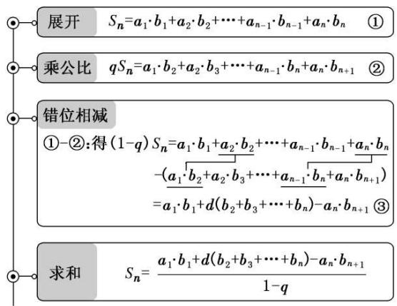
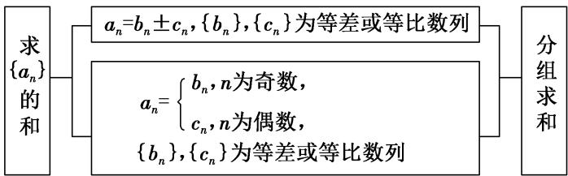
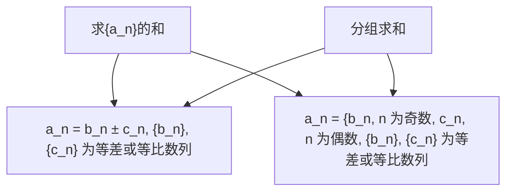

# 第44讲 数列求和

# 知识梳理

# 一．公式法

(1) 等差数列 $\{a_{n}\}$ 的前 $n$ 项和 $\mathrm{S}_n = \frac{n(a_1 + a_n)}{2} = na_1 + \frac{n(n + 1)}{2} d$ , 推导方法: 倒序相加法.  
(2) 等比数列 $\{a_{n}\}$ 的前 $n$ 项和 $\mathrm{S}_{n} = \left\{ \begin{array}{l} n a_{1}, q = 1 \\ \frac{a_{1}(1 - q^{n})}{1 - q}, q \neq 1 \end{array} \right.$ , 推导方法: 乘公比, 错位相减法.  
(3)一些常见的数列的前 $n$ 项和：

① $\sum_{k=1}^{n} k = 1 + 2 + 3 + \cdots + n = \frac{1}{2} n (n + 1)$ ; $\sum_{k=1}^{n} 2k = 2 + 4 + 6 + \cdots + 2n = n(n + 1)$   
② $\sum_{k=1}^{n}(2k-1)=1+3+5+\cdots+(2n-1)=n^{2}$ ;   
③ $\sum_{k=1}^{n} k^2 = 1^2 + 2^2 + 3^2 + \cdots + n^2 = \frac{1}{6} n(n+1)(2n+1)$ ;   
④ $\sum_{k=1}^{n} k^3 = 1^3 + 2^3 + 3^3 + \cdots + n^3 = \left[\frac{n(n+1)}{2}\right]^2$

# 二．几种数列求和的常用方法

(1) 分组转化求和法: 一个数列的通项公式是由若干个等差或等比或可求和的数列组成的, 则求和时可用分组求和法, 分别求和后相加减.  
(2) 裂项相消法: 把数列的通项拆成两项之差, 在求和时中间的一些项可以相互抵消, 从而求得前 $n$ 项和.  
(3) 错位相减法: 如果一个数列的各项是由一个等差数列和一个等比数列的对应项之积构成的, 那么求这个数列的前 $n$ 项和即可用错位相减法求解.  
(4) 倒序相加法: 如果一个数列 $\{a_{n}\}$ 与首末两端等“距离”的两项的和相等或等于同一个常数, 那么求这个数列的前 $n$ 项和即可用倒序相加法求解.

# 【解题方法总结】

常见的裂项技巧

积累裂项模型1:等差型

(1) $\frac{1}{n(n + 1)} = \frac{1}{n} -\frac{1}{n + 1}$   
(2) $\frac{1}{n(n + k)} = \frac{1}{k}\left(\frac{1}{n} -\frac{1}{n + k}\right)$   
(3) $\frac{1}{4n^2 - 1} = \frac{1}{2}\left(\frac{1}{2n - 1} -\frac{1}{2n + 1}\right)$   
(4) $\frac{1}{n(n + 1)(n + 2)} = \frac{1}{2}\left[\frac{1}{n(n + 1)} -\frac{1}{(n + 1)(n + 2)}\right]$   
(5) $\frac{1}{n(n^2 - 1)} = \frac{1}{n(n - 1)(n + 1)} = \frac{1}{2}\left(\frac{1}{(n - 1)n} -\frac{1}{n(n + 1)}\right)$   
(6) $\frac{n^2}{4n^2 - 1} = \frac{1}{4}\left[1 + \frac{1}{(2n + 1)(2n - 1)}\right]$

(7) $\frac{3n + 1}{(n + 1)(n + 2)(n + 3)} = \frac{4(n + 1) - (n + 3)}{(n + 1)(n + 2)(n + 3)} = 4\left(\frac{1}{n + 2} -\frac{1}{n + 3}\right) - \left(\frac{1}{n + 1} -\frac{1}{n + 2}\right)$   
(8) $n(n+1)=\frac{1}{3}[n(n+1)(n+2)-(n-1)n(n+1)].$   
(9) $n(n+1)(n+2)=\frac{1}{4}[n(n+1)(n+2)(n+3)-(n-1)n(n+1)(n+2)]$   
(10) $\frac{1}{n(n + 1)(n + 2)(n + 3)} = \frac{1}{3}\left[\frac{1}{n(n + 1)(n + 2)} -\frac{1}{(n + 1)(n + 2)(n + 3)}\right]$   
(11) $\frac{2n + 1}{n^2(n + 1)^2} = \frac{1}{n^2} -\frac{1}{(n + 1)^2}$   
(12) $\frac{n + 1}{n^2(n + 2)^2} = \frac{1}{4}\left[\frac{1}{n^2} -\frac{1}{(n + 2)^2}\right]$

积累裂项模型 2: 根式型

(1) $\frac{1}{\sqrt{n + 1} + \sqrt{n}} = \sqrt{n + 1} - \sqrt{n}$

(2) $\frac{1}{\sqrt{n + k} + \sqrt{n}} = \frac{1}{k} (\sqrt{n + k} - \sqrt{n})$

(3) $\frac{1}{\sqrt{2n - 1} + \sqrt{2n + 1}} = \frac{1}{2} (\sqrt{2n + 1} -\sqrt{2n - 1})$

(4) $\sqrt{1 + \frac{1}{n^2} + \frac{1}{(n + 1)^2}} = \frac{n(n + 1) + 1}{n(n + 1)} = 1 + \frac{1}{n} -\frac{1}{n + 1}$

(5) $\frac{1}{\sqrt[3]{n^2 + 2n + 1} + \sqrt[3]{n^2 - 1} + \sqrt[3]{n^2 - 2n + 1}}$

$$
= \sqrt [ 3 ]{n + 1} - \sqrt [ 3 ]{n - 1} \left(\sqrt [ 3 ]{n ^ {2} + 2 n + 1} + \sqrt [ 3 ]{n ^ {2} - 1} + \sqrt [ 3 ]{n ^ {2} - 2 n + 1}\right) = \frac {\sqrt [ 3 ]{n + 1} - \sqrt [ 3 ]{n}}{2}
$$

(6) $\frac{1}{(n + 1)\sqrt{n} + n\sqrt{n + 1}} = \frac{(n + 1)\sqrt{n} - n\sqrt{n + 1}}{[(n + 1)\sqrt{n}]^2 - (n\sqrt{n + 1})^2} = \frac{(n + 1)\sqrt{n} - n\sqrt{n + 1}}{n(n + 1)} = \frac{1}{\sqrt{n}} -$

$$
\frac {1}{\sqrt {n + 1}}
$$

积累裂项模型 3: 指数型

(1) $\frac{2^n}{(2^{n+1}-1)(2^n-1)} = \frac{(2^{n+1}-1)-(2^n-1)}{(2^{n+1}-1)(2^n-1)} = \frac{1}{2^n - 1} -\frac{1}{2^{n+1}-1}$   
(2) $\frac{3^n}{(3^n - 1)(3^{n + 1} - 1)} = \frac{1}{2}\left(\frac{1}{3^n - 1} -\frac{1}{3^{n + 1} - 1}\right)$   
(3) $\frac{n + 2}{n(n + 1)\cdot 2^n} = \frac{2(n + 1) - n}{n(n + 1)\cdot 2^n} = \left(\frac{2}{n} -\frac{1}{n + 1}\right)\cdot \frac{1}{2^n} = \frac{1}{n\cdot 2^{n - 1}} -\frac{1}{(n + 1)\cdot 2^n}$   
(4) $\frac{(4n - 1)\cdot 3^{n - 1}}{n(n + 2)} = \frac{1}{2}\left[\frac{9}{(n + 2)} -\frac{1}{n}\right]\cdot 3^{n - 1} = \frac{1}{2}\left(\frac{3^{n + 1}}{n + 2} -\frac{3^{n - 1}}{n}\right)$   
(5) $\frac{(2n + 1)\cdot(-1)^n}{n(n + 1)} = \frac{(-1)^n}{n} -\frac{(-1)^{n + 1}}{n + 1}$   
(6) $a_{n}=n\cdot3^{n-1}$ ，设 $a_{n}=(an+b)3^{n}-[a(n-1)+b]\cdot3^{n-1}$ ，易得 $a=\frac{1}{2},b=-\frac{1}{4}$

于是 $a_{n} = \frac{1}{4} (2n - 1)3^{n} - \frac{1}{4} (2n - 3)\cdot 3^{n - 1}$

(7) $\frac{(-1)^n(n^2 + 4n + 2)2^n}{n \cdot 2^n \cdot (n + 1)2^{n + 1}} = \frac{(-1)^n(n^2 + 4n + 2)}{n \cdot (n + 1)2^{n + 1}} = \frac{(-1)^n[n^2 + n + 2(n + 1) + n]}{n \cdot (n + 1)2^{n + 1}}$

$$
= \frac {(- 1) ^ {n}}{2 ^ {n + 1}} + (- 1) ^ {n} \left[ \frac {1}{n \cdot 2 ^ {n}} + \frac {1}{(n + 1) \cdot 2 ^ {n + 1}} \right] = \frac {1}{2} \left(- \frac {1}{2}\right) ^ {n} + \left[ \frac {(- 1) ^ {n}}{n \cdot 2 ^ {n}} - \frac {(- 1) ^ {n + 1}}{(n + 1) \cdot 2 ^ {n + 1}} \right]
$$

积累裂项模型 4: 对数型

$$
\log_ {a} \frac {a _ {n + 1}}{a _ {n}} = \log_ {a} ^ {a _ {n + 1}} - \log_ {a} a _ {n}
$$

积累裂项模型 5: 三角型

(1) $\frac{1}{\cos\alpha\cos\beta} = \frac{1}{\sin(\alpha - \beta)} (\tan \alpha - \tan \beta)$   
(2) $\frac{1}{\cos n^{\circ}\cos(n+1)^{\circ}}=\frac{1}{\sin 1^{\circ}}[\tan(n+1)^{\circ}-\tan n^{\circ}]$   
(3) $\tan \alpha \tan \beta = \frac{1}{\tan (\alpha - \beta)} (\tan \alpha - \tan \beta) - 1$   
(4) $a_{n}=\tan\cdot\tan(n-1);\tan1=\tan[n-(n-1)]=\frac{\tan n-\tan(n-1)}{1+\tan n\cdot\tan(n-1)}$

则 $\tan n\cdot \tan (n - 1) = \frac{\tan n - \tan(n - 1)}{\tan1} -1,a_n = \frac{\tan n - \tan(n - 1)}{\tan1} -1$

积累裂项模型6:阶乘

(1) $\frac{n}{(n + 1)!} = \frac{1}{n!} -\frac{1}{(n + 1)!}$   
(2) $\frac{n + 2}{n! + (n + 1)! + (n + 2)!} = \frac{n + 2}{n!(n + 2)^2} = \frac{1}{n!(n + 2)} = \frac{n + 1}{(n + 2)!} = \frac{1}{(n + 1)!} -\frac{1}{(n + 2)!}$

常见放缩公式:

(1) $\frac{1}{n^2} < \frac{1}{(n - 1)n} = \frac{1}{n - 1} - \frac{1}{n} (n \geqslant 2)$ ;   
(2) $\frac{1}{n^2} > \frac{1}{n(n + 1)} = \frac{1}{n} - \frac{1}{n + 1}$ ;   
(3) $\frac{1}{n^2} = \frac{4}{4n^2} < \frac{4}{4n^2 - 1} = 2\left(\frac{1}{2n - 1} - \frac{1}{2n + 1}\right)$ ;   
(4) $\mathrm{T}_{r + 1} = \mathrm{C}_n^r\cdot \frac{1}{n^r} = \frac{n!}{r!(n - r)!}\cdot \frac{1}{n^r} <  \frac{1}{r!} <  \frac{1}{r(r - 1)} = \frac{1}{r - 1} -\frac{1}{r} (r\geqslant 2);$   
(5) $\left(1+\frac{1}{n}\right)^{n}<1+1+\frac{1}{1\times2}+\frac{1}{2\times3}+\cdots+\frac{1}{(n-1)n}<3;$   
(6) $\frac{1}{\sqrt{n}} = \frac{2}{\sqrt{n} + \sqrt{n}} < \frac{2}{\sqrt{n - 1} + \sqrt{n}} = 2(-\sqrt{n - 1} + \sqrt{n})(n \geqslant 2)$ ;   
(7) $\frac{1}{\sqrt{n}} = \frac{2}{\sqrt{n} + \sqrt{n}} > \frac{2}{\sqrt{n} + \sqrt{n + 1}} = 2(-\sqrt{n} + \sqrt{n + 1})$ ;

(8) $\frac{1}{\sqrt{n}} = \frac{2}{\sqrt{n} + \sqrt{n}} < \frac{2}{\sqrt{n - \frac{1}{2}} + \sqrt{n + \frac{1}{2}}} = \frac{2\sqrt{2}}{\sqrt{2n - 1 + \sqrt{2n + 1}}} = \sqrt{2} (-\sqrt{2n - 1} +\sqrt{2n + 1});$

(9) $\frac{2^n}{(2^n - 1)^2} = \frac{2^n}{(2^n - 1)(2^n - 1)} < \frac{2^n}{(2^n - 1)(2^n - 2)} = \frac{2^{n-1}}{(2^n - 1)(2^{n-1} - 1)} = \frac{1}{2^{n-1} - 1} - \frac{1}{2^n - 1} (n \geqslant 2)$ ;

(10) $\frac{1}{\sqrt{n^3}} = \frac{1}{\sqrt{n \cdot n^2}} < \frac{1}{\sqrt{(n - 1)n(n + 1)}} = \frac{\sqrt{n + 1} - \sqrt{n - 1}}{\sqrt{(n - 1)n(n + 1)}} \cdot \frac{1}{\sqrt{n + 1} - \sqrt{n - 1}}$   
$= \left[\frac{1}{\sqrt{(n - 1)n}} -\frac{1}{\sqrt{n(n + 1)}}\right]\cdot \frac{1}{\sqrt{n + 1} - \sqrt{n - 1}} = 2\Big(\frac{1}{\sqrt{n - 1}} -\frac{1}{\sqrt{n + 1}}\Big)$

$$
\frac {\sqrt {n + 1} + \sqrt {n - 1}}{2 \sqrt {n}}
$$

$$
<   2 \left(\frac {1}{\sqrt {n - 1}} - \frac {1}{\sqrt {n + 1}}\right) \circ (n \geqslant 2);
$$

$$
\begin{array}{l} \frac {1}{\sqrt {n ^ {3}}} = \frac {2}{\sqrt {n ^ {2} \cdot n} + \sqrt {n \cdot n ^ {2}}} <   \frac {2}{n \sqrt {n - 1} + (n - 1) \sqrt {n}} = \frac {2}{\sqrt {(n - 1) n} (\sqrt {n} + \sqrt {n - 1})} \tag {11} \\ = \frac {- 2 (\sqrt {n - 1} - \sqrt {n})}{\sqrt {(n - 1) n}} = \frac {2}{\sqrt {n - 1}} - \frac {2}{\sqrt {n}} (n \geqslant 2); \\ \end{array}
$$

$$
(1 2) \frac {1}{2 ^ {n} - 1} = \frac {1}{(1 + 1) ^ {n} - 1} <   \frac {1}{\mathrm{C} _ {n} ^ {0} + \mathrm{C} _ {n} ^ {1} + \mathrm{C} _ {n} ^ {2} - 1} = \frac {2}{n (n + 1)} = \frac {2}{n} - \frac {2}{n + 1};
$$

$$
\frac {1}{2 ^ {n} - 1} <   \frac {2 ^ {n - 1}}{(2 ^ {n - 1} - 1) (2 ^ {n} - 1)} = \frac {1}{2 ^ {n - 1} - 1} - \frac {1}{2 ^ {n} - 1} (n \geqslant 2). \tag {13}
$$

$$
2 (\sqrt {n + 1} - \sqrt {n}) = \frac {2}{\sqrt {n + 1} + \sqrt {n}} <   \frac {1}{\sqrt {n}} <   \frac {2}{\sqrt {n} + \sqrt {n - 1}} = 2 (\sqrt {n} - \sqrt {n - 1}). \tag {14}
$$

# 必考题型全归纳

# 题型一:通项分析法

2096 (2024·全国·高三专题练习)求和 $S_{n}=(3+2)+(3^{2}+3\cdot2+2^{2})+\cdots$

$$
+ \left(3 ^ {n} + 3 ^ {n - 1} \cdot 2 + 3 ^ {n - 2} \cdot 2 ^ {2} + \dots + 2 ^ {n}\right).
$$

【解析】 $\because a_{n}=3^{n}+3^{n-1}\cdot2+3^{n-2}\cdot2^{2}+\cdots+2^{n}=3^{n}\left[1+\frac{2}{3}+\left(\frac{2}{3}\right)^{2}+\cdots+\left(\frac{2}{3}\right)^{n}\right]$

$$
= 3 ^ {n} \cdot \left[ \frac {1 - \left(\frac {2}{3}\right) ^ {n + 1}}{1 - \frac {2}{3}} \right] = 3 ^ {n + 1} - 2 ^ {n + 1},
$$

$$
\therefore \mathrm{S} _ {n} = \left(3 ^ {2} + 3 ^ {3} + \dots + 3 ^ {n + 1}\right) - \left(2 ^ {2} + 2 ^ {3} + \dots + 2 ^ {n + 1}\right) = \frac {9 (1 - 3 ^ {n})}{1 - 3} - (2 ^ {n + 2} - 4).
$$

$$
\mathrm{S} _ {n} = \frac {3 ^ {n + 2}}{2} - 2 ^ {n + 2} - \frac {1}{2}
$$

2097 数列 9, 99, 999, … 的前 n 项和为 （）

A. $\frac{10}{9} (10^n - 1) + n$

B. $10^{n} - 1$

C. $\frac{10}{9} (10^n - 1)$

D. $\frac{10}{9} (10^n - 1) - n$

【答案】D

【解析】∵数列通项 $a_{n}=10^{n}-1$ ，

$$
\begin{array}{l} \therefore \mathrm{S} _ {n} = (1 0 + 1 0 ^ {2} + 1 0 ^ {3} + + 1 0 ^ {n}) - n \\ = \frac {1 0 (1 - 1 0 ^ {n})}{1 - 1 0} - n \\ = \frac {1 0}{9} (1 0 ^ {n} - 1) - n. \\ \end{array}
$$

故选：D.

2098 求数列 1, (1+2), (1+2+2²), …, (1+2+2²+…+2^{n-1}), … 的前 n 项之和.

【解析】由于 $a_{n}=1+2^{1}+2^{2}+\cdots+2^{n-1}=\frac{2^{n}-1}{2-1}=2^{n}-1$

$$
\begin{array}{l} = \left(2 ^ {1} + 2 ^ {2} + 2 ^ {3} + \dots + 2 ^ {n}\right) - (1 + 1 + \dots + 1) \\ = \frac {2 \times (2 ^ {n} - 1)}{2 - 1} - n \\ = 2 ^ {n + 1} - n - 2. \\ \end{array}
$$

所以前 n 项之和 $\mathrm{T}_{n}=(2^{1}-1)+(2^{2}-1)+\cdots+(2^{n}-1)$

2099 (2024·全国·高三专题练习)数列1, $(1+2)$ , $(1+2+2^{2})$ , $(1+2+2^{2}+2^{3})$ , $\cdots$ , $(1+2+\cdots+2^{n-1})$ , $\cdots$ 的前n项和为\_\_\_\_.

【答案】 $2^{n + 1} - 2 - n$

【解析】观察数列得到 $a_{n}=1+2+\cdots+2^{n-1}=\frac{1-2^{n}}{1-2}=2^{n}-1$ ,

所以前 n 项和 $S_{n}=a_{1}+a_{2}+\cdots+a_{n}=2^{1}-1+2^{2}-1+\cdots+2^{n}-1$

$$
= 2 ^ {1} + 2 ^ {2} + \dots + 2 ^ {n} - n = \frac {2 (1 - 2 ^ {n})}{1 - 2} - n = 2 ^ {n + 1} - 2 - n.
$$

故答案为: $2^{n+1} - 2 - n$ .

2100 (2024·全国·高三对口高考)数列 5,55,555,5555, $\cdots$ , $\frac{5}{9}(10^{n}-1)$ , $\cdots$ 的前 n 项和 $S_{n}=$

【答案】 $\frac{5}{81} \times 10^{n+1} - \frac{50}{81} - \frac{5n}{9}$

【解析】由题意， $a_{n}=\frac{5}{9}(10^{n}-1)$ ，

所以 $S_{n}=\frac{5}{9}(10-1+10^{2}-1+10^{3}-1+\cdots+10^{n}-1)$

$$
= \frac {5}{9} \times \left(\frac {1 0 - 1 0 ^ {n} \times 1 0}{1 - 1 0} - n\right)
$$

$$
= \frac {5}{8 1} \times (1 0 ^ {n + 1} - 1 0) - \frac {5 n}{9}
$$

$$
= \frac {5}{8 1} \times 1 0 ^ {n + 1} - \frac {5 0}{8 1} - \frac {5 n}{9}
$$

故答案为: $\frac{5}{81} \times 10^{n+1} - \frac{50}{81} - \frac{5n}{9}$

2101 (2024·全国·高三专题练习) 1202 年意大利数学家列昂那多－斐波那契以兔子繁殖为例，引人“兔子数列”，又称斐波那契数列，即 1, 1, 2, 3, 5, 8, 13, 21, 34, 55, … 该数列中的数字被人们称为神奇数，在现代物理，化学等领域都有着广泛的应用。若此数列各项被 3 除后的余数构成一新数列 $\{a_{n}\}$ ，则数列 $\{a_{n}\}$ 的前 2022 项的和为 \_\_\_\_.

【答案】2276

【解析】由数列 1, 1, 2, 3, 5, 8, 13, 21, 34, 55, … 各项除以 3 的余数，

可得数列 $\{a_{n}\}$ 为 1, 1, 2, 0, 2, 2, 1, 0, 1, 1, 2, 0, 2, 2, 1, …,

所以数列 $\{a_{n}\}$ 是周期为8的数列，

一个周期中八项和为 $1+1+2+0+2+2+1+0=9$ ,

又因为 $2022 = 252 \times 8 + 6$ ,

所以数列 $\{a_{n}\}$ 的前 2022 项的和 $S_{2022}=252\times9+8=2276$ .

故答案为: 2276.

【解题方法总结】

先分析数列通项的特点,再选择合适的方法求和是求数列的前 n 项和问题应该强化的意识.

# 2 题型二:公式法

2102 (2024·重庆沙坪坝·高三重庆一中校考阶段练习)已知数列 $\{a_{n}\}$ 为等差数列，数列 $\{b_{n}\}$ 为等比数列，且 $b_{n} \in N^{*}$ ，若 $a_{1} = b_{2} = 2, a_{1} + a_{2} + a_{3} = b_{1} + b_{2} + b_{3} + b_{4} = 15$ .

(1) 求数列 $\{a_{n}\}$ , $\{b_{n}\}$ 的通项公式;  
(2) 设由 $\{a_{n}\}$ , $\{b_{n}\}$ 的公共项构成的新数列记为 $\{c_{n}\}$ , 求数列 $\{c_{n}\}$ 的前 5 项之和 $S_{5}$ .

【解析】(1)设数列 $\{a_{n}\}$ 的公差为d,数列 $\{b_{n}\}$ 的公比为q,

因为 $a_1 = 2, a_1 + a_2 + a_3 = 15$

则 $\left\{ \begin{array}{l}a_{1} = 2\\ 2a_{1} + 3d = 13 \end{array} \right.$ ，解得 $\left\{ \begin{array}{l}a_1 = 2\\ d = 3 \end{array} \right.$

所以 $a_{n} = a_{1} + (n - 1)d = 2 + 3(n - 1) = 3n - 1,$

因为 $b_{2} = 2, b_{1} + b_{2} + b_{3} + b_{4} = 15$

所以 $\left\{ \begin{array}{l} b_{1}q = 2 \\ b_{1} + b_{1}q^{2} + b_{1}q^{3} = 13 \end{array} \right.$ ，则 $2q^{3} + 2q^{2} - 13q + 2 = 0$

所以 $(q - 2)(2q^{2} + 6q - 1) = 0$

因为 $b_{n}\in \mathbf{N}^{*}$ ，所以 $q = 2,b_{1} = 1$

所以 $b_{n} = 2^{n - 1}$

(2) 设数列 $\{a_{n}\}$ 的第 $m$ 项与数列 $\{b_{n}\}$ 的第 $n$ 项相等，

则 $a_{m} = b_{n}\Rightarrow 3m - 1 = 2^{n - 1},m,n\in \mathbf{N}^{*},$

所以 $m = \frac{2^{n - 1} + 1}{3}, m, n \in \mathbf{N}^*$ ,

因为 $m, n \in \mathbf{N}^*$ ,

所以当 $n = 1$ 时， $m = \frac{2}{3} \notin \mathbb{N}^*$ ，当 $n = 2$ 时， $m = 1$ ，则 $c_{1} = 2$ ，当 $n = 3$ 时， $m = \frac{5}{3} \notin \mathbb{N}^*$ ，

当 $n = 4$ 时， $m = 3$ ，则 $c_{2} = 8$ ，当 $n = 5$ 时， $m = \frac{17}{3} \notin \mathbb{N}^{*}$ ，

当 $n = 6$ 时， $m = 11$ ，则 $c_{3} = 32$ ，当 $n = 7$ 时， $m = \frac{65}{3} \notin \mathbb{N}^{*}$

当 $n = 8$ 时， $m = 43$ ，则 $c_{4} = 128$ ，当 $\mathbf{n} = \mathbf{9}$ 时， $m = \frac{257}{3} \notin \mathrm{N}^{*}$

当 n=10 时, m=171, 则 $c_{5}=512$ ,

故 $\{c_n\}$ 的前5项之和 $S_5 = 2 + 8 + 32 + 128 + 512 = 682$

2103 (2024·湖北武汉·统考模拟预测)已知 $S_{n}$ 是数列 $\{a_{n}\}$ 的前 n 项和， $2S_{n}=na_{n}, a_{2}=3$ .

(1) 求数列 $\{a_{n}\}$ 的通项公式；  
(2) 若 $b_{n} = |16 - a_{n}|$ ，求数列 $\{b_{n}\}$ 的前 $n$ 项和 $T_{n}$ .

【解析】(1) 由 $2S_{n}=na_{n}$ ，则 $2S_{n+1}=(n+1)a_{n+1}$ ，

两式相减得： $2a_{n + 1} = (n + 1)a_{n + 1} - na_n$

整理得： $(n - 1)a_{n + 1} = na_n$

即 $n \geqslant 2$ 时, $\frac{a_{n+1}}{a_n} = \frac{n}{n-1}$ ,

所以 $n \geqslant 2$ 时， $a_{n} = \frac{a_{n}}{a_{n-1}} \cdot \frac{a_{n-1}}{a_{n-2}} \cdots \frac{a_{3}}{a_{2}} \cdot a_{2} = \frac{n-1}{n-2} \cdot \frac{n-2}{n-3} \cdots \frac{2}{1} \cdot 3 = 3(n-1)$ ，

又 $n = 1$ 时， $2a_{1} = a_{1}$ ，得 $a_{1} = 0$ ，也满足上式.

故 $a_{n} = 3(n - 1)$

(2) 由 (1) 可知: $b_n = |16 - a_n| = |19 - 3n|$ .

记 $\mathrm{C}_n = 19 - 3n$ ，设数列 $\{\mathrm{C}_n\}$ 的前 $n$ 项和 $\mathrm{T}_n'$ .

当 $n \leqslant 6$ 时， $\mathrm{T}_n = \frac{n(16 + 19 - 3n)}{2} = \frac{-3n^2 + 35n}{2}$ ;

当 n > 6 时， $T_{n} = C_{1} + C_{2} + \cdots + C_{6} - C_{7} - \cdots + C_{n}$

$$
= \mathrm{T} _ {6} ^ {\prime} - \left(\mathrm{T} _ {n} ^ {\prime} - \mathrm{T} _ {6} ^ {\prime}\right) = 2 \mathrm{T} _ {6} ^ {\prime} - \mathrm{T} _ {n} ^ {\prime} = 1 0 2 - \frac {- 3 n ^ {2} + 3 5 n}{2} = \frac {3 n ^ {2} - 3 5 n + 2 0 4}{2}
$$

综上： $T_{n}=\left\{\begin{aligned}&\frac{-3n^{2}+35n}{2},&n\leqslant6\\&\frac{3n^{2}-35n+204}{2},&n>6\end{aligned}\right.$

2104 (2024·宁夏银川·高三银川一中阶段练习)已知等差数列 $\{a_{n}\}$ 的前四项和为 10，且 $a_{2}, a_{3}, a_{7}$ 成等比数列

(1) 求通项公式 $a_{n}$   
(2) 设 $b_{n}=2^{a_{n}}$ ，求数列 $b_{n}$ 的前 n 项和 $S_{n}$

【解析】(1) 设等差数列 $\{a_{n}\}$ 的公差为 d，则 $4a_{1} + \frac{4 \times 3}{2}d = 10$ ，即 $2a_{1} + 3d = 5$ ，

又 $a_{2}, a_{3}, a_{7}$ 成等比数列，所以 $a_{3}^{2} = a_{2}a_{7}$ ，即 $(a_{1} + 2d)^{2} = (a_{1} + d)(a_{1} + 6d)$ ，

整理得 $2d^{2}+3a_{1}d=0$ ，得 d=0 或 $d=-\frac{3}{2}a_{1}$

若 $d = 0$ ，则 $a_1 = \frac{5}{2}, a_n = a_1 + (n - 1)d = \frac{5}{2}$

若 $d = -\frac{3}{2} a_1$ ，则 $2a_{1} - \frac{9}{2} a_{1} = 5$ ，得 $a_1 = -2, d = 3, a_n = 3n - 5.$

综上所述: $a_{n} = \frac{5}{2}$ 或 $a_{n} = 3n - 5$ .

(2) 若 $a_{n} = \frac{5}{2}$ , 则 $b_{n} = 2^{\frac{5}{2}} = 4\sqrt{2}, S_{n} = 4\sqrt{2} n$ ;

若 $a_{n} = 3n - 5$ ，则 $b_{n} = 2^{3n - 5} = \frac{8^{n}}{32},\mathrm{S}_{n} = \frac{1}{32}\cdot \frac{8(1 - 8^{n})}{1 - 8} = \frac{8^{n} - 1}{28}.$

【解题方法总结】

针对数列的结构特征,确定数列的类型,符合等差或等比数列时,直接利用等差、等比数列相应公式求解.

# 3 题型三:错位相减法

2105 (2024·广东茂名·高三茂名市第一中学校考阶段练习)已知数列 $\{a_{n}\}$ 满足 $a_{n}=2a_{n-1}+2^{n}-1(n\geqslant2)$ 且 $a_{1}=5$

(1) 若存在一个实数 $\lambda$ ，使得数列 $\left\{\frac{a_{n}+\lambda}{2^{n}}\right\}$ 为等差数列，请求出 $\lambda$ 的值；  
(2) 在 (1) 的条件下, 求出数列 $\{a_{n}\}$ 的前 n 项和 $S_{n}$ .

【解析】(1) 假设存在实数 p 符合题意, 则 $\frac{a_{n}+\lambda}{2^{n}}-\frac{a_{n-1}+\lambda}{2^{n-1}}$ 必为与 n 无关的常数.

因为 $\frac{a_n + \lambda}{2^n} -\frac{a_{n - 1} + \lambda}{2^{n - 1}} = \frac{a_n - 2a_{n - 1} - \lambda}{2^n} = \frac{2^n - 1 - \lambda}{2^n} = 1 - \frac{1 + \lambda}{2^n}.$

要使 $\frac{a_n + \lambda}{2^n} -\frac{a_{n - 1} + \lambda}{2^{n - 1}}$ 是与 $n$ 无关的常数，

则 $\frac{1 + \lambda}{2^n} = 0$ ，可得 $\lambda = -1$

故存在实数 $\lambda = -1$ ，使得数列 $\left\{\frac{a_n + \lambda}{2^n}\right\}$ 为等差数列.

(2) 由 $a_{n} = 2a_{n-1} + 2^{n} - 1$ , 且 $a_{1} = 5$ ,

由(1)知等差数列 $\left\{\frac{a_{n}-1}{2^{n}}\right\}$ 的公差d=1,

所以 $\frac{a_{n}-1}{2^{n}}=\frac{a_{1}-1}{2^{1}}+(n-1)=n+1$ , 即 $a_{n}=(n+1)\cdot2^{n}+1$

所以 $S_{n}=a_{1}+a_{2}+a_{3}+\cdots+a_{n}$

$$
\begin{array}{l} = (2 \times 2 + 1) + (3 \times 2 ^ {2} + 1) + \dots + [ (n + 1) \cdot 2 ^ {n} + 1 ] \\ = 2 \times 2 + 3 \times 2 ^ {2} + \dots + (n + 1) \cdot 2 ^ {n} + n \\ \end{array}
$$

记： $T_{n}=2\times2+3\times2^{2}+\cdots+(n+1)\cdot2^{n}$

有 $2T_{n}=2\times2^{2}+3\times2^{3}+\cdots+n\cdot2^{n}+(n+1)\cdot2^{n+1}$

两式相减, 得 $T_{n}=n\cdot2^{n+1}$ ,

故 $S_{n} = n\cdot 2^{n + 1} + n = n(2^{n + 1} + 1).$

2106 (2024·四川绵阳·高三盐亭中学校考阶段练习)设数列 $\left\{\circ b_{n}\right\}$ 的前 n 项和为 $\circ S_{n}$ ，且 $b_{n}=2-2S_{n}$ ; 数列 $\left\{\circ a_{n}\right\}$ 为等差数列，且 $a_{5}=14, a_{7}=20$ .

(1) 求数列 $\left\{\circ b_{n}\right\}$ 的通项公式.  
(2) 若 $c_{n} = a_{n} \cdot b_{n} (n \in \mathbb{N}^{*})$ ，求数列 $\{c_{n}\}$ 的前 $n$ 项和 $\circ \mathrm{T}_{n}$ .

【解析】(1) 当 n=1 时, $b_{1}=2-2b_{1}$ , 得 $b_{1}=\frac{2}{3}$ .

当 $n \geqslant 2$ 时， $b_{n} = 2 - 2\mathrm{S}_{n}, b_{n-1} = 2 - 2\mathrm{S}_{n-1}$ 两式相减有 $b_{n} - b_{n-1} = -2(\mathrm{S}_{n} - \mathrm{S}_{n-1}) = -2b_{n}$

即 $3b_{n} = b_{n - 1}$

因为 $b_{1} \neq 0$ ，所以数列 $\{\circ b_n\}$ 是以 $\frac{2}{3}$ 为首项，公比为 $\frac{1}{3}$ 的等比数列.

则 $b_{n} = \frac{2}{3}\times \left(\frac{1}{3}\right)^{n - 1} = \frac{2}{3^{n}}.$

所以数列 $\left\{\circ b_{n}\right\}$ 的通项公式为 $b_{n} = \frac{2}{3^{n}}$

(2) 在等差数列 $\left\{\circ a_{n}\right\}$ 中, 设首项为 $a_{1}$ 公差为 $d$ ,

则 $\left\{ \begin{array}{l}a_{5} = a_{1} + 4d = 14\\ a_{7} = a_{1} + 6d = 20 \end{array} \right.$ 解得 $\left\{ \begin{array}{l}a_1 = 2\\ d = 3 \end{array} \right.$

所以 $a_{n} = 2 + 3(n - 1) = 3n - 1.$

则 $c_{n} = a_{n}b_{n} = (3n - 1)\cdot \frac{2}{3^{n}}$

$$
\therefore \mathrm{T} _ {n} = 2 \left[ 2 \cdot \frac {1}{3} + 5 \cdot \frac {1}{3 ^ {2}} + 8 \cdot \frac {1}{3 ^ {3}} + \dots + (3 n - 1) \cdot \frac {1}{3 ^ {n}} \right] ①
$$

$$
\frac {1}{3} \mathrm{T} _ {n} = 2 \left[ 2 \cdot \frac {1}{3 ^ {2}} + 5 \cdot \frac {1}{3 ^ {3}} + \dots + (3 n - 4) \cdot \frac {1}{3 ^ {n}} + (3 n - 1) \cdot \frac {1}{3 ^ {n + 1}} \right] ②
$$

所以①-②得 $\frac{2}{3}\mathrm{T}_n = 2\left[2\cdot \frac{1}{3} +3\cdot \frac{1}{3^2} +3\cdot \frac{1}{3^3} +\dots +3\cdot \frac{1}{3^n} -(3n - 1)\cdot \frac{1}{3^{n + 1}}\right].$

即 $\frac{2}{3}\mathrm{T}_n = 2\left[3\cdot \frac{1}{3} +3\cdot \frac{1}{3^2} +3\cdot \frac{1}{3^3} +\dots +3\cdot \frac{1}{3^n} -\frac{1}{3} -(3n - 1)\cdot \frac{1}{3^{n + 1}}\right].$

解得 $\mathrm{T}_n = \frac{7}{2} -\frac{6n + 7}{2}\cdot \frac{1}{3^n}$

2107 (2024·湖南长沙·高三湖南师大附中校考阶段练习)已知数列 $\{x_{n}\}$ 的首项为 1，且 $x_{1} + \frac{x_{2}}{2} + \cdots + \frac{x_{n-1}}{2^{n-2}} + \frac{x_{n}}{2^{n-1}} = \frac{nx_{n+1}}{2^{n}}$ .

(1) 求数列 $\{x_{n}\}$ 的通项公式；  
(2) 若 $b_n = \frac{1}{2}(2n + 1)(x_{n+1} - x_n), S_n$ 为 $\{b_n\}$ 前 $n$ 项的和，求 $S_n$ .

【解析】(1) 因为 $x_{1}+\frac{x_{2}}{2}+\cdots+\frac{x_{n-1}}{2^{n-2}}+\frac{x_{n}}{2^{n-1}}=\frac{nx_{n+1}}{2^{n}}$ ,

所以 $x_{1}+\frac{x_{2}}{2}+\cdots+\frac{x_{n-1}}{2^{n-2}}=\frac{(n-1)x_{n}}{2^{n-1}}(n\geqslant2)$ .

两式作差得 $\frac{x_n}{2^{n - 1}} = \frac{nx_{n + 1}}{2^n} -\frac{(n - 1)x_n}{2^{n - 1}},$

整理得 $x_{n + 1} = 2x_{n}(n\geqslant 2)$

令 $n = 1$ ，得 $2x_{1} = x_{2}$ ，故 $x_{n + 1} = 2x_{n}$ 对任意 $n\in \mathbf{N}^*$ 都成立.

所以 $\{x_{n}\}$ 的首项为 1, 故 $x_{n} \neq 0$ , 所以 $\{x_{n}\}$ 是公比为 2 的等比数列.

所以 $\{x_{n}\}$ 的通项公式是 $x_{n}=2^{n-1}$ .

(2) 由 (1) 得 $x_{n+1} - x_n = 2^{n-1}$ ,

所以 $b_{n}=\frac{1}{2}(n+n+1)(x_{n+1}-x_{n})=(2n+1)\times2^{n-2}.$

所以 $S_{n}=3\times2^{-1}+5\times2^{0}+\cdots+(2n-1)\times2^{n-3}+(2n+1)\times2^{n-2}.$

又 $2S_{n}=3\times2^{0}+5\times2^{1}+\cdots+(2n-1)\times2^{n-2}+(2n+1)\times2^{n-1}$

作差得 $S_{n}=-3\times2^{-1}-(2^{1}+2^{2}+\cdots+2^{n-1})+(2n+1)\times2^{n-1}$

$$
\begin{array}{l} = - \frac {3}{2} - \frac {2 \times (1 - 2 ^ {n - 1})}{1 - 2} + (2 n + 1) \times 2 ^ {n - 1}, \\ = \frac {(2 n - 1) \times 2 ^ {n} + 1}{2}. \\ \end{array}
$$

2108 (2024·西藏日喀则·统考一模)已知数列 $\{a_{n}\}$ 的前 n 项和为 $S_{n}$ ，且 $a_{1} + 2a_{2} + 3a_{3} + \cdots$

$$
+ n a _ {n} = (n - 1) \mathrm{S} _ {n} + 2 n.
$$

(1) 求 $a_1, a_2$ , 并求数列 $\{a_n\}$ 的通项公式;  
(2) 若 $b_n = a_n \cdot \log_2 a_n$ ，求数列 $\{b_n\}$ 的前 $n$ 项和 $T_n$ .

【解析】(1)由题意 $a_{1}+2a_{2}+3a_{3}+\cdots+na_{n}=(n-1)\mathrm{S}_{n}+2n$ ①,

当 n=1 时 $a_{1}=2$ ; 当 n=2 时 $a_{1}+2a_{2}=S_{2}+4=a_{1}+a_{2}+4\Rightarrow a_{2}=4$ ;

当 $n \geqslant 2$ 时， $a_{1} + 2a_{2} + 3a_{3} + \cdots + (n-1)a_{n-1} = (n-2)S_{n-1} + 2(n-1)$ ②，

① - ② 得 $na_{n} = (n - 1)S_{n} - (n - 2)S_{n - 1} + 2 = S_{n} + (n - 2)a_{n} + 2 \Rightarrow S_{n} = 2a_{n} - 2(n \geqslant 2)$ ,

当 n=1 时， $a_{1}=2$ 也适合上式，所以 $S_{n}=2a_{n}-2$ ，所以 $n\geqslant2$ 时 $S_{n-1}=2a_{n-1}-2$ ，

两式相减得 $a_{n} = 2a_{n - 1}(n\geqslant 2)$ ，故数列 $\{a_n\}$ 是以2为首项，2为公比的等比数列，

所以 $a_{n} = 2^{n}$

(2) 由 (1) 得 $b_n = n \cdot 2^n$ ,

$$
\mathrm{T} _ {n} = 1 \times 2 ^ {1} + 2 \times 2 ^ {2} + \dots + (n - 1) 2 ^ {n - 1} + n 2 ^ {n} ③,
$$

$$
2 \mathrm{T} _ {n} = 1 \times 2 ^ {2} + 2 \times 2 ^ {3} + \dots + (n - 1) 2 ^ {n} + n 2 ^ {n + 1} ④,
$$

③ - ④得: $-T_{n}=2^{1}+2^{2}+\cdots+2^{n}-n2^{n+1}=\frac{2(1-2^{n})}{1-2}-n2^{n+1}=2^{n+1}(1-n)-2$

所以 $\mathrm{T}_n = 2^{n + 1}(n - 1) + 2.$

2109 (2024·广东东莞·校考三模)已知数列 $\{a_{n}\}$ 和 $\{b_{n}\}$ ， $a_{1}=2,\frac{1}{b_{n}}-\frac{1}{a_{n}}=1,a_{n+1}=2b_{n}$

(1) 求证数列 $\left\{\frac{1}{a_{n}}-1\right\}$ 是等比数列；  
(2) 求数列 $\left\{\frac{n}{b_{n}}\right\}$ 的前 n 项和 $T_{n}$ .

【解析】(1)由 $a_{1}=2,\frac{1}{b_{n}}-\frac{1}{a_{n}}=1,a_{n+1}=2b_{n}$ 得 $\frac{2}{a_{n+1}}-\frac{1}{a_{n}}=1,$

整理得 $\frac{1}{a_{n + 1}} - 1 = \frac{1}{2}\left(\frac{1}{a_n} - 1\right)$ , 而 $\frac{1}{a_1} - 1 = -\frac{1}{2} \neq 0$ ,

所以数列 $\left\{\frac{1}{a_n} - 1\right\}$ 是以 $-\frac{1}{2}$ 为首项，公比为 $\frac{1}{2}$ 的等比数列

(2) 由 (1) 知 $\frac{1}{a_n} - 1 = -\frac{1}{2}\left(\frac{1}{2}\right)^{n-1} = -\frac{1}{2^n}, \therefore a_n = \frac{2^n}{2^n - 1}$ ,

$$
\therefore b _ {n} = \frac {1}{2} a _ {n + 1} = \frac {2 ^ {n}}{2 ^ {n + 1} - 1}, \frac {n}{b _ {n}} = n \cdot \frac {2 ^ {n + 1} - 1}{2 ^ {n}} = 2 n - \frac {n}{2 ^ {n}},
$$

设 $S_{n}=\frac{1}{2}+\frac{2}{2^{2}}+\cdots+\frac{n}{2^{n}}$ ，则 $\frac{1}{2}S_{n}=\frac{1}{2^{2}}+\frac{2}{2^{3}}+\cdots+\frac{n}{2^{n+1}}$

两式相减得 $\frac{1}{2}S_{n}=\frac{1}{2}+\frac{1}{2^{2}}+\cdots+\frac{1}{2^{n}}-\frac{n}{2^{n+1}}=\frac{\frac{1}{2}\left(1-\frac{1}{2^{n}}\right)}{1-\frac{1}{2}}-\frac{n}{2^{n+1}}=1-\frac{n+2}{2^{n+1}}$

从而 $S_{n} = 2 - \frac{n + 2}{2^{n}}$

$$
\therefore \mathrm{T} _ {n} = \frac {n (2 + 2 n)}{2} - \mathrm{S} _ {n} = n ^ {2} + n - 2 + \frac {n + 2}{2 ^ {n}}.
$$

2110 (2024·广东广州·广州市从化区从化中学校考模拟预测)设数列 $\{a_{n}\}$ 的前 n 项和为 $S_{n}$ ，已知 $a_{1}=1$ ，且数列 $\left\{3-\frac{2S_{n}}{a_{n}}\right\}$ 是公比为 $\frac{1}{3}$ 的等比数列.

(1) 求数列 $\{a_{n}\}$ 的通项公式；  
(2) 若 $b_{n}=(2n+1)3^{n-1}$ ，求其前 n 项和 $T_{n}$

【解析】(1) 因为 $S_{1}=a_{1}=1,3-\frac{2S_{1}}{a_{1}}=1$ ,

所以由题意可得数列 $\left\{3 - \frac{2S_n}{a_n}\right\}$ 是首项为1，公比为 $\frac{1}{3}$ 的等比数列，

所以 $3 - \frac{2\mathrm{S}_n}{a_n} = \left(\frac{1}{3}\right)^{n - 1}$ 即 $2\mathrm{S}_n = \left[3 - \left(\frac{1}{3}\right)^{n - 1}\right]a_n,$

所以 $2S_{n+1}=\left[3-\left(\frac{1}{3}\right)^{n}\right]a_{n+1}$ ,

两式作差得: $2(\mathrm{S}_{n+1}-\mathrm{S}_n)=2a_{n+1}=\left[3-\left(\frac{1}{3}\right)^n\right]a_{n+1}-\left[3-\left(\frac{1}{3}\right)^{n-1}\right]a_n,$

化简得: $(1 - 3^{-n})a_{n + 1} - 3(1 - 3^{-n})a_n = 0$ , 即 $(3^n - 1)(a_{n + 1} - 3a_n) = 0$ ,

所以 $a_{n+1}=3a_{n}$ ,

所以数列 $\left\{a_{n}\right\}$ 是以 $a_{1}=1$ 为首项，以 3 为公比的等比数列，

故数列 $\{a_{n}\}$ 的通项公式为 $a_{n} = 3^{n - 1}$ ;

(2) 方法一:

设 $b_{n} = (2n + 1)3^{n - 1} = (xn + y)3^{n} - [x(n - 1) + y]3^{n - 1}, n \geqslant 2,$

则有 $b_{n} = [2xn + (2y + x)]3^{n - 1}$ ，比较系数得 $x = 1,y = 0$

所以 $b_{n} = (2n + 1)3^{n - 1} = n3^{n} - (n - 1)]3^{n - 1}, n \geqslant 2$

所以 $T_{n}=b_{1}+b_{2}+b_{3}+\cdots+b_{n}$ ,

所以 $T_{n}=3+(2\times3^{2}-3)+(3\times3^{3}-2\times3^{2})+\cdots+[n\times3^{n}-(n-1)\times3^{n-1}]$ ,

所以 $\mathrm{T}_n = n\times 3^n$

方法二:

因为 $b_{n} = (2n + 1)3^{n - 1}$

所以 $T_{n}=3\times3^{0}+5\times3^{1}+7\times3^{2}+\cdots+(2n-1)3^{n-2}+(2n+1)3^{n-1}$

所以 $3T_{n}=3\times3^{1}+5\times3^{2}+7\times3^{3}+\cdots+(2n-1)3^{n-1}+(2n+1)3^{n}$

所以 $-2T_{n}=3\times3^{0}+2\times3^{1}+2\times3^{2}+\cdots+2\times3^{n-1}-(2n+1)3^{n}$

$$
= 1 + 2 \times \left(3 ^ {0} + 3 ^ {1} + 3 ^ {2} + \dots + 3 ^ {n - 1}\right) - (2 n + 1) 3 ^ {n}
$$

$$
= 1 + 2 \times \frac {1 - 3 ^ {n}}{1 - 3} - (2 n + 1) 3 ^ {n} = 1 + 3 ^ {n} - 1 - (2 n + 1) 3 ^ {n} = - 2 n \cdot 3 ^ {n},
$$

所以 $\mathrm{T}_n = n\times 3^n$

# 【解题方法总结】

错位相减法求数列 $\{a_{n}\}$ 的前 $n$ 项和

# (1) 适用条件

若 $\{a_{n}\}$ 是公差为 $d(d\neq0)$ 的等差数列， $\{b_{n}\}$ 是公比为 $q(q\neq1)$ 的等比数列，求数列 $\{a_{n}\cdot b_{n}\}$ 的前 n 项和 $S_{n}$ .

# (2) 基本步骤

text_image

展开
S_n=a_1·b_1+a_2·b_2+⋯+a_{n-1}·b_{n-1}+a_n·b_n ①
乘公比
qS_n=a_1·b_2+a_2·b_3+⋯+a_{n-1}·b_n+a_n·b_{n+1} ②
错位相减
①-②:得(1-q)S_n=a_1·b_1+a_2·b_2+⋯+a_{n-1}·b_{n-1}+a_n·b_n
-(a_1·b_2+a_2·b_3+⋯+a_{n-1}·b_n+a_n·b_{n+1})
=a_1·b_1+d(b_2+b_3+⋯+b_n)-a_n·b_{n+1} ③
求和
S_n=\frac{a_1·b_1+d(b_2+b_3+⋯+b_n)-a_n·b_{n+1}}{1-q}

# (3) 注意事项

①在写出 $S_{n}$ 与 $qS_{n}$ 的表达式时, 应特别注意将两式“错位对齐”, 以便下一步准确写出 $S_{n}-qS_{n}$ ;  
②作差后,应注意减式中所剩各项的符号要变号.

等差乘等比数列求和,令 $c_{n}=(An+B)\cdot q^{n}$ , 可以用错位相减法.

$$
\mathrm{T} _ {n} = (\mathrm{A} + \mathrm{B}) q + (2 \mathrm{A} + \mathrm{B}) q ^ {2} + (3 \mathrm{A} + \mathrm{B}) q ^ {3} + \dots + (\mathrm{An} + \mathrm{B}) q ^ {n} ①
$$

$$
q \mathrm{T} _ {n} = (\mathrm{A} + \mathrm{B}) q ^ {2} + (2 \mathrm{A} + \mathrm{B}) q ^ {3} + (3 \mathrm{A} + \mathrm{B}) q ^ {4} + \dots + (\mathrm{An} + \mathrm{B}) q ^ {n + 1} ②
$$

① - ②得: $(1 - q)\mathrm{T}_n = (\mathrm{A} + \mathrm{B})q - (\mathrm{An} + \mathrm{B})q^{n + 1} + \mathrm{A}(q^2 + q^3 + \dots + q^n)$ .

整理得: $T_{n}=\left(\frac{An}{q-1}+\frac{B}{q-1}-\frac{A}{(q-1)^{2}}\right)q^{n+1}-\left(\frac{B}{q-1}-\frac{A}{(q-1)^{2}}\right)q.$

# 4 题型四:分组求和法

2111 (2024·贵州贵阳·高三贵阳一中校考期末)已知数列 $\{a_{n}\}$ 和 $\{b_{n}\}$ 满足: $a_{1}=1, b_{1}=2$ , $a_{n+1}=\frac{2}{3}a_{n}+\frac{1}{3}b_{n}, b_{n+1}=\frac{2}{3}b_{n}+\frac{1}{3}a_{n}$ , 其中 $n\in N^{*}$ .

(1) 求证: $a_{n+1} - a_n = \frac{1}{3^n}$ ;   
(2) 求数列 $\{a_{n}\}$ 的前 n 项和 $S_{n}$ .

【解析】(1) 证明: 因为 $a_{n+1}=\frac{2}{3}a_{n}+\frac{1}{3}b_{n}$ ①, $b_{n+1}=\frac{2}{3}b_{n}+\frac{1}{3}a_{n}$ ②,

① + ② 可得 $a_{n+1} + b_{n+1} = a_n + b_n$ ，且 $a_1 + b_1 = 3$

所以,数列 $\left\{a_{n}+b_{n}\right\}$ 为常数列,且 $a_{n}+b_{n}=3$ ③,

① - ② 可得 $a_{n+1} - b_{n+1} = \frac{1}{3}(a_n - b_n)$ , 且 $a_1 - b_1 = -1$ ,

所以,数列 $\left\{a_{n}-b_{n}\right\}$ 为等比数列,且该数列的首项为 -1, 公比为 $\frac{1}{3}$ ,

所以， $a_{n}-b_{n}=-\left(\frac{1}{3}\right)^{n-1}$ ④，

③ + ④ 可得 $2a_{n}=3-\left(\frac{1}{3}\right)^{n-1}$ ，则 $a_{n}=\frac{3}{2}-\frac{1}{2}\cdot\left(\frac{1}{3}\right)^{n-1}$

所以， $a_{n + 1} - a_n = \left[\frac{3}{2} -\frac{1}{2}\left(\frac{1}{3}\right)^n\right] - \left[\frac{3}{2} -\frac{1}{2}\left(\frac{1}{3}\right)^{n - 1}\right] = \frac{1}{2}\left(\frac{1}{3}\right)^{n - 1} - \frac{1}{2}\left(\frac{1}{3}\right)^n = \left(\frac{1}{3}\right)^n.$

(2) 由 (1) 可知, $a_{n} = \frac{3}{2} - \frac{1}{2} \cdot \left(\frac{1}{3}\right)^{n-1}$ ,

则 $S_{n}=\left[\frac{3}{2}-\frac{1}{2}\left(\frac{1}{3}\right)^{0}\right]+\left[\frac{3}{2}-\frac{1}{2}\left(\frac{1}{3}\right)^{1}\right]+\left[\frac{3}{2}-\frac{1}{2}\left(\frac{1}{3}\right)^{2}\right]+\cdots+\left[\frac{3}{2}-\frac{1}{2}\left(\frac{1}{3}\right)^{n-1}\right]$

$$
= \frac {3 n}{2} - \frac {1}{2} \left[ \left(\frac {1}{3}\right) ^ {0} + \left(\frac {1}{3}\right) ^ {1} + \left(\frac {1}{3}\right) ^ {2} + \dots + \left(\frac {1}{3}\right) ^ {n - 1} \right] = \frac {3 n}{2} - \frac {\frac {1}{2} \left(1 - \frac {1}{3 ^ {n}}\right)}{1 - \frac {1}{3}} = \frac {3 n}{2} - \frac {3}{4} + \frac {1}{4 \cdot 3 ^ {n - 1}}.
$$

2112 (2024·广东深圳·高三北师大南山附属学校校考阶段练习)已知数列 $\{a_{n}\}$ 的前 n 项和为 $S_{n}$ ，且满足 $a_{1}=1, 2S_{n}=na_{n+1}, n\in N^{*}$ .

(1) 求数列 $\{a_{n}\}$ 的通项公式;  
(2) 设数列 $\{b_{n}\}$ 满足 $b_{1}=1, b_{2}=2, b_{n+2}=2b_{n}, n\in N^{*}$ ，按照如下规律构造新数列 $\{c_{n}\}: a_{1}, b_{2}, a_{3}, b_{4}, a_{5}, b_{6}, a_{7}, b_{8}, \cdots$ ，求数列 $\{c_{n}\}$ 的前 2n 项和.

【解析】(1) 当 n=1 时, 由 $a_{1}=1$ 且 $2S_{n}=na_{n+1}$ 得 $a_{2}=2$

当 $n \geqslant 2$ 时，由 $2\mathrm{S}_{n-1} = (n - 1)a_n$ 得 $2a_{n} = na_{n+1} - (n - 1)a_{n}$ ，所以 $\frac{a_{n+1}}{n+1} = \frac{a_n}{n} (n \geqslant 2)$ .

所以 $\frac{a_n}{n} = \frac{a_2}{2} = 1$ ，故 $a_{n} = n(n\geqslant 2)$

又当 n=1 时， $a_{1}=1$ ，适合上式.

所以 $a_{n} = n.n\in \mathbf{N}^{*}$

(2) 因为 $b_{2}=2$ , $\frac{b_{n+2}}{b_{n}}=2(n\in N^{*})$ ,

所以数列 $\{b_n\}$ 的偶数项构成以 $b_{2} = 2$ 为首项、2为公比的等比数列.

故数列 $\left\{c_{n}\right\}$ 的前 2n 项的和 $\mathrm{T}_{2n}=(a_{1}+a_{3}+\cdots+a_{2n-1})+(b_{2}+b_{4}+\cdots+b_{2n})$

$$
\mathrm{T} _ {2 n} = \frac {n (1 + 2 n - 1)}{2} + \frac {2 (1 - 2 ^ {n})}{1 - 2} = 2 ^ {n + 1} + n ^ {2} - 2
$$

所以数列 $\{c_n\}$ 的前 $2n$ 项和为 $2^{n + 1} + n^2 -2$

2113 (2024·重庆巴南·统考一模)已知数列 $\{a_{n}\}$ 的首项 $a_1 = 1$ ，且满足 $a_{n + 1} + a_n = 3\times 2^n$

(1) 求证: $\{a_{n} - 2^{n}\}$ 是等比数列;  
(2) 求数列 $\{a_{n}\}$ 的前项和 $S_{n}$ .

【解析】(1) 因为 $a_{n+1} + a_{n} = 3 \times 2^{n}$ ，即 $a_{n+1} = -a_{n} + 3 \times 2^{n}$ ,

则 $\frac{a_{n + 1} - 2^{n + 1}}{a_n - 2^n} = \frac{-a_n + 3\times 2^n - 2^{n + 1}}{a_n - 2^n} = \frac{2^n - a_n}{a_n - 2^n} = -1,$

又因为 $a_{1}=1$ ，可得 $a_{1}-2^{1}=-1\neq0$ ，

所以数列 $\left\{a_{n}-2^{n}\right\}$ 表示首项为 -1, 公比为 -1 的等比数列.

(2) 由 (1) 知 $a_{n} - 2^{n} = -1 \times (-1)^{n-1} = (-1)^{n}$ , 所以 $a_{n} = (-1)^{n} + 2^{n}$ .

所以 $S_{n}=a_{1}+a_{2}+\cdots+a_{n}=(-1+2^{1})+(1+2^{2})+\cdots+[-1)^{n}+2^{n}]$

$$
= \left(2 ^ {1} + 2 ^ {2} + \dots + 2 ^ {n}\right) + [ (- 1) + 1 + \dots + (- 1) ^ {n} ] = \frac {2 \left(1 - 2 ^ {n}\right)}{1 - 2} + \frac {- 1 \times [ 1 - (- 1) ^ {n} ]}{1 - (- 1)}
$$

$$
= 2 (2 ^ {n} - 1) - \frac {1 - (- 1) ^ {n}}{2},
$$

当 n 为偶数时, 可得 $S_{n}=2(2^{n}-1)-\frac{1-1}{2}=2^{n+1}-2;$

当 n 为奇数时, 可得 $S_{n}=2(2^{n}-1)-\frac{1+1}{2}=2^{n+1}-3;$

综上所述： $S_{n}=\begin{cases}2^{n+1}-2,n\text{为偶数}\\2^{n+1}-3,n\text{为奇数}\end{cases}$

2114 (2024·江苏镇江·高三江苏省镇江中学校考阶段练习)已知等差数列 $\{a_{n}\}$ 的前 n 项和为 $S_{n}$ ，数列 $\{b_{n}\}$ 为等比数列，满足 $a_{1}=b_{2}=2, S_{5}=30, b_{4}+2$ 是 $b_{3}$ 与 $b_{5}$ 的等差中项.

(1) 求数列 $\{a_{n}\},\{b_{n}\}$ 的通项公式；  
(2) 设 $c_{n} = (-1)^{n}(a_{n} + b_{n})$ ，求数列 $\{c_{n}\}$ 的前 20 项和 $\mathrm{T}_{20}$ .

【解析】(1) 设等差数列 $\{a_{n}\}$ 的公差为 d，等比数列 $\{b_{n}\}$ 的公比为 q，

因为 $a_{1}=2$ ，所以 $S_{5}=10+\frac{5\times4}{2}d=30$ ，解得 d=2，所以 $a_{n}=2+2(n-1)=2n$ ，

由题意知: $2(b_{4} + 2) = b_{3} + b_{5}$ , 因为 $b_{2} = 2$ , 所以 $2(2q^{2} + 2) = 2q + 2q^{3}$ ,

解得 q=2，所以 $b_{n}=2^{n-1}$ ;

(2) 由 (1) 得 $c_{n} = (-1)^{n}(2n + 2^{n - 1}) = (-1)^{n} \cdot 2n + (-1)^{n} \cdot 2^{n - 1}$ ,

$$
\begin{array}{l} \mathrm{T} _ {2 0} = (- 2 + 4 - 6 + 8 - \dots + 4 0) + (- 1 + 2 - 2 ^ {2} + 2 ^ {3} - \dots + 2 ^ {1 9}) \\ = 2 \times 1 0 + \frac {- 1 \times [ 1 - (- 2) ^ {2 0} ]}{1 - (- 2)} = 2 0 + \frac {2 ^ {2 0} - 1}{3} = \frac {2 ^ {2 0} + 5 9}{3}. \\ \end{array}
$$

2115 (2024·海南·高三校联考期末)已知数列 $\{a_{n}\}$ 满足 $a_1 = 4, a_{n+1} = 2a_n + 2(n \in \mathbb{N}^*)$ .

(1) 求数列 $\{a_{n}\}$ 的通项公式;  
(2) 若 $b_{n} = a_{n} + a_{n + 1}$ , 求数列 $\{b_n\}$ 的前 $n$ 项和 $\mathrm{S}_n$ .

【解析】(1)由 $a_{n+1}=2a_{n}+2$ ，得 $a_{n+1}+2=2(a_{n}+2)$ ， $a_{1}+2=6$ ，

故 $\frac{a_{n+1}+2}{a_{n}+2}=2,$

所以数列 $\left\{a_{n}+2\right\}$ 是以 6 为首项，2 为公比的等比数列，

所以 $a_{n}+2=6\times2^{n-1}$ ,

故 $a_{n}=3\cdot2^{n}-2.$

(2) $b_{n}=a_{n}+a_{n+1}=3\cdot2^{n}-2+6\cdot2^{n}-2=9\cdot2^{n}-4,$

所以 $S_{n}=9\times(2^{1}+2^{2}+\cdots+2^{n})-4n=9\times\frac{2\times(1-2^{n})}{1-2}-4n=9\cdot2^{n+1}-4n-18$

2116 (2024·吉林通化·梅河口市第五中学校考模拟预测) $S_{n}$ 为数列 $\{a_{n}\}$ 的前n项和，已知 $6S_{n}=a_{n}^{2}+3a_{n}-4$ ，且 $a_{n}>0$ .

(1) 求数列 $\{a_{n}\}$ 的通项公式 $a_{n}$ ;  
(2) 数列 $\{b_{n}\}$ 依次为: $a_{1},3,a_{2},3^{2},3^{3},a_{3},3^{4},3^{5},3^{6},a_{4},3^{7},3^{8},3^{9},3^{10}\cdots$ , 规律是在 $a_{k}$ 和 $a_{k+1}$ 中间插入 $k(k\in\mathbb{N}^{*})$ 项, 所有插入的项构成以 3 为首项, 3 为公比的等比数列, 求数列 $\{b_{n}\}$ 的前 100 项的和.

【解析】(1) 当 n=1 时， $6S_{1}=6a_{1}=a_{1}^{2}+3a_{1}-4$ ，解得 $a_{1}=4(a_{1}=-1$ 舍去），

由 $6\mathrm{S}_n = a_n^2 +3a_n - 4$ 得 $n\geqslant 2$ 时， $6\mathrm{S}_{n - 1} = (a_{n - 1})^{2} + 3a_{n - 1} - 4,$

两式相减得 $6a_{n} = a_{n}^{2} - a_{n - 1}^{2} + 3a_{n} - 3a_{n - 1},(a_{n} + a_{n - 1})(a_{n} - a_{n - 1} - 3) = 0,$

因为 $a_{n}>0$ ，所以 $a_{n}-a_{n-1}=3$ ，

所以 $\{a_{n}\}$ 是等差数列, 首项为 4, 公差为 3,

所以 $a_{n}=4+3(n-1)=3n+1;$

(2) 由于 $1 + 2 + 3 + 4 + 5 + 6 + 7 + 8 + 9 + 10 + 11 + 12 = 78, 78 + 12 < 100$ ,

$$
1 + 2 + 3 + 4 + 5 + 6 + 7 + 8 + 9 + 1 0 + 1 1 + 1 2 + 1 3 = 9 1, 9 1 + 1 3 > 1 0 4
$$

因此数列 $\{b_n\}$ 的前100项中含有 $\{a_n\}$ 的前13项，含有 $\{3^n\}$ 中的前87项，

所求和为 $S = 4 \times 13 + \frac{13 \times 12}{2} \times 3 + \frac{3(1 - 3^{87})}{1 - 3} = \frac{3^{88} + 569}{2}$ .

2117 (2024·福建福州·福建省福州第一中学校考模拟预测)已知数列 $\{a_{n}\}$ 的首项 $a_1 = \frac{4}{5}, a_{n+1}$

$$
= \frac {4 a _ {n}}{3 a _ {n} + 1}, n \in \mathrm{N} ^ {*}.
$$

(1) 设 $b_n = \frac{a_n}{1 - a_n}$ ，求数列 $\{b_n\}$ 的通项公式；  
(2) 在 $b_{k}$ 与 $b_{k+1}$ (其中 $k \in \mathbf{N}^{*}$ ) 之间插入 $2^{k}$ 个 3，使它们和原数列的项构成一个新的数列 $\{c_{n}\}$ . 记 $\mathrm{S}_{n}$ 为数列 $\{c_{n}\}$ 的前 $n$ 项和，求 $\mathrm{S}_{36}$ .

【解析】(1) 因为 $a_{n+1}=\frac{4a_{n}}{3a_{n}+1}$ ， $a_{1}=\frac{4}{5}\neq0$ ，

所以 $a_{n} \neq 0$ ，取倒得 $\frac{1}{a_{n+1}} = \frac{3}{4} + \frac{1}{4a_n}$

所以 $\frac{1}{a_{n + 1}} - 1 = \frac{1}{4a_n} -\frac{1}{4} = \frac{1}{4}\left(\frac{1}{a_n} -1\right)$ 即 $\frac{a_{n + 1}}{1 - a_{n + 1}} = \frac{4a_n}{1 - a_n}$ 即 $b_{n + 1} = 4b_{n}$

因为 $b_{1} = 4 \neq 0$ ，所以 $\{b_{n}\}$ 是 $b_{1} = 4, q = 4$ 的等比数列，

所以 $b_{n} = 4^{n}(n\in \mathbf{N}^{*})$

(2) 在 $b_{1}, b_{2}$ 之间有 2 个 3, $b_{2}, b_{3}$ 之间有 $2^{2}$ 个 3, $b_{3}, b_{4}$ 之间有 $2^{3}$ 个 3, $b_{4}, b_{5}$ 之间有 $2^{4}$ 个 3, 合计 $2 + 2^{2} + 2^{3} + 2^{4} = 30$ 个 3,

所以 $\mathrm{S}_{36} = \sum_{i=1}^{5} b_i + 31 \times 3 = \frac{4 \times (1 - 4^5)}{1 - 4} + 93 = 1364 + 93 = 1457$ .

2118 (2024·广东梅州·高三大埔县虎山中学校考阶段练习)已知各项均为正数的数列 $\{an\}$ 中， $a_{1}=1$ 且满足 $a_{n+1}^{2}-a_{n}^{2}=2a_{n}+2a_{n+1}$ ，数列 $\{bn\}$ 的前 n 项和为 Sn，满足 $2Sn+1=3bn$ .

(1) 求数列 $\{an\}$ ， $\{bn\}$ 的通项公式；  
(2) 设 $c_{n}=a_{n}+b_{n}$ ，求数列 $\{c_{n}\}$ 的前 n 项和 Sn；  
(3) 若在 $bk$ 与 $bk_{+1}$ 之间依次插入数列 $\{an\}$ 中的 $k$ 项构成新数列 $\{c_n'\} : b_1, a_1, b_2, a_2, a_3, b_3, a_4, a_5, a_6, b_4, \dots$ , 求数列 $\{cn\}$ 中前 50 项的和 $\mathrm{T}_{50}$ .

【解析】(1)由 $a_{n + 1}^2 - a_n^2 = 2a_n + 2a_{n + 1}$

得： $(a_{n + 1} - a_n)(a_{n + 1} + a_n) = 2(a_{n + 1} + a_n)$

$$
\because a _ {n + 1} + a _ {n} > 0 ^ {\circ} \quad a _ {n + 1} - a _ {n} = 2
$$

$\{a_{n}\}$ 是首项 $a_1 = 1$ ，公差为2的等差数列

$$
\therefore a _ {n} = 2 n - 1
$$

又当 n=1 时， $2S_{1}+1=3b_{1}$ 得 $b_{1}=1$

当 $n \geqslant 2$ ，由 $2S_{n} + 1 = 3b_{n} \cdots$ ①

$$
2 \mathrm{S} _ {n - 1} + 1 = 3 b _ {n - 1} \dots ②
$$

由①-②整理得: $b_{n}=3b_{n-1}$ ,

$$
\because b _ {1} = 1 \neq 0,
$$

$$
\therefore b _ {n - 1} \neq 0,
$$

$$
\therefore \frac {b _ {n}}{b _ {n - 1}} = 3,
$$

∴数列 $\{b_{n}\}$ 是首项为 1, 公比为 3 的等比数列, 故 $b_{n}=3^{n-1}$ ;

(2) $\because c_{n}=2n-1+3^{n-1},$

$$
\begin{array}{l} \therefore \mathrm{S} _ {n} = (1 + 3 ^ {0}) + (3 + 3 ^ {1}) + \dots + (2 n - 1 + 3 ^ {n - 1}) \\ = (1 + 3 + \dots + 2 n - 1) + \left(3 ^ {0} + 3 ^ {1} + \dots + 3 ^ {n - 1}\right) \\ = \frac {n (1 + 2 n - 1)}{2} + \frac {1 - 3 ^ {n}}{1 - 3} \\ = \frac {2 n ^ {2} + 3 ^ {n} - 1}{2} \\ \end{array}
$$

(3)依题意知:新数列 $\{c_{n}^{\prime}\}$ 中, $a_{k+1}$ (含 $a_{k+1}$ ) 前面共有: $(1+2+3+\cdots+k)+(k+1)=\frac{(k+1)(k+2)}{2}$ 项.

由 $\frac{(k + 1)(k + 2)}{2} \leqslant 50, (k \in \mathbb{N}^*)$ 得: $k \leqslant 8$ ,

∴ 新数列 $\{c_{n}^{\prime}\}$ 中含有数列 $\{b_{n}\}$ 的前 9 项: $b_{1}, b_{2}, \cdots, b_{9}$ ，含有数列 $\{a_{n}\}$ 的前 41 项: $a_{1}, a_{2}, a_{3}, \cdots, a_{41}$ ;

$$
\therefore \mathrm{T} _ {5 0} = \frac {1 (1 - 3 ^ {9})}{1 - 3} + \frac {4 1 (1 + 8 1)}{2} = 1 1 5 2 2.
$$

# 【解题方法总结】

# (1) 分组转化求和

数列求和应从通项入手,若无通项,则先求通项,然后通过对通项变形,转化为等差数列或等比数列或可求前n项和的数列求和.

# (2) 分组转化法求和的常见类型

flowchart

# 5 题型五:裂项相消法

2119 (2024·海南省直辖县级单位·文昌中学校考模拟预测)已知数列 $\{a_{n}\}$ 的前 n 项和 $S_{n}=an^{2}+bn(a,b\in\mathbb{R})$ ，且 $a_{2}=3,a_{6}=11$ .

(1) 求数列 $\{a_{n}\}$ 的通项公式；  
(2) 求数列 $\left\{\frac{a_{n+1}}{S_{n}S_{n+1}}\right\}$ 的前 n 项和 $T_{n}$ .

【解析】(1) 当 n=1 时, $a_{1}=a+b$ ,

当 $n \geqslant 2$ 时， $a_{n} = S_{n} - S_{n-1} = an^{2} + bn - [a(n-1)^{2} + b(n-1)] = 2an - a + b,$

因为 $a_{n}=2an-a+b$ 对 n=1 也成立.

所以 $a_{n} - a_{n - 1} = 2an - a + b - 2a(n - 1) + a - b = 2a$ ，所以数列 $\{a_n\}$ 是等差数列，

则公差 $d=\frac{a_{6}-a_{2}}{6-2}=\frac{11-3}{4}=2$ ,

故 $a_{n} = 3 + 2(n - 2) = 2n - 1.$

(2) 因为 $a_{n+1} = 2n + 1, S_n = \frac{n(1 + 2n - 1)}{2} = n^2$ ,

所以 $\frac{a_{n+1}}{S_{n}S_{n+1}}=\frac{2n+1}{n^{2}(n+1)^{2}}=\frac{1}{n^{2}}-\frac{1}{(n+1)^{2}}$ ,

故 $T_{n}=\left(1-\frac{1}{4}\right)+\left(\frac{1}{4}-\frac{1}{9}\right)+\cdots+\left[\frac{1}{n^{2}}-\frac{1}{(n+1)^{2}}\right]=1-\frac{1}{(n+1)^{2}}=\frac{n^{2}+2n}{(n+1)^{2}}.$

2120 (2024·宁夏石嘴山·统考一模)已知 $S_{n}$ 是数列 $\{a_{n}\}$ 的前 n 项和，且 $S_{n}=2^{n+1}-2(n\in\mathbb{N}^{*})$ .

(1) 求数列 $\{a_{n}\}$ 的通项公式;  
(2) 若 $b_n = \frac{2^n}{(a_n - 1)(a_{n+1} - 1)}$ ，求数列 $\{b_n\}$ 的前 $n$ 项和 $T_n$ .

【解析】(1)n=1 时， $a_{1}=S_{1}=2^{2}-2=2$ ，

$n \geqslant 2$ 时 $a_{n} = S_{n} - S_{n-1} = (2^{n+1} - 2) - (2^{n} - 2) = 2^{n}$ ,

经验证 n=1 时满足 $a_{n}$ ,

$$
\therefore a _ {n} = 2 ^ {n}, n \in \mathrm{N} ^ {*};
$$

(2) $\because b_{n}=\frac{2^{n}}{(2^{n}-1)(2^{n+1}-1)}=\frac{1}{2^{n}-1}-\frac{1}{2^{n+1}-1},$

$$
\mathrm{T} _ {n} = \frac {1}{2 ^ {1} - 1} - \frac {1}{2 ^ {2} - 1} + \frac {1}{2 ^ {2} - 1} - \frac {1}{2 ^ {3} - 1} + \frac {1}{2 ^ {3} - 1} + \dots + \frac {1}{2 ^ {n} - 1} - \frac {1}{2 ^ {n + 1} - 1} = 1 - \frac {1}{2 ^ {n + 1} - 1}.
$$

2121 (2024·江西赣州·高三校联考阶段练习)已知等差数列 $\{a_{n}\}$ 的前 n 项和为 $S_{n}$ ，且 $S_{5}=40$ ， $S_{9}=126$ .

(1) 求数列 $\{a_{n}\}$ 的通项公式;  
(2) 求数列 $\left\{\frac{1}{a_{n}a_{n+1}}\right\}$ 的前 n 项和 $T_{n}$ ，并证明： $T_{n}<\frac{1}{6}$ .

【解析】(1) 设公差为 d,

由题意得 $\left\{\begin{aligned}S_{5}&=5a_{1}+10d=40,\\ S_{9}&=9a_{1}+36d=126,\end{aligned}\right.$

解得 $\left\{ \begin{array}{l}a_{1} = 2,\\ d = 3, \end{array} \right.\therefore a_{n} = 3n - 1.$

(2) 由 (1) 知 $\frac{1}{a_n a_{n+1}} = \frac{1}{(3n-1)(3n+2)} = \frac{1}{3}\left(\frac{1}{3n-1} - \frac{1}{3n+2}\right)$ ,

$$
\begin{array}{l} \therefore \mathrm{T} _ {n} = \frac {1}{a _ {1} a _ {2}} + \frac {1}{a _ {2} a _ {3}} + \frac {1}{a _ {3} a _ {4}} + \dots + \frac {1}{a _ {n} a _ {n + 1}}, \\ = \frac {1}{3} \times \left(\frac {1}{2} - \frac {1}{5} + \frac {1}{5} - \frac {1}{8} + \frac {1}{8} - \frac {1}{1 1} + \dots + \frac {1}{3 n - 1} - \frac {1}{3 n + 2}\right) = \frac {1}{3} \times \left(\frac {1}{2} - \frac {1}{3 n + 2}\right). \\ \end{array}
$$

$$
\because \frac {1}{3 n + 2} > 0,
$$

$$
\therefore \mathrm{T} _ {n} <   \frac {1}{6}.
$$

2122 (2024·全国·高三专题练习)在数列 $\{a_{n}\}$ 中，已知 $\frac{1}{a_{n+1}} = \frac{1}{2a_{n}} + \frac{1}{2}$ ， $a_{1} = 4$ .

(1) 求 $a_{n}$ ;   
(2) 若 $b_{n} = a_{n}^{2} - a_{n}$ , $S_{n}$ 为 $b_{n}$ 的前 $n$ 项和, 证明: $12 \leqslant S_{n} < 15$ .

【解析】(1) $\because\frac{1}{a_{n+1}}=\frac{1}{2a_{n}}+\frac{1}{2},\therefore\frac{1}{a_{n+1}}-1=\frac{1}{2a_{n}}-\frac{1}{2},\frac{1}{a_{n+1}}-1=\frac{1}{2}\left(\frac{1}{a_{n}}-1\right),$

而 $\frac{1}{a_1} - 1 = -\frac{3}{4}, \therefore \frac{\frac{1}{a_{n+1}} - 1}{\frac{1}{a_n} - 1} = \frac{1}{2}, \therefore \left\{\frac{1}{a_n} - 1\right\}$ 是公比为 $\frac{1}{2}$ 首项为 $-\frac{3}{4}$ 的等比数列，

$$
\therefore \frac {1}{a _ {n}} - 1 = - \frac {3}{4} \times \left(\frac {1}{2}\right) ^ {n - 1}.
$$

$$
\therefore \frac {1}{a _ {n}} = - \frac {3}{4} \times \left(\frac {1}{2}\right) ^ {n - 1} + 1 = \frac {2 ^ {n + 1} - 3}{2 ^ {n + 1}},
$$

$$
\therefore a _ {n} = \frac {2 ^ {n + 1}}{2 ^ {n + 1} - 3}.
$$

(2) $\because a_{n} = \frac{2^{n + 1}}{2^{n + 1} - 3}, b_{n} = a_{n}^{2} - a_{n}, \therefore b_{n} = a_{n}^{2} - a_{n} = \frac{2^{n + 1}}{2^{n + 1} - 3}\left(\frac{2^{n + 1}}{2^{n + 1} - 3} - 1\right) = \frac{2^{n + 1}}{2^{n + 1} - 3} \times$

$$
\frac {3}{2 ^ {n + 1} - 3},
$$

$$
\because n \in \mathrm{N} ^ {*}, 2 ^ {n + 1} - 3 > 0, \therefore b _ {n} = \frac {2 ^ {n + 1}}{2 ^ {n + 1} - 3} \times \frac {3}{2 ^ {n + 1} - 3} > 0, \therefore \mathrm{S} _ {n} \geqslant \mathrm{S} _ {1} = b _ {1} = 1 2,
$$

$$
\because b _ {n} = \frac {2 ^ {n + 1}}{2 ^ {n + 1} - 3} \times \frac {3}{2 ^ {n + 1} - 3} <   \frac {2 ^ {n + 1}}{2 ^ {n + 1} - 3} \times \frac {3}{2 ^ {n} - 3} = 6 \left(\frac {1}{2 ^ {n} - 3} - \frac {1}{2 ^ {n + 1} - 3}\right),
$$

$$
\therefore \mathrm{S} _ {2} = b _ {1} + b _ {2} = 1 2 + \frac {2 4}{2 5} <   1 5,
$$

$$
\therefore n \in \mathrm{N} ^ {*}, n \geqslant 3,
$$

$$
\mathrm{S} _ {n} <   b _ {1} + b _ {2} + 6 \left(\frac {1}{2 ^ {3} - 3} - \frac {1}{2 ^ {4} - 3} + \frac {1}{2 ^ {4} - 3} - \frac {1}{2 ^ {5} - 3} + \dots + \frac {1}{2 ^ {n} - 3} - \frac {1}{2 ^ {n + 1} - 3}\right)
$$

$$
= 1 2 + \frac {2 4}{2 5} + 6 \left(\frac {1}{2 ^ {3} - 3} - \frac {1}{2 ^ {n + 1} - 3}\right) = 1 2 + \frac {2 4}{2 5} + \frac {6}{5} = 1 2 + \frac {5 4}{2 5} <   1 5,
$$

$$
\therefore 1 2 \leqslant S _ {n} <   1 5.
$$

2123 (2024·四川遂宁·射洪中学校考模拟预测)已知数列 $\{a_{n}\}$ 的前 n 项和为 $S_{n}$ ，且 $2S_{n}=3a_{n}-1$ .

(1) 求 $\{a_{n}\}$ 的通项公式;  
(2) 若 $b_n = \frac{3^n}{(a_n + 1)(a_{n+1} + 1)}$ ，求数列 $\{b_n\}$ 的前 $n$ 项和 $T_n$ .

【解析】(1) 由已知 $2S_{n}=3a_{n}-1$ ①,

当 n=1 时， $2S_{1}=3a_{1}-1$ ，即 $2a_{1}=3a_{1}-1$ ，解得 $a_{1}=1$ ，

当 $n \geqslant 2$ 时， $2S_{n-1} = 3a_{n-1} - 1$ ②，

① - ② 得 $2a_{n} = 3a_{n} - 3a_{n-1}$ , 即 $a_{n} = 3a_{n-1}$ ,

所以数列 $\{a_{n}\}$ 是以 1 为首项, 3 为公比的等比数列,

所以 $a_{n}=3^{n-1}$ ;

(2) 因为 $b_{n}=\frac{3^{n}}{(a_{n}+1)(a_{n+1}+1)}=\frac{3^{n}}{(3^{n-1}+1)(3^{n}+1)}=\frac{3}{2}\times\left(\frac{1}{3^{n-1}+1}-\frac{1}{3^{n}+1}\right)$ ,

所以 $T_{n}=\frac{3}{2}\times\left(\frac{1}{1+1}-\frac{1}{3+1}+\frac{1}{3+1}-\frac{1}{3^{2}+1}+\cdots+\frac{1}{3^{n-1}+1}-\frac{1}{3^{n}+1}\right)$

$$
= \frac {3}{2} \times \left(\frac {1}{2} - \frac {1}{3 ^ {n} + 1}\right) = \frac {3}{4} - \frac {3}{2 (3 ^ {n} + 1)}.
$$

2124 (2024·陕西商洛·镇安中学校考模拟预测)已知公差为正数的等差数列 $\{a_{n}\}$ 的前 n 项和为 $S_{n}, a_{2}=3$ ，且 $a_{1}, a_{3}, 2a_{6}+3$ 成等比数列.

(1) 求 $a_{n}$ 和 $\mathrm{S}_n$ .  
(2) 设 $b_{n} = \sqrt{\frac{1}{\mathrm{S}_{n}\mathrm{S}_{n + 1}}}$ ，求数列 $\{b_n\}$ 的前 $n$ 项和 $\mathrm{T}_n$

【解析】(1) 设等差数列 $\{a_{n}\}$ 的公差为 $d(d>0)$ ,

因为 $a_{2}=3, a_{1}, a_{3}, 2a_{6}+3$ 成等比数列，

所以 $a_{3}^{2}=a_{1}\cdot(2a_{6}+3)$ ，即 $(d+3)^{2}=(3-d)(9+8d)$ ，

得 $d^{2}-d-2=0$ ,

解得 d=2 或 d=-1(舍),

所以 $a_{1}=a_{2}-d=3-2=1$ ,

所以 $a_{n}=a_{1}+(n-1)d=1+(n-1)\times2=2n-1,$

$$
\mathrm{S} _ {n} = \frac {n (a _ {1} + a _ {n})}{2} = \frac {n (1 + 2 n - 1)}{2} = n ^ {2}.
$$

(2)由(1)得, $b_{n}=\sqrt{\frac{1}{S_{n}S_{n+1}}}=\sqrt{\frac{1}{n^{2}(n+1)^{2}}}=\frac{1}{n(n+1)}=\frac{1}{n}-\frac{1}{n+1},$

所以 $T_{n}=\frac{1}{1}-\frac{1}{2}+\frac{1}{2}-\frac{1}{3}+\frac{1}{3}-\frac{1}{4}+\cdots+\frac{1}{n}-\frac{1}{n+1}=1-\frac{1}{n+1}=\frac{n}{n+1}.$

2125 (2024·全国·高三专题练习)已知 $S_{n}$ 为数列 $\{a_{n}\}$ 的前 n 项和， $a_{1}=2, S_{n}=a_{n+1}-3n-2$ .

(1) 求数列 $\{a_{n}\}$ 的通项公式 $a_{n}$ ;  
(2) 设 $b_n = \frac{2^n}{a_n \cdot a_{n+1}}$ ，记 $\{b_n\}$ 的前 $n$ 项和为 $T_n$ ，证明： $T_n < \frac{1}{5}$ .

【解析】(1) 当 n=1 时, $S_{1}=a_{1}=a_{2}-3-2$ , 则 $a_{2}=7$ ,

因为 $S_{n}=a_{n+1}-3n-2$ ,

所以 $S_{n-1}=a_{n}-3(n-1)-2,(n\geqslant2)$ ,

两式相减得: $a_{n+1} = 2a_n + 3, (n \geqslant 2)$ ,

所以 $a_{n+1} + 3 = 2(a_n + 3)$ ， $(n \geqslant 2)$ ，

$a_1 = 2, a_1 + 3 = 5, a_2 + 3 = 10$ ，则 $a_2 + 3 = 2(a_1 + 3)$ ，即 $n = 1$ 也适合上式，

所以 $\{a_{n}+3\}$ 是以 5 为首项, 公比为 2 的等比数列,

故： $a_{n} + 3 = 5\times 2^{n - 1}$

故 $a_{n}=5\times2^{n-1}-3;$

(2)由(1)得 $b_{n}=\frac{2^{n}}{a_{n}\cdot a_{n+1}}=\frac{2^{n}}{(5\times2^{n-1}-3)(5\times2^{n}-3)}$

$$
= \frac {2}{5} \left(\frac {1}{5 \times 2 ^ {n - 1} - 3} - \frac {1}{5 \times 2 ^ {n} - 3}\right),
$$

故 $T_{n}=b_{1}+b_{2}+b_{3}+\cdots+b_{n}$

$$
= \frac {2}{5} \left(\frac {1}{2} - \frac {1}{7} + \frac {1}{7} - \frac {1}{1 7} + \dots + \frac {1}{5 \times 2 ^ {n - 1} - 3} - \frac {1}{5 \times 2 ^ {n} - 3}\right)
$$

$$
= \frac {2}{5} \left(\frac {1}{2} - \frac {1}{5 \times 2 ^ {n} - 3}\right),
$$

当 $n \in \mathbb{N}^*$ 时, $\frac{1}{5 \times 2^n - 3} > 0$ , 故 $\mathrm{T}_n < \frac{2}{5} \times \frac{1}{2} = \frac{1}{5}$ .

2126 (2024·全国·高三专题练习)已知数列 $\{a_{n}\}$ 满足 $a_1 = 1, \frac{a_n}{a_{n+1}} = 1 + 2a_n$ .

(1) 证明 $\left\{\frac{1}{a_n}\right\}$ 为等差数列，并 $\{a_n\}$ 的通项公式；  
(2) 设 $c_{n} = 4n^{2}a_{n}a_{n + 1}$ , 求数列 $\{c_{n}\}$ 的前 $n$ 项和 $\mathbf{T}_n$ .

【解析】(1) 证明: 因为 $\frac{a_{n}}{a_{n+1}} = 1 + 2a_{n}$ ，所以 $\frac{1}{a_{n+1}} = \frac{1 + 2a_{n}}{a_{n}} = \frac{1}{a_{n}} + 2$ ，即 $\frac{1}{a_{n+1}} - \frac{1}{a_{n}} = 2$

所以 $\left\{\frac{1}{a_{n}}\right\}$ 是以 $\frac{1}{a_{1}}=1$ 为首项，2 为公差的等差数列，则 $\frac{1}{a_{n}}=1+2(n-1)=2n-1$

所以 $a_{n}=\frac{1}{2n-1};$

(2) $c_{n}=4n^{2}a_{n}a_{n+1}=\frac{4n^{2}}{(2n-1)(2n+1)}=\frac{4n^{2}}{4n^{2}-1}=\frac{4n^{2}-1+1}{4n^{2}-1}=1+\frac{1}{(2n-1)(2n+1)}=1$

$$
+ \frac {1}{2} \left(\frac {1}{2 n - 1} - \frac {1}{2 n + 1}\right)
$$

$$
\mathrm{T} _ {n} = c _ {1} + c _ {2} + c _ {3} + \dots + c _ {n} = n + \frac {1}{2} \left(1 - \frac {1}{3} + \frac {1}{3} - \frac {1}{5} + \dots + \frac {1}{2 n - 1} - \frac {1}{2 n + 1}\right) = n + \frac {n}{2 n + 1}.
$$

2127 (2024·福建漳州·统考模拟预测)已知数列 $\{a_{n}\}$ 的前 $n$ 项和为 $\mathrm{S}_n$ ，且 $a_1 = 1, \frac{2\mathrm{S}_n}{a_n} = n + 1.$

(1) 求 $\{a_{n}\}$ 的通项公式；

(2) 记数列 $\left\{\log_2\frac{a_{n+1}}{a_n}\right\}$ 的前 $n$ 项和为 $\mathrm{T}_n$ ，求集合 $\{k | \mathrm{T}_k \leqslant 10, k \in \mathbb{N}^*\}$ 中元素的个数.

【解析】(1) 因为 $\frac{2S_{n}}{a_{n}} = n + 1$ ，所以 $2S_{n} = (n + 1)a_{n}$ ，

所以 $2a_{n + 1} = 2\mathrm{S}_{n + 1} - 2\mathrm{S}_n = (n + 2)a_{n + 1} - (n + 1)a_n$

所以 $na_{n+1}=(n+1)a_{n}$ ，即 $\frac{a_{n+1}}{n+1}=\frac{a_{n}}{n}$ .

又因为 $a_{1}=1$ ，所以 $\frac{a_{n+1}}{n+1}=\frac{a_{n}}{n}=\cdots=\frac{a_{1}}{1}=1$ ，

所以 $a_{n}=n$ .

(2) 因为 $\log_2\frac{a_{n+1}}{a_n} = \log_2\frac{n+1}{n} = \log_2(n+1) - \log_2n,$

所以 $T_{n}=(\log_{2}2-\log_{2}1)+(\log_{2}3-\log_{2}2)+(\log_{2}4-\log_{2}3)+\cdots+[ \log_{2}(n+1)-\log_{2}n]$

$$
= \log_ {2} (n + 1) - \log_ {2} 1 = \log_ {2} (n + 1)
$$

令 $\mathrm{T}_n = \log_2(k + 1)\leqslant 10$ ，得 $k\leqslant 2^{10} - 1,k\in \mathbf{N}^*$

所以集合 $\left\{k \mid T_{k} \leqslant 10, k \in N^{*}\right\}$ 中元素的个数为 $2^{10} - 1 = 1023$ .

2128 (2024·安徽黄山·屯溪一中校考模拟预测)设数列 $\{a_{n}\}$ 的前 $n$ 项和为 $\mathrm{S}_n$ ，且 $\mathrm{S}_n =$

$$
\frac {n (6 + a _ {n})}{2}, a _ {4} = 1 2.
$$

(1) 求 $a_{n}$ ;   
(2) 记 $b_n = \frac{1}{na_n}$ ，数列 $\{b_n\}$ 的前 $n$ 项和为 $T_n$ ，求 $T_n$ .

【解析】(1) 由 $S_{n}=\frac{n(6+a_{n})}{2}$ ,

当 n=1 时， $a_{1}=S_{1}=\frac{6+a_{1}}{2}$ ，解得 $a_{1}=6$ ，

当 $n \geqslant 2$ 时, $\mathrm{S}_{n-1} = \frac{(n-1)(6 + a_{n-1})}{2}$ ,

所以 $a_{n} = \mathrm{S}_{n} - \mathrm{S}_{n - 1} = \frac{n(6 + a_{n})}{2} -\frac{(n - 1)(6 + a_{n - 1})}{2},$

整理得: $(n-2)a_{n}+6=(n-1)a_{n-1},①$

所以有 $(n-1)a_{n+1}+6=na_{n}$ ，②

① - ② 可得 $2a_{n} = a_{n-1} + a_{n+1}$ ,

所以 $\{a_{n}\}$ 为等差数列，

因为 $a_{1}=6, a_{4}=12$ ，所以公差为 $\frac{12-6}{3}=2$ ，

所以 $a_{n}=2n+4$ .

(2) $\because b_{n}=\frac{1}{na_{n}}=\frac{1}{n(2n+4)}=\frac{1}{4}\left(\frac{1}{n}-\frac{1}{n+2}\right),$

$$
\therefore \mathrm{T} _ {n} = \frac {1}{4} \left[ \left(1 - \frac {1}{3}\right) + \left(\frac {1}{2} - \frac {1}{4}\right) + \left(\frac {1}{3} - \frac {1}{5}\right) + \left(\frac {1}{4} - \frac {1}{6}\right) + \dots + \left(\frac {1}{n} - \frac {1}{n + 2}\right) \right]
$$

$$
= \frac {1}{4} \left(1 + \frac {1}{2} - \frac {1}{n + 1} - \frac {1}{n + 2}\right)
$$

$$
= \frac {3}{8} - \frac {2 n + 3}{4 (n + 1) (n + 2)}.
$$

2129 (2024·全国·高三专题练习)已知数列 $\{a_{n}\}, a_{1}=1, na_{n+1}-(n+1)a_{n}=1.$

(1) 求数列 $\{a_{n}\}$ 的通项公式;  
(2) 若数列 $\{b_n\}$ 满足 $b_{n} = \sin \left(\frac{\pi}{2} a_{n + 1}\right) + \cos (\pi a_n)$ ，求数列 $\{b_n\}$ 的前 $2n$ 项和 $\mathrm{T}_{2n}$

【解析】(1) 由 $na_{n+1}-(n+1)a_{n}=1$ 得， $\frac{a_{n+1}}{n+1}-\frac{a_{n}}{n}=\frac{1}{n(n+1)}=\frac{1}{n}-\frac{1}{n+1}$

所以 $n \geqslant 2$ 时， $\frac{a_{2}}{2} - \frac{a_{1}}{1} + \frac{a_{3}}{3} - \frac{a_{2}}{2} + \cdots + \frac{a_{n}}{n} - \frac{a_{n-1}}{n-1} = \frac{1}{1} - \frac{1}{2} + \frac{1}{2} - \frac{1}{3} + \cdots + \frac{1}{n-1} - \frac{1}{n}$ ,

故 $\frac{a_n}{n} -\frac{a_1}{1} = 1 - \frac{1}{n}$ 又 $a_1 = 1$ ，则 $a_{n} = 2n - 1$ ，当 $n = 1$ 时， $a_1 = 1$ 成立，

所以， $a_{n} = 2n - 1.$

(2) 由 (1) 知, $b_n = \sin \left( \frac{\pi}{2}(2n+1) \right) + \cos (\pi (2n-1)) = \cos n\pi - \cos 2n\pi$ ,

所以， $T_{2n}=b_{1}+b_{2}+\cdots+b_{2n}$

$$
= \cos \pi + \cos 2 \pi + \dots + \cos (2 n - 1) \pi + \cos 2 n \pi -
$$

$$
\left(\cos 2 \pi + \cos 4 \pi + \dots + \cos (4 n - 2) \pi + \cos 4 n \pi\right),
$$

因为 $\cos(2n-1)\pi + \cos2n\pi = -\cos2n\pi + \cos2n\pi = 0, \cos2n\pi = 1$

于是 $\left[\cos\pi+\cos2\pi\right]+\cdots+\left[\cos(2n-1)\pi+\cos2n\pi\right]=0$

$$
\cos 2 \pi + \cos 4 \pi + \dots + \cos (4 n - 2) \pi + \cos 4 n \pi = 2 n
$$

所以， $T_{2n}=-2n.$

故数列 $\{b_n\}$ 的前 $2n$ 项和为 $-2n$ .

2130 (2024·江西南昌·江西师大附中校考三模)已知 $S_{n}$ 是数列 $\{a_{n}\}$ 的前 n 项和，满足 $S_{n}S_{n+1}=n(n+1)a_{n+1}$ ，且 $a_{1}=\frac{1}{2}$ .

(1) 求 $\mathrm{S}_n$ ;   
(2) 若 $b_n = (2n + 1)a_n^2$ ，求数列 $\{b_n\}$ 的前 $n$ 项和 $T_n$ .

【解析】(1) 因为 $S_{n}S_{n+1}=n(n+1)(S_{n+1}-S_{n})$ ，显然 $S_{n}S_{n+1}\neq0$ ，

所以 $\frac{1}{\mathrm{S}_n} -\frac{1}{\mathrm{S}_{n + 1}} = \frac{1}{n(n + 1)} = \frac{1}{n} -\frac{1}{n + 1}$ 即 $\frac{1}{\mathrm{S}_{n + 1}} -\frac{1}{\mathrm{S}_n} = \frac{1}{n + 1} -\frac{1}{n},$

所以 $\frac{1}{S_{n}}=\left(\frac{1}{S_{n}}-\frac{1}{S_{n-1}}\right)+\left(\frac{1}{S_{n-1}}-\frac{1}{S_{n-2}}\right)+\cdots+\left(\frac{1}{S_{2}}-\frac{1}{S_{1}}\right)+\frac{1}{S_{1}}$

$$
= \left(\frac {1}{n} - \frac {1}{n - 1}\right) + \left(\frac {1}{n - 1} - \frac {1}{n - 2}\right) + \dots + \left(\frac {1}{2} - 1\right) + 2 = \frac {1}{n} + 1 = \frac {n + 1}{n},
$$

所以 $S_{n}=\frac{n}{n+1}$ ，又当 n=1 时， $S_{1}=a_{1}=\frac{1}{2}$ 也满足，所以 $S_{n}=\frac{n}{n+1}$ .

(2) 由 (1) 知 $S_n = \frac{n}{n+1}$ ，则当 $n \geqslant 2$ 时， $a_n = S_n - S_{n-1} = \frac{1}{n(n+1)}$ ，

又 $a_1 = \frac{1}{2}$ 也满足，所以 $a_n = \frac{1}{n(n + 1)} (n \in \mathbb{N}^*)$

则 $b_{n} = \frac{2n + 1}{n^{2}(n + 1)^{2}} = \frac{1}{n^{2}} -\frac{1}{(n + 1)^{2}},$

则 $T_{n}=\left(1-\frac{1}{2^{2}}\right)+\left(\frac{1}{2^{2}}-\frac{1}{3^{2}}\right)+\cdots+\left(\frac{1}{n^{2}}-\frac{1}{(n+1)^{2}}\right)=1-\frac{1}{(n+1)^{2}}=\frac{n(n+2)}{(n+1)^{2}}.$

2131 (2024·浙江·校联考模拟预测)已知数列 $\{a_{n}\}$ 满足 $a_{n+1}=a_{n}^{2}, n\in N^{*}, a_{1}=5.$

(1) 求数列 $\{a_{n}\}$ 的通项；  
(2) 设 $b_n = \frac{2a_n}{a_n^2 - 1}$ , $S_n$ 为数列 $\{b_n\}$ 的前 $n$ 项和, 求证 $S_n < \frac{1}{2}$ .

【解析】(1)由 $a_{n+1}=a_{n}^{2}$ ，且 $a_{1}=5$ ，则 $a_{n+1}=a_{n}^{2}\geqslant25$ ，

所以 $\ln a_{n + 1} = \ln a_n^2 = 2\ln a_n$ ，而 $\ln a_{n} > 0$

即 $\frac{\ln a_{n + 1}}{\ln a_n} = 2$ ，所以数列 $\{\ln a_n\}$ 为等比数列，公比为2，

所以 $\ln a_{n} = \ln a_{1}\cdot 2^{n - 1} = 2^{n - 1}\cdot \ln 5 = \ln 5^{2^{n - 1}}$ ，所以 $a_{n} = 5^{2^{n - 1}}$

(2) $b_{n}=\frac{2a_{n}}{a_{n}^{2}-1}=\frac{a_{n}-1+a_{n}+1}{a_{n}^{2}-1}=\frac{1}{a_{n}+1}+\frac{1}{a_{n}-1},$

由 $a_{n + 1} = a_n^2$ 得， $a_{n + 1} - 1 = a_n^2 -1 = (a_n - 1)(a_n + 1)$

所以 $\frac{1}{a_{n + 1} - 1} = \frac{1}{(a_n - 1)(a_n + 1)} = -\frac{1}{2}\Big(\frac{1}{a_n + 1} -\frac{1}{a_n - 1}\Big),$

即 $\frac{-2}{a_{n + 1} - 1} = \frac{1}{a_n + 1} -\frac{1}{a_n - 1},$

所以 $\frac{2}{a_n - 1} -\frac{2}{a_{n + 1} - 1} = \frac{1}{a_n + 1} +\frac{1}{a_n - 1},$

所以 $b_{n}=\frac{1}{a_{n}+1}+\frac{1}{a_{n}-1}=\frac{2}{a_{n}-1}-\frac{2}{a_{n+1}-1}$ ,

所以 $S_{n}=b_{1}+b_{2}+b_{3}+\cdots+b_{n}=\frac{2}{a_{1}-1}-\frac{2}{a_{2}-1}+\frac{2}{a_{2}-1}-\frac{2}{a_{3}-1}+\frac{2}{a_{3}-1}-\frac{2}{a_{4}-1}+\cdots$

$$
+ \frac {2}{a _ {n} - 1} - \frac {2}{a _ {n + 1} - 1} =
$$

$$
\frac {2}{a _ {1} - 1} - \frac {2}{a _ {n + 1} - 1} = \frac {1}{2} - \frac {2}{a _ {n + 1} - 1},
$$

因为 $a_{n + 1}\geqslant 25$ ，所以 $\mathrm{S}_n = \frac{1}{2} -\frac{2}{a_{n + 1} - 1} <  \frac{1}{2}.$

2132 (2024·安徽·合肥一中校联考模拟预测)设数列 $\{a_{n}\}$ 的前 n 项和为 $S_{n}$ ，已知 $S_{n+2} + 3S_{n} = 4S_{n+1} - 2a_{n}, a_{1} = 1, a_{2} = 3.$

(1) 证明: 数列 $\left\{a_{n+1}-2a_{n}\right\}$ 是等差数列;  
(2) 记 $(a_{n} + 1)b_{n} = \frac{n + 2}{n^{2} + n}$ , $\mathrm{T}_{n}$ 为数列 $\{b_{n}\}$ 的前 $n$ 项和, 求 $\mathrm{T}_{n}$ .

【解析】(1) 因为 $S_{n+2} + 3S_{n} = 4S_{n+1} - 2a_{n}$ ,

所以 $S_{n+2}-S_{n+1}=3(S_{n+1}-S_{n})-2a_{n}$ ，即 $a_{n+2}=3a_{n+1}-2a_{n}$

所以 $(a_{n + 2} - 2a_{n + 1}) - (a_{n + 1} - 2a_n)$

$$
= \left(3 a _ {n + 1} - 2 a _ {n} - 2 a _ {n + 1}\right) - \left(a _ {n + 1} - 2 a _ {n}\right)
$$

$= (a_{n + 1} - 2a_n) - (a_{n + 1} - 2a_n) = 0$ （为常数），

所以数列 $\{a_{n + 1} - 2a_n\}$ 是等差数列.

(2) 由 (1) 知 $a_{n+1} - 2a_n = a_2 - 2a_1 = 1$ ，即 $a_{n+1} = 2a_n + 1$ .

所以 $a_{n+1} + 1 = 2(a_n + 1)$ ,

所以 $\{a_{n}+1\}$ 为公比为 1 的等比数列，

又 $a_1 + 1 = 2$

所以 $a_{n}+1=2\cdot2^{n-1}=2^{n}$ ,

因为 $(a_{n} + 1)b_{n} = \frac{n + 2}{n^{2} + n}$

所以 $b_{n} = \frac{n + 2}{(n^{2} + n)(a_{n} + 1)} = \frac{n + 2}{n(n + 1)2^{n}} = 2\left[\frac{1}{n\cdot 2^{n}} -\frac{1}{(n + 1)\cdot 2^{n + 1}}\right],$

所以数列 $\{b_n\}$ 的前 $n$ 项和为： $\mathrm{T}_n =$

$$
2 \left[ \left(\frac {1}{1 \cdot 2 ^ {1}} - \frac {1}{2 \cdot 2 ^ {2}}\right) + \left(\frac {1}{2 \cdot 2 ^ {2}} - \frac {1}{3 \cdot 2 ^ {3}}\right) + \dots + \left(\frac {1}{n \cdot 2 ^ {n}} - \frac {1}{(n + 1) \cdot 2 ^ {n + 1}}\right) \right]
$$

$$
= 2 \left[ \frac {1}{1 \cdot 2 ^ {1}} - \frac {1}{(n + 1) \cdot 2 ^ {n + 1}} \right] = 1 - \frac {1}{(n + 1) \cdot 2 ^ {n}}.
$$

2133 (2024·湖北武汉·华中师大一附中校考模拟预测)已知数列 $\{a_{n}\}$ 满足 $a_{n+2} + a_{n} - 2a_{n+1} = 2^{n}, a_{1} = 1, a_{2} = 3$ .

(1) 求数列 $\{a_{n}\}$ 的通项公式;  
(2) 求 $\left\{(-1)^{n+1} \cdot \left(\frac{2^{n+1} + 2^n - 2}{a_{n+1} a_n}\right)\right\}$ 的前 $n$ 项和 $\mathrm{T}_n$ .

【解析】(1)由 $a_{n+2}+a_{n}-2a_{n+1}=2^{n}$ ，得 $(a_{n+2}-a_{n+1})-(a_{n+1}-a_{n})=2^{n}$

令 $a_{n+1}-a_{n}=b_{n}$ ，有 $b_{1}=a_{2}-a_{1}=2, b_{n+1}-b_{n}=2^{n}$

当 $n \geqslant 2$ 时， $b_{n} = b_{1} + (b_{2} - b_{1}) + (b_{3} - b_{2}) + \cdots + (b_{n} - b_{n-1}) = 2 + 2 + 2^{2} + \cdots + 2^{n-1} = 2^{n}$

又 $b_{1} = 2$ 满足上式，于是 $b_{n} = 2^{n}$ ，则 $a_{n + 1} - a_n = 2^n$

当 $n \geqslant 2$ 时， $a_{n} = a_{1} + (a_{2} - a_{1}) + (a_{3} - a_{2}) + \cdots + (a_{n} - a_{n-1}) = 1 + 2 + 2^{2} + \cdots + 2^{n-1} = 2^{n} - 1$ ,

又 $a_1 = 1$ 满足上式，因此 $a_{n} = 2^{n} - 1$

所以数列 $\{a_{n}\}$ 的通项公式是 $a_{n}=2^{n}-1$ .

(2) 由 (1) 知, $(-1)^{n+1} \cdot \left(\frac{2^{n+1} + 2^n - 2}{a_{n+1} a_n}\right) = (-1)^{n+1} \left(\frac{a_{n+1} + a_n}{a_{n+1} a_n}\right) = (-1)^{n+1} \left(\frac{1}{a_n} + \frac{1}{a_{n+1}}\right)$ ,

所以 $T_{n}=\frac{1}{a_{1}}+\frac{1}{a_{2}}-\left(\frac{1}{a_{2}}+\frac{1}{a_{3}}\right)+\cdots+(-1)^{n+1}\left(\frac{1}{a_{n}}+\frac{1}{a_{n+1}}\right)=1+\frac{(-1)^{n+1}}{a_{n+1}}=1+\frac{(-1)^{n+1}}{2^{n+1}-1}.$

【解题方法总结】

<table><tr><td rowspan="3">裂项相消法求和</td><td>(1)基本步骤</td></tr><tr><td>裂项→观察数列的通项,将通项拆成两项之差的形式↓累加→将数列裂项后的各项相加↓消项→将中间可以消去的项相互抵消,将剩余的有限项相加,得到数列的前n项和</td></tr><tr><td>(2)裂项原则一般是前边裂几项,后边就裂几项,直到发现被消去项的规律为止.(3)消项规律消项后前边剩几项,后边就剩几项,前边剩第几项,后边就剩倒数第几项.</td></tr></table>

# 6 题型六:倒序相加法

2134 (2024·江苏盐城·盐城市伍佑中学校考模拟预测)已知数列 $\{a_{i}\}$ 的项数为 $n(n\in\mathbb{N}^{*})$ ，且 $a_{i}+a_{n-i+1}=\mathrm{C}_{n}^{i}(i=1,2,\cdots,n)$ ，则 $\{a_{i}\}$ 的前 n 项和 $S_{n}$ 为 \_\_\_\_.

【答案】 $\frac{2^n - 1}{2}$

【解析】因为 $S_{n}=a_{1}+a_{2}+\cdots+a_{n-1}+a_{n}$ ，又 $S_{n}=a_{n}+a_{n-1}+\cdots+a_{2}+a_{1}$

所以 $2S_{n}=(a_{1}+a_{n})+(a_{2}+a_{n-1})+\cdots+(a_{n-1}+a_{2})+(a_{n}+a_{1})$

又因为 $a_{i} + a_{n-i+1} = C_{n}^{i} (i = 1, 2, \cdots n)$ ,

所以 $2S_{n}=C_{n}^{1}+C_{n}^{2}+\cdots+C_{n}^{n-1}+C_{n}^{n}=2^{n}-1$ , 即 $S_{n}=\frac{2^{n}-1}{2}$

故答案为: $\frac{2^{n}-1}{2}$ .

2135 (2024·广西玉林·统考三模)已知函数 $f(x)=\mathrm{e}^{-x}-\mathrm{e}^{x}$ ，若函数 $h(x)=f(x-4)+x$ ，数列 $\{a_{n}\}$ 为等差数列， $a_{1}+a_{2}+a_{3}+\cdots+a_{11}=44$ ，则 $h(a_{1})+h(a_{2})+\cdots+h(a_{11})=$ \_\_\_\_.

【答案】44

【解析】由题意,可得 $h(x)=f(x-4)+x=\mathrm{e}^{-(x-4)}-\mathrm{e}^{x-4}+x$ ,

设等差数列 $\{a_{n}\}$ 的前 $n$ 项和为 $\mathrm{S}_n$ ，公差为 $d$

则 $S_{11}=11a_{1}+\frac{11\times10}{2}d=11(a_{1}+5d)=11a_{6}=44$ ，解得 $a_{6}=4$ ，

则 $h(a_{6})=h(4)=\mathrm{e}^{-(4-4)}-\mathrm{e}^{4-4}+a_{6}=a_{6}=4$ ，根据等差中项的性质，可得 $a_{1}+a_{11}=2a_{6}=8$ ，

则 $h(a_{1}) + h(a_{11}) = \mathrm{e}^{-(a_{1} - 4)} - \mathrm{e}^{a_{1} - 4} + a_{1} + \mathrm{e}^{-(a_{11} - 4)} - \mathrm{e}^{a_{11} - 4} + a_{11}$

$$
\begin{array}{l} = \frac {1}{\mathrm{e} ^ {a _ {1} - 4}} + \frac {1}{\mathrm{e} ^ {a _ {1 1} - 4}} - \left(\mathrm{e} ^ {a _ {1} - 4} + \mathrm{e} ^ {a _ {1 1} - 4}\right) + a _ {1} + a _ {1 1} = \frac {\mathrm{e} ^ {a _ {1} - 4} + \mathrm{e} ^ {a _ {1 1} - 4}}{\mathrm{e} ^ {a _ {1} + a _ {1 1} - 8}} - \left(\mathrm{e} ^ {a _ {1} - 4} + \mathrm{e} ^ {a _ {1 1} - 4}\right) + a _ {1} + a _ {1 1} = a _ {1} + \\ a _ {1 1} = 8, \end{array}
$$

同理可得， $h(a_{2})+h(a_{10})=8,h(a_{3})+h(a_{9})=8,h(a_{4})+h(a_{8})=8,h(a_{5})+h(a_{7})=8,$

$$
\therefore h \left(a _ {1}\right) + h \left(a _ {2}\right) + \dots + h \left(a _ {1 1}\right) = 5 \times 8 + 4 = 4 4.
$$

故答案为: 44

2136 (2024·高三课时练习)设函数 $f(x)=\frac{2}{2^{x}+1}$ ，利用课本中推导等差数列前n项和的方法，求得 $f(-5)+f(-4)+\cdots+f(0)+\cdots+f(4)+f(5)$ 的值为\_\_\_\_.

【答案】11

【解析】因 $f(x)+f(-x)=\frac{2}{2^{x}+1}+\frac{2}{2^{-x}+1}=\frac{2(2^{x}+2^{-x}+2)}{2^{x}+2^{-x}+2}=2,$

设 $S=f(-5)+f(-4)+\cdots+f(0)+\cdots+f(4)+f(5)$ ，则 $2S=f(-5)+f(5)+f(-4)+f(4)+\cdots+2f(0)+\cdots+f(4)+f(-4)+f(5)+f(-5)=22$ ，故 S=11.

故答案为: 11

2137 (2024·全国·高三专题练习)已知 $f\left(x + \frac{1}{2}\right) = \frac{x + 2\cos x}{\cos x}$ ，则 $\sum_{i=1}^{2021}f\left(\frac{i}{2022}\right) =$ \_\_\_\_.

【答案】4042

【解析】由 $f(x+\frac{1}{2})=\frac{x+2\cos x}{\cos x}$ ，令x=0可得， $f(\frac{1}{2})=2$ ，

且 $f\left(-x+\frac{1}{2}\right)=\frac{-x+2\cos(-x)}{\cos(-x)}=\frac{-x+2\cos x}{\cos x}$ ,

则， $f\left(x + \frac{1}{2}\right) + f\left(-x + \frac{1}{2}\right) = 4$

所以,函数 $f(x)$ 关于点 $\left(\frac{1}{2},2\right)$ 对称,即 $f(x)+f(1-x)=4$

由已知， $\sum_{i=1}^{2021}f\left(\frac{i}{2022}\right)=f\left(\frac{1}{2022}\right)+f\left(\frac{2}{2022}\right)+\cdots+f\left(\frac{2021}{2022}\right)$

又 $\sum_{i=1}^{2021} f\left(\frac{i}{2022}\right) = f\left(\frac{2021}{2022}\right) + f\left(\frac{2020}{2022}\right) + \cdots + f\left(\frac{1}{2022}\right)$

两式相加可得, $2\sum_{i=1}^{2021}f\left(\frac{i}{2022}\right)=f\left(\frac{1}{2022}\right)+f\left(\frac{2021}{2022}\right)+f\left(\frac{2}{2022}\right)+f\left(\frac{2020}{2022}\right)+\cdots$

$$
\begin{array}{l} + f \left(\frac {2 0 2 1}{2 0 2 2}\right) + f \left(\frac {1}{2 0 2 2}\right) \\ = 2 0 2 1 \times 4 = 8 0 8 4 \\ \end{array}
$$

所以， $\sum_{i = 1}^{2021}f\left(\frac{i}{2022}\right) = 4042.$

故答案为: 4042.

2138 (2024·江西宜春·高三校考开学考试)德国大数学家高斯年少成名,被誉为数学届的王子,19岁的高斯得到了一个数学史上非常重要的结论,就是《正十七边形尺规作图之理论与方法》.在其年幼时,对 $1+2+3+\cdots+100$ 的求和运算中,提出了倒序相加法的原理,该原理基于所给数据前后对应项的和呈现一定的规律生成,因此,此方法也称之为高斯算法,现有函数 $f(x)=\frac{2^{x}}{2^{x}+\sqrt{2}}$ ,设数列 $\{a_{n}\}$ 满足 $a_{n}=f(0)+f\left(\frac{1}{n}\right)+f\left(\frac{2}{n}\right)+\cdots+f\left(\frac{n-1}{n}\right)+f(1)(n\in\mathbb{N}^{*})$ ,若 $b_{n}=2^{n+1}a_{n}$ ,则 $\{b_{n}\}$ 的前n项和 $S_{n}=$ \_\_\_\_.

【答案】 $n \cdot 2^{n+1}$

【解析】由 $f(x)=\frac{2^{x}}{2^{x}+\sqrt{2}}$ 得，

$$
\begin{array}{l} f (x) + f (1 - x) = \frac {2 ^ {x}}{2 ^ {x} + \sqrt {2}} + \frac {2 ^ {1 - x}}{2 ^ {1 - x} + \sqrt {2}} = \frac {2 ^ {x}}{2 ^ {x} + \sqrt {2}} + \frac {2}{2 + \sqrt {2} \cdot 2 ^ {x}} = \frac {2 ^ {x}}{2 ^ {x} + \sqrt {2}} + \frac {\sqrt {2}}{\sqrt {2} + 2 ^ {x}} = \\ 1, \end{array}
$$

由 $a_{n}=f(0)+f\left(\frac{1}{n}\right)+f\left(\frac{2}{n}\right)+\cdots+f\left(\frac{n-1}{n}\right)+f(1)(n\in\mathbb{N}^{*})$

得 $a_{n}=f(1)+f\left(\frac{n-1}{n}\right)+\cdots+f\left(\frac{2}{n}\right)+f\left(\frac{1}{n}\right)+f(0)$ ,

故 $2a_{n} = n + 1, a_{n} = \frac{n + 1}{2}$ ,

故 $b_{n}=2^{n+1}a_{n}=(n+1)\cdot2^{n}$ ,

所以 $S_{n}=2\cdot2^{1}+3\cdot2^{2}+4\cdot2^{3}+\ldots+(n+1)\cdot2^{n}$

则 $2S_{n}=2\cdot2^{2}+3\cdot2^{3}+4\cdot2^{4}+\cdots+n\cdot2^{n}+(n+1)\cdot2^{n+1}$

两式相减得: $-\mathrm{S}_n = 2 \times 2 + 2^2 + 2^3 + \ldots + 2^n - (n + 1) \cdot 2^{n+1}$

$$
= 2 + \frac {2 (1 - 2 ^ {n})}{1 - 2} - (n + 1) \cdot 2 ^ {n + 1} = - n \cdot 2 ^ {n + 1}
$$

故 $S_{n}=n\cdot2^{n+1}$ ,

故答案为: $n \cdot 2^{n+1}$

2139 (2024·全国·高三专题练习)设函数 $f(x)=2+\ln\frac{1-x}{x}$ ， $a_{1}=1$ ， $a_{n}=f\left(\frac{1}{n}\right)+f\left(\frac{2}{n}\right)+f\left(\frac{3}{n}\right)+\cdots+f\left(\frac{n-1}{n}\right)(n\in\mathbb{N}^{*},n\geqslant2)$ 。则数列 $\{a_{n}\}$ 的前 n 项和 $S_{n}=$ \_\_\_\_.

【答案】 $n^2 - n + 1$

【解析】由题设, $f\left(\frac{1}{n}\right)+f\left(\frac{n-1}{n}\right)=4+\ln(n-1)+\ln\frac{1}{n-1}=4$ ,

所以 $a_{n}=\left\{\begin{aligned}&4\times\left(\frac{n}{2}-1\right)+f\left(\frac{1}{2}\right)=2(n-1),n=2k,k\in\mathrm{N}^{*}\\ &4\times\frac{n-1}{2}=2(n-1),n=2k+1,k\in\mathrm{N}^{*}\end{aligned}\right.$

即 $a_{n} = 2(n - 1)$ 且 $n\geqslant 2$

当 n=1 时, $S_{1}=1$ ,

当 $n \geqslant 2$ 时， $S_{n} = 1 + 2 + 4 + \cdots + 2(n - 1) = 1 + n^{2} - n$

所以 $S_{n}=n^{2}-n+1, n\in N^{*}$

故答案为: $n^{2}-n+1$ .

2140 (2024·全国·高三专题练习)已知数列 $\{a_{n}\}$ 的前 n 项和为 $S_{n}$ ，且 $\frac{1}{S_{1}} + \frac{1}{S_{2}} + \cdots + \frac{1}{S_{n}} = \frac{2n}{n+1}$ ，设函数 $f(x) = \cos\pi x + \frac{1}{2}$ ，则 $f\left(\frac{a_{1}}{2022}\right) + f\left(\frac{a_{2}}{2022}\right) + f\left(\frac{a_{3}}{2022}\right) + \cdots + f\left(\frac{a_{2021}}{2022}\right) =$ \_\_\_\_.

【答案】 $\frac{2021}{2} / 1010.5$

【解析】 $\because \frac{1}{S_{1}}+\frac{1}{S_{2}}+\cdots+\frac{1}{S_{n}}=\frac{2n}{n+1}$ ①，

∴当 $n\geqslant2$ 时， $\frac{1}{S_{1}}+\frac{1}{S_{2}}+\cdots+\frac{1}{S_{n-1}}=\frac{2(n-1)}{n}$ ②，

① - ② 得 $\frac{1}{\mathrm{S}_n} = \frac{2}{n(n + 1)}, \therefore \mathrm{S}_n = \frac{n(n + 1)}{2} (n \geqslant 2)$ ;

当 n=1 时， $\frac{1}{S_{1}}=1,\therefore S_{1}=1$ ，此时 $S_{n}=\frac{n(n+1)}{2}$ 仍然成立，

$$
\therefore \mathrm{S} _ {n} = \frac {n (n + 1)}{2} (n \in \mathrm{N} ^ {*}).
$$

∴ 当 n=1 时， $a_{1}=S_{1}=1$ ;

当 $n \geqslant 2$ 时， $a_n = S_n - S_{n-1} = \frac{n(n+1)}{2} - \frac{(n-1)n}{2} = n,$

当 n=1 时, 上式也成立, 故 $a_{n}=n(n\in\mathbb{N}^{*})$ .

由于 $f(x)+f(1-x)=\cos\pi x+\frac{1}{2}+\cos(\pi-\pi x)+\frac{1}{2}=1$ ,

设 $S=f\left(\frac{a_{1}}{2022}\right)+f\left(\frac{a_{2}}{2022}\right)+f\left(\frac{a_{3}}{2022}\right)+\cdots+f\left(\frac{a_{2021}}{2022}\right)$

$$
= f \left(\frac {1}{2 0 2 2}\right) + f \left(\frac {2}{2 0 2 2}\right) + f \left(\frac {3}{2 0 2 2}\right) + \dots + f \left(\frac {2 0 2 1}{2 0 2 2}\right)
$$

则 $2S=\left[f\left(\frac{1}{2022}\right)+f\left(\frac{2021}{2022}\right)\right]+\left[f\left(\frac{2}{2022}\right)+f\left(\frac{2020}{2022}\right)\right]+\cdots+\left[f\left(\frac{2021}{2022}\right)+f\left(\frac{1}{2022}\right)\right]=$ 2021,

$$
\therefore \mathrm{S} = \frac {2 0 2 1}{2}.
$$

故答案为: $\frac{2021}{2}$ .

2141 (2024·全国·高三专题练习)“数学王子”高斯是近代数学奠基者之一,他的数学研究几乎遍及所有领域,并且高斯研究出很多数学理论,比如高斯函数、倒序相加法、最小二乘法、每一个n阶代数方程必有n个复数解等.若函数 $f(x)=\log_{2}\frac{2x}{1-x}$ ,设 $a_{1}=1,a_{n}=f\left(\frac{1}{n}\right)+f\left(\frac{2}{n}\right)+f\left(\frac{3}{n}\right)+\cdots+f\left(\frac{n-1}{n}\right)(n\in\mathrm{N},n\geqslant2)$ ,则 $a_{1}+a_{2}+\cdots+a_{10}=$ \_\_\_\_.

【答案】46

【解析】因为函数 $f(x)=\log_{2}\frac{2x}{1-x}$ 的定义域为(0,1)，

设 $M(x_{1},y_{1}), N(x_{2},y_{2})$ 是函数 $y=f(x)$ 图象上的两点，其中 $x_{1}, x_{2} \in (0,1)$ ，且 $x_{1} + x_{2} = 1$ ，则有 $y_{1} + y_{2} = f(x_{1}) + f(x_{2}) = \log_{2}\frac{2x_{1}}{1 - x_{1}} + \log_{2}\frac{2x_{2}}{1 - x_{2}} = \log_{2}\frac{4x_{1}x_{2}}{1 - (x_{1} + x_{2}) + x_{1}x_{2}} = 2$ ，

从而当 $x \in (0,1)$ 时，有： $f(x) + f(1 - x) = 2$ ，当 $n \geqslant 2$ 时， $a_{n} = f\left(\frac{1}{n}\right) + f\left(\frac{2}{n}\right) + f\left(\frac{3}{n}\right) + \cdots + f\left(\frac{n-1}{n}\right)$ ,

$$
a _ {n} = f \left(\frac {n - 1}{n}\right) + f \left(\frac {n - 2}{n}\right) + \dots + f \left(\frac {1}{n}\right),
$$

相加得 $2a_{n}=\left[f\left(\frac{1}{n}\right)+f\left(\frac{n-1}{n}\right)\right]+\left[f\left(\frac{2}{n}\right)+f\left(\frac{n-2}{n}\right)\right]+\cdots+\left[f\left(\frac{n-1}{n}\right)+f\left(\frac{1}{n}\right)\right]=2n-$

所以 $a_{n} = n - 1$ ，又 $a_1 = 1$

所以对一切正整数 n，有 $a_{n}=\begin{cases}1,&n=1\\n-1,&n\geqslant2\end{cases}$ ;

故有: $a_{1}+a_{2}+\cdots+a_{10}=1+(1+2+3+\cdots+9)=46.$

故答案为: 46.

【解题方法总结】

将一个数列倒过来排列, 当它与原数列相加时, 若有规律可循, 并且容易求和, 则这样的数列求和时可用倒序相加法 (等差数列前 n 项和公式的推导即用此方法).

# 题型七:并项求和

2142 (2024·北京海淀·高三专题练习)已知数列 $\{a_{n}\}$ 的前 n 项和为 $S_{n}, a_{n+1} + (-1)^{n}a_{n} = 2n - 1$ ，则 $S_{8} =$ \_\_\_\_ .

【答案】36

【解析】由题意可得 n 为奇数时， $a_{n+1}-a_{n}=2n-1, a_{n+2}+a_{n+1}=2n+1$ ,

两式相减得 $a_{n + 2} + a_n = 2$

n 为偶数时， $a_{n+1} + a_n = 2n - 1, a_{n+2} - a_{n+1} = 2n + 1$ ，两式相加得 $a_{n+2} + a_n = 4n$ ，

故 $S_{8} = (a_{1} + a_{3} + a_{5} + a_{7}) + (a_{2} + a_{4} + a_{6} + a_{8}) = (2 + 2) + (8 + 24) = 36.$

故答案为: 36

2143 (2024·全国·高三专题练习)已知 $\{a_{n}\}$ 的前 n 项和为 $S_{n}, a_{n+2} + (-1)^{\frac{n(n+1)}{2}} a_{n} = n, S_{50} = 600$ ，则 $a_{1} + a_{2} =$ \_\_\_\_ .

【答案】-12

【解析】当 $n=4k+3, k \in N$ 时，则 $\frac{n(n+1)}{2} = (4k+3)(2k+2)$ 为偶数， $\frac{(n+1)(n+2)}{2} = (2k+2)(4k+5)$ 为偶数，

可得 $a_{n + 2} + (-1)^{\frac{n(n + 1)}{2}}a_n = a_{4k + 5} + a_{4k + 3} = 4k + 3, a_{n + 3} + (-1)^{\frac{(n + 1)(n + 2)}{2}}a_{n + 1} = a_{4k + 6} + a_{4k + 4} = 4k + 4,$

两式相加可得: $a_{4k+6} + a_{4k+5} + a_{4k+4} + a_{4k+3} = 8k + 7$ ,

故 $S_{50} = a_1 + a_2 + \ldots +a_{50} = (a_1 + a_2) + (a_3 + a_4 + a_5 + a_6) + (a_7 + a_8 + a_9 + a_{10}) + \ldots$

$$
+ \left(a _ {4 7} + a _ {4 8} + a _ {4 9} + a _ {5 0}\right)
$$

$$
= \left(a _ {1} + a _ {2}\right) + 7 + 1 5 + \dots + 9 5 = \left(a _ {1} + a _ {2}\right) + \frac {1 2 (7 + 9 5)}{2} = \left(a _ {1} + a _ {2}\right) + 6 1 2 = 6 0 0,
$$

解得 $a_1 + a_2 = -12$ .

故答案为: -12.

2144 (2024·江西·校联考模拟预测)记 $S_{n}$ 为等差数列 $\{a_{n}\}$ 的前 n 项和，已知 $a_{2} + a_{3} = 8$ , $S_{5} = 25$ .

(1) 求 $\{a_{n}\}$ 的通项公式；

(2) 记 $b_{n} = (-1)^{n}\mathrm{S}_{n}$ , 求数列 $\{b_{n}\}$ 的前 30 项的和 $\mathrm{T}_{30}$ .

【解析】(1) 设公差为 d，则 $\left\{\begin{aligned}a_{1}+d+a_{1}+2d=8\\ 5a_{1}+10d=25\end{aligned}\right.$ ，解得 $a_{1}=1, d=2$ ，

所以 $a_{n}=1+(n-1)\cdot2=2n-1.$

(2) $S_{n}=\frac{n(1+2n-1)}{2}=n^{2},$

所以 $b_{n}=(-1)^{n}\mathrm{S}_{n}=(-1)^{n}\cdot n^{2}$ ,

所以 $T_{30}=-1^{2}+2^{2}-3^{2}+4^{2}+\cdots-29^{2}+30^{2}$

$$
\begin{array}{l} = (2 - 1) \cdot (1 + 2) + (4 - 3) \cdot (3 + 4) + \dots + (3 0 - 2 9) \cdot (2 9 + 3 0) \\ = 1 + 2 + 3 + 4 + \dots + 2 9 + 3 0 \\ = \frac {3 0 \times (1 + 3 0)}{2} = 4 6 5. \\ \end{array}
$$

2145 (2024·河南·襄城高中校联考三模)在等比数列 $\{a_{n}\}$ 中， $a_{7}=8a_{4}$ ，且 $\frac{1}{2}a_{2}, a_{3}-4, a_{4}-12$ 成等差数列.

(1) 求 $\{a_{n}\}$ 的通项公式;  
(2) 设 $b_n = (-1)^n \log_2 a_n$ ，数列 $\{b_n\}$ 的前 $n$ 项和为 $T_n$ ，求满足 $|T_k| = 20$ 的 $k$ 的值.

【解析】(1) 设 $\{a_{n}\}$ 的公比为 q，由 $a_{7}=8a_{4}$ ，得 $a_{4}q^{3}=8a_{4}$ ，解得 q=2，

由 $\frac{1}{2}a_{2}, a_{3}-4, a_{4}-12$ 成等差数列，得 $2(a_{3}-4)=\frac{1}{2}a_{2}+a_{4}-12$ ，即 $2(4a_{1}-4)=a_{1}+8a_{1}-12$ ，解得 $a_{1}=4$ ，

所以数列 $\{a_{n}\}$ 的通项公式是 $a_{n} = 4\times 2^{n - 1} = 2^{n + 1}$

(2) 由 (1) 知, $b_n = (-1)^n \log_2 a_n = (-1)^n (n+1)$ , $b_{2n-1} + b_{2n} = (-1)^{2n-1} \cdot 2n + (-1)^{2n}(2n+1) = 1$ ,

当 k 为偶数时， $\mathrm{T}_{k}=(b_{1}+b_{2})+(b_{3}+b_{4})+\cdots+(b_{k-1}+b_{k})=\frac{k}{2}$ ，令 $|T_{k}|=\frac{k}{2}=20$ ，得 k=40；

当 k 为奇数时， $T_{k}=T_{k+1}-b_{k+1}=\frac{k+1}{2}-(k+2)=-\frac{k+3}{2}$ ，令 $|T_{k}|=\frac{k+3}{2}=20$ ，得 k=37，

所以 k=40 或 37.

2146 (2024·河北沧州·校考模拟预测)已知正项数列 $\{a_{n}\}$ 的前 n 项和为 $S_{n}$ ，满足 $a_{n}=2\sqrt{S_{n}}-1$ .

(1) 求数列 $\{a_{n}\}$ 的通项公式;  
(2) 若 $b_{n} = a_{n}\cos \frac{2n\pi}{3}$ ，求数列 $\{b_{n}\}$ 的前 $3n + 1$ 项和 $T_{3n+1}$ .

【解析】(1) $a_{n}=2\sqrt{S_{n}}-1\Rightarrow(a_{n}+1)^{2}=4S_{n}$ ,

当 $n \geqslant 2$ 时， $(a_{n-1} + 1)^2 = 4S_{n-1}$ ，两式子作差可得

$$
\begin{array}{l} a _ {n} ^ {2} - a _ {n - 1} ^ {2} + 2 a _ {n} - 2 a _ {n - 1} = 4 a _ {n} \Rightarrow a _ {n} ^ {2} - a _ {n - 1} ^ {2} - 2 (a _ {n} + a _ {n - 1}) = 0 \Rightarrow (a _ {n} + a _ {n - 1}) (a _ {n} - a _ {n - 1} - 2) = \\ 0, \end{array}
$$

又 $a_{n} + a_{n - 1}\neq 0$ ，所以 $a_{n} - a_{n - 1} - 2 = 0\Rightarrow a_{n} - a_{n - 1} = 2,$

可得数列 $\{a_{n}\}$ 为公差为2的等差数列，

当 $n = 1$ 时， $a_{1} = 2\sqrt{\mathrm{S}_{1}} - 1 \Rightarrow a_{1} - 2\sqrt{a_{1}} + 1 = 0 \Rightarrow (\sqrt{a_{1}} - 1)^{2} = 0 \Rightarrow a_{1} = 1$

所以,数列 $\{a_{n}\}$ 的通项公式为 $a_{n}=a_{1}+(n-1)d=2n-1$ .

(2) $b_{n}=a_{n}\cos\frac{2n\pi}{3}=(2n-1)\cos\frac{2n\pi}{3},T_{3n+1}=b_{1}+b_{2}+b_{3}+\cdots+b_{3n-2}+b_{3n-1}+b_{3n}+b_{3n+1},$

$$
\begin{array}{l} \mathrm{T} _ {3 n + 1} = 1 \times \left(- \frac {1}{2}\right) + 3 \times \left(- \frac {1}{2}\right) + 5 \times 1 + \dots + (6 n - 5) \times \left(- \frac {1}{2}\right) + (6 n - 3) \times \left(- \frac {1}{2}\right) + \\ (6 n - 1) \times 1 \\ + (6 n + 1) \times \left(- \frac {1}{2}\right) \\ = \frac {n (1 + 6 n - 5)}{2} \times \left(- \frac {1}{2}\right) + \frac {n (3 + 6 n - 3)}{2} \times \left(- \frac {1}{2}\right) + \frac {n (5 + 6 n - 1)}{2} \times 1 + (6 n + 1) \times \\ \left(- \frac {1}{2}\right) \\ = - \frac {3 n ^ {2}}{2} + n - \frac {3 n ^ {2}}{2} + 3 n ^ {2} + 2 n - 3 n - \frac {1}{2} = - \frac {1}{2}, \\ \end{array}
$$

所以,数列 $\{b_{n}\}$ 的前 $3n+1$ 项和 $T_{3n+1}=-\frac{1}{2}$ .

2147 (2024·河北·沧县中学模拟预测)已知数列 $\{a_{n}\}$ 为等差数列， $S_{n}$ 为其前 n 项和，若 $a_{3} + 2a_{4} = \frac{2}{3}, S_{10} = \frac{25}{3}$ .

(1) 求数列 $\{a_{n}\}$ 的通项公式;  
(2) 若 $b_n = (a_n + 1)^2 \cos \frac{2n\pi}{3}$ ，求数列 $\{b_n\}$ 的前18项和 $\mathrm{T}_{18}$ .

【解析】(1) 设等差数列 $\{a_{n}\}$ 的公差为 $d$ . 则

$$
\because a _ {3} + 2 a _ {4} = \frac {2}{3}, S _ {1 0} = \frac {2 5}{3}
$$

$$
\therefore \left\{ \begin{array}{l} 3 a _ {1} + 8 d = \frac {2}{3} \\ 1 0 a _ {1} + \frac {1 0 \times 9}{2} d = \frac {2 5}{3} \end{array} , \text {解得} \left\{ \begin{array}{l} a _ {1} = - \frac {2}{3} \\ d = \frac {1}{3} \end{array} . \right. \right.
$$

故数列 $\{a_{n}\}$ 的通项公式为 $a_{n} = -\frac{2}{3} +(n - 1)\times \frac{1}{3} = \frac{n}{3} -1.$

(2) 由 (1) 知, $a_{n} = \frac{n}{3} - 1$ ,

所以 $b_{n} = (a_{n} + 1)^{2}\cos \frac{2n\pi}{3} = \left(\frac{n}{3} -1 + 1\right)^{2}\cos \frac{2n\pi}{3} = \frac{1}{9} n^{2}\cos \frac{2n\pi}{3}.$

因为当 $k \in \mathbb{N}^*$ 时， $b_{3k-2} + b_{3k-1} + b_{3k} = \left(k - \frac{2}{3}\right)^2 \cos\left(2k\pi - \frac{4\pi}{3}\right) + \left(k - \frac{1}{3}\right)^2 \cos\left(2k\pi - \frac{2\pi}{3}\right)$

$$
+ k ^ {2} \cos 2 k \pi = k - \frac {5}{1 8},
$$

$$
\mathrm{T} _ {1 8} = \left(b _ {1} + b _ {2} + b _ {3}\right) + \left(b _ {3} + b _ {4} + b _ {5}\right) + \dots + \left(b _ {1 6} + b _ {1 7} + b _ {1 8}\right).
$$

$$
= 1 - \frac {5}{1 8} + 2 - \frac {5}{1 8} + 3 - \frac {5}{1 8} + 4 - \frac {5}{1 8} + 5 - \frac {5}{1 8} + 6 - \frac {5}{1 8}
$$

$$
= (1 + 2 + 3 + 4 + 5 + 6) - \frac {5}{1 8} \times 6 = \frac {5 8}{3}
$$

所以数列 $\{b_n\}$ 的前18项和为 $\frac{58}{3}$ .

【解题方法总结】

两两并项或者四四并项

# 8 题型八:先放缩后裂项求和

2148 (2024·天津·一模)已知数列 $\{a_{n}\}$ 是等差数列, 其前 n 项和为 $A_{n}, a_{7}=15, A_{7}=63$ ; 数列 $\{b_{n}\}$ 的前 n 项和为 $B_{n}, 2B_{n}=3b_{n}-3(n\in N^{*})$ .

(1) 求数列 $\{a_{n}\}$ , $\{b_{n}\}$ 的通项公式;  
(2) 求数列 $\left\{\frac{1}{A_{n}}\right\}$ 的前 n 项和 $S_{n}$ ;

(3) 求证: $\sum_{k=1}^{n} \frac{a_k}{B_k} < 2$ .

【解析】(1) 数列 $\{a_{n}\}$ 是等差数列, 设公差为 d,

$$
\left\{ \begin{array}{l} a _ {7} = a _ {1} + 6 d = 1 5 \\ \mathrm{A} _ {7} = 7 a _ {1} + \frac {7 \times 6}{2} d = 6 3 \end{array} , \right.
$$

化简得 $\left\{\begin{aligned}a_{1}+6d&=15\\ a_{1}+3d&=9\end{aligned}\right.$

解得 $a_1 = 3, d = 2$

$$
\therefore a _ {n} = 2 n + 1, n \in \mathrm{N} ^ {*}.
$$

由已知 $2B_{n}=3b_{n}-3$ ,

当 n=1 时， $2B_{1}=3b_{1}-3=2b_{1}$ ，解得 $b_{1}=3$ ，

当 $n \geqslant 2$ 时， $2B_{n-1} = 3b_{n-1} - 3$ ，

$$
\therefore 2 \mathrm{B} _ {n} - 2 \mathrm{B} _ {n - 1} = (3 b _ {n} - 3) - (3 b _ {n - 1} - 3) = 3 b _ {n} - 3 b _ {n - 1}, n \in \mathrm{N} ^ {*},
$$

即 $b_{n} = 3b_{n - 1}$

∴数列 $\{b_{n}\}$ 构成首项为3,公比为3的等比数列,

$$
\therefore b _ {n} = 3 ^ {n}, n \in \mathrm{N} ^ {*}.
$$

(2) 由 (1) 可得 $A_n = \frac{n(a_1 + a_n)}{2} = \frac{n(3 + 2n + 1)}{2} = n(n + 2), n \in \mathbb{N}^*$ ,

$$
\therefore \frac {1}{A _ {n}} = \frac {1}{n (n + 2)} = \frac {1}{2} \left(\frac {1}{n} - \frac {1}{n + 2}\right),
$$

$$
\therefore S _ {n} = \frac {1}{1 \times 3} + \frac {1}{2 \times 4} + \frac {1}{3 \times 5} + \dots + \frac {1}{(n - 2) n} + \frac {1}{(n - 1) (n + 1)} + \frac {1}{n (n + 2)}
$$

$$
= \frac {1}{2} \left(1 - \frac {1}{3} + \frac {1}{2} - \frac {1}{4} + \frac {1}{3} - \frac {1}{5} + \dots + \frac {1}{n - 2} - \frac {1}{n} + \frac {1}{n - 1} - \frac {1}{n + 1} + \frac {1}{n} - \frac {1}{n + 2}\right)
$$

$$
= \frac {1}{2} \left(1 + \frac {1}{2} - \frac {1}{n + 1} - \frac {1}{n + 2}\right) = \frac {3}{4} - \frac {1}{2} \left(\frac {1}{n + 1} + \frac {1}{n + 2}\right) = \frac {3}{4} - \frac {2 n + 3}{2 (n + 1) (n + 2)}
$$

(3) 由 (1) 可得 $B_n = \frac{3(1 - 3^n)}{1 - 3} = \frac{3(3^n - 1)}{2}, n \in \mathbb{N}^*$ ,

则 $\frac{a_{n}}{B_{n}}=\frac{2n+1}{\frac{3(3^{n}-1)}{2}}=\frac{2}{3}\times\frac{2n+1}{3^{n}-1}$ ,

方法一:

$$
\because 3 ^ {n} - 1 = 3 \times 3 ^ {n - 1} - 1 = 2 \times 3 ^ {n - 1} + 3 ^ {n - 1} - 1 \geqslant 2 \times 3 ^ {n - 1},
$$

$$
\therefore \frac {a _ {n}}{\mathrm{B} _ {n}} = \frac {2}{3} \times \frac {2 n + 1}{3 ^ {n} - 1} \leqslant \frac {2}{3} \times \frac {2 n + 1}{2 \times 3 ^ {n - 1}} = \frac {2 n + 1}{3 ^ {n}},
$$

令 $T_{n}=\frac{3}{3}+\frac{5}{3^{2}}+\cdots+\frac{2n-1}{3^{n-1}}+\frac{2n+1}{3^{n}}$

$$
\frac {1}{3} \mathrm{T} _ {n} = \frac {3}{3 ^ {2}} + \frac {5}{3 ^ {3}} + \dots + \frac {2 n - 1}{3 ^ {n}} + \frac {2 n + 1}{3 ^ {n + 1}},
$$

两式相减可得 $\frac{2}{3}T_{n}=1+2\times\left(\frac{1}{3^{2}}+\frac{1}{3^{3}}+\cdots+\frac{1}{3^{n}}\right)-\frac{2n+1}{3^{n+1}}$

$$
= 1 + 2 \times \frac {\frac {1}{9} \times \left(1 - \frac {1}{3 ^ {n - 1}}\right)}{1 - \frac {1}{3}} - \frac {2 n + 1}{3 ^ {n + 1}} = 1 + 3 \times \left(\frac {1}{9} - \frac {1}{3 ^ {n + 1}}\right) - \frac {2 n + 1}{3 ^ {n + 1}} = \frac {4}{3} - \frac {2 n + 4}{3 ^ {n + 1}},
$$

$$
\therefore \mathrm{T} _ {n} = 2 - \frac {n + 2}{3 ^ {n}},
$$

$$
\therefore \sum_ {k = 1} ^ {n} \frac {a _ {k}}{\mathrm{B} _ {k}} = \frac {2}{3} \times \left(\frac {2 + 1}{3 - 1} + \frac {4 + 1}{3 ^ {2} - 1} + \frac {6 + 1}{3 ^ {3} - 1} + \dots + \frac {2 n + 1}{3 ^ {n} - 1}\right) \leqslant 2 - \frac {n + 2}{3 ^ {n}} <   2
$$

方法二：

$\because n\geqslant2$ 时，

$$
3 ^ {n} - 1 = (1 + 2) ^ {n} - 1 = \mathrm{C} _ {n} ^ {0} + \mathrm{C} _ {n} ^ {1} \times 2 + \dots + \mathrm{C} _ {n} ^ {n} \times 2 ^ {n} - 1 \geqslant \mathrm{C} _ {n} ^ {0} + \mathrm{C} _ {n} ^ {1} \times 2 + \mathrm{C} _ {n} ^ {2} \times 2 ^ {2} - 1 > 2 n +
$$

1,

根据“若 a > b > 0, m > 0，则 $\frac{b}{a} < \frac{b + m}{a + m}$ ”，可得 $\frac{2n + 1}{3^{n} - 1} \leqslant \frac{2(n + 1)}{3^{n}}$ ,

$$
\therefore \sum_ {k = 1} ^ {n} \frac {a _ {k}}{\mathrm{B} _ {k}} = \frac {2}{3} \times \left(\frac {2 + 1}{3 - 1} + \frac {4 + 1}{3 ^ {2} - 1} + \frac {6 + 1}{3 ^ {3} - 1} + \dots + \frac {2 n + 1}{3 ^ {n} - 1}\right) \leqslant \frac {2}{3} \times
$$

$$
\left(\frac {3}{2} + \frac {2 \times 3}{3 ^ {2}} + \dots + \frac {2 \times (n + 1)}{3 ^ {n}}\right),
$$

令 $T=\frac{2\times3}{3^{2}}+\frac{2\times4}{3^{3}}+\cdots+\frac{2\times(n+1)}{3^{n}}$ ,

$$
\frac {1}{3} \mathrm{T} = ^ {\circ} \frac {2 \times 3}{3 ^ {3}} + \frac {2 \times 4}{3 ^ {4}} + \dots + \frac {2 \times n}{3 ^ {n}} + \frac {2 \times (n + 1)}{3 ^ {n + 1}},
$$

两式相减可得 $\frac{2}{3}T=\frac{2}{3}+\frac{2\times1}{3^{3}}+\frac{2\times1}{3^{4}}+\cdots+\frac{2\times1}{3^{n}}-\frac{2\times(n+1)}{3^{n+1}}$

$$
= \frac {2}{3} + \frac {\frac {2}{3 ^ {3}} \left(1 - \frac {1}{3 ^ {n - 2}}\right)}{1 - \frac {1}{3}} - \frac {2 \times (n + 1)}{3 ^ {n + 1}} = \frac {7}{9} - \frac {1}{3 ^ {n}} - \frac {2 \times (n + 1)}{3 ^ {n + 1}} = \frac {7}{9} - \frac {2 n + 5}{3 ^ {n + 1}},
$$

$$
\therefore \mathrm{T} = \frac {7}{6} - \frac {2 n + 5}{2 \times 3 ^ {n}}
$$

$$
\therefore \mathrm{T} <   \frac {7}{6},
$$

$$
\therefore \sum_ {k = 1} ^ {n} \frac {a _ {k}}{\mathrm{B} _ {k}} = \frac {2}{3} \times \left(\frac {2 + 1}{3 - 1} + \frac {4 + 1}{3 ^ {2} - 1} + \frac {6 + 1}{3 ^ {3} - 1} + \dots + \frac {2 n + 1}{3 ^ {n} - 1}\right) <   \frac {2}{3} \times \left(\frac {3}{2} + \frac {7}{6}\right) = \frac {2}{3} \times \frac {8}{3} <   2
$$

方法三：

令 $c_{n}=\frac{2n+1}{3^{n}-1}$ ，下一步用分析法证明“ $\frac{c_{n+1}}{c_{n}}<\frac{1}{2}$ ”

要证 $\frac{c_{n + 1}}{c_n} < \frac{1}{2}$ 即证 $\frac{(2n + 3)(3^n - 1)}{(3^{n + 1} - 1)(2n + 1)} < \frac{1}{2},$

即证 $(4n + 6)(3^n -1) < (2n + 1)(3^{n + 1} - 1)$

即证 $-2n - 5 < (2n - 3)3^n$

当 $n \in \mathbb{N}^*$ , 显然成立,

$$
\therefore \frac {c _ {n + 1}}{c _ {n}} <   \frac {1}{2},
$$

$$
\therefore \sum_ {k = 1} ^ {n} \frac {a _ {k}}{\mathrm{B} _ {k}} = \frac {2}{3} \times \left(c _ {1} + c _ {2} + \dots + c _ {n}\right) = \frac {2}{3} \times \left(\frac {3}{2} + \frac {5}{8} + \dots + \frac {2 n + 1}{3 ^ {n} - 1}\right) \leqslant \frac {2}{3} \times
$$

$$
\left(\frac {3}{2} + \frac {3}{2} \times \frac {1}{2} + \dots + \frac {3}{2} \times \left(\frac {1}{2}\right) ^ {n - 1}\right)
$$

$$
= \frac {2}{3} \times \left(\frac {3}{2} \times \left(\frac {1 - \frac {1}{2 ^ {n}}}{1 - \frac {1}{2}}\right)\right) = \frac {2}{3} \times 3 \left(1 - \frac {1}{2 ^ {n}}\right) <   2
$$

2149 (2024·天津市宝坻区第一中学二模)已知 $\{a_{n}\}$ 为等差数列，前 n 项和为 $S_{n}(n\in N^{*}),\{b_{n}\}$

是首项为2的等比数列，且公比大于 $0, b_{2} + b_{3} = 12, b_{3} = a_{4} - 2a_{1}, S_{11} = 11b_{4}$ .

(1) $\{a_{n}\}$ 和 $\{b_{n}\}$ 的通项公式;  
(2) 求数列 $\left\{a_{2n} \cdot b_{n}\right\}$ 的前 8 项和 $T_{8}$ ;

(3) 证明: $\sum_{i=1}^{n} \frac{b_i}{(b_i - 1)^2} < \frac{25}{9}$ .

【解析】(1) 解: 设等差数列 $\{a_{n}\}$ 的公差为 d, 等比数列 $\{b_{n}\}$ 的公比为 q.

由已知 $b_{2} + b_{3} = 12$ ，得 $b_{1}(q + q^{2}) = 12$ ，而 $b_{1} = 2$ ，所以 $q^{2} + q - 6 = 0$ 。又因为 $q > 0$ ，解得 $q = 2$ 。所以 $b_{n} = 2^{n}$

由 $b_{3} = a_{4} - 2a_{1}$ ，可得 $3d - a_{1} = 8$ ①. 由 $\mathrm{S}_{11} = 11b_4$ ，得 $a_1 + 5d = 16$ ②，联立①②，解得 $a_{1} = 1, d = 3$ ，由此可得 $a_{n} = 3n - 2$ .

所以， $\{a_{n}\}$ 的通项公式为 $a_{n}=3n-2,\{b_{n}\}$ 的通项公式为 $b_{n}=2^{n}$ .

(2) 解: 设数列 $\left\{a_{2n}b_{n}\right\}$ 的前 n 项和为 $T_{n}$ ，由 $a_{2n}=6n-2$ ，得 $a_{2n}\cdot b_{n}=(6n-2)\cdot2^{n}$ ，所以

$$
\mathrm{T} _ {n} = 4 \times 2 + 1 0 \times 2 ^ {2} + 1 6 \times 2 ^ {3} + \dots + (6 n - 2) \times 2 ^ {n},
$$

$$
2 \mathrm{T} _ {n} = 4 \times 2 ^ {2} + 1 0 \times 2 ^ {3} + 1 6 \times 2 ^ {4} + \dots + (6 n - 8) \times 2 ^ {n} + (6 n - 2) \times 2 ^ {n + 1},
$$

上述两式相减, 得 $-T_{n}=4\times2+6\times2^{2}+6\times2^{3}+\cdots+6\times2^{n}-(6n-2)\times2^{n+1}$

$$
= \frac {1 2 \times (1 - 2 ^ {n})}{1 - 2} - 4 - (6 n - 2) \times 2 ^ {n + 1} = - (3 n - 4) 2 ^ {n + 2} - 1 6.
$$

得 $\mathrm{T}_n = (3n - 4)2^{n + 2} + 16.$

所以,数列 $\left\{a_{2n}b_{n}\right\}$ 的前 n 项和为 $\mathrm{T}_{n}=(3n-4)2^{n+2}+16,$

当 n=8 时， $T_{8}=20496$ .

(3) 解: 由 (1) 得 $b_{n} = 2^{n}$ , 所以:

当 n=1 时， $\frac{b_{1}}{(b_{1}-1)^{2}}=\frac{2}{(2-1)^{2}}=2<\frac{25}{9}$ ，不等式成立；

当 n=2 时， $\frac{b_{2}}{(b_{2}-1)^{2}}=\frac{4}{(4-1)^{2}}=\frac{4}{9}$ ，所以 $\frac{b_{1}}{(b_{1}-1)^{2}}+\frac{b_{2}}{(b_{2}-1)^{2}}=2+\frac{4}{9}=\frac{22}{9}<\frac{25}{9}$ ，不等式成立；

当 $n \geqslant 3$ 时， $\frac{2^n}{(2^n - 1)^2} < \frac{2^n}{(2^n - 1)(2^n - 2)} = \frac{2^{n-1}}{(2^n - 1)(2^{n-1} - 1)} = \frac{1}{2^{n-1} - 1} - \frac{1}{2^n - 1}$ ，

所以， $\sum_{i=1}^{n}\frac{b_{i}}{(b_{i}-1)^{2}}=\frac{b_{1}}{(b_{1}-1)^{2}}+\frac{b_{2}}{(b_{2}-1)^{2}}+\frac{b_{3}}{(b_{3}-1)^{2}}+\cdots+\frac{b_{n}}{(b_{n}-1)^{2}}$

$$
= 2 + \frac {4}{9} + \left(\frac {1}{2 ^ {2} - 1} - \frac {1}{2 ^ {3} - 1}\right) + \left(\frac {1}{2 ^ {3} - 1} - \frac {1}{2 ^ {4} - 1}\right) \dots + \left(\frac {1}{2 ^ {n - 1} - 1} - \frac {1}{2 ^ {n} - 1}\right)
$$

$$
= \frac {2 2}{9} + \frac {1}{2 ^ {2} - 1} - \frac {1}{2 ^ {n} - 1} = \frac {2 5}{9} - \frac {1}{2 ^ {n} - 1} <   \frac {2 5}{9},
$$

所以 $\sum_{i=1}^{n} \frac{b_i}{(b_i - 1)^2} < \frac{25}{9}$ , 得证.

2150 (2024·浙江·效实中学模拟预测)设各项均为正数的数列 $\{a_{n}\}$ 的前 n 项和为 $S_{n}$ ，满足 $S_{n}^{2} - (n^{2} + n - 3)S_{n} - 3(n^{2} + n) = 0, n \in N^{*}$ .

(1) 求 $a_{1}$ 的值:  
(2) 求数列 $\{a_{n}\}$ 的通项公式:  
(3) 证明: 对一切正整数 n, 有 $\frac{1}{a_{1}\sqrt{a_{1}+2}} + \frac{1}{a_{2}\sqrt{a_{2}+2}} + \cdots + \frac{1}{a_{n}\sqrt{a_{n}+2}} \leqslant \frac{2 + \sqrt{2}}{4} - \frac{\sqrt{2}}{4} \left( \frac{1}{\sqrt{n}} + \frac{1}{\sqrt{n+1}} \right)$ .

【解析】(1) 令 n=1, $S_{1}^{2}-(1+1-3)S_{1}-3(1+1)=0$ , 则 $a_{1}=-3$ 舍去,

所以 $a_{1}=2$ .

(2) $\because \mathrm{S}_n^2 -(n^2 +n - 3)\mathrm{S}_n - 3(n^2 +n) = 0,\therefore (\mathrm{S}_n + 3)(\mathrm{S}_n - n^2 -n) = 0,$

因为数列 $\{a_{n}\}$ 各项均为正数， $\mathrm{S}_n \neq -3$ 舍去，

$\therefore S_{n}=n^{2}+n$ ，当 $n\geqslant2$ 时，

$$
\therefore \mathrm{S} _ {n - 1} = (n - 1) ^ {2} + (n - 1), \therefore a _ {n} = \mathrm{S} _ {n} - \mathrm{S} _ {n - 1} = 2 n,
$$

$$
\therefore a _ {n} = \left\{ \begin{array}{l} 2, n = 1 \\ \mathrm{S} _ {n} - \mathrm{S} _ {n - 1} = 2 n, n \geqslant 2 \end{array} \right. \therefore a _ {n} = 2 n.
$$

(3) 令 $b_{n} = \frac{1}{2n\sqrt{2n + 2}} = \frac{1}{2\sqrt{2}n\sqrt{n + 1}} = \frac{1}{\sqrt{2}n(\sqrt{n + 1} + \sqrt{n + 1})}$

$$
\leqslant \frac {1}{\sqrt {2} \sqrt {n ^ {2} - 1} (\sqrt {n + 1} + \sqrt {n - 1})} = \frac {1}{\sqrt {2} \sqrt {(n - 1) (n + 1)} (\sqrt {n + 1} + \sqrt {n - 1})}
$$

$$
= \frac {\sqrt {n + 1} - \sqrt {n - 1}}{2 \sqrt {2} \sqrt {(n - 1) (n + 1)}} = \frac {\sqrt {2}}{4} \left(\frac {1}{\sqrt {n - 1}} - \frac {1}{\sqrt {n + 1}}\right) (n \geqslant 2),
$$

所以 $S_{n}=b_{1}+b_{2}+\cdots+b_{n}\leqslant b_{1}+\frac{\sqrt{2}}{4}\left(1-\frac{1}{\sqrt{3}}+\frac{1}{\sqrt{2}}-\frac{1}{\sqrt{4}}+\cdots+\frac{1}{\sqrt{n-1}}-\frac{1}{\sqrt{n+1}}\right)$

$$
= \frac {1}{4} + \frac {\sqrt {2}}{4} \left(1 + \frac {\sqrt {2}}{2} - \frac {1}{\sqrt {n}} - \frac {1}{\sqrt {n + 1}}\right) = \frac {2 + \sqrt {2}}{4} - \frac {\sqrt {2}}{4} \left(\frac {1}{\sqrt {n}} + \frac {1}{\sqrt {n + 1}}\right).
$$

2151 (2024·广东汕头·一模)已知数列 $\{a_{n}\}$ 的前 n 项和为 $S_{n}$ ， $3a_{n}=2S_{n}+2n(n\in N^{*})$ .

(1) 证明: 数列 $\{a_{n}+1\}$ 为等比数列, 并求数列 $\{a_{n}\}$ 的前 n 项和为 $S_{n}$ ;  
(2) 设 $b_{n}=\log_{3}(a_{n+1}+1)$ ，证明： $\frac{1}{b_{1}^{2}}+\frac{1}{b_{2}^{2}}+\cdots+\frac{1}{b_{n}^{2}}<1.$

【解析】(1) 当 n=1 时, $3a_{1}=2S_{1}+2$ , 即 $a_{1}=2$

由 $3a_{n} = 2\mathrm{S}_{n} + 2n$ ，则 $3a_{n - 1} = 2\mathrm{S}_{n - 1} + 2(n - 1)^{\circ}$ $n\geqslant 2$

两式相减可得 $3a_{n} - 3a_{n - 1} = 2a_{n} + 2$ ，即 $a_{n} = 3a_{n - 1} + 2$

所以 $a_{n}+1=3(a_{n-1}+1)$ ，即 $\frac{a_{n}+1}{a_{n-1}+1}=3$

数列 $\{a_{n} + 1\}$ 为等比数列

则 $a_{n} + 1 = (2 + 1)\times 3^{n - 1} = 3^{n}$ ，所以 $a_{n} = 3^{n} - 1$

则 $S_{n}=(3+3^{2}+\cdots+3^{n})-n=\frac{3(1-3^{n})}{1-3}=\frac{3^{n+1}-3}{2}-n$

(2) $b_{n}=\log_{3}(a_{n+1}+1)=\log_{3}3^{n+1}=n+1$

$$
\frac {1}{b _ {n} ^ {2}} = \frac {1}{(n + 1) ^ {2}} <   \frac {1}{n (n + 1)} = \frac {1}{n} - \frac {1}{n + 1}
$$

所以 $\frac{1}{b_{1}^{2}}+\frac{1}{b_{2}^{2}}+\cdots+\frac{1}{b_{n}^{2}}<\left(1-\frac{1}{2}\right)+\left(\frac{1}{2}-\frac{1}{3}\right)+\cdots+\left(\frac{1}{n}-\frac{1}{n+1}\right)=1-\frac{1}{n+1}<1$

【解题方法总结】

先放缩后裂项,放缩的目的是为了“求和”,这也是凑配放缩形式的目标.

# 9 题型九: 分段数列求和

2152 (2024·全国·高三专题练习)已知 $\{a_{n}\}$ 为等差数列， $\{b_{n}\}$ 为等比数列， $a_{1}=b_{1}=1, a_{5}=5(a_{4}-a_{3}), b_{5}=4(b_{4}-b_{3})$ .

(1) 求 $\{a_{n}\}$ 和 $\{b_{n}\}$ 的通项公式；  
(2) 记 $\{a_{n}\}$ 的前 n 项和为 $S_{n}$ ，求证： $S_{n}S_{n+2}<S_{n+1}^{2}(n\in\mathbb{N}^{*})$ ;

(3) 对任意的正整数 n，设 $c_{n}=\left\{\begin{aligned}\frac{(3a_{n}-2)b_{n}}{a_{n}a_{n+2}},&n\text{为奇数}\\ \frac{a_{n-1}}{b_{n+1}},&n\text{为偶数}\end{aligned}\right.$ ，求数列 $\{c_{n}\}$ 的前 2n 项和.

【解析】(1) 设等差数列 $\{a_{n}\}$ 的公差为 d，等比数列 $\{b_{n}\}$ 的公比为 q.

由 $a_1 = 1, a_5 = 5(a_4 - a_3)$ , 可得 $1 + 4d = 5d \Rightarrow d = 1$ .

所以 $\{a_{n}\}$ 的通项公式为 $a_{n}=n$ .

因为 $b_{1}=1, b_{5}=4(b_{4}-b_{3})$ ,

所以 $q^{4}=4(q^{3}-q^{2})$ ,

又因为 $q \neq 0$

所以 $q^{2}-4q+4=0$ ，解得 q=2，

从而 $\{b_n\}$ 的通项公式为 $b_{n} = 2^{n - 1}$

(2) 证明: 由 (1) 可得 $S_{n}=\frac{n(n+1)}{2}$ ,

所以 $S_{n}S_{n+2}=\frac{n(n+1)}{2}\times\frac{(n+2)(n+3)}{2}=\frac{1}{4}n(n+1)(n+2)(n+3)$ , $S_{n+1}^{2}=$

$$
\frac {(n + 1) ^ {2} (n + 2) ^ {2}}{4},
$$

所以 $S_{n}S_{n+2}-S_{n+1}^{2}=\frac{1}{4}n(n+1)(n+2)(n+3)-\frac{(n+1)^{2}(n+2)^{2}}{4}=-\frac{1}{2}(n+1)(n+2)<0,$

所以 $S_{n}S_{n+2}<S_{n+1}^{2}$

(3) 当 n 为奇数时, $c_{n}=\frac{(3a_{n}-2)b_{n}}{a_{n}a_{n+2}}=\frac{(3n-2)2^{n-1}}{n(n+2)}=\frac{2^{n+1}}{n+2}-\frac{2^{n-1}}{n}$ ,

当 n 为偶数时， $c_{n}=\frac{a_{n-1}}{b_{n+1}}=\frac{n-1}{2^{n}}$

对任意的正整数 n，有 $\sum_{k=1}^{n}c_{2k-1}=\sum_{k=1}^{n}\left(\frac{2^{2k}}{2k+1}-\frac{2^{2k-2}}{2k-1}\right)=\frac{2^{2}}{3}-1+\frac{2^{4}}{5}-\frac{2^{2}}{3}+\cdots+\frac{2^{2n}}{2n+1}-\frac{2^{2n-2}}{2n-1}=\frac{2^{2n}}{2n+1}-1,$

设 $T_{n}=\sum_{k=1}^{n}c_{2k}=\sum_{k=1}^{n}\frac{2k-1}{4^{k}}=\frac{1}{4}+\frac{3}{4^{2}}+\frac{5}{4^{3}}+\cdots+\frac{2n-3}{4^{n-1}}+\frac{2n-1}{4^{n}}$ ，①

所以 $\frac{1}{4}T_{n}=\frac{1}{4^{2}}+\frac{3}{4^{3}}+\frac{5}{4^{4}}+\cdots+\frac{2n-3}{4^{n}}+\frac{2n-1}{4^{n+1}}$ ，②

所以由①②得： $\frac{3}{4}T_{n}=\frac{1}{4}+\frac{2}{4^{2}}+\frac{2}{4^{3}}+\cdots+\frac{2}{4^{n}}-\frac{2n-1}{4^{n+1}}=\frac{1}{4}+2\times\left(\frac{\frac{1}{4^{2}}-\frac{1}{4^{n+1}}}{1-\frac{1}{4}}\right)-$

$$
\frac {2 n - 1}{4 ^ {n + 1}} = \frac {5}{1 2} - \frac {6 n + 5}{3 \times 4 ^ {n + 1}},
$$

所以 $T_{n}=\frac{5}{9}-\frac{6n+5}{9\times4^{n}}$ ，即： $\sum_{k=1}^{n}c_{2k}=\frac{5}{9}-\frac{6n+5}{9\times4^{n}}$

所以 $\sum_{k=1}^{2n} c_k = \sum_{k=1}^{n} c_{2k-1} + \sum_{k=1}^{n} c_{2k} = \frac{2^{2n}}{2n+1} - 1 + \frac{5}{9} - \frac{6n+5}{9 \times 4^n} = \frac{4^n}{2n+1} - \frac{6n+5}{9 \times 4^n} - \frac{4}{9}$ ,

所以数列 $\{c_n\}$ 的前 $2n$ 项和为 $\frac{4^n}{2n + 1} -\frac{6n + 5}{9\times 4^n} -\frac{4}{9}.$

2153 (2024·天津津南·天津市咸水沽第一中学校考模拟预测)已知 $\{a_{n}\}$ 是单调递增的等差数列, 其前 n 项和为 $S_{n}, \{b_{n}\}$ 是公比为 q 的等比数列. $a_{1} = b_{1} = 3, a_{4} = b_{2}, S_{4} = q \cdot S_{2}$ .

(1) 求 $\{a_{n}\}$ 和 $\{b_{n}\}$ 的通项公式；  
(2) 设 $c_{n}=\left\{\begin{aligned}&a_{n}b_{n},n\text{为奇数}\\&\frac{a_{n-1}b_{n}}{(a_{n}+7)\mathrm{S}_{n}},n\text{为偶数}\end{aligned}\right.$ ，求数列 $\{c_{n}\}$ 的前 n 项和 $T_{n}$ .

【解析】(1) 设等差数列 $\{a_{n}\}$ 的公差为 d > 0,

由题意可得： $\left\{\begin{aligned}3+3d&=3q\\ 12+6d&=(6+d)q\end{aligned}\right.$ ，解得 $\left\{\begin{aligned}d&=2\\ q&=3\end{aligned}\right.$ 或 $\left\{\begin{aligned}d&=-3\\ q&=-2\end{aligned}\right.$ （舍去），

所以 $a_{n} = 3 + 2(n - 1) = 2n + 1, b_{n} = 3 \times 3^{n - 1} = 3^{n}$ .

(2) 由 (1) 可得 $S_n = \frac{n(3 + 2n + 1)}{2} = n^2 + 2n$ ,

当 n 为奇数时, 则 $c_{n}=a_{n}b_{n}=(2n+1)\cdot3^{n}$ ,

设 $A_{n}=c_{1}+c_{3}+\cdots+c_{n}=3\times3+7\times3^{3}+\cdots+(2n+1)\cdot3^{n}$

则 $9A_{n}=3\times3^{3}+7\times3^{5}+\cdots+(2n+1)\cdot3^{n+2}$

两式相减得 $-8A_{n}=9+4\times3^{3}+4\times3^{5}+\cdots+4\times3^{n}-(2n+1)\cdot3^{n+2}=9+$

$$
\frac {1 0 8 \times \left(1 - 9 ^ {\frac {n - 1}{2}}\right)}{1 - 9} - (2 n + 1) \cdot 3 ^ {n + 2}
$$

$$
= - \frac {(4 n + 1) \cdot 3 ^ {n + 2} + 9}{2},
$$

所以 $A_{n}=\frac{(4n+1)\cdot3^{n+2}+9}{16}$ ;

当 n 为偶数时，则 $c_{n}=\frac{a_{n-1}b_{n}}{(a_{n}+7)S_{n}}=\frac{(2n-1)\cdot3^{n}}{(2n+8)(n^{2}+2n)}=\frac{(2n-1)\cdot3^{n}}{2n(n+2)(n+4)}=$

$$
\frac {1}{8} \left[ \frac {3 ^ {n + 2}}{(n + 2) (n + 4)} - \frac {3 ^ {n}}{n (n + 2)} \right],
$$

设 $B_{n}=c_{2}+c_{4}+\cdots+c_{n}=$

$$
\frac {1}{8} \left[ \frac {3 ^ {4}}{4 \times 6} - \frac {3 ^ {2}}{2 \times 4} + \frac {3 ^ {6}}{6 \times 8} - \frac {3 ^ {4}}{4 \times 6} + \dots + \frac {3 ^ {n + 2}}{(n + 2) (n + 4)} - \frac {3 ^ {n}}{n (n + 2)} \right] =
$$

$$
\frac {1}{8} \left[ \frac {3 ^ {n + 2}}{(n + 2) (n + 4)} - \frac {9}{8} \right],
$$

所以 $\mathrm{B}_n = \frac{1}{8}\left[\frac{3^{n + 2}}{(n + 2)(n + 4)} -\frac{9}{8}\right];$

综上所述： $c_{n}=\left\{\begin{aligned}&(2n+1)\cdot3^{n},n\text{为奇数}\\ &\frac{1}{8}\left[\frac{3^{n+2}}{(n+2)(n+4)}-\frac{3^{n}}{n(n+2)}\right],n\text{为偶数}\end{aligned}\right.$

当 n 为奇数时, 则 $T_{n}=c_{1}+c_{2}+\cdots+c_{n}=(c_{1}+c_{3}+\cdots+c_{n})+(c_{2}+c_{4}+\cdots+c_{n-1})$

$$
= \mathrm{A} _ {n} + \mathrm{B} _ {n - 1} = \frac {(4 n + 1) \cdot 3 ^ {n + 2} + 9}{1 6} + \frac {1}{8} \left[ \frac {3 ^ {n + 1}}{(n + 1) (n + 3)} - \frac {9}{8} \right];
$$

当 n 为偶数时，则 $T_{n}=c_{1}+c_{2}+\cdots+c_{n}=(c_{1}+c_{3}+\cdots+c_{n-1})+(c_{2}+c_{4}+\cdots+c_{n})$

$$
= \mathrm{A} _ {n - 1} + \mathrm{B} _ {n} = \frac {(4 n - 3) \cdot 3 ^ {n + 1} + 9}{1 6} + \frac {1}{8} \left[ \frac {3 ^ {n + 2}}{(n + 2) (n + 4)} - \frac {9}{8} \right];
$$

综上所述： $T_{n}=\left\{\begin{aligned}&\frac{(4n+1)\cdot3^{n+2}+9}{16}+\frac{1}{8}\left[\frac{3^{n+1}}{(n+1)(n+3)}-\frac{9}{8}\right],\\&\frac{(4n-3)\cdot3^{n+1}+9}{16}+\frac{1}{8}\left[\frac{3^{n+2}}{(n+2)(n+4)}-\frac{9}{8}\right],\\&\end{aligned}\right.$ 为奇数

2154 (2024·湖南·校联考模拟预测)已知等比数列 $\{a_{n}\}$ 的公比 $q > 1$ ，前 $n$ 项和为 $\mathrm{S}_n$ ，满足： $\mathrm{S}_3$

$$
= 1 3, a _ {4} ^ {2} = 3 a _ {6}.
$$

(1) 求 $\{a_{n}\}$ 的通项公式;  
(2) 设 $b_n = \begin{cases} a_n, & n \text{为奇数} \\ b_{n-1} + n, & n \text{为偶数} \end{cases}$ ，求数列 $\{b_n\}$ 的前 $2n$ 项和 $T_{2n}$ .

【解析】(1) 法一:

因为 $\{a_{n}\}$ 是公比 $q > 1$ 的等比数列，

所以由 $\left\{\begin{aligned}S_{3}&=13\\ a_{4}^{2}&=3a_{6}\end{aligned}\right.$ ，得 $\left\{\begin{aligned}a_{1}&+a_{2}+a_{3}=13\\ (a_{1}q^{3})^{2}&=3a_{1}q^{5}\end{aligned}\right.$ ，即 $\left\{\begin{aligned}a_{1}(1+q+q^{2})&=13\\ a_{1}q&=3\end{aligned}\right.$

两式相除得 $\frac{1+q+q^{2}}{q}=\frac{13}{3}$ ，整理得 $3q^{2}-10q+3=0$ ，即 $(3q-1)(q-3)=0$ ，

解得 q=3 或 $q=\frac{1}{3}$ ，又 q>1，所以 q=3，故 $a_{1}=\frac{3}{q}=1$ ，

所以 $a_{n}=a_{1}q^{n-1}=3^{n-1}$ ,

法二: 因为 $\{a_{n}\}$ 是公比 q > 1 的等比数列,

所以由 $\left\{\begin{aligned}S_{3}&=13\\ a_{4}^{2}&=3a_{6}\end{aligned}\right.$ 得 $\left\{\begin{aligned}a_{1}+a_{2}+a_{3}&=13\\ a_{2}a_{6}&=3a_{6}\end{aligned}\right.$ ，即 $\left\{\begin{aligned}a_{1}+a_{2}+a_{3}&=13\\ a_{2}&=3\end{aligned}\right.$ ，则 $\left\{\begin{aligned}a_{1}+a_{3}&=10\\ a_{2}^{2}&=9\end{aligned}\right.$ ， $\left\{\begin{aligned}a_{1}+a_{3}&=10\\ a_{2}^{2}&=9=a_{1}a_{3}\end{aligned}\right.$

解得 $\left\{\begin{aligned}a_{1}&=1\\ a_{3}&=9\end{aligned}\right.$ 或 $\left\{\begin{aligned}a_{1}&=9\\ a_{3}&=1\end{aligned}\right.$ (舍去),

故 $q^2 = \frac{a_3}{a_1} = 9$ ，则 $q = 3$ ，所以 $a_{n} = a_{1}q^{n - 1} = 3^{n - 1}$

(2) 当 n 为奇数时, $b_{n}=a_{n}=3^{n-1}$ ,

当 n 为偶数时， $b_{n}=b_{n-1}+n=3^{n-2}+n$ ，

所以 $T_{2n}=b_{1}+b_{2}+b_{3}+b_{4}+\cdots+b_{2n-1}+b_{2n}$

$$
\begin{array}{l} = \left(b _ {1} + b _ {3} + \dots + b _ {2 n - 1}\right) + \left(b _ {2} + b _ {4} + \dots + b _ {2 n}\right) \\ = \left(3 ^ {0} + 3 ^ {2} + \dots + 3 ^ {2 n - 2}\right) + \left(3 ^ {0} + 2 + 3 ^ {2} + 4 + \dots + 3 ^ {2 n - 2} + 2 n\right) \\ = 2 \left(3 ^ {0} + 3 ^ {2} + \dots + 3 ^ {2 n - 2}\right) + (2 + 4 + \dots + 2 n) \\ = 2 \times \frac {1 - (3 ^ {2}) ^ {n}}{1 - 3 ^ {2}} + \frac {n (2 n + 2)}{2} \\ = \frac {9 ^ {n} - 1}{4} + n ^ {2} + n. \\ \end{array}
$$

2155 (2024·湖南常德·高三常德市一中校考阶段练习)已知数列 $\{a_{n}\},\{b_{n}\},S_{n}$ 为数列 $\{a_{n}\}$ 的前 n 项和， $a_{n}>0,a_{2}=4b_{1}$ ，若 $a_{1}=2,a_{n}^{2}-a_{n}a_{n-1}-2a_{n-1}^{2}=0(n\geqslant2)$ ，且 $nb_{n+1}-(n+1)b_{n}=n^{2}+n,n\in\mathbb{N}^{*}$ .

(1) 求数列 $\{a_{n}\}, \{b_{n}\}$ 的通项公式；  
(2) 若数列 $\{c_{n}\}$ 的通项公式为 $c_{n}=\left\{\begin{aligned}-\frac{a_{n}b_{n}}{2},&n\text{为奇数}\\ \frac{a_{n}b_{n}}{4},&n\text{为偶数}\end{aligned}\right.$ ，令 $T_{n}$ 为 $\{c_{n}\}$ 的前 n 项的和，求 $T_{2n}$ .

【解析】 $(1)a_{n}^{2} - a_{n}a_{n - 1} - 2a_{n - 1}^{2} = 0(n\geqslant 2)\Rightarrow (a_{n} - 2a_{n - 1})(a_{n} + a_{n - 1}) = 0(n\geqslant 2),$

因为 $a_{n}>0$ ，所以 $a_{n}-2a_{n-1}=0, a_{n}=2a_{n-1}(n\geqslant2)$ ,

又 $a_1 = 2$ ，所以 $\{a_n\}$ 是公比为2，首项为2的等比数列， $a_{n} = 2^{n}$

$$
\because a _ {2} = 4 b _ {1}, \therefore b _ {1} = 1,
$$

$$
\because n b _ {n + 1} - (n + 1) b _ {n} = n ^ {2} + n, \therefore \frac {b _ {n + 1}}{n + 1} - \frac {b _ {n}}{n} = 1
$$

综上， $\left\{\frac{b_n}{n}\right\}$ 是公差为1，首项为1的等差数列，

$$
\frac {b _ {n}}{n} = 1 + n - 1 \Rightarrow b _ {n} = n ^ {2}.
$$

(2) 令 $p_n = c_{2n-1} + c_{2n} = -\frac{(2n-1)^2 \cdot 2^{2n-1}}{2} + \frac{(2n)^2 \cdot 2^{2n}}{4} = (4n-1) \cdot 2^{2n-2} = (4n-1) \cdot 4^{n-1}$ ,

$$
\left\{ \begin{array}{l} \mathrm{T} _ {2 n} = 3 \times 4 ^ {0} + 7 \times 4 ^ {1} + 1 1 \times 4 ^ {2} + \dots + (4 n - 1) \times 4 ^ {n} \\ 4 \mathrm{T} _ {2 n} = 3 \times 4 ^ {1} + 7 \times 4 ^ {2} + 1 1 \times 4 ^ {3} + \dots + (4 n - 5) \times 4 ^ {n} + (4 n - 1) \times 4 ^ {n + 1} \end{array} \right. \tag {①}
$$

$$
① - ②, \text {得} - 3 \mathrm{T} _ {2 n} = 3 \cdot 4 ^ {0} + 4 \cdot 4 ^ {1} + 4 \cdot 4 ^ {2} + \dots + 4 \cdot 4 ^ {n - 1} - (4 n - 1) \cdot 4 ^ {n},
$$

$$
- 3 \mathrm{T} _ {2 n} = 3 + \frac {1 6 - 4 \times 4 ^ {n}}{1 - 4} - (4 n - 1) \cdot 4 ^ {n},
$$

$$
\therefore \mathrm{T} _ {2 n} = \frac {7}{9} + \frac {1 2 n - 7}{9} \cdot 4 ^ {n}.
$$

2156 (2024·湖南衡阳·衡阳市八中校考模拟预测)已知等差数列 $\{a_{n}\}$ 与等比数列 $\{b_{n}\}$ 的前 $n$

项和分别为： $S_{n}, T_{n}$ ，且满足： $a_{1}=3, \frac{S_{2n}}{S_{n}}=\frac{4(n+1)}{n+2}, \frac{T_{n}-S_{2n}}{4}=2^{n}-n^{2}-n-1$

(1) 求数列 $\{a_{n}\},\{b_{n}\}$ 的通项公式；  
(2) 若 $c_{n}=\left\{\begin{aligned}\sqrt{b_{n}},&n\text{为奇数}\\ \frac{1}{2S_{n}},&n\text{为偶数}\end{aligned}\right.$ 求数列 $\{c_{n}\}$ 的前 2n 项的和 $U_{2n}$ .

【解析】(1) $\because\frac{S_{2n}}{S_{n}}=\frac{4(n+1)}{n+2},a_{1}=3,\therefore\frac{S_{2}}{S_{1}}=\frac{a_{1}+a_{2}}{a_{1}}=\frac{8}{3}$ ，解得： $a_{2}=5$

设等差数列 $\{a_{n}\}$ 的公差为 d，等比数列 $\{b_{n}\}$ 的首项为 $b_{1}$ ，公比为 q，

$$
\therefore d = a _ {2} - a _ {1} = 2, \therefore a _ {n} = 2 n + 1,
$$

$$
\therefore \mathrm{S} _ {n} = n (n + 2) = n ^ {2} + 2 n, \because \frac {\mathrm{T} _ {n} - \mathrm{S} _ {2 n}}{4} = 2 ^ {n} - n ^ {2} - n - 1 \text {, 则}: \mathrm{T} _ {n} = 4 \cdot 2 ^ {n} - 4
$$

又 $T_{n}=\frac{b_{1}(q^{n}-1)}{q-1}=\frac{b_{1}}{q-1}q^{n}-\frac{b_{1}}{q-1}$ ，得： $q=2, b_{1}=4, \therefore b_{n}=2^{n+1}$

(2) $\because c_{n}=\left\{\begin{aligned}\sqrt{b_{n}},&n\text{为奇数}\\ \frac{1}{2S_{n}},&n\text{为偶数}\end{aligned}\right.=\left\{\begin{aligned}2^{\frac{n+1}{2}},&n\text{为奇数}\\ \frac{1}{2n(n+2)},&n\text{为偶数}\end{aligned}\right.$

$$
\therefore \mathrm{U} _ {2 n} = (2 ^ {1} + 2 ^ {2} + \dots + 2 ^ {n}) + \left(\frac {1}{2 \times 2 \times 4} + \frac {1}{2 \times 4 \times 6} + \dots + \frac {1}{2 \times 2 n \times (2 n + 2)}\right)
$$

$$
= 2 \cdot (2 ^ {n} - 1) + \frac {1}{8} \left(\frac {1}{1 \times 2} + \frac {1}{2 \times 3} + \dots + \frac {1}{n \times (n + 1)}\right)
$$

$$
= 2 ^ {n + 1} - 2 + \frac {1}{8} \left(1 - \frac {1}{n + 1}\right) = 2 ^ {n + 1} + \frac {n}{8 (n + 1)} - 2
$$

∴数列 $\{c_{n}\}$ 的前 2n 项的和: $U_{2n}=2^{n+1}+\frac{n}{8(n+1)}-2.$

2157 (2024·湖南岳阳·统考三模)已知等比数列 $\{a_{n}\}$ 的前 n 项和为 $S_{n}$ ，其公比 $q \neq -1, \frac{a_{4} + a_{5}}{a_{7} + a_{8}} = \frac{1}{27}$ ，且 $S_{4} = a_{3} + 93$ .

(1) 求数列 $\{a_{n}\}$ 的通项公式;  
(2) 已知 $b_{n}=\left\{\begin{aligned}\log_{\frac{1}{3}}a_{n},&\text{为奇数}\\ a_{n},&\text{为偶数}\end{aligned}\right.$ ，求数列 $\{b_{n}\}$ 的前 n 项和 $T_{n}$ .

【解析】(1) 因为 $\{a_{n}\}$ 是等比数列, 公比为 $q \neq -1$ , 则 $a_{4} = a_{1}q^{3}, a_{5} = a_{1}q^{4}, a_{7} = a_{1}q^{6}, a_{8} = a_{1}q^{7}$ ,

所以 $\frac{a_{4}+a_{5}}{a_{7}+a_{8}}=\frac{a_{1}q^{3}+a_{1}q^{4}}{a_{1}q^{6}+a_{1}q^{7}}=\frac{1}{q^{3}}=\frac{1}{27}$ ，解得 q=3，

由 $S_{4}=a_{3}+93$ , 可得 $\frac{a_{1}(1-3^{4})}{1-3}=9a_{1}+93$ , 解得 $a_{1}=3$

所以数列 $\{a_{n}\}$ 的通项公式为 $a_{n} = 3^{n}$ .

(2) 由 (1) 得 $b_n = \begin{cases} -n, & n \text{为奇数} \\ 3^n, & n \text{为偶数} \end{cases}$ ,

当 n 为偶数时， $T_{n}=b_{1}+b_{2}+\cdots+b_{n}=(b_{1}+b_{3}+\cdots+b_{n-1})+(b_{2}+b_{4}+\cdots+b_{n})$

$$
\begin{array}{l} = - (1 + 3 + \dots + n - 1) + \left(3 ^ {2} + 3 ^ {4} + \dots + 3 ^ {n}\right) = - \frac {\frac {n}{2} \cdot [ 1 + (n - 1) ]}{2} \times + \frac {9 \left(1 - 9 ^ {\frac {n}{2}}\right)}{1 - 9} \\ = \frac {9}{8} (3 ^ {n} - 1) - \frac {n ^ {2}}{4}; \\ \end{array}
$$

当 $n$ 为奇数时 $\mathrm{T}_n = \mathrm{T}_{n + 1} - b_{n + 1} = \frac{9}{8} (3^{n + 1} - 1) - \frac{(n + 1)^2}{4} -3^{n + 1} = \frac{1}{8}\times 3^{n + 1} - \frac{9}{8} -$

$$
\frac {(n + 1) ^ {2}}{4};
$$

综上所述： $\mathrm{T}_n = \left\{ \begin{array}{l} \frac{1}{8}\times 3^{n + 1} - \frac{9}{8} -\frac{(n + 1)^2}{4},n\text{为奇数}\\  \frac{9}{8}(3^n -1) - \frac{n^2}{4},n\text{为偶数} \end{array} \right.$

# 【解题方法总结】

(1) 分奇偶各自新数列求和  
(2)要注意处理好奇偶数列对应的项:

①可构建新数列；②可“跳项”求和

