# 第 45 讲 数列的综合应用

# 知识梳理

# 1、解决数列与数学文化相交汇问题的关键

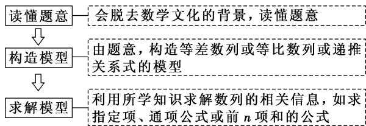

flowchart

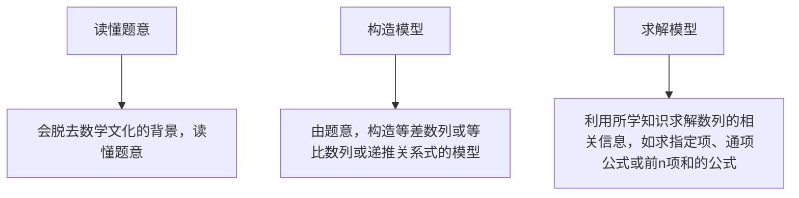

# 2、新定义问题的解题思路

遇到新定义问题,应耐心读题,分析新定义的特点,弄清新定义的性质,按新定义的要求,“照章办事”,逐条分析、运算、验证,使问题得以解决.

# 3、数列与函数综合问题的主要类型及求解策略

①已知函数条件,解决数列问题,此类问题一般利用函数的性质、图象研究数列问题.  
②已知数列条件,解决函数问题,解决此类问题一般要利用数列的通项公式、前 n 项和公式、求和方法等对式子化简变形.

注意数列与函数的不同,数列只能看作是自变量为正整数的一类函数,在解决问题时要注意这一特殊性.

# 4、数列与不等式综合问题的求解策略

解决数列与不等式的综合问题时,若是证明题,则要灵活选择不等式的证明方法,如比较法、综合法、分析法、放缩法等;若是含参数的不等式恒成立问题,则可分离参数,转化为研究最值问题来解决.

利用等价转化思想将其转化为最值问题.

$$
a > \mathrm{F} (n) \text {恒成立} \Leftrightarrow a > \mathrm{F} (n) _ {\max};
$$

$$
a <   \mathrm{F} (n) \text {恒成立} \Leftrightarrow a <   \mathrm{F} (n) _ {\min}.
$$

5、现实生活中涉及银行利率、企业股金、产品利润、人口增长、产品产量等问题，常常考虑用数列的知识去解决。

(1) 数列实际应用中的常见模型

①等差模型:如果增加(或减少)的量是一个固定的数,则该模型是等差模型,这个固定的数就是公差;  
②等比模型:如果后一个量与前一个量的比是一个固定的数,则该模型是等比模型,这个固定的数就是公比;  
③递推数列模型:如果题目中给出的前后两项之间的关系不固定,随项的变化而变化,则应考虑是第n项 $a_{n}$ 与第 $n+1$ 项 $a_{n+1}$ 的递推关系还是前n项和 $S_{n}$ 与前 $n+1$ 项和 $S_{n+1}$ 之间的递推关系.

在实际问题中建立数列模型时,一般有两种途径:一是从特例入手,归纳猜想,再推广到一般结论;二是从一般入手,找到递推关系,再进行求解.一般地,涉及递增率或递减率要用等比数列,涉及依次增加或减少要用等差数列,有的问题需通过转化得到等差或等比数列,在

解决问题时要往这些方面联系.

(2) 解决数列实际应用题的 3 个关键点

①根据题意,正确确定数列模型;   
②利用数列知识准确求解模型；  
③问题作答,不要忽视问题的实际意义.

6、在证明不等式时，有时把不等式的一边适当放大或缩小，利用不等式的传递性来证明，我们称这种方法为放缩法.

放缩时常采用的方法有:舍去一些正项或负项、在和或积中放大或缩小某些项、扩大(或缩小)分式的分子(或分母).

放缩法证不等式的理论依据是：A>B,B>C⇒A>C；A<B,B<C⇒A<C.

放缩法是一种重要的证题技巧,要想用好它,必须有目标,目标可从要证的结论中去查找.

# 必考题型全归纳

# 1 题型一: 数列在数学文化与实际问题中的应用

2158 (2024·河南·河南省内乡县高级中学校考模拟预测)“角谷猜想”首先流传于美国, 不久便传到欧洲, 后来一位名叫角谷静夫的日本人又把它带到亚洲, 因而人们就顺势把它叫作 “角谷猜想”. “角谷猜想”是指一个正整数, 如果是奇数就乘以 3 再加 1 , 如果是偶数就除以 2 , 这样经过若干次运算, 最终回到 1 . 对任意正整数 $a_0$ , 按照上述规则实施第 $n$ 次运算的结果为 $a_n(n \in \mathbb{N})$ , 若 $a_5 = 1$ , 且 $a_i(i = 1,2,3,4)$ 均不为 1 , 则 $a_0 =$ ( )

A. 5 或 16

B. 5 或 32

C. 5或16或4

D. 5 或 32 或 4

【答案】B

【解析】由题知 $a_{n+1}=\left\{\begin{aligned}&3a_{n}+1,a_{n}为奇数\\&\frac{a_{n}}{2},a_{n}为偶数\end{aligned}\right.$ ，因为 $a_{5}=1$ ，则有：

若 $a_{4}$ 为奇数，则 $a_{5}=3a_{4}+1=1$ ，得 $a_{4}=0$ ，不合题意，所以 $a_{4}$ 为偶数，则 $a_{4}=2a_{5}=2$ ;

若 $a_{3}$ 为奇数，则 $a_{4}=3a_{3}+1=2$ ，得 $a_{3}=\frac{1}{3}$ ，不合题意，所以 $a_{3}$ 为偶数， $a_{3}=2a_{4}=4$ ;

若 $a_{2}$ 为奇数，则 $a_{3}=3a_{2}+1=4$ ，得 $a_{2}=1$ ，不合题意，所以 $a_{2}$ 为偶数，且 $a_{2}=2a_{3}=8$ ;

若 $a_1$ 为奇数，则 $a_2 = 3a_1 + 1 = 8$ ，得 $a_1 = \frac{7}{3}$ ，不合题意，所以 $a_1$ 为偶数，且 $a_1 = 2a_2 = 16$

若 $a_{0}$ 为奇数，则 $a_{1}=3a_{0}+1=16$ ，可得 $a_{0}=5$ ；若 $a_{0}$ 为偶数，则 $a_{0}=2a_{1}=32$ 。

综上所述: $a_0 = 5$ 或32.

故选：B

2159 (2024·河南郑州·统考模拟预测)北宋大科学家沈括在《梦溪笔谈》中首创的“隙积术”, 就是关于高阶等差数列求和的问题. 现有一货物堆, 从上向下查, 第一层有 1 个货物, 第二层比第一层多 2 个, 第三层比第二层多 3 个, 以此类推, 记第 $n$ 层货物的个数为 $a_{n}$ , 则使得 $a_{n} > 2n + 2$ 成立的 $n$ 的最小值是 ( )

A. 3

B. 4

C. 5

D. 6

【答案】C

【解析】由题意 $\left\{\begin{aligned}a_{2}-a_{1}&=2\\ a_{3}-a_{2}&=3\\ \cdots,\\ a_{n}-a_{n-1}&=n\end{aligned}\right.$ ， $n\geqslant2,n\in N^{*}$ 且 $a_{1}=1$ ，

累加可得 $a_{n}-a_{1}=2+3+\cdots+n$ ，所以 $a_{n}=1+2+\cdots+n=\frac{n(n+1)}{2}$ ,

$\therefore \frac{n(n + 1)}{2} > 2n + 2$ ，得 $n > 4$ ，即 $n_{\min} = 5$ .

故选：C.

2160 (2024·四川成都·石室中学校考模拟预测)南宋数学家杨辉所著的《详解九章算法》中有如下俯视图所示的几何体,后人称之为“三角垛”。其最上层有1个球,第二层有3个球,第三层有6个球,第四层10个…,则第三十六层球的个数为()

A. 561

B. 595

C. 630

D. 666

【答案】D

【解析】由题意,第一层1个球,第二层 $1+2=3$ 个,第三层 $1+2+3=6$ 个,第四层 $1+2+3+4=10$ 个,

据此规律,第三十六层有小球 $1+2+3+\cdots+36=\frac{36\times(1+36)}{2}=666$ 个.

故选：D

2161 (2024·全国·高三专题练习)科赫曲线因形似雪花,又被称为雪花曲线.其构成方式如下:如图1将线段AB等分为线段AC,CD,DB,如图2.以CD为底向外作等边三角形CMD,并去掉线段CD,将以上的操作称为第一次操作;继续在图2的各条线段上重复上述操作,当进行三次操作后形成如图3的曲线.设线段AB的长度为1,则图3中曲线的长度为()

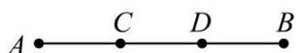  
图1

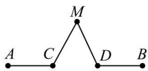

text_image

A C M D B

图2

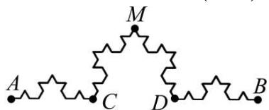

text_image

A
C
M
D
B

图3

A. 2

B. $\frac{16}{9}$

C. $\frac{64}{27}$

D. 3

【答案】C

【解析】依题意,一条线段经过一次操作,其长度变为原来的 $\frac{4}{3}$ ,

因此每次操作后所得曲线长度依次排成一列,构成以 $\frac{4}{3}$ 为首项, $\frac{4}{3}$ 为公比的等比数列,所以当进行三次操作后的曲线长度为 $\left(\frac{4}{3}\right)^{3}=\frac{64}{27}$ .

故选：C

2162 (2024·全国·高三专题练习)我国南宋数学家杨辉1261年所著的《详解九章算法》一书里出现了如图所示的表,即杨辉三角,这是数学史上的一个伟大成就在“杨辉三角”中,第n行的所有数字之和为 $2^{n-1}$ ,若去除所有为1的项,依次构成数列2,3,3,4,6,4,5,10,10,5,...,则此数列的前34项和为()

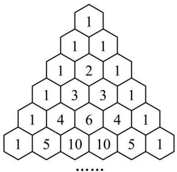

text_image

1
1 1
1 2 1
1 3 3 1
1 4 6 4 1
1 5 10 10 5 1
......

A. 959

B. 964

C. 1003

D. 1004

【答案】A

【解析】将这个数列分组：

第一组1个数 $2=2^{2}-2$ ;

第二组2个数 $3+3=2^{3}-2$ ;

…，

第七组7个数,这7个数的和为 $2^{8}-2$

第八组8个数 $9+36+84+126+126+84+36+9=2^{9}-2$ ,

前八组共36项,前36项和为 $2^{2}-2+2^{3}-2+\cdots+2^{9}-2=1004$ ,

所以前 34 项和为 1004 - 9 - 36 = 959,

故选：A.

2163 (2024·全国·高三专题练习)南宋数学家杨辉在《详解九章算术》中提出了高阶等差数列的问题,即一个数列 $\{a_{n}\}$ 本身不是等差数列,但从 $\{a_{n}\}$ 数列中的第二项开始,每一项与前一项的差构成等差数列 $\{b_{n}\}$ (则称数列 $\{a_{n}\}$ 为一阶等差数列),或者 $\{b_{n}\}$ 仍旧不是等差数列,但从 $\{b_{n}\}$ 数列中的第二项开始,每一项与前一项的差构成等差数列 $\{c_{n}\}$ (则称数列 $\{a_{n}\}$ 为二阶等差数列),依次类推,可以得到高阶等差数列.类比高阶等差数列的定义,我们亦可定义高阶等比数列,设数列1,1,2,8,64…是一阶等比数列,则该数列的第8项是( ).

A. $2^{8}$

B. $2^{15}$

C. $2^{21}$

D. $2^{28}$

【答案】C

【解析】由题意,数列 1,1,2,8,64, $\cdots$ 为 $\{a_{n}\}$ ,且为一阶等比数列,

设 $b_{n-1}=\frac{a_{n}}{a_{n-1}}$ ，所以 $\{b_{n}\}$ 为等比数列，其中 $b_{1}=1, b_{2}=2$ ，公比为 $q=\frac{b_{2}}{b_{1}}=2$ ，

所以 $b_{n}=2^{n-1}$ ，则 $a_{n}=b_{n-1}\cdot b_{n-2}\cdots b_{1}\cdot a_{1}=2^{1+2+3+\cdots+(n-2)}=2^{\frac{(n-1)(n-2)}{2}}, n\geqslant2,$

所以第8项为 $a_{8}=2^{21}$ .

故选：C.

【解题方法总结】

(1) 解决数列与数学文化相交汇问题的关键

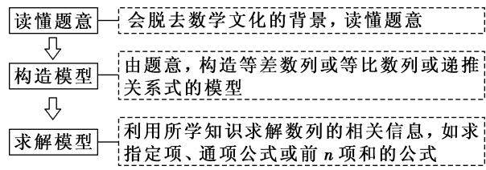

flowchart

(2) 解答数列应用题需过好“四关”

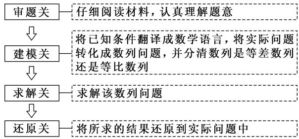

flowchart

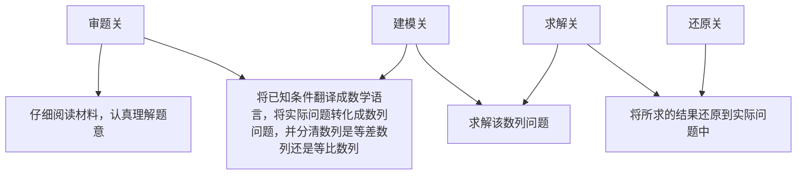

# 题型二:数列中的新定义问题

2164 (2024·江西·江西师大附中校考三模)已知数列 $\{a_{n}\}$ 的通项 $a_{n}=2n-1(n\in\mathbb{N}^{*})$ ，如果把数列 $\{a_{n}\}$ 的奇数项都去掉，余下的项依次排列构成新数列为 $\{b_{n}\}$ ，再把数列 $\{b_{n}\}$ 的奇数项又去掉，余下的项依次排列构成新数列为 $\{c_{n}\}$ ，如此继续下去，……，那么得到的数列（含原已知数列）的第一项按先后顺序排列，构成的数列记为 $\{P_{n}\}$ ，则数列 $\{P_{n}\}$ 前 10 项的和为（）

A. 1013

B. 1023

C. 2036

D. 2050

【答案】C

【解析】根据题意,如此继续下去,……,则得到的数列的第一项分别为数列 $\{a_{n}\}$ 的第 $a_{1}, a_{2}, a_{4}, a_{8}, \ldots$

即得到的数列 $\{P_{n}\}$ 的第 n 项为数列 $\{a_{n}\}$ 的第 $2^{n-1}$ 项，

因为 $a_{n} = 2n - 1(n\in \mathbf{N}^{*})$ ，可得 $\mathrm{P}_n = 2^n -1$

所以 $P_{1} + P_{2} + \cdots + P_{10} = (2 + 2^{2} + \cdots + 2^{10}) - 10 = 2036.$

故选：C.

2165 (2024·人大附中校考三模)已知数列 $\{a_{n}\}$ 满足: 对任意的 $n \in N^{*}$ ，总存在 $m \in N^{*}$ ，使得 $S_{n} = a_{m}$ ，则称 $\{a_{n}\}$ 为“回旋数列”。以下结论中正确的个数是（）

①若 $a_{n}=2023n$ ，则 $\{a_{n}\}$ 为“回旋数列”；  
②设 $\{a_{n}\}$ 为等比数列，且公比 q 为有理数，则 $\{a_{n}\}$ 为“回旋数列”；  
③设 $\{a_{n}\}$ 为等差数列，当 $a_{1}=1, d<0$ 时，若 $\{a_{n}\}$ 为“回旋数列”，则 d=-1；  
④若 $\{a_{n}\}$ 为“回旋数列”，则对任意 $n \in N^{*}$ ，总存在 $m \in N^{*}$ ，使得 $a_{n} = S_{m}$ .

A. 1

B. 2

C. 3

D. 4

【答案】B

【解析】①由 $a_{n}=2023n$ 可得 $S_{n}=2023(1+2+3+\cdots+n)=2023\times\frac{n(n+1)}{2}$ ,

由 $S_{n}=a_{m}$ 可得 $2023\times\frac{n(n+1)}{2}=2023m$ ，取 $m=\frac{n(n+1)}{2}$ 即可，则 $\left\{a_{n}\right\}$ 为“回旋数列”，故①正确；

② 当 q=1 时， $S_{n}=na_{1}, a_{m}=a_{1}$

由 $S_{n}=a_{m}$ 可得 $na_{1}=a_{1}$ ，故当 n=2 时，很明显 $na_{1}=a_{1}$ 不成立，故 $\{a_{n}\}$ 不是“回旋数列，②错误”；

③ $\{a_{n}\}$ 是等差数列, 故 $a_{m}=1+(m-1)d$ , $S_{n}=n+\frac{n(n-1)}{2}d$ ,

因为数列 $\{a_{n}\}$ 是“回旋数列”，所以 $1+(m-1)d=n+\frac{n(n-1)}{2}d$ ，即 $m=\frac{n-1}{d}+\frac{n(n-1)}{2}+1$ ，

其中 $\frac{n(n-1)}{2}$ 为非负整数, 所以要保证 $\frac{n-1}{d}$ 恒为整数,

故 d 为所有非负整数的公约数, 且 d < 0, 所以 d = -1, 故③正确;

④由①可得当 $a_{n} = 2023n$ 时， $\{a_n\}$ 为“回旋数列”，

取 $a_{2}=2023\times2$ , $S_{m}=2023\times\frac{m(m+1)}{2}$ , 显然不存在 m, 使得 $S_{m}=a_{2}=2023\times2$ , 故④错误

故选: B

2166 (2024·湖北武汉·统考三模)将 $1,2,\cdots,n$ 按照某种顺序排成一列得到数列 $\{a_{n}\}$ ，对任意 $1\leqslant i<j\leqslant n$ ，如果 $a_{i}>a_{j}$ ，那么称数对 $(a_{i},a_{j})$ 构成数列 $\{a_{n}\}$ 的一个逆序对。若 n=4，则恰有 2 个逆序对的数列 $\{a_{n}\}$ 的个数为（）

A. 4

B. 5

C. 6

D. 7

【答案】B

【解析】若 $n = 4$ ，则 $1 \leqslant i < j \leqslant 4$

由1,2,3,4构成的逆序对有(4,3),(4,2),(4,1),(3,2),(3,1),(2,1),

若数列 $\{a_{n}\}$ 的第一个数为4, 则至少有3个逆序对,

若数列 $\{a_{n}\}$ 的第二个数为4，

则恰有 2 个逆序对的数列 $\{a_{n}\}$ 为 $\{1,4,2,3\}$ ,

若数列 $\{a_{n}\}$ 的第三个数为4，

则恰有 2 个逆序对的数列 $\{a_{n}\}$ 为 $\{1,3,4,2\}$ 或 $\{2,1,4,3\}$ ,

若数列 $\{a_{n}\}$ 的第四个数为4，

则恰有 2 个逆序对的数列 $\{a_{n}\}$ 为 $\{2,3,1,4\},\{3,1,2,4\}$

综上恰有 2 个逆序对的数列 $\{a_{n}\}$ 的个数为 5 个.

故选: B.

2167 (2024·全国·高三专题练习)记数列 $\{a_{n}\}$ 的前 n 项和为 $S_{n}$ ，若存在实数 M > 0，使得对任意的 $n \in N^{*}$ ，都有 $|S_{n}| < M$ ，则称数列 $\{a_{n}\}$ 为“和有界数列”。下列命题正确的是（）

A. 若 $\{a_{n}\}$ 是等差数列，且首项 $a_{1}=0$ ，则 $\{a_{n}\}$ 是“和有界数列”  
B. 若 $\{a_{n}\}$ 是等差数列，且公差 d=0，则 $\{a_{n}\}$ 是“和有界数列”  
C. 若 $\{a_{n}\}$ 是等比数列，且公比 $|q|<1$ ，则 $\{a_{n}\}$ 是“和有界数列”  
D. 若 $\{a_{n}\}$ 是等比数列，且 $\{a_{n}\}$ 是“和有界数列”，则 $\{a_{n}\}$ 的公比 $|q|<1$

【答案】C

【解析】对于 A, 若 $\{a_{n}\}$ 是等差数列, 且首项 $a_{1}=0$ , 当 d>0 时, $S_{n}=\frac{n(n-1)d}{2}=\frac{d}{2}n^{2}-\frac{d}{2}n$ ,

当 n 趋近于正无穷时， $|S_{n}|$ 趋近于正无穷，则 $\{a_{n}\}$ 不是“和有界数列”，故 A 不正确.

对于 B, 若 $\{a_{n}\}$ 是等差数列, 且公差 d=0, 则 $S_{n}=na_{1}$ , 当 $a_{1}\neq0$ 时,

当 n 趋近于正无穷时， $|S_{n}|$ 趋近于正无穷，则 $\{a_{n}\}$ 不是“和有界数列”，故 B 不正确.

对于 C, 若 $\{a_{n}\}$ 是等比数列, 且公比 $|q| < 1$ , 则 $S_{n} = \frac{a_{1}(1 - q^{n})}{1 - q} = \frac{a_{1}}{1 - q} - \frac{a_{1}}{1 - q} q^{n}$ ,

故 $S_{n}=\left|\frac{a_{1}}{1-q}-\frac{a_{1}}{1-q}q^{n}\right|<\left|\frac{a_{1}}{1-q}|+\left|\frac{a_{1}}{1-q}q^{n}\right|<2\left|\frac{a_{1}}{1-q}\right|\right.$ ，则 $\{a_{n}\}$ 是“和有界数列”，故 C 正确.

对于 D, 若 $\{a_{n}\}$ 是等比数列, 且 $\{a_{n}\}$ 是“和有界数列”, 则 $\{a_{n}\}$ 的公比 $|q| < 1$ 或 q = -1, 故 D 不正确.

故选：C.

2168 (2024·全国·高三专题练习)斐波那契数列又称黄金分割数列,因数学家列昂纳多·斐波那契以兔子繁殖为例子而引入,故又称为“兔子数列”.斐波那契数列用递推的方式可如下定义:用 $a_{n}$ 表示斐波那契数列的第n项,则数列 $\{a_{n}\}$ 满足: $a_{1}=a_{2}=1,a_{n+2}=a_{n+1}+a_{n}$ ,记 $\sum_{i=1}^{n}a_{i}=a_{1}+a_{2}+\cdots+a_{n}$ ,则下列结论不正确的是()

A. $a_{10}=55$

B. $3a_{n} = a_{n - 2} + a_{n + 2}(n\geqslant 3)$

C. $\sum_{i=1}^{2019} a_i = a_{2021}$

D. $\sum_{i=1}^{2021} a_i^2 = a_{2021} \cdot a_{2022}$

【答案】C

【解析】依题意,数列 $\{a_{n}\}$ 的前10项依次为:1,1,2,3,5,8,13,21,34,55,

即 $a_{10}=55,\therefore A$ 正确；

当 $n \geqslant 3$ 时， $a_{n} = a_{n-1} + a_{n-2}, 3a_{n} = a_{n-2} + a_{n-1} + a_{n} + a_{n} = a_{n-2} + a_{n+1} + a_{n} = a_{n-2} + a_{n+2}$ ，

∴B正确;

由 $a_{1}=a_{2}=1, a_{n+2}=a_{n+1}+a_{n}$ ，可得 $a_{3}-a_{2}=a_{1}, a_{4}-a_{3}=a_{2}, \cdots, a_{2021}-a_{2020}=a_{2019}$

累加得 $a_{2021}-a_{2}=a_{1}+a_{2}+\cdots+a_{2019}$ ，则 $a_{1}+a_{2}+\cdots+a_{2019}=a_{2021}-a_{2}=a_{2021}-1$ ，即

$\sum_{i=1}^{2019}a_{i}=a_{2021}-1,\therefore C$ 错误；

由 $a_{1}^{2}=a_{2}a_{1},a_{2}^{2}=a_{2}(a_{3}-a_{1})=a_{2}a_{3}-a_{2}a_{1},a_{3}^{2}=a_{3}(a_{4}-a_{2})=a_{3}a_{4}-a_{3}a_{2},\cdots,$

$a_{2021}^{2}=a_{2021}(a_{2022}-a_{2020})=a_{2021}a_{2022}-a_{2021}a_{2020},\therefore a_{1}^{2}+a_{2}^{2}+\cdots+a_{2021}^{2}=a_{2021}\cdot a_{2022},\therefore D$ 正确.

故选：C.

2169 (2024·河北·统考模拟预测)数学家杨辉在其专著《详解九章算术法》和《算法通变本末》中,提出了一些新的高阶等差数列. 其中二阶等差数列是一个常见的高阶等差数列、如数列 2, 4, 7, 11, 16, 从第二项起,每一项与前一项的差组成新数列 2, 3, 4, 5, 新数列 2, 3, 4, 5 为等差数列,则称数列 2, 4, 7, 11, 16 为二阶等差数列,现有二阶等差数列 $\{a_{n}\}$ ,其前七项分别为 2, 2, 3, 5, 8, 12, 17. 则该数列的第 20 项为 ( )

A. 173

B. 171

C. 155

D. 151

【答案】A

【解析】根据题意得新数列为 $0,1,2,3,4\cdots$ ，则二阶等差数列 $\{a_{n}\}$ 的通项公式为 $a_{n}=\frac{(n-1)(n-2)}{2}+2$ ，则 $a_{20}=\frac{19\times18}{2}+2=173$

故选：A.

# 【解题方法总结】

# (1) 新定义数列问题的特点

通过给出一个新的数列的概念,或约定一种新运算,或给出几个新模型来创设全新的问题情景,要求考生在阅读理解的基础上,依据题目提供的信息,联系所学的知识和方法,实现信息的迁移,达到灵活解题的目的.

# (2) 新定义问题的解题思路

遇到新定义问题,应耐心读题,分析新定义的特点,弄清新定义的性质,按新定义的要求,“照章办事”,逐条分析、运算、验证,使问题得以解决.

# 题型三: 数列与函数、不等式的综合问题

2170 (2024·重庆巴南·统考一模)已知等比数列 $\{a_{n}\}$ 满足: $a_{1} + a_{2} = 20$ , $a_{2} + a_{3} = 80$ . 数列 $\{b_{n}\}$ 满足 $b_{n} = \log_{2} a_{n} (n \in \mathbb{N}^{*})$ , 其前 n 项和为 $S_{n}$ , 若 $\frac{b_{n}}{S_{n} + 8} \leqslant \lambda$ 恒成立, 则 $\lambda$ 的最小值为 \_\_\_\_.

【答案】 $\frac{3}{10} / 0.3$

【解析】设等比数列 $\left\{a_{n}\right\}$ 的公比为 q，则 $a_{2} + a_{3} = q(a_{1} + a_{2}) = 20q = 80$ ，解得 q = 4，

所以， $a_1 + a_2 = a_1 + a_1q = 5a_1 = 20$ ，解得 $a_1 = 4$ ，则 $a_{n} = a_{1}q^{n - 1} = 4^{n}$

所以， $b_{n}=\log_{2}a_{n}=\log_{2}4^{n}=2n$

$b_{n+1}-b_{n}=2(n+1)-2n=2$ , 所以, 数列 $\{b_{n}\}$ 为等差数列,

所以， $S_{n}=\frac{n(b_{1}+b_{n})}{2}=\frac{n(2n+2)}{2}=n(n+1)$ ,

则 $\frac{b_n}{\mathrm{S}_n + 8} = \frac{2n}{n^2 + 8 + n} = \frac{2}{n + \frac{8}{n} + 1},$

因为函数 $y = x + \frac{8}{x} + 1$ 在 $(0, 2\sqrt{2})$ 上单调递减，在 $(2\sqrt{2}, +\infty)$ 上单调递增，

当 n=2 时， $\frac{b_{2}}{S_{2}+8}=\frac{2}{2+\frac{8}{2}+1}=\frac{2}{7}$ ; 当 n=3 时， $\frac{b_{3}}{S_{3}+8}=\frac{6}{3^{2}+8+3}=\frac{3}{10}$ .

又因为 $\frac{2}{7} < \frac{3}{10}$ , 故 $\frac{b_n}{S_n + 8}$ 的最大值为 $\frac{3}{10}$ .

因此， $\frac{b_{n}}{S_{n}+8}\leqslant\lambda$ 对任意的 $n\in N^{*}$ 恒成立，所以， $\lambda\geqslant\frac{3}{10}$ ，故 $\lambda$ 的最小值为 $\frac{3}{10}$ .

故答案为: $\frac{3}{10}$ .

2171 (2024·四川泸州·四川省泸县第四中学校考模拟预测)设数列 $\{a_{n}\}$ 的前 n 项和为 $S_{n}, a_{3}=4$ ，且 $a_{n+1}=\left(1+\frac{1}{n+1}\right)a_{n}$ ，若 $2S_{n}+12\geqslant ka_{n}$ 恒成立，则 k 的最大值是 \_\_\_\_.

【答案】 $\frac{22}{3}$

【解析】因为 $a_{n+1}=\left(1+\frac{1}{n+1}\right)a_{n}$ ，所以 $\frac{a_{n+1}}{n+2}=\frac{a_{n}}{n+1}$ ,

所以数列 $\left\{\frac{a_{n}}{n+1}\right\}$ 是常数列，则 $\frac{a_{n}}{n+1} = \frac{a_{3}}{3+1} = 1$ ，可得 $a_{n} = n + 1$ ，故 $S_{n} = \frac{n^{2} + 3n}{2}$ ，

因为 $2S_{n} + 12 \geqslant ka_{n}$ 恒成立，所以 $n^{2} + 3n + 12 \geqslant k(n + 1)$ 恒成立，即 $k \leqslant \frac{n^{2} + 3n + 12}{n + 1}$ 恒

成立, 设 $t = n + 1$ , 则 n = t - 1, 从而 $\frac{n^{2} + 3n + 12}{n + 1} = \frac{(t - 1)^{2} + 3(t - 1) + 12}{t} = t + \frac{10}{t} + 1$ ,

当 t=3 时， $t+\frac{10}{t}+1=\frac{22}{3}$ ，当 t=4 时， $t+\frac{10}{t}+1=\frac{15}{2}$ ，

因为 $\frac{22}{3} < \frac{15}{2}$ , 所以 $t + \frac{10}{t} + 1$ 的最小值是 $\frac{22}{3}$ , 即 $k \leqslant \frac{22}{3}$ ,

所以实数 $k$ 的最大值为 $\frac{22}{3}$ .

故答案为: $\frac{22}{3}$ .

2172 (2024·河南新乡·统考三模)已知数列 $\{a_{n}\}$ 满足 $a_{1}=8, a_{n+1}-a_{n}=4n$ ，则 $\frac{a_{n}}{n}$ 的最小值为 \_\_\_\_.

【答案】6

【解析】由 $a_{n + 1} - a_n = 4n$ 得，

当 $n \geqslant 2$ 时， $a_{n} - a_{n-1} = 4(n - 1)$ ， $a_{n-1} - a_{n-2} = 4(n - 2)$ ， $\cdots$ ， $a_{2} - a_{1} = 4$ ，

将这 $n - 1$ 个式子累加得 $a_{n} - a_{1} = \frac{[4(n - 1) + 4](n - 1)}{2} = 2n(n - 1),$

则 $a_{n} = 2n(n - 1) + 8, n = 1$ 时也适合，

所以 $\frac{a_n}{n} = 2n + \frac{8}{n} - 2 \geqslant 2\sqrt{2n \cdot \frac{8}{n}} - 2 = 6$ ，当且仅当 $n = 2$ 时，等号成立.

故答案为: 6.

2173 (2024·上海杨浦·高三复旦附中校考阶段练习)已知数列 $\{a_{n}\}$ 满足 $a_{1}=\frac{2023}{2020}$ ，且对于任意的正整数 n，都有 $a_{n}=\frac{a_{n+1}-1}{a_{n}-1}$ 。若正整数 k 使得 $k>\sum_{i=1}^{n}\frac{1}{a_{i}}$ 对任意的正整数成立，则整数 k 的最小值为 \_\_\_\_。

【答案】674

【解析】因为 $a_{1}=\frac{2023}{2020}$ ， $a_{n}=\frac{a_{n+1}-1}{a_{n}-1}$ ，

可得 $a_1 > 1, a_n - 1 > 0, a_{n+1} - 1 > 0$ ,

则有 $a_{n}(a_{n}-1)=a_{n+1}-1$ ,

所以 $\frac{1}{a_n(a_n - 1)} = \frac{1}{a_{n + 1} - 1} = \frac{1}{a_n - 1} -\frac{1}{a_n},$

所以 $\frac{1}{a_n} = \frac{1}{a_n - 1} -\frac{1}{a_{n + 1} - 1},$

则 $\sum_{i=1}^{n}\frac{1}{a_i} = \frac{1}{a_1} +\frac{1}{a_2} +\dots +\frac{1}{a_n} = \frac{1}{a_1 - 1} -\frac{1}{a_2 - 1} +\frac{1}{a_2 - 1} -\frac{1}{a_3 - 1} +\dots +\frac{1}{a_n - 1} -\frac{1}{a_{n+1} - 1}$

$$
= \frac {1}{a _ {1} - 1} - \frac {1}{a _ {n + 1} - 1} <   \frac {2 0 2 0}{3},
$$

因为正整数 k 使得 $k > \sum_{i=1}^{n} \frac{1}{a_{i}}$ 对任意的正整数成立，

所以 $k \geqslant \frac{2020}{3}$ ,

所以整数 $k$ 的最小值为674.

故答案为: 674.

【解题方法总结】

(1) 数列与函数综合问题的主要类型及求解策略

①已知函数条件,解决数列问题,此类问题一般利用函数的性质、图象研究数列问题.

②已知数列条件,解决函数问题,解决此类问题一般要利用数列的通项公式、前n项和公式、求和方法等对式子化简变形.

注意数列与函数的不同,数列只能看作是自变量为正整数的一类函数,在解决问题时要注意这一特殊性.

(2) 数列与不等式综合问题的求解策略

解决数列与不等式的综合问题时,若是证明题,则要灵活选择不等式的证明方法,如比较法、综合法、分析法、放缩法等;若是含参数的不等式恒成立问题,则可分离参数,转化为研究最值问题来解决.

利用等价转化思想将其转化为最值问题.

$$
a > \mathrm{F} (n) \text {恒成立} \Leftrightarrow a > \mathrm{F} (n) _ {\max};
$$

$$
a <   \mathrm{F} (n) \text {恒成立} \Leftrightarrow a <   \mathrm{F} (n) _ {\min}.
$$

# 题型四: 数列在实际问题中的应用

2174 (2024·全国·高三专题练习)根据市场调查结果,预测某种家用商品从年初开始的 n 个月内累积的需求量 $S_{n}$ (万件) 近似地满足关系式 $S_{n}=\frac{n}{90}(21n-n^{2}-5)(n=1,2,\cdots,12)$ , 按此预测, 在本年度内, 需求量超过 1.5 万件的月份是 \_\_\_\_.

【答案】7,8

【解析】因为 $S_{n}=\frac{n}{90}(21n-n^{2}-5)(n=1,2,\cdots,12)$ ,

所以当 n=1 时， $a_{1}=S_{1}=\frac{1}{6}$ ,

当 $n \geqslant 2$ 时， $a_n = S_n - S_{n-1} = \frac{n}{90}(21n - n^2 - 5) - \frac{n - 1}{90}[21(n - 1) - (n - 1)^2 - 5]$

$$
= \frac {- 3 n ^ {2} + 4 5 n - 2 7}{9 0} > 1. 5,
$$

化为 $n^2 - 15n + 54 < 0$

解得6<n<9,

可知当 n=7 或 8, 需求量超过 1.5 万件.

故答案为: 7, 8.

2175 (2024·高三课时练习)某研究所计划改建十个实验室,每个实验室的改建费用分为装修费和设备费,且每个实验室的装修费都一样,设备费从第一到第十实验室依次构成等比数列.已知第五实验室比第二实验室的改建费用高42万元,第七实验室比第四实验室的改建费用高168万元,并要求每个实验室改建费用不能超过1700万元,则该研究所改建这十个实验室投入的总费用最多需要 \_\_\_\_ 万元.

【答案】4709

【解析】设第 $n(1 \leqslant n \leqslant 10, n \in \mathbb{N}^{*})$ 个实验室的设备费为 $a_{n}$ ，装修费为 b，则 $\frac{a_{n+1}}{a_{n}} = q > 0$ ，

由题意可得 $\left\{\begin{aligned}(a_{5}+b)-(a_{2}+b)=42\\ (a_{7}+b)-(a_{4}+b)=168\end{aligned}\right.$ ，则 $\left\{\begin{aligned}a_{1}q(q^{3}-1)=42\\ a_{1}q^{3}(q^{3}-1)=168\end{aligned}\right.$ ，解得 $\left\{\begin{aligned}a_{1}=3\\ q=2\end{aligned}\right.$ 或 $\left\{\begin{aligned}a_{1}=\frac{7}{3}\\ q=-2\end{aligned}\right.$ （舍去），

故 $a_{n} = 3\cdot 2^{n - 1}$

$\because a_{n} + b = 3 \cdot 2^{n - 1} + b \leqslant 1700$ 对任意的 $n (1 \leqslant n \leqslant 10, n \in \mathbb{N}^{*})$ 均成立，

$$
\therefore 3 \times 2 ^ {9} + b \leqslant 1 7 0 0, \text {即} b \leqslant 1 6 4,
$$

故该研究所改建这十个实验室投入的总费用 $S=(a_{1}+b)+(a_{2}+b)+\ldots+(a_{10}+b)=$

$$
\left(a _ {1} + a _ {2} + \dots + a _ {1 0}\right) + 1 0 b = \frac {3 \left(1 - 2 ^ {1 0}\right)}{1 - 2} + 1 0 b \leqslant 3 0 6 9 + 1 0 \times 1 6 4 = 4 7 0 9,
$$

即该研究所改建这十个实验室投入的总费用最多需要4709万元.

故答案为: 4709.

2176 (2024·全国·高三专题练习)冰墩墩作为北京冬奥会的吉祥物特别受欢迎,官方旗舰店售卖冰墩墩运动造型多功能徽章,若每天售出件数成递增的等差数列,其中第1天售出10000件,第21天售出15000件;价格每天成递减的等差数列,第1天每件100元,第21天每件60元,则该店第\_\_\_\_天收入达到最高.

【答案】6

【解析】设第 n 天售出件数为 $a_{n}$ ，设第 n 天价格为 $b_{n}$ .

由题意, $\{a_{n}\},\{b_{n}\}$ 均为等差数列,设公差分别为 $d_{1},d_{2}$ .

所以 $d_{1}=\frac{15000-10000}{21-1}=250,d_{2}=\frac{60-100}{21-1}=-2$

所以 $a_{n}=250n+9750, b_{n}=-2n+102.$

假设第 n 天的收入为 $c_{n}$ ，则

$$
c _ {n} = (2 5 0 n + 9 7 5 0) (- 2 n + 1 0 2) = 5 0 0 \left(- n ^ {2} + 1 2 n + 1 9 8 9\right) = - 5 0 0 \left[ - (n - 6) ^ {2} + 2 0 2 5 \right],
$$

所以当 n=6 时, $c_{n}$ 取最大值, 即第 6 天收入达到最高.

故答案为: 6

2177 (2024·全国·高三专题练习)沈阳京东MALL于2022年国庆节盛大开业,商场为了满足广大数码狂热爱好者的需求,开展商品分期付款活动.现计划某商品一次性付款的金额为a元,以分期付款的形式等额分成n次付清,每期期末所付款是x元,每期利率为r,则爱好者每期需要付款x= \_\_\_\_.

【答案】 $\frac{ar(1 + r)^n}{(1 + r)^n - 1}$

【解析】由题意得 $a(1+r)^{n}=x+x(1+r)+\cdots+x(1+r)^{n-1}$ ,

$$
\therefore a (1 + r) ^ {n} = \frac {x [ 1 - (1 + r) ^ {n} ]}{1 - (1 + r)},
$$

$$
\therefore x = \frac {a r (1 + r) ^ {n}}{(1 + r) ^ {n} - 1}.
$$

故答案为: $\frac{ar(1 + r)^n}{(1 + r)^n - 1}$ .

2178 (2024·辽宁锦州·渤海大学附属高级中学校考模拟预测)一件家用电器, 现价 2000 元, 实行分期付款, 一年后还清, 购买后一个月第一次付款, 以后每月付款一次, 每次付款数相同, 共付 12 次, 月利率为 0.8%, 并按复利计息, 那么每期应付款 \_\_\_\_ 元. (参考数据: $1.008^{11} \approx 1.092$ , $1.008^{12} \approx 1.100$ , $1.08^{11} \approx 2.332$ , $1.08^{12} \approx 2.518$ )

【答案】176

【解析】设每期应付款 x 元, 第 n 期付款后欠款 $A_{n}$ 元,

则 $A_{1}=2000(1+0.008)-x=2000\times1.008-x$

$$
\mathrm{A} _ {2} = (2 0 0 0 \times 1. 0 0 8 - x) \times 1. 0 0 8 - x = 2 0 0 0 \times 1. 0 0 8 ^ {2} - 1. 0 0 8 x - x, \dots
$$

$$
\mathrm{A} _ {1 2} = 2 0 0 0 \times 1. 0 0 8 ^ {1 2} - (1. 0 0 8 ^ {1 1} + 1. 0 0 8 ^ {1 0} + \dots + 1) x.
$$

因为 $A_{12}=0$ ，所以 $2000\times1.008^{12}-(1.008^{11}+1.008^{10}+\cdots+1)x=0$ ，

解得 $x=\frac{2000\times1.008^{12}}{1+1.008+\cdots+1.008^{11}}=\frac{2000\times1.008^{12}}{\frac{1.008^{12}-1}{1.008-1}}\approx176$ ,

即每期应付款176元.

故答案为: 176

2179 (2024·全国·高三专题练习)在第七十五届联合国大会一般性辩论上,习近平主席表示,中国将提高国家自主贡献力度,采取更加有力的政策和措施,二氧化碳排放力争于2030年前达到峰值,努力争取2060年前实现碳中和.某地2020年共发放汽车牌照12万张,其中燃油型汽车牌照10万张,电动型汽车2万张,从2021年起,每年发放的电动型汽车牌照按前一年的50%增长,燃油型汽车牌照比前一年减少0.5万张,同时规定,若某年发放的汽车牌照超过15万张,以后每年发放的电动车牌照的数量维持在这一年的水平不变.那么从2021年至2030年这十年累计发放的汽车牌照数为\_\_\_\_万张.

【答案】134

【解析】设每年发放燃油型车牌照数为 $a_{n}$ ，发放电动型车牌照数 $b_{n}$ ，发放牌照数为 $c_{n}$ ，则 $\{a_{n}\}$ 成等差数列， $\{b_{n}\}$ 前四项成等比数列，第五项起为常数列， $c_{n}=a_{n}+b_{n}$ ，

$$
a _ {1} = 9. 5, a _ {n} = 1 0 - 0. 5 n,
$$

$\left\{a_{n}\right\}$ 前10项的和为 $A_{10}=9.5\times10+\frac{1}{2}\times10\times9\times(-0.5)=72.5$

$$
b _ {1} = 2 \times 1. 5 = 3, b _ {2} = 3 \times 1. 5 = 4. 5, b _ {3} = 4. 5 \times 1. 5 = 6. 7 5,
$$

因为 $c_{3}=a_{3}+b_{3}=8.5+6.75=15.25>15$ ,

所以 $b_{4}=b_{5}=\cdots=b_{10}=6.75$ ,

$\{b_n\}$ 前10项的和为： $\mathrm{B}_{10} = 3 + 4.5 + 6.75\times 8 = 61.5.$

所以从 2021 年至 2030 年这十年累计发放的汽车牌照数为 $72.5 + 61.5 = 134$ .

故答案为: 134.

【解题方法总结】

现实生活中涉及银行利率、企业股金、产品利润、人口增长、产品产量等问题,常常考虑用数列的知识去解决.

(1) 数列实际应用中的常见模型  
①等差模型:如果增加(或减少)的量是一个固定的数,则该模型是等差模型,这个固定的数就是公差;  
②等比模型:如果后一个量与前一个量的比是一个固定的数,则该模型是等比模型,这个固定的数就是公比;  
③递推数列模型:如果题目中给出的前后两项之间的关系不固定,随项的变化而变化,则应考虑是第n项 $a_{n}$ 与第 $n+1$ 项 $a_{n+1}$ 的递推关系还是前n项和 $S_{n}$ 与前 $n+1$ 项和 $S_{n+1}$ 之间的递推关系.

在实际问题中建立数列模型时,一般有两种途径:一是从特例入手,归纳猜想,再推广到一般结论;二是从一般入手,找到递推关系,再进行求解.一般地,涉及递增率或递减率要用等比数列,涉及依次增加或减少要用等差数列,有的问题需通过转化得到等差或等比数列,在解决问题时要往这些方面联系.

(2) 解决数列实际应用题的 3 个关键点

①根据题意,正确确定数列模型;   
②利用数列知识准确求解模型；  
③问题作答,不要忽视问题的实际意义.

2180 (2024·河北张家口·统考三模)已知数列 $\{a_{n}\}$ 满足 $3 + \frac{a_{1}}{2} + \frac{a_{2}}{2^{2}} + \frac{a_{3}}{2^{3}} + \cdots + \frac{a_{n}}{2^{n}} = \frac{2n + 3}{2^{n}}$ .

(1) 求数列 $\{a_{n}\}$ 的通项公式;  
(2) 记数列 $\left\{\frac{1}{a_{n}\cdot a_{n+1}}\right\}$ 的前 n 项和为 $S_{n}$ ，证明： $S_{n}<\frac{1}{2}$ .

【解析】(1)由题意,数列 $\{a_{n}\}$ 满足 $3+\frac{a_{1}}{2}+\frac{a_{2}}{2^{2}}+\frac{a_{3}}{2^{3}}+\cdots+\frac{a_{n}}{2^{n}}=\frac{2n+3}{2^{n}}$ ,

当 n=1 时, 可得 $3+\frac{a_{1}}{2}=\frac{2\times1+3}{2^{1}}=\frac{5}{2}$ , 解得 $a_{1}=-1$ ;

当 $n \geqslant 2$ 时, 可得 $3 + \frac{a_{1}}{2} + \frac{a_{2}}{2^{2}} + \frac{a_{3}}{2^{3}} + \cdots + \frac{a_{n-1}}{2^{n-1}} = \frac{2n+1}{2^{n-1}}$ ,

两式相减得 $\frac{a_{n}}{2^{n}}=\frac{2n+3}{2^{n}}-\frac{2n+1}{2^{n-1}}=\frac{2n+3-4n-2}{2^{n}}=\frac{-2n+1}{2^{n}}$ ，所以 $a_{n}=-2n+1$ ，

当 n=1 时， $a_{1}=-1$ ，适合上式，

所以数列 $\{a_{n}\}$ 的通项公式为 $a_{n}=-2n+1$ .

(2) 令 $b_n = \frac{1}{a_n \cdot a_{n+1}}$ ，由 $a_n = -2n + 1$ ，

可得 $b_{n} = \frac{1}{a_{n} \cdot a_{n+1}} = \frac{1}{(-2n + 1)(-2n - 1)} = \frac{1}{(2n - 1)(2n + 1)} = \frac{1}{2}\left(\frac{1}{2n - 1} - \frac{1}{2n + 1}\right)$ ,

所以 $S_{n}=\frac{1}{2}\left(1-\frac{1}{3}+\frac{1}{3}-\frac{1}{5}+\frac{1}{5}-\frac{1}{7}+\cdots+\frac{1}{2n-1}-\frac{1}{2n+1}\right)=\frac{1}{2}\left(1-\frac{1}{2n+1}\right)=\frac{1}{2}-\frac{1}{4n+2},$

因为 $n \in N^{*}$ ，可得 $\frac{1}{4n+2} > 0$ ，所以 $S_{n} < \frac{1}{2}$ .

2181 (2024·全国·高三专题练习)证明不等式 $\frac{1}{2^{2}} + \frac{1}{3^{2}} + \cdots + \frac{1}{(n+1)^{2}} < \frac{2}{3}$ .

【解析】 $\because \frac{1}{(n+1)^{2}}=\frac{1}{n^{2}+2n+1}<\frac{1}{n^{2}+2n+\frac{3}{4}}=\frac{1}{(n+\frac{1}{2})(n+\frac{3}{2})}=\frac{1}{n+\frac{1}{2}}-\frac{1}{n+\frac{3}{2}}$

$$
\therefore \frac {1}{2 ^ {2}} + \frac {1}{3 ^ {2}} + \dots + \frac {1}{(n + 1) ^ {2}} <   \frac {1}{1 + \frac {1}{2}} - \frac {1}{1 + \frac {3}{2}} + \frac {1}{2 + \frac {1}{2}} - \frac {1}{2 + \frac {3}{2}} + \dots + \frac {1}{n + \frac {1}{2}} - \frac {1}{n + \frac {3}{2}} =
$$

$$
\frac {1}{1 + \frac {1}{2}} - \frac {1}{n + \frac {3}{2}} <   \frac {2}{3}.
$$

2182 (2024·全国·高三专题练习)已知 $a_{n}=\left(\frac{1}{3}\right)^{n}, c_{n}=\frac{1}{1+a_{n}}+\frac{1}{1-a_{n+1}},\left\{c_{n}\right\}$ 的前 n 项和为 $T_{n}$ ，证明： $T_{n}>2n-\frac{1}{3}$ .

【解析】证法一： $\because c_{n}=\frac{1}{1+a_{n}}+\frac{1}{1-a_{n+1}}=\frac{3^{n}}{3^{n}+1}+\frac{3^{n+1}}{3^{n+1}-1}=2+\frac{1}{3^{n+1}-1}-\frac{1}{3^{n}+1}>2+\frac{1}{3^{n+1}+1}-\frac{1}{3^{n}+1},$

$$
\therefore \mathrm{T} _ {n} = 2 n + \left(\frac {1}{1 0} - \frac {1}{4}\right) + \left(\frac {1}{2 8} - \frac {1}{1 0}\right) \dots + \left(\frac {1}{3 ^ {n + 1} + 1} - \frac {1}{3 ^ {n} + 1}\right) = 2 n - \frac {1}{4} + \frac {1}{3 ^ {n + 1} + 1} > 2 n
$$

$$
- \frac {1}{4} > 2 n - \frac {1}{3}.
$$

证法二： $\because c_{n}=\frac{1}{1+a_{n}}+\frac{1}{1-a_{n+1}}=\frac{3^{n}}{3^{n}+1}+\frac{3^{n+1}}{3^{n+1}-1}=2+\frac{1}{3^{n+1}-1}-\frac{1}{3^{n}+1}$ ,

当 $n \geqslant 2$ 时， $c_{n} > 2 + \frac{1}{3^{n+1} - 1} - \frac{1}{3^{n} - 1}$ ，∴ $T_{n} = c_{1} + c_{2} + \cdots + c_{nn} = 2n + \left(\frac{1}{8} - \frac{1}{2}\right) +$

$$
\left(\frac {1}{2 6} - \frac {1}{8}\right) \dots + \left(\frac {1}{3 ^ {n + 1} - 1} - \frac {1}{3 ^ {n} - 1}\right) = 2 n + \frac {1}{3 ^ {n + 1} - 1} - \frac {1}{2} > 2 n - \frac {1}{4} > 2 n - \frac {1}{3}.
$$

证法三： $\because c_{n}=\frac{1}{1+a_{n}}+\frac{1}{1-a_{n+1}}=\frac{3^{n}}{3^{n}+1}+\frac{3^{n+1}}{3^{n+1}-1}=2+\frac{1}{3^{n+1}-1}-\frac{1}{3^{n}+1}$ ,

又 $\frac{1}{3^{n + 1} - 1} >\frac{1}{3^{n + 1}},\frac{1}{3^n + 1} <  \frac{1}{3^n},\therefore c_n > 2 + \frac{1}{3^{n + 1}} -\frac{1}{3^n}.\quad \therefore T_n = 2n + \frac{1}{3^2} -\frac{1}{3^1} +\frac{1}{3^3} -$

$$
\frac {1}{3 ^ {2}} + \dots + \frac {1}{3 ^ {n + 1}} - \frac {1}{3 ^ {n}} = 2 n + \frac {1}{3 ^ {n + 1}} - \frac {1}{3} > 2 n - \frac {1}{3}.
$$

证法四： $\because c_{n}=\frac{1}{1+a_{n}}+\frac{1}{1-a_{n+1}}=\frac{3^{n}}{3^{n}+1}+\frac{3^{n+1}}{3^{n+1}-1}=2+\frac{1}{3^{n+1}-1}-\frac{1}{3^{n}+1}=2+$

$$
\frac {3 ^ {n} + 1 - 3 ^ {n + 1} + 1}{(3 ^ {n + 1} - 1) (3 ^ {n} + 1)}
$$

$$
= 2 - \frac {2 \times (3 ^ {n} - 1)}{3 ^ {2 n + 1} + 2 \times 3 ^ {n} - 1} > 2 - \frac {2 \times 3 ^ {n}}{3 ^ {2 n + 1} + 2 \times 3 ^ {n} - 1}
$$

$$
= 2 - \frac {2}{3 ^ {n + 1} + 2 - \frac {1}{3 ^ {n}}} > 2 - \frac {2}{3 ^ {n + 1}},
$$

$$
\therefore \mathrm{T} _ {n} > 2 n - \frac {2}{3 ^ {2}} - \frac {2}{3 ^ {3}} - \dots - \frac {2}{3 ^ {n + 1}} = 2 n - \frac {\frac {2}{3 ^ {2}} \left(1 - \left(\frac {1}{3}\right) ^ {n}\right)}{1 - \frac {1}{3}} = 2 n - \frac {1}{3} \left(1 - \left(\frac {1}{3}\right) ^ {n}\right) > 2 n - \frac {1}{3}.
$$

2183 (2024·全国·高三专题练习)已知每一项都是正数的数列 $\{a_{n}\}$ 满足 $a_{1}=1, a_{n+1}=\frac{a_{n}+1}{12a_{n}}(n\in\mathbb{N}^{*})$ .

(1) 证明: $a_{2n+1} < a_{2n-1}$ .   
(2) 证明: $\frac{1}{6} \leqslant a_n \leqslant 1$ .   
(3) 记 $S_{n}$ 为数列 $\left\{|a_{n+1}-a_{n}|\right\}$ 的前 n 项和，证明： $S_{n}<6$ .

【解析】(1) 解法一: 由题意知 $a_{1}=1>0$ , $a_{n+1}=\frac{a_{n}+1}{12a_{n}}>0(n\in\mathbb{N}^{*})$ .

①当 n=1 时， $a_{1}=1$ ， $a_{2}=\frac{a_{1}+1}{12a_{1}}=\frac{1}{6}$ ， $a_{3}=\frac{a_{2}+1}{12a_{2}}=\frac{7}{12}$ ， $a_{3}<a_{1}$ 成立.  
②假设 n=k 时, 结论成立, 即 $a_{2k+1}<a_{2k-1}$ .

$$
\because a _ {2 n + 1} = \frac {a _ {2 n} + 1}{1 2 a _ {2 n}} = \frac {\frac {a _ {2 n - 1} + 1}{1 2 a _ {2 n - 1}} + 1}{1 2 \times \frac {a _ {2 n - 1} + 1}{1 2 a _ {2 n - 1}}} = \frac {1 3 a _ {2 n - 1} + 1}{1 2 (a _ {2 n - 1} + 1)},
$$

$$
\therefore a _ {2 k + 3} - a _ {2 k + 1} = \frac {1 3 a _ {2 n + 1} + 1}{1 2 (a _ {2 n + 1} + 1)} - \frac {1 3 a _ {2 n - 1} + 1}{1 2 (a _ {2 n - 1} + 1)} = \frac {a _ {2 k + 1} - a _ {2 k - 1}}{(a _ {2 k + 1} + 1) (a _ {2 k - 1} + 1)} <   0.
$$

故 $n=k+1$ 时,结论也成立.

由①②可知,对于 $n\in N^{*}$ ,都有 $a_{2n+1}<a_{2n-1}$ 成立.

解法二: $a_{1} = 1, a_{2} = \frac{a_{1} + 1}{12a_{1}} = \frac{1}{6}, a_{3} = \frac{a_{2} + 1}{12a_{2}} = \frac{7}{12}, a_{3} < a_{1}$ 成立.

令 $f(x)=\frac{x+1}{12x}=\frac{1}{12}\left(1+\frac{1}{x}\right)$ ，显然 $f(x)$ 单调递减.

$\because a_{3}<a_{1}$ ，假设 $a_{2k+1}<a_{2k-1}$ ，

则 $f(a_{2k + 1}) > f(a_{2k - 1})$ ，即 $a_{2k + 2} > a_{2k}$

故 $f(a_{2k+2})<f(a_{2k})$ ，即 $a_{2k+3}>a_{2k+1}$ .

故对于 $n \in \mathbb{N}^*$ , 都有 $a_{2n+1} < a_{2n-1}$ 成立.

(2) 由 (1) 知 $a_{2n+1} < a_{2n-1}, \therefore 1 = a_1 > \cdots > a_{2n-1} > a_{2n+1}$ .

同理,由数学归纳法可证 $a_{2n}<a_{2n+2}, a_{2n}>a_{2n-2}>\cdots>a_{2}=\frac{1}{6}.$

猜测 $a_{2n} < \frac{1}{3} < a_{2n - 1}$ . 下面给出证明.

$\because a_{n + 1} - \frac{1}{3} = \frac{-\left(a_n - \frac{1}{3}\right)}{4a_n},\therefore a_{n + 1} - \frac{1}{3}$ 与 $a_{n} - \frac{1}{3}$ 异号.

注意到 $a_1 - \frac{1}{3} > 0$ ，知 $a_{2n-1} - \frac{1}{3} > 0, a_{2n} - \frac{1}{3} < 0,$

即 $a_{2n} < \frac{1}{3} < a_{2n - 1}$ .

$$
\therefore a _ {1} > \dots > a _ {2 n - 1} > a _ {2 n + 1} > \frac {1}{3} > a _ {2 n} > a _ {2 n - 2} > \dots > a _ {2},
$$

从而可知 $\frac{1}{6} \leqslant a_n \leqslant 1$ .

(3) $\left|a_{n+2}-a_{n+1}\right|=\left|\frac{a_{n+1}+1}{12a_{n+1}}-\frac{a_{n}+1}{12a_{n}}\right|=\frac{\left|a_{n+1}-a_{n}\right|}{12a_{n}a_{n+1}}$

$$
= \frac {\left| a _ {n + 1} - a _ {n} \right|}{a _ {n} + 1} \leqslant \frac {\left| a _ {n + 1} - a _ {n} \right|}{a _ {2} + 1} = \frac {6}{7} \times \left| a _ {n + 1} - a _ {n} \right|,
$$

$$
\therefore \left| a _ {n + 1} - a _ {n} \right| \leqslant \frac {6}{7} \times \left| a _ {n} - a _ {n - 1} \right| \leqslant \left(\frac {6}{7}\right) ^ {2} \times \left| a _ {n - 1} - a _ {n - 2} \right|
$$

$$
\leqslant \dots \leqslant \left(\frac {6}{7}\right) ^ {n - 1} \times \left| a _ {2} - a _ {1} \right| = \frac {5}{6} \times \left(\frac {6}{7}\right) ^ {n - 1},
$$

$$
\therefore \mathrm{S} _ {n} = | a _ {2} - a _ {1} | + | a _ {3} - a _ {2} | + | a _ {4} - a _ {3} | + \dots + | a _ {n + 1} - a _ {n} |
$$

$$
\leqslant \frac {5}{6} \times \left[ 1 + \frac {6}{7} + \left(\frac {6}{7}\right) ^ {2} + \dots + \left(\frac {6}{7}\right) ^ {n - 1} \right]
$$

$$
= \frac {5}{6} \times \frac {1 - \left(\frac {6}{7}\right) ^ {n}}{1 - \frac {6}{7}} <   \frac {3 5}{6} <   \frac {3 6}{6} = 6.
$$

2184 (2024·全国·高三专题练习)证明： $\sum_{k=1}^{n}\frac{1}{2^{k}-(-1)^{k}}<\frac{11}{12}$ . (注： $\sum_{k=1}^{n}a_{k}=a_{1}+a_{2}+\cdots+a_{n}$ .)

【解析】(将交错项合并求和)先考虑

$$
\sum_ {k = 1} ^ {2 n} \frac {1}{2 ^ {k} - (- 1) ^ {k}} = \sum_ {k = 1} ^ {n} \left(\frac {1}{4 ^ {k} - 1} + \frac {1}{2 \times 4 ^ {k - 1} + 1}\right) = \sum_ {k = 1} ^ {n} \frac {3 \times 4 ^ {k}}{(4 ^ {k} - 1) (4 ^ {k} + 2)}.
$$

可以放缩为等比数列

$$
\sum_ {k = 1} ^ {n} \frac {3 \times 4 ^ {k}}{\left(4 ^ {k} - 1\right) \left(4 ^ {k} + 2\right)} = 3 \times \sum_ {k = 1} ^ {n} \frac {1}{4 ^ {k} - \frac {2}{4 ^ {k}} + 1} <   3 \times \left(\frac {1}{4 - \frac {2}{4} + 1} + \sum_ {k = 2} ^ {n} \frac {1}{4 ^ {k}}\right) =
$$

$$
3 \left(\frac {2}{9} + \frac {\frac {1}{1 6} \left(1 - \left(\frac {1}{4}\right) ^ {n - 1}\right)}{1 - \frac {1}{4}}\right) <   3 \left(\frac {2}{9} + \frac {\frac {1}{1 6}}{1 - \frac {1}{4}}\right) = \frac {1 1}{1 2}.
$$

2185 (2024·全国·高三专题练习)已知数列 $\{a_{n}\}$ , $S_{n}$ 为数列 $\{a_{n}\}$ 的前 $n$ 项和, 且满足 $a_{1} = 1$ ,

$$
3 \mathrm{S} _ {n} = (n + 2) a _ {n}.
$$

(1) 求 $\{a_{n}\}$ 的通项公式;  
(2) 证明: $\frac{1}{a_{2}} + \frac{1}{a_{4}} + \frac{1}{a_{8}} + \cdots + \frac{1}{a_{2^{n}}} < \frac{1}{2}$ .

【解析】(1) 对任意的 $3S_{n}=(n+2)a_{n}$ ,

当 $n \geqslant 2$ 时， $3\mathrm{S}_{n-1} = (n + 1)a_{n-1}$ ，两式相减 $3a_{n} = (n + 2)a_{n} - (n + 1)a_{n-1}$ .

整理得 $\frac{a_n}{a_{n - 1}} = \frac{n + 1}{n - 1},$

当 $n \geqslant 2$ 时， $a_{n} = a_{1} \times \frac{a_{2}}{a_{1}} \times \frac{a_{3}}{a_{2}} \times \cdots \times \frac{a_{n-1}}{a_{n-2}} \times \frac{a_{n}}{a_{n-1}} = 1 \times \frac{3}{1} \times \frac{4}{2} \times \cdots \times \frac{n}{n-2} \times \frac{n+1}{n-1} = \frac{n(n+1)}{2}$ ,

$a_{1} = 1$ 也满足 $a_{n} = \frac{n(n + 1)}{2}$ ，从而 $a_{n} = \frac{n(n + 1)}{2} (n\in \mathbb{N}^{*})$

(2) 证明: 证法一: 因为 $\frac{1}{a_{2^n}} = \frac{2}{2^n (2^n + 1)} = \frac{1}{2^{n-1}(2^n + 1)} < \frac{1}{2^n \times 2^{n-1}} = \frac{1}{2^{2n-1}}$ ,

所以， $\frac{1}{a_{2}}+\frac{1}{a_{4}}+\frac{1}{a_{8}}+\cdots+\frac{1}{a_{2}^{n}}\leqslant\frac{1}{3}+\frac{1}{8}+\frac{1}{32}+\cdots+\frac{1}{2^{2n-1}}=\frac{1}{3}+\frac{\frac{1}{8}\left(1-\frac{1}{4^{n-1}}\right)}{1-\frac{1}{4}}$

$$
= \frac {1}{3} + \frac {1}{6} \left(1 - \frac {1}{4 ^ {n - 1}}\right) <   \frac {1}{3} + \frac {1}{6} = \frac {1}{2}.
$$

从而 $\frac{1}{a_2} +\frac{1}{a_4} +\frac{1}{a_8} +\dots +\frac{1}{a_{2^n}} <  \frac{1}{2};$

证法二: 因为 $\frac{1}{a_{2^{n}}}=\frac{2}{(2^{n}+1)2^{n}}=\frac{1}{(2^{n}+1)2^{n-1}}<\frac{2^{n-1}}{(2^{n}+1)(2^{n-1}+1)}=\frac{1}{2^{n-1}+1}-\frac{1}{2^{n}+1}$ ,

所以， $\frac{1}{a_{2}}+\frac{1}{a_{4}}+\frac{1}{a_{8}}+\cdots+\frac{1}{a_{2^{n}}}=\left(\frac{1}{2^{0}+1}-\frac{1}{2^{1}+1}\right)+\left(\frac{1}{2^{1}+1}-\frac{1}{2^{2}+1}\right)+\cdots$

$$
+ \left(\frac {1}{2 ^ {n - 1} + 1} - \frac {1}{2 ^ {n} + 1}\right)
$$

$= \frac{1}{2} -\frac{1}{2^{n} + 1} <  \frac{1}{2},$ 证毕.

2186 (2024·全国·高三专题练习)已知各项为正的数列 $\{a_{n}\}$ 满足 $a_{1}=\frac{1}{2}$ , $a_{n+1}^{2}=\frac{1}{3}a_{n}^{2}+\frac{2}{3}a_{n}$ , $n\in N^{*}$ . 证明：

(1) $a_{n}<a_{n+1}<1;$   
(2) $a_{1}+a_{2}+\cdots+a_{n}>n-\frac{9}{4}.$

【解析】(1) $\because a_{n+1}^{2}=\frac{1}{3}a_{n}^{2}+\frac{2}{3}a_{n},$

$$
\begin{array}{l} \therefore a _ {n + 1} ^ {2} - 1 = \frac {1}{3} a _ {n} ^ {2} + \frac {2}{3} a _ {n} - 1, \\ \therefore (a _ {n + 1} - 1) (a _ {n + 1} + 1) = \frac {(a _ {n} - 1) (a _ {n} + 3)}{3}. \\ \end{array}
$$

又数列为正项数列， $\therefore a_{n+1}-1$ 与 $a_{n}-1$ 同号.

$$
\because a _ {1} - 1 <   0, \therefore a _ {n + 1} - 1 <   0,
$$

$$
\therefore a _ {n + 1} ^ {2} - a _ {n} ^ {2} = \frac {2}{3} a _ {n} (1 - a _ {n}) > 0, \text {即} a _ {n + 1} ^ {2} > a _ {n} ^ {2},
$$

因为数列为正项数列,所以 $a_{n+1} > a_{n}$ ,

综上: $a_{n} < a_{n+1} < 1$ .

(2) 要证 $a_{1} + a_{2} + \cdots + a_{n} > n - \frac{9}{4}$ ，只需要证 $n - (a_{1} + a_{2} + \cdots + a_{n}) < \frac{9}{4}$ .

$$
\because \left(a _ {n + 1} - 1\right) \left(a _ {n + 1} + 1\right) = \frac {\left(a _ {n} - 1\right) \left(a _ {n} + 3\right)}{3},
$$

$$
\therefore \frac {1 - a _ {n + 1}}{1 - a _ {n}} = \frac {a _ {n} + 3}{3 (1 + a _ {n + 1})} <   \frac {a _ {n} + 3}{3 (1 + a _ {n})}
$$

$$
= \frac {1}{3} \left(1 + \frac {2}{1 + a _ {n}}\right) \leqslant \frac {1}{3} \left(1 + \frac {2}{1 + a _ {1}}\right) = \frac {7}{9},
$$

因为 $a_{n}<a_{n+1}<1$ ，所以 $\left\{1-a_{n}\right\}$ 为正项数列，且 $\frac{1-a_{n+1}}{1-a_{n}}<\frac{7}{9}$ ，

设 $\{b_n\}$ 为等比数列，公比为 $\frac{7}{9}$ ，首项为 $\frac{1}{2}$ ，前 $n$ 项和为 $\mathrm{T}_n$

$$
\therefore (1 - a _ {1}) + (1 - a _ {2}) + \dots + (1 - a _ {n}) <   \mathrm{T} _ {n} = \frac {1}{2} \times \frac {1 - \left(\frac {7}{9}\right) ^ {n}}{1 - \frac {7}{9}} <   \frac {9}{4},
$$

即 $n-(a_{1}+a_{2}+\cdots+a_{n})<\frac{9}{4}$ ，证毕.

2187 (2024·全国·高三专题练习)设数列 $\{a_{n}\}$ 满足 $a_{1}=a, a_{n+1}a_{n}-a_{n}^{2}=1(n\in N^{*})$ .

(1) 若 $a_{3}=\frac{5}{2}$ ，求实数 a 的值；  
(2) 设 $b_n = \frac{a_n}{\sqrt{n}}$ ，若 $a = 1$ ，证明： $\sqrt{2} \leqslant b_n < \frac{3}{2} (n \geqslant 2)$ .

【解析】(1)∵数列 $\{a_{n}\}$ 满足 $a_{1}=a, a_{n+1}a_{n}-a_{n}^{2}=1(n\in\mathbb{N}^{*})$ ,

∴ $aa_{2}-a^{2}=1$ ，易知 a 不为 0，解得 $a_{2}=\frac{a^{2}+1}{a}$ ，

$$
\because a _ {3} = \frac {5}{2}, \therefore \frac {5}{2} \times \frac {a ^ {2} + 1}{a} - \left(\frac {a ^ {2} + 1}{a}\right) ^ {2} = 1,
$$

解得 $\frac{a^2 + 1}{a} = \frac{1}{2}$ 或 $\frac{a^2 + 1}{a} = 2$

由 $\frac{a^2 + 1}{a} = \frac{1}{2}$ 解得 $a\in \varnothing$ ，由 $\frac{a^2 + 1}{a} = 2$ ，解得 $a = 1$

∴实数a的值为1.

(2) 当 $a = 1$ 时, 数列 $\{a_{n}\}$ 满足 $a_{1} = 1$ , $a_{n+1}a_{n} - a_{n}^{2} = 1 (n \in \mathbb{N}^{*})$ ,

$\therefore a_{n+1}=a_{n}+\frac{1}{a_{n}}$ (各项均不为0),

$$
\therefore a _ {2} = 1 + \frac {1}{1} = 2, a _ {3} = 2 + \frac {1}{2} = \frac {5}{2}, a _ {4} = \frac {5}{2} + \frac {2}{5} = \frac {2 4}{1 0}, \dots
$$

$$
\because b _ {n} = \frac {a _ {n}}{\sqrt {n}} (n \in \mathrm{N} ^ {*}),
$$

$$
\therefore b _ {n + 1} = \frac {a _ {n + 1}}{\sqrt {n + 1}} = \frac {a _ {n} + \frac {1}{a _ {n}}}{\sqrt {n + 1}},
$$

$\because a_{n} > 0, \therefore a_{n} + \frac{1}{a_{n}} \geqslant 2\sqrt{a_{n} \times \frac{1}{a_{n}}} = 2$ ，当且仅当 $a_{n} = \frac{1}{a_{n}}$ ，即 $a_{n} = 1 = a_{1}$ 时，取等号，

$$
\therefore b _ {n + 1} \geqslant \frac {2}{\sqrt {2}} = \sqrt {2} = b _ {2},
$$

再证 $b_{n}<\frac{3}{2},n\geqslant2.$

当 n=2 时， $b_{2}=\sqrt{2}$ ，满足 $\sqrt{2}<\frac{3}{2}$ .

假设当 $n = k, (k > 2)$ 时有 $b_{k} < \frac{3}{2}$ , 等价于 $\frac{a_k}{\sqrt{k}} < \frac{3}{2}\sqrt{k}$ ,

$$
\because \frac {a _ {k}}{\sqrt {k}} \geqslant \sqrt {2}, \therefore \sqrt {2} k <   a _ {k} <   \frac {3 \sqrt {k}}{2},
$$

当 $n = k + 1$ 时， $b_{k + 1} = \frac{a_{k + 1}}{\sqrt{k + 1}} < \frac{f\left(\frac{3}{2}\sqrt{k}\right)}{\sqrt{k + 1}} = \frac{\frac{1}{2}\sqrt{k} + \frac{1}{\frac{3}{2}\sqrt{k}}}{\sqrt{k + 1}}$

∴只需证 $\frac{\frac{3}{2}\sqrt{k}+\frac{1}{\frac{3}{2}\sqrt{k}}}{\sqrt{k+1}}<\frac{3}{2}.$

证明如下：∵k>2，∴ $k>\frac{16}{9}$ ，

$$
\therefore 9 k > 1 6, \therefore 2 5 k > 1 6 (k + 1), \therefore 5 \sqrt {k} > 4 \sqrt {k + 1},
$$

$$
\therefore \frac {5}{2} \sqrt {k} > 2 \sqrt {k + 1}, \therefore \frac {5}{6} \sqrt {k} > \frac {2}{3} \sqrt {k + 1},
$$

$$
\therefore \frac {3}{2} \sqrt {k} > \frac {2}{3} (\sqrt {k + 1} + \sqrt {k}),
$$

$$
\therefore \frac {1}{\frac {3}{2} \sqrt {k}} <   \frac {1}{\frac {2}{3} (\sqrt {k + 1} + \sqrt {k})}, \therefore \frac {1}{\frac {3}{2} \sqrt {k}} <   \frac {3}{2} (\sqrt {k + 1} - \sqrt {k}),
$$

$$
\therefore \frac {3}{2} \sqrt {k} + \frac {1}{\frac {3}{2} \sqrt {k}} <   \frac {3}{2} \sqrt {k + 1},
$$

$$
\therefore \frac {\frac {3}{2} \sqrt {k} + \frac {1}{\frac {3}{2} \sqrt {k}}}{\sqrt {k + 1}} <   \frac {3}{2},
$$

∴ $n = k + 1$ 时， $b_{k+1} < \frac{3}{2}$ 成立.

综上知 $b_{n}<\frac{3}{2}$ .

综上所述： $\sqrt{2} \leqslant b_n < \frac{3}{2} (n \geqslant 2, n \in \mathbb{N}^*)$ .

2188 (2024·全国·高三专题练习)已知函数 $\{a_{n}\}$ 满足 $a_1 = \frac{1}{2}, a_{n+1} = \sin\left(\frac{\pi}{2}a_n\right), n \in \mathbb{N}^*$ .

(1) 证明: $\frac{1}{2} \leqslant a_n < a_{n+1} < 1$ .   
(2) 设 $S_{n}$ 是数列 $\{a_{n}\}$ 的前 n 项和, 证明: $S_{n} > n - \frac{3}{2}$ .

【解析】(1) 先用数学归纳法证明 $0 < a_{n} < 1$ .

当 n=1 时结论成立, 假设 n=k 时结论成立, 即 $0<a_{k}<1$ , 则 $0<\frac{\pi}{2}a_{k}<\frac{\pi}{2}$ ,

$$
\therefore a _ {k + 1} = \sin \left(\frac {\pi}{2} a _ {k}\right) \in (0, 1).
$$

故当 $n=k+1$ 时结论也成立,由归纳原理知 $0<a_{n}<1$ 对 $n\in N^{*}$ 成立.

作出函数 $y = \sin x$ 的图象, 如图, $A\left(\frac{\pi}{2}, 1\right)$ , OA 的方程 $y = \frac{2}{\pi}x$ ,

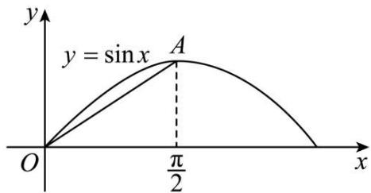

text_image

y
y = sin x A
O
π/2
x

根据割线 OA 的位置易知 $\sin x > \frac{2}{\pi}x, x \in \left(0, \frac{\pi}{2}\right)$ ,

从而 $a_{n + 1} > \frac{2}{\pi}\times \frac{\pi}{2} a_n = a_n\geqslant a_1 = \frac{1}{2}.$

综上可知 $\frac{1}{2} \leqslant a_n < a_{n+1} < 1$ .

(2) $\because a_{n + 1} = \sin \left(\frac{\pi}{2} a_n\right) = \sin \left[\frac{\pi}{2} (a_n - 1) + \frac{\pi}{2}\right] = \cos \left[\frac{\pi}{2} (a_n - 1)\right] = 1 - 2\sin^2\left[\frac{\pi}{4} (a_n - 1)\right],$

且 $0 < a_{n} < 1$

设 $p(x) = \sin x - x, x \in \left(0, \frac{\pi}{2}\right)$ ,

则 $p'(x)=\cos x-1<0,\therefore p(x)$ 在 $x\in\left(0,\frac{\pi}{2}\right)$ 上单调递减，

∴ 当 $x \in \left(0, \frac{\pi}{2}\right)$ 时， $p(x) < \sin 0 - 0 = 0$ ，即 $\sin x < x$ .

$$
\therefore 1 - a _ {n + 1} = 2 \sin^ {2} \left[ \frac {\pi}{4} (1 - a _ {n}) \right] <   2 \left[ \frac {\pi}{4} (1 - a _ {n}) \right] ^ {2} = \frac {\pi^ {2}}{8} (1 - a _ {n}) (1 - a _ {n}).
$$

$$
\because 1 - a _ {n} \leqslant 1 - a _ {1} = \frac {1}{2}, \therefore \frac {\pi^ {2}}{8} (1 - a _ {n}) \leqslant \frac {\pi^ {2}}{1 6},
$$

$$
\therefore 1 - a _ {n + 1} <   \frac {\pi^ {2}}{1 6} (1 - a _ {n}) <   \frac {1 0}{1 6} (1 - a _ {n}) <   \frac {2}{3} (1 - a _ {n}) <   \left(\frac {2}{3}\right) ^ {n} (1 - a _ {1}) = \frac {1}{2} \times \left(\frac {2}{3}\right) ^ {n}, n \in \mathrm{N},
$$

$$
\therefore \left(1 - a _ {1}\right) + \left(1 - a _ {2}\right) + \dots + \left(1 - a _ {n}\right) \leqslant \frac {1}{2} \left[ 1 + \frac {2}{3} + \dots + \left(\frac {2}{3}\right) ^ {n - 1} \right] = \frac {3}{2} \left[ 1 - \left(\frac {2}{3}\right) ^ {n} \right] <   \frac {3}{2}.
$$

从而 $S_{n}>n-\frac{3}{2}.$

# 【解题方法总结】

(1) 构造辅助函数 (数列) 证明不等式  
(2) 放缩法证明不等式

在证明不等式时,有时把不等式的一边适当放大或缩小,利用不等式的传递性来证明,我们称这种方法为放缩法.

放缩时常采用的方法有:舍去一些正项或负项、在和或积中放大或缩小某些项、扩大(或缩小)分式的分子(或分母).

放缩法证不等式的理论依据是: A > B, B > C $\Rightarrow$ A > C; A < B, B < C $\Rightarrow$ A < C.

放缩法是一种重要的证题技巧,要想用好它,必须有目标,目标可从要证的结论中去查找.

方法1:对 $a_{n}$ 进行放缩,然后求和.

当 $\sum_{k=1}^{n}a_{k}$ 既不关于 n 单调,也不可直接求和,右边又是常数时,就应考虑对 $a_{n}$ 进行放缩,使目标变成可求和的情形,通常变为可裂项相消或压缩等比的数列.证明时要注意对照求证的结论,调整与控制放缩的度.

方法2: 添舍放缩

方法3:对于一边是和或者积的数列不等式,可以把另外一边的含n的式子看作是一个数列的前n项的和或者积,求出该数列通项后再左、右两边一对一地比较大小,这种思路非常有效,还可以分析出放缩法证明的操作方法,易于掌握.需要指出的是,如果另外一边不是含有n的式子,而是常数,则需要寻找目标不等式的加强不等式,再予以证明.

方法 4: 单调放缩

# 题型六:公共项问题

2189 (2024·上海嘉定·上海市嘉定区第一中学校考三模)已知 $n \in N, n \geqslant 1$ ，将数列 $\{2n-1\}$ 与数列 $\{n^{2}-1\}$ 的公共项从小到大排列得到新数列 $\{a_{n}\}$ ，则 $\sum_{n=1}^{100} \frac{1}{a_{n}} =$ \_\_\_\_ .

【答案】 $\frac{100}{201}$

【解析】因为数列 $\{2n-1\}$ 是正奇数列，

对于数列 $\left\{n^{2}-1\right\}$ ，当 n 为奇数时，设 $n=2k-1(k\in\mathbb{N}^{*})$ ，则 $n^{2}-1=(2k-1)^{2}-1=4k(k-1)$ 为偶数；

当 n 为偶数时, 设 $n = 2k (k \in \mathbb{N}^{*})$ , 则 $n^{2} - 1 = 4k^{2} - 1$ 为奇数,

所以 $a_{n} = 4n^{2} - 1$ ，则 $\frac{1}{a_n} = \frac{1}{4n^2 - 1} = \frac{1}{(2n - 1)(2n + 1)} = \frac{1}{2}\left(\frac{1}{2n - 1} -\frac{1}{2n + 1}\right),$

所以 $\sum_{n=1}^{100}\frac{1}{a_{n}}=\frac{1}{a_{1}}+\frac{1}{a_{2}}+\cdots+\frac{1}{a_{100}}=\frac{1}{2}\left(1-\frac{1}{3}+\frac{1}{3}-\frac{1}{5}+\cdots+\frac{1}{199}-\frac{1}{201}\right)=\frac{1}{2}\left(1-\frac{1}{201}\right)$

$$
= \frac {1 0 0}{2 0 1}.
$$

故答案为: $\frac{100}{201}$ .

2190 (2024·湖南邵阳·邵阳市第二中学校考模拟预测)数列 $\{2n-1\}$ 和数列 $\{3n-2\}$ 的公共项从小到大构成一个新数列 $\{a_{n}\}$ ，数列 $\{b_{n}\}$ 满足： $b_{n}=\frac{a_{n}}{2^{n}}$ ，则数列 $\{b_{n}\}$ 的最大项等于 \_\_\_\_.

【答案】 $\frac{7}{4} / 1.75$

【解析】数列 $\{2n - 1\}$ 和数列 $\{3n - 2\}$ 的公共项从小到大构成一个新数列为：

1,7,13,…,该数列为首项为1,公差为6的等差数列，

所以 $a_{n}=6n-5$ ,

所以 $b_{n} = \frac{6n - 5}{2^{n}}$

因为 $b_{n + 1} - b_n = \frac{6n + 1}{2^{n + 1}} -\frac{6n - 5}{2^n} = \frac{11 - 6n}{2^{n + 1}}$

所以当 $n \geqslant 2$ 时， $b_{n+1} - b_n < 0$ ，即 $b_2 > b_3 > b_4 > \cdots$

又 $b_{1} < b_{2}$

所以数列 $\{b_{n}\}$ 的最大项为第二项, 其值为 $\frac{7}{4}$ .

故答案为: $\frac{7}{4}$ .

2191 (2024·全国·高三专题练习)已知 $n \in N^{*}$ ，将数列 $\{2n-1\}$ 与数列 $\{n^{2}-1\}$ 的公共项从小到大排列得到新数列 $\{a_{n}\}$ ，则 $\frac{1}{a_{1}} + \frac{1}{a_{2}} + \cdots + \frac{1}{a_{10}} =$ \_\_\_\_ .

【答案】 $\frac{10}{21}$

【解析】因为数列 $\{2n - 1\}$ 是正奇数列，

对于数列 $\{n^2 - 1\}$ , 当 $n$ 为奇数时, 设 $n = 2k - 1 (k \in \mathbb{N}^*)$ , 则 $n^2 - 1 = (2k - 1)^2 - 1 = 4k (k - 1)$ 为偶数;

当 n 为偶数时, 设 $n = 2k (k \in \mathbb{N}^{*})$ , 则 $n^{2} - 1 = 4k^{2} - 1$ 为奇数,

所以， $a_{n} = 4n^{2} - 1$ ，则 $\frac{1}{a_n} = \frac{1}{4n^2 - 1} = \frac{1}{(2n - 1)(2n + 1)} = \frac{1}{2}\left(\frac{1}{2n - 1} -\frac{1}{2n + 1}\right),$

因此， $\frac{1}{a_{1}}+\frac{1}{a_{2}}+\cdots+\frac{1}{a_{10}}=\frac{1}{2}\left(1-\frac{1}{3}+\frac{1}{3}-\frac{1}{5}+\cdots+\frac{1}{19}-\frac{1}{21}\right)=\frac{1}{2}\left(1-\frac{1}{21}\right)=\frac{10}{21}.$

故答案为: $\frac{10}{21}$ .

2192 (2024·重庆沙坪坝·高三重庆八中校考阶段练习)将数列 $\{2^{n}\}$ 与 $\{3n-2\}$ 的公共项由小到大排列得到数列 $\{a_{n}\}$ ，则数列 $\{a_{n}\}$ 的前 n 项的和为 \_\_\_\_.

【答案】 $\frac{4(4^n - 1)}{3}$

【解析】由题意令 $2^{1} = 3n - 2, n = \frac{4}{3}$ , 即 2 不是数列 $\{2^{n}\}$ 与 $\{3n - 2\}$ 的公共项;

令 $2^{2}=3n-2, n=2$ ，即 4 是数列 $\{2^{n}\}$ 与 $\{3n-2\}$ 的公共项；

令 $2^{3} = 3n - 2, n = \frac{10}{3}$ , 即 8 不是数列 $\{2^{n}\}$ 与 $\{3n - 2\}$ 的公共项;

令 $2^{4}=3n-2, n=6$ ，即 16 是数列 $\{2^{n}\}$ 与 $\{3n-2\}$ 的公共项；

依次类推,可得数列 $\{a_{n}\}$ : 4,16,64,256, $\cdots$ ,

即 $\{a_{n}\}$ 是首项为4，公比为4的等比数列，

故数列 $\{a_{n}\}$ 的前 $n$ 项的和为 $\frac{4(1 - 4^n)}{1 - 4} = \frac{4(4^n - 1)}{3}$ ,

故答案为: $\frac{4(4^n - 1)}{3}$

2193 (2024·全国·高三专题练习)数列 $\{2n\}$ 与 $\{3n-1\}$ 的所有公共项由小到大构成一个新的数列 $\{a_{n}\}$ ，则 $a_{10}=$ \_\_\_\_.

【答案】56

【解析】数列 $\{2n\}$ 与 $\{3n-1\}$ 分别是以 2,3 为公差，2 为首项的等差数列，

则新的数列 $\{a_{n}\}$ 是以2为首项，6为公差的等差数列，所以 $a_{n} = 2 + (n - 1)\times 6 = 6n-$ 4，

故 $a_{10}=6\times10-4=56.$

故答案为: 56.

2194 (2024·安徽蚌埠·统考一模)有两个等差数列 2, 6, 10, …, 190 及 2, 8, 14, …, 200, 由这两个等差数列的公共项按从小到大的顺序组成一个新数列, 则这个新数列的各项之和为 \_\_\_\_.

【答案】1472

【解析】在等差数列 2, 6, 10, …, 190 和等差数列

2,8,14,...,200

中,公共项按从小到大的顺序组成一个新的等差数列:2,14,26,38,50,…,182,共

$\frac{182 - 2}{12} + 1 = 16$ 项，它们的和为 $\frac{16 \times (182 + 2)}{2} = 1472.$

考点:等差数列及其求和公式.

# 题型七:插项问题

2195 (2024·全国·高三对口高考)在数1和100之间插入n个实数,使得这 $n+2$ 个数构成递增的等比数列,将这 $n+2$ 个数的乘积记作 $T_{n}$ ,再令 $a_{n}=\lg T_{n},n\geqslant1$ .则数列 $\{a_{n}\}$ 的通项公式为\_\_\_\_.

【答案】 $a_{n}=n+2,n\in N^{*}$

【解析】记由 $n + 2$ 个数构成递增的等比数列为 $\{b_n\}$ ,

则 $b_{1}=1, b_{n+2}=100$ ，则 $q^{n+1}=100$ ，即 $(n+1)\lg q=\lg 100=2$

所以 $T_{n}=b_{1}\cdot b_{2}\cdot b_{3}\cdots b_{n+2}$ ,

即 $a_{n}=\lg(b_{1}\cdot b_{2}\cdot b_{3}\cdots b_{n+2})=\lg b_{1}+\lg(b_{1}q)+\lg(b_{1}q^{2})+\cdots\lg(b_{1}q^{n+1})$

$$
= (n + 2) \lg b _ {1} + [ 1 + 2 + 3 \dots + (n + 1) ] \lg q
$$

$$
= \frac {(n + 1) (n + 2)}{2} \lg q
$$

$$
= n + 2
$$

故答案为: $a_{n} = n + 2, n \in \mathbf{N}^{*}$ .

2196 (2024·湖北襄阳·襄阳四中校考模拟预测)已知等差数列 $\{a_{n}\}$ 中， $a_{2}=4, a_{6}=16$ ，若在数列 $\{a_{n}\}$ 每相邻两项之间插入三个数，使得新数列也是一个等差数列，则新数列的第 43 项为 \_\_\_\_.

【答案】 $\frac{65}{2}$

【解析】设等差数列 $\left\{a_{n}\right\}$ 的公差为 d，则 $a_{1}+d=4, a_{1}+5d=16$ ,

所以 $a_{1}=1, d=3$ ,

设在数列 $\{a_{n}\}$ 每相邻两项之间插入三个数所得新数列为 $\{b_{n}\}$ ,

则新的等差数列 $\{b_{n}\}$ 的公差为 $\frac{d}{4} = \frac{3}{4}$ ，首项为 $b_{1} = a_{1} = 1$ ，

所以新数列的通项公式为 $b_{n}=1+\frac{3}{4}(n-1)=\frac{3}{4}n+\frac{1}{4}$ ,

故 $b_{43}=\frac{3}{4}\times43+\frac{1}{4}=\frac{65}{2}.$

故答案为: $\frac{65}{2}$ .

2197 (2024·福建福州·福建省福州第一中学校考模拟预测)已知数列 $\{a_{n}\}$ 的首项 $a_1 = \frac{4}{5}$ ,

$$
a _ {n + 1} = \frac {4 a _ {n}}{3 a _ {n} + 1}, n \in \mathrm{N} ^ {*}.
$$

(1) 设 $b_{n}=\frac{a_{n}}{1-a_{n}}$ ，求数列 $\{b_{n}\}$ 的通项公式；  
(2) 在 $b_{k}$ 与 $b_{k+1}$ (其中 $k \in \mathbb{N}^{*}$ ) 之间插入 $2^{k}$ 个 3，使它们和原数列的项构成一个新的数列 $\{c_{n}\}$ . 记 $\mathrm{S}_{n}$ 为数列 $\{c_{n}\}$ 的前 $n$ 项和，求 $\mathrm{S}_{36}$ .

【解析】(1) 因为 $a_{n+1}=\frac{4a_{n}}{3a_{n}+1}$ ， $a_{1}=\frac{4}{5}\neq0$ ，

所以 $a_{n} \neq 0$ ，取倒得 $\frac{1}{a_{n+1}} = \frac{3}{4} + \frac{1}{4a_{n}}$ ,

所以 $\frac{1}{a_{n + 1}} - 1 = \frac{1}{4a_n} -\frac{1}{4} = \frac{1}{4}\left(\frac{1}{a_n} -1\right)$ 即 $\frac{a_{n + 1}}{1 - a_{n + 1}} = \frac{4a_n}{1 - a_n}$ 即 $b_{n + 1} = 4b_{n}$

因为 $b_{1} = 4 \neq 0$ ，所以 $\{b_{n}\}$ 是 $b_{1} = 4, q = 4$ 的等比数列，

所以 $b_{n}=4^{n}(n\in\mathbf{N}^{*})$ .

(2) 在 $b_{1}, b_{2}$ 之间有 2 个 3, $b_{2}, b_{3}$ 之间有 $2^{2}$ 个 3, $b_{3}, b_{4}$ 之间有 $2^{3}$ 个 3, $b_{4}, b_{5}$ 之间有 $2^{4}$ 个 3, 合计 $2 + 2^{2} + 2^{3} + 2^{4} = 30$ 个 3,

所以 $S_{36}=\sum_{i=1}^{5}b_{i}+31\times3=\frac{4\times(1-4^{5})}{1-4}+93=1364+93=1457.$

2198 (2024·广东佛山·统考模拟预测)已知数列 $\{a_{n}\}$ 满足 $\frac{a_{1}}{3} + \frac{a_{2}}{3^{2}} + \cdots + \frac{a_{n}}{3^{n}} = \frac{n}{3}(n \in \mathbb{N}^{*})$ .

(1) 求 $\{a_{n}\}$ 的通项公式;  
(2) 在 $\{a_{n}\}$ 相邻两项中间插入这两项的等差中项, 求所得新数列 $\{b_{n}\}$ 的前 2n 项和 $T_{2n}$ .

【解析】(1) 因为 $\frac{a_{1}}{3} + \frac{a_{2}}{3^{2}} + \cdots + \frac{a_{n}}{3^{n}} = \frac{n}{3}(n \in \mathbb{N}^{*})$ ①,

所以 $n \geqslant 2$ 时， $\frac{a_{1}}{3} + \frac{a_{2}}{3^{2}} + \cdots + \frac{a_{n-1}}{3^{n-1}} = \frac{n-1}{3}$ ②，

① - ②得: $\frac{a_n}{3^n} = \frac{n}{3} - \frac{n-1}{3} = \frac{1}{3}$ , 即 $a_n = 3^{n-1} (n \geqslant 2)$ ,

又 n=1 时， $\frac{a_{1}}{3}=\frac{1}{3}$ ，所以 $a_{1}=1$ 也满足上式，

故 $\{a_{n}\}$ 的通项公式为 $a_{n}=3^{n-1}(n\in\mathbb{N}^{*})$ .

(2) 设数列 $\{c_n\}$ 满足 $c_n = \frac{a_n + a_{n+1}}{2} = 2 \times 3^{n-1}$ .

记 $\{a_{n}\}$ 的前 $n$ 项和为 $\mathrm{S}_n$ , $\{c_n\}$ 的前 $n$ 项和为 $\mathrm{R}_n$ , 则 $\mathrm{T}_{2n} = \mathrm{R}_n + \mathrm{S}_n$ .

由等比数列的求和公式得: $S_{n} = \frac{1 - 3^{n}}{1 - 3} = \frac{1}{2}(3^{n} - 1), R_{n} = 2S_{n} = 3^{n} - 1.$

所以 $T_{2n}=R_{n}+S_{n}=\frac{3}{2}(3^{n}-1)$ .

即新数列 $\{b_{n}\}$ 的前 2n 项和 $T_{2n}=\frac{3}{2}(3^{n}-1)$ .

2199 (2024·吉林通化·梅河口市第五中学校考模拟预测) $S_{n}$ 为数列 $\{a_{n}\}$ 的前n项和，已知 $6S_{n}=a_{n}^{2}+3a_{n}-4$ ，且 $a_{n}>0$ .

(1) 求数列 $\{a_{n}\}$ 的通项公式 $a_{n}$ ;  
(2) 数列 $\{b_{n}\}$ 依次为: $a_{1}, 3, a_{2}, 3^{2}, 3^{3}, a_{3}, 3^{4}, 3^{5}, 3^{6}, a_{4}, 3^{7}, 3^{8}, 3^{9}, 3^{10} \cdots$ , 规律是在 $a_{k}$ 和 $a_{k+1}$ 中间插入 $k (k \in \mathbb{N}^{*})$ 项, 所有插入的项构成以 3 为首项, 3 为公比的等比数列, 求数列 $\{b_{n}\}$ 的前 100 项的和.

【解析】(1) 当 n=1 时， $6S_{1}=6a_{1}=a_{1}^{2}+3a_{1}-4$ ，解得 $a_{1}=4(a_{1}=-1$ 舍去），

由 $6\mathrm{S}_n = a_n^2 +3a_n - 4$ 得 $n\geqslant 2$ 时， $6\mathrm{S}_{n - 1} = (a_{n - 1})^{2} + 3a_{n - 1} - 4,$

两式相减得 $6a_{n} = a_{n}^{2} - a_{n - 1}^{2} + 3a_{n} - 3a_{n - 1},(a_{n} + a_{n - 1})(a_{n} - a_{n - 1} - 3) = 0,$

因为 $a_{n}>0$ ，所以 $a_{n}-a_{n-1}=3$ ，

所以 $\{a_{n}\}$ 是等差数列，首项为4，公差为3，

所以 $a_{n}=4+3(n-1)=3n+1;$

(2) 由于 $1 + 2 + 3 + 4 + 5 + 6 + 7 + 8 + 9 + 10 + 11 + 12 = 78, 78 + 12 < 100$ ,

$$
1 + 2 + 3 + 4 + 5 + 6 + 7 + 8 + 9 + 1 0 + 1 1 + 1 2 + 1 3 = 9 1, 9 1 + 1 3 > 1 0 4
$$

因此数列 $\{b_n\}$ 的前100项中含有 $\{a_n\}$ 的前13项，含有 $\{3^n\}$ 中的前87项，

所求和为 $S=4\times13+\frac{13\times12}{2}\times3+\frac{3(1-3^{87})}{1-3}=\frac{3^{88}+569}{2}$ .

2200 (2024·全国·高三专题练习)设等比数列 $\{a_{n}\}$ 的首项为 $a_{1}=2$ ，公比为 q(q 为正整数)，且满足 $3a_{3}$ 是 $8a_{1}$ 与 $a_{5}$ 的等差中项；数列 $\{b_{n}\}$ 满足 $2n^{2}-(t+b_{n})n+\frac{3}{2}b_{n}=0(t\in\mathbb{R}, n\in\mathbb{N}^{*})$ .

(1) 求数列 $\{a_{n}\}$ 的通项公式;  
(2) 试确定 t 的值, 使得数列 $\{b_{n}\}$ 为等差数列;  
(3) 当 $\{b_n\}$ 为等差数列时, 对每个正整数 $k$ , 在 $a_k$ 与 $a_{k+1}$ 之间插入 $b_k$ 个 2 , 得到一个新数列 $\{c_n\}$ . 设 $\mathrm{T}_n$ 是数列 $\{c_n\}$ 的前 $n$ 项和, 试求 $\mathrm{T}_{100}$ .

【解析】(1)由题意,可得 $6a_{3}=8a_{1}+a_{5}$ ,所以 $6q^{2}=8+q^{4}$ ,

解得 $q^{2}=4$ 或 $q^{2}=2$ (舍)，则 q=2，

又 $a_1 = 2$ ，所以 $a_{n} = 2^{n}$

(2) 由 $2n^{2} - (t + b_{n})n + \frac{3}{2} b_{n} = 0$ ，得 $b_{n} = \frac{2n^{2} - tn}{n - \frac{3}{2}}$

所以 $b_{1}=2t-4$ , $b_{2}=16-4t$ , $b_{3}=12-2t$ ,

因为数列 $\{b_{n}\}$ 为等差数列, 所以 $b_{1} + b_{3} = 2b_{2}$ , 解得 t = 3,

所以当 t=3 时， $b_{n}=2n$ ，由 $b_{n+1}-b_{n}=2$ （常数）知此时数列 $\{b_{n}\}$ 为等差数列.

(3) 因为 $b_{1} = 2$ ，所以 $a_{1}$ 与 $a_{2}$ 之间插入 2 个 2，

$b_{2}=4$ , 所以 $a_{2}$ 与 $a_{3}$ 之间插入 4 个 2,

$b_{3}=6$ , 所以 $a_{3}$ 与 $a_{4}$ 之间插入 6 个 2,

...

则 $\{c_{n}\}$ 的前 100 项, 由 90 个 2, $a_{1}, a_{2}, a_{3}, \cdots, a_{9}, a_{10}$ 构成,

所以 $T_{100}=(a_{1}+a_{2}+\cdots+a_{10})+2\times90=\frac{2(1-2^{10})}{1-2}+180=2226.$

2201 (2024·安徽滁州·校考模拟预测)已知等比数列 $\{a_{n}\}$ 的前 n 项和为 $S_{n}$ ，且 $S_{n}=a_{n+1}-2(n\in N^{*})$ .

(1) 求数列 $\{a_{n}\}$ 的通项公式；  
(2) 在 $a_{n}$ 与 $a_{n+1}$ 之间插入 $n$ 个数，使这 $n + 2$ 个数组成一个公差为 $d_{n}$ 的等差数列，求数列 $\left\{\frac{1}{d_n}\right\}$ 的前 $n$ 项和 $\mathrm{T}_n$ .

【解析】(1) $S_{n}=a_{n+1}-2(n\in N^{*})$ ,

当 $n \geqslant 2$ 时， $\mathrm{S}_{n-1} = a_n - 2$

两式相减可得， $a_{n+1}=2a_{n}(n\geqslant2)$ ,

故等比数列 $\{a_{n}\}$ 的公比为2，

$$
\because a _ {2} = a _ {1} + 2 = 2 a _ {1},
$$

$$
\therefore a _ {1} = 2,
$$

故数列 $\{a_{n}\}$ 的通项公式为 $a_{n}=2^{n}$ .

(2) 由 (1) 得: $a_{n} = 2^{n}, a_{n+1} = 2^{n+1}$ ,

故 $a_{n + 1} = a_n + (n + 1)d_n$ ，即 $\frac{1}{d_n} = \frac{n + 1}{2^n}$

$$
\mathrm{T} _ {n} = 2 \times \frac {1}{2} + 3 \times \frac {1}{2 ^ {2}} + 4 \times \frac {1}{2 ^ {3}} + \dots + (n + 1) \frac {1}{2 ^ {n}} ①,
$$

$$
\frac {1}{2} \mathrm{T} _ {n} = 2 \times \frac {1}{2 ^ {2}} + 3 \times \frac {1}{2 ^ {3}} + 4 \times \frac {1}{2 ^ {4}} + \dots + (n + 1) \cdot \frac {1}{2 ^ {n + 1}} ②,
$$

① - ②得: $\frac{1}{2} T_n = 2 \times \frac{1}{2} + \left( \frac{1}{2^2} + \frac{1}{2^3} + \cdots + \frac{1}{2^n} \right) - (n+1) \cdot \frac{1}{2^{n+1}} = 1 + \frac{\frac{1}{4} \left[ 1 - \left( \frac{1}{2} \right)^{n-1} \right]}{1 - \frac{1}{2}} -$

$$
(n + 1) \cdot \frac {1}{2 ^ {n + 1}} = \frac {3}{2} - \frac {n + 3}{2 ^ {n + 1}},
$$

故 $\mathrm{T}_n = 3 - \frac{n + 3}{2^n}$

# 8 题型八:蛛网图问题

2202 (2024·全国·高三专题练习)已知数列 $\{b_{n}\}$ 若 $b_{1}=2, b_{n}=\frac{t}{4}b_{n-1}+\frac{3}{4}(n\in\mathbb{N}^{*}$ 且 $n\geqslant2, t\in\mathbb{R})$ ，若 $|b_{n}|\leqslant2$ 对任意 $n\in\mathbb{N}^{*}$ 恒成立，则实数 t 的取值范围是 \_\_\_\_.

【答案】 $\left[-4, \frac{5}{2}\right]$

【解析】法一:不妨先由 $\left|b_{2}\right|\leqslant2,\left|b_{3}\right|\leqslant2$ 得到 $\left|b_{n}\right|\leqslant2$ 恒成立的必要条件,

$$
\left\{ \begin{array}{l} \left| b _ {2} \right| = \left| \frac {t}{2} + \frac {3}{4} \right| \leqslant 2 \\ \left| b _ {3} \right| = \left| \frac {2 t ^ {2} + 3 t + 1 2}{1 6} \right| \leqslant 2 \end{array} \Rightarrow \left\{ \begin{array}{l} - \frac {1 1}{2} \leqslant t \leqslant \frac {5}{2} \\ - 4 \leqslant t \leqslant \frac {5}{2} \end{array} \Rightarrow - 4 \leqslant t \leqslant \frac {5}{2}; \right. \right.
$$

$b_{n}=\frac{t}{4}b_{n-1}+\frac{3}{4}$ ，设 $b_{n}+\lambda=\frac{t}{4}(b_{n-1}+\lambda)$ ，则 $b_{n}=\frac{t}{4}b_{n-1}+\left(\frac{t}{4}-1\right)\lambda,$

所以 $\left(\frac{t}{4} - 1\right)\lambda = \frac{3}{4}$ , 解得 $\lambda = \frac{3}{t-4}$ , 故 $b_n + \frac{3}{t-4} = \frac{1}{4}\left(b_{n-1} + \frac{3}{t-4}\right)$ ,

又 $b_{1}+\frac{3}{t-4}=2+\frac{3}{t-4}=\frac{2t-5}{t-4}$ ,

故 $b_{n}=\frac{2t-5}{t-4}\cdot\left(\frac{t}{4}\right)^{n-1}-\frac{3}{t-4},$

所以 $|b_n| = \frac{5 - 2t}{4 - t} \cdot \left|\frac{t}{4}\right|^{n - 1} + \frac{3}{4 - t} \leqslant \frac{5 - 2t}{4 - t} \cdot 1 + \frac{3}{4 - t} = 2$ ，得证.

法二:蛛网法

记函数 $f(x)=\frac{t}{4}x+\frac{3}{4}$ ，过定点 $\left(0,\frac{3}{4}\right).b_{n}=f(b_{n-1})$ .

当 $t \geqslant 0$ 时， $\mathrm{B}_{1}(2, b_{2})$ 迭代收敛于点 A，只需位于直线 y = x 下方，即 $\frac{t}{4} \cdot 2 + \frac{3}{4} \leqslant 2 \Rightarrow 0 \leqslant t \leqslant \frac{5}{2}$ ;

当 t<0 时， $\mathrm{B}_{1}(2,b_{2})$ 迭代收敛于点 A，由蛛网图： $\left\{b_{2n-1}\right\}$ 单调递减，故只需 $b_{3}\leqslant b_{1}$

即 $\frac{t}{4}\left(\frac{t}{2} +\frac{3}{4}\right) + \frac{3}{4}\leqslant 2\Rightarrow -4\leqslant t <   0$

综上 $-4 \leqslant t \leqslant \frac{5}{2}$ .

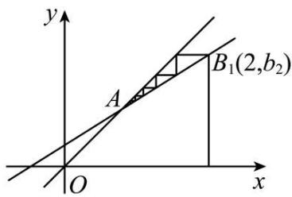

text_image

y
A
B₁(2,b₂)
O
x

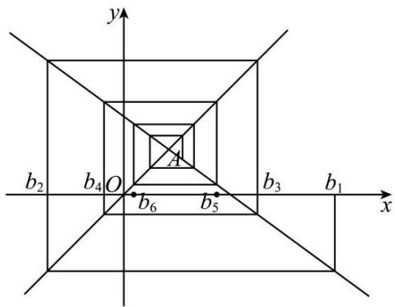

text_image

y
b₂ b₄ O A b₆ b₅ b₃ b₁ x

故答案为: $\left[-4,\frac{5}{2}\right]$

2203 (2024·虹口区校级期中)已知数列 $\{a_{n}\}$ 满足: $a_{1}=0$ , $a_{n+1}=\ln(\mathrm{e}^{a_{n}}+1)-a_{n}(n\in\mathbb{N}^{*})$ , 前 n 项和为 $S_{n}$ , 则下列选项错误的是 ( ) (参考数据: $\ln2\approx0.693$ , $\ln3\approx1.099$ )

A. $\{a_{2n - 1}\}$ 是单调递增数列， $\{a_{2n}\}$ 是单调递减数列

B. $a_{n} + a_{n + 1}\leqslant \ln 3$

C. $S_{2020} < 670$

D. $a_{2n - 1}\leqslant a_{2n}$

【解析】解:由 $a_{n+1}=\ln(\mathrm{e}^{a_{n}}+1)-a_{n}$ ，得 $a_{n+1}=\ln(\mathrm{e}^{a_{n}}+1)-\ln e^{a_{n}}$

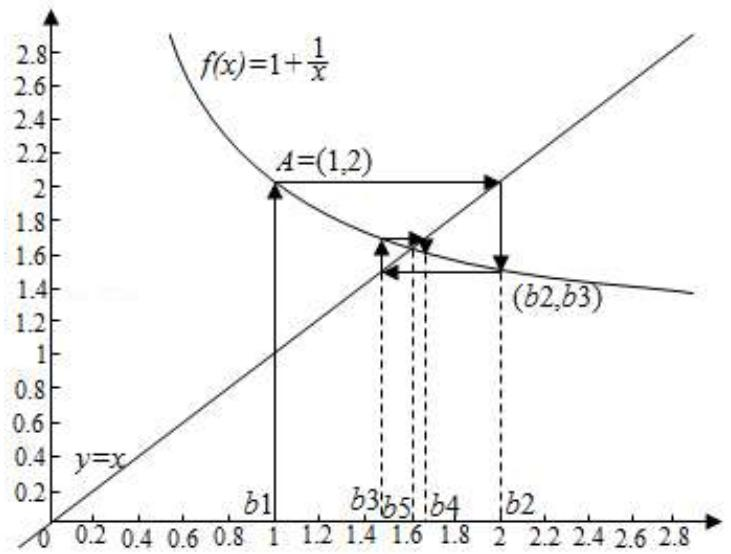

line

| Point | x    | y    |
|-------|------|------|
| A     | 1.2  | 2.0  |
| b1    | 1.0  | 1.0  |
| b3    | 1.6  | 1.6  |
| b4    | 1.8  | 1.7  |
| b5    | 1.6  | 1.6  |
| b2    | 2.0  | 1.5  |
| (b2,b3)| 2.0  | 1.5  |

$$
\therefore \mathrm{e} ^ {a _ {n + 1}} = 1 + \frac {1}{\mathrm{e} ^ {a _ {n}}},
$$

令 $b_{n} = \mathrm{e}^{a_{n}}$ ，即 $a_{n} = \ln b_{n}$

则 $b_{n + 1} = 1 + \frac{1}{b_n}$

$$
a _ {1} = 0, b _ {1} = 1.
$$

作图如下:

由图可得:

A. $\{a_{2n-1}\}$ 是单调递增数列, $\{a_{2n}\}$ 是单调递减数列, 因此 A 正确;  
B. $\because b_{n}\in [1,2],\therefore b_{n}b_{n + 1} = b_{n}\left(1 + \frac{1}{b_{n}}\right) = b_{n} + 1\in [2,3],$

$$
\therefore b _ {n} b _ {n + 1} = \mathrm{e} ^ {a _ {n}} \cdot \mathrm{e} ^ {a _ {n + 1}} \in [ 2, 3 ],
$$

$\therefore a_{n+1} + a_{n} \in [\ln 2, \ln 3]$ ，因此 B 正确；

C. $\because a_{n + 1} + a_n\geqslant \ln 2,\therefore S_{2020} = (a_1 + a_2) + (a_3 + a_4) + \dots +(a_{2019} + a_{2020})\geqslant 1010\ln 2>$   
693, 因此 C 不正确;  
D. 由不动点 $\left(\frac{\sqrt{5} + 1}{2}, \frac{\sqrt{5} + 1}{2}\right)$ , 得 $1 \leqslant b_{2n-1} < \frac{\sqrt{5} + 1}{2} < b_{2n} \leqslant 2$ , 可得: $b_{2n-1} < b_{2n}$ , $\therefore a_{2n} > a_{2n-1}$ , 因此 D 正确.

故选：C.

2204 (2024·浙江模拟)数列 $\{a_{n}\}$ 满足 $a_{1}>0, a_{n+1}=a_{n}^{3}-a_{n}+1, n\in N^{*}, S_{n}$ 表示数列 $\left\{\frac{1}{a_{n}}\right\}$ 前 n 项和，则下列选项中错误的是 ()

A. 若 $0 < a_{1} < \frac{2}{3}$ , 则 $a_{n} < 1$   
B. 若 $\frac{2}{3} < a_1 < 1$ ，则 $\{a_n\}$ 递减  
C. 若 $a_{1}=\frac{1}{2}$ ，则 $S_{n}>4\left(\frac{1}{a_{n+1}}-2\right)$   
D. 若 $a_1 = 2$ ，则 $\mathrm{S}_{2000} > \frac{2}{3}$

【解析】解：(法一)对于选项A，令 $f(x)=x^{3}-x+1,\ x\in(0,1)$ ，则 $f'(x)=3x^{2}-1$ ，令 $f'(x)=0\Rightarrow x=\frac{\sqrt{3}}{3}$

易知 $f(x)$ 在 $\left(0, \frac{\sqrt{3}}{3}\right)$ 上单调递减，在 $\left(\frac{\sqrt{3}}{3}, 1\right)$ 上单调递增，此时 $f(x) < 1$ ，

又 $a_{n + 1} = a_n^3 -a_n + 1 = f(a_n)$ ，若 $0 <   a_1 <   \frac{2}{3}$ 则有 $a_{n} <   1$ ，故选项A正确；

对于选项 B, 结合选项 A 中的过程, 作出递推函数与 y = x 的交点, 可得函数 $f(x) = x^{3} -$ $x + 1(x > 0)$ 的不动点为 $\frac{\sqrt{5} - 1}{2}$ 和 $1$ ，且 $\frac{\sqrt{3}}{3} < \frac{\sqrt{5} - 1}{2} < \frac{2}{3} < 1,$

故函数 $f(x)$ 在 $\left(\frac{2}{3},1\right)$ 单调递增，且 $f'\left(\frac{\sqrt{5}-1}{2}\right)<1,f'(1)>1,$

故 $x = \frac{\sqrt{5} - 1}{2}$ 为吸引不动点， $x = 1$ 为排斥不动点，

故当 $\frac{2}{3}<a_{1}<1$ 时, 数列 $\{a_{n}\}$ 向吸引不动点 $\frac{\sqrt{5}-1}{2}$ 靠近, 单调递减, 故选项 B 正确;

对于选项 C, $a_{1}=\frac{1}{2}$ , $a_{2}=\frac{5}{8}>\frac{\sqrt{5}-1}{2}$ ，由选项 A, B 的过程可知，当 $n\geqslant2$ 时，数列 $\{a_{n}\}$ 单调递减且 $\frac{1}{2}<\frac{\sqrt{5}-1}{2}<a_{n}<1$ ，故 $\frac{1}{a_{n+1}}-2<0$

而显然 $S_{n}>0$ ，故 $S_{n}>4\left(\frac{1}{a_{n+1}}-2\right)$ 成立，故选项 C 正确；

对于选项 D, 当 $a_{1}=2$ 时, 结合选项 A, B 的过程及蛛网图, 易知数列 $\{a_{n}\}$ 单调递增,

又 $a_2 = f(a_1) = 7$ ，故当 $n\geqslant 2$ 时， $a_{n + 1} = a_n^3 -a_n + 1 > a_n^3 -a_n = a_n(a_n^2 -1)\geqslant (7^2 -1)a_n =$ $48a_{n}$ ，即 $\frac{1}{a_{n + 1}}\leqslant \frac{1}{48a_n}(n\geqslant 2),$

故 $\frac{1}{a_n} \leqslant \frac{1}{48^{n-2} a_2}$ ,

$$
\therefore \frac {1}{a _ {2}} + \frac {1}{a _ {3}} + \dots + \frac {1}{a _ {2 0 2 0}} \leqslant \frac {1}{a _ {2}} + \frac {1}{4 8 a _ {2}} + \dots + \frac {1}{4 8 ^ {2 0 1 8} a _ {2}} <   \frac {\frac {1}{a _ {2}}}{1 - \frac {1}{4 8}} = \frac {4 8}{4 7} \times \frac {1}{7} <   \frac {1}{6},
$$

故 $S_{2020}<\frac{1}{a_{1}}+\frac{1}{6}=\frac{2}{3}$ ，故选项 D 错误.

(法二) 作出 $f(x)=x^{3}-x+1(x>0)$ 与 y=x 的图象, 由蛛网图可知, 选项 A, B 正确;

若 $a_1 = \frac{1}{2}$ , 由蛛网图可知, $a_n < a_2 = \frac{5}{8}$ , $n \to +\infty$ 时, $a_n \to \frac{\sqrt{5} - 1}{2}$ , 则 $\frac{1}{a_{n+1}} \to \frac{\sqrt{5} + 1}{2}$ ,

故 $4\left(\frac{1}{a_{n+1}}-2\right)<0<S_{n}$ ，选项C正确；

若 $a_1 = 2$ ，则 $\frac{1}{a_1} = \frac{1}{2},\frac{1}{a_2} = \frac{1}{7}$ 比较 $\mathrm{S}_{2020} - \frac{1}{a_1}$ 与 $\frac{1}{6}$ 的大小，

$$
\frac {1}{a _ {n + 1}} = \frac {1}{a _ {n} ^ {3} - a _ {n} + 1} <   \frac {1}{a _ {n} ^ {3} - a _ {n}} = \frac {1}{a _ {n}} \cdot \frac {1}{a _ {n} ^ {2} - 1} <   \frac {1}{a _ {n}} \cdot \frac {1}{7 ^ {2} - 1} = \frac {1}{4 8 a _ {n}} (n \geqslant 2),
$$

则 $\frac{1}{a_{2}}+\frac{1}{a_{3}}+\cdots+\frac{1}{a_{2020}}<\frac{1}{7}+\frac{1}{7\times48}+\cdots+\frac{1}{7\times48^{2018}}<\frac{\frac{1}{7}}{1-\frac{1}{48}}=\frac{48}{329}<\frac{1}{6}$ ，选项 D 错误.

故选：D.

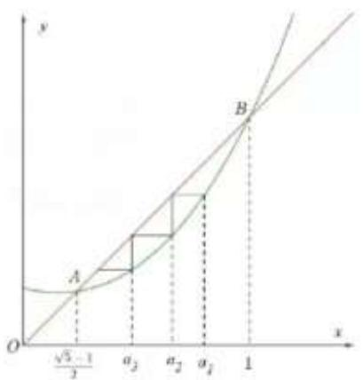

text_image

y
A
√3 - 1/2
a₁
a₂
a₃
B
1
x
O

2205 (2024·浙江模拟)已知数列 $\{a_{n}\}$ 满足： $a_{1}=0,\quad a_{n+1}=\ln(\mathrm{e}^{a_{n}}+1)-a_{n}(n\in\mathrm{N}^{*})$ ，前 n 项和为 $S_{n}$ (参考数据： $\ln2\approx0.693,\ln3\approx1.099$ )，则下列选项中错误的是（）

A. $\{a_{2n - 1}\}$ 是单调递增数列， $\{a_{2n}\}$ 是单调递减数列

B. $a_{n} + a_{n + 1}\leqslant \ln 3$

C. $S_{2020} < 666$

D. $a_{2n - 1} < a_{2n}$

【解析】解:由 $a_{n+1}=\ln(\mathrm{e}^{a_{n}}+1)-a_{n}$ ，得 $a_{n+1}=\ln(\mathrm{e}^{a_{n}}+1)-\ln(\mathrm{e}^{a_{n}})$ ,

$$
\mathrm{e} ^ {a _ {n + 1}} = 1 + \frac {1}{\mathrm{e} ^ {a _ {n}}},
$$

令 $b_{n}=\mathrm{e}^{a_{n}}$ ，即 $a_{n}=\ln b_{n}$ ，则 $b_{n+1}=1+\frac{1}{b_{n}}$ ， $a_{1}=0,\therefore b_{1}=1$

作图如下:

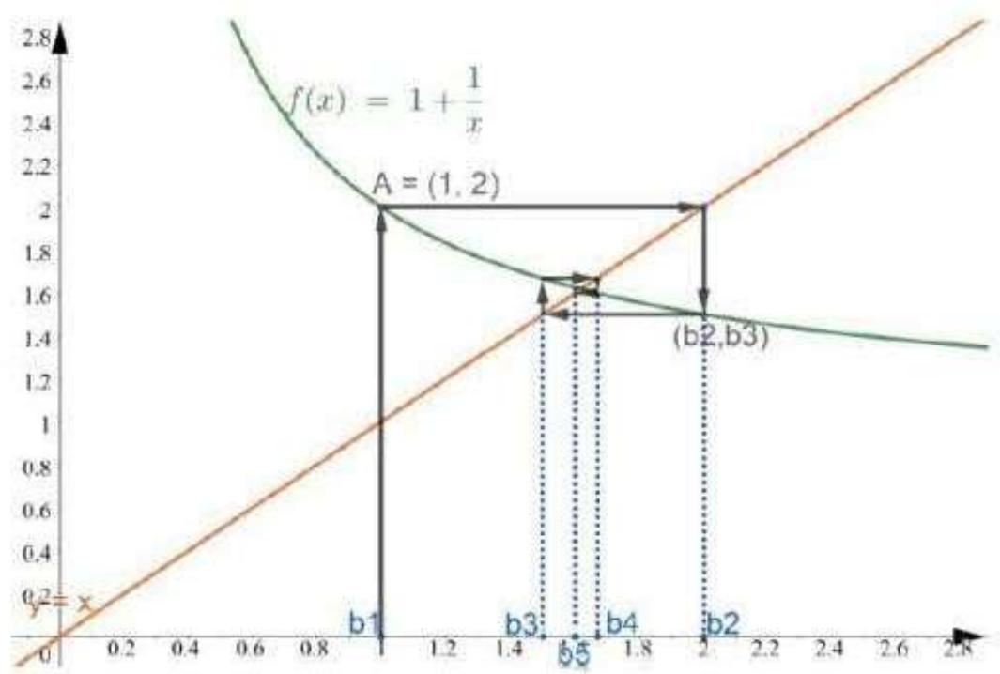

line

| Point | x    | y    |
|-------|------|------|
| b1    | 1.0  | 2.0  |
| b3    | 1.4  | 1.6  |
| b5    | 1.8  | 1.6  |
| b4    | 2.0  | 1.6  |
| (b2,b3)| 2.0  | 1.6  |

由图得:

① $\{b_{2n-1}\}$ 单调递增， $\{b_{2n}\}$ 单调递减，

$a_{n}=\ln b_{n}$ ，故 A 正确；

② $\because b_{n}\in[1,2],\therefore b_{n}b_{n+1}=b_{n}\left(1+\frac{1}{b_{n}}\right)=b_{n}+1\in[2,3]$ ,

$$
\therefore b _ {n} b _ {n + 1} = \mathrm{e} ^ {a _ {n} + a _ {n + 1}} \in [ 2, 3 ],
$$

$\therefore a_{n}+a_{n+1}\in\left[\ln2,\ln3\right]$ ，故B正确；

③ $\because a_{n}+a_{n+1}\geqslant\ln2,\therefore S_{2020}=(a_{1}+a_{2})+\cdots+(a_{2019}+a_{2010})\geqslant1010\cdot\ln2>693,$ 故 C 错误.

④由不动点 $\left(\frac{\sqrt{5}+1}{2}\frac{\sqrt{5}+1}{2}\right)$ ，得 $1\leqslant b_{2n-1}<\frac{1+\sqrt{5}}{2}$ ， $\frac{1+\sqrt{5}}{2}<b_{2n}\leqslant2$

$\therefore b_{2n}>b_{2n-1},\therefore a_{2n}>a_{2n-1}$ ，故D正确.

故选：C.

2206 (2024·下城区校级模拟)已知数列 $\{a_{n}\}$ 满足: $a_{n}>0$ , 且 $a_{n}^{2}=3a_{n+1}^{2}-2a_{n+1}(n\in\mathbb{N}^{*})$ , 下列说法正确的是 ()

A. 若 $a_1 = \frac{1}{2}$ , 则 $a_n > a_{n+1}$

B. 若 $a_1 = 2$ ，则 $a_n \geqslant 1 + \left(\frac{3}{7}\right)^{n-1}$

C. $a_1 + a_5 \leqslant 2a_3$

D. $|a_{n + 2} - a_{n + 1}|\geqslant \frac{\sqrt{3}}{3} |a_{n + 1} - a_n|$

【解析】解： $\because a_{n}^{2}=3a_{n+1}^{2}-2a_{n+1}(n\in\mathbb{N}^{*}),\therefore a_{n}^{2}-1=3a_{n+1}^{2}-2a_{n+1}-1,\therefore(a_{n}+1)(a_{n}-1)=(3a_{n+1}+1)(a_{n+1}-1).$

$\because a_{n}>0,$ 故 $a_{n}+1>0$ 且 $3a_{n+1}+1>0,$ 于是

$(a_{n}-1)$ 与 $(a_{n+1}-1)$ 同号，

$$
\therefore \left(a _ {n} - 1\right) \left(a _ {n + 1} - 1\right) > 0.
$$

对于 A, 若 $a_{1}=\frac{1}{2}$ ，则 $a_{1}-1=-\frac{1}{2}<0$ ，则 $a_{n}-1<0$ ，∴ $a_{n}^{2}-a_{n+1}^{2}=2a_{n+1}(a_{n+1}-1)<0$ ，所以 $a_{n}<a_{n+1}$ ，故 A 错误；

对于 B, $\because a_{1}=2\Rightarrow a_{1}-1=1>0\Rightarrow a_{n}-1>0,$

即 $a_{n}>1$ ，于是 $\therefore a_{n}^{2}-a_{n+1}^{2}=2a_{n+1}(a_{n+1}-1)>0$ ，

即 $a_{n}>a_{n+1},\Rightarrow$ 数列 $\{a_{n}\}$ 单调递减，

于是 $a_{n} < a_{1} = 2$

所以 $4 \geqslant 7(a_{n+1} - a_n) + 2a_n$ ,

即 $\frac{a_n + 1}{3a_{n+1} + 1}\geqslant \frac{3}{7},$

$$
\because \left(a _ {n} + 1\right) \left(a _ {n} - 1\right) = \left(3 a _ {n + 1} + 1\right) \left(a _ {n + 1} - 1\right),
$$

$$
\therefore \frac {a _ {n + 1} - 1}{a _ {n} - 1} = \frac {a _ {n} + 1}{3 a _ {n + 1} + 1} \geqslant \frac {3}{7}
$$

$$
\Rightarrow a _ {n} - 1 \geqslant \left(\frac {3}{7}\right) ^ {n - 1},
$$

故 $a_{n}\geqslant1+\left(\frac{3}{7}\right)^{n-1}$ ，B正确；

对于 C, 考虑函数 $y = \sqrt{3x^{2} - 2x}$ , 如图所示

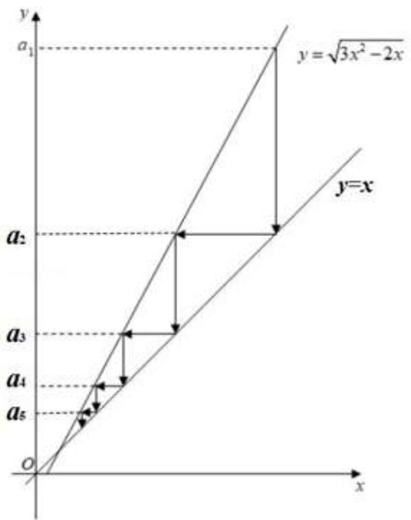

text_image

y
a₁
y = \u221ax² - 2x
a₂
y=x
a₃
a₄
a₅
O
x

由图可知当 $a_{n} > 0$ 时，数列 $\{a_n - a_{n + 1}\}$ 递减，

所以 $a_{1}-a_{3}>a_{3}-a_{5}$ ，即 $a_{1}+a_{5}>2a_{3}$ ，所以 C 不正确；

对于D,设 $a_{n+1}=x$ ,则 $a_{n}=\sqrt{3x^{2}-2x}$ , $a_{n+2}=\frac{1+\sqrt{1+3x^{2}}}{3}$ ,

由上图可知,由上图可知, $\left|a_{n+2}-a_{n+1}\right|\geqslant\frac{\sqrt{3}}{3}\left|a_{n+1}-a_{n}\right|$ ,

即 $\left|\frac{1+\sqrt{1+3x^{2}}}{3}-x\right|\geqslant\frac{\sqrt{3}}{3}|x-\sqrt{3x^{2}-2x}|$ ,

等价于 $2 + 2\sqrt{3} x\sqrt{9x^2 - 6x}\geqslant 2\sqrt{1 + 3x^2}\left(3x - 1\right),$

化简得: $x^{2} - 2x + 1 \leqslant 0$ ,

而 $x^{2}-2x+1\leqslant0$ 显然不成立,所以 D 不正确;

由排除法可知 B 正确.

故选: B.

# 题型九:整数的存在性问题(不定方程)

2207 (2024·全国·高三专题练习)已知数列 $\{a_{n}\}$ 的前 $n$ 项和是 $\mathrm{S}_n$ ，且 $\mathrm{S}_n = 2a_n - n$

(1) 证明: $\{a_{n} + 1\}$ 为等比数列;   
(2) 证明: $\frac{1}{a_2 - a_1} + \frac{1}{a_3 - a_2} + \cdots + \frac{1}{a_{n+1} - a_n} < 1$   
(3) $T_{n}$ 为数列 $\{b_{n}\}$ 的前n项和，设 $b_{n}=\log_{2}(a_{n}+1)$ ，是否存在正整数m，k，使 $b_{k+1}^{2}=2T_{m}+19$ 成立，若存在，求出m，k；若不存在，说明理由.

【解析】(1) $\because S_{n} = 2a_{n} - n, \therefore n \geqslant 2, S_{n-1} = 2a_{n-1} - (n - 1)$ ,

两式相减, 得 $a_{n}=2a_{n}-2a_{n-1}-1,\therefore a_{n}=2a_{n-1}+1,$

$\therefore a_{n} + 1 = 2(a_{n - 1} + 1)(n\geqslant 2)$ ，又 $n = 1$ 时， $\mathrm{S}_1 = 2a_1 - 1 = a_1,\therefore a_1 + 1 = 2\neq 0,\therefore \{a_n + 1\}$

是首项和公比都是2的等比数列.

(2) 由 (1) 得 $a_{n} + 1 = 2^{n}, \therefore a_{n+1} + 1 = 2^{n+1}$ .

$$
\because \frac {1}{a _ {n + 1} - a _ {n}} = \frac {1}{2 ^ {n + 1} - 2 ^ {n}} = \frac {1}{2 ^ {n}},
$$

所以 $\left\{\frac{1}{a_{n+1}-a_{n}}\right\}$ 是等比数列, 首项和公比都是 $\frac{1}{2}$ ,

$$
\therefore \frac {1}{a _ {2} - a _ {1}} + \frac {1}{a _ {3} - a _ {2}} + \dots + \frac {1}{a _ {n + 1} - a _ {n}} = \frac {\frac {1}{2} \left(1 - \frac {1}{2 ^ {n}}\right)}{1 - \frac {1}{2}} = 1 - \frac {1}{2 ^ {n}} <   1.
$$

(3) 假设存在正整数 m, k，使 $b_{k+1}^{2}=2T_{m}+19$ 成立，

$$
\because b _ {n} = \log_ {2} (a _ {n} + 1) = \log_ {2} 2 ^ {n} = n, \therefore T _ {m} = \frac {m (m + 1)}{2}, b _ {k + 1} = k + 1,
$$

$$
(k + 1) ^ {2} = m (m + 1) + 1 9, 4 (k + 1) ^ {2} = 4 m (m + 1) + 7 6,
$$

所以 $(2k + 2)^{2} = (2m + 1)^{2} + 75$

$\therefore \left[(2k + 2) + (2m + 1)\right]\left[(2k + 2) - (2m + 1)\right] = 75$ ，又正整数 $m,k$

$$
\therefore (2 k + 2 m + 3) (2 k - 2 m + 1) = 7 5 = 7 5 \times 1 = 2 5 \times 3 = 1 5 \times 5,
$$

$\therefore \left\{ \begin{array}{l} 2k + 2m + 3 = 75, \\ 2k - 2m + 1 = 1^{\circ}, \end{array} \right.$ 或 $\left\{ \begin{array}{l} 2k + 2m + 3 = 25, \\ 2k - 2m + 1 = 3^{\circ}, \end{array} \right.$ 或 $\left\{ \begin{array}{l} 2k + 2m + 3 = 15, \\ 2k - 2m + 1 = 5^{\circ}, \end{array} \right.$

$\therefore \left\{ \begin{array}{l} k = 18, \\ m = 18^{\circ}, \end{array} \right.$ 或 $\left\{ \begin{array}{l} k = 6, \\ m = 5^{\circ}, \end{array} \right.$ 或 $\left\{ \begin{array}{l} k = 4 \\ m = 2 \end{array} \right..$

2208 (2024·全国·高三专题练习)设 $a_1, a_2, a_3, a_4$ 是各项为正数且公差为 $d(d \neq 0)$ 的等差数列

(1) 证明: $2^{a_1}, 2^{a_2}, 2^{a_3}, 2^{a_4}$ 依次成等比数列;   
(2) 是否存在 $a_{1}, d$ ，使得 $a_{1}, a_{2}^{2}, a_{3}^{3}, a_{4}^{4}$ 依次成等比数列，并说明理由；  
(3) 是否存在 $a_{1}, d$ 及正整数 n, k，使得 $a_{1}^{n}, a_{2}^{n+k}, a_{3}^{n+2k}, a_{4}^{n+3k}$ 依次成等比数列，并说明理由.

【解析】(1) $\because \frac{2^{a_{n + 1}}}{2^{a_n}} = 2^{a_{n + 1} - a_n} = 2^d (n = 1,2,3)$ 是同一个常数，

$\therefore 2^{a_{1}}, 2^{a_{2}}, 2^{a_{3}}, 2^{a_{4}}$ 依次构成等比数列.

(2) 令 $a_1 + d = a$ ，则 $a_1, a_2, a_3, a_4$ 分别为 $a - d, a, a + d, a + 2d (a > d, a > -2d, d \neq 0)$ .

假设存在 $a_{1}, d$ ，使得 $a_{1}, a_{2}^{2}, a_{3}^{3}, a_{4}^{4}$ 依次构成等比数列，

则 $a^{4}=(a-d)(a+d)^{3}$ ，且 $(a+d)^{6}=a^{2}(a+2d)^{4}$ .

令 $t = \frac{d}{a}$ , 则 $1 = (1 - t)(1 + t)^3$ , 且 $(1 + t)^6 = (1 + 2t)^4\left(-\frac{1}{2} < t < 1, t \neq 0\right)$ ,

化简得 $t^3 + 2t^2 - 2 = 0(*)$ ，且 $t^2 = t + 1$ 。将 $t^2 = t + 1$ 代入 $(*)$ 式，

$$
t (t + 1) + 2 (t + 1) - 2 = t ^ {2} + 3 t = t + 1 + 3 t = 4 t + 1 = 0 \text {, 则} t = - \frac {1}{4}.
$$

显然 $t=-\frac{1}{4}$ 不是上面方程的解, 矛盾,

∴假设不成立，

因此不存在 $a_1, d$ , 使得 $a_1, a_2^2, a_3^3, a_4^4$ 依次构成等比数列.

(3) 假设存在 $a_{1}$ ，d 及正整数 n，k，使得 $a_{1}^{n}$ ， $a_{2}^{n+k}$ ， $a_{3}^{n+2k}$ ， $a_{4}^{n+3k}$ 依次构成等比数列，

则 $a_1^n (a_1 + 2d)^{n + 2k} = (a_1 + d)^{2(n + k)}$ ，且 $(a_{1} + d)^{n + k}(a_{1} + 3d)^{n + 3k} = (a_{1} + 2d)^{2(n + 2k)}.$

分别在两个等式的两边同除以 $a_{1}^{2(n+k)}$ 及 $a_{1}^{2(n+2k)}$ ，并令 $t=\frac{d}{a_{1}}\left(t>-\frac{1}{3},t\neq0\right)$ ,

则 $(1 + 2t)^{n + 2k} = (1 + t)^{2(n + k)}$ ，且 $(1 + t)^{n + k}(1 + 3t)^{n + 3k} = (1 + 2t)^{2(n + 2k)}.$

将上述两个等式两边取对数, 得 $(n+2k)\ln(1+2t)=2(n+k)\ln(1+t)$ ,

且 $(n + k)\ln (1 + t) + (n + 3k)\ln (1 + 3t) = 2(n + 2k)\ln (1 + 2t).$

化简得 $2k[\ln(1+2t)-\ln(1+t)]=n[2\ln(1+t)-\ln(1+2t)]$ ,

且 $3k[\ln (1 + 3t) - \ln (1 + t)] = n[3\ln (1 + t) - \ln (1 + 3t)].$

再将这两式相除,化简得 $\ln(1+3t)\ln(1+2t)+3\ln(1+2t)\ln(1+t)=4\ln(1+3t)\ln(1+t)$ (\*\*) .

令 $g(t)=4\ln(1+3t)\ln(1+t)-\ln(1+3t)\ln(1+2t)-3\ln(1+2t)\ln(1+t)$ ,

则 $g'(t)=\frac{2[(1+3t)^{2}\ln(1+3t)-3(1+2t)^{2}\ln(1+2t)+3(1+t)^{2}\ln(1+t)]}{(1+t)(1+2t)(1+3t)}$ .

令 $\varphi(t)=(1+3t)^{2}\ln(1+3t)-3(1+2t)^{2}\ln(1+2t)+3(1+t)^{2}\ln(1+t)$ ,

则 $\varphi'(t)=6[(1+3t)\ln(1+3t)-2(1+2t)\ln(1+2t)+(1+t)\ln(1+t)]$ .

令 $\varphi_{1}(t)=\varphi'(t)$ ，则 $\varphi_{1}^{\prime}(t)=6[3\ln(1+3t)-4\ln(1+2t)+\ln(1+t)]$ .

令 $\varphi_{2}(t) = \varphi_{1}^{\prime}(t)$ ，则 $\varphi_{2}^{\prime}(t) = \frac{12}{(1 + t)(1 + 2t)(1 + 3t)} >0.$

由 $g(0)=\varphi(0)=\varphi_{1}(0)=\varphi_{2}(0)=0,\varphi_{2}^{\prime}(t)>0,$

知 $\varphi_{2}(t)$ , $\varphi_{1}(t)$ , $\varphi(t)$ , $g(t)$ 在 $\left(-\frac{1}{3},0\right)$ 和 $(0,+\infty)$ 上均单调.

故 $g(t)$ 只有唯一零点 t=0，即方程 ( $^{**}$ ) 只有唯一解 t=0，故假设不成立.

∴不存在 $a_{1}$ ，d及正整数n，k，使得 $a_{1}^{n}$ ， $a_{2}^{n+k}$ ， $a_{3}^{n+2k}$ ， $a_{4}^{n+3k}$ 依次构成等比数列.

2209 (2024·河北石家庄·高三石家庄二中校考阶段练习)数列 $\{a_{n}\}$ 的前 n 项和为 $S_{n}, a_{1} = 2, a_{2} = 4$ 且当 $n \geqslant 2$ 时， $3S_{n-1}, 2S_{n}, S_{n+1} + 2^{n}$ 成等差数列.

(1) 求数列 $\{a_{n}\}$ 的通项公式；  
(2) 在 $a_{n}$ 和 $a_{n+1}$ 之间插入 $n$ 个数, 使这 $n+2$ 个数组成一个公差为 $d_{n}$ 的等差数列, 在数列 $\{d_{n}\}$ 中是否存在 3 项 $d_{m}, d_{k}, d_{p}$ (其中 $m, k, p$ 成等差数列) 成等比数列? 若存在, 求出这样的 3 项; 若不存在, 请说明理由.

【解析】(1)由题意, $n\in N^{*}$ ,在数列 $\{a_{n}\}$ 中,当 $n\geqslant2$ 时, $3S_{n-1},2S_{n},S_{n+1}+2^{n}$ 成等差数列,所以 $3S_{n-1}+S_{n+1}+2^{n}=4S_{n}$ ,即 $S_{n+1}-S_{n}+2^{n}=3(S_{n}-S_{n-1})$ ,

所以 $n \geqslant 2$ 时， $a_{n+1} + 2^n = 3a_n$ ，又由 $a_1 = 2, a_2 = 4$ 知 $n = 1$ 时， $a_{n+1} + 2^n = 3a_n$ 成立，

即对任意正整数 n 均有 $a_{n+1}=3a_{n}-2^{n}$ ,

所以 $a_{n}-2^{n}=3a_{n-1}-3\cdot2^{n-1}=3(a_{n-1}-2^{n-1})=\cdots=3^{n-1}(a_{1}-2)=0$ ，从而 $a_{n}=2^{n}(n\in\mathbb{N}^{*})$ ,

即数列 $\{a_{n}\}$ 的通项公式为: $a_{n}=2^{n}(n\in\mathbb{N}^{*})$ .

(2) 由题意及 (1) 得, $n \in \mathbb{N}^*$ , 在数列 $\{a_n\}$ 中, $a_n = 2^n (n \in \mathbb{N}^*)$ , 所以 $d_n = \frac{a_{n+1} - a_n}{n+1} = \frac{2^n}{n+1}$ .

假设数列 $\{d_{n}\}$ 中存在 3 项 $d_{m}, d_{k}, d_{p}$ (其中 m, k, p 成等差数列) 成等比数列，则 $d_{k}^{2} = d_{m} d_{p}$ ,

即 $\left(\frac{2^k}{k + 1}\right)^2 = \frac{2^m}{m + 1} \cdot \frac{2^p}{p + 1}$ , 化简得 $\frac{2^{2k}}{(k + 1)^2} = \frac{2^{m + p}}{(m + 1)(p + 1)}$ ,

因为 $m, k, p$ 成等差数列，所以 $m + p = 2k$ ，所以 $(m + 1)(p + 1) = (k + 1)^2$ ，化简得 $k^2 = mp$

又 $m+p=2k$ ，所以 $(m+p)^{2}=4k^{2}=4mp$ ，即 $(m-p)^{2}=0$ ，所以 m=p，所以 m=p=k，这与题设矛盾，所以假设不成立，

所以在数列 $\{d_n\}$ 中不存在3项 $d_m, d_k, d_p$ (其中 $m, k, p$ 成等差数列) 成等比数列.

2210 (2024·全国·高三专题练习)已知数列 $\{a_{n}\}$ 的前 n 项和为 $S_{n}, a_{1}=2$ ，对任意的正整数 n，点 $(a_{n+1}, S_{n})$ 均在函数 $f(x)=x$ 图象上.

(1) 证明: 数列 $\{S_{n}\}$ 是等比数列;  
(2) 问 $\{a_{n}\}$ 中是否存在不同的三项能构成等差数列？说明理由.

【解析】(1) 证明: 对任意的正整数 n, 点 $(a_{n+1}, S_n)$ 均在函数 $f(x) = x$ 图象上,

可得 $S_{n}=a_{n+1}=S_{n+1}-S_{n}$ ，即 $S_{n+1}=2S_{n}$

又因为 $a_{1}=2$ ，可得 $S_{1}=a_{1}=2$ ，

所以数列 $\{S_{n}\}$ 表示首项为 2, 公比为 2 的等比数列.

(2) 不存在.

理由:由(1)得 $S_{n}=2\cdot2^{n-1}=2^{n}$ ,

当 $n \geqslant 2$ 时，可得 $a_{n} = \mathrm{S}_{n} - \mathrm{S}_{n-1} = 2^{n} - 2^{n-1} = 2^{n-1}$ ，

又因为 $a_{1}=2$ ，所以 $a_{n}=\left\{\begin{aligned}&2,&n=1\\ &2^{n-1},&n\geqslant2\end{aligned}\right.$

反证法: 因为 $a_{1}=a_{2}$ ，且从第二项起数列 $\{a_{n}\}$ 严格单调递增，

假设存在 $2 \leqslant m < n < p$ 使得 $a_{m}, a_{n}, a_{p}$ 成等差数列，

可得 $2a_{n} = a_{m} + a_{p}$ ，即 $2^{n} = 2^{m - 1} + 2^{p - 1}$

两边同除以 $2^{m - 1}$ ，可得 $2^{n + 1 - m} = 1 + 2^{p - m}$

因为 $2^{n+1-m}$ 是偶数, $1+2^{p-m}$ 是奇数, 所以 $2^{n+1-m}\neq1+2^{p-m}$ ,

所以假设不成立,即不存在不同的三项能构成等差数列.

2211 (2024·全国·高三专题练习)已知数列 $\{a_{n}\}$ 的前 n 项和为 $S_{n}$ ，且 $a_{1}=1, a_{n+1}=3S_{n}+1(n\in N^{*})$ .

(1) 求 $\{a_{n}\}$ 通项公式;  
(2) 设 $b_n = \frac{a_n}{n+1}$ ，在数列 $\{b_n\}$ 中是否存在三项 $b_m, b_k, b_p$ (其中 $2k = m + p$ ) 成等比数列？若存在，求出这三项；若不存在，说明理由.

【解析】(1) 由题意, $n \in \mathbf{N}^{*}$

在数列 $\{a_{n}\}$ 中，

$$
a _ {n + 1} = 3 \mathrm{S} _ {n} + 1 (n \in \mathrm{N} ^ {*}), a _ {n} = 3 \mathrm{S} _ {n - 1} + 1 (n \in \mathrm{N} ^ {*}, n \geqslant 2)
$$

两式相减可得, $a_{n+1}-a_{n}=3a_{n},a_{n+1}=4a_{n},n\geqslant2$

由条件， $a_2 = 3a_1 + 1 = 4a_1$ ，故 $a_{n + 1} = 4a_n(n\in \mathbf{N}^*)$

$\therefore \{a_{n}\}$ 是以1为首项, 4为公比的等比数列.

$$
\therefore a _ {n} = 4 ^ {n - 1} (n \in \mathrm{N} ^ {*}).
$$

(2) 由题意及 (1) 得, $n \in \mathbf{N}^*$ ,

在数列 $\{a_{n}\}$ 中， $a_{n}=4^{n-1}(n\in\mathbf{N}^{*})$ ,

在数列 $\{b_{n}\}$ 中， $b_{n}=\frac{4^{n-1}}{n+1}$ ,

如果满足条件的 $b_{m}, b_{k}, b_{p}$ 存在，

则 $b_{k}^{2}=b_{m}b_{p}$ ，其中 $2k=m+p$ ，

$$
\therefore \frac {(4 ^ {k - 1}) ^ {2}}{(k + 1) ^ {2}} = \frac {4 ^ {m - 1}}{m + 1} \cdot \frac {4 ^ {p - 1}}{p + 1},
$$

$$
\because 2 k = m + p,
$$

$\therefore (k+1)^{2}=(m+1)(p+1)$ ，解得： $k^{2}=mp$ ，

$$
\because 2 k = m + p
$$

∴ k = m = p，与已知矛盾，所以不存在满足条件的三项。

2212 (2024·全国·高三专题练习)在① $a_{1}=2$ , $a_{n+1}^{2}-a_{n}^{2}=3(a_{n}>0, n\in\mathbb{N}^{*})$ , ② $S_{n}=n^{2}-2n+3(n\in\mathbb{N}^{*})$ , $S_{n}$ 为 $\{a_{n}\}$ 的前n项和, 这两个条件中任选一个, 补充在下面问题中, 并解答下列问题.

已知数列 $\{a_{n}\}$ 满足 \_\_\_\_.

(1) 求数列 $\{a_{n}\}$ 的通项公式;  
(2) 对大于 1 的正整数 $n$ , 是否存在正整数 $m$ , 使得 $a_1, a_n, a_m$ 成等比数列? 若存在, 求 $m$ 的最小值; 若不存在, 请说明理由.

注:如果选择多个条件分别解答,按第一个解答计分.

【解析】(1) 选择条件①:

由 $a_{n + 1}^2 - a_n^2 = 3, a_1 = 2$ ，得 $\{a_n^2\}$ 是首项为4，公差为3的等差数列，

则 $a_{n}^{2}=3n+1$ ，又 $a_{n}>0$ ，所以 $a_{n}=\sqrt{3n+1}$ .

选择条件②:

由 $S_{n}=n^{2}-2n+3$ , 可得当 $n\geqslant2$ 时， $a_{n}=S_{n}-S_{n-1}=2n-3$

又当 n=1 时， $a_{1}=2$ 不满足上式，所以 $a_{n}=\begin{cases}2,n=1,\\2n-3,n\geqslant2\end{cases}$

(2) 选择条件①:

假设存在满足题意的正整数 m，使得 $a_{1}, a_{n}, a_{m}$ 成等比数列，

则有 $a_{n}^{2} = a_{1}a_{m}$ ，即 $3n + 1 = 2\sqrt{3m + 1}$

即 $m=\frac{3n^{2}+2n-1}{4}$

因为 $n \in \mathbf{N}^*$ 且 $n > 1, m \in \mathbf{N}^*$ ,

所以当 n=3 时， $m_{\min}=8$ .

所以存在正整数 m，使得 $a_{1}, a_{n}, a_{m}$ 成等比数列，m 的最小值为 8

选择条件②:

假设存在满足题意的正整数 m，使得 $a_{1}, a_{n}, a_{m}$ 成等比数列，则有 $a_{n}^{2} = a_{1}a_{m}$ ，

当 m=1 时，有 $a_{n}^{2}=4$ ，即 $(2n-3)^{2}=4$ ，此时 n 无正整数解，

当 $m \geqslant 2$ 时， $(2n-3)^{2} = 2(2m-3)$ ，即 $m = n^{2} - 3n + \frac{15}{4}$ .

因为 $n \in N^{*}$ ，所以 $n^{2} - 3n + \frac{15}{4}$ 不可能为正整数，

所以不存在正整数 m，使得 $a_{1}, a_{n}, a_{m}$ 成等比数列

2213 (2024·安徽六安·六安一中校考模拟预测)设正项等比数列 $\{a_{n}\}$ 的前 n 项和为 $S_{n}$ ，若 $S_{3}=7$ ， $a_{3}=4$ .

(1) 求数列 $\{a_{n}\}$ 的通项公式;  
(2) 在数列 $\{S_{n}\}$ 中是否存在不同的三项构成等差数列？请说明理由.

【解析】(1) 设 $\{a_{n}\}$ 的公比为 q > 0 (且 $q \neq 1$ ),

由 $\left\{\begin{aligned}S_{3}&=a_{1}(1+q+q^{2})=7\\ a_{3}&=a_{1}q^{2}=4\end{aligned}\right.$ ，两式相除并整理得 $3q^{2}-4q-4=(3q+2)(q-2)=0$ ，

解得 q=2 或 $-\frac{2}{3}$ (舍去), 即 q=2, $a_{1}=1$ ,

所以 $a_{n}=2^{n-1}$ .

(2) 由 (1) 有 $q = 2, a_{1} = 1$ , 所以 $\mathrm{S}_{n} = 1 \times \frac{1 - 2^{n}}{1 - 2} = 2^{n} - 1$ ,

假设存在三项 $S_{m}, S_{n}, S_{p} (m < n < p)$ 构成等差数列，

则有 $2\mathrm{S}_n = \mathrm{S}_m + \mathrm{S}_p$ ，即 $2\times 2^{n} = 2^{m} + 2^{p}$

左右两边除以 $2^{m}, 2^{n+1-m}=1+2^{p-m}$ ,

等式左边为偶数,右边为奇数,该等式显然无解,

所以在数列 $\{\mathrm{S}_n\}$ 中不存在不同的三项构成等差数列.

# 10 题型十:数列与函数的交汇问题

2214 (2022·龙泉驿区校级一模)已知定义在R上的函数 $f(x)$ 是奇函数且满足 $f\left(\frac{3}{2}-x\right)=f(x), f(-2)=-3$ ，数列 $\{a_{n}\}$ 是等差数列，若 $a_{2}=3, a_{7}=13$ ，则 $f(a_{1})+f(a_{2})+f(a_{3})+\cdots+f(a_{2015})=$

A.-2

B.-3

C. 2

D. 3

【解析】解：∵函数 $f(x)$ 是奇函数且满足 $f\left(\frac{3}{2}-x\right)=f(x)$ ,

有 $f\left(\frac{3}{2}-x\right)=-f(-x)$ ,

则 $f(3-x)=-f\left(\frac{3}{2}-x\right)=f(-x)$ ,

即 $f(3 - x) = f(-x)$ ,

∴ $f(x)$ 为周期为 3 的函数，

∵数列 $\{a_{n}\}$ 是等差数列, 若 $a_{2}=3, a_{7}=13$ ,

$$
\therefore a _ {1} = 1, d = 2,
$$

$$
\therefore a _ {n} = 2 n - 1,
$$

$$
\therefore f \left(a _ {1}\right) + f \left(a _ {2}\right) + f \left(a _ {3}\right) + \dots + f \left(a _ {2 0 1 5}\right) = f (1) + f (3) + f (5) + \dots + f (4 0 2 9),
$$

$$
\because f (- 2) = - 3, f (0) = 0, \therefore f (1) = - 3,
$$

$$
\therefore f (1) + f (3) + f (5) = 0,
$$

$$
\begin{array}{l} \therefore f (a _ {1}) + f (a _ {2}) + f (a _ {3}) + \dots + f (a _ {2 0 1 5}) = f (1) + f (3) + f (5) + \dots + f (4 0 2 9) = f (1) + f (3) = \\ - 3, \end{array}
$$

故选: B.

2215 (2022·日照模拟)已知数列 $\{a_{n}\}$ 的通项公式 $a_{n}=n+\frac{100}{n}$ ，则 $|a_{1}-a_{2}|+|a_{2}-a_{3}|+\cdots+|a_{99}-a_{100}|=$ （）

A. 150

B. 162

C. 180

D. 210

【解析】解： $a_{n}=n+\frac{100}{n}\geqslant2\sqrt{n\cdot\frac{100}{n}}=20,$

可得当 $1 \leqslant n \leqslant 10$ 时，数列 $\{a_{n}\}$ 递减， $n \geqslant 11$ 时，数列 $\{a_{n}\}$ 递增，

可得 $\left|a_{1}-a_{2}\right|+\left|a_{2}-a_{3}\right|+\cdots+\left|a_{99}-a_{100}\right|=a_{1}-a_{2}+a_{2}-a_{3}+\cdots+a_{9}-a_{10}+a_{11}-a_{10}+a_{12}$

$$
- a _ {1 1} + \dots + a _ {1 0 0} - a _ {9 9}
$$

$$
= a _ {1} - a _ {1 0} + a _ {1 0 0} - a _ {1 0} = 1 + 1 0 0 + 1 0 0 + 1 - 2 (1 0 + 1 0) = 1 6 2.
$$

故选: B.

2216 (2022 秋·仁寿县月考) 设等差数列 $\{a_{n}\}$ 的前 n 项和为 $S_{n}$ ，已知 $(a_{4}-1)^{3}+2012(a_{4}-1)=1,(a_{2009}-1)^{3}+2012(a_{2009}-1)=-1$ ，则下列结论中正确的是（）

A. $S_{2012}=2012, a_{2009}<a_{4}$

B. $S_{2012} = 2012, a_{2009} > a_4$

C. $S_{2012}=2011, a_{2009}<a_{4}$

D. $S_{2012}=2011, a_{2009}>a_{4}$

【解析】解:由 $(a_{4}-1)^{3}+2012(a_{4}-1)=1,(a_{2009}-1)^{3}+2012(a_{2009}-1)=-1$

可得 $a_4 - 1 > 0, -1 < a_{2009} - 1 < 0$ ，即 $a_4 > 1, 0 < a_{2009} < 1$ ，从而可得等差数列的公差 $d$

$$
<   0
$$

$$
\therefore a _ {2 0 0 9} <   a _ {4},
$$

把已知的两式相加可得 $(a_4 - 1)^3 + 2012(a_4 - 1) + (a_{2009} - 1)^3 + 2012(a_{2009} - 1) = 0$

整理可得 $(a_{4} + a_{2009} - 2)\cdot [(a_{4} - 1)^{2} + (a_{2009} - 1)^{2} - (a_{4} - 1)(a_{2009} - 1) + 2012] = 0$

结合上面的判断可知 $(a_4 - 1)^2 + (a_{2009} - 1)^2 - (a_4 - 1)(a_{2009} - 1) + 2012 > 0$

所以 $a_{4} + a_{2009} = 2$ ，而 $s2012 = \frac{2012}{2}(a_{1} + a_{2012}) = \frac{2012}{2}(a_{4} + a_{2009}) = 2012$

故选：A.

# 题型十一:数列与导数的交汇问题

2217 (2022·全国模拟)函数 $f(x)=\frac{a+x}{1+x}(x>0)$ ，曲线 $y=f(x)$ 在点 $(1,f(1))$ 处的切线在 y 轴上的截距为 $\frac{11}{2}$ .

(1) 求 $a$ ;   
(2) 讨论 $g(x)=x(f(x))^{2}$ 的单调性；  
(3) 设 $a_1 = 1, a_{n+1} = f(a_n)$ , 证明: $2^{n-2}|2\ln a_n - \ln 7| < 1$ .

【解析】解：(1) 函数 $f(x)=\frac{a+x}{1+x}(x>0)$ 的导数为 $f'(x)=\frac{1-a}{(x+1)^2}$ ,

曲线 $y=f(x)$ 在点 $(1,f(1))$ 处的切线斜率为 $\frac{1-a}{4}$ ,

切点为 $\left(1, \frac{a + 1}{2}\right)$ , 切线方程为 $y - \frac{a + 1}{2} = \frac{1 - a}{4}(x - 1)$ ,

代入 $\left(0, \frac{11}{2}\right)$ 可得 $\frac{11}{2} - \frac{a + 1}{2} = \frac{1 - a}{4}(0 - 1)$ ,

解得 a = 7;

(2) $g(x)=x(f(x))^{2}=x\cdot\left(\frac{7+x}{1+x}\right)^{2}=\frac{x^{3}+14x^{2}+49x}{(x+1)^{2}}$ ,

$g^{\prime}(x) = \frac{(x + 7)[(x - 2)^{2} + 3]}{(x + 1)^{3}}$ ，当 $x > 0$ 时， $g^{\prime}(x) > 0$

可得 $g(x)$ 在 $(0, +\infty)$ 递增；

(3) 要证 $2^{n-2}|2\ln a_n - \ln 7| < 1$ ,

只需证 $\left|\ln a_n - \frac{1}{2}\ln 7\right| < \frac{1}{2^{n - 1}}$

即为 $\left|\ln \frac{a_n}{\sqrt{7}}\right| <   \frac{1}{2^{n - 1}},$

只要证 $\left|\ln \frac{a_{n + 1}}{\sqrt{7}}\right| <   \frac{1}{2}\left|\ln \frac{a_n}{\sqrt{7}}\right|$

由 $f(x)$ 在 $(0, +\infty)$ 递减， $a_{n} > 0$ ，

若 $a_{n} > \sqrt{7}$ , $a_{n + 1} = f(a_{n}) < f(\sqrt{7}) = \sqrt{7}$ , 此时 $\frac{a_{n + 1}}{\sqrt{7}} < 1 < \frac{a_n}{\sqrt{7}}$ ,

只要证 $\ln \frac{\sqrt{7}}{a_{n + 1}} < \ln \left(\frac{a_n}{\sqrt{7}}\right)^{\frac{1}{2}}$ 即为 $\frac{\sqrt{7}}{a_{n + 1}} < \left(\frac{a_n}{\sqrt{7}}\right)^{\frac{1}{2}}$

即 $a_{n}a_{n + 1}^{2} > 7\sqrt{7}$

此时 $a_{n} > \sqrt{7}$ ，由(2)知 $a_{n}a_{n+1}^{2} = g(a_{n}) > g(\sqrt{7}) = 7\sqrt{7}$ ;

若 $a_{n} < \sqrt{7}, a_{n + 1} = f(a_{n}) > f(\sqrt{7}) = \sqrt{7}$ , 此时 $\frac{a_n}{\sqrt{7}} < 1 < \frac{a_{n + 1}}{\sqrt{7}}$ ,

只要证 $\ln \frac{a_{n + 1}}{\sqrt{7}} < \ln \left(\frac{\sqrt{7}}{a_n}\right)^{\frac{1}{2}}$ ，即为 $\frac{a_{n + 1}}{\sqrt{7}} < \left(\frac{\sqrt{7}}{a_n}\right)^{\frac{1}{2}}$

即 $a_{n}a_{n + 1}^{2} <   7\sqrt{7},$

此时 $a_{n} < \sqrt{7}$ , 由 (2) 知 $a_{n} a_{n+1}^{2} = g(a_{n}) < g(\sqrt{7}) = 7\sqrt{7}$ ;

若 $a_{n} = \sqrt{7}$ ，不等式显然成立.

综上可得 $\left|\ln \frac{a_{n + 1}}{\sqrt{7}}\right| <   \frac{1}{2}\left|\ln \frac{a_n}{\sqrt{7}}\right|,(n\geqslant 1,n\in \mathbf{N}^{*})$ 成立，

则 $\left|\ln\frac{a_{n}}{\sqrt{7}}\right|<\frac{1}{2^{n-1}}\cdot\left|\ln\frac{a_{1}}{\sqrt{7}}\right|=\frac{1}{2^{n-1}}\cdot\frac{1}{2}\ln7,$

由 $\frac{1}{2}\ln 7 < \frac{1}{2}\ln e^2 = 1$ ，可得 $\left|\ln \frac{a_n}{\sqrt{7}}\right| < \frac{1}{2^{n - 1}}$

则 $2^{n - 2}|2\ln a_n - \ln 7| < 1$ 成立.

2218 (2022·枣庄期末)已知函数 $f(x) = \ln (2x + a)(x > 0, a > 0)$ ，曲线 $y = f(x)$ 在点 $(1, f(1))$

)处的切线在 $y$ 轴上的截距为 $\ln 3 - \frac{2}{3}$ .

(1) 求 $a$ ;   
(2) 讨论函数 $g(x) = f(x) - 2x (x > 0)$ 和 $h(x) = f(x) - \frac{2x}{2x + 1} (x > 0)$ 的单调性；  
(3) 设 $a_1 = \frac{2}{5}, a_{n+1} = f(a_n)$ , 求证: $\frac{5 - 2^{n+1}}{2^n} < \frac{1}{a_n} - 2 < 0 (n \geqslant 2)$ .

【解析】解: (1) 对 $f(x)=\ln(2x+a)$ 求导, 得 $f'(x)=\frac{2}{2x+a}$ .

因此 $f'(1)=\frac{2}{2+a}$ . 又因为 $f(1)=\ln(2+a)$ ,

所以曲线 $y=f(x)$ 在点 $(1,f(1)$ 处的切线方程为 $y-\ln(2+a)=\frac{2}{2+a}(x-1)$ ,

即 $y=\frac{2}{2+a}x+\ln(2+a)-\frac{2}{2+a}.$

由题意, $\ln(2+a)-\frac{2}{2+a}=\ln3-\frac{2}{3}.$

显然 a=1, 适合上式.

令 $\varphi(a)=\ln(2+a)-\frac{2}{2+a}(a>0)$ ,

求导得 $\varphi'(a)=\frac{1}{2+a}+\frac{2}{(2+a)^{2}}>0,$

因此 $\varphi(a)$ 为增函数: 故 a=1 是唯一解.

(2) 由 (1) 可知, $g(x) = \ln (2x + 1) - 2x (x > 0)$ , $h(x) = \ln (2x + 1) - \frac{2x}{2x + 1} (x > 0)$ ,

因为 $g'(x)=\frac{2}{2x+1}-2=-\frac{4x}{2x+1}<0,$

所以 $g(x)=f(x)-2x(x>0)$ 为减函数.

因为 $h'(x)=\frac{2}{2x+1}-\frac{2}{(2x+1)^{2}}=\frac{4x}{(2x+1)^{2}}>0,$

所以 $h(x) = f(x) - \frac{2x}{1 + 2x} (x > 0)$ 为增函数.

(3) 证明: 由 $a_1 = \frac{2}{5}$ , $a_{n+1} = f(a_n) = \ln(2a_n + 1)$ , 易得 $a_n > 0$ . $\frac{5 - 2^{n+1}}{2^n} < \frac{1}{a_n} - 2 \Leftrightarrow a_n < \frac{2^n}{5}$

由(2)可知， $g(x)=f(x)-2x=\ln(2x+1)-2x$ 在 $(0,+\infty)$ 上为减函数.

因此, 当 x > 0 时, $g(x) < g(0) = 0$ , 即 $f(x) < 2x$ .

令 $x = a_{n - 1}(n\geqslant 2)$ ，得 $f(a_{n - 1}) <   2a_{n - 1}$ ，即 $a_{n} <   2a_{n - 1}$

因此，当 $n \geqslant 2$ 时， $a_{n} < 2a_{n-1} < 2^{2}a_{n-2} < \cdots < 2^{n-1}a_{1} = \frac{2^{n}}{5}$ .

所以 $\frac{5 - 2^{n + 1}}{2^n} < \frac{1}{a_n} - 2$ 成立.

下面证明： $\frac{1}{a_{n}}-2<0.$

方法一:由(2)可知, $h(x)=f(x)-\frac{2x}{2x+1}=\ln(2x+1)-\frac{2x}{2x+1}$ 在 $(0,+\infty)$ 上为增函数.

因此，当 $x > 0$ 时， $h(x) > h(0) = 0$

即 $f(x) > \frac{2x}{2x+1} > 0.$

因此 $\frac{1}{f(x)} < \frac{1}{2x} + 1$

即 $\frac{1}{f(x)} - 2 < \frac{1}{2}\left(\frac{1}{x} - 2\right)$ .

令 $x = a_{n - 1}(n\geqslant 2)$ ，得 $\frac{1}{f(a_{n - 1})} -2 <   \frac{1}{2}\Big(\frac{1}{a_{n - 1}} -2\Big),$

即 $\frac{1}{a_n} - 2 < \frac{1}{2}\left(\frac{1}{a_{n-1}} - 2\right)$ .

当 n=2 时， $\frac{1}{a_{n}}-2=\frac{1}{a_{2}}-2=\frac{1}{f(a_{1})}-2=\frac{1}{f\left(\frac{2}{5}\right)}-2=\frac{1}{\ln1.8}-2.$

因为 $\ln1.8 > \ln\sqrt{3} > \ln\sqrt{e} = \frac{1}{2}$ ,

所以 $\frac{1}{\ln1.8}-2<0$ , 所以 $\frac{1}{a_{2}}-2<0$ .

所以, 当 $n \geqslant 3$ 时, $\frac{1}{a_{n}} - 2 < \frac{1}{2}\left(\frac{1}{a_{n-1}} - 2\right) < \frac{1}{2^{2}}\left(\frac{1}{a_{n-2}} - 2\right) < \cdots < \frac{1}{2^{n-2}}\left(\frac{1}{a_{2}} - 2\right) < 0.$

所以, 当 $n \geqslant 2$ 时, $\frac{1}{a_{n}} - 2 < 0$ 成立.

综上所述, 当 $n \geqslant 2$ 时, $\frac{5-2^{n+1}}{2^{n}} < \frac{1}{a_{n}} - 2 < 0$ 成立.

方法二: $n \geqslant 2$ 时, 因为 $a_{n} > 0$ ,

所以 $\frac{1}{a_n} - 2 < 0 \Leftrightarrow \frac{1}{a_n} < 2 \Leftrightarrow a_n > \frac{1}{2}$ .

下面用数学归纳法证明: $n \geqslant 2$ 时, $a_{n} > \frac{1}{2}$ .

①当 n=2 时， $a_{2}=f(a_{1})=\ln(2a_{1}+1)=\ln\left(2\times\frac{2}{5}+1\right)=\ln1.8.$

而 $a_{2} = \ln 1.8 > \frac{1}{2} \Leftrightarrow \ln 1.8 > \ln \sqrt{2} \Leftrightarrow 1.8 > \sqrt{2} \Leftrightarrow 1.8^{2} > 2 \Leftrightarrow 3.24 > 2,$

因为 3.24 > 2，所以 $a_{2} > \frac{1}{2}$ . 可见 n = 2，不等式成立.

②假设当 $n=k(k \geqslant 2)$ 时不等式成立, 即 $a_{k} > \frac{1}{2}$ .

当 $n=k+1$ 时， $a_{n}=a_{k+1}=f(a_{k})=\ln(2a_{k}+1)$ .

因为 $a_{k} > \frac{1}{2}$ , $f(x) = \ln(2x + 1)$ 是增函数,

所以 $a_{k+1}=\ln(2a_{k}+1)>\ln\left(2\times\frac{1}{2}+1\right)=\ln2.$

要证 $a_{k + 1} > \frac{1}{2}$ ，只需证明 $\ln 2 > \frac{1}{2}$

而 $\ln 2 > \frac{1}{2} \Leftrightarrow \ln 2 > \ln \sqrt{2} \Leftrightarrow 2 > \sqrt{2} \Leftrightarrow 2^2 > (\sqrt{2})^2 \Leftrightarrow 4 > 2$

因为 4 > 2, 所以 $\ln 2 > \frac{1}{2}$ . 所以 $a_{k+1} > \frac{1}{2}$ .

可见, $n=k+1$ 时不等式成立.

由①②可知, 当 $n \geqslant 2$ 时, $a_{n} > \frac{1}{2}$ 成立.

# 12 题型十二:数列与概率的交汇问题

2219 (2024·湖南长沙·长沙市明德中学校考三模)甲、乙两选手进行一场体育竞技比赛,采用2n-1局n胜制 $(n\in\mathbb{N}^{*})$ 的比赛规则,即先赢下n局比赛者最终获胜.已知每局比赛甲获胜的概率为p,乙获胜的概率为1-p,比赛结束时,甲最终获胜的概率为 $P_{n}(n\in\mathbb{N}^{*})$ .

(1) 若 $p = \frac{1}{2}, n = 2$ ，结束比赛时，比赛的局数为 X，求 X 的分布列与数学期望；  
(2) 若采用 5 局 3 胜制比采用 3 局 2 胜制对甲更有利, 即 $P_{3} > P_{2}$ .  
(i) 求 $p$ 的取值范围；  
(ii) 证明数列 $\{P_{n}\}$ 单调递增，并根据你的理解说明该结论的实际含义.

【解析】(1) $p=\frac{1}{2},n=2$ ,即采用3局2胜制,X所有可能取值为2,3,

$$
\mathrm{P} (\mathrm{X} = 2) = \left(\frac {1}{2}\right) ^ {2} + \left(\frac {1}{2}\right) ^ {2} = \frac {1}{2}, \mathrm{P} (\mathrm{X} = 3) = \mathrm{C} _ {2} ^ {1} \left(\frac {1}{2}\right) ^ {2} \left(\frac {1}{2}\right) + \mathrm{C} _ {2} ^ {1} \left(\frac {1}{2}\right) \left(\frac {1}{2}\right) ^ {2} = \frac {1}{2},
$$

X 的分布列如下表:

<table><tr><td>X</td><td>2</td><td>3</td></tr><tr><td>P</td><td>1/2</td><td>1/2</td></tr></table>

所以 X 的数学期望为 $E(X)=2\times\frac{1}{2}+3\times\frac{1}{2}=\frac{5}{2}$ .

(2) 采用 3 局 2 胜制: 不妨设赛满 3 局, 用 $\xi$ 表示 3 局比赛中甲胜的局数, 则 $\xi \sim \mathrm{B}(3, p)$ , 甲最终获胜的概率为:

$$
p _ {1} = \mathrm{P} (\xi = 2) + \mathrm{P} (\xi = 3) = \mathrm{C} _ {3} ^ {2} p ^ {2} (1 - p) + \mathrm{C} _ {3} ^ {3} p ^ {3} = p ^ {2} \left[ \mathrm{C} _ {3} ^ {2} (1 - p) + \mathrm{C} _ {3} ^ {3} p \right] = p ^ {2} (3 - 2 p),
$$

采用 5 局 3 胜制: 不妨设赛满 5 局, 用 $\eta$ 表示 5 局比赛中甲胜的局数, 则 $\eta \sim \mathrm{B}(5, p)$ , 甲最终获胜的概率为:

$$
\begin{array}{l} p _ {2} = \mathrm{P} (\eta = 3) + \mathrm{P} (\eta = 4) + \mathrm{P} (\eta = 5) = \mathrm{C} _ {5} ^ {3} p ^ {3} (1 - p) ^ {2} + \mathrm{C} _ {5} ^ {4} p ^ {4} (1 - p) + \mathrm{C} _ {5} ^ {5} p ^ {5} \\ = p ^ {3} \left[ \mathrm{C} _ {5} ^ {3} (1 - p) ^ {2} + \mathrm{C} _ {5} ^ {4} p (1 - p) + \mathrm{C} _ {5} ^ {5} p ^ {2} \right] = p ^ {3} \left(6 p ^ {2} - 1 5 p + 1 0\right), \\ p _ {2} - p _ {1} = p ^ {3} \left(6 p ^ {2} - 1 5 p + 1 0\right) - p ^ {2} (3 - 2 p) = p ^ {2} \left(6 p ^ {3} - 1 5 p ^ {2} + 1 0 p - 3 + 2 p\right) \\ = 3 p ^ {2} \left(2 p ^ {3} - 5 p ^ {2} + 4 p - 1\right) = 3 p ^ {2} (p - 1) \left(2 p ^ {2} - 3 p + 1\right) = 3 p ^ {2} (1 - p) ^ {2} (2 p - 1) > 0, \\ \end{array}
$$

得 $\frac{1}{2} < p < 1$ .

(ii) 由 (i) 知 $\frac{1}{2} < p < 1$ .

2n-1局比赛中恰好甲赢了n局的概率为 $q_{1}=\mathrm{C}_{2n-1}^{n}p^{n}(1-p)^{n-1}$

2n-1 局比赛中恰好甲赢了 n-1 局的概率为 $q_{2}=\mathrm{C}_{2n-1}^{n-1}p^{n-1}(1-p)^{n}$ ,

则 $2n - 1$ 局比赛中甲至少赢 $n + 1$ 局的概率为 $\mathrm{P}_n - q_1$ .

考虑 $2n+1$ 局比赛的前2n-1局：

如果这 2n-1 局比赛甲至少赢 $n+1$ 局，则无论后面结果如何都胜利，其概率为 $P_{n}-q_{1}$ ，如果这 2n-1 局比赛甲赢了 n 局，则需要后两场至少赢一局，其概率为 $q_{1}[1-(1-p)^{2}]$ ，如果这 2n-1 局比赛甲赢了 n-1 局，则需要后两场都赢，其概率为 $q_{2}p^{2}$ ，

因此 $2n + 1$ 局里甲最终获胜的概率为： $\mathrm{P}_{n + 1} = (\mathrm{P}_n - q_1) + q_1[1 - (1 - p)^2 ] + q_2p^2$

$$
\mathrm{P} _ {n + 1} - \mathrm{P} _ {n} = - q _ {1} + q _ {1} [ 1 - (1 - p) ^ {2} ] + q _ {2} p ^ {2} = q _ {2} p ^ {2} - q _ {1} (1 - p) ^ {2}
$$

$$
= \mathrm{C} _ {2 n - 1} ^ {n - 1} p ^ {n - 1} (1 - p) ^ {n} \cdot p ^ {2} - \mathrm{C} _ {2 n - 1} ^ {n} p ^ {n} (1 - p) ^ {n - 1} \cdot (1 - p) ^ {2}
$$

$$
= \mathrm{C} _ {2 n - 1} ^ {n - 1} p ^ {n + 1} (1 - p) ^ {n} - \mathrm{C} _ {2 n - 1} ^ {n} p ^ {n} (1 - p) ^ {n + 1}
$$

$$
= \mathrm{C} _ {2 n - 1} ^ {n - 1} p ^ {n} (1 - p) ^ {n} [ p - (1 - p) ] = \mathrm{C} _ {2 n - 1} ^ {n - 1} p ^ {n} (1 - p) ^ {n} (2 p - 1) > 0
$$

因此 $P_{n+1}>P_{n}$ ，即数列 $\{P_{n}\}$ 单调递增.

该结论的实际意义是:比赛局数越多,对实力较强者越有利.

2220 (2024·全国·高三专题练习)马尔可夫链是因俄国数学家安德烈·马尔可夫得名,其过程具备“无记忆”的性质,即第 $n+1$ 次状态的概率分布只跟第n次的状态有关,与第 $n-1,n-2,n-3,\cdots$ 次状态是“没有任何关系的”.现有甲、乙两个盒子,盒子中都有大小、形状、质地相同的2个红球和1个黑球.从两个盒子中各任取一个球交换,重复进行 $n(n\in\mathbb{N}^{*})$ 次操作后,记甲盒子中黑球个数为 $X_{n}$ ,甲盒中恰有1个黑球的概率为 $a_{n}$ ,恰有2个黑球的概率为 $b_{n}$ .

(1) 求 $X_{1}$ 的分布列；  
(2) 求数列 $\{a_{n}\}$ 的通项公式；  
(3) 求 $X_{n}$ 的期望.

【解析】(1)(1)由题可知, $X_{1}$ 的可能取值为0,1,2.由相互独立事件概率乘法公式可知:

$$
\mathrm{P} \left(\mathrm{X} _ {1} = 0\right) = \frac {1}{3} \times \frac {2}{3} = \frac {2}{9}; \mathrm{P} \left(\mathrm{X} _ {1} = 1\right) = \frac {1}{3} \times \frac {1}{3} + \frac {2}{3} \times \frac {2}{3} = \frac {5}{9}; \mathrm{P} \left(\mathrm{X} _ {1} = 2\right) = \frac {2}{3} \times \frac {1}{3} = \frac {2}{9},
$$

故 $X_{1}$ 的分布列如下表:

<table><tr><td> $X_1$ </td><td>0</td><td>1</td><td>2</td></tr><tr><td>P</td><td> $\frac{2}{9}$ </td><td> $\frac{5}{9}$ </td><td> $\frac{2}{9}$ </td></tr></table>

(2) 由全概率公式可知:

$$
\mathrm{P} (\mathrm{X} _ {n + 1} = 1)
$$

$$
= \mathrm{P} \left(\mathrm{X} _ {n} = 1\right) \cdot \mathrm{P} \left(\mathrm{X} _ {n + 1} = 1 \mid \mathrm{X} _ {n} = 1\right) + \mathrm{P} \left(\mathrm{X} _ {n} = 2\right) \cdot \mathrm{P} \left(\mathrm{X} _ {n + 1} = 1 \mid \mathrm{X} _ {n} = 2\right)
$$

$$
+ \mathrm{P} (\mathrm{X} _ {n} = 0) \cdot \mathrm{P} (\mathrm{X} _ {n + 1} = 1 | \mathrm{X} _ {n} = 0)
$$

$$
= \left(\frac {1}{3} \times \frac {1}{3} + \frac {2}{3} \times \frac {2}{3}\right) P \left(X _ {n} = 1\right) + \left(\frac {2}{3} \times 1\right) P \left(X _ {n} = 2\right) + \left(1 \times \frac {2}{3}\right) P \left(X _ {n} = 0\right)
$$

$$
= \frac {5}{9} \mathrm{P} (\mathrm{X} _ {n} = 1) + \frac {2}{3} \mathrm{P} (\mathrm{X} _ {n} = 2) + \frac {2}{3} \mathrm{P} (\mathrm{X} _ {n} = 0),
$$

即： $a_{n + 1} = \frac{5}{9} a_n + \frac{2}{3} b_n + \frac{2}{3} (1 - a_n - b_n)$

所以 $a_{n+1}=-\frac{1}{9}a_{n}+\frac{2}{3}$ ,

所以 $a_{n+1}-\frac{3}{5}=-\frac{1}{9}\left(a_{n}-\frac{3}{5}\right)$ ,

又 $a_{1}=P(X_{1}=1)=\frac{5}{9}$ ,

所以，数列 $\left\{a_{n} - \frac{3}{5}\right\}$ 为以 $a_1 - \frac{3}{5} = -\frac{2}{45}$ 为首项，以 $-\frac{1}{9}$ 为公比的等比数列，

所以 $a_{n}-\frac{3}{5}=-\frac{2}{45}\cdot\left(-\frac{1}{9}\right)^{n-1}=\frac{2}{5}\cdot\left(-\frac{1}{9}\right)^{n}$

即： $a_{n}=\frac{3}{5}+\frac{2}{5}\cdot\left(-\frac{1}{9}\right)^{n}.$

(3) 由全概率公式可得:

$$
\mathrm{P} (\mathrm{X} _ {n + 1} = 2)
$$

$$
= \mathrm{P} \left(\mathrm{X} _ {n} = 1\right) \cdot \mathrm{P} \left(\mathrm{X} _ {n + 1} = 2 \mid \mathrm{X} _ {n} = 1\right) + \mathrm{P} \left(\mathrm{X} _ {n} = 2\right) \cdot \mathrm{P} \left(\mathrm{X} _ {n + 1} = 2 \mid \mathrm{X} _ {n} = 2\right)
$$

$$
+ \mathrm{P} \left(\mathrm{X} _ {n} = 0\right) \cdot \mathrm{P} \left(\mathrm{X} _ {n + 1} = 2 \mid \mathrm{X} _ {n} = 0\right)
$$

$$
= \left(\frac {2}{3} \times \frac {1}{3}\right) \cdot P (X _ {n} = 1) + \left(\frac {1}{3} \times 1\right) \cdot P (X _ {n} = 2) + 0 \cdot P (X _ {n} = 0),
$$

即： $b_{n+1}=\frac{2}{9}a_{n}+\frac{1}{3}b_{n},$

又 $a_{n} = \frac{3}{5} +\frac{2}{5}\cdot \left(-\frac{1}{9}\right)^{n},$

所以 $b_{n+1}=\frac{1}{3}b_{n}+\frac{2}{9}\left(\frac{3}{5}+\frac{2}{5}\left(-\frac{1}{9}\right)^{n}\right)$ ,

所以 $b_{n + 1} - \frac{1}{5} +\frac{1}{5}\left(-\frac{1}{9}\right)^{n + 1} = \frac{1}{3}\Big[b_n - \frac{1}{5} +\frac{1}{5}\left(-\frac{1}{9}\right)^n\Big],$

又 $b_{1}=P(X_{1}=2)=\frac{2}{9}$ ,

所以 $b_{1}-\frac{1}{5}+\frac{1}{5}\times\left(-\frac{1}{9}\right)=\frac{2}{9}-\frac{1}{5}-\frac{1}{45}=0,$

所以 $b_{n} - \frac{1}{5} +\frac{1}{5}\left(-\frac{1}{9}\right)^{n} = 0,$

所以 $b_{n}=\frac{1}{5}-\frac{1}{5}\left(-\frac{1}{9}\right)^{n}$ ,

所以 $\operatorname{E}(\mathrm{X}_n) = a_n + 2b_n + 0(1 - a_n - b_n) = a_n + 2b_n = 1.$

2021 (2024·全国·高三专题练习)雅礼中学是三湘名校,学校每年一届的社团节是雅礼很有特色的学生活动,几十个社团在一个月内先后开展丰富多彩的社团活动,充分体现了雅礼中学为学生终身发展奠基的育人理念.2022年雅礼文学社举办了诗词大会,在选拔赛阶段,共设两轮比赛. 第一轮是诗词接龙,第二轮是飞花令. 第一轮给每位选手提供5个诗词接龙的题目,选手从中抽取2个题目,主持人说出诗词的上句,若选手正确回答出下句可得10分,若不能正确回答出下可得0分.

(1) 已知某位选手会 5 个诗词接龙题目中的 3 个, 求该选手在第一轮得分的数学期望;  
(2) 已知恰有甲、乙、丙、丁四个团队参加飞花令环节的比赛, 每一次由四个团队中的一个回答问题, 无论答题对错, 该团队回答后由其他团队抢答下一问题, 且其他团体有相同的机会抢答下一问题. 记第 $n$ 次回答的是甲的概率是 $\mathrm{P}_n$ , 若 $\mathrm{P}_1 = 1$ .

①求 $P_{3}$ 和 $P_{4}$ ;

②证明: 数列 $\left\{P_{n}-\frac{1}{4}\right\}$ 为等比数列, 并比较第 7 次回答的是甲和第 8 次回答的是甲的可能性的大小.

【解析】(1)设该选手答对的题目个数为 $\xi$ ，该选手在第一轮的得分为 $\eta$ ，则 $\eta = 10\xi$ ，易知 $\xi$ 的所有可能取值为0,1,2，

则 $P(\xi=0)=\frac{C_{2}^{2}}{C_{5}^{2}}=\frac{1}{10}$ ,

$$
\mathrm{P} (\xi = 1) = \frac {\mathrm{C} _ {2} ^ {1} \cdot \mathrm{C} _ {3} ^ {1}}{\mathrm{C} _ {5} ^ {2}} = \frac {3}{5},
$$

$$
\mathrm{P} (\xi = 2) = \frac {\mathrm{C} _ {3} ^ {2}}{\mathrm{C} _ {5} ^ {2}} = \frac {3}{1 0},
$$

故 $\xi$ 的分布列为

<table><tr><td>ξ</td><td>0</td><td>1</td><td>2</td></tr><tr><td>P</td><td>1/10</td><td>3/5</td><td>3/10</td></tr></table>

$\therefore \mathrm{E}(\xi) = \frac{1}{10}\times 0 + \frac{3}{5}\times 1 + \frac{3}{10}\times 2 = \frac{6}{5}$ ，则 $\mathrm{E}(\eta) = 10\mathrm{E}(\xi) = 12.$

(2) ①由题意可知,第一次是甲回答,第二次甲不回答,

∴ $P_{2}=0$ ，则 $P_{3}=\frac{1}{3}, P_{4}=\left(1-\frac{1}{3}\right)\times\frac{1}{3}=\frac{2}{9}$ .

②由第 n 次回答的是甲的概率为 $P_{n}$ ，得当 $n \geqslant 2$ 时，第 n-1 次回答的是甲的概率为 $P_{n-1}$ ，第 n-1 次回答的不是甲的概率为 $1 - P_{n-1}$ ，

则 $\mathrm{P}_n = \mathrm{P}_{n - 1}\cdot 0 + (1 - \mathrm{P}_{n - 1})\times \frac{1}{3} = \frac{1}{3} (1 - \mathrm{P}_{n - 1})$ ，即 $\mathrm{P}_n - \frac{1}{4} = -\frac{1}{3}\big(\mathrm{P}_{n - 1} - \frac{1}{4}\big)$ 又 $\mathrm{P}_1 - \frac{1}{4} =$ $\frac{3}{4},$

∴ $\left\{P_{n}-\frac{1}{4}\right\}$ 是以 $\frac{3}{4}$ 为首项， $-\frac{1}{3}$ 为公比的等比数列，则 $P_{n}=\frac{3}{4}\times\left(-\frac{1}{3}\right)^{n-1}+\frac{1}{4}$

$$
\therefore \mathrm{P} _ {8} = \frac {3}{4} \times \left(- \frac {1}{3}\right) ^ {7} + \frac {1}{4} <   \frac {3}{4} \times \left(- \frac {1}{3}\right) ^ {6} + \frac {1}{4} = \mathrm{P} _ {7},
$$

∴第7次回答的是甲的可能性比第8次回答的是甲的可能性大..

2222 (2024·山西朔州·高三怀仁市第一中学校校考阶段练习)一对夫妻计划进行为期60天的自驾游。已知两人均能驾驶车辆,且约定:①在任意一天的旅途中,全天只由其中一人驾车,另一人休息;②若前一天由丈夫驾车,则下一天继续由丈夫驾车的概率为 $\frac{1}{4}$ ,由妻子驾车的概率为 $\frac{3}{4}$ ;③妻子不能连续两天驾车。已知第一天夫妻双方驾车的概率均为 $\frac{1}{2}$ 。

(1) 在刚开始的三天中, 妻子驾车天数的概率分布列和数学期望;  
(2) 设在第 $n$ 天时, 由丈夫驾车的概率为 $p_n$ , 求数列 $\{p_n\}$ 的通项公式.

【解析】(1) 解: 设妻子驾车天数为 X, 则 X 的可能取值为: 0, 1, 2,

由题意可知: $P(X=0)=\frac{1}{2}\times\frac{1}{4}\times\frac{1}{4}=\frac{1}{32},$

$$
\begin{array}{l} \mathrm{P} (\mathrm{X} = 1) = \frac {1}{2} \times 1 \times \frac {1}{4} + \frac {1}{2} \times \frac {3}{4} \times 1 + \frac {1}{2} \times \frac {1}{4} \times \frac {3}{4} = \frac {1 9}{3 2}, \\ \mathrm{P(X=2)} = \frac {1}{2} \times 1 \times \frac {3}{4} = \frac {3}{8}, \\ \end{array}
$$

所以 X 的分布列如下表所示:

<table><tr><td>X</td><td>0</td><td>1</td><td>2</td></tr><tr><td>P</td><td> $\frac{1}{32}$ </td><td> $\frac{19}{32}$ </td><td> $\frac{3}{8}$ </td></tr></table>

所以 $E(X)=0\times\frac{1}{32}+1\times\frac{19}{32}+2\times\frac{3}{8}=\frac{43}{32};$

(2) 假设第 $n-1 (n \geqslant 2)$ 天, 丈夫驾车的概率为 $p_{n-1}$ , 则妻子驾车的概率为 $1 - p_{n-1}$ , 此时第 n 天时, 由丈夫驾车的概率为 $p_n = p_{n-1} \times \frac{1}{4} + 1 - p_{n-1} = 1 - \frac{3}{4} p_{n-1}$ ,

即 $4p_{n}=4-3p_{n-1}$ ，则有 $4\left(p_{n}-\frac{4}{7}\right)=-3\left(p_{n-1}-\frac{4}{7}\right)$ ,

所以 $\frac{p_{n}-\frac{4}{7}}{p_{n-1}-\frac{4}{7}}=-\frac{3}{4}$ ，因为 $p_{1}-\frac{4}{7}=\frac{1}{2}-\frac{4}{7}=-\frac{1}{14}$ ,

所以 $\left\{p_n - \frac{4}{7}\right\}$ 是以 $-\frac{1}{14}$ 为首项， $-\frac{3}{4}$ 为公比的等比数列，

即 $p_{n}-\frac{4}{7}=-\frac{1}{14}\times\left(-\frac{3}{4}\right)^{n-1}$ ，故 $p_{n}=\frac{4}{7}-\frac{1}{14}\left(-\frac{3}{4}\right)^{n-1}, n\in\mathbb{N}^{*}$ .

2223 (2024·全国·高三专题练习)某中学举办了诗词大会选拔赛,共有两轮比赛,第一轮是诗词接龙,第二轮是飞花令. 第一轮给每位选手提供5个诗词接龙的题目,选手从中抽取2个题目,主持人说出诗词的上句,若选手在10秒内正确回答出下句可得10分,若不能在10秒内正确回答出下句得0分.

(1) 已知某位选手会 5 个诗词接龙题目中的 3 个, 求该选手在第一轮得分的数学期望;  
(2) 已知恰有甲、乙、丙、丁四个团队参加飞花令环节的比赛, 每一次由四个团队中的一个回答问题, 无论答题对错, 该团队回答后由其他团队抢答下一问题, 且其他团队有相同的

机会抢答下一问题．记第 n 次回答的是甲的概率为 $P_{n}$ ，若 $P_{1}=1$ .

①求 $P_{2}, P_{3}$ ;   
②证明:数列 $\left\{P_{n}-\frac{1}{4}\right\}$ 为等比数列,并比较第7次回答的是甲和第8次回答的是甲的可能性的大小.

【解析】(1)设该选手答对的题目个数为 $\xi$ ，该选手在第一轮的得分为 $\eta$ ，则 $\eta = 10\xi$ ，

易知 $\xi$ 的所有可能取值为0,1,2,

则 $P(\xi=0)=\frac{C_{2}^{2}}{C_{5}^{2}}=\frac{1}{10}$ ,

$$
\mathrm{P} (\xi = 1) = \frac {\mathrm{C} _ {2} ^ {1} \cdot \mathrm{C} _ {3} ^ {1}}{\mathrm{C} _ {5} ^ {2}} = \frac {3}{5},
$$

$$
\mathrm{P} (\xi = 2) = \frac {\mathrm{C} _ {3} ^ {2}}{\mathrm{C} _ {5} ^ {2}} = \frac {3}{1 0},
$$

故 $\xi$ 的分布列为

<table><tr><td>ξ</td><td>0</td><td>1</td><td>2</td></tr><tr><td>P</td><td> $\frac{1}{10}$ </td><td> $\frac{3}{5}$ </td><td> $\frac{3}{10}$ </td></tr></table>

则 $\mathrm{E}(\xi)=\frac{1}{10}\times0+\frac{3}{5}\times1+\frac{3}{10}\times2=\frac{6}{5},$

所以 $\mathrm{E}(\eta)=10\mathrm{E}(\xi)=12.$

(2) ①由题意可知,第一次是甲回答,第二次甲不回答, $\therefore P_{2}=0$ ,则 $P_{3}=\frac{1}{3}$ .  
②由第 n 次回答的是甲的概率为 $P_{n}$ ，得当 $n \geqslant 2$ 时，第 n-1 次回答的是甲的概率为 $P_{n-1}$ ，第 n-1 次回答的不是甲的概率为 $1 - P_{n-1}$ ，

则 $P_{n}=P_{n-1}\cdot0+(1-P_{n-1})\cdot\frac{1}{3}=\frac{1}{3}(1-P_{n-1})$ ,

即 $P_{n}-\frac{1}{4}=-\frac{1}{3}\left(P_{n-1}-\frac{1}{4}\right)$ ,

又 $P_{1}-\frac{1}{4}=\frac{3}{4}$ ,

$\therefore \left\{\mathrm{P}_n - \frac{1}{4}\right\}$ 是以 $\frac{3}{4}$ 为首项， $-\frac{1}{3}$ 为公比的等比数列，

则 $P_{n}=\frac{3}{4}\times\left(-\frac{1}{3}\right)^{n-1}+\frac{1}{4}$ ,

$$
\therefore \mathrm{P} _ {8} = \frac {3}{4} \times \left(- \frac {1}{3}\right) ^ {7} + \frac {1}{4} <   \frac {3}{4} \times \left(- \frac {1}{3}\right) ^ {6} + \frac {1}{4} = \mathrm{P} _ {7},
$$

∴第7次回答的是甲的可能性比第8次回答的是甲的可能性大.

2224 (2024·江苏南通·江苏省如皋中学校考模拟预测)某校为减轻暑假家长的负担,开展暑期托管,每天下午开设一节投篮趣味比赛. 比赛规则如下:在A,B两个不同的地点投篮. 先在A处投篮一次,投中得2分,没投中得0分;再在B处投篮两次,如果连续两次投中得3分,仅投中一次得1分,两次均没有投中得0分. 小明同学准备参赛,他目前的水平是在A处投篮投中的概率为p,在B处投篮投中的概率为 $\frac{3}{5}$ . 假设小明同学每次投篮的结果相互独立.

(1) 若小明同学完成一次比赛, 恰好投中 2 次的概率为 $\frac{9}{20}$ , 求 p;  
(2) 若 $p = \frac{3}{4}$ ，记小明同学一次比赛结束时的得分为 X，求 X 的分布列及数列期望.

【解析】(1)设小明在A处投篮为事件A,在B处投篮分别为 $B_{1},B_{2}$

已知小明同学恰好投中2次,分三种情况

A 中 $B_{1}$ 中 $B_{2}$ 不中；

A 中 $B_{1}$ 不中 $B_{2}$ 中;

A 不中 $B_{1}$ 中 $B_{2}$ 中；

∴其概率为： $p \cdot \frac{3}{5} \cdot \frac{2}{5} + p \cdot \frac{2}{5} \cdot \frac{3}{5} + (1 - p) \cdot \frac{3}{5} \cdot \frac{3}{5} = \frac{9}{20}$ ，解得： $p = \frac{3}{4}$ .

(2) 由题意可得得分 $X$ 的可能取值分别为 5, 3, 2, 1, 0

$$
\mathrm{P(X=5)} = \frac {3}{4} \times \frac {3}{5} \times \frac {3}{5} = \frac {2 7}{1 0 0};
$$

$$
\mathrm{P} (\mathrm{X} = 3) = \frac {1}{4} \times \frac {3}{5} \times \frac {3}{5} + \frac {3}{4} \times \frac {3}{5} \times \frac {2}{5} + \frac {3}{4} \times \frac {2}{5} \times \frac {3}{5} = \frac {4 5}{1 0 0} = \frac {9}{2 0};
$$

$$
\mathrm{P} (\mathrm{X} = 2) = \frac {3}{4} \times \frac {2}{5} \times \frac {2}{5} = \frac {1 2}{1 0 0} = \frac {3}{2 5};
$$

$$
\mathrm{P(X=1)} = \frac {1}{4} \times \frac {3}{5} \times \frac {2}{5} + \frac {1}{4} \times \frac {2}{5} \times \frac {3}{5} = \frac {1 2}{1 0 0} = \frac {3}{2 5};
$$

$$
\mathrm{P} (\mathrm{X} = 0) = \frac {1}{4} \times \frac {2}{5} \times \frac {2}{5} = \frac {4}{1 0 0} = \frac {1}{2 5}.
$$

综上所述可得 $X$ 的分布列为

<table><tr><td>X</td><td>5</td><td>3</td><td>2</td><td>1</td><td>0</td></tr><tr><td>P</td><td> $\frac{27}{100}$ </td><td> $\frac{9}{20}$ </td><td> $\frac{3}{25}$ </td><td> $\frac{3}{25}$ </td><td> $\frac{1}{25}$ </td></tr></table>

$$
\mathrm{E} (\mathrm{X}) = 5 \times \frac {2 7}{1 0 0} + 3 \times \frac {4 5}{1 0 0} + 2 \times \frac {1 2}{1 0 0} + 1 \times \frac {1 2}{1 0 0} + 0 \times \frac {4}{1 0 0} = \frac {3 0 6}{1 0 0} = 3. 0 6
$$

2225 (2024·全国·高三专题练习)现有甲、乙、丙三个人相互传接球,第一次从甲开始传球,甲随机地把球传给乙、丙中的一人,接球后视为完成第一次传接球;接球者进行第二次传球,随机地传给另外两人中的一人,接球后视为完成第二次传接球;依次类推,假设传接球无失误.

(1) 设乙接到球的次数为 X, 通过三次传球, 求 X 的分布列与期望;  
(2) 设第 n 次传球后, 甲接到球的概率为 $a_{n}$ ,  
(i) 试证明数列 $\left\{a_{n} - \frac{1}{3}\right\}$ 为等比数列；  
(ii) 解释随着传球次数的增多, 甲接到球的概率趋近于一个常数.

【解析】(1)由题意知X的取值为0,1,2,

$$
\mathrm{P} (\mathrm{X} = 0) = \frac {1}{2} \times \frac {1}{2} \times \frac {1}{2} = \frac {1}{8}; \mathrm{P} (\mathrm{X} = 1) = \frac {1}{2} \times \frac {1}{2} + \frac {1}{2} \times \frac {1}{2} \times \frac {1}{2} + \frac {1}{2} \times \frac {1}{2} = \frac {5}{8};
$$

$$
\mathrm{P} (\mathrm{X} = 2) = \frac {1}{2} \times 1 \times \frac {1}{2} = \frac {1}{4};
$$

所以 $X$ 的分布列为

<table><tr><td>X</td><td>0</td><td>1</td><td>2</td></tr><tr><td>P</td><td> $\frac{1}{8}$ </td><td> $\frac{5}{8}$ </td><td> $\frac{1}{4}$ </td></tr></table>

所以 $E(X)=0\times\frac{1}{8}+1\times\frac{5}{8}+2\times\frac{1}{4}=\frac{9}{8};$

(2)(i)由题意:第一次传球后,球落在乙或丙手中,则 $a_{1}=0$ ,

$n \in N^{*}, n \geqslant 2$ 时, 第n次传给甲的事件是第n-1次传球后, 球不在甲手上并且第n次必传给甲的事件,

于是有 $a_{n}=\frac{1}{2}(1-a_{n-1})$ ，即 $a_{n}-\frac{1}{3}=-\frac{1}{2}\left(a_{n-1}-\frac{1}{3}\right)$ ，

故数列 $\left\{a_{n} - \frac{1}{3}\right\}$ 是首项为 $a_1 - \frac{1}{3} = -\frac{1}{3}$ , 公比为 $-\frac{1}{2}$ 的等比数列;

(ii) $a_{n}-\frac{1}{3}=-\frac{1}{3}\left(-\frac{1}{2}\right)^{n-1}$ ，所以 $a_{n}=\frac{1}{3}-\frac{1}{3}\left(-\frac{1}{2}\right)^{n-1}$ ，

当 $n \to +\infty$ 时， $a_{n} \to \frac{1}{3}$ ，所以当传球次数足够多时，球落在甲手上的概率趋向于一个常数 $\frac{1}{3}$ .

# 13 题型十三:数列与几何的交汇问题

2226 (多选题)(2024·全国·高三专题练习)已知正四面体ABCD中， $AB=2, P_{1}, P_{2}, \cdots, P_{n}$ 在线段AB上，且 $|AP_{1}|=|P_{1}P_{2}|=\cdots=|P_{n-1}P_{n}|=|P_{n}B|$ ，过点 $P_{1}$ 作平行于直线AC，BD的平面，截面面积为 $a_{n}$ ，则下列说法正确的是()

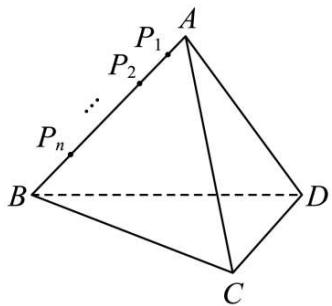

text_image

P₁
P₂
...
Pₙ
A
B
D
C

A. $a_{1} = 1$   
B. $\{a_{n}\}$ 为递减数列  
C. 存在常数 $m$ ，使 $\left\{\frac{1}{a_n} + m\right\}$ 为等差数列  
D. 设 $S_{n}$ 为数列 $\left\{\frac{n+1}{n^{2}}a_{n}\right\}$ 的前 n 项和，则 $S_{n}=\frac{2023}{506}$ 时，n=2023

【答案】ABD

【解析】由题意得 $\left|AP_{1}\right|=\left|P_{1}P_{2}\right|=\left|P_{2}P_{3}\right|=\cdots=\left|P_{n}B\right|=\frac{2}{n+1}$ ,

取 BD 中点 O, 连接 AO, CO, 因为 $\triangle ABD, \triangle BCD$ 均为等边三角形,

所以 AO ⊥ BD, CO ⊥ BD,

因为 $AO \cap CO = O, AO, CO \subset$ 平面 AOC,

因为 AC ⊂ 平面 AOC,

所以 BD ⊥ AC,

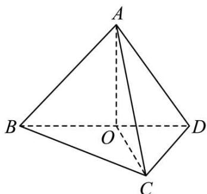

text_image

A
B
O
C
D

A 选项, 过点 $P_{1}$ 做 $P_{1}E \parallel AC$ 交 BC 于点 E, 过点 $P_{1}$ 做 $P_{1}F \parallel BD$ 交 AD 于点 F, 连接 FG, 则 $P_{1}F \perp P_{1}E$ ,

故四边形 $P_{1}FGE$ 为截面,且四边形 $P_{1}FGE$ 为矩形,

由相似知识可知 $\left|AP_{1}\right|=\left|P_{1}F\right|=\frac{2}{n+1},\left|EP_{1}\right|=\frac{2n}{n+1}$

故 $a_{n}=|FP_{1}|\cdot|EP_{1}|=\frac{2}{n+1}\cdot\frac{2n}{n+1}=\frac{4n}{(n+1)^{2}}$ ，所以 $a_{1}=\frac{4\times1}{2^{2}}=1$ ，A 正确；

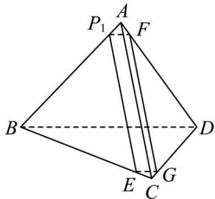

text_image

P₁ A F
B D
E G C

B选项,因为 $a_{n}=\frac{4n}{(n+1)^{2}}$ , 所以 $a_{n+1}-a_{n}=\frac{4(n+1)}{(n+2)^{2}}-\frac{4n}{(n+1)^{2}}=\frac{4(n+1)^{3}-4n(n+2)^{2}}{(n+2)^{2}(n+1)^{2}}$ $=\frac{4-4n-4n^{2}}{(n+2)^{2}(n+1)^{2}}<0,$

故 $a_{n+1}<a_{n}$ ，故 $\{a_{n}\}$ 为递减数列，B 正确；

C选项, $\frac{1}{a_{n}}=\frac{n^{2}+2n+1}{4n}$ ，则 $\frac{1}{a_{n}}+m=\frac{n}{4}+\frac{1}{4n}+\frac{1}{2}+m$ ,

$$
\frac {1}{a _ {n + 1}} + m - \left(\frac {1}{a _ {n}} + m\right) = \frac {n + 1}{4} + \frac {1}{4 n + 4} + \frac {1}{2} + m - \frac {n}{4} - \frac {1}{4 n} - \frac {1}{2} - m = \frac {1}{4 n + 4} - \frac {1}{4 n}
$$

$+\frac{1}{4}$ 不是常数, C 错误;

D选项, $\frac{n+1}{n^{2}}a_{n}=\frac{n+1}{n^{2}}\cdot\frac{4n}{(n+1)^{2}}=\frac{4}{n(n+1)}=\frac{4}{n}-\frac{4}{n+1}$ ,

则 $S_{n}=\frac{4}{1}-\frac{4}{2}+\frac{4}{2}-\frac{4}{3}+\cdots+\frac{4}{n}-\frac{4}{n+1}=4-\frac{4}{n+1}$ ,

令 $4-\frac{4}{n+1}=\frac{2023}{506}$ ，解得n=2023，D正确.

故选: ABD

2227 (多选题)(2024·全国·高三专题练习)已知三棱锥A-BCD的棱长均为3,其内有n个小球,球 $O_{1}$ 与三棱锥A-BCD的四个面都相切,球 $O_{2}$ 与三棱锥A-BCD的三个面和球 $O_{1}$ 都相切,如此类推, $\cdots$ ,球 $O_{n}$ 与三棱锥A-BCD的三个面和球 $O_{n-1}$ 都相切( $n\geqslant2$ ,且 $n\in N^{*}$ ),球 $O_{n}$ 的表面积为 $S_{n}$ ,体积为 $V_{n}$ ,则()

A. $V_{1}=\frac{\sqrt{6}}{8}\pi$

B. $S_{3}=\frac{3\pi}{16}$

C. 数列 $\{\mathrm{S}_n\}$ 为等差数列

D. 数列 $\{\mathrm{V}_n\}$ 为等比数列

【答案】AD

【解析】由题意知三棱锥 A-BCD 的内切球 $O_{1}$ 的球心在高 AO 上, 如图 1 所示,

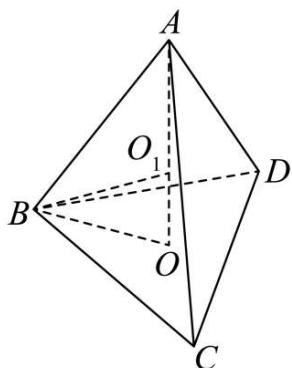

text_image

A
O₁
B
D
O
C

图1

由正三角形中心的性质可得: $BO=\frac{2}{3}\times\frac{3\sqrt{3}}{2}=\sqrt{3}$ ，则 $AO=\sqrt{AB^{2}-BO^{2}}=\sqrt{6}$ ，

设球 $O_{1}$ 的半径为 $r_{1}$ ，则利用等体积法： $V_{A-BCD}=\frac{1}{3}r_{1}(S_{\triangle ABC}+S_{\triangle ACD}+S_{\triangle ABD}+S_{\triangle BCD})$

即 $\frac{1}{3} \times \frac{\sqrt{3}}{4} \times 3^2 \times \sqrt{6} = \frac{1}{3} r_1 \times 4 \times \frac{\sqrt{3}}{4} \times 3^2$ ，解得： $r_1 = \frac{\sqrt{6}}{4}$ ，所以球 $O_1$ 的体积 $V_1 = \frac{4}{3} \pi r_1^3 = \frac{\sqrt{6} \pi}{8}$ ，故选项 A 正确；

如图 2 所示: 易知 $DO = \sqrt{3}$ , $OO_{1} = r_{1} = \frac{\sqrt{6}}{4}$ , $DO_{1} = \sqrt{r_{1}^{2} + (\sqrt{3})^{2}} = \frac{3\sqrt{6}}{4}$ .

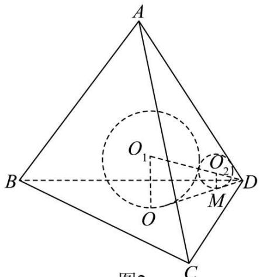

text_image

A
O₁
O₂
B
O
M
D
C
图2

图2

设球 $O_{2}$ 与平面 BCD 切于点 M, 球 $O_{2}$ 的半径为 $r_{2}$ , 连接 $O_{2}M$ , 则 $\triangle O_{1}OD \sim \triangle O_{2}MD$ ,

所以 $\frac{r_2}{r_1} = \frac{\mathrm{DO}_1 - (r_2 + r_1)}{\mathrm{DO}_1}$ 即 $\frac{r_2}{\frac{\sqrt{6}}{4}} = \frac{\frac{3\sqrt{6}}{4} - \frac{\sqrt{6}}{4} - r_2}{\frac{3\sqrt{6}}{4}} = \frac{\frac{\sqrt{6}}{2} - r_2}{\frac{3\sqrt{6}}{4}}$ 所以 $3r_{2} = \frac{\sqrt{6}}{2} -r_{2},$

则 $r_{2}=\frac{\sqrt{6}}{8}=\frac{1}{2}r_{1}$ ，所以 $\frac{r_{2}}{r_{1}}=\frac{1}{2}$ ，如此类推， $\frac{r_{2}}{r_{1}}=\frac{r_{3}}{r_{2}}=\frac{r_{4}}{r_{3}}=\cdots=\frac{r_{n}}{r_{n-1}}=\frac{1}{2}$ .

所以 $\{r_n\}$ 是首项为 $\frac{\sqrt{6}}{4}$ , 公比为 $\frac{1}{2}$ 的等比数列,

所以 $r_n = \frac{\sqrt{6}}{4} \times \left(\frac{1}{2}\right)^{n-1}$ ,

所以 $r_{3}=\frac{1}{4}r_{1}=\frac{\sqrt{6}}{16}$ ，则 $S_{3}=4\pi r_{3}^{2}=4\pi\times\frac{6}{16\times16}=\frac{3\pi}{32}$ ，故选项 B 错误；

由 $r_n = \frac{\sqrt{6}}{4} \times \left(\frac{1}{2}\right)^{n-1}$ 可得 $\frac{\mathrm{S}_n}{\mathrm{S}_{n-1}} = \frac{4\pi r_n^2}{4\pi r_{n-1}^2} = \left(\frac{1}{2}\right)^2 = \frac{1}{4}, n \geqslant 2,$

所以数列 $\{S_{n}\}$ 是公比为 $\frac{1}{4}$ 的等比数列, 故选项 C 错误;

由 $r_n = \frac{\sqrt{6}}{4} \times \left(\frac{1}{2}\right)^{n-1}$ 可得 $\frac{\mathrm{V}_n}{\mathrm{V}_{n-1}} = \frac{\frac{4}{3}\pi r_n^3}{\frac{4}{3}\pi r_{n-1}^3} = \left(\frac{1}{2}\right)^3 = \frac{1}{8}, n \geqslant 2,$

数列 $\{V_{n}\}$ 是公比为 $\frac{1}{8}$ 的等比数列, 故选项 D 正确;

故选: AD.

2228 (多选题)(2024·全国·高三专题练习)已知数列 $\{a_{n}\}$ 是等差数列， $p, q, s, t$ 是互不相同的正整数，且 $p + q = s + t$ ，若在平面直角坐标系中有点 $\mathrm{A}(s, a_s), \mathrm{B}(p, a_p), \mathrm{C}(q, a_q)$ ，

$D(t,a_{t})$ ，则下列选项成立的有（）

A. $\frac{a_{t} - a_{p}}{t - p} = \frac{2a_{t} - a_{q} - a_{s}}{2t - q - s}$

B. $|\mathrm{AB}| = |\mathrm{CD}|$

C. 直线 AB 与直线 CD 的斜率相等

D. 直线 AC 与直线 BD 的斜率不相等

【答案】ABC

【解析】由题设 $a_{p} + a_{q} = a_{s} + a_{t}$ ，且 $p + q = s + t$ ，又 $\{a_n\}$ 是等差数列，若公差为 $d$

$$
\frac {2 a _ {t} - a _ {q} - a _ {s}}{2 t - q - s} = \frac {a _ {t} - a _ {q} + a _ {t} - a _ {s}}{t - q + t - s}, \text {又} \frac {a _ {t} - a _ {q}}{t - q} = d = \frac {a _ {t} - a _ {s}}{t - s},
$$

所以 $\frac{a_{t}-a_{q}+a_{t}-a_{s}}{t-q+t-s}=d=\frac{a_{t}-a_{p}}{t-p}$ ，A 正确；

由 $|\mathrm{AB}| = \sqrt{(p - s)^2 + (a_p - a_s)^2} = \sqrt{(p - s)^2(1 + d^2)}$ ， $|\mathrm{CD}| = \sqrt{(t - q)^2 + (a_t - a_q)^2} = \sqrt{(t - q)^2(1 + d^2)}$

又 t-q=p-s, 故 $\left|AB\right|=\left|CD\right|$ , B 正确;

由 $k_{AB}=\frac{a_{p}-a_{s}}{p-s}=d,\quad k_{CD}=\frac{a_{t}-a_{q}}{t-q}=d$ ，故直线 AB 与直线 CD 的斜率相等，C 正确；

同理 $k_{AC}=\frac{a_{q}-a_{s}}{q-s}=d,\quad k_{BD}=\frac{a_{t}-a_{p}}{t-p}=d$ ，故直线 AC 与直线 BD 的斜率相等，D 错误.

故选: ABC

2229 (多选题)(2024·重庆·高三统考阶段练习)在平面直角坐标系xOy中，A为坐标原点，B(2,0)，点列P在圆 $\left(x+\frac{2}{3}\right)^{2}+y^{2}=\frac{16}{9}$ 上，若对于 $\forall n\in N^{*}$ ，存在数列 $\{a_{n}\}$ ， $a_{1}=6$ ，使得 $\frac{PB\cdot a_{n}}{2PA\cdot a_{n-1}}=\frac{4n+2}{2n-1}$ ，则下列说法正确的是()

A. $\{a_{n}\}$ 为公差为2的等差数列

B. $\{a_{n}\}$ 为公比为2的等比数列

C. $a_{2023}=4047\cdot2^{2023}$

D. $\{a_{n}\}$ 前 $n$ 项和 $\mathrm{S}_n = 2 + (2n - 1)\cdot 2^{n + 1}$

【答案】CD

【解析】对 AB, 由点列 P 在圆 $\left(x+\frac{2}{3}\right)^{2}+y^{2}=\frac{16}{9}$ 上, 则由参数方程得

$$
\mathrm{P} \left(\frac {4}{3} \cos \theta - \frac {2}{3}, ^ {\circ} \circ \frac {4}{3} \sin \theta\right), \text {则} \left(\frac {\mathrm{PB}}{\mathrm{PA}}\right) ^ {2} = \frac {\left(\frac {4}{3} \sin \theta\right) ^ {2} + \left(\frac {4}{3} \cos \theta - \frac {2}{3} - 2\right) ^ {2}}{\left(\frac {4}{3} \sin \theta\right) ^ {2} + \left(\frac {4}{3} \cos \theta - \frac {2}{3}\right) ^ {2}} =
$$

$$
\frac {\frac {8 0}{9} - \frac {6 4}{9} \cos \theta}{\frac {2 0}{9} - \frac {1 6}{9} \cos \theta} = 4, \therefore \frac {\mathrm{PB}}{\mathrm{PA}} = 2.
$$

对于 $\forall n\in N^{*}$ ，存在数列 $\{a_{n}\}$ ， $a_{1}=6$ ，使得 $\frac{PB\cdot a_{n}}{2PA\cdot a_{n-1}}=\frac{4n+2}{2n-1}$ ，即 $\frac{a_{n}}{a_{n-1}}=\frac{4n+2}{2n-1}$ ①， $\frac{a_{n+1}}{a_{n}}=\frac{4n+6}{2n+1}$ ②，

①②两式相除得 $\frac{a_{n+1} \cdot a_{n-1}}{a_n^2} = \frac{(2n-1)(2n+3)}{(2n+1)^2} \Rightarrow \frac{a_{n-1}}{2(n-1)+1} \cdot \frac{a_{n+1}}{2(n+1)+1} = \left(\frac{a_n}{2n+1}\right)^2,$

令 $b_{n} = \frac{a_{n}}{2n + 1}$ ，则 $b_{n - 1} \cdot b_{n + 1} = b_{n}^{2}$ ，则 $\{b_n\}$ 为以首项 $b_{1} = \frac{a_{1}}{2 \times 1 + 1} = 2$ ，公比为 $q = \frac{b_{n}}{b_{n - 1}} = \frac{\frac{a_{n}}{2n + 1}}{\frac{a_{n - 1}}{2n - 1}} = \frac{a_{n}}{a_{n - 1}} \cdot \frac{2n - 1}{2n + 1} = \frac{4n + 2}{2n - 1} \cdot \frac{2n - 1}{2n + 1} = 2$ 的等比数列.

则 $\frac{a_n}{2n + 1} = b_n = 2^n\Rightarrow a_n = (2n + 1)\cdot 2^n$ ，AB错；

对 C, $a_{2023}=(2\times2023+1)\cdot2^{2023}=4047\cdot2^{2023}$ , C 对;

对 D, $S_{n}=3\times2^{1}+5\times2^{2}+\cdots+(2n+1)2^{n}$ ,

$$
2 \mathrm{S} _ {n} = 3 \times 2 ^ {2} + 5 \times 2 ^ {3} + \dots + (2 n + 1) 2 ^ {n + 1},
$$

两式相减得， $-S_{n}=3\times2^{1}+2\times2^{2}+2\times2^{3}+\cdots+2\times2^{n}-(2n+1)2^{n+1}$

$$
= 2 + 2 ^ {2} + 2 ^ {3} + \dots + 2 ^ {n + 1} - (2 n + 1) 2 ^ {n + 1} = \frac {2 \left(1 - 2 ^ {n + 1}\right)}{1 - 2} - (2 n + 1) 2 ^ {n + 1} = - 2 - (2 n - 1) \cdot 2 ^ {n + 1}.
$$

$\therefore S_{n}=2+(2n-1)\cdot2^{n+1},D$ 对.

故选: CD.

2230 (多选题)(2024·广东·高三校联考阶段练习)若直线 $l:3x+4y+n=0(n\in\mathbb{N}^{*})$ 与圆 $\mathrm{C:(x-2)^{2}+y^{2}=a_{n}^{2}(a_{n}>0)}$ 相切，则下列说法正确的是()

A. $a_{1}=\frac{7}{5}$

B. 数列 $\{a_{n}\}$ 为等比数列

C. 数列 $\{a_{n}\}$ 的前 10 项和为 23

D. 圆 C 不可能经过坐标原点

【答案】AC

【解析】圆 C 的圆心为 $(2,0)$ ，半径 $r=a_{n}$ ，

由直线与圆相切得 $\frac{3\times 2 + n}{5} = a_n,a_n = \frac{1}{5} n + \frac{6}{5},$

$$
\therefore a _ {1} = \frac {7}{5}, a _ {n + 1} - a _ {n} = \frac {1}{5} (n + 1) + \frac {6}{5} - \frac {1}{5} n - \frac {6}{5} = \frac {1}{5},
$$

$\therefore \{a_{n}\}$ 是首项为 $\frac{7}{5}$ , 公差为 $\frac{1}{5}$ 的等差数列,

前 10 项和为 $S_{10}=10\times\frac{7}{5}+\frac{10\times9}{2}\times\frac{1}{5}=23;$

令 $(0-2)^{2}+0^{2}=\left(\frac{6+n}{5}\right)^{2}$ ，解得n=4，此时圆C经过坐标原点.

综上所述, AC 选项正确, BD 选项错误.

故选: AC

2231 (多选题)(2024·全国·高三专题练习)在平面直角坐标系中，O是坐标原点， $M_{n},N_{n}$ 是圆O: $x^{2}+y^{2}=n^{2}$ 上两个不同的动点， $P_{n}$ 是 $M_{n}N_{n}$ 的中点，且满足 $\overrightarrow{OM_{n}}\cdot\overrightarrow{ON_{n}}+2\overrightarrow{OP_{n}}^{2}=0(n\in N^{*})$ . 设 $M_{n},N_{n}$ 到直线 $l:\sqrt{3}x+y+n^{2}+n=0$ 的距离之和的最大值为 $a_{n}$ ，则下列说法中正确的是()

A. 向量 $\overrightarrow{\mathrm{OM}}_n$ 与向量 $\overrightarrow{\mathrm{ON}}_n$ 所成角为 $120^{\circ}$

B. $|\overrightarrow{\mathrm{OP}}_n| = n$

C. $a_{n}=n^{2}+2n$

D. 若 $b_{n} = \frac{a_{n}}{n + 2}$ ，则数列 $\left\{\frac{2^{b_n}}{(2^{b_n} - 1)(2^{b_n + 1} - 1)}\right\}$ 的前 $n$ 项和为 $1 - \frac{1}{2^{n + 1} - 1}$

【答案】ACD

【解析】依题意， $|\overrightarrow{\mathrm{OM}_n}| = |\overrightarrow{\mathrm{ON}_n}| = n$ ，而点 $\mathrm{P}_n$ 是弦 $\mathrm{M}_n\mathrm{N}_n$ 的中点，则 $\overrightarrow{\mathrm{OP}}_n = \frac{1}{2} (\overrightarrow{\mathrm{OM}_n} +$ $\overrightarrow{\mathrm{ON}_n})$

$$
\begin{array}{l} \overrightarrow {\mathrm{OP}} _ {n} ^ {2} = \frac {1}{4} (\overrightarrow {\mathrm{OM}} _ {n} ^ {2} + 2 \overrightarrow {\mathrm{OM}} _ {n} \cdot \overrightarrow {\mathrm{ON}} _ {n} + \overrightarrow {\mathrm{ON}} _ {n} ^ {2}) = \frac {1}{2} n ^ {2} + \frac {1}{2} \overrightarrow {\mathrm{OM}} _ {n} \cdot \overrightarrow {\mathrm{ON}} _ {n}, \text {而} \overrightarrow {\mathrm{OM}} _ {n} \cdot \overrightarrow {\mathrm{ON}} _ {n} + 2 \overrightarrow {\mathrm{OP}} _ {n} ^ {2} \\ = 0, \end{array}
$$

于是得 $\overrightarrow{OM_{n}}\cdot\overrightarrow{ON_{n}}=-\frac{1}{2}n^{2},\cos\langle\overrightarrow{OM_{n}},\overrightarrow{ON_{n}}\rangle=\frac{\overrightarrow{OM_{n}}\cdot\overrightarrow{ON_{n}}}{|\overrightarrow{OM_{n}}|\cdot|\overrightarrow{ON_{n}}|}=-\frac{1}{2}$ ，即 $\langle\overrightarrow{OM_{n}},\overrightarrow{ON_{n}}\rangle=120^{\circ}$ ，A 正确；

显然 $\triangle OM_{n}N_{n}$ 是顶角 $\angle M_{n}ON_{n}=120^{\circ}$ 的等腰三角形，则 $|\overrightarrow{OP_{n}}|=|\overrightarrow{OM_{n}}|\cos60^{\circ}=\frac{1}{2}n$ ，B

不正确；

依题意,点 $M_{n}, N_{n}$ 到直线 $l: \sqrt{3}x + y + n^{2} + n = 0$ 的距离之和等于点 $P_{n}$ 到直线 l 距离的 2 倍,

由 $\left|\overrightarrow{OP_{n}}\right|=\frac{1}{2}n$ 知，点 $P_{n}$ 在以原点 O 为圆心， $\frac{1}{2}n$ 为半径的圆上，则点 $P_{n}$ 到直线 l 距离的最大值是点 O 到直线 l 的距离加上半径 $\frac{1}{2}n$ ，

而点O到直线 $l$ 距离 $d = \frac{|n^2 + n|}{\sqrt{(\sqrt{3})^2 + 1^2}} = \frac{n^2 + n}{2}$ ，则点 $\mathrm{P}_n$ 到直线 $l$ 距离的最大值是 $\frac{n^2}{2} + n$ ，因此， $a_n = 2\left(\frac{n^2}{2} + n\right) = n^2 + 2n$ ，C正确；

由 $b_{n} = \frac{a_{n}}{n + 2}$ 得， $b_{n} = n$ ，则 $\frac{2^{b_n}}{(2^{b_n} - 1)(2^{b_n + 1} - 1)} = \frac{2^n}{(2^n - 1)(2^{n + 1} - 1)} = \frac{(2^{n + 1} - 1) - (2^n - 1)}{(2^n - 1)(2^{n + 1} - 1)} = \frac{1}{2^n - 1} - \frac{1}{2^{n + 1} - 1},$

因此,数列 $\left\{\frac{2^{b_{n}}}{(2^{b_{n}}-1)(2^{b_{n}+1}-1)}\right\}$ 的前 n 项和 $T_{n}=\left(1-\frac{1}{2^{2}-1}\right)+\left(\frac{1}{2^{2}-1}-\frac{1}{2^{3}-1}\right)+\cdots+\left(\frac{1}{2^{n}-1}-\frac{1}{2^{n+1}-1}\right)=1-\frac{1}{2^{n+1}-1}$ , D 正确.

故选: ACD

