触类而长之，则虽幽遐诡伏，靡所不入。

——《九章算术》
如果能够自学，永远比老师教的效果好。老师教的内容一般印象都不深，就像我们走路一样，人家带着你走，七遍八遍也记不住路，自己走一遍就知道路了。

—— 中国科学院院士 马志明

  
扫码关注夏老师的数学课

  
扫码关注钟浩然高中数学

选题策划：刘强 吕心鹏

责任编辑：王凤军

责任校对：宁靓 常鑫垚

责任印制：王晓燕

封面设计：青研工作室

上架建议：高考数学  
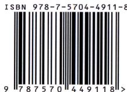  
定价：49.00元

育甲高考

育甲高考

YU JIAGAO KAO

育甲高考名师系列图书

# 钟浩然

- B站知识领域宝藏UP主（@钟浩然高中数学），主要分享高中数学的学习方法、学习逻辑以及思维探究，关注学生的学习细节，是朴素数学学习思维的推广者。  
- 公众号“数学喵的猫窝”的专栏作者。

# 夏方正

- 本科毕业于浙江大学，硕士毕业于香港中文大学。  
- B站知识领域优质UP主（@夏老师的数学课），讲解方式自然生动，善于抓住学生思维，为全国中学生带来数学知识的分享。视频播放量过千万，受到学生的广泛好评。

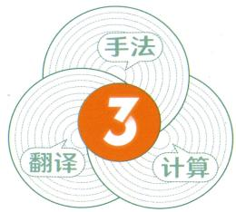

3.0 版

# 高考数学

# 圆锥曲线

# 解题框架构建

# - 原创性解析 系统性总结 原理性推导

钟浩然 夏方正 / 编著

“手法—翻译—计算”

三角度构建框架

建立谋定而后动的解题观念

培养从事实出发的解题习惯

北京出版集团

北京教育出版社

钟浩然 夏方正\编著

北京出版集团
北京教育出版社

# 了解我们

— 媒体服务号 —

【哔哩哔哩】

@ 育甲教育

【视频号】

@ 育甲图书

【抖音】

【小红书】

@育甲图书

— 官方直营 购书速达 —

【育甲图书旗舰店】

【育甲图书旗舰店】

# "育甲读者服务平台"小程序

# 高

# 考

# 专

# 题

# 系

# 列

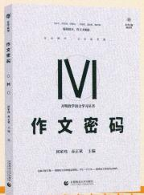

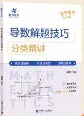

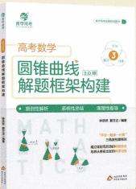

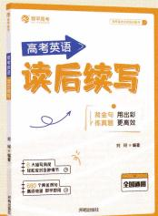

# 高考数学

# 圆锥曲线 解题框架构建

\- 原创性解析

系统性总结

原理性推导

编著：钟浩然 夏方正

编委：钟浩然 夏方正 宾洁

# 圆锥曲线解题框架构建

# YUANZHUI QUXIAN JIETI KUANGJIA GOUJIAN

钟浩然 夏方正 编著

\*

北京出版集团

出版

北京教育出版社

(北京北三环中路6号)

邮政编码:100120

网址: www.bph.com.cn

京版北教文化传媒股份有限公司总发行

全国各地书店经销

三河市龙大印装有限公司印刷

\*

880mm×1230mm 16 开本 18 印张 380 千字

2022年11月第1版 2025年8月第3次印刷

ISBN 978-7-5704-4911-8

定价:49.00元

版权所有 翻印必究

如有印装质量问题,由本社负责调换

质量监督电话:（010）58572740 58572393

# 前言

# PREFACE

“写一本和学生对话的教辅书”的执念是编写本书的开端。

2017 年,我着手编写“第一篇 手法篇”,后来由于各种原因而搁置。在教学实践中,随着与许多前辈教师沟通的深入,我逐渐构建出了一个圆锥曲线的解题框架,并利用框架帮助许多学生跳出题海,达到了“用方法过滤题海,用思维登上书山”的目的。

本书给出的这个框架也许并不完美,但它的实用性较强,适用面也很广。书中的观点是我尽可能为学生选择后呈现的。
在此,我以九问九答的形式做出一定总结,包括但不限于圆锥曲线的学习。

#### 1. 这本书适合什么样的学生阅读？

从学习基础上,高三学生与已学完圆锥曲线基础知识的高二学生均可使用本书。

从学习水平上,建议能够熟练解决大部分教材例题与练习题的高二学生使用本书,建议高考卷中前面110分左右基础题部分知识已经攻克、在考试时有时间留给圆锥曲线解答题的高三学生使用本书。

从学习观点上,建议与以下问答观点相近或能包容多种不同观点的学生使用本书,其中最主要的就是对方法的认知相同。

#### 2. 什么样的操作能称为一种方法？
方法具有一定的普适性,并且有明确的适用范围。

例如，“点差法”指的是将椭圆或双曲线上两点的坐标代入曲线方程，然后两方程作差，得到一个与两点所在直线斜率有关的式子。实际上这只能是一个二级结论，不能称之为一种方法。

#### 3. 二级结论要不要学？

圆锥曲线的二级结论指教材之外给出的圆锥曲线性质,常用于命制题目。

对于二级结论,如果能记得住且记得准,还能用得上,那么二级结论是有用的。问题就在于,二级结论有很多且不同结论各有其局限性(许多学生容易忽略这点,从而掉入命题人设计的陷阱)。
在平时的学习过程中,计算练习能培养学生敏锐的观察力、坚定的自信心和快速检验的能力。这些都是在日常训练中潜移默化形成的,如果单纯追求二级结论,则不可能形成这些素养。当然,在学生的日常练习中,还是会遇到一些利用结论命制的题目。如果不用相关结论解题,那么就会面临巨大的困难。面对这种客观事实,我们只需要学习并记忆极其常见的少部分结论即可。

#### 4. 应该学什么？

初级阶段学知识,中级阶段学应用,高级阶段学思维。

知识指的是教材中出现的定义、公式和定理等基础知识；应用指利用知识解决问题，包括经典题型与经典方法以及计算变形等方面的基础技能，如本书的“手法篇”与“计算篇”；思维指在学习知识与应用知识过程中积累的基本思想与基本活动经验，如本书中的“翻译篇”实际就是转化思想的具体体现。

2014 年,我刚当教师的时候,觉得让学生掌握二级结论有利于提高解题速度。但到了 2016 年,我却变成了二级结论的反对者,考虑到学生学习二级结论的成本与成果,不建议学生学习二级结论。现在我的观点是,水平较高的学生可以学习并使用二级结论。教师在教学过程中可以适当给出一些二级结论,而不是对其完全否定。

#### 5. 如何达到“知识”阶段？

要达到“知识”阶段,关键就是能记忆知识。数学中的记忆更多是为了应用,因此不能局限于一字不错背诵课本上的东西。

要想记忆知识过关,需要做到三点:一是明确易错点是什么,如平面向量基本定理;二是忽略用得多少的问题,只要是教材中的都是重要的,如立体几何中的公理;三是不要仅背公式中字母是什么,更要知道其具体指什么,如扇形面积公式 $S=\frac{1}{2}lr$ 与圆锥侧面积公式 $S=\pi rl$ 中的 r 分别是什么。

#### 6. 如何达到“应用”阶段？

本书为掌握“应用”提出了一个“三合一”构建模型，即“手法—翻译—计算”三个部分。
首先要知道相应知识板块有哪些可以得到解题中需要式子的操作手法。
再通过翻译条件与目标建立起解题的流程,即已知什么条件,由这个条件可以推出什么,或要证明什么结论,即证什么即可。
最后以计算中要养成的习惯与特定的技巧来完成流程,从而完成题目的解答。

#### 7. 如何达到“思维”阶段？

掌握思维不是一件容易的事情。

对于教师而言,不应给学生灌输思维,而应让学生意识到思维是内发的。

对于学生而言,思维形成需要的“成本”很高。一方面要有充足的时间“停下来”去观察,另一方面要有丰富的相关材料。不仅在一点处能深入研究,还能做知识的横向对比。

#### 8. 怎么检验自己是否学到位了？

简而言之就是要达到“有意识做题”的程度,即在答题纸上书写之前就能够在脑海中或者草稿纸上对题目使用的方法以及对这个方法的结果有一个判断。这里包含了对方法的可执行性与难易度的判断,以及对条件与目标的分析。

#### 9. 学习到位了但是考试发挥不出来,这是为什么?
在考试中,我们如果经常发挥不出自己的水平,那首先要根据上面的问答判断自己是否真有水平。如果是真有水平没发挥出来,那就要认识到可能是考试策略存在问题。

我以个人的教学经验给出三个策略。

策略一: 不一定要按照从头到尾的顺序做题。有的学生先做简单题会增强信心, 从而能顺利攻克中档题与难题; 有的学生会先做大题, 觉得大题的分数拿到手会比较踏实。所以每次正规考试都是一个判断当下考试策略是否合适的时机。

策略二:时间要刻意把控。考试前要大致规划本次考试每部分的做题时间,如果考试时规划的时间到了,一定要当断则断,才能及时止损。不要沉迷于某一个题目,浪费太多的时间,而要重视整张试卷的完成度。

策略三:重视考试中的基础问题。在考试过程中,有的学生特别容易在自以为没有问题的地方失分。越是基础和细节之处就越容易在不经意间丢分,如2021年新高考Ⅰ卷第8题考查了独立事件,2011年陕西卷第18题让叙述并证明余弦定理。
在本书的编写过程中,夏方正老师就本书的内容和行文的方式提出了宝贵意见,并加入了一些他的思考与想法,还对体例结构进行了调整和完善,对每道题的解析进行了优化。夏老师严谨的治学态度,也让我对本书的方向有了更好的把握。总的来说,如果没有夏老师的倾情付出,本书也不可能这么快与大家见面。
最后,我想感谢许多老师和我教过的学生,感谢他们在我编写本书的过程中给予的帮助与支持。在本书内容导览中,我将本书的大部分要点提炼出来了,供大家在使用本书时参考。大家也可以在学习完本书后,自己来总结一张框架图。希望大家使用完本书能有所收获。

钟浩然

# 前言

对于写教辅书这件事情我是很谨慎的,因为教辅书必须具有科学性和严谨性。一本好的数学教辅书还应该兼备亲和力,让很多对数学有畏难情绪的学生能够放下压力,更加安心地学习数学。这其实并不容易,所以写一本好书所花费的精力真的很大。

钟浩然老师是我很早就关注到的一位老师,因为我关注了公众号“数学喵的猫窝”,这是我特别欣赏的一位老师开设的公众号,而钟浩然老师是这个公众号的常客。当他找到我与我商量出书的事情时,出于对公众号和钟老师的信任,在看了他初期的稿件后,我决定尝试迈出这一步,与钟老师合作完成本书的创作。

圆锥曲线作为学生头疼的“老大难”模块,最大的难点和痛点在于对题目无法找到一条比较合适的路径进行求解,要么面对题目无从下手,要么在对条件或目标翻译时选择了一条麻烦的道路,抑或是计算过程毫无章法,越算越复杂,从而变成一团乱麻。

基于上述三个痛点,在本书中我们从“手法—翻译—计算”三个角度,构建起圆锥曲线的解题框架,建立谋定而后动的解题观念,让大家在学习完这本书后:

能够积累足够的分析“手法”，面对题目有所思考；
能够选择适当的“翻译”手段,顺利处理题目条件和目标;

能够养成良好的“计算”习惯,完美写出题目的计算过程。

本书将前面几个篇章的知识以及据此搭建起来的框架非常自然地运用到最后的综合实战中,大家可以在“实战篇”的参考解析中见到前面几个篇章里的各种思想方法和手法手段的运用。

本书的内容主要源自钟浩然老师几年来的心血和成果,正是他的坚持才能让本书得以上市。本人主要就本书的内容和行文方式等方面提出了意见,加入了一些自己的思考和想法,并对每道题目的解析进行了优化。最后感谢钟老师给了我这次合作的机会,也感谢所有听我课程的同学们,感谢你们的支持与鼓励!

夏方正

# 本书内容导览

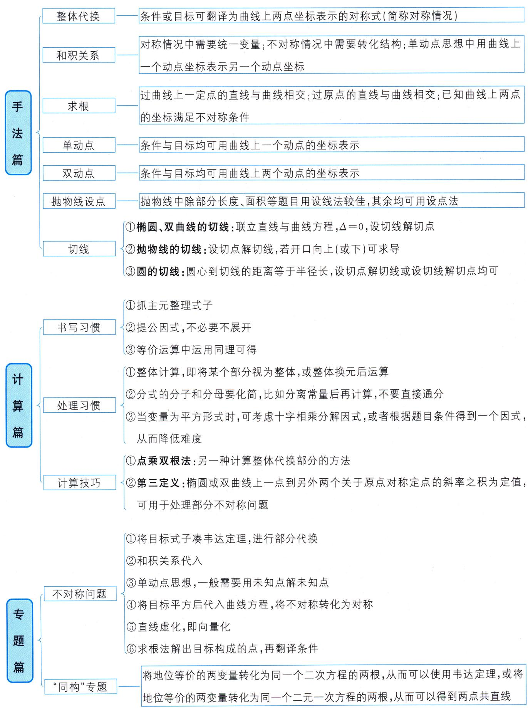

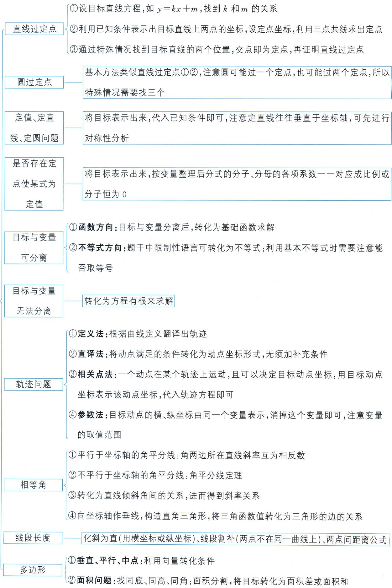

# 第一篇 手法篇 001

# 第一章 设线法 002

第一节 整体代换 002

第二节 和积关系 006

第三节 求根 011

第四节 切线——设线解点 017

# 第二章 设点法 021

第五节 单动点 021

第六节 双动点 026

第七节 抛物线设点 036

第八节 切线——设点解线 041

第九节 “高级”代数变形（选学） 042

# 第三章 折中设法 050

第十节 未知点解未知点 050

# 第二篇 翻译篇 053

# 第四章 几何翻译 054 第十一节 角的翻译 054

11.1 锐角、钝角和直角 054

11.2 相等角 056

11.3 定角 064

11.4 动角 067

# 第十二节 线段的翻译 072

12.1 与焦点有关的长度 …… 072

12.2 线段长度 076

12.3 线段的垂直平分线 085

# 第十三节 多边形的翻译 090

13.1 特殊三角形 090

13.2 三角形四心 097

13.3 平行四边形及其特殊情况 …… 105

13.4 多边形的面积 …… 108

# 第十四节 圆的翻译 …… 116

14.1 圆的位置关系 …… 116  
14.2 圆的弦 …… 121   
14.3 圆的直径 126  
14.4 与圆相切 …… 129  
14.5 圆的任意存在问题 …… 133

# 第五章 问题翻译 …… 140 第十五节 定的问题 …… 140

15.1 定点问题 …… 140  
15.2 定直线与定圆问题 …… 146  
15.3 特殊的定点、定值问题 …… 154

# 第十六节 动的问题 …… 159

# 第十七节 轨迹 & 方程问题 167

# 第三篇 计算篇 …… 177

# 第六章 计算习惯 …… 178 第十八节 书写习惯 …… 178

18.1 抓主元化简 …… 178   
18.2 “疯狂”地提公因式 …… 181  
18.3 同理可得 182

# 第十九节 处理习惯 186

19.1 整体计算 …… 186  
19.2 分式处理 188  
19.3 十字相乘 …… 193

# 第七章 计算技巧 …… 198 第二十节点乘双根法 198

# 第二十一节 第三定义 …… 201

# 第四篇 专题篇 …… 204

# 第八章 不对称专题 …… 205 第九章 “同构”专题 213

# 第五篇 实战篇 223

# 第一篇 手法篇

# 第一章 设线法
在本书中,我们将利用直线方程与曲线方程联立消元后得到二次方程韦达定理的方法称为设线法.本章中例题大多会用直线方程中的参数表示条件或目标,个别题目也存在需要使用求根公式或用点的坐标表示条件与目标的情况.

# 第一节 整体代换

从初识圆锥曲线开始,我们就认识了整体代换这个方法.第一次做题的你是不是还在想着“将直线方程与椭圆方程联立,直接求出交点坐标”?就像下面这道题一样.

> [!example]- 例 1 在平面直角坐标系 xOy 中, 直线 $y = x + 1$ 与椭圆 $\frac{x^{2}}{4} + \frac{y^{2}}{3} = 1$ 交于 A, B 两点. 请求出以下目标的值: （1） $|AB|$ ; （2） $\overrightarrow{OA} \cdot \overrightarrow{OB}$ ; （3） $k_{OA} + k_{OB}$ .

# 题目分析

我们联立直线方程与椭圆方程, 消去 y 得 $7x^{2}+8x-8=0$ .

这个方程无法用十字相乘法求根, 只能用求根公式求出带根号的根. 由于方程的根带有根号, 那么后续的计算量较大且容易出错.
因此我们考虑引入“设而不求”的思想, 即设 $A(x_{1}, y_{1}), B(x_{2}, y_{2})$ , 利用韦达定理得到坐标之间的关系, 而不必求出它们的具体值.

下面先分析各个目标：  
（1）求 $|AB|$ 的值.

两点间距离公式在课本中已给出，即 $|AB| = \sqrt{(x_1 - x_2)^2 + (y_1 - y_2)^2}$

上式既有横坐标也有纵坐标,因此必须先统一.
因为点 A, B 在直线 $y = x + 1$ 上，则 $\left\{\begin{aligned}y_{1}&=x_{1}+1,\\ y_{2}&=x_{2}+1,\end{aligned}\right.$
所以 $(y_{1} - y_{2})^{2} = (x_{1} + 1 - x_{2} - 1)^{2} = (x_{1} - x_{2})^{2}$
所以 $|AB| = \sqrt{2(x_1 - x_2)^2}$ .

对方程 $7x^{2} + 8x - 8 = 0$ ，由韦达定理得 $\left\{ \begin{array}{l} x_{1} + x_{2} = -\frac{8}{7}, \\ x_{1}x_{2} = -\frac{8}{7}. \end{array} \right.$
所以 $|AB| = \sqrt{2[(x_1 + x_2)^2 - 4x_1x_2]} = \frac{24}{7}$ .

关于长度问题的更多处理方法可看第十二节 线段的翻译.  
（2）求 $\overrightarrow{OA}\cdot\overrightarrow{OB}$ 的值.
由已知得 $\overrightarrow{OA} = (x_{1},y_{1}),\overrightarrow{OB} = (x_{2},y_{2})$ ，所以 $\overrightarrow{OA}\cdot \overrightarrow{OB} = x_1x_2 + y_1y_2$ ，这个式子很明显也可以由韦达定理整体代入求值.

我们需要额外算一下 $y_{1}y_{2}$ .
由（1）可知 $\left\{ \begin{array}{l} y_{1} = x_{1} + 1, \\ y_{2} = x_{2} + 1, \end{array} \right.$ 所以 $y_{1}y_{2} = (x_{1} + 1)(x_{2} + 1) = x_{1}x_{2} + (x_{1} + x_{2}) + 1 = -\frac{9}{7}$ ,
所以 $\overrightarrow{OA} \cdot \overrightarrow{OB} = x_{1}x_{2} + y_{1}y_{2} = -\frac{17}{7}$ .  
（3）求 $k_{OA} + k_{OB}$ 的值.
因为 $A(x_{1},y_{1}), B(x_{2},y_{2})$ ,
所以 $k_{OA} + k_{OB} = \frac{y_{1}}{x_{1}} + \frac{y_{2}}{x_{2}}.$
若直接对 $\frac{y_1}{x_1} +\frac{y_2}{x_2}$ 进行通分，这无疑会增加计算量，更佳的操作是先消元，再分离常数，最后通分.

这里建议看第十九节 处理习惯中的分式处理,体会较复杂情况下分离与不分离两种计算的复杂程度.

我们先消元,再分离常数,最后通分并代入求值,
$k _ {O A} + k _ {O B} = \frac {x _ {1} + 1}{x _ {1}} + \frac {x _ {2} + 1}{x _ {2}} = 2 + \frac {1}{x _ {1}} + \frac {1}{x _ {2}} = 2 + \frac {x _ {1} + x _ {2}}{x _ {1} x _ {2}} = 3.$

至此,三个问题就都处理完毕了.

# 参考解析
设 $A(x_{1},y_{1}),B(x_{2},y_{2})$
联立直线方程与椭圆方程，有 $\left\{\begin{aligned}y&=x+1,\\ \frac{x^{2}}{4}&+\frac{y^{2}}{3}=1\end{aligned}\right.\Rightarrow7x^{2}+8x-8=0.$
由韦达定理得 $\left\{\begin{aligned}x_{1}+x_{2}&=-\frac{8}{7}\quad①,\\ x_{1}x_{2}&=-\frac{8}{7}\quad②.\end{aligned}\right.$

思维笔记

Siweibiji

# 思维笔记

# Siweibiji

  
（1） $|AB| = \sqrt{(x_1 - x_2)^2 + (y_1 - y_2)^2} = \sqrt{2(x_1 - x_2)^2} = \sqrt{2} \cdot \sqrt{(x_1 + x_2)^2 - 4x_1x_2}$ ,
将①②两式代入, 得 $\left|AB\right|=\frac{24}{7}$ .  
（2） $\overrightarrow{OA} \cdot \overrightarrow{OB} = x_{1}x_{2} + y_{1}y_{2} = x_{1}x_{2} + (x_{1} + 1)(x_{2} + 1) = 2x_{1}x_{2} + x_{1} + x_{2} + 1.$
将①②两式代入,得 $\overrightarrow{OA}\cdot\overrightarrow{OB}=-\frac{17}{7}.$  
（3） $k_{OA} + k_{OB} = \frac{y_1}{x_1} + \frac{y_2}{x_2} = \frac{x_1 + 1}{x_1} + \frac{x_2 + 1}{x_2} = 2 + \frac{1}{x_1} + \frac{1}{x_2} = 2 + \frac{x_1 + x_2}{x_1 x_2}.$
将①②两式代入, 得 $k_{OA} + k_{OB} = 3$ .

# 总结
在本例中,每个问题都可以利用韦达定理进行整体代换,从而避免了求解具体点的坐标.不难发现,在解题中都先分析目标或者说转化表达目标,从而可以利用韦达定理整体代换.

那么问题就来了,什么样的式子可以用韦达定理整体代换呢?
在学习任何一个方法的时候,一定要考虑这个方法在什么条件下可以使用.这就是我们不赞成完全通过记忆结论来进行圆锥曲线的学习的原因.

不是所有同学都能把圆锥曲线的结论记清楚,区分开.

靠穷举来学习不是一种有效的策略. 更何况高中数学不止圆锥曲线, 高考也不止数学.

回到我们的问题:什么样的式子可以用韦达定理整体代换呢?

我们来看例题中的式子：

原始式子分别是 $\sqrt{(x_1 - x_2)^2 + (y_1 - y_2)^2}; x_1x_2 + y_1y_2; \frac{y_1}{x_1} + \frac{y_2}{x_2}$ .

消元变形后的式子分别是 $\sqrt{2(x_1 - x_2)^2}; x_1x_2 + (x_1 + 1)(x_2 + 1); 2 + \frac{1}{x_1} + \frac{1}{x_2}$ .

这些式子都有着鲜明的特征:结构对称,即互换下标1与下标2对式子本身没有影响.因此我们可以猜想:结构对称的式子可以用韦达定理整体代换.所以做题时先分析目标或者条件中的式子,若是对称的,那大概率可考虑用韦达定理整体代换的方法.

我们了解了整体代换的使用条件,理论上本小节就应该结束了,但还想提一下硬解定理.圆锥曲线硬解定理,其实是一套求解椭圆(或双曲线)与直线相交时,联立方程求判别式或根据韦达定理求相交弦长的结果公式.

对于硬解定理,不支持所有学生学,也不反对有的学生学.

不支持是因为这种方式和记结论一样,会让学生养成一种不好的学习逻辑——做不出题目是因为我没背过.依赖背诵会让学生丧失在不停地联立方程利用韦达定理的过程中养成的计算能力.

不反对是因为圆锥曲线中的整体代换是一种常见的并且很值得学习的方法,所以如果背了,对适用这个方法的题来说是有一定作用的.

可能有些同学不知道硬解定理,下面我们以椭圆为例来看一下这个定理是什么.
设直线 $AB:y = kx + m$ 与椭圆 $\frac{x^2}{a^2} +\frac{y^2}{b^2} = 1$ 相交于 $A(x_{1},y_{1}),B(x_{2},y_{2})$ 两点.
联立直线方程与椭圆方程得 $\left\{ \begin{array}{l} y = kx + m, \\ \frac{x^2}{a^2} + \frac{y^2}{b^2} = 1 \end{array} \right. \Rightarrow (a^2k^2 + b^2)x^2 + 2a^2kmx + a^2m^2 - a^2b^2 = 0.$
由韦达定理可得 $\left\{\begin{aligned}x_{1}+x_{2}&=\frac{-2a^{2}km}{a^{2}k^{2}+b^{2}},\\ x_{1}x_{2}&=\frac{a^{2}m^{2}-a^{2}b^{2}}{a^{2}k^{2}+b^{2}}.\end{aligned}\right.$

另外，这个一元二次方程的判别式 $\Delta$ 也经常出现， $\Delta = 4a^2b^2 (a^2k^2 + b^2 - m^2)$ .

部分资料还会给出式子 $x_{1}y_{2} + x_{2}y_{1} = \frac{-2a^{2}b^{2}k}{a^{2}k^{2} + b^{2}}.$

以上就是其中一种硬解定理,不同老师还会有自己的一些“创新”,但只是让结论更容易记忆而已.
最后我们说一下如何设直线的问题.

# 第一种是不过定点的直线.

我们可以设直线方程为 $y = kx + m$ ，也可以设为 $x = ty + n$ ，但是请记住不管怎么设，都有不包括的直线。如 $y = kx + m$ 不能表示斜率不存在，即垂直于 $x$ 轴的直线，而 $x = ty + n$ 不能表示斜率为0的直线。所以不存在通过反设直线可以回避讨论的说法。

# 第二种是过定点的直线.

为了方便,我们不讨论它们的局限情况,请大家做题的时候别忘记即可.

如直线过点 $(t,0)$ ，可设直线方程为 $y=k(x-t)$ ，也可设为 $x=my+t$ ；直线过点 $(0,-t)$ ，可设直线方程为 y=kx-t，也可设为 $x=m(y+t)$ 。
当然,这里还是要强调一下:正如前面强调的先分析目标和条件一样,如何设直线方程,也需要先分析题目条件和目标,然后再确定用 x 计算简单还是用 y 计算简单.

本节内容就到这里,希望各位通过本节及后面的题目分析认识到,先分析再做题,谋定而后动的作用.

# 第二节 和积关系

上一节中我们了解到直线与曲线相交问题中,韦达定理最常见的用法就是整体代入对称的目标或者条件.换句话说就是将点参,即点的坐标构成的目标或条件,替换为线参,即我们所设直线方程的参数.

我们在本节将会从另一个角度利用韦达定理,从纯粹的点参的角度来解决一些问题.

和积关系的发现其实和曾经学过的三角换元很相似.

让我们回想一下: 点 P 在单位圆 $x^{2} + y^{2} = 1$ 上, 根据 $\cos^{2}\theta + \sin^{2}\theta = 1$ , 我们可以得到点 P 的坐标为 $(\cos\theta, \sin\theta)$ .

反过来, 如果有 $\left\{ \begin{array}{l} x_{P} = \cos \theta, \\ y_{P} = \sin \theta, \end{array} \right.$ 要想找到 $x_{P}$ 与 $y_{P}$ 的关系, 只需要找到 $\cos \theta$ 与 $\sin \theta$ 的关系. 根据 $\cos^2\theta + \sin^2\theta = 1$ , 可得 $x_{P}^{2} + y_{P}^{2} = 1$ .

这其实是将横、纵坐标都用同一个变量来表示. 在圆锥曲线题目中, 我们可以通过韦达定理将 $x_{1} + x_{2}$ (和) 与 $x_{1}x_{2}$ (积) 这两个整体都用同一变量 (如斜率 $k$ ) 表示, 进而得到和与积的关系.

下面通过一道例题的具体数据来展示如何寻找和积关系.

> [!example]- 例 2 在平面直角坐标系 $xOy$ 中, 过椭圆 $\frac{x^2}{4} + \frac{y^2}{3} = 1$ 左焦点 $F$ 的斜率存在且不为 0 的直线交椭圆于 $A(x_1, y_1), B(x_2, y_2)$ 两点. 求证: $\frac{1}{|AF|} + \frac{1}{|BF|}$ 为定值.

# 题目分析

我们不妨设直线 $AB$ 的方程为 $y = k(x + 1)$ ，与 $\frac{x^2}{4} + \frac{y^2}{3} = 1$ 联立消去 $y$ 后，再由韦达定理得 $\left\{ \begin{array}{l} x_1 + x_2 = \frac{-8k^2}{4k^2 + 3}, \\ x_1x_2 = \frac{4k^2 - 12}{4k^2 + 3}. \end{array} \right.$

现在,我们要想知道纯粹的点的坐标之间的关系,也即和与积的关系,只需要找到 $\frac{-8k^{2}}{4k^{2}+3}$ 与 $\frac{4k^{2}-12}{4k^{2}+3}$ 的关系.
如果你能直接观察出来,那么可以跳过下面的步骤.

我们观察两式分子的结构,发现一个含常数,一个不含常数.
因此只需要把 $\frac{-8k^2}{4k^2 + 3}$ 加上或减去一个常数，然后再通分即可.

但是这个常数会影响 $k^2$ 的系数，因此 $\frac{-8k^2}{4k^2 + 3}$ 必须乘一个数调整一下.
于是我们设 $A \cdot \frac{-8k^2}{4k^2 + 3} + B = \frac{4k^2 - 12}{4k^2 + 3}$ ,

化简一下有 $\frac{(-8A+4B)k^{2}+3B}{4k^{2}+3}=\frac{4k^{2}-12}{4k^{2}+3}$ ,
等式两边一一对应，即 $\left\{ \begin{array}{l} -8A + 4B = 4, \\ 3B = -12 \end{array} \right. \Rightarrow \left\{ \begin{array}{l} A = -\frac{5}{2}, \\ B = -4. \end{array} \right.$
所以就有了 $-\frac{5}{2} \cdot \frac{-8k^2}{4k^2 + 3} - 4 = \frac{4k^2 - 12}{4k^2 + 3}$ , 即 $-\frac{5}{2}(x_1 + x_2) - 4 = x_1x_2$ .

以上操作可以在草稿纸上完成,在答卷纸上只需要给出 $-\frac{5}{2}\cdot\frac{-8k^{2}}{4k^{2}+3}-4$ ,化简得到 $\frac{4k^{2}-12}{4k^{2}+3}$ 即可,从而得到和积关系.
接下来我们看一下这个关系到底有什么样的魅力吧.

本例要证 $\frac{1}{|AF|} + \frac{1}{|BF|}$ 为定值, 根据第十二节 线段的翻译中的焦半径公式 (需要随用随证) 相关知识, 我们有
$\begin{array}{l} \frac {1}{| A F |} + \frac {1}{| B F |} = \frac {1}{2 + \frac {1}{2} x _ {1}} + \frac {1}{2 + \frac {1}{2} x _ {2}} = \frac {4 + \frac {1}{2} (x _ {1} + x _ {2})}{(2 + \frac {1}{2} x _ {1}) (2 + \frac {1}{2} x _ {2})} \\ = \frac {4 + \frac {1}{2} (x _ {1} + x _ {2})}{\frac {1}{4} x _ {1} x _ {2} + (x _ {1} + x _ {2}) + 4}. \\ \end{array}$

这时，常规方法是将韦达定理整体代入，全换为线参 $k$ 后定值就出来了.

不过现在我们为了体验和积关系的魅力,选择将 $x_{1}x_{2}$ 换掉,那么上式的分母变形为 $\frac{1}{4}x_{1}x_{2}+(x_{1}+x_{2})+4=-\frac{5}{8}(x_{1}+x_{2})-1+(x_{1}+x_{2})+4=3+\frac{3}{8}(x_{1}+x_{2})=\frac{3}{4}\left[4+\frac{1}{2}(x_{1}+x_{2})\right]$ .

至此可以得出 $\frac{1}{|AF|} +\frac{1}{|BF|} = \frac{4 + \frac{1}{2}(x_1 + x_2)}{\frac{3}{4}\left[4 + \frac{1}{2} (x_1 + x_2)\right]} = \frac{4}{3}.$

# 参考解析

# 方法一:设线法——韦达定理整体代换
由题意知 $F(-1,0)$ ，设直线 $AB$ 的方程为 $x = my - 1$
联立直线方程与椭圆方程得 $\left\{\begin{aligned}x&=my-1,\\ \frac{x^{2}}{4}&+\frac{y^{2}}{3}=1\end{aligned}\right.\Rightarrow(4+3m^{2})y^{2}-6my-9=0,$
则 $y_{1} + y_{2} = \frac{6m}{4 + 3m^{2}},y_{1}y_{2} = \frac{-9}{4 + 3m^{2}} < 0,$

思维笔记
Siweiliji

不妨设 $y_{1} > 0, y_{2} < 0$ ，则 $|AF| = \sqrt{(x_1 + 1)^2 + y_1^2} = \sqrt{(my_1 - 1 + 1)^2 + y_1^2} = \sqrt{1 + m^2} \cdot |y_1| = \sqrt{1 + m^2} \cdot y_1$ ，
同理可得 $|BF| = -\sqrt{1 + m^2} \cdot y_2$ ,
所以 $\frac{1}{|AF|} +\frac{1}{|BF|} = \frac{1}{\sqrt{1 + m^2}\cdot y_1} +\frac{1}{-\sqrt{1 + m^2}\cdot y_2} = \frac{1}{\sqrt{1 + m^2}}\left(\frac{1}{y_1} -\frac{1}{y_2}\right)$
$\begin{array}{l} = \frac {1}{\sqrt {1 + m ^ {2}}} \cdot \frac {y _ {2} - y _ {1}}{y _ {1} y _ {2}} = \frac {1}{\sqrt {1 + m ^ {2}}} \cdot \frac {- \sqrt {(y _ {1} + y _ {2}) ^ {2} - 4 y _ {1} y _ {2}}}{y _ {1} y _ {2}} \\ = \frac {1}{\sqrt {1 + m ^ {2}}} \cdot \frac {- \sqrt {\frac {3 6 m ^ {2}}{(4 + 3 m ^ {2}) ^ {2}} + \frac {3 6}{4 + 3 m ^ {2}}}}{\frac {- 9}{4 + 3 m ^ {2}}} \\ = \frac {1}{\sqrt {1 + m ^ {2}}} \cdot \frac {\frac {1 2 \sqrt {1 + m ^ {2}}}{4 + 3 m ^ {2}}}{\frac {9}{4 + 3 m ^ {2}}} = \frac {4}{3}, \\ \end{array}$
所以 $\frac{1}{|AF|} +\frac{1}{|BF|} = \frac{4}{3}$ 即 $\frac{1}{|AF|} +\frac{1}{|BF|}$ 为定值 $\frac{4}{3}$

# 方法二:设线法——和积关系
设直线 AB 的方程为 $y=k(x+1)$ ,
联立直线方程与椭圆方程得 $\left\{\begin{aligned}y&=k(x+1),\\ \frac{x^{2}}{4}&+\frac{y^{2}}{3}=1\end{aligned}\right.\Rightarrow(4k^{2}+3)x^{2}+8k^{2}x+4k^{2}-12=0.$
由韦达定理得 $\left\{\begin{aligned}x_{1}+x_{2}&=\frac{-8k^{2}}{4k^{2}+3},\\ x_{1}x_{2}&=\frac{4k^{2}-12}{4k^{2}+3}.\end{aligned}\right.$
因为 $-\frac{5}{2} \cdot \frac{-8k^2}{4k^2 + 3} - 4 = \frac{20k^2 - 4(4k^2 + 3)}{4k^2 + 3} = \frac{4k^2 - 12}{4k^2 + 3}$ ,
所以 $-\frac{5}{2} (x_1 + x_2) - 4 = x_1x_2.$
因为 $|AF| = \sqrt{(x_1 + 1)^2 + y_1^2} = \sqrt{x_1^2 + 2x_1 + 1 + 3 - \frac{3}{4}x_1^2} = \sqrt{\left(2 + \frac{1}{2}x_1\right)^2}, -2 < x_1 < 2,$
所以 $|AF|=2+\frac{1}{2}x_{1}$ ，同理可得 $|BF|=2+\frac{1}{2}x_{2}$ ，
所以 $\frac{1}{|AF|} +\frac{1}{|BF|} = \frac{1}{2 + \frac{1}{2}x_1} +\frac{1}{2 + \frac{1}{2}x_2} = \frac{4 + \frac{1}{2}(x_1 + x_2)}{(2 + \frac{1}{2}x_1)(2 + \frac{1}{2}x_2)}$
$= \frac {4 + \frac {1}{2} \left(x _ {1} + x _ {2}\right)}{\frac {1}{4} x _ {1} x _ {2} + \left(x _ {1} + x _ {2}\right) + 4}.$
将 $-\frac{5}{2} (x_1 + x_2) - 4 = x_1x_2$ 代入上式化简得
$\frac {1}{| A F |} + \frac {1}{| B F |} = \frac {4 + \frac {1}{2} (x _ {1} + x _ {2})}{\frac {1}{4} \left[ - \frac {5}{2} (x _ {1} + x _ {2}) - 4 \right] + (x _ {1} + x _ {2}) + 4} = \frac {4}{3}.$

# 总结

对于求定值的问题,若最后的式子是一个分式,不管有一个变量还是有两个变量,不管是点参还是线参,核心都在于统一变量,从而使分式的分子为0或分子、分母对应项系数成比例,从而得到定值.我们在做题时,应该分析题目有多少变量、有多少等量关系可以用来消去变量.

本例的方法一中得到的 $\left\{ \begin{array}{l} y_{1} + y_{2} = \frac{6m}{4 + 3m^{2}}, \\ y_{1}y_{2} = \frac{-9}{4 + 3m^{2}} \end{array} \right.$ 也可以找到和积关系，由 $m \cdot \frac{-9}{4 + 3m^{2}} = \left(-\frac{3}{2}\right) \cdot \frac{6m}{4 + 3m^{2}}$ ，可知 $my_{1}y_{2} = -\frac{3}{2}(y_{1} + y_{2})$

此外,本例的目标是对称的,即使不知道和积关系,也能使用韦达定理整体代换来解决.

下面我们看一道目标不对称的题目,进一步感受和积关系的魅力.
在第八章 不对称专题中,我们会从更多角度来剖析这类问题.

> [!example]- 例3 已知点 $A, B$ 分别为椭圆 $\frac{x^2}{9} + \frac{y^2}{5} = 1$ 的左、右顶点，过右焦点 $F(2,0)$ 的直线 $l$ 与椭圆 $C$ 交于 $P(x_1, y_1), Q(x_2, y_2)$ 两点。设直线 $AP, BQ$ 的斜率分别为 $k_1, k_2$ 则 $\frac{k_1}{k_2}$ 是否为定值？若是，求出该定值；若不是，请说明理由。

# 题目分析

我们还是先分析目标： $\frac{k_{1}}{k_{2}}=\frac{\frac{y_{1}}{x_{1}+3}}{\frac{y_{2}}{x_{2}-3}}=\frac{y_{1}(x_{2}-3)}{y_{2}(x_{1}+3)}.$
由第一节 整体代换我们知道,互换下标不改变原式的才叫对称,现在这个式子明显不对称.

这时我们想一想:一个含有变量的分式什么时候会是非零定值呢?上一道例题告诉我们:分式的分子与分母对应项系数成比例的时候,分式是非零定值.就如同 $\frac{k+2}{2k+4}=\frac{1}{2}$ 一样.
在本例的目标中需要先统一变量,让式子里的项数越少越好.这里与上一道例题不一样,我们将目标统一成纵坐标.

思维笔记

Siweibiji

思维笔记

Siweibiji

设直线 $l$ 的方程为 $x = my + 2$ ，此时目标 $\frac{k_1}{k_2} = \frac{y_1(my_2 - 1)}{y_2(my_1 + 5)} = \frac{my_1y_2 - y_1}{my_1y_2 + 5y_2}$

这里仍然不能直接得出定值,为什么呢?说明肯定还有某些隐含的关系式未代入.
将直线方程与椭圆方程联立，消去 $x$ ，由韦达定理得 $\left\{ \begin{array}{l} y_{1} + y_{2} = \frac{-20m}{9 + 5m^{2}}, \\ y_{1}y_{2} = \frac{-25}{9 + 5m^{2}}, \end{array} \right.$

这里 $\frac{-20m}{9 + 5m^2}$ 与 $\frac{-25}{9 + 5m^2}$ 的关系非常明显， $\frac{-20m}{9 + 5m^2} \cdot \frac{5}{4m} = \frac{-25}{9 + 5m^2}$ ，即 $my_1y_2 = \frac{5}{4}(y_1 + y_2)$ .
将和积关系代入目标得 $\frac{k_1}{k_2} = \frac{\frac{5}{4}(y_1 + y_2) - y_1}{\frac{5}{4}(y_1 + y_2) + 5y_2} = \frac{1}{5}$ .

# 参考解析
如图所示,由题意得直线 l 的斜率不为 0.
设直线 l 的方程为 $x=my+2$ ，
由椭圆方程可得 $A(-3,0)$ , $B(3,0)$ ,
则 $\frac{k_1}{k_2} = \frac{\frac{y_1}{x_1 + 3}}{\frac{y_2}{x_2 - 3}} = \frac{y_1(x_2 - 3)}{y_2(x_1 + 3)} = \frac{y_1(my_2 - 1)}{y_2(my_1 + 5)} = \frac{my_1y_2 - y_1}{my_1y_2 + 5y_2},$

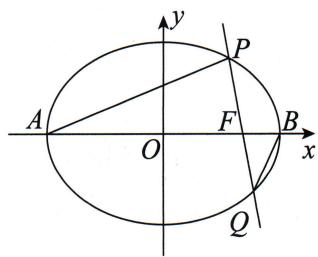
联立直线方程与椭圆方程得 $\left\{\begin{aligned}x&=my+2,\\ \frac{x^{2}}{9}&+\frac{y^{2}}{5}=1\end{aligned}\right.\Rightarrow(9+5m^{2})y^{2}+20my-25=0,$
由韦达定理得 $\left\{\begin{aligned}y_{1}+y_{2}&=\frac{-20m}{9+5m^{2}},\\ y_{1}y_{2}&=\frac{-25}{9+5m^{2}},\end{aligned}\right.$
所以 $\frac{y_1 + y_2}{y_1y_2} = \frac{4}{5} m$ ，即 $my_{1}y_{2} = \frac{5}{4} (y_{1} + y_{2})$
所以 $\frac{k_1}{k_2} = \frac{my_1y_2 - y_1}{my_1y_2 + 5y_2} = \frac{\frac{5}{4}(y_1 + y_2) - y_1}{\frac{5}{4}(y_1 + y_2) + 5y_2} = \frac{y_1 + 5y_2}{5y_1 + 25y_2} = \frac{1}{5}$ , 即 $\frac{k_1}{k_2}$ 为定值 $\frac{1}{5}$ .

# 总结

至此我们就把韦达定理的第二种用法, 即寻找和积关系进行了一个讲解. 这部分并非想表达和积关系是一种重要的方法, 而是希望大家能从多个角度来看待常见的条件. 这一点在第九节 “高级”代数变形中会有更多阐述.

# 第三节 求根

我们在第一节 整体代换中说过,在圆锥曲线的解答题中很少使用求根公式来解决问题.因此本小节说的求根并非指利用求根公式来解出方程带根号的根.

下面分类进行说明.

第一种是过曲线上一定点的直线.

例如, 过椭圆 $\frac{x^{2}}{4} + y^{2} = 1$ 右顶点 A 作直线与椭圆交于另一点 B.
由题意知直线 AB 的斜率一定存在, 因此可以直接设直线 AB 的方程为 $y = k(x - 2)$ , 将其与椭圆方程联立, 消去 y, 可得 $(4k^{2} + 1)x^{2} - 16k^{2}x + 16k^{2} - 4 = 0$ .
根据韦达定理得 $x_{A}x_{B} = \frac{16k^{2} - 4}{4k^{2} + 1}$

现在已知 $x_{A} = 2$ ，所以有 $2x_{B} = \frac{16k^{2} - 4}{4k^{2} + 1}$ ，从而解出 $x_{B} = \frac{8k^{2} - 2}{4k^{2} + 1}$
再根据点 $B$ 在直线 $AB$ 上，有 $y_{B} = k(x_{B} - 2) = k\left(\frac{8k^{2} - 2}{4k^{2} + 1} -2\right) = \frac{-4k}{4k^{2} + 1}$
所以椭圆上点 B 的坐标为 $\left(\frac{8k^{2}-2}{4k^{2}+1},\frac{-4k}{4k^{2}+1}\right)$ .

到此,我们就相当于用线参表示出了曲线上动点的坐标.

这种过曲线上一定点(绝大部分是顶点)的题,在圆锥曲线中是比较常见的.请同学们看到这个特征时要意识到,我们可以直接求根,即可以用斜率这个线参作为核心变量去表示动点的坐标.
特别地,对于椭圆和双曲线来说,如果过原点的直线与其相交,那么根据对称性也可以求出两方程联立后得到的一元二次方程的根,从而确定交点的坐标.

例如,过原点且斜率存在的直线与椭圆 $\frac{x^{2}}{4}+y^{2}=1$ 交于A,B两点,其中 $x_{A}>x_{B}$ .
设直线 $AB$ 的方程为 $y = kx$ ，与椭圆方程联立可得 $(4k^2 + 1)x^2 = 4$ ，即 $x^2 = \frac{4}{4k^2 + 1}$ .
因为 $x_{A}>x_{B}$ ，且 A, B 两点关于原点对称，所以 $x_{A}=\frac{2}{\sqrt{4k^{2}+1}}$ ， $x_{B}=\frac{-2}{\sqrt{4k^{2}+1}}$ .
根据点 A, B 在直线 AB 上, 从而有 $y_{A}=\frac{2k}{\sqrt{4k^{2}+1}}$ , $y_{B}=\frac{-2k}{\sqrt{4k^{2}+1}}$ .
所以 $A\left(\frac{2}{\sqrt{4k^2 + 1}}, \frac{2k}{\sqrt{4k^2 + 1}}\right), B\left(\frac{-2}{\sqrt{4k^2 + 1}}, \frac{-2k}{\sqrt{4k^2 + 1}}\right)$ .
在部分题目中,我们只需要对横坐标(或者纵坐标)进行计算即可,请各位同学养成先分析目标和条件的习惯,确定用哪一个坐标后,再去设相应直线方程,解相应的坐标.

下面我们来看一道点多线又乱的高考题,从题目中感受求根后单变量简化一切的力量.

> [!example]- 例 4 (2013·江西·文·节选) 如图所示, 在平面直角坐标系 xOy 中, 已知 A, B, D 分别是椭圆 $\frac{x^{2}}{4} + y^{2} = 1$ 的左、右、上顶点, P 是椭圆上除顶点外的任意一点, 直线 DP 交 x 轴于点 F, 直线 AD 交直线 BP 于点 E. 证明: $2k_{EF} - k_{BP}$ 为定值.
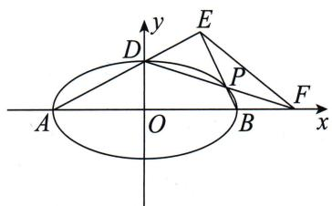

# 题目分析

本题中有三个定点和三个动点,一条定直线和三条动直线.仔细观察,我们发现有“过曲线上一定点的直线”这个重要的几何特征.
显然, 直线 DP 和直线 BP 都过曲线上一定点, 下面就需要确定设哪条直线的方程.
如果设直线 DP 的方程, 那么容易得到点 F 的坐标, 也容易求得 $k_{EF}$ , 但求 $k_{BP}$ 会比较复杂; 如果设直线 BP 的方程, 那么只需要求 $k_{EF}$ 即可, 但是直线 DP 的方程会稍微复杂一些.

这里我们将两种设法都分析一下,但在后面的参考解析中仅给出后者.

# 第一种设法：
设直线 DP 的方程为 $y = kx + 1$ (由题意知斜率一定存在, 且需要通过横、纵坐标计算后面的斜率, 即目标影响直线设法).
令 $y = 0$ ，得到 $F\left(-\frac{1}{k},0\right)$
联立 $y=kx+1$ 和椭圆方程, 消去 y 可得 $(4k^{2}+1)x^{2}+8kx=0$ .
显然方程的一个根为0，所以可得 $x_{P} = \frac{-8k}{4k^{2} + 1}$
将 $x_{P} = \frac{-8k}{4k^{2} + 1}$ 代入直线方程 $y = kx + 1$ 得 $y_{P} = \frac{-4k^{2} + 1}{4k^{2} + 1}$ , 即 $P\left(\frac{-8k}{4k^{2} + 1}, \frac{-4k^{2} + 1}{4k^{2} + 1}\right)$ .
由题意知 $B(2,0)$ ，所以 $k_{BP} = \frac{\frac{-4k^2 + 1}{4k^2 + 1}}{\frac{-8k}{4k^2 + 1} - 2} = \frac{4k^2 - 1}{2(4k^2 + 4k + 1)} = \frac{2k - 1}{2(2k + 1)}.$
因此直线 $BP$ 的方程为 $y = \frac{2k - 1}{2(2k + 1)} (x - 2)$ .
由题意可得直线 $AD$ 的方程为 $y = \frac{1}{2} x + 1$ ，与直线 $BP$ 的方程联立，可求得 $E(-4k, 1 - 2k)$ .
接下来算出 $k_{EF} = \frac{k}{1 + 2k}$ ，从而有 $2k_{EF} - k_{BP} = \frac{1}{2}$

# 第二种设法：
设直线 $BP$ 的方程为 $y = k(x - 2)$ , 与椭圆方程联立可求得 $P\left(\frac{8k^2 - 2}{4k^2 + 1}, \frac{-4k}{4k^2 + 1}\right)$ .

点 E 是直线 BP: $y = k(x - 2)$ 与直线 AD: $y = \frac{1}{2}x + 1$ 的交点，
所以可求得 $E\left(\frac{2(2k+1)}{2k-1}, \frac{4k}{2k-1}\right)$ .

要求点 $F$ ，需先求直线 $DP$ 的方程，而 $k_{DP} = \frac{\frac{-4k}{4k^2 + 1} - 1}{\frac{8k^2 - 2}{4k^2 + 1}} = -\frac{4k^2 + 4k + 1}{2(4k^2 - 1)} =$ $-\frac{2k + 1}{2(2k - 1)}$ ，所以直线 $DP$ 的方程为 $y = -\frac{2k + 1}{2(2k - 1)} x + 1.$
从而有 $F\left(\frac{2(2k - 1)}{2k + 1},0\right)$
接下来算出 $k_{EF} = \frac{1}{4} +\frac{k}{2}$ ，从而有 $2k_{EF} - k_{BP} = \frac{1}{2}$

# 参考解析
因为点 P 不为椭圆顶点，
所以设直线 $BP$ 的方程为 $y = k(x - 2)(k \neq 0, k \neq \pm \frac{1}{2})$ ①.
联立方程得 $\left\{\begin{aligned}y&=k(x-2),\\ \frac{x^{2}}{4}+y^{2}&=1\end{aligned}\right.\Rightarrow(4k^{2}+1)x^{2}-16k^{2}x+16k^{2}-4=0.$
由韦达定理得 $x_{B}x_{P} = \frac{16k^{2} - 4}{4k^{2} + 1}$ . 因为 $B(2,0)$ , 所以 $x_{P} = \frac{8k^{2} - 2}{4k^{2} + 1}$ ,
所以 $y_{P} = k(x_{P} - 2) = k\left(\frac{8k^{2} - 2}{4k^{2} + 1} -2\right) = -\frac{4k}{4k^{2} + 1}$ 即 $P\left(\frac{8k^2 - 2}{4k^2 + 1}, - \frac{4k}{4k^2 + 1}\right)$
由题意可知直线 $AD$ 的方程为 $y = \frac{1}{2} x + 1$ ②.

①与②联立解得 $E\left(\frac{4k+2}{2k-1},\frac{4k}{2k-1}\right)$ .
由 $D, P, F(x_{F}, 0)$ 三点共线，知 $k_{DP} = k_{DF}$ ，即 $\frac{-\frac{4k}{4k^2 + 1} - 1}{\frac{8k^2 - 2}{4k^2 + 1} - 0} = \frac{0 - 1}{x_F - 0}$ ，
解得 $F\left(\frac{4k-2}{2k+1},0\right)$ .
所以 $k_{EF} = \frac{\frac{4k}{2k - 1} - 0}{\frac{4k + 2}{2k - 1} - \frac{4k - 2}{2k + 1}} = \frac{4k(2k + 1)}{2(2k + 1)^2 - 2(2k - 1)^2} = \frac{2k + 1}{4}.$
则 $2k_{EF} - k_{BP} = \frac{2k + 1}{2} - k = \frac{1}{2}$ ，即 $2k_{EF} - k_{BP}$ 为定值.

思维笔记

Siweibiji

# 总结

题目分析给出直线方程的两种设法,大家要感受这两种设法的区别:计算上的难易.后者较佳的原因是直接设目标中的一个斜率为变量,可以在很大程度上减少计算量,只需要算出 $k_{EF}$ 即可.

# 第二种是曲线上有两个动点,能够求根的情况.

> [!example]- 例5 在平面直角坐标系 $xOy$ 中, 动直线 $l$ 与椭圆 $\frac{x^2}{4} + \frac{y^2}{3} = 1$ 交于 $A(x_1, y_1)$ , $B(x_2, y_2)$ 两点, 其中点 $A$ 在第一象限. 当 $3y_1 + y_2 = 0$ 时, 求出 $S_{\triangle AOB}$ 的最大值, 并求出此时直线 $l$ 的方程.

# 题目分析
由于 $3y_{1} + y_{2} = 0$ ，当直线 $l$ 的斜率不存在时， $y_{1} = -y_{2}$ ，可求得 $y_{1} = y_{2} = 0$ ，与已知矛盾；当直线 $l$ 的斜率为0时， $y_{1} = y_{2} = 0$ ，也与已知矛盾。所以直线 $l$ 的斜率必定存在且不为0。
又由于条件 $3y_{1} + y_{2} = 0$ 只与纵坐标有关, 故设直线 l 的方程为 $x = ty + n$ .
将直线 l 的方程与椭圆方程联立后，由韦达定理得 $\left\{\begin{aligned}y_{1}+y_{2}&=\frac{-6tn}{3t^{2}+4},\\ y_{1}y_{2}&=\frac{3n^{2}-12}{3t^{2}+4}.\end{aligned}\right.$

现在问题来了:条件 $3y_{1} + y_{2} = 0$ 是一个非对称的式子,看上去没法直接用韦达定理整体代换.我们该如何转化这个条件呢?

观察发现结合韦达定理,我们可以将 $y_{1}, y_{2}$ 直接求出来.
由 $3y_{1} + y_{2} = 0$ ，得 $y_{1} + y_{2} = -2y_{1}$
再根据韦达定理有 $\frac{-6tn}{3t^2 + 4} = -2y_1$ ，即 $y_{1} = \frac{3tn}{3t^{2} + 4}$
又因为 $3y_{1} + y_{2} = 0$ ，所以 $y_{2} = -3y_{1}$ ，即 $y_{2} = \frac{-9tn}{3t^{2} + 4}$
将 $y_{1}, y_{2}$ 代入 $y_{1}y_{2} = \frac{3n^{2} - 12}{3t^{2} + 4}$ , 得
$\frac {- 2 7 t ^ {2} n ^ {2}}{(3 t ^ {2} + 4) ^ {2}} = \frac {3 n ^ {2} - 1 2}{3 t ^ {2} + 4} \Rightarrow - 9 t ^ {2} n ^ {2} = (n ^ {2} - 4) (3 t ^ {2} + 4).$

现在又出现一个问题,这个式子我们应该朝什么方向处理呢?是用 n 表示 t,还是用 t 表示 n?之所以会出现这个问题,是因为我们没有先分析目标.

现在思考一下:要求直线方程,即求 t 和 n 的值,而求两个变量必须要有两个方程.此外,求面积最大值的常规方法是用单变量表示面积,转化为函数求值域.因此条件 $3y_{1} + y_{2} = 0$ 一定是用来找 t 与 n 的关系,从而达到消元的目的.
所以我们要想知道 $t, n$ 的关系怎么用，必须先知道面积表达式的结构如何。这里我们采用第十三节 多边形的翻译中的面积分割的方法。
设直线 l 与 x 轴交于点 $C(n,0)$ ,
则 $S_{\triangle AOB} = S_{\triangle AOC} + S_{\triangle BOC} = \frac{1}{2}|ny_1| + \frac{1}{2}|ny_2| = \frac{1}{2}|n|\cdot |y_1 - y_2|$
因为 $3y_{1} + y_{2} = 0$ ，所以有 $S_{\triangle AOB} = 2|n|\cdot y_1 = 6\left|\frac{tn^2}{3t^2 + 4}\right|$
将之前算出来的 $t, n$ 的关系式变形一下，正好可以将 $\frac{n^2}{3t^2 + 4}$ 整体换掉，
即 $-9t^{2}n^{2} = (n^{2} - 4)(3t^{2} + 4)\Rightarrow (12t^{2} + 4)n^{2} = 4(3t^{2} + 4)\Rightarrow \frac{n^{2}}{3t^{2} + 4} = \frac{1}{3t^{2} + 1},$
所以 $S_{\triangle AOB} = 6\left|\frac{t}{3t^2 + 1}\right| = \frac{6}{3|t| + \frac{1}{|t|}}\leqslant \sqrt{3}$ ，当且仅当 $3|t| = \frac{1}{|t|}$ 即 $t^2 = \frac{1}{3}$ 时等号成立.此时 $n^2 = \frac{3t^2 + 4}{3t^2 + 1} = \frac{5}{2}$

做题的时候留心题干中的限制性条件: 点 A 在第一象限, 即 $y_{1}=\frac{3tn}{3t^{2}+4}>0$ 且 $x_{1}=ty_{1}+n=\frac{3t^{2}n}{3t^{2}+4}+n=n\left(\frac{3t^{2}}{3t^{2}+4}+1\right)>0$ , 所以 t>0, n>0.
因此 $S_{\triangle AOB}$ 的最大值为 $\sqrt{3}$ ，此时直线 l 的方程为 $2\sqrt{3}x - 2y - \sqrt{30} = 0$ .

# 参考解析
如图所示,由题意知直线 l 与 y 轴不垂直,设直线 l 的方程为 $x=ty+n$ ,
联立直线方程与椭圆方程得 $\left\{\begin{aligned}x&=ty+n,\\ \frac{x^{2}}{4}&+\frac{y^{2}}{3}=1\end{aligned}\right.\Rightarrow(3t^{2}+4)y^{2}+6tny+3n^{2}-12=0.$
因为直线 l 与椭圆交于两点, 所以 $\Delta > 0$ , 即 $3t^{2} - n^{2} + 4 > 0$ ,

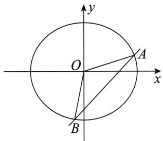
由韦达定理得 $\left\{\begin{aligned}y_{1}+y_{2}&=-\frac{6tn}{3t^{2}+4},\\ y_{1}y_{2}&=\frac{3n^{2}-12}{3t^{2}+4}.\end{aligned}\right.$
因为 $3y_{1} + y_{2} = 0$ ，所以 $y_{1} = \frac{3tn}{3t^{2} + 4}, y_{1}^{2} = \frac{4 - n^{2}}{3t^{2} + 4}$
所以 $\frac{9t^2n^2}{(3t^2 + 4)^2} = \frac{4 - n^2}{3t^2 + 4}$ 所以 $n^2 = \frac{3t^2 + 4}{3t^2 + 1}$ .
所以 $S_{\triangle AOB} = \frac{1}{2} |n|\cdot |y_1 - y_2| = 2|n|\cdot |y_1| = \frac{6|t|n^2}{3t^2 + 4} = \frac{6|t|}{3t^2 + 1}.$
因为点 A 在第一象限内, 所以 $x_{1}=ty_{1}+n=\frac{3t^{2}n}{3t^{2}+4}+n>0$ , 所以 n>0.
因为 $y_{1}>0$ ，所以 t>0，
所以 $S_{\triangle AOB}=\frac{6t}{3t^{2}+1}=\frac{6}{3t+\frac{1}{t}}\leqslant\frac{6}{2\sqrt{3}}=\sqrt{3}$ ，当且仅当 $t=\frac{\sqrt{3}}{3}$ 时取等号.
此时 $n=\frac{\sqrt{10}}{2}$ ，满足 $\Delta>0$ .
所以直线 l 的方程为 $2\sqrt{3}x - 2y - \sqrt{30} = 0$ .

# 总结
当遇到一个非对称的横坐标或者纵坐标的简单条件时,我们可以利用这个条件和韦达定理解出两点坐标.注意这个条件可以是线性的,也可以是非线性的.
当我们分析条件时,只要有这样一个能够与韦达定理联立来求根的条件,就足够了.

上例中,如果没有先分析目标,就会在解题时“卡住”.所以一定要重视分析意识的养成.

题中 $3y_{1} + y_{2} = 0$ 这个条件也可以变形成对称的结构. 这里不特别强调, 因为它是一种局限性的操作. 有些资料中以微专题的形式出现, 这是一种深入的学习方法, 但学习不能一味地追寻“微”与特别的技巧, 这样可能让同学们抓不到共性.

下面是将 $3y_{1} + y_{2} = 0$ 转化为对称结构的方法：
$\begin{array}{r l} & 3 y _ {1} + y _ {2} = 0 \Rightarrow \frac {y _ {2}}{y _ {1}} = - 3 \Rightarrow \frac {y _ {2}}{y _ {1}} + \frac {y _ {1}}{y _ {2}} = - 3 - \frac {1}{3} \Rightarrow \frac {y _ {1} ^ {2} + y _ {2} ^ {2}}{y _ {1} y _ {2}} = - \frac {1 0}{3} \Rightarrow \frac {(y _ {1} + y _ {2}) ^ {2}}{y _ {1} y _ {2}} - \\ & 2 = - \frac {1 0}{3}. \end{array}$

这种变形也很好理解:我们在第一节 整体代换中说过,只要是对称的式子,必定可以用韦达定理整体代换,对称的式子中互换下标不影响式子结构.
如果将上面例题的条件改成 $y_{1}+2y_{2}-5=0$ ，请问你还会转化吗？
当然我们仍然可以用求根的方法来处理,如果非要构建如上面所说的对称结构的话,那么可以利用待定系数法.

已知 $y_{1} = -2y_{2} + 5$ ，设 $y_{1} + t = -2(y_{2} + t)$ ，化简得 $y_{1} = -2y_{2} - 3t$ .
所以 $-3t = 5, t = -\frac{5}{3}$ .
所以 $y_{1} - \frac{5}{3} = -2\left(y_{2} - \frac{5}{3}\right) \Rightarrow \frac{y_{1} - \frac{5}{3}}{y_{2} - \frac{5}{3}} = -2$ ，最后就是构建一个对称的式子：
$\frac {y _ {1} - \frac {5}{3}}{y _ {2} - \frac {5}{3}} + \frac {y _ {2} - \frac {5}{3}}{y _ {1} - \frac {5}{3}} = - 2 + \left(- \frac {1}{2}\right).$

我们动手算一算,就会发现利用韦达定理整体代换的话,这个式子的计算不比直接求根来得快.所以这个转化对称结构的方法仅作为一个思路,有兴趣的同学了解一下即可.

# 第四节 切线——设线解点

思维笔记

Siweiliji

在本节中,我们来探究涉及切点的切线问题的处理方式,解决求最值、求定点、求定值等问题.

我们先考虑这样一个问题:是选择设切点表示切线(设点解线),还是选择设切线表示切点(设线解点)呢?也就是选择点参还是线参的问题.

本节先考虑设线解点的基本操作.

已知直线 $l: y = kx + m$ 与椭圆 $\frac{x^{2}}{a^{2}} + \frac{y^{2}}{b^{2}} = 1 (a > b > 0)$ 相切于点 P，则 $P\left(-\frac{a^{2}k}{m}, \frac{b^{2}}{m}\right)$ .
证明: 切线方程 $y=kx+m$ 与 $\frac{x^{2}}{a^{2}}+\frac{y^{2}}{b^{2}}=1$ 联立得 $\left\{\begin{aligned}y&=kx+m,\\ \frac{x^{2}}{a^{2}}+\frac{y^{2}}{b^{2}}&=1,\end{aligned}\right.$
消去 y，整理得 $(a^{2}k^{2}+b^{2})x^{2}+2a^{2}kmx+a^{2}m^{2}-a^{2}b^{2}=0.$
则 $\Delta=4a^{4}k^{2}m^{2}-4(a^{2}k^{2}+b^{2})\cdot(a^{2}m^{2}-a^{2}b^{2})=0$ ，化简得 $m^{2}=a^{2}k^{2}+b^{2}$
所以由韦达定理得 $x_{P} + x_{P} = -\frac{2a^{2}km}{a^{2}k^{2} + b^{2}} = -\frac{2a^{2}k}{m}\Rightarrow x_{P} = -\frac{a^{2}k}{m}.$
代入切线方程得 $y_{P} = kx_{P} + m = -\frac{a^{2}k^{2}}{m} + m = \frac{m^{2} - a^{2}k^{2}}{m} = \frac{b^{2}}{m}$ .
所以 $P\left(-\frac{a^{2}k}{m},\frac{b^{2}}{m}\right)$ .

从解题的角度,设点还是设线都无所谓.但是从考试的角度,设切线方程 $y=kx+m$ 解切点 $P\left(-\frac{a^{2}k}{m},\frac{b^{2}}{m}\right)$ 中用到的韦达定理也好,判别式 $\Delta=0$ 也好,都是较常规的思路.因此接下来的题目我们都以设线解点的方式来处理.

下面,我们来看例题.

> [!example]- 例6（2014·浙江·理）设椭圆 $\frac{x^2}{a^2} +\frac{y^2}{b^2} = 1(a > b > 0)$ ，动直线 $l$ 与椭圆只有一个公共点 $P$ ，且点 $P$ 在第一象限.  
（1）已知直线 l 的斜率为 k，用 a, b, k 表示点 P 的坐标；  
（2）若过原点 O 的直线 $l_{1}$ 与 l 垂直,证明: 点 P 到直线 $l_{1}$ 的距离的最大值为 a-b.

# 题目分析
设直线 l 的方程为 $y = kx + m (k < 0, m > 0)$ ，可得 $m^{2} = a^{2}k^{2} + b^{2}$ ，切点 $P\left(-\frac{a^{2}k}{m}, \frac{b^{2}}{m}\right)$ .

思维笔记

Siweibiji

题目要求用 a, b, k 表示点 P 的坐标, 所以需要消去 m.
因为 $m > 0$ ，所以 $m = \sqrt{a^2k^2 + b^2}$ .所以 $P\Big(-\frac{a^2k}{\sqrt{a^2k^2 + b^2}},\frac{b^2}{\sqrt{a^2k^2 + b^2}}\Big)$

第二问出于整体计算的考虑,建议还是先用 $P\left(-\frac{a^{2}k}{m},\frac{b^{2}}{m}\right)$ 进行计算.
由题意知直线 $l_{1}$ 的方程为 $y = -\frac{1}{k} x \Rightarrow x + ky = 0$
则点 $P$ 到直线 $l_{1}$ 的距离 $d = \frac{\left| -\frac{a^2k}{m} + \frac{b^2k}{m} \right|}{\sqrt{1 + k^2}}$ .

平方后化简得 $d^2 = \frac{(a^2 - b^2)^2}{a^2k^2 + \frac{b^2}{k^2} + a^2 + b^2} \leqslant (a - b)^2$
当且仅当 $a^2 k^2 = \frac{b^2}{k^2}$ ，即 $k = -\sqrt{\frac{b}{a}}$ 时等号成立.
所以点 P 到直线 $l_{1}$ 的距离的最大值为 a-b.

# 参考解析  
（1）设直线 l 的方程为 $y=kx+m$ (k<0, m>0).
联立得 $\left\{\begin{aligned}y&=kx+m,\\ \frac{x^{2}}{a^{2}}+\frac{y^{2}}{b^{2}}&=1\end{aligned}\right.\Rightarrow(a^{2}k^{2}+b^{2})x^{2}+2a^{2}kmx+a^{2}(m^{2}-b^{2})=0.$
则 $\Delta = 0$ ，化简得 $m^2 = a^2 k^2 + b^2$ .由韦达定理得 $2x_{P} = \frac{-2a^{2}km}{a^{2}k^{2} + b^{2}}.$
将 $m^2 = a^2 k^2 + b^2$ 代入上式，化简得 $x_P = -\frac{a^2k}{m}$ .
所以 $y_{P} = -\frac{a^{2}k}{m} \cdot k + m = \frac{b^{2}}{m}$ ，即切点 $P\left(-\frac{a^{2}k}{m}, \frac{b^{2}}{m}\right)$ .
又因为 $m > 0$ ，所以有 $m = \sqrt{a^2k^2 + b^2}$
所以 $P\Big(-\frac{a^2k}{\sqrt{a^2k^2 + b^2}},\frac{b^2}{\sqrt{a^2k^2 + b^2}}\Big).$  
（2）由题意知直线 $l_{1}: y = -\frac{1}{k}x \Rightarrow x + ky = 0$ ,
则点 $P$ 到直线 $l_{1}$ 的距离 $d = \frac{\left| -\frac{a^2k}{m} + \frac{b^2k}{m}\right|}{\sqrt{1 + k^2}} = \frac{\left|\frac{k}{m}(b^2 - a^2)\right|}{\sqrt{1 + k^2}}$
$\Rightarrow d ^ {2} = \frac {(b ^ {2} - a ^ {2}) ^ {2} k ^ {2}}{m ^ {2} (1 + k ^ {2})} = \frac {(b ^ {2} - a ^ {2}) ^ {2} k ^ {2}}{(a ^ {2} k ^ {2} + b ^ {2}) (1 + k ^ {2})} = \frac {(b ^ {2} - a ^ {2}) ^ {2}}{a ^ {2} k ^ {2} + \frac {b ^ {2}}{k ^ {2}} + a ^ {2} + b ^ {2}}.$
因为 $a^2 k^2 +\frac{b^2}{k^2}\geqslant 2ab$ ，当且仅当 $a^2 k^2 = \frac{b^2}{k^2}$ ，即 $k = -\sqrt{\frac{b}{a}}$ 时等号成立，
所以 $d^2 \leqslant \frac{(b^2 - a^2)^2}{2ab + a^2 + b^2} = \frac{[(a + b)(a - b)]^2}{(a + b)^2} = (a - b)^2$ ，即 $d \leqslant a - b$ .
所以点 $P$ 到直线 $l_{1}$ 的距离的最大值为 $a - b$ .

> [!example]- 例7（2012·福建·理·节选）设动直线 $l: y = kx + m$ 与椭圆 $\frac{x^2}{4} + \frac{y^2}{3} = 1$ 有且只有一个公共点 $P$ ，且与直线 $x = 4$ 相交于点 $Q$ . 试探究：在坐标平面内是否存在定点 $M$ ，使得以 $PQ$ 为直径的圆恒过点 $M$ ？若存在，求出点 $M$ 的坐标；若不存在，请说明理由.
# 题目分析
设线解点可得 $P\left(-\frac{4k}{m},\frac{3}{m}\right)$ ，且 $m^{2}=4k^{2}+3$ .
由直线 $l: y = kx + m$ 与直线 x = 4 相交，可得 $Q(4, 4k + m)$ .
设以 PQ 为直径的圆过定点 $M(x,y)$ ，则 $\overrightarrow{PM} \cdot \overrightarrow{QM} = 0$ ，
代入坐标化简得 $x^{2} + y^{2} - 4x + \frac{4k}{m} x - (4k + m + \frac{3}{m})y + \frac{3m - 4k}{m} = 0.$

无论是直线过定点还是圆过定点,其本质都是求出 x 与 y,使其对任意的变量等式都恒成立.而要想等式恒成立即让等式变量系数为 0.
因此接下来我们应该按有变量与无变量整理，
即 $x^{2} + y^{2} - 4x + 3 + \frac{4k}{m} (x - 1) - \left(4k + m + \frac{3}{m}\right)y = 0,$
所以 $\left\{\begin{aligned}x^{2}+y^{2}-4x+3=0,\\ x-1=0,\\ y=0,\end{aligned}\right.$ 从而解得定点 $M(1,0)$ .

# 参考解析
联立得 $\left\{\begin{aligned}y&=kx+m,\\ \frac{x^{2}}{4}&+\frac{y^{2}}{3}=1\end{aligned}\right.\Rightarrow(4k^{2}+3)x^{2}+8kmx+4(m^{2}-3)=0.$
则 $\Delta = 0$ ，化简得 $4k^{2} + 3 = m^{2}$ .由韦达定理得 $2x_{P} = \frac{-8km}{4k^{2} + 3},$
将 $4k^{2} + 3 = m^{2}$ 代入上式，化简得 $x_{P} = -\frac{4k}{m}$
所以 $y_{P}=-\frac{4k}{m}\cdot k+m=\frac{3}{m}$ ，即切点 $P\left(-\frac{4k}{m},\frac{3}{m}\right)$ .
联立得 $\left\{\begin{aligned}y&=kx+m,\\ x&=4,\end{aligned}\right.$ 解得 $Q(4,4k+m)$ .
设以 PQ 为直径的圆过定点 $M(x, y)$ ，则 $\overrightarrow{PM} \cdot \overrightarrow{QM} = 0$ ，
所以 $(x - 4)\left(x + \frac{4k}{m}\right) + (y - 4k - m)\left(y - \frac{3}{m}\right) = 0.$
化简得 $x^{2} + y^{2} - 4x + \frac{4k}{m} x - (4k + m + \frac{3}{m})y + \frac{3m - 4k}{m} = 0.$

思维笔记

Siweibiji

思维笔记

Siweibiji

因为圆过定点，所以 $\left\{ \begin{array}{l}x^{2} + y^{2} - 4x + 3 = 0,\\ x - 1 = 0,\\ y = 0, \end{array} \right.$ 解得 $\left\{ \begin{array}{l}x = 1,\\ y = 0. \end{array} \right.$
所以以 PQ 为直径的圆恒过定点 M(1,0).
再来看一道与切线相关的求定值的例题.

> [!example]- 例8 设直线 $l: y = k_{1}x$ 与椭圆 $\frac{x^{2}}{2} + y^{2} = 1$ 交于 $M, N$ 两点，其中 $M$ 在第一象限，直线 $l$ 与 $x = t (t > 0)$ 交于点 $D, F$ 为椭圆的右焦点，过点 $D$ 作 $DG \parallel MF$ 且交 $x$ 轴于点 $G$ . 若直线 $GM$ 与椭圆有且仅有一个公共点，求 $t$ 的值.

# 题目分析
根据设线解点,设直线 MG 的方程为 $y=kx+m$ , 所以 $M\left(-\frac{2k}{m}, \frac{1}{m}\right)$ 和 $G\left(-\frac{m}{k}, 0\right)$ .
由 $M\left(-\frac{2k}{m}, \frac{1}{m}\right)$ 可知，直线 $MN$ 的方程为 $y = -\frac{1}{2k} x$ ，所以 $D\left(t, -\frac{t}{2k}\right)$ .
由 $DG \parallel MF$ 得 $k_{DG} = k_{MF}$ , 解得 $t = 2$ .

我们完全可以不用题目给的直线,直接按照切线的操作结果——切点为核心进行后续的分析与操作.

# 参考解析
设直线 MG 的方程为 $y=kx+m$ ，则 $G\left(-\frac{m}{k},0\right)$ .
联立得 $\left\{\begin{aligned}y&=kx+m,\\ \frac{x^{2}}{2}&+y^{2}=1\end{aligned}\right.\Rightarrow(2k^{2}+1)x^{2}+4kmx+2m^{2}-2=0.$
则 $\Delta = 0$ ，化简得 $2k^{2} + 1 = m^{2}$ .由韦达定理得 $2x_{M} = \frac{-4km}{2k^{2} + 1}$
将 $2k^{2} + 1 = m^{2}$ 代入上式，化简得 $x_{M} = -\frac{2k}{m}$ .
所以 $y_{M}=-\frac{2k}{m}\cdot k+m=\frac{1}{m}$ ，即切点 $M\left(-\frac{2k}{m},\frac{1}{m}\right)$ .
所以直线 MN 的方程为 $y = -\frac{1}{2k}x$ ，所以 $D\left(t, -\frac{t}{2k}\right)$ .
由 $DG \parallel MF$ ，得 $k_{DG} = k_{MF} \Rightarrow \frac{-\frac{t}{2k}}{t + \frac{m}{k}} = \frac{\frac{1}{m}}{-\frac{2k}{m} - 1} \Rightarrow \frac{t}{2tk + 2m} = \frac{1}{2k + m} \Rightarrow t = 2.$

# 总结
解决切线问题时,设切线方程是一种常用的处理方式.关键在于 $\Delta=0$ 的化简,无论是求最值还是求定点或定值,我们都可以用同一种操作处理.

# 第二章 设点法

本书中的设点法主要指以点参为核心变量,利用曲线方程消元的方法.

我们在第一章中讨论了设线法,从本章开始介绍圆锥曲线中让人又爱又恨的设点法.第五节 单动点、第六节 双动点和第七节 抛物线设点中设点的基本手法要求大家都掌握,建议学有余力的同学去阅读第九节 “高级”代数变形.因为在高考中,大部分题目设点能做,设线也能做,即熟练掌握设线法和基本设点法就足以满足高考需求.

# 第五节 单动点

什么时候用设点法？什么时候用设线法？这要看具体题目条件适合用谁，不要把题目太抽象化.

单动点指可以用一个点的坐标 $(x_0, y_0)$ 来表示所有的条件与目标, 就像亚里士多德提出的第一推动力一样.

选一个动点,而并非只有一个动点.比如求椭圆上一点到右焦点距离的取值范围就只有一个动点,但在实战中会有很多衍生的动点.

> [!example]- 例 1 在平面直角坐标系 $xOy$ 中, 过椭圆 $\frac{x^2}{4} + y^2 = 1$ 上顶点 $A$ 作一条不平行于坐标轴的直线交椭圆于另一点 $P$ , 点 $P$ 关于 $x$ 轴的对称点为 $Q$ . 若直线 $AQ, AP$ 与 $x$ 轴的交点的横坐标分别为 $m, n$ , 求证: $mn$ 为常数.
# 题目分析

这道题就是典型的单动点问题.

P, Q 两点间有直接的决定性关系, 设 $P(x_{0}, y_{0})$ , 则 $Q(x_{0}, -y_{0})$ .
从而有直线 $AP$ 的方程为 $y = \frac{y_0 - 1}{x_0} x + 1$ .
令 $y = 0$ ，得 $n = -\frac{x_0}{y_0 - 1}$
同理可得 $m = -\frac{x_0}{-y_0 - 1} = \frac{x_0}{y_0 + 1}$ ，所以 $mn = \frac{x_0^2}{1 - y_0^2}$ .
由点 $P(x_0, y_0)$ 在椭圆上，所以有 $\frac{x_0^2}{4} + y_0^2 = 1$ .

思维笔记

Siweiliji

若消去 $y_0^2$ ，则 $mn = \frac{x_0^2}{1 - y_0^2} = \frac{x_0^2}{\frac{x_0^2}{4}} = 4;$
若消去 $x_0^2$ ，则 $mn = \frac{x_0^2}{1 - y_0^2} = \frac{4(1 - y_0^2)}{1 - y_0^2} = 4.$

# 参考解析
由题意知 $A(0,1)$ ，设 $P(x_0,y_0)$ ，则 $Q(x_0, - y_0)$ ，
所以 $k_{AP} = \frac{y_0 - 1}{x_0 - 0} = \frac{y_0 - 1}{x_0}$ ，则直线 $AP$ 的方程为 $y = \frac{y_0 - 1}{x_0} x + 1$ .
令 $y = 0$ ，解得 $n = -\frac{x_0}{y_0 - 1}$
所以 $k_{AQ} = \frac{-y_0 - 1}{x_0 - 0} = -\frac{y_0 + 1}{x_0}$ ，则直线 $AQ$ 的方程为 $y = -\frac{y_0 + 1}{x_0} x + 1$ .
令 y=0，解得 $m=\frac{x_{0}}{y_{0}+1}$ .
所以 $mn = \frac{x_0^2}{1 - y_0^2}$
又因为点 $P(x_0, y_0)$ 在椭圆上，所以有 $\frac{x_0^2}{4} + y_0^2 = 1$ ，即 $1 - y_0^2 = \frac{x_0^2}{4}$ ，
所以 $mn = \frac{x_0^2}{1 - y_0^2} = \frac{x_0^2}{\frac{x_0^2}{4}} = 4$ ，即 $mn$ 为常数.
接下来再看一道目标中有一次项的例题.

> [!example]- 例2 在平面直角坐标系 $xOy$ 中，已知椭圆 $\frac{x^2}{18} +\frac{y^2}{9} = 1$ 的短轴端点分别为 $B_{1},B_{2}$ 点 $M$ 是椭圆上的动点，且不与点 $B_{1},B_{2}$ 重合，点 $N$ 满足 $NB_{1}\perp MB_{1},NB_{2}\perp MB_{2}$ 求四边形 $MB_{2}NB_{1}$ 面积的最大值.
# 题目分析
根据条件可以发现点 M 可以决定点 N，即还是单动点问题.

本例的目标是四边形 $MB_{2}NB_{1}$ 的面积，根据第十三节 多边形的翻译中所说的“求同存异”的原则，将四边形 $MB_{2}NB_{1}$ 分割为两个三角形，即 $S_{\text{四边形}MB_{2}NB_{1}} = S_{\triangle B_{2}NB_{1}} + S_{\triangle B_{2}MB_{1}} = \frac{1}{2}|B_{1}B_{2}| \cdot |x_{M} - x_{N}|$ .
设 $M(x_0, y_0)$ , 然后仅需要求出 $x_N$ 即可.
由已知，得 $k_{MB_1} = \frac{y_0 - 3}{x_0}\Rightarrow k_{NB_1} = -\frac{x_0}{y_0 - 3}\Rightarrow$ 直线 $NB_{1}$ 的方程为 $y = -\frac{x_0}{y_0 - 3} x + 3,$
同理可得直线 $NB_{2}$ 的方程为 $y = -\frac{x_0}{y_0 + 3} x - 3$ ，于是联立两直线方程得 $x_{N} = \frac{y_{0}^{2} - 9}{x_{0}}.$

我们发现分母中出现 $x_0$ ，将 $x_0$ 换掉的话必然会出现根号，所以不能换掉 $x_0$ 应该将 $y_0^2$ 换掉.
将 $\frac{x_0^2}{18} +\frac{y_0^2}{9} = 1$ 的左、右两边同乘9，得 $\frac{x_0^2}{2} +y_0^2 = 9$ ，所以 $y_{0}^{2} - 9 = -\frac{x_{0}^{2}}{2}$ ，代入 $x_{N} = \frac{y_{0}^{2} - 9}{x_{0}}$ ，得 $x_{N} = -\frac{x_{0}}{2}$
所以目标 $S_{\text{四边形}MB_2NB_1} = 3\left|x_0 + \frac{x_0}{2}\right| = \frac{9}{2}|x_0|$ .

要求四边形 $MB_{2}NB_{1}$ 面积的最大值, 即求 $\left|x_{0}\right|$ 的最大值.
根据点 M 在椭圆上, 可知 $\left|x_{0}\right|$ 的最大值为 $3\sqrt{2}$ , 所以四边形 $MB_{2}NB_{1}$ 面积的最大值为 $\frac{27\sqrt{2}}{2}$ .

# 参考解析
设 $N(x_{N}, y_{N})$ , $M(x_{0}, y_{0}) (x_{0} \neq 0)$ .
由题意可取 $B_{1}(0,3)$ , $B_{2}(0,-3)$ ，如图所示.
因为 $NB_{1} \perp MB_{1}, NB_{2} \perp MB_{2}$ ,
所以直线 $NB_{1}$ 的方程为 $y - 3 = -\frac{x_0}{y_0 - 3} x$

直线 $NB_{2}$ 的方程为 $y+3=-\frac{x_{0}}{y_{0}+3}x$ ,
联立解得 $x_{N} = \frac{y_{0}^{2} - 9}{x_{0}}$

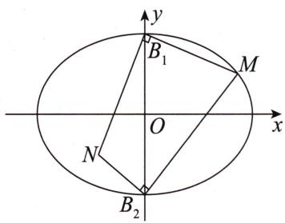
又因为 $\frac{x_0^2}{18} +\frac{y_0^2}{9} = 1$ ，所以 $x_{N} = \frac{y_{0}^{2} - 9}{x_{0}} = \frac{-\frac{x_{0}^{2}}{2}}{x_{0}} = -\frac{x_{0}}{2}.$
所以 $S_{\text{四边形}MB_2NB_1} = \frac{1}{2}|B_1B_2| \cdot (|x_N| + |x_0|) = \frac{9}{2}|x_0|$ .
因为 $0 < |x_0| \leqslant 3\sqrt{2}$ ,
所以当 $|x_0| = 3\sqrt{2}$ 时， $S_{\text{四边形}MB_2NB_1}$ 取得最大值，最大值为 $\frac{9}{2} \times 3\sqrt{2} = \frac{27\sqrt{2}}{2}$ .

# 总结

本例的参考解析中用点 M 的坐标来表示点 N 的坐标, 也可以尝试用点 N 的坐标来表示点 M 的坐标.

思维笔记

Siweiliji

> [!example]- 例3 在平面直角坐标系 $xOy$ 中，已知点 $A, B$ 分别是椭圆 $\frac{x^2}{8} + \frac{y^2}{4} = 1$ 的上、下顶点，动点 $P$ 在直线 $y = -8$ 上，且点 $P$ 不在 $y$ 轴上，直线 $PB$ 与椭圆交于另一点 $M$ . 证明： $k_{AM}k_{AP}$ 为定值.

# 题目分析

本例的“第一推动力”既可以是点 $P$ 也可以是点 $M$ , 即我们可以认为点 $P$ 带动点 $M$ , 也可以认为点 $M$ 带动点 $P$ .

第一种以点 $P$ 为“第一推动力”.
设 $P(t,-8)(t\neq0)$ .
由已知得直线 $PB$ 的方程为 $y = -\frac{6}{t} x - 2$
将直线 $PB$ 的方程与椭圆方程联立，可得 $x_{M} = \frac{-48t}{t^{2} + 72}$
再代入直线方程得 $y_{M}=\frac{-2(t^{2}-72)}{t^{2}+72}$ .
所以 $k_{AM} = \frac{\frac{-2(t^2 - 72)}{t^2 + 72} - 2}{\frac{-48t}{t^2 + 72}} = \frac{t}{12}, k_{AP} = \frac{-8 - 2}{t} = -\frac{10}{t}$ , 即 $k_{AM} k_{AP} = -\frac{5}{6}$ .

第二种以点 M 为“第一推动力”.
设 $M(x_0, y_0) (x_0 \neq 0)$ , 则直线 $PB$ 的方程为 $y = \frac{y_0 + 2}{x_0} x - 2$ , 与直线方程 $y = -8$ 联立得 $P\left(-\frac{6x_0}{y_0 + 2}, -8\right)$ .
所以 $k_{AM} = \frac{y_0 - 2}{x_0}, k_{AP} = \frac{-8 - 2}{-\frac{6x_0}{y_0 + 2}} = \frac{5(y_0 + 2)}{3x_0}$ , 所以 $k_{AM} k_{AP} = \frac{5(y_0^2 - 4)}{3x_0^2}$ .
由点 $M(x_0, y_0)$ 在椭圆上，所以有 $y_0^2 - 4 = -\frac{x_0^2}{2}$ ，代入上式得 $k_{AM} k_{AP} = \frac{5 \cdot \left(-\frac{x_0^2}{2}\right)}{3x_0^2} = -\frac{5}{6}$ .

# 参考解析
如图所示,设点 $P(t,-8)(t\neq0)$ , $M(x_{1},y_{1})$ , 由题意知 $A(0,2)$ , $B(0,-2)$ ,
因为 $M, B, P$ 三点共线，
所以 $k_{MB} = k_{BP}$ ，即 $\frac{y_1 + 2}{x_1} = -\frac{6}{t}$ ①.

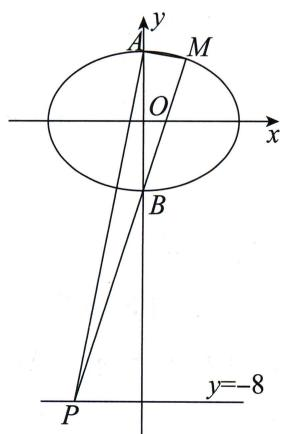
又 $k_{AM} = \frac{y_1 - 2}{x_1}, k_{AP} = -\frac{10}{t}$ ,
所以 $k_{AM}k_{AP}=\frac{y_{1}-2}{x_{1}}\cdot\left(-\frac{10}{t}\right)$ .
由①式可知 $k_{AM}k_{AP} = \frac{5}{3}\cdot \frac{y_1^2 - 4}{x_1^2}$ ②.
因为点 $M(x_{1},y_{1})$ 在椭圆 $\frac{x^2}{8} +\frac{y^2}{4} = 1$ 上，
所以 $y_{1}^{2}=4\left(1-\frac{x_{1}^{2}}{8}\right)$ ,
代入②式，得 $k_{AM}k_{AP} = -\frac{5}{6}$ 即 $k_{AM}k_{AP}$ 为定值.

# 总结

使用设点法时,更多地设曲线上的点为“第一推动力”.因为若设非曲线上的点,当我们要翻译点在曲线上时,往往需要联立直线方程与曲线方程.

就算要联立的话,直接设斜率会比用一个带分式的直线方程去联立更简洁.

本小节都是基础的单动点问题,即目标往往都是由点坐标 $(x_{0},y_{0})$ 的二次条件 $x_{0}^{2},y_{0}^{2}$ 构成,或者再加上 $x_{0},y_{0}$ 中的一个构成.

这种式子可以直接利用曲线方程统一变量: 若条件是 $x_{0}^{2}, y_{0}^{2}$ ，则统一为其中一个；若条件是 $x_{0}^{2}, y_{0}^{2}, x_{0}$ ，则将 $y_{0}^{2}$ 换掉；若条件是 $x_{0}^{2}, y_{0}^{2}, y_{0}$ ，则将 $x_{0}^{2}$ 换掉。也就是有点必有等式，有等式必有代换。
如果出现 $x_0y_0$ 或者 $(x_0 - 1)(y_0 - 2)$ 这种结构，建议换设线法或者参考第九节中的变形手法.

除了像本小节中三个例题里根据已知条件直接统一点坐标外,我们在第二节和积关系中提到的未知点解未知点也是一种处理单动点的手法.所以请大家务必熟悉其推导过程.

思维笔记

Siweibiji

# 第六节 双动点
在第五节 单动点中,我们说单动点并非真的只有一个动点,而是指所有的条件和目标都能用一个点的坐标表示出来的情况.

那双动点当然也不是指曲线上仅有两个动点,而是指可以用曲线上两个点的坐标来处理、表达条件的一类情况.

与点坐标关系最密切的条件之一就是向量条件,因此本节将以向量条件为例介绍一下双动点的基本处理方法.对于非向量的条件,我们在第十二节 线段的翻译和第十三节 多边形的翻译中都会涉及.之所以不在本节全部列举出来,是因为不想过多强调设点法的应用.
首先根据一道简单的题目来熟悉一下操作：

> [!example]- 例 4 在平面直角坐标系 $xOy$ 中, 过椭圆 $\frac{x^2}{4} + \frac{y^2}{3} = 1$ 的左焦点 $F$ 的直线交椭圆于 $A, B$ 两点, 若 $\overrightarrow{AF} = \lambda \overrightarrow{FB}$ , 求实数 $\lambda$ 的取值范围.
# 题目分析

先设 $A(x_{1},y_{1}), B(x_{2},y_{2})$ ，再翻译向量条件.
$\overrightarrow {A F} = \lambda   \overrightarrow {F B} \Rightarrow \left\{ \begin{array}{l l} - 1 - x _ {1} = \lambda (x _ {2} + 1), \\ - y _ {1} = \lambda y _ {2} \end{array} \right. \Rightarrow \left\{ \begin{array}{l l} x _ {1} = - \lambda x _ {2} - (\lambda + 1), \\ y _ {1} = - \lambda y _ {2}. \end{array} \right.$

这里与第十七节 轨迹 & 方程问题中求曲线方程所用到的相关点法相似.
因为点 A 在椭圆上, 所以 $\frac{x_{1}^{2}}{4} + \frac{y_{1}^{2}}{3} = 1$ , 将向量条件代入椭圆方程中 (实际上是消元思想), 得 $\frac{\left[-\lambda x_{2} - (\lambda + 1)\right]^{2}}{4} + \frac{\left(-\lambda y_{2}\right)^{2}}{3} = 1$ .

把上式的二次项单独拿出来，得 $\lambda^2\left(\frac{x_2^2}{4} +\frac{y_2^2}{3}\right) + \frac{2\lambda(\lambda + 1)x_2 + (\lambda + 1)^2}{4} = 1.$
因为点 $B$ 在椭圆上，所以 $\frac{x_2^2}{4} +\frac{y_2^2}{3} = 1$ ，则上式可化为 $\lambda^2 +\frac{2\lambda(\lambda + 1)x_2 + (\lambda + 1)^2}{4} =$ 1,从而有 $x_{2} = \frac{3 - 5\lambda}{2\lambda}$
根据已知条件有 $-2 \leqslant x_{2} \leqslant 2$ ，即 $-2 \leqslant \frac{3 - 5\lambda}{2\lambda} \leqslant 2$ ，解得 $\frac{1}{3} \leqslant \lambda \leqslant 3$ .

# 参考解析
设 $A(x_{1},y_{1}),B(x_{2},y_{2})$
因为 $\overrightarrow{AF}=\lambda\overrightarrow{FB}$ ,
所以 $\left\{ \begin{array}{l} -1 - x_{1} = \lambda (x_{2} + 1),\\ -y_{1} = \lambda y_{2}, \end{array} \right.$ 即 $\left\{ \begin{array}{ll}x_{1} = -\lambda x_{2} - (\lambda +1) & ①,\\ y_{1} = -\lambda y_{2} & ②. \end{array} \right.$
因为点 A 在椭圆上, 所以有 $\frac{x_{1}^{2}}{4} + \frac{y_{1}^{2}}{3} = 1$ ,
将①②两式代入上式得 $\frac{[-\lambda x_2 - (\lambda + 1)]^2}{4} + \frac{(-\lambda y_2)^2}{3} = 1$
整理得 $\lambda^2\left(\frac{x_2^2}{4} +\frac{y_2^2}{3}\right) + \frac{2\lambda(\lambda + 1)x_2 + (\lambda + 1)^2}{4} = 1$ ③.
又因为点 B 在椭圆上, 所以有 $\frac{x_{2}^{2}}{4} + \frac{y_{2}^{2}}{3} = 1$ ,
代入③式化简得 $x_{2}=\frac{3-5\lambda}{2\lambda}$ .
因为 $-2 \leqslant x_{2} \leqslant 2$ ，所以 $-2 \leqslant \frac{3 - 5\lambda}{2\lambda} \leqslant 2$ ，解得 $\frac{1}{3} \leqslant \lambda \leqslant 3$ .
所以实数 $\lambda$ 的取值范围是 $\left[\frac{1}{3},3\right]$ .

# 总结

双动点向量条件下的操作步骤：

第一步:设点,将未知点都先设出来.
第二步:表示,将一个点的坐标用另一个点的坐标表示出来,如 $\left\{\begin{aligned}x_{1}&=-\lambda x_{2}-(\lambda+1),\\ y_{1}&=-\lambda y_{2}.\end{aligned}\right.$
第三步:利用曲线方程,此时一般利用两次.第一次是将被表示的点的坐标代入曲线方程,如 $\frac{[-\lambda x_{2}-(\lambda+1)]^{2}}{4}+\frac{(-\lambda y_{2})^{2}}{3}=1$ ;第二次是将这个式子中的二次项提出来,利用曲线方程代换.
最后根据得到的条件,结合题目要求进行处理.

我们还需要了解到被表示的量会被消去.

我们在本例中用含有下标2的量表示含有下标1的量，即 $\left\{ \begin{array}{l} x_{1} = -\lambda x_{2} - (\lambda + 1), \\ y_{1} = -\lambda y_{2}, \end{array} \right.$ 最后得到的是 $x_{2}$ 与 $\lambda$ 的关系 $x_{2} = \frac{3 - 5\lambda}{2\lambda}$ . 同理，如果用含有下标1的量表示含有下标2的量，那最后得到的是 $x_{1}$ 与 $\lambda$ 的关系.

如何表示在本例中似乎没有什么区别. 但是遇到动点很多、情况复杂的题目, 就需要根据这个观点来决定用谁表示谁, 即消掉什么点的坐标, 保留什么点的坐标.
在双动点问题中,虽然设了两个点的坐标,即四个变量,但是根据点在曲线上,每个点的横、纵坐标都是相关的,也是可以消掉的,所以不必担心变量过多的问题.

思维笔记

Siweibiji

# 思维笔记

# Siweibiji

有人可能认为定比点差法比这个计算简单多了(定比点差法在本节后半段介绍).那为什么要在本节介绍这个有“替代”做法的方法呢?最主要的原因是定比点差法是建立在同曲线上的一个特殊且巧妙的代数变形技巧,本节介绍的是以消元为指导思想的基本操作.

特殊操作必然要求特殊条件,所以如果两个动点在不同曲线上呢?
如果不是 $\overrightarrow{AF} = \lambda \overrightarrow{FB}$ 这种向量条件结构呢？
如果向量条件翻译出来不是纯粹的横坐标与横坐标的关系,而是如 $x_{1}=2x_{2}+y_{1}$ 的形式呢?

巧妙的操作当然可以学习,但我们不应该推崇局限性强的操作.

点在曲线上、消元的思想则不一样. 你不仅在下面的例题中都能使用, 而且在导数等其他模块中也经常能够应用.

下面这道例题就是这样一个题目:点在不同曲线上,是否仍然能够用上例的三步处理呢?

> [!example]- 例5 在平面直角坐标系 $xOy$ 中, 过椭圆 $\frac{x^2}{4} + \frac{y^2}{2} = 1$ 的左顶点 $A$ 作直线 $l$ 分别交椭圆和圆 $x^2 + y^2 = 4$ 于相异的两点 $P, Q$ , 若 $\overrightarrow{PQ} = \lambda \overrightarrow{AP}$ , 求实数 $\lambda$ 的取值范围.

# 参考解析

# 方法一:设点法——双动点

第一步(设点): 设 $P(x_{1}, y_{1})$ , $Q(x_{2}, y_{2})$ , 由已知得 A(-2,0) 且 $\lambda > 0$ .
第二步(表示): $\overrightarrow{PQ}=\lambda\overrightarrow{AP}\Rightarrow\left\{\begin{aligned}x_{2}-x_{1}&=\lambda(x_{1}+2),\\ y_{2}-y_{1}&=\lambda y_{1}\end{aligned}\right.\Rightarrow\left\{\begin{aligned}x_{2}&=(\lambda+1)x_{1}+2\lambda,\\ y_{2}&=(\lambda+1)y_{1}.\end{aligned}\right.$
第三步(利用曲线方程): 由 $Q(x_{2}, y_{2})$ 在圆上得 $x_{2}^{2} + y_{2}^{2} = 4$ ，代入消元得 $\left[(\lambda + 1)x_{1} + 2\lambda\right]^{2} + \left[(\lambda + 1)y_{1}\right]^{2} = 4$ .
此时有 $x_{1}^{2}, x_{1}, y_{1}^{2}$ , 因此必定利用点 $P$ 在椭圆上将 $y_{1}^{2}$ 消掉, 得 $(\lambda + 1)x_{1}^{2} + 8\lambda x_{1} + 4(3\lambda - 1) = 0 \Rightarrow (x_{1} + 2)[(\lambda + 1)x_{1} + 2(3\lambda - 1)] = 0$ ,
解得 $x_{1} = -2$ （舍）或 $x_{1} = \frac{2(1 - 3\lambda)}{\lambda + 1}$
根据已知条件有 $-2 < x_{1} < 2$ ，即 $-2 < \frac{2(1 - 3\lambda)}{\lambda + 1} < 2$ ，解得 $0 < \lambda < 1$
所以实数 $\lambda$ 的取值范围是 $(0,1)$ .

# 方法二:设线法——求根
若 $\overrightarrow{PQ}=\lambda\overrightarrow{AP}$ ，则 $\lambda=\frac{|AQ|}{|AP|-1}$ ，
设直线 $l$ 的方程为 $y = k(x + 2)$ ，联立得 $\left\{ \begin{array}{l} \frac{x^2}{4} + \frac{y^2}{2} = 1, \\ y = k(x + 2), \end{array} \right.$ 可得 $(2k^2 + 1)x^2 + 8k^2x +$
$8 k ^ {2} - 4 = 0,$
$\text { 即 } (x + 2) \left[ (2 k ^ {2} + 1) x + (4 k ^ {2} - 2) \right] = 0,$
所以 $x_{A} = -2, x_{P} = \frac{2 - 4k^{2}}{2k^{2} + 1}, P\left(\frac{2 - 4k^{2}}{2k^{2} + 1}, \frac{4k}{2k^{2} + 1}\right)$ ,
所以 $|AP|^{2}=\left(\frac{2-4k^{2}}{2k^{2}+1}+2\right)^{2}+\left(\frac{4k}{2k^{2}+1}\right)^{2}=\frac{16+16k^{2}}{(2k^{2}+1)^{2}}$ ，即 $|AP|=\frac{4\sqrt{k^{2}+1}}{2k^{2}+1}$
同理可得 $Q\left(\frac{2 - 2k^2}{1 + k^2},\frac{4k}{1 + k^2}\right)$ ，则 $|AQ| = \frac{4}{\sqrt{k^2 + 1}}.$
所以 $\lambda = \frac{\frac{4}{\sqrt{k^2 + 1}}}{\frac{4\sqrt{k^2 + 1}}{2k^2 + 1}} - 1 = 1 - \frac{1}{1 + k^2}.$
由 $k^{2}>0$ , 可得 $0<\lambda<1$ , 所以实数 $\lambda$ 的取值范围是 $(0,1)$ .
如果只有一个共线向量条件,可以用双动点操作;如果给出了双共线向量条件,那么还需要一定的思考.

> [!example]- 例6 在平面直角坐标系 $xOy$ 中, 椭圆 $\frac{x^2}{2} + y^2 = 1$ 上一动点 $M$ 与定点 $A(-2,0)$ , $B(2,0)$ 的连线分别交椭圆于 $P, Q$ 两点, 若 $\overrightarrow{AM} = \lambda \overrightarrow{AP}, \overrightarrow{BM} = \mu \overrightarrow{BQ}$ , 求证: $\lambda + \mu$ 为定值.
# 题目分析

第一步(设点): 设 $M(x_{0}, y_{0})$ , $P(x_{1}, y_{1})$ , $Q(x_{2}, y_{2})$ .
第二步(表示): $\overrightarrow{AM} = \lambda \overrightarrow{AP} \Rightarrow \left\{\begin{aligned} x_{0} + 2 &= \lambda (x_{1} + 2), \\ y_{0} &= \lambda y_{1} \end{aligned}\right. \Rightarrow \left\{\begin{aligned} x_{1} &= \frac{x_{0} + 2(1 - \lambda)}{\lambda}, \\ y_{1} &= \frac{y_{0}}{\lambda}. \end{aligned}\right.$

虽然用 $x_{0}$ 表示 $x_{1}$ 的式子结构复杂,但这是可行的.
如果用 $x_{1}$ 表示 $x_{0}$ ，可得到 $x_{1}$ 与 $\lambda$ 的关系，同理得到 $x_{2}$ 与 $\mu$ 的关系.
最后求 $\lambda + \mu$ 的值的时候, 明显应该以 $x_0$ 为中间量, 建立起 $\lambda$ 与 $\mu$ 之间的联系.

以上的构思应该在动手处理向量条件前先想好.
第三步(利用曲线方程): 利用点 M, P 在椭圆上, 可得 $\frac{1}{\lambda^{2}} + \frac{4(1-\lambda)x_{0} + 4(1-\lambda)^{2}}{2\lambda^{2}} = 1$ ,

注意有公因式可以消掉，
$2 (1 - \lambda) x _ {0} + 2 (1 - \lambda) ^ {2} = \lambda^ {2} - 1 \Rightarrow 2 x _ {0} + 2 (1 - \lambda) = - \lambda - 1 \Rightarrow \lambda = 3 + 2 x _ {0}.$
同理可得 $\mu=3-2x_{0}$ ，所以 $\lambda+\mu=6$ 。

下面我们在参考解析中给出用 $x_{1}$ 表示 $x_{0}$ 的操作, 大家可以对比一下.

# 参考解析

# 方法一:设点法——双动点
设 $M(x_0,y_0),P(x_1,y_1),Q(x_2,y_2)$
则 $\overrightarrow{AM} = (x_0 + 2, y_0), \overrightarrow{AP} = (x_1 + 2, y_1)$ .
由 $\overrightarrow{AM} = \lambda \overrightarrow{AP}$ ，得 $\left\{ \begin{array}{l}x_0 + 2 = \lambda (x_1 + 2),\\ y_0 = \lambda y_1, \end{array} \right.$ 即 $\left\{ \begin{array}{l}x_0 = \lambda x_1 + 2(\lambda -1),\\ y_0 = \lambda y_1. \end{array} \right.$
因为 $\frac{x_0^2}{2} + y_0^2 = 1$ ，所以 $\frac{[\lambda x_1 + 2(\lambda - 1)]^2}{2} + (\lambda y_1)^2 = 1$
即 $\lambda^2\left(\frac{x_1^2}{2} + y_1^2\right) + 2\lambda (\lambda - 1)x_1 + 2(\lambda - 1)^2 - 1 = 0.$
因为点 $P(x_{1},y_{1})$ 在椭圆上，所以有 $\frac{x_1^2}{2} +y_1^2 = 1$
代入上式得 $2\lambda(\lambda-1)x_{1}+3\lambda^{2}-4\lambda+1=0.$
由题意知 $\lambda \neq 1$ ，故 $x_{1} = -\frac{3\lambda - 1}{2\lambda}$ 所以 $x_0 = \frac{\lambda - 3}{2}$
同理可得 $x_0 = \frac{-\mu + 3}{2}$ . 因此 $\frac{\lambda - 3}{2} = \frac{-\mu + 3}{2}$ ,
所以 $\lambda + \mu = 6$ ，即 $\lambda + \mu$ 为定值。

# 方法二:设线法——求根
设 $M(x_0, y_0), P(x_1, y_1), Q(x_2, y_2)$ ，则直线 $AM$ 的方程为 $y = \frac{y_0}{x_0 + 2} (x + 2)$ .
将 $y = \frac{y_0}{x_0 + 2} (x + 2)$ 代入 $\frac{x^2}{2} + y^2 = 1$
得 $\left[\frac{1}{2} (x_0 + 2)^2 +y_0^2\right]x^2 +4y_0^2 x + 4y_0^2 -(x_0 + 2)^2 = 0.$
由点 M 在椭圆上得 $\frac{x_{0}^{2}}{2} + y_{0}^{2} = 1$ ，
代入上式得 $(2x_0 + 3)x^2 +(4 - 2x_0^2)x - (3x_0^2 +4x_0) = 0,$
由韦达定理得 $x_0x_1 = -\frac{3x_0^2 + 4x_0}{2x_0 + 3}$ ，所以 $x_{1} = -\frac{3x_{0} + 4}{2x_{0} + 3}$ ，同理可知 $x_{2} = \frac{3x_{0} - 4}{2x_{0} - 3}$ .
因为 $\overrightarrow{AM} = \lambda \overrightarrow{AP},\overrightarrow{BM} = \mu \overrightarrow{BQ}$
所以 $\lambda +\mu = \frac{x_0 + 2}{x_1 + 2} +\frac{x_0 - 2}{x_2 - 2} = \frac{x_0 + 2}{-\frac{3x_0 + 4}{2x_0 + 3} + 2} +\frac{x_0 - 2}{\frac{3x_0 - 4}{2x_0 - 3} - 2} = 6.$
即 $\lambda +\mu$ 为定值.

我们再来看一道例题. 这道例题体现了设点法的一些内涵, 并且第九节也是基于这个思想的.

> [!example]- 例7 在平面直角坐标系 $xOy$ 中, 椭圆 $\frac{x^2}{4} + \frac{y^2}{3} = 1$ 上有两个动点 $A, B$ 满足 $k_{OA} k_{OB} = -\frac{3}{4}$ . 若椭圆外有一动点 $M$ 满足 $\overrightarrow{OM} = 2\overrightarrow{OA} + \overrightarrow{OB}$ , 求点 $M$ 的轨迹方程.
# 题目分析

第一步(设点): 设 $M(x_{0}, y_{0})$ , $A(x_{1}, y_{1})$ , $B(x_{2}, y_{2})$ .
第二步(表示): $\overrightarrow{OM}=2\overrightarrow{OA}+\overrightarrow{OB}\Rightarrow\left\{\begin{aligned}x_{0}&=2x_{1}+x_{2},\\ y_{0}&=2y_{1}+y_{2},\end{aligned}\right.$ 我们并不知道点 M 在什么曲线上,接下来也就无式可代,该怎么处理呢?我们要想求点 M 的轨迹方程,即找 $x_{0},y_{0}$ 满足的等式,也就是找 $2x_{1}+x_{2}$ 与 $2y_{1}+y_{2}$ 之间的关系.
由 A, B 两点在椭圆上, 可知 $\frac{x_{1}^{2}}{4} + \frac{y_{1}^{2}}{3} = 1$ , $\frac{x_{2}^{2}}{4} + \frac{y_{2}^{2}}{3} = 1$ , 还有一个斜率条件 $k_{OA} k_{OB} = -\frac{3}{4} \Rightarrow \frac{y_{1} y_{2}}{x_{1} x_{2}} = -\frac{3}{4}$ .

我们应该将 $2x_{1} + x_{2}$ 与 $2y_{1} + y_{2}$ 进行平方处理，凑成已知条件的结构.
注意到椭圆方程中二次项的系数,于是有 $\left\{\begin{aligned}\frac{(2x_{1}+x_{2})^{2}}{4}&=4\cdot\frac{x_{1}^{2}}{4}+\frac{x_{2}^{2}}{4}+4\cdot\frac{x_{1}x_{2}}{4},\\\frac{(2y_{1}+y_{2})^{2}}{3}&=4\cdot\frac{y_{1}^{2}}{3}+\frac{y_{2}^{2}}{3}+4\cdot\frac{y_{1}y_{2}}{3}\end{aligned}\right.$
$\Rightarrow \frac {(2 x _ {1} + x _ {2}) ^ {2}}{4} + \frac {(2 y _ {1} + y _ {2}) ^ {2}}{3} = 4 \left(\frac {x _ {1} ^ {2}}{4} + \frac {y _ {1} ^ {2}}{3}\right) + \left(\frac {x _ {2} ^ {2}}{4} + \frac {y _ {2} ^ {2}}{3}\right) + 4 \left(\frac {x _ {1} x _ {2}}{4} + \frac {y _ {1} y _ {2}}{3}\right).$
将 $\frac{y_1y_2}{x_1x_2} = -\frac{3}{4}$ 变形得 $\frac{x_1x_2}{4} +\frac{y_1y_2}{3} = 0$
所以有 $\frac{(2x_1 + x_2)^2}{4} +\frac{(2y_1 + y_2)^2}{3} = 5$ ，即 $\frac{x_0^2}{20} +\frac{y_0^2}{15} = 1.$

综上, 点 M 的轨迹方程为 $\frac{x^{2}}{20} + \frac{y^{2}}{15} = 1$ .

# 参考解析
如图所示，设 $M(x_0,y_0),A(x_1,y_1),B(x_2,y_2)$
$\overrightarrow {O M} = 2 \overrightarrow {O A} + \overrightarrow {O B} \Rightarrow \left\{ \begin{array}{l} x _ {0} = 2 x _ {1} + x _ {2}, \\ y _ {0} = 2 y _ {1} + y _ {2}, \end{array} \right.$
所以 $\frac{(2x_1 + x_2)^2}{4} +\frac{(2y_1 + y_2)^2}{3} = 4\left(\frac{x_1^2}{4} +\frac{y_1^2}{3}\right) +$ $\left(\frac{x_2^2}{4} +\frac{y_2^2}{3}\right) + 4\left(\frac{x_1x_2}{4} +\frac{y_1y_2}{3}\right).$
由已知 $k_{OA}k_{OB} = -\frac{3}{4}$ 得 $\frac{y_1y_2}{x_1x_2} = -\frac{3}{4}$ .
又因为 $A(x_{1},y_{1}),B(x_{2},y_{2})$ 在椭圆上，
所以 $\frac{x_{1}^{2}}{4}+\frac{y_{1}^{2}}{3}=1,\frac{x_{2}^{2}}{4}+\frac{y_{2}^{2}}{3}=1,$

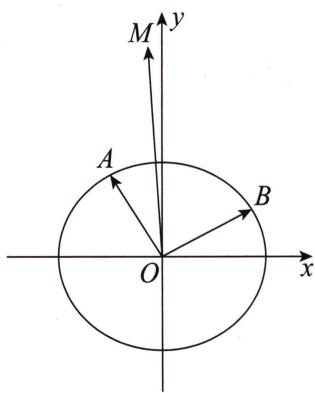

思维笔记

Siweibiji

思维笔记

Siweibiji

所以 $\frac{(2x_1 + x_2)^2}{4} +\frac{(2y_1 + y_2)^2}{3} = 5$ ，即 $\frac{x_0^2}{20} +\frac{y_0^2}{15} = 1.$
所以点 M 的轨迹方程为 $\frac{x^{2}}{20} + \frac{y^{2}}{15} = 1$ .

# 总结
设点法的本质其实就是对曲线方程的应用,除在第五节 单动点中最基础的消二次项的应用外,还有其他的变形,比如我们熟悉的点差法,不熟悉的点乘与点除,等等.

我们对一切条件或者目标的变形都不过是为了利用曲线方程. 同样曲线方程的任何变形都是为了符合条件或者目标的结构.

下面来说一说定比点差法.

定比点差法是一种利用特殊的代数结构进行处理的方法. 我们要意识到任何一个“快”的方法或“巧”的方法对于能处理的条件的特殊性的要求较高.

下面我们拿本节例题中的第一道来展示定比点差法的处理手法.

> [!example]- 例 4 在平面直角坐标系 $xOy$ 中, 过椭圆 $\frac{x^2}{4} + \frac{y^2}{3} = 1$ 的左焦点 $F$ 的直线交椭圆于 $A, B$ 两点, 若 $\overrightarrow{AF} = \lambda \overrightarrow{FB}$ , 求实数 $\lambda$ 的取值范围.

# 题目分析

本例的关键在于向量条件 $\overrightarrow{AF} = \lambda \overrightarrow{FB}$ 的处理方式.
设 $A(x_{1},y_{1}),B(x_{2},y_{2})$ ，由 $\overrightarrow{AF} = \lambda \overrightarrow{FB}$ ，可得 $\left\{ \begin{array}{l} - 1 - x_1 = \lambda (x_2 + 1),\\ -y_1 = \lambda y_2, \end{array} \right.$ 显然 $x_{1}$ 和 $y_{1}$ 的系数是一致的， $x_{2}$ 和 $y_{2}$ 的系数也是一致的.

为了整体利用 $x_{1}+\lambda x_{2}$ 和 $y_{1}+\lambda y_{2}$ ，我们将点 B 的坐标代入椭圆方程，将得到的式子乘 $\lambda^{2}$ 并与点 A 的坐标代入椭圆方程后的式子相减，最后利用平方差公式进行处理.

# 参考解析
设 $A(x_{1},y_{1}),B(x_{2},y_{2})$ ，由已知得 $F(-1,0)$
$\overrightarrow {A F} = \lambda   \overrightarrow {F B} \Rightarrow \left\{ \begin{array}{l l} - 1 - x _ {1} = \lambda (x _ {2} + 1), \\ - y _ {1} = \lambda y _ {2} \end{array} \right. \Rightarrow \left\{ \begin{array}{l l} x _ {1} + \lambda x _ {2} = - (\lambda + 1), \\ y _ {1} + \lambda y _ {2} = 0. \end{array} \right.$
由点 A, B 在椭圆上, 得 $\frac{x_{1}^{2}}{4} + \frac{y_{1}^{2}}{3} = 1$ ①, $\frac{x_{2}^{2}}{4} + \frac{y_{2}^{2}}{3} = 1$ ②.
因此① $-\lambda^2$ ②，得 $\frac{x_1^2}{4} -\frac{\lambda^2x_2^2}{4} +\frac{y_1^2}{3} -\frac{\lambda^2y_2^2}{3} = 1 - \lambda^2,$
即 $\frac{(x_1 + \lambda x_2)(x_1 - \lambda x_2)}{4} +\frac{(y_1 + \lambda y_2)(y_1 - \lambda y_2)}{3} = 1 - \lambda^2,$
将向量条件代入上式，得 $\frac{-(\lambda + 1)(x_1 - \lambda x_2)}{4} = 1 - \lambda^2 \Rightarrow x_1 - \lambda x_2 = 4\lambda - 4.$
此时有 $\left\{ \begin{array}{l} x_{1} + \lambda x_{2} = -(\lambda + 1), \\ x_{1} - \lambda x_{2} = 4\lambda - 4. \end{array} \right.$ 两式相减，得 $x_{2} = \frac{3 - 5\lambda}{2\lambda}$ .
因为 $-2 \leqslant x_{2} \leqslant 2$ ，所以 $-2 \leqslant \frac{3 - 5\lambda}{2\lambda} \leqslant 2$ ，解得 $\frac{1}{3} \leqslant \lambda \leqslant 3$ .
所以实数 $\lambda$ 的取值范围是 $\left[\frac{1}{3},3\right]$ .

# 总结

同学们会发现,定比点差法的关键就像点差法一样,有一个平方差的结构.如果两点不在同一曲线上,即坐标的系数不一样时就失效了,但是对于同曲线上的两点还是很好用的.特别是在处理的式子中字母非常多的情况下,这样写出来结构确实比较清晰.

> [!example]- 例8 已知过点 $D(b,0)$ 的直线 $l$ 交椭圆 $\frac{x^2}{a^2} +\frac{y^2}{b^2} = 1 (a > b > 0)$ 于 $A,B$ 两点，且点 $A,B$ 均在 $y$ 轴右侧， $\overrightarrow{DB} = 2\overrightarrow{AD}$ ，求椭圆离心率 $e$ 的取值范围.

# 题目分析
设 $A(x_{1},y_{1}),B(x_{2},y_{2})$ ，此时根据定比点差法处理向量条件后，我们可以得到 $\left\{ \begin{array}{l}2x_{1} + x_{2} = 3b,\\ 2x_{1} - x_{2} = \frac{a^{2}}{b}, \end{array} \right.$ 从而可以得到 $x_{1}$ 与 $a,b$ 的关系.因此要求 $\pmb{e}$ 的取值范围，就是求 $x_{1}$ 的取值范围.
由题意点 $A, B$ 均在 $y$ 轴右侧，极限情况是直线 $l$ 过上、下顶点，我们取过下顶点的直线 $y = x - b$ ，将直线方程 $y = x - b$ 与椭圆方程联立，得 $(a^2 + b^2)x^2 - 2a^2bx = 0$ ，其中一根为 $x = 0$ ，所以另一根为 $x = \frac{2a^2b}{a^2 + b^2}$ ，所以有 $0 < x_1 < \frac{2a^2b}{a^2 + b^2}$ .
最后解出 a, b 的不等关系, 从而得到 e 的取值范围.

# 参考解析
设 $A(x_{1},y_{1}), B(x_{2},y_{2})$ ,
$\overrightarrow {D B} = 2 \overrightarrow {A D} \Rightarrow \left\{ \begin{array}{l} x _ {2} - b = 2 (b - x _ {1}), \\ y _ {2} = - 2 y _ {1} \end{array} \right. \Rightarrow \left\{ \begin{array}{l} 2 x _ {1} + x _ {2} = 3 b, \\ 2 y _ {1} + y _ {2} = 0. \end{array} \right.$
由点 A, B 在椭圆上, 可得 $\frac{x_{1}^{2}}{a^{2}} + \frac{y_{1}^{2}}{b^{2}} = 1$ ①, $\frac{x_{2}^{2}}{a^{2}} + \frac{y_{2}^{2}}{b^{2}} = 1$ ②.
由 4①—②, 得

思维笔记

Siweibiji

思维笔记

Siweibiji

$\frac {4 x _ {1} ^ {2} - x _ {2} ^ {2}}{a ^ {2}} + \frac {4 y _ {1} ^ {2} - y _ {2} ^ {2}}{b ^ {2}} = 3 \Rightarrow \frac {(2 x _ {1} + x _ {2}) (2 x _ {1} - x _ {2})}{a ^ {2}} + \frac {(2 y _ {1} + y _ {2}) (2 y _ {1} - y _ {2})}{b ^ {2}} = 3,$
将向量条件代入上式，得 $\frac{3b(2x_1 - x_2)}{a^2} = 3 \Rightarrow 2x_1 - x_2 = \frac{a^2}{b}$ .
此时有 $\left\{\begin{aligned}&2x_{1}+x_{2}=3b,\\ &2x_{1}-x_{2}=\frac{a^{2}}{b},\end{aligned}\right.$ 解得 $x_{1}=\frac{3b+\frac{a^{2}}{b}}{4}.$
由题意点 A, B 均在 y 轴右侧, 得
$0 <   x _ {1} <   \frac {2 a ^ {2} b}{a ^ {2} + b ^ {2}} \Rightarrow \frac {3 b + \frac {a ^ {2}}{b}}{4} <   \frac {2 a ^ {2} b}{a ^ {2} + b ^ {2}} \Rightarrow 3 b ^ {4} - 4 a ^ {2} b ^ {2} + a ^ {4} <   0 \Rightarrow 3 b ^ {2} > a ^ {2},$
所以 $e = \frac{c}{a} = \sqrt{\frac{a^2 - b^2}{a^2}} = \sqrt{1 - \left(\frac{b}{a}\right)^2} \in \left(0, \frac{\sqrt{6}}{3}\right)$ .
故椭圆离心率 e 的取值范围为 $\left(0, \frac{\sqrt{6}}{3}\right)$ .

下面来处理一个“双共线”形式的例题.

> [!example]- 例9 已知 $F_{1}, F_{2}$ 是椭圆 $\frac{x^{2}}{2} + y^{2} = 1$ 的左、右焦点，动点 $P(x_{0}, y_{0})$ 在椭圆上运动. 延长 $PF_{1}, PF_{2}$ 分别交椭圆于 $A, B$ 两点（ $A$ 与 $B$ 不重合）. 设 $\overrightarrow{AF_1} = \lambda \overrightarrow{F_1P}, \overrightarrow{BF_2} = \mu \overrightarrow{F_2P}$ ，求 $\lambda + \mu$ 的最小值.

# 题目分析
设 $A(x_{1},y_{1}),B(x_{2},y_{2})$
由 $\overrightarrow{AF_1} = \lambda \overrightarrow{F_1P}$ ，结合定比点差法可得 $\left\{ \begin{array}{l} -\lambda x_0 + x_1 = 2\lambda -2,\\ \lambda x_0 + x_1 = -( \lambda +1). \end{array} \right.$

下面我们需要分析,要求 $\lambda + \mu$ 的最小值,核心一定是用单一变量去表示,因此我们应该将两式相减,找到 $\lambda$ 与 $x_{0}$ 的关系.同理利用另一个向量条件得到 $\mu$ 与 $x_{0}$ 的关系.
接下来将两式相减得 $2\lambda x_0 = 1 - 3\lambda \Rightarrow \lambda (2x_0 + 3) = 1 \Rightarrow \lambda = \frac{1}{2x_0 + 3}$ .

对 $\overrightarrow{BF_2} = \mu \overrightarrow{F_2P}$ 的操作同上，可得 $\mu = \frac{1}{-2x_0 + 3}$ .
所以 $\lambda + \mu = \frac{1}{2x_0 + 3} + \frac{1}{-2x_0 + 3} = \frac{6}{9 - 4x_0^2}$ ，要求 $\lambda + \mu$ 的最小值就是求 $x_0^2$ 的最小值.
因为点 $P(x_0, y_0)$ 在椭圆上，所以 $x_0^2$ 的最小值为 0，即 $\lambda + \mu$ 的最小值为 $\frac{2}{3}$ .

# 参考解析
设 $A(x_{1},y_{1}), B(x_{2},y_{2})$ ，由已知得 $F_{1}(-1,0), F_{2}(1,0)$ .
$\overrightarrow {A F _ {1}} = \lambda   \overrightarrow {F _ {1} P} \Rightarrow \left\{ \begin{array}{l l} - 1 - x _ {1} = \lambda (x _ {0} + 1), \\ - y _ {1} = \lambda y _ {0} \end{array} \right. \Rightarrow \left\{ \begin{array}{l l} \lambda x _ {0} + x _ {1} = - (\lambda + 1), \\ \lambda y _ {0} + y _ {1} = 0. \end{array} \right.$
因为点 A, P 在椭圆上, 所以 $\frac{x_{1}^{2}}{2} + y_{1}^{2} = 1$ ①, $\frac{x_{0}^{2}}{2} + y_{0}^{2} = 1$ ②.
由① $-\lambda^2$ ②，得 $\frac{x_1^2 - \lambda^2x_0^2}{2} +y_1^2 -\lambda^2y_0^2 = 1 - \lambda^2$
$\Rightarrow \frac {(\lambda x _ {0} + x _ {1}) (- \lambda x _ {0} + x _ {1})}{2} + (\lambda y _ {0} + y _ {1}) (- \lambda y _ {0} + y _ {1}) = 1 - \lambda^ {2}.$
将向量条件代入上式，得 $\frac{-(\lambda + 1)(-\lambda x_0 + x_1)}{2} = 1 - \lambda^2 \Rightarrow -\lambda x_0 + x_1 = 2\lambda - 2.$
所以有 $\left\{\begin{aligned}-\lambda x_{0}+x_{1}&=2\lambda-2,\\ \lambda x_{0}+x_{1}&=-(\lambda+1),\end{aligned}\right.$
将两式相减得 $2\lambda x_0 = 1 - 3\lambda \Rightarrow \lambda (2x_0 + 3) = 1 \Rightarrow \lambda = \frac{1}{2x_0 + 3}$ .

同理 $\overrightarrow{BF_2} = \mu \overrightarrow{F_2P} \Rightarrow \begin{cases} 1 - x_2 = \mu (x_0 - 1), \\ -y_2 = \mu y_0 \end{cases} \Rightarrow \begin{cases} \mu x_0 + x_2 = \mu + 1, \\ \mu y_0 + y_2 = 0. \end{cases}$
由点 B, P 在椭圆上, 得 $\frac{x_{2}^{2}}{2} + y_{2}^{2} = 1$ ③, $\frac{x_{0}^{2}}{2} + y_{0}^{2} = 1$ ②.
由③ $-\mu^{2}$ ②，得 $\frac{x_2^2 - \mu^2x_0^2}{2} +y_2^2 -\mu^2y_0^2 = 1 - \mu^2$
$\Rightarrow \frac {(\mu x _ {0} + x _ {2}) (- \mu x _ {0} + x _ {2})}{2} + (\mu y _ {0} + y _ {2}) (- \mu y _ {0} + y _ {2}) = 1 - \mu^ {2}.$
将向量条件代入上式，得 $\frac{(\mu + 1)(-\mu x_0 + x_2)}{2} = 1 - \mu^2 \Rightarrow -\mu x_0 + x_2 = 2 - 2\mu,$ 此时有 $\left\{ \begin{array}{l} \mu x_0 + x_2 = \mu + 1, \\ -\mu x_0 + x_2 = 2 - 2\mu, \end{array} \right.$ 将两式相减得 $\mu = \frac{1}{-2x_0 + 3}$ .
所以 $\lambda +\mu = \frac{1}{2x_0 + 3} +\frac{1}{-2x_0 + 3} = \frac{6}{9 - 4x_0^2}\geqslant \frac{2}{3}$ ，当且仅当 $x_0 = 0$ 时取等号.
所以 $\lambda + \mu$ 的最小值为 $\frac{2}{3}$ .

# 总结

至此我们将定比点差法的操作介绍完了. 定比点差法是一种比较巧妙的利用已知结构的方法, 很有设点的特色. 需要注意两点: 一是不要过度使用本方法, 使用什么方法应以题目特征与自身熟练程度为依据来选择; 二是本方法属于代数变形技巧, 不包含超纲内容, 可以在考试中正常使用.

有兴趣的同学可以用这个方法去处理本节中的其他例题.

思维笔记

Siweibiji

# 第七节 抛物线设点
在圆锥曲线中,抛物线标准方程的结构算是别具一格的.因为在椭圆与双曲线的方程中,变量都是二次的,唯独抛物线的方程中一次与二次都有.这就为设点法提供了可以操作的空间.
在涉及抛物线的题目中,除了求面积、求长度的题目设线法可能会更有优势外,其余的如求斜率、求比例等问题设点法则会大放异彩.

我们先看抛物线中的两个设点法的魅力所在.

已知 $A, B$ 是抛物线 $y^{2} = 2px (p > 0)$ 上的两点. 我们该怎么设点呢? 还是设为 $(x, y)$ 的形式吗?

我们可以设 $A\left(\frac{y_1^2}{2p}, y_1\right), B\left(\frac{y_2^2}{2p}, y_2\right)$ ，这样设点可以起到统一变量或者说减少变量的作用。

也可设 $A(2pm^2, 2pm), B(2pn^2, 2pn)$ ，这样设点可避免出现分式.
根据设的点坐标可以发现 $k_{AB} = \frac{y_1 - y_2}{\frac{y_1^2}{2p} - \frac{y_2^2}{2p}} = \frac{2p(y_1 - y_2)}{y_1^2 - y_2^2} = \frac{2p}{y_1 + y_2}$ .

进一步有直线 $AB$ 的方程为 $y - y_{1} = \frac{2p}{y_{1} + y_{2}}\left(x - \frac{y_{1}^{2}}{2p}\right) \Rightarrow y = \frac{2p}{y_{1} + y_{2}}x - \frac{y_{1}^{2}}{y_{1} + y_{2}} + y_{1}$ , 即 $y = \frac{2px + y_1y_2}{y_1 + y_2}$ .

意味着抛物线上两点所在的斜率存在的直线是由 $y_{1} + y_{2}$ 和 $y_{1}y_{2}$ 决定的.
所以如果问题为找直线过的定点,那么问题就等价于寻找 $y_{1} + y_{2}$ 和 $y_{1}y_{2}$ 的关系,如果已知直线过定点,那么就相当于给了我们 $y_{1} + y_{2}$ 和 $y_{1}y_{2}$ 的关系.

此外,看到这两个结构是不是马上就想到了完全平方公式?

这里需要强调的是,在抛物线设点法中,我们经常将类似 $a \pm b, ab, a^{2} + b^{2}$ 的结构当成一个个整体去进行运算与思考,而不是将一个坐标视为一个变量.这些式子在实际操作中都非常容易得到,不需要额外记忆.

运用设点法时,若已知直线过定点,则不必求直线方程,直接利用三点共线,即斜率相等来翻译,如直线 AB 过焦点 F,有 $k_{AF}=k_{BF}$ ,
即 $\frac{y_1}{\frac{y_1^2}{2p} - \frac{p}{2}} = \frac{y_2}{\frac{y_2^2}{2p} - \frac{p}{2}} \Rightarrow \frac{y_1}{y_1^2 - p^2} = \frac{y_2}{y_2^2 - p^2} \Rightarrow y_1y_2(y_2 - y_1) = p^2 (y_1 - y_2)$
从而有 $y_{1}y_{2}=-p^{2}$ .
在抛物线中,纯设点既不需要考虑椭圆与双曲线设点中可能出现的代数变形(因为这里直接统一了横、纵坐标),也不需要担心式子过于复杂(因为有大量的东西可以约掉化简).
接下来我们一起看几道例题,涉及证明直线平行、求直线方程、直线过定点和求最值等问题.

> [!example]- 例 10 已知 AB 为抛物线 $y^{2}=4x$ 的一条弦, 且 AB 过焦点 F. 过 A, B 分别作一条与 x 轴平行的直线交抛物线的准线于 D, E 两点. 若 P 是线段 DE 的中点, 证明: AP // EF.
# 题目分析
要证 $AP \parallel EF$ , 关键在于 $A, B, D, E$ 这四个点.
此时点 P 由点 D, E 决定, 而点 D, E 分别由点 A, B 决定, F 为已知点.
所以翻译条件 A, B, F 三点共线即可处理目标.

# 参考解析
如图所示，设 $A\left(\frac{y_1^2}{4}, y_1\right), B\left(\frac{y_2^2}{4}, y_2\right)$ ，其中 $y_1 \neq 0, y_2 \neq 0$ ，由题意得 $F(1,0)$ .
因为 A, B, F 三点共线, 所以 $k_{AF} = k_{BF}$ , 化简得 $y_{1}y_{2} = -4$ .
要证 $AP \parallel EF$ ，即证 $k_{AP} = k_{EF}$ 。
由题意知 $D(-1, y_1), E(-1, y_2)$ ，所以 $P\left(-1, \frac{y_1 + y_2}{2}\right)$ ，
要证 $k_{AP} = k_{EF}$ ，即证 $\frac{y_1 - \frac{y_1 + y_2}{2}}{\frac{y_1^2}{4} + 1} = \frac{y_2}{-1 - 1} \Rightarrow \frac{2(y_1 - y_2)}{y_1^2 + 4} =$
$- \frac {y _ {2}}{2} \Rightarrow 4 y _ {1} - 4 y _ {2} = - y _ {1} ^ {2} y _ {2} - 4 y _ {2},$

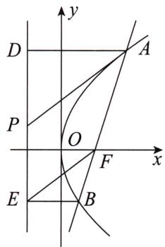
即证 $y_{1}y_{2}=-4$ ，此式恒成立，因此原命题得证.

> [!example]- 例 11 已知过点 $M(-1,0)$ 的直线 l 与抛物线 $x^{2}=4y$ 交于 E, F 两点，过点 E, F 分别作抛物线的切线 $l_{1}, l_{2}$ . 当 $l_{1} \perp l_{2}$ 时，求直线 l 的方程.
# 题目分析

本例的关键在于两条切线,可以直接求导来处理,也可以设切点、斜率得到切线方程后,与抛物线方程联立,利用判别式 $\Delta=0$ 得到斜率与切点坐标的关系.
由抛物线设点我们可知,要求直线 l 的方程,即求点 E,F 的横坐标之和,而此值为化简 $l_{1} \perp l_{2}$ 的结果.

# 参考解析

已知抛物线方程为 $x^{2} = 4y$ ，设 $E\left(x_{1},\frac{x_{1}^{2}}{4}\right),F\left(x_{2},\frac{x_{2}^{2}}{4}\right).$
由 M, E, F 三点共线, 得

思维笔记

Siweibiji

思维笔记

Siweibiji

$k _ {M E} = k _ {M F} \Rightarrow \frac {\frac {x _ {1} ^ {2}}{4}}{x _ {1} + 1} = \frac {\frac {x _ {2} ^ {2}}{4}}{x _ {2} + 1} \Rightarrow x _ {1} ^ {2} x _ {2} + x _ {1} ^ {2} = x _ {2} ^ {2} x _ {1} + x _ {2} ^ {2} \Rightarrow x _ {1} x _ {2} (x _ {1} - x _ {2}) = x _ {2} ^ {2} - x _ {1} ^ {2},$
即 $x_{1} + x_{2} = -x_{1}x_{2}$

# 求切线斜率方法一:求导
设切线 $l_{1}, l_{2}$ 的斜率分别为 $k_{1}, k_{2}$ ,
由 $x^{2} = 4y$ ，得 $y = \frac{1}{4} x^2$ ，求导得 $y' = \frac{1}{2} x.$
所以 $k_{1}=\frac{1}{2}x_{1}, k_{2}=\frac{1}{2}x_{2}.$
$l _ {1} \perp l _ {2} \Rightarrow \frac {1}{2} x _ {1} \cdot \frac {1}{2} x _ {2} = - 1 \Rightarrow x _ {1} x _ {2} = - 4, \text {所以} k _ {E F} = \frac {x _ {1} + x _ {2}}{4} = \frac {- x _ {1} x _ {2}}{4} = 1.$
所以直线 l 的方程为 $y = x + 1$ .

# 求切线斜率方法二:判别式
设切线 $l_{1}, l_{2}$ 的斜率分别为 $k_{1}, k_{2}$ ,
所以直线 $l_{1}$ 的方程为 $y = k_{1}(x - x_{1}) + \frac{x_{1}^{2}}{4}$ ，直线 $l_{2}$ 的方程为 $y = k_{2}(x - x_{2}) + \frac{x_{2}^{2}}{4}$ ，
联立直线 $l_{1}$ 的方程与抛物线方程得 $\left\{ \begin{array}{l} y = k_{1}(x - x_{1}) + \frac{x_{1}^{2}}{4}, \\ x^{2} = 4y \end{array} \right. \Rightarrow x^{2} - 4k_{1}x + 4\left(k_{1}x_{1} - \frac{x_{1}^{2}}{4}\right),$
所以 $\Delta = (-4k_{1})^{2} - 16\left(k_{1}x_{1} - \frac{x_{1}^{2}}{4}\right) = 0$ ，化简得 $\left(k_{1} - \frac{1}{2} x_{1}\right)^{2} = 0,$
即 $k_{1} = \frac{1}{2} x_{1}$ . 同理可得 $k_{2} = \frac{1}{2} x_{2}$ .
$l _ {1} \perp l _ {2} \Rightarrow \frac {1}{2} x _ {1} \cdot \frac {1}{2} x _ {2} = - 1 \Rightarrow x _ {1} x _ {2} = - 4, \text {所以} k _ {E F} = \frac {x _ {1} + x _ {2}}{4} = \frac {- x _ {1} x _ {2}}{4} = 1.$
所以直线 l 的方程为 $y = x + 1$ .

> [!example]- 例 12 已知过抛物线 $y^{2}=4x$ 上一点 $M(4,4)$ 作抛物线的两条弦 MD 和 ME，且 $ME \perp MD$ 。请问直线 DE 是否过定点？若是，请求出定点坐标；若不是，则说明理由。
# 题目分析

要想求直线 $DE$ 过定点，需要先求出直线 $DE$ 的方程，而直线 $DE$ 的方程由 $y_{D} + y_{E}$ 与 $y_{D}y_{E}$ 决定. $y_{D} + y_{E}$ 与 $y_{D}y_{E}$ 的关系可由条件 $ME \perp MD$ 得到. 所以我们只需要设点后翻译斜率，进而翻译垂直关系即可.

# 参考解析
设 $D\left(\frac{y_1^2}{4}, y_1\right), E\left(\frac{y_2^2}{4}, y_2\right)$ ，则直线 $DE$ 的方程为 $y = \frac{4x + y_1y_2}{y_1 + y_2}$ .
由 $ME \perp MD$ ，得 $k_{ME} \cdot k_{MD} = -1$ ，
代入坐标得
$\frac {y _ {1} - 4}{\frac {y _ {1} ^ {2}}{4} - 4} \cdot \frac {y _ {2} - 4}{\frac {y _ {2} ^ {2}}{4} - 4} = - 1 \Rightarrow \frac {4}{y _ {1} + 4} \cdot \frac {4}{y _ {2} + 4} = - 1 \Rightarrow y _ {1} y _ {2} + 4 (y _ {1} + y _ {2}) + 3 2 = 0.$
因此 $y = \frac{4x + y_1y_2}{y_1 + y_2}\Rightarrow y = \frac{4x - 4(y_1 + y_2) - 32}{y_1 + y_2}\Rightarrow y = \frac{4}{y_1 + y_2} (x - 8) - 4.$
即直线 DE 过定点 $(8, -4)$ .

> [!example]- 例13 已知抛物线 $y^{2} = 4x$ ，过其焦点 $F$ 的直线与抛物线相交于 $A, B$ 两点，点 $C$ 的坐标为 $(-2,0)$ . 记直线 $CA, CB$ 的斜率分别为 $k_{1}, k_{2}$ ，求 $\frac{1}{k_{1}^{2}} + \frac{1}{k_{2}^{2}}$ 的最小值.

# 题目分析

看到斜率的第一反应是利用设线法,但是注意到目标中是斜率倒数的平方,用设点法可能会更简洁,最后利用基本不等式求出最值即可.

# 参考解析
由题意知 $F(1,0)$ ，设 $A\left(\frac{y_1^2}{4}, y_1\right), B\left(\frac{y_2^2}{4}, y_2\right)$ ，则有 $k_1 = \frac{y_1}{\frac{y_1^2}{4} + 2}, k_2 = \frac{y_2}{\frac{y_2^2}{4} + 2}$ ，
所以 $\frac{1}{k_1^2} = \frac{y_1^2}{16} +\frac{4}{y_1^2} +1,\frac{1}{k_2^2} = \frac{y_2^2}{16} +\frac{4}{y_2^2} +1$ ，所以 $\frac{1}{k_1^2} +\frac{1}{k_2^2} = \frac{y_1^2}{16} +\frac{4}{y_1^2} +1 + \frac{y_2^2}{16} +\frac{4}{y_2^2} +1.$
由 $F, A, B$ 三点共线，可得 $y_{1}y_{2} = -4$ ，所以 $\frac{1}{k_1^2} + \frac{1}{k_2^2} = \frac{5}{16}(y_1^2 + y_2^2) + 2$ .
由基本不等式有 $y_1^2 + y_2^2 \geqslant 2\sqrt{y_1^2y_2^2} = 2|y_1| \cdot |y_2| = 8$ ，当且仅当 $|y_1| = |y_2|$ 时，等号成立.
所以 $\frac{1}{k_1^2} +\frac{1}{k_2^2}$ 的最小值为 $\frac{9}{2}$

# 总结

虽然在开篇说过长度之类的问题可能设线更方便,但是这里要指出的是,如果已知条件是如共线向量一样,用点坐标表示起来更简单清楚的话,设点未尝不是一个方向.

我们来看最后这个例子.

> [!example]- 例 14 设抛物线 $y^{2}=4x$ 的准线与 x 轴交于点 $F_{1}$ ，自点 $F_{1}$ 引直线交抛物线于 P，Q 两个不同的点，设 $\overrightarrow{F_{1}P}=\lambda\overrightarrow{F_{1}Q}$ 。若 $\lambda\in\left[\frac{1}{2},1\right)$ ，求 $|PQ|$ 的取值范围。
思维笔记

Siweibiji

# 题目分析

我们注意到本例为求线段长度的取值范围,而 P,Q 又是抛物线上两点,所以最终一定会有以 $y_{P} + y_{Q}$ 与 $y_{P}y_{Q}$ 为变量的目标式子.但是此处有另一个变量 $\lambda$ ,那就意味着我们需要思考是将 $\lambda$ 消掉,还是消掉其他变量最终保留 $\lambda$ .
设 $P\left(\frac{y_1^2}{4}, y_1\right), Q\left(\frac{y_2^2}{4}, y_2\right)$ ，则 $\overrightarrow{F_1P} = \lambda \overrightarrow{F_1Q} \Rightarrow \begin{cases} y_1 = \lambda y_2, \\ \frac{y_1^2}{4} + 1 = \lambda \left(\frac{y_2^2}{4} + 1\right). \end{cases}$

我们可以将两式相除消掉 $\lambda$ ，但消掉 $\lambda$ 后得到的式子并不好处理，所以选择消掉点的坐标，即将上式代入下式得 $y_{2}^{2} = \frac{4}{\lambda}$ ，进而有 $y_{1}^{2} = \lambda^{2}y_{2}^{2} = 4\lambda$ ，且 $y_{1}y_{2} = 4$
最后将目标统一为 $\lambda$ 即可求解.

# 参考解析
设 $P\left(\frac{y_1^2}{4}, y_1\right), Q\left(\frac{y_2^2}{4}, y_2\right)$ .
由已知得点 $F_{1}$ 的坐标为 $(-1,0)$ ，所以 $\overrightarrow{F_1P} = \lambda \overrightarrow{F_1Q} \Rightarrow \begin{cases} y_1 = \lambda y_2, \\ \frac{y_1^2}{4} + 1 = \lambda \left( \frac{y_2^2}{4} + 1 \right). \end{cases}$
将上式代入下式可得 $y_{2}^{2} = \frac{4}{\lambda}$ ，进而有 $y_{1}^{2} = \lambda^{2}y_{2}^{2} = 4\lambda$ ，且 $y_{1}y_{2} = 4$ .
于是 $|PQ| = \sqrt{\left(\frac{y_1^2}{4} - \frac{y_2^2}{4}\right)^2 + (y_1 - y_2)^2} = \sqrt{(y_1^2 + y_2^2 - 2y_1y_2)\left(\frac{y_1^2 + y_2^2 + 2y_1y_2}{16} + 1\right)}$
将 $y_{1}^{2} = 4\lambda ,y_{2}^{2} = \frac{4}{\lambda},y_{1}y_{2} = 4$ 代入上式，则有
$\mid P Q \mid = \sqrt {\left(4 \lambda + \frac {4}{\lambda} - 8\right) \left(\frac {4 \lambda + \frac {4}{\lambda} + 8}{1 6} + 1\right)} = \sqrt {\left(\lambda + \frac {1}{\lambda} - 2\right) \left(\lambda + \frac {1}{\lambda} + 6\right)}.$
设 $t = \lambda +\frac{1}{\lambda}\in \left(2,\frac{5}{2}\right]$ ，则 $|PQ| = \sqrt{(t - 2)(t + 6)}\in \left(0,\frac{\sqrt{17}}{2}\right].$
所以 $|PQ|$ 的取值范围为 $\left(0, \frac{\sqrt{17}}{2}\right]$ .

# 总结
因为抛物线具有特殊的方程结构,所以在解题时运用设点法会更好处理,当然也可以使用设线法.实际上本篇提到的手法都能在三种圆锥曲线中使用.

同学们在平时学习的时候,应该尽可能用多个视角处理题目,这样才能明确自己在不同手法上的能力强弱,从而促进后面的学习.

# 第八节 切线——设点解线

思维笔记

Siweiliji

在第四节中,讲解了设线解点的操作,接下来从设点解线的角度来进行手法的学习.

过椭圆 $\frac{x^2}{a^2} +\frac{y^2}{b^2} = 1$ 上一点 $P(x_0,y_0)$ 作椭圆的切线，则切线的方程为 $\frac{x_0x}{a^2}+$ $\frac{y_0y}{b^2} = 1.$
证明:①当切线斜率存在时,
设过点 P 的切线方程为 $y=k(x-x_{0})+y_{0}$ ,

与 $\frac{x^{2}}{a^{2}}+\frac{y^{2}}{b^{2}}=1$ 联立得 $\left\{\begin{aligned}y&=k(x-x_{0})+y_{0},\\ \frac{x^{2}}{a^{2}}+\frac{y^{2}}{b^{2}}&=1,\end{aligned}\right.$
消去 $y$ ，并整理得 $(a^2 k^2 + b^2)x^2 + 2a^2k(y_0 - kx_0)x + a^2(y_0 - kx_0)^2 - a^2b^2 = 0.$ （ $*$ ）
因为直线与椭圆相切, 切点为 $P(x_{0}, y_{0})$ ,
所以 $x_{0}$ 是方程 (\*) 的唯一解，
所以由韦达定理可知 $2x_{0}=\frac{-2a^{2}k(y_{0}-kx_{0})}{a^{2}k^{2}+b^{2}}$ ,
即 $x_0 = \frac{-a^2k(y_0 - kx_0)}{a^2k^2 + b^2},$
整理得 $k=-\frac{b^{2}x_{0}}{a^{2}y_{0}}$ ,
代入 $y = k(x - x_0) + y_0$ ，得 $y = -\frac{b^2x_0}{a^2y_0}(x - x_0) + y_0$ .
整理得 $\frac{x_{0}x}{a^{2}}+\frac{y_{0}y}{b^{2}}=1.$

②当切线斜率不存在时，

切点为 $P(\pm a,0)$ ，所以切线方程为 $x=\pm a$ .

综上，点 $P(x_0,y_0)$ 处的切线方程为 $\frac{x_0x}{a^2} +\frac{y_0y}{b^2} = 1.$

如第四节中所说,从解题的角度两种设法都是一致的,因此本节不设其他例题.

# 第九节 “高级”代数变形(选学)
首先再次强调:本节内容不是必须掌握的.有兴趣的同学可以花些时间尝试,目标紧盯高考的同学可以直接跳过本节.本节内容有自身的局限,如某些表达式要剔除横或纵坐标相同的情况.

我们知道设点的实质是利用点坐标满足的曲线方程与已知条件进行一系列的联立和变形,其中所有的未知量都由点的坐标表示出来,所以不存在不联立的解法.

这种方法用好了会有一种“答案”本天成，妙手偶得之的效果。实际上也是由圆锥曲线的性质所决定的。

那么为什么强调不要过多探究呢？因为要想用好，你就必须对常规的点坐标的组合形式，以及怎么得到这些形式之间的关系的操作非常熟悉，你必须“预知”某步操作后的“结构”是什么样的，这与记忆结论来达到面上计算量少是相同的。
接下来我们以椭圆为例,看一看“基本”操作后的结构.

已知 $A(x_{1},y_{1}),B(x_{2},y_{2})$ 是椭圆 $\frac{x^2}{a^2} +\frac{y^2}{b^2} = 1(a > b > 0)$ 上的两点，
则有 $\frac{x_1^2}{a^2} +\frac{y_1^2}{b^2} = 1$ ①， $\frac{x_2^2}{a^2} +\frac{y_2^2}{b^2} = 1$ ②.

① + ② 得 $\frac{x_1^2 + x_2^2}{a^2} + \frac{y_1^2 + y_2^2}{b^2} = 2 \Rightarrow \frac{(x_1 + x_2)^2}{a^2} + \frac{(y_1 + y_2)^2}{b^2} = 2\left(\frac{x_1x_2}{a^2} + \frac{y_1y_2}{b^2} + 1\right)$ .

点和可得到 $x_{1}^{2} + x_{2}^{2}$ 与 $y_{1}^{2} + y_{2}^{2}$ 的关系，凑完全平方后可得 $x_{1} + x_{2}, y_{1} + y_{2}, x_{1}x_{2}, y_{1}y_{2}$ 四者的关系.

①-②得 $\frac{x_1^2 - x_2^2}{a^2} +\frac{y_1^2 - y_2^2}{b^2} = 0\Rightarrow \frac{y_1^2 - y_2^2}{b^2} = -\frac{x_1^2 - x_2^2}{a^2}\Rightarrow \frac{y_1 + y_2}{x_1 + x_2}\cdot \frac{y_1 - y_2}{x_1 - x_2} = -\frac{b^2}{a^2}.$

点差可得到 $x_{1} + x_{2},y_{1} + y_{2},x_{1} - x_{2},y_{1} - y_{2}$ 四者的关系.

①×②得 $\left(\frac{x_{1}^{2}}{a^{2}}+\frac{y_{1}^{2}}{b^{2}}\right)\left(\frac{x_{2}^{2}}{a^{2}}+\frac{y_{2}^{2}}{b^{2}}\right)=1\Rightarrow\left(\frac{x_{1}x_{2}}{a^{2}}\right)^{2}+\left(\frac{y_{1}y_{2}}{b^{2}}\right)^{2}+\frac{x_{1}^{2}y_{2}^{2}+x_{2}^{2}y_{1}^{2}}{a^{2}b^{2}}=1.$
此时我们发现前者 $\left(\frac{x_1x_2}{a^2}\right)^2 +\left(\frac{y_1y_2}{b^2}\right)^2$ 与后者 $\frac{x_1^2y_2^2 + x_2^2y_1^2}{a^2b^2}$ 要凑完全平方的话都需要 $\frac{x_1x_2y_1y_2}{a^2b^2}$ ，因此有两种结果： $\left(\frac{x_1x_2}{a^2} +\frac{y_1y_2}{b^2}\right)^2 +\frac{(x_1y_2 - x_2y_1)^2}{a^2b^2} = 1$ 或者 $\left(\frac{x_1x_2}{a^2} -\frac{y_1y_2}{b^2}\right)^2 +\frac{(x_1y_2 + x_2y_1)^2}{a^2b^2} = 1.$

点乘可得到 $x_{1}x_{2}, y_{1}y_{2}$ 与 $x_{1}y_{2} + x_{2}y_{1}$ 或 $x_{1}y_{2} - x_{2}y_{1}$ 的关系.
最后一种情况,我们直接除的话就与点差无异,所以这里先变形一下:
$\frac{x_1^2}{a^2} + \frac{y_1^2}{b^2} = 1 \Rightarrow x_1^2 = \frac{a^2}{b^2} (b^2 - y_1^2)$ ③, $\frac{x_2^2}{a^2} + \frac{y_2^2}{b^2} = 1 \Rightarrow x_2^2 = \frac{a^2}{b^2} (b^2 - y_2^2)$ ④,

③ $\div$ ④得 $\frac{x_1^2}{x_2^2} = \frac{b^2 - y_1^2}{b^2 - y_2^2} \Rightarrow b^2 x_1^2 - x_1^2 y_2^2 = b^2 x_2^2 - x_2^2 y_1^2 \Rightarrow b^2 (x_1^2 - x_2^2) = x_1^2 y_2^2 - x_2^2 y_1^2$
$\Rightarrow \frac {x _ {1} y _ {2} - x _ {2} y _ {1}}{x _ {1} - x _ {2}} \cdot \frac {x _ {1} y _ {2} + x _ {2} y _ {1}}{x _ {1} + x _ {2}} = b ^ {2}.$

同理， $\frac{x_{1}^{2}}{a^{2}}+\frac{y_{1}^{2}}{b^{2}}=1\Rightarrow y_{1}^{2}=\frac{b^{2}}{a^{2}}(a^{2}-x_{1}^{2}),\frac{x_{2}^{2}}{a^{2}}+\frac{y_{2}^{2}}{b^{2}}=1\Rightarrow y_{2}^{2}=\frac{b^{2}}{a^{2}}(a^{2}-x_{2}^{2})$ ，再点除可得 $\frac{y_{1}x_{2}-y_{2}x_{1}}{y_{1}-y_{2}}\cdot\frac{y_{1}x_{2}+y_{2}x_{1}}{y_{1}+y_{2}}=a^{2}$ .

点除可得到 $x_{1}y_{2} - x_{2}y_{1}, x_{1}y_{2} + x_{2}y_{1}, x_{1} - x_{2}, x_{1} + x_{2}$ 的关系或 $x_{1}y_{2} - x_{2}y_{1}, x_{1}y_{2} + x_{2}y_{1}, y_{1} - y_{2}, y_{1} + y_{2}$ 的关系.

以上都是利用两点在曲线上可组合出的结构,那么单个点在曲线上能不能有除第五节 单动点以外的变形呢? 答案是肯定的. 就像上面多次运用了完全平方公式一样,单个点在曲线上也可以如此变形.

我们有时会遇见 $bx_0, ay_0$ 的结构， $\frac{x_0^2}{a^2} + \frac{y_0^2}{b^2} = 1 \Rightarrow (bx_0)^2 + (ay_0)^2 = a^2 b^2$

直接凑： $(bx_{0}+ay_{0})^{2}=a^{2}b^{2}+2abx_{0}y_{0}$ 或 $(bx_{0}-ay_{0})^{2}=a^{2}b^{2}-2abx_{0}y_{0}$ ;

加减 $ab: (bx_0 + ay_0 - ab)^2 = (bx_0 + ay_0)^2 + a^2b^2 - 2ab(bx_0 + ay_0) \Rightarrow (bx_0 + ay_0 - ab)^2 + 2ab(bx_0 + ay_0 - ab) = 2abx_0y_0$ ，正好可以得到 $bx_0 + ay_0 - ab$ 与 $x_0y_0$ 的关系，同理可得 $bx_0 \pm ay_0 \pm ab$ 和 $x_0y_0$ 的直接关系.

看到这里很多同学都会迷茫了. 这里讲的内容和实际做题似乎关系不大, 都没怎么在题目里见过.

这是当然的了.本书研究的是什么？解析几何.这就意味着我们在利用坐标系处理几何的问题,所以上面我们只探究了代数上的结构,下面还需要探究由几何上的关系可以得到什么样的代数关系,这样才能实战解题.
首先就是直线.
在设线法中我们直接设出直线方程即可,在设点法中我们也需要表示出直线方程,但目的往往不是将直线方程和椭圆方程联立,而大多是为了和其他直线方程联立.
设直线与曲线 $\frac{x^2}{a^2} +\frac{y^2}{b^2} = 1(a > b > 0)$ 相交的两个动点为 $A(x_{1},y_{1}),B(x_{2},$ $y_{2})$ ，其中 $x_{1}\neq x_{2},y_{1}\neq y_{2}$ ，得到直线的两点式方程，即
$\frac {y - y _ {1}}{y _ {2} - y _ {1}} = \frac {x - x _ {1}}{x _ {2} - x _ {1}} \Rightarrow (y _ {2} - y _ {1}) x - (x _ {2} - x _ {1}) y = x _ {1} y _ {2} - x _ {2} y _ {1}.$
令 $x = 0$ ，得 $y = \frac{x_1y_2 - x_2y_1}{x_1 - x_2}$ ；令 $y = 0$ ，得 $x = \frac{x_1y_2 - x_2y_1}{y_2 - y_1}$
此时我们惊喜地发现, 直线的横截距和纵截距是由 $x_{1}y_{2}-x_{2}y_{1}$ 分别与 $y_{2}-y_{1}$ 和 $x_{1}-x_{2}$ 表示出来的, 并且 $\frac{x_{1}y_{2}-x_{2}y_{1}}{x_{1}-x_{2}}$ 与 $\frac{x_{1}y_{2}-x_{2}y_{1}}{y_{2}-y_{1}}$ 这两个整体结构在之前的点除中也出现过.

此外,如果已知上面这条直线过坐标轴上的定点 $(m,0)$ ,我们利用三点共线即斜率相等,结合曲线方程还可以进行如下操作:

思维笔记

Siweibiji

思维笔记

Siweibiji

$\begin{array}{l} \frac {y _ {1}}{x _ {1} - m} = \frac {y _ {2}}{x _ {2} - m} \Rightarrow \left(\frac {y _ {1}}{x _ {1} - m}\right) ^ {2} = \left(\frac {y _ {2}}{x _ {2} - m}\right) ^ {2} \Rightarrow \frac {a ^ {2} - x _ {1} ^ {2}}{(x _ {1} - m) ^ {2}} = \frac {a ^ {2} - x _ {2} ^ {2}}{(x _ {2} - m) ^ {2}} \\ \Rightarrow a ^ {2} (x _ {2} - m) ^ {2} - (x _ {1} x _ {2} - m x _ {1}) ^ {2} = a ^ {2} (x _ {1} - m) ^ {2} - (x _ {1} x _ {2} - m x _ {2}) ^ {2} \\ \Rightarrow a ^ {2} \left[ (x _ {2} - m) ^ {2} - (x _ {1} - m) ^ {2} \right] = (x _ {1} x _ {2} - m x _ {1}) ^ {2} - (x _ {1} x _ {2} - m x _ {2}) ^ {2} \\ \Rightarrow a ^ {2} \left(x _ {2} - x _ {1}\right) \left(x _ {1} + x _ {2} - 2 m\right) = m \left(x _ {2} - x _ {1}\right) \left[ 2 x _ {1} x _ {2} - m \left(x _ {1} + x _ {2}\right) \right] \\ \Rightarrow 2 m x _ {1} x _ {2} = \left(a ^ {2} + m ^ {2}\right) \left(x _ {1} + x _ {2}\right) - 2 a ^ {2} m, \\ \end{array}$
即得到 $x_{1}x_{2}$ 与 $x_{1} + x_{2}$ 的关系，这实际上也跟我们在第二节和积关系中所说的式子是一样的.

同理,若直线过定点 $(0,n)$ ,则有 $2ny_{1}y_{2}=(b^{2}+n^{2})(y_{1}+y_{2})-2b^{2}n$ .

下面我们再来看看三角形面积能不能用纯粹的向量坐标表示.

这里我们证一个更一般的情况:设 $\triangle ABC$ 中, $\overrightarrow{AB}=(x_{1},y_{1}),\overrightarrow{AC}=(x_{2},y_{2})$ ,
则 $S_{\triangle ABC} = \frac{1}{2} |\overrightarrow{AB}| \cdot |\overrightarrow{AC}| \cdot \sin \angle BAC = \frac{1}{2} |\overrightarrow{AB}| \cdot |\overrightarrow{AC}| \cdot \sqrt{1 - \cos^2 \angle BAC}$ ,
其中 $\cos \angle BAC = \frac{\overrightarrow{AB} \cdot \overrightarrow{AC}}{|\overrightarrow{AB}| \cdot |\overrightarrow{AC}|}$ , 代入上式得
$\begin{array}{l} S _ {\triangle A B C} = \frac {1}{2} | \overrightarrow {A B} | \cdot | \overrightarrow {A C} | \cdot \sqrt {1 - \frac {(\overrightarrow {A B} \cdot \overrightarrow {A C}) ^ {2}}{| \overrightarrow {A B} | ^ {2} \cdot | \overrightarrow {A C} | ^ {2}}} \\ = \frac {1}{2} \sqrt {\left| \overrightarrow {A B} \right| ^ {2} \cdot \left| \overrightarrow {A C} \right| ^ {2} - (\overrightarrow {A B} \cdot \overrightarrow {A C}) ^ {2}}. \\ \end{array}$

下面把向量坐标代进去,可得
$S _ {\triangle A B C} = \frac {1}{2} \sqrt {(x _ {1} ^ {2} + y _ {1} ^ {2}) (x _ {2} ^ {2} + y _ {2} ^ {2}) - (x _ {1} x _ {2} + y _ {1} y _ {2}) ^ {2}} = \frac {1}{2} \sqrt {x _ {1} ^ {2} y _ {2} ^ {2} + x _ {2} ^ {2} y _ {1} ^ {2} - 2 x _ {1} x _ {2} y _ {1} y _ {2}}.$

根号里面正好是一个完全平方式, 所以 $S_{\triangle ABC} = \frac{1}{2} |x_{1}y_{2} - x_{2}y_{1}|$ . 当然用底乘高除以 2 来证明也是可以的.

然而同学们不能在答卷中直接使用这个面积公式,除非如2015上海卷(文数)第22题中第一问给出了这个式子,并让考生证明,才可以在第二问中使用.

我们发现 $x_{1}y_{2} - x_{2}y_{1}$ 在点乘 $\left(\frac{x_1x_2}{a^2} +\frac{y_1y_2}{b^2}\right)^2 +\frac{(x_1y_2 - x_2y_1)^2}{a^2b^2} = 1$ 中也出现过，结合这个几何含义，我们不难发现：当原点分别与椭圆上两点 $A(x_{1},y_{1})$ ， $B(x_{2},y_{2})$ 连线的斜率之积为 $-\frac{b^2}{a^2}$ 即 $\frac{x_1x_2}{a^2} +\frac{y_1y_2}{b^2} = 0$ 时， $\triangle AOB$ 的面积为定值 $\frac{1}{2} ab.$

谈到斜率, 不得不再提一下点差 $\frac{y_{1}+y_{2}}{x_{1}+x_{2}}\cdot\frac{y_{1}-y_{2}}{x_{1}-x_{2}}=-\frac{b^{2}}{a^{2}}$ , 这个式子既可以变形为 $\frac{\frac{y_{1}+y_{2}}{2}-0}{\frac{x_{1}+x_{2}}{2}-0}\cdot\frac{y_{1}-y_{2}}{x_{1}-x_{2}}=-\frac{b^{2}}{a^{2}}$ , 即直线 AB 的斜率和线段 AB 的中点 $M\left(\frac{x_{1}+x_{2}}{2},\frac{y_{1}+y_{2}}{2}\right)$ 与原点 $O(0,0)$ 连线的斜率之积为定值 $-\frac{b^{2}}{a^{2}}$ , 也可以变形为
$\frac{y_{1}-(-y_{2})}{x_{1}-(-x_{2})}\cdot\frac{y_{1}-y_{2}}{x_{1}-x_{2}}=-\frac{b^{2}}{a^{2}}$ ，即直线AB的斜率和过点A与B关于原点对称的点 $C(-x_{2},-y_{2})$ 的直线斜率之积为定值 $-\frac{b^{2}}{a^{2}}$ .

以上是一些基本的几何含义的代数结构表达.

> [!example]- 例15 已知 $A, B$ 分别是椭圆 $\frac{x^2}{4} + y^2 = 1$ 的左顶点与上顶点，点 $P$ 是椭圆上一动点，且点 $P$ 在第四象限，直线 $PA$ 交 $y$ 轴于点 $C$ ，直线 $PB$ 交 $x$ 轴于点 $D$ ，求 $\triangle PCD$ 面积的最大值.
# 题目分析
设 $P(x_{0},y_{0})$ (由题意得 $0<x_{0}<2,-1<y_{0}<0$ )

先处理目标: $S_{\triangle PCD}=S_{\triangle ADP}-S_{\triangle ADC}=\frac{1}{2}\cdot|AD|\cdot|y_{0}-y_{C}|$ .

易得直线 BP 的方程与直线 AP 的方程, 从而有 $x_{D} = -\frac{x_{0}}{y_{0} - 1}, y_{C} = \frac{2y_{0}}{x_{0} + 2}$ .
所以 $S_{\triangle PCD}=S_{\triangle ADP}-S_{\triangle ADC}=\frac{1}{2}\cdot|AD|\cdot|y_{0}-y_{C}|$
$= \frac {1}{2} \cdot \left| - \frac {x _ {0}}{y _ {0} - 1} + 2 \right| \cdot \left| y _ {0} - \frac {2 y _ {0}}{x _ {0} + 2} \right| = \frac {1}{2} \cdot \left| \frac {x _ {0} y _ {0} (x _ {0} - 2 y _ {0} + 2)}{(x _ {0} + 2) (y _ {0} - 1)} \right|.$

写到此处,想必很多同学都看出问题来了.

我们的思路很清晰: 目标面积由变量 $x_{0}, y_{0}$ 构成, 而根据点在曲线上可得 $\frac{x_{0}^{2}}{4} + y_{0}^{2} = 1$ 这个条件, 接下来应该利用这个条件去统一变量然后求最值.

我们该如何利用 $\frac{x_0^2}{4} + y_0^2 = 1$ 这个条件呢？
在本例中 $x_0, y_0$ 是混合的，而且都有一次项。这与我们常见的那种设点的题不同，所以不可能在不出现根号的情况下统一成其中一个。

进一步展开, $S_{\triangle PCD}=\frac{1}{2}\cdot\left|\frac{x_{0}y_{0}(x_{0}-2y_{0}+2)}{(x_{0}+2)(y_{0}-1)}\right|=\frac{1}{2}\cdot\left|\frac{x_{0}y_{0}(x_{0}-2y_{0}+2)}{x_{0}y_{0}-(x_{0}-2y_{0}+2)}\right|$ .
此时面积由 $x_0y_0$ 与 $x_0 - 2y_0 + 2$ 两个整体变量表示出来，下面寻找这两个变量之间的关系并进行消元.
因为点 $P(x_0, y_0)$ 在椭圆上，所以 $\frac{x_0^2}{4} + y_0^2 = 1 \Rightarrow x_0^2 + (2y_0)^2 = 4$
$(x _ {0} - 2 y _ {0} + 2) ^ {2} = (x _ {0} - 2 y _ {0}) ^ {2} + 4 + 4 (x _ {0} - 2 y _ {0}),$
则 $(x_0 - 2y_0 + 2)^2 = 4(x_0 - 2y_0 + 2) - 4x_0y_0$ ，代入 $S_{\triangle PCD}$ 的表达式消去 $x_0y_0$ 得 $S_{\triangle PCD} = \frac{1}{2}\cdot |x_0 - 2y_0 - 2|$

下面易求得 $|x_0 - 2y_0 - 2| \in (0, 2\sqrt{2} - 2]$ （三角换元即可），就可求得 $S_{\triangle PCD}$ 的最大值为 $\sqrt{2} - 1$ 。

思维笔记

Siweibiji

# 参考解析

# 方法一:设点法——单动点“高级”代数变形
如图所示,由题意知 $A(-2,0)$ , $B(0,1)$ .
设 $P(x_0, y_0)$ (由题意得 $0 < x_0 < 2, -1 < y_0 < 0$ ),
则直线 $BP$ 的方程为 $y = \frac{y_0 - 1}{x_0} x + 1$
令 $y = 0$ ，得 $x_{D} = -\frac{x_{0}}{y_{0} - 1}$

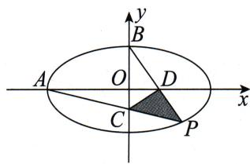

同理直线 $AP$ 的方程为 $y = \frac{y_0}{x_0 + 2} (x + 2)$ ，令 $x = 0$ ，得 $y_{C} = \frac{2y_{0}}{x_{0} + 2}$ .
所以 $S_{\triangle PCD} = S_{\triangle ADP} - S_{\triangle ADC} = \frac{1}{2}\cdot |AD|\cdot |y_0 - y_C| = \frac{1}{2}\cdot \left| - \frac{x_0}{y_0 - 1} +2\right|$
$\left| y _ {0} - \frac {2 y _ {0}}{x _ {0} + 2} \right| = \frac {1}{2} \cdot \left| \frac {- x _ {0} + 2 y _ {0} - 2}{y _ {0} - 1} \right| \cdot \left| \frac {x _ {0} y _ {0}}{x _ {0} + 2} \right| = \frac {1}{2} \cdot \left| \frac {x _ {0} y _ {0} (x _ {0} - 2 y _ {0} + 2)}{x _ {0} y _ {0} - (x _ {0} - 2 y _ {0} + 2)} \right|.$
因为 $P(x_{0}, y_{0})$ 在椭圆上，所以 $\frac{x_{0}^{2}}{4} + y_{0}^{2} = 1$ ，
所以 $\frac{x_0^2}{4} + y_0^2 = 1 \Rightarrow x_0^2 + (2y_0)^2 = 4$
$(x _ {0} - 2 y _ {0} + 2) ^ {2} = (x _ {0} - 2 y _ {0}) ^ {2} + 4 + 4 (x _ {0} - 2 y _ {0}),$
化简得 $(x_0 - 2y_0 + 2)^2 = 4(x_0 - 2y_0 + 2) - 4x_0y_0$
代入 $S_{\triangle PCD}$ 的表达式，得 $S_{\triangle PCD} = \frac{1}{2} \cdot |x_0 - 2y_0 - 2|$ .
因为 $\frac{x_0^2}{4} + y_0^2 = 1$ ，且 $\cos^2\theta + \sin^2\theta = 1$ ，所以设 $\left\{ \begin{array}{l} x_0 = 2\cos \theta, \\ y_0 = \sin \theta, \end{array} \right.$ 其中 $\theta \in \left(-\frac{\pi}{2}, 0\right)$ ，
所以 $S_{\triangle PCD} = \frac{1}{2}\cdot |2\cos \theta -2\sin \theta -2| = \left|\sqrt{2}\cos \left(\theta +\frac{\pi}{4}\right) - 1\right|\leqslant \sqrt{2} -1,$
当 $\theta = -\frac{\pi}{4}$ 即 $x_0 = \sqrt{2}, y_0 = -\frac{\sqrt{2}}{2}$ 时等号成立.
所以 $S_{\triangle PCD}$ 的最大值为 $\sqrt{2} - 1$ .

# 方法二:设线法——求根
设直线 $BP$ 的方程为 $y = kx + 1$ （由题意知 $k < -\frac{1}{2}$ ）. 令 $y = 0$ ，得 $x_{D} = -\frac{1}{k}$ ，再与椭圆方程联立，得 $(4k^{2} + 1)x^{2} + 8kx = 0$
其中一个根为 $x_{B} = 0$ ，因此 $x_{P} = \frac{-8k}{4k^{2} + 1}$
将 $x_{P}$ 代入直线 $BP$ 的方程，有 $y_{P} = \frac{-8k^{2}}{4k^{2} + 1} +1 = \frac{1 - 4k^{2}}{1 + 4k^{2}},$
所以 $k_{AC} = \frac{\frac{1 - 4k^2}{1 + 4k^2}}{\frac{-8k}{4k^2 + 1} + 2} = \frac{1 - 4k^2}{2(4k^2 - 4k + 1)} = \frac{(1 - 2k)(1 + 2k)}{2(1 - 2k)^2} = \frac{1 + 2k}{2(1 - 2k)}.$
故直线 $AC$ 的方程为 $y = \frac{1 + 2k}{2(1 - 2k)} (x + 2)$ . 令 $x = 0$ , 得 $y_{C} = \frac{1 + 2k}{1 - 2k}$ .
所以 $S_{\triangle PCD} = S_{\triangle BCP} - S_{\triangle BCD} = \frac{1}{2}\cdot \left|1 - \frac{1 + 2k}{1 - 2k}\right|\cdot \left|\frac{-8k}{4k^2 + 1} +\frac{1}{k}\right|$
$= \frac {1}{2} \cdot \left| \frac {4 k}{1 - 2 k} \right| \cdot \left| \frac {1 - 4 k ^ {2}}{k (4 k ^ {2} + 1)} \right| = 2 \cdot \left| \frac {1 + 2 k}{4 k ^ {2} + 1} \right|.$
设 $t = -(1 + 2k) > 0$ ，则 $2k = -t - 1$
所以 $S_{\triangle PCD} = \frac{2t}{(1 + t)^2 + 1} = \frac{2t}{t^2 + 2 + 2t} = \frac{2}{t + \frac{2}{t} + 2} \leqslant \frac{2}{2\sqrt{2} + 2} = \sqrt{2} - 1,$
当且仅当 $t = \frac{2}{t}$ 即 $t = \sqrt{2} > 0$ 时取等号.
所以 $S_{\triangle PCD}$ 的最大值为 $\sqrt{2}-1$ .
再来看一道常见的直线过定点的例题,感受一下设点法中结构的应用.

> [!example]- 例 16 过点 $M(3,0)$ 的直线 l 与椭圆 $\frac{x^{2}}{4} + \frac{y^{2}}{3} = 1$ 交于 A, B 两点，点 B 关于 x 轴的对称点为点 E，证明：直线 AE 过定点.
# 题目分析
如果用设点法,我们要先观察一下直线 AE 的结构特点.

直线 $AE: \frac{y - y_A}{y_E - y_A} = \frac{x - x_A}{x_E - x_A} \Rightarrow (y_E - y_A)x - (x_E - x_A)y = x_Ay_E - x_Ey_A.$
由对称性可知定点在 x 轴上, 即令 y=0, 得 $x=\frac{x_{A}y_{E}-x_{E}y_{A}}{y_{E}-y_{A}}$ .
所以要求定点, 即求 $\frac{x_{A}y_{E}-x_{E}y_{A}}{y_{E}-y_{A}}$ 是定值.
由条件可知 $B(x_{E}, - y_{E}), A, B, M$ 三点共线，即 $k_{AM} = k_{BM}$ ，
代入坐标得 $\frac{y_A}{x_A - 3} = \frac{-y_E}{x_E - 3}$ , 化简得 $x_A y_E + x_E y_A = 3 (y_A + y_E) \Rightarrow \frac{x_A y_E + x_E y_A}{y_A + y_E} = 3$ .
由点除易知 $\frac{x_A y_E - x_E y_A}{y_E - y_A} \cdot \frac{x_A y_E + x_E y_A}{y_A + y_E} = 4$
所以 $\frac{x_A y_E - x_E y_A}{y_E - y_A} = \frac{4}{3}$ , 即直线 $AE$ 过定点 $\left(\frac{4}{3}, 0\right)$ .

# 参考解析

# 方法一:设点法——双动点“高级”代数变形
设 $A(x_{1},y_{1}),E(x_{2},y_{2})$
由条件可知 $B(x_{2}, - y_{2}),A,B,M$ 三点共线，即 $k_{AM} = k_{BM}$

思维笔记

Siweibiji

代入坐标得 $\frac{y_1}{x_1 - 3} = \frac{-y_2}{x_2 - 3}$ ，化简得 $x_{1}y_{2} + x_{2}y_{1} = 3(y_{1} + y_{2})\Rightarrow \frac{x_{1}y_{2} + x_{2}y_{1}}{y_{1} + y_{2}} = 3.$
由两点式得直线 $AE$ 的方程为 $\frac{y - y_1}{y_2 - y_1} = \frac{x - x_1}{x_2 - x_1} \Rightarrow (y_2 - y_1)x - (x_2 - x_1)y = x_1y_2 - x_2y_1.$
令 $y = 0$ ，得 $x = \frac{x_1y_2 - x_2y_1}{y_2 - y_1}$
因为 $A(x_{1},y_{1}),E(x_{2},y_{2})$ 在椭圆上，所以 $\frac{x_1^2}{4} +\frac{y_1^2}{3} = 1$ ①， $\frac{x_2^2}{4} +\frac{y_2^2}{3} = 1$ ②.
所以 $\frac{x_1^2}{4} +\frac{y_1^2}{3} = 1\Rightarrow y_1^2 = \frac{3}{4} (4 - x_1^2)$ ③， $\frac{x_2^2}{4} +\frac{y_2^2}{3} = 1\Rightarrow y_2^2 = \frac{3}{4} (4 - x_2^2)$ ④，

③÷④，得 $\frac{y_1^2}{y_2^2} = \frac{4 - x_1^2}{4 - x_2^2}\Rightarrow 4y_1^2 -y_1^2 x_2^2 = 4y_2^2 -y_2^2 x_1^2\Rightarrow 4(y_1^2 -y_2^2) = x_2^2 y_1^2 -x_1^2 y_2^2.$
所以 $\frac{x_1y_2 - x_2y_1}{y_2 - y_1}\cdot \frac{x_1y_2 + x_2y_1}{y_1 + y_2} = 4.$
所以 $\frac{x_1y_2 - x_2y_1}{y_2 - y_1} = \frac{4}{3}$ 即直线 $AE$ 过定点 $\left(\frac{4}{3},0\right)$ .

# 方法二:设线法——整体代换
由题意可得直线 $AE$ 的斜率存在且不为0，设直线 $AE$ 的方程为 $y = kx + m$ 设 $A(x_{1},y_{1}),E(x_{2},y_{2})$ ，由题意可得 $B(x_{2}, - y_{2})$
联立直线方程与椭圆方程得 $\left\{ \begin{array}{l} y = kx + m, \\ \frac{x^2}{4} + \frac{y^2}{3} = 1 \end{array} \right. \Rightarrow (4k^2 + 3)x^2 + 8kmx + 4m^2 - 12 = 0,$
由韦达定理得 $\left\{\begin{aligned}x_{1}+x_{2}&=\frac{-8km}{4k^{2}+3}\quad①,\\ x_{1}x_{2}&=\frac{4m^{2}-12}{4k^{2}+3}\quad②.\end{aligned}\right.$
由 $A, B, M$ 三点共线，知 $k_{AM} = k_{BM}$ ，
代入坐标得 $\frac{y_1}{x_1 - 3} = \frac{-y_2}{x_2 - 3}$ 即 $\frac{y_1}{x_1 - 3} +\frac{y_2}{x_2 - 3} = 0$
即 $\frac{kx_1 + m}{x_1 - 3} +\frac{kx_2 + m}{x_2 - 3} = 0\Rightarrow 2k + (m + 3k)\left(\frac{1}{x_1 - 3} +\frac{1}{x_2 - 3}\right) = 0\Rightarrow 2k + (m + 3k)\cdot$
$\frac {x _ {1} + x _ {2} - 6}{x _ {1} x _ {2} - 3 (x _ {1} + x _ {2}) + 9} = 0.$
将①②两式代入上式, 得 $3m + 4k = 0$ , 所以直线 AE 的方程为 $y = k\left(x - \frac{4}{3}\right)$ .
当 $x = \frac{4}{3}$ 时， $y = 0$ ，即直线 $AE$ 过定点 $\left(\frac{4}{3}, 0\right)$ .

# 总结
在第七节 抛物线设点中, 我们设抛物线 $y^{2}=2px$ 上的动点坐标为$\left(\frac{y_0^2}{2p}, y_0\right)$ 或 $(2pt^2, 2pt)$ . 这种设法在后续计算中会带来由抛物线上两点构成的直线的斜率、方程以及衍生出的一系列代数式的对称结构.
在上述的椭圆的设点中,我们设了两个未知量,那么是否有类似于抛物线的设法呢?答案是肯定的.
首先将椭圆方程 $\frac{x^2}{a^2} +\frac{y^2}{b^2} = 1$ 变为 $\left(\frac{x}{a}\right)^2 +\left(\frac{y}{b}\right)^2 = 1$ ，设椭圆上的动点 $A$ 的坐标为 $(a\cos \theta ,b\sin \theta)$ .（对于双曲线 $\frac{x^2}{a^2} -\frac{y^2}{b^2} = 1$ ，则可以设双曲线上的动点坐标为 $\left(\frac{a}{\cos\theta},b\tan \theta\right)$ ，这里就不赘述了）
此时，利用三角函数中的万能公式，可得 $\left\{ \begin{array}{l} a\cos \theta = \frac{a\left(\cos^2\frac{\theta}{2} - \sin^2\frac{\theta}{2}\right)}{\cos^2\frac{\theta}{2} + \sin^2\frac{\theta}{2}} = \frac{a\left(1 - \tan^2\frac{\theta}{2}\right)}{1 + \tan^2\frac{\theta}{2}}, \\ b\sin \theta = \frac{b \cdot 2\sin \frac{\theta}{2}\cos \frac{\theta}{2}}{\cos^2\frac{\theta}{2} + \sin^2\frac{\theta}{2}} = \frac{2b\tan\frac{\theta}{2}}{1 + \tan^2\frac{\theta}{2}}, \end{array} \right.$
所以可设 $A\left(\frac{a(1 - t_1^2)}{1 + t_1^2}, \frac{2bt_1}{1 + t_1^2}\right)$ ，同理可设椭圆上另一动点 $B$ 的坐标为 $\left(\frac{a(1 - t_2^2)}{1 + t_2^2}, \frac{2bt_2}{1 + t_2^2}\right)$ .

现在我们根据这种设法,在后续的计算中可以得到如抛物线设点中类似的平方差、完全平方等各种结构.

如直线 $AB$ 的斜率 $k_{AB} = \frac{\frac{2bt_1}{1 + t_1^2} - \frac{2bt_2}{1 + t_2^2}}{\frac{a(1 - t_1^2)}{1 + t_1^2} - \frac{a(1 - t_2^2)}{1 + t_2^2}} = \frac{2b}{a}\cdot \frac{t_1(1 + t_2^2) - t_2(1 + t_1^2)}{(1 - t_1^2)(1 + t_2^2) - (1 - t_2^2)(1 + t_1^2)}$
$= \frac {2 b}{a} \cdot \frac {(t _ {1} - t _ {2}) + t _ {1} t _ {2} (t _ {2} - t _ {1})}{2 (t _ {2} ^ {2} - t _ {1} ^ {2})},$
注意到分式上下可以同时除以 $t_2 - t_1$ 进行化简，所以 $k_{AB} = \frac{b}{a}\cdot \frac{t_1t_2 - 1}{t_1 + t_2}.$

最终可以得到直线 AB 的方程为 $b(t_{1}t_{2}-1)x-a(t_{1}+t_{2})y+ab(t_{1}t_{2}+1)=0$ .

直线 $AB$ 的方程很有特点, $t_1, t_2$ 处于对称的地位, 考试的时候求这个方程会浪费较多时间, 所以如果选择这种设法, 就需要将这个方程记住才能便于使用. 但这与本书主要的学习和教学理念背道而驰了. 这里是为了给少数同学一种新的视角, 不推荐大多数同学学习.
综上所述,设点法的实质是在搞代数结构,而这个结构你既要知道如何从条件翻译来,又要知道如何通过曲线方程得到.

短短千字不能尽其意,自行探索方知趣味无穷.

思维笔记

Siweibiji

# 第三章 折中设法

先概述一下本书对设线法和设点法的定义,设线法主要通过联立直线方程和曲线方程,利用消元后得到的二次方程的根与系数关系来处理问题,而设点法主要指以点参为核心变量,利用点在曲线上得到的方程与其他条件进行联立、转化.

# 第十节 未知点解未知点
设点和设线不是对立的,本节我们将调和这两种方法得到一种计算量大但是逻辑清晰的手法——未知点解未知点.

未知点解未知点指的是根据题目条件,用曲线上一个动点的坐标表示另一个动点的坐标.因为两个点都是动点,所以称为未知点解未知点.

我们先回忆一下第二节 和积关系中的例题.

> [!example]- 例 2 在平面直角坐标系 xOy 中, 过椭圆 $\frac{x^{2}}{4} + \frac{y^{2}}{3} = 1$ 左焦点 F 的斜率存在且不为 0 的直线交椭圆于 $A(x_{1}, y_{1}), B(x_{2}, y_{2})$ 两点. 求证: $\frac{1}{|AF|} + \frac{1}{|BF|}$ 为定值.
接下来,我们进一步观察其中得到的和积关系 $-\frac{5}{2}(x_{1}+x_{2})-4=x_{1}x_{2}$ .根据这个式子的结构,我们发现可以很轻易地用一个坐标去表示另一个,即 $\left(x_{1}+\frac{5}{2}\right)x_{2}=-\frac{5}{2}x_{1}-4\Rightarrow x_{2}=\frac{-5x_{1}-8}{2x_{1}+5}$ .

直线 $AB$ 的斜率 $k = k_{AF} = \frac{y_1}{x_1 + 1}$ ，所以直线 $AB$ 的方程为 $y = \frac{y_1}{x_1 + 1}(x + 1)$ .
根据点 $B(x_{2},y_{2})$ 在直线 $AB$ 上，有 $y_{2} = \frac{y_{1}}{x_{1} + 1}(x_{2} + 1) = \frac{y_{1}}{x_{1} + 1}\cdot \left(\frac{-5x_{1} - 8}{2x_{1} + 5} +1\right) =$ $\frac{-3y_1}{2x_1 + 5}$
所以我们就有 $A(x_{1},y_{1}),B\left(\frac{-5x_{1} - 8}{2x_{1} + 5},\frac{-3y_{1}}{2x_{1} + 5}\right).$

这实际上就是“未知点解未知点”，即虽然不知道两个点的具体坐标，但是可以用一个未知点的坐标去表示另一个未知点的坐标.
当我们把两个点的坐标都用 $x_{1}, y_{1}$ 表示出来后，就无所谓对不对称。因为只有成对变量才存在对不对称这一说法。

虽然理论上这个方法具有通用性,但在有些时候计算起来并不简单,因此不作为解法的第一优先级考虑.
接下来,我们一起来看一道需要用到未知点解未知点的例题.

例如图所示,在平面直角坐标系 xOy 中,已知 F 为椭圆 $\frac{x^{2}}{4} + \frac{y^{2}}{3} = 1$ 的右焦点,A,B 为椭圆上关于原点对称的两点,连接 AF,BF 并延长,分别交椭圆于点 C,D. 设直线 AB,CD 的斜率分别为 $k_{1}, k_{2}$ , 是否存在实数 m,使得 $k_{2} = mk_{1}$ ? 若存在,求出 m 的值;若不存在,请说明理由.

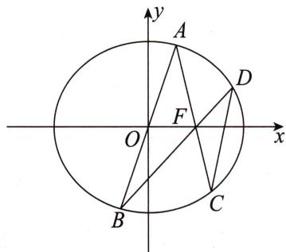

思维笔记

Siweibiji

# 题目分析

这道题看上去非常难算,最主要的原因就是动点非常多,但我们发现点 A 的坐标可以表示点 B 的坐标,而根据未知点解未知点可以用点 A 的坐标表示点 C 的坐标,同理可以用点 B 的坐标表示点 D 的坐标,即所有动点的坐标都可以用点 A 的坐标表示.
设 $A(x_0, y_0)$ ，根据未知点解未知点可得 $C\left(\frac{8 - 5x_0}{5 - 2x_0}, \frac{-3y_0}{5 - 2x_0}\right)$ .
由 A, B 关于原点对称可得 $B(-x_{0}, -y_{0})$ ，再由未知点解未知点可得 $D\left(\frac{8+5x_{0}}{5+2x_{0}}, \frac{3y_{0}}{5+2x_{0}}\right)$ .
所以 $k_{2} = \frac{\frac{3y_{0}}{5 + 2x_{0}} - \frac{-3y_{0}}{5 - 2x_{0}}}{\frac{8 + 5x_{0}}{5 + 2x_{0}} - \frac{8 - 5x_{0}}{5 - 2x_{0}}} = \frac{5y_{0}}{3x_{0}}$ ，而 $k_{1} = \frac{y_{0}}{x_{0}}$ ，则有 $k_{2} = \frac{5}{3} k_{1}$ .

# 参考解析

# 方法一:通过和积关系得到“未知点解未知点”
设 $A(x_0, y_0)$ ，则 $B(-x_0, -y_0)$ ，设直线 $AF$ 的方程为 $y = k(x - 1)$ ，
联立直线方程与椭圆方程得 $\left\{\begin{aligned}y&=k(x-1),\\ \frac{x^{2}}{4}&+\frac{y^{2}}{3}=1\end{aligned}\right.\Rightarrow(4k^{2}+3)x^{2}-8k^{2}x+4k^{2}-12=0.$
由韦达定理得 $\left\{\begin{aligned}x_{0}+x_{C}&=\frac{8k^{2}}{4k^{2}+3},\\ x_{0}x_{C}&=\frac{4k^{2}-12}{4k^{2}+3}.\end{aligned}\right.$
因为 $\frac{5}{2} \cdot \frac{8k^2}{4k^2 + 3} - 4 = \frac{20k^2 - 4(4k^2 + 3)}{4k^2 + 3} = \frac{4k^2 - 12}{4k^2 + 3}$ ,
所以 $\frac{5}{2} (x_0 + x_C) - 4 = x_0x_C$ ，即 $x_{C} = \frac{8 - 5x_{0}}{5 - 2x_{0}}.$
由题意知直线 $AC$ 的方程为 $y = \frac{y_0}{x_0 - 1} (x - 1)$
又点 $C(x_{C},y_{C})$ 在直线 $y = \frac{y_0}{x_0 - 1} (x - 1)$ 上，
所以 $y_{C} = \frac{y_{0}}{x_{0} - 1}(x_{C} - 1) = \frac{-3y_{0}}{5 - 2x_{0}}.$

思维笔记

Siweibiji

同理, 点 D 的坐标为 $\left(\frac{8+5x_{0}}{5+2x_{0}}, \frac{3y_{0}}{5+2x_{0}}\right)$ ,
所以 $k_{2} = \frac{\frac{3y_{0}}{5 + 2x_{0}} - \frac{-3y_{0}}{5 - 2x_{0}}}{\frac{8 + 5x_{0}}{5 + 2x_{0}} - \frac{8 - 5x_{0}}{5 - 2x_{0}}} = \frac{5y_{0}}{3x_{0}} = \frac{5}{3} k_{1}$
即存在 $m = \frac{5}{3}$ ，使得 $k_{2} = mk_{1}$

# 方法二:另一种“未知点解未知点”的操作
设 $A(x_0, y_0)$ , 则 $B(-x_0, -y_0)$ ,

直线 $AF$ 的方程为 $y = \frac{y_0}{x_0 - 1} (x - 1)$ ，代入椭圆方程 $\frac{x^2}{4} + \frac{y^2}{3} = 1$
得 $(15 - 6x_0)x^2 -(24 - 6x_0^2)x - 15x_0^2 +24x_0 = 0.$
因为 $x = x_0$ 是该方程的一个根，所以点 $C$ 的横坐标 $x_{C} = \frac{8 - 5x_{0}}{5 - 2x_{0}}.$
又点 $C(x_{C},y_{C})$ 在直线 $y = \frac{y_0}{x_0 - 1} (x - 1)$ 上，
所以 $y_{C} = \frac{y_{0}}{x_{0} - 1} (x_{C} - 1) = \frac{-3y_{0}}{5 - 2x_{0}}.$
同理可得点 $D$ 的坐标为 $\left(\frac{8 + 5x_0}{5 + 2x_0},\frac{3y_0}{5 + 2x_0}\right)$
所以 $k_{2} = \frac{\frac{3y_{0}}{5 + 2x_{0}} - \frac{-3y_{0}}{5 - 2x_{0}}}{\frac{8 + 5x_{0}}{5 + 2x_{0}} - \frac{8 - 5x_{0}}{5 - 2x_{0}}} = \frac{5y_{0}}{3x_{0}} = \frac{5}{3} k_{1}$
即存在 $m = \frac{5}{3}$ ，使得 $k_{2} = mk_{1}$

# 总结
在参考解析的方法二中,用了另一种手法来得到未知点解未知点的结果.下面我们将参考解析中的化简过程详细解释.
将直线 $AF$ 的方程 $y = \frac{y_0}{x_0 - 1} (x - 1)$ 代入椭圆方程 $\frac{x^2}{4} +\frac{y^2}{3} = 1$ ，得到
$\left[ 4 \left(\frac {y _ {0}}{x _ {0} - 1}\right) ^ {2} + 3 \right] x ^ {2} - 8 \left(\frac {y _ {0}}{x _ {0} - 1}\right) ^ {2} x + 4 \left(\frac {y _ {0}}{x _ {0} - 1}\right) ^ {2} - 1 2 = 0,$
此时先将分式化整式, 得 $\left[4y_{0}^{2}+3(x_{0}-1)^{2}\right]x^{2}-8y_{0}^{2}x+4y_{0}^{2}-12(x_{0}-1)^{2}=0.$
因为点 A 在椭圆上, 所以有 $\frac{x_{0}^{2}}{4} + \frac{y_{0}^{2}}{3} = 1$ , 即 $y_{0}^{2} = 3 - \frac{3x_{0}^{2}}{4}$ ,
代入上式消去 $y_0^2$ 后，得 $(15 - 6x_0)x^2 - (24 - 6x_0^2)x - 15x_0^2 + 24x_0 = 0.$

下同参考解析方法二.

未知点解未知点既是一种对变量的观察视角,又是一种得到变量之间关系的手法.这部分内容需要我们花时间去熟悉操作.思路的构建非常重要,然而学习圆锥曲线不应该持有“我知道思路,考场上再算出来就行了”这类想法.

# 第二篇 翻译篇

# 第四章 几何翻译

本章主要帮助同学们理解题干或问题中的几何条件,并用代数语言来表达这些条件.在解答题中,我们默认小学与初中所学的知识可以直接使用,而由高中知识得到的性质除课本上标明外均需要证明再使用,此外,如射影几何等课本外的则禁止使用.

# 第十一节 角的翻译

## 11.1 锐角、钝角和直角
首先,我们想一想纯粹的锐角、钝角和直角该如何翻译比较好呢?

对于直角,有的同学可能翻译为直线的斜率之积为-1.这里建议用向量数量积等于0来翻译直角.因为用直线的斜率的话需要考虑斜率不存在的情况.当然,如果已知斜率存在,用斜率也无妨.
接下来我们根据直角推广一下：  
（1）如果 $\angle AOB$ 是锐角，那么 $\overrightarrow{OA} \cdot \overrightarrow{OB} = |\overrightarrow{OA}| \cdot |\overrightarrow{OB}| \cdot \cos \angle AOB > 0,$
所以 $x_{A}x_{B} + y_{A}y_{B} > 0;$  
（2）如果 $\angle AOB$ 是钝角,那么 $\overrightarrow{OA}\cdot\overrightarrow{OB}=|\overrightarrow{OA}|\cdot|\overrightarrow{OB}|\cdot\cos\angle AOB<0$ ,
所以 $x_{A}x_{B} + y_{A}y_{B} < 0.$

注意由 $x_{A}x_{B}+y_{A}y_{B}>0$ 不一定能推出 $\angle AOB$ 是锐角，还可能得到向量 $\overrightarrow{OA}$ 与向量 $\overrightarrow{OB}$ 的夹角为 0.

下面我们来看两道例题：

> [!example]- 例 1 在平面直角坐标系 $xOy$ 中, 已知椭圆 $\frac{x^2}{16} + \frac{y^2}{4} = 1$ , 右焦点为 $F$ , 直线 $y = kx$ 交椭圆于 $A, B$ 两点. 设 $Q(3,0)$ , 若 $\angle AQB$ 为锐角, 求实数 $k$ 的取值范围.

# 题目分析
根据 $\angle AQB$ 为锐角 $\Rightarrow\overrightarrow{QA}\cdot\overrightarrow{QB}>0\Rightarrow(x_{A}-3)(x_{B}-3)+y_{A}y_{B}>0$ ,这个不等式中的下标A与下标B的地位明显是一样的,那么必定可以用韦达定理整体代换.
因为直线 $y = kx$ 过原点，椭圆关于原点对称，所以 $x_{A} = -x_{B}, y_{A} = -y_{B}$
$(x _ {A} - 3) (x _ {B} - 3) + y _ {A} y _ {B} > 0 \Rightarrow (x _ {A} - 3) (- x _ {A} - 3) - y _ {A} ^ {2} > 0 \Rightarrow x _ {A} ^ {2} - 9 + y _ {A} ^ {2} <   0.$
如果条件是一次的,那么优先尝试用直线方程统一为横坐标或纵坐标;如果条件是二次的,优先尝试用曲线方程进行统一.
所以利用点 A 在椭圆上, 将点 A 的坐标满足的等式代入不等式消去纵坐标, 不等式可化简为 $x_{A}^{2}<\frac{20}{3}$ .
将直线方程 $y = kx$ 与椭圆方程联立得 $(4k^2 + 1)x^2 = 16$ ，所以 $\frac{16}{4k^2 + 1} < \frac{20}{3}$ ，
解得实数 $k$ 的取值范围是 $\left(-\infty, -\frac{\sqrt{35}}{10}\right) \cup \left(\frac{\sqrt{35}}{10}, +\infty\right)$ .

# 参考解析
设点 $A(x_0, y_0), B(-x_0, -y_0)$ ，则 $\overrightarrow{QA} = (x_0 - 3, y_0), \overrightarrow{QB} = (-x_0 - 3, -y_0)$ ，
联立直线方程与椭圆方程整理得 $(1 + 4k^{2})x^{2} - 16 = 0$
由韦达定理得 $x_0 + (-x_0) = 0, x_0(-x_0) = \frac{-16}{1 + 4k^2}, y_0(-y_0) = k^2x_0(-x_0) = \frac{-16k^2}{1 + 4k^2}$ .
因为 $\angle AQB$ 为锐角,所以 $\overrightarrow{QA}\cdot\overrightarrow{QB}>0$ ,
所以 $\overrightarrow{QA} \cdot \overrightarrow{QB} = (x_0 - 3)(-x_0 - 3) + y_0(-y_0) = x_0(-x_0) - 3(x_0 - x_0) + 9 + y_0(-y_0) = 9 - \frac{16(1 + k^2)}{1 + 4k^2} > 0,$
整理得 $20k^{2} > 7$ ，解得 $k > \frac{\sqrt{35}}{10}$ 或 $k < -\frac{\sqrt{35}}{10}$
所以实数 k 的取值范围为 $\left(-\infty, -\frac{\sqrt{35}}{10}\right) \cup \left(\frac{\sqrt{35}}{10}, +\infty\right)$ .

有一些题目中没有直接给出如某个角为锐角这样的条件,而是用另一个几何条件去包装它.比如下面这道例题.

> [!example]- 例 2 在平面直角坐标系 $xOy$ 中, 已知椭圆 $E: \frac{x^2}{4} + \frac{y^2}{2} = 1$ . 设直线 $x = my - 1 (m \in \mathbb{R})$ 交椭圆 $E$ 于 $A, B$ 两点, 判断点 $G\left(-\frac{9}{4}, 0\right)$ 与以线段 $AB$ 为直径的圆的位置关系, 并说明理由.
# 题目分析

本例看上去和角度并无关系,但细读会发现有直径存在.

我们在第十四节 圆的翻译中说直径所对的圆周角是 $90^{\circ}$ ，点在圆上意味着

思维笔记

Siweibiji

思维笔记

Siweibiji

这个点与直径两端点连线的夹角是直角. 如果点在圆外, 那么这个点与直径两端点连线的夹角是锐角; 如果点在圆内, 那么这个点与直径两端点连线的夹角是钝角.
因此本例“明问”点与圆的位置关系,而“暗问” $\angle AGB$ 是锐角、钝角还是直角,“实问” $\overrightarrow{GA} \cdot \overrightarrow{GB}$ 与0的大小关系.
分析目标发现 $\overrightarrow{GA} \cdot \overrightarrow{GB} = (x_A + \frac{9}{4})(x_B + \frac{9}{4}) + y_A y_B = x_A x_B + y_A y_B + \frac{9}{4}(x_A + x_B) + \frac{81}{16}$ .
根据条件对称必有韦达定理整体代换,先联立直线方程与椭圆方程,再利用韦达定理,可得 $\overrightarrow{GA}\cdot\overrightarrow{GB}=\frac{17m^{2}+2}{16(m^{2}+2)}>0$ ,说明 $\angle AGB$ 恒为锐角,所以可得到点G恒在以线段AB为直径的圆外.

# 参考解析
联立直线方程与椭圆方程得 $\left\{\begin{aligned}x&=my-1,\\ \frac{x^{2}}{4}&+\frac{y^{2}}{2}=1\end{aligned}\right.\Rightarrow(m^{2}+2)y^{2}-2my-3=0.$
由韦达定理得 $y_{A} + y_{B} = \frac{2m}{m^{2} + 2}, y_{A}y_{B} = \frac{-3}{m^{2} + 2}$ ①，
则 $x_{A} + x_{B} = m(y_{A} + y_{B}) - 2 = \frac{2m^{2}}{m^{2} + 2} -2 = \frac{-4}{m^{2} + 2}$ ②，
$x _ {A} x _ {B} = m ^ {2} y _ {A} y _ {B} - m (y _ {A} + y _ {B}) + 1 = \frac {- 3 m ^ {2} - 2 m ^ {2}}{m ^ {2} + 2} + 1 = \frac {2 - 4 m ^ {2}}{m ^ {2} + 2} \quad ③.$
$\overrightarrow {G A} \cdot \overrightarrow {G B} = \left(x _ {A} + \frac {9}{4}\right) \left(x _ {B} + \frac {9}{4}\right) + y _ {A} y _ {B} = x _ {A} x _ {B} + y _ {A} y _ {B} + \frac {9}{4} (x _ {A} + x _ {B}) + \frac {8 1}{1 6},$
将①②③三式代入上式得
$\overrightarrow{GA} \cdot \overrightarrow{GB} = \frac{2 - 4m^2 - 3}{m^2 + 2} + \frac{9}{4} \cdot \frac{-4}{m^2 + 2} + \frac{81}{16} = \frac{-10 - 4m^2}{m^2 + 2} + \frac{81}{16} = \frac{17m^2 + 2}{16(m^2 + 2)} > 0$ 恒成立.
故 $\angle AGB$ 恒为锐角,即点 $G$ 恒在以线段 $AB$ 为直径的圆外.

# 总结

这两道例题都涉及锐角,涉及钝角和直角的处理手法也都是转化为向量数量积与0的大小关系,在此就不举例说明了.

## 11.2 相等角
当我们遇见已知两角相等或者欲证两角相等的题目时,往往与角平分线有

关. 最常见的是角平分线所在直线为 x=0 或者 y=0 的情况.

我们一起来看下面这道例题.

> [!example]- 例3 在平面直角坐标系 $xOy$ 中, 圆 $\left(x - \frac{5}{2}\right)^2 + (y - 2)^2 = \frac{25}{4}$ 与 $x$ 轴正半轴相交于 $M, N$ 两点 (点 $M$ 在点 $N$ 的左侧), 过点 $M$ 任作一条直线与椭圆 $\frac{y^2}{8} + \frac{x^2}{4} = 1$ 交于 $A, B$ 两点, 连接 $AN, BN$ , 求证: $\angle ANM = \angle BNM$ .
# 题目分析
要证 $\angle ANM = \angle BNM$ ，就得求出 $M,N$ 两点的坐标.
在方程 $\left(x - \frac{5}{2}\right)^2 + (y - 2)^2 = \frac{25}{4}$ 中，令 $y = 0$ ，得 $x = 1$ 或 $x = 4$ ，从而有 $M(1,0), N(4,0)$ .

我们发现 x 轴将 $\angle ANB$ 分割为 $\angle ANM$ 和 $\angle BNM$ .
在平面解析几何中,除了向量会涉及角,即 $\cos\langle a,b\rangle=\frac{a\cdot b}{|a|\cdot|b|}$ ,还有哪里涉及角呢?

我们在学习直线的方程时,了解到当直线不垂直于 x 轴时,直线的倾斜角的正切值是直线的斜率.因此我们只须转化为直线的倾斜角,进而用直线的斜率表示即可.
$\angle ANM = \angle BNM$ ，即直线 $AN, BN$ 的倾斜角互补，而互补的两个角的正切值互为相反数，即两直线的斜率互为相反数.

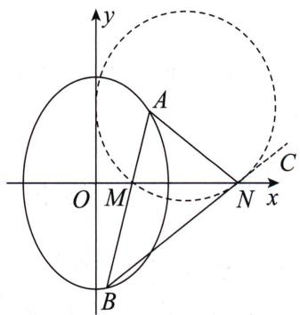
如图所示,延长 BN,在延长线上取一点 C.
要证 $\angle ANM = \angle BNM$
即证 $\angle ANx + \angle CNx = \pi$ （因为 $\angle CNx = \angle BNM, \angle ANx + \angle ANM = \pi)$
即证 $\tan \angle ANx + \tan \angle CNx = 0$ （根据三角函数诱导公式 $\tan (\pi -\theta) = -\tan \theta)$
即证 $k_{AN} + k_{BN} = 0$ ，即证 $\frac{y_A}{x_A - 4} +\frac{y_B}{x_B - 4} = 0.$
接下来就是老套路,设直线 AB 的方程为 $y=k(x-1)$ (斜率不存在或斜率为 0 时明显成立,略),
即证 $\frac{k(x_A - 1)}{x_A - 4} +\frac{k(x_B - 1)}{x_B - 4} = 0\Rightarrow \frac{x_A - 1}{x_A - 4} +\frac{x_B - 1}{x_B - 4} = 0,$
接下来可以分离常数,但是等式右边为0,所以也可以通分后计算分子 $2x_{A}x_{B}-$

思维笔记

Siweibiji

思维笔记

Siweibiji

$5 (x _ {A} + x _ {B}) + 8.$

上面这个式子实际就是和积关系.

# 参考解析
在方程 $\left(x - \frac{5}{2}\right)^2 + (y - 2)^2 = \frac{25}{4}$ 中，令 $y = 0$ ，解得 $x = 1$ 或 $x = 4$
即 $M(1,0)$ , $N(4,0)$ .

①当 $AB \perp x$ 轴时,由椭圆的对称性可知 $\angle ANM = \angle BNM$ .  
②当 AB 与 x 轴不垂直时, 可设直线 AB 的方程为 $y = k(x - 1)$ .
联立方程得 $\left\{\begin{aligned}y&=k(x-1),\\ \frac{y^{2}}{8}+\frac{x^{2}}{4}&=1\end{aligned}\right.\Rightarrow(2+k^{2})x^{2}-2k^{2}x+k^{2}-8=0.$
由韦达定理得 $x_{A} + x_{B} = \frac{2k^{2}}{2 + k^{2}}$ ①, $x_{A}x_{B} = \frac{k^{2} - 8}{2 + k^{2}}$ ②.
要证 $\angle ANM = \angle BNM$ ，即证 $k_{AN} + k_{BN} = 0.$
$k _ {A N} + k _ {B N} = \frac {y _ {A}}{x _ {A} - 4} + \frac {y _ {B}}{x _ {B} - 4} = \frac {k (x _ {A} - 1)}{x _ {A} - 4} + \frac {k (x _ {B} - 1)}{x _ {B} - 4} = k \left(\frac {x _ {A} - 1}{x _ {A} - 4} + \frac {x _ {B} - 1}{x _ {B} - 4}\right) =$
$k \left[ 2 + 3 \left(\frac {1}{x _ {A} - 4} + \frac {1}{x _ {B} - 4}\right) \right] = k \left[ 2 + 3 \cdot \frac {x _ {A} + x _ {B} - 8}{x _ {A} x _ {B} - 4 (x _ {A} + x _ {B}) + 1 6} \right],$
将①②两式代入上式,可得 $k_{AN} + k_{BN} = 0$ .
综上所述， $\angle ANM = \angle BNM$

我们再来看一个角平分线所在直线为 $y$ 轴的例题.

> [!example]- 例4 在平面直角坐标系 $xOy$ 中, 过点 $P(0,1)$ 的动直线 $l$ 交椭圆 $\frac{x^2}{4} + \frac{y^2}{2} = 1$ 于 $A, B$ 两点, 在 $y$ 轴上是否存在与点 $P$ 不同的定点 $Q$ , 使得直线 $AQ$ 和 $BQ$ 的倾斜角互补? 若存在, 求出点 $Q$ 的坐标; 若不存在, 请说明理由.

# 题目分析

直线 AQ 和 BQ 的倾斜角互补, 即两直线的斜率互为相反数.
设 $Q(0, t) (t \neq 1), A(x_1, y_1), B(x_2, y_2)$ ，直线 $l$ 的方程为 $y = kx + 1$ （斜率不存在时 $A, B, Q$ 三点共线，点 $Q$ 不与点 $P, A, B$ 重合即可满足题意）.
由直线 $AQ$ 和 $BQ$ 的倾斜角互补，可知 $k_{AQ} + k_{BQ} = 0 \Rightarrow \frac{y_1 - t}{x_1} + \frac{y_2 - t}{x_2} = 0 \Rightarrow \frac{kx_1 + 1 - t}{x_1} + \frac{kx_2 + 1 - t}{x_2} = 0,$

分离 $k$ 后得 $2k + (1 - t)\left(\frac{1}{x_1} +\frac{1}{x_2}\right) = 0\Rightarrow 2k + (1 - t)\frac{x_1 + x_2}{x_1x_2} = 0.$
联立直线方程与椭圆方程,再利用韦达定理可得 $2k+(1-t)\cdot2k=0$ , 即 $k(t-2)=0$ .
因为上式对任意 $k \in R$ 均成立, 所以 t = 2, 所以定点 Q 的坐标为 $(0, 2)$ .

# 参考解析
设点 Q 的坐标为 $(0, t)$ , $t \neq 1$ ,

①当直线 l 与 x 轴垂直时, 直线 AQ 与 BQ 的倾斜角均为 $90^{\circ}$ , 满足题意,
此时 $t \in \mathbf{R}, t \neq 1$ ，且 $t \neq \pm \sqrt{2}$ .

②当直线 l 的斜率存在时, 可设直线 l 的方程为 $y = kx + 1$ , $A(x_{1}, y_{1})$ , $B(x_{2}, y_{2})$ ,
联立得 $\left\{\begin{aligned}y&=kx+1,\\ \frac{x^{2}}{4}&+\frac{y^{2}}{2}=1\end{aligned}\right.\Rightarrow(1+2k^{2})x^{2}+4kx-2=0,$
由韦达定理得 $\left\{\begin{aligned}x_{1}+x_{2}&=-\frac{4k}{1+2k^{2}}\quad①,\\ x_{1}x_{2}&=-\frac{2}{1+2k^{2}}\quad②.\end{aligned}\right.$
若直线 AQ 和直线 BQ 的倾斜角互补, 则 $k_{AQ} + k_{BQ} = 0$ ,
所以 $\frac{y_1 - t}{x_1} +\frac{y_2 - t}{x_2} = 0$ ，即 $\frac{kx_1 + 1 - t}{x_1} +\frac{kx_2 + 1 - t}{x_2} = 0,$
整理得 $2kx_{1}x_{2} + (1 - t)(x_{1} + x_{2}) = 0$
将①②两式代入上式得 $k(t-2)=0$ .

要使上式对任意 $k \in R$ 均成立，则 t = 2，所以点 Q 的坐标为 $(0, 2)$ .

综上,存在与点 P 不同的定点 $Q(0,2)$ 满足题意.

# 总结
只要角平分线所在直线平行或者垂直于坐标轴,我们都可以得到角两边所在直线的斜率互为相反数.

> [!example]- 例 5 在平面直角坐标系 $xOy$ 中, 设过点 $P(1,2)$ 的直线 $l_1, l_2$ 分别与抛物线 $y^2 = 4x$ 交于 $A, B$ 两点, $\angle APB$ 的平分线垂直于 $x$ 轴, 证明: 直线 $AB$ 的斜率为定值.
# 题目分析
由 $\angle APB$ 的平分线垂直于 $x$ 轴,得 $k_{PA}+k_{PB}=0$ .

本例中给的曲线是抛物线,可以利用第七节 抛物线设点中纯设点的方法来解决.
设 $A\left(\frac{y_1^2}{4}, y_1\right), B\left(\frac{y_2^2}{4}, y_2\right)$ ，则 $k_{AB} = \frac{y_1 - y_2}{\frac{y_1^2}{4} - \frac{y_2^2}{4}} = \frac{4}{y_1 + y_2}$ ，

思维笔记

Siweibiji

思维笔记

Siweibiji

发现 $P$ 也是抛物线上一点，同理可得 $k_{PA} = \frac{4}{y_1 + 2}, k_{PB} = \frac{4}{y_2 + 2}$ .
由 $k_{PA} + k_{PB} = 0$ 可得 $y_{1} + y_{2} + 4 = 0$ ，所以 $k_{AB} = \frac{4}{y_1 + y_2} = -1.$

为了体现设线法在这里的适用性,参考解析的方法二就是运用设线法来处理的.

# 参考解析

# 方法一:设点法——抛物线设点
由 $\angle APB$ 的平分线垂直于 $x$ 轴, 可知直线 $PA$ 与 $PB$ 的倾斜角互补,
所以 $k_{PA} + k_{PB} = 0$ .
设 $A\left(\frac{y_1^2}{4}, y_1\right), B\left(\frac{y_2^2}{4}, y_2\right)$ ，则 $k_{AB} = \frac{y_1 - y_2}{\frac{y_1^2}{4} - \frac{y_2^2}{4}} = \frac{4}{y_1 + y_2}$ ，
显然 P 也是抛物线上一点, 同理可得 $k_{PA}=\frac{4}{y_{1}+2}, k_{PB}=\frac{4}{y_{2}+2}$ .
所以由 $k_{PA} + k_{PB} = 0$ ，得 $\frac{4}{y_1 + 2} +\frac{4}{y_2 + 2} = 0$ ，化简为 $y_{1} + y_{2} + 4 = 0$
因此 $k_{AB} = \frac{4}{y_1 + y_2} = -1$ ，即直线 $AB$ 的斜率为定值-1.

# 方法二：设线法——求根
设直线 $PA, PB$ 分别与 $y$ 轴交于点 $M, N, A(x_1, y_1)$ .
由 $\angle APB$ 的平分线垂直于 $x$ 轴,得 $\angle PMN=\angle PNM$ ,
所以直线 PA 与 PB 的倾斜角互补, 所以 $k_{PA} + k_{PB} = 0$ .
由题意知直线 AP 的斜率存在, 故设直线 AP 的方程为 $y-2=k(x-1)(k\neq0)$ ,
联立直线方程与抛物线方程得 $\left\{ \begin{array}{l} y - 2 = k(x - 1), \\ y^2 = 4x \end{array} \right. \Rightarrow k^2 x^2 - 2(k^2 - 2k + 2)x + k^2 - 4k + 4 = 0.$
由韦达定理得 $1 \cdot x_{1} = \frac{k^{2} - 4k + 4}{k^{2}}$ ，所以 $y_{1} = k(x_{1} - 1) + 2 = \frac{4}{k} - 2$
所以 $A\left(\frac{(k - 2)^2}{k^2}, \frac{4}{k} - 2\right)$ ，同理可得 $B\left(\frac{(k + 2)^2}{k^2}, -\frac{4}{k} - 2\right)$ ，
所以 $k_{AB}=\frac{\frac{4}{k}-2-\left(-\frac{4}{k}-2\right)}{\frac{(k-2)^{2}}{k^{2}}-\frac{(k+2)^{2}}{k^{2}}}=-1$
所以直线 $AB$ 的斜率为定值-1.

除了平行于坐标轴的角平分线,我们在做题时还会遇到斜的角平分线.这个时候我们该如何处理呢?请看下面这道例题.

> [!example]- 例6 在平面直角坐标系 $xOy$ 中, $F_{1}, F_{2}$ 分别为双曲线 $\frac{x^{2}}{4} - y^{2} = 1$ 的左、右焦点, 动点 $P(x_{0}, y_{0})(y_{0} \geqslant 1)$ 在双曲线的右支上, 且 $\angle F_{1}PF_{2}$ 的平分线与 $x$ 轴、 $y$ 轴分别交于 $M(m, 0)(-\sqrt{5} < m < \sqrt{5})$ , $N$ 两点, 设过点 $F_{1}, N$ 的直线 $l$ 与双曲线交于 $D, E$ 两点. 求 $\triangle F_{2}DE$ 面积的最大值.
# 题目分析

本例中点和线都比较多,简直无从下手.

我们不知道这个角平分线可以带来什么实际条件,因此我们需要先翻译它.

第一种翻译思路是利用初中学过的角平分线性质:角平分线上一点到角两边距离相等.
利用条件可求得直线 $PF_{1}$ 的方程为 $y_{0}x - (x_{0} + \sqrt{5})y + \sqrt{5} y_{0} = 0$ ，直线 $PF_{2}$ 的方程为 $y_{0}x - (x_{0} - \sqrt{5})y - \sqrt{5} y_{0} = 0.$
由题意知点 $M$ 到直线 $PF_{1}$ 和 $PF_{2}$ 的距离相等，即 $\frac{\left|y_0m + \sqrt{5} y_0\right|}{\sqrt{y_0^2 + (x_0 + \sqrt{5})^2}} = \frac{\left|y_0m - \sqrt{5} y_0\right|}{\sqrt{y_0^2 + (x_0 - \sqrt{5})^2}}.$

先将两边分子中的 $|y_0|$ 约掉，此时分母有二次的点坐标，必须意识到可以利用点在双曲线上进行代入消元，明显可以消去 $y_0^2$
从而可得 $m=\frac{4}{x_{0}}$ ，所以 $M\left(\frac{4}{x_{0}},0\right)$ .
进而可以根据 P, M 两点的坐标得到直线 PM 的方程 $y = \frac{y_{0}}{x_{0} - \frac{4}{x_{0}}} \left( x - \frac{4}{x_{0}} \right)$ ,
令 $x = 0$ ，得 $N\left(0, - \frac{1}{y_0}\right)$
也就是说利用角平分线,我们可以用 $P(x_{0},y_{0})$ 的坐标去表示其他点的坐标,即可以 $x_{0},y_{0}$ 为核心变量来表达最后的目标.

第二种翻译思路是基于高中学习正弦定理的时候课本(此处课本指新苏教版必修第二册第100页与新人教B版必修第四册第6页)上给出的角平分线定理.
在本例中由角平分线定理可得 $\frac{|PF_1|}{|PF_2|} = \frac{|MF_1|}{|MF_2|}$ , 结合第十二节 线段的翻译中与焦点有关长度中焦半径公式有 $\frac{\frac{\sqrt{5}}{2}x_0 + 2}{\frac{\sqrt{5}}{2}x_0 - 2} = \frac{\sqrt{5} + m}{\sqrt{5} - m}$ , 直接交叉相乘化简, 或由合分比定理得 $m = \frac{4}{x_0}$ , 同第一种翻译思路.

思维笔记

Siweibiji

思维笔记

Siweibiji

当然此处我们还是遵循凡用必证明的原则,来证明一下 $\frac{|PF_{1}|}{|PF_{2}|}=\frac{|MF_{1}|}{|MF_{2}|}$ .
在 $\triangle PF_{1}M$ 中，由正弦定理，得 $\frac{|PF_1|}{\sin\angle PMF_1} = \frac{|MF_1|}{\sin\angle MPF_1}$ ①；
在 $\triangle PF_{2}M$ 中，由正弦定理，得 $\frac{|PF_2|}{\sin\angle PMF_2} = \frac{|MF_2|}{\sin\angle MPF_2}$ ②.
由角平分线的定义，得 $\angle MPF_{1} = \angle MPF_{2}$ ，又 $\angle PMF_{1} + \angle PMF_{2} = \pi$
所以 $\sin \angle MPF_{1} = \sin \angle MPF_{2},\sin \angle PMF_{1} = \sin \angle PMF_{2}$
因此将①②两式相除，得 $\frac{|PF_{1}|}{|PF_{2}|}=\frac{|MF_{1}|}{|MF_{2}|}$ .

下面我们根据第十三节 多边形的翻译中的面积分割思想,来处理这个目标三角形的面积,有 $S_{\triangle F_{2}DE}=S_{\triangle F_{1}F_{2}E}-S_{\triangle F_{1}F_{2}D}=\frac{1}{2}|F_{1}F_{2}|\cdot|y_{E}-y_{D}|=\sqrt{5[(y_{D}+y_{E})^{2}-4y_{D}y_{E}]}$ .
由 $N\left(0, -\frac{1}{y_0}\right)$ 可得直线 $l$ 的方程为 $y = -\frac{1}{\sqrt{5} y_0}(x + \sqrt{5})$ .
最后就是联立直线方程与双曲线方程,再利用韦达定理整体代换,化简得 $S_{\triangle F_{2}DE}=4\sqrt{5}\cdot\frac{\sqrt{5y_{0}^{2}+1}}{5y_{0}^{2}-4}$ .
设 $t = 5y_0^2 -4\geqslant 1$ ，则 $S_{\triangle F_2DE} = 4\sqrt{5}\cdot \sqrt{\frac{5}{t^2} + \frac{1}{t}}\leqslant 4\sqrt{30}.$

# 参考解析
由已知得 $F_{1}(-\sqrt{5},0), F_{2}(\sqrt{5},0)$
则直线 $PF_{1}$ 的方程为 $y = \frac{y_0 - 0}{x_0 + \sqrt{5}} (x + \sqrt{5})$ ，直线 $PF_{2}$ 的方程为 $y = \frac{y_0 - 0}{x_0 - \sqrt{5}} (x - \sqrt{5})$
即直线 $PF_{1}$ 的方程为 $y_{0}x-(x_{0}+\sqrt{5})y+\sqrt{5}y_{0}=0$ ，

直线 $PF_{2}$ 的方程为 $y_{0}x - (x_{0} - \sqrt{5})y - \sqrt{5} y_{0} = 0.$
由点 $M(m,0)$ 在 $\angle F_{1}PF_{2}$ 的平分线上，得 $\frac{|y_0m + \sqrt{5}y_0|}{\sqrt{y_0^2 + (x_0 + \sqrt{5})^2}} = \frac{|y_0m - \sqrt{5}y_0|}{\sqrt{y_0^2 + (x_0 - \sqrt{5})^2}}.$
由 $-\sqrt{5} < m < \sqrt{5}, y_0 \geqslant 1$ ，以及 $y_0^2 = \frac{1}{4} x_0^2 - 1$ ，解得 $x_0 \geqslant 2\sqrt{2}$ .
所以 $y_0^2 +(x_0 + \sqrt{5})^2 = \frac{5}{4} x_0^2 +2\sqrt{5} x_0 + 4 = \left(\frac{\sqrt{5}}{2} x_0 + 2\right)^2,$
$y _ {0} ^ {2} + (x _ {0} - \sqrt {5}) ^ {2} = \frac {5}{4} x _ {0} ^ {2} - 2 \sqrt {5} x _ {0} + 4 = \left(\frac {\sqrt {5}}{2} x _ {0} - 2\right) ^ {2},$
所以 $\frac{m + \sqrt{5}}{\frac{\sqrt{5}}{2}x_0 + 2} = \frac{\sqrt{5} - m}{\frac{\sqrt{5}}{2}x_0 - 2}$ 解得 $m = \frac{4}{x_0}$
所以直线 PM 的方程为 $y=\frac{y_{0}-0}{x_{0}-\frac{4}{x_{0}}}\left(x-\frac{4}{x_{0}}\right)$ .
令 $x = 0$ ，得 $y = -\frac{4y_0}{x_0^2 - 4} = -\frac{1}{y_0}$ 即点 $N\left(0, - \frac{1}{y_0}\right)$
所以直线 l 的斜率 $k=\frac{0-\left(-\frac{1}{y_{0}}\right)}{-\sqrt{5}-0}=-\frac{1}{\sqrt{5}y_{0}}$ ,
所以直线 l 的方程为 $y = -\frac{1}{\sqrt{5}y_{0}}(x + \sqrt{5})$ ,
联立直线方程与双曲线方程得 $\left\{\begin{aligned}y&=-\frac{1}{\sqrt{5}y_{0}}(x+\sqrt{5}),\\ \frac{x^{2}}{4}-y^{2}&=1\end{aligned}\right.\Rightarrow(5y_{0}^{2}-4)y^{2}+10y_{0}y+1=0,$
此时 $\Delta=100y_{0}^{2}-4(5y_{0}^{2}-4)=80y_{0}^{2}+16>0.$
设 $D(x_{1},y_{1}),E(x_{2},y_{2})$ ，由韦达定理得 $\left\{ \begin{array}{l}y_{1} + y_{2} = -\frac{10y_{0}}{5y_{0}^{2} - 4},\\ y_{1}y_{2} = \frac{1}{5y_{0}^{2} - 4}, \end{array} \right.$
所以 $|y_1 - y_2| = \sqrt{(y_1 + y_2)^2 - 4y_1y_2} = \frac{4\sqrt{5y_0^2 + 1}}{|5y_0^2 - 4|}$ .
由 $y_0 \geqslant 1$ ，可得 $y_1 + y_2 = -\frac{10y_0}{5y_0^2 - 4} < 0, y_1y_2 = \frac{1}{5y_0^2 - 4} > 0$ ，所以 $y_1 < 0, y_2 < 0$ .
根据题意可知 $S_{\triangle F_2DE} = S_{\triangle F_1EF_2} - S_{\triangle F_1DF_2} = \frac{1}{2}|F_1F_2|\cdot |y_1 - y_2| = \frac{1}{2}\times 2\sqrt{5}\times$ $\frac{4\sqrt{5y_0^2 + 1}}{5y_0^2 - 4},$
设 $t = 5y_0^2 -4\geqslant 1$
则 $S_{\triangle F_2DE} = 4\sqrt{5}\cdot \frac{\sqrt{t + 5}}{t} = 4\sqrt{5}\cdot \sqrt{\frac{5}{t^2} + \frac{1}{t}} = 4\sqrt{5}\times \sqrt{5\left(\frac{1}{t} + \frac{1}{10}\right)^2 - \frac{1}{20}}$
所以当 $t = 1$ ，即 $P(2\sqrt{2},1)$ 时， $\triangle F_{2}DE$ 的面积最大，最大值为 $4\sqrt{30}$

# 总结

这类问题中还是以转化为斜率互为相反数最为常见,请同学们熟悉利用正切研究角的翻译方式.

此外对于非角平分线带来的两角相等,要有两种意识:

第一种是结合正余弦定理来考虑,多见于两焦点与曲线上一点构成的三角形;

第二种是考虑证明两个角都是直角,这种情况比较特殊,仅是主观经验,非客观推理的选择.

思维笔记

Siweibiji

思维笔记

Siweibiji

> [!example]- 例7 在平面直角坐标系 $xOy$ 中, 设椭圆 $\frac{x^2}{9} + \frac{y^2}{8} = 1$ 的左、右顶点分别为 $A_1, A_2$ , 左、右焦点分别为 $F_1, F_2$ , 过 $A_1, A_2$ 分别作 $x$ 轴的垂线 $l_1, l_2$ , 椭圆的一条切线 $l: y = kx + m (k \neq 0)$ 与 $l_1, l_2$ 分别交于 $M, N$ 两点. 求证: $\angle MF_1N = \angle MF_2N$ .
# 题目分析
要证 $\angle MF_{1}N = \angle MF_{2}N$ ，可先判断这两个角是否为直角，我们可以通过特殊情况观察出两角为直角.
由已知得直线 $l_{1}$ 的方程为 $x = -3$ ，直线 $l_{2}$ 的方程为 $x = 3$ ，所以 $M(-3, - 3k + m),N(3,3k + m)$
所以 $\overrightarrow{F_1M}\cdot \overrightarrow{F_1N} = -8 + m^2 -9k^2,\overrightarrow{F_2M}\cdot \overrightarrow{F_2N} = -8 + m^2 -9k^2.$
联立直线 l 的方程与椭圆方程, 由直线 l 与椭圆相切得 $\Delta=0\Rightarrow9k^{2}+8-m^{2}=0$ ,
所以 $\overrightarrow{F_1M} \cdot \overrightarrow{F_1N} = \overrightarrow{F_2M} \cdot \overrightarrow{F_2N} = 0$ ，即 $\angle MF_1N = \angle MF_2N = \frac{\pi}{2}$ .

# 参考解析
由已知得直线 $l_{1}$ 的方程为 $x = -3$ ，直线 $l_{2}$ 的方程为 $x = 3,F_{1}(-1,0),F_{2}(1,0)$
$\left\{ \begin{array}{l} y = kx + m, \\ x = -3 \end{array} \right. \Rightarrow \left\{ \begin{array}{l} x_M = -3, \\ y_M = -3k + m, \end{array} \right.$ 即 $M(-3, -3k + m)$ , 同理可得 $N(3, 3k + m)$ .
联立直线 l 的方程与椭圆方程得 $\left\{\begin{aligned}y&=kx+m,\\ \frac{x^{2}}{9}&+\frac{y^{2}}{8}=1\end{aligned}\right.\Rightarrow(9k^{2}+8)x^{2}+18kmx+9m^{2}-72=0.$
由直线 l 与椭圆相切得 $\Delta=(18km)^{2}-4(9k^{2}+8)(9m^{2}-72)=0$ ,
化简得 $9k^{2}+8=m^{2}$ ,
所以 $\overrightarrow{F_1M}\cdot \overrightarrow{F_1N} = \overrightarrow{F_2M}\cdot \overrightarrow{F_2N} = -8 + m^2 -9k^2 = 0$ ，即 $\angle MF_1N = \angle MF_2N = \frac{\pi}{2}.$
所以 $\angle MF_{1}N = \angle MF_{2}N.$

## 11.3 定角
当已知角或欲证角为特殊角或定角(角的大小不变)时,若条件中有明显的三角形,并且边角条件明显,可优先尝试用正余弦定理处理(此类大题较少出现).

一般情况下仍用 11.2 相等角中提到的,用正切进行角的分割,转化为斜率关系,也可用 $\cos\angle AOB=\frac{\overrightarrow{OA}\cdot\overrightarrow{OB}}{|\overrightarrow{OA}|\cdot|\overrightarrow{OB}|}$ 进行处理.

更建议大家用正切来处理角的问题.一起来看下面这道例题.

> [!example]- 例 8 在平面直角坐标系 $xOy$ 中, 设椭圆 $E: \frac{x^2}{4} + \frac{y^2}{3} = 1$ 的左、右顶点分别为 $A$ , $B$ , 过点 $A$ 的直线 $l$ 与椭圆交于点 $M$ . 若 $\cos \angle AMB = -\frac{\sqrt{65}}{65}$ , 求 $\triangle ABM$ 的面积.
# 题目分析

本例中单 $\cos \angle AMB = -\frac{\sqrt{65}}{65}$ 这个条件，就让部分同学觉得数据很难处理.
如果用向量里学的 $\cos \angle AMB = \frac{\overrightarrow{MA} \cdot \overrightarrow{MB}}{|\overrightarrow{MA}| \cdot |\overrightarrow{MB}|}$ 来表达，式子中分母的两个模似乎并不容易处理.

这个时候用正切来处理会相对简单.

已知 $\angle MBx$ 是 $\triangle AMB$ 的外角，即 $\angle AMB = \angle MBx - \angle MAB$ .

为什么要选 $\angle MBx$ 和 $\angle MAB$ 呢？因为这两个角分别是直线 $MB$ 和直线 $MA$ 的倾斜角.
根据之前所说,直线倾斜角的正切值就是直线的斜率,
所以 $k_{MA} = \tan \angle MAB = \frac{y_M}{x_M + 2}, k_{MB} = \tan \angle MBx = \frac{y_M}{x_M - 2}$ .
所以 $\tan \angle AMB = \tan (\angle MBx - \angle MAB) = \frac{\tan\angle MBx - \tan\angle MAB}{1 + \tan\angle MBx\tan\angle MAB}.$
由 $\cos \angle AMB = -\frac{\sqrt{65}}{65}$ ，可得 $\tan \angle AMB = -8.$
所以 $-8 = \frac{k_{MB} - k_{MA}}{1 + k_{MA}k_{MB}}$ 接下来将 $k_{MA}, k_{MB}$ 代入，并且利用点 $M$ 在椭圆 $E$ 上进行化简，可以解得 $y_{M} = \frac{3}{2}$ ，因此 $S_{\triangle ABM} = \frac{1}{2} \cdot |AB| \cdot |y_{M}| = \frac{1}{2} \times 4 \times \frac{3}{2} = 3.$

上面的过程是用正切翻译角的问题,参考解析为想使用余弦翻译的同学提供了方法二.

# 参考解析

# 方法一:设点法——单动点
由椭圆的对称性,不妨设 $y_{M}>0$ , 由已知得 $A(-2,0)$ , $B(2,0)$ , $\angle AMB=\angle MBx-\angle MAB$ ,

且 $k_{MA} = \tan \angle MAB = \frac{y_M}{x_M + 2}, k_{MB} = \tan \angle MBx = \frac{y_M}{x_M - 2}$ .
由 $\cos \angle AMB = -\frac{\sqrt{65}}{65}, 0 < \angle AMB < \pi$ ，得 $\tan \angle AMB = -8$ .
因为 $\tan \angle AMB = \tan (\angle MBx - \angle MAB) = \frac{\tan\angle MBx - \tan\angle MAB}{1 + \tan\angle MBx\tan\angle MAB},$

思维笔记

Siweiliji

思维笔记

Siweibiji

所以 $-8 = \frac{k_{MB} - k_{MA}}{1 + k_{MA}k_{MB}}\Rightarrow -8 = \frac{\frac{y_M}{x_M - 2} - \frac{y_M}{x_M + 2}}{1 + \frac{y_M^2}{x_M^2 - 4}}\Rightarrow -8 = \frac{4y_M}{x_M^2 - 4 + y_M^2}.$
由点 $M$ 在椭圆 $E$ 上，有 $\frac{x_M^2}{4} +\frac{y_M^2}{3} = 1\Rightarrow x_M^2 -4 = -\frac{4}{3} y_M^2,$
代入上式得 $-2 = \frac{y_M}{-\frac{y_M^2}{3}}\Rightarrow 2 = \frac{3}{y_M}\Rightarrow y_M = \frac{3}{2}.$
所以 $S_{\triangle ABM} = \frac{1}{2}\cdot |AB|\cdot |y_M| = \frac{1}{2}\times 4\times \frac{3}{2} = 3.$

# 方法二:设线法——求根
由已知得 $A(-2,0)$ , $B(2,0)$ ,
由题意知直线 l 的斜率存在, 设直线 l 的方程为 $y = k(x + 2)$ .
联立直线方程与椭圆方程得 $\left\{\begin{aligned}y&=k(x+2),\\ \frac{x^{2}}{4}&+\frac{y^{2}}{3}=1\end{aligned}\right.\Rightarrow(4k^{2}+3)x^{2}+16k^{2}x+16k^{2}-12=0,$
由韦达定理得 $x_{A}x_{M} = \frac{16k^{2} - 12}{4k^{2} + 3}$
所以 $x_{M} = \frac{6 - 8k^{2}}{4k^{2} + 3}$ ，即 $y_{M} = k(x_{M} + 2) = \frac{12k}{4k^{2} + 3}$ 所以 $M\left(\frac{6 - 8k^2}{4k^2 + 3},\frac{12k}{4k^2 + 3}\right)$
所以 $\overrightarrow{MA} = \left(\frac{-12}{4k^2 + 3},\frac{-12k}{4k^2 + 3}\right),\overrightarrow{MB} = \left(\frac{16k^2}{4k^2 + 3},\frac{-12k}{4k^2 + 3}\right),$
所以 $\cos \angle AMB = \frac{\overrightarrow{MA} \cdot \overrightarrow{MB}}{|\overrightarrow{MA}| \cdot |\overrightarrow{MB}|}$
$= \frac {\frac {1 6 k ^ {2}}{4 k ^ {2} + 3} \cdot \frac {- 1 2}{4 k ^ {2} + 3} + \frac {- 1 2 k}{4 k ^ {2} + 3} \cdot \frac {- 1 2 k}{4 k ^ {2} + 3}}{\sqrt {\left(\frac {- 1 2}{4 k ^ {2} + 3}\right) ^ {2} + \left(\frac {- 1 2 k}{4 k ^ {2} + 3}\right) ^ {2}} \cdot \sqrt {\left(\frac {1 6 k ^ {2}}{4 k ^ {2} + 3}\right) ^ {2} + \left(\frac {- 1 2 k}{4 k ^ {2} + 3}\right) ^ {2}}}$
$= - \frac {\sqrt {6 5}}{6 5},$
化简得 $16k^{4} - 40k^{2} + 9 = 0$ ，解得 $k^2 = \frac{1}{4}$ 或 $k^2 = \frac{9}{4}$ ，此时 $|y_M| = \frac{3}{2}$
所以 $S_{\triangle ABM} = \frac{1}{2}\cdot |AB|\cdot |y_M| = \frac{1}{2}\times 4\times \frac{3}{2} = 3.$

下面我们来探讨一下证明某个角为定值该如何处理. 一起来看下面这道例题.

> [!example]- 例9 在平面直角坐标系 $xOy$ 中, 已知直线 $l$ 过点 $M(m,0)$ 并交抛物线 $y^{2} = 4x$ 于 $P, Q$ 两点, 且 $\overrightarrow{PM} = \lambda \overrightarrow{MQ} (\lambda > 0)$ , 直线 $x = -m$ 与 $x$ 轴交于点 $N$ , 试探究 $\overrightarrow{NM}$ 与 $\overrightarrow{NP} - \lambda \overrightarrow{NQ}$ 的夹角是否为定值, 若是, 则求出该定值; 若不是, 请说明理由.
# 题目分析
当我们不知道一个角具体是多大的时候,一般有两种选择:第一种是取特殊情况计算;第二种是结合图象的大致情况给出判断,比如判断直角.部分题目中求得的最后夹角为直角,所以在考场上也不妨先尝试一下直角.
在本例中,我们先求一下目标向量 $\overrightarrow{NM}=(2m,0)$ ,意味着我们可以尝试研究 $\overrightarrow{NP}-\lambda\overrightarrow{NQ}$ 的横坐标 $x_{P}-x_{N}-\lambda(x_{Q}-x_{N})$ 是否恒为0.

结合 $\overrightarrow{PM}=\lambda\overrightarrow{MQ}(\lambda>0)$ 以及点P,Q在抛物线上等条件,可以求出 $x_{P}-x_{N}-\lambda(x_{Q}-x_{N})$ 的值,进而得到 $\overrightarrow{NM}\cdot(\overrightarrow{NP}-\lambda\overrightarrow{NQ})=0$ ,即所求夹角为直角.

# 参考解析
设直线 l 的方程为 $x = ty + m, P(x_{1}, y_{1}), Q(x_{2}, y_{2})$ ，由题意知 $N(-m, 0)$ .
$\left\{ \begin{array}{l} x = t y + m, \\ y ^ {2} = 4 x \end{array} \right. \Rightarrow y ^ {2} - 4 t y - 4 m = 0 \Rightarrow \left\{ \begin{array}{l} y _ {1} + y _ {2} = 4 t, \\ y _ {1} y _ {2} = - 4 m. \end{array} \right.$
由 $\overrightarrow{PM} = \lambda \overrightarrow{MQ}$ ，可得 $-y_{1} = \lambda y_{2}$ ，即 $\lambda = -\frac{y_1}{y_2}$
所以 $\overrightarrow{NP} -\lambda \overrightarrow{NQ} = (x_1 + m - \lambda (x_2 + m),y_1 - \lambda y_2)$
其中 $x_{1} + m - \lambda (x_{2} + m) = \frac{y_{1}^{2}}{4} +m + \frac{y_{1}}{y_{2}}\left(\frac{y_{2}^{2}}{4} +m\right) = \frac{y_{1}^{2} + y_{1}y_{2}}{4} +m\left(1 + \frac{y_{1}}{y_{2}}\right)$
$= \frac {(y _ {1} + y _ {2}) y _ {1}}{4} + \frac {(y _ {1} + y _ {2}) m}{y _ {2}} = (y _ {1} + y _ {2}) \frac {y _ {1} y _ {2} + 4 m}{4 y _ {2}}.$
又因为 $y_{1}y_{2} = -4m$ ，所以 $x_{1} + m - \lambda (x_{2} + m) = 0$
所以 $\overrightarrow{NP}-\lambda\overrightarrow{NQ}=(0,y_{1}-\lambda y_{2})$ .
又因为 $\overrightarrow{NM}=(2m,0)$ ，所以 $\overrightarrow{NM}\cdot(\overrightarrow{NP}-\lambda\overrightarrow{NQ})=0.$

综上， $\overrightarrow{NM}$ 与 $\overrightarrow{NP}-\lambda\overrightarrow{NQ}$ 的夹角是定值，定值为 $\frac{\pi}{2}$ .

## 11.4 动角
最后,我们讲一下角的翻译中动角的处理.

> [!example]- 例 10 在平面直角坐标系 $xOy$ 中, 已知 $P$ 是椭圆 $\frac{x^2}{a^2} + \frac{y^2}{b^2} = 1 (a > b > 0)$ 上的一点,且椭圆的左、右顶点分别为 $A, B$ , 若存在点 $P$ 使得 $\angle APB = \frac{2\pi}{3}$ , 请求出椭圆的离心率的取值范围.
# 题目分析
如果是在考场上,相信很多同学应该能很轻松给出最后的答案.

思维笔记

Siweibiji

# 思维笔记

# Siweiliji

当 $P$ 为上（下）顶点时，若 $\angle APB \geqslant \frac{2\pi}{3}$ ，则 $\angle OPB \geqslant \frac{\pi}{3}$ ，此时由于 $|OB| = a$ ， $|OP| = b$ ，可知 $\tan \angle OPB = \frac{|OB|}{|OP|} = \frac{a}{b} \geqslant \tan \frac{\pi}{3} = \sqrt{3}$ ，而椭圆的离心率 $e = \frac{c}{a} = \sqrt{1 - \left(\frac{b}{a}\right)^2} \geqslant \frac{\sqrt{6}}{3}$ ，即椭圆离心率的取值范围是 $\left[\frac{\sqrt{6}}{3}, 1\right)$ .

本题若存在点 $P$ 使得 $\angle APB$ 为 $\frac{2\pi}{3}$ , 即 $\angle APB$ 最大的时候要大于等于 $\frac{2\pi}{3}$ .

但是凭什么说当点 $P$ 为椭圆的上(下)顶点时 $\angle APB$ 最大呢？除了主观直觉，能不能客观论证一下呢？
在数学上直觉很重要,但是归根结底要回归到客观的论证上.小题小做不代表我们就不应该多问几个为什么.在新高考的方向下,我们应该更重视素养和能力,不要把解出答案本身作为唯一的目的.

下面我们进入本节第一个点,即求点 P 在何处时 $\angle APB$ 取最值.

过点 P 向 x 轴作垂线, 垂足为 D, 不妨设 $P(x_{0}, y_{0})$ .
则 $\angle APB = \angle APD + \angle BPD$
所以 $\tan \angle APB = \tan (\angle APD + \angle BPD) = \frac{\tan\angle APD + \tan\angle BPD}{1 - \tan\angle APD\tan\angle BPD}.$
根据已知有 $\tan \angle APD = \frac{x_0 + a}{|y_0|},\tan \angle BPD = \frac{a - x_0}{|y_0|},$
所以 $\tan \angle APB = \frac{\frac{x_0 + a}{|y_0|} + \frac{a - x_0}{|y_0|}}{1 - \frac{x_0 + a}{|y_0|} \cdot \frac{a - x_0}{|y_0|}} = \frac{2a|y_0|}{y_0^2 + x_0^2 - a^2}.$
又由点 $P$ 在椭圆上，所以 $\frac{x_0^2}{a^2} +\frac{y_0^2}{b^2} = 1\Rightarrow x_0^2 -a^2 = -\frac{a^2}{b^2} y_0^2,$
代入上式得 $\tan \angle APB = \frac{2a|y_0|}{y_0^2 - \frac{a^2}{b^2}y_0^2} = \frac{2a}{\left(1 - \frac{a^2}{b^2}\right)|y_0|}$ .
注意到 $1 - \frac{a^2}{b^2} < 0$ ，所以当 $|y_0|$ 最大时， $\tan \angle APB$ 取最大值，即点 $P$ 为椭圆的上（下）顶点时 $\angle APB$ 取最大值.

# 参考解析
当 $P$ 为上（下）顶点时， $\angle APB\geqslant \frac{2\pi}{3}$ 即 $\angle OPB\geqslant \frac{\pi}{3}$
因为 $|OB|=a,|OP|=b$ ，所以 $\tan\angle OPB=\frac{|OB|}{|OP|}=\frac{a}{b}\geqslant\tan\frac{\pi}{3}=\sqrt{3}$
所以椭圆的离心率 $e = \frac{c}{a} = \sqrt{1 - \left(\frac{b}{a}\right)^2} \geqslant \frac{\sqrt{6}}{3}$ .
又因为椭圆的离心率满足 0 < e < 1，
所以椭圆离心率的取值范围是 $\left[\frac{\sqrt{6}}{3}, 1\right)$ .

# 总结

题目分析中向坐标轴作垂线,不仅起到分割角的作用,也能够构造出直角三角形,将问题从处理角变成处理某个三角函数.

有的题目会出现直角三角形,这个时候我们需要做的就是思考用哪一个三角函数来处理.

> [!example]- 例 11 在平面直角坐标系 $xOy$ 中, 过点 $F(1,0)$ 的直线交椭圆 $\frac{x^2}{2} + y^2 = 1$ 于 $A, B$ 两点, 线段 $AB$ 的垂直平分线分别交直线 $l: x = -2$ 、直线 $AB$ 于 $M, N$ 两点, 当 $\angle MAN$ 最小时, 求直线 $AB$ 的方程.

# 题目分析

本例中的直角三角形非常的明显,问题在于用正弦、余弦还是正切.

这里应该还是用正切比较简单,因为 $|AM|$ 不好求.
因为 $\tan\angle MAN=\frac{|MN|}{|AN|}=\frac{2|MN|}{|AB|}$ ，所以就把角的问题转化成了长度的问题.

这里我们直接化斜为直,并且根据垂直关系和 $x_{M}$ 为定值,将 AB 的长度用纵坐标表示,MN 的长度用横坐标表示,是较佳的处理方法.

不知道化斜为直的请看第十二节 线段的翻译.
设直线 AB 的方程为 $x = ty + 1$ , $A(x_{1}, y_{1})$ , $B(x_{2}, y_{2})$ ,
联立直线方程与椭圆方程,利用韦达定理得中点 N 的坐标,再代入 $\left|AB\right|$ 的表达式,得 $\left|AB\right|=\frac{2\sqrt{2}(t^{2}+1)}{t^{2}+2}$ ,
所以 $|MN| = \sqrt{1 + t^2} |x_M - x_N| = \sqrt{1 + t^2} \cdot \frac{2t^2 + 6}{t^2 + 2}$ .
所以 $\tan \angle MAN = \frac{2\cdot\sqrt{1 + t^2}\cdot\frac{2t^2 + 6}{t^2 + 2}}{\frac{2\sqrt{2}(t^2 + 1)}{t^2 + 2}} = \frac{\sqrt{2}(t^2 + 3)}{\sqrt{t^2 + 1}}.$

这里可以将分母设为一个新元,但是我们此处直接进行变形.
$\tan \angle M A N = \frac {\sqrt {2} (t ^ {2} + 1 + 2)}{\sqrt {t ^ {2} + 1}} = \sqrt {2} \left(\sqrt {t ^ {2} + 1} + \frac {2}{\sqrt {t ^ {2} + 1}}\right) \geqslant 4,$
当且仅当 $\sqrt{t^2 + 1} = \frac{2}{\sqrt{t^2 + 1}}$ ，即 $t = \pm 1$ 时取等号.
此时直线 AB 的方程为 $x = \pm y + 1$ .

思维笔记

Siweibiji

思维笔记

Siweibiji

# 参考解析
由题意知, 直线 AB 的斜率不为 0,
设直线 $AB$ 的方程为 $x = ty + 1, A(x_{1}, y_{1}), B(x_{2}, y_{2})$
联立直线方程与椭圆方程得 $\left\{ \begin{array}{l} x = ty + 1, \\ \frac{x^2}{2} + y^2 = 1 \end{array} \right. \Rightarrow (2 + t^2)y^2 + 2ty - 1 = 0 \Rightarrow \left\{ \begin{array}{l} y_1 + y_2 = \frac{-2t}{2 + t^2}, \\ y_1y_2 = \frac{-1}{2 + t^2}. \end{array} \right.$
所以 $|AB| = \sqrt{1 + t^2} |y_1 - y_2| = \sqrt{1 + t^2} \cdot \sqrt{(y_1 + y_2)^2 - 4y_1y_2} = \frac{2\sqrt{2}(t^2 + 1)}{t^2 + 2}$ .
由已知得 $k_{MN} = -\frac{1}{k_{AB}} = -t$ ，且点 $N$ 是 $AB$ 的中点，
所以 $y_{N} = \frac{-t}{t^{2} + 2}, x_{N} = \frac{2}{t^{2} + 2}$ .
由题意知 $x_{M} = -2$ ，所以 $|MN| = \sqrt{1 + t^2} |x_M - x_N| = \sqrt{1 + t^2}\cdot \frac{2t^2 + 6}{t^2 + 2},$
$\tan \angle M A N = \frac {| M N |}{| A N |} = \frac {2 | M N |}{| A B |} = \frac {2 \cdot \sqrt {1 + t ^ {2}} \cdot \frac {2 t ^ {2} + 6}{t ^ {2} + 2}}{\frac {2 \sqrt {2} (t ^ {2} + 1)}{t ^ {2} + 2}} = \frac {\sqrt {2} (t ^ {2} + 3)}{\sqrt {t ^ {2} + 1}}$
$= \sqrt{2}\left(\sqrt{t^2 + 1} +\frac{2}{\sqrt{t^2 + 1}}\right)\geqslant 4$ ，当且仅当 $\sqrt{t^2 + 1} = \frac{2}{\sqrt{t^2 + 1}}$ ，即 $t = \pm 1$ 时取等号.
所以直线 AB 的方程为 $x = \pm y + 1$ .

下面我们通过一道高考题,从多个不同的角度展示一下题目中出现正余弦时的处理方法.

> [!example]- 例 12 (2018·天津·理·节选) 在平面直角坐标系 $xOy$ 中, 设椭圆 $E: \frac{x^2}{9} + \frac{y^2}{4} = 1$ 的上顶点为 $B$ , 点 $A(2,0)$ . 设直线 $l: y = kx (k > 0)$ 与椭圆 $E$ 在第一象限的交点为 $P$ , 且 $l$ 与直线 $AB$ 交于点 $Q$ . 若 $\frac{|AQ|}{|PQ|} = \frac{5\sqrt{2}}{4}\sin \angle AOQ(O$ 为原点), 求实数 $k$ 的值.
# 题目分析

本例的翻译操作的关键在于如何处理 $\sin\angle AOQ$ .

第一种思路: 直接过点 Q 向 x 轴作垂线, 交 x 轴于点 C. 那么在 Rt△OQC 中, $\sin\angle AOQ = \sin\angle COQ = \frac{|CQ|}{|OQ|} = \frac{y_{Q}}{|OQ|}$ .

第二种思路: 过点 P 向 x 轴作垂线, 交 x 轴于点 D. 那么在 Rt△OPD 中,
$\sin \angle A O Q = \sin \angle P O D = \frac {| P D |}{| O P |} = \frac {y _ {P}}{| O P |} = \frac {y _ {P}}{\sqrt {1 + \frac {1}{k ^ {2}}} | y _ {P} |} = \frac {1}{\sqrt {1 + \frac {1}{k ^ {2}}}}.$

第三种思路:利用三角变换直接有 $\sin\angle AOQ=\frac{1}{\sqrt{1+\frac{1}{\tan^{2}\angle AOQ}}}=\frac{k}{\sqrt{1+k^{2}}}$ .

第四种思路:转换这个角,过点 Q 作平行于 x 轴的直线,过点 P 向这条直线作垂线,垂足为 E.那么就有 $\sin\angle AOQ=\sin\angle PQE=\frac{|PE|}{|PQ|}=\frac{y_{P}-y_{Q}}{|PQ|}$ ,分母与条件中 $\frac{|AQ|}{|PQ|}$ 的分母正好可以约掉.

这里我们只给出第四种思路的参考解析.

# 参考解析
设 $P(x_{1},y_{1}),Q(x_{2},y_{2})$
由已知可得 $y_{1}>y_{2}>0$ ，且直线 AB 的方程为 $x+y-2=0$ 。

过点 $Q$ 作平行于 $x$ 轴的直线，过点 $P$ 向这条直线作垂线，垂足为点 $E$

那么 $\sin \angle AOQ = \sin \angle PQE = \frac{|PE|}{|PQ|} = \frac{y_1 - y_2}{|PQ|}$
则 $|PQ|\sin\angle AOQ=y_{1}-y_{2}$ .
又 $|AQ|=\frac{y_{2}}{\sin\angle OAB}$ ，且 $\angle OAB=\frac{\pi}{4}$ ，所以 $|AQ|=\sqrt{2}y_{2}$
由 $\frac{|AQ|}{|PQ|} = \frac{5\sqrt{2}}{4}\sin \angle AOQ$ ，可得 $5y_{1} = 9y_{2}$
联立直线 l 的方程与椭圆方程得 $\left\{\begin{aligned} y &= kx, \\ \frac{x^{2}}{9} + \frac{y^{2}}{4} &= 1, \end{aligned}\right.$ 解得 $y_{1} = \frac{6k}{\sqrt{9k^{2} + 4}}$ .
联立两直线方程得 $\left\{\begin{aligned}y=kx,\\ x+y-2=0,\end{aligned}\right.$ 解得 $y_{2}=\frac{2k}{k+1}.$
因为 $5y_{1} = 9y_{2}$ ，所以 $5(k + 1) = 3\sqrt{9k^2 + 4}$
整理得 $56k^{2}-50k+11=0$ ，解得 $k=\frac{1}{2}$ 或 $k=\frac{11}{28}$ .
所以实数 k 的值为 $\frac{1}{2}$ 或 $\frac{11}{28}$ .

# 总结

每个人的做题习惯不尽相同,对每道题目的理解也会有差异,只要是遵循自然、流畅的解题原则的方法都值得琢磨.我们不能一味地陷入一题多解的窠臼之中.比如,上面四种思路实际上都是将角的正弦放到直角三角形中来处理.比起一题多解,能够多题一解,以不变的原则和思想应万变的题目才是同学们更应该追求的方向.

思维笔记

Siweibiji

# 第十二节 线段的翻译

## 12.1 与焦点有关的长度

线段长度问题是圆锥曲线中的一类经典问题,其中与焦点有关的更是不胜枚举.
在本小节中,我们将为大家展示在椭圆和双曲线中比较常用的与焦点有关的两种长度处理方法.

对于抛物线来说,其上一点 P 到焦点 F 的距离就等于点 P 到准线的距离.这个条件在处理问题中非常直接,因此就不过多介绍抛物线中与焦点有关的长度的处理方法了.

我们先来看这道 2015 年重庆的高考题.

> [!example]- 例 13 （2015 · 重庆 · 理 · 节选）如图，椭圆 $\frac{x^{2}}{a^{2}} + \frac{y^{2}}{b^{2}} = 1 (a > b > 0)$ 的左、右焦点分别为 $F_{1}$ ， $F_{2}$ ，过点 $F_{2}$ 的直线交椭圆于 P, Q 两点，且 $PQ \perp PF_{1}$ 。若 $|PF_{1}| = |PQ|$ ，求椭圆的离心率 e。
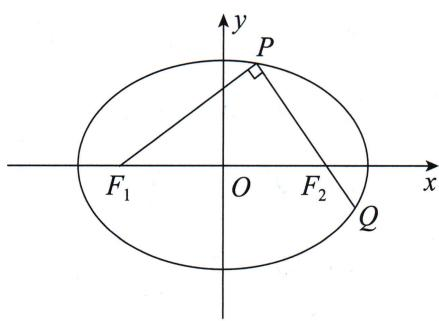

# 题目分析
当我们拿到这道题时,可以发现本例是椭圆上一点与两焦点有关的形式.那我们首先考虑到的是椭圆的第一定义,即椭圆的基本定义.无论在小题中还是大题中,请各位同学一定要清楚意识到定义优先的原则.
由椭圆的第一定义,有 $\left|PF_{1}\right|+\left|PF_{2}\right|=2a,\left|QF_{1}\right|+\left|QF_{2}\right|=2a.$

我们看到目标是求离心率的取值,实际上就是根据已知条件得到一个 a,b,c 相关的式子.于是接下来的目标就是将已知条件用 a,b,c 表示出来.列举一下条件,发现无非是垂直与长度相等.
由 $PQ \perp PF_{1}$ 和 $\left|PF_{1}\right| = \left|PQ\right|$ 可以联想到等腰直角三角形.

连接 $QF_{1}$ ，由条件可得 $\sqrt{2}|PF_{1}|=\sqrt{2}|PQ|=|QF_{1}|$ ，并且结合椭圆的第一定义有 $|PF_{1}|+|PQ|+|QF_{1}|=4a\Rightarrow(2+\sqrt{2})|PF_{1}|=4a\Rightarrow|PF_{1}|=\frac{4a}{2+\sqrt{2}}=2(2-\sqrt{2})a.$

写到这里有人可能会疑惑,为什么要得到 $\left|PF_{1}\right|$ 与a的关系呢?

想想看,通过这个条件我们可以将 $\triangle PQF_{1}$ 的三条边都用 $a$ 表示出来,最终还要找到某条边长满足的一个式子,从而得到关于 $a,b,c$ 的式子.我们还可以知道 $|F_{1}F_{2}|=2c$ 这个条件,重复利用一下垂直,可得 $|F_{1}F_{2}|^{2}=|PF_{1}|^{2}+|PF_{2}|^{2}$ .因此我们求 $|PF_{1}|$ 是比较顺畅的想法.
于是有 $(2c)^{2} = [2(2 - \sqrt{2})a]^{2} + [2a - 2(2 - \sqrt{2})a]^{2}$

现在已经完成了我们的初始目标,化简上式,可得 $4c^{2}=12(3-2\sqrt{2})a^{2}\Rightarrow\left(\frac{c}{a}\right)^{2}=\frac{12(3-2\sqrt{2})}{4}=9-6\sqrt{2}\Rightarrow e=\sqrt{9-6\sqrt{2}}$ .

现在基本的问题已经解决,但是还剩一个小问题:这个根号套根号如何化简呢?

一般来说根号里是一个完全平方式才能开出来. 数感好的同学可以直接观察出来, 这里提供一个非观察的尝试方向:
如果根号里是一个完全平方式,那么 $9-6\sqrt{2}$ 中的 $6\sqrt{2}$ 肯定是完全平方公式 $(a\pm b)^{2}=a^{2}+b^{2}\pm2ab$ 中的 $\pm2ab$ 部分.因此我们不难有 $a^{2}+b^{2}=9$ 且 $2ab=6\sqrt{2}\Rightarrow ab=3\sqrt{2}=\sqrt{18}$ .此时可硬算出 $a=\sqrt{6},b=\sqrt{3}$ .
最后我们就得到 $e=\sqrt{6}-\sqrt{3}$ .

# 参考解析

连接 $F_{1}Q$ ，根据椭圆的定义，有 $\left|PF_1\right| + \left|PF_2\right| = 2a,\left|QF_1\right| + \left|QF_2\right| = 2a,$
从而由 $|PF_1| = |PQ| = |PF_2| + |QF_2|$ ，得 $|QF_1| = 4a - 2|PF_1|$
又由 $PQ \perp PF_{1}, |PF_{1}| = |PQ|$ ，得 $|QF_{1}| = \sqrt{2} |PF_{1}| = 4a - 2|PF_{1}|$ ，
解得 $\left|PF_{1}\right|=2(2-\sqrt{2})a$ ，从而有 $\left|PF_{2}\right|=2a-\left|PF_{1}\right|=2(\sqrt{2}-1)a.$
由 $PF_{2} \perp PF_{1}$ , 得 $2c = |F_{1}F_{2}| = \sqrt{|PF_{1}|^{2} + |PF_{2}|^{2}}$ ,
故 $e = \frac{c}{a} = \frac{\sqrt{|PF_1|^2 + |PF_2|^2}}{2a} = \sqrt{(2 - \sqrt{2})^2 + (\sqrt{2} - 1)^2} = \sqrt{9 - 6\sqrt{2}} = \sqrt{6} - \sqrt{3}.$

# 总结

至此,我们利用椭圆的第一定义和等腰直角三角形性质与勾股定理解决了这道高考题.
接下来讲一下第二种处理方法. 在圆锥曲线的学习中, 部分老师会补充一个术语——焦半径. 为了防止有同学没有听过, 这里先介绍一下焦半径与焦半径公式.

我们把椭圆或双曲线上一点到任意一个焦点的长度称为焦半径,其长度可用 a,c 与曲线上该点的横坐标来表示.这个表达式称为焦半径公式.最简单的方法是利用圆锥曲线的第二定义(也称圆锥曲线的统一定义).但是部分地区不涉及第二定义,所以我们采用同样简单的两点间距离结合曲线方程来证明.

思维笔记

Siweibiji

思维笔记

Siweibiji

已知 $P(x_0, y_0)$ 是椭圆 $\frac{x^2}{a^2} + \frac{y^2}{b^2} = 1 (a > b > 0)$ 上一点，椭圆的左、右焦点分别为 $F_1(-c, 0), F_2(c, 0)$ .

易得 $\left|PF_{1}\right|=\sqrt{(x_{0}+c)^{2}+y_{0}^{2}}$ ,
由点 $P$ 在椭圆上，有 $\frac{x_0^2}{a^2} +\frac{y_0^2}{b^2} = 1\Rightarrow y_0^2 = b^2 -\frac{b^2}{a^2} x_0^2,$
代入 $|PF_{1}|=\sqrt{(x_{0}+c)^{2}+y_{0}^{2}}$ ，得
$\begin{array}{l} \mid P F _ {1} \mid = \sqrt {x _ {0} ^ {2} + 2 c x _ {0} + c ^ {2} + b ^ {2} - \frac {b ^ {2}}{a ^ {2}} x _ {0} ^ {2}} = \sqrt {\left(1 - \frac {b ^ {2}}{a ^ {2}}\right) x _ {0} ^ {2} + 2 c x _ {0} + c ^ {2} + b ^ {2}} \\ = \sqrt {\frac {c ^ {2}}{a ^ {2}} x _ {0} ^ {2} + 2 c x _ {0} + a ^ {2}} = \sqrt {\left(\frac {c}{a} x _ {0} + a\right) ^ {2}}. \\ \end{array}$
由点 $P$ 在椭圆上，可知 $-a \leqslant x_0 \leqslant a$ ，因此 $0 < a - c \leqslant \frac{c}{a} x_0 + a \leqslant a + c$ ，所以 $|PF_1| = a + \frac{c}{a} x_0$ .

一般我们记为 $|PF_{1}| = a + ex_{0}$ ，同理可得 $|PF_{2}| = a - ex_{0}$ .
同理可得双曲线的焦半径公式,大家可自行证明.注意:因为双曲线分两支,所以在不同支上点的横坐标范围不同,开根号后正负不同.

该结论不推荐同学们记忆,随用随求即可.

下面我们来尝试一下用焦半径公式来处理例 13.
由焦半径公式可得(考试时先求后用)
$\left| P F _ {1} \right| = a + e x _ {P}, \left| P F _ {2} \right| = a - e x _ {P}, \left| Q F _ {1} \right| = a + e x _ {Q}, \left| Q F _ {2} \right| = a - e x _ {Q}.$
由 $|PF_{1}| = |PQ|$ 得 $|PF_{1}| = |PF_{2}| + |QF_{2}|$ ，代入得 $ex_{Q} = a - 2ex_{P}$ .
又由等腰直角三角形有 $\sqrt{2}|PF_1| = |QF_1|\Rightarrow \sqrt{2} (a + ex_P) = a + ex_Q.$
解得 $ex_{P} = (3 - 2\sqrt{2})a.$

我们使用圆锥曲线的第一定义的时候,是以线段长度整体作为变量去寻找关系,因此最后我们利用了勾股定理.

而使用焦半径公式的时候,是以点坐标为变量,所以我们采用向量来翻译直角就更贴切了.

需要强调的是,同一种条件根据不同方法使用不同的翻译方式,所以在圆锥曲线中方法的选择更胜于题型分类.
由 $PQ \perp PF_{1}$ 有 $PF_{2} \perp PF_{1}$ ，即 $\overrightarrow{PF_{2}} \cdot \overrightarrow{PF_{1}} = 0 \Rightarrow x_{P}^{2} - c^{2} + y_{P}^{2} = 0.$
由点 $P$ 在椭圆上，得 $\frac{x_P^2}{a^2} +\frac{y_P^2}{b^2} = 1$ ，所以 $y_{P}^{2} = b^{2} - \frac{b^{2}}{a^{2}} x_{P}^{2}$ ，代入上式得
$x _ {P} ^ {2} - c ^ {2} + b ^ {2} - \frac {b ^ {2}}{a ^ {2}} x _ {P} ^ {2} = 0 \Rightarrow \frac {c ^ {2}}{a ^ {2}} x _ {P} ^ {2} = 2 c ^ {2} - a ^ {2} \Rightarrow (e x _ {P}) ^ {2} = 2 c ^ {2} - a ^ {2}.$

结合 $ex_{P} = (3 - 2\sqrt{2})a$ 可化简得 $c^2 = 3(3 - 2\sqrt{2})a^2$ ，接下来与参考解析中就相同了.

至此我们完成了用焦半径公式解本例的过程.

请各位同学在以后处理与焦点有关的长度问题时,要注意这两种方法与几何性质的使用.
接下来我们再看一道例题.

> [!example]- 例 14 过椭圆 $\frac{x^{2}}{4} + \frac{y^{2}}{3} = 1$ 的左焦点 F 作一条直线 $y = k(x + 1)$ 与椭圆交于 A, B 两点. 在 x 轴上存在一点 D 满足 $|DA| = |DB|$ . 证明: $\frac{|DF|}{|AB|}$ 为定值.

# 题目分析

本例的目标是求定值,而定值是由 $|AB|$ 和 $|DF|$ 决定的,并且 $|AB|$ 是过焦点的直线与椭圆相交的弦长,很明显可以用直线斜率来表示 $|AB|$ .
$|DF|$ 如何处理呢？点 F 是固定的，点 D 由 $|DA|=|DB|$ 决定，根据等腰三角形三线合一的几何性质，可知点 D 在线段 AB 的垂直平分线上。所以 $|DF|$ 也可以由直线斜率来表示。

这意味着直线表达式中的变量 k 即为本题的核心变量, 因为它将 $\left|AB\right|$ 和 $\left|DF\right|$ 都表示出来了.

# 参考解析
由题意知 $F(-1,0)$ ,
联立直线方程与椭圆方程得 $\left\{\begin{aligned}y&=k(x+1),\\ \frac{x^{2}}{4}&+\frac{y^{2}}{3}=1\end{aligned}\right.\Rightarrow(4k^{2}+3)x^{2}+8k^{2}x+4k^{2}-12=0,$
由韦达定理得 $x_{A} + x_{B} = \frac{-8k^{2}}{4k^{2} + 3}$
设线段 AB 的中点为 M，则 $x_{M}=\frac{x_{A}+x_{B}}{2}=\frac{-4k^{2}}{4k^{2}+3}$ ,
代入 $y = k(x + 1)$ ，可得 $y_{M} = \frac{3k}{4k^{2} + 3}$
因此线段 $AB$ 的垂直平分线的方程为 $y - \frac{3k}{4k^2 + 3} = -\frac{1}{k}\left(x + \frac{4k^2}{4k^2 + 3}\right)$ .
令 $y = 0$ ，可得 $x_{D} = \frac{-k^{2}}{4k^{2} + 3}$ 所以 $|DF| = |x_{D} - x_{F}| = \left|\frac{-k^{2}}{4k^{2} + 3} +1\right| = \frac{3(k^{2} + 1)}{4k^{2} + 3}.$

易得 $|AF|=\sqrt{(x_{A}+1)^{2}+y_{A}^{2}}$ ①,由点A在椭圆上,有 $\frac{x_{A}^{2}}{4}+\frac{y_{A}^{2}}{3}=1$ ②,
将②式代入①式，得 $|AF|=\sqrt{\left(2+\frac{1}{2}x_{A}\right)^{2}}$ .

思维笔记

Siweibiji

思维笔记

Siweibiji

由点 $A$ 在椭圆上，有 $-2 \leqslant x_{A} \leqslant 2$ ，所以 $|AF| = 2 + \frac{1}{2} x_{A}$
同理可得 $|BF|=2+\frac{1}{2}x_{B}$ .
所以 $|AB|=|AF|+|BF|=4+\frac{1}{2}(x_{A}+x_{B})=\frac{12(k^{2}+1)}{4k^{2}+3}$ ,
所以 $\frac{|DF|}{|AB|} = \frac{\frac{3(k^2 + 1)}{4k^2 + 3}}{\frac{12(k^2 + 1)}{4k^2 + 3}} = \frac{1}{4}$ , 即 $\frac{|DF|}{|AB|}$ 为定值.

# 总结

过焦点的直线与椭圆有两个交点时,我们求弦长可以用接下来的化斜为直的方法,也可以使用焦半径公式,后者算起来更简洁.

希望大家了解,熟练掌握基本的定义是非常重要的.学会焦半径公式的证明及应用也很重要.虽然焦半径公式局限于到焦点的距离,但是仍然在小题和大题中有一定的作用.特别是小题,要注意优先考虑定义与几何性质.

## 12.2 线段长度
在前面我们讨论了第一定义和第二定义(焦半径公式)的翻译方法. 特别是焦半径公式的证明中利用了两点间距离和曲线方程来进行化简, 那么接下来的内容将会给出线段长度问题的常用翻译方法——化斜为直.

要讲化斜为直, 就要先拿出一个同学们最熟悉的弦长公式 $\left|AB\right|=\sqrt{1+k^{2}}\cdot\left|x_{A}-x_{B}\right|$ .

弦长公式这个名字很容易让部分同学误会,他们可能会以为必须是弦长或者说曲线上两点距离才能使用这个弦长公式,实际上并不是这样的.

这个式子是通过两点间距离公式加上直线方程化简得来的,任意两点都可以使用.而类似焦半径公式这样使用了点在曲线上,即使用了曲线方程的,两点才必须是曲线上的点.

下面我们来证明一下：

已知直线 $y=kx+m$ 上的两点 $A(x_{1},y_{1}), B(x_{1},y_{2})$ .
由两点间距离公式有 $|AB| = \sqrt{(x_1 - x_2)^2 + (y_1 - y_2)^2}$ .
因为点 $A, B$ 在直线上，所以有 $y_{1} - y_{2} = kx_{1} + m - (kx_{2} + m) = k(x_{1} - x_{2})$
代入上式得 $|AB| = \sqrt{(x_1 - x_2)^2 + k^2(x_1 - x_2)^2} = \sqrt{1 + k^2}|x_1 - x_2|$ .

同理还有 $|AB| = \sqrt{1 + \frac{1}{k^2}} |y_1 - y_2|$ .

这里我们称这种翻译为化斜为直,即将线段长度用含横坐标或者纵坐标的式子表示.

我们把例 14 再用化斜为直的方法试一下.

> [!example]- 例 14 过椭圆 $\frac{x^{2}}{4} + \frac{y^{2}}{3} = 1$ 的左焦点 F 作一条直线 $y = k(x + 1)$ 与椭圆交于 A, B 两点. 在 x 轴上存在一点 D 满足 $|DA| = |DB|$ . 证明: $\frac{|DF|}{|AB|}$ 为定值.
# 题目分析

之前已经得到 $|DF| = \frac{3(k^2 + 1)}{4k^2 + 3}$ ，下面通过化斜为直来处理 $|AB|$ 。
根据弦长公式， $|AB| = \sqrt{1 + k^2}|x_A - x_B| = \sqrt{(1 + k^2)[(x_A + x_B)^2 - 4x_Ax_B]}$
利用韦达定理，得 $|AB| = \sqrt{(1 + k^2)\left[\left(\frac{-8k^2}{4k^2 + 3}\right)^2 - 4 \cdot \frac{4k^2 - 12}{4k^2 + 3}\right]}$
$= \sqrt {(1 + k ^ {2}) \frac {6 4 k ^ {4} - 1 6 (k ^ {2} - 3) (4 k ^ {2} + 3)}{(4 k ^ {2} + 3) ^ {2}}}.$

对于这个算式,接下来给大家介绍一种做法:
首先强调一点,在遇见复杂计算的时候,“疯狂”地提公因式是一个非常有效且好上手的习惯,在后面还会提到这点.

我们发现上式分子的两项中都有 16, 提出来后还剩 $4k^{4} - (k^{2} - 3)(4k^{2} + 3)$ .

另一个好习惯是抓主元去观察, 对 k 由高次到低次排序. 先看 $k^{4}$ , 发现正好消掉了, 再看 $k^{2}$ , 只有后面的式子提供了 9 个, 最后的常数明显为 9.
因此 $|AB|=\sqrt{(1+k^{2})\frac{16(9k^{2}+9)}{(4k^{2}+3)^{2}}}=\frac{12(k^{2}+1)}{4k^{2}+3}.$
所以 $\frac{|DF|}{|AB|} = \frac{\frac{3(k^2 + 1)}{4k^2 + 3}}{\frac{12(k^2 + 1)}{4k^2 + 3}} = \frac{1}{4}$ .

# 参考解析
设 $A(x_{1},y_{1}),B(x_{2},y_{2})$ ，线段AB的中点为 $M(x_0,y_0)$
联立直线方程与椭圆方程得 $\left\{ \begin{array}{l} y = k(x + 1), \\ \frac{x^2}{4} + \frac{y^2}{3} = 1 \end{array} \right. \Rightarrow (4k^2 + 3)x^2 + 8k^2x + 4k^2 - 12 = 0,$
由韦达定理得 $\left\{\begin{aligned}x_{1}+x_{2}&=-\frac{8k^{2}}{3+4k^{2}}\quad①,\\ x_{1}x_{2}&=\frac{4k^{2}-12}{3+4k^{2}}\quad②,\end{aligned}\right.$
则 $x_0 = -\frac{4k^2}{3 + 4k^2}$ ，则 $y_{0} = k(x_{0} + 1) = \frac{3k}{3 + 4k^{2}}$

# 思维笔记

# Siweibiji

则线段 AB 的垂直平分线的方程为 $y - \frac{3k}{3 + 4k^{2}} = -\frac{1}{k} \left( x + \frac{4k^{2}}{3 + 4k^{2}} \right)$ .
由 $|DA| = |DB|$ ，知点 $D$ 为线段 $AB$ 的垂直平分线与 $x$ 轴的交点，
令 $y = 0$ ，得 $x_{D} = \frac{-k^{2}}{4k^{2} + 3},$
所以 $|DF| = \left| -\frac{k^2}{3 + 4k^2} +1\right| = \frac{3 + 3k^2}{3 + 4k^2},$
$\left| A B \right| = \sqrt {1 + k ^ {2}} \left| x _ {1} - x _ {2} \right| = \sqrt {(1 + k ^ {2}) \left[ (x _ {1} + x _ {2}) ^ {2} - 4 x _ {1} x _ {2} \right]},$
将①②两式代入上式，得 $|AB| = \sqrt{(1 + k^2)\left[-\frac{8k^2}{3 + 4k^2}\right]^2 - 4 \cdot \frac{4k^2 - 12}{3 + 4k^2}}$
$= \sqrt {(1 + k ^ {2}) \frac {1 6 (9 k ^ {2} + 9)}{(4 k ^ {2} + 3) ^ {2}}} = \frac {1 2 (k ^ {2} + 1)}{4 k ^ {2} + 3},$
所以 $\frac{|DF|}{|AB|} = \frac{\frac{3(k^2 + 1)}{4k^2 + 3}}{\frac{12(k^2 + 1)}{4k^2 + 3}} = \frac{1}{4}$ .

综上， $\frac{|DF|}{|AB|}$ 为定值 $\frac{1}{4}$

部分资料会将 $|PQ| = \sqrt{1 + k^2} \cdot \frac{2ab\sqrt{a^2k^2 + b^2 - m^2}}{a^2k^2 + b^2}$ 或 $|PQ| = \sqrt{1 + k^2} \cdot \frac{\sqrt{\Delta}}{a^2k^2 + b^2}$ 称为弦长公式（此时设直线 $y = kx + m$ 与椭圆 $\frac{x^2}{a^2} + \frac{y^2}{b^2} = 1 (a > b > 0)$ 交于 $P, Q$ 两点）.

这个公式是在化斜为直的基础上进一步化简来的. 下面来证一下:
设 $P(x_{1},y_{1}),Q(x_{1},y_{2})$
$\left\{ \begin{array}{l} y = k x + m, \\ \frac {x ^ {2}}{a ^ {2}} + \frac {y ^ {2}}{b ^ {2}} = 1 \end{array} \Rightarrow (a ^ {2} k ^ {2} + b ^ {2}) x ^ {2} + 2 a ^ {2} k m x + a ^ {2} m ^ {2} - a ^ {2} b ^ {2} = 0, \right.$
由韦达定理得 $\left\{\begin{aligned}x_{1}+x_{2}&=-\frac{2a^{2}km}{a^{2}k^{2}+b^{2}},\\ x_{1}\cdot x_{2}&=\frac{a^{2}m^{2}-a^{2}b^{2}}{a^{2}k^{2}+b^{2}},\end{aligned}\right.$
$\begin{array}{l} \mid P Q \mid = \sqrt {1 + k ^ {2}} \mid x _ {1} - x _ {2} \mid = \sqrt {1 + k ^ {2}} \cdot \sqrt {(x _ {1} + x _ {2}) ^ {2} - 4 x _ {1} x _ {2}} \\ = \sqrt {1 + k ^ {2}} \cdot \sqrt {\left(- \frac {2 a ^ {2} k m}{a ^ {2} k ^ {2} + b ^ {2}}\right) ^ {2} - 4 \cdot \frac {a ^ {2} m ^ {2} - a ^ {2} b ^ {2}}{a ^ {2} k ^ {2} + b ^ {2}}} \\ = \sqrt {1 + k ^ {2}} \cdot \sqrt {\frac {(2 a ^ {2} k m) ^ {2} - 4 \cdot (a ^ {2} k ^ {2} + b ^ {2}) \cdot (a ^ {2} m ^ {2} - a ^ {2} b ^ {2})}{(a ^ {2} k ^ {2} + b ^ {2}) ^ {2}}} \\ \end{array}$
$= \sqrt {1 + k ^ {2}} \cdot \frac {2 a b \sqrt {a ^ {2} k ^ {2} + b ^ {2} - m ^ {2}}}{a ^ {2} k ^ {2} + b ^ {2}},$

而此时 $(2a^{2}km)^{2} - 4\cdot (a^{2}k^{2} + b^{2})\cdot (a^{2}m^{2} - a^{2}b^{2})$ 正是直线方程与椭圆方程联立后所得二次方程的判别式 $\Delta$
如果大家直接记忆此公式,那么一定要明确公式中每个量在直线方程和椭圆方程中的位置.

对于双曲线来说, 直线与双曲线交于同一支还是交于两支对于最后的分母是有影响的, 不是将 $a^{2}k^{2}+b^{2}$ 换成 $-a^{2}k^{2}+b^{2}$ 就可以的. 具体情况, 请同学们自己尝试. 所以要想背得准确, 用得清楚, 也不是那么容易的事情.

除了圆锥曲线的弦长,还有圆的弦长,请看下面这道例题.

> [!example]- 例 15 过点 $B(1,0)$ 作两条相互垂直的直线 $l_{1}, l_{2}$ ，直线 $l_{1}$ 与椭圆 $\frac{x^{2}}{4} + \frac{y^{2}}{3} = 1$ 交于 M, N 两点，直线 $l_{2}$ 与圆 A: $(x+1)^{2} + y^{2} = 16$ 交于 P, Q 两点，求 $\frac{|MN|}{|PQ|}$ 的取值范围.
# 题目分析
当直线 $l_{1}, l_{2}$ 的斜率都存在时，设直线 $l_{1}$ 的方程为 $y = k(x - 1) (k \neq 0)$ ，则直线 $l_{2}$ 的方程为 $y = -\frac{1}{k}(x - 1)$ ，
由韦达定理整体代入可算出 $|MN| = \frac{12(k^2 + 1)}{4k^2 + 3}$ , 下面求 $|PQ|$ 即可.
显然 $|PQ|$ 是圆的弦长，不是圆锥曲线的弦长，切勿盲目联立方程.

我们根据垂径定理(参看第十四节 圆的翻译), 可得 $\left(\frac{|PQ|}{2}\right)^{2}=r^{2}-d^{2}$ .
所以 $\left(\frac{|PQ|}{2}\right)^2 = r^2 - d^2 = 16 - \frac{4}{1 + k^2} = 4 \cdot \frac{4k^2 + 3}{1 + k^2}$ , 即 $|PQ| = 4\sqrt{\frac{4k^2 + 3}{1 + k^2}}$ .
因此目标就表达出来了，即 $\frac{|MN|}{|PQ|} = \frac{\frac{12(k^2 + 1)}{4k^2 + 3}}{4\sqrt{\frac{4k^2 + 3}{1 + k^2}}} = 3\sqrt{\left(\frac{k^2 + 1}{4k^2 + 3}\right)^3}.$

下面易算得 $\frac{|MN|}{|PQ|}$ 的取值范围为 $\left[\frac{3}{8},\frac{\sqrt{3}}{3}\right]$ .

# 参考解析

①当 $l_{1} \perp x$ 轴， $l_{2} \perp y$ 轴时， $\frac{|MN|}{|PQ|} = \frac{3}{8}$ .

思维笔记

Siweiliji

思维笔记

Siweibiji

②当 $l_{1} \perp y$ 轴， $l_{2} \perp x$ 轴时， $\frac{|MN|}{|PQ|} = \frac{4}{4\sqrt{3}} = \frac{\sqrt{3}}{3}$ .

③当两直线斜率都存在且不为0时，设直线 $l_{1}$ 的方程为 $y=k(x-1)(k\neq0)$ ， $M(x_{1},y_{1}),N(x_{2},y_{2})$ ，
则直线 $l_{2}$ 的方程为 $y = -\frac{1}{k} (x - 1)$
联立直线 $l_{1}$ 的方程与椭圆方程得 $\left\{ \begin{array}{l} y = k(x - 1), \\ \frac{x^2}{4} + \frac{y^2}{3} = 1 \end{array} \right. \Rightarrow (3 + 4k^2)x^2 - 8k^2x + 4k^2 - 12 = 0.$
由韦达定理得 $\left\{\begin{aligned}x_{1}+x_{2}&=\frac{8k^{2}}{3+4k^{2}},\\ x_{1}x_{2}&=\frac{4k^{2}-12}{3+4k^{2}},\end{aligned}\right.$
所以 $|MN| = \sqrt{1 + k^2} |x_1 - x_2| = \sqrt{1 + k^2}\cdot \sqrt{(x_1 + x_2)^2 - 4x_1x_2}$
$\begin{array}{l} = \sqrt {1 + k ^ {2}} \cdot \sqrt {\left(\frac {8 k ^ {2}}{3 + 4 k ^ {2}}\right) ^ {2} - \frac {1 6 k ^ {2} - 4 8}{3 + 4 k ^ {2}}} = \sqrt {1 + k ^ {2}} \cdot \frac {1 2 \sqrt {k ^ {2} + 1}}{3 + 4 k ^ {2}} \\ = \frac {1 2 (k ^ {2} + 1)}{3 + 4 k ^ {2}}. \\ \end{array}$
设圆心 $A(-1,0)$ 到直线 $l_{2}: x + ky - 1 = 0$ 的距离 $d = \frac{2}{\sqrt{k^2 + 1}}$ ,
所以 $\left(\frac{|PQ|}{2}\right)^2 = r^2 - d^2 = 16 - \frac{4}{1 + k^2} = 4 \cdot \frac{4k^2 + 3}{1 + k^2}$ , 即 $|PQ| = 4\sqrt{\frac{4k^2 + 3}{1 + k^2}}$ .
所以 $\frac{|MN|}{|PQ|} = \frac{\frac{12(k^2 + 1)}{4k^2 + 3}}{4\sqrt{\frac{4k^2 + 3}{1 + k^2}}} = 3\sqrt{\left(\frac{k^2 + 1}{4k^2 + 3}\right)^3}.$
设 $t = \frac{k^2 + 1}{4k^2 + 3}$ ，则 $t = \frac{\frac{1}{4}(4k^2 + 3) + \frac{1}{4}}{4k^2 + 3} = \frac{1}{4}\left(1 + \frac{1}{4k^2 + 3}\right)$ ，
由 $k^{2}>0$ 得 $4k^{2}+3>3$ ，
所以有 $0 < \frac{1}{4k^2 + 3} < \frac{1}{3}$ , 即 $\frac{1}{4} < t < \frac{1}{3}$ ,
因此 $\frac{|MN|}{|PQ|} = 3\sqrt{t^3}\in \left(\frac{3}{8},\frac{\sqrt{3}}{3}\right).$

综上， $\frac{|MN|}{|PQ|}$ 的取值范围为 $\left[\frac{3}{8},\frac{\sqrt{3}}{3}\right]$

# 总结
当我们遇到共线线段时,化斜为直也是非常好用的翻译手段.唯一需要同学们注意的是明确化为横坐标处理更简单,还是化为纵坐标处理更简单.

一般来说,不含变量比含变量的简单,0 比其他常数算起来更简单.

我们来看下面这道例题.

> [!example]- 例 16 已知过椭圆 $\frac{x^{2}}{4} + y^{2} = 1$ 的左顶点 A 作直线 l 交椭圆于点 B，交 y 轴于点 C，过原点 O 作一条平行于 l 的直线交椭圆于 M, N 两点。证明： $\frac{|AB| \cdot |AC|}{|OM|^{2}}$ 为定值。
# 题目分析

本例目标中三条线段所在直线的斜率都相同，并且点 C 的横坐标为 0，因此用化斜为直来翻译时转化为横坐标处理更简单，即 $\frac{|AB|\cdot|AC|}{|OM|^{2}}=\frac{|x_{B}+2|\cdot|0+2|}{|x_{M}|^{2}}=2\cdot\frac{x_{B}+2}{x_{M}^{2}}$ .

我们从设点手法来看,此时有双动点,要求证定值,需要找到 $x_{B}$ 与 $x_{M}$ 的关系.
在本例中,与点坐标有关的条件为两直线平行.
因此根据条件,有 $k_{AB}=k_{MN}\Rightarrow\frac{y_{B}}{x_{B}+2}=\frac{y_{M}}{x_{M}}$ .
因为要找 $x_{B}$ 与 $x_{M}$ 的关系, 所以需要想办法将纵坐标 $y_{B}, y_{M}$ 消掉.

要消掉纵坐标 $y_{B}, y_{M}$ ，可用的条件无非是点在椭圆上，而椭圆方程是二次的，所以上式需要平方一下，以便利用椭圆方程，即 $\left(\frac{y_{B}}{x_{B}+2}\right)^{2}=\left(\frac{y_{M}}{x_{M}}\right)^{2} \Rightarrow \frac{4-x_{B}^{2}}{(x_{B}+2)^{2}}=\frac{4-x_{M}^{2}}{x_{M}^{2}}$ .
化简得 $\frac{x_B + 2}{x_M^2} = 1$ ，所以 $\frac{|AB|\cdot|AC|}{|OM|^2} = 2.$

# 参考解析

# 方法一:设点法——双动点
设 $B(x_{1},y_{1}),M(x_{2},y_{2}),C(0,t)$ ，由题意知 $A(-2,0)$
因为两直线平行，所以 $k_{AB} = k_{OM}$ ，即 $\frac{y_1}{x_1 + 2} = \frac{y_2}{x_2}$ ，等式左、右两边都平方后得 $\frac{y_1^2}{(x_1 + 2)^2} = \frac{y_2^2}{x_2^2}.$
因为 $B(x_{1},y_{1}),M(x_{2},y_{2})$ 在椭圆上，所以 $\left\{ \begin{array}{l} \frac{x_1^2}{4} + y_1^2 = 1, \\ \frac{x_2^2}{4} + y_2^2 = 1, \end{array} \right.$
代入上式得 $\frac{4 - x_1^2}{(x_1 + 2)^2} = \frac{4 - x_2^2}{x_2^2},\frac{2 - x_1}{2 + x_1} = \frac{4}{x_2^2} -1$ ，所以 $\frac{4}{2 + x_1} -1 = \frac{4}{x_2^2} -1,$
所以 $\frac{1}{2 + x_1} = \frac{1}{x_2^2}$ 即 $\frac{x_1 + 2}{x_2^2} = 1$

思维笔记

Siweibiji

# 思维笔记

# Siweibiji

故 $\frac{|AB|\cdot|AC|}{|OM|^2} = \frac{|x_1 + 2|\cdot|0 + 2|}{|x_2|^2} = 2\cdot \frac{x_1 + 2}{x_2^2} = 2$ ，即 $\frac{|AB|\cdot|AC|}{|OM|^2}$ 为定值.

# 方法二:设线法——求根
由题意知 $A(-2,0)$
设直线 l 的方程为 $y=k(x+2)$ ，则 $C(0,2k)$ ，所以 $|AC|=\sqrt{4+4k^{2}}=2\sqrt{1+k^{2}}$ ，
联立得 $\left\{\begin{aligned}y&=k(x+2),\\ \frac{x^{2}}{4}&+y^{2}=1\end{aligned}\right.\Rightarrow(4k^{2}+1)x^{2}+16k^{2}x+16k^{2}-4=0.$
设 $B(x_{1},y_{1})$ ，则 $-2x_{1} = \frac{16k^{2} - 4}{1 + 4k^{2}}$ ，故 $x_{1} = \frac{2 - 8k^{2}}{1 + 4k^{2}},y_{1} = \frac{4k}{1 + 4k^{2}},$
所以 $|AB| = \frac{4\sqrt{1 + k^2}}{1 + 4k^2}$ .
由题意知直线 OM 的方程为 y=kx，代入 $\frac{x^{2}}{4}+y^{2}=1$ 可得 $(4k^{2}+1)x^{2}-4=0$ .
设 $M(x_{2},y_{2})$ ，则 $x_{2}^{2} = \frac{4}{1 + 4k^{2}},y_{2}^{2} = \frac{4k^{2}}{1 + 4k^{2}}$
所以 $|OM|^{2}=x_{2}^{2}+y_{2}^{2}=\frac{4+4k^{2}}{1+4k^{2}}$ ,
故 $\frac{|AB|\cdot|AC|}{|OM|^2} = \frac{\frac{4\sqrt{1 + k^2}}{1 + 4k^2}\cdot 2\sqrt{1 + k^2}}{\frac{4 + 4k^2}{1 + 4k^2}} = 2$ ，即 $\frac{|AB|\cdot|AC|}{|OM|^2}$ 是定值.

# 总结
如果本例中化斜为直时选择了纵坐标,那么点 A 的纵坐标是 0, 点 C 的纵坐标是变量.与选择横坐标相比,并没有绝对的优势或者劣势,还是看同学们的习惯.

化斜为直已经是一个很好的处理方法了,这里再介绍一种翻译共线线段的方法——直线向量化,即转化为共线向量.这种方法非常易于处理与点坐标关系比较紧密的条件或者目标.

> [!example]- 例 17 如图, 已知直线 l 交椭圆 $\frac{x^{2}}{2} + y^{2} = 1$ 于 M, N 两点, 交 x 轴于点 C, 交 y 轴于点 D, 若 C, D 是线段 MN 的三等分点, 求直线 l 的方程.
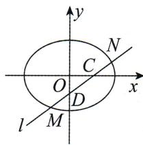

# 题目分析

本例的目标为直线 $l$ 的方程，而直线 $l$ 与两坐标轴都有交点，所以考虑到直线的截距式方程，即求出点 $C$ 和 $D$ 的坐标。要求两个变量，一般需要两个方程。本例中的方程哪里来呢？

条件中最重要的就是四点共线,这里我们可以转换为向量的关系,即
$3 \overrightarrow {N C} = \overrightarrow {N M}, 3 \overrightarrow {M D} = \overrightarrow {M N},$
从而可以将椭圆上的点 M, N 的坐标用点 C 和 D 的坐标表示出来.
最后结合设点法中常用的核心思想:有点必有等式,得到关于点 C 和点 D 坐标的两个方程.

# 参考解析
设 $M(x_{1},y_{1}), N(x_{2},y_{2}), C(m,0), D(0,n)$ ,
由题意知 $3 \overrightarrow{NC} = \overrightarrow{NM}, 3 \overrightarrow{MD} = \overrightarrow{MN}$ ,
所以 $3 \overrightarrow{NC} = \overrightarrow{NM} \Rightarrow \begin{cases} x_{1} + 2x_{2} = 3m, \\ y_{1} + 2y_{2} = 0, \end{cases}$ $3 \overrightarrow{MD} = \overrightarrow{MN} \Rightarrow \begin{cases} x_{2} + 2x_{1} = 0, \\ y_{2} + 2y_{1} = 3n, \end{cases}$
解得 $M(-m,2n)$ , $N(2m,-n)$ .
因为 $M(-m,2n)$ , $N(2m,-n)$ 在椭圆上，
所以 $\left\{\begin{aligned}\frac{(-m)^{2}}{2}+(2n)^{2}&=1,\\ \frac{(2m)^{2}}{2}+(-n)^{2}&=1\end{aligned}\right.\Rightarrow\left\{\begin{aligned}m^{2}&=\frac{2}{5},\\ n^{2}&=\frac{1}{5}.\end{aligned}\right.$
所以直线 l 的方程为 $\sqrt{10}x + 2\sqrt{5}y + 2 = 0$ 或 $\sqrt{10}x - 2\sqrt{5}y + 2 = 0$ 或 $\sqrt{10}x + 2\sqrt{5}y - 2 = 0$ 或 $\sqrt{10}x - 2\sqrt{5}y - 2 = 0$ .
最后,还有一类比较少见的长度处理问题,即需要根据已知条件通过加减某条线段的长度使得目标分解为更易计算的式子,类比于面积分割,可称之为“线段分割”.

请看下面这道例题.

> [!example]- 例 18 若直线 $l: y = k(x - \sqrt{3})(k > 0)$ 与圆 O 相切，与圆 $F: x^{2} + y^{2} - 2\sqrt{3}x + \frac{11}{4} = 0$ 相交于 M, N 两点，与椭圆 $\frac{x^{2}}{4} + y^{2} = 1$ 交于 P, Q 两点，其中点 M, P 在第一象限，记圆 O 的面积为 $S(k)$ ，求 $(|NQ| - |MP|) \cdot S(k)$ 取最大值时，直线 l 的方程.

# 题目分析

本例涉及的点比较多,根据条件可以确定从左到右依次为 Q,N,P,M.

现在可以进行线段分割, 即 $\left|NQ\right|=\left|PQ\right|-\left|NP\right|$ , $\left|MP\right|=\left|MN\right|-\left|NP\right|$ .

那么,为什么要找 $|PQ|$ 和 $|MN|$ 呢?因为点都在一条曲线上时更容易求长度,而这里MN恰是直径,由弦长公式易求得 $|PQ|$ .
从而有 $|NQ| - |MP| = |PQ| - |MN| = \frac{3}{4k^2 + 1}$ .
又因为直线 $l$ 与圆 $O$ 相切，所以圆 $O$ 的半径 $r = \frac{\left|\sqrt{3}k\right|}{\sqrt{k^2 + 1}}$ ，所以 $S(k) = \pi r^2 = \frac{3\pi k^2}{k^2 + 1}$

思维笔记

Siweibiji

思维笔记

Siweibiji

从而有（ $|NQ| - |MP| \cdot S(k) = \frac{9\pi k^2}{(4k^2 + 1)(k^2 + 1)} = \frac{9\pi k^2}{4k^4 + 1 + 5k^2} = \frac{9\pi}{4k^2 + \frac{1}{k^2} + 5} \leqslant \pi$ ，当且仅当 $4k^2 = \frac{1}{k^2}$ 时等号成立，又由 $k > 0$ 得 $k = \frac{\sqrt{2}}{2}$ .
所以直线 l 的方程为 $y=\frac{\sqrt{2}}{2}(x-\sqrt{3})$ .

# 参考解析
如图所示,由题意可知,点 M 在椭圆外,点 N 在椭圆内,点 P 在圆 F 内,点 Q 在圆 F 外,这四点满足 $\left|MP\right|=\left|MN\right|-\left|NP\right|$ , $\left|NQ\right|=\left|PQ\right|-\left|NP\right|$ .
设 $P(x_{1},y_{1}), Q(x_{2},y_{2})$ ,
联立直线方程与椭圆方程得 $\left\{ \begin{array}{l} y = k(x - \sqrt{3}), \\ \frac{x^2}{4} + y^2 = 1 \end{array} \right.$ $\Rightarrow (1 + 4k^2)x^2 - 8\sqrt{3}k^2x + 12k^2 - 4 = 0,$

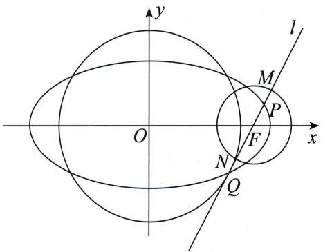
由韦达定理得 $\left\{\begin{aligned}x_{1}+x_{2}&=\frac{8\sqrt{3}k^{2}}{1+4k^{2}},\\ x_{1}x_{2}&=\frac{12k^{2}-4}{1+4k^{2}},\end{aligned}\right.$
所以 $|PQ| = \sqrt{(1 + k^2)[(x_1 + x_2)^2 - 4x_1x_2]} = \frac{4k^2 + 4}{4k^2 + 1}.$
又因为 MN 为圆 F 的直径, 所以 $\left|MN\right|=1$ ,
所以 $|NQ| - |MP| = |PQ| - |NP| - (|MN| - |NP|) = |PQ| - |MN| = |PQ| - 1 = \frac{3}{4k^2 + 1}$ .
$y = k(x - \sqrt{3})$ 化成一般式，得 $kx - y - \sqrt{3} k = 0.$
因为直线 $l$ 与圆 $O$ 相切，所以圆 $O$ 的半径 $r = \frac{\sqrt{3}k}{\sqrt{k^2 + 1}}$
所以 $S(k)=\pi r^{2}=\frac{3\pi k^{2}}{k^{2}+1}.$
所以（ $|NQ| - |MP| \cdot S(k) = \frac{9\pi k^2}{(4k^2 + 1)(k^2 + 1)} = \frac{9\pi k^2}{4k^4 + 1 + 5k^2} = \frac{9\pi}{4k^2 + \frac{1}{k^2} + 5} \leqslant \pi$ ，当且仅当 $4k^2 = \frac{1}{k^2}$ 时等号成立，又由k > 0得 $k = \frac{\sqrt{2}}{2}$ .
所以直线 l 的方程为 $y=\frac{\sqrt{2}}{2}(x-\sqrt{3})$ .

至此,我们就将线段长度的翻译方法介绍完了.

无论是弦长公式,还是化斜为直,又或者是直线向量化与线段分割,都需要同学们在实战中去分析、去熟悉.但是还有一种两条线段长度相等的情况,我们不会用以上任何一个方法处理.那是什么样的题呢?请看第十三节 多边形的翻译.

## 12.3 线段的垂直平分线

线段的垂直平分线, 即过线段的中点且与线段垂直的直线. 我们在处理与垂直平分线相关的问题时要紧抓两点: 一是斜率的关系, 若线段所在直线的斜率为 $k (k \neq 0)$ , 则垂直平分线的斜率为 $-\frac{1}{k}$ ; 若线段所在直线的斜率不存在, 则垂直平分线的斜率为 0. 二是垂直平分线过线段的中点, 若这条线段是曲线的弦, 则线段所在直线方程与曲线方程联立后可用韦达定理求中点坐标.

> [!example]- 例 19 (2015·江苏·节选) 已知过椭圆 $\frac{x^2}{2} + y^2 = 1$ 的右焦点 $F$ 作直线交椭圆于 $A, B$ 两点，线段 $AB$ 的垂直平分线分别交直线 $AB$ 和直线 $l: x = -2$ 于 $C, P$ 两点. 若 $|CP| = 2|AB|$ ，求直线 $AB$ 的方程.

# 题目分析

本例要求直线 AB 的方程, 就是求直线 AB 的斜率. 我们只需要把已知条件中 CP 和 AB 的长度都用斜率表示出来, 然后解方程就可以了.
由题意, 当直线 AB 的斜率不存在时, 不满足条件, 所以直线 AB 的斜率存在, 设直线 AB 的方程为 $y = k(x - 1)$ .
联立直线 $AB$ 的方程与椭圆方程, 利用韦达定理整体代换, 得 $|AB| = \frac{2\sqrt{2}(k^2 + 1)}{2k^2 + 1}$ .
接下来计算 $|CP|$ 时, 思考一下是用横坐标还是用纵坐标表示.
因为 $x_{P}=-2$ ，所以选择横坐标来表示 $\left|CP\right|$ .
根据垂直平分线，得 $k_{CP} = -\frac{1}{k}$ 且 $x_{C} = \frac{x_{A} + x_{B}}{2} = \frac{2k^{2}}{2k^{2} + 1}$ 所以 $|CP| = \sqrt{1 + \frac{1}{k^2}} |x_C + 2| = \frac{\sqrt{1 + k^2}}{|k|} \cdot \frac{2(3k^2 + 1)}{2k^2 + 1}$ .
$|CP|=2|AB|\Rightarrow\frac{\sqrt{1+k^{2}}}{|k|}\cdot\frac{2(3k^{2}+1)}{2k^{2}+1}=\frac{4\sqrt{2}(1+k^{2})}{2k^{2}+1}$ ，解得 $k=\pm1$ .
所以直线 AB 的方程为 $x \pm y - 1 = 0$ .

# 参考解析
由题意知 $F(1,0)$ .

思维笔记

Siweibiji

①当 $AB \perp x$ 轴时，直线 $AB$ 的方程为 $x = 1, |AB| = \sqrt{2}, |CP| = 3$ ，不合题意.

②当 $AB$ 与 $x$ 轴不垂直时，设直线 $AB$ 的方程为 $y = k(x - 1), A(x_1, y_1)$ ， $B(x_2, y_2)$ ，
联立直线方程与椭圆方程, 得 $(1+2k^{2})x^{2}-4k^{2}x+2(k^{2}-1)=0$ ,
由韦达定理得 $x_{1} + x_{2} = \frac{4k^{2}}{1 + 2k^{2}}, x_{1}x_{2} = \frac{2(k^{2} - 1)}{1 + 2k^{2}}$
则 $C\left(\frac{2k^2}{1 + 2k^2},\frac{-k}{1 + 2k^2}\right)$

且 $|AB|=\sqrt{1+k^{2}}\cdot\sqrt{(x_{1}+x_{2})^{2}-4x_{1}x_{2}}=\frac{2\sqrt{2}(1+k^{2})}{1+2k^{2}}.$
若 k=0，则 AB 的垂直平分线为 y 轴，与 x=-2 平行，不合题意.
若 $k \neq 0$ ，则直线 $PC$ 的方程为 $y + \frac{k}{1 + 2k^2} = -\frac{1}{k}\left(x - \frac{2k^2}{1 + 2k^2}\right)$ ， $P\left(-2, \frac{2 + 5k^2}{k(1 + 2k^2)}\right)$ ，
所以 $|CP|=\sqrt{1+\frac{1}{k^{2}}}|x_{C}-x_{P}|=\frac{2(3k^{2}+1)\sqrt{1+k^{2}}}{|k|(1+2k^{2})}$ .
由 $|CP|=2|AB|$ ，可得 $\frac{2(3k^{2}+1)\sqrt{1+k^{2}}}{|k|(1+2k^{2})}=\frac{4\sqrt{2}(1+k^{2})}{1+2k^{2}}$ ，解得 $k=\pm1$ .
所以直线 $AB$ 的方程为 $x - y - 1 = 0$ 或 $x + y - 1 = 0$ .
接下来再看一个翻译垂直平分线求参数范围的例题.

> [!example]- 例 20 已知过点 $F(-1,0)$ 且与 x 轴不垂直的直线 l 与椭圆 $\frac{x^{2}}{2} + y^{2} = 1$ 交于 A, B 两点，线段 AB 的垂直平分线交 x 轴于点 $M(m,0)$ ，求实数 m 的取值范围.

# 题目分析

本例的目标是求参数范围,而点 M 是由线段 AB 的垂直平分线与 x 轴相交得到的,即变量为直线 AB 的斜率(与 x 轴不垂直的直线 AB 的斜率一定存在),因此接下来我们需要将 m 用直线 AB 的斜率 k 表示出来.
此处注意,我们不需要求出线段 AB 的垂直平分线的方程,设线段 AB 的中点为 N,将条件翻译为 $k_{MN} = -\frac{1}{k}$ 即可.

# 参考解析
设直线 AB 的方程为 $y=k(x+1)$ ,
联立直线方程与椭圆方程得 $\left\{\begin{aligned}y&=k(x+1),\\ \frac{x^{2}}{2}&+y^{2}=1\end{aligned}\right.\Rightarrow(2k^{2}+1)x^{2}+4k^{2}x+2k^{2}-2=0.$
由韦达定理得 $x_{A} + x_{B} = \frac{-4k^{2}}{2k^{2} + 1}$
设线段 $AB$ 的中点为 $N$ , 则 $N$ 的坐标为 $\left(\frac{-2k^2}{2k^2 + 1}, \frac{k}{2k^2 + 1}\right)$ .
因为 $M(m,0)$ ，所以 $k_{MN} = \frac{\frac{k}{2k^2 + 1}}{\frac{-2k^2}{2k^2 + 1} - m} = -\frac{1}{k}$ 化简得 $\frac{k^2}{2k^2 + 1} = m + \frac{2k^2}{2k^2 + 1},$
即 $m = \frac{-k^2}{2k^2 + 1} = -\frac{1}{2}\cdot \frac{2k^2 + 1 - 1}{2k^2 + 1} = -\frac{1}{2}\left(1 - \frac{1}{2k^2 + 1}\right).$
由题意知 $k^2 \geqslant 0$ ，所以 $m \in \left(-\frac{1}{2}, 0\right]$ .
所以实数 m 的取值范围为 $\left(-\frac{1}{2},0\right]$ .

下面我们来分析一道有关抛物线的题目.

> [!example]- 例 21 已知动直线 l 过抛物线 $y^{2}=4x$ 的焦点 F，且与抛物线交于 M, N 两点，且点 M 在 x 轴上方。若线段 MN 的垂直平分线交 x 轴于点 Q， $|FQ|=8$ ，求直线 l 的斜率。
# 题目分析

关于抛物线我们怎么说的？抛物线设点.
所以本例可以用设点法来处理,但垂直平分线更常用设线法来处理.

我们要想求直线斜率,而条件中有等式 $|FQ|=8$ ,所以思路非常明确:设直线方程,然后将 $|FQ|$ 用斜率表示出来,最后解方程即可.

# 参考解析
由题意知 $F(1,0)$ ，设直线 l 的方程为 $x=my+1, M(x_{1},y_{1}), N(x_{2},y_{2})$
则 $\left\{ \begin{array}{l} x = my + 1, \\ y^2 = 4x \end{array} \right. \Rightarrow y^2 - 4my - 4 = 0 \Rightarrow \left\{ \begin{array}{l} y_1 + y_2 = 4m, \\ y_1y_2 = -4. \end{array} \right.$
此时线段 $MN$ 的中点坐标为 $(2m^2 + 1, 2m)$ ，且线段 $MN$ 的垂直平分线的斜率为 $-m$ ，
则线段 MN 的垂直平分线的方程为 $x = -\frac{1}{m}y + 2m^{2} + 3$ .
令 y=0，得 $x=2m^{2}+3$ ，所以 $Q(2m^{2}+3,0)$ .
又因为 $|FQ| = 8$ ，所以 $2m^{2} + 3 - 1 = 8$ ，解得 $m = \pm \sqrt{3}$

思维笔记

Siweibiji

思维笔记

Siweibiji

故直线 l 的斜率 $k=\frac{1}{m}=\pm\frac{\sqrt{3}}{3}$ .

（当然这里还有一种有趣的思路，就是可以根据 $|FQ| = 8$ ，得 $Q(9,0)$ 或 $Q(-7,0)$ ，然后算斜率即可）
接下来,我们将垂直平分线换一种说法来看.

> [!example]- 例 22 若椭圆 $\frac{x^{2}}{4} + \frac{y^{2}}{2} = 1$ 上存在 A, B 两点关于直线 $y = -2x + 1$ 对称，求直线 AB 的方程.

# 题目分析

存在 A, B 两点关于直线 $y = -2x + 1$ 对称, 说明直线 $y = -2x + 1$ 是线段 AB 的垂直平分线, 所以直线 AB 的斜率为 $\frac{1}{2}$ , 接下来只需要利用线段 AB 的中点在直线 $y = -2x + 1$ 上即可.
设直线 AB 的方程为 $y=\frac{1}{2}x+m$ ，与椭圆方程联立后，得线段 AB 中点的坐标为 $\left(\frac{-2m}{3},\frac{2m}{3}\right)$ ，
代入 $y = -2x + 1$ ，解得 $m = -\frac{3}{2}$
所以直线 AB 的方程为 x-2y-3=0.

# 参考解析
由题意可知直线 $y = -2x + 1$ 是线段 $AB$ 的垂直平分线，所以直线 $AB$ 的斜率为 $\frac{1}{2}$ ，设直线 $AB$ 的方程为 $y = \frac{1}{2} x + m, A(x_1, y_1), B(x_2, y_2)$ ，线段 $AB$ 的中点为 $M$ .
联立直线方程与椭圆方程得 $\left\{\begin{aligned}y&=\frac{1}{2}x+m,\\ \frac{x^{2}}{4}&+\frac{y^{2}}{2}=1\end{aligned}\right.\Rightarrow\frac{3}{2}x^{2}+2mx+2m^{2}-4=0.$
由韦达定理得 $x_{1} + x_{2} = -\frac{4m}{3}$ ，所以线段 AB 的中点 M 的坐标为 $\left(\frac{-2m}{3}, \frac{2m}{3}\right)$ .
因为点 M 在直线 $y = -2x + 1$ 上，所以 $\frac{2m}{3} = -2 \cdot \frac{-2m}{3} + 1$ ，即 $m = -\frac{3}{2}$ .
所以直线 AB 的方程为 x-2y-3=0.

做完定的问题,再来一个动的问题.

> [!example]- 例23 若椭圆 $\frac{x^2}{4} + y^2 = 1$ 上存在 $A, B$ 两点关于直线 $y = 2x + m$ 对称，求实数 $m$ 的取值范围.
# 题目分析
在开始做题之前,我们就知道求范围问题大概率是用一个变量来表示目标m,而根据题意可知直线AB的斜率为 $-\frac{1}{2}$ ,所以变量只能是直线AB的纵截距.
如果已知直线过点 $(m,0),(0,n),mn\neq 0$ ，那么可直接设直线的截距式方程 $\frac{x}{m} +\frac{y}{n} = 1.$

回到本例, 设直线 AB 的方程为 $y = -\frac{1}{2}x + n$ , 可得线段 AB 中点的坐标为 $\left(n, \frac{n}{2}\right)$ .
代入 $y = 2x + m$ ，得 $m = -\frac{3}{2} n.$
接下来就要找 n 的范围, 观察题干中限制性的句子: 椭圆 $\frac{x^{2}}{4} + y^{2} = 1$ 上存在 A, B 两点, 即直线 AB 与椭圆必有两个交点, 即联立直线 AB 与椭圆的方程后, 所得一元二次方程的 $\Delta > 0$ , 化简得 $n^{2} < 2$ .
所以 $m = -\frac{3}{2} n \in \left(-\frac{3\sqrt{2}}{2}, \frac{3\sqrt{2}}{2}\right)$ .

# 参考解析
设直线 $AB$ 的方程为 $y = -\frac{1}{2} x + n$
联立得 $\left\{\begin{aligned}y&=-\frac{1}{2}x+n,\\ \frac{x^{2}}{4}+y^{2}&=1\end{aligned}\right.\Rightarrow x^{2}-2nx+2n^{2}-2=0,$
$\Delta=4n^{2}-4(2n^{2}-2)>0$ , 即 $n^{2}<2$ ①.
设 $A(x_{1},y_{1}),B(x_{2},y_{2})$ ，则 $x_{1} + x_{2} = 2n$ ，所以线段AB中点的横坐标为 $x = \frac{x_1 + x_2}{2} = n$ ，代入 $y = -\frac{1}{2} x + n$ ，得 $y = \frac{1}{2} n$ ，所以线段AB中点的坐标为 $\left(n,\frac{n}{2}\right)$
由线段 $AB$ 的中点在直线 $y = 2x + m$ 上，得 $\frac{1}{2} n = 2n + m$ ，即 $m = -\frac{3}{2} n$ ②.
联立①②，解得 $-\frac{3\sqrt{2}}{2}<m<\frac{3\sqrt{2}}{2}$ .
所以实数 m 的取值范围为 $\left(-\frac{3\sqrt{2}}{2}, \frac{3\sqrt{2}}{2}\right)$ .

思维笔记

Siweibiji

# 第十三节 多边形的翻译

## 13.1 特殊三角形
在多边形的翻译中,我们先来了解一下特殊三角形的几何翻译.在圆锥曲线中处理这些特殊三角形的手法和在向量中并没有太大的区别.
首先是等腰三角形. 提到等腰三角形, 我们的第一反应是三角形至少有两边相等, 所以当我们要证明一个三角形是等腰三角形时, 可以首先考虑两边相等, 请看下例.

> [!example]- 例 24 已知 $A_{1}, A_{2}$ 分别为椭圆 $C: \frac{x^{2}}{8} + \frac{y^{2}}{4} = 1$ 的左、右顶点，B 为椭圆 C 的上顶点。设 M 是椭圆 C 上一点，且不与顶点重合，若直线 $A_{1}B$ 与直线 $A_{2}M$ 交于点 P，直线 $A_{1}M$ 与直线 $A_{2}B$ 交于点 Q。求证： $\triangle BPQ$ 为等腰三角形。

# 题目分析
要证 $\triangle BPQ$ 为等腰三角形, 根据图象的对称性, 即证 $|BP| = |BQ|$ .

B 是定点, 满足“已知点解未知点”的图象特点, 所以可以设直线 $A_{2}M$ 的方程为 $y = k(x - 2\sqrt{2})$ , 解得点 M 的坐标, 从而得到直线 $A_{1}M$ 的方程, 根据题目条件将直线方程联立, 得到点 P, Q 的坐标, 然后将 $|BP|$ 与 $|BQ|$ 的值用 k 表达出来.

# 参考解析
如图所示,由题意可知 $A_{1}(-2\sqrt{2},0)$ , $A_{2}(2\sqrt{2},0)$ , $B(0,2)$ , 直线 $A_{1}B$ 的方程为 $y=\frac{1}{\sqrt{2}}x+2$ , 直线 $A_{2}B$ 的方程为 $y=-\frac{1}{\sqrt{2}}x+2$ , 设直线 $A_{2}M$ 的方程为 $y=k(x-2\sqrt{2})$ .
联立直线 $A_{1}B$ 的方程与直线 $A_{2}M$ 的方程得 $\left\{ \begin{array}{l} y = \frac{1}{\sqrt{2}} x + 2, \\ y = k(x - 2\sqrt{2}) \end{array} \right. \Rightarrow x_{P} = \frac{2\sqrt{2}(\sqrt{2}k + 1)}{\sqrt{2}k - 1}$ .
联立直线 $A_{2}M$ 的方程与椭圆方程得 $\left\{\begin{aligned}y&=k(x-2\sqrt{2}),\\ \frac{x^{2}}{8}&+\frac{y^{2}}{4}=1\end{aligned}\right.\Rightarrow(2k^{2}+1)x^{2}-8\sqrt{2}k^{2}x+16k^{2}-8=0,$

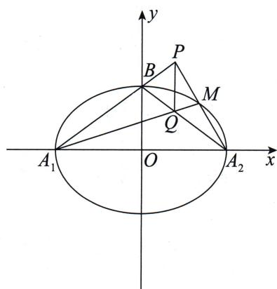
由韦达定理得 $x_{A_2}x_M = \frac{16k^2 - 8}{2k^2 + 1}$
又因为 $x_{A_2} = 2\sqrt{2}$ ，所以 $x_{M} = \frac{4\sqrt{2}k^{2} - 2\sqrt{2}}{2k^{2} + 1},$
所以 $y_{M} = k(x_{M} - 2\sqrt{2}) = \frac{-4\sqrt{2}k}{2k^{2} + 1},$
则 $k_{A_1M} = \frac{\frac{-4\sqrt{2}k}{2k^2 + 1}}{\frac{4\sqrt{2}k^2 - 2\sqrt{2}}{2k^2 + 1} + 2\sqrt{2}} = -\frac{1}{2k},$
所以直线 $A_{1}M$ 的方程为 $y = -\frac{1}{2k} (x + 2\sqrt{2})$
联立直线 $A_{1}M$ 的方程与直线 $A_{2}B$ 的方程得 $\left\{ \begin{array}{l} y = -\frac{1}{2k} (x + 2\sqrt{2}), \\ y = -\frac{1}{\sqrt{2}} x + 2 \end{array} \right. \Rightarrow$
$x _ {Q} = \frac {2 \sqrt {2} (\sqrt {2} k + 1)}{\sqrt {2} k - 1},$
所以 $|BP| = \sqrt{1 + k_{A_1B}^2} |x_P| = \sqrt{1 + \frac{1}{2}} \cdot \left| \frac{2\sqrt{2}(\sqrt{2}k + 1)}{\sqrt{2}k - 1} \right|$ ,
$\mid B Q \mid = \sqrt {1 + k _ {A _ {2} B} ^ {2}} \mid x _ {Q} \mid = \sqrt {1 + \frac {1}{2}} \cdot \left| \frac {2 \sqrt {2} (\sqrt {2} k + 1)}{\sqrt {2} k - 1} \right|,$
所以 $|BP|=|BQ|$ .
所以 $\triangle BPQ$ 为等腰三角形.

等腰三角形还有一个性质就是三线合一. 由三线合一可知等腰三角形底边的垂直平分线过等腰三角形的顶点. 此时的代数翻译和第十二节 线段的翻译中线段的垂直平分线就很像了. 我们来看一道例题.

> [!example]- 例 25 已知过点 $P(0,1)$ 作斜率为 k 的直线 l，交椭圆 $\frac{x^{2}}{9} + \frac{y^{2}}{4} = 1$ 于 A, B 两点，当 k 变化时，x 轴上是否存在点 $M(m,0)$ ，使得 $\triangle AMB$ 是以 AB 为底的等腰三角形？若存在，求出实数 m 的取值范围；若不存在，请说明理由。
# 题目分析

本例的目标是求实数 $m$ 的取值范围, 题目已经给了变量 $k$ , 所以我们要用 $k$ 表示 $m$ , 而这个等量关系就靠翻译等腰三角形条件来提供.
若 $\triangle AMB$ 是以 $AB$ 为底的等腰三角形, 则点 $M(m,0)$ 在线段 $AB$ (即三角形底边) 的垂直平分线上, 即将问题转换为求线段 $AB$ 中点的坐标.

思维笔记

Siweibiji

思维笔记

Siweibiji

联立直线方程与椭圆方程算出线段 $AB$ 中点的坐标为 $\left(\frac{-9k}{9k^2 + 4},\frac{4}{9k^2 + 4}\right)$
所以线段 $AB$ 的垂直平分线的方程为 $y - \frac{4}{9k^2 + 4} = -\frac{1}{k}\left(x + \frac{9k}{9k^2 + 4}\right)$ ,
将点 $M(m,0)$ 的坐标代入并化简，得 $m = \frac{-5k}{9k^2 + 4}$ .
因为直线 $l$ 经过的定点 $P(0,1)$ 在椭圆内，所以不管直线 $l$ 的斜率为多少，直线 $l$ 都与椭圆有两个交点。但是我们在写解题过程的时候，还是需要翻译一下题干中的限制条件，即直线与椭圆有两个交点，将直线方程与椭圆方程联立后可得 $\Delta > 0$ 。
最后,求出实数 m 的取值范围为 $\left[-\frac{5}{12},\frac{5}{12}\right]$ .

# 参考解析
假设存在点 $M(m,0)$ ，使得 $\triangle AMB$ 是以 $AB$ 为底的等腰三角形.
由题意可知直线 l 的方程为 $y=kx+1$ ，
联立直线方程与椭圆方程得 $\left\{ \begin{array}{l} y = kx + 1, \\ \frac{x^2}{9} + \frac{y^2}{4} = 1 \end{array} \right. \Rightarrow (9k^2 + 4)x^2 + 18kx - 27 = 0.$
因为直线 l 与椭圆交于 A, B 两点，
所以 $\Delta=(18k)^{2}+108(9k^{2}+4)>0.$
由韦达定理得 $x_{A} + x_{B} = \frac{-18k}{9k^{2} + 4}$
所以线段 $AB$ 中点的坐标为 $\left(\frac{-9k}{9k^2 + 4},\frac{4}{9k^2 + 4}\right)$
当 $k \neq 0$ 时，线段 $AB$ 的垂直平分线方程为 $y - \frac{4}{9k^2 + 4} = -\frac{1}{k}\left(x + \frac{9k}{9k^2 + 4}\right)$ .
将点 $M(m,0)$ 的坐标代入，得 $-\frac{4}{9k^2 + 4} = -\frac{1}{k}\left(m + \frac{9k}{9k^2 + 4}\right)$ ，化简得 $m = \frac{-5k}{9k^2 + 4}$ .
若 $k < 0, m = \frac{-5k}{9k^2 + 4} = \frac{5}{-9k - \frac{4}{k}} \leqslant \frac{5}{12}$ , 所以 $0 < m \leqslant \frac{5}{12}$ ;
若 $k > 0, m = \frac{-5k}{9k^2 + 4} = -\frac{5}{9k + \frac{4}{k}} \geqslant -\frac{5}{12}$ , 所以 $-\frac{5}{12} \leqslant m < 0$ .
当 k=0 时, 直线 l 的方程为 y=1, 此时直线 l 平行于 x 轴, 根据对称性可知 m=0.

综上, 存在点 $M(m,0)$ , 使得 $\triangle AMB$ 是以 AB 为底边的等腰三角形, 实数 m 的取值范围为 $\left[-\frac{5}{12}, \frac{5}{12}\right]$ .
在部分题目中,等腰三角形可不用垂直平分线来翻译,而是表现为长度问题,比如下面这道例题.

> [!example]- 例 26 已知直线 $l: y = k(x - 4) (k \neq 0)$ 与椭圆 $\frac{x^{2}}{4} + \frac{y^{2}}{3} = 1$ 交于不同的两点 M, N, 直线 FM, FN 分别交 y 轴于 A, B 两点, 其中 $F(1, 0)$ . 求证: $|FA| = |FB|$ .
# 题目分析
要证 $|FA|=|FB|$ ，即证 $\triangle ABF$ 是等腰三角形，即证 $|OA|=|OB|$ ，即证 $y_{A}+y_{B}=0$ 。此式由A,B两点决定，而A,B两点由M,N两点决定。
设 $M(x_{1},y_{1}), N(x_{2},y_{2})$ ，得直线 MF 的方程为 $y=\frac{y_{1}}{x_{1}-1}(x-1)$ ，令 x=0，
得 $y_{A}=\frac{-y_{1}}{x_{1}-1}$ ,
同理可得 $y_{B} = \frac{-y_{2}}{x_{2} - 1}$ ，所以 $y_{A} + y_{B} = 0 \Rightarrow \frac{-y_{1}}{x_{1} - 1} + \frac{-y_{2}}{x_{2} - 1} = 0$ .
将 $y_{1} = k(x_{1} - 4), y_{2} = k(x_{2} - 4)$ 代入 $\frac{-y_1}{x_1 - 1} + \frac{-y_2}{x_2 - 1} = 0$ ，分式处理后得 $\frac{5}{2}(x_1 + x_2) - 4 = x_1x_2$ ，所以要证 $|FA| = |FB|$ 成立，即证 $\frac{5}{2}(x_1 + x_2) - 4 = x_1x_2$ 恒成立。
联立直线 l 的方程与椭圆方程后可得到和积关系 $\frac{5}{2}(x_{1}+x_{2})-4=x_{1}x_{2}$ ，原命题得证.

# 参考解析
设 $M(x_{1},y_{1}), N(x_{2},y_{2})$ ,
由已知，得直线 $MF$ 的方程为 $y = \frac{y_1}{x_1 - 1} (x - 1)$ ，令 $x = 0$ ，得 $y_A = \frac{-y_1}{x_1 - 1}$ ，
同理可得 $y_{B}=\frac{-y_{2}}{x_{2}-1}$ .
要证 $|FA|=|FB|$ ，即证 $|OA|=|OB|$ ，即证 $y_{A}+y_{B}=0$ ，即证 $\frac{-y_{1}}{x_{1}-1}+\frac{-y_{2}}{x_{2}-1}=0$ ，
即证 $2 - 3 \cdot \frac{x_1 + x_2 - 2}{x_1x_2 - (x_1 + x_2) + 1} = 0$ ，即证 $\frac{5}{2}(x_1 + x_2) - 4 = x_1x_2$ .
联立直线 l 的方程与椭圆方程得 $\left\{\begin{aligned}y&=k(x-4),\\ \frac{x^{2}}{4}+\frac{y^{2}}{3}&=1\end{aligned}\right.\Rightarrow(4k^{2}+3)x^{2}-32k^{2}x+64k^{2}-12=0,$
由韦达定理得 $\left\{\begin{aligned}x_{1}+x_{2}&=\frac{32k^{2}}{4k^{2}+3},\\ x_{1}x_{2}&=\frac{64k^{2}-12}{4k^{2}+3}.\end{aligned}\right.$

思维笔记

Siweibiji

思维笔记

Siweibiji

所以 $\frac{5}{2} (x_1 + x_2) - 4 = \frac{32k^2}{4k^2 + 3}\cdot \frac{5}{2} -4 = \frac{64k^2 - 12}{4k^2 + 3} = x_1x_2,$
即 $\frac{5}{2} (x_1 + x_2) - 4 = x_1x_2$ 成立，则原命题得证.
接下来,我们聊一聊直角三角形.

我们在前面已经说过,直角可以用向量来翻译,也可以用勾股定理来翻译,下面来讨论一下直角三角形的两个几何性质.

一是直角三角形斜边上的中线长是斜边的一半,这个根据圆的性质或者三角形中线长公式非常好证明.
若你不知道中线长公式,那么可以看一下课本(此处课本指新苏教版必修第二册第94页与新人教A版必修第二册第53页).
在解三角形模块中,我们利用余弦定理得到了三角形中线长与三边长的关系.这里我们换个方法,用向量来证明一下:
设 M 是 $\triangle ABC$ 的边 BC 的中点，则 $\overrightarrow{AM} = \frac{1}{2} (\overrightarrow{AB} + \overrightarrow{AC})$ ,

等式左、右两边都平方，得 $|\overrightarrow{AM}|^2 = \frac{|\overrightarrow{AB}|^2 + |\overrightarrow{AC}|^2 + 2\overrightarrow{AB} \cdot \overrightarrow{AC}}{4}$ ，

进一步利用余弦定理的推论,可得
$| \overrightarrow {A M} | ^ {2} = \frac {| \overrightarrow {A B} | ^ {2} + | \overrightarrow {A C} | ^ {2} + 2 | \overrightarrow {A B} | \cdot | \overrightarrow {A C} | \cos \angle B A C}{4}$
$\Rightarrow | \overrightarrow {A M} | ^ {2} = \frac {2 (| \overrightarrow {A B} | ^ {2} + | \overrightarrow {A C} | ^ {2}) - | \overrightarrow {B C} | ^ {2}}{4}.$

证毕.

二是根据等面积法可以得到直角三角形斜边上的高与两直角边三者间的等量关系，即在 Rt△ABC 中， $A=\frac{\pi}{2}$ ，设 h 为斜边上的高，则 $S_{\triangle ABC}=\frac{1}{2}|AB|\cdot|AC|=\frac{1}{2}h\cdot|BC|$ ，等式左右两边都平方，得 $|AB|^{2}\cdot|AC|^{2}=h^{2}\cdot|BC|^{2}$ ，根据勾股定理，得 $|BC|^{2}=|AB|^{2}+|AC|^{2}$ ，代入上式，有 $\frac{1}{h^{2}}=\frac{1}{|AB|^{2}}+\frac{1}{|AC|^{2}}$ .

这个几何性质在处理直角三角形斜边上的高的时候作用非常明显.
接下来,我们看一下等腰直角三角形如何处理.

等腰直角三角形除有等腰三角形三线合一的性质外,还有顶角为 $90^{\circ}$ 这个条件,该条件可以直接用向量数量积为 0 来翻译,也可以根据这个垂直条件来算两腰的长,或者求两腰所在直线.

此外,如果底边长或底边中线长易求的话,还可以用底边中线长与底边长的比是1:2这个性质(此时底边中线长可用顶点到底边所在直线距离来求,不一定要算底边中点),此翻译方法使用了等腰和直角两个条件.

> [!example]- 例 27 已知过点(1,0)的直线与抛物线 $y^{2}=4x$ 交于 A, B 两点，以 AB 为斜边作等腰直角三角形 ABC，当点 C 在 y 轴上时，求 $\triangle ABC$ 的面积.
# 题目分析

本例的目标是求三角形面积,这个三角形是等腰直角三角形,并且根据抛物线的定义我们可以轻松将底边长算出来.
因为点 C 的横坐标为 0, 所以点 C 到线段 AB 中点的距离可用化斜为直的方法转化为横坐标之差, 即完全不需要求点 C 的纵坐标.
根据底边中线长与底边长的比是 1:2 就可以解出唯一变量——直线的斜率, 进而可求出面积.

# 参考解析
由题意知点 $(1,0)$ 为抛物线 $y^{2}=4x$ 的焦点，
设直线方程为 $x=my+1$ (直线斜率为 0 时, 直线与抛物线仅有一个交点, 故不研究), $A(x_{1}, y_{1}), B(x_{2}, y_{2})$ .
联立直线方程与抛物线方程, 得 $y^{2}-4my-4=0$ ,
由韦达定理得 $y_{1} + y_{2} = 4m$ ，
所以 $x_{1}+x_{2}=my_{1}+1+my_{2}+1=4m^{2}+2.$
根据抛物线的定义,有 $|AB|=|AF|+|BF|=x_{1}+x_{2}+2=4m^{2}+4$ .
设线段 $AB$ 的中点为 $M$ , 则根据化斜为直, 有 $|CM| = \sqrt{1 + m^2} |x_C - x_M| = \sqrt{1 + m^2} \cdot (2m^2 + 1)$ ,
所以 $2|CM| = |AB| \Rightarrow 2\sqrt{1 + m^2} \cdot (2m^2 + 1) = 4(m^2 + 1) \Rightarrow 2m^2 + 1 = 2\sqrt{1 + m^2}$ ,

等式左、右两边都平方，得 $4m^{4} + 4m^{2} + 1 = 4 + 4m^{2}\Rightarrow 4m^{4} = 3\Rightarrow m^{2} = \frac{\sqrt{3}}{2}.$
所以 $S_{\triangle ABC} = \frac{1}{2}\cdot |AB|\cdot |CM| = \frac{1}{2}\cdot 2|CM|^2 = (1 + m^2)(2m^2 +1)^2 = 7 + 4\sqrt{3}.$
所以 $\triangle ABC$ 的面积为 $7+4\sqrt{3}$ .

# 总结

这里强调一点,就是我们的处理手法应根据题目所给的条件做相应的调整,比如本例我们用垂直和垂直平分线这两个条件也能处理,但无疑计算量会大一些,或者我们设点 C 的坐标,但是肯定没有化斜为直来得简单.所以还是看哪个条件的变量少,我们就用哪个翻译.

思维笔记

Siweibiji

最后,我们看一下等边三角形,类似等腰直角三角形,在三线合一的基础上,我们还可以利用中线长与边长的比是 $\sqrt{3}:2$ 这个性质来翻译条件.

> [!example]- 例 28 已知斜率为 k 的直线 l 过椭圆 $\frac{x^{2}}{6} + \frac{y^{2}}{2} = 1$ 的右焦点 F，且与椭圆相交于 A, B 两点。已知点 P 是直线 x = 3 上的一点，若 $\triangle ABP$ 为等边三角形，求直线 l 的方程。
# 题目分析

本例的分析同上例, 因为 $x_{P}=3$ , 所以可以通过化斜为直转化为横坐标处理. 根据中线长与边长的比是 $\sqrt{3}:2$ 可以得到一个关于 k 的方程, 解出 k 即可求出直线 l 的方程.

# 参考解析
由题意知椭圆 $\frac{x^2}{6} +\frac{y^2}{2} = 1$ 的右焦点 $F$ 的坐标为(2,0)，所以直线 $l$ 的方程为 $y = k(x - 2)$ ，设 $A(x_{1},y_{1}),B(x_{2},y_{2})$
联立直线 $l$ 的方程与椭圆方程得 $\left\{ \begin{array}{l} y = k(x - 2), \\ \frac{x^2}{6} + \frac{y^2}{2} = 1 \end{array} \right. \Rightarrow (1 + 3k^2)x^2 - 12k^2x + 12k^2 - 6 = 0,$
由韦达定理得 $\left\{\begin{aligned}x_{1}+x_{2}&=\frac{12k^{2}}{3k^{2}+1},\\ x_{1}x_{2}&=\frac{12k^{2}-6}{3k^{2}+1},\end{aligned}\right.$
所以 $|AB| = \sqrt{1 + k^2} |x_1 - x_2| = \sqrt{1 + k^2} \cdot \sqrt{(x_1 + x_2)^2 - 4x_1x_2} = \frac{2\sqrt{6}(1 + k^2)}{1 + 3k^2}$ .
设线段 $AB$ 的中点为 $M(x_0, y_0)$ ，则 $x_0 = \frac{1}{2} (x_1 + x_2) = \frac{6k^2}{1 + 3k^2}$ ，
所以 $y_0 = k(x_0 - 2) = -\frac{2k}{1 + 3k^2}$ ，所以 $M\left(\frac{6k^2}{1 + 3k^2}, -\frac{2k}{1 + 3k^2}\right)$ .
若 $\triangle ABP$ 为等边三角形，则直线 $MP$ 的斜率为 $-\frac{1}{k}$ ，
又 $x_{P} = 3$ ，所以 $\vert MP\vert = \sqrt{1 + \frac{1}{k^2}}\vert x_0 - x_P\vert = \sqrt{1 + \frac{1}{k^2}}\cdot \frac{3(1 + k^2)}{1 + 3k^2}.$
又由 $\triangle ABP$ 为等边三角形，可知 $|MP| = \frac{\sqrt{3}}{2} |AB|$
所以 $\sqrt{1 + \frac{1}{k^2}}\cdot \frac{3(1 + k^2)}{1 + 3k^2} = \frac{\sqrt{3}}{2}\cdot \frac{2\sqrt{6}(1 + k^2)}{1 + 3k^2}$ 解得 $k = \pm 1$
所以直线 l 的方程为 $y=\pm(x-2)$ .

## 13.2 三角形四心
接下来我们介绍在圆锥曲线题目中对三角形四心的翻译手法. 在做例题之前, 让我们先想一想三角形四心是什么, 以及它们的性质有哪些.

第一个是垂心 H. 如图 1, 垂心 H 是 $\triangle ABC$ 三条高线的交点. 它的翻译非常简单, 就是三组垂直, 可以用向量数量积来翻译垂直, 或者转化为斜率的关系.

第二个是重心 G. 如图 2, 重心 G 是 $\triangle ABC$ 三条中线的交点. 重心经常在题目中考查, 其最常用的一个性质是重心 G 到顶点的距离与到对边中点的距离之比为 2:1, 由这个性质, 我们可以进一步得到 $\overrightarrow{GA} + \overrightarrow{GB} + \overrightarrow{GC} = 0$ , 证明如下: 由点 D 为 BC 的中点, 得 $\overrightarrow{GB} + \overrightarrow{GC} = 2\overrightarrow{GD}$ , 又因为点 G 是中线 AD 上接近 D 的三等分点, 所以 $2\overrightarrow{GD} = \overrightarrow{AG}$ , 因此 $\overrightarrow{GB} + \overrightarrow{GC} = \overrightarrow{AG}$ , 所以 $\overrightarrow{GA} + \overrightarrow{GB} + \overrightarrow{GC} = 0$ , 从而可得出重心 G 的坐标 $\left(\frac{x_{A} + x_{B} + x_{C}}{3}, \frac{y_{A} + y_{B} + y_{C}}{3}\right)$ .

第三个是外心 O. 如图 3, 外心 O 是 $\triangle ABC$ 三条边的垂直平分线的交点. 这里需要注意的是, 涉及外心的题目往往会有三个方向, 第一个方向是向量数量积的几何意义, $\overrightarrow{AO} \cdot \overrightarrow{AB} = \frac{1}{2} |\overrightarrow{AB}|^{2}$ , 这个在小题中出现的较多; 第二个方向和正弦定理有关, 我们知道在 $\triangle ABC$ 中, $\frac{BC}{\sin A} = \frac{AC}{\sin B} = \frac{AB}{\sin C} = 2R$ , 其中 R 是 $\triangle ABC$ 外接圆的半径, 在解三角形大题中经常用到;第三个方向是圆,即 $\triangle ABC$ 外接圆的圆心可以用垂直平分线来求,也可以设圆的一般方程,代入点的坐标来求.
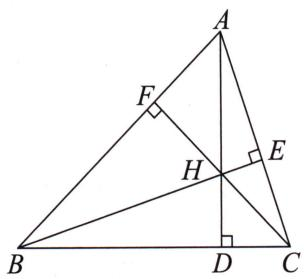

图1

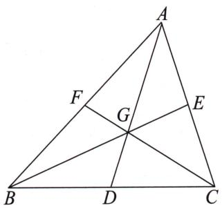

图2

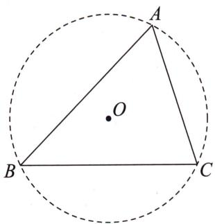

图3

第四个是内心 I. 如图 4, 内心 I 是 $\triangle ABC$ 三条角平分线的交点, 即三角形内切圆的圆心, 所以它到三角形三边的距离相等. 这类问题往往会涉及三角形的面积分割, 即由内心可把三角形分割为三个同高的三角形, 故有
$S _ {\triangle A B C} = S _ {\triangle A B I} + S _ {\triangle A C I} + S _ {\triangle B C I} \Rightarrow S _ {\triangle A B C} = \frac {1}{2} r (A B + B C +$
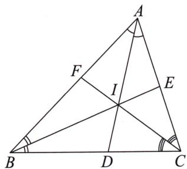

图4

AC), 此时 $r$ 是 $\triangle ABC$ 内切圆的半径. 此外, 因为内心是角平分线上的点, 所以内心到角两边所在直线的距离相等, 也就是我们在第十一节 角的翻译中提到的角平分线定理.
接下来我们来看一看相关的例题.

思维笔记

Siweibiji 思维笔记
Siweiliji

> [!example]- 例 29 若 M 是椭圆 $\frac{x^{2}}{2} + y^{2} = 1$ 的上顶点, 是否存在直线 l 与椭圆相交于 A, B 两点, 使椭圆右焦点 F 为 $\triangle ABM$ 的垂心? 若存在, 请求出直线 l 的方程; 若不存在, 请说明理由.
# 题目分析
由 $M(0,1)$ , $F(1,0)$ 可得 $k_{MF} = -1$ 是定值.
根据垂心性质可知 $MF \perp AB$ ，有 $k_{AB} = 1$ 。
所以设直线 AB 的方程为 $y = x + m, A(x_{1}, y_{1}), B(x_{2}, y_{2})$ .

下面翻译另外两个垂直条件，即 $\left\{ \begin{array}{l} \overrightarrow{AF} \cdot \overrightarrow{BM} = 0, \\ \overrightarrow{BF} \cdot \overrightarrow{AM} = 0 \end{array} \right. \Rightarrow \left\{ \begin{array}{l} x_{1}x_{2} + y_{1}y_{2} - x_{2} - y_{1} = 0, \\ x_{1}x_{2} + y_{1}y_{2} - x_{1} - y_{2} = 0. \end{array} \right.$

两式相加，得 $2x_{1}x_{2} + 2y_{1}y_{2} - (x_{1} + x_{2}) - (y_{1} + y_{2}) = 0$
利用直线方程可得 $2x_{1}x_{2}+(m-1)(x_{1}+x_{2})+m^{2}-m=0$ .
此时我们就有了一个标准的对称式,于是只需要联立直线方程与椭圆方程,得到韦达定理,然后整体代换即可.

最终解得 m=1（此时直线过椭圆的上顶点，舍）或 $m=-\frac{4}{3}$ .
所以存在直线 $l: y = x - \frac{4}{3}$ 符合题意.

# 参考解析
假设存在直线 l 交椭圆于 A, B 两点, 使椭圆右焦点 F 恰为 $\triangle ABM$ 的垂心. 设 $A(x_{1}, y_{1}), B(x_{2}, y_{2})$ ,
由题意知 $M(0,1)$ , $F(1,0)$ , 所以 $k_{MF} = -1$ ,
又因为 $AB \perp MF$ ，所以 $k_{AB} = 1$ ，
设直线 l 的方程为 $y = x + m$ .
联立直线方程与椭圆方程得 $\left\{ \begin{array}{l} y = x + m, \\ \frac{x^2}{2} + y^2 = 1 \end{array} \right. \Rightarrow 3x^2 + 4mx + 2m^2 - 2 = 0.$
由韦达定理得 $\left\{\begin{aligned}x_{1}+x_{2}&=-\frac{4m}{3}\quad①,\\ x_{1}x_{2}&=\frac{2m^{2}-2}{3}\quad②.\end{aligned}\right.$
因为 $\overrightarrow{MA} \cdot \overrightarrow{FB} = 0$ ，所以 $x_{1}(x_{2} - 1) + y_{2}(y_{1} - 1) = 0$
同理可得 $x_{2}(x_{1} - 1) + y_{1}(y_{2} - 1) = 0$

两式相加，得 $2x_{1}x_{2} + 2y_{1}y_{2} - (x_{1} + x_{2}) - (y_{1} + y_{2}) = 0.$
又 $y_{1} = x_{1} + m, y_{2} = x_{2} + m$ ，所以有 $2x_{1}x_{2} + (m - 1)(x_{1} + x_{2}) + m^{2} - m = 0$ .
将①②两式代入上式并化简，得 $3m^{2} + m - 4 = 0$ ，解得 $m = -\frac{4}{3}$ 或 $m = 1$
经检验， $m = 1$ 不符合条件，故舍去， $m = -\frac{4}{3}$ 符合条件.
所以直线 l 的方程为 $y = x - \frac{4}{3}$ .

> [!example]- 例 30 已知 A, B, C 是椭圆 $\frac{x^{2}}{4} + \frac{y^{2}}{3} = 1$ 上不同的三点，且原点 O 为 $\triangle ABC$ 的重心，试探究 $\triangle ABC$ 的面积是否为定值。若 $\triangle ABC$ 的面积是定值，请求出这个定值；若不是，请说明理由。
# 题目分析
在本例中,我们的目标是说明 $\triangle ABC$ 的面积是否为定值,关键就在于如何把这个三角形的面积表示出来.此时为了便于处理,需要对三角形进行分割.
根据原点 O 为 $\triangle ABC$ 的重心, 可得 O 为 AM 的三等分点 (靠近点 M), 其中 M 为 BC 的中点. 此时 $\triangle BOC$ 与 $\triangle BAC$ 共用底 BC, 高的比例是 1:3, 所以 $S_{\triangle ABC} = 3S_{\triangle BOC}$ . 因此要证 $S_{\triangle ABC}$ 为定值, 即证 $S_{\triangle BOC}$ 为定值.
接下来我们一起看一下该如何处理 $S_{\triangle BOC}$ .
设直线 BC 的方程为 $y = kx + m$ (斜率不存在的情况易求, 分析略), 与 y 轴的交点为 $D(0, m)$ .
当 B, C 位于 y 轴同侧时， $S_{\triangle BOC} = |S_{\triangle BOD} - S_{\triangle COD}|$ ; 当 B, C 位于 y 轴异侧时， $S_{\triangle BOC} = S_{\triangle BOD} + S_{\triangle COD}$ . $S_{\triangle BOC}$ 也可以用底乘高的一半来表示.

分割后的两个三角形有同底 $OD$ ，而高分别为 $|x_B|$ 和 $|x_C|$ ，因此 $S_{\triangle BOC} = \frac{1}{2}|m| \cdot |x_C - x_B|$ .
再联立直线方程与椭圆方程,根据韦达定理,得
$\begin{array}{l} S _ {\triangle B O C} = \frac {1}{2} | m | \cdot | x _ {C} - x _ {B} | = \frac {1}{2} | m | \cdot 4 \sqrt {\frac {3 (4 k ^ {2} + 3 - m ^ {2})}{(4 k ^ {2} + 3) ^ {2}}} \\ = 2 \sqrt {3} \cdot \sqrt {\frac {m ^ {2} (4 k ^ {2} + 3 - m ^ {2})}{(4 k ^ {2} + 3) ^ {2}}} = 2 \sqrt {3} \cdot \sqrt {\frac {m ^ {2} (4 k ^ {2} + 3) - m ^ {4}}{(4 k ^ {2} + 3) ^ {2}}} \\ = 2 \sqrt {3} \cdot \sqrt {\frac {m ^ {2}}{4 k ^ {2} + 3} - \left(\frac {m ^ {2}}{4 k ^ {2} + 3}\right) ^ {2}}. \\ \end{array}$

注意上面的代数操作,我们在13.4 多边形的面积中会再次提到,即 $S_{\triangle BOC}$ 是由 $\frac{m^{2}}{4k^{2}+3}$ 作为一个整体的变量所决定的.
设 $t = \frac{m^2}{4k^2 + 3}$ ，则 $S_{\triangle BOC} = 2\sqrt{3}\cdot \sqrt{t - t^2}.$
此时我们将探究 $S_{\triangle BOC}$ 是定值转化为探究 $t$ 是定值.

这种步步分析,慢慢缩小范围的思路,这里称之为变量局部化,即将我们想要处理的问题慢慢转化到一个小的范围.

思维笔记

Siweibiji

# 思维笔记

# Siweibiji

当然,如果没有发现这个整体,用 k 与 m 的关系也可以将上式化简,在下面的参考解析中将给出这种操作策略.

我们最终的任务就很明显了, 即寻找 k 与 m 的关系. 这种关系在哪里找呢? 这就要看我们还忽略了什么.

前面强调过,有点必有等式,有等式必有代换.

点 B 和 C 在椭圆上, 我们在联立直线方程和椭圆方程的时候就翻译过了, 唯独没有翻译点 A 在椭圆上这个条件.
因为原点 O 为 $\triangle ABC$ 的重心, 所以 $\overrightarrow{OA} + \overrightarrow{OB} + \overrightarrow{OC} = 0$ , 即 $\left\{\begin{aligned} x_{A} &= -(x_{B} + x_{C}), \\ y_{A} &= -(y_{B} + y_{C}), \end{aligned}\right.$
由点 $A$ 在椭圆上，有 $\frac{x_A^2}{4} +\frac{y_A^2}{3} = 1$ ，即 $\frac{(x_B + x_C)^2}{4} +\frac{(y_B + y_C)^2}{3} = 1.$
根据韦达定理，得 $\frac{\left(\frac{8km}{4k^2 + 3}\right)^2}{4} +\frac{\left(\frac{-6m}{4k^2 + 3}\right)^2}{3} = 1.$

注意,这里千万不要直接拆,还是整体运算,把 $4k^{2}+3$ 全放到等式右边,即 $16k^{2}m^{2}+12m^{2}=(4k^{2}+3)^{2}$ .

提公因式, 发现 $4m^{2}(4k^{2}+3)=(4k^{2}+3)^{2}$ ,
因此我们就有了 $\frac{m^2}{4k^2 + 3} = \frac{1}{4}$ ，即 $t = \frac{1}{4}$ ，即 $S_{\triangle ABC} = 3S_{\triangle BOC} = 3 \times 2\sqrt{3} \times \sqrt{\frac{1}{4} - \frac{1}{16}} = \frac{9}{2}$ .
当然,我们利用 k 与 m 的关系提前进行消元也可以,请看如下解析.

# 参考解析

①当直线 BC 的斜率存在时, 设直线 BC 的方程为 $y = kx + m$ , $B(x_{1}, y_{1})$ , $C(x_{2}, y_{2})$ .
联立直线方程与椭圆方程, 得 $(3+4k^{2})x^{2}+8kmx+4m^{2}-12=0$ ,
由韦达定理得 $x_{1}x_{2} = \frac{4m^{2} - 12}{3 + 4k^{2}}, x_{1} + x_{2} = -\frac{8km}{3 + 4k^{2}}$
则有 $y_{1} + y_{2} = k(x_{1} + x_{2}) + 2m = \frac{6m}{3 + 4k^{2}}.$
因为点 $O$ 为 $\triangle ABC$ 的重心，
所以 $\overrightarrow{OA} = -(\overrightarrow{OC} +\overrightarrow{OB}) = \left(\frac{8km}{3 + 4k^2}, - \frac{6m}{3 + 4k^2}\right),$
又由点 $A$ 在椭圆上，则有 $\frac{\left(\frac{8km}{4k^2 + 3}\right)^2}{4} +\frac{\left(\frac{-6m}{4k^2 + 3}\right)^2}{3} = 1,$
化简得 $4m^{2}=3+4k^{2}$ .
所以 $|BC| = \sqrt{1 + k^2} \cdot \sqrt{(x_1 + x_2)^2 - 4x_1x_2}$
$\begin{array}{l} = \sqrt {1 + k ^ {2}} \cdot \sqrt {\left(- \frac {8 k m}{3 + 4 k ^ {2}}\right) ^ {2} - 4 \cdot \frac {4 m ^ {2} - 1 2}{3 + 4 k ^ {2}}} \\ = \frac {4 \sqrt {1 + k ^ {2}}}{3 + 4 k ^ {2}} \cdot \sqrt {9 + 1 2 k ^ {2} - 3 m ^ {2}} \\ = \frac {4 \sqrt {1 + k ^ {2}}}{4 m ^ {2}} \cdot \sqrt {1 2 m ^ {2} - 3 m ^ {2}} = \frac {3 \sqrt {1 + k ^ {2}}}{| m |}. \\ \end{array}$
设点 O 到直线 BC 的距离为 d，则 $d=\frac{|m|}{\sqrt{1+k^{2}}}$ ,
所以 $S_{\triangle ABC} = 3S_{\triangle BCO} = \frac{3}{2}\cdot \frac{3\sqrt{1 + k^2}}{|m|}\cdot \frac{|m|}{\sqrt{1 + k^2}} = \frac{9}{2}.$

②当直线 $BC$ 的斜率不存在时， $|BC| = 3, d = 1, S_{\triangle ABC} = \frac{3}{2} |BC| \cdot d = \frac{9}{2}$ . 综上， $\triangle ABC$ 的面积为定值 $\frac{9}{2}$ .

> [!example]- 例 31 直线 $y=x+4$ 和抛物线 $x^{2}=4y$ 交于 A, B 两点，试问：在 x 轴的正半轴上是否存在一点 D，使得 $\triangle ABD$ 的外心在抛物线上？若存在，请求出点 D 的坐标；若不存在，请说明理由.
# 题目分析
在做这题的时候,想必同学们会很想把 A, B 两点的坐标求出来,但带根号的数据计算烦琐,因此要运用整体思想来处理.
根据外心在 $AB$ 的垂直平分线以及在抛物线上, 可以直接求出外心坐标, 然后由第十四节 圆的翻译中说的垂径定理算出圆的半径, 进而求出点 $D$ 的坐标.
当然你也可以设出点 D 的坐标, 得到外接圆的方程, 表示出外心, 再令其在抛物线上, 从而解出点 D 的坐标.

这个属于构图顺序(即分析题目中动点或动直线的主动与被动关系)的不同,一般会先处理定的条件,再处理动的条件.

# 参考解析
设 $A(x_{1},y_{1}),B(x_{2},y_{2}),AB$ 的中点为 $M,\triangle ABD$ 的外心为 $P$
联立得 $\left\{\begin{aligned}y&=x+4,\\ x^{2}&=4y\end{aligned}\right.\Rightarrow x^{2}-4x-16=0\Rightarrow\left\{\begin{aligned}x_{1}&+x_{2}=4,\\ x_{1}x_{2}&=-16,\end{aligned}\right.$
所以有 $y_{1} + y_{2} = x_{1} + 4 + x_{2} + 4 = 12$ ，因此 $AB$ 中点 $M$ 的坐标为(2,6)，

线段 AB 的垂直平分线的方程为 $y-6=-(x-2)\Rightarrow y=-x+8$ .
又因为外心 P 在抛物线上, 所以联立线段 AB 的垂直平分线方程和抛物线方程得
$\left\{\begin{aligned}y&=-x+8,\\ x^{2}&=4y\end{aligned}\right.\Rightarrow x^{2}+4x-32=0\Rightarrow(x-4)(x+8)=0$ ，解得x=4或x=-8.

思维笔记

Siweibiji

思维笔记

Siweibiji

所以外心 P 的坐标为 $(4,4)$ 或 $(-8,16)$ .
设 $D(d,0)(d > 0)$
当外心 $P$ 的坐标为(4,4)时，根据垂径定理，半径 $r = \sqrt{|PM|^2 + \left(\frac{|AB|}{2}\right)^2} = 4\sqrt{3}$ ，
其中 $|AB| = \sqrt{(x_1 - x_2)^2 + (y_1 - y_2)^2} = \sqrt{2[(x_1 + x_2)^2 - 4x_1x_2]} = 4\sqrt{10}$ .
因为点 D 在 $\triangle ABD$ 的外接圆上，
所以 $|DP| = r$ ，则有 $\sqrt{(d - 4)^2 + 16} = 4\sqrt{3}$ ，解得 $d = 4 + 4\sqrt{2}$
当外心 $P$ 的坐标为 $(-8, 16)$ 时，根据垂径定理，半径 $r = \sqrt{|PM|^2 + \left(\frac{|AB|}{2}\right)^2} = 4\sqrt{15}$ ，
因为点 D 在 $\triangle ABD$ 的外接圆上，
所以有 $|DP| = r$ ，则有 $\sqrt{(d + 8)^2 + 16^2} = 4\sqrt{15}$ ，无解.
综上所述，在 $x$ 轴的正半轴上存在一点 $D(4 + 4\sqrt{2},0)$ ，使得 $\triangle ABD$ 的外心在抛物线上.

> [!example]- 例32 已知椭圆 $\frac{x^2}{4} + \frac{y^2}{3} = 1$ 的左、右焦点分别为 $F_{1}, F_{2}$ , 直线 $l$ 过点 $F_{2}$ , 且与椭圆交于 $D, E$ 两点, 当 $\triangle DEF_{1}$ 的外接圆面积最小时, 求直线 $l$ 的方程.
# 题目分析

上一道例题通过圆的几何性质求出了圆心坐标,然而在本例中,条件是外接圆面积最小,即外接圆半径最小,如何找到外接圆的最小半径呢?
在高中阶段,学习解三角形时有正弦定理 $\frac{a}{\sin A}=\frac{b}{\sin B}=\frac{c}{\sin C}=2R$ ,其中a,b,c分别为角A,B,C的对边,R为 $\triangle ABC$ 的外接圆半径.因此可将三角形的外接圆半径最小转化为三角形的一条边和这条边所对的角的正弦值的比值最小.为了保证研究目标的对称性,我们选择 $2R=\frac{|DE|}{\sin\angle DF_{1}E}$ ,其中 $|DE|$ 可以通过化斜为直或者焦半径公式来翻译,所以重点是 $\sin\angle DF_{1}E$ 如何处理.

本例有两种处理方法:一种是结合三角函数中两角和与两角差公式,将 $\sin\angle DF_{1}E$ 拆解为两个对称且利于表示的形式,因为 $\angle DF_{1}E=\angle DF_{1}F_{2}+\angle EF_{1}F_{2}$ ,所以 $\sin\angle DF_{1}E=\sin(\angle DF_{1}F_{2}+\angle EF_{1}F_{2})=\sin\angle DF_{1}F_{2}\cdot\cos\angle EF_{1}F_{2}+\cos\angle DF_{1}F_{2}\sin\angle EF_{1}F_{2}$ ;另一种是结合三角形的特点,利用等面积法得到 $S_{\triangle DEF_{1}}=\frac{1}{2}|DE|\cdot d=\frac{1}{2}|F_{1}D|\cdot|F_{1}E|\cdot\sin\angle DF_{1}E$ ,从而表示出 $\sin\angle DF_{1}E$ .下面解析中选取的是第二种方法.

综上,最后三角形的外接圆面积将由直线斜率或斜率的倒数表示出来,接着求这个单变量的函数的最小值即可.

# 参考解析
由题意得 $F_{1}(-1,0)$ , $F_{2}(1,0)$ ，直线 l 的斜率不为 0，所以设直线 l 的方程为 $x=ty+1$ ，
设 $D(x_{1},y_{1}),E(x_{2},y_{2})$
联立直线方程与椭圆方程,可得 $\left\{\begin{aligned}x&=ty+1,\\ \frac{x^{2}}{4}+\frac{y^{2}}{3}&=1\end{aligned}\right.\Rightarrow(3t^{2}+4)y^{2}+6ty-9=0.$
由韦达定理得 $\left\{\begin{aligned}y_{1}+y_{2}&=\frac{-6t}{3t^{2}+4}\quad①,\\ y_{1}y_{2}&=\frac{-9}{3t^{2}+4}\quad②,\end{aligned}\right.$
由两点间距离公式得 $|F_{1}D| = \sqrt{(x_{1} + 1)^{2} + y_{1}^{2}}$
又因为点 $D$ 在椭圆上，所以有 $\frac{x_1^2}{4} +\frac{y_1^2}{3} = 1,$
所以 $|F_{1}D| = \sqrt{(x_{1} + 1)^{2} + 3 - \frac{3}{4}x_{1}^{2}} = \sqrt{\frac{1}{4}x_{1}^{2} + 2x_{1} + 4} = 2 + \frac{1}{2} x_{1}$
又点 $D$ 在直线 $l$ 上，所以 $x_{1} = ty_{1} + 1$ ，即 $|F_1D| = 2 + \frac{1}{2} x_1 = \frac{5 + ty_1}{2}$
同理可得 $|F_{1}E|=\frac{5+ty_{2}}{2}$ .

点 $F_{1}$ 到直线 $l$ 的距离 $d = \frac{2}{\sqrt{1 + t^2}}$
由于 $S_{\triangle DEF_1} = \frac{1}{2}|DE|\cdot d = \frac{1}{2}|F_1D|\cdot |F_1E|\cdot \sin \angle DF_1E,$
所以 $\frac{1}{\sin\angle DF_1E} = \frac{|F_1D|\cdot|F_1E|}{|DE|\cdot d}$
设 $\triangle DEF_{1}$ 外接圆的半径为 $R$ ，由正弦定理得 $2R = \frac{|DE|}{\sin\angle DF_1E}$
所以 $2R = \frac{|F_1D| \cdot |F_1E|}{d} = \frac{\sqrt{1 + t^2} \cdot \frac{5 + ty_1}{2} \cdot \frac{5 + ty_2}{2}}{2} = \frac{\sqrt{1 + t^2}}{8} \cdot [t^2 y_1 y_2 + 5t(y_1 + y_2) + 25]$ ,
将①②代入上式并化简得 $2R=\frac{\sqrt{1+t^{2}}(9t^{2}+25)}{2(3t^{2}+4)}$ .
令 $\sqrt{1 + t^2} = m\geqslant 1$ ，则 $R = \frac{9m^3 + 16m}{4(3m^2 + 1)}$
设 $f(x) = \frac{9x^3 + 16x}{3x^2 + 1} (x \geqslant 1)$ ,
则 $f'(x) = \frac{27x^{4} - 21x^{2} + 16}{(3x^{2} + 1)^{2}} = \frac{21(x^{4} - x^{2}) + 6x^{4} + 16}{(3x^{2} + 1)^{2}} >0,$
所以 $f(x)$ 在 $[1, +\infty)$ 上单调递增，故 $f(x)_{\min} = f(1)$ .
所以当 m=1，即 t=0 时，R 取最小值。

综上, $\triangle DEF_{1}$ 的外接圆面积最小时,直线l的方程为x=1.

思维笔记

Siweibiji

思维笔记

Siweibiji

> [!example]- 例33 已知椭圆 $\frac{x^2}{4} + \frac{y^2}{3} = 1$ 的左、右焦点分别为 $F_{1}, F_{2}$ , 直线 $l$ 过左焦点且与椭圆交于 $P, Q$ 两点, 求 $\triangle PQF_{2}$ 内切圆面积的最大值.

# 题目分析

要求 $\triangle PQF_{2}$ 内切圆面积的最大值，即求 $\triangle PQF_{2}$ 内切圆半径 $r$ 的最大值.在内切圆中，有 $S_{\triangle PQF_2} = \frac{1}{2} r(|PQ| + |PF_2| + |QF_2|)$ ，其中 $r$ 为 $\triangle PQF_{2}$ 内切圆的半径
注意到 $|PQ| = |PF_1| + |QF_1|$ ，所以由椭圆的第一定义，得 $|PQ| + |PF_2| + |QF_2| = 4a = 8$ ，因此要求 $\triangle PQF_2$ 内切圆半径 $r$ 的最大值，就是求 $\triangle PQF_2$ 面积的最大值。至此我们将目标转化为非常熟悉的求三角形面积。

下面以 $F_{1}F_{2}$ 为同底对三角形面积进行分割，有 $S_{\triangle PQF_2} = S_{\triangle PF_1F_2} + S_{\triangle QF_1F_2} = \frac{1}{2}|F_1F_2|\cdot |y_P - y_Q| = \sqrt{(y_P + y_Q)^2 - 4y_Py_Q}$ .
由题意, 直线 PQ 的斜率必定不为 0, 所以设直线 PQ: x = my - 1.
联立直线方程与椭圆方程,根据韦达定理,
得 $S_{\triangle PQF_2} = \sqrt{\left(\frac{6m}{3m^2 + 4}\right)^2 + \frac{36}{3m^2 + 4}} = 12\frac{\sqrt{m^2 + 1}}{3m^2 + 4}.$
设 $t = \sqrt{m^2 + 1} \geqslant 1$ ，则 $S_{\triangle PQF_2} = \frac{12t}{3t^2 + 1} = \frac{12}{3t + \frac{1}{t}} \leqslant 3.$

注意,此处不能想当然地使用基本不等式,因为取等条件是 $t^{2}=\frac{1}{3}$ , 而 $t\geqslant1$ , 且 $f(t)=3t+\frac{1}{t}$ 在 $[1,+\infty)$ 上单调递增, 所以当 t=1 时, $S_{\triangle PQF_{2}}$ 取得最大值, $\triangle PQF_{2}$ 内切圆面积也取得最大值 $\frac{9\pi}{16}$ .

# 参考解析
设直线 $l$ 的方程为 $x = my - 1$ ，与椭圆方程联立，得 $(3m^2 +4)y^2 -6my - 9 = 0$
设 $P(x_{1},y_{1}),Q(x_{2},y_{2})$ ，由韦达定理得 $y_{1} + y_{2} = \frac{6m}{3m^{2} + 4},y_{1}y_{2} = -\frac{9}{3m^{2} + 4},$
所以 $S_{\triangle PQF_2} = \frac{1}{2}|F_1F_2|\cdot |y_1 - y_2| = \sqrt{(y_1 + y_2)^2 - 4y_1y_2} = 12\sqrt{\frac{m^2 + 1}{(3m^2 + 4)^2}}.$
设 $t = \sqrt{m^2 + 1} \geqslant 1$ ，则 $S_{\triangle F_2PQ} = \frac{12t}{3t^2 + 1} = \frac{12}{3t + \frac{1}{t}} \leqslant 3$ ，当且仅当 $t = 1$ ，即 $m = 0$ 时，等号成立。
设 $\triangle PQF_{2}$ 内切圆的半径为 $r$ ，则 $S_{\triangle PQF_{2}} = \frac{1}{2} r(|PQ| + |PF_{2}| + |QF_{2}|) = \frac{1}{2} r \cdot 4a = 4r$ ，当 $S_{\triangle PQF_{2}}$ 取最大值时， $r$ 也取得最大值，且 $4r = 3$ ，解得 $r = \frac{3}{4}$ .
所以 $\triangle PQF_{2}$ 内切圆面积的最大值为 $\frac{9\pi}{16}$ .

## 13.3 平行四边形及其特殊情况

平行四边形、矩形、菱形和正方形都是我们学过的概念,在高中阶段我们进一步学习了平行四边形的条件翻译,即向量加法的平行四边形法则.平行四边形ABCD可以等价翻译为 $\overrightarrow{AC}=\overrightarrow{AB}+\overrightarrow{AD}$ ,进而得到点坐标之间的关系.这个式子实际上和对边平行且相等,或者对角线互相平分都是等价的.

我们在处理如矩形、菱形、正方形时，除了应用平行四边形的性质外，还会用到垂直关系或边长相等.

我们先看一道关于平行四边形的题目.

> [!example]- 例 34 在平面直角坐标系 xOy 中, 斜率为 k 的直线 l 与椭圆 $\frac{x^{2}}{4} + y^{2} = 1$ 交于不同的两点 M, N, 若椭圆上存在点 P, 使得四边形 OMPN 为平行四边形, 求平行四边形 OMPN 的面积.

# 题目分析

直接翻译条件,四边形 OMPN 为平行四边形,即 $\overrightarrow{OP} = \overrightarrow{OM} + \overrightarrow{ON}$ , 注意以点 O 为向量起点表达更简单, 进而有 $P(x_{M} + x_{N}, y_{M} + y_{N})$ .
又由点 $P$ 在椭圆上，有 $\frac{(x_M + x_N)^2}{4} + (y_M + y_N)^2 = 1$ ，这个式子可以由韦达定理整体代换，即可得到直线 $l$ 的方程 $y = kx + m$ 中 $k$ 和 $m$ 的关系.

而根据平行四边形的性质,我们有 $S_{\square OMPN}=S_{\triangle OMN}+S_{\triangle PMN}=2S_{\triangle OMN}$ ，本题的目标同样可以由 k,m 表达出来.
因此思路明确了,根据平行四边形和 P 在椭圆上得到 k, m 的关系,再代入 $S_{\triangle OMN}$ 即可.

# 参考解析
设直线 l 的方程为 $y=kx+m$ , $M(x_{1},y_{1})$ , $N(x_{2},y_{2})$ .
联立 $y = kx + m$ 与 $\frac{x^2}{4} + y^2 = 1$ ，有 $(4k^2 + 1)x^2 + 8kmx + 4m^2 - 4 = 0$ .

思维笔记

Siweibiji

# 思维笔记

# Siweibiji

由韦达定理得 $\left\{ \begin{array}{l} x_{1} + x_{2} = \frac{-8km}{4k^{2} + 1}, \\ x_{1}x_{2} = \frac{4m^{2} - 4}{4k^{2} + 1}. \end{array} \right.$
根据点 M, N 在直线上, 有 $y_{1} + y_{2} = \frac{2m}{4k^{2} + 1}$ .
由四边形 OMPN 为平行四边形，得 $\overrightarrow{OP} = \overrightarrow{OM} + \overrightarrow{ON}$ ，即 $P(x_{1} + x_{2}, y_{1} + y_{2})$ .
由点 $P$ 在椭圆上，得 $\frac{(x_1 + x_2)^2}{4} +(y_1 + y_2)^2 = 1,$
所以有 $\frac{\left(\frac{-8km}{4k^2 + 1}\right)^2}{4} +\left(\frac{2m}{4k^2 + 1}\right)^2 = 1,$

化简, 得 $4m^{2}=4k^{2}+1$ .
设 $h$ 为原点 $O$ 到直线 $l$ 的距离，则 $h = \frac{|m|}{\sqrt{1 + k^2}}$ .
因为 $|MN| = \sqrt{1 + k^2} |x_1 - x_2| = \sqrt{1 + k^2}\cdot \frac{4\sqrt{4k^2 + 1 - m^2}}{4k^2 + 1},$
所以 $S_{\square OMPN} = S_{\triangle OMN} + S_{\triangle PMN} = 2S_{\triangle OMN} = h\cdot |MN|$
所以 $S_{\square OMPN} = \frac{|m|}{\sqrt{1 + k^2}}\cdot \sqrt{1 + k^2}\cdot \frac{4\sqrt{4k^2 + 1 - m^2}}{4k^2 + 1},$
将 $4m^{2} = 4k^{2} + 1$ 代入上式，得 $S_{\square OMPN} = |m|\cdot \frac{\sqrt{4m^2 - m^2}}{m^2} = \sqrt{3}$

# 总结

实际上本例还可以改成求实数 $m$ 的取值范围，即根据平行四边形得到 $4m^{2} = 4k^{2} + 1$ ，先根据等式的约束即 $4k^{2} + 1 \geqslant 1$ 得 $4m^{2} \geqslant 1$ ，再代入直线方程与椭圆方程联立后得到的二次方程的判别式 $\Delta$ 中，由 $\Delta > 0$ 即可求出实数 $m$ 的取值范围.
接下来我们看一道菱形的题目. 对菱形的处理, 我们可以用对角线相互垂直来翻译, 也可以用邻边相等来翻译. 另外, 由一条对角线平分得到的半个菱形的翻译可等价于等腰三角形的翻译.

> [!example]- 例 35 在平面直角坐标系 xOy 中, 过右焦点 F 作斜率为 k 的直线 l 与椭圆 $\frac{x^{2}}{4} + \frac{y^{2}}{3} = 1$ 交于不同的两点 M, N, 在 x 轴上是否存在点 $P(m,0)$ , 使得以 PM, PN 为邻边的平行四边形是菱形? 若存在, 请求出实数 m 的取值范围; 若不存在, 请说明理由.

# 题目分析

本例并没有给出菱形第四个顶点的限制,因此我们只需要翻译 $\triangle PMN$ 是等

腰三角形, 即 $P$ 在线段 $MN$ 的垂直平分线上, 由此得到 $m$ 与 $k$ 的关系.

# 参考解析
由题意知 $F(1,0)$ ，直线 l 的方程为 $y=k(x-1), k\neq0$ ，设 $M(x_{1},y_{1}), N(x_{2},y_{2})$ .
联立 $y = k(x - 1)$ 与 $\frac{x^2}{4} +\frac{y^2}{3} = 1$ ，得 $(4k^{2} + 3)x^{2} - 8k^{2}x + 4k^{2} - 12 = 0.$
由韦达定理得 $x_{1} + x_{2} = \frac{8k^{2}}{4k^{2} + 3}$ ，根据点 $M,N$ 在直线上，有 $y_{1} + y_{2} = \frac{-6k}{4k^{2} + 3}$
所以线段 $MN$ 中点的坐标为 $\left(\frac{4k^2}{4k^2 + 3},\frac{-3k}{4k^2 + 3}\right)$
又由线段 $MN$ 垂直平分线的斜率为 $-\frac{1}{k}$ , 可得线段 $MN$ 垂直平分线的方程为
$y + \frac {3 k}{4 k ^ {2} + 3} = - \frac {1}{k} \left(x - \frac {4 k ^ {2}}{4 k ^ {2} + 3}\right),$
将点 $P(m,0)$ 的坐标代入上式，得 $m = \frac{k^2}{4k^2 + 3} \Rightarrow m = \frac{1}{4}\left(1 - \frac{3}{4k^2 + 3}\right) \in \left(0, \frac{1}{4}\right)$ .
故存在点 $P(m,0)$ , 使得以 $PM, PN$ 为邻边的平行四边形为菱形, 实数 $m$ 的取值范围是 $\left(0, \frac{1}{4}\right)$ .

我们在处理题目的时候不要有刻板印象,所有的几何条件本质上都是为我们提供代数关系的,所以翻译的时候要尽可能选择代数翻译简单的条件.

我们来看下例：

> [!example]- 例 36 在平面直角坐标系 $xOy$ 中, 过点 $A(-2,0)$ 作斜率为 $k$ 的直线 $l$ 与椭圆 $\frac{x^2}{4} + \frac{y^2}{2} = 1$ 交于 $x$ 轴上方一点 $B$ , 以 $AB$ 为边作矩形 $ABCD$ , 其中直线 $CD$ 过原点 $O$ . 是否存在 $k$ 使矩形 $ABCD$ 为正方形? 若存在, 请给出证明; 若不存在, 请说明理由.
# 题目分析

本例中我们一定要先思考一下哪些条件容易求.

要使矩形 ABCD 为正方形,需要邻边相等,那么我们使用哪两条边呢?
根据矩形的顶角是直角的特点,由直线 AB 可以求出直线 AD,但是点 B 的坐标比较复杂,由点 B 求出直线 BC 的方程进而得到点 C 的坐标是一种很麻烦的思路,所以和点 C 有关的长度就不考虑了.
于是我们使用 $|AD|=|AB|$ ， $|AB|$ 可化斜为直，转化为横坐标，根据直线AB过椭圆上定点，由第三节 求根可求出 $x_{B}$ .
$|AD|$ 可以用两点间距离来求,但是求点D的坐标需要两直线方程联立比较麻烦,因此根据直角的特点可知 $|AD|$ 就是点A到直线CD的距离.

我们最终可以得到一个关于斜率 k 的方程.

思维笔记

Siweibiji

# 思维笔记

# Siweiliji

# 参考解析
由题意知直线 l 的方程为 $y=k(x+2)$ ，直线 CD 的方程为 y=kx, k>0，
则点 $A$ 到直线 $CD$ 的距离 $|AD| = \frac{2k}{\sqrt{1 + k^2}}.$
联立 $y = k(x + 2)$ 与 $\frac{x^2}{4} +\frac{y^2}{2} = 1$ ，得 $(2k^{2} + 1)x^{2} + 8k^{2}x + 8k^{2} - 4 = 0.$
由韦达定理得 $x_{A}x_{B} = \frac{8k^{2} - 4}{2k^{2} + 1}$
因为 $x_{A} = -2$ ，所以 $x_{B} = \frac{-4k^{2} + 2}{2k^{2} + 1}$
所以 $|AB| = \sqrt{1 + k^2} |x_B + 2| = \sqrt{1 + k^2} \cdot \frac{4}{2k^2 + 1}$ .
若矩形 $ABCD$ 为正方形，则 $\vert AB\vert = \vert AD\vert$ ，即 $\sqrt{1 + k^2}\cdot \frac{4}{2k^2 + 1} = \frac{2k}{\sqrt{1 + k^2}}$
即方程 $2k^{3} - 2k^{2} + k - 2 = 0$ 存在根.
设 $f(k) = 2k^{3} - 2k^{2} + k - 2(k > 0)$ ，求导得 $f'(k) = 6k^{2} - 4k + 1$
$\Delta = 16 - 24 < 0$ ，即 $f'(k) > 0$ 恒成立，即 $f(k)$ 在 $(0, + \infty)$ 上单调递增.
又因为 $f(1)=-1<0, f(2)=8>0$ ，所以存在 $k_{0}\in(1,2), f(k_{0})=0$ .
所以 $2k^{3} - 2k^{2} + k - 2 = 0$ 在 $(0, +\infty)$ 上存在根，即存在 $k$ 使矩形ABCD为正方形.
最后,希望同学们意识到,圆锥曲线中并不是所有的题都能求出具体的解.要学会利用导数和零点存在定理来研究函数,证明零点的存在.

看到三次函数先试着猜根,然后因式分解,这样操作没有问题,若心中没有存在性题目是无解的观念,这样就是有问题的.

## 13.4 多边形的面积

我们都听过这样一句话:点动成线,线动成面.

面积问题实际上是长度的乘积,所需要的计算能力与之前并无太大区别.所以本小节仅为大家介绍一下面积的处理方法.

我们先回忆三角形的面积有哪些求法.

最常见的就是小学学的三角形的面积等于底乘高的一半,而高中阶段补充了与三角形内角相关的面积公式 $S=\frac{1}{2}bc\sin A=\frac{1}{2}ac\sin B=\frac{1}{2}ab\sin C$ . 当然还有海伦公式等,不过那些不在本书的讨论范围之内.
在高考中,如果想让各位用海伦公式,那必定会如同在第九节 “高级”代数变形中说的2015上海卷(文数)的圆锥曲线题一样,在第一问先引导大家,第二问再利用这个新的公式解决问题.

那我们需要了解哪些条件呢？

这里先提出一个核心: 求同存异, 即去找同底、同高、同角.
若求单个三角形的面积,则可以利用坐标轴或者中线等将三角形分割为多个同底或同高的三角形.
若求两个三角形的面积比,同底或同高则用底乘高的一半表达面积,同角则用两边与夹角正弦值乘积的一半表达面积,最终都转化为长度比的问题.
若求四边形或其他多边形的面积,也可利用坐标轴或对角线先将多边形分割为多个三角形,再表达三角形面积.
若求直角三角形的面积,则可能不必分割,利用直角边相乘也是可以的.
接下来我们通过例题来感受一下这些处理方法. 同学们可以在看每题的分析之前, 自己尝试表达面积.

> [!example]- 例 37 已知 A, B 是椭圆 $\frac{x^{2}}{4} + \frac{y^{2}}{3} = 1$ 上不同的两点，试探究 $\triangle AOB$ 面积的最大值.
# 题目分析

我们先用常见求法:底乘高的一半来处理.
设直线 $AB$ 的方程为 $y = kx + m$ ，然后算出原点 $O$ 到直线 $AB$ 的距离以及 $|AB|$ ，最后可用 $k, m$ 表示出 $\triangle AOB$ 的面积.

最终我们得到 $S_{\triangle AOB}=2\sqrt{3}\cdot\sqrt{\frac{m^{2}(4k^{2}+3)-m^{4}}{(4k^{2}+3)^{2}}}$ ，其中有两个变量，没有其他的等量关系，此时该如何处理呢？

注意观察结构,我们分离一下里面的分式有 $S_{\triangle AOB}=2\sqrt{3}\cdot\sqrt{\frac{m^{2}}{4k^{2}+3}-\frac{m^{4}}{(4k^{2}+3)^{2}}}$ ，显然 $\frac{m^{4}}{(4k^{2}+3)^{2}}$ 是 $\frac{m^{2}}{4k^{2}+3}$ 的平方.也就是说,我们将两个变量组合当作一个新变量,从而目标三角形的面积就可由单变量表示出来.
最后不要忘记考虑斜率不存在的情况.

# 参考解析

①当直线 AB 的斜率存在时, 设直线 AB 的方程为 $y = kx + m$ .
则原点 O 到直线 AB 的距离 $d=\frac{|m|}{\sqrt{1+k^{2}}}$ .
联立直线方程与椭圆方程，得 $(4k^{2} + 3)x^{2} + 8kmx + 4m^{2} - 12 = 0$
由韦达定理得 $\left\{\begin{aligned}x_{A}+x_{B}&=\frac{-8km}{4k^{2}+3},\\ x_{A}x_{B}&=\frac{4m^{2}-12}{4k^{2}+3}.\end{aligned}\right.$

且 $\Delta = (8km)^2 - 4(4m^2 - 12)(4k^2 + 3) > 0$ ，化简得 $4k^2 + 3 > m^2$ .
$\vert A B \vert = \sqrt {1 + k ^ {2}} \left| x _ {A} - x _ {B} \right| = \sqrt {1 + k ^ {2}} \cdot \sqrt {(x _ {A} + x _ {B}) ^ {2} - 4 x _ {A} x _ {B}}$

思维笔记

Siweibiji

思维笔记

Siweibiji

$= \sqrt {1 + k ^ {2}} \cdot \sqrt {\left(\frac {- 8 k m}{4 k ^ {2} + 3}\right) ^ {2} - 4 \cdot \frac {4 m ^ {2} - 1 2}{4 k ^ {2} + 3}} = \sqrt {1 + k ^ {2}} \cdot 4 \sqrt {\frac {3 (4 k ^ {2} + 3 - m ^ {2})}{(4 k ^ {2} + 3) ^ {2}}},$
所以 $S_{\triangle AOB} = \frac{1}{2} d\cdot |AB| = \frac{1}{2}\cdot \frac{|m|}{\sqrt{1 + k^2}}\cdot \sqrt{1 + k^2}\cdot 4\sqrt{\frac{3(4k^2 + 3 - m^2)}{(4k^2 + 3)^2}}$
$\begin{array}{l} = 2 \sqrt {3} \cdot \sqrt {\frac {m ^ {2} (4 k ^ {2} + 3 - m ^ {2})}{(4 k ^ {2} + 3) ^ {2}}} = 2 \sqrt {3} \cdot \sqrt {\frac {m ^ {2} (4 k ^ {2} + 3) - m ^ {4}}{(4 k ^ {2} + 3) ^ {2}}} \\ = 2 \sqrt {3} \cdot \sqrt {\frac {m ^ {2}}{4 k ^ {2} + 3} - \left(\frac {m ^ {2}}{4 k ^ {2} + 3}\right) ^ {2}}, \\ \end{array}$
设 $t = \frac{m^2}{4k^2 + 3} \in (0,1)$ ，则 $S_{\triangle AOB} = 2\sqrt{3} \cdot \sqrt{t - t^2}$ .
所以 $S_{\triangle AOB} = 2\sqrt{3}\cdot \sqrt{t - t^2}\leqslant \sqrt{3}$ ，当 $t = \frac{1}{2}$ ，即 $2m^{2} = 4k^{2} + 3$ 时取等号.

②当直线 AB 的斜率不存在时, 设 $A(m,n)$ , $B(m,-n)$ ,
所以 $S_{\triangle AOB} = \frac{1}{2}|m|\cdot 2|n| = |mn|$
因为点 $A$ 在椭圆上，所以 $\frac{m^2}{4} +\frac{n^2}{3} = 1$ ，而 $\frac{m^2}{4} +\frac{n^2}{3} = 1\geqslant \frac{1}{\sqrt{3}} |mn|$
所以 $S_{\triangle AOB} = |mn| \leqslant \sqrt{3}$ ，当且仅当 $\frac{m^2}{4} = \frac{n^2}{3}$ 时等号成立.

综上， $S_{\triangle AOB}$ 的最大值为 $\sqrt{3}$

# 总结

我们还可以利用分割的思想来处理 $\triangle AOB$ 的面积.
设直线 $AB$ 的方程为 $y = kx + m$ ，与 $y$ 轴的交点为 $D(0, m)$ ，那么分割后的两个三角形有同底 $OD$ ，而高分别为 $\left|x_A\right|, \left|x_B\right|$ . 因此 $S_{\triangle AOB} = \frac{1}{2} |m| \cdot \left|x_A - x_B\right|$ .

或设直线 $AB$ 的方程为 $x = ny + t$ ，与 $x$ 轴的交点为 $D(t,0)$ ，那么分割后的两个三角形有同底 $OD$ ，而高分别为 $|y_A|, |y_B|$ . 因此 $S_{\triangle AOB} = \frac{1}{2} |t| \cdot |y_A - y_B|$ .
在之后的实践中,到底用哪一种分割方式,需要各位同学根据题目所给数据进行选择.之前说过,一般认为变量肯定没有常数好,而常数里0是最棒的选择.

同理,如何设直线方程也请根据目标给出判断,而不是过哪条轴上的定点.

我们回顾一下本例会发现:椭圆上任意两点与原点连线构成的三角形面积最后都可以由变量 $t=\frac{m^{2}}{a^{2}k^{2}+b^{2}}$ 表示.

这种求三角形面积的范围、最值或定值的问题,其本质都是给出条件让我们寻找 k 与 m 的关系,最后得到 t 的取值或者取值范围.

这里的条件可以是向量条件,比如 $\overrightarrow{OA}\cdot\overrightarrow{OB}=-1$ ,也可以是斜率条件,比如 $k_{OA}\cdot k_{OB}=1$ 等.
接下来看看例 38 是如何处理三角形面积的.

> [!example]- 例 38 在平面直角坐标系 $xOy$ 中, 已知椭圆 $\frac{x^2}{4} + \frac{y^2}{2} = 1$ 的左顶点为 $A$ , 点 $M$ 在圆 $x^2 + y^2 = \frac{8}{9}$ 上. 直线 $AM$ 与椭圆相交于另一点 $B$ , 且 $\triangle AOB$ 的面积是 $\triangle AOM$ 的面积的 2 倍. 求直线 $AB$ 的方程.
# 题目分析

本例给出两个三角形的面积关系. 两个三角形同底、同高还是同角?

可以认为两三角形是同高的, 因为 $\triangle AOB$ 与 $\triangle AOM$ 的高都可以为原点 O 到直线 AB 的距离, 将面积关系转化为长度关系 $|AB|=2|AM|$ . 也可以认为两三角形是同底的, 因为 $\triangle AOB$ 与 $\triangle AOM$ 有相同的边 AO, 将面积问题转化为 $|y_{B}|=2|y_{M}|$ .
接下来就不是面积的问题了,而是线段的翻译问题.参考解析给出的是同高的情况.

# 参考解析

# 方法一:设线法——整体代换
由题意知 $A(-2,0)$ ,
设直线 AB 的方程为 $y=k(x+2)$ ,

与椭圆方程联立，得 $(2k^{2} + 1)x^{2} + 8k^{2}x + 8k^{2} - 4 = 0$
由韦达定理得 $x_{A} + x_{B} = \frac{-8k^{2}}{2k^{2} + 1}$ .
设原点 O 到直线 AB 的距离为 d，

那么 $S_{\triangle AOB} = \frac{1}{2}\cdot d\cdot |AB|, S_{\triangle AOM} = \frac{1}{2}\cdot d\cdot |AM|$
又 $S_{\triangle AOB} = 2S_{\triangle AOM}$
所以 $|AB|=2|AM|$ ，即点M是AB的中点，故 $M\left(\frac{-4k^{2}}{2k^{2}+1},\frac{2k}{2k^{2}+1}\right)$ .
根据点 $M$ 在圆上，有 $\left(\frac{-4k^2}{2k^2 + 1}\right)^2 +\left(\frac{2k}{2k^2 + 1}\right)^2 = \frac{8}{9}$ ，解得 $k = \pm \frac{1}{2}$
所以直线 $AB$ 的方程为 $y = \frac{1}{2} (x + 2)$ 或 $y = -\frac{1}{2} (x + 2)$ .

# 方法二:设点法——双动点
设原点 O 到直线 AB 的距离为 d，

那么 $S_{\triangle AOB} = \frac{1}{2}\cdot d\cdot |AB|, S_{\triangle AOM} = \frac{1}{2}\cdot d\cdot |AM|$
又 $S_{\triangle AOB} = 2S_{\triangle AOM}$ ，所以 $\vert AB\vert = 2\vert AM\vert$ ，所以有 $\overrightarrow{AB} = 2\overrightarrow{AM}$
即有 $\left\{\begin{aligned}x_{B}+2&=2(x_{M}+2),\\ y_{B}&=2y_{M}\end{aligned}\right.\Rightarrow\left\{\begin{aligned}x_{B}&=2x_{M}+2,\\ y_{B}&=2y_{M}.\end{aligned}\right.$
根据点 B 在椭圆上，有 $\frac{(2x_{M}+2)^{2}}{4}+\frac{(2y_{M})^{2}}{2}=1\Rightarrow(x_{M}+1)^{2}+2y_{M}^{2}=1$ ①.

思维笔记

Siweibiji

又因为点 $M$ 在圆上，有 $x_{M}^{2} + y_{M}^{2} = \frac{8}{9}$ ②，
联立①②，解得 $x_{M} = \frac{8}{3}$ 或 $x_{M} = -\frac{2}{3}$ .
因为 $x_{M} \in \left[-\frac{2\sqrt{2}}{3}, \frac{2\sqrt{2}}{3}\right]$ , 所以舍去 $x_{M} = \frac{8}{3}$ ,
所以 $M\left(-\frac{2}{3}, \pm\frac{2}{3}\right)$ ，直线 AB 的斜率 $k = \pm\frac{1}{2}$ .
所以直线 AB 的方程为 $y=\frac{1}{2}(x+2)$ 或 $y=-\frac{1}{2}(x+2)$ .

> [!example]- 例 38 是利用同高来处理三角形面积的,接下来这道例题利用同角来处理三角形面积.

> [!example]- 例 39 如图所示, 已知椭圆 $\frac{x^{2}}{4} + y^{2} = 1$ 的上、下顶点分别为 B, C. 过点 $T(t, 2) (t \neq 0)$ 的直线 TB, TC 分别与椭圆交于 E, F 两点. 若 $\triangle TBC$ 的面积是 $\triangle TEF$ 面积的 k 倍, 求实数 k 的最大值.
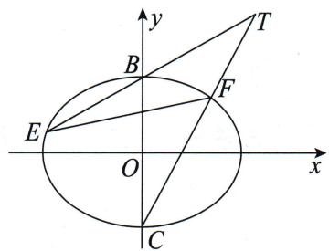

# 题目分析

观察发现本例是同角的情况. 两个三角形有公共角 $\angle BTC$ , 所以用两边与夹角正弦值乘积的一半来表达三角形面积.

这里需要提醒大家的是,虽然用底乘高的一半表达 $\triangle TBC$ 面积非常简洁,但我们不能图一时之快.同学们可自行尝试用底乘高的一半表达 $\triangle TBC$ 面积的做法.
根据三角形面积公式, 可得 $k=\frac{S_{\triangle TBC}}{S_{\triangle TEF}}=\frac{\frac{1}{2}\cdot|TB|\cdot|TC|\cdot\sin\angle BTC}{\frac{1}{2}\cdot|TE|\cdot|TF|\cdot\sin\angle BTC}$ .
再根据上一节说的化斜为直(点 $T$ 的纵坐标为定值, 故统一为纵坐标)化简, 得
$\begin{array}{l} k = \frac {S _ {\triangle T B C}}{S _ {\triangle T E F}} = \frac {| T B | \cdot | T C |}{| T E | \cdot | T F |} = \frac {\sqrt {1 + \frac {1}{k _ {T B} ^ {2}}} | 2 - 1 | \cdot \sqrt {1 + \frac {1}{k _ {T C} ^ {2}}} | 2 + 1 |}{\sqrt {1 + \frac {1}{k _ {T B} ^ {2}}} | 2 - y _ {E} | \cdot \sqrt {1 + \frac {1}{k _ {T C} ^ {2}}} | 2 - y _ {F} |} \\ = \frac {3}{| 2 - y _ {E} | | 2 - y _ {F} |}. \\ \end{array}$

要求实数 $k$ 的最大值，即求 $\vert 2 - y_{E}\vert \vert 2 - y_{F}$ 的最小值.因此只需要将 $y_{E},y_{F}$ 都用 $t$ 表示出来即可.
此时可由设线法——求根中的操作, 得到 $y_{E}=\frac{t^{2}-4}{t^{2}+4}, y_{F}=\frac{-t^{2}+36}{t^{2}+36}$ .
所以 $k = \frac{(t^2 + 4)(t^2 + 36)}{(t^2 + 12)^2}, T(\pm 2\sqrt{3}, 2), k$ 的最大值为 $\frac{4}{3}$ .

# 参考解析
由题意知 $B(0,1)$ , $C(0,-1)$ , 直线 TE 的方程为 $x=t(y-1)$ ,

与椭圆方程联立，得 $(t^{2}+4)y^{2}-2t^{2}y+t^{2}-4=0$ ，

已知其中一根为 $y_{B}=1$ ，根据韦达定理可得 $y_{B}y_{E}=\frac{t^{2}-4}{t^{2}+4}$ ，所以 $y_{E}=\frac{t^{2}-4}{t^{2}+4}$ .
同理可得 $y_{F} = \frac{-t^{2} + 36}{t^{2} + 36}$ .
所以 $k = \frac{S_{\triangle TBC}}{S_{\triangle TEF}} = \frac{\frac{1}{2} \cdot |TB| \cdot |TC| \cdot \sin \angle BTC}{\frac{1}{2} \cdot |TE| \cdot |TF| \cdot \sin \angle BTC} = \frac{|TB| \cdot |TC|}{|TE| \cdot |TF|}$
$= \frac {\sqrt {1 + \frac {1}{k _ {T B} ^ {2}}} | 2 - 1 | \cdot \sqrt {1 + \frac {1}{k _ {T C} ^ {2}}} | 2 + 1 |}{\sqrt {1 + \frac {1}{k _ {T B} ^ {2}}} | 2 - y _ {E} | \cdot \sqrt {1 + \frac {1}{k _ {T C} ^ {2}}} | 2 - y _ {F} |} = \frac {3}{| 2 - y _ {E} | | 2 - y _ {F} |},$
将 $y_{E}, y_{F}$ 代入上式化简, 得
$\begin{array}{l} k = \frac {(t ^ {2} + 4) (t ^ {2} + 3 6)}{(t ^ {2} + 1 2) ^ {2}} = \frac {t ^ {4} + 4 0 t ^ {2} + 1 4 4}{t ^ {4} + 2 4 t ^ {2} + 1 4 4} = 1 + \frac {1 6 t ^ {2}}{t ^ {4} + 2 4 t ^ {2} + 1 4 4} \\ = 1 + \frac {1 6}{t ^ {2} + \frac {1 4 4}{t ^ {2}} + 2 4} \leqslant 1 + \frac {1 6}{2 4 + 2 4} = \frac {4}{3}, \\ \end{array}$
当且仅当 $t^2 = \frac{144}{t^2}$ ，即 $t = \pm 2\sqrt{3}$ 时等号成立.此时 $T(\pm 2\sqrt{3},2)$ ，满足题意
所以实数 k 的最大值为 $\frac{4}{3}$ .
接下来我们来看三种四边形的面积问题.

第一种是对角线互相垂直的四边形 ABCD, 其面积为 $\frac{1}{2}|AC| \cdot |BD|$ . 实际上这个面积公式也是通过面积分割得到的. 设对角线交点为 E, 则根据垂直有 $|ED| + |EB| = |BD|$ , 所以 $S_{四边形ABCD} = S_{\triangle ADC} + S_{\triangle ABC} = \frac{1}{2}|ED| \cdot |AC| + \frac{1}{2}|EB| \cdot |AC| = \frac{1}{2}|AC| \cdot |BD|$ . 这种情况比较简单, 所以就不设置例题了.

第二种是直接利用对角线将四边形分割为两个三角形,一般计算量较大,下面我们以2014年湖南高考题为例.

> [!example]- 例 40 (2014·湖南·理·节选)如图所示,已知过椭圆 $\frac{x^{2}}{2}+y^{2}=1$ 的左焦点F且不垂直于y轴的直线交椭圆于A,B两点,M是线段AB的中点,当直线OM与双曲线 $\frac{x^{2}}{2}-y^{2}=1$ 交于P,Q两点时,求四边形APBQ面积的最小值.
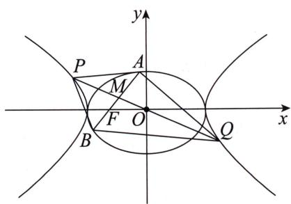

思维笔记

Siweibiji

# 题目分析

该四边形对角线是否垂直不确定,所以不能直接相乘,可利用对角线对四边形 APBQ 进行分割.用哪一条对角线呢?这里我们应该考虑的是哪一条对角线的长度易求,并且哪两个点到直线的距离之和易求.

这里建议以 $PQ$ 为同底进行分割，即 $S_{\text{四边形}APBQ} = S_{\triangle APQ} + S_{\triangle BPQ} = \frac{1}{2} |PQ| \cdot (h_A + h_B)$ ，其中 $h_A$ 是点 $A$ 到直线 $PQ$ 的距离， $h_B$ 是点 $B$ 到直线 $PQ$ 的距离。

原因是 $h_A + h_B$ 是对称的结构，故可以用韦达定理整体代换，并且 $PQ$ 的长比 $AB$ 的更好求.如果以 $AB$ 为底，点 $P$ 的坐标是直线方程与双曲线方程联立算出的，直觉上不易计算.同学们可以将几种情况都试一试.

# 参考解析
由题意知左焦点 $F(-1,0)$
设直线 AB 的方程为 x = ty - 1, $A(x_{1}, y_{1})$ , $B(x_{2}, y_{2})$ .
联立直线方程与椭圆方程得 $\left\{ \begin{array}{l} x = ty - 1, \\ \frac{x^2}{2} + y^2 = 1 \end{array} \right. \Rightarrow (t^2 + 2)y^2 - 2ty - 1 = 0,$
由韦达定理得 $y_{1} + y_{2} = \frac{2t}{t^{2} + 2}$ ①, $y_{1}y_{2} = \frac{-1}{t^{2} + 2}$ ②,
所以线段 $AB$ 中点 $M$ 的坐标为 $\left(\frac{-2}{t^2 + 2},\frac{t}{t^2 + 2}\right)$
所以直线 $PQ$ 的方程为 $y = \frac{-t}{2} x$ .
设 $h_A, h_B$ 分别是点 $A, B$ 到直线 $PQ$ 的距离，
则 $h_A + h_B = \frac{|tx_1 + 2y_1| + |tx_2 + 2y_2|}{\sqrt{t^2 + 4}} = \frac{|t(x_1 - x_2) + 2(y_1 - y_2)|}{\sqrt{t^2 + 4}}.$
根据 $x_{1} = ty_{1} - 1, x_{2} = ty_{2} - 1$

有 $h_A + h_B = \frac{t^2 + 2}{\sqrt{t^2 + 4}} |y_1 - y_2| = \frac{t^2 + 2}{\sqrt{t^2 + 4}} \cdot \sqrt{(y_1 + y_2)^2 - 4y_1y_2}$
将①②两式代入上式，得 $h_A + h_B = \frac{t^2 + 2}{\sqrt{t^2 + 4}} \cdot \sqrt{\left(\frac{2t}{t^2 + 2}\right)^2 + \frac{4}{t^2 + 2}} = 2\sqrt{2} \cdot \sqrt{\frac{t^2 + 1}{t^2 + 4}}$

而 $|PQ| = \sqrt{1 + \frac{t^2}{4}} |x_P - x_Q| = \sqrt{t^2 + 4} |x_P|$ （由对称性可知 $x_{P} = -x_{Q}$ ）.
联立直线 $PQ$ 的方程与双曲线方程，得 $\left|x_P\right| = \frac{2}{\sqrt{2 - t^2}}$
所以 $S_{\text{四边形}APBQ} = S_{\triangle APQ} + S_{\triangle BPQ} = \frac{1}{2} |PQ| \cdot (h_A + h_B) = \frac{1}{2}\sqrt{t^2 + 4} \cdot \frac{2}{\sqrt{2 - t^2}}$
$2 \sqrt {2} \cdot \sqrt {\frac {t ^ {2} + 1}{t ^ {2} + 4}} = 2 \sqrt {2} \cdot \sqrt {\frac {t ^ {2} + 1}{2 - t ^ {2}}} = 2 \sqrt {2} \cdot \sqrt {\frac {3}{2 - t ^ {2}} - 1},$
当 t=0 时, 四边形 APBQ 的面积取最小值 2.

第三种是利用坐标轴将四边形分割成几个三角形. 这里需要注意的是, 四边形并非一定要分割成两个三角形, 不要形成只能分割成两个三角形的刻板印象, 分割的目的是为了方便计算, 而不是为了分割成两个三角形.

> [!example]- 例 41 设 A, B 分别是椭圆 $\frac{x^{2}}{a^{2}} + \frac{y^{2}}{b^{2}} = 1 (a > b > 0)$ 的右顶点和上顶点. 过原点的动直线交椭圆于 C, D 两点（点 C 在第一象限），求四边形 ACBD 面积的最大值.

# 参考解析
利用坐标轴和直线 $CD$ ，可将该四边形分割为四个三角形，其中 $\triangle AOC$ 与 $\triangle AOD,\triangle BOC$ 与 $\triangle BOD$ 分别同底，并且底边长都为定值，
$S _ {\text {四边形} A C B D} = S _ {\triangle A O C} + S _ {\triangle A O D} + S _ {\triangle B O C} + S _ {\triangle B O D} = \frac {1}{2} a | y _ {C} - y _ {D} | + \frac {1}{2} b | x _ {C} - x _ {D} |.$
又 C, D 关于原点对称, 点 C 在第一象限,
所以 $x_{D}=-x_{C},y_{D}=-y_{C},x_{C}>0,y_{C}>0,$
所以 $S_{四边形ACBD}=ay_{C}+bx_{C}$
根据点 C 在椭圆上，有 $\frac{x_{C}^{2}}{a^{2}} + \frac{y_{C}^{2}}{b^{2}} = 1$ ，即 $\left(\frac{x_{C}}{a}\right)^{2} + \left(\frac{y_{C}}{b}\right)^{2} = 1$ .
由 $\cos^2\theta +\sin^2\theta = 1$ 可进行三角换元，得 $\left\{ \begin{array}{l}\frac{x_{C}}{a} = \cos \theta ,\\ \frac{y_{C}}{b} = \sin \theta , \end{array} \right.$ 其中 $\theta \in [0,2\pi)$
所以 $S_{\text{四边形}ACBD} = ab(\sin \theta + \cos \theta) = \sqrt{2}ab\sin \left(\theta + \frac{\pi}{4}\right) \leqslant \sqrt{2}ab,$
当 $\theta = \frac{\pi}{4}$ 时，四边形 $ACBD$ 的面积取最大值 $\sqrt{2} ab$ .

对本节进行概括,面积处理无非“求同存异”四个字.

但是这中间用到的分割是非常灵活的,这里并不能举出所有类型,所以还请同学们在做题过程中多用不同的分割方法,感受适合的方向.

思维笔记

Siweibiji

# 第十四节 圆的翻译

## 14.1 圆的位置关系
首先,我们复习一下圆的基本位置关系.

第一点: 圆 $(x-a)^{2}+(y-b)^{2}=r^{2}$ 与点 $P(x_{0},y_{0})$ 的位置关系
当 $(x_0 - a)^2 + (y_0 - b)^2 > r^2$ 时，点 $P(x_0, y_0)$ 在圆外；
当 $(x_{0}-a)^{2}+(y_{0}-b)^{2}=r^{2}$ 时，点 $P(x_{0},y_{0})$ 在圆上；
当 $(x_0 - a)^2 +(y_0 - b)^2 < r^2$ 时，点 $P(x_0,y_0)$ 在圆内.
在圆锥曲线的大题中,很少会用到以上的方法来判断或者翻译点与圆的位置关系,经常会让我们判断或者翻译点与以某两点为直径的圆的位置关系.

> [!example]- 例 42 已知动直线 l 过抛物线 $y^{2}=4x$ 的焦点 F，且与抛物线交于 M, N 两点，且点 M 在 x 轴上方。设点 $P(x_{0},0)$ ，若点 M 恒在以 FP 为直径的圆外，求 $x_{0}$ 的取值范围。

# 题目分析

本例不需要算圆心和半径,而是根据 14.3 圆的直径中所说的圆的第二个经典垂直求解.
若 M 在以 FP 为直径的圆上，则 $\angle FMP = 90^{\circ}$ ，即 $\overrightarrow{MF} \cdot \overrightarrow{MP} = 0$ ;
若 M 在以 FP 为直径的圆内，则 $\angle FMP > 90^{\circ}$ ，即 $\overrightarrow{MF} \cdot \overrightarrow{MP} < 0$ ;
若 M 在以 FP 为直径的圆外，则 $\angle FMP < 90^{\circ}$ ，即 $\overrightarrow{MF} \cdot \overrightarrow{MP} > 0$ .
在本例中点 M 恒在以 FP 为直径的圆外, 即有 $\overrightarrow{MF} \cdot \overrightarrow{MP} > 0$ .

# 参考解析
由题意知 $F(1,0)$ ，设 $M(4m^{2},4m)(m>0)$ ，
则 $\overrightarrow{MF} \cdot \overrightarrow{MP} = (1 - 4m^2)(x_0 - 4m^2) + 16m^2 > 0$
当 $m > \frac{1}{2}$ 时， $x_0 < \frac{4m^2(4m^2 + 3)}{4m^2 - 1}$ ，设 $4m^2 - 1 = t > 0$ ，则 $x_0 < t + \frac{4}{t} + 5$ ，即 $x_0 < 9$ ；
当 $0 < m < \frac{1}{2}$ 时， $x_0 > \frac{4m^2(4m^2 + 3)}{4m^2 - 1}$ ，设 $4m^2 - 1 = t$ ，则 $-1 < t < 0$ ，则 $x_0 > t + \frac{4}{t} + 5$ ，即 $x_0 > 0$ ；
当 $m = \frac{1}{2}$ 时， $x_0 \in \mathbf{R}$ .
显然 F 和 P 不能重合, 所以 $x_{0} \neq 1$ .
综上所述, $x_{0}$ 的取值范围为 $(0,1)\cup(1,9)$ .

第二点: 圆 $(x-a)^{2}+(y-b)^{2}=r^{2}$ 与直线 $Ax+By+C=0(A,B$ 不全为 0 $)$ 的位置关系
设圆心 $(a,b)$ 到直线 $Ax+By+C=0(A,B$ 不全为0 $)$ 的距离为d.
当 d > r 时, 直线与圆相离, 没有交点;
当 d=r 时, 直线与圆相切, 有 1 个交点;
当 d<r 时, 直线与圆相交, 有 2 个交点.

第三点: 圆 $C_{1}:(x-a_{1})^{2}+(y-b_{2})^{2}=r_{1}^{2}(r_{1}>0)$ 与圆 $C_{2}:(x-a_{2})^{2}+(y-b_{2})^{2}=r_{2}^{2}(r_{2}>0)$ 的位置关系
当 $\left|C_{1}C_{2}\right|>r_{1}+r_{2}$ 时，两圆外离，没有交点，有4条公切线；
当 $\left|C_{1}C_{2}\right|=r_{1}+r_{2}$ 时，两圆外切，有1个交点，有3条公切线；
当 $|r_{1}-r_{2}|<|C_{1}C_{2}|<r_{1}+r_{2}$ 时，两圆相交，有2个交点，有2条公切线；
当 $\left|C_{1}C_{2}\right|=\left|r_{1}-r_{2}\right|$ 时，两圆内切，有1个交点，有1条公切线；
当 $|C_{1}C_{2}|<|r_{1}-r_{2}|$ 时，两圆内含，没有交点，没有公切线.

本书不涉及以上两种位置关系的基础题,相关的中档题会在 14.5 圆的任意存在问题中进行探讨.

这里还要说一个比较老的问题——四点共圆. 这类问题最近两年的高考试卷没怎么考查. 下面我们先拿一道简单的例题来看一看四点共圆的基础解法.

> [!example]- 例 43 如图, 已知 $P\left(-\frac{\sqrt{2}}{2}, -1\right)$ , $Q\left(\frac{\sqrt{2}}{2}, 1\right)$ , 过椭圆 $x^{2} + \frac{y^{2}}{2} = 1$ 在 y 轴正半轴上的焦点 F 作斜率为 $-\sqrt{2}$ 的直线交椭圆于 A, B 两点. 证明: A, P, B, Q 四点共圆.
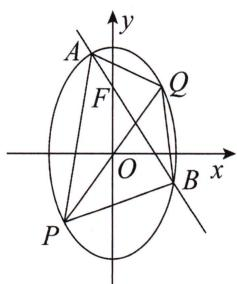

# 题目分析

本例中的四个点其实都是确定的.那么如何证明四点共圆呢?
接下来我们用初中学过的三种不同的方法来证明.
方法一:利用圆的定义,即圆上任意一点到圆心的距离都相同.联立直线AB的方程与椭圆方程,可以用求根公式解出A,B两点的坐标,再求得AB和PQ这两条线段的垂直平分线方程,联立即可求得圆心坐标.
方法二:四点共圆,则对角互补,而要想证明两角互补,我们可以转化为正切或者余弦来处理.
如果是正切, 即证 $\tan\angle PAQ + \tan\angle PBQ = 0$ (或 $\tan\angle APB + \tan\angle AQB = 0$ ), 其中 $\angle PAQ$ 为直线 AQ 和 AP 倾斜角之差, 根据两角和与差的正切公式有 $\tan\angle PAQ = \frac{k_{AQ} - k_{AP}}{1 + k_{AQ}k_{AP}} = 4\sqrt{2}$ . 同理可以算得 $\tan\angle PBQ = -4\sqrt{2}$ , 从而 $\tan\angle PAQ + \tan\angle PBQ = 0$ 得证.

思维笔记

Siweibiji

思维笔记

Siweibiji

如果是余弦, 即证 $\cos \angle PAQ + \cos \angle PBQ = 0$ (或 $\cos \angle APB + \cos \angle AQB = 0$ ), 其中 $\cos \angle PAQ = \frac{\overrightarrow{AP} \cdot \overrightarrow{AQ}}{|\overrightarrow{AP}| \cdot |\overrightarrow{AQ}|} = \frac{1}{\sqrt{33}}$ , $\cos \angle PBQ = \frac{\overrightarrow{BP} \cdot \overrightarrow{BQ}}{|\overrightarrow{BP}| \cdot |\overrightarrow{BQ}|} = -\frac{1}{\sqrt{33}}$ , 即 $\cos \angle PAQ + \cos \angle PBQ = 0$ 得证.
方法三:相交弦定理,设直线 AB 交直线 PQ 于 E, 即证 $\left|AE\right| \cdot \left|BE\right| = \left|PE\right| \cdot \left|QE\right|$ . 此时易得 $E\left(\frac{\sqrt{2}}{4}, \frac{1}{2}\right)$ , 计算有 $\left|AE\right| \cdot \left|BE\right| = \left|PE\right| \cdot \left|QE\right| = \frac{9}{8}$ , 满足相交弦定理.

# 参考解析

# 方法一：
由题意得 $F(0,1)$ ，直线 AB 的方程为 $y=-\sqrt{2}x+1$ ，
联立直线 $AB$ 的方程与椭圆方程得
$\left\{ \begin{array}{l} x ^ {2} + \frac {y ^ {2}}{2} = 1, \\ y = - \sqrt {2} x + 1 \end{array} \Rightarrow 4 x ^ {2} - 2 \sqrt {2} x - 1 = 0 \Rightarrow \left\{ \begin{array}{l} x _ {A} = \frac {\sqrt {2} - \sqrt {6}}{4}, \\ x _ {B} = \frac {\sqrt {2} + \sqrt {6}}{4} \end{array} \right. \Rightarrow \left\{ \begin{array}{l} y _ {A} = \frac {\sqrt {3} + 1}{2}, \\ y _ {B} = \frac {- \sqrt {3} + 1}{2}. \end{array} \right. \right.$

易得 AB 的垂直平分线方程为 $y=\frac{\sqrt{2}}{2}x+\frac{1}{4}$ ，PQ 的垂直平分线方程为 $y=-\frac{\sqrt{2}}{2}x$ ，联立两直线方程，得交点 $C\left(-\frac{\sqrt{2}}{8},\frac{1}{8}\right)$ .
所以 $|CA|^{2}=\left(-\frac{\sqrt{2}}{8}-\frac{\sqrt{2}-\sqrt{6}}{4}\right)^{2}+\left(\frac{1}{8}-\frac{1+\sqrt{3}}{2}\right)^{2}=\frac{99}{64}$ ，其余同理.
所以 $|CA|=|CB|=|CP|=|CQ|$ ，即A,P,B,Q四点共圆.

# 方法二：
由题意得 $F(0,1)$ ，直线 $AB$ 的方程为 $y = -\sqrt{2} x + 1$
联立直线 $AB$ 的方程与椭圆方程得
$\left\{ \begin{array}{l} x ^ {2} + \frac {y ^ {2}}{2} = 1, \\ y = - \sqrt {2} x + 1 \end{array} \Rightarrow 4 x ^ {2} - 2 \sqrt {2} x - 1 = 0 \Rightarrow \left\{ \begin{array}{l} x _ {A} = \frac {\sqrt {2} - \sqrt {6}}{4}, \\ x _ {B} = \frac {\sqrt {2} + \sqrt {6}}{4} \end{array} \Rightarrow \left\{ \begin{array}{l} y _ {A} = \frac {\sqrt {3} + 1}{2}, \\ y _ {B} = \frac {- \sqrt {3} + 1}{2}. \end{array} \right. \right. \right.$
由已知得 $k_{AP} = \frac{y_A + 1}{x_A + \frac{\sqrt{2}}{2}}, k_{AQ} = \frac{y_A - 1}{x_A - \frac{\sqrt{2}}{2}}$
所以 $\tan \angle PAQ = \frac{k_{AQ} - k_{AP}}{1 + k_{AQ}k_{AP}} = \frac{\frac{y_A - 1}{x_A - \frac{\sqrt{2}}{2}} - \frac{y_A + 1}{x_A + \frac{\sqrt{2}}{2}}}{1 + \frac{y_A^2 - 1}{x_A^2 - \frac{1}{2}}}$
$= \frac {(y _ {A} - 1) \left(x _ {A} + \frac {\sqrt {2}}{2}\right) - (y _ {A} + 1) \left(x _ {A} - \frac {\sqrt {2}}{2}\right)}{x _ {A} ^ {2} + y _ {A} ^ {2} - \frac {3}{2}} = \frac {\sqrt {2} y _ {A} - 2 x _ {A}}{x _ {A} ^ {2} + y _ {A} ^ {2} - \frac {3}{2}} = 4 \sqrt {2},$
同理可得 $\tan \angle PBQ = -4\sqrt{2}$
即 $\tan \angle PAQ + \tan \angle PBQ = 0$ ，即 $\angle PAQ$ 与 $\angle PBQ$ 互补，
所以 A, P, B, Q 四点共圆.

# 方法三：
设直线 AB 交直线 PQ 于点 E，
要证 $A, P, B, Q$ 四点共圆，即证 $|AE| \cdot |BE| = |PE| \cdot |QE|$ .
由题意得 $F(0,1)$ ，直线 AB: $y = -\sqrt{2}x + 1$ ，直线 PQ: $y = \sqrt{2}x$ ，
则 $\left\{ \begin{array}{l} y = \sqrt{2} x, \\ y = -\sqrt{2} x + 1 \end{array} \right. \Rightarrow \left\{ \begin{array}{l} x_{E} = \frac{\sqrt{2}}{4}, \\ y_{E} = \frac{1}{2}. \end{array} \right.$
联立直线 $AB$ 的方程与椭圆方程得
$\left\{ \begin{array}{l} x ^ {2} + \frac {y ^ {2}}{2} = 1, \\ y = - \sqrt {2} x + 1 \end{array} \Rightarrow 4 x ^ {2} - 2 \sqrt {2} x - 1 = 0 \Rightarrow \left\{ \begin{array}{l} x _ {A} = \frac {\sqrt {2} - \sqrt {6}}{4}, \\ x _ {B} = \frac {\sqrt {2} + \sqrt {6}}{4} \end{array} \Rightarrow \left\{ \begin{array}{l} y _ {A} = \frac {\sqrt {3} + 1}{2}, \\ y _ {B} = \frac {- \sqrt {3} + 1}{2}. \end{array} \right. \right. \right.$
所以 $|AE| = \sqrt{\left(\frac{\sqrt{2} - \sqrt{6}}{4} - \frac{\sqrt{2}}{4}\right)^2 + \left(\frac{\sqrt{3} + 1}{2} - \frac{1}{2}\right)^2} = \sqrt{\frac{9}{8}}$ ,
同理可得 $|BE| = \sqrt{\frac{9}{8}}, |PE| = \frac{3\sqrt{6}}{4}, |QE| = \frac{\sqrt{6}}{4}$ ,
所以 $\left|AE\right|\cdot\left|BE\right|=\left|PE\right|\cdot\left|QE\right|=\frac{9}{8}$ 成立，即 A, P, B, Q 四点共圆.

# 总结

对于例 43, 我们分别使用了圆的定义与圆的初中几何性质进行证明.

想必“见多识广”的同学会说，在方法一中我们得到 $k_{AB} = -\sqrt{2}, k_{PQ} = \sqrt{2}$ ，即直线 AB 与 PQ 的斜率互为相反数，就可以说明四点共圆了，这是一个“常规结论”.

我们一般认为只有在高中课本中出现的结论以及初中所学的知识才能直接使用,除此之外,哪怕是课本证明过的例题以及后面的习题中出现的一般性结论,在解答题中仍然需要证明,不可直接使用.
因此,哪怕“两条相交直线的斜率存在且互为相反数,并与圆锥曲线有四个不同交点,则这四点共圆”这个结论在旧教材中出现过,我们如果要运用仍然需要证明.

思维笔记

Siweibiji

# 思维笔记

# Siweibiji

请看下一道例题. 如果真的没关系, 可以直接用, 那这道题还会在试卷上考出来吗? 难不成写显然成立?

> [!example]- 例 44 已知过点 $P(1,1)$ 作倾斜角互补的直线 $l_{1}, l_{2}$ ，与椭圆 $\frac{x^{2}}{4} + \frac{y^{2}}{3} = 1$ 分别交于 A, B 和 C, D. 证明：A, B, C, D 四点共圆.

# 题目分析
要证四点共圆,我们注意到题目条件有两直线的交点坐标,即 $P(1,1)$ . 因此考虑使用圆的相交弦定理进行转化.

长度 $|PA|$ ， $|PB|$ ， $|PC|$ ， $|PD|$ 可以使用化斜为直，转化为横坐标（或纵坐标）表示，结合韦达定理整体代换，用直线斜率表示出来.

# 参考解析
要证明四点共圆,即证 $|PA|\cdot|PB|=|PC|\cdot|PD|$ .
设直线 AB 的方程为 $y=k(x-1)+1$ .
$\left\{ \begin{array}{l} y = k (x - 1) + 1, \\ \frac {x ^ {2}}{4} + \frac {y ^ {2}}{3} = 1 \end{array} \Rightarrow (4 k ^ {2} + 3) x ^ {2} + 8 k (1 - k) x + 4 (1 - k) ^ {2} - 1 2 = 0, \right.$
由韦达定理得 $\left\{\begin{aligned}x_{A}+x_{B}&=-\frac{8k(1-k)}{4k^{2}+3}\\ x_{A}x_{B}&=\frac{4(1-k)^{2}-12}{4k^{2}+3}\end{aligned}\right.$ ①,
因为 $|PA| = \sqrt{1 + k^2} |x_A - 1|, |PB| = \sqrt{1 + k^2} |x_B - 1|$ ,
所以 $|PA| \cdot |PB| = (1 + k^2) |(x_A - 1)(x_B - 1)| = (1 + k^2) |x_A x_B - (x_A + x_B) + 1|$ ,
将①②两式代入上式,得
$| P A | \cdot | P B | = (1 + k ^ {2}) \left| \frac {4 (1 - k) ^ {2} - 1 2 + 8 k (1 - k) + 4 k ^ {2} + 3}{4 k ^ {2} + 3} \right| = \frac {5 (k ^ {2} + 1)}{4 k ^ {2} + 3},$
同理可得 $|PC|\cdot |PD| = \frac{5(k^2 + 1)}{4k^2 + 3}$
所以 $\left|PA\right|\cdot\left|PB\right|=\left|PC\right|\cdot\left|PD\right|$ ，即 A, B, C, D 四点共圆.

# 总结

我们这里只是把斜率互为相反数当成了一个已知条件来处理,利用的还是圆的相交弦定理的做法.有兴趣的同学可以试试别的方法来处理这道例题.当然像曲线系或者直线的参数方程也是可以使用这些方法的,本书不予讨论相关解法.
通过上面的例题,我们应该对常规的四点共圆有所了解.下面的例题反其道而行之,已知四点共圆,让我们求未知数,那该如何处理呢?

> [!example]- 例 45 过抛物线 $y^{2}=4x$ 焦点 F 的直线 l 与抛物线相交于 A, B 两点, 若线段 AB 的垂直平分线 $l_{1}$ 与抛物线相交于 C, D 两点, 且 A, B, C, D 四点在同一个圆上, 求直线 l 的方程.

# 参考解析
因为 $CD$ 是线段 $AB$ 的垂直平分线, 所以线段 $CD$ 即为四点所在圆的直径.
设圆心为 E, AB 的中点为 M，则由垂径定理，得 $\left|ME\right|^{2} + \left|MB\right|^{2} = \left|BE\right|^{2}$
其中 $|MB|=\frac{|AB|}{2}$ ， $|BE|=r=\frac{|CD|}{2}$ ，则有方程 $4|ME|^{2}+|AB|^{2}=|CD|^{2}$ .
设直线 $AB$ 的方程为 $x = my + 1$ ，则 $\left\{ \begin{array}{l} x = my + 1, \\ y^2 = 4x \end{array} \right. \Rightarrow y^2 - 4my - 4 = 0$ $\Rightarrow \left\{ \begin{array}{l} y_A + y_B = 4m, \\ y_Ay_B = -4, \end{array} \right.$
则线段 AB 的中点 M 的坐标为 $(2m^{2}+1,2m)$ ,

且 $|AB| = \sqrt{1 + m^2} |y_A - y_B| = \sqrt{1 + m^2} \cdot \sqrt{(y_A + y_B)^2 - 4y_Ay_B} = 4(m^2 + 1)$ .
同理可得 $|CD| = \frac{4(m^2 + 1)\sqrt{2m^2 + 1}}{m^2}, |ME|^2 = \left(2m + \frac{2}{m}\right)^2 + \left(\frac{2}{m^2} + 2\right)^2,$
代入方程 $4|ME|^2 + |AB|^2 = |CD|^2$ ，解得 $m = \pm 1$ .
所以直线 l 的方程为 $x \pm y - 1 = 0$ .

## 14.2 圆的弦
在圆的几何性质中有三个垂直非常的重要,可以说凡是考到圆的题目大部分会涉及这三者之一,甚至三者都会涉及.

这三个垂直里最经典的就是圆的垂径定理, 即圆心 C 与弦 AB 的中点 M 所在直线与弦 AB 所在直线是垂直的.

这里由垂直还衍生出一个圆的弦长公式, 即 $\left|AB\right|=2\sqrt{r^{2}-\left|CM\right|^{2}}$ , 其中 r 是圆的半径.
接下来我们先看一个经典的应用.

> [!example]- 例 46 证明: 过圆内一点 P 作直线与圆 C 相交于 A, B 两点, 当 $PC \perp AB$ 时, 弦 AB 的长度最短.
思维笔记

Siweibiji

# 题目分析
设 $AB$ 的中点为 $M$ , 根据垂径定理有 $|AB| = 2\sqrt{r^2 - |CM|^2}$ , 所以要研究 $AB$ 的长度, 就是研究 $CM$ 的长度.

这个时候,我们需要分两类情况,即 P 是 AB 的中点和 P 不是 AB 的中点.
当 $P$ 不是 $AB$ 的中点时, $CM \perp AB$ , 即 $\triangle CMP$ 是直角三角形, 且 $CP$ 是斜边, 因此有 $|CP| > |CM|$ .
$|AB|=2\sqrt{r^{2}-|CM|^{2}}>2\sqrt{r^{2}-|CP|^{2}}$ ，也就是说点P不是AB中点时的弦长一定大于点P是AB中点时的弦长.

# 参考解析

①当点 $P$ 是 $AB$ 的中点时， $|AB| = 2\sqrt{r^2 - |CP|^2}$ .  
②当点 P 不是 AB 的中点时, 设 AB 的中点为 M, 由垂径定理得 $CM \perp AB$ , 即 $\triangle CMP$ 是直角三角形, 且 CP 是斜边, 因此有 $|CP| > |CM|$ ,
所以 $|AB|=2\sqrt{r^{2}-|CM|^{2}}>2\sqrt{r^{2}-|CP|^{2}}$ .

综上, 当点 P 是 AB 的中点, 即当 $PC \perp AB$ 时, 弦 AB 的长度最短.

下面我们看一道明确告诉你不是弦中点的例题.

> [!example]- 例 47 在平面直角坐标系 $xOy$ 中, 已知过点 $P(1,1)$ 的直线 $l$ 交圆 $O: x^{2} + y^{2} = 4$ 于 $A, B$ 两点, 且 $|AP| = 2|PB|$ , 则满足条件的所有直线 $l$ 的斜率之和为 \_\_\_\_.

# 题目分析

本例中虽然点 $P$ 是弦 $AB$ 的三等分点, 但是不妨碍我们找一个中点. 设弦 $AB$ 的中点为 $M$ , 则根据垂径定理有 $OM \perp AB$ , 进而我们就有了两个直角三角形, 也就可以用两次勾股定理, $|OA|^2 = |OM|^2 + \left(\frac{|AB|}{2}\right)^2$ 和 $|OP|^2 = |OM|^2 + \left(\frac{|AB|}{2} - \frac{|AB|}{3}\right)^2$ .
接下来代入数据, 得 $\left\{\begin{aligned}4&=|OM|^{2}+\frac{|AB|^{2}}{4},\\ 2&=|OM|^{2}+\frac{|AB|^{2}}{36}\end{aligned}\right.\Rightarrow|OM|=\frac{\sqrt{7}}{2},$
即圆心 O 到直线 l 的距离为 $\frac{\sqrt{7}}{2}$ .
设直线 l 的方程为 $y=k(x-1)+1$ ，
则圆心 $O$ 到直线 $l$ 的距离 $d = \frac{|1 - k|}{\sqrt{k^2 + 1}} = \frac{\sqrt{7}}{2}$

化简, 得 $3k^{2}+8k+3=0$ , 即直线 l 的斜率有两解, 其和用韦达定理可知为 $-\frac{8}{3}$ .

下面我们再看看如果点在圆外,涉及弦的问题应该如何处理.

> [!example]- 例 48 过圆外一点 $P(t,0)$ 作斜率为 -1 的直线与圆 $C: x^{2} + (y+1)^{2} = 2$ 交于 M，N 两点。若点 M 是线段 PN 的中点，则 $|OP| =$ \_\_\_\_ 。
# 题目分析
由题意知直线 $MN$ 的方程为 $y = -(x - t)$ , 设线段 $MN$ 的中点为 $G$ , 连接 $CG$ , 由垂径定理有 $CG \perp MN$ .
根据勾股定理有 $\left\{\begin{aligned}&|CP|^{2}=|CG|^{2}+\left(\frac{3|MN|}{2}\right)^{2},\\&|CM|^{2}=|CG|^{2}+\left(\frac{|MN|}{2}\right)^{2},\end{aligned}\right.$
其中 $|CM|$ 是圆 C 的半径长， $|CG|$ 是圆心 C 到直线 $y = -(x - t)$ 的距离， $|CG| = \frac{|t + 1|}{\sqrt{2}}$ .
所以有 $\left\{\begin{aligned}t^{2}+1&=\frac{(t+1)^{2}}{2}+\frac{9|MN|^{2}}{4},\\ 2&=\frac{(t+1)^{2}}{2}+\frac{|MN|^{2}}{4},\end{aligned}\right.$ 解得 $t=-\frac{13}{5}$ 或 t=1(舍).

综上,线段 OP 的长为 $\frac{13}{5}$ .
通过上面的三个例子我们发现,凡是涉及弦长的题目都会用到弦中点,如果题目里没有提及,我们可以自己加上,再根据垂径定理得到新的条件.

我们下面来看一道和第十三节 多边形的翻译中特殊三角形有关的圆的例题.

> [!example]- 例 49 在平面直角坐标系 xOy 中, 已知圆 $C: x^{2} + (y - 1)^{2} = 4$ , 若等腰直角三角形 PAB 的斜边 AB 为圆 C 的一条弦, 且点 C, P 位于直线 AB 的两侧, 则 $|PC|$ 的最大值为 \_\_\_\_.
# 题目分析

依旧取 AB 的中点 M，由垂径定理，有 $CM \perp AB$ ，又由等腰三角形三线合一的性质，有 $PM \perp AB$ ，所以 P, M, C 三点共线，因此 $|PC| = |CM| + |MP|$ .
又由等腰直角三角形中线长与底边长的比例关系, 得 $\left|PC\right| = \left|CM\right| + \left|MB\right|$ .

# 思维笔记

# Siweibiji

在 Rt△BMC 中, 由勾股定理可知 $|CM|^2 + |MB|^2 = 4$ , 接下来就是利用基本不等式的环节了. 根据基本不等式的拓展, 有 $|PC|^2 \leqslant 2(|CM|^2 + |MB|^2) = 8 \Rightarrow |PC| \leqslant 2\sqrt{2}$ , 当且仅当 $|CM| = |MB|$ 时取等号.
综上所述， $|PC|$ 的最大值为 $2\sqrt{2}$

至此，垂径定理在圆里的应用就大致介绍完了。在圆锥曲线的题目中如果出现圆，并且涉及圆的弦的时候，垂径定理也是同样的用法。
最后,我们拿一个不一样的例题作为结尾,在这个例题中,我们会看到圆和椭圆有公共弦时可以如何处理.

> [!example]- 例 50 在平面直角坐标系 xOy 中, 已知椭圆 $C: \frac{x^{2}}{a^{2}} + \frac{y^{2}}{b^{2}} = 1 (a > b > 0)$ 的半焦距为 c, 原点 O 到经过两点 $(c, 0)$ , $(0, b)$ 的直线的距离为 $\frac{c}{2}$ .  
（1）求椭圆 C 的离心率;  
（2） 若 $AB$ 是圆 $M: (x + 2)^2 + (y - 1)^2 = \frac{5}{2}$ 的一条直径, 椭圆 $C$ 经过 $A, B$ 两点, 求椭圆 $C$ 的方程.

# 题目分析

第一问只需要翻译好点到直线的距离即可求得离心率为 $\frac{\sqrt{3}}{2}$ , 关键是第二问.
首先,当我们遇见一个只知道离心率的椭圆的时候,记得先统一 a, b, c, 不要带着三个字母一起算.我们每个人的注意力都是有限的,在整理式子、分析条件、审读题目的时候都会消耗,因此不要把宝贵的注意力浪费太多在本可以避免的地方.
设 $a = 2t, b = t, c = \sqrt{3} t (t > 0)$ ，则椭圆 $C$ 的方程为 $\frac{x^2}{4} + y^2 = t^2$ .

AB 既是圆的弦也是椭圆的弦, 这个条件如何处理呢?

我们都清楚,将直线方程与曲线方程联立后得到的是以其交点横坐标或纵坐标为根的二次方程,那么在本题中就意味着将直线 AB 的方程与圆和椭圆的方程联立后得到的两个二次方程的根是相同的.
如果两个二次方程的根是相同的, 即同解方程, 就意味着这两个方程对应项的系数是成比例的, 如 $x^{2} + 2x - 3 = 0$ 与 $2x^{2} + 4x - 6 = 0$ .
所以设直线 $AB$ 的方程为 $y = k(x + 2) + 1$ ，分别与椭圆方程和圆的方程联立，所得的两个二次方程的系数一一对应成比例，即可解得 $k, t$ 的值.

# 参考解析  
（1）由题意,直线方程为 $\frac{x}{c}+\frac{y}{b}=1$ ,故原点O到直线的距离 $d=\frac{1}{\sqrt{\frac{1}{c^{2}}+\frac{1}{b^{2}}}}=\frac{c}{2}$ ,

平方后化简，得 $\frac{c^2}{b^2} = 3$
所以椭圆离心率 $e = \frac{c}{a} = \sqrt{\frac{c^2}{b^2 + c^2}} = \sqrt{\frac{3}{1 + 3}} = \frac{\sqrt{3}}{2}$ .  
（2） 设 $a = 2t, b = t, c = \sqrt{3}t (t > 0)$ , 则椭圆方程为 $\frac{x^2}{4} + y^2 = t^2$ .

易知直线 AB 的斜率存在, 所以设直线 AB 的方程为 $y = k(x + 2) + 1$ .
联立直线方程与圆方程，得 $(k^2 + 1)x^2 + 4(k^2 + 1)x + 4k^2 + \frac{3}{2} = 0$
联立直线方程与椭圆方程，得 $(4k^{2} + 1)x^{2} + 8k(2k + 1)x + 4(2k + 1)^{2} - 4t^{2} = 0$

两方程系数一一对应成比例，得 $\frac{k^2 + 1}{4k^2 + 1} = \frac{4(k^2 + 1)}{8k(2k + 1)} = \frac{4k^2 + \frac{3}{2}}{4(2k + 1)^2 - 4t^2}$
由 $\frac{k^2 + 1}{4k^2 + 1} = \frac{4(k^2 + 1)}{8k(2k + 1)}$ ，解得 $k = \frac{1}{2}$
代入 $\frac{k^2 + 1}{4k^2 + 1} = \frac{4k^2 + \frac{3}{2}}{4(2k + 1)^2 - 4t^2}$ , 可得 $t^2 = 3$ .
所以椭圆方程为 $\frac{x^{2}}{12}+\frac{y^{2}}{3}=1.$
最后说一下方程组的问题. 在联立方程的过程中, 部分的同学忘记了等价转化这个原则, 这就会出现椭圆方程与抛物线方程联立后不能用韦达定理这种问题.

原因很简单,在联立的时候注意取值范围就行.

这里为了方便理解,以数列为例:

已知 $S_{n} = 2a_{n} + 3$ 对 $n\geqslant 1,n\in \mathbf{N}^{*}$ 成立，其中 $S_{n}$ 是 $\{a_n\}$ 的前 $n$ 项和.求数列 $\{a_{n}\}$ 的通项公式.
由 $S_{n} = 2a_{n} + 3(n\geqslant 1)$ ，得 $S_{n - 1} = 2a_{n - 1} + 3(n\geqslant 2)$

两式相减, 得 $S_{n}-S_{n-1}=2a_{n}+3-(2a_{n-1}+3)\Rightarrow a_{n}=2a_{n-1}$ ，这个式子对于 n 在什么范围内成立？

两式联立时需要遵循更小的那个范围, 所以 $a_{n} = 2a_{n-1}$ 是对于 $n \geqslant 2$ 成立的. 当 $n = 2$ 时, 有 $a_{2} = 2a_{1}$ , 即前两项满足等比数列的定义, 所以直接算首项 $a_{1} = -3$ , 根据等比数列的定义得 $a_{n} = -3 \cdot 2^{n-1} (n \in \mathbf{N}^{*})$ .

思维笔记

Siweibiji

## 14.3 圆的直径

众所周知,圆的直径所对的圆周角是 $\frac{\pi}{2}$ ,这也就为我们带来了圆中的第二个经典的垂直.当然此处的垂直一般就不用勾股定理来进一步应用了,更常见的是转化为向量数量积为0.例如,题目要求以AB为直径的圆的方程,我们就可以设圆上任意一点为P,然后翻译 $\overrightarrow{PA}\cdot\overrightarrow{PB}=0$ ,化简后即为圆的方程.

我们先看一道已知圆过定点的例题.

> [!example]- 例51 在平面直角坐标系 $xOy$ 中，试问在椭圆 $\frac{x^2}{4} + y^2 = 1$ 上是否存在 $M, N$ 两点关于直线 $l: y = kx + \frac{\sqrt{30}}{5}$ 对称，且以 $MN$ 为直径的圆恰好经过坐标原点？若存在，求出直线 $l$ 的方程；若不存在，请说明理由.

# 题目分析

先分析目标,要求直线 l 的方程就是求斜率 k, 即找到 k 满足的关系. 由条件 “以 MN 为直径的圆过坐标原点”, 可知 $\overrightarrow{OM} \cdot \overrightarrow{ON} = 0$ , 只要用 k 表示出这个条件, 然后解方程即可. 要表示这个向量条件就要找到 M, N 两点的坐标与 k 的关系, 这里就需要看到 M, N 两点关于直线 l 对称这个条件了. 根据线段的垂直平分线可知 $k_{MN} = -\frac{1}{k}$ , 并且线段 MN 的中点在直线 l 上, 虽然设直线 MN 时会有两个变量, 但是能找到它们的关系, 也就无妨了.

# 参考解析
若椭圆上存在满足条件的 M, N 两点，
则设 $M(x_{1},y_{1}),N(x_{2},y_{2})$ ，直线MN的方程为 $y = -\frac{1}{k} x + m.$
$\begin{array}{l} \left\{ \begin{array}{l l} y = - \frac {1}{k} x + m, \\ \frac {x ^ {2}}{4} + y ^ {2} = 1 \end{array} \right. \Rightarrow (4 + k ^ {2}) x ^ {2} - 8 m k x + 4 k ^ {2} (m ^ {2} - 1) = 0 \\ \Rightarrow \left\{ \begin{array}{l} x _ {1} + x _ {2} = \frac {8 m k}{k ^ {2} + 4}, \\ x _ {1} x _ {2} = \frac {4 k ^ {2} (m ^ {2} - 1)}{k ^ {2} + 4} \end{array} \right. \Rightarrow \left\{ \begin{array}{l} y _ {1} + y _ {2} = \frac {2 m k ^ {2}}{k ^ {2} + 4}, \\ y _ {1} y _ {2} = \frac {m ^ {2} k ^ {2} - 4}{k ^ {2} + 4}, \end{array} \right. \\ \end{array}$
所以线段 $MN$ 中点的坐标为 $\left(\frac{4mk}{k^2 + 4},\frac{mk^2}{k^2 + 4}\right)$
代入直线 $l$ 的方程，得 $\frac{mk^2}{k^2 + 4} = \frac{4mk^2}{k^2 + 4} +\frac{\sqrt{30}}{5}\Rightarrow \frac{3mk^2}{k^2 + 4} = -\frac{\sqrt{30}}{5}$ ①.
根据以 MN 为直径的圆恰好经过坐标原点, 得 $\overrightarrow{OM} \cdot \overrightarrow{ON} = 0 \Rightarrow x_{1}x_{2} + y_{1}y_{2} = 0$ ,所以有 $5m^{2}k^{2} = 4(k^{2} + 1)\Rightarrow k^{2} = \frac{4}{5m^{2} - 4}$ ②.
此时联立①②两式,可得 $10m^{2}+\sqrt{30}m-6=0$ ,
解得 $m=\frac{\sqrt{30}}{10}$ 或 $m=-\frac{\sqrt{30}}{5}$ .
由①式可知 m<0，故舍去 $m=\frac{\sqrt{30}}{10}$ .
因此 $k^2 = \frac{4}{5m^2 - 4} = 2 \Rightarrow k = \pm \sqrt{2}$ , 此时 $\Delta > 0$ 满足题意.
综上所述,椭圆上存在 M,N 两点关于直线 $l: y = kx + \frac{\sqrt{30}}{5}$ 对称,且以 MN 为直径的圆恰好经过坐标原点,直线 l 的方程为 $y = \pm\sqrt{2}x + \frac{\sqrt{30}}{5}$ .

不是所有提到直径的圆都用垂直来处理,还要注意圆心是直径的中点这一条件.

> [!example]- 例 52 在平面直角坐标系 xOy 中, 已知抛物线 $x^{2}=2py(p>0)$ 的焦点为 F, 过点 F 的直线交抛物线于 A, B 两点. 若以 AB 为直径的圆 C 的方程为 $(x-2)^{2}+(y-3)^{2}=16$ , 求抛物线的标准方程.
# 题目分析

本例的关键在于直径和抛物线的定义, 所以根据圆 C 的方程可得到直径的长度, 即 AB 的长度, 还可以得到线段 AB 中点 C 的坐标, 根据抛物线定义将 $\left|AB\right|$ 用坐标和 p 表示出来, 从而可解出 p.

# 参考解析
由抛物线的定义,可得 $|AB|=|AF|+|BF|=y_{A}+y_{B}+p$ ,
又因为 AB 是直径, 所以 $\left|AB\right|=8$ , 并且 $y_{A}+y_{B}=2y_{C}=6$ ,
因此 p=2，所以抛物线的标准方程为 $x^{2}=4y$ .

以上我们给出的都是已知直径如何处理的问题,那么如果一道题不告诉直径,而是给出直角,让我们意识到这其中隐含一个圆,该如何处理呢?

请看下面这道高考题.

思维笔记

Siweibiji

思维笔记

Siweibiji

> [!example]- 例 53 (2020·山东·节选) 在平面直角坐标系 $xOy$ 中, 已知 $M, N$ 是椭圆 $\frac{x^2}{6} + \frac{y^2}{3} = 1$ 上两点, 且 $AM \perp AN, AD \perp MN$ , 其中 $A(2,1), D$ 为垂足. 证明: 存在定点 $Q$ , 使得 $|DQ|$ 为定值.
# 题目分析

我们没法确定该定点 $Q$ 在坐标轴上，而且 $\mid DQ\mid$ 为定值的话，其表达式也会很复杂.求点 $Q$ 的轨迹方程似乎也较难操作.

既然目标分析不了,我们就从条件出发,边写边看.

已知 $A(2,1)$ , 先把 $AM \perp AN$ 这个条件翻译出来.
设 $M(x_{1},y_{1}),N(x_{2},y_{2})$
当直线 MN 的斜率存在时, 设直线 MN 的方程为 $y = kx + m$ .
$\begin{array}{l} \left\{ \begin{array}{l} {y = k x + m  ,} \\ {\frac {x ^ {2}}{6} + \frac {y ^ {2}}{3} = 1} \end{array} \right. \Rightarrow (2 k ^ {2} + 1)   x ^ {2} + 4 k m x + 2 m ^ {2} - 6 = 0 \Rightarrow \left\{ \begin{array}{l} {x _ {1} + x _ {2} = \frac {- 4 k m}{2 k ^ {2} + 1}  ,} \\ {x _ {1} x _ {2} = \frac {2 m ^ {2} - 6}{2 k ^ {2} + 1}} \end{array} \right. \\ \Rightarrow \left\{ \begin{array}{l} y _ {1} + y _ {2} = \frac {2 m}{2 k ^ {2} + 1}, \\ y _ {1} y _ {2} = \frac {m ^ {2} - 6 k ^ {2}}{2 k ^ {2} + 1}. \end{array} \right. \\ \end{array}$
$\begin{array}{r l} & {A M \bot A N \Rightarrow \overrightarrow {A M} \bullet \overrightarrow {A N} = 0 \Rightarrow (x _ {1} - 2) (x _ {2} - 2) + (y _ {1} - 1) (y _ {2} - 1) = 0 \Rightarrow x _ {1} x _ {2} +} \\ & {y _ {1} y _ {2} - 2 (x _ {1} + x _ {2}) - (y _ {1} + y _ {2}) + 5 = 0,} \end{array}$
所以有 $4k^{2} + 8mk + 3m^{2} - 2m - 1 = 0$
因式分解得到 $(2k + m - 1)(2k + 3m + 1) = 0$ ，所以 $2k + m - 1 = 0$ 或 $2k + 3m + 1 = 0$
若 $2k + m - 1 = 0$ ，则直线MN过点 $A(2,1)$ ，与已知矛盾；
若 $2k + 3m + 1 = 0$ ，则直线 $MN$ 过点 $P\left(\frac{2}{3}, - \frac{1}{3}\right)$

注意 $AD \perp MN$ 即 $AD \perp PD$ , 即动点 $D$ 与两定点 $A$ 和 $P$ 连线所成的角是直角, 即 $D$ 在以 $AP$ 为直径的圆上. 根据圆的定义, 可知定点 $Q$ 为以 $AP$ 为直径的圆的圆心, 即点 $Q$ 为线段 $AP$ 的中点, 即点 $Q$ 的坐标为 $\left(\frac{4}{3}, \frac{1}{3}\right)$ 时, $|DQ|$ 为定值.
当直线 $MN$ 的斜率不存在时，可求得 $D\left(\frac{2}{3},1\right),|DQ|$ 为定值.

综上,存在定点 $Q\left(\frac{4}{3},\frac{1}{3}\right)$ , 使得 $|DQ|$ 为定值.

# 参考解析

①当直线 MN 的斜率存在时, 设直线 MN 的方程为 $y = kx + m$ .
联立得 $\left\{\begin{aligned}y&=kx+m,\\ \frac{x^{2}}{6}&+\frac{y^{2}}{3}=1\end{aligned}\right.\Rightarrow(2k^{2}+1)x^{2}+4kmx+2m^{2}-6=0.$
由 $\Delta=(4km)^{2}-4(2k^{2}+1)(2m^{2}-6)>0$ , 知 $m^{2}<6k^{2}+3$
设 $M(x_{1},y_{1}), N(x_{2},y_{2})$ ,
由韦达定理得 $x_{1} + x_{2} = -\frac{4km}{2k^{2} + 1}$ ①, $x_{1}x_{2} = \frac{2m^{2} - 6}{2k^{2} + 1}$ ②.
因为 $AM \perp AN$ ,
所以 $\overrightarrow{AM}\cdot\overrightarrow{AN}=(x_{1}-2)(x_{2}-2)+(y_{1}-1)(y_{2}-1)=0,$
即 $(k^2 + 1)x_1x_2 + (km - k - 2)(x_1 + x_2) + m^2 - 2m + 5 = 0$
将①②两式代入上式, 得 $(k^{2}+1)\cdot\frac{2m^{2}-6}{2k^{2}+1}+(km-k-2)\left(-\frac{4km}{2k^{2}+1}\right)+m^{2}-2m+5=0$ ,

化简并整理, 得 $4k^{2} + 8km + 3m^{2} - 2m - 1 = (2k + m - 1)(2k + 3m + 1) = 0$ ,
所以 $m = 1 - 2k$ 或 $m = -\frac{2k + 1}{3}$ .
当 $m = 1 - 2k$ 时，直线 $MN$ 的方程为 $y = kx - 2k + 1$ ，过定点 $A(2,1)$ ，不符合题意，舍去；
当 $m = -\frac{2k + 1}{3}$ 时，直线 $MN$ 的方程为 $y = kx - \frac{2k + 1}{3}$ ，过定点 $P\left(\frac{2}{3}, -\frac{1}{3}\right)$ .
因为 $AD \perp MN$ ，所以点 D 在以 AP 为直径的圆上。
故当点 $Q$ 为 $AP$ 的中点，即点 $Q$ 的坐标为 $\left(\frac{4}{3}, \frac{1}{3}\right)$ 时， $|DQ| = \frac{2\sqrt{2}}{3}$ ，即 $|DQ|$ 为定值.

②当直线 $MN$ 的斜率不存在时, 设其方程为 $x = t, M(t, s), N(t, -s)$ , 且 $\frac{t^2}{6} + \frac{s^2}{3} = 1$ .
因为 $AM \perp AN$ ,
所以 $\overrightarrow{AM} \cdot \overrightarrow{AN} = (t - 2)(t - 2) + (s - 1)(-s - 1) = 0,$
解得 $t=\frac{2}{3}$ 或 t=2(舍).
所以 $D\left(\frac{2}{3},1\right)$ ，此时 $\vert DQ\vert = \sqrt{\left(\frac{4}{3} - \frac{2}{3}\right)^2 + \left(\frac{1}{3} - 1\right)^2} = \frac{2\sqrt{2}}{3}$ ，即 $\vert DQ\vert$ 为定值.

综上,存在定点 $Q\left(\frac{4}{3},\frac{1}{3}\right)$ , 使得 $|DQ|$ 为定值,且该定值为 $\frac{2\sqrt{2}}{3}$ .

## 14.4 与圆相切
当直线与圆相切的时候,圆心与切点所在直线和切线相互垂直,这就是圆中的第三个经典的垂直.

> [!example]- 例 54 从点 $P(-1,4)$ 作圆 $C:(x-2)^{2}+(y-3)^{2}=1$ 的切线，切于 A, B 两点，则 （1） 切线长为 \_\_\_\_.
思维笔记
Siweibiji

  
（2）四边形 PACB 的面积为 \_\_\_\_.  
（3）切线方程为\_\_\_\_。  
（4）切点弦所在直线的方程为  
（5）线段 AB 的长为 \_\_\_\_.

# 题目分析

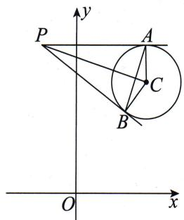  
（1）切线长指 $PA$ 或者 $PB$ 的长度, 根据对称性可知两者一样长, 所以求一个即可. 接下来由经典垂直得到勾股定理 $|PB|^2 + r^2 = |PC|^2$ , 代入数据, 得 $|PB|^2 = 9$ , 即切线长为 3.  
（2） 四边形 PACB 是一个对角线相互垂直的四边形, 但是 AB 不易求, 因此可以将其当成两个全等的直角三角形拼成的四边形, 易求得 Rt△PAC 的面积为 $\frac{1}{2}|PA| \cdot r = \frac{3}{2}$ , 故四边形 PACB 的面积为 3.  
（3）已知两条切线都过点 $P(-1,4)$ , 因此设切线斜率为 $k$ , 则切线方程为 $y - 4 = k(x + 1)$ , 由相切得圆心到切线的距离等于半径, 故 $\frac{|3k + 1|}{\sqrt{1 + k^2}} = 1$ , 化简得 $k(4k + 3) = 0$ , 解得 $k = 0$ 或 $k = -\frac{3}{4}$ , 因此切线方程为 $y = 4$ 或 $3x + 4y - 13 = 0$ .

需要注意的是,我们没有考虑斜率不存在的情况,但根据对称性可知一定有两条切线.若本小题需要写解题过程,则最好写出当斜率不存在时,直线方程为x=-1,与圆不相切,舍去.而本小题算出两条切线就可以,如果算出来只有一个k,那么另一条切线的斜率必定不存在.  
（4）两圆相交时的公共弦方程怎么求？利用两圆方程相减即可.如果你不会证明,可以看一下第九章“同构”专题.
在本小题中我们根据相切得到的这个垂直,结合直径所对圆周角为直角,可知 A,B 两点还在以 PC 为直径的圆上.因此直线 AB 也即切点弦所在直线,就是两圆的公共弦所在直线.

以 $PC$ 为直径的圆的方程为 $(x + 1)(x - 2) + (y - 3)(y - 4) = 0$ ，即 $x^{2} + y^{2} - x - 7y + 10 = 0.$

而圆 $C: (x - 2)^{2} + (y - 3)^{2} = 1 \Leftrightarrow x^{2} + y^{2} - 4x - 6y + 12 = 0$
所以直线 AB 的方程为 3x - y - 2 = 0.  
（5）由（4）知直线 AB 的方程为 3x-y-2=0,
根据勾股定理,可得 $\left(\frac{|AB|}{2}\right)^{2}=r^{2}-d^{2}$ ,其中d是圆心C到直线AB的距离.
代入数据，得 $\left(\frac{|AB|}{2}\right)^2 = \frac{9}{10}$ ，即 $|AB| = \frac{3\sqrt{10}}{5}$ .

以上是与圆相切问题中的基础题.

下面我们探究一下当直线与圆相切时,切点坐标和切线方程该怎么求.

已知直线 $y=kx+m$ 与圆 $C:(x-a)^{2}+(y-b)^{2}=r^{2}$ 相切，切点为 P.
$\left\{ \begin{array}{l} y = k x + m, \\ (x - a) ^ {2} + (y - b) ^ {2} = r ^ {2} \end{array} \Rightarrow (k ^ {2} + 1) x ^ {2} + 2 [ k (m - b) - a ] x + a ^ {2} + (m - b) ^ {2} - r ^ {2} = 0, \right.$
由韦达定理得 $x_{P} + x_{P} = \frac{-2[k(m - b) - a]}{k^{2} + 1}\Rightarrow x_{P} = \frac{a - k(m - b)}{k^{2} + 1}.$
由相切, 得 d=r, 其中 d 是圆心 C 到直线的距离, 则有 $\frac{|ka-b+m|}{\sqrt{1+k^{2}}} = r$ ,

化简, 得 $\frac{1}{1+k^{2}}=\frac{r^{2}}{(ka+m-b)^{2}}$ ,
代入 $x_{P} = \frac{a - k(m - b)}{k^{2} + 1}$ ，有 $x_{P} = \frac{r^{2}[a - k(m - b)]}{(ka + m - b)^{2}}.$
将 $x_{P}$ 代入 $y=kx+m$ ，即可求得 $y_{P}$ 的值.

这是设线解点,下面我们设切点 $P(x_{0},y_{0})$ 来求切线.
设切线斜率为 k，由相切关系，得 $k \cdot k_{CP} = -1$ ，即 $k = -\frac{x_{0} - a}{y_{0} - b}$ ，
所以切线方程为 $y - y_0 = -\frac{x_0 - a}{y_0 - b} (x - x_0)$ ，

整理，得 $(x_0 - a)(x - x_0) + (y_0 - b)(y - y_0) = 0$
$\Rightarrow (x _ {0} - a) x + (y _ {0} - b) y = x _ {0} (x _ {0} - a) + y _ {0} (y _ {0} - b)$
$\Rightarrow (x _ {0} - a) (x - a) + (y _ {0} - b) (y - b) = (x _ {0} - a) ^ {2} + (y _ {0} - b) ^ {2}.$
因为 $P(x_{0}, y_{0})$ 在圆上，所以有 $(x_{0}-a)^{2}+(y_{0}-b)^{2}=r^{2}$ ，即切线方程为 $(x_{0}-a)(x-a)+(y_{0}-b)(y-b)=r^{2}$ ，也就是我们俗称的“换一半”.

圆与圆锥曲线不一样,我们在第四节 切线——设线解点中会谈到圆锥曲线的切线最好是设线解点,但对于圆的切线问题来说,因为圆的几何性质非常基础,我们一般认为两种方法都可以,根据具体题目决定使用哪个更简单.

下面我们来看看与圆锥曲线结合的题目中与圆相切的问题.

> [!example]- 例 55 若过点 $Q(1,1)$ 作圆 $M:(x+1)^{2}+y^{2}=1$ 的两条切线，切点分别为 A, B，则直线 AB 被椭圆 $\frac{x^{2}}{4}+\frac{y^{2}}{3}=1$ 截得的弦的中点坐标为 \_\_\_\_.
# 题目分析

本例分为两个部分,第一部分是求出切点弦方程,第二部分是求椭圆的弦中点.
根据例 54 的题目分析可知, 直线 AB 的方程可由圆 M 的方程减去以 MQ 为直径的圆的方程得到, 计算易得 $2x + y + 1 = 0$ .

求直线 $AB$ 被椭圆截得的弦的中点坐标有两种操作：

一是直接联立直线 $AB$ 的方程和椭圆方程得 $19x^{2} + 16x - 8 = 0$ ，用韦达定理

思维笔记

Siweibiji

得出中点坐标为 $\left(-\frac{8}{19},-\frac{3}{19}\right)$ .

二是根据第九讲“高级”代数变形中点差的几何特性，设中点坐标为 $(x_0, y_0)$ ，则有 $\left\{ \begin{array}{l} 2x_0 + y_0 + 1 = 0, \\ \frac{y_0}{x_0} \cdot (-2) = -\frac{3}{4}, \end{array} \right.$ 解得中点坐标为 $\left(-\frac{8}{19}, -\frac{3}{19}\right)$ .
再来看一道设圆上切点的例题.

> [!example]- 例56 过圆 $O: x^{2} + y^{2} = 2$ 上任意一点 $Q(x_{0}, y_{0})$ 作切线 $l$ , 交双曲线 $x^{2} - \frac{y^{2}}{2} = 1$ 于 $A, B$ 两点, 线段 $AB$ 的中点为 $N$ , 证明: $|AB| = 2|ON|$ .

# 题目分析

我们可以得到圆的切线 $l$ 的方程为 $x_0x + y_0y = 2$ .
分析目标发现要证明 $|AB|=2|ON|$ ，而N又是AB的中点，根据直角三角形斜边上中线长是斜边的一半，本例等价于证明 $\angle AOB=\frac{\pi}{2}$ ，即证 $\overrightarrow{OA}\cdot\overrightarrow{OB}=0$ 。
设 $A(x_{1},y_{1}),B(x_{2},y_{2})$ ，则只须证 $\overrightarrow{OA}\cdot \overrightarrow{OB} = 0\Rightarrow x_1x_2 + y_1y_2 = 0$ 即可.

下面就出现问题了,此时如果将切线方程 $x_{0}x + y_{0}y = 2$ 与双曲线方程联立,那么所得的式子就会非常复杂,不如直接把切线方程设为 $y = kx + m$ 来得简单.这是因为虽然题目给了切点,但是后续的条件和目标与切点坐标并无关系.

# 参考解析

①当直线 l 的斜率存在时，设直线 l 的方程为 $y=kx+m, A(x_{1},y_{1}), B(x_{2},y_{2})$ ，由相切关系，得圆心到切线的距离 $d=r\Rightarrow\frac{|m|}{\sqrt{1+k^{2}}}=\sqrt{2}\Rightarrow m^{2}=2(k^{2}+1)$ .
将直线 l 的方程与双曲线方程联立得 $\left\{\begin{aligned}y&=kx+m,\\ x^{2}&-\frac{y^{2}}{2}=1\end{aligned}\right.\Rightarrow(2-k^{2})x^{2}-2kmx-m^{2}-2=0$
$\Rightarrow \left\{ \begin{array}{l} {x _ {1} + x _ {2} = \frac {2 k m}{2 - k ^ {2}},} \\ {x _ {1} x _ {2} = \frac {- m ^ {2} - 2}{2 - k ^ {2}}} \end{array} \right. \Rightarrow y _ {1} y _ {2} = \frac {2 m ^ {2} - 2 k ^ {2}}{2 - k ^ {2}}.$
所以 $x_{1}x_{2} + y_{1}y_{2} = \frac{-m^{2} - 2}{2 - k^{2}} +\frac{2m^{2} - 2k^{2}}{2 - k^{2}} = \frac{m^{2} - 2(k^{2} + 1)}{2 - k^{2}}.$
因为 $m^2 = 2(k^2 +1)$ ，所以 $x_{1}x_{2} + y_{1}y_{2} = 0$ ，即 $\overrightarrow{OA}\cdot \overrightarrow{OB} = 0,$
即 $\angle AOB = \frac{\pi}{2}$ 即 $|AB| = 2|ON|$ .

②当直线 l 的斜率不存在时，直线 l 的方程为 $x = \pm \sqrt{2}$ ， $|AB| = 2\sqrt{2}$ ， $|ON| = \sqrt{2}$ ，所以 $|AB| = 2|ON|$ .

综上， $|AB|=2|ON|$ .
通过本例,希望同学们在做题的时候要有自我的判断,有时候题目设置的或者题目描述的顺序并不一定适合你,因此千万要先分析再处理.

下面来看一道证明相切的例题.

> [!example]- 例 57 点 A, B 分别是椭圆 $\frac{x^{2}}{4} + \frac{y^{2}}{3} = 1$ 的左、右顶点，点 P 是椭圆上不同于 A, B 的动点，点 F 为椭圆的右焦点，直线 PA 与直线 x = 2 交于点 Q，证明：以线段 BQ 为直径的圆与直线 PF 相切.
# 题目分析
要证以线段 $BQ$ 为直径的圆与直线 $PF$ 相切，即求圆心到直线 $PF$ 的距离等于 $|BQ|$ 的一半. 在本例中 $B$ 和 $F$ 是已知点，点 $P, Q$ 是由直线 $AP$ 控制的. 所以我们可以设直线 $PA: y = k(x + 2)$ ，从而与 $x = 2$ 联立得点 $Q$ 的坐标，与椭圆方程联立，用设线法——求根中所说方法得点 $P$ 的坐标.
因此 BQ 的中点,也即圆心坐标可求,且直线 PF 的方程也能得到.

# 参考解析
由题意知 $A(-2,0)$ , $B(2,0)$ , $F(1,0)$ ,
设直线 $PA$ 的方程为 $y = k(x + 2)$ ，与 $x = 2$ 联立，得 $Q(2,4k)$ ，
则以线段 BQ 为直径的圆的圆心坐标为 $(2,2k)$ ，半径为 $2|k|$ .
$\begin{array}{l} \left\{ \begin{array}{l l} y = k (x + 2), \\ \frac {x ^ {2}}{4} + \frac {y ^ {2}}{3} = 1 \end{array} \right. \Rightarrow (4 k ^ {2} + 3) x ^ {2} + 1 6 k ^ {2} x + 1 6 k ^ {2} - 1 2 = 0 \\ \Rightarrow - 2 x _ {P} = \frac {1 6 k ^ {2} - 1 2}{4 k ^ {2} + 3} \Rightarrow x _ {P} = \frac {- 8 k ^ {2} + 6}{4 k ^ {2} + 3} \Rightarrow y _ {P} = k (x _ {P} + 2) = \frac {1 2 k}{4 k ^ {2} + 3}, \\ \end{array}$
所以 $P\left(\frac{-8k^{2}+6}{4k^{2}+3},\frac{12k}{4k^{2}+3}\right)$ .
所以 $k_{PF} = \frac{\frac{12k}{4k^2 + 3}}{\frac{-8k^2 + 6}{4k^2 + 3} - 1} = \frac{4k}{-4k^2 + 1}\Rightarrow$ 直线 $PF:y = \frac{4k}{-4k^2 + 1}(x - 1).$
所以圆心到直线 $PF$ 的距离
$d = \frac {2 | k (4 k ^ {2} + 1) |}{\sqrt {1 6 k ^ {2} + (4 k ^ {2} - 1) ^ {2}}} = \frac {2 | k | \cdot (4 k ^ {2} + 1)}{\sqrt {1 6 k ^ {4} - 8 k ^ {2} + 1 + 1 6 k ^ {2}}} = \frac {2 | k | \cdot (4 k ^ {2} + 1)}{\sqrt {(4 k ^ {2} + 1) ^ {2}}} = 2 | k |,$
即以线段 BQ 为直径的圆与直线 PF 相切.

## 14.5 圆的任意存在问题
在本节最后,我们来看一下圆的任意存在问题.和导数一样,在圆的任意存

思维笔记

Siweibiji

# 思维笔记

# Siweibiji

在问题中有一部分也是转化为最值的问题. 所以要解决任意存在问题, 先要知道常见的一些最值.

例如,有一定点 P 和半径为 r 的圆 C 上任意一点 Q, 请问 $\left|PQ\right|$ 的取值范围是什么?

同学们记住一句话:所有圆的问题都是圆心的问题.因此不会转化的时候就要朝圆心的方向去处理, $|PQ|\in[||CP|-r|,|CP|+r]$ ,即圆心C与定点P的距离加上半径是最大值,与半径差的绝对值是最小值.
变形一下:有直线上一动点 P 和半径为 r 的圆 C 上任意一点 Q, 请问 $\left|PQ\right|$ 的最小值是什么?

这里很明显 $P$ 可以在无限远处, 因此 $|PQ|$ 不存在最大值. 那么过圆心 $C$ 向直线作垂线, 垂足为 $H$ , $|PQ|$ 的最小值应是 $||CH|-r|$ .

继续变形:有半径为 $r_{1}$ 的圆 $C_{1}$ 上任意一点 P 和半径为 $r_{2}$ 的圆 $C_{2}$ 上任意一点 Q, 请问 $|PQ|$ 的取值范围是什么?
再重复一遍:所有圆的问题都是圆心的问题.很明显这两个动点应该是在两圆圆心所在直线上的时候取最值,即 $|PQ|\in[||C_{1}C_{2}|-r_{1}-r_{2}|,|C_{1}C_{2}|+r_{1}+r_{2}]$ .
最后我们再变形一下:有圆外一定点 P, 半径为 r 的圆 C 上任意一点 Q, 请问 $\angle CPQ$ 的取值范围是什么?

这里我们想一下 $Q$ 在圆上运动，当 $P, Q, C$ 三点共线的时候， $\angle CPQ$ 为0；当 $PQ$ 与圆 $C$ 相切时， $\angle CPQ$ 最大.

了解到以上常规的一些范围,下面我们看一些存在性的问题.

> [!example]- 例 58 圆 $O: x^{2} + y^{2} = r^{2} (r > 0)$ 上存在一点 Q 到定点 $P(3, 4)$ 的距离为 2，则 r 的取值范围为 \_\_\_\_.

# 题目分析

不管这里谁是变量,就先想一下 $|PQ|$ 的取值范围是什么.
若圆心是 $O$ ，那么 $|PQ|$ 的取值范围为 $||OP| - r|\leqslant |PQ|\leqslant |OP| + r.$

下面把能填的数据填进去,就有了 $|5-r|\leqslant2\leqslant5+r$ ,解得 $3\leqslant r\leqslant7$ .
如果把圆的方程改为 $(x-a)^{2}+y^{2}=a^{2}(a>0)$ ，a的范围怎么求呢？
如果让圆定下来为 $(x - 1)^2 + y^2 = 4$ ，而 $P(a, 4 - a), a$ 的范围怎么求呢？

是不是换汤不换药？最后无非都是解不等式罢了。
在 14.1 圆的位置关系中,我们复习了圆与直线、圆与圆的位置关系.
在考试中,除了很直白地给出关系让我们求某个参数的值或者范围的基础题以外,更多会以一种存在性的问题出现,即某条直线或某个圆上存在点满足某个代数或者几何条件,然后求未知数的范围或值.

而这类题往往都是将另一个圆用代数或几何条件隐藏起来,我们需要把它还原进而转化为圆与圆或圆与直线的位置关系.这类问题也是本节的主要内容.

比如例 58, 已知 $\left|PQ\right|=2$ , 我们就可以理解为点 Q 在以 $P(3,4)$ 为圆心, 2 为半径的圆 $(x-3)^{2}+(y-4)^{2}=4$ 上.

Q 既在圆 $(x-3)^{2}+(y-4)^{2}=4$ 上，又在圆 $O: x^{2}+y^{2}=r^{2}(r>0)$ 上，则两圆有公共点，即两圆可能相交、内切或外切。进而得到圆心之间的距离在半径和与差的绝对值之间，从而解得答案。

> [!example]- 例 59 在平面直角坐标系 xOy 中, 若圆 $C_{1}: x^{2} + (y - 1)^{2} = r^{2} (r > 0)$ 上存在点 P, 且点 P 关于直线 x - y = 0 的对称点 Q 在圆 $C_{2}: (x - 2)^{2} + (y - 1)^{2} = 1$ 上, 则 r 的取值范围是 \_\_\_\_.
# 题目分析

圆 $C_1: x^2 + (y - 1)^2 = r^2 (r > 0)$ 关于直线 $y = x$ 的对称圆为圆 $C_3: (x - 1)^2 + y^2 = r^2$ ，所以点 $Q$ 在圆 $C_3$ 上.
又由题意知点 Q 在圆 $C_{2}$ 上, 因此 $C_{2}$ 与 $C_{3}$ 两圆有公共点.
由题意，得 $|r - 1|\leqslant |C_2C_3|\leqslant r + 1$ ，解得 $r\in [\sqrt{2} -1,\sqrt{2} +1]$

这道例题的一个圆给的比较直接,我们接下来看下一道例题.

> [!example]- 例 60 在平面直角坐标系 $xOy$ 中, 若直线 $y = k(x - 3\sqrt{3})$ 上存在一点 $P$ , 圆 $x^{2} + (y - 1)^{2} = 1$ 上存在一点 $Q$ , 满足 $\overrightarrow{OP} = 3\overrightarrow{OQ}$ , 则实数 $k$ 的最小值为 \_\_\_\_.
# 题目分析
根据题意,我们发现点 P 不仅在一条直线上,更有 $\overrightarrow{OP}=3\overrightarrow{OQ}$ 这个条件. 点 Q 带动点 P, 因此根据向量条件和点 Q 在圆 $x^{2}+(y-1)^{2}=1$ 上可以得到点 P 也在一个圆上, 进而把问题转化为直线与圆有公共点的问题.
由 $\overrightarrow{OP} = 3\overrightarrow{OQ}$ ，得 $\left\{ \begin{array}{l}x_{P} = 3x_{Q},\\ y_{P} = 3y_{Q}, \end{array} \right.$ 即 $\left\{ \begin{array}{l}x_{Q} = \frac{x_{P}}{3},\\ y_{Q} = \frac{y_{P}}{3}. \end{array} \right.$
因为点 Q 在圆 $x^{2}+(y-1)^{2}=1$ 上，
所以 $x_{Q}^{2}+(y_{Q}-1)^{2}=1$ , 即 $x_{P}^{2}+(y_{P}-3)^{2}=9$
所以点 P 在圆心为 $(0,3)$ 、半径为 r=3 的圆上.
由题意得直线与该圆有公共点，即圆心到直线的距离 $d \leqslant r$ ，即 $\frac{|3\sqrt{3}k + 3|}{\sqrt{k^2 + 1}} \leqslant 3$

思维笔记

Siweiliji

# 思维笔记

# Siweibiji

解得 $k \in [-\sqrt{3}, 0]$ .
所以实数 k 的最小值为 $-\sqrt{3}$ .

大家注意,不要一开始就根据点 P 在直线 $y=k(x-3\sqrt{3})$ 上设点 P 的坐标为 $(x,kx-3\sqrt{3}k)$ , 这样最后得到的是一个关于 x 的一元二次方程. 不是说这样做不出来, 我们转化为一元二次方程有根, 即 $\Delta\geqslant0$ 解出来结果是一样的, 而是这样做没有利用圆的几何特性简便.

下面这个例题涉及“阿波罗尼斯圆”，我们一起来看看。

> [!example]- 例 61 在平面直角坐标系 xOy 中, 点 A(1,0), B(4,0). 若直线 $x - y + m = 0$ 上存在点 P 使得 $\left|PA\right| = \frac{1}{2}\left|PB\right|$ , 则实数 m 的取值范围是 \_\_\_\_.

# 题目分析

点 $P$ 在直线 $x - y + m = 0$ 上，这时候 $|PA| = \frac{1}{2} |PB|$ 这个条件我们该如何处理呢？看到长度就会想到两点间距离公式.
设 $P(x,y),|PA| = \frac{1}{2} |PB|\Rightarrow 4|PA|^2 = |PB|^2\Rightarrow 4(x - 1)^2 +4y^2 = (x - 4)^2+$ $y^{2}$ ，化简得 $x^{2} + y^{2} = 4.$
所以点 $P$ 既在直线 $x - y + m = 0$ 上，也在圆 $x^{2} + y^{2} = 4$ 上，说明直线 $x - y + m = 0$ 与圆 $x^{2} + y^{2} = 4$ 有交点，
所以圆心到直线的距离 $d \leqslant r$ ，即 $\frac{|m|}{\sqrt{2}} \leqslant 2$ ，解得 $m \in [-2\sqrt{2}, 2\sqrt{2}]$ .
再次重申:高考不会考一道你不知道某个结论就做不出来的题目.如果你觉得知道了某个结论后做某些“练习题”很快,往往是由于那些题目都是为了体现这个结论而硬拗出来的.熟悉常规方法也完全能解决问题,而且并不会慢多少.

下面我们就来看一波“可能会有某种背景”的例题,请你从最基本的知识出发,看看能不能搞定它们.

> [!example]- 例 62 在平面直角坐标系 $xOy$ 中, 已知圆 $C: (x-a)^{2}+(y-a+2)^{2}=1$ , 点 $A(0,2)$ , 若圆 $C$ 上存在点 $M$ , 满足 $|MA|^{2}+|MO|^{2}=10$ , 则实数 $a$ 的取值范围是 \_\_\_\_.

# 参考解析
设 $M(x,y)$
$\vert M A \vert^ {2} + \vert M O \vert^ {2} = 1 0 \Rightarrow x ^ {2} + (y - 2) ^ {2} + x ^ {2} + y ^ {2} = 1 0 \Rightarrow x ^ {2} + (y - 1) ^ {2} = 4,$
即点 M 在圆 $x^{2}+(y-1)^{2}=4$ 上.
由题意知点 M 在圆 $C:(x-a)^{2}+(y-a+2)^{2}=1$ 上，
所以两圆有交点，即 $1 \leqslant \sqrt{a^2 + (a - 3)^2} \leqslant 3$ ，解得 $0 \leqslant a \leqslant 3$ .

> [!example]- 例 63 在平面直角坐标系 $xOy$ 中, 已知圆 $C: (x+1)^{2} + y^{2} = 2$ , 点 $A(2,0)$ , 若圆 $C$ 上存在点 $M$ , 满足 $|MA|^{2} + |MO|^{2} \leqslant 10$ , 则点 $M$ 纵坐标的取值范围是 \_\_\_\_.
# 题目分析
设 $M(x, y)$ , 则 $|MA|^2 + |MO|^2 \leqslant 10 \Rightarrow (x - 1)^2 + y^2 \leqslant 4$ , 说明点 $M$ 在圆 $(x - 1)^2 + y^2 = 4$ 上或其内部.
联立两个圆的方程,解得交点为 $\left(-\frac{1}{2},\frac{\sqrt{7}}{2}\right)$ 和 $\left(-\frac{1}{2},-\frac{\sqrt{7}}{2}\right)$ ,
所以点 M 纵坐标的取值范围是 $\left[-\frac{\sqrt{7}}{2}, \frac{\sqrt{7}}{2}\right]$ .

> [!example]- 例 64 在平面直角坐标系 xOy 中, 圆 C 的方程为 $x^{2} + y^{2} - 4x = 0$ . 若直线 $y = k(x + 1)$ 上存在一点 P, 使过点 P 所作的圆的两条切线相互垂直, 则实数 k 的取值范围是 \_\_\_\_.
# 题目分析

看到切线就要想到垂直. 本例中两条切线也相互垂直, 设两个切点分别为 $A, B$ , 则四边形 PACB 为正方形, 即 $|PC| = 2\sqrt{2}$ .
由圆的定义得点 P 在以点 C 为圆心、 $2\sqrt{2}$ 为半径的圆上.
由题意点 $P$ 还在直线 $y = k(x + 1)$ 上，即直线与圆有交点，即 $\frac{|2k - 0 + k|}{\sqrt{1 + k^2}} \leqslant 2\sqrt{2}$ ，解得 $k \in [-2\sqrt{2}, 2\sqrt{2}]$ .

> [!example]- 例 65 已知圆 $O: x^{2} + y^{2} = 1$ ，圆 $M: (x - a)^{2} + (y - a + 4)^{2} = 1$ 。若圆 M 上存在点 P，过点 P 作圆 O 的两条切线，切点为 A, B，使得 $\angle APB = 60^{\circ}$ ，则实数 a 的取值范围为 \_\_\_\_.
# 题目分析
由 $\angle APB = 60^{\circ}$ 可得 $\angle APO = 30^{\circ}$ , 即 $\frac{1}{|OP|} = \sin 30^{\circ}$ , 即 $|OP| = 2$ , 等价于点 $P$ 在以点 $O$ 为圆心、2 为半径的圆上.
由题意点 P 还在圆 $M:(x-a)^{2}+(y-a+4)^{2}=1$ 上，即两圆有交点，

思维笔记

Siweibiji

思维笔记

Siweibiji

所以 $1 \leqslant |MO| \leqslant 3$ ，即 $1 \leqslant \sqrt{a^2 + (a - 4)^2} \leqslant 3$
解得 $a \in \left[2 - \frac{\sqrt{2}}{2}, 2 + \frac{\sqrt{2}}{2}\right]$ .

> [!example]- 例 66 已知圆 $C:(x-2)^{2}+y^{2}=4$ ，线段 EF 在直线 $l:y=x+1$ 上运动，点 P 为线段 EF 上任意一点，若圆 C 上存在两点 A, B，使得 $\overrightarrow{PA}\cdot\overrightarrow{PB}\leqslant0$ ，则线段 EF 长度的最大值是 \_\_\_\_.

# 题目分析

我们先看条件 $\overrightarrow{PA} \cdot \overrightarrow{PB} \leqslant 0$ ，说明 $\angle APB \geqslant 90^\circ$ 。点 $P$ 与圆上的两点连线所成的角，当且仅当两条线均为切线时，其值最大。设切点为 $M, N$ ，当 $\angle MPN = 90^\circ$ 时， $|PC| = 2\sqrt{2}$ ；当 $\angle MPN > 90^\circ$ 时， $|PC| < 2\sqrt{2}$ 。

和上一道例题一样,我们可以理解为点 P 在一个半径 $r \leqslant 2\sqrt{2}$ 的圆上,则线段 EF 长度取最大值时,E,F 为圆 $C:(x-2)^{2} + y^{2} = 8$ 与直线 $l: y = x + 1$ 的两个交点.

但本例我们再换一个角度来看：
根据相切得到的 $PM \perp MC$ ，在 Rt△PMC 中， $\sin \angle MPC = \frac{2}{|PC|}$ .
因为 $\angle MPN \geqslant 90^{\circ}$ , 所以 $\angle MPC \geqslant 45^{\circ}$ , 即 $\sin \angle MPC = \frac{2}{|PC|} \geqslant \sin 45^{\circ} = \frac{\sqrt{2}}{2}$ , 解得 $|PC| \leqslant 2\sqrt{2}$ . 故在直线 $l$ 上, 当 $EF$ 的长度最大时, 点 $E, F$ 到点 $C$ 的距离都等于 $2\sqrt{2}$ .
所以 $EF$ 长度的最大值为 $2\sqrt{(2\sqrt{2})^2 - \left(\frac{3\sqrt{2}}{2}\right)^2} = \sqrt{14}$ .

> [!example]- 例 67 在平面直角坐标系 xOy 中, 已知点 A(m,0), B(m+4,0), 若圆 C: $x^{2} + (y - 3m)^{2} = 8$ 上存在点 P, 使得 $\angle APB = 45^{\circ}$ , 则实数 m 的取值范围是 \_\_\_\_.

# 题目分析

这里除了 $\angle APB = 45^{\circ}$ , 我们还要注意 $|AB| = 4$ 为定值, 根据初中所学知识: 同弧所对圆周角相等, 即点 $P$ 的轨迹是关于 $x$ 轴对称的两个相同的优弧.
由正弦定理得 $\frac{4}{\sin45^{\circ}}=2R$ ，其中R就是△PAB外接圆的半径.
根据圆心在弦的垂直平分线上，可得 $\triangle PAB$ 外接圆的圆心 $C_1(m + 2, \pm 2)$
当圆心为 $C_1(m + 2,2)$ 时，圆 $C_1$ 的方程为 $(x - m - 2)^2 +(y - 2)^2 = 8.$ 此时，由于圆 $C_1$ 与圆 $C$ 有公共点，则 $0\leqslant |CC_1|\leqslant 4\sqrt{2}$ ，解得 $-\frac{6}{5}\leqslant m\leqslant 2$ ；
当圆心为 $C_1(m + 2, - 2)$ 时，圆 $C_1$ 的方程为 $(x - m - 2)^{2} + (y + 2)^{2} = 8.$ 此时，由

于圆 $C_1$ 与圆 $C$ 有公共点，则 $0 \leqslant |CC_1| \leqslant 4\sqrt{2}$ ，解得 $-\frac{2\sqrt{19} + 4}{5} \leqslant m \leqslant \frac{2\sqrt{19} - 4}{5}$ .
综上所述,实数 m 的取值范围是 $\left[-\frac{2\sqrt{19}+4}{5},2\right]$ .

> [!example]- 例 68 在平面直角坐标系 $xOy$ 中, 圆 $O: x^2 + y^2 = 1$ , 圆 $M: (x + a + 3)^2 + (y - 2a)^2 = 1$ ( $a$ 为实数). 若圆 $O$ 和圆 $M$ 上分别存在点 $P, Q$ , 使得 $\angle OQP = 30^\circ$ , 则 $a$ 的取值范围为 \_\_\_\_.
# 题目分析

我们先让点 $Q$ 不动, 让点 $P$ 运动起来, 当点 $P$ 是切点的时候 $\angle OQP$ 最大, 因此要想有 $\angle OQP = 30^{\circ}$ , 就要让角最大的时候大于或等于 $30^{\circ}$ .
当 $P$ 是切点时，在 Rt $\triangle OPQ$ 中， $\sin \angle OQP = \frac{1}{|OQ|} \geqslant \sin 30^{\circ} = \frac{1}{2} \Rightarrow |OQ| \leqslant 2.$

我们再让点 Q 动起来: 存在点 Q, $|OQ| \leqslant 2$ 等价于 $|OQ|_{\min} \leqslant 2 \Rightarrow |OM| - 1 \leqslant 2$ ,
代入数据得 $\sqrt{(a + 3)^2 + 4a^2} \leqslant 3$ ，解得 $-\frac{6}{5} \leqslant a \leqslant 0$ .
在导数题中遇见多变量的问题可以进行定主元的操作,即先以其中一个为变量,其他当成定值,处理完最值后再以另一个为变量.类似地,在本例中我们遇见多个动点,也先让点 P 动,再令点 Q 动即可.

> [!example]- 例 69 在平面直角坐标系 $xOy$ 中, 圆 $C$ 的方程为 $(x-1)^{2}+y^{2}=4$ , $P$ 为圆 $C$ 上一点. 若存在一个定圆 $M$ , 过点 $P$ 作圆 $M$ 的两条切线 $PA, PB$ , 切点分别为 $A, B$ , 当点 $P$ 在圆 $C$ 上运动时, 使得 $\angle APB$ 恒为 $60^{\circ}$ , 则圆 $M$ 的方程为 \_\_\_\_.
# 题目分析
由题意 $\angle APB$ 恒为 $60^{\circ}$ ,注意此时不再是存在,而是恒成立.

角为定值,则存在一个定圆 M, 圆心 M 与圆 C 的圆心重合, 即两圆为同心圆. 此时, $\left|PC\right|=2\Rightarrow\left|MB\right|=1$ , 即圆 M 的方程为 $(x-1)^{2}+y^{2}=1$ .

至此,本节内容就结束了.这部分内容在直线与圆的小题中算是中上等难度,并且可能与某些地区圆的题目的风格不尽相同.但希望想拿高分的同学要尝试掌握.

# 第五章 问题翻译

大家在做题的时候一定要养成先分析目标的习惯. 有一部分目标是通过几何形式体现的, 如证明三角形是等腰三角形; 有一部分目标则需要逻辑分析的参与. 本章就为同学们介绍常见的定与动的问题的翻译和处理.

# 第十五节 定的问题

## 15.1 定点问题

定点问题本质上和“等式恒成立,变量系数为 0”是一样的.解决定点问题的前提是能通过已知条件表达出直线方程或者圆的方程.
如果有一条直线 $y = kx + m$ ，要求它过什么定点，关键是找到 $k$ 和 $m$ 的关系或能得到 $m$ 的值。若这时候已知条件是对称的，并可以利用韦达定理整体代换，我们就可以把条件全换为与 $k$ 和 $m$ 相关的式子，那就很理想了。

下面带大家看一道有可以直接整体代入韦达定理的条件的题目.

> [!example]- 例 1 在平面直角坐标系 xOy 中, 设直线 l 不过点 B(0,1) 且斜率存在, 与椭圆 $\frac{x^{2}}{4} + y^{2} = 1$ 交于 P, Q 两点. 若直线 PB 与直线 QB 的斜率之积为 $-\frac{1}{4}$ , 判断直线 l 是否过定点, 若过定点, 求出此定点的坐标; 若不过定点, 请说明理由.

# 题目分析
设 $P(x_{1},y_{1}),Q(x_{2},y_{2})$
由已知得 $k_{PB}k_{QB} = \frac{(y_1 - 1)(y_2 - 1)}{x_1x_2} = -\frac{1}{4},$
即 $x_{1}x_{2} + 4y_{1}y_{2} - 4(y_{1} + y_{2}) + 4 = 0$

此式子是对称的,即必定可以用韦达定理整体代换.
设直线 l 的方程为 $y=kx+m$ ，与椭圆方程联立，根据韦达定理，
可得 $\frac{4m^2 - 4}{4k^2 + 1} +\frac{4m^2 - 16k^2}{4k^2 + 1} -\frac{8m}{4k^2 + 1} +4 = 0,$
解得 m=0 或 m=1（舍去），则直线 l 的方程为 y=kx，过定点 $(0,0)$ .

# 参考解析

思维笔记

Siweibiji

# 方法一:设线法——整体代换
设 $P(x_{1},y_{1}),Q(x_{2},y_{2})$
则由已知得 $k_{PB}k_{QB} = \frac{(y_1 - 1)(y_2 - 1)}{x_1x_2} = -\frac{1}{4}.$

直线 l 的斜率存在, 设直线 l 的方程为 $y = kx + m$ .
$\left\{ \begin{array}{l l} y = k x + m, \\ \frac {x ^ {2}}{4} + y ^ {2} = 1 \end{array} \right. \Rightarrow (4 k ^ {2} + 1) x ^ {2} + 8 k m x + 4 m ^ {2} - 4 = 0.$
由韦达定理得 $\left\{\begin{aligned}x_{1}+x_{2}&=\frac{-8km}{4k^{2}+1},\\ x_{1}x_{2}&=\frac{4m^{2}-4}{4k^{2}+1}\end{aligned}\right.\Rightarrow\left\{\begin{aligned}y_{1}+y_{2}&=k(x_{1}+x_{2})+2m=\frac{2m}{4k^{2}+1},\\ y_{1}y_{2}&=k^{2}x_{1}x_{2}+km(x_{1}+x_{2})+m^{2}=\frac{m^{2}-4k^{2}}{4k^{2}+1}.\end{aligned}\right.$
$\frac {(y _ {1} - 1) (y _ {2} - 1)}{x _ {1} x _ {2}} = - \frac {1}{4} \Rightarrow x _ {1} x _ {2} + 4 y _ {1} y _ {2} - 4 (y _ {1} + y _ {2}) + 4 = 0,$
所以有 $\frac{4m^2 - 4}{4k^2 + 1} +\frac{4m^2 - 16k^2}{4k^2 + 1} -\frac{8m}{4k^2 + 1} +4 = 0\Rightarrow 4m^2 -4 + 4m^2 -16k^2 -8m+$ $16k^{2} + 4 = 0$

化简, 得 $m^{2}-m=0$ , 即 m=0 或 m=1.
若 m=0，则直线 l:y=kx 过定点 $(0,0)$ ，
若 m=1，则直线 $l: y=kx+1$ 过定点 $(0,1)$ ，与已知矛盾.

综上, 直线 l 过定点 $(0,0)$ .

# 方法二:设线法——求根
由题意,可得直线 PB, QB 的斜率均存在且不为 0,
设直线 $PB$ 的斜率为 $k (k \neq 0)$ , 则直线 $PB$ 的方程为 $y = kx + 1$ , 与椭圆方程 $\frac{x^2}{4} + y^2 = 1$ 联立,
可得 $(1 + 4k^{2})x^{2} + 8kx = 0$ ，解得 $x_{B} = 0,x_{P} = -\frac{8k}{1 + 4k^{2}}$
所以 $P\left(-\frac{8k}{1+4k^{2}},\frac{1-4k^{2}}{1+4k^{2}}\right)$ .
因为直线 $PB$ 与直线 $QB$ 的斜率之积为 $-\frac{1}{4}$ ,
所以直线 $QB$ 的斜率为 $-\frac{1}{4k}$ , 同理可得 $Q\left(\frac{8k}{1 + 4k^2}, -\frac{1 - 4k^2}{1 + 4k^2}\right)$ .
由 P, Q 两点的坐标可知 P, Q 关于原点对称（或可求出直线 l 的方程为 $y = \frac{4k^{2} - 1}{8k}x$ ），
所以直线 l 过定点 $(0,0)$ .

# 思维笔记

# Siweibiji

有的同学会有疑问,如果没有对称的条件,就不能做了吗?当然不是,遇见不对称的条件,我们需要换一种做法,比如下面这道例题.

> [!example]- 例 2 在平面直角坐标系 $xOy$ 中, 动点 $T(t,2)(t \neq 0)$ , 直线 $TM, TN$ 分别与椭圆 $\frac{x^2}{4} + y^2 = 1$ 交于 $E, F$ 两点, 其中 $M, N$ 分别为椭圆的上、下顶点. 求证: 直线 $EF$ 过定点, 并求出定点坐标.

# 题目分析
设 $E(x_{1},y_{1}),F(x_{2},y_{2})$ ，直线 $EF$ 的方程为 $y = kx + m$ （由题意知斜率存在），

题目条件实际上是两个三点共线，可得 $\left\{ \begin{array}{l} k_{EM} = k_{TM}, \\ k_{FN} = k_{TN} \end{array} \right. \Rightarrow \left\{ \begin{array}{l} \frac{y_1 - 1}{x_1} = \frac{1}{t}, \\ \frac{y_2 + 1}{x_2} = \frac{3}{t}, \end{array} \right.$

两式相除并化简可得 $2kx_{1}x_{2} - (m + 1)x_{1} + 3(m - 1)x_{2} = 0$ ，此式明显是一个非对称的式子.

我们在第三节 求根中说过非对称的条件加上韦达定理,我们是可以把坐标都解出来的.

为了先求出一个根,得保证式子变形以后只剩下一个坐标,如 $x_{2}$ .
因此我们这样变形, $2kx_{1}x_{2}-(m+1)x_{1}-(m+1)x_{2}+(m+1)x_{2}+3(m-1)x_{2}=0$ ,

这样就凑出了 $-(m+1)(x_{1}+x_{2})$ .
根据韦达定理,可得 $(2m-1)\left[\frac{8k(m+1)}{4k^{2}+1}+2x_{2}\right]=0$ ,
解得 $m = \frac{1}{2}$ 或 $x_{2} = \frac{-4k(m + 1)}{4k^{2} + 1}$ .
当 $m = \frac{1}{2}$ 时，直线 $EF$ 过定点 $\left(0, \frac{1}{2}\right)$ ，这显然没问题。
当 $x_{2} = \frac{-4k(m + 1)}{4k^{2} + 1}$ 时，我们需要把 $x_{1}$ 求出来，再代入 $x_{1}x_{2}$ 的表达式中，可得 $m^2 = 1$ ，与已知条件矛盾，故舍掉.

# 参考解析

# 方法一:设线法——求根
设 $E(x_{1},y_{1}),F(x_{2},y_{2})$ ，直线 $EF$ 的方程为 $y = kx + m$ （由题意知斜率存在）.
由题意, 可得 $\left\{\begin{aligned}k_{EM}&=k_{TM},\\ k_{FN}&=k_{TN}\end{aligned}\right.\Rightarrow\left\{\begin{aligned}\frac{y_{1}-1}{x_{1}}&=\frac{1}{t},\\ \frac{y_{2}+1}{x_{2}}&=\frac{3}{t},\end{aligned}\right.$

两式相除消去 t，可得 $2kx_{1}x_{2}-(m+1)x_{1}+3(m-1)x_{2}=0$ ，

对上式变形, 得 $2kx_{1}x_{2}-(m+1)x_{1}-(m+1)x_{2}+(m+1)x_{2}+3(m-1)x_{2}=0$ .
$\left\{ \begin{array}{l} y = k x + m, \\ \frac {x ^ {2}}{4} + y ^ {2} = 1 \end{array} \Rightarrow (4 k ^ {2} + 1) x ^ {2} + 8 k m x + 4 m ^ {2} - 4 = 0 \Rightarrow \left\{ \begin{array}{l} x _ {1} + x _ {2} = \frac {- 8 k m}{4 k ^ {2} + 1}, \\ x _ {1} x _ {2} = \frac {4 m ^ {2} - 4}{4 k ^ {2} + 1}. \end{array} \right. \right.$
代入条件,得 $(2m-1)\left[\frac{8k(m+1)}{4k^{2}+1}+2x_{2}\right]=0$ ,解得 $m=\frac{1}{2}$ 或 $x_{2}=\frac{-4k(m+1)}{4k^{2}+1}$ .
当 $m=\frac{1}{2}$ 时，直线 EF: $y=kx+\frac{1}{2}$ 过定点 $\left(0,\frac{1}{2}\right)$ .
当 $x_{2} = \frac{-4k(m + 1)}{4k^{2} + 1}$ 时，代入 $x_{1} + x_{2} = \frac{-8km}{4k^{2} + 1}$ ，得 $x_{1} = \frac{-4k(m - 1)}{4k^{2} + 1}$ ，
再代入 $x_{1}x_{2} = \frac{4m^{2} - 4}{4k^{2} + 1}$ ，解得 $m^2 = 1$
此时直线 EF 过椭圆上、下顶点，与已知矛盾.

综上, 直线 EF 过定点, 定点坐标为 $\left(0, \frac{1}{2}\right)$ .

# 方法二:设线法——整体代换(不对称条件转化为对称条件)
设 $E(x_{1},y_{1}), F(x_{2},y_{2})$ ,
由题意,可得 $\left\{\begin{aligned}k_{EM}&=k_{TM},\\ k_{FN}&=k_{TN}\end{aligned}\right.$ ，即 $\left\{\begin{aligned}\frac{y_{1}-1}{x_{1}}&=\frac{1}{t},\\ \frac{y_{2}+1}{x_{2}}&=\frac{3}{t},\end{aligned}\right.$
消去 $t$ 得 $\frac{3(y_1 - 1)}{x_1} = \frac{y_2 + 1}{x_2}$ , 平方得 $\frac{9(y_1 - 1)^2}{x_1^2} = \frac{(y_2 + 1)^2}{x_2^2}$ . (\*)
因为 $E(x_{1},y_{1}), F(x_{2},y_{2})$ 在椭圆上，所以 $\left\{\begin{aligned}\frac{x_{1}^{2}}{4}+y_{1}^{2}=1,\\ \frac{x_{2}^{2}}{4}+y_{2}^{2}=1,\end{aligned}\right.$ 即 $\left\{\begin{aligned}x_{1}^{2}=4(1-y_{1}^{2}),\\ x_{2}^{2}=4(1-y_{2}^{2}),\end{aligned}\right.$
代入 $(\ast)$ 式得 $\frac{9(y_1 - 1)^2}{4(1 - y_1^2)} = \frac{(y_2 + 1)^2}{4(1 - y_2^2)}$ ，所以有 $\frac{9(1 - y_1)}{(1 + y_1)} = \frac{1 + y_2}{1 - y_2}$ ，
化简得 $4y_{1}y_{2}-5(y_{1}+y_{2})+4=0.$
设直线 EF 的方程为 $x = ny + p$ ,
联立直线方程与椭圆方程可得 $\left\{\begin{aligned}x&=ny+p,\\ \frac{x^{2}}{4}&+y^{2}=1,\end{aligned}\right.$
消去 x，整理得 $(n^{2}+4)y^{2}+2npy+p^{2}-4=0$ .
由韦达定理得 $\left\{\begin{aligned}y_{1}+y_{2}&=\frac{-2np}{n^{2}+4},\\ y_{1}y_{2}&=\frac{p^{2}-4}{n^{2}+4},\end{aligned}\right.$

思维笔记

Siweiliji

思维笔记

Siweiliji

代入 $4y_{1}y_{2} - 5(y_{1} + y_{2}) + 4 = 0$ ，得 $4\cdot \frac{p^2 - 4}{n^2 + 4} -5\cdot \frac{-2pn}{n^2 + 4} +4 = 0,$
即 $2p^{2} + 5pn + 2n^{2} = 0$ ，即 $(2p + n)(p + 2n) = 0$
所以 $n = -2p$ 或 $n = -\frac{1}{2} p.$
当 n = -2p 时，直线 EF 的方程为 $x = -2py + p$ ，过定点 $\left(0, \frac{1}{2}\right)$ ;
当 $n = -\frac{1}{2} p$ 时，直线 $EF$ 的方程为 $x = -\frac{1}{2} py + p$ ，过定点 $(0,2)$ ，与已知矛盾.

综上, 直线 EF 过定点 $\left(0, \frac{1}{2}\right)$ .

# 方法三:设线法——求根(过曲线上一定点)
设 $E(x_{1},y_{1}),F(x_{2},y_{2})$ ，直线 $ET$ 的方程为 $y = \frac{1}{t} x + 1$ ，直线 $FT$ 的方程为 $y = \frac{3}{t} x - 1.$
$\begin{array}{l} \left\{ \begin{array}{l} y = \frac {1}{t} x + 1, \\ \frac {x ^ {2}}{4} + y ^ {2} = 1 \end{array} \Rightarrow \left(\frac {4}{t ^ {2}} + 1\right) x ^ {2} + \frac {8}{t} x = 0 \Rightarrow x _ {1} = \frac {- 8 t}{t ^ {2} + 4} \Rightarrow y _ {1} = \frac {1}{t} x _ {1} + 1 = \frac {t ^ {2} - 4}{t ^ {2} + 4}, \right. \\ \left\{ \begin{array}{l} y = \frac {3}{t} x - 1, \\ \frac {x ^ {2}}{4} + y ^ {2} = 1 \end{array} \Rightarrow \left(\frac {3 6}{t ^ {2}} + 1\right) x ^ {2} - \frac {2 4}{t} x = 0 \Rightarrow x _ {2} = \frac {2 4 t}{t ^ {2} + 3 6} \Rightarrow y _ {2} = \frac {3}{t} x _ {2} - 1 = \frac {- t ^ {2} + 3 6}{t ^ {2} + 3 6}. \right. \\ \end{array}$
根据对称性可知定点在 $y$ 轴上，设定点为 $R(0,r)$
则 $E, F, R$ 三点共线，即 $k_{ER} = k_{FR} \Rightarrow \frac{\frac{t^2 - 4}{t^2 + 4} - r}{\frac{-8t}{t^2 + 4}} = \frac{\frac{-t^2 + 36}{t^2 + 36} - r}{\frac{24t}{t^2 + 36}}$
整理得 $\frac{t^2 - 4 - (t^2 + 4)r}{-8t} = \frac{-t^2 + 36 - (t^2 + 36)r}{24t}$
最后化简一下，得 $(4t^{2} + 48)r = 2t^{2} + 24$ ，即 $r = \frac{1}{2}$
所以直线 EF 过定点 $\left(0, \frac{1}{2}\right)$ .

# 总结
方法三是根据第三节 求根中提到的过曲线上一定点的直线来进行处理的, 即用 $t$ 统一表示出 $E, F$ 两点的坐标.
如果我们遇见非对称条件的题,往往定点在坐标轴上.
如果定点不在坐标轴上并且又没有对称条件可以整体代换,这样的题该怎么做呢？遇见这种情况可以先由两条特殊直线得到定点，再用三点共线证明直线恒过这个定点.
最后我们来看一看圆过定点的情况.
如果直线过定点, 只需要两条特殊直线就可以确定定点, 但是做圆过定点的题目就不能这样操作了. 因为不共线的三点确定一个圆, 而圆既可以过一个定点, 也可以过两个定点, 所以如果只算两个特殊的圆, 它们有两个交点, 我们不能确定两个都是定点还是只有一个是定点.

不过圆过定点的题目的条件大多是对称的,也可以用韦达定理整体代换来处理.

下面我们就来看一道条件不对称、并且“强迫”我们设点的题目.

> [!example]- 例 3 在平面直角坐标系 $xOy$ 中, 已知 $P(x_0, y_0) (y_0 > 0)$ 是椭圆 $\frac{x^2}{2} + y^2 = 1$ 上的一个动点, 过点 $P$ 且斜率为 $-\frac{x_0}{2y_0}$ 的直线 $l_1$ 与直线 $l_2: x = 2$ 相交于点 $Q$ . 试判断以 $PQ$ 为直径的圆是否过 $x$ 轴上的定点, 若是, 请求出定点; 若不是, 请说明理由.
# 题目分析

要求圆过定点,已知点 P 的坐标,那么就要求点 Q 的坐标.
因为点 Q 是直线 $l_{1}, l_{2}$ 的交点，所以联立两直线方程，解得 $Q\left(2, \frac{x_{0}(x_{0}-2)}{2y_{0}} + y_{0}\right)$ .

有点必有等式,有等式必有代换.所以利用点 P 在椭圆上化简点 Q 的坐标,可得 $Q\left(2,\frac{1-x_{0}}{y_{0}}\right)$ .
此时我们有 $P(x_0, y_0), Q\left(2, \frac{1 - x_0}{y_0}\right)$ ，设以 $PQ$ 为直径的圆过定点 $T(t, 0)$ ，则根据圆直径的特性得到 $PT \perp QT$ ，即 $\overrightarrow{PT} \cdot \overrightarrow{QT} = 0$ .
最后代入坐标，得 $(t - x_0)(t - 2) + (0 - y_0)\left(0 - \frac{1 - x_0}{y_0}\right) = 0.$
化简得 $(1-t)x_{0}+(t-1)^{2}=0$ ，所以t=1，此时圆过定点 $T(1,0)$ .

# 参考解析
由题意得直线 $l_{1}$ 的方程为 $y - y_0 = -\frac{x_0}{2y_0} (x - x_0)$ ，
联立得 $\left\{\begin{aligned}y-y_{0}&=-\frac{x_{0}}{2y_{0}}(x-x_{0}),\\ x&=2\end{aligned}\right.\Rightarrow Q\left(2,\frac{x_{0}(x_{0}-2)}{2y_{0}}+y_{0}\right).$

思维笔记

Siweibiji

因为点 $P$ 在椭圆上，即有 $\frac{x_0^2}{2} + y_0^2 = 1$ ，所以 $y_{Q} = \frac{x_{0}^{2} - 2x_{0} + 2y_{0}^{2}}{2y_{0}} = \frac{1 - x_{0}}{y_{0}}$
所以 $Q\left(2,\frac{1-x_{0}}{y_{0}}\right)$ .
设以 PQ 为直径的圆过定点 $T(t,0)$ ，则 $PT \perp QT$ ，即 $\overrightarrow{PT} \cdot \overrightarrow{QT} = 0$ ，
代入坐标，得 $(t - x_0)(t - 2) + (0 - y_0)\left(0 - \frac{1 - x_0}{y_0}\right) = 0$
化简得 $(1-t)x_{0}+(t-1)^{2}=0$ ，所以t=1。

综上,以 PQ 为直径的圆过 x 轴上的定点 T(1,0).

至此,我们介绍完了定点问题的常规处理.

这里要强调的是,大部分题目还是对称的,对称的题目难点从来不在思路上,而在于计算.所以同学们在阅读本书时,可以在前三篇平行的内容中来回查看.

## 15.2 定直线与定圆问题

与定点问题类似,我们在处理定直线问题的时候仍然会遇到对称或者不对称的条件.

无论是哪一种情况,从做题者的角度来说都应该选择一到两个核心变量,用核心变量去表示条件与目标.如果有多余的变量,那么题目一定会给出条件用于消元.
在定直线问题中,大部分的定直线都是平行于 x 轴或者 y 轴的,因此建议在做题之前先根据对称性观察.

> [!example]- 例 4 在平面直角坐标系 xOy 中, 已知抛物线 $x^{2}=2py(p>0)$ 的焦点为 F, 过点 F 的直线交抛物线于 A, B 两点. 过点 A, B 分别作抛物线的切线 $l_{1}, l_{2}$ , 证明: $l_{1}, l_{2}$ 的交点在定直线上.
# 题目分析
因为最后求定直线,所以先根据对称性观察分析:抛物线关于 y 轴对称,所以我们过点 F 作两条斜率互为相反数的直线,然后找到每条直线与抛物线交点处切线的交点.很明显这两个交点是关于 y 轴对称的,即切线交点所在定直线的斜率一定为 0.

这意味着我们只需要算出两切线交点的纵坐标为定值即可. 因为纵坐标为定值, 横坐标必然不会是定值, 否则两切线交点就是定点了.
根据第七节 抛物线设点可设 $A\left(x_{1}, \frac{x_{1}^{2}}{2p}\right), B\left(x_{2}, \frac{x_{2}^{2}}{2p}\right)$ ,

对 $y=\frac{x^{2}}{2p}$ 求导得 $y'=\frac{x}{p}$ ，所以抛物线在点 A 处切线的斜率为 $\frac{x_{1}}{p}$ ，切线 $l_{1}$ 的方程为 $y-\frac{x_{1}^{2}}{2p}=\frac{x_{1}}{p}(x-x_{1})$ .

注意我们要算的是交点纵坐标,所以切线 $l_{1}$ 的方程变形为 $x=\frac{p}{x_{1}}y+\frac{x_{1}}{2}$ .
同理可得直线 $l_{2}$ 的方程为 $x = \frac{p}{x_2} y + \frac{x_2}{2}$ ，两直线方程联立可得 $y = \frac{x_1 x_2}{2 p}$ .
最后,要证明 $y=\frac{x_{1}x_{2}}{2p}$ 是定值,只需要找到 $x_{1}x_{2}$ 的值.而我们还有“A,B,F三点共线”这个条件没有使用,所以翻译三点共线得 $x_{1}x_{2}=-p^{2}$ ,因此 $y=\frac{x_{1}x_{2}}{2p}=-\frac{p}{2}$ ,即 $l_{1},l_{2}$ 的交点在定直线 $y=-\frac{p}{2}$ 上.

# 参考解析
由题意知 $F\left(0,\frac{p}{2}\right)$ ,
设 $A\left(x_{1}, \frac{x_{1}^{2}}{2p}\right), B\left(x_{2}, \frac{x_{2}^{2}}{2p}\right), y = \frac{x^{2}}{2p} \Rightarrow y' = \frac{x}{p}$ , 所以当 $x = x_{1}$ 时, $y' = \frac{x_{1}}{p}$ .
所以切线 $l_{1}$ 的方程为 $y - \frac{x_1^2}{2p} = \frac{x_1}{p} (x - x_1)$ ，化简得 $x = \frac{p}{x_1} y + \frac{x_1}{2}$ ，
同理可得切线 $l_{2}$ 的方程为 $x = \frac{p}{x_2} y + \frac{x_2}{2}$ ，
联立得 $\left\{\begin{aligned}x&=\frac{p}{x_{1}}y+\frac{x_{1}}{2},\\ x&=\frac{p}{x_{2}}y+\frac{x_{2}}{2}\end{aligned}\right.\Rightarrow y=\frac{x_{1}x_{2}}{2p}.$
由题意知 A, B, F 三点共线，即 $k_{AF} = k_{BF}$ ,
即 $\frac{\frac{x_1^2}{2p} - \frac{p}{2}}{x_1} = \frac{\frac{x_2^2}{2p} - \frac{p}{2}}{x_2} \Rightarrow x_1x_2 = -p^2,$
所以 $y = \frac{x_1x_2}{2p} = -\frac{p}{2}$ ，即 $l_{1}, l_{2}$ 的交点在定直线 $y = -\frac{p}{2}$ 上.

> [!example]- 例5 在平面直角坐标系 $xOy$ 中, 直线 $l: x - my - 1 = 0 (m \in \mathbb{R})$ 过椭圆 $E: \frac{x^2}{4} + \frac{y^2}{3} = 1$ 的右焦点 $F$ , 交椭圆 $E$ 于 $A, B$ 两点, 已知 $D\left(\frac{5}{2}, 0\right)$ , 连接 $BD$ , 过点 $A$ 作垂直于 $y$ 轴的直线 $l_1$ , 设直线 $l_1$ 与直线 $BD$ 交于点 $P$ . 当 $m$ 变化时, 是否存在一条定直线 $l_2$ , 使得点 $P$ 恒在直线 $l_2$ 上?
思维笔记

Siweibiji

# 题目分析
注意到直线 $l$ 过 $x$ 轴上的定点 $(1,0)$ , 我们过这个定点作关于 $x$ 轴对称的两条直线, 再分别根据题意画出两个点 $P$ , 不难发现这两个 $P$ 也是关于 $x$ 轴对称的, 因此如果存在定直线, 那么定直线一定是斜率不存在的直线, 即我们只需要求出点 $P$ 的横坐标为定值.

具体操作同上例,因此我们直接给出解析过程.

# 参考解析
设 $A(x_{1},y_{1}),B(x_{2},y_{2})$
则直线 $AP$ 的方程为 $y = y_{1}$ ，直线 $BP$ 的方程为 $y = \frac{y_2}{x_2 - \frac{5}{2}}\left(x - \frac{5}{2}\right)$
联立直线 $l$ 的方程与椭圆方程得 $\left\{ \begin{array}{l}x - my - 1 = 0,\\ \frac{x^2}{4} +\frac{y^2}{3} = 1 \end{array} \right.\Rightarrow (3m^2 +4)y^2 +6my - 9 = 0$
$\Rightarrow \left\{ \begin{array}{l} y _ {1} + y _ {2} = \frac {- 6 m}{3 m ^ {2} + 4}, \\ y _ {1} y _ {2} = \frac {- 9}{3 m ^ {2} + 4}. \end{array} \right.$
联立直线 $AP$ 和 $BP$ 的方程得 $\left\{ \begin{array}{l} y = y_{1}, \\ y = \frac{y_{2}}{x_{2} - \frac{5}{2}} \left( x - \frac{5}{2} \right) \Rightarrow x_{P} = \frac{my_{1}y_{2} - \frac{3}{2}y_{1}}{y_{2}} + \frac{5}{2}, \end{array} \right.$
由 $\left\{\begin{aligned}y_{1}+y_{2}&=\frac{-6m}{3m^{2}+4},\\ y_{1}y_{2}&=\frac{-9}{3m^{2}+4}\end{aligned}\right.\Rightarrow my_{1}y_{2}=\frac{3}{2}(y_{1}+y_{2}),$
得 $x_{P} = \frac{\frac{3}{2}(y_{1} + y_{2}) - \frac{3}{2}y_{1}}{y_{2}} +\frac{5}{2} = 4.$
所以，存在直线 $l_{2}: x = 4$ ，使得点 $P$ 恒在直线 $l_{2}$ 上.

> [!example]- 例6 如图, $A, B$ 是椭圆 $C: \frac{x^2}{4} + \frac{y^2}{3} = 1$ 长轴的两个端点, $M, N$ 是椭圆上与 $A, B$ 均不重合的相异两点. 设直线 $MN$ 与 $x$ 轴的交点为 $(t,0)$ ( $t$ 为常数且 $t \neq 0$ ), 试探究直线 $AM$ 与直线 $BN$ 的交点 $Q$ 是否落在某条定直线上, 若是, 请求出该定直线的方程; 若不是, 请说明理由.
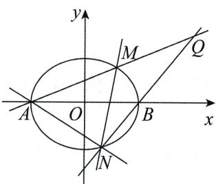

# 题目分析

同上例,可根据对称性分析出点 Q 所在定直线必定为斜率不存在的直线.因此我们的目标变为求 $x_{Q}$ . 设 $M(x_{1}, y_{1}), N(x_{2}, y_{2})$ , 可得直线 AM 的方程为 $y = \frac{y_{1}}{x_{1} + 2}(x + 2)$ , 直线 BN 的方程为 $y = \frac{y_{2}}{x_{2} - 2}(x - 2)$ , 联立两直线方程可得到点 Q 的坐标.

需要注意的是, 因为 $x_{Q}$ 是定值, 所以 $x_{Q} + 2$ 与 $x_{Q} - 2$ 也是定值, 即我们不一定要直接化简到 $x_{Q}$ , 可以先算出 $\frac{x_{Q} + 2}{x_{Q} - 2}$ , 再解出 $x_{Q}$ .
设直线 MN 的方程为 $x = my + t$ ，则我们会发现 $\frac{x_{Q} + 2}{x_{Q} - 2} = \frac{my_{1}y_{2} + (t + 2)y_{2}}{my_{1}y_{2} + (t - 2)y_{1}}$ ，这个结构是典型的不对称结构，上一道例题采用的是和积关系的代入，本题我们从“凑韦达”的角度来处理，具体构思详见第八章 不对称专题.

# 参考解析
由题意知直线 MN 的斜率不为 0，故设直线 MN 的方程为 $x = my + t$ ，
设 $M(x_{1},y_{1}), N(x_{2},y_{2})$ ,
则直线 AM 的方程为 $y=\frac{y_{1}}{x_{1}+2}(x+2)$ ，直线 BN 的方程为 $y=\frac{y_{2}}{x_{2}-2}(x-2)$ .
联立两直线方程, 可得 $\left\{\begin{aligned}y&=\frac{y_{1}}{x_{1}+2}(x+2),\\ y&=\frac{y_{2}}{x_{2}-2}(x-2),\end{aligned}\right.$ 所以 $\frac{y_{1}}{x_{1}+2}(x_{Q}+2)=\frac{y_{2}}{x_{2}-2}(x_{Q}-2)$ ,
因此 $\frac{x_Q + 2}{x_Q - 2} = \frac{\frac{y_2}{x_2 - 2}}{\frac{y_1}{x_1 + 2}}$ ，即 $\frac{x_Q + 2}{x_Q - 2} = \frac{y_2(x_1 + 2)}{y_1(x_2 - 2)}.$
因为点 M, N 均在直线 $x = my + t$ 上，
所以 $\left\{ \begin{array}{l} x_{1} = my_{1} + t, \\ x_{2} = my_{2} + t, \end{array} \right.$ 所以 $\frac{x_{Q} + 2}{x_{Q} - 2} = \frac{y_{2}(my_{1} + t + 2)}{y_{1}(my_{2} + t - 2)} = \frac{my_{1}y_{2} + (t + 2)y_{2}}{my_{1}y_{2} + (t - 2)y_{1}},$
所以 $\frac{x_{Q}+2}{x_{Q}-2}=\frac{my_{1}y_{2}+(t+2)(y_{1}+y_{2})-(t+2)y_{1}}{my_{1}y_{2}+(t-2)y_{1}}.$ ( \* )
联立直线 MN 的方程与椭圆方程有 $\left\{\begin{aligned}\frac{x^{2}}{4}+\frac{y^{2}}{3}&=1,\\ x&=my+t,\end{aligned}\right.$
消去 x，整理得 $(3m^{2}+4)y^{2}+6mty+3t^{2}-12=0$ ，
由韦达定理得 $\left\{\begin{aligned}y_{1}+y_{2}&=\frac{-6mt}{3m^{2}+4},\\ y_{1}y_{2}&=\frac{3t^{2}-12}{3m^{2}+4},\end{aligned}\right.$

思维笔记

Siweibiji

思维笔记

Siweibiji

代入 $(\ast)$ 式可得
$\begin{array}{l} \frac {x _ {Q} + 2}{x _ {Q} - 2} = \frac {m \cdot \frac {3 t ^ {2} - 1 2}{3 m ^ {2} + 4} + (t + 2) \cdot \frac {- 6 m t}{3 m ^ {2} + 4} - (t + 2) y _ {1}}{m \cdot \frac {3 t ^ {2} - 1 2}{3 m ^ {2} + 4} + (t - 2) y _ {1}} \\ = \frac {\frac {- 3 t ^ {2} m - 1 2 m - 1 2 m t}{3 m ^ {2} + 4} - (t + 2) y _ {1}}{\frac {3 t ^ {2} m - 1 2 m}{3 m ^ {2} + 4} + (t - 2) y _ {1}} \\ = \frac {\frac {- 3 m (t + 2) ^ {2}}{3 m ^ {2} + 4} - (t + 2) y _ {1}}{\frac {3 m (t ^ {2} - 4)}{3 m ^ {2} + 4} + (t - 2) y _ {1}} \\ = \frac {2 + t}{2 - t}, \\ \end{array}$
解得 $x_{Q} = \frac{4}{t}$
所以直线 AM 与直线 BN 的交点 Q 落在定直线 $x=\frac{4}{t}$ 上.

# 总结
通过上面三道例题,我们分别处理了目标是对称和非对称两种不同的式子,都在一开始分析了求纵坐标或者求横坐标为定值.因此只要能掌握好基本的手法并坚持先分析目标的习惯,这类问题都能够轻松解决.
接下来我们再来练习一题. 如果其中线段长度问题不会处理, 可先跳至后面内容.

> [!example]- 例7 在平面直角坐标系 $xOy$ 中, 过点 $P(6,0)$ 的动直线 $l$ 交椭圆 $\frac{x^2}{4} + \frac{y^2}{3} = 1$ 于 $A, B$ 两点, 在线段 $AB$ 上取点 $Q$ , 使得 $|\overrightarrow{AP}| \cdot |\overrightarrow{BQ}| = |\overrightarrow{AQ}| \cdot |\overrightarrow{BP}|$ . 问: 点 $Q$ 是否总在某条定直线上? 若是, 求出该直线的方程; 若不是, 请说明理由.

# 题目分析

要求点 Q 是否总在某条定直线上, 先根据对称性可得点 Q 的横坐标为定值.

那么关键就在于如何翻译 $|\overrightarrow{AP}|\cdot |\overrightarrow{BQ}| = |\overrightarrow{AQ}|\cdot |\overrightarrow{BP}|$

第一种是化斜为直, 因为点 P 的坐标为 $(6,0)$ , 所以转化为纵坐标的关系, 从而利用韦达定理整体代换.

第二种是根据 $\frac{|\overrightarrow{AP}|}{|\overrightarrow{BP}|} = \frac{|\overrightarrow{AQ}|}{|\overrightarrow{BQ}|}$ 转化为共线向量，从而用双动点中的处理方法.

# 参考解析

# 方法一:设线法——整体代换
设 $A(x_{1},y_{1}), B(x_{2},y_{2}), Q(x_{0},y_{0})$ ,
当直线 l 的斜率不为 0 时, 设直线 l 的方程为 $x = ty + 6$ ,
因为点 Q 在线段 AB 上, 所以不妨设 $y_{1} > y_{0} > y_{2}$ ,
$\left\{ \begin{array}{l} x = t y + 6, \\ \frac {x ^ {2}}{4} + \frac {y ^ {2}}{3} = 1 \end{array} \Rightarrow (3 t ^ {2} + 4) y ^ {2} + 3 6 t y + 9 6 = 0 \Rightarrow \left\{ \begin{array}{l} y _ {1} + y _ {2} = \frac {- 3 6 t}{3 t ^ {2} + 4}, \\ y _ {1} y _ {2} = \frac {9 6}{3 t ^ {2} + 4}. \end{array} \right. \right.$
因为 $|\overrightarrow{AP}| = \sqrt{1 + t^2} |y_1|, |\overrightarrow{BQ}| = \sqrt{1 + t^2} |y_0 - y_2|, |\overrightarrow{AQ}| = \sqrt{1 + t^2} |y_0 - y_1|,$ $|\overrightarrow{BP}| = \sqrt{1 + t^2} |y_2|$ ,
所以 $|\overrightarrow{AP}|\cdot |\overrightarrow{BQ}| = |\overrightarrow{AQ}|\cdot |\overrightarrow{BP}|\Rightarrow y_1(y_2 - y_0) = y_2(y_0 - y_1)\Rightarrow y_0 = \frac{2y_1y_2}{y_1 + y_2} = -\frac{16}{3t}.$
因为点 Q 在直线 $l: x = ty + 6$ 上，所以 $x_{0} = \frac{2}{3}$ .
所以点 Q 在定直线 $x=\frac{2}{3}$ 上.
当直线 l 的斜率为 0 时, $A(2,0)$ , $B(-2,0)$ ,
由 $|\overrightarrow{AP}|\cdot |\overrightarrow{BQ}| = |\overrightarrow{AQ}|\cdot |\overrightarrow{BP}|$ 可得 $x_0 = \frac{2}{3}$ ，点 $Q\left(\frac{2}{3},0\right)$ 在定直线 $x = \frac{2}{3}$ 上.

综上, 点 Q 在定直线 $x=\frac{2}{3}$ 上.

# 方法二:设点法——双动点定比点差法
设 $A(x_{1},y_{1}),B(x_{2},y_{2}),Q(x_{0},y_{0})$
$\frac{|\overrightarrow{AP}|}{|\overrightarrow{BP}|}=\frac{|\overrightarrow{AQ}|}{|\overrightarrow{BQ}|}=\lambda$ ，即 $\overrightarrow{AP}=-\lambda\overrightarrow{PB},\overrightarrow{AQ}=\lambda\overrightarrow{QB}$
得 $\left\{\begin{aligned}\frac{x_{1}-\lambda x_{2}}{1-\lambda}&=6,\left\{\frac{x_{1}+\lambda x_{2}}{1+\lambda}=x_{0},\right.\\ \frac{y_{1}-\lambda y_{2}}{1-\lambda}&=0,\left\{\frac{y_{1}+\lambda y_{2}}{1+\lambda}=y_{0}.\right.\end{aligned}\right.$
根据点 A, B 在椭圆上，有 $\frac{x_{1}^{2}}{4} + \frac{y_{1}^{2}}{3} = 1$ ①， $\frac{x_{2}^{2}}{4} + \frac{y_{2}^{2}}{3} = 1$ ②，

① $-\lambda^{2}$ ② 得 $\frac{x_{1}^{2}-\lambda^{2}x_{2}^{2}}{4}+\frac{y_{1}^{2}-\lambda^{2}y_{2}^{2}}{3}=1-\lambda^{2}\Rightarrow\frac{(x_{1}+\lambda x_{2})(x_{1}-\lambda x_{2})}{4(1+\lambda)(1-\lambda)}+\frac{(y_{1}+\lambda y_{2})(y_{1}-\lambda y_{2})}{3(1+\lambda)(1-\lambda)}=1\Rightarrow\frac{1}{4}\times6\cdot x_{0}+\frac{1}{3}\times0\cdot y_{0}=1\Rightarrow x_{0}=\frac{2}{3}.$
所以点 Q 在定直线 $x=\frac{2}{3}$ 上.

思维笔记

Siweibiji

那么定圆的问题怎么处理呢？

一方面,我们可以考虑圆的定义,从几何角度处理,这类题已经在第十四节 圆的翻译中给出.
另一方面,要求定圆的方程,题目条件中必定会给出多个等量关系,我们只需要翻译出来,然后解方程组,或是题目条件中给出和定点、定直线类似的“恒满足某个条件”的圆,最后仍然会转化为等式恒成立进行求解.

下面就来看这样一道例题.

> [!example]- 例8 在平面直角坐标系 $xOy$ 中, 已知 $A, B$ 分别是椭圆 $\frac{x^2}{4} + y^2 = 1$ 的上、下顶点, 设 $P$ 是椭圆上位于 $y$ 轴左侧的任意一点, 直线 $PA, PB$ 分别交直线 $x = 2$ 于 $M, N$ 两点, 以 $MN$ 为直径的圆记为 $C$ . 求证: 圆 $C$ 始终与定圆 $C': (x - m)^2 + y^2 = r^2 (r > 0)$ 相切, 并求出所有圆 $C'$ 的方程.

# 题目分析

从设线法角度来看,本例属于典型的求根操作.
设直线 $PA$ 的方程为 $y = kx + 1 (k > 0)$ ，与 $x = 2$ 联立，得 $M(2, 2k + 1)$ .

下面要求点 $N$ 的坐标, 关键在于求直线 $PB$ 的斜率, 这里可以用求根操作求出点 $P\left(\frac{-8k}{4k^2 + 1}, \frac{1 - 4k^2}{4k^2 + 1}\right)$ , 进而得到 $k_{BP} = -\frac{1}{4k}$ .

也可以根据第二十一节 第三定义不解出具体坐标,仅虚设坐标找出关系,别忘记要先写出 $k_{AP} \cdot k_{BP} = -\frac{1}{4} \Rightarrow k_{BP} = -\frac{1}{4k}$ .
进而有直线 $BP$ 的方程为 $y = -\frac{1}{4k} x - 1$ ，与 $x = 2$ 联立，得 $N\left(2, -\frac{2k + 1}{2k}\right)$ .
所以以 MN 为直径的圆的圆心为 $\left(2, \frac{4k^{2}-1}{4k}\right)$ ，半径为 $\frac{(2k+1)^{2}}{4k}$ .
因为不知道是内切还是外切,我们都要算一下.
若两圆内切，则有 $\sqrt{(m - 2)^2 + \left(\frac{4k^2 - 1}{4k}\right)^2} = \left|\frac{(2k + 1)^2}{4k} - r\right| \Rightarrow (m - 2)^2 - r^2 + \frac{(r - 1)(2k + 1)^2}{2k} = 0.$
若等式恒成立，则 $\left\{ \begin{array}{l} (m - 2)^2 - r^2 = 0, \\ r - 1 = 0, \end{array} \right.$ 可得 $\left\{ \begin{array}{l} r = 1, \\ m = 3 \end{array} \right.$ 或 $\left\{ \begin{array}{l} r = 1, \\ m = 1, \end{array} \right.$
所以定圆 $C'$ 的方程为 $(x - 3)^2 + y^2 = 1$ 或 $(x - 1)^2 + y^2 = 1$ .
若两圆外切，则 $\sqrt{(m - 2)^2 + \left(\frac{4k^2 - 1}{4k}\right)^2} = \left|\frac{(2k + 1)^2}{4k} + r\right|$ ,化简得 $(m - 2)^{2} - r^{2} + \frac{(-r - 1)(2k + 1)^{2}}{2k} = 0$ ，此时 $r = -1$ ，与 $r > 0$ 矛盾.
因此，有两个定圆与圆 $C$ 恒相切，方程为 $(x - 3)^2 + y^2 = 1$ 和 $(x - 1)^2 + y^2 = 1$ .

# 参考解析
设直线 PA 的方程为 $y=kx+1(k>0)$ ，与 x=2 联立，得 $M(2,2k+1)$ .
$\left\{ \begin{array}{l} y = kx + 1, \\ \frac{x^2}{4} + y^2 = 1 \end{array} \right. \Rightarrow (4k^2 + 1)x^2 + 8kx = 0$ ，由韦达定理得 $0 + x_P = \frac{-8k}{4k^2 + 1}$ ，
所以 $x_{P} = \frac{-8k}{4k^{2} + 1}\Rightarrow y_{P} = kx_{P} + 1 = \frac{1 - 4k^{2}}{4k^{2} + 1}$ 所以 $k_{BP} = \frac{y_P + 1}{x_P} = \frac{\frac{1 - 4k^2}{4k^2 + 1} + 1}{\frac{-8k}{4k^2 + 1}} = -\frac{1}{4k}.$

(下为另一种求 $k_{BP}$ 的方式:
由已知得 $k_{AP} \cdot k_{BP} = \frac{y_P - 1}{x_P} \cdot \frac{y_P + 1}{x_P} = \frac{y_P^2 - 1}{x_P^2}$ ,
因为 $P$ 在椭圆上，所以 $\frac{x_P^2}{4} + y_P^2 = 1 \Rightarrow y_P^2 - 1 = -\frac{x_P^2}{4}$ ，
代入上式有 $k_{AP} \cdot k_{BP} = -\frac{1}{4} \Rightarrow k_{BP} = -\frac{1}{4k}$
因为 $k_{BP} = -\frac{1}{4k}$ 所以直线 $BP$ 的方程为 $y = -\frac{1}{4k} x - 1$
所以直线 $BP$ 的方程与 $x = 2$ 联立，得 $N\left(2, - \frac{2k + 1}{2k}\right)$
所以以 MN 为直径的圆的圆心为 $\left(2, \frac{4k^{2}-1}{4k}\right)$ ，半径为 $\frac{(2k+1)^{2}}{4k}$ .
若两圆内切,则有
$\begin{array}{l} \sqrt {(m - 2) ^ {2} + \left(\frac {4 k ^ {2} - 1}{4 k}\right) ^ {2}} = \left| \frac {(2 k + 1) ^ {2}}{4 k} - r \right| \\ \Rightarrow (m - 2) ^ {2} + \frac {(2 k - 1) ^ {2} (2 k + 1) ^ {2}}{1 6 k ^ {2}} = r ^ {2} - \frac {r (2 k + 1) ^ {2}}{2 k} + \frac {(2 k + 1) ^ {4}}{1 6 k ^ {2}} \\ \Rightarrow (m - 2) ^ {2} + \frac {(2 k + 1) ^ {2} [ (2 k - 1) ^ {2} - (2 k + 1) ^ {2} ]}{1 6 k ^ {2}} + \frac {r (2 k + 1) ^ {2}}{2 k} - r ^ {2} = 0 \\ \Rightarrow (m - 2) ^ {2} - \frac {(2 k + 1) ^ {2}}{2 k} + \frac {r (2 k + 1) ^ {2}}{2 k} - r ^ {2} = 0 \\ \Rightarrow (m - 2) ^ {2} - r ^ {2} + \frac {(r - 1) (2 k + 1) ^ {2}}{2 k} = 0, \\ \end{array}$

要让等式恒成立,那么 $\left\{\begin{aligned}(m-2)^{2}-r^{2}=0,\\ r-1=0\end{aligned}\right.\Rightarrow\left\{\begin{aligned}r=1,\\ m=3\end{aligned}\right.$ 或 $\left\{\begin{aligned}r=1,\\ m=1,\end{aligned}\right.$
所以定圆 $C'$ 的方程为 $(x-3)^{2}+y^{2}=1$ 或 $(x-1)^{2}+y^{2}=1$ .
若两圆外切，则有 $\sqrt{(m - 2)^2 + \left(\frac{4k^2 - 1}{4k}\right)^2} = \left|\frac{(2k + 1)^2}{4k} + r\right|$ ，
化简得 $(m - 2)^{2} - r^{2} + \frac{(-r - 1)(2k + 1)^{2}}{2k} = 0,$

要让等式恒成立,那么-r-1=0,此时r=-1,与r>0矛盾.

综上,仅有两个定圆与圆 C 恒相切,方程为 $(x-3)^{2}+y^{2}=1$ 和 $(x-1)^{2}+y^{2}=1$ .

## 15.3 特殊的定点、定值问题

看到这个标题有同学可能会奇怪,怎么普通的定点、定值问题不讲了,直接开始讲特殊的定点、定值问题呢?

实际上对于大部分普通的定点、定值问题就两点:设出核心变量和计算出目标.没有特别需要注意的,所以我们会在实战篇中直接给大家练习.

可唯独有这么一类定点、定值问题与众不同,即是否存在定点,使得某式子为定值.这里的式子可以是数量积,可以是长度,也可以是斜率等不尽相同.

下面我们通过例题来感受一下.

> [!example]- 例9 动直线 $l$ 过椭圆 $\frac{x^2}{8} + \frac{y^2}{4} = 1$ 的左焦点, 且与椭圆交于 $A, B$ 两点. 试问: $x$ 轴上是否存在定点 $C$ , 使得 $\overrightarrow{CA} \cdot \overrightarrow{CB}$ 为定值? 若存在, 求出该定值和点 $C$ 的坐标; 若不存在, 请说明理由.

# 题目分析

先设一下点的坐标方便表示目标, $A(x_{1},y_{1}),B(x_{2},y_{2}),C(t,0)$ .

目标不需要分析,直接得 $\overrightarrow{CA}\cdot\overrightarrow{CB}=(x_{1}-t)(x_{2}-t)+y_{1}y_{2}$ ,此时发现结构对称,接下来利用韦达定理整体代换即可.

为了方便我们只看直线斜率存在的情况,可以设直线 $l: y = k(x + 2)$ . 联立直线方程与椭圆的方程,利用韦达定理得到
$\overrightarrow {C A} \cdot \overrightarrow {C B} = x _ {1} x _ {2} - t (x _ {1} + x _ {2}) + t ^ {2} + y _ {1} y _ {2} = \frac {8 (k ^ {2} - 1) + 8 t k ^ {2} + t ^ {2} (2 k ^ {2} + 1) - 4 k ^ {2}}{2 k ^ {2} + 1}.$
此时目标式子的分子看起来很复杂,我们该化简到什么形式呢?仔细分析一下,t不是变量,所以我们应该按变量k来整理,即
$\overrightarrow {C A} \cdot \overrightarrow {C B} = \frac {(4 + 8 t + 2 t ^ {2}) k ^ {2} + (- 8 + t ^ {2})}{2 k ^ {2} + 1}.$

要想此式子不受变量 k 的影响,除了分子为 0,就只有分子、分母中各项系数对应成比例.
所以分子、分母中各项系数一一对应成比例有 $\frac{4+8t+2t^{2}}{2}=\frac{-8+t^{2}}{1}$ ，解得 $t=-\frac{5}{2}$ .
所以存在定点 $C\left(-\frac{5}{2},0\right)$ ，使得 $\overrightarrow{CA}\cdot \overrightarrow{CB} = -\frac{7}{4}$ 恒成立.

# 参考解析

①当直线 l 的斜率存在时, 设直线 l 的方程为 $y = k(x + 2)$ , $A(x_{1}, y_{1})$ , $B(x_{2}, y_{2})$ , $C(t, 0)$ .
联立直线方程与椭圆方程,消去 y 得
$(2 k ^ {2} + 1) x ^ {2} + 8 k ^ {2} x + 8 (k ^ {2} - 1) = 0 \Rightarrow \left\{ \begin{array}{l l} x _ {1} + x _ {2} = \frac {- 8 k ^ {2}}{2 k ^ {2} + 1} & \text {①,} \\ x _ {1} x _ {2} = \frac {8 (k ^ {2} - 1)}{2 k ^ {2} + 1} & \text {②.} \end{array} \right.$
根据点 $A, B$ 在直线 $l$ 上，有 $y_{1}y_{2} = k^{2}(x_{1} + 2)(x_{2} + 2) = k^{2}[x_{1}x_{2} + 2(x_{1} + x_{2}) + 4]$ ，将①②两式代入上式并化简得 $y_{1}y_{2}=\frac{-4k^{2}}{2k^{2}+1}$ .
所以 $\overrightarrow{CA} \cdot \overrightarrow{CB} = (x_1 - t)(x_2 - t) + y_1y_2 = x_1x_2 - t(x_1 + x_2) + t^2 + y_1y_2$
$\begin{array}{l} = \frac {8 (k ^ {2} - 1) + 8 t k ^ {2} + t ^ {2} (2 k ^ {2} + 1) - 4 k ^ {2}}{2 k ^ {2} + 1} \\ = \frac {(4 + 8 t + 2 t ^ {2}) k ^ {2} + (- 8 + t ^ {2})}{2 k ^ {2} + 1}. \\ \end{array}$
若 $\overrightarrow{CA}\cdot\overrightarrow{CB}$ 为定值，则有 $\frac{4+8t+2t^{2}}{2}=\frac{-8+t^{2}}{1}\Rightarrow t=-\frac{5}{2}.$
所以直线 l 的斜率存在时, 存在定点 $C\left(-\frac{5}{2},0\right)$ 使得 $\overrightarrow{CA} \cdot \overrightarrow{CB} = -\frac{7}{4}$ .

②当直线 l 的斜率不存在时, 证明定点 $C\left(-\frac{5}{2},0\right)$ 使得 $\overrightarrow{CA} \cdot \overrightarrow{CB} = -\frac{7}{4}$ 成立即可.设 $A(-2,n), B(-2,-n)$ ,
因为 $A(-2, n)$ 在椭圆上，所以 $\frac{(-2)^{2}}{8} + \frac{n^{2}}{4} = 1$ ，解得 $n^{2} = 2$ ，
所以 $\overrightarrow{CA} \cdot \overrightarrow{CB} = \frac{1}{4} - n^2 = -\frac{7}{4}$ .

综上，存在定点 $C\left(-\frac{5}{2},0\right)$ 使得 $\overrightarrow{CA}\cdot \overrightarrow{CB} = -\frac{7}{4}$ 恒成立.

# 总结

这类问题看上去很烦琐,既有定点又有定值,似乎字母也比常规的题目多.不过这背后实际上所需要的思维仅仅比普通的定点、定值问题多一点.

分式欲为定值,除了分子恒为 0 的情况外,还可以为分子、分母中各项系数一一对应成比例.

有的同学可能觉得怎么能直接让分子、分母中各项系数一一对应成比例呢？

思维笔记

Siweibiji

思维笔记

Siweibiji

如果你也这么想,那么我们就换一种方法:
设定值为 $T$ ，将定值问题转化为等式恒成立问题，仍然回到变量系数为0的问题.我们来尝试用这个方法完成下面这个例题.

> [!example]- 例10 直线 $l$ 与 $x$ 轴交于点 $C$ , 与椭圆 $\frac{x^2}{6} + \frac{y^2}{2} = 1$ 交于 $A, B$ 两点, 是否存在定点 $C$ , 使得 $\frac{1}{|AC|^2} + \frac{1}{|BC|^2}$ 为定值? 若存在, 求出该定值和点 $C$ 的坐标; 若不存在, 请说明理由.

# 题目分析
设 $A(x_{1},y_{1}),B(x_{2},y_{2}),C(t,0)$ ，直线 $l$ 的方程为 $x = my + t,\frac{1}{|AC|^2} +\frac{1}{|BC|^2}$ 为定值 $R$

要处理 $\frac{1}{|AC|^2} +\frac{1}{|BC|^2}$ ，则先根据点 $C$ 在 $x$ 轴上，选择纵坐标表示该式，即 $\frac{1}{(m^2 + 1)y_1^2} +\frac{1}{(m^2 + 1)y_2^2} = R.$
此时明显要用到整体代换,因此联立直线方程与椭圆方程,利用韦达定理,并且化简有 $4m^{2}t^{2}-2(t^{2}-6)(m^{2}+3)=R(1+m^{2})(t^{2}-6)^{2}$ ,

这里字母仍然很多,以 m 为核心变量整理后,让系数为 0 即可.

# 参考解析

(i) 当直线 $l$ 的斜率不为 0 时, 假设存在定点 $C$ , 使得 $\frac{1}{|AC|^2} + \frac{1}{|BC|^2}$ 为定值, 且定值为 $R$ ,
设 $A(x_{1},y_{1}),B(x_{2},y_{2}),C(t,0)$ ，直线 $l$ 的方程为 $x = my + t$
$\left\{ \begin{array}{l} {x = m y + t  ,} \\ {\frac {x ^ {2}}{6} + \frac {y ^ {2}}{2} = 1} \end{array} \right. \Rightarrow (m ^ {2} + 3)   y ^ {2} + 2 m t   y + t ^ {2} - 6 = 0 \Rightarrow \left\{ \begin{array}{l l} {y _ {1} + y _ {2} = \frac {- 2 m t}{m ^ {2} + 3}} & {\textcircled {1},} \\ {y _ {1}   y _ {2} = \frac {t ^ {2} - 6}{m ^ {2} + 3}} & {\textcircled {2},} \end{array} \right.$
所以 $\frac{1}{|AC|^2} +\frac{1}{|BC|^2} = \frac{1}{(m^2 + 1)y_1^2} +\frac{1}{(m^2 + 1)y_2^2} = \frac{1}{m^2 + 1}\cdot \frac{(y_1 + y_2)^2 - 2y_1y_2}{(y_1y_2)^2}.$
若 $\frac{1}{|AC|^2} +\frac{1}{|BC|^2} = R$ 恒成立，则 $\frac{1}{m^2 + 1}\cdot \frac{(y_1 + y_2)^2 - 2y_1y_2}{(y_1y_2)^2} = R$ 恒成立，
化简得 $(y_{1} + y_{2})^{2} - 2y_{1}y_{2} = R(m^{2} + 1)(y_{1}y_{2})^{2}$ 恒成立，
将①②两式代入有 $4m^{2}t^{2} - 2(t^{2} - 6)(m^{2} + 3) = R(1 + m^{2})(t^{2} - 6)^{2}$
化简得 $[4t^2 - 2(t^2 - 6) - R(t^2 - 6)^2]m^2 + [-6(t^2 - 6) - R(t^2 - 6)^2] = 0$
即 $\left\{ \begin{array}{l} 4t^2 - 2(t^2 - 6) - R(t^2 - 6)^2 = 0, \\ -6(t^2 - 6) - R(t^2 - 6)^2 = 0 \end{array} \right. \Rightarrow \left\{ \begin{array}{l} R = 2, \\ t^2 = 3. \end{array} \right.$
所以直线 l 的斜率不为 0 时, 存在定点 $C(\pm\sqrt{3},0)$ , 使得 $\frac{1}{|AC|^{2}} + \frac{1}{|BC|^{2}}$ 为定值 2.

(ii) 当直线 l 的斜率为 0 时, 证明存在定点 $C(\pm\sqrt{3},0)$ , 使 $\frac{1}{|AC|^{2}} + \frac{1}{|BC|^{2}}$ 为定值 2 即可.
此时直线 l 的方程为 y=0，不妨设 $A(-\sqrt{6},0)$ ， $B(\sqrt{6},0)$ ，
则有 $\frac{1}{|AC|^2} +\frac{1}{|BC|^2} = 2.$
所以直线 l 的斜率为 0 时， $\frac{1}{|AC|^{2}}+\frac{1}{|BC|^{2}}=2.$

综上,存在定点 $C(\pm\sqrt{3},0)$ , 使 $\frac{1}{|AC|^{2}}+\frac{1}{|BC|^{2}}$ 为定值 2.

# 总结

对于这种特殊的定点、定值问题的处理手法,同学们可以明显发现与常规问题区别不是很大,仅仅是有多个字母而已.这里只需要分清哪些字母是变量,哪些字母是定值,并且按变量抓主元整理即可.

> [!example]- 例 11 已知动直线 l(斜率存在)与椭圆 $\frac{x^{2}}{4} + y^{2} = 1$ 交于 P, Q 两点，且 $S_{\triangle OPQ} = 1$ ，若 N 为线段 PQ 的中点，点 N 在 x 轴上的投影为点 $N_{0}$ ，问：在 x 轴上是否存在两个定点 $A_{1}, A_{2}$ ，使得 $\frac{|NN_{0}|^{2}}{|N_{0}A_{1}| \cdot |N_{0}A_{2}|}$ 为定值？若存在，求出 $A_{1}, A_{2}$ 两点的坐标；若不存在，请说明理由.

# 题目分析

目标为 $\frac{|NN_0|^2}{|N_0A_1|\cdot|N_0A_2|}$ ，可以先化斜为直处理线段.因为 $N_{0}$ 在 $x$ 轴上，所以选取纵坐标.然后我们就得到可以整体代换的部分.那么 $S_{\triangle OPQ} = 1$ 这个条件可用来为设直线 $l:y = kx + m$ 后寻找 $k,m$ 等量关系，再代入目标化简.

# 参考解析
设直线 $l$ 的方程为 $y = kx + m$ ，直线 $l$ 与 $y$ 轴交于 $D(0,m)$ ，设 $P(x_{1},y_{1}),Q(x_{2},y_{2})$
$\left\{ \begin{array}{l} y = k x + m, \\ \frac {x ^ {2}}{4} + y ^ {2} = 1 \end{array} \Rightarrow (4 k ^ {2} + 1) x ^ {2} + 8 k m x + 4 m ^ {2} - 4 = 0 \right.$

思维笔记

Siweibiji

思维笔记

Siweibiji

$\Rightarrow \left\{ \begin{array}{l} x _ {1} + x _ {2} = \frac {- 8 k m}{4 k ^ {2} + 1}, \\ x _ {1} x _ {2} = \frac {4 m ^ {2} - 4}{4 k ^ {2} + 1}, \\ \Delta = (8 k m) ^ {2} - 4 (4 k ^ {2} + 1) (4 m ^ {2} - 4) > 0. \end{array} \right.$
当 $D(0,m)$ 在椭圆内时， $S_{\triangle OPQ} = S_{\triangle OPD} + S_{\triangle OQD} = \frac{1}{2}|m| \cdot |x_1 - x_2|$ ，
当 $D(0,m)$ 在椭圆外时， $S_{\triangle OPQ} = |S_{\triangle OPD} - S_{\triangle OQD}| = \frac{1}{2} |m| \cdot |x_1 - x_2|$ ，
所以 $S_{\triangle OPQ} = \frac{1}{2}|m|\cdot \sqrt{(x_1 + x_2)^2 - 4x_1x_2} = \frac{|m|}{2}\cdot \frac{4\sqrt{4k^2 + 1 - m^2}}{4k^2 + 1}.$
又因为 $S_{\triangle OPQ}=1$ ，化简得 $2m^{2}=4k^{2}+1$ 。
假设存在两个定点 $A_{1}(t_{1},0), A_{2}(t_{2},0)$ 满足题意，不妨设 $t_1 < t_2$
由 $N$ 为线段 $PQ$ 的中点，得 $N\left(\frac{-4km}{4k^2 + 1}, \frac{m}{4k^2 + 1}\right)$ ，
由 $2m^{2} = 4k^{2} + 1$ ，得 $N\left(\frac{-2k}{m},\frac{1}{2m}\right)$
由点 N 在 x 轴上的投影为 $N_{0}$ ，得 $N_{0}\left(\frac{-2k}{m},0\right)$ ，
所以有 $\frac{|NN_0|^2}{|N_0A_1|\cdot|N_0A_2|} = \frac{\left(\frac{1}{2m}\right)^2}{\left|\left(t_1 + \frac{2k}{m}\right)\left(t_2 + \frac{2k}{m}\right)\right|}$
$= \frac {\frac {1}{4}}{| m ^ {2} t _ {1} t _ {2} + 2 k m (t _ {1} + t _ {2}) + 2 m ^ {2} - 1 |}$
$= \frac {\frac {1}{4}}{\left| (t _ {1} t _ {2} + 2) m ^ {2} + 2 (t _ {1} + t _ {2}) k m - 1 \right|}.$
因为 $\frac{|NN_0|^2}{|NA_1|\cdot|NA_2|}$ 为定值，所以 $\left\{ \begin{array}{l}t_{1}t_{2} + 2 = 0,\\ t_{1} + t_{2} = 0 \end{array} \right.\Rightarrow \left\{ \begin{array}{l}t_{1} = -\sqrt{2},\\ t_{2} = \sqrt{2}. \end{array} \right.$
综上所述，在 $x$ 轴上存在两个定点 $A_{1}(-\sqrt{2},0), A_{2}(\sqrt{2},0)$ ，使得 $\frac{|NN_0|^2}{|N_0A_1| \cdot |N_0A_2|}$ 为定值.

# 总结
如果分式中分子或者分母为定值,那么直接让含有变量的那方的变量系数为0即可.

我们在本节中介绍了定的问题,这些定的问题大多是动中求定,即对于任意某个变量都满足的情况.同学们可以发现等式恒成立出现得很频繁,那么我们可以发散思考,在高中数学中还有哪些题目最终本质是等式恒成立呢?

# 第十六节 动的问题

定的问题分了好些类,但动的问题却往往表现得非常简洁.

什么是动的问题呢？简而言之就是求取值范围或者求最大值的问题。

这类问题的难点在于条件的翻译和题目中一些“隐藏”的限制条件的挖掘，做题的时候容易忽略。一般情况下，最后的计算是很容易处理的。

最为常见的就是将目标和变量各放一边通过函数的思想来处理.

例如,求四边形面积的取值范围问题,可设线参斜率为核心变量,从而表示出面积.若 $S=72\frac{(1+k^{2})^{2}}{(3k^{2}+4)(4k^{2}+3)}$ ,接下来求出函数(或可换元设 $t=k^{2})f(k)=\frac{(1+k^{2})^{2}}{(3k^{2}+4)(4k^{2}+3)}$ 的值域即可.
因此本节中,我们会重点复习高一学习的分式型函数求值域的方法,不会涉及具体的题目.

需要同学们知道的是,通过求导来求函数值域的题目是存在的,特别是在浙江地区的试卷中多次出现必须求导才能求值域的题目.这类题目不在本节出现,会在后续实战篇中给大家介绍.
首先让我们的思绪回到刚学函数值域的时候. 那个时候我们学了以下四种函数.

1. 反比例函数 $f(x) = \frac{1}{x}$

这里要特别注意的是其图象是有渐近线的, 这也是我们最早接触的渐近线. 根据其图象, 我们可以利用分母的范围得到函数值的范围.
如图,已知 $1 \leqslant x \leqslant 2$ , 则 $\frac{1}{2} \leqslant \frac{1}{x} \leqslant 1$ .

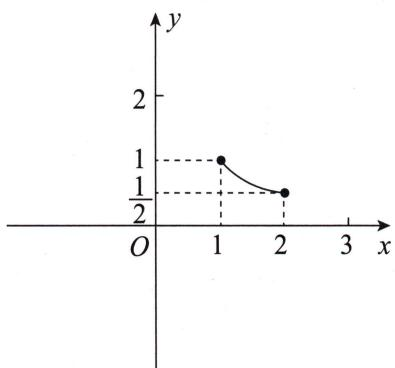
如图,已知 $x \geqslant 1$ , 则 $0 < \frac{1}{x} \leqslant 1$ .

思维笔记

Siweibiji

思维笔记

Siweibiji

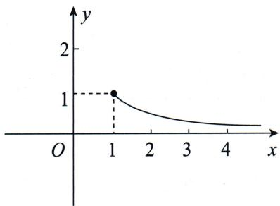
如图, 已知 x<3, 则 $\frac{1}{x}>\frac{1}{3}$ 或 $\frac{1}{x}<0$ .

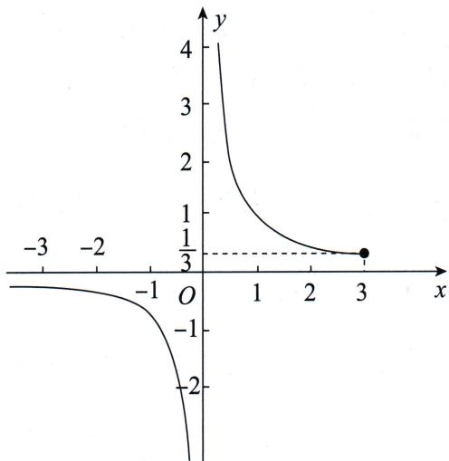

这个函数更一般的形式为 $f(x)=\frac{k}{x}$ ，此时需注意 k 的正负。

2. 对勾函数 $f(x) = x + \frac{1}{x}$

这里需要注意的是,当且仅当 $x=\frac{1}{x}$ 时取极值.

实际做题时,一定要结合定义域来判断能否取到极值.此外还要注意 x 的正负,因为部分同学看到这个结构就下意识地使用基本不等式了,这毫无疑问是可能出错的.
通过其图象,我们也可以得到函数值的取值范围.
如图,已知 x>0, 则 $x+\frac{1}{x}\geqslant2$ .

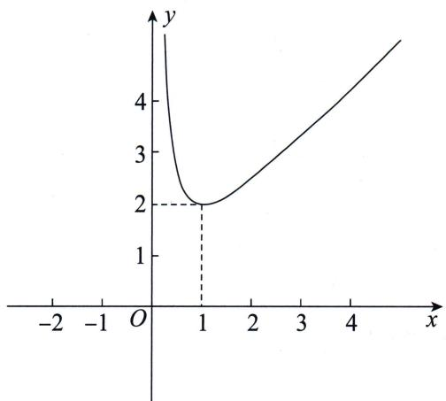
如图，已知 $2 < x < 4$ ，则 $\frac{5}{2} < x + \frac{1}{x} < \frac{17}{4}$ 如图,已知 x > -1, 则 $x + \frac{1}{x} < -2$ 或 $x + \frac{1}{x} \geqslant 2$ .

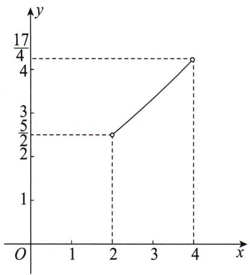

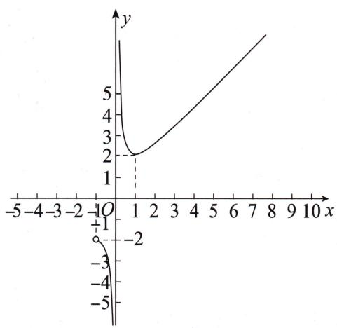

这里需要注意的是,在实战中我们可能会遇见形如 $\frac{x^{2}+1}{x}$ 或者 $\frac{x}{x^{2}+1}$ 的式子,这时就需要变形为熟悉的结构来进行处理.

这个函数更一般的形式为 $f(x) = ax + \frac{b}{x}$ , 需注意 $a, b$ 必须同正或者同负（当且仅当 $ax = \frac{b}{x}$ 时取极值）.

3. $f(x) = x - \frac{1}{x}$ （有人称之为双刀函数）

这个函数的单调性非常明显,但不是在定义域上单调递增.

这个函数图象分成左、右两部分,所以在求值域的时候需要注意.

特别要说明的是它的一般形式也是 $f(x)=ax+\frac{b}{x}$ ，其中 a, b 必须是异号的。

4. 二次函数 $f(x) = ax^{2} + bx + c (a \neq 0)$

单纯的二次函数求值域,我们需要注意图象开口方向、对称轴和定义域.
在圆锥曲线大题中,我们可能会遇见诸如 $a\left(\frac{1}{t}\right)^{2}+b\cdot\frac{1}{t}+c$ 或 $\frac{t^{2}}{2t^{2}+3t-2}$ 的式子,其本源还是二次函数求值域,需注意是以什么为变量的,最后求出二次函数值域后要再利用反比例函数性质求整体的范围.

思维笔记

Siweibiji

思维笔记

Siweibiji

常见的圆锥曲线解答题中,动的问题最终几乎都是由以上四种函数组合而成的.

我们需要做的就是将变量局部化(指尽可能将变量放到式子的某个部分,其他部分都为常数),并且转化为我们熟悉的结构,从而得到最后的答案.

下面我们来看几个分式型函数的处理：

1. $y = \frac{(x + 1)^2}{x} (x\geqslant 2)$
将分子展开除下来,有 $y=\frac{x^{2}+2x+1}{x}=x+\frac{1}{x}+2$ ,
当 $x > 0$ 时，对勾函数 $y = x + \frac{1}{x}$ 在 $x = 1$ 处取到最小值.
因此 $y = \frac{(x + 1)^2}{x} (x \geqslant 2)$ 在 $[2, +\infty)$ 上单调递增，所以 $y \in \left[\frac{9}{2}, +\infty\right)$ .
若套一层反比例函数,如求 $y=\frac{x}{(x+1)^{2}}(x\geqslant2)$ 的取值范围,相同操作得到 $y=\frac{1}{x+\frac{1}{x}+2}$ ,根据分母的范围是 $\left[\frac{9}{2},+\infty\right)$ ,得到 $y\in\left(0,\frac{2}{9}\right]$ .

2. $y = \frac{x^2 + 9}{x^2 + 27} (x > 0)$

对于该函数,我们需要进行分离常数的操作.怎么分离常数呢?分离常数的关键是凑分母.
当然如果不会凑,还可以直接将分母整体设为 t 进行换元.

分离得 $y=\frac{x^{2}+9}{x^{2}+27}=\frac{x^{2}+27-18}{x^{2}+27}=1-\frac{18}{x^{2}+27}.$

我们发现变量 $x$ 仅在分母中出现, 这个函数明显是单调的, 因此只需要考虑 $x$ 的两个极端情况即可.
当 $x$ 趋向于正无穷时，分母趋向于正无穷大，则 $\frac{18}{x^2 + 27}$ 趋向于0，因此 $y$ 趋向于1；
当 $x = 0$ 时，分母为27，则 $\frac{18}{x^2 + 27} = \frac{2}{3}$ ，因此 $y = \frac{1}{3}$ . 综上 $y \in \left(\frac{1}{3}, 1\right)$ .
若分离常数后分式的分子上仍然有变量和常数,那我们可以将分子设为 t 进行换元.

例如，当 $x > 1$ 时， $y = \frac{x^2 + 2x + 1}{2x^2 + 1} = \frac{\frac{1}{2}(2x^2 + 1) + 2x + \frac{1}{2}}{2x^2 + 1} = \frac{1}{2}\left(1 + \frac{4x + 1}{2x^2 + 1}\right)$ ，
设 $t = 4x + 1 > 5$ ，则有 $x = \frac{t - 1}{4}$
$y = \frac {1}{2} \left[ 1 + \frac {t}{2 \left(\frac {t - 1}{4}\right) ^ {2} + 1} \right] = \frac {1}{2} \left(1 + \frac {8 t}{t ^ {2} + 9 - 2 t}\right) = \frac {1}{2} \left(1 + \frac {8}{t + \frac {9}{t} - 2}\right),$

易求出 $t + \frac{9}{t} - 2 > \frac{24}{5}$ ,
所以可得到 $y \in \left( \frac{1}{2}, \frac{4}{3} \right)$ .
$y = \frac {(x + 2) (2 x + 1)}{x ^ {2}} (x \geqslant 1)$
将分子展开,除下来得到 $y=\frac{2x^{2}+5x+2}{x^{2}}=\frac{2}{x^{2}}+\frac{5}{x}+2$ ,
将 $\frac{1}{x}$ 看作一个整体，设 $\frac{1}{x} = t \in (0,1]$ ，则 $y = 2t^2 + 5t + 2$ ，根据二次函数的性质可知其在 $(0,1]$ 上单调递增，因此 $y \in (2,9]$ .
当然这里也可以使用分离变量加换元的思路来处理, 即 $y=\frac{2x^{2}+5x+2}{x^{2}}=$ $2+\frac{5x+2}{x^{2}}$ , 设 $t=5x+2\geqslant7$ , 则 $y=2+\frac{t}{\left(\frac{t-2}{5}\right)^{2}}=2+\frac{25t}{t^{2}+4-4t}=2+\frac{25}{t+\frac{4}{t}-4}$ ,
是对勾函数套反比例函数的形式,根据上面的讨论操作即可.

我们将这个函数的分子和分母互换, 就可以得到 $y=\frac{x^{2}}{(x+2)(2x+1)}$ , 此时处理手法还一样吗? 其实是一样的, 只不过换元后得到 $y=\frac{1}{2t^{2}+5t+2}$ , 将上面的结果再套一层反比例函数就可以得到 $y\in\left[\frac{1}{9},\frac{1}{2}\right)$ .

这里要再次提醒各位的是,设线法大多最终化为单变量.就算是留下双变量,那么根据已知条件往往会得到双变量的关系,从而消元变为单变量.
如果使用设点法,最终就会出现 $x_{0}, y_{0}$ 混合在一起的式子.此时需要利用曲线方程进行处理.我们在第二章 设点法中进行了讲解.
接下来我们来看三个不是那么常规的类型.

第一个是求 $f(k) = \frac{1}{2}\times \frac{1}{3}\left|\frac{k}{2 + k^2}\right| + \frac{1}{2}\times \frac{1}{3}\left|\frac{-k}{1 + 2k^2}\right|$ 的值域.

各位同学可以先尝试一下,然后再看下面的过程.
$f (k) = \frac {1}{6} \left(\frac {| k |}{2 + k ^ {2}} + \frac {| k |}{1 + 2 k ^ {2}}\right) = \frac {1}{6} \cdot \frac {| k | (2 + k ^ {2} + 1 + 2 k ^ {2})}{(2 + k ^ {2}) (1 + 2 k ^ {2})} = \frac {1}{2} \cdot \frac {| k | (k ^ {2} + 1)}{2 k ^ {4} + 2 + 5 k ^ {2}},$
此时分子是三次与一次的,分母是四次、二次与常数.
若对函数求导得到值域当然是可行的,这里再提供一个代数的变形,即分式上下同除以 $k^{2}$ , 得
$f(k) = \frac{1}{2}\cdot \frac{|k| + \frac{1}{|k|}}{2\left(k^2 + \frac{1}{k^2}\right) + 5},$ 设 $t = |k| + \frac{1}{|k|}\geqslant 2$ ，则 $t^2 = k^2 +\frac{1}{k^2} +2,$
所以原式 $= \frac{1}{2} \cdot \frac{t}{2t^2 + 1} = \frac{1}{2} \cdot \frac{1}{2t + \frac{1}{t}} \in \left(0, \frac{1}{9}\right]$ .

第二个就比较有趣了.之前所说的例子都是目标在一边,变量在一边.如果有一种情况是要求范围的目标与变量混合在一起,无法进行分离,或者说我们想不出办法来分离,那我们该如何是好呢?

请看下例：

已知存在 $x_0$ 满足方程 $c^2 x^2 - 2a^2 cx + a^2 (a^2 - c^2) = 0$ ，其中 $x_0$ 的取值范围是 $(-a, a)$ ，且 $a > c > 0$ ，求 $\frac{c}{a}$ 的取值范围.

数感好的同学可以直接因式分解得 $x_{0}=\frac{a(a-c)}{c}$ ，所以有 $-a<\frac{a(a-c)}{c}<a$ ，解得 $\frac{c}{a}>\frac{1}{2}$ ，同时由于 a>c>0，所以 $\frac{c}{a}$ 的取值范围为 $\left(\frac{1}{2},1\right)$ .

我们也可以理解为方程 $c^2 x^2 - 2a^2 cx + a^2 (a^2 - c^2) = 0$ 在 $(-a, a)$ 上有根，即二次函数 $f(x) = c^2 x^2 - 2a^2 cx + a^2 (a^2 - c^2)$ 在区间 $(-a, a)$ 上有零点.

这个二次函数的图象开口向上,并且对称轴 $x_{0}=\frac{2a^{2}c}{2c^{2}}=\frac{a^{2}}{c}=\frac{a}{c}\cdot a>a$ , 因此该函数在区间 $(-a,a)$ 内单调递减.

要想 $f(x)$ 在 $(-a, a)$ 内存在零点，只需 $\left\{ \begin{array}{l} f(-a) > 0, \\ f(a) < 0. \end{array} \right.$
显然 $f(-a) = c^2 a^2 + 2a^3 c + a^2 (a^2 - c^2) > 0$ ，故只需要 $f(a) < 0$ 即可，即 $c^2 a^2 - 2a^3 c + a^2 (a^2 - c^2) < 0$ .
化简得 $-2ac + a^2 < 0$ ，解得 $\frac{c}{a} >\frac{1}{2}$
又因为 $a > c > 0$ ，所以 $\frac{c}{a} < 1$

综上, $\frac{c}{a}$ 的取值范围为 $\left(\frac{1}{2},1\right)$ .
因此,如果我们要处理的目标是一个混合的式子,不妨把题目变成函数存在零点求参数范围的问题.

第三个是目标由多个(一般为2个)变量表示,应先以其中一个为自变量求范围,再处理另一个变量.例如, $y=k^{2}+mk+1,k\in[1,2],m\in[0,1]$ .先以m为自变量,目标则为一次函数,从而可得 $k^{2}+1\leqslant y\leqslant k^{2}+k+1$ ,利用k的取值范围可求得 $k^{2}+1$ 的最小值与 $k^{2}+k+1$ 的最大值,所以有 $2\leqslant k^{2}+1\leqslant y\leqslant k^{2}+k+1\leqslant7$ ,即y的取值范围是 $[2,7]$ .

# 总结

求取值范围的问题中我们最常用的手法是构建函数求值域,其次是转化为函数存在零点求参数范围,其中需要注意的是可能会有隐藏的范围,这些隐藏的范围会在题干中的限制性条件上,如在……上,在……内,不在……中,和曲线有两个交点等.
如果两个变量存在关系,可以怎么处理呢?请看下例.

例，已知 $m^2 \geqslant k^2 + 1$ ，求 $S = \frac{m^4}{(4k^2 + 3)(3k^2 + 4)}$ 的最小值.
利用不等式消元得 $S = \frac{m^4}{(4k^2 + 3)(3k^2 + 4)} \geqslant \frac{(1 + k^2)^2}{(4k^2 + 3)(3k^2 + 4)}$ ，可利用上文中的方法求 $\frac{(1 + k^2)^2}{(4k^2 + 3)(3k^2 + 4)}$ 的最小值.
如果仅仅是求最值,上式也可以使用基本不等式(注意等号成立的条件).

求 $\frac{(1 + k^2)^2}{(3k^2 + 4)(4k^2 + 3)}$ 的最小值，利用基本不等式 $ab \leqslant \left(\frac{a + b}{2}\right)^2$
可得 $\frac{(1 + k^2)^2}{(3k^2 + 4)(4k^2 + 3)} \geqslant \frac{(1 + k^2)^2}{\left(\frac{3k^2 + 4 + 4k^2 + 3}{2}\right)^2} = \frac{(1 + k^2)^2}{\frac{49}{4}(1 + k^2)^2} = \frac{4}{49}$ , 当且仅当 $3k^2 + 4 = 4k^2 + 3$ , 即 $k^2 = 1$ 时等号成立.
最后再提醒一点:如果换元,一定要顺手把新元的取值范围写出来,以免后续忘记.

除以上常规情况外,在 13.4 多边形的面积的最后一道例题中,我们还使用了三角换元来求最大值.这点虽然不常考,但是也请同学们了解,如果所求目标都是以一次的点坐标表示的,三角换元是一个比较好的选择.
最后给同学们留下一些从真实的圆锥曲线解答题中抽出来的最后一步作为练习：

1. $2b^{2} = 4k^{2} + 3$ ，求 $l = 2\sqrt{3 - \frac{b^2}{k^2 + 1}}$ 的最大值.答案： $\sqrt{6}$   
2. $S_{\triangle ABC} = \frac{1}{2} \times 6\sqrt{1 - \frac{y_0^2}{4}} \cdot \frac{9}{4} |y_0|(y_0 \in [-2, 2])$ ，求 $S_{\triangle ABC}$ 的最大值。答案： $\frac{27}{4}$   
3. $\lambda = \frac{\frac{18t}{t^2 + 27}}{\frac{6t}{t^2 + 3}} (t\neq 0)$ ，求 $\lambda$ 的取值范围．答案： $\left(\frac{1}{3},3\right)$   
4. $f(k) = \frac{\frac{-16k^2 + 12}{4k^2 + 3} + 8}{\frac{4\sqrt{3}}{\sqrt{4k^2 + 3}}}$ , 求 $f(k)$ 的最小值. 答案: $2\sqrt{2}$   
5. $f(k) = \frac{k}{\sqrt{(1 + 4k^2)(4 + k^2)}}$ ，求 $f(k)$ 的最大值．答案： $\frac{1}{5}$

思维笔记

Siweibiji

6. $\frac{S_{\triangle TBC}}{S_{\triangle TEF}} = \frac{(t^2 + 36)(t^2 + 4)}{(t^2 + 12)^2} (t \neq 0)$ , 求 $\frac{S_{\triangle TBC}}{S_{\triangle TEF}}$ 的最大值. 答案: $\frac{4}{3}$   
7. $S = \frac{72(1 + k^2)^2}{(3k^2 + 4)(4k^2 + 3)}$ ，求 $S$ 的取值范围．答案： $\left[\frac{288}{49},6\right]$   
8. $S = \sqrt{\frac{(k^2 + 1)^2}{(2k^2 + 1)(k^2 + 2)}} (k \neq 0)$ , 求 $S$ 的取值范围. 答案: $\left[\frac{2}{3}, \frac{\sqrt{2}}{2}\right)$   
9. $T = 12 \times 16 \cdot \frac{m^2 + 4}{(16 + m^2)^2}$ , 求 $T$ 的最大值. 答案: 4  
10. $k_{1}k_{2} = -\frac{1}{4}$ 求 $\mid OP\mid^2\cdot \mid OQ\mid^2 = \left(\frac{4}{1 + 4k_1^2} +\frac{4k_1^2}{1 + 4k_1^2}\right)\cdot \left(\frac{4}{1 + 4k_2^2} +\frac{4k_2^2}{1 + 4k_2^2}\right)$ 的最大值．答案： $\frac{25}{4}$   
11. $\overrightarrow{PB} \cdot \overrightarrow{PM} = (-m, 3) \cdot \left(-\frac{m^3 + 12m}{m^2 + 4}, \frac{m^2 + 12}{m^2 + 4}\right) (m \neq 0)$ , 求 $\overrightarrow{PB} \cdot \overrightarrow{PM}$ 的取值范围. 答案: $(9, +\infty)$   
12. $f(k) = \frac{(1 + k^2)(1 + \frac{1}{k^2})}{\left(\frac{1}{5} + \frac{k^2}{4}\right)\left(\frac{1}{5} + \frac{1}{4k^2}\right)}$ 求 $f(k)$ 的最小值. 答案: $\frac{1600}{81}$   
13. 已知 $\frac{x_0^2}{4} + y_0^2 = 1$ ，求 $\overrightarrow{PB} \cdot \overrightarrow{PM} = \frac{x_0}{y_0 + 1}\left(x_0 + \frac{x_0}{y_0 + 1}\right) + 3(y_0 + 2)$ 的取值范围。答案： $(9, +\infty)$

至此,本节内容就结束了.通过本节的学习,希望同学们遇见范围和最值问题要有心理准备,本节不放具体题目的原因是做这类题目更重要的是找到表达式,而找表达式需要翻译条件,这基本上就是我们在本篇中所说的了.

# 第十七节 轨迹 & 方程问题

轨迹 & 方程问题是什么？第一个内容是求轨迹方程的问题，第二个内容是解方程的问题。这里要和动中求定的圆锥曲线问题区分开来。

我们知道圆锥曲线有一些内在的性质,使得某些动直线恒过定点,或者某些表达式如斜率之积恒为某一个定值.还存在一种情况也是求值,但并不是恒为某个值,而是只在某个特殊情况下满足.这就是我们所说的解方程的题目,即所给题目中含有几个变量就可以根据条件得到几个方程,从而解出未知量来.
首先来看一下求轨迹方程的问题.

我们知道要求轨迹方程,最经典的四种方法是定义法、直译法、相关点法以及参数法.

什么是定义法呢？就是结合圆锥曲线的第一定义求轨迹方程。如，我们发现一个动点到两个定点距离之和为定值，那么这个动点的轨迹应该是一个椭圆，这两个定点就是椭圆的焦点，这个定值就是椭圆长轴长。所以请同学们一定要把课本知识掌握好。

一起来看几个常见的利用定义法求解的题目,往往在解答题的第一问中使用定义法.

> [!example]- 例 12 在平面直角坐标系 xOy 中, 已知圆 A: $(x+1)^{2} + y^{2} = 16$ , 圆 C 过点 B(1,0) 且与圆 A 相切, 设圆心 C 的轨迹为曲线 E. 求曲线 E 的方程.

# 题目分析
注意到两定点 $A(-1,0), B(1,0)$ , 所以最终轨迹很可能为椭圆或者双曲线. 将题干中的几何条件表示出来: 由两圆相切, 并且点 $B$ 在圆 $A$ 的内部, 可知两圆内切, 所以圆心距为两半径之差. 又因为圆 $C$ 过点 $B(1,0)$ , 所以由圆的定义得 $|CB| = r$ . 部分同学容易忽略后者.

# 参考解析
设圆 $C$ 的半径为 $r$ .
由圆 C 过点 $B(1,0)$ 得 $|CB|=r$ ，由圆 C 与圆 A 相切，且 B 在圆 A 内，可知圆 A 与圆 C 内切，且 4>r，所以 $|CA|=4-r$ 。
此时 $|CA|+|CB|=4$ ，即动点C到两定点A，B的距离之和为定值，此定值大于 $|AB|$ ，满足椭圆的定义，两定点A，B即为椭圆的焦点，两定点距离为2c，
所以 2a=4,2c=2，即 a=2,c=1，所以 $b=\sqrt{3}$ .
所以曲线 E 的方程为 $\frac{x^{2}}{4} + \frac{y^{2}}{3} = 1$ .

思维笔记

Siweibiji

# 思维笔记

# Siweibiji

> [!example]- 例 13 在平面直角坐标系 xOy 中, 已知圆 $M: (x+1)^{2} + y^{2} = 1$ , 圆 $N: (x-1)^{2} + y^{2} = 9$ , 动圆 P 与圆 M 外切, 且与圆 N 内切, 圆心 P 的轨迹为曲线 C, 求曲线 C 的方程.

# 题目分析
注意到两定点 $M(-1,0), N(1,0)$ ，所以最终轨迹很可能为椭圆或者双曲线。将题干中的几何条件表示出来：由两圆外切和内切得圆心距为两半径之和或差，最后将动圆半径消掉，得到两个圆心距的等量关系。

# 参考解析
设动圆 $P$ 的半径为 $r$ . 由动圆 $P$ 与圆 $M$ 外切得 $|PM| = 1 + r$ .
由动圆 P 与圆 N 内切, 且圆 M 在圆 N 内, 所以 $\left|PN\right|=3-r$ .
所以 $|PM| + |PN| = 4$ ，即动点 $P$ 到两定点的距离之和为定值，此定值大于 $|MN|$ ，满足椭圆的定义，两定点 $M,N$ 即为椭圆的焦点，两定点距离为 $2c$
所以 2a=4,2c=2，即 a=2,c=1，所以 $b=\sqrt{3}$ .
所以曲线 $C$ 的方程为 $\frac{x^2}{4} +\frac{y^2}{3} = 1(x\neq -2)$

> [!example]- 例 14 在平面直角坐标系 xOy 中, 已知圆 M 过点 A( $\sqrt{3}$ , 0), 且与圆 N: $(x + \sqrt{3})^{2} + y^{2} = 2$ 外切, 设圆心 M 的轨迹为曲线 C, 求曲线 C 的方程.

# 题目分析
注意到两定点 $A(\sqrt{3},0), N(-\sqrt{3},0)$ ，所以最终轨迹为椭圆或者双曲线。将题干中的几何条件表示出来：由两圆外切得圆心距为两半径之和，由圆 $M$ 过点 $A(\sqrt{3},0)$ 得到 $|MA|$ 等于动圆 $M$ 的半径长。

最终我们得到 $|MN| - |MA| = \sqrt{2}$ , 而双曲线的定义是动点到两定点距离之差的绝对值为定值, 此定值小于两定点间距离, 所以本例中的动点轨迹不是完整的双曲线, 仅是双曲线的一支.

# 参考解析
设圆 M 的半径为 r. 由圆 M 过定点 $A(\sqrt{3}, 0)$ ，得 $|MA| = r$ .
由圆 M 和圆 N 外切, 得 $\left|MN\right|=\sqrt{2}+r.$
所以 $|MN| - |MA| = \sqrt{2}$ , 即动点 $M$ 到两定点距离之差为定值, 此定值小于 $|AN|$ , 满足双曲线的定义, 两定点 $A, N$ 即为双曲线的焦点, 两定点距离为 $2c$ .
所以 $2a = \sqrt{2}, 2c = 2\sqrt{3}$ ，即 $a = \frac{\sqrt{2}}{2}, c = \sqrt{3}$ ，所以 $b = \frac{\sqrt{10}}{2}$ .
又因为 $|MN| > |MA|$ ，所以曲线 $C$ 仅为双曲线的右支，即曲线 $C$ 的方程为 $2x^{2} - \frac{2y^{2}}{5} = 1\left(x \geqslant \frac{\sqrt{2}}{2}\right)$ .

> [!example]- 例 15 在平面直角坐标系 xOy 中, 已知动圆 E 经过定点 D(1,0), 且与直线 x = -1 相切, 设动圆圆心 E 的轨迹为曲线 C, 求曲线 C 的方程.

# 题目分析
注意到定点 $D(1,0)$ 和定直线 $x = -1$ ，所以最终轨迹很有可能为抛物线。将题干中的几何条件表示出来：由圆与直线相切可得圆心到直线的距离为半径，由圆 $E$ 过点 $D(1,0)$ 可得 $|ED| = r$ 。

# 参考解析
设动圆 E 的半径为 r. 由动圆 E 过定点 $D(1,0)$ 得 $|ED|=r$ .
由动圆 E 和直线 x = -1 相切得圆心 E 到直线 x = -1 的距离为 r.
此时动点 E 到定点的距离等于到定直线的距离, 满足抛物线的定义, 定点 D 即为抛物线的焦点, 定点 D 到定直线 x = -1 的距离为 p.
所以 p=2，所以曲线 C 的方程为 $y^{2}=4x$ .

> [!example]- 例 16 在平面直角坐标系 xOy 中, 已知过点 $P\left(1, \frac{3}{2}\right)$ 的曲线 C 的方程为 $\sqrt{(x-1)^{2}+y^{2}} + \sqrt{(x+1)^{2}+y^{2}} = 2a (a > 1)$ , 求曲线 C 的标准方程.

# 题目分析
注意到条件 $\sqrt{(x - 1)^2 + y^2} +\sqrt{(x + 1)^2 + y^2} = 2a$ 的几何含义为点 $(x,y)$ 到两定点(1,0)和(-1,0)的距离之和为定值 $2a$ ，满足椭圆的定义.再结合点 $P\left(1,\frac{3}{2}\right)$ 在曲线 $C$ 上，则可解出 $a$ 的值.

# 参考解析
设曲线上任意一点为 $Q(x, y)$ ,
由 $\sqrt{(x - 1)^2 + y^2} +\sqrt{(x + 1)^2 + y^2} = 2a$ 得点 $Q$ 到定点(1,0)和(-1,0)的距离之和为定值 $2a$ ，满足椭圆的定义，两定点即为椭圆的焦点，所以 $c = 1$
因为椭圆中 $b^{2}=a^{2}-c^{2}$ ，所以曲线 C 的方程为 $\frac{x^{2}}{a^{2}}+\frac{y^{2}}{a^{2}-1}=1$ .
又因为 $P\left(1, \frac{3}{2}\right)$ 在曲线 $C$ 上，所以 $\frac{1}{a^2} + \frac{\left(\frac{3}{2}\right)^2}{a^2 - 1} = 1$ ，又 $a > 1$ ，所以解得 $a = 2$

# 思维笔记

# Siweibiji

所以曲线 C 的标准方程为 $\frac{x^{2}}{4} + \frac{y^{2}}{3} = 1$ .

# 总结

涉及定义法的例题中条件往往以几何关系居多,解题时不要急于设点设线,优先考虑定义所满足的条件,找到题目中的定点、定直线,然后寻找等量关系.

下面来看一下直译法. 直译法就是条件给啥就写啥, 不需要补充什么知识背景.

> [!example]- 例 17 在平面直角坐标系 xOy 中, 已知平面内有两定点 A(0, -1), B(0, 1), 曲线 E 上任意一点 M(x, y) 都满足直线 AM 与直线 BM 的斜率之积为 $-\frac{1}{2}$ . 求曲线 E 的方程.

# 题目分析

要求曲线 E 的方程, 即找到仅含有 x, y 的等式, 而本例中仅有“直线 AM 与直线 BM 的斜率之积为 $-\frac{1}{2}$ ”这一个等量关系, 所以直接翻译斜率即可, 注意 $x \neq 0$ .

# 参考解析
由曲线 $E$ 上任意一点 $M(x, y)$ 都满足直线 $AM$ 与直线 $BM$ 的斜率之积为 $-\frac{1}{2}$ , 得 $k_{AM} k_{BM} = -\frac{1}{2} \Rightarrow \frac{y + 1}{x} \cdot \frac{y - 1}{x} = -\frac{1}{2} \Rightarrow y^2 - 1 = -\frac{x^2}{2} \Rightarrow \frac{x^2}{2} + y^2 = 1 (x \neq 0)$ .
所以曲线 E 的方程为 $\frac{x^{2}}{2} + y^{2} = 1 (x \neq 0)$ .

# 总结

也许有同学已经看出来了,这是椭圆的第三定义!那么需要提前知道什么是第三定义吗?
在教学中有些教师推崇背景和结论. 这种教学方式并不适合大部分的学生. 对此给出一个有趣的类比:

你开了一家饭店,每个进店的客人点菜,就像你面对一道道题目.

客人点了一道你没做过的菜:青椒炒肉丝,但是你在厨师学校的时候学习过青椒炒土豆丝,你有切菜的刀工(手法),知道用什么配料调味(翻译),能把握炒菜的火候(计算),从而成功地做出了一盘青椒炒肉丝.
如果你这样想,我不会青椒炒肉丝,但可以去买成品的料理包(学背景,记结论),等正好需要青椒炒肉丝的客人上门,加热一下就可以上菜了,上菜速度非常快.

那么这种做法可不可以呢？答案是肯定的。

但是每位客人要点的菜各不相同,要想尽可能满足每位客人的需求,就需要准备各种各样的料理包(背多个结论和背景),一方面,饭店的成本(学习时间、精力)吃不消,另一方面,如果有一位客人想吃的菜的料理包没有准备(没背到相应的结论),就可能无法满足客人的需求了.

不知道上面的类比是否能够说服一部分同学不要完全依赖背景与结论.

下面书归正传.

什么是相关点法呢？即题目中给出两个相互影响的动点 A 和 B，比如点 B 是原点 O 和 A 的中点，其中动点 B 在某条曲线上，而我们要求动点 A 的轨迹方程。

我们来看这样的两道例题.

> [!example]- 例 18 在平面直角坐标系 xOy 中, 在圆 O: $x^{2} + y^{2} = 4$ 上取一点 P, 过点 P 作 x 轴的垂线段 PD, D 为垂足, 当点 P 在圆 O 上运动时, 设线段 PD 中点 M 的轨迹为曲线 E, 求曲线 E 的方程.

# 题目分析

要求点 M 的轨迹方程, 而点 M 由 PD 控制, 点 D 又由点 P 控制, 并且点 P 在圆 O 上运动, 即有一个轨迹方程. 所以 P 是决定点 D 和点 M 的点, 用点 M 的坐标去表示点 P 的坐标, 再代入圆 O 的方程即可.

# 参考解析
设 $M(m,n)$ ，因为过点 P 作 x 轴的垂线段 PD，点 D 为垂足，所以 $D(m,0)$ .
又因为 M 是线段 PD 的中点, 所以 $P(m, 2n)$ .
因为点 P 在圆 $O: x^{2} + y^{2} = 4$ 上，所以 $m^{2} + (2n)^{2} = 4 \Rightarrow \frac{m^{2}}{4} + n^{2} = 1$ .
所以曲线 E 的方程为 $\frac{x^{2}}{4} + y^{2} = 1$ .

> [!example]- 例 19 在平面直角坐标系 $xOy$ 中, 已知椭圆 $\frac{x^2}{18} + \frac{y^2}{9} = 1$ 的短轴端点分别为 $B_1$ , $B_2$ , 点 $M$ 是椭圆上的动点, 且不与 $B_1, B_2$ 重合, 点 $N$ 满足 $NB_1 \perp MB_1, NB_2 \perp MB_2$ . 求动点 $N$ 的轨迹方程.

# 题目分析

要求动点 $N$ 的轨迹方程, 我们可以发现 $N$ 是由直线 $NB_{1}$ 和直线 $NB_{2}$ 控制的, 而这两条直线是由其斜率决定的. 由 $NB_{1} \perp MB_{1}, NB_{2} \perp MB_{2}$ 可知, 这两个斜率是由直线 $MB_{1}$ 和直线 $MB_{2}$ 控制的, 也即最终由点 $M$ 决定.

思维笔记

Siweibiji

# 参考解析
不妨取 $B_{1}(0,3), B_{2}(0,-3)$ , 设 $N(m,n)$ , 则 $k_{NB_{1}}=\frac{n-3}{m}$ .
由 $NB_{1} \perp MB_{1}$ 得 $k_{MB_1} = -\frac{m}{n - 3}$ , 所以直线 $MB_{1}$ 的方程为 $y = -\frac{m}{n - 3} x + 3$ .
同理可得直线 $MB_{2}$ 的方程为 $y=-\frac{m}{n+3}x-3$ .

两直线方程联立解得点 M 的坐标为 $\left(\frac{n^{2}-9}{m}, -n\right)$ .
根据点 $M$ 在椭圆上，有 $\frac{\left(\frac{n^2 - 9}{m}\right)^2}{18} + \frac{n^2}{9} = 1$ ，化简得 $\frac{2m^2}{9} + \frac{n^2}{9} = 1.$
所以动点 $N$ 的轨迹方程为 $\frac{2x^2}{9} +\frac{y^2}{9} = 1(y^2\neq 9)$

# 总结

很多同学在 $\frac{\left(\frac{n^2 - 9}{m}\right)^2}{18} + \frac{n^2}{9} = 1$ 的化简上容易出现失误, 这是由于缺乏一个良好的计算习惯. 不到最后不要拆, 要学会观察整体与提公因式, 下面带大家化简一遍.
$\frac {\left(\frac {n ^ {2} - 9}{m}\right) ^ {2}}{1 8} + \frac {n ^ {2}}{9} = 1 \Rightarrow (n ^ {2} - 9) ^ {2} + 2 m ^ {2} n ^ {2} = 1 8 m ^ {2},$
此时， $2m^{2}n^{2}$ 与 $18m^{2}$ 有公因式，不要拆 $(n^{2}-9)^{2}$ ，所以有 $(n^{2}-9)^{2}+2m^{2}(n^{2}-9)=0$ ，再提公因式有 $(n^{2}-9)\left[(n^{2}-9)+2m^{2}\right]=0$ 。
因为点 M 不与 $B_{1}, B_{2}$ 重合，所以 $n^{2} \neq 9$ ，所以 $n^{2} - 9 + 2m^{2} = 0$ ，变形一下即得 $\frac{2m^{2}}{9} + \frac{n^{2}}{9} = 1$ .

什么是参数法呢？我们知道，要想求一个动点的轨迹方程，就是求其横、纵坐标的关系，如果现在有第三个变量 $t$ ，使得横、纵坐标可由 $t$ 表示出来，那么通过这个第三变量（参数），我们就可以找到横、纵坐标的关系.

很多同学遇见简单的参数,都是能直接看出来横、纵坐标关系的.如果遇见一眼看不出来的参数形式,该如何处理呢?请看下例.

> [!example]- 例 20 在平面直角坐标系 $xOy$ 中, 过点 $N(3,0)$ 的直线 $l$ 与椭圆 $\frac{x^2}{4} + y^2 = 1$ 交于 $A, B$ 两点, 求以 $OA, OB$ 为邻边的平行四边形 $OAEB$ 的顶点 $E$ 的轨迹方程.
# 题目分析

先设 $A(x_{1},y_{1}),B(x_{2},y_{2})$ ，由题意知直线 $l$ 的斜率存在，设直线 $l$ 的方程为 $y = k(x - 3)$
由向量的平行四边形法则知 $\overrightarrow{OE} = \overrightarrow{OA} +\overrightarrow{OB}$ ，即 $E(x_{1} + x_{2},y_{1} + y_{2})$

下面将直线方程与椭圆方程联立, 利用韦达定理可以得到 $E\left(\frac{24k^{2}}{4k^{2}+1}, \frac{-6k}{4k^{2}+1}\right)$ .
显然点 E 的横、纵坐标的关系不易看出来, 下面我们用消元的方法来试一下.
由 $x_{E} = \frac{24k^{2}}{4k^{2} + 1}$ ，得 $k^2 = \frac{x_E}{4(6 - x_E)}$

把 $y_{E} = \frac{-6k}{4k^{2} + 1}$ 平方，得 $y_{E}^{2} = \frac{36k^{2}}{(4k^{2} + 1)^{2}}$ .
将 $k^2 = \frac{x_E}{4(6 - x_E)}$ 代入上式，得 $y_{E}^{2} = \frac{\frac{36x_{E}}{4(6 - x_{E})}}{\left[\frac{4x_{E}}{4(6 - x_{E})} + 1\right]^{2}}.$

注意这里先化简分母，则 $y_{E}^{2} = \frac{\frac{9x_{E}}{6 - x_{E}}}{\frac{36}{(6 - x_{E})^{2}}}$ ，

继续化简得 $y_{E}^{2} = \frac{x_{E}(6 - x_{E})}{4}$ ，即 $\frac{(x_E - 3)^2}{9} + \frac{4y_E^2}{9} = 1$ .
所以平行四边形 OAEB 的顶点 E 的轨迹方程为 $\frac{(x-3)^{2}}{9}+\frac{4y^{2}}{9}=1$ .

但是请别忘记题干中的限制性条件: 直线 l 与椭圆 $\frac{x^{2}}{4} + y^{2} = 1$ 交于 A, B 两点, 即直线方程与椭圆方程联立后 $\Delta > 0$ , 从而得到 $k^{2} < \frac{1}{5}$ .

综上,顶点 E 的轨迹方程为 $\frac{(x-3)^{2}}{9}+\frac{4y^{2}}{9}=1\left(0<x<\frac{8}{3}\right)$ .

这类题在解析中不会像上面这样出现,有兴趣的同学可以看一看2019年全国新课标Ⅰ卷的第22题.

# 参考解析
设 $E(x, y)$ , 由题意知 $l$ 的斜率存在,
设直线 l 的方程为 $y=k(x-3)$ ，代入 $\frac{x^{2}}{4}+y^{2}=1$ ，
得 $(1+4k^{2})x^{2}-24k^{2}x+36k^{2}-4=0$ ，
$\Delta = (-24k^{2})^{2} - 4(1 + 4k^{2})(36k^{2} - 4) > 0$ ，得 $k^2 < \frac{1}{5}$

思维笔记

Siweibiji

# 思维笔记

# Siweibiji

设 $A(x_{1},y_{1}),B(x_{2},y_{2})$ ，则 $x_{1} + x_{2} = \frac{24k^{2}}{1 + 4k^{2}}$
所以 $y_{1} + y_{2} = k(x_{1} - 3) + k(x_{2} - 3) = k(x_{1} + x_{2}) - 6k = \frac{24k^{3}}{1 + 4k^{2}} -6k = \frac{-6k}{1 + 4k^{2}}.$
因为四边形 OAEB 为平行四边形，
所以 $\overrightarrow{OE} = \overrightarrow{OA} +\overrightarrow{OB} = (x_1 + x_2,y_1 + y_2) = \left(\frac{24k^2}{1 + 4k^2},\frac{-6k}{1 + 4k^2}\right),$
又 $\overrightarrow{OE} = (x,y)$ ，所以 $\left\{ \begin{array}{l}x = \frac{24k^2}{1 + 4k^2},\\ y = \frac{-6k}{1 + 4k^2}, \end{array} \right.$ 所以 $\left\{ \begin{array}{l}x^{2} - 6x = -\frac{144k^{2}}{(1 + 4k^{2})^{2}},\\ 4y^{2} = \frac{144k^{2}}{(1 + 4k^{2})^{2}}, \end{array} \right.$
所以 $x^{2} - 6x + 4y^{2} = 0$ 。又因为 $k^2 < \frac{1}{5}$ ，所以 $0 < x < \frac{8}{3}$ 。
所以顶点 E 的轨迹方程为 $x^{2}+4y^{2}-6x=0\left(0<x<\frac{8}{3}\right)$ .

# 总结

参数方程是旧教材选修四系列中的内容,在新教材中已不再涉及,但我们仍然会遇见这类问题,而且消元思想是不会变的.我们只需要紧抓一个核心:最终要保留什么,就把除此之外的变量利用条件中的等量关系消去.

下面我们来聊一聊解方程的问题.

这类问题的解法非常的简单,就是设变量,翻译条件得到方程,然后解方程即可.

实际上和以前学的解二元一次方程组没有什么本质区别.

这里需要强调的是,两个方程联立要注意取值范围,联立一定要是等价的联立.同时,注意多根要代回验证是否都能取到.

话不多说,直接看题.

> [!example]- 例 21 在平面直角坐标系 xOy 中, 过点 $D(0, m) (m \neq 0)$ 作不垂直于坐标轴的直线 l 交椭圆 $\frac{x^{2}}{2} + y^{2} = 1$ 于 P, Q 两点, 点 A 为椭圆的上顶点, 点 C 为线段 PQ 的中点, 且 CA ⊥ OC.  
（1）求实数 m 的取值范围；  
（2）延长 $AC$ 交椭圆于点 $B$ , 记 $\triangle AOB$ 和 $\triangle AOC$ 的面积分别为 $S_{1}, S_{2}$ , 若 $\frac{S_{1}}{S_{2}} = \frac{8}{3}$ , 求直线 $l$ 的方程.

# 题目分析

第（1）问有两种解法.从设点的角度,要处理中点就要用点差法找到斜率的关系,再利用 C, D, P, Q 共线,两者结合得到点 C 的坐标满足的式子. 最后翻译 $CA \perp OC$ , 得到 m 与点 C 的坐标的关系.

从设线的角度,就是设直线方程,联立直线方程与椭圆方程,由韦达定理得到中点 C 的坐标,再翻译 $CA \perp OC$ , 得到 m 与 C 的坐标的关系.

第（2）问要求直线 l 的方程, 则需解方程 $\frac{S_{1}}{S_{2}} = \frac{8}{3}$ . 利用三角形面积公式将其化为点 B 和 C 的横坐标之间的关系. 从设点角度我们根据 $CA \perp OC$ , 即 $BA \perp OC$ , 结合点 B 在椭圆上的等式可解出.

从设线法的角度, 点 B 的横坐标直接由求根的操作得到, 然后解方程即可.

# 参考解析

# 方法一:设点法  
（1）设 $P(x_{1},y_{1}),Q(x_{2},y_{2}),C(x_{0},y_{0})$ ，且 $x_{1}\neq x_{2}$
由点 $P, Q$ 在椭圆上有 $\left\{ \begin{array}{l} \frac{x_1^2}{2} + y_1^2 = 1, \\ \frac{x_2^2}{2} + y_2^2 = 1, \end{array} \right.$ 两式相减得 $\frac{(y_2 + y_1)(y_2 - y_1)}{(x_2 + x_1)(x_2 - x_1)} = -\frac{1}{2}$ .
因为 C 为线段 PQ 的中点, 所以上式可化简为 $\frac{y_{2}-y_{1}}{x_{2}-x_{1}}\cdot\frac{y_{0}}{x_{0}}=-\frac{1}{2}$ ,
又因为 $k_{PQ} = k_{CD}$ ，所以 $\frac{y_2 - y_1}{x_2 - x_1} = \frac{y_0 - m}{x_0}$ ，代入上式得 $\frac{y_0(y_0 - m)}{x_0^2} = -\frac{1}{2}$
根据 $CA \perp OC$ ，得 $\overrightarrow{CA} \cdot \overrightarrow{OC} = 0 \Rightarrow x_{0}^{2} + y_{0}(y_{0} - 1) = 0$ ，
代入上式，消去 $x_0^2$ 得 $y_0 = 2m - 1$ ，从而有 $x_0^2 = 2(m - 1)(1 - 2m)$
因为 $x_{0}^{2}>0$ ，解得 $\frac{1}{2}<m<1$ ，所以实数 m 的取值范围是 $\left(\frac{1}{2},1\right)$ .  
（2） 设 $B(x_{3}, y_{3})$ , 由点 $B$ 在椭圆上得 $\frac{x_{3}^{2}}{2} + y_{3}^{2} = 1$ .
又因为 $CA \perp OC$ ，即 $BA \perp OC$ ，所以 $\overrightarrow{BA} \cdot \overrightarrow{OC} = 0 \Rightarrow x_0 x_3 + y_0 (y_3 - 1) = 0$ .

结合上面两式可解得 $x_{3}=\frac{4x_{0}y_{0}}{2x_{0}^{2}+y_{0}^{2}}$ ,
所以 $\frac{S_1}{S_2} = \frac{\frac{1}{2}|OA|\cdot|x_3|}{\frac{1}{2}|OA|\cdot|x_0|} = \left|\frac{x_3}{x_0}\right| = \left|\frac{4y_0}{2x_0^2 + y_0^2}\right|$ .
由（1）得 $y_{0}=2m-1, x_{0}^{2}=2(m-1)(1-2m)$ ,
所以 $\frac{S_1}{S_2} = \frac{4}{3 - 2m} = \frac{8}{3}$ ，解得 $m = \frac{3}{4}$ ，所以 $x_0 = \pm \frac{1}{2}, y_0 = \frac{1}{2}$ .
所以直线 l 的方程为 $y=\pm\frac{1}{2}x+\frac{3}{4}$ .

思维笔记

Siweibiji

# 思维笔记

# Siweiliji

# 方法二:设线法  
（1）设 $P(x_{1},y_{1}),Q(x_{2},y_{2}),C(x_{0},y_{0})$ ，且 $x_{1}\neq x_{2}$
设直线 l 的方程为 $y = kx + m (k \neq 0)$ ,
联立直线方程与椭圆方程得 $\left\{\begin{aligned}y&=kx+m,\\ \frac{x^{2}}{2}&+y^{2}=1\end{aligned}\right.\Rightarrow(2k^{2}+1)x^{2}+4kmx+2m^{2}-2=0,$
由韦达定理得 $x_{1} + x_{2} = \frac{-4km}{2k^{2} + 1}$
所以点 $C$ 的横坐标 $x_0 = \frac{-2km}{2k^2 + 1}$ ，代入直线 $l$ 的方程得 $y_0 = \frac{m}{2k^2 + 1}$
根据 $CA \perp OC$ ，得 $\overrightarrow{CA} \cdot \overrightarrow{OC} = 0 \Rightarrow x_0^2 + y_0(y_0 - 1) = 0$
将点 C 坐标代入上式得 $m=\frac{2k^{2}+1}{4k^{2}+1}=\frac{1}{2}\left(1+\frac{1}{4k^{2}+1}\right)\in\left(\frac{1}{2},1\right)$ ,
所以实数 $m$ 的取值范围是 $\left(\frac{1}{2}, 1\right)$ .  
（2）由（1）可得 $k_{OC} = \frac{y_0}{x_0} = -\frac{1}{2k}$ , 所以 $k_{AC} = k_{AB} = -\frac{1}{k_{OC}} = 2k$ .
因此直线 $AB$ 的方程为 $y = 2kx + 1$ .
联立直线 $AB$ 的方程与椭圆方程得 $\left\{ \begin{array}{l} y = 2kx + 1, \\ \frac{x^2}{2} + y^2 = 1 \end{array} \right. \Rightarrow (8k^2 + 1)x^2 + 8kx = 0 \Rightarrow x_B = \frac{-8k}{8k^2 + 1}$ .
所以 $\frac{S_1}{S_2} = \frac{\frac{1}{2}|OA|\bullet|x_B|}{\frac{1}{2}|OA|\bullet|x_0|} = \left|\frac{x_B}{x_0}\right| = \left|\frac{-8k}{8k^2 + 1}\right|$
又因为 $m = \frac{2k^2 + 1}{4k^2 + 1}$ 所以 $\frac{S_1}{S_2} = \frac{4(4k^2 + 1)}{8k^2 + 1}$ .
由题意 $\frac{S_1}{S_2} = \frac{8}{3}$ , 所以有 $\frac{4(4k^2 + 1)}{8k^2 + 1} = \frac{8}{3}$ , 解方程得 $k = \pm \frac{1}{2}$ , 此时 $m = \frac{3}{4}$ .
所以直线 $l$ 的方程为 $y = \pm \frac{1}{2} x + \frac{3}{4}$ .

# 总结

无论是设点还是设线,都要遵循有点必有等式,有等式必有代换,多变量化单(少)变量.

# 第三篇 计算篇

# 第六章 计算习惯

许多同学解圆锥曲线题拿不到分,在一定程度上是因为不敢算、算不对、算不下去和算不完.希望通过本章的学习,能够帮助同学们养成良好的计算习惯.

良好的习惯养成可以受用终身.有的同学计算能力出现问题,可能是从小学开始就没有培养一个良好的习惯.

# 第十八节 书写习惯

## 18.1 抓主元化简

书写是一个非常重要的事情,大部分考得好的同学一般都有自己规律且整洁的书写习惯.遇到稍微上了难度的圆锥曲线题,大多数题目会向多动点、多字母的方向进化.如何化简一个复杂的式子,让我们能看得清且用得上,是一个重要的操作.

许多人遇到需要整理的式子时,往往选择“暴力展开”.

虽然解析几何需要一定的计算能力,可盲目展开只会增加不必要的计算量,并且会造成重复或者漏项.当展开项过多时,也会造成一定的心理负担.

我们需要学会抓主元. 当遇见一个含有多个字母的式子时, 可以按照以下步骤进行:

①确定最后化简的主元是谁,按主元由高次到低次列出;  
②将原式各部分对不同次数主元系数的“贡献”提出,对应填入系数的位置;  
③变形整理式子.

以 $y = kx + m$ 与 $\frac{x^2}{a^2} +\frac{y^2}{b^2} = 1$ 联立为例，先得到需要整理的式子 $\frac{x^2}{a^2}+$ $\frac{(kx + m)^2}{b^2} = 1,$

①确定最后以 x 为主元, 化为 $Ax^{2} + Bx + C = 0$ 的形式.  
② $\frac{x^{2}}{a^{2}}$ 对A“贡献” $\frac{1}{a^{2}}$ ; $\frac{(kx+m)^{2}}{b^{2}}$ 对A“贡献” $\frac{k^{2}}{b^{2}}$ ，对B“贡献” $\frac{2km}{b^{2}}$ ，对C“贡献” $\frac{m^{2}}{b^{2}}$ ；等式右边的1对C“贡献”-1.

③变形整理式子得 $\left(\frac{1}{a^{2}}+\frac{k^{2}}{b^{2}}\right)x^{2}+\frac{2km}{b^{2}}x+\left(\frac{m^{2}}{b^{2}}-1\right)=0.$
接下来我们看一道例题,看不懂问题的同学可以回顾一下 15.3 特殊的定点、定值问题.

> [!example]- 例 1 在平面直角坐标系 $xOy$ 中, 动直线 $l: y = \frac{1}{2} x + t$ 与椭圆 $\frac{x^2}{4} + \frac{y^2}{3} = 1$ 交于 $A$ , $B$ 两点, 证明: 在第一象限内存在定点 $M$ , 使得当直线 $AM$ 与直线 $BM$ 的斜率均存在时, 其斜率之和是与 $t$ 无关的常数, 并求出所有满足条件的定点 $M$ 的坐标.
# 题目分析
由题目条件可知需要用到韦达定理整体代换,所以直接操作即可.
设 $A(x_{1},y_{1}), B(x_{2},y_{2}), M(m,n)$ ，由 M 在第一象限内得 m>0, n>0.
联立直线方程与椭圆方程,由韦达定理得 $\left\{\begin{aligned}x_{1}+x_{2}&=-t,\\ x_{1}x_{2}&=t^{2}-3.\end{aligned}\right.$
代入 $k_{AM} + k_{BM}$ ，化简得 $k_{AM} + k_{BM} = 1 + \frac{\left(t - n + \frac{m}{2}\right)(-t - 2m)}{t^2 - 3 + mt + m^2}.$

我们发现式子 $\frac{\left(t - n + \frac{m}{2}\right)(-t - 2m)}{t^2 - 3 + mt + m^2}$ 中有 $m, n, t$ 这3个字母，接下来该怎么办？这里我们需要先思考一下以谁为主元.
根据题目条件, t 是变量, 而 m, n 只是定值, 所以按变量 t 为主元来整理.

第一步定主元完成,下面我们来填写( ) $t^{2}+( )t+( )=0$ 中括号里的式子.

二次项系数为 $1 \times (-1)$ ;

一次项系数为 $(-1) \cdot \left(-n + \frac{m}{2}\right) + 1 \cdot (-2m)$ ;

常数项为 $\left(-n+\frac{m}{2}\right)\cdot(-2m)$ .
所以 $k_{AM} + k_{BM} = 1 + \frac{-t^2 + \left(-\frac{5}{2} m + n\right)t - 2m\left(-n + \frac{m}{2}\right)}{t^2 + mt + m^2 - 3}.$
接下来就是分子、分母各项系数一一对应成比例，即 $\frac{-1}{1} = \frac{-\frac{5}{2}m + n}{m} = \frac{-2m\left(-n + \frac{m}{2}\right)}{m^2 - 3},$
解得 $\left\{\begin{aligned}m=1,\\ n=\frac{3}{2}\end{aligned}\right.$ 或 $\left\{\begin{aligned}m=-1,\\ n=-\frac{3}{2}\end{aligned}\right.$ （舍）.
所以定点 $M\left(1,\frac{3}{2}\right)$ .

思维笔记

Siweibiji

# 参考解析
设 $A(x_{1},y_{1}), B(x_{2},y_{2}), M(m,n)$ ，由 M 在第一象限内得 m>0, n>0.
联立直线方程与椭圆方程得 $\left\{\begin{aligned}y&=\frac{1}{2}x+t,\\ \frac{x^{2}}{4}&+\frac{y^{2}}{3}=1\end{aligned}\right.\Rightarrow x^{2}+tx+t^{2}-3=0.$
由韦达定理得 $\left\{\begin{aligned}x_{1}+x_{2}&=-t,\\ x_{1}x_{2}&=t^{2}-3.\end{aligned}\right.$
则 $k_{AM} + k_{BM} = \frac{y_1 - n}{x_1 - m} +\frac{y_2 - n}{x_2 - m} = \frac{\frac{1}{2} x_1 + t - n}{x_1 - m} +\frac{\frac{1}{2} x_2 + t - n}{x_2 - m}$
$\begin{array}{l} = 1 + \left(t - n + \frac {m}{2}\right) \left(\frac {1}{x _ {1} - m} + \frac {1}{x _ {2} - m}\right) \\ = 1 + \left(t - n + \frac {m}{2}\right) \frac {x _ {1} + x _ {2} - 2 m}{x _ {1} x _ {2} - m \left(x _ {1} + x _ {2}\right) + m ^ {2}} \\ = 1 + \frac {\left(t - n + \frac {m}{2}\right) (- t - 2 m)}{t ^ {2} - 3 + m t + m ^ {2}} \\ = 1 + \frac {- t ^ {2} + \left(- \frac {5}{2} m + n\right) t - 2 m \left(- n + \frac {m}{2}\right)}{t ^ {2} + m t + m ^ {2} - 3}. \\ \end{array}$
若 $k_{AM} + k_{BM}$ 为定值，则有 $\frac{-1}{1} = \frac{-\frac{5}{2}m + n}{m} = \frac{-2m\left(-n + \frac{m}{2}\right)}{m^2 - 3},$
解得 $\left\{\begin{aligned}m=1,\\ n=\frac{3}{2}\end{aligned}\right.$ 或 $\left\{\begin{aligned}m=-1,\\ n=-\frac{3}{2}\end{aligned}\right.$ （舍）.

综上,在第一象限内存在定点 $M\left(1,\frac{3}{2}\right)$ , 使得当直线 AM 与直线 BM 的斜率均存在时, 其斜率之和是与 t 无关的常数.

有同学也许会问:如果都是变量怎么办?如果遇见的式子比两项乘两项还要复杂呢?
接下来我们以 19.3 十字相乘中最后一道例题里的式子为例,进行处理.

题目: 过双曲线 $\frac{x^{2}}{a^{2}} - \frac{y^{2}}{b^{2}} = 1 (a > 0, b > 0)$ 上一定点 $P(x_{0}, y_{0})$ 作两条相互垂直的直线, 分别交双曲线于另一点 A 和 B, 直线 AB 的斜率存在, 证明: 直线 AB 过定点.
设 $A(x_{1},y_{1}),B(x_{2},y_{2})$ ，直线 $AB$ 的方程为 $y = kx + m$ ，联立直线 $AB$ 的方程与双曲线方程，利用韦达定理翻译垂直后的式子得到
$a ^ {2} m ^ {2} + a ^ {2} b ^ {2} - b ^ {2} m ^ {2} + a ^ {2} b ^ {2} k ^ {2} + 2 x _ {0} a ^ {2} k m + 2 y _ {0} b ^ {2} m + \left(x _ {0} ^ {2} + y _ {0} ^ {2}\right) \left(a ^ {2} k ^ {2} - b ^ {2}\right) = 0.$
此时有 k 和 m 两个变量, 我们可以定任意一个为主元.

以 k 为主元, 则最后一定为( ) $k^{2}+( )k+( )=0$ 的形式.

下面就像大扫除一样,对着原式进行整理.
$a^{2}m^{2}$ 没有 k，放第三个括号； $a^{2}b^{2}$ 没有 k，放第三个括号；
$-b^{2}m^{2}$ 没有 k，放第三个括号； $a^{2}b^{2}k^{2}$ 有 $k^{2}$ ，将 $a^{2}b^{2}$ 放第一个括号；
$2x_{0}a^{2}km$ 有 k，将 $2x_{0}a^{2}m$ 放第二个括号； $2y_{0}b^{2}m$ 没有 k，放第三个括号；
$(x_{0}^{2}+y_{0}^{2})a^{2}k^{2}$ 有 $k^{2}$ ，将 $(x_{0}^{2}+y_{0}^{2})a^{2}$ 放第一个括号；
$(x_{0}^{2}+y_{0}^{2})(-b^{2})$ 没有 k，放第三个括号.
于是就有 $a^2 (x_0^2 +y_0^2 +b^2)k^2 +(2x_0a^2m)k + [(a^2 - b^2)m^2 +(2y_0b^2)m-$ $b^{2}(x_{0}^{2} + y_{0}^{2} - a^{2})] = 0.$

虽然写起来很麻烦,但是养成习惯以后心算就可以了.

上式中,我们还对第三个括号内的式子以 m 为主元进行了调整.

希望同学们在之后的解题过程中,有意识地对式子进行一定的处理.
最后,在书写时还有一些小习惯,如先常数后变量,先低次后高次,坐标放最后,以及为了凸显某个变量会把次要的放到括号内,等等,如 $(2km^{2})x_{0}$ 中先是常数2,再是k,m两个非坐标的参数,并且先写一次的k,后写二次的 $m^{2}$ ,并且为了凸显 $x_{0}$ 的地位把前面的部分括起来.

## 18.2 “疯狂”地提公因式

这里希望同学们养成一个提公因式的好习惯.

有的时候提公因式能让一些结构,如完全平方公式或者平方差公式显露出来,从而便于进一步化简.提公因式实际上渗透到了方方面面,以至于选什么题目作为例题都显得不够突出.

下面我们玩一次“跨界”，以基本的需要提公因式并且便于练习提公因式的题目——统计中的 $\chi^{2}$ 为例.

为了节省时间,这里直接把表达式抽出来作为例题.

> [!example]- 例 2 计算下列式子的值,除第（1）题外请保留小数点后三位:  
（1） $\chi^2 = \frac{40\times(15\times 15 - 5\times 5)^2}{20\times 20\times 20\times 20}$ ; （2） $\chi^2 = \frac{100\times(33\times 8 - 37\times 22)^2}{70\times 30\times 55\times 45}$ ;  
（3） $\chi^2 = \frac{200\times(62\times 66 - 38\times 34)^2}{100\times 100\times 96\times 104}$ ; （4） $\chi^2 = \frac{300\times(45\times 60 - 165\times 30)^2}{210\times 90\times 75\times 225}$ .

# 题目分析  
（1） $\chi^2 = \frac{40 \times (15 \times 15 - 5 \times 5)^2}{20 \times 20 \times 20 \times 20}$ , 分子括号内有公因式 $5 \times 5$ , 提出来别忘了平

思维笔记

Siweibiji

# 思维笔记

# Siweibiji

方,建议不要写成 625,即 $\chi^{2}=\frac{40\times5\times5\times5\times5\times(9-1)^{2}}{20\times20\times20\times20}$ ,接下来发现可以进行约分,即 $\chi^{2}=\frac{40\times8\times8}{4\times4\times4\times4}=10$ .  
（2） $\chi^2 = \frac{100 \times (33 \times 8 - 37 \times 22)^2}{70 \times 30 \times 55 \times 45}$ , 分子括号内有公因式 $2 \times 11$ , 提出来后括号内还剩下 $3 \times 4 - 37 = -25$ , 最好写为 $-5 \times 5$ 的形式, 即 $\chi^2 = \frac{100 \times 4 \times 11^2 \times 5^2 \times 5^2}{70 \times 30 \times 55 \times 45}$ , 接下来 11 可与 55 约, 并且分子中的 4 个 5 可与分母约掉, 即 $\chi^2 = \frac{100 \times 4 \times 11}{14 \times 6 \times 9}$ , 此时分子中的 4 可与分母中的 14 和 6 各约一个 2, 即 $\chi^2 = \frac{100 \times 11}{7 \times 3 \times 9}$ , 接下来就硬算 $\chi^2 = \frac{1100}{189} \approx 5.820$ .  
（3） $\chi^2 = \frac{200 \times (62 \times 66 - 38 \times 34)^2}{100 \times 100 \times 96 \times 104}$ , 先把分子中的 200 和分母中的 100 与 104 约一下, 不选另一个 100 是因为想着分子括号里算出来的结果说不定可以与之整体约, 接下来看括号内两项都包含两个偶数, 所以提一个 4 出来, 剩下的直接算 $31 \times 33 - 19 \times 17 = 700$ , 即 $\chi^2 = \frac{4 \times 4 \times 700 \times 700}{100 \times 96 \times 52}$ , 此时果然可以直接约掉 100, 并且分子中两个 4 与分母里 96 和 52 都可以约, 即 $\chi^2 = \frac{7 \times 7 \times 100}{24 \times 13} = \frac{49 \times 25}{6 \times 13}$ , 最后硬算一下 $\chi^2 = \frac{1225}{78} \approx 15.705$ .  
（4）直接给出过程，同学们可以根据过程自己进行提取： $\chi^2 = \frac{300\times(45\times 60 - 165\times 30)^2}{210\times 90\times 75\times 225} = \frac{3\times 100\times 30^2\times 5^2\times 3^2\times(6 - 11)^2}{210\times 90\times 75\times 225} = \frac{10^2}{7\times 3} = \frac{100}{21}\approx$ 4.762.
当然,这种写法肯定不是唯一的,硬算能力强的同学算 $45 \times 60 - 165 \times 30$ 会发现是 -2250,与分母中 225 就可以约掉.
最后,重申我的观点:简化计算不能一味依靠拓展没学过的知识,而应通过养成一些简单有效的习惯进行优化.

## 18.3 同理可得
在题目的解析过程中,我们经常能看到“同理可得”这几个字.有人就会问:根据的是个什么理呢?怎么就不用从头再算一遍呢?

“同理”指的是遵循相同的计算步骤. 什么东西才能有相同的计算步骤呢? 很明显必须是对称的两者. 所以有时候也可以说由对称性可得.

强调一下:代数式中的对称来源于图象中的某些条件,有几何上的对称定有代数式的对称,这也是有的人一眼就能发现设什么直线或者设什么点比较好的原因(设具有对称性的几何条件会带来对称的代数结果).

> [!example]- 例 3 过椭圆 $\frac{x^{2}}{4} + \frac{y^{2}}{3} = 1$ 的左顶点 A(-2,0) 作两条相互垂直的直线，分别与椭圆交于另一点 B, C. 设直线 AB 的斜率为 k，求 B, C 两点的坐标.
# 题目分析
首先我们按照设线法——求根的操作:由题意知直线 AB 的方程为 $y=k(x+2)$ ，从而解出 $B\left(\frac{-8k^{2}+6}{4k^{2}+3},\frac{12k}{4k^{2}+3}\right)$ .
由题目中垂直条件可得直线 AC 的斜率为 $-\frac{1}{k}$ ,
所以直线 AC 的方程为 $y=-\frac{1}{k}(x+2)$ .
此时我们发现直线 AB 与直线 AC 的方程只有斜率不同, 而直线过的定点, 以及直线方程如何与椭圆方程联立都是相同的, 因此只要把求点 B 坐标过程中的 k 换为 $-\frac{1}{k}$ 就可以得到点 C 的坐标. 下面给出求点 C 坐标的详细过程.
$\left\{ \begin{array}{l} y = - \frac {1}{k} (x + 2), \\ \frac {x ^ {2}}{4} + \frac {y ^ {2}}{3} = 1 \end{array} \Rightarrow \left[ 4 \left(- \frac {1}{k}\right) ^ {2} + 3 \right] x ^ {2} + 1 6 \left(- \frac {1}{k}\right) ^ {2} x + 1 6 \left(- \frac {1}{k}\right) ^ {2} - 1 2 = 0, \right.$
由韦达定理得 $x_{A}x_{C} = \frac{16\left(-\frac{1}{k}\right)^{2} - 12}{4\left(-\frac{1}{k}\right)^{2} + 3}.$
又因为其中一根 $x_{A} = -2$ ，所以 $x_{C} = \frac{-8\left(-\frac{1}{k}\right)^{2} + 6}{4\left(-\frac{1}{k}\right)^{2} + 3}.$
根据点 $C$ 在直线 $AC$ 上有 $y_{C} = -\frac{1}{k} (x_{C} + 2) = \frac{12\left(-\frac{1}{k}\right)}{4\left(-\frac{1}{k}\right)^{2} + 3},$
即 $C\left(\frac{-8\left(-\frac{1}{k}\right)^2 + 6}{4\left(-\frac{1}{k}\right)^2 + 3}, \frac{12\left(-\frac{1}{k}\right)}{4\left(-\frac{1}{k}\right)^2 + 3}\right)$ , 化简得 $C\left(\frac{6k^2 - 8}{3k^2 + 4}, \frac{-12k}{3k^2 + 4}\right)$ .

书写解析时,为了省略中间不必要的步骤,可以说同理可得 $C\left(\frac{6k^{2}-8}{3k^{2}+4},\frac{-12k}{3k^{2}+4}\right)$ .

# 参考解析
由题意得直线 AB 的方程为 $y=k(x+2)$ ,

思维笔记

Siweibiji

思维笔记

Siweibiji

联立得 $\left\{\begin{aligned}y&=k(x+2),\\ \frac{x^{2}}{4}&+\frac{y^{2}}{3}=1\end{aligned}\right.\Rightarrow(4k^{2}+3)x^{2}+16k^{2}x+16k^{2}-12=0,$
由韦达定理得 $x_{A}x_{B} = \frac{16k^{2} - 12}{4k^{2} + 3}$
又因为其中一根 $x_{A} = -2$ ，所以 $x_{B} = \frac{-8k^{2} + 6}{4k^{2} + 3}$
根据点 $B$ 在直线 $AB$ 上有 $y_{B} = k(x_{B} + 2) = \frac{12k}{4k^{2} + 3}$
所以 $B\left(\frac{-8k^2 + 6}{4k^2 + 3}, \frac{12k}{4k^2 + 3}\right)$ ，同理可得 $C\left(\frac{6k^2 - 8}{3k^2 + 4}, \frac{-12k}{3k^2 + 4}\right)$ .

# 总结
如果把垂直条件换成斜率互为相反数,或者斜率之积为某个定值,又或者斜率之和为定值等,都可以同理得到另一个结果.

这里点 B 和点 C 是对称的(把哪个命名为 B 或者 C 都可以), 因此所有用 B 算出来的结果, 包括但不限于 B 的坐标, AB 的长度, 直线 AB 与定直线的交点坐标, 等等, 都可以直接得到点 C 对应的结果.

例如,根据条件得到 $|AB|=\sqrt{1+k^{2}}\left|x_{A}-x_{B}\right|=\sqrt{1+k^{2}}\cdot\frac{12}{4k^{2}+3}$ ，同理可得 $|AC|=\sqrt{1+\left(-\frac{1}{k}\right)^{2}}\left|x_{A}-x_{C}\right|=\sqrt{1+\left(-\frac{1}{k}\right)^{2}}\cdot\frac{12}{4\left(-\frac{1}{k}\right)^{2}+3}$ ，这里最好化简一下，即 $|AC|=\frac{12|k|\sqrt{1+k^{2}}}{3k^{2}+4}$ .

上面的内容在第一节 整体代换提到的硬解定理中,也有相应的应用.

希望同学们学会其中“变换”的力量.

下面来看一下如果第一节 整体代换给出的硬解定理中的曲线和直线的方程发生变化,我们应该如何处理.我们只需要将“不熟悉”的结构变成“熟悉”的结构,再替换就可以了.
如果直线方程变为 $y = k(x - 1)$ ，即 $y = kx - k$ ，那么将硬解定理中的 $m$ 全换为 $-k$ 即可，如原本 $x_{1} + x_{2} = \frac{-2a^{2}km}{a^{2}k^{2} + b^{2}}$ ，现在 $x_{1} + x_{2} = \frac{2a^{2}k^{2}}{a^{2}k^{2} + b^{2}}$ .
如果直线方程变为 $x = ty + n$ ，即 $y = \frac{1}{t} x + \left(-\frac{n}{t}\right)$ ，那么将硬解定理中的 $k$ 换为 $\frac{1}{t}$ ，而 $m$ 换为 $-\frac{n}{t}$ 即可，如原本 $x_{1} + x_{2} = \frac{-2a^{2}km}{a^{2}k^{2} + b^{2}}$ ，现在 $x_{1} + x_{2} = \frac{-2a^{2}\frac{1}{t}\left(-\frac{n}{t}\right)}{a^{2}\left(\frac{1}{t}\right)^{2} + b^{2}} = \frac{2a^{2}n}{b^{2}t^{2} + a^{2}}.$
如果椭圆方程变为 $\frac{y^2}{a^2} +\frac{x^2}{b^2} = 1$ ，那么将硬解定理中的 $a^2$ 与 $b^{2}$ 的位置互换即可，如原本 $x_{1} + x_{2} = \frac{-2a^{2}km}{a^{2}k^{2} + b^{2}}$ ，现在 $x_{1} + x_{2} = \frac{-2b^{2}km}{b^{2}k^{2} + a^{2}}.$
如果直线与双曲线 $\frac{x^2}{a^2} -\frac{y^2}{b^2} = 1$ 相交，双曲线方程相当于 $\frac{x^2}{a^2} +\frac{y^2}{-b^2} = 1$ ，那么将硬解定理中的 $b^{2}$ 换为 $-b^{2}$ 即可，如原本 $x_{1} + x_{2} = \frac{-2a^{2}km}{a^{2}k^{2} + b^{2}}$ ，现在 $x_{1} + x_{2} =$ $\frac{-2a^2km}{a^2k^2 - b^2}$

其余的常见式子都类似替换即可.

希望同学们通过上面的这些替换感受到对应位置是不会改变的, 改变的只是外表而已.

就是说关于某个定义的变量的运算和其本身外在形式没有关系.

比如斜率这个定义的变量,可以是 k, 也可以是 $-\frac{1}{k}$ , 又或者是 $\frac{y_{0}}{x_{0}-1}$ , 对于运算的本身没有改变, 只是形式不同, 所以我们可以“同理可得”.

思维笔记

Siweibiji

# 第十九节 处理习惯

## 19.1 整体计算

直线方程与曲线方程联立是大部分圆锥曲线题都避不开的重要步骤.
在常规的过坐标轴上一定点的直线(如 y=kx-1)，或者任意不垂直于 x 轴的直线 $y=kx+m$ 之外，有些题目的直线方程过于复杂，如在第十节 未知点解未知点法例题中，我们得到直线方程 $y=\frac{y_{0}}{x_{0}+1}(x+1)$ ，以及19.2 分式处理的第二道例题我们根据题意得到直线方程 $y=k(x-\sqrt{2})-\sqrt{2}$ .
如果联立直线方程与圆锥曲线方程的时候,直接将直线方程代入圆锥曲线方程会造成表达式中项数过多,从而对计算的准确性造成影响.

这个时候可以将所有直线方程进行简化,再进行联立.

如 $y = \frac{y_0}{x_0 + 1} (x + 1)$ ，可设 $k = \frac{y_0}{x_0 + 1}$ ，用 $y = k(x + 1)$ 与曲线方程 $\frac{x^2}{4} + \frac{y^2}{3} = 1$ 联立，即可得到熟悉的 $(4k^2 + 3)x^2 + 8k^2x + 4k^2 - 12 = 0$ ，进而由韦达定理得 $x_1x_2 = \frac{4k^2 - 12}{4k^2 + 3}$ ，此时再将 $k = \frac{y_0}{x_0 + 1}$ 代换回去有 $x_1x_2 = \frac{4\left(\frac{y_0}{x_0 + 1}\right)^2 - 12}{4\left(\frac{y_0}{x_0 + 1}\right)^2 + 3}$ ，接下来化简即可.

如 $y = k(x - \sqrt{2}) - \sqrt{2}$ ，可设 $m = -\sqrt{2}(k + 1)$ ，用 $y = kx + m$ 与椭圆方程 $\frac{x^2}{2} + y^2 = 1$ 联立，得 $(2k^2 + 1)x^2 + 4kmx + 2m^2 - 2 = 0$ .
$\text {所以} \left\{ \begin{array}{l l} x _ {1} + x _ {2} = \frac {- 4 k m}{2 k ^ {2} + 1} = \frac {4 \sqrt {2} k (k + 1)}{2 k ^ {2} + 1}, \\ x _ {1} x _ {2} = \frac {2 m ^ {2} - 2}{2 k ^ {2} + 1} = \frac {2 [ 2 (k + 1) ^ {2} - 1 ]}{2 k ^ {2} + 1}. \end{array} \right.$

这种计算的思想称为整体计算的思想,即把复杂的部分结构设为一个字母,大量计算后再换回来,这样操作不仅减小了心理负担,还能够防止不必要的笔误.

整体计算的思想在解题中还可以这样应用,如下例.

> [!example]- 例 4 在平面直角坐标系 $xOy$ 中, 恒过点 $M\left(-\frac{1}{2},0\right)$ 的动直线 $l$ (斜率存在且不为 0) 与曲线 $\frac{x^2}{4} + \frac{y^2}{3} = 1$ 交于 $P(x_P,y_P),Q(x_Q,y_Q)$ 两点, 点 $S$ 的坐标为 (2,0), 直线 $l_1: x = -3$ . 若直线 $SP, SQ$ 分别与 $l_1$ 交于点 $A(x_A,y_A),B(x_B,y_B)$ . 求证 $\frac{\frac{1}{y_A} + \frac{1}{y_B}}{\frac{1}{y_P} + \frac{1}{y_Q}}$ 为定值, 并求出此定值.

# 题目分析
根据题意,设直线 PQ 的方程为 $x=ty-\frac{1}{2}$ , 与椭圆方程联立, 根据韦达定理得 $\frac{1}{y_{P}}+\frac{1}{y_{Q}}=-\frac{4t}{15}$ .
在计算 $\frac{1}{y_A} +\frac{1}{y_B}$ 的时候，若将 $y_{A},y_{B}$ 全部硬算出来，再代入 $\frac{1}{y_A} +\frac{1}{y_B}$ ，这样无疑增加了计算上的负担.
根据整体计算的思想,不难发现 $\frac{1}{y_{A}}+\frac{1}{y_{B}}$ 可以用 $\frac{1}{y_{P}}+\frac{1}{y_{Q}}$ 整体表示出来,即 $y_{A}=\frac{-5y_{P}}{x_{P}-2}\Rightarrow y_{A}=\frac{-5y_{P}}{ty_{P}-\frac{5}{2}}\Rightarrow\frac{1}{y_{A}}=-\frac{t}{5}+\frac{1}{2y_{P}}.$
同理可得 $\frac{1}{y_B} = -\frac{t}{5} +\frac{1}{2y_Q}$ ，因此 $\frac{1}{y_A} +\frac{1}{y_B} = -\frac{2t}{5} +\frac{1}{2}\left(\frac{1}{y_P} +\frac{1}{y_Q}\right).$
从而 $\frac{\frac{1}{y_A} + \frac{1}{y_B}}{\frac{1}{y_P} + \frac{1}{y_Q}} = 2.$

# 参考解析
设直线 PQ 的方程为 $x = ty - \frac{1}{2} (t \neq 0)$ .
联立得 $\left\{\begin{aligned}\frac{x^{2}}{4}+\frac{y^{2}}{3}&=1,\\ x&=ty-\frac{1}{2}\end{aligned}\right.\Rightarrow(3t^{2}+4)y^{2}-3ty-\frac{45}{4}&=0.$
由韦达定理得 $\left\{ \begin{array}{l} y_{P} + y_{Q} = \frac{3t}{3t^{2} + 4}, \\ y_{P} \cdot y_{Q} = -\frac{\frac{45}{4}}{3t^{2} + 4}. \end{array} \right.$ 所以 $\frac{y_{P} + y_{Q}}{y_{P} \cdot y_{Q}} = \frac{\frac{3t}{3t^{2} + 4}}{-\frac{\frac{45}{4}}{3t^{2} + 4}} = -\frac{4t}{15}$ , 即 $\frac{1}{y_{P}} +$
$\frac {1}{y _ {Q}} = - \frac {4 t}{1 5}.$

思维笔记

Siweibiji

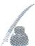
又点 $P, Q$ 在直线 $PQ$ 上，
所以 $x_{P} = ty_{P} - \frac{1}{2}, x_{Q} = ty_{Q} - \frac{1}{2}$ , 所以 $k_{SP} = \frac{y_{P}}{x_{P} - 2} = \frac{y_{P}}{ty_{P} - \frac{5}{2}}$ .
由 $k_{SP} = k_{SA}$ ，得 $\frac{y_P}{ty_P - \frac{5}{2}} = \frac{y_A}{-5}$ 即 $\frac{1}{y_A} = \frac{\frac{5}{2} - ty_P}{5y_P} = \frac{1}{2y_P} -\frac{t}{5},$
同理可得 $\frac{1}{y_B} = \frac{1}{2y_Q} -\frac{t}{5}.$
从而 $\frac{\frac{1}{y_A} + \frac{1}{y_B}}{\frac{1}{y_P} + \frac{1}{y_Q}} = \frac{-\frac{2t}{5} + \frac{1}{2}\left(\frac{1}{y_P} + \frac{1}{y_Q}\right)}{\frac{1}{y_P} + \frac{1}{y_Q}} = \frac{-\frac{2}{5}t}{-\frac{4}{15}t} + \frac{1}{2} = 2.$
所以 $\frac{\frac{1}{y_A} + \frac{1}{y_B}}{\frac{1}{y_P} + \frac{1}{y_Q}}$ 为定值，定值为2.

# 总结
在解题中我们不应该盲目地去计算,而应该观察题目的特点,判断是否可以整体计算.

## 19.2 分式处理

看到这个标题有的同学应该会想,分式有什么大不了的,不就是通分然后计算么.
当你把圆锥曲线等价于“不就是算”的时候,你可能就是考试时算不对也算不完的一员了.

计算本身就是一种需要去学习如何处理问题的能力.

我们之前说过要练习算下去的能力,但是正确地算下去才是我们应该培养的,而错误的习惯在大量练习下也会得到强化.
在往下看之前,请先自己尝试算一算下面的例题,然后感受这个方法对你来说是否有效节省了时间.

> [!example]- 例5 已知 $A(0, -1)$ , 直线 $l$ 与椭圆 $\frac{x^2}{2} + y^2 = 1$ 相交于 $M, N$ 两点. 若直线 $AM$ 与直线 $AN$ 的斜率之和为 2, 证明: 直线 $l$ 恒过定点, 并求出定点的坐标.

# 题目分析
设 $M(x_{1},y_{1}),N(x_{2},y_{2})$

先分析目标:要求直线过定点,可设直线 l 的方程为 $y=kx+m$ ,根据已知条

件找到 k, m 的关系.
再处理条件:先分离 k, 发现分子都有 $m+1$ , 所以提公因式得
$k _ {A M} + k _ {A N} = \frac {y _ {1} + 1}{x _ {1}} + \frac {y _ {2} + 1}{x _ {2}} = \frac {k x _ {1} + m + 1}{x _ {1}} + \frac {k x _ {2} + m + 1}{x _ {2}} = 2 k + (m + 1) \left(\frac {1}{x _ {1}} + \frac {1}{x _ {2}}\right).$

现在分子和分母都很简洁,因此我们通分得 $k_{AM} + k_{AN} = 2k + (m + 1)\frac{x_{1} + x_{2}}{x_{1}x_{2}}$ .
然后就是整体代换的操作,可得 $\frac{x_{1}+x_{2}}{x_{1}x_{2}}=\frac{-2km}{m^{2}-1}$ .
所以条件 $k_{AM} + k_{AN} = 2$ 可转化为 $2k + (m + 1)\frac{-2km}{m^2 - 1} = 2 \Rightarrow k - \frac{km}{m - 1} = 1 \Rightarrow m = 1 - k.$
所以直线 l 的方程为 $y=kx+1-k\Rightarrow y=k(x-1)+1$ ，即直线 l 过定点 $(1,1)$ .

# 参考解析
设直线 l 的方程为 $y=kx+m, M(x_{1},y_{1}), N(x_{2},y_{2})$ .
联立直线方程与椭圆方程得 $\left\{\begin{aligned}y&=kx+m,\\ \frac{x^{2}}{2}&+y^{2}=1\end{aligned}\right.\Rightarrow(2k^{2}+1)x^{2}+4kmx+2m^{2}-2=0.$
由韦达定理得 $\left\{\begin{aligned}x_{1}+x_{2}&=\frac{-4km}{2k^{2}+1},\\ x_{1}x_{2}&=\frac{2m^{2}-2}{2k^{2}+1},\end{aligned}\right.$ 所以 $\frac{x_{1}+x_{2}}{x_{1}x_{2}}=\frac{-2km}{m^{2}-1}.$
$\begin{array}{l} k _ {A M} + k _ {A N} = \frac {y _ {1} + 1}{x _ {1}} + \frac {y _ {2} + 1}{x _ {2}} = \frac {k x _ {1} + m + 1}{x _ {1}} + \frac {k x _ {2} + m + 1}{x _ {2}} \\ = 2 k + (m + 1) \left(\frac {1}{x _ {1}} + \frac {1}{x _ {2}}\right) = 2 k + (m + 1) \frac {- 2 k m}{m ^ {2} - 1}. \\ \end{array}$
又因为 $k_{AM} + k_{AN} = 2$ ,
所以 $2k + (m + 1)\frac{-2km}{m^2 - 1} = 2 \Rightarrow k - \frac{km}{m - 1} = 1 \Rightarrow m = 1 - k.$
所以直线 $l: y = kx + 1 - k \Rightarrow y = k(x - 1) + 1$ ，过定点 $(1, 1)$ .

我们再来看一道直线方程形式更复杂的例题,看分式处理的简化作用是否那么明显.

> [!example]- 例6 已知 $A$ 是椭圆 $\frac{x^2}{2} + y^2 = 1$ 的右顶点, 过 $D(\sqrt{2}, -\sqrt{2})$ 作直线与椭圆交于 $B$ , $C$ 两点. 试探究 $k_{AB} + k_{AC}$ 是否为定值, 若是, 请求出定值; 若不是, 请说明理由.
# 题目分析
由题意知 $A(\sqrt{2},0)$ ，设 $B(x_{1},y_{1})$ ， $C(x_{2},y_{2})$ ，先分析目标： $k_{AB} + k_{AC} =$

思维笔记

Siweibiji

思维笔记

Siweibiji

$\frac {y _ {1}}{x _ {1} - \sqrt {2}} + \frac {y _ {2}}{x _ {2} - \sqrt {2}}.$
根据分母可知,接下来应统一为横坐标,所以设直线 BC 的方程为 $y = k(x - \sqrt{2}) - \sqrt{2}$ .
此时 $k_{AB} + k_{AC} = \frac{k(x_1 - \sqrt{2}) - \sqrt{2}}{x_1 - \sqrt{2}} +\frac{k(x_2 - \sqrt{2}) - \sqrt{2}}{x_2 - \sqrt{2}}.$

本例中直接给出了可分离的式子,不需要我们再凑了.
于是 $k_{AB} + k_{AC} = k + \frac{-\sqrt{2}}{x_1 - \sqrt{2}} + k + \frac{-\sqrt{2}}{x_2 - \sqrt{2}} = 2k - \sqrt{2}\left(\frac{1}{x_1 - \sqrt{2}} +\frac{1}{x_2 - \sqrt{2}}\right),$
其中 $\frac{1}{x_1 - \sqrt{2}} +\frac{1}{x_2 - \sqrt{2}} = \frac{x_1 + x_2 - 2\sqrt{2}}{x_1x_2 - \sqrt{2}(x_1 + x_2) + 2}.$
显然需要韦达定理来转化 $x_{1}x_{2}, x_{1} + x_{2}$ .

但是这个直线方程似乎有点长,如果直接联立直线 BC 的方程与椭圆方程,部分同学会出现畏惧和算错的情况.不妨采用整体计算的思想,我们直接由韦达定理得到
$\left\{ \begin{array}{l l} {x _ {1} + x _ {2} =  \frac {4 \sqrt {2}   k (k + 1)}{2 k ^ {2} + 1},} \\ {x _ {1} x _ {2} =  \frac {2 \left[ 2 (k + 1) ^ {2} - 1 \right]}{2 k ^ {2} + 1},} \end{array} \right. \text {代入} \frac {x _ {1} + x _ {2} - 2 \sqrt {2}}{x _ {1} x _ {2} - \sqrt {2}   (x _ {1} + x _ {2}) + 2},$
得 $\frac{x_1 + x_2 - 2\sqrt{2}}{x_1x_2 - \sqrt{2}(x_1 + x_2) + 2} = \frac{4\sqrt{2}k(k + 1) - 2\sqrt{2}(2k^2 + 1)}{2[2(k + 1)^2 - 1] - 8k(k + 1) + 2(2k^2 + 1)} = \frac{4\sqrt{2}k - 2\sqrt{2}}{4}$ .

对上式的化简还不熟练的同学,请回顾第十八节 书写习惯中的抓主元化简.
于是 $k_{AB} + k_{AC} = 2k - \sqrt{2}\cdot \frac{4\sqrt{2}k - 2\sqrt{2}}{4} = 1.$

# 参考解析
由题意知 $A(\sqrt{2},0)$ ，设 $B(x_{1},y_{1})$ ， $C(x_{2},y_{2})$ .
由题意知直线 $BC$ 的斜率存在，设直线 $BC$ 的方程为 $y = k(x - \sqrt{2}) - \sqrt{2}$ ，
令 $m = -\sqrt{2} (k + 1)$ ，则直线 $BC$ 的方程为 $y = kx + m$
联立直线 $BC$ 的方程与椭圆方程得 $\left\{ \begin{array}{l} y = kx + m, \\ \frac{x^2}{2} + y^2 = 1 \end{array} \right. \Rightarrow (2k^2 + 1)x^2 + 4kmx + 2m^2 - 2 = 0.$
由韦达定理得 $\left\{\begin{aligned}x_{1}+x_{2}&=\frac{-4km}{2k^{2}+1}=\frac{4\sqrt{2}k(k+1)}{2k^{2}+1}\\ x_{1}x_{2}&=\frac{2m^{2}-2}{2k^{2}+1}=\frac{4(k+1)^{2}-2}{2k^{2}+1}\end{aligned}\right.$ ①,
所以 $k_{AB} + k_{AC} = \frac{y_1}{x_1 - \sqrt{2}} +\frac{y_2}{x_2 - \sqrt{2}} = \frac{k(x_1 - \sqrt{2}) - \sqrt{2}}{x_1 - \sqrt{2}} +\frac{k(x_2 - \sqrt{2}) - \sqrt{2}}{x_2 - \sqrt{2}}$
$\begin{array}{l} = k + \frac {- \sqrt {2}}{x _ {1} - \sqrt {2}} + k + \frac {- \sqrt {2}}{x _ {2} - \sqrt {2}} = 2 k - \sqrt {2} \left(\frac {1}{x _ {1} - \sqrt {2}} + \frac {1}{x _ {2} - \sqrt {2}}\right) \\ = 2 k - \sqrt {2} \frac {x _ {1} + x _ {2} - 2 \sqrt {2}}{x _ {1} x _ {2} - \sqrt {2} (x _ {1} + x _ {2}) + 2}. \\ \end{array}$
将①②两式代入上式，得 $k_{AB} + k_{AC} = 2k - \sqrt{2}\cdot \frac{4\sqrt{2}k - 2\sqrt{2}}{4} = 1$ 为定值.
如果说上面这道例题中的分式直接通分你也能接受,那接下来这一道例题应该能让你意识到这个操作的价值.

> [!example]- 例 7 已知 A, F 分别为椭圆 $\frac{x^{2}}{4} + \frac{y^{2}}{3} = 1$ 的左顶点和右焦点，过 F 且斜率为 2 的直线 l 交椭圆于 B, C 两点。若过原点 O 的直线 y = kx 与直线 AB, AC 分别交于点 M, N，当 $|OM| = |ON|$ 时，求实数 k 的值。
# 题目分析

本例的目标是求值,但明显不是针对任意直线成立,因此是一个解方程的题目.

那么我们接下来的目标就是得到一个可以用 $k$ 表示的等式.

本例中 M, N 是动点, 由直线 y = kx 的斜率决定.
根据点 A, B 得直线 AB 的方程, 与 y = kx 联立, 解出用 k 表示的 M 的坐标. 同理可得点 N 的坐标.
最后将坐标代入条件 $|OM| = |ON|$ 即可.
此时长度问题可根据第十二节 线段的翻译中所说化斜为直转化为 $x_{M} + x_{N} = 0$ 或 $y_{M} + y_{N} = 0$ .

然而接下来的第一步就出现了问题: 点 B, C 理论上是固定的, 可以解出来. 但是我们联立直线 l 的方程和椭圆方程后得到 $19x^{2}-32x+4=0$ .

这个方程没法用十字相乘法求根,我们可以用整体计算的思想,设 $B(x_{1}, y_{1}), C(x_{2}, y_{2})$ , 再进行后面的计算.
因为一个对称的曲线必然会有对称的代数式,所以最后必定用到整体代换.

第一个坎儿算是过了,下面来算动点.

直线 $AB$ 的方程 $y = \frac{y_1}{x_1 + 2} (x + 2)$ 与 $y = kx$ 联立，得 $x_{M} = \frac{2y_{1}}{k(x_{1} + 2) - y_{1}}$
同理可得 $x_{N} = \frac{2y_{2}}{k(x_{2} + 2) - y_{2}}.$
则 $x_{M} + x_{N} = 0\Rightarrow \frac{2y_{1}}{k(x_{1} + 2) - y_{1}} +\frac{2y_{2}}{k(x_{2} + 2) - y_{2}} = 0.$

思维笔记

Siweibiji

接下来开始处理分式,然而此时我们分离什么呢?这就要提到我们本节真正想表述的计算方向:分式计算中要尽可能让分子、分母化到最简后再通分.

常规的分离与提公因式不够,在本例中给大家再介绍一个取倒数的操作.
首先把分母变成纵坐标.
$x_{M} + x_{N} = 0 \Rightarrow \frac{1}{x_{M}} + \frac{1}{x_{N}} = 0$ ，将直线 $l$ 的方程写作 $x = \frac{1}{2} y + 1$ .
由点 $B, C$ 都在直线 $l$ 上，可得 $x_{1} = \frac{1}{2} y_{1} + 1, x_{2} = \frac{1}{2} y_{2} + 1$ ，所以
$\begin{array}{l} \frac {1}{x _ {M}} + \frac {1}{x _ {N}} = 0 \Rightarrow \frac {k (x _ {1} + 2) - y _ {1}}{2 y _ {1}} + \frac {k (x _ {2} + 2) - y _ {2}}{2 y _ {2}} = 0 \\ \Rightarrow \frac {k \left(\frac {1}{2} y _ {1} + 3\right) - y _ {1}}{y _ {1}} + \frac {k \left(\frac {1}{2} y _ {2} + 3\right) - y _ {2}}{y _ {2}} = 0. \\ \end{array}$

下面把分子中的纵坐标分离出来,再提个公因式,发现此时分式就简洁了.
$\begin{array}{l} \frac {k \left(\frac {1}{2} y _ {1} + 3\right) - y _ {1}}{y _ {1}} + \frac {k \left(\frac {1}{2} y _ {2} + 3\right) - y _ {2}}{y _ {2}} = 0 \Rightarrow \frac {\left(\frac {k}{2} - 1\right) y _ {1} + 3 k}{y _ {1}} + \frac {\left(\frac {k}{2} - 1\right) y _ {2} + 3 k}{y _ {2}} = 0 \\ \Rightarrow k - 2 + 3 k \left(\frac {1}{y _ {1}} + \frac {1}{y _ {2}}\right) = 0. \\ \end{array}$
接下来回到整体代换的操作.

直线 l 的方程 $x=\frac{1}{2}y+1$ 与椭圆方程联立，得 $19y^{2}+12y-36=0\Rightarrow\frac{1}{y_{1}}+\frac{1}{y_{2}}=\frac{y_{1}+y_{2}}{y_{1}y_{2}}=\frac{1}{3}$ . 代入上式得 $k-2+k=0\Rightarrow k=1$ .

同学们需要注意的是,为了方便理解,这里几乎将每一步都详细列出来了,在答卷上并不需要写这么多.

# 参考解析
由题意知直线 l 的方程为 $y=2(x-1)$ ，设 $B(x_{1},y_{1}), C(x_{2},y_{2})$ .
联立直线 l 的方程与椭圆方程得 $\left\{\begin{aligned}y&=2(x-1),\\ 3x^{2}&+4y^{2}=12\end{aligned}\right.\Rightarrow19y^{2}+12y-36=0.$
由韦达定理得 $\left\{\begin{aligned}y_{1}+y_{2}&=-\frac{12}{19}\quad①,\\ y_{1}y_{2}&=-\frac{36}{19}\quad②.\end{aligned}\right.$
由 $A(-2,0), B(x_1, y_1)$ 可知直线 $AB$ 的方程为 $y = \frac{y_1}{x_1 + 2} (x + 2)$ .
由 $\left\{\begin{aligned}y=kx,\\ y=\frac{y_{1}}{x_{1}+2}(x+2),\end{aligned}\right.$ 得 $x_{M}=\frac{2y_{1}}{k(x_{1}+2)-y_{1}}$ ，同理可得 $x_{N}=\frac{2y_{2}}{k(x_{2}+2)-y_{2}}$ .
因为 $|OM|=|ON|$ ，所以 $\sqrt{1+k^{2}}|x_{M}|=\sqrt{1+k^{2}}|x_{N}|$ ，即 $x_{M}+x_{N}=0$ 。
所以 $\frac{1}{x_M} +\frac{1}{x_N} = 0$ ，即 $\frac{k(x_1 + 2) - y_1}{2y_1} +\frac{k(x_2 + 2) - y_2}{2y_2} = 0,$
化简得 $k - 2 + 3k\cdot \frac{y_1 + y_2}{y_1y_2} = 0$ ，将 $①②$ 两式代入上式得 $k = 1$
所以 $k$ 的值为1.

# 总结

分式处理的核心: 分母和分子尽可能地“干净”后再通分.

要想达到“干净”, 我们可以通过提公因式、因式分解等手段实现. 这些手段都是为了将表达式进行化简, 所以不要拘泥于手法, 这在上面这道例题里得到了体现.

很多时候对分式直接通分,从理论上是能够算得出来的.但是,面对高考紧张的考试时间,又有多少时间让你去展开计算呢?

除了分式的处理之外,还有一点需要注意:如何设直线方程,这是根据目标或者条件化简后用横坐标表示简单还是纵坐标表示简单来决定的.

另外,对于最终目标是0的题目,有些时候不用管分母直接通分计算分子为0即可.这里提醒大家:可以先通过特殊情况得到0,然后只算通分后的分子.但并不是所有题目都直接通分算分子.

所谓的计算技巧固然重要,但计算过程中养成的习惯也很重要.它是一种处理式子的思想和方式,既是抽象的又是具体的.

## 19.3 十字相乘

复习阶段一:基础的一元二次方程.

要想用十字相乘,就要知道什么是十字相乘.
如果我们遇见形如 $x^{2}-(a+b)x+ab=0$ 的式子,可以在演草纸上列下:
$\begin{array}{l} 1 \quad - a \\ 1 \quad - b \\ \end{array}$
其中两个 1 相乘为二次项系数, -a 和 -b 相乘是常数项.

交叉相乘得 $1 \cdot (-a) + 1 \cdot (-b) = -(a + b)$ ，为一次项系数.
所以我们得到 $x^{2}-(a+b)x+ab=(x-a)(x-b)=0.$

> [!example]- 例 8 解下列方程:  
（1） $x^{2}-2x-3=0$ ;（2） $2x^{2}-5x+2=0$ ;（3） $x^{2}+(a-2)x-2a=0$ .

# 题目分析  
（1） $x^{2}-2x-3=0$ ，常数项可分解为 $1\times(-3)$ ， $(-1)\times3$ 两种，又因为一次项系数是负的，所以可以列下：

思维笔记

Siweibiji

思维笔记

Siweibiji

$\begin{array}{l} 1 - 3 \\ 1 \quad 1 \\ \end{array}$
所以 $x^{2}-2x-3=0\Rightarrow(x-3)(x+1)=0$ ，解得 x=3 或 x=-1 。  
（2） $2x^{2}-5x+2=0$ ，对二次项系数与常数项的分解更多的是依赖对数字的感觉和快速试错的能力.

考虑到常数 2 能拆成 $1 \times 2$ ，所以可以列下：
$\begin{array}{l} \begin{array}{c c} 1 & 2 \end{array} \\ 2 \quad 1 \\ \end{array}$

但注意到一次项系数是负的,所以 $2x^{2}-5x+2=0\Rightarrow(x-2)(2x-1)=0\Rightarrow x=$ 2 或 $x=\frac{1}{2}$ .
$\begin{array}{l} 1 - 2 \\ 2 \quad - 1 \\ \end{array}$  
（3） $x^{2}+(a-2)x-2a=0$ ，常数项含有参数a，仍然对常数项进行分解， $-2a=-2\cdot a$ ，所以 $x^{2}+(a-2)x-2a=0\Rightarrow(x-2)(x+a)=0\Rightarrow x=2$ 或x=-a.
$\begin{array}{l} 1 - 2 \\ 1 a \\ \end{array}$

# 参考解析  
（1） $x^{2}-2x-3=0\Rightarrow(x-3)(x+1)=0$ , 解得 x=3 或 x=-1.  
（2） $2x^{2}-5x+2=0\Rightarrow(x-2)(2x-1)=0$ , 解得 x=2 或 $x=\frac{1}{2}$ .  
（3） $x^{2}+(a-2)x-2a=0\Rightarrow(x-2)(x+a)=0$ ，解得x=2或x=-a.

# 总结

对于这种基础的分解,除了需要一定的经验,还需要同学们对于数字的快速分解试错,才能在考场上应对自如.

复习阶段二: 圆锥曲线题目中出现的双十字相乘.

> [!example]- 例 9 过双曲线 $\frac{x^{2}}{a^{2}} - \frac{y^{2}}{b^{2}} = 1 (a > 0, b > 0)$ 上一定点 $P(x_{0}, y_{0})$ 作两条相互垂直的直线，分别交双曲线于另一点 A 和 B，直线 AB 的斜率存在，证明：直线 AB 过定点.

# 题目分析

条件中的垂直可以翻译出一个对称的式子,从而能用韦达定理整体代换,所以设直线 AB 的方程为 $y=kx+m$ ,通过垂直条件找到 k 和 m 的关系即可.
设 $A(x_{1},y_{1}),B(x_{2},y_{2})$ ，将直线 $AB$ 的方程 $y = kx + m$ 与双曲线方程联立，

可以得到应用韦达定理的一元二次方程.
由 $PA$ 和 $PB$ 垂直得 $\overrightarrow{PA} \cdot \overrightarrow{PB} = 0$ , 即 $(x_{1} - x_{0})(x_{2} - x_{0}) + (y_{1} - y_{0})(y_{2} - y_{0}) = 0$ ,
代入韦达定理有
$a ^ {2} m ^ {2} + a ^ {2} b ^ {2} - b ^ {2} m ^ {2} + a ^ {2} b ^ {2} k ^ {2} + 2 x _ {0} a ^ {2} k m + 2 y _ {0} b ^ {2} m + \left(x _ {0} ^ {2} + y _ {0} ^ {2}\right) \left(a ^ {2} k ^ {2} - b ^ {2}\right) = 0.$
此时需要抓主元化简,以 k 为主元进行整理,
可得 $a^2 (x_0^2 +y_0^2 +b^2)k^2 +(2x_0a^2m)k + [(a^2 - b^2)m^2 +(2y_0b^2)m - b^2 (x_0^2 +$ $y_0^2 -a^2)] = 0.$ (\*)
注意到点 $P$ 在双曲线上，有 $\frac{x_0^2}{a^2} -\frac{y_0^2}{b^2} = 1$ ，所以 $y_0^2 +b^2 = \frac{b^2}{a^2} x_0^2,x_0^2 -a^2 = \frac{a^2}{b^2} y_0^2,$ 所以（ $*$ ）式化简为
$\left[ \left(a ^ {2} + b ^ {2}\right) x _ {0} ^ {2} \right] k ^ {2} + \left(2 x _ {0} a ^ {2} m\right) k + \left[ \left(a ^ {2} - b ^ {2}\right) m ^ {2} + \left(2 y _ {0} b ^ {2}\right) m - \left(a ^ {2} + b ^ {2}\right) y _ {0} ^ {2} \right] = 0.$

下面关键就来了,对上式直接给出分解,上式可化为
$\left(x _ {0} k + m - y _ {0}\right) \left[ \left(a ^ {2} + b ^ {2}\right) x _ {0} k + \left(a ^ {2} - b ^ {2}\right) m + \left(a ^ {2} + b ^ {2}\right) y _ {0} \right] = 0.$
所以 $m = y_0 - x_0k$ 或 $m = -\frac{a^2 + b^2}{a^2 - b^2} (x_0k + y_0)$
当 $m=y_{0}-x_{0}k$ 时，直线过点 $P(x_{0},y_{0})$ ，与已知矛盾，舍去；
当 $m = -\frac{a^2 + b^2}{a^2 - b^2} (x_0k + y_0)$ 时，直线过定点 $\left(\frac{a^2 + b^2}{a^2 - b^2} x_0, - \frac{a^2 + b^2}{a^2 - b^2} y_0\right)$ .

综上，直线 $AB$ 过定点 $\left(\frac{a^2 + b^2}{a^2 - b^2} x_0, - \frac{a^2 + b^2}{a^2 - b^2} y_0\right)$

我们要想学会这一种“神来之笔”，需要先思考一下，这里为什么会有一个增根。
因为我们在翻译垂直的时候用了 $\overrightarrow{PA}\cdot\overrightarrow{PB}=0$ ，这个式子实际上包含了A或者B与P重合的情况，但是题目条件中“交于另一点”明确表示不包含这种情况.
因此我们只翻译 $\overrightarrow{PA}\cdot\overrightarrow{PB}=0$ 的话,那最后必然有一种情况为直线AB过点 $P(x_{0},y_{0})$ .
当直线 AB 过 $P(x_{0}, y_{0})$ 时，有 $y_{0} = kx_{0} + m$ ，即 $kx_{0} + m - y_{0} = 0$ .

这个关系必然是最后二次方程的一个根.
所以我们可以得到
$\left[ \left(a ^ {2} + b ^ {2}\right) x _ {0} ^ {2} \right] k ^ {2} + \left(2 x _ {0} a ^ {2} m\right) k + \left[ \left(a ^ {2} - b ^ {2}\right) m ^ {2} + \left(2 y _ {0} b ^ {2}\right) m - \left(a ^ {2} + b ^ {2}\right) y _ {0} ^ {2} \right] = 0.$
$x_0$
$m - y_{0}$

?

?

我们现在要求的就是这两个问号. 左边的问号乘 $x_0$ 应为二次项系数 $(a^2 + b^2)x_0^2$ , 所以可以解出左边的问号为 $(a^2 + b^2)x_0$ . 再把右边的问号和 $m - y_0$ 放到以 $m$ 为变量的二次式 $(a^2 - b^2)m^2 + (2y_0b^2)m - (a^2 + b^2)y_0^2$ 中, 即有

1
$-y_{0}$
$a ^ {2} - b ^ {2}$
$\frac {- (a ^ {2} + b ^ {2}) y _ {0} ^ {2}}{- y _ {0}}$
所以右边的问号为 $(a^2 - b^2)m + (a^2 + b^2)y_0$ ，所以 $(a^2 - b^2)m^2 + (2y_0b^2)m-$

思维笔记

Siweiliji

$(a ^ {2} + b ^ {2}) y _ {0} ^ {2} = \left[ (a ^ {2} - b ^ {2}) m + (a ^ {2} + b ^ {2}) y _ {0} \right] (m - y _ {0}),$
即原式为 $\left[(a^2 + b^2)x_0^2\right]k^2 + (2x_0a^2m)k + \left[(a^2 - b^2)m + (a^2 + b^2)y_0\right](m - y_0) = 0.$
$x _ {0}$
$m - y _ {0}$
$(a ^ {2} + b ^ {2}) x _ {0}$
$(a ^ {2} - b ^ {2}) m + (a ^ {2} + b ^ {2}) y _ {0}$

十字相乘一下我们可以发现正好满足.

# 参考解析
设 $A(x_{1},y_{1}),B(x_{2},y_{2})$ ，直线 $AB$ 的方程为 $y = kx + m$
联立直线 $AB$ 的方程与双曲线方程得 $\left\{ \begin{array}{l} y = kx + m, \\ \frac{x^2}{a^2} - \frac{y^2}{b^2} = 1 \end{array} \right. \Rightarrow (a^2k^2 - b^2)x^2 + 2a^2kmx + a^2m^2 + a^2b^2 = 0,$
由韦达定理得 $\left\{\begin{aligned}x_{1}+x_{2}&=\frac{-2a^{2}km}{a^{2}k^{2}-b^{2}}\\ x_{1}x_{2}&=\frac{a^{2}m^{2}+a^{2}b^{2}}{a^{2}k^{2}-b^{2}}\end{aligned}\right.$ ①，
所以 $\left\{ \begin{array}{l} y_{1} + y_{2} = k(x_{1} + x_{2}) + 2m = \frac{-2b^{2}m}{a^{2}k^{2} - b^{2}} \\ y_{1}y_{2} = k^{2}x_{1}x_{2} + km(x_{1} + x_{2}) + m^{2} = \frac{-b^{2}m^{2} + a^{2}b^{2}k^{2}}{a^{2}k^{2} - b^{2}} \end{array} \right.$ ③，
由 $PA$ 与 $PB$ 垂直得 $\overrightarrow{PA} \cdot \overrightarrow{PB} = 0$ ，即 $(x_{1} - x_{0})(x_{2} - x_{0}) + (y_{1} - y_{0})(y_{2} - y_{0}) = 0,$

展开得 $x_{1}x_{2} + y_{1}y_{2} - x_{0}(x_{1} + x_{2}) - y_{0}(y_{1} + y_{2}) + x_{0}^{2} + y_{0}^{2} = 0,$
将①②③④代入上式,得
$\begin{array}{l} a ^ {2} m ^ {2} + a ^ {2} b ^ {2} - b ^ {2} m ^ {2} + a ^ {2} b ^ {2} k ^ {2} + 2 x _ {0} a ^ {2} k m + 2 y _ {0} b ^ {2} m + \left(x _ {0} ^ {2} + y _ {0} ^ {2}\right) \left(a ^ {2} k ^ {2} - b ^ {2}\right) = 0 \Rightarrow \\ a ^ {2} \left(x _ {0} ^ {2} + y _ {0} ^ {2} + b ^ {2}\right) k ^ {2} + \left(2 x _ {0} a ^ {2} m\right) k + \left[ \left(a ^ {2} - b ^ {2}\right) m ^ {2} + \left(2 y _ {0} b ^ {2}\right) m - b ^ {2} \left(x _ {0} ^ {2} + y _ {0} ^ {2} - a ^ {2}\right) \right] = 0. \\ \end{array}$
因为点 P 在双曲线上, 所以 $\frac{x_{0}^{2}}{a^{2}} - \frac{y_{0}^{2}}{b^{2}} = 1$ , 代入上式化简得
$\begin{array}{l} \left[ \left(a ^ {2} + b ^ {2}\right) x _ {0} ^ {2} \right] k ^ {2} + \left(2 x _ {0} a ^ {2} m\right) k + \left[ \left(a ^ {2} - b ^ {2}\right) m ^ {2} + \left(2 y _ {0} b ^ {2}\right) m - \left(a ^ {2} + b ^ {2}\right) y _ {0} ^ {2} \right] = 0 \\ \Rightarrow \left[ (a ^ {2} + b ^ {2}) x _ {0} ^ {2} \right] k ^ {2} + (2 x _ {0} a ^ {2} m) k + \left[ (a ^ {2} - b ^ {2}) m + (a ^ {2} + b ^ {2}) y _ {0} \right] (m - y _ {0}) = 0 \\ \Rightarrow \left(x _ {0} k + m - y _ {0}\right) \left[ \left(a ^ {2} + b ^ {2}\right) x _ {0} k + \left(a ^ {2} - b ^ {2}\right) m + \left(a ^ {2} + b ^ {2}\right) y _ {0} \right] = 0, \\ \end{array}$
所以 $m = y_0 - x_0k$ 或 $m = -\frac{a^2 + b^2}{a^2 - b^2} (x_0k + y_0)$
当 $m=y_{0}-x_{0}k$ 时，直线 AB 过点 $P(x_{0},y_{0})$ ，与已知矛盾，舍去；
当 $m = -\frac{a^2 + b^2}{a^2 - b^2} (x_0k + y_0)$ 时，直线 $AB$ 过定点 $\left(\frac{a^2 + b^2}{a^2 - b^2} x_0, - \frac{a^2 + b^2}{a^2 - b^2} y_0\right)$ .

综上，直线 $AB$ 过定点 $\left(\frac{a^2 + b^2}{a^2 - b^2} x_0, -\frac{a^2 + b^2}{a^2 - b^2} y_0\right)$ .

# 总结

本例为纯字母运算,因此在计算难度上会高于考试题目.同学们需要了解的

是如何找到其中要舍去的情况,即与已知定点重合或者在某点相切等情况.
最后,我们来聊一聊三次方程的分解.从理论上,我们不排除会出现解关于目标的三次甚至更高次的方程.
在圆锥曲线中三次方程比较稀少,不过在别的板块出现过,如不等式和导数.

实际上,三次方程分解的第一步和解含有指数对数的方程一样,就是要猜根.怎么猜根呢?

这里我们看一个有解的三次方程 $(x - a)(x - b)(x - c) = 0$ 。其展开式的常数项为 $-abc$ ，即常数项的因式之一必定为这个方程的根。
如果三次项系数不为 1, 也可以类似二次方程进行分解.

我们一起来解一下方程 $x^{3}-6x^{2}+7x-2=0$ .
首先常数项为-2,则方程的根在 $\pm1,\pm2$ 中找,发现1是可以的.

下面有两种选择:一种是多项式除法,一种是待定系数法.这里建议使用待定系数法,所以对多项式除法感兴趣的同学自行学习.因为掌握其中一个就可以,所以本节就不介绍多项式除法了.
接下来我们根据1是方程的根得到一个因式为 $x - 1$ ，另一个因式不要写成 $(x - b)(x - c)$ 的形式，因为另一个因式不一定能写成两因式相乘的形式，应写为 $ax^{2} + bx + c$ 的形式，所以 $x^{3} - 6x^{2} + 7x - 2 = (x - 1)(ax^{2} + bx + c)$

原三次方程的常数项必定为两因式的常数项之积,所以 $-1\cdot c=-2\Rightarrow c=2$ .

原三次方程的三次项系数必定为两因式中一次项的系数乘二次项的系数，所以 $1 \cdot a = 1 \Rightarrow a = 1$ .

我们就有了 $x^{3} - 6x^{2} + 7x - 2 = (x - 1)(x^{2} + bx + 2)$ .

对 b 有两种解法：

一是看三次方程的二次项系数为-6，我们知道二次项系数的来源有两种，一种是两因式的二次项系数乘常数项，即 $1\times(-1)$ ；另一种是两因式的一次项系数相乘，即 $1\cdot b$ ，所以 $-1+b=-6$ ，解得b=-5。

二是看三次方程的一次项系数为7,我们知道一次项系数只能由一次项系数乘常数项得到,即 $1\times2$ 和 $-1\cdot b$ ,所以2-b=7,解得b=-5.
最后就得到 $x^{3} - 6x^{2} + 7x - 2 = (x - 1)(x^{2} - 5x + 2) = 0$ ，我们发现 $x^{2} - 5x + 2 = 0$ 的判别式大于0，有两根 $x_{1,2} = \frac{5\pm\sqrt{17}}{2}$ 所以 $x^{3} - 6x^{2} + 7x - 2 = 0$ 有三个根， $x_{1,2} = \frac{5\pm\sqrt{17}}{2}, x_3 = 1.$

至此,我们将题目中比较常见的因式分解介绍完了.

思维笔记

Siweibiji

# 第七章 计算技巧

掌握一定的计算技巧会简化部分的计算,帮助我们提高解题速度,但所谓的技巧适用的范围比较有限,过多的技巧会阻碍我们的思路,同学们在使用计算技巧的时候一定要掌握一个度.下面分享几个比较常用的计算技巧.

# 第二十节 点乘双根法

同学们还记得韦达定理是怎么证明的吗？
设一个一元二次方程 $ax^2 + bx + c = 0 (a \neq 0)$ 的两个根为 $x_1, x_2$ ，则这个一元二次方程可以表示为 $a(x - x_1)(x - x_2) = 0$ ，所以 $a(x - x_1)(x - x_2) = ax^2 + bx + c$ ，即 $ax^2 - a(x_1 + x_2)x + ax_1x_2 = ax^2 + bx + c$ .
根据等式左右两边对应项的系数相等得 $\left\{ \begin{array}{l} -a(x_1 + x_2) = b, \\ ax_1x_2 = c, \end{array} \right.$ 变形得 $\left\{ \begin{array}{l} x_{1} + x_{2} = -\frac{b}{a}, \\ x_{1}x_{2} = \frac{c}{a}, \end{array} \right.$ 这就是韦达定理.
在证明韦达定理的过程中,我们得到这样一个式子 $a(x-x_{1})(x-x_{2})=ax^{2}+bx+c$ .
不妨令 $x = 1$ ，于是 $(1 - x_{1})(1 - x_{2}) = \frac{a + b + c}{a}$

像 $(1 - x_{1})(1 - x_{2})$ 这样的式子在解圆锥曲线关于向量数量积或者斜率之积等条件翻译中是不是经常见到的？
也就是说,在解圆锥曲线题目时,除了展开代入韦达定理的方法外,我们还可以使用上面的变形加赋值的方法进行处理.

> [!example]- 例1 已知 $A$ 为椭圆 $\frac{x^2}{4} + \frac{y^2}{3} = 1$ 的左顶点, $P, Q$ 为椭圆上异于椭圆长轴端点的两点, 记直线 $AP, AQ$ 的斜率分别为 $k_1, k_2$ , 若 $k_1 k_2 = -\frac{1}{4}$ , 请判断直线 $PQ$ 是否过定点, 若过定点, 求该定点的坐标; 若不过定点, 请说明理由.

# 题目分析

这里只分析 PQ 斜率存在的情况, 设直线 $PQ: y = kx + m, P(x_{1}, y_{1}), Q(x_{2}, y_{2})$ ,
此时 $k_{1}k_{2}=\frac{y_{1}y_{2}}{(x_{1}+2)(x_{2}+2)}=\frac{(kx_{1}+m)(kx_{2}+m)}{(x_{1}+2)(x_{2}+2)}$ .

我们发现分母正好可以使用点乘双根法,但是分子中横坐标的系数不是1而是k.此时该如何处理呢?方法一,直接用韦达定理来算;方法二,先提出系数,即 $k^{2}\left(x_{1}+\frac{m}{k}\right)\left(x_{2}+\frac{m}{k}\right)$ ,再赋值,令 $x=-\frac{m}{k}$ .

# 参考解析

# 方法一：
设 $P(x_{1},y_{1}),Q(x_{2},y_{2})$ ，由题意知 $A(-2,0)$

①当直线 PQ 的斜率存在时, 设直线 PQ 的方程为 $y = kx + m$ .
联立直线 $PQ$ 的方程与椭圆方程得 $\left\{ \begin{array}{l} y = kx + m, \\ \frac{x^2}{4} + \frac{y^2}{3} = 1 \end{array} \right. \Rightarrow (3 + 4k^2)x^2 + 8mkx + 4m^2 - 12 = 0.$
由韦达定理得 $\left\{\begin{aligned}x_{1}+x_{2}&=-\frac{8mk}{3+4k^{2}},\\ x_{1}x_{2}&=\frac{4m^{2}-12}{3+4k^{2}}.\end{aligned}\right.$
因为 $k_{1}k_{2} = -\frac{1}{4}$
所以 $k_{1}k_{2} = \frac{y_{1}}{x_{1} + 2}\cdot \frac{y_{2}}{x_{2} + 2} = \frac{(kx_{1} + m)(kx_{2} + m)}{(x_{1} + 2)(x_{2} + 2)} = \frac{k^{2}x_{1}x_{2} + mk(x_{1} + x_{2}) + m^{2}}{x_{1}x_{2} + 2(x_{1} + x_{2}) + 4}$
$= - \frac {1}{4}.$
所以 $\frac{4m^2k^2 - 12k^2 - 8k^2m^2 + 3m^2 + 4m^2k^2}{4m^2 - 12 - 16mk + 12 + 16k^2} = -\frac{1}{4}.$
所以 $m^{2}-mk-2k^{2}=0$ .
所以 $(m-2k)(m+k)=0$ ，解得m=2k（舍）或m=-k。
当 m = -k 时，直线 PQ 的方程为 $y = k(x - 1)$ ，此时直线 PQ 过定点 $(1, 0)$ .

②当直线 $P Q$ 的斜率不存在时，
设 $P(x_0,y_0),Q(x_0, - y_0)$ ，则 $k_{1}k_{2} = \frac{y_{0}}{x_{0} + 2}\cdot \frac{-y_{0}}{x_{0} + 2} = \frac{-y_{0}^{2}}{(x_{0} + 2)^{2}} = -\frac{1}{4}.$
由点 P, Q 在椭圆上, 可知 $\frac{x_{0}^{2}}{4} + \frac{y_{0}^{2}}{3} = 1$ , 代入上式得 $k_{1}k_{2} = \frac{-3 + \frac{3}{4}x_{0}^{2}}{(x_{0} + 2)^{2}} = -\frac{1}{4}$ ,
解得 $x_{0}=1$ 或 $x_{0}=-2$ （舍），
所以点 P, Q 的坐标为 $\left(1, \frac{3}{2}\right)$ , $\left(1, -\frac{3}{2}\right)$ .

思维笔记

Siweibiji

# 思维笔记

# Siweibiji

所以直线 PQ 的方程为 x=1，过点 $(1,0)$ .

综上, 直线 PQ 恒过定点 $(1,0)$ .

# 方法二：
设 $P(x_{1},y_{1}),Q(x_{2},y_{2})$ ，由题意知 $A(-2,0)$

①当直线 $PQ$ 的斜率存在时, 设直线 $PQ$ 的方程为 $y = kx + m$ ,
联立直线 $PQ$ 的方程与椭圆方程得 $\left\{ \begin{array}{l} y = kx + m, \\ \frac{x^2}{4} + \frac{y^2}{3} = 1 \end{array} \right. \Rightarrow (4k^2 + 3)x^2 + 8kmx + 4m^2 - 12 = 0.$
因为此方程的两根为 $x = x_{1}$ 和 $x = x_{2}$ ，
所以变形为 $(4k^{2} + 3)(x - x_{1})(x - x_{2}) = (4k^{2} + 3)x^{2} + 8kmx + 4m^{2} - 12,$
即 $(x_{1} - x)(x_{2} - x) = \frac{(4k^{2} + 3)x^{2} + 8kmx + 4m^{2} - 12}{4k^{2} + 3}$ .
令 $x = -2$ ，得 $(x_{1} + 2)(x_{2} + 2) = \frac{16k^{2} - 16km + 4m^{2}}{4k^{2} + 3}$
令 $x = -\frac{m}{k}$ ，得 $\left(x_{1} + \frac{m}{k}\right)\left(x_{2} + \frac{m}{k}\right) = \frac{(4k^2 + 3)\frac{m^2}{k^2} - 4m^2 - 12}{4k^2 + 3}.$
由 $k_{1}k_{2} = -\frac{1}{4}$ ，得 $k_{1}k_{2} = \frac{y_{1}}{x_{1} + 2}\cdot \frac{y_{2}}{x_{2} + 2} = \frac{(kx_{1} + m)(kx_{2} + m)}{(x_{1} + 2)(x_{2} + 2)} = -\frac{1}{4},$
即 $\frac{k^2\frac{(4k^2 + 3)\frac{m^2}{k^2} - 4m^2 - 12}{4k^2 + 3}}{\frac{16k^2 - 16km + 4m^2}{4k^2 + 3}} = -\frac{1}{4}\Rightarrow \frac{3(m^2 - 4k^2)}{4(2k - m)^2} = -\frac{1}{4}.$
解得 m = -k 或 m = 2k（舍）.
所以直线 PQ 的方程为 y=kx-k，即直线 PQ 过定点 $(1,0)$ .

②当直线 PQ 的斜率不存在时, 过程同方法一.

综上, 直线 PQ 恒过定点 $(1,0)$ .

# 总结

点乘双根法作为计算技巧的一种, 确实在简化计算上具有一定的作用, 特别是省去了代入直线方程展开的过程, 如 $y_{1}y_{2}=k^{2}x_{1}x_{2}+mk(x_{1}+x_{2})+m^{2}$ .

但我们要意识到这个技巧具有局限性,即仅仅能解决设线法——整体代换所涉及的题目.所以此技巧最好在掌握设线法——整体代换后学习.

# 第二十一节 第三定义

思维笔记

Siweibiji

椭圆的第三定义及证明(双曲线同理,考试中需要先证再用):
在椭圆 $\frac{x^2}{a^2} +\frac{y^2}{b^2} = 1(a > b > 0)$ 上， $A,B$ 是关于原点 $O$ 对称的两点， $P$ 是椭圆上异于 $A,B$ 的一点，若 $k_{PA},k_{PB}$ 存在，则有 $k_{PA}\cdot k_{PB} = -\frac{b^2}{a^2}$
证明:设 $P(x_{1},y_{1}), A(x_{2},y_{2}), B(-x_{2},-y_{2})$ .
由点 $P, A$ 在椭圆上，得 $\frac{x_1^2}{a^2} + \frac{y_1^2}{b^2} = 1, \frac{x_2^2}{a^2} + \frac{y_2^2}{b^2} = 1.$

两式相减得 $\frac{x_1^2 - x_2^2}{a^2} +\frac{y_1^2 - y_2^2}{b^2} = 0\Rightarrow \frac{y_1 - y_2}{x_1 - x_2}\cdot \frac{y_1 + y_2}{x_1 + x_2} = -\frac{b^2}{a^2}\Rightarrow k_{PA}k_{PB} = -\frac{b^2}{a^2},$

证毕.

注意第三定义的条件是关于原点对称的两点,常见的是左、右或者上、下顶点,但是并非只有顶点才能处理,一起来看一道例题.

> [!example]- 例2 如图, 过椭圆 $\frac{x^2}{4} + \frac{y^2}{3} = 1$ 的右焦点 $F$ 作与 $x$ 轴不重合的直线 $l$ , 与椭圆交于 $A, B$ 两点, 点 $A$ 关于坐标原点的对称点为 $P$ , 直线 $PA, PB$ 分别交直线 $x = 4$ 于 $M, N$ 两点. 证明: $M, N$ 两点的纵坐标之积为定值.
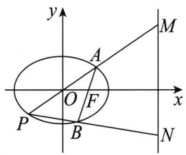

# 题目分析
注意到点 A, P 关于原点对称, 所以由椭圆的第三定义可知 $k_{AB}k_{PB} = -\frac{3}{4}$ .
如果不了解椭圆的第三定义能不能做这道题呢？答案是肯定的。本题涉及的点和线都较多，因此我们可以采用第十节未知点解未知点中的知识，将全部变量都用一个点的坐标表示出来。

# 参考解析

# 方法一:常规思路
设 $A(x_0,y_0)$ ，则 $P(-x_0, - y_0)$
由题意知 $F(1,0)$ ，当直线 AB 的斜率存在时，设直线 AB 的方程为 $y=k(x-1)$ .
联立直线 $AB$ 的方程与椭圆方程得 $\left\{ \begin{array}{l} y = k(x - 1), \\ \frac{x^2}{4} + \frac{y^2}{3} = 1 \end{array} \right. \Rightarrow (4k^2 + 3)x^2 - 8k^2x + 4k^2 - 12 = 0.$

思维笔记

Siweibiji

由韦达定理得 $x_0x_B = \frac{4k^2 - 12}{4k^2 + 3}$
因为 $k=\frac{y_{0}}{x_{0}-1}$ ,
所以 $x_0x_B = \frac{4\left(\frac{y_0}{x_0 - 1}\right)^2 - 12}{4\left(\frac{y_0}{x_0 - 1}\right)^2 + 3} = \frac{4y_0^2 - 12(x_0 - 1)^2}{4y_0^2 + 3(x_0 - 1)^2}.$
因为点 $A(x_0, y_0)$ 在椭圆上，所以有 $\frac{x_0^2}{4} + \frac{y_0^2}{3} = 1$
代入上式消去 $y_0^2$ ，得 $x_{B} = \frac{5x_{0} - 8}{2x_{0} - 5},y_{B} = \frac{y_{0}}{x_{0} - 1}\left(\frac{5x_{0} - 8}{2x_{0} - 5} -1\right) = \frac{3y_{0}}{2x_{0} - 5},$
所以 $B\left(\frac{5x_0 - 8}{2x_0 - 5}, \frac{3y_0}{2x_0 - 5}\right)$ .
因此直线 $PA$ 的方程为 $y = \frac{y_0}{x_0} x$ ，直线 $PB$ 的方程为 $y = \frac{\frac{3y_0}{2x_0 - 5} + y_0}{\frac{5x_0 - 8}{2x_0 - 5} + x_0}(x + x_0) - y_0$ .
将这两条直线的方程分别与 $x = 4$ 联立得 $y_{M} = \frac{4y_{0}}{x_{0}}, y_{N} = \frac{3x_{0}y_{0}}{x_{0}^{2} - 4}$ .
又 $\frac{x_{0}^{2}}{4}+\frac{y_{0}^{2}}{3}=1$ ，所以 $y_{N}=\frac{9x_{0}}{-4y_{0}}$ .
所以 $y_{M}y_{N}=-9.$
当直线 AB 的斜率不存在时, 直线 AB 的方程为 x=1,
此时 $A\left(1, \frac{3}{2}\right), B\left(1, -\frac{3}{2}\right), P\left(-1, -\frac{3}{2}\right)$ ，直线 $PA$ 的方程为 $y = \frac{3}{2} x$ ，直线 $PB$ 的方程为 $y = -\frac{3}{2}$ ，
所以 $M(4,6), N\left(4, -\frac{3}{2}\right), y_M \cdot y_N = 6 \times \left(-\frac{3}{2}\right) = -9.$

综上， $M,N$ 两点纵坐标之积为定值.

# 方法二:第三定义
设 $A(x_{1},y_{1}),B(x_{2},y_{2})$ ，则 $P(-x_1, - y_1)$
当直线 $AB$ 的斜率存在时， $k_{AB} = \frac{y_1}{x_1 - 1}$ .
因为点 A, P 关于原点对称, 所以由椭圆的第三定义可知 $k_{AB} \cdot k_{PB} = -\frac{3}{4}$ ,
所以 $k_{PB} = -\frac{3(x_1 - 1)}{4y_1}$ ，直线 $PB$ 的方程为 $y = -\frac{3(x_1 - 1)}{4y_1} (x + x_1) - y_1.$
联立得 $\left\{\begin{aligned}y&=-\frac{3(x_{1}-1)}{4y_{1}}(x+x_{1})-y_{1},\\ x&=4\end{aligned}\right.\Rightarrow y_{N}=-\frac{3(x_{1}-1)(4+x_{1})}{4y_{1}}-y_{1}.$

直线 $PA$ 的方程为 $y = \frac{y_1}{x_1} x$ ，与 $x = 4$ 联立，得 $y_M = \frac{4y_1}{x_1}$ .
所以 $y_{M}y_{N} = \frac{4y_{1}}{x_{1}}\left[-\frac{3(x_{1} - 1)(4 + x_{1})}{4y_{1}} - y_{1}\right] = -\frac{3(x_{1} - 1)(4 + x_{1}) + 4y_{1}^{2}}{x_{1}}.$
根据点 A 在椭圆上，有 $\frac{x_{1}^{2}}{4} + \frac{y_{1}^{2}}{3} = 1 \Rightarrow 4y_{1}^{2} = 12 - 3x_{1}^{2}$ ,
代入上式得
$y _ {M} y _ {N} = - \frac {3 (x _ {1} - 1) (4 + x _ {1}) + 1 2 - 3 x _ {1} ^ {2}}{x _ {1}} = - \frac {3 x _ {1} ^ {2} + 9 x _ {1} - 1 2 + 1 2 - 3 x _ {1} ^ {2}}{x _ {1}} = - 9.$
当直线 AB 的斜率不存在时, 直线 AB 的方程为 x=1,
此时 $A\left(1, \frac{3}{2}\right), B\left(1, -\frac{3}{2}\right), P\left(-1, -\frac{3}{2}\right)$ ，直线 $PA$ 的方程为 $y = \frac{3}{2} x$ ，直线 $PB$ 的方程为 $y = -\frac{3}{2}$ ，
所以 $M(4,6), N\left(4, -\frac{3}{2}\right), y_M \cdot y_N = 6 \times \left(-\frac{3}{2}\right) = -9.$

综上， $M,N$ 两点纵坐标之积为定值.

# 总结
方法二中我们在写直线 $PB$ 方程的时候要过点 $P$ 设直线, 这样就可以避免 $x_{2}, y_{2}$ 的乱入, 起到减少变量的效果. 在本例中, 第三定义的作用是让直线 $PB$ 的斜率可以用 $x_{1}, y_{1}$ 表示出来. 第三定义在某种程度上可以减少部分计算量, 但是仍然少不了分析, 没有分析的解题是没有逻辑的.

思维笔记

Siweibiji

# 第四篇 专题篇

# 第八章 不对称专题
在很多圆锥曲线解答题中,我们都常设直线方程,联立方程,利用韦达定理整体代换,然后“解决”问题.

能够整体代换的前提是由曲线上两点坐标表示的式子一定是对称的.如已知 $A(x_{1},y_{1}),B(x_{2},y_{2})$ 在椭圆上，目标可变形为 $x_{1}^{2} + x_{2}^{2}$ 或 $x_{1}x_{2} + (y_{1}-$ 1)(y2-1)或 $\frac{y_1y_2}{(x_1 + 1)(x_2 + 1)}$ 等结构.

遇到不对称的情况,该如何处理呢?有一类比较常见的题干给出不对称条件的情况,我们在第三节 求根中讲解过处理方法,在本章就不重复了.

本章主要讲遇见不对称的目标式时该如何处理.

需要强调的是,并不是每一道不对称问题都能用以下所有解法解出来,请根据题目本身的特点,选择合适的方法.

下面以一道极其经典的不对称问题为例来讲如何构思解法.

> [!example]- 例1 在平面直角坐标系 $xOy$ 中，已知椭圆 $C: \frac{x^2}{4} + \frac{y^2}{3} = 1$ 的左、右顶点分别为 $A, B$ ，过右焦点 $F$ 的直线 $l$ 与椭圆 $C$ 交于 $P, Q$ 两点（点 $P$ 在 $x$ 轴上方）。设直线 $AP, BQ$ 的斜率分别为 $k_1, k_2$ 。是否存在常数 $\lambda$ ，使得 $k_1 = \lambda k_2$ ？若存在，求出 $\lambda$ 的值；若不存在，请说明理由。
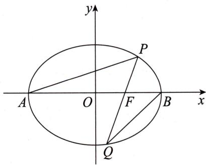

# 参考解析
当直线 PQ 的斜率不存在时, 易得 $\lambda=\frac{1}{3}$ .
当直线 PQ 的斜率存在时,给出以下七种解法.

# 构思解法一：

先设出点的坐标, $P(x_{1},y_{1}),Q(x_{2},y_{2})$ ，从问题本身来思考，无论面对定值问题还是范围问题，我们都应该选择一到两个核心变量。然后用核心变量去表示其他变量。那么选择谁为核心变量呢？
$PQ$ 可以联系目标 $k_{1}, k_{2}$ , 以 $PQ$ 的斜率为核心变量是一个不错的选择.

思维笔记

Siweibiji

我们先看一下目标 $\lambda = \frac{k_1}{k_2} \Rightarrow \lambda = \frac{y_1(x_2 - 2)}{y_2(x_1 + 2)}$ .

上式应该统一为横坐标还是纵坐标呢？
不妨先试一下横坐标.
设直线 PQ 的方程为 $y=k(x-1)$ ，由题意知 $k\neq0$ 。
因此 $\lambda = \frac{y_1(x_2 - 2)}{y_2(x_1 + 2)}\Rightarrow \lambda = \frac{(x_1 - 1)(x_2 - 2)}{(x_1 + 2)(x_2 - 1)}\Rightarrow \lambda = \frac{x_1x_2 - 2x_1 - x_2 + 2}{x_1x_2 - x_1 + 2x_2 - 2}.$

这个就是典型的不对称结构,我们无法用常规的韦达定理整体代换进行处理.若这个分式是定值,要么分子为0(本例中显然不成立),要么分子、分母各项系数一一对应成比例,约分后为定值,如 $\frac{2k^{2}+2}{k^{2}+1}=2$ .

我们尝试只保留一个坐标,若保留 $x_{1}$ ,
则 $\lambda = \frac{x_1x_2 - 2x_1 - x_2 + 2}{x_1x_2 - x_1 + 2x_2 - 2} \Rightarrow \lambda = \frac{x_1x_2 - (x_1 + x_2) + 2 - x_1}{x_1x_2 + 2(x_1 + x_2) - 2 - 3x_1},$
利用韦达定理得 $\lambda = \frac{\frac{4k^2 - 6}{4k^2 + 3} - x_1}{\frac{12k^2 - 18}{4k^2 + 3} - 3x_1} \Rightarrow \lambda = \frac{1}{3}$ .
若保留 $x_{2}$ ，我们再尝试一下，
$\lambda = \frac {x _ {1} x _ {2} - 2 x _ {1} - x _ {2} + 2}{x _ {1} x _ {2} - x _ {1} + 2 x _ {2} - 2} \Rightarrow \lambda = \frac {x _ {1} x _ {2} - 2 (x _ {1} + x _ {2}) + 2 + x _ {2}}{x _ {1} x _ {2} - (x _ {1} + x _ {2}) - 2 + 3 x _ {2}},$
利用韦达定理得 $\lambda = \frac{\frac{-4k^2 - 6}{4k^2 + 3} + x_2}{\frac{-12k^2 - 18}{4k^2 + 3} + 3x_2} \Rightarrow \lambda = \frac{1}{3}$ .

下面我们将 $\lambda=\frac{y_{1}(x_{2}-2)}{y_{2}(x_{1}-2)}$ 用纵坐标表示.
由题意知直线 PQ 的斜率不为 0，设直线 PQ 的方程为 $x = ty + 1$ .
所以 $\lambda = \frac{y_1(x_2 - 2)}{y_2(x_1 + 2)}\Rightarrow \lambda = \frac{y_1(ty_2 - 1)}{y_2(ty_1 + 3)}\Rightarrow \lambda = \frac{ty_1y_2 - y_1}{ty_1y_2 + 3y_2}.$
若保留 $y_{1}$
则 $\lambda = \frac{ty_1y_2 - y_1}{ty_1y_2 + 3y_2}\Rightarrow \lambda = \frac{ty_1y_2 - y_1}{ty_1y_2 + 3(y_1 + y_2) - 3y_1}\Rightarrow \lambda = \frac{\frac{-9t}{3t^2 + 4} - y_1}{\frac{-27t}{3t^2 + 4} - 3y_1}\Rightarrow \lambda = \frac{1}{3}.$
若保留 $y_{2}$
则 $\lambda = \frac{ty_1y_2 - y_1}{ty_1y_2 + 3y_2}\Rightarrow \lambda = \frac{ty_1y_2 - (y_1 + y_2) + y_2}{ty_1y_2 + 3y_2}\Rightarrow \lambda = \frac{\frac{-3t}{3t^2 + 4} + y_2}{\frac{-9t}{3t^2 + 4} + 3y_2}\Rightarrow \lambda = \frac{1}{3}.$

我们发现,处理不对称结构时可以进行凑项从而能够使用韦达定理且保留一个坐标的操作.最后分子、分母对应项系数成比例.这可以说是不对称问题中
比较独特的一种处理方式.
在找其他核心变量之前,大家可能会有这样一个疑问:将 $\lambda$ 的表达式保留 k 和单一坐标可以相消,那么为什么 $\lambda=\frac{x_{1}x_{2}-2x_{1}-x_{2}+2}{x_{1}x_{2}-x_{1}+2x_{2}-2}$ 的分子、分母就无法相消呢?下面我们来看构思解法二.

# 构思解法二：
由韦达定理得 $x_{1} + x_{2} = \frac{8k^{2}}{4k^{2} + 3}, x_{1}x_{2} = \frac{4k^{2} - 12}{4k^{2} + 3}$ , 我们知道 $x_{1}, x_{2}$ 以 $k$ 为媒介还满足其他的关系, 是不是意味着我们代入这个关系就可以得到一个含 $x_{1}, x_{2}$ 的可以上下相消的式子呢?

要想解答这个疑问,就要找到 $x_{1}+x_{2}$ 和 $x_{1}x_{2}$ 的关系.

要找到 $x_{1} + x_{2}$ 和 $x_{1}x_{2}$ 的关系，就是找 $\frac{8k^2}{4k^2 + 3}$ 和 $\frac{4k^2 - 12}{4k^2 + 3}$ 的关系.两式的分母相同，有一个分子含常数，另一个不含.
不妨设 $A(x_{1} + x_{2}) - B = x_{1}x_{2}$ ，得 $\frac{(8A - 4B)k^2 - 3B}{4k^2 + 3} = \frac{4k^2 - 12}{4k^2 + 3},$
所以 8A-4B=4,-3B=-12,解得 $A=\frac{5}{2}$ , B=4,
所以 $\frac{5}{2} (x_1 + x_2) - 4 = x_1x_2.$

把这个式子代入 $\lambda=\frac{x_{1}x_{2}-2x_{1}-x_{2}+2}{x_{1}x_{2}-x_{1}+2x_{2}-2}$ ，得到
$\lambda = \frac {\frac {5}{2} (x _ {1} + x _ {2}) - 4 - 2 x _ {1} - x _ {2} + 2}{\frac {5}{2} (x _ {1} + x _ {2}) - 4 - x _ {1} + 2 x _ {2} - 2} \Rightarrow \lambda = \frac {\frac {1}{2} x _ {1} + \frac {3}{2} x _ {2} - 2}{\frac {3}{2} x _ {1} + \frac {9}{2} x _ {2} - 6} \Rightarrow \lambda = \frac {1}{3}.$

我们再来探究一下 $y_{1} + y_{2}$ 与 $y_{1}y_{2}$ 的关系.
$y _ {1} + y _ {2} = \frac {- 6 t}{3 t ^ {2} + 4}, y _ {1} y _ {2} = \frac {- 9}{3 t ^ {2} + 4} \Rightarrow t y _ {1} y _ {2} = \frac {3}{2} (y _ {1} + y _ {2}).$
所以 $\lambda = \frac{ty_1y_2 - y_1}{ty_1y_2 + 3y_2}\Rightarrow \lambda = \frac{\frac{3}{2}(y_1 + y_2) - y_1}{\frac{3}{2}(y_1 + y_2) + 3y_2}\Rightarrow \lambda = \frac{\frac{1}{2}y_1 + \frac{3}{2}y_2}{\frac{3}{2}y_1 + \frac{9}{2}y_2}\Rightarrow \lambda = \frac{1}{3}.$

构思解法一虽然没有全部用 k 表示出来,但是使问题得以解决,构思解法二实际上实现了和积转化.

# 构思解法三：

题干中已经给出 $k_{1}, k_{2}$ ，我们的目标就是找 $k_{1}, k_{2}$ 的关系。
不妨尝试一下求根这一操作.
联立直线 $AP$ 的方程与椭圆方程得 $\left\{ \begin{array}{l} y = k_{1}(x + 2), \\ \frac{x^{2}}{4} + \frac{y^{2}}{3} = 1 \end{array} \right. \Rightarrow (4k_{1}^{2} + 3)x^{2} + 16k_{1}^{2}x +$

思维笔记

Siweibiji

思维笔记

Siweibiji

$16k_{1}^{2} - 12 = 0$
由韦达定理得 $x_{A}x_{1}=\frac{16k_{1}^{2}-12}{4k_{1}^{2}+3}$ ,
又由 $x_{A} = -2$ ，得 $x_{1} = \frac{-8k_{1}^{2} + 6}{4k_{1}^{2} + 3}$
代入直线 $AP$ 的方程 $y = k_{1}(x + 2)$ ，得 $y_{1} = \frac{12k_{1}}{4k_{1}^{2} + 3}$
所以 $P\left(\frac{-8k_1^2 + 6}{4k_1^2 + 3}, \frac{12k_1}{4k_1^2 + 3}\right)$ . 同理可得 $Q\left(\frac{8k_2^2 - 6}{4k_2^2 + 3}, \frac{-12k_2}{4k_2^2 + 3}\right)$ .
又 P, Q, F 三点共线, 所以 $k_{PF} = k_{QF}$ ,
即 $\frac{\frac{12k_1}{4k_1^2 + 3}}{\frac{-8k_1^2 + 6}{4k_1^2 + 3} - 1} = \frac{\frac{-12k_2}{4k_2^2 + 3}}{\frac{8k_2^2 - 6}{4k_2^2 + 3} - 1}\Rightarrow \frac{k_1}{-12k_1^2 + 3} = \frac{-k_2}{4k_2^2 - 9}\Rightarrow (3k_1 - k_2)(4k_1k_2 + 3) = 0,$
解得 $\frac{k_1}{k_2} = \frac{1}{3}$ 或 $k_{1}k_{2} = -\frac{3}{4}$ .
由已知条件易得 $k_{1}>0, k_{2}>0$ ，因此 $k_{1}k_{2}=-\frac{3}{4}$ 舍去.
所以 $\lambda=\frac{1}{3}$ .

# 构思解法四: 单动点设点法
不妨以点 P 或 Q 为原始点,一点动而全局动.以点 P 或 Q 为核心,横、纵坐标为核心变量进行统一,也是很明显的方向,其中计算的关键是如何去表达另一个动点的坐标.我们不妨以 $P(x_{1},y_{1})$ 为核心进行处理.

以 $P(x_{1},y_{1})$ 为核心，则 $k_{PQ} = \frac{y_1}{x_1 - 1}$ ，因此直线 $PQ$ 的方程为 $y = \frac{y_1}{x_1 - 1}(x - 1)$
若直接将直线 PQ 的方程与椭圆方程联立, 后面需要进行大量计算. 不妨尝试一下整体计算: 设 $k=\frac{y_{1}}{x_{1}-1}$ , 则直线 PQ 的方程为 $y=k(x-1)$ , 与椭圆方程联立, 最后再代回来.
联立直线 $PQ$ 的方程与椭圆方程，由韦达定理得 $x_{1}x_{2} = \frac{4k^{2} - 12}{4k^{2} + 3}\Rightarrow x_{1}x_{2} =$ $\frac{4\left(\frac{y_1}{x_1 - 1}\right)^2 - 12}{4\left(\frac{y_1}{x_1 - 1}\right)^2 + 3}\Rightarrow x_1x_2 = \frac{4y_1^2 - 12(x_1 - 1)^2}{4y_1^2 + 3(x_1 - 1)^2}.$
设点的核心是利用椭圆方程进行变形,还是那句老话:有点必有等式,有等式必有代换.
根据点 $P(x_{1},y_{1})$ 在椭圆上，得 $\frac{x_1^2}{4} +\frac{y_1^2}{3} = 1.$
$x_{1}x_{2}$ 的表达式里有 $y_{1}^{2}$ 和 $(x_{1} - 1)^{2}$ ，选择消去 $y_{1}^{2}$ ，即将 $4y_{1}^{2} = 12 - 3x_{1}^{2}$ 代入
$x _ {1} x _ {2} = \frac {4 y _ {1} ^ {2} - 1 2 (x _ {1} - 1) ^ {2}}{4 y _ {1} ^ {2} + 3 (x _ {1} - 1) ^ {2}},$
得 $x_{1}x_{2} = \frac{12 - 3x_{1}^{2} - 12(x_{1} - 1)^{2}}{12 - 3x_{1}^{2} + 3(x_{1} - 1)^{2}}\Rightarrow x_{1}x_{2} = \frac{-15x_{1}^{2} + 24x_{1}}{-6x_{1} + 15}\Rightarrow x_{2} = \frac{5x_{1} - 8}{2x_{1} - 5}.$
因为 $Q(x_{2},y_{2})$ 在直线 $PQ$ 上，
所以有 $y_{2} = \frac{y_{1}}{x_{1} - 1}\left(\frac{5x_{1} - 8}{2x_{1} - 5} - 1\right) \Rightarrow y_{2} = \frac{3y_{1}}{2x_{1} - 5}$ ，即 $Q\left(\frac{5x_{1} - 8}{2x_{1} - 5}, \frac{3y_{1}}{2x_{1} - 5}\right)$ .
因为 $k_{1} = \frac{y_{1}}{x_{1} + 2}, k_{2} = \frac{y_{2}}{x_{2} - 2}$
所以 $k_{2} = \frac{\frac{3y_{1}}{2x_{1} - 5}}{\frac{5x_{1} - 8}{2x_{1} - 5} - 2}\Rightarrow k_{2} = \frac{3y_{1}}{x_{1} + 2} = 3k_{1}.$
显然 $\frac{k_1}{k_2} = \frac{1}{3}$ 即 $\lambda = \frac{1}{3}$ .
在构思解法四中,我们惊喜地发现 $x_{2}=\frac{5x_{1}-8}{2x_{1}-5}$ 是一个纯粹的关于两点横坐标的关系式,变形后与我们构思解法二中和积转化的结果 $\frac{5}{2}(x_{1}+x_{2})-4=x_{1}x_{2}$ 是一模一样的.

这里需要强调一下:单动点设点理论上能解决所有问题,但有时需要比较巧妙的代数变形.如果目标含有二次式可以尝试用椭圆方程变形代入,但是如果出现 $x_{0}y_{0}$ 这类项,不推荐设点法.

# 构思解法五:椭圆方程转化

单动点设点法的核心是“不择手段”地利用椭圆方程,而椭圆方程是一个二次方程,要想利用椭圆方程必须有二次式.但我们的目标是一次的,不妨将目标平方一下.
$\begin{array}{l} \lambda = \frac {y _ {1} (x _ {2} - 2)}{y _ {2} (x _ {1} + 2)} \Rightarrow \lambda^ {2} = \frac {y _ {1} ^ {2} (x _ {2} - 2) ^ {2}}{y _ {2} ^ {2} (x _ {1} + 2) ^ {2}} \Rightarrow \lambda^ {2} = \frac {\frac {1 2 - 3 x _ {1} ^ {2}}{4} (x _ {2} - 2) ^ {2}}{\frac {1 2 - 3 x _ {2} ^ {2}}{4} (x _ {1} + 2) ^ {2}} \\ \Rightarrow \lambda^ {2} = \frac {(4 - x _ {1} ^ {2}) (2 - x _ {2}) ^ {2}}{(4 - x _ {2} ^ {2}) (2 + x _ {1}) ^ {2}} \Rightarrow \lambda^ {2} = \frac {(2 - x _ {1}) (2 - x _ {2})}{(2 + x _ {1}) (2 + x _ {2})}. \\ \end{array}$
此时目标变为一个传统的对称式, 将韦达定理代入即可得到 $\lambda^{2}=\frac{1}{9}$ . 但出现了一个增根 $\lambda=-\frac{1}{3}$ , 根据题意得出 $k_{1}>0, k_{2}>0$ , 从而可以舍去.

# 构思解法六: 直线虚化(向量化)
在设点法中将两点坐标用一个变量表示, 并且回避了设 k 时的求根公式. 操作如下:
由题意设 $\overrightarrow{QF}=m\overrightarrow{FP}$ ，其中m>0。

思维笔记

Siweibiji

$\overrightarrow {Q F} = m \overrightarrow {F P} \Rightarrow \left\{ \begin{array}{l l} 1 - x _ {2} = m (x _ {1} - 1), \\ - y _ {2} = m y _ {1} \end{array} \right. \Rightarrow \left\{ \begin{array}{l l} x _ {2} = m + 1 - m x _ {1}, \\ y _ {2} = - m y _ {1}. \end{array} \right.$
由点 Q 在椭圆上, 有
$\begin{array}{l} \frac {x _ {2} ^ {2}}{4} + \frac {y _ {2} ^ {2}}{3} = 1 \Rightarrow \frac {(m + 1 - m x _ {1}) ^ {2}}{4} + \frac {(- m y _ {1}) ^ {2}}{3} = 1 \\ \Rightarrow m ^ {2} \left(\frac {x _ {1} ^ {2}}{4} + \frac {y _ {1} ^ {2}}{3}\right) + \frac {(m + 1) ^ {2} - 2 m (m + 1) x _ {1}}{4} = 1 \\ \Rightarrow 4 (m ^ {2} - 1) + (m + 1) ^ {2} - 2 m (m + 1) x _ {1} = 0 \\ \Rightarrow x _ {1} = \frac {5 m - 3}{2 m}, \\ \end{array}$
所以 $x_{2} = \frac{5 - 3m}{2}$
所以 $\lambda = \frac{y_1(x_2 - 2)}{y_2(x_1 + 2)}\Rightarrow \lambda = -\frac{\frac{5 - 3m}{2} - 2}{m\left(\frac{5m - 3}{2m} + 2\right)}\Rightarrow \lambda = \frac{1}{3}.$

# 构思解法七:第三定义转化

A, B 为椭圆的左、右顶点，并且目标是斜率，因此联想到椭圆的第三定义.
由第三定义知 $k_{1}k_{PB} = -\frac{3}{4}\Rightarrow k_{1} = -\frac{3}{4k_{PB}}.$
因此 $\lambda = \frac{k_1}{k_2} \Rightarrow \lambda = -\frac{3}{4k_{PB}k_2}$ . 要求出 $\lambda$ 的值只需要先求出 $k_{PB}k_2$ 的值.

我们发现 $k_{PB}k_{2} = \frac{y_{1}y_{2}}{(x_{1} - 2)(x_{2} - 2)}$ 是一个韦达定理整体代换的结构，
$\begin{array}{l} \Rightarrow k _ {P B} k _ {2} = k ^ {2} \frac {x _ {1} x _ {2} - (x _ {1} + x _ {2}) + 1}{x _ {1} x _ {2} - 2 (x _ {1} + x _ {2}) + 4} \\ \Rightarrow k _ {P B} k _ {2} = k ^ {2} \left[ 1 + \frac {(x _ {1} + x _ {2}) - 3}{x _ {1} x _ {2} - 2 (x _ {1} + x _ {2}) + 4} \right] \\ \Rightarrow k _ {P B} k _ {2} = k ^ {2} \left(1 + \frac {8 k ^ {2} - 1 2 k ^ {2} - 9}{4 k ^ {2} - 1 2 - 1 6 k ^ {2} + 1 6 k ^ {2} + 1 2}\right) \\ \Rightarrow k _ {P B} k _ {2} = - \frac {9}{4} \Rightarrow \lambda = \frac {1}{3}. \\ \end{array}$
所以 $k_{PB}k_{2} = \frac{y_{1}y_{2}}{(x_{1} - 2)(x_{2} - 2)}\Rightarrow k_{PB}k_{2} = k^{2}\frac{(x_{1} - 1)(x_{2} - 1)}{(x_{1} - 2)(x_{2} - 2)}$
接下来,利用上面的不同思路试着解决下面这道例题吧.

> [!example]- 例2 如图所示, 已知椭圆 $\frac{x^2}{2} + y^2 = 1$ 的上、下顶点分别为 $A, B, M$ 是椭圆上异于 $A, B$ 的一点, 过点 $M$ 作斜率为 1 的直线交椭圆于另一点 $N$ , 交 $y$ 轴于点 $D$ , 且点 $D$ 在线段 $OA$ 上 (不包括端点 $O, A$ ), 直线 $NA$ 与直线 $BM$ 交于点 $P$ , 求 $\overrightarrow{OD} \cdot \overrightarrow{OP}$ 的值.
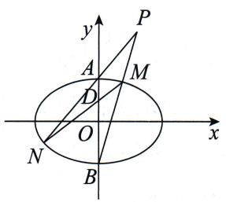

# 参考解析

# 方法一:凑韦达(部分代换)
设 $D(0,m)$ , $M(x_{1},y_{1})$ , $N(x_{2},y_{2})$ .
由题意得直线 $MN$ 的方程为 $y = x + m (0 < m < 1)$ , 直线 $MB$ 的方程为 $y = \frac{y_1 + 1}{x_1} x - 1$ , 直线 $NA$ 的方程为 $y = \frac{y_2 - 1}{x_2} x + 1$ ,
即直线 $MB$ 的方程为 $x = \frac{x_1}{y_1 + 1} (y + 1)$ , 直线 $NA$ 的方程为 $x = \frac{x_2}{y_2 - 1} (y - 1)$ ,
联立上面两式解得 $\frac{y-1}{y+1}=\frac{x_{1}(y_{2}-1)}{x_{2}(y_{1}+1)}$ ，即 $\frac{y_{P}-1}{y_{P}+1}=\frac{x_{1}(y_{2}-1)}{x_{2}(y_{1}+1)}$ .
因为 M, N 在直线 MN 上, 所以 $y_{1}=x_{1}+m$ , $y_{2}=x_{2}+m$ ,
代入上式得 $\frac{y_P - 1}{y_P + 1} = \frac{x_1(x_2 + m - 1)}{x_2(x_1 + m + 1)}.$

保留 $x_{1}$ ，变形得 $\frac{y_P - 1}{y_P + 1} = \frac{x_1x_2 + (m - 1)x_1}{x_1x_2 + (m + 1)(x_1 + x_2) - (m + 1)x_1}.$
联立 $y=x+m$ 与椭圆方程，得 $3x^{2}+4mx+2m^{2}-2=0$ .
由韦达定理得 $\left\{\begin{aligned}x_{1}+x_{2}&=\frac{-4m}{3},\\ x_{1}x_{2}&=\frac{2m^{2}-2}{3},\end{aligned}\right.$
所以 $\frac{y_P - 1}{y_P + 1} = \frac{\frac{2}{3}(m^2 - 1) + (m - 1)x_1}{-\frac{2}{3}(m + 1)^2 - (m + 1)x_1} = \frac{(m - 1)\left[\frac{2}{3}(m + 1) + x_1\right]}{-(m + 1)\left[\frac{2}{3}(m + 1) + x_1\right]} =$
$\frac {1 - m}{1 + m}.$
解得 $y_{P}=\frac{1}{m}$ ，所以 $\overrightarrow{OD}\cdot\overrightarrow{OP}=my_{P}=1$ .

# 方法二: 求根
由题意知直线 AN 和直线 BM 的斜率都存在且不为 0，
所以设直线 AN 的方程为 $y=k_{1}x+1$ ，直线 BM 的方程为 $y=k_{2}x-1$ ，
联立 $y = k_{1}x + 1$ 和 $y = k_{2}x - 1$ ，解得 $y_{P} = \frac{k_{2} + k_{1}}{k_{2} - k_{1}}.$
联立 $y = k_{1}x + 1$ 和 $\frac{x^2}{2} + y^2 = 1$ ，得 $(2k_1^2 + 1)x^2 + 4k_1x = 0.$
由韦达定理得 $x_{A} + x_{N} = \frac{-4k_{1}}{2k_{1}^{2} + 1}$ 即 $x_{N} = \frac{-4k_{1}}{2k_{1}^{2} + 1}$ .
代入 $y = k_{1}x + 1$ ，得 $y_{N} = \frac{-2k_{1}^{2} + 1}{2k_{1}^{2} + 1}$
所以 $N\left(\frac{-4k_1}{2k_1^2 + 1}, \frac{-2k_1^2 + 1}{2k_1^2 + 1}\right)$ ，同理可得 $M\left(\frac{4k_2}{2k_2^2 + 1}, \frac{2k_2^2 - 1}{2k_2^2 + 1}\right)$ .

思维笔记

Siweibiji

思维笔记

Siweibiji

设 $D(0,m)$

M,N,D 三点共线,则 $k_{MD}=k_{ND}$ ,
$\begin{array}{l} \text {即} \frac {\frac {2 k _ {2} ^ {2} - 1}{2 k _ {2} ^ {2} + 1} - m}{\frac {4 k _ {2}}{2 k _ {2} ^ {2} + 1}} = \frac {\frac {- 2 k _ {1} ^ {2} + 1}{2 k _ {1} ^ {2} + 1} - m}{\frac {- 4 k _ {1}}{2 k _ {1} ^ {2} + 1}} \\ \Rightarrow \frac {2 k _ {2} ^ {2} - 1 - (2 k _ {2} ^ {2} + 1) m}{k _ {2}} = \frac {2 k _ {1} ^ {2} - 1 + (2 k _ {1} ^ {2} + 1) m}{k _ {1}} \\ \Rightarrow 2 k _ {1} k _ {2} ^ {2} - k _ {1} - \left(2 k _ {1} k _ {2} ^ {2} + k _ {1}\right) m = 2 k _ {2} k _ {1} ^ {2} - k _ {2} + \left(2 k _ {2} k _ {1} ^ {2} + k _ {2}\right) m \\ \Rightarrow (2 k _ {1} k _ {2} + 1) \left(k _ {2} + k _ {1}\right) m = (2 k _ {1} k _ {2} + 1) \left(k _ {2} - k _ {1}\right) \\ \Rightarrow m = \frac {k _ {2} - k _ {1}}{k _ {2} + k _ {1}}, \\ \end{array}$
所以 $\overrightarrow{OD}\cdot\overrightarrow{OP}=my_{P}=1.$

# 总结

我们将不对称问题从多个角度进行了分析. 给出这么多解法的目的是什么呢? 只是希望帮助同学们回顾本书第一篇的手法, 找到自己能接受的一种解法.

# 第九章 “同构”专题
在学习直线与圆时就接触过“同构”: 如果两个圆相交, 那么两圆方程相减就是两圆的公共弦方程.

下面我们来证明一下：
假设 $P(x_{1},y_{1}), Q(x_{2},y_{2})$ 是圆 $C_{1}: x^{2} + y^{2} + D_{1}x + E_{1}y + F_{1} = 0$ 和圆 $C_{2}: x^{2} + y^{2} + D_{2}x + E_{2}y + F_{2} = 0$ 的公共点.
根据点 P 在圆上有 $x_{1}^{2} + y_{1}^{2} + D_{1}x_{1} + E_{1}y_{1} + F_{1} = 0, x_{1}^{2} + y_{1}^{2} + D_{2}x_{1} + E_{2}y_{1} + F_{2} = 0$ ,

两式相减得 $(D_{1}-D_{2})x_{1}+(E_{1}-E_{2})y_{1}+(F_{1}-F_{2})=0.$

此式表明点 $P(x_{1},y_{1})$ 在直线 $(D_{1} - D_{2})x + (E_{1} - E_{2})y + (F_{1} - F_{2}) = 0$ 上.
根据点 Q 在圆上, 同理可得 $(D_{1}-D_{2})x_{2}+(E_{1}-E_{2})y_{2}+(F_{1}-F_{2})=0$ ,

此式表明点 $Q(x_{2},y_{2})$ 也在直线 $(D_{1} - D_{2})x + (E_{1} - E_{2})y + (F_{1} - F_{2}) = 0$ 上.
因此直线 $(D_{1}-D_{2})x+(E_{1}-E_{2})y+(F_{1}-F_{2})=0$ 即为直线PQ.

证毕.

这就是“同构”的一个应用。“同构”，意味着能得到两个结构相同的式子。

# 场景一:设点法——双动点

> [!example]- 例1 椭圆 $\frac{x^2}{4} + y^2 = 1$ 的内接四边形 $ABCD$ 的对角线 $AC, BD$ 相交于点 $P\left(1, \frac{1}{4}\right)$ , 且满足 $\overrightarrow{AP} = 2\overrightarrow{PC}, \overrightarrow{BP} = 2\overrightarrow{PD}$ , 求直线 $AB$ 的斜率.
# 题目分析
注意到向量条件 $\overrightarrow{AP}=2\overrightarrow{PC}$ . 根据设点法——双动点中的操作, 最终可以得到关于点 A 坐标的一个一次方程.
再结合 $\overrightarrow{BP}=2\overrightarrow{PD}$ ，可以得到关于点B坐标的一个一次方程，并且系数与点A坐标满足的一次方程的系数一致.

# 参考解析
由 $\overrightarrow{AP} = 2\overrightarrow{PC}$ ，得 $\left\{ \begin{array}{l}1 - x_{A} = 2(x_{C} - 1),\\ \frac{1}{4} -y_{A} = 2\left(y_{C} - \frac{1}{4}\right), \end{array} \right.$ 即 $C\left(\frac{3 - x_A}{2},\frac{\frac{3}{4} - y_A}{2}\right).$
由点 $C$ 在椭圆上，有 $\frac{x_C^2}{4} + y_C^2 = 1 \Rightarrow \frac{\left(\frac{3 - x_A}{2}\right)^2}{4} + \frac{\left(\frac{3}{4} - y_A\right)^2}{4} = 1.$
由点 A 在椭圆上，有 $\frac{x_{A}^{2}}{4} + y_{A}^{2} = 1$ ，代入上式，化简得 $x_{A} + y_{A} + \frac{1}{8} = 0$ .

同理,根据 $\overrightarrow{BP}=2\overrightarrow{PD}$ 可得 $x_{B}+y_{B}+\frac{1}{8}=0.$
所以 A, B 两点都在直线 $x + y + \frac{1}{8} = 0$ 上.
因此 $x+y+\frac{1}{8}=0$ 就是直线 AB 的方程, 所以 $k_{AB}=-1$ .

# 场景二: 直线与曲线方程联立后得到的二次方程

我们知道直线与曲线的两个交点的横坐标或纵坐标都满足此方程, 即两个交点的横坐标或纵坐标就是这个方程的根. 结合这个思想, 当我们遇到两个结构相同但变量不同的式子时, 如 $ax^{2} + bx + c = 0$ 和 $ay^{2} + by + c = 0$ , 我们是不是可以考虑构造一个以它们为根的二次方程呢?
其中比较经典的题目是过曲线外一点向曲线作两条切线,特别当曲线为圆或者椭圆的情况.

> [!example]- 例 2 动点 $P(x_{0}, y_{0})$ 是椭圆 $\frac{x^{2}}{a^{2}} + \frac{y^{2}}{b^{2}} = 1 (a > b > 0)$ 外一点，过点 P 向椭圆作两条切线。证明：当两条切线相互垂直时，点 P 的运动轨迹是圆。
# 题目分析

这类问题的处理手法有四步:设→切→根→韦.
设:设切线.

切:翻译相切.

根:得到以两切线斜率为根的二次方程.

韦:利用韦达定理,代入求解.

# 参考解析
当两条切线的斜率都存在时，

# 第一步(设):
分别设两切线的斜率为 $k_{1}$ 和 $k_{2}$ ，切线相互垂直，即 $k_{1}k_{2} = -1$ .
则切线 $l_{1}$ 的方程为 $y-y_{0}=k_{1}(x-x_{0})$ ，切线 $l_{2}$ 的方程为 $y-y_{0}=k_{2}(x-x_{0})$ .

# 第二步(切):

翻译直线与椭圆相切,即联立直线方程与椭圆方程后所得二次方程的判别式 $\Delta$ 为0.

先设 $m=y_{0}-k_{1}x_{0}$ ，则 $l_{1}$ 的方程为 $y=k_{1}x+m$ ，
联立 $y=k_{1}x+m$ 与 $\frac{x^{2}}{a^{2}}+\frac{y^{2}}{b^{2}}=1$ ,
得 $(a^{2}k_{1}^{2} + b^{2})x^{2} + 2a^{2}k_{1}mx + a^{2}m^{2} - a^{2}b^{2} = 0,$
令 $\Delta=0\Rightarrow a^{2}k_{1}^{2}+b^{2}=m^{2}\Rightarrow a^{2}k_{1}^{2}+b^{2}=(y_{0}-k_{1}x_{0})^{2}.$

以斜率 $k_{1}$ 为主元，整理一下得 $(a^{2}-x_{0}^{2})k_{1}^{2}+2x_{0}y_{0}k_{1}+b^{2}-y_{0}^{2}=0.$

同理，由直线 $l_{2}$ 与椭圆相切得 $(a^{2} - x_{0}^{2})k_{2}^{2} + 2x_{0}y_{0}k_{2} + b^{2} - y_{0}^{2} = 0.$

# 第三步(根):
所以 $k_{1}, k_{2}$ 是方程 $(a^{2}-x_{0}^{2})k^{2}+2x_{0}y_{0}k+b^{2}-y_{0}^{2}=0$ 的两根.

# 第四步(韦):
由韦达定理得 $k_{1}k_{2} = \frac{b^{2} - y_{0}^{2}}{a^{2} - x_{0}^{2}}\Rightarrow \frac{b^{2} - y_{0}^{2}}{a^{2} - x_{0}^{2}} = -1\Rightarrow x_{0}^{2} + y_{0}^{2} = a^{2} + b^{2}$
当其中一条切线的斜率不存在时， $P(x_{0},y_{0})$ 的坐标也满足上式.

综上， $P(x_{0},y_{0})$ 的运动轨迹是圆 $x^{2}+y^{2}=a^{2}+b^{2}$ .
接下来,我们看一下与圆相切的情况.

> [!example]- 例 3 在平面直角坐标系 $xOy$ 中, 已知点 $M(x_0, y_0)$ 是椭圆 $\frac{x^2}{4} + y^2 = 1$ 上一动点. 从原点 $O$ 向圆 $M: (x - x_0)^2 + (y - y_0)^2 = \frac{4}{5}$ 作两条切线, 分别与椭圆交于点 $P$ , $Q$ . 直线 $OP, OQ$ 的斜率分别记为 $k_1, k_2$ , 求证: $k_1 k_2 = -\frac{1}{4}$ .
# 参考解析
因为直线 OP, OQ 的斜率都存在,
所以圆 M 不与 y 轴相切，即 $x_{0}^{2} \neq \frac{4}{5}$ .

# 第一步(设):
由题意知直线 OP 的方程为 $y=k_{1}x$ ，直线 OQ 的方程为 $y=k_{2}x$ 。

# 第二步(切):

直线与圆相切,可以利用圆心到直线的距离 d 等于圆的半径.
由直线 OP: $y=k_{1}x$ 与圆 $M:(x-x_{0})^{2}+(y-y_{0})^{2}=\frac{4}{5}$ 相切，得 $\frac{|k_{1}x_{0}-y_{0}|}{\sqrt{1+k_{1}^{2}}}=\frac{2}{\sqrt{5}}$ .

思维笔记

Siweibiji

思维笔记

Siweibiji

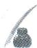

平方后，以变量 $k_{1}$ 为主元整理，得 $(5x_0^2 -4)k_1^2 -10x_0y_0k_1 + (5y_0^2 -4) = 0.$

同理，由直线 $OQ$ 与圆 $M$ 相切得 $(5x_0^2 - 4)k_2^2 - 10x_0y_0k_2 + (5y_0^2 - 4) = 0.$
第三步(根):
所以 $k_{1}, k_{2}$ 是方程 $(5x_{0}^{2} - 4)k^{2} - 10x_{0}y_{0}k + (5y_{0}^{2} - 4) = 0$ 的两个根.
第四步(韦):
由韦达定理得 $k_{1}k_{2} = \frac{5y_{0}^{2} - 4}{5x_{0}^{2} - 4}$
又因为点 M 在椭圆上, 所以 $\frac{x_{0}^{2}}{4} + y_{0}^{2} = 1$ ,
代入上式得 $k_{1}k_{2} = \frac{5\left(1 - \frac{x_{0}^{2}}{4}\right) - 4}{5x_{0}^{2} - 4} = \frac{1 - \frac{5}{4}x_{0}^{2}}{5x_{0}^{2} - 4} = -\frac{1}{4}.$ 证毕.

“同构”只适合定值或定圆的题目吗？当然不是。只要是满足这种结构的都可以做，来看最后一道例题。

> [!example]- 例4 已知点 $M(x_0, y_0)$ 是椭圆 $\frac{x^2}{4} + y^2 = 1$ 上一动点，且 $M$ 在第一象限内。过 $M$ 向圆 $O: x^2 + y^2 = 1$ 作两条切线，分别与圆切于点 $P, Q$ 。直线 $MP, MQ$ 的斜率分别记为 $k_1, k_2$ 。直线 $OM$ 的斜率记为 $k$ 。请求出 $k\left(\frac{1}{k_1} + \frac{1}{k_2}\right)$ 的取值范围。

# 参考解析
因为直线 $MP, MQ$ 的斜率都存在，
所以 $x_0 \neq 1, y_0 \neq \frac{\sqrt{3}}{2}$ .

第一步(设):
由题意知直线 $MP$ 的方程为 $y = k_{1}(x - x_{0}) + y_{0}$ , 直线 $MQ$ 的方程为 $y = k_{2}(x - x_{0}) + y_{0}$ .
第二步(切):
由直线 $MP:y = k_{1}(x - x_{0}) + y_{0}$ 与圆 $O:x^{2} + y^{2} = 1$ 相切，得 $\frac{|k_1x_0 - y_0|}{\sqrt{1 + k_1^2}} = 1.$

平方后以变量 $k_{1}$ 为主元整理，得 $(x_0^2 - 1)k_1^2 - 2x_0y_0k_1 + (y_0^2 - 1) = 0.$

同理，由直线 $MQ$ 与圆 $O$ 相切，得 $(x_0^2 - 1)k_2^2 - 2x_0y_0k_2 + (y_0^2 - 1) = 0.$
第三步(根):
所以 $k_{1}, k_{2}$ 是方程 $(x_{0}^{2}-1)k^{2}-2x_{0}y_{0}k+(y_{0}^{2}-1)=0$ 的两个根.
第四步(韦):
由韦达定理得 $\left\{\begin{aligned}k_{1}+k_{2}&=\frac{2x_{0}y_{0}}{x_{0}^{2}-1},\\ k_{1}k_{2}&=\frac{y_{0}^{2}-1}{x_{0}^{2}-1}.\end{aligned}\right.$
所以 $k\left(\frac{1}{k_1} + \frac{1}{k_2}\right) = \frac{y_0}{x_0} \cdot \frac{k_1 + k_2}{k_1k_2} = \frac{2y_0^2}{y_0^2 - 1}$ .
根据点 $M$ 在第一象限有 $y_0^2 \in (0,1)$ , 又 $y_0 \neq \frac{\sqrt{3}}{2}$ , 所以 $y_0^2 \in \left(0, \frac{3}{4}\right) \cup \left(\frac{3}{4}, 1\right)$ .
所以 $k\left(\frac{1}{k_{1}}+\frac{1}{k_{2}}\right)=2+\frac{2}{y_{0}^{2}-1}$ 的取值范围是 $(-∞,-6)∪(-6,0)$ .

# 总结
通过四道不同的例题来体现这个方法的统一之处。“同构”涵盖的面非常广，只要几何上两点或两斜率或其他具有对称性的关系，或者说都满足的性质，则代数上一定能得到“同构”的式子.

此外,我们还可以从另一个角度来得到“同构”的式子,即调整条件的使用顺序.我们以 15.1 定点问题中的例 1 为对象来进行分析.

> [!example]- 例1 在平面直角坐标系 $xOy$ 中, 设直线 $l$ 不过点 $B(0,1)$ 且斜率存在, 与椭圆 $\frac{x^2}{4} + y^2 = 1$ 交于 $P, Q$ 两点. 若直线 $PB$ 与直线 $QB$ 的斜率之积为 $-\frac{1}{4}$ , 判断直线 $l$ 是否过定点, 若过定点, 求出此定点的坐标; 若不过定点, 请说明理由.

# 题目分析
由题意可知 P, Q 两点的地位是等价的——它们都同时满足三个条件: （1） 椭圆上的点; （2） 直线 l 上的点; （3） 过点 B 的直线上的点.

常见的条件使用顺序是先利用条件（1）（2），使用整体代换的思路，即联立方程得到韦达定理再代入由条件（3）衍生出的斜率之积为 $-\frac{1}{4}$ ，或者是先利用条件（1）（3），使用已知点解未知点的思路，得到 $P, Q$ 两点的坐标，再研究直线 $l$ ，即条件（2）.

那我们是否可以从排列组合的角度来想一想:如果先利用条件（2）（3）,再利用条件（1）会如何呢?

可以预料到,分别联立直线 l 的方程与直线 BP 和 BQ 的方程,得到的交点坐标包含了直线 l 方程的参数与直线 BP 和 BQ 的斜率,那么再将点的坐标代入椭圆方程,则一定会得到两个二次方程,而得到的两个方程中除了 BP 的斜率和 BQ 的斜率不同,其余并无差异,即可以得到以 BP 和 BQ 的斜率为根的二次方程.
然后利用熟悉的韦达定理来处理斜率之积为 $-\frac{1}{4}$ 即可.

# 参考解析
由题意可知直线 l 的斜率存在, 故设直线 l 的方程为 $y = kx + m (m \neq 1)$ ,
设直线 $l_{BP}$ 的方程为 $y=k_{1}x+1$ ，直线 $l_{BQ}$ 的方程为 $y=k_{2}x+1$ ，

思维笔记

Siweibiji

思维笔记

Siweibiji

联立直线 $l_{BP}$ 与直线 l 的方程, 可得 $\left\{\begin{aligned} y &= k_{1}x + 1, \\ y &= kx + m, \end{aligned}\right.$
消去 $y$ 得 $k_{1}x + 1 = kx + m$ ，即 $x = \frac{m - 1}{k_1 - k}$
所以 $y = k_{1}\cdot \frac{m - 1}{k_{1} - k} +1 = \frac{mk_{1} - k}{k_{1} - k}$ ，因此 $P\left(\frac{m - 1}{k_1 - k},\frac{mk_1 - k}{k_1 - k}\right).$
因为点 $P$ 在椭圆 $\frac{x^2}{4} + y^2 = 1$ 上，所以 $\frac{\left(\frac{m - 1}{k_1 - k}\right)^2}{4} +\left(\frac{mk_1 - k}{k_1 - k}\right)^2 = 1,$
即有 $(m - 1)^2 + 4(mk_1 - k)^2 = 4(k_1 - k)^2$
进而有 $4(m^{2} - 1)k_{1}^{2} + 8k(1 - m)k_{1} + (m - 1)^{2} = 0.$
因为 $m \neq 1$ ，所以有 $4(m + 1)k_1^2 - 8kk_1 + m - 1 = 0$
同理可得 $4(m+1)k_{2}^{2}-8kk_{2}+m-1=0$ ,
因此 $k_{1}$ 和 $k_{2}$ 是以 $x$ 为未知数的二次方程 $4(m + 1)x^{2} - 8kx + m - 1 = 0$ 的两根，
由韦达定理得 $k_{1}k_{2} = \frac{m - 1}{4(m + 1)}$
由题意知 $k_{1}k_{2} = -\frac{1}{4}$ 所以 $-\frac{1}{4} = \frac{m - 1}{4(m + 1)}$ 解得 $m = 0$
所以直线 l 的方程为 y=kx，过定点 $(0,0)$ .

# 总结

本例的解题方法虽然在计算中并不占有优势,但是可以引导同学们思考:面对多个条件时,是否可以通过调整条件的使用顺序实现解题优化呢?

这种思考并非仅存在于圆锥曲线解答题,在圆锥曲线的小题乃至其他知识模块仍然存在.

# 场景三: 齐次化联立

对于一类可以用韦达定理整体代换直接解决的题目,我们也可以使用“同构”的做法来处理,那就是齐次化联立.上面我们所说的直线方程与曲线方程联立是指消掉 x 或者 y,得到以 y 或者 x 为未知量的二次方程.

齐次化联立来源于我们学基本不等式时的一道例题：

已知 $x > 0, y > 0$ ，且 $x + y = 1$ ，求 $\frac{1}{x} + \frac{1}{y}$ 的最小值.

想必同学们都会如下操作: $\frac{1}{x}+\frac{1}{y}=\left(\frac{1}{x}+\frac{1}{y}\right)\cdot(x+y)=\frac{y}{x}+\frac{x}{y}+2\geqslant2+2=4$ , 当且仅当 $\frac{y}{x}=\frac{x}{y}$ 时取等号.

为什么我们乘 $x + y$ 就可以解出来了呢？仅仅是因为 $x + y = 1$ 吗？
如果乘 $x + y$ 可以，那除 $x + y$ 或者乘 $(x + y)^2$ 后同样不改变式子的大小，为什么就解不出来了？所以关键不是在常数，关键是在次数.
$x + y$ 可以视为一个一次式，而 $\frac{1}{x} +\frac{1}{y}$ 是一个负一次式，两者相乘可以得到一个齐次的式子.记住一句话：齐次同除化单变量，即只要我们构建出了一个齐次的式子，最后一定能用单变量表示.
如果题目改为求 $\frac{y}{x} +\frac{1}{y}$ 的最小值，该如何处理呢？这时候不要直接乘 $x + y$ 注意到目标中 $\frac{y}{x}$ 是齐次的，所以我们只需要将 $\frac{1}{y}$ 转化为齐次的即可，即
$\frac{y}{x} + \frac{1}{y} = \frac{y}{x} + \frac{1}{y} \cdot (x + y) = \frac{y}{x} + \frac{x}{y} + 1 \geqslant 2 + 1 = 3$ ，当且仅当 $\frac{y}{x} = \frac{x}{y}$ 时取等号.

我们再把题目改成求 $\frac{y+1}{x}+\frac{x}{y}$ 的最小值,又该如何处理呢?

目标中 $\frac{x}{y}$ 是齐次的，而 $\frac{y + 1}{x}$ 的分母是一次，分子是一次加常数（0次），所以要想得到一个齐次的式子，只需要把常数变为一次，即
$\frac{y + 1}{x} + \frac{x}{y} = \frac{y + (x + y)}{x} + \frac{x}{y} = \frac{2y}{x} + \frac{x}{y} + 1 \geqslant 2\sqrt{2} + 1$ ，当且仅当 $\frac{2y}{x} = \frac{x}{y}$ 时取等号.
在解圆锥曲线题目过程中经常会遇见两个斜率之间的加或乘的关系.

> [!example]- 例5 若直线 $l$ 与椭圆 $\frac{x^2}{4} +\frac{y^2}{2} = 1$ 交于 $A,B$ 两点，且与圆 $O:x^{2} + y^{2} = \frac{4}{3}$ 相切，证明： $OA\bot OB$
# 题目分析
设直线 l 的方程为 $y = kx + m$ (斜率不存在时易证, 此处略), $A(x_{1}, y_{1})$ , $B(x_{2}, y_{2})$ ,
由直线 l 与圆 O 相切得圆心到直线的距离等于半径，即 $\frac{|m|}{\sqrt{1+k^{2}}}=\sqrt{\frac{4}{3}}\Leftrightarrow3m^{2}=4(k^{2}+1)$ .
要证 $OA \perp OB$ ，即证 $k_{OA} k_{OB} = -1$ ，即证 $\frac{y_1}{x_1} \cdot \frac{y_2}{x_2} = -1$ .

我们发现 $\frac{y_1}{x_1}, \frac{y_2}{x_2}$ 是两个结构相同的式子，并且都是齐次的，因此如果我们能得到以 $\frac{y}{x}$ 为变量的二次方程， $\frac{y_1}{x_1}, \frac{y_2}{x_2}$ 为此方程的两根，问题就能得到解决.

# 参考解析

# 方法一：“同构”法

①当直线 l 的斜率存在时, 设直线 l 的方程为 $y = kx + m$ , 即 $\frac{y - kx}{m} = 1$ , 设

思维笔记

Siweiliji

思维笔记

Siweibiji

$A (x _ {1}, y _ {1}), B (x _ {2}, y _ {2}).$

椭圆方程 $\frac{x^2}{4} +\frac{y^2}{2} = 1$ 左边是齐二次，右边是常数，
所以直接用 $\frac{y - kx}{m} = 1$ 把常数1换掉是不够的，必须平方后换掉常数1才能得到齐二次的式子，即 $\frac{x^2}{4} +\frac{y^2}{2} = \left(\frac{y - kx}{m}\right)^2.$

抓主元整理一下得 $\left(\frac{1}{m^2} -\frac{1}{2}\right)y^2 -\frac{2k}{m^2} xy + \left(\frac{k^2}{m^2} -\frac{1}{4}\right)x^2 = 0,$
当 $x \neq 0$ 时，等式两边同除以 $x^2$ 得 $\left(\frac{1}{m^2} - \frac{1}{2}\right)\left(\frac{y}{x}\right)^2 - \frac{2k}{m^2} \cdot \frac{y}{x} + \left(\frac{k^2}{m^2} - \frac{1}{4}\right) = 0,$
此时 $\frac{y_{1}}{x_{1}},\frac{y_{2}}{x_{2}}$ 为此方程的两根.
利用韦达定理得 $\frac{y_1}{x_1} \cdot \frac{y_2}{x_2} = \frac{\frac{k^2}{m^2} - \frac{1}{4}}{\frac{1}{m^2} - \frac{1}{2}} = \frac{4k^2 - m^2}{4 - 2m^2}$ . （\*）
由直线 $l$ 与圆 $x^{2} + y^{2} = \frac{4}{3}$ 相切，可得 $\frac{|m|}{\sqrt{1 + k^2}} = \sqrt{\frac{4}{3}}$ ，即 $3m^{2} = 4(k^{2} + 1)$
将 $3m^{2} = 4(k^{2} + 1)$ 代入 $(\ast)$ 式，得
$\frac{y_{1}}{x_{1}}\cdot\frac{y_{2}}{x_{2}}=\frac{3m^{2}-4-m^{2}}{4-2m^{2}}=-1$ ，所以 $OA\perp OB$ .
当 x=0 时, 直线 l 过椭圆的左顶点或右顶点, 同时直线 l 过椭圆的上顶点或下顶点, $OA \perp OB$ 成立.

②当直线 l 的斜率不存在时, 直线 l 的方程为 $x=\frac{2\sqrt{3}}{3}$ 或 $x=-\frac{2\sqrt{3}}{3}$ .
当 $l$ 的方程为 $x = \frac{2\sqrt{3}}{3}$ 时，取 $A\left(\frac{2\sqrt{3}}{3},\frac{2\sqrt{3}}{3}\right),B\left(\frac{2\sqrt{3}}{3}, - \frac{2\sqrt{3}}{3}\right),$
则 $\overrightarrow{OA} \cdot \overrightarrow{OB} = \frac{4}{3} - \frac{4}{3} = 0$ ，所以 $OA \perp OB$ .

同理可证，当 $l$ 的方程为 $x = -\frac{2\sqrt{3}}{3}$ 时， $OA \perp OB$ .

综上，OA⊥OB.

# 方法二:常规方法

①当直线 l 的斜率存在时，设其方程为 $y=kx+m, A(x_{1},y_{1}), B(x_{2},y_{2})$ ,
因为直线 l 与圆 O 相切，所以 $\frac{2\sqrt{3}}{3} = \frac{|m|}{\sqrt{k^{2} + 1}}$ ，即 $3m^{2} - 4k^{2} - 4 = 0$ .
联立直线方程与椭圆方程得 $\left\{\begin{aligned}y&=kx+m,\\ \frac{x^{2}}{4}&+\frac{y^{2}}{2}=1\end{aligned}\right.\Rightarrow(1+2k^{2})x^{2}+4kmx+2m^{2}-4=0,$
由韦达定理得 $\left\{\begin{aligned}x_{1}+x_{2}&=-\frac{4km}{1+2k^{2}},\\ x_{1}x_{2}&=\frac{2m^{2}-4}{1+2k^{2}},\end{aligned}\right.$
所以 $\overrightarrow{OA} \cdot \overrightarrow{OB} = x_{1}x_{2} + y_{1}y_{2} = x_{1}x_{2} + (kx_{1} + m)(kx_{2} + m)$
$\begin{array}{l} = (1 + k ^ {2}) x _ {1} x _ {2} + k m \left(x _ {1} + x _ {2}\right) + m ^ {2} \\ = \frac {(1 + k ^ {2}) (2 m ^ {2} - 4) - 4 k ^ {2} m ^ {2} + m ^ {2} (1 + 2 k ^ {2})}{1 + 2 k ^ {2}} \\ = \frac {3 m ^ {2} - 4 k ^ {2} - 4}{1 + 2 k ^ {2}} = 0. \\ \end{array}$
所以 $OA \perp OB$ .

②当直线 l 的斜率不存在时, 直线 l 的方程为 $x=\frac{2\sqrt{3}}{3}$ 或 $x=-\frac{2\sqrt{3}}{3}$ .
当直线 l 的方程为 $x=\frac{2\sqrt{3}}{3}$ 时，取 $A\left(\frac{2\sqrt{3}}{3},\frac{2\sqrt{3}}{3}\right)$ ， $B\left(\frac{2\sqrt{3}}{3},-\frac{2\sqrt{3}}{3}\right)$ ，
则 $\overrightarrow{OA}\cdot\overrightarrow{OB}=\frac{4}{3}-\frac{4}{3}=0$ ，所以 $OA\perp OB$ .
同理可得,当直线 l 的方程为 $x=-\frac{2\sqrt{3}}{3}$ 时, $OA \perp OB$ .

综上，OA⊥OB.
如果式中出现常数形如 $\frac{y}{x-3}$ ，又该如何处理呢？一起来看下面这道我们在第九节“高级”代数变形中给出的例题.

> [!example]- 例 6 过点 $M(3,0)$ 的直线 l 与椭圆 $\frac{x^{2}}{4} + \frac{y^{2}}{3} = 1$ 交于 A, B 两点，点 B 关于 x 轴的对称点为点 E，证明：直线 AE 过定点.
# 题目分析
由条件可知 $B(x_{E}, -y_{E})$ ,
由 A, B, M 三点共线，可知 $k_{AM} = k_{BM}$ ，即 $\frac{y_{A}}{x_{A} - 3} + \frac{y_{E}}{x_{E} - 3} = 0$ .
根据“同构”的思想,既然 $\frac{y_{A}}{x_{A}-3}$ 和 $\frac{y_{E}}{x_{E}-3}$ 的结构相同,那能不能构造以 $\frac{y}{x-3}$ 为未知数的二次方程呢?当然,看到复杂的结构先换个元.
设 $x - 3 = m, y = n$ ，直线 $AE: pm + qn = 1 (q \neq 0)$ （这样设便于方程联立），为什么要这么设呢？我们的目的是构造个齐次式，这样设的式子左边是一次的 $m, n$ ，右边是常数，可以视为零次，此时 $m = m \cdot 1 = m (pm + qn)$ ，就可以将一次的 $m$ 变为二次形式。
$\frac {x ^ {2}}{4} + \frac {y ^ {2}}{3} = 1 \Rightarrow \frac {(m + 3) ^ {2}}{4} + \frac {n ^ {2}}{3} = 1 \Rightarrow \frac {m ^ {2}}{4} + \frac {n ^ {2}}{3} + \frac {3}{2} m + \frac {5}{4} = 0.$

要得到以 $\frac{n}{m}$ 为变量的式子,即得到一个齐二次式,上式中的常数就要乘 $(pm+qn)^{2}$ ,而一次项则直接乘 $pm+qn$ ,

思维笔记

Siweibiji

思维笔记

Siweibiji

即有 $\frac{m^2}{4} +\frac{n^2}{3} +\frac{3}{2} m(pm + qn) + \frac{5}{4} (pm + qn)^2 = 0,$

等式左右两边同除以 $m^2$ ，整理一下得
$\left(\frac {5}{4} q ^ {2} + \frac {1}{3}\right) \left(\frac {n}{m}\right) ^ {2} + \frac {q}{2} (5 p + 3) \frac {n}{m} + \frac {5}{4} p ^ {2} + \frac {3}{2} p + \frac {1}{4} = 0,$
然后就能够使用韦达定理了.

# 参考解析
由条件可知 $B(x_{E}, -y_{E})$ ,

A, B, M 三点共线，即 $k_{AM} = k_{BM}$ ,
所以 $\frac{y_A}{x_A - 3} = \frac{-y_E}{x_E - 3}$ 即 $\frac{y_A}{x_A - 3} +\frac{y_E}{x_E - 3} = 0.$
设 $x - 3 = m, y = n$ ，直线 $AE$ 的方程为 $pm + qn = 1 (q \neq 0)$ ，

且椭圆方程 $\frac{x^2}{4} +\frac{y^2}{3} = 1\Rightarrow \frac{(m + 3)^2}{4} +\frac{n^2}{3} = 1\Rightarrow \frac{m^2}{4} +\frac{n^2}{3} +\frac{3}{2} m + \frac{5}{4} = 0.$
所以 $\frac{m^2}{4} +\frac{n^2}{3} +\frac{3}{2} m(pm + qn) + \frac{5}{4} (pm + qn)^2 = 0,$
等式两边同除以 $m^2$ ，得 $\left(\frac{5}{4} q^2 +\frac{1}{3}\right)\left(\frac{n}{m}\right)^2 +\frac{q}{2} (5p + 3)\frac{n}{m} +\frac{5}{4} p^2 +\frac{3}{2} p + \frac{1}{4} = 0,$
由韦达定理得 $\frac{n_A}{m_A} +\frac{n_E}{m_E} = -\frac{\frac{q}{2}(5p + 3)}{\frac{5}{4}q^2 + \frac{1}{3}} = 0\Rightarrow p = -\frac{3}{5},$
因此直线 AE 的方程为 $-\frac{3}{5}m+qn=1$ .
由直线 $AE$ 过定点，得 $m = -\frac{5}{3}, n = 0$
所以 $x = m + 3 = \frac{4}{3}$ 即直线 $AE$ 过定点 $\left(\frac{4}{3},0\right)$

# 总结

这种方法很多资料中冠以平移联立的名字,实际上没有必要引入坐标的平移,单纯地作为换元的手法来进行处理和理解即可.这个操作在实际化简中不一定会比常规处理有优势,所以重要的是掌握齐次的思想.
在本篇中我们介绍了计算的问题,大家需要意识到三点:

1. 培养出计算能力,不仅能在圆锥曲线中应用,在其他知识板块也有大量应用.

2. 可以根据自己的情况对部分操作进行调整,通过有意义的练习进行习惯的强化,即在每次运算的时候要有意识地去看是否能应用,该如何应用.

3. 不同的同学学习本节计算技巧的时候情况不同, 即有的同学掌握之后可能起到了简化的作用, 但有的同学用常规方法更快捷. 但是每位同学都需要熟练掌握其中的“同构”部分的前两种情况.

# 第五篇 实战篇

# 思维笔记

# Siweibiji

为了证明本书框架的有效性,本篇选取了部分高二、高三月考和期中等考试题,并加入了近几年的高考真题供同学们练习.希望同学们通过这些题目熟练掌握前四篇中构建的解题框架,做到既能分析思路也能写出完整解题过程.

这里要说明的是,本篇中给出的解析仅出于本书构建的解题框架,有能力的同学可以给出更多解法.

请同学们在解答本篇题目时尝试按照以下流程：

①对题目进行手法的选择；  
②构建一个思维闭环的操作设想；  
③踏踏实实将题目计算、书写完整；  
④记录下解题时间或解题中卡壳的点.
在解析中会指出用到前面的哪些内容,从而便于同学们对不会的地方及时回顾.

下面以一道题目为例：

例（2021·河南·部分学校联盟高三开学考）已知抛物线 $C: x^{2} = 2py (p > 0)$ 的焦点为 $F$ ，过 $F$ 的直线 $l$ 与 $C$ 相交于 $A, B$ 两点， $PA, PB$ 是 $C$ 的两条切线， $A, B$ 是切点。当 $AB \parallel x$ 轴时， $|AB| = 2$ 。  
（1）求抛物线 C 的方程.  
（2） 证明: $|PF|^2 = |AF| \cdot |BF|$ .   
（1）【解】因为 AB 过点 $F\left(0, \frac{p}{2}\right)$ ,
所以当 $AB \parallel x$ 轴时， $y_A = y_B = \frac{p}{2}$ ，代入抛物线方程，解得 $x^2 = p^2$
所以 $|x_A| = |x_B| = p$ ，即 $|AB| = 2p = 2$
所以 p=1 。所以抛物线 C 的方程为 $x^{2}=2y$  
（2）【证明】设 $A(2a,2a^{2})$ , $B(2b,2b^{2})$ .

[第七节 抛物线设点]
由 $x^{2} = 2y$ 得 $y = \frac{1}{2} x^2$ ，求导得 $y' = x$

[第七节 抛物线设点(例 11 抛物线切线斜率处理)]
所以切线 AP 的斜率为 2a，直线 AP 的方程为 $y-2a^{2}=2a(x-2a)$ ，
即 $y = 2ax - 2a^2$
同理可得直线 $BP$ 的方程为 $y = 2bx - 2b^2$ .
联立两直线方程得 $\left\{ \begin{array}{l} y = 2ax - 2a^2, \\ y = 2bx - 2b^2 \end{array} \right. \Rightarrow x_P = a + b \Rightarrow y_P = 2a(a + b) - 2a^2 = 2ab.$
由已知得直线 l 过点 F，即 A, B, F 三点共线，
所以 $k_{AF} = k_{BF}$ ，即 $\frac{2a^2 - \frac{1}{2}}{2a} = \frac{2b^2 - \frac{1}{2}}{2b}$ ，化简得 $4ab = -1$
所以 $|PF|^{2}=(a+b)^{2}+\left(2ab-\frac{1}{2}\right)^{2}$ ,

[12.2 线段长度]
将 $4ab = -1$ 代入上式有 $\vert PF\vert^2 = (a + b)^2 + 1$ .

[19.1 整体计算]
由抛物线定义得 $|AF| = \frac{1}{2} + 2a^2, |BF| = \frac{1}{2} + 2b^2$ ,

[12.1 与焦点有关的长度]
所以 $|AF| \cdot |BF| = \left(\frac{1}{2} + 2a^2\right)\left(\frac{1}{2} + 2b^2\right) = 4(ab)^2 + a^2 + b^2 + \frac{1}{4} = 4(ab)^2 - 2ab + \frac{1}{4} + (a + b)^2$ .
将 $4ab = -1$ 代入上式有 $\vert AF\vert \cdot \vert BF\vert = (a + b)^2 + 1.$

[19.1 整体计算]
所以 $|PF|^{2}=|AF|\cdot|BF|$ 得证.
在上述的解析中,用如“第七节 抛物线设点”在边上标注,表示使用了第七节 抛物线设点的内容,而用如“第七节 抛物线设点(例 11 抛物线切线斜率处理)”在边上标注,表示这个操作在之前的哪个例题中出现过.

# 【补充内容】  
（1）椭圆的第二定义:平面上到定点F的距离与到定直线的距离之比为常数 $e(0<e<1)$ 的点的集合.其中,定点F为椭圆的焦点,定直线为椭圆的准线.
若椭圆方程为 $\frac{x^{2}}{a^{2}}+\frac{y^{2}}{b^{2}}=1(a>b>0)$ ，则离心率 $e=\frac{c}{a}$ ，焦点坐标为 $(\pm c,0)$ ，准线方程为 $x=\pm\frac{a^{2}}{c}$ .
若椭圆方程为 $\frac{y^2}{a^2} +\frac{x^2}{b^2} = 1(a > b > 0)$ ，则离心率 $e = \frac{c}{a}$ ，焦点坐标为 $(0,\pm c)$ ，准线方程为 $y = \pm \frac{a^2}{c}$  
（2） 双曲线的第二定义: 平面内到定点 F 的距离与到定直线的距离之比为常数 $e(e>1)$ 的点的集合. 其中, 定点 F 为双曲线的焦点, 定直线为双曲线的准线.
若双曲线方程为 $\frac{x^{2}}{a^{2}}-\frac{y^{2}}{b^{2}}=1(a>0,b>0)$ ，则离心率 $e=\frac{c}{a}$ ，焦点坐标为 $(\pm c,0)$ ，准线方程为 $x=\pm\frac{a^{2}}{c}$ .
若双曲线方程为 $\frac{y^2}{a^2} -\frac{x^2}{b^2} = 1(a > 0,b > 0)$ ，则离心率 $e = \frac{c}{a}$ ，焦点坐标为(0， $\pm c)$ ，准线方程为 $y = \pm \frac{a^2}{c}$

# 实战演练

1.(2025·全国一卷)已知椭圆 $C:\frac{x^{2}}{a^{2}}+\frac{y^{2}}{b^{2}}=1$ $(a>b>0)$ 的离心率为 $\frac{2\sqrt{2}}{3}$ ，下顶点为 A，右顶点为 B， $|AB|=\sqrt{10}$ .  
（1） 求 $C$ 的标准方程.  
（2）已知动点 P 不在 y 轴上, 点 R 在射线 AP 上, 且满足 $\left|AP\right| \cdot \left|AR\right| = 3$ .  
(i) 设 $P(m, n)$ , 求点 $R$ 的坐标 (用 $m, n$ 表示);  
(ii) 设 O 为坐标原点, Q 是 C 上的动点, 直线 OR 的斜率是直线 OP 的斜率的 3 倍, 求 $\left|PQ\right|$ 的最大值.

2.(2023·全国乙卷·理)已知椭圆 $C:\frac{y^{2}}{a^{2}}+\frac{x^{2}}{b^{2}}=1(a>b>0)$ 的离心率为 $\frac{\sqrt{5}}{3}$ ，点 A(-2,0) 在 C 上.  
（1） 求 C 的方程;  
（2） 过点 $(-2,3)$ 的直线交 C 于 P, Q 两点, 直线 AP, AQ 与 y 轴的交点分别为 M, N, 证明: 线段 MN 的中点为定点.

3.(2024·新高考Ⅰ卷)已知A(0,3)和P $\left(3,\frac{3}{2}\right)$ 为椭圆 $C:\frac{x^{2}}{a^{2}}+\frac{y^{2}}{b^{2}}=1(a>b>0)$ 上两点.  
（1）求椭圆 C 的离心率;  
（2）若过点 $P$ 的直线 $l$ 交椭圆 $C$ 于另一点 $B$ , 且 $\triangle ABP$ 的面积为9, 求直线 $l$ 的方程.

4. (2024·上海) 已知双曲线 $\Gamma: x^{2} - \frac{y^{2}}{b^{2}} = 1 (b > 0)$ 的左、右顶点分别为 $A_{1}, A_{2}$ , 过点 $M(-2,0)$ 的直线 $l$ 交双曲线 $\Gamma$ 于 $P, Q$ 两点, 且点 $P$ 在第一象限.  
（1） 当离心率 e=2 时, 求 b 的值;  
（2） 当 $b=\frac{2\sqrt{6}}{3}$ ， $\triangle MA_{2}P$ 为等腰三角形时，求点 P 的坐标；  
（3） 直线 $OQ(O$ 为坐标原点) 交双曲线 $\Gamma$ 于点 $R$ (不同于点 $Q$ ), 若 $\overrightarrow{A_1R} \cdot \overrightarrow{A_2P} = 1$ , 求 $b$ 的取值范围.

5.(2023·全国甲卷·理)设抛物线 $C: y^{2} = 2px (p > 0)$ ，直线 $x - 2y + 1 = 0$ 与 C 交于 A，B 两点，且 $|AB| = 4\sqrt{15}$ .  
（1） 求 $p$ 的值;  
（2）设 F 为 C 的焦点, M, N 为 C 上两点, 且 $\overrightarrow{MF} \cdot \overrightarrow{NF} = 0$ , 求 $\triangle MNF$ 面积的最小值.

6.（2021·山东青岛·高三期初教学质量检测）已知 O 为坐标原点，抛物线 $C: y^{2} = 2px (p > 0)$ 的准线与圆 $O: x^{2} + y^{2} = 5$ 交于 M, N 两点，抛物线 C 与圆 O 交于 $M', N'$ 两点，且 $|MN| = |M'N'|$ .  
（1）求抛物线 C 的标准方程.  
（2） 动点 G 在抛物线 C 的准线上, 直线 AB 与抛物线 C 交于 A, B 两点, 直线 $A'B'$ 与抛物线 C 交于 $A', B'$ 两点, AB 与 $A'B'$ 的交点为 G, 且 $|GA| \cdot |GB| = 2|GA'| \cdot |GB'|$ . 设直线 AB, $A'B'$ 的斜率分别为 $k_{1}, k_{2}$ , 证明: $\frac{1}{k_{1}^{2}} - \frac{2}{k_{2}^{2}}$ 为定值.

7.(2023·北京)已知椭圆 $E:\frac{x^{2}}{a^{2}}+\frac{y^{2}}{b^{2}}=1(a>b>0)$ 的离心率为 $\frac{\sqrt{5}}{3}$ ，A，C 分别为 E 的上、下顶点，B，D 分别为 E 的左、右顶点， $|AC|=4$ .  
（1） 求 E 的方程.  
（2） 点 $P$ 为第一象限内 $E$ 上的一个动点, 直线 $PD$ 与直线 $BC$ 交于点 $M$ , 直线 $PA$ 与直线 $y = -2$ 交于点 $N$ . 求证: $MN \parallel CD$ .

8. (2021 · 广西师范大学附属外国语学校期中) 已知点 $P(1,0)$ , 点 $Q$ 是圆 $O_{1}: (x+1)^{2} + y^{2} = 16$ 上的动点, 线段 $PQ$ 的垂直平分线与 $QO_{1}$ 相交于点 $C$ , 点 $C$ 的轨迹为曲线 $E$ .  
（1）求曲线 E 的方程.  
（2） $A, B$ 为曲线 $E$ 上不同的两点, $O$ 为坐标原点, 线段 $AB$ 的中点为 $M$ , 当 $\triangle AOB$ 的面积取最大值时, 是否存在两个定点 $G, H$ , 使 $|GM| + |HM|$ 为定值? 若存在, 求出这个定值; 若不存在, 请说明理由.

9.(2023·天津)设椭圆 $\frac{x^{2}}{a^{2}}+\frac{y^{2}}{b^{2}}=1(a>b>0)$ 的
左、右顶点分别为 $A_{1}, A_{2}$ ，右焦点为 F，已知 $\left|A_{1}F\right|=3,\left|A_{2}F\right|=1.$  
（1）求椭圆方程及其离心率；  
（2）已知点 P 是椭圆上一动点(不与顶点重合), 直线 $A_{2}P$ 交 y 轴于点 Q, 若 $\triangle A_{1}PQ$ 的面积是 $\triangle A_{2}FP$ 面积的二倍, 求直线 $A_{2}P$ 的方程.

10. (2021·湖北·鄂东南教改联盟期中) 设 O 是坐标原点, 以 $F_{1}, F_{2}$ 为焦点的椭圆 $C: \frac{x^{2}}{a^{2}} + \frac{y^{2}}{b^{2}} = 1 (a > b > 0)$ 的长轴长为 $2\sqrt{2}$ , 以 $F_{1}F_{2}$ 为直径的圆和 C 恰好有两个交点.  
（1）求椭圆 C 的方程;  
（2） $P$ 是椭圆 $C$ 外的一点, 过点 $P$ 的直线 $l_{1}$ , $l_{2}$ 均与椭圆 $C$ 相切, 且 $l_{1}, l_{2}$ 的斜率之积为 $m\left(-1 \leqslant m \leqslant -\frac{1}{2}\right)$ , 记 $u$ 为 $|PO|$ 的最小值, 求 $u$ 的取值范围.

11. (2021·江苏南京·中华中学高三(上)学情调研)在平面直角坐标系 $xOy$ 中, 椭圆 $E$ : $\frac{x^2}{a^2} + \frac{y^2}{b^2} = 1 (a > b > 0)$ 经过点 $P\left(1, \frac{2\sqrt{5}}{5}\right)$ , 焦距为 4. 经过椭圆 $E$ 的左焦点 $F$ 的直线 $l$ 与椭圆 $E$ 相交于 $A, B$ 两点.  
（1）求椭圆 E 的方程.  
（2）当直线 l 经过椭圆 E 的上顶点时, 求 $\triangle AOB$ 的面积.  
（3）若经过点 F 作 l 的垂线, 并与直线 x=3 相交于点 Q. 当 $\angle AQB$ 最大时, 求直线 l 的方程.

12. (2023·上海)已知抛物线 $\Gamma: y^{2} = 4x$ , 在 $\Gamma$ 上有一点 $A$ 位于第一象限, 设 $A$ 的纵坐标为 $a (a > 0)$ .  
（1） 若 A 到抛物线 $\Gamma$ 准线的距离为 3, 求 a 的值.  
（2） 当 a=4 时, 若 x 轴上存在一点 B, 使 AB 的中点在抛物线 $\Gamma$ 上, 求点 B 的坐标和坐标原点 O 到直线 AB 的距离.  
（3） 直线 $l: x = -3, P$ 是第一象限内 $\Gamma$ 上异于 $A$ 的动点， $P$ 在直线 $l$ 上的投影为点 $H$ ，直线 $AP$ 与直线 $l$ 的交点为 $Q$ . 若在 $P$ 的位置变化过程中， $|HQ| > 4$ 恒成立，求 $a$ 的取值范围.

13.(2025·全国二卷)已知椭圆 $C:\frac{x^{2}}{a^{2}}+\frac{y^{2}}{b^{2}}=1$ $(a>b>0)$ 的离心率为 $\frac{\sqrt{2}}{2}$ ，长轴长为 4.  
（1） 求 C 的方程.  
（2） 过点 $(0, -2)$ 的直线 l 与 C 交于 A, B 两点, O 为坐标原点. 若 $\triangle OAB$ 的面积为 $\sqrt{2}$ , 求 $|AB|$ .

14.(2021·重庆一中·期中)已知椭圆 $C:\frac{x^{2}}{a^{2}}+\frac{y^{2}}{b^{2}}=1(a>b>0)$ 的离心率为 $\frac{\sqrt{2}}{2}$ ，点 $P(\sqrt{2},1)$ 在椭圆上.  
（1）求椭圆 C 的方程.  
（2）已知 O 为坐标原点, A, B 为椭圆 C 上非顶点的不同两点, 且直线 AB 不过原点, 不垂直于坐标轴.
在下面两个条件中任选一个作为已知条件：

①直线 OA 与直线 OB 的斜率之积 $k_{OA} \cdot k_{OB}$ 为定值 $-\frac{b^{2}}{a^{2}}$ ;  
② $\triangle OAB$ 的面积为定值 $\frac{1}{2}ab$ .
证明: 存在常数 $\lambda > 0$ , 使得 $\overrightarrow{OA} + \overrightarrow{OB} = \lambda \overrightarrow{OM}$ , 且点 M 在椭圆 C 上, 并求出 $\lambda$ 的值.

15. (2024·全国甲卷·理)已知椭圆 $C: \frac{x^2}{a^2} + \frac{y^2}{b^2} = 1 (a > b > 0)$ 的右焦点为 $F$ , 点 $M\left(1, \frac{3}{2}\right)$ 在椭圆 $C$ 上, 且 $MF \perp x$ 轴.  
（1）求椭圆 C 的方程;  
（2） 过 $P(4,0)$ 的直线与椭圆 $C$ 交于 $A, B$ 两点, $N$ 为线段 $FP$ 的中点, 直线 $NB$ 与直线 $MF$ 交于点 $Q$ , 证明: $AQ \perp y$ 轴.

16. (2021·广东·质量检测)已知椭圆 $C: \frac{x^2}{a^2} + \frac{y^2}{b^2} = 1 (a > b > 0)$ 的长轴长为4，离心率为 $\frac{\sqrt{3}}{2}$ .  
（1）求椭圆 C 的方程；  
（2） 过椭圆 C 上的点 $A(x_{0}, y_{0}) (x_{0}y_{0} \neq 0)$ 的直线 l 与 x 轴、y 轴的交点分别为 M, N, 且 $\overrightarrow{AN} = 2\overrightarrow{MA}$ , 过原点 O 的直线 m 与直线 l 平行, 且与椭圆 C 交于 B, D 两点, 求 $\triangle ABD$ 面积的最大值.

17.(2022·浙江嘉兴·高三上学期基础测试)已知抛物线 $C:x^{2}=2py(p>0)$ 的焦点F到其准线的距离为2,过点F的直线交抛物线于A,B两点,直线AO,BO分别与直线y=-2交于点M,N(O为坐标原点).  
（1）求抛物线 C 的方程.  
（2）已知点 $Q(0, - 5)$ ，试问： $\triangle MNQ$ 的外接圆是否恒经过 $y$ 轴上的定点 $P$ （异于点 $Q)$ ?若过定点，求出点 $P$ 的坐标；若不过定点，请说明理由.

18.(2024·天津)已知椭圆 $\frac{x^{2}}{a^{2}}+\frac{y^{2}}{b^{2}}=1(a>b>0)$ 的离心率 $e=\frac{1}{2}$ ，左顶点为A，下顶点为B，C是线段OB的中点，其中 $S_{\triangle ABC}=\frac{3\sqrt{3}}{2}$ .  
（1）求椭圆方程.   
（2） 过点 $\left(0, -\frac{3}{2}\right)$ 的动直线与椭圆有两个交点 $P, Q$ ，在 $y$ 轴上是否存在点 $T$ 使得 $\overrightarrow{TP} \cdot \overrightarrow{TQ} \leqslant 0$ 恒成立？若存在，求出这个点 $T$ 纵坐标的取值范围；若不存在，请说明理由。

19.(2025·北京)已知椭圆 $E:\frac{x^{2}}{a^{2}}+\frac{y^{2}}{b^{2}}=1(a>b>0)$ 的离心率为 $\frac{\sqrt{2}}{2}$ ，椭圆上的点到两焦点的距离之和为 4.  
（1）求椭圆 E 的方程.  
（2） 设 O 为坐标原点, $M(x_{0}, y_{0})(x_{0} \neq 0)$ 为椭圆上一点, 直线 $x_{0}x + 2y_{0}y - 4 = 0$ 与直线 y = 2 和 y = -2 分别交于 A, B 两点. 设 $\triangle OAM$ 和 $\triangle OBM$ 的面积分别为 $S_{1}$ 和 $S_{2}$ , 请比较 $\frac{S_{1}}{S_{2}}$ 与 $\frac{|OA|}{|OB|}$ 的大小.

20.(2021·天津·南开中学高三统练)如图所示,已知椭圆 $C:\frac{x^{2}}{a^{2}}+\frac{y^{2}}{b^{2}}=1(a>b>0)$ 的离心率为 $\frac{\sqrt{3}}{2}$ ,且过点 $P(2,-1)$ .  
（1）求椭圆 C 的方程;  
（2）设点 $Q$ 在椭圆 $C$ 上, 且 $PQ$ 与 $x$ 轴平行, 过点 $P$ 作两条直线分别交椭圆 $C$ 于点 $A$ , $B$ , 直线 $PQ$ 平分 $\angle APB$ , 且直线 $AB$ 过点 $R(-1,0)$ , 求四边形 $PAQB$ 的面积.

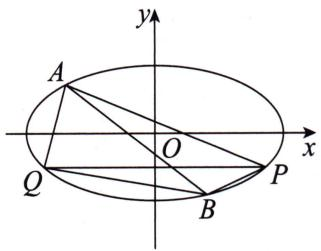

21.(2021·中学生标准学术能力诊断性测试)
已知椭圆 $C: \frac{x^{2}}{a^{2}} + \frac{y^{2}}{b^{2}} = 1 (a > b > 0)$ 的离心率为 $\frac{\sqrt{3}}{3}$ ，且椭圆 C 上的点到焦点距离的最大值为 $\sqrt{3} + 1$ .  
（1）求椭圆 C 的方程.  
（2）如图,设椭圆 $E:\frac{x^{2}}{a^{2}}+\frac{y^{2}}{b^{2}}=9$ , P 为椭圆 C 上任意一点,过点 P 的直线 l 交椭圆 E 于 A, B 两点, 射线 OP 交椭圆 E 于点 Q.

(i) 证明: $\frac{S_{\triangle AQP}}{S_{\triangle AOP}}$ 为定值.
(ii) 求 $\triangle ABQ$ 面积的最大值.

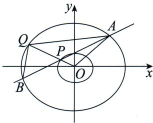

22.(2023·新高考Ⅰ卷)在直角坐标系xOy中,点P到x轴的距离等于点P到点 $\left(0,\frac{1}{2}\right)$ 的距离,记动点P的轨迹为W.  
（1）求 W 的方程；  
（2）已知矩形 ABCD 有三个顶点在 W 上，
证明: 矩形 ABCD 的周长大于 $3\sqrt{3}$ .

23.(2021·湖北·“荆、荆、襄、宜四地七校考试联盟”期中)已知A(-2,0),B(2,0),动点M满足 $|MA|=\sqrt{2}|MB|$ .  
（1）求动点 M 的轨迹方程,并说明它表示什么曲线.  
（2）设动点 M 的轨迹为 C，对曲线 C 上任意一点 M，在 x 轴上是否存在一个与 O(O 为坐标原点)不重合的定点 Q，使得 $\frac{|MQ|}{|MO|}$ 为定值？若存在，求出该定点和定值；若不存在，请说明理由.

24.(2021·湖南·邵阳二中高三(上)月考)如图,在平面直角坐标系xOy中,已知等轴双曲线 $E:\frac{x^{2}}{a^{2}}-\frac{y^{2}}{b^{2}}=1(a>0,b>0)$ 的左顶点为A,过右焦点F且垂直于x轴的直线与双曲线E交于B,C两点, $\triangle ABC$ 的面积为 $\sqrt{2}+1$ .  
（1）求双曲线 E 的方程；  
（2）若直线 l: y = kx - 1 与双曲线 E 的左、右两支分别交于 M, N 两点，与双曲线 E 的两条渐近线分别交于 P, Q 两点，求 $\frac{|MN|}{|PQ|}$ 的取值范围.

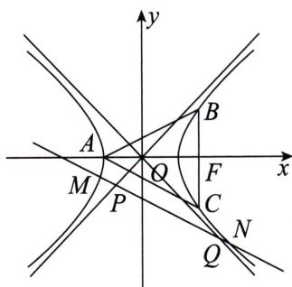

25.(2021·重庆一中期中)如图,在平面直角坐标系中,以 $M(0,1)$ 为圆心的圆M与抛物线 $y=x^{2}$ 交于A,B,C,D四点.  
（1）求圆 M 的半径 r 的取值范围；  
（2）求四边形 ABCD 面积的最大值,并求此时圆的半径.

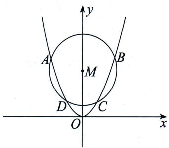

26.(2024·北京)已知椭圆 $E:\frac{x^{2}}{a^{2}}+\frac{y^{2}}{b^{2}}=1(a>b>0)$ ，以椭圆 E 的焦点和短轴端点为顶点的四边形是边长为 2 的正方形。过点 $(0,t)(t>\sqrt{2})$ 且斜率存在的直线与椭圆 E 交于不同的两点 A, B，过点 A 和 C $(0,1)$ 的直线 AC 与椭圆 E 的另一个交点为 D。  
（1）求椭圆 E 的方程及离心率;  
（2）若直线 BD 的斜率为 0, 求 t 的值.

27.(2021·广东茂名·五校联盟高三联考)

已知椭圆 $C: \frac{x^2}{3} + \frac{2y^2}{3} = 1$ ，过点 $P(1,1)$ 的直线 $l_1, l_2$ 与椭圆 $C$ 分别交于点 $P, M$ 和 $P, N$ . 记直线 $l_1$ 的斜率为 $k (k \neq 0)$ ，直线 $l_2$ 的斜率为 $k'$ .  
（1） 若直线 $l_{1}, l_{2}$ 关于直线 y = x 对称, 证明: $kk'$ 为定值.  
（2） 已知点 $A(2,0)$ , 当 $0 < k < 1$ 时, 求 $\triangle APM$ 面积的最大值.

28. (2021·湖北·鄂东南教改联盟高二(上)期中)

已知双曲线 $C:\frac{x^{2}}{a^{2}}-\frac{y^{2}}{b^{2}}=1(a>0,b>0)$ 的离心率为 2，且过点 $(2,3)$ .  
（1）求双曲线 C 的方程.  
（2）设点 $B, F$ 分别为双曲线 $C$ 的右顶点、左焦点，点 $A$ 为双曲线 $C$ 上位于第二象限的动点，是否存在常数 $\lambda$ ，使得 $\angle AFB = \lambda \angle ABF$ ？如果存在，请求出 $\lambda$ 的值；如果不存在，请说明理由.

29.(2021·河南·九师联盟、商丘市部分学校高三(上)开学考)在平面直角坐标系 $xOy$ 中,已知定点 $F(0,1)$ ,定直线 $l:y = -3$ ,动点 $M$ 到直线 $l$ 的距离比动点 $M$ 到点 $F$ 的距离大 2.记动点 $M$ 的轨迹为曲线 $C$ .  
（1）求曲线 C 的方程,并说明曲线 C 是什么曲线.  
（2） 设 $P(2, y_{0})$ 在曲线 C 上, 不过点 P 的动直线 $l_{1}$ 与曲线 C 交于 A, B 两点, 若 $\angle APB = 90^{\circ}$ , 证明: 直线 $l_{1}$ 恒过定点.

30. (2023·新高考Ⅱ卷)已知双曲线 C 的中心为坐标原点, 左焦点为 $(-2\sqrt{5}, 0)$ , 离心率为 $\sqrt{5}$ .  
（1） 求 C 的方程;  
（2）记 $C$ 的左、右顶点分别为 $A_{1}, A_{2}$ , 过点 $(-4, 0)$ 的直线与 $C$ 的左支交于 $M, N$ 两点, $M$ 在第二象限, 直线 $MA_{1}$ 与 $NA_{2}$ 交于点 $P$ , 证明点 $P$ 在定直线上.

31.(2021·河北邯郸·八校联盟高二(上)期中)
已知椭圆 $C:\frac{x^{2}}{a^{2}}+\frac{y^{2}}{b^{2}}=1(a>b>0)$ 的面积为 $ab\pi$ ，上顶点为 A，右顶点为 B，直线 AB 与圆 $O:x^{2}+y^{2}=\frac{4}{5}$ 相切，且椭圆 C 的面积是圆 O 面积的 $\frac{5}{2}$ 倍.  
（1）求椭圆 C 的标准方程.  
（2） $P$ 为圆 $O$ 上任意一点, 过点 $P$ 作圆 $O$ 的切线与椭圆 $C$ 交于 $M, N$ 两点, 试问 $|PM| \cdot |PN|$ 是否为定值? 若是, 求出该定值; 若不是, 请说明理由.

32.(2021·北京·西城区期中)已知椭圆 $E:\frac{x^{2}}{a^{2}}+y^{2}=1(a>1)$ .  
（1）若椭圆 E 的焦距为 2, 求实数 a 的值.  
（2）如图,点A,B,C位于椭圆E上,且A,B关于原点对称.若椭圆E上存在等边 $\triangle ABC$ ,求实数a的取值范围.

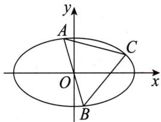

33.(2021·湖北武汉·华中师大一附中高二(上)期中)设点P为圆 $A:(x+2)^{2}+y^{2}=36$ 上一动点,点B的坐标为(2,0),线段BP的垂直平分线交直线AP于点Q.  
（1）求点 Q 的轨迹 C 的方程.  
（2）如图,（1）中曲线C与x轴的两个交点分别为 $A_{1}$ 和 $A_{2},M,N$ 为曲线C上异于 $A_{1}$ ， $A_{2}$ 的两点，直线MN不过坐标原点，且不与坐标轴平行。点M关于原点O的对称点为S，若直线 $A_{1}S$ 与直线 $A_{2}N$ 相交于点T，直线OT与直线MN相交于点R，证明：在曲线C上存在定点E，使得 $\triangle RBE$ 的面积为定值，并求出该定值。

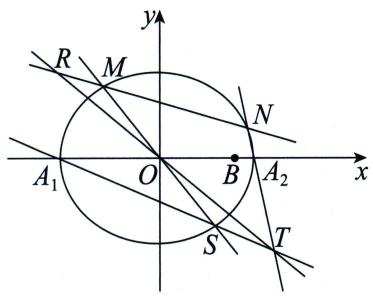

34. (2021 · 浙江 · 金华十校高三(上)期中联考)
如图,椭圆 $C:\frac{x^{2}}{a^{2}}+\frac{y^{2}}{b^{2}}=1(a>b>0)$ 的左顶点为 $T(-2,0)$ , 直线 $l:y=kx(k\neq0)$ 与椭圆 C 相交于 A, B 两点, 当 k=1 时, $|AB|=\frac{4\sqrt{42}}{7}$ , 过椭圆 C 的右焦点 F 且斜率为 -k 的直线 MN 与直线 TA, TB 分别相交于点 M, N (点 M, N 均不在坐标轴上).  
（1）求椭圆 C 的方程.  
（2）设直线 OM, ON(O 为坐标原点)的斜率分别为 $k_{1}, k_{2}$ . 问 $k_{1} \cdot k_{2}$ 是否为定值? 若是, 求出该定值; 若不是, 请说明理由.

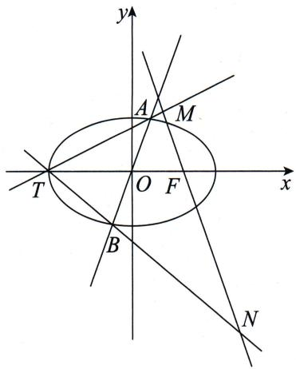

35.(2025·上海)已知椭圆 $\Gamma:\frac{x^{2}}{a^{2}}+\frac{y^{2}}{5}=1(a>\sqrt{5})$ , $M(0,m)(m>0)$ , A 是 $\Gamma$ 的右顶点.  
（1） 若 $\Gamma$ 的焦点是 $(2,0)$ ，求 $\Gamma$ 的离心率 e；  
（2） 若 $a = 4$ , 且 $\Gamma$ 上存在一点 $P$ , 满足 $\overrightarrow{PA} = 2\overrightarrow{MP}$ , 求 $m$ ;  
（3） 若 $MA$ 的中垂线 $l$ 的斜率为 $2, l$ 与 $\Gamma$ 交于 $C, D$ 两点， $\angle CMD$ 为钝角，求 $a$ 的取值范围.

36.(2021·重庆·南开中学高二(上)期中)

已知椭圆 $C_{1}:\frac{x^{2}}{a^{2}}+\frac{y^{2}}{b^{2}}=1(a>b>0)$ 经过点 E(1,1)，其右焦点为抛物线 $C_{2}:y^{2}=2\sqrt{6}x$ 的焦点 F，直线 l 与椭圆 $C_{1}$ 交于 A, B 两点，且以 AB 为直径的圆过原点.  
（1）求椭圆 $C_1$ 的方程；  
（2）若过原点的直线 m 与椭圆 $C_{1}$ 交于 C, D 两点，且 $\overrightarrow{OC}=t(\overrightarrow{OA}+\overrightarrow{OB})$ ，求四边形 ACBD 面积的最大值.

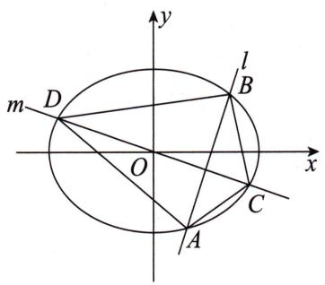

37. (2024·新高考Ⅱ卷)已知双曲线 $C: x^{2} - y^{2} = m (m > 0)$ , 点 $P_{1}(5,4)$ 在 $C$ 上, $k$ 为常数, $0 < k < 1$ . 按照如下方式依次构造点 $P_{n}$ ( $n = 2,3,\cdots$ ), 过 $P_{n-1}$ 作斜率为 $k$ 的直线与 $C$ 的左支交于点 $Q_{n-1}$ , 令 $P_{n}$ 为 $Q_{n-1}$ 关于 $y$ 轴的对称点, 记 $P_{n}$ 的坐标为 $(x_{n}, y_{n})$ .  
（1） 若 $k=\frac{1}{2}$ ，求 $x_{2}, y_{2}$ .  
（2） 证明: 数列 $\{x_{n} - y_{n}\}$ 是公比为 $\frac{1 + k}{1 - k}$ 的等比数列.  
（3） 设 $S_{n}$ 为 $\triangle P_{n}P_{n+1}P_{n+2}$ 的面积, 证明: 对任意正整数 $n, S_{n} = S_{n+1}$ .

38.（2021·湖南长沙·长郡中学高三(上)月考）设椭圆 $C: \frac{x^2}{9} + \frac{y^2}{5} = 1$ 的左、右顶点分别为 $A, B$ .  
（1） 若 $P, Q$ 是椭圆 $C$ 上关于 $x$ 轴对称的两点, 直线 $AP, BQ$ 的斜率分别为 $k_{1}, k_{2} (k_{1} k_{2} \neq 0)$ , 求 $|k_{1}| + |k_{2}|$ 的最小值;  
（2）已知过点 $D(0, - 3)$ 的直线 $l$ 交椭圆 $C$ 于 $M,N$ 两个不同的点，直线 $AM,AN$ 分别交 $y$ 轴于点 $S,T$ ，记 $\overrightarrow{DS} = \lambda \overrightarrow{DO},\overrightarrow{DT} = \mu \overrightarrow{DO}$ （ $O$ 为坐标原点），当直线 $l$ 的倾斜角 $\theta$ 为锐角时，求 $\lambda +\mu$ 的取值范围.

39.(2021·湖南·长沙一中高三(上)月考)已知抛物线 $C_{1}:y^{2}=2px(p>0)$ 的准线与半椭圆 $C_{2}:\frac{x^{2}}{4}+y^{2}=1(x\leqslant0)$ 相交于 A,B 两点,且 $|AB|=\sqrt{3}$ .  
（1）求抛物线 $C_1$ 的方程；  
（2） 若点 P 是半椭圆 $C_{2}$ 上一动点, 过点 P 作抛物线 $C_{1}$ 的两条切线, 切点分别为 C, D, 求 $\triangle PCD$ 面积的取值范围.

40. (2021·江苏南京·金陵中学高三(上)质检)

已知点 F 为抛物线 $C: x^{2} = 2py (p > 0)$ 的焦点，直线 $l: y = 2x + 1$ 与 C 交于 A, B 两点，且 $|AF| + |BF| = 20$ .  
（1）求抛物线 C 的方程.  
（2） 若直线 $m: y = 2x + t (t \neq 1)$ 与抛物线 C 交于 M, N 两点，且 AM 与 BN 相交于点 T，证明：点 T 在定直线上.

41. (2021·重庆·高三(上)质检)已知椭圆 $C$ :
$\frac {x ^ {2}}{4} + y ^ {2} = 1.$  
（1） 若 $P(x_{0}, y_{0})$ 在椭圆 C 上, 证明: 直线 $\frac{x_{0}x}{4} + y_{0}y = 1$ 与椭圆 C 相切.  
（2）如图，A，B分别为椭圆C上位于第一、二象限内的动点，且以A，B为切点的椭圆C的切线与x轴围成 $\triangle DEF$ .求 $S_{\triangle DEF}$ 的最小值.

42.(2025·天津)已知椭圆 $\frac{x^{2}}{a^{2}}+\frac{y^{2}}{b^{2}}=1(a>b>$

0)的左焦点为 $F$ ，右顶点为 $A,P$ 为直线 $x = a$ 上一点，且直线 $PF$ 的斜率为 $\frac{1}{3},\triangle PFA$ 的面积为 $\frac{3}{2}$ ，椭圆的离心率为 $\frac{1}{2}$  
（1）求椭圆的方程;  
（2） 过点 P 的直线与椭圆有唯一公共点 B (异于点 A), 求证: PF 平分 $\angle AFB$ .

