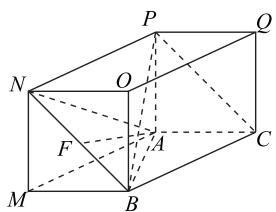
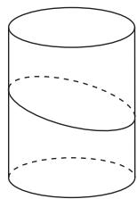
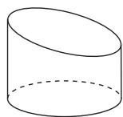
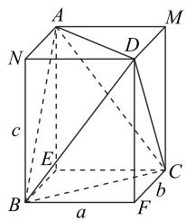
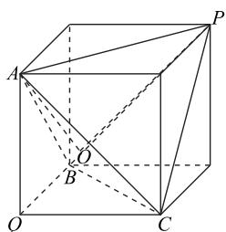

# “补体法”在立体几何解题中的妙用

赵娜

(山东省临清市第三高级中学)

解决立体几何相关问题,有时需要将某些几何体补成熟悉的几何体(如正方体、长方体和圆柱体等),这就是所谓的“补体法”.这种方法能帮助学生充分利用“补体”后得到的新几何体的特征,从整体上把握问题实质,从而快速找到解题思路.那么,“补体法”在立体几何问题中有哪些妙用呢?本文举例说明.

# 1 求异面直线所成角

求异面直线所成角,第一步是找角,第二步是求角.找角就是通过平移直线将异面直线转化成相交直线.当待求的异面直线位于某个几何体中时,可以采用“补体法”让这个角“浮出水面”.

例 1 在三棱锥 P-ABC 中, $PA \perp AC$ , $BC \perp$ $AC, PA = 1, PB = \sqrt{5}, \angle APC = 45^{\circ}, \angle BAC = 60^{\circ}$ , 则异面直线 $AB$ 与 $PC$ 所成角的余弦值为 \_\_\_\_.

在 $\triangle PAC$ 中， $PA \perp AC, \angle APC = 45^{\circ}$ ，则$AC = PA = 1.$ 在 $\triangle ABC$ 中， $BC\perp AC$ $\angle BAC = 60^{\circ}$ ，则 $AB = \frac{AC}{\cos 60^{\circ}} = 2$ ，所以 $AB^{2} + PA^{2} = PB^{2}$ ，即 $PA \perp AB$ .如图1所示，将三棱锥P-ABC补成长方体MACB-NPQO，连接BN，AN.

text_image

Geometric diagram of a cube with labeled vertices and internal points, used for spatial geometry problems.

图1

因为 $PN \parallel BC$ ，且 $PN = BC$ ，所以四边形 $BCPN$ 是平行四边形，则 $PC \parallel BN$ ，故 $\angle NBA$ 是异面直线 $AB$ 与 $PC$ 所成角。又 $PN = BC = AC \times \tan 60^\circ = \sqrt{3}$ ，则

$$
A N = \sqrt {P N ^ {2} + P A ^ {2}} = \sqrt {3 + 1} = 2,
$$

$$
B N = P C = \sqrt {2} P A = \sqrt {2}, A B = 2.
$$

在 $\triangle ANB$ 中, 过点 A 作 BN 的垂线, 垂足为 F.
因为 AN = AB = 2，所以 $BF = \frac{1}{2}BN = \frac{\sqrt{2}}{2}$ ，则

$$
\cos \angle N B A = \frac {B F}{A B} = \frac {\frac {\sqrt {2}}{2}}{2} = \frac {\sqrt {2}}{4}.
$$

点评

本题考查异面直线所成角,解题的关键是将三棱锥补成长方体,进而将原问题转化为解三角形问题.注意异面直线所成角的取值范围是 $(0,\frac{\pi}{2} ]$

# 2 求不规则几何体的体积

解决不规则几何体的体积问题,常用的方法是“补体法”,将其补成规则几何体,以便更好地运用体积公式来解决问题.

例 2 如图 2 所示,一个底面半径为 2 圆柱被一平面所截, 截得的几何体的最短和最长母线长分别为 2 和 3, 则该几何体的体积为( ).

A. $5\pi$

B. $6\pi$

C. $20\pi$

D. $10\pi$

natural_image

Simple line drawing of a cylinder with two curved dashed lines indicating horizontal and vertical edges (no text or symbols)

图 2

用一个完全相同的几何体把析题中几何体补成一个圆柱，如图 3 所示, 则圆柱的体积为 $\pi \times 2^{2} \times 5 = 20\pi$ , 所以所求几何体的体积为 $10\pi$ , 故选 D.

  
图3

点评

本题考查几何体体积的求解方法,用一个完全相同的几何体补成一个规则的几何体,以便求出其体积,减小计算难度.

例 3 在四面体 ABCD 中, AB = CD = 5, AC =$BD=2\sqrt{5}, AD=BC=\sqrt{13}$ ，则该四面体的体积为\_\_\_\_.

由题意可将四面体 $ABCD$ 放置在一个如图析4所示的长方体中.设长方体的长、宽、高分别为 $a, b, c$ ，则 $\begin{cases} a^2 + b^2 = 13, \\ a^2 + c^2 = 20, \\ b^2 + c^2 = 25, \end{cases}$ 解得 $a = 2, b = 3, c = 4$

所以长方体的体积为 $2 \times 3 \times 4 = 24$ . 又

$$
V _ {B - A C E} = V _ {C - B D F} = V _ {D - A C M} = V _ {A - B D N} = \frac {1}{3} \times \frac {1}{2} a b c = 4,
$$

所以四面体 ABCD 的体积为 $24 - 4 \times 4 = 8$ .

text_image

A
M
N
D
c
E
B
a
F
b
C

图4

把四面体 ABCD 放置在一个长方体中, 就是将四面体补形成长方体, 然后通过列方程求出长方体的长、宽、高，进而得出长方体的体积，再用分割法求得四面体的体积，这种方法大大减小了计算量.

# 3 球的切接问题

与球有关的切接问题,一种是内切,另一种是外接.解题时要认真分析图形,明确切点和接点的位置,确定有关元素间的数量关系,并作出合适的截面图.若球内切于正方体,则切点为正方体各个面的中心,正方体的棱长等于球的直径;若球外接于正方体,则正方体的顶点均在球面上,正方体的体对角线长等于球的直径,求解时应充分运用这些结论.

例4 在多面体 $PABCQ$ 中， $PA = PB = PC =$ $AB = AC = BC = 2, QA = QB = QC$ ，且 $QA, QB, QC$ 两两垂直，则该多面体的外接球半径为 \_\_\_\_，内切球半径为 \_\_\_\_.

由 AB = AC = BC = 2, QA = QB = QC，且
QA, QB, QC 两两垂直可得

$$
Q A = Q B = Q C = A B \times \sin 4 5 ^ {\circ} = \sqrt {2}.
$$

又 $PA = PB = PC = 2$ ，所以该多面体PABCQ可看作是棱长为 $\sqrt{2}$ 的正方体的一部分，如图5所示，则该多面体的外接球半径与棱长为 $\sqrt{2}$ 正方体外接球的半径相同，故外接球的半径为

text_image

Geometric diagram of a cube with labeled vertices and internal points, used for spatial geometry problems.

图5

$$
\frac {1}{2} \sqrt {(\sqrt {2}) ^ {2} + (\sqrt {2}) ^ {2} + (\sqrt {2}) ^ {2}} = \frac {\sqrt {6}}{2}.
$$

设 $\triangle ABC$ 的中心为 $O$ , 连接 $AO, PO$ , 内切球半径为 $r$ .

由 $PA = PB = PC = AB = AC = BC = 2$ 及正方体的性质，可得 $PO \perp$ 平面 $ABC$ . 由 $AB = AC = BC = 2$ ，可得

$$
A O = \frac {2}{3} \times A B \times \sin 6 0 ^ {\circ} = \frac {2 \sqrt {3}}{3}.
$$

由 PA = PB = PC = 2，可得

$$
P O = \sqrt {P A ^ {2} - A O ^ {2}} = \sqrt {2 ^ {2} - (\frac {2 \sqrt {3}}{3}) ^ {2}} = \frac {2 \sqrt {6}}{3},
$$

$$
S _ {\triangle P A B} = S _ {\triangle P A C} = S _ {\triangle P B C} = \frac {1}{2} \times 2 \times 2 \times \sin 6 0 ^ {\circ} = \sqrt {3},
$$

$$
V _ {\text {三棱锥} P - A B C} = \frac {1}{3} \times P O \times S _ {\triangle A B C} =
$$

$$
\frac {1}{3} \times \frac {2 \sqrt {6}}{3} \times \frac {1}{2} \times 2 \times 2 \times \sin 6 0 ^ {\circ} = \frac {2 \sqrt {2}}{3}.
$$

由 $QA = QB = QC = \sqrt{2}$ ，且 $QA, QB, QC$ 两两垂直，可得

$$
S _ {\triangle Q A B} = S _ {\triangle Q A C} = S _ {\triangle Q B C} = \frac {1}{2} \times \sqrt {2} \times \sqrt {2} = 1,
$$

$$
V _ {\text {三棱锥} A - Q B C} = \frac {1}{3} \times Q A \times S _ {\triangle Q B C} = \frac {1}{3} \times \sqrt {2} \times 1 = \frac {\sqrt {2}}{3}.
$$

因为 $V_{多面体PABCQ}=V_{三棱锥P-ABC}+V_{三棱锥A-QBC}=\frac{1}{3}\times r\times S_{多面体PABCQ}$ ，所以

$$
\frac {2 \sqrt {2}}{3} + \frac {\sqrt {2}}{3} = \frac {1}{3} \times r \times (S _ {\triangle P A B} + S _ {\triangle P A C} +
$$

$$
S _ {\triangle P B C} + S _ {\triangle Q A B} + S _ {\triangle Q A C} + S _ {\triangle Q B C}),
$$

即 $\sqrt{2} = \frac{1}{3}\times r\times (3\sqrt{3} +3)$ ，解得 $r = \frac{\sqrt{6} - \sqrt{2}}{2}$

本题考查几何体外接球问题和内切球问题.根据题意找出该多面体 PABCQ 与正方体之间的关系是求外接球半径的关键.利用分割法求几何体的体积,列出关系式 $V_{多面体PABCQ}=V_{三棱锥P-ABC}+V_{三棱锥A-QBC}=\frac{1}{3}\times r\times S_{多面体PABCQ}$ 是求解该多面体的内切球半径的关键.

本文系聊城市教育科学规划课题《大单元视域下高中数学深度学习课堂实践的探究》(课题编号：LJ2302035)研究成果.

(完)