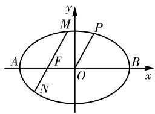
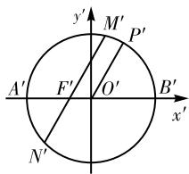

# 一类圆锥曲线定值问题的探究与推广

广西柳州高级中学(545006) 邹素文 李泽铭

[摘 要]文章从一道柳州市数学统测试题入手,探究了圆锥曲线中与向量的数量积相关的定值问题,并类比推导出圆锥曲线中的相关结论,最后从不同角度编拟了练习题。

[关键词]圆锥曲线;定值问题;探究;推广

[中图分类号] G633.6 [文献标识码] A

[文章编号] 1674-6058(2025)02-0010-03

圆锥曲线定值问题是近几年高考和各地模拟考的热点题型。这类问题主要指某些几何量(如线段长度、图形面积、直线斜率)或某些代数表达式的值与题目中的参数无关,始终为定值。本文从一道柳州市数学统测试题入手,探究圆锥曲线中与向量的数量积相关的定值问题,并类比推导出圆锥曲线中的相关结论,最后从不同角度编拟练习题。

# 一、试题呈现

(2024年柳州市数学统测试题第18题)一动圆与圆 $x^{2}+y^{2}+2x=0$ 外切,同时与圆 $x^{2}+y^{2}-2x-24=0$ 内切,记动圆圆心的轨迹为曲线E。

(1)求曲线E的方程,并说明E是什么曲线;

(2)若点 P 是曲线 E 上异于左右顶点的一个动点, 点 O 为曲线 E 的中心, 过曲线 E 的左焦点 F 且平行于弦 OP 的直线与曲线 E 交于点 M, N, 求证: $\frac{\overrightarrow{FM} \cdot \overrightarrow{FN}}{\overrightarrow{OP}^{2}}$ 为一个定值。

分析:本题的“题根”在教材。第一问出自人教A版高中数学选择性必修一第115页第10题,考查定义法求动圆圆心的轨迹方程,比较基础;第二问源自同册教材第145页第8题的平行弦问题,难度有所提升。本题主要以平行弦问题为载体考查解析几何的基本思想方法,充分展现定点、定值、定向问题,内容丰富、结构紧凑,知识与能力的考查并重。试题蕴含丰富且有趣的性质,值得深入研究。

# 二、解法探究

(1) 曲线 $E: \frac{x^{2}}{9} + \frac{y^{2}}{8} = 1$ 。曲线 E 是焦点在 x 轴上，以原点为对称中心，以 $O_{1}, O_{2}$ 为焦点的椭圆。  
(2)解法1:当直线OP的斜率不存在时,弦OP为椭圆的短半轴,因此 $\left|\overrightarrow{OP}\right|^{2}=8$ ,由 $OP\parallel MN$ 可知,

弦 $MN$ 为椭圆的通径，满足 $\left|\overrightarrow{FM}\right| = \left|\overrightarrow{FN}\right| = \frac{b^2}{a} = \frac{8}{3}$ 因此 $\frac{\overrightarrow{FM} \cdot \overrightarrow{FN}}{\overrightarrow{OP}^2} = -\frac{\left|\overrightarrow{FM}\right|\left|\overrightarrow{FN}\right|}{\left|\overrightarrow{OP}\right|^2} = -\frac{8}{9}$ 。

当直线 OP 的斜率存在时, 设其为 k, 则直线 OP 的方程为 y = kx, 代入曲线 E 的方程得 $x^{2} = \frac{72}{8 + 9k^{2}}$ , 因此 $\left|\overrightarrow{OP}\right|^{2} = \frac{72(1 + k^{2})}{8 + 9k^{2}}$ , 设直线 MN 的方程为 $y = k(x + 1)$ , 代入曲线 E 的方程得 $(8 + 9k^{2})x^{2} + 18k^{2}x + 9k^{2} - 72 = 0$ , 设 $M(x_{1}, y_{1})$ , $N(x_{2}, y_{2})$ , 则 $x_{1} + x_{2} = -\frac{18k^{2}}{8 + 9k^{2}}$ , $x_{1}x_{2} = \frac{9k^{2} - 72}{8 + 9k^{2}}$ , 而 $\overrightarrow{FM} \cdot \overrightarrow{FN} = (x_{1} + 1)(x_{2} + 1) + y_{1}y_{2} = (x_{1} + 1)(x_{2} + 1)(1 + k^{2}) = (1 + k^{2})(x_{1}x_{2} + x_{1} + x_{2} + 1) = (1 + k^{2})\left(-\frac{18k^{2}}{8 + 9k^{2}} + \frac{9k^{2} - 72}{8 + 9k^{2}} + 1\right) = -\frac{64(1 + k^{2})}{8 + 9k^{2}}$ , 因此 $\frac{\overrightarrow{FM} \cdot \overrightarrow{FN}}{\overrightarrow{OP}^{2}} = -\frac{\left|\overrightarrow{FM}\right|\left|\overrightarrow{FN}\right|}{\left|\overrightarrow{OP}\right|^{2}} = -\frac{64(1 + k^{2})}{8 + 9k^{2}} \times \frac{8 + 9k^{2}}{72(1 + k^{2})} = -\frac{8}{9}$ 。综上， $\frac{\overrightarrow{FM} \cdot \overrightarrow{FN}}{\overrightarrow{OP}^{2}}$ 为定值 $-\frac{8}{9}$ 。

点评:采用设直线方程代入联立求解的常规策略,通过转化思想将向量的数量积变为线段长度比,再利用韦达定理把长度关系表示为关于斜率k的式子,最后可得到这个定值与斜率k无关。

解法2:由解法1可知当直线OP的斜率不存在时, $\frac{\overrightarrow{FM}\cdot\overrightarrow{FN}}{\overrightarrow{OP}^{2}}=-\frac{8}{9}$ 。下证当 $\frac{\overrightarrow{FM}\cdot\overrightarrow{FN}}{\overrightarrow{OP}^{2}}=-\frac{8}{9}$ 时,直线MN//OP恒成立。

设直线 MN 和直线 OP 的倾斜角分别为 $\theta, \beta$ ，则由椭圆焦半径的极坐标公式可知 $|FM| = \frac{ep}{1 - e \cos \theta} = \frac{b^{2}}{a - c \cdot \cos \theta} = \frac{8}{3 - \cos \theta}, |FN| =$

$\frac{ep}{1 + e\cos\theta} = \frac{b^2}{a + c\cdot\cos\theta} = \frac{8}{3 + \cos\theta}$ 因此 $|FM||FN| = \frac{64}{9 - \cos^2\theta} = \frac{64}{8 + \sin^2\theta}$ 。

设 OP 的直线方程为 $y = \tan \beta \cdot x$ ，代入曲线 E 的方程得 $x^{2} = \frac{72}{8 + 9 \tan^{2} \beta}$ ，所以 $\left|OP\right|^{2} = (1 + \tan^{2} \beta)x^{2} = \frac{72}{8 + \sin^{2} \beta}$ ，由 $\frac{\overrightarrow{FM} \cdot \overrightarrow{FN}}{\overrightarrow{OP}^{2}} = -\frac{\left|\overrightarrow{FM}\right|\left|\overrightarrow{FN}\right|}{\left|\overrightarrow{OP}\right|^{2}} = -\frac{8}{9}$ 化简得 $9\left|\overrightarrow{FM}\right|\left|\overrightarrow{FN}\right| = 8\left|\overrightarrow{OP}\right|^{2}$ ，从而有 $9 \times \frac{64}{8 + \sin^{2} \theta} = 8 \times \frac{72}{8 + \sin^{2} \beta}$ ，即 $\sin^{2} \theta = \sin^{2} \beta$ ，可得 $\theta = \beta$ 或 $\theta + \beta = \pi$ 。

当 $\theta = \beta$ 时, $MN \parallel OP$ 即证。当 $\theta + \beta = \pi$ 时, 此时的点 P 与 $\theta = \beta$ 时的点 P 关于 y 轴对称, 也就是说这两个点 P 都可以证明 $\frac{\overrightarrow{FM} \cdot \overrightarrow{FN}}{\overrightarrow{OP}^{2}}$ 为定值。事实上, 根据椭圆的对称性也可知, 点 P 关于 x 轴、y 轴、原点对称的点都符合定值的要求。

点评:从特殊位置入手求出定值,再论证这个定值对一般情况也成立,即满足题设的条件MN//OP,从而说明定值成立的必要性,是处理定点定值问题的一种常用策略。

解法3: 当直线 OP 的斜率存在时, 设直线 OP 的方程为 y = kx, 代入曲线 E 的方程得 $x^{2} = \frac{72}{8 + 9k^{2}}$ , 从而可得 $\left|\overrightarrow{OP}\right|^{2} = \frac{72(1 + k^{2})}{8 + 9k^{2}}$ ,

设直线MN的参数方程为

$\left\{ \begin{array}{l} x = -1 + t \cos \alpha, \\ y = t \sin \alpha \end{array} \right.$ ( $t$ 为参数， $\alpha$ 为倾斜角)，代入曲线 $E$ 的方程得 $(8 \cos^2 \alpha + 9 \sin^2 \alpha)t^2 - 16t \cos \alpha - 64 = 0$ ，由韦达定理得 $t_1 t_2 = -\frac{64}{8 \cos^2 \alpha + 9 \sin^2 \alpha} = -\frac{64 \sec^2 \alpha}{8 + 9 \tan^2 \alpha} = -\frac{64(1 + k^2)}{8 + 9k^2}$ ，所以 $\frac{\overrightarrow{FM} \cdot \overrightarrow{FN}}{\overrightarrow{OP}^2} = -\frac{8}{9}$ ，当 $OP \perp x$ 轴时，结论也成立。

点评:采用直线参数方程优化运算,利用参数t的几何意义将向量的数量积转化为倾斜角 $\alpha$ 的三角函数,再对三角函数变形,化为关于直线MN的斜率k的表达式,统一变量后消去,得到定值,是处理此类问题的经典解法。

解法4: 设 $x'=\frac{x}{3}$ , $y'=\frac{y}{2\sqrt{2}}$ , 则椭圆 $\frac{x^{2}}{9}+\frac{y^{2}}{8}=1$ 可变为圆 $x^{\prime2} + y^{\prime2} = 1$ ，根据题意将图1与图2对应，$F, M, N$ 对应点 $F'\left(-\frac{1}{3}, 0\right), M', N'$ ，则由相交弦定理得 $|F'M'| |F'N'| = |A'F'| |F'B'| = \left(1 - \frac{1}{3}\right)\left(1 + \frac{1}{3}\right) = \frac{8}{9} |O'P'|^2$ ，所以 $\frac{|F'M'|}{|O'P'|} \cdot \frac{|F'N'|}{|O'P'|} = \frac{8}{9}$ 。由于仿射变换保持平行线线段长度之比不变，所以 $\frac{|FM|}{|OP|} \cdot \frac{|FN|}{|OP|} = \frac{8}{9}$ ，即 $\frac{|FM||FN|}{|OP|^2} = \frac{8}{9}$ ，从而可得 $\frac{\overrightarrow{FM} \cdot \overrightarrow{FN}}{\overrightarrow{OP}^2} = -\frac{8}{9}$ 。

text_image

y
M
P
A
F
O
B
x
N

图1

text_image

y'
M'
P'
A'
F'
O'
B'
x'
N'

图2

点评:该解法主要利用圆的相交弦性质进行求解,完全摒弃了解析几何的代数运算,充分展现了平面几何在解析几何中的强大作用。代数与几何问题的灵活转化是优化解析几何计算的重要途径。

解法 5: 设 $z_{P}=x+yi=r(\cos\theta+i\sin\theta)$ ，即 $P(r\cos\theta,r\sin\theta)$ ，代入解法 4 的椭圆方程 $\frac{x^{2}}{9}+\frac{y^{2}}{8}=1$ ，整理得 $r^{2}=|OP|^{2}=\frac{72}{8\cos^{2}\theta+9\sin^{2}\theta}=\frac{72}{8+\sin^{2}\theta}$ ，补出另一个焦点 $F'$ ，则 $|F'M|=6-|FM|$ ，在 $\triangle MFF'$ 中，由余弦定理得 $|FM|^{2}+2^{2}-(6-|FM|)^{2}=2\times2\times|FM|\cos\theta$ ，即 $|FM|=\frac{8}{3-\cos\theta}$ ，同理， $|FN|=\frac{8}{3+\cos\theta}$ ，所以 $|FM||FN|=\frac{64}{9-\cos^{2}\theta}=\frac{64}{8+\sin^{2}\theta}$ ，从而可得 $\frac{\overrightarrow{FM}\cdot\overrightarrow{FN}}{\overrightarrow{OP}^{2}}=-\frac{8}{9}$ 。

点评:利用复数的三角形式解决平行问题,通过平行条件下辐角 $\theta$ 相等的特性,极大地简化了运算。

# 三、具体推广

结论1 设点 $P$ 是有心圆锥曲线 $Ax^2 + By^2 = 1 (A \neq 0, B \neq 0)$ 上异于长轴（或实轴）顶点的一个动点，点 $O$ 为圆锥曲线的中心，过圆锥曲线内任意一点 $E(x_0, y_0)$ 且平行于 $OP$ 的直线与圆锥曲线交于点 $M, N$ ，则 $\frac{\overrightarrow{EM} \cdot \overrightarrow{EN}}{\overrightarrow{OP}^2} = Ax_0^2 + By_0^2 - 1$ 。

证明: 当直线 OP 的斜率存在时, 设直线 OP 的方程为 y = kx, 代入 $Ax^{2} + By^{2} = 1$ 得 $x^{2} = \frac{1}{A + Bk^{2}}$ ,

从而 $\left|\overrightarrow{OP}\right|^{2}=\frac{1+k^{2}}{A+Bk^{2}}①,$

设直线 MN 的参数方程为 $\left\{\begin{aligned}x & = x_{0} + t\cos\alpha,\\ y & = y_{0} + t\sin\alpha\end{aligned}\right.$ (t 为参数, $\alpha$ 为倾斜角), 代入曲线方程 $Ax^{2} + By^{2} = 1$ 得 $(A \cos^{2} \alpha + B \sin^{2} \alpha)t^{2} + (2x_{0}A \cos \alpha + 2y_{0}B \sin \alpha)t + Ax_{0}^{2} + By_{0}^{2} - 1 = 0,$

由根与系数的关系得 $t_1 t_2 = \frac{Ax_0^2 + By_0^2 - 1}{A\cos^2\alpha + B\sin^2\alpha} = \frac{(Ax_0^2 + By_0^2 - 1)(1 + \tan^2\alpha)}{A + B\tan^2\alpha} = \frac{(1 + k^2)(Ax_0^2 + By_0^2 - 1)}{A + Bk^2},$ 可得 $\overrightarrow{EM}\cdot \overrightarrow{EN} = \frac{(1 + k^2)(Ax_0^2 + By_0^2 - 1)}{A + Bk^2}$ ②，由 ①② 可得 $\frac{\overrightarrow{EM}\cdot\overrightarrow{EN}}{\overrightarrow{OP}^2} = Ax_0^2 +By_0^2 -1$ 。

可以验证,当直线 OP 的斜率不存在时,上式也成立。

注: 当 $A \cos^{2}\alpha + B \sin^{2}\alpha = 0$ 时, AB < 0, 直线 MN 变为双曲线的渐近线, 与题设矛盾。

结论2 设抛物线 $y^{2}=2px$ ，过原点 O 且斜率为 k 的直线交抛物线于点 P，过抛物线内任意一点 $E(x_{0},y_{0})$ 且平行于 OP 的直线与抛物线交于点 M, N，则 $\frac{\overrightarrow{EM}\cdot\overrightarrow{EN}}{\overrightarrow{OP}^{2}}=\frac{(y_{0}^{2}-2px_{0})k^{2}}{4p^{2}}$ 。

证明: 设直线 OP 的方程为 y = kx，代入 $y^{2} = 2px$ 得 $x = \frac{2p}{k^{2}}$ 或 x = 0（舍去），则 $\overrightarrow{OP}^{2} = \frac{4p^{2}(1 + k^{2})}{k^{4}}$ ，设直线 MN 的参数方程为 $\left\{\begin{aligned} x &= x_{0} + t \cos \alpha, \\ y &= y_{0} + t \sin \alpha \end{aligned}\right.$ （t 为参数， $\alpha$ 为倾斜角），代入 $y^{2} = 2px$ 得 $\sin^{2}\alpha \cdot t^{2} + (2y_{0} \cdot \sin \alpha - 2p \cos \alpha)t + y_{0}^{2} - 2px_{0} = 0$ ，由韦达定理得 $t_{1}t_{2} = \frac{y_{0}^{2} - 2px_{0}}{\sin^{2}\alpha} = (y_{0}^{2} - 2px_{0})\csc^{2}\alpha = (y_{0}^{2} - 2px_{0})\left(1 + \frac{1}{k^{2}}\right)$ ，所以 $\overrightarrow{EM} \cdot \overrightarrow{EN} = t_{1}t_{2} = \frac{(1 + k^{2})(y_{0}^{2} - 2px_{0})}{k^{2}}, \frac{\overrightarrow{EM} \cdot \overrightarrow{EN}}{\overrightarrow{OP}^{2}} = \frac{(y_{0}^{2} - 2px_{0})k^{2}}{4p^{2}}$ 。

# 四、试题链接

有效教学是教师一直追求的目标,而试题变式是有效教学的一种重要手段,也是学生知识的增长点。圆锥曲线有多项特征点,如焦点、顶点、准线与对称轴的交点、直线与圆锥曲线的切点等,为从不同角度编拟题目提供了可能,展现了圆锥曲线内在的奇异美。

[试题1]已知椭圆 $\frac{x^{2}}{a^{2}}+\frac{y^{2}}{b^{2}}=1(a>b>0)$ ，直线l过点 $A(-a,0)$ ，与椭圆交于点M，与y轴交于点N，过原点平行于l的直线与椭圆交于点P，证明： $\left|\overrightarrow{AM}\right|,\sqrt{2}\left|\overrightarrow{OP}\right|,\left|\overrightarrow{AN}\right|$ 成等比数列。

[试题2]若点P是椭圆 $\frac{x^{2}}{4}+\frac{y^{2}}{3}=1$ 上异于长轴端点的一个动点，点O为椭圆的中心，若过点 $E(-4,0)$ 的直线平行于OP且与椭圆交于点M,N，求 $\frac{\overrightarrow{EM}\cdot\overrightarrow{EN}}{\overrightarrow{OP}^{2}}$ 的值。

[试题3]设抛物线 $y^{2}=2px$ ，过原点O作斜率为1的直线交抛物线于点P，过抛物线的焦点F且平行于OP的直线交抛物线于点M,N，求证： $|FM|$ ， $\frac{|OP|}{2}$ ， $|FN|$ 成等比数列。

[试题4]设MN是过双曲线 $\frac{x^{2}}{a^{2}}-\frac{y^{2}}{b^{2}}=1(a>0,b>0)$ 虚轴端点B的一条弦,过双曲线中心O的半弦 $OP\parallel MN$ ,求证: $|MB|,\sqrt{2}|OP|,|BN|$ 成等比数列。

[试题5]若点P是双曲线 $\frac{x^{2}}{a^{2}}-\frac{y^{2}}{b^{2}}=1(a>0,b>0)$ 上异于顶点的一个动点，点O为双曲线中心，点F为双曲线的左焦点，过双曲线第三象限内任意一点M的切线l平行于OP,MF交直线OP于点N，求证 $|MN|=a$ 。

在高考中对解析几何重点考查的是逻辑推理和数学运算素养。圆锥曲线的魅力在于其变化中的不变属性，以及对“删繁就简”的永恒追求。设计与优化运算是探索其奥秘的乐趣所在。教师应深入挖掘圆锥曲线相关试题的本源，强化核心逻辑，引导学生自主探究，激活学生思维。

# [参考文献]

[1] 颜波. 指向数学运算素养培育的试题教学思考: 以全国卷中的几道解析几何试题为例 [J]. 数学通报, 2024, 63(5): 34-39.  
[2] 代银. 双曲线、椭圆平行弦性质再探究 [J]. 数学教学通讯, 2007(9): 64-65.  
[3] 苏立标. 一道自主招生试题引发椭圆的几何性质探讨 [J]. 数学通讯, 2011(8): 55-57.   
[4] 闫伟. 一道清华大学自招试题的解法探究及拓展 [J]. 中学数学研究 (华南师范大学版), 2020(1): 37-39, 25.

(责任编辑 黄春香)