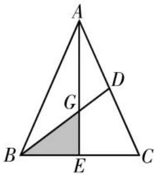
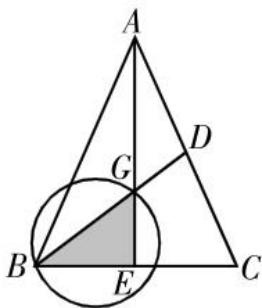
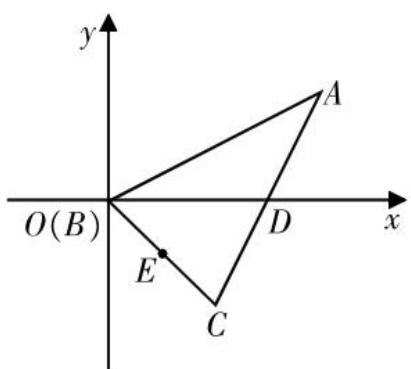
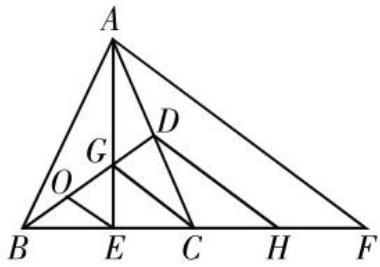
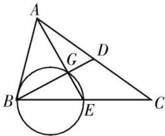
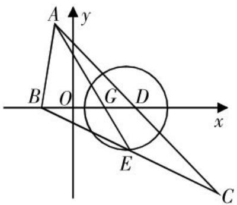
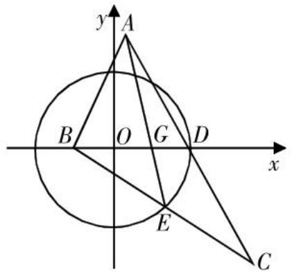
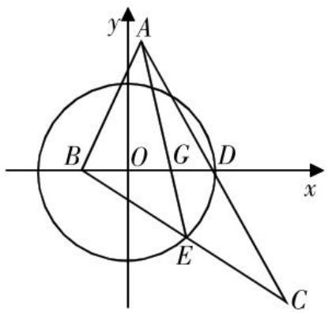
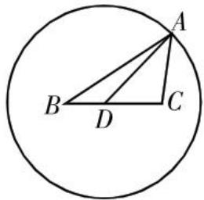

# 一道三角形面积最值问题的探究与思考

徐云龙 福建省厦门市海沧中学 361000

[摘 要] 如果学生能够将数学问题中,代数形式的表象和几何直观的深层次含义建立起联系,就能够加深对所求问题的认识和理解,达到用“直观”的眼光看问题的目的.文章通过探究一道三角形面积最值问题的解法,来分析一类最值问题的简解方法和命制手法.

[关键词] 三角形;最值;直观想象

# 试题及解法探究

原题展示 已知 $\triangle ABC$ 的内角 A, B, C 的对边分别为 a, b, c，且 $c \cdot \cos B + b \cdot \cos (A + C) = 0$ , BD 是 AC 边上的中线，BD = 3，求 $\triangle ABC$ 面积的最大值。（为方便分析，设 $S_{\triangle ABC} = S$ ）

考查意图 本题以中线长为定值的等腰三角形为载体,研究解三角形中的面积最值问题,考查三角形的边、角、面积之间的关系等基础知识,以及学生逻辑分析、数学抽象和数学运算等核心素养.本题简洁而内涵丰富,给解题者数学美的感受.

视角1 代数思维.

在 $\triangle ABC$ 中,由 $c\cdot\cos B+b\cdot\cos(A+C)=0$ ,易得 $c=b$ ;由 $BD$ 是 $AC$ 边上的中线,得 $\overrightarrow{BD}=\frac{1}{2}(\overrightarrow{BA}+\overrightarrow{BC})$ ,即 $\overrightarrow{BD}^{2}=\frac{1}{4}\cdot(\overrightarrow{BA}+\overrightarrow{BC})^{2}$ ,故 $9=\frac{1}{4}(c^{2}+a^{2}+2ac\cos B)$ .由 $\cos B=\frac{a^{2}+c^{2}-b^{2}}{2ac}$ ,得 $2a^{2}+c^{2}=36$ .

方法1: $S=\frac{1}{2}ah=\frac{1}{2}a\sqrt{c^{2}-\frac{1}{4}a^{2}}=$

$\frac{1}{2}a\sqrt{36-\frac{9}{4}a^{2}}=\frac{3}{4}\cdot\sqrt{-a^{2}(a^{2}-16)}$ 当 $a^{2}=8$ 时， $S_{max}=6$ .

方法2: 在 $\triangle ABC$ 和 $\triangle ABD$ 中, 由余弦定理可得 $\frac{b^{2}+c^{2}-a^{2}}{2bc}=\frac{5c^{2}-36}{4c^{2}}$ , 则 $S=\frac{1}{2}bc\sin A=\frac{1}{2}c^{2}\sqrt{1-\cos^{2}A}=\frac{1}{2}c^{2}\cdot\sqrt{1-\left(\frac{5c^{2}-36}{4c^{2}}\right)^{2}}=\sqrt{-\frac{1}{4}\left(\frac{9}{16}c^{4}-\frac{45}{2}c^{2}+81\right)}$ 当 $c^{2}=20$ 时， $S_{max}=6$ .

方法3: 在 $\triangle ABC$ 和 $\triangle ABD$ 中, 由余弦定理可得 $\frac{b^{2}+c^{2}-a^{2}}{2bc}=\frac{5c^{2}-36}{4c^{2}}$ , 即 $c^{2}=\frac{36}{5-4\cos A}$ , 则 $S=\frac{1}{2}bc\sin A=\frac{1}{2}c^{2}\sin A=\frac{18\sin A}{5-4\cos A}$ .

对于 $S=\frac{18\sin A}{5-4\cos A}$ 的最值问题,研究方法有:

①导数: $S'=\frac{18(5\cos A-4)}{(5-4\cos A)^{2}}$ ，当 $\cos A=\frac{4}{5}$ 时, $S_{max}=6.$

②三角函数的有界性: $(5-4\cos A)\cdot S=18\sin A$ , $4S\cos A+18\sin A=5S$ , 因此 $\sin(A+\varphi)=\frac{5S}{\sqrt{16S^{2}+18^{2}}}\leqslant1$ , 解得 $S\leqslant$ 6, 即 $S_{max}=6$ .

③二倍角公式,转化为关于正切的
函数: $S=\frac{18\sin A}{5-4\cos A}=\frac{36\sin\frac{A}{2}\cos\frac{A}{2}}{9\sin^{2}\frac{A}{2}+\cos^{2}\frac{A}{2}}=$

$$
\frac {3 6 \tan \frac {A}{2}}{9 \tan^ {2} \frac {A}{2} + 1} = \frac {3 6}{9 \tan \frac {A}{2} + \frac {1}{\tan \frac {A}{2}}} \leqslant 6.
$$

④转化为切线斜率: $S=\frac{18\sin A}{5-4\cos A}=$ $-\frac{18}{4}\cdot\frac{0-\sin A}{\frac{5}{4}-\cos A}\leqslant-\frac{18}{4}\times\left(-\frac{4}{3}\right)=6.$

评析 代数思维将不等式恒成立问题转化为函数最值问题,这是解决不等式恒成立问题的通法,但运算过程较为烦琐,对学生的运算能力有较高的要求.

视角2 几何思维.

方法4:如图1所示,在 $\triangle ABC$ 中,取BC的中点E,连接AE,交BD于点G,则点G为 $\triangle ABC$ 的重心,BG=2,DG=1,S=6S $_{\triangle BGE}$ ,基于此展开研究.

  
图1

①设BE=x，则 $S=6S_{\triangle BGE}=6\cdot\frac{1}{2}x\cdot\sqrt{4-x^{2}}=3\sqrt{x^{2}(4-x^{2})}$ ，当 $x^{2}=2$ 时， $S_{max}=6.$

②设 $\angle BGE = \theta$ ，则 $S = 6S_{\triangle BGE} = 6\cdot$ $\frac{1}{2}\cdot 2\sin \theta \cdot 2\cos \theta = 6\sin 2\theta \leqslant 6$ ，因此 $S_{\mathrm{max}} = 6.$

③由于 $\triangle BEG$ 为直角三角形,故点E的轨迹是以线段BG为直径的圆(如图2所示).

  
图2

易知,当 $\triangle BEG$ 为等腰直角三角形时, $S_{\triangle BEG}$ 取最大值,此时 $S_{max}=6$ .

评析 引出中线AE, 找到 $S=6\cdot S_{\triangle BEG}$ 是解决本题的关键，将等腰三角形面积最值问题转化为斜边为定值的直角三角形面积最值问题，借助外接圆找到 $S_{\triangle BEG}$ 取最值时点E的位置，这也是从几何的角度命制本题的依据.

视角3 解析几何思想.

方法5:以点B为原点,线段BD所在直线为x轴,建立平面直角坐标系(如图3所示).

设点 $A(x,y)$ ，则 $C(6-x,-y)$ ， $E(3-$

text_image

y
O(B)
E
C
D
x

图3

$\frac{x}{2},-\frac{y}{2}$ . 由 $\overrightarrow{OC}\cdot\overrightarrow{AE}=0$ , 得 $(x-4)^{2}+y^{2}=$ 4, 因此 $S=2S_{\triangle ABD} \leqslant 6$ .

评析 将几何图形放在平面直角坐标系上,通过计算动点的轨迹方程,来研究三角形面积的最值.

# 命题思考

方法4揭示了命制本题的几何模型,即以斜边已知的直角三角形和外接圆为载体命制本题.从构造隐形圆出发,本题可按照以下方式进行变式.

变式题1 利用圆的定义,构造隐形圆.

已知 $\triangle ABC$ 的内角 A, B, C 的对边分别为 a, b, c，且 $\left|2\overrightarrow{BC}-\overrightarrow{BA}\right|=6$ , BD 是 AC 边上的中线, BD=3，求 $\triangle ABC$ 面积的最大值.

解析 如图4所示,延长BC至F,使BC=CF,取CF的中点H,BC的中点E,连接AE交BD于点G,取BG的中点O,则 $2\overrightarrow{BC}-\overrightarrow{BA}=\overrightarrow{AF}=2\overrightarrow{DH}=6\overrightarrow{OE}$ ,由 $\left|2\overrightarrow{BC}-\overrightarrow{BA}\right|=6$ ,得 $\left|\overrightarrow{OE}\right|=1$ .因此,点E的轨迹为以O为圆点,半径R=1的圆.所以, $\triangle ABC$ 面积的最大值 $S_{\max}=6(S_{\triangle BGE})_{\max}=6\cdot\frac{1}{2}\cdot\left|BG\right|\cdot R=6.$

text_image

A
G
D
O
B
E
C
H
F

图4

推广 已知 $\triangle ABC$ 的内角 A, B, C 的对边分别为 a, b, c，且 $\left|2\overrightarrow{BC}-\overrightarrow{BA}\right|=m$ , BD 是 AC 边上的中线, BD=n，则

$\triangle ABC$ 面积的最大值 $S_{\mathrm{max}} = 6 \cdot \frac{1}{2} \cdot \frac{2}{3} n \cdot \frac{1}{6} m = 6 \cdot \frac{mn}{18} = \frac{mn}{3}$ .

变式题2 在三角形中,角与角的对边确定,构造隐形圆.

已知 $\triangle ABC$ 的内角 $A, B, C$ 的对边分别为 $a, b, c$ , 且 $\cos \langle \overrightarrow{AB} + \overrightarrow{AC}, \overrightarrow{AC} - \overrightarrow{AB} \rangle = \frac{1}{2}$ , $BD$ 是 $AC$ 边上的中线, $BD = 3$ , 求 $\triangle ABC$ 面积的最大值.

解析 如图5所示,取线段BC的中点E,连接AE交BD于点G. 由 $\cos\langle\overrightarrow{AB}+\overrightarrow{AC},\overrightarrow{AC}-\overrightarrow{AB}\rangle=\frac{1}{2}$ ,得 $\angle BEG=60^{\circ}$ . 又 $BG=\frac{2}{3}BD=2$ ,故点E在弦BG所对的优弧上. 因此,当BE=GE时, $\triangle ABC$ 面积取得最大值,为 $S_{\max}=6(S_{\triangle BGE})_{\max}=6\sqrt{3}$ .

text_image

Geometric diagram showing triangle ABC with inscribed circle and labeled points D, E, G

图5

推广 已知 $\triangle ABC$ 的内角 A, B, C 的对边分别为 a, b, c，且 $\cos\langle\overrightarrow{AB}+\overrightarrow{AC},\overrightarrow{AC}-\overrightarrow{AB}\rangle=m, BD$ 是 AC 边上的中线，BD=n，当 $BE=GE=\frac{n}{3}\sqrt{\frac{2}{1-m}}$ 时， $\triangle ABC$ 面积取最大值，为 $S_{\max}=6(S_{\triangle BGE})_{\max}=6\cdot\frac{1}{2}\cdot\frac{1}{9}n^{2}\cdot\frac{2}{1-m}\cdot\sqrt{1-m^{2}}=\frac{2n^{2}}{3}\sqrt{\frac{1+m}{1-m}}$ .

变式题3 到两个定点的距离之比为定值,构造隐形圆(阿氏圆).

已知 $\triangle ABC$ 的内角 $A, B, C$ 的对边分别为 $a, b, c$ , 且 $2|\overrightarrow{AB} + \overrightarrow{AC}| = 3|\overrightarrow{AB} - \overrightarrow{AC}|$ , $BD$ 是 $AC$ 边上的中线, $BD = 3$ , 求 $\triangle ABC$ 面积的最大值.

解析 如图6所示,取线段BC的中点E,连接AE交BD于点G,取线段BG的中点O,以O为原点,线段BG所在直线为x轴,线段BG的垂直平分线为y轴,建立平面直角坐标系.

text_image

A
y
B O G D
x
E
C

图6

由 $2\left|\overrightarrow{AB}+\overrightarrow{AC}\right|=3\left|\overrightarrow{AB}-\overrightarrow{AC}\right|$ ，得 $|BE|=2|EG|$ 。设点 E 的坐标为 $(x,y)$ ，则 $2\sqrt{(x-1)^{2}+y^{2}}=\sqrt{(x+1)^{2}+y^{2}}$ ，即 $\left(x-\frac{5}{3}\right)^{2}+y^{2}=\frac{16}{9}$ 。可见，当点 E 在圆的最低点时， $\triangle BEG$ 的面积最大， $\triangle ABC$ 的面积也最大，因此 $S_{\max}=6(S_{\triangle BGE})_{\max}=6\cdot\frac{1}{2}\cdot BG\cdot R=8$ 。

推广 已知 $\triangle ABC$ 的内角 A, B, C 的对边分别为 a, b, c，且 $\lambda \left| \overrightarrow{AB} + \overrightarrow{AC} \right| = 3 \left| \overrightarrow{AB} - \overrightarrow{AC} \right| (\lambda \neq 1)$ ，BD 是 AC 边上的中线，BD = n，则 $\triangle ABC$ 面积的最大值为 $S_{\max} = 6 \cdot \frac{1}{2} \cdot \frac{2n}{3} \cdot \frac{2\lambda}{\lambda^{2}-1} = \frac{4n\lambda}{\lambda^{2}-1}$ .

变式题4 到两定点的平方和为定值,构造隐形圆.

已知 $\triangle ABC$ 的内角 $A, B, C$ 的对边分别为 $a, b, c$ , 且 $4a^{2} + b^{2} + c^{2} = 180$ , $BD$ 是 $AC$ 边上的中线, $BD = 3$ , 求 $\triangle ABC$ 面积的最大值.

解析 如图7所示,取线段BC的中点E,连接AE交BD于点G,取线段BG的中点O,以O为原点,线段BG所在直线为x轴,线段BG的垂直平分线为y轴,建立平面直角坐标系.

text_image

y
A
B O G D x
E
C

图7

在 $\triangle ABC$ 中，由 $2AB^{2} + 2AC^{2} = BC^{2} + (2AE)^{2},4a^{2} + b^{2} + c^{2} = 180$ ，得 $9BC^{2} + 4AE^{2} =$

360, 即 $BE^{2}+EG^{2}=10$ .

设点E的坐标为 $(x,y)$ ，则 $(x+1)^{2}+y^{2}+(x-1)^{2}+y^{2}=10$ ，即 $x^{2}+y^{2}=4$ 。可见，当点E在圆的最低点时， $\triangle BEG$ 的面积最大， $\triangle ABC$ 的面积也最大。因此， $S_{\max}=6(S_{\triangle BEG})_{\max}=6\cdot\frac{1}{2}\cdot BG\cdot R=12$ 。

推广 已知 $\triangle ABC$ 的内角 A, B, C 的对边分别为 a, b, c，且 $4a^{2} + b^{2} + c^{2} = 18m$ ，BD 是 AC 边上的中线，BD = n，则 $\triangle ABC$ 面积的最大值为 $S_{\max} = 6 \cdot \frac{1}{2} \cdot \frac{2n}{3} \cdot \sqrt{\frac{|m - 2n^{2}|}{2}} = n \sqrt{2|m - 2n^{2}|}$ .

变式题5 数量积为定值,构造隐形圆.

已知 $\triangle ABC$ 的内角 $A, B, C$ 的对边分别为 $a, b, c$ , 且 $c^2 = b^2 - 36$ , $BD$ 是 $AC$ 边上的中线, $BD = 3$ , 求 $\triangle ABC$ 面积的最大值.

解析 如图8所示,取线段BC的中点E,连接AE交BD于点G,取线段BG的中点O,以O为原点,线段BG所在直线为x轴,线段BG的垂直平分线为y轴,建立平面直角坐标系.

text_image

y
A
B O G D x
E
C

图8

在 $\triangle ABC$ 中，由 $c^2 = b^2 -36$ ，得 $\overrightarrow{AB}^2 =$ $\overrightarrow{AC}^2 -36$ ，即 $(\overrightarrow{AB} +\overrightarrow{AC})\cdot (\overrightarrow{AB} -\overrightarrow{AC}) = -36,$ $2\overrightarrow{AE}\cdot \overrightarrow{CB} = -36,\overrightarrow{EB}\cdot \overrightarrow{EG} = 3.$

设点E的坐标为 $(x,y)$ ，则 $(-x-1,-y)\cdot(1-x,-y)=3$ ，即 $x^{2}+y^{2}=4$ 。可见，当点E在圆的最低点时， $\triangle BEG$ 的面积最大， $\triangle ABC$ 的面积也最大。因此， $S_{\max}=6(S_{\triangle BGE})_{\max}=6\cdot\frac{1}{2}\cdot BG\cdot R=12$ 。

推广 已知 $\triangle ABC$ 的内角 A, B, C 的对边分别为 a, b, c，且 $c^{2}=b^{2}-12m$ , BD是AC边上的中线, BD=n, 则 $\triangle ABC$ 面积的最大值为 $S_{\max}=6\cdot\frac{1}{2}\cdot\frac{2n}{3}\cdot\sqrt{m+1}=2n\sqrt{m+1}$ .

# 类题再现

试题 在 $\triangle ABC$ 中, 已知 $BC = 2$ , 且 $\left|3\overrightarrow{AB} + 2\overrightarrow{AC}\right| = 10$ , 求 $\triangle ABC$ 面积的最大值.

解析 由 $|3\overrightarrow{AB} + 2\overrightarrow{AC}| = 10$ ，可得 $\left|\frac{3}{5}\overrightarrow{AB} + \frac{2}{5}\overrightarrow{AC}\right| = 2.$ 设 $\overrightarrow{AD} = \frac{3}{5}\overrightarrow{AB} + \frac{2}{5}\overrightarrow{AC}$ ，即 $|\overrightarrow{AD}| = 2$ ，易得点 $B, C, D$ 三点共线，且 $3\overrightarrow{BD} = 2\overrightarrow{DC}$ ，点 $A$ 的轨迹为以 $D$ 为圆心，2为半径的圆（如图9所示）。易知，当点 $A$ 在圆的最高点或最低点时， $\triangle ABC$ 的面积最大。

  
图9

推广 在 $\triangle ABC$ 中, 已知 $BC = a$ , 且 $\left|t_1\overrightarrow{AB} + t_2\overrightarrow{AC}\right| = m$ , 则 $\triangle ABC$ 面积的最大值为 $S_{\max} = \frac{am}{2\left|t_1 + t_1\right|}$ .

# 教学反思

数学是一门高度抽象的学科,几何特征往往被抽象的代数所掩盖,几何图形中的数量关系常常处于分散状态,很难直接看到,需要用想象、抽象、组织和联系的思维方式去观察、发现和概括.

史宁中先生提出：“数学教育的终极目标是会用数学的眼光观察世界，会用数学的思维思考世界，会用数学的语言表达世界。”这样的目标不是哪个教师能在短时间内教出来的，而是学生在探究一个个数学问题的过程中逐渐领悟出来的，是长期活动经验的积累。