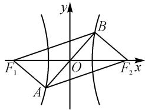

# 一道九省联考离心率试题的探究

# ● 河北师范大学附属民族学院 张娜 王丽娜 张志霞

圆锥曲线(椭圆或双曲线)离心率的求值或最值(或取值范围)问题,往往可以很好融合平面几何、解三角形以及平面向量等内容,交汇函数、方程、不等式以及三角函数等代数变量,契合“在知识交汇点处命题”的理念;同时又是多种数学思维方式与技巧方法应用的重要场景,是各类模拟考试与高考试卷中的热点问题,备受各方关注.

# 1 考题呈现

试题 设双曲线 $C: \frac{x^{2}}{a^{2}} - \frac{y^{2}}{b^{2}} = 1 (a > 0, b > 0)$ 的左、右焦点分别为 $F_{1}, F_{2}$ ，过坐标原点的直线与 C 交于 A, B 两点， $|F_{1}B| = 2 |F_{1}A|, \overrightarrow{F_{2}A} \cdot \overrightarrow{F_{2}B} = 4a^{2}$ ，则 C 的离心率为（）.

A. $\sqrt{2}$

B.2

C. $\sqrt{5}$

D. $\sqrt{7}$

本题主要考查双曲线的方程与几何性质,涉及离心率的求解,需要从双曲线的定义出发进行分析,综合平面几何图形的结构特征,以及平面向量的数量积等相关知识,对直观想象能力与数学运算能力等方面有一定的要求.

# 2 试题破解

# 2.1 解三角形思维

方法 1:(余弦定理法 1)

依题,根据双曲线的对称性,可知四边形 $AF_{1}BF_{2}$ 为平行四边形,则有 $\left|F_{1}B\right|=\left|F_{2}A\right|$ , $\left|F_{1}A\right|=\left|F_{2}B\right|$ , 如图1所示.根据双曲线的定义有 $\left|F_{1}B\right|-\left|F_{2}B\right|=\left|F_{1}B\right|-\left|F_{1}A\right|=2a$ , 结合 $\left|F_{1}B\right|=2\left|F_{1}A\right|$ , 可得 $\left|F_{1}A\right|=2a$ , $\left|F_{1}B\right|=4a$ , 所以 $\overrightarrow{F_{2}A}\cdot\overrightarrow{F_{2}B}=4a\times2a\times$ $\cos\angle AF_{2}B=4a^{2}$ ，即 $\cos\angle AF_{2}B=\frac{1}{2}$ ，可得 $\angle AF_{2}B=\frac{\pi}{3}$ 。利用余弦定理，有 $|AB|^{2}=|F_{2}A|^{2}+|F_{2}B|^{2}-2|F_{2}A|\cdot|F_{2}B|\cdot\cos\angle AF_{2}B=12a^{2}$ ，得 $|AB|=$ $2\sqrt{3}a$ ，亦即 $|OB|=\sqrt{3}a$ ，则有 $|AB|^{2}+|F_{2}B|^{2}=$ $|F_{2}A|^{2}$ ，可得 $\angle ABF_{2}=\frac{\pi}{2}$ 。利用勾股定理有 $|OF_{2}|=$

text_image

y
F₁ O F₂ x
A B

图 1

$$
\sqrt {\left| O B \right| ^ {2} + \left| F _ {2} B \right| ^ {2}} = \sqrt {7} a = c.
$$

所以 C 的离心率 $e=\frac{c}{a}=\sqrt{7}$ .

方法 2: (余弦定理法 2)

依题，根据双曲线的对称性，可知四边形 $AF_{1}BF_{2}$ 为平行四边形，则有 $|F_{1}B| = |F_{2}A|$ ， $|F_{1}A| = |F_{2}B|$ ，如图1所示。根据双曲线的定义有 $|F_{1}B| - |F_{2}B| = |F_{1}B| - |F_{1}A| = 2a$ ，结合 $|F_{1}B| = 2|F_{1}A|$ ，可得 $|F_{1}A| = 2a$ ， $|F_{1}B| = 4a$ 。而 $\overrightarrow{F_2A} \cdot \overrightarrow{F_2B} = -\overrightarrow{F_1B} \cdot \overrightarrow{F_2B} = -\overrightarrow{BF_1} \cdot \overrightarrow{BF_2} = -4a \times 2a \times \cos \angle F_1BF_2 = 4a^2$ ，即 $\cos \angle F_1BF_2 = -\frac{1}{2}$ ，可得 $\angle F_1BF_2 = \frac{2\pi}{3}$ 。利用余弦定理，可得 $|F_1F_2|^2 = |F_1B|^2 + |F_2B|^2 - 2|F_1B||F_2B|\cos \angle F_1BF_2 = 28a^2$ ，即 $|F_1F_2| = 2\sqrt{7} a = 2c$ ，亦即 $\sqrt{7} a = c$ ，所以 $C$ 的离心率 $e = \frac{c}{a} = \sqrt{7}$ 。

方法 3: (余弦定理法 3)

同方法1,得到 $|AB|=2\sqrt{3}a$ ,亦即 $|OB|=\sqrt{3}a$ .

在 $\triangle F_{1}BF_{2}$ 中，利用中线长定理可得 $|F_{1}B|^{2}+|F_{2}B|^{2}=2(|OB|^{2}+|F_{1}O|^{2})$ ，即 $20a^{2}=2(3a^{2}+c^{2})$ ，整理可得 $c^{2}=7a^{2}$ ，即 $c=\sqrt{7}a$ 。

所以 C 的离心率 $e=\frac{c}{a}=\sqrt{7}$ .

解后反思:解决此类涉及平面解析几何中的平面几何图形的关系特征问题时,往往离不开解三角形思维的应用,综合正弦定理、余弦定理以及三角形的其他相关知识来分析与处理,建立对应参数之间的关系,为进一步求解平面解析几何问题提供条件.在具体的平面几何图形中,不同思维视角的切入,往往有不同的技巧方法,解题的关键就是在一个具体的三角形中来构建相应边与角之间的关系.

# 2.2 焦点三角形思维

方法 4:(焦点三角形面积公式法)

依题，根据双曲线图形的对称性，可知四边形 $AF_{1}BF_{2}$ 为平行四边形，则有 $|F_{1}B|=|F_{2}A|$ ， $|F_{1}A|=|F_{2}B|$ ，如图1所示。根据双曲线的定义，可得 $|F_{1}B|-|F_{2}B|=|F_{1}B|-|F_{1}A|=2a$ ，结合 $|F_{1}B|=2|F_{1}A|$ ，可得 $|F_{1}A|=2a$ ， $|F_{1}B|=4a$ ，而 $\overrightarrow{F_{2}A}\cdot$ $\overrightarrow{F_{2}B}=-\overrightarrow{F_{1}B}\cdot\overrightarrow{F_{2}B}=-\overrightarrow{BF_{1}}\cdot\overrightarrow{BF_{2}}=-4a\times2a\times\cos\angle F_{1}BF_{2}=4a^{2}$ ，即有 $\cos\angle F_{1}BF_{2}=-\frac{1}{2}$ ，可得 $\angle F_{1}BF_{2}=\frac{2\pi}{3}$ 。利用双曲线的焦点三角形面积公式，可得 $\frac{b^{2}}{\tan\frac{\pi}{3}}=\frac{1}{2}\times4a\times2a\times\sin\frac{2\pi}{3}$ ，整理有 $b^{2}=6a^{2}$ ，
所以 C 的离心率 $e=\frac{c}{a}=\sqrt{1+\frac{b^{2}}{a^{2}}}=\sqrt{7}$ .

解后反思:在解决与圆锥曲线的焦点三角形相关的综合问题时,合理运用焦点三角形面积公式,会使得一些看似与面积无关的问题迎刃而解,大大降低数学运算成本,优化解题过程,起到事半功倍之效.焦点三角形的面积公式作为一个“二级结论”,综合运用了解三角形中相关定理与公式,以及圆锥曲线的定义等知识,在解决一些与之相关的综合问题时,可以使得问题的突破更加巧妙,处理起来更加快捷.

# 2.3 焦半径思维

方法 5:(焦半径公式法)

依题设 $B(x_{0}, y_{0})$ ，根据双曲线图形的对称性，可知 $A(-x_{0}, -y_{0})$ ，

由 $|F_1B| = 2|F_1A|$ ，结合双曲线的焦半径公式有 $a + ex_0 = 2(-a + ex_0)$ ，即 $3a = ex_0$ ，亦即 $x_0 = \frac{3a^2}{c}$ .

而 $\overrightarrow{F_2A} \cdot \overrightarrow{F_2B} = (-x_0 - c, -y_0) \cdot (x_0 - c, y_0) = c^2 - x_0^2 - y_0^2 = 4a^2$ . 又 $\frac{x_0^2}{a^2} - \frac{y_0^2}{b^2} = 1$ ，消去参数 $y_0$ ，整理可得 $x_0^2 = \frac{a^2(2c^2 - 5a^2)}{c^2}$ .

所以 $x_{0}^{2}=\frac{9a^{4}}{c^{2}}=\frac{a^{2}(2c^{2}-5a^{2})}{c^{2}}$ ，整理有 $c=\sqrt{7}a$ .

故 C 的离心率 $e=\frac{c}{a}=\sqrt{7}$ .

解后反思:根据圆锥曲线的焦半径公式,可以建立相应的焦半径与圆锥曲线上的点的坐标之间的关系式,进而利用代数思维加以合理数学运算,实现问题的分析与求解.利用圆锥曲线的焦半径公式解题时,要注意对应圆锥曲线上的点的位置与对应的焦点之间的关系,正确应用对应的公式,不能混淆.在实际解题过程中,我们可经常借助圆锥曲线上的点的坐标的巧妙设置,进行“设而不求”转化处理.

# 2.4 估算思维

方法 6: (极化恒等式法)

依题,根据双曲线图形的对称性,可知四边形 $AF_{1}BF_{2}$ 为平行四边形,则有 $|F_{1}B|=|F_{2}A|$ , $|F_{1}A|=$ $|F_{2}B|$ ，如图1所示.

根据双曲线的定义有 $|F_1B| - |F_2B| = |F_1B| - |F_1A| = 2a$ ，结合 $|F_1B| = 2|F_1A|$ ，可得 $|F_1A| = 2a$ ， $|F_1B| = 4a$ 。根据极化恒等式，有 $4a^2 = \overrightarrow{F_2A} \cdot \overrightarrow{F_2B} = \frac{1}{4}[(\overrightarrow{F_2A} + \overrightarrow{F_2B})^2 - (\overrightarrow{F_2A} - \overrightarrow{F_2B})^2] = \frac{1}{4}(4c^2 - 4|OA|^2) = c^2 - |OA|^2$ ，整理得 $c^2 = 4a^2 + |OA|^2 > 4a^2 + a^2 = 5a^2$ ，即 $c > \sqrt{5}a$ ，则 $C$ 的离心率 $e = \frac{c}{a} > \sqrt{5}$ 。

结合各选项的值,故选:D.

解后反思: 回归平面向量的数量积条件与线段长度的关系, 经常采用平面向量中的极化恒等式来巧妙转化与合理变形, 是解决与数量积有关的综合问题中比较常用的一种技巧方法. 这里采用估计思维, 结合选项中的数值信息加以正确分析与判断, 给问题的分析与解决提供一种全新的巧妙思维.

# 3 变式拓展

解题之余,反复研究,必有所得.保留题设场景,合理改变原来题中对应的条件来进一步巧妙设置,得以创设相应的变式问题.

变式 设双曲线 $C: \frac{x^2}{a^2} - \frac{y^2}{b^2} = 1 (a > 0, b > 0)$ 的左、右焦点分别为 $F_1, F_2$ ，过原点的直线与 $C$ 交于 $A$ ， $B$ 两点， $|F_1 B| = 2 |F_1 A|$ ，四边形 $AF_1 BF_2$ 的面积为 $4\sqrt{3} a^2$ ，则 $C$ 的离心率为 \_\_\_\_. ( $\sqrt{3}$ 或 $\sqrt{7}$ )

# 4 教学启示

在解决圆锥曲线的综合应用问题时,特别是涉及直线与圆锥曲线的位置关系及其综合应用问题时,基本的解题技巧与方法如下:(1)依托平面几何思维,数形结合,直观分析处理.立足圆锥曲线的应用场景,结合平面几何、平面向量以及解三角形等相关知识加以数形结合与直观应用,实现问题的直观求解与应用.(2)依托函数与方程思维,代数应用,数学运算处理.利用点的坐标、直线与圆锥曲线方程等的关系,建立方程或方程组,构建公式并加以代数转化,通过数学运算来分析与求解.(3)依托基本性质思维,性质应用,“巧技妙解”处理.此数学思维方式主要适用于一些小题(选择题或填空题),利用一些圆锥曲线的基本性质所对应的“二级结论”,简单快捷地处理一些基本应用问题.

其实,在实际解答圆锥曲线的综合应用问题中,可以综合该模块知识的特点与内涵,从多个思维视角层面切入与应用,全面提升“四基”“四能”的落实与培养,养成数学核心素养. Z