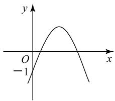
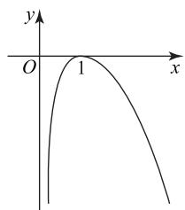

# 一道双变量不等式问题引发的探究

王欣 谢辉 杨冬梅

(北京工业大学附属中学)

双变量导数问题一直是函数与导数问题的难点，求解此类问题的核心是消元，或通过同构法构造函数，利用函数的单调性求解。学生在问题解决的过程中，往往判断不出两个变量之间的关系，无法决定究竟是利用同构法进行变量分离构造新函数，还是通过消元的方式减少变量的个数，从而将原问题转化为一元函数问题。本文通过分析一道双变量不等式问题解决过程中学生出现的错误，找到学生在知识与方法上的误区，制订有针对性的学习策略。

题目 已知函数 $f(x)=\frac{1}{x}-x+a\ln x$ ，若 $f(x)$ 存在两个极值点 $x_{1}, x_{2}$ ，证明 $\frac{f(x_{1})-f(x_{2})}{x_{1}-x_{2}}<a-2.$

# 1 错解分析

错解1 若函数 $f(x)$ 存在两个大于0的极值点，则 $f'(x) = \frac{-x^2 + ax - 1}{x^2} = 0$ ，则 $-x^2 + ax - 1 = 0$ 有两个正实根， $\Delta = a^2 - 4 > 0$ ，解得 $a < -2$ 或 $a > 2$ ，依题意可知 $x_1 + x_2 = a > 0$ ，故 $a > 2$ ，则 $a - 2 > 0$ . 观察 $\frac{f(x_1) - f(x_2)}{x_1 - x_2}$ ，联想到斜率，认为本题只需证 $f'(x) < 0$ ，则证 $\frac{-x^2 + ax - 1}{x^2} < 0$ ，即证 $x^2 - ax + 1 > 0$ 在 $(0, +\infty)$ 恒成立，而此结论显然不成立.

评析 上述解法至少存在三个误区: 第一, 将割

# 5 构造直角三角形求最值

例12 已知 $a$ 和 $b$ 满足 $a > 1, b > 2$ , 求$\frac{(a + b)^2}{\sqrt{a^2 - 1} + \sqrt{b^2 - 4}}$ 的最小值.

解析

如图 10 所示, 点$A, B, C$ 在线段AB 上, AC = 1, BC = 2,$CE = b, CD = a, EB \perp$ $AB$ ， $DA \perp AB$ ，记$\angle ACD = \alpha, \angle BCE =$ $\beta$ ，则

text_image

E
b
a
D
β
α
B 2 C 1 A

图10

$$
a \cos \alpha + b \cos \beta = 3, \tag {①}
$$

$$
\sqrt {a ^ {2} - 1} = a \sin \alpha , \sqrt {b ^ {2} - 4} = b \sin \beta ,
$$

故原函数可以表示为 $\frac{(a + b)^2}{a\sin\alpha + b\sin\beta}$ . 记

$$
a \sin \alpha + b \sin \beta = x, \tag {②}
$$

由① $^{2}$ +② $^{2}$ 得

$$
a ^ {2} + b ^ {2} + 2 a b \cos (\alpha - \beta) = x ^ {2} + 9,
$$

则 $x^{2} + 9 \leqslant (a + b)^{2}$ , 当且仅当 $\alpha = \beta$ 时, 等号成立. 于是

$$
\frac {(a + b) ^ {2}}{a \sin \alpha + b \sin \beta} = \frac {(a + b) ^ {2}}{x} \geqslant \frac {x ^ {2} + 9}{x} \geqslant \frac {6 x}{x} = 6,
$$

当且仅当 x=3 时，等号成立，此时 $a=\sqrt{2}$ ， $b=2\sqrt{2}$ ，故所求最小值是 6.

点评

当已知条件和待求式中有形如 $\sqrt{x^{2}\pm k^{2}}$ （其中x是变量，k是常数）的式子时，可以尝试三角形来解答问题.

变式训练 已知 $x$ 是实数, 求函数 $f(x) = \sqrt{x^2 + 4} + \sqrt{x^2 - 24x + 153}$ 的最小值.

答案 13.

数形结合思想是常用的解题技巧,本文中的例题主要介绍了化“数”为“形”的解题策略和方法,解题时要求解题者善于观察式子的结构特征,进而产生联想、发现和揭示隐含在式子背后的几何意义,再借助几何图形的直观性解题,但解题过程中仍然需要利用代数知识进行严格论证和计算.值得注意的是,在解题中数形结合思想是探究解题思路时使用的,不可以利用图形的直观性代替计算和推理论证,画函数图像时,应该注意函数自变量的取值范围.

(完)

线的斜率直接等同于切线的斜率；第二，忽略 $x_{1}, x_{2}$ ， $a$ 之间的关系，认为 $x_{1}, x_{2}$ 是两个任意的自变量；第三，过度放缩，导致 $a$ 的取值影响到 $x_{1}, x_{2}$ 的值.

错解 2 学生受函数单调性定义的影响, 将要证明的不等式进行了变量分离, 证明过程如下.

不妨设 $0 < x_{1} < x_{2}$ ，欲证 $\frac{f(x_1) - f(x_2)}{x_1 - x_2} < a - 2$ ，只需证 $f(x_{1}) - f(x_{2}) > (a - 2)(x_{1} - x_{2})$ ，即证

$$
f (x _ {1}) - (a - 2) x _ {1} > f (x _ {2}) - (a - 2) x _ {2}.
$$

构造函数 $F(x)=f(x)-(a-2)x$ ，则

$$
F ^ {\prime} (x) = f ^ {\prime} (x) - (a - 2) =
$$

$$
\frac {(1 - a) x ^ {2} + a x - 1}{x ^ {2}}.
$$

部分学生在构造上述函数求导后发现, 导函数 $F'(x)$ 的符号由分子这个二次函数决定, 且由于原函数存在两个正极值点, 则可以得到 a > 2, 因此分析二次函数会发现, 其图像大致如图 1 所示.

line

| x | y |
|---|---|
| -1 | -1 |

图1

因此， $F'(x)$ 并不满足小于或等于 0 恒成立，故无法说明所构造的函数为减函数，从而无法完成证明。还有部分同学在 $F'(x)=\frac{(1-a)x^{2}+ax-1}{x^{2}}$ 的基础上，发现了 a 与 x 之间的关系，即所构造的函数 $F(x)=f(x)-(a-2)x$ ，其自变量 x 其实是原函数的极值点，满足 $x^{2}-ax+1=0$ ，变形后得到 $a=x+\frac{1}{x}$ ，将其代入 $F'(x)$ ，可得

$$
F ^ {\prime} (x) = \frac {(1 - x - \frac {1}{x}) x ^ {2} + (x + \frac {1}{x}) x - 1}{x ^ {2}} =
$$

$$
2 - x - \frac {1}{x} = 2 - a <   0,
$$

于是 $F(x)$ 是减函数, 从而认为问题得证.

评析 这种解法本质的错误在于忽略了 $x_{1}, x_{2}$ 是原函数的两个极值点，并不是两个自由的自变量，两者之间是有制约关系的，而函数的单调性定义中的 $x_{1}, x_{2}$ 是两个彼此之间没有制约关系的自变量。此外，将 $a$ 用 $x + \frac{1}{x}$ 替换也存在问题，因为 $a$ 本身就是一个关于原函数极值点 $x$ 的函数，在对 $F(x)$ 进行求导时，不能将 $a$ 视为常数，在求导后又将 $a$ 视为关于 $x$ 的函数,求导前后对于 a 的处理是矛盾的.此时终于有学生意识到构造的函数 $F(x)$ 其实是原函数的极值点,因此 a 是关于极值点 x 的函数,应该将 a 用 x 表示,以达到消元的目的,于是得到

$$
F (x) = f (x) - (a - 2) x =
$$

$$
\frac {1}{x} - x + a \ln x - (a - 2) x =
$$

$$
\frac {1}{x} - x + (x + \frac {1}{x}) \ln x - (x + \frac {1}{x} - 2) x =
$$

$$
(x + \frac {1}{x}) \ln x + x + \frac {1}{x} - x ^ {2} - 1,
$$

则 $F'(x)=(x-1)\left(\frac{x+1}{x^{2}}\ln x-2\right)$ ，当 $x\in(0,1)$ 时， $F'(x)>0$ ，当 $x\in(1,+\infty)$ 时， $F'(x)<0$ ，故 $F(x)$ 在

(0,1)上单调递增，在 $(1,+\infty)$ 上单调递减(如图2).通过分析，可知原函数 $f(x)$ 的极值点 $x_{1}\in(0,1)$ ， $x_{2}\in(1,+\infty)$ （学生解答过程中，已经假设 $0<x_{1}<x_{2}$ ），但依然无法比较 $F(x_{1})$ 与 $F(x_{2})$ 的大小.

text_image

y
O 1 x

图2

这个问题从一开始就不能忽略 $x_{1}, x_{2}, a$ 三者之间的关系，应尝试进行消元处理，将三个变量统一用一个变量来表示.

# 2 正解赏析

若 $f(x)$ 有两个极值点 $x_{1}, x_{2}$ ，则 $x_{1} + x_{2} = a$ $(a > 2), x_{1}x_{2} = 1$ ，不妨设 $x_{1} < x_{2}$ ，则

$$
\frac {f \left(x _ {1}\right) - f \left(x _ {2}\right)}{x _ {1} - x _ {2}} = \frac {\frac {1}{x _ {1}} - x _ {1} + a \ln x _ {1} - \frac {1}{x _ {2}} + x _ {2} - a \ln x _ {2}}{x _ {1} - x _ {2}} =
$$

$$
\frac {2 \left(x _ {2} - x _ {1}\right) + a \left(\ln x _ {1} - \ln x _ {2}\right)}{x _ {1} - x _ {2}} = - 2 + \frac {a \left(\ln x _ {1} - \ln x _ {2}\right)}{x _ {1} - x _ {2}}.
$$

欲证 $\frac{f(x_{1})-f(x_{2})}{x_{1}-x_{2}}<a-2$ ，只需证

$$
- 2 + \frac {a (\ln x _ {1} - \ln x _ {2})}{x _ {1} - x _ {2}} <   a - 2,
$$

即证 $\frac{\ln x_1 - \ln x_2}{x_1 - x_2} < 1$ ，则证 $\ln x_1 - \ln \frac{1}{x_1} > x_1 - \frac{1}{x_1}$ ，即证 $2\ln x_1 - x_1 + \frac{1}{x_1} > 0$ .

构造函数 $g(x) = 2\ln x - x + \frac{1}{x} (x\in (0,1))$ ，则 $g^{\prime}(x) = \frac{-(x - 1)^{2}}{x^{2}} < 0,g(x)$ 在(0,1)上单调递减，故

$$
g (x) > g (1) = 0.
$$

评析 此种解法是借助极值点的性质,找到 $x_{1}$ , $x_{2}$ 之间的关系,借助这个关系可以实现消元,转化为关于 $x_{1}$ 或 $x_{2}$ 的单变量函数进行求解.在学习中,可以将这个问题进一步变成求 $f(x_{1})-f(x_{2})$ 的取值范围,于是有 $f(x_{1})-f(x_{2})=2(x_{2}-x_{1})+a(\ln x_{1}-\ln x_{2})$ .运用消元的思想,借助极值点的性质,可以将 a 转化为 $x_{1}+\frac{1}{x_{1}}$ , 将 $x_{2}$ 转化为 $\frac{1}{x_{1}}$ , 则

$$
f \left(x _ {1}\right) - f \left(x _ {2}\right) = 2 \left(\frac {1}{x _ {1}} - x _ {1}\right) +
$$

$$
2 \left(x _ {1} + \frac {1}{x _ {1}}\right) \ln x _ {1} \left(x _ {1} \in (0, 1)\right),
$$

即转化为关于 $x_{1}$ 的单变量函数问题.这种解决双变量导数问题的方法属于直接消元法,借助变量之间的关系实现“化二为一”,通过构造新函数解决问题.

# 3 解题反思

双变量导数问题属于学习难点,学习时可以采取如下策略.

第一,搭设“台阶”.

解决上述问题前,可以先解决如下这个问题.

例1 已知 $f(x) = \ln x + ax^2 - 2x$ 有两个不同值点，求 $a$ 的取值范围.

分析 通过观察该函数的定义域以及导函数,学生不难发现这个问题的本质是方程 $2ax^{2}-2x+1=0$ 有两个不相等的正数解 $x_{1}, x_{2}$ . 于是有 $\Delta=4-8a>0$ , $x_{1}+x_{2}=\frac{2}{2a}>0$ , $x_{1}x_{2}=\frac{1}{2a}>0$ , 解得 $a\in(0,\frac{1}{2})$ . 通过这个问题的求解过程引导学生有意识地去关注极值点的性质与两个极值点之间的关系,为消元做好铺垫.

第二,结构类似问题的辨析.

例2 已知 $f(x) = \frac{1}{2} x^2 - (3 + m)x + 3m\ln x$ $(m \in \mathbf{R})$ ，设 $A(x_{1}, f(x_{1}))$ ， $B(x_{2}, f(x_{2}))$ 为函数 $f(x)$ 图像上任意不同的两个点，若 $\frac{f(x_{1}) - f(x_{2})}{x_{1} - x_{2}} > -3$ 恒成立，求 m 的取值范围.

分析 这个问题中的 $x_{1}, x_{2}$ 是任意的正数，没有相互的制约关系，这与 $x_{1}, x_{2}$ 是函数的两个不同的极值点有本质的区别。解题时可以考虑同构法，将含有 $x_{1}, x_{2}$ 的不等式记为 $f(x_{1}, x_{2}) > 0$ （或 $< 0$ ），通过分离变量的方法把不等式 $f(x_{1}, x_{2}) > 0$ 中的 $x_{1}, x_{2}$ 分

配到不等式的两边,发现不等式两边的结构一致,即 $f(x_{1},x_{2})>0\Leftrightarrow F(x_{1})>F(x_{2})$ ,从而可将双变量的不等式问题转化为单变量函数 $F(x)$ 的单调性问题.

第三,解决任意自变量与消元法相结合的问题.

例3 求证: 对任意 $0 < x_{1} < x_{2}$ , 都有

$$
\ln x _ {1} - \ln x _ {2} <   \frac {2 (x _ {1} - x _ {2})}{x _ {1} + x _ {2}}.
$$

分析 学生在解决这个问题时,进行了两种尝试,其一是关注到了 $x_{1}, x_{2}$ 是任意的正数,因此尝试通过同构法进行变量分离,但是失败了;其二是尝试消元,但是没有找到两个变量之间的数量关系,例如,都是某个函数的极值点或零点等,因此无法将一个变量用另一个变量来表示.此时,需要进一步关注不等式结构,通过引入第三个变量来实现消元,即欲证

$$
\ln x _ {1} - \ln x _ {2} <   \frac {2 \left(x _ {1} - x _ {2}\right)}{x _ {1} + x _ {2}},
$$

根据对数运算法则,只需证 $\ln\frac{x_{1}}{x_{2}}<\frac{2(x_{1}-x_{2})}{x_{1}+x_{2}}$ ,这等

价于证明 $\ln\frac{x_{1}}{x_{2}}<\frac{\frac{2(x_{1}-x_{2})}{x_{2}}}{\frac{x_{1}+x_{2}}{x_{2}}}$ ，即证 $\ln\frac{x_{1}}{x_{2}}<\frac{2(\frac{x_{1}}{x_{2}}-1)}{\frac{x_{1}}{x_{2}}+1}$ .

若将 $\frac{x_1}{x_2}$ 视为一个整体，则可以引入第三个变量 $t$ 替换掉 $x_{1}, x_{2}$ ，将原问题转化为一元函数问题.

令 $t = \frac{x_1}{x_2} (t\in (0,1))$ ，则只需证 $\ln t <   \frac{2(t - 1)}{t + 1}$ $(t\in (0,1))$ .构造函数 $f(t) = \ln t - \frac{2(t - 1)}{t + 1} (t\in (0,$ 1))，则 $f^{\prime}(t) = \frac{(t - 1)^{2}}{t(t + 1)^{2}} >0$ ，所以 $f(t)$ 在(0,1)上单调递增，所以 $f(t) <   f(1) = 0$ ，即 $\ln t <   \frac{2(t - 1)}{t + 1} (t\in$ $(0,1))$ 成立.

双变量不等式问题的求解策略是将双变量转化为单变量,本质上是消元.若两个变量具有等量关系,可以采取直接消元法,即借助等量关系将一个变量用另一个变量来表示;若两个变量是任意的,可以考虑同构法,通过变量分离来解决;若无法实现同构,可以考虑间接消元法,即通过引入第三变量来表示问题中的变量,整体换元,实现“化二为一”.总之,解决双变量不等式问题时,学生需要观察结构,识别类型,合理变形转化.

(完)