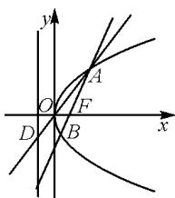

# 一道抛物线试题的解法探究与性质归纳

# ● 江苏省宿迁中学 李慧连

涉及直线与圆锥曲线位置关系的综合问题,一直是高考解答题的一个基本命题类型.此类综合问题新颖,变化多端,合理融合“动态”与“静态”,灵活借助“动点”与“定点”的转化,巧妙达到“常值”与“最值”的过渡,从而有效实现平面解析几何与其他相关知识之间的交汇与应用 $^{[1]}$ .其中,涉及直线与抛物线的位置关系问题,结合抛物线自身具有平面解析几何的基本属性与平面几何的性质特征,特别是抛物线的焦点弦问题、抛物线的光学性质问题等,更加突出抛物线自身“数”的本质属性与“形”的几何特征,全面考查逻辑推理、直观想象、数学运算等核心素养,全面考查学生的数学“四基”与数学基本能力,具有较好的区分度.

# 1 问题呈现

# 1.1 问题出处

问题 （2024 年湖北省七市州高三年级 3 月联合统一调研测试数学试卷·18) 如图 1 所示，O 为坐标原点，F 为抛物线 C: $y^{2}=2x$ 的焦点，过点 F 的直线交抛物线 C 于 A, B 两点，且抛物线 C 在点 B 处的切线为 l，直线 AO 交抛物线 C 的准线于点 D.

text_image

y
A
O
F
D
B
x

图1

(1) 若直线 l 与 y 轴相交于点 E，求证： $|DE| = |EF|$ ;  
(2) 过点 B 作直线 l 的垂线与直线 AO 交于点 G，求证： $|AD|^{2} = |AO| \cdot |AG|$ .

# 1.2 问题剖析

此题以抛物线为问题场景,结合直线与抛物线的位置关系,借助抛物线的切线,从两线段的长度相等,以及对应线段的关系式等视角合理设置,全面考查直线与抛物线的位置关系等,实现学生“四基”的落实与“四能”的提升与应用.

# 1.3 命题素材

这道平面解析几何题作为一道原创数学命题,命题素材主要来自于教材,算是对“回归基础,回归教材”的一种基本回应,也是高三阶段复习备考的一种基本导向.基于教材,又高于教材.

素材 1: 经过抛物线焦点 F 的直线交抛物线于 A,B 两点, 经过点 A 和抛物线顶点的直线交抛物线的准线于点 D, 求证: 直线 DB 平行于抛物线的对称轴.

以上素材源于人教 A 版 2019 年版选择性必修第一册第 136 页例 5, 此例题的解析过程, 可直接参考教材中的分析过程与证明过程.

素材 2: 设抛物线 $y^{2}=2px(p>0)$ 的焦点为 F，从点 F 发出的光线经过抛物线上的点 M（不同于抛物线的顶点）反射，证明反射光线平行于抛物线的对称轴.

以上素材源于人教 A 版 2019 年版选择性必修第一册第 139 页习题 3.3 第 13 题, 此习题的解析过程, 可结合函数与导数的应用, 利用求导运算, 结合导数的几何意义, 确定抛物线上点 M 处的切线斜率, 进而求解相应的切线方程, 进一步利用法线的斜率确定与对应的直线方程的求解, 联立直线方程来确定相应的交点坐标, 进而确定对应的发射光线, 并利用图形的对称性进一步确定对应的结论, 实现问题的证明与结论的确定.

以上两个素材中,对应的条件基本相同.在素材1的条件下,结合抛物线的焦点弦的端点与顶点的半径,来探究抛物线的基本性质;在素材2的条件下,结合抛物线的焦点,合理剖析抛物线的光学性质及其应用.

从以上两个素材及其对应的结论,进一步深入探究,在相同的应用场景下,到底会有哪些比较规律的数量关系、几何关系、位置关系及其他相关的关系呢?

# 2 问题破解

证明: 设直线 AB 的方程为 $x = my + \frac{1}{2}$ ，点 $A(x_{1}, y_{1}), B(x_{2}, y_{2})$ .

联立 $\left\{\begin{aligned}x&=my+\frac{1}{2},\\ y^{2}&=2x,\end{aligned}\right.$ 消去参数 x 并整理，可得 $y^{2}-2my-1=0$ ，则 $\Delta=4m^{2}+4>0$ ，且

$$
y _ {1} + y _ {2} = 2 m, y _ {1} y _ {2} = - 1.
$$

(1) 方法 1(向量法): 不妨设点 A 在第一象限, 点 B 在第四象限. 对于 $y = -\sqrt{2x}$ , $y' = -\frac{1}{\sqrt{2x}}$ , 所以在点 B 处的切线 l 的斜率为 $-\frac{1}{\sqrt{2x_{2}}} = -\frac{1}{\sqrt{y_{2}^{2}}} = \frac{1}{y_{2}}$ , 可

得直线 l 的方程为 $y - y_{2} = \frac{1}{y_{2}} (x - x_{2})$ ，整理可得 $y = \frac{1}{y_{2}} x + \frac{y_{2}}{2}$ .

令 x=0，可得点 $E\left(0,\frac{y_{2}}{2}\right)$ .

直线 $OA$ 的方程为 $y = \frac{y_1}{x_1} x = \frac{2}{y_1} x = -2y_2x$ . 令 $x = -\frac{1}{2}$ , 可得点 $D\left(-\frac{1}{2}, y_2\right)$ .

又点 $F\left(\frac{1}{2},0\right)$ ，则有 $\overrightarrow{DE} = \left(\frac{1}{2}, - \frac{y_2}{2}\right),\overrightarrow{EF} =$ $\left(\frac{1}{2}, - \frac{y_2}{2}\right)$ ，所以 $\overrightarrow{DE} = \overrightarrow{EF}$ ，则 $|DE| = |EF|$

方法2(几何法): 直线 OA 的方程为 $y=\frac{y_{1}}{x_{1}}x=\frac{2}{y_{1}}x=-2y_{2}x$ ，令 $x=-\frac{1}{2}$ ，可得点 $D\left(-\frac{1}{2},y_{2}\right)$ .

而点 $B(x_{2}, y_{2})$ ，则知直线 DB 与 x 轴平行。设 DF 交 y 轴于点 $E'$ 。

结合抛物线的定义知 $\left|DB\right|=\left|FB\right|$ ，设 $E'$ 为 DF 的中点，则 $BE'\perp DF$ 。

利用抛物线的光学性质可知, 点 $E'$ 在抛物线点 B 处的切线 l 上, 则点 E 与点 $E'$ 重合.

利用等腰三角形的性质,知 $\left|DE\right|=\left|EF\right|$ .

(2) 方法 1(坐标法): 过点 B 的 l 的垂线的方程为 $y - y_{2} = -y_{2}(x - x_{2})$ ，即 $y = -y_{2}x + y_{2}\left(1 + \frac{y_{2}^{2}}{2}\right)$ .

联立 $\left\{ \begin{array}{l} y = -y_{2}x + y_{2}\left(1 + \frac{y_{2}^{2}}{2}\right), \\ y = -2y_{2}x, \end{array} \right.$ 解得点 $G$ 的纵坐标为 $y_{G} = y_{2}(y_{2}^{2} + 2)$ .

因为 A, O, D, G 四点共线，所以要证 $\left|AD\right|^{2} = \left|AO\right| \cdot \left|AG\right|$ 则只需证明 $\left|y_{2} - y_{1}\right|^{2} = \left|y_{1}\right| \cdot \left|y_{G} - y_{1}\right|$ .

因为 $|y_{2} - y_{1}|^{2} = \left|y_{2} + \frac{1}{y_{2}}\right|^{2} = \frac{(1 + y_{2}^{2})^{2}}{y_{2}^{2}}, |y_{1}| \cdot |y_{G} - y_{1}| = \left|-\frac{1}{y_{2}}\right| \cdot \left|y_{2}(y_{2}^{2} + 2) + \frac{1}{y_{2}}\right| = \frac{(1 + y_{2}^{2})^{2}}{y_{2}^{2}}$ 所以 $|y_{2} - y_{1}|^{2} = |y_{1}| \cdot |y_{G} - y_{1}|$ ，故 $|AD|^{2} = |AO| \cdot |AG|$ 得证.

方法 2(几何法): 由(1)得点 $D\left(-\frac{1}{2}, y_{2}\right)$ ，而点 $B(x_{2}, y_{2})$ ，则直线 DB 与 x 轴平行，所以 $\frac{|AF|}{|AB|} = \frac{|AO|}{|AD|}$ .

又点 $F\left(\frac{1}{2},0\right)$ ，则直线 DF 的斜率为 $\frac{y_{2}}{-\frac{1}{2}-\frac{1}{2}}=$

$-y_{2}$ . 又直线 BG 的斜率为 $-y_{2}$ ，所以直线 DF 与直线 BG 平行，则 $\frac{|AF|}{|AB|} = \frac{|AD|}{|AG|}$ .

所以 $\frac{|AO|}{|AD|}=\frac{|AD|}{|AG|}$ ，即 $|AD|^{2}=|AO|\cdot|AG|$ 得证.

# 3 性质归纳

性质 1: 已知抛物线 $C: y^{2} = 2px (p > 0)$ 的焦点为 F，过点 F 的直线交抛物线 C 于异于坐标原点 O 的 A, B 两点，过点 A 和顶点 O 的直线交抛物线 C 的准线于点 D，则

(1) DB 平行于 x 轴；  
(2) $|DB|=|FB|$ .

性质 2: 已知抛物线 $C: y^{2} = 2px (p > 0)$ 的焦点为 F，过点 F 的直线交抛物线 C 于异于坐标原点的 A, B 两点，过点 A 和顶点 O 的直线交抛物线 C 的准线于点 D，且抛物线 C 在 B 点处的切线为直线 l，则

(1) 对应点 D, F 关于切线 l 对称;  
(2)线段 DF 的中点在 y 轴上.

性质 3: 已知抛物线 $C: y^{2} = 2px (p > 0)$ 的焦点为 F，过点 F 的直线交抛物线 C 于异于坐标原点的 A, B 两点，过点 A 和顶点 O 的直线交抛物线 C 的准线于点 D，且抛物线 C 在点 B 处的切线为直线 l，过点 B 作直线 l 的垂线与直线 AO 交于点 G，则

(1) $DF \parallel BG$ ;   
(2) $\frac{|AO|}{|AD|}=\frac{|DO|}{|DG|},\left|AD\right|^{2}=\left|AO\right|\cdot\left|AG\right|;$   
(3) $\frac{|AB|}{|AF||BF|}=\frac{|AD|}{|BD||AO|}=\frac{|AG|}{|BD||AD|}=\frac{2}{p}.$

# 4 教学启示

圆锥曲线问题,特别是涉及直线与圆锥曲线位置关系的综合问题,是每年高考解答题中必然出现的一类基本命题点与考查点.

涉及直线与圆锥曲线位置关系的综合问题,通常是基于平面解析几何场景中动态与静态的融合与转化,利用一些多“动点”、多“动直线”等元素的创设,总结其中静态的表现,从代数视角或几何视角来数学运算或直观想象,进而实现静态设置,如一些有关的定点、定值或最值,或是代数形式的表达方式等,实现“动”与“静”的合理变化与转化,充分体现科学的唯物主义辩证思维与创新应用.

# 参考文献：

[1]毛良忠.整合单元向量素材 内化数学逻辑思维[J].中小学数学(高中版),2021(11):40-43.Z