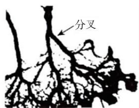
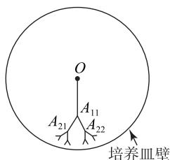
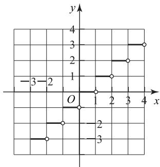

# 三招求解“奇偶项交织”递推数列问题

甘志国(正高级教师 特级教师)

(北京市丰台区第二中学甘志国特级教师工作室)

若数列 $\{a_{n}\}$ 的递推公式是分段函数 $a_{n + 1} = \left\{ \begin{array}{ll}f(a_n),n & \text{是正奇数，}\\ g(a_n),n & \text{是正偶数} \end{array} \right.$ （或递推公式中含有 $(-1)^n$ ，其本质也是分段函数）的形式，就把数列 $\{a_{n}\}$ 叫作“奇偶项交织”的递推数列.解决该问题难度很大，本文将介绍三种处理方法.

# 1 分别讨论第奇数项与第偶数项

例 1 某生物兴趣小组在显微镜下拍摄到一种黏菌的繁殖轨迹,如图1所示.通过观察发现,该黏菌繁殖符合如下规律:

① 黏菌沿直线繁殖一段距离后, 就会以该直线为对称轴分叉(分叉的角度约为 $60^{\circ}$ ), 再沿直线繁殖……  
② 每次分叉后沿直线繁殖的距离约为前一段沿直线繁殖的距离的一半.

于是,该组同学将整个繁殖过程抽象为如图2所示的一个数学模型:黏菌从圆形培养皿的中心O开始,沿直线繁殖到 $A_{11}$ ,然后分叉向 $A_{21}$ 与 $A_{22}$ 方向继续繁殖,其中 $\angle A_{21}A_{11}A_{22}=60^{\circ}$ ,且 $A_{11}A_{21}$ 与 $A_{11}A_{22}$ 关于 $OA_{11}$ 所在直线对称, $A_{11}A_{21}=A_{11}A_{22}=\frac{1}{2}OA_{11},\cdots.$

若 $OA_{11}=4\ cm$ ，为保证黏菌在繁殖过程中不会碰到培养皿壁，则培养皿的半径 $r(r\in\mathbf{N}^{*})$ ，单位：cm，保留整数）至少为（ ）.

A. 6

B. 7

C. 8

D. 9

text_image

分叉

图1

text_image

O
A₁₁
A₂₁
A₂₂
培养皿壁

图2

黏菌繁殖在射线 $OA_{11}$ 方向上前进的距离依次为 $4, \sqrt{3}, 1, \frac{\sqrt{3}}{4}, \frac{1}{4}, \frac{\sqrt{3}}{4^{2}}, \cdots$ (延长 $OA_{11}$ ,

$A_{11}A_{22}$ ，第三次考虑从点 $A_{22}$ 开始左侧的一支，由同位

角相等(都是 $30^{\circ}$ ), 两直线平行可得该支与 $OA_{11}$ 平行, 而后的讨论就与第一次的讨论类似了), 进而可得该数列的奇数项、偶数项均是等比数列且公比均是 $\frac{1}{4}$ , 所以该数列各项和为

$$
S = (4 + \sqrt {3}) (1 + \frac {1}{4} + \frac {1}{4 ^ {2}} + \dots + \frac {1}{4 ^ {n - 1}} + \dots) =
$$

$$
(4 + \sqrt {3}) \lim _ {n \rightarrow \infty} (1 + \frac {1}{4} + \frac {1}{4 ^ {2}} + \dots + \frac {1}{4 ^ {n - 1}}) =
$$

$$
(4 + \sqrt {3}) \lim _ {n \rightarrow \infty} \frac {1 - \frac {1}{4 ^ {n}}}{1 - \frac {1}{4}} = \frac {4}{3} (4 + \sqrt {3}),
$$

故选 C.

例2 已知各项均为正整数的数列 $\{a_{n}\} (n\leqslant 9)$ 满足 $a_{1}=6, a_{9}=14$ ，且对任意的 $k\in\{2,3,\cdots,8\}$ ， $a_{k}=a_{k-1}+1$ 与 $a_{k}=a_{k+1}-1$ 有且仅有一个成立。记 $S_{9}=a_{1}+a_{2}+\cdots+a_{9}$ ，则下列四个结论中所有正确结论的序号是 \_\_\_\_。

① $\{a_{n}\} (n\leqslant 9)$ 可能为等差数列；  
② $\{a_{n}\}(n\leqslant9)$ 的最大项为 $a_{9}$ ;  
③ $S_{9}$ 不存在最大值；  
④ $S_{9}$ 的最小值为 36.

因为 $a_2 = a_1 + 1$ 与 $a_2 = a_3 - 1$ 有且仅有一个成立，所以 $a_1, a_2, a_3$ 不成等差数列，则①错误.数列 $\{a_{n}\} (n\leqslant 9)$ 可以是 $6,7,m,m + 1,m + 3,m+$ $4,m + 6,m + 7,14(m\in \mathbf{N}^{*},m\neq 6,8)$ ，则②错误，③正确.

若 $S_{9}$ 取最小值，则 $a_{2} = 1$ 或 $a_3 = 1$ . 若 $a_{2} = 1$ ，进而可得数列 $\{a_n\} (n \leqslant 9): 6, 1, 2, 1, 2, 1, 2, 13, 14$ ，再得 $S_{9} = 42$ . 若 $a_{3} = 1$ ，进而可得数列 $\{a_n\} (n \leqslant 9): 6, 7, 1, 2, 1, 2, 1, 2, 14$ ，再得 $S_{9} = 36$ ，进而可得④正确.

综上,所有正确结论的序号是③④.

例3 (1)已知数列 $\{a_{n}\}$ 满足 $a_1 = 1, a_n + a_{n+1} =$ $3n(n\in\mathbf{N}^{*})$ ，求数列 $\{a_{n}\}$ 的通项公式；

(2) 已知数列 $\{a_{n}\}$ 满足 $a_{1}=1, a_{n}a_{n+1}=3^{n}$

$(n\in\mathbf{N}^{*})$ , 求数列 $\{a_{n}\}$ 的通项公式.

# 解析

方法 1 （1）由题设可得 $a_{2}=2$ ，

$\left\{ \begin{array}{l} a_{n} + a_{n+1} = 3n, \\ a_{n+1} + a_{n+2} = 3n + 3 \end{array} \right.$ ( $n \in \mathbf{N}^{*}$ ), 所以 $a_{n+2} -$ $a_{n}=3(n\in\mathbf{N}^{*})$ ，则 $\{a_{2n-1}\}$ 是首项为1、公差为3的等差数列， $\{a_{2n}\}$ 是首项为2、公差为3的等差数列，进而可求得数列 $\{a_{n}\}$ 的通项公式是

$a_{n}=\left\{\begin{aligned}&\frac{3n-1}{2},&n 是正奇数,\\&\frac{3n-2}{2},&n 是正偶数.\end{aligned}\right.$

(2) 由题设可得 $a_{2} = 3, \left\{ \begin{array}{l} a_{n} a_{n+1} = 3^{n}, \\ a_{n+1} a_{n+2} = 3^{n+1} \end{array} (n \in \mathbf{N}^{*})\right.$ , 所以 $\frac{a_{n+2}}{a_n} = 3 (n \in \mathbf{N}^{*})$ , 则 $\{a_{2n-1}\}$ 是首项为 1、公比为 3 的等比数列, $\{a_{2n}\}$ 是首项与公比均为 3 的等比数列, 进而可求得数列 $\{a_{n}\}$ 的通项公式是

$a_{n}=\begin{cases}3^{\frac{n-1}{2}},&n\text{是正奇数,}\\3^{\frac{n}{2}},&n\text{是正偶数.}\end{cases}$

方法 2 (1)由题设可得

$$
a _ {n + 1} - \frac {3}{2} (n + 1) + \frac {3}{4} = - \left(a _ {n} - \frac {3}{2} n + \frac {3}{4}\right) (n \in \mathbf {N} ^ {*}),
$$

进而可得 $\left\{a_{n}-\frac{3}{2}n+\frac{3}{4}\right\}$ 是首项为 $\frac{1}{4}$ 、公比为-1的等比数列，所以

$$
a _ {n} - \frac {3}{2} n + \frac {3}{4} = \frac {1}{4} (- 1) ^ {n - 1},
$$

$$
a _ {n} = \frac {6 n - 3 - (- 1) ^ {n}}{4} (n \in \mathbf {N} ^ {*}),
$$

则 $\{a_{n}\}$ 的通项公式是 $a_{n} = \frac{6n - 3 - (-1)^{n}}{4} (n\in \mathbf{N}^{*})$

(2)由题设及数学归纳法可证得 $a_{n} > 0 (n \in \mathbf{N}^{*})$ ，所以

$$
\log_ {3} a _ {n + 1} + \log_ {3} a _ {n} = n (n \in \mathbf {N} ^ {*}),
$$

$$
\log_ {3} a _ {n + 1} - \frac {n + 1}{2} + \frac {1}{4} = - \left(\log_ {3} a _ {n} - \frac {n}{2} + \frac {1}{4}\right) (n \in \mathbf {N} ^ {*}),
$$

进而可得 $\{\log_{3}a_{n}-\frac{n}{2}+\frac{1}{4}\}$ 是首项为 $-\frac{1}{4}$ 、公比为-1的等比数列，所以

$$
\log_ {3} a _ {n} - \frac {n}{2} + \frac {1}{4} = - \frac {1}{4} (- 1) ^ {n - 1},
$$

$$
a _ {n} = 3 ^ {\frac {2 n - 1 + (- 1) ^ {n}}{4}} (n \in \mathbf {N} ^ {*}),
$$

则数列 $\{a_{n}\}$ 的通项公式是 $a_{n} = 3^{\frac{2n - 1 + (-1)^{n}}{4}}(n\in \mathbf{N}^{*})$

例4 已知由整数组成的数列 $\{a_{n}\}$ 的前 $n$ 项和，且 $a_{n} \neq 0, a_{n} \in \mathbf{Z}, a_{1} = a, 2S_{n} = a_{n}a_{n+1}$ .

(1) 求 $a_{2}$ 的值；  
(2)求数列 $\{a_{n}\}$ 的通项公式；  
(3)若当 n=15 时, $S_{n}$ 取得最小值,求 a 的值.

# 解析

(1) $a_{2}=2$ (求解过程略).

解析 (2)由 $2S_{n} = a_{n}a_{n + 1},2S_{n + 1} = a_{n + 1}a_{n + 2}$ ，两式相减可得 $a_{n + 2} - a_n = 2$ ，所以 $\{a_{2k - 1}\} ,\{a_{2k}\}$ 均是公差为2的等差数列.因而，当 $n$ 是正奇数时，有 $a_{2k - 1} = a + 2(k - 1)$ ，即 $a_{n} = n + a - 1$ ；当 $n$ 是正偶数时，有 $a_{2k} = 2 + 2(k - 1) = 2k$ ，即 $a_{n} = n$

综上, $a_{n}=\begin{cases}n+a-1,&n\text{是正奇数},\\n,&n\text{是正偶数}.\end{cases}$

(3)由已知的递推式及(2)可得

$S_{n} = \left\{ \begin{array}{ll}\frac{1}{2} (n + 1)(n + a - 1), & n\text{是正奇数，}\\ \frac{1}{2} n(n + a), & n\text{是正偶数.} \end{array} \right.$

当 n 是正偶数时, $a_{n}>0$ ,所以当 $S_{n}$ 取得最小值时,n 是正奇数.当 n 是正奇数时,有

$$
S _ {n} = \frac {1}{2} (n + 1) (n + a - 1).
$$

又因为 $f(x) = \frac{1}{2} (x + 1)(x + a - 1)(x\in \mathbf{R})$ 是开口向上的抛物线，所以当 $n = 15$ 时， $S_{n}$ 取得最小值等价于 $\left\{ \begin{array}{l}S_{15}\leqslant S_{13},\\ S_{15}\leqslant S_{17}, \end{array} \right.$ 也即 $\left\{ \begin{array}{l}a_{14} + a_{15} = 28 + a\leqslant 0,\\ a_{16} + a_{17} = 32 + a\geqslant 0, \end{array} \right.$ 所以 $a\in \{-28, - 29, - 30, - 31, - 32\}$ .但是，当 $a = -28$ 时， $a_{29} = 0$ ；当 $a = -30$ 时， $a_{31} = 0$ ；当 $a = -32$ 时， $a_{33} = 0$ ，所以 $a = -28, - 30$ 均不满足题意.同理，可得 $a = -29, - 31$ 均满足题意

综上，a = -29 或 -31.

例 5 （2023 年全国Ⅱ卷 18）已知 $\{a_{n}\}$ 为等差数

列, $b_{n}=\begin{cases}a_{n}-6,&n\text{是正奇数},\\2a_{n},&n\text{是正偶数}.\end{cases}$ 记 $S_{n},T_{n}$ 分别为数列 $\{a_{n}\},\{b_{n}\}$ 的前 n 项和，有 $S_{4}=32,T_{3}=16$ .

(1)求 $\{a_{n}\}$ 的通项公式；  
(2) 证明: 当 n > 5 时, $T_{n} > S_{n}$ .

# 解析

(1)设等差数列 $\{a_{n}\}$ 的公差为 $d$ . 由题设中的递推公式可得 $b_{1} = a_{1} - 6, b_{2} = 2a_{2} = 2a_{1} +$

$$
2 d, b _ {3} = a _ {3} - 6 = a _ {1} + 2 d - 6.
$$

再由题设可得

$$
\left\{ \begin{array}{l} S _ {4} = 4 a _ {1} + 6 d = 3 2, \\ T _ {3} = b _ {1} + b _ {2} + b _ {3} = 4 a _ {1} + 4 d - 1 2 = 1 6, \end{array} \right.
$$

解得 $a_{1}=5, d=2$ ，所以

$$
a _ {n} = a _ {1} + (n - 1) d = 2 n + 3 \left(n \in \mathbf {N} ^ {*}\right),
$$

则数列 $\{a_{n}\}$ 的通项公式是 $a_{n}=2n+3(n\in\mathbf{N}^{*})$ .

(2)由(1)知

$$
S _ {n} = \frac {n (5 + 2 n + 3)}{2} = n ^ {2} + 4 n (n \in \mathbf {N} ^ {*}),
$$

$$
b _ {n} = \left\{ \begin{array}{l l} 2 n - 3, & n \text {是正奇数，} \\ 4 n + 6, & n \text {是正偶数.} \end{array} \right.
$$

方法 1 当 n 是正偶数时,有

$$
b _ {n - 1} + b _ {n} = 2 (n - 1) - 3 + 4 n + 6 = 6 n + 1,
$$

$$
T _ {n} = \frac {1 3 + (6 n + 1)}{2} \cdot \frac {n}{2} = \frac {3}{2} n ^ {2} + \frac {7}{2} n.
$$

当 $n > 5$ 时，有

$$
T _ {n} - S _ {n} = \left(\frac {3}{2} n ^ {2} + \frac {7}{2} n\right) - \left(n ^ {2} + 4 n\right) = \frac {1}{2} n (n - 1) > 0,
$$

因此 $T_{n} > S_{n}$ .

当 n 是正奇数时,有

$$
T _ {n} = T _ {n + 1} - b _ {n + 1} = \frac {3}{2} (n + 1) ^ {2} + \frac {7}{2} (n + 1) -
$$

$$
[ 4 (n + 1) + 6 ] = \frac {3}{2} n ^ {2} + \frac {5}{2} n - 5.
$$

当 $n > 5$ 时，有

$$
T _ {n} - S _ {n} = \left(\frac {3}{2} n ^ {2} + \frac {5}{2} n - 5\right) - (n ^ {2} + 4 n) =
$$

$$
\frac {1}{2} (n + 2) (n - 5) > 0,
$$

因此 $T_{n} > S_{n}$

综上，当 $n > 5$ 时， $T_{n} > S_{n}$ 。

方法 2 当 n 是正偶数时,有

$$
T _ {n} = \left(b _ {1} + b _ {3} + \dots + b _ {n - 1}\right) + \left(b _ {2} + b _ {4} + \dots + b _ {n}\right) =
$$

$$
\frac {- 1 + [ 2 (n - 1) - 3 ]}{2} \cdot \frac {n}{2} + \frac {1 4 + (4 n + 6)}{2} \cdot \frac {n}{2} =
$$

$$
\frac {3}{2} n ^ {2} + \frac {7}{2} n.
$$

当 $n > 5$ 时，有

$$
T _ {n} - S _ {n} = \left(\frac {3}{2} n ^ {2} + \frac {7}{2} n\right) - (n ^ {2} + 4 n) =
$$

$$
\frac {1}{2} n (n - 1) > 0,
$$

因此 $T_{n} > S_{n}$ .

当 n 是正奇数时, 若 $n \geqslant 3$ , 则有

$$
T _ {n} = \left(b _ {1} + b _ {3} + \dots + b _ {n}\right) + \left(b _ {2} + b _ {4} + \dots + b _ {n - 1}\right) =
$$

$$
\frac {- 1 + (2 n - 3)}{2} \cdot \frac {n + 1}{2} + \frac {1 4 + [ 4 (n - 1) + 6 ]}{2}.
$$

$$
\frac {n - 1}{2} = \frac {3}{2} n ^ {2} + \frac {5}{2} n - 5.
$$

又 $T_{1} = b_{1} = -1$ 满足上式，所以当 $n$ 是正奇数时， $T_{n} = \frac{3}{2} n^{2} + \frac{5}{2} n - 5.$ 当 $n > 5$ 时，有

$$
T _ {n} - S _ {n} = \left(\frac {3}{2} n ^ {2} + \frac {5}{2} n - 5\right) - (n ^ {2} + 4 n) =
$$

$$
\frac {1}{2} (n + 2) (n - 5) > 0,
$$

因此 $T_{n} > S_{n}$ .

综上，当 $n > 5$ 时， $T_{n} > S_{n}$

方法 3 易知

$$
a _ {2} + a _ {4} + \dots + a _ {2 k} = \frac {k}{2} [ (2 \times 2 + 3) + (2 \times 2 k + 3) ] =
$$

$$
2 k ^ {2} + 5 k (k \in \mathbf {N} ^ {*}),
$$

由题设中的递推公式可得

$$
T _ {2 k} = \left(b _ {1} + b _ {3} + \dots + b _ {2 k - 1}\right) + \left(b _ {2} + b _ {4} + \dots + b _ {2 k}\right) =
$$

$$
\left(a _ {1} + a _ {3} + \dots + a _ {2 k - 1} - 6 k\right) + 2 \left(a _ {2} + a _ {4} + \dots + a _ {2 k}\right) =
$$

$$
S _ {2 k} + \left(a _ {2} + a _ {4} + \dots + a _ {2 k}\right) - 6 k =
$$

$$
S _ {2 k} + (2 k ^ {2} + 5 k) - 6 k = S _ {2 k} + k (2 k - 1) (n \in \mathbf {N} ^ {*}),
$$

再得

$$
T _ {2 k + 1} = T _ {2 k} + b _ {2 k + 1} = \left(S _ {2 k} + 2 k ^ {2} - k\right) + \left(a _ {2 k + 1} - 6\right) =
$$

$$
S _ {2 k + 1} + (k - 2) (2 k + 3) (k \in \mathbf {N} ^ {*}),
$$

所以当 $k \in \mathbf{N}^*$ 时，有

$$
T _ {2 k} - S _ {2 k} = k (2 k - 1) > 0.
$$

当 $k \in \mathbf{N}^*$ , $k \geqslant 3$ 时, 有

$$
T _ {2 k + 1} - S _ {2 k + 1} = (k - 2) (2 k + 3) > 0.
$$

综上，当 n>5 时， $T_{n}>S_{n}$ .

# 2 先迭代求解第奇数项子列或第偶数项子列

例6 已知数列 $\{a_{n}\}$ 满足 $a_{n + 1} =$ $\left\{ \begin{array}{ll}\frac{a_n + 1}{2}, & n\text{是正奇数，}\\ \frac{a_n}{2}, & n\text{是正偶数，} \end{array} \right.$ 则（ ）.

A. 当 $a_{1}<0$ 时， $\{a_{n}\}$ 为递增数列，且存在常数 M>0，使得 $a_{n}<M$ 恒成立  
B. 当 $a_{1}>1$ 时， $\{a_{n}\}$ 为递减数列，且存在常数 M>0，使得 $a_{n}>M$ 恒成立  
C. 当 $0 < a_{1} < 1$ 时，存在正整数 $N_{0}$ ，当 $n > N_{0}$ 时， $|a_{n} - \frac{1}{2}| < \frac{1}{100}$

D. 当 $0 < a_{1} < 1$ 时，对于任意正整数 $N_{0}$ ，存在 $n > N_{0}$ ，使得 $\left|a_{n} - \frac{1}{2}\right| > \frac{1}{1000}$

当 $a_{1}=-1$ 时，可得 $a_{2}=a_{3}=0,\{a_{n}\}$ 不为单调递增数列，因而选项 A 错误.

当 $a_{1}=3$ 时，可得 $a_{2}=2, a_{3}=1, a_{4}=1, \{a_{n}\}$ 不为单调递减数列，因而选项 B 错误.

由题设中的递推式, 可得 $a_{2}=\frac{a_{1}+1}{2}$ , 且

$$
a _ {2 n + 1} = \frac {a _ {2 n}}{2} = \frac {a _ {2 n - 1} + 1}{4} (n \in \mathbf {N} ^ {*}),
$$

$$
a _ {2 n + 1} - \frac {1}{3} = \frac {1}{4} \left(a _ {2 n - 1} - \frac {1}{3}\right) (n \in \mathbf {N} ^ {*}),
$$

$$
a _ {2 n - 1} = \frac {1}{4 ^ {n - 1}} \left(a _ {1} - \frac {1}{3}\right) + \frac {1}{3} (n \in \mathbf {N} ^ {*}),
$$

$$
\lim _ {n \rightarrow \infty} a _ {2 n - 1} = \frac {1}{3},
$$

$$
a _ {2 n + 2} = \frac {a _ {2 n + 1} + 1}{2} = \frac {\frac {a _ {2 n}}{2} + 1}{2} = \frac {a _ {2 n}}{4} + \frac {1}{2} (n \in \mathbf {N} ^ {*}),
$$

$$
a _ {2 n + 2} - \frac {2}{3} = \frac {1}{4} \left(a _ {2 n} - \frac {2}{3}\right) (n \in \mathbf {N} ^ {*}),
$$

$$
a _ {2 n} = \frac {1}{4 ^ {n - 1}} (a _ {2} - \frac {2}{3}) + \frac {2}{3} =
$$

$$
\frac {1}{4 ^ {n - 1}} \left(\frac {a _ {1} + 1}{2} - \frac {2}{3}\right) + \frac {2}{3} (n \in \mathbf {N} ^ {*}),
$$

$$
a _ {2 n} = \frac {1}{2 \cdot 4 ^ {n - 1}} \left(a _ {1} - \frac {1}{3}\right) + \frac {2}{3} (n \in \mathbf {N} ^ {*}),
$$

$$
\lim _ {n \rightarrow \infty} a _ {2 n} = \frac {2}{3}.
$$

由 $\lim_{n\to \infty}a_{2n - 1} = \frac{1}{3},\lim_{n\to \infty}a_{2n} = \frac{2}{3}$ ，可得选项C错误，选项D正确.

综上,选 D.

例7 已知数列 $a_{n}$ 满足 $a_{n + 1} + (-1)^{n}a_{n} = 2n -$ 1, 则 $\{a_{n}\}$ 的前 60 项的和为 \_\_\_\_.

由题设可得

$$
a _ {n + 2} = (- 1) ^ {n} \left[ (- 1) ^ {n - 1} a _ {n} + 2 n - 1 \right] +
$$

$$
2 n + 1 = - a _ {n} + (- 1) ^ {n} (2 n - 1) + 2 n + 1,
$$

$$
a _ {n + 2} + a _ {n} = (- 1) ^ {n} (2 n - 1) + 2 n + 1,
$$

$$
a _ {n + 3} + a _ {n + 1} = - (- 1) ^ {n} (2 n + 1) + 2 n + 3,
$$

所以

$$
a _ {n} + a _ {n + 1} + a _ {n + 2} + a _ {n + 3} = - 2 (- 1) ^ {n} + 4 n + 4,
$$

$$
a _ {4 k + 1} + a _ {4 k + 2} + a _ {4 k + 3} + a _ {4 k + 4} = 1 6 k + 1 0,
$$

$$
a _ {1} + a _ {2} + a _ {3} + \dots + a _ {6 0} =
$$

$$
1 6 \times (0 + 1 + 2 + \dots + 1 4) + 1 0 \times 1 5 = 1 8 3 0.
$$

注 本题“巧”在数列 $\{a_{n}\}$ 的首项可取任意值,但其前60项的和为定值.

例8 已知数列 $\{a_{n}\}$ 满足 $a_1 = 1, a_{n+1} +$

$(-1)^{n}a_{n} = 2n - 1(n\in \mathbf{N}^{*})$ ，求数列 $\{a_{n}\}$ 的通项公式.

由题设可得

解析

$$
a _ {2 n} - a _ {2 n - 1} = 4 n - 3 (n \in \mathbf {N} ^ {*}), \quad ①
$$

$$
a _ {2 n + 1} + a _ {2 n} = 4 n - 1 (n \in \mathbf {N} ^ {*}),
$$

所以

$$
a _ {2 n + 1} + a _ {2 n - 1} = 2 (n \in \mathbf {N} ^ {*}), \tag {②}
$$

再得 $a_{2n + 3} + a_{2n + 1} = 2(n\in \mathbf{N}^*)$ ，所以 $a_{2n + 3} = a_{2n - 1}$ $(n\in \mathbf{N}^{*})$ ，因而

$$
a _ {1} = a _ {5} = a _ {9} = \dots = a _ {4 n - 3} = 1 (n \in \mathbf {N} ^ {*}).
$$

再由 ② 可得 $a_{4n-1} + a_{4n-3} = 2 (n \in \mathbf{N}^*)$ ，所以 $a_{4n-1} = 1 (n \in \mathbf{N}^*)$ ，因而 $a_{2n-1} = 1 (n \in \mathbf{N}^*)$ 。又由 ① 可得 $a_{2n} = 4n - 2 (n \in \mathbf{N}^*)$ ，所以所求数列 $\{a_n\}$ 的通项公式为

$$
a _ {n} = \left\{ \begin{array}{l l} 1, & n \text {是正奇数，} \\ 2 n - 2, & n \text {是正偶数.} \end{array} \right.
$$

# 3 先猜后证

例9 已知 $a_1 = -1 < a_2, |a_{n+1} - a_n| = 2^n$

$(n \in \mathbf{N}^{*})$ ，且 $\{a_{2n-1}\}, \{a_{2n}\}$ 分别是递减、递增数列，求数列 $\{a_{n}\}$ 的通项公式.

由题设可求得 $a_{1}=-1, a_{3}=-3, a_{5}=-11$ ,

$$
a _ {7} = - 4 3; a _ {2} = 1, a _ {4} = 5, a _ {6} = 2 1, a _ {8} = 8 5 \text {, 则}
$$

$$
a _ {3} - a _ {1} = - 2 ^ {1}, a _ {5} - a _ {3} = - 2 ^ {3}, a _ {7} - a _ {5} = - 2 ^ {5};
$$

$$
a _ {4} - a _ {2} = 2 ^ {2}, a _ {6} - a _ {4} = 2 ^ {4}, a _ {8} - a _ {6} = 2 ^ {6},
$$

所以猜想

$$
a _ {2 n + 1} - a _ {2 n - 1} = - 2 ^ {2 n - 1},
$$

$$
a _ {2 n + 2} - a _ {2 n} = 2 ^ {2 n} (n \in \mathbf {N} ^ {*}).
$$

下面用数学归纳法证明结论成立.

当 n=1 时， $a_{3}-a_{1}=-2^{1},a_{4}-a_{2}=2^{2}$ ，故结论成立.

假设当 $n = k$ 时结论成立， $a_{2k + 1} - a_{2k - 1} = -2^{2k - 1}, a_{2k + 2} - a_{2k} = 2^{2k}$ . 由题设可得 $a_{2k + 1} - a_{2k} = \pm 2^{2k}, a_{2k} - a_{2k - 1} = \pm 2^{2k - 1}$ （前后两个“±”任意选取），所以 $a_{2k + 1} - a_{2k - 1} = \pm 2^{2k} \pm 2^{2k - 1}$ （前后两个“±”任意选取），则

$$
a _ {2 k + 1} - a _ {2 k - 1} = 2 ^ {2 k} + 2 ^ {2 k - 1} = 3 \cdot 2 ^ {2 k - 1} > - 2 ^ {2 k - 1}
$$

# 例析与取整函数有关的竞赛题

刘静 $^{1}$ 孙秀平 $^{2}$

(1.北京市第三十五中学 2.北京市西城区教育研修学院)

取整函数早在 18 世纪就被“数学王子”高斯提出, 因此也被称为高斯函数, 其定义为设 $x$ 为一个实数, $y$ 是不超过 $x$ 的最大整数, 这种对应关系构成的函数称为取整函数, 记作 $y = [x]$ . 与取整函数有关的问题在高考和竞赛中经常出现. 因为取整符号之间不能相互“运算”, 所以学生常常觉得难以入手.

# 1 知识介绍

教材中只有取整函数的定义和图像,解题时这显然是不够的.事实上,根据取整函数的定义,很容易得到三个性质(知识1、知识2、知识3),它们在研究取整函数的值域和含有取整符号的方程中非常有用;此外,还需要关注取整函数的图像(知识4)和符号表达方式的变化(知识5),它们往往可以使问题简便解决,或使解答过程直观易懂.

知识 1 $[x] \in Z.$

知识 2 $[x] \leqslant x < [x] + 1.$

知识 3 $[x+k]=$ $[x]+k$ ，其中 $k\in Z$ .

知识 4 取整函数 $y=[x]$ 的图像, 如图 1 所示.

line

| x | y |
|---|---|
| -3 | 2 |
| 0 | 1 |
| 1 | 1 |
| 2 | 2 |
| 3 | 3 |
| 4 | 4 |

图1

知识5 常用 $\{x\}$

来表示 $x - [x]$ ，其中 $\{x\}$ 取值范围为 $[0,1)$ .

# 2 例题解析

在解决与取整函数有关的数学问题时,除了要灵活运用上述五个知识外,常常还需要关注题设中取整符号的具体特征,下文笔者通过几道例题来详细论述.

或

$$
a _ {2 k + 1} - a _ {2 k - 1} = 2 ^ {2 k} - 2 ^ {2 k - 1} = 2 ^ {2 k - 1} > - 2 ^ {2 k - 1}
$$

或

$$
a _ {2 k + 1} - a _ {2 k - 1} = - 2 ^ {2 k} + 2 ^ {2 k - 1} = - 2 ^ {2 k - 1}
$$

或

$$
a _ {2 k + 1} - a _ {2 k - 1} = - 2 ^ {2 k} - 2 ^ {2 k - 1} = - 3 \cdot 2 ^ {2 k - 1} <   - 2 ^ {2 k - 1}.
$$

再由归纳假设中的 $a_{2k+1}-a_{2k-1}=-2^{2k-1}$ ，可得

$$
a _ {2 k + 1} - a _ {2 k} = - 2 ^ {2 k}, a _ {2 k} - a _ {2 k - 1} = 2 ^ {2 k - 1}.
$$

由题设还可得 $a_{2k + 2} - a_{2k + 1} = \pm 2^{2k + 1}$ ，所以

$$
a _ {2 k + 2} - a _ {2 k} = \pm 2 ^ {2 k + 1} - 2 ^ {2 k} = 2 ^ {2 k} \text {或} - 3 \cdot 2 ^ {2 k}.
$$

再由归纳假设中的 $a_{2k+2}-a_{2k}=2^{2k}$ ，可得

$$
a _ {2 k + 2} - a _ {2 k + 1} = 2 ^ {2 k + 1}.
$$

由题设还可得 $a_{2k + 3} - a_{2k + 2} = \pm 2^{2k + 2}$ ，所以

$$
a _ {2 k + 3} - a _ {2 k + 1} = \pm 2 ^ {2 k + 2} + 2 ^ {2 k + 1} = 3 \cdot 2 ^ {2 k + 1} \text {或} - 2 ^ {2 k + 1}.
$$

再由 $\{a_{2n-1}\}$ 是递减数列,可得

$$
a _ {2 k + 3} - a _ {2 k + 1} = - 2 ^ {2 k + 1}, \tag {①}
$$

且 $a_{2k + 3} - a_{2k + 2} = -2^{2k + 2}$

由题设还可得 $a_{2k + 4} - a_{2k + 3} = \pm 2^{2k + 3}$ ，所以

$$
a _ {2 k + 4} - a _ {2 k + 2} = \pm 2 ^ {2 k + 3} - 2 ^ {2 k + 2} = 2 ^ {2 k + 2} \text {或} - 3 \cdot 2 ^ {2 k + 2}.
$$

再由题设 $\{a_{2n}\}$ 是单调递增数列,可得

$$
a _ {2 k + 4} - a _ {2 k + 2} = 2 ^ {2 k + 2}. \tag {②}
$$

由①②可得当 $n=k+1$ 时结论成立.

进而可得

$$
a _ {2 n + 1} = a _ {1} + \left(a _ {3} - a _ {1}\right) + \left(a _ {5} - a _ {3}\right) + \dots +
$$

$$
(a _ {2 n + 1} - a _ {2 n - 1}) = - 1 - 2 ^ {1} -
$$

$$
2 ^ {3} - 2 ^ {5} - \dots - 2 ^ {2 n - 1} = - \frac {2 ^ {2 n + 1} + 1}{3} (n \in \mathbf {N} ^ {*}),
$$

$$
a _ {2 n + 2} = a _ {2} + \left(a _ {4} - a _ {2}\right) + \left(a _ {6} - a _ {4}\right) + \dots +
$$

$$
(a _ {2 n + 2} - a _ {2 n}) = 1 + 2 ^ {2} + 2 ^ {4} +
$$

$$
2 ^ {6} + \dots + 2 ^ {2 n} = \frac {2 ^ {2 n + 2} - 1}{3} (n \in \mathbf {N} ^ {*}),
$$

综上，数列 $\{a_{n}\}$ 的通项公式为 $a_{n} = \frac{(-2)^{n} - 1}{3}$ .

本文系北京市教育学会“十三五”教育科研滚动立项课题“数学文化与高考研究”（课题编号：FT2017GD003，课题负责人：甘志国）阶段性研究成果之一.

(完)