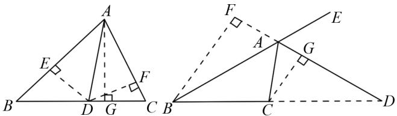
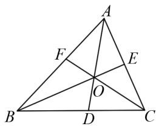
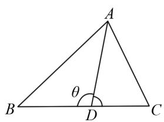
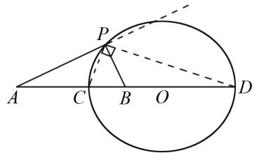

# 三角形角平分线定理拓展及其应用

李菲菲(曲阜师范大学附属中学 273100)

【摘 要】 在近年中高考试题中,对三角形角平分线定理相关知识的考查频繁出现.它既可以作为单独的题目加以考查,也可以结合其他的几何知识进行命题.本文详细介绍三角形内外角的角平分线定理及其逆定理,并对其进行拓展,最后介绍三角形角平分线定理在一些经典问题中的应用.

【关键词】三角形;角平分线定理;解题方法

线段与角是构成几何图形的最基本的元素,线段的长度与角的大小是线段与角所具有的最基本的性质,也是欧式几何中最基础的研究对象.凡是在线段长度与角度之间建立的数学关系都有着特别的意义,例如勾股定理,而角平分线定理是另一个较为重要的能在线段长度与角的大小之间建立联系的数学定理.三角形角平分线问题是初中数学教学中一个重要内容,初、高中考查角平分线知识及性质的命题有相当多是放在三角形中的,其中对三角形中角平分线性质的考查是重中之重.本文介绍三角形内外角的角平分线定理及其逆定理,并对其拓展到任意分角,最后介绍三角形角平分线定理在一些经典问题中的有趣应用,以帮助学生明晰思路,激发学习兴趣,培养思维能力.

# 1 三角形角平分线的一组性质

定理 1(角平分线定理) 在 $\triangle ABC$ 中, 角平分线 AD 交对边 BC 于点 D, 那 $\frac{AB}{AC} = \frac{BD}{CD}$ .

这个定理反映了三角形中角平分线所分线段之间的比例与另两条边长度之比之间的关系,这个定理证明方法很多,其中比较直观的是利用角平分线所分的两个三角形面积之比来进行证明.

text_image

Geometric diagram showing two triangles with perpendiculars and labeled points, likely illustrating a theorem or proof.

图1

证明 如图1所示,作 $\triangle ABC$ 的高AG,所以角平分线所分的两个三角形 $\triangle ABD$ 与 $\triangle ACD$ 面积之比为: $\frac{S_{\triangle ABD}}{S_{\triangle ACD}} = \frac{\frac{1}{2} \cdot BD \cdot AG}{\frac{1}{2} \cdot CD \cdot AG} = \frac{BD}{CD}$ .

过点 D 作边 AB 与 AC 的垂线, 分别交 AB 与 AC 于点 E、F, 根据角平分线性质, DE = DF, 故 $\triangle ABD$ 与 $\triangle ACD$ 面积之比又可以表示为: $\frac{S_{\triangle ABD}}{S_{\triangle ACD}} = \frac{\frac{1}{2} \cdot AB \cdot DE}{\frac{1}{2} \cdot AC \cdot DF} = \frac{AB}{AC}$ .

综上, 可知 $\frac{AB}{AC} = \frac{BD}{CD}$ .

反之,若已知对应线段长度之比相等,可以得到三角形的角平分线,同样可以利用两个三角形面积之比来证明.

定理 1(角平分线定理逆定理) 在 $\triangle ABC$ 中，线 AD 交对边 BC 于点 D，如果 $\frac{AB}{AC} = \frac{BD}{CD}$ ，那么 AD 为 $\angle A$ 的角平分线.

三角形的外角平分线具有同样的性质,并且其逆定理也成立.

定理 2(外角平分线定理) 如图 2, 在 $\triangle ABC$ 中, 外角平分线 AD 交对边 BC 的延长线于点 D, 那么 $\frac{AB}{AC} = \frac{BD}{CD}$ .

定理 3(外角平分线定理逆定理) 在 $\triangle ABC$ 中, 线 AD 交对边 BC 的延长线于点 D, 如果 $\frac{AB}{AC} = \frac{BD}{CD}$ , 那么 AD 为 $\angle A$ 外角的角平分线.

# 2 应用举例

综上所述,三角形内外角平分线具有分对边所得的两条线段和另两边对应成比例的性质,反之,其逆定理可以作为通过线段比例关系来证明角相等的依据.所以,三角形内外角的角平分线定理在平面几何中有着广泛且重要的作用,它可以帮助我们解决很多有意思的问题,这里列举三个有代表性的例子.

例 1 证明:三角形三条角平分线共点.

证明 如图3所示,不妨设角平分线AD与BE交于点O,连接CO并延长,交AB边与点F.

因为 BE 是 $\triangle ABC$ 的角平分线, 所以由定理 1 可知 $\frac{AB}{AE} = \frac{CB}{CE}$ .

又因为 AO 是 $\triangle ABE$ 的角平分线, 所以由定理 1 可知 $\frac{AB}{AE} = \frac{BO}{EO}$ . 综上, 可得 $\frac{CB}{CE} = \frac{BO}{EO}$ .

由定理 1, 可得 CO 为 $\triangle CBE$ 的角平分线, 故结论成立.

text_image

Geometric diagram of triangle ABC with internal points D, E, F and intersection point O, labeled for mathematical analysis.

图3

例 2 （角平分线长定理）在 $\triangle ABC$ 中，角平分线 AD 交对边 BC 于点 D，证明： $AD^{2}=AB\cdot AC-BD\cdot CD$ .

text_image

A
θ
B
D
C

图4

text_image

Geometric diagram showing a circle with points A, B, C, D, center O, and external point P, including chords and a right angle at P.

图 5

证明 如图 4 所示, 不妨设 $\angle ADB = \theta$ , 在 $\triangle ABD$ 中利用余弦定理, 有 $AB^{2} = AD^{2} + BD^{2} - 2AD \cdot BD \cdot \cos \theta$ ①.

在 $\triangle ACD$ 中利用余弦定理，并且 $\angle ADC = 180^{\circ} - \theta$ ，

有 $AC^{2}=AD^{2}+CD^{2}+2AD\cdot CD\cdot\cos\theta②$ .

① 式两边乘 CD 再加上 ② 式两边乘 BD，

可得 $AB^{2} \cdot CD + AC^{2} \cdot BD = AD^{2} \cdot BD + AD^{2} \cdot CD + BD^{2} \cdot CD + CD^{2} \cdot BD$ ③.

由定理 1, 可知 $AB \cdot CD = AC \cdot BD$ ,

③式整理可得 $AB \cdot AC \cdot (BD + CD) = (AD^{2} + BD \cdot CD) \cdot (BD + CD)$ .

两边同除以 $BD + CD$ ，再整理，可得到结论： $AD^{2} = AB \cdot AC - BD \cdot CD$ .

例 3 （阿波罗尼斯圆）设 A, B 是平面上两个不同的点，点 P 到 A, B 两点的距离之比为常数 q，即

$\frac{PA}{PB} = q, q > 0$ ，且 $q \neq 1$ ，证明点 $P$ 的轨迹为一个圆.

阿波罗尼斯(Apollonius, 约公元前 262—公元前 190 年) 是古希腊伟大的数学家、天文学家, 他与欧几里得、阿基米德并称为亚历时期三大数学家. 阿波罗尼斯圆是关于如何利用两点构造曲线问题, 这里的曲线是圆. 在中学阶段, 学生还会学习利用两点构造椭圆、双曲线等曲线. 与一般的构造圆的方法 (到定点的距离等于定长) 不同, 阿波罗尼斯的方法是到两点的距离之比等于定值.

下面尝试找到这个圆,以及它的圆心和半径,并证明它.

假设这个圆存在,先尝试找到这个圆.首先可以判断这个图形是关于直线 AB 对称的.其次,可以在线段 AB 上可以找到两个点,一个在线段 AB 中,一个在线段 AB 延长线上,不妨设为 C,D,这两点到 A、B 的距离比值等于 q,即 $\frac{CA}{CB}=q,\frac{DA}{DB}=q$ .以 CD 为直径作圆 O,因为这个曲线过 C,D 两点,并且关于直线 AB 对称,所以可以猜测圆 O 就是满足条件的曲线.

证明 如图5所示,取直线AB上两点C,D,点C在线段AB上,点D在线段AB延长线上,使得这两点到A,B的距离比值等于q,q>0且 $q\neq1$ ,即 $\frac{CA}{CB}=\frac{DA}{DB}=q$ ,假设P点是除C,D点外的,满足条件的点,所以有 $\frac{PA}{PB}=q=\frac{CA}{CB}=\frac{DA}{DB}$ .

由定理 $1'$ 和定理 $2'$ ，可得 PC 为 $\triangle PAB$ 的角平分线，PD 为 $\triangle PAB$ 的外角平分线，所以 $\angle CPD = 90^{\circ}$ .

所以对任意的满足条件的点 P，都有 $\triangle PCD$ 为直角三角形，所以点 P 的轨迹为一个圆，且圆心为 CD 的中点，半径为 $\frac{1}{2}CD$ .

# 参考文献：

[1] 刘克忠. 三角形内角平分线性质定理在解高考题中的应用 [J]. 数学学习及研究, 2017(16): 130.  
[2] 郑定华. 三角形的角平分线定理的证明及应用 [J]. 数理天地 (高中版), 2017(12): 10+24.  
[3] 花俊川. 三角形内外角平分线定理的推广与应用 [J]. 中学数学教学参考, 1998(3): 20-21.  
[4] 毛孟杰. 三角形角平分线定理的研究 [J]. 中小学数学 (初中版), 2008(Z2): 1-3.