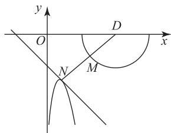

# 两曲线上动点距离的最值问题探究

# 官 慧

(山东省枣庄市第一中学)

设 M, N 分别是两条曲线上的动点, 如何求 $\left|MN\right|$ 的最小值呢? 对于这一类两曲线上动点距离的最值问题, 一般的解题方法是数形结合法和代数法.

# 1 数形结合法

例 1 在同一平面直角坐标系中, 设 M, N 分别是函数 $f(x) = -\sqrt{-x^{2} + 4x - 3}$ 和函数 $g(x) = \ln(ax) - ax e^{x}$ 图像上的动点，若对于任意 a > 0，有 $|MN| \geqslant m$ 恒成立，则实数 m 的最大值为 \_\_\_\_.

由 $y = -\sqrt{-x^2 + 4x - 3}$ ，整理得 $(x - 2)^2 + y^2 = 1(y \leqslant 0)$ ，即 $M$ 在圆心为 $D(2,0)$ 、半径为1的半圆上.而 $g(x) = \ln (ax) - \mathrm{e}^{x + \ln (ax)}$ ，令 $h(x) = x - \mathrm{e}^{x}(x\in \mathbf{R})$ ，则 $h^{\prime}(x) = 1 - \mathrm{e}^{x}$ ，又 $h^{\prime}(0) = 1 - \mathrm{e}^{0} = 0$ ，所以当 $x\in (-\infty ,0)$ 时， $h^\prime (x) > 0,h(x)$ 单调递增，当 $x\in (0, + \infty)$ 时， $h^{\prime}(x) <   0,h(x)$ 单调递减.因此， $h(x)$ 在 $x = 0$ 处取得极大值，也是最大值，即

$$
h _ {\max} (x) = h (0) = - 1.
$$

于是 $x + \ln (ax) - \mathrm{e}^{x + \ln (ax)}\leqslant -1$ ，即 $g(x) =$ $\ln (ax) - ax\mathrm{e}^x\leqslant -x - 1$ ，当且仅当 $x + \ln (ax) = 0$ 时，等号成立，所以 $g(x)$ 的一条切线为 $y = -x - 1$

由图 1 知， $|MN|$ 的最小值为圆心 D 到直线 y = -x - 1 的距离减去半径，即 $|MN|$ 的最小值为

$$
\frac {| 2 + 0 + 1 |}{\sqrt {1 ^ {2} + 1 ^ {2}}} - 1 = \frac {3 \sqrt {2}}{2} - 1.
$$

text_image

y
O
D
x
N
M

图1

此时过圆心(2,0)与 y=
-x-1 垂直的直线方程为 y=x-2.

综上， $|MN|\geqslant \frac{3\sqrt{2}}{2} -1$ ，而 $|MN|\geqslant m$ 恒成立，所以 $m\leqslant \frac{3\sqrt{2}}{2} -1$ ，故 $m$ 的最大值为 $\frac{3\sqrt{2}}{2} -1.$

点评

本题设计十分巧妙,关键是对 $g(x)$ 解析式的处理,用切线放缩将问题转化为半圆上的

动点到定直线的距离是个难点,要求学生熟练掌握常见函数的切线放缩公式.如果本题用两点间距离公式计算,其计算难度较大.对于本题,易知 $f(x)$ 的图像是半圆,对于 $g(x)$ ,由切线放缩可知,不论 a 的值如何变化,总有 $\ln(ax)-ax\mathrm{e}^{x}\leqslant-x-1$ ,这样只需求半圆上的点到直线的距离的最小值,即圆心到直线的距离减去半径即可.

# 2 代数法

例 2 在同一平面直角坐标系中, P, Q 分别是函数 $f(x)=ax\mathrm{e}^{x}-\ln(ax)$ 和 $g(x)=\frac{2\ln(x-1)}{x}$ 图像上的动点，若对于任意 a>0，有 $|PQ|\geqslant m$ 恒成立，则实数 m 的最大值为 \_\_\_\_.

因为 $ax\mathrm{e}^x -\ln (ax) - x = \mathrm{e}^{x + \ln (ax)} - [x +$

$\ln (ax)]$ ，令 $w(x) = \mathrm{e}^{x} - x(x\in \mathbf{R})$

由例1的解析可知 $w(x) = \mathrm{e}^{x} - x\geqslant 1$ ，当且仅当 $x = 0$ 时，等号成立，则

$$
a x \mathrm{e} ^ {x} - \ln (a x) - x = \mathrm{e} ^ {x + \ln (a x)} - [ x + \ln (a x) ] \geqslant 1,
$$

当且仅当 $x + \ln(ax) = 0$ 时，等号成立.

设 $P(n, an e^{n} - \ln(an)), Q(t, \frac{2\ln(t-1)}{t})$ ，由基本不等式得

$$
\mid P Q \mid^ {2} = (t - n) ^ {2} + \left[ a n e ^ {n} - \ln (a n) - \frac {2 \ln (t - 1)}{t} \right] ^ {2} \geqslant
$$

$$
\frac {\left[ t - \frac {2 \ln (t - 1)}{t} + a n \mathrm{e} ^ {n} - \ln (a n) - n \right] ^ {2}}{2}.
$$

令 $h(x) = x - \frac{2\ln(x - 1)}{x} (x > 1)$ ，则

$$
h ^ {\prime} (x) = \frac {x ^ {2} - \frac {2 x}{x - 1} + 2 \ln (x - 1)}{x ^ {2}}.
$$

令 $k(x) = x^{2} - \frac{2x}{x - 1} + 2\ln (x - 1)$ ，则

$$
k ^ {\prime} (x) = 2 x + \frac {2}{(x - 1) ^ {2}} + \frac {2}{x - 1} > 0,
$$

在 $(1, +\infty)$ 上恒成立，故 $k(x)$ 在 $(1, +\infty)$ 上单调递增.

又 $k(2) = 0$ ，故当 $x \in (1,2)$ 时， $k(x) < 0$ ，则 $h'(x) < 0, h(x)$ 单调递减，当 $x \in (2, +\infty)$ 时， $k(x) > 0$ ，则 $h'(x) > 0, h(x)$ 单调递增，故 $h(x)$ 在 $x = 2$ 处取得极小值，也是最小值，最小值为 $h(2) = 2$ 。所以

$$
\mid P Q \mid^ {2} \geqslant \frac {(2 + 1) ^ {2}}{2} = \frac {9}{2}, \mid P Q \mid \geqslant \frac {3 \sqrt {2}}{2},
$$

则 $m \leqslant \frac{3\sqrt{2}}{2}$ , 即 $m$ 的最大值为 $\frac{3\sqrt{2}}{2}$ .

利用导数求解最值问题时,当函数中同时出现 $e^{x}$ 与 $\ln x$ ,通常使用同构来进行求解.本题将 $ax\mathrm{e}^x -\ln (ax) - x$ 变形得到 $\mathrm{e}^{x + \ln (ax)} - [x+$ $\ln (ax)]$ ，利用同构思想构造 $w(x) = \mathrm{e}^x -x$ ，借助其单调性得到 $ax\mathrm{e}^x -\ln (ax) - x\geqslant 1$ ，再构造 $h(x) =$ $x - \frac{2\ln(x - 1)}{x} (x > 1)$ ，求导得到其单调性及其最小值，然后设出点 $P,Q$ 的坐标，利用基本不等式求解即可.

例 3 在同一平面直角坐标系中, A, B 分别是函数 $f(x)=x\mathrm{e}^{mx}+(1-m)x-\ln x$ 和 $g(x)=x$ 图像上的动点，若对于任意 m>0 都有 $|AB|\geqslant a$ 恒成立，则实数 a 的最大值为 \_\_\_\_.

因为 $g(x)=x$ 的图像即为直线 x-y=0，所以点 $A(x,f(x))$ 到直线 x-y=0 的距离为

$$
d = \frac {| x - f (x) |}{\sqrt {2}} = \frac {\sqrt {2}}{2} | f (x) - x |,
$$

则 $|AB|\geqslant d=\frac{\sqrt{2}}{2}|f(x)-x|$ .又因为

$$
f (x) - x = \mathrm{e} ^ {m x + \ln x} - (m x + \ln x),
$$

由 m>0，可知 y=mx, $y=\ln x$ 在 $(0,+\infty)$ 上单调递增，则 $F(x)=mx+\ln x$ 在 $(0,+\infty)$ 上单调递增，且当 $x\to0$ 时， $F(x)\to-\infty$ ，当 $x\to+\infty$ 时， $F(x)\to+\infty$ ，所以 $F(x)$ 的值域为 R.

令 $w(x)=\mathrm{e}^{x}-x(x\in\mathbf{R})$ ，由例1的解析可知 $w(x)=\mathrm{e}^{x}-x\geqslant1$ ，则 $\left|AB\right|\geqslant\frac{\sqrt{2}}{2}\left|w(x)\right|\geqslant\frac{\sqrt{2}}{2}$ ，所以 $a\leqslant\frac{\sqrt{2}}{2}$ ，故实数 a 的最大值为 $\frac{\sqrt{2}}{2}$ .

# 点评

利用同构可将 $x \, e^{mx} - mx - \ln x$ 变形得到 $\mathrm{e}^{mx+\ln x}-(mx+\ln x)$ ，从而构造 $w(x)=$

$e^{x}-x$ 进行求解.由题意得 $\left|AB\right|\geqslant d=\frac{\sqrt{2}}{2}\left|f(x)-x\right|$ ,
整理得 $f(x)-x=e^{mx+\ln x}-(mx+\ln x)$ ，分析可知 $F(x)$ 的值域为 R，然后构建 $w(x)=e^{x}-x$ ，利用导数判断其单调性和最值，进而根据 $w(x)$ 的最值解题.

例 4 在同一平面直角坐标系中, 已知 A, B 分别是函数 $f(x)=2x+\mathrm{e}^{mx}-\ln(\mathrm{e}^{mx}+x-1)$ 和 $g(x)=x$ 图像上的动点，若对于任意的 m>0，都有 $|AB|\geqslant a$ 恒成立，则实数 a 的最大值为 \_\_\_\_.

# 解析

点 $A(x, f(x))$ 到直线 $x - y = 0$ 的距离 $d = \frac{|x - f(x)|}{\sqrt{2}}$ ，则

$$
\mid A B \mid \geqslant d = \frac {\sqrt {2}}{2} \mid f (x) - x \mid .
$$

又

$$
f (x) - x = x + \mathrm{e} ^ {m x} - \ln (\mathrm{e} ^ {m x} + x - 1) =
$$

$$
\left(\mathrm{e} ^ {m x} + x - 1\right) - \ln \left(\mathrm{e} ^ {m x} + x - 1\right) + 1,
$$

由 m>0，知 $y=e^{mx}$ 和 y=x 在 R 上单调递增，所以 $y=x+e^{mx}-1$ 在 R 上单调递增，且值域为 R.

又 $x + e^{mx} - 1 > 0$ ，令 $t = e^{mx} + x - 1 (t > 0)$ ，令 $F(t) = t - \ln t + 1$ ，则 $F'(t) = \frac{t - 1}{t} (t > 0)$ .

当 0 < t < 1 时， $F'(t) < 0$ 。当 x > 1 时， $F'(t) > 0$ ，所以函数 $F(t)$ 在 $(0,1)$ 上单调递减，在 $(1,+\infty)$ 上单调递增，所以 $F_{\min}(t) = F(1) = 2$ ，则

$$
\mid A B \mid \geqslant d = \frac {\sqrt {2}}{2} \mid f (x) - x \mid \geqslant \sqrt {2}.
$$

因为对于任意的 $m > 0$ ，都有 $\vert AB\vert \geqslant a$ 恒成立，所以 $a\leqslant \sqrt{2}$

综上,实数 a 的最大值为 $\sqrt{2}$ .

# 点评

由于点 $A(x, f(x))$ 到直线 $x - y = 0$ 的距离

$$
d = \frac {| x - f (x) |}{\sqrt {2}}, \text {则} | A B | \geqslant d = \frac {\sqrt {2}}{2} | f (x) -
$$

$x\mid$ ，进而利用导数求出函数 $y = f(x) - x$ 的最小值即可.

以两条曲线上动点的距离最值问题为背景,考查恒成立问题,这类试题可用数形结合法和代数法求解.利用代数法求解时,通常将距离的最值转化为函数的最值,然后利用导数工具求解.

(完)