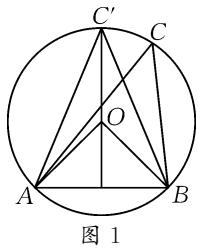

# “三新”背景下数学客观题的速解技巧

# ● 宁夏回族自治区贺兰县第一中学 王佳

客观题在数学试卷中所占比重较大,新高考中是8道单项选项题和4道多项选择题,以及4道填空题,占据全卷的一半以上.如果能根据数学客观题的题目特点,运用恰当的方法来速解,既能提高解题的正确率,还能节省宝贵的时间,达到事半功倍的效果.本文中借助数学客观题中一些常用的速解技巧,就特例法、验证法、图解法、排除法等几种比较常见的方法,结合实例加以剖析与应用,抛砖引玉.

# 1 特例法

特例法(或特值法)是在题设普遍条件都成立的情况下,用特殊值(取得越简单越好)进行探求,从而清晰、快捷地得到正确答案,即通过对特殊情况的研究来判断一般规律,从而“小题小做”或“小题巧做”,快速破解.

例 1 （多选题）已知函数 $f(x)$ 的定义域为 R，若 $f(x-y)=f(x)f(y)+f(1+x)f(1+y)$ ，且 $f(0)\neq f(2)$ ，则下列结论中正确的是（）.

A. $f(1) = 0$

B. $f(x)$ 的图象关于点 $\left(\frac{3}{2},0\right)$ 对称

C. $f(x)$ 以6为周期

D. $\sum_{n=1}^{102} f(n) = -1$

分析:根据题设中抽象函数所具备的基本性质,通过特例法选取与之相吻合的特殊函数,以特殊代替一般加以合理转化,进而结合特殊函数的具体模型来分析并确定相应的性质问题.特例法可以更加有效地提升此类多选题的解题速度.

解析:由题设条件,联想到余弦差角公式,构建特殊函数 $f(x)=\cos\frac{\pi}{2}x$ .

$$
\begin{array}{l} \cos \frac {\pi}{2} y + \sin \frac {\pi}{2} x \cdot \sin \frac {\pi}{2} y = \cos \frac {\pi}{2} x \cdot \cos \frac {\pi}{2} y + \\ \cos \left(\frac {\pi}{2} x + \frac {\pi}{2}\right) \cos \left(\frac {\pi}{2} y + \frac {\pi}{2}\right) = f (x) f (y) + f (1 + x) \cdot \\ \end{array}
$$

于是有 $f(x-y)=\cos\left[\frac{\pi}{2}(x-y)\right]=\cos\frac{\pi}{2}x$

$f(1+y)$ ，又 $f(0)=1\neq f(2)$ ，满足题设关系.

结合函数 $f(x) = \cos \frac{\pi}{2} x$ ，可知其周期为 4，而 $f(1) = 0, f(2) = -1, f(3) = 0, f(4) = 1$ ，则有 $f(1) + f(2) + f(3) + f(4) = 0$ ，所以 $\sum_{n=1}^{102} f(n) = 25[f(1) + f(2) + f(3) + f(4)] + f(1) + f(2) = 0 + 0 - 1 = -1$ .

又 $f\left(\frac{3}{2}\right) = \cos \left(\frac{\pi}{2} \times \frac{3}{2}\right) \neq 0$ ，所以 $f(x)$ 的图象不关于点 $\left(\frac{3}{2}, 0\right)$ 对称.

综上分析,故选择答案:AD.

点评:运用特例法解决数学客观题,其根本就是特殊思维,利用特殊思维解决一些定值、判断等相关问题时,巧妙通过一般问题的特殊化,可以实现特殊与一般之间的转化与应用,优化解题效益,简化解题过程,提升解题速度.

# 2 验证法

验证法是通过将各个选项或满足条件的特殊值,代入到题干中去,逐一验证各个不同情况是否满足题设条件,从而来寻找并选择满足条件的选项的一种技巧方法.其前提是各选项可分别作为条件来分析与处理.

例 2 设 a, b, c 均为正实数, 若一元二次方程 $ax^{2} + bx + c = 0$ 有实根, 则().

A. $\max \{a,b,c\} \geqslant \frac{1}{2} (a + b + c)$   
B. $\max \{a,b,c\} \geqslant \frac{4}{9} (a + b + c)$   
C. $\max \{a,b,c\} \leqslant \frac{1}{4} (a + b + c)$   
D. $\max \{a,b,c\} \leqslant \frac{1}{3} (a + b + c)$

分析:根据一元二次方程有实根的题设条件,合理构建涉及判别式的不等式,结合特殊值的选取,代入验证,巧妙排除错误选项,进而得以寻找并确定对应的正确答案.

解析:由于一元二次方程 $ax^{2}+bx+c=0$ 有实根,因此判别式 $\Delta=b^{2}-4ac\geqslant0$ .

取特殊值 $a = 3, b = 4, c = \frac{5}{4}$ , 满足 $b^2 - 4ac \geqslant 0$ ,

此时 $\max\{a,b,c\}=4,\frac{1}{2}(a+b+c)=\frac{33}{8}$ ，而 $4<\frac{33}{8}$ ，故选项 A 错误.

取特殊值 $a = c = 1, b = 100$ ，满足 $b^2 - 4ac \geqslant 0$ ，此时 $\max\{a, b, c\} = 100, \frac{1}{4}(a + b + c) = \frac{51}{2}$ ，而 $100 > \frac{51}{2}$ ，故选项 C 错误；又 $\frac{1}{3}(a + b + c) = 34$ ，而 $100 > 34$ ，故选项 D 错误。

综上所述,故选择答案:B.

点评: 特殊值思维, 排除法验证, 这是破解单项选择题中比较常用的一种技巧与策略, 特别对一些比较陌生、复杂的问题, 往往可以采用此思维方法进行尝试与应用. 在运用验证法解题时, 若能根据题意确定代入顺序, 则能提高解题速度.

# 3 图解法

图解法(或数形结合法)适用于一些含有平面几何或立体几何等背景的问题,往往可以借助“数”与“形”的转化,化“数”为“形”,根据图形的直观性,数形结合,迅速作出判断,进而解决问题,得到正确结果.

例 3 设 $\triangle ABC$ 的内角 A, B, C 的对边分别为 a, b, c，已知 $c = 2, \frac{1}{\tan A} + \frac{1}{\tan B} + \frac{1}{\tan A \tan B} = 1$ ，则 $\triangle ABC$ 面积的最大值为（）.

A. $1+\sqrt{2}$

B. $1+\sqrt{3}$

C. $2\sqrt{2}$

D. $2\sqrt{3}$

分析:回归解三角形问题的平面几何特征,借助图解法,根据三角形与外接圆对应的图形的“形”的几何特征,结合平面几何内涵或对应的几何意义,从“形”的视角切入,通过数形结合来加以直观想象,从几何特征层面来研究对应问题.

解析:依题,由 $\frac{1}{\tan A}+\frac{1}{\tan B}+\frac{1}{\tan A\tan B}=1$ ,
可得 $\tan A + \tan B = \tan A \tan B - 1.$

所以 $\tan(A+B)=\frac{\tan A+\tan B}{1-\tan A\tan B}=-1$ ，即有 $\tan C=1$ ，结合 $C\in(0,\pi)$ ，得 $C=\frac{\pi}{4}$ .

设 $\triangle ABC$ 外接圆的半径为 $R$ ，由正弦定理可得 $2R = \frac{c}{\sin C} = \frac{2}{\sin\frac{\pi}{4}} = 2\sqrt{2}$ ，故 $R = \sqrt{2}$

如图1所示，在 $\triangle ABC$ 的外接圆 $O$ 中， $\angle ACB = \angle AC'B = \frac{\pi}{4}$ ，则 $\angle AOB = \frac{\pi}{2}$ .

数形结合, 可得 $S_{\triangle ABC} = \frac{1}{2} \times 2 \times h_{C-AB} = h_{C-AB} \leqslant$

$h_{C'-AB}=R+\frac{c}{2}=\sqrt{2}+1.$ 故选择答案：A.

点评:抓住解三角形问题中的平面几何内涵与实质,回归解三角形的平面几何意义,从动点的变化视角来直观处理,结合“动”态变化

text_image

C'
C
O
A
B
图 1

规律来解决“静”态的最值问题,达到巧解、速解.

# 4 排除法

排除法(又叫筛选法、淘汰法等)主要适用于数学客观题中的单项选择题(有时多项选择题也用此方法),其解题本质就是去伪存真,舍弃不符合题目要求的选项,找到符合题意的正确结论.

例 4 已知椭圆 $C: \frac{x^{2}}{4} + \frac{y^{2}}{b} = 1 (b > 0)$ ，直线 l: y = mx + 1。若对任意的 $m \in R$ ，直线 l 与椭圆 C 恒有公共点，则实数 b 的取值范围是（）。

A.[1,4)

B. $[1,+\infty)$

C. $[1,4)\cup(4,+\infty)$

D. $(4,+\infty)$

分析:从平面解析几何的本质入手,抓住椭圆、直线的本质属性,结合参数b的不同取值情况来判断直线与椭圆之间的位置关系,由此合理排除不满足条件的选项,科学筛选,得以正确并快速分析与判断.

解析:依题知直线 l 恒过定点 $(0,1)$ .

所以当 b=1 时, 直线 l 与椭圆 C 恒有公共点, 由此可以排除选项 D;

若 b=4，则方程 $\frac{x^{2}}{4}+\frac{y^{2}}{b}=1$ 不表示椭圆，由此可以排除选项 B；

若 b>4，则显然定点 $(0,1)$ 恒在椭圆内部，满足题意，由此可以排除选项 A.

故选择答案:C.

点评:运用排除法解题的关键就是借助题设条件并从题设或选择支入手,不断筛选不满足条件的选项,采用逆向思维进行合理优化,进而得以确定正确选项,提升解题速度与效益.

对于高考数学客观题,绝大多数是计算型(尤其是推理计算型)和概念(性质)判断型的试题,解答时必须按规则进行切实的计算或者合乎逻辑的推演和判断.从选择题或填空题的题干入手,结合选择题的选项提供的信息或填空题的特殊形式,尽量缩短解题时间,依据题目的具体特点,灵活、巧妙、快速地选择解法,从“准”“巧”“快”等方面下功夫,实现破解数学客观题的最佳效益.Z