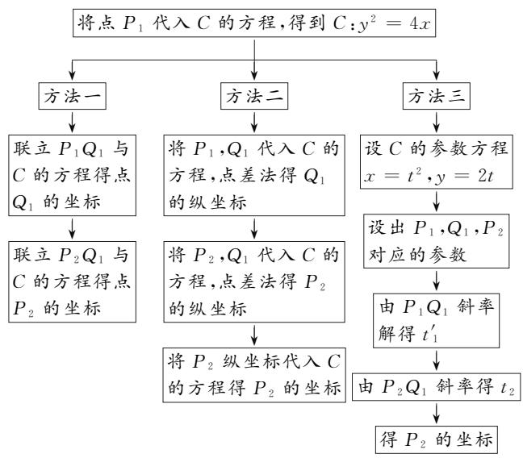
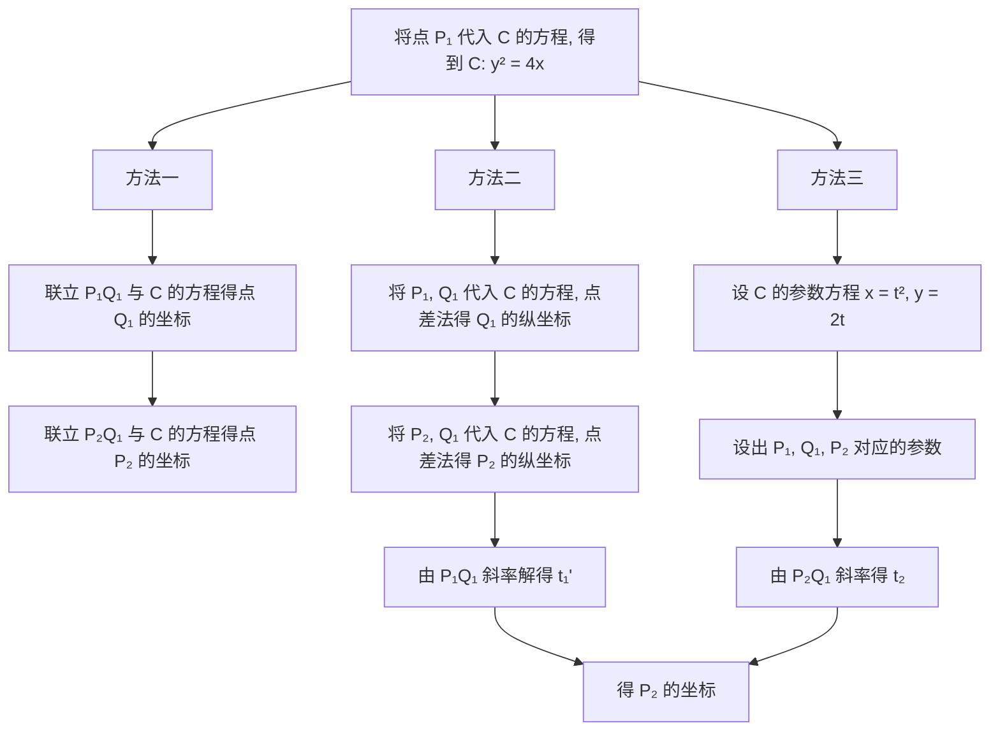
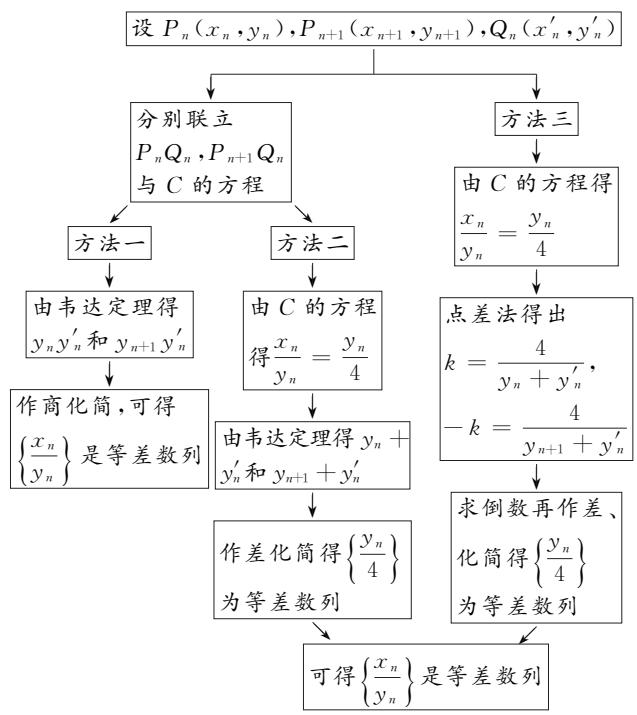
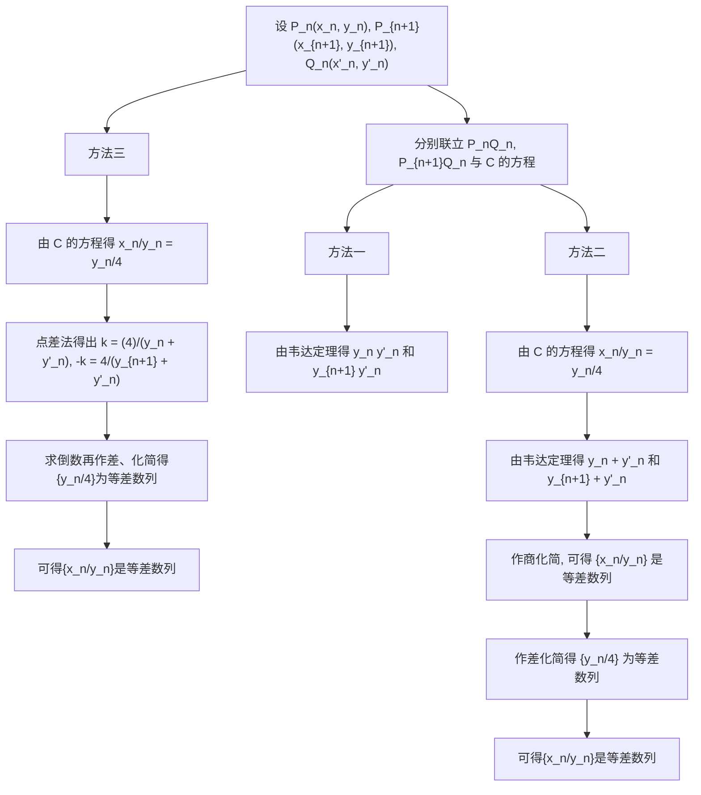
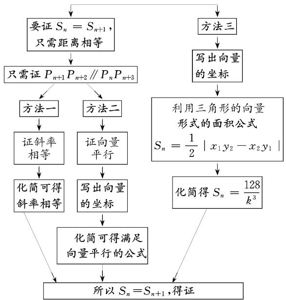
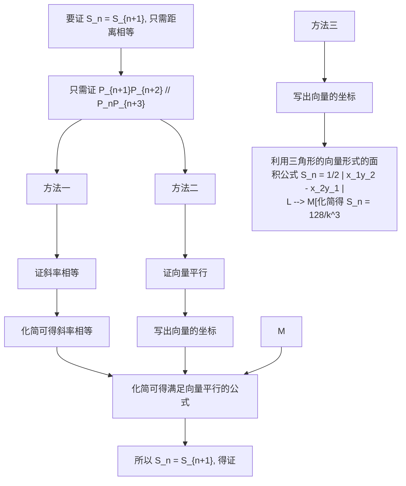

# 命题比赛获奖论文

# “解几”与数列共行，向量携三角齐飞

河南省郑州市郑东新区外国语中学 刘莉  
河南省新乡市平原外国语学校 王瑞方

摘要:解析几何和数列是高中数学的重要内容,向量是高中数学最重要的工具之一.解析几何、数列与向量这三个模块都是每年高考中不可或缺的内容,承载着学生的数学抽象、数学建模、数学运算、直观想象等数学核心素养的培育.本命题小组命制了一道以抛物线为载体,考查等差数列定义及逻辑推理能力的综合试题.

关键词: 抛物线; 等差数列; 三角形面积

# 1 命题呈现

（原创题）(17分)已知抛物线 $C:y^{2} = 2px(p > 0)$ 点 $P_{1}(1, - 2)$ 在 $C$ 上， $k$ 为常数， $k > 0.$ 按照如下方式依次构造点 $P_{n}(n = 2,3,\dots \dots)$ .过点 $P_{n - 1}$ 斜率为 $k$ 的直线交 $C$ 于另一点 $Q_{n - 1}$ ，过点 $Q_{n - 1}$ 斜率为一 $k$ 的直线交 $C$ 于另一点 $P_{n}$ .记点 $P_{n}$ 的坐标为 $(x_{n},y_{n})$ ，点 $Q_{n}$ 的坐标为 $(x_n^{\prime},y_n^{\prime})$

(1) 若 k=4，求 $P_{2}$ 的坐标；  
(2)证明:数列 $\left\{\frac{x_{n}}{y_{n}}\right\}$ 是公差为 $-\frac{2}{k}$ 的等差数列;  
(3) 设 $S_{n}$ 为 $\triangle P_{n}P_{n+1}P_{n+2}$ 的面积, 证明: 对于任意正整数 n, $S_{n}=S_{n+1}$ .

(原题)2024 新高考Ⅱ卷第 19 题:

已知双曲线 C: $x^{2}-y^{2}=m(m>0)$ ，点 $P_{1}(5,4)$ 在 C 上，k 为常数，0<k<1，按照如下方式依次构造点 $P_{n}(n=2,3,\cdots)$ 。过点 $P_{n-1}$ 斜率为 k 的直线与 C 的左支交于点 $Q_{n-1}$ 。令 $P_{n}$ 为 $Q_{n-1}$ 关于 y 轴的对称点，记 $P_{n}$ 的坐标为 $(x_{n},y_{n})$ 。

(1) 若 $k=\frac{1}{2}$ ，求 $x_{2}, y_{2}$ ;

(2) 证明: 数列 $\{x_{n}-y_{n}\}$ 是公比为 $\frac{1+k}{1-k}$ 的等比数列;

(3) 设 $S_{n}$ 为 $\triangle P_{n}P_{n+1}P_{n+2}$ 的面积, 证明: 对任意的正整数 n, $S_{n}=S_{n+1}$ .

# 2 命题过程

# 2.1 命题立意

2024年高考数学全国卷持续深化考试内容改革，考主干、考能力，压轴题不再单一考学生“知识量”，更注重考“思维量”。解答题通过“跨学段综合”与“跨模块整合”的方式来命题，表面看似难度不大，实则具有较高的挑战性。本命题小组观察到2024年全国Ⅱ卷压轴题是融合圆锥曲线与数列的创新命题方式,依据新教材和课程标准,尝试对此题进行改编研究.

# 2.2 演变过程

第一次改编,将双曲线改成椭圆,通过 GeoGebra 软件画图找点发现第三问的结论依然成立,第二问中的数列 $\{x_{n}-y_{n}\}$ 无明显规律,故无法进行命题.

第二次改编,将双曲线改成抛物线,把关于 y 轴对称改成关于 x 轴对称,通过 GeoGebra 软件画图找点发现第三问的结论依然成立,但第二问中的数列 $\{x_{n}-y_{n}\}$ 是一个二阶等差数列,由于证明过程难度较大,因此不适合用来命题.

第三次改编,将双曲线改成抛物线,发现等差数列不成立,后经过多方尝试,并和 GeoGebra 软件相结合,把关于 x 轴对称这个条件也进行替换,变成依次找斜率相等和斜率相反的直线,发现了一个新的等差数列.由于抛物线上两点连线的斜率可以用点差法进行简化,因此产生了更多灵活的解题方法,而且比高考真题的计算量小很多.这个计算量在学生能够接受的范围内.

# 2.3 命题背景

此题第三问的命题背景是竞赛中的著名定理——帕斯卡定理.该定理内容为：“圆锥曲线内接六边形中，三组对边的交点共线.”此题对于抛物线的内接六边形 $P_{n}Q_{n}P_{n+1}P_{n+2}Q_{n+2}P_{n+3}$ ，使用帕斯卡定理的退化形式，由于 $P_{n}Q_{n}\parallel P_{n+2}Q_{n+2},Q_{n}P_{n+1}\parallel Q_{n+2}P_{n+3}$ ，相当于它们都相交于无穷远点，由于所有的无穷远点都共线，所以 $P_{n+1}P_{n+2}$ 与 $P_{n}P_{n+3}$ 也相交于无穷远点，即 $P_{n+1}P_{n+2}\parallel P_{n}P_{n+3}$ .此题的命题依据是帕斯卡定理的退化形式，即对于圆锥曲线的内接六边形，若其中两组对边平行，则第三组对边也平行.这也是为什么尝试了几种改编，改成任何圆锥曲线时第三问依然保持面积相等的底层逻辑.

# 3 思维导图及解析

# 3.1 第(1)小题思维导图及解析

# (I)第(1)小题思维导图

第(1)小题思维导图如图1所示.

flowchart

图 1

# (Ⅱ)第(1)小题的解答

方法一:联立法.将点 $P_{1}(1,-2)$ 代入抛物线 C: $y^{2}=2px(p>0)$ 中, 得 p=2, 则抛物线方程为 $y^{2}=4x$ .

过点 $P_{1}(1,-2)$ 且斜率为 4 的直线方程为 y=4x-6，与 C 的方程联立，可解得 $Q_{1}\left(\frac{9}{4},3\right)$ .

过点 $Q_{1}$ 且斜率为-4的直线方程为 $y=-4x+12$ ，与C的方程联立，可解得 $P_{2}(4,-4)$ .

方法二: 点差法. 由题意知 $y_{1}^{2}=4x_{1}, y_{1}^{\prime2}=4x_{1}^{\prime}$ ，作差得 $k=\frac{y_{1}-y_{1}^{\prime}}{x_{1}-x_{1}^{\prime}}=\frac{4}{y_{1}+y_{1}^{\prime}}$ ，即 $4=\frac{4}{-2+y_{1}^{\prime}}$ ，得 $Q_{1}$ 的纵坐标 $y_{1}^{\prime}$ 为 3.

同理 $y_2^2 = 4x_2, y_1'^2 = 4x_1'$ ，作差得 $-k = \frac{y_2 - y_1'}{x_{2-}x_1'} = \frac{4}{y_2 + y_1'}$ ，即 $-4 = \frac{4}{y_2 + 3}$ ，得 $P_2$ 的纵坐标 $y_2$ 为 -4，代入抛物线方程，可得 $x = 4$ ，则 $P_2(4, -4)$ .

方法三: 参数法. 由题意可知, C 的参数方程为 $x = t^{2}$ , y = 2t, 则 $P_{1}$ 对应的参数 $t_{1} = -1$ , 设 $Q_{1}$ 对应的参数为 $t_{1}^{\prime}$ , $P_{2}$ 对应的参数为 $t_{2}$ . 因为 $k = \frac{2t_{1} - 2t_{1}^{\prime}}{t_{1}^{2} - t_{1}^{\prime 2}} = \frac{2}{t_{1} + t_{1}^{\prime}}$ , 即 $4 = \frac{2}{-1 + t_{1}^{\prime}}$ , 得 $t_{1}^{\prime} = \frac{3}{2}$ .

又因为 $-k = \frac{2t_2 - 2t_1'}{t_2^2 - t_1'^2} = \frac{2}{t_2 + t_1'}$ ，即 $-4 = \frac{2}{t_2 + \frac{3}{2}}$

解得 $t_{2}=-2$ ，所以 $P_{2}$ 的坐标为 $(4,-4)$ .

# 3.2 第(2)小题思维导图及解析

# (I)第(2)小题思维导图

第(2)小题思维导图如图2所示.

flowchart

图2

# (Ⅱ)第(2)小题的解答

方法一:由题意知 $P_{n}(x_{n},y_{n}), P_{n+1}(x_{n+1},y_{n+1})$ ， $Q_{n}(x_{n}^{\prime},y_{n}^{\prime})$ .

过点 $P_{n}(x_{n},y_{n})$ 且斜率为 k 的直线 $P_{n}Q_{n}$ 的方程为 $y-y_{n}=k(x-x_{n})$ ，与 C 的方程联立，消去 x，化简得 $y^{2}-\frac{4}{k}y+\frac{4}{k}y_{n}-4x_{n}=0$ .

由根与系数的关系,可得 $y_{n}y_{n}^{\prime}=\frac{4}{k}y_{n}-4x_{n}$ .

过点 $P_{n + 1}(x_{n + 1},y_{n + 1})$ 且斜率为 $-k$ 的直线 $P_{n + 1}Q_n$ 的方程为 $y - y_{n + 1} = -k(x - x_{n + 1})$ ，与 $C$ 的方程联立，消去 $x$ ，化简得 $y^{2} + \frac{4}{k} y - \frac{4}{k} y_{n + 1} - 4x_{n + 1} = 0.$

由根与系数的关系,可得 $y_{n+1}y_{n}^{\prime}=-\frac{4}{k}y_{n+1}-4x_{n+1}$ .

所以，可得 $\frac{y_{n + 1}}{y_n} = \frac{y_{n + 1}y_n'}{y_ny_n'} = \frac{-\frac{4}{k}y_{n + 1} - 4x_{n + 1}}{\frac{4}{k}y_n - 4x_n} =$

$\frac{x_{n+1}+\frac{1}{k}y_{n+1}}{x_{n}-\frac{1}{k}y_{n}}$ ，化简得 $1=\frac{\frac{x_{n+1}}{y_{n+1}}+\frac{1}{k}}{\frac{x_{n}}{y_{n}}-\frac{1}{k}}$ ，即 $\frac{x_{n+1}}{y_{n+1}}-\frac{x_{n}}{y_{n}}=-\frac{2}{k}$ .

故数列 $\left\{\frac{x_n}{y_n}\right\}$ 是公差为 $-\frac{2}{k}$ 的等差数列.

方法二：由点 $P_{n}(x_{n},y_{n})$ 在抛物线 $C$ 上，得 $\frac{x_n}{y_n} = \frac{\frac{y_n^2}{4}}{\frac{y_n}{y_n}} = \frac{y_n}{4}$

由方法一可知 $y_{n} + y_{n}^{\prime} = \frac{4}{k}, y_{n+1} + y_{n}^{\prime} = -\frac{4}{k}$ ，于是可得 $y_{n+1} - y_{n} = -\frac{8}{k}$ ，即 $\frac{y_{n+1}}{4} - \frac{y_{n}}{4} = -\frac{2}{k}$ .

所以 $\left\{\frac{y_n}{4}\right\}$ 是公差为 $-\frac{2}{k}$ 的等差数列.

故 $\left\{\frac{x_n}{y_n}\right\}$ 是公差为 $-\frac{2}{k}$ 的等差数列.

方法三：由点 $P_{n}$ 和点 $Q_{n}$ 在抛物线 $C$ 上，可得 $y_{n}^{2} = 4x_{n},y_{n}^{\prime 2} = 4x_{n}^{\prime}$

上述两式作差得 $k=\frac{y_{n}-y_{n}^{\prime}}{x_{n}-x_{n}^{\prime}}=\frac{4}{y_{n}+y_{n}^{\prime}}$ ，同理可得 $-k=\frac{y_{n+1}-y_{n}^{\prime}}{x_{n+1}-x_{n}^{\prime}}=\frac{4}{y_{n+1}+y_{n}^{\prime}}$ ，则 $\frac{1}{k}=\frac{y_{n}+y_{n}^{\prime}}{4},-\frac{1}{k}=\frac{y_{n+1}+y_{n}^{\prime}}{4}$ ，作差得 $\frac{y_{n+1}}{4}-\frac{y_{n}}{4}=-\frac{2}{k}$ .

所以 $\left\{\frac{y_n}{4}\right\}$ 是公差为 $-\frac{2}{k}$ 的等差数列.

又因为 $\frac{x_{n}}{y_{n}}=\frac{\frac{y_{n}^{2}}{4}}{y_{n}}=\frac{y_{n}}{4}$ ，所以 $\left\{\frac{x_{n}}{y_{n}}\right\}$ 是公差为 $-\frac{2}{k}$ 的等差数列.

# 3.3 第(3)小题思维导图及解析

# (Ⅰ)第(3)小题思维导图

第(3)小题思维导图如图3所示.

flowchart

图3   
(Ⅱ)第(3)小题的解答

方法一: 要证 $S_{n}=S_{n+1}$ ，即证 $\triangle P_{n}P_{n+1}P_{n+2}$ 与 $\triangle P_{n+1}P_{n+2}P_{n+3}$ 面积相等，即证点 $P_{n}$ 到 $P_{n+1}P_{n+2}$ 的距离与 $P_{n+3}$ 到 $P_{n+1}P_{n+2}$ 的距离相等，即证 $P_{n+1}P_{n+2} // P_{n}P_{n+3}$ ，即证 $k_{P_{n+1}P_{n+2}}=k_{P_{n}P_{n+3}}$ 。易得

$$
k _ {P _ {n + 1} P _ {n + 2}} = \frac {y _ {n + 1} - y _ {n + 2}}{x _ {n + 1} - x _ {n + 2}} = \frac {4}{y _ {n + 1} + y _ {n + 2}},
$$

$$
k _ {P _ {n} P _ {n + 3}} = \frac {y _ {n} - y _ {n + 3}}{x _ {n} - x _ {n + 3}} = \frac {4}{y _ {n} + y _ {n + 3}}.
$$

由(2)可知 $\left\{\frac{y_n}{4}\right\}$ 是公差为 $-\frac{2}{k}$ 的等差数列，所以 $\{y_n\}$ 是公差为 $-\frac{8}{k}$ 的等差数列.

由等差数列的性质, 得 $y_{n+1} + y_{n+2} = y_{n} + y_{n+3}$ , 所以 $k_{P_{n+1}P_{n+2}} = k_{P_{n}P_{n+3}}$ , 得证.

方法二：由方法一知，只需要证明 $P_{n + 1}P_{n + 2} / / P_nP_{n + 3}$ ，则只需证 $\overrightarrow{P_{n + 1}P_{n + 2}}$ 与 $\overrightarrow{P_nP_{n + 3}}$ 平行.易得

$$
\begin{array}{l} \overrightarrow {P _ {n + 1} P _ {n + 2}} = (x _ {n + 2} - x _ {n + 1}, y _ {n + 2} - y _ {n + 1}), \\ \overrightarrow {P _ {n} P _ {n + 3}} = (x _ {n + 3} - x _ {n}, y _ {n + 3} - y _ {n}). \end{array}
$$

于是，可得

$$
\begin{array}{l} \left(x _ {n + 2} - x _ {n + 1}\right) \left(y _ {n + 3} - y _ {n}\right) - \left(x _ {n + 3} - x _ {n}\right) \left(y _ {n + 2} - y _ {n + 1}\right) \\ = \left(\frac {y _ {n + 2} ^ {2}}{4} - \frac {y _ {n + 1} ^ {2}}{4}\right) \left(y _ {n + 3} - y _ {n}\right) - \left(\frac {y _ {n + 3} ^ {2}}{4} - \frac {y _ {n} ^ {2}}{4}\right) \left(y _ {n + 2} - y _ {n + 1}\right) \\ = \frac {\left(y _ {n + 2} - y _ {n + 1}\right) \left(y _ {n + 3} - y _ {n}\right) \left(y _ {n + 2} + y _ {n + 1} - y _ {n} - y _ {n + 3}\right)}{4}. \\ \end{array}
$$

由(2)可知 $\left\{\frac{y_n}{4}\right\}$ 是公差为 $-\frac{2}{k}$ 的等差数列，所以 $\{y_n\}$ 是公差为 $-\frac{8}{k}$ 的等差数列.

由等差数列的性质，得 $y_{n+2} + y_{n+1} = y_n + y_{n+3}$ .

所以 $(x_{n+2}-x_{n+1})(y_{n+3}-y_{n})-(x_{n+3}-x_{n})\cdot(y_{n+2}-y_{n+1})=0.$

故 $\overrightarrow{P_{n+1}P_{n+1}}$ 与 $\overrightarrow{P_{n}P_{n+3}}$ 平行，得证.

方法三:由(2)可知 $\frac{x_{n}}{y_{n}}=-\frac{1}{2}+(n-1)\left(-\frac{2}{k}\right)$ ,
又 $x_{n}=\frac{y_{n}^{2}}{4}$ ，代入得 $y_{n}=-\frac{8}{k}n+\frac{8}{k}-2$ . 易得

$$
\begin{array}{l} \overrightarrow {P _ {n + 1} P _ {n}} = (x _ {n} - x _ {n + 1}, y _ {n} - y _ {n + 1}), \\ \overrightarrow {P _ {n + 1} P _ {n + 2}} = (x _ {n + 2} - x _ {n + 1}, y _ {n + 2} - y _ {n + 1}). \end{array}
$$

$$
\begin{array}{l} \left. x _ {n + 1}\right) \left(y _ {n} - y _ {n + 1}\right) | \\ = \frac {1}{2} \left| \left(\frac {y _ {n} ^ {2}}{4} - \frac {y _ {n + 1} ^ {2}}{4}\right) \left(y _ {n + 2} - y _ {n + 1}\right) - \left(\frac {y _ {n + 2} ^ {2}}{4} - \right. \right. \\ \left. \frac {y _ {n + 1} ^ {2}}{4}\right) \left(y _ {n} - y _ {n + 1}\right) \Bigg | \\ = \frac {1}{2} \left| \left(y _ {n + 2} - y _ {n + 1}\right) \left(y _ {n + 1} - y _ {n}\right) \left(y _ {n + 2} - y _ {n}\right) \right|. \\ \end{array}
$$

故 $S_{n} = \frac{1}{2}|(x_{n} - x_{n + 1})(y_{n + 2} - y_{n + 1}) - (x_{n + 2} -$

(下转第93页)

$C_{2}$ 的方程 $x^{2} + y^{2} - xy = 9$ ，则下列说法中正确的是（）.

$$
\mathrm{A.} \theta = \frac {\pi}{4} \quad \mathrm{B.} a = 3 \sqrt {2}
$$

C.椭圆 $C_2$ 的离心率为 $\frac{\sqrt{2}}{3}$

D. $(- \sqrt{6}, -\sqrt{6})$ 是椭圆 $C_{2}$ 的一个焦点

# 3.2 深入变式

变式 2 [2025 届江苏省决胜高考高三(上)联考数学试卷(12 月份)]在平面直角坐标系 xOy 内, 将椭圆 $C_{1}:\frac{x^{2}}{a^{2}}+\frac{y^{2}}{b^{2}}=1(a>b>0)$ 绕坐标原点 O 旋转得到椭圆 $C_{2}$ 的方程 $x^{2}+y^{2}-xy=6, P(m,n)$ 是椭圆 $C_{2}$ 上任意一点, 则下列说法中不正确的是().

A. 椭圆 $C_{2}$ 的对称轴为 $y = \pm x$

B. $m+n$ 的最大值为 $2\sqrt{6}$

C.椭圆 $C_2$ 的离心率为 $\frac{\sqrt{2}}{2}$

D. $n$ 的最大值为 $2\sqrt{2}$

扫码看变式 2 的具体解析.

# 4 教学启示

在平面解析几何中,涉及点、线、曲线的旋转变换及其综合应用问题,是基于平面中点、线、曲线的平移、对

  
扫码查看

称等变换的另一视角与综合应用,要充分理解相应旋转变换的基本性质,确定变换过程中的变量与不变量,以及旋转前后对应曲线方程的联系与变化等.

特别在对应的旋转变换及其综合应用中,要通过“动态”变化与运动中的元素,合理联系平面解析几何中的“静态”应用场景,注意寻找旋转变换过程中相关要素中的变量与不变量关系,结合旋转变换前后的方程,实现旋转变换中的巧妙应用.

在解决平面解析几何中涉及点、线、曲线的旋转变换及其综合应用问题时，往往是基于平面解析几何中的基本性质来分析与求解，也可以借助与之对应的三角函数思维、平面向量思维、复数思维、极坐标思维等来综合与应用，全面提升数学关键能力，形成良好数学品质，培养数学核心素养. Z

# (上接第65页)

由(2)可知, $\left\{\frac{y_{n}}{4}\right\}$ 是公差为 $-\frac{2}{k}$ 的等差数列,所以 $\{y_{n}\}$ 是公差为 $-\frac{8}{k}$ 的等差数列.

所以 $y_{n+2}-y_{n+1}=y_{n+1}-y_{n}=-\frac{8}{k},y_{n+2}-y_{n}=-\frac{4}{k}$ 代入得 $S_{n}=\frac{128}{k^{3}}$ ，故对于任意正整数 n， $S_{n}=S_{n+1}$ .

# 4 类题演练

已知抛物线 C: $y^{2}=4x$ 的焦点为 F，抛物线 C 上的 2n 个点 $A_{1}, B_{1}, A_{2}, B_{2}, \cdots, A_{n}, B_{n} (A_{1}, A_{2}, \cdots, A_{n}$ 在 x 轴上方， $B_{1}, B_{2}, \cdots, B_{n}$ 在 x 轴下方满足：直线 $A_{1}B_{1}$ 经过点 F，且斜率为 1，当 $2 \leqslant i \leqslant n$ 时， $A_{i}B_{i} \parallel A_{i-1}B_{i-1}, A_{i}B_{i-1} \perp A_{i-1}B_{i}$ ，记线段 $A_{i}B_{i}$ 的中点为 $M_{i}$ ，直线 $A_{i}B_{i-1}$ 与直线 $A_{i-1}B_{i}$ 的交点为 $N_{i-1}$ .

(1) 求点 $M_{i}(1 \leqslant i \leqslant n)$ 的纵坐标.  
(2) 证明: $M_{i}, N_{i}, M_{i+1} (1 \leqslant i \leqslant n-1)$ 三点共线.  
(3) 设 $H_{i} = \left| A_{i} B_{i} \right| (1 \leqslant i \leqslant n)$ . 证明 $\{H_{i}\}$ 是等差数列并求它的通项公式.

扫码看具体解析.

  
扫码查看

# 5 检测评价

本题满分 17 分, 参与测试学生 42 人, 最高分 17 分 1 人, 最低分 0 分. 平均分 3.64 分, 标准差 3.82, 得分率 21.43%, 满分率 2.38%, 零分率 35.71%, 难度系数 0.21, 区分度 0.35. 大部分学生从解题能力上来说只能解决第 (1) 问, 却因为试题处于 19 题的位置而没有时间做.

# 6 命题体会

2024 年高考新课标Ⅰ卷第 19 题是数列与概率结合的题目, 新课标Ⅱ卷第 19 题是数列与圆锥曲线结合的题目, 2025 年新课标Ⅰ卷第 16 题是数列与导数结合的题目, 由此可见跨章节与跨模块知识融合是新高考命题趋势. 因此, 教师选题时应适当关注不同模块知识内容之间、不同学科知识内容之间存在联系的试题, 提高学生在多模块或多学科知识背景下, 综合运用知识解题的能力. 此类试题一般作为压轴题出现, 命题应科学设问, 呈现方式新颖, 刻意避免将学生导向典型题解题套路和技巧的运用, 以此引导教学减少 “机械刷题”, 让学生在解题中践行 “多想少算”, 进而提升思维能力、探究能力与问题解决能力. Z