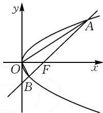
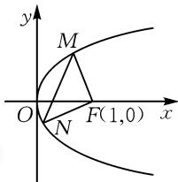
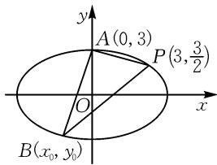

# 一个三角形面积公式在圆锥曲线中的应用

# 湖北省团风中学 林慧敏 罗凯

圆锥曲线一直是高考重点考查的内容,而圆锥曲线中的三角形面积问题,更是高考及各类考试中的热点题型.其常规解法是联立直线和圆锥曲线的方程,消去y(或x)得到关于x(或y)的一元二次方程,运用韦达定理和弦长公式求出三角形底边的长度,用点到直线的距离公式求出三角形的高,再运用三角形面积公式 $S=\frac{1}{2}\times$ 底×高,求出三角形的面积.这种解题思路清晰自然,是常用的通性通法,但由于计算量大,常使学生因运算困难而未能使完全解决问题.基于此,本文力求探索一种用三角形面积的坐标公式来求圆锥曲线中的三角形面积问题的方法,供参考.

# 1 三角形面积的坐标公式

在 $\triangle ABC$ 中，若 $\overrightarrow{AB} = (x_1, y_1), \overrightarrow{AC} = (x_2, y_2)$ ，则 $\triangle ABC$ 的面积 $S = \frac{1}{2} |x_1y_2 - x_2y_1|$ .

证明:根据 $\overrightarrow{AB}=(x_{1},y_{1}),\overrightarrow{AC}=(x_{2},y_{2})$ ，结合向量三角形面积公式，得

$$
\begin{array}{l} S = \frac {1}{2} | \overrightarrow {A B} | | \overrightarrow {A C} | \sin \angle B A C \\ = \frac {1}{2} | \overrightarrow {A B} | | \overrightarrow {A C} | \sqrt {1 - \cos^ {2} \angle B A C} \\ = \frac {1}{2} | \overrightarrow {A B} | | \overrightarrow {A C} | \sqrt {1 - \left(\frac {\overrightarrow {A B} \cdot \overrightarrow {A C}}{| \overrightarrow {A B} | | \overrightarrow {A C} |}\right) ^ {2}} \\ = \frac {1}{2} \sqrt {\left(\left| \overrightarrow {A B} \right| \left| \overrightarrow {A C} \right|\right) ^ {2} - \left(\overrightarrow {A B} \cdot \overrightarrow {A C}\right) ^ {2}} \\ = \frac {1}{2} \sqrt {\left(x _ {1} ^ {2} + y _ {1} ^ {2}\right) \left(x _ {2} ^ {2} + y _ {2} ^ {2}\right) - \left(x _ {1} x _ {2} + y _ {1} y _ {2}\right) ^ {2}} \\ = \frac {1}{2} \sqrt {x _ {1} ^ {2} y _ {2} ^ {2} + x _ {2} ^ {2} y _ {1} ^ {2} - 2 x _ {1} x _ {2} y _ {1} y _ {2}} \\ = \frac {1}{2} \sqrt {\left(x _ {1} y _ {2} - x _ {2} y _ {1}\right) ^ {2}} \\ = \frac {1}{2} \left| x _ {1} y _ {2} - x _ {2} y _ {1} \right|. \\ \end{array}
$$

# 2 应用举例

例 1 （2014 年新课标全国卷Ⅱ理科数学第 10 题）设 F 为抛物线 C: $y^{2}=3x$ 的焦点，过 F 且倾斜角为 $30^{\circ}$ 的直线交 C 于 A, B 两点, O 为坐标原点, 则 $\triangle OAB$ 的面积为().

A. $\frac{3\sqrt{3}}{4}$

B. $\frac{9\sqrt{3}}{8}$

C. $\frac{63}{32}$

D. $\frac{9}{4}$

解:由抛物线 $C: y^{2} = 3x$ ，得 $F\left(\frac{3}{4}, 0\right)$ .

设 $A(x_{1},y_{1}), B(x_{2},y_{2})$ .
如图 1, 设直线 AB 的方程为

$$
y = \frac {\sqrt {3}}{3} \left(x - \frac {3}{4}\right).
$$

由 $\left\{\begin{aligned}y&=\frac{\sqrt{3}}{3}\left(x-\frac{3}{4}\right),\\ y^{2}&=3x,\end{aligned}\right.$ 得

text_image

y
A
O
F
x
B

图1

$$
x ^ {2} - \frac {2 1}{2} x + \frac {9}{1 6} = 0.
$$

所以 $x_{1}+x_{2}=\frac{21}{2},x_{1}x_{2}=\frac{9}{16}.$

又 $\overrightarrow{OA} = (x_{1},y_{1}),\overrightarrow{OB} = (x_{2},y_{2})$ ，则由三角形面积的坐标公式得

$$
\begin{array}{l} S _ {\triangle A O B} = \frac {1}{2} \left| x _ {1} y _ {2} - x _ {2} y _ {1} \right| \\ = \frac {1}{2} \left| \frac {\sqrt {3}}{3} x _ {1} \left(x _ {2} - \frac {3}{4}\right) - \frac {\sqrt {3}}{3} x _ {2} \left(x _ {1} - \frac {3}{4}\right) \right| \\ = \frac {1}{2} \left| \frac {\sqrt {3}}{4} \left(x _ {2} - x _ {1}\right) \right| \\ = \frac {\sqrt {3}}{8} \left| x _ {2} - x _ {1} \right| \\ = \frac {\sqrt {3}}{8} \sqrt {(x _ {2} + x _ {1}) ^ {2} - 4 x _ {1} x _ {2}} \\ = \frac {\sqrt {3}}{8} \sqrt {\left(\frac {2 1}{2}\right) ^ {2} - 4 \times \frac {9}{1 6}} \\ = \frac {\sqrt {3}}{8} \times 6 \sqrt {3} = \frac {9}{4}. \\ \end{array}
$$

故选：D.

评析:本高考题虽然是一道陈题,但非常经典,不落窠臼.重点考查了抛物线中的面积问题,考查了数据处理能力.其解法有多种,但运用这种解法思路清晰,运算简捷,令人耳目一新.

例 2 （2022 年全国新高考 I 卷第 21 题）已知点

A(2,1)在双曲线 $C:\frac{x^{2}}{a^{2}}-\frac{y^{2}}{a^{2}-1}=1(a>1)$ 上，直线 l 交 C 于 P,Q 两点，直线 AP,AQ 的斜率之和为 0.

(1) 求 l 的斜率;

(2) 若 $\tan\angle PAQ=2\sqrt{2}$ ，求 $\triangle PAQ$ 的面积.

解:(1)易求得 $a^{2}=2$ , 双曲线 $C:\frac{x^{2}}{2}-y^{2}=1$ , 直线 l 的斜率为 -1.

(2) 设 $\angle PAQ = 2\alpha$ ，令点 P 在点 Q 的左侧.

根据 $\tan\angle PAQ=\tan2\alpha=\frac{2\tan\alpha}{1-\tan^{2}\alpha}=2\sqrt{2}$ ，解得 $\tan\alpha=\frac{\sqrt{2}}{2}$ （负值舍去）.

所以 $k_{AP} = \tan \left(\frac{\pi}{2} -\alpha\right) = \sqrt{2},k_{AQ} = -\sqrt{2}.$

直线 AP 的方程为 $y=\sqrt{2}(x-2)+1$ ;

直线 AQ 的方程为 $y = -\sqrt{2}(x - 2) + 1$ .

设 $P(x_{1},y_{1}), Q(x_{2},y_{2})$ ，则

$$
\overrightarrow {A P} = \left(x _ {1} - 2, y _ {1} - 1\right) = \left(x _ {1} - 2, \sqrt {2} \left(x _ {1} - 2\right)\right),
$$

$$
\overrightarrow {A Q} = \left(x _ {2} - 2, y _ {2} - 1\right) = \left(x _ {2} - 2, - \sqrt {2} \left(x _ {2} - 2\right)\right).
$$

由三角形面积的坐标公式, 可以得到 $S_{\triangle PAQ} = \frac{1}{2} \times \left| -\sqrt{2}(x_{1}-2)(x_{2}-2) - \sqrt{2}(x_{1}-2)(x_{2}-2) \right| = \sqrt{2} \left| (x_{1}-2)(x_{2}-2) \right|$ .

由 $\left\{\begin{aligned}y&=\sqrt{2}(x-2)+1,\\ \frac{x^{2}}{2}-y^{2}&=1,\end{aligned}\right.$ 得

$$
x ^ {2} - 2 \left[ \sqrt {2} (x - 2) + 1 \right] ^ {2} = 2.
$$

整理得 $-3(x-2)^{2}+(4-4\sqrt{2})(x-2)=0.$

解得 $x_{1}-2=\frac{4-4\sqrt{2}}{3}$ . 同理, $x_{2}-2=\frac{4+4\sqrt{2}}{3}$ .

故 $S_{\triangle PAQ}=\sqrt{2}\left|(x_{1}-2)(x_{2}-2)\right|=\frac{16\sqrt{2}}{9}.$

评析:本题的解法很多,有常规解法,有平移齐次化法、参数方程法等.但其解题过程较复杂,需要大量的计算,而运用三角形面积的坐标公式解决问题,过程简洁明了.

例 3 （2023 年高考全国甲卷第 20 题）已知直线 $x - 2y + 1 = 0$ 与抛物线 $C: y^{2} = 2px (p > 0)$ 交于 A, B 两点，且 $|AB| = 4\sqrt{15}$ .

(1) 求 p;

(2) 设 F 为 C 的焦点, M, N 为 C 上两点, 且 $\overrightarrow{FM} \cdot \overrightarrow{FN} = 0$ , 求 $\triangle MFN$ 面积的最小值.

解:(1)易求得 p=2.

(2)由(1)知,抛物线方程为 $y^{2}=4x$ , $F(1,0)$ .

如图 2 所示, 设 $M(4m^{2}, 4m)$ , $N(4n^{2}, 4n)$ , 其中 $m > 0, n \leqslant 0$ .

依题意易知 $4m^{2}<1,4n^{2}<1$ 即 $16 m^{2} n^{2} < 1$ ，所以 $-\frac{1}{4} < mn \leqslant 0$ .

又 $\overrightarrow{FM} = (4m^2 - 1, 4m), \overrightarrow{FN} =$ 图2 $(4n^{2} - 1, 4n), \overrightarrow{FM} \cdot \overrightarrow{FN} = 0$ ，则有 $(4m^{2} - 1, 4m) \cdot (4n^{2} - 1, 4n) = 0$ ，即

$$
(4 m ^ {2} - 1) (4 n ^ {2} - 1) + 1 6 m n = 0.
$$

text_image

y
M
O
N
F(1,0)
x

图2

整理，得 $16 m^{2} n^{2} + 16 mn + 1 = 4 m^{2} + 4 n^{2}$ .

进一步，得 $|4mn+1|=2|m-n|$ .

又 $4m^{2} + 4n^{2}\geqslant -8mn$ ，则

$$
1 6 m ^ {2} n ^ {2} + 1 6 m n + 1 \geqslant - 8 m n.
$$

解得 $mn \geqslant \frac{-3 + 2\sqrt{2}}{4}$ 或 $mn \leqslant \frac{-3 - 2\sqrt{2}}{4}$ （舍去）.

所以 $\frac{-3 + 2\sqrt{2}}{4}\leqslant mn\leqslant 0.$

由三角形面积的坐标公式,得

$$
\begin{array}{l} S _ {\triangle M F N} = \frac {1}{2} | (4 m ^ {2} - 1) \cdot 4 n - (4 n ^ {2} - 1) \cdot 4 m | \\ = 2 \left| 4 m n (m - n) + (m - n) \right| \\ = 2 \mid m - n \mid \cdot \mid 4 m n + 1 \mid \\ = (4 m n + 1) ^ {2}. \\ \end{array}
$$

又 $-2 + 2\sqrt{2} \leqslant 4mn + 1 \leqslant 1$ ，则

$$
S _ {\triangle M F N} = (4 m n + 1) ^ {2} \geqslant (- 2 + 2 \sqrt {2}) ^ {2} = 1 2 - 8 \sqrt {2}.
$$

故 $S_{\triangle MFN}$ 面积的最小值为 $12-8\sqrt{2}$ .

评析:本题的解法多种多样,但运用三角形面积公式的坐标形式解决,运算更为简洁方便.

例 4 （2024 年全国新高考 I 卷第 16 题）已知 $A(0,3)$ 和 $P\left(3,\frac{3}{2}\right)$ 为椭圆 $C:\frac{x^{2}}{a^{2}}+\frac{y^{2}}{b^{2}}=1(a>b>0)$ 上两点.

(1)求 C 的离心率;

(2)若过 P 的直线 l 交 C 于另一点 B，且 $\triangle ABP$ 的面积为 9，求 l 的方程.

解:(1)易求得椭圆 C 的方程为 $\frac{x^{2}}{12} + \frac{y^{2}}{9} = 1$ ，离心率 $e = \frac{1}{2}$ .

(2)如图3,设 $B(x_{0},y_{0})$ .

由 $A(0,3), P\left(3, \frac{3}{2}\right)$ , 得

$$
\overrightarrow {A B} = \left(x _ {0}, y _ {0} - 3\right),
$$

$$
\overrightarrow {A P} = \left(3, - \frac {3}{2}\right).
$$

text_image

y
A(0,3)
P(3,3/2)
O
x
B(x₀,y₀)

图 3

(下转第46页)

中,我们可以把一个变量依然作为变量,其他变量作为常量处理,从而转变为单变量的任意性或存在性问题,化繁为简,达到化归的目的.除此之外,在处理变量任意性与存在性问题时,从变量逐渐增多到形式逐渐复杂,探讨的问题也随之逐步深入,但不变的是它们都可以转化为函数的最值问题进行处理,这就是多变量任意存在性问题体现的本质.

# 4.2 关注高阶发展

采用类似学生2的解法解决最值问题时，取特殊点是一种常用的技巧。然而，如果从最佳逼近的角度去思考这些特殊点，就能更深入地理解它们的本质。通常情况下，这些特殊点依次轮流为正负偏差点。正负偏差点的概念在高等数学中有着重要的应用，它们能够帮助我们更好地理解函数的性质。例如，在某些优化问题中，可以通过寻找函数的极值点来解决最值问题。这些极值点往往就是正负偏差点，它们代表了函数在某一局部范围内的最大值或最小值。通过对这些点的研究，我们可以确定函数的最优解。

借助高等数学的知识,我们不仅能够快速解题,还能够重新审视初等数学中的源与流.初等数学中的许多概念和方法,在高等数学中都有更深入的解释和推广.通过将高等数学的思想应用到初等数学中,我们可以更好地理解数学的本质,发现数学知识之间的内在联系,构建起完整的数学体系.

# 参考文献：

[1]章建跃.“预备知识”预备什么、如何预备[J].数学通报，2020,59(8):1-14.  
[2]侯斐斐,冯炜.基于核心素养的探究课教学——以求解函数中的双变量“任意性”和“存在性”问题为例[J].中学数学教学参考,2022(25):25-27.  
[3]肖恩利,张建国.挖掘复习主线 提升核心素养——以高三数学微专题“任意性与存在性”的复习为例[J].数学通讯,2021(4):41-44.  
[4]蔡勇全.等价转化——突破双变量存在性或任意性问题的“利器”[J].数学通讯,2017(3):1-5.  
[5]董文佳, 曹丽丽. 函数中的双变量问题 [J]. 数学通讯, 2019(3): 56-57, 66.  
[6] 张晓东. 2016 年天津高考理科数学压轴题背景分析 [J]. 数学通讯, 2016(20): 41-43.  
[7] 梁懿涛. 导数题中“任意、存在”型问题的归纳辨析 [J]. 数学通讯, 2013(17): 21-25.  
[8]佩捷,林常.切比雪夫逼近问题——从一道中国台北数学奥林匹克试题谈起[M].哈尔滨:哈尔滨工业大学出版社,2013.  
[9]彭厅,王历权.一类双重复合最值问题的切比雪夫最佳逼近线解法[J].数学通讯,2023(2):33-37.Z

# (上接第43页)

由三角形面积的坐标公式, 可以得到 $S_{\triangle ABP} = \frac{1}{2} \left| -\frac{3}{2} x_{0} - 3y_{0} + 9 \right| = \frac{1}{2} \left| \frac{3}{2} x_{0} + 3y_{0} - 9 \right| = 9.$

所以 $\frac{3}{2} x_0 + 3y_0 - 9 = 18$ 或 $\frac{3}{2} x_0 + 3y_0 - 9 = -18.$

整理, 得 $y_{0}+\frac{x_{0}}{2}=9$ 或 $y_{0}+\frac{x_{0}}{2}=-3$ .

由 $y_0 \leqslant 3, x_0 \leqslant 2\sqrt{3}$ , 得 $y_0 + \frac{x_0}{2} \leqslant 3 + \sqrt{3}$ .

于是 $y_{0}+\frac{x_{0}}{2}=-3, y_{0}+\frac{x_{0}}{2}=9$ (舍去).

由 $\left\{\begin{aligned}y_{0}+\frac{x_{0}}{2}&=-3,\\ \frac{x_{0}^{2}}{12}+\frac{y_{0}^{2}}{9}&=1,\end{aligned}\right.$ 得 $\left\{\begin{aligned}x_{0}&=0,\\ y_{0}&=-3\end{aligned}\right.$ 或 $\left\{\begin{aligned}x_{0}&=-3,\\ y_{0}&=-\frac{3}{2}.\end{aligned}\right.$

所以 $B(0,-3)$ 或 $B\left(-3,-\frac{3}{2}\right)$ .

当点 $B\left(-3, -\frac{3}{2}\right)$ 时，直线 $PB$ 的斜率为 $k_{1} = \frac{1}{2}$ ，则直线 $l$ 方程为 $y = \frac{1}{2} x$ ，即 $x - 2y = 0$ 。

当点 $B(0,-3)$ 时，直线 PB 的斜率为 $k_{2}=\frac{3}{2}$ ，则直线 l 方程为 $y=\frac{3}{2}x-3$ ，即 3x-2y-6=0。

综上, 直线 l 的方程为 x-2y=0 或 3x-2y-6=0.

评析:这道高考真题也有多种解法,而运用三角形面积的坐标公式求解,不但可以简化运算,还可以提高思维能力、知识的综合运用能力和探究能力,利于学科素养的培养.

# 3 巩固练习

编拟 6 道巩固练习,感兴趣的读者请扫码下载,这里从略.

总之,解析几何的本质是用代数的方法解决几何问题,三角形面积的坐标公式为解决与椭圆、双曲线、抛物线等圆锥曲线中有关的三角形面积问题提供了一种重要方法.用这种方法解决问题时,有时会比常规解法更加简捷,别有一番情趣,值得推广学习.Z

  
扫码查看