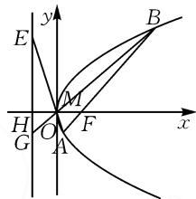
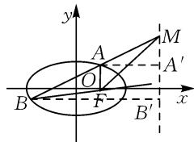
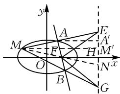

# 一个抛物线定值问题引发的深入探究

# 广东省深圳市第二高级中学 莫彪

摘要:解析几何是高中数学主要知识之一,其中定值问题一直是常考的热点问题,重点考查学生的数学运算与逻辑推理等核心素养.本文中以一道抛物线定值问题为背景展开探究,通过案例的拓展和引申,归纳出解析几何中一类问题的一般性结论.

关键词: 解析几何; 定值; 抛物线; 数学核心素养

# 1 例题呈现

例题 已知抛物线 $C: y^{2} = 4x$ 的焦点为 $F$ , 过点 $F$ 的直线 $l$ 与抛物线 $C$ 交于 $A, B$ 两点, 点 $B$ 在 $x$ 轴的上方, 且点 $B$ 的纵坐标为 4. 设点 $M$ 为抛物线 $C$ 上异于 $A, B$ 的点, 直线 $MA$ 与 $MB$ 分别交抛物线 $C$ 的准线于 $E, G$ 两点, $x$ 轴与准线的交点为 $H$ , 求证: $HG \cdot HE$ 为定值, 并求出定值.

证明: 准线方程为 x = -1，
直线 FB 的方程为 $y=\frac{4}{3}(x-1)$ .

由 $\left\{\begin{aligned}y&=\frac{4}{3}(x-1),\\ y^{2}&=4x,\end{aligned}\right.$ 解得x=$\frac{1}{4}$ 或 x=4，于是点 $A\left(\frac{1}{4},-1\right)$ .

text_image

E
y
B
M
H
O
F
x
G
A

图1

设点 $M\left(\frac{n^{2}}{4},n\right)$ ，则 $n\neq1$ 且 $n\neq-4$ ，如图1.

易得直线 $MA: y + 1 = \frac{4}{n - 1} \left( x - \frac{1}{4} \right)$ .

令 $x = -1$ ，得 $y = -\frac{n + 4}{n - 1}$ 则 $HE = \left| -\frac{n + 4}{n - 1} \right|$ .

同理, 可得 $HG = \left| \frac{4n - 4}{n + 4} \right|$ .

所以 $HG\cdot HE = \left| - \frac{n + 4}{n - 1}\right|\cdot \left|\frac{4n - 4}{n + 4}\right| = 4.$

# 2 例题探究

探究 1: 引例中的 $HG \cdot HE = 4$ 刚好等于 $p^{2}$ ，对于一般的抛物线，是否也有类似的结论？猜想“对于一般的抛物线，有 $HG \cdot HE = p^{2}$ ”.

定理 1 已知抛物线 $C: y^{2} = 2px (p > 0)$ 的焦点为 F，过点 F 的直线 l 与抛物线 C 交于 A, B 两点。设点 M 为抛物线 C 上异于 A, B 的点，直线 MA 与 MB 分别交抛物线 C 的准线于 E, G 两点，x 轴与准线的交点为 H，则 $HG \cdot HE$ 为定值 $p^{2}$ 。

证明:(i)当直线 AB 的斜率不存在,即 AB 垂直于 x 轴时,不妨令点 $A\left(\frac{p}{2},-p\right)$ , 则 $B\left(\frac{p}{2},p\right)$ .

设点 $M\left(\frac{n^2}{2p}, n\right)$ ，则 $n \neq \pm p$ 。所以直线 $MA: y + p = \frac{2p}{n - p}\left(x - \frac{p}{2}\right)$ 。

令 $x = -\frac{p}{2}$ ，可得 $y = \frac{-p^2 - pn}{n - p}$ ，所以 $HE = \left| -\frac{p^2 + pn}{n - p} \right|$ .

同理, 可得 $HG = \left| \frac{pn - p^{2}}{n + p} \right|$ , 故 $HG \cdot HE = p^{2}$ .

(ii) 当直线 $AB$ 的斜率存在时, 设点 $A\left(\frac{y_A^2}{2p}, y_A\right)$ , $B\left(\frac{y_B^2}{2p}, y_B\right)$ , 则 $y_A y_B = -p^2$ .

设点 $M\left(\frac{n^2}{2p}, n\right)$ ，则 $n \neq \pm y_A$ 且 $n \neq \pm y_B$ ，所以直线 $MA: y - y_A = \frac{2p}{y_A + n}\left(x - \frac{y_A^2}{2p}\right)$ .

令 $x = -\frac{p}{2}$ , 得 $y = \frac{-p^2 + y_A n}{y_A + n}$ .

所以 $HE=\left|\frac{-p^{2}+y_{A}n}{y_{A}+n}\right|$ .

同理, 得 $HG = \left| \frac{-p^{2} + y_{B}n}{y_{B} + n} \right|$ .

结合 $y_{A}y_{B}=-p^{2}$ ，得 $HG \cdot HE=p^{2}$ .

推论 1-1 已知抛物线 $C: y^{2} = 2px (p > 0)$ 的焦点为 F，过点 F 的直线 l 与抛物线 C 交于 A, B 两点。设点 M 为抛物线 C 上异于 A, B 的点，直线 MA 与 MB 分别交抛物线 C 的准线于 E, G 两点，则 $FE \perp FG$ ，即 $k_{FE} \cdot k_{FG} = -1$ 。

推论 1-2 已知抛物线 $C: y^{2} = 2px (p > 0)$ 的焦点为 F，过点 F 的直线 l 与抛物线 C 交于 A, B 两点。设点 M 为抛物线 C 上异于 A, B 的点，直线 MA 与

MB 分别交抛物线 C 的准线于 E, G 两点, 则以 EG 为直径的圆过定点 F.

推论 2 已知抛物线 C: $y^{2}=2px$ (p>0) 的焦点为 F，过点 F 的直线 l 与抛物线 C 交于 A, B 两点。设点 $M(x_{M}, y_{M})$ 为抛物线 C 上异于 A, B 的点，x 轴与准线的交点为 H，若 $x_{M}=x_{A}$ 或 $x_{M}=x_{B}$ ，则直线 MB 或直线 MA 过定点 $H\left(-\frac{p}{2}, 0\right)$ 。

下证 $x_{M} = x_{A}$ 时结论成立：

证明:由题可知直线 AB 的斜率存在.

设点 $A\left(\frac{y_{A}^{2}}{2p},y_{A}\right)$ , $B\left(\frac{y_{B}^{2}}{2p},y_{B}\right)$ ，易得 $y_{A}y_{B}=-p^{2}$ .

设点 $M\left(\frac{y_A^2}{2p}, - y_A\right)$ ，所以直线 $MB:y - y_B = \frac{y_B + y_A}{\frac{y_B^2}{2p} - \frac{y_A^2}{2p}}\Big(x - \frac{y_B^2}{2p}\Big)$ ，即 $y = \frac{2p}{y_B - y_A} x - \frac{y_Ay_B}{y_B - y_A}$ .

将 $y_{A}y_{B} = -p^{2}$ 代入，得 $y = \frac{2p}{y_B - y_A}\left(x + \frac{p}{2}\right)$ ，所以直线 $MB$ 过定点 $H\left(-\frac{p}{2},0\right)$

探究 2: 定理 1 中有结论 $HG \cdot HE = p^{2}$ 时, 直线 l 过点 $F\left(\frac{p}{2}, 0\right)$ 交抛物线 C 于 A, B 两点, 直线 MA 与 MB 分别交抛物线 C 的准线 $x = -\frac{p}{2}$ , 若将条件改为“直线 l 过 x 轴上任意一点 $(m, 0)$ 交抛物线 C 于 A, B 两点, 直线 MA 与 MB 分别交直线 x = -m 于 E, G 两点”, 是否可以得到更一般的结论?

定理 2 已知抛物线 $C: y^{2} = 2px (p > 0)$ ，过点 $Q(m, 0)(m > 0)$ ，的直线 l 与抛物线 C 交于 A, B 两点。设点 M 为抛物线 C 上异于 A, B 的点，直线 MA 与 MB 分别与直线 x = -m 交于 E, G 两点，x 轴与直线 x = -m 的交点为 H，则 $HG \cdot HE$ 为定值 2mp。

证明(i)当直线 AB 的斜率不存在, 即 AB 垂直于 x 轴时, 不妨设点 $A(m, y_{A})$ , $B(m, -y_{A})$ , 则 $y_{A}^{2} = 2pm$ .

设点 $M\left(\frac{n^{2}}{2p},n\right)$ ，则 $n\neq\pm y_{A}$ 且 $n\neq\pm y_{B}$ ，所以直线 MA: $y-y_{A}=\frac{2p}{y_{A}+n}(x-m)$ .

令 $x = -m$ ，得 $y = \frac{ny_A - y_A^2}{y_A + n}$ ，则 $HE = \left|\frac{ny_A - y_A^2}{y_A + n}\right|$

同理, 可得 $HG = \left| -\frac{ny_{A} + y_{A}^{2}}{n - y_{A}} \right|$ .

故 $HG \cdot HE = 2pm$ .

(ii) 当直线 AB 的斜率存在时, 设点 $A\left(\frac{y_{A}^{2}}{2p}, y_{A}\right)$ ,

$B\left(\frac{y_{B}^{2}}{2p},y_{B}\right)$ ，易得 $y_{A}y_{B}=-2pm$ .

设点 $M\left(\frac{n^{2}}{2p},n\right)$ ，则 $n\neq\pm y_{A}$ 且 $n\neq\pm y_{B}$ ，所以直线 $MA:y-y_{A}=\frac{2p}{y_{A}+n}\left(x-\frac{y_{A}^{2}}{2p}\right)$ .

令 $x = -m$ ，可得 $y = \frac{-2pm + y_An}{y_A + n}$ 所以 $HE = \left|\frac{-2pm + y_An}{y_A + n}\right|$

同理, 得 $HG = \left| \frac{-2pm + y_{B}n}{y_{B} + n} \right|$ .

结合 $y_{A}y_{B}=-2pm$ ，得 $HG \cdot HE=2pm$ 。

引理 $^{[1]}$ 如图2,已知A,B是椭圆上不同的两点,直线AB与焦点F相应的准线l交于点M,则FM平分 $\angle AFB$ 的外角.

text_image

y
A
M
O
A'
B
F
B'
x

图 2

定理 3 已知椭圆 $C: \frac{x^{2}}{a^{2}} +$

$\frac{y^{2}}{b^{2}}=1(a>0,b>0)$ ，过右焦点F的直线l与C交于A,B两点.设点M为C上异于A,B的点，直线MA与MB分别交C的右准线于E,G两点，x轴与准线的交点为H，则 $HG\cdot HE$ 为定值 $\frac{b^{4}}{c^{2}}$ .

证明:如图3,延长MF交准线于点N,设A,M在准线上的射影分别为点 $A^{\prime},M^{\prime}$ ,则有 $\frac{EA}{EM}=\frac{AA^{\prime}}{MM^{\prime}}$ .因为 $AA^{\prime}=\frac{AF}{e}$ , $MM^{\prime}=\frac{MF}{e}$ ,则 $\frac{EA}{EM}=\frac{AF}{MF}$ ,所以FE平分 $\angle AFM$ 的外角.

text_image

y
A
E
M
F
H
M'
O
B
G
N^x

图 3

同理, FG 平分 $\angle BFM$ 的外角, 所以 $\angle EFG = 90^{\circ}$ , 则 $EH \cdot GH = HF^{2} = \frac{b^{4}}{c^{2}}$ .

推论 3 过点 $Q(m,0)$ (0<m<a) 的直线 l 交椭圆 $C: \frac{x^{2}}{a^{2}} + \frac{y^{2}}{b^{2}} = 1 (a > 0, b > 0)$ 于 A, B 两点. 设点 M 为 C 上异于 A, B 的点, 直线 MA 与 MB 分别交直线 $x = \frac{a^{2}}{m}$ 于 E, G 两点, x 轴与直线 $x = \frac{a^{2}}{m}$ 的交点为 H, 则 HG·HE 为定值 $\frac{b^{2}(a^{2}-m^{2})}{m^{2}}$ .

双曲线中结论依旧成立.

# 参考文献：

[1]郭建斌.圆锥曲线中的内外角平分线定理[J].数理天地（高中版），2008(8):2.Z