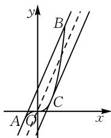

# 一类多变量不等式问题的处理思考

# 上海市七宝中学 黄婷 管恩臣

摘要:通过对一类多变量不等式问题的处理和思考,寻找解决这类问题的常用方法,即转化为函数的最大(小)值问题进行研究.

关键词: 多变量; 不等式; 最值

多变量问题一直是学生学习的一个难点,多变量与“任意,存在”等量词结合的问题是其中的典型问题,以多变量为载体考查对数学本质的理解.等价转化的思路是突破该类问题的一个利器.课程标准对量词提出的“内容与要求”是:通过已知的数学实例,理解全称量词与存在量词的意义.多变量不等式作为一个载体,很好地发挥了数学实例的作用 $^{[1]}$ .

查看以往相关文献 $^{[2-7]}$ ，针对多变量任意性与存在性的研究也主要集中在题型分类和等价转化思想在其中的作用这两类，变量常常可以分离在等号（不等号）的两侧，比如问题：对于任意 $a\in[0,3]$ ，都存在 $x\in[-2,2]$ ，使得 $|2x^{2}-1|+x-a>m$ ，求实数m的取值范围。我们将a移到不等号右侧，使得变量a和x在不等号两侧，即 $|2x^{2}-1|+x>m+a$ ，根据题意对于任意 $a\in[0,3]$ ，都存在 $x\in[-2,2]$ 使得不等式成立，所以 $(|2x^{2}-1|+x)_{\max}>(m+a)_{\max}$ ，即 $|2\times2^{2}-1|+2>m+3$ ，可得 $9>m+3$ ，所以m<6。但是关于当两个变量不能分离在等号（不等号）两端时应该如何处理的研究却很少，现在我们就来探讨这个问题。

# 1 试题呈现

题1 若对于任意 $a \in \mathbf{R}$ , 都存在 $x \in [-2, 2]$ , 使得 $|2x^2 - 1| + |x - a| > m$ , 求实数 $m$ 的取值范围.

这是高三一轮复习中的一道题,在此之前学生已经学习了双变量任意性和存在性问题两个变量可分离在等号(不等号)两端的处理方法,即转化为求函数的最大值和最小值问题,但这题的分离并不容易达成,“任意”和“存在”又应该怎么处理,在熟悉的情境中提炼出新问题,引发学生思考.

# 1.1 学生已有经验

根据我们之前的复习思路,学生首先想到的是将变量放在不等号两边,即先去绝对值.

当 $x \geqslant a$ 时， $|2x^2 - 1| + x > m + a$ ；

当 x<a 时， $\left|2x^{2}-1\right|-x>m-a.$

对于任意 $a \in R$ ，都存在 $x \in [-2, 2]$ ，使不等式成

立，记 $f(x) = |2x^{2} - 1| + x, g(x) = |2x^{2} - 1| - x.$

所以 $f(x)_{\max}>m+a$ , $g(x)_{\max}>m-a$ .

而 $f(x), g(x)$ 在 $x \in [-2, 2]$ 的最大值均为9，但 $a \in \mathbf{R}$ 时， $m \pm a$ 的最大值却成了难点，还要考虑 $x$ 与 $a$ 的大小关系.

# 1.2 解法探讨

我们发现 a 的最值不仅要考虑题干中给出的取值范围，还要依赖于 x 的变化，所以 a 和 x 虽然均为变量，但它们的地位并不等价，题目中描述道：“对于任意 $a \in R$ ，都存在 $x \in [-2, 2]$ ”，我们将不等式中含变量的部分看成是一个关于 a 和 x 的函数 $f(x, a) = |2x^{2} - 1| + |x - a|$ ， $f(x, a) > m$ 对于任意 $a \in R$ ，都存在 $x \in [-2, 2]$ 成立，即 $m < f(x)_{\max}$ ，将 $f(x)_{\max}$ 记作 $g(a) = f(x)_{\max}$ ，即 $m < g(a)_{\min}$ ，具体解法如下：

解: 设 $f(x)=|2x^{2}-1|+|x-a|$ , $x\in[-2,2]$ , 则

$$
\begin{array}{l} f (x) _ {\max} = \max \{f (- 2), f (2) \} \\ = \max \{7 + | 2 - a |, 7 + | 2 + a | \}. \\ \end{array}
$$

所以 $f(x)_{\max}=\left\{\begin{aligned}&7+|2+a|=a+9,a\geqslant0,\\ &7+|2-a|=9-a,a<0.\end{aligned}\right.$

记 $g(a)=f(x)_{\max}=\begin{cases}a+9,a\geqslant0,\\9-a,a<0.\end{cases}$

所以当 a=0 时， $\left[f(x)_{\max}\right]_{\min}=9.$

因为对于任意 $a \in R$ ，都存在 $x \in [-2, 2]$ ，使得 $|2x^{2}-1| + |x-a| > m$ ，所以 m < 9。

故 m 的取值范围为 $(-∞,9)$ .

点评:与常见的双变量恒成立存在性问题一样,该题可以转化为求函数最值问题,但因为双变量无法分离在不等号两边处理,这又是在任意a的条件下,存在x使得不等式 $f(x,a)>m$ 成立,所以我们可以先将它转换成求关于x的函数的最大值(含有a),此时将a弱化成参数的地位,然后再求关于a的函数的最小值.

# 2 变式拓展

题 2 任意的 $a, b \in R$ ，总存在 $x \in [-1, 2]$ 使得

$|x^{3}+ax+b|\geqslant m$ 成立，求 m 的取值范围.

从双变量问题推广到三变量问题，增加了难度，基于题1的铺垫，多数学生想到了求解 $f(x) = x^3 + ax + b$ 在 $x \in [-1, 2]$ 时的最值，即：记 $f(x, a, b) = x^3 + ax + b$ ，因为存在 $x \in [-1, 2]$ 使 $|x^3 + ax + b| \geqslant m$ 成立，所以 $m \leqslant \left|f(x)\right|_{\max}$ ，然后记 $M(a, b) = \left|f(x)\right|_{\max}$ ，但是在求解方法上有所不同。学生1认为应该对参数 $a$ 的取值范围分类讨论： $f'(x) = 3x^2 + a$ ，当 $a \geqslant 0$ 时，函数 $f(x) = x^3 + ax + b$ 单调递增，所以 $|f(x)| = |x^3 + ax + b|$ 的最大值在 $x = 2$ 或 $x = -1$ 时取得，但当 $a < 0$ 时， $|f(x)|$ 的最大值无法确定，需要对 $a$ 的取值范围进一步分类讨论；学生2认为不需要根据参数 $a$ 的取值范围讨论函数 $|f(x)|$ 的最大值，只要关注取得最值的情况就可以了，具体解法如下：

解： $f'(x)=3x^{2}+a$ ，当 a<0 时 $f'(x_{0})=3x_{0}^{2}+a=0$ .

所以 $\left|f(x)\right|_{\max}=\left\{\left|f(-1)\right|,\left|f(2)\right|,\left|f(x_{0})\right|\right\}.$

记 $M(a,b)=|f(x)|_{\max}$ .

接下来要求 $M(a,b)$ 的最小值是个难点，学生3想到了用三角不等式进行处理：

$$
\left\{ \begin{array}{l l} f (- 1) = - 1 - a + b, & \\ f (2) = 8 + 2 a + b, & \\ f (x _ {0}) = x _ {0} ^ {3} + a x _ {0} + b. & \end{array} \right. \tag {①}
$$

①-②，得 $f(-1)-f(2)=-9-3a$ ；

①×2+②，得 $2f(-1)+f(2)=6+3b$ .

所以 $a=\frac{-f(-1)+f(2)-9}{3}$ , $b=\frac{2f(-1)+f(2)-6}{3}$ .

于是，可以得到 $f(x_0) = x_0^3 + ax_0 + b = x_0^3 + \frac{-f(-1) + f(2) - 9}{3} x_0 + \frac{2f(-1) + f(2) - 6}{3}$ .

所以 $3f(x_0) = 3x_0^3 +(x_0 + 1)f(2) + (2 - x_0)\cdot$ $f(-1) - 9x_{0} - 6$ ，进一步可得到 $\mid 3x_0^3 -9x_0 - 6\mid =$ $\mid (x_0 + 1)\cdot f(2) + (-x_0 + 2)f(-1) - 3f(x_0)\mid .$

记 $M(a,b)=M.$

$$
\begin{array}{c} \left| (x _ {0} + 1) f (2) \right| + (- x _ {0} + 2) f (- 1) - 3 f (x _ {0}) \mid \leqslant \\ \left| x _ {0} + 1 \right| | f (2) | + | - x _ {0} + 2 | | f (- 1) | + 3 | f (x _ {0}) |. \end{array}
$$

又 $x_0 \in [-1, 2)$ ，所以 $(x_0 + 1) \cdot |f(2)| + (2 - x_0)|f(-1)| + 3|f(x_0)| \leqslant (x_0 + 1 + 2 - x_0 + 3) \cdot M = 6M.$

所以，可得 $6M \geqslant |3x_0^3 - 9x_0 - 6|$ ，即 $M \geqslant \frac{|x_0^3 - 3x_0 - 2|}{2}$ 在 $x_0 \in [-1, 2]$ 恒成立.

所以 $M \geqslant \left(\frac{|x_0^3 - 3x_0 - 2|}{2}\right)_{\max} = 2.$

故 $m \leqslant M(a, b)_{\min} = 2.$

点评:从双变量问题推广到三变量问题,不变的是转化为函数最值的处理策略,难点是三次函数最值的取得,以及 $M(a,b)$ 的最小值求法,学生的方法避免了求最值时的分类讨论,采用了三角不等式进行求解.

# 3 解法优化

虽然题2上述解法在求最值过程中已经进行了优化，但该代数解法仍比较繁琐，而数与形常常是相辅相成存在的，学生4提及可从形的角度思考 $\min_{a,b\in \mathbb{R}}\max_{x\in [-1,2]}\left|x^3 +ax + b\right|$ 的几何意义，如图1所示.

text_image

y
B
C
A O x

图1

解:根据切比雪夫逼近直线理论，若函数 $h(x)=x^{3}$ 是 $x\in[-1,2]$ 上的凹（凸）函数，设 $A(-1,-1), B(2,8)$ ，由拉格朗日中值定理知必存在 $x_{0}\in(-1,2)$ ，使得点 $C(x_{0},x_{0}^{3})$ 处的切线与直线 AB 平行，即 $h'(x_{0})=\frac{h(2)-h(-1)}{2-(-1)}=3$ .

又过点 $C(x_0, x_0^3)$ 的切线方程为 $y = 3x - 2$ ，此时，在区间 $[-1, 2]$ 上的最佳逼近直线为 $\triangle ABC$ 平行于 $AB$ 的中位线为 $y = 3x$ ，而中位线与直线 $AB$ 竖直方向的距离 2，即为 $\min_{a, b \in \mathbb{R}} \max_{x \in [-1, 2]} |x^3 + ax + b|$ .

点评:对于形如 $|f(x)-(ax+b)|(a,b\in\mathbf{R})$ 的函数最值问题 $^{[8-9]}$ ，我们可以利用切比雪夫最佳逼近直线的结论分析特殊点，这些点依次轮流是正负偏差点，然后再用代数方法(主要是三角不等式)进行证明。从高观点的角度来看这类问题不仅可以更快捷解题，还能够更好地把握题目的本质。

类比思考: 若存在实数 a, b, 对任意的实数 $x \in [0, 2]$ 都有 $\left|x^{2} + ax + b\right| \leqslant m$ 恒成立, 则 m 的最小值是多少?

相比前两道对于任意 $a, b$ ，总存在 $x$ ，使得不等式 $f(x, a, b) \geqslant m$ 成立的结构，思考题中将存在与任意互换，考查学生对该类问题的认识。由于结构类似，我们可以将思考题转换为前面两个问题进行求解。记 $f(x) = x^2 + ax + b$ ，因为对任意的实数 $x \in [0, 2]$ 不等式成立，所以有 $m \geqslant |f(x)|_{\max}$ ，将 $|f(x)|_{\max}$ 记作 $M(a, b)$ ，又存在实数 $a, b$ 使不等式成立，接下来再求 $M(a, b)$ 的最小值。所以思考题可以转换为：对于任意实数 $a, b$ ，存在实数 $x \in [0, 2]$ 都有 $|x^2 + ax + b| \geqslant m$ 恒成立，则 $m$ 的最大值是多少？

# 4 解题反思

通过对这三道题的解法思考,笔者谈点感想:

# 4.1 注重知识间转化

多变量的任意性与存在性混合问题是如何从单变量的任意性或存在性问题发展而来的,需要我们注意转化,在将多变量问题转化为单变量问题的过程中,我们可以把一个变量依然作为变量,其他变量作为常量处理,从而转变为单变量的任意性或存在性问题,化繁为简,达到化归的目的.除此之外,在处理变量任意性与存在性问题时,从变量逐渐增多到形式逐渐复杂,探讨的问题也随之逐步深入,但不变的是它们都可以转化为函数的最值问题进行处理,这就是多变量任意存在性问题体现的本质.

# 4.2 关注高阶发展

采用类似学生2的解法解决最值问题时，取特殊点是一种常用的技巧。然而，如果从最佳逼近的角度去思考这些特殊点，就能更深入地理解它们的本质。通常情况下，这些特殊点依次轮流为正负偏差点。正负偏差点的概念在高等数学中有着重要的应用，它们能够帮助我们更好地理解函数的性质。例如，在某些优化问题中，可以通过寻找函数的极值点来解决最值问题。这些极值点往往就是正负偏差点，它们代表了函数在某一局部范围内的最大值或最小值。通过对这些点的研究，我们可以确定函数的最优解。

借助高等数学的知识,我们不仅能够快速解题,还能够重新审视初等数学中的源与流.初等数学中的许多概念和方法,在高等数学中都有更深入的解释和推广.通过将高等数学的思想应用到初等数学中,我们可以更好地理解数学的本质,发现数学知识之间的内在联系,构建起完整的数学体系.

# 参考文献：

[1]章建跃.“预备知识”预备什么、如何预备[J].数学通报，2020,59(8):1-14.  
[2]侯斐斐,冯炜.基于核心素养的探究课教学——以求解函数中的双变量“任意性”和“存在性”问题为例[J].中学数学教学参考,2022(25):25-27.  
[3]肖恩利,张建国.挖掘复习主线 提升核心素养——以高三数学微专题“任意性与存在性”的复习为例[J].数学通讯,2021(4):41-44.  
[4]蔡勇全.等价转化——突破双变量存在性或任意性问题的“利器”[J].数学通讯,2017(3):1-5.  
[5]董文佳, 曹丽丽. 函数中的双变量问题 [J]. 数学通讯, 2019(3): 56-57, 66.  
[6] 张晓东. 2016 年天津高考理科数学压轴题背景分析 [J]. 数学通讯, 2016(20): 41-43.  
[7] 梁懿涛. 导数题中“任意、存在”型问题的归纳辨析 [J]. 数学通讯, 2013(17): 21-25.  
[8]佩捷,林常.切比雪夫逼近问题——从一道中国台北数学奥林匹克试题谈起[M].哈尔滨:哈尔滨工业大学出版社,2013.  
[9]彭厅,王历权.一类双重复合最值问题的切比雪夫最佳逼近线解法[J].数学通讯,2023(2):33-37.Z

# (上接第43页)

由三角形面积的坐标公式, 可以得到 $S_{\triangle ABP} = \frac{1}{2} \left| -\frac{3}{2} x_{0} - 3y_{0} + 9 \right| = \frac{1}{2} \left| \frac{3}{2} x_{0} + 3y_{0} - 9 \right| = 9.$

所以 $\frac{3}{2} x_0 + 3y_0 - 9 = 18$ 或 $\frac{3}{2} x_0 + 3y_0 - 9 = -18.$

整理, 得 $y_{0}+\frac{x_{0}}{2}=9$ 或 $y_{0}+\frac{x_{0}}{2}=-3$ .

由 $y_0 \leqslant 3, x_0 \leqslant 2\sqrt{3}$ , 得 $y_0 + \frac{x_0}{2} \leqslant 3 + \sqrt{3}$ .

于是 $y_{0}+\frac{x_{0}}{2}=-3, y_{0}+\frac{x_{0}}{2}=9$ (舍去).

由 $\left\{\begin{aligned}y_{0}+\frac{x_{0}}{2}&=-3,\\ \frac{x_{0}^{2}}{12}+\frac{y_{0}^{2}}{9}&=1,\end{aligned}\right.$ 得 $\left\{\begin{aligned}x_{0}&=0,\\ y_{0}&=-3\end{aligned}\right.$ 或 $\left\{\begin{aligned}x_{0}&=-3,\\ y_{0}&=-\frac{3}{2}.\end{aligned}\right.$

所以 $B(0,-3)$ 或 $B\left(-3,-\frac{3}{2}\right)$ .

当点 $B\left(-3, -\frac{3}{2}\right)$ 时，直线 $PB$ 的斜率为 $k_{1} = \frac{1}{2}$ ，则直线 $l$ 方程为 $y = \frac{1}{2} x$ ，即 $x - 2y = 0$ 。

当点 $B(0,-3)$ 时，直线 PB 的斜率为 $k_{2}=\frac{3}{2}$ ，则直线 l 方程为 $y=\frac{3}{2}x-3$ ，即 3x-2y-6=0。

综上, 直线 l 的方程为 x-2y=0 或 3x-2y-6=0.

评析:这道高考真题也有多种解法,而运用三角形面积的坐标公式求解,不但可以简化运算,还可以提高思维能力、知识的综合运用能力和探究能力,利于学科素养的培养.

# 3 巩固练习

编拟 6 道巩固练习,感兴趣的读者请扫码下载,这里从略.

总之,解析几何的本质是用代数的方法解决几何问题,三角形面积的坐标公式为解决与椭圆、双曲线、抛物线等圆锥曲线中有关的三角形面积问题提供了一种重要方法.用这种方法解决问题时,有时会比常规解法更加简捷,别有一番情趣,值得推广学习.Z

  
扫码查看