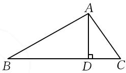

# 一道解三角形问题的解法赏析

# 江苏省常熟市王淦昌高级中学 刘兆磊

解三角形中的最值(范围)问题是历年高考数学的高频考点,试题将三角函数、导数、不等式、平面向量等知识联系起来,考查数学运算、数学推理等数学核心素养,常常利用函数思想解决问题.

# 1 问题呈现

问题 已知 $\triangle ABC$ 的内角满足 $\sin A + 2\sin B = 2\sin C$ ，求 $\frac{1}{\sin A} + \frac{1}{\sin B} - \frac{1}{\sin C}$ 的最小值.

# 2 问题破解

思路一:这道题是求三角的正弦值的范围问题,可以不妨假设一条边长通过正弦定理转化为边.通过作出三角形的高,表示出 $\sin A, \sin B, \sin C$ ,然后代入转化为函数的最值.

解法 1: 如图 1, 过点 A 作 $AD \perp BC$ 于点 D, 设 AD = h. 由正弦定理, 知 $a + 2b = 2c$ , 令 a = 4, 则 c - b = 2. 易知 $\frac{1}{\sin B} =$

  
图1

$\frac{c}{h}, \frac{1}{\sin C} = \frac{b}{h}$ . 由等面积法知 $\frac{1}{2} bc \sin A = \frac{1}{2} \times 4h$ ，则有 $\sin A = \frac{4h}{bc}$ ，又因为 $\cos A = \frac{b^2 + c^2 - a^2}{2bc} = \frac{(b - c)^2 + 2bc - a^2}{2bc} = 1 - \frac{6}{bc}$ ，所以由 $\sin^2 A + \cos^2 A = 1$ 得 $bc = \frac{4h^2 + 9}{3}$ . 于是 $\frac{1}{\sin A} + \frac{1}{\sin B} - \frac{1}{\sin C} = \frac{bc}{4h} + \frac{2}{h} = \frac{4h^2 + 9}{\frac{3}{4h}} + \frac{2}{h} = \frac{h}{3} + \frac{11}{4h} \geqslant \frac{\sqrt{33}}{3}$ ，当且仅当 $b = \sqrt{15} - 1, c = \sqrt{15} + 1, \cos A = \frac{4}{7}$ 时，等号成立.

评注:该解法假设了三角形的一条边 a 的长度,然后在直角三角形中表示出 $\sin B, \sin C$ .再由等面积法得到 $\sin A$ 将所求式子转化为关于 h 的函数.该解法难点在于将所求值都转化一个变量的函数.

思路二: 可以借助正弦、余弦定理及已知条件, 将目标求值转化为含有角 A 的三角函数的求值问题.

解法 2: $\frac{1}{\sin A} + \frac{1}{\sin B} - \frac{1}{\sin C} = \frac{1}{\sin A} +$

$\frac{\sin C - \sin B}{\sin B \cdot \sin C} = \frac{1}{\sin A} + \frac{\frac{1}{2}\sin A}{\sin B \cdot \sin C} = \frac{1}{\sin A}\left(1 + \frac{\frac{1}{2}\sin^2 A}{\sin B \cdot \sin C}\right) = \frac{1}{\sin A}\left(1 + \frac{\frac{1}{2}a^2}{bc}\right)$ ，由余弦定理 $a^2 = b^2 + c^2 - 2bc \cdot \cos A$ ，又由正弦定理及 $\frac{a}{2} = c - b$ ，得 $\frac{3}{4} a^2 = 2bc (1 - \cos A)$ ，所以 $\frac{\frac{1}{2}a^2}{bc} = \frac{4}{3} (1 - \cos A)$ .

于是，可得 $\frac{1}{\sin A} + \frac{1}{\sin B} - \frac{1}{\sin C} = \frac{1}{\sin A}$ 。设 $\frac{7 - 4\cos A}{3\sin A} = \lambda$ ，则 $3\lambda \sin A + 4\cos A = 7$ ，可得 $\sqrt{9\lambda^2 + 16}\sin (A + \varphi) = 7$ ，其中 $\tan \varphi = \frac{4}{3\lambda}$ 。由 $\sin (A + \varphi) \leqslant 1$ ，可得 $\lambda \geqslant \frac{\sqrt{33}}{3}$ 。当 $\lambda = \frac{\sqrt{33}}{3}$ 时， $\tan \varphi = \frac{4}{3\lambda} = \frac{4}{\sqrt{33}}$ ， $\cos A = \frac{4}{7}$ 。不妨设 $a = 4$ ，由 $\left\{\frac{b^2 + c^2 - a^2}{2bc} = \frac{4}{7}, \text{得 } b = \sqrt{15} - 1, c = \sqrt{15} + 1.\right.$

评注:由条件凑出余弦定理的结构,再利用余弦定理转化为求仅含有角 A 的分式型的三角函数的求值,借助三角函数的合一变形求范围.

思路三:由和差化积公式得到 $3\tan\frac{B}{2}=\tan\frac{C}{2}$ ，再由正切去表示 $\frac{1}{\sin A}+\frac{1}{\sin B}-\frac{1}{\sin C}$ .

解法3:由 $\sin A + 2\sin B = 2\sin C$ ，可得 $\sin A = 2\sin C - 2\sin B = 4\cos \frac{C + B}{2}\sin \frac{C - B}{2}$ ，又 $\sin A = 2\sin \frac{A}{2}\cos \frac{A}{2}$ ，于是得 $\cos \frac{A}{2} = 2\sin \frac{C - B}{2}$ ，所以 $\cos \frac{\pi - B - C}{2} = 2\sin \frac{C - B}{2}$ ，则 $\sin \frac{C + B}{2} = 2\sin \frac{C - B}{2}$ ，所以 $\sin \frac{C}{2}\cos \frac{B}{2} + \cos \frac{C}{2}\sin \frac{B}{2} = 2\sin \frac{C}{2}\cos \frac{B}{2} - 2\cos \frac{C}{2}\sin \frac{B}{2}$ ，即 $3\cos \frac{C}{2}\sin \frac{B}{2} = \sin \frac{C}{2}\cos \frac{B}{2}$ ，从而 $3\tan \frac{B}{2} = \tan \frac{C}{2}$ .

易得 $\sin B = \frac{2\sin\frac{B}{2}\cos\frac{B}{2}}{\sin^{2}\frac{B}{2} + \cos^{2}\frac{B}{2}} = \frac{2\tan\frac{B}{2}}{1 + \tan^{2}\frac{B}{2}}$ ,

$$
\sin C = \frac {2 \sin \frac {C}{2} \cos \frac {C}{2}}{\sin^ {2} \frac {C}{2} + \cos^ {2} \frac {C}{2}} = \frac {2 \tan \frac {C}{2}}{1 + \tan^ {2} \frac {C}{2}}. \text {设} \tan \frac {B}{2} = t, \text {则}
$$

$$
\frac {1}{\sin A} + \frac {1}{\sin B} - \frac {1}{\sin C} = \frac {1}{2 \sin C - 2 \sin B} + \frac {1}{\sin B} -
$$

$$
\frac {1}{\sin C} = \frac {1}{2 \times \frac {6 t}{1 + 9 t ^ {2}} - 2 \times \frac {2 t}{1 + t ^ {2}}} + \frac {1}{2 \times \frac {t}{1 + t ^ {2}}} -
$$

$$
\frac {1}{2 \times \frac {3 t}{1 + 9 t ^ {2}}} = \frac {9 9 t ^ {4} - 1 8 t ^ {2} + 1 1}{2 4 t (1 - 3 t ^ {2})} = \frac {9 9 t ^ {2} + \frac {1 1}{t ^ {2}} - 1 8}{2 4 \left(\frac {1}{t} - 3 t\right)} =
$$

$$
\frac {1 1 \left(\frac {1}{t} - 3 t\right) ^ {2} + 4 8}{2 4 \left(\frac {1}{t} - 3 t\right)} = \frac {1 1 \left(\frac {1}{t} - 3 t\right)}{2 4} + \frac {2}{\frac {1}{t} - 3 t} \geqslant 2 \sqrt {\frac {2 2}{2 4}} =
$$

$\frac{\sqrt{33}}{3}$ , 当且仅当 $t^2 = \frac{19 - 4\sqrt{15}}{33}$ 时, 等号成立.

评注:该解法由和差化积及两角和与差的三角公式将已知条件整理出 $3\tan\frac{B}{2}=\tan\frac{C}{2}$ ，以三角函数万能公式为工具，表示 $\frac{1}{\sin A}+\frac{1}{\sin B}-\frac{1}{\sin C}$ ，最终转化为求函数的最值.

思路四:由 $a+2b=2c$ ，及余弦定理得到 $\cos A$ ，进而得到 $\sin A$ ，通过正弦定理得到 $\sin B, \sin C$ 。转化为求关于边的函数的最值问题。

解法4:由 $a+2b=2c$ 得 a=2c-2b，则 $\cos A=\frac{b^{2}+c^{2}-a^{2}}{2bc}=\frac{b^{2}+c^{2}-(2b-2c)^{2}}{2bc}=\frac{8bc-3b^{2}-3c^{2}}{2bc}=4-\frac{3}{2}\left(\frac{b}{c}+\frac{c}{b}\right)$ .

由 $\frac{a}{\sin A} = \frac{b}{\sin B} = \frac{c}{\sin C}$ , 得 $\frac{1}{\sin B} = \frac{a}{b} \cdot \frac{1}{\sin A}$ , $\frac{1}{\sin C} = \frac{a}{c} \cdot \frac{1}{\sin A}$ , 则 $\frac{1}{\sin A} + \frac{1}{\sin B} - \frac{1}{\sin C} = \frac{1}{\sin A} \cdot \left(1 + \frac{a}{b} - \frac{a}{c}\right)$ . 设 $x = \frac{c}{b} + \frac{b}{c}$ , 则 $\cos A = 4 - \frac{3}{2} x$ , $\sin A = \sqrt{1 - \left(4 - \frac{3}{2} x\right)^2}$ .

于是，可以得到 $\frac{1}{\sin A} + \frac{1}{\sin B} - \frac{1}{\sin C} = \frac{1}{\sin A}\left(1 + \frac{a}{b} - \frac{a}{c}\right) = \left(1 + \frac{2c - 2b}{b} - \frac{2c - 2b}{c}\right)$

$$
\frac {1}{\sqrt {1 - \left(4 - \frac {3}{2} x\right) ^ {2}}} = \frac {2 x - 3}{\sqrt {1 - \left(4 - \frac {3}{2} x\right) ^ {2}}} = \sqrt {\frac {(2 x - 3) ^ {2}}{1 - \left(4 - \frac {3}{2} x\right) ^ {2}}}.
$$

令 $y = \frac{(2x - 3)^2}{1 - \left(4 - \frac{3}{2} x\right)^2}$ ，则 $\left(4 + \frac{9}{4} y\right)x^2 - (12 + 12y)x +$

$9 + 15y = 0.$ 由 $\Delta \geqslant 0$ 得 $y(3y - 11)\geqslant 0$ ，解得 $y\leqslant 0$ 或 $y\geqslant$ $\frac{11}{3}.$ 当 $y = \frac{11}{3}$ 时， $\frac{49}{4} x^2 -56x + 64 = 0$ ，即 $\left(\frac{7}{2} x - 8\right)^2 = 0,$

解得 $x=\frac{16}{7}$ . 所以 $\frac{b}{c}+\frac{c}{b}=\frac{16}{7}$ ，解得 $c=\frac{8+\sqrt{15}}{7}b, a=\frac{2+2\sqrt{15}}{7}b$ 时， $\frac{1}{\sin A}+\frac{1}{\sin B}-\frac{1}{\sin C}$ 的最小值是 $\frac{\sqrt{33}}{3}$ .

评注:由已知条件可以联想到得到 $\cos A$ ，再由正弦定理表示出所求，进而换元，最终转化为函数的最值问题.

思路五:构造双曲线,以 BC 所在直线为 x 轴,设 BC=4, $A(x,y)$ , 用 x,y 表示 $\frac{1}{\sin A}+\frac{1}{\sin B}-\frac{1}{\sin C}$ .

解法 5: 不妨设 BC=4，以 BC 所在直线为 x 轴，线段 BC 的垂直平分线为 y 轴建立平面直角坐标系 xOy（点 C 在 x 轴的正半轴上）。不妨设 A(x,y) 在 x 轴的上方，由双曲线的定义，可得 A 的轨迹方程是 $x^{2}-\frac{y^{2}}{3}=1(x>1,y>0)$ 。由双曲线的焦半径公式，可得 $|AB|=2x+1,|AC|=2x-1$ 。过点 A 作 $AH \perp x$ 轴于点 H，则 $\sin B=\frac{y}{2x+1},\sin C=\frac{y}{2x-1}$ ，所以

$$
\begin{array}{l} {\sin A = 2 (\sin C - \sin B) = 2 \left(\frac {y}{2 x - 1} - \frac {y}{2 x + 1}\right) =} \\ {\frac {4 y}{4 x ^ {2} - 1} = \frac {4 y}{4 \left(1 + \frac {1}{3} y ^ {2}\right) - 1} = \frac {1 2 y}{4 y ^ {2} + 9}, \text {从而} \frac {1}{\sin A} +} \end{array}
$$

$\frac{1}{\sin B}-\frac{1}{\sin C}=\frac{4y^{2}+9}{12y}+\frac{2}{y}=\frac{y}{3}+\frac{11}{4y}\geqslant\frac{\sqrt{33}}{3}$ ，当且仅当 $(x,y)=\left(\frac{\sqrt{15}}{2},\frac{\sqrt{33}}{2}\right)$ 即 $(|AB|,|AC|,|BC|)=(\sqrt{15}+1,\sqrt{15}-1,4)$ 时， $\frac{1}{\sin A}+\frac{1}{\sin B}-\frac{1}{\sin C}$ 的最小值为 $\frac{\sqrt{33}}{3}$ .

评注:由于题干给出了三角形两边之差与第三边的关系,因此可以联想双曲线的定义,由点的坐标表示所求,利用基本不等式求最值.

总之,该考题综合性强,给出的已知条件可以从多角度出发,以什么变量表示所求范围,就会得到不同的解题方法,有效提升了应用数学思想解题的能力.