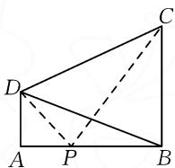
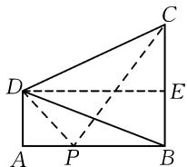
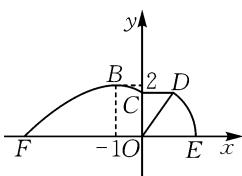
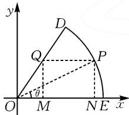
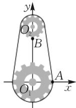

# 三角函数在实际问题中的应用

# 广东省中山一中 周增钦

摘要:三角函数是高中数学重要的函数类型,在解决实际问题中较为常用.基于三角函数在实际问题中的应用情境,可以分为几何测量类、工程建设类以及工业设计类三种类型.本文中依托几道习题,展示三角函数的具体应用,以供参考.

关键词:高中数学;三角函数;实际问题;应用

运用三角函数解决实际问题,涉及的知识点有三角函数恒等变换、三角函数的性质、辅助角公式等.解题的关键在于以角度为桥梁构建三角函数,建立角度与线段、面积的函数关系,在一定的范围内进行讨论、计算出结果.

# 1 几何测量类

几何测量类实际问题在高中数学中较为常见,要求的问题有:求建筑物的高度、求视角的角度、求两点的距离等 $^{[1]}$ .运用三角函数解答几何测量类实际问题应通过审题明确所给的角度、线段,必要情况下对照所给的图形作出对应的辅助线,结合几何图形的性质理顺角度与角度、线段与线段之间的内在关联,借助三角函数的定义构建函数关系.

例 1 如图 1, AD, BC 为某地两座高分别为 30 m, 75 m 的高塔. 在高塔顶部的 D 点测得另一高塔的底部 B 点和顶部 C 点的视角为 $45^{\circ}$ (即 $\angle BDC = 45^{\circ}$ ), 其中 A, B 处在同一水平面上, 且 AD 和 BC 均和地面 AB 垂直.

  
图 1

(1)求两个高塔底部 A, B 之间的距离；  
(2)该地准备将这个两座高塔打造成旅游景点,因此,准备在AB之间选择一点P建设观景台,当达到最佳的观赏效果时(即 $\angle DPC$ 的角度最大),观景台P应该搭建在距离A点多远的位置?

解析:(1)过点 D 向 BC 作垂线,垂足为 E,如图 2.

设 $\angle CDE = \theta, AB = x$ ，由题意知 $\angle BDE = \frac{\pi}{4} - \theta$ . 易得 $AD =$

$$
B E = 3 0, C E = B C - B E = 7 5 -
$$

$$
3 0 = 4 5, \text {则} \tan \theta = \frac {C E}{D E} = \frac {4 5}{x}, \tan \left(\frac {\pi}{4} - \theta\right) = \frac {B E}{D E} = \frac {3 0}{x}.
$$

所以

  
图2

$$
\begin{array}{l} \tan \angle B D C = \tan \left[ \theta + \left(\frac {\pi}{4} - \theta\right) \right] \\ = \frac {\tan \theta + \tan \left(\frac {\pi}{4} - \theta\right)}{1 - \tan \theta \cdot \tan \left(\frac {\pi}{4} - \theta\right)} \\ = \frac {\frac {4 5}{x} + \frac {3 0}{x}}{1 - \frac {1 3 5 0}{x ^ {2}}} = 1. \\ \end{array}
$$

整理得 $x^{2}-75x-1\ 350=0$ ，即 $(x-90)(x+15)=0$ ，解得 x=90 或 x=-15（舍去），所以两个高塔底部 A，B 之间的距离为 90 m.

(2) 设 $AP = a (0 < a < 90)$ ，则 BP = 90 - a，于是 $\tan\angle DPA=\frac{DA}{AP}=\frac{30}{a},\tan\angle BPC=\frac{CB}{PB}=\frac{75}{90-a}$ ，则

$$
\tan \angle D P C = - \tan (\angle D P A + \angle B P C) =
$$

$$
- \frac {\tan \angle D P A + \tan \angle B P C}{1 - \tan \angle D P A \cdot \tan \angle B P C} = - \frac {\frac {3 0}{a} + \frac {7 5}{9 0 - a}}{1 - \frac {3 0}{a} \cdot \frac {7 5}{9 0 - a}} =
$$

$$
\frac {4 5 (a + 6 0)}{a ^ {2} - 9 0 a + 2 2 5 0}.
$$

令 $m=a+60\in(60,150)$ ，则 a=m-60，于是

$$
\tan \angle D P C = \frac {4 5 m}{(m - 6 0) ^ {2} - 9 0 (m - 6 0) + 2 2 5 0} =
$$

$$
\frac {4 5}{m + \frac {1 1 2 5 0}{m} - 2 1 0} \leqslant \frac {4 5}{2 \sqrt {m \cdot \frac {1 1 2 5 0}{m}} - 2 1 0} = \frac {2 1 + 1 5 \sqrt {2}}{2},
$$

当且仅当 $m=\frac{11\ 250}{m}$ ，即 $m=75\sqrt{2}$ 时等号成立。由于 $\angle DPC$ 为锐角，因此 $a=75\sqrt{2}-60$ 时， $\angle DPC$ 的角度最大，此时观景台 P 应该距离 A 点 $(75\sqrt{2}-60)\mathrm{~m}$ 。

点评:该题主要考查正切函数的定义、正切函数的和角公式、基本不等式等知识.解题时应注意以下三点.其一,结合所给的图形以及要求的问题合理设出对应线段的长度,结合正切函数定义以及角度关系构建方程；其二，正确应用正切函数的和角公式展开，计算构建的方程；其三，计算过程中能够根据需要进行换元、转化，灵活运用基本不等式知识求得结果.

# 2 工程建设类

工程建设类实际问题是高中数学中又一常见的实际问题,考查应用高中数学知识解决实际问题的能力 $^{[2]}$ .其中三角函数是解决工程建设类实际问题的常用知识.解题应深刻理解题意,运用已知条件积极求解对应的线段、角度,尤其是结合要求的问题构建三角函数,明确对应角度的取值范围,结合三角函数的性质,计算出结果.

例 2 如图 3 所示, EF 是一条道路. 在该道路的一侧准备修建一条新步道. 新步道由曲线段 FBC、线段 CD 和圆弧 DE 构成. 其中曲线 FBC 符合函数 $y = A \sin\left(\omega x + \frac{2\pi}{3}\right) (A >$

text_image

y
B 2 D
C
F -1 O E x

图3

$0, \omega > 0), x \in [-4, 0]$ 时的图象，其中最高点 $B$ 的坐标为 $(-1, 2)$ . 线段 $CD$ 长 $1\mathrm{km}$ 且和 $EF$ 平行，圆弧 $DE$ 以 $O$ 为圆心.

(1)求曲线段段 FBC 的解析式.

(2) 若在扇形 ODE 内建设一个尽可能大的矩形服务站 MNPQ，要求 MN 紧靠在道路 EF 上，点 Q 在半径 OD 上，点 P 在圆弧 DE 上，若 $\angle POE = \theta$ ，记矩形 MNPQ 的面积为 $S(\theta)$ .

(i)求 $\angle DOE$ 的大小；

(ii) 当 $\theta$ 为何值时, $S(\theta)$ 取得最大值, 并求出这个最大值.

解析:(1)由图可知 A=2, 则 $y=2\sin\left(\omega x+\frac{2\pi}{3}\right)$ .
由 $x \in [-4, 0]$ ，可得 $\frac{T}{4} = -1 - (-4) = 3$ ，则 T = 12.
由 $T=\frac{2\pi}{\omega}$ ，易得 $\omega=\frac{\pi}{6}$ . 所以 $y=2\sin\left(\frac{\pi}{6}x+\frac{2\pi}{3}\right)$ ， $x \in [-4, 0]$ .

(2)根据题意画图,如图4.

(i) 由 $y = 2\sin \left( \frac{\pi}{6} x + \frac{2\pi}{3} \right)$ , $x \in [-4,0]$ , 令 $x = 0$ , 得到 $y = 2\sin \frac{2\pi}{3} = \sqrt{3}$ , 即 $OC = \sqrt{3}$ , 于是$\tan \angle COD = \frac{CD}{CO} = \frac{1}{\sqrt{3}} = \frac{\sqrt{3}}{3}$ ，则

$\angle COD = \frac{\pi}{6}$ , 所以 $\angle DOE = \frac{\pi}{2} - \frac{\pi}{6} = \frac{\pi}{3}$ .

text_image

y
D
Q
P
θ
O
M
N
E
x

图4

(ii) 由(i)易得 $OD = OP = 2$ ，在矩形MNPQ中 $QM = PN = 2\sin \theta, ON = 2\cos \theta.$ 在Rt△OQM中，$OM = \frac{QM}{\tan\frac{\pi}{3}} = \frac{2\sin\theta}{\sqrt{3}}$ ，则 $MN = ON - OM = 2\cos \theta -$

$\frac{2\sin\theta}{\sqrt{3}}$ ，故 $S(\theta)=QM\cdot MN=2\sin\theta\left(2\cos\theta-\frac{2\sin\theta}{\sqrt{3}}\right)=$

$4\sin\theta\cos\theta-\frac{4\sqrt{3}}{3}\sin^{2}\theta=2\sin2\theta+\frac{2\sqrt{3}}{3}\cos2\theta-\frac{2\sqrt{3}}{3}=$

$\frac{4\sqrt{3}}{3}\sin \left(2\theta +\frac{\pi}{6}\right) - \frac{2\sqrt{3}}{3}.$

由 $\theta \in \left(0, \frac{\pi}{3}\right)$ , 得 $\frac{\pi}{6} < 2\theta + \frac{\pi}{6} < \frac{5\pi}{6}$ , 于是 $\frac{1}{2} < \sin \left(2\theta + \frac{\pi}{6}\right) \leqslant 1$ , 则当 $\sin \left(2\theta + \frac{\pi}{6}\right) = 1$ , 即 $\theta = \frac{\pi}{6}$ 时,

$S(\theta)$ 取得最大值, 最大值为 $\frac{4\sqrt{3}}{3}-\frac{2\sqrt{3}}{3}=\frac{2\sqrt{3}}{3}$ .

点评:该题考查三角函数中 $\omega$ 和周期 T 的关系、辅助角公式、三角函数性质等.解题时,一方面要注重数形结合,从图形中建立形与数的联系,求出对应的参数;另一方面,在对构建的三角函数进行整理、化简时,应注重联系三角函数辅助角公式,尤其注意对应角度的取值范围,确保计算的正确性.

# 3 工业设计类

三角函数是解决部分工业设计类实际问题的重要工具.解题时应结合实际问题情境,联系三角函数的定义,明确三角函数中 $\omega,\varphi$ 表示的实际意义,以构建正确的三角函数.需要注意的是三角函数与其他函数联系紧密,在运算的过程中应注意通过换元化陌生为熟悉,确保问题得以高效、顺利解决.

例 3 如图 5 为两个齿轮传动的示意图. 上下两个齿轮的半径分别为 1 和 2, 两齿轮中心 $O_{2}, O_{1}$ 处在同一直线上且 $O_{2}O_{1}=5$ . 初始时, B 点为上齿轮的最下端, A 点为下齿轮的最右端. 下齿轮以 1 rad/s 的速度逆时针旋转, 并带动上齿轮运动. 以 $O_{1}$ 为坐标原点建立平面直角坐标系 $xOy$ ，两齿轮转动过程中 $A, B$ 两点的纵坐标分别为 $y_1, y_2$ ，转动时间为 $t \mathrm{s}(t \geqslant 0)$ .

  
图5

(1) 当 t=1 时, 求点 B 绕 $O_{2}$ 转动的弧度数.

(2) 分别写出 $y_{1}, y_{2}$ 关于转动时间的函数表达式, 并求当 t 满足什么条件时, $y_{2} \geqslant 5.5$ .

(3) 若函数 $g(t) = \cos^2 t + y_1 - a$ ，当 $t \in \left[\frac{\pi}{6}, \frac{2\pi}{3}\right]$ 时， $g(t) \geqslant 0$ 恒成立，求 $a$ 的取值范围.

解析:(1)由题意可知两个齿轮转动的弧长是相

等的，则 $r_1\theta_1 = r_2\theta_2$ ，所以 $\theta_{2} = \frac{r_{1}\theta_{1}}{r_{2}} = \frac{2}{1} = 2$ ，即点 $B$ 绕 $O_{2}$ 转动的弧度数为2.

(2) 因为 $r_1 = 2$ ，转过的弧度为 $t$ ，则 $y_1 = 2\sin t$ ；由于 $B$ 点是上轮的最低点，且 $O_2O_1 = 5$ ，则 $y_2 = 5 + \sin \left(2t - \frac{\pi}{2}\right)$ . 由 $y_2 = 5 + \sin \left(2t - \frac{\pi}{2}\right) \geqslant 5.5$ ，得 $2k\pi + \frac{\pi}{6} \leqslant 2t - \frac{\pi}{2} \leqslant 2k\pi + \frac{5\pi}{6} (k \in \mathbf{Z})$ ，解得 $k\pi + \frac{\pi}{3} \leqslant t \leqslant k\pi + \frac{2\pi}{3}$ ，又 $t \geqslant 0$ ，则 $k \in \mathbf{N}$ ，所以 $t$ 满足的条件为 $k\pi + \frac{\pi}{3} \leqslant t \leqslant k\pi + \frac{2\pi}{3}, k \in \mathbf{N}$ .

(3) 结合 (2) 可得, $g(t) = \cos^2 t + 2\sin t - a = -\sin^2 t + 2\sin t + 1 - a \geqslant 0$ , 即 $a \leqslant -\sin^2 t + 2\sin t + 1$ . 由 $t \in \left[\frac{\pi}{6}, \frac{2\pi}{3}\right]$ , 得 $\sin t \in \left[\frac{1}{2}, 1\right]$ , 所以由二次函数性质易得到 $y = -\sin^2 t + 2\sin t + 1$ 的最小值为 $y = -\left(\frac{1}{2}\right)^2 + 2 \times \frac{1}{2} + 1 = \frac{7}{4}$ . 因此, 满足题意的 $a$ 的取值范围为 $\left(-\infty, \frac{7}{4}\right]$ .

点评:该题考查弧度、三角函数性质、二次函数等知识.解题应注意把握以下三个关键点.其一,明确两个齿轮转动过程中不变的量,以构建等量关系;其二,结合三角函数的定义,对照两个齿轮转动的起始位置,构建三角函数;其三,注重通过换元将三角函数问题转化为在一定范围内求二次函数的最值问题.

综上所述，三角函数在解决实际问题中应用广泛。为更好地解决高中数学中常见的几何测量类、工程建设类以及工业设计类实际问题，应注重夯实基础，熟练掌握三角函数的定义、性质。同时，应注意认真审题，吃透题意，对照图形建立正确的三角函数，明确对应角度的取值范围，并通过三角函数运算公式、辅助角公式、换元等的应用提高运算效率。

# 参考文献：

[1]赵文强.高中数学三角函数解题策略及实践应用[J].数理天地(高中版),2025(11):10-11.

[2]杨生涛.构造合适的三角函数模型,快速解答实际应用问题[J].语数外学习(高中版上旬),2024(10):47.Z

# (上接第98页)

$x\mathrm{e}^{\frac{1}{2}x}-\mathrm{e}^{x}<-1$ 对 $x>0$ 恒成立，即证 $x<\mathrm{e}^{\frac{1}{2}x}-\frac{1}{\mathrm{e}^{\frac{1}{2}x}}$ 对 $x>0$ 恒成立。令 $t=\mathrm{e}^{\frac{1}{2}x}>1$ ，则 $x=2\ln t$ ，转化为证明 $2\ln t<t-\frac{1}{t}$ 对 $t>1$ 恒成立。令 $p(t)=t-\frac{1}{t}-2\ln t$ ( $t>1$ )，则 $p'(t)=1+\frac{1}{t^{2}}-\frac{2}{t}=\frac{(t-1)^{2}}{t^{2}}>0$ ，所以 $p(t)>p(1)=0$ ，从而 $x\mathrm{e}^{\frac{1}{2}x}-\mathrm{e}^{x}<-1(x>0)$ 成立。因此 $a$ 的取值范围为 $\left(-\infty,\frac{1}{2}\right]$ 。

例 3 （节选自 2020 年新课标 I 卷理 · 21）已知函数 $f(x) = \mathrm{e}^{x} + ax^{2} - x$ . 当 $x \geqslant 0$ 时, $f(x) \geqslant \frac{1}{2} x^{3} + 1$ , 求 a 的取值范围.

解析：当 $x \geqslant 0$ 时， $f(x) \geqslant \frac{1}{2} x^3 + 1$ 恒成立，取 $x = 2$ ，则 $f(2) = \mathrm{e}^2 + 4a - 2 \geqslant 5$ ，解得 $a \geqslant \frac{7 - \mathrm{e}^2}{4}$ .

下面证明当 $a \geqslant \frac{7 - \mathrm{e}^2}{4}$ 时， $f(x) \geqslant \frac{1}{2} x^3 + 1$ 恒成立.

当 $a \geqslant \frac{7 - \mathrm{e}^2}{4}$ 时， $f(x) = \mathrm{e}^x + ax^2 - x \geqslant \mathrm{e}^x + \frac{7 - \mathrm{e}^2}{4} \cdot x^2 - x$ .

题意转化为证明 $\mathrm{e}^x +\frac{7 - \mathrm{e}^2}{4} x^2 -x\geqslant \frac{1}{2} x^3 +1$ $(x\geqslant 0)$ ，即 $\frac{(\mathrm{e}^2 - 7)x^2 + 4x + 2x^3 + 4}{\mathrm{e}^x}\leqslant 4$ 恒成立.

令 $h(x) = \frac{(\mathrm{e}^2 - 7)x^2 + 4x + 2x^3 + 4}{\mathrm{e}^x}, x \geqslant 0.$

易得 $h'(x)=\frac{(13-\mathrm{e}^{2})x^{2}+2(\mathrm{e}^{2}-9)x-2x^{3}}{\mathrm{e}^{x}}=$ $\frac{-x\left[2x^{2}-(13-\mathrm{e}^{2})x-2(\mathrm{e}^{2}-9)\right]}{\mathrm{e}^{x}}.$

整理, 可得 $h'(x)=\frac{-x(x-2)[2x+(\mathrm{e}^{2}-9)]}{\mathrm{e}^{x}}$ .
所以当 $x \in \left[0, \frac{9 - e^{2}}{2}\right]$ 时， $h'(x) < 0, h(x)$ 单调递减；
当 $x \in \left(\frac{9 - e^{2}}{2}, 2\right), h'(x) > 0, h(x)$ 单调递增；当 $x \in (2, +\infty), h'(x) < 0, h(x)$ 单调递减.

所以 $[h(x)]_{\max} = \max \{h(0), h(2)\} = 4$ ，即 $h(x) \leqslant 4$ . 当 $a \geqslant \frac{7 - e^2}{4}$ 时， $f(x) \geqslant \frac{1}{2} x^3 + 1$ 恒成立.

综上,可得 a 的取值范围为 $\left[\frac{7-\mathrm{e}^{2}}{4},+\infty\right)$ .

因此,中学数学课堂,让学生充分掌握分离参数和直接含参讨论思想,领悟函数为主线的教材主线,适当渗透如上述的先必要再充分的策略,可以提升学生数学素养,起到提质增效的作用. Z