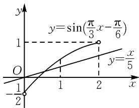

# 以变换之钥开启高中数学解题之门

# 广东省信宜市信宜中学 董倍源

摘要:高中数学习题灵活多变,解题思路不尽相同.对于部分习题,根据解题需要进行针对性变换,可以少走弯路,迅速找到突破口.其中的变换包括平移变换、对称变换、伸缩变换.教学中,教师应注重展示这些变换在解题中的应用,帮助学生叩开解题之门.

关键词:高中数学;变换;解题

变换既是一种解题方法,也是一种解题智慧.平移变换、对称变换、伸缩变换是高中数学中常见的变换方式 $^{[1]}$ .教学中,为使学生灵活运用这些变换顺利解答相关习题,教师应注重为学生讲解这些变换的基础知识,帮助学生把握、理解相关的变换细节,能够根据具体的问题情境选择对应的变换形式,确保变换的合理性,为顺利、正确解题奠定坚实基础.

# 1 平移变换

在数学中,平移变换指在平面内将一个图形按照一定的方向移动一定距离的运动.图形在平移变换的过程中自身的形状不会发生改变,但是图形中各点的坐标会发生一定的改变.在高中数学中,平移变换主要指函数图象的平移变换,并根据平移的方向分为左右平移、上下平移两种变换类型.其中左右平移会影响函数自变量 x 的取值范围,而上下平移会影响函数的值,并且经过平移变换后函数图象对应的解析式会发生改变.深入理解、掌握函数图象平移变换规律、函数图象平移变换与函数解析式的对应关系,往往是求解相关习题的关键.

例 1 设 a > 0，已知函数 $f(x) = \ln(x^{2} + ax + 2)$ 的两个不同的零点 $x_{1}, x_{2}$ ，满足 $\left|x_{1} - x_{2}\right| = 1$ ，若将该函数的图象向右平移 $m (m > 0)$ 个单位长度后得到一个偶函数的图象，则 m = \_\_\_\_.

解析: 函数 $f(x)=\ln(x^{2}+ax+2)$ 有两个不同的零点对应一元二次方程 $x^{2}+ax+1=0$ 有两个不等实根，结合根与系数的关系求出 a 的值。结合函数图象的平移变换及偶函数的性质构建新的方程，通过解方程得出结果。

令 $f(x) = 0$ ，故 $\ln (x^2 +ax + 2) = 0$ ，则 $x^{2} + ax+$ $2 = 1$ ，即 $x^{2} + ax + 1 = 0$ ，则 $\Delta = a^2 -4 > 0.$ 由根与系数之间的关系，可得 $x_{1} + x_{2} = -a,x_{1}x_{2} = 1.$ 由 $|x_{1} - x_{2}| =$ 1，得 $(x_{1} + x_{2})^{2} - 4x_{1}x_{2} = 1$ ，则 $a^2 -4 = 1$ ，解得 $a = \pm \sqrt{5}$

又 $a > 0$ ，则 $a = \sqrt{5}$ ，所以 $f(x) = \ln (x^2 +\sqrt{5} x + 2)$

将 $f(x)$ 的图象向右平移 $m(m>0)$ 个单位长度后，可以得到 $g(x)=\ln\left[(x-m)^{2}+\sqrt{5}(x-m)+2\right]=\ln\left[x^{2}+(\sqrt{5}-2m)x+m^{2}-\sqrt{5}m+2\right]$ .

因为函数 $g(x)$ 为偶函数，故 $g(-x)=g(x)$ ，即 $x^{2}+(2m-\sqrt{5})x+m^{2}-\sqrt{5}m+2=x^{2}+(\sqrt{5}-2m)x+m^{2}-\sqrt{5}m+2$ ，即 $2m-\sqrt{5}=\sqrt{5}-2m$ ，解得 $m=\frac{\sqrt{5}}{2}$ .

点评:解题时,首先需要通过转化求出 a 的值,而后正确运用平移规律表示出平移变换后函数的解析式,再运用偶函数的性质构建等量关系,便不难求出最终的结果.

# 2 对称变换

对称变换是数学中一种常见变换形式,分为轴对称变换、中心对称变换及旋转对称变换等类型.其中轴对称变换、中心对称变换在高中数学中较为常见,尤其一些函数类的习题会考查轴对称变换、中心对称变换相关知识.事实上,无论轴对称变换还是中心对称变换,均可以从函数解析式中分析出来.如由 $f(a+x)=f(a-x)$ 可以看出该函数图象关于直线 x=a 对称;若 $f(x)+f(2a-x)=2b$ ,则函数图象关于点 $(a,b)$ 对称.在解题的过程中,能够根据不同的对称形式写出对应的关系式往往是解题的关键.

例 2 已知函数 $f(x)=\left(\frac{1}{x}+a\right)\ln(x+1)$ ，曲线 $y=f\left(\frac{1}{x}\right)$ 关于直线 x=b 对称，则 a= \_\_\_\_.

解析: 将“ $\frac{1}{x}$ ”代入到 $f(x)=\left(\frac{1}{x}+a\right)\ln(x+1)$ 中, 求出曲线 y 的解析式. 根据曲线 y 关于直线 x=b 对称得出定义域关于直线 x=b 对称, 借此构造方程, 求出 a 的值.

由题意可知，函数 $f(x)$ 的定义域为 $(-1,0)\cup(0,+\infty)$ . 令 $g(x)=y=f\left(\frac{1}{x}\right)=(x+a)\ln\left(1+\frac{1}{x}\right)$ ，其定义域为 $(-∞,-1)\cup(0,+∞)$ .

由于 $y=f\left(\frac{1}{x}\right)$ 关于直线 x=b 对称，则其定义域关于直线 x=b 对称，因此 $b=-\frac{1}{2}$ .

由对称的性质可知 $g(x)=g(-1-x)(x>0)$ . 令 x=1，可得 $g(1)=g(-2)$ ，即 $(1+a)\ln2=(-2+a)\times\ln\left(1-\frac{1}{2}\right)=(2-a)\ln2$ ，则 $1+a=2-a$ ，解得 $a=\frac{1}{2}$ ，此时 $g(x)=\left(x+\frac{1}{2}\right)\ln\left(1+\frac{1}{x}\right)$ ，进一步可得

$$
\begin{array}{c} g (- 1 - x) = \left(- 1 - x + \frac {1}{2}\right) \ln \left(1 + \frac {1}{- 1 - x}\right) = \\ - \left(x + \frac {1}{2}\right) \ln \left(\frac {x}{1 + x}\right) = \left(x + \frac {1}{2}\right) \ln \left(1 + \frac {1}{x}\right) = g (x). \end{array}
$$

所以 $a=\frac{1}{2}$ .

点评:该题难度不大,解题的关键在于从所给的条件入手进行推理,得出定义域关于直线 x=b 对称,根据 $g(x)=g(-1-x)(x>0)$ 构造方程,求出 a 的值,并进行验证.

# 3 伸缩变换

数学中，伸缩变换指将平面图形在坐标轴方向上按照一定的比例进行拉伸或者压缩 $^{[2]}$ . 在高中数学中主要体现在三角函数图象在坐标轴方向上的拉伸或压缩. 以三角函数 $y = \sin x$ 变换至函数 $y = A \sin (\omega x + \varphi) (A > 0, \omega > 0)$ 为例，其中“A”表示将三角函数 $y = \sin x$ 的图象在 y 轴上拉伸 (A > 1) 或压缩 (0 < A < 1) 为原来的 A 倍; “ $\omega$ ”表示将三角函数 $y = \sin x$ 的图象在 x 轴上拉伸 (0 < $\omega < 1$ ) 或压缩 ( $\omega > 1$ ) 为原来的 $\frac{1}{\omega}$ 倍. 正确理解这些变换关系，关系着能否顺利解答相关习题.

例3 将函数 $y = \sin x$ 的图象向右平移 $\frac{\pi}{6}$ 个单位长度，再将横坐标缩短为原来的 $\frac{1}{\omega} (\omega > 0)$ 得到函数 $y = f(x)$ 的图象，若函数 $y = f(x)$ 在区间 $\left[0, \frac{\pi}{3}\right]$ 上的最大值为 $\frac{\omega}{5}$ ，则 $\omega$ 的取值个数为（ ）.

A.1

B.2

C.3

D.4

解析: 将函数 $y = \sin x$ 的图象根据已知条件进行变换, 求出函数 $y = f(x)$ 的解析式. 同时, 结合三角函数的性质分析 $f(x) = \sin\left(\omega x - \frac{\pi}{6}\right)$ 在定义域上的取值, 通过分类讨论得出满足题意的 $\omega$ 的个数.

根据题意平移及伸缩变换后函数 $y=\sin x$ 的图象变为函数 $y=f(x)=\sin\left(\omega x-\frac{\pi}{6}\right)$ 的图象.

由 $x \in \left[0, \frac{\pi}{3}\right]$ , 得 $\omega x - \frac{\pi}{6} \in \left[-\frac{\pi}{6}, \frac{\pi}{3} \omega - \frac{\pi}{6}\right]$ .

当 $\frac{\pi}{3}\omega -\frac{\pi}{6}\geqslant \frac{\pi}{2}$ 即 $\omega \geqslant 2$ 时， $\frac{\omega}{5} = 1$ ，解得 $\omega = 5$

当 $\frac{\pi}{3}\omega -\frac{\pi}{6} < \frac{\pi}{2}$ 即 $0 <   \omega <  2$ 时，可以得到 $f(x) =$

$\sin\left(\frac{\pi}{3}\omega-\frac{\pi}{6}\right)=\frac{\omega}{5}$ ，据此作出函数 $y=\sin\left(\frac{\pi}{3}x-\frac{\pi}{6}\right)$ 与 $y=\frac{x}{5}$ 的图象，如图 1 所示.

line

| x    | y=sin(π/3 x-π/6) | y=x/5 |
| ---- | ----------------- | ----- |
| -1/2 | -1                | -1    |
| 0    | 0                 | 0     |
| 1    | 1                 | 1     |
| 2    | 2                 | 2     |

图1

由图1可知函数 $y = \sin \left(\frac{\pi}{3} x - \frac{\pi}{6}\right)$ 的图象和函

数 $y=\frac{x}{5}$ 的图象，在 $x\in(0,2)$ 上有唯一交点，即 $\sin\left(\frac{\pi}{3}\omega-\frac{\pi}{6}\right)=\frac{\omega}{5}$ 有唯一解.

综上可知, $\omega$ 的取值个数为2.故答案选:B.

点评:该题主要考查两个非常重要的知识点.其一,三角函数图象的平移及伸缩变换;其二,三角函数的图象,并根据实际情况进行分类讨论.在进行三角函数变换时,应注意平移变换和伸缩变换的区别.在进行分类讨论时,应注意联系三角函数 $y=\sin x$ 图象的特点.

综上所述，平移变换、对称变换、伸缩变换对应的规则并不相同。教学的过程中，教师应注重引导学生亲自进行探寻，使学生牢固掌握对应的变换规则，明确三种变换的区别。同时，展示三种变换的具体应用，使学生感受三种变换的重要价值，积累变换的经验与技巧，促进学生解题能力的提高。

# 参考文献：

[1]廖国凤.浅析高中数学四大变换[J].新课程学习(中),2013(3):58-59.  
[2]汪秀峰.高中数学三角函数解题中变换思想的有效运用[J].数理天地(高中版),2024(7):59-60.Z