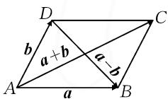
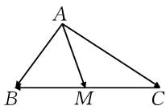
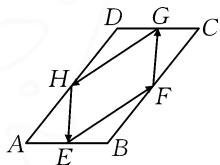
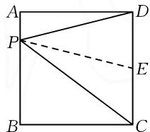
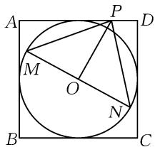
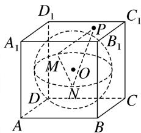
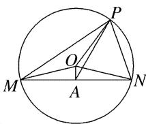
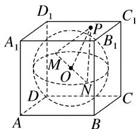

# 依托教材的习题,极化恒等式应用

# ● 安徽省宣城中学 王剑

摘要: 平面向量中的极化恒等式, 是高中平面向量部分中一个非常重要的恒等式, 依托教材课后习题来展示与应用, 有效串联起平面向量与几何长度(数量)之间的关系. 借助极化恒等式及其相关内容, 通过典型实例, 就极化恒等式在平面几何相关问题中, 以及在其他知识交汇与综合中的应用加以剖析, 归纳总结解题技巧与应对策略, 有效指导数学教学与解题研究.

关键词: 平面向量; 数量积; 极化恒等式; 求值; 最值

平面向量的极化恒等式,是依托教材课后习题的一个重要公式,在解决与平面向量的数量积及其相关的综合问题时,可以合理构建平面向量的相关知识、几何元素等数量之间的关系,建立平面向量、平面几何、函数与方程等之间的交汇与融合,合理有效地处理与之相关的一些综合问题.

# 1 极化恒等式

# 1.1 立足教材习题

通过人教 A 版(2019 年)必修第二册第 22 页练习第 3 题, 我们可以知道, 在平面向量中, 由 $(a + b)^{2} = a^{2} + b^{2} + 2a \cdot b, (a - b)^{2} = a^{2} + b^{2} - 2a \cdot b$ , 两式相减可得极化恒等式 $a \cdot b = \frac{1}{4}[(a + b)^{2} - (a - b)^{2}]$ .

# 1.2 几何意义解释

# (1)平行四边形模型

平面向量的数量积等于“和对角线长”与“差对角线长”平方差的 $\frac{1}{4}$ ，即 $a\cdot b=\frac{1}{4}\left[(a+b)^{2}-(a-b)^{2}\right]$ （如图1所示）.

  
图1

# (2)三角形模型

在三角形中,两边所对应的平面向量的数量积,等于三角形中第三边的中线长与其边长的一半的平方差,即 $\overrightarrow{AB}\cdot\overrightarrow{AC}=\overrightarrow{AM^{2}}-\overrightarrow{MB^{2}}$ (M为BC的中点)(如图2所示).

  
图2

极化恒等式表明,平面向量的数量积可以由平面向量的模来表示,由此建立起平面向量与几何长度之间的等量关系.

# 2 极化恒等式应用

# 2.1 数量积的求值问题

例 1 （1）设向量 a, b 满足 $\left|a + b\right| = \sqrt{10}$ , $\left|a - b\right| = \sqrt{6}$ ，则 $a \cdot b = (\quad)$ .

A.1

B.2

C.3

D.5

(2)如图3所示,在平行四边形ABCD中,AB=1,AD=2,点E,F,G,H分别是AB,BC,CD,AD边上的中点,则 $\overrightarrow{EF}\cdot\overrightarrow{FG}+\overrightarrow{GH}\cdot\overrightarrow{HE}=$ \_\_\_\_.

  
图3

解析:(1)常规方法:由 $|a+b|=\sqrt{10}$ ,得

$$
(a + b) ^ {2} = a ^ {2} + 2 a \cdot b + b ^ {2} = 1 0. \tag {①}
$$

又 $|\pmb {a} - \pmb {b}| = \sqrt{6}$ ，则

$$
(a - b) ^ {2} = a ^ {2} - 2 a \cdot b + b ^ {2} = 6. \tag {②}
$$

由①一②，可得 $4a \cdot b = 4$ ，所以 $a \cdot b = 1$ 。

故选择:A.

极化恒等式法: 由极化恒等式, 可得 $a \cdot b = \frac{1}{4}[(a + b)^{2} - (a - b)^{2}] = \frac{1}{4}(|a + b|^{2} - |a - b|^{2}) = \frac{1}{4}(10 - 6) = 1.$

故选择:A.

(2) 连接 EG, FH 交于点 O (图略).

结合极化恒等式, 可得 $\overrightarrow{EF} \cdot \overrightarrow{FG} = \overrightarrow{EO}^{2} - \overrightarrow{OF}^{2} = 1 - \left(\frac{1}{2}\right)^{2} = \frac{3}{4}, \overrightarrow{GH} \cdot \overrightarrow{HE} = \overrightarrow{GO}^{2} - \overrightarrow{OH}^{2} = 1 - \left(\frac{1}{2}\right)^{2} = \frac{3}{4}.$

因此 $\overrightarrow{EF} \cdot \overrightarrow{FG} + \overrightarrow{GH} \cdot \overrightarrow{HE} = \frac{3}{4} + \frac{3}{4} = \frac{3}{2}$ .

故填： $\frac{3}{2}$ .

点评:利用平面向量的极化恒等式,可以快速对共起点(终点)的两平面向量的数量积问题进行转化,构建平面向量的相关知识、几何元素等数量之间的关系，建立平面向量、平面几何、函数与方程等之间的交汇与融合。对于不共起点和不共终点的平面向量问题，可以通过平移等价转化为共起点（终点）的两平面向量的数量积问题，从而利用极化恒等式解决。

# 2.2 数量积的最值(或取值范围)

例 2 （1）已知正方形 ABCD 的面积为 2，点 P 在边 AB 上，则 $\overrightarrow{PD} \cdot \overrightarrow{PC}$ 的最大值是（）.

A. $\frac{9}{2}$

B.2

C. $\frac{3}{2}$

D. $\frac{3}{4}$

(2)已知正方形的边长为1,点P为其四条边上的一个动点,该正方形有一内切圆,MN是内切圆的一条弦,当弦MN的长度最大时,则 $\overrightarrow{PM}\cdot\overrightarrow{PN}$ 的取值范围是\_\_\_\_.

解析:(1)如图4所示,取CD的中点E,连接PE.

由极化恒等式，得 $\overrightarrow{PD} \cdot \overrightarrow{PC} = \overrightarrow{PE}^2 - \overrightarrow{EC}^2 = |\overrightarrow{PE}|^2 - \frac{1}{2}$ .

text_image

A
P
D
E
B
C

图4

所以当点 $P$ 与点 $A(B)$ 重合

时， $|\overrightarrow{PE}| = \sqrt{\frac{5}{2}}$ 最大，从而 $(\overrightarrow{PD} \cdot \overrightarrow{PC})_{\max} = 2.$

故选择:B.

(2) 如图 5 所示, 设正方形 ABCD 的内切圆为圆 O.

当弦 $MN$ 的长度最大时， $MN$ 为圆 $O$ 的一条直径，此时 $\overrightarrow{PM} \cdot \overrightarrow{PN} = |\overrightarrow{PO}|^2 - |\overrightarrow{OM}|^2 = |\overrightarrow{PO}|^2 - \frac{1}{4}$ .

text_image

A
P
D
M
O
N
B
C

图5

当点 P 为正方形 ABCD 的某边的中点时, 易得 $\left|\overrightarrow{OP}\right|_{\min}=\frac{1}{2}$ ;

当点 P 与正方形 ABCD 的顶点重合时, 易得 $\left|\overrightarrow{OP}\right|_{\max}=\frac{\sqrt{2}}{2}$ .

所以 $\frac{1}{2} \leqslant |\overrightarrow{OP}| \leqslant \frac{\sqrt{2}}{2}$ .

因此， $\overrightarrow{PM}\cdot\overrightarrow{PN}=|\overrightarrow{PO}|^{2}-\frac{1}{4}\in\left[0,\frac{1}{4}\right].$

故填： $\left[0,\frac{1}{4}\right]$ .

点评:利用极化恒等式时,特别对于求解涉及平面向量的数量积的最值(或取值范围)及其综合应用问题,关键在于取三角形模型状态下第三边的中点,找到三角形的中线,再写出极化恒等式.必要时可以借助图形直观来合理想象,数形结合.

# 2.3 综合应用

例 3 (1) 已知直线 $ax + by + c = 0$ 与圆 $O: x^{2} +$

$y^{2}=16$ 相交于 M, N 两点, 若 $c^{2}=a^{2}+b^{2}$ , P 为圆 O 上的任意一点, 则 $\overrightarrow{PM}\cdot\overrightarrow{PN}$ 的取值范围为 \_\_\_\_.

(2)如图6所示,在棱长为2的正方体 $ABCD-A_{1}B_{1}C_{1}D_{1}$ 中,MN是其内切球球O的一条弦(球面上任意两点连成的线段为球的弦),点P为该正方体表面上的一个动点,当弦MN的长度最大时,则 $\overrightarrow{PM}\cdot\overrightarrow{PN}$ 的取值范围为\_\_\_\_.

text_image

D₁
A₁
M
O
N
D
B
C₁
P
B₁
A
B

图6

解析:由 $a^{2}+b^{2}=c^{2}$ ，可知圆心 O 到直线 $ax+by+c=0$ 的距离 $d=\frac{|c|}{\sqrt{a^{2}+b^{2}}}=1$ .

如图 7, 设 MN 的中点为 A, 则 $\overrightarrow{PM} \cdot \overrightarrow{PN} = |\overrightarrow{PA}|^{2} - |\overrightarrow{AM}|^{2} = |\overrightarrow{PA}|^{2} - 15.$

因为 $|\overrightarrow{OP}| - |\overrightarrow{OA}| \leqslant |\overrightarrow{PA}| \leqslant |\overrightarrow{OP}| + |\overrightarrow{OA}|$ ，所以 $3 \leqslant |\overrightarrow{PA}| \leqslant 5$ .

所以 $\overrightarrow{PM} \cdot \overrightarrow{PN} = |\overrightarrow{PA}|^{2} - 15 \in [-6, 10]$ ，即 $\overrightarrow{PM} \cdot \overrightarrow{PN}$ 的取值范围为 $[-6, 10]$ .

故填： $[-6,10]$ .

(2) 当弦 MN 的长度最大时, MN 为球 O 的直径, 连接 PO, 如图 8 所示.

于是 $\overrightarrow{PM} \cdot \overrightarrow{PN} = \overrightarrow{PO^{2}} - \overrightarrow{ON^{2}} = \overrightarrow{PO^{2}} - 1.$

因为 P 为正方体表面上的动点, 所以 $PO \in [1, \sqrt{3}]$ , 从而 $\overrightarrow{PM} \cdot \overrightarrow{PN} \in [0, 2]$ .

text_image

P
O
M
A
N

图 7

text_image

D₁
A₁
P
C₁
B₁
M
O
N
D
A
B
C

图8

故填：[0,2].

点评:在解决一些与平面向量相关的综合应用问题时,如解析几何问题、立体几何问题等,经常也可以通过平面向量的数量积公式,利用平面向量的线性运算或极化恒等式的恒等变形与转化,化归解析几何或立体几何等问题中相应的代数式,并借助几何图形直观来数形结合、直观想象与逻辑推理.

其实,借助平面向量中的极化恒等式,可以很好地构建起平面向量(向量)与几何长度(数量)之间的数量关系,利用代数思维与几何思维之间的联系,形成知识之间的联系与沟通.特别对于解决与平面向量中的数量积、模及其相关的综合应用问题时,结合数值求解、最值确定或取值范围的应用等,实现知识与能力的兼顾与综合.Z