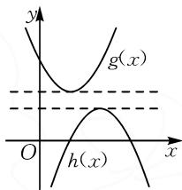
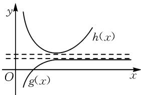
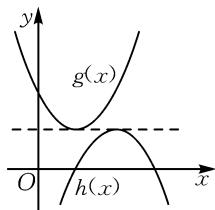
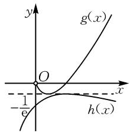
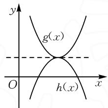

# 凹凸反转法,巧证不等式

# 江苏省丹阳市马相伯高级中学 李梦婷

摘要: 利用函数与导数的综合应用证明不等式时, 经常通过两个函数的最值转化来实现, 即为“凹凸反转法”. 本文中结合“凹凸反转法”中的隔海相望、一线之隔以及亲密无间三种类型, 合理进行实例剖析与应用, 归纳并总结证明技巧与方法.

关键词: 函数; 导数; 不等式; 证明; 凹凸反转

在利用函数与导数的综合应用来证明不等式时，若要证明的不等式由指数函数、对数函数、多项式函数等结构形式组合而成，往往需要进行指、对巧妙分离，转化为证明两个函数 $g(x), h(x)$ 之间的不等关系 $g(x) \geqslant h(x)$ ，即通过分别求两个函数的最值来证明。证明时，由于两个函数图象的凹凸性正好相反，因此将这种证明不等式的方法称为“凹凸反转法”。“凹凸反转法”可以非常巧妙有效地证明一些相关的不等式问题，下面结合常见的几种典型类型，合理归纳总结，抛砖引玉。

# 1 隔海相望

在证明不等式过程中,如图1所示,在函数 $g(x)$ , $h(x)$ 的图象中基于直线 $y = g(x)_{\min}$ 和直线 $y = h(x)_{\max}$ 之间有一个带型区域,所以我们把它形象地称为“隔海相望”.这时必有 $g(x)_{\min} > h(x)_{\max}$ .借助“隔海相望”,能够实现不等式的证明.

text_image

y
g(x)
O
h(x)
x

图1

例 1 已知函数 $f(x)=x\ln x$ ，求证： $f(x)<2e^{x-2}$ .

证明: 要证 $f(x) < 2 \mathrm{e}^{x-2} (x > 0)$ ，即证 $x \ln x < 2 \mathrm{e}^{x-2}$ ，即证 $\frac{\ln x}{x} < \frac{2}{\mathrm{e}^{2}} \cdot \frac{\mathrm{e}^{x}}{x^{2}}$ .

令函数 $g(x)=\frac{\ln x}{x}, h(x)=\frac{2}{\mathrm{e}^{2}} \cdot \frac{\mathrm{e}^{x}}{x^{2}}.$

对于函数 $g(x)=\frac{\ln x}{x}$ ，求导可得到 $g'(x)=\frac{1-\ln x}{x^{2}}$ ，令 $g'(x)=0$ 得 x=e。所以当 $x\in(0,e)$ 时， $g'(x)>0$ ；当 $x\in(\mathrm{e},+\infty)$ 时， $g'(x)<0$ 。

故函数 $g(x)$ 在 $(0, e)$ 上单调递增，在 $(e, +\infty)$ 上单调递减，则当 x = e 时， $g(x)_{\max} = g(e) = \frac{1}{e}$ .

而对于函数 $h(x)=\frac{2}{\mathrm{e}^{2}}\cdot\frac{\mathrm{e}^{x}}{x^{2}}$ ，求导可得 $h'(x)=$

$\frac{2}{e^{2}}\cdot\frac{x^{2}e^{x}-2xe^{x}}{x^{4}}=\frac{2}{e^{2}}\cdot\frac{e^{x}(x-2)}{x^{3}}$ ，令 $h'(x)=0$ 得
x=2.所以当 $x\in(0,2)$ 时， $h'(x)<0$ ; 当 $x\in(2,+\infty)$

时， $h'(x)>0.$

故函数 $h(x)$ 在 $(0,2)$ 上单调递减，在 $(2,+\infty)$ 上单调递增，所以当 x=2 时， $h(x)_{\min}=h(2)=\frac{1}{2}$ .

text_image

y
h(x)
O
g(x)
x

图2

显然 $\frac{1}{\mathrm{e}} < \frac{1}{2}$ , 即 $g(x)_{\max} < h(x)_{\min}$ , 如图 2, 所以 $g(x) < h(x)$ , 得证.

点评:借助“隔海相望”来证明不等式时,关键在于确定两个不同函数的不同最值情况,并利用 $g(x)_{\max}<h(x)_{\min}$ ,通过两个函数最值之间的明显间隔来实现不等式 $g(x)<h(x)$ 的证明.这里,基于明显的 $g(x)_{\max}<h(x)_{\min}$ ,导致两函数的图象没有相交的点,从而不等式中不能取等号.

# 2 一线之隔

在证明不等式过程中,构造的函数 $g(x)$ , $h(x)$ , 满足 $g(x)_{\min} = h(x)_{\max}$ , 如图 3 所示, 所以我们把它形象地称为“一线之隔”. 但由于 $g(x)$ , $h(x)$ 不在同一处取到最值, 所以必有 $g(x) > h(x)$ . 借助“一线之隔”, 可实现不等式的证明.

text_image

y
g(x)
O
h(x)
x

图 3

例 2 设函数 $f(x)=\mathrm{e}^{x}\ln x+\frac{2\mathrm{e}^{x-1}}{x}$ ，证明： $f(x)>1$ .

证明: 要证 $f(x) > 1$ ，即证 $e^{x} \ln x + \frac{2e^{x-1}}{x} > 1$ ，即证 $x \ln x > x e^{-x} - \frac{2}{e}(x > 0)$ .

设函数 $g(x)=x\ln x$ ，求导可得 $g'(x)=1+\ln x$ ，令 $g'(x)=0$ 得 $x=\frac{1}{e}$ 。所以当 $x\in\left(0,\frac{1}{e}\right)$ 时，

$g^{\prime}(x) < 0$ ；当 $x \in \left(\frac{1}{\mathrm{e}}, +\infty\right)$ 时， $g^{\prime}(x) > 0$ .

所以 $g(x)$ 在 $\left(0, \frac{1}{\mathrm{e}}\right)$ 上单调递减，在 $\left(\frac{1}{\mathrm{e}}, +\infty\right)$ 上单调递增，如图 4. 故函数 $g(x)$ 在 $(0, +\infty)$ 内的最小值为 $g\left(\frac{1}{\mathrm{e}}\right) = -\frac{1}{\mathrm{e}}$ .

text_image

y
g(x)
O
x
-1/6
h(x)

图4

设函数 $h(x)=xe^{-x}-\frac{2}{e}$ ，求导可得 $h'(x)=\mathrm{e}^{-x}(1-x)$ ，令 $h'(x)=0$ 得 x=1。所以当 $x\in(0,1)$ 时， $h'(x)>0$ ；当 $x\in(1,+\infty)$ 时， $h'(x)<0$ 。

所以函数 $h(x)$ 在 $(0,1)$ 上单调递增，在 $(1,+\infty)$ 上单调递减，如图4. 故函数 $h(x)$ 在 $(0,+\infty)$ 内的最大值为 $h(1)=-\frac{1}{e}$ .

综上, 因为 $h(x)$ 与 $g(x)$ 的最值不能同时取得, 所以当 x > 0 时, $g(x) > h(x)$ , 即 $f(x) > 1$ .

点评:借助“一线之隔”证明不等式时,关键在于确定两个不同函数的相同最值情况,并利用 $g(x)_{\min}=h(x)_{\max}$ ,通过两个函数在取最值时不同的自变量情况,以同一直线的位置特征来实现不等式 $g(x)>h(x)$ 的证明.这里,由于两个函数在取最值时自变量的取值不同,导致两函数的图象没有相交的点,从而不等式中不能取等号.

# 3 亲密无间

在证明不等式过程中, 构造函数 $g(x)$ , $h(x)$ , 满足 $g(x)_{\min} = h(x)_{\max}$ , 且 $g(x)$ , $h(x)$ 在同一处取到最值, 如图 5 所示, 所以我们把它形象地称为“亲密无间”. 这时 $g(x) \geqslant h(x)$ . 借助“亲密无间”, 可实现不等式的证明.

text_image

y
g(x)
O
h(x)
x

图5

例 3 （2025 年河北省衡水市高考数学模拟试卷）已知函数 $f(x)=\mathrm{e}\ln x-\mathrm{e}x$ ，证明： $xf(x)-\mathrm{e}^{x}+2\mathrm{e}x\leqslant0$ .

证法 1: 函数转化法 1.

由题意知，要证 $xf(x)-\mathrm{e}^{x}+2\mathrm{e}x\leqslant0$ ，即证 $\mathrm{e}x\ln x-\mathrm{e}x^{2}-\mathrm{e}^{x}+2\mathrm{e}x\leqslant0$ .

因为 $x > 0$ ，所以等价于证明 $\ln x - x + 2\leqslant \frac{\mathrm{e}^x}{\mathrm{e}x}$

设函数 $g(x)=\ln x-x+2,x>0$ ，求导可得 $g'(x)=\frac{1}{x}-1$ ，令 $g'(x)=0$ 得 x=1。所以当 $x\in(0,1)$ 时， $g'(x)>0$ ；当 $x\in(1,+\infty)$ 时， $g'(x)<0$ 。

故函数 $g(x)$ 在 $(0,1)$ 上单调递增，在 $(1,+\infty)$ 上单调递减。所以当 x=1 时， $g(x)_{\max}=g(1)=1$ 。

设函数 $h(x)=\frac{\mathrm{e}^{x}}{\mathrm{e}x}$ ，求导可得 $h'(x)=\frac{\mathrm{e}^{x}(x-1)}{\mathrm{e}x^{2}}$ ，令 $h'(x)=0$ 得 x=1。所以当 $x\in(0,1)$ 时， $h'(x)<0$ ；当 $x\in(1,+\infty)$ 时， $h'(x)>0$ 。

故函数 $h(x)$ 在 $(0,1)$ 上单调递减，在 $(1,+\infty)$ 上单调递增. 所以当 x=1 时， $h(x)_{\min}=h(1)=1$ .

综上，当 $x > 0$ 时， $g(x) \leqslant h(x)$ ，即 $xf(x) - \mathrm{e}^x + 2\mathrm{e}x \leqslant 0$ .

证法 2: 函数转化法 2.

由于 x>0，因此要证 $xf(x)-\mathrm{e}^{x}+2\mathrm{e}x\leqslant0$ ，只需证 $f(x)\leqslant\frac{\mathrm{e}^{x}}{x}-2\mathrm{e}.$

由函数 $f(x)=\mathrm{e}\ln x-\mathrm{e}x$ ，求导可得 $f'(x)=\frac{\mathrm{e}(1-x)}{x}$ ，令 $f'(x)=0$ 解得 x=1。所以当 $x\in(0,1)$ 时， $f'(x)>0$ ；当 $x\in(1,+\infty)$ 时， $f'(x)<0$ 。

故函数 $f(x)$ 在 $(0,1)$ 上单调递增，在 $(1,+\infty)$ 上单调递减。所以当 x=1 时， $f(x)_{\max}=f(1)=-e$ 。

记函数 $g(x) = \frac{\mathrm{e}^x}{x} - 2\mathrm{e}(x > 0)$ ，求导得 $g'(x) = \frac{\mathrm{e}^x(x - 1)}{x^2}$ ，令 $g'(x) = 0$ 得 $x = 1$ 。所以当 $x \in (0,1)$ 时， $g'(x) < 0$ ；当 $x \in (1, +\infty)$ 时， $g'(x) > 0$ 。

故函数 $g(x)$ 在 $(0,1)$ 上单调递减，在 $(1,+\infty)$ 上单调递增。所以当 x=1 时， $g(x)_{\min}=g(1)=-e$ 。

综上，当 x>0 时， $f(x)\leqslant g(x)$ ，即 $xf(x)-\mathrm{e}^{x}+2\mathrm{e}x\leqslant0.$

点评:借助“亲密无间”来证明不等式时,关键在于确定两个不同函数的相同最值情况,并利用 $g(x)_{\min}=h(x)_{\max}$ ,通过两个函数在取最值时相同的自变量情况,以亲密接触的方式来实现不等式 $g(x)\geqslant h(x)$ 的证明.这里,由于两个函数在取最值时自变量的取值相同,导致两函数的图象有公共的交点(准确说应该是切点),从而不等式中可以取等号.

总之，基于“凹凸反转法”来证明不等式时，关键在于对所要证明的不等式进行合理的恒等变换与转化，借助不等号两边两个函数模型的构建，结合经典模型“ $y = \frac{\ln x}{x}$ 或 $y = \frac{x}{\ln x}$ ; $y = x \ln x$ 或 $y = x e^x$ ; $y = \frac{e^x}{x}$ 或 $y = \frac{x}{e^x}$ ; $y = x - \ln x$ 或 $y = x - e^x$ ”等的合理配凑，通过两个函数最值之间的关系，或隔海相望，或一线之隔，或亲密无间，合理化归与转化，实现不等式的巧妙转化与证明. Z