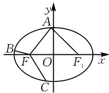

# 创设“动态”场景,探求“静态”定值

# - 江苏省无锡市玉祁高级中学 许志锋

摘要:文中结合椭圆上三个动点与焦点间对应的向量的夹角相等条件,进而确定对应椭圆焦半径的倒数之和为定值,从三角函数思维与特殊思维等层面切入,利用不同的技巧、方法来确定对应的定值问题,总结解题规律与应用.

关键词: 椭圆; 向量; 定值; 余弦定理; 焦半径

圆锥曲线中的定值及其综合应用问题,往往以“动态”场景来创新设置,借助定值这一“静态”数值的求解,实现“动”中取“静”的巧妙应用,成为高考、模拟卷及竞赛等命题中的一个热点与难点问题.

圆锥曲线中的定值及其综合应用问题,是“动”与“静”的辨证统一.它通过相关元素、代数式等的定值求解来创新设置,合理以“动”致“静”,并在“动”中寻觅定值规律,在“动”中巧妙取“定”,实现对基础知识与能力的深度考查.

# 1 试题呈现

[2025届广东省佛山市顺德区普通高中高三教学质量检测(二)数学试卷·14]已知椭圆 $\Gamma:\frac{x^{2}}{2}+y^{2}=1$ 的左焦点为 F，点 A, B, C 是椭圆 $\Gamma$ 上逆时针顺序的三个动点，设 $\overrightarrow{FA},\overrightarrow{FB},\overrightarrow{FC}$ 两两之间的夹角分别为 $\alpha,\beta,\gamma.$ 当 $\alpha=\beta=\gamma$ 时， $\frac{1}{|\overrightarrow{FA}|}+\frac{1}{|\overrightarrow{FB}|}+\frac{1}{|\overrightarrow{FC}|}$ 的值为 \_\_\_\_.

此题以椭圆为问题场景,结合椭圆上三个动点,以“动态”形式创设,结合三个动点与椭圆的左焦点之间所对应的向量的夹角构建,利用三个夹角相等来设置条件,进而确定三个相应的椭圆焦半径的倒数之和,以“静态”的定值求解,实现“动”与“静”的巧妙转化与和谐统一.

# 2 问题破解

具体解题时,注意椭圆上的三个动点与椭圆的左焦点所对应的平面向量之间的夹角相等,“动态”变化过程中有固定量的存在,这是一个关键点;另一个关键点就是三个动点与椭圆的左焦点之间所对应的焦半径的长度问题,需注意椭圆的焦半径公式及其应用.

从这两个关键点切入,结合三角函数思维或特殊思维,实现问题的突破与求解.在这个过程中,若掌握椭圆的焦半径公式,可直接进行代数综合与转化;若未掌握,则可通过解三角形思维,或利用直线与椭圆的位置关系来处理,也可以达到分析与求解的目的.

# 2.1 三角函数思维

解法 1: 余弦定理法.

依题,可得 $a=\sqrt{2}$ , b=c=1.

结合 $\overrightarrow{FA},\overrightarrow{FB},\overrightarrow{FC}$ 两两之间的夹角分别为 $\alpha,\beta,\gamma,$

可得 $\alpha=\beta=\gamma=\frac{2\pi}{3}.$

如图 1 所示, 不妨设椭圆 $\Gamma$ 的右焦点为 $F_{1}, \angle AFx = \theta$ . 在 $\triangle FAF_{1}$ 中, 利用余弦定理, 可得 $\left|AF_{1}\right|^{2} = \left|AF\right|^{2} + \left|FF_{1}\right|^{2} -$ $2|AF||FF_{1}|\cos\theta$ ，即 $(2a-|AF|)^{2}=|AF|^{2}+4c^{2}-4c\cdot|AF|\cos\theta$ ，化简得 $(a-c\cos\theta)|AF|=b^{2}$ .

text_image

y
A
B
F
O
C
F₁
x

图 1

因此，可得 $|\overrightarrow{FA}| = \frac{b^2}{a - c\cos\theta} = \frac{1}{\sqrt{2} - \cos\theta}$

于是 $\frac{1}{|\overrightarrow{FA}|} +\frac{1}{|\overrightarrow{FB}|} +\frac{1}{|\overrightarrow{FC}|} = (\sqrt{2} -\cos \theta) +$

$$
\left[ \sqrt {2} - \cos \left(\theta + \frac {2 \pi}{3}\right) \right] + \left[ \sqrt {2} - \cos \left(\theta + \frac {4 \pi}{3}\right) \right] = 3 \sqrt {2} -
$$

$$
\left[ \cos \theta + \cos \left(\theta + \frac {2 \pi}{3}\right) + \cos \left(\theta + \frac {4 \pi}{3}\right) \right].
$$

容易得 $\cos\theta+\cos\left(\theta+\frac{2\pi}{3}\right)+\cos\left(\theta+\frac{4\pi}{3}\right)=$ $\cos\theta-\frac{1}{2}\cos\theta-\frac{\sqrt{3}}{2}\sin\theta-\frac{1}{2}\cos\theta+\frac{\sqrt{3}}{2}\sin\theta=0.$

所以 $\frac{1}{|\overrightarrow{FA}|} +\frac{1}{|\overrightarrow{FB}|} +\frac{1}{|\overrightarrow{FC}|} = 3\sqrt{2}$ .故填： $3\sqrt{2}$

点评:依托解三角形思维来求解对应椭圆的焦半径问题,是一般学生在解题过程中的基本思维方式,其是基于直线与椭圆的位置关系的综合应用.利用解三角形法,通过余弦定理的转化来确定对应椭圆的焦半径公式,结合三角函数思维,利用三角恒等变换公式来化简,实现相应代数式的求值与应用.

解法 2: 焦半径公式法.

依题, 可得 $a=\sqrt{2}$ , b=c=1.

设 $\angle AFx = \theta$ ，结合椭圆的焦半径公式，有 $|\overrightarrow{FA}| = \frac{b^2}{a - c\cos\theta} = \frac{1}{\sqrt{2} - \cos\theta}$

以下同解法 1.

点评:在掌握椭圆的焦半径公式的基础上,可以借助公式直接切入,优化解题过程.涉及椭圆的焦半径公式 $\left|\overrightarrow{FA}\right|=\frac{b^{2}}{a-c\cos\theta}$ 可作为一个“二级结论”加以理解与掌握.在解决与焦半径相关的综合问题时,直接应用公式能够有效简化计算,从而实现解题路径的优化与突破.

# 2.2 特殊思维

解法 3: 特殊点法 1.

依题, 可得 $a=\sqrt{2}$ , b=c=1.

不妨设 A 是椭圆 $\Gamma$ 的右顶点，由 $\alpha = \beta = \gamma = \frac{2\pi}{3}$ ，可知 $|\overrightarrow{FA}| = c + a = 1 + \sqrt{2}$ .

直线 $FB$ 的方程为 $y = -\sqrt{3} (x + 1)$ ，代入椭圆 $\Gamma: \frac{x^2}{2} + y^2 = 1$ ，消参并整理可得 $7x^2 + 12x + 4 = 0$ ，解得 $x = \frac{-6 - 2\sqrt{2}}{7}$ 或 $x = \frac{-6 + 2\sqrt{2}}{7}$ （舍去）.

此时 $y = -\sqrt{3}\left(\frac{-6 - 2\sqrt{2}}{7} +1\right) = \frac{2\sqrt{6} - \sqrt{3}}{7}$ ，则点 $B\left(\frac{-6 - 2\sqrt{2}}{7},\frac{2\sqrt{6} - \sqrt{3}}{7}\right).$

结合图形的对称性，可得 $|\overrightarrow{FB}| = |\overrightarrow{FC}| = \sqrt{\left(\frac{-6 - 2\sqrt{2}}{7} + 1\right)^2 + \left(\frac{2\sqrt{6} - \sqrt{3}}{7}\right)^2} = \frac{2\sqrt{9 - 4\sqrt{2}}}{7} = \frac{2(2\sqrt{2} - 1)}{7}.$

所以 $\frac{1}{|\overrightarrow{FA}|} + \frac{1}{|\overrightarrow{FB}|} + \frac{1}{|\overrightarrow{FC}|} = \frac{1}{1 + \sqrt{2}} + 2 \times \frac{7}{2(2\sqrt{2} - 1)} = \sqrt{2} - 1 + (2\sqrt{2} + 1) = 3\sqrt{2}.$

点评:由于所求的代数式的值为定值,可以借助特殊值思维,结合特殊点所对应的情形来分析与应用.在此基础上,通过确定各相关点的位置与坐标,结合直线与椭圆的位置关系,利用函数与方程思维,并利用两点间的距离公式来综合与应用,从而实现问题的突破与求解.

解法 4: 特殊点法 2.

依题， $a=\sqrt{2}$ ，b=c=1， $\alpha=\beta=\gamma=\frac{2\pi}{3}$ .

不妨设 A 是椭圆 $\Gamma$ 的右顶点，则 $\left|\overrightarrow{FA}\right|=c+a=$ $1+\sqrt{2}$ . 结合椭圆的焦半径公式及图形的对称性, 有

$$
| \overrightarrow {F B} | = | \overrightarrow {F C} | = \frac {b ^ {2}}{a - c \cos \theta} = \frac {1}{\sqrt {2} - \cos \frac {2 \pi}{3}} = \frac {1}{\sqrt {2} + \frac {1}{2}}.
$$

故 $\frac{1}{|\overrightarrow{FA}|} +\frac{1}{|\overrightarrow{FB}|} +\frac{1}{|\overrightarrow{FC}|} = \frac{1}{1 + \sqrt{2}} +2\left(\sqrt{2} +\frac{1}{2}\right) =$ $3\sqrt{2}.$

点评:有时,结合特殊值思维及特殊点的选取,巧妙运用椭圆焦半径公式的“二级结论”加以合理理解与应用,可以更加简捷、快速地处理与解决问题.综合圆锥曲线中的相关“二级结论”,并结合特殊值思维来分析与处理圆锥曲线中的一个定值及其综合应用问题,效果更加明显,可提升解题效益.

# 3 结论归纳

# 3.1 同类归纳

结论 1 已知椭圆 $\Gamma:\frac{x^{2}}{a^{2}}+\frac{y^{2}}{b^{2}}=1(a>b>0)$ 的左焦点为 F，点 A, B, C 是椭圆 $\Gamma$ 上逆时针顺序的三个动点，设 $\overrightarrow{FA},\overrightarrow{FB},\overrightarrow{FC}$ 两两之间的夹角分别为 $\alpha,\beta,\gamma$ . 当 $\alpha=\beta=\gamma$ 时， $\frac{1}{|\overrightarrow{FA}|}+\frac{1}{|\overrightarrow{FB}|}+\frac{1}{|\overrightarrow{FC}|}$ 的值为 $\frac{3a}{b^{2}}$ .

# 3.2 类比归纳

结论 2 已知双曲线 $\Gamma:\frac{x^{2}}{a^{2}}-\frac{y^{2}}{b^{2}}=1(a>0,b>0)$ 的左焦点为 F，点 A, B, C 是双曲线 $\Gamma$ 上左支上逆时针顺序的三个动点，设 $\overrightarrow{FA},\overrightarrow{FB},\overrightarrow{FC}$ 两两之间的夹角分别为 $\alpha,\beta,\gamma.$ 当 $\alpha=\beta=\gamma$ 时， $\frac{1}{|\overrightarrow{FA}|}+\frac{1}{|\overrightarrow{FB}|}+\frac{1}{|\overrightarrow{FC}|}$ 的值为 $\frac{3a}{b^{2}}$ .

# 4 教学启示

涉及圆锥曲线及其综合应用中的定值问题,利用圆锥曲线中的相关元素、代数式等的定值求解,融合解析几何中对应的点、直线、曲线等基本要素之间的“动”与“静”的变化与结合,全面考查“四基”,并在此基础上体现“四能”.而实际利用圆锥曲线场景中“动态”场景与变化规律,利用解析几何中对应的点、直线、曲线等的运动变化,以“动态”的形式来寻觅对应的“定值”特征,实现问题的突破与解决.

特别是,在实际解答圆锥曲线及其综合应用中的定值问题时,经常通过设点或设线思维,引入对应的点或线,利用函数与方程思想巧妙构建关系式,进而确定相关的定值,突破“动”“静”结合,全面体现能力与应用.Z