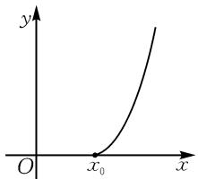
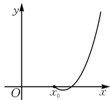

# 利用端点效应策略求解参数取值范围\*

——以 2024 年新课标 I 卷第 18 题为例

# 广东省广州市第十六中学 温伙其

含参不等式恒成立问题中,求参数的取值范围是高考中的常考题型.基本解决办法有两种:一是分离参数后构造函数,将问题转化为最值问题,此时经常用到洛必达法则;二是直接构造含参数的函数,并对其进行分类讨论,此时常常出现讨论界点不明的困惑.

另外,我们还可以采用先必要后充分的做法,即先抓住一些关键点,如区间端点、使不等式等于零的特殊值等,将关键点代入不等式解出参数的范围,获得结论成立的一个必要条件,再论证充分性,从而解决问题.下面通过几道全国高考试题进行阐述.

# 1 2024 年高考试题及端点效应解法探究

(2024年新课标Ⅰ卷·18)已知函数 $f(x)=\ln\frac{x}{2-x}+ax+b(x-1)^{3}$ .

(1) 若 $b = 0$ ，且 $f'(x) \geqslant 0$ ，求 $a$ 的最小值；  
(2) 证明: 曲线 $y = f(x)$ 是中心对称图形;  
(3) 若 $f(x) > -2$ ，当且仅当 $1 < x < 2$ ，求 $b$ 的取值范围.

解析:(1)易求得a的最小值为-2.

(2) $f(x)$ 关于点 $(1,a)$ 中心对称,证明过程略.

(3) 方法一: 端点效应策略.

因为 $f(x) > -2$ ，当且仅当 1 < x < 2，所以 $f(x) < -2$ ，当且仅当 $0 < x \leqslant 1$ 。

又 $f(x)$ 是连续的，可知 $f(1)=a=-2$ 。题意转化为 $f(x)=\ln\frac{x}{2-x}-2x+b(x-1)^{3}>-2$ 对任意 $x\in(1,2)$ 恒成立，知 $f'(x)=\frac{1}{x}+\frac{1}{2-x}-2+3b(x-1)^{2}=\frac{2(x-1)^{2}}{x(2-x)}+3b(x-1)^{2},f''(x)=-\frac{1}{x^{2}}+\frac{1}{(2-x)^{2}}+6b(x-1),f'''(x)=\frac{2}{x^{3}}+\frac{2}{(2-x)^{3}}+6b$ ，所以 $f'(1)=0,f''(1)=0,f'''(1)=4+6b$ 。由端点效应有 $f'''(1)=$

$4+6b\geqslant0$ , 求得 $b\geqslant-\frac{2}{3}$ .

下面证明充分性：

容易得到 $f'(x)=\frac{2(x-1)^{2}}{x(2-x)}+3b(x-1)^{2}=$ $(x-1)^{2}\left[\frac{2}{x(2-x)}+3b\right]\geqslant(x-1)^{2}\left[\frac{2}{x(2-x)}-2\right]=$ $\frac{2(x-1)^{4}}{x(2-x)}\geqslant0.$

所以 $f(x)$ 在 $(1,2)$ 上单调递增. 又 $f(1) = -2$ ，因此 $f(x) > -2$ 对任意 $x \in (1,2)$ 恒成立.

当 $b < \frac{2}{3}$ 时，由方法二知其不成立.

综上,可得 b 的取值范围是 $\left[-\frac{2}{3}, +\infty\right)$ .

方法二: 分类讨论策略.

由方法一知问题转化为 $f(x)=\ln\frac{x}{2-x}-2x+b(x-1)^{3}>-2$ 对任意 $x\in(1,2)$ 恒成立.

而 $f'(x)=\frac{2(x-1)^{2}}{x(2-x)}+3b(x-1)^{2}=(x-1)^{2}\cdot\left[\frac{2}{x(2-x)}+3b\right]$ . 易知当 1<x<2 时， $\frac{2}{x(2-x)}\geqslant\frac{2}{\left(\frac{x+2-x}{2}\right)^{2}}=2$ ，当且仅当 x=1 时等号成立。因此，当 $3b\geqslant-2$ ，即 $b\geqslant-\frac{2}{3}$ 时， $f'(x)>0,f(x)$ 在 $(1,2)$ 上单调递增，所以 $f(x)>f(1)=-2$ 成立；当 3b<-2，即 $b<-\frac{2}{3}$ 时，令 $\frac{2}{x(2-x)}+3b<0$ ，解得 1<x< $1+\sqrt{1+\frac{2}{3b}}$ ，即 $f(x)$ 在 $\left(1,1+\sqrt{1+\frac{2}{3b}}\right)$ 上单调递增，此时 $f(x)<f(1)=-2$ ，所以 $b<-\frac{2}{3}$ 不成立。

# 2 端点效应的定义

对于任意的 $x \in [a, b]$ ，都有 $f(x) \geqslant 0$ 恒成立时，这里的端点函数值满足 $f(a) \geqslant 0, f(b) \geqslant 0$ ，往往是参数取值范围的临界条件.

如果函数 $f(x)$ 在某点 $x_{0}$ 满足 $f(x_{0})=0$ ，则当 $x>x_{0}$ 时， $f(x)>0$ 成立的一个必要不充分条件是端点 $x_{0}$ 处的导数值 $f'(x_{0})>0$ ，如图 1. 因为如果 $f'(x_{0})<0$ ，那么函数 $f(x)$ 在点 $x_{0}$ 右侧的一个区间先单调递减，此时不满足 $f(x)>0$ ，因此 $f'(x_{0})<0$ 不成立，如图 2 所示。特别地，当 $x_{0}$ 为给定区间的左、右端点时，通过端点处满足的条件，缩小参数的取值范围，求得使不等式恒成立的必要条件，再证明充分条件，得出参数的取值范围。

text_image

y
O x₀ x

图1

text_image

y
O x₀ x

图2

上述两种通过观察区间端点值来解决问题的做法,我们称为端点效应.

# 3 端点效应的解题思路

利用端点效应可以初步获得参数的取值范围,这个范围是不等式成立的一个必要条件.

利用“端点效应”解决问题的一般步骤可分为以下几步：

(1) 利用端点处函数值或导数值满足的条件, 初步获得参数的取值范围, 这个范围是不等式恒成立的必要条件.  
(2) 利用所得出的参数范围, 判断函数在定义域内是否单调.  
(3) 若函数在限定参数范围内单调, 则必要条件即为充要条件, 问题解决; 若不单调, 则需进一步讨论, 直至得到使不等式恒成立的充要条件.

# 4 端点效应的类型

如果函数 $f(x)$ 在区间 $[a, b]$ 上， $f(x) \geqslant 0$ 恒成立，则 $f(a) \geqslant 0$ 且 $f(b) \geqslant 0$ ，此类型适用于区间端点值包含参数的情况；

如果函数 $f(x)$ 在区间 $[a, b]$ 上， $f(x) \geqslant 0$ 恒成立，且 $f(a) = 0$ （或 $f(b) = 0$ ），则 $f'(a) \geqslant 0$ （或 $f'(b) \leqslant 0$ ），此类型适用于区间端点的函数值为零的情况；

如果函数 $f(x)$ 在区间 $[a, b]$ 上， $f(x) \geqslant 0$ 恒成立，且 $f(a)=0, f'(a)=0$ （或 $f(b)=0, f'(b)\leqslant0$ ），则 $f''(a)\geqslant0$ （或 $f''(b)\leqslant0$ ），此类型适用于区间端点的函数值为零且导数值也为零的情况.

# 5 近年涉及端点效应的全国高考试题探析

例 1 （节选自 2023 年全国甲卷理·21）已知 $f(x)=ax-\frac{\sin x}{\cos^{3}x}, x \in\left(0, \frac{\pi}{2}\right)$ . 若 $f(x) < \sin 2x$ ，求 a 的取值范围.

解析: 令 $g(x)=f(x)-\sin2x, x\in\left(0,\frac{\pi}{2}\right)$ ，则题意转化为 $g(x)<0$ 在 $x\in\left(0,\frac{\pi}{2}\right)$ 上恒成立。又 $g(0)=0$ ，则由端点效应有 $g'(0)\leqslant0$ 。易得 $g'(x)=a-\frac{1+2\sin^{2}x}{\cos^{4}x}-2\cos2x$ ，则 $g'(0)=a-3\leqslant0$ ，求得 $a\leqslant3$ 。下面证明 $a\leqslant3$ 时 $g(x)<0$ 恒成立（充分性）。

当 $a \leqslant 3$ 时，

$$
\begin{array}{l} g ^ {\prime} (x) \\ = a - \frac {1 + 2 \sin^ {2} x}{\cos^ {4} x} - 2 \cos 2 x \\ \leqslant 3 - \frac {1 + 2 \sin^ {2} x}{\cos^ {4} x} - 2 \cos 2 x \\ = \frac {3 \cos^ {4} x + 2 \cos^ {2} x - 3 - 2 \cos 2 x \cos^ {4} x}{\cos^ {4} x} \\ = \frac {3 (\cos^ {4} x - 1) + 2 \cos^ {2} x (1 - \cos 2 x \cos^ {2} x)}{\cos^ {4} x} \\ = \frac {- (\cos^ {2} x - 1) ^ {2} (4 \cos^ {2} x + 3)}{\cos^ {4} x} <   0. \\ \end{array}
$$

所以 $g(x)$ 在 $\left(0, \frac{\pi}{2}\right)$ 上单调递减，故 $g(x) \leqslant g(0) = 0$ .

当 a > 3 时， $g'(0) = a - 3 > 0$ ， $g(x)$ 在 $(0, x_{0})$ 单调递增，又 $g(0) = 0$ ，因此与 $x \in \left(0, \frac{\pi}{2}\right)$ 时 $g(x) < 0$ 矛盾。

综上,可得 a 的取值范围为 $(-∞,3]$ .

例 2 （节选自 2022 年新高考Ⅱ卷·22）已知函数 $f(x)=xe^{ax}-e^{x}$ . 当 x>0 时, $f(x)<-1$ , 求 a 的取值范围.

解析:由题知 $f'(x)=(ax+1)\mathrm{e}^{ax}-\mathrm{e}^{x},f''(x)=(a^{2}x+2a)\mathrm{e}^{ax}-\mathrm{e}^{x},f(0)=-1,f'(0)=0$ ，由端点效应有 $f''(0)=2a-1\leqslant0$ ，解得 $a\leqslant\frac{1}{2}$ 。下面证明 $x\mathrm{e}^{ax}-\mathrm{e}^{x}<-1$ 对 $a\leqslant\frac{1}{2}$ 且 x>0 恒成立（充分性），只需证明

(下转第119页)

等的，则 $r_1\theta_1 = r_2\theta_2$ ，所以 $\theta_{2} = \frac{r_{1}\theta_{1}}{r_{2}} = \frac{2}{1} = 2$ ，即点 $B$ 绕 $O_{2}$ 转动的弧度数为2.

(2) 因为 $r_1 = 2$ ，转过的弧度为 $t$ ，则 $y_1 = 2\sin t$ ；由于 $B$ 点是上轮的最低点，且 $O_2O_1 = 5$ ，则 $y_2 = 5 + \sin \left(2t - \frac{\pi}{2}\right)$ . 由 $y_2 = 5 + \sin \left(2t - \frac{\pi}{2}\right) \geqslant 5.5$ ，得 $2k\pi + \frac{\pi}{6} \leqslant 2t - \frac{\pi}{2} \leqslant 2k\pi + \frac{5\pi}{6} (k \in \mathbf{Z})$ ，解得 $k\pi + \frac{\pi}{3} \leqslant t \leqslant k\pi + \frac{2\pi}{3}$ ，又 $t \geqslant 0$ ，则 $k \in \mathbf{N}$ ，所以 $t$ 满足的条件为 $k\pi + \frac{\pi}{3} \leqslant t \leqslant k\pi + \frac{2\pi}{3}, k \in \mathbf{N}$ .

(3) 结合 (2) 可得, $g(t) = \cos^2 t + 2\sin t - a = -\sin^2 t + 2\sin t + 1 - a \geqslant 0$ , 即 $a \leqslant -\sin^2 t + 2\sin t + 1$ . 由 $t \in \left[\frac{\pi}{6}, \frac{2\pi}{3}\right]$ , 得 $\sin t \in \left[\frac{1}{2}, 1\right]$ , 所以由二次函数性质易得到 $y = -\sin^2 t + 2\sin t + 1$ 的最小值为 $y = -\left(\frac{1}{2}\right)^2 + 2 \times \frac{1}{2} + 1 = \frac{7}{4}$ . 因此, 满足题意的 $a$ 的取值范围为 $\left(-\infty, \frac{7}{4}\right]$ .

点评:该题考查弧度、三角函数性质、二次函数等知识.解题应注意把握以下三个关键点.其一,明确两个齿轮转动过程中不变的量,以构建等量关系;其二,结合三角函数的定义,对照两个齿轮转动的起始位置,构建三角函数;其三,注重通过换元将三角函数问题转化为在一定范围内求二次函数的最值问题.

综上所述，三角函数在解决实际问题中应用广泛。为更好地解决高中数学中常见的几何测量类、工程建设类以及工业设计类实际问题，应注重夯实基础，熟练掌握三角函数的定义、性质。同时，应注意认真审题，吃透题意，对照图形建立正确的三角函数，明确对应角度的取值范围，并通过三角函数运算公式、辅助角公式、换元等的应用提高运算效率。

# 参考文献：

[1]赵文强.高中数学三角函数解题策略及实践应用[J].数理天地(高中版),2025(11):10-11.

[2]杨生涛.构造合适的三角函数模型,快速解答实际应用问题[J].语数外学习(高中版上旬),2024(10):47.Z

# (上接第98页)

$x\mathrm{e}^{\frac{1}{2}x}-\mathrm{e}^{x}<-1$ 对 $x>0$ 恒成立，即证 $x<\mathrm{e}^{\frac{1}{2}x}-\frac{1}{\mathrm{e}^{\frac{1}{2}x}}$ 对 $x>0$ 恒成立。令 $t=\mathrm{e}^{\frac{1}{2}x}>1$ ，则 $x=2\ln t$ ，转化为证明 $2\ln t<t-\frac{1}{t}$ 对 $t>1$ 恒成立。令 $p(t)=t-\frac{1}{t}-2\ln t$ ( $t>1$ )，则 $p'(t)=1+\frac{1}{t^{2}}-\frac{2}{t}=\frac{(t-1)^{2}}{t^{2}}>0$ ，所以 $p(t)>p(1)=0$ ，从而 $x\mathrm{e}^{\frac{1}{2}x}-\mathrm{e}^{x}<-1(x>0)$ 成立。因此 $a$ 的取值范围为 $\left(-\infty,\frac{1}{2}\right]$ 。

例 3 （节选自 2020 年新课标 I 卷理 · 21）已知函数 $f(x) = \mathrm{e}^{x} + ax^{2} - x$ . 当 $x \geqslant 0$ 时, $f(x) \geqslant \frac{1}{2} x^{3} + 1$ , 求 a 的取值范围.

解析：当 $x \geqslant 0$ 时， $f(x) \geqslant \frac{1}{2} x^3 + 1$ 恒成立，取 $x = 2$ ，则 $f(2) = \mathrm{e}^2 + 4a - 2 \geqslant 5$ ，解得 $a \geqslant \frac{7 - \mathrm{e}^2}{4}$ .

下面证明当 $a \geqslant \frac{7 - \mathrm{e}^2}{4}$ 时， $f(x) \geqslant \frac{1}{2} x^3 + 1$ 恒成立.

当 $a \geqslant \frac{7 - \mathrm{e}^2}{4}$ 时， $f(x) = \mathrm{e}^x + ax^2 - x \geqslant \mathrm{e}^x + \frac{7 - \mathrm{e}^2}{4} \cdot x^2 - x$ .

题意转化为证明 $\mathrm{e}^x +\frac{7 - \mathrm{e}^2}{4} x^2 -x\geqslant \frac{1}{2} x^3 +1$ $(x\geqslant 0)$ ，即 $\frac{(\mathrm{e}^2 - 7)x^2 + 4x + 2x^3 + 4}{\mathrm{e}^x}\leqslant 4$ 恒成立.

令 $h(x) = \frac{(\mathrm{e}^2 - 7)x^2 + 4x + 2x^3 + 4}{\mathrm{e}^x}, x \geqslant 0.$

易得 $h'(x)=\frac{(13-\mathrm{e}^{2})x^{2}+2(\mathrm{e}^{2}-9)x-2x^{3}}{\mathrm{e}^{x}}=$ $\frac{-x\left[2x^{2}-(13-\mathrm{e}^{2})x-2(\mathrm{e}^{2}-9)\right]}{\mathrm{e}^{x}}.$

整理, 可得 $h'(x)=\frac{-x(x-2)[2x+(\mathrm{e}^{2}-9)]}{\mathrm{e}^{x}}$ .
所以当 $x \in \left[0, \frac{9 - e^{2}}{2}\right]$ 时， $h'(x) < 0, h(x)$ 单调递减；
当 $x \in \left(\frac{9 - e^{2}}{2}, 2\right), h'(x) > 0, h(x)$ 单调递增；当 $x \in (2, +\infty), h'(x) < 0, h(x)$ 单调递减.

所以 $[h(x)]_{\max} = \max \{h(0), h(2)\} = 4$ ，即 $h(x) \leqslant 4$ . 当 $a \geqslant \frac{7 - e^2}{4}$ 时， $f(x) \geqslant \frac{1}{2} x^3 + 1$ 恒成立.

综上,可得 a 的取值范围为 $\left[\frac{7-\mathrm{e}^{2}}{4},+\infty\right)$ .

因此,中学数学课堂,让学生充分掌握分离参数和直接含参讨论思想,领悟函数为主线的教材主线,适当渗透如上述的先必要再充分的策略,可以提升学生数学素养,起到提质增效的作用. Z