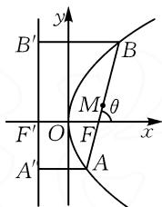
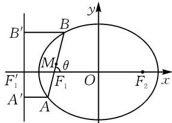
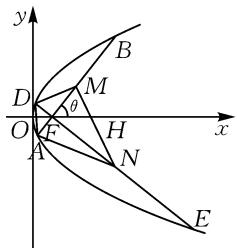
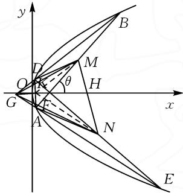
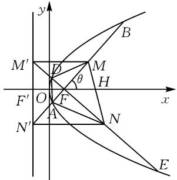
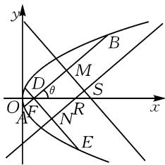
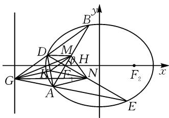
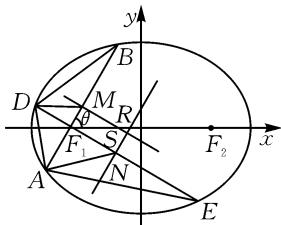

# 圆锥曲线中垂直焦点弦性质探究

# 安徽省亳州市蒙城县第六中学 李佳沅

摘要:关于圆锥曲线焦点弦性质的考查,在往年的高考试题和各地的模拟试题中经常出现,很多文章都对此做了详细的研究.本文中以2024年九省联考数学圆锥曲线试题为例,用倾角形式的焦半径公式探究了抛物线和椭圆中垂直焦点弦的一些性质,主要包括定值、定点、最值等问题.

关键词: 抛物线; 椭圆; 垂直焦点弦; 定值; 定点; 最值

处理圆锥曲线的焦点弦问题一般通过设直线联立，借助韦达定理的方法进行求解。其中，刘建国 $^{[1]}$ 研究了抛物线中的定值定点问题，张鑫等 $^{[2]}$ 研究了抛物线中长度最值问题，邹玲萍等 $^{[3]}$ 研究了椭圆中垂直焦点弦的部分性质。依据圆锥曲线的定义，还可以借助直线的倾角处理焦点弦问题，此方法在一定程度上避免了设直线联立求解的复杂过程。本文基于2024年九省联考的圆锥曲线试题，使用倾角形式焦半径公式进行解析，拓展研究了抛物线中其他相关结论，并将有关结论推广应用到椭圆中。

# 1 抛物线和椭圆中倾角形式焦半径公式

如图1,焦点在x轴上的抛物线 $y^{2}=2px(p>0)$ ，过焦点F倾斜角为 $\theta$ 的直线交抛物线于点A,B，其中点B在x轴上方，点M为弦AB的中点，准线与x轴交点为 $F'$ ，点A,B在准线上的投影分别为 $A',B'$ .根据抛物线的定义可得出以下结论：

text_image

B'
y
B
M
θ
F'
O
F
x
A'
A

图1

结论1 $|AF| = \frac{p}{1 + \cos\theta}, |BF| = \frac{p}{1 - \cos\theta},$

$$
\vert A B \vert = \vert A F \vert + \vert B F \vert = \frac {2 p}{\sin^ {2} \theta}.
$$

证明:由抛物线定义知 $\left|AF\right|=\left|AA'\right|$ ，又因为 $\left|AA'\right|=\left|FF'\right|-\left|AF\right|\cos\theta$ ，所以 $\left|AF\right|=\frac{p}{1+\cos\theta}$ .
同理得 $\left|BF\right|=\frac{p}{1-\cos\theta}$ ，则 $\left|AB\right|=\left|AF\right|+\left|BF\right|=\frac{2p}{\sin^{2}\theta}$ .

结论2 当 $0^{\circ} < \theta \leqslant 90^{\circ}$ , $|MF| = \frac{p\cos\theta}{\sin^{2}\theta}$ ; 当 $90^{\circ} < \theta < 180^{\circ}$ , $|MF| = -\frac{p\cos\theta}{\sin^{2}\theta}$

证明: 当 $0^{\circ}<\theta\leqslant90^{\circ}$ ，点 M 在 x 轴上方， $|MF|=$ $\frac{|AB|}{2}-|AF|=\frac{p\cos\theta}{\sin^{2}\theta}$ ; 当 $90^{\circ}<\theta<180^{\circ}$ ，点 M 在 x 轴下方， $|MF|=\frac{|AB|}{2}-|BF|=-\frac{p\cos\theta}{\sin^{2}\theta}$ .

如图 2, 椭圆 $\frac{x^{2}}{a^{2}} + \frac{y^{2}}{b^{2}} = 1 (a > b > 0)$ , 离心率为 e, 过左焦点 $F_{1}$ 倾斜角为 $\theta$ 的直线与椭圆交于 A, B 两点, 其中点 B 在 x 轴上方. 左准线交 x 轴于点 $F_{1}^{\prime}$ , 点 A, B在左准线上的投影分别为 $A'$ , $B'$ . 记 $p=\frac{b^{2}}{a}$ ，则可以得出以下结论：

text_image

B'
B
M
θ
F₁'
F₁
O
F₂
x
y
A'
A

图2

结论3 $|BF_{1}| = \frac{p}{1 - e\cos\theta}, |AF_{1}| = \frac{p}{1 + e\cos\theta},$ $|AB| = |AF_{1}| + |BF_{1}| = \frac{2p}{1 - e^{2}\cos^{2}\theta}.$

证明:根据椭圆的第二定义, 可知 $\left|BF_{1}\right|=e\left|BB^{\prime}\right|$ , 又因为 $\left|BB^{\prime}\right|=\left|F_{1}F_{1}^{\prime}\right|+\left|BF_{1}\right|\cos\theta$ , 所以 $\left|BF_{1}\right|=\frac{p}{1-e\cos\theta}$ . 同理 $\left|AF_{1}\right|=\frac{p}{1+e\cos\theta}$ , 则 $\left|AB\right|=\left|AF_{1}\right|+\left|BF_{1}\right|=\frac{2p}{1-e^{2}\cos^{2}\theta}$ .

结论4 当 $0^{\circ} < \theta \leqslant 90^{\circ}$ , $|MF_{1}| = \frac{ep\cos\theta}{1 - e^{2}\cos^{2}\theta}$ ; 当 $90^{\circ} < \theta < 180^{\circ}$ , $|MF_{1}| = -\frac{ep\cos\theta}{1 - e^{2}\cos^{2}\theta}$ .

证明：当 $0^{\circ} < \theta \leqslant 90^{\circ}$ , $|MF_{1}| = \frac{|AB|}{2} - |AF_{1}| = \frac{ep\cos\theta}{1 - e^{2}\cos^{2}\theta}$ ; 当 $90^{\circ} < \theta < 180^{\circ}$ , $|MF_{1}| = \frac{|AB|}{2} - |BF_{1}| = -\frac{ep\cos\theta}{1 - e^{2}\cos^{2}\theta}$ .

# 2 试题、解析及推论

试题 (2024年九省联考数学第18题)已知抛物线 $C: y^{2} = 4x$ 的焦点为 F，过 F 的直线 l 交 C 于 A, B 两点，过 F 与 l 垂直的直线交 C 于 D, E 两点，其中点 B, D 在 x 轴上方，M, N 分别为 AB, DE 的中点.

(1)证明:直线 MN 过定点;   
(2) 设 G 为直线 AE 与直线 BD 的交点, 求 $\triangle GMN$ 面积的最小值.

分析:第(1)问是常见的直线过定点问题,背景知识为抛物线中过定点的动弦的中点轨迹仍是抛物线,且轨迹抛物线过此定点.由题意知点M,N的轨迹是过焦点F的抛物线,又因为 $MF\perp NF$ ,所以MN过定点.第(2)问首先可以分析得到点G的轨迹是一条竖直直线,直接计算 $\triangle GMN$ 的面积然后求最值时会发现计算量很大,不容易算出结果,这是第(2)问的难点.如果先把 $\triangle GMN$ 的面积借助初等几何的知识转化为四边形ADMN的面积,可以很大程度上减少计算量.

(1) 证明: 如图 3 所示, 设直线 AB 的倾斜角为 $\theta$ , 不妨设 $\theta \in \left(0, \frac{\pi}{2}\right)$ , 则直线 DE 的倾斜角为 $\theta + \frac{\pi}{2}$ . 设 MN 交 x 轴于点 H, 在 $\triangle MFN$ 中, $S_{\triangle MFN} = S_{\triangle MFH} + S_{\triangle NFH}$ , 其中 $S_{\triangle MFN} = \frac{1}{2} |MF| \cdot$

text_image

y
B
D
M
θ
O
F
H
x
A
N
E

图3

$$
\begin{array}{r l} & {\mid N F \mid , S _ {\triangle M F H} = \frac {1}{2} \mid M F \mid \mid H F \mid \sin \theta , S _ {\triangle N F H} = \frac {1}{2} \mid N F \mid \bullet} \\ & {\mid H F \mid \cos \theta , \text {代入得} \mid H F \mid = \frac {\mid N F \mid \mid M F \mid}{\mid M F \mid \sin \theta + \mid N F \mid \cos \theta}.} \\ & {\text {由焦半径公式可知} \mid M F \mid = = \frac {p \cos \theta}{\sin^ {2} \theta}, \mid N F \mid = \frac {p \sin \theta}{\cos^ {2} \theta},} \\ & {\text {所以} \mid H F \mid = p, \text {即} H \text {为定点，坐标为(3,0)}.} \end{array}
$$

(2) 解: 如图 4, 取线段 AD 的中点 K, 由中位线性质可知 $KM \parallel GB$ , $KN \parallel GE$ , 则 $S_{\triangle GKM} = S_{\triangle DKM}$ , $S_{\triangle GKN} = S_{\triangle AKN}$ . 由 $S_{\triangle GMN} = S_{\triangle GKM} + S_{\triangle KMN} + S_{\triangle GKN}$ , 得 $S_{\triangle GMN} = S_{ADMN}$ , 所以 $\triangle GMN$ 面积的最小值等于四边形 ADMN 面积的最小值. 因为 $AM \perp DN$ , 所以 $S_{\triangle GMN} = S_{ADMN} = \frac{1}{2} |AM| |DN| = \frac{1}{8} |AB| |DE|$ . 又因为 $\frac{1}{|AB|} + \frac{1}{|DE|} = \frac{\sin^2\theta}{2p} + \frac{\cos^2\theta}{2p} = \frac{1}{2p}$ , 由基本不等式知 $\frac{1}{2p} = \frac{1}{|AB|} + \frac{1}{|DE|} \geqslant \frac{2}{\sqrt{|AB||DE|}}$ , 当且仅当 $|AB| =$

text_image

y
B
D
M
θ
O
H
G
x
A
N
E

图4

$|DE|$ 时，等号成立，所以 $|AB||DE|\geqslant16p^{2}$ ，从而 $S_{\triangle GMN}\geqslant2p^{2}=8$ 。故 $\triangle GMN$ 面积的最小值为8。

点评:第(2)问面积的转化虽然利用了初中数学的平面几何知识,但对学科核心素养中的直观想象和逻辑推理有很高的要求,能综合运用不同的几何方法解决问题也是学科核心素养的重要体现.

关于抛物线中相互垂直的焦点弦问题,根据倾角形式的焦半径公式,还可以得出其他相关结论.如图5,抛物线 $y^{2}=2px(p>0)$ , 准线与 x 轴交点为 $F'$ , 过 F 的垂直焦点弦交抛物线于 A, B, D, E 四点, 其中 B, D 在 x 轴上方, 直线 AB 倾角 $\theta\in\left(0,\frac{\pi}{2}\right)$ , 弦 AB, DE 的中点 M, N 在准线上的投影点分别为 $M', N'$ .

推论 1 点 $M'$ , $N'$ 分别在直线 DE, AB 上.

证明：连接 $FN'$ ，在 $\triangle FF'N'$ 中， $|FF'| = p$ ， $|N'F'| = |NF| \cos \theta = p \tan \theta$ ，所以 $\tan \angle F'FN' = \tan \theta$ ，结合 $\theta$ 与 $\angle F'FN'$ 的范围可知 $\angle F'FN' = \theta$ ，即点 $N'$ 在直线 $AB$ 上。同理可证明点 $M'$ 在直线 $DE$ 上。

推论2 $\frac{1}{|N'B|} +\frac{1}{|N'A|} = \frac{2}{|N'F|},$

$$
\frac {1}{| M ^ {\prime} D |} + \frac {1}{| M ^ {\prime} E |} = \frac {2}{| M ^ {\prime} F |}.
$$

证明：图5中，因为 $M^{\prime}, N^{\prime}$ 分别在直线 $DE$ 和 $AB$ 上，且 $\left|FF^{\prime}\right| = p$ ，所以 $|N'F| = \frac{p}{\cos\theta}.$

结合焦半径公式, 可以得到 $\left|N^{\prime}A\right|=\left|N^{\prime}F\right|-\left|AF\right|=\frac{p}{\cos\theta}-\frac{p}{1+\cos\theta}=$

text_image

y
M'
D
θ
M
H
F'
O
F
x
N'
A
N
B
E

图 5

$\frac{p}{(\cos\theta+1)\cos\theta},|N^{\prime}B|=|N^{\prime}F|+|BF|=\frac{p}{\cos\theta}+\frac{p}{1-\cos\theta}=\frac{p}{(1-\cos\theta)\cos\theta},$ 从而可以得到 $\frac{1}{|N^{\prime}B|}+\frac{1}{|N^{\prime}A|}=\frac{2}{|N^{\prime}F|}.$ 同理，可推出 $\frac{1}{|M^{\prime}D|}+\frac{1}{|M^{\prime}E|}=\frac{2}{|M^{\prime}F|}.$

推论 3 如图 6, 焦点弦 AB 的中垂线交 x 轴于点 S, 焦点弦 DE 的中垂线交 x 轴于点 R, 则 $\frac{|SF|}{|AB|} = \frac{|RF|}{|DE|} = \frac{1}{2}, \frac{1}{|SF|} + \frac{1}{|RF|}$ 为定值.

text_image

y
B
D
M
θ
O
F
N
R
x
A
E

图6

证明:根据焦半径公式可知 $\left|MF\right|=\frac{p\cos\theta}{\sin^{2}\theta}$ ，在 Rt△MFS 中， $\left|SF\right|=\frac{\left|MF\right|}{\cos\theta}=\frac{p}{\sin^{2}\theta}$ ，所以 $\frac{\left|SF\right|}{\left|AB\right|}=\frac{1}{2}$ 。同理可得 $\frac{\left|RF\right|}{\left|DE\right|}=\frac{1}{2}$ 。根据 $\left|SF\right|,\left|RF\right|$ ，还可以得出 $\frac{1}{\left|SF\right|}+\frac{1}{\left|RF\right|}=\frac{\sin^{2}\theta}{p}+\frac{\sin^{2}\left(\theta+\frac{\pi}{2}\right)}{p}=\frac{1}{p}$ 。

推论 4 $\triangle MFN$ 的面积有最小值.

证明: 在 $\triangle MFN$ 中, 因为 $MF \perp NF$ , 所以 $S_{\triangle MFN} = \frac{1}{2} |MF| |NF| = \frac{1}{2} \cdot \frac{p \cos \theta}{\sin^{2} \theta} \cdot \frac{p \sin \theta}{\cos^{2} \theta} = \frac{p^{2}}{\sin 2\theta}$ , 当 $\theta = \frac{\pi}{4}$ 时, $\triangle MFN$ 面积有最小值 $p^{2}$ .

# 3 椭圆中垂直焦点弦性质

如图 7, 椭圆方程为 $\frac{x^{2}}{a^{2}} + \frac{y^{2}}{b^{2}} = 1 (a > b > 0)$ ，离心率为 e，左、右焦点分别为 $F_{1}, F_{2}$ ，过 $F_{1}$ 的垂直焦点弦交 C 于 A, B, D, E 四点，其

text_image

Geometric diagram with labeled points and coordinate axes, showing a circle intersecting with multiple triangles and lines.

图 7

中 B, D 在 x 轴上方，弦 AB 的倾倾角 $\theta \in \left(0, \frac{\pi}{2}\right)$ ，G 为直线 AE 与 BD 的交点，M, N 分别为 AB, DE 的中点，记 $p = \frac{b^{2}}{a}$ ，类比抛物线中的推论，在椭圆中可以得出以下推论：

推论 5 直线 MN 过 x 轴上的定点.

证明:设直线 MN 交 x 轴于点 H, 由张角公式可知 $\left|HF_{1}\right|=\frac{\left|NF_{1}\right|\left|MF_{1}\right|}{\left|MF_{1}\right|\sin\theta+\left|NF_{1}\right|\cos\theta}$ ，将 $\left|MF_{1}\right|$ ， $\left|NF_{1}\right|$ 代入，得 $\left|HF_{1}\right|=\frac{ep}{2-e^{2}}$ ，所以 H 为定点，坐标为 $\left(\frac{ep}{2-e^{2}}-c,0\right)$ .

推论 6 $\triangle GMN$ 的面积有最小值.

证明:椭圆中, $\triangle GMN$ 与四边形ADMN的位置相较抛物线中没有发生改变,所以同样可得出二者面积相等,即 $S_{\triangle GMN}=S_{ADMN}=\frac{1}{8}|AB||DE|$ .分析知, $\frac{1}{|AB|}+\frac{1}{|DE|}=\frac{1-e^{2}\cos^{2}\theta}{2p}+\frac{1-e^{2}\sin^{2}\theta}{2p}=\frac{2-e^{2}}{2p}$ ,再结合基本不等式得 $|AB||DE|\geqslant\frac{16p^{2}}{(2-e^{2})^{2}}$ ,当且仅当 $|AB|=|DE|$ 时,等号成立,所以 $S_{\triangle GMN}\geqslant\frac{2p^{2}}{(2-e^{2})^{2}}$ .

推论 7 $\triangle MF_{1}N$ 的面积有最大值.

证明：易得到 $S_{\triangle MF_1N} = \frac{1}{2}|MF_1||NF_1| = \frac{1}{2}\times$ $\frac{e^2p^2}{\frac{1 - e^2}{\sin\theta\cos\theta} + e^4\sin\theta\cos\theta},$ 其中 $\theta \in \left(0,\frac{\pi}{2}\right),\sin \theta \cdot$ $\cos \theta \in \left(0,\frac{1}{2}\right]$ .分析得：若 $\sqrt{\frac{1 - e^2}{e^4}}\leqslant \frac{1}{2}$ ，即 $\sqrt{2\sqrt{2} - 2}\leqslant$ $e <   1$ ，则当 $\sin \theta \cos \theta = \sqrt{\frac{1 - e^2}{e^4}},\triangle MF_1N$ 面积有最大值 $\frac{p^2}{4\sqrt{1 - e^2}}$ ；若 $\sqrt{\frac{1 - e^2}{e^4}} >\frac{1}{2}$ ，即 $0 <   e <   \sqrt{2\sqrt{2} - 2}$ 则当 $\theta = \frac{\pi}{4}$ 时， $\triangle MF_1N$ 的面积有最大值 $\frac{e^2p^2}{(e^2 - 2)^2}.$

推论 8 焦点弦 AB, DE 的中垂线分别交 x 轴于 S, R 两点, 则 $\frac{|SF_{1}|}{|AB|} = \frac{|RF_{1}|}{|DE|} = \frac{e}{2}, \frac{1}{|SF_{1}|} + \frac{1}{|RF_{1}|}$ 为定值.

证明：如图8所示，在Rt $\triangle MF_{1}S$ 中， $|MF_{1}| = \frac{ep\cos\theta}{1 - e^{2}\cos^{2}\theta}$ ，则有 $|SF_{1}| = \frac{|MF_{1}|}{\cos\theta} = \frac{ep}{1 - e^{2}\cos^{2}\theta}$ .

text_image

y
B
D
M
θ
R
F₁
S
A
N
E
x
F₂

图8

所以 $\frac{|SF_1|}{|AB|} = \frac{e}{2}$ ，同理

可得 $\frac{|RF_{1}|}{|DE|}=\frac{e}{2}$ . 故 $\frac{1}{|SF_{1}|}+\frac{1}{|RF_{1}|}=\frac{1-e^{2}\cos^{2}\theta}{ep}+\frac{1-e^{2}\sin^{2}\theta}{ep}=\frac{2-e^{2}}{ep}$ .

在圆锥曲线试题中,往往呈现出分析越多则计算就越少的规律,试题考查学生计算能力的同时,也考查了学生的思维能力和逻辑推理能力.对于圆锥曲线中的部分焦点弦问题,使用倾角形式的焦半径公式可以避免常规解法中复杂的设直线联立过程,同时借助于三角函数的计算,在求解最值、定点等问题上体现出了一定的优势.圆锥曲线中很多性质具有统一性,由于文章篇幅有限,以上一些结论同样可以类比推广到双曲线中.

# 参考文献：

[1]刘建国.抛物线中两条垂直的焦点弦的几个优美结论[J].中学数学研究(华南师范大学版),2021(5):41-42.  
[2] 张鑫, 于兴江. 一道高考题探究出抛物线焦点弦几个结论 [J]. 中学数学研究, 2018(8): 27-28.  
[3]邹玲平,陈静.椭圆中过焦点的两条垂直弦的几个优美性质[J].中学数学研究,2018(11):31-33.Z