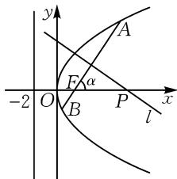

# 基于圆锥曲线场景,探究“三定”问题应用\*

# 江苏省无锡市第六高级中学 孙开华

摘要:基于圆锥曲线场景创设的“三定”(定点、定值、定线)问题,是历年高考数学命题中常见考查方式,也是全面考查考生“四基”与“四能”的一个重要场所.结合典型实例,剖析“三定”问题下圆锥曲线的综合与应用,合理总结解题技巧与策略.

关键词: 圆锥曲线; 轨迹; 定点; 定值; 定直线; 定曲线

基于圆锥曲线场景设置的定点、定值、定线问题（统称“三定”），是该模块知识综合与应用中的基本考查题型，也是高考中比较常见的热点问题。此类“三定”问题，以圆锥曲线为问题情境，融入解析几何中的一些基本元素，构建“动态”与“静态”之间的变化规律，联系“变量”与“常量”之间的等价转化，同时合理交汇其他相关知识，成为全面考查能力与综合应用的重要类型。

# 1 定点问题

基于圆锥曲线的定点问题,通常是以定点的判断、证明、确定等为考查形式,利用直线、曲线(包括圆或圆锥曲线)过定点为设置方式,创设直线系或圆系等情境问题,是“运动”与“静止”的和谐统一.

例 1 已知椭圆 $C: \frac{y^{2}}{a^{2}} + \frac{x^{2}}{b^{2}} = 1 (a > b \geqslant 1)$ 的离心率为 $\frac{\sqrt{2}}{2}$ ，椭圆 C 的上焦点到直线 $bx + 2ay - \sqrt{2} = 0$ 的距离为 $\frac{\sqrt{2}}{3}$ .

(1)求椭圆 C 的方程.

(2)若过点 $P\left(\frac{1}{3},0\right)$ 的直线 l 交椭圆 C 于 A, B 两点, 那么以线段 AB 为直径的圆是否过定点? 若过, 求出该定点的坐标; 若不过, 请说明理由.

解析:(1)由 $e=\frac{c}{a}=\frac{\sqrt{2}}{2}$ ，得 $e^{2}=\frac{a^{2}-b^{2}}{a^{2}}=\frac{1}{2}$ ，所以 $a=\sqrt{2}b, c=b$ .

又 $\frac{|2ac - \sqrt{2}|}{\sqrt{4a^2 + b^2}} = \frac{\sqrt{2}}{3}, a > b \geqslant 1$ ，所以 $b = 1, a^2 = 2$ .

故椭圆 C 的方程为 $\frac{y^{2}}{2} + x^{2} = 1$ .

(2)借助特殊场景来分析：

当 $AB \perp x$ 轴时，以 AB 为直径的圆的方程为

$\left(x-\frac{1}{3}\right)^{2}+y^{2}=\frac{16}{9}$ ; 当 $AB \perp y$ 轴时, 以 AB 为直径的圆的方程为 $x^{2}+y^{2}=1$ .

根据以上两种特殊情形,可得到两圆的交点为 $Q(-1,0)$ .

由此可以判断,若以 AB 为直径的圆恒过定点,则该定点必为 $Q(-1,0)$ .

下面加以证明: 设直线 l 的斜率存在, 且不为 0, 则直线 l 的方程为 $y = k \left( x - \frac{1}{3} \right)$ . 设点 $A(x_{1}, y_{1})$ , $B(x_{2}, y_{2})$ .

将直线 l 的方程 $y=k\left(x-\frac{1}{3}\right)$ 代入 $\frac{y^{2}}{2}+x^{2}=1$ ，化简并整理可得 $(k^{2}+2)x^{2}-\frac{2}{3}k^{2}x+\frac{1}{9}k^{2}-2=0$ ， $\Delta=\frac{64}{9}k^{2}+16>0$ 恒成立.

根据韦达定理, 可得 $x_{1} + x_{2} = \frac{2k^{2}}{3(k^{2} + 2)}$ , $x_{1}x_{2} = \frac{k^{2} - 18}{9(k^{2} + 2)}$ .

利用平面向量的数量积,有 $\overrightarrow{QA}\cdot\overrightarrow{QB}=(x_{1}+1)\times(x_{2}+1)+y_{1}y_{2}=x_{1}x_{2}+x_{1}+x_{2}+1+k^{2}\left(x_{1}-\frac{1}{3}\right)\times\left(x_{2}-\frac{1}{3}\right)=(1+k^{2})x_{1}x_{2}+\left(1-\frac{1}{3}k^{2}\right)(x_{1}+x_{2})+1+\frac{1}{9}k^{2}=(1+k^{2})\frac{k^{2}-18}{9(k^{2}+2)}+\left(1-\frac{1}{3}k^{2}\right)\frac{2k^{2}}{3(k^{2}+2)}+1+\frac{1}{9}k^{2}=0.$

故 $\overrightarrow{QA}\perp\overrightarrow{QB}$ ，即 $Q(-1,0)$ 在以AB为直径的圆上。综上，以AB为直径的圆恒过定点 $(-1,0)$ 。

点评:解决此类基于圆锥曲线中的定点问题,比较常见的思维方式有两种.①引参法,利用引入参数,并结合题设条件的转化,确定对应点的坐标与参数无关,由此确定相应的定点.②一般与特殊思维法,即先利用特殊值思维来确定对应的定点,再合理推理与证明.

# 2 定值问题

基于圆锥曲线的定值问题,是以解析几何中的相关要素,对应代数式或关系式的定值为问题场景,借助判断、证明或求解等方式,求解对应的定值,是“变量”与“常量”的和谐统一.

例 2 （2025 年山东济南一模）如图 1 所示，抛物线 $y^{2}=2px$ $(p>0)$ 的准线过点 $(-2,3)$ .

text_image

y
A
F
α
-2 O B P x
l

图1

(1)求抛物线的标准方程；

(2) 若角 $\alpha$ 为锐角, 以角 $\alpha$ 为倾斜角的直线经过抛物线的焦点 F, 且与抛物线交于 A, B 两点,作线段 $AB$ 的垂直平分线 $l$ 交 $x$ 轴于点 $P$ , 证明: $|FP| - |FP| \cos 2\alpha$ 为定值, 并求此定值.

解析:(1)由题意得 $-\frac{p}{2}=-2$ , 解得 p=4.

所以抛物线的方程为 $y^{2}=8x$ .

(2) 证明: 设点 $A(x_{A}, y_{A})$ , $B(x_{B}, y_{B})$ ，直线 AB 的斜率为 $k = \tan \alpha$ ，则直线 $AB : y = k(x - 2)$ .

将 $y = k(x - 2)$ 代入 $y^{2} = 8x$ ，消去 $y$ ，得 $k^2 x^2 - 4(k^2 + 2)x + 4k^2 = 0$ ，故 $x_{A} + x_{B} = \frac{4(k^{2} + 2)}{k^{2}}.$

设直线 l 与 AB 的交点为 $E(x_{E}, y_{E})$ ，则 $x_{E} = \frac{x_{A} + x_{B}}{2} = \frac{2(k^{2} + 2)}{k^{2}}$ ， $y_{E} = k(x_{E} - 2) = \frac{4}{k}$ .

故直线 l 的方程为 $y - \frac{4}{k} = -\frac{1}{k}\left(x - \frac{2k^{2} + 4}{k^{2}}\right)$ ，令 y = 0，得点 P 的横坐标为 $x_{P} = \frac{2k^{2} + 4}{k^{2}} + 4$ .

所以 $|FP|=x_{P}-2=\frac{4(k^{2}+1)}{k^{2}}=\frac{4}{\sin^{2}\alpha}.$

所以 $|FP| - |FP|\cos 2\alpha = \frac{4}{\sin^2\alpha}(1 - \cos 2\alpha) = \frac{4\times 2\sin^2\alpha}{\sin^2\alpha} = 8$ ，即 $|FP| - |FP|\cos 2\alpha$ 为定值8.

点评: 解决此类基于圆锥曲线中的定值问题, 其思维方式与定点问题的思维方式类似, 或通过引参转化法, 或利用一般与特殊思维法, 只是把定点问题转化为相应的定值问题, 从而实现问题的突破与解决.

# 3 定线问题

基于圆锥曲线的定线问题,往往是判断或证明相关要素、动点等过定直线,如围绕某轨迹运动的动点在定直线上,平面几何图形的特殊要素在定直线上等,是“动态”与“静态”的和谐统一.

例 3 （2025 年河南郑州调研节选）已知椭圆 C: $\frac{x^{2}}{9} + \frac{y^{2}}{6} = 1, A_{1}, A_{2}$ 分别为椭圆 C 的左、右顶点. 直线 l: x = my + 1 与椭圆 C 交于 P, Q 两点，直线 $A_{1}P$ 与 $A_{2}Q$ 交于点 S. 当直线 l 变化时，点 S 是否恒在一条定直线上？若是，求此定直线方程；若不是，请说明理由.

解析: 当 $l \perp x$ 轴时, 不妨令点 $P\left(1, \frac{4\sqrt{3}}{3}\right)$ , 则 $Q\left(1, -\frac{4\sqrt{3}}{3}\right)$ .

又点 $A_{1}(-3,0), A_{2}(3,0)$ ，则 $l_{A_{1}P}: y = \frac{\sqrt{3}}{3} (x + 3)$ ， $l_{A_{2}Q}: y = \frac{2\sqrt{3}}{3} (x - 3)$ . 联立解得点 $S(9,4\sqrt{3})$ .

当 l 过椭圆的上顶点时，其方程为 $y=\sqrt{6}-\sqrt{6}x$ ，
点 $P(0,\sqrt{6})$ , $Q\left(\frac{9}{5}, -\frac{4\sqrt{6}}{5}\right)$ , $l_{A_{1}P}: y = \frac{\sqrt{6}}{3}(x + 3)$ , $l_{A_{2}Q}:y=\frac{2\sqrt{6}}{3}(x-3)$ .联立解得点 $S(9,4\sqrt{6})$ .

若定直线存在,则其方程应是 x=9.

下面给予证明: 把 $x=my+1$ 代入椭圆方程, 整理得 $(2m^{2}+3)y^{2}+4my-16=0,\Delta>0$ 成立.

设点 $P(x_{1}, y_{1})$ ，点 $Q(x_{2}, y_{2})$ ，则有 $y_{1} + y_{2} = \frac{-4m}{2m^{2} + 3}$ ， $y_{1}y_{2} = \frac{-16}{2m^{2} + 3}$ .

而 $l_{A_1P}:y = \frac{y_1}{x_1 + 3} (x + 3), l_{A_2Q}:y = \frac{y_2}{x_2 - 3} (x - 3).$

当 x=9 时，纵坐标 y 应相等，即 $\frac{12y_{1}}{x_{1}+3}=\frac{6y_{2}}{x_{2}-3}$ ，也即 $\frac{12y_{1}}{my_{1}+4}=\frac{6y_{2}}{my_{2}-2}$ ，只需 $2y_{1}(my_{2}-2)=y_{2}\cdot(my_{1}+4)$ ，即需证 $my_{1}y_{2}=4(y_{1}+y_{2})$ .

而 $m \cdot \frac{-16}{2m^2 + 3} = 4 \times \frac{-4m}{2m^2 + 3}$ 恒成立.

综上,定直线方程为 x=9.

点评:解决此类基于圆锥曲线中的定线问题,往往借助以下几种思维方式.①设点思维,以点带动线,进而确定定直线问题;②待定系数思维,解出相应的系数为定值,判断定直线;③特殊思维,利用猜测确定定直线后再合理推理与分析.

探究与解决圆锥曲线中的“三定”问题,串联起平面解析几何中的基础知识与基本要素,以及点、直线、曲线等基本要素之间的联系与转化,实现“几何”与“代数”之间的恒等转化与综合联系,实现“动态”与“静态”的全面结合,“变量”与“常量”的合理对应,构建和谐统一的整体. Z