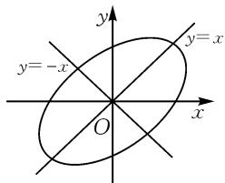
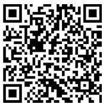
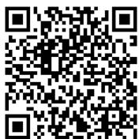

# 基于旋转场景,研究椭圆性质

# ● 浙江省杭州市临安区於潜中学 凌强

摘要:基于平面解析几何中圆锥曲线的旋转变换及其综合应用,是立足圆锥曲线的几何性质,并巧妙联系与之相关的其他基础知识,成为知识交汇、能力综合的一个重要问题场景.文中结合一道高考模拟题,以椭圆的旋转变换为场景,根据椭圆的相关性质来设置,开拓数学思维,总结解题方法.

关键词: 椭圆; 旋转; 解析几何; 复数; 极坐标; 变式

平面解析几何中,涉及点、线、曲线的变换及其综合应用问题,是这个模块中比较复杂、难度较大的一类问题.而涉及曲线的旋转变换及其综合应用,又是其中的一个重点与难点.由于曲线的旋转变换的复杂性,特别是对应点的坐标之间变换公式的复杂性,在现行高中数学教材中并没有系统提及与应用.而旋转变换及其综合应用中对应的基础知识与思想方法,是基于平面解析几何中相应曲线及其综合应用的深入与拓展之一,在高考命题中往往成为全面考查学生的关键能力与核心素养等方面的一个基础知识点,备受各方关注.

# 1 试题呈现

[2025届河南省五市高三第一次联考(2025年3月)数学试卷·8]将椭圆 $C_{1}:\frac{x^{2}}{a^{2}}+\frac{y^{2}}{b^{2}}=1(a>b>0)$ 上所有的点绕原点旋转 $\theta\left(0<\theta<\frac{\pi}{2}\right)$ 角，得到椭圆 $C_{2}$ 的方程 $x^{2}+y^{2}-xy=9$ ，则下列说法中不正确的是()。

$$
\mathrm{A.} \theta = \frac {\pi}{4}
$$

$$
\mathrm{B.} a = 3 \sqrt {2}
$$

C. 椭圆 $C_{2}$ 的离心率为 $\frac{\sqrt{2}}{3}$

D. $(- \sqrt{6}, -\sqrt{6})$ 是椭圆 $C_{2}$ 的一个焦点

此题以椭圆上所有点绕原点旋转后得到对应椭圆的方程为问题情景,结合旋转后对应椭圆方程的确定来设置,通过旋转角度,以及新、旧椭圆的几何性质等来设计不同命题,进而判断对应命题的真假.问题设置不再是原来熟悉的圆锥曲线及其基本性质等,而是引入圆锥曲线的旋转变换及其应用等,综合函数与方程等,是基于圆锥曲线及其综合应用的深入与拓展.

# 2 试题破解

具体解题时,比较常用的思维方式还是回归平面解析几何思维,依托椭圆的旋转变换及其应用,借助椭圆的基本性质,其在同一对称轴上的顶点之间的距离分别对应椭圆的长轴长与短轴长,在旋转过程中是不会发生变化的;同样,椭圆的离心率 e 也不随图形的旋转变换而变化.

基于平面解析几何的旋转变换,也是复数思维法与极坐标思维法的一个基本应用方式,或结合复数三角形式来探究旋转角度,或利用极坐标公式来研究极径与极角等,借助这两种思维方式来分析,也可以给问题的处理提供更加精彩与多样的思维路径.这往往是对一些学生的思维能力与课外拓展的一个体验与应用.

# 2.1 平面解析几何思维

方法 1: 解析几何法.

对于椭圆 $C_2$ 的方程 $x^{2} + y^{2} - xy = 9$ ，以 $x$ 代 $y, y$ 代 $x$ 方程不变，说明椭圆 $C_2$ 关于直线 $y = x$ 对称；以 $-x$ 代 $y, -y$ 代 $x$ ，方程不变，说明椭圆 $C_2$ 关于直线 $y = -x$ 对称.如图1.

text_image

y
y=-x
O
x
y=x

图1

所以直线 $y=\pm x$ 是椭圆 $C_{2}$ 的对称轴, $\theta=\frac{\pi}{4}$ , 故选项 A 正确.

联立方程组 $\left\{\begin{aligned}y=x,\\ x^{2}+y^{2}-xy=9,\end{aligned}\right.$ 可解得 $\left\{\begin{aligned}x=3,\\ y=3,\end{aligned}\right.$ 或 $\left\{\begin{aligned}x=-3,\\ y=-3,\end{aligned}\right.$ 即椭圆 $C_{2}$ 与直线 y=x 的交点为 A(3,3)，B(-3,-3)，则 $\left|AB\right|=\sqrt{(3+3)^{2}+(3+3)^{2}}=6\sqrt{2}$ ;

同理，可得椭圆 $C_2$ 与直线 $y = -x$ 的交点分别为 $C(\sqrt{3}, - \sqrt{3}),D(-\sqrt{3},\sqrt{3})$ ，则 $|CD| = 2\sqrt{6}$

所以 $2a = 6\sqrt{2}, 2b = 2\sqrt{6}$ ，则 $a = 3\sqrt{2}, b = \sqrt{6}$ ，故

选项 B 正确.

而 $c = \sqrt{a^2 - b^2} = 2\sqrt{3}$ ，所以椭圆 $C_2$ 的离心率 $e = \frac{c}{a} = \frac{2\sqrt{3}}{3\sqrt{2}} = \frac{\sqrt{6}}{3}$ ，故选项 C 错误.

由于 $|AB|>|CD|$ ，因此椭圆 $C_{2}$ 的焦点在直线y=x上。设焦点为 $(m,m)$ ，则 $c=\sqrt{2}|m|=2\sqrt{3}$ ，解得 $m=\pm\sqrt{6}$ ，所以椭圆 $C_{2}$ 的焦点坐标为 $(- \sqrt{6},- \sqrt{6})$ ， $(\sqrt{6},\sqrt{6})$ ，故选项D正确。

综上分析,选择:C.

点评:抓住旋转后对应椭圆的方程的结构特征,回归平面解析几何本质,通过曲线上对应点的对称思维来切入与分析,是解决此类问题中最为常用的一种基本思维方式,也是大部分考生解题时最为基本的思维形式之一.立足平面解析几何的场景与基石,结合椭圆的基本性质,以及旋转变换过程中的一些不变性加以分析与处理,给问题的解决提供更加坚实的基础.

# 2.2 复数思维

方法 2: 复数法.

设点 $(x_{1},y_{1})$ 绕原点旋转 $\theta\left(0<\theta<\frac{\pi}{2}\right)$ 角后的坐标为 $(x_{2},y_{2})$ .

以原平面直角坐标系来建立复平面，则 $z_{1} = x_{1} + y_{1}\mathrm{i},z_{2} = x_{2} + y_{2}\mathrm{i}.$

由复数乘法几何意义知 $z_{2}=z_{1}(\cos\theta+\mathrm{i}\sin\theta)$ ,
可得 $\left\{\begin{aligned}x_{2}&=x_{1}\cos\theta-y_{1}\sin\theta,\\ y_{2}&=x_{1}\sin\theta+y_{1}\cos\theta.\end{aligned}\right.$

代入椭圆 $C_2$ 的方程，整理得 $x_1^2\left(1 - \frac{1}{2}\sin 2\theta\right) + y_1^2\left(1 + \frac{1}{2}\sin 2\theta\right) - x_1y_1\cos 2\theta = 9.$ 此方程可表示为椭圆 $C_1$ 的方程，因此 $\cos 2\theta = 0$ ，解得 $\theta = \frac{\pi}{4}$

于是 $\left\{ \begin{array}{l} x_{2} = \frac{x_{1}}{\sqrt{2}} - \frac{y_{1}}{\sqrt{2}}, \\ y_{2} = \frac{x_{2}}{\sqrt{2}} + \frac{y_{2}}{\sqrt{2}}, \end{array} \right.$ 且椭圆 $C_{1}: \frac{x^{2}}{18} + \frac{y^{2}}{6} = 1$ .

所以 $a = 3\sqrt{2}, b = \sqrt{6}$ ，则 $c = \sqrt{a^2 - b^2} = 2\sqrt{3}$ .

由于离心率 e 不随图形旋转而变化, 所以椭圆 $C_{2}$ 的离心率 $e=\frac{c}{a}=\frac{2\sqrt{3}}{3\sqrt{2}}=\frac{\sqrt{6}}{3}$ .

易知椭圆 $C_{1}$ 的一个焦点为 $(-2\sqrt{3},0)$ ，则旋转后的坐标为 $(- \sqrt{6}, - \sqrt{6})$ .

综上分析,唯有选项 C 是错误的.故选择:C.

点评:抓住圆锥曲线的旋转变换前后对应的方程,这与复数的三角形式,以及复数乘法的几何意义等相关知识是相吻合的,由此联想到应用复数思维,借助复数法成为解决问题的一个技巧方法.而通过复数法思维,得到的其实就是曲线旋转变换公式,并结合逆向思维来分析与应用,由旋转后对应的曲线方程来逆推旋转前曲线的方程,实现问题的突破与求解.

# 2.3 极坐标思维

方法 3: 极坐标法.

以原平面直角坐标系来建立极坐标系，设 $x = \rho \cos \alpha, y = \rho \sin \alpha (\rho > 0)$ ，代入椭圆 $C_2$ 的方程 $x^2 + y^2 - xy = 9$ ，可得 $\rho^2\left(1 - \frac{1}{2} \sin 2\alpha\right) = 9$ ，由此解得 $\rho = \frac{3}{\sqrt{1 - \frac{1}{2} \sin 2\alpha}}$ .

所以 $\sqrt{6} = \frac{3}{\sqrt{1 + \frac{1}{2}}} \leqslant \rho = \frac{3}{\sqrt{1 - \frac{1}{2}\sin 2\alpha}} \leqslant \frac{3}{\sqrt{1 - \frac{1}{2}}} = 3\sqrt{2}$ , 则椭圆 $C_1: \frac{x^2}{18} + \frac{y^2}{6} = 1$ .

所以 $a = 3\sqrt{2}, b = \sqrt{6}$ ，则 $c = \sqrt{a^2 - b^2} = 2\sqrt{3}$ .

由于离心率 e 不随图形旋转而变化, 所以椭圆 $C_{2}$ 的离心率 $e=\frac{c}{a}=\frac{2\sqrt{3}}{3\sqrt{2}}=\frac{\sqrt{6}}{3}$ .

注意到 $f(x,y) = x^{2} + y^{2} - xy$ 中， $f(x,y) = f(y,x)$ ，即椭圆 $C_2$ 关于直线 $y = x$ 对称，故 $\theta = \frac{\pi}{4}$ .

易知椭圆 $C_{1}$ 的一个焦点为 $(-2\sqrt{3},0)$ ，则旋转 $\frac{\pi}{4}$ 后的坐标为 $(- \sqrt{6}, - \sqrt{6})$ .

综上分析,唯有选项 C 是错误的.故选择:C.

点评:抓住圆锥曲线旋转变换前后对应的方程,其关键点就是曲线上的点到坐标原点距离的最大值与最小值,这与极坐标中的极径的几何意义吻合,由此联想到极坐标思维,借助极坐标的设置来引入参数,实现问题的转化与应用,也是解决该问题的一种技巧方法.极坐标知识在新教材中没有专门涉及,成为竞赛与学有余力学生的一个提升与拓展知识,同时也成为解决一些数学问题的巧妙思维方式.

# 3 变式拓展

# 3.1 题型变式

变式 1 （多选题）将椭圆 $C_{1}:\frac{x^{2}}{a^{2}}+\frac{y^{2}}{b^{2}}=1(a>b>0)$ 上所有的点绕原点旋转 $\theta\left(0<\theta<\frac{\pi}{2}\right)$ 角，得到椭圆

$C_{2}$ 的方程 $x^{2}+y^{2}-xy=9$ ，则下列说法中正确的是（）.

A. $\theta = \frac{\pi}{4}$ B. $a = 3\sqrt{2}$

C.椭圆 $C_2$ 的离心率为 $\frac{\sqrt{2}}{3}$

D. $(- \sqrt{6}, -\sqrt{6})$ 是椭圆 $C_{2}$ 的一个焦点

# 3.2 深入变式

变式 2 [2025 届江苏省决胜高考高三(上)联考数学试卷(12 月份)]在平面直角坐标系 xOy 内, 将椭圆 $C_{1}:\frac{x^{2}}{a^{2}}+\frac{y^{2}}{b^{2}}=1(a>b>0)$ 绕坐标原点 O 旋转得到椭圆 $C_{2}$ 的方程 $x^{2}+y^{2}-xy=6, P(m,n)$ 是椭圆 $C_{2}$ 上任意一点, 则下列说法中不正确的是().

A.椭圆 $C_{2}$ 的对称轴为 $y=\pm x$

B. $m+n$ 的最大值为 $2\sqrt{6}$

C.椭圆 $C_2$ 的离心率为 $\frac{\sqrt{2}}{2}$

D. $n$ 的最大值为 $2\sqrt{2}$

扫码看变式 2 的具体解析.

# 4 教学启示

在平面解析几何中,涉及点、线、曲线的旋转变换及其综合应用问题,是基于平面中点、线、曲线的平移、对

  
扫码查看

称等变换的另一视角与综合应用,要充分理解相应旋转变换的基本性质,确定变换过程中的变量与不变量,以及旋转前后对应曲线方程的联系与变化等.

特别在对应的旋转变换及其综合应用中,要通过“动态”变化与运动中的元素,合理联系平面解析几何中的“静态”应用场景,注意寻找旋转变换过程中相关要素中的变量与不变量关系,结合旋转变换前后的方程,实现旋转变换中的巧妙应用.

在解决平面解析几何中涉及点、线、曲线的旋转变换及其综合应用问题时，往往是基于平面解析几何中的基本性质来分析与求解，也可以借助与之对应的三角函数思维、平面向量思维、复数思维、极坐标思维等来综合与应用，全面提升数学关键能力，形成良好数学品质，培养数学核心素养. Z

# (上接第65页)

由(2)可知, $\left\{\frac{y_{n}}{4}\right\}$ 是公差为 $-\frac{2}{k}$ 的等差数列,所以 $\{y_{n}\}$ 是公差为 $-\frac{8}{k}$ 的等差数列.

所以 $y_{n + 2} - y_{n + 1} = y_{n + 1} - y_n = -\frac{8}{k},y_{n + 2} - y_n = -\frac{4}{k},$ 代入得 $S_{n} = \frac{128}{k^{3}}$ ，故对于任意正整数 $n,S_{n} = S_{n + 1}$

# 4 类题演练

已知抛物线 C: $y^{2}=4x$ 的焦点为 F，抛物线 C 上的 2n 个点 $A_{1}, B_{1}, A_{2}, B_{2}, \cdots, A_{n}, B_{n} (A_{1}, A_{2}, \cdots, A_{n}$ 在 x 轴上方， $B_{1}, B_{2}, \cdots, B_{n}$ 在 x 轴下方满足：直线 $A_{1}B_{1}$ 经过点 F，且斜率为 1，当 $2 \leqslant i \leqslant n$ 时， $A_{i}B_{i} // A_{i-1}B_{i-1}, A_{i}B_{i-1} \perp A_{i-1}B_{i}$ ，记线段 $A_{i}B_{i}$ 的中点为 $M_{i}$ ，直线 $A_{i}B_{i-1}$ 与直线 $A_{i-1}B_{i}$ 的交点为 $N_{i-1}$ .

(1) 求点 $M_{i}(1 \leqslant i \leqslant n)$ 的纵坐标.  
(2) 证明: $M_{i}, N_{i}, M_{i+1} (1 \leqslant i \leqslant n-1)$ 三点共线.  
(3) 设 $H_{i} = \left| A_{i} B_{i} \right| (1 \leqslant i \leqslant n)$ . 证明 $\{H_{i}\}$ 是等差数列并求它的通项公式.

扫码看具体解析.

  
扫码查看

# 5 检测评价

本题满分 17 分, 参与测试学生 42 人, 最高分 17 分 1 人, 最低分 0 分. 平均分 3.64 分, 标准差 3.82, 得分率 21.43%, 满分率 2.38%, 零分率 35.71%, 难度系数 0.21, 区分度 0.35. 大部分学生从解题能力上来说只能解决第 (1) 问, 却因为试题处于 19 题的位置而没有时间做.

# 6 命题体会

2024 年高考新课标Ⅰ卷第 19 题是数列与概率结合的题目, 新课标Ⅱ卷第 19 题是数列与圆锥曲线结合的题目, 2025 年新课标Ⅰ卷第 16 题是数列与导数结合的题目, 由此可见跨章节与跨模块知识融合是新高考命题趋势. 因此, 教师选题时应适当关注不同模块知识内容之间、不同学科知识内容之间存在联系的试题, 提高学生在多模块或多学科知识背景下, 综合运用知识解题的能力. 此类试题一般作为压轴题出现, 命题应科学设问, 呈现方式新颖, 刻意避免将学生导向典型题解题套路和技巧的运用, 以此引导教学减少 “机械刷题”, 让学生在解题中践行 “多想少算”, 进而提升思维能力、探究能力与问题解决能力. Z