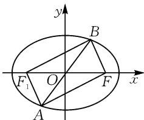
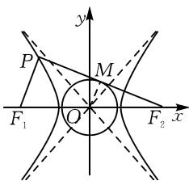
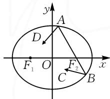
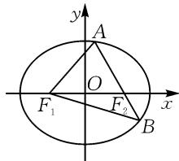
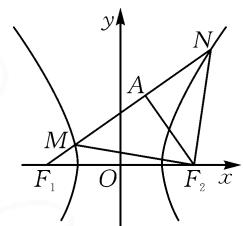

# 基于特殊三角形场景的离心率问题

# ● 安徽省无为中学 邹玲玲

摘要: 离心率的求解与应用, 是圆锥曲线综合应用问题中最为关键的一环. 文中结合实例中特殊三角形的创设场景与应用剖析, 归纳总结解题技巧与策略.

关键词: 离心率; 椭圆; 双曲线; 三角形; 渐近线

涉及椭圆或双曲线离心率的求解与应用问题,是高考命题中的一个重要方向.作为圆锥曲线形状特征的一个重要概念,离心率问题的内涵丰富且综合性强,备受命题者青睐.特别是基于特殊三角形场景的离心率问题,可以合理交汇平面几何与平面解析几何知识,融入三角形的几何性质、圆锥曲线的定义与基本性质等,成为创新问题设置与应用的一个重要阵地,备受关注.

# 1 焦点三角形场景下的离心率问题

在椭圆或双曲线中,两焦点与曲线上一动点(不在两焦点所在的直线上)构成的三角形就是焦点三角形,借助焦点三角形所具有的平面几何性质,联系椭圆或双曲线的定义加以转化,合理构建离心率的关系式加以求解与应用.

例 1 [2023—2024 学年黑龙江省鹤岗一中高二（上）月考数学试卷（10 月份）] 已知椭圆 $\frac{x^{2}}{a^{2}} + \frac{y^{2}}{b^{2}} = 1$ (a > b > 0) 上一点 A 关于原点对称的点为 B, F 为其右焦点，若 $AF \perp BF$ ，设 $\angle ABF = \alpha$ ，且 $\alpha \in \left[\frac{\pi}{6}, \frac{\pi}{3}\right]$ ，则该椭圆的离心率 e 的取值范围是 \_\_\_\_.

解析: 如图 1 所示, 设椭圆的左焦点为 $F_{1}$ , 连接 $AF, AF_{1}, BF, BF_{1}$ , 则四边形 $AFBF_{1}$ 为矩形, 可知 $|AB| = |F_{1}F| = 4c$ .

根据椭圆的定义,有 $|AF|+$ $|AF_{1}|=2a$ .由 $\angle ABF=\alpha$ ,知$\angle BAF_{1} = \alpha$ ，则 $|AF| = 2c\sin \alpha ,|AF_{1}| = 2ccos\alpha$ ，于是可得 $2a = 2c\cos \alpha +2c\sin \alpha .$

$$
e = \frac {2 c}{2 a} = \frac {1}{\sin \alpha + \cos \alpha} = \frac {1}{\sqrt {2} \sin \left(\alpha + \frac {\pi}{4}\right)}. \text {由} \alpha \in
$$

$$
\left[ {\frac {\pi}{6}}, {\frac {\pi}{3}} \right], {\text {得}}   \alpha + {\frac {\pi}{4}} \in \left[ {\frac {5 \pi}{1 2}}, {\frac {7 \pi}{1 2}} \right], {\text {则}}   \sin \left(\alpha + {\frac {\pi}{4}}\right) \in
$$

text_image

y
B
F₁ O F x
A

图 1

$$
\left[ \frac {\sqrt {6} + \sqrt {2}}{4}, 1 \right].
$$

所以 $\frac{\sqrt{2}}{2} \leqslant \frac{1}{\sqrt{2}\sin\left(\alpha + \frac{\pi}{4}\right)} \leqslant \sqrt{3} - 1$ ，即 $e$ 的取值范围是 $\left[\frac{\sqrt{2}}{2}, \sqrt{3} - 1\right]$ .

故填答案： $\left[\frac{\sqrt{2}}{2},\sqrt{3} -1\right].$

点评:利用题设条件构建焦点三角形中对应边与角之间的关系,借助椭圆的定义巧妙联系,通过椭圆的离心率公式构建有关离心率的含参关系式,进而利用三角函数的有界性、不等式的基本性质(基本不等式等)等来分析与解决,实现离心率的求解与应用.

例 2 [2023—2024 学年山东省日照一中高二(上)第三次质检数学试卷(12月份)]已知双曲线 $\frac{x^{2}}{a^{2}}-\frac{y^{2}}{b^{2}}=1(a>0,b>0)$ 的左、右焦点分别为 $F_{1},F_{2},P$ 为双曲线左支上位于第二象限的一点，且满足 $\overrightarrow{PF_{1}}\cdot\overrightarrow{PF_{2}}=0$ ，若直线 $PF_{2}$ 与圆 $x^{2}+y^{2}=\frac{b^{2}}{4}$ 相切，则双曲线的离心率e为().

A. $\sqrt{2}$

B. $\sqrt{3}$

C. $\sqrt{5}$

D.2

解析: 如图 2 所示, 设切点为 M, 连接 OM, 则 $OM \perp PF_{2}$ .

因为 $\overrightarrow{PF_{1}} \cdot \overrightarrow{PF_{2}} = 0$ ，所以 $PF_{1} \perp PF_{2}$ ，所以 $PF_{1} \parallel OM$ ，且 $|OM| = \frac{1}{2} |PF_{1}| = \frac{b}{2}$ ，所以 $|PF_{1}| = b$ 。

text_image

y
P
M
F₁ O F₂ x

图2

由双曲线的定义, 可得 $\left|PF_{2}\right|=2a+\left|PF_{1}\right|=2a+b.$ 又 $\left|PF_{1}\right|^{2}+\left|PF_{2}\right|^{2}=\left|F_{1}F_{2}\right|^{2}$ ，则 $b^{2}+(2a+b)^{2}=4c^{2}$ ，整理可得 2a=b，所以 $4a^{2}=b^{2}=c^{2}-a^{2}$ ，则 $\frac{c^{2}}{a^{2}}=5$ ，所

以 $e=\sqrt{5}$ .

故选择答案:C.

点评:利用题设条件构建焦点三角形中对应边与角之间的关系,并结合平面几何性质、双曲线的定义等构建相关边长之间的关系,为进一步利用双曲线的离心率公式确定关系奠定条件.

# 2 “4a 体”三角形场景下的离心率问题

在椭圆或双曲线中, 过其中一个焦点的弦与椭圆或双曲线交于两点, 则这两点与另一个焦点所构成的三角形就是“4a 体”三角形, 根据椭圆或双曲线的定义, 这个三角形的周长(或对应边中的一部分线段长)恰好为常数 4a, 成为回归定义, 联系性质的一个重要载体.

例 3 [2024 年广东省广州市白云区高三(下)月考数学试卷(2 月份)] 古希腊数学家阿波罗尼奥斯在研究圆锥曲线时发现了椭圆的光学性质: 从椭圆的一个焦点射出的光线, 经椭圆反射, 其反射光线必经过椭圆的另一焦点,如图3,设椭圆的方程为 $\frac{x^{2}}{a^{2}}+\frac{y^{2}}{b^{2}}=1(a>b>0)$ , $F_{1}$ , $F_{2}$ 为其左、右焦点,若从右焦点 $F_{2}$ 发出的光线经椭圆上的点A和点B反射后,满足 $AB\perp AD,\cos\angle ABC=\frac{4}{5}$ ,则该椭圆的离心率e为().

text_image

y
A
D
F₁ O F₂ x
C B

图3

A. $\frac{1}{3}$

B. $\frac{1}{2}$

C. $\frac{\sqrt{2}}{2}$

D. $\frac{\sqrt{3}}{2}$

解析: 如图 4, $\cos\angle ABF_{1}=\frac{4}{5}=\frac{|AB|}{|BF_{1}|}$ ，则 $\sin\angle ABF_{1}=\sqrt{1-\cos^{2}\angle ABF_{1}}=\frac{3}{5}=\frac{|AF_{1}|}{|BF_{1}|}$ ，可知 $|AB|:\left|AF_{1}\right|:\left|BF_{1}\right|=4:3:5$ ，设 $|AB|=4k,\left|AF_{1}\right|=3k,\left|BF_{1}\right|=5k.$

text_image

y
A
O
F₁ F₂ x
B

图4

由 $|AB| + |AF_1| + |BF_1| = |AF_2| + |BF_2| + |AF_1| + |BF_1| = 4a$ ，得 $4k + 3k + 5k = 4a$ ，即 $3k = a$ ，则 $|AF_2| = 2a - |AF_1| = 3k$ .

在 $\mathrm{Rt}\triangle AF_1F_2$ 中， $|F_{1}F_{2}| = \sqrt{|AF_{1}|^{2} + |AF_{2}|^{2}} = 3\sqrt{2} k = 2c$ ，所以 $e = \frac{2c}{2a} = \frac{3\sqrt{2}k}{6k} = \frac{\sqrt{2}}{2}.$

故选择答案:C.

点评:结合椭圆的定义,对应三角形的周长恰好为常数4a,成为解决此类三角形场景问题的一个重要切入点.在实际解决椭圆中与“4a体”三角形有关的问题时,经常借助解三角形思维,巧妙构建三角形中边与角之间的关系式来转化与应用,特别情况下直接利用勾股定理.

例 4 （2024 年四川省成都市锦江区嘉祥外国语高级中学高考数学三诊试卷）已知 $F_{1}, F_{2}$ 是双曲线 $C: \frac{x^{2}}{a^{2}} - \frac{y^{2}}{b^{2}} = 1 (a > 0, b > 0)$ 的左、右焦点，过 $F_{1}$ 作斜率为 $\frac{\sqrt{2}}{2}$ 的直线 l，与双曲线的左、右两支分别交于 M，N 两点，以 $F_{2}$ 为圆心的圆过点 M, N，则双曲线 C 的离心率 e 为（）.

A. $\sqrt{2}$

B. $\sqrt{3}$

C.2

D. $\sqrt{5}$

解析:如图5,取MN的中点A,连接 $AF_{2}$ ,则 $AF_{2}\perp MN$ .令 $|MF_{2}|=|NF_{2}|=m$ .

由双曲线定义，得 $|MF_{1}|=$ $|MF_{2}|-2a=m-2a,|NF_{1}|=$ $|NF_{2}|+2a=m+2a$ ，则 $|MN|=$ $|NF_{1}|-|MF_{1}|=4a$ ，于是可得 $|MA|=2a.$

text_image

y
N
A
M
F₁ O F₂ x

图 5

在 Rt $\triangle AF_{1}F_{2}$ 中， $|AF_{1}| = m$ ，则 $|AF_{2}| = \sqrt{4c^{2} - m^{2}}$ .

在 $\mathrm{Rt}\triangle AMF_2$ 中， $|AF_2| = \sqrt{m^2 - 4a^2}$ .

所以 $\sqrt{m^2 - 4a^2} = \sqrt{4c^2 - m^2}$ ，即 $m^2 = 2a^2 + 2c^2$

因为直线 $l$ 的斜率为 $\frac{\sqrt{2}}{2}$ ，则 $\tan \angle AF_1F_2 = \frac{\sqrt{2}}{2}$ ，即 $\frac{|AF_2|}{|AF_1|} = \frac{\sqrt{2}}{2}$ ，于是有 $\frac{2c^2 - 2a^2}{2c^2 + 2a^2} = \frac{1}{2}$ ，则 $c = \sqrt{3} a$ ，从而 $e = \frac{c}{a} = \sqrt{3}$ .

故选择答案:B.

点评:结合双曲线的定义可以确定相应三角形中对应边的部分线段长度恰为常数4a,给三角形中边与角的关系构建与应用创造了条件.回归双曲线的定义,并结合平面几何图形的几何性质与结构特征,是合理构建对应边之间关系的关键.

基于椭圆或双曲线中有关焦点三角形、“4a体”三角形等几类特殊三角形场景的离心率问题，也是此类三角形场景下综合应用中最具代表性的典型问题。实际解决此类问题时，关键在于合理融合平面几何的几何性质与平面解析几何中的代数属性，同时巧妙联系圆锥曲线的定义与几何性质等，进一步综合函数与方程、三角函数与不等式等其他相关知识，成为知识交汇、能力融合的一个重要场所，也是全面考查“四基”与“四能”的一个重要阵地。Z