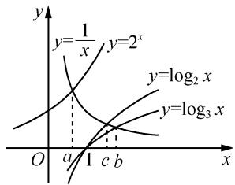
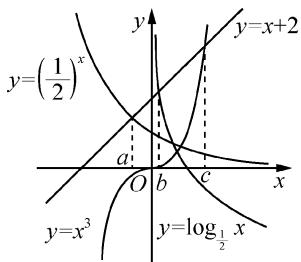

# 多技巧应用,比大小关系

# 江苏省灌南县第二中学 孙猛生

摘要:有关大小关系与大小比较问题,是近年高考数学试卷中涉及代数式或参数值的关系问题中比较常见的一类基本考查类型,依托幂函数、指数函数与对数函数等问题场景,结合代数式或参数值的创设,借助典型实例剖析与应用,归纳总结解题的技巧、方法与应对策略.

关键词: 大小; 函数; 直接; 分离; 作商; 零点

有关大小关系与大小比较问题,可以合理串联起幂函数、指数函数、对数函数等基本初等函数模型,巧妙交汇函数与方程、不等式及其基本性质、函数与导数等相关知识,并融合相应的代数运算与图象性质等,成为近年高考数学试卷中一类基本考查类型,也是命题的热点问题之一.本文中结合大小关系与大小比较问题求解中比较常见的几类技巧、方法,借助实例加以剖析与应用,抛砖引玉.

# 1 直接法比大小

例 1 （1）（2023 年高考数学天津卷）若 $a = 1.01^{0.5}$ , $b = 1.01^{0.6}$ , $c = 0.6^{0.5}$ ，则 a, b, c 的大小关系为（）.

$$
\mathrm{A.} c > a > b
$$

$$
\mathrm{B.} c > b > a
$$

$$
\mathrm{C}. a > b > c
$$

$$
\mathrm{D}. b > a > c
$$

(2)已知 $a=\log_{5}2, b=\log_{0.5}0.2, c=0.5^{0.2}$ ，则 a, b, c 的大小关系为（）.

$$
\mathrm{A}. a <   c <   b
$$

$$
\mathrm{B}. a <   b <   c
$$

$$
\mathrm{C}. b <   c <   a
$$

$$
\mathrm{D.} c <   a <   b
$$

解析:(1)由 $y=1.01^{x}$ 在 R 上单调递增, 得 $a=1.01^{0.5}<1.01^{0.6}=b$ . 由 $y=x^{0.5}$ 在 $[0,+\infty)$ 上单调递增, 知 $a=1.01^{0.5}>0.6^{0.5}=c$ , 所以 b>a>c.

故选择:D.

(2) 易知 $a = \log_{5} 2 < \log_{5} \sqrt{5} = \frac{1}{2}, b = \log_{0.5} 0.2 >$ $\log_{0.5} 0.25 = 2.$ 又 $0.5^{1} < 0.5^{0.2} < 0.5^{0}$ ，得 $\frac{1}{2} < c < 1$ .

所以 $a < c < b$ .

故选择:A.

点评: 直接法比大小, 是解决涉及指数、对数、幂等大小比较问题时的常用方法. 根据不同类型, 又有一定的差异. ①底数相同、指数不同时, 如 $a^{x_{1}}$ 和 $a^{x_{2}}$ , 利用指数函数 $y = a^{x}$ 的单调性比较大小; ②指数相同、底数不同时, 如 $x_{1}^{a}$ 和 $x_{2}^{a}$ , 利用幂函数 $y = x^{a}$ 的单调性比较大小；③底数相同、真数不同时，如 $\log_a x_1$ 和 $\log_a x_2$ ，利用对数函数 $\log_a x$ 的单调性比较大小；④底数、指数、真数都不同时，寻找中间变量0,1或者其他能判断大小关系的中间量，借助中间量进行大小关系的判定.

# 2 分离法比大小

例 2 （1）设 $a=\log_{2}6, b=\log_{5}15, c=\log_{7}21$ ，则（）.

$$
\mathrm{A}. a > b > c
$$

$$
\mathrm{B.} a > c > b
$$

$$
\mathrm{C}. b > c > a
$$

$$
\mathrm{D}. c > b > a
$$

(2) 设 $a=\log_{2}3, b=\log_{8}12, c=\lg 15$ ，则 a, b, c 的大小关系为（）.

$$
\mathrm{A}. a > b > c
$$

$$
\mathrm{B}. b > c > a
$$

$$
\mathrm{C.} c > b > a
$$

$$
\mathrm{D}. a > c > b
$$

解析:(1)由对数的运算性质,可得 $a=\log_{2}6=\log_{2}(2\times3)=1+\log_{2}3=1+\frac{1}{\log_{3}2},b=\log_{5}15=$

$$
\log_ {5} (5 \times 3) = 1 + \log_ {5} 3 = 1 + \frac {1}{\log_ {3} 5}, c = \log_ {7} 2 1 =
$$

$$
\log_ {7} (7 \times 3) = 1 + \log_ {7} 3 = 1 + \frac {1}{\log_ {3} 7}.
$$

又 $0 < \log_3 2 < \log_3 5 < \log_3 7$ ，则 $\frac{1}{\log_3 2} > \frac{1}{\log_3 5} > \frac{1}{\log_3 7}$ ，所以 $a > b > c$ 。

故选择:A.

(2) 易得 $\log_2 3 = \log_2 \left(2 \times \frac{3}{2}\right) = 1 + \log_2 \frac{3}{2} = 1 + \frac{1}{\log_{\frac{3}{2}} 2}, \log_8 12 = \log_8 \left(8 \times \frac{3}{2}\right) = 1 + \log_8 \frac{3}{2} = 1 + \frac{1}{\log_{\frac{3}{2}} 8}, \lg 15 = \lg \left(10 \times \frac{3}{2}\right) = 1 + \lg \frac{3}{2} = 1 + \frac{1}{\log_{\frac{3}{2}} 10}$ .

因为 $0 < \log_{\frac{3}{2}} 2 < \log_{\frac{3}{2}} 8 < \log_{\frac{3}{2}} 10$ ，所以 $\log_{2} 3 > \log_{8} 12 > \lg 15$ ，即 a > b > c。故选择：A.

点评: 分离法比大小, 是解决对数式的大小关系中比较常用的一种方法. 解题的关键就是充分挖掘底数和真数的关系, 当出现相同的倍数关系时, 往往先统一分离常数, 化归相同部分与差异部分, 对差异部分进行比较分析.

# 3 作商法比大小

例 3 （1）已知 $7^{p}=8,8^{q}=9,p^{r}=q$ ，则 p,q,r 的大小关系为（）.

A. $r > p > q$

B. $q > p > r$

C. $q > r > p$

D. $p > q > r$

(2)已知 $3^{a}=4^{b}=5^{c}=0.3^{-\frac{1}{3}}$ ，则 a,2b,c 的大小关系是().

A.a>2b>c

B. $a > c > 2b$

C.2b>a>c

D. $c > a > 2b$

解析:(1)由题意可得 $p=\log_{7}8>1, q=\log_{8}9>1$ ，则 $r=\log_{p}q>0$ .

因为 $\ln 7 \cdot \ln 9 < \frac{(\ln 7 + \ln 9)^2}{4} = \frac{(\ln 63)^2}{4} < \frac{(\ln 64)^2}{4} = (\ln 8)^2$ ，即 $\ln 7 \cdot \ln 9 < (\ln 8)^2$ ，所以 $p - q = \log_7 8 - \log_8 9 = \frac{\ln 8}{\ln 7} - \frac{\ln 9}{\ln 8} = \frac{(\ln 8)^2 - \ln 7 \ln 9}{\ln 7 \ln 8} > 0$ ，即 $p > q$ .

又因为 $r=\log_{p}q<\log_{p}p=1$ ，所以 p>q>r。

故选择:D.

(2) 因为 $0.3^{-\frac{1}{3}} > 0.3^{0} = 1$ ，所以设 $3^{a} = 4^{b} = 5^{c} = 0.3^{-\frac{1}{3}} = t > 1$ ，则 $a = \log_{3} t, b = \log_{4} t, c = \log_{5} t$ .

因为 t>1，所以 a>0, b>0, c>0.

因为 $\frac{a}{c} = \frac{\log_3t}{\log_5t} = \frac{\lg 5}{\lg 3} >1$ ，所以 $a > c$ ；因为 $\frac{a}{2b} = \frac{\log_3t}{2\log_4t} = \frac{\lg 4}{2\lg 3} = \frac{\lg 4}{\lg 9} < 1$ ，所以 $2b > a$

综上，2b>a>c.故选择：C.

点评:作商法比大小,往往适用于指数式问题,合理通过作商法来化简与变形,为进一步的大小比较创造条件.在作商法中,有时为了大小比较的需要,可借助基本不等式 $ab \leqslant \frac{(a+b)^{2}}{4}$ 进行放缩变形与应用.

# 4 零点法比大小

例 4 （1）设正实数 a, b, c 分别满足 $a \cdot 2^{a} = b \cdot \log_{3} b = c \cdot \log_{2} c = 1$ ，则 a, b, c 的大小关系为（）.

A.a>b>c

B.b>c>a

C. $c > b > a$

D. $a > c > b$

(2)已知 $f(x)=\left(\frac{1}{2}\right)^{x}-x-2$ , $g(x)=\log_{\frac{1}{2}}x-x-2$ , $h(x)=x^{3}-x-2$ 的零点分别是 a, b, c，则 a, b, c 的大小关系是().

A.a>b>c

B. $c > b > a$

C.b>c>a

D. $b > a > c$

解析:(1)由已知可得 $\frac{1}{a}=2^{a},\frac{1}{b}=\log_{3}b,\frac{1}{c}=\log_{2}c.$ 作出 $y=2^{x},y=\log_{2}x,y=\log_{3}x$ 的图象,如图1所示,则它们与 $y=\frac{1}{x}$

line

| Point | y (log₂ x) | y (log₃ x) | y = 1/x |
|---|---|---|---|
| a | a | a | a |
| b | b | b | b |
| c | c | c | c |
| d | d | d | d |

图1

的图象的交点的横坐标依次为 a, c, b. 由图象可得 b > c > a，故选择：B.

(2) 易知函数 $f(x)=\left(\frac{1}{2}\right)^{x}-x-2$ , $g(x)=\log_{\frac{1}{2}}x-x-2$ , $h(x)=x^{3}-x-2$ 的零点即为函数 $y=x+2$ 与函数 $y=\left(\frac{1}{2}\right)^{x}$ , $y=\log_{\frac{1}{2}}x$ , $y=x^{3}$

text_image

y=(1/2)^(x)
y=x+2
a
O
b
c
x
y=x^3
y=log_1/2 x

图2

的图象交点的横坐标,作出图象,如图2所示.

由图 2 可得 a < b < c，故选择：B.

点评:零点法比大小,依托函数的零点,巧妙将函数与方程加以合理化归与转化,借助函数的图象交点及函数与坐标轴的交点、函数的区间值域,来寻找特殊值之间的位置关系,从而比较大小.

其实，在大小关系或大小比较及其相关综合问题中，根据问题应用场景，合理对相关的关系式或代数式进行恒等变形与转化。若能够利用函数的图象与性质，则可以采用直接法或零点法等来处理；若无法直接加以分析与比较，则可以对关系式等采用分离法、作商法等，合理加以转化并应用。方法与技巧是不变的，而问题是变化的，合理加以分析，正确进行挖掘处理，从而实现问题的突破与解决。

有关大小关系与大小比较问题,形式各样,变化多端,充分把握代数式或参数值的结构特征,合理选择与之相应的技巧方法,实现问题的突破与应用.而以上对应的解题技巧与方法,都离不开幂函数、指数函数、对数函数等基本初等函数模型所对应的基础知识与基本技巧,正确把握解决此类大小比较问题的“通技通法”,以及处理问题的“巧技妙法”,全面落实“四基”,掌握数学思想方法,提升数学能力,优化数学品质,培养数学核心素养.Z