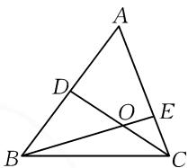
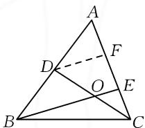
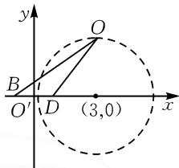
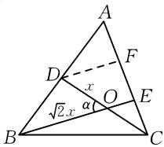
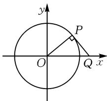

# 敢思 敢做 更精彩

# - 江苏省南通市通州区金沙中学 何彩霞

摘要:“一题多解”有助于提升学生的数学思维能力,教学中,如果常以“一题多解”题型展开教学,学生的数学解题能力必定会有大幅度提高.通过对一道三角形面积的最值问题加以探究,引导学生领略多角度解题的精彩,并学会从多个角度来思考、分析、解决问题.

关键词:三角形;面积;最大值

题目 如图 1, 在 $\triangle ABC$ 中, AB=4, D 是 AB 的中点, E 在边 AC 上, AE=2EC, CD 与 BE 交于点 O, 若 $OB=\sqrt{2}OC$ , 求 $\triangle ABC$ 面积的最大值.

text_image

A
D
O
E
B
C

图1

思路 1: 由于 D 是 AB 的中点, 那么 CD 就将 $\triangle ABC$ 分割为两个面积相等的三角形—— $\triangle ACD$ 和 $\triangle BCD$ , 因此只需求得 $\triangle BCD$ 的面积的最大值即可.

在三角形问题中,如果涉及边的中点,往往构造中位线,题中已知“D 是 AB 的中点且 AE=2EC”,可依此作出边 AC 的另一个三等分点(即线段 AE 的中点),与点 D 构造出中位线,这样,图形中就会出现一些相似的三角形和一些成比例的线段,这对 $\triangle BCD$ 面积的求解必定有很大帮助.

解析 1: 如图 2 所示, 作出线段 AE 的中点 F, 连接 DF. 因为 D 是 AB 的中点且 AE = 2EC, 则 DF, OE 分别为 $\triangle ABE$ 和 $\triangle CDF$ 的中位线, 于是 DF = 2OE, BE = 2DF. 不妨设 OE = x, 那么 DF =

  
图2

2x, BE = 4x，所以 OB = 3x。又 OB = $\sqrt{2}$ OC，所以 OC = $\frac{OB}{\sqrt{2}}$ = $\frac{3x}{\sqrt{2}}$ = $\frac{3\sqrt{2}}{2}$ x = OD。注意到 $\frac{OD}{OB}$ = $\frac{3\sqrt{2}}{2}$ x : 3x = $\frac{\sqrt{2}}{2}$ 为定值，而 B, D 两点为定点，且 BD = $\frac{1}{2}$ AB = 2，可知点 O 的运动轨迹应该是一个圆，结论的具体由来如下：

如图3，以 $BD$ 所在直线为 $x$ 轴， $BD$ 的垂直平分线为 $y$ 轴，建立平面直角坐标系 $xO'y$ ，则 $B(-1,0)$ ， $D(1,0)$ 。设 $O(x,y)$ ，由 $\frac{OD}{OB} = \frac{\sqrt{2}}{2}$ 得 $\frac{\sqrt{(x - 1)^2 + y^2}}{\sqrt{(x + 1)^2 + y^2}} =$

$\frac{\sqrt{2}}{2}$ ，整理得 $(x-3)^{2}+y^{2}=8$ ，即点O的轨迹为以(3,0)为圆心， $2\sqrt{2}$ 为半径的圆。因此 $\triangle BOD$ 面积的最大值为 $\frac{1}{2}BD\cdot r=\frac{1}{2}\times$ $2\times2\sqrt{2}=2\sqrt{2}$ ，于是 $S_{\triangle BOC}$ 也有最大值为 $2\sqrt{2}$ 。所以 $\triangle ABC$ 面积的最大值为 $8\sqrt{2}$ 。

text_image

y
O
B
O'
D
(3,0)
x

图3

点评:解析中,中位线 DF 的辅助,以及动点 O 轨迹的确定是关键,这是一个隐含的阿波罗尼斯圆,只有发现这个“阿氏圆”,方可快捷求得 $\triangle BOD$ 面积的最大值,进而解决 $\triangle ABC$ 面积的最大值.

在解析 1 中, 根据 $\frac{OD}{OB} = \frac{\sqrt{2}}{2}$ 为定值, 推算出点 O 的轨迹是圆, 若意识不到点 O 的轨迹圆, 是否还有其他解决途径呢?

思路 2: 由于 $BD = \frac{1}{2} AB = 2$ ，且已经算得 $\frac{OD}{OB} = \frac{\sqrt{2}}{2}$ ，因此不妨将 OD, OB 按比例设出，如可设 OD = x, $OB = \sqrt{2} x$ ，如此，则可以借助余弦定理，进一步计算出 $\triangle BOD$ 某一内角的正弦值，从而将 $\triangle BOD$ 的面积表示为关于 x 的函数，求此函数的最大值即可.

解析 2: 在解析 1 中, 已求得 $\frac{OD}{OB} = \frac{\sqrt{2}}{2} = \frac{1}{\sqrt{2}}$ , 不妨设 OD = x, OB = $\sqrt{2}x$ . 因为 $BD = \frac{1}{2}AB = 2$ , 在 $\triangle BOD$ 中, 根据余弦定理可得 $BD^{2} = OB^{2} + OD^{2} - 2OB \cdot OD\cos\angle BOD$ , 即 $4 = x^{2} + 2x^{2} - 2x \cdot \sqrt{2}x \cdot \cos\angle BOD$ , 所以 $\cos\angle BOD = \frac{3x^{2} - 4}{2\sqrt{2}x^{2}}$ , 则 $\sin\angle BOD = \sqrt{1 - \left(\frac{3x^{2} - 4}{2\sqrt{2}x^{2}}\right)^{2}}$ , 于是 $\triangle BOD$ 的面积 $S = \frac{1}{2}OB \cdot$

$OD\sin \angle BOD = \frac{1}{2} \times \sqrt{2} x^2 \times \sqrt{1 - \left(\frac{3x^2 - 4}{2\sqrt{2}x^2}\right)^2} = \frac{1}{4}\sqrt{-(x^2 - 12)^2 + 128} \leqslant \frac{\sqrt{128}}{4} = 2\sqrt{2}$ ，即 $\triangle BOD$ 面积 $S$ 的最大值为 $2\sqrt{2}$ ，所以 $\triangle ABC$ 面积的最大值为 $4S = 8\sqrt{2}$ .

点评:解析中,根据比例关系巧设 OB,OD 的长度,运用余弦定理求出 $\angle BOD$ 的余弦值,并将 $\triangle BOD$ 的面积表示为关于 x 的函数是关键, $\triangle BOD$ 面积的问题最终转化为二次函数的最值问题来处理,体现了数学中的转化思想.

在解析 2 中, 将 $\triangle BOD$ 的面积表示为关于边长 OD, 即关于 x 的函数, 恰巧可以转化为二次函数的最值问题. 那么, 可以换个角度思考吗? 是否也可以转化为关于相关角的函数呢? 不妨一试.

思路 3: 在 $\triangle BOD$ 中, 不妨设 $\angle BOD = \alpha$ , $OD = x$ , $OB = \sqrt{2}x$ , 则在 $\triangle BOD$ 中, 可利用余弦定理将角 $\alpha$ 与 x 联系起来, 并用角 $\alpha$ 来表示 x, 再将 $\triangle BOD$ 的面积表示为关于 $\alpha$ 的函数, 运用导数求得最大值.

解析 3: 如图 4, 设 $\angle BOD = \alpha, OD = x$ , 由解析 1 可知, $\frac{OD}{OB} = \frac{1}{\sqrt{2}}$ , 则 $OB = \sqrt{2}x$ . 在 $\triangle BOD$ 中, 根据余弦定理可得, $BD^{2} = OB^{2} +$ $OD^{2} - 2OB\cdot OD\cos \alpha$ ，因为 $BD = 2$ ，则有 $4 = x^{2}+$ $2x^{2} - 2x\cdot \sqrt{2} x\cos \alpha$ ，于是 $x^{2} = \frac{4}{3 - 2\sqrt{2}\cos\alpha}$ ，所以 $\triangle BOD$ 的面积 $S = \frac{1}{2} OB\cdot OD\sin \alpha = \frac{\sqrt{2}}{2} x^2\sin \alpha =$ $\frac{\sqrt{2}}{2}\times \frac{4\sin\alpha}{3 - 2\sqrt{2}\cos\alpha} = \frac{2\sqrt{2}\sin\alpha}{3 - 2\sqrt{2}\cos\alpha}$ ，其中 $\alpha \in (0,\pi)$ .接下来就是如何求面积 $S$ 的最大值.

text_image

A
D
F
x
O
√2x
α
B
E
C

图4

方法1:(导数法)对函数S求导,可以得 $S'=\frac{2\sqrt{2}\cos\alpha\cdot(3-2\sqrt{2}\cos\alpha)-2\sqrt{2}\sin\alpha\cdot2\sqrt{2}\sin\alpha}{(3-2\sqrt{2}\cos\alpha)^{2}}=$ $\frac{6\sqrt{2}\cos\alpha-8\cos^{2}\alpha-8\sin^{2}\alpha}{(3-2\sqrt{2}\cos\alpha)^{2}}=\frac{6\sqrt{2}\cos\alpha-8}{(3-2\sqrt{2}\cos\alpha)^{2}}.$

令 $S'=0$ ，得 $\cos\alpha_{1}=\frac{2\sqrt{2}}{3}$ .

当 $0 < \alpha < \alpha_{1}$ 时， $\cos \alpha > \frac{2\sqrt{2}}{3}$ ，此时 $S' > 0$ ，函数 S 单调递增；

当 $\alpha_{1}<\alpha<\pi$ 时， $\cos\alpha<\frac{2\sqrt{2}}{3}$ ，此时 $S^{\prime}<0$ ，函数 S 单调递减.

所以当 $\cos \alpha = \frac{2\sqrt{2}}{3}$ 时， $S$ 有最大值，此时 $\sin \alpha = \frac{1}{3}, S$ 最大值为 $\frac{2\sqrt{2} \times \frac{1}{3}}{3 - 2\sqrt{2} \times \frac{2\sqrt{2}}{3}} = 2\sqrt{2}$ ，故 $\triangle ABC$ 面积的最大值为 $8\sqrt{2}$ .

另外，观察到 $S = \frac{2\sqrt{2}\sin\alpha}{3 - 2\sqrt{2}\cos\alpha} = \frac{\sin\alpha}{\frac{3}{2\sqrt{2}} - \cos\alpha} =$ $\frac{\sin\alpha}{\frac{3\sqrt{2}}{4} - \cos\alpha} = -\frac{\sin\alpha}{\cos\alpha - \frac{3\sqrt{2}}{4}}$ ，可以将其理解为点

$P(\cos \alpha, \sin \alpha)$ 与点 $Q\left(\frac{3\sqrt{2}}{4}, 0\right)$ 连线斜率的相反数，要求 S 的最大值，只要求出直线 PQ 斜率的最小值即可.

方法 2: (斜率法) 因为 $S = \frac{2\sqrt{2}\sin\alpha}{3-2\sqrt{2}\cos\alpha} = -\frac{\sin\alpha}{\cos\alpha - \frac{3\sqrt{2}}{4}}$ ，其可以理解为点 $P(\cos\alpha, \sin\alpha)$ 与点

$Q\left(\frac{3\sqrt{2}}{4},0\right)$ 连线斜率的相反数，而点 $P(\cos\alpha,\sin\alpha)$ 为单位圆上的点，所以当直线 PQ 与圆 $x^{2}+y^{2}=1$ 在第一象限相切时，斜率取到最小值，此时 S 取到最大值，如图 5 所示.

text_image

y
P
O
Q x

图5

相切时易求得 $PQ=\sqrt{\left(\frac{3\sqrt{2}}{4}\right)^{2}-1}=\frac{\sqrt{2}}{4}$ ，则 $k_{PQ}=-\frac{OP}{PQ}=-2\sqrt{2}$ ，所以 S 的最大值为 $2\sqrt{2}$ ，故 $\triangle ABC$ 面积的最大值为 $8\sqrt{2}$ 。

点评:引入辅助角来表示面积 S,可以说是另辟蹊径,别有一番风味.在求面积 S 最大值的两种方法中,利用导数法判断 S 的单调性是难点,很容易出错,而斜率法巧妙地利用数形结合的思想方法,实现了“数”与“形”的有效转化.

在数学问题的解决过程中,要不断地培养自己勤于思考的习惯,努力地从不同的角度来分析问题、解决问题,长此以往,数学思维定会越来越缜密,解题能力定会得到大幅度提升. Z