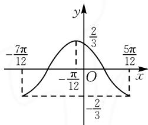
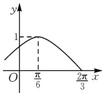
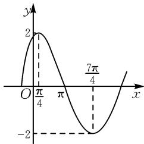

# 数形结合，“五点”逆用

——根据 $y=A\sin(\omega x+\varphi)$ 的图象确定解析式的方法探索

# 甘肃省陇南市康县第一中学 李曾义

学生在学习三角函数的过程中,经常会遇到给定一段函数的图象,要求据此确定函数解析式类的问题.但在解答此类题型时,很多学生对如何确定参数 A, $\omega,\varphi$ 的值,由于缺乏清晰的思路和有效的方法而感到无从下手,因此我们有必要加强这类题型的训练与指导.下面,结合典型实例来探索如何运用“五点逆用法”确定参数 A, $\omega,\varphi$ 的值.

# 1 最值点法

最值点法是通过将函数图象在一个周期内的最高点或最低点的坐标代入函数解析式,从而求出未知参数,特别是 $\varphi$ 的方法.

例 1 如图 1 是 $y = A \sin(\omega x + \varphi) (A > 0, \omega > 0)$ 的图象的一段，它的一个解析式为（）.

A. $y=\frac{2}{3}\sin\left(2x+\frac{\pi}{3}\right)$

$$
\mathrm{B}. y = \frac {2}{3} \sin \left(\frac {x}{2} + \frac {\pi}{4}\right)
$$

$$
\mathrm{C.} y = \frac {2}{3} \sin \left(x - \frac {\pi}{3}\right)
$$

$$
\mathrm{D}. y = \frac {2}{3} \sin \left(2 x + \frac {2 \pi}{3}\right)
$$

line

| x | y |
|---|---|
| -7π/12 | -2/3 |
| -π/12 | 0 |
| 0 | 2/3 |
| π/12 | -2/3 |
| 5π/12 | 0 |

图1

解析: 设函数的解析式为 $y = A \sin(\omega x + \varphi)$ ，只需要求出参数 $A, \omega, \varphi$ 的值即可。通过观察函数图象可知， $A = \frac{2}{3}$ 。由 $T = \frac{2\pi}{\omega} = \pi$ ，可知 $\omega = 2$ 。

由 $x = -\frac{\pi}{12}$ 时 $\frac{2}{3}\sin (2x + \varphi) = \frac{2}{3}$ , 得 $\varphi$ 的一个值为 $\frac{2\pi}{3}$ , 所以 $y = \frac{2}{3}\sin \left(2x + \frac{2\pi}{3}\right)$ .

故选：D.

方法与技巧:本题运用了最值点法,先设待求的函数解析式,再在观察理解图象的基础上,由函数的最大值、周期分别求出参数 $A,\omega,\varphi$ 的值即可.

例 2 函数 $f(x)=A\sin(\omega x+\varphi)$ (A>0, $\omega>0$ , $-\frac{\pi}{2}<\varphi<\frac{\pi}{2}$ , $x\in R$ ) 的部分图象如图 2 所示，求函数$y=f(x)$ 的解析式.

解析: 观察图象可得到 A=1， $\frac{T}{4}=\frac{2\pi}{2}-\frac{\pi}{6}=\frac{\pi}{2}.$

所以 $T=2\pi$ ，则 $\omega=1$ 。将点 $\left(\frac{\pi}{6},1\right)$ 代入，可得 $\sin\left(\frac{\pi}{6}+\varphi\right)=$

  
图 2

1, 又因为 $-\frac{\pi}{2}<\varphi<\frac{\pi}{2}$ ，所以 $\varphi=\frac{\pi}{3}$ 。所以所求的函数解析式为 $f(x)=\sin\left(x+\frac{\pi}{3}\right)$ 。

方法与技巧:本题运用了最值点法,将最高点坐标 $\left(\frac{\pi}{6},1\right)$ 代入原函数求出 $\varphi$ 的值是关键.

# 2 图象平移法

函数 $y=f(x)$ 图象平移的要领是“左右变相位”“左加右减”.

例 3 已知函数 $f(x)=3\sin(2x+\varphi)\left(0<\varphi<\frac{\pi}{2}\right)$ ，其图象向左平移 $\frac{\pi}{6}$ 个单位长度后关于 y 轴对称.

(1)求出函数 $f(x)$ 的解析式.

(2)如果该函数表示一个振动量时,指出其振幅、频率及初相,并说明其图象是怎样由 $y=\sin x$ 的图象得到的.

解析:(1)函数 $y=f(x)$ 的图象向左平移 $\frac{\pi}{6}$ 个单位长度后, 得到 $y=f(x)=3\sin\left[2\left(x+\frac{\pi}{6}\right)+\varphi\right]=3\sin\left(2x+\frac{\pi}{3}+\varphi\right)$ .

由 $\frac{\pi}{3} +\varphi = k\pi +\frac{\pi}{2}$ ，得 $\varphi = k\pi +\frac{\pi}{6},k\in \mathbf{Z}.$

因为 $\varphi \in \left(0, \frac{\pi}{2}\right)$ , 所以 $\varphi = \frac{\pi}{6}$ .

所以函数的解析式为 $f(x)=3\sin\left(2x+\frac{\pi}{6}\right)$ .

(2) 振幅为 3, 周期为 $\pi$ , 频率为 $\frac{1}{\pi}$ , 初相为 $\frac{\pi}{6}$ .

$$
y = \sin x \xrightarrow [ \text {向左平移} \frac {\pi}{6} \text {个单位长度} ]{} y = \sin \left(x + \frac {\pi}{6}\right)
$$

$$
\xrightarrow [ (\text {纵坐标不变}) ]{\text {横坐标缩短到原来的} \frac {1}{2}} y = \sin \left(2 x + \frac {\pi}{6}\right)
$$

$$
\xrightarrow [ (\text {横坐标不变}) ]{\text {纵坐标伸长到原来的3倍}} y = 3 \sin \left(2 x + \frac {\pi}{6}\right).
$$

方法与技巧:本题集中展示了运用图象平移法的技巧.其中第(1)小题反映了函数图象左右平移与相位改变的规律,第(2)小题考查了周期的变换,揭示了 $\omega$ 的值影响函数周期变换的规律.

# 3 巧用函数性质

例 4 （多选题）函数 $f(x)=\sin(2x+\varphi)(0<\varphi<\pi)$ 的图象以 $\left(\frac{2\pi}{3},0\right)$ 中心对称，则（）.

A. $y=f(x)$ 在 $\left(0,\frac{5\pi}{12}\right)$ 上单调递减

B. $y=f(x)$ 在 $\left(-\frac{\pi}{12},\frac{11\pi}{12}\right)$ 上有2个极值点

C. 直线 $x = \frac{7\pi}{6}$ 是一条对称轴

D. 直线 $y = \frac{\sqrt{3}}{2} - x$ 是一条切线

解析:由题意可得 $f\left(\frac{2\pi}{3}\right)=\sin\left(\frac{4\pi}{3}+\varphi\right)=0$ ，所以 $\frac{4\pi}{3}+\varphi=k\pi,k\in Z$ ，即 $\varphi=-\frac{4\pi}{3}+k\pi,k\in Z$ ，又 $0<\varphi<\pi$ ，所以 k=2 时， $\varphi=\frac{2\pi}{3}$ ，故 $f(x)=\sin\left(2x+\frac{2\pi}{3}\right)$ .

A 选项, 当 $x \in \left(0, \frac{5\pi}{12}\right)$ 时, $2x + \frac{2\pi}{3} \in \left(\frac{2\pi}{3}, \frac{3\pi}{2}\right)$ , 由函数 $y = \sin u$ 图象知 $y = f(x)$ 在 $\left(0, \frac{5\pi}{12}\right)$ 上单调递减.

B选项，当 $x \in \left(-\frac{\pi}{12}, \frac{11\pi}{12}\right)$ 时， $2x + \frac{2\pi}{3} \in \left(\frac{\pi}{2}, \frac{5\pi}{2}\right)$ ，由正弦函数 $y = \sin u$ 图象知 $y = f(x)$ 只有1个极值点，由 $2x + \frac{2\pi}{3} = \frac{3\pi}{2}$ 解得 $x = \frac{5\pi}{12}$ ，即 $x = \frac{5\pi}{12}$ 为函数在该区间的唯一极值点.

C 选项, 当 $x=\frac{7\pi}{6}$ 时, $2x+\frac{2\pi}{3}=3\pi$ , 则 $f\left(\frac{7\pi}{6}\right)=0$ ,
所以直线 $x=\frac{7\pi}{6}$ 不是对称轴.

D 选项, 根据 $y' = 2 \cos \left( 2x + \frac{2\pi}{3} \right) = -1$ , 可得

$\cos \left(2x + \frac{2\pi}{3}\right) = -\frac{1}{2}$ , 解得 $2x + \frac{2\pi}{3} = \frac{2\pi}{3} + 2k\pi$ 或 $2x + \frac{2\pi}{3} = \frac{4\pi}{3} + 2k\pi, k \in \mathbf{Z}$ , 从而得 $x = k\pi$ 或 $x = \frac{\pi}{3} + k\pi, k \in \mathbf{Z}$ .

所以函数 $y = f(x)$ 在点 $\left(0, \frac{\sqrt{3}}{2}\right)$ 处的切线斜率为 $k = y' \mid_{x=0} = 2\cos \frac{2\pi}{3} = -1$ ，切线方程为 $y - \frac{\sqrt{3}}{2} = -(x-0)$ ，即 $y = \frac{\sqrt{3}}{2} - x$ .

比对四个选项, 可知 A, D 两项符合题意.

故选:AD.

方法与技巧:本题根据函数的单调性、极值、对称轴等性质逐个比对判断各选项,即可解出.

# 4 变式练习

变式练习1 先将函数 $y = 2\sin \left(2x + \frac{\pi}{3}\right)$ 的周期扩大到原来的3倍，再将其图象向右平移 $\frac{\pi}{2}$ 个单位长度，则所得到的函数解析式为（ ）.

A. $y=2\sin\left(\frac{2}{3}x-\frac{\pi}{6}\right)$

B. $y=2\sin\left(\frac{3}{2}x-\frac{2\pi}{3}\right)$

C. $y=2\sin\frac{2}{3}x$

D. $y=2\sin\left(\frac{2}{3}x-\frac{2\pi}{9}\right)$

变式练习2 已知函数 $f(x) = \sin (\omega x + \varphi) (\omega > 0, 0 < \varphi < \pi)$ ，对任意 $x \in \mathbf{R}, f(x + 2) = -f(x)$ 恒成立。将函数 $f(x)$ 的图象向右平移 $\frac{1}{3}$ 个单位长度后，所得图象关于原点中心对称，则函数 $y = f(x)$ 在区间

[0,1]上的值域为\_\_\_\_.

变式练习3 如图3是函数 $y = A \sin (\omega x + \varphi) (A > 0, \omega > 0, -\pi < \varphi < \pi)$ 的图象，根据图中的条件写出该函数的解析式.

(扫码看变式练习的解析)

综上所述,已知函数 y =$A\sin(\omega x+\varphi)$ 的图象确定其解析式，一般采用待定系数法.运用待定系数法的关键在于掌握确定三个参数A， $\omega,\varphi$ 的方法.其中A的值可根据函数图象中的最大值、最小值来确定， $\omega$ 的值可通过求周期 T 来确定, $\varphi$ 可通过代入法和五点法来确定. Z

line

| x | y |
|---|---|
| 0 | 2 |
| π/4 | 2 |
| π | -2 |
| 7π/4 | -2 |

图3

  
扫码查看