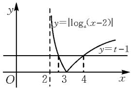
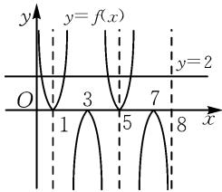
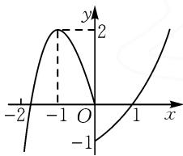
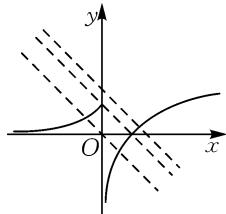

# 数形结合在函数零点问题中的应用

# ● 江苏省如东县掘港高级中学 王小锋

摘要:通过分析对数型函数、具有奇偶性的周期函数及复合函数的零点问题,系统探讨数形结合方法的应用策略.将零点问题转化为函数图象的交点问题,结合单调性、对称性及周期性绘制图象,直观判定零点个数、范围及分布规律.通过典型例题解析,展示数形结合在简化复杂问题、提升解题效率方面的优势.数形结合能够避免繁琐的代数运算,强化直观想象能力,为函数零点问题的求解提供高效路径.

关键词: 数形结合; 函数零点; 图象交点; 单调性; 周期函数

函数零点问题是中学数学与高考考查的核心内容之一,其不仅涉及对函数性质的深度理解,更要求学生具备将代数问题转化为几何直观的能力.传统解法常依赖代数运算或单调性分析,但面对复杂函数时,这些方法往往计算繁琐且难以直接判定零点的分布规律.数形结合作为一种重要的数学思想,通过将抽象的方程根的问题转化为函数图象的交点问题,能够突破代数方法的局限,直观揭示零点的存在性、数量及位置关系.本文基于经典试题,系统探讨数形结合在各类函数零点问题中的应用策略,旨在通过案例分析,验证数形结合在提升解题效率、规避复杂运算方面的优势,并为数学教学与考试解题提供一种更具普适性与直观性的方法论指导.

# 1 对数型函数的零点问题

例 1 若函数 $f(x)=\left|\log_{a}(x-2)\right|-t+1(a>0,a\neq1,t\in\mathbf{R})$ 有两个零点 m,n(m>n)，则下列说法中正确的是（）.

$$
\mathrm{A}. t \in [ 1, + \infty)
$$

$$
\mathrm{B.} n > 3
$$

$$
\mathrm{C.} (m - 2) (n - 2) = 2
$$

$$
\mathrm{D}. m n - 2 (m + n) = - 3
$$

解: 对于选项 A, 令 $f(x)=\left|\log_{a}(x-2)\right|-t+1=0$ , 即 $\left|\log_{a}(x-2)\right|=t-1$ , 则由函数 $f(x)=\left|\log_{a}(x-2)\right|-t+1(a>0, a\neq1, t\in\mathbf{R})$ 有两个零点 m, n (m>n), 可知方程 $\left|\log_{a}(x-2)\right|=t-1$ 有两个根, 即函数 $y=\left|\log_{a}(x-2)\right|$ , y=t-1 的图象有 2 个交点.

作出函数 $y=\left|\log_{a}(x-2)\right|$ 的图象, 如图 1 所示.

由图知,要使函数 $y = |\log_{a}(x - 2)|$ , y = t - 1 的图象有 2 个交点, 需 t - 1 > 0, 即 $t \in (1, +\infty)$ , 所以选项 A 错误.

  
图1

对于选项 B, 由选项 A 的分析可以得知函数 $y = \left| \log_{a}(x - 2) \right|$ , y = t - 1 的图象有 2 个交点, 交点的横坐标即为 m, n.

由于 m > n，结合图象可知 m > 3, 2 < n < 3，故选项 B 错误.

对于选项 C, D, 由由题意知 $\left|\log_{a}(m-2)\right|=t-1$ , $\left|\log_{a}(n-2)\right|=t-1$ , 则 $\left|\log_{a}(m-2)\right|=\left|\log_{a}(n-2)\right|$ , 而 m>3, 2<n<3, a 的取值不确定, 但是 $\log_{a}(m-2)$ , $\log_{a}(n-2)$ 的值必一正一负, 于是有 $\log_{a}(m-2)=-\log_{a}(n-2)=\log_{a}\frac{1}{n-2}$ , 即 $(m-2)(n-2)=1$ , 也即 $mn-2(m+n)=-3$ , 所以选项 C 错误, 选项 D 正确.

故选：D.

点评:涉及此类对数函数的零点问题,一般方法是将零点转化为函数图象的交点问题.解题的关键在于要判断出零点的范围,继而结合方程的根以及对数函数性质化简即可求解.

# 2 具有奇偶性的周期函数的零点问题

例 2 已知定义在 R 上的奇函数 $y=f(x)$ ，对于 $\forall x\in R$ 都有 $f(1+x)=f(1-x)$ ，当 $-1\leqslant x<0$ 时， $f(x)=\log_{2}(-x)$ ，则函数 $g(x)=f(x)-2$ 在 $(0,8)$ 内所有的零点之和为（）.

A.16

B.12

C.10

D.8

解:由题意,定义在 R 上的奇函数 $y=f(x)$ , 对于 $\forall x\in R$ , 都有 $f(1+x)=f(1-x)$ , 则 $f(x)$ 的图象关于直线 x=1 对称.

又 $f(1 + x) = f(1 - x) = -f(x - 1)$ ，即 $f(2 + x) = -f(x)$ ，故 $f(4 + x) = -f(2 + x) = f(x)$ ，所以函数 $f(x)$ 是以4为周期的周期函数.

当 $0 < x \leqslant 1$ 时， $-1 \leqslant -x < 0$ ，则知 $f(-x) = \log_2 x = -f(x)$ ，故 $f(x) = -\log_2 x, 0 < x \leqslant 1$ .

当 $1 \leqslant x < 2$ 时， $-1 \leqslant x - 2 < 0$ ，则 $f(x - 2) =$

$$
\log_ {2} (2 - x).
$$

又 $f(2 + x) = -f(x)$ ，所以 $f(x) = -f(x - 2)$ ，则 $f(x) = -f(x - 2) = -\log_2(2 - x), 1 \leqslant x < 2.$

当 $2 < x \leqslant 3$ 时， $0 < x - 2 \leqslant 1$ ，所以 $f(x) = -f(x - 2) = \log_2(x - 2)$ .

由此可作出函数 $f(x)$ 在 $(0,8)$ 内的图象, 如图 2 所示.

由 $g(x)=f(x)-2=0$ ,
可得 $f(x)=2.$

由图 2 可知 $y=f(x)$ 的图象与 y=2 在 $(0,8)$ 内仅有 4 个交点.

line

| x | y = f(x) |
|---|---|
| 0 | 0 |
| 1 | 0 |
| 3 | 0 |
| 5 | 0 |
| 7 | 0 |
| 8 | 0 |
y=2

图2

不妨设这4个交点的横坐标从左向右依次为 $x_{1}$ ， $x_{2}, x_{3}, x_{4}$ .

由于 $x = 1$ 为 $f(x)$ 图象的对称轴，且函数周期为4，则 $x = 5$ 也为函数图象的对称轴，故由图2可知 $x_{1}$ ， $x_{2}$ 关于 $x = 1$ 对称， $x_{3}, x_{4}$ 关于 $x = 5$ 对称，所以 $x_{1} + x_{2} = 2, x_{3} + x_{4} = 10$ .

所以 $x_{1} + x_{2} + x_{3} + x_{4} = 12$ ，即函数 $g(x) = f(x) - 2$ 在(0,8)内所有的零点之和为12.

故选：B.

点评: 解决此类函数性质的综合应用题目, 要能根据函数的性质, 比如奇偶性、对称性, 推出函数的周期, 然后结合给定区间上的解析式, 作出函数的大致图象, 利用数形结合, 即可解决问题.

# 3 复合函数的零点问题

例 3 （多选题）已知函数 $f(x)=\left\{\begin{aligned}x^{3}-3x,x&<0,\\ 2^{x}-2,x&\geqslant0,\end{aligned}\right.$ 若关于 x 的方程 $f^{2}(x)-(2a+1)f(x)+a^{2}+a=0$ 有 6 个不同的实根，则实数 a 可能的取值有（）.

A. $-\frac{1}{2}$

B. $\frac{1}{2}$

C. $\frac{3}{4}$

D.2

解: 当 x<0 时, $f(x)=x^{3}-3x$ , 则 $f'(x)=3x^{2}-3=3(x-1)(x+1)$ .

当 $x \in (-\infty, -1)$ 时， $f'(x) > 0$ ，则 $f(x)$ 单调递增；当 $x \in (-1, 0)$ 时， $f'(x) < 0$ ，则 $f(x)$ 单调递减。作出 $f(x)$ 的图象，如图 3 所示。

line

| x | y |
|---|---|
| -2 | -1 |
| -1 | 2 |
| 0 | -1 |
| 1 | 2 |

图3

因为 $f^{2}(x)-(2a+1)$

$f(x)+a^{2}+a=(f(x)-a)(f(x)-a-1)=0$ ，所以问题转化为方程 $f(x)=a$ 与方程 $f(x)=a+1$ 共有6个不等实根.

由图 3 可知 $f(x)=2$ 时，x=-1 或 x=2，即$f(x)=2$ 有两个根.

若使 $f(x)=a$ 与 $f(x)=a+1$ 共 6 个不等实根，
只需满足 $\left\{\begin{aligned}0<a<2,\\ 0<a+1<2,\end{aligned}\right.$ 即 0<a<1. 故选：BC.

点评:本题的关键点是作出 $f(x)$ 的图象, 将问题转化为方程 $f(x)=a$ 与方程 $f(x)=a+1$ 共 6 个不等实根, 然后结合图象求解, 考查学生的思维能力与直观想象能力.

例 4 已知函数 $f(x)=\left\{\begin{aligned} &e^{x},&x\leqslant0,\\ &\ln x,&x>0,\end{aligned}\right.$ $g(x)=f(x)+x+a.$ 若 $g(x)$ 存在 2 个零点，则 a 的取值范围是（）.

A. $[-1,0)$

B. $\left[-1,+\infty\right)$

C. $[0,+\infty)$

D. $[1,+\infty)$

解: 函数 $g(x)=f(x)+x+a$ 存在 2 个零点, 即关于 x 的方程 $f(x)=-x-a$ 有 2 个不同的实根, 也即函数 $f(x)$ 的图象与直线 y=-x-a 有 2 个交点. 作出直线 y=-x-a 与函数 $f(x)$ 的图象, 如图 4 所示. 由图 4可知，当 $-a\leqslant1$ 时， $f(x)$ 的图象与直线y=-x-a有2个交点，解得 $a\geqslant-1$ .故选：B.

text_image

Mathematical graph showing a parabola and two dashed lines intersecting at origin, with coordinate axes labeled x and y.

图4

点评:先作出分段函数 $f(x)$ 的图象,然后把 $g(x)$ 有两个零点转化为函数 $f(x)$ 的图象与直线 y = -x - a 有 2 个交点,结合图象,平行移动直线,找临界状态即可求解.

本文中通过三类典型函数零点问题的深入分析，验证了数形结合方法在解决复杂零点问题中的高效性与普适性。研究结果表明，对数型函数通过图象交点转化，能够快速判定零点范围与数量；奇偶性周期函数结合对称性与周期性作图，可直观揭示零点的分布规律；复合函数问题借助导数分析图象形态，分层讨论方程的根的个数，有效避免多解遗漏。相较于传统代数方法，数形结合不仅简化了计算流程，更通过几何直观强化了学生对函数性质与零点关系的理解，尤其在处理非单调或嵌套结构问题时优势显著。在数学教学实践中，需强化函数图象的绘制与几何分析能力。这要求教师不仅要引导学生掌握基本函数图象的规范手绘，还应鼓励学生熟练运用技术工具进行精准作图。核心目标在于帮助学生牢固建立“以形助数”的思维范式。这种将抽象代数关系转化为直观几何表征的能力，能显著降低理解复杂函数模型、方程与不等式以及动态问题的认知门槛，是提升学生综合运用数学工具、灵活解决复杂问题高阶素养的关键路径，为其应对更高层次数学挑战奠定坚实基础。Z