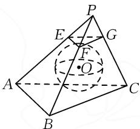
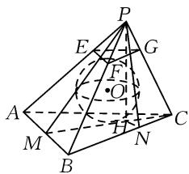
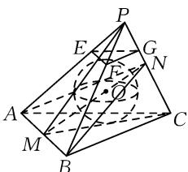
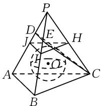

# 棱锥内切球设置,等积法思维应用

# ● 江苏省苏州实验中学 赵丽云

摘要: 空间几何体中的内切球及其综合应用问题, 是高考命题中的一个基本考查点, 备受各方关注. 本文中以一道高考模拟题为例, 以创新的形式, 结合三棱锥的内切球设置来合理应用, 通过不同思维视角来剖析与应用, 归纳技巧、方法, 总结提炼策略.

关键词:三棱锥;内切球;相切;三等分点;体积

空间几何体的内切球设置及其应用问题,是近年高考数学试卷中的一个基本考点,也是学生眼中的难点之一.空间几何体的内切球,其实质就是一个多面体的各面都与一个球的球面相切,这也是切入与解决问题的关键所在.

在分析与求解空间几何体的内切球及其应用问题时,可抓住空间几何体的结构特征加以分析,也可以类比平面几何图形中求内切圆的方法加以降维处理等,还可以结合等体积法的应用来分析与解决.

# 1 试题呈现

(2025 届全国 T8 高三部分重点中学 12 月联合测评数学试卷·8) 如图 1, 在三棱锥 P-ABC 中, PA = PB = CA = CB = 2,

$$
\angle A P B = \angle A C B = \frac {\pi}{2}, E, F, G
$$

text_image

Geometric diagram of a pyramid with labeled vertices and internal points, including dashed lines for hidden edges.

图1

分别为 PA, PB, PC 上靠近点 P的三等分点,若此时恰好存在一个小球与三棱锥 P-ABC 的四个面均相切,且小球同时还与平面 EFG 相切,则 PC=( ).

$$
\mathrm{A.} \sqrt {6} + \sqrt {2}
$$

$$
\mathrm{B.} \sqrt {6} - \sqrt {2}
$$

$$
\mathrm{C.} \sqrt {1 3} + 1
$$

$$
\mathrm{D.} \sqrt {1 3} - 1
$$

此题以三棱锥为问题场景,结合复杂条件的设置,利用三棱锥的内切球的确定与应用来巧妙设计,进而确定三棱锥对应边的长度.

以上以单选压轴题的形式来考查三棱锥的内切球的综合应用，属于一道中等难度的立体几何题，主要考查三棱锥场景下的内切球模型，依托三棱锥是通过两个等腰直角三角形，固定一个为底面，旋转另一个三角形到指定位置形成的。而对于内切球的分析，结合三等分点可得内切球半径和三棱锥高之间的关系，之后通过等体积法求解另外两个侧面的面积，结合三角形面积计算公式得出侧面三角形顶角的正弦值或对应边的长度等，合理通过数形结合、直观想象确定对应的三棱锥的棱长.

涉及空间几何体与其对应的内切球问题,经常借助空间几何体的等体积法来巧妙应用,也是解决此类问题常用的一种基本“通性通法”.

# 2 试题破解

解法 1: 等积法.

如图 2 所示, 取 AB 的中点 M, 连接 PM, CM.

由题可知 $AB \perp PM, AB \perp CM.$ 结合 $PM \cap CM = M, PM \subset$ 平面 PMC, $CM \subset$ 平面 PMC, 所以 $AB \perp$ 平面 PMC.

text_image

Geometric diagram of a pyramid with labeled vertices and internal points, used for spatial geometry problems.

图2

作 $PH \perp MC$ ，垂足为 H. 由于 $PH \subset$ 平面 $PMC$ , 所以 $AB \perp PH$ . 又 $CM \cap AB = M, CM \subset$ 平面 $ABC, AB \subset$ 平面 $ABC$ , 所以 $PH \perp$ 平面 $ABC$ .

过点 H 作 $HN \perp BC$ ，垂足为 N，连接 PN，易知 $BC \perp PN$ .

设小球的半径为 r，则 $\frac{PH}{2r} = \frac{PB}{FB} = \frac{3}{2}$ ，可得 PH = 3r。

根据题意, 可得 $V_{三棱锥P-ABC} = \frac{1}{3} S_{\triangle ABC} \cdot PH = \frac{1}{3}(S_{\triangle PAB} + S_{\triangle PAC} + S_{\triangle PBC} + S_{\triangle ABC}) \cdot r.$

由于 $S_{\triangle PAB}=S_{\triangle ABC}=2, S_{\triangle PAC}=S_{\triangle PBC}$ ，因此 6=4+2 $S_{\triangle PAC}$ ，则 $S_{\triangle PAC}=S_{\triangle PBC}=1$ 。

由 $\frac{1}{2}BC\cdot PN=1$ ，解得PN=1，所以 $\sin\angle PBC=\frac{PN}{PB}=\frac{1}{2}$ ，则 $\cos\angle PBC=\frac{\sqrt{3}}{2}$ .

结合余弦定理, 可得 $PC^{2}=PB^{2}+CB^{2}-2PB\cdot CB\cos\angle PBC=8-4\sqrt{3}$ ，则 $PC=\sqrt{6}-\sqrt{2}$ .

故选择答案:B.

点评:等积法思维是处理空间几何体中内切球及其综合应用问题时,常用的一种基本技巧、方法.借助空间几何体的体积确定,并结合内切球所对应的半径与空间几何体的对应底面来分割确定对应的体积,综合等积法思维来构建,给问题的进一步探究与应用创造条件.

解法 2: 降维思维法.

如图 3 所示, 取 AB 的中点 M, 连接 PM, CM; 取 PC 的中点 N, 连接 AN, MN, BN.

由题可知 $AB \perp PM, AB \perp CM.$ 结合 $PM \cap CM = M, PM \subset$ 平面 PMC, $CM \subset$ 平面 PMC, 所以 $AB \perp$ 平面 PMC.

text_image

Geometric diagram of a pyramid with labeled vertices and internal points, showing solid and dashed lines for edges and diagonals.

图3

而 $AB \subset$ 平面 ABC, $AB \subset$ 平面 PAB, 所以平面 $ABC \perp$ 平面 PMC, 平面 $PAB \perp$ 平面 PMC.

所以内切小球的球心 O 一定在 $\angle PMC$ 的平分线上，即一定在 MN 上. 同理可得 O 也一定在平面 ABN 上.

设 $\angle PMC = 2\alpha, \angle ANB = 2\beta$ ，小球的半径为 $r$ ，则知点 $O$ 到 $MC$ 与到 $AN$ 的距离相等且均为 $r$ 。

而依题可得 $PM=\sqrt{2}$ ，则 $r=\frac{1}{3}\times PM\sin2\alpha=\frac{2\sqrt{2}}{3}\sin\alpha\cos\alpha.$

设 $PC = 2x$ ，由 $OM + ON = MN$ ，可得 $\frac{r}{\sin\alpha} + \frac{r}{\sin\beta} = \sqrt{2}\cos \alpha = \frac{3r}{2\sin\alpha}$ 整理得 $\frac{1}{\sin\beta} = \frac{1}{2\sin\alpha}$ 即 $\sin \beta = 2\sin \alpha.$

所以有 $2 \cdot \frac{x}{\sqrt{2}} = \frac{\sqrt{2}}{\sqrt{4 - x^2}}$ ，解得 $x = \frac{\sqrt{6} - \sqrt{2}}{2}$ ，所以 $PC = 2x = \sqrt{6} - \sqrt{2}$ .

故选择答案:B.

点评:降维法是处理立体几何问题的一种基本思维方式,在空间几何体中的某个平面上来分析与解决问题,化立体几何的“三维”为平面几何的“二维”问题,合理降维处理.降维法可以给问题的分析与求解提供更加简捷、有效的平面几何场景,进而利用平面几何中的相关知识,特别是解三角形思维等加以综合与应用,巧妙处理与之相关的立体几何综合应用问题.

# 3 变式拓展

变式 “长太息掩涕兮, 哀民生之多艰”, 端阳初夏, 粽叶飘香, 端午是一大中华传统节日. 小玮同学在当天包了一个具有艺术感的肉粽作纪念, 将粽子整体视为一个三棱锥, 肉馅可近似看作它的内切球 (与其四个面均相切的球, 图中为球 O). 如图 4, 已知粽子三棱锥 P-ABC 中, PA = PB = AB = AC = BC, H, I, J 分别为所在棱的中点, D, E 分别为所在棱靠近点 P 的三等分点, 小玮同学切开后发现, 沿平面 CDE 或平面 HIJ 切开后, 截面中均恰好看不见肉馅. 则肉馅与整个粽子体积的比为().

A. $\frac{2\sqrt{3}}{9}\pi$

B. $\frac{\sqrt{3}}{18}\pi$

C. $\frac{2\sqrt{3}}{27}\pi$

D. $\frac{\sqrt{3}}{54}\pi$

text_image

Geometric diagram of a pyramid with labeled vertices and internal points, used for spatial geometry problems.

图4

# 4 教学启示

# 4.1 方法归纳,技巧总结

在分析与解决多面体内切球的综合应用问题时，合理利用多面体的结构特征，挖掘立体几何的内涵与实质，正确构建与之对应的几何模型，结合球的定义，合理确定多面体内切球的球心，构建不同元素之间的联系，进而通过相应的方法分析与处理：

(1)结构特征法主要是针对特殊的空间几何体的内切球问题,往往涉及正方体的内切球、特殊圆柱(底面直径与高相等的圆柱)的内切球问题,结合几何体的结构特征,可以直接确定对应几何体的内切球的半径.  
(2)等体积法的实质就是分割法,是将内切球的球心与棱锥的各个顶点连线,将棱锥分割成以原棱锥的面为底面,内切球的半径为高的小棱锥,根据分割前后的体积相等,列出关于内切球的半径的方程.等体积法是求解内切球半径问题最为通用的方法之一.  
(3)独立截面法是解决比较规则的空间几何体的内切球问题的一种技巧、方法,其是平面几何图形的内切圆的类比与拓展应用.解决的方案是依托规则空间几何体的轴截面的剖析,在截面中确定圆的位置(即内切球)及对应圆与轴截面所对应的平面几何图形的关系.  
(4) 几何性质法是针对内切球的几何性质而言的一种特殊方法, 是指平面与球相切时, 对应切点与球心的连线一定与该平面垂直.

# 4.2 能力提升,素养培养

在分析与解决空间多面体的内切球的综合应用问题时,合理利用空间多面体的结构特征与几何性质,挖掘立体几何的内涵与实质,正确构建与之相对应的几何模型,结合球的定义,合理确定多面体内切球的球心或与球相关的半径等数据信息,进而构建起不同元素之间的联系,正确空间想象与直观处理,综合逻辑推理与数学运算等,实现空间多面体内切球的综合应用问题的巧妙解决. Z